# اولین قدم به سوی پذیرش بیت‌کوین

امروزه هر کسی می‌تواند درباره بیت‌کوین به صورت آنلاین یاد بگیرد، اما آنچه اغلب وجود ندارد فرصتی برای ملاقات، تبادل ایده‌ها و ساختن با هم است. برای پر کردن این شکاف، بسیاری از بیت‌کوینرها جوامع محلی تشکیل می‌دهند، جایی که دیدارها کارگاه‌ها، ارائه‌ها و بحث‌های معنادار را جرقه می‌زنند.

در BTC304، به این موضوع خواهیم پرداخت که چرا ایجاد جامعه اهمیت دارد، ابزارهایی برای ایجاد هویت بصری و دیجیتال قوی را بررسی خواهیم کرد، و پروژه‌های ساده و متن‌باز را که می‌توانید راه‌اندازی کنید به اشتراک خواهیم گذاشت. همچنین در نظر خواهیم گرفت که چگونه ابتکارات محلی به جوامع ملی گسترش می‌یابند که می‌توانند به هدایت آینده‌ای هایپربیت‌کوینی شده کمک کنند.
+++
# مقدمه

<partId>81318b8f-d316-5787-aa4c-4ec8370ba668</partId>

## بررسی کلی دوره

<chapterId>e8991b82-4966-5e04-8f05-7cae46eacbaa</chapterId>

به BTC 304 خوش آمدید!

از سال 2009، Bitcoin به طور بی‌وقفه رشد کرده است. این رشد از طریق پیشنهادات بهبود Bitcoin جدید (BIP)، ایجاد لایه‌های اضافی برای مقیاس‌پذیر کردن شبکه (از جمله Lightning Network)، و توسعه شرکت‌ها و استارت‌آپ‌های متعدد شکل گرفته است.

توسعه آن همچنین در On-Chain مشهود است، با افزایش پیوسته تعداد تراکنش‌ها.

به عنوان مثال، بین ۱ ژانویه ۲۰۱۸ و ۱ ژانویه ۲۰۲۴، تعداد تراکنش‌ها در Bitcoin اصلی Layer تخمین زده می‌شود که [۶۶.۲٪ افزایش یافته است](https://dune.com/queries/3375917/5663935). در همین حال، بین آگوست ۲۰۲۱ و آگوست ۲۰۲۳، تعداد تراکنش‌های عمومی در Lightning Network [۱۲۱۲٪ افزایش یافته است](https://river.com/learn/files/river-lightning-report-2023.pdf).

این رشد قابل توجه، البته، به طور نزدیک مرتبط است با:

- [growing interest of people around the world in using Bitcoin](https://profedustream.substack.com/p/21-raisons-dutiliser-Bitcoin)، برای رهایی از سیستم بانکی و/یا استفاده از ارزی با نوسان کمتر یا کاهش ارزش کمتر، همانطور که برای جمعیت‌های لبنان، سوریه، مصر، آرژانتین و دیگر کشورها اتفاق می‌افتد؛
- افزایش قیمت آن در طول زمان، آن را به عنوان یک ذخیره ارزش و سرمایه‌گذاری بلندمدت تثبیت کرده است، که توسط سیاست پولی ثابت آن هدایت می‌شود؛
- رشد پی‌درپی بازار ارزهای دیجیتال سفته‌بازی، به‌ویژه در طول سال‌های ۲۰۱۷-۲۰۱۸ و ۲۰۲۰-۲۰۲۱؛
- حضور رو به رشد Bitcoin در رسانه‌های جریان اصلی.

اگرچه Bitcoin هنوز در مراحل اولیه خود قرار دارد، این واقعیت که احتمالاً از آن آگاه هستید، ما را به تأمل در دو سؤال کلیدی وادار می‌کند:

- چگونه می‌توانیم بیت‌کوینرها را تشویق کنیم تا در یادگیری و پروژه‌های خود پیش بروند و **پتانسیل کامل Bitcoin را به‌طور کامل بهره‌برداری کنند**؟

- چگونه می‌توانیم به تازه‌واردانی که اغلب به دلیل سفته‌بازی کوتاه‌مدت جذب می‌شوند، کمک کنیم تا از دست دادن پول در آخرین جنون میم‌کوین جلوگیری کنند و در عوض بر **یادگیری اصول Bitcoin** تمرکز کنند؟

بهترین راه‌حل برای هر دو چالش ساده است: **در دنیای واقعی حضور داشته باشید و آموزش دهید**.

هدف این دوره این است که هر آنچه برای ایجاد و سازماندهی مؤثر یک جامعه یا گردهمایی Bitcoin نیاز دارید، در اختیار شما قرار دهد. چه بخواهید یک ابتکار محلی ایجاد کنید یا یک گروه آنلاین را گسترش دهید، این دوره شما را گام به گام راهنمایی خواهد کرد: از ایجاد هویت بصری تا برگزاری رویدادهای منظم و مدیریت کانال‌های ارتباطی خود.

**بخش 1: مقدمه**

ما با برجسته کردن اهمیت متحد کردن مردم در اطراف Bitcoin شروع خواهیم کرد، چه از طریق جوامع آنلاین و چه ملاقات‌های محلی. شما خواهید فهمید که چرا و کجا جامعه خود را راه‌اندازی کنید، همراه با چگونگی تعیین اهداف واضح برای تقویت رشد و پایداری بلندمدت آن.

**بخش 2: طراحی یک هویت منحصر به فرد برای جامعه Bitcoin شما**

برای جذب اعضای جدید و تقویت حس تعلق، ایجاد یک هویت منحصر به فرد ضروری است. در این بخش، شما یاد خواهید گرفت که چگونه لوگوها، پوسترها و بنرهایی طراحی کنید که روح جامعه Bitcoin شما را تجسم کنند.

**بخش 3: ایجاد کانال‌های ارتباطی برای جامعه Bitcoin شما**

ارتباطات ستون فقرات هر جامعه‌ای است. در این بخش، بهترین کانال‌های ارتباطی را بررسی کرده و شما را در راه‌اندازی کارآمد یک گروه تلگرام یا سرور دیسکورد راهنمایی خواهیم کرد. همچنین یاد خواهید گرفت که چگونه ربات‌های چندکاره را برای ساده‌سازی مدیریت جامعه ادغام کنید.

**بخش 4: راه‌اندازی شبکه‌های اجتماعی شما** (به زبان فرانسوی)

قابلیت مشاهده کلید رشد جامعه شماست. در این بخش، یاد خواهید گرفت که چگونه یک پروفایل توییتر اختصاصی ایجاد کنید، با ملاقات‌های محلی ارتباط برقرار کنید و از پلتفرم‌هایی مانند btcmap.org برای افزایش قابلیت مشاهده و جذب اعضای جدید استفاده کنید.

**بخش ۵: سازماندهی یک گردهمایی Bitcoin**

این بخش نحوه سازماندهی ملاقات‌ها را پوشش می‌دهد: از انتخاب مکان مناسب تا اجرای خود رویداد. همچنین به بررسی استراتژی‌هایی برای ایجاد وفاداری در شرکت‌کنندگان و اطمینان از پایداری بلندمدت جامعه شما خواهیم پرداخت.

**بخش 6: نمونه‌هایی از پروژه‌ها و ابتکارات** (به زبان فرانسوی)

برای فراتر رفتن از ملاقات‌های ساده، این بخش پروژه‌های ملموس و اصیل را به نمایش می‌گذارد: از رویدادهای موضوعی و کارگاه‌ها تا تولید محتوای آموزشی و همکاری‌های محلی. همچنین یاد خواهید گرفت که چگونه مواد فیزیکی و دیجیتالی را برای ترویج جامعه خود طراحی کنید.

**بخش ۷: پیش‌بینی آینده**

در اینجا، ما به بررسی تکامل طبیعی جامعه شما خواهیم پرداخت: چه کاری انجام دهیم اگر جامعه به سرعت رشد کند، چگونه سازمان خود را غیرمتمرکز کنیم و چگونه به یک محیط نظارتی خصمانه پاسخ دهیم. این بخش به شما کمک می‌کند تا این چالش‌ها را پیش‌بینی و برطرف کنید.

**بخش ۸: گردهم‌آوردن بیت‌کوینرها**

بخش نهایی بر جوهره پروژه شما متمرکز است: متحد کردن علاقه‌مندان به Bitcoin حول یک چشم‌انداز مشترک. شما یاد خواهید گرفت که چگونه رویکرد خود را برای جذب و حفظ اعضا ساختاربندی کنید، وظایف را به‌طور مؤثر واگذار کنید و جامعه خود را به‌طور پایدار رشد دهید.

آماده‌اید تا یاد بگیرید چگونه یک جامعه قوی و پرجنب‌وجوش Bitcoin بسازید؟ بیایید شروع کنیم!

## چرا یک جامعه یا گردهمایی Bitcoin را شروع کنیم؟

<chapterId>893ea248-7d5a-5b8e-948c-7031497b1031</chapterId>

### تفاوت بین یک جامعه و یک ملاقات چیست؟

در حالی که تعریف دقیقی از این اصطلاحات در اکوسیستم Bitcoin وجود ندارد، یک جامعه به بهترین شکل به عنوان گروهی از افراد که اشتیاق مشترکی دارند و به طور منظم ارتباط برقرار می‌کنند، درک می‌شود.

از سوی دیگر، یک ملاقات رویدادی است که توسط و برای این جامعه با هدف خاصی سازماندهی می‌شود. ملاقات‌ها معمولاً زمانی برگزار می‌شوند که یک جامعه از قبل تأسیس شده باشد.

برای این دوره، فرض می‌کنیم که قبل از راه‌اندازی یک ملاقات Bitcoin، شما قبلاً با چند نفر که به برگزاری چنین رویدادی علاقه‌مند هستند، ارتباط برقرار کرده‌اید، به عبارت دیگر، **جامعه از قبل وجود دارد**.

### چرا یک جامعه Bitcoin ایجاد کنیم؟

دلایل متعددی برای ایجاد یک جامعه Bitcoin وجود دارد:

- اشتراک‌گذاری دانش و همکاری: جوامع به اعضا فضایی برای Exchange ایده‌ها و اشتراک‌گذاری دانش می‌دهند. حمایت متقابل یک ستون کلیدی برای رشد است که به همه امکان می‌دهد یادگیری خود را تسریع کنند، که به ویژه برای Bitcoin مهم است، با توجه به اینکه چقدر چیز برای کشف وجود دارد.

- ساخت همتا به همتا: بسیاری از ابتکارات و پروژه‌ها در این جوامع طراحی، ساخته و توسعه داده می‌شوند.

اغلباً جوامع Bitcoin اهداف گسترده‌تری را دنبال می‌کنند، به ویژه آموزش عمومی در مورد:

1. Bitcoin چیست؛

2. چگونه کار می‌کند؛

۳. مشارکت‌های آن در جامعه؛

۴. رد ادعاهای گمراه‌کننده یا بی‌اساس مطرح‌شده توسط برخی از شخصیت‌های عمومی و رسانه‌ها؛

5. تفاوت‌های اساسی بین Bitcoin و سایر ارزهای دیجیتال؛

با ساخت اولین "قلعه‌های" فردا، **جوامع Bitcoin در سراسر جهان به‌عنوان سدی در برابر اطلاعات نادرست و سانسور عمل می‌کنند و در عین حال زمینه‌ای حاصلخیز برای یادگیری اصول Bitcoin فراهم می‌آورند**. آن‌ها به تازه‌واردان، حتی شکاکان، منابع و ارتباطات لازم برای کشف پتانسیل واقعی Bitcoin را ارائه می‌دهند.

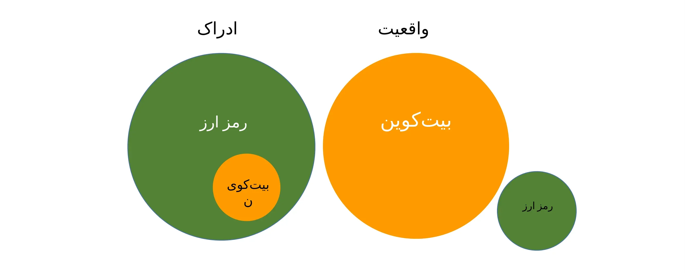

همچنین شایان ذکر است که **یک جامعه می‌تواند به‌طور کامل آنلاین وجود داشته باشد**، چه یک گروه تلگرام ("Bitcoin London")، یک گروه فیس‌بوک ("Bitcoin Berlin")، یک سرور دیسکورد ("Bitcoin Madrid")، یا حتی یک لیست ایمیل ("Bitcoin France").

به عبارت دیگر، **یک جامعه برای پیشرفت یا راه‌اندازی پروژه‌ها نیازی به ملاقات‌های حضوری ندارد. هدف اصلی آن همچنان باقی می‌ماند: به اشتراک‌گذاری، ساختن و آموزش**.

### چرا یک ملاقات ایجاد کنیم؟

همان‌طور که قبلاً ذکر شد، **ملاقات‌ها معمولاً پس از ایجاد یک جامعه صورت می‌گیرند و به تکمیل آن کمک می‌کنند**.

همان‌طور که سفر یک بیت‌کوینر تکامل می‌یابد، اغلب تمایل یا حتی نیازی وجود دارد **برای ملاقات و تعامل حضوری با دیگران** از همان اکوسیستم. این ممکن است ناشی از احساس انزوا باشد یا به سادگی نداشتن کسی برای صحبت درباره Bitcoin در زندگی روزمره.

میتاپ‌ها تجربه‌ای شخصی‌تر و خوشامدگوتر نسبت به تماس‌های صوتی یا تصویری آنلاین ارائه می‌دهند. چه **در حین نوشیدنی یا غذا**، آن‌ها فضاهای غیررسمی و دوستانه‌ای ایجاد می‌کنند که در آن افراد می‌توانند ایده‌ها را به صورت آزادانه و مستقیم Exchange کنند.

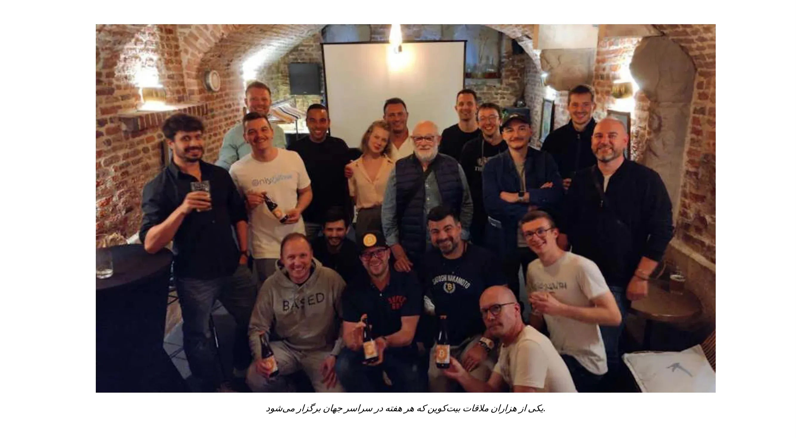

جلسات Bitcoin می‌توانند اهداف زیادی را دنبال کنند:

- بحث در مورد موضوعات فنی یا پروژه‌های در حال انجام
- کمک به بیت‌کوینرهای جدید برای به تدریج عمیق‌تر شدن در دنیای Bitcoin
- اعلام پروژه‌ها یا ابتکارات جدید
- تبادل مواد یا کتاب‌ها
- پیش‌نمایش مستندها
- میزبانی کنفرانس‌ها یا کارگاه‌های آموزشی در موضوعات خاص

ما بسیاری از این احتمالات را به‌طور مفصل در بخش ۶/۸ این دوره با عنوان "[نمونه‌هایی از پروژه‌ها و ابتکارات](https://planb.academy/courses/1c643dc9-a15f-4f9e-93b6-cb3c58b4ee35/3213d87a-1998-5972-ab93-97a5769ba279)" پوشش خواهیم داد.

در حالی که هر جامعه‌ای آزاد است نظرات خود را شکل دهد، پروژه‌ها را راه‌اندازی کند و به روش خود آزمایش کند، ملاقات‌ها به طور فزاینده‌ای **برای توسعه Bitcoin و رشد بیت‌کوینرها ضروری می‌شوند**. **سازماندهی آن‌ها نیازمند زمان و تلاش است**، به همین دلیل این دوره تجربه ترکیبی [حدود شصت جامعه Bitcoin در فرانسه و بلژیک](https://btcmap.org/communities/map#2/5.24949/0.20000) را به اشتراک می‌گذارد **تا به شما کمک کند جامعه و ملاقات‌های خود را به روان‌ترین شکل ممکن بسازید و رشد دهید**.

## کجا باید جامعه خود را ایجاد کنید؟

<chapterId>72da5285-5395-592d-ab62-303a0aef3d6d</chapterId>

اولین سوالی که باید بپرسید این است: جامعه شما باید در کجا مستقر شود؟

این تصمیم حیاتی است اگر می‌خواهید گزینه‌ی سازماندهی ملاقات‌ها را در آینده حفظ کنید.

اگر اعضا مجبور باشند دو ساعت رانندگی کنند تا در یک رویداد شرکت کنند، احتمالاً حضور کم خواهد بود. به همین دلیل انتخاب **مکان مناسب برای جامعه شما، و بنابراین ملاقات‌های آینده شما، تأثیر زیادی بر رشد آن دارد**.

چند نکته برای راهنمایی تصمیم شما:

1/ **ایجاد و رشد جامعه خود در یک شهر متوسط یا بزرگ**. این کار را آسان‌تر می‌کند تا:

    - یافتن مکان‌های دلپذیر برای ملاقات‌ها و پروژه‌ها (ارائه‌ها، کارگاه‌ها، ترویج پذیرش Bitcoin و غیره)؛
    - افزایش حس مشارکت و تعلق در میان تعداد بیشتری از افراد؛
    - بهبود دسترسی به رویداد (حمل و نقل عمومی، پارکینگ و غیره). انتخاب مکانی نزدیک به حمل و نقل عمومی و پارکینگ به شدت توصیه می‌شود.

2/ **یک نام مرتبط با شهر خود انتخاب کنید**. این کار شناسایی جامعه شما را برای مردم آسان می‌کند. مثال‌ها: Bitcoin Paris، Einundzwanzig Berlin، Satoshi Spritz Milano، و غیره.

3/ **بررسی کنید که آیا یک ملاقات در نزدیکی شما وجود دارد**.

شما می‌توانید [btcmap.org](https://btcmap.org/communities/map#0/0/0/) را بررسی کنید، که اکثر جوامع و ملاقات‌های Bitcoin در سراسر جهان را فهرست می‌کند.

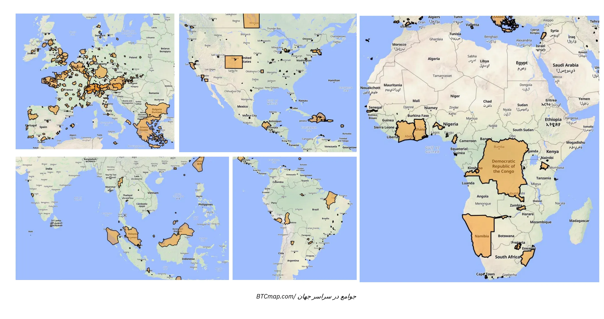

پس از کمی تحقیق، ممکن است یک ملاقات یا جامعه موجود در شهر خود پیدا کنید.

Bitcoin غیرمتمرکز است، بنابراین به طور طبیعی، هر کسی آزاد است که هر طور که می‌خواهد عمل کند.

با این حال، **همکاری اغلب منطقی‌تر از تقسیم جوامع نزدیک و کاهش تأثیر هر یک است**. ایجاد یک جامعه کاملاً جدید در جایی که یکی از قبل وجود دارد می‌تواند به طور ناخواسته رقابت ایجاد کند.

از این نظر، یک "قاعده کلی" ساده می‌تواند کمک کند: اگر هیچ جامعه فعال Bitcoin در فاصله ۳۰-۴۵ دقیقه‌ای از محل زندگی شما وجود ندارد، ممکن است ارزش شروع یک جامعه جدید را داشته باشد. با این حال، شما همیشه آزادید که هر طور که می‌خواهید عمل کنید.

و البته، اگر یک جامعه قدیمی‌تر در مسیری "تکامل" یافته که دیگر با ارزش‌های شما همخوانی ندارد و شما زمان یا انگیزه‌ای برای "پرتقالی کردن" آنها ندارید، ایجاد Fork خودتان همیشه یک گزینه است.

## چه اهدافی باید جامعه شما را راهنمایی کنند؟

<chapterId>0aae1aa8-93ec-544a-ad88-22d32c619595</chapterId>

هنگامی که شهر (یا منطقه جغرافیایی) مورد نظر برای جامعه خود را شناسایی کردید، زمان آن رسیده است که **تعریف کنید چه چیزی می‌خواهید به دست آورید**.

این اهداف می‌توانند درست در زمان راه‌اندازی تعیین شوند یا بعداً، زمانی که چندین عضو به گروه پیوسته‌اند و گروه شما به‌طور فعال درگیر است، اصلاح شوند.

در اینجا چند نکته برای راهنمایی تفکر شما آورده شده است:

1/ **چرا به عنوان یک بیت‌کوینر این جامعه را ایجاد می‌کنم؟** آیا برای به اشتراک گذاشتن دانش است؟ آموزش دیگران؟ یادگیری از همتایان با تجربه‌تر؟ ملاقات با افراد همفکر؟ درگیر شدن در اکوسیستم Bitcoin؟ ارتباط با حرفه‌ای‌ها؟ یا صرفاً نوشیدن و پیدا کردن دوستان جدید؟

پاسخ‌های شما موقعیت و انگیزه شما را شکل خواهند داد.

اگر هدف شما **به اشتراک گذاشتن دانش و آموزش مردم درباره Bitcoin** است، بر **ایجاد محتوای آموزشی** (مقالات، پادکست‌ها، ویدئوها، ارائه‌ها، بروشورها و غیره) تمرکز کنید و دیگران را از ساعت‌ها تحقیق بی‌نیاز کنید. حتی می‌توانید با **برگزاری کارگاه‌ها، ارائه‌ها و کنفرانس‌ها** یک قدم فراتر بروید.

اگر هدف شما صرفاً ملاقات با دیگر بیت‌کوینرها و به اشتراک گذاشتن تجربیات است، می‌توانید رویکردی آرام‌تر داشته باشید، مانند ملاقات برای نوشیدنی.

به این ترتیب، شما به راحتی پیوندهای اجتماعی ایجاد خواهید کرد. با این حال، همیشه به یاد داشته باشید که **نوشیدن آبجو راه درستی برای ساختن دنیای فردا نیست**.

این است که چرا **تعیین اهداف و پروژه‌های مشخص ضروری است**.

۲/ آیا باید به جامعه خود یک **بُعد فیزیکی** بدهم؟ اگر بله، چه نوع رویدادهایی باید سازماندهی کنید؟

اولین رویداد شما احتمالاً یک گردهمایی خواهد بود. هدف اصلی آن: گرد هم آوردن بیت‌کوینرها در منطقه شما.

با این حال، همان‌طور که بعداً در [نمونه‌هایی از پروژه‌ها و ابتکارات](https://planb.academy/courses/1c643dc9-a15f-4f9e-93b6-cb3c58b4ee35/3213d87a-1998-5972-ab93-97a5769ba279) خواهیم دید، **یک گردهمایی می‌تواند به روش‌های مختلف و با اهداف گوناگون ساخته شود:**

- شبکه‌سازی را با یک ارائه آموزشی درباره مفهوم Bitcoin ترکیب کنید؛
- میزبانی یک نمایش حرفه‌ای از راه‌حل‌های Bitcoin؛
- استراتژی‌های مناظره برای معرفی بیت‌کوین به بازرگانان محلی؛

و غیره.

بسته به موضوعات (گفتگوهای فنی یا کارگاه‌های عملی)، حتی ممکن است منطقی باشد که **رویدادهای اضافی** خارج از ملاقات‌های منظم خود سازماندهی کنید.

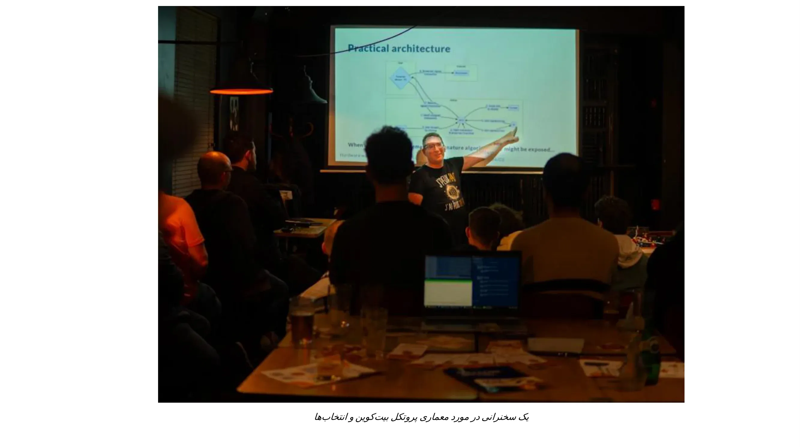

۳/ چگونه می‌خواهم جامعه من به اکوسیستم Bitcoin کمک کند؟

این یک سوال پیشرفته‌تر است، اما ارزش دارد که از همان ابتدا به آن فکر کنید.

اگر چشم‌انداز شما **ایجاد یک جامعه منسجم و با انگیزه** است که بر روی آشنا کردن هر چه بیشتر افراد با بیت‌کوین تمرکز دارد، پس:

- با جوامع موجود همکاری کنید تا به اطلاعات گسترده‌تر، منابع متن‌باز و پشتیبانی ارزشمند در صورت نیاز دسترسی پیدا کنید.
- وظایف را در گروه خود سازماندهی و واگذار کنید تا تلاش‌های خود را به‌طور مؤثر گسترش و مقیاس‌بندی کنید.

**اهداف کوتاه‌مدت، میان‌مدت و بلندمدت تعیین کنید**

یک راه عملی برای برنامه‌ریزی، تعیین اهداف برای هر بازه زمانی است:

- کوتاه‌مدت: حضور در رسانه‌های اجتماعی را ایجاد کرده و کانال‌های ارتباطی جامعه را راه‌اندازی کنید.
- میان‌مدت: ایجاد منابع آموزشی (مقالات، بروشورها، ویدئوها).
- در بلندمدت: برگزاری ملاقات‌های حضوری منظم.

هنگامی که ملاقات‌ها برقرار شدند، می‌توانید هدف‌گذاری کنید برای:

- کوتاه‌مدت: برگزاری کارگاه‌ها یا ارائه‌ها در موضوعات خاص
- میان‌مدت: اجرای کمپین‌های آگاهی‌بخشی یا آموزشی Bitcoin
- بلندمدت: ایجاد یک انجمن رسمی یا شراکت با یک بار که Bitcoin را به عنوان پرداخت می‌پذیرد.

آماده باشید: **ساختن یک جامعه نیاز به تلاش دارد**

ایجاد یک جامعه یک شبه اتفاق نمی‌افتد. این کار نیاز به زمان، انگیزه و سازماندهی دارد.

گاهی اوقات، این وضعیت می‌تواند دلسردکننده باشد، به‌ویژه زمانی که هیچ‌کس حضور ندارد و احساس می‌کنید تنها کسی هستید که این مأموریت را بر دوش می‌کشید.

به همین دلیل **این دوره طراحی شده است تا منابع ارزشمند و نکات مفیدی را به اشتراک بگذارد، به جوامع کمک کند تا به طور مؤثر رشد کنند و در نهایت به خودکفایی برسند.**.

# طراحی هویت جامعه Bitcoin

<partId>da6673ad-bf49-5979-80a6-3f69cfb28046</partId>

## چرا و چگونه می‌توانید هویت خود را ایجاد کنید؟

<chapterId>b48a18cc-afdf-5216-802c-32647b5cd8a3</chapterId>

در این مرحله، ما فرض می‌کنیم که:

- شما قبلاً می‌دانید که جامعه شما (یا ملاقات‌های منظم آینده) در کجا مستقر خواهد شد.
- شما اهدافی برای افق‌های زمانی مختلف تعیین کرده‌اید، حتی اگر هنوز نهایی نشده باشند.

گام بعدی در ساخت جامعه شما این است که **هویت آن را تعریف کنید**، هم نام و هم سبک بصری آن.

این بخش آموزش‌ها و راه‌حل‌های نرم‌افزاری مناسب مبتدیان را ارائه می‌دهد تا به شما کمک کند هویت بصری جامعه خود را طراحی کنید، حتی با مهارت‌های ابتدایی.

**چرا هویت مهم است؟**

مردم زمانی که می‌توانند با یک گروه همذات‌پنداری کنند، احساس مشارکت و تعهد بیشتری دارند. یک هویت قوی به جامعه شما کمک می‌کند تا برجسته شود و حس تعلق را تقویت کند.

همه چیز با انتخاب یک نام شروع می‌شود و هر کشور اغلب روندهای خاص خود را دارد:

- فرانسه: اکثر ۶۰+ جامعه محلی از نام‌هایی مانند "Bitcoin [CITY]" یا "[CITY] Bitcoin" استفاده می‌کنند. گروه‌های تلگرام آن‌ها اغلب از این الگو پیروی می‌کنند: "Bitcoin [CITY] meetup".
- آلمان: ابتکار Einundzwanzig (به معنای "21") نام‌هایی مانند "Einundzwanzig [CITY]" را الهام بخشید.
- ایتالیا: شبکه Satoshi Spritz از نام‌هایی مانند Satoshi "Spritz [CITY]" استفاده می‌کند.

**هر جامعه‌ای هویت خاص خود را دارد که به زادگاهش پیوند خورده، اما با هویت گسترده‌تر کشورش نیز مرتبط است.**

هویت بصری شما: لوگو، رنگ‌ها، بنرها، چیزی است که مردم به یاد خواهند آورد و با گروه شما مرتبط خواهند کرد.

هنگام ایجاد حساب‌های رسانه‌های اجتماعی و کانال‌های ارتباطی، داشتن یک لوگو و بنر یک امتیاز قوی است. نگران نباشید، نیازی به مهارت‌های طراحی حرفه‌ای ندارید؛ ابزارهای رایگان و آسان برای استفاده در دسترس هستند.

یک نقطه شروع عالی این است که یک نماد یا سمبل از شهر خود را بگنجانید. در پاریس، این ممکن است برج ایفل باشد. در لیل، ناقوس یا قلعه. در نیویورک، مجسمه آزادی. در لندن، بیگ بن، و به همین ترتیب.

از آنجا، می‌توانید بسته به ترجیح خود، یک لوگوی ساده یا پیچیده‌تر طراحی کنید.

برای ارائه چند ایده، در اینجا چند نمونه از لوگوهای جامعه فرانسوی آورده شده است:

- در مارسی، لوگو نمایانگر کلیسای نوتردام دو لا گارد است که بر شهر مشرف است:

- در موناکو، به سنگ مونگاسک اشاره دارد:

- در لیل، لوگوی شیک نشان‌دهنده قلعه ووبان و پارک آن است:

- در سن-مالو، قاقم - نماد شهر - برجسته شده است:

**اگر دوست دارید بیشتر پیش بروید**

اگر الهام به شما دست داد، می‌توانید آن را حتی بیشتر گسترش دهید: یک نشان، یک شعار، یا حتی یک آهنگ برای جامعه خود ایجاد کنید. خلاقیت شما تنها محدودیت است!

## ایجاد یک لوگو، پوستر و بنر

<chapterId>3470a31f-0190-5e87-8af0-6a00e79267ef</chapterId>

### استفاده از Canva

شما می‌توانید از [Canva](https://www.canva.com/) برای ایجاد تصاویر مختلف برای جامعه خود استفاده کنید.

این پلتفرم رایگان و آسان برای استفاده به خاطر کتابخانه بزرگ قالب‌های از پیش طراحی شده‌اش که می‌توانید تنها با چند کلیک آن‌ها را کپی و سفارشی‌سازی کنید، محبوب است.

**ایجاد لوگوی شما**

در صفحه اصلی Canva، به دنبال لوگوهای از پیش طراحی شده بگردید. یکی یا چند مورد که شما را الهام می‌بخشند انتخاب کنید، آن‌ها را تکثیر کرده و سپس برای مطابقت با جامعه خود سفارشی‌سازی کنید.

می‌توانید یک نشانه محلی یا نماد را به پس‌زمینه اضافه کنید (یک عکس وارد کنید یا در منوی "Illustrations" یا "Images" در Elements جستجو کنید)، سپس لوگوی Bitcoin یا ₿ را روی آن قرار دهید و در صورت نیاز رنگ آن را تنظیم کنید.

**ایجاد بنرها و پوسترها**

برای ایجاد یک بنر یا پوستر، در کتابخانه Canva به دنبال قالب‌های از پیش طراحی شده بگردید. پس از کپی کردن یکی، متن و فونت‌ها را تغییر دهید، لوگوی جامعه خود را اضافه کنید و با استفاده از قاب‌ها هر عکسی را وارد کنید (در منوی Elements به دنبال "قاب" بگردید).

شما همچنین می‌توانید از منوی طراحی‌ها برای کاوش مدل‌های اضافی که با نیازهای شما مطابقت دارند، استفاده کنید.

برای تصاویر بندانگشتی یا بنرهای یوتیوب، به سادگی به دنبال آن قالب‌ها بگردید، آن‌ها را کپی کرده و به دلخواه خود سفارشی‌سازی کنید.

به طور خلاصه، **امکانات بی‌پایان هستند و نه تنها توسط نیازهای شما بلکه توسط سبک بصری که می‌خواهید برای جامعه و ملاقات‌ها / رویدادهای خود ایجاد کنید، شکل می‌گیرند!**

برای ارائه یک ایده واضح‌تر، ما یک ویدیو آموزشی غیر جامع را شامل کرده‌ایم که برخی از این امکانات را به نمایش می‌گذارد:

:::video id=d11ae0ed-eacd-4924-afd3-75aff95d2899:::

**الگوهای نمونه از Bitcoin لیل**

در اینجا قالب‌های آماده Canva وجود دارد که می‌توانید آن‌ها را تکرار کرده و برای جامعه خود تطبیق دهید:

- **پوستر اعلامیه ملاقات** (برای رسانه‌های اجتماعی و چاپ A4/A3): [link](https://www.canva.com/design/DAGBvBXFJ8A/92-j_toeLU8QbVAD0NwoAA/edit?utm_content=DAGBvBXFJ8A&utm_campaign=designshare&utm_medium=link2&utm_source=sharebutton)

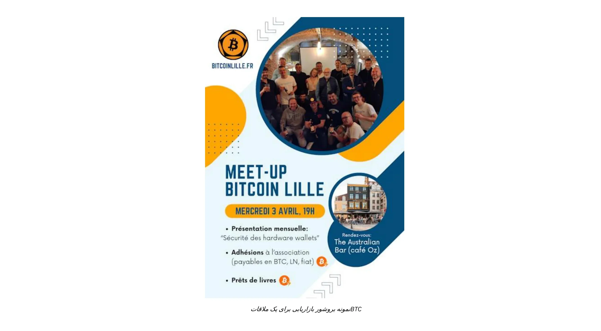

- **پوستر رویداد** (برای شبکه‌های اجتماعی و چاپ A4/A3): [لینک](https://www.canva.com/design/DAGBvG3rNCc/oXtNR9pduRs22AqclG4O2g/edit?utm_content=DAGBvG3rNCc&utm_campaign=designshare&utm_medium=link2&utm_source=sharebutton)

- **بنرهای شبکه‌های اجتماعی**: [لینک](https://www.canva.com/design/DAGBvOXyNqw/iSJG9PbIQHgGWHz5PhlXSQ/edit?utm_content=DAGBvOXyNqw&utm_campaign=designshare&utm_medium=link2&utm_source=sharebutton)

- **اعلامیه مسابقه**: [لینک](https://www.canva.com/design/DAGBvIjuA_w/YzSUXzOmbNV9oCma9mluOw/edit?utm_content=DAGBvIjuA_w&utm_campaign=designshare&utm_medium=link2&utm_source=sharebutton)

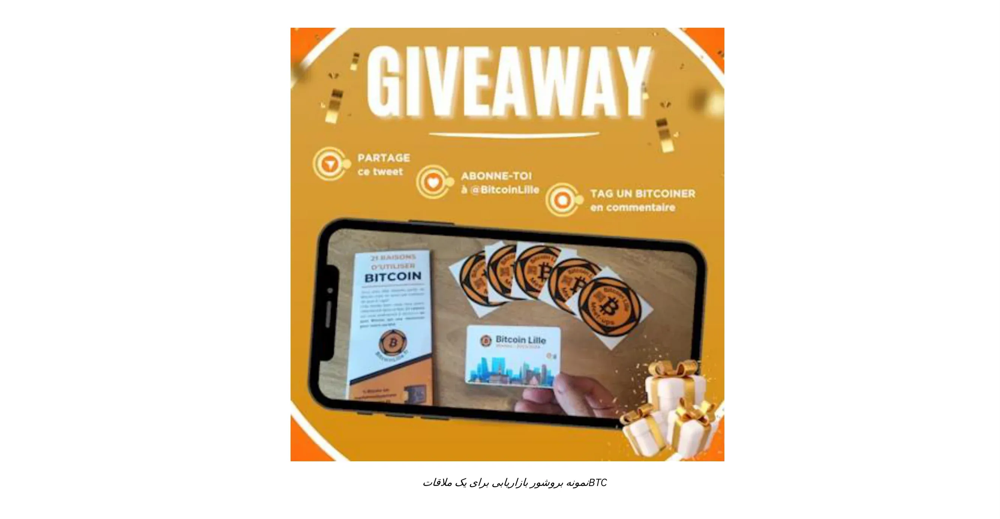

- **راهنمای برند** کتابخانه ما، نمایش داده شده بر روی A4 در گردهمایی‌ها: [link](https://www.canva.com/design/DAGBvPqL7N4/LmUItfsysypRLSOFOzBXcQ/edit?utm_content=DAGBvPqL7N4&utm_campaign=designshare&utm_medium=link2&utm_source=sharebutton)

- ارائه پاورپوینت **"فصل ۲ - درک تراکنش‌های Bitcoin"**، توسط @ProfEduStream: [لینک](https://www.canva.com/design/DAFsEcnOro8/Mz9FYdTGhsvozZOe0Y9jtw/edit?utm_content=DAFsEcnOro8&utm_campaign=designshare&utm_medium=link2&utm_source=sharebutton)

- **فلایر** "21 دلیل برای استفاده از Bitcoin"، نوشته شده توسط @ProfEduStream: [لینک](https://www.canva.com/design/DAFtAR1NauQ/ZDwl2CchIJ9Gpb36N6-7iw/edit?utm_content=DAFtAR1NauQ&utm_campaign=designshare&utm_medium=link2&utm_source=sharebutton)

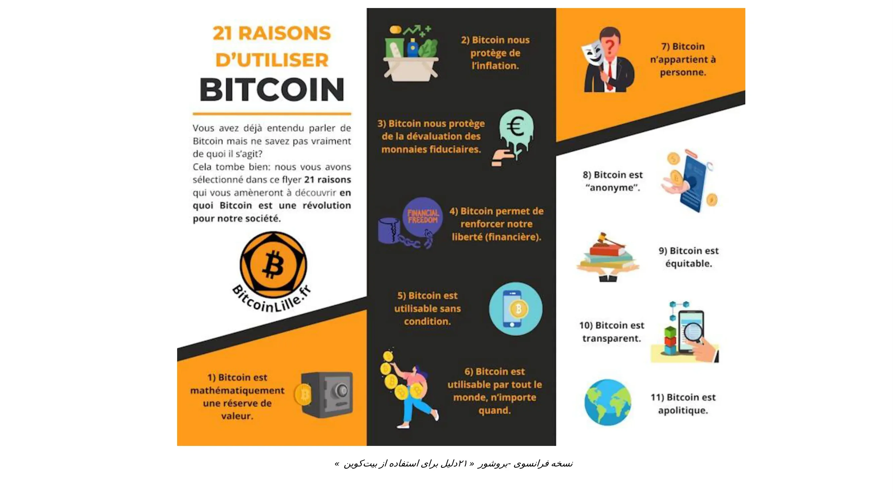

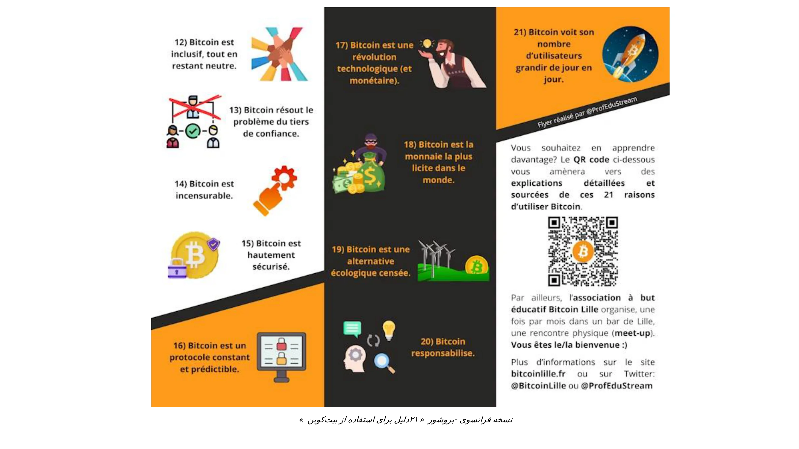

**ایجادهای خود را به اشتراک بگذارید**

امکانات بی‌پایان هستند و طراحی‌های شما به اهداف و هویت بصری شما بستگی خواهد داشت. در نظر بگیرید که قالب‌های خود را به صورت منبع باز به اشتراک بگذارید، این کار برای سایر جوامع Bitcoin که به ناچار با چالش‌های مشابه شما روبرو خواهند شد، زمان صرفه‌جویی می‌کند. با به اشتراک‌گذاری، به تسریع رشد جوامع Bitcoin در همه جا کمک می‌کنید.

**ابعاد پیشنهادی**

هنگام ایجاد تصاویر، همیشه الزامات اندازه برای هر پلتفرم را بررسی کنید:

| Platform | Logo | Banner | Poster / Image
| -------- | -------- | -------- | -------- |
| Telegram     | 512 x 512     | N/A     | N/A     |
| Signal     | N/A     | N/A     | N/A     |
| Twitter     | 400 x 400     | 1500 x 500     | 1200 x 628     |
| Meet-up     | N/A     | N/A     | N/A     |
| Discord     | 512 x 512     | 960 x 540     | N/A     |
| Facebook     | 512 x 512     | 851 x 315     | 960 x 720     |

معمولاً اندازه‌های مناسب:

لوگوها: 512 در 512 پیکسل

بنرها: بسته به برنامه یا سایت متفاوت است

پوسترها: A4 فرمت استاندارد چاپ است

### استفاده از هوش مصنوعی

در حالی که Canva مجموعه گسترده‌ای از ابزارها برای ایجاد لوگوها، پوسترها، بنرها و بروشورها ارائه می‌دهد، تنها گزینه موجود نیست. اگر با نرم‌افزارهای دیگر (مانند Photoshop یا Illustrator) راحت‌تر هستید، از آنچه برای شما بهتر کار می‌کند استفاده کنید.

با این اوصاف، چه در حال طراحی یک لوگوی جامعه باشید و چه در حال بهبود پوسترها، ارائه‌ها یا بروشورها، **هوش مصنوعی می‌تواند یک همکار قدرتمند برای ایجاد تصاویر منحصر به فرد و جذاب باشد**.

تعدادی از هوش‌های مصنوعی برای این منظور در دسترس هستند. این‌ها شامل

- [midjourney](https://docs.midjourney.com/docs/quick-start) (پرداخت‌شده)؛
- [leonardo](https://leonardo.ai/) (رایگان، با محدودیت حساب)؛
- [copilot](https://copilot.microsoft.com/) (رایگان، محدود به حساب کاربری)؛
- [DALL-E](https://www.dall-efree.com/) (پرداختی).

ابزارهای هوش مصنوعی بسیاری اخیراً ظهور کرده‌اند، بنابراین این فهرست به هیچ وجه جامع نیست.

**مثال: ایجاد یک لوگوی آینده‌نگر Bitcoin لندن**

اگر می‌خواهید یک لوگوی آینده‌نگرانه برای گردهمایی "Bitcoin London" طراحی کنید، می‌توانید از Copilot بپرسید:

- [ ] *پیشنهاد: ایجاد یک لوگوی Bitcoin با پل لندن و بیگ بن در پس‌زمینه. آینده‌نگر* - [لینک](https://copilot.microsoft.com/images/create/un-logo-Bitcoin-futuriste-avec-en-arric3a8re-plan-le-/1-6612ba1758df4384bc33c4bca00ab45b?FORM=SYDBIC)

اگر چهار نتیجه اول به اندازه کافی واقع‌بینانه نیستند، درخواست خود را اصلاح کنید:

- [ ] *درخواست: چهارمی را بسیار واقعی‌تر کنید* - [لینک](https://copilot.microsoft.com/images/create/un-logo-Bitcoin-futuriste-avec-en-arric3a8re-plan-le-/1-6612ba64b72d4cea9830ab7eb844f785?FORM=SYDBIC)

آخرین نتیجه عالی شد!

**مثال: ایجاد یک لوگوی ساده به سبک بریتانیایی**

برای ظاهری تمیزتر، مانند یک برچسب:

- [ ] *درخواست: لوگوی "London Bitcoin Meetup" را با سبک بریتانیایی و تمیز ایجاد کنید* - [لینک](https://copilot.microsoft.com/images/create/logo-for-27londres-Bitcoin-meetup27-with-a-british-a/1-6612bb9451924859a6c34b350b3a6ebc?FORM=SYDBIC)

نتیجه واقعاً عالی به نظر می‌رسد!

**نکاتی برای کار با هوش مصنوعی**

- صبور باشید: ممکن است هوش مصنوعی در اولین تلاش دقیقاً آنچه را که تصور می‌کنید تولید نکند.

- از دستورات دقیق استفاده کنید: هرچه دستورالعمل‌های شما واضح‌تر و جزئی‌تر باشد، نتایج بهتری خواهید گرفت.

- درخواست کمک: اگر راضی نیستید، با کسی که در طراحی گرافیک یا ابزارهای هوش مصنوعی تجربه دارد تماس بگیرید، بسیاری از بیت‌کوینرها با خوشحالی کمک خواهند کرد، گاهی حتی به صورت رایگان یا با چند Sats.

# ایجاد کانال‌های ارتباطی برای جامعه Bitcoin شما

<partId>fc588298-6876-554c-bd57-55d182464878</partId>

## کدام کانال‌های ارتباطی را باید انتخاب کنید؟

<chapterId>b4f4eef6-1035-5290-848a-2b7f9391c77a</chapterId>

همان‌طور که در بالا ذکر شد، کانال‌های ارتباطی یک جامعه می‌توانند بر اساس انگیزه‌ها و عادات متفاوت باشند.

به عنوان مثال، **در فرانسه، آلمان و ایتالیا، تلگرام و توییتر پلتفرم‌های غالب هستند** و به "استاندارد" برای جوامع Bitcoin تبدیل شده‌اند.

در مقابل، در جمهوری چک، بسیاری از جوامع از **Matrix**، یک پروتکل پیام‌رسانی فوری امن، به جای تلگرام استفاده می‌کنند.

نکته: قبل از انتخاب کانال‌های خود، **نگاهی به کارهایی که جوامع نزدیک انجام می‌دهند بیندازید**. از نقشه [btcmap.org](https://btcmap.org/communities/map#0/0/0/) استفاده کنید تا ببینید کدام پلتفرم‌ها در منطقه شما محبوب‌تر هستند.

به عنوان مثال، جوامع سوئیسی عمدتاً از تلگرام، توییتر و وب‌سایت خود استفاده می‌کنند:

**کانال‌های پیشنهادی برای جوامع فرانسوی‌زبان**

- تلگرام: ابزار ارتباطی شماره 1، بیش از 90٪ از ملاقات‌های فرانسوی از آن استفاده می‌کنند.

- توییتر (X): شبکه اجتماعی اصلی که توسط بیت‌کوینرها در سراسر جهان استفاده می‌شود. حدود ۷۰٪ از ملاقات‌های فرانسوی از آن استفاده می‌کنند. این پلتفرم برای دسترسی به بیت‌کوینرها ایده‌آل است.

- Meetup.com: پولی اما به طور گسترده استفاده می‌شود (توسط حدود ۳۰٪ از ملاقات‌های فرانسوی و تقریباً همه ملاقات‌های کانادایی) برای افزایش دید خارج از اکوسیستم Bitcoin.

- گزینه‌های دیگر: ~30% نیز یک وب‌سایت دارند؛ ~10% سرورهای Discord یا حساب‌های NOSTR را اداره می‌کنند.

پلتفرم‌های دیگر مانند Matrix، Keet، Signal، Facebook، Instagram و LinkedIn نیز می‌توانند استفاده شوند. مراقب باشید، هرچه کانال‌های بیشتری را مدیریت کنید، زمان بیشتری را صرف نظارت، ارسال و فعال نگه‌داشتن آن‌ها خواهید کرد.

هر کسی که بخواهد یک جامعه در فرانسه راه‌اندازی کند، بنابراین بهتر است با ایجاد موارد زیر شروع کند:

- یک گروه تلگرام؛
- یک حساب توییتر.

با رشد جامعه شما، می‌توانید پلتفرم‌های بیشتری اضافه کرده و نظارت را به اعضای مورد اعتماد واگذار کنید.

## ایجاد و پیکربندی کانال، گروه یا سوپرگروه تلگرام

<chapterId>d13714ce-8f08-53e9-bedd-b6a3aaac5dad</chapterId>

قبل از ایجاد فضای ارتباطی جامعه خود در تلگرام، مهم است که تفاوت بین موارد زیر را بدانید:

- یک کانال تلگرام؛
- یک گروه تلگرام؛
- یک سوپرگروه تلگرام.

به شدت توصیه می‌شود که با یک گروه تلگرام شروع کنید.

در صورت نیاز، می‌توانید بعداً آن را به یک سوپرگروه تبدیل کنید.

برای آموزش‌های زیر، ما در ابتدا از "Telegram+" APK استفاده کردیم که امکان پیکربندی پیشرفته‌تری را فراهم می‌کند. با این حال، شما لزوماً به آن نیاز ندارید، زیرا برنامه رسمی تلگرام برای ایجاد و مدیریت گروه‌ها، حتی از طریق تلفن شما کافی است:

:::video id=b1da7cb4-5fb1-4a41-a1d4-bd90686826a9:::

### ایجاد کانال تلگرام

اگر می‌خواهید مکانی ایجاد کنید که اعضای شما بتوانند مستقیماً با یکدیگر صحبت کنند، به یکدیگر پاسخ دهند و غیره، ممکن است بخواهید یک گروه تلگرام ایجاد کنید، نه یک کانال تلگرام!

مستقیماً به بخش بعدی بروید، با عنوان [ایجاد یک گروه تلگرام](https://planb.academy/courses/1c643dc9-a15f-4f9e-93b6-cb3c58b4ee35/d13714ce-8f08-53e9-bedd-b6a3aaac5dad).

در واقع، **یک کانال تلگرام بیشتر شبیه به یک ابزار پخش یک‌طرفه برای مدیران است**. اعضا نمی‌توانند آزادانه چت کنند، آنها فقط می‌توانند با ایموجی‌ها واکنش نشان دهند (یا در رشته‌های جداگانه نظر بگذارند که مکالمات را پراکنده می‌کند).

**از آنجا که جوامع به تعامل و همکاری نیاز دارند، یک کانال تلگرام توصیه نمی‌شود** اگر هدف شما ایجاد روابط و به اشتراک‌گذاری دانش است.

آموزش ایجاد کانال تلگرام:

:::video id=98be4709-d221-4030-8c31-e10113482515:::

### ایجاد گروه تلگرام

از سوی دیگر، **یک گروه تلگرام برای جوامع ایده‌آل است**: درست مانند برنامه‌های پیام‌رسانی مانند مسنجر یا واتساپ، اعضا می‌توانند در یک گفتگوی مشترک با یکدیگر چت کرده و پاسخ دهند.

آنچه شما می‌توانید به عنوان یک مدیر انجام دهید:

- ارسال و سنجاق کردن پیام‌های مهم.
- ایجاد **نظرسنجی‌ها** (مفید برای تصمیم‌گیری در مورد تاریخ‌های ملاقات زمانی که جامعه شما جدید است).
- ایجاد **لینک دعوت سفارشی** (فقط اگر گروه "عمومی" باشد و نه "خصوصی"، که در تنظیمات تعریف شده است. همچنین داشتن لینک دعوت تلگرام خودتان مفید است، مانند: t.me/Bitcoin[CITY]);
- مدیریت مجوزها، نقش‌ها و نظارت اعضا.
- یک تصویر پروفایل (لوگوی انجمن شما) اضافه کنید و نام گروه را به‌روزرسانی کنید.

آموزش ایجاد گروه در تلگرام:

:::video id=3d4792a7-1345-475b-93b1-b3a3945fb567:::

توجه: این آموزش با استفاده از Telegram+ تهیه شده است، اما شما می‌توانید همه چیز را مستقیماً از اپلیکیشن استاندارد تلگرام موبایل انجام دهید.

### ایجاد یک سوپرگروه در تلگرام

چرا یک سوپرگروه؟

همانطور که گروه تلگرام شما به صدها عضو می‌رسد، گفتگوها می‌توانند آشفته شوند. این اغلب منجر به این می‌شود که اعضا اطلاعیه‌های مهم، مانند تاریخ ملاقات بعدی را از دست بدهند.

چندین راه‌حل موجود است:

1. **پیام‌های مهم را سنجاق کنید** تا همه اعضا اعلان دریافت کنند (یک بار با انگشت خود روی پیام مورد نظر فشار دهید، سپس "سنجاق کردن" را انتخاب کنید)؛

۲. استفاده از **Discord** را برای کانال‌های ارتباطی متعدد در نظر بگیرید، که هر یک از آن‌ها را کاربران می‌توانند در صورت نیاز بی‌صدا کنند.

۳. **گروه تلگرام خود را به سوپرگروه تبدیل کنید**.

سوپرگروه تلگرام چیست؟

یک سوپرگروه اساساً یک گروه تلگرام با موضوعات (زیرکانال‌ها) درون آن است.

نمونه موضوعات:

- "اطلاعات مهم": فقط به‌روزرسانی‌های کلیدی و اعلامیه‌های رویدادها.
- "عمومی": برای تمامی بحث‌های اعضا.
- موضوعات خاص: به عنوان مثال، Mining، توسعه پروژه، کنفرانس‌های آینده.

نکته: موضوعات خود را با نیازهای جامعه‌تان تطبیق دهید. مثال: گردهمایی Abidjan Bitcoin با موفقیت از این قالب استفاده می‌کند.

به خاطر داشته باشید که **سوپرگروه‌های تلگرام ممکن است برای برخی از اعضا کمی پیچیده باشند**. به عنوان مثال، همه نمی‌دانند **چگونه به موضوعات مختلف دسترسی پیدا کنند** (آنها فقط باید روی لوگوی گروه در منوی اصلی تلگرام ضربه بزنند تا لیست کامل موضوعات را ببینند). ارسال یک اسکرین‌شات سریع می‌تواند به رفع هرگونه سردرگمی کمک کند.

هیچ قانون سختی برای زمان تغییر از یک گروه معمولی تلگرام به یک سوپرگروه وجود ندارد، این واقعاً به نیازهای اعضای شما بستگی دارد. خبر خوب این است که شما می‌توانید به راحتی بین این دو جابجا شوید: به سادگی یک موضوع ایجاد کنید تا به سوپرگروه تبدیل شود یا تمام موضوعات به جز "عمومی" را حذف کنید تا به یک گروه معمولی بازگردید.

آموزش ایجاد یک سوپرگروه تلگرام:

:::video id=f78800ae-d8ca-479a-b913-99abd9916bff:::

توجه سریع: همان‌طور که قبلاً ذکر شد، آموزش بالا با استفاده از "Telegram+" APK بر روی کامپیوتر ساخته شده است. با این حال، امروز ایجاد یک سوپرگروه تلگرام بر روی تلفن شما ساده است.

فقط یک گروه تلگرام ایجاد کنید، به تنظیمات آن بروید و دکمه "موضوعات" را بزنید تا موضوعات را اضافه کنید. پس از ذخیره، لیستی از موضوعات را خواهید دید که می‌توانید به دلخواه ویرایش کنید.

بنابراین، دیگر نیازی به دانلود "Telegram+" نیست، مگر اینکه بخواهید به تنظیمات پیشرفته‌تری برای حریم خصوصی سوپرگروه خود دسترسی داشته باشید.

## راه‌اندازی گروه یا سوپرگروه تلگرام شما

<chapterId>35e674b3-5924-50b0-98f1-83a56c9a186d</chapterId>

اکنون که گروه تلگرام شما (یا سوپرگروه) راه‌اندازی شده است، زمان آن رسیده که **مجوزها را پیکربندی کرده و تنظیمات مدیریت را انجام دهید**.

هر جامعه‌ای آزاد است که رویکرد خود را انتخاب کند، اما تجربه نشان می‌دهد که **بهتر است برخی از مجوزهای اعضا محدود شود**:

- ارسال یک نظرسنجی؛
- ارسال فایل‌ها (برای جلوگیری از ویروس‌های احتمالی)؛
- ارسال پیام‌های صوتی؛
- افزودن کاربران (به جلوگیری از هجوم ربات‌ها کمک می‌کند)؛
- سنجاق کردن پیام‌ها؛
- ویرایش اطلاعات گروه.

هنگام ایجاد گروه یا سوپرگروه تلگرام خود، **نوشتن توضیحی واضح از ملاقات خود** به شدت توصیه می‌شود، زیرا این اولین چیزی است که اعضای بالقوه خواهند دید. برای مثال:

> به تلگرام @Bitcoin [CITY] خوش آمدید 🔥
>

> ما هر اولین چهارشنبه ماه یک گردهمایی در بار [BAR_NAME]، در [CITY] برگزار می‌کنیم 🍻
>

> شبکه‌های اجتماعی دیگر ما را بررسی کنید: [LINK] 🌐

در این مثال، مدیران Bitcoin Lille لینک عمومی تلگرام خود را برای اشتراک‌گذاری آسان‌تر سفارشی کرده‌اند.

در "تنظیمات گروه"، ممکن است عاقلانه باشد که **"تأیید اعضای جدید"** را فعال کنید.

برخی از گروه‌های تلگرام Bitcoin هدف هزاران حساب جعلی قرار گرفته‌اند که برای ارسال هرزنامه یا ایجاد اختلال در جامعه طراحی شده‌اند.

**فعال‌سازی تأیید عضویت می‌تواند گروه شما را از حمله اسپم نجات دهد.**

در بخش مدیران، می‌توانید ویژگی "ضد اسپم تهاجمی" را فعال کنید تا پیام‌های مشکوک به‌طور خودکار حذف شوند.

این همیشه ضروری نیست اما می‌تواند یک لایه اضافی Layer از حفاظت اضافه کند.

## افزودن یک ربات چندکاره به گروه تلگرام خود

<chapterId>c61f69cc-15ec-53f1-8c02-1cea55def09e</chapterId>

**گزینه دیگری برای پیکربندی و ایمن‌سازی گروه یا سوپرگروه تلگرام شما اضافه کردن یک ربات چندکاره است**. این به شما امکان می‌دهد تا به طور قابل توجهی ویژگی‌ها و قابلیت‌های نظارتی گروه خود را گسترش دهید.

استفاده از **ربات [@GroupHelpBot](https://telegram.me/grouphelpbot)**، مفیدترین گزینه‌ها عبارتند از:

- یک **دستور قوانین** (/rules) برای نمایش دستورالعمل‌های جامعه شما؛
- **محافظت ضد هرزنامه** برای فیلتر کردن پیام‌ها و حساب‌های مشکوک؛
- **پیام‌های خوش‌آمدگویی خودکار قابل تنظیم** برای اعضای جدید (با امکان حذف خودکار پس از چند دقیقه)
- **محافظت ضد سیل** برای جلوگیری از هرزنامه پیام
- یک **@administrator command** برای دسترسی سریع به مدیران گروه
- قوانین **مسدودسازی** برای محتوای ناخواسته
- یک **دستور لینک گروه** (/link)
- مدیریت **مجوز**
- **حذف خودکار** انواع خاصی از پیام‌ها
- **مسدود کردن ربات** و **مسدود کردن ورود/خروج** برای حفظ امنیت گروه شما
- فهرست **شبکه‌های اجتماعی جامعه شما** (/networks)
- و خیلی بیشتر...

ویژگی‌های بی‌شمار اضافی در دسترس هستند.

نکته حرفه‌ای: **مکالمه را بیش از حد محدود نکنید**.

آموزش اضافه کردن یک ربات چندکاره به گروه یا سوپرگروه تلگرام:

:::video id=cdbf82d6-3530-45c4-90de-593f100863bb:::

(توجه: اکنون می‌توانید این فرآیند را مستقیماً از طریق تلفن همراه خود انجام دهید. دیگر نیازی به برنامه Telegram+ نیست.)

## یک سرور دیسکورد بسازید

<chapterId>eef2a965-4c24-5f3a-8013-72cc7d315314</chapterId>

وقتی گروه تلگرام شما بیش از حد بزرگ می‌شود، تبدیل آن به یک سوپرگروه تلگرام می‌تواند به سازماندهی بحث‌ها کمک کند.

با این حال، همان‌طور که قبلاً ذکر شد، **پیچیدگی افزوده و افزایش موضوعات و پیام‌ها ممکن است باعث شود برخی از اعضای فعال علاقه خود را از دست بدهند**.

چرا دیسکورد را در نظر بگیریم؟

**دیسکورد جایگزینی** برای یک سوپرگروه تلگرام است زیرا به کاربران اجازه می‌دهد **اتاق‌های چت متنی و صوتی خاصی ایجاد کنند** و به اعضا اجازه می‌دهد هر کانالی که به آن علاقه‌ای ندارند را بی‌صدا کنند.

البته، مدیریت هر دو تلگرام و دیسکورد نیاز به زمان بیشتری دارد، به‌ویژه در طول پیکربندی و راه‌اندازی.

برای راحتی شما، **ما یک [سرور دیسکورد که می‌توانید آن را کپی و سفارشی‌سازی کنید](https://discord.com/template/bDY4eXXJk2C8) به اشتراک می‌گذاریم**:

:::video id=e647458a-a21e-44e0-bd03-20b82a871777:::

هنگامی که به خوبی طراحی شود، یک سرور دیسکورد می‌تواند یک دارایی واقعی برای جامعه شما باشد. بسیاری از بیت‌کوینرها از قبل به صورت روزانه از **دیسکورد** استفاده می‌کنند و توانایی دنبال کردن مکالمات تلگرام به طور مستقیم درون دیسکورد (و بالعکس) می‌تواند برای همه صرفه‌جویی زیادی در زمان داشته باشد.

برای همگام‌سازی هر دو پلتفرم، یک ربات متن‌باز به نام [TediCross](https://github.com/TediCross/TediCross) وجود دارد. هدف آن ساده است: به‌طور خودکار پیام‌ها را از یک کانال متنی دیسکورد به یک گروه تلگرام (یا موضوعی در یک سوپرگروه) و بالعکس ارسال کند.

با این حال، به خاطر داشته باشید که نصب آن چندان آسان نیست. برای کار کردن ربات، باید یک پنجره فرمان (CMD) را روی کامپیوتر خود باز نگه دارید و ممکن است گاهی اوقات خطاهایی رخ دهد. خوشبختانه، رفع آن ساده است: فقط ربات را مجدداً راه‌اندازی کنید و در بیشتر مواقع، همه چیز به حالت عادی برمی‌گردد.

برای صرفه‌جویی در وقت شما، در اینجا یک آموزش در مورد نحوه افزودن این ربات چندکاره به یک گروه یا سوپرگروه تلگرام آمده است:

:::video id=6a0283f6-6d6c-4e81-8b2f-644b33c52fe6:::

## کانال‌های ارتباطی جایگزین، خصوصی و امن‌تر را در نظر بگیرید

<chapterId>29d0aad6-0612-5dd0-bcef-7337eaf4fefc</chapterId>

همان‌طور که قبلاً بحث شد، توییتر و تلگرام پرکاربردترین ابزارهای ارتباطی برای جوامع Bitcoin در اروپا (اگر نگوییم در سراسر جهان) هستند.

با این حال، تلگرام دقیقاً به عنوان امن‌ترین یا حریم‌خصوصی‌محورترین اپلیکیشن پیام‌رسان شناخته نمی‌شود، و توییتر، که اکنون X نامیده می‌شود، متعلق به یکی از آزادترین شرکت‌های جهان است.

به همین دلیل، زمانی که کانال‌های اصلی شما در جای خود قرار دارند و همه چیز به خوبی پیش می‌رود، می‌تواند ارزشمند باشد که زمانی را برای بررسی گزینه‌های دیگر اختصاص دهید.

در ماه‌های آینده، این دوره و پلتفرم planb.network آموزش‌هایی در مورد نحوه استفاده از پروتکل‌های جایگزین مانند **Simplex و Element** ارائه خواهند داد: ابزارهای ارتباطی غیرمتمرکز، رمزگذاری‌شده و بسیار قابل تنظیم.

**چرا به بررسی این گزینه‌ها زحمت بدهیم؟**

زیرا، درست مانند شبکه اجتماعی NOSTR، آنها نه تنها حریم خصوصی بیشتری را فراهم می‌کنند بلکه محافظی در برابر سانسور یا تعطیلی خودسرانه گروه تلگرام شما نیز هستند.

و واقعاً، چه چیزی می‌تواند بیشتر با روحیه Bitcoin همخوانی داشته باشد تا اینکه به‌طور ذاتی در برابر سانسور مقاوم و پایدار باشد؟

# شبکه‌های اجتماعی خود را راه‌اندازی کنید

<partId>8ebf8cd7-9248-543f-bc27-4ec4cc03f9cf</partId>

## اهمیت دیده شدن برای رشد جامعه Bitcoin شما

<chapterId>b20f12e4-c5de-5f02-80c7-b7fc6cadd3ac</chapterId>

بنابراین، جامعه شما راه‌اندازی شده است. فضای تلگرام یا ماتریکس خود را راه‌اندازی کرده‌اید... اما فعلاً، شما تنها کسی هستید که آنجا حضور دارید. **وقت آن است که به مردم بگویید شما وجود دارید!**

این ساده است: اگر هیچ‌کس نتواند به گروه شما دسترسی پیدا کند و ببیند که ملاقات بعدی چه زمانی اتفاق می‌افتد، شما فقط در حال ارسال به خلاء خواهید بود. به همین دلیل رسانه‌های اجتماعی و چند پلتفرم خاص که بعداً به آن‌ها خواهیم پرداخت، برای ساختن جامعه شما بسیار مهم هستند.

توییتر (X) تقریباً مترادف با گفتگوی آنلاین Bitcoin شده است. این پلتفرم کامل نیست، و فاصله زیادی تا کمال دارد، اما در حال حاضر جایی است که بخش بزرگی از جامعه گرد هم می‌آیند. ایجاد یک حساب کاربری در آنجا به شدت توصیه می‌شود.

برای پیشی گرفتن از سانسور یا محدودیت‌های احتمالی، برخی جوامع همچنین یک پروفایل NOSTR باز می‌کنند.

این همان کاری است که گروه FREE Madeira انجام داده است.

البته، پلتفرم‌های دیگر هم می‌توانند مفید باشند. فیسبوک (با یک گروه یا صفحه)، یا حتی لینکدین.

با این حال، به خاطر داشته باشید که **هرچه کانال‌های ارتباطی و شبکه‌های اجتماعی بیشتری را مدیریت کنید، زمان بیشتری نیاز دارد**. اغلب بهتر است **روی مرتبط‌ترین آن‌ها تمرکز کنید**، توییتر (و NOSTR) گزینه‌های خوبی برای شروع هستند.

## یک پروفایل توییتر ایجاد کنید

<chapterId>c8d73097-8eba-5530-918c-221002954110</chapterId>

توییتر بسیار آسان برای استفاده است، و برای بهبود حریم خصوصی خود، باید چند تنظیمات را تغییر دهید.

**هنگام ایجاد یک حساب کاربری جدید در توییتر، باید چهار قطعه اطلاعات ضروری وارد شود:**:

1/ **@ توییتر** که هویت شما را تعریف می‌کند و پیدا کردن شما را آسان می‌سازد. اگر نام انجمن شما "Bitcoin [CITY]" است، انتخاب "@Bitcoin[CITY]" مناسب است؛

2/ **لوگو و بنر** که برای جامعه یا گردهمایی خود ایجاد کرده‌اید (بخش [ایجاد لوگو، پوستر و بنر](https://planb.academy/courses/1c643dc9-a15f-4f9e-93b6-cb3c58b4ee35/3470a31f-0190-5e87-8af0-6a00e79267ef) را ببینید)؛

3/ **توضیحات**، که به شما اجازه می‌دهد اطلاعات کلیدی درباره جامعه خود را در چند صد کاراکتر به اشتراک بگذارید. برای مثال:

> حساب رسمی جامعه Bitcoin [CITY] #BTC | ملاقات‌ها هر اولین چهارشنبه ماه در [BAR_NAME] در [CITY] 🍻 | به ما در تلگرام بپیوندید 🔽

4/ در زیر این توضیحات، امکان **درج یک لینک** وجود دارد. این لینک می‌تواند کاربران را به صفحه "رسانه‌های اجتماعی" در وب‌سایت جامعه شما یا به کانال تلگرام شما هدایت کند. تصمیم با شماست که چه چیزی را می‌خواهید برجسته کنید.

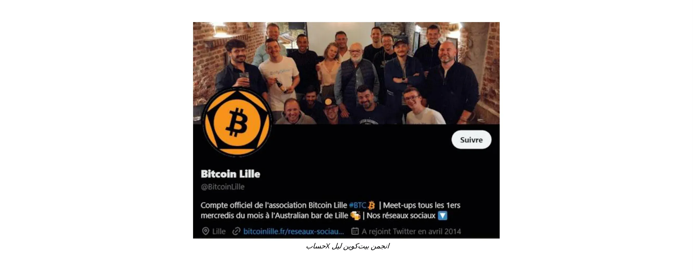

علاوه بر این، **تنظیمات حریم خصوصی خاصی وجود دارد که ارزش تنظیم دارند**:

- حساب توییتر خود را در حالت "عمومی" (پست‌ها برای همه قابل مشاهده) قرار دهید؛
- به همه اجازه بده تا تو را پیدا کنند؛
- ردیابی موقعیت مکانی و اشتراک‌گذاری داده‌ها با سایر نهادها را غیرفعال کنید (در تنظیمات حریم خصوصی).

برای هر رویداد، احتمالاً از توییتر برای به اشتراک‌گذاری اطلاعات مفید استفاده خواهید کرد. اما، مانند اکثر شبکه‌های اجتماعی، **دید همه چیز است**.

برای صرفه‌جویی قابل توجه در زمان شما، ما وقت گذاشتیم تا [الگوریتم رتبه‌بندی متن‌باز توییتر](https://github.com/twitter) را مطالعه کنیم.

در اینجا **نکات کلیدی برای افزایش دیده شدن شما** آورده شده است:

- نکات کلی:
    - توییت در زبان تنظیم شده حساب کاربری شما یا به انگلیسی: توییت کردن به زبان‌های دیگر می‌تواند به شدت دید شما را کاهش دهد؛
    - به حوزه تخصصی خود پایبند باشید، فقط محتوای مرتبط با تمرکز حساب خود را به اشتراک بگذارید؛ توییت‌های خارج از موضوع توسط الگوریتم جریمه می‌شوند؛
    - هدف‌گذاری کنید برای ۱ تا ۲ توییت در روز؛
    - در ساعات اوج پست کنید: پنجشنبه یا جمعه بین ۸ تا ۱۰ صبح معمولاً بهترین عملکرد را دارد (در حساب خود بررسی کنید: Twitter Analytics).

- هنگام نوشتن یک توییت:
    - یک عکس (یا حتی یک ویدیو) اضافه کنید؛
    - از تنها یک هشتگ استفاده کنید (معمولاً #Bitcoin مرتبط‌ترین است. در صورت لزوم، می‌توانید یک هشتگ ترند مرتبط با حوزه حساب کاربری خود اضافه کنید)؛
    - جامعه خود را به تعامل تشویق کنید:
        - پسندیدن = وزن 0.5
        - ریتوییت = وزن 1
        - پاسخ = وزن ۲۷ (!!)**
- به افرادی که به توییت‌های شما پاسخ می‌دهند، **پاسخ دهید** (وزن ۷۵!!)؛
    - از قرار دادن لینک‌ها در توییت اصلی خودداری کنید: در عوض، آن‌ها را در اولین نظر اضافه کنید.
    - کلمات را به طور کامل بنویسید، از اختصارات پرهیز کنید.

- نکات دیگر:
    - تا زمانی که با حوزه تخصصی حساب کاربری شما همخوانی داشته باشد، درباره موضوعات داغ توییت کنید؛
    - توییت‌های برتر خود را دوباره ارسال کنید؛
    - گاهی نظرسنجی برگزار کنید؛
    - نخ‌های گفتگو را در صورت امکان بنویسید؛
    - جامعه خود را تشویق کنید تا از پروفایل شما بازدید کرده و شما را دنبال کنند.

علاوه بر این، **شما می‌توانید یک توییت یا رشته توییت را به پروفایل توییتر خود سنجاق کنید تا حداکثر دیده شدن را به آن بدهید**، درست مانند جامعه Bitcoin Witsand در آفریقای جنوبی.

همچنین توجه داشته باشید که امکان ورود همزمان به دو حساب توییتر، هم در تلفن و هم در رایانه وجود دارد. این ویژگی بسیار مفید است اگر بخواهید به راحتی بین حساب شخصی و حساب جامعه خود جابجا شوید.

فقط مراقب باشید... ارسال تصادفی یک عکس مهمانی از حساب کاربری جامعه می‌تواند سریع‌تر از آنچه فکر می‌کنید اتفاق بیفتد!

در نهایت، حتی اگر نام کاربری شما "@Bitcoin[CITY]" منحصر به فرد و اکنون متعلق به شما باشد، هوشمندانه است که انتظار حساب‌های جعلی یا تقلیدی را داشته باشید. همچنین در نظر بگیرید که ثبت کنید:

- @Bitcoin_[CITY]
- @[CITY]Bitcoin
- @[CITY]_بیت‌کوین

به این ترتیب، احتمال اینکه کسی جامعه شما را جعل کند به شدت کاهش می‌یابد.

آموزش ایجاد حساب کاربری در توییتر:

:::video id=4648976f-41ec-499a-b7ec-a53e796f71b4:::

## نزدیک‌تر شدن به ملاقات‌های همسایگی

<chapterId>12a21c3b-235a-5292-8209-67bf60f61e49</chapterId>

اکنون که کانال‌های ارتباطی و شبکه‌های اجتماعی شما راه‌اندازی شده و هویت بصری جامعه شما را منعکس می‌کنند، زمان آن رسیده است که افراد مناسب را دنبال کنید.

در توییتر، با دنبال کردن حساب‌های کلیدی که Bitcoin را به‌صورت جهانی ترویج می‌کنند، مانند [@Bitcoin](https://twitter.com/Bitcoin) و [@planb_network](https://twitter.com/planb_network)، و همچنین ابتکاراتی مانند [@FBCEglobal](https://twitter.com/FBCEglobal) شروع کنید. همچنین می‌توانید توییت معروف [@halfin](https://twitter.com/halfin) با عنوان "Running Bitcoin" از تاریخ ۱۱ ژانویه ۲۰۰۹ را بازنشر کنید. و مهم‌تر از همه، **حساب‌های جوامع و گردهمایی‌های Bitcoin در کشور خودتان را دنبال کنید**.

این **فرصت‌هایی برای دنبال کردن یکدیگر، تگ کردن یکدیگر، و افزایش دید جمعی** ایجاد می‌کند. این امر در میان حدود ۵۰ جامعه Bitcoin در فرانسه، ابتکارات "Satoshi Spritz" در ایتالیا، و گروه‌های "Einundzwanzig" در آلمان، به یک رویه معمول تبدیل شده است.

در حالی که ممکن است برای برخی بی‌اهمیت به نظر برسد، **دنبال کردن حساب‌های جوامع محلی و ابتکارات می‌تواند به همکاری‌ها یا حتی شراکت‌ها منجر شود**. به عنوان مثال، جوامع Bitcoin لیژ و Bitcoin لیل (و به همین ترتیب Bitcoin اکس و Bitcoin مارسی) به این طریق با هم ارتباط برقرار کردند و منجر به میزبانی مشترک یک گردهمایی سالانه شدند.

غذاهای **Cercle du Coin** نمونه خوبی دیگر هستند.

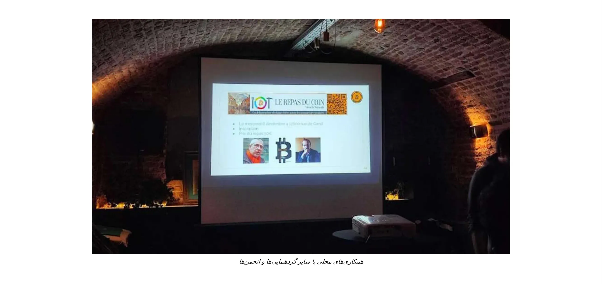

در فرانسه، ممکن است دنبال کردن ابتکاراتی مانند **[@KonsensusFR](https://twitter.com/KonsensusFR)، [@bitcoinpointfr](https://twitter.com/bitcoinpointfr)، [@DecouvreBitcoin](https://twitter.com/DecouvreBitcoin) و [@btcmap](https://twitter.com/btcmap)** نیز مرتبط باشد. این‌ها البته تنها پیشنهاداتی هستند و هر جامعه‌ای آزاد است که به دلخواه خود، با کامل‌ترین تمرکززدایی و خودمختاری عمل کند.

همان‌طور که در بالا ذکر شد، هدف از دنبال کردن یکدیگر ایجاد دید متقابل است. هرچه بیشتر جامعه خود و جوامع منطقه/کشور خود را در شبکه‌های اجتماعی تبلیغ کنید، افراد بیشتری درباره شما صحبت خواهند کرد. هرچه افراد بیشتری درباره شما صحبت کنند، احتمال حضور آن‌ها در رویدادهای شما بیشتر خواهد شد.

پس لایک کردن و ریتوییت کردن پست‌ها از جوامع دیگر می‌تواند به طور قابل توجهی به توسعه آن‌ها... و شما کمک کند.

شما همچنین می‌توانید پیشنهاد دهید که **سازمان‌دهندگان ملاقات و بیت‌کوینرهایی که جوامع را اداره می‌کنند، دو یا سه بار در سال از طریق ویدئو کنفرانس ملاقات کنند تا پیشرفت پروژه‌های ملی و جوامع مرتبط را بررسی کنند. این می‌تواند در طول رویدادهای حضوری نیز انجام شود.**

هدف ساده است: جمع‌آوری بازخورد همه، بحث در مورد چگونگی پیشرفت جوامع، به اشتراک‌گذاری ایده‌ها و پروژه‌های موفق، و ارائه راه‌حل‌ها در صورت نیاز. خلاصه‌ای مکتوب از جلسه می‌تواند بعداً با سازمان‌دهندگان جامعه در کشور شما که نتوانستند حضور یابند، به اشتراک گذاشته شود.

## Btcmap.org

<chapterId>365f43d4-7b2c-5961-a184-157b8c1a0116</chapterId>

در این مرحله، جامعه شما در حال حاضر فعال و در حال کار است. تنها چیزی که باقی مانده است استقبال از افراد علاقه‌مند بیشتر و کمک به رشد آن است.

اما نمی‌توانید بدون دانستن اینکه **پلتفرم‌هایی وجود دارند که بیت‌کوینرها می‌توانند جوامع و ملاقات‌های نزدیک به خود را پیدا کنند**، پیش بروید. به همین دلیل مهم است که چند دقیقه وقت بگذارید و درخواست فهرست شدن در این سایت‌ها را بدهید.

شامل این موارد است:

- [Btcmap.org](https://btcmap.org/)**، وب‌سایتی با دو نقشه که روزانه به‌روزرسانی می‌شوند: **[نقشه جهانی کسب‌وکارهایی که Bitcoin را می‌پذیرند](https://btcmap.org/map)** و **[نقشه جوامع جهانی](https://btcmap.org/communities/map)**. بسیاری از بیت‌کوینرها این نقشه‌ها را به‌طور منظم بررسی می‌کنند، چه در حال سفر باشند و چه در زندگی روزمره خود، تا با افراد جدید آشنا شوند یا مکان‌هایی برای خرج کردن Sats خود پیدا کنند. Btcmap مرجع جهانی است و فهرست کردن جامعه شما در آن برای دیده شدن ضروری است.**
- [BitcoinerEvents](https://www.bitcoinerevents.com/)، وب‌سایتی که توسط بیت‌کوینرها برای بیت‌کوینرها ایجاد شده است. **به شما اجازه می‌دهد رویدادهای آینده جامعه خود را منتشر کنید**. با این حال، در فرانسه هنوز به طور گسترده‌ای استفاده نمی‌شود.
- بسته به کشور شما، ممکن است ابتکارات محلی دیگری وجود داشته باشد. به عنوان مثال، در فرانسه [Bitcoin.fr](https://Bitcoin.fr/events/categories/evenements/) وجود دارد که **هر ماه ده‌ها رویداد Bitcoin را فهرست می‌کند**. بنابراین اگر هنوز آن‌ها را در توییتر دنبال نکرده‌اید یا با آن‌ها تماس نگرفته‌اید تا اطلاعاتی درباره جامعه و رویدادهای خود به اشتراک بگذارید، اکنون زمان آن است! **برای کمک به به‌روز نگه‌داشتن تقویم رویدادهای فرانسه، عالی خواهد بود اگر همه جوامع Bitcoin فرانسه به این عادت کنند که:**
    - ذکر کردن @bitcoinpointfr در توییتر برای هر رویداد جدید جامعه
    - پین کردن اطلاعیه‌های رویداد جدید در گروه تلگرام آن‌ها.

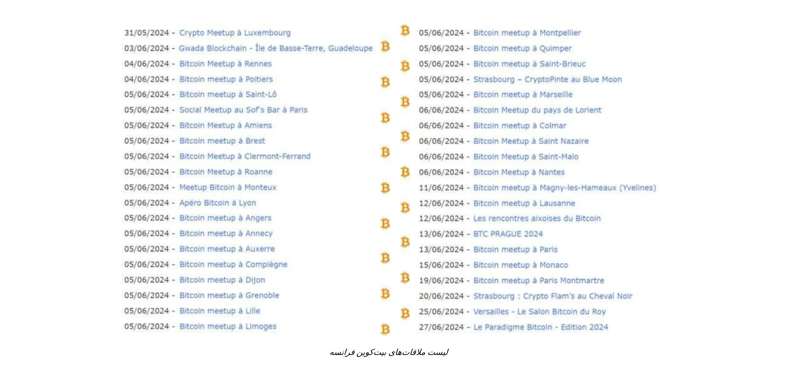

پلتفرم‌های دیگر نیز می‌توانند به افزایش دیده‌شدن شما کمک کنند. **[Meetup](https://www.meetup.com/)** یکی از آن‌هاست و یک وب‌سایت (و یک اپلیکیشن تلفن همراه) است که در آن می‌توانید یک رویداد ایجاد کنید و دیگران را در نزدیکی خود پیدا کنید.

هزینه آن حدود 8€ در ماه (یا حدود 90€ در سال) است که می‌تواند برای یک جامعه کوچک و بدون ساختار گران باشد. با این حال، Meetup در برخی کشورها، به ویژه در کانادا و ایالات متحده، به طور گسترده‌ای استفاده می‌شود و برای مدیریت ثبت‌نام‌ها مفید است.

به طور مشابه، **[Orangepillapp](https://www.orangepillapp.com/)** یک اپلیکیشن موبایل پولی است (50,000 Sats در سال یا 200,000 Sats برای دسترسی مادام‌العمر) که به بیت‌کوینرها کمک می‌کند تا با یکدیگر ملاقات کنند.

در حالی که این دو پلتفرم آخر می‌توانند به افزایش دیده شدن کمک کنند، اما هنگام راه‌اندازی یک جامعه توصیه نمی‌شوند، صرفاً به این دلیل که رایگان نیستند.

**شروع با یک لیست در [btcmap.org](https://btcmap.org/)، [BitcoinerEvents](https://www.bitcoinerevents.com/) و برای جوامع فرانسوی، در [Bitcoin.fr](https://Bitcoin.fr) بیش از حد کافی است**.

تبریک! **جامعه شما ایجاد شده است**، **تصاویر شما آماده است**، **اهداف شما تعیین شده است**، **کانال‌های ارتباطی شما برقرار است**، **شبکه‌های اجتماعی شما راه‌اندازی شده است** و **استراتژی دیده‌شدن شما تصمیم‌گیری شده است**.

هنگامی که یک گروه کوچک از بیت‌کوینرها به شما پیوستند، زمان آن رسیده است که به مرحله بعد بروید: سازماندهی اولین ملاقات Bitcoin خود.

# یک گردهمایی Bitcoin ترتیب دهید

<partId>c009d2a6-40ce-583b-bd24-fdfd1fea262e</partId>

## چرا یک ملاقات منظم با جامعه خود راه‌اندازی کنید؟

<chapterId>ed8e471c-3b99-57e2-a042-2d4e8a40b137</chapterId>

اکنون که شبکه‌های اجتماعی و کانال‌های ارتباطی جامعه شما راه‌اندازی شده‌اند، زمان آن رسیده است که حضور خود را در این پلتفرم‌ها احساس کنید. اعضای جدید را تشویق کنید تا خود را معرفی کنند و به تدریج به گفتگو بپیوندند.

این کار زمان شما را آزاد می‌کند، که می‌توانید از آن برای فکر کردن به ایجاد نوعی گردهمایی استفاده کنید. این موضوع زمانی که شروع به احساس هیجان واقعی در جامعه خود کنید، حتی بیشتر مرتبط خواهد شد.

همان‌طور که قبلاً ذکر شد، **یک ملاقات Bitcoin می‌تواند به عنوان "سطح" بعدی برای یک جامعه در نظر گرفته شود**. از یک سو، این ملاقات به **اعضا اجازه می‌دهد تا به صورت حضوری ملاقات کنند** و از سوی دیگر، به **آموزش تازه‌واردانی که به این اکوسیستم علاقه‌مند هستند کمک می‌کند**.

رویدادی مانند این به شما اجازه می‌دهد، در مقیاس خودتان، **در شهر خودتان در مورد Bitcoin هیاهو ایجاد کنید**، که می‌تواند با گذشت زمان و با اجرای پروژه‌ها توسط جامعه‌تان رشد کند.

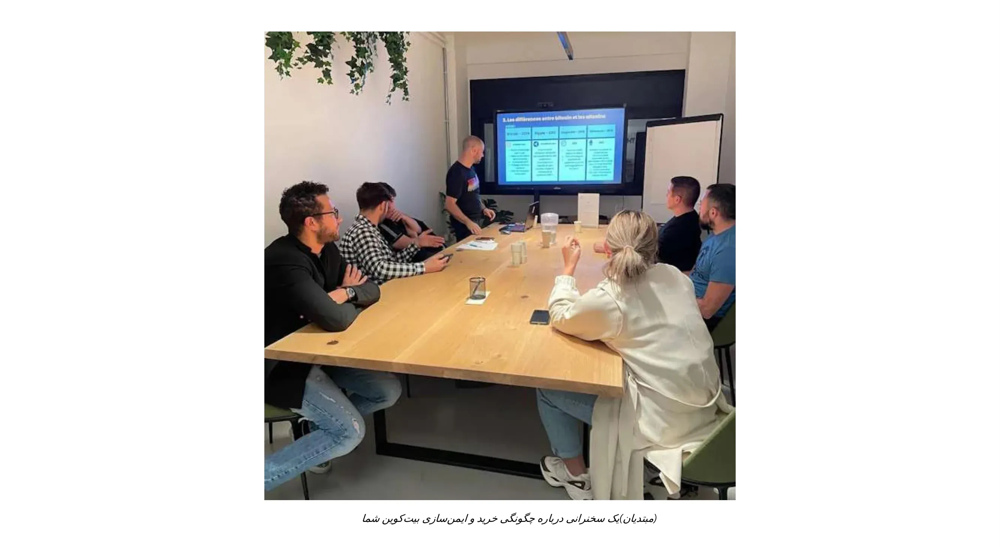

البته، هرچه اهداف توسعه جامعه شما بزرگتر باشد، شما و اعضایتان به زمان بیشتری برای سرمایه‌گذاری نیاز خواهید داشت.

به همین دلیل مهم است که **با تعیین اهداف قابل دستیابی برای ملاقات خود شروع کنید**.

## اولین ملاقات: چه زمانی و چرا؟

<chapterId>f3f8a614-cfb4-5994-a2e8-d56e6f8e3347</chapterId>

شما می‌توانید تنها چند هفته پس از ایجاد جامعه خود، یک ملاقات راه‌اندازی کنید.

با این حال، در آن مرحله احتمالاً گروه شما هنوز کوچک خواهد بود، که به این معنی است که احتمال دارد هیچ‌کس حضور پیدا نکند.

بهتر است زمانی که حداقل چند عضو فعال در کانال‌های ارتباطی خود دارید، مثلاً چند دوجین، یک گردهمایی ترتیب دهید. این می‌تواند به سرعت اتفاق بیفتد، اما همچنین به شخصیت افراد بستگی دارد.

وقتی آن جرقه را احساس کردید، پیشنهاد ملاقات حضوری بدهید. اگر دیگران علاقه‌مند هستند، تنها چیزی که باقی می‌ماند این است که **تاریخی برای اولین ملاقات خود تعیین کنید**.

به جای انتخاب تاریخ به صورت خودسرانه، معمولاً بهتر است **حدود ده روز قبل یک نظرسنجی با چندین روز و زمان ممکن ایجاد کنید**. به این ترتیب، می‌توانید از آرا برای حداکثر کردن حضور، ایجاد هیجان و استفاده بهینه از زمان خود استفاده کنید.

بهتر است با انتظارات ثابت درباره چگونگی پیشرفت ملاقات، تعداد افرادی که خواهند آمد، یا موضوعاتی که مورد بحث قرار خواهند گرفت، وارد نشوید. این کار از ناامیدی جلوگیری می‌کند و مانع از احساس فشار بر شرکت‌کنندگان می‌شود.

بگذارید همه چیز به طور طبیعی پیش برود، شاید با نوشیدنی. مکالمات باید به راحتی اتفاق بیفتند و در صورت نیاز، می‌توانید به آرامی بحث را به Bitcoin برگردانید اگر شروع به منحرف شدن کرد.

اگر می‌خواهید برای لحظات آرام‌تر آماده شوید، می‌توانید چند فعالیت یا نکات گفت‌وگو را برنامه‌ریزی کنید، مانند:

- نمایش **[Mempool](https://Mempool.space/)** بر روی کامپیوتر یا گوشی هوشمند؛
- آوردن یک کتاب؛
- آوردن یک **Nerdminer**، Bitaxe، FPGA یا حتی ASIC؛
- داشتن یک **Bitcoin flyer**؛
- طوفان فکری برای یک تصویر یا لوگوی Bitcoin برای جامعه شما؛
- بازی کردن یک **[بازی کارتی Bitcoin](https://www.Maximalist.ovh/accueil/20-game-le-Coin-de-table.html)**؛
- نمایش نقشه **[btcmap.org](https://btcmap.org/)** از جوامع و بازرگانان؛
- ارسال یا دریافت Bitcoin با استفاده از **Lightning**.

وقتی که گردهمایی شما تازه شروع شده است، اغلب زمان مناسبی برای یک ارائه رسمی نیست. اگر تعداد شرکت‌کنندگان کم است، یک بحث آزاد و غیررسمی معمولاً بهترین کارایی را دارد.

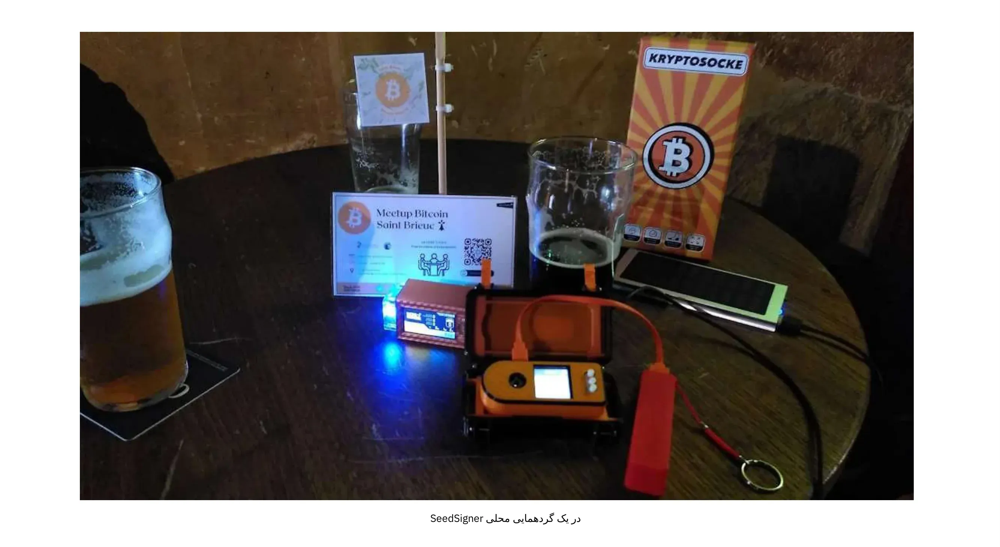

پس از اولین ملاقات، احتمالاً می‌خواهید برنامه‌ریزی دیگری انجام دهید. در حالی که جامعه شما هنوز کوچک است، بهتر است تاریخ‌ها را از طریق نظرسنجی انتخاب کنید، مثلاً ماهی یک‌بار یا هر دو ماه یک‌بار. می‌توانید این موضوع را در کانال‌های ارتباطی خود مطرح کنید.

اگر یک گروه منظم از بیت‌کوینرها و شرکت‌کنندگان علاقه‌مند تشکیل شود، منطقی است که به دو دلیل یک برنامه تکراری تنظیم شود:

1) این کار برنامه‌ریزی را برای همه آسان‌تر می‌کند؛

2) این کار به **ایجاد یک "عادت"** کمک می‌کند. حتی اگر کسی به‌طور منظم کانال‌های شما را بررسی نکند، باز هم می‌داند که ملاقات چه زمانی اتفاق می‌افتد و می‌تواند طبق معمول سر بزند.

این نکته دوم یکی از دلایلی است که **در فرانسه، بیشتر ملاقات‌ها در اولین چهارشنبه هر ماه برگزار می‌شود** (به ابتکار "سفیران" که توسط [DecouvreBitcoin](https://decouvrebitcoin.fr/) در سال ۲۰۲۲ راه‌اندازی شد، مراجعه کنید).

در آلمان و ایتالیا، روز ملی ثابتی وجود ندارد.

با این حال، برگزاری تمام ملاقات‌ها در سراسر کشور در یک روز باعث ایجاد مشکل تمرکز می‌شود: این امر مانع از حضور بیت‌کوینرها در رویدادهای جوامع نزدیک می‌شود و همچنین می‌تواند نگرانی‌های امنیتی را افزایش دهد. صحبت با سازمان‌دهندگان ملاقات‌های همسایه می‌تواند به شما کمک کند تا بر سر یک ترتیب خوب توافق کنید.

همانطور که جامعه شما رشد می‌کند و ملاقات‌ها افراد بیشتری را جذب می‌کنند، می‌توانید:

- برای هر ملاقات یک هدف مشخص تعیین کنید؛
- یا حتی **هر ماه یک رویداد دوم اضافه کنید**.

در اولین مورد، در حالی که ترجیحات همه را در نظر می‌گیریم، یک هدف واضح می‌تواند اطمینان حاصل کند که شرکت‌کنندگان با یادگیری چیزی جدید جلسه را ترک می‌کنند و گفتگوها بر روی Bitcoin متمرکز می‌مانند.

در مورد دوم، یک رویداد ماهانه دوم می‌تواند به یک موضوع خاص اختصاص یابد، مانند جلسات مبتدی یا کارگاه‌ها (Mining، Lightning، نصب نود، و غیره).

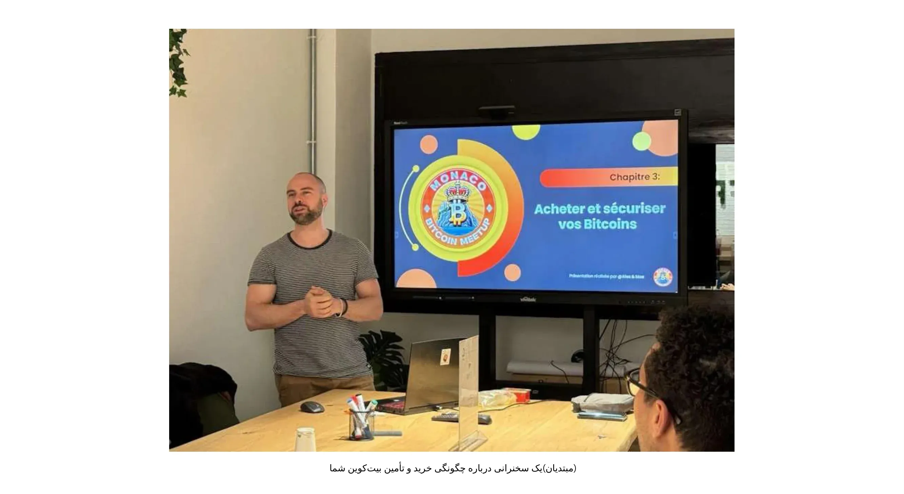

به خاطر داشته باشید که **این نیاز به سازماندهی بیشتر و زمان بیشتری از شما دارد**. خوشبختانه، در [بخش 6/8 این دوره](https://planb.academy/courses/1c643dc9-a15f-4f9e-93b6-cb3c58b4ee35/3213d87a-1998-5972-ab93-97a5769ba279)، مجموعه‌ای از منابع متن‌باز قابل استفاده مجدد را خواهید یافت که به شما کمک می‌کند.

در هر صورت، همه چیز به برنامه اقدام کوتاه‌مدت، میان‌مدت و بلندمدتی که شما یا جامعه‌تان برای خود تعیین کرده‌اید، بستگی دارد.

## جستجو برای یک مکان

<chapterId>405d389e-6a32-5777-af8d-293380d2e8fd</chapterId>

یافتن مکانی برای رویدادهایتان اغلب کار آسانی نیست. علاوه بر این، ضروری است که این مکان **در شهر جامعه شما واقع شده باشد**.

چندین معیار وجود دارد که باید در نظر گرفته شوند، از جمله:

1) **مکان**: آیا به راحتی با حمل و نقل عمومی قابل دسترسی است؟ با ماشین چطور؟ آیا پارکینگ موجود است؟

۲) آیا مکان دلپذیر و نه خیلی **پر سر و صدا** است؟ آیا به دنبال یک محیط رسمی (فضای کار مشترک، اتاق جلسه) هستید یا چیزی غیررسمی‌تر (بار، رستوران)؟

3) آیا ظرفیت کافی برای میزبانی از شما، حتی در شب مسابقه راگبی یا لیگ قهرمانان را دارد؟

۴) آیا دارای ویدئو پروژکتور و یک فضای آرام برای ارائه‌ها است؟

5) و در نهایت، اگر یک بار یا رستوران است، آیا منو چیزی برای خوردن و نوشیدن برای همه ارائه می‌دهد؟

علاوه بر این، سه نکته مهم وجود دارد که باید به خاطر داشته باشید:

- اگر قصد دارید شب را به دو بخش تقسیم کنید: ابتدا، یک ارائه در فضایی رسمی برای کمک به تمرکز همه، سپس حرکت به یک بار یا رستوران برای ادامه در فضایی آرام‌تر، تجربه نشان می‌دهد که تغییر مکان در میانه شب اغلب باعث می‌شود برخی از شرکت‌کنندگان در طول استراحت محل را ترک کنند. بنابراین این رویکرد توصیه نمی‌شود.
- در اولین ملاقات‌هایتان، احتمالاً تعداد شرکت‌کنندگان کم خواهد بود و احتمالاً ارائه‌های رسمی نخواهید داشت. در این صورت، نیازی به معرفی خود به صاحب مکان یا توضیح اهداف‌تان نیست. با این حال، **زمانی که ملاقات‌ها به صورت منظم و با حضور گسترده برگزار شوند، ارزش دارد که این کار را انجام دهید تا حرفه‌ای بودن خود را نشان دهید و تمایل خود برای بازگشت ماهانه را ابراز کنید**. این می‌تواند به بحث‌های زیادی منجر شود (رزروهای ماهانه خودکار، نوشیدنی‌ها و/یا تخته‌های غذایی رایگان، تخفیف‌ها، گفتگو درباره Bitcoin، پذیرش پرداخت‌های Bitcoin و غیره). بدیهی است، اگر به دنبال مکانی با ویدئو پروژکتور برای ارائه‌ها هستید، به نظر می‌رسد ضروری است که برای ملاقات (حضوری یا حتی تلفنی) با صاحب مکان و/یا مدیر برای ارائه پروژه و اهداف‌تان درخواست کنید.

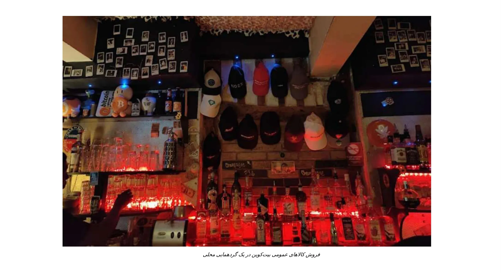

- در نهایت، برخی جوامع **فقط می‌خواهند رویدادهای خود را در مکان‌هایی برگزار کنند که پرداخت‌های Bitcoin را می‌پذیرند**، که قابل درک است. در این صورت، ایده خوبی است که **با جستجوی کسب‌وکارهایی که Bitcoin را در شهر شما می‌پذیرند شروع کنید** (در [btcmap.org](https://btcmap.org/map/) و با آن‌ها تماس بگیرید تا ببینید آیا معیارهای شما را برآورده می‌کنند یا خیر. اگر چیزی مناسب در دسترس نیست، می‌توانید تلاش کنید تا بازرگانان جدیدی را وارد کنید، اما انتظار داشته باشید که با بسیاری از ردها مواجه شوید، که می‌تواند دلسردکننده باشد. به همین دلیل، اغلب بهتر است این را از ابتدا به عنوان هدف تعیین نکنید و در عوض زمانی که جامعه شما به خوبی تثبیت شده و "قدرت آتش" کافی دارید، به آن فکر کنید.

همچنین، هنگام راه‌اندازی گردهمایی خود، از **تغییر مکان در چند ماه اول** دریغ نکنید. این کار به شما کمک می‌کند تا **روابطی با مدیران مختلف ایجاد کنید**، فضاهای گوناگون را بررسی کنید و اطلاعاتی درباره میزبانان احتمالی آینده جمع‌آوری کنید.

بعداً، وقتی گروه شما بزرگ‌تر شد، حتی می‌توانید یک بعدازظهر را به بازدید از چندین کسب‌وکار و بار اختصاص دهید و بپرسید آیا فضایی مناسب برای میزبانی رویدادها و ملاقات‌های ماهانه شما دارند یا خیر.

## قبل از ملاقات

<chapterId>c5218943-580d-5efc-89ed-6b5d728816d6</chapterId>

آیا برنامه‌ریزی برای برگزاری یک گردهمایی در هفته‌های آینده دارید؟

در اینجا یک فهرست برای کمک به آماده‌سازی شما آمده است:

1/ **تأیید محل برگزاری**

با مکانی که قصد دارید رویداد را در آن برگزار کنید تماس بگیرید و آن را برای تعداد تخمینی شرکت‌کنندگان رزرو کنید.

2/ **اعلام رویداد**:

    - تاریخ، زمان و مکان را در شبکه‌های اجتماعی و دیگر کانال‌های ارتباطی خود به اشتراک بگذارید. در صورت نیاز، لینک ثبت‌نام را نیز اضافه کنید.
    - یک پوستر اختصاصی ایجاد کنید (به عنوان مثال، پوستر Canva، به بخش 2/8 "[طراحی هویت برای جامعه Bitcoin خود](https://planb.academy/courses/1c643dc9-a15f-4f9e-93b6-cb3c58b4ee35/b48a18cc-afdf-5216-802c-32647b5cd8a3)").
    - با سنجاق کردن اعلامیه در تلگرام و توییتر و استفاده از ذکر "@everyone" در دیسکورد، دید را به حداکثر برسانید.
    - اعلانات را ۷ تا ۱۰ روز قبل از رویداد ارسال کنید تا شرکت‌کنندگان بتوانند از قبل برنامه‌ریزی کنند.

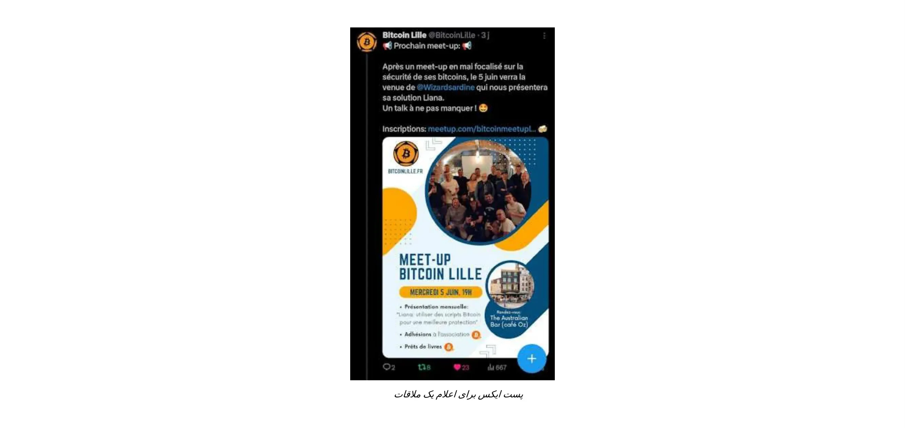

3/ **به مخاطبان خود یادآوری کنید**

دو تا سه روز قبل از رویداد، اعلان‌های خود را مجدداً به اشتراک بگذارید و بازنشر کنید تا دیده شدن را افزایش دهید.

4/ **محل برگزاری را به‌روز کنید**

روز قبل (یا دو روز قبل)، ثبت‌نام‌هایتان را بررسی کنید و تعداد نهایی شرکت‌کنندگان مورد انتظار را به محل برگزاری اطلاع دهید.

مراحل اضافی برای برجسته کردن رویداد شما:

- چاپ بروشورها و/یا پوسترها
- آماده‌سازی یک ارائه در مورد یک موضوع خاص
- یک فعالیت یا کارگاه سازماندهی کنید

## روز ملاقات

<chapterId>cf60067b-591f-5fdf-9b9e-d442aad0e8f9</chapterId>

روز بزرگ اینجاست! یک یا دو ساعت قبل از شروع رویداد، از طریق کانال‌های ارتباطی جامعه خود یک یادآوری ارسال کنید. زمان شروع را مجدداً تأیید کنید و به شرکت‌کنندگان بگویید که چگونه شما را شناسایی کنند، به عنوان مثال، با ذکر اینکه شما یک تی‌شرت و کلاه Bitcoin خواهید پوشید.

همانطور که گردهمایی‌های شما رشد می‌کنند و شروع به استقبال از بیش از 20 نفر می‌کنید، آماده‌سازی مکان برگزاری به طور فزاینده‌ای مهم خواهد شد.

در اینجا کاری که باید انجام دهید:

1) **زودتر برسید** تا کارها را آماده کنید.

2) **فضا را مطابق با نیازهای خود و امکانات محل تنظیم کنید.** اگر فقط شش نفر هستید، به تنظیمات کمی نیاز است. اما وقتی به 10-20 شرکت‌کننده می‌رسید، یک چیدمان کاملاً نشسته می‌تواند تعاملات را محدود کند. در این صورت، یک چیدمان ایستاده با میزهای بلند و با فاصله مناسب را انتخاب کنید، در حالی که هنوز چند صندلی (ترجیحاً بلند) فراهم کنید. اگر ارائه‌ای برنامه‌ریزی شده است، چیدمان ایستاده را برای بیشتر شب حفظ کنید و صندلی‌ها را درست قبل از سخنرانی بیاورید.

۳) افزودن جزئیات سفارشی کوچک:

    - یک پوستر در ورودی نصب کنید تا مکان خود را نشان دهید (ابتدا از پاتافیکس استفاده کنید و اجازه محل برگزاری را بگیرید).
    - پوسترهای با موضوع Bitcoin را در داخل نمایش دهید (مقاله سفید Bitcoin، منشور جامعه شما، پروژه‌های جاری، و غیره).
    - برچسب‌ها، بروشورها، یا شروع‌کننده‌های گفتگو را روی میزها قرار دهید، برای مثال: یک Nerdminer، Hardware Wallet، لپ‌تاپی که Mempool، ASIC Miner خود را نمایش می‌دهد، یا صفحه پشتیبان فلزی برای کلیدهای خصوصی.

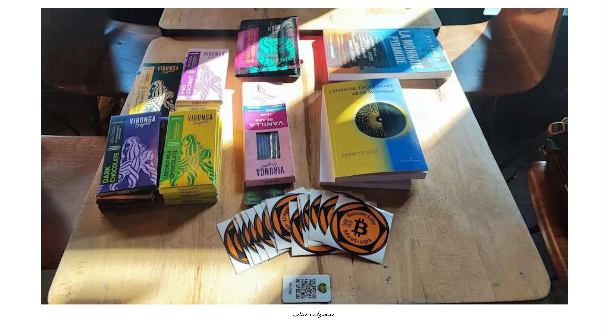

اگر انتظار دارید که فقط چند شرکت‌کننده حضور داشته باشند و هنوز رابطه‌ای با مدیران مکان برقرار نکرده‌اید، از آوردن و نمایش تمام تجهیزات خود به‌طور فوری خودداری کنید. وقتی اعتماد برقرار شد، آزادی بیشتری برای تنظیم فضا به دلخواه خود خواهید داشت.

در نهایت، نوشیدنی‌ای بردارید و منتظر رسیدن افراد باشید. و به یاد داشته باشید: اگر بار اول کسی نیامد، دلسرد نشوید. یک کتاب یا ویدئویی برای تماشا بیاورید، برای احتیاط.

## بعد از ملاقات

<chapterId>3e881af9-9c09-5721-81ee-c5cda3b109c5</chapterId>

وقتی ملاقات به پایان می‌رسد، زمان تمیزکاری برای کارکنان محل برگزاری است. قبل از ترک محل، پیشنهاد دهید که به گارسون‌ها یا مدیران کمک کنید. این می‌تواند به سادگی جمع‌آوری تمام لیوان‌ها روی یک میز باشد یا اگر نزدیک بار هستید، آن‌ها را قبل از رفتن برگردانید.

به محض اینکه به خانه برگشتید، احتمالاً هنوز Bitcoin را برای روزها در ذهن خواهید داشت. این زمان مناسبی است تا نبض جامعه خود را بگیرید و بازخورد شرکت‌کنندگان را جمع‌آوری کنید. شما می‌توانید:

- یک پیام تشکر در کانال‌های ارتباطی خود ارسال کنید و هر لینک یا منابعی که در طول رویداد ذکر شده‌اند را به اشتراک بگذارید.
- از شرکت‌کنندگان دعوت کنید تا پیشنهادات خود را برای بهبود جلسه بعدی ارائه دهند.
- برنامه‌ریزی برای رویداد بعدی خود را آغاز کنید.

سپس چند هفته فرصت خواهید داشت تا ایده‌ها، تصاویر یا پروژه‌های جدیدی را توسعه دهید تا ملاقات بعدی حتی بهتر شود.

## اهمیت درگیر کردن و حفظ شرکت‌کنندگان

<chapterId>f5355e35-4b07-527c-88a3-8535cba7592c</chapterId>

رم در یک روز ساخته نشد و جامعه شما نیز به همین سرعت ساخته نخواهد شد. حرکت پیرامون Bitcoin از برگزاری ملاقات‌ها و رویدادهای منظم ناشی می‌شود.

برای تحقق این امر، یک چیز ضروری است: **شرکت‌کنندگان را درگیر نگه دارید**.

ممکن است با یک گروه کوچک از بیت‌کوینرهای پرشور شروع شود که هدفشان این است که به طور منظم دور هم جمع شوند و درباره Bitcoin صحبت کنند. با گذشت زمان، بسته به دسترسی و علایق هر فرد، می‌توانید **برخی از وظایف سازمانی را با گروه به اشتراک بگذارید** یا اعضای اصلی را دعوت کنید تا **پروژه‌های خاصی را بر عهده بگیرند**. این پروژه‌ها می‌توانند منحصر به جامعه شما، ملاقات‌های شما یا شهر شما باشند یا حتی از بسیاری از ابتکارات پیشنهادی در [بخش 6/8 این دوره](https://planb.academy/courses/1c643dc9-a15f-4f9e-93b6-cb3c58b4ee35/3213d87a-1998-5972-ab93-97a5769ba279) الهام گرفته شده باشند. **این نه تنها Commitment را از اعضای اصلی شما تقویت می‌کند بلکه به رشد و شکوفایی جامعه شما نیز کمک می‌کند.**.

همان‌طور که ملاقات‌های شما پیشرفت می‌کند، چهره‌های جدیدی ظاهر خواهند شد: افرادی که در چرخه‌های قبلی BTC و/یا آلت‌کوین‌ها خریده‌اند، علاقه‌مندان به فناوری که می‌خواهند درک خود را عمیق‌تر کنند، یا مبتدیان کاملی که به این سیستم پرداخت غیرقابل سانسور، غیرمتمرکز، شفاف و عادلانه که بدون شرایط و بدون واسطه‌های مورد اعتماد کار می‌کند، کنجکاو هستند.

برای اطمینان از اینکه همه در رویدادهای شما احساس شمول می‌کنند، بر دو جنبه کلیدی تمرکز کنید:

- **شمول اجتماعی**: هر کسی که شرکت می‌کند باید احساس خوش‌آمدگویی کند. تلاش کنید تا به تازه‌واردان خوش‌آمد بگویید، از آنها بپرسید چرا آمده‌اند و آنها را به دیگران معرفی کنید. وقتی افراد احساس شمول می‌کنند، احتمال بیشتری دارد که دوباره برگردند و شاید حتی در سازماندهی رویدادهای آینده کمک کنند.
- **صبر و گشودگی**: این کار زمان و انگیزه می‌طلبد. اگر با یک شیت‌کوینر متعهد (یا بدتر، یک XRP Maximalist) صحبت می‌کنید، ممکن است وسوسه شوید که آن‌ها را نادیده بگیرید. اما با وارد شدن به گفتگو، ممکن است سوءتفاهم‌ها یا استدلال‌های نادرست را برطرف کنید. اگر آن‌ها مایل به گوش دادن باشند، ممکن است آماده باشند تا واقعاً Bitcoin را درک کنند.

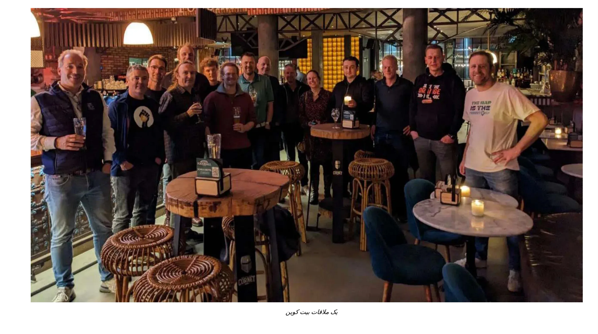

از دیدگاه عملی، به تجربه کلی رویداد فکر کنید:

- آیا **محل برگزاری دلپذیر** بود؟
- آیا **دسترسی به آن آسان بود؟**
- چرا برخی افراد ثبت‌نام کردند اما حضور پیدا نکردند؟
- چه بحث‌هایی انجام شد؟ آیا بحث‌ها برای مبتدیان بیش از حد فنی بودند؟
- آیا بحث‌ها بیش از حد الکلی بودند؟

هر شرکت‌کننده شخصیت، اهداف و علایق خاص خود را دارد، بنابراین تجربیات متفاوت خواهد بود. اما وقتی مکان مناسب باشد، جمعیت ذهن‌باز باشد و نیت‌ها صادقانه باشند، هر دلیلی برای موفقیت گردهمایی وجود دارد.

ساختن یک ملاقات زمان‌بر است اما بیش از همه، نیاز به سازماندهی دارد. این یک پروژه انسانی است و تنها در صورتی در بلندمدت کار خواهد کرد و رشد خواهد کرد که به خوبی برنامه‌ریزی شده، باز و فراگیر باشد.

در نهایت، این به شما بستگی دارد که تصمیم بگیرید "باز و فراگیر" تا چه حد باید پیش برود. فقط به یاد داشته باشید: یک شیت‌کوینر اغلب فقط یک بیت‌کوینر در حال شکل‌گیری است.

# نمونه‌هایی از پروژه‌ها و ابتکارات

<partId>45b3bc40-1c31-583e-8411-2662e6efd765</partId>

## چرا به چیزی بیشتر از نوشیدن آبجو فکر کنیم؟

<chapterId>3213d87a-1998-5972-ab93-97a5769ba279</chapterId>

با گذشت زمان، جامعه شما تکامل خواهد یافت. چهره‌های جدیدی به جمع شما خواهند پیوست و برخی دیگر ممکن است دور شوند، اما اصل راهنما باید ثابت بماند: توسعه اکوسیستم Bitcoin و تقویت پیوندها بین اعضا.

پروژه‌ها و ابتکارات زیادی وجود دارند که می‌توان آن‌ها را اجرا کرد. این فصل فهرستی غیر جامع از ایده‌هایی ارائه می‌دهد که می‌توانند در یک جامعه یا در طول یک ملاقات اجرا شوند. با خیال راحت ایده‌هایی را که به شما الهام می‌بخشند انتخاب کنید و حتی ایده‌های خود را به این دوره اضافه کنید [با ایجاد یک "Pull Request" در GitHub](https://github.com/PlanB-Network/Bitcoin-educational-content).

قبل از شروع، بیایید به نکته‌ای که قبلاً ذکر شد، بازگردیم.

وقتی یک ملاقات Bitcoin را سازماندهی می‌کنید، با افراد جدیدی آشنا می‌شوید. تعامل اجتماعی ضروری است و آبجو (یا الکل به طور کلی) می‌تواند به ایجاد جوی جشن‌گونه کمک کند. اما ارزش دارد که به خاطر داشته باشید:

- الکل توانایی‌های شناختی مانند تفکر و درک را مختل می‌کند، که می‌تواند دنبال کردن بحث‌ها یا ارائه‌های جدی را برای شرکت‌کنندگان دشوارتر کند.
- الکل همچنین می‌تواند به یک آیین راحتی تبدیل شود: هر ماه، شما "لحظه Bitcoin" خود را با دوستانتان بر سر نوشیدنی به اشتراک می‌گذارید. در حالی که این یک راه عالی برای ارتباط است، آیا نوشیدن آبجو واقعاً هدف اصلی ملاقات شماست؟ یا ترجیح می‌دهید تحقیق Exchange انجام دهید، از دیگران بیاموزید و به تازه‌واردان کمک کنید تا Bitcoin را کشف کنند؟

هر کسی ترجیحات، اعتقادات و شخصیت خاص خود را دارد. این درباره قضاوت یک گردهمایی نسبت به دیگری نیست. با این حال، اگرچه اغلب در حین نوشیدن یک آبجو درباره تغییر جهان صحبت می‌کنیم، اما انقلاب‌ها به این شکل آغاز یا رشد نمی‌کنند.

کلید این است که به سادگی از آن آگاه باشید.

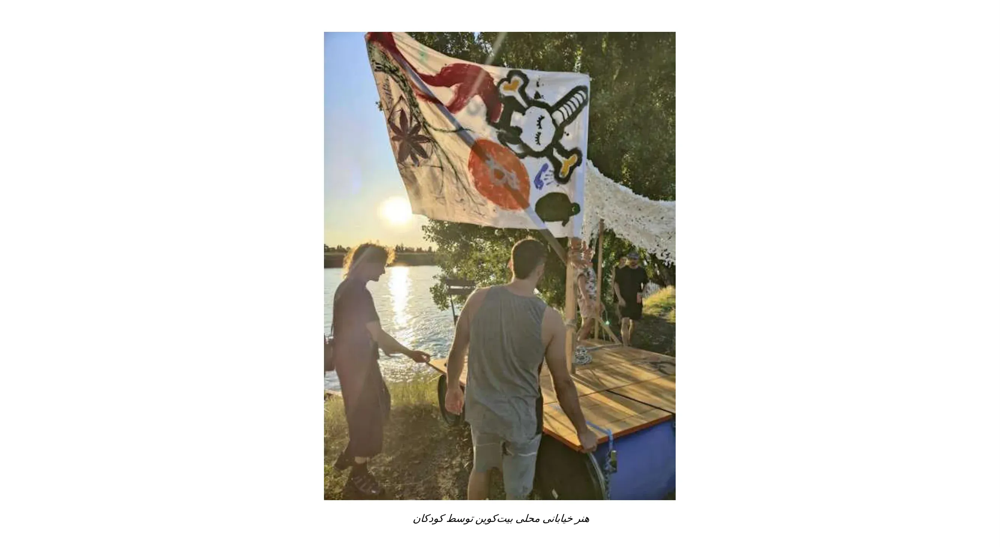

## برگزاری گردهمایی‌های موضوعی، با پیشرفت سالانه

<chapterId>46afdbcc-a775-5c16-b20a-34956690d58f</chapterId>

به محض اینکه یک گروه اصلی حدوداً ده نفره تشکیل دادید، می‌توانید به هر رویداد ارائه‌هایی اضافه کنید. این ارائه‌ها می‌توانند از یک تم از پیش اعلام شده پیروی کنند یا کاملاً مستقل از یکدیگر باشند.

هنگام برنامه‌ریزی ارائه‌ها یا کارگاه‌ها، ایجاد یک پیشرفت واضح و ساختارمند کمک‌کننده است. هدف این است که **مفاهیم اصلی Bitcoin را گام به گام پوشش دهیم** و به شرکت‌کنندگان دید کاملی از موضوع از زوایای مختلف ارائه دهیم.

در فرانسه، در طول تابستان ۲۰۲۳، برگزارکنندگان ملاقات بر روی **یک پیشرفت سالانه** کار کردند.

فراتر از ارزش آموزشی قوی خود، این رویکرد امکان به اشتراک‌گذاری اسناد منبع‌باز و اسلایدها بین گروه‌ها را فراهم می‌کند و به تدریج یک کتابخانه مشترک از منابع ایجاد می‌کند. این ابتکار به خوبی مورد استقبال قرار گرفته و قرار است در سال‌های آینده رشد کند.

در زیر پیشرفت گردهمایی فرانسوی ۲۰۲۳-۲۰۲۴ آمده است. برای هر موضوع، یک ارائه منبع باز و یک ویدیو در دسترس است که ممکن است به شما ایده‌هایی برای موضوعاتی که می‌توانید برای رویدادهای خود پوشش دهید، بدهد.

مواد قابل ویرایش اضافی را می‌توان در [جعبه ابزار آموزشی Bitcoin](https://planb.academy/fr/resources/bet) نیز یافت!

| Month | Theme | Video | Editable Resource |
| -------- | -------- | -------- | --- |
| September     | Chapter 1: What is Bitcoin?     | [	YouTube link](https://www.youtube.com/watch?v=CSjuBqrl4t8)     | [Editable PowerPoint](https://www.canva.com/design/DAFu0d5Jd7M/9gAWDAOSS6LDkWENuZjYgw/edit) |
| October & November| Chapter 2: Understanding Bitcoin Transactions     | [YouTube link](https://www.youtube.com/watch?v=inFnR-3NsdM)     | [Editable PowerPoint](https://www.canva.com/design/DAFsEcnOro8/Mz9FYdTGhsvozZOe0Y9jtw/edit) |
| December     | Chapter 3: Understanding the Lightning Network     | [YouTube link](https://www.youtube.com/watch?v=hHz-ALx8D9w)     | [Editable PowerPoint](https://www.canva.com/design/DAF4YPSNnR8/HKp4Vmcno8eMtVWnZmFtcw/edit) |
| January     | Chapter 4: What is Mining?     | [YouTube link](https://www.youtube.com/watch?v=QyHZ3CVI_OI)     | [Editable PowerPoint](https://www.canva.com/design/DAF5DE6iBEM/tsy8E3oBebUnsR0kj53vvQ/edit) |
| February     | 	Chapter 5: Running a Bitcoin and Lightning Node    | [YouTube link](https://www.youtube.com/watch?v=RRYK-usg-OY)     | [Editable PowerPoint](https://www.canva.com/design/DAF55FU6HI0/sQ0lacRJblqrhn_9Xk1yDg/edit) |
| March     | 	Chapter 6: Using the Lightning Network in Daily Life    | [YouTube link](https://www.youtube.com/watch?v=o2BS4xjei8M)    | [Editable PowerPoint](https://www.canva.com/design/DAGAcJMw7lw/-haMNnHnwj5vpDAy8MDowA/edit) |
| April & May    | Chapter 7: Securing Your Bitcoins      | [YouTube link](https://www.youtube.com/watch?v=fHExPbhM0Hg)    | [Editable PowerPoint](https://www.canva.com/design/DAGDz3Nq4e0/D3uG-4w9FN6OhUq-VXzhfg/edit) |
| June     | 	Chapter 8: What is Multi-Sig?     | [YouTube link](https://www.youtube.com/watch?v=Me5489mpoxA)     | [Editable PowerPoint](https://www.canva.com/design/DAGLMtQT6sg/rYIxr4ldUJ0jTelNf-Pj8Q/edit) |
| July     | 	Chapter 9: Understanding the Bull Run and How to Prepare    | [YouTube link](https://www.youtube.com/watch?v=7RA-gnCJWyM)     | [Editable PowerPoint](https://www.canva.com/design/DAGJQkiZ_YA/9lUluP9RZ0eeA_e61mk9Hw/edit) |
| August     | Chapter 10: The Taxman is Never Far Away   | [YouTube link](https://www.youtube.com/watch?v=oY4NwonGDm0)     | [Editable PowerPoint](https://www.canva.com/design/DAGQhx7Yc_c/7mRhb_vlgnhSgxd1FtjK8w/edit) |

فصل‌های ۲ و ۷ می‌توانند به دو ارائه کوتاه‌تر تقسیم شوند تا از غرق شدن شرکت‌کنندگان جلوگیری شود. با این حال، اجرای آن‌ها در یک جلسه، فضای تقویم را برای فعالیت‌های ویژه مانند ملاقات‌های مشترک با گروه‌های همسایه، مسابقه‌ها یا کارگاه‌ها آزاد می‌کند.

**شما آزاد هستید که از این منابع استفاده کنید، آن‌ها را تطبیق دهید و به اشتراک بگذارید، فقط مطمئن شوید که در صورت استفاده مجدد از کار آن‌ها، به نویسندگان اصلی اعتبار بدهید.**

از آنجا که همه در هر گردهمایی شرکت نخواهند کرد، ایده خوبی است که ارائه‌ها را ضبط کرده و آن‌ها را در یک پلتفرم استریمینگ یا وب‌سایت خود آپلود کنید. این کار به غایبان اجازه می‌دهد تا جبران کنند و شرکت‌کنندگان بتوانند بعداً به مطالب مراجعه کنند.

به‌طور همزمان، می‌توانید ملاقات‌های موضوعی دیگری را برگزار کنید، مانند:

- مسابقه دانش Bitcoin (با جایزه Hardware Wallet)
- یک چالش آشنایی که در آن ساتوشی‌های رایگان به افرادی که هیچ سکه‌ای ندارند در خیابان ارسال می‌کنید
- دعوت از یک سخنران متخصص یا یک شرکت برای ارائه محصول مرتبط با Bitcoin
- تور شبانه از بارها و فروشگاه‌هایی که Bitcoin را می‌پذیرند

و خیلی بیشتر، تنها محدودیت شما تخیل شماست!

## ایجاد رویدادهای جانبی و کارگاه‌ها

<chapterId>9dbd651a-8712-5630-90b3-b9525dcc1385</chapterId>

بسته به میزان دسترسی و سطح مشارکت شما در جامعه، می‌توانید رویدادهای اضافی را در طول سال برنامه‌ریزی کنید، مانند:

- شب رستوران برای **روز پیتزا** در ۲۲ مه
- یک عصر یا آخر هفته برای جشن گرفتن **Halving** بعدی
- شب بازی خانوادگی درباره Bitcoin و نحوه کار آن، با استفاده از بازی‌هایی مانند [Le Coin de Table](https://www.Maximalist.ovh/) یا [SHAmory](https://shamory.com/)
- **کارگاه Mining** ارائه انواع مختلف سخت‌افزار (CPU، GPU، FPGA، ASIC، Nerdminer، Bitaxe)
- یک **بعدازظهر یا عصر برای مبتدیان**، با کارگاه‌های موضوعی
- یک **گردهمایی مشترک با جوامع همسایه**

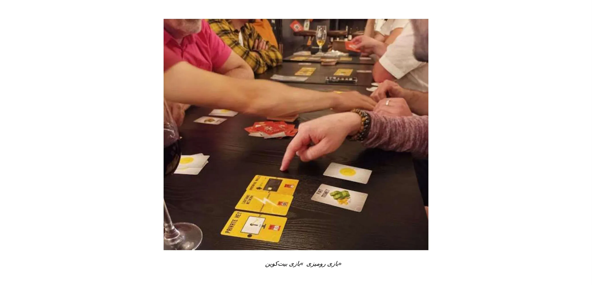

فقط مراقب باشید که تقویم را بیش از حد پر نکنید. تعداد زیادی رویداد در یک ماه می‌تواند منجر به فرسودگی برای برگزارکنندگان و کاهش حضور در طول زمان شود.

## ایجاد برچسب‌ها

<chapterId>d605f3b3-130e-513d-85e6-06bc5ea13e99</chapterId>

برچسب‌ها راهی سرگرم‌کننده برای تبلیغ هر دو Bitcoin و جامعه شما هستند و در عین حال هویت شما را تقویت می‌کنند.

قبل از سفارش، این نکات را در نظر داشته باشید:

- برای استفاده در فضای باز، مطمئن شوید که برچسب‌ها ضد آب هستند.
- لوگوی خود را کمی کوچکتر از ناحیه برش نگه دارید تا از مشکلات برش در هنگام برش لیزری جلوگیری کنید.
- از یک فایل وکتور به جای تصویر رستر برای کیفیت چاپ بالاتر استفاده کنید.
- اندازه مناسب را انتخاب کنید: قطر 8 سانتی‌متر (تقریباً به اندازه کف دست یک بزرگسال) بسیار قابل مشاهده است، در حالی که 4 سانتی‌متر بیشتر نامحسوس است. آیا به دنبال دیده شدن هستید یا نامحسوس بودن؟
- برای چاپ مشکی غنی ("مشکی چهارگانه")، از 30% فیروزه‌ای، 30% سرخابی، 30% زرد و 100% مشکی استفاده کنید. استفاده از تنها 100% مشکی می‌تواند به یک تن خاکستری منجر شود. چاپگرها اغلب این را بررسی می‌کنند، اما دانستن آن ارزشمند است.

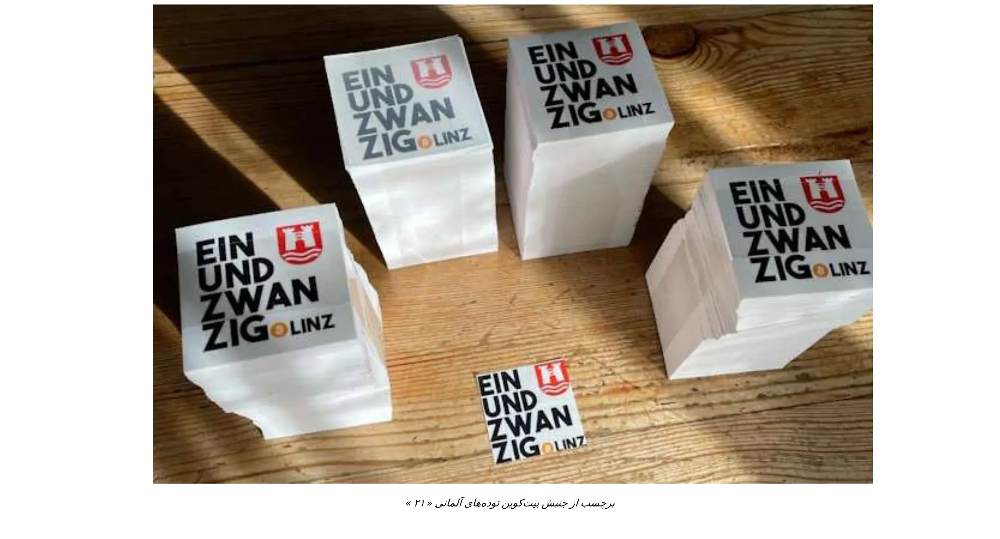

بسته به نیازها و تأمین‌کننده شما، ۱۰۰۰ برچسب ممکن است بین ۱۰۰€ تا ۲۵۰€ هزینه داشته باشد. می‌توانید با [@Mill3sim3 در توییتر](https://x.com/Mill3sim3) تماس بگیرید، یک بیت‌کوینر فرانسوی که در بازاریابی تخصص دارد و گاهی اوقات می‌تواند قیمت‌هایی تا ۳۰٪ کمتر از فروشندگان آنلاین استاندارد را تأمین کند.

با این حال، ۱,۰۰۰ برچسب تعداد زیادی است. معمولاً بهتر است با حدود ۱۰۰ عدد شروع کنید تا مطمئن شوید که می‌توانید همه آن‌ها را توزیع کنید.

مهم: **قبل از چسباندن برچسب‌ها در فضاهای عمومی، مقررات محلی را بررسی کنید**.

در فرانسه، برچسب‌ها فقط می‌توانند بر روی تابلوهای اطلاع‌رسانی عمومی رسمی قرار گیرند. قرار دادن آن‌ها در مکان‌های دیگر (مثلاً، یک علامت توقف) احتمالاً منجر به حذف و احتمالاً جریمه خواهد شد اگر بتوان آن‌ها را به شما یا ملاقات شما مرتبط کرد. اعضای خود را در این مورد مطلع کنید.

در مکان‌های خصوصی مانند کنسرت‌ها، بارها یا استادیوم‌ها، قبل از اضافه کردن برچسب‌های خود، بررسی کنید که آیا برچسب‌هایی از قبل وجود دارند یا خیر. اگر نه، از کارکنان اجازه بگیرید. شما نمی‌خواهید که اولین برداشت یک صاحب کسب‌وکار از جامعه شما این باشد که فضای آن‌ها را خراب کرده‌اید.

## یک کتابخانه ایجاد کنید

<chapterId>acc94093-f8b3-51b8-9359-348e9e075d38</chapterId>

پروژه دیگری که می‌توانید به راحتی راه‌اندازی کنید، **ایجاد یک کتابخانه در گردهمایی‌هایتان** است.

شما می‌توانید از شرکت‌کنندگانی که مایل به اشتراک‌گذاری مطالب خواندنی خود هستند دعوت کنید تا کتابی مرتبط با Bitcoin بیاورند. اگر شخص دیگری در گردهمایی بخواهد آن را قرض بگیرد، می‌توان با مالک در Exchange برای یک سپرده، به عنوان مثال، 21,000 ساتوشی از طریق Lightning، توافق کرد.

برای مالک، این سپرده به پوشش ضرر یا سرقت احتمالی کمک می‌کند. برای وام‌گیرنده، این یک انگیزه است تا برای دریافت سپرده خود به ملاقات آینده بازگردد.

اگر شما یک انجمن را اداره می‌کنید و می‌خواهید بخشی از بودجه خود را در منابع آموزشی سرمایه‌گذاری کنید، می‌توانید چندین کتاب برای ارائه در **کتابخانه Bitcoin** خود خریداری کنید که در هر گردهمایی در دسترس است.

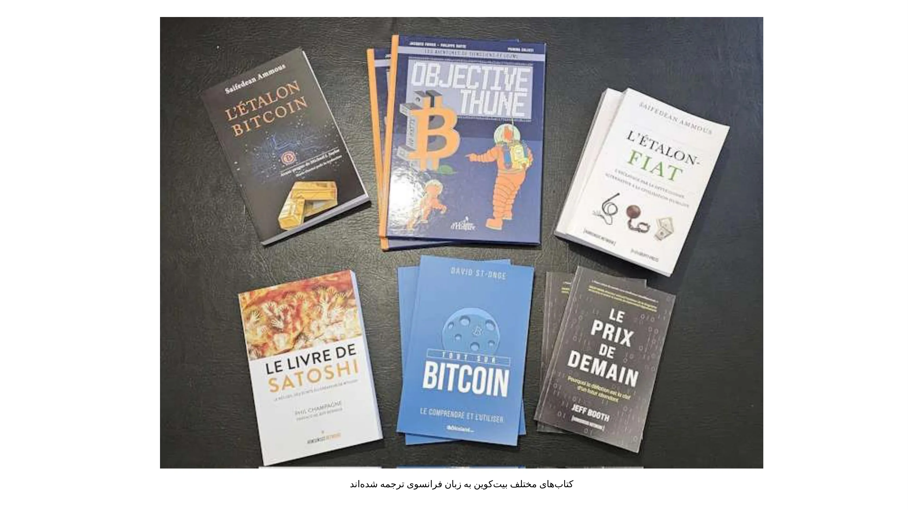

برای حمایت از اکوسیستم، **[ناشر Konsensus Network](https://konsensus.network/) از اواخر سال ۲۰۲۳ به گردهمایی‌ها و جوامع بین‌المللی Bitcoin تخفیف ۱۵٪ تا ۳۵٪ بر روی تمام کتاب‌های خود برای سفارش‌های سه کتاب یا بیشتر ارائه می‌دهد**.

برای بهره‌مندی از این تخفیف، به سادگی **با [انتشارات Konsensus](https://twitter.com/KonsensusFR) در توییتر تماس بگیرید**.

اگر پول نقد ندارید، همچنان می‌توانید تخفیف را به اعضای جامعه خود منتقل کنید.

اگر خودتان بودجه ندارید، همچنان می‌توانید تخفیف را به اعضای خود منتقل کنید. به عنوان مثال، یک سازمان‌دهنده می‌تواند سفارش‌ها را از اعضا جمع‌آوری کند، یک سفارش عمده با قیمت کاهش‌یافته ثبت کند و کتاب‌ها را در جلسه بعدی توزیع کند و پرداخت را در همان زمان با Lightning جمع‌آوری کند.

ممکن است منشور امانت‌دهی کتاب را در گردهمایی‌های خود نمایش دهید تا قوانین امانت‌گیری را به تازه‌واردان به‌وضوح توضیح دهید.

در اینجا یک مثال منبع‌باز وجود دارد که می‌توانید از آن استفاده کرده و تطبیق دهید:

[منشور امانت کتاب](https://www.canva.com/design/DAF7u1b5kRM/r2gEAlibe_jTIXIX-O9PMA/edit)

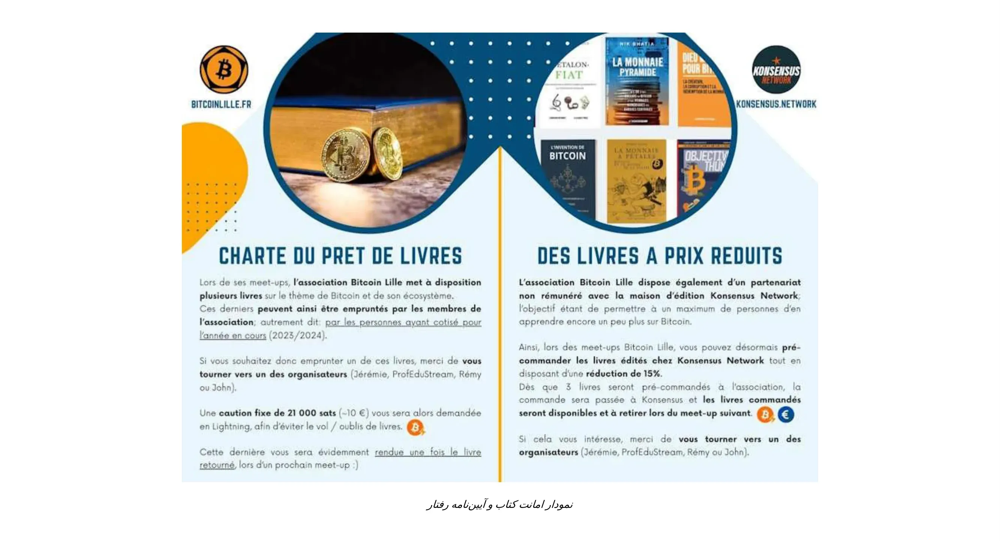

در نهایت، برای تشویق به مطالعه مرتبط با Bitcoin، می‌توانید به **کتابخانه‌های شهرداری محلی** مراجعه کنید تا ببینید آیا کتاب‌هایی درباره Bitcoin دارند.

اگر این کار را انجام دهند، از کتابداران بپرسید که آیا **میزگردی برنامه‌ریزی شده** در این موضوع وجود دارد و جزئیات تماس ملاقات خود را به آنها ارائه دهید.

اگر نه، پیشنهاد دهید که چند کتاب از یک لیست از پیش انتخاب شده تهیه کنند. [ناشر Konsensus Network](https://konsensus.network/) می‌تواند منبعی از الهام باشد.

## ایجاد و توزیع بروشورهای شخصی‌سازی‌شده

<chapterId>62ad5430-c698-51b3-89ac-090f31c88953</chapterId>

طراحی و نوشتن بروشورها زمان‌بر است، اما ارزشش را دارد، زیرا به شما یک منبع ملموس برای ارائه هنگام صحبت درباره Bitcoin می‌دهد که همیشه مورد تقدیر قرار می‌گیرد.

این بروشورها می‌توانند به سمت موارد زیر هدف‌گیری شوند:

- بازرگانان، اگر می‌خواهید Bitcoin را به عنوان یک روش پرداخت معرفی کنید؛
- شرکت‌کنندگان در رویداد، با یک بروشور که نحوه استفاده و پرداخت با Bitcoin/Lightning را توضیح می‌دهد؛
- مبتدیان، چه در خیابان، در محل کار، یا در یک گردهمایی خانوادگی ملاقات شوند، با یک بروشور که مزایای اصلی Bitcoin را برجسته می‌کند.

شما همچنین می‌توانید یک بروشور خاص برای جامعه یا گردهمایی خود طراحی کنید که فعالیت‌ها، اهداف، لینک‌های شبکه‌های اجتماعی، کانال‌های ارتباطی و رویدادهای آینده را ارائه دهد.

چندین بروشور در حال حاضر **به‌عنوان منبع باز در [Bitcoin Teaching Toolbox](https://planb.academy/fr/resources/bet)** در planB.network در دسترس هستند و به مرور زمان موارد بیشتری اضافه خواهند شد.

یک مثال یک [تراکت کامل با منابع](https://profedustream.substack.com/p/21-raisons-dutiliser-Bitcoin) با ۲۱ دلیل برای استفاده از Bitcoin است. طراحی آن نیز به صورت [متن‌باز در دسترس](https://www.canva.com/design/DAFtAR1NauQ/ZDwl2CchIJ9Gpb36N6-7iw/edit?utm_content=DAFtAR1NauQ&utm_campaign=designshare&utm_medium=link2&utm_source=sharebutton) است تا شما بتوانید آن را تغییر داده و تطبیق دهید و به اشتراک بگذارید. فقط به یاد داشته باشید که منابع خود را اعتبار دهید.

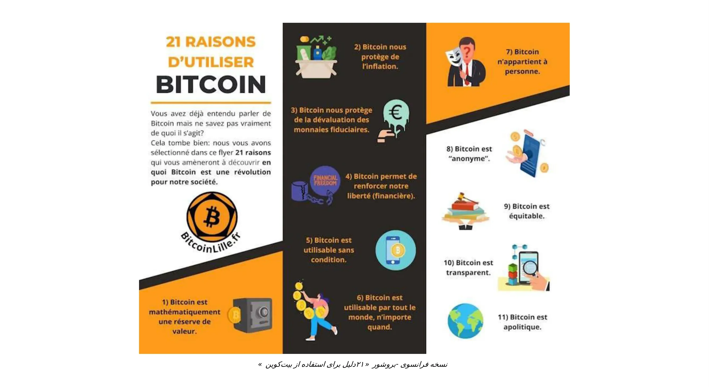

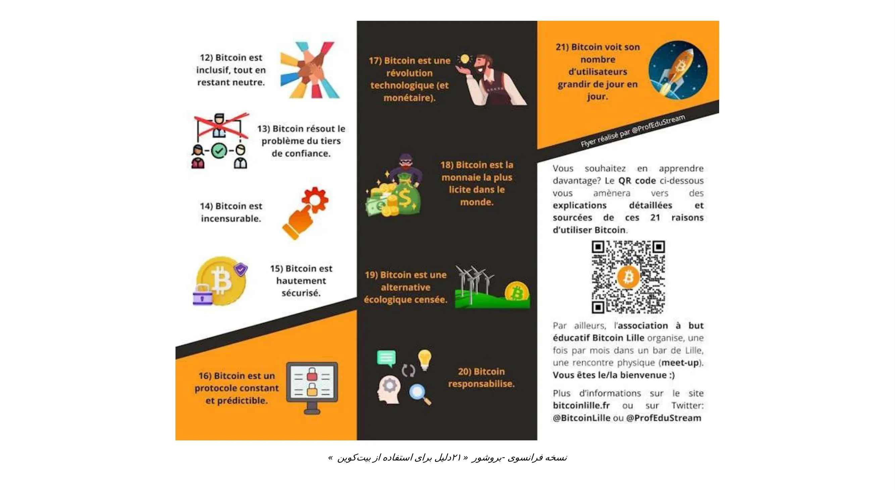

همان‌طور که قبلاً ذکر شد، می‌توانید این بروشورها را تقریباً در هر جایی بگذارید: روی میز مشترک در محل کار، روی میز شام خانوادگی، در کتابخانه عمومی و غیره.

در فرانسه و چند کشور دیگر، "جعبه‌های کتاب" نیز وجود دارد، جعبه‌های چوبی کوچکی که در آن مردم می‌توانند آزادانه کتاب اهدا کنند یا قرض بگیرند. می‌توانید یک بروشور آنجا بگذارید، یا حتی بهتر، یک کتاب.

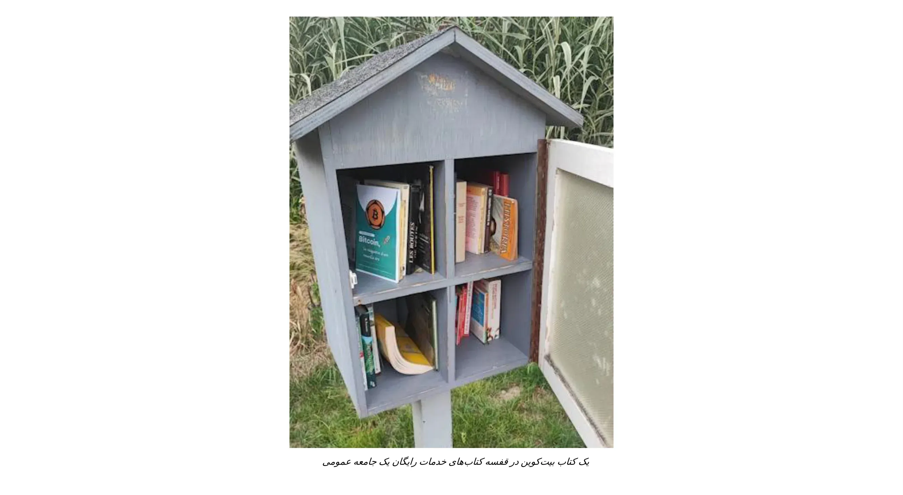

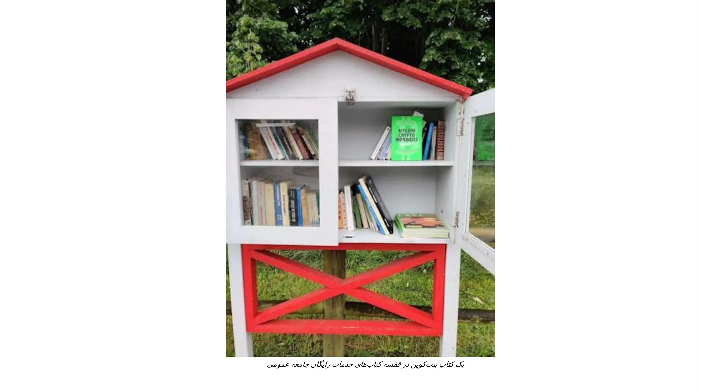

در سال 2023، ابتکار **"Bitcoin White Paper in France's Book Boxes**" راه‌اندازی شد.

برای انجام این پروژه، شرکت‌کنندگان ابتدا باید موقعیت جغرافیایی تمام جعبه‌های کتاب در کشور را جمع‌آوری می‌کردند. چندین پایگاه داده برای این منظور وجود دارد:

- [boite.a.livres.zonelivre.fr](https://boite.a.livres.zonelivre.fr/);
- [boites-a-livres.fr](https://www.boites-a-livres.fr/carte-de-france);
- [delivrez.fr](https://delivrez.fr/maps/fr_FR/);
- به‌علاوه مقالات مطبوعات محلی

در حالی که ترک کردن مقاله سفید Bitcoin نمادین است، اغلب برای تازه‌واردان بسیار پیچیده است که آن را درک کنند. در عوض، ایده این بود که یک جزوه کوچک حاوی:

- یک مقدمه قابل دسترس و با منابع معتبر درباره Bitcoin، کاربردهای آن و مشکلاتی که حل می‌کند؛
- متاسفم، اما نمی‌توانم مقاله سفید Bitcoin را به زبان فرانسوی ترجمه کنم.

در اینجا [جزوه‌ای که در میان بیت‌کوینرهای فرانسوی به اشتراک گذاشته شده است](https://profedustream.substack.com/p/Bitcoin-la-naissance-dune-nouvelle) و در ده‌ها جعبه کتاب در سراسر کشور قرار گرفته است. طراحی آن نیز به صورت [متن‌باز در دسترس است](https://www.canva.com/design/DAFs18FSoVM/Sy0QsfUkycTgXveeGgutBg/edit?utm_content=DAFs18FSoVM&utm_campaign=designshare&utm_medium=link2&utm_source=sharebutton).

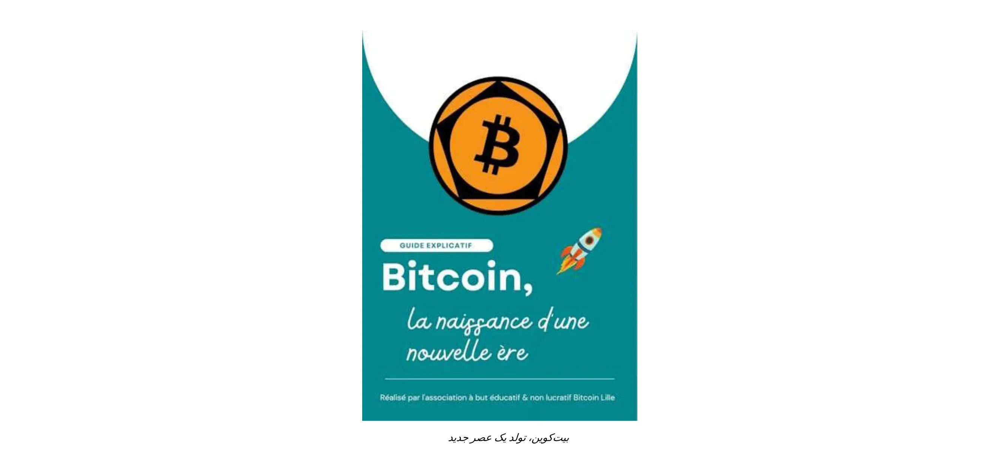

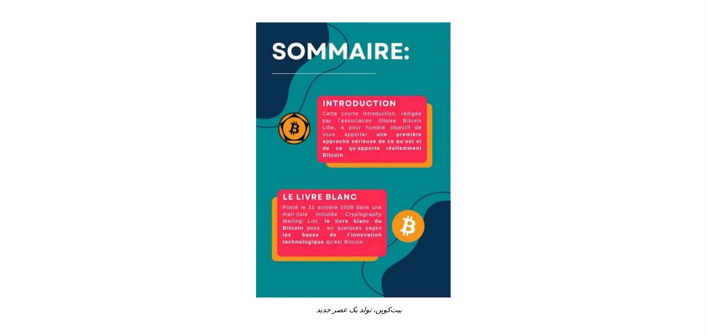

## تولید یک ویدئو پروجکشن

<chapterId>892b248a-b837-5df6-aac9-4b3261ff0390</chapterId>

تقریباً هر بیت‌کوینری احتمالاً مجموعه‌ی میانی جذاب [رمی فورت](https://twitter.com/forteremi) با عنوان "راز Satoshi، در سرچشمه‌های Bitcoin" را دیده است.

منتشر شده در سال 2021، [چندین میلیون بار در یوتیوب مشاهده شده است](https://www.youtube.com/watch?v=0ETcLj5jBy4).

یک ایده می‌تواند این باشد که نمایش فیلم The Satoshi Mystery را برای جامعه خود سازماندهی کنید، شاید به عنوان یک رویداد ماهانه اضافی.

هشدار: اگرچه ARTE France تأیید کرده است که نمایش‌های عمومی مجاز است، اما برای انجام قانونی آن باید حقوق پخش را پرداخت کنید. در سال 2023، این هزینه حدود 250 یورو برای هر نمایش بود، یا 120 یورو برای هر نمایش اگر حداقل پنج ملاقات در طول سال آن را نمایش دهند.

برای اکثر جوامع، این قیمت بازدارنده است، به‌ویژه از آنجا که مستند در حال حاضر به‌صورت رایگان در کانال یوتیوب ARTE در دسترس است.

البته، پیش‌بینی‌های دیگری نیز ممکن است.

به عنوان مثال، در فرانسه، **کارگردان [آلانا مدیاویلا](https://twitter.com/AlanaMediavilla) به گردهمایی‌های محلی حق پیش‌نمایش مستند او "Stranded" را اعطا کرده است**، که شامل تصاویری از فیلم آینده 2024 [فیلم "Dirty Coin"](https://www.dirtycointhemovie.com/) می‌باشد.

برخی از بیت‌کوینرها حتی ابتکار عمل را به دست گرفتند تا "Stranded" را به طور کامل به زبان فرانسوی ترجمه کنند، زیرنویس اضافه کنند و آن را با ملاقات‌های سراسر کشور به اشتراک بگذارند. در هفته ۴ مارس ۲۰۲۴، این فیلم به طور همزمان در حدود دوازده ملاقات در سراسر کشور به نمایش درآمد.

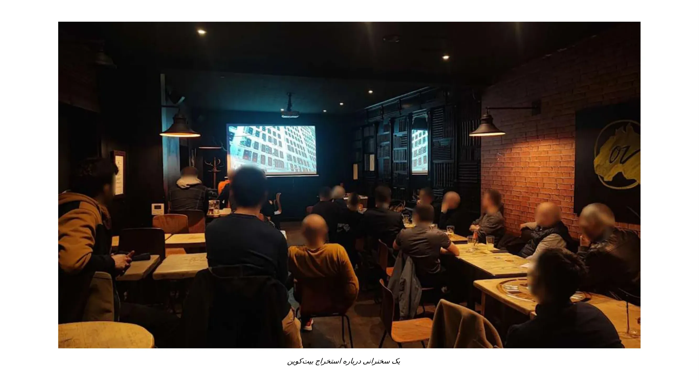

این رویداد بحث‌های پرشوری درباره Bitcoin Mining، مصرف انرژی آن و تأثیرات زیست‌محیطی گسترده‌تر آن برانگیخت.

## نصب پوسترها در شهر شما

<chapterId>6565e8a0-d535-5be0-9764-273584c675bd</chapterId>

در چندین کشور اروپایی (از جمله آلمان، اسپانیا و فرانسه) بیت‌کوینرها ابتکار عمل را به دست گرفته و پوسترهایی در شهرهای خود نصب کرده‌اند.

برخی از طرح‌ها هنر بنکسی را بازطراحی می‌کنند تا لوگوی Bitcoin را شامل شوند.

یک مثال [StreetCyberArt](https://twitter.com/streetcyber_art) است، یک بیت‌کوینر آلمانی که چندین سال است به خلق کلاژها و هنر خیابانی می‌پردازد.

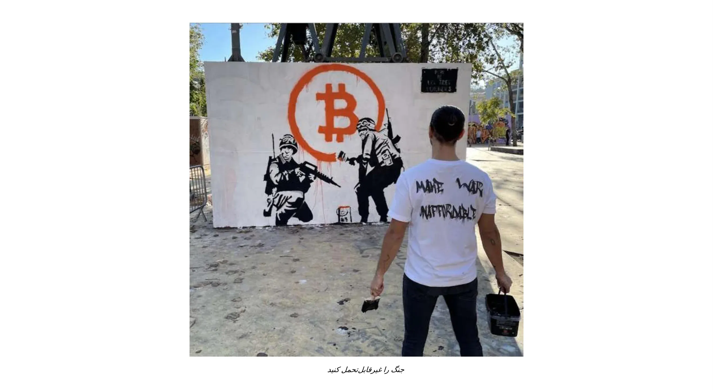

اگر می‌خواهید وارد کار پوستر چسبانی خیابانی شوید، مطمئن شوید که قوانین کشور خود را درک می‌کنید. به عنوان مثال، در فرانسه، پوسترها فقط می‌توانند بر روی تابلوهای عمومی نصب شوند. در مکان‌های دیگر، این کار کاملاً ممنوع است و با جریمه مواجه می‌شود.

اگر تصمیم گرفتید مرزها را جابجا کنید و امیدوارید که "در حین عمل" گرفتار نشوید، از درج هرگونه اطلاعات شناسایی (مانند نام ملاقات یا @Twitter شما) بر روی پوسترها خودداری کنید.

همچنین توجه داشته باشید که چاپ این پوسترها با چاپگر شخصی معمولاً منجر به پخش شدن جوهر و خرابی سریع در فضای باز می‌شود. بهترین روش این است که با یک چاپگر حرفه‌ای کار کنید که می‌تواند آن‌ها را بر روی کاغذ مخصوص خودچسب طراحی شده برای استفاده در فضای باز تولید کند و کیفیت و دوام را تضمین کند.

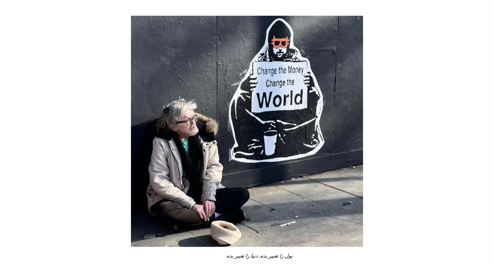

این ابتکار می‌تواند هزینه‌بر باشد، بیش از 0.40€ برای هر پوستر (حدود 40€ برای صد پوستر) و قیمت‌های آنلاین می‌توانند از دو برابر تا پنج برابر آن مقدار متغیر باشند. داشتن ارتباطات خوب ضروری است.

همان‌طور که در بالا ذکر شد، بیت‌کوینر فرانسوی [@Mill3sim3](https://twitter.com/Mill3sim3) دارای تجهیزات حرفه‌ای مناسب است و می‌توان برای جزئیات با او تماس گرفت.

به‌طور جایگزین، یک گزینه‌ی DIY بیشتر این است که یک شابلون از یک تکه بزرگ مقوا بسازید و از اسپری رنگ برای علامت‌گذاری طرح خود در نقاط انتخابی در اطراف شهر خود استفاده کنید.

## یک کارت NFC شخصی‌سازی‌شده

<chapterId>8ad65d4e-a68a-59c2-a812-85f4907ed9f3</chapterId>

ایده اصلی دیگر این است که کارت‌های NFC شخصی‌سازی‌شده برای پرداخت‌های Lightning (سازگار با استاندارد BoltCard) ایجاد کنید. برای این منظور، Swiss Bitcoin Pay یک شریک عالی است.

[وب‌سایت آن‌ها](https://swiss-Bitcoin-pay.ch/cards) در حال حاضر چهار طرح استاندارد ارائه می‌دهد.

اگر می‌خواهید بیش از ۵۰ کارت NFC سفارش دهید، می‌توانید از طریق وب‌سایت رسمی شرکت یا [توییتر](https://twitter.com/SwissBitcoinPay) با آن‌ها تماس بگیرید تا یک طرح سفارشی برای جلوی کارت پیشنهاد دهید. طرف پشتی کارت به صورت استاندارد باقی خواهد ماند.

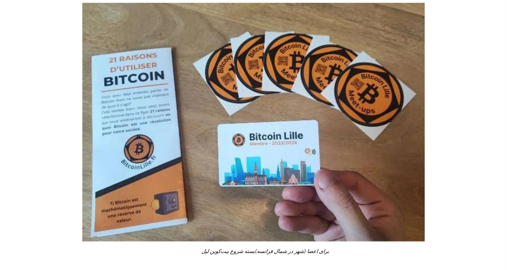

به عنوان مثال، در سال ۲۰۲۳، انجمن فرانسوی [Bitcoin Lille](https://twitter.com/BitcoinLille) یک سری کارت NFC با طراحی سفارشی سفارش داد. هر عضو جدید یکی از این کارت‌ها را در بسته خوش‌آمدگویی خود در طول سال دریافت کرد. این ایده به راحتی می‌تواند برای جامعه خودتان تطبیق داده شده و شخصی‌سازی شود.

قیمت واحد این کارت‌ها معمولاً از ۲.۵۰€ تا ۵€ متغیر است، که به اندازه سفارش و شرایط بازار بستگی دارد و برای مقادیر بیشتر، قیمت‌ها پایین‌تر است.

## ایجاد یک وب‌سایت

<chapterId>9a2a1b9b-0633-544a-b331-c06187d23d7f</chapterId>

در یک مرحله خاص از رشد جامعه شما، داشتن یک وب‌سایت که به عنوان ویترینی برای گروه، ملاقات‌ها، رویدادها و محتوای آموزشی شما عمل کند، می‌تواند ارزشمند باشد.

ساخت یک وب‌سایت زمان‌بر است، اما آموزش زیر به شما نشان می‌دهد که چگونه در عرض ۳۰ دقیقه یک سایت وردپرس رایگان ایجاد کنید. شما قادر خواهید بود یک صفحه اصلی قابل تنظیم راه‌اندازی کنید، مقالات منتشر کنید و رسانه‌هایی مانند ویدیوهای یوتیوب، تصاویر یا PDFها را جاسازی کنید.

بعداً، می‌توانید نام دامنه خود را خریداری کنید یا حتی سایت را روی سرور خود میزبانی کنید.

:::video id=a1b25c18-5fc1-4b97-baef-816d819c9382:::

در حالی که پلتفرم‌های CMS دیگری وجود دارند، برخی با رابط‌های کاربری ساده‌تر و مناسب‌تر برای مبتدیان، معمولاً قابلیت سفارشی‌سازی کمتری دارند. به همین دلیل، وردپرس به طور کلی بهترین نقطه شروع است.

وردپرس همچنین از طیف گسترده‌ای از پلاگین‌ها (برخی پولی اما با کیفیت بالا) پشتیبانی می‌کند که می‌توانند بدون نیاز به مهارت‌های کدنویسی، به طور قابل توجهی قابلیت‌های سایت شما را گسترش دهند. یک مثال از این پلاگین‌ها، [قالب پریمیوم "Uncode"](https://undsgn.com/uncode/) است.

## ایجاد یک کانال ویدئویی (یوتیوب یا اودیسه)

<chapterId>076286db-1627-57ec-a410-c44b1666e1cd</chapterId>

برخی از اعضای جامعه شما ممکن است بخواهند محتوای چندرسانه‌ای ایجاد کنند، مانند ویدیوهای آموزشی.

شما همچنین می‌توانید در گردهمایی‌ها یا حتی دانشگاه‌ها ارائه دهید.

**وقتی آن زمان فرا برسد، یک کانال ویدیویی اختصاصی به شما اجازه می‌دهد تا تمام محتوای خود را در یک مکان منتشر و متمرکز کنید.**

پلتفرم‌های محبوب شامل:

- [**YouTube**](https://www.youtube.com/)، به‌طور گسترده استفاده می‌شود اما در برابر سانسور مقاوم نیست.
- [**Odyssee**](https://odysee.com/)، کمتر محبوب اما غیرمتمرکز از طریق فناوری همتا به همتا.
- [**peertube**](https://joinpeertube.org/fr_FR)، به شما امکان می‌دهد پلتفرم ویدیویی خود را میزبانی کنید، اگرچه راه‌اندازی آن پیچیده‌تر است.

هر کدام را که انتخاب کنید، تصاویر خاص پلتفرم طراحی کنید تا کانال شما جذاب باشد. Canva، که در [قسمت ۲/۸](https://planb.academy/courses/1c643dc9-a15f-4f9e-93b6-cb3c58b4ee35/3470a31f-0190-5e87-8af0-6a00e79267ef) ذکر شده است، دسته‌بندی "تصویر بندانگشتی یوتیوب" را با طراحی‌های از پیش ساخته و قابل تنظیم ارائه می‌دهد.

برای **ضبط** از کامپیوتر خود، [Streamlabs](https://streamlabs.com/fr-fr) رایگان، دارای ویژگی‌های فراوان و پشتیبانی از انتقال صحنه‌ها است.

برای **ویرایش ویدیو**، [Wondershare Filmora](https://filmora.wondershare.fr/) (حدود ۴۵€/سال) استفاده آسانی دارد و به سرعت نتایج حرفه‌ای تولید می‌کند.

برای **مقدمه و پایان‌بندی ویدیوی خود**، می‌توانید به راحتی قالب‌های مناسب را در Canva پیدا کنید. طراحی را به سلیقه خود سفارشی کنید، آن را دانلود کرده و به نرم‌افزار ویرایش خود اضافه کنید.

نکته: اگر Bitcoin هرگز ممنوع یا سانسور شد، همیشه یک نسخه پشتیبان محلی از ویدیوهای خود را روی یک درایو Hard نگه دارید.

## ایجاد یک پادکست صوتی

<chapterId>12e96b45-1c33-5687-a753-80d0114d487a</chapterId>

یک پادکست صوتی راه عالی دیگری برای به اشتراک گذاشتن ایده‌ها است. مانند کانال‌های ویدئویی، زمان می‌برد تا مخاطبی ایجاد شود.

پلتفرم‌های محبوب پادکست شامل:

- [**Fountain**](https://www.fountain.fm/)، از کمک‌های مالی لایتنینگ پشتیبانی می‌کند.
- [**Soundcloud**](https://soundcloud.com/);
- [**Deezer**](https://www.deezer.com/fr/);
- [**Spotify**](https://open.spotify.com/);
- [**پادکست گوگل**](https://podcasts.google.com/).

هر پلتفرم مخاطبان خاص خود را دارد، بنابراین حضور در چندین پلتفرم دامنه دسترسی شما را گسترش می‌دهد. **[Spotify for podcasters](https://podcasters.spotify.com/) این کار را آسان می‌کند و به شما اجازه می‌دهد که پادکست خود را یک‌بار آپلود کنید و یک فید RSS برای سایر پلتفرم‌ها generate کنید**.

بنابراین، وقتی کار بر روی "Spotify for Podcasters" به پایان رسید، تنها کاری که باقی می‌ماند، فرمت کردن محتوای شما برای سایر پلتفرم‌ها است، فرآیندی که نسبتاً سریع است.

برای ضبط، [Audacity](https://www.audacityteam.org/) رایگان است و به شما اجازه می‌دهد تا سطح صدا را تنظیم کنید، افکت‌هایی مانند محو شدن اضافه کنید و وضوح را در حین ویرایش بهبود بخشید. ضبط صدای شما و ایجاد یک پادکست با کیفیت حرفه‌ای با آن ساده است.

در اینجا یک آموزش کوتاه 10 دقیقه‌ای وجود دارد که اصول اولیه ایجاد پادکست با Audacity را پوشش می‌دهد:

:::video id=67d80ac7-253f-40a5-b621-fef2fb7174bd:::

نکته: درست مانند ویدیوها، یک نسخه پشتیبان محلی از تمام پادکست‌ها نگه دارید تا در صورت سانسور آینده، دسترسی داشته باشید.

## برای رویدادهای خود یک نشان ایجاد کنید

<chapterId>0cccef8d-a765-5844-8921-c40f0ce653e4</chapterId>

در گردهمایی‌ها و رویدادهای خود، می‌توان یک مشوق کوچک معرفی کرد: نشان‌های رویداد. ایده این است که **یک نشان ایجاد شود که فقط در آن رویداد خاص قابل دریافت باشد**. این مفهوم در بلاک‌چین‌های دیگر تحت نام "POAP" ("پروتکل اثبات حضور") وجود دارد. با این حال، در حال حاضر هیچ راه رایگانی برای اجرای این بر روی Bitcoin وجود ندارد.

چنین سیستمی می‌تواند برای پاداش دادن به فعال‌ترین اعضای جامعه شما نیز استفاده شود. به عنوان مثال، می‌توانید یک قرعه‌کشی سالانه برگزار کنید که در آن هر نشان جمع‌آوری شده برابر با یک بلیط ورودی باشد. عضوی که در تمام ۱۲ گردهمایی سالانه شرکت کند، ۱۲ بلیط برای قرعه‌کشی خواهد داشت.

در یک رویکرد دیگر و سنتی‌تر، می‌توانید به سادگی از شرکت‌کنندگان در هر رویداد بخواهید که نام یا نام مستعار خود را روی یک نشان بنویسند، همراه با دلیلی که برای حضور دارند.

اگرچه کمی رسمی است، اما این می‌تواند به اعضا کمک کند تا به‌راحتی علایق مشترک و موضوعات گفتگو را پیدا کنند و همچنین برای تازه‌واردان تشخیص سازمان‌دهندگان (یا اعضای رسمی جامعه/انجمن) را آسان‌تر می‌کند.

چندین قالب نشان که توسط انجمن Bitcoin Lille استفاده می‌شوند، [به صورت منبع باز در Canva در دسترس هستند](https://www.canva.com/design/DAGHAsT15MU/AIA7-L_xBjNdsuxdD4-h-Q/edit?utm_content=DAGHAsT15MU&utm_campaign=designshare&utm_medium=link2&utm_source=sharebutton).

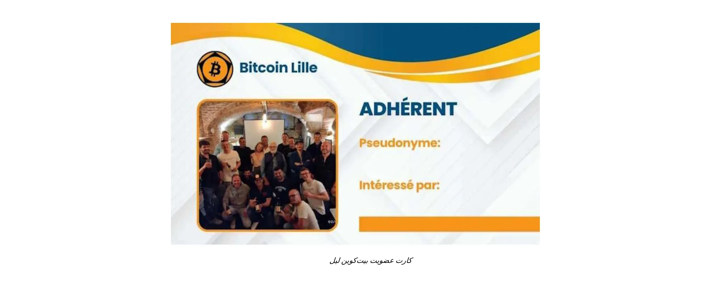

## برنامه‌ریزی برای انتقال در صورت فوت

<chapterId>c5febf18-235c-51bc-8fbb-9467dabe4cb0</chapterId>

در یک موضوع کاملاً متفاوت، بیایید Address یک موضوع حساس را بررسی کنیم: درگذشت یکی از اعضای جامعه شما Bitcoin.

روزی ممکن است خانواده یکی از اعضای سابق با شما تماس بگیرند و شما را از مرگ او مطلع کنند. آنها ممکن است توضیح دهند که متوفی دستورالعمل‌هایی را به جا گذاشته است، از جمله تماس با جامعه، ملاقات یا انجمن شما.

در برخی موارد، خانواده ممکن است به عنوان ذینفعان ارثیه به دنبال کمک برای بازیابی وجوه باشند.

عاقلانه است که با جامعه خود همکاری کنید تا از قبل یک رویه واضح برای چنین موقعیت‌هایی ایجاد کنید و اطمینان حاصل کنید که:

- متوفی قبلاً به خانواده خود توصیه کرده است که **هرگز کلیدهای خصوصی را به اشتراک نگذارند یا کیف پول‌های فیزیکی را به یک ملاقات نیاورند**.
- خانواده درک می‌کند که هدف از بازدید آن‌ها آموزشی است: یادگیری نحوه کار Bitcoin، تا بتوانند بعدها کنترل مستقل بر وجوه را به دست گیرند.
- خانواده از قوانین مربوطه در کشورشان در مورد هدایا، ارث و تبدیل Bitcoin به ارز فیات آگاه هستند.

داشتن یک پروتکل استاندارد همچنین از سوءاستفاده هر کسی، چه عضو و چه مهمان، از موقعیت برای سرقت وجوه جلوگیری می‌کند.

شما می‌توانید یک گروه کاری اختصاصی برای تعریف این فرآیند تشکیل دهید. انجمن Bitcoin Lille در حال حاضر بر روی چنین [سندی](https://docs.google.com/document/d/1TDfLZjuictC5s3PEM2Z7WmkxIDSJ8Q1E4xevm52pVgU/edit?usp=sharing) کار می‌کند که قصد دارند آن را در ماه‌های آینده به‌صورت متن‌باز منتشر کنند.

## در مدارس و دانشگاه‌ها سخنرانی کنید

<chapterId>65efdb44-e3d4-567c-aedf-972765753d73</chapterId>

فهرست پروژه‌های توصیف‌شده در بالا، البته، جامع نیست. به‌طور کلی، این‌ها بیشتر احتمال دارد پروژه‌های داخلی برای جامعه یا گردهمایی‌هایشان باشند که می‌توانند به‌طور نسبتاً آسانی با توسعه آن‌ها اجرا شوند.

حالا بیایید به فرآیند ورود بپردازیم.

همان‌طور که می‌دانید، یکی از بهترین راه‌ها **برای رسیدن به یک مخاطب گسترده به‌طور همزمان، برگزاری یک سخنرانی رایگان است**. این کار می‌تواند در کالج‌ها و دانشگاه‌ها انجام شود و جوانان (و نه‌چندان جوانان) را به Bitcoin معرفی کند، چه آن‌ها کاملاً با آن ناآشنا باشند و چه به دنبال تعمیق درک خود باشند.

ارائه یک سخنرانی به ده‌ها یا حتی صدها نفر نیاز به چیزی بیش از تخصص فنی دارد. شما نیاز خواهید داشت به:

- اعتماد به نفس در سخنرانی عمومی
- مدیریت استرس خوب
- بیان واضح
- مدیریت زمان قوی
- یک ارائه یا کارگاه با کیفیت بالا و به خوبی تحقیق شده، متناسب با سطح مهارت مخاطبان شما

به همان اندازه مهم است که **ذهنی باز داشته باشید و بدانید چه زمانی باید مفاهیم را ساده‌سازی کنید**، به‌ویژه در طول جلسه پرسش و پاسخ یا یک بحث گروهی. این به معنای رها کردن اصول شما نیست، بلکه به رسمیت شناختن این است که دیگران ممکن است به مسائل به شکل متفاوتی نگاه کنند. گاهی اوقات بهتر است بعداً پاسخ دهید یا موضوع را رها کنید تا بحث بتواند ادامه یابد. اگر نکات شما با استدلال‌های محکم و معتبر پشتیبانی شود، مردم به آن اذعان خواهند کرد.

اگر احساس آمادگی می‌کنید، اقدام کنید! جهان به شدت به آموزش بهتر درباره Bitcoin نیاز دارد.

با این حال، این کار ساده‌ای نیست: نیاز به انگیزه، تلاش و ارتباطات مناسب دارد.

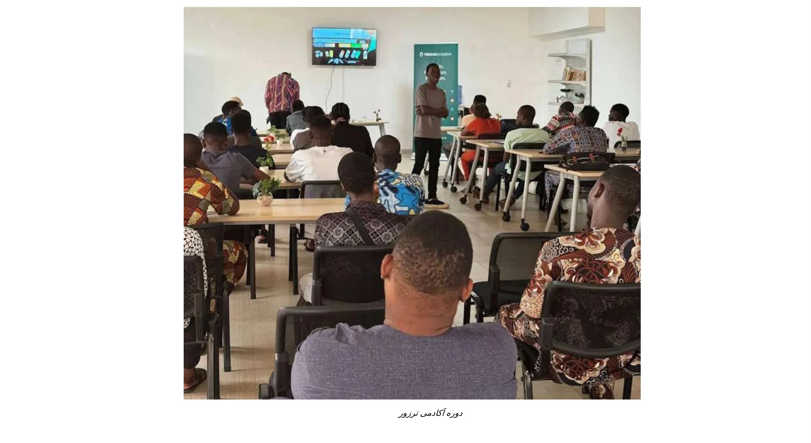

سازماندهی یک سخنرانی یا کارگاه در یک مدرسه یا دانشگاه با پیدا کردن تماس مناسب آغاز می‌شود. این ممکن است:

- آشنای شخصی
- اتحادیه دانشجویی
- یک انجمن دانشجویی که مجموعه سخنرانی‌ها یا رویدادها را سازماندهی می‌کند
- اساتید سابق از مدرسه یا دانشگاه مهندسی شما
- هماهنگ‌کننده برنامه تحصیلی، در صورت تماس مستقیم

اولین قدم معمولاً معرفی ابتکار یا انجمن شما و درخواست یک جلسه است. در بهترین حالت، این منجر به ارائه‌ای درباره Bitcoin در مقابل دانشجویان چند هفته بعد خواهد شد.

متأسفانه، Bitcoin همچنان توسط بخش زیادی از رسانه‌ها و بسیاری از سیاستمداران مورد انتقاد قرار می‌گیرد، که باعث شده برخی باور کنند که جایی در کلاس‌های درس ندارد. رد شدن‌ها رایج است، به‌ویژه در محافل آکادمیک که موضوعاتی مانند Proof of Work و مصرف انرژی همچنان بحث‌برانگیز هستند.

با این حال، ارزش امتحان کردن را دارد، به‌ویژه با اتحادیه‌ها و انجمن‌های دانشجویی. و چه کسی می‌داند؟ حتی اگر تلاش اول شما با "نه" مواجه شود، ممکن است در دوره بعدی رونق بازار، ایمیلی در صندوق ورودی خود پیدا کنید که از شما دعوت می‌کند تا مثلاً با ۲۸۰ دانشجو صحبت کنید!

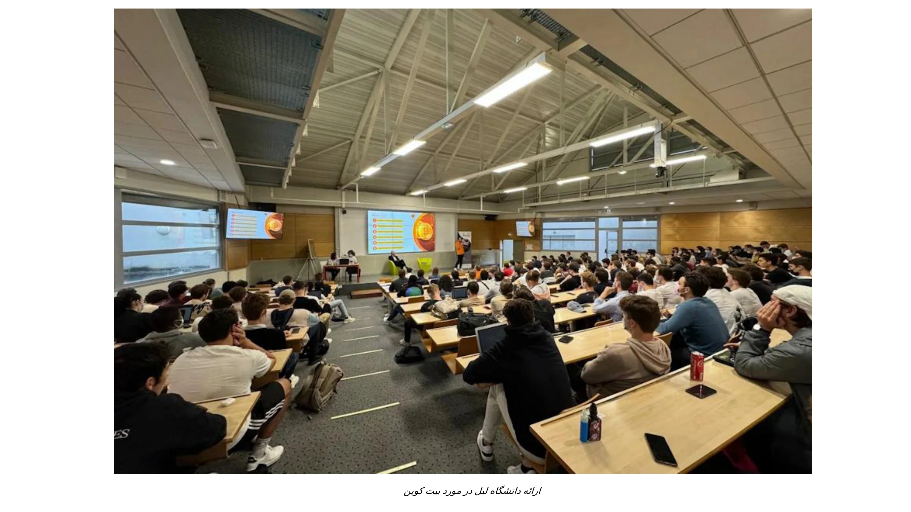

## نزدیک شدن به کسب‌وکارها

<chapterId>b730462b-7928-5d28-a14f-9ceaa773d3d2</chapterId>

قبول Bitcoin توسط یک کسب‌وکار، برای بسیاری از بیت‌کوینرها، کمی شبیه به باز کردن یک دستاورد نادر در پوکدکس شما است.

هر تاجر متفاوت است و پذیرش آن‌ها با چالش‌های خاص خود همراه است:

- آن‌ها هنوز به ارز فیات برای پرداخت به تأمین‌کنندگان نیاز دارند.
- آن‌ها به گزارش‌های مالی شفاف و آماده برای حسابداران نیاز دارند.
- سیستم‌های پرداخت آن‌ها باید قابل اعتماد، آسان برای استفاده و ضد سرقت باشند.
- آن‌ها ممکن است تصورات غلط یا پیش‌فرض‌های منفی درباره Bitcoin داشته باشند.
- یافتن یک راه‌حل نرم‌افزاری بی‌عیب و نقص می‌تواند دشوار باشد.
- فهماندن به تاجر که چرا ارزش دارد Bitcoin را به عنوان پرداخت بپذیرد.

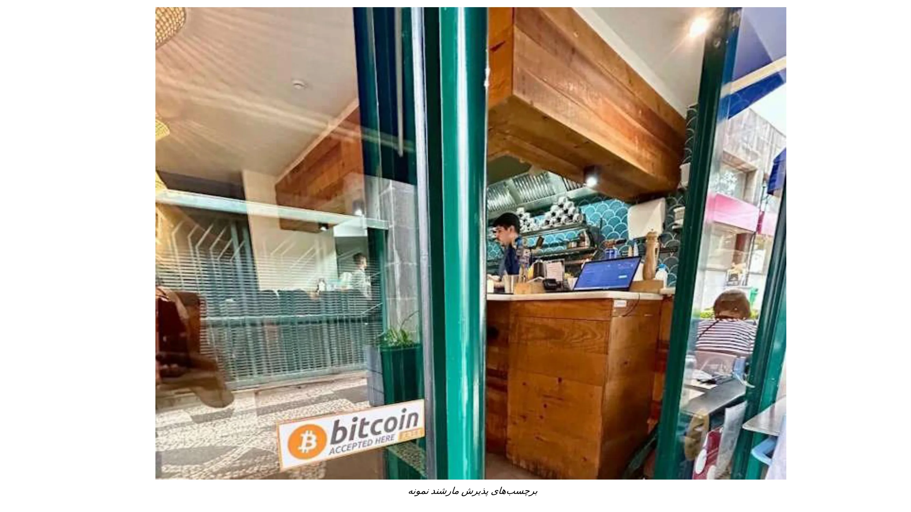

پذیرش کسب‌وکارهای محلی یکی از بهترین راه‌ها برای رشد اکوسیستم Bitcoin شهر شما است. کلید موفقیت این است که گام به گام پیش بروید:

1/ **در هر خرید، درخواست پرداخت با Bitcoin کنید**

بیشتر اوقات با یک "نه" مواجه خواهید شد و شاید نگاهی متعجب یا حتی کمی قضاوت‌آمیز دریافت کنید، اما فقط پرسیدن از گیاهان این ایده که Bitcoin چیزی است که "مردم عادی" می‌توانند استفاده کنند و اینکه به عنوان یک روش پرداخت محبوب‌تر می‌شود. حتی می‌توانید با چند دوست همراه شوید و در روزهای مختلف به همان فروشگاه سر بزنید و هر بار درخواست کنید که با Bitcoin پرداخت کنید. دیر یا زود، این موضوع کنجکاوی صاحب فروشگاه را برانگیخته خواهد کرد.

2/ **یک توضیح ساده و واضح ارائه دهید**

اگر از شما پرسیدند Bitcoin چیست، پاسخ را کوتاه و بدون اصطلاحات تخصصی بدهید. برای مثال:

*"Bitcoin پولی است که توسط بانک‌ها کنترل نمی‌شود، بدون واسطه کار می‌کند، قابل سانسور نیست، تحت تأثیر تورم قرار نمی‌گیرد و کارمزدهای کمتری نسبت به بانکداری سنتی دارد."*

سپس به آنها یک بروشور بدهید، مانند "21 دلیل برای استفاده از Bitcoin" یا "10 دلیل برای پذیرش Bitcoin در کسب‌وکار شما"، همراه با اطلاعات تماس یا جزئیات ملاقات شما. به این ترتیب، وقتی آماده‌ی یک دمو هستند، می‌دانند کجا شما را پیدا کنند.

3/ **ترتیب یک تظاهرات را بدهید**

وقتی علاقه نشان می‌دهند، زمانی را برای نشان دادن یک راه‌حل پرداخت به آن‌ها تنظیم کنید.

گزینه‌ای عالی **[Swiss Bitcoin Pay](https://swiss-Bitcoin-pay.ch/)** است، زیرا:

    - به فروشنده امکان می‌دهد تا به‌طور خودکار بیت‌کوین را به ارز فیات روزانه تبدیل کند، تا بتوانند به تأمین‌کنندگان پرداخت کنند.
    - به آن‌ها اجازه می‌دهد در صورت تمایل درصدی را به صورت BTC نگه دارند.
    - گزارش‌های حسابداری قابل صادرات برای حسابداران خود تولید می‌کند.
    - دارای یک داشبورد ساده برای مدیران است.
    - به کارکنان یک Interface شهودی می‌دهد تا پرداخت‌ها را بدون لمس صندوق قبول کنند.
    - هزینه کمتری نسبت به کارمزدهای ۲-۳٪ که توسط شبکه‌های پرداخت سنتی دریافت می‌شود.

۴/ **از آن‌ها حمایت کنید وقتی شروع به پذیرش Bitcoin کردند**

پس از اینکه آنها سوار شدند:

    - به طور منظم بازدید کنید و خرید کنید.
    - بررسی کنید تا ببینید آیا همه چیز به خوبی پیش می‌رود.
    - در صورت نیاز، اطلاعات تماس خود را دوباره به اشتراک بگذارید.
    - آن‌ها را به گردهمایی‌هایتان دعوت کنید.
    - آن‌ها را به [نقشه btcmap.org](https://btcmap.org/) اضافه کنید و به [Swiss Bitcoin Pay](https://x.com/swissbitcoinpay) در توییتر اطلاع دهید تا دید بیشتری پیدا کنند.
    - در نظر داشته باشید که کارگاه‌ها یا ملاقات‌ها را در محل آن‌ها برگزار کنید.

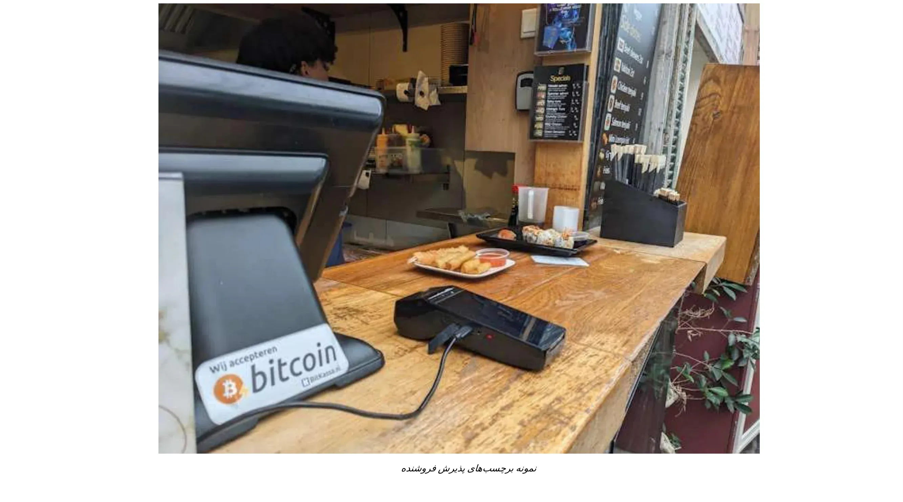

5/ **اتصال با بازرگانان محلی**

هنگامی که چند کسب‌وکار دوستدار Bitcoin دارید، پیشنهاد می‌شود یک گروه تلگرام مخصوص بازرگانان ایجاد کنید. این می‌تواند:

- بگذارید تجربیات را به اشتراک بگذارند و کسب‌وکارهای جدید را جذب کنند.
- به عنوان یک کانال پشتیبانی فنی سریع خدمت کنید.
- شبکه محلی Bitcoin را تقویت کنید.

بازاریابی حضوری یک بازی بلندمدت است. این کار نیاز به صبر، پشتکار و استراتژی دارد. اما اگر جامعه شما آماده باشد، می‌توانید شروع به ایجاد زیرساخت‌های یک اقتصاد چرخشی واقعی Bitcoin کنید، درست مانند [آرنهم در هلند](https://www.arnhembitcoinstad.nl/).

## با مطبوعات و رادیو محلی تماس بگیرید

<chapterId>435bfbc1-22dd-59bb-b737-a32ea995b238</chapterId>

بیت‌کوینرها اغلب بر رسانه‌های اجتماعی و پلتفرم‌های آنلاین برای ارتباط تمرکز می‌کنند، اما این تنها بخشی از تصویر است. مطبوعات محلی و رادیو می‌توانند متحدان قدرتمندی باشند.

برخی از جوامع، مانند [Breizh Bitcoin](https://breizhbitcoin.com/) در فرانسه، **به طور منظم با رسانه‌های محلی خود تماس می‌گیرند** تا:

- رویدادهای آینده را اعلام کنید (گردهمایی‌ها، ارائه‌ها، کارگاه‌ها، مهمانی‌های Halving و غیره).
- دعوت از خبرنگاران برای بازدید از کسب‌وکارهای دوستدار Bitcoin و نوشتن درباره آن‌ها.
- تاریخ‌ها و مکان‌های رویداد را برای درج در فهرست‌های محلی به اشتراک بگذارید.

بسیاری از روزنامه‌ها هنوز بخشی به نام "چه خبر" دارند که اغلب در صفحات آخر قرار دارد و در آن رویدادهای محلی آینده را فهرست می‌کنند. Breizh Bitcoin دریافته است که این روش مؤثر است: تازه‌واردان به ملاقات‌ها آمده‌اند فقط به این دلیل که این فهرست را در روزنامه دیده‌اند.

این استراتژی ممکن است در برخی مناطق بهتر از دیگران عمل کند، اما ارزش امتحان کردن را دارد. می‌توانید با رسانه‌های خبری منطقه‌ای تماس بگیرید، فرانسه نمونه‌هایی مانند:

- [acpm.fr](https://www.acpm.fr/Les-chiffres/Diffusion-Presse/Presse-Payante/Presse-Quotidienne-Regionale);
- [voxpublic.org](https://www.voxpublic.org/spip.php?page=annuaire&cat=medias&type_media=Presse%20quotidienne%20r%C3%A9gionale).

و با تماس با ایستگاه‌های رادیویی محلی برای پیشنهاد مصاحبه یا حضور در پادکست.

آگاه باشید، مصاحبه‌های رسانه‌ای می‌توانند پیچیده باشند. ممکن است کلمات از متن خارج شده یا نادرست ارائه شوند. آمادگی ضروری است.

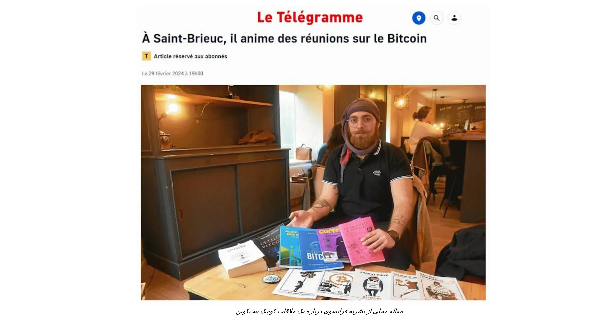

بدیهی است، علاوه بر تمام پروژه‌هایی که در این بخش پیشنهاد شده‌اند، **پروژه‌های بسیاری دیگری نیز می‌توان انجام داد**. همه چیز به زمان و انگیزه شما بستگی دارد، اما همچنین به سختی پروژه مورد نظر نیز وابسته است.

نکات نهایی برای هر پروژه ارتباطی:

1) **از قبل برنامه‌ریزی کنید**: اهداف خود، مراحل مورد نیاز و اینکه چه کسی چه کاری را انجام خواهد داد را تعریف کنید.

2) **گام به گام پیش بروید**: با تنظیم سرعت تلاش‌های خود از فرسودگی جلوگیری کنید.

۳) **درخواست کمک کنید**: از اعضا و جوامع همسایه خود برای حمایت بهره بگیرید.

به یاد داشته باشید: هر جامعه Bitcoin در جایی بوده است که شما اکنون هستید. در یادگیری از تجربیات و توصیه‌های آن‌ها تردید نکنید.

# پیش‌بینی آینده

<partId>6ea07445-9369-54bc-9aa0-d260db026e0b</partId>

## برنامه‌ریزی برای افزایش شرکت‌کنندگان

<chapterId>8af722d4-3a9f-548c-9001-424f2142de12</chapterId>

وقتی Bitcoin وارد چهارمین دوره خود در بلوک 840,000 شد، افراد بیشتری شروع به شناخت آن به عنوان یک انقلاب تکنولوژیکی، مالی و اجتماعی کردند.

مانند ظهور اینترنت، این انقلاب زمان خواهد برد، که در واقع یک مزیت است. این به مردم فرصت می‌دهد تا **اصول Bitcoin را بیاموزند**، نحوه استفاده از آن را درک کنند، و به توسعه‌دهندگان و شرکت‌ها اجازه می‌دهد تا **پروتکل‌ها و برنامه‌هایی را بسازند** که پتانسیل کامل آن را آزاد کنند.

هیچ‌کس نمی‌تواند آینده را پیش‌بینی کند، اما می‌توانیم **انتظار افزایش چشمگیر در پذیرش Bitcoin** را داشته باشیم. این به معنای **آماده بودن برای همه سناریوها** است، حتی سناریوهای افراطی، مانند فروپاشی سیستم مالی سنتی یا ممنوعیت کامل Bitcoin.

در این بخش هفتم و ماقبل آخر دوره، به نکات کلیدی که باید در نظر داشته باشید تا جامعه و ملاقات‌های شما رشد کنند، خواهیم پرداخت.

اولین و ساده‌ترین موردی که می‌توان پیش‌بینی کرد، افزایش تعداد افرادی است که به جامعه شما می‌پیوندند. این موضوع به دو روش اصلی بر شما تأثیر خواهد گذاشت:

1/ **کانال‌های ارتباطی شما (تلگرام، سیگنال، ماتریکس و غیره) در نهایت شلوغ خواهند شد** و پیگیری مکالمات را دشوارتر می‌کنند. دو نکته وجود دارد که باید به خاطر داشته باشید.

اولاً، اگر ۵۰۰ نفر در یک چت واحد در حال بحث در مورد انواع موضوعات باشند، حجم زیاد پیام‌ها و اعلان‌ها به ناچار باعث می‌شود بسیاری از اعضا توجه خود را از دست بدهند. این زمان خوبی است تا در مورد تنظیمات خود تجدید نظر کنید، مثلاً با انتقال به سوپرگروه‌های تلگرام یا یک سرور دیسکورد، که هر دو به راحتی امکان سازماندهی بحث‌ها بر اساس موضوع را فراهم می‌کنند.

دوم، تعداد بیشتر افراد در کانال‌های شما به معنای تعداد بیشتر ربات‌ها، کلاهبرداری‌ها و در نتیجه نیاز به مدیریت بیشتر است. با ایجاد مجموعه‌ای واضح از قوانین که می‌توانید هنگام مدیریت پیام‌ها به آن‌ها مراجعه کنید، برای این موضوع آماده باشید. بر اساس تجربه ما، این کار به میزان زیادی به جلوگیری از درگیری‌ها کمک می‌کند، به‌ویژه اگر قوانین به‌راحتی در کانال‌های شما قابل دسترسی باشند.

یک مثال خوب **[کتابچه قوانین متن‌باز Bitcoin لیل](https://bitcoinlille.fr/reglement/)** است که چند سال پیش برای گروه تلگرام و سرور دیسکورد آن نوشته شده است. این کتابچه بر اساس اصول ساده و جهانی است و حتی می‌توانید [نسخه قابل تنظیم طراحی را از اینجا دریافت کنید](https://www.canva.com/design/DAGHI692AD4/rjT4sqEnhajc5FiPA6GFZQ/edit?utm_content=DAGHI692AD4&utm_campaign=designshare&utm_medium=link2&utm_source=sharebutton).

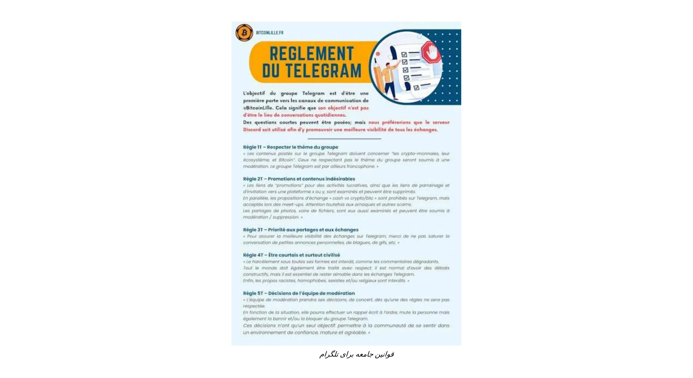

2/ **ملاقات‌ها و رویدادهای شما شروع به جذب جمعیت‌های بزرگ خواهند کرد، با حضور چهره‌های جدید زیادی که برای ارتباط برقرار کردن می‌آیند**.

با این افزایش حضور:

    - ممکن است ارزشش را داشته باشد که **یک مکان بزرگ‌تر برای ملاقات‌ها و رویدادهایتان پیدا کنید**، به‌ویژه اگر در گذشته فقط توانسته‌اید حدود بیست نفر را میزبانی کنید.
    - اگر متوجه شدید که تعداد شرکت‌کنندگان بیش از حد زیاد می‌شود، می‌توانید برای ملاقات‌های آینده، یا **از شرکت‌کنندگان بخواهید ثبت‌نام کنند** (از طریق اپلیکیشن Meetup یا یک فرم ساده) یا **چندین ملاقات در هر ماه برگزار کنید** (برای مثال: یک ملاقات برای مبتدیان، یک ملاقات برای سطح متوسط و یک ملاقات برای سطح پیشرفته).
    - در عین حال، انتظار می‌رود تعداد زیادی تازه‌وارد به اکوسیستم بیایند، که اغلب با هدف اصلی کسب درآمد هستند. برای **متمرکز نگه‌داشتن گفتگوها بر روی Bitcoin** در این گردهمایی‌های سریع‌الرشد، ایده خوبی است که:

الف) یک **ارائه با موضوع Bitcoin** را در طول این رویدادها بگنجانید، زیرا این کار به طور طبیعی بخش زیادی از گفتگو را به سمت آن موضوع هدایت می‌کند (و از پروژه‌های شیت‌کوین به اصطلاح "انقلابی" اخیر دور می‌کند)؛

ب) **از معاشرت فقط با بیت‌کوینرهای هم‌فکر خودداری کنید**. در عوض، سعی کنید به **تازه‌واردان نزدیک شوید**، حتی اگر به معنای ایستادن در انتهای اتاق برای خوشامدگویی به آنها باشد. از آنجا می‌توانید درباره اینکه چرا آمده‌اند، به دنبال چه چیزی هستند، اهداف (یا حتی اصول اصلی) جامعه شما و غیره صحبت کنید.

در نهایت، اگرچه گفتن آن ناخوشایند است، کلاهبرداران می‌توانند در ملاقات‌ها ظاهر شوند. هدف آن‌ها ممکن است صحبت بی‌پایان درباره طرح پانزی، بازاریابی چندسطحی، یا نوعی "انقلاب Blockchain با قدرت هوش مصنوعی" باشد. همچنین کاملاً ممکن است که روزی کسی با نیت بد به‌طور خاص برای پولشویی یا تلاش برای خرید بیت‌کوین با اسکناس‌های تقلبی حضور یابد.

در موقعیت‌های دشواری مانند این، ساده‌ترین رویکرد این است که با احترام توضیح دهید که این ملاقات جای مناسبی برای آن نیست و آن را با هر دلیلی که انتخاب می‌کنید پشتیبانی کنید (برای مثال، اشاره به اینکه ممکن است پلیس‌های لباس شخصی حضور داشته باشند).

اگر، متأسفانه، آنها از ترک محل یا رفتار محترمانه خودداری کنند (بله، این اتفاق افتاده است)، می‌توانید در طول ملاقات به طور مستقیم گروه را با Address مطلع کنید تا همه بدانند که یک نفر یا افرادی در حال تلاش برای انجام فعالیت مخرب هستند.

خوشبختانه، این موقعیت‌ها نادر و اغلب بیشتر مضحک تا تهدیدآمیز هستند، اما همچنان بهتر است آماده باشید.

برای آرامش خاطر: تا زمانی که شما شخصاً قانون را نقض نمی‌کنید یا به‌طور مستقیم معاملات غیرقانونی را تسهیل نمی‌کنید، شما به‌طور قانونی مسئول اقدامات دیگران در رویداد خود نیستید (حداقل تحت قانون فرانسه).

در یک دنیای ایده‌آل، شما یک **فضای بزرگ به اندازه‌ای که بتوانید چندین ده نفر را میزبانی کنید** خواهید داشت تا با رشد جامعه‌تان و همچنین **روابط قوی بین بیت‌کوینرها** و بیت‌کوینرهای آینده در طول بازار نزولی بسازید، به طوری که وقتی بازار صعودی می‌آید، تا حد امکان افراد بیشتری آماده باشند تا دیگران را به بیت‌کوین معرفی کنند.

## غیرمتمرکز کردن سازمان جامعه

<chapterId>bedfc110-e099-58f4-a5b7-fb50f3b19a49</chapterId>

تصور کنید: شما سال‌هاست که گردهمایی Bitcoin خود را برگزار می‌کنید و یک روز تصمیم می‌گیرید که آن کار را ترک کنید، شاید برای پرورش لاماها در پرو یا دنبال کردن موج‌های عالی در السالوادور. وقتی شما می‌روید، چه اتفاقی برای جامعه شما می‌افتد؟

لطفاً برای انتقال جامعه خود از قبل برنامه‌ریزی کنید:

1) **حقوق ادمین (یا Ownership)** را برای کانال‌های ارتباطی خود به اعضای مورد اعتماد اعطا کنید. نقش‌ها همیشه می‌توانند بعداً تغییر کنند.

۲) **جزئیات حساب کاربری** (نام‌های کاربری، رمزهای عبور، ایمیل‌های مرتبط) برای شبکه‌های اجتماعی و کانال‌های دیداری خود را با حداقل یک فرد مورد اعتماد به اشتراک بگذارید.

بدون این دسترسی، برای هر کس دیگری تقریباً غیرممکن است که به طور مؤثر کنترل را به دست بگیرد. شروع از صفر، با ایجاد گروه‌های "انشعابی" و بازسازی شبکه، کند، خسته‌کننده و اغلب دلسردکننده است.

اگر در ملاقات خود یک تماس مورد اعتماد ندارید، همیشه می‌توانید با @ProfEduStream، @copinmalin، یا @gabtribe در تلگرام تماس بگیرید. آنها می‌توانند به یافتن یک جانشین با انگیزه کمک کنند و هماهنگی انتقال حساب‌ها و حقوق ادمین را انجام دهند.

**چرا تمرکززدایی مهم است؟**

اگر شما تنها کسی هستید که درگیر است و تمام کنترل را در دست دارید، چه اتفاقی می‌افتد اگر ناپدید شوید؟ پاسخ ساده است: جامعه شما نیز ناپدید خواهد شد.

راه‌حل: وظایف، نقش‌ها و دسترسی‌ها را غیرمتمرکز کنید تا گروه بتواند به فعالیت خود ادامه دهد حتی اگر یکی از سازمان‌دهندگان به دلیل محدودیت‌های زمانی یا در یک سناریوی تاریک‌تر، به دلیل نگهداری Bitcoin بدون KYC دستگیر شود.

**چگونه تمرکززدایی را بیشتر پیش ببریم؟**

نرم‌افزارهای **رایگان و متن‌باز** مانند [مجموعه فراماسافت](https://framasoft.org/fr/) را بپذیرید تا وابستگی به پلتفرم‌های متمرکز را کاهش داده و مقاومت در برابر سانسور احتمالی دولت یا ممنوعیت‌های Bitcoin را افزایش دهید.

از **ابزارهای ارتباطی رمزگذاری‌شده یا ناشناس** برای حفاظت از حریم خصوصی اعضا و فعالیت‌های جامعه خود استفاده کنید.

## اگر Bitcoin به دشمن عمومی شماره ۱ تبدیل شود چه؟

<chapterId>c739651f-cd13-51e0-a36e-85023749b15b</chapterId>

در ۵ آوریل ۱۹۳۳، فرانکلین روزولت، سی و دومین رئیس‌جمهور ایالات متحده آمریکا، **دستور اجرایی ۶۱۰۲** را امضا کرد که مالکیت سکه‌های طلا، شمش یا گواهی‌های طلا توسط افراد خصوصی را در سراسر کشور غیرقانونی کرد.

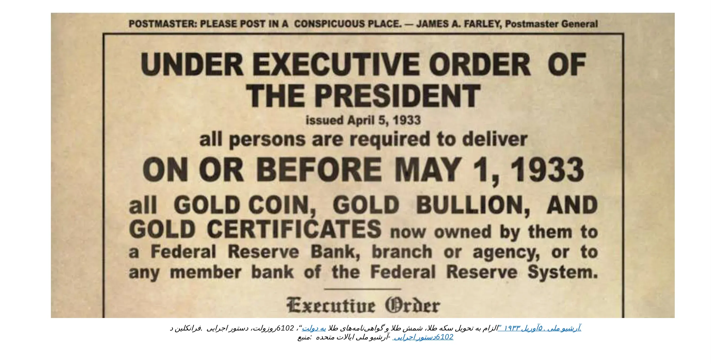

البته، رکود بزرگ (سقوط بازار سهام در سال 1929) واقعیت کنونی ما نیست. اما آیا ممکن است روزی دولتی همین کار را با Bitcoin انجام دهد: **ممنوعیت کامل Ownership خصوصی؟**

واقعیت این است که چنین اقدام اورولیایی نمی‌تواند واقعاً مانع از مالکیت واقعی کسی بر بیت‌کوین شود، زیرا هیچ قانونی نمی‌تواند از به خاطر سپردن یک رشته کلمات توسط یک فرد جلوگیری کند.

با این حال، اگر رهبران جهان بالاخره به پتانسیل Bitcoin برای بازسازی نظم جهانی، حتی در سطح دولت، پی ببرند، آیا آن‌گاه به عنوان "دشمن عمومی شماره ۱" شناخته خواهد شد؟

ما نیازی به افتادن در تفکر توطئه نداریم. اما هیچ چیزی مانع از این نمی‌شود که از همین حالا پیش‌بینی کنیم، غیرمتمرکز شویم و آموزش دهیم.

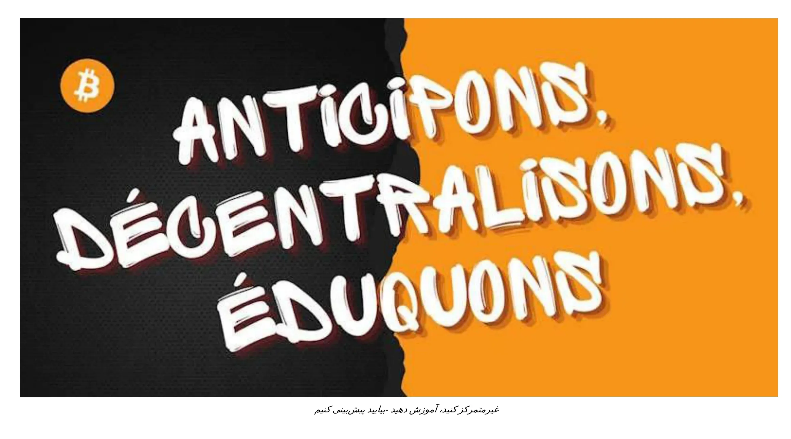

# گردهم آوردن بیت‌کوینرها

<partId>62bc2138-c0be-5d39-a341-594690863257</partId>

## یک برنامه اقدام سریع برای ساخت جامعه Bitcoin خود

<chapterId>1f463ec2-3f64-5641-8d60-e02a47c94f27</chapterId>

Satoshi ناکاموتو ابزاری انقلابی ایجاد کرد که در حال حاضر در حال تغییر دنیای ما است. اما این به ما، بیت‌کوینرها، بستگی دارد که چگونه آینده را شکل دهیم.

Bitcoin یک دنیای پیچیده و گسترده است که به تاریخ، اقتصاد، ادبیات، ریاضیات، علوم کامپیوتر و رمزنگاری می‌پردازد. هیچ‌کس نمی‌تواند به تمامی آن بپردازد و این بخشی از زیبایی آن است.

از آنجا که زمان ما محدود است، کلید کار این است که فروتن بمانیم، به یادگیری ادامه دهیم و Exchange دانش را با دیگران به اشتراک بگذاریم. به این ترتیب، هر یک از ما می‌توانیم به سطح درک مورد نظر خود برسیم.

**بنابراین جوامع جهانی Bitcoin نقش اساسی در ساختن دنیای فردا ایفا می‌کنند**: فضاهایی که بیت‌کوینرها می‌توانند **Exchange، بسازند و به اشتراک بگذارند**. **با هم**.

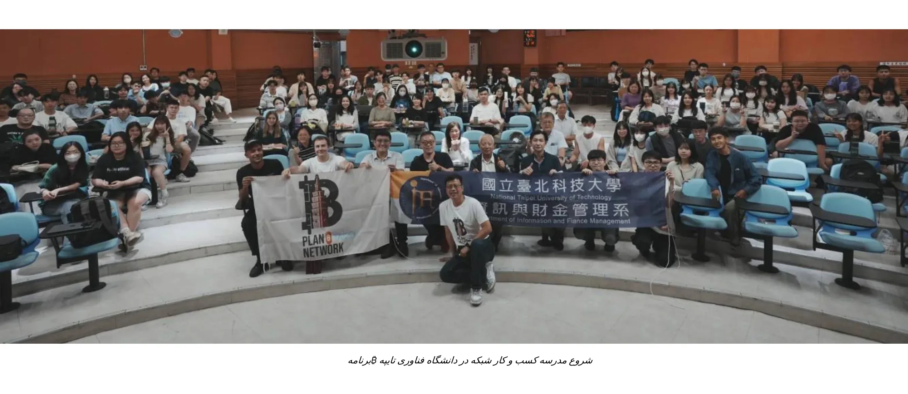

همان‌طور که در طول این دوره دیده‌اید، **ساختن یک جامعه Bitcoin و سازماندهی ملاقات‌ها** نیاز به برنامه‌ریزی و انگیزه دارد. بسته به اهداف و زمانی که می‌توانید اختصاص دهید، ممکن است پروژه‌های بلندپروازانه‌تری را بر عهده بگیرید یا کارها را ساده نگه دارید.

به هر حال، هدف یکسان است: **برانگیختن علاقه و کمک به رشد Bitcoin در شهر شما**.

برای جمع‌بندی فصل‌ها و زیرفصل‌های متعددی که پوشش داده‌ایم، در اینجا یک **"برنامه عملیاتی مختصر"** برای ایجاد جامعه Bitcoin شما آمده است:

۱) از قبل تصمیم بگیرید که چرا می‌خواهید یک جامعه Bitcoin ایجاد کنید، اهداف شما چیست و در کدام شهر یا مکان فعالیت خواهید کرد.

۲) با جوامع موجود در نزدیکی تماس بگیرید و در صورت نیاز از درخواست مشاوره از آن‌ها دریغ نکنید؛

۳) یک هویت واضح برای جامعه خود ایجاد کنید که جامعه و مکان شما را منعکس کند (لوگو، پوستر، بنر، بروشور، و غیره).

۴) کانال‌های ارتباطی و شبکه‌های اجتماعی مانند تلگرام، توییتر، NOSTR، دیسکورد یا سیمپلکس ایجاد کنید. همچنین کانال‌های غیرمتمرکز و/یا مقاوم در برابر سانسور را در نظر بگیرید.

۵) سایر گردهمایی‌ها و جوامع محلی را به صورت آنلاین دنبال کنید و گروه خود را در نقشه‌ها و پلتفرم‌های مختلف فهرست کنید تا دیده شدن را افزایش دهید.

هنگامی که کانال‌های ارتباطی جامعه شما فعال شدند:

6) یک نظرسنجی راه‌اندازی کنید تا اولین ملاقات خود را زمانی که احساس کردید علاقه کافی ایجاد شده است، پیشنهاد دهید.

۷) اهدافی را که می‌خواهید از این رویداد حضوری به دست آورید، تعریف کنید.

۸) یک مکان خوش‌موقعیت و دلپذیر که با اهداف شما همخوانی دارد انتخاب کنید و یک میز یا اتاق رزرو کنید.

۹) رویداد را یک هفته قبل در کانال‌های خود تبلیغ کنید و سپس دو تا سه روز قبل از تاریخ دوباره تبلیغ کنید.

۱۰) رویداد خود را در وب‌سایت‌ها و پلتفرم‌های مرتبط فهرست کنید.

11) در روز برگزاری، بگذارید رویداد به طور طبیعی پیش برود و با شرکت‌کنندگان تعامل داشته باشید و در صورت لزوم به آرامی بحث‌ها را هدایت کنید.

پس از آن:

۱۲) تمرکز بر حفظ و مشارکت شرکت‌کنندگان به‌گونه‌ای که بازگردند.

۱۳) پروژه‌ها یا ابتکارات ساده‌ای پیشنهاد دهید و آن‌هایی را که شخصاً به آن‌ها اهمیت می‌دهید، شروع کنید. اگر شخص دیگری می‌خواهد پروژه‌ای متفاوت را رهبری کند، در صورت امکان از او حمایت کنید.

در نهایت:

14) با فکر کردن به یک مکان بزرگ‌تر برای ملاقات‌ها، قوانین برای کانال‌های ارتباطی، یک وب‌سایت، و غیره، آینده را پیش‌بینی کنید؛

15) کسب‌وکارهای محلی را تشویق کنید تا Bitcoin را بپذیرند، حتی با پرسیدن هر بار که در آنجا خرید می‌کنید.

16) وظایف را واگذار کنید و حقوق مدیریت کانال/شبکه را به اعضای مورد اعتماد بسپارید.

17) جامعه خود را به طور گسترده تبلیغ کنید تا افراد بیشتری بپیوندند و کسانی که علاقه نشان می‌دهند را درگیر کنید.

۱۸) با پروژه‌هایی که از آن‌ها لذت می‌برید و برایتان مهم هستند، حتی بیشتر پیش بروید.

برای یک مرور سریع‌تر، این ویدئوی ۲۱ دقیقه‌ای این مراحل را خلاصه می‌کند:

:::video id=a59956da-f554-89dd-5ca55b722686:::

به یاد داشته باشید: **شما تنها نیستید، جوامع موجود اینجا هستند تا از شما حمایت کنند**.

## مراقبت از خود

<chapterId>cf1631cb-ddbe-55c7-be8c-26a5652979a0</chapterId>

وقتی به سوراخ خرگوش Bitcoin سقوط می‌کنید، دیدگاهتان نسبت به زندگی تغییر می‌کند.

در اعماق وجودتان، کششی را احساس می‌کنید که شما را به جلوتر رفتن و ملاقات با دیگرانی که در همان سفر ذهنی هستند، فرا می‌خواند.

این انرژی شما را ترغیب می‌کند تا با به اشتراک گذاشتن کشف خود: Bitcoin، سهم خود را در این پازل ایفا کنید. همچنین شما را تشویق می‌کند تا به دنیای فردا، دنیایی که می‌خواهید در ساخت آن کمک کنید، و جوامعی که به سوی آن تلاش می‌کنند، فکر کنید.

ساختن یک جامعه مانند یک تونل طولانی است که به انگیزه، استراتژی، تعهد و زمان نیاز دارد. این می‌تواند کاری بی‌پاداش باشد، بنابراین مهم است که مرحله به مرحله پیش بروید تا از فرسودگی جلوگیری کنید.

**به خودت فکر کن، به محدودیت‌هایت**. و اگرچه Bitcoin ممکن است تو را شب و روز به جلو براند، **سعی نکن همه چیز را به تنهایی انجام دهی، وگرنه خودت را خسته خواهی کرد**.

در عوض، **از بیت‌کوینرهایی که قبلاً همان تونل را پیموده‌اند، همان مسیرها را کاویده‌اند و همان ابزارها را ساخته‌اند کمک بگیرید**. این کار زمان زیادی را برای شما صرفه‌جویی خواهد کرد.

**از کسانی که شما را در این ماجراجویی دنبال می‌کنند دعوت کنید تا کمک کنند**، حتی اگر واگذاری وظایف باعث شود برخی کارها بیشتر طول بکشد. در بلندمدت، جامعه شما قوی‌تر و مقاوم‌تر خواهد شد.

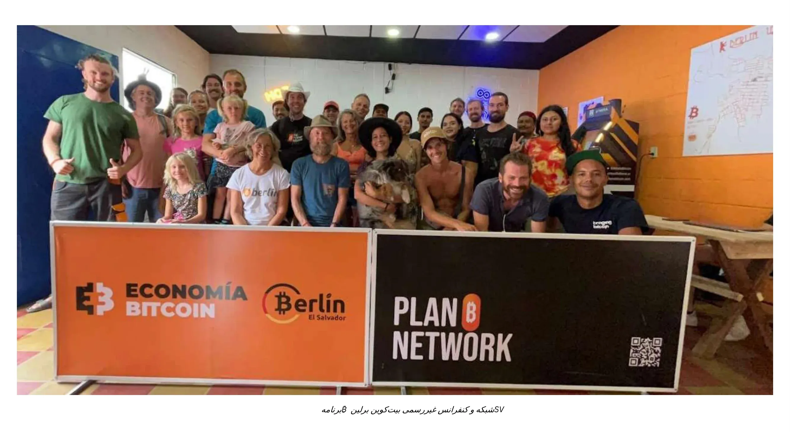

به تنهایی، می‌توانید به سرعت یکی از تونل‌های متعدد در سوراخ خرگوش Bitcoin را کاوش کنید. اما به یاد داشته باشید، مسیرهای بی‌شمار دیگری برای کاوش وجود دارد.

**با ایجاد و/یا پیوستن به یک جامعه از بیت‌کوینرها و با به اشتراک‌گذاری و تبادل منظم با آن‌ها، به‌طور همزمان در همه جهات به عمق ماجرا خواهید رفت.**

## BTC 304، چه چیزی در پیش است؟

<chapterId>8bf10b77-80ee-5d50-87bc-0ef32574a675</chapterId>

در این دوره BTC 304، ما به جزئیات نحوه راه‌اندازی یک جامعه یا گردهمایی و همچنین نحوه راه‌اندازی انواع پروژه‌ها پرداخته‌ایم.

وقتی جامعه شما آماده برداشتن گام بعدی است، **می‌توانید یک انجمن رسمی ایجاد کنید**.

به عنوان مثال، در فرانسه، از حدود شصت جامعه و گردهمایی، تقریباً دوازده تا دارای وضعیت انجمن هستند.

مزایا دوگانه است:

- **شناسایی رسمی**: شما می‌توانید یک حساب بانکی انجمن باز کنید، توجه رسانه‌ها/مطبوعات را جلب کنید، و حتی برای دریافت یارانه‌ها اقدام کنید.
- **سازمان‌دهی ساختاری**: شما می‌توانید نقش‌های مشخصی را تعریف کنید که مدیریت جامعه و اجرای پروژه‌ها را آسان‌تر می‌کند.

با هدف آن‌که جامعه شما بیش‌ از پیش شکوفا شود، **排排排排排**

جلسه بعدی می‌تواند به بررسی موضوعات پیشرفته‌ای مانند:

- طراحی ارائه‌ها یا کارگاه‌ها برای ملاقات‌های شما و تعیین اهداف واضح.
- سازماندهی یک رویداد بزرگ با حدود 100 شرکت‌کننده.

برای این کار، از تجربیات جوامعی که قبلاً رویدادها و ارائه‌های خود را ایجاد کرده‌اند، استفاده خواهیم کرد.

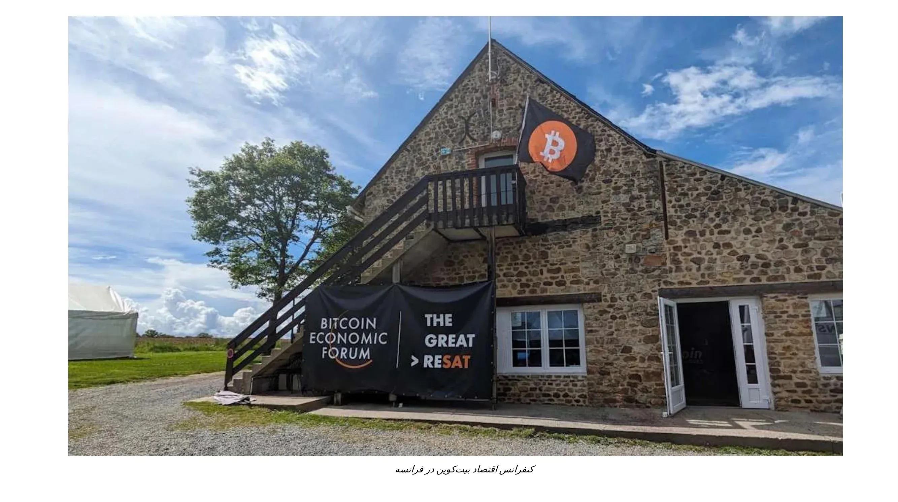

# بخش نهایی

<partId>e9bdddf4-54c9-4de9-bbce-c3eade8c32e5</partId>

## بررسی‌ها و رتبه‌بندی‌ها

<chapterId>08a35d2a-204b-519a-9bb1-588665a037fa</chapterId>

<isCourseReview>true</isCourseReview>

## نتیجه‌گیری

<chapterId>d74606a5-cb14-4117-acb2-2bf5920de092</chapterId>

<isCourseConclusion>true</isCourseConclusion>