# Ensimmäinen askel kohti Bitcoinin omaksumista

Nykyään kuka tahansa voi oppia Bitcoinista verkossa, mutta usein puuttuu mahdollisuus tavata, vaihtaa ajatuksia ja rakentaa yhdessä. Tämän aukon täyttämiseksi monet bitcoinerit muodostavat paikallisia yhteisöjä, joissa tapaamiset synnyttävät työpajoja, esityksiä ja merkityksellisiä keskusteluja.

BTC304:ssä tarkastelemme, miksi yhteisön rakentaminen on tärkeää, tutkimme työkaluja vahvan visuaalisen ja digitaalisen identiteetin luomiseen ja jaamme yksinkertaisia avoimen lähdekoodin projekteja, joita voit käynnistää. Pohdimme myös, kuinka paikalliset aloitteet laajenevat kansallisiksi yhteisöiksi, jotka voivat auttaa ajamaan hyperbitcoinoitua tulevaisuutta.
+++
# Johdanto

<partId>81318b8f-d316-5787-aa4c-4ec8370ba668</partId>

## Kurssin yleiskatsaus

<chapterId>e8991b82-4966-5e04-8f05-7cae46eacbaa</chapterId>

Tervetuloa BTC 304:een!

Vuodesta 2009 lähtien Bitcoin on kasvanut hellittämättä. Kasvu on ilmennyt uusina Bitcoin:n parannusehdotuksina (BIP), lisäkerrosten luomisena verkon skaalautuvuuden lisäämiseksi (muun muassa Lightning Network) sekä useiden yritysten ja uusien yritysten kehittymisenä.

Sen kehitys näkyy myös On-Chain:ssä, jossa liiketoimien määrä kasvaa tasaisesti.

Esimerkiksi 1. tammikuuta 2018 ja 1. tammikuuta 2024 välisenä aikana Bitcoin:n pääliikenneverkon Layer liiketoimien määrän arvioidaan [kasvaneen 66,2 prosenttia](https://dune.com/queries/3375917/5663935). Samaan aikaan elokuun 2021 ja elokuun 2023 välisenä aikana Lightning Network:n julkisten liiketoimien määrä [kasvoi 1212 prosenttia](https://river.com/learn/files/river-lightning-report-2023.pdf).

Tämä merkittävä kasvu liittyy luonnollisesti läheisesti seuraaviin tekijöihin:

- [ihmisten kasvava kiinnostus eri puolilla maailmaa Bitcoin:n käyttöön](https://profedustream.substack.com/p/21-raisons-dutiliser-Bitcoin), jotta he voisivat vapautua pankkijärjestelmästä ja/tai käyttää vähemmän epävakaata tai vähemmän devalvoitua valuuttaa, kuten Libanonin, Syyrian, Egyptin, Argentiinan ja muiden maiden väestöt tekevät;
- sen hinnannousu ajan mittaan, mikä tekee siitä arvon säilyttäjän ja pitkäaikaisen sijoituskohteen, joka perustuu sen kiinteään rahapolitiikkaan;
- spekulatiivisten kryptovaluuttamarkkinoiden peräkkäinen kasvu erityisesti vuosina 2017-2018 ja 2020-2021;
- Bitcoin:n kasvava läsnäolo valtamediassa.

Vaikka Bitcoin on vasta alkuvaiheessa, tämä todellisuus, josta olet todennäköisesti jo tietoinen, saa meidät pohtimaan kahta keskeistä kysymystä:

- Miten voimme rohkaista bitcoinilaisia menemään pidemmälle oppimisessaan ja projekteissaan, jotta voimme **täysin hyödyntää Bitcoin:n potentiaalia**?

- Miten voimme auttaa uusia tulokkaita, joita usein houkutellaan lyhytaikaiseen keinotteluun, välttämään rahan menettämistä viimeisimmässä memecoin-huumassa ja sen sijaan keskittymään ** Bitcoin:n perusteiden oppimiseen**?

Paras ratkaisu molempiin haasteisiin on yksinkertainen: **ole läsnä todellisessa maailmassa ja kouluta**.

Tämän kurssin tavoitteena on antaa sinulle kaikki, mitä tarvitset Bitcoin-yhteisön tai tapaamisen luomiseen ja tehokkaaseen järjestämiseen. Halusitpa sitten rakentaa paikallisen aloitteen tai kasvattaa verkkoryhmää, tämä kurssi opastaa sinua askel askeleelta: visuaalisen identiteetin luomisesta säännöllisten tapahtumien järjestämiseen ja viestintäkanavien hallintaan.

**Jakso 1: Johdanto**

Aloitamme korostamalla, miten tärkeää on yhdistää ihmisiä Bitcoin:n ympärille, olipa kyse sitten verkkoyhteisöistä tai paikallisista tapaamisista. Saat selville, miksi ja missä oma yhteisö kannattaa perustaa ja miten asettaa selkeät tavoitteet yhteisön kasvun ja pitkän aikavälin kestävyyden edistämiseksi.

**Luku 2: Bitcoin-yhteisönne ainutlaatuisen identiteetin suunnittelu**

Jotta voit houkutella uusia jäseniä ja edistää yhteenkuuluvuuden tunnetta, on tärkeää luoda ainutlaatuinen identiteetti. Tässä osiossa opit suunnittelemaan logoja, julisteita ja bannereita, jotka ilmentävät Bitcoin-yhteisösi henkeä.

**Luku 3: Viestintäkanavien luominen Bitcoin-yhteisöllesi**

Viestintä on minkä tahansa yhteisön selkäranka. Tässä osiossa selvitämme parhaat kanavat ja opastamme sinua Telegram-ryhmän tai Discord-palvelimen tehokkaassa perustamisessa. Opit myös, miten integroit monikäyttöisiä botteja yhteisön hallinnan tehostamiseksi.

**Jakso 4: Sosiaalisten verkostojen käynnistäminen** (ranskaksi)

Näkyvyys on avain yhteisön kasvattamiseen. Tässä osiossa opit, miten voit luoda oman Twitter-profiilin, ottaa yhteyttä paikallisiin tapaamisiin ja hyödyntää btcmap.orgin kaltaisia alustoja näkyvyyden lisäämiseksi ja uusien jäsenten houkuttelemiseksi.

**Luku 5: Bitcoin-tapaamisen järjestäminen**

Tässä osiossa käsitellään tapaamisten järjestämistä: oikean paikan valinnasta itse tapahtuman järjestämiseen. Tutustumme myös strategioihin, joiden avulla voit rakentaa osallistujien uskollisuutta ja varmistaa yhteisön pitkän aikavälin kestävyyden.

**Jakso 6: Esimerkkejä hankkeista ja aloitteista** (ranskaksi)

Tässä osiossa esitellään konkreettisia ja omaperäisiä hankkeita, jotka ulottuvat teematapahtumista ja työpajoista opetussisällön luomiseen ja paikalliseen yhteistyöhön. Opit myös, miten suunnitella sekä fyysistä että digitaalista materiaalia yhteisönne edistämiseksi.

**Luku 7: Tulevaisuuden ennakointi**

Tarkastelemme tässä yhteisön luonnollista kehitystä: mitä tehdä, jos yhteisö kasvaa liian nopeasti, miten hajauttaa organisaatiota ja miten vastata vihamieliseen sääntely-ympäristöön. Tämä jakso auttaa sinua ennakoimaan ja voittamaan nämä haasteet.

**Luku 8: Bitcoin-asiakkaiden yhdistäminen**

Viimeisessä osassa keskitytään projektin ytimeen: Bitcoin-harrastajien yhdistämiseen yhteisen vision ympärille. Opit, miten jäsentää lähestymistapasi, jotta voit houkutella ja pitää jäseniä, delegoida tehtäviä tehokkaasti ja kasvattaa yhteisöäsi kestävästi.

Oletko valmis oppimaan, miten rakentaa vahva, elinvoimainen Bitcoin-yhteisö? Sukelletaan mukaan!

## Miksi perustaa Bitcoin-yhteisö tai tapaaminen?

<chapterId>893ea248-7d5a-5b8e-948c-7031497b1031</chapterId>

### Mitä eroa on yhteisöllä ja tapaamisella?

Vaikka Bitcoin-ekosysteemissä näille termeille ei ole tiukkoja määritelmiä, yhteisö ymmärretään parhaiten ryhmäksi ihmisiä, joilla on yhteinen intohimo ja jotka kommunikoivat säännöllisesti.

Tapaaminen taas on yhteisön järjestämä tapahtuma, jolla on tietty tarkoitus ja joka järjestetään tälle yhteisölle. Meetupit järjestetään yleensä silloin, kun yhteisö on jo vakiintunut.

Tällä kurssilla oletamme, että ennen Bitcoin-tapaamisen käynnistämistä olet jo ollut yhteydessä muutamaan tällaisesta tapahtumasta kiinnostuneeseen henkilöön, toisin sanoen **yhteisö on jo olemassa**.

### Miksi luoda Bitcoin-yhteisö?

Bitcoin-yhteisön perustamiseen on useita syitä:

- Tietämyksen jakaminen ja yhteistyö: Yhteisöt tarjoavat jäsenille tilaa Exchange ideoille ja tiedon jakamiselle. Keskinäinen tuki on kasvun keskeinen tukipilari, jonka avulla kaikki voivat nopeuttaa oppimistaan, mikä on erityisen tärkeää Bitcoin:n kannalta, kun otetaan huomioon, miten paljon on löydettävää.

- Vertaisrakentaminen: Monet aloitteet ja hankkeet ideoidaan, rakennetaan ja kehitetään näissä yhteisöissä.

Bitcoin-yhteisöt pyrkivät usein laajempiin tavoitteisiin, erityisesti julkiseen valistukseen:

1. Mikä Bitcoin on;

2. Miten se toimii;

3. Sen panos yhteiskuntaan;

4. Joidenkin julkisuuden henkilöiden ja tiedotusvälineiden harhaanjohtavien tai perusteettomien väitteiden kumoaminen;

5. Bitcoin:n ja muiden [kryptovaluuttojen](https://planb.academy/resources/glossary/cryptocurrency) väliset peruserot;

Rakentamalla ensimmäisiä tulevaisuuden "linnakkeita" **Bitcoin-yhteisöt maailmanlaajuisesti toimivat suojana disinformaatiota ja sensuuria vastaan ja tarjoavat samalla hedelmällisen maaperän Bitcoin:n perusteiden oppimiselle**. Ne tarjoavat uusille tulokkaille, jopa skeptikoille, resursseja ja yhteyksiä, joita tarvitaan Bitcoin:n todellisen potentiaalin tutkimiseen.

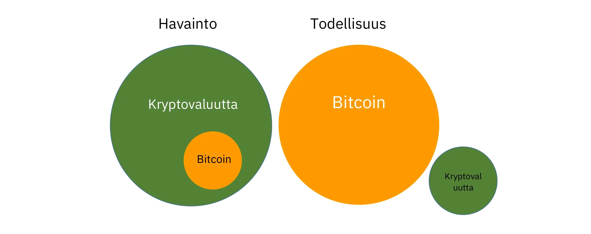

On myös syytä huomata, että **yhteisö voi olla olemassa kokonaan verkossa**, olipa se sitten Telegram-ryhmä ("Bitcoin London"), Facebook-ryhmä ("Bitcoin Berlin"), Discord-palvelin ("Bitcoin Madrid") tai jopa sähköpostilista ("Bitcoin France").

Toisin sanoen **yhteisö ei tarvitse fyysisiä tapaamisia menestyäkseen tai käynnistääkseen hankkeita. Sen ydintarkoitus pysyy samana: jakaa, rakentaa ja kouluttaa**.

### Miksi luoda tapaaminen?

Kuten aiemmin mainittiin, **tapaamiset järjestetään yleensä yhteisön perustamisen jälkeen, ja ne täydentävät sitä**.

Kun bitcoinerin matka kehittyy, hänellä on usein halu tai jopa tarve **tapaamiseen ja vuorovaikutukseen henkilökohtaisesti muiden** kanssa, jotka kuuluvat samaan ekosysteemiin. Tämä voi johtua siitä, että tuntee itsensä eristäytyneeksi tai yksinkertaisesti siitä, ettei ole ketään, jonka kanssa puhua Bitcoin:stä jokapäiväisessä elämässä.

Tapaamiset tarjoavat henkilökohtaisemman ja viihtyisämmän kokemuksen kuin ääni- tai videopuhelut verkossa. Ne luovat epämuodollisia ja ystävällisiä tiloja, joissa ihmiset voivat vaihtaa ajatuksia avoimesti ja suoraan, olipa kyse sitten juomasta tai ateriasta.

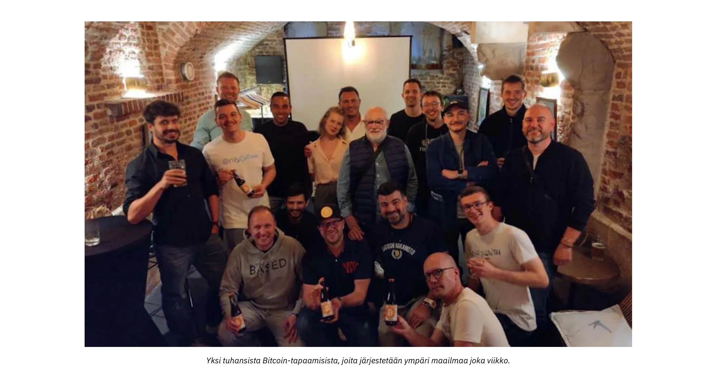

Bitcoin-kokoukset voivat palvella monia tarkoituksia:

- Keskustelu teknisistä aiheista tai käynnissä olevista hankkeista
- Auttaa uusia bitcoin-käyttäjiä vähitellen sukeltamaan syvemmälle Bitcoin-maailmaan
- Uusien hankkeiden tai aloitteiden julkistaminen
- Materiaalien tai kirjojen vaihtaminen
- Dokumenttielokuvien esikatselu
- Konferenssien tai työpajojen järjestäminen erityisistä aiheista

Käsittelemme monia näistä mahdollisuuksista yksityiskohtaisesti tämän kurssin osassa 6/8, jonka otsikko on "[Esimerkkejä hankkeista ja aloitteista](https://planb.academy/courses/1c643dc9-a15f-4f9e-93b6-cb3c58b4ee35/3213d87a-1998-5972-ab93-97a5769ba279)".

Vaikka jokainen yhteisö voi vapaasti muodostaa omia mielipiteitään, käynnistää projekteja ja kokeilla omalla tavallaan, tapaamiset ovat osoittautuneet yhä useammin **välttämättömiksi Bitcoin:n kehitykselle ja bitcoinin käyttäjien kasvulle**. **Tapaamisten järjestäminen vaatii aikaa ja vaivaa**, minkä vuoksi tällä kurssilla jaetaan [noin kuudenkymmenen Ranskassa ja Belgiassa toimivan Bitcoin-yhteisön](https://btcmap.org/communities/map#2/5.24949/0.20000) yhdistettyä kokemusta ** auttaakseen sinua rakentamaan ja kasvattamaan omaa yhteisöäsi ja tapaamisiasi mahdollisimman sujuvasti**.

## Mihin sinun pitäisi luoda yhteisösi?

<chapterId>72da5285-5395-592d-ab62-303a0aef3d6d</chapterId>

Ensimmäinen kysymys on: mihin yhteisönne pitäisi sijoittaa?

Tämä päätös on ratkaiseva, jos haluat säilyttää mahdollisuuden järjestää tapaamisia myöhemmin.

Jos jäsenet joutuvat ajamaan kaksi tuntia osallistuakseen tapahtumaan, osallistujamäärä on todennäköisesti vähäinen. Siksi oikean **sijainnin valinta yhteisöllesi ja siten myös tuleville tapaamisillesi vaikuttaa suuresti sen kasvuun**.

Muutamia vinkkejä päätöksenteon tueksi:

1/ **Luo ja kasvata yhteisösi keskikokoisessa tai suuressa kaupungissa**. Tämä helpottaa:

    - Etsi miellyttäviä paikkoja tapaamisille ja projekteille (esitykset, työpajat, Bitcoin:n käyttöönoton edistäminen jne.);
    - Lisätä osallistumisen ja yhteenkuuluvuuden tunnetta suuremmalla ihmisjoukolla;
    - Parannetaan tapahtuman saavutettavuutta (julkinen liikenne, pysäköinti jne.). On erittäin suositeltavaa valita tapahtumapaikka, joka on lähellä julkisia liikennevälineitä ja pysäköintitilaa.

2/ **Valitse kaupunkiisi liittyvä nimi**. Näin ihmisten on helppo samaistua yhteisöönne. Esimerkkejä: Bitcoin Pariisi, Einundzwanzig Berlin, Satoshi Spritz Milano jne.

3/ **Tarkista, onko lähelläsi jo olemassa tapaaminen**.

Voit tarkistaa [btcmap.org](https://btcmap.org/communities/map#0/0/0/), jossa luetellaan useimmat Bitcoin-yhteisöt ja tapaamiset ympäri maailmaa.

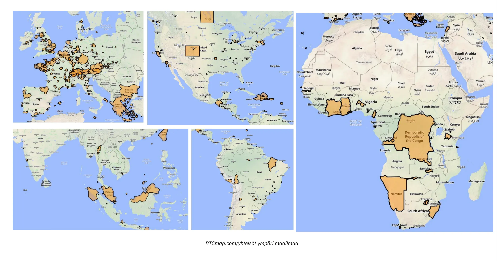

Kun olet tehnyt hieman tutkimusta, saatat löytää kaupungistasi jo olemassa olevan tapaamisen tai yhteisön.

Bitcoin on hajautettu, joten kuka tahansa voi luonnollisesti tehdä mitä haluaa.

Kuitenkin **voimien yhdistäminen on usein järkevämpää kuin läheisten yhteisöjen jakaminen ja kunkin vaikutusten vähentäminen**. Täysin uuden yhteisön perustaminen sinne, missä on jo olemassa yhteisö, voi tahattomasti luoda kilpailua.

Tässä mielessä yksinkertainen "nyrkkisääntö" voi auttaa: jos 30-45 minuutin säteellä asuinpaikastasi ei ole aktiivista Bitcoin-yhteisöä, kannattaa ehkä perustaa uusi yhteisö. Tästä huolimatta voit aina tehdä niin kuin haluat.

Ja tietenkin, jos vanhempi yhteisö on "kehittynyt" suuntaan, joka ei enää vastaa arvojasi, eikä sinulla ole aikaa tai motivaatiota "[oranssinpillereiden](https://planb.academy/resources/glossary/orange-pill)" tekemiseen, oman [Fork](https://planb.academy/resources/glossary/fork):n luominen on aina yksi vaihtoehto.

## Minkä tavoitteiden pitäisi ohjata yhteisöäsi?

<chapterId>0aae1aa8-93ec-544a-ad88-22d32c619595</chapterId>

Kun olet määrittänyt kaupunkisi (tai maantieteellisen alueesi), on aika **määritellä, mitä haluat saavuttaa**.

Tavoitteet voidaan asettaa heti perustamisen yhteydessä tai niitä voidaan tarkentaa myöhemmin, kun ryhmään on liittynyt useita jäseniä ja ryhmäsi on aktiivisesti mukana.

Seuraavassa on muutamia kohtia, jotka ohjaavat ajatteluasi:

1/ **Miksi luon tämän yhteisön bitcoinerina?** Onko se tiedon jakamista varten? Kouluttaa muita? Oppia kokeneemmilta vertaisilta? Tavata samanhenkisiä ihmisiä? Päästä mukaan Bitcoin-ekosysteemiin? Yhdistyä ammattilaisiin? Vai haluatko vain ottaa lasillisen ja saada uusia ystäviä?

Vastauksesi muokkaavat asemointiasi ja motivaatiotasi.

Jos tavoitteenasi on **jakaa tietoa ja valistaa ihmisiä Bitcoin:sta**, keskity **koulutussisällön luomiseen** (artikkelit, podcastit, videot, esitykset, lentolehtiset jne.) ja säästä muita lukemattomilta tutkimustunneilta. Voit mennä vieläkin pidemmälle **järjestämällä työpajoja, esitelmiä ja konferensseja**.

Jos tavoitteenasi on vain tavata muita bitcoin-käyttäjiä ja jakaa kokemuksia, voit ottaa rennomman lähestymistavan, kuten tavata drinkille.

Näin luot helpommin sosiaalisia siteitä. Muista kuitenkin aina, että **oluen juominen ei ole oikea tie tulevaisuuden maailman rakentamiseen**.

Siksi **konkreettisten tavoitteiden ja hankkeiden asettaminen on tärkeää**.

2/ Pitäisikö minun antaa yhteisölleni **fyysinen ulottuvuus**? Jos kyllä, millaisia tapahtumia pitäisi järjestää?

Ensimmäinen tapahtumasi on todennäköisesti tapaaminen. Sen päätarkoitus on saattaa yhteen alueesi bitcoin-osaajat.

Kuten kuitenkin myöhemmin [Esimerkkejä hankkeista ja aloitteista](https://planb.academy/courses/1c643dc9-a15f-4f9e-93b6-cb3c58b4ee35/3213d87a-1998-5972-ab93-97a5769ba279) -osiossa nähdään, **tapaaminen voidaan rakentaa monin eri tavoin ja monin eri tavoittein:**

- Yhdistä verkostoituminen Bitcoin-konseptia koskevaan koulutusesitykseen;
- Järjestä ammattimainen esittely Bitcoin-ratkaisuista;
- Keskustelustrategiat appelsiinipilkkien paikallisia kauppiaita varten;

ja niin edelleen.

Aiheista riippuen (tekniset puheenvuorot tai käytännön työpajat) voi olla jopa järkevää **järjestää ylimääräisiä tapahtumia** tavanomaisen tapaamisen ulkopuolella.

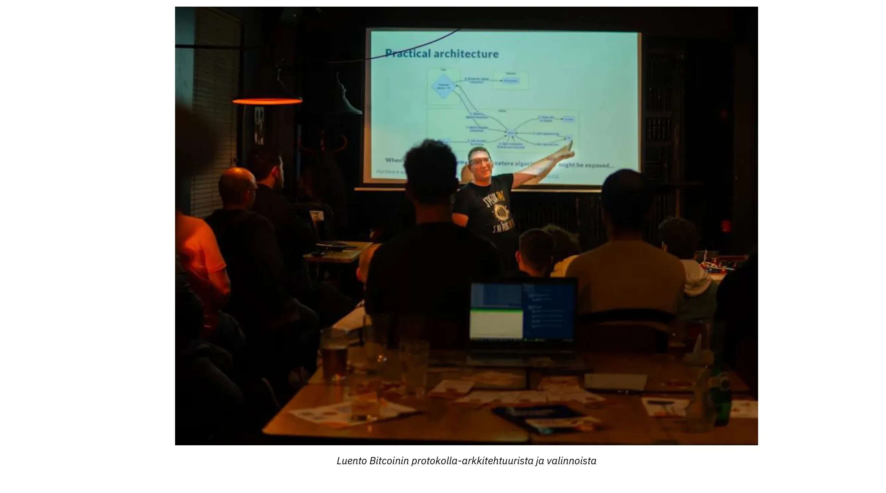

3/ Miten haluan yhteisöni osallistuvan Bitcoin-ekosysteemiin?

Tämä on edistyneempi kysymys, mutta sitä kannattaa miettiä jo varhaisessa vaiheessa.

Jos visiosi on **luoda tiivis, motivoitunut yhteisö**, joka keskittyy oranssinpillittämään mahdollisimman monia ihmisiä, niin:

- Tee yhteistyötä olemassa olevien yhteisöjen kanssa, jotta saat tarvittaessa laajempaa tietoa, avoimen lähdekoodin resursseja ja arvokasta tukea.
- Järjestä ja delegoi tehtäviä ryhmässäsi, jotta voit laajentaa ja skaalata toimintaasi tehokkaasti.

**Aseta lyhyen, keskipitkän ja pitkän aikavälin tavoitteet**

Käytännöllinen tapa suunnitella on asettaa tavoitteet kullekin aikavälille:

- Lyhyellä aikavälillä: rakennetaan sosiaalinen media ja perustetaan yhteisön viestintäkanavat.
- Keskipitkällä aikavälillä: luodaan koulutusresursseja (artikkeleita, esitteitä, videoita).
- Pitkällä aikavälillä: säännölliset fyysiset tapaamiset.

Kun tapaamiset ovat vakiintuneet, voisit pyrkiä seuraaviin tavoitteisiin:

- Lyhytaikaiset: järjestetään työpajoja tai esityksiä tietyistä aiheista
- Keskipitkällä aikavälillä: Bitcoin:n valistus- tai koulutuskampanjat
- Pitkällä aikavälillä: muodollinen liitto tai kumppanuus sellaisen baarin kanssa, joka hyväksyy Bitcoin:n maksuvälineenä.

Ole valmis: **yhteisön rakentaminen vaatii työtä**

Yhteisön luominen ei tapahdu yhdessä yössä. Se vaatii aikaa, motivaatiota ja organisointia.

Toisinaan se voi tuntua jopa lannistavalta, varsinkin kun kukaan ei tule paikalle ja tunnet olevasi ainoa, joka kantaa tätä tehtävää harteillaan.

Siksi **Tämä kurssi on suunniteltu jakamaan arvokkaita resursseja ja vinkkejä, jotka auttavat yhteisöjä kasvamaan tehokkaasti ja lopulta tulemaan omavaraisiksi.**.

# Yhteisön identiteetin suunnittelu Bitcoin

<partId>da6673ad-bf49-5979-80a6-3f69cfb28046</partId>

## Miksi ja miten voit luoda oman identiteettisi?

<chapterId>b48a18cc-afdf-5216-802c-32647b5cd8a3</chapterId>

Tässä vaiheessa oletamme, että:

- Tiedät jo, missä yhteisösi (tai tuleva säännöllinen tapaaminen) sijaitsee.
- Olet asettanut tavoitteita eri aikajänteille, vaikka ne eivät olisikaan vielä lopullisia.

Seuraava askel yhteisön rakentamisessa on **määritellä sen identiteetti**, sekä nimi että visuaalinen tyyli.

Tässä osiossa on opetusohjelmia ja aloittelijoille sopivia ohjelmistoratkaisuja, joiden avulla voit suunnitella yhteisön visuaalisen ilmeen myös aloittelevilla taidoilla.

**Miksi identiteetillä on merkitystä?**

Ihmiset tuntevat olevansa sitoutuneempia ja sitoutuneempia, kun he voivat samaistua ryhmään. Vahva identiteetti auttaa yhteisöäsi erottumaan muista ja edistää yhteenkuuluvuuden tunnetta.

Kaikki alkaa nimen valinnasta, ja kullakin maalla on usein omat trendinsä:

- Ranska: Bitcoin [CITY]" tai "[CITY] Bitcoin". Niiden Telegram-ryhmät noudattavat usein tätä kaavaa: "Bitcoin [CITY] meetup".
- Saksa: Einundzwanzig (tarkoittaa "21") -aloite innoitti nimiä kuten "Einundzwanzig [CITY]".
- Italia: Satoshi Spritz -verkossa käytetään sellaisia nimiä kuin Satoshi "Spritz [CITY]".

**Kullakin yhteisöllä on oma identiteettinsä, joka on sidoksissa kotikaupunkiinsa mutta myös maansa laajempaan identiteettiin**.

Visuaalinen identiteettisi: logo, värit, bannerit, on se, minkä ihmiset muistavat ja yhdistävät ryhmääsi.

Sosiaalisen median tilejä ja viestintäkanavia luotaessa logo ja banneri ovat vahva etu. Älä huoli, et tarvitse ammattitaitoista suunnittelua, sillä saatavilla on ilmaisia ja helppokäyttöisiä työkaluja.

Hyvä lähtökohta on sisällyttää kaupunkisi maamerkki tai symboli. Pariisissa tämä voisi olla Eiffel-torni. Lillessä kellotapuli tai linnoitus. New Yorkissa Vapaudenpatsas. Lontoossa Big Ben ja niin edelleen.

Tämän jälkeen voit suunnitella joko yksinkertaisen tai yksityiskohtaisemman logon mieltymyksesi mukaan.

Tässä on muutamia esimerkkejä ranskalaisten yhteisöjen logoista:

- Marseillessa logo edustaa Notre-Dame-de-la-Garden basilikaa, josta on näkymät kaupungin ylle:

- Monacossa sillä tarkoitetaan Monacon kalliota:

- Lillessä tyylikäs logo edustaa Vaubanin linnoitusta ja sen puistoa:

- Saint-Malossa korostetaan kaupungin tunnusta, ermiiniä:

**Jatka pidemmälle, jos haluat**

Jos inspiraatio iskee, voit mennä vielä pidemmälle: luo yhteisöllesi vaakuna, motto tai jopa laulu. Vain luovuutesi on rajana!

## Luo logo, juliste ja banneri

<chapterId>3470a31f-0190-5e87-8af0-6a00e79267ef</chapterId>

### Canvan käyttäminen

Voit käyttää [Canvaa](https://www.canva.com/) erilaisten visuaalisten kuvien luomiseen yhteisöäsi varten.

Tämä ilmainen ja helppokäyttöinen alusta on suosittu suuren kirjastonsa ansiosta, joka sisältää valmiiksi suunniteltuja malleja, joita voit kopioida ja muokata muutamalla napsautuksella.

**Logon luominen**

Etsi Canvan etusivulta valmiiksi suunniteltuja logoja. Valitse yksi tai useampi, joka inspiroi sinua, kopioi ne ja muokkaa ne sitten yhteisöllesi sopiviksi.

Voit lisätä taustalle paikallisen maamerkin tai tunnuksen (tuo valokuva tai etsi "Illustrations" tai "Images" Elements-valikosta) ja aseta sen päälle Bitcoin-logo tai ₿ ja säädä sen väriä tarvittaessa.

**Bannereiden ja julisteiden luominen**

Jos haluat luoda bannerin tai julisteen, etsi Canvan kirjastosta valmiita malleja. Kun olet kopioinut yhden niistä, muuta tekstiä ja fontteja, lisää yhteisön logo ja tuo valokuvat käyttämällä kehyksiä (etsi "kehys" Elements-valikosta).

Voit myös käyttää Malleja-valikkoa tutkiaksesi muita malleja, jotka vastaavat tarpeitasi.

Etsi YouTube-mallit tai -bannerit, kopioi ne ja muokkaa niitä haluamallasi tavalla.

Lyhyesti sanottuna, **mahdollisuudet ovat rajattomat, ja ne määräytyvät paitsi tarpeidesi myös visuaalisen tyylin mukaan, jonka haluat luoda** yhteisöllesi ja tapaamisillesi/tapahtumillesi!

Jotta saisit selkeämmän käsityksen, olemme lisänneet videon, joka ei ole tyhjentävä ja jossa esitellään joitakin näistä mahdollisuuksista:

:::video id=d11ae0ed-eacd-4924-afd3-75aff95d2899:::

**Malliesimerkkejä Bitcoin Lillestä**

Tässä on valmiita Canva-malleja, jotka voit kopioida ja mukauttaa yhteisöäsi varten:

- **Tapaamisen ilmoitusjuliste** (sosiaalista mediaa ja A4/A3-tulostusta varten): [linkki](https://www.canva.com/design/DAGBvBXFJ8A/92-j_toeLU8QbVAD0NwoAA/edit?utm_content=DAGBvBXFJ8A&utm_campaign=designshare&utm_medium=link2&utm_source=sharebutton)

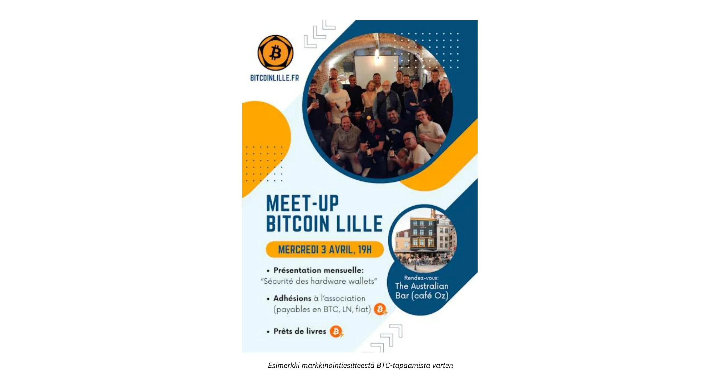

- **Tapahtumajuliste** (sosiaaliseen mediaan ja A4/A3-tulostukseen): [linkki](https://www.canva.com/design/DAGBvG3rNCc/oXtNR9pduRs22AqclG4O2g/edit?utm_content=DAGBvG3rNCc&utm_campaign=designshare&utm_medium=link2&utm_source=sharebutton)

- **sosiaalisen median bannerit**: [linkki](https://www.canva.com/design/DAGBvOXyNqw/iSJG9PbIQHgGWHz5PhlXSQ/edit?utm_content=DAGBvOXyNqw&utm_campaign=designshare&utm_medium=link2&utm_source=sharebutton)

- **Kilpailuilmoitus**: [linkki](https://www.canva.com/design/DAGBvIjuA_w/YzSUXzOmbNV9oCma9mluOw/edit?utm_content=DAGBvIjuA_w&utm_campaign=designshare&utm_medium=link2&utm_source=sharebutton)

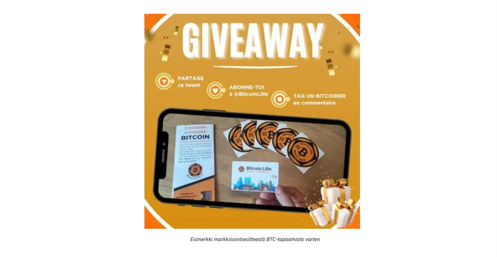

- **kirjastomme brändiohjeet**, jotka ovat esillä A4-kokoontumisissa: [linkki](https://www.canva.com/design/DAGBvPqL7N4/LmUItfsysypRLSOFOzBXcQ/edit?utm_content=DAGBvPqL7N4&utm_campaign=designshare&utm_medium=link2&utm_source=sharebutton)

- **PowerPoint-esitys** "Chapter 2 - Understanding Bitcoin transactions", jonka on laatinut @ProfEduStream: [linkki](https://www.canva.com/design/DAFsEcnOro8/Mz9FYdTGhsvozZOe0Y9jtw/edit?utm_content=DAFsEcnOro8&utm_campaign=designshare&utm_medium=link2&utm_source=sharebutton)

- **Esite** "21 syytä käyttää Bitcoin:ta", kirjoittanut @ProfEduStream: [linkki](https://www.canva.com/design/DAFtAR1NauQ/ZDwl2CchIJ9Gpb36N6-7iw/edit?utm_content=DAFtAR1NauQ&utm_campaign=designshare&utm_medium=link2&utm_source=sharebutton)

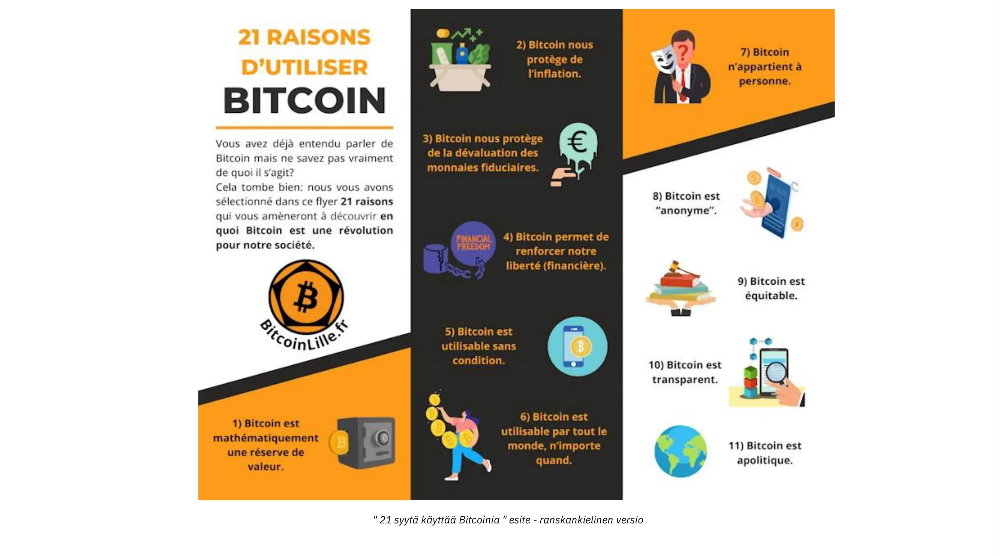

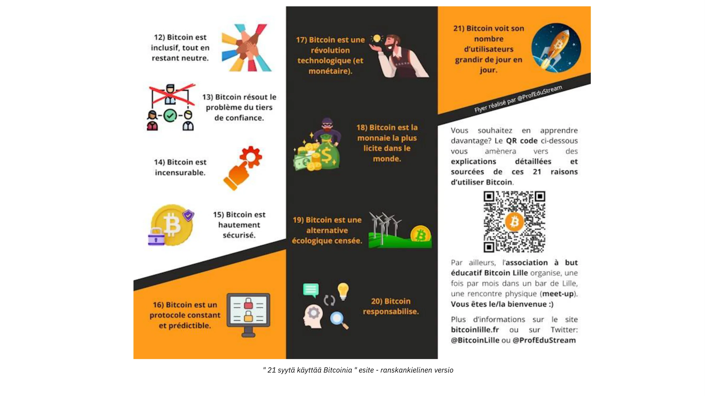

**Jaa luomuksesi**

Mahdollisuuksia on loputtomasti, ja suunnittelusi riippuu tavoitteistasi ja visuaalisesta identiteetistäsi. Harkitse malliesi jakamista avoimessa lähdekoodissa, sillä se säästää aikaa muille Bitcoin-yhteisöille, jotka väistämättä kohtaavat samoja haasteita kuin sinä. Jakamalla autat nopeuttamaan Bitcoin-yhteisöjen kasvua kaikkialla.

**Suositellut mitat**

Tarkista aina visuaalista materiaalia luodessasi kunkin alustan kokovaatimukset:

| Platform | Logo | Banner | Poster / Image
| -------- | -------- | -------- | -------- |
| Telegram     | 512 x 512     | N/A     | N/A     |
| Signal     | N/A     | N/A     | N/A     |
| Twitter     | 400 x 400     | 1500 x 500     | 1200 x 628     |
| Meet-up     | N/A     | N/A     | N/A     |
| Discord     | 512 x 512     | 960 x 540     | N/A     |
| Facebook     | 512 x 512     | 851 x 315     | 960 x 720     |

Yleensä sopivat koot:

Logot: 512 x 512 pikseliä

Bannerit: Sovelluksesta tai sivustosta riippuen

Julisteet: A4 on vakiotulostusmuoto

### Tekoälyn käyttö

Canva tarjoaa laajan valikoiman työkaluja logojen, julisteiden, bannereiden ja esitteiden luomiseen, mutta se ei ole ainoa vaihtoehto. Jos tunnet olosi mukavammaksi muiden ohjelmistojen (kuten Photoshopin tai Illustratorin) kanssa, käytä vapaasti sitä, mikä sopii sinulle parhaiten.

Olipa kyse sitten yhteisön logon suunnittelusta tai julisteiden, esitysten tai esitteiden parantamisesta, **tekoäly voi olla tehokas apu ainutlaatuisen ja houkuttelevan visuaalisen ilmeen luomisessa**.

Tähän tarkoitukseen on saatavilla useita tekoälyjä. Näitä ovat

- [midjourney](https://docs.midjourney.com/docs/quick-start) (maksettu);
- [leonardo](https://leonardo.ai/) (ilmainen, tilirajoitettu);
- [copilot](https://copilot.microsoft.com/) (ilmainen, tilirajoitettu);
- [DALL-E](https://www.dall-efree.com/) (maksullinen).

Viime aikoina on kehitetty monia muitakin tekoälytyökaluja, joten tämä luettelo ei ole läheskään tyhjentävä.

**Esimerkki: Bitcoin Lontoon futuristisen logon luominen**

Jos haluat suunnitella futuristisen logon "Bitcoin London" -tapaamista varten, voit kysyä Copilotilta:

- [ ] *Prompt: Luo Bitcoin-logo, jonka taustalla on London Bridge ja Big Ben. Futuristinen* - [Linkki](https://copilot.microsoft.com/images/create/un-logo-Bitcoin-futuriste-avec-en-arric3a8re-plan-le-/1-6612ba1758df4384bc33c4bca00ab45b?FORM=SYDBIC)

Jos neljä ensimmäistä tulosta eivät ole riittävän realistisia, tarkenna pyyntöäsi:

- [ ] *Prompt: Tee neljännestä paljon realistisempi* - [Linkki](https://copilot.microsoft.com/images/create/un-logo-Bitcoin-futuriste-avec-en-arric3a8re-plan-le-/1-6612ba64b72d4cea9830ab7eb844f785?FORM=SYDBIC)

Viimeisin tulos on hieno!

**Esimerkki: Yksinkertaisen brittityylisen logon luominen**

Siistimpi ulkoasu, kuten tarra:

- [ ] *Prompt: Luo "London Bitcoin Meetupin" logo brittiläisellä ja puhtaalla tyylillä* - [Linkki](https://copilot.microsoft.com/images/create/logo-for-27londres-Bitcoin-meetup27-with-a-british-a/1-6612bb9451924859a6c34b350b3a6ebc?FORM=SYDBIC)

Lopputulos näyttää todella hienolta!

**Vinkkejä tekoälyn kanssa työskentelyyn**

- Ole kärsivällinen: Tekoäly ei välttämättä tuota ensimmäisellä yrittämällä juuri sitä, mitä kuvittelet.

- Käytä tarkkoja kehotuksia: Mitä selkeämmät ja yksityiskohtaisemmat ohjeet, sitä parempi tulos.

- Pyydä apua: Monet Bitcoinilaiset auttavat mielellään, joskus jopa ilmaiseksi tai muutamalla Sats:lla.

# Viestintäkanavien luominen Bitcoin-yhteisöllesi

<partId>fc588298-6876-554c-bd57-55d182464878</partId>

## Mitkä viestintäkanavat kannattaa valita?

<chapterId>b4f4eef6-1035-5290-848a-2b7f9391c77a</chapterId>

Kuten edellä mainittiin, yhteisön viestintäkanavat voivat vaihdella motiivien ja tottumusten mukaan.

Esimerkiksi **Ranskassa, Saksassa ja Italiassa Telegram ja Twitter ovat hallitsevia alustoja**, ja niistä on tullut Bitcoin-yhteisöjen "standardi".

Sen sijaan Tšekissä monet yhteisöt käyttävät Telegramin sijasta **Matrixia**, joka on suojattu pikaviestiprotokolla.

Vinkki: Ennen kuin valitset kanavasi, **katso, mitä läheiset yhteisöt tekevät**. Käytä karttaa [btcmap.org](https://btcmap.org/communities/map#0/0/0/) nähdäksesi, mitkä alustat ovat suosituimpia alueellasi.

Esimerkiksi sveitsiläiset yhteisöt käyttävät pääasiassa Telegramia, Twitteriä ja omaa verkkosivustoaan:

**Suositellut kanavat ranskankielisille yhteisöille**

- Sähke: Yli 90 % ranskalaisista tapaamisista käyttää sitä.

- Twitter (X): Tärkein sosiaalinen verkosto, jota bitcoin-asiakkaat käyttävät kaikkialla maailmassa. Sitä käyttää ~70 % ranskalaisista tapaamisista. Se on ihanteellinen bitcoin-käyttäjien tavoittamiseen.

- Meetup.com: Maksullinen, mutta laajalti käytetty (~30 % ranskalaisista ja lähes kaikki kanadalaiset tapaamiset) näkyvyyden lisäämiseksi Bitcoin-ekosysteemin ulkopuolella.

- Muut vaihtoehdot: ~10 % käyttää Discord-palvelimia tai NOSTR-tilejä.

Myös muita alustoja, kuten Matrix, Keet, Signal, Facebook, Instagram ja LinkedIn, voidaan käyttää. Varo, mitä useampia kanavia hallinnoit, sitä enemmän aikaa käytät niiden moderointiin, julkaisemiseen ja aktiivisena pitämiseen.

Kaikkien, jotka haluavat perustaa yhteisön Ranskassa, kannattaisi siis aloittaa luomalla:

- telegram-ryhmä;
- twitter-tili.

Yhteisösi kasvaessa voit lisätä lisää alustoja ja siirtää moderointia luotetuille jäsenille.

## Luo ja määritä Telegram-kanava, -ryhmä tai -yliryhmä

<chapterId>d13714ce-8f08-53e9-bedd-b6a3aaac5dad</chapterId>

Ennen kuin luot yhteisöllesi viestintätilan Telegramissa, on tärkeää tietää, mitä eroa on:

- telegram-kanava;
- telegram-ryhmä;
- telegram-superryhmä.

On erittäin suositeltavaa aloittaa Telegram-ryhmästä.

Tarvittaessa voit muuntaa sen myöhemmin supergroupiksi.

Alla olevissa ohjeissa käytimme alun perin "Telegram+" APK:ta, joka mahdollistaa edistyneemmän konfiguroinnin. Et kuitenkaan välttämättä tarvitse sitä, sillä virallinen Telegram-sovellus riittää ryhmien luomiseen ja hallintaan myös puhelimen kautta:

:::video id=b1da7cb4-5fb1-4a41-a1d4-bd90686826a9:::

### Luo Telegram-kanava

Jos haluat luoda paikan, jossa jäsenesi voivat puhua toisilleen suoraan, vastata toisilleen jne., sinun kannattaa luoda Telegram-ryhmä eikä Telegram-kanavaa!

Siirry suoraan seuraavaan osioon, jonka otsikko on [Telegram-ryhmän luominen](https://planb.academy/courses/1c643dc9-a15f-4f9e-93b6-cb3c58b4ee35/d13714ce-8f08-53e9-bedd-b6a3aaac5dad).

Itse asiassa **Telegram-kanava on pikemminkin yksisuuntainen lähetystyökalu ylläpitäjille**. Jäsenet eivät voi keskustella vapaasti, vaan he voivat vain reagoida hymiöillä (tai jättää kommentteja erillisissä viestiketjuissa, mikä pirstoo keskustelua).

**Koska yhteisöt tarvitsevat vuorovaikutusta ja yhteistyötä, Telegram-kanavaa ei suositella**, jos tavoitteena on rakentaa suhteita ja jakaa tietoa.

Ohje Telegram-kanavan luomiseen:

:::video id=98be4709-d221-4030-8c31-e10113482515:::

### Luo Telegram-ryhmä

Toisaalta **Telegram-ryhmä on ihanteellinen yhteisöille**: Messengerin tai WhatsAppin kaltaisten viestisovellusten tapaan jäsenet voivat keskustella ja vastata toisilleen yhdessä jaetussa keskustelussa.

Mitä voit tehdä ylläpitäjänä:

- Julkaise ja kiinnitä tärkeitä viestejä.
- Luo **kyselyitä** (hyödyllisiä tapaamispäivämäärien määrittämisessä, kun yhteisö on uusi).
- luo **tyypillinen kutsulinkki** (Vain jos ryhmä on "julkinen" eikä "yksityinen", mikä on määritelty asetuksissa.). On myös kätevää, jos sinulla on oma Telegram-kutsulinkki, esimerkiksi: t.me/Bitcoin[CITY]);
- Hallitse jäsenten oikeuksia, rooleja ja moderointia.
- Lisää profiilikuva (yhteisön logo) ja päivitä ryhmän nimi.

Ohje Telegram-ryhmän luomiseen:

:::video id=3d4792a7-1345-475b-93b1-b3a3945fb567:::

Huomautus: Tämä opetusohjelma on tehty Telegram+:n avulla, mutta voit tehdä kaiken suoraan tavallisesta Telegram-mobiilisovelluksesta.

### Luo Telegramin superryhmä

Miksi superyhtye?

Kun Telegram-ryhmässäsi on satoja jäseniä, keskusteluista voi tulla kaoottisia. Tämä johtaa usein siihen, että jäseniltä jää tärkeitä ilmoituksia, kuten seuraavan tapaamisen päivämäärä, huomaamatta.

Käytettävissä on useita ratkaisuja:

1. **Pinnaa tärkeät viestit**, jotta kaikki jäsenet saavat ilmoituksen (paina kerran sormella kyseisen viestin päällä ja valitse sitten "Pin");

2. Harkitse **Discord**:n käyttämistä useisiin viestintäkanaviin, joista jokaisen käyttäjät voivat tarvittaessa mykistää.

3. **Muunna Telegram-ryhmäsi superryhmäksi**.

Mikä on Telegramin superryhmä?

Supergroup on pohjimmiltaan Telegram-ryhmä, jonka sisällä on aiheita (alakanavia).

Esimerkkejä aiheista:

- "Tärkeää tietoa": vain tärkeimmät päivitykset ja tapahtumailmoitukset.
- "Yleinen": kaikkia jäsenkeskusteluja varten.
- Erityisaiheet: esim. Mining, hankekehitys, tulevat konferenssit.

Vinkki: Mukauta aiheet yhteisön tarpeisiin. Esimerkki: Abidjan Bitcoin Meet-up käyttää menestyksekkäästi tätä muotoa.

Muista, että **Telegramin superryhmien käyttö voi olla joillekin jäsenille hieman hankalaa**. Kaikki eivät esimerkiksi tiedä, **miten pääsee eri aiheisiin** (heidän täytyy vain napauttaa ryhmän logoa Telegramin päävalikossa nähdäksesi koko aiheiden luettelon). Nopean kuvakaappauksen lähettäminen voi auttaa selvittämään epäselvyyksiä.

Ei ole olemassa tiukkoja sääntöjä siitä, milloin tavallisesta Telegram-ryhmästä kannattaa siirtyä supergroupiin, vaan se riippuu jäsenten tarpeista. Hyvä uutinen on se, että voit helposti vaihtaa edestakaisin: luo vain aihe, jos haluat siirtyä superryhmäksi, tai poista kaikki aiheet paitsi "Yleinen", jos haluat palata tavalliseen ryhmään.

Ohje Telegramin superryhmän luomiseen:

:::video id=f78800ae-d8ca-479a-b913-99abd9916bff:::

Nopea huomautus: kuten aiemmin mainittiin, yllä oleva opetusohjelma tehtiin tietokoneella käyttäen "Telegram+" APK:ta. Nykyään Telegramin superryhmän luominen puhelimellasi on kuitenkin yksinkertaista.

Luo Telegram-ryhmä, siirry sen asetuksiin ja napauta "Aiheet"-painiketta lisätäksesi aiheita. Kun olet tallentanut, näet luettelon aiheista, joita voit muokata haluamallasi tavalla.

Telegram+:a ei siis tarvitse enää ladata, ellet halua käyttää kehittyneempiä tietosuoja-asetuksia superryhmällesi.

## Telegram-ryhmän tai superryhmän perustaminen

<chapterId>35e674b3-5924-50b0-98f1-83a56c9a186d</chapterId>

Nyt kun Telegram-ryhmäsi (tai superryhmäsi) on perustettu ja toiminnassa, on aika **määrittää käyttöoikeudet ja asettaa moderointi**.

Kukin yhteisö voi vapaasti valita oman lähestymistapansa, mutta kokemus on osoittanut, että on **parasta rajoittaa tiettyjä jäsenten oikeuksia**:

- Kyselyn lähettäminen;
- Tiedostojen lähettäminen (mahdollisten virusten välttämiseksi);
- Ääniviestien lähettäminen;
- Käyttäjien lisääminen (auttaa estämään bottien tunkeutumisen);
- Viestien kiinnittäminen;
- Ryhmän tietojen muokkaaminen.

On erittäin suositeltavaa **kirjoittaa selkeä kuvaus tapaamisesta**, kun luot Telegram-ryhmää tai superryhmää, sillä se on ensimmäinen asia, jonka mahdolliset jäsenet näkevät. Esim:

> Tervetuloa @Bitcoin:n sähkeelle [CITY] 🔥
>

> Järjestämme tapaamisen joka kuukauden ensimmäinen keskiviikko baarissa [BAR_NAME], [CITY] 🍻
>

> Tutustu muihin sosiaalisiin verkostoihimme: [LINKKI] 🌐

Tässä esimerkissä Bitcoin Lillen ylläpitäjät ovat muokanneet julkista Telegram-linkkiään jakamisen helpottamiseksi.

"Ryhmän asetukset" -kohdassa voi olla viisasta **ottaa käyttöön "Hyväksy uudet jäsenet "**.

Joihinkin Bitcoin Telegram-ryhmiin on kohdistunut tuhansia väärennettyjä tilejä, joiden tarkoituksena on roskapostittaa tai häiritä yhteisöä.

**Jäsenten hyväksynnän aktivoiminen voi pelastaa ryhmäsi roskapostihyökkäyksiltä.**

Järjestelmänvalvojat-osiossa voit myös ottaa käyttöön "Aggressiivisen roskapostin torjunnan" toiminnon, joka poistaa epäilyttävät viestit automaattisesti.

Tämä ei ole aina tarpeen, mutta se voi lisätä Layer:n lisäsuojaa.

## Monitoimibotin lisääminen Telegram-ryhmääsi

<chapterId>c61f69cc-15ec-53f1-8c02-1cea55def09e</chapterId>

**Toinen vaihtoehto Telegram-ryhmän tai superryhmän konfigurointiin ja suojaamiseen on lisätä monitoimibotti**. Näin voit laajentaa ryhmäsi ominaisuuksia ja moderointimahdollisuuksia merkittävästi.

Käyttämällä **robottia [@GroupHelpBot](https://telegram.me/grouphelpbot)**, hyödyllisimmät vaihtoehdot ovat:

- **säännöt-komento** (/rules), joka näyttää yhteisön säännöt;
- **Roskapostin** torjunta epäilyttävien viestien ja tilien suodattamiseksi;
- **Mukautettavat automaattiset tervetuliaisviestit** uusille jäsenille (valinnainen automaattinen poisto muutaman minuutin kuluttua)
- **Anti-flood-suojaus** estää viestien roskapostitusta
- **@administrator-komento** ryhmän ylläpitäjien nopeaa tavoittamista varten
- **Estosäännöt** ei-toivottua sisältöä varten
- **Ryhmän linkkikomento** (/link)
- Komento **lupien hallinta**
- **Tiettyjen viestityyppien automaattinen poistaminen**
- **Bottien esto** ja **sisään-/uloskäynnin esto**, jotta ryhmäsi pysyy turvassa
- Luettele **yhteisösi sosiaaliset verkostot** (/networks)
- Ja paljon muuta...

Saatavilla on lukemattomia lisäominaisuuksia.

Ammattilaisvinkki: **Älä rajoita keskustelua liikaa**.

Ohje monitoimibotin lisäämisestä Telegram-ryhmään tai superryhmään:

:::video id=cdbf82d6-3530-45c4-90de-593f100863bb:::

(Huomaa: Tämä koko prosessi voidaan nyt tehdä suoraan puhelimestasi.) Telegram+-sovellusta ei enää tarvita)

## Luo Discord-palvelin

<chapterId>eef2a965-4c24-5f3a-8013-72cc7d315314</chapterId>

Kun Telegram-ryhmäsi kasvaa liian suureksi, sen muuttaminen Telegramin superryhmäksi voi auttaa järjestämään keskusteluja.

Kuten aiemmin mainittiin, **lisääntynyt monimutkaisuus sekä aiheiden ja viestien määrän lisääntyminen voivat kuitenkin saada jotkut aktiiviset jäsenet menettämään kiinnostuksensa**.

Miksi harkita Discordia?

**Discord on vaihtoehto** Telegramin superryhmälle, sillä sen avulla käyttäjät voivat **luoda erityisiä teksti- ja äänikeskusteluhuoneita** ja antaa jäsenten mykistää kanavat, joista he eivät ole kiinnostuneita.

Tietenkin sekä Telegramin että Discordin hallinnointi vaatii hieman enemmän aikaa, erityisesti konfiguroinnin ja käynnistyksen aikana.

Helpottaaksemme asioita, **jakamme [Discord-palvelimen, jonka voit kopioida ja muokata](https://discord.com/template/bDY4eXXJk2C8)**:

:::video id=e647458a-a21e-44e0-bd03-20b82a871777:::

Hyvin suunniteltu Discord-palvelin voi olla todellinen voimavara yhteisöllesi. Monet Bitcoin-asiakkaat käyttävät jo **Discordia** päivittäin, ja mahdollisuus seurata Telegram-keskusteluja suoraan Discordissa (ja päinvastoin) voi säästää paljon aikaa.

Molempien alustojen synkronointia varten on olemassa avoimen lähdekoodin botti nimeltä [TediCross](https://github.com/TediCross/TediCross). Sen tarkoitus on yksinkertainen: välittää viestit Discord-tekstikanavalta automaattisesti Telegram-ryhmään (tai superryhmän aiheeseen) ja päinvastoin.

Muista kuitenkin, että se ei ole helpoin asentaa. Sinun on pidettävä komentorivi (CMD) käynnissä tietokoneellasi, jotta robotti toimisi, ja satunnaisia virheitä voi esiintyä. Onneksi korjaaminen on helppoa: käynnistä botti vain uudelleen, ja useimmiten kaikki palautuu ennalleen.

Säästääksesi aikaa, tässä on ohje siitä, miten tämä monitoiminen robotti lisätään Telegram-ryhmään tai superryhmään:

:::video id=6a0283f6-6d6c-4e81-8b2f-644b33c52fe6:::

## Harkitse vaihtoehtoisia, yksityisiä ja turvallisempia viestintäkanavia

<chapterId>29d0aad6-0612-5dd0-bcef-7337eaf4fefc</chapterId>

Kuten aiemmin todettiin, Twitter ja Telegram ovat Bitcoin-yhteisöjen yleisimmin käyttämiä viestintävälineitä Euroopassa (ellei jopa maailmanlaajuisesti).

Telegram ei kuitenkaan ole tunnettu kaikkein turvallisimmasta tai yksityisyyden suojaan keskittyneimmästä viestisovelluksesta, ja Twitterin, nykyään X:n, omistaa yksi planeetan vapaimmin liikkuvista yrityksistä.

Siksi, kun tärkeimmät kanavat ovat kunnossa ja asiat sujuvat, voi olla syytä käyttää aikaa muiden vaihtoehtojen tutkimiseen.

Tulevina kuukausina tämä kurssi ja planb.network-alusta tarjoavat opetusohjelmia vaihtoehtoisten protokollien, kuten **Simplexin ja Elementin**, käytöstä: hajautetut, salatut ja hyvin mukautettavat viestintävälineet.

**Miksi vaivautua tutkimaan näitä vaihtoehtoja?**

Koska NOSTR-yhteisöverkon tavoin ne tarjoavat paitsi suuremman yksityisyyden suojan myös suojan sensuuria tai Telegram-ryhmäsi mielivaltaista sulkemista vastaan.

Ja mikä voisi olla enemmän Bitcoin:n hengen mukaista kuin sensuurin vastustaminen ja suunniteltu kestävyys?

# Käynnistä sosiaaliset verkostot

<partId>8ebf8cd7-9248-543f-bc27-4ec4cc03f9cf</partId>

## Näkyvyyden merkitys Bitcoin-yhteisön kasvattamisessa

<chapterId>b20f12e4-c5de-5f02-80c7-b7fc6cadd3ac</chapterId>

Yhteisösi on siis toiminnassa. Olet perustanut Telegram- tai Matrix-tilasi... mutta toistaiseksi olet siellä ainoa. **Aika antaa ihmisten tietää olemassaolostasi!**

Se on yksinkertaista: jos kukaan ei pääse ryhmääsi ja näe, milloin seuraava tapaaminen järjestetään, lähetät vain viestejä tyhjyyteen. Siksi sosiaalinen media ja muutama erityinen foorumi, joita käsittelemme myöhemmin, ovat niin tärkeitä yhteisön rakentamisessa.

Twitteristä (X) on tullut lähes synonyymi Bitcoin-keskustelulle verkossa. Se ei ole täydellinen, kaukana siitä, mutta tällä hetkellä suuri osa yhteisöstä kokoontuu sinne. Tilin luominen sinne on erittäin suositeltavaa.

Pysyäkseen mahdollisen sensuurin tai rajoitusten edellä jotkut yhteisöt avaavat myös NOSTR-profiilin.

Juuri näin FREE Madeira -kollektiivi on tehnyt.

Tietenkin myös muut alustat voivat olla hyödyllisiä. Facebook (joko ryhmä tai sivu) tai jopa LinkedIn.

Pidä kuitenkin mielessä, että mitä useampia viestintäkanavia ja sosiaalisia verkostoja hallinnoit, sitä enemmän aikaa se vaatii. Usein on parempi keskittyä **oleellisimpiin**, Twitter (ja NOSTR) ovat hyviä vaihtoehtoja aloittaa.

## Luo Twitter-profiili

<chapterId>c8d73097-8eba-5530-918c-221002954110</chapterId>

Twitter on erittäin helppokäyttöinen, ja yksityisyyden suojaa parantaaksesi sinun on säädettävä muutamia asetuksia.

**Uutta Twitter-tiliä luotaessa on annettava neljä olennaista tietoa:**:

1/ ** @ Twitter**, joka määrittelee identiteettisi ja tekee sinusta helposti löydettävän. Jos yhteisösi nimi on "Bitcoin [KAUPUNKI]", on asianmukaista valita "@Bitcoin[KAUPUNKI]";

2/ **logo ja banneri**, jotka olet luonut yhteisöäsi tai tapaamistasi varten (katso kohta [Luo logo, juliste ja banneri](https://planb.academy/courses/1c643dc9-a15f-4f9e-93b6-cb3c58b4ee35/3470a31f-0190-5e87-8af0-6a00e79267ef));

3/ **kuvaus**, jonka avulla voit jakaa keskeisiä tietoja yhteisöstäsi muutamassa sadassa merkissä. Esim:

> Bitcoin [KAUPUNKI]-yhteisön virallinen tili #BTC | Tapaamiset joka kuukauden 1. keskiviikko [KAUPUNKI]ssa [BAR_NAME] 🍻 | Liity meihin Telegramissa 🔽

4/ Tämän kuvauksen alapuolella on mahdollista **lisätä linkki**. Tämä voi johtaa käyttäjät yhteisönne verkkosivuston "sosiaalisen median" sivulle tai Telegram-kanavalle. Voit itse päättää, mitä haluat korostaa.

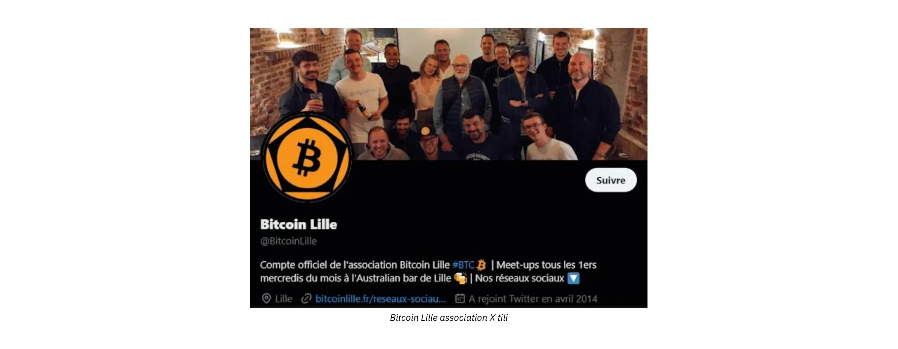

Lisäksi **muutamia yksityisyysasetuksia kannattaa säätää**:

- jätä Twitter-tilisi "julkiseen" tilaan (viestit näkyvät kaikille);
- anna kaikkien löytää sinut;
- poistaa sijainnin seuranta ja tietojen jakaminen muiden tahojen kanssa (yksityisyysasetuksissa).

Kussakin tapahtumassa käytät todennäköisesti Twitteriä hyödyllisten tietojen jakamiseen. Mutta kuten useimmissa sosiaalisissa verkostoissa, **näkyvyys on kaikki kaikessa**.

Säästääksemme sinulta paljon aikaa, otimme aikaa tutkia [Twitterin avoimen lähdekoodin luokittelualgoritmia](https://github.com/twitter).

Tässä ovat **avainasiat, joihin kannattaa keskittyä näkyvyyden lisäämiseksi**:

- Yleisiä vinkkejä:
    - Twiittaa tilisi asetetulla kielellä tai englanniksi: twiittaaminen muilla kielillä voi vähentää näkyvyyttäsi huomattavasti;
    - Pysy omassa markkinarakossasi ja jaa vain tilisi painopisteeseen liittyvää sisältöä; algoritmi rankaisee aiheen ulkopuolisista twiiteistä;
    - Tavoittele 1-2 twiittiä päivässä;
    - Lähetys ruuhka-aikoina: (Tarkista tililtäsi: Twitter Analytics).

- Kun kirjoitat twiittiä:
    - lisätä valokuvan (tai jopa videon);
    - Käytä vain yhtä hashtagia (tavallisesti #Bitcoin on tärkein). Tarvittaessa voit lisätä tilisi alueeseen liittyvän trendikkään hashtagin);
    - Kannusta yhteisöäsi vuorovaikutukseen:
        - Like = paino 0,5
        - Uudelleentwiittaus = paino 1
- Vastaus = paino 27 (**!!**)
- Vastaa ihmisille, jotka vastaavat twiitteihisi **(paino 75!!)**;
    - Vältä linkkien sijoittamista päätwiittaukseen: lisää ne sen sijaan ensimmäiseen kommenttiin..;
    - Kirjoita sanat kokonaan, vältä lyhenteitä.

- Muita vinkkejä:
    - Twiittaa ajankohtaisista aiheista, kunhan ne ovat linjassa tilisi asiantuntemusalueen kanssa;
    - Repostaa parhaiten menestyviä twiittejäsi;
    - Suorita toisinaan kyselyitä;
    - Kirjoita säikeitä mahdollisuuksien mukaan;
    - Kannusta yhteisöäsi vierailemaan profiilissasi ja seuraamaan sinua.

Lisäksi voit kiinnittää twiitin tai viestiketjun Twitter-profiiliisi antaaksesi sille mahdollisimman suuren näkyvyyden, aivan kuten Bitcoin Witsand -yhteisö Etelä-Afrikassa tekee.

Huomaa myös, että on mahdollista olla kirjautuneena kahdelle Twitter-tilille samanaikaisesti sekä puhelimella että tietokoneella. Tämä on erittäin kätevää, jos haluat vaihtaa helposti henkilökohtaisen ja yhteisön tilisi välillä.

Ole vain varovainen... juhlakuvan lähettäminen vahingossa yhteisön tililtä voi tapahtua nopeammin kuin uskotkaan!

Lopuksi, vaikka käyttäjätunnuksesi "@Bitcoin[CITY]" on ainutlaatuinen ja nyt sinun, on fiksua ennakoida väärennettyjä tai kopioivia tilejä. Harkitse myös rekisteröitymistä:

- @Bitcoin_[CITY]
- @[CITY]Bitcoin
- @[CITY]_Bitcoin

Näin vähennät huomattavasti mahdollisuuksia siihen, että joku tekeytyy yhteisösi jäseneksi.

Ohje Twitter-tilin luomiseen:

:::video id=4648976f-41ec-499a-b7ec-a53e796f71b4:::

## Lähemmäksi naapurimaiden tapaamisia

<chapterId>12a21c3b-235a-5292-8209-67bf60f61e49</chapterId>

Nyt kun viestintäkanavat ja sosiaaliset verkostot on perustettu ja ne heijastavat yhteisön visuaalista identiteettiä, on aika alkaa seurata oikeita henkilöitä.

Aloita seuraamalla Twitterissä Bitcoin:ää maailmanlaajuisesti edistäviä avaintilejä, kuten [@Bitcoin](https://twitter.com/Bitcoin) ja [@planb_network](https://twitter.com/planb_network), sekä aloitteita, kuten [@FBCEglobal](https://twitter.com/FBCEglobal). Voit myös uudelleentwiittailla [@halfin](https://twitter.com/halfin) kuuluisan "Running Bitcoin" -twiitin 11. tammikuuta 2009. Ja mikä tärkeintä, **seuraa Bitcoin-yhteisöjen ja tapaamisten tilejä omassa maassasi**.

Tämä luo **mahdollisuuksia seurata toisiaan, merkitä toisiaan ja lisätä yhteistä näkyvyyttä**. Se on jo yleinen käytäntö Ranskan noin 50 Bitcoin-yhteisössä, italialaisissa "Satoshi Spritz" -aloitteissa ja saksalaisissa "Einundzwanzig"-ryhmissä.

Vaikka se saattaa tuntua joidenkin mielestä vähäpätöiseltä, **paikallisten yhteisöjen ja aloitteiden tilien seuraaminen voi johtaa yhteistyöhön tai jopa kumppanuuksiin**. Esimerkiksi Bitcoin Liège- ja Bitcoin Lille -yhteisöt (ja samoin Bitcoin Aix ja Bitcoin Marseille) saivat tällä tavoin yhteyden toisiinsa, minkä ansiosta ne järjestävät yhdessä vuosittaisen tapaamisen.

Toinen hyvä esimerkki ovat **Cercle du Coin** -ateriat.

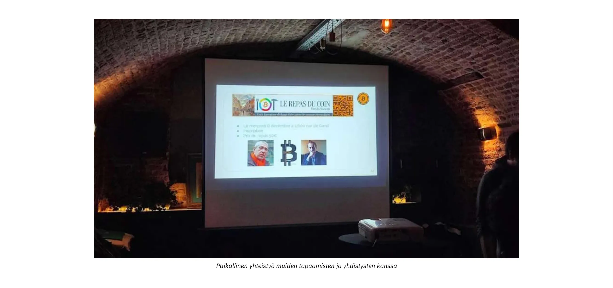

Ranskassa voi myös olla tärkeää **seurata aloitteita, kuten [@KonsensusFR](https://twitter.com/KonsensusFR), [@bitcoinpointfr](https://twitter.com/bitcoinpointfr), [@DecouvreBitcoin](https://twitter.com/DecouvreBitcoin) ja [@btcmap](https://twitter.com/btcmap)**. Nämä ovat tietysti vain ehdotuksia, ja kukin yhteisö voi tehdä niin kuin se haluaa täysin hajautetusti ja itsenäisesti.

Kuten edellä mainittiin, toistensa seuraamisen tavoitteena on lisätä keskinäistä näkyvyyttä. Mitä enemmän edistät yhteisöäsi ja alueesi/maasi yhteisöjä sosiaalisissa verkostoissa, sitä enemmän ihmiset puhuvat sinusta. Mitä enemmän ihmiset puhuvat teistä, sitä todennäköisemmin he osallistuvat tapahtumiinne.

Muiden yhteisöjen julkaisujen tykkääminen ja uudelleentwiittaaminen voi siis auttaa suuresti niiden kehitystä... ja sinun.

Voisit myös ehdottaa, että **meetupien järjestäjät ja yhteisöjä johtavat bitcoinilaiset kokoontuisivat kaksi tai kolme kertaa vuodessa videokonferenssin välityksellä tarkastelemaan kansallisten hankkeiden ja niihin liittyvien yhteisöjen edistymistä. Tämä voi tapahtua myös henkilökohtaisten tapahtumien yhteydessä **

Tavoite on yksinkertainen: kerätä kaikilta palautetta, keskustella siitä, miten yhteisöt kehittyvät, jakaa onnistuneita ideoita ja hankkeita sekä ehdottaa tarvittaessa ratkaisuja. Kokouksen kirjallinen yhteenveto voidaan jakaa jälkikäteen niiden yhteisön järjestäjien kanssa, jotka eivät voineet osallistua kokoukseen.

## Btcmap.org

<chapterId>365f43d4-7b2c-5961-a184-157b8c1a0116</chapterId>

Tässä vaiheessa yhteisösi on jo toiminnassa. Jäljellä on enää se, että toivotat tervetulleeksi lisää kiinnostuneita ihmisiä ja autat yhteisöä kasvamaan.

Mutta et voi edetä tietämättä, että **on olemassa alustoja, joilla bitcoin-asiakkaat voivat löytää yhteisöjä ja tapaamisia läheltään**. Siksi on tärkeää käyttää muutama minuutti pyytääkseen listausta näille sivustoille.

Näihin kuuluvat:

- [Btcmap.org](https://btcmap.org/), sivusto, jossa on kaksi päivittäin päivitettävää karttaa: **[Bitcoin:n hyväksyvien yritysten maailmankartta](https://btcmap.org/map)** ja **[maailman yhteisöjen kartta](https://btcmap.org/communities/map)**. Monet bitcoin-käyttäjät tarkistavat näitä karttoja säännöllisesti, olivatpa he sitten matkoilla tai menossa jokapäiväiseen elämäänsä, tutustuakseen uusiin ihmisiin tai löytääkseen paikkoja, joissa he voivat käyttää [Sats](https://planb.academy/resources/glossary/satoshi-sat):nsa. Btcmap on maailmanlaajuinen referenssi, ja yhteisönne listaaminen sinne on tärkeää näkyvyyden kannalta.
- [BitcoinerEvents](https://www.bitcoinerevents.com/), bitcoinereiden bitcoinereille luoma verkkosivusto. **Sen avulla voit julkaista yhteisösi tulevia tapahtumia**. Ranskassa sitä ei kuitenkaan vielä käytetä laajalti.
- maastasi riippuen voi olla muitakin paikallisia aloitteita. Ranskassa on esimerkiksi [Bitcoin.fr](https://Bitcoin.fr/events/categories/evenements/), jossa **luetteloidaan kymmeniä Bitcoin-tapahtumia joka kuukausi**. Jos et siis ole vielä seurannut heitä Twitterissä tai ottanut heihin yhteyttä jakaaksesi tietoa yhteisöstäsi ja tapahtumista, nyt on sen aika! **Jotta Ranskan tapahtumakalenteri pysyisi ajan tasalla, olisi hienoa, jos kaikki ranskalaiset Bitcoin-yhteisöt ottaisivat tavakseen:**
    - mainitsemalla @bitcoinpointfr Twitterissä jokaisesta uudesta yhteisötapahtumasta
    - uusien tapahtumailmoitusten kiinnittäminen Telegram-ryhmäänsä.

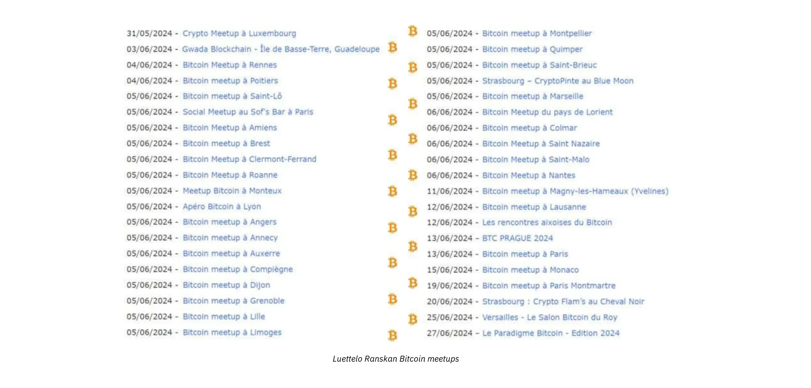

Myös muut alustat voivat lisätä näkyvyyttäsi. **[Meetup](https://www.meetup.com/)** on yksi niistä, ja se on verkkosivusto (ja puhelinsovellus), jossa voit luoda tapahtuman ja löytää muita lähistöllä.

Se maksoi noin 8 € kuukaudessa (tai noin 90 € vuodessa), mikä voi olla kallista pienelle, jäsentymättömälle yhteisölle. Meetup on kuitenkin laajalti käytössä joissakin maissa, erityisesti Kanadassa ja Yhdysvalloissa, ja se on hyödyllinen rekisteröintien hallinnoinnissa.

Vastaavasti **[Orangepillapp](https://www.orangepillapp.com/)** on maksullinen mobiilisovellus (50 000 Sats/vuosi tai 200 000 Sats elinikäinen käyttöoikeus), joka auttaa bitcoin-käyttäjiä tapaamaan.

Vaikka nämä kaksi viimeksi mainittua alustaa voivat auttaa lisäämään näkyvyyttä, niitä ei suositella yhteisöä perustettaessa yksinkertaisesti siksi, että ne eivät ole ilmaisia.

**Aloitetaan listaamalla [btcmap.org](https://btcmap.org/), [BitcoinerEvents](https://www.bitcoinerevents.com/) ja ranskalaisille yhteisöille [Bitcoin.fr](https://Bitcoin.fr) on enemmän kuin tarpeeksi**.

Onnittelut! **Yhteisösi on luotu**, **visuaalisi ovat valmiina**, **tavoitteesi on asetettu**, **viestintäkanavasi ovat valmiina**, **sosiaaliset verkostosi on käynnistetty** ja **näkyvyysstrategia on päätetty**.

Kun pieni ryhmä bitcoin-asiakkaita on liittynyt seuraasi, on aika siirtyä seuraavaan vaiheeseen: ensimmäisen Bitcoin-tapaamisen järjestämiseen.

# Bitcoin:n tapaamisen järjestäminen

<partId>c009d2a6-40ce-583b-bd24-fdfd1fea262e</partId>

## Miksi käynnistää säännöllinen tapaaminen yhteisöllesi?

<chapterId>ed8e471c-3b99-57e2-a042-2d4e8a40b137</chapterId>

Nyt kun yhteisönne sosiaaliset verkostot ja viestintäkanavat on käynnistetty, on aika tehdä läsnäolostanne näkyvää näillä alustoilla. Kannusta uusia jäseniä esittäytymään ja vähitellen liittymään keskusteluun.

Tämä vapauttaa aikaa, jota voit käyttää harkitaksesi jonkinlaisen tapaamisen järjestämistä. Tästä tulee entistäkin tärkeämpää, kun alat tuntea todellista innostusta yhteisössäsi.

Kuten aiemmin mainittiin, ** Bitcoin-kokousta voidaan pitää yhteisön seuraavana "tasona "**. Toisaalta se antaa **jäsenille mahdollisuuden tavata henkilökohtaisesti** ja toisaalta se auttaa **kouluttamaan ekosysteemistä kiinnostuneita uusia tulokkaita**.

Tämänkaltaisen tapahtuman avulla voit omassa mittakaavassasi **luoda Bitcoin:n ympärille pöhinää** kaupungissasi, joka voi kasvaa ajan mittaan, kun yhteisösi ryhtyy toteuttamaan hankkeita.

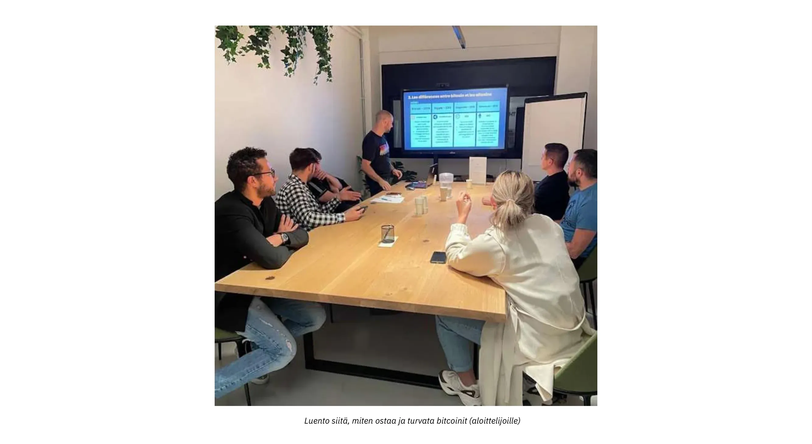

Mitä suuremmat yhteisön kehittämistavoitteet ovat, sitä enemmän aikaa sinun ja jäsentesi on tietysti käytettävä.

Siksi on tärkeää, että **aloitat asettamalla tapaamisellesi saavutettavissa olevat tavoitteet**.

## Ensimmäinen tapaaminen: milloin ja miksi?

<chapterId>f3f8a614-cfb4-5994-a2e8-d56e6f8e3347</chapterId>

Voit käynnistää tapaamisen vain muutaman viikon kuluttua yhteisön luomisesta.

Tässä vaiheessa ryhmäsi on kuitenkin todennäköisesti vielä pieni, mikä tarkoittaa, että on mahdollista, ettei kukaan tule paikalle.

On parempi järjestää tapaaminen, kun viestintäkanavissasi on vähintään muutama aktiivinen jäsen, esimerkiksi muutama kymmenen. Tämä voi tapahtua nopeasti, mutta se riippuu myös ihmisten persoonallisuuksista.

Kun tunnet kipinän, ehdota henkilökohtaista tapaamista. Jos muut ovat kiinnostuneita, jäljellä on enää **määrätä päivämäärä ensimmäiselle tapaamiselle**.

Sen sijaan, että valitsisit päivämäärän itse, on yleensä parasta **luoda kysely noin kymmenen päivää etukäteen, jossa on useita mahdollisia päiviä ja kellonaikoja**. Näin voit käyttää ääniä maksimoidaksesi osallistujamäärän, kehittääksesi jännitystä ja hyödyntää aikaasi parhaalla mahdollisella tavalla.

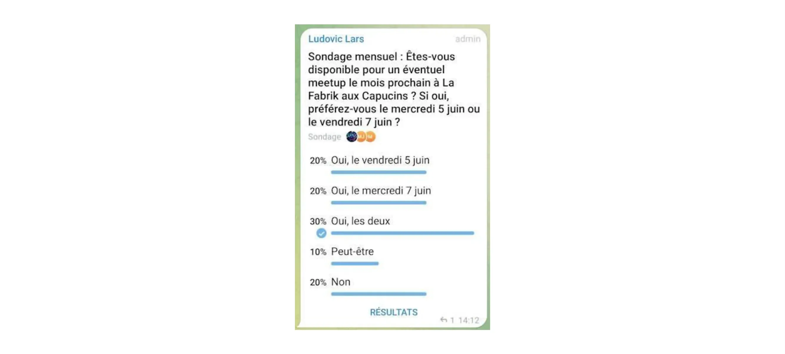

Ei kannata mennä tapaamiseen ennakko-odotuksin siitä, miten tapaaminen etenee, kuinka monta ihmistä tulee paikalle tai mistä aiheista keskustellaan. Näin vältytään pettymyksiltä ja osallistujat eivät tunne painetta.

Anna asioiden sujua luonnollisesti, ehkä juoman äärellä. Keskustelujen pitäisi sujua helposti, ja tarvittaessa voit ohjata keskustelun varovasti takaisin Bitcoin:aan, jos se alkaa ajautua harhaan.

Jos haluat valmistautua hiljaisempiin hetkiin, voit suunnitella muutamia aktiviteetteja tai keskustelunaiheita, kuten:

- **[Mempool](https://Mempool.space/)** näyttäminen tietokoneella tai älypuhelimella;
- kirjan tuominen;
- tuo **Nerdminer**, Bitaxe, FPGA tai jopa ASIC;
- jolla on **Bitcoin-esite**;
- gW-112-visuaalin tai logon ideointi yhteisöllesi;
- pelaamalla **[Bitcoin-korttipeliä](https://www.Maximalist.ovh/accueil/20-game-le-Coin-de-table.html)**;
- näyttää **[btcmap.org](https://btcmap.org/)** kartan yhteisöistä ja kauppiaista;
- gW-116:n lähettäminen tai vastaanottaminen **Valo**:n avulla.

Kun tapaamisesi on vasta alussa, ei useinkaan ole oikea aika muodolliselle esittelylle. Jos osallistujamäärä on pieni, avoin ja rento keskustelu toimii yleensä parhaiten.

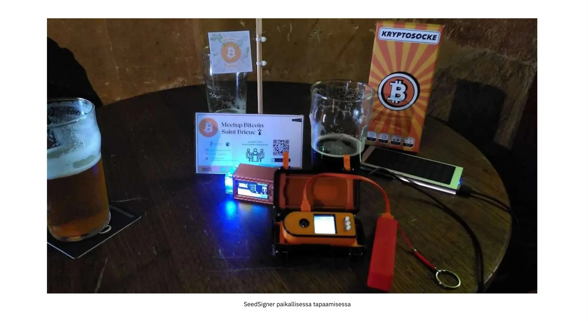

Ensimmäisen tapaamisen jälkeen haluat luultavasti suunnitella uuden tapaamisen. Kun yhteisösi on vielä pieni, on parasta valita päivämäärät äänestämällä, esimerkiksi kerran kuukaudessa tai joka toinen kuukausi. Voit keskustella tästä viestintäkanavissasi.

Jos muodostuu säännöllinen ryhmä bitcoinin käyttäjiä ja kiinnostuneita osallistujia, on järkevää asettaa toistuva aikataulu kahdesta syystä:

1) kaikkien on helpompi suunnitella etukäteen;

2) se auttaa **luomaan "tavan "**. Vaikka joku lopettaisikin kanavien säännöllisen seuraamisen, hän tietää silti, milloin tapaaminen järjestetään, ja voi tulla paikalle tavalliseen tapaan.

Tämä toinen seikka on yksi syy siihen, miksi **Ranskassa useimmat tapaamiset järjestetään joka kuukauden ensimmäisenä keskiviikkona** (ks. [DecouvreBitcoinin](https://decouvrebitcoin.fr/) vuonna 2022 käynnistämä "lähettiläitä" koskeva aloite).

Saksassa ja Italiassa ei ole kiinteää kansallispäivää.

Kuitenkin se, että kaikki tapaamiset järjestetään valtakunnallisesti samana päivänä, aiheuttaa keskittämisongelman: se estää bitcoin-käyttäjiä osallistumasta tapahtumiin läheisissä yhteisöissä ja voi myös herättää turvallisuusongelmia. Keskusteleminen naapurimaiden meet-up-järjestäjien kanssa voi auttaa sopimaan hyvästä järjestelystä.

Kun yhteisösi kasvaa ja tapaamiset houkuttelevat enemmän ihmisiä, voit:

- aseta jokaiselle tapaamiselle erityinen tavoite;
- tai jopa **lisätä toinen tapahtuma joka kuukausi**.

Ensimmäisessä tapauksessa selkeä tavoite voi varmistaa, että osallistujat oppivat jotain uutta, ja pitää keskustelut keskittyneinä Bitcoin:ään, vaikka kaikkien mieltymykset pidetäänkin mielessä.

Toisessa tapauksessa toinen kuukausittainen tapahtuma voisi olla omistettu tietylle teemalle, kuten aloittelijoiden istunnoille tai työpajoille (Mining, Lightning, solmujen asennus jne.).

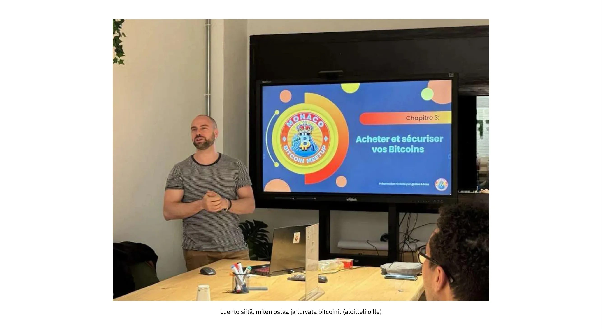

Muista, että **tämä vaatii enemmän organisointia ja enemmän aikaa**. Onneksi [tämän kurssin osassa 6/8](https://planb.academy/courses/1c643dc9-a15f-4f9e-93b6-cb3c58b4ee35/3213d87a-1998-5972-ab93-97a5769ba279) on joukko uudelleenkäytettäviä avoimen lähdekoodin resursseja, jotka auttavat sinua.

Joka tapauksessa kaikki riippuu siitä, millaisen lyhyen, keskipitkän ja pitkän aikavälin toimintasuunnitelman sinä tai yhteisösi olette laatineet itsellenne.

## Sijainnin etsiminen

<chapterId>405d389e-6a32-5777-af8d-293380d2e8fd</chapterId>

Tapahtumapaikan löytäminen ei useinkaan ole helppo tehtävä. Lisäksi on tärkeää, että tapahtumapaikka sijaitsee **yhteisösi kaupungissa**.

Huomioon on otettava useita kriteerejä, kuten:

1) **Sijoituspaikka**: Onko sinne helppo päästä julkisilla liikennevälineillä? Autolla? Onko pysäköintitilaa saatavilla?

2) Onko tapahtumapaikka miellyttävä eikä liian **meluisa**? Etsitkö muodollista ympäristöä (työtila, kokoushuone) vai jotain epävirallisempaa (baari, ravintola)?

3) Riittääkö sen kapasiteetti isännöimään sinua, vaikka rugby- tai Mestarien liigan otteluiltana?

4) Onko tilassa videoprojektori ja hiljainen alue esityksiä varten?

5) Ja lopuksi, jos kyseessä on baari tai ravintola, onko ruokalistalla jokaiselle jotakin syötävää ja juotavaa?

Lisäksi tässä on kolme tärkeää asiaa, jotka on syytä pitää mielessä:

- Jos aiot jakaa illan kahteen osaan: ensin pidetään esitys virallisessa tilassa, jotta kaikki voivat keskittyä, ja sen jälkeen siirrytään baariin tai ravintolaan jatkamaan rennommassa ilmapiirissä, kokemus on osoittanut, että paikan vaihtaminen kesken illan johtaa usein siihen, että jotkut osallistujat lähtevät tauon aikana. Tätä lähestymistapaa ei siksi suositella.
- Ensimmäisissä tapaamisissa osallistujamäärä on todennäköisesti pieni, etkä todennäköisesti pidä virallisia esityksiä. Tällöin sinun ei tarvitse esittäytyä omistajalle tai selittää tavoitteitasi. Kun tapaamisista tulee säännöllisiä ja niissä käy paljon ihmisiä, kannattaa kuitenkin tehdä niin osoittaaksesi ammattimaisuutta ja ilmaistaksesi halusi palata kuukausittain. Tämä voi johtaa moniin keskusteluihin (automaattiset kuukausittaiset varaukset, ilmaiset juomat ja/tai ruokalautaset, alennukset, keskustelut Bitcoin:stä, Bitcoin-maksujen hyväksyminen jne.) On selvää, että jos etsit nimenomaan paikkaa, jossa on videoprojektori esitysten pitämistä varten, vaikuttaa olennaisen tärkeältä pyytää tapaamista (kasvotusten tai jopa puhelimitse) omistajan ja/tai joht

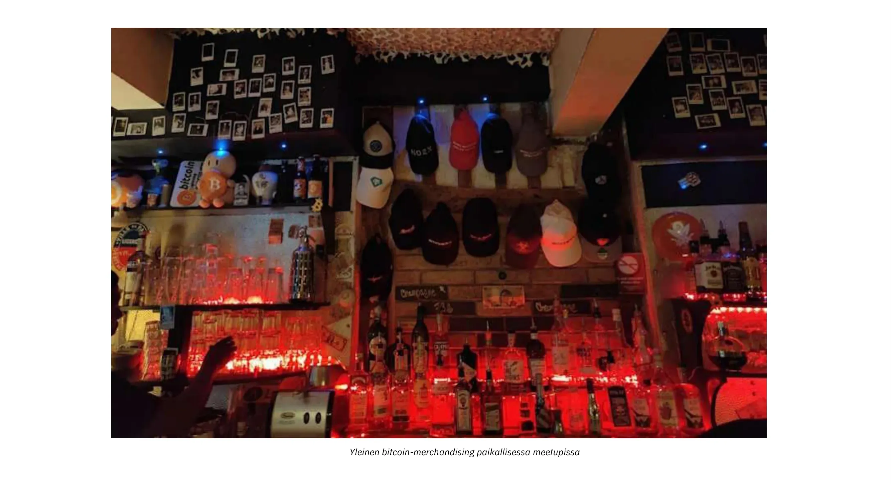

- lopuksi, jotkut yhteisöt **haluavat järjestää tapahtumia vain paikoissa, jotka hyväksyvät Bitcoin-maksut**, mikä on ymmärrettävää. Tässä tapauksessa on hyvä idea **aloittaa etsimällä Bitcoin-maksut hyväksyviä yrityksiä kaupungistasi** ([btcmap.org](https://btcmap.org/map/)ja ottaa niihin yhteyttä, jotta näet, täyttävätkö ne kriteerisi. Jos mitään sopivaa ei ole saatavilla, voit yrittää ottaa uusia kauppiaita mukaan, mutta odota monia kieltäytymisiä, mikä voi olla lannistavaa. Siksi on usein parasta olla asettamatta tätä tavoitteeksi heti alussa ja harkita sitä, kun yhteisösi on vakiintunut ja sinulla on tarpeeksi "tulivoimaa"

Kun käynnistät tapaamisesi, älä myöskään epäröi vaihtaa paikkaa ensimmäisten kuukausien aikana. Tämä auttaa sinua **rakentamaan suhteita eri johtajiin**, tutustumaan erilaisiin ilmapiireihin ja keräämään tietoa mahdollisista tulevista isännistä.

Myöhemmin, kun ryhmäsi on kasvanut, voit vaikka käydä iltapäivällä useissa yrityksissä ja baareissa kysymässä, onko niillä tilaa, joka soveltuu kuukausittaisten tapahtumien ja tapaamisten järjestämiseen.

## Ennen tapaamista

<chapterId>c5218943-580d-5efc-89ed-6b5d728816d6</chapterId>

Suunnitteletko tapaamisen järjestämistä lähiviikkoina?

Tässä on tarkistuslista, joka auttaa sinua valmistautumaan:

1/ **Vahvista paikka**

Ota yhteyttä paikkaan, jossa järjestät tapahtuman, ja varaa se arvioidulle osallistujamäärälle.

2/ **Tapahtumasta ilmoittaminen**:

    - Jaa päivämäärä, kellonaika ja sijainti sosiaalisissa verkostoissa ja muissa viestintäkanavissa. Liitä mukaan ilmoittautumislinkki tarvittaessa.
    - Luo oma visuaalinen ilme (esimerkiksi Canva-juliste, katso osa 2/8 "[Bitcoin-yhteisön identiteetin suunnittelu](https://planb.academy/courses/1c643dc9-a15f-4f9e-93b6-cb3c58b4ee35/b48a18cc-afdf-5216-802c-32647b5cd8a3)").
    - Maksimoi näkyvyys kiinnittämällä ilmoitus Telegramiin ja Twitteriin ja käyttämällä "@everyone"-mainintaa Discordissa.
    - Julkaise ilmoitukset 7-10 päivää ennen tapahtumaa, jotta osallistujat voivat suunnitella etukäteen.

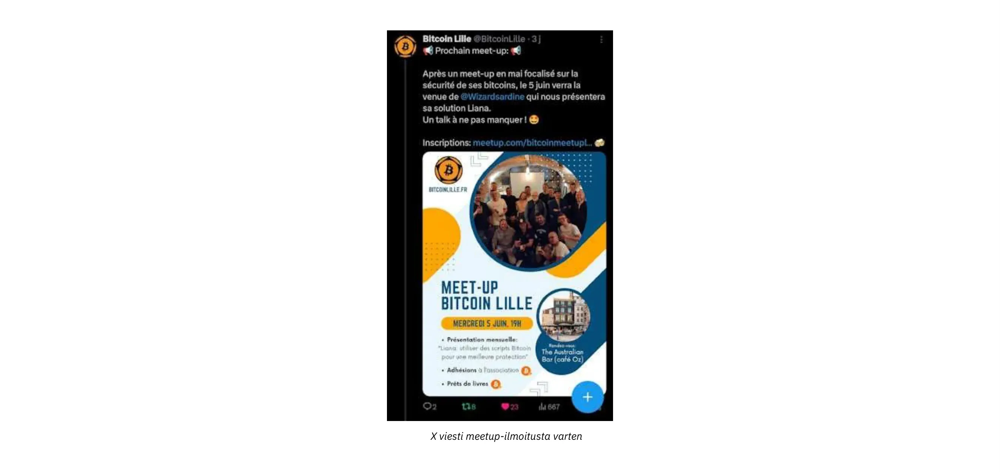

3/ **Muistuta yleisöäsi**

Kaksi tai kolme päivää ennen tapahtumaa jaa ja twiittaa ilmoituksesi uudelleen näkyvyyden lisäämiseksi.

4/ **Toimintapaikan päivittäminen**

Tarkista ilmoittautumiset edellisenä päivänä (tai kaksi päivää ennen) ja ilmoita tapahtumapaikalle lopullinen odotettu osallistujamäärä.

Lisävaiheet, jotta tapahtumasi erottuu muista:

- Tulosta esitteitä ja/tai julisteita
- Valmistele esitys tietystä aiheesta
- Järjestä toimintaa tai työpaja

## Tapaamispäivä

<chapterId>cf60067b-591f-5fdf-9b9e-d442aad0e8f9</chapterId>

Suuri päivä on koittanut! Lähetä muistutus yksi tai kaksi tuntia ennen tapahtuman alkua yhteisön viestintäkanavien kautta. Vahvista alkamisaika ja kerro osallistujille, mistä sinut tunnistaa, esimerkiksi mainitsemalla, että sinulla on Bitcoin-paita ja lippis.

Kun tapaamisesi kasvavat ja alat ottaa vastaan yli 20 ihmistä, paikan valmistelusta tulee yhä tärkeämpää.

Näin toimitaan:

1) **Tule ajoissa paikalle** ja valmistaudu.

2) **Tilan järjestäminen** tarpeidesi ja juhlapaikan mahdollisuuksien mukaan. Jos teitä on vain kuusi henkilöä, järjestelyjä tarvitaan vähän. Mutta kun osallistujia on 10-20, täysin istuma-asetelma voi rajoittaa vuorovaikutusta. Tällöin kannattaa valita seisova järjestely, jossa on hyvässä välissä olevat korkeat pöydät, jos niitä on saatavilla, ja tarjota silti muutama (mieluiten korkea) tuoli. Jos suunnitelmissa on esitelmä, pidä seisomakatsomo suurimman osan illasta ja tuo tuolit paikalle juuri ennen puhetta.

3) Lisää pieniä mukautettuja yksityiskohtia:

    - Laita sisäänkäynnin viereen juliste, jossa ilmoitat sijaintisi (käytä Patafixia ja pyydä ensin lupa tapahtumapaikalta).
    - Laita sisälle Bitcoin-aiheisia julisteita (Bitcoin:n valkoinen paperi, yhteisönne peruskirja, nykyiset projektit jne.).
    - Aseta pöydille tarroja, esitteitä tai keskustelunavaajia, esimerkiksi: Nerdminer, Hardware Wallet, kannettava tietokone, jossa on Mempool, ASIC, Miner tai metallinen varmuuslevy yksityisavaimia varten.

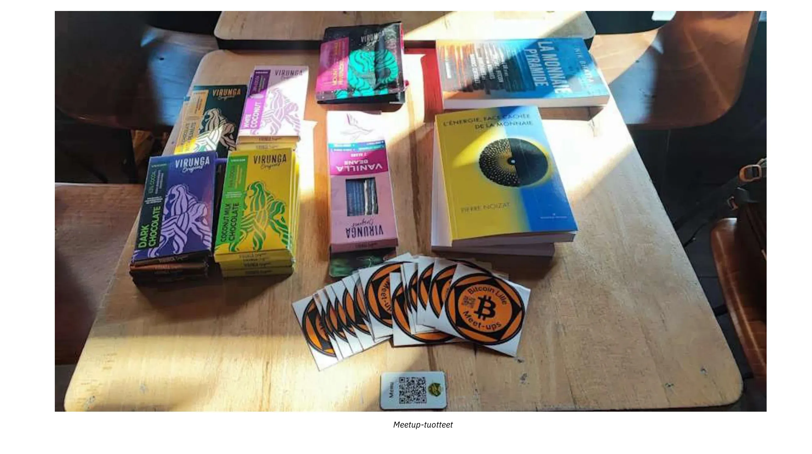

Jos odotat vain muutamia osallistujia etkä ole vielä luonut suhdetta tapahtumapaikan johtajiin, vältä kaikkien laitteiden tuomista ja esittelyä heti. Kun luottamus on syntynyt, sinulla on enemmän vapautta järjestää tila haluamallasi tavalla.

Ota lopuksi juoma ja odota, että ihmiset saapuvat paikalle. Ja muista: älä lannistu, jos kukaan ei tule ensimmäisellä kerralla. Ota mukaan kirja tai video katsottavaksi kaiken varalta.

## Tapaamisen jälkeen

<chapterId>3e881af9-9c09-5721-81ee-c5cda3b109c5</chapterId>

Kun tapaaminen loppuu, tapahtumapaikan henkilökunnan on aika siivota. Ennen kuin lähdet, tarjoa apuasi tarjoilijoille tai ravintolapäälliköille. Tämä voi olla niinkin yksinkertaista kuin kaikkien lasien kerääminen yhteen pöytään tai, jos olet lähellä baaria, lasien palauttaminen ennen lähtöäsi.

Kun olet palannut kotiin, sinulla on todennäköisesti Bitcoin mielessäsi vielä päiviä. Se on täydellinen hetki mitata yhteisönne pulssia ja kerätä palautetta osallistujilta. Voit:

- Lähetä kiitosviesti viestintäkanavissasi ja jaa kaikki tapahtuman aikana mainitut linkit tai resurssit.
- Pyydä osallistujia ehdottamaan parannuksia seuraavaa tapaamista varten.
- Aloita seuraavan tapahtuman suunnittelu.

Sen jälkeen sinulla on muutama viikko aikaa kehittää uusia ideoita, visuaalista materiaalia tai projekteja, jotta seuraava tapaaminen olisi vielä parempi.

## Osallistujien osallistumisen ja sitouttamisen tärkeys

<chapterId>f5355e35-4b07-527c-88a3-8535cba7592c</chapterId>

Roomaa ei rakennettu yhdessä päivässä, eikä yhteisöäsi rakenneta päivässä. Bitcoin:n ympärille saadaan vauhtia järjestämällä säännöllisiä tapaamisia ja tapahtumia.

Yksi asia on olennaisen tärkeää, jotta se voisi tapahtua: **pitää osallistujat sitoutuneina**.

Se voisi alkaa pienellä ryhmällä intohimoisia bitcoinin käyttäjiä, joiden tavoitteena on kokoontua säännöllisesti yhteen ja puhua Bitcoin:stä. Ajan mittaan, kunkin henkilön saatavuudesta ja kiinnostuksen kohteista riippuen, voit **jakaa tiettyjä organisointitehtäviä ryhmän kanssa** tai kutsua keskeisiä **jäseniä ryhtymään tiettyihin projekteihin**. Nämä voivat olla ainutlaatuisia omalle yhteisöllesi, tapaamisillesi tai kaupungillesi tai jopa [tämän kurssin osassa 6/8](https://planb.academy/courses/1c643dc9-a15f-4f9e-93b6-cb3c58b4ee35/3213d87a-1998-5972-ab93-97a5769ba279) ehdotettujen monien aloitteiden innoittamia. **Tämä ei ainoastaan edistä Commitment:n toimintaa ydinjäseniltäsi vaan myös auttaa yhteisösi kasvamaan ja kukoistamaan**.

Tapaamisten edetessä uusia kasvoja ilmestyy: ihmisiä, jotka ovat ostaneet BTC:tä ja/tai altcoineja aiempien syklien aikana, tekniikan harrastajia, jotka haluavat syventää ymmärrystään, tai täysin aloittelijoita, jotka ovat uteliaita tästä sensuroimattomasta, hajautetusta, läpinäkyvästä ja oikeudenmukaisesta maksujärjestelmästä, joka toimii ilman ehtoja ja ilman luotettavia kolmansia osapuolia.

Jos haluat varmistaa, että kaikki tuntevat olevansa mukana tapahtumissasi, keskity kahteen keskeiseen seikkaan:

- **Sosiaalinen osallisuus**: Kaikkien osallistujien tulisi tuntea olevansa tervetulleita. Pyrkikää tervehtimään uusia tulokkaita, kysykää, miksi he ovat tulleet, ja esittelemään heidät muille. Kun ihmiset tuntevat itsensä osallisiksi, he tulevat todennäköisemmin takaisin ja ehkä jopa auttavat tulevien tapahtumien järjestämisessä.
- **Kärsivällisyys ja avoimuus**: Tämä vaatii aikaa ja motivaatiota. Jos puhut sitoutuneen paskanpuhujan (tai vielä pahempaa, XRP Maximalist:n) kanssa, voi olla houkuttelevaa hylätä hänet. Keskustelemalla voit kuitenkin selvittää väärinkäsityksiä tai virheellisiä perusteluja. Jos hän on halukas kuuntelemaan, hän saattaa olla valmis ymmärtämään Bitcoin:a aidosti.

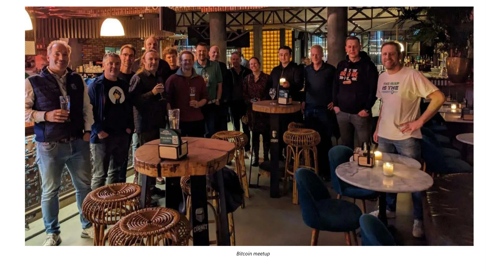

Ajattele tapahtuman kokonaiskokemusta käytännön näkökulmasta:

- Oliko **paikka miellyttävä**?
- Oliko se **helppo käyttää?**
- Miksi jotkut ilmoittautuivat, mutta eivät tulleet paikalle?
- Mitä keskusteluja käytiin? Olivatko keskustelut liian teknisiä aloittelijoille?
- Olivatko keskustelut liian alkoholisoituneita?

Jokaisella osallistujalla on oma persoonallisuutensa, tavoitteensa ja kiinnostuksen kohteensa, joten kokemukset vaihtelevat. Mutta kun tapaamispaikka on sopiva, yleisö on avointa ja aikeet ovat aitoja, tapaamisella on kaikki syyt onnistua.

Tapaamisen järjestäminen vie aikaa, mutta ennen kaikkea se vaatii organisointia. Se on inhimillinen projekti, joka toimii ja kasvaa pitkällä aikavälillä vain, jos se on hyvin suunniteltu, avoin ja osallistava.

Viime kädessä on sinun päätettävissäsi, kuinka pitkälle "avoin ja osallistava" pitäisi mennä. Muista vain, että paskanjauhaja on usein vain syntymässä oleva bitcoiner.

# Esimerkkejä hankkeista ja aloitteista

<partId>45b3bc40-1c31-583e-8411-2662e6efd765</partId>

## Miksi mennä pidemmälle kuin vain oluen juomiseen?

<chapterId>3213d87a-1998-5972-ab93-97a5769ba279</chapterId>

Kun korttelit etenevät, yhteisösi kehittyy. Uusia kasvoja tulee mukaan, toiset lähtevät pois, mutta johtavan periaatteen pitäisi pysyä samana: Bitcoin-ekosysteemin kehittäminen ja jäsenten välisten siteiden vahvistaminen.

On monia hankkeita ja aloitteita, jotka voidaan toteuttaa. Tässä luvussa on luettelo ideoista, jotka voidaan toteuttaa yhteisössä tai tapaamisissa. Voit vapaasti valita niistä ne, jotka inspiroivat sinua, ja jopa lisätä omia ideoitasi tähän kurssiin [tekemällä "Pull Request" GitHubissa](https://github.com/PlanB-Network/Bitcoin-educational-content).

Ennen kuin siirrytään asiaan, palataan vielä yhteen aiemmin mainittuun seikkaan.

Kun järjestät Bitcoin-tapaamisen, tapaat uusia ihmisiä. Sosiaalinen kanssakäyminen on tärkeää, ja olut (tai alkoholi yleensä) voi auttaa luomaan juhlavan ilmapiirin. Mutta se kannattaa pitää mielessä:

- Alkoholi heikentää kognitiivisia kykyjä, kuten ajattelua ja ymmärtämistä, mikä voi vaikeuttaa vakavien keskustelujen tai esitysten seuraamista.
- Alkoholista voi tulla myös lohdutusrituaali: joka kuukausi jaat "Bitcoin-hetkesi" ystävien kanssa drinkin äärellä. Vaikka se on hieno tapa luoda yhteyksiä, onko oluen juominen todella tapaamisesi päätavoite? Vai haluaisitko mieluummin tehdä Exchange-tutkimusta, oppia muilta ja auttaa uusia tulokkaita löytämään Bitcoin:n?

Jokaisella on omat mieltymyksensä, vakaumuksensa ja persoonallisuutensa. Tässä ei ole kyse yhden tapaamisen tuomitsemisesta toisen yli. Vaikka puhumme usein oluen äärellä maailman muuttamisesta, vallankumoukset eivät kuitenkaan ala tai kasva sillä tavalla.

Tärkeintä on vain olla tietoinen siitä.

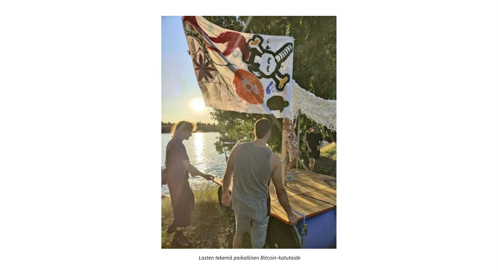

## Järjestä teemoitettuja tapaamisia, jotka etenevät vuosittain

<chapterId>46afdbcc-a775-5c16-b20a-34956690d58f</chapterId>

Kun olet koonnut noin kymmenen hengen ydinryhmän, voit alkaa lisätä esityksiä kuhunkin tapahtumaan. Nämä voivat noudattaa etukäteen ilmoitettua teemaa tai olla toisistaan täysin riippumattomia.

Kun suunnittelet esityksiä tai työpajoja, on hyvä luoda selkeä, hyvin jäsennelty kulku. Tavoitteena on **kata Bitcoin:n keskeiset käsitteet askel askeleelta**, jolloin osallistujat saavat kokonaiskuvan aiheesta useista eri näkökulmista.

Ranskassa kesällä 2023 tapaamisten järjestäjät työskentelivät **vuosittaisen etenemisen** parissa.

Sen lisäksi, että tämä lähestymistapa on erittäin opettavainen, se mahdollistaa avoimen lähdekoodin asiakirjojen ja diakansioiden jakamisen ryhmien kesken, jolloin vähitellen syntyy yhteinen resurssikirjasto. Aloite on saanut hyvän vastaanoton, ja sen on määrä kasvaa tulevina vuosina.

Alla on vuosien 2023-2024 ranskalaisten tapaamisten eteneminen. Kustakin teemasta on saatavilla avoimen lähdekoodin esitys ja video, joista voit saada ideoita aiheista, joita voisit käsitellä omissa tapahtumissasi.

Muita resursseja on saatavilla myös Plan ₿ Academyn ["Educator Content"](https://planb.academy/educator-content) -osiossa, joka on yhteistyötila, jossa Bitcoin-kouluttajat ympäri maailmaa jakavat ja tarjoavat opetusmateriaalejaan (esitykset, esitteet, oppaat, julisteet...) valmiina käytettäväksi tai muokattavissa olevissa muodoissa. Tavoite: yhdistää voimavarat, jotta ei tarvitse aloittaa alusta joka kerta!

| Month | Theme | Video | Editable Resource |
| -------- | -------- | -------- | --- |
| September     | Chapter 1: What is Bitcoin?     | [	YouTube link](https://www.youtube.com/watch?v=CSjuBqrl4t8)     | [Editable PowerPoint](https://www.canva.com/design/DAFu0d5Jd7M/9gAWDAOSS6LDkWENuZjYgw/edit) |
| October & November| Chapter 2: Understanding Bitcoin Transactions     | [YouTube link](https://www.youtube.com/watch?v=inFnR-3NsdM)     | [Editable PowerPoint](https://www.canva.com/design/DAFsEcnOro8/Mz9FYdTGhsvozZOe0Y9jtw/edit) |
| December     | Chapter 3: Understanding the Lightning Network     | [YouTube link](https://www.youtube.com/watch?v=hHz-ALx8D9w)     | [Editable PowerPoint](https://www.canva.com/design/DAF4YPSNnR8/HKp4Vmcno8eMtVWnZmFtcw/edit) |
| January     | Chapter 4: What is Mining?     | [YouTube link](https://www.youtube.com/watch?v=QyHZ3CVI_OI)     | [Editable PowerPoint](https://www.canva.com/design/DAF5DE6iBEM/tsy8E3oBebUnsR0kj53vvQ/edit) |
| February     | 	Chapter 5: Running a Bitcoin and Lightning Node    | [YouTube link](https://www.youtube.com/watch?v=RRYK-usg-OY)     | [Editable PowerPoint](https://www.canva.com/design/DAF55FU6HI0/sQ0lacRJblqrhn_9Xk1yDg/edit) |
| March     | 	Chapter 6: Using the Lightning Network in Daily Life    | [YouTube link](https://www.youtube.com/watch?v=o2BS4xjei8M)    | [Editable PowerPoint](https://www.canva.com/design/DAGAcJMw7lw/-haMNnHnwj5vpDAy8MDowA/edit) |
| April & May    | Chapter 7: Securing Your Bitcoins      | [YouTube link](https://www.youtube.com/watch?v=fHExPbhM0Hg)    | [Editable PowerPoint](https://www.canva.com/design/DAGDz3Nq4e0/D3uG-4w9FN6OhUq-VXzhfg/edit) |
| June     | 	Chapter 8: What is Multi-Sig?     | [YouTube link](https://www.youtube.com/watch?v=Me5489mpoxA)     | [Editable PowerPoint](https://www.canva.com/design/DAGLMtQT6sg/rYIxr4ldUJ0jTelNf-Pj8Q/edit) |
| July     | 	Chapter 9: Understanding the Bull Run and How to Prepare    | [YouTube link](https://www.youtube.com/watch?v=7RA-gnCJWyM)     | [Editable PowerPoint](https://www.canva.com/design/DAGJQkiZ_YA/9lUluP9RZ0eeA_e61mk9Hw/edit) |
| August     | Chapter 10: The Taxman is Never Far Away   | [YouTube link](https://www.youtube.com/watch?v=oY4NwonGDm0)     | [Editable PowerPoint](https://www.canva.com/design/DAGQhx7Yc_c/7mRhb_vlgnhSgxd1FtjK8w/edit) |

Luvut 2 ja 7 voidaan jakaa kahteen lyhyempään esitykseen, jotta osallistujat eivät huku. Niiden pitäminen yhdessä istunnossa vapauttaa kuitenkin kalenterista tilaa erityistoiminnoille, kuten yhteisille tapaamisille naapuriryhmien kanssa, tietokilpailuille tai työpajoille.

**Olet vapaa käyttämään, muokkaamaan ja jakamaan näitä resursseja, mutta muista mainita alkuperäiset tekijät, jos käytät heidän työtään uudelleen.**

Koska kaikki eivät osallistu jokaiseen tapaamiseen, on hyvä idea nauhoittaa esitykset ja ladata ne suoratoistoalustalle tai verkkosivustolle. Näin poissaolijat pääsevät kiinni ja osallistujat voivat palata materiaaliin myöhemmin.

Samanaikaisesti voit järjestää muita teemakokouksia, kuten:

- Bitcoin-tietokilpailu (palkintona Hardware Wallet)
- Onboarding-haaste, jossa lähetät ilmaisia satosheja kadulla oleville ei-kolikkoilijoille
- Asiantuntijapuhujan tai yrityksen kutsuminen esittelemään Bitcoin:een liittyvää tuotetta
- Yökierros baareihin ja kauppoihin, jotka hyväksyvät Bitcoin:n

Ja paljon muuta, vain mielikuvituksesi on rajana!

## Luo oheistapahtumia ja työpajoja

<chapterId>9dbd651a-8712-5630-90b3-b9525dcc1385</chapterId>

Riippuen siitä, miten hyvin olet käytettävissä ja miten paljon osallistut yhteisöllesi, voit suunnitella muita tapahtumia vuoden aikana, kuten:

- Ravintola-ilta **Pizzapäivää** varten 22. toukokuuta
- Ilta tai viikonloppu seuraavan **Halving** juhlistamiseksi
- Perheen **peli-ilta** Bitcoin:stä ja sen toiminnasta käyttäen pelejä kuten [Le Coin de Table](https://www.Maximalist.ovh/) tai [SHAmory](https://shamory.com/)
- **Mining-työpaja**, jossa esitellään erityyppisiä laitteistoja (CPU, GPU, FPGA, ASIC, Nerdminer, Bitaxe)
- **Aloittelijoille tarkoitettu iltapäivä tai iltapäivä**, jossa on teemakohtaisia työpajoja
- **Yhteinen tapaaminen naapurikuntien kanssa**

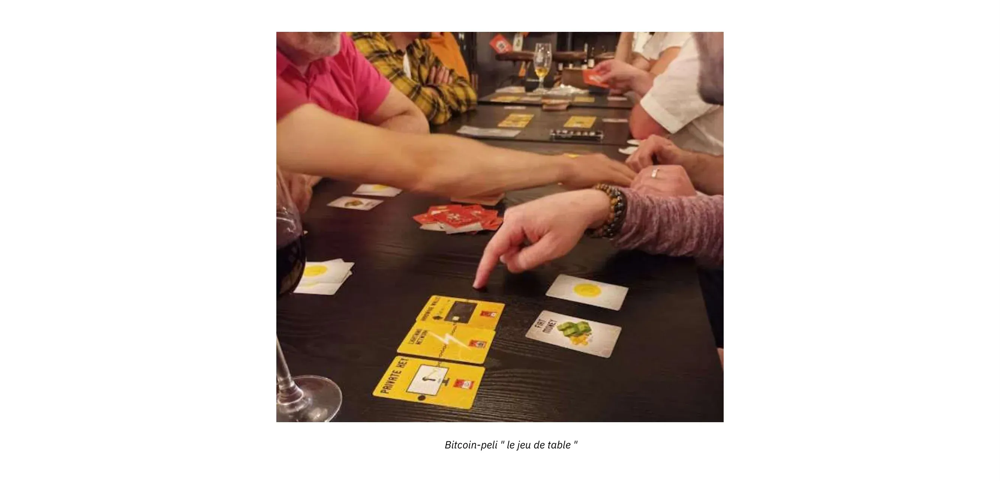

Varo vain, ettet kuormita kalenteria liikaa. Liian monta tapahtumaa yhden kuukauden aikana voi johtaa järjestäjien loppuunpalamiseen ja osallistujamäärän vähenemiseen ajan mittaan.

## Luo tarroja

<chapterId>d605f3b3-130e-513d-85e6-06bc5ea13e99</chapterId>

Tarrat ovat hauska tapa mainostaa sekä Bitcoin:tä että yhteisöänne ja vahvistaa samalla identiteettiänne.

Pidä nämä vinkit mielessä ennen tilaamista:

- Varmista ulkokäytössä, että tarrat ovat vedenpitäviä.
- Pidä logosi hieman leikkausaluetta pienempänä, jotta vältät leikkausongelmat laserleikkauksen aikana.
- Käytä vektoritiedostoa rasterikuvan sijasta, jotta tulostuslaatu olisi parempi.
- Valitse oikea koko: 8 cm:n halkaisija (noin aikuisen kämmenen kokoinen) on hyvin näkyvä, kun taas 4 cm:n halkaisija on huomaamattomampi. Etsitkö näkyvyyttä vai hienovaraisuutta ?
- Jos haluat tulostaa runsaasti mustaa ("quad black"), käytä 30 % syaania, 30 % magentaa, 30 % keltaista ja 100 % mustaa. Pelkän 100 %:n mustan käyttäminen voi aiheuttaa harmaata sävyä. Tulostimet tarkistavat tämän usein, mutta se on syytä tietää.

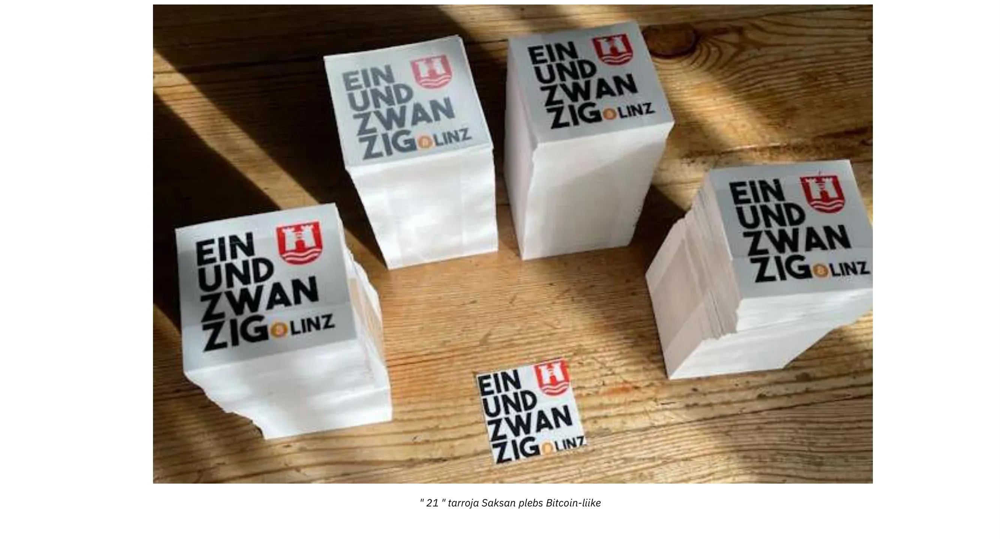

Tarpeistasi ja toimittajasta riippuen 1 000 tarraa voi maksaa 100-250 euroa. Voit ottaa yhteyttä [@Mill3sim3 Twitterissä](https://x.com/Mill3sim3), markkinointiin erikoistuneeseen ranskalaiseen Bitcoineriin, joka voi joskus varmistaa jopa 30 % alhaisemmat hinnat kuin tavalliset online-myyjät.

Tästä huolimatta 1000 tarraa on paljon. Yleensä on parempi aloittaa noin 100:lla, jotta voit varmasti jakaa ne kaikki.

Tärkeää: **Tarkista paikalliset määräykset ennen tarrojen sijoittamista julkisiin tiloihin**.

Ranskassa tarroja saa kiinnittää vain virallisille julkisille ilmoitustauluille. Niiden asettaminen muualle (esim. stop-merkkiin) johtaa todennäköisesti niiden poistamiseen ja mahdollisesti sakkoihin, jos ne voidaan yhdistää sinuun tai tapaamiseesi. Kerro tästä jäsenillesi.

Tarkista yksityisissä tiloissa, kuten konserteissa, baareissa tai stadioneilla, onko tarroja jo olemassa, ennen kuin lisäät oman tarrasi. Jos ei, pyydä henkilökunnalta lupa. Et halua, että liikkeenomistajan ensivaikutelma yhteisöstäsi on se, että olet vandalisoinut heidän tilaansa.

## Luo kirjasto

<chapterId>acc94093-f8b3-51b8-9359-348e9e075d38</chapterId>

Toinen projekti, jonka voit helposti perustaa, on **kirjaston luominen tapaamisissa**.

Voisit pyytää osallistujia, jotka haluavat jakaa luettavaa, tuomaan Bitcoin:een liittyvän kirjan. Jos joku muu kokoontumisessa haluaa lainata sen, Exchange:n omistajan kanssa voitaisiin sopia lainaamisesta talletusta vastaan, esimerkiksi 21 000 satoshia [Salaman](https://planb.academy/resources/glossary/lightning-network) kautta.

Omistajalle tämä talletus auttaa kattamaan mahdollisen katoamisen tai varkauden. Lainanottajalle se on kannustin tulla takaisin tulevaan tapaamiseen noutamaan talletuksensa.

Jos johdat yhdistystä ja haluat sijoittaa osan varoistasi koulutusresursseihin, voit myös ostaa useita kirjoja **Bitcoin-kirjastoosi**, joka on saatavilla jokaisessa tapaamisessa.

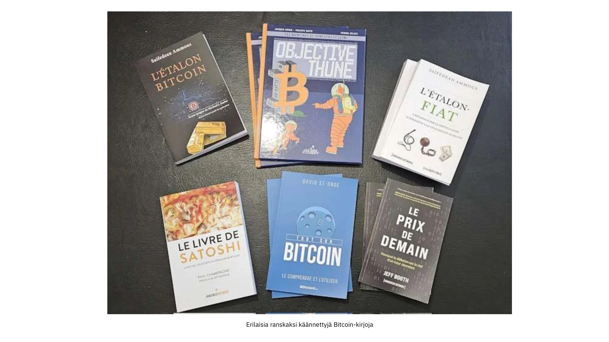

Ekosysteemin tukemiseksi **[kustantaja Konsensus Network](https://konsensus.network/) on tarjonnut kansainvälisille Bitcoin-tapaamisille ja -yhteisöille 15-35 prosentin alennusta kaikista kirjoistaan vuoden 2023 lopusta lähtien, kun tilaat vähintään kolme kirjaa**.

Jos haluat hyödyntää tämän alennuksen, ota yksinkertaisesti **yhteyttä [Konsensus-kustantamoon](https://twitter.com/KonsensusFR) Twitterissä**.

Jos sinulla ei ole käteistä, voit silti antaa alennuksen eteenpäin yhteisön jäsenille.

Jos sinulla ei ole varoja, voit silti siirtää alennuksen jäsenillesi. Yksi järjestäjä voisi esimerkiksi kerätä tilauksia jäseniltä, tehdä irtotilauksen alennettuun hintaan ja jakaa kirjat seuraavassa tapaamisessa, jolloin maksu kerättäisiin Lightning-maksuna.

Voit myös asettaa tapaamisissa esille kirjojen lainaamista koskevan peruskirjan, jossa selitetään selkeästi lainaussäännöt uusille tulokkaille.

Tässä on avoimen lähdekoodin esimerkki, jota voit käyttää ja mukauttaa:

[Kirjojen lainausperuskirja](https://www.canva.com/design/DAF7u1b5kRM/r2gEAlibe_jTIXIX-O9PMA/edit)

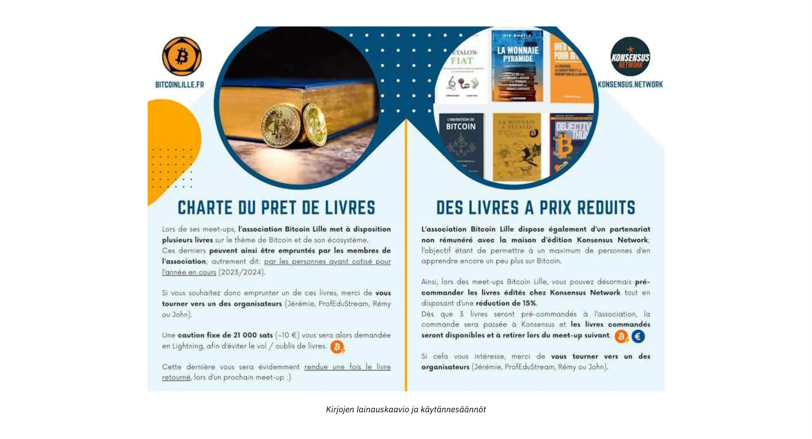

Bitcoin:een liittyvän lukemisen edistämiseksi voisit käydä **paikallisissa kunnallisissa kirjastoissa** katsomassa, onko niissä Bitcoin:ta käsitteleviä kirjoja.

Jos näin on, kysy kirjastonhoitajilta, onko aiheeseen liittyen suunnitteilla pyöreitä pöytiä, ja tarjoa heille tapaamisesi yhteystietoja.

Jos ei, ehdota, että he hankkivat muutaman kirjan ennalta valitulta listalta. [kustantajan Konsensusverkosto](https://konsensus.network/) voi olla inspiraation lähde.

## Luo ja jaa henkilökohtaisia esitteitä

<chapterId>62ad5430-c698-51b3-89ac-090f31c88953</chapterId>

Esitteiden suunnittelu ja kirjoittaminen vie aikaa, mutta se on sen arvoista, sillä niiden avulla saat konkreettisen resurssin, jota voit jakaa, kun puhut Bitcoin:stä, ja sitä arvostetaan aina.

Nämä lentolehtiset voidaan kohdistaa:

- Kauppiaat, jos haluatte ottaa Bitcoin:n käyttöön maksutapana;
- Tapahtuman osallistujat, joiden mukana on esite, jossa kerrotaan, miten Bitcoin/Lightning-järjestelmää käytetään ja miten sillä maksetaan;
- Aloittelijoille, jotka tavataan kadulla, työpaikalla tai perhekokouksen yhteydessä, annetaan esite, jossa korostetaan Bitcoin:n tärkeimpiä etuja.

Voisit myös suunnitella yhteisöllesi tai tapaamisellesi tarkoitetun esitteen, jossa esitellään toimintasi, tavoitteesi, sosiaalisen median linkit, viestintäkanavat ja tulevat tapahtumat.

Useita esitteitä on jo **saatavilla avoimena lähdekoodina [Bitcoin Teaching Toolbox](https://planb.academy/fr/resources/bet)** -verkkopalvelussa planB.networkissa, ja lisää lisätään ajan mittaan.

Yksi esimerkki on [täydellinen esite](https://profedustream.substack.com/p/21-raisons-dutiliser-Bitcoin), jossa on 21 syytä käyttää Bitcoin:ta. Sen ulkoasu on myös [saatavana avoimena lähdekoodina](https://www.canva.com/design/DAFtAR1NauQ/ZDwl2CchIJ9Gpb36N6-7iw/edit?utm_content=DAFtAR1NauQ&utm_campaign=designshare&utm_medium=link2&utm_source=sharebutton), jota voit muokata, mukauttaa ja jakaa. Muistakaa vain mainita lähteenne.

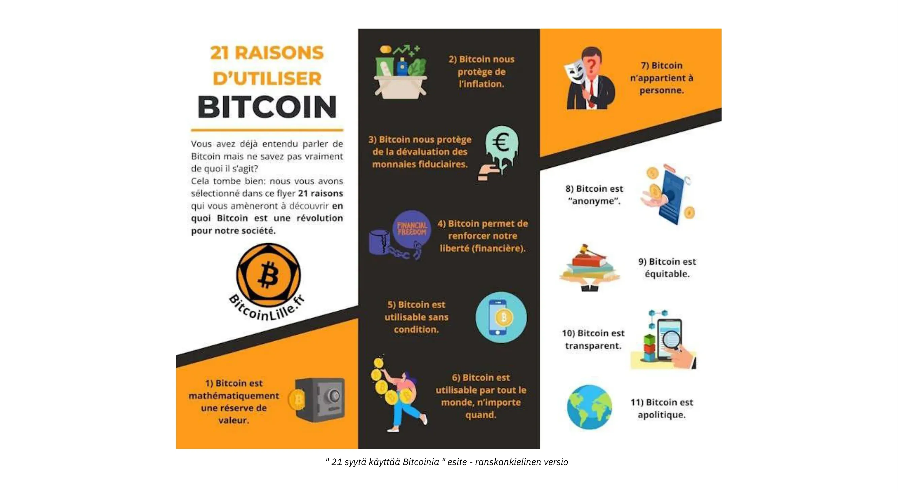

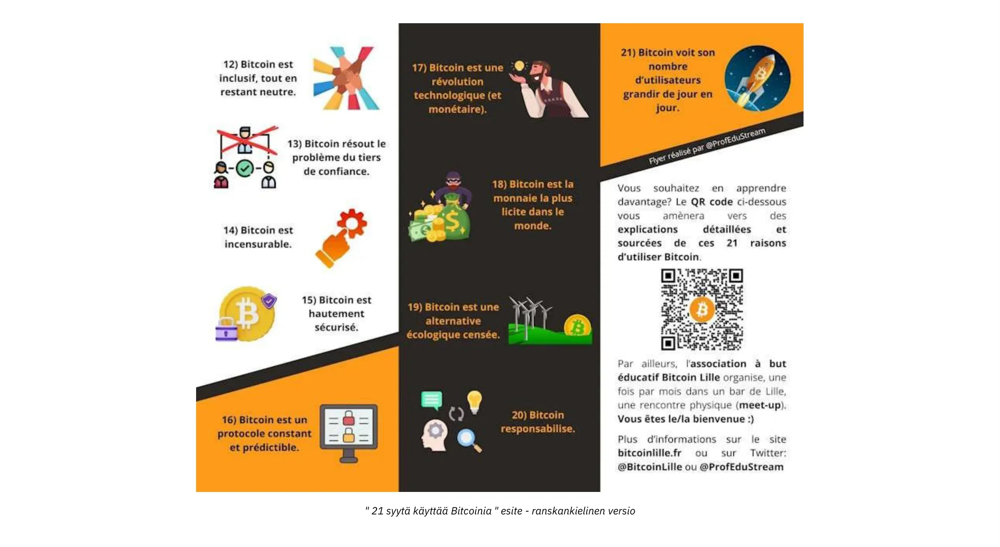

Kuten aiemmin mainittiin, näitä esitteitä voi jättää melkein minne tahansa: työpaikan yhteiselle työpöydälle, perheen ruokapöytään, julkiseen kirjastoon jne.

Ranskassa ja muutamissa muissa maissa on myös "kirjalaatikoita", pieniä puulaatikoita, joihin ihmiset voivat vapaasti lahjoittaa tai lainata kirjoja. Voit jättää sinne esitteen tai vielä parempi, kirjan.

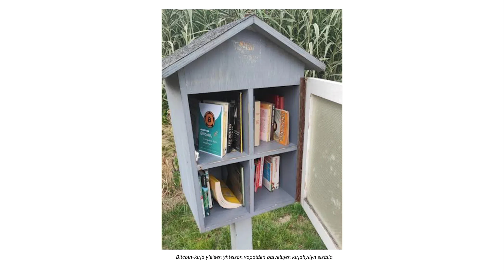

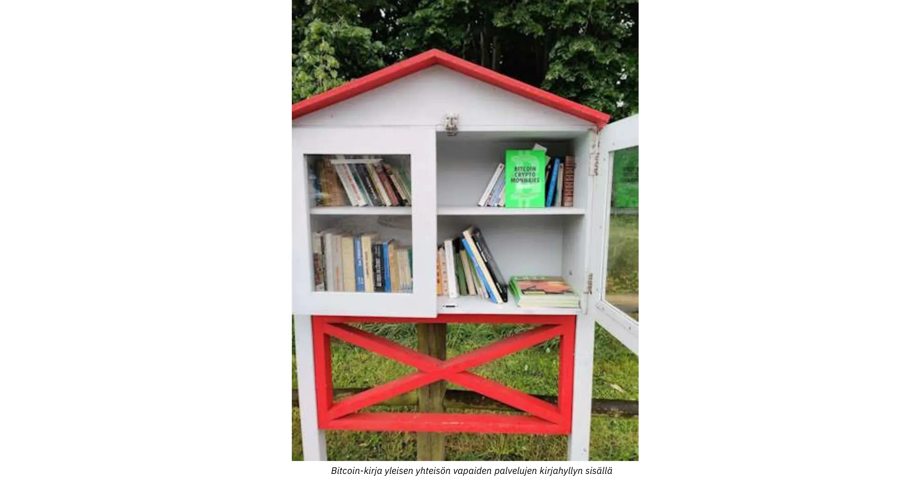

Vuonna 2023 käynnistettiin **"Bitcoin White Paper in France's Book Boxes**" -aloite.

Hankkeen toteuttamiseksi osallistujien oli ensin kerättävä maan kaikkien kirjalaatikoiden maantieteellinen sijainti. Tähän tarkoitukseen on olemassa useita tietokantoja:

- [boite.a.livres.zonelivre.fr](https://boite.a.livres.zonelivre.fr/);
- [boites-a-livres.fr](https://www.boites-a-livres.fr/carte-de-france);
- [delivrez.fr](https://delivrez.fr/maps/fr_FR/);
- sekä paikallisen lehdistön artikkelit

Vaikka Bitcoin:n valkoisen kirjan jättäminen on symbolinen, se on usein liian monimutkainen uusien tulokkaiden ymmärrettäväksi. Sen sijaan ajatuksena oli luoda pieni vihkonen, joka sisältää:

- helppolukuinen, hyvin perusteltu johdanto Bitcoin:een, sen käyttötarkoituksiin ja ongelmiin, joita se ratkaisee;
- gW-166:n valkoinen paperi, käännetty ranskaksi.

Tässä on [ranskalaisten bitcoin-asiakkaiden jakama vihkonen](https://profedustream.substack.com/p/Bitcoin-la-naissance-dune-nouvelle), joka on sijoitettu kymmeniin kirjalaatikoihin ympäri maata. Sen ulkoasu on myös [saatavilla avoimena lähdekoodina](https://www.canva.com/design/DAFs18FSoVM/Sy0QsfUkycTgXveeGgutBg/edit?utm_content=DAFs18FSoVM&utm_campaign=designshare&utm_medium=link2&utm_source=sharebutton).

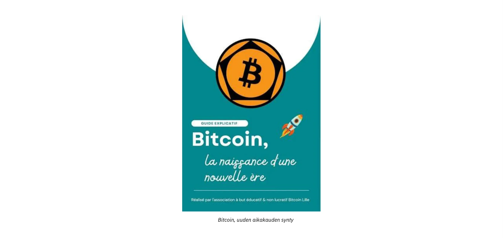

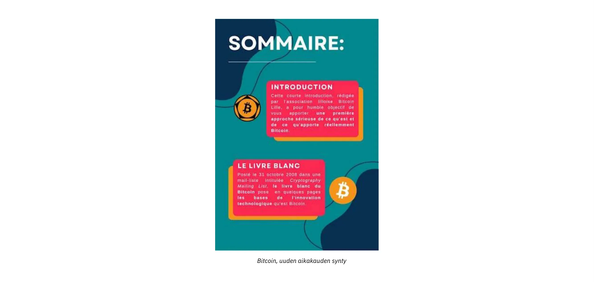

## Videoprojisoinnin tuottaminen

<chapterId>892b248a-b837-5df6-aac9-4b3261ff0390</chapterId>

Lähes jokainen bitcoinaaja on luultavasti nähnyt [Rémi Forten](https://twitter.com/forteremi) kiehtovan keskisarjan "Le mystère Satoshi, aux origines du Bitcoin" (Satoshi mysteeri: Bitcoin:n alkuperä).

Vuonna 2021 julkaistua elokuvaa on katsottu [useita miljoonia kertoja YouTubessa](https://www.youtube.com/watch?v=0ETcLj5jBy4).

Yksi ajatus voisi olla järjestää Satoshi Mystery -elokuvan näytös yhteisöllesi, ehkä ylimääräisenä kuukausittaisena tapahtumana.

Varoituksen sana: vaikka ARTE France on vahvistanut, että julkiset näytökset ovat sallittuja, sinun on maksettava projisointioikeuksista, jotta voit tehdä sen laillisesti. Vuonna 2023 tämä hinta oli noin 250 euroa esitystä kohti tai 120 euroa esitystä kohti, jos vähintään viisi tapaamista näytti elokuvan vuoden aikana.

Useimmille yhteisöille tämä hinta on kohtuuton, varsinkin kun dokumentti on jo saatavilla ilmaiseksi ARTEn YouTube-kanavalla.

Muut ennusteet ovat tietenkin mahdollisia.

Esimerkiksi Ranskassa **ohjaaja [Alana Mediavilla](https://twitter.com/AlanaMediavilla) myönsi paikallisille tapaamisille oikeuden esitellä dokumenttielokuvaansa "Stranded "**, joka sisältää materiaalia tulevasta elokuvasta 2024 [elokuva "Dirty Coin"](https://www.dirtycointhemovie.com/).

Jotkut bitcoinilaiset tekivät jopa aloitteen "Strandedin" kääntämiseksi kokonaan ranskaksi, lisäsivät tekstityksen ja jakoivat sen tapaamisiin eri puolilla maata. Maaliskuun 4. päivän 2024 viikolla se näytettiin samanaikaisesti noin kymmenessä tapaamisessa koko maassa.

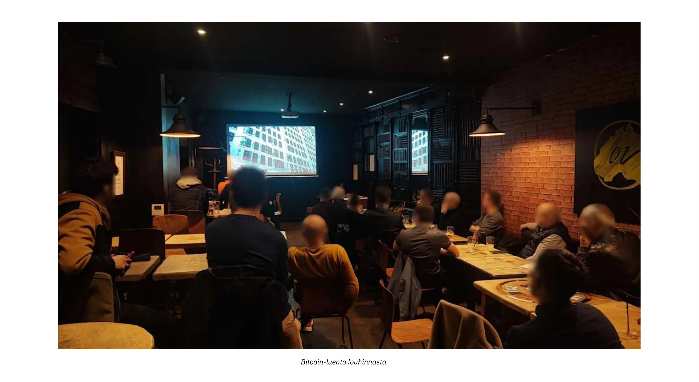

Tapahtuma herätti vilkasta keskustelua Bitcoin Mining:sta, sen energiankulutuksesta ja laajemmista ympäristövaikutuksista.

## Julisteiden ripustaminen kaupunkiinne

<chapterId>6565e8a0-d535-5be0-9764-273584c675bd</chapterId>

Useissa Euroopan maissa (muun muassa Saksassa, Espanjassa ja Ranskassa) bitcoin-asiakkaat ovat tehneet aloitteen ja pystyttäneet julisteita kaupunkeihinsa.

Joissakin malleissa Banksyn taidetta on muokattu niin, että Bitcoin-logo on mukana.

Yksi esimerkki on [StreetCyberArt](https://twitter.com/streetcyber_art), saksalainen bitcoinaaja, joka on tehnyt kollaaseja ja katutaidetta useiden vuosien ajan.

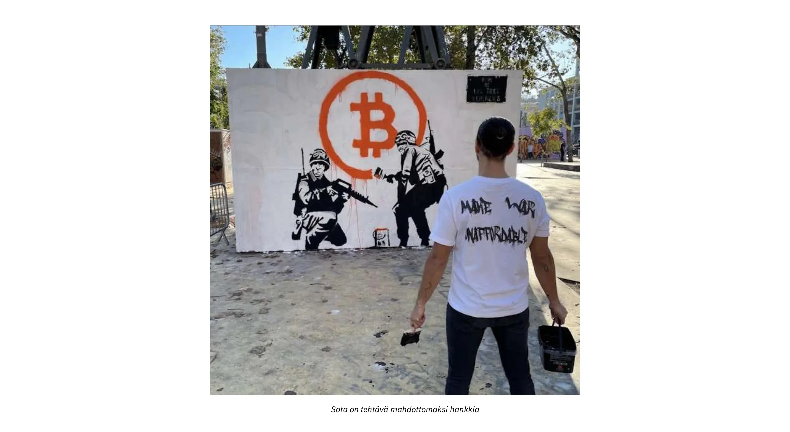

Jos haluat ryhtyä kadulla postaamaan, varmista, että ymmärrät oman maasi lait. Esimerkiksi Ranskassa julisteita saa kiinnittää vain julkisiin mainostauluihin. Muualla se on kokonaan kielletty ja siitä rangaistaan sakolla.

Jos päätät kokeilla rajoja ja toivot, ettet jää kiinni "itse teosta", vältä sisällyttämästä julisteisiin mitään tunnistetietoja (kuten tapaamisesi nimeä tai @Twitteriä).

Huomaa myös, että näiden julisteiden tulostaminen henkilökohtaisella tulostimella johtaa yleensä musteiden vuotamiseen ja nopeaan heikkenemiseen ulkona. Paras tapa on tehdä yhteistyötä ammattimaisen tulostajan kanssa, joka voi valmistaa julisteet erityiselle ulkokäyttöön tarkoitetulle itseliimautuvalle paperille, mikä takaa sekä laadun että kestävyyden.

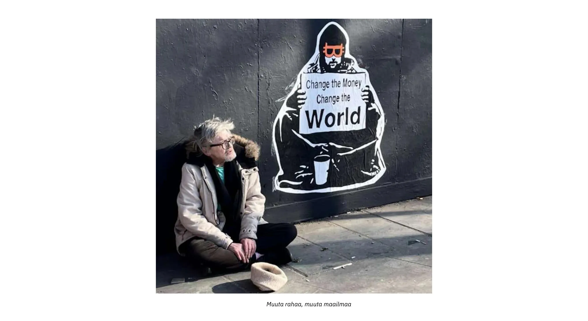

Tämä aloite voi maksaa yli 0,40 euroa julisteelta (noin 40 euroa sadalta julisteelta), ja nettihinnat voivat vaihdella kaksinkertaisesta viisinkertaiseen summaan. Hyvät kontaktit ovat välttämättömiä.

Kuten edellä mainittiin, ranskalaisella bitcoinerilla [@Mill3sim3](https://twitter.com/Mill3sim3) on oikeat ammattimaiset laitteet, ja häneen voi ottaa yhteyttä lisätietoja varten.

Vaihtoehtoisesti voit myös tehdä isosta pahvipalasta sabluunan ja käyttää spraymaalia merkitäksesi suunnittelemasi kuvion tiettyihin paikkoihin ympäri kaupunkia.

## Henkilökohtainen NFC-kortti

<chapterId>8ad65d4e-a68a-59c2-a812-85f4907ed9f3</chapterId>

Toinen omaperäinen hankeidea on luoda henkilökohtaisia NFC-kortteja Lightning-maksuja varten (yhteensopiva BoltCard-standardin kanssa). Tähän sveitsiläinen Bitcoin Pay on loistava kumppani.

[Verkkosivusto](https://swiss-Bitcoin-pay.ch/cards) tarjoaa tällä hetkellä neljä vakiomallia.

Jos haluat tilata yli 50 NFC-korttia, voit ottaa yhteyttä yritykseen sen virallisella verkkosivustolla tai [Twitterissä](https://twitter.com/SwissBitcoinPay) ja ehdottaa kortin etupuolelle räätälöityä mallia. Kääntöpuoli pysyy vakiomuotoisena.

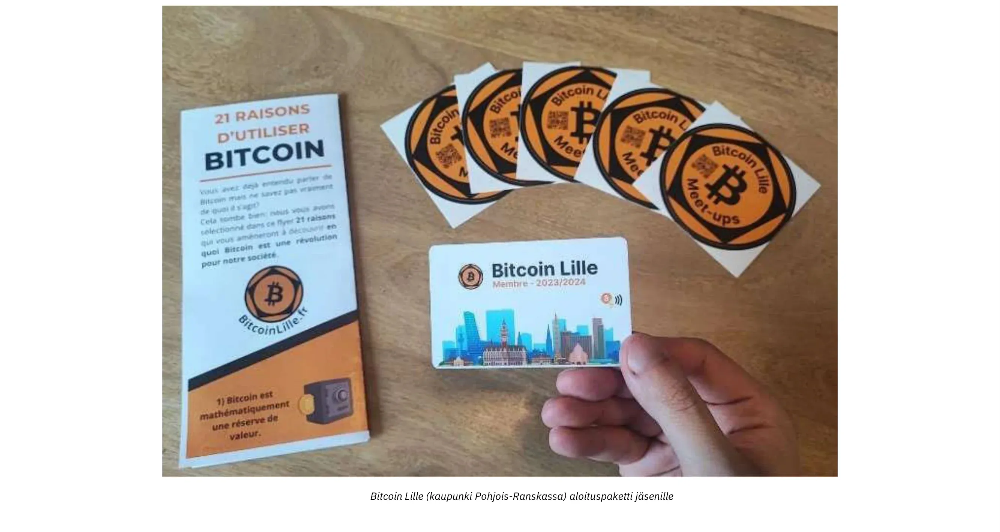

Esimerkiksi vuonna 2023 ranskalainen yhdistys [Bitcoin Lille](https://twitter.com/BitcoinLille) tilasi erän NFC-kortteja, joissa oli mukautettu muotoilu. Jokainen uusi jäsen sai yhden kortin tervetuliaispakettiinsa vuoden aikana. Tätä ideaa voidaan helposti mukauttaa ja personoida omaa yhteisöäsi varten.

Näiden korttien yksikköhinta vaihtelee yleensä 2,50 eurosta 5 euroon tilauksen koosta ja markkinaolosuhteista riippuen, ja suuremmista määristä veloitetaan alhaisempi hinta.

## Luo verkkosivusto

<chapterId>9a2a1b9b-0633-544a-b331-c06187d23d7f</chapterId>

Tietyssä vaiheessa yhteisösi kasvua voi olla arvokasta, että sinulla on verkkosivusto, joka toimii ryhmäsi, tapaamisten, tapahtumien ja koulutussisällön esittelytilana.

Verkkosivuston rakentaminen vie aikaa, mutta alla olevassa ohjeessa näytetään, miten voit luoda ilmaisen WordPress-sivuston vain 30 minuutissa. Voit määrittää mukautettavan etusivun, julkaista artikkeleita ja upottaa mediaa, kuten YouTube-videoita, kuvia tai PDF-tiedostoja.

Myöhemmin voit ostaa oman verkkotunnuksen tai jopa isännöidä sivustoa omalla palvelimellasi.

:::video id=a1b25c18-5fc1-4b97-baef-816d819c9382:::

Vaikka on olemassa muitakin CMS-alustoja, joilla on yksinkertaisemmat ja aloittelijoille helpommin lähestyttävät käyttöliittymät, ne ovat yleensä paljon vähemmän muokattavissa. Siksi WordPress on yleensä paras lähtökohta.

WordPress tukee myös monenlaisia (osittain maksullisia mutta laadukkaita) lisäosia, jotka voivat laajentaa sivustosi ominaisuuksia merkittävästi ilman koodaustaitoja. Yksi esimerkki on [maksullinen "Uncode"-teema](https://undsgn.com/uncode/)

## Luo videokanava (Youtube tai Odyssee)

<chapterId>076286db-1627-57ec-a410-c44b1666e1cd</chapterId>

Jotkut yhteisön jäsenet saattavat haluta luoda multimediasisältöä, kuten opetusvideoita.

Voit myös pitää esitelmiä tapaamisissa tai jopa yliopistoissa.

**Kun se aika koittaa, voit julkaista ja keskittää kaiken sisältösi yhteen paikkaan erillisen videokanavan avulla.**

Suosittuja alustoja ovat mm:

- [**YouTube**](https://www.youtube.com/), jota käytetään laajalti mutta joka ei ole sensuurin kestävä.
- [**Odyssee**](https://odysee.com/), joka on vähemmän suosittu, mutta hajautettu vertaisverkkoteknologian avulla.
- [**peertube**](https://joinpeertube.org/fr_FR), voit isännöidä omaa videoalustasi, mutta sen perustaminen on monimutkaisempaa.

Kumman tahansa valitsetkin, suunnittele alustakohtainen visuaalinen ilme, jotta kanavasi olisi houkutteleva. Canva, joka mainittiin [osassa 2/8](https://planb.academy/courses/1c643dc9-a15f-4f9e-93b6-cb3c58b4ee35/3470a31f-0190-5e87-8af0-6a00e79267ef), tarjoaa "YouTube Thumbnail" -luokan, jossa on valmiita, mukautettavia malleja.

Jos haluat **tallentaa** tietokoneeltasi, [Streamlabs](https://streamlabs.com/fr-fr) on ilmainen, monipuolinen ja tukee kohtausten siirtymiä.

**Videoeditointiin** [Wondershare Filmora](https://filmora.wondershare.fr/) (noin 45€/vuosi) on helppokäyttöinen ja tuottaa nopeasti ammattimaisia tuloksia.

Löydät helposti sopivia malleja **videon introa ja outroa** varten Canvasta. Muokkaa muotoilu makusi mukaan, lataa se ja lisää se editointiohjelmaasi.

Vihje: Jos Bitcoin kielletään tai sensuroidaan, pidä aina paikallinen varmuuskopio videoistasi Hard-asemalla.

## Luo audio-podcast

<chapterId>12e96b45-1c33-5687-a753-80d0114d487a</chapterId>

Äänipodcast on toinen hyvä tapa jakaa ideoita. Videokanavien tavoin yleisön kasvattaminen vie aikaa.

Suosittuja podcast-alustoja ovat mm:

- [**Lähde**](https://www.fountain.fm/), tukee Lightning-lahjoituksia.
- [**Soundcloud**](https://soundcloud.com/);
- [**Deezer**](https://www.deezer.com/fr/);
- [**Spotify**](https://open.spotify.com/);
- [**Google podcast**](https://podcasts.google.com/).

Jokaisella alustalla on oma yleisönsä, joten useilla alustoilla läsnäolo laajentaa tavoittavuuttasi. **[Spotify for podcasters](https://podcasters.spotify.com/) tekee tästä helppoa, sillä voit ladata podcastisi kerran ja generate RSS-syötteen muille alustoille**.

Kun työ on tehty "Spotify for Podcasters" -palvelussa, sisältösi on enää muotoiltava muita alustoja varten, ja tämä prosessi on suhteellisen nopea.

Äänittämistä varten [Audacity](https://www.audacityteam.org/) on ilmainen, ja sen avulla voit säätää äänen tasoja, lisätä efektejä, kuten häivytyksiä, ja parantaa selkeyttä muokkauksen aikana. Äänen nauhoittaminen ja ammattilaatuisen podcastin luominen on helppoa.

Tässä on lyhyt 10 minuutin opetusohjelma, joka kattaa podcastin luomisen Audacityllä:

:::video id=67d80ac7-253f-40a5-b621-fef2fb7174bd:::

Vinkki: Aivan kuten videoiden kohdalla, pidä kaikista podcasteista paikallinen varmuuskopio tulevan sensuurin varalta.

## Luo nimilappu tapahtumillesi

<chapterId>0cccef8d-a765-5844-8921-c40f0ce653e4</chapterId>

Tapaamisissa ja tapahtumissa voidaan ottaa käyttöön pieni kannustin: tapahtumamerkit. Ideana on **luoda merkki, jonka voi saada vain kyseisessä tapahtumassa**. Tämä konsepti on olemassa muissa lohkoketjuissa nimellä "POAP" ("Proof Of Attendance Protocol"). Tällä hetkellä Bitcoin:ssä ei kuitenkaan ole vapaata tapaa toteuttaa tätä.

Tällaista järjestelmää voidaan käyttää myös yhteisön aktiivisimpien jäsenten palkitsemiseen. Voisit esimerkiksi järjestää vuosittain arvonnan, jossa jokainen kerätty merkki vastaa yhtä osallistumislippua. Jäsen, joka osallistuu kaikkiin 12 tapaamiseen vuodessa, saisi 12 arpalipuketta arvontaan.

Toisessa perinteisemmässä lähestymistavassa voisit yksinkertaisesti pyytää osallistujia jokaisessa tapahtumassa kirjoittamaan etu- tai lempinimensä nimilappuun sekä syyn, jonka vuoksi he osallistuvat tapahtumaan.

Vaikka tämä on hieman muodollista, se voi auttaa jäseniä löytämään yhteisiä kiinnostuksen kohteita ja keskustelunaiheita helpommin, ja uusien tulokkaiden on myös helpompi tunnistaa järjestäjät (tai yhteisön/yhdistyksen viralliset jäsenet).

Useita Bitcoin Lille -yhdistyksen käyttämiä merkkimalleja on [saatavilla avoimena lähdekoodina Canvassa](https://www.canva.com/design/DAGHAsT15MU/AIA7-L_xBjNdsuxdD4-h-Q/edit?utm_content=DAGHAsT15MU&utm_campaign=designshare&utm_medium=link2&utm_source=sharebutton).

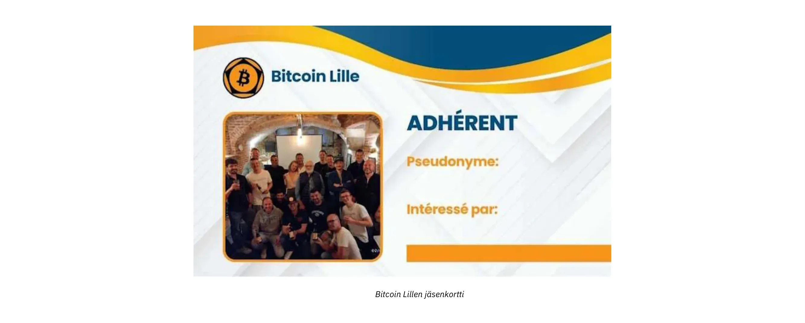

## Suunnittelu kuolemantapauksessa tapahtuvaa luovutusta varten

<chapterId>c5febf18-235c-51bc-8fbb-9467dabe4cb0</chapterId>

Aivan eri asia on Address arkaluonteinen aihe: Bitcoin yhteisönne jäsenen poismeno.

Eräänä päivänä entisen jäsenen perhe saattaa ottaa sinuun yhteyttä ja ilmoittaa kuolemasta. He saattavat selittää, että vainaja jätti ohjeita, muun muassa yhteydenoton yhteisöön, tapaamiseen tai yhdistykseen.

Joissakin tapauksissa perhe voi myös hakea apua varojen takaisinperinnässä perinnön saajina.

On viisasta laatia yhteisön kanssa etukäteen selkeä menettelytapa tällaisia tilanteita varten ja varmistaa, että:

- Vainaja on jo neuvonut perhettään **ei koskaan jakaa yksityisiä avaimia tai tuoda fyysisiä lompakoita tapaamisiin**.
- Perhe ymmärtää, että heidän vierailunsa tarkoitus on koulutuksellinen: he haluavat oppia, miten Bitcoin toimii, jotta he voivat myöhemmin ottaa varat hallintaan.
- Perhe on tietoinen maansa lainsäädännöstä, joka koskee lahjoja, perintöä ja Bitcoin:n muuntamista fiatiksi.

Vakioprotokollan noudattaminen estää myös ketä tahansa, jäsentä tai vierasta, käyttämästä tilannetta hyväkseen varastamalla varoja.

Voisitte perustaa erityisen työryhmän määrittelemään tämän prosessin. Bitcoin Lille -yhdistys on jo laatimassa tällaista [asiakirjaa](https://docs.google.com/document/d/1TDfLZjuictC5s3PEM2Z7WmkxIDSJ8Q1E4xevm52pVgU/edit?usp=sharing), jonka he aikovat julkaista avoimena lähikuukausina.

## Luennoida kouluissa ja yliopistoissa

<chapterId>65efdb44-e3d4-567c-aedf-972765753d73</chapterId>

Edellä kuvattu luettelo hankkeista ei tietenkään ole tyhjentävä. Yleisesti ottaen nämä ovat todennäköisemmin yhteisön sisäisiä hankkeita tai tapaamisia, jotka voidaan melko helposti toteuttaa niiden kehittyessä.

Siirrymme nyt alkuun.

Kuten tiedätte, yksi parhaista tavoista **saavuttaa suuri yleisö kerralla on järjestää ilmainen luento**. Tämä voidaan tehdä korkeakouluissa ja yliopistoissa, jolloin sekä nuoret (että ei-niin-nuoret) tutustuvat Bitcoin:aan, olivatpa he sitten täysin uusia tai halusivat syventää ymmärrystään.

Luennon pitäminen kymmenille tai jopa sadoille ihmisille vaatii muutakin kuin teknistä asiantuntemusta. Tarvitset:

- Luottamus julkiseen puhumiseen
- Hyvä stressinhallinta
- Selkeä artikulaatio
- Vahva ajanhallinta
- Hyvin tutkittu, laadukas esitys tai työpaja, joka on räätälöity yleisön taitotasolle sopivaksi

Yhtä tärkeää on **pitää mieli avoimena ja tietää, milloin käsitteitä pitää yksinkertaistaa**, erityisesti kyselytunnilla tai paneelikeskustelussa. Kyse ei ole omista periaatteista luopumisesta, vaan sen myöntämisestä, että muut saattavat nähdä asiat eri tavalla. Joskus on parasta vastata myöhemmin tai antaa asian olla, jotta keskustelu voi jatkua. Jos näkökantojesi tueksi on esitetty vankkoja, hyvin perusteltuja argumentteja, ihmiset tunnistavat sen.

Jos tunnet olevasi valmis, anna mennä! Maailma tarvitsee kipeästi parempaa koulutusta Bitcoin:stä.

Tämä ei kuitenkaan ole mikään kevyt yritys: se vaatii motivaatiota, vaivannäköä ja oikeita yhteyksiä.

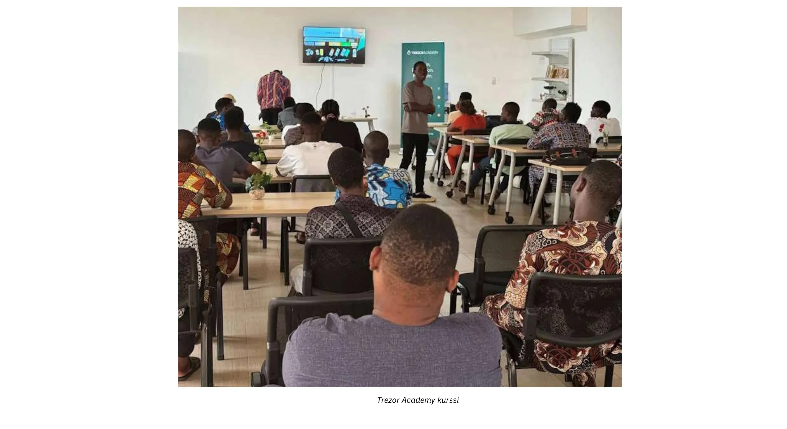

Luennon tai työpajan järjestäminen koulussa tai yliopistossa alkaa oikean yhteyshenkilön löytämisestä. Tämä voi olla:

- Henkilökohtainen tuttava
- Opiskelijakunta
- Opiskelijayhdistys, joka järjestää luentosarjoja tai tapahtumia
- Insinöörikoulusi tai yliopistosi entiset professorit
- Akateemisen ohjelman koordinaattori, jos yhteyttä otetaan suoraan

Ensimmäinen askel on yleensä esitellä aloite tai yhdistys ja pyytää tapaamista. Parhaimmassa tapauksessa tämä johtaa Bitcoin:n esittelyyn opiskelijoiden edessä muutamaa viikkoa myöhemmin.

Valitettavasti suuri osa tiedotusvälineistä ja monet poliitikot demonisoivat Bitcoin:ta edelleen, mikä saa jotkut uskomaan, ettei sillä ole sijaa luokkahuoneissa. Hylkääminen on yleistä erityisesti akateemisissa piireissä, joissa Proof of Work:n ja energiankulutuksen kaltaiset aiheet ovat edelleen kiistanalaisia.

Kannattaa silti yrittää, erityisesti ylioppilaskuntien ja yhdistysten kanssa. Ja kuka tietää? Vaikka ensimmäinen yrityksesi saisikin kielteisen vastauksen, saatat löytää postilaatikostasi seuraavan härkätaistelun aikana sähköpostiviestin, jossa sinua pyydetään puhumaan vaikkapa 280 opiskelijalle!

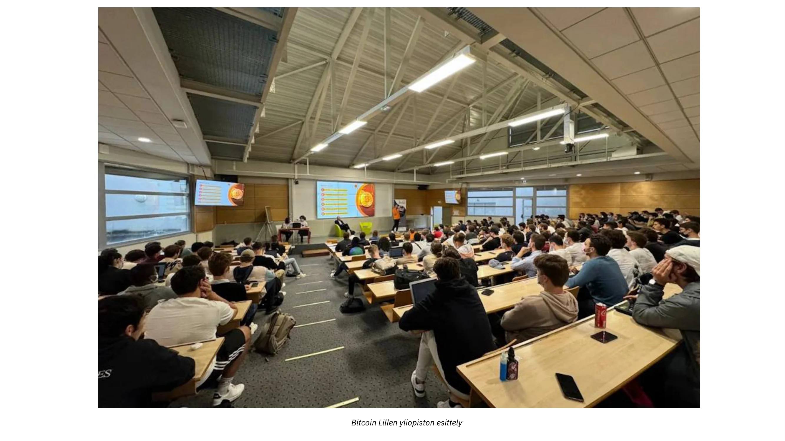

## Yritysten lähestyminen

<chapterId>b730462b-7928-5d28-a14f-9ceaa773d3d2</chapterId>

Yrityksen saaminen hyväksymään Bitcoin:n on monille bitcoinin käyttäjille kuin harvinaisen saavutuksen avaaminen Pokédexissä.

Jokainen kauppias on erilainen, ja niiden käyttöönotossa on omat haasteensa:

- Ne tarvitsevat edelleen fiat-valuuttaa maksaakseen tavarantoimittajille.
- Ne vaativat selkeitä, kirjanpitokelpoisia talousraportteja.
- Niiden maksujärjestelmien on oltava luotettavia, helppokäyttöisiä ja varkaussuojattuja.
- Heillä voi olla vääriä tai kielteisiä ennakkokäsityksiä Bitcoin:stä.
- Virheettömän ohjelmistoratkaisun löytäminen voi olla hankalaa.
- Saada kauppias ymmärtämään, miksi Bitcoin kannattaa hyväksyä maksuna.

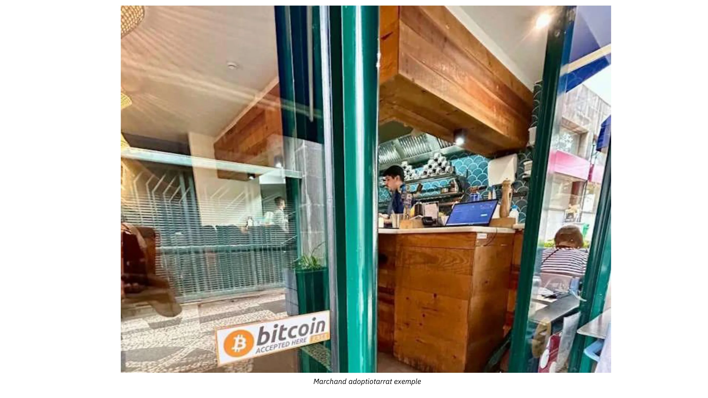

Paikallisten yritysten mukaan ottaminen on yksi parhaista tavoista kasvattaa kaupungin Bitcoin-ekosysteemiä. Tärkeintä on edetä askel askeleelta:

1/ **Pyydä maksamaan Bitcoin:llä joka kerta, kun teet ostoksia**

Useimmiten saat vastaukseksi "ei" ja ehkä hämmentyneen tai jopa hieman tuomitsevan katseen, mutta kysymällä saat ajatuksen siitä, että Bitcoin on jotain, jota "tavalliset ihmiset" voivat käyttää, ja että se on tulossa yhä suositummaksi maksutavaksi. Voit jopa liittoutua parin ystäväsi kanssa ja käydä samassa kaupassa eri päivinä ja pyytää joka kerta maksamaan Bitcoin:lla. Ennemmin tai myöhemmin se herättää omistajan uteliaisuuden.

2/ **Tarjoa yksinkertainen, selkeä selitys**

Jos he kysyvät, mitä Bitcoin on, pidä se lyhyenä ja ilman jargonia. Esimerkiksi:

*"Bitcoin on rahaa, jota pankit eivät valvo, joka toimii ilman välikäsiä, jota ei voi sensuroida, johon ei kohdistu inflaatiota ja jonka maksut ovat perinteistä pankkitoimintaa alhaisemmat. "*

Ojenna heille sitten esite, kuten "21 syytä käyttää Bitcoin:tä" tai "10 syytä hyväksyä Bitcoin yrityksessäsi", jossa on yhteystietosi tai tapaamisen tiedot. Näin he tietävät, mistä sinut löytää, kun he ovat valmiita esittelyyn.

3/ ** Järjestä esittely**

Kun he ilmaisevat kiinnostuksensa, sovi aika maksuratkaisun esittelyyn.

Erinomainen vaihtoehto on **[Swiss Bitcoin Pay](https://swiss-Bitcoin-pay.ch/)**, koska se:

    - Mahdollistaa kauppiaan muuntaa BTC:n automaattisesti fiatiksi päivittäin, jotta hän voi maksaa toimittajille.
    - He voivat halutessaan pitää prosenttiosuuden BTC:nä.
    - Tuottaa kirjanpitäjilleen vientikelpoisia kirjanpitoraportteja.
    - Yksinkertainen kojelauta johtajille.
    - Tarjoaa työntekijöille intuitiivisen Interface:n, jolla he voivat hyväksyä maksuja koskematta kassakoneeseen.
    - Kustannukset ovat alhaisemmat kuin perinteisten maksuverkkojen perimät 2-3 prosentin maksut.

4/ **Tukekaa heitä, kun he alkavat hyväksyä Bitcoin:ää**

Sen jälkeen kun he ovat aluksella:

    - Käy säännöllisesti ja tee ostoksia.
    - Tarkista, että kaikki sujuu moitteettomasti.
    - Jaa yhteystietosi tarvittaessa uudelleen.
    - Kutsu heidät tapaamisiin.
    - Lisää ne [btcmap.org-karttaan](https://btcmap.org/) ja kerro [Swiss Bitcoin Pay](https://x.com/swissbitcoinpay) Twitterissä näkyvyyden lisäämiseksi.
    - Harkitse työpajojen tai tapaamisten järjestämistä heidän tiloissaan.

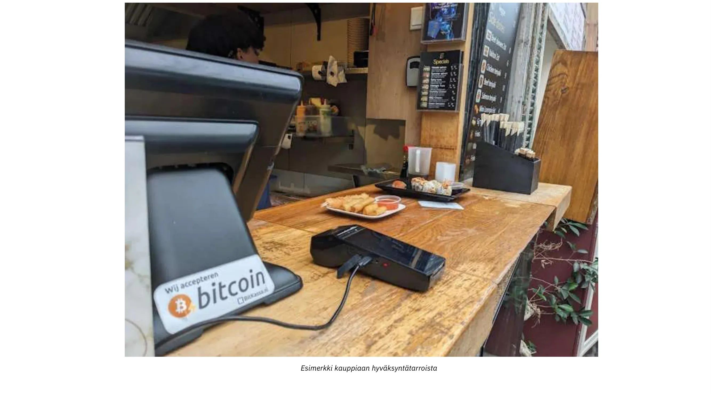

5/ **Yhteyden luominen paikallisiin kauppiaisiin**

Kun sinulla on muutama Bitcoin-ystävällinen yritys, ehdota vain kauppiaille tarkoitetun Telegram-ryhmän perustamista. Tämä voi:

- Anna heidän jakaa kokemuksiaan ja ottaa uusia yrityksiä mukaan.
- Toimii nopeana teknisen tuen kanavana.
- Vahvistetaan paikallista Bitcoin-verkostoa.

Kyselytoiminta on pitkäjänteistä. Se vaatii kärsivällisyyttä, pitkäjänteisyyttä ja strategiaa. Mutta jos yhteisösi on valmis, voit alkaa luoda pohjaa todelliselle Bitcoin-kiertotaloudelle, aivan kuten [Arnhem Alankomaissa](https://www.arnhembitcoinstad.nl/) Alankomaissa.

## Ota yhteyttä paikalliseen lehdistöön ja radioon

<chapterId>435bfbc1-22dd-59bb-b737-a32ea995b238</chapterId>

Bitcoin-asiakkaat keskittyvät usein sosiaaliseen mediaan ja verkkoalustoihin, mutta se on vain osa kokonaisuutta. Paikallinen lehdistö ja radio voivat olla voimakkaita liittolaisia.

Jotkin yhteisöt, kuten [Breizh Bitcoin](https://breizhbitcoin.com/) Ranskassa, ottavat **säännöllisesti yhteyttä paikallisiin tiedotusvälineisiinsä**:

- Ilmoita tulevista tapahtumista (tapaamiset, esitykset, työpajat, Halving-juhlat jne.).
- Kutsu toimittajia vierailemaan Bitcoin-ystävällisissä yrityksissä ja kirjoittamaan niistä.
- Jaa tapahtumien päivämäärät ja sijainnit, jotta ne voidaan sisällyttää paikallisiin luetteloihin.

Monissa sanomalehdissä on yhä "Mitä tapahtuu" -osio, joka on usein piilotettu viimeisille sivuille ja jossa luetellaan tulevia paikallisia tapahtumia. Breizh Bitcoin on huomannut, että tämä lähestymistapa toimii: uudet tulokkaat ovat tulleet tapaamisiin vain siksi, että he huomasivat ilmoituksen lehdessä.

Tämä strategia saattaa toimia paremmin tietyillä alueilla kuin toisilla, mutta sitä kannattaa kokeilla. Voit aloittaa ottamalla yhteyttä alueellisiin uutistoimistoihin, joista Ranskassa on esimerkkejä, kuten esim:

- [acpm.fr](https://www.acpm.fr/Les-chiffres/Diffusion-Presse/Presse-Payante/Presse-Quotidienne-Regionale);
- [voxpublic.org](https://www.voxpublic.org/spip.php?page=annuaire&cat=medias&type_media=Presse%20quotidienne%20r%C3%A9gionale).

ja ottamalla yhteyttä paikallisiin radioasemiin ja ehdottamalla haastattelua tai podcast-esiintymistä.

Median haastattelut voivat olla hankalia. Sanoja saatetaan irrottaa asiayhteydestään tai vääristellä. Valmistautuminen on tärkeää.

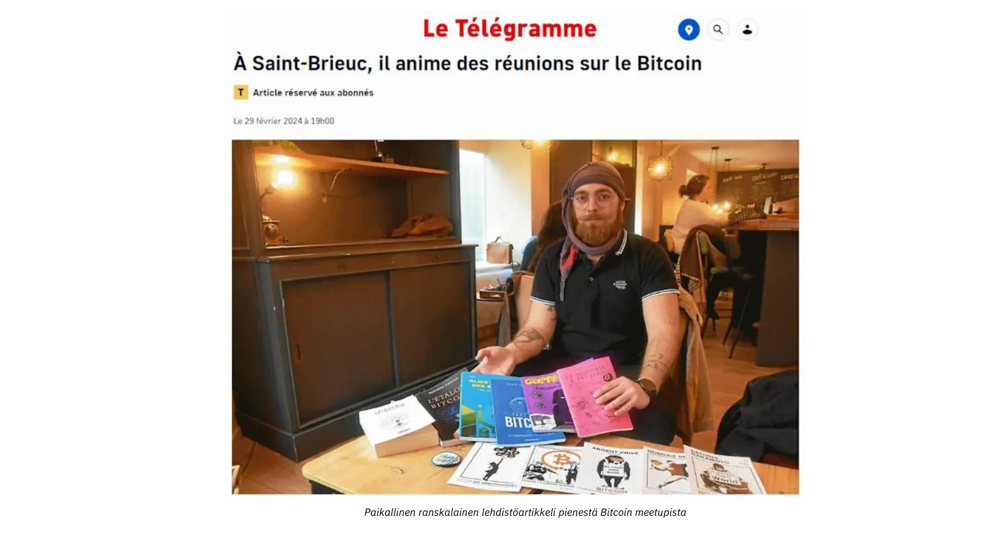

On selvää, että kaikkien tässä jaksossa ehdotettujen hankkeiden lisäksi voidaan toteuttaa **monia muita hankkeita**. Kaikki riippuu ajasta ja motivaatiosta, mutta myös kyseisen hankkeen vaikeudesta.

Viimeiset vinkit kaikkia tiedotushankkeita varten:

1) **Suunnittele etukäteen**: määrittele tavoitteesi, tarvittavat vaiheet ja se, kuka tekee mitäkin.

2) **Vaihe vaiheelta**: vältä loppuunpalamista tahdistamalla ponnistelut.

3) ** Pyydä apua**: pyydä tukea jäseniltäsi ja lähiyhteisöiltäsi.

Muista, että jokainen Bitcoin-yhteisö on ollut samassa tilanteessa kuin sinä nyt. Älä epäröi ottaa oppia heidän kokemuksistaan ja neuvoistaan.

# Tulevaisuuden ennakointi

<partId>6ea07445-9369-54bc-9aa0-d260db026e0b</partId>

## Suunnittelu osallistujien määrän lisääntymistä varten

<chapterId>8af722d4-3a9f-548c-9001-424f2142de12</chapterId>

Kun Bitcoin siirtyi neljänteen aikakauteensa lohkolla 840 000, yhä useammat ihmiset alkoivat tunnistaa sen teknologiseksi, taloudelliseksi ja sosiaaliseksi vallankumoukseksi.

Kuten internetin nousu, tämäkin vallankumous vie aikaa, mikä on itse asiassa etu. Se antaa ihmisille mahdollisuuden **oppia Bitcoin:n perusteet**, ymmärtää, miten sitä käytetään, ja antaa kehittäjille ja yrityksille mahdollisuuden **rakentaa protokollia ja sovelluksia**, jotka avaavat sen täyden potentiaalin.

Kukaan ei voi ennustaa tulevaisuutta, mutta voimme **odottaa Bitcoin:n käyttöönoton lisääntyvän voimakkaasti**. Tämä tarkoittaa, että **ollaan valmiita kaikkiin skenaarioihin**, jopa äärimmäisiin, kuten perinteisen rahoitusjärjestelmän romahtamiseen tai Bitcoin:n suoranaiseen kieltoon.

Tässä kurssin seitsemännessä ja toiseksi viimeisessä osassa tarkastelemme keskeisiä seikkoja, jotka kannattaa pitää mielessä, kun yhteisösi ja tapaamisesi kasvavat.

Ensimmäinen ja helpoin ennakoitavissa oleva tekijä on yhteisöön liittyneiden ihmisten määrän kasvu. Tämä vaikuttaa sinuun kahdella tavalla:

1/ **Viestintäkanavasi (Telegram, Signal, Matrix jne.) täyttyvät lopulta**, jolloin on vaikeampi pysyä keskusteluissa mukana. On kaksi asiaa, jotka kannattaa pitää mielessä.

Ensinnäkin, jos 500 ihmistä keskustelee kaikenlaisista aiheista yhdessä chatissa, pelkkä viestien ja ilmoitusten määrä johtaa väistämättä siihen, että moni jäsen lopettaa keskustelun. Silloin on hyvä hetki miettiä asetuksia uudelleen, esimerkiksi siirtymällä Telegramin superryhmiin tai Discord-palvelimeen, joissa molemmissa on helppo järjestää keskustelut aiheen mukaan.

Toiseksi, enemmän ihmisiä kanavillasi tarkoittaa enemmän botteja ja huijauksia, joten myös moderointia on enemmän. Varaudu tähän luomalla selkeät säännöt, joihin voit viitata viestejä moderoidessasi. Kokemuksemme mukaan tämä auttaa pitkälle konfliktien välttämisessä, varsinkin jos säännöt ovat helposti saatavilla kanavissasi.

Hyvä esimerkki on **[Bitcoin Lillen avoimen lähdekoodin sääntökirja](https://bitcoinlille.fr/reglement/)**, joka kirjoitettiin muutama vuosi sitten sen Telegram-ryhmää ja Discord-palvelinta varten. Se perustuu yksinkertaisiin, yleismaailmallisiin periaatteisiin, ja voit jopa napata [muokattavan version ulkoasusta täältä](https://www.canva.com/design/DAGHI692AD4/rjT4sqEnhajc5FiPA6GFZQ/edit?utm_content=DAGHI692AD4&utm_campaign=designshare&utm_medium=link2&utm_source=sharebutton).

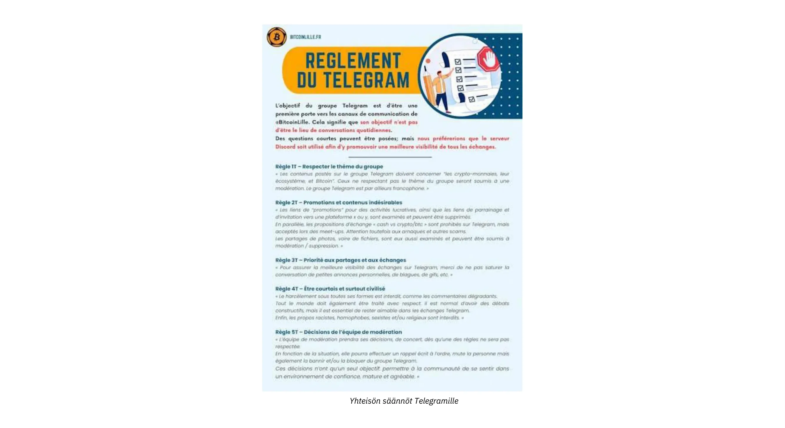

2/ **Tapaamisesi ja tapahtumasi alkavat houkutella suuria väkijoukkoja, ja monet uudet kasvot tulevat paikalle tapaamaan toisiaan**.

Tämän osallistujamäärän kasvun myötä:

    - saattaa olla syytä **löytää isompi paikka tapaamisille ja tapahtumille**, varsinkin jos olet aiemmin pystynyt isännöimään vain noin parikymmentä ihmistä.
    - jos huomaat, että osallistujien määrä käy liian suureksi, voit tulevissa tapaamisissa joko **vaatia osallistujia rekisteröitymään** (Meetup-sovelluksen tai yksinkertaisen lomakkeen kautta) tai **järjestää useita tapaamisia joka kuukausi** (esimerkiksi: aloittelijoiden tapaaminen, keskitason tapaaminen ja edistyneiden tapaaminen).
    - Samaan aikaan ekosysteemiin on odotettavissa paljon uusia tulokkaita, joiden päätavoitteena on usein rahan ansaitseminen. Jotta **keskustelut pysyisivät keskittyneinä Bitcoin:aan** näissä nopeasti kasvavissa tapaamisissa, on hyvä idea:

a) Sisällytä **Bitcoin-aiheinen esitys** näihin tapahtumiin, koska se luonnollisesti ohjaa suuren osan keskustelusta kyseiseen aiheeseen (ja pois viimeisimmästä muka "vallankumouksellisesta" [paskakolikkoprojektista](https://planb.academy/resources/glossary/shitcoin));

b) **Välttää tarttumasta vain bitcoin-kollegoihin**. Sen sijaan kannattaa **lähestyä uusia tulokkaita**, vaikka se tarkoittaisikin sitä, että roikut huoneen takaosassa tervehtimässä heitä. Sieltä käsin voit keskustella siitä, miksi he tulivat, mitä he etsivät, yhteisönne tavoitteista (tai jopa perusperiaatteista) ja niin edelleen.

Lopuksi, vaikka on valitettavaa joutua sanomaan se, huijarit voivat ilmaantua tapaamisiin. Heidän tavoitteenaan saattaa olla puhua loputtomasti Ponzi-järjestelmästään, MLM:stä tai jostain "Blockchain-vallankumouksesta, jonka voimanlähteenä on tekoäly" On myös täysin mahdollista, että joku, jolla on pahoja aikeita, osallistuu tapaamiseen nimenomaan rahanpesua varten tai yrittää ostaa BTC:tä väärennetyillä seteleillä.

Tällaisissa hankalissa tilanteissa on helpointa selittää kohteliaasti, että tapaaminen ei ole oikea paikka tällaiselle, ja perustella se haluamillasi argumenteilla (esimerkiksi mainitsemalla, että paikalla voi olla siviilipukuisia poliiseja).

Jos he valitettavasti kieltäytyvät poistumasta tai käyttäytymästä kunnioittavasti (kyllä, niin on käynyt), voit Address:n avulla ilmoittaa ryhmälle suoraan tapaamisen aikana, että henkilö tai henkilöt yrittävät harjoittaa jonkinlaista ilkivaltaa.

Onneksi tällaiset tilanteet ovat harvinaisia ja usein pikemminkin absurdeja kuin uhkaavia, mutta on silti parasta varautua.

Mielenrauhan vuoksi: niin kauan kuin et itse riko lakia tai suoranaisesti helpota laittomia liiketoimia, et ole oikeudellisesti vastuussa muiden toimista tapahtumassasi (ainakaan Ranskan lain mukaan).

Ihanteellisessa maailmassa sinulla olisi **tila, joka olisi tarpeeksi suuri isännöimään useita kymmeniä ihmisiä**, kun yhteisösi kasvaa, ja rakentaisit myös **vahvoja suhteita bitcoin-asiakkaiden** ja tulevien bitcoin-asiakkaiden välille [laskusuhdanteen](https://planb.academy/resources/glossary/bear-market) aikana, jotta [noususuhdanteen](https://planb.academy/resources/glossary/bull-market) koittaessa sinulla olisi mahdollisimman monta ihmistä valmiina oranssiin pilleriin muille.

## Yhteisön organisaation hajauttaminen

<chapterId>bedfc110-e099-58f4-a5b7-fb50f3b19a49</chapterId>

Kuvittele tämä: olet järjestänyt Bitcoin-tapaamista vuosia, ja eräänä päivänä päätät lopettaa työn, ehkä kasvattaa laamoja Perussa tai jahdata täydellisiä aaltoja El Salvadorissa. Mitä yhteisöllesi tapahtuu, kun lähdet?

Suunnittele yhteisönne siirtäminen etukäteen:

1) **Anna luotetuille jäsenille hallinto-oikeudet (tai Ownership-oikeudet** viestintäkanavia varten. Roolit voivat aina vaihtaa omistajaa myöhemmin.

2) **Jaa sosiaalisen median ja näkyvyyskanavien tilitiedot** (käyttäjätunnukset, salasanat ja niihin liittyvät sähköpostit) vähintään yhden luotettavan henkilön kanssa.

Ilman tätä pääsyä on lähes mahdotonta, että joku muu voisi ottaa ohjat tehokkaasti haltuunsa. Aloittaminen tyhjästä luomalla haarautuvia ryhmiä ja rakentamalla verkko uudelleen on hidasta, uuvuttavaa ja usein demoralisoivaa.

Jos sinulla ei ole luotettavaa yhteyshenkilöä tapaamisesi sisällä, voit aina ottaa yhteyttä @ProfEduStreamiin, @copinmaliniin tai @gabtribeen Telegramissa. He voivat auttaa löytämään motivoituneen seuraajan ja koordinoida tilien ja ylläpitäjän oikeuksien siirtoa.

**Miksi hajauttamisella on merkitystä?**

Jos olet ainoa, joka on mukana ja sinulla on kaikki valta, mitä tapahtuu, jos katoat? Vastaus on yksinkertainen: myös yhteisösi katoaa.

Ratkaisu: hajauta tehtävät, roolit ja käyttöoikeudet, jotta ryhmä voi jatkaa toimintaansa, vaikka yksi järjestäjä jättäytyisi pois, joko aikarajoitteiden vuoksi tai synkemmissä tapauksissa siksi, että hänet pidätetään, koska hänellä on hallussaan Bitcoin, joka ei ole KYC.

**Miten hajauttamista voidaan viedä eteenpäin?**

Ota käyttöön **vapaat ja avoimen lähdekoodin ohjelmistot**, kuten [framasoft suite](https://framasoft.org/fr/), jotta vähennät riippuvuutta keskitetyistä alustoista ja lisäät vastustuskykyä mahdollisen valtiollisen sensuurin tai Bitcoin-kieltojen varalta.

Käytä **salattuja tai anonyymejä viestintävälineitä** suojellaksesi jäsentesi yksityisyyttä ja yhteisösi toimintaa.

## Entä jos Bitcoin:sta tulisi yleinen vihollinen nro 1?

<chapterId>c739651f-cd13-51e0-a36e-85023749b15b</chapterId>

Huhtikuun 5. päivänä 1933 Franklin Roosevelt, Yhdysvaltain 32. presidentti, allekirjoitti **Executive Order 6102**, jonka mukaan yksityishenkilöiden oli kiellettyä omistaa kultakolikoita, kultaharkkoja tai kultatodistuksia koko maassa.

Suuri lama (vuoden 1929 pörssiromahdus) ei tietenkään ole nykyistä todellisuutta. Mutta voisiko hallitus jonain päivänä tehdä saman Bitcoin:n kanssa: **kieltää yksityisen Ownership:n kokonaan?**

Totuus on, että tällainen orwellilainen toimenpide ei oikeastaan estäisi ketään omistamasta BTC:tä, koska mikään laki ei voi estää henkilöä opettelemasta sanasarjaa ulkoa.

Entä jos maailman johtajat vihdoinkin ymmärtäisivät Bitcoin:n potentiaalin muokata globaalia järjestystä, jopa valtiotasolla? Nimitettäisiinkö se silloin "julkiseksi viholliseksi nro 1"?

Meidän ei tarvitse sortua salaliittoajatteluun. Mikään ei kuitenkaan estä meitä ennakoimasta, hajauttamasta ja kouluttamasta, alkaen nyt.

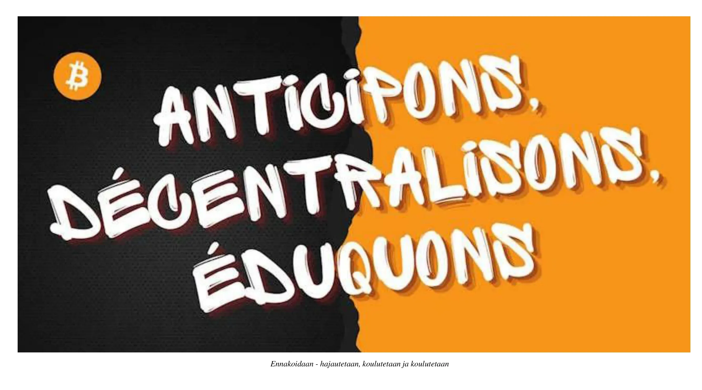

# Bitcoin-asiakkaiden yhdistäminen

<partId>62bc2138-c0be-5d39-a341-594690863257</partId>

## Nopea toimintasuunnitelma Bitcoin-yhteisön rakentamiseen

<chapterId>1f463ec2-3f64-5641-8d60-e02a47c94f27</chapterId>

Satoshi Nakamoto loi vallankumouksellisen työkalun, joka jo muuttaa maailmaamme. Mutta on meidän, bitcoinin käyttäjien, tehtävä päättää, miten muokkaamme tulevaisuutta.

Bitcoin on laaja kaninkolo, joka koskettaa historiaa, taloutta, kirjallisuutta, matematiikkaa, tietotekniikkaa ja salausta. Kukaan ei voi tutkia sitä kaikkea, ja se on osa sen kauneutta.

Koska aikamme on rajallinen, avain on pysyä nöyränä, jatkaa oppimista ja Exchange-tietoa muiden kanssa. Näin jokainen meistä voi saavuttaa tavoittelemansa ymmärryksen tason.

**Globaalit Bitcoin-yhteisöt ovat siis perustavanlaatuisessa asemassa tulevaisuuden maailman rakentamisessa**: tilat, joissa bitcoin-käyttäjät voivat **Exchange rakentaa ja jakaa**. **Yhdessä**.

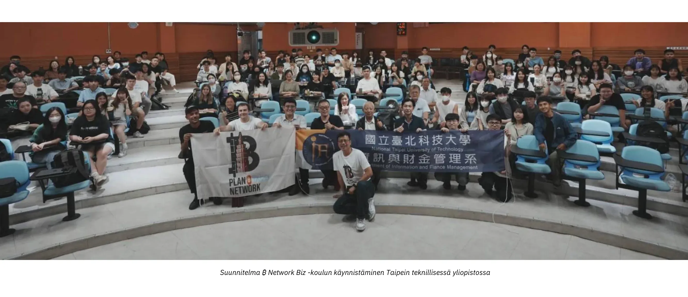

Kuten olet nähnyt tämän kurssin aikana, ** Bitcoin-yhteisön rakentaminen ja tapaamisten järjestäminen** vaatii sekä suunnittelua että motivaatiota. Riippuen tavoitteistasi ja käytettävissä olevasta ajasta, voit ryhtyä kunnianhimoisempiin projekteihin tai pitää asiat yksinkertaisina.

Tavoite on joka tapauksessa sama: **herättää kiinnostusta ja auttaa Bitcoin:ää kasvamaan kaupungissasi**.

Käsittelemiemme lukuisten lukujen ja alalukujen lopuksi tässä on **tiivis "toimintasuunnitelma "** Bitcoin-yhteisön luomista varten:

1) Päätä etukäteen, miksi haluat perustaa Bitcoin-yhteisön, mitkä ovat tavoitteesi ja missä kaupungissa tai paikassa aiot toimia.

2) Ota yhteyttä lähellä oleviin yhteisöihin, äläkä epäröi kysyä heiltä neuvoa, kun tarvitset sitä;

3) Luo yhteisöllesi selkeä identiteetti, joka kuvastaa yhteisöäsi ja sijaintiasi (logo, juliste, banneri, esite jne.)

4) Luo viestintäkanavia ja sosiaalisia verkostoja, kuten Telegram, Twitter, NOSTR, Discord tai Simplex. Harkitse myös hajautettuja ja/tai sensuurin kestäviä kanavia.

5) Seuraa muita paikallisia tapaamisia ja yhteisöjä verkossa ja lisää ryhmäsi näkyvyyttä eri kartoilla ja alustoilla.

Kun yhteisösi viestintäkanavat ovat aktiivisia:

6) Käynnistä kyselytutkimus ja ehdota ensimmäistä tapaamista, kun tunnet, että kiinnostusta on tarpeeksi.

7) Määrittele tavoitteet, jotka haluat saavuttaa tällä henkilökohtaisella tapahtumalla.

8) Valitse hyvässä paikassa sijaitseva, viihtyisä tapahtumapaikka, joka vastaa tavoitteitasi, ja varaa pöytä tai huone.

9) Mainosta tapahtumaa kanavillasi viikkoa ennen ja uudelleen kaksi tai kolme päivää ennen tapahtumaa.

10) Listaa tapahtumasi asiaankuuluvilla verkkosivustoilla ja alustoilla.

11) Anna tapahtuman sujua luonnollisesti ja osallistu osallistujien kanssa ja ohjaa tarvittaessa keskustelua varovasti.

Jälkeenpäin:

12) Keskity osallistujien pitämiseen ja osallistamiseen, jotta he palaavat takaisin.

13) Ehdota yksinkertaisia hankkeita tai aloitteita ja aloita ne, joista itse välität. Jos joku muu haluaa johtaa jotain muuta hanketta, tue häntä mahdollisuuksiesi mukaan.

Vihdoinkin:

14) Ennakoi tulevaisuutta miettimällä suurempaa kokoontumispaikkaa, viestintäkanavia koskevia sääntöjä, verkkosivustoa jne;

15) Kannusta paikallisia yrityksiä hyväksymään Bitcoin, vaikka vain pyytämällä sitä joka kerta, kun teet ostoksia.

16) Delegoi tehtäviä ja kanavan/verkon ylläpitäjän oikeuksia luotetuille jäsenille.

17) Mainosta yhteisöäsi laajasti, jotta useammat ihmiset liittyvät siihen, ja ota mukaan ne, jotka osoittavat kiinnostusta.

18) Jatka vielä pidemmälle sellaisten hankkeiden parissa, joista nautit ja jotka ovat sinulle tärkeitä.

Jos haluat nopeamman yleiskatsauksen, tässä 21-minuuttisessa videossa on yhteenveto näistä vaiheista:

:::video id=a59956da-f554-4b54-89dd-5ca55b722686:::

Muista: **Et ole yksin, olemassa olevat yhteisöt ovat tukenasi**.

## Itsestä huolehtiminen

<chapterId>cf1631cb-ddbe-55c7-be8c-26a5652979a0</chapterId>

Kun putoat Bitcoin:n kaninkoloon, näkökulmasi elämään muuttuu.

Sisimmässäsi tunnet vetoa mennä pidemmälle, tavata muita, jotka käyvät läpi samaa henkistä matkaa.

Tämä energia saa sinut osallistumaan palapeliin jakamalla löytösi: Bitcoin. Se innostaa sinua myös ajattelemaan tulevaisuuden maailmaa, jota haluat auttaa rakentamaan, ja yhteisöjä, jotka työskentelevät sen eteen.

Yhteisön rakentaminen on pitkä tunneli, joka vaatii motivaatiota, strategiaa, omistautumista ja aikaa. Se voi olla kiittämätön tehtävä, joten on tärkeää edetä askel askeleelta, jotta ei palaisi loppuun.

**Ajattele itseäsi ja rajojasi**. Ja vaikka Bitcoin saattaa ajaa sinua yötä päivää, **en yritä tehdä kaikkea yksin, tai poltat itsesi loppuun**.

Sen sijaan kannattaa **hakea apua bitcoin-käyttäjiltä, jotka ovat jo kulkeneet samaa tunnelia, kulkeneet samoja polkuja ja rakentaneet samoja työkaluja**. Se säästää paljon aikaa.

**Kutsu niitä, jotka seuraavat sinua tässä seikkailussa, auttamaan**, vaikka delegoimalla tietyt tehtävät kestäisivätkin kauemmin. Pitkällä aikavälillä yhteisöstäsi tulee vahvempi ja kestävämpi.

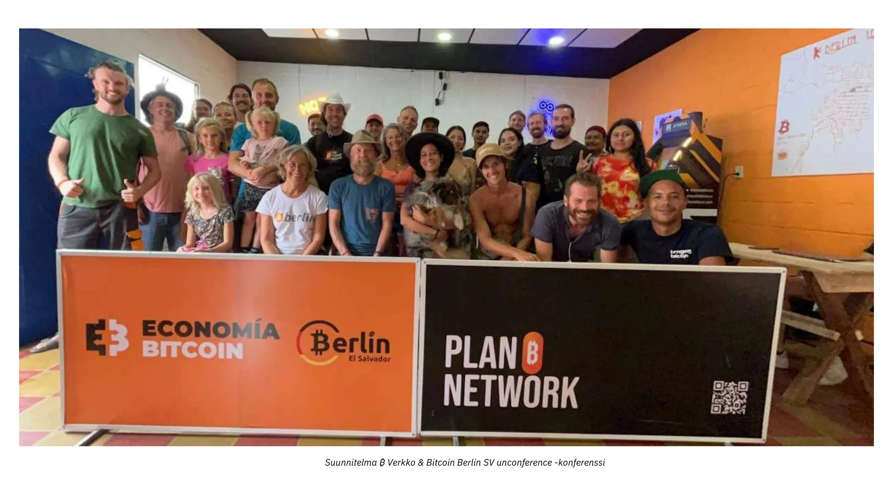

Yksin voit tutkia nopeasti yhden Bitcoin:n kaninkolon monista tunneleista. Mutta muista,että on lukemattomia muita suuntia tutkittavaksi.

**Luomalla ja/tai liittymällä bitcoin-käyttäjien yhteisöön ja jakamalla ja vaihtamalla heidän kanssaan säännöllisesti, liikut samaan aikaan kaikkiin suuntiin kaninkoloa alaspäin.**

## BTC 304, mitä seuraavaksi

<chapterId>8bf10b77-80ee-5d50-87bc-0ef32574a675</chapterId>

Tällä BTC 304-kurssilla olemme käyneet läpi yksityiskohtaisesti, miten yhteisö tai tapaaminen perustetaan ja miten erilaisia projekteja käynnistetään.

Kun yhteisösi on valmis ottamaan seuraavan askeleen, **voit perustaa virallisen yhdistyksen**.

Esimerkiksi Ranskassa noin kuudestakymmenestä yhteisöstä ja tapaamispaikasta lähes kymmenellä on yhdistyksen asema.

Hyödyt ovat kaksijakoiset:

- **Virallinen tunnustaminen**: voit avata yhdistykselle pankkitilin, saada huomiota lehdistössä ja tiedotusvälineissä ja jopa hakea tukia.
- **Jäsennelty organisaatio**: voit määritellä selkeät roolit, mikä helpottaa yhteisön johtamista ja projektien toteuttamista.

Tavoitteena auttaa yhteisöänne kukoistamaan entistä enemmän, **ei ole poissuljettua, että tämän koulutuksen jatko-osa julkaistaan [Plan ₿ Academy](https://planb.academy/) -sivustolla tulevina kuukausina**.

Seuraavassa istunnossa voitaisiin tarkastella seuraavia syventäviä aiheita:

- Esitysten tai työpajojen suunnittelu tapaamisia varten ja selkeiden tavoitteiden asettaminen.
- Suuren tapahtuman järjestäminen, jossa on noin 100 osallistujaa.

Tässä hyödynnämme niiden yhteisöjen kokemuksia, jotka ovat jo luoneet omia tapahtumia ja esityksiä.

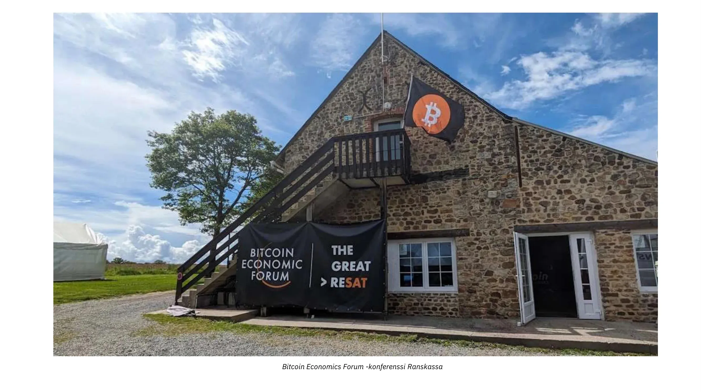

# Viimeinen osa

<partId>e9bdddf4-54c9-4de9-bbce-c3eade8c32e5</partId>

## Arvostelut & arvostelut

<chapterId>08a35d2a-204b-519a-9bb1-588665a037fa</chapterId>

<isCourseReview>true</isCourseReview>

## Päätelmä

<chapterId>d74606a5-cb14-4117-acb2-2bf5920de092</chapterId>

<isCourseConclusion>true</isCourseConclusion>