# La première étape vers l'adoption de Bitcoin

Aujourd'hui, n'importe qui peut apprendre sur Bitcoin en ligne, mais ce qui manque souvent, c'est l'occasion de se rencontrer, d'échanger des idées et de construire ensemble. Pour combler cette lacune, de nombreux bitcoiners forment des communautés locales, où les rencontres donnent naissance à des ateliers, des présentations et des discussions enrichissantes.

Dans BTC304, nous examinerons pourquoi la construction de communauté est importante, explorerons les outils pour créer une identité visuelle et numérique forte, et partagerons des projets simples et open-source que vous pouvez lancer. Nous considérerons également comment les initiatives locales évoluent en communautés nationales qui peuvent contribuer à construire un avenir hyperbitcoinisé.
+++
# Introduction
<partId>81318b8f-d316-5787-aa4c-4ec8370ba668</partId>

## Aperçu du cours
<chapterId>e8991b82-4966-5e04-8f05-7cae46eacbaa</chapterId>

Bienvenue dans le cours BTC 304 !

Depuis 2009, Bitcoin ne cesse de se développer. Cela passe par la mise en place de nouvelles propositions d'améliorations de Bitcoin (BIP), par la création de nouvelles couches scalabilisant le réseau (Lightning Network entre autre) et par le développement de multiples entreprises et start-ups.

Son développement est également visible on-chain, notamment par son nombre de transactions qui ne fait que s'accroître.
Ainsi, entre le 1ᵉʳ janvier 2018 et le 1ᵉʳ janvier 2024, on estime que le nombre de transactions sur la couche principale de Bitcoin a [augmenté de 66,2%](https://dune.com/queries/3375917/5663935) ; tandis qu'entre août 2021 et août 2023, le nombre de transactions publiques sur le Lightning Network a [augmenté de 1212%](https://river.com/learn/files/river-lightning-report-2023.pdf).

Ce développement significatif est bien sûr intimement lié :
* à l'[intérêt croissant pour de nombreux individus partout dans le monde d'utiliser Bitcoin](https://profedustream.substack.com/p/21-raisons-dutiliser-bitcoin), dans l'objectif de s'émanciper du système bancaire et/ou d'utiliser une monnaie moins volatile ou moins dévaluée, comme c'est le cas pour les populations vivant au Liban, en Syrie, en Égypte, en Argentine, etc. ;
* à l'appréciation de son prix au cours du temps, l'amenant à devenir une réserve de valeur et un investissement à long terme en raison de son émission monétaire ;
* au développement successif du marché spéculatif des cryptomonnaies, en particulier en 2017/2018 et en 2020/2021 ;
*à l'apparition de plus en plus régulière de Bitcoin dans les médias.*

Alors que Bitcoin n'est encore qu'à ses balbutiements, ce constat — que vous connaissez certainement déjà — nous amène alors à réfléchir à deux choses. 

D'une part, comment peut-on amener les bitcoiners à aller plus loin dans leur apprentissage et dans leurs projets, afin d'**exploiter le plein potentiel de Bitcoin** ?

D'autre part, comment pourrions-nous amener les nouvelles personnes arrivant par appât du gain dans "l'écosystème des cryptomonnaies" à ne pas perdre leur argent dans le dernier memecoin à la mode, mais à **s'éduquer sur les fondamentaux de Bitcoin** ?

À ces deux problématiques, la meilleure des solutions est d'**être sur le terrain et d'éduquer**.

L'objectif de cette formation est justement de vous fournir toutes les clés nécessaires pour créer et organiser efficacement une communauté ou un meet-up Bitcoin. Que vous souhaitiez bâtir une initiative locale ou développer un groupe en ligne, ce cours vous guidera concrètement dans chaque étape de la démarche, depuis la création de votre identité visuelle jusqu'à la mise en place d'événements réguliers, en passant par la gestion de vos canaux de communication.  

**Section 1 : Introduction**  
Nous commencerons par recontextualiser l'importance de rassembler des personnes autour de Bitcoin, qu'il s'agisse de communautés en ligne ou de meet-ups locaux. Vous découvrirez pourquoi et où lancer votre communauté, ainsi que la définition d'objectifs clairs pour garantir sa croissance et sa pérennité.  

**Section 2 : Concevoir une identité propre à sa communauté Bitcoin**  
Pour attirer de nouveaux membres et établir un sentiment d'appartenance, il est important de créer une identité unique. Cette section vous apprendra comment concevoir un logo, une affiche ou une bannière qui reflètent fidèlement l'esprit de votre communauté Bitcoin.  

**Section 3 : Créer des canaux de communication pour sa communauté Bitcoin**  
La communication est au cœur de toute communauté. Nous aborderons ici les différents canaux de communication à privilégier, ainsi que les méthodes pour configurer efficacement un groupe Telegram ou un serveur Discord. Nous discuterons également de l'intégration de bots multifonctions pour faciliter l'administration de votre communauté.  

**Section 4 : Lancer ses réseaux sociaux**  
La visibilité est essentielle pour le développement de votre communauté. Vous apprendrez comment créer un profil Twitter dédié, établir des connexions avec d'autres meet-ups proches de vous, et utiliser des plateformes telles que btcmap.org pour augmenter votre visibilité et attirer de nouveaux membres.  

**Section 5 : Organiser un meet-up Bitcoin**  
Cette section se concentre sur l'organisation des meet-ups, depuis la recherche d'un lieu adapté jusqu'à l'organisation de l'événement lui-même. Nous étudierons également les manières de fidéliser les participants pour garantir un développement durable de votre communauté.  

**Section 6 : Des exemples de projets et d'initiatives**  
Pour aller au-delà des simples rencontres, nous vous proposerons dans cette section des exemples de projets concrets et originaux : événements thématiques, workshops, créations de contenus éducatifs, collaborations locales, et bien plus encore. Vous apprendrez également à concevoir des supports physiques et numériques pour promouvoir votre communauté.  

**Section 7 : Anticiper le futur**  
Enfin, nous aborderons l'évolution naturelle de votre communauté. Que faire si votre groupe grandit trop rapidement ? Comment décentraliser l'organisation ? Et comment réagir si l'environnement réglementaire devient hostile ? Cette section vous aidera à anticiper les défis à venir.  

**Section 8 : Rassembler les bitcoiners**  
Cette dernière section porte sur l'essence même de votre projet : fédérer les passionnés de Bitcoin autour d'une vision commune. Vous apprendrez comment structurer votre démarche pour attirer et fidéliser de nouveaux membres, comment déléguer les tâches au sein de votre groupe, et comment faire grandir votre communauté de manière durable.

Prêt à découvrir comment bâtir une communauté Bitcoin solide et dynamique ? Allons-y !  

## Pourquoi créer une communauté ou un meet-up Bitcoin ?
<chapterId>893ea248-7d5a-5b8e-948c-7031497b1031</chapterId>

### Quelle différence entre communauté et meet-up ?

Bien que, dans l'écosystème Bitcoin, il n'existe pas de définition spécifique à ces deux termes, une communauté peut être vue comme le regroupement de plusieurs individus partageant une (ou des) passion(s) commune(s) et communiquant ensemble plus ou moins régulièrement.
En parallèle, un meet-up est un événement organisé par (et pour) cette communauté, dans un objectif précis. Il se fait donc habituellement après la création d'une communauté.

En ce sens, dans l'ensemble de ce cours, nous considérerons que pour lancer un meet-up Bitcoin, il sera au préalable nécessaire d'avoir déjà échangé avec quelques autres personnes intéressées par la réalisation de ce type d'événement. Autrement dit : que **la communauté "existe" déjà**.

### Pourquoi créer une communauté Bitcoin ?

Créer une communauté Bitcoin peut avoir plusieurs objectifs.
D'une part, elle peut permettre à ses membres d'échanger et de partager des informations entre eux. L'entraide est alors un pilier central de son développement, permettant à chacun d'accélérer son apprentissage.
Cela a d'ailleurs particulièrement du sens dans le cas de Bitcoin, tant il y a de choses à découvrir. 
De plus, une communauté peut également permettre de construire entre pairs. C'est ainsi que de multiples initiatives et projets naissent, se construisent et se développent.

D'autre part, une communauté Bitcoin peut avoir des objectifs plus ouverts, notamment dans l'optique d'éduquer un maximum la population sur :
1. ce qu'est Bitcoin ;
2. son fonctionnement ;
3. ce qu'il apporte à notre société ;
4. les inepties non sourcées ou trompeuses que certaines personnalités et certains médias cherchent à répandre ;
5. les différences fondamentales qu'a Bitcoin avec les autres cryptomonnaies.

Construisant petit à petit les premières citadelles du monde de demain, **les communautés Bitcoin du monde entier se dressent ainsi tel un rempart face aux tentatives de désinformation et de censure dans certains pays**. **Elles créent également un terrain fertile pour l'apprentissage des fondamentaux de Bitcoin**, offrant ainsi à toute personne qui n'a pas encore compris les bases de cette technologie, la possibilité de disposer des contacts et des ressources nécessaires pour explorer un monde nouveau. Y compris les plus réticents.

Il peut toutefois être intéressant d'avoir en tête qu'**une communauté peut également exister de manière exclusivement numérique** ; à l'image d'un potentiel groupe Telegram "Bitcoin Londres", d'un groupe Facebook "Bitcoin Berlin", d'un serveur Discord "Bitcoin Madrid" ou d'une liste de diffusion par mail "Bitcoin France".
Cela signifie donc qu'**une communauté n'a, techniquement, pas besoin de rencontres physiques pour exister, avancer et développer ses projets. Son but reste toutefois de partager, de construire et d'éduquer**.

### Pourquoi créer un meet-up ?

Comme dit précédemment, **la création d'un meet-up suit la création d'une communauté, et il lui est complémentaire**.
En effet, au fil du parcours du bitcoiner, la volonté (et le besoin) de **rencontrer et d'échanger physiquement avec d'autres personnes** du même écosystème apparaît. Cela s'explique notamment par la naissance d'un sentiment de solitude, de n'avoir personne à qui en parler.

L'organisation de ces meet-ups peut en ce sens permettre des rencontres bien plus conviviales que des rencontres audios ou par visioconférence. Ces événements peuvent alors s'effectuer **autour d'un verre ou d'un repas**, permettant ainsi d'échanger de manière précise et directe avec un plus grand nombre de personnes.

Les meet-ups Bitcoin peuvent alors être un moment **propice à la discussion autour de sujets techniques ou de projets en développement** ; et pour les "bitcoiners en devenir", de **se plonger petit à petit dans l'univers de Bitcoin**.

Ces événements peuvent également permettre l'annonce de nouveaux projets, d'échanger du matériel ou des livres, de réaliser une projection en avant-première d'un documentaire ; mais aussi, de réaliser une conférence ou un atelier sur un sujet donné. Nous en parlerons d'ailleurs plus en détail dans la partie 6/8 de ce cours, intitulée "[Des exemples de projets et d’initiatives](https://planb.academy/courses/1c643dc9-a15f-4f9e-93b6-cb3c58b4ee35/3213d87a-1998-5972-ab93-97a5769ba279)".

Bien qu'il appartienne à chaque communauté de se faire son propre avis, de lancer ses propres projets et d'effectuer ses propres expériences, **les meet-ups semblent s'imposer sur l'ensemble des territoires comme essentiels au développement de Bitcoin et des bitcoiners**. **Leur mise en place demande toutefois un peu d'organisation et de temps** et c'est la raison pour laquelle nous nous efforcerons, dans ce cours, de partager l'expérience résumée de [la soixantaine de communautés Bitcoin françaises et belges](https://btcmap.org/communities/map#2/5.24949/0.20000) **afin que vous puissiez créer puis développer le plus simplement possible votre communauté et vos meet-ups**.

## Où créer sa communauté et son meet-up ?
<chapterId>72da5285-5395-592d-ab62-303a0aef3d6d</chapterId>

La première question qui se pose est donc évidemment : où créer sa communauté ? Et sa réponse est capitale si vous souhaitez vous laisser par la suite la possibilité d'organiser des meet-ups.
En ce sens, il est évident que si les membres de votre communauté ont deux heures de route pour venir à votre événement, peu d'entre eux feront le déplacement.
C'est la raison pour laquelle **la géolocalisation de votre communauté (et donc, de vos futurs meet-ups) a un impact considérable sur son développement**.

Voici donc quelques réflexions pouvant vous orienter :

1. **Créez et développez votre communauté dans une moyenne ou une grande ville**.
    Cela vous permettra ainsi :
    * de **trouver beaucoup plus aisément un lieu** agréable pour réaliser votre meet-up et/ou vos projets (présentations, ateliers, acceptation de Bitcoin en tant que moyen de paiement, etc) ;
    * d'**accentuer le sentiment d'implication et d'appartenance** d'un plus grand nombre de personnes envers votre communauté et vos événements ;
    * de **rejoindre vos événements plus facilement** (transports en commun, parking pour les voitures, etc.). **Le choix d'un lieu pour l'organisation d'un meet-up physique, près des transports en commun et de parkings, est donc clairement à préconiser**.

3. **Choisissez un nom pour votre communauté / meet-up en référence à sa ville**, permettant ainsi aux gens de s'y identifier facilement. Par exemple : "Bitcoin Paris", "Einundzwanzig Berlin", "Satoshi Spritz Milano", etc.

Un autre point sur lequel il est plus que pertinent de s'informer est : **existe-t-il déjà un meet-up près de chez soi ?**
Pour ce faire, vous ne devriez pas être sans savoir que le site [btcmap.org](https://btcmap.org/communities/map#0/0/0/) recense la quasi-totalité des communautés et meet-ups mondiaux.

Il est alors possible qu'après quelques recherches, vous découvriez qu'un meet-up ou qu'une communauté existe dans la même ville que la vôtre. Or, comme Bitcoin est décentralisé, chaque individu est libre de faire ce qu'il veut.
Cependant, il est évident qu'**il est plus pertinent d'unir ses forces plutôt que de multiplier les communautés proches ; et donc, de diminuer la capacité d'impact de chacune**. En ce sens, créer une nouvelle communauté dans une ville qui en possède déjà une, peut créer une forme de concurrence, même involontaire.

En ce sens, une "convention" peut permettre de trancher sur la question : si aucune communauté Bitcoin active n'existe à moins de 30 à 45 minutes de chez vous, alors il peut être pertinent d'en créer une nouvelle. Mais bien évidemment, vous êtes parfaitement libre de faire comme bon vous semble.

Bien évidemment, dans le cas où une ancienne communauté Bitcoin a — disons — "évolué", dans le sens où elle ne partage plus vos valeurs et que vous n'avez pas la motivation ou le temps de les orange-piller, créer un fork est toujours possible.

## Quels objectifs se fixer ?
<chapterId>0aae1aa8-93ec-544a-ad88-22d32c619595</chapterId>

Maintenant que vous avez trouvé la ville (ou le lieu géographique) à laquelle vous rattacherez votre communauté, il est désormais essentiel de **réfléchir aux objectifs que vous souhaiteriez atteindre**.
Cela peut alors être décidé au lancement de votre communauté / meet-up, ou lorsque plusieurs membres vous auront rejoint et que votre communauté sera réellement active.

Pour vous aider en ce sens, voici ci-dessous quelques réflexions pouvant être utiles :

1 - **Pourquoi, en tant que bitcoiner, ai-je créé cette communauté ?** Est-ce pour partager mes connaissances ? Pour éduquer ? Pour apprendre des autres ? Pour rencontrer d'autres personnes partageant une même vision ? Pour m'impliquer dans l'écosystème ? Pour rencontrer des professionnels ? Pour simplement boire des bières et se faire de nouveaux amis ?

Évidemment, en fonction de vos réponses, votre positionnement et vos motivations ne seront pas les mêmes.
Par exemple, si votre objectif est de **partager vos connaissances dans le but d'éduquer sur Bitcoin**, il est évident que la **création de contenus pédagogiques** (articles, podcasts, vidéos, présentations, flyers, etc.) est importante. Vous ferez alors gagner des dizaines d'heures de recherche et de travail à autrui. Cela peut d'ailleurs être poussé encore plus loin, à travers notamment l'**organisation d'ateliers, de présentations et de conférences**.

En parallèle, si votre objectif est de "simplement" rencontrer d'autres bitcoiners pour partager votre quotidien, cela peut s'effectuer de manière beaucoup plus détendue ; par exemple autour d'un verre.
Vous n'êtes cependant pas sans savoir que trinquer permet de faciliter les interactions sociales et de passer de chouettes moments, mais il est important de ne pas oublier que **ce n'est pas en buvant des bières que l'on construit le monde de demain**.

En ce sens, **se fixer des objectifs et des projets concrets semble nécessaire**.

2 - Est-ce pertinent de **donner une dimension physique à ma communauté** ? Si oui, quels types d'événements pourraient être réalisés ?

Dans le cas où vous souhaitez donner une dimension physique à votre communauté, votre premier événement sera certainement un meet-up. Son objectif sera alors sans doute la rencontre des bitcoiners vivant près de chez vous.

Toutefois, comme nous le verrons plus tard dans la section "[Des exemples de projets et d'initiatives](https://planb.academy/courses/1c643dc9-a15f-4f9e-93b6-cb3c58b4ee35/3213d87a-1998-5972-ab93-97a5769ba279)", **un meet-up peut être construit de différentes manières, avec des objectifs divers**.
Il peut en effet permettre de **coupler découverte de nouvelles personnes et présentation pédagogique sur une notion spécifique associée à Bitcoin, mais aussi présentation professionnelle de solutions Bitcoin et débat autour d'une stratégie d'orange-pilling de commerçants au niveau local, etc.** À chaque organisateur de meet-up de se positionner en fonction des objectifs préétablis.

Parfois, en fonction des sujets traités (comme dans le cas des présentations techniques ou des ateliers manuels), il peut être pertinent de réaliser un **événement en supplément du meet-up**, dans un endroit et sur un temps différent.

3 - Quelle implication souhaiterais-je que ma communauté ait dans l'écosystème Bitcoin ?

Cette question, beaucoup plus avancée, peut être réfléchie dès la création de sa communauté.
En effet, si vous aspirez à **développer une communauté soudée, impliquée et regorgeant de bitcoiners motivés** qui souhaitent éduquer et orange-piller un maximum de personnes autour de vous, alors il vous faudra :
* d'une part, **vous rapprocher des communautés déjà existantes**, dans l'objectif d'accéder à un panel plus conséquent d'informations, d'avoir accès à une multitude de liens et de ressources open-source réutilisables, mais aussi de recevoir un coup de main lorsque vous en aurez besoin ;
* d'autre part, **vous organiser et vous répartir les tâches au sein de votre communauté, afin de pouvoir aller plus loin**.

Bien évidemment, se fixer des objectifs n'est pas chose aisée. Toutefois, il est parfaitement envisageable de sélectionner des **objectifs à court terme, à moyen terme et à long terme**, nivelant ainsi le développement de sa communauté.
**Vous pourriez alors choisir de vous focaliser à court terme sur le développement des réseaux sociaux et des canaux de communication de sa communauté. À moyen terme, sur le développement de ressources pédagogiques (articles, flyers, etc.). Et à long terme, sur le lancement d'un meet-up physique**.

Quelques mois plus tard, **lorsque vos meet-ups seront réguliers, vous pourriez alors réfléchir à la mise en place à court terme de présentations ou d'ateliers sur des thèmes spécifiques ; à moyen terme, à la réalisation d'une campagne de sensibilisation / d'éducation à Bitcoin ; et à long terme, à la création d'une association ou à la recherche d'un bar acceptant Bitcoin comme moyen de paiement**.

Gardez cependant en tête que créer une communauté ne se fait pas en claquant des doigts : **cela demande du temps, de la motivation et un peu d'organisation**.
Parfois, cela peut même être démoralisant ; en particulier lorsque personne ne se présente à l'un de vos meet-ups et que vous vous sentez seul à porter cette cause sur vos épaules.

C'est la raison pour laquelle **ce cours a été construit dans l'objectif de vous partager toutes les ressources et astuces existantes actuellement, afin que votre communauté puisse se développer le mieux possible et devenir autonome**.

# Concevoir une identité propre à sa communauté Bitcoin
<partId>da6673ad-bf49-5979-80a6-3f69cfb28046</partId>

## Pourquoi et comment créer sa propre identité ?
<chapterId>b48a18cc-afdf-5216-802c-32647b5cd8a3</chapterId>

Dans la suite de ce cours, nous considérerons que :
* vous souhaitez créer une communauté (voire par la suite un meet-up régulier) dans une ville ou un lieu géographique que vous avez déjà défini ;
*vous vous êtes fixés des objectifs sur différents horizons de temps qui ne sont pas forcément gravés dans la roche.*

**La seconde étape de la création d'une communauté est évidemment celle de son identité**. Cela passe par le choix de son nom, mais également de **son identité visuelle**.
C'est la raison pour laquelle nous nous efforcerons, dans cette partie 2/8, de vous proposer des tutoriels et des solutions logicielles vous permettant de concevoir l'identité visuelle de votre communauté ; et cela, sans pour autant avoir les compétences d'un designer.

Il est évident que lorsqu'un être humain s'identifie à un groupe, il se sent plus impliqué. En ce sens, disposer d'une identité propre à votre communauté est essentiel.

Cela passe tout d'abord par le choix du nom. En effet, suivant les pays, différentes initiatives et communautés nationales existent.
Par exemple, **en France, la soixantaine de communautés qui s'y sont développées se nomment "Bitcoin [VILLE]" ou "[VILLE] Bitcoin", amenant ainsi leur groupe Telegram à se nommer "Bitcoin [VILLE] meet-up" ou "[VILLE] Bitcoin meet-up"**.

En Allemagne, l'initiative "Einundzwanzig" (qui signifie "21") a amené la quasi-totalité des communautés germanophones à s'appeler "Einundzwanzig [VILLE]" ; tandis qu'en Italie, l'initiative "Satoshi Spritz" nomme ses communautés "Satoshi Spritz [VILLE]".
**Chaque communauté a donc sa propre identité, relative à sa ville d'origine ; mais également à l'identité globale de son pays**.

Ainsi, bien qu'il vous soit parfaitement possible de créer une nouvelle communauté française avec le nom que vous souhaitez, **il semble plus pertinent dans notre pays de l'appeler "Bitcoin [VILLE]" ou "[VILLE] Bitcoin"**.

En parallèle, **l'identité visuelle de votre communauté et de votre meet-up joue un rôle essentiel sur son développement**, car c'est entre autres grâce à elle que l'on se rappellera de votre initiative.
C'est la raison pour laquelle, **lors de la création de vos réseaux sociaux et de vos canaux de communication, un logo et une bannière doivent avoir été conçus**. Cela n'a toutefois pas besoin d'être réalisé par un designer professionnel, et des outils simples d'utilisation et gratuits existent.

Pour créer son identité visuelle, le mieux est donc de partir d'un élément ou d'un lieu marquant de votre ville. Cela peut être, par exemple, à Paris la tour Eiffel, à Lille le Beffroi ou la Citadelle, à New York la statue de la Liberté, à Londres Big Ben, etc.
En partant de cet élément, il est alors possible de concevoir rapidement un logo, plus ou moins travaillé en fonction de la complexité que vous souhaitez lui apporter.

Pour vous donner des idées, voici quelques exemples de logos de communautés françaises :
- À Marseille, le logo représente la basilique Notre-Dame-de-la-Garde, qui surplombe la ville : 

- À Monaco, il fait référence au rocher monégasque : 

- À Lille, le logo épuré représente la citadelle de Vauban et son parc : 

- À Saint-Malo, l'hermine — emblème de la ville — est mise en valeur :

À vous désormais de **trouver un élément ou un lieu marquant de votre ville et de l'utiliser pour construire le visuel de votre communauté Bitcoin**.
Si l'inspiration vous transcende, il vous est même possible d'aller plus loin en créant un écusson, une devise voire une chanson liée à votre communauté. Votre imagination est alors votre seule limite !

## Créer un logo, une affiche et une bannière
<chapterId>3470a31f-0190-5e87-8af0-6a00e79267ef</chapterId>

### Utiliser Canva

Afin de réaliser les différents visuels de sa communauté, **il est possible d'utiliser [Canva](https://www.canva.com/)**.

Ce site, facile d'utilisation et gratuit, est particulièrement apprécié pour sa quantité de modèles déjà préconçus ; que vous pouvez dupliquer et modifier à votre guise.

Lors de la **création de votre logo**, il vous est alors possible d'effectuer sur la page d'accueil une recherche des différents logos déjà préconstruits, de dupliquer celui ou ceux qui vous intéressent ; puis de les modifier à votre guise.
Ajouter en arrière-plan l'élément représentatif de votre ville peut alors être effectué (en important une photo ou en faisant une recherche "Illustrations" ou "Images" dans le menu de gauche "Éléments"). Par la suite, peut être inséré par-dessus le logo ou ₿ de Bitcoin — quitte à en modifier la couleur si nécessaire.

Dans le cas de la **création d'une bannière ou d'une affiche**, il vous suffit d'effectuer de nouveau une recherche sur la page d'accueil du site afin d'obtenir une affiche préconçue. Par la suite, après l'avoir dupliquée, il est possible de la modifier en changeant les textes et polices, en ajoutant le logo de votre communauté et en important des photos pour les glisser dans un cadre (que vous obtiendrez en cherchant "cadre" dans le menu de gauche "Éléments").
Le menu de gauche "Designs" permet par ailleurs de rechercher d'autres modèles correspondant à votre demande.

Enfin, il est également possible de rechercher sur la page d'accueil une **miniature ou une bannière YouTube préconçue**, de la dupliquer puis de la modifier à votre guise.

Bref, **les possibilités sont infinies et dépendent de vos besoins, mais aussi de la charte graphique que vous souhaitez créer** pour votre communauté et vos meet-ups / événements !

Afin de pouvoir vous aiguiller plus en détail, nous vous proposons ci-dessous un tutoriel vidéo non exhaustif présentant quelques possibilités :

:::video id=d11ae0ed-eacd-4924-afd3-75aff95d2899:::

Voici également quelques fichiers préconçus, duplicables et modifiables à votre guise que l'association Bitcoin Lille utilise :
- **affiche d'annonce de meet-up** (pour les réseaux sociaux, et imprimée en A4 ou A3) : [lien](https://www.canva.com/design/DAGBvBXFJ8A/92-j_toeLU8QbVAD0NwoAA/edit?utm_content=DAGBvBXFJ8A&utm_campaign=designshare&utm_medium=link2&utm_source=sharebutton)

- **affiche d'annonce de rencontres** (pour les réseaux sociaux, et imprimée en A4 ou A3) : [lien](https://www.canva.com/design/DAGBvG3rNCc/oXtNR9pduRs22AqclG4O2g/edit?utm_content=DAGBvG3rNCc&utm_campaign=designshare&utm_medium=link2&utm_source=sharebutton)

- **bannière pour certains réseaux sociaux** : [lien](https://www.canva.com/design/DAGBvOXyNqw/iSJG9PbIQHgGWHz5PhlXSQ/edit?utm_content=DAGBvOXyNqw&utm_campaign=designshare&utm_medium=link2&utm_source=sharebutton)

- **annonce d'un jeu-concours** : [lien](https://www.canva.com/design/DAGBvIjuA_w/YzSUXzOmbNV9oCma9mluOw/edit?utm_content=DAGBvIjuA_w&utm_campaign=designshare&utm_medium=link2&utm_source=sharebutton)

- **charte** de notre bibliothèque, affichée en A4 lors des meet-ups : [lien](https://www.canva.com/design/DAGBvPqL7N4/LmUItfsysypRLSOFOzBXcQ/edit?utm_content=DAGBvPqL7N4&utm_campaign=designshare&utm_medium=link2&utm_source=sharebutton)

- **présentation PowerPoint**, "Chapitre 2 - Comprendre les transactions sur Bitcoin", par @ProfEduStream : [lien](https://www.canva.com/design/DAFsEcnOro8/Mz9FYdTGhsvozZOe0Y9jtw/edit?utm_content=DAFsEcnOro8&utm_campaign=designshare&utm_medium=link2&utm_source=sharebutton)

- **flyer** "21 raisons d'utiliser Bitcoin", écrit par @ProfEduStream : [lien](https://www.canva.com/design/DAFtAR1NauQ/ZDwl2CchIJ9Gpb36N6-7iw/edit?utm_content=DAFtAR1NauQ&utm_campaign=designshare&utm_medium=link2&utm_source=sharebutton)

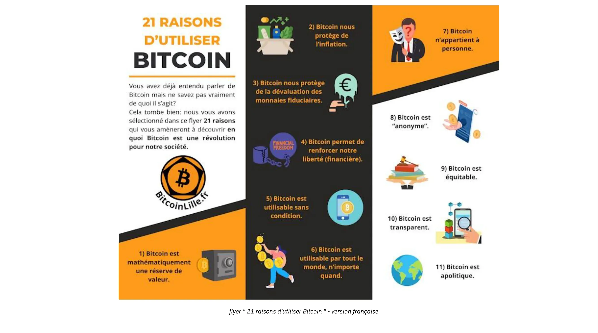

Les possibilités étant infinies, vos choix s'aligneront sur vos besoins. **N'hésitez donc pas à concevoir vous-même de nouveaux modèles, puis prenez quelques minutes pour les partager autour de vous afin que cela puisse faire gagner du temps aux autres communautés de votre pays**.
En effet, n'oubliez pas que toute communauté aura, un moment ou un autre, les mêmes problématiques et les mêmes besoins que vous. **En partageant vos ressources de manière open source, vous accélérez donc de manière sous-jacente le développement de toutes les autres communautés Bitcoin**.

Lors de la création de vos visuels, il est toutefois important de faire attention aux dimensions attendues par les réseaux sociaux et applications de communication que vous comptez utiliser.
Voici donc quelques proportions et standards qui pourraient vous servir :

| Réseau / Plateforme | Logo | Bannière | Affiche / Image 
| -------- | -------- | -------- | -------- |
| Telegram     | 512 x 512     | N/A     | N/A     |
| Signal     | N/A     | N/A     | N/A     |
| Twitter     | 400 x 400     | 1500 x 500     | 1200 x 628     |
| Meet-up     | N/A     | N/A     | N/A     |
| Discord     | 512 x 512     | 960 x 540     | N/A     |
| Facebook     | 512 x 512     | 851 x 315     | 960 x 720     |

Dans le cas de la création d'un **logo**, la taille adéquate est de **512 pixels par 512 pixels**.
Pour une bannière, cela dépend spécifiquement de l'application ou du site que vous utilisez.
Quant aux **affiches et autres images, le format A4** classique est généralement attendu.

### Utiliser une intelligence artificielle

Bien que Canva permette de faire d'innombrables choses (logos, affiches, bannières, flyers, etc.), ce n'est évidemment pas le seul site ou logiciel permettant de réaliser cet ensemble de tâches.
En ce sens, si vous êtes plus à l'aise d'utiliser une autre suite logicielle (notamment Photoshop ou Illustrator), faites au plus pratique.

Toutefois, que ce soit dans la création d'un logo pour sa communauté comme dans l'ajout de visuels agréables sur des affiches, présentations ou flyers, **il peut être pertinent d'utiliser une intelligence artificielle pour agrémenter vos supports**.

Pour ce faire, de nombreuses IA existent. On compte notamment :
- [midjourney](https://docs.midjourney.com/docs/quick-start) (payante) ;
- [leonardo](https://leonardo.ai/) (gratuite, limitée par compte) ;
- [copilot](https://copilot.microsoft.com/) (gratuite, limitée par compte) ;
- [DALL-E](https://www.dall-efree.com/) (payante).

Évidemment, de nombreuses autres intelligences artificielles ont vu le jour ces derniers mois dans le domaine de la création de contenus visuels. Cette liste est donc non exhaustive.

Dans le cas où l'on souhaiterait par exemple réaliser une image ou un logo futuriste du meet-up "Bitcoin Londres", on peut alors demander à l'IA "copilot" :
- [ ] *Crée-moi un logo Bitcoin avec en arrière-plan le pont de Londres et Big Ben. Futuriste* - [Lien](https://copilot.microsoft.com/images/create/un-logo-bitcoin-futuriste-avec-en-arric3a8re-plan-le-/1-6612ba1758df4384bc33c4bca00ab45b?FORM=SYDBIC)

Si les quatre propositions de copilot ne sont toutefois pas assez réalistes à votre goût, il vous est possible de compléter la conversation en ajoutant :
- [ ] *Rends le 4ᵉ beaucoup plus réaliste* - [Lien](https://copilot.microsoft.com/images/create/un-logo-bitcoin-futuriste-avec-en-arric3a8re-plan-le-/1-6612ba64b72d4cea9830ab7eb844f785?FORM=SYDBIC)

Le dernier rendu est d'ailleurs plutôt sympa !

Cependant, si l'on souhaite un logo plus épuré, pour un sticker par exemple, on peut alors entrer sur "copilot" :
- [ ] *Crée-moi le logo du "Londres Bitcoin Meetup" avec un style british et épuré* - [Lien](https://copilot.microsoft.com/images/create/logo-for-27londres-bitcoin-meetup27-with-a-british-a/1-6612bb9451924859a6c34b350b3a6ebc?FORM=SYDBIC)
      

Le second rendu peut alors tout à fait faire l'affaire !

Toutefois, bien qu'elle permette de réaliser rapidement des rendus visuels intéressants, **l'intelligence artificielle ne permettra malheureusement pas de réaliser au détail près ce que vous souhaiterez faire**.
Prenez donc votre mal en patience, essayez de dicter des consignes (des "prompts") les plus précis possible ; et **si vous n'êtes pas satisfaits des rendus obtenus, rien ne vous empêche de vous rapprocher d'un bitcoiner qui maîtrise mieux le sujet**. Contre quelques sats (ou gratuitement), il vous réalisera alors un logo ou un visuel de qualité.

# Créer des canaux de communication pour sa communauté Bitcoin
<partId>fc588298-6876-554c-bd57-55d182464878</partId>

## Quels canaux de communication privilégier ?
<chapterId>b4f4eef6-1035-5290-848a-2b7f9391c77a</chapterId>

Comme dit précédemment, les canaux de communication d'une communauté peuvent différer suivant les motivations et habitudes. 
Par exemple, **en France, en Allemagne et en Italie, Telegram et Twitter sont les canaux de communication principaux**. Ils sont ainsi devenus au fil du temps des "standards de communication" pour les communautés Bitcoin de ces pays. A contrario, en République tchèque, les nombreuses communautés qui s'y sont développées utilisent **Matrix**, un protocole chiffré de messagerie instantanée. Dans leur pays, Telegram n'est donc que peu utilisé.

En ce sens, **lorsque vous devrez choisir les canaux de communication de votre communauté, le plus pertinent est de commencer par prendre exemple sur les communautés limitrophes de votre pays**.
Pour ce faire, jeter un coup d'œil à la carte [btcmap.org](https://btcmap.org/communities/map#0/0/0/) vous donnera un avis déjà bien précis des canaux de communication les plus utilisés autour de vous.
En Suisse par exemple, les informations sont principalement relayées par le biais du Telegram, du Twitter et du site internet de la communauté.

**Dans le cas de la France (et de la francophonie de manière générale), le principal canal de communication est donc Telegram**. Plus de 90% des meet-ups français en ont d'ailleurs un : c'est un "must-have".
Par suite, **le principal réseau social utilisé par les communautés est Twitter** (70% des meet-ups français) ; réseau social sur lequel une majorité de bitcoiners sont présents.
En parallèle, près de 30% des meet-ups français (mais également tous les meet-ups canadiens) possèdent un compte payant sur l'application **Meetup**. Cela peut en effet être un excellent moyen de donner de la visibilité à ses événements en dehors de l'écosystème Bitcoin.
Enfin, 30% des meet-ups français ont également un **site internet** ; et 10%, un serveur **Discord** et/ou un compte **NOSTR**.

Évidemment, d'autres canaux de communication et réseaux sociaux sont parfois utilisés : Matrix, Keet, Signal, Facebook, Instagram, LinkedIn, etc. Chaque communauté est en effet libre d'utiliser les canaux qu'elle souhaite.
Il va cependant s'en dire que, **plus les canaux de communication et réseaux sociaux sont multipliés, plus cela demande du temps pour le (ou les) organisateur(s) de s'en occuper**, d'y poster les informations importantes, de modérer en cas de spam, etc.

Toute personne souhaitant lancer une communauté en France serait donc avisée de commencer à ne créer que :
- un groupe Telegram ;
- un compte Twitter.

En fonction de votre temps et de vos envies, vous pourrez par la suite développer d'autres réseaux ; quitte à en **attribuer la modération à des futurs membres de votre communauté**.

## Créer et configurer un canal, un groupe ou un super-groupe Telegram
<chapterId>d13714ce-8f08-53e9-bedd-b6a3aaac5dad</chapterId>

Comme dit précédemment, Telegram est un "must-have" dans de nombreux pays. Toutefois, avant de créer un canal de communication pour sa communauté sur Telegram, il est important de comprendre les différences entre :
- un canal Telegram ;
- un groupe Telegram ;
- un super-groupe Telegram.

Nous le verrons alors par la suite, mais **il est très fortement recommandé de choisir "groupe Telegram" lors de la création** (quitte à la transformer en "super-groupe Telegram" par la suite, si besoin).

Pour les tutoriels qui suivront, nous utiliserons l'application APK "Telegram+" ; application qui permet de pouvoir aller plus loin dans la configuration de son Telegram. Cela n'est toutefois pas nécessaire, car la création d'un groupe ou super-groupe Telegram peut se faire désormais très facilement sur téléphone.

:::video id=b1da7cb4-5fb1-4a41-a1d4-bd90686826a9:::

### Créer un canal Telegram

Si vous souhaitez créer un endroit où vos membres peuvent échanger ensemble de manière directe, se répondent les uns aux autres, etc., alors un canal Telegram n'est absolument pas ce sur quoi vous devez vous tourner !
Passez donc directement à la section suivante, intitulée "[Créer un groupe Telegram](https://planb.academy/courses/1c643dc9-a15f-4f9e-93b6-cb3c58b4ee35/d13714ce-8f08-53e9-bedd-b6a3aaac5dad)".

En effet, **un canal Telegram n'est qu'une vitrine des informations postées par les administrateurs, dans lequel les membres ne pourront pas faire grand-chose de plus qu'ajouter des émojis**.

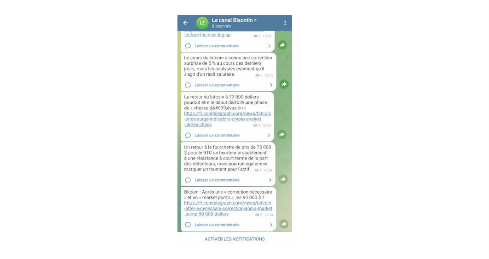

Il est toutefois possible d'ajouter la possibilité pour les membres du canal de commenter chaque post de l'administrateur du canal, comme sur la photo précédente ; mais cela se fera dans des discussions séparées, clivant fortement les échanges. **La création d'un canal Telegram n'est donc généralement pas conseillée pour une communauté**.

Tutoriel pour créer un canal Telegram :

:::video id=98be4709-d221-4030-8c31-e10113482515:::

### Créer un groupe Telegram 

À contrario, **créer un groupe Telegram est tout à fait pertinent**.
En effet, à l'image des applications de messagerie telles que Messenger ou WhatsApp, toutes les personnes qui rejoindront ce **groupe Telegram pourront échanger ensemble, se répondre ; et cela, dans la même discussion**.

Les administrateurs de ce canal pourront alors :
- poster eux-mêmes des messages ;
- **épingler** les plus importants ;
- poster des **sondages** (très pratique pour choisir la date du prochain meet-up lorsque cela n'est pas encore régulier, c'est-à-dire que la communauté est encore peu développée) ;
- créer un **lien d'invitation customisé** (à condition que le groupe soit "public" et non "privé", ce qui est à définir dans les paramètres. Il est d'ailleurs très pratique d'avoir son lien d'invitation Telegram du style : t.me/Bitcoin[VILLE]) ;
- **ajouter ou supprimer des permissions, des administrateurs et des membres** ;
- **ajouter une "photo de profil"** au groupe Telegram (c'est-à-dire le logo de votre communauté), **et modifier son nom**.

Tutoriel pour créer un groupe Telegram :

:::video id=3d4792a7-1345-475b-93b1-b3a3945fb567:::

Petite remarque : comme dit précédemment, le tutoriel ci-dessus a été réalisé sur ordinateur avec l'APK "Telegram+". Toutefois, sachez qu'il est désormais très facile de créer un groupe Telegram sur téléphone.

Il n'est donc plus nécessaire de télécharger "Telegram+" pour réaliser cette tâche ; à moins que vous ne souhaitiez aller plus loin dans les paramètres de confidentialité de votre groupe.

### Créer un super-groupe Telegram

Le point négatif d'un groupe Telegram est que, lorsqu'il commence à y avoir plusieurs centaines de membres, les discussions dans ce même canal de communication commencent à devenir fouillis. Cela entraîne alors un effet indésirable : certains membres ne suivent plus quotidiennement le groupe Telegram, les amenant parfois à rater des informations importantes ; comme la date du prochain meet-up.

Pour remédier à cela, plusieurs solutions existent :
1. **épinglez en tant qu'administrateur les messages importants**, pour que tout le monde en soit notifié (appuyez pour cela 1 fois avec votre doigt sur le message en question, puis sélectionnez "Épingler") ;
2. proposez à la communauté d'**utiliser un serveur Discord** avec des canaux de communication divers et variés, que chacun peut rendre muet s'il le souhaite ;
3. **créez un "super-groupe" Telegram**.

Mais qu'est-ce qu'un super-groupe Telegram ?

C'est tout simplement **un groupe Telegram dans lequel on intègre plusieurs "sujets"**. Un sujet **"Informations importantes"** peut alors être créé, dans lequel on n'y postera que les informations essentielles associées aux prochains événements / meet-ups.
Un sujet **"Général"** peut également être mis en place, dans lequel tous les membres pourraient discuter.
Enfin, **des sujets spécifiques** (minage, développement d'un projet, prochaine conférence, etc.) peuvent apparaître en fonction des besoins.

À vous de modifier votre super-groupe en fonction de vos envies, à l'image par exemple du super-groupe d'Abidjan Bitcoin Meet-up.

Toutefois, il est à noter qu'**un super-groupe Telegram peut être plus difficile à utiliser pour certains membres**. En effet, parfois, certains ne parviennent pas à comprendre **comment accéder aux autres sujets de ce super-groupe** (pour cela, il suffit simplement de cliquer sur le logo du groupe dans le menu général Telegram ; et cela ouvre la liste des sujets créés). Les aider en leur envoyant en capture d'écran la procédure peut être une bonne idée.

De manière générale, il n'existe pas un nombre de membres donné à partir duquel il est pertinent d'utiliser un super-groupe Telegram plutôt qu'un groupe Telegram. C'est donc à vous de faire ce choix, en fonction des besoins et demandes de vos membres ; tout en sachant qu'un groupe Telegram peut être facilement converti en super-groupe Telegram (et inversement). Pour cela, il suffit de créer un sujet (ou de tous les supprimer sauf le "Général").

Tutoriel pour créer un super-groupe Telegram :

:::video id=f78800ae-d8ca-479a-b913-99abd9916bff:::

Petite remarque : comme dit précédemment, le tutoriel ci-dessus a été réalisé sur ordinateur avec l'APK "Telegram+". Toutefois, sachez qu'il est désormais très facile de créer un super-groupe Telegram sur téléphone.
Pour ce faire, il suffit de créer un groupe Telegram ; puis, dans ses paramètres, de cliquer sur le bouton "Sujets" pour en ajouter. Une fois la modification validée, une liste de sujets apparaîtra ; et vous pourrez la modifier à votre guise.
Il n'est donc plus nécessaire de télécharger "Telegram+" pour réaliser ces tâches ; à moins que vous ne souhaitiez aller plus loin dans les paramètres de confidentialité de votre super-groupe.

## Paramétrer son groupe ou super-groupe Telegram
<chapterId>35e674b3-5924-50b0-98f1-83a56c9a186d</chapterId>

Maintenant que vous avez créé votre groupe (ou super-groupe) Telegram, le moment est venu de **réfléchir aux permissions de ce dernier ainsi qu'à sa modération**. Évidemment, chaque communauté est libre de faire comme elle le souhaite.

Toutefois, **d'expérience, il est préférable de retirer aux membres les permissions** :
- **envoyer un sondage** ;
- **envoyer des fichiers** (cas des virus) ;
- **envoyer des messages vocaux** ;
- **ajouter des utilisateurs** (dans le cas où un bot entre dans le groupe) ;
- **épingler des messages** ;
- **modifier les informations de l'échange**.

Il est également **très fortement conseillé d'écrire une description de son meet-up lors de la création du groupe ou super-groupe Telegram**, car celle-ci sera vue par toute personne souhaitant l'intégrer. Cela peut par exemple être :

> Bienvenue sur le Telegram de @Bitcoin[VILLE] 🔥
> 
> Nous organisons un meet-up tous les premiers mercredis du mois au bar [NOM_DU_BAR], à [VILLE] 🍻
> 
> Pour accéder à nos autres réseaux sociaux : [LIEN] 🌐

On observe d'ailleurs, sur l'image ci-dessus, que le lien d'invitation a été customisé par les administrateurs du groupe Telegram Bitcoin Lille, car ce dernier est public.

Par la suite, dans "Paramètres du groupe", il peut être pertinent de **valider "Approuver les nouveaux membres"**.
En effet, il est déjà arrivé qu'un groupe Telegram d'une communauté Bitcoin se fasse attaquer par plusieurs milliers de faux comptes souhaitant rejoindre le groupe dans l'objectif de le spammer et de le détruire. **Activer l'approbation des membres vous sauvera donc d'une attaque spam**.

Enfin, dans la partie "Administrateurs", il est possible d'ajouter un "Antispam agressif" qui supprime automatiquement les messages considérés comme tels. Cela n'est toutefois pas forcément nécessaire.

##  Insérer un bot multifonction dans un canal Telegram
<chapterId>c61f69cc-15ec-53f1-8c02-1cea55def09e</chapterId>

**Une autre possibilité pour paramétrer et sécuriser son groupe ou super-groupe Telegram est d'ajouter un bot multifonction**. Cela permet en effet d'aller beaucoup plus loin dans sa configuration.

Parmi les multiples options possibles avec **le bot [@GroupHelpBot](https://telegram.me/grouphelpbot)**, les plus intéressantes sont :
- **ajouter un règlement** (commande /rules) ;
- configurer un **mécanisme antispam** ;
- ajouter un **message automatique de bienvenue, personnalisable, automatique à l'entrée d'un nouveau membre et qui se supprime après quelques minutes** ; 
- configurer le **mécanisme antiflood** ;
- ajouter une commande @administrateur ;
- ajouter des blocages ;
- ajouter une commande pour obtenir le lien du groupe (/link) ;
- configurer la permission des commandes ;
- supprimer automatiquement certains types de messages ;
- etc.

Trois autres possibilités simples sont :
- **créer une commande** "/lien" permettant d'envoyer le lien d'accès au groupe Telegram ;
- même chose pour obtenir les réseaux sociaux ("/reseaux") ou votre potentiel règlement en cas de modération ("/reglement") ;
- **bloquer l'entrée de bots** et les "entrées/sorties".

D'innombrables options supplémentaires s'offrent également à vous. Un conseil toutefois : **ne cherchez pas à trop brider les échanges**.

Tutoriel pour ajouter un bot multifonction à un groupe ou super-groupe Telegram :

:::video id=cdbf82d6-3530-45c4-90de-593f100863bb:::

Petite remarque : comme dit précédemment, toute cette procédure peut désormais être  réalisée sur téléphone. Il n'y a en effet plus besoin de l'application Telegram+.

## Créer un serveur Discord
<chapterId>eef2a965-4c24-5f3a-8013-72cc7d315314</chapterId>

Lorsque le nombre de membres dans votre groupe Telegram sera trop important, le transformer en un super-groupe Telegram peut être la solution.
Toutefois, comme dit précédemment, **les potentielles "difficultés d'utilisation" et l'augmentation du nombre de sujets et de messages pourront entraîner un début de désintérêt pour une partie des membres actifs**.

**Discord se présente alors comme une alternative** à la création d'un super-groupe Telegram, puisqu'il permet de **créer des salons textuels et vocaux spécifiques**. Mais aussi parce que ses utilisateurs peuvent rendre muet tous les salons qui ne les intéressent pas. En plus de Telegram et de Twitter, cela demande évidemment un peu plus de temps pour s'en occuper ; en particulier lors de sa configuration et de son lancement.

Dans l'objectif de vous faciliter la tâche, **nous vous partageons donc un [serveur Discord pré-fait, duplicable et modifiable](https://discord.com/template/bDY4eXXJk2C8) à votre guise** :

:::video id=e647458a-a21e-44e0-bd03-20b82a871777:::

Lorsqu'il est bien construit, un serveur Discord peut être un véritable atout pour sa communauté. En effet, de nombreux bitcoiners utilisent déjà quotidiennement cette application, et leur **permettre de suivre les conversations du groupe Telegram directement au sein même du serveur Discord est un gain conséquent de temps**. Et inversement.

C'est la raison pour laquelle un bot open-source nommé [TediCross](https://github.com/TediCross/TediCross) a été développé. Son objectif est simple : transférer automatiquement les messages d'un salon textuel Discord vers un groupe Telegram (ou un sujet d'un super-groupe Telegram) ; et inversement. Cela peut donc être très intéressant à mettre en place.

Toutefois, il n'est pas sans noter que son installation n'est pas très évidente, qu'**il faut continuellement faire tourner une invite de commande (CMD) sur un ordinateur pour que ce bot fonctionne** ; mais aussi, qu'il y a parfois un bug d'erreur. Heureusement, dans cette situation, il suffit simplement de le relancer ; et tout rentre alors dans l'ordre.

Dans l'optique de vous faire de nouveau gagner du temps, voici un tutoriel expliquant comment ajouter ce bot multifonction à un groupe ou super-groupe Telegram :

:::video id=6a0283f6-6d6c-4e81-8b2f-644b33c52fe6:::

## Réfléchir à d'autres canaux de communication, privés et plus sécurisés
<chapterId>29d0aad6-0612-5dd0-bcef-7337eaf4fefc</chapterId>

Comme dit précédemment dans cette partie, Twitter et Telegram sont les deux principaux canaux de communication utilisés en Europe (voire dans le monde).
Toutefois, vous n'êtes pas sans savoir que **Telegram n'est pas la messagerie la plus sécurisée et la plus confidentielle, et que Twitter l'entreprise la plus libre de ses mouvements du monde**.
En ce sens, **il est tout à fait pertinent — lorsque vous aurez du temps à y allouer — de commencer à réfléchir à des alternatives**.

C'est d'ailleurs la raison pour laquelle, dans les prochains mois, des tutoriels d'utilisation de protocoles de communication plus confidentiels et plus sécurisés seront proposés au sein même de ce cours et sur planb.network ; en particulier sur les applications de communication décentralisées, sécurisées et paramétrables que sont Simplex et Element.

Mais pourquoi réfléchir à ces alternatives ? 
Tout simplement parce qu'à l'image du réseau social NOSTR, ces dernières sont décentralisées et chiffrées. En plus du **gain de confidentialité** pour votre communauté, cela permet également de **se prémunir d'une fermeture (voire d'une censure) de votre groupe ou super-groupe Telegram**.

Qu'y a-t-il donc de mieux, à l'image du protocole Bitcoin, que d'**être incensurable et immuable** ?

# Lancer ses réseaux sociaux
<partId>8ebf8cd7-9248-543f-bc27-4ec4cc03f9cf</partId>

## L'importance de la visibilité pour le développement de sa communauté Bitcoin
<chapterId>b20f12e4-c5de-5f02-80c7-b7fc6cadd3ac</chapterId>

Ça y est, votre communauté est lancée et vous disposez désormais d'un ou de plusieurs canaux de communication (Telegram et/ou Matrix par exemple) !
Malheureusement, vous y êtes pour le moment… seul(e). Il va donc falloir **faire — un peu — de communication**.

En effet, si personne ne parvient à accéder aux canaux de communication sur lesquels vous postez régulièrement les informations de votre communauté (date du prochain meet-up, projets, etc.), il est évident que vous allez  œuvrer dans le vide. C'est la raison pour laquelle **les réseaux sociaux — et certaines plateformes précises, dont nous parlerons par la suite — vont jouer un rôle prépondérant dans le développement de votre communauté**.

Parmi eux, **Twitter se positionne comme quasi incontournable dans la bitcoinsphère**. En ce sens, il semble important de **disposer d'un profil sur cette plateforme** ; quand bien même sa centralisation et son développement sont loin d'être irréprochables.
C'est la raison pour laquelle un **profil NOSTR spécifique à votre communauté** peut également être créé, en particulier si vous avez en tête d'anticiper de potentielles restrictions et/ou censures sur Twitter. Après tout : il vaut mieux prévenir que guérir.
C'est notamment ce qu'a décidé de faire le collectif FREE Madeira, à Madère.

D'autres réseaux sociaux peuvent évidemment être utilisés. C'est le cas de Facebook (avec un groupe voire une page) ou même LinkedIn.
Néanmoins, il est à rappeler que **plus il y a de canaux de communication et de réseaux sociaux à gérer et à alimenter, plus cela prend du temps. Il vaut donc peut-être mieux se concentrer sur les plus pertinents, Twitter et NOSTR semblent être de bons candidats**.

## Créer un profil Twitter
<chapterId>c8d73097-8eba-5530-918c-221002954110</chapterId>

Très simple d'utilisation, Twitter est un réseau social nécessitant la modification de certains paramètres afin de gagner en confidentialité.

**Lors de la création d'un nouveau compte Twitter, quatre informations essentielles doivent être renseignées** :
1. **le @ Twitter**, qui définira votre identité et vous permettra d'être facilement recherchable. Si votre communauté se nomme "Bitcoin [VILLE]", il est donc tout à fait pertinent de choisir "@Bitcoin[VILLE]" ;
2. **le logo et la bannière** que vous aurez créés pour votre communauté ou votre meet-up (voir section "[Créer un logo, une affiche et une bannière](https://planb.academy/courses/1c643dc9-a15f-4f9e-93b6-cb3c58b4ee35/3470a31f-0190-5e87-8af0-6a00e79267ef)") ;
3. **la description**, qui vous permettra en une centaine de caractères de donner les informations importantes sur votre communauté. Cela peut par exemple être :
> Compte officiel de la communauté Bitcoin [VILLE] #BTC | Meet-ups tous les 1ers mercredis du mois à [NOM_DU_BAR] de [VILLE] 🍻 | Nous rejoindre sur Telegram 🔽
4. En dessous de cette description, il est possible d'**insérer un lien**. Ce dernier peut alors amener les utilisateurs à accéder à une page "réseaux sociaux" disponible sur le site internet de votre communauté, comme il peut les amener vers votre canal de communication Telegram. À vous de choisir ce que vous souhaitez mettre en valeur.

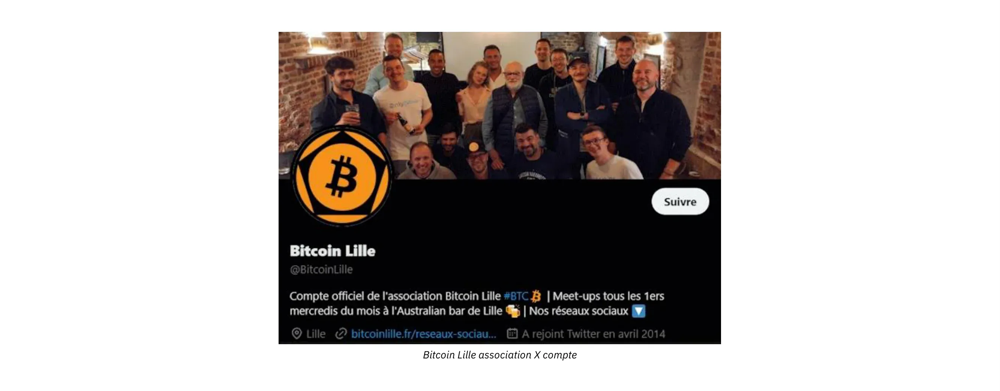

De plus, **quelques paramètres de confidentialité sont pertinents à modifier** :
* **laisser son compte Twitter en mode "public"** (posts visibles par n'importe qui) ;
**pouvoir être identifiable par tout le monde** ;
**désactiver le suivi de localisation et le partage de données à d'autres entités** (dans les paramètres de confidentialité).

À chaque événement, vous viendrez alors certainement annoncer sur Twitter les informations utiles. Or, comme l'immense majorité des réseaux sociaux, **la visibilité est le nerf de la guerre**.

Afin de vous faire gagner une quantité de temps assez conséquente, nous avons pris le temps d'étudier le [code open-source de l'algorithme de classement de Twitter](https://github.com/twitter).

Voici donc **les principaux points auxquels il faut faire attention pour que votre visibilité s'accroisse** :
**Généralités :**
    - **tweetez dans la langue que vous avez paramétrée** sur votre compte Twitter, ou en anglais (sinon, vous serez pénalisé démentiellement) ;
    - **ne tweetez que des informations liées au domaine d'expertise de votre compte** (pénalité forte sinon) ;
    - tweetez 1 à 2 fois par jour ;
    - **tweetez sur des horaires à forte visibilité** (le plus intéressant étant le jeudi ou vendredi entre 8h et 10h ; voir le "Twitter Analytics" de votre compte).

* Lors de l'écriture d'un tweet :
    - **ajoutez une photo** (voire une vidéo) ;
    - **ajoutez un seul hashtag à votre tweet** (#Bitcoin est généralement le plus pertinent. Si cela a du sens, et à condition qu'il soit lié au domaine d'expertise de votre compte, ajoutez un hashtag en tendance) ;
    - **encouragez votre communauté à liker** (poids de 0,5), **à retweeter** (poids de 1) **mais surtout à répondre** (poids de 27 !!) ;
    - **répondez aux personnes qui répondent à vos tweets** (poids de 75 !!) ;
    - **n'ajoutez pas de lien dans votre tweet initial** (cela peut se faire dans le premier commentaire par exemple) ;
    - écrivez les mots en entier, sans utiliser d'abréviations.

**D'autres points à noter :**
    - tweetez en fonction des tendances, à condition qu'elles soient dans le domaine d'expertise de votre compte ;
    - **repostez / retweetez vos tweets les plus vus** ;
    - **réalisez de temps en temps des sondages** ;
    - **écrivez si possible des threads** ;
    - encouragez votre communauté à aller voir, puis à suivre votre profil.

De plus, **il est possible d'épingler sur votre profil Twitter un tweet ou thread auquel vous souhaiteriez donner une visibilité importante**, à l'image de la communauté Bitcoin Witsand en Afrique du Sud.

Notez également qu'il est possible, sur téléphone comme ordinateur, d'être connecté à deux comptes Twitter en même temps. Cela peut être très pratique pour ne pas avoir à se connecter / déconnecter entre son compte personnel et son compte communautaire ; tout comme cela peut vous jouer des tours si vous postez involontairement avec le compte de votre communauté une photo de vous en soiréee… Prudence, donc !

Enfin, bien que votre nom d'utilisateur "@Bitcoin[VILLE]" soit unique et vous appartient désormais, il peut être pertinent d'anticiper de potentiels faux comptes et donc de créer en amont les comptes "@Bitcoin_[VILLE]", "@[VILLE]Bitcoin" ou "@[VILLE]_Bitcoin". Vous serez alors **presque certain que personne ne cherchera à dupliquer l'identité du compte de votre communauté**.

Tutoriel pour créer un compte Twitter :

:::video id=4648976f-41ec-499a-b7ec-a53e796f71b4:::

## Se rapprocher des meet-ups limitrophes
<chapterId>12a21c3b-235a-5292-8209-67bf60f61e49</chapterId>

Maintenant que vos canaux de communication et réseaux sociaux ont été créés, paramétrés et saupoudrés de l'empreinte visuelle de votre ville / communauté / meet-up, il est désormais venu le moment de suivre les "bonnes personnes".

Sur Twitter, cela peut commencer par **suivre certains comptes œuvrant au développement de Bitcoin au niveau international**, comme [@Bitcoin](https://twitter.com/Bitcoin) et [@planb_network](https://twitter.com/planb_network) ; d'initiatives, comme [@FBCEglobal](https://twitter.com/FBCEglobal) ; par retweeter le fameux "Running bitcoin" du 11 janvier 2009 de [@halfin](https://twitter.com/halfin) ; mais aussi — et surtout — par **suivre les comptes des communautés et meet-ups Bitcoin de son pays**.

En effet, **cela permettra mutuellement de se suivre, de se taguer et donc de collectivement gagner en visibilité**.
C'est d'ailleurs le cas entre la cinquantaine de communautés Bitcoin françaises ; et il en est de même avec la majorité des initiatives "Satoshi Spritz" en Italie et "Einundzwanzig" en Allemagne.

Bien que cela puisse paraître inutile aux yeux de certain(e)s, **suivre les comptes des communautés et des initiatives locales / de son pays peut amener indirectement à la réalisation de projets communs**, voire de "partenariats". C'est ainsi que les communautés Bitcoin Liège et Bitcoin Lille sont venues à prendre contact (c'est le cas aussi de Bitcoin Aix et Bitcoin Marseille) ; les amenant désormais à effectuer au moins une fois par an un meet-up commun.
Le cas des repas du **Cercle du Coin** est un autre exemple.

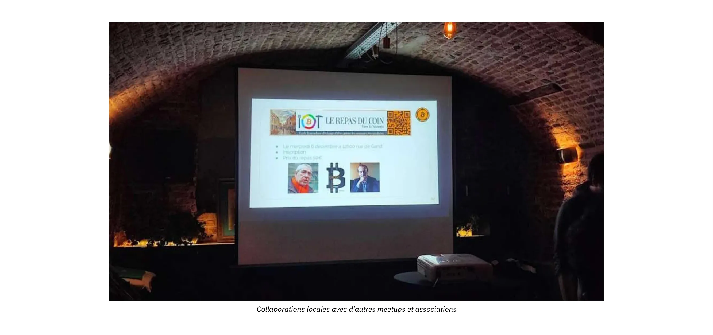

De plus, en France, il peut également être pertinent de **suivre les initiatives [@KonsensusFR](https://twitter.com/KonsensusFR), [@bitcoinpointfr](https://twitter.com/bitcoinpointfr), [@DecouvreBitcoin](https://twitter.com/DecouvreBitcoin) et [@btcmap](https://twitter.com/btcmap)**. Ce ne sont évidemment que des propositions, et chaque communauté est évidemment libre de faire ce qu'il lui plaît ; en toute décentralisation et en toute autonomie.

Néanmoins, comme dit précédemment, l'intérêt de se suivre est de s'apporter mutuellement de la visibilité. Ainsi, plus vous mettrez en avant votre communauté et celles de votre région / pays sur les réseaux, plus l'on parlera de vous ; et plus l'on parlera de vous, plus il y aura de personnes susceptibles de venir à vos événements.

Liker et retweeter sur les réseaux sociaux les posts des autres communautés peut donc aider fortement à leur (et à votre) développement.

En parallèle, il est évidemment possible de **proposer aux organisateurs de meet-ups et aux bitcoiners ayant créé une communauté de se réunir deux ou trois fois dans l'année par visioconférence afin de faire un point sur l'évolution des projets nationaux et des communautés associées. Cela peut également se faire lors des événements physiques**, l'objectif étant simple : écouter le ressenti de chacun, discuter de l'évolution des communautés présentes, mais aussi partager des idées et des projets qui ont aboutis, de proposer des solutions lorsque cela est nécessaire, etc. Un bilan écrit de cette réunion peut même être partagé après cette "réunion" aux organisateurs(rices) des communautés de votre pays qui n'étaient pas présent(e)s.

## Btcmap.org
<chapterId>365f43d4-7b2c-5961-a184-157b8c1a0116</chapterId>

À ce stade, votre communauté est déjà lancée. Il ne reste plus qu'à attendre l'arrivée de nouvelles personnes intéressées dans l'optique de la développer.

Cependant, vous ne pouvez pas aller plus loin sans savoir qu'**il existe des plateformes permettant aux bitcoiners intéressés de trouver les communautés et meet-ups près de chez eux**.
C'est la raison pour laquelle **il est crucial que vous preniez quelques minutes pour faire une demande de référencement sur ces sites / plateformes**.

Parmi celles-ci, on note notamment :
* **[Btcmap.org](https://btcmap.org/)**, site internet qui regroupe deux cartes mises à jour quotidiennement : **[la carte mondiale des commerces acceptant Bitcoin](https://btcmap.org/map)** et **[la carte des communautés mondiales](https://btcmap.org/communities/map)**. De nombreux bitcoiners, lors de leurs vacances ou même dans leur quotidien, scrutent régulièrement ces cartes afin de pouvoir faire de nouvelles rencontres ou de nouveaux achats. **Btcmap est clairement la référence mondiale. Et pour votre visibilité, votre communauté se doit d'y être référencée.**
* **[BitcoinerEvents](https://www.bitcoinerevents.com/)**, site internet créé par des bitcoiners, pour les bitcoiners. Il est possible d'**y poster les prochains événements de sa communauté**. Toutefois, en France, cette plateforme est relativement peu utilisée.
* en fonction des pays, il existe également des initiatives spécifiques. C'est notamment le cas, **en France, du site internet [bitcoin.fr](https://bitcoin.fr/events/categories/evenements/), qui recense chaque mois les dizaines d'événements Bitcoin dans le pays**. Si vous ne les avez donc pas encore suivis sur Twitter ou contactés pour donner les informations de votre communauté et/ou de vos événements, c'est le moment ! **Par ailleurs, dans l'optique de les aider à tenir à jour ce calendrier d'événements français, il serait appréciable que toutes les communautés Bitcoin françaises prennent l'habitude :**
    * **de mentionner @bitcoinpointfr sur Twitter à chaque nouvelle annonce d'événement de sa communauté** ;
**d'épingler dans son groupe Telegram communautaire les annonces de nouveaux événements**.

Il n'est pas sans noter que d'autres plateformes et applications permettent également de gagner en visibilité. **[Meetup](https://www.meetup.com/)** est l'une d'elles, et il s'agit d'un site internet (et d'une application sur téléphone) permettant de créer un événement et de chercher ceux autour de chez soi.
Malheureusement, pour pouvoir y créer des événements, il faut débourser près de 8€ par mois (soit environ 90€ par an), ce qui est onéreux pour une communauté qui n'est encore ni structurée ni mature. Toutefois, Meetup est très utilisée dans certains pays, en particulier au Canada et aux États-Unis ; son principal intérêt étant qu'elle permet de gérer les inscriptions aux rencontres.

En parallèle, **[Orangepillapp](https://www.orangepillapp.com/)** est une application téléphone permettant aux bitcoiners de se rencontrer. Elle est toutefois, elle aussi, payante (50 000 sats/an, ou 200 000 sats à vie).

Bien qu'elles permettent de développer la visibilité de votre communauté et de vos événements, ces deux dernières applications ne sont pas conseillées au lancement de votre communauté, tout simplement, car elles sont payantes.
**Débuter avec un référencement sur [btcmap.org](https://btcmap.org/), sur [BitcoinerEvents](https://www.bitcoinerevents.com/) ; et pour les communautés françaises, sur [bitcoin.fr](https://bitcoin.fr) est donc clairement suffisant**.

Toutes nos félicitations ! Votre **communauté est désormais créée**, vos **visuels réalisés**, vos **objectifs fixés**, vos **canaux de communication établis**, vos **réseaux sociaux lancés** et votre **stratégie de visibilité décidée**.
Une fois qu'un petit groupe de bitcoiners vous aura rejoint, il n'y aura plus qu'à passer à l'étape supérieure : **se lancer dans la folle aventure d'un meet-up Bitcoin !**

# Organiser un meet-up Bitcoin
<partId>c009d2a6-40ce-583b-bd24-fdfd1fea262e</partId>

## Pourquoi lancer un meet-up régulier avec sa communauté ?
<chapterId>ed8e471c-3b99-57e2-a042-2d4e8a40b137</chapterId>

Maintenant que les réseaux sociaux et les canaux de communication de votre communauté ont été lancés, il n'y a plus qu'à faire acte de présence sur ces plateformes. Les nouveaux membres devraient par la suite se présenter d'eux-mêmes, engageant petit à petit la discussion.
Cela vous permettra donc de vous libérer du temps, qui pourrait par exemple vous permettre de réfléchir à la création d'une rencontre de type "meet-up" ; quel qu'en soit son format. Cela s'accentuera d'ailleurs lorsque vous commencerez à sentir une certaine ferveur au sein de votre communauté.

Comme dit précédemment, **un meet-up Bitcoin peut donc être vu comme le "niveau" suivant d'une communauté**. Il permet d'une part, **à ses membres bitcoiners, de se rencontrer** ; et d'autre part, d'**éduquer les nouvelles personnes intéressées par cet écosystème**.
Un événement de ce type va ainsi permettre à votre échelle de **créer dans votre ville un engouement autour de Bitcoin**, qui pourra s'étoffer au fil du temps en fonction des projets que votre communauté réalisera.

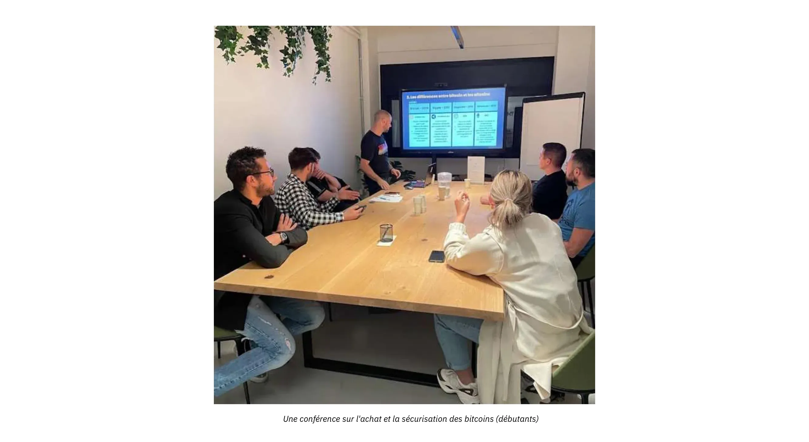

Bien évidemment, plus les objectifs que vous aurez fixés pour le développement de votre communauté seront importants, plus il sera nécessaire —  pour vous et vos membres —  d'y passer du temps.
Il est donc important de **commencer par se fixer des objectifs atteignables pour l'organisation de ce meet-up**.

## Le premier meet-up : quand, et (pour)quoi ?
<chapterId>f3f8a614-cfb4-5994-a2e8-d56e6f8e3347</chapterId>

Il est tout à fait possible que vous décidiez de lancer un événement de type meet-up à peine quelques semaines après la création de votre communauté.
Cependant, dans cette situation, votre communauté ne se sera certainement pas beaucoup développée. Cela signifie donc qu'il est envisageable que personne ne se présente à votre événement.
Par conséquent, il semble pertinent de n'**organiser un meet-up qu'à partir du moment où il commence à y avoir quelques personnes impliquées dans les canaux de communication** de votre communauté ; disons par exemple **une petite dizaine de membres**. Cela peut donc être assez rapide, mais est également dépendant de la personnalité de chacun des membres.

Une fois que vous sentirez cette petite étincelle, viendra alors la possibilité de proposer l'idée d'une rencontre en présentiel. Si cette idée recueille l'intérêt d'autres personnes, il vous suffira alors de **définir la date de votre premier meet-up**.
Pour ce faire, il est certainement préférable de ne pas vous-même la fixer, mais de plutôt **proposer —  une dizaine de jours avant — un sondage contenant différents jours et plages horaires**. Ainsi, en fonction des votes de chacun, vous pourrez **maximiser la présence de membres**, de créer plus d'émulations ; mais aussi, de **mieux "optimiser" votre temps**.

Il est alors important que vous ne vous fixiez pas d'idée préconçue de comment ce meet-up se déroulera, de combien vous serez, des thèmes de discussion, etc. En effet, vous risqueriez d'être déçu ; et les participants, de se sentir potentiellement "oppressés".
Il semble en ce sens préférable de laisser les choses se faire naturellement, autour d'un verre par exemple. Les discussions devraient alors être faciles ; et cela, quitte à recentrer la discussion autour de Bitcoin si vous êtes en tête-à-tête avec une brebis égarée.

Si vous souhaitez toutefois **anticiper certains blancs, vous pouvez prévoir différentes "activités" ou points de chute**. Cela peut être :
- un ordinateur ou un smartphone avec la **[mempool](https://mempool.space/)** ;
- l'apport d'un livre ;
- l'apport d'un **Nerdminer**, Bitaxe, FPGA voire ASIC ;
- la présence d'un **flyer Bitcoin** ;
- la réflexion autour d'un visuel / logo Bitcoin pour votre communauté ;
- un **[jeu de cartes Bitcoin](https://www.maximalist.ovh/accueil/20-game-le-coin-de-table.html)** ;
- la **[carte btcmap.org](https://btcmap.org/)** des communautés et des commerces ;
- l'envoi / la réception de Bitcoin en **Lightning**.

À noter toutefois : lorsque le meet-up n'est qu'à ses débuts, il n'est pas forcément pertinent de réaliser un exposé didactique. Lorsque vous êtes peu, il semble en effet préférable de réaliser cela sous la forme de discussion, de manière plus ouverte et plus conviviale.

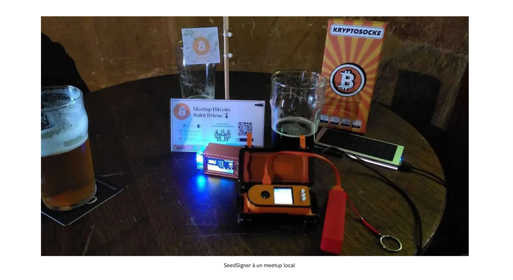

Une fois que votre meet-up se sera déroulé, vous aurez probablement envie d'en réaliser un autre. **Tant que votre communauté est encore petite, il semble préférable de continuer à proposer la date par sondage ; par exemple, une fois par mois (voire tous les deux mois)**. À vous d'en discuter sur les canaux de communication que vous utilisez.

Toutefois, dans le cas où **un groupe régulier de bitcoiners et d'intéressés se développe**, il semble pertinent de **planifier ce moment de manière plus régulière** ; pour plusieurs raisons :
1) cela permet pour tout le monde de plus facilement planifier sa venue ;
2) cela permet également d'**instaurer une "habitude"**. Ainsi, quelqu'un ne suivant plus quotidiennement les canaux de communication ou réseaux du meet-up (par manque de temps par exemple) et connaissant le jour habituel de votre rencontre peut alors passer, "comme d'habitude".

Ce second point est très important. C'est d'ailleurs une des raisons pour lesquelles, **en France, la majorité des meet-ups se déroulent le premier mercredi de chaque mois** (voir l'initiative des "ambassadeurs", lancée par [DecouvreBitcoin](https://decouvrebitcoin.fr/) en 2022).
En Allemagne, il n'y a pas au niveau national de jour prédéfini ; de même en Italie.

Toutefois, il est à souligner qu'**avoir tous les meet-ups nationaux le même jour engendre un problème de centralisation**. En plus de la question de la sûreté, les bitcoiners présents au meet-up de leur ville respective ne peuvent donc pas participer aux événements Bitcoin des communautés limitrophes.
À vous donc de vous positionner ; et pour ce faire, **échanger avec le (ou les) meet-up(s) le(s) plus proche(s) peut permettre d'arriver à une décision commune pertinente**.

Enfin, lorsque votre communauté deviendra conséquente et que vos meet-ups se rempliront, il est tout à fait possible de proposer :
* **un objectif précis à chacun de vos meet-ups** ;
*voire* **un second événement dans le mois**.

Dans le premier cas, bien qu'il faille être attentif à la sensibilité et aux envies de chacun, cela peut permettre à toutes les personnes présentes de **sortir de l'événement avec de nouvelles connaissances**, tout en recentrant les sujets de conversation autour de Bitcoin (si ces derniers divergeaient).
Dans le second cas, un deuxième événement dans le mois peut par exemple permettre d'**aborder un thème spécifique, comme la mise en place de sessions "débutants" et/ou d'ateliers** (minage, Lightning, installation de nœud, etc.).

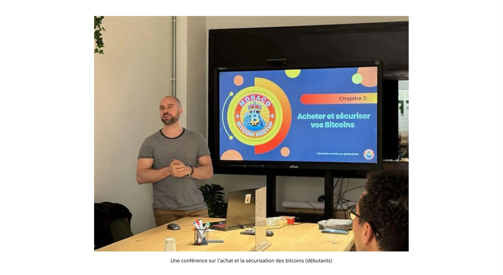

Gardez toutefois en tête que **cela demande une organisation plus importante ; et vous prendra donc plus de temps**. Mais heureusement, dans la [partie 6/8 de ce cours](https://planb.academy/courses/1c643dc9-a15f-4f9e-93b6-cb3c58b4ee35/3213d87a-1998-5972-ab93-97a5769ba279), vous seront proposées de nombreuses ressources open source réutilisables.

Quoi qu'il en soit, tout cela dépendra du plan d'action à court, à moyen et à long terme que vous (ou votre communauté) vous serez fixés.

## La recherche d'un lieu
<chapterId>405d389e-6a32-5777-af8d-293380d2e8fd</chapterId>

La recherche d'un lieu pour l'organisation d'événements n'est souvent pas évidente. En plus de cela, il semble essentiel **que ce lieu se situe dans la ville de votre communauté**.
De nombreux critères sont donc à prendre en compte. Parmi eux :
1) le positionnement du lieu : est-il facilement **accessible en transport ? En voiture ?** Peut-on s'y garer sans difficulté ?
2) le lieu est-il **agréable et pas trop bruyant ?** Cherchez-vous un endroit formel (espace de coworking, salle de réunion) ou informel (bar, voire restaurant) ? 
3) l'endroit a-t-il une **capacité suffisante pour vous accueillir ?** Y compris un soir de match de rugby ou de ligue des champions ?
4) le lieu dispose-t-il d'un **vidéoprojecteur et d'un espace calme pour réaliser vos présentations ?**
5) enfin, dans le cas d'un bar (voire d'un restaurant), **la carte permet-elle à tous de manger et de boire ?**

En plus de cela, trois remarques importantes peuvent être ajoutées :
- dans le cas où vous souhaiteriez **scinder la soirée en deux temps** (tout d'abord, une **présentation dans un espace formel** afin de permettre à tous d'être plus concentré ; puis **changer de lieu pour continuer la soirée de manière plus détendue dans un bar** ou un restaurant), l'expérience a montré que changer de lieu en milieu de soirée amène **une partie des participants à profiter de la césure pour s'en aller. Ce type de fonctionnement n'est donc pas conseillé** ;
- lors de vos premiers meet-ups, peu de personnes devraient se présenter, et vous ne réaliserez donc probablement pas de présentation. En ce sens, il ne semble pas nécessaire de vous faire connaître auprès du (de la) patron(ne) et de lui présenter vos objectifs, etc. Toutefois, **une fois que vos meet-ups seront réguliers et fréquentés, il semble pertinent de le faire afin de montrer votre sérieux et de faire valoir votre souhait de revenir mensuellement**. Cela peut ainsi amener de nombreuses discussions (réservation mensuelle automatique, consommations et/ou planches gratuites, réductions, discussion autour de Bitcoin, acceptation de Bitcoin comme moyen de paiement, etc.). Évidemment, si vous recherchez un lieu équipé d’un vidéoprojecteur, prévoyez un échange préalable avec le responsable ou le manager. Cet échange, en personne ou par téléphone, permet de présenter clairement votre projet et vos objectifs ;

- enfin, certaines communautés ne souhaitent **réaliser leurs événements que dans des endroits acceptant Bitcoin comme moyen de paiement**, et cela peut tout à fait se comprendre. Dans cette optique, il semble pertinent de **commencer par rechercher les commerces de votre ville acceptant Bitcoin (sur [btcmap.org](https://btcmap.org/map/) par exemple)** et de les contacter afin de trouver un lieu qui respecterait vos critères. Dans le cas où, malheureusement, rien ne conviendrait, il vous est alors possible d'aller "onboarder" de nouveaux commerçants. Attendez-vous cependant à essuyer de nombreux refus, ce qui peut être décourageant. C'est la raison pour laquelle **il est souvent conseillé de ne pas se fixer cela comme objectif au départ, mais d'y venir une fois que votre communauté se sera bien développée** et que vous disposerez d'une "force de frappe" suffisante.

Par ailleurs, **au lancement de votre meet-up, n'hésitez pas à changer de lieu pendant quelques mois**. Cela vous permettra en effet de **nouer des contacts** avec certain(e)s gérant(e)s, de **découvrir des ambiances différentes** ; mais aussi, de **prendre des informations** sur les différents endroits pouvant potentiellement accueillir vos événements.
Lorsque votre groupe comptera davantage de membres, vous pourrez consacrer une fin d’après-midi à visiter plusieurs commerces et bars. L’objectif sera de vérifier s’ils disposent d’un espace adapté pour accueillir vos événements mensuels.

## Avant le meet-up
<chapterId>c5218943-580d-5efc-89ed-6b5d728816d6</chapterId>

Vous planifiez l'organisation d'un meet-up dans les prochaines semaines ? Les étapes suivantes peuvent vous aider à l'organisation de votre événement :
1. **prendre contact avec les gérants du lieu** dans lequel vous réaliserez votre événement, afin de **valider une réservation** pour une quantité de personnes donnée ;
2. **annoncer sur les réseaux sociaux et canaux de communication votre événement, en explicitant clairement la date, l'heure, le lieu** et en ajoutant le lien d'inscription si nécessaire. Pour cette communication, un visuel spécifique peut être créé (affiche Canva par exemple, voir partie 2/8 "[Concevoir une identité propre à sa communauté Bitcoin](https://planb.academy/courses/1c643dc9-a15f-4f9e-93b6-cb3c58b4ee35/b48a18cc-afdf-5216-802c-32647b5cd8a3)"). De plus, pour qu'un maximum de personnes puisse voir cette annonce, celle-ci peut être **épinglée sur Telegram et Twitter**, et peut aussi contenir un **"@everyone" sur Discord**. Il semble également plus que pertinent de **poster ces annonces 1 semaine à dix jours avant la date de l'événement**, permettant ainsi à tout à chacun de pouvoir anticiper sa venue ;

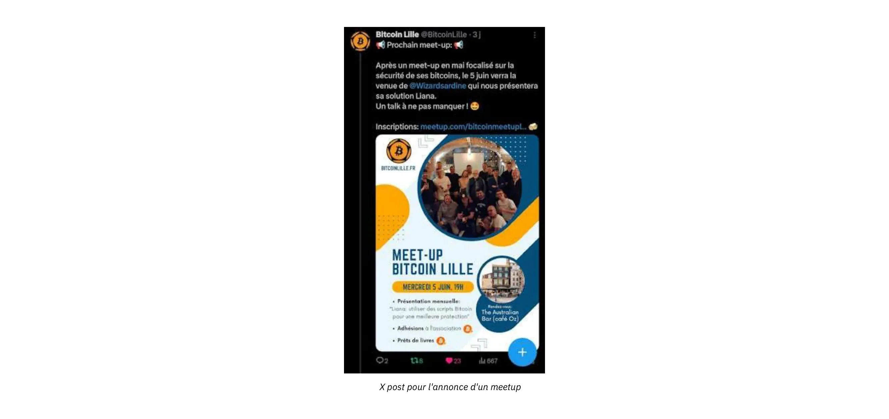

3. **deux à trois jours avant l'événement, ces annonces peuvent être retweetées et repartagées**, amenant plus de visibilité ;
4. en fonction du nombre de retours et/ou d'inscriptions obtenues la veille ou l'avant-veille, il vous est tout à fait possible de recontacter le (la) patron(ne) du lieu afin de confirmer le nombre de participants attendus.

À ces quatre étapes, peuvent également s'ajouter :
- l'**impression de flyers et/ou d'affiches** ;
- la **création d'une présentation** sur un sujet prédéfini ;
- la **préparation d'une activité ou d'un atelier** ;
- etc.

## Le jour du meet-up
<chapterId>cf60067b-591f-5fdf-9b9e-d442aad0e8f9</chapterId>

Ça y est, c'est le grand jour ! Une heure ou deux avant le début de l'événement, il vous est possible d'envoyer un message de rappel dans les canaux de communication de votre communauté afin d'annoncer à nouveau l'heure à partir de laquelle vous serez là, mais également d'informer les futurs participants que vous serez reconnaissable, car vous porterez (par exemple) un tee-shirt et une casquette Bitcoin.

Lorsque votre meet-up se développera et que vous accueillerez plus de 20 personnes par événement, **la préparation de la salle / du lieu deviendra un élément important**.

Pour ce faire, il sera nécessaire :
1) d'**arriver un peu en avance** pour préparer ;
2) d'**agencer la salle ou le lieu en fonction des possibilités et de vos besoins**. Dans le cas où vous êtes une demi-douzaine, il n'y a effectivement pas grand-chose à faire. Mais dès que vous atteindrez les 10 à 20 personnes par événement, vous vous rendrez rapidement compte qu'être tous assis n'est pas une si bonne idée, car cela crée moins d'échanges et vous ne parviendrez pas à parler avec tout le monde dans la soirée. En ce sens, **privilégier une configuration debout avec des tables hautes bien espacées** (lorsque cela est possible) semble une bonne idée dès que vous atteindrez une quinzaine de personnes. Pensez toutefois à **quand même mettre à disposition des chaises** (hautes par exemple). Dans le cas où une présentation sera réalisée, il est préférable de laisser la configuration debout toute la soirée, quitte à apporter des chaises quelques minutes avant la présentation ;
3) en plus de l'agencement de la salle, d'autres petites "customisations" peuvent être entreprises :
    - affichage, avec de la Patafix, d'une **affiche devant le lieu de votre meet-up, spécifiant dans quelle salle vous serez** (pensez évidemment à demander l'accord en amont) ;
    - affichage, avec de la Patafix, d'**affiches spécifiques** dans la salle où vous réalisez votre événement (**livre blanc de Bitcoin, charte de votre communauté, projets en cours**, etc.) ;
    - installation sur une ou plusieurs tables de **stickers, flyers, voire du matériel pouvant amener à la discussion** (Nerdminer, portefeuille matériel, ordinateur allumé avec la mempool, ASIC, plaque en métal pour sécuriser sa clé privée, etc.).

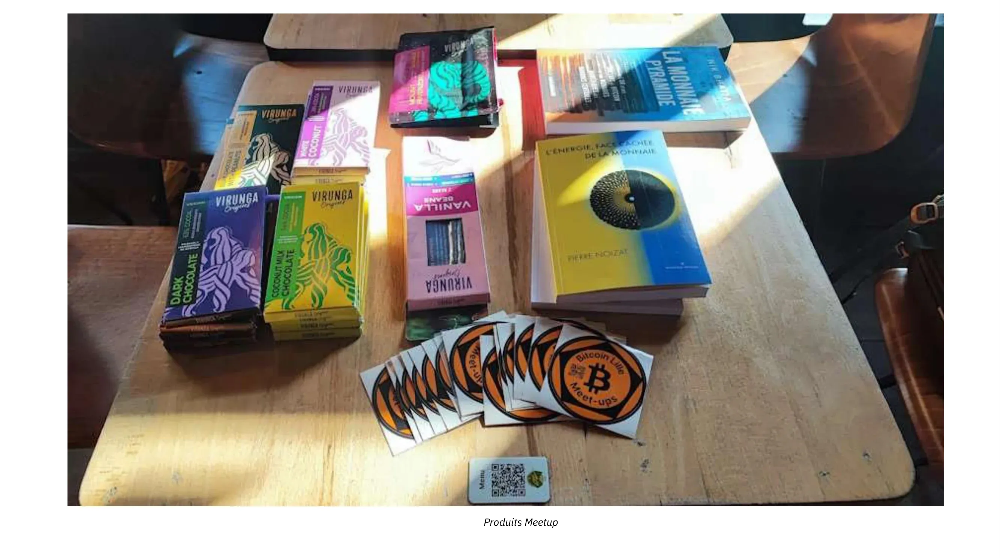 

Évidemment, si vous n'attendez que peu de participants et que vous n'avez pas informé les gérants de la tenue de votre meet-up, car vous n'en êtes qu'à son lancement, ne commencez pas à apporter et à exposer tout votre matériel.
Cependant, **une fois que la confiance sera instaurée avec les gérants, vous serez libres d'aménager l'espace comme bon vous semble**.

Il ne vous reste donc plus qu'à prendre un verre et à attendre patiemment les potentiels participants. Toutefois, comme dit plus haut : **ne soyez pas déçu si personne ne se déplace la première fois**. Prévoyez donc un livre ou une vidéo à regarder, au cas où.

## Après le meet-up
<chapterId>3e881af9-9c09-5721-81ee-c5cda3b109c5</chapterId>

Qui dit fin du meet-up dit, pour les gérants du lieu : **rangement**. Pensez donc, avant de partir, à proposer votre aide aux serveurs et/ou aux gérants. Cela peut notamment passer par un simple **regroupement des verres sur une même table** ; ou alors, si vous êtes à côté du bar, à **les rapporter avant de partir**.

Une fois rentré chez vous, il est fort probable que vous aurez **des bitcoins plein les yeux pendant quelques jours**. Il s'agira donc d'un moment propice pour prendre la température et demander un retour des participants, par exemple en :
- envoyant un message sur vos canaux de communication afin de **remercier les personnes présentes**, et/ou en partageant les liens ou sites dont vous avez parlé ;
- suggérant aux personnes qui ont participé au meet-up de **proposer des améliorations** pour le prochain ;
- puis de **préparer le prochain événement !**

Une longue période de quelques semaines se présentera alors à vous ; parfaite pour développer d'autres designs et/ou projets pour votre prochain meet-up.

## L'importance d'impliquer et de fidéliser les participants
<chapterId>f5355e35-4b07-527c-88a3-8535cba7592c</chapterId>

La ville de Rome ne s'est pas construite en un jour ; et il en sera de même pour votre communauté. Cela signifie donc que **c'est en réalisant des meet-ups et événements de manière régulière que vous parviendrez à créer une dynamique autour de Bitcoin**.

Pour ce faire, un point est essentiel : **fidélisez les participants de vos événements**.

Cela peut débuter avec un petit groupe d'irréductibles bitcoiners, dont l'objectif est de régulièrement se réunir pour parler Bitcoin. Au fil des semaines et en fonction du temps et de la sensibilité de chacun d'eux, rien ne vous empêche de **répartir certaines tâches organisationnelles** avec votre communauté, voire de **proposer à ces bitcoiners impliqués de réaliser un projet** donné. Celui-ci pourrait alors être spécifique à votre communauté, à vos meet-ups voire à votre ville ; comme il pourrait prendre exemple sur l'une des nombreuses initiatives proposées dans [la partie 6/8 de ce cours](https://planb.academy/courses/1c643dc9-a15f-4f9e-93b6-cb3c58b4ee35/3213d87a-1998-5972-ab93-97a5769ba279). **Cela amènerait ainsi le noyau dur de votre communauté à s'impliquer, et donc à la faire s'épanouir**.

**De nouvelles têtes viendront alors vous rejoindre au fil des meet-ups**. Cela peut être des personnes ayant acheté du BTC et/ou des alt/shitcoins lors des précédents cycles, des personnes avec un profil plutôt "tech" souhaitant aller plus loin dans leur compréhension de Bitcoin et de son écosystème ; mais aussi des novices, glanant leurs premières informations sur ce nouveau système de paiement électronique incensurable, décentralisé, transparent, équitable, utilisable sans condition et sans tiers de confiance.

Afin de pouvoir **permettre à tous de se sentir inclus lors des événements**, deux axes de réflexion peuvent être travaillés.

D'une part, d'un point de vue social, il est primordial pour le développement d'une communauté que toute personne venant à un événement se sente incluse. Cela signifie : **faire l'effort d'aller voir ces nouveaux participants, s'intéresser aux raisons pour lesquelles ils sont là, les accueillir chaleureusement**, etc. En se sentant incluses et bienvenues, ces personnes auront envie de revenir ; voire, dans le futur, de s'impliquer dans l'organisation de ces événements.

Évidemment, **cela demande du temps et de la motivation**. Dans le cas où vous accueillez un shitcoiner (voire pire : un XRP-maximaliste), il est assez difficile de mettre de côté sa préférence temporelle et d'accepter de "perdre son temps" dans des discussions à sens unique. Toutefois, c'est en prenant le temps de discuter avec ces personnes que l'on peut souligner leurs incompréhensions et erreurs de raisonnement. S'ils les acceptent, ils seront alors prêts pour comprendre Bitcoin.

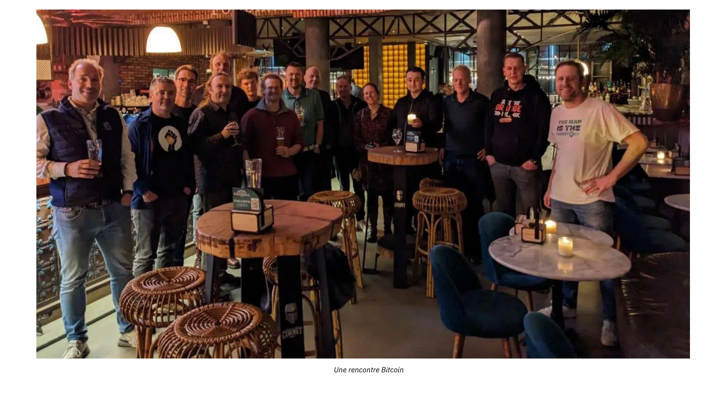

D'autre part, dans l'objectif d'améliorer l'expérience des participants à vos événements, plusieurs questions peuvent se poser :
- le lieu où s'est déroulé **le meet-up était-il agréable ?**
- était-il **facile d'accès ?**
- pourquoi certains participants ne sont-ils finalement pas venus ?
- quelles discussions ont été abordées ? S'agissait-il de **discussions trop techniques, ne permettant pas d'englober les novices par exemple ?**
- les discussions étaient-elles trop alcoolisées ?

Évidemment, tout participant a sa propre personnalité, sa sensibilité, ses objectifs et ses intérêts. Chacun vivra donc le meet-up différemment.
Mais **lorsque le lieu est bien choisi, que les personnes présentes sont ouvertes d'esprit et que leurs objectifs sont nobles, il n'y a pas de raison pour que le meet-up ne soit pas une réussite**.

**Créer un meet-up demande donc du temps ; mais surtout, de l'organisation.**
C'est un projet humain et c'est la raison pour laquelle il ne pourra fonctionner et se développer sur le long terme qu'à partir du moment où il est **réfléchi, ouvert et inclusif**.
Bien évidemment, **à chacun de fixer sa limite** dans ce que l'on peut entendre par "ouvert et inclusif". Mais ne l'oublions pas : un shitcoiner est un bitcoiner en devenir.

# Des exemples de projets et d'initiatives
<partId>45b3bc40-1c31-583e-8411-2662e6efd765</partId>

## Pourquoi aller plus loin que simplement boire des bières ?
<chapterId>3213d87a-1998-5972-ab93-97a5769ba279</chapterId>

Au fil des blocs, votre communauté se développera. De nouvelles têtes vous rejoindront et d'autres s'effaceront. Néanmoins, son leitmotiv sera toujours le même : **faire avancer l'écosystème Bitcoin et créer des liens encore plus forts entre ses membres**.

Pour ce faire, de nombreux projets et initiatives peuvent être réalisés. C'est la raison pour laquelle **nous vous proposons dans ce chapitre une succession d'idées non exhaustives qui peuvent être mises en place au sein d'une communauté ou lors d'un meet-up**. Vous êtes alors libre de piocher dans celles qui vous plaisent, mais aussi d'en ajouter à ce cours [en réalisant une "Pull Request" sur GitHub](https://github.com/PlanB-Network/bitcoin-educational-content). 

Mais avant de débuter, il semble intéressant d'aborder plus en détail un point déjà énuméré dans les parties précédentes de ce cours.

Lorsqu'on lance un meet-up Bitcoin, on découvre de nouvelles personnes. Les interactions sociales sont donc importantes, et la bière (l'alcool de manière générale) permet de rendre ce genre d'événement festif. Mais ATTENTION :
- d'une part, **l'alcool inhibe certaines capacités cognitives** (réflexion, compréhension, etc.). Il est donc **plus difficile pour les participants de suivre des discussions sérieuses** — ou une présentation — après avoir bu un doux breuvage alcoolisé ;
- d'autre part, **l'alcool est réconfortant** : chaque mois, vous avez votre "moment Bitcoin", avec vos nouveaux copains. Vous partagez une passion commune, et c'est très positif ! **Mais boire des bières est-il vraiment l'objectif phare de votre meet-up ?** Ne souhaiteriez-vous pas plutôt échanger lors de ces événements de vos nouvelles trouvailles / recherches, apprendre des expériences des autres ; voire démocratiser Bitcoin aux nouveaux, afin de les initier ?

Chacun a ses propres envies, ses propres convictions, sa propre personnalité. Il n'y a donc aucun jugement fait ici sur le fonctionnement d'un meet-up ou d'un autre. Néanmoins, **même si c'est souvent autour d'une bière que l'on refait le monde, ce n'est pas ainsi que naissent et se développent les révolutions**.

L'important est d'en être conscient(e).

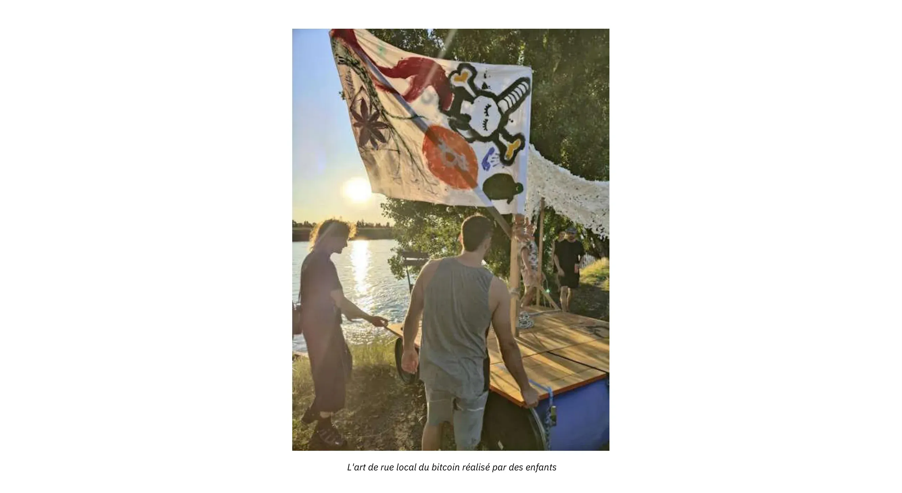

## Organiser des meet-ups thématiques, avec une progression annuelle
<chapterId>46afdbcc-a775-5c16-b20a-34956690d58f</chapterId>

Lorsque vos meet-ups seront réguliers et qu'un noyau dur d'une dizaine de personnes se sera formé, il vous sera désormais possible de **réaliser une présentation à chacun de vos meet-ups**. Celles-ci pourront alors être **thématiques**, sur un sujet annoncé en avance ; comme elles pourront être décorrélées les unes des autres.

Dans le cas de la mise en place de présentations et/ou d'ateliers, il peut être très pertinent de **construire en amont une progression réfléchie**. L'objectif de cette progression serait alors d'**aborder l'ensemble des notions importantes à Bitcoin**, permettant aux personnes présentes lors des meet-ups de comprendre Bitcoin sous ses différents angles.

En France, au cours de l'été 2023, les organisateurs de meet-ups ont ainsi travaillé sur **une progression annuelle**. En plus d'avoir une **dimension éducative forte, cela permet également aux meet-ups de pouvoir s'échanger des documents et des présentations PowerPoint opensource** ; permettant ainsi de disposer d'une base de données de ressources de plus en plus conséquentes.
Cette initiative est particulièrement appréciée dans les meet-ups, et a pour vocation à se développer dans les prochaines années.

La progression suivie en 2023/2024 par les meet-ups français est donc disponible ci-dessous. Pour chacune, **une présentation open source accompagnée de sa vidéo est proposée, vous donnant peut-être des idées sur les notions qui peuvent être abordées**.

D'autres ressources sont également disponibles dans la section ["Educator Content"](https://planb.academy/educator-content) de Plan ₿ Academy, un espace collaboratif où les éducateurs Bitcoin du monde entier partagent et mettent à disposition leurs supports pédagogiques (présentations, flyers, guides, affiches…) en formats prêts à l'emploi ou modifiables. L'objectif : mutualiser les efforts pour ne pas repartir de zéro à chaque fois !

| Mois | Thème | Vidéo | Ressource modifiable |
| -------- | -------- | -------- | --- |
| Septembre     | Chapitre 1 : Qu'est-ce que Bitcoin ?     | [Lien youtube](https://www.youtube.com/watch?v=CSjuBqrl4t8)     | [PowerPoint modifiable](https://www.canva.com/design/DAFu0d5Jd7M/9gAWDAOSS6LDkWENuZjYgw/edit) |
| Octobre & Novembre| Chapitre 2 : Comprendre les transactions sur Bitcoin     | [Lien youtube](https://www.youtube.com/watch?v=inFnR-3NsdM)     | [PowerPoint modifiable](https://www.canva.com/design/DAFsEcnOro8/Mz9FYdTGhsvozZOe0Y9jtw/edit) |
| Décembre     | Chapitre 3 : Comprendre le Lightning Network     | [Lien youtube](https://www.youtube.com/watch?v=hHz-ALx8D9w)     | [PowerPoint modifiable](https://www.canva.com/design/DAF4YPSNnR8/HKp4Vmcno8eMtVWnZmFtcw/edit) |
| Janvier     | Chapitre 4 : Qu'est-ce que le minage ?     | [Lien youtube](https://www.youtube.com/watch?v=QyHZ3CVI_OI)     | [PowerPoint modifiable](https://www.canva.com/design/DAF5DE6iBEM/tsy8E3oBebUnsR0kj53vvQ/edit) |
| Février     | Chapitre 5 : Monter un nœud Bitcoin et Lightning     | [Lien youtube](https://www.youtube.com/watch?v=RRYK-usg-OY)     | [PowerPoint modifiable](https://www.canva.com/design/DAF55FU6HI0/sQ0lacRJblqrhn_9Xk1yDg/edit) |
| Mars     | Chapitre 6 : Utiliser le Lightning Network au quotidien     | [Lien youtube](https://www.youtube.com/watch?v=o2BS4xjei8M)    | [PowerPoint modifiable](https://www.canva.com/design/DAGAcJMw7lw/-haMNnHnwj5vpDAy8MDowA/edit) |
| Avril & Mai     | Chapitre 7 : Sécuriser ses bitcoins      | [Lien youtube](https://www.youtube.com/watch?v=fHExPbhM0Hg)    | [PowerPoint modifiable](https://www.canva.com/design/DAGDz3Nq4e0/D3uG-4w9FN6OhUq-VXzhfg/edit) |
| Juin     | Chapitre 8 : Qu'est-ce qu'un multi-sig ?     | [Lien youtube](https://www.youtube.com/watch?v=Me5489mpoxA)     | [PowerPoint modifiable](https://www.canva.com/design/DAGLMtQT6sg/rYIxr4ldUJ0jTelNf-Pj8Q/edit) |
| Juillet     | Chapitre 9 : Comprendre le bull-run, et s'y préparer     | [Lien youtube](https://www.youtube.com/watch?v=7RA-gnCJWyM)     | [PowerPoint modifiable](https://www.canva.com/design/DAGJQkiZ_YA/9lUluP9RZ0eeA_e61mk9Hw/edit) |
| Août     | Chapitre 10 : Le fisc n'est jamais bien loin     | [Lien youtube](https://www.youtube.com/watch?v=oY4NwonGDm0)     | [PowerPoint modifiable](https://www.canva.com/design/DAGQhx7Yc_c/7mRhb_vlgnhSgxd1FtjK8w/edit) |

À noter par ailleurs que les chapitres 2 et 7 peuvent être découpés en deux présentations, afin par exemple de ne pas surcharger d'informations les participants. Les réaliser d'une traite permet toutefois plus de liberté dans le planning des événements annuels, afin par exemple de réaliser des workshops ou événements spécifiques en supplément (rencontre commune avec un meet-up limitrophe, quiz, ateliers, etc.).

**Libre à vous de prendre ces ressources, de les modifier et de les partager à votre guise**. Pensez simplement à **citer vos sources** dans le cas où vous réutiliseriez une de ces présentations.

Bien évidemment, tous les participants ne seront pas présents à chaque meet-up. Il peut donc être tout à fait pertinent de **prendre en vidéo la présentation pour la poster sur une plateforme de streaming et/ou sur votre site internet**. Cela peut en effet amener les absents à prendre connaissance des présentations des précédents meet-ups; voire les regarder plusieurs fois en replay pour mieux se former.

En parallèle, des meet-ups thématiques peuvent être réalisés. Parmi eux, on compte :
- un **quiz de connaissances** (avec un portefeuille physique à gagner par exemple) ;
- un **défi "onboarding"** en envoyant des satoshis gratuitement à des no-coiners dans la rue ;
- l'**organisation de la venue d'experts dans un domaine précis**, ou d'une société proposant un produit Bitcoin ;
- une **soirée "tournée des bars et commerces" acceptant Bitcoin** comme moyen de paiement ;
- etc.

Les seules limites sont celles de votre imagination !

## Créer des side-events et workshops
<chapterId>9dbd651a-8712-5630-90b3-b9525dcc1385</chapterId>

En fonction du temps que vous aurez et de l'implication de votre communauté, d'autres événements peuvent être organisés afin de rythmer l'année. Cela peut être de l'ordre :
- d'**une soirée restaurant pour le Pizza Day**, le 22 mai ;
- d'**une soirée ou d'un week-end pour "célébrer" le prochain halving** ;
- d'**un événement "jeu en famille" autour de Bitcoin** et de son fonctionnement. Des jeux comme [Le Coin de Table](https://www.maximalist.ovh/) ou [SHAmory](https://shamory.com/) peuvent alors être apportés ;
- d'**un atelier minage**, avec la découverte de plusieurs matériels (processeur, carte graphique, FPGA, ASIC, nerdminer, bitaxe) ;
- d'**une après-midi ou soirée spécialement pour les débutants, avec des ateliers thématiques** ;
- voire, d'**un meet-up commun avec les meet-ups limitrophes**.

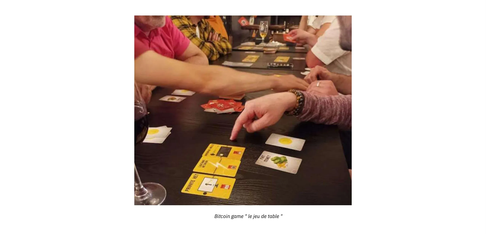

Pensez toutefois à faire attention à **ne pas trop réaliser d'événements dans le mois, car plus il y en a, plus cela demande du temps** pour les organisateurs comme pour les participants ; et cela peut amener certains d'entre eux à ne plus venir à chaque fois.

## Créer des stickers autocollants
<chapterId>d605f3b3-130e-513d-85e6-06bc5ea13e99</chapterId>

Symbole de l'identité de votre communauté, la réalisation de stickers autocollants peut être un très bon moyen de faire parler de Bitcoin et de votre initiative.
Avant votre commande, différents points sont toutefois à réfléchir :
- si vous souhaitez que ces stickers puissent être collés dans la rue, il vous faut des **stickers résistants à l'eau** ("waterproof" ou imperméables) ;
- faites **attention à ce que votre logo soit plus petit que la zone annoncée lors de la commande**. Cela permettra en effet d'éviter les erreurs de précision des découpeuses laser, qui découperaient une partie de votre logo. Cela est toutefois habituellement expliqué lors de la commande ;
- pensez à **utiliser un fichier vectoriel** plutôt qu'un fichier image. Cela améliorera la qualité à l'impression ;
- **réfléchissez à deux fois à la taille souhaitée**. Par exemple, un sticker circulaire de 8 cm de diamètre fait à peu près la taille de la paume d'une main adulte. Cherchez-vous cette taille, ce qui est quand même assez visible, ou cherchez-vous quelque chose de plus discret (4 cm de diamètre par exemple) ?
- enfin — c'est un peu technique — mais si vous souhaitez un beau noir à l'impression (un "noir quadri"), les propriétés de ce dernier devront être de: 30% de cyan, 30% de magenta, 30% de jaune et 100% de noir. Dans le cas où seuls 100% de noir est pris en compte, le rendu donnera un noir un peu grisâtre. Heureusement, les imprimeurs font généralement attention à ce détail. Vous ne devriez donc pas vous en faire.

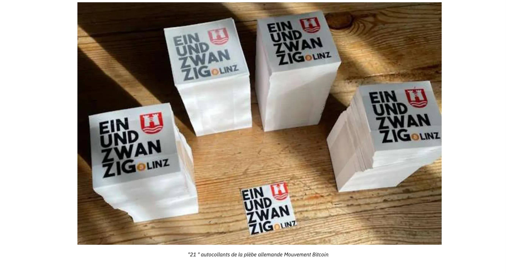

En fonction de votre demande et du fournisseur que vous choisirez, tablez **entre 100 et 250 euros pour 1000 stickers**. Vous pouvez également contacter [@Mill3sim3 sur Twitter](https://x.com/Mill3sim3), un bitcoiner français spécialisé dans le marketing qui peut vous permettre d'obtenir des prix près de 30% moins chers que les sites en ligne habituels.

Toutefois, il est à noter que 1000 stickers est une quantité très importante. Il est donc clairement **préférable, pour débuter, de partir sur l'achat d'une centaine de stickers** ; afin d'être sûr d'écouler ce stock.

Petit laïus également : **si vous décidez de coller un de ces stickers dans la rue, en fonction du pays dans lequel vous vous trouverez, cela peut être prohibé**.
Dans le cas de la France par exemple, il n'est autorisé de coller des stickers dans la rue que sur les panneaux d'affichages publics présents dans chaque ville. Cela signifie donc que si un de vos stickers est collé n'importe comment (ou plutôt : n'importe où, par exemple en plein milieu d'un panneau-stop), ce dernier se fera retirer rapidement ; et s'il possède des informations permettant de remonter à votre identité ou à celle de votre meet-up, il n'est pas à exclure que vous puissiez recevoir une petite amende. Faites donc attention et informez-en vos membres.

En parallèle, si vous êtes féru de concerts, de bars ou de stades, **pensez à vérifier qu'il y a déjà des stickers collés avant de poser le vôtre. Le cas échéant, prenez quelques secondes pour demander à un(e) employé(e) si cela est accepté**. Il serait en effet dommage qu'un commerçant entende parler de votre communauté / meet-up / association / de Bitcoin pour la première fois parce que vous avez "saboté" la décoration de ses toilettes !

## Créer une bibliothèque
<chapterId>acc94093-f8b3-51b8-9359-348e9e075d38</chapterId>

Un autre projet pouvant être facilement mis en place est **l'instauration d'une bibliothèque au sein de vos meet-ups**.
Pour ce faire, vous pouvez proposer à toutes les personnes intéressées par le partage de leurs lectures de ramener un livre lié à Bitcoin et, si quelqu'un d'autre lors du meet-up est intéressé pour l'emprunter, **un prêt pourrait être réalisé auprès de son propriétaire, moyennant par exemple une caution de 21 000 satoshis en Lightning**.
Cela amène en effet, pour le propriétaire, de couvrir les frais en cas d'oubli ou de vol ; et pour l'emprunteur, de revenir à un prochain meet-up pour récupérer ses 21 000 satoshis !

Dans le cas où vous possédez **une association et que vous souhaitez investir une partie de votre trésorerie dans des ressources pédagogiques et éducatives**, il vous est également possible de commander plusieurs livres et de les proposer dans votre **bibliothèque Bitcoin**, à chaque meet-up.

Dans l'optique de développer l'écosystème, **[l'éditeur Konsensus Network](https://konsensus.network/) propose depuis fin 2023 aux meet-ups et communautés Bitcoin internationales une réduction comprise entre 15% et 35% sur l'ensemble de ses livres ; à partir de trois achetés**.
Pour profiter de cette réduction, il suffit de **contacter la [maison d'édition Konsensus](https://twitter.com/KonsensusFR) sur Twitter**.

Si toutefois vous n'avez pas de trésorerie, sachez qu'il est tout de même possible de faire profiter les membres de votre communauté de cette réduction.
En effet, un des organisateurs de votre communauté peut par exemple centraliser les commandes de vos membres et la passer auprès de Konsensus pour un coût moindre, dans l'optique de redistribuer les exemplaires reçus au prochain meet-up. Cette redistribution pourra alors par exemple s'effectuer lors du paiement, en Lightning.

Par ailleurs, une charte du prêt de livres peut être affichée lors des meet-ups, permettant d'expliquer succinctement aux nouveaux les règles d'emprunt.

En voici d'ailleurs un exemple open source, que vous pouvez prendre et modifier à votre guise :
[Charte du prêt de livres](https://www.canva.com/design/DAF7u1b5kRM/r2gEAlibe_jTIXIX-O9PMA/edit)

Enfin, toujours dans l'idée de développer les lectures autour de Bitcoin, une dernière action d'envergure peut être de **se rendre dans les bibliothèques municipales de la ville et de vérifier si elles disposent de différents ouvrages sur Bitcoin**.
Si oui, peut être demandé aux bibliothécaires si des **tables rondes** sur ce sujet peuvent être réalisées dans les prochains mois, quitte à leur donner le contact du meet-up de la ville.
Sinon, **peut être proposé l'achat de plusieurs ouvrages que vous aurez sélectionnés en amont**. Le site de [l'éditeur Konsensus Network](https://konsensus.network/) peut alors être source d'inspiration.

## Créer des flyers personnalisés et les distribuer
<chapterId>62ad5430-c698-51b3-89ac-090f31c88953</chapterId>

La création et l'écriture de flyers prennent beaucoup de temps. Néanmoins, cela permet de **disposer d'un support papier lors des discussions autour de Bitcoin**, ce qui est tout à fait appréciable.
Ces flyers peuvent ainsi être destinés à :
- **des commerçants**, dans le cas où vous souhaitez leur proposer Bitcoin comme moyen de paiement ;
- **des personnes se présentant lors de vos événements**, avec un flyer présentant comment utiliser et payer en Bitcoin / Lightning ;
- **des néophytes**, croisés dans la rue, sur votre lieu de travail ou à un repas de famille, avec un flyer reprenant les principaux intérêts de Bitcoin.

Il est également tout à fait possible de préparer **un flyer spécifique pour votre communauté ou vos meet-ups, présentant vos actions, vos objectifs, vos réseaux et canaux de communication ; mais aussi, les dates et les lieux de vos événements déjà planifiés**.

Plusieurs flyers sont déjà **disponibles en open source**, et d'autres seront créés dans les prochains mois. Vous les retrouverez notamment **dans la [Boîte à outils pédagogique Bitcoin](https://planb.academy/fr/resources/bet)** de planB.network.

Parmi eux, se trouve notamment un [flyer complet sourcé](https://profedustream.substack.com/p/21-raisons-dutiliser-bitcoin) reprenant 21 raisons d'utiliser Bitcoin. Son design est, lui aussi, [disponible en open-source](https://www.canva.com/design/DAFtAR1NauQ/ZDwl2CchIJ9Gpb36N6-7iw/edit?utm_content=DAFtAR1NauQ&utm_campaign=designshare&utm_medium=link2&utm_source=sharebutton). N'hésitez donc pas à le modifier, à l'adapter en fonction de vos besoins puis à le partager. Pensez toutefois à citer vos sources.

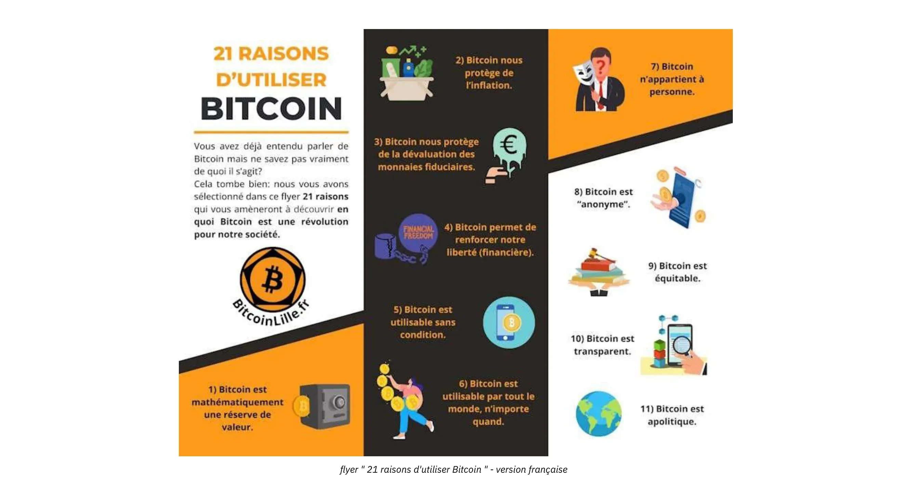
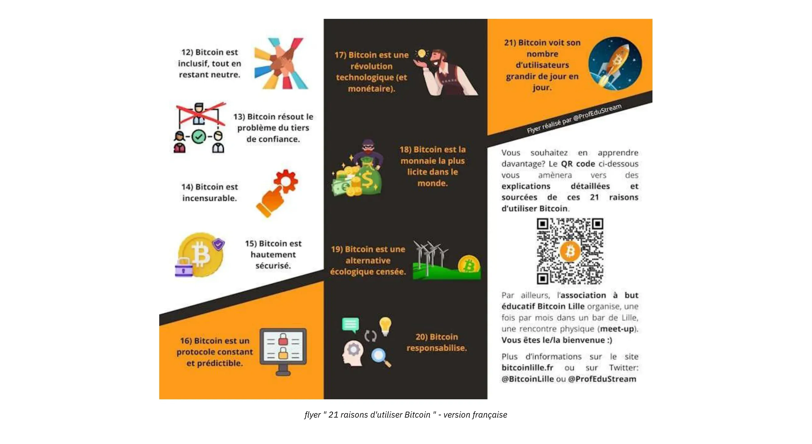

Comme dit précédemment, **ces flyers peuvent être déposés un peu partout** : sur un bureau collectif à votre lieu de travail, sur une table lors d'un repas de famille, dans une bibliothèque municipale, etc.

En France et dans quelques autres pays, il existe également **des "boîtes à livres"**.
Construites généralement en bois, ces dernières accueillent gratuitement des livres à donner. Une possibilité serait donc d'**y laisser un flyer ; ou mieux : un livre !**

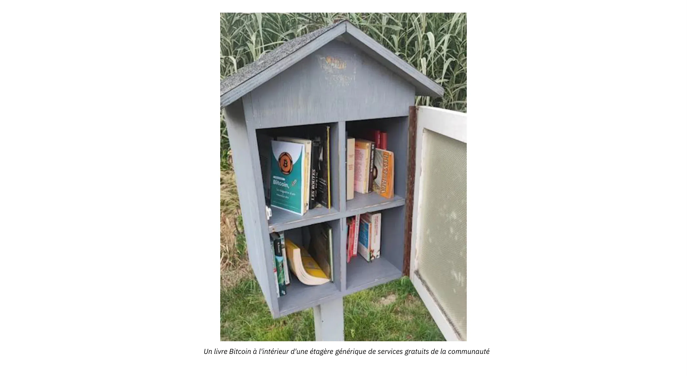
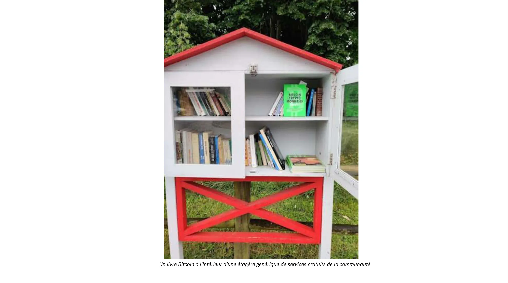

C'est en ce sens qu'en 2023, **l'initiative "Un livre blanc de Bitcoin dans les boîtes à livres de France"** a été lancée.
Afin de pouvoir mener ce projet à bien, il a d'abord fallu **obtenir la géolocalisation de toutes les boîtes à livres existant dans le pays**. Pour ce faire, différentes bases de données existent :
- [boite.a.livres.zonelivre.fr](https://boite.a.livres.zonelivre.fr/) ;
- [boites-a-livres.fr](https://www.boites-a-livres.fr/carte-de-france) ;
- [delivrez.fr](https://delivrez.fr/maps/fr_FR/) ;
- certains autres articles dans la presse locale.

Bien évidemment, poster le livre blanc de Bitcoin dans ces boîtes à livres a quelque chose de symbolique. Toutefois, pour un(e) néophyte, il est trop complexe dans sa compréhension.
L'idée a donc été d'**écrire un petit livret, comprenant** :
- **une introduction vulgarisée et sourcée sur Bitcoin, son utilisation et les problèmes qu'il résout** ;
- accompagnée du **livre blanc de Bitcoin**, traduit en français.

Voici donc ci-dessous [le livret qui a été partagé entre bitcoiners français](https://profedustream.substack.com/p/bitcoin-la-naissance-dune-nouvelle) et qui a été déposé dans plusieurs dizaines de boîtes à livres du pays. Son design est également [disponible en open-source](https://www.canva.com/design/DAFs18FSoVM/Sy0QsfUkycTgXveeGgutBg/edit?utm_content=DAFs18FSoVM&utm_campaign=designshare&utm_medium=link2&utm_source=sharebutton).

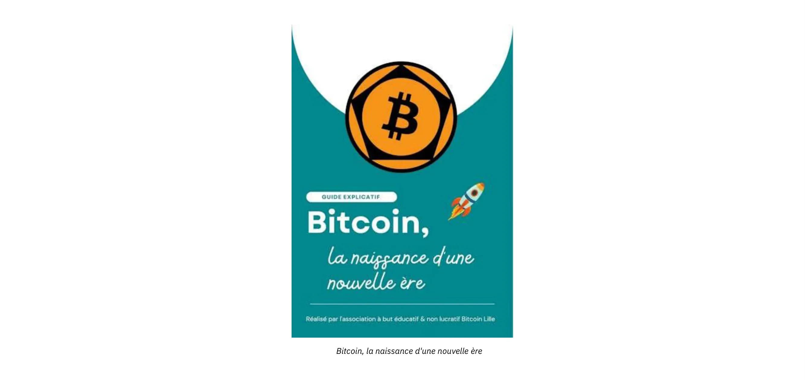

## Réaliser une projection vidéo
<chapterId>892b248a-b837-5df6-aac9-4b3261ff0390</chapterId>

Tout bitcoiner a certainement déjà vu la très intéressante minisérie "Le mystère Satoshi, aux origines du Bitcoin" de [Rémi Forte](https://twitter.com/forteremi).
Sortie en 2021, celle-ci a été visionnée [plusieurs millions de fois sur YouTube](https://www.youtube.com/watch?v=0ETcLj5jBy4).
Une première idée de projection serait donc de **proposer à votre communauté une projection vidéo du mystère Satoshi**, lors d'un événement mensuel supplémentaire par exemple.

Petit bémol toutefois : bien qu'ARTE France ait confirmé que cette diffusion était possible, il sera nécessaire pour être dans la légalité de s'acquitter des **droits de projection**, dont le montant s'élevait à près de 250€ par projection en 2023 (avec une réduction envisageable de 120€ par projection si 5 meet-ups effectuaient une projection dans l'année).
Par conséquent, pour l'immense majorité des communautés, ce tarif est rédhibitoire. Et en plus de ça, le documentaire est disponible gratuitement sur la chaîne YouTube d'ARTE…

En parallèle, d'autres projections peuvent être réalisées.
En France par exemple, **la réalisatrice [Alana Mediavilla](https://twitter.com/AlanaMediavilla) a accepté que les meet-ups du pays diffusent en avant-première son documentaire "Stranded"** ; dont certaines images sont tirées des séquences du [film "Dirty Coin"](https://www.dirtycointhemovie.com/) qui est sorti courant 2024.
Certains bitcoiners ont alors pris l'initiative de **traduire entièrement le documentaire "Stranded" en français**, d'intégrer les sous-titres et de le partager à l'ensemble des meet-ups du pays. La semaine du 4 mars 2024, **la projection s'est alors déroulée de manière synchronisée dans une dizaine de meet-ups du pays**.

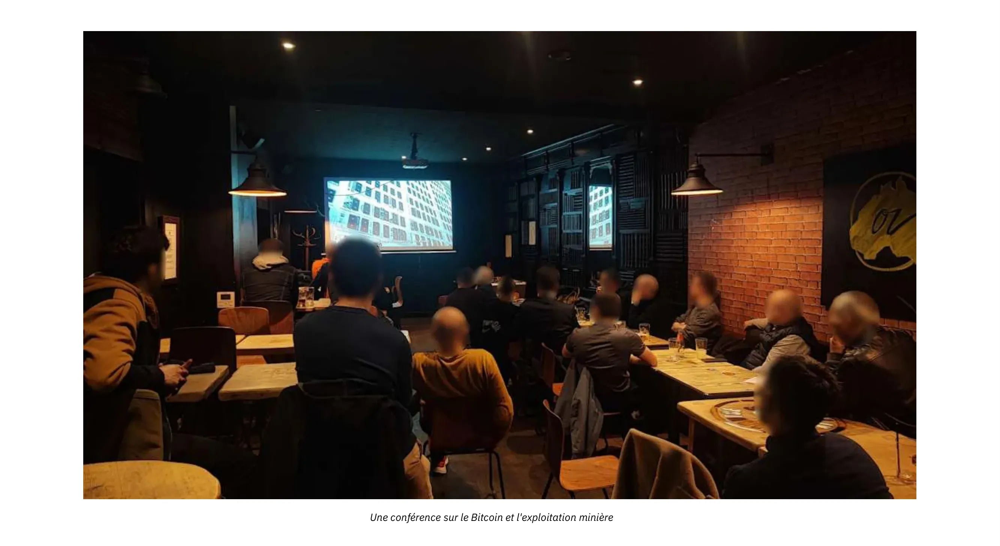

Cette diffusion a alors amené de nombreuses discussions autour du minage de bitcoins, de sa consommation électrique et de son impact sur l'écologie de manière plus générale.

## Coller des affiches dans sa ville
<chapterId>6565e8a0-d535-5be0-9764-273584c675bd</chapterId>

Dans plusieurs pays d'Europe (Allemagne, Espagne, France, etc.), **des bitcoiners ont pris l'initiative de coller des affiches dans leur ville**. Certaines d'entre elles reprennent alors les œuvres de Banksy en y intégrant le logo Bitcoin.

C'est notamment le cas de [StreetCyberArt](https://twitter.com/streetcyber_art), bitcoiner allemand, qui réalise des collages et du street art depuis plusieurs années.

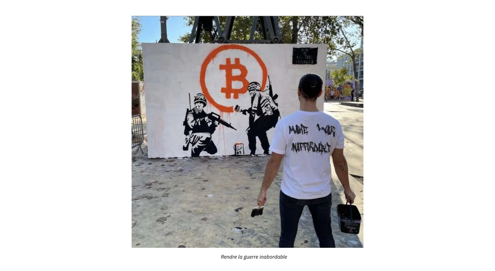

Cependant, si vous souhaitez vous lancer dans du collage de rue, il vous sera nécessaire de **prendre connaissance des lois de votre pays**. En France par exemple, il n'est autorisé de **coller des affiches que sur les panneaux d'affichage public**. Ailleurs, cela est interdit et est donc passible d'amende.
Si vous souhaitez braver "l'interdit" et espérer de ne pas être pris en "flagrant délit", pensez donc à ne pas mettre sur ces affiches un élément permettant de vous retrouver (nom du meet-up, @ Twitter, etc.).

Dans le cas où vous souhaitez **imprimer ce type d'affiches avec une imprimante personnelle, sachez que cela amène généralement le papier à fortement baver, mais aussi à se détériorer rapidement dans le temps**. En ce sens, **la meilleure stratégie est certainement de prendre contact avec un imprimeur professionnel afin de réaliser ces affiches sur du papier autocollant spécifique, spécialement conçu pour l'extérieur**. La qualité sera alors au rendez-vous.

Toutefois, il n'est pas sans nier que **cette initiative a un coût conséquent : plus de 0,40€ par affiche (soit 40€ pour une centaine d'affiches)**. Et encore, sur internet, les prix peuvent varier du double au quintuple. Il faut donc avoir les bons contacts.

Comme cité précédemment, le bitcoiner français [@Mill3sim3](https://twitter.com/Mill3sim3) dispose du matériel professionnel adéquat. Il vous est donc possible de le contacter sur Twitter pour lui demander des renseignements.

Par ailleurs, une autre idée — DIY cette fois-ci — serait de réaliser un pochoir avec un grand carton et d'acheter des bombes de peinture aérosol. Vous pourrez alors taguer votre oeuvre dans certains coins de votre ville.

## Disposer d'une carte NFC personnalisée
<chapterId>8ad65d4e-a68a-59c2-a812-85f4907ed9f3</chapterId>

Un autre projet, unique en son genre, est la **création de cartes NFC personnalisées permettant de payer en Lightning** (et respectant le standard BoltCard). Pour ce faire, **Swiss Bitcoin Pay** est un partenaire de qualité.

Actuellement, [sur leur site internet](https://swiss-bitcoin-pay.ch/cards), il existe quatre designs de base.
Toutefois, dans le cas où vous souhaiteriez commander **plus de 50 cartes NFC, il est possible de contacter l'entreprise sur son site officiel (ou sur [Twitter](https://twitter.com/SwissBitcoinPay)) et de proposer un design personnalisé** pour le recto de la carte. Le verso est quant à lui standardisé.

L'[association française Bitcoin Lille](https://twitter.com/BitcoinLille) a par exemple commandé en 2023 une série de cartes NFC avec un design personnalisé. Ainsi, tout au long de l'année, **chaque nouvel adhérant à l'association a reçu dans son pack de bienvenue une carte NFC customisée**. Cette idée peut évidemment être reprise et améliorée à votre guise.

Quant au prix unitaire de ces cartes, **il est compris entre 2,50€ à 5€** ; tout en sachant qu'il change régulièrement et est dégressif en fonction de la quantité commandée.

## Créer un site internet
<chapterId>9a2a1b9b-0633-544a-b331-c06187d23d7f</chapterId>

Dans l'objectif de disposer d'une vitrine pour votre communauté, vos meet-ups, vos événements et vos documents éducatifs, il peut être pertinent à un certain stade de développement de **disposer d'un site internet**.
Néanmoins, **cela demande beaucoup de temps à la conception**.

Afin de vous simplifier ce travail de création, le tutoriel ci-dessous vous présente en une demi-heure les étapes de création d'**un site internet gratuit sur la plateforme WordPress**. Ce dernier vous permettra alors de **disposer d'une page d'accueil personnalisable, de publier des articles, d'intégrer des médias (vidéos YouTube, images, PDF)**, etc.
Par la suite, il vous est possible d'acheter votre propre nom de domaine ; voire d'héberger votre site internet sur un serveur personnel.

:::video id=a1b25c18-5fc1-4b97-baef-816d819c9382:::

D'autres CMS ou plateformes permettent également de créer des sites internet. Bien que certaines soient plus simples en raison de leur interface agréable, les sites internet qui en sortent sont également bien moins personnalisables. **WordPress semble donc être le plus pertinent pour se lancer**.

De plus, il permet l'**intégration de plug-ins** (pour certains payants, mais de qualité) permettant d'aller beaucoup plus loin dans la création d'un site internet ; et cela, sans pour autant avoir besoin de coder.
Le [plug-in payant "Uncode"](https://undsgn.com/uncode/) est l'un d'entre eux.

## Créer une chaîne vidéo (Youtube ou Odyssee)
<chapterId>076286db-1627-57ec-a410-c44b1666e1cd</chapterId>

Parmi les membres de votre communauté, certains seront peut-être intéressés pour **créer du contenu multimédia** ; comme la réalisation de vidéos tutoriels.
En parallèle, vous réaliserez probablement un jour des présentations lors de vos meet-ups, voire dans des universités.
**Lorsque le besoin se fera sentir, il peut donc être pertinent de disposer d'une chaîne vidéo vous permettant de poster en ligne l'ensemble de vos contenus**.

Parmi les plateformes vidéo les plus connues, on retrouve notamment :
- [**YouTube**](https://www.youtube.com/), qui a le défaut de **ne pas être résistante à la censure** ;
- [**Odyssee**](https://odysee.com/), qui est relativement peu utilisée mais qui est **décentralisée** grâce à son fonctionnement pair-à-pair ;
- [**Peertube**](https://joinpeertube.org/fr_FR), qui vous permet de créer vous-même votre propre plateforme vidéo. C'est probablement un niveau au-dessus en termes de mise en place.

En fonction de vos envies et vos besoins, il faudra évidemment **créer des visuels spécifiques à cette plateforme** ; afin de rendre votre chaîne vidéo visuellement attrayante. Le point positif est qu'avec **Canva**, dont nous avons parlé dans [la partie 2/8 de ce cours](https://planb.academy/courses/1c643dc9-a15f-4f9e-93b6-cb3c58b4ee35/3470a31f-0190-5e87-8af0-6a00e79267ef), il existe une catégorie "Vignette YouTube" avec des visuels déjà préconçus et facilement modifiables.

Dans le cas où vous souhaiteriez vous **enregistrer sur votre ordinateur, un logiciel comme [Streamlabs](https://streamlabs.com/fr-fr) fait très bien l'affaire**. Il est en effet gratuit, possède de nombreux réglages et permet d'effectuer des transitions de scènes.

Quant au **montage vidéo** (si tant est qu'il y en a), il vous sera nécessaire de disposer d'un logiciel adéquat.
Bien qu'il soit payant (45€ par an), [Wondershare Filmora](https://filmora.wondershare.fr/) est particulièrement efficace et très simple d'utilisation ; vous permettant de réaliser des montages de qualité en quelques minutes.

Enfin, pour ce qui est de **l'intro et de l'outro** de votre vidéo, une recherche bien avisée sur **Canva** vous permettra de trouver votre bonheur, de modifier le rendu à votre guise, de le télécharger et il ne vous restera plus qu'à l'intégrer dans votre logiciel de montage.

Remarque : dans le cas où, un jour, Bitcoin serait interdit ou censuré, il peut être pertinent de toujours **conserver en local, sur un disque dur, une copie des vidéos** que vous posterez.

## Créer un podcast audio
<chapterId>12e96b45-1c33-5687-a753-80d0114d487a</chapterId>

Créer un podcast audio peut également être une initiative intéressante. Toutefois, comme pour la création d'une chaîne vidéo, ne vous attendez pas à obtenir des milliers de vues rapidement.

Parmi les plateformes de podcasts les plus connues, on retrouve :
- [**Fountain**](https://www.fountain.fm/), qui est particulièrement intéressante, car elle permet de recevoir des dons en Lightning ;
- [**Soundcloud**](https://soundcloud.com/) ;
- [**Deezer**](https://www.deezer.com/fr/) ;
- [**Spotify**](https://open.spotify.com/) ;
- [**Google podcast**](https://podcasts.google.com/).

La grosse problématique est toutefois que **chacune de ces plateformes a une audience bien spécifique**. Ainsi, pour toucher un maximum de monde, il vous faudra être présent à peu près partout.

Heureusement, la plateforme **[Spotify for podcasters](https://podcasters.spotify.com/) permet d'importer une seule fois le fichier de son podcast, puis d'en générer un flux RSS qui pourra être copié-collé sur n'importe quelle des plateformes précédemment citées**.
Ainsi, une fois le travail réalisé sur "Spotify for podcasters", il ne vous restera plus qu'à faire de la mise en forme sur vos autres plateformes ; ce qui est relativement rapide.

D'un point de vue prise de son désormais, si vous souhaitez vous **enregistrer sur votre ordinateur, un logiciel gratuit comme [Audacity](https://www.audacityteam.org/) fait très bien l'affaire**. Il permet de régler de nombreux paramètres, d'effectuer des crescendos et même d'améliorer la netteté du son lors du montage. Enregistrer sa voix puis monter votre podcast audio devrait donc être assez facile.

Voici d'ailleurs un court tutoriel présentant, en 10 minutes, les fonctionnalités principales à connaître pour réaliser un podcast avec Audacity.

:::video id=67d80ac7-253f-40a5-b621-fef2fb7174bd:::

Remarque : comme dit précédemment, dans le cas où, un jour, Bitcoin serait interdit ou censuré, il peut être pertinent de toujours **conserver en local, sur un disque dur, une copie des podcasts** que vous posterez.

## Créer un badge pour vos événements
<chapterId>0cccef8d-a765-5844-8921-c40f0ce653e4</chapterId>

Lors de vos meet-ups et événements, une petite incitation à venir peut-être mise en place : les badges d'événements. L'idée serait alors de **créer une sorte de badge ne pouvant être obtenu que lors de l'événement en question**. Cela existe sous le nom de "POAP" ("Proof Of Attendance Protocol") sur d'autres chaînes de bloc. Toutefois, actuellement, il n'existe pas de moyen gratuit pour mettre cela en place sur Bitcoin. 

Dans l'idée, cette initiative pourrait également permettre de **récompenser les membres les plus impliqués de votre communauté, par exemple en mettant en place chaque année une tombola** ; lors de laquelle un badge obtenu correspondrait à un ticket de participation. Un membre présent aux 12 meet-ups de l'année disposerait alors de 12 tickets pour cette tombola annuelle.

En parallèle, dans un registre tout à fait différent, il est également possible **à chaque événement de demander aux participants d'écrire leurs prénoms ou pseudonymes sur un badge**. La raison de leur présence peut aussi être demandée. 
Cette initiative, bien qu'un peu formelle, peut amener les membres à **trouver plus facilement des points communs et des sujets de conversation** ; tout en permettant également **aux nouveaux venus de plus facilement repérer les organisateurs** (voire les membres officiels de la communauté / de l'association).

Plusieurs modèles utilisés par l'association Bitcoin Lille sont d'ailleurs [disponibles en open-source sur Canva](https://www.canva.com/design/DAGHAsT15MU/AIA7-L_xBjNdsuxdD4-h-Q/edit?utm_content=DAGHAsT15MU&utm_campaign=designshare&utm_medium=link2&utm_source=sharebutton).

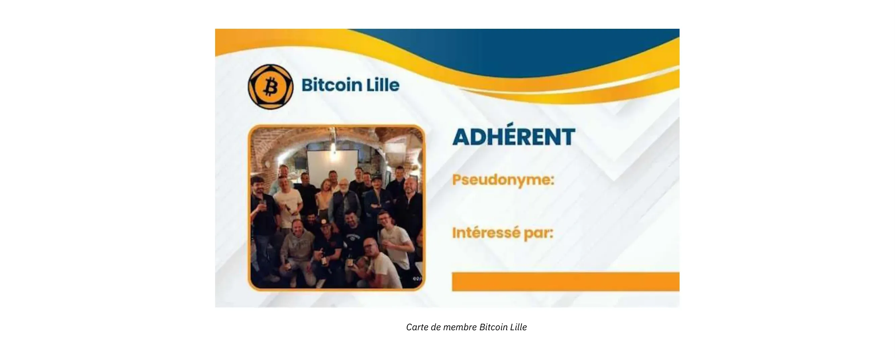

## Réfléchir à la passation lors d'un décès
<chapterId>c5febf18-235c-51bc-8fbb-9467dabe4cb0</chapterId>

Un tout autre point sur un tout autre registre est le positionnement face au **décès d'un membre de sa communauté Bitcoin**.
En effet, il viendra certainement un jour où, malheureusement, la famille d’un de vos anciens membres vous contactera en vous annonçant que cette personne est décédée. Elle vous expliquera alors que **cette dernière a laissé des instructions**, et que l'une d'entre elles était de **prendre contact avec votre communauté / meet-up / association**.
Cette personne vous expliquera alors probablement qu'elle a **besoin d'aide pour récupérer les fonds**, car elle est bénéficiaire de l'héritage de cet ancien membre.

Face à cette demande, il peut être très pertinent d’**avoir déjà réfléchi avec sa communauté à une procédure à suivre** ; et cela, pour plusieurs raisons.
D’une part :
- pour que le défunt pense bien, en amont, à **avertir sa famille de ne jamais divulguer ses clés privées et de ne jamais apporter à un meet-up ses portefeuilles physiques** ;
- pour que la famille comprenne bien que **leur venue consiste en l’apprentissage de Bitcoin**, afin de pouvoir par la suite devenir souveraine des fonds du défunt ;
- pour que **la famille soit au courant des lois qui s’appliquent dans le pays en cas de don, d'héritage et de conversion en monnaie fiduciaire**.

En parallèle, réfléchir en amont à une procédure commune permet de s'assurer qu’aucune personne, membre du meet-up ou simple invité, ne puisse tirer profit d'une telle situation pour voler les fonds.

**Un "groupe de travail" peut alors se construire et travailler sur cette procédure à adopter en cas de décès**. L’association Bitcoin Lille a d'ailleurs commencé à travailler sur ce point, et elle partagera de manière open source [son document de travail](https://docs.google.com/document/d/1TDfLZjuictC5s3PEM2Z7WmkxIDSJ8Q1E4xevm52pVgU/edit?usp=sharing) final d’ici quelques mois.

## Réaliser des conférences dans les écoles et universités
<chapterId>65efdb44-e3d4-567c-aedf-972765753d73</chapterId>

La liste de projets précédemment décrits est évidemment non exhaustive. De manière générale, il s'agit plutôt de projets internes à sa communauté / à ses meet-ups, pouvant assez facilement être mis en place au fil de leur développement.

Il est donc désormais temps d'aborder le cas de l'onboarding.

Tout d'abord, vous n'êtes pas sans savoir que **l'un des meilleurs moyens pour parler de Bitcoin à un maximum de personnes en même temps est de réaliser une conférence gratuite**. Cela peut notamment se réaliser **au sein d'écoles post-bac et d'universités**, amenant ainsi jeunes — et moins jeunes — à découvrir ou approfondir Bitcoin.

Outre l’importance de **savoir s’exprimer en public**, animer une conférence devant plusieurs dizaines, voire centaines de personnes nécessite **une bonne gestion de son stress, de son élocution et de son temps**. Cela demande également de **préparer une présentation ou un atelier de qualité, sourcé et en adéquation avec le niveau de compétences du public** que vous aurez en face de vous.

De plus, **avoir un état d’esprit ouvert, prêt à vulgariser au besoin**, est essentiel dans ce type d'exercice ; en particulier lors de la phase de questions / réponses en fin de conférence, ou dans le cas d'une table ronde. Cela ne signifie pas "faire une croix sur ses principes", mais simplement accepter qu'autrui puisse avoir un autre point de vue, quitte à répondre plus tard ou à laisser couler afin que le dialogue puisse avancer. De toute façon, si **votre discours et vos réponses se basent sur des arguments pertinents et sourcés**, le public ne sera pas dupe.

Si vous vous en sentez donc capables : foncez ! Notre monde a tellement besoin d'éducation sur ce qu'est Bitcoin…
Il n'est toutefois pas sans dire que pour réaliser cet exercice, **il vous faudra beaucoup de motivation, une grande quantité de travail ; mais aussi, les bons contacts**.

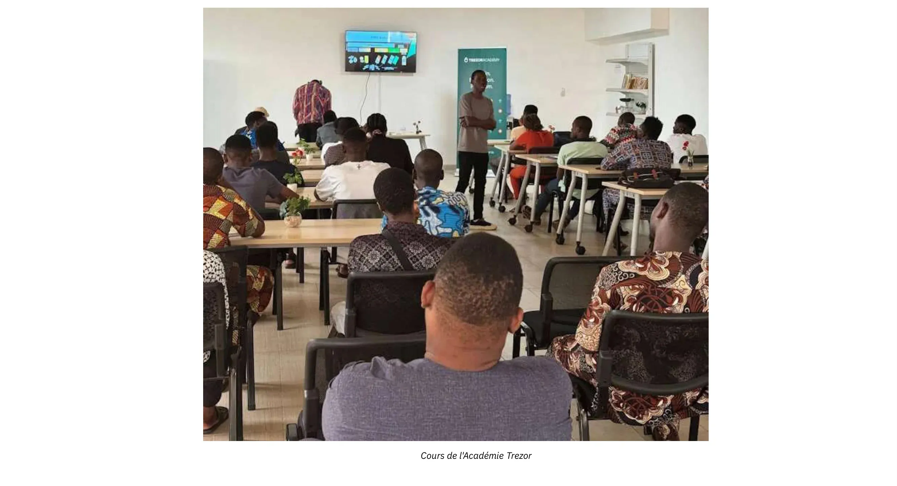

En effet, parvenir à **organiser une conférence ou un atelier dans une école et/ou une université n’est pas chose aisée**.
Dans un premier temps, il faut parvenir à **obtenir un contact**. Cela peut être obtenu **par le biais d’une connaissance, par le biais des BDE ("Bureaux Des Étudiants") ; voire même des associations d’élèves**, qui organisent généralement des cycles de conférences et de rencontres tout au long de l'année. Vos **anciens professeurs d'école d'ingénieurs ou de faculté** peuvent également servir de relais.

Dans le cas d’une école post-bac, il est également possible de **contacter directement la personne responsable de la formation** afin de présenter votre initiative ou association. Cela peut alors amener à une première rencontre puis – dans le meilleur des mondes, quelques semaines plus tard — à une présentation de ce qu’est Bitcoin et de comment il fonctionne, devant les étudiants.

Malheureusement, dans notre monde actuel, Bitcoin est encore bien trop volontairement diabolisé par les médias et les politiques ; amenant de nombreux néophytes à penser qu’il est à bannir des salles de classe et des amphithéâtres. **La probabilité est donc assez élevée pour que vous essuyiez de nombreux refus**, notamment dans la sphère universitaire où la preuve de travail et la consommation énergétique de Bitcoin semblent être tabou.

Rien ne vous empêche toutefois d’essayer, notamment auprès des BDE et des associations d’élèves.**Même après un premier refus catégorique, il est possible que l’on vous recontacte ultérieurement via l’adresse mail de votre communauté. Cela peut survenir, par exemple, lors d’un bull-run, pour organiser une conférence devant environ 280 étudiants!**  

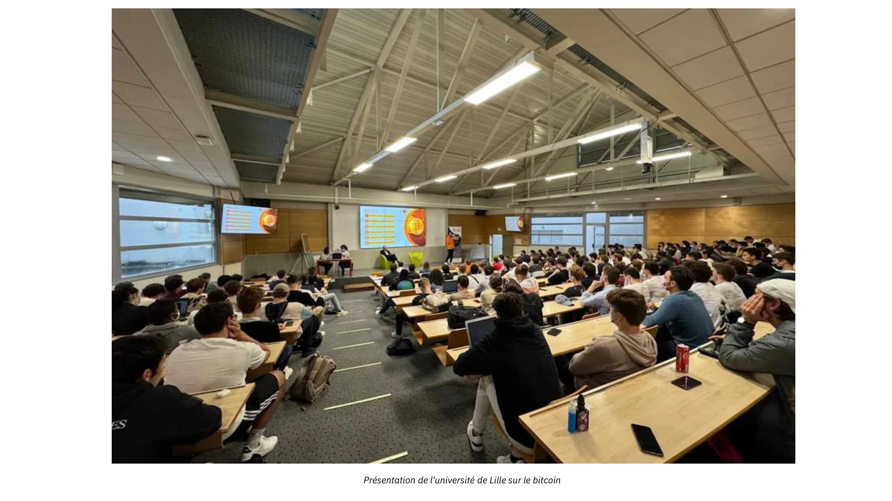

## Démarcher des commerces
<chapterId>b730462b-7928-5d28-a14f-9ceaa773d3d2</chapterId>

Parvenir à **faire accepter Bitcoin comme moyen de paiement à un commerce** est un peu le « Graal » de nombreux bitcoiners. Une sorte de succès à débloquer à son pokédex !
Toutefois, chaque commerçant étant différent, cette tâche n'est pas aisée ; et de nombreuses problématiques se posent :
- **un commerçant a (pour le moment) encore besoin de monnaie fiduciaire pour payer ses fournisseurs** ;
- **il a besoin de rapports financiers clairs et explicites** pouvant être envoyés à ses comptables ;
- **ses moyens de paiement doivent fonctionner sans aucun problème technique et logistique**, et les employés doivent pouvoir recevoir des paiements sans avoir la possibilité de partir avec la caisse.

À ces problématiques, s’ajoutent :
- **les potentiels aprioris** du commerçant sur Bitcoin ;
- **la difficulté de trouver une solution logicielle** qui fonctionne parfaitement ;
- mais aussi, **l'importance de lui faire comprendre les intérêts qu'il aurait d'accepter Bitcoin** comme moyen de paiement.

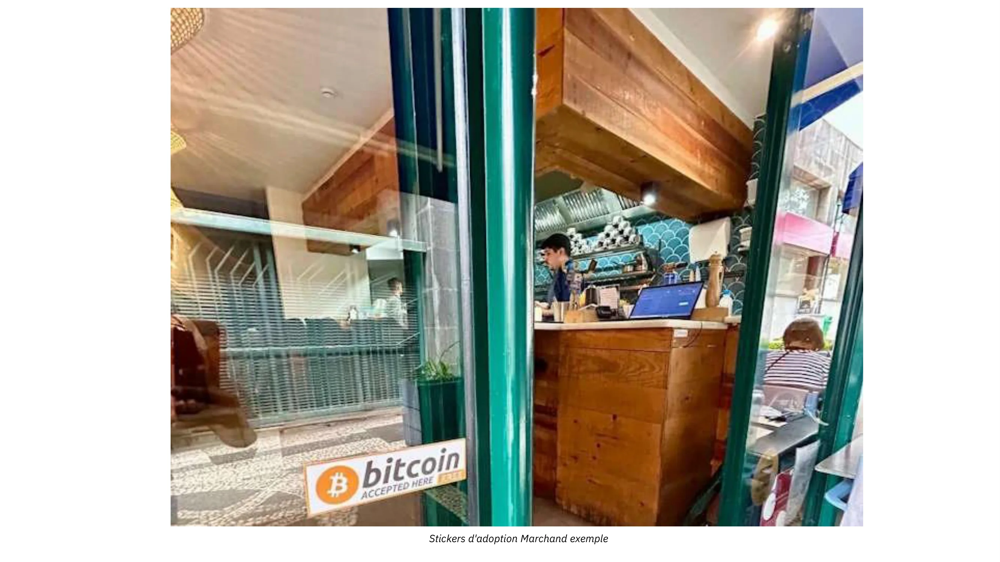

Développer l’écosystème Bitcoin dans votre ville peut donc passer par l’**onboarding de commerçants**. Pour ce faire, le plus simple est de **procéder par étapes** :

1 - dès que vous allez dans un commerce, **demandez systématiquement si vous pouvez payer en bitcoin**. a réponse sera souvent un refus accompagné d’un regard interrogateur ou critique. Toutefois, cette question contribue à faire percevoir Bitcoin comme un moyen de paiement adopté par des personnes ordinaires et qu'il gagne en intérêt auprès de la population. Vous pouvez même **tourner à deux ou trois personnes sur le même commerce, à quelques jours d’intervalle, en demandant à payer en Bitcoin**. À un moment, cela éveillera l’attention du(de la) commerçant(e) ;

2 - une fois qu’il(elle) sera intéressé(e) ou vous demandera ce qu’est Bitcoin, vous pourrez **lui expliquer succinctement et de manière vulgarisée**. Par exemple, que Bitcoin est une monnaie, non contrôlée par les banques, sans intermédiaire de confiance, qu'il est incensurable, pas soumis à l'inflation et que les frais sont moindres qu'avec le système bancaire traditionnel. Vous pourrez alors lui **donner un flyer**, par exemple « 21 raisons d’utiliser Bitcoin » et/ou « 10 raisons d’accepter Bitcoin dans son commerce », puis **lui donner votre contact ou celui de votre meet-up**. Ainsi, lorsqu'il(elle) sera prêt(e) pour une démonstration "en direct", il(elle) pourra vous contacter.

3 - une fois que cette personne se sera décidée à accepter Bitcoin, **prendre rendez-vous avec elle afin de lui montrer la solution logicielle que vous proposez, semble pertinent**. **[Swiss Bitcoin Pay](https://swiss-bitcoin-pay.ch/)** se présente alors comme une excellente solution car :
    - elle permet aux commerçants qui le souhaitent de convertir chaque jour les bitcoins obtenus en monnaie fiduciaire, leur permettant de payer leurs fournisseurs ;
    - elle permet également, si cela est souhaité de conserver un certain pourcentage des recettes en BTC ;
    - elle permet d'exporter la comptabilité de l’ensemble des paiements en BTC afin de l’envoyer aux comptables et donc de leur faciliter le travail ;
    - elle dispose d'un tableau de bord simple d'utilisation pour le (la) gérant(e) ;
    - mais aussi d’une interface ergonomique et facile d’utilisation pour les salariés, qui auront l'option d'encaisser les paiements sans pouvoir repartir avec la caisse ;
    - enfin, son coût d'utilisation est moins onéreux que les 2 à 3% du réseau bancaire traditionnel.

4 - **lorsque ce commerce acceptera Bitcoin**, il vous sera alors envisageable :
    - d'**y faire un tour régulièrement** pour y consommer ;
    - d'en profiter pour **demander si tout se passe bien**, quitte à redonner votre contact aux besoins ;
    - de **proposer une nouvelle fois de venir à vos meet-ups et événements** ;
    - d'**ajouter ce commerce sur [la carte btcmap.org](https://btcmap.org/)** et d'en informer [Swiss Bitcoin Pay sur Twitter](https://x.com/swissbitcoinpay) afin de donner de la visibilité à ce commerce ;
    - mais aussi, de **potentiellement réaliser des événements dans ce commerce**, comme des meet-ups ou des ateliers.

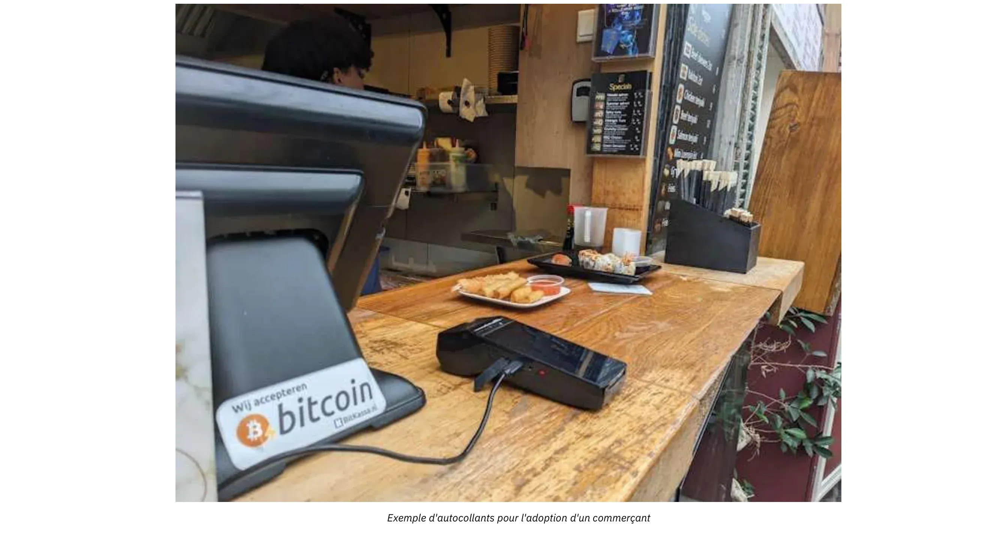

5 - une fois que plusieurs commerces de votre ville auront été onboardés et qu’ils auront compris ce que leur apporte Bitcoin, vous pourrez alors leur **proposer de créer un groupe Telegram spécial commerçants** ; l'objectif étant alors de **leur permettre de s’entraider** et d’aller plus loin dans l’orange-pilling des autres commerces de la ville. En parallèle, ce groupe pourra également **jouer le rôle d'aide technique**, dans le cas où un problème survient avec un client.

Bien évidemment, **ce démarchage est un travail de longue haleine. Il demande beaucoup de temps, une motivation accrue, mais aussi une once de stratégie**.

Votre communauté se sent prête à construire **les bases d'une économie circulaire Bitcoin**, à l'image d'[Arnhem au Pays-Bas](https://www.arnhembitcoinstad.nl/)? Si oui, foncez !

## Contacter la presse et la radio locale
<chapterId>435bfbc1-22dd-59bb-b737-a32ea995b238</chapterId>

Très souvent oubliée, nous autres bitcoiners pensons généralement que les meilleurs moyens de communication sont les réseaux sociaux et internet. Mais nous avons – en partie – tort.

Plusieurs communautés (c'est le cas notamment de [Breizh Bitcoin](https://breizhbitcoin.com/), en France) ont ainsi pris l’habitude de **contacter leur presse locale** afin de :
- **leur parler des événements qu’ils réalisent** (meet-ups, présentations, ateliers, halving party, etc.) ;
- **les inviter à venir découvrir les commerces qui acceptent Bitcoin dans leur région, puis d'écrire un article** à ce sujet ;
- mais aussi, tout simplement, **pour leur demander de relayer la date et le lieu de leurs prochains événements**.

En effet, de nombreux journaux locaux ont encore, en dernière ou avant-dernière page, une liste des événements organisés dans leur région.
Le retour d'expérience de Breizh Bitcoin est donc clair : cela fonctionne, et de nouvelles personnes se sont présentées aux meet-ups après avoir découvert cette association Bitcoin dans le journal.

Bien que cette stratégie peut-être spécifique à certaines dynamiques locales, il peut être intéressant de prendre contact avec les éditeurs régionaux. Voici d'ailleurs une liste des principaux titres de presse française :
- [acpm.fr](https://www.acpm.fr/Les-chiffres/Diffusion-Presse/Presse-Payante/Presse-Quotidienne-Regionale) ;
- [voxpublic.org](https://www.voxpublic.org/spip.php?page=annuaire&cat=medias&type_media=Presse%20quotidienne%20r%C3%A9gionale).

En parallèle, il peut également être intéressant de **contacter les radios locales, afin par exemple de leur proposer la réalisation d'un podcast ou d'une interview**.
Soyez toutefois conscient que les mots dans les médias peuvent être facilement tournés à leur désavantage. **Ce n’est donc pas un exercice évident, et il est important de s’y préparer**.

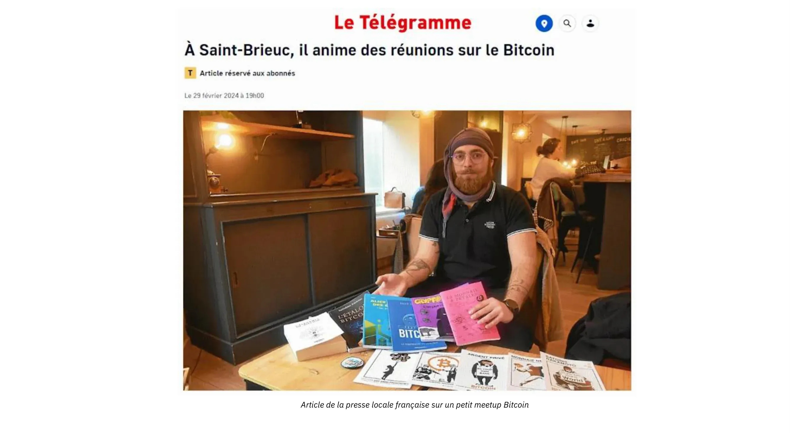

Évidemment, en plus de tous ceux qui ont été proposés dans cette section, **de nombreux autres projets peuvent être réalisés**. De manière générale, tout dépendra de votre temps, de votre motivation ; mais également de la difficulté du projet en question.
**Trois conseils** peuvent alors vous guider :
1) **définissez en amont les étapes du projet, son(ses) objectif(s) et ce qu’il y a besoin de faire** ;
2) **avancez étape par étape, sans vous décourager** ;
3) et surtout, **demandez de l’aide ou un coup de main à vos membres et aux autres communautés qui vous entourent**.

En effet, n'oubliez pas que **toute communauté et tout meet-up est passé par les mêmes étapes que celles que vous traversez**. Il ne faut donc surtout pas hésiter à leur **demander conseil**.

# Anticiper le futur
<partId>6ea07445-9369-54bc-9aa0-d260db026e0b</partId>

## Prévoir l'augmentation du nombre de participants
<chapterId>8af722d4-3a9f-548c-9001-424f2142de12</chapterId>

Alors que Bitcoin est entré dans sa quatrième époque, au bloc 840 000, de plus en plus d’individus voient **en lui une révolution ; technologique, financière et sociale**.

À l’image de celle d’internet, cette révolution va nécessairement **prendre du temps**, et tant mieux. Cela va en effet permettre à tout un chacun de **s’éduquer sur les fondamentaux de Bitcoin et d’apprendre à l’utiliser**. Mais également, aux développeurs et aux entreprises de développer des protocoles et des applications qui permettront d’explorer le plein potentiel de cette technologie.

Bien qu’il soit impossible de prévoir le futur, **une augmentation très significative du nombre d’utilisateurs de Bitcoin est à anticiper** afin d’**être préparée à toutes les éventualités possibles**. Y compris les plus catastrophiques, comme une potentielle implosion du système financier traditionnel ; voire: une interdiction de Bitcoin.

Dans cette septième et avant-dernière partie de ce cours, nous allons donc prendre le temps de détailler quelques points à prendre en considération lors du développement de votre communauté et de vos meet-ups.

Le premier d'entre eux (le plus simple à anticiper) est évidemment **l’augmentation du nombre de personnes rejoignant votre communauté**. Cela l’impactera alors de deux manières :

1 - **vos canaux de communication (Telegram, Signal, Matrix, etc.) se rempliront, rendant potentiellement les conversations difficilement suivables**. Ainsi, deux points sont à prendre en compte. Tout d'abord, si vous êtes 500 à échanger sur divers sujets dans un même canal de discussion, c'est avec certitude que l'abondance de messages et de notifications vont amener une grande partie de vos membres à petit à petit arrêter de suivre les conversations. En ce sens, il peut être pertinent d'**entamer à ce moment-là une réflexion sur ses canaux de communication ; à l’image par exemple des super-groupes Telegram, voire des serveurs Discord**, qui permettent tous deux de regrouper les conversations par thème.
D’autre part, qui dit plus de monde dans les canaux d’échanges dit également plus de bots, plus de scams ; et également **plus de modération à effectuer**. Il vous faudra donc être préparé, en rédigeant par exemple un règlement sur lequel vous pourrez vous appuyer lorsque vous modérerez un message. D’expérience, cela permet d’éviter une grande partie des conflits ; en particulier lorsque le règlement est disponible à la lecture sur vos canaux de communication. L’association Bitcoin Lille a en ce sens rédigé il y a quelques années **[un règlement open-source](https://bitcoinlille.fr/reglement/) pour son groupe Telegram et pour son serveur Discord**, s’appuyant sur de simples principes universels. Son design est [disponible en version modifiable ici](https://www.canva.com/design/DAGHI692AD4/rjT4sqEnhajc5FiPA6GFZQ/edit?utm_content=DAGHI692AD4&utm_campaign=designshare&utm_medium=link2&utm_source=sharebutton).

2 - **vos meet-ups et événements se rempliront de manière importante, avec une abondance de nouvelles têtes qui seront là pour échanger**.

Face à cet afflux conséquent :
  - il peut être pertinent dans un premier temps de **trouver un endroit plus grand pour organiser ses meet-ups et événements**, en particulier si vous ne pouviez être qu’une vingtaine au maximum dans le passé ;
  - dans un second temps, si vous observez que la présence humaine devient trop importante, vous pouvez – pour les meet-ups qui suivent – **soit obliger les participants à s’inscrire** (cela peut se faire par l’application Meetup, ou par un formulaire classique), **soit organiser plusieurs meet-ups dans le mois** (par exemple : un meet-up débutant, un meet-up intermédiaire et un meet-up expert) ;
  - en parallèle, il est certain que de nombreuses personnes débutantes dans l’écosystème vous rejoindront, généralement dans l’objectif de faire de l’argent. **Afin que les conversations restent centrées autour de Bitcoin dans ces meet-ups à fort développement**, il est conseillé :
        a) **de réaliser lors de ces événements une présentation thématique sur Bitcoin**, car celle-ci amènera par la suite une bonne partie des participants à discuter de ce thème (et non pas du dernier projet de shitcoin soi-disant révolutionnaire) ;
	      b) **de ne pas rester entre bitcoiners, mais d'aller voir les nouveaux (nouvelles), quitte à prendre l’initiative de rester dans le fond de la salle pour les accueillir**. Les échanges peuvent alors tourner sur les raisons pour lesquelles ces personnes sont venues, ce qu'elles recherchent, les objectifs (voire fondamentaux) de votre communauté, etc.

Enfin, bien qu'il soit malheureux de le formuler, **des scammers peuvent se présenter à des meet-ups**. Leur objectif sera alors de parler un maximum de leur Ponzi, leur MLM ou de leur "projet révolutionnant la blockchain grâce à de l'IA". Il est également tout à fait plausible qu'un jour, des personnes mal intentionnées viennent dans l'objectif spécifique de blanchir de l’argent ou d'acheter du BTC avec de faux billets.

Face à des situations complexes comme celles-ci, le plus simple est de prendre l’initiative d’expliquer "gentiment" à ces personnes que le meet-up n’est pas l’endroit où elles y parviendront, en avançant des arguments x ou y (par exemple, informer d'une potentielle présence policière en civil).
Si malheureusement ces personnes refusent de s’en aller ou de se plier aux règles de décence (c’est déjà arrivé), une intervention orale lors du meet-up informant qu’une (ou des) personne(s) cherche à réaliser tel ou tel acte malveillant peut être réalisée.
**Heureusement, ces situations sont cocasses et ne se produisent que très rarement. Mais, il vaut mieux y être préparé.**

En outre, si cela peut vous rassurer en tant qu'organisateur, tant que vous n'êtes pas vous-même en infraction ou que vous ne facilitiez pas vous-même des échanges illégaux, vous n'avez pas à vous en faire. En France, vous n'êtes en effet légalement pas responsable des actes d'autrui lors d'un événement que vous organisez.

Dans le meilleur des mondes, le mieux serait donc de disposer d'un lieu pouvant accueillir plusieurs dizaines de personnes suivant l'évolution de votre communauté ; mais aussi, de **construire des relations solides entre bitcoiners et futurs bitcoiners pendant le bear-market**, de manière à ce que vous soyez un maximum de personnes prêtes à **orange-piller lors du bull-run**.

## Décentraliser l'organisation de sa communauté
<chapterId>bedfc110-e099-58f4-a5b7-fb50f3b19a49</chapterId>

Vous êtes organisateur d’un meet-up et, du jour au lendemain, **vous décidez d'arrêter cette tâche** pour partir élever des lamas au Pérou ou pour devenir surfeur professionnel au Salvador ; en plaquant tout derrière vous ?

S'il vous plait, **pensez en amont à la passation des rênes de la gestion de votre communauté en** :
1) **donnant les droits administrateurs (voire de propriété) des canaux de communications à des personnes de confiance**, quitte à ce que cela change de main par la suite ;
2) **partageant à  une personne de confiance de votre communauté les noms de compte au moins, mots de passe et mails des comptes et des réseaux sociaux** que vous aviez créés pour lui donner de la visibilité.

Sans ces droits et identifiants, il sera en effet impossible pour quiconque de **reprendre facilement le flambeau et donc de faire perdurer l'initiative que vous aviez passée tant de temps à développer**.
Repartir de zéro en créant des réseaux et des canaux de communication "forkés" prend en effet tellement de temps et tellement d’énergie…

**Anticipez donc votre potentiel départ !** Et si vous n’avez, en France, aucun membre de confiance dans votre meet-up, vous pouvez toujours contacter @ProfEduStream, @copinmalin ou @gabtribe sur Telegram afin d’effectuer cette transition en douceur. Ils se chargeront alors de trouver un(e) repreneur(se) motivé et lui donneront dès que faire se peut les accès.

Cela nous fait d’ailleurs arriver à **un point crucial du développement d’une communauté : sa décentralisation**.
En effet, si vous êtes la seule personne impliquée dans celle-ci et que vous disposez de tous les contrôles, que se passera-t-il si vous disparaissez ? La réponse est simple : votre communauté disparaîtra elle aussi.

Le mieux pour éviter cela est donc de **décentraliser les tâches et de se partager les droits, rôles et accès**. Ainsi, si une des personnes de l’équipe d’organisation de votre communauté ou de votre meet-up ne répond plus et disparaît (parce qu'elle n'a par exemple plus de temps à y accorder, ou parce qu'elle se fait arrêter dans une dystopie future, car elle possède du Bitcoin non-KYC), les autres organisateurs pourront continuer à administrer la communauté sans difficulté.

Dans l'objectif de décentraliser encore plus, **utiliser des [logiciels libres tels que la suite framasoft](https://framasoft.org/fr/)** peut également constituer un premier "rempart" face à un État-fiction qui censurerait ou interdirait Bitcoin. Utiliser des outils de communication chiffrés — voire anonymes — en est évidemment un second.

## Et si Bitcoin devenait l'ennemi public n°1 ?
<chapterId>c739651f-cd13-51e0-a36e-85023749b15b</chapterId>

Le 5 avril 1933, Franklin Roosevelt, alors 32ᵉ président des États-Unis d'Amérique, signa le décret 6102 interdisant à tout particulier de posséder pièces d’or, lingots d’or et certificats sur tout le territoire.

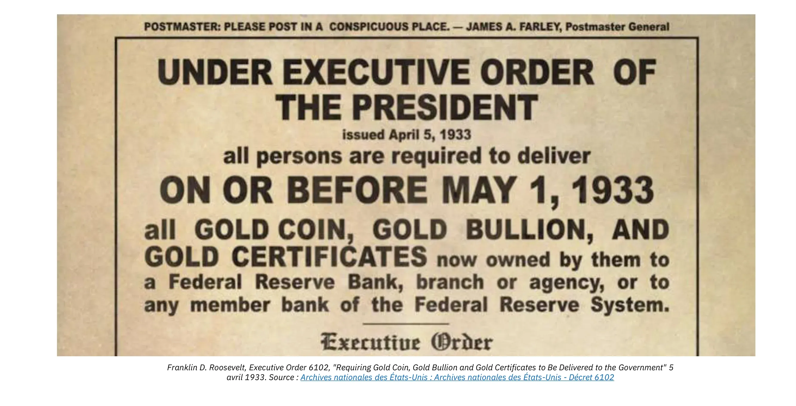

Évidemment, la Grande Dépression (crise boursière de 1929) n’est plus d’actualité. Mais qui nous dit que, demain, un autre état ne se permettra pas de faire la même chose et d’**interdire à tout particulier de posséder du bitcoin ?**

Heureusement, cette dystopie orwellienne n'empêchera personne de réellement posséder ses propres BTC, car il est impossible d'empêcher qui que ce soit d'apprendre une suite de mots.
Mais que se passera-t-il **si les dirigeants de notre monde comprennent enfin que Bitcoin a la capacité de changer l’ordre mondial, y compris au niveau étatique ?** Bitcoin deviendra-t-il alors **« l’ennemi public n°1 »** ?

Bien sûr, il ne faut pas tomber dans une forme de complotisme. Mais **rien ne nous empêche, dès maintenant, d’anticiper, de décentraliser et d’éduquer**.

# Rassembler les bitcoiners
<partId>62bc2138-c0be-5d39-a341-594690863257</partId>

## Un plan d'action résumé pour créer sa communauté Bitcoin
<chapterId>1f463ec2-3f64-5641-8d60-e02a47c94f27</chapterId>

Satoshi Nakamoto a créé un outil révolutionnaire qui est déjà en train de changer le monde que nous connaissons. Cependant, **c’est à nous, bitcoiners, de choisir la trajectoire que nous souhaitons prendre pour construire l'avenir**.

Or, l'essence de Bitcoin est un terrier du lapin immense, regroupant tellement de pans historiques, économiques, littéraires, mathématiques, informatiques et cryptographiques qu’il est impossible d'en faire le tour. Cela constitue d'ailleurs en partie sa beauté.
Mais comme nous ne sommes qu'humains, nous ne disposons que d’une quantité de temps fini au cours de notre vie. **C’est donc en restant humble et en apprenant des autres** que chacun d'entre nous parviendra à atteindre son niveau de compréhension souhaité de Bitcoin.

**Les communautés Bitcoin mondiales jouent donc un rôle fondamental dans la construction du monde de demain** ; communautés dans lesquelles bitcoiners pourront **échanger, construire et partager**. **Ensemble**.

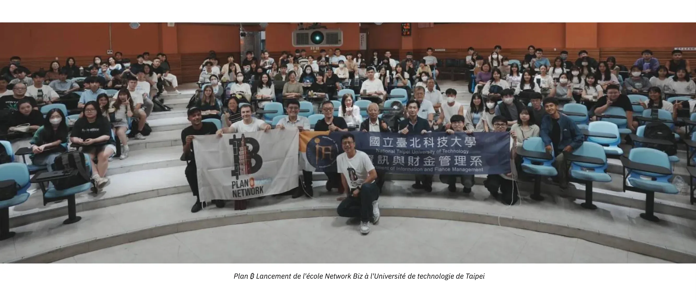

Comme vous l’aurez compris dans ce cours, **créer une communauté et un meet-up Bitcoin** demande de l’organisation et de la motivation. Bien évidemment, en fonction des envies et du temps que vous aurez à y consacrer, vous pourrez aller plus ou moins loin dans les projets. 
Quoi qu'il en soit, l’objectif reste le même : **allumer l’étincelle pour que Bitcoin se développe dans votre ville**.

Afin de résumer les nombreux chapitres et sous-chapitres de ce cours, voici **un "plan d’action" résumé pour créer sa communauté Bitcoin** :
  1) décidez en amont de pourquoi vous voulez créer une communauté Bitcoin, dans quel(s) but(s), quelle ville, quel lieu, etc. ;
  2) prenez contact et rapprochez-vous des communautés existantes autour de vous, et n'hésitez pas à leur demander conseil lorsque vous en aurez besoin ;
  3) créez une identité propre à votre communauté et à la localité dans laquelle vous la développerez (logo, affiche, bannière, flyer, etc.) ;
  4) créez des canaux de communication et réseaux sociaux comme Telegram, Twitter, NOSTR, Discord ou Simplex. Pensez également à des canaux décentralisés et/ou incensurables ;
  5) suivez sur les réseaux sociaux les meet-ups et communautés limitrophes, et faites-vous référencer sur différentes cartes et plateformes pour gagner en visibilité.

Une fois que les canaux de communication de votre communauté seront assez développés :

  6) proposez par sondage une rencontre de type meet-up quand vous commencerez à sentir une émulsion ;
  7) réfléchissez aux objectifs que vous souhaitez tirer de cet événement physique ;
  8) recherchez un lieu bien situé, accueillant, respectant vos objectifs et réservez-y une table ou une salle ;
  9) une semaine avant l’événement, faites une communication sur vos réseaux et canaux de communication. Répétez cela deux à trois jours avant la date fatidique ;
  10) faites référencer votre événement sur des plateformes et des sites adéquats ;
  11) le jour du meet-up, laissez les choses se faire et allez vers les autres, quitte à recentrer la discussion gentiment si besoin.

Par la suite :

  12) cherchez à fidéliser et à impliquer un maximum les membres et participants pour qu’ils reviennent ;
  13) proposez des idées de projets et initiatives simples, et débutez la mise en place de ceux qui vous tiennent personnellement à cœur. Si quelqu’un d’autre souhaite mettre en place autre chose, n’hésitez pas à lui filer un coup de main en fonction de la tâche et de l’objectif souhaité.

Enfin : 

  14) anticipez le futur en réfléchissant à un plus grand lieu pour les meet-ups, à des règles pour les canaux de communication, à un site internet, etc. ;
  15) commencez à démocratiser à votre échelle l’acceptation de Bitcoin dans les commerces de votre ville, en demandant par exemple de manière automatique s’ils acceptent Bitcoin ;
  16) décentralisez les tâches auprès de personnes de confiance, ainsi que les droits de vos canaux et de vos réseaux ;
  17) faites parler de votre communauté afin que de plus en plus de personnes la rejoignent, et impliquez les personnes intéressées ;
  18) allez encore plus loin dans les projets qui vous plaisent et vous importent.

En un peu moins détaillé, ces 21 minutes de vidéo synthétisent ces étapes :

:::video id=a59956da-f554-4b54-89dd-5ca55b722686:::

Quoi qu'il en soit, **n'oubliez pas que vous n'êtes pas seul(e) et que les communautés déjà existantes sont là pour vous aider**.

## Faire attention à soi
<chapterId>cf1631cb-ddbe-55c7-be8c-26a5652979a0</chapterId>

Lorsque l'on tombe dans le terrier du lapin, notre conception de la vie change.
Cela nous pousse alors à vouloir — au plus profond de nous-même — aller plus loin ; à vouloir découvrir ces autres personnes qui font le même travail d'esprit que nous et qui, elles aussi, ont compris.

Cela nous motive et nous donne encore plus envie d'**apporter notre pierre à l'édifice** , en partageant notre trouvaille : Bitcoin.
Mais aussi, à **réfléchir au monde de demain, à celui que nous souhaitons construire et aux communautés qui sont en train de le bâtir**.

**Dans cette longue galerie qu'est la création d'une communauté, il vous faudra faire preuve de motivation, de stratégie, d'abnégation et de temps**. C'est un travail parfois ingrat ; et dans cette aventure, il vaut mieux prendre les choses petit à petit pour ne pas se faire du mal.
**Pensez donc à vous, à vos limites**. Et bien que Bitcoin vous anime peut-être nuit et jour, **ne cherchez pas à tout faire seul, sans quoi vous vous épuiserez**.

Au contraire, **demandez de l'aide aux bitcoiners qui sont déjà passés par cette même galerie, qui ont déjà exploré les mêmes issues et construits les mêmes outils**. Cela vous fera gagner un temps fou.

**Proposez également aux personnes qui vous suivront dans cette aventure de vous aider, quitte à déléguer certaines tâches** et à ce que ces dernières prennent plus de temps. Sur le long terme, votre communauté en sortira souder et plus mature.

Seul(e), il est vrai que l'on peut rapidement explorer une des nombreuses galeries du terrier du lapin qu'est Bitcoin. Mais il ne faut pas oublier qu'il y a encore toutes les autres directions à explorer.

Alors qu'**en créant et/ou en intégrant une communauté de bitcoiners, en partageant et en échangeant avec eux régulièrement, vous avancerez en même temps dans toutes les directions du terrier**.

## Formation BTC 304, la suite
<chapterId>8bf10b77-80ee-5d50-87bc-0ef32574a675</chapterId>

Dans cette formation BTC 304, nous avons détaillé avec précision les étapes de création d'une communauté, d'un meet-up ; mais également, la mise en place de nombreux projets.

Lorsque votre communauté se sentira alors prête à passer au stade supérieur, **il est possible de créer une association**.
En France par exemple, sur la soixantaine de communautés et meet-ups, on compte près d'une dizaine d'associations.

L'intérêt d'en créer une est dual :
- d'une part, le statut d'association permet de pouvoir **disposer d'un statut officiel, d'ouvrir un compte en banque associatif, mais aussi d'obtenir une forme de reconnaissance de la part de la presse, des médias, ainsi que des subventions** ;
- d'autre part, elle permet d'**organiser de manière plus sérieuse le fonctionnement de sa communauté et la mise en place de ses projets**, en définissant notamment des rôles spécifiques.

Dans l'objectif d'amener votre communauté à s'épanouir encore un peu plus, **il n'est pas à exclure qu'une suite à cette formation puisse sortir sur [Plan ₿ Academy](https://planb.academy/) dans les prochains mois**.

À travers celle-ci, **différents points plus poussés pourront être abordés ; tels que : comment construire des présentations ou des ateliers pour ses meet-ups, et avec quels objectifs ? Mais aussi : comment mettre en place un événement de grande envergure, à une centaine de participants ?**

Pour ce faire, nous partirons de l'expérience de plusieurs communautés ayant elles-mêmes déjà réalisé leurs propres événements et présentations.

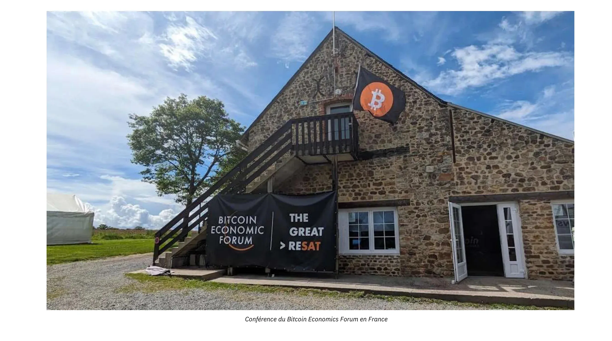

# Section finale
<partId>e9bdddf4-54c9-4de9-bbce-c3eade8c32e5</partId>

## Avis & Notes
<chapterId>08a35d2a-204b-519a-9bb1-588665a037fa</chapterId>
<isCourseReview>true</isCourseReview>

## Conclusion
<chapterId>d74606a5-cb14-4117-acb2-2bf5920de092</chapterId>
<isCourseConclusion>true</isCourseConclusion>
