# Il primo passo verso l'adozione di Bitcoin

Oggi, chiunque può imparare su Bitcoin online, ma ciò che spesso manca è l'opportunità di incontrarsi, scambiare idee e costruire insieme. Per colmare questa lacuna, molti bitcoiner formano comunità locali, dove gli incontri danno vita a workshop, presentazioni e discussioni significative.

In BTC304, esamineremo perché la costruzione della comunità è importante, esploreremo gli strumenti per creare una forte identità visiva e digitale e condivideremo progetti semplici e open-source che puoi lanciare. Considereremo anche come le iniziative locali si evolvono in comunità nazionali che possono contribuire a guidare un futuro iperbitcoinizzato.
+++
# Introduzione

<partId>81318b8f-d316-5787-aa4c-4ec8370ba668</partId>

## Panoramica del corso

<chapterId>e8991b82-4966-5e04-8f05-7cae46eacbaa</chapterId>

Benvenuti a BTC 304!

Dal 2009, il Bitcoin è cresciuto senza sosta. Questa crescita si è concretizzata in nuove proposte di miglioramento del Bitcoin (BIP), nella creazione di livelli aggiuntivi per rendere la rete scalabile (Lightning Network tra gli altri) e nello sviluppo di diverse aziende e start-up.

Il suo sviluppo è evidente anche nel On-Chain, con un numero di transazioni in costante aumento.

Ad esempio, tra il 1° gennaio 2018 e il 1° gennaio 2024, si stima che il numero di transazioni sul Bitcoin principale del Layer sia [aumentato del 66,2%](https://dune.com/queries/3375917/5663935). Nel frattempo, tra l'agosto 2021 e l'agosto 2023, il numero di transazioni pubbliche sul Lightning Network [è aumentato del 1.212%](https://river.com/learn/files/river-lightning-report-2023.pdf).

Questa crescita significativa è, ovviamente, strettamente legata a:

- il [crescente interesse delle popolazioni di tutto il mondo per l'utilizzo del Bitcoin](https://profedustream.substack.com/p/21-raisons-dutiliser-Bitcoin), per affrancarsi dal sistema bancario e/o utilizzare una valuta meno volatile o meno svalutata, come nel caso delle popolazioni di Libano, Siria, Egitto, Argentina e altre;
- la rivalutazione del suo prezzo nel tempo, affermandolo come riserva di valore e come investimento a lungo termine, grazie alla sua politica monetaria fissa;
- la crescita successiva del mercato speculativo delle criptovalute, in particolare nel periodo 2017-2018 e 2020-2021;
- La crescente presenza del Bitcoin nei media tradizionali.

Sebbene il Bitcoin sia ancora nelle sue fasi iniziali, questa realtà, di cui probabilmente siete già a conoscenza, ci spinge a considerare due domande chiave:

- Come possiamo incoraggiare i Bitcoiners a spingersi oltre nell'apprendimento e nei progetti per **sfruttare appieno il potenziale di Bitcoin**?

- Come possiamo aiutare i nuovi arrivati, spesso attratti dalle speculazioni a breve termine, a non perdere denaro con l'ultima moda dei memecoin e a concentrarsi invece sull'apprendimento dei **fondamenti di Bitcoin**?

La soluzione migliore per entrambe le sfide è semplice: **essere presenti nel mondo reale ed educare**.

L'obiettivo di questo corso è quello di fornirvi tutto ciò che vi serve per creare e organizzare in modo efficace una comunità o un meet-up Bitcoin. Che vogliate costruire un'iniziativa locale o far crescere un gruppo online, questo corso vi guiderà passo dopo passo: dalla creazione dell'identità visiva all'organizzazione di eventi regolari e alla gestione dei canali di comunicazione.

**Sezione 1: Introduzione**

Inizieremo sottolineando l'importanza di unire le persone intorno al Bitcoin, sia attraverso comunità online che attraverso incontri locali. Scoprirete perché e dove lanciare la vostra comunità e come fissare obiettivi chiari per favorirne la crescita e la sostenibilità a lungo termine.

**Sezione 2: Progettare un'identità unica per la vostra comunità Bitcoin**

Per attirare nuovi membri e promuovere un senso di appartenenza, è essenziale costruire un'identità unica. In questa sezione imparerete come progettare loghi, poster e banner che incarnino lo spirito della vostra comunità Bitcoin.

**Sezione 3: Creare canali di comunicazione per la vostra comunità Bitcoin**

La comunicazione è la spina dorsale di ogni comunità. In questa sezione esploreremo i canali migliori da utilizzare e vi guideremo nella creazione efficiente di un gruppo Telegram o di un server Discord. Imparerete anche come integrare bot multifunzionali per semplificare la gestione della comunità.

**Sezione 4: Lanciare le reti sociali** (in francese)

La visibilità è fondamentale per far crescere la vostra comunità. In questa sezione imparerete a creare un profilo Twitter dedicato, a connettervi con i meetup locali e a sfruttare piattaforme come btcmap.org per aumentare la vostra visibilità e attirare nuovi membri.

**Sezione 5: Organizzare un incontro del Bitcoin**

Questa sezione tratta di come organizzare i meetup: dalla scelta della sede giusta alla gestione dell'evento stesso. Esploreremo anche le strategie per fidelizzare i partecipanti e garantire la sostenibilità a lungo termine della vostra comunità.

**Sezione 6: Esempi di progetti e iniziative** (in francese)

Per andare oltre i semplici meetup, questa sezione presenta progetti concreti e originali: da eventi e workshop a tema alla creazione di contenuti educativi e collaborazioni locali. Imparerete anche a progettare materiali fisici e digitali per promuovere la vostra comunità.

**Sezione 7: Anticipare il futuro**

Qui esamineremo la naturale evoluzione della vostra comunità: cosa fare se cresce troppo rapidamente, come decentralizzare la vostra organizzazione e come rispondere a un ambiente normativo ostile. Questa sezione vi aiuterà ad anticipare e superare queste sfide.

**Sezione 8: Unire i Bitcoiners**

La sezione finale è incentrata sull'essenza del progetto: unire gli appassionati del Bitcoin attorno a una visione condivisa. Imparerete come strutturare il vostro approccio per attrarre e mantenere i membri, delegare efficacemente i compiti e far crescere la vostra comunità in modo sostenibile.

Siete pronti a imparare come costruire una comunità Bitcoin forte e vivace? Immergiamoci!

## Perché avviare una comunità o un meetup Bitcoin?

<chapterId>893ea248-7d5a-5b8e-948c-7031497b1031</chapterId>

### Qual è la differenza tra una community e un meet-up?

Sebbene non esista una definizione rigorosa di questi termini nell'ecosistema Bitcoin, una comunità è meglio intesa come un gruppo di persone che condividono una passione comune e comunicano regolarmente.

Un meetup, invece, è un evento organizzato da e per questa comunità, con uno scopo specifico. I meetup si svolgono in genere quando la comunità è già consolidata.

Per questo corso, partiamo dal presupposto che, prima di lanciare un meetup Bitcoin, abbiate già stabilito un contatto con alcune persone interessate a organizzare un evento del genere; in altre parole, la **comunità esiste già**.

### Perché creare una comunità Bitcoin?

La creazione di una comunità Bitcoin ha diverse ragioni:

- Condivisione delle conoscenze e collaborazione: Le comunità offrono ai membri uno spazio per Exchange idee e condividere le conoscenze. Il sostegno reciproco è un pilastro fondamentale per la crescita, che consente a tutti di accelerare l'apprendimento, particolarmente importante per il Bitcoin, visto quanto c'è da scoprire.

- Costruzione peer-to-peer: Molte iniziative e progetti sono concepiti, costruiti e sviluppati all'interno di queste comunità.

Le comunità Bitcoin spesso perseguono obiettivi più ampi, in particolare l'educazione pubblica:

1. Che cos'è il Bitcoin;

2. Come funziona;

3. Il suo contributo alla società;

4. Sfatare le affermazioni fuorvianti o infondate di alcuni personaggi pubblici e dei media;

5. Le differenze fondamentali tra Bitcoin e altre criptovalute;

Costruendo le prime "cittadelle" di domani, le comunità del Bitcoin in tutto il mondo fungono da baluardo contro la disinformazione e la censura, fornendo al contempo un terreno fertile per l'apprendimento dei fondamenti del **Bitcoin**. Offrono ai nuovi arrivati, anche agli scettici, le risorse e le connessioni necessarie per esplorare il vero potenziale del Bitcoin.

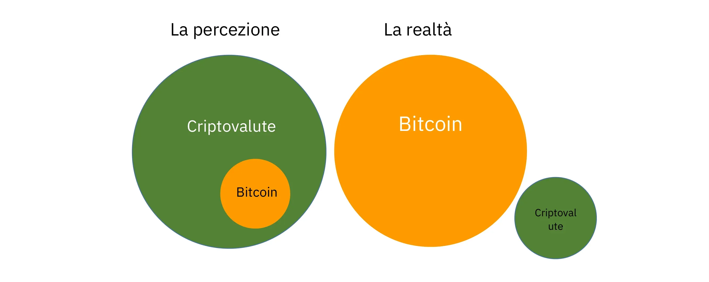

Vale anche la pena di notare che **una comunità può esistere interamente online**, che si tratti di un gruppo Telegram ("Bitcoin Londra"), di un gruppo Facebook ("Bitcoin Berlino"), di un server Discord ("Bitcoin Madrid") o persino di una lista di e-mail ("Bitcoin Francia").

In altre parole, **una comunità non ha bisogno di incontri fisici per prosperare o lanciare progetti. Il suo scopo principale rimane lo stesso: condividere, costruire ed educare**.

### Perché creare un meet-up?

Come già detto, i **riunioni di solito arrivano dopo che la comunità è stata creata e servono a completarla**.

Man mano che il viaggio di un bitcoiner si evolve, spesso nasce il desiderio, o addirittura la necessità, di **incontrare e interagire di persona con altri** dello stesso ecosistema. Questo può derivare dal sentirsi isolati o semplicemente dal non avere nessuno con cui parlare di Bitcoin nella vita quotidiana.

I meetup offrono un'esperienza più personale e accogliente rispetto alle chiamate audio o video online. Sia che si tratti di un drink o di un pasto, essi creano spazi informali e amichevoli in cui le persone possono scambiarsi idee in modo aperto e diretto.

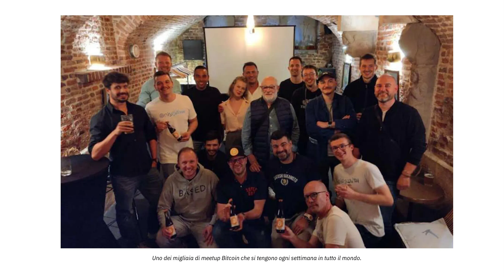

Gli incontri del Bitcoin possono servire a molti scopi:

- Discutere di argomenti tecnici o di progetti in corso
- Aiutare i nuovi bitcoiners a immergersi gradualmente nel mondo Bitcoin
- Annuncio di nuovi progetti o iniziative
- Scambio di materiali o libri
- Proiezione di documentari in anteprima
- Ospitare conferenze o workshop su argomenti specifici

Molte di queste possibilità saranno trattate in dettaglio nella parte 6/8 di questo corso, intitolata "[Esempi di progetti e iniziative](https://planb.academy/courses/1c643dc9-a15f-4f9e-93b6-cb3c58b4ee35/3213d87a-1998-5972-ab93-97a5769ba279).

Mentre ogni comunità è libera di formare le proprie opinioni, lanciare progetti e sperimentare a modo suo, i meetup si stanno rivelando sempre più **essenziali per lo sviluppo del Bitcoin e per la crescita dei bitcoiners**. **Organizzarli richiede tempo e impegno**, ed è per questo che questo corso condivide l'esperienza combinata di [circa sessanta comunità Bitcoin in Francia e Belgio](https://btcmap.org/communities/map#2/5.24949/0.20000) **per aiutarvi a costruire e far crescere la vostra comunità e i vostri meetup nel modo più semplice possibile**.

## Dove creare la vostra comunità?

<chapterId>72da5285-5395-592d-ab62-303a0aef3d6d</chapterId>

La prima domanda da porsi è: dove dovrebbe avere sede la vostra comunità?

Questa decisione è fondamentale se si vuole mantenere la possibilità di organizzare incontri in seguito.

Se i membri devono guidare per due ore per partecipare a un evento, è probabile che la partecipazione sia scarsa. Ecco perché la scelta della giusta **località per la vostra comunità, e quindi per i vostri futuri meetup, ha un grande impatto sulla sua crescita**.

Alcuni suggerimenti per orientare la vostra decisione:

1/ **Creare e far crescere la propria comunità in una città di medie o grandi dimensioni**. In questo modo sarà più facile:

    - Trovare luoghi piacevoli per gli incontri e i progetti (presentazioni, workshop, promozione dell'adozione di Bitcoin, ecc;)
    - Aumentare il senso di coinvolgimento e di appartenenza di un maggior numero di persone;
    - Migliorare l'accessibilità all'evento (trasporti pubblici, parcheggi, ecc.). Si raccomanda di scegliere un luogo vicino ai trasporti pubblici e ai parcheggi.

2/ **Scegliete un nome legato alla vostra città**. In questo modo è facile per le persone identificarsi con la vostra comunità. Esempi: Bitcoin Parigi, Einundzwanzig Berlino, Satoshi Spritz Milano, ecc.

3/ **Verifica se esiste già un incontro vicino a te**.

È possibile consultare [btcmap.org](https://btcmap.org/communities/map#0/0/0/), che elenca la maggior parte delle comunità e dei meet-up Bitcoin in tutto il mondo.

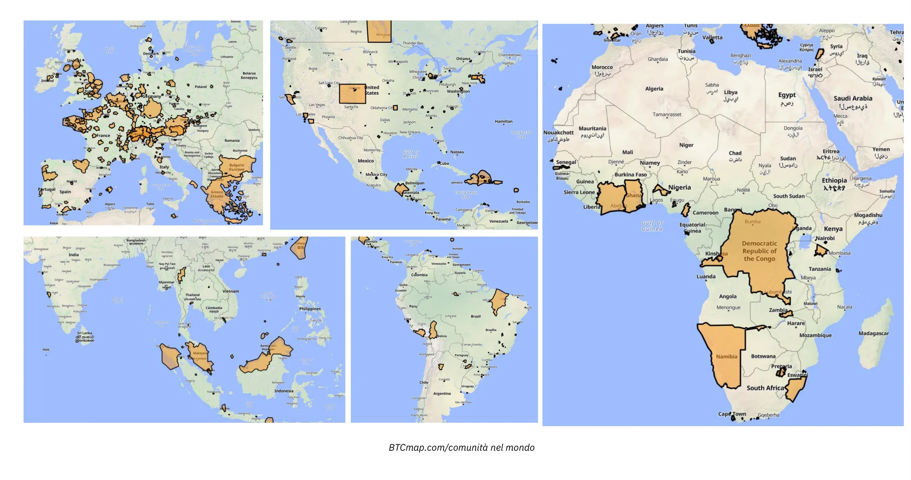

Dopo qualche ricerca, potreste trovare un incontro o una comunità esistente nella vostra città.

Bitcoin è decentralizzato, quindi naturalmente chiunque è libero di fare ciò che vuole.

Tuttavia, **unire le forze spesso ha più senso che dividere comunità vicine e ridurre l'impatto di ciascuna**. L'avvio di una nuova comunità dove ne esiste già una può creare involontariamente concorrenza.

In questo senso, può essere utile una semplice "regola empirica": se non c'è una comunità Bitcoin attiva nel raggio di 30-45 minuti da dove si vive, può valere la pena di crearne una nuova. Detto questo, siete sempre liberi di fare come volete.

E naturalmente, se una vecchia comunità si è "evoluta" in una direzione che non è più in linea con i vostri valori, e non avete il tempo o la motivazione per "arancinarla", allora creare la vostra Fork è sempre un'opzione.

## Quali obiettivi dovrebbero guidare la vostra comunità?

<chapterId>0aae1aa8-93ec-544a-ad88-22d32c619595</chapterId>

Una volta identificata la città (o l'area geografica) della vostra comunità, è il momento di **definire cosa volete ottenere**.

Questi obiettivi possono essere fissati al momento del lancio o perfezionati in seguito, quando diversi membri si saranno uniti e il gruppo sarà impegnato attivamente.

Ecco alcuni punti per orientare le vostre riflessioni:

1/ **Perché sto creando questa comunità come bitcoiner? ** È per condividere le conoscenze? Educare gli altri? Imparare da coetanei più esperti? Incontrare persone che la pensano come me? Essere coinvolto nell'ecosistema Bitcoin? Connettersi con i professionisti? O semplicemente bere qualcosa e fare nuove amicizie?

Le vostre risposte determineranno il vostro posizionamento e la vostra motivazione.

Se il vostro obiettivo è quello di **condividere le conoscenze ed educare le persone sul Bitcoin**, concentratevi sulla **creazione di contenuti educativi** (articoli, podcast, video, presentazioni, volantini, ecc.), risparmiando ad altri innumerevoli ore di ricerca. Potete anche andare oltre, **organizzando workshop, presentazioni e conferenze**.

Se il vostro obiettivo è semplicemente quello di incontrare altri bitcoiners e condividere esperienze, potete adottare un approccio più rilassato, come quello di incontrarvi per un drink.

In questo modo, creerete più facilmente legami sociali. Tuttavia, ricordate sempre che **bere birra non è la strada giusta per costruire il mondo di domani**.

Ecco perché **fissare obiettivi e progetti concreti è essenziale**.

2/ Devo dare alla mia comunità una **dimensione fisica**? Se sì, che tipo di eventi dovreste organizzare?

Il vostro primo evento sarà probabilmente un meet-up. Il suo scopo principale è quello di riunire i bitcoiners della vostra zona.

Tuttavia, come vedremo più avanti in [Esempi di progetti e iniziative](https://planb.academy/courses/1c643dc9-a15f-4f9e-93b6-cb3c58b4ee35/3213d87a-1998-5972-ab93-97a5769ba279), **un meeting-up può essere costruito in molti modi, con molti obiettivi:**

- Combinate il networking con una presentazione educativa su un concetto di Bitcoin;
- Ospitate una dimostrazione professionale delle soluzioni Bitcoin;
- Strategie di dibattito per i commercianti locali che fanno arancione;

e così via.

A seconda degli argomenti trattati (conferenze tecniche o workshop pratici), potrebbe anche avere senso **organizzare eventi aggiuntivi** al di fuori del vostro incontro regolare.

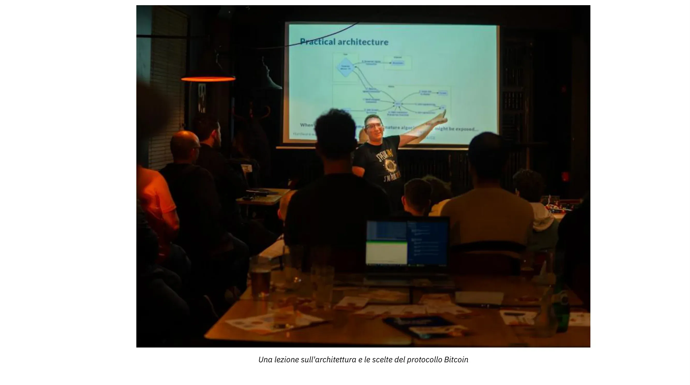

3/ Come voglio che la mia comunità contribuisca all'ecosistema Bitcoin?

Questa è una domanda più avanzata, ma vale la pena di pensarci subito.

Se la vostra visione è quella di **creare una comunità affiatata e motivata** che si concentri sull'aranciata di quante più persone possibile, allora:

- Collaborare con le comunità esistenti per accedere a informazioni più ampie, a risorse open-source e a un valido supporto quando necessario.
- Organizzate e delegate i compiti all'interno del vostro gruppo per espandere e scalare i vostri sforzi in modo efficace.

**Stabilire obiettivi a breve, medio e lungo termine**

Un modo pratico per pianificare è quello di fissare degli obiettivi per ogni periodo di tempo:

- A breve termine: costruire una presenza sui social media e creare canali di comunicazione con la comunità.
- A medio termine: creare risorse educative (articoli, volantini, video).
- A lungo termine: lanciare incontri fisici regolari.

Una volta stabiliti gli incontri, si potrebbe puntare a:

- A breve termine: ospitare workshop o presentazioni su argomenti specifici
- A medio termine: campagne di sensibilizzazione o di educazione Bitcoin
- A lungo termine: creare un'associazione formale o una partnership con un bar che accetti il Bitcoin come pagamento.

Siate pronti: **costruire una comunità richiede impegno**

La creazione di una comunità non avviene da un giorno all'altro. Richiede tempo, motivazione e organizzazione.

A volte può sembrare scoraggiante, soprattutto quando non si presenta nessuno e ci si sente gli unici a portare questa missione sulle proprie spalle.

Ecco perché **questo corso è stato progettato per condividere risorse e suggerimenti preziosi, aiutando le comunità a crescere in modo efficace e a diventare infine autosufficienti.**.

# Progettazione di un'identità comunitaria Bitcoin

<partId>da6673ad-bf49-5979-80a6-3f69cfb28046</partId>

## Perché e come si può creare la propria identità?

<chapterId>b48a18cc-afdf-5216-802c-32647b5cd8a3</chapterId>

In questa fase, assumiamo che:

- Sapete già dove avrà sede la vostra comunità (o un futuro incontro regolare).
- Avete fissato obiettivi per diversi orizzonti temporali, anche se non sono ancora definitivi.

Il passo successivo nella costruzione della vostra comunità è quello di **definire la sua identità**, sia il suo nome che il suo stile visivo.

Questa sezione fornisce tutorial e soluzioni software facili da usare per i principianti, per aiutarvi a progettare l'identità visiva della vostra comunità, anche se siete alle prime armi.

**Perché l'identità è importante?**

Le persone si sentono più coinvolte e impegnate quando si identificano con un gruppo. Una forte identità aiuta la comunità a distinguersi e favorisce il senso di appartenenza.

Tutto inizia con la scelta del nome, e ogni Paese ha spesso le sue tendenze:

- Francia: La maggior parte delle oltre 60 comunità locali usa nomi come "Bitcoin [CITY]" o "[CITY] Bitcoin". I loro gruppi Telegram seguono spesso questo schema: "Bitcoin [CITTA'] meetup".
- Germania: L'iniziativa Einundzwanzig (che significa "21") ha ispirato nomi come "Einundzwanzig [CITTA']".
- Italia: La rete Satoshi Spritz utilizza nomi come Satoshi "Spritz [CITTA']".

**Ogni comunità ha la propria identità, legata alla sua città natale, ma anche all'identità più ampia del suo Paese**.

La vostra identità visiva: logo, colori, banner, è ciò che la gente ricorderà e assocerà al vostro gruppo.

Quando si creano account di social media e canali di comunicazione, avere un logo e un banner è un forte vantaggio. Non preoccupatevi, non è necessario avere competenze professionali nel campo del design: sono disponibili strumenti gratuiti e facili da usare.

Un ottimo punto di partenza è incorporare un simbolo o un simbolo della vostra città. A Parigi, potrebbe essere la Torre Eiffel. A Lille, il campanile o la cittadella. A New York, la Statua della Libertà. A Londra, il Big Ben e così via.

Da qui si può progettare un logo semplice o più dettagliato, a seconda delle preferenze.

Per darvi qualche idea, ecco alcuni esempi di loghi di comunità francesi:

- A Marsiglia, il logo rappresenta la basilica Notre-Dame-de-la-Garde, che domina la città:

- A Monaco, si riferisce alla roccia monegasca:

- A Lille, il logo elegante rappresenta la cittadella di Vauban e il suo parco:

- A Saint-Malo, l'ermellino, emblema della città, è messo in evidenza:

**Andate oltre se volete**

Se vi viene l'ispirazione, potete andare oltre: creare uno stemma, un motto o persino una canzone per la vostra comunità. L'unico limite è la vostra creatività!

## Creare un logo, un poster e un banner

<chapterId>3470a31f-0190-5e87-8af0-6a00e79267ef</chapterId>

### Utilizzo di Canva

Potete usare [Canva](https://www.canva.com/) per creare le varie immagini per la vostra comunità.

Questa piattaforma gratuita e facile da usare è famosa per la sua vasta libreria di modelli pre-progettati che si possono duplicare e personalizzare in pochi clic.

**Creazione del logo**

Sulla home page di Canva, cercate i loghi predefiniti. Selezionatene uno o più che vi ispirano, duplicateli e personalizzateli per adattarli alla vostra comunità.

È possibile aggiungere un punto di riferimento o un emblema locale allo sfondo (importando una foto o cercando "Illustrazioni" o "Immagini" nel menu del Elements), quindi sovrapporre il logo o il ₿ del Bitcoin, regolandone il colore se necessario.

**Creazione di banner e poster**

Per creare uno striscione o un poster, cercate nella libreria di Canva i modelli predefiniti. Una volta duplicato, modificate il testo e i caratteri, aggiungete il logo della vostra comunità e importate le foto utilizzando le cornici (cercate "frame" nel menu Elements).

È inoltre possibile utilizzare il menu Designs per esplorare altri modelli adatti alle proprie esigenze.

Per le miniature o i banner di YouTube, è sufficiente cercare questi modelli, duplicarli e personalizzarli come desiderato.

In breve, **le possibilità sono infinite e modellate non solo dalle vostre esigenze ma anche dallo stile visivo che volete creare** per la vostra comunità e i vostri incontri/eventi!

Per darvi un'idea più chiara, abbiamo incluso un video tutorial non esaustivo che illustra alcune di queste possibilità:

:::video id=d11ae0ed-eacd-4924-afd3-75aff95d2899:::

**Modelli di esempio da Bitcoin Lille**

Ecco alcuni modelli di Canva già pronti che potete duplicare e adattare alla vostra comunità:

- Locandina di annuncio dell'incontro (per i social media e la stampa A4/A3): [link](https://www.canva.com/design/DAGBvBXFJ8A/92-j_toeLU8QbVAD0NwoAA/edit?utm_content=DAGBvBXFJ8A&utm_campaign=designshare&utm_medium=link2&utm_source=sharebutton)

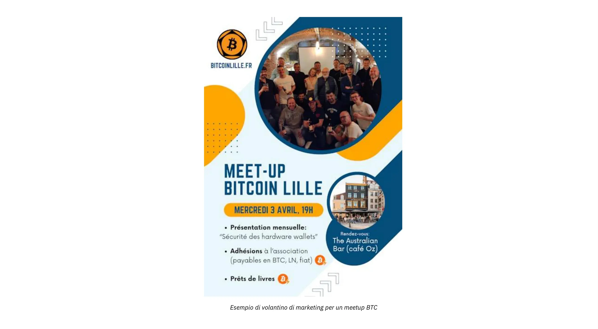

- **Locandina dell'evento** (per i social media e la stampa A4/A3): [link](https://www.canva.com/design/DAGBvG3rNCc/oXtNR9pduRs22AqclG4O2g/edit?utm_content=DAGBvG3rNCc&utm_campaign=designshare&utm_medium=link2&utm_source=sharebutton)

- **banner per i social media**: [link](https://www.canva.com/design/DAGBvOXyNqw/iSJG9PbIQHgGWHz5PhlXSQ/edit?utm_content=DAGBvOXyNqw&utm_campaign=designshare&utm_medium=link2&utm_source=sharebutton)

- **Annuncio del concorso**: [link](https://www.canva.com/design/DAGBvIjuA_w/YzSUXzOmbNV9oCma9mluOw/edit?utm_content=DAGBvIjuA_w&utm_campaign=designshare&utm_medium=link2&utm_source=sharebutton)

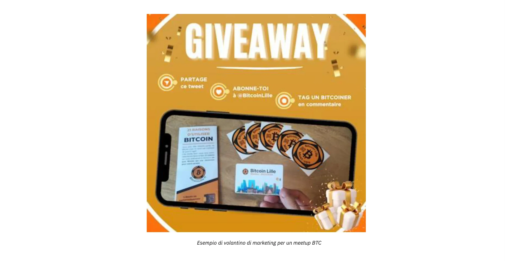

- **linee guida** della nostra biblioteca, esposte in formato A4 durante gli incontri: [link](https://www.canva.com/design/DAGBvPqL7N4/LmUItfsysypRLSOFOzBXcQ/edit?utm_content=DAGBvPqL7N4&utm_campaign=designshare&utm_medium=link2&utm_source=sharebutton)

- **Presentazione PowerPoint** "Capitolo 2 - Comprendere le transazioni Bitcoin", di @ProfEduStream: [link](https://www.canva.com/design/DAFsEcnOro8/Mz9FYdTGhsvozZOe0Y9jtw/edit?utm_content=DAFsEcnOro8&utm_campaign=designshare&utm_medium=link2&utm_source=sharebutton)

- **volantino** "21 ragioni per usare Bitcoin", scritto da @ProfEduStream: [link](https://www.canva.com/design/DAFtAR1NauQ/ZDwl2CchIJ9Gpb36N6-7iw/edit?utm_content=DAFtAR1NauQ&utm_campaign=designshare&utm_medium=link2&utm_source=sharebutton)

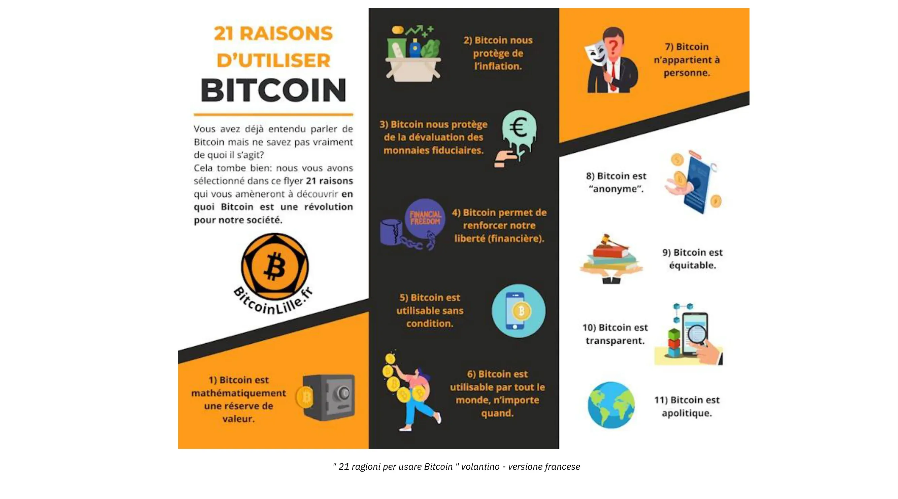

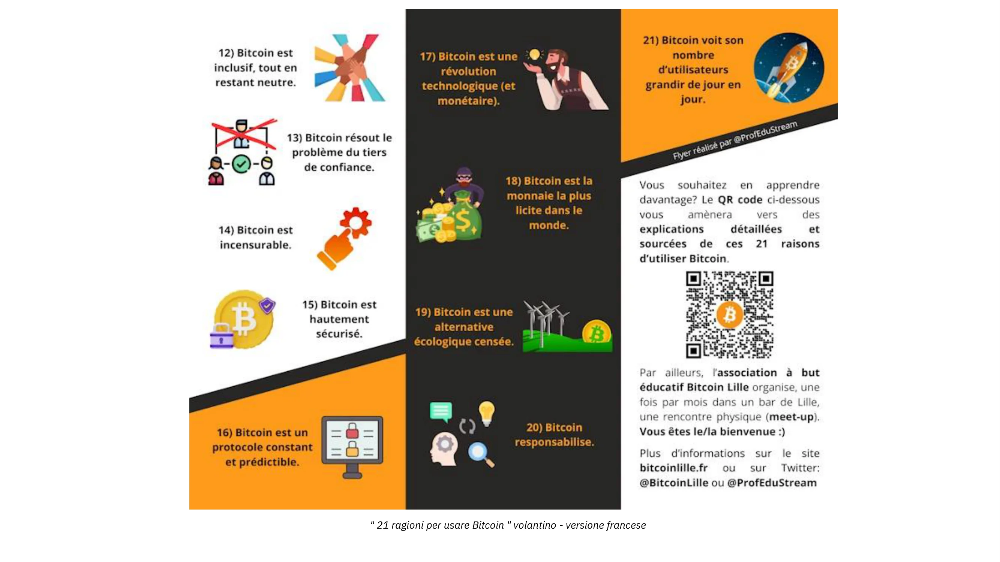

**Condividete le vostre creazioni**

Le possibilità sono infinite e i progetti dipenderanno dai vostri obiettivi e dalla vostra identità visiva. Considerate la possibilità di condividere i vostri modelli in open source, per risparmiare tempo ad altre comunità Bitcoin che inevitabilmente affronteranno le vostre stesse sfide. Condividendo, contribuite ad accelerare la crescita delle comunità Bitcoin ovunque.

**Dimensioni consigliate**

Quando si creano immagini, verificare sempre i requisiti di dimensione per ogni piattaforma:

| Platform | Logo | Banner | Poster / Image
| -------- | -------- | -------- | -------- |
| Telegram     | 512 x 512     | N/A     | N/A     |
| Signal     | N/A     | N/A     | N/A     |
| Twitter     | 400 x 400     | 1500 x 500     | 1200 x 628     |
| Meet-up     | N/A     | N/A     | N/A     |
| Discord     | 512 x 512     | 960 x 540     | N/A     |
| Facebook     | 512 x 512     | 851 x 315     | 960 x 720     |

Di solito le dimensioni sono adeguate:

Loghi: 512 x 512 pixel

Banner: Varia a seconda dell'applicazione o del sito

Poster: Il formato di stampa standard è A4

### Utilizzo dell'intelligenza artificiale

Canva offre un'ampia gamma di strumenti per creare loghi, poster, banner e volantini, ma non è l'unica opzione. Se vi sentite più a vostro agio con altri software (come Photoshop o Illustrator), sentitevi liberi di usare quello che funziona meglio per voi.

Detto questo, che si tratti di progettare il logo di una comunità o di migliorare poster, presentazioni o volantini, **l'intelligenza artificiale può essere un potente alleato per creare immagini uniche e accattivanti**.

A questo scopo sono disponibili diverse IA. Queste includono

- [midjourney](https://docs.midjourney.com/docs/quick-start) (pagato);
- [leonardo](https://leonardo.ai/) (gratuito, con account limitato);
- [copilot](https://copilot.microsoft.com/) (gratuito, con account limitato);
- [DALL-E](https://www.dall-efree.com/) (pagato).

Di recente sono emersi molti altri strumenti di intelligenza artificiale, quindi questo elenco non è affatto esaustivo.

**Esempio: Creazione di un logo futuristico per il Bitcoin di Londra**

Se volete progettare un logo futuristico per un incontro "Bitcoin London", potete chiedere a Copilot:

- [*Prompt: Creare un logo Bitcoin con il London Bridge e il Big Ben sullo sfondo. Futuristico* - [Link](https://copilot.microsoft.com/images/create/un-logo-Bitcoin-futuriste-avec-en-arric3a8re-plan-le-/1-6612ba1758df4384bc33c4bca00ab45b?FORM=SYDBIC)

Se i primi quattro risultati non sono abbastanza realistici, perfezionate la richiesta:

- [ ] *Prompt: Rendi il 4° molto più realistico* - [Link](https://copilot.microsoft.com/images/create/un-logo-Bitcoin-futuriste-avec-en-arric3a8re-plan-le-/1-6612ba64b72d4cea9830ab7eb844f785?FORM=SYDBIC)

L'ultimo risultato è stato fantastico!

**Esempio: Creazione di un semplice logo in stile britannico**

Per un aspetto più pulito, come per un adesivo:

- [ ] *Prompt: Creare il logo del "London Bitcoin Meetup" con uno stile britannico e pulito* - [Link](https://copilot.microsoft.com/images/create/logo-for-27londres-Bitcoin-meetup27-with-a-british-a/1-6612bb9451924859a6c34b350b3a6ebc?FORM=SYDBIC)

Il risultato è davvero fantastico!

**Suggerimenti per lavorare con l'AI**

- Siate pazienti: L'intelligenza artificiale potrebbe non produrre esattamente ciò che avete immaginato al primo tentativo.

- Utilizzate indicazioni precise: Più le istruzioni sono chiare e dettagliate, migliori saranno i risultati.

- Chiedere aiuto: Se non siete soddisfatti, rivolgetevi a qualcuno esperto di design grafico o di strumenti di intelligenza artificiale: molti Bitcoiners saranno felici di aiutarvi, a volte anche gratuitamente o con pochi Sats.

# Creazione di canali di comunicazione per la comunità Bitcoin

<partId>fc588298-6876-554c-bd57-55d182464878</partId>

## Quali canali di comunicazione scegliere?

<chapterId>b4f4eef6-1035-5290-848a-2b7f9391c77a</chapterId>

Come già detto, i canali di comunicazione di una comunità possono variare a seconda delle motivazioni e delle abitudini.

Ad esempio, **in Francia, Germania e Italia, Telegram e Twitter sono le piattaforme dominanti**, e sono diventate lo "standard" per le comunità Bitcoin.

Nella Repubblica Ceca, invece, molte comunità utilizzano **Matrix**, un protocollo di messaggistica istantanea sicuro, invece di Telegram.

Suggerimento: prima di scegliere i canali, **guardate cosa fanno le comunità vicine**. Utilizzate la mappa [btcmap.org](https://btcmap.org/communities/map#0/0/0/) per vedere quali piattaforme sono più popolari nella vostra regione.

Ad esempio, le comunità svizzere utilizzano principalmente Telegram, Twitter e il proprio sito web:

**Canali raccomandati per le comunità francofone**

- Telegram: Lo strumento di comunicazione numero 1, oltre il 90% dei meet-up francesi lo utilizza.

- Twitter (X): Il principale social network utilizzato dai bitcoiners di tutto il mondo. È utilizzato da circa il 70% dei meet-up francesi. È ideale per raggiungere i bitcoiners.

- Meetup.com: A pagamento ma ampiamente utilizzato (da ~30% dei meet-up francesi e da quasi tutti quelli canadesi) per aumentare la visibilità al di fuori dell'ecosistema Bitcoin.

- Altre opzioni: ~30% ha anche un sito web; ~10% gestisce server Discord o account NOSTR.

È possibile utilizzare anche altre piattaforme come Matrix, Keet, Signal, Facebook, Instagram e LinkedIn. Attenzione: più canali si gestiscono, più tempo si spenderà per moderarli, pubblicarli e mantenerli attivi.

Chiunque voglia lanciare una comunità in Francia farebbe quindi bene a iniziare con la creazione:

- un gruppo Telegram;
- un account Twitter.

Man mano che la vostra comunità cresce, potete aggiungere altre piattaforme e delegare la moderazione a membri fidati.

## Creare e configurare un canale, un gruppo o un supergruppo Telegram

<chapterId>d13714ce-8f08-53e9-bedd-b6a3aaac5dad</chapterId>

Prima di creare lo spazio di comunicazione della vostra comunità su Telegram, è importante conoscere la differenza tra:

- un canale Telegram;
- un gruppo Telegram;
- un supergruppo di Telegram.

Si consiglia vivamente di iniziare con un gruppo Telegram.

Se necessario, è possibile convertirlo successivamente in un supergruppo.

Per le esercitazioni che seguono, abbiamo inizialmente utilizzato l'APK "Telegram+", che consente una configurazione più avanzata. Tuttavia, non ne avete necessariamente bisogno, poiché l'app ufficiale di Telegram è sufficiente per creare e gestire i gruppi, anche attraverso il vostro telefono:

:::video id=b1da7cb4-5fb1-4a41-a1d4-bd90686826a9:::

### Creare un canale Telegram

Se volete creare un luogo in cui i vostri membri possano parlarsi direttamente, rispondersi l'un l'altro e così via, allora vi conviene creare un gruppo Telegram e non un canale Telegram!

Passate direttamente alla sezione successiva, intitolata [Crea un gruppo Telegram](https://planb.academy/courses/1c643dc9-a15f-4f9e-93b6-cb3c58b4ee35/d13714ce-8f08-53e9-bedd-b6a3aaac5dad).

In effetti, **un canale Telegram è più che altro uno strumento di trasmissione unidirezionale per gli amministratori**. I membri non possono chattare liberamente, possono solo reagire con le emoji (o lasciare commenti in thread separati, il che frammenta le conversazioni).

**Poiché le comunità hanno bisogno di interazione e collaborazione, un canale Telegram non è consigliato** se il vostro obiettivo è costruire relazioni e condividere conoscenze.

Esercitazione per la creazione di un canale Telegram:

:::video id=98be4709-d221-4030-8c31-e10113482515:::

### Creare un gruppo Telegram

D'altra parte, **un Gruppo Telegram è ideale per le comunità**: Proprio come le applicazioni di messaggistica come Messenger o WhatsApp, i membri possono chattare e rispondersi a vicenda in un'unica conversazione condivisa.

Cosa può fare un amministratore:

- Pubblicare e appuntare messaggi importanti.
- Creare **pollici** (utili per decidere le date degli incontri quando la comunità è nuova).
- creare un **collegamento di invito personalizzato** (solo se il gruppo è "pubblico" e non "privato", che è definito nelle impostazioni. È anche utile avere un proprio link di invito a Telegram, ad esempio: t.me/Bitcoin[CITY]);
- Gestire le autorizzazioni dei membri, i ruoli e la moderazione.
- Aggiungete un'immagine del profilo (il logo della vostra comunità) e aggiornate il nome del gruppo.

Esercitazione per la creazione di un gruppo Telegram:

:::video id=3d4792a7-1345-475b-93b1-b3a3945fb567:::

Nota: questo tutorial è stato realizzato con Telegram+, ma potete fare tutto direttamente dall'app mobile standard di Telegram.

### Creare un supergruppo Telegram

Perché un supergruppo?

Quando il vostro gruppo Telegram cresce fino a centinaia di membri, le conversazioni possono diventare caotiche. Questo spesso porta i membri a perdere annunci importanti, come la data del prossimo incontro.

Sono disponibili diverse soluzioni:

1. **Appuntate i messaggi importanti** in modo che tutti i membri ricevano una notifica (premete una volta con il dito sul messaggio in questione, quindi selezionate "Appuntate");

2. Considerate l'utilizzo di **Discord** per più canali di comunicazione, ognuno dei quali può essere disattivato se necessario.

3. **Convertire il gruppo Telegram in un supergruppo**.

Cos'è un supergruppo Telegram?

Un supergruppo è essenzialmente un gruppo Telegram con argomenti (sottocanali) al suo interno.

Esempi di argomenti:

- "Informazioni importanti": solo aggiornamenti chiave e annunci di eventi.
- "Generale": per tutte le discussioni dei membri.
- Argomenti specifici: ad esempio, Mining, sviluppo di progetti, conferenze imminenti.

Suggerimento: Adattate gli argomenti alle esigenze della vostra comunità. Esempio: Il Meet-up Bitcoin di Abidjan utilizza con successo questo formato.

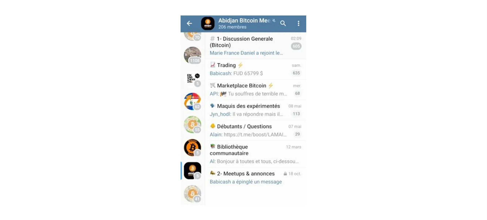

Tenete presente che i **supergruppi di Telegram possono essere un po' complicati da usare per alcuni membri**. Ad esempio, non tutti sanno **come accedere ai diversi argomenti** (basta toccare il logo del gruppo nel menu principale di Telegram per vedere l'elenco completo degli argomenti). L'invio di un rapido screenshot può aiutare a chiarire qualsiasi confusione.

Non c'è una regola precisa su quando passare da un gruppo Telegram normale a un supergruppo, dipende dalle esigenze dei vostri membri. La buona notizia è che potete passare facilmente da un gruppo all'altro: basta creare un argomento per convertirlo in un supergruppo o eliminare tutti gli argomenti tranne "Generale" per tornare a un gruppo normale.

Tutorial per la creazione di un supergruppo Telegram:

:::video id=f78800ae-d8ca-479a-b913-99abd9916bff:::

Nota rapida: come accennato in precedenza, l'esercitazione di cui sopra è stata realizzata su un computer utilizzando l'APK di "Telegram+". Oggi, tuttavia, creare un supergruppo Telegram sul vostro telefono è semplice.

Basta creare un gruppo Telegram, andare nelle impostazioni e toccare il pulsante "Argomenti" per aggiungere argomenti. Una volta salvato, vedrete un elenco di argomenti che potrete modificare a vostro piacimento.

Quindi, non c'è più bisogno di scaricare "Telegram+", a meno che non vogliate accedere a impostazioni di privacy più avanzate per il vostro supergruppo.

## Impostazione del gruppo o supergruppo Telegram

<chapterId>35e674b3-5924-50b0-98f1-83a56c9a186d</chapterId>

Ora che il vostro gruppo (o supergruppo) di Telegram è attivo e funzionante, è il momento di **configurare i permessi e impostare la moderazione**.

Ogni comunità è libera di scegliere il proprio approccio, ma l'esperienza dimostra che è **migliore limitare alcuni permessi dei membri**:

- Invio di un sondaggio;
- Invio di file (per evitare potenziali virus);
- Invio di messaggi vocali;
- Aggiunta di utenti (aiuta a prevenire le invasioni di bot);
- Appuntare i messaggi;
- Modifica delle informazioni sul gruppo.

Si raccomanda vivamente di **scrivere una descrizione chiara del proprio meetup** quando si crea il gruppo o supergruppo Telegram, poiché è la prima cosa che i potenziali membri vedranno. Ad esempio:

> Benvenuti sul Telegramma di @Bitcoin [CITY] 🔥
>

> Organizziamo un incontro ogni primo mercoledì del mese al bar [NOME BAR], in [CITTA'] 🍻
>

> Scopri gli altri social network: [LINK] 🌐

In questo esempio, gli amministratori del Bitcoin Lille hanno personalizzato il loro link pubblico a Telegram per facilitare la condivisione.

In "Impostazioni del gruppo", potrebbe essere opportuno **abilitare "Approvare i nuovi membri "**.

Alcuni gruppi Telegram Bitcoin sono stati presi di mira da migliaia di account falsi progettati per spammare o disturbare la comunità.

**Attivare l'approvazione dei membri può salvare il gruppo da un attacco di spam **

Nella sezione Amministratori, è possibile attivare la funzione "Anti-Spam aggressivo" per eliminare automaticamente i messaggi sospetti.

Non è sempre necessario, ma può aggiungere un ulteriore Layer di protezione.

## Aggiunta di un bot multifunzione al vostro gruppo Telegram

<chapterId>c61f69cc-15ec-53f1-8c02-1cea55def09e</chapterId>

**Un'altra opzione per configurare e proteggere il vostro gruppo o supergruppo Telegram è aggiungere un bot multifunzione**. In questo modo è possibile ampliare in modo significativo le funzionalità e le capacità di moderazione del gruppo.

Utilizzando **il bot [@GroupHelpBot](https://telegram.me/grouphelpbot)**, le opzioni più utili sono:

- Un comando **regole** (/regole) per visualizzare le linee guida della comunità;
- **Protezione antispam** per filtrare i messaggi e gli account sospetti;
- **Messaggi automatici di benvenuto** personalizzabili per i nuovi membri (con cancellazione automatica opzionale dopo alcuni minuti)
- **Protezione anti-flood** per prevenire lo spam dei messaggi
- Un comando **@administrator** per raggiungere rapidamente gli amministratori di gruppo
- **Regole di blocco** per i contenuti indesiderati
- Un **comando di collegamento di gruppo** (/link)
- Comando **gestione delle autorizzazioni**
- **Eliminazione automatica** di tipi di messaggi specifici
- **Blocco dei bot** e **blocco di entrata/uscita** per mantenere il gruppo al sicuro
- Elencare le reti sociali della **comunità** (/networks)
- E molto altro ancora...

Sono disponibili innumerevoli funzioni aggiuntive.

Suggerimento: **Non limitate troppo la conversazione**.

Esercitazione per aggiungere un bot multifunzione a un gruppo o supergruppo di Telegram:

:::video id=cdbf82d6-3530-45c4-90de-593f100863bb:::

(Nota: l'intera procedura può ora essere eseguita direttamente dal telefono. Non è più necessario utilizzare l'app Telegram+)

## Creare un server Discord

<chapterId>eef2a965-4c24-5f3a-8013-72cc7d315314</chapterId>

Quando il vostro gruppo Telegram diventa troppo grande, trasformarlo in un supergruppo Telegram può aiutare a organizzare le discussioni.

Tuttavia, come già detto, la **complessità aggiunta e l'aumento degli argomenti e dei messaggi potrebbero far perdere interesse ad alcuni membri attivi**.

Perché prendere in considerazione Discord?

**Discord è un'alternativa** ai supergruppi di Telegram, in quanto consente agli utenti di **creare stanze di chat testuali e vocali specifiche** e permette ai membri di escludere i canali a cui non sono interessati.

Naturalmente, la gestione di Telegram e Discord richiede un po' più di tempo, soprattutto durante la configurazione e il lancio.

Per facilitarvi le cose, **condividiamo un [server Discord che potete duplicare e personalizzare](https://discord.com/template/bDY4eXXJk2C8)**:

:::video id=e647458a-a21e-44e0-bd03-20b82a871777:::

Se ben progettato, un server Discord può essere una vera risorsa per la vostra comunità. Molti Bitcoiners utilizzano già **Discord** quotidianamente e la possibilità di seguire le conversazioni di Telegram direttamente all'interno di Discord (e viceversa) può far risparmiare molto tempo a tutti.

Per sincronizzare entrambe le piattaforme, esiste un bot open-source chiamato [TediCross](https://github.com/TediCross/TediCross). Il suo scopo è semplice: inoltrare automaticamente i messaggi da un canale di testo Discord a un gruppo Telegram (o a un argomento di un supergruppo) e viceversa.

Tuttavia, tenete presente che l'installazione non è delle più semplici. È necessario mantenere un prompt dei comandi (CMD) in esecuzione sul computer per far funzionare il bot e potrebbero verificarsi errori occasionali. Fortunatamente, risolverli è semplice: basta riavviare il bot e, nella maggior parte dei casi, tutto torna alla normalità.

Per risparmiare tempo, ecco un tutorial su come aggiungere questo bot multifunzione a un gruppo o supergruppo di Telegram:

:::video id=6a0283f6-6d6c-4e81-8b2f-644b33c52fe6:::

## Considerare canali di comunicazione alternativi, privati e più sicuri

<chapterId>29d0aad6-0612-5dd0-bcef-7337eaf4fefc</chapterId>

Come discusso in precedenza, Twitter e Telegram sono gli strumenti di comunicazione più utilizzati dalle comunità Bitcoin in Europa (se non in tutto il mondo).

Tuttavia, Telegram non è esattamente nota per essere l'app di messaggistica più sicura o attenta alla privacy e Twitter, ora X, è di proprietà di una delle società più libere del pianeta.

Per questo motivo, una volta che i canali principali sono stati creati e le cose funzionano senza problemi, può valere la pena di esplorare altre opzioni.

Nei prossimi mesi, questo corso e la piattaforma planb.network offriranno esercitazioni su come utilizzare protocolli alternativi come **Simplex ed Element**: strumenti di comunicazione decentralizzati, criptati e altamente personalizzabili.

**Perché preoccuparsi di esaminare queste opzioni?**

Perché, proprio come il social network NOSTR, non solo garantiscono una maggiore privacy, ma anche una salvaguardia contro la censura o la chiusura arbitraria del vostro gruppo Telegram.

E davvero, cosa c'è di più in linea con lo spirito del Bitcoin che essere resistente alla censura e resiliente per design?

# Lanciate le vostre reti sociali

<partId>8ebf8cd7-9248-543f-bc27-4ec4cc03f9cf</partId>

## L'importanza della visibilità per far crescere la vostra comunità Bitcoin

<chapterId>b20f12e4-c5de-5f02-80c7-b7fc6cadd3ac</chapterId>

La vostra comunità è pronta e funzionante. Avete creato il vostro spazio Telegram o Matrix... ma per ora ci siete solo voi. **È ora di far sapere alla gente che esistete!**

È semplice: se nessuno è in grado di accedere al vostro gruppo e vedere quando si terrà il prossimo incontro, non farete altro che postare nel vuoto. Ecco perché i social media, e alcune piattaforme specifiche che tratteremo più avanti, sono così importanti per costruire la vostra comunità.

Twitter (X) è diventato quasi sinonimo di conversazione online sul Bitcoin. Non è perfetto, tutt'altro, ma attualmente è il luogo in cui si riunisce gran parte della comunità. Non è perfetto, tutt'altro, ma attualmente è il luogo in cui si riunisce gran parte della comunità. Si consiglia vivamente di creare un account su questo sito.

Per evitare possibili censure o restrizioni, alcune comunità aprono anche un profilo NOSTR.

È quello che ha fatto il collettivo FREE Madeira.

Naturalmente, anche altre piattaforme possono essere utili. Facebook (con un gruppo o una pagina) o anche LinkedIn.

Detto questo, tenete presente che **più canali di comunicazione e reti sociali si gestiscono, più tempo richiede**. Spesso è meglio concentrarsi **su quelli più rilevanti**, Twitter (e NOSTR) sono ottime opzioni per iniziare.

## Creare un profilo Twitter

<chapterId>c8d73097-8eba-5530-918c-221002954110</chapterId>

Twitter è molto facile da usare e per migliorare la vostra privacy dovrete regolare alcune impostazioni.

**Quando si crea un nuovo account Twitter, è necessario inserire quattro informazioni essenziali:**:

1/ **la @ Twitter**, che definisce la vostra identità e vi rende facilmente reperibili. Se il nome della vostra comunità è "Bitcoin [CITTA']", è opportuno scegliere "@Bitcoin[CITTA']";

2/ **il logo e il banner** che avete creato per la vostra comunità o meet-up (vedi sezione [Creare un logo, un poster e un banner](https://planb.academy/courses/1c643dc9-a15f-4f9e-93b6-cb3c58b4ee35/3470a31f-0190-5e87-8af0-6a00e79267ef));

3/ **la descrizione**, che vi permette di condividere le informazioni chiave sulla vostra comunità in poche centinaia di caratteri. Ad esempio:

> Account ufficiale della comunità Bitcoin [CITY] #BTC | Incontri ogni 1° mercoledì del mese al [BAR_NAME] di [CITY] 🍻 | Unisciti a noi su Telegram 🔽

4/ Sotto questa descrizione, è possibile **inserire un link**. Questo può condurre gli utenti a una pagina "social media" sul sito web della vostra comunità o al vostro canale Telegram. Sta a voi decidere cosa volete mettere in evidenza.

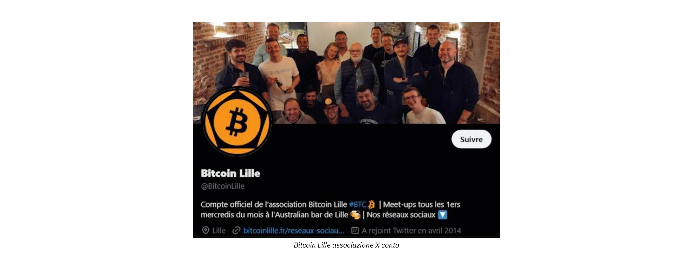

Inoltre, **alcune impostazioni sulla privacy meritano di essere regolate**:

- lasciare il proprio account Twitter in modalità "pubblica" (post visibili a chiunque);
- consentire a tutti di trovarvi;
- disattivare la localizzazione e la condivisione dei dati con altre entità (nelle impostazioni sulla privacy).

Per ogni evento, probabilmente utilizzerete Twitter per condividere informazioni utili. Ma, come per la maggior parte dei social network, la **visibilità è tutto**.

Per farvi risparmiare tempo, ci siamo presi il tempo di studiare [l'algoritmo di ranking open-source di Twitter](https://github.com/twitter).

Ecco gli **elementi chiave su cui concentrarsi per aumentare la propria visibilità**:

- Suggerimenti generali:
    - Twitta nella lingua impostata del tuo account o in inglese: twittare in altre lingue può ridurre di molto la tua visibilità;
    - Attenetevi alla vostra nicchia, condividendo solo contenuti relativi all'obiettivo del vostro account; i tweet fuori tema vengono penalizzati dall'algoritmo;
    - Puntate a 1 o 2 tweet al giorno;
    - Postate nelle ore di punta: Il giovedì o il venerdì tra le 8 e le 10 del mattino tendono a dare i risultati migliori (controllate il vostro account: Twitter Analytics).

- Quando si scrive un tweet:
    - aggiungere una foto (o anche un video);
    - Utilizzare un solo hashtag (di solito #Bitcoin è il più pertinente. Se opportuno, potete aggiungere un hashtag di tendenza relativo alla vostra area di interesse);
    - Incoraggiate la vostra comunità a interagire:
        - Come = peso 0,5
        - Retweet = peso 1
- Risposta = peso 27 (!!)
- Rispondete alle persone che rispondono ai vostri **tweet** (peso di 75!!);
    - Evitate di inserire i link nel tweet principale: aggiungeteli invece nel primo commento..;
    - Scrivete le parole per esteso, evitando le abbreviazioni.

- Altri suggerimenti:
    - Twitta su argomenti di tendenza, purché siano in linea con l'area di competenza del tuo account;
    - Ripostate i vostri tweet più performanti;
    - Di tanto in tanto, eseguire sondaggi;
    - Scrivere le filettature quando è possibile;
    - Incoraggiate la vostra comunità a visitare il vostro profilo e a seguirvi.

Inoltre, **è possibile aggiungere un tweet o una discussione al proprio profilo Twitter per dargli la massima visibilità**, proprio come fa la comunità Bitcoin Witsand in Sudafrica.

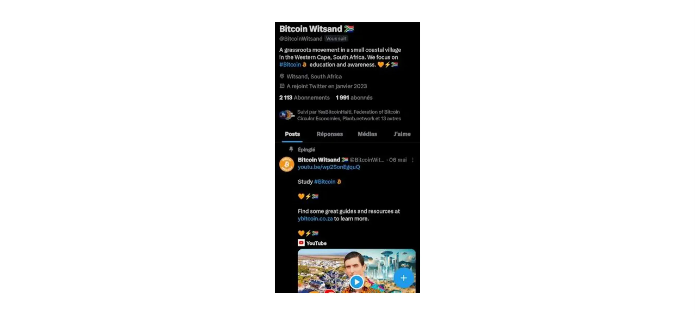

Si noti inoltre che è possibile rimanere collegati a due account Twitter contemporaneamente, sia sul telefono che sul computer. Questo è molto utile se si vuole passare facilmente dall'account personale a quello della community.

Fate solo attenzione... postare per sbaglio una foto di una festa dall'account della community può accadere più velocemente di quanto pensiate!

Infine, anche se il vostro nome utente "@Bitcoin[CITY]" è unico e ormai vostro, è bene prevedere account falsi o imitatori. Considerate anche la possibilità di registrarvi:

- @Bitcoin_[CITY]
- @[CITY]Bitcoin
- @[CITTÀ]_Bitcoin

In questo modo, ridurrete notevolmente le possibilità che qualcuno si spacci per la vostra comunità.

Tutorial per la creazione di un account Twitter:

:::video id=4648976f-41ec-499a-b7ec-a53e796f71b4:::

## Avvicinarsi ai meetup vicini

<chapterId>12a21c3b-235a-5292-8209-67bf60f61e49</chapterId>

Ora che i canali di comunicazione e i social network sono impostati e riflettono l'identità visiva della vostra comunità, è il momento di iniziare a seguire le persone giuste.

Su Twitter, iniziate a seguire gli account chiave che promuovono il Bitcoin a livello globale, come [@Bitcoin](https://twitter.com/Bitcoin) e [@planb_network](https://twitter.com/planb_network), nonché iniziative come [@FBCEglobal](https://twitter.com/FBCEglobal). Potete anche retwittare il famoso tweet di [@halfin](https://twitter.com/halfin) "Running Bitcoin" dell'11 gennaio 2009. E soprattutto, **seguite gli account delle comunità e dei meetup Bitcoin nel vostro Paese**.

Questo crea **opportunità di seguirsi a vicenda, di taggarsi a vicenda e di aumentare la visibilità collettiva**. È già una pratica comune tra le circa 50 comunità Bitcoin in Francia, le iniziative "Satoshi Spritz" in Italia e i gruppi "Einundzwanzig" in Germania.

Anche se ad alcuni può sembrare banale, **seguire gli account delle comunità e delle iniziative locali può portare a collaborazioni o addirittura a partnership**. Ad esempio, le comunità Bitcoin Liegi e Bitcoin Lille (e allo stesso modo Bitcoin Aix e Bitcoin Marsiglia) si sono collegate in questo modo, arrivando a organizzare un meetup annuale.

I pasti del **Cercle du Coin** sono un altro buon esempio.

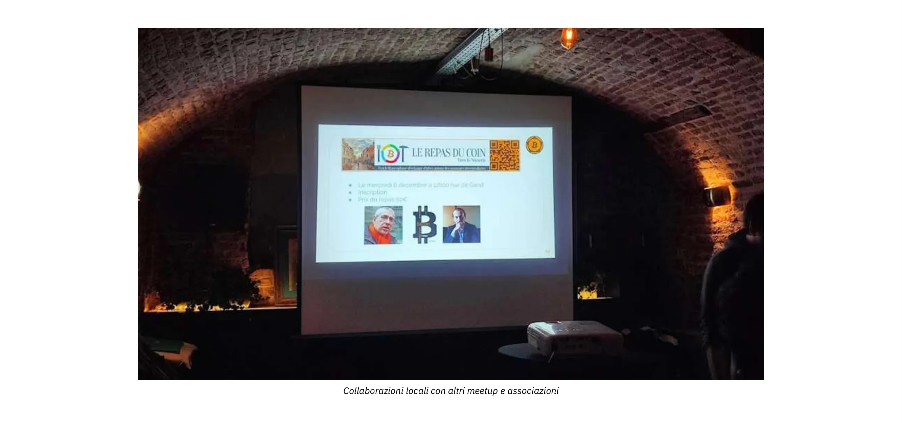

In Francia, può anche essere rilevante **seguire le iniziative come [@KonsensusFR](https://twitter.com/KonsensusFR), [@bitcoinpointfr](https://twitter.com/bitcoinpointfr), [@DecouvreBitcoin](https://twitter.com/DecouvreBitcoin) e [@btcmap](https://twitter.com/btcmap)**. Naturalmente questi sono solo suggerimenti e ogni comunità è libera di fare ciò che vuole, in completa decentralizzazione e autonomia.

Come già detto, l'obiettivo di seguirsi a vicenda è quello di aumentare la visibilità reciproca. Più promuovete la vostra comunità e quelle della vostra regione/paese sui social network, più le persone parleranno di voi. Più le persone parleranno di voi, più sarà probabile che partecipino ai vostri eventi.

Il fatto di apprezzare e retwittare i post di altre comunità può quindi aiutare molto il loro sviluppo... e il vostro.

Si potrebbe anche suggerire che **gli organizzatori dei meetup e i bitcoiners che gestiscono le comunità si incontrino due o tre volte l'anno in videoconferenza per esaminare i progressi dei progetti nazionali e delle relative comunità. Questo può avvenire anche durante gli eventi di persona **

L'obiettivo è semplice: raccogliere il feedback di tutti, discutere l'evoluzione delle comunità, condividere idee e progetti di successo e proporre soluzioni quando necessario. Una sintesi scritta dell'incontro può essere condivisa con gli organizzatori delle comunità del vostro Paese che non hanno potuto partecipare.

## Btcmap.org

<chapterId>365f43d4-7b2c-5961-a184-157b8c1a0116</chapterId>

A questo punto, la vostra comunità è già attiva e funzionante. Non resta che accogliere altre persone interessate e aiutarla a crescere.

Ma non si può andare avanti senza sapere che **esistono piattaforme in cui i bitcoiners possono trovare comunità e meetup vicini a loro**. Ecco perché è importante prendersi qualche minuto per richiedere l'inserimento in questi siti.

Questi includono:

- [Btcmap.org](https://btcmap.org/)**, un sito web con due mappe aggiornate quotidianamente: **[la mappa mondiale delle aziende che accettano Bitcoin](https://btcmap.org/map)** e **[la mappa delle comunità mondiali](https://btcmap.org/communities/map)**. Molti bitcoiners controllano regolarmente queste mappe, sia in viaggio che nella vita di tutti i giorni, per conoscere nuove persone o trovare luoghi in cui spendere il proprio Sats. Btcmap è il punto di riferimento globale e inserirvi la propria comunità è essenziale per la visibilità.**
- [BitcoinerEvents](https://www.bitcoinerevents.com/), un sito web creato da bitcoiners, per bitcoiners. **Consente di pubblicare i prossimi eventi della propria comunità**. In Francia, tuttavia, non è ancora molto utilizzato.
- a seconda del vostro Paese, potrebbero esserci altre iniziative locali. In Francia, ad esempio, c'è [Bitcoin.fr](https://Bitcoin.fr/events/categories/evenements/), che **elenca decine di eventi Bitcoin ogni mese**. Quindi, se non li avete ancora seguiti su Twitter o contattati per condividere informazioni sulla vostra comunità e sugli eventi, è il momento giusto! **Per contribuire a mantenere aggiornato il calendario degli eventi in Francia, sarebbe bello se tutte le comunità Bitcoin francesi prendessero l'abitudine di**
    - menzionando @bitcoinpointfr su Twitter per ogni nuovo evento della comunità
    - appuntare gli annunci di nuovi eventi nel loro gruppo Telegram.

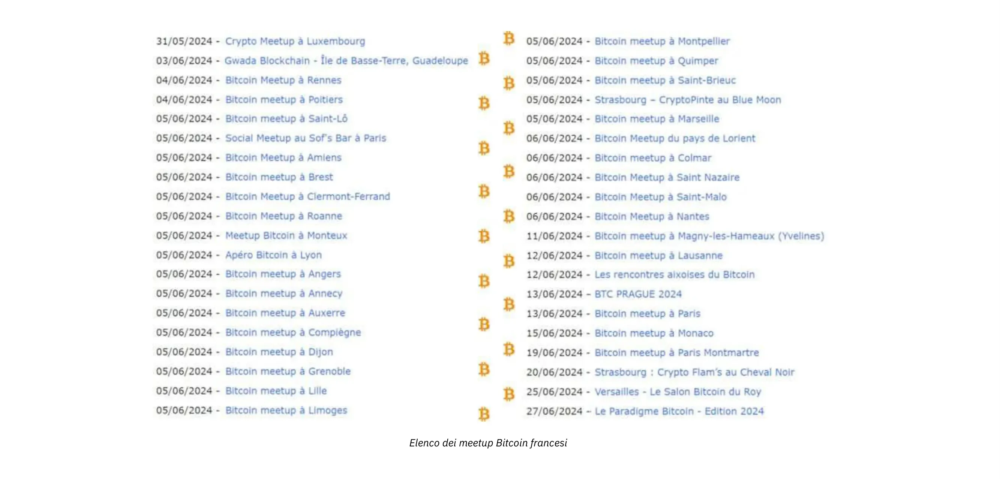

Anche altre piattaforme possono aumentare la vostra visibilità. **[Meetup](https://www.meetup.com/)** è una di queste, ed è un sito web (e un'applicazione per telefono) dove è possibile creare un evento e trovare altre persone nelle vicinanze.

Costa circa 8 euro al mese (o circa 90 euro all'anno), il che può essere costoso per una piccola comunità non strutturata. Detto questo, Meetup è molto utilizzato in alcuni Paesi, soprattutto in Canada e negli Stati Uniti, ed è utile per gestire le iscrizioni.

Allo stesso modo, **[Orangepillapp](https://www.orangepillapp.com/)** è un'applicazione mobile a pagamento (50.000 Sats/anno o 200.000 Sats per l'accesso a vita) che aiuta i bitcoiners a incontrarsi.

Sebbene queste ultime due piattaforme possano contribuire ad aumentare la visibilità, non sono consigliate per il lancio di una comunità, semplicemente perché non sono gratuite.

**Iniziare con un annuncio su [btcmap.org](https://btcmap.org/), [BitcoinerEvents](https://www.bitcoinerevents.com/) e per le comunità francesi, su [Bitcoin.fr](https://Bitcoin.fr) è più che sufficiente**.

Congratulazioni! La vostra **community è stata creata**, i vostri **visivi sono pronti**, i vostri **obiettivi sono stati fissati**, i vostri **canali di comunicazione sono pronti**, i vostri **social network sono stati lanciati** e la vostra **strategia di visibilità è stata decisa**.

Una volta che un piccolo gruppo di bitcoiners si è unito a voi, è il momento del passo successivo: organizzare il vostro primo meetup Bitcoin.

# Organizzare un incontro Bitcoin

<partId>c009d2a6-40ce-583b-bd24-fdfd1fea262e</partId>

## Perché lanciare un incontro regolare con la vostra comunità?

<chapterId>ed8e471c-3b99-57e2-a042-2d4e8a40b137</chapterId>

Ora che i social network e i canali di comunicazione della vostra comunità sono stati lanciati, è il momento di far sentire la vostra presenza su queste piattaforme. Incoraggiate i nuovi membri a presentarsi e a unirsi gradualmente alla conversazione.

In questo modo si libererà del tempo, che potrebbe essere utilizzato per pensare di creare una sorta di meetup. Questo diventerà ancora più importante quando inizierete a sentire un vero e proprio entusiasmo all'interno della vostra comunità.

Come accennato in precedenza, **un meetup Bitcoin può essere visto come il "livello" successivo per una comunità**. Da un lato, permette ai **membri di incontrarsi di persona**, dall'altro, aiuta a **formare i nuovi arrivati interessati a questo ecosistema**.

Un evento come questo vi permette, su scala personale, di **creare un fermento intorno al Bitcoin** nella vostra città, che può crescere nel tempo man mano che la vostra comunità intraprende i progetti.

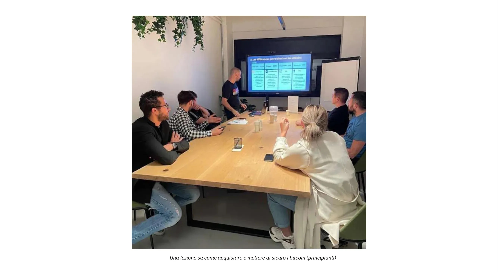

Naturalmente, più grandi sono gli obiettivi di sviluppo della comunità, più tempo voi e i vostri membri dovrete investire.

Ecco perché è importante **iniziare a fissare obiettivi raggiungibili per il vostro meetup**.

## Il primo incontro: quando e perché?

<chapterId>f3f8a614-cfb4-5994-a2e8-d56e6f8e3347</chapterId>

Potete lanciare un meet-up poche settimane dopo aver creato la vostra comunità.

Tuttavia, a quel punto il gruppo sarà probabilmente ancora piccolo, il che significa che c'è la possibilità che nessuno si presenti.

È meglio organizzare un incontro quando si hanno almeno alcuni membri attivi nei propri canali di comunicazione, ad esempio qualche decina. Questo può avvenire rapidamente, ma dipende anche dalla personalità delle persone.

Una volta scoccata la scintilla, proponete di incontrarvi di persona. Se gli altri sono interessati, non resta che **fissare una data per il primo incontro**.

Piuttosto che scegliere la data da soli, di solito è meglio **creare un sondaggio una decina di giorni prima con diversi giorni e orari possibili**. In questo modo, potrete utilizzare i voti per massimizzare la partecipazione, creare entusiasmo e utilizzare al meglio il vostro tempo.

È meglio non avere aspettative fisse su come si svolgerà l'incontro, su quante persone verranno o su quali argomenti verranno discussi. In questo modo si evitano delusioni e si evita che i partecipanti si sentano sotto pressione.

Lasciate che le cose fluiscano naturalmente, magari davanti a un drink. Le conversazioni dovrebbero svolgersi in modo semplice e, se necessario, si può riportare la discussione sul Bitcoin con delicatezza, se inizia a sfuggire.

Se volete prepararvi per i momenti più tranquilli, potete pianificare alcune attività o punti di conversazione, come ad esempio:

- mostrando il **[Mempool](https://Mempool.space/)** su un computer o uno smartphone;
- portare un libro;
- portando un **Nerdminer**, un Bitaxe, un FPGA o persino un ASIC;
- avere un **volantino Bitcoin**;
- ideare un visual o un logo Bitcoin per la vostra comunità;
- giocare a un **[gioco di carte Bitcoin](https://www.Maximalist.ovh/accueil/20-game-le-Coin-de-table.html)**;
- che mostra la mappa **[btcmap.org](https://btcmap.org/)** delle comunità e dei commercianti;
- inviare o ricevere Bitcoin utilizzando **Lightning**.

Quando il vostro meet-up è agli inizi, spesso non è il momento giusto per una presentazione formale. Se la partecipazione è scarsa, di solito è meglio una discussione aperta e informale.

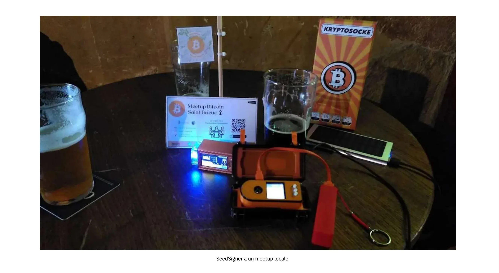

Dopo il primo incontro, probabilmente vorrete organizzarne un altro. Finché la vostra comunità è ancora piccola, è meglio scegliere le date tramite sondaggi, ad esempio una volta al mese o ogni due mesi. Potete discuterne nei vostri canali di comunicazione.

Se si forma un gruppo regolare di bitcoiners e di partecipanti interessati, ha senso stabilire un calendario ricorrente per due motivi:

1) rende più facile per tutti pianificare il futuro;

2) aiuta a **stabilire un'"abitudine "**. Anche se qualcuno smette di controllare regolarmente i vostri canali, saprà comunque quando si terrà l'incontro e potrà passare come al solito.

Questo secondo punto è uno dei motivi per cui, **in Francia, la maggior parte dei meetup si svolge il primo mercoledì di ogni mese** (vedi l'iniziativa "ambasciatori", lanciata da [DecouvreBitcoin](https://decouvrebitcoin.fr/) nel 2022).

In Germania e in Italia non esiste una giornata nazionale fissa.

Tuttavia, avere tutti i meet-up a livello nazionale nello stesso giorno crea un problema di centralizzazione: impedisce ai bitcoiners di partecipare agli eventi nelle comunità vicine e può anche sollevare problemi di sicurezza. Parlare con gli organizzatori dei meet-up vicini può aiutare a trovare un buon accordo.

Man mano che la vostra comunità cresce e gli incontri attirano più persone, potreste:

- fissare un obiettivo specifico per ogni incontro;
- o addirittura **aggiungere un secondo evento ogni mese**.

Nel primo caso, pur tenendo conto delle preferenze di ciascuno, un obiettivo chiaro può garantire che i partecipanti vadano via dopo aver imparato qualcosa di nuovo e che le conversazioni si concentrino sul Bitcoin.

Nel secondo caso, un secondo evento mensile potrebbe essere dedicato a un tema specifico, come sessioni per principianti o workshop (Mining, Lightning, installazione di nodi, ecc.).

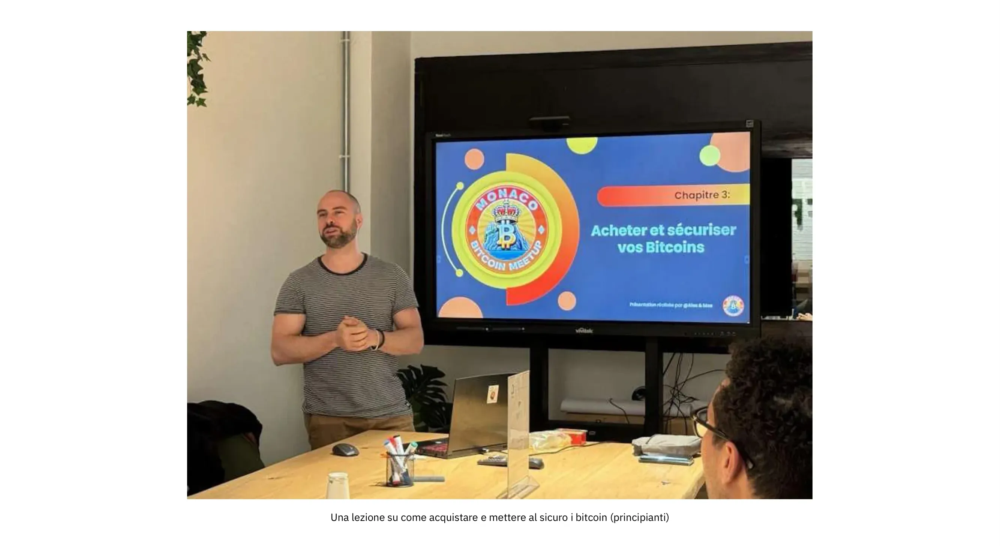

Tenete presente che **questo richiede più organizzazione e più tempo**. Fortunatamente, nella [parte 6/8 di questo corso](https://planb.academy/courses/1c643dc9-a15f-4f9e-93b6-cb3c58b4ee35/3213d87a-1998-5972-ab93-97a5769ba279), troverete una serie di risorse open-source riutilizzabili per aiutarvi.

In ogni caso, tutto dipende dal piano d'azione a breve, medio e lungo termine che voi, o la vostra comunità, vi siete dati.

## La ricerca di un luogo

<chapterId>405d389e-6a32-5777-af8d-293380d2e8fd</chapterId>

Trovare una sede per i vostri eventi spesso non è un compito facile. Inoltre, è essenziale che questa sede sia **localizzata nella città della vostra comunità**.

Ci sono diversi criteri da considerare, tra cui:

1) **Località**: è facilmente raggiungibile con i mezzi pubblici? In auto? È disponibile un parcheggio?

2) La sede è piacevole e non troppo **rumorosa**? Cercate un ambiente formale (spazio di co-working, sala riunioni) o qualcosa di più informale (bar, ristorante)?

3) Ha una capacità sufficiente per ospitarvi, anche in una serata di rugby o di Champions League?

4) Dispone di un videoproiettore e di un'area tranquilla per le presentazioni?

5) Infine, se si tratta di un bar o di un ristorante, il menu offre qualcosa da mangiare e da bere per tutti?

Inoltre, ecco tre punti importanti da tenere a mente:

- Se si prevede di dividere la serata in due parti: prima una presentazione in uno spazio formale per aiutare tutti a concentrarsi, poi il trasferimento in un bar o in un ristorante per continuare in un'atmosfera più rilassata, l'esperienza dimostra che cambiare luogo a metà serata spesso porta alcuni partecipanti ad abbandonare la sala durante la pausa. Questo approccio è quindi sconsigliato.
- Ai primi incontri, la partecipazione sarà probabilmente ridotta e probabilmente non farete presentazioni formali. In questo caso, non è necessario presentarsi al proprietario o spiegare i propri obiettivi. Tuttavia, **quando gli incontri diventano regolari e ben frequentati, vale la pena farlo per dimostrare professionalità ed esprimere il desiderio di tornare mensilmente**. Questo può portare a molte discussioni (prenotazioni mensili automatiche, tavole di bevande e/o cibo gratuite, sconti, conversazioni sul Bitcoin, accettazione dei pagamenti del Bitcoin, ecc.) Ovviamente, se cercate specificamente un locale con un videoproiettore per fare delle presentazioni, sembra essenziale chiedere un incontro (faccia a faccia, o anche per telefono) con il proprietario e/o il gestore per presentare il vostro progetto e i vostri obiettivi.

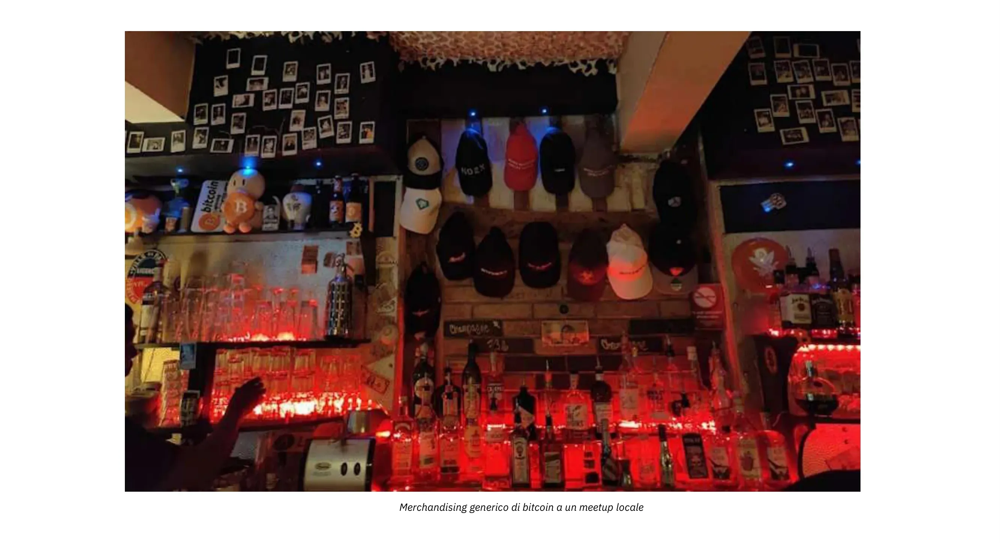

- infine, alcune comunità **vogliono organizzare i loro eventi solo in luoghi che accettano pagamenti Bitcoin**, il che è comprensibile. In questo caso, è una buona idea **iniziare a cercare gli esercizi commerciali che accettano Bitcoin nella propria città** (su [btcmap.org](https://btcmap.org/map/)e contattarli per vedere se soddisfano i propri criteri. Se non c'è nulla di adatto, si può provare a coinvolgere nuovi commercianti, ma ci si deve aspettare molti rifiuti, il che può essere scoraggiante. Ecco perché spesso è meglio non porsi questo obiettivo fin dall'inizio e prenderlo in considerazione una volta che la vostra comunità è ben consolidata e avete abbastanza "potenza di fuoco"

Inoltre, quando lanciate il vostro meet-up, non esitate a **cambiare sede per i primi mesi**. Questo vi aiuterà a **costruire relazioni con diversi manager**, a esplorare varie atmosfere e a raccogliere informazioni sui potenziali futuri ospiti.

In seguito, quando il vostro gruppo sarà cresciuto, potreste anche dedicare un pomeriggio a visitare diversi esercizi commerciali e bar, chiedendo se hanno uno spazio adatto a ospitare i vostri eventi e incontri mensili.

## Prima dell'incontro

<chapterId>c5218943-580d-5efc-89ed-6b5d728816d6</chapterId>

Avete intenzione di organizzare un incontro nelle prossime settimane?

Ecco una lista di controllo per aiutarvi a prepararvi:

1/ **Confermare la sede**

Contattare il luogo in cui si terrà l'evento e prenotarlo per il numero di partecipanti previsto.

2/ **Annunciare l'evento**:

    - Condividete la data, l'ora e il luogo sui vostri social network e altri canali di comunicazione. Se necessario, includete un link per la registrazione.
    - Creare un visual dedicato (ad esempio un poster Canva, vedi parte 2/8 "[Progettare un'identità per la vostra comunità Bitcoin](https://planb.academy/courses/1c643dc9-a15f-4f9e-93b6-cb3c58b4ee35/b48a18cc-afdf-5216-802c-32647b5cd8a3)").
    - Massimizzate la visibilità appuntando l'annuncio su Telegram e Twitter e utilizzando una menzione "@tutti" su Discord.
    - Pubblicate gli annunci da 7 a 10 giorni prima dell'evento, in modo che i partecipanti possano pianificare in anticipo.

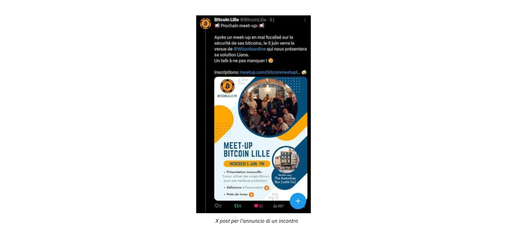

3/ **Ricordare al pubblico**

Due o tre giorni prima dell'evento, condividete e ritwittate i vostri annunci per aumentare la visibilità.

4/ **Aggiornamento della sede**

Il giorno prima (o due giorni prima), controllate le iscrizioni e comunicate alla sede il numero definitivo di partecipanti previsto.

Passi in più per far risaltare il vostro evento:

- Stampa di volantini e/o manifesti
- Preparare una presentazione su un argomento specifico
- Organizzare un'attività o un workshop

## Il giorno dell'incontro

<chapterId>cf60067b-591f-5fdf-9b9e-d442aad0e8f9</chapterId>

Il grande giorno è arrivato! Una o due ore prima dell'inizio dell'evento, inviate un promemoria attraverso i canali di comunicazione della vostra comunità. Riconfermate l'orario di inizio e comunicate ai partecipanti come riconoscervi, ad esempio dicendo che indosserete la maglietta e il cappellino del Bitcoin.

Man mano che i vostri meetup crescono e iniziate ad accogliere più di 20 persone, la preparazione della sede diventerà sempre più importante.

Ecco cosa fare:

1) **Arrivare in anticipo** per organizzare le cose.

2) **Organizzate lo spazio** in base alle vostre esigenze e alle possibilità del locale. Se siete solo sei persone, non è necessario un allestimento particolare. Ma quando si raggiungono i 10-20 partecipanti, una disposizione completamente seduta può limitare le interazioni. In questo caso, scegliete un allestimento in piedi con tavoli alti e ben distanziati, se disponibili, ma prevedete comunque alcune sedie (preferibilmente alte). Se è prevista una presentazione, mantenete la disposizione in piedi per la maggior parte della serata e portate le sedie solo prima dell'intervento.

3) Aggiungete piccoli tocchi personalizzati:

    - Affiggete un manifesto all'ingresso per indicare la vostra posizione (utilizzate Patafix e ottenete prima il permesso del locale).
    - All'interno, esponete i poster a tema Bitcoin (il libro bianco Bitcoin, lo statuto della comunità, i progetti in corso, ecc.)
    - Sui tavoli sono presenti adesivi, volantini o spunti di conversazione, ad esempio: un Nerdminer, un Hardware Wallet, un computer portatile che espone il suo Mempool, ASIC Miner o una piastra di backup in metallo per le chiavi private.

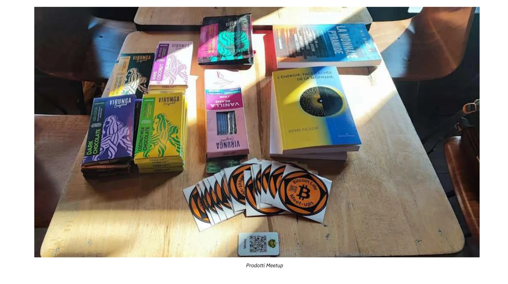

Se vi aspettate solo pochi partecipanti e non avete ancora instaurato un rapporto con i gestori della sede, evitate di portare ed esporre subito tutta l'attrezzatura. Una volta instaurata la fiducia, avrete più libertà di organizzare lo spazio come desiderate.

Infine, prendete un drink e aspettate che le persone arrivino. E ricordate: non scoraggiatevi se la prima volta non arriva nessuno. Portate con voi un libro o un video da guardare, non si sa mai.

## Dopo l'incontro

<chapterId>3e881af9-9c09-5721-81ee-c5cda3b109c5</chapterId>

Quando l'incontro termina, è il momento delle pulizie per il personale del locale. Prima di andar via, offritevi di dare una mano ai camerieri o ai gestori. Può trattarsi semplicemente di raccogliere tutti i bicchieri su un tavolo o, se siete vicini al bar, di restituirli prima di andarvene.

Una volta tornati a casa, probabilmente avrete ancora in mente il Bitcoin per giorni. È il momento perfetto per tastare il polso alla vostra comunità e raccogliere il feedback dei partecipanti. È possibile:

- Pubblicate un messaggio di ringraziamento sui vostri canali di comunicazione e condividete qualsiasi link o risorsa menzionata durante l'evento.
- Invitate i partecipanti a suggerire miglioramenti per il prossimo incontro.
- Iniziate a pianificare il vostro prossimo evento.

Avrete quindi alcune settimane per sviluppare nuove idee, immagini o progetti per rendere il prossimo incontro ancora migliore.

## L'importanza di coinvolgere e trattenere i partecipanti

<chapterId>f5355e35-4b07-527c-88a3-8535cba7592c</chapterId>

Roma non è stata costruita in un giorno, e nemmeno la vostra comunità lo sarà. L'impulso al Bitcoin viene dall'organizzazione di incontri ed eventi regolari.

Per far sì che ciò accada, una cosa è essenziale: **mantenere i partecipanti impegnati**.

Si potrebbe iniziare con un piccolo gruppo di appassionati di bitcoiners, il cui scopo è riunirsi regolarmente e parlare del Bitcoin. Nel corso del tempo, a seconda della disponibilità e degli interessi di ciascuno, si possono **condividere alcuni compiti organizzativi con il gruppo**, o invitare i **membri principali ad occuparsi di progetti specifici**. Questi possono essere unici per la vostra comunità, i vostri incontri o la vostra città o anche ispirati alle molte iniziative proposte nella [parte 6/8 di questo corso](https://planb.academy/courses/1c643dc9-a15f-4f9e-93b6-cb3c58b4ee35/3213d87a-1998-5972-ab93-97a5769ba279). **Questo non solo favorisce il Commitment da parte dei membri principali, ma aiuta anche la comunità a crescere e a prosperare.**.

Man mano che gli incontri si susseguono, compaiono nuovi volti: persone che hanno acquistato BTC e/o altcoin nei cicli precedenti, appassionati di tecnologia che vogliono approfondire la loro conoscenza, o principianti assoluti curiosi di questo sistema di pagamento non censurabile, decentralizzato, trasparente ed equo che funziona senza condizioni e senza terze parti fidate.

Per far sì che tutti si sentano inclusi nei vostri eventi, concentratevi su due aspetti fondamentali:

- **Inclusione sociale**: Tutti i partecipanti devono sentirsi benvenuti. Sforzatevi di salutare i nuovi arrivati, chiedete perché sono venuti e presentateli agli altri. Quando le persone si sentono incluse, sono più propense a tornare e magari a contribuire all'organizzazione di eventi futuri.
- **Pazienza e apertura**: Questo richiede tempo e motivazione. Se si sta parlando con un convinto "shitcoiner" (o peggio, un XRP Maximalist), si può essere tentati di respingerlo. Ma impegnandosi nella conversazione, si possono chiarire i malintesi o i ragionamenti errati. Se sono disposti ad ascoltare, potrebbero essere pronti a capire veramente il Bitcoin.

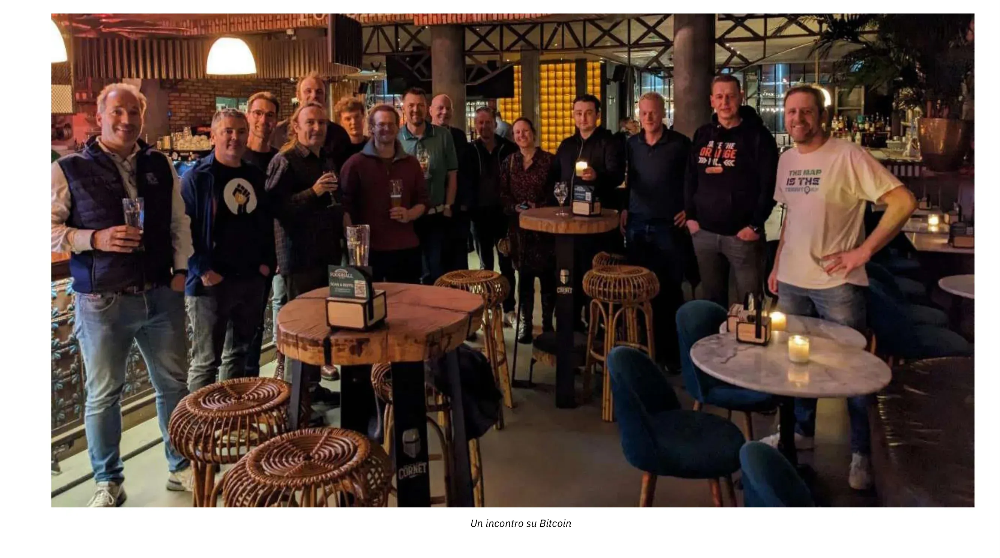

Da un punto di vista pratico, pensate all'esperienza complessiva dell'evento:

- Il **viaggio è stato piacevole**?
- Era **facile da raggiungere**?
- Perché alcune persone si sono iscritte ma non si sono presentate?
- Quali discussioni si sono tenute? Le discussioni erano troppo tecniche per i principianti?
- Le discussioni erano troppo alcoliche?

Ogni partecipante ha la propria personalità, i propri obiettivi e interessi, quindi le esperienze variano. Ma quando la sede è giusta, la folla è aperta e le intenzioni sono genuine, ci sono tutti i presupposti perché il meetup abbia successo.

Costruire un meetup richiede tempo ma soprattutto organizzazione. È un progetto umano e funzionerà e crescerà a lungo termine solo se è ben pianificato, aperto e inclusivo.

In definitiva, spetta a voi decidere fino a che punto "aperto e inclusivo" debba spingersi. Ricordate solo che uno shitcoiner spesso è solo un bitcoiner in divenire.

# Esempi di progetti e iniziative

<partId>45b3bc40-1c31-583e-8411-2662e6efd765</partId>

## Perché andare oltre il semplice bere birra?

<chapterId>3213d87a-1998-5972-ab93-97a5769ba279</chapterId>

Con il passare dei blocchi, la vostra comunità si evolverà. Nuovi volti si uniranno, altri si allontaneranno, ma il principio guida dovrebbe rimanere lo stesso: sviluppare l'ecosistema Bitcoin e rafforzare i legami tra i membri.

Sono molti i progetti e le iniziative che si possono realizzare. Questo capitolo offre un elenco non esaustivo di idee che possono essere realizzate all'interno di una comunità o durante un meetup. Sentitevi liberi di scegliere quelle che vi ispirano e anche di contribuire con le vostre idee a questo corso [facendo una "Pull Request" su GitHub](https://github.com/PlanB-Network/Bitcoin-educational-content).

Prima di immergerci, rivediamo un punto citato in precedenza.

Quando si organizza un incontro Bitcoin, si incontrano nuove persone. L'interazione sociale è essenziale e la birra (o l'alcol in generale) può contribuire a creare un'atmosfera di festa. Ma è bene tenere a mente che

- L'alcol compromette le capacità cognitive, come il pensiero e la comprensione, rendendo più difficile per i partecipanti seguire discussioni o presentazioni serie.
- L'alcol può anche diventare un rituale di conforto: ogni mese si condivide il proprio "momento Bitcoin" con gli amici davanti a un drink. Sebbene sia un ottimo modo per entrare in contatto, bere birra è davvero l'obiettivo principale del vostro incontro? O preferite fare ricerche sul Exchange, imparare dagli altri e aiutare i nuovi arrivati a scoprire il Bitcoin?

Ognuno ha le proprie preferenze, convinzioni e personalità. Non si tratta di giudicare un meetup rispetto a un altro. Tuttavia, anche se spesso si parla di cambiare il mondo davanti a una birra, le rivoluzioni non iniziano né crescono in questo modo.

Il segreto è semplicemente esserne consapevoli.

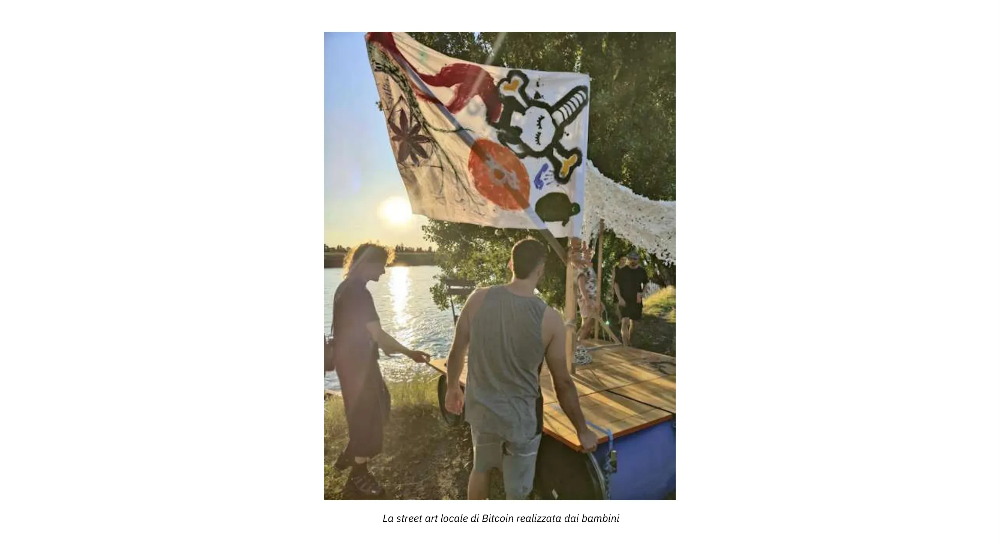

## Organizzare incontri a tema, con una progressione annuale

<chapterId>46afdbcc-a775-5c16-b20a-34956690d58f</chapterId>

Una volta creato un gruppo di base di circa dieci persone, potete iniziare ad aggiungere presentazioni a ogni evento. Queste possono seguire un tema annunciato in anticipo o essere completamente indipendenti l'una dall'altra.

Quando si pianificano presentazioni o workshop, è utile creare una progressione chiara e ben strutturata. L'obiettivo è quello di **coprire i concetti fondamentali del Bitcoin passo dopo passo**, fornendo ai partecipanti una visione completa dell'argomento da più angolazioni.

In Francia, durante l'estate del 2023, gli organizzatori del meet-up hanno lavorato su **una progressione annuale**.

Oltre al suo forte valore educativo, questo approccio permette di condividere documenti open-source e slide decks tra i gruppi, costruendo gradualmente una biblioteca condivisa di risorse. L'iniziativa è stata accolta con favore ed è destinata a crescere nei prossimi anni.

Di seguito è riportata la progressione dei meetup francesi del 2023-2024. Per ogni tema sono disponibili una presentazione open-source e un video, che possono dare spunti per argomenti da trattare nei propri eventi.

Ulteriori materiali modificabili si trovano anche nel [Bitcoin Teaching Toolbox](https://planb.academy/fr/resources/bet)!

| Month | Theme | Video | Editable Resource |
| -------- | -------- | -------- | --- |
| September     | Chapter 1: What is Bitcoin?     | [	YouTube link](https://www.youtube.com/watch?v=CSjuBqrl4t8)     | [Editable PowerPoint](https://www.canva.com/design/DAFu0d5Jd7M/9gAWDAOSS6LDkWENuZjYgw/edit) |
| October & November| Chapter 2: Understanding Bitcoin Transactions     | [YouTube link](https://www.youtube.com/watch?v=inFnR-3NsdM)     | [Editable PowerPoint](https://www.canva.com/design/DAFsEcnOro8/Mz9FYdTGhsvozZOe0Y9jtw/edit) |
| December     | Chapter 3: Understanding the Lightning Network     | [YouTube link](https://www.youtube.com/watch?v=hHz-ALx8D9w)     | [Editable PowerPoint](https://www.canva.com/design/DAF4YPSNnR8/HKp4Vmcno8eMtVWnZmFtcw/edit) |
| January     | Chapter 4: What is Mining?     | [YouTube link](https://www.youtube.com/watch?v=QyHZ3CVI_OI)     | [Editable PowerPoint](https://www.canva.com/design/DAF5DE6iBEM/tsy8E3oBebUnsR0kj53vvQ/edit) |
| February     | 	Chapter 5: Running a Bitcoin and Lightning Node    | [YouTube link](https://www.youtube.com/watch?v=RRYK-usg-OY)     | [Editable PowerPoint](https://www.canva.com/design/DAF55FU6HI0/sQ0lacRJblqrhn_9Xk1yDg/edit) |
| March     | 	Chapter 6: Using the Lightning Network in Daily Life    | [YouTube link](https://www.youtube.com/watch?v=o2BS4xjei8M)    | [Editable PowerPoint](https://www.canva.com/design/DAGAcJMw7lw/-haMNnHnwj5vpDAy8MDowA/edit) |
| April & May    | Chapter 7: Securing Your Bitcoins      | [YouTube link](https://www.youtube.com/watch?v=fHExPbhM0Hg)    | [Editable PowerPoint](https://www.canva.com/design/DAGDz3Nq4e0/D3uG-4w9FN6OhUq-VXzhfg/edit) |
| June     | 	Chapter 8: What is Multi-Sig?     | [YouTube link](https://www.youtube.com/watch?v=Me5489mpoxA)     | [Editable PowerPoint](https://www.canva.com/design/DAGLMtQT6sg/rYIxr4ldUJ0jTelNf-Pj8Q/edit) |
| July     | 	Chapter 9: Understanding the Bull Run and How to Prepare    | [YouTube link](https://www.youtube.com/watch?v=7RA-gnCJWyM)     | [Editable PowerPoint](https://www.canva.com/design/DAGJQkiZ_YA/9lUluP9RZ0eeA_e61mk9Hw/edit) |
| August     | Chapter 10: The Taxman is Never Far Away   | [YouTube link](https://www.youtube.com/watch?v=oY4NwonGDm0)     | [Editable PowerPoint](https://www.canva.com/design/DAGQhx7Yc_c/7mRhb_vlgnhSgxd1FtjK8w/edit) |

I capitoli 2 e 7 possono essere suddivisi in due presentazioni più brevi per non sovraccaricare i partecipanti. Tuttavia, la loro esecuzione in un'unica sessione libera spazio nel calendario per attività speciali, come incontri congiunti con gruppi vicini, quiz o workshop.

**Siete liberi di usare, adattare e condividere queste risorse, ma assicuratevi di dare credito agli autori originali se riutilizzate il loro lavoro **

Poiché non tutti possono partecipare a ogni incontro, è una buona idea registrare le presentazioni e caricarle su una piattaforma di streaming o sul vostro sito web. In questo modo gli assenti possono recuperare e i partecipanti possono rivedere il materiale in un secondo momento.

In parallelo, è possibile organizzare altri meetup a tema, come ad esempio:

- Un quiz di conoscenza del Bitcoin (con un Hardware Wallet in premio)
- Una sfida di onboarding in cui si inviano satoshis gratuiti ai no-coiners per strada
- Invitare un relatore esperto o un'azienda a presentare un prodotto legato al Bitcoin
- Un tour notturno dei bar e dei negozi che accettano il Bitcoin

E molto altro ancora, l'unico limite è la vostra immaginazione!

## Creare eventi collaterali e workshop

<chapterId>9dbd651a-8712-5630-90b3-b9525dcc1385</chapterId>

In base alla vostra disponibilità e al livello di coinvolgimento nella vostra comunità, potete pianificare altri eventi nel corso dell'anno, ad esempio:

- Una serata al ristorante per il **Pizza Day** del 22 maggio
- Una serata o un weekend per festeggiare il prossimo **Halving**
- Una serata di **gioco** in famiglia sul Bitcoin e sul suo funzionamento, utilizzando giochi come [Le Coin de Table](https://www.Maximalist.ovh/) o [SHAmory](https://shamory.com/)
- Un workshop **Mining** che presenta diversi tipi di hardware (CPU, GPU, FPGA, ASIC, Nerdminer, Bitaxe)
- Un **pomeriggio o una serata per principianti**, con laboratori a tema
- Un **incontro congiunto con le comunità vicine**

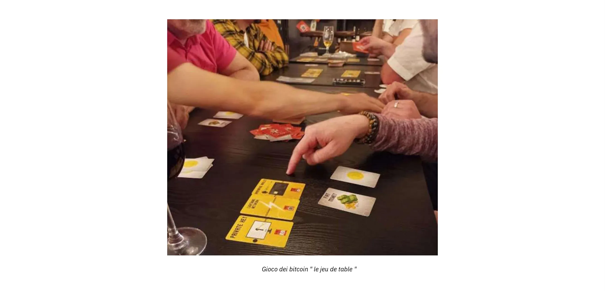

Fate attenzione a non sovraccaricare il calendario. Troppi eventi in un solo mese possono portare al burnout degli organizzatori e a una riduzione della partecipazione nel tempo.

## Creare adesivi

<chapterId>d605f3b3-130e-513d-85e6-06bc5ea13e99</chapterId>

Gli adesivi sono un modo divertente per promuovere il Bitcoin e la vostra comunità, rafforzando al contempo la vostra identità.

Prima di ordinare, tenete a mente questi suggerimenti:

- Per l'uso all'esterno, assicurarsi che gli adesivi siano impermeabili.
- Mantenere il logo leggermente più piccolo dell'area di taglio per evitare problemi di ritaglio durante il taglio laser.
- Per una maggiore qualità di stampa, utilizzare un file vettoriale anziché un'immagine raster.
- Scegliete la misura giusta: 8 cm di diametro (circa la dimensione del palmo di un adulto) sono molto visibili, mentre 4 cm sono più discreti. Cercate visibilità o discrezione?
- Per una stampa in nero intenso ("quad black"), utilizzare 30% ciano, 30% magenta, 30% giallo e 100% nero. Se si utilizza solo il 100% di nero, si può ottenere una tonalità grigia. Le stampanti spesso controllano questo aspetto, ma vale la pena di saperlo.

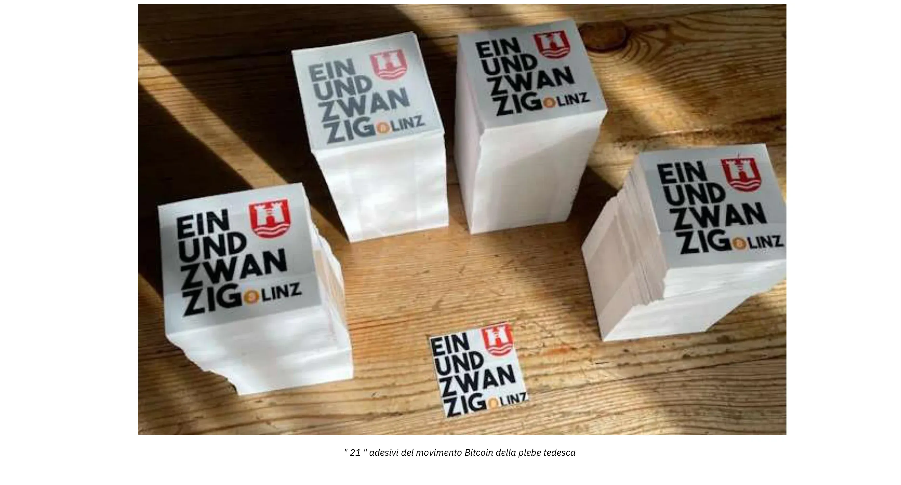

A seconda delle esigenze e del fornitore, 1.000 adesivi possono costare tra i 100€ e i 250€. È possibile contattare [@Mill3sim3 su Twitter](https://x.com/Mill3sim3), un Bitcoiner francese specializzato in marketing, che a volte può garantire prezzi fino al 30% inferiori rispetto ai normali venditori online.

Detto questo, 1.000 adesivi sono molti. Di solito è meglio iniziare con circa 100 per essere sicuri di poterli distribuire tutti.

Importante: **Verificare le normative locali prima di collocare gli adesivi in spazi pubblici**.

In Francia, gli adesivi possono essere affissi solo sulle bacheche pubbliche ufficiali. Se vengono affissi altrove (ad esempio su un cartello di divieto di sosta) verranno probabilmente rimossi ed eventualmente multati se possono essere collegati a voi o al vostro meetup. Informate i vostri membri su questo punto.

In luoghi privati come concerti, bar o stadi, controllate se sono già presenti adesivi prima di aggiungere il vostro. In caso contrario, chiedete il permesso al personale. Non volete che la prima impressione del proprietario di un'attività commerciale sia che avete vandalizzato il suo spazio.

## Creare una biblioteca

<chapterId>acc94093-f8b3-51b8-9359-348e9e075d38</chapterId>

Un altro progetto che si può facilmente mettere in piedi è la **creazione di una biblioteca nei vostri incontri**.

Si potrebbero invitare i partecipanti che desiderano condividere il proprio materiale di lettura a portare un libro legato al Bitcoin. Se qualcun altro al meeting-up vuole prenderlo in prestito, si potrebbe concordare un prestito con il proprietario nel Exchange per un deposito, ad esempio 21.000 satoshi via Lightning.

Per il proprietario, il deposito serve a coprire eventuali perdite o furti. Per il mutuatario, è un incentivo a tornare a un futuro incontro per recuperare il deposito.

Se gestite un'associazione e volete investire parte dei vostri fondi in risorse educative, potete anche acquistare diversi libri da offrire nella vostra **biblioteca Bitcoin**, disponibile a ogni incontro.

Per sostenere l'ecosistema, la **[casa editrice Konsensus Network](https://konsensus.network/) offre ai meet-up e alle comunità internazionali del Bitcoin uno sconto dal 15% al 35% su tutti i suoi libri dalla fine del 2023, per ordini di tre o più libri**.

Per usufruire di questo sconto, è sufficiente **contattare [la casa editrice Konsensus](https://twitter.com/KonsensusFR) su Twitter**.

Se non avete i soldi, potete comunque trasferire lo sconto ai membri della vostra comunità.

Se non avete i fondi necessari, potete comunque trasferire lo sconto ai vostri soci. Ad esempio, un organizzatore potrebbe raccogliere gli ordini dei soci, fare un ordine in blocco a prezzo ridotto e distribuire i libri al prossimo incontro, con il pagamento in un'unica soluzione.

Potreste anche esporre una carta del prestito di libri durante i vostri incontri per spiegare chiaramente le regole del prestito ai nuovi arrivati.

Ecco un esempio open-source che potete utilizzare e adattare:

[Carta per il prestito dei libri](https://www.canva.com/design/DAF7u1b5kRM/r2gEAlibe_jTIXIX-O9PMA/edit)

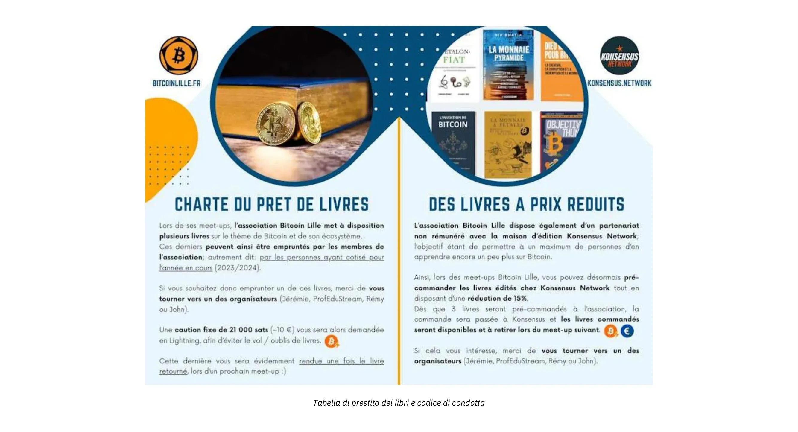

Infine, per incoraggiare la lettura del Bitcoin, potreste visitare le **biblioteche comunali** per vedere se hanno libri sul Bitcoin.

In caso affermativo, chiedete ai bibliotecari se sono previste **tavole rotonde** sull'argomento e offrite loro i contatti del vostro meet-up.

In caso contrario, suggerite loro di acquistare alcuni libri da un elenco preselezionato. Il [publisher Konsensus Network](https://konsensus.network/) può essere una fonte di ispirazione.

## Creare e distribuire volantini personalizzati

<chapterId>62ad5430-c698-51b3-89ac-090f31c88953</chapterId>

Progettare e redigere i volantini richiede tempo, ma ne vale la pena: vi danno una risorsa tangibile da distribuire quando parlate del Bitcoin, il che è sempre apprezzato.

Questi volantini possono essere indirizzati a:

- Commercianti, se volete introdurre il Bitcoin come metodo di pagamento;
- I partecipanti all'evento, con un volantino che spiega come utilizzare e pagare con Bitcoin/Lightning;
- I principianti, incontrati per strada, al lavoro o durante una riunione di famiglia, con un volantino che evidenzia i principali vantaggi del Bitcoin.

Potreste anche progettare un volantino specifico per la vostra comunità o meet-up, presentando le vostre attività, gli obiettivi, i link ai social media, i canali di comunicazione e i prossimi eventi.

Diversi volantini sono già **disponibili come open-source nel [Bitcoin Teaching Toolbox](https://planb.academy/fr/resources/bet)** su planB.network e altri saranno aggiunti nel tempo.

Un esempio è un [volantino completo](https://profedustream.substack.com/p/21-raisons-dutiliser-Bitcoin) con 21 motivi per utilizzare il Bitcoin. Il suo design è anche [disponibile in open-source](https://www.canva.com/design/DAFtAR1NauQ/ZDwl2CchIJ9Gpb36N6-7iw/edit?utm_content=DAFtAR1NauQ&utm_campaign=designshare&utm_medium=link2&utm_source=sharebutton) per essere modificato, adattato e condiviso. Ricordatevi solo di citare le fonti.

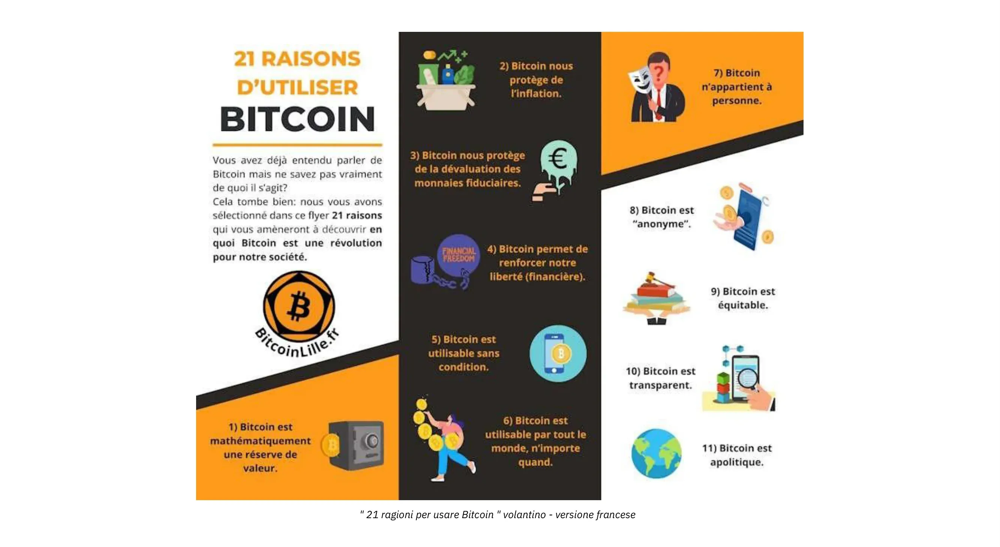

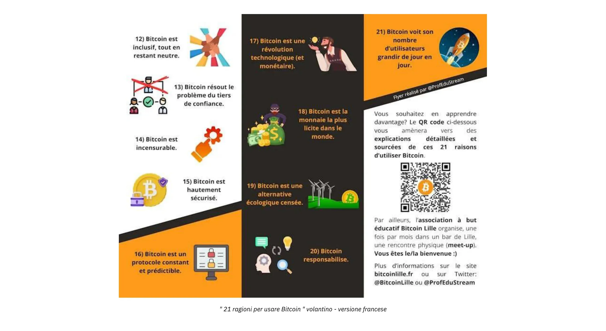

Come già detto, potete lasciare questi volantini praticamente ovunque: su una scrivania condivisa al lavoro, al tavolo della famiglia, in una biblioteca pubblica, ecc.

In Francia e in alcuni altri Paesi esistono anche le "cassette dei libri", piccole scatole di legno dove le persone possono donare o prendere in prestito liberamente i libri. Potreste lasciare lì un volantino o, meglio ancora, un libro.

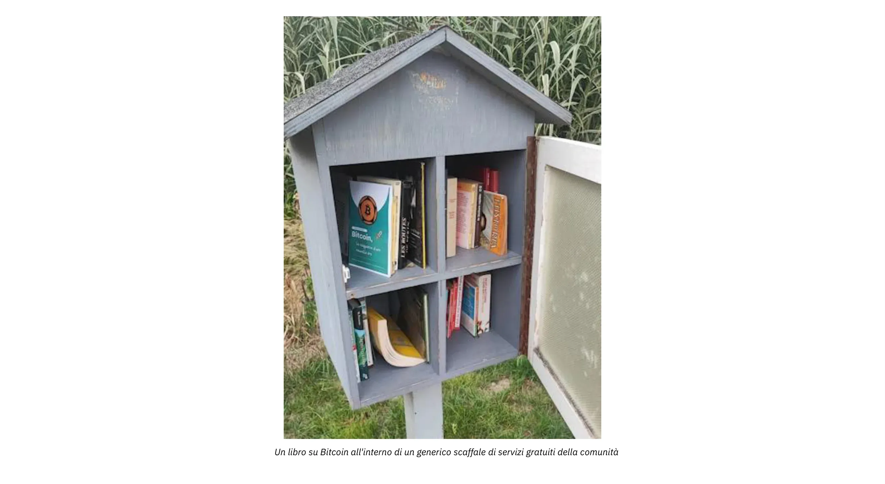

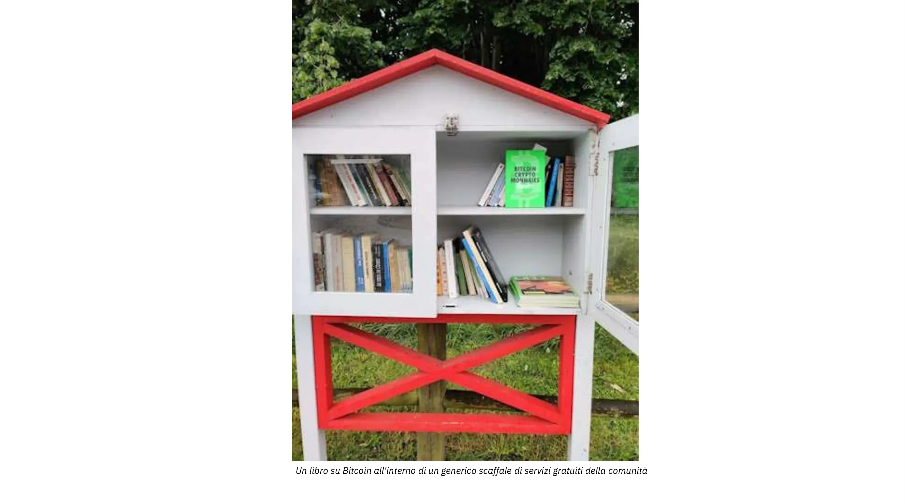

Nel 2023 è stata lanciata l'iniziativa **"Bitcoin White Paper in France's Book Boxes**".

Per realizzare questo progetto, i partecipanti hanno dovuto innanzitutto raccogliere la geolocalizzazione di tutte le librerie del Paese. A questo scopo esistono diversi database:

- [boite.a.livres.zonelivre.fr](https://boite.a.livres.zonelivre.fr/);
- [boites-a-livres.fr](https://www.boites-a-livres.fr/carte-de-france);
- [delivrez.fr](https://delivrez.fr/maps/fr_FR/);
- più articoli della stampa locale

Sebbene il libro bianco Bitcoin sia simbolico, spesso è troppo complesso da capire per i nuovi arrivati. L'idea è stata invece quella di creare un piccolo opuscolo contenente:

- un'introduzione accessibile e ben documentata al Bitcoin, ai suoi usi e ai problemi che risolve;
- il libro bianco Bitcoin, tradotto in francese.

Ecco [l'opuscolo condiviso dai bitcoiners francesi](https://profedustream.substack.com/p/Bitcoin-la-naissance-dune-nouvelle) che è stato collocato in decine di librerie in tutto il Paese. Il suo design è anche [disponibile come open-source](https://www.canva.com/design/DAFs18FSoVM/Sy0QsfUkycTgXveeGgutBg/edit?utm_content=DAFs18FSoVM&utm_campaign=designshare&utm_medium=link2&utm_source=sharebutton).

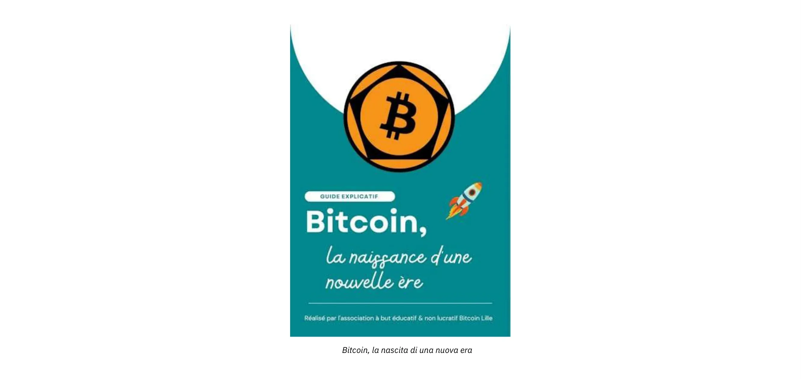

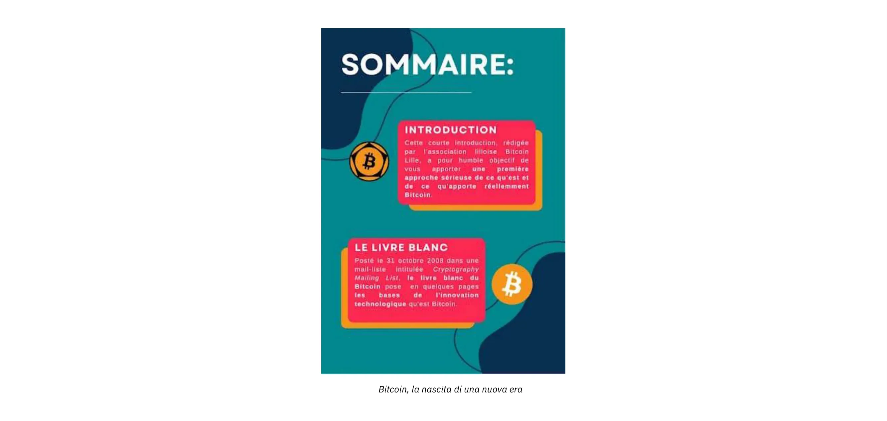

## Produzione di una videoproiezione

<chapterId>892b248a-b837-5df6-aac9-4b3261ff0390</chapterId>

Quasi tutti i bitcoiner hanno probabilmente visto l'affascinante serie centrale di [Rémi Forte](https://twitter.com/forteremi) "Le mystère Satoshi, aux origines du Bitcoin" (Il mistero del Satoshi: le origini del Bitcoin).

Pubblicato nel 2021, è stato visualizzato [diversi milioni di volte su YouTube](https://www.youtube.com/watch?v=0ETcLj5jBy4).

Un'idea potrebbe essere quella di organizzare una proiezione de Il mistero del Satoshi per la vostra comunità, magari come evento extra mensile.

Un avvertimento: sebbene ARTE France abbia confermato che le proiezioni pubbliche sono consentite, è necessario pagare i diritti di proiezione per farlo legalmente. Nel 2023, il costo era di circa 250 euro a proiezione, o 120 euro a proiezione se almeno cinque meetup lo proiettavano durante l'anno.

Per la maggior parte delle comunità, questo prezzo è proibitivo, soprattutto perché il documentario è già disponibile gratuitamente sul canale YouTube di ARTE.

Naturalmente sono possibili altre proiezioni.

Ad esempio, in Francia, la **regista [Alana Mediavilla](https://twitter.com/AlanaMediavilla) ha concesso ai meet-up locali il diritto di presentare in anteprima il suo documentario "Stranded "**, che include filmati del prossimo film del 2024 [film "Dirty Coin"](https://www.dirtycointhemovie.com/).

Alcuni bitcoiners hanno persino preso l'iniziativa di tradurre completamente "Stranded" in francese, aggiungere i sottotitoli e condividerlo con i meetup di tutto il Paese. Durante la settimana del 4 marzo 2024, il film è stato proiettato simultaneamente in una dozzina di meetup in tutto il Paese.

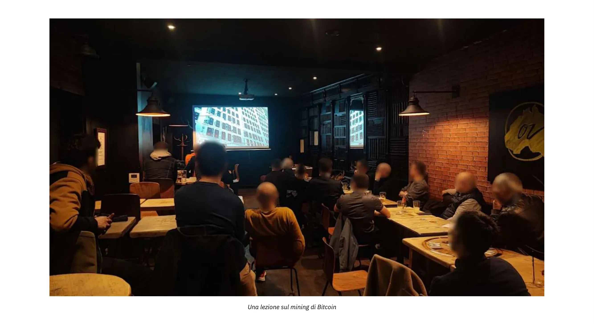

L'evento ha suscitato vivaci discussioni sul Bitcoin Mining, sul suo consumo energetico e sul suo più ampio impatto ambientale.

## Affissione di manifesti nella vostra città

<chapterId>6565e8a0-d535-5be0-9764-273584c675bd</chapterId>

In diversi Paesi europei (tra cui Germania, Spagna e Francia) i bitcoiners hanno preso l'iniziativa di affiggere manifesti nelle loro città.

Alcuni disegni rielaborano l'arte di Banksy per includere il logo Bitcoin.

Un esempio è [StreetCyberArt](https://twitter.com/streetcyber_art), un bitcoiner tedesco che da diversi anni crea collage e arte di strada.

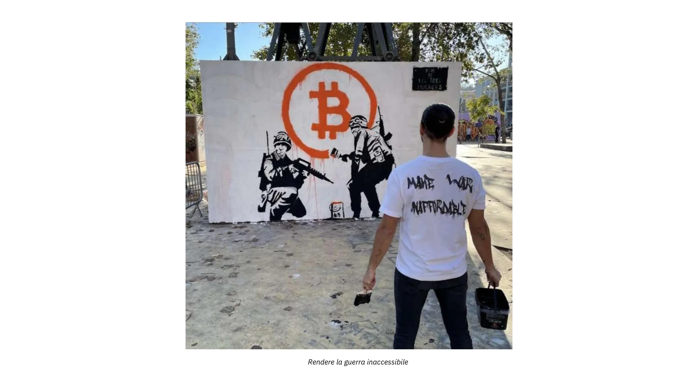

Se volete dedicarvi all'affissione stradale, assicuratevi di conoscere le leggi del vostro Paese. In Francia, ad esempio, i manifesti possono essere affissi solo su cartelloni pubblici. In altri luoghi è del tutto vietato e punibile con una multa.

Se decidete di oltrepassare i limiti e sperate di non essere colti "in flagrante", evitate di inserire nei manifesti informazioni identificative (come il nome dell'incontro o @Twitter).

Si noti inoltre che la stampa di questi manifesti con una stampante personale di solito provoca un'emorragia di inchiostro e un rapido deterioramento all'esterno. L'approccio migliore è quello di collaborare con uno stampatore professionista che possa produrre i manifesti su una speciale carta autoadesiva progettata per l'uso all'aperto, garantendo qualità e durata.

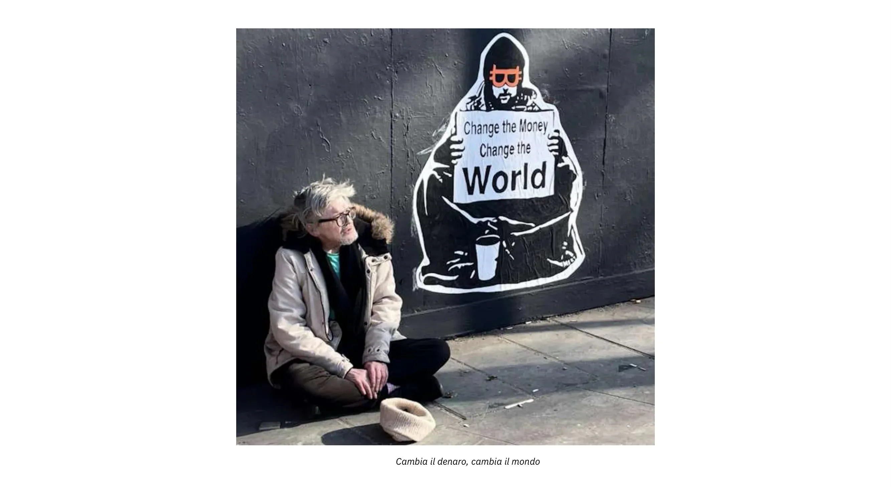

Questa iniziativa può avere un costo superiore a 0,40€ per manifesto (circa 40€ per un centinaio di manifesti) e i prezzi online possono variare dal doppio al quintuplo. I buoni contatti sono essenziali.

Come già detto, il bitcoiner francese [@Mill3sim3](https://twitter.com/Mill3sim3) dispone dell'attrezzatura professionale adatta e può essere contattato per i dettagli.

In alternativa, un'opzione più fai-da-te consiste nel creare uno stencil da un grande pezzo di cartone e utilizzare la vernice spray per applicare il disegno in punti selezionati della città.

## Una carta NFC personalizzata

<chapterId>8ad65d4e-a68a-59c2-a812-85f4907ed9f3</chapterId>

Un'altra idea originale del progetto è quella di creare carte NFC personalizzate per i pagamenti Lightning (compatibili con lo standard BoltCard). Per questo, Swiss Bitcoin Pay è un ottimo partner.

[Il sito web (https://swiss-Bitcoin-pay.ch/cards) offre attualmente quattro modelli standard.

Se si desidera ordinare più di 50 schede NFC, è possibile contattare l'azienda tramite il sito Web ufficiale o [Twitter](https://twitter.com/SwissBitcoinPay) per proporre un design personalizzato per la parte anteriore della scheda. Il retro rimarrà standardizzato.

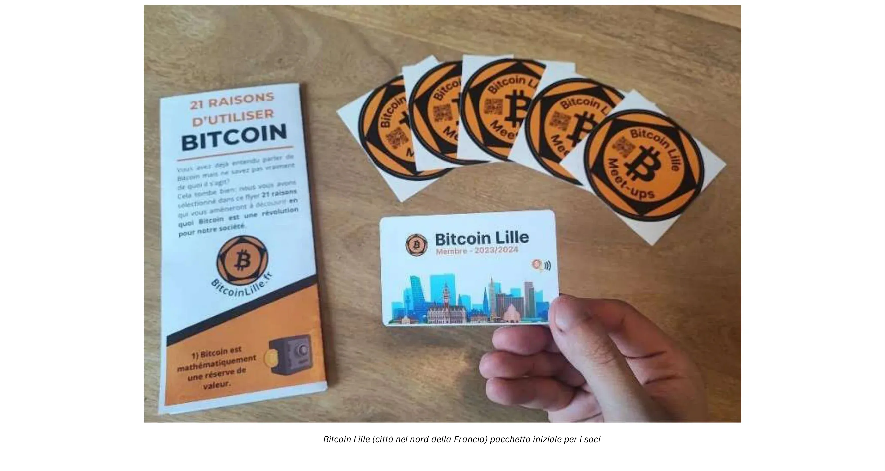

Ad esempio, nel 2023, l'associazione francese [Bitcoin Lille](https://twitter.com/BitcoinLille) ha ordinato un lotto di tessere NFC con un design personalizzato. Ogni nuovo membro ne ha ricevuta una nel suo pacchetto di benvenuto durante l'anno. Questa idea può essere facilmente adattata e personalizzata per la vostra comunità.

Il prezzo unitario di queste carte varia in genere da 2,50€ a 5€, a seconda delle dimensioni dell'ordine e delle condizioni di mercato, con prezzi più bassi per quantità maggiori.

## Creare un sito web

<chapterId>9a2a1b9b-0633-544a-b331-c06187d23d7f</chapterId>

A un certo punto della crescita della vostra comunità, può essere utile avere un sito web che funga da vetrina per il vostro gruppo, gli incontri, gli eventi e i contenuti educativi.

Creare un sito web richiede tempo, ma l'esercitazione che segue mostra come creare un sito WordPress gratuito in soli 30 minuti. Sarete in grado di impostare una homepage personalizzabile, pubblicare articoli e incorporare media come video di YouTube, immagini o PDF.

In seguito, potrete acquistare il vostro nome di dominio o addirittura ospitare il sito sul vostro server.

:::video id=a1b25c18-5fc1-4b97-baef-816d819c9382:::

Sebbene esistano altre piattaforme CMS, alcune con interfacce più semplici e adatte ai principianti, di solito sono molto meno personalizzabili. Ecco perché WordPress è generalmente il miglior punto di partenza.

WordPress supporta anche un'ampia gamma di plug-in (alcuni a pagamento ma di alta qualità) che possono espandere in modo significativo le capacità del vostro sito senza richiedere competenze di codifica. Un esempio è il [tema premium "Uncode"](https://undsgn.com/uncode/)

## Creare un canale video (Youtube o Odyssee)

<chapterId>076286db-1627-57ec-a410-c44b1666e1cd</chapterId>

Alcuni membri della vostra comunità potrebbero voler creare contenuti multimediali, come ad esempio video didattici.

Potreste anche tenere delle presentazioni in occasione di incontri o addirittura di università.

**Quando arriverà il momento, un canale video dedicato vi permetterà di pubblicare e centralizzare tutti i vostri contenuti in un unico luogo**

Le piattaforme più diffuse includono:

- [**YouTube**](https://www.youtube.com/), ampiamente utilizzato ma non resistente alla censura.
- [**Odyssee**](https://odysee.com/), meno popolare ma decentralizzato attraverso la tecnologia peer-to-peer.
- [**peertube**](https://joinpeertube.org/fr_FR), consente di ospitare la propria piattaforma video, anche se è più complessa da configurare.

Qualunque sia la vostra scelta, progettate immagini specifiche per la piattaforma per rendere il vostro canale attraente. Canva, di cui si è parlato nella [parte 2/8](https://planb.academy/courses/1c643dc9-a15f-4f9e-93b6-cb3c58b4ee35/3470a31f-0190-5e87-8af0-6a00e79267ef), offre una categoria "Miniature di YouTube" con design predefiniti e personalizzabili.

Per la **registrazione** dal computer, [Streamlabs](https://streamlabs.com/fr-fr) è gratuito, ricco di funzioni e supporta le transizioni di scena.

Per il **montaggio video**, [Wondershare Filmora](https://filmora.wondershare.fr/) (circa 45€/anno) è semplice da usare e produce rapidamente risultati professionali.

Per l'intro e l'outro del vostro **video**, potete trovare facilmente dei modelli adatti su Canva. Personalizzate il design secondo i vostri gusti, scaricatelo e aggiungetelo al vostro software di editing.

Suggerimento: se Bitcoin dovesse essere vietato o censurato, conservate sempre un backup locale dei vostri video su un'unità Hard.

## Creare un podcast audio

<chapterId>12e96b45-1c33-5687-a753-80d0114d487a</chapterId>

Un podcast audio è un altro ottimo modo per condividere idee. Come per i canali video, ci vuole tempo per costruire un pubblico.

Le piattaforme podcast più diffuse includono:

- [**Fountain**](https://www.fountain.fm/), supporta le donazioni di Lightning.
- [**Soundcloud**](https://soundcloud.com/);
- [**Deezer**](https://www.deezer.com/fr/);
- [**Spotify**](https://open.spotify.com/);
- [**Google podcast**](https://podcasts.google.com/).

Ogni piattaforma ha il suo pubblico, quindi essere presenti su più piattaforme amplierà la vostra portata. **[Spotify per podcaster](https://podcasters.spotify.com/) semplifica questo aspetto, consentendovi di caricare il vostro podcast una volta sola e generate un feed RSS per le altre piattaforme**.

Quindi, una volta terminato il lavoro su "Spotify per podcaster", non resta che formattare i contenuti per le altre piattaforme, un processo relativamente veloce.

Per la registrazione, [Audacity](https://www.audacityteam.org/) è gratuito e consente di regolare i livelli audio, aggiungere effetti come dissolvenze e migliorare la chiarezza durante l'editing. È semplice registrare la propria voce e creare un podcast di qualità professionale.

Ecco un breve tutorial di 10 minuti che illustra gli elementi essenziali per la creazione di podcast con Audacity:

:::video id=67d80ac7-253f-40a5-b621-fef2fb7174bd:::

Suggerimento: Come per i video, conservate un backup locale di tutti i podcast in caso di censura futura.

## Create un badge per i vostri eventi

<chapterId>0cccef8d-a765-5844-8921-c40f0ce653e4</chapterId>

In occasione di incontri ed eventi, è possibile introdurre un piccolo incentivo: i badge dell'evento. L'idea è quella di **creare un badge che può essere ottenuto solo in quello specifico evento**. Questo concetto esiste su altre blockchain con il nome di "POAP" ("Proof Of Attendance Protocol"). Tuttavia, al momento non esiste un modo libero di implementarlo su Bitcoin.

Questo sistema potrebbe essere utilizzato anche per premiare i membri più attivi della comunità. Ad esempio, si potrebbe organizzare una lotteria annuale in cui ogni badge raccolto equivale a un biglietto d'ingresso. Un membro che partecipa a tutti i 12 incontri di un anno avrebbe 12 biglietti per la lotteria.

In un altro approccio, più tradizionale, potreste semplicemente chiedere ai partecipanti a ogni evento di scrivere il loro nome o nickname su un badge, insieme al motivo della loro partecipazione.

Anche se un po' formale, questo può aiutare i membri a trovare più facilmente interessi comuni e argomenti di conversazione, e rende anche più facile per i nuovi arrivati individuare gli organizzatori (o i membri ufficiali della comunità/associazione).

Diversi modelli di badge utilizzati dall'associazione Bitcoin Lille sono [disponibili in open-source su Canva](https://www.canva.com/design/DAGHAsT15MU/AIA7-L_xBjNdsuxdD4-h-Q/edit?utm_content=DAGHAsT15MU&utm_campaign=designshare&utm_medium=link2&utm_source=sharebutton).

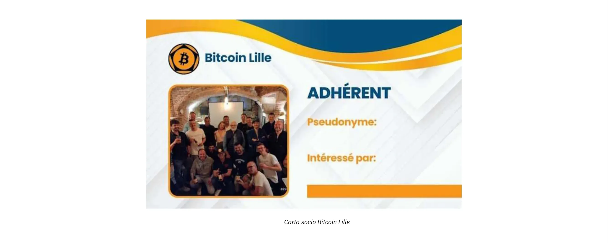

## Pianificazione del passaggio di consegne in caso di decesso

<chapterId>c5febf18-235c-51bc-8fbb-9467dabe4cb0</chapterId>

Su una nota completamente diversa, affrontiamo Address un argomento delicato: la scomparsa di un membro della vostra comunità Bitcoin .

Un giorno potreste essere contattati dalla famiglia di un ex socio per informarvi della sua morte. Potrebbero spiegarvi che il defunto ha lasciato delle istruzioni, tra cui quella di mettersi in contatto con la vostra comunità, ritrovo o associazione.

In alcuni casi, la famiglia può anche chiedere aiuto per recuperare i fondi come beneficiari dell'eredità.

È saggio collaborare con la comunità per stabilire in anticipo una procedura chiara per queste situazioni, assicurando che:

- Il defunto ha già consigliato alla sua famiglia di **non condividere mai le chiavi private o portare portafogli fisici a un incontro**.
- La famiglia capisce che lo scopo della loro visita è educativo: imparare come funziona il Bitcoin, in modo da poter assumere in seguito il controllo sovrano dei fondi.
- La famiglia è a conoscenza delle leggi vigenti nel proprio Paese in materia di doni, eredità e conversione della Bitcoin in denaro.

Un protocollo standard impedisce inoltre a chiunque, membro o ospite, di approfittare della situazione per sottrarre fondi.

Si potrebbe formare un gruppo di lavoro dedicato per definire questo processo. L'associazione Bitcoin Lille sta già lavorando a un [documento] di questo tipo (https://docs.google.com/document/d/1TDfLZjuictC5s3PEM2Z7WmkxIDSJ8Q1E4xevm52pVgU/edit?usp=sharing), che prevede di rilasciare come open-source nei prossimi mesi.

## Tenere conferenze presso scuole e università

<chapterId>65efdb44-e3d4-567c-aedf-972765753d73</chapterId>

L'elenco dei progetti descritti sopra non è ovviamente esaustivo. In generale, è più probabile che si tratti di progetti interni alla comunità o ai meetup, che possono essere implementati abbastanza facilmente man mano che si sviluppano.

Passiamo ora all'onboarding.

Come sapete, uno dei modi migliori **per raggiungere un vasto pubblico in una sola volta è quello di tenere una conferenza gratuita**. Questo può essere fatto nei college e nelle università, introducendo sia i giovani (che i meno giovani) al Bitcoin, sia che si tratti di persone completamente nuove o che vogliano approfondire la loro conoscenza.

Tenere una conferenza a decine o addirittura centinaia di persone richiede più di una semplice competenza tecnica. Avrete bisogno di:

- Fiducia nel parlare in pubblico
- Buona gestione dello stress
- Articolazione chiara
- Forte gestione del tempo
- Una presentazione o un workshop di alta qualità e ben studiato, adattato al livello di competenza del vostro pubblico

Altrettanto importante è **mantenere una mente aperta e sapere quando semplificare i concetti**, soprattutto durante la sessione di domande e risposte o una tavola rotonda. Non si tratta di rinunciare ai propri principi, ma solo di riconoscere che gli altri potrebbero vedere le cose in modo diverso. A volte è meglio rispondere più tardi o lasciar perdere, in modo che la discussione possa continuare. Se i vostri punti sono sostenuti da argomentazioni solide e ben documentate, le persone lo riconosceranno.

Se vi sentite pronti, fatelo! Il mondo ha un disperato bisogno di una migliore educazione sul Bitcoin.

Detto questo, non si tratta di un'impresa leggera: richiede motivazione, impegno e le giuste conoscenze.

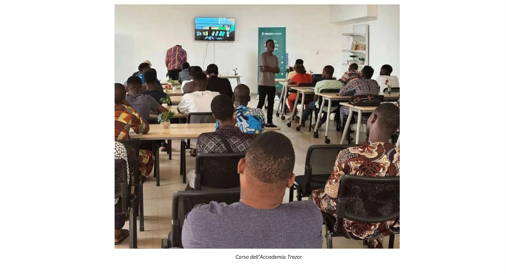

L'organizzazione di una conferenza o di un workshop in una scuola o in un'università inizia con la ricerca del giusto contatto. Questo potrebbe essere:

- Una conoscenza personale
- Un'unione studentesca
- Un'associazione studentesca che organizza serie di conferenze o eventi
- Ex professori della vostra scuola di ingegneria o università
- Il coordinatore del programma accademico, se si contatta direttamente

Il primo passo è solitamente quello di presentare la propria iniziativa o associazione e richiedere un incontro. Nel migliore dei casi, questo porterà a una presentazione sul Bitcoin di fronte agli studenti qualche settimana dopo.

Purtroppo, il Bitcoin è ancora demonizzato da gran parte dei media e da molti politici, il che porta alcuni a credere che non abbia posto nelle aule scolastiche. I rifiuti sono comuni, soprattutto nei circoli accademici dove argomenti come il Proof of Work e il consumo energetico rimangono controversi.

Vale comunque la pena di provare, soprattutto con i sindacati e le associazioni studentesche. E chi lo sa? Anche se il vostro primo tentativo dovesse ricevere un "no", potreste trovare nella vostra casella di posta elettronica un'e-mail che vi invita a parlare, ad esempio, a 280 studenti!

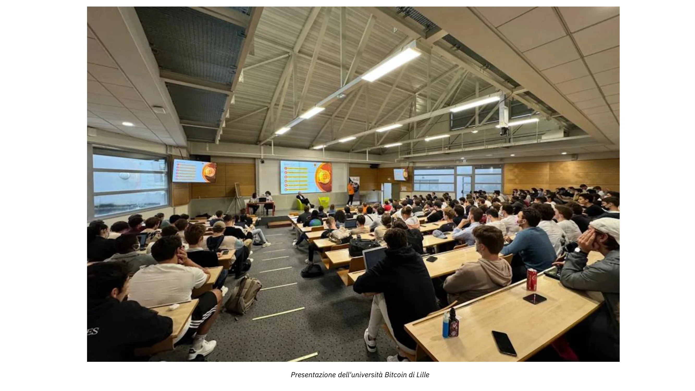

## Approccio alle aziende

<chapterId>b730462b-7928-5d28-a14f-9ceaa773d3d2</chapterId>

Far accettare il Bitcoin a un'azienda è, per molti bitcoiners, un po' come sbloccare un risultato raro nel proprio Pokédex.

Ogni commerciante è diverso dall'altro e l'onboarding comporta una serie di sfide:

- Hanno ancora bisogno di moneta fiat per pagare i fornitori.
- Richiedono rapporti finanziari chiari e pronti per la contabilità.
- I loro sistemi di pagamento devono essere affidabili, facili da usare e a prova di furto.
- Possono avere idee sbagliate o preconcetti negativi sul Bitcoin.
- Trovare una soluzione software impeccabile può essere difficile.
- Far capire al commerciante perché vale la pena accettare il Bitcoin come pagamento.

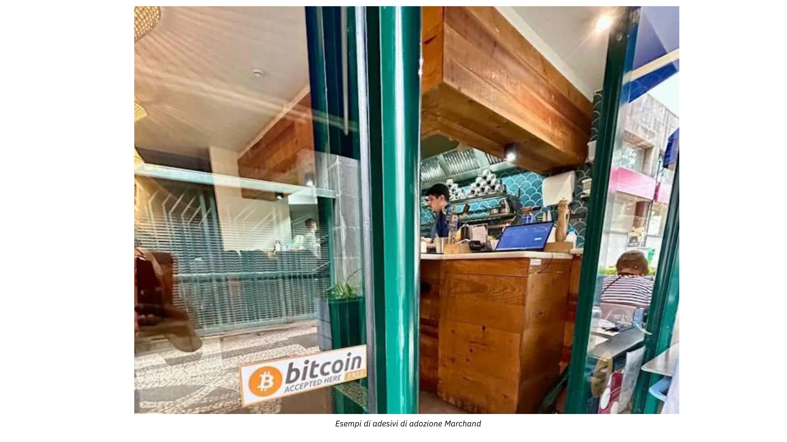

L'integrazione delle imprese locali è uno dei modi migliori per far crescere l'ecosistema Bitcoin della vostra città. Il segreto è procedere passo dopo passo:

1/ **Chiede di pagare in Bitcoin, ogni volta che fa acquisti**

Nella maggior parte dei casi riceverete un "no" e forse un'occhiata perplessa, o addirittura un po' giudicante, ma basta chiedere per far capire che il Bitcoin è qualcosa che la "gente comune" può usare e che sta diventando sempre più popolare come metodo di pagamento. Si può anche fare squadra con un paio di amici e fermarsi nello stesso negozio in giorni diversi, chiedendo ogni volta di poter pagare in Bitcoin. Prima o poi il proprietario si incuriosirà.

2/ **Offrire una spiegazione semplice e chiara**

Se vi chiedono che cos'è il Bitcoin, siate brevi e privi di gergo. Per esempio:

*"Il Bitcoin è denaro che non è controllato dalle banche, funziona senza intermediari, non può essere censurato, non è soggetto all'inflazione e ha commissioni più basse rispetto alle banche tradizionali "*

Quindi consegnate loro un volantino, come "21 ragioni per utilizzare Bitcoin" o "10 ragioni per accettare Bitcoin nella vostra azienda", con le vostre informazioni di contatto o i dettagli del vostro incontro. In questo modo, quando saranno pronti per una dimostrazione, sapranno dove trovarvi.

3/ **Organizzare una dimostrazione**

Quando esprimono interesse, fissate un appuntamento per mostrare loro una soluzione di pagamento.

Un'ottima opzione è **[Swiss Bitcoin Pay](https://swiss-Bitcoin-pay.ch/)**, perché:

    - Consente ai commercianti di convertire automaticamente i BTC in fiat ogni giorno, in modo da poter pagare i fornitori.
    - Permette loro di mantenere una percentuale in BTC, se lo desiderano.
    - Genera rapporti contabili esportabili per i loro contabili.
    - Dispone di un semplice cruscotto per i manager.
    - Offre ai dipendenti un Interface intuitivo per accettare i pagamenti senza toccare la cassa.
    - Costa meno delle commissioni del 2-3% applicate dalle reti di pagamento tradizionali.

4/ **Sostenerli una volta che iniziano ad accettare il Bitcoin**

Dopo che sono saliti a bordo:

    - Visitare regolarmente e fare acquisti.
    - Controllate se tutto funziona bene.
    - Condividete nuovamente le vostre informazioni di contatto, se necessario.
    - Invitateli ai vostri incontri.
    - Aggiungeteli a [btcmap.org map](https://btcmap.org/) e fatelo sapere a [Swiss Bitcoin Pay](https://x.com/swissbitcoinpay) su Twitter per aumentare la visibilità.
    - Considerate la possibilità di ospitare workshop o incontri presso la loro sede.

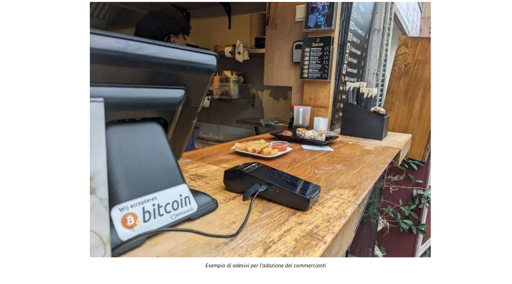

5/ **Collegare i commercianti locali**

Una volta che avete un paio di attività commerciali che accettano il Bitcoin, suggerite di creare un gruppo Telegram per soli commercianti. Questo può:

- Permettete loro di condividere le esperienze e di accogliere nuove imprese.
- Servire come canale di supporto tecnico rapido.
- Rafforzare la rete locale Bitcoin.

Il canvassing è un'attività a lungo termine. Richiede pazienza, persistenza e strategia. Ma se la vostra comunità è pronta, potreste iniziare a gettare le basi per una vera economia circolare Bitcoin, proprio come [Arnhem nei Paesi Bassi](https://www.arnhembitcoinstad.nl/) nei Paesi Bassi.

## Contattare la stampa e la radio locali

<chapterId>435bfbc1-22dd-59bb-b737-a32ea995b238</chapterId>

I bitcoiners spesso si concentrano sui social media e sulle piattaforme online per raggiungere il pubblico, ma questa è solo una parte del quadro. La stampa locale e la radio possono essere potenti alleati.

Alcune comunità, come [Breizh Bitcoin](https://breizhbitcoin.com/) in Francia, **contattano regolarmente i loro media locali** per:

- Annunciare i prossimi eventi (incontri, presentazioni, workshop, feste Halving, ecc.).
- Invitare i giornalisti a visitare le aziende che rispettano il Bitcoin e a scriverne.
- Condividete le date e i luoghi degli eventi per inserirli negli elenchi locali.

Molti giornali hanno ancora una sezione "Cosa c'è", spesso nascosta nelle ultime pagine, dove vengono elencati i prossimi eventi locali. Breizh Bitcoin ha scoperto che questo approccio funziona: i nuovi arrivati si sono presentati agli incontri semplicemente perché hanno notato l'elenco sul giornale.

Questa strategia può funzionare meglio in alcune aree rispetto ad altre, ma vale la pena provarla. Si può iniziare contattando gli organi di informazione regionali, come ad esempio la Francia:

- [acpm.fr](https://www.acpm.fr/Les-chiffres/Diffusion-Presse/Presse-Payante/Presse-Quotidienne-Regionale);
- [voxpublic.org](https://www.voxpublic.org/spip.php?page=annuaire&cat=medias&type_media=Presse%20quotidienne%20r%C3%A9gionale).

e contattando le stazioni radio locali per proporre un'intervista o un'apparizione in podcast.

Siate consapevoli che le interviste con i media possono essere complicate. Le parole possono essere estrapolate dal contesto o travisate. La preparazione è essenziale.

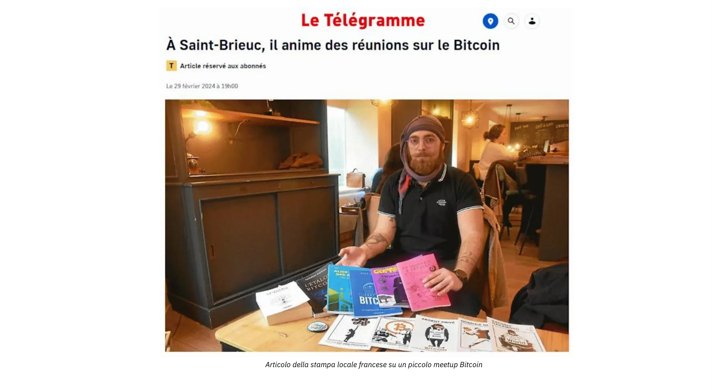

Ovviamente, oltre a tutti quelli suggeriti in questa sezione, si possono realizzare **molti altri progetti**. Tutto dipende dal tempo e dalla motivazione, ma anche dalla difficoltà del progetto in questione.

Suggerimenti finali per qualsiasi progetto di sensibilizzazione:

1) **Pianificare in anticipo**: definire gli obiettivi, le fasi necessarie e chi farà cosa.

2) **Passo dopo passo**: evitate l'esaurimento ritmando i vostri sforzi.

3) **Chiedere aiuto**: attingere ai propri membri e alle comunità vicine per ottenere supporto.

Ricordate: ogni comunità Bitcoin è stata al vostro posto. Non esitate a imparare dalle loro esperienze e dai loro consigli.

# Anticipare il futuro

<partId>6ea07445-9369-54bc-9aa0-d260db026e0b</partId>

## Pianificare l'aumento dei partecipanti

<chapterId>8af722d4-3a9f-548c-9001-424f2142de12</chapterId>

Quando il Bitcoin entrò nella sua quarta era al blocco 840.000, sempre più persone iniziarono a riconoscerlo come una rivoluzione tecnologica, finanziaria e sociale.

Come l'ascesa di Internet, questa rivoluzione richiederà tempo, il che è in realtà un vantaggio. Questo dà alle persone la possibilità di **apprendere i fondamenti** del Bitcoin, di capire come usarlo e permette agli sviluppatori e alle aziende di **costruire i protocolli e le applicazioni** che ne sbloccheranno il pieno potenziale.

Nessuno può prevedere il futuro, ma possiamo **aspettarci un forte aumento dell'adozione del Bitcoin**. Ciò significa **essere pronti a tutti gli scenari**, anche quelli estremi, come il crollo del sistema finanziario tradizionale o il divieto assoluto del Bitcoin.

In questa settima e penultima parte del corso, esamineremo i punti chiave da tenere a mente durante la crescita della vostra comunità e dei meet-up.

Il primo, il più facile da prevedere, è l'aumento del numero di persone che si uniscono alla vostra comunità. Questo vi influenzerà in due modi principali:

1/ **I vostri canali di comunicazione (Telegram, Signal, Matrix, ecc.) finiranno per affollarsi**, rendendo più difficile seguire le conversazioni. Ci sono due cose da tenere a mente.

In primo luogo, se avete 500 persone che discutono di ogni tipo di argomento in un'unica chat, il volume dei messaggi e delle notifiche porterà inevitabilmente molti membri ad escludersi. È un buon momento per ripensare la vostra configurazione, ad esempio passando ai supergruppi di Telegram o a un server Discord, che consentono di organizzare facilmente le discussioni per argomento.

In secondo luogo, più persone nei vostri canali significa più bot, più truffe e quindi più moderazione da gestire. Preparatevi a questo problema creando un insieme chiaro di regole a cui fare riferimento per la moderazione dei messaggi. Secondo la nostra esperienza, questo permette di evitare i conflitti, soprattutto se le regole sono facilmente accessibili nei vostri canali.

Un buon esempio è il regolamento open-source del **[Bitcoin Lille](https://bitcoinlille.fr/reglement/)** scritto qualche anno fa per il suo gruppo Telegram e il server Discord. Si basa su principi semplici e universali, ed è anche possibile ottenere [una versione personalizzabile del progetto qui](https://www.canva.com/design/DAGHI692AD4/rjT4sqEnhajc5FiPA6GFZQ/edit?utm_content=DAGHI692AD4&utm_campaign=designshare&utm_medium=link2&utm_source=sharebutton).

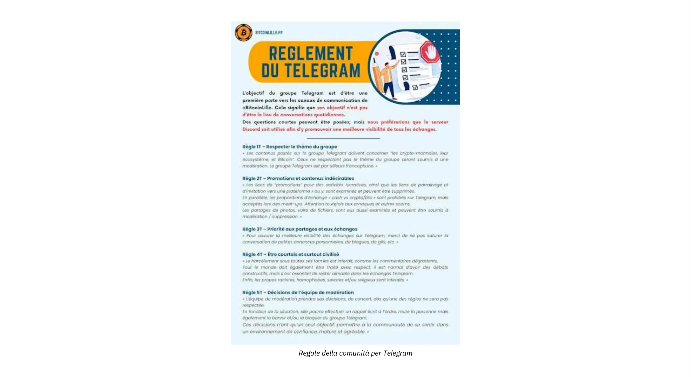

2/ **I vostri incontri ed eventi inizieranno ad attirare grandi folle, con molte facce nuove che si presentano per entrare in contatto**.

Con questa impennata di presenze:

    - potrebbe valere la pena di **trovare una sede più grande per i vostri incontri ed eventi**, soprattutto se in passato siete riusciti a ospitare solo una ventina di persone.
    - se il numero di partecipanti diventa eccessivo, per i prossimi incontri è possibile **richiedere ai partecipanti di registrarsi** (tramite l'app Meetup o un semplice modulo) oppure **organizzare più incontri al mese** (per esempio: un incontro per principianti, uno intermedio e uno avanzato).
    - Allo stesso tempo, aspettatevi molti nuovi arrivati nell'ecosistema, spesso con l'obiettivo principale di fare soldi. Per **mantenere le conversazioni focalizzate sul Bitcoin** in questi meetup in rapida crescita, è una buona idea:

a) Includere una presentazione a tema **Bitcoin** durante questi eventi, in quanto ciò indirizzerà naturalmente gran parte della conversazione verso questo argomento (e lontano dall'ultimo progetto di shitcoin presumibilmente "rivoluzionario");

b) **Evitare di stare solo con i colleghi bitcoiners**. Invece, fate in modo di **approcciare i nuovi arrivati**, anche se questo significa stare in fondo alla stanza per salutarli. Da lì, potrete parlare del motivo per cui sono venuti, di cosa stanno cercando, degli obiettivi (o anche dei principi fondamentali) della vostra comunità, e così via.

Infine, anche se è spiacevole doverlo dire, i truffatori possono presentarsi ai meetup. Il loro obiettivo potrebbe essere quello di parlare all'infinito del loro schema Ponzi, del loro MLM o di una "rivoluzione Blockchain alimentata dall'AI" È anche del tutto possibile che un giorno qualcuno con cattive intenzioni partecipi appositamente per riciclare denaro o cercare di acquistare BTC con banconote false.

In situazioni difficili come queste, l'approccio più semplice è quello di spiegare gentilmente che l'incontro non è il luogo adatto, sostenendolo con qualsiasi argomentazione (ad esempio, menzionando che potrebbe essere presente la polizia in borghese).

Se, sfortunatamente, si rifiutano di andarsene o di comportarsi in modo rispettoso (sì, è capitato), è possibile Address il gruppo direttamente durante il meetup per far sapere a tutti che una persona, o più persone, stanno tentando un'attività dannosa.

Fortunatamente queste situazioni sono rare e spesso più assurde che minacciose, ma è comunque meglio essere preparati.

Per stare tranquilli: finché non infrangete personalmente la legge o non agevolate direttamente le transazioni illegali, non siete legalmente responsabili delle azioni altrui durante il vostro evento (almeno secondo la legge francese).

In un mondo ideale, avreste uno **spazio abbastanza grande da ospitare diverse decine di persone** man mano che la vostra comunità cresce e creereste anche **rapporti solidi tra i bitcoiners** e i futuri bitcoiners durante il mercato ribassista, in modo che quando arriva la corsa al rialzo, abbiate il maggior numero possibile di persone pronte a fare da cuscino arancione agli altri.

## Decentramento dell'organizzazione comunitaria

<chapterId>bedfc110-e099-58f4-a5b7-fb50f3b19a49</chapterId>

Immaginate questo: avete gestito il vostro meet-up Bitcoin per anni e un giorno decidete di lasciare il lavoro, magari per allevare lama in Perù o inseguire onde perfette in El Salvador. Cosa succede alla vostra comunità quando ve ne andate?

Si prega di pianificare in anticipo il trasferimento della comunità da parte di:

1) **Affidare i diritti di amministratore (o Ownership)** per i canali di comunicazione a membri fidati. I ruoli possono sempre cambiare in seguito.

2) **Condividere i dettagli degli account** (nomi utente, password, e-mail associate) dei social media e dei canali di visibilità con almeno una persona fidata.

Senza questo accesso, è quasi impossibile per chiunque altro subentrare in modo efficace. Ricominciare da zero, creando gruppi "biforcati" e ricostruendo la rete, è lento, faticoso e spesso demoralizzante.

Se non avete un contatto fidato all'interno del vostro meet-up, potete sempre contattare @ProfEduStream, @copinmalin o @gabtribe su Telegram. Possono aiutarvi a trovare un successore motivato e a coordinare il trasferimento degli account e dei diritti di amministrazione.

**Perché il decentramento è importante?**

Se siete gli unici coinvolti e avete tutto il controllo, cosa succede se sparite? La risposta è semplice: anche la vostra comunità scomparirà.

La soluzione: decentralizzare i compiti, i ruoli e l'accesso, in modo che il gruppo possa continuare a funzionare anche se uno degli organizzatori si ritira, per mancanza di tempo o, in uno scenario più cupo, perché arrestato per possesso di un Bitcoin non KYC.

**Come spingere ulteriormente il decentramento?**

Adottare **software libero e open-source** come [la suite framasoft](https://framasoft.org/fr/) per ridurre la dipendenza da piattaforme centralizzate e aggiungere resilienza contro potenziali censure statali o divieti Bitcoin.

Utilizzate **strumenti di comunicazione criptati o anonimi** per proteggere la privacy dei vostri membri e le attività della vostra comunità.

## E se il Bitcoin diventasse il nemico pubblico n. 1?

<chapterId>c739651f-cd13-51e0-a36e-85023749b15b</chapterId>

Il 5 aprile 1933, Franklin Roosevelt, 32° Presidente degli Stati Uniti d'America, firmò l'ordine esecutivo 6102, che rendeva illegale per i privati possedere monete, lingotti o certificati d'oro in qualsiasi parte del Paese.

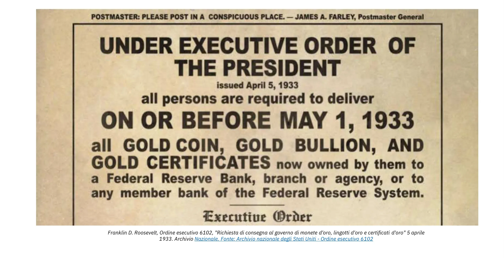

Naturalmente, la Grande Depressione (crollo del mercato azionario del 1929) non è la nostra realtà attuale. Ma un governo potrebbe un giorno fare lo stesso con il Bitcoin: **vietare del tutto il ownership privato?**

La verità è che una misura orwelliana di questo tipo non impedirebbe a qualcuno di possedere veramente BTC, perché nessuna legge può impedire a una persona di memorizzare una sequenza di parole.

Tuttavia, cosa succederebbe se i leader mondiali si rendessero finalmente conto del potenziale del Bitcoin di rimodellare l'ordine globale, anche a livello statale? Verrebbe allora etichettato come "Nemico pubblico n. 1"?

Non dobbiamo cadere nel pensiero della cospirazione. Ma nulla ci impedisce di anticipare, decentralizzare ed educare, a partire da ora.

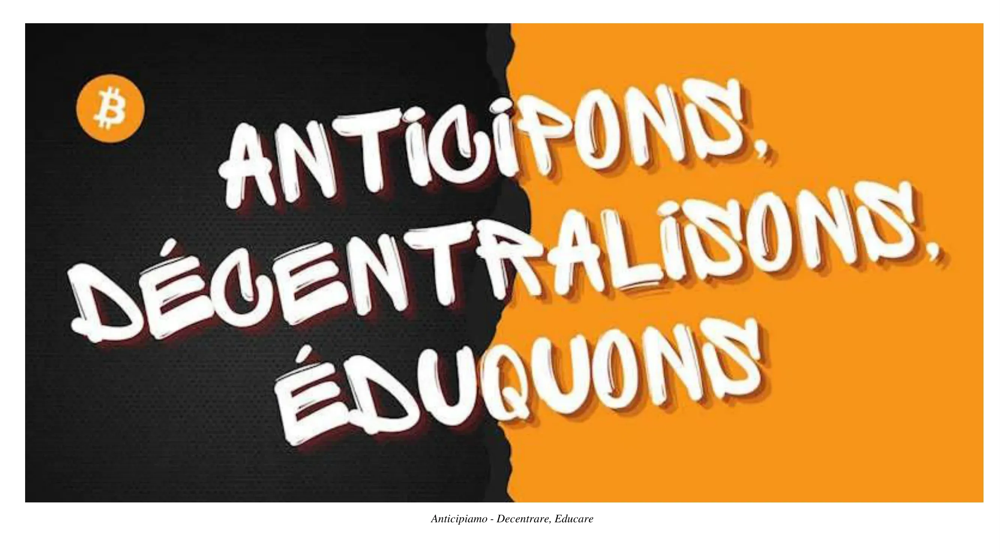

# Unire i bitcoiners

<partId>62bc2138-c0be-5d39-a341-594690863257</partId>

## Un piano d'azione rapido per costruire la vostra comunità Bitcoin

<chapterId>1f463ec2-3f64-5641-8d60-e02a47c94f27</chapterId>

Satoshi Nakamoto ha creato uno strumento rivoluzionario che sta già cambiando il nostro mondo. Ma sta a noi, i bitcoiners, decidere come plasmare il futuro.

Il Bitcoin è una vasta tana di coniglio, che tocca la storia, l'economia, la letteratura, la matematica, l'informatica e la crittografia. Nessuno può esplorarla tutta, e questo fa parte della sua bellezza.

Poiché il nostro tempo è limitato, la chiave è rimanere umili, continuare a imparare e condividere la conoscenza Exchange con gli altri. In questo modo, ognuno di noi può raggiungere il livello di comprensione che cerca.

**Le comunità globali Bitcoin svolgono quindi un ruolo fondamentale nella costruzione del mondo di domani**: spazi in cui i bitcoiners possono **Exchange, costruire e condividere**. **Insieme**.

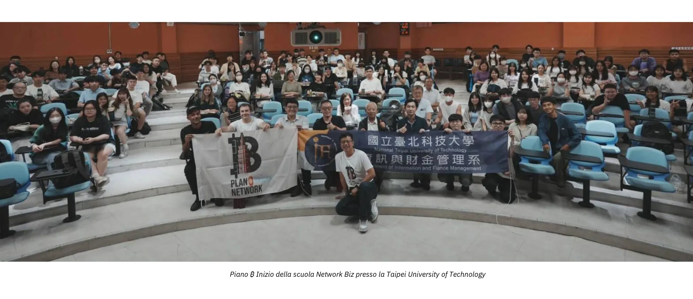

Come avete visto nel corso di questo corso, **costruire una comunità Bitcoin e organizzare incontri** richiede pianificazione e motivazione. A seconda dei vostri obiettivi e del tempo che potete dedicare, potreste intraprendere progetti più ambiziosi o mantenere le cose semplici.

In ogni caso, l'obiettivo è lo stesso: **suscitare interesse e aiutare il Bitcoin a crescere nella vostra città**.

Per concludere i molti capitoli e sottocapitoli che abbiamo trattato, ecco un **piano d'azione conciso** per creare la vostra comunità Bitcoin:

1) Decidete in anticipo perché volete creare una comunità Bitcoin, quali sono i vostri obiettivi e in quale città o località opererete.

2) Entrate in contatto con le comunità esistenti nelle vicinanze e non esitate a chiedere loro consigli quando ne avete bisogno;

3) Creare un'identità chiara per la comunità che rifletta la comunità e la località (logo, poster, banner, volantini, ecc.)

4) Creare canali di comunicazione e reti sociali come Telegram, Twitter, NOSTR, Discord o Simplex. Considerate anche canali decentralizzati e/o resistenti alla censura.

5) Seguite altri incontri e comunità locali online e inserite il vostro gruppo in varie mappe e piattaforme per aumentare la visibilità.

Una volta che i canali di comunicazione della vostra comunità sono attivi:

6) Lanciate un sondaggio per proporre il vostro primo incontro una volta che sentite un interesse sufficiente.

7) Definite gli obiettivi che volete raggiungere con questo evento di persona.

8) Scegliete un luogo accogliente e ben posizionato, in linea con i vostri obiettivi, e prenotate un tavolo o una sala.

9) Promuovete l'evento sui vostri canali una settimana prima e poi di nuovo due o tre giorni prima della data.

10) Inserite il vostro evento su siti e piattaforme rilevanti.

11) Il giorno dell'evento, lasciate che l'evento scorra in modo naturale e coinvolgete i partecipanti, guidando delicatamente le discussioni se necessario.

Dopo:

12) Concentrarsi sul mantenimento e sul coinvolgimento dei partecipanti in modo che ritornino.

13) Suggerite progetti o iniziative semplici e avviate quelli che vi stanno a cuore personalmente. Se qualcun altro vuole condurre un progetto diverso, sostenetelo dove potete.

Infine:

14) Anticipare il futuro pensando a una sede più ampia per gli incontri, a regole per i canali di comunicazione, a un sito web, ecc;

15) Incoraggiate gli esercizi commerciali locali ad accettare il Bitcoin, anche semplicemente chiedendolo ogni volta che fate acquisti.

16) Delegare compiti e diritti di amministrazione del canale/rete a membri fidati.

17) Promuovete ampiamente la vostra comunità in modo che più persone si uniscano e coinvolgete coloro che mostrano interesse.

18) Andate oltre con i progetti che vi piacciono e che sono importanti per voi.

Per una panoramica più rapida, questo video di 21 minuti riassume questi passaggi:

:::video id=a59956da-f554-4b54-89dd-5ca55b722686:::

Ricordate: **Non siete soli, le comunità esistenti sono qui per sostenervi**.

## Prendersi cura di sé

<chapterId>cf1631cb-ddbe-55c7-be8c-26a5652979a0</chapterId>

Quando si cade nella tana del coniglio del Bitcoin, la prospettiva della vita cambia.

Dentro di voi sentite la voglia di andare oltre, di incontrare altri che stanno affrontando lo stesso viaggio mentale.

Questa energia vi spinge a contribuire al puzzle condividendo la vostra scoperta: Bitcoin. Vi ispira anche a pensare al mondo di domani, quello che volete contribuire a costruire, e alle comunità che lavorano per realizzarlo.

La costruzione di una comunità è un lungo tunnel che richiede motivazione, strategia, dedizione e tempo. Può essere un compito ingrato, quindi è importante procedere passo dopo passo per evitare di bruciarsi.

**Pensate a voi stessi, ai vostri limiti**. E sebbene il Bitcoin possa guidarvi notte e giorno, **non cercate di fare tutto da soli, o vi brucerete**.

Invece, **cercate aiuto dai bitcoiners che hanno già percorso lo stesso tunnel, esplorato gli stessi sentieri e costruito gli stessi strumenti**. Vi farà risparmiare un sacco di tempo.

**Invitate coloro che vi seguono in questa avventura a dare una mano**, anche se delegare richiede più tempo per alcuni compiti. A lungo termine, la vostra comunità sarà più forte e più resistente.

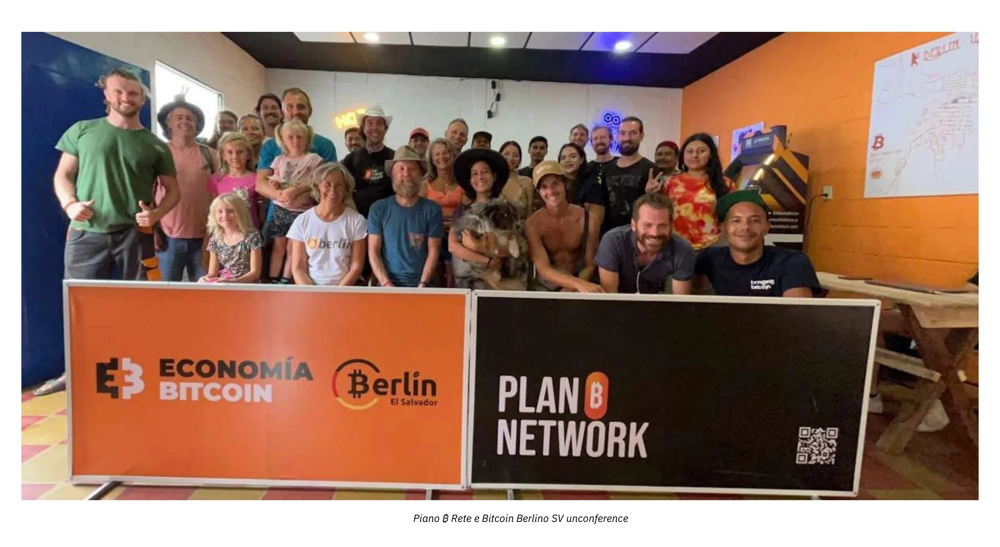

Da soli, potete esplorare rapidamente uno dei tanti tunnel della tana del coniglio del Bitcoin. Ma ricordate, ci sono innumerevoli altre direzioni da esplorare.

**Creando e/o entrando a far parte di una comunità di bitcoiners, e condividendo e scambiando regolarmente con loro, vi muoverete in tutte le direzioni della tana del coniglio allo stesso tempo**

## BTC 304, Cosa c'è dopo

<chapterId>8bf10b77-80ee-5d50-87bc-0ef32574a675</chapterId>

In questo corso BTC 304 abbiamo approfondito come creare una comunità o un meet-up e come lanciare una serie di progetti.

Quando la vostra comunità è pronta a fare il passo successivo, **potete creare un'associazione formale**.

In Francia, ad esempio, delle circa sessanta comunità e meet-up, quasi una dozzina ha lo status di associazione.

I vantaggi sono duplici:

- **Riconoscimento ufficiale**: è possibile aprire un conto bancario dell'associazione, ricevere l'attenzione della stampa e dei media e persino richiedere sovvenzioni.
- **Organizzazione strutturata**: è possibile definire ruoli chiari, facilitando la gestione della comunità e la realizzazione dei progetti.

Con l’obiettivo di far crescere ulteriormente la vostra comunità, **non si esclude che un seguito di questa formazione possa essere pubblicato su [Plan ₿ Academy](https://planb.academy/) nei prossimi mesi**.

La prossima sessione potrebbe esplorare argomenti avanzati quali:

- Progettare presentazioni o workshop per i vostri incontri e fissare obiettivi chiari.
- Organizzazione di un evento su larga scala con circa 100 partecipanti.

Per questo, ci baseremo sulle esperienze delle comunità che hanno già creato i propri eventi e presentazioni.

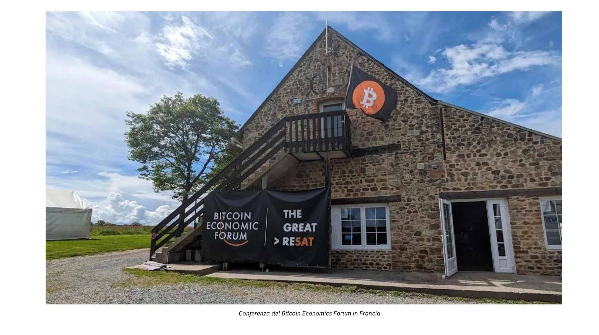

# Sezione finale

<partId>e9bdddf4-54c9-4de9-bbce-c3eade8c32e5</partId>

## Recensioni e valutazioni

<chapterId>08a35d2a-204b-519a-9bb1-588665a037fa</chapterId>

<isCourseReview>true</isCourseReview>

## Conclusione

<chapterId>d74606a5-cb14-4117-acb2-2bf5920de092</chapterId>

<isCourseConclusion>true</isCourseConclusion>