# 비트코인 채택을 향한 첫 번째 단계

오늘날 누구나 온라인에서 비트코인에 대해 배울 수 있지만, 종종 빠져 있는 것은 만나고, 아이디어를 교환하고, 함께 구축할 기회입니다. 이러한 격차를 메우기 위해 많은 비트코이너들이 지역 커뮤니티를 형성하며, 여기서 모임은 워크숍, 프레젠테이션, 의미 있는 토론을 촉발합니다.

BTC304에서는 커뮤니티 구축이 왜 중요한지 살펴보고, 강력한 시각적 및 디지털 정체성을 만들기 위한 도구를 탐색하며, 여러분이 시작할 수 있는 간단한 오픈 소스 프로젝트를 공유합니다. 또한 지역 이니셔티브가 어떻게 국가 커뮤니티로 확장되어 하이퍼비트코인화된 미래를 추진하는 데 도움이 될 수 있는지 고려할 것입니다.
+++
# 소개

<partId>81318b8f-d316-5787-aa4c-4ec8370ba668</partId>

## 코스 개요

<chapterId>e8991b82-4966-5e04-8f05-7cae46eacbaa</chapterId>

BTC304에 오신 것을 환영합니다!

2009년 이후 Bitcoin은 끊임없이 성장해 왔습니다. 이러한 성장은 새로운 Bitcoin 개선 제안(BIP), 네트워크 확장성을 위한 추가 레이어 생성(Lightning Network 등), 여러 기업과 스타트업의 개발 등을 통해 구체화되었습니다.

On-Chain에서도 거래 건수가 꾸준히 증가하는 등 그 발전이 뚜렷하게 나타나고 있습니다.

예를 들어, 2018년 1월 1일부터 2024년 1월 1일 사이에 Bitcoin의 주요 Layer의 거래 건수는 [66.2% 증가]한 것으로 추정됩니다(https://dune.com/queries/3375917/5663935). 한편, 2021년 8월부터 2023년 8월까지 Lightning Network의 공개 거래 건수는 [1,212% 증가](https://river.com/learn/files/river-lightning-report-2023.pdf)했습니다.

물론 이러한 괄목할 만한 성장은 다음과 밀접한 관련이 있습니다:

- 레바논, 시리아, 이집트, 아르헨티나 등의 주민들처럼 은행 시스템에서 벗어나거나 변동성이 적거나 평가절하된 통화를 사용하기 위해 Bitcoin를 사용하는 것에 대한 전 세계 사람들의 관심이 높아지고 있습니다(https://profedustream.substack.com/p/21-raisons-dutiliser-Bitcoin);
- 시간이 지남에 따라 가격이 상승하여 고정된 통화 정책으로 인해 가치 저장 수단이자 장기 투자 수단으로 자리매김했습니다;
- 특히 2017~2018년과 2020~2021년 동안 투기성 암호화폐 시장의 연속적인 성장에 주목했습니다;
- 주류 미디어에서 Bitcoin의 존재감이 커지고 있습니다.

Bitcoin은 아직 초기 단계에 있지만, 여러분도 이미 알고 계시겠지만 이러한 현실은 두 가지 핵심 질문을 고려하게 합니다:

- 어떻게 하면 비트코인 사용자들이 학습과 프로젝트에서 더 나아가 Bitcoin의 잠재력을 **완전히 활용**하도록 장려할 수 있을까요?

- 어떻게 하면 단기 투기에 몰리는 초보자들이 최근의 메모리코인 열풍으로 손실을 보지 않고, 대신 Bitcoin의 기초를 배우는 데 집중할 수 있도록 도울 수 있을까요?

두 가지 과제에 대한 최선의 해결책은 간단합니다: **실제 세계에 존재하고 교육하는 것입니다**.

이 과정의 목표는 Bitcoin 커뮤니티 또는 모임을 만들고 효과적으로 조직하는 데 필요한 모든 것을 제공하는 것입니다. 지역 이니셔티브를 구축하든 온라인 그룹을 성장시키든, 이 과정은 시각적 정체성 만들기부터 정기 이벤트 설정 및 커뮤니케이션 채널 관리에 이르기까지 단계별로 안내합니다.

**섹션 1: 소개**

온라인 커뮤니티나 지역 모임을 통해 Bitcoin을 중심으로 사람들을 하나로 묶는 것의 중요성을 강조하는 것부터 시작하겠습니다. 커뮤니티를 시작해야 하는 이유와 장소, 그리고 커뮤니티의 성장과 장기적인 지속 가능성을 촉진하기 위한 명확한 목표를 설정하는 방법에 대해 알아보세요.

**섹션 2: Bitcoin 커뮤니티를 위한 고유한 아이덴티티 디자인하기**

새로운 회원을 유치하고 소속감을 키우려면 고유한 정체성을 구축하는 것이 필수적입니다. 이 섹션에서는 Bitcoin 커뮤니티의 정신을 구현하는 로고, 포스터, 배너를 디자인하는 방법을 배웁니다.

**섹션 3: Bitcoin 커뮤니티를 위한 커뮤니케이션 채널 만들기**

커뮤니케이션은 모든 커뮤니티의 근간입니다. 이 섹션에서는, 텔레그램 그룹이나 디스코드 서버를 효율적으로 설정하는 방법을 안내해드리고, 사용하기에 가장 좋은 채널에 대해 알아보도록 하겠습니다. 또한, 커뮤니티 관리를 간소화하기 위해 다기능 봇을 통합하는 방법도 배워볼 수 있습니다.

**섹션 4: 소셜 네트워크 시작하기** (프랑스어)

가시성은 커뮤니티 성장의 핵심입니다. 이 섹션에서는 전용 트위터 프로필을 만들고, 지역 모임에 연결하고, btcmap.org와 같은 플랫폼을 활용하여 가시성을 높이고 새로운 회원을 유치하는 방법에 대해 알아보세요.

**섹션 5: Bitcoin 밋업 구성하기**

이 섹션에서는 적절한 장소 선택부터 이벤트 운영까지, 모임을 조직하는 방법에 대해 설명합니다. 또한 참가자의 충성도를 높이고 커뮤니티의 장기적인 지속 가능성을 보장하기 위한 전략도 살펴봅니다.

**섹션 6: 프로젝트 및 이니셔티브의 예** (프랑스어)

이 섹션에서는 단순한 모임을 넘어 테마별 이벤트와 워크숍, 교육 콘텐츠 제작, 지역 협업 등 구체적이고 독창적인 프로젝트를 소개합니다. 또한 커뮤니티를 홍보하기 위해 실물 자료와 디지털 자료를 디자인하는 방법도 배울 수 있습니다.

**섹션 7: 미래 예측하기**

여기에서는 커뮤니티가 너무 빠르게 성장하는 경우 어떻게 해야 하는지, 조직을 분산시키는 방법, 적대적인 규제 환경에 대응하는 방법 등 커뮤니티의 자연스러운 진화에 대해 살펴봅니다. 이 섹션은 이러한 문제를 예측하고 극복하는 데 도움이 될 것입니다.

**섹션 8: 비트코인 사용자들을 하나로 모으기**

마지막 섹션은 프로젝트의 본질, 즉 공유된 비전을 중심으로 Bitcoin 열성 팬들을 하나로 묶는 데 중점을 둡니다. 회원을 유치 및 유지하고, 작업을 효과적으로 위임하고, 커뮤니티를 지속 가능하게 성장시키기 위한 접근 방식을 구성하는 방법을 배우게 됩니다.

강력하고 활기찬 Bitcoin 커뮤니티를 구축하는 방법을 배울 준비가 되셨나요? 지금 바로 시작하세요!

## Bitcoin 커뮤니티 또는 밋업을 시작하는 이유는 무엇인가요?

<chapterId>893ea248-7d5a-5b8e-948c-7031497b1031</chapterId>

### 커뮤니티와 모임의 차이점은 무엇인가요?

Bitcoin 생태계에서 이러한 용어에 대한 엄격한 정의는 없지만, 커뮤니티는 공통의 열정을 공유하고 정기적으로 소통하는 사람들의 그룹으로 이해하는 것이 가장 좋습니다.

반면에 밋업은 특정 목적을 가지고 커뮤니티에 의해 그리고 커뮤니티를 위해 조직된 행사입니다. 밋업은 일반적으로 커뮤니티가 이미 형성된 후에 열립니다.

이 과정에서는 Bitcoin 밋업을 시작하기 전에 이미 해당 이벤트 개최에 관심이 있는 몇 명의 사람들과 이미 연결되었다고 가정합니다. 즉, **커뮤니티가 이미 존재**한다고 가정합니다.

### Bitcoin 커뮤니티를 만드는 이유는 무엇인가요?

Bitcoin 커뮤니티를 만드는 데에는 몇 가지 이유가 있습니다:

- 지식 공유 및 협업: 커뮤니티는 구성원들이 Exchange 아이디어를 구상하고 지식을 공유할 수 있는 공간을 제공합니다. 상호 지원은 성장의 핵심 축으로, 모든 사람이 학습을 가속화할 수 있게 해주며, 특히 발견해야 할 것이 많은 Bitcoin와 관련이 있습니다.

- 피어투피어 구축: 많은 이니셔티브와 프로젝트가 이러한 커뮤니티 내에서 구상, 구축 및 개발됩니다.

Bitcoin 커뮤니티는 종종 더 광범위한 목표, 특히 공교육에 대한 목표를 추구합니다:

1. Bitcoin이란?

2. 작동 방식;

3. 사회에 대한 기여;

4. 일부 유명인 및 미디어의 오해의 소지가 있거나 근거 없는 주장에 대해 반박합니다;

5. Bitcoin과 다른 암호화폐의 근본적인 차이점;

미래의 첫 번째 '성채'를 건설함으로써 전 세계의 **Bitcoin 커뮤니티는 허위 정보와 검열에 대항하는 보루 역할을 하는 동시에 Bitcoin의 기본을 배울 수 있는 비옥한 토대를 제공합니다**. 이러한 커뮤니티는 신규 이민자, 심지어 회의론자에게도 Bitcoin의 진정한 잠재력을 탐구하는 데 필요한 자원과 인맥을 제공합니다.

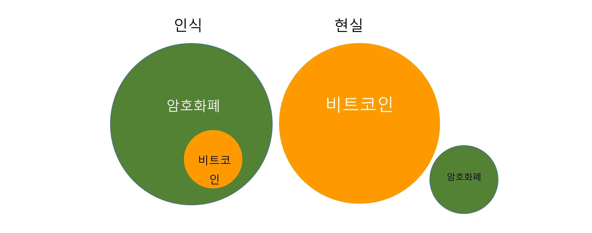

또한, 텔레그램 그룹("Bitcoin 런던"), 페이스북 그룹("Bitcoin 베를린"), 디스코드 서버("Bitcoin 마드리드"), 심지어 이메일 리스트("Bitcoin 프랑스") 등 **커뮤니티가 전적으로 온라인상에 존재할 수 있다는 점**도 주목할 필요가 있습니다.

즉, **커뮤니티가 번창하거나 프로젝트를 시작하기 위해 물리적인 모임이 필요하지 않습니다. 커뮤니티의 핵심 목적은 공유, 구축, 교육**이라는 점은 변함이 없습니다.

### 밋업을 만드는 이유는 무엇인가요?

앞서 언급했듯이 **밋업은 보통 커뮤니티가 형성된 후에 이루어지며 커뮤니티를 보완하는 역할을 합니다**.

비트코인의 여정이 발전함에 따라 같은 생태계의 다른 사람들과 직접 만나 교류하고 싶은 욕구, 혹은 필요성을 느끼는 경우가 종종 있습니다. 이는 고립감을 느끼거나 일상 생활에서 Bitcoin에 대해 이야기할 사람이 없기 때문일 수 있습니다.

밋업은 온라인 음성 또는 영상 통화보다 더 개인적이고 친근한 경험을 제공합니다. **술 한 잔을 마시든 식사를 하든**, 비공식적이고 친근한 공간에서 사람들이 공개적이고 직접적으로 아이디어를 나눌 수 있습니다.

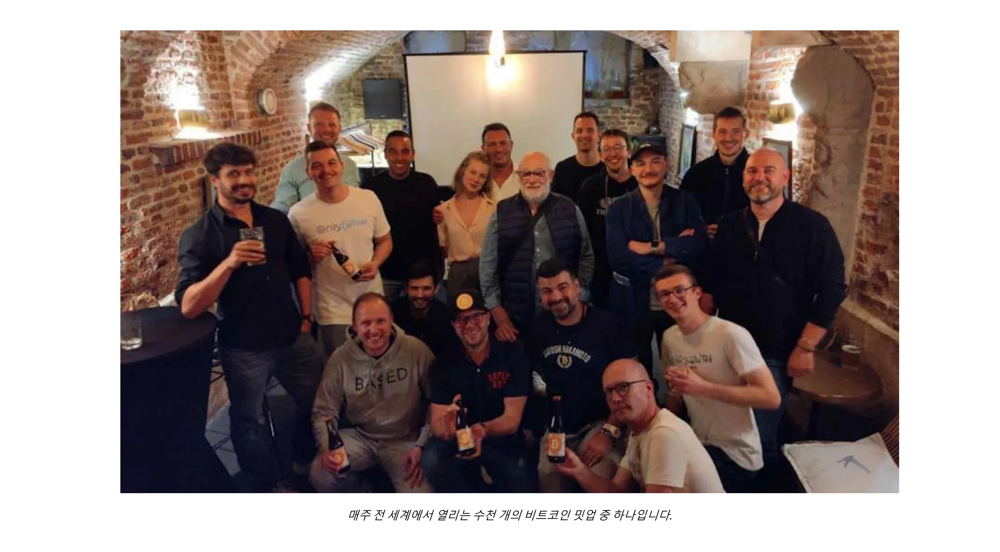

Bitcoin 모임은 다양한 용도로 활용될 수 있습니다:

- 기술 주제 또는 진행 중인 프로젝트에 대한 논의
- 새로운 비트코인이 점차 Bitcoin 세계에 더 깊이 빠져들 수 있도록 지원
- 새로운 프로젝트 또는 이니셔티브 발표
- 자료 또는 도서 교환
- 미리 보기로 다큐멘터리 상영
- 특정 주제에 대한 컨퍼런스 또는 워크샵 개최

이 과정의 6/8부 '[프로젝트 및 이니셔티브의 예](https://planb.academy/courses/1c643dc9-a15f-4f9e-93b6-cb3c58b4ee35/3213d87a-1998-5972-ab93-97a5769ba279)에서 이러한 가능성에 대해 자세히 다룰 예정입니다.

모든 커뮤니티는 자유롭게 의견을 나누고, 프로젝트를 시작하고, 자신만의 방식으로 실험할 수 있지만, 밋업은 Bitcoin의 발전과 비트코인의 성장에 점점 더 **필수적인 것으로 입증되고 있습니다**. 밋업을 조직하려면 **시간과 노력이 필요**하기 때문에, 이 강좌에서는 [프랑스와 벨기에의 약 60개 Bitcoin 커뮤니티](https://btcmap.org/communities/map#2/5.24949/0.20000)의 경험을 공유하여 **자신의 커뮤니티와 밋업을 최대한 원활하게 구축하고 성장시키는 데 도움을 드리고자 합니다**.

## 커뮤니티는 어디에 만들어야 하나요?

<chapterId>72da5285-5395-592d-ab62-303a0aef3d6d</chapterId>

첫 번째 질문은 커뮤니티가 어디에 기반을 두어야 할까요?

나중에 모임을 주최할 수 있는 옵션을 계속 유지하려면 이 결정이 중요합니다.

회원들이 이벤트에 참석하기 위해 2시간을 운전해야 한다면 참석률이 저조할 가능성이 높습니다. 그렇기 때문에 커뮤니티에 적합한 **장소를 선택하는 것이 향후 모임의 성장에 큰 영향을 미칩니다**.

결정을 내리는 데 도움이 되는 몇 가지 팁을 알려드립니다:

1/ **중소도시 또는 대도시에서 커뮤니티를 만들고 성장시키세요**. 이렇게 하면 더 쉽게 만들 수 있습니다:

    - 모임과 프로젝트(프레젠테이션, 워크숍, Bitcoin 채택 촉진 등)를 위한 쾌적한 장소를 찾으세요;
    - 더 많은 사람들의 참여와 소속감을 높입니다;
    - 이벤트 접근성(대중교통, 주차 등)을 개선합니다. 대중교통과 주차장에서 가까운 장소를 선택하는 것이 좋습니다.

2/ **도시와 연결된 이름을 선택하세요**. 이렇게 하면 사람들이 커뮤니티를 쉽게 식별할 수 있습니다. 예시: 예: Bitcoin 파리, 아인운트완지히 베를린, Satoshi 스프리츠 밀라노 등.

3/ **주변에 이미 모임이 있는지 확인**합니다.

전 세계 대부분의 Bitcoin 커뮤니티와 모임이 나열된 [btcmap.org](https://btcmap.org/communities/map#0/0/0/)에서 확인할 수 있습니다.

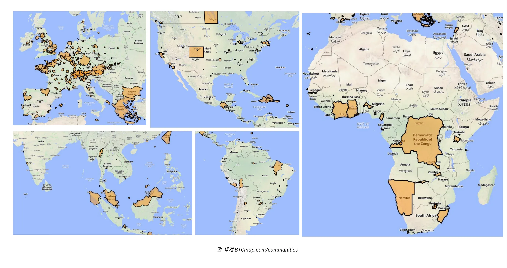

몇 가지 조사를 통해 해당 도시에 이미 존재하는 모임이나 커뮤니티를 찾을 수 있습니다.

Bitcoin는 탈중앙화되어 있으므로 누구나 원하는 대로 자유롭게 활동할 수 있습니다.

하지만 **공동의 힘을 합치는 것이 인근 커뮤니티를 분열시켜 각 커뮤니티의 영향력을 줄이는 것보다 더 합리적일 때가 많습니다**. 이미 존재하는 커뮤니티가 있는 곳에서 새로운 커뮤니티를 시작하면 의도치 않게 경쟁이 생길 수 있습니다.

이러한 의미에서 간단한 '경험 법칙'이 도움이 될 수 있습니다. 거주지에서 30~45분 이내에 활성화된 Bitcoin 커뮤니티가 없는 경우 새로운 커뮤니티를 시작하는 것이 좋습니다. 하지만 언제든지 원하는 대로 자유롭게 활동할 수 있습니다.

물론 오래된 커뮤니티가 더 이상 여러분의 가치와 맞지 않는 방향으로 '진화'했고, '오렌지 알약'을 먹일 시간이나 동기가 없는 경우, 자신만의 Fork을 만드는 것도 언제나 선택 사항입니다.

## 커뮤니티를 이끌어야 하는 목표는 무엇인가요?

<chapterId>0aae1aa8-93ec-544a-ad88-22d32c619595</chapterId>

커뮤니티의 도시(또는 지리적 영역)를 파악했다면 이제 달성하고자 하는 목표를 **정의**할 차례입니다.

이러한 목표는 그룹을 시작할 때 바로 설정하거나 여러 멤버가 가입하고 그룹이 활발하게 활동하면 나중에 구체화할 수 있습니다.

다음은 생각을 정리하는 데 도움이 되는 몇 가지 사항입니다:

1/ **비트코인인으로서 이 커뮤니티를 만드는 이유** 지식을 공유하기 위해서인가요? 다른 사람들을 교육하기 위해서인가요? 경험 많은 동료로부터 배우기 위해서? 같은 생각을 가진 사람들을 만나기 위해서? Bitcoin 생태계에 참여하기 위해서? 전문가와 연결하고 싶으신가요? 아니면 단순히 술 한잔하며 새로운 친구를 사귀고 싶으신가요?

여러분의 답변에 따라 포지셔닝과 동기 부여가 달라집니다.

Bitcoin에 대한 지식을 공유하고 사람들에게 교육하는 것이 목표라면 **교육 콘텐츠**(기사, 팟캐스트, 동영상, 프레젠테이션, 전단지 등) 제작에 집중하여 다른 사람들이 수많은 연구 시간을 절약할 수 있도록 하세요. 더 나아가 **워크숍, 프레젠테이션, 컨퍼런스를 조직**할 수도 있습니다.

단순히 다른 비트코인을 만나 경험을 공유하는 것이 목적이라면, 술 한 잔을 마시러 만나는 등 좀 더 편안한 접근 방식을 취할 수 있습니다.

이렇게 하면 사회적 유대감을 더 쉽게 형성할 수 있습니다. 하지만 **맥주를 마시는 것이 내일의 세상을 만드는 올바른 길은 아니라는 점을 항상 기억하세요.**

그렇기 때문에 **구체적인 목표와 프로젝트를 설정하는 것이 필수**입니다.

2/ 커뮤니티에 **물리적 차원**을 부여해야 하나요? 그렇다면 어떤 종류의 이벤트를 조직해야 하나요?

첫 번째 이벤트는 밋업이 될 가능성이 높습니다. 모임의 주된 목적은 해당 지역의 비트코인 사용자들을 모으는 것입니다.

하지만 나중에 [프로젝트 및 이니셔티브의 예](https://planb.academy/courses/1c643dc9-a15f-4f9e-93b6-cb3c58b4ee35/3213d87a-1998-5972-ab93-97a5769ba279)에서 살펴보겠지만 **모임은 여러 가지 목적을 가지고 다양한 방식으로 구성할 수 있습니다**

- 네트워킹과 Bitcoin 개념에 대한 교육 프레젠테이션을 결합하세요;
- Bitcoin 솔루션의 전문 데모를 호스팅하세요;
- 오렌지 필링 지역 상인을 위한 전략에 대해 토론하세요;

등입니다.

주제(기술 강연 또는 실습 워크숍)에 따라 정기 밋업 외에 **추가 이벤트**를 개최하는 것도 좋을 수 있습니다.

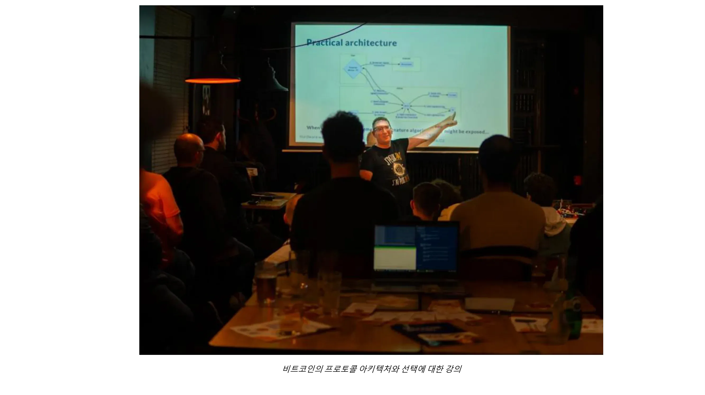

3/ 커뮤니티가 Bitcoin 생태계에 어떻게 기여하길 원하나요?

이것은 좀 더 고급 질문이지만 일찍 생각해 볼 가치가 있습니다.

가능한 한 많은 사람들에게 오렌지 필링을 제공하는 데 초점을 맞춘 긴밀하고 동기가 부여된 **커뮤니티**를 만드는 것이 비전이라면 그렇게 하세요:

- 기존 커뮤니티와 협업하여 광범위한 정보, 오픈 소스 리소스 및 필요할 때 유용한 지원에 액세스하세요.
- 그룹 내에서 작업을 구성하고 위임하여 작업을 효과적으로 확장하고 확장하세요.

**단기, 중기, 장기 목표 설정**

실용적인 계획 방법은 각 기간에 대한 목표를 설정하는 것입니다:

- 단기: 소셜 미디어 인지도를 구축하고 커뮤니티 커뮤니케이션 채널을 설정합니다.
- 중기: 교육 리소스(기사, 전단지, 동영상)를 만듭니다.
- 장기: 정기적인 오프라인 모임을 시작하세요.

모임이 성사되면 다음을 목표로 삼을 수 있습니다:

- 단기: 특정 주제에 대한 워크샵 또는 프레젠테이션 개최
- 중기: Bitcoin 인식 제고 또는 교육 캠페인 실행
- 장기: Bitcoin을 결제 수단으로 허용하는 술집과 공식적인 협회 또는 파트너십을 맺으세요.

준비하세요: **커뮤니티 구축에는 노력이 필요합니다**

커뮤니티를 만드는 것은 하루아침에 이루어지지 않습니다. 시간, 동기 부여, 조직이 필요합니다.

특히 아무도 나타나지 않고 혼자서 이 임무를 짊어지고 있는 것처럼 느껴질 때는 낙담할 수도 있습니다.

그렇기 때문에 **이 과정은 귀중한 리소스와 팁을 공유하여 커뮤니티가 효과적으로 성장하고 궁극적으로 자급자족할 수 있도록 돕기 위해 마련되었습니다**.

# 커뮤니티 아이덴티티 디자인하기 Bitcoin

<partId>da6673ad-bf49-5979-80a6-3f69cfb28046</partId>

## 나만의 아이덴티티를 만드는 이유와 방법은 무엇인가요?

<chapterId>b48a18cc-afdf-5216-802c-32647b5cd8a3</chapterId>

이 단계에서는 그렇게 가정합니다:

- 커뮤니티(또는 향후 정기 모임)가 어디에서 열릴지 이미 알고 계실 것입니다.
- 아직 최종적인 목표가 아니더라도 다양한 기간에 대한 목표를 설정했습니다.

커뮤니티 구축의 다음 단계는 커뮤니티의 이름과 시각적 스타일 등 커뮤니티의 정체성을 **정의**하는 것입니다.

이 섹션에서는 초보자도 커뮤니티의 시각적 아이덴티티를 디자인할 수 있도록 튜토리얼과 초보자 친화적인 소프트웨어 솔루션을 제공합니다.

**아이덴티티가 중요한 이유**

사람들은 그룹과 동일시할 수 있을 때 더 많은 참여와 헌신을 느낍니다. 강력한 정체성은 커뮤니티를 돋보이게 하고 소속감을 조성하는 데 도움이 됩니다.

모든 것은 이름 선택에서 시작되며, 국가마다 고유한 트렌드가 있는 경우가 많습니다:

- 프랑스: 60개 이상의 지역 커뮤니티의 대부분은 "[도시] Bitcoin" 또는 "[도시] Bitcoin"과 같은 이름을 사용합니다. 그들의 텔레그램 그룹은 종종 이 패턴을 따릅니다: "Bitcoin [CITY] meetup".
- 독일: "21"을 의미하는 아인운트완지히 이니셔티브는 "아인운트완지히 [도시]"와 같은 이름에 영감을 주었습니다.
- 이탈리아: Satoshi Spritz 네트워크는 Satoshi "Spritz [CITY]"와 같은 이름을 사용합니다.

**각 커뮤니티는 고향과 연결되어 있으면서도 국가의 더 넓은 정체성과 연결된 고유한 정체성을 가지고 있습니다**.

로고, 색상, 배너 등 시각적 아이덴티티는 사람들이 그룹을 기억하고 연관 짓는 요소입니다.

소셜 미디어 계정과 커뮤니케이션 채널을 만들 때 로고와 배너가 있으면 큰 도움이 됩니다. 전문적인 디자인 기술이 필요하지 않더라도 사용하기 쉬운 무료 도구를 사용할 수 있으니 걱정하지 마세요.

가장 좋은 출발점은 도시의 랜드마크나 상징을 통합하는 것입니다. 파리에서는 에펠탑이 될 수 있습니다. 릴에서는 종탑이나 성채가 될 수 있습니다. 뉴욕에서는 자유의 여신상. 런던에서는 빅벤 등이 있습니다.

여기에서 취향에 따라 단순하거나 더 자세한 로고를 디자인할 수 있습니다.

몇 가지 아이디어를 제공하기 위해 프랑스 커뮤니티 로고의 몇 가지 예를 소개합니다:

- 마르세유의 로고는 도시를 내려다보는 노트르담 드 라 가르드 대성당을 상징합니다:

- 모나코에서는 모네가스크 바위를 가리킵니다:

- 릴의 세련된 로고는 보반의 성채와 공원을 상징합니다:

- 생말로에서는 마을의 상징인 어민을 강조하고 있습니다:

**원하는 경우 더 이동**

영감이 떠오르면 더 나아가 커뮤니티를 위한 문장, 좌우명, 노래까지 만들 수 있습니다. 여러분의 창의력만이 유일한 한계입니다!

## 로고, 포스터 및 배너 만들기

<chapterId>3470a31f-0190-5e87-8af0-6a00e79267ef</chapterId>

### Canva 사용

[Canva](https://www.canva.com/)를 사용하여 커뮤니티를 위한 다양한 비주얼을 만들 수 있습니다.

사용하기 쉬운 이 무료 플랫폼은 몇 번의 클릭만으로 복제하고 사용자 지정할 수 있는 사전 디자인된 대규모 템플릿 라이브러리로 인기가 높습니다.

**로고 만들기**

Canva 홈페이지에서 미리 디자인된 로고를 검색합니다. 영감을 주는 로고를 하나 또는 여러 개 선택하여 복제한 다음 커뮤니티에 맞게 사용자 지정합니다.

배경에 지역 랜드마크나 엠블럼을 추가한 다음(사진을 가져오거나 Elements 메뉴에서 '일러스트레이션' 또는 '이미지'를 검색) Bitcoin 로고 또는 ₿를 오버레이하고 필요한 경우 색상을 조정할 수 있습니다.

**배너 및 포스터 만들기**

배너 또는 포스터를 만들려면 Canva의 라이브러리에서 미리 디자인된 템플릿을 검색합니다. 템플릿을 복사한 후 텍스트와 글꼴을 수정하고 커뮤니티 로고를 추가한 다음 프레임을 사용하여 사진을 가져옵니다(Elements 메뉴에서 "프레임"으로 검색).

디자인 메뉴를 사용하여 필요에 맞는 추가 모델을 탐색할 수도 있습니다.

YouTube 썸네일 또는 배너의 경우 해당 템플릿을 검색하여 복제하고 원하는 대로 사용자 지정하기만 하면 됩니다.

요컨대, **가능성은 무한하며 커뮤니티와 모임/이벤트를 위한 시각적 스타일**을 만들려는 여러분의 필요에 따라 달라질 수 있습니다!

보다 명확한 이해를 돕기 위해 이러한 가능성 중 일부를 소개하는 동영상 튜토리얼을 준비했습니다:

:::video id=d11ae0ed-eacd-4924-afd3-75aff95d2899:::

**Bitcoin 릴의 템플릿 예시**

다음은 커뮤니티에 맞게 복제하여 적용할 수 있는 기성 Canva 템플릿입니다:

- 밋업 공지 포스터 **(소셜 미디어용 및 A4/A3 인쇄용)**: [링크](https://www.canva.com/design/DAGBvBXFJ8A/92-j_toeLU8QbVAD0NwoAA/edit?utm_content=DAGBvBXFJ8A&utm_campaign=designshare&utm_medium=link2&utm_source=sharebutton)

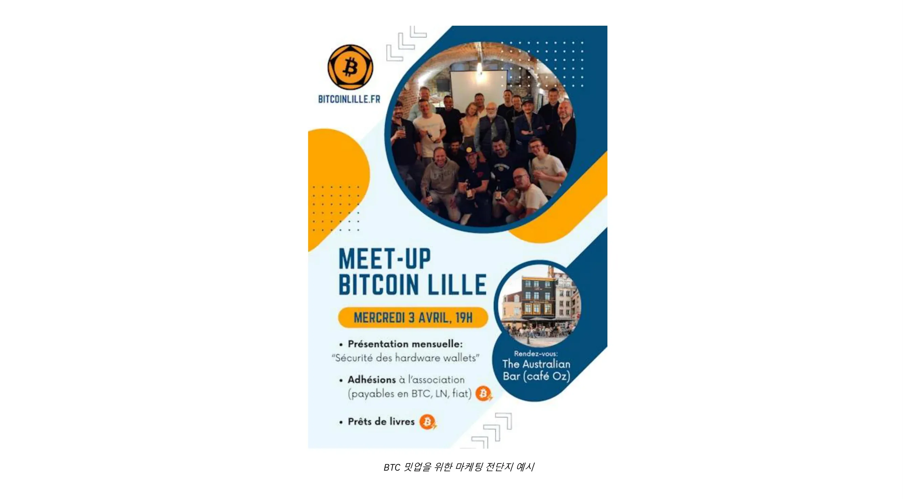

- 이벤트 포스터 **(소셜 미디어 및 A4/A3 인쇄용)**: [링크](https://www.canva.com/design/DAGBvG3rNCc/oXtNR9pduRs22AqclG4O2g/edit?utm_content=DAGBvG3rNCc&utm_campaign=designshare&utm_medium=link2&utm_source=sharebutton)

- **소셜 미디어 배너**: [링크](https://www.canva.com/design/DAGBvOXyNqw/iSJG9PbIQHgGWHz5PhlXSQ/edit?utm_content=DAGBvOXyNqw&utm_campaign=designshare&utm_medium=link2&utm_source=sharebutton)

- **콘테스트 발표**: [링크](https://www.canva.com/design/DAGBvIjuA_w/YzSUXzOmbNV9oCma9mluOw/edit?utm_content=DAGBvIjuA_w&utm_campaign=designshare&utm_medium=link2&utm_source=sharebutton)

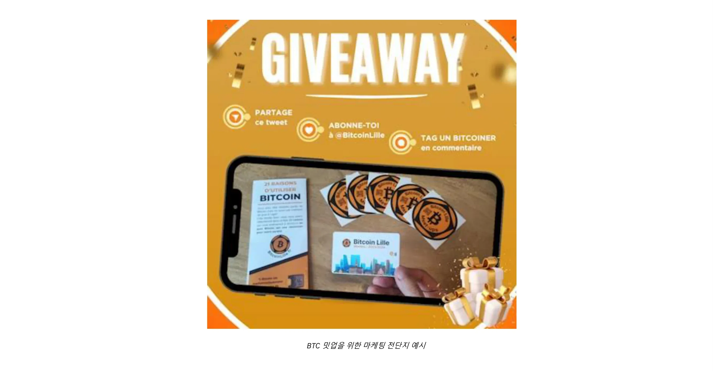

- 도서관의 **브랜드 가이드라인**을 A4 용지에 담아 밋업에 전시합니다: [링크](https://www.canva.com/design/DAGBvPqL7N4/LmUItfsysypRLSOFOzBXcQ/edit?utm_content=DAGBvPqL7N4&utm_campaign=designshare&utm_medium=link2&utm_source=sharebutton)

- **파워포인트 프레젠테이션** "제2장 - Bitcoin 트랜잭션의 이해", @ProfEduStream 작성: [링크](https://www.canva.com/design/DAFsEcnOro8/Mz9FYdTGhsvozZOe0Y9jtw/edit?utm_content=DAFsEcnOro8&utm_campaign=designshare&utm_medium=link2&utm_source=sharebutton)

- **전단지** "Bitcoin을 사용해야 하는 21가지 이유", @ProfEduStream 작성: [링크](https://www.canva.com/design/DAFtAR1NauQ/ZDwl2CchIJ9Gpb36N6-7iw/edit?utm_content=DAFtAR1NauQ&utm_campaign=designshare&utm_medium=link2&utm_source=sharebutton)

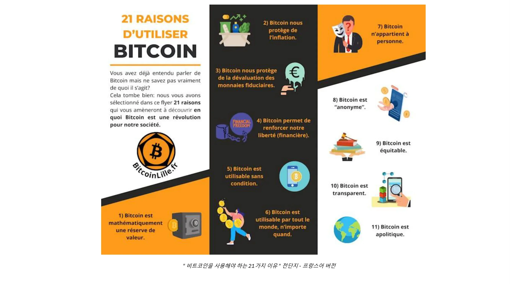

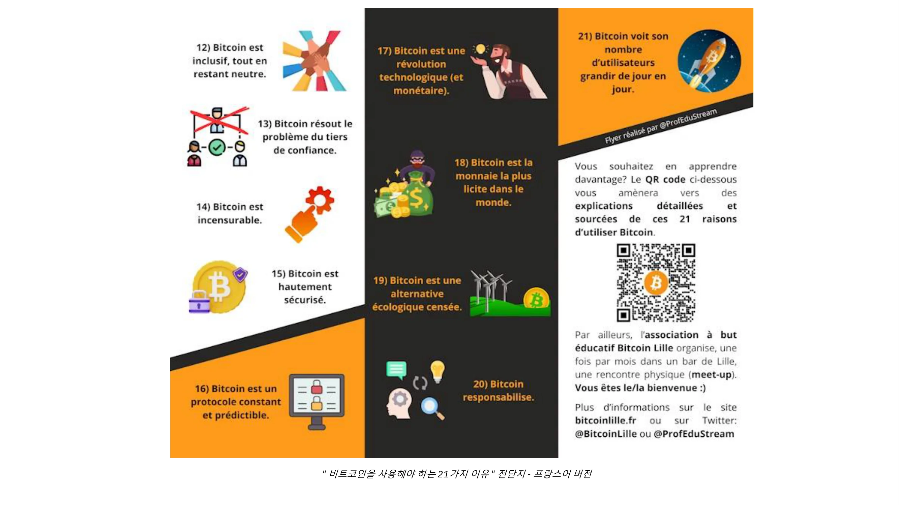

**창작물 공유**

가능성은 무궁무진하며 디자인은 목표와 시각적 아이덴티티에 따라 달라집니다. 템플릿을 오픈 소스로 공유하면 여러분과 같은 문제에 직면할 수밖에 없는 다른 Bitcoin 커뮤니티의 시간을 절약할 수 있습니다. 공유를 통해 전 세계 Bitcoin 커뮤니티의 성장을 가속화할 수 있습니다.

**권장 치수**

비주얼을 만들 때는 항상 각 플랫폼의 크기 요구 사항을 확인하세요:

| Platform | Logo | Banner | Poster / Image
| -------- | -------- | -------- | -------- |
| Telegram     | 512 x 512     | N/A     | N/A     |
| Signal     | N/A     | N/A     | N/A     |
| Twitter     | 400 x 400     | 1500 x 500     | 1200 x 628     |
| Meet-up     | N/A     | N/A     | N/A     |
| Discord     | 512 x 512     | 960 x 540     | N/A     |
| Facebook     | 512 x 512     | 851 x 315     | 960 x 720     |

일반적으로 적절한 크기입니다:

로고 512 x 512픽셀

배너: 앱 또는 사이트에 따라 다름

포스터: A4는 표준 인쇄 형식입니다

### 인공 지능 사용

Canva는 로고, 포스터, 배너, 전단지를 제작할 수 있는 다양한 도구를 제공하지만, 이것이 유일한 옵션은 아닙니다. 포토샵이나 일러스트레이터와 같은 다른 소프트웨어에 더 익숙하다면 자신에게 가장 적합한 것을 자유롭게 사용하세요.

즉, 커뮤니티 로고를 디자인하든 포스터, 프레젠테이션, 전단지를 개선하든 **인공지능은 독특하고 매력적인 비주얼을 만드는 데 강력한 조력자가 될 수 있습니다**.

이를 위해 여러 가지 AI를 사용할 수 있습니다. 여기에는 다음이 포함됩니다

- [미드저니](https://docs.midjourney.com/docs/quick-start)(유료);
- [레오나르도](https://leonardo.ai/)(무료, 계정 제한);
- [부조종사](https://copilot.microsoft.com/)(무료, 계정 제한);
- [DALL-E](https://www.dall-efree.com/)(유료).

최근 많은 다른 AI 도구가 등장했기 때문에 이 목록은 완전한 목록이 아닙니다.

**예시: 미래지향적인 Bitcoin 런던 로고 만들기**

"Bitcoin 런던" 모임을 위한 미래지향적인 로고를 디자인하고 싶다면 Copilot에 문의하세요:

- [ ] * 프롬프트: 런던 브리지와 빅벤을 배경으로 Bitcoin 로고를 만듭니다. 미래형* - [링크](https://copilot.microsoft.com/images/create/un-logo-Bitcoin-futuriste-avec-en-arric3a8re-plan-le-/1-6612ba1758df4384bc33c4bca00ab45b?FORM=SYDBIC)

처음 네 가지 결과가 충분히 현실적이지 않다면 요청을 구체화하세요:

- [ ] *프롬프트: 4번째를 훨씬 더 현실적으로 만드세요* - [링크](https://copilot.microsoft.com/images/create/un-logo-Bitcoin-futuriste-avec-en-arric3a8re-plan-le-/1-6612ba64b72d4cea9830ab7eb844f785?FORM=SYDBIC)

최근 결과는 훌륭했습니다!

**예시: 간단한 영국식 로고 만들기** 예시: 영국식 로고 만들기

스티커처럼 깔끔하게 보이게 하려면:

- [ ] *프롬프트: 영국풍의 깔끔한 스타일*로 '런던 Bitcoin 밋업' 로고 제작 - [링크](https://copilot.microsoft.com/images/create/logo-for-27londres-Bitcoin-meetup27-with-a-british-a/1-6612bb9451924859a6c34b350b3a6ebc?FORM=SYDBIC)

결과는 정말 멋져 보입니다!

**AI로 작업하기 위한 팁**

- 인내심을 가지세요: 인공지능은 첫 번째 시도에서 여러분이 상상하는 것과 정확히 일치하지 않을 수 있습니다.

- 정확한 안내를 사용하세요: 안내가 명확하고 상세할수록 더 좋은 결과를 얻을 수 있습니다.

- 도움을 요청하세요: 만족스럽지 않다면 그래픽 디자인이나 AI 도구에 경험이 있는 사람에게 도움을 요청하세요. 많은 비트코인이 기꺼이 무료 또는 몇 Sats를 받고 도와줄 것입니다.

# Bitcoin 커뮤니티를 위한 커뮤니케이션 채널 만들기

<partId>fc588298-6876-554c-bd57-55d182464878</partId>

## 어떤 커뮤니케이션 채널을 선택해야 하나요?

<chapterId>b4f4eef6-1035-5290-848a-2b7f9391c77a</chapterId>

위에서 언급했듯이 커뮤니티의 커뮤니케이션 채널은 동기와 습관에 따라 달라질 수 있습니다.

예를 들어, **프랑스, 독일, 이탈리아에서는 텔레그램과 트위터가 지배적인 플랫폼**이며, Bitcoin 커뮤니티의 "표준"이 되고 있습니다.

반면, 체코에서는 많은 커뮤니티에서 텔레그램 대신 보안 인스턴트 메시징 프로토콜인 **매트릭스**를 사용하고 있습니다.

팁: 채널을 선택하기 전에 **주변 커뮤니티에서 어떤 활동을 하는지 살펴보세요**. 지도[btcmap.org](https://btcmap.org/communities/map#0/0/0/)를 사용하여 해당 지역에서 가장 인기 있는 플랫폼을 확인하세요.

예를 들어, 스위스 커뮤니티는 주로 텔레그램, 트위터, 자체 웹사이트를 사용합니다:

**프랑스어 사용 커뮤니티를 위한 추천 채널**

- 텔레그램: 프랑스 모임의 90% 이상이 사용하는 최고의 커뮤니케이션 도구.

- 트위터(X): 전 세계 비트코인이 사용하는 주요 소셜 네트워크입니다. 프랑스 모임의 약 70%가 사용합니다. 비트코인을 사용하는 사람들에게 다가가는 데 이상적입니다.

- Meetup.com: 유료이지만 Bitcoin 생태계 외부의 가시성을 높이기 위해 널리 사용(프랑스 밋업의 ~30%와 거의 모든 캐나다 밋업에서 사용)됩니다.

- 기타 옵션: ~30%는 웹사이트를 운영하며, ~10%는 Discord 서버 또는 NOSTR 계정을 운영합니다.

Matrix, Keet, Signal, Facebook, Instagram, LinkedIn과 같은 다른 플랫폼도 사용할 수 있습니다. 관리하는 채널이 많을수록 채널을 관리하고, 게시하고, 활성 상태로 유지하는 데 더 많은 시간을 할애하게 된다는 점에 유의하세요.

따라서 프랑스에서 커뮤니티를 시작하려는 사람은 커뮤니티를 만드는 것부터 시작하는 것이 좋습니다:

- 텔레그램 그룹;
- 트위터 계정을 만들 수 있습니다.

커뮤니티가 성장함에 따라 더 많은 플랫폼을 추가하고 신뢰할 수 있는 회원에게 관리를 위임할 수 있습니다.

## 텔레그램 채널, 그룹 또는 슈퍼그룹 생성 및 구성하기

<chapterId>d13714ce-8f08-53e9-bedd-b6a3aaac5dad</chapterId>

텔레그램에서 커뮤니티의 커뮤니케이션 공간을 만들기 전에, 차이점을 알아두는 것이 중요합니다:

- 텔레그램 채널입니다;
- 텔레그램 그룹;
- 텔레그램 슈퍼그룹입니다.

텔레그램 그룹으로 시작하시는 것을 적극 권장합니다.

필요한 경우 나중에 슈퍼그룹으로 전환할 수 있습니다.

아래 튜토리얼에서는, 보다 고급 설정이 가능한 "텔레그램+" APK를 사용하였습니다. 하지만, 휴대폰을 통해서도 공식 텔레그램 앱으로 그룹을 생성하고 관리할 수 있기 때문에, 꼭 필요하지는 않습니다:

:::video id=b1da7cb4-5fb1-4a41-a1d4-bd90686826a9:::

### 텔레그램 채널 만들기

회원들이 서로 직접 대화하고, 서로에게 답글을 달 수 있는 공간을 만들고 싶다면, 텔레그램 채널이 아닌 텔레그램 그룹을 만드는 것이 좋습니다!

다음 섹션인 [텔레그램 그룹 만들기](https://planb.academy/courses/1c643dc9-a15f-4f9e-93b6-cb3c58b4ee35/d13714ce-8f08-53e9-bedd-b6a3aaac5dad)로 바로 이동합니다.

실제로 **텔레그램 채널은 관리자를 위한 단방향 방송 도구에 가깝습니다**. 회원들은 자유롭게 채팅을 할 수 없으며, 이모티콘으로만 반응하거나 별도의 스레드에 댓글을 남길 수 있어 대화가 분절됩니다.

**커뮤니티는 상호작용과 협업이 필요하므로, 관계 구축과 지식 공유가 목적이라면** 텔레그램 채널은 권장하지 않습니다.

텔레그램 채널 생성 튜토리얼입니다:

:::video id=98be4709-d221-4030-8c31-e10113482515:::

### 텔레그램 그룹 만들기

반면, **텔레그램 그룹은 커뮤니티에 이상적입니다**: 메신저나 왓츠앱과 같은 메시징 애플리케이션과 마찬가지로, 회원들은 하나의 공유 대화에서 서로 채팅하고 답장할 수 있습니다.

관리자로서 할 수 있는 일

- 중요한 메시지를 게시하고 고정합니다.
- **설문조사**를 만듭니다(커뮤니티가 새로 생겼을 때 모임 날짜를 정할 때 유용합니다).
- 사용자 지정 **초대 링크**를 생성합니다 (그룹이 "비공개"가 아닌 "공개"인 경우에만 설정에 정의되어 있습니다. 나만의 텔레그램 초대 링크(예: t.me/Bitcoin[CITY])를 만드는 것도 편리합니다);
- 회원 권한, 역할 및 모더레이션을 관리합니다.
- 프로필 사진(커뮤니티 로고)을 추가하고 그룹 이름을 업데이트합니다.

텔레그램 그룹 만들기 튜토리얼입니다:

:::video id=3d4792a7-1345-475b-93b1-b3a3945fb567:::

참고: 이 튜토리얼은 텔레그램+로 제작되었지만, 표준 텔레그램 모바일 앱에서 직접 모든 것을 할 수 있습니다.

### 텔레그램 슈퍼그룹 만들기

왜 슈퍼그룹인가요?

텔레그램 그룹이 수백명의 회원으로 늘어나면, 대화가 혼란스러워 질 수 있습니다. 이로 인해, 멤버들이 다음 모임 날짜와 같은 중요한 공지를 놓치는 경우가 종종 발생합니다.

몇 가지 솔루션을 사용할 수 있습니다:

1. *모든 회원에게 알림을 받을 수 있도록* **중요 메시지 고정하기**(해당 메시지를 손가락으로 한 번 누른 다음 '고정'을 선택)하세요;

2. 필요한 경우 사용자가 각각 음소거할 수 있는 여러 개의 커뮤니케이션 채널에 **Discord**를 사용하는 것을 고려해 보세요.

3. **텔레그램 그룹을 슈퍼그룹으로 전환하기**.

텔레그램 슈퍼그룹이란 무엇인가요?

슈퍼그룹은 기본적으로 그 안에 주제(하위 채널)가 있는 텔레그램 그룹입니다.

주제 예시:

- '중요 정보': 주요 업데이트 및 이벤트 공지사항만 표시됩니다.
- "일반": 모든 회원 토론에 사용됩니다.
- 특정 주제: 예: Mining, 프로젝트 개발, 예정된 컨퍼런스.

팁: 커뮤니티의 필요에 맞게 주제를 조정하세요. 예시: 아비장 Bitcoin 모임에서는 이 형식을 성공적으로 사용하고 있습니다.

텔레그램 슈퍼그룹은 일부 회원들에게는 다소 까다로울 수 있다는 점을 유념해 주세요. 예를 들어, 모든 사람들이 **다른 주제에 접근하는 방법**을 아는 것은 아닙니다 (전체 주제 목록을 보려면 텔레그램 메인 메뉴에서 그룹 로고를 탭하기만 하면 됩니다). 빠른 스크린샷을 보내주시면 혼란을 해소하는데 도움이 될 수 있습니다.

일반 텔레그램 그룹에서 슈퍼그룹으로 전환하는 시점에 대한 엄격한 규칙은 없으며, 멤버들의 필요에 따라 달라질 수 있습니다. 좋은 소식은, 슈퍼그룹으로 전환할 토픽을 생성하거나 "일반"을 제외한 모든 토픽을 삭제하여 일반 그룹으로 돌아가면 쉽게 전환이 가능하다는 것입니다.

텔레그램 슈퍼그룹 생성 튜토리얼입니다:

:::video id=f78800ae-d8ca-479a-b913-99abd9916bff:::

빠른 참고: 앞서 언급했듯이, 위의 튜토리얼은 "텔레그램+" APK를 사용하여 컴퓨터에서 만들었습니다. 하지만, 현재, 휴대폰에서 텔레그램 슈퍼그룹을 만드는 것은 간단합니다.

텔레그램 그룹을 생성하고, 설정으로 이동하여 "토픽" 버튼을 눌러 토픽을 추가하면 됩니다. 저장되면, 원하는 대로 편집할 수 있는 토픽 목록이 표시됩니다.

따라서, 슈퍼그룹에 대한 고급 개인정보 보호 설정에 접근하고 싶지 않다면, 더 이상 "텔레그램+"를 다운로드 할 필요가 없습니다.

## 텔레그램 그룹 또는 슈퍼그룹 설정하기

<chapterId>35e674b3-5924-50b0-98f1-83a56c9a186d</chapterId>

이제 텔레그램 그룹(또는 슈퍼그룹)이 가동되었으니, **권한을 구성하고 모더레이션을 설정**할 차례입니다.

각 커뮤니티는 자체적인 접근 방식을 자유롭게 선택할 수 있지만, 경험상 특정 회원 권한을 제한하는 것이 **최선**이라는 것을 알 수 있습니다:

- 설문조사 보내기;
- 파일 보내기(잠재적인 바이러스 감염을 방지하기 위해);
- 음성 메시지 보내기;
- 사용자 추가(봇 침입 방지);
- 메시지 고정하기;
- 그룹 정보 수정하기.

텔레그램 그룹이나 슈퍼그룹을 만들 때, 잠재적인 회원들이 가장 먼저 보게 되는 것이므로, 모임에 대한 명확한 설명을 **작성**하는 것을 적극 권장합니다. 예를 들어

> Bitcoin의 텔레그램 [CITY]에 오신 것을 환영합니다 🔥
>

> 매월 첫째 주 수요일마다 [도시]에 있는 [BAR_NAME] 바에서 모임을 개최합니다 🍻
>

> 다른 소셜 네트워크도 확인해 보세요: [링크] 🌐

이 예시에서는 Bitcoin Lille 관리자가 더 쉽게 공유할 수 있도록 공개 텔레그램 링크를 커스터마이징했습니다.

'그룹 설정'에서 '새 멤버 승인'을 **활성화**하는 것이 좋습니다.

일부 Bitcoin 텔레그램 그룹은 스팸을 보내거나 커뮤니티를 방해하기 위해 만들어진 수천 개의 가짜 계정의 표적이 되었습니다.

**멤버 승인을 활성화하면 스팸 공격으로부터 그룹을 보호할 수 있습니다**

관리자 섹션에서 '공격적인 스팸 방지' 기능을 활성화하여 의심스러운 메시지를 자동으로 삭제할 수도 있습니다.

항상 필요한 것은 아니지만 Layer의 보호 기능을 추가할 수 있습니다.

## 텔레그램 그룹에 다기능 봇 추가하기

<chapterId>c61f69cc-15ec-53f1-8c02-1cea55def09e</chapterId>

**텔레그램 그룹 또는 슈퍼그룹을 구성하고 보안을 위한 또 다른 옵션은, 다기능 봇**을 추가하는 것입니다. 이를 통해, 그룹의 기능과 중재 기능을 크게 확장할 수 있습니다.

봇 [@그룹헬프봇](https://telegram.me/grouphelpbot)을 사용하면 가장 유용한 옵션이 있습니다:

- 규칙 명령**/규칙**으로 커뮤니티 가이드라인을 표시할 수 있습니다;
- **스팸 방지** 기능으로 의심스러운 메시지와 계정을 필터링합니다;
- 신규 회원을 위한 사용자 지정 가능한 자동 환영 메시지 **(몇 분 후 자동 삭제 옵션 포함)**
- 메시지 스팸을 방지하는 **안티 플러드 보호** 기능
- 그룹 관리자에게 빠르게 연락할 수 있는 **@관리자 명령** 기능
- **원치 않는 콘텐츠에 대한 차단 규칙**
- 그룹 링크 명령**/링크)**
- 명령 **권한 관리**
- **특정 메시지 유형 자동 삭제**
- **봇 차단** 및 **출입 차단**을 통해 그룹 보안 유지
- 커뮤니티의 **소셜 네트워크**(/네트워크)를 나열하세요
- 그리고 훨씬 더...

수많은 추가 기능을 사용할 수 있습니다.

프로 팁: **대화 내용을 지나치게 제한하지 마세요**.

텔레그램 그룹 또는 슈퍼그룹에 다기능 봇을 추가하는 튜토리얼입니다:

:::video id=cdbf82d6-3530-45c4-90de-593f100863bb:::

(참고: 이제 이 모든 과정을 휴대폰에서 직접 할 수 있습니다. 더 이상 텔레그램+ 앱이 필요없습니다.)

## Discord 서버 만들기

<chapterId>eef2a965-4c24-5f3a-8013-72cc7d315314</chapterId>

텔레그램 그룹이 너무 커질 경우, 텔레그램 슈퍼그룹으로 전환하면 토론을 정리하는데 도움이 될 수 있습니다.

하지만 앞서 언급했듯이 **주제 및 메시지의 복잡성과 증가로 인해 일부 활동적인 회원은 흥미를 잃을 수 있습니다**.

디스코드를 고려해야 하는 이유는 무엇인가요?

**디스코드는 사용자가 **특정 텍스트 및 음성 대화방을 생성**할 수 있고, 구성원들이 관심 없는 채널을 뮤트할 수 있기 때문에, 텔레그램 슈퍼그룹의 대안**이 될 수 있습니다.

물론, 텔레그램과 디스코드를 모두 관리하려면, 특히 설정과 실행 과정에서 시간이 조금 더 필요합니다.

여러분의 편의를 위해 **복제 및 사용자 지정할 수 있는 [Discord 서버]를 공유하고 있습니다(https://discord.com/template/bDY4eXXJk2C8)**:

:::video id=e647458a-a21e-44e0-bd03-20b82a871777:::

잘 설계된 디스코드 서버는 커뮤니티의 진정한 자산이 될 수 있습니다. 이미 많은 비트코인 사용자들이 매일 **디스코드**를 사용하고 있으며, 디스코드 내에서 바로 텔레그램 대화를 팔로우할 수 있게 되면 (또는 그 반대로도) 모든 사람들이 많은 시간을 절약할 수 있습니다.

두 플랫폼을 동기화하기 위해, 오픈소스 봇인 [테디크로스](https://github.com/TediCross/TediCross)가 있습니다. 이 봇의 목적은 간단합니다: 디스코드 텍스트 채널에서 텔레그램 그룹(또는 슈퍼그룹의 토픽)으로 또는 그 반대로 메시지를 자동으로 전달합니다.

하지만 설치가 가장 쉬운 방법은 아니라는 점에 유의하세요. 봇이 작동하려면 컴퓨터에서 명령 프롬프트(CMD)를 계속 실행해야 하며 간혹 오류가 발생할 수 있습니다. 다행히도 봇을 다시 시작하기만 하면 대부분의 경우 모든 것이 정상으로 돌아갑니다.

시간을 절약하기 위해, 이 다기능 봇을 텔레그램 그룹이나 슈퍼그룹에 추가하는 방법에 대한 튜토리얼을 준비했습니다:

:::video id=6a0283f6-6d6c-4e81-8b2f-644b33c52fe6:::

## 보다 안전한 대체 비공개 커뮤니케이션 채널 고려하기

<chapterId>29d0aad6-0612-5dd0-bcef-7337eaf4fefc</chapterId>

앞서 설명한 것처럼, 트위터와 텔레그램은 전 세계는 아니지만 유럽에서 Bitcoin 커뮤니티에서 가장 널리 사용되는 커뮤니케이션 도구입니다.

하지만, 텔레그램은 보안이나 개인정보 보호에 가장 중점을 둔 메시징 앱으로 알려져 있지 않으며, 현재 X가 된 트위터는 지구상에서 가장 자유롭게 움직이는 기업 중 하나가 소유하고 있습니다.

그렇기 때문에 핵심 채널이 자리를 잡고 원활하게 운영되고 있다면 시간을 들여 다른 옵션을 살펴볼 가치가 있습니다.

앞으로 몇 달 동안 이 강좌와 planb.network 플랫폼에서는 **심플렉스와 엘리먼트**와 같은 탈중앙화, 암호화, 고도로 맞춤화된 커뮤니케이션 도구인 대체 프로토콜을 사용하는 방법에 대한 튜토리얼을 제공할 예정입니다.

**왜 이런 옵션을 살펴봐야 하나요?**

NOSTR 소셜 네트워크와 마찬가지로, 프라이버시 보호는 물론, 검열이나 텔레그램 그룹의 임의적인 폐쇄에 대한 안전장치를 제공하기 때문입니다.

검열에 강하고 탄력적으로 설계하는 것보다 Bitcoin의 정신에 더 부합하는 것이 있을까요?

# 소셜 네트워크 시작

<partId>8ebf8cd7-9248-543f-bc27-4ec4cc03f9cf</partId>

## Bitcoin 커뮤니티 성장을 위한 가시성의 중요성

<chapterId>b20f12e4-c5de-5f02-80c7-b7fc6cadd3ac</chapterId>

이제 커뮤니티가 운영되고 있습니다. 여러분은 텔레그램 또는 매트릭스 공간을 설정했지만, 지금은 여러분만이 그곳에 있습니다. **이제 사람들에게 여러분의 존재를 알릴 때입니다!**

아무도 그룹에 접속할 수 없고 다음 모임이 언제 열리는지 알 수 없다면 공허한 공간에 글을 올리게 될 뿐입니다. 그렇기 때문에 소셜 미디어와 나중에 다룰 몇 가지 특정 플랫폼은 커뮤니티를 구축하는 데 매우 중요합니다.

트위터(X)는 온라인에서 Bitcoin 대화의 거의 대명사가 되었습니다. 완벽하지는 않지만 현재 커뮤니티의 많은 부분이 모이는 곳입니다. 그곳에서 계정을 만드는 것을 적극 권장합니다.

일부 커뮤니티에서는 검열이나 제한에 앞서 나가기 위해 NOSTR 프로필을 개설하기도 합니다.

이것이 바로 무료 마데이라 집단이 해낸 일입니다.

물론 다른 플랫폼도 유용할 수 있습니다. Facebook(그룹 또는 페이지 포함) 또는 LinkedIn도 유용합니다.

하지만 **관리하는 커뮤니케이션 채널과 소셜 네트워크가 많을수록 더 많은 시간이 필요하다는 점을 명심하세요**. 가장 관련성이 높은 채널에 집중하는 것이 좋으며, 트위터(및 NOSTR)는 시작하기에 좋은 옵션입니다.

## 트위터 프로필 만들기

<chapterId>c8d73097-8eba-5530-918c-221002954110</chapterId>

트위터는 매우 사용하기 쉬우며, 개인정보 보호를 강화하려면 몇 가지 설정을 조정해야 합니다.

**새 트위터 계정을 만들 때는 다음 네 가지 필수 정보를 입력해야 합니다:**

1/ **@ 트위터**는 내 신원을 정의하고 나를 쉽게 찾을 수 있게 해 줍니다. 커뮤니티 이름이 "Bitcoin [CITY]"인 경우 "@Bitcoin[CITY]"를 선택하는 것이 적절합니다;

2/ 커뮤니티 또는 모임을 위해 만든 로고와 배너 (**[로고, 포스터 및 배너 만들기](https://planb.academy/courses/1c643dc9-a15f-4f9e-93b6-cb3c58b4ee35/3470a31f-0190-5e87-8af0-6a00e79267ef) 섹션 참조**);

3/ **설명**을 통해 커뮤니티에 대한 주요 정보를 몇 백 자로 공유할 수 있습니다. 예를 들어

> Bitcoin [CITY] 커뮤니티 공식 계정 #BTC | 매월 첫째 주 수요일 [CITY] 내 [BAR_NAME]에서 밋업 🍻 | 텔레그램에서 참여하기 🔽

4/ 이 설명 아래에 **링크 삽입**이 가능합니다. 이 링크는 사용자들을 커뮤니티 웹사이트의 "소셜 미디어" 페이지 또는 텔레그램 채널로 유도할 수 있습니다. 무엇을 강조하고 싶은지는 여러분이 결정할 수 있습니다.

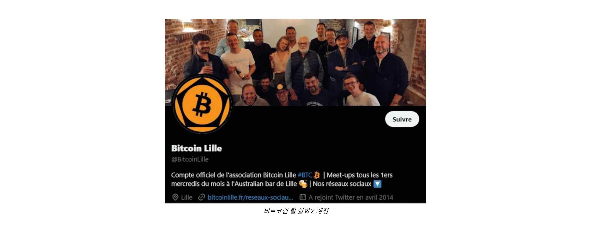

또한, **몇 가지 개인정보 보호 설정을 조정할 필요가 있습니다**:

- 트위터 계정을 '공개' 모드(누구나 볼 수 있는 게시물)로 설정합니다;
- 모든 사람이 나를 찾을 수 있도록 허용합니다;
- 위치 추적 및 다른 단체와의 데이터 공유를 비활성화합니다(개인정보 설정에서).

각 이벤트마다 트위터를 사용하여 유용한 정보를 공유할 수 있습니다. 하지만 대부분의 소셜 네트워크가 그렇듯 **가시성이 가장 중요합니다**.

상당한 시간을 절약하기 위해 [트위터의 오픈 소스 랭킹 알고리즘](https://github.com/twitter)을 연구했습니다.

가시성을 높이기 위해 집중해야 할 **핵심 사항**은 다음과 같습니다:

- 일반 팁:
    - 계정에 설정된 언어 또는 영어로 트윗하기: 다른 언어로 트윗하면 가시성이 크게 떨어질 수 있습니다;
    - 틈새 시장을 고수하고 계정의 초점과 관련된 콘텐츠만 공유하세요. 주제를 벗어난 트윗은 알고리즘에 의해 불이익을 받습니다;
    - 하루에 1~2개의 트윗을 작성하는 것을 목표로 합니다;
    - 피크 시간대에 게시하세요: 목요일 또는 금요일 오전 8시에서 10시 사이가 가장 실적이 좋은 경향이 있습니다(계정에서 확인: 트위터 애널리틱스).

- 트윗을 작성할 때
    - 사진(또는 동영상)을 추가합니다;
    - 해시태그는 하나만 사용하세요(일반적으로 #Bitcoin이 가장 관련성이 높습니다). 적절한 경우 계정 영역과 관련된 인기 해시태그를 추가할 수 있습니다;)
    - 커뮤니티의 소통을 장려하세요:
        - 좋아요 = 가중치 0.5
        - 리트윗 = 가중치 1
- 답글 = 무게 27 **(!!)**
- 내 트윗에 답글을 다는 사람**(가중치 75!!)**에게 답글을 달 수 있습니다;
    - 링크를 메인 트윗에 넣지 말고 첫 번째 댓글에 추가하세요;
    - 줄임말을 피하고 단어 전체를 쓰세요.

- 기타 팁:
    - 내 계정의 전문 분야와 일치하는 경우 인기 있는 주제에 대해 트윗하세요;
    - 실적이 가장 좋은 트윗을 다시 게시합니다;
    - 가끔 설문조사를 실시합니다;
    - 가능하면 스레드를 작성하세요;
    - 커뮤니티에서 내 프로필을 방문하고 나를 팔로우하도록 유도하세요.

또한 남아프리카공화국의 Bitcoin 위트샌드 커뮤니티처럼 트윗이나 스레드를 내 트위터 프로필에 고정하여 최대한의 가시성을 확보할 수 있습니다.

또한 휴대폰과 컴퓨터에서 동시에 두 개의 트위터 계정에 로그인한 상태를 유지할 수 있습니다. 이 기능은 개인 계정과 커뮤니티 계정 간에 쉽게 전환하고 싶을 때 매우 편리합니다.

커뮤니티 계정에서 실수로 파티 사진을 올리면 생각보다 빨리 삭제될 수 있으니 주의하세요!

마지막으로, 사용자 아이디 '@Bitcoin[CITY]'는 고유한 내 계정이지만 가짜 계정이나 모방 계정을 예상하는 것이 현명합니다. 등록하는 것도 고려해 보세요:

- 비트코인_[CITY]
- @[CITY]Bitcoin
- @[CITY]_비트코인

이렇게 하면 누군가가 커뮤니티를 사칭할 가능성을 크게 줄일 수 있습니다.

트위터 계정을 만들기 위한 튜토리얼입니다:

:::video id=4648976f-41ec-499a-b7ec-a53e796f71b4:::

## 이웃 모임에 더 가까이 다가가기

<chapterId>12a21c3b-235a-5292-8209-67bf60f61e49</chapterId>

이제 커뮤니케이션 채널과 소셜 네트워크가 설정되고 커뮤니티의 시각적 정체성이 반영되었으니, 이제 적절한 사람들을 팔로우할 차례입니다.

트위터에서는 [@Bitcoin](https://twitter.com/Bitcoin), [@planb_network](https://twitter.com/planb_network) 등 전 세계적으로 Bitcoin를 홍보하는 주요 계정과 [@FBCEglobal](https://twitter.com/FBCEglobal) 같은 이니셔티브를 팔로우하는 것부터 시작하세요. 2009년 1월 11일에 올린 [@halfin](https://twitter.com/halfin)의 유명한 "Running Bitcoin" 트윗을 리트윗할 수도 있습니다. 그리고 더 중요한 것은 **자신의 나라에서 Bitcoin 커뮤니티와 밋업의 계정을 팔로우하는 것입니다**.

이를 통해 서로 팔로우하고, 서로를 태그하고, 집단적 가시성을 높일 수 있는 **기회가 생깁니다**. 프랑스의 50여 개 Bitcoin 커뮤니티, 이탈리아의 "Satoshi Spritz" 이니셔티브, 독일의 "아이눈즈반지히" 그룹에서는 이미 이러한 방식이 일반화되어 있습니다.

사소해 보일 수도 있지만, **지역 커뮤니티와 이니셔티브의 계정을 팔로우하면 협업이나 파트너십으로 이어질 수 있습니다**. 예를 들어, Bitcoin 리에주 및 Bitcoin 릴 커뮤니티(그리고 마찬가지로 Bitcoin 엑스 및 Bitcoin 마르세유 커뮤니티)는 이러한 방식으로 연결하여 연례 밋업을 공동 주최하게 되었습니다.

세르클 뒤 **Coin** 식사가 또 다른 좋은 예입니다.

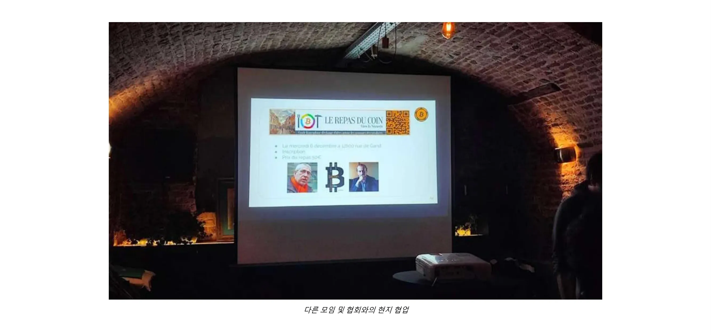

프랑스에서는 [@KonsensusFR](https://twitter.com/KonsensusFR), [@bitcoinpointfr](https://twitter.com/bitcoinpointfr), [@DecouvreBitcoin](https://twitter.com/DecouvreBitcoin), [@btcmap](https://twitter.com/btcmap)과 같은 이니셔티브를 **팔로우하는 것도 관련성이 있을 수 있습니다 **. 물론 이는 제안일 뿐이며, 각 커뮤니티는 완전한 탈중앙화와 자율성 속에서 원하는 대로 자유롭게 활동할 수 있습니다.

위에서 언급했듯이 서로 팔로우하는 목적은 상호 가시성을 높이는 것입니다. 소셜 네트워크에서 내 커뮤니티와 내 지역/국가의 커뮤니티를 더 많이 홍보할수록 더 많은 사람들이 나에 대해 이야기할 것입니다. 더 많은 사람들이 나에 대해 이야기할수록 내 이벤트에 참석할 가능성이 높아집니다.

따라서 다른 커뮤니티의 게시물에 좋아요를 누르고 리트윗하면 커뮤니티의 발전은 물론 여러분의 발전에도 큰 도움이 됩니다.

커뮤니티를 운영하는 **모임 주최자와 비트코인이 1년에 두세 번 화상 회의로 만나 국가 프로젝트와 관련 커뮤니티의 진행 상황을 검토할 것을 제안할 수도 있습니다. 이는 대면 이벤트 중에도 진행할 수 있습니다.**

목표는 간단합니다. 모든 사람의 피드백을 수집하고, 커뮤니티가 어떻게 발전하고 있는지 논의하고, 성공적인 아이디어와 프로젝트를 공유하고, 필요한 경우 해결책을 제안하는 것입니다. 회의에 대한 서면 요약본은 나중에 참석하지 못한 해당 국가의 커뮤니티 주최자와 공유할 수 있습니다.

## Btcmap.org

<chapterId>365f43d4-7b2c-5961-a184-157b8c1a0116</chapterId>

이 단계에서는 커뮤니티가 이미 운영되고 있습니다. 남은 것은 더 많은 관심 있는 사람들을 환영하고 커뮤니티가 성장하도록 돕는 것입니다.

하지만 **비트코인 사용자들이 가까운 커뮤니티와 모임을 찾을 수 있는 플랫폼이 있다는 사실을 모르고는 앞으로 나아갈 수 없습니다**. 그렇기 때문에 몇 분 시간을 내어 이러한 사이트에 목록을 요청하는 것이 중요합니다.

여기에는 다음이 포함됩니다:

- 매일 두 개의 지도가 업데이트되는 웹사이트인 [Btcmap.org](https://btcmap.org/): **[Bitcoin을 받는 세계 사업체 지도](https://btcmap.org/map)**와 **[세계 커뮤니티 지도](https://btcmap.org/communities/map)**입니다. 많은 비트코인이 여행 중이거나 일상생활을 하면서 새로운 사람을 만나거나 Sats을 사용할 장소를 찾기 위해 이 지도를 정기적으로 확인합니다. 비트코인맵은 전 세계적으로 참고할 수 있는 지도이며, 여기에 여러분의 커뮤니티를 등록하는 것은 가시성을 위해 필수적입니다
- 비트코이너에 의해, 비트코이너를 위해 만들어진 웹사이트인 [비트코이너이벤트](https://www.bitcoinerevents.com/). **커뮤니티의 예정된 이벤트를 게시할 수 있습니다**. 그러나 프랑스에서는 아직 널리 사용되지는 않습니다.
- 국가에 따라 다른 지역 이니셔티브가 있을 수 있습니다. 예를 들어, 프랑스에는 [Bitcoin.fr](https://Bitcoin.fr/events/categories/evenements/)이 있는데, 매달 수십 개의 Bitcoin 이벤트가 열립니다**. 아직 트위터에서 팔로우하거나 연락하여 커뮤니티와 이벤트에 대한 정보를 공유하지 않으셨다면 지금이 바로 그 때입니다! **프랑스 이벤트 캘린더를 최신 상태로 유지하기 위해 모든 프랑스 Bitcoin 커뮤니티가 다음과 같은 습관을 들이면 좋을 것 같습니다
    - 새로운 커뮤니티 이벤트가 있을 때마다 트위터에서 @bitcoinpointfr을 멘션하기
    - 텔레그램 그룹에 새로운 이벤트 공지를 고정합니다.

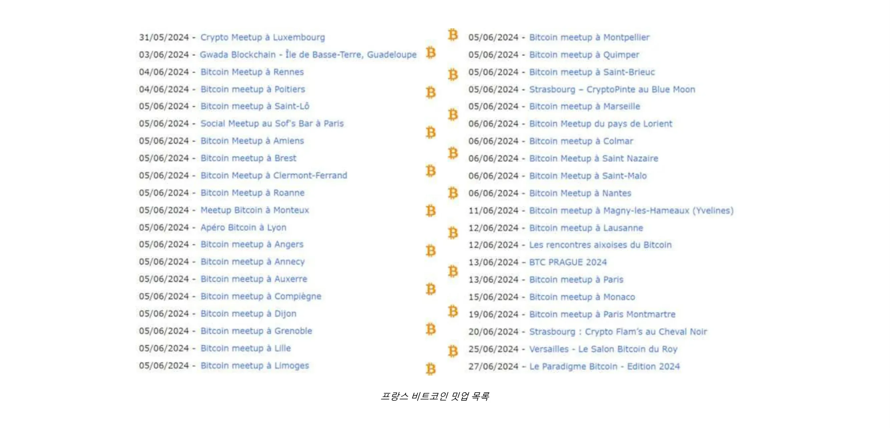

다른 플랫폼에서도 가시성을 높일 수 있습니다. **Meetup](https://www.meetup.com/)**도 그중 하나로, 이벤트를 만들고 주변 사람들을 찾을 수 있는 웹사이트(및 휴대폰 앱)입니다.

한 달에 약 8유로(또는 연간 약 90유로)의 비용이 들기 때문에 소규모의 구조화되지 않은 커뮤니티에서는 비용이 많이 들 수 있습니다. 하지만 일부 국가, 특히 캐나다와 미국에서는 Meetup이 널리 사용되고 있으며 등록을 관리하는 데 유용합니다.

마찬가지로, **[오렌지필앱](https://www.orangepillapp.com/)**은 비트코인의 만남을 돕는 유료 모바일 앱(연간 50,000Sats 또는 평생 이용 시 200,000Sats)입니다.

이 두 플랫폼은 가시성을 높이는 데 도움이 될 수 있지만, 무료가 아니기 때문에 커뮤니티를 시작할 때는 권장하지 않습니다.

**btcmap.org](https://btcmap.org/), [BitcoinerEvents](https://www.bitcoinerevents.com/), 프랑스 커뮤니티의 경우 [Bitcoin.fr](https://Bitcoin.fr)에 등록하는 것만으로도 충분합니다**.

축하합니다! 커뮤니티가 만들어지고, **비주얼이 준비되고, **목표가 설정되고, **커뮤니케이션 채널이 마련되고, **소셜 네트워크가 시작되고, **비상시성 전략이 결정되었습니다**.

소수의 비트코인이 모였다면, 이제 다음 단계인 첫 번째 Bitcoin 밋업을 준비할 차례입니다.

# Bitcoin 밋업 개최

<partId>c009d2a6-40ce-583b-bd24-fdfd1fea262e</partId>

## 커뮤니티와 정기적인 밋업을 시작하는 이유는 무엇인가요?

<chapterId>ed8e471c-3b99-57e2-a042-2d4e8a40b137</chapterId>

이제 커뮤니티의 소셜 네트워크와 커뮤니케이션 채널이 시작되었으니, 이제 이러한 플랫폼에서 여러분의 존재감을 드러낼 차례입니다. 새로운 회원들이 자신을 소개하고 서서히 대화에 참여하도록 유도하세요.

이렇게 하면 시간을 확보할 수 있고, 이 시간을 모임을 만드는 데 사용할 수 있습니다. 커뮤니티 내에서 진정한 흥미를 느끼기 시작하면 더 많은 관련성을 갖게 될 것입니다.

앞서 언급했듯이, **Bitcoin 밋업은 커뮤니티의 다음 '레벨'로 볼 수 있습니다**. 한편으로는 **회원들이 직접 만날 수 있고**, 다른 한편으로는 **이 생태계에 관심이 있는 새로운 사람들을 교육하는 데 도움이 됩니다**.

이와 같은 이벤트를 통해 여러분만의 규모로 마을에서 **Bitcoin**에 대한 화제를 불러일으킬 수 있으며, 커뮤니티가 프로젝트를 진행함에 따라 시간이 지남에 따라 그 규모가 커질 수 있습니다.

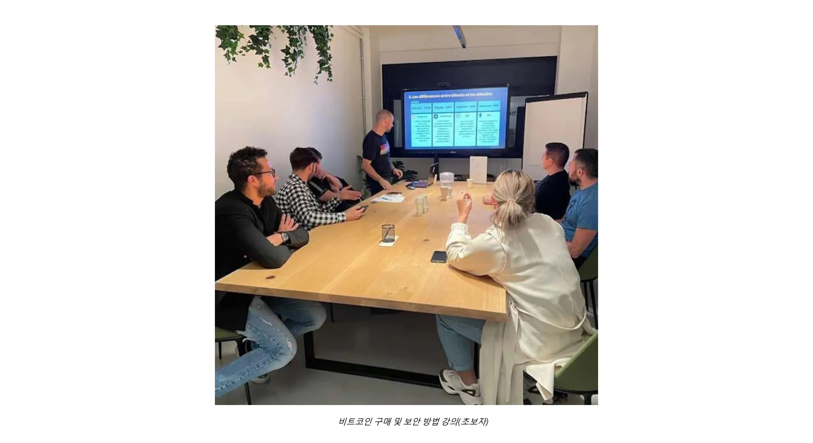

물론 커뮤니티 개발 목표가 클수록 여러분과 회원들은 더 많은 시간을 투자해야 합니다.

그렇기 때문에 **달성 가능한 밋업의 목표를 설정하는 것부터 시작하는 것이 중요합니다**.

## 첫 만남: 언제, 그리고 왜?

<chapterId>f3f8a614-cfb4-5994-a2e8-d56e6f8e3347</chapterId>

커뮤니티를 만든 후 몇 주만 지나면 모임을 시작할 수 있습니다.

그러나 이 단계에서는 그룹이 여전히 작을 수 있으므로 아무도 나타나지 않을 가능성이 있습니다.

커뮤니케이션 채널에 최소 몇 명, 예를 들어 수십 명 이상의 활성 회원을 확보한 후에 모임을 주최하는 것이 좋습니다. 이는 빠르게 이루어질 수도 있지만 사람들의 성격에 따라 달라질 수도 있습니다.

불꽃이 튀는 느낌이 든다면 직접 만나자고 제안하세요. 상대방이 관심을 보인다면 이제 **첫 만남의 날짜를 정하기만 하면 됩니다**.

날짜를 직접 정하기보다는 보통 열흘 전에 가능한 날짜와 시간으로 **여러 개의 투표를 만드는 것이 가장 좋습니다**. 이렇게 하면 투표를 통해 참석률을 극대화하고, 흥미를 유발하며, 시간을 최대한 활용할 수 있습니다.

모임이 어떻게 진행될지, 얼마나 많은 사람이 참석할지, 어떤 주제가 논의될지에 대한 고정된 기대치를 가지고 참석하지 않는 것이 가장 좋습니다. 이렇게 하면 실망감을 피하고 참가자들이 부담감을 느끼지 않게 됩니다.

술 한 잔을 마시면서 자연스럽게 대화를 이어가세요. 대화는 쉽게 이루어져야 하며, 필요한 경우 대화가 표류하기 시작하면 Bitcoin로 다시 부드럽게 유도할 수 있습니다.

조용한 순간을 대비하고 싶다면 다음과 같은 몇 가지 활동이나 토킹 포인트를 계획할 수 있습니다:

- 컴퓨터나 스마트폰에서 **[Mempool](https://Mempool.space/)**을 표시합니다;
- 책을 가져오세요;
- **너드마이너**, Bitaxe, FPGA 또는 ASIC을 가져와야 합니다;
- gW-112 **전단지**를 가지고 있습니다;
- 커뮤니티를 위한 Bitcoin 비주얼 또는 로고를 브레인스토밍합니다;
- **[Bitcoin 카드 게임](https://www.Maximalist.ovh/accueil/20-game-le-Coin-de-table.html)**을 플레이합니다;
- 커뮤니티 및 상인 지도를 **[btcmap.org](https://btcmap.org/)**에 표시합니다;
- **라이트닝**을 사용하여 Bitcoin을 송수신합니다.

모임이 막 시작되었을 때는 공식적인 프레젠테이션을 하기에 적절한 시기가 아닌 경우가 많습니다. 참석 인원이 적을 때는 일반적으로 공개적이고 캐주얼한 토론이 가장 효과적입니다.

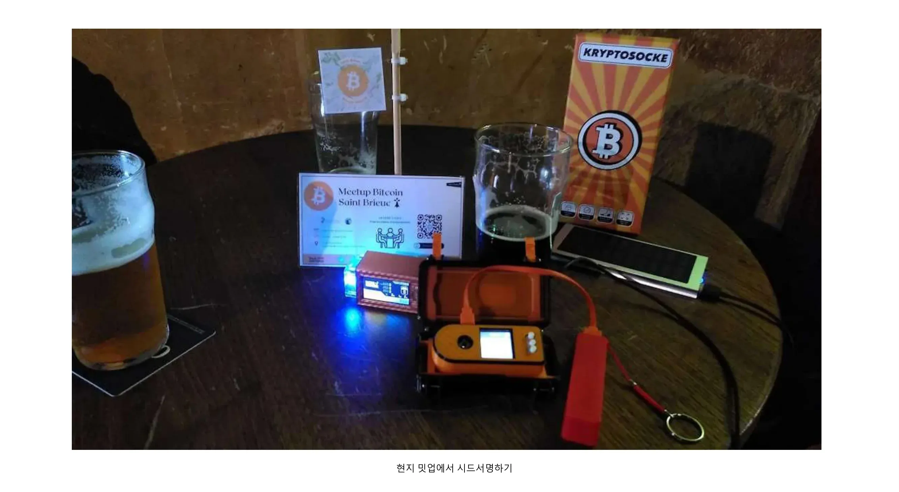

첫 번째 모임이 끝나면 또 다른 모임을 계획하고 싶을 것입니다. 커뮤니티 규모가 아직 작다면 한 달에 한 번 또는 두 달에 한 번 등 투표를 통해 날짜를 계속 선택하는 것이 가장 좋습니다. 커뮤니케이션 채널에서 이에 대해 논의할 수 있습니다.

정기적으로 비트코인 사용자 및 관심 있는 참여자 그룹이 형성되는 경우, 두 가지 이유로 반복 일정을 설정하는 것이 좋습니다:

1) 모든 사람이 미리 계획을 세우는 것이 더 쉬워집니다;

2) '습관'을 형성하는 데 도움이 됩니다. 누군가 내 채널을 정기적으로 확인하지 않더라도 모임이 언제 열리는지 알 수 있으므로 평소처럼 채널을 방문할 수 있습니다.

이 두 번째 포인트는 **프랑스에서 대부분의 밋업이 매월 첫째 주 수요일에 열리는 이유 중 하나입니다**([DecouvreBitcoin](https://decouvrebitcoin.fr/)이 2022년에 시작한 "앰배서더" 이니셔티브 참조).

독일과 이탈리아에는 정해진 국경일이 없습니다.

그러나 전국적으로 모든 밋업이 같은 날에 열리면 중앙 집중화 문제가 발생하여 비트코인 사용자들이 인근 커뮤니티의 이벤트에 참석하지 못하게 되고 보안 문제가 발생할 수 있습니다. 인근 밋업 주최자와 이야기를 나누면 좋은 일정을 합의하는 데 도움이 될 수 있습니다.

커뮤니티가 성장하고 모임에 더 많은 사람들이 모이게 되면 그렇게 할 수 있습니다:

- 각 모임에 대한 구체적인 목표를 설정하세요;
- 또는 **매월 두 번째 이벤트를 추가**할 수도 있습니다.

첫 번째 경우, 모든 사람의 선호도를 염두에 두면서 명확한 목표를 설정하면 참석자들이 새로운 것을 배우고 떠날 수 있고 대화가 Bitcoin에 집중되도록 할 수 있습니다.

두 번째 경우에는 초보자 세션이나 워크샵(Mining, 라이트닝, 노드 설치 등)과 같은 특정 주제에 맞춰 매월 두 번째 이벤트를 개최할 수 있습니다.

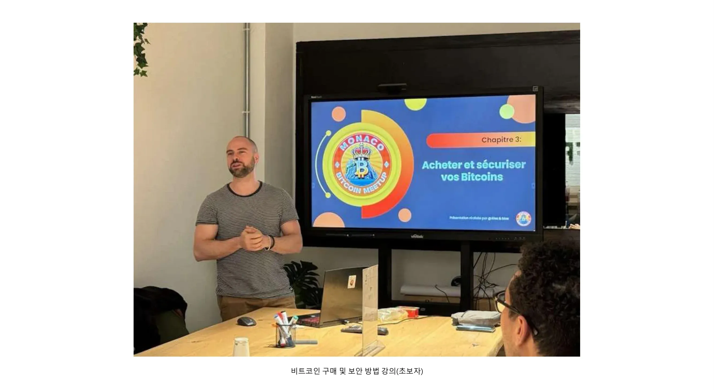

이 작업에는 더 많은 정리와 시간이 필요하다는 점을 명심하세요. 다행히도 [이 강좌의 6/8부](https://planb.academy/courses/1c643dc9-a15f-4f9e-93b6-cb3c58b4ee35/3213d87a-1998-5972-ab93-97a5769ba279)에서 재사용 가능한 다양한 오픈 소스 리소스를 찾아볼 수 있습니다.

어떤 경우든 여러분 또는 여러분의 커뮤니티가 스스로 설정한 단기, 중기, 장기 실행 계획에 따라 달라집니다.

## 위치 검색

<chapterId>405d389e-6a32-5777-af8d-293380d2e8fd</chapterId>

이벤트 장소를 찾는 것은 쉬운 일이 아닙니다. 게다가 이 장소는 **커뮤니티가 속한 도시에 위치해야 합니다**.

다음과 같은 몇 가지 기준을 고려해야 합니다:

1) **위치**: 대중교통으로 쉽게 접근할 수 있나요? 자동차로? 주차가 가능한가요?

2) 장소가 쾌적하고 너무 시끄럽지 않은가요? 공식적인 환경(코워킹 스페이스, 회의실)을 원하시나요, 아니면 좀 더 비공식적인 환경(바, 레스토랑)을 원하시나요?

3) 럭비나 챔피언스 리그 경기가 열리는 밤에도 호스팅할 수 있는 충분한 수용 인원이 있나요?

4) 프레젠테이션을 위한 비디오 프로젝터와 조용한 공간이 있나요?

5) 마지막으로, 바 또는 레스토랑인 경우 메뉴에 모든 사람이 먹고 마실 수 있는 음식이 있나요?

또한 다음 세 가지 중요한 사항을 염두에 두세요:

- 저녁 시간을 두 부분으로 나누어 먼저 공식적인 공간에서 프레젠테이션을 진행하여 모두가 집중할 수 있도록 한 다음, 바 또는 레스토랑으로 이동하여 보다 편안한 분위기에서 계속 진행하려는 경우, 저녁 중간에 장소를 변경하면 일부 참가자가 휴식 시간에 자리를 뜨는 경우가 종종 있습니다. 따라서 이 방법은 권장하지 않습니다.
- 첫 모임에서는 참석자가 적을 가능성이 높으며 공식적인 프레젠테이션을 진행하지 않을 수도 있습니다. 이 경우 자신을 소개하거나 목표를 설명할 필요가 없습니다. 하지만 **모임이 정기적이고 참석률이 높다면 전문성을 보여주고 매달 참석하고 싶다는 의사를 표현하는 것이 좋습니다**. 이를 통해 많은 논의(월별 자동 예약, 무료 음료 및/또는 음식 보드, 할인, Bitcoin에 대한 대화, Bitcoin 결제 수락 등)가 이어질 수 있습니다. 특히 프레젠테이션을 할 수 있는 비디오 프로젝터가 있는 장소를 찾고 있다면 소유자 및/또는 매니저와 미팅(대면 또는 전화)을 요청하여 프로젝트와 목표를 제시하는 것이 필수적입니다.

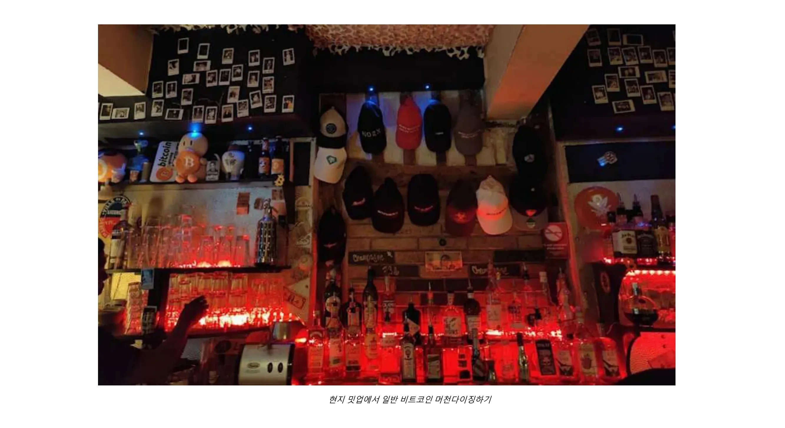

- 마지막으로, 일부 커뮤니티에서는 **Bitcoin 결제가 가능한 장소**에서만 행사를 개최하고자 하는 경우가 있는데, 이는 이해할 수 있습니다. 이 경우 **[btcmap.org](https://btcmap.org/map/)에서 해당 도시에서 Bitcoin을 허용하는 업체를 검색**하고 해당 업체에 연락하여 기준에 맞는지 확인하는 것이 좋습니다. 적합한 업체가 없는 경우 신규 가맹점 등록을 시도할 수 있지만, 거절이 많을 것으로 예상되므로 실망할 수 있습니다. 그렇기 때문에 처음부터 이를 목표로 설정하지 말고 커뮤니티가 잘 구축되고 충분한 "화력"이 확보된 후에 고려하는 것이 가장 좋습니다

또한, 밋업을 시작할 때 주저하지 마시고 처음 몇 달 동안은 **장소를 변경**해 보세요. 이렇게 하면 여러 매니저와 관계를 구축하고, 다양한 분위기를 탐색하고, 향후 호스트 후보에 대한 정보를 수집하는 데 도움이 됩니다.

나중에 그룹이 커지면 오후 시간을 내어 여러 비즈니스와 바를 방문하여 월별 이벤트와 모임을 주최하기에 적합한 공간이 있는지 물어볼 수도 있습니다.

## 밋업 전

<chapterId>c5218943-580d-5efc-89ed-6b5d728816d6</chapterId>

앞으로 몇 주 안에 모임을 주최할 계획이 있으신가요?

다음은 준비에 도움이 되는 체크리스트입니다:

1/ **장소 확인**

이벤트를 주최할 장소에 연락하여 예상 참석자 수에 맞게 예약하세요.

2/ **이벤트 발표**:

    - 소셜 네트워크 및 기타 커뮤니케이션 채널에서 날짜, 시간 및 위치를 공유합니다. 필요한 경우 등록 링크를 포함하세요.
    - 전용 시각 자료 만들기(예: 캔버스 포스터, 2/8부 '[Bitcoin 커뮤니티의 아이덴티티 디자인하기](https://planb.academy/courses/1c643dc9-a15f-4f9e-93b6-cb3c58b4ee35/b48a18cc-afdf-5216-802c-32647b5cd8a3)' 참조).
    - 텔레그램과 트위터에 공지를 고정하고, 디스코드에서 "@모두" 멘션을 사용하여 가시성을 극대화하세요.
    - 참석자들이 미리 계획을 세울 수 있도록 행사 7~10일 전에 공지사항을 게시합니다.

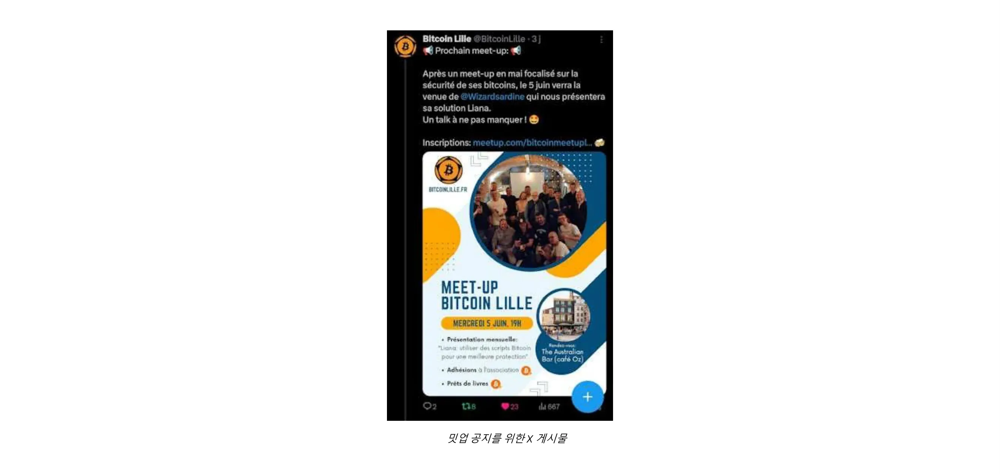

3/ **청중에게 상기시키기**

이벤트 2~3일 전에 공지사항을 다시 공유하고 리트윗하여 가시성을 높이세요.

4/ **장소 업데이트**

전날(또는 이틀 전)에 등록을 확인하고 최종 예상 참가자 수를 행사장에 알려주세요.

이벤트를 돋보이게 하는 추가 단계:

- 전단지 및/또는 포스터 인쇄
- 특정 주제에 대한 프레젠테이션 준비
- 활동 또는 워크샵 구성

## 밋업 당일

<chapterId>cf60067b-591f-5fdf-9b9e-d442aad0e8f9</chapterId>

중요한 날이 다가왔습니다! 이벤트 시작 1~2시간 전에 커뮤니티의 커뮤니케이션 채널을 통해 알림을 보내세요. 시작 시간을 다시 한 번 확인하고 참가자들이 여러분을 알아볼 수 있도록 Bitcoin 티셔츠와 모자를 착용할 것이라고 언급하는 등의 방법을 알려주세요.

모임의 규모가 커지고 20명 이상의 사람들을 맞이하기 시작하면 장소 준비가 점점 더 중요해집니다.

방법은 다음과 같습니다:

1) **일찍 도착**하여 준비합니다.

2) *필요와 장소의 가능성에 따라 공간을 **배치**하세요.* 참석 인원이 6명일 경우에는 별다른 설정이 필요하지 않습니다. 하지만 참석자가 10~20명이 되면 완전히 착석한 레이아웃은 상호 작용을 제한할 수 있습니다. 이 경우 가능한 경우 간격을 충분히 두고 높은 테이블이 있는 스탠딩 설정을 선택하고 의자를 몇 개(가급적 높은 것이 좋음) 준비하세요. 프레젠테이션이 계획되어 있다면 대부분의 저녁 시간 동안 스탠딩 배치를 유지하고 강연 직전에 의자를 가져와야 합니다.

3) 작은 사용자 지정 손길을 추가합니다:

    - 입구에 포스터를 붙여 위치를 표시하세요(파타픽스를 사용하고 먼저 장소 측의 허가를 받습니다).
    - 내부에 Bitcoin 테마 포스터(Bitcoin 백서, 커뮤니티 헌장, 현재 진행 중인 프로젝트 등)를 전시합니다.
    - 예를 들어, 스티커, 전단지 또는 대화 시작용 스티커를 테이블에 붙이세요: Nerdminer, Hardware Wallet, Mempool, ASIC Miner이 표시된 노트북, 개인 키용 금속 백업 플레이트 등이 있습니다.

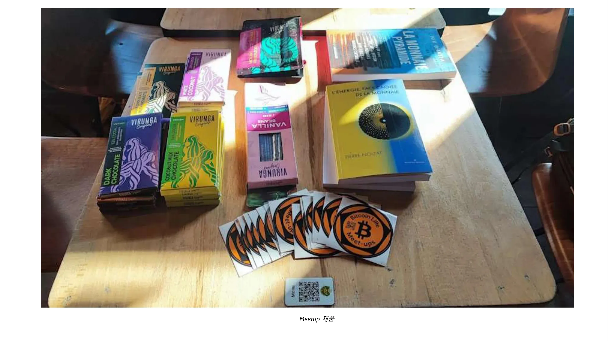

참가자가 소수에 불과하고 장소 관리자와 아직 관계를 구축하지 않은 경우에는 모든 장비를 바로 가져와서 전시하는 것은 피하세요. 일단 신뢰가 쌓이면 원하는 대로 공간을 자유롭게 배치할 수 있습니다.

마지막으로 음료를 마시며 사람들이 도착할 때까지 기다리세요. 처음에 아무도 오지 않더라도 낙심하지 마세요. 만약을 대비해 볼 책이나 동영상을 가져가세요.

## 밋업 후

<chapterId>3e881af9-9c09-5721-81ee-c5cda3b109c5</chapterId>

모임이 끝나면 행사장 스태프가 정리할 시간입니다. 떠나기 전에 웨이터나 매니저에게 일손을 빌려주겠다고 제안하세요. 모든 잔을 한 테이블에 모으거나, 바 근처에 있는 경우 떠나기 전에 잔을 돌려주는 것 같은 간단한 일부터 시작하세요.

집에 돌아가면 며칠 동안 Bitcoin가 계속 머릿속에 떠오를 것입니다. 이때가 바로 커뮤니티의 분위기를 파악하고 참가자들의 피드백을 수집하기에 완벽한 시기입니다. 할 수 있습니다:

- 커뮤니케이션 채널에 감사 메시지를 게시하고 이벤트 기간 동안 언급된 링크나 리소스를 공유하세요.
- 참석자에게 다음 모임에 대한 개선 사항을 제안하도록 초대합니다.
- 다음 이벤트 계획을 시작하세요.

그런 다음 몇 주 동안 다음 모임을 더욱 멋지게 만들기 위한 새로운 아이디어, 비주얼 또는 프로젝트를 개발할 수 있는 시간이 주어집니다.

## 참가자 참여 및 유지의 중요성

<chapterId>f5355e35-4b07-527c-88a3-8535cba7592c</chapterId>

로마는 하루아침에 건설되지 않았고, 여러분의 커뮤니티도 마찬가지입니다. Bitcoin에 대한 모멘텀은 정기적인 모임과 이벤트 개최에서 비롯됩니다.

이를 실현하기 위해서는 한 가지가 필수적입니다: **바로 참가자의 참여를 유지하는 것**입니다.

열정적인 비트코인 사용자들이 정기적으로 모여 Bitcoin에 대해 이야기하는 것을 목표로 하는 소규모 그룹으로 시작할 수 있습니다. 시간이 지나면서 각자의 가용성과 관심사에 따라 특정 조직 작업을 그룹과 **공유**하거나 핵심 **구성원을 초대하여 특정 프로젝트를 진행**할 수 있습니다. 이러한 프로젝트는 커뮤니티, 모임 또는 도시에 고유한 것이거나 [이 과정의 6/8부](https://planb.academy/courses/1c643dc9-a15f-4f9e-93b6-cb3c58b4ee35/3213d87a-1998-5972-ab93-97a5769ba279)에서 제안한 여러 이니셔티브에서 영감을 얻은 것일 수도 있습니다. **이는 핵심 멤버로부터 Commitment을 육성할 뿐만 아니라 커뮤니티의 성장과 번영에도 도움이 됩니다**.

밋업이 진행됨에 따라 이전 주기에 비트코인 및/또는 알트코인을 구매했던 사람, 더 깊이 이해하고 싶은 기술 애호가, 조건 없이 신뢰할 수 있는 제3자 없이 작동하는 이 검열 없는 탈중앙화, 투명하고 공정한 결제 시스템에 대해 궁금해하는 초보자 등 새로운 얼굴들이 등장할 것입니다.

모든 사람이 이벤트에 참여한다고 느끼도록 하려면 두 가지 핵심 측면에 집중하세요:

- **사회적 포용**: 참석하는 모든 사람이 환영받는다고 느껴야 합니다. 새로 온 사람들에게 인사하고, 왜 왔는지 물어보고, 다른 사람들에게 소개하는 노력을 기울이세요. 사람들이 소속감을 느끼면 재방문할 가능성이 높아지며, 향후 이벤트 조직에 도움을 줄 수도 있습니다.
- **인내심과 개방성**: 여기에는 시간과 동기가 필요합니다. 고의적인 사기꾼(또는 더 심한 경우, XRP Maximalist)과 대화하는 경우, 그들을 무시하고 싶을 수 있습니다. 하지만 대화에 참여함으로써 오해나 잘못된 추론을 바로잡을 수 있습니다. 상대방이 기꺼이 귀를 기울인다면 Bitcoin를 진정으로 이해할 준비가 되어 있을지도 모릅니다.

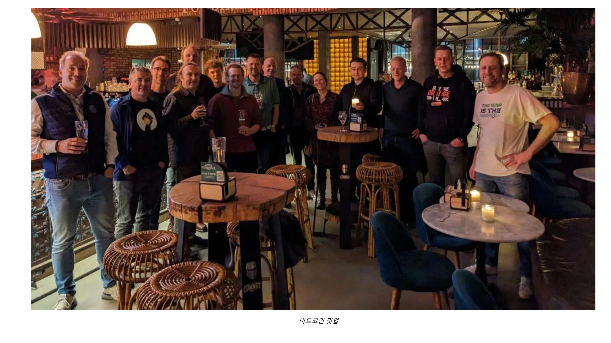

실용적인 관점에서 전반적인 이벤트 경험을 생각해 보세요:

- 장소가 **쾌적**했나요?
- 접근이 **쉬웠나요?**
- 가입만 하고 나타나지 않는 사람들이 있는 이유는 무엇인가요?
- 어떤 토론이 진행되었나요? 토론이 초보자에게 너무 기술적인 내용이었나요?
- 토론이 너무 술에 취해 있었나요?

참가자마다 개성과 목표, 관심사가 다르기 때문에 각자의 경험은 다를 수 있습니다. 하지만 장소가 적절하고 참가자들이 열린 마음을 가지고 있으며 모임의 의도가 진정성이 있다면 모임이 성공할 수 있는 모든 이유가 있습니다.

밋업을 만드는 데는 시간이 걸리지만 무엇보다도 조직이 필요합니다. 모임은 사람에 의한 프로젝트이므로 잘 계획되고 개방적이며 포용적일 때만 장기적으로 성공하고 성장할 수 있습니다.

궁극적으로 '개방과 포용'의 범위를 어디까지로 할 것인지는 여러분의 결정에 달려 있습니다. 한 가지 기억하세요: 싯코인러는 종종 비트코인을 만드는 사람일 뿐입니다.

# 프로젝트 및 이니셔티브의 예

<partId>45b3bc40-1c31-583e-8411-2662e6efd765</partId>

## 맥주를 마시는 것에서 더 나아가야 하는 이유는 무엇일까요?

<chapterId>3213d87a-1998-5972-ab93-97a5769ba279</chapterId>

블록이 계속 쌓이면서 커뮤니티는 진화할 것입니다. 새로운 사람들이 합류하고 다른 사람들이 떠날 수도 있지만, Bitcoin 생태계를 발전시키고 구성원 간의 유대를 강화한다는 기본 원칙은 변함없이 유지되어야 합니다.

실행할 수 있는 많은 프로젝트와 이니셔티브가 있습니다. 이 장에서는 커뮤니티 내에서 또는 밋업 중에 실행할 수 있는 아이디어의 전체 목록을 제공하지 않습니다. 여러분에게 영감을 주는 아이디어를 자유롭게 골라 이 강좌에 직접 아이디어를 제공하실 수도 있습니다[GitHub에서 '풀 리퀘스트'(https://github.com/PlanB-Network/Bitcoin-educational-content)].

자세히 알아보기 전에 앞서 언급한 사항을 다시 한 번 살펴보겠습니다.

Bitcoin 모임을 주최하면 새로운 사람들을 만나게 됩니다. 사회적 교류는 필수적이며 맥주(또는 일반적으로 술)는 축제 분위기를 조성하는 데 도움이 될 수 있습니다. 하지만 명심해야 할 점이 있습니다:

- 알코올은 사고력과 이해력과 같은 인지 능력을 손상시켜 참가자가 진지한 토론이나 프레젠테이션을 따라가기 어렵게 만들 수 있습니다.
- 술은 또한 위로의 의식이 될 수 있습니다. 매달 친구들과 함께 술을 마시며 'Bitcoin의 순간'을 공유하죠. 술자리는 친목을 다지는 좋은 방법이지만, 정말 맥주를 마시는 것이 모임의 주된 목표일까요? 아니면 Exchange을 연구하고, 다른 사람들로부터 배우고, 새로운 사람들이 Bitcoin를 발견하도록 돕고 싶으신가요?

누구나 자신만의 취향과 신념, 개성이 있습니다. 이 글은 한 모임을 다른 모임보다 우월하다고 판단하는 것이 아닙니다. 하지만 우리는 종종 맥주 한 잔을 마시며 세상을 바꾸는 것에 대해 이야기하지만, 혁명은 그런 식으로 시작되거나 성장하지 않습니다.

핵심은 단순히 인식하는 것입니다.

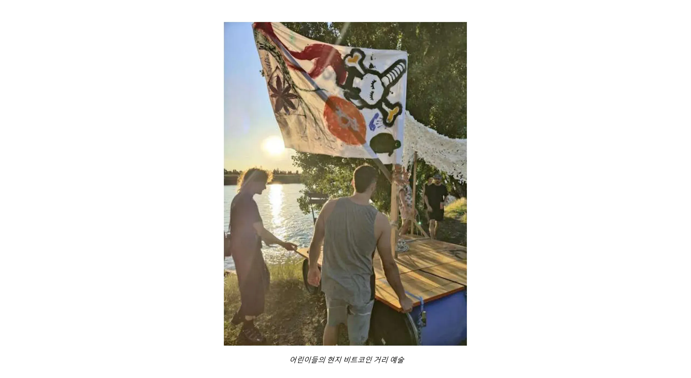

## 연간 진행 상황에 따라 테마별 모임을 조직하세요

<chapterId>46afdbcc-a775-5c16-b20a-34956690d58f</chapterId>

10명 내외의 핵심 그룹을 구성한 후에는 각 이벤트에 프레젠테이션을 추가할 수 있습니다. 미리 공지된 주제를 따르거나 서로 완전히 독립적으로 진행할 수 있습니다.

프레젠테이션이나 워크샵을 계획할 때 명확하고 체계적인 진행을 만드는 데 도움이 됩니다. 목표는 **Bitcoin의 핵심 개념을 단계별로 설명**하여 참석자들이 다양한 각도에서 주제를 전체적으로 파악할 수 있도록 하는 것입니다.

프랑스에서는 2023년 여름, 밋업 주최자들이 **연례적인 진행**을 위해 노력했습니다.

이 접근 방식은 강력한 교육적 가치 외에도 그룹 간에 오픈 소스 문서와 슬라이드 데크를 공유하여 점진적으로 공유 리소스 라이브러리를 구축할 수 있게 해줍니다. 이 이니셔티브는 호평을 받고 있으며 향후 몇 년 동안 더욱 확대될 예정입니다.

아래는 2023-2024년 프랑스 밋업 진행 상황입니다. 각 주제에 대해 오픈 소스 프레젠테이션과 동영상이 제공되며, 이를 통해 자체 이벤트에서 다룰 수 있는 주제에 대한 아이디어를 얻을 수 있습니다.

다른 리소스는 Plan ₿ Academy의 ["Educator Content"](https://planb.academy/educator-content) 섹션에서도 이용할 수 있습니다. 이는 전 세계 Bitcoin 교육자들이 교육 자료(프레젠테이션, 전단지, 가이드, 포스터...)를 즉시 사용 가능하거나 편집 가능한 형식으로 공유하고 제공하는 협업 공간입니다. 목표: 매번 처음부터 시작하지 않도록 노력을 결집하는 것!

| Month | Theme | Video | Editable Resource |
| -------- | -------- | -------- | --- |
| September     | Chapter 1: What is Bitcoin?     | [	YouTube link](https://www.youtube.com/watch?v=CSjuBqrl4t8)     | [Editable PowerPoint](https://www.canva.com/design/DAFu0d5Jd7M/9gAWDAOSS6LDkWENuZjYgw/edit) |
| October & November| Chapter 2: Understanding Bitcoin Transactions     | [YouTube link](https://www.youtube.com/watch?v=inFnR-3NsdM)     | [Editable PowerPoint](https://www.canva.com/design/DAFsEcnOro8/Mz9FYdTGhsvozZOe0Y9jtw/edit) |
| December     | Chapter 3: Understanding the Lightning Network     | [YouTube link](https://www.youtube.com/watch?v=hHz-ALx8D9w)     | [Editable PowerPoint](https://www.canva.com/design/DAF4YPSNnR8/HKp4Vmcno8eMtVWnZmFtcw/edit) |
| January     | Chapter 4: What is Mining?     | [YouTube link](https://www.youtube.com/watch?v=QyHZ3CVI_OI)     | [Editable PowerPoint](https://www.canva.com/design/DAF5DE6iBEM/tsy8E3oBebUnsR0kj53vvQ/edit) |
| February     | 	Chapter 5: Running a Bitcoin and Lightning Node    | [YouTube link](https://www.youtube.com/watch?v=RRYK-usg-OY)     | [Editable PowerPoint](https://www.canva.com/design/DAF55FU6HI0/sQ0lacRJblqrhn_9Xk1yDg/edit) |
| March     | 	Chapter 6: Using the Lightning Network in Daily Life    | [YouTube link](https://www.youtube.com/watch?v=o2BS4xjei8M)    | [Editable PowerPoint](https://www.canva.com/design/DAGAcJMw7lw/-haMNnHnwj5vpDAy8MDowA/edit) |
| April & May    | Chapter 7: Securing Your Bitcoins      | [YouTube link](https://www.youtube.com/watch?v=fHExPbhM0Hg)    | [Editable PowerPoint](https://www.canva.com/design/DAGDz3Nq4e0/D3uG-4w9FN6OhUq-VXzhfg/edit) |
| June     | 	Chapter 8: What is Multi-Sig?     | [YouTube link](https://www.youtube.com/watch?v=Me5489mpoxA)     | [Editable PowerPoint](https://www.canva.com/design/DAGLMtQT6sg/rYIxr4ldUJ0jTelNf-Pj8Q/edit) |
| July     | 	Chapter 9: Understanding the Bull Run and How to Prepare    | [YouTube link](https://www.youtube.com/watch?v=7RA-gnCJWyM)     | [Editable PowerPoint](https://www.canva.com/design/DAGJQkiZ_YA/9lUluP9RZ0eeA_e61mk9Hw/edit) |
| August     | Chapter 10: The Taxman is Never Far Away   | [YouTube link](https://www.youtube.com/watch?v=oY4NwonGDm0)     | [Editable PowerPoint](https://www.canva.com/design/DAGQhx7Yc_c/7mRhb_vlgnhSgxd1FtjK8w/edit) |

참가자에게 부담을 주지 않도록 2장과 7장을 두 개의 짧은 프레젠테이션으로 나눌 수 있습니다. 그러나 한 세션으로 진행하면 이웃 그룹과의 공동 모임, 퀴즈 또는 워크숍과 같은 특별 활동을 위한 캘린더 공간을 확보할 수 있습니다.

**이러한 리소스는 자유롭게 사용, 수정 및 공유할 수 있으며, 저작물을 재사용하는 경우 반드시 원저자의 출처를 밝혀야 합니다**

모든 사람이 모든 모임에 참석하는 것은 아니므로 프레젠테이션을 녹화하여 스트리밍 플랫폼이나 웹사이트에 업로드하는 것이 좋습니다. 이렇게 하면 불참자도 따라잡을 수 있고 참가자는 나중에 자료를 다시 볼 수 있습니다.

이와 동시에 다음과 같은 다른 테마의 모임을 진행할 수 있습니다:

- Bitcoin 지식 퀴즈(상품으로 Hardware Wallet 제공)
- 길거리의 노코인에게 무료 사토시를 보내는 온보딩 챌린지
- 전문가 연사 또는 기업을 초청하여 Bitcoin 관련 제품 발표하기
- Bitcoin를 받는 바와 상점의 야간 투어

그 외에도 여러분의 상상력만이 유일한 한계입니다!

## 사이드 이벤트 및 워크샵 만들기

<chapterId>9dbd651a-8712-5630-90b3-b9525dcc1385</chapterId>

시간적 여유와 커뮤니티 참여 정도에 따라 연중 내내 다음과 같은 추가 이벤트를 계획할 수 있습니다:

- 5월 22일 **피자의 날**을 위한 레스토랑의 밤
- 다음 **Halving**을 축하하기 위한 저녁 또는 주말
- 르 Coin 드 테이블](https://www.Maximalist.ovh/) 또는 [샤모리](https://shamory.com/)와 같은 게임을 사용하여 Bitcoin과 그 작동 방식에 대한 가족 **게임의 밤**을 개최합니다
- 다양한 유형의 하드웨어(CPU, GPU, FPGA, ASIC, 너드마이너, 비택스)를 소개하는 **Mining 워크샵**을 진행합니다
- 초보자를 위한 오후 또는 저녁 **테마 워크샵**, 테마별 워크샵
- 이웃 커뮤니티와의 **공동 밋업**

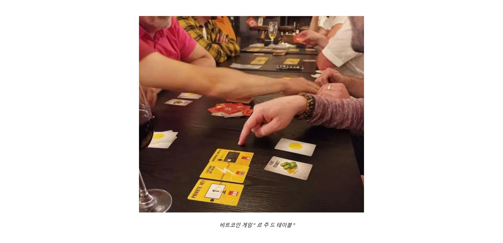

달력에 과부하가 걸리지 않도록 주의하세요. 한 달에 너무 많은 이벤트를 개최하면 주최자의 피로가 누적되고 시간이 지남에 따라 참석률이 떨어질 수 있습니다.

## 스티커 만들기

<chapterId>d605f3b3-130e-513d-85e6-06bc5ea13e99</chapterId>

스티커는 Bitcoin와 커뮤니티를 홍보하는 동시에 자신의 정체성을 강화할 수 있는 재미있는 방법입니다.

주문하기 전에 다음 팁을 염두에 두세요:

- 실외에서 사용하려면 스티커가 방수 처리되어 있는지 확인하세요.
- 레이저 커팅 시 로고가 잘리는 문제를 방지하려면 로고를 커팅 영역보다 약간 작게 유지하세요.
- 인쇄 품질을 높이려면 래스터 이미지 대신 벡터 파일을 사용하세요.
- 적당한 크기를 선택하세요: 지름 8cm(성인 손바닥 크기 정도)는 눈에 잘 띄고, 4cm는 눈에 잘 띄지 않습니다. 가시성 또는 신중함을 원하시나요?
- 진한 검정색 인쇄("쿼드 블랙")의 경우 시안 30%, 마젠타 30%, 노란색 30%, 검정 100%를 사용합니다. 100% 검정만 사용하면 회색 톤이 될 수 있습니다. 프린터는 종종 이를 확인하지만 알아두는 것이 좋습니다.

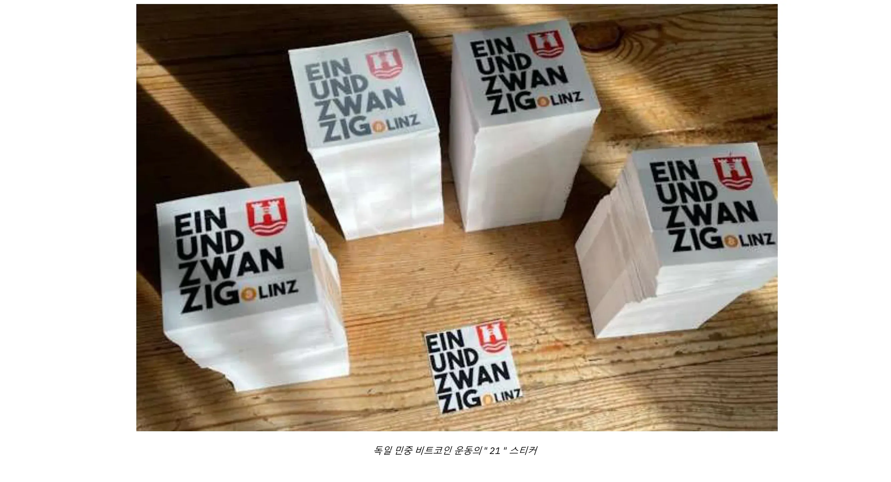

필요와 공급업체에 따라 스티커 1,000장의 가격은 100유로에서 250유로 사이일 수 있습니다. 마케팅을 전문으로 하는 프랑스 비트코인의 [트위터 @Mill3sim3](https://x.com/Mill3sim3)에 연락하면 일반 온라인 공급업체보다 최대 30% 저렴한 가격에 구매할 수 있습니다.

하지만 1,000개의 스티커는 많은 양입니다. 보통 100개 정도부터 시작하여 모두 배포할 수 있도록 하는 것이 좋습니다.

중요: **중요: 공공장소에 스티커를 부착하기 전에 현지 규정을 확인하세요**.

프랑스에서는 공식적인 공공 게시판에만 스티커를 붙일 수 있습니다. 다른 곳(예: 정지 표지판)에 스티커를 붙이면 제거될 수 있으며, 회원님이나 모임과 연결될 수 있는 경우 벌금이 부과될 수 있습니다. 회원들에게 이 사실을 알려주세요.

콘서트, 바, 경기장 등 비공개 장소에서는 스티커를 추가하기 전에 스티커가 이미 부착되어 있는지 확인하세요. 없는 경우 직원에게 허가를 요청하세요. 커뮤니티에 대한 비즈니스 소유자의 첫인상이 공간을 파손했다는 인상을 남기고 싶지 않을 것입니다.

## 라이브러리 만들기

<chapterId>acc94093-f8b3-51b8-9359-348e9e075d38</chapterId>

쉽게 설정할 수 있는 또 다른 프로젝트는 **모임에서 라이브러리 만들기**입니다.

독서 자료를 공유하고자 하는 참가자에게 Bitcoin 관련 책을 가져오라고 초대할 수 있습니다. 모임에 참석한 다른 사람이 책을 빌리고자 하는 경우, Exchange의 소유자에게 보증금(예: 21,000 사토시)을 받고 대여를 주선할 수 있습니다.

소유자의 경우, 이 보증금은 분실이나 도난 가능성에 대비하는 데 도움이 됩니다. 차용자에게는 보증금을 돌려받기 위해 나중에 다시 모임을 가질 수 있는 인센티브가 됩니다.

협회를 운영하면서 자금의 일부를 교육 자원에 투자하고 싶다면, 여러 권의 책을 구입하여 각 모임에서 이용할 수 있는 **Bitcoin 라이브러리**에 비치할 수도 있습니다.

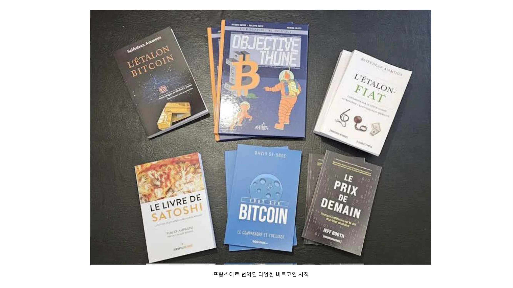

생태계를 지원하기 위해 **[출판사 컨센서스 네트워크](https://konsensus.network/)는 2023년 말부터 국제 Bitcoin 모임과 커뮤니티에 3권 이상 주문 시 모든 도서에 대해 15%~35% 할인을 제공하고 있습니다**.

이 할인 혜택을 받으려면 트위터에서 **[컨센서스 출판사](https://twitter.com/KonsensusFR)에 문의**하면 됩니다.

현금이 없는 경우에도 커뮤니티 회원에게 할인을 전달할 수 있습니다.

직접 자금을 보유하지 않은 경우에도 회원들에게 할인 혜택을 전달할 수 있습니다. 예를 들어, 한 주최자가 회원들의 주문을 모아 할인된 가격으로 대량 주문한 후 다음 모임에서 책을 배포하고, 그 때 라이트닝으로 결제하면 됩니다.

모임에 도서 대출 헌장을 게시하여 새로 온 사람들에게 대출 규칙을 명확하게 설명할 수도 있습니다.

다음은 사용 및 적용할 수 있는 오픈 소스 예제입니다:

[도서 대출 헌장](https://www.canva.com/design/DAF7u1b5kRM/r2gEAlibe_jTIXIX-O9PMA/edit)

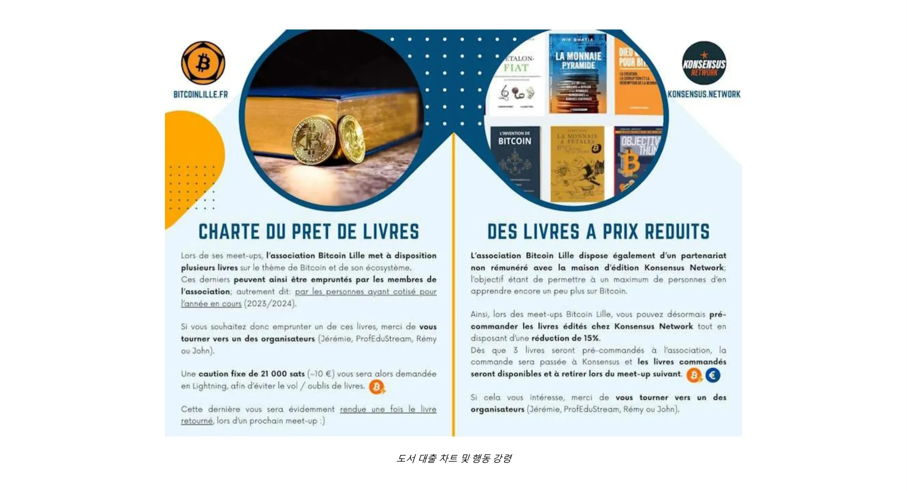

마지막으로, Bitcoin 관련 독서를 장려하기 위해 **지역 시립 도서관**을 방문하여 Bitcoin 관련 도서가 있는지 확인할 수 있습니다.

그렇다면 사서에게 해당 주제에 대한 **라운드 테이블**이 계획되어 있는지 물어보고 모임의 연락처 정보를 제공하세요.

그렇지 않다면 미리 선정한 목록에서 몇 권의 책을 구입하도록 제안하세요. 출판사 컨센서스 네트워크](https://konsensus.network/)에서 영감을 얻을 수 있습니다.

## 맞춤형 전단지 제작 및 배포

<chapterId>62ad5430-c698-51b3-89ac-090f31c88953</chapterId>

전단지를 디자인하고 작성하는 데는 시간이 걸리지만 그만한 가치가 있으며, Bitcoin에 대해 이야기할 때 나눠줄 수 있는 실질적인 리소스를 제공하므로 항상 감사하게 생각합니다.

이러한 전단지는 타겟팅할 수 있습니다:

- 판매자, Bitcoin를 결제 수단으로 도입하려는 경우;
- 이벤트 참석자에게 Bitcoin/Lightning 사용 및 결제 방법을 설명하는 전단지를 배포합니다;
- 길거리에서, 직장에서, 가족 모임에서 만난 초보자에게 Bitcoin의 주요 이점을 강조하는 전단지를 배포합니다.

커뮤니티나 모임에 맞는 전단지를 디자인하여 활동, 목표, 소셜 미디어 링크, 커뮤니케이션 채널, 예정된 이벤트 등을 소개할 수도 있습니다.

몇몇 전단지는 이미 planB.network의 [Bitcoin 교육 도구 상자](https://planb.academy/fr/resources/bet)에서 오픈 소스로 **제공되고 있으며**, 시간이 지남에 따라 더 많은 전단지가 추가될 예정입니다.

한 가지 예로 Bitcoin을 사용해야 하는 21가지 이유가 담긴 [전체 소스 전단지](https://profedustream.substack.com/p/21-raisons-dutiliser-Bitcoin)를 들 수 있습니다. 이 디자인은 [오픈 소스로도 제공](https://www.canva.com/design/DAFtAR1NauQ/ZDwl2CchIJ9Gpb36N6-7iw/edit?utm_content=DAFtAR1NauQ&utm_campaign=designshare&utm_medium=link2&utm_source=sharebutton)되므로 수정하고 적용하여 공유할 수 있습니다. 출처를 반드시 밝혀주세요.

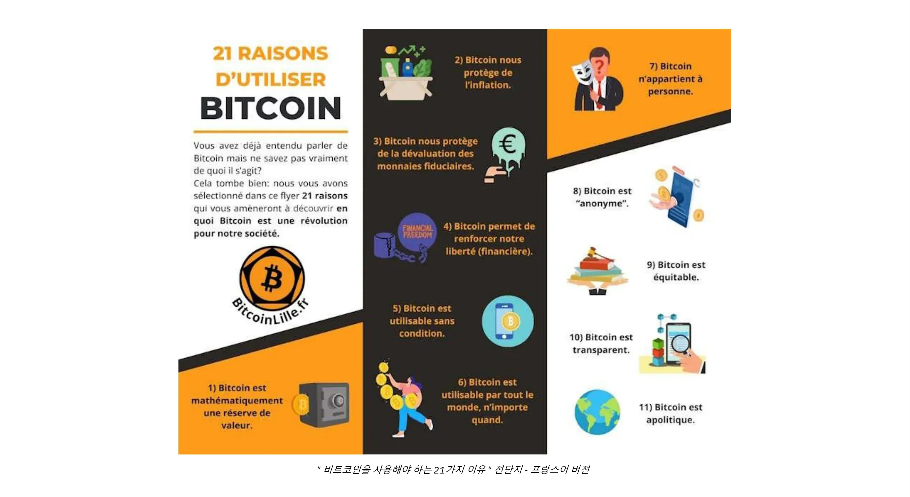

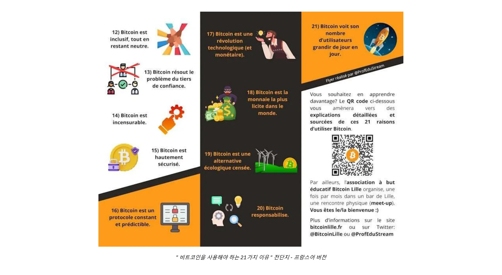

앞서 언급했듯이 이 전단지는 직장의 공용 책상, 가족의 저녁 식사 테이블, 공공 도서관 등 거의 모든 곳에 놓아둘 수 있습니다.

프랑스와 몇몇 다른 나라에서는 사람들이 자유롭게 책을 기증하거나 빌릴 수 있는 작은 나무 상자인 '북 박스'도 있습니다. 전단지나 책 한 권을 넣어두는 것도 좋습니다.

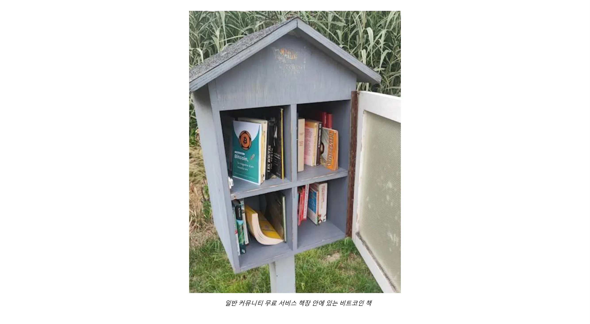

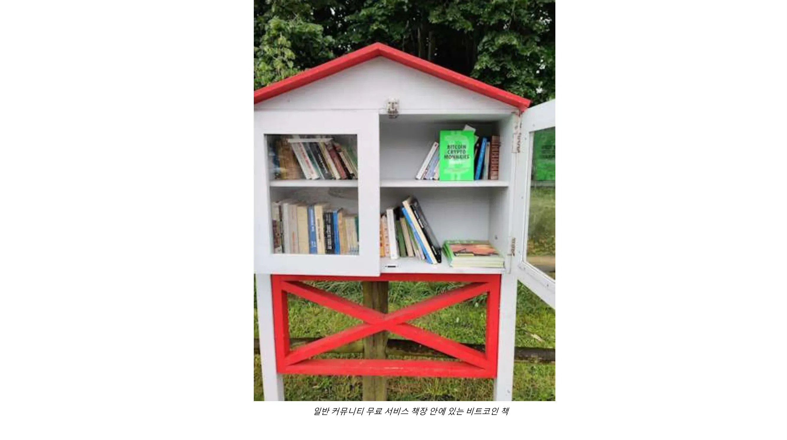

2023년에는 **"프랑스 책 상자에 담긴 Bitcoin 백서**" 이니셔티브가 시작되었습니다.

이 프로젝트를 수행하기 위해 참가자들은 먼저 전국에 있는 모든 책 상자의 지리적 위치를 수집해야 했습니다. 이를 위해 여러 데이터베이스가 존재합니다:

- [boite.a.livres.zonelivre.fr](https://boite.a.livres.zonelivre.fr/);
- [boites-a-livres.fr](https://www.boites-a-livres.fr/carte-de-france);
- [delivrez.fr](https://delivrez.fr/maps/fr_FR/);
- 지역 언론 기사

Bitcoin 백서는 상징적인 의미가 있지만, 처음 접하는 사람들이 이해하기에는 너무 복잡한 경우가 많습니다. 그 대신 작은 소책자를 만드는 것이 아이디어였습니다:

- gW-166과 그 용도, 해결 방법에 대한 접근성이 높고 출처가 풍부한 소개서입니다;
- 프랑스어로 번역된 Bitcoin 백서입니다.

다음은 [프랑스 비트코인 사용자들 사이에서 공유되는 소책자](https://profedustream.substack.com/p/Bitcoin-la-naissance-dune-nouvelle)로, 프랑스 전역의 수십 개의 책함에 비치되어 있습니다. 디자인도 [오픈 소스로 제공](https://www.canva.com/design/DAFs18FSoVM/Sy0QsfUkycTgXveeGgutBg/edit?utm_content=DAFs18FSoVM&utm_campaign=designshare&utm_medium=link2&utm_source=sharebutton)됩니다.

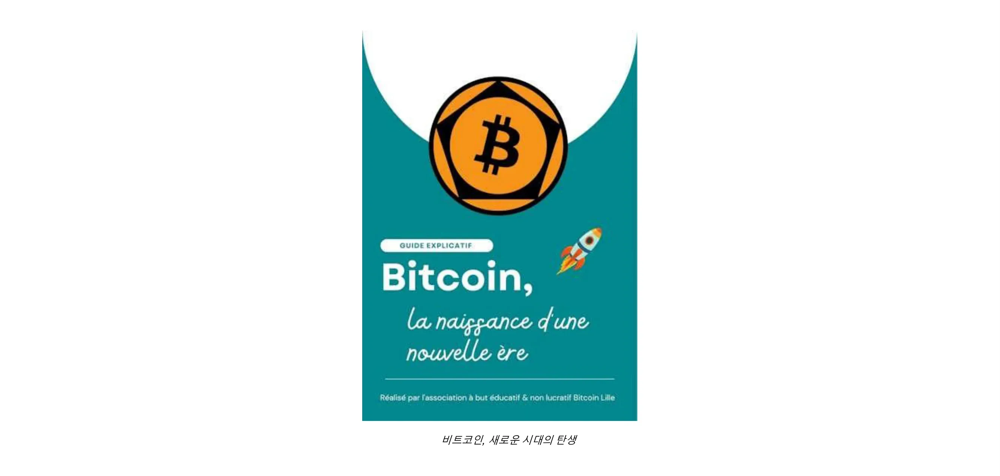

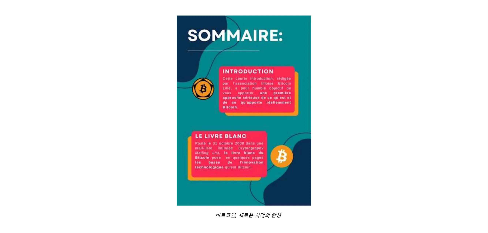

## 비디오 프로젝션 제작

<chapterId>892b248a-b837-5df6-aac9-4b3261ff0390</chapterId>

거의 모든 비트코인 사용자들은 [레미 포르테](https://twitter.com/forteremi)의 흥미로운 미드 시리즈 "르 미스테르 Satoshi, 오 오리진 뒤 Bitcoin"(Satoshi 미스터리: Bitcoin의 기원)를 본 적이 있을 것입니다.

2021년에 공개된 이 영상은 유튜브에서 수백만 회 조회되었습니다(https://www.youtube.com/watch?v=0ETcLj5jBy4).

한 가지 아이디어는 커뮤니티를 위한 Satoshi 미스터리 상영을 월별 이벤트로 기획하는 것입니다.

한 가지 주의할 점은 ARTE France에서 공개 상영이 가능하다고 확인했지만, 합법적으로 상영하려면 상영권을 지불해야 한다는 점입니다. 2023년의 경우 이 비용은 상영당 약 250유로, 한 해 동안 최소 5회 이상의 모임에서 상영하는 경우 상영당 120유로였습니다.

특히 이 다큐멘터리는 이미 ARTE의 YouTube 채널에서 무료로 제공되고 있기 때문에 대부분의 커뮤니티에서 이 가격은 터무니없는 가격입니다.

물론 다른 예측도 가능합니다.

예를 들어, 프랑스에서는 **감독 [알라나 미디어빌라](https://twitter.com/AlanaMediavilla)가 현지 모임에 2024년 개봉 예정인 영화 [영화 '더티 Coin'](https://www.dirtycointhemovie.com/)의 영상이 포함된 다큐멘터리 '좌초'**를 미리 볼 수 있는 권한을 부여했습니다.

일부 비트코인 사용자들은 "좌초"를 프랑스어로 완전히 번역하고 자막을 추가하여 전국의 밋업에 공유하기도 했습니다. 2024년 3월 4일 주 동안, 이 영화는 전국적으로 약 12개의 밋업에서 동시에 상영되었습니다.

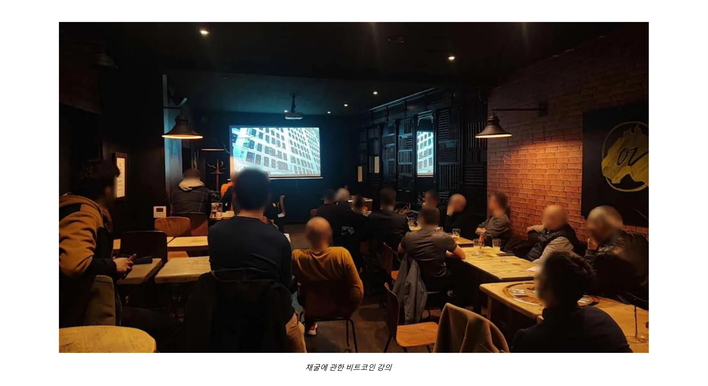

이 행사에서는 Bitcoin Mining의 에너지 소비량과 광범위한 환경 영향에 대한 활발한 토론이 이어졌습니다.

## 도시에 포스터 게시하기

<chapterId>6565e8a0-d535-5be0-9764-273584c675bd</chapterId>

독일, 스페인, 프랑스 등 여러 유럽 국가에서는 비트코인 사용자들이 주도적으로 도시 곳곳에 포스터를 붙이고 있습니다.

일부 디자인은 뱅크시의 아트워크를 재작업하여 Bitcoin 로고를 포함하기도 합니다.

한 가지 예로, 수년 동안 콜라주와 거리 예술을 만들어온 독일의 비트코이너인 [StreetCyberArt](https://twitter.com/streetcyber_art)를 들 수 있습니다.

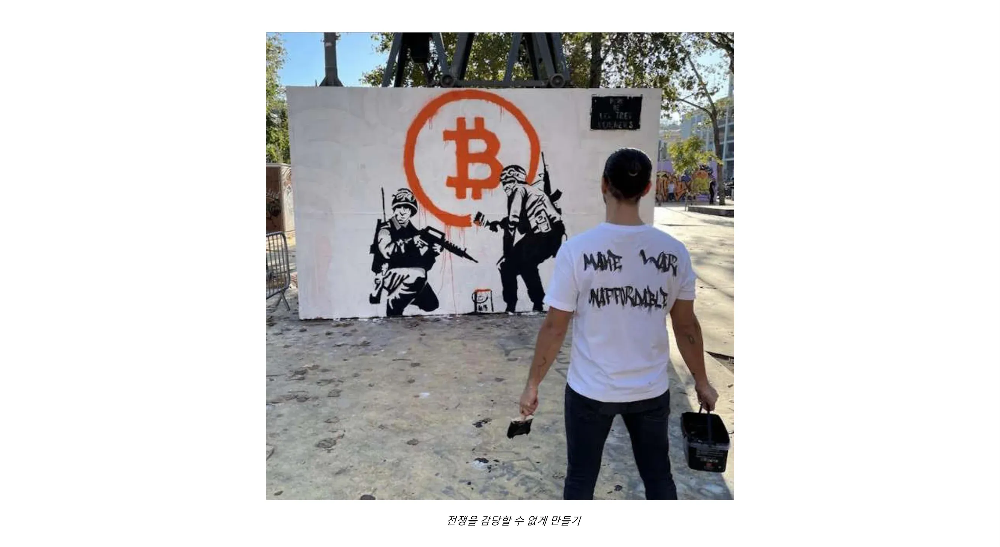

거리 포스터를 제작하려면 해당 국가의 법률을 잘 이해해야 합니다. 예를 들어 프랑스에서는 공공 광고판에만 포스터를 붙일 수 있습니다. 다른 곳에서는 포스터 부착이 전면 금지되고 벌금형에 처해질 수 있습니다.

경계를 넘나들고 '행위'에 적발되지 않기를 원한다면 포스터에 모임 이름이나 @트위터 등 신원을 확인할 수 있는 정보를 포함하지 마세요.

또한 이러한 포스터를 개인 프린터로 인쇄하면 일반적으로 실외에서 잉크가 번지고 빠르게 변질될 수 있다는 점에 유의하세요. 가장 좋은 방법은 실외용으로 설계된 특수 접착 용지로 제작하여 품질과 내구성을 모두 보장할 수 있는 전문 프린터와 협력하는 것입니다.

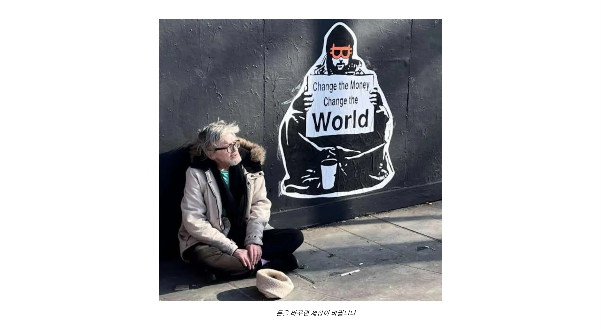

이 이니셔티브는 포스터당 0.40유로(포스터 100장의 경우 약 40유로) 이상의 비용이 들 수 있으며 온라인 가격은 그 두 배에서 다섯 배까지 다양합니다. 좋은 인맥이 필수적입니다.

위에서 언급했듯이 프랑스 비트코이너 [@Mill3sim3](https://twitter.com/Mill3sim3)는 적절한 전문 장비를 보유하고 있으며 자세한 내용은 문의할 수 있습니다.

또는 큰 판지로 스텐실을 만들고 스프레이 페인트를 사용하여 도시 곳곳에 디자인에 태그를 붙이는 DIY 옵션도 있습니다.

## 개인화된 NFC 카드

<chapterId>8ad65d4e-a68a-59c2-a812-85f4907ed9f3</chapterId>

또 다른 독창적인 프로젝트 아이디어는 라이트닝 결제를 위한 맞춤형 NFC 카드(BoltCard 표준과 호환)를 만드는 것입니다. 이를 위해 스위스 Bitcoin Pay는 훌륭한 파트너입니다.

[웹사이트](https://swiss-Bitcoin-pay.ch/cards)에서는 현재 4가지 표준 디자인을 제공합니다.

50개 이상의 NFC 카드를 주문하려면 공식 웹사이트 또는 [트위터](https://twitter.com/SwissBitcoinPay)를 통해 회사에 연락하여 카드 앞면에 대한 맞춤형 디자인을 제안할 수 있습니다. 뒷면은 표준화된 상태로 유지됩니다.

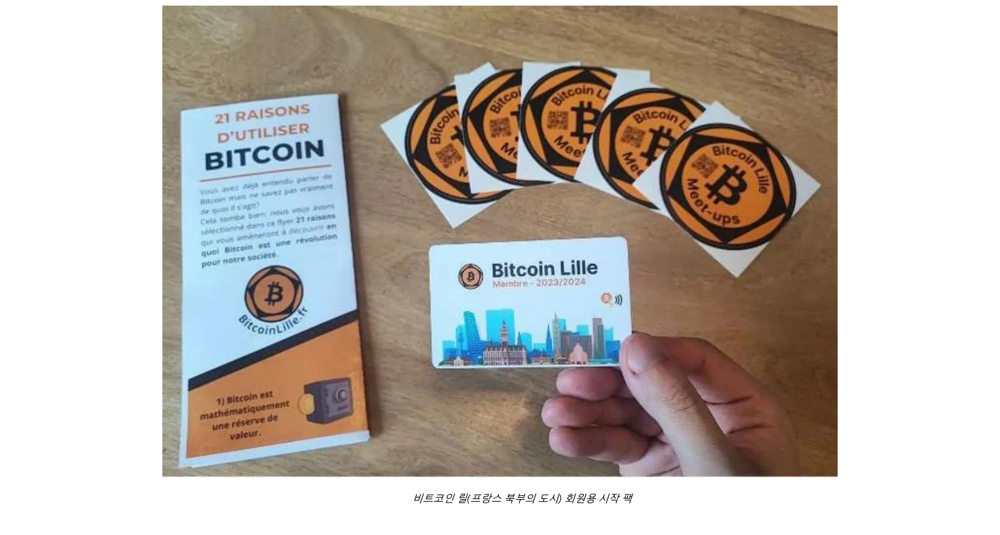

예를 들어, 2023년에 프랑스 협회 [Bitcoin 릴](https://twitter.com/BitcoinLille)은 맞춤형 디자인의 NFC 카드를 주문했습니다. 모든 신규 회원은 한 해 동안 웰컴 팩으로 한 장씩 받았습니다. 이 아이디어는 여러분의 커뮤니티에 맞게 쉽게 조정하고 맞춤화할 수 있습니다.

이 카드의 단가는 일반적으로 주문 규모와 시장 상황에 따라 2.50유로에서 5유로 사이이며, 대량 주문 시 가격이 낮아집니다.

## 웹사이트 만들기

<chapterId>9a2a1b9b-0633-544a-b331-c06187d23d7f</chapterId>

커뮤니티 성장의 특정 단계에서는 그룹, 모임, 이벤트, 교육 콘텐츠의 쇼케이스 역할을 하는 웹사이트를 보유하는 것이 유용할 수 있습니다.

웹사이트 구축에는 시간이 걸리지만, 아래 튜토리얼에서는 단 30분 만에 무료 워드프레스 사이트를 만드는 방법을 알려드립니다. 사용자 정의 가능한 홈페이지를 설정하고, 글을 게시하고, YouTube 동영상, 이미지 또는 PDF와 같은 미디어를 삽입할 수 있습니다.

나중에 자체 도메인 네임을 구매하거나 자체 서버에서 사이트를 호스팅할 수도 있습니다.

:::video id=a1b25c18-5fc1-4b97-baef-816d819c9382:::

더 간단하고 초보자에게 친숙한 인터페이스를 제공하는 다른 CMS 플랫폼도 있지만, 일반적으로 사용자 정의가 훨씬 어렵습니다. 그렇기 때문에 일반적으로 워드프레스가 가장 좋은 시작점입니다.

워드프레스에서는 코딩 기술 없이도 사이트의 기능을 크게 확장할 수 있는 다양한 플러그인(일부는 유료이지만 고품질)도 지원합니다. 한 가지 예로 [프리미엄 "Uncode" 테마](https://undsgn.com/uncode/)를 들 수 있습니다

## 동영상 채널 만들기(유튜브 또는 Odyssee)

<chapterId>076286db-1627-57ec-a410-c44b1666e1cd</chapterId>

커뮤니티의 일부 회원은 튜토리얼 동영상과 같은 멀티미디어 콘텐츠를 만들고 싶어 할 수 있습니다.

모임이나 대학에서 프레젠테이션을 할 수도 있습니다.

**그 때가 되면 전용 동영상 채널을 통해 모든 콘텐츠를 한 곳에 게시하고 중앙 집중화할 수 있습니다**

인기 있는 플랫폼은 다음과 같습니다:

- [유튜브](https://www.youtube.com/)는 널리 사용되지만 검열에 저항하지 않습니다.
- [**오디세이**](https://odysee.com/)는 덜 유명하지만 P2P 기술을 통해 탈중앙화되어 있습니다.
- [**피어튜브**](https://joinpeertube.org/fr_FR)를 사용하면 설정이 더 복잡하지만 자체 동영상 플랫폼을 호스팅할 수 있습니다.

어떤 것을 선택하든 플랫폼별 비주얼을 디자인하여 채널을 매력적으로 만드세요. 2/8편](https://planb.academy/courses/1c643dc9-a15f-4f9e-93b6-cb3c58b4ee35/3470a31f-0190-5e87-8af0-6a00e79267ef)에서 소개한 Canva는 미리 만들어진 사용자 지정 가능한 디자인이 있는 'YouTube 썸네일' 카테고리를 제공합니다.

컴퓨터에서 **녹화**하는 경우, [Streamlabs](https://streamlabs.com/fr-fr)는 무료이며 기능이 풍부하고 장면 전환을 지원합니다.

동영상 편집의 경우, [Wondershare Filmora](https://filmora.wondershare.fr/)(약 45유로/년)는 사용이 간편하고 전문적인 결과물을 빠르게 얻을 수 있습니다.

동영상의 인트로와 **아웃트로**의 경우, Canva에서 적합한 템플릿을 쉽게 찾을 수 있습니다. 취향에 맞게 디자인을 커스터마이즈하고 다운로드한 후 편집 소프트웨어에 추가하세요.

팁: Bitcoin가 금지되거나 검열되는 경우, 항상 Hard 드라이브에 동영상의 로컬 백업을 보관하세요.

## 오디오 팟캐스트 만들기

<chapterId>12e96b45-1c33-5687-a753-80d0114d487a</chapterId>

오디오 팟캐스트는 아이디어를 공유할 수 있는 또 다른 좋은 방법입니다. 동영상 채널과 마찬가지로 시청자를 확보하는 데는 시간이 걸립니다.

인기 있는 팟캐스트 플랫폼은 다음과 같습니다:

- [**파운틴**](https://www.fountain.fm/)은 라이트닝 기부를 지원합니다.
- [**사운드클라우드**](https://soundcloud.com/);
- [**디저**](https://www.deezer.com/fr/);
- [**스포티파이**](https://open.spotify.com/);
- [**구글 팟캐스트**](https://podcasts.google.com/).

각 플랫폼마다 고유한 오디언스가 있으므로 여러 플랫폼에 진출하면 도달 범위가 넓어집니다. **팟캐스터용 Spotify](https://podcasters.spotify.com/)를 사용하면 팟캐스트를 한 번만 업로드하면 다른 플랫폼의 RSS 피드**에 쉽게 업로드할 수 있습니다.

따라서 '팟캐스터용 Spotify'에서 작업이 완료되면 남은 것은 다른 플랫폼에 맞게 콘텐츠를 포맷하는 것뿐이며, 이 과정은 비교적 간단합니다.

녹음 시에는 [Audacity](https://www.audacityteam.org/)를 무료로 사용하여 오디오 레벨을 조정하고, 페이드와 같은 효과를 추가하고, 편집 중에 선명도를 높일 수 있습니다. 목소리를 녹음하고 전문가 수준의 팟캐스트를 만드는 것은 간단합니다.

다음은 Audacity로 팟캐스트를 제작하는 데 필요한 필수 사항을 다루는 10분 분량의 짧은 튜토리얼입니다:

:::video id=67d80ac7-253f-40a5-b621-fef2fb7174bd:::

팁: 팁: 동영상과 마찬가지로 향후 검열에 대비하여 모든 팟캐스트의 로컬 백업을 보관하세요.

## 이벤트용 배지 만들기

<chapterId>0cccef8d-a765-5844-8921-c40f0ce653e4</chapterId>

모임과 이벤트에 이벤트 배지라는 인센티브를 도입할 수 있습니다. 특정 이벤트에서만 획득할 수 있는 배지를 **만드는 것**이 아이디어입니다. 이 개념은 다른 블록체인에서도 "POAP"("참석 증명 프로토콜")이라는 이름으로 존재합니다. 그러나 현재 Bitcoin에서 이를 구현할 수 있는 자유로운 방법은 없습니다.

이러한 시스템은 커뮤니티에서 가장 활동적인 회원에게 보상을 제공하는 데에도 사용할 수 있습니다. 예를 들어, 배지를 모을 때마다 참가 티켓 한 장씩을 지급하는 연례 추첨을 진행할 수 있습니다. 1년에 12번의 모임에 모두 참석한 회원은 추첨에 참가할 수 있는 티켓 12장을 받게 됩니다.

좀 더 전통적인 접근 방식으로는 각 이벤트 참가자에게 배지에 이름이나 닉네임을 참석 이유와 함께 적어달라고 요청할 수 있습니다.

다소 형식적이긴 하지만, 이렇게 하면 회원들이 공통 관심사와 대화 주제를 더 쉽게 찾을 수 있고, 새로 온 사람들이 주최자(또는 공식 커뮤니티/협회 회원)를 더 쉽게 찾을 수 있습니다.

Bitcoin 릴 협회에서 사용하는 여러 배지 템플릿은 [캔바에서 오픈 소스로 제공](https://www.canva.com/design/DAGHAsT15MU/AIA7-L_xBjNdsuxdD4-h-Q/edit?utm_content=DAGHAsT15MU&utm_campaign=designshare&utm_medium=link2&utm_source=sharebutton)됩니다.

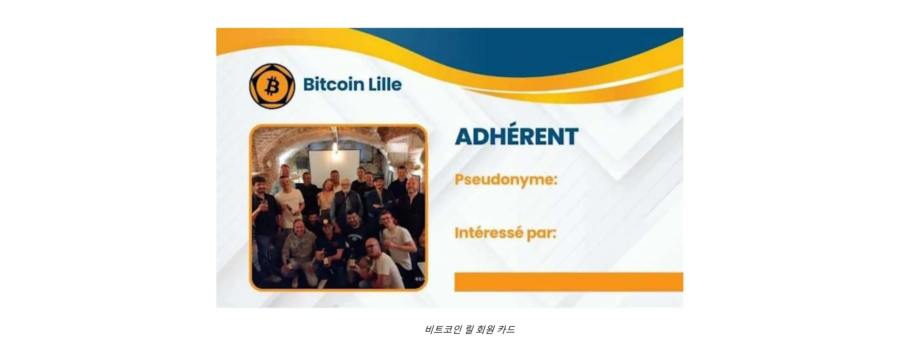

## 사망 시 인수인계 계획

<chapterId>c5febf18-235c-51bc-8fbb-9467dabe4cb0</chapterId>

완전히 다른 주제로, Address 커뮤니티 구성원의 사망이라는 민감한 주제에 대해 이야기해 보겠습니다.

어느 날 전 회원의 가족으로부터 사망 소식을 알리는 연락을 받을 수 있습니다. 고인이 커뮤니티, 모임, 협회 등에 연락하라는 등의 유언을 남겼다고 설명할 수도 있습니다.

경우에 따라 가족은 상속의 수혜자로서 자금을 회수하는 데 도움을 요청할 수도 있습니다.

커뮤니티와 협력하여 이러한 상황에 대비한 명확한 절차를 사전에 수립하는 것이 현명합니다:

- 고인은 이미 가족들에게 **모임에 개인 키를 공유하거나 실제 지갑을 가져가지 말 것**을 당부한 바 있습니다.
- 가족은 방문의 목적이 교육적이라는 것을 이해합니다. 즉, Bitcoin의 작동 방식을 배워 나중에 기금을 주권적으로 통제할 수 있도록 하기 위해서입니다.
- 가족은 증여, 상속, Bitcoin을 법정 화폐로 전환하는 것과 관련된 해당 국가의 관련 법률을 잘 알고 있습니다.

A표준 프로토콜이 있으면 회원이든 게스트든 누구든 이 상황을 악용하여 자금을 훔치는 것을 방지할 수 있습니다.

이 프로세스를 정의하기 위한 전담 작업 그룹을 구성할 수 있습니다. Bitcoin 릴 협회는 이미 이러한 [문서](https://docs.google.com/document/d/1TDfLZjuictC5s3PEM2Z7WmkxIDSJ8Q1E4xevm52pVgU/edit?usp=sharing)를 작업 중이며, 앞으로 몇 달 내에 오픈 소스로 공개할 계획입니다.

## 학교 및 대학에서 강의하기

<chapterId>65efdb44-e3d4-567c-aedf-972765753d73</chapterId>

물론 위에 설명한 프로젝트 목록이 전부는 아닙니다. 일반적으로 이러한 프로젝트는 커뮤니티나 밋업을 위한 내부 프로젝트일 가능성이 높으며, 개발 과정에서 비교적 쉽게 구현할 수 있습니다.

이제 온보딩에 대해 알아보겠습니다.

아시다시피, 한 번에 많은 청중에게 다가갈 수 있는 가장 좋은 방법 중 하나는 **무료 강연**을 개최하는 것입니다. 이것은 대학에서 할 수 있으며, Bitcoin를 완전히 처음 접하거나 이해를 깊게 하고자 하는 젊은이들(그리고 그렇지 않은 사람들)에게 모두 소개할 수 있습니다.

수십 명, 수백 명에게 강의를 제공하려면 기술적인 전문 지식 이상의 것이 필요합니다. 다음이 필요합니다:

- 대중 연설에 대한 자신감
- 좋은 스트레스 관리
- 명확한 관절
- 강력한 시간 관리
- 청중의 기술 수준에 맞춘 잘 연구된 고품질 프레젠테이션 또는 워크숍

특히 Q&A 세션이나 패널 토론에서 **열린 마음을 유지하고 개념을 단순화할 때를 아는 것**도 중요합니다. 이는 자신의 원칙을 포기하는 것이 아니라 다른 사람들이 사물을 다르게 볼 수 있다는 것을 인정하는 것입니다. 때로는 나중에 답장을 보내거나 토론이 계속 진행될 수 있도록 그냥 넘어가는 것이 가장 좋습니다. 여러분의 주장이 탄탄하고 근거가 있는 논거로 뒷받침된다면 사람들은 이를 인정할 것입니다.

준비가 되었다면 도전하세요! 전 세계는 Bitcoin에 대한 더 나은 교육이 절실히 필요합니다.

하지만 이 작업은 동기 부여와 노력, 적절한 인맥이 필요하기 때문에 결코 쉬운 일이 아닙니다.

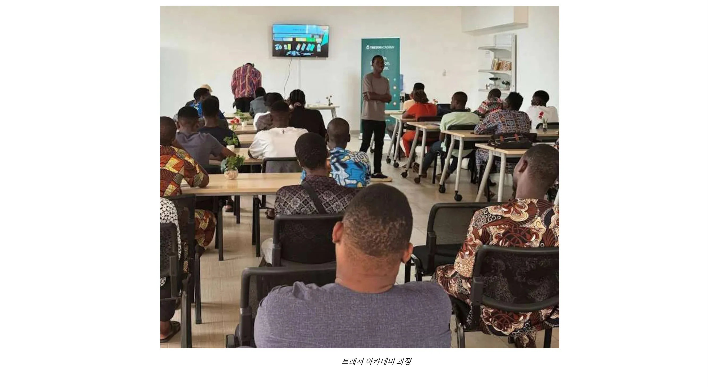

학교나 대학교에서 강의나 워크숍을 조직하는 것은 적절한 연락처를 찾는 것부터 시작됩니다. 그럴 수도 있습니다:

- 개인적인 지인
- 학생회
- 강의 시리즈 또는 이벤트를 주최하는 학생회
- 소속 공과대학 또는 대학교의 전직 교수
- 학술 프로그램 코디네이터가 직접 연락하는 경우

첫 번째 단계는 일반적으로 이니셔티브 또는 협회를 소개하고 미팅을 요청하는 것입니다. 가장 좋은 경우에는 몇 주 후에 학생들 앞에서 Bitcoin에 대한 프레젠테이션으로 이어집니다.

안타깝게도 Bitcoin은 여전히 많은 언론과 정치인들에 의해 악마화되고 있으며, 일부에서는 교실에서 사용할 수 없다고 생각합니다. 특히 Proof of Work 및 에너지 소비와 같은 주제가 여전히 논란의 여지가 있는 학계에서는 이러한 거부감이 일반적입니다.

그래도 특히 학생회나 협회에서 시도해 볼 만한 가치가 있습니다. 그리고 누가 알겠어요? 첫 번째 시도에서 '거절'을 받더라도 다음 번에는 받은 편지함에서 280명의 학생들과 대화할 수 있도록 초대하는 이메일이 도착할 수도 있습니다!

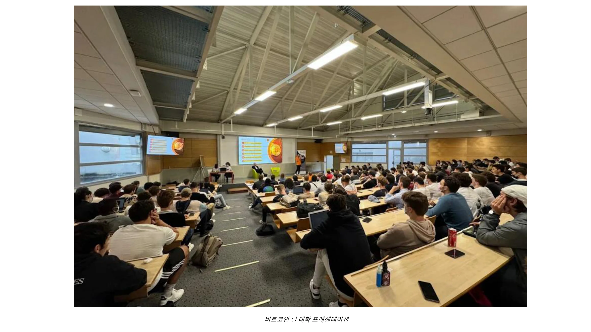

## 비즈니스 접근 방식

<chapterId>b730462b-7928-5d28-a14f-9ceaa773d3d2</chapterId>

많은 비트코인 사용자들에게 비즈니스가 Bitcoin를 수락하는 것은 포켓덱스에서 희귀한 업적을 달성하는 것과 비슷합니다.

판매자마다 상황이 다르기 때문에 온보딩하는 데에는 여러 가지 어려움이 따릅니다:

- 공급업체에 지불하려면 여전히 법정 화폐가 필요합니다.
- 회계사가 읽을 수 있는 명확한 재무 보고서가 필요합니다.
- 결제 시스템은 안정적이고 사용하기 쉬우며 도난을 방지할 수 있어야 합니다.
- Bitcoin에 대한 오해나 부정적인 선입견이 있을 수 있습니다.
- 완벽한 소프트웨어 솔루션을 찾는 것은 까다로울 수 있습니다.
- 판매자가 Bitcoin을 결제 수단으로 수락해야 하는 이유를 이해하도록 합니다.

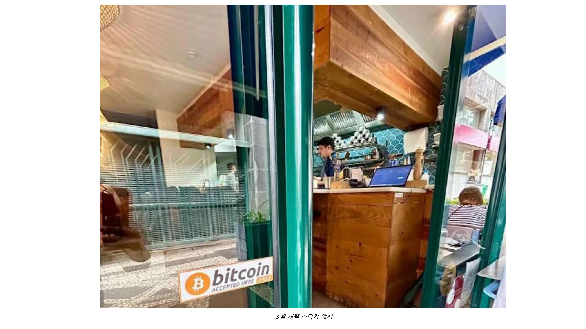

지역 비즈니스를 온보딩하는 것은 도시의 Bitcoin 생태계를 성장시키는 가장 좋은 방법 중 하나입니다. 핵심은 단계별로 진행하는 것입니다:

1/ **쇼핑할 때마다 Bitcoin로 결제하세요**

대부분의 경우 "안 된다"는 대답과 함께 의아해하거나 약간 비판적인 표정을 지을 수도 있지만, 물어보는 것만으로도 Bitcoin가 '일반인'이 사용할 수 있는 결제 수단이며 점점 더 대중화되고 있다는 인식을 심어줄 수 있습니다. 친구 몇 명과 팀을 이루어 서로 다른 날에 같은 가게에 들러 매번 Bitcoin로 결제해 달라고 요청할 수도 있습니다. 조만간 가게 주인의 호기심을 자극할 것입니다.

2/ **간단하고 명확한 설명 제공**

Bitcoin이 무엇인지 묻는다면 전문 용어 없이 짧고 간결하게 설명하세요. 예를 들어

*"Bitcoin은 은행의 통제를 받지 않고, 중개자 없이 작동하며, 검열을 받을 수 없고, 인플레이션의 영향을 받지 않으며, 기존 은행보다 수수료가 낮은 화폐입니다."*

그런 다음 연락처 정보 또는 미팅 세부 정보가 포함된 "Bitcoin를 사용해야 하는 21가지 이유" 또는 "비즈니스에서 Bitcoin를 사용해야 하는 10가지 이유"와 같은 전단지를 전달하세요. 이렇게 하면 데모를 받을 준비가 되었을 때 어디에서 여러분을 찾을 수 있는지 알 수 있습니다.

3/ **데모 준비하기**

고객이 관심을 표명하면 결제 솔루션을 보여줄 시간을 정하세요.

좋은 옵션으로는 **[스위스 Bitcoin 페이](https://swiss-Bitcoin-pay.ch/)**가 있습니다:

    - 판매자가 매일 BTC를 법정 화폐로 자동 변환하여 공급업체에 결제할 수 있도록 지원합니다.
    - 원하는 경우 BTC로 비율을 유지할 수 있습니다.
    - 회계사를 위해 내보낼 수 있는 회계 보고서를 생성합니다.
    - 관리자를 위한 간단한 대시보드가 있습니다.
    - 직원에게 직관적인 Interface를 제공하여 계산대에 손을 대지 않고도 결제를 수락할 수 있도록 합니다.
    - 기존 결제 네트워크에서 부과하는 2~3%의 수수료보다 저렴합니다.

4/ **Bitcoin 수락을 시작하면 지원**

가입한 후

    - 정기적으로 방문하여 구매하세요.
    - 모든 것이 원활하게 실행되고 있는지 확인하세요.
    - 필요한 경우 연락처 정보를 다시 공유하세요.
    - 모임에 초대하세요.
    - 지도](https://btcmap.org/)에 추가하고 [스위스 Bitcoin 페이](https://x.com/swissbitcoinpay)를 트위터에 알리면 가시성을 높일 수 있습니다.
    - 해당 지역에서 워크숍이나 모임을 주최하는 것을 고려하세요.

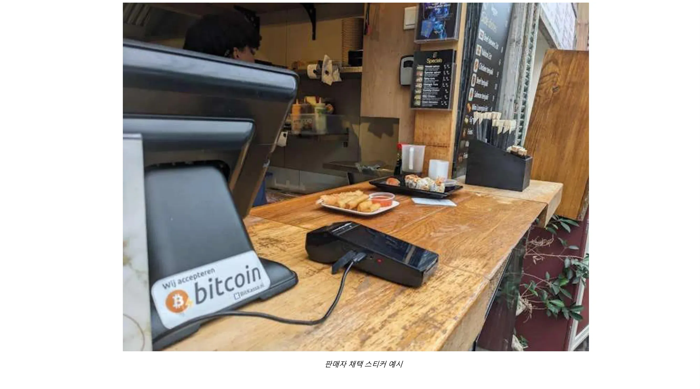

5/ **지역 상인 연결**

Bitcoin 친화적인 비즈니스가 몇 개 생기면, 판매자 전용 텔레그램 그룹을 만들 것을 제안합니다. 가능합니다:

- 경험을 공유하고 새로운 비즈니스를 온보딩할 수 있도록 하세요.
- 빠른 기술 지원 채널로 활용하세요.
- 로컬 Bitcoin 네트워크를 강화합니다.

캔버스는 장기적인 플레이입니다. 인내심과 끈기, 전략이 필요합니다. 하지만 커뮤니티가 준비되어 있다면 네덜란드의 [네덜란드의 아른헴](https://www.arnhembitcoinstad.nl/)처럼 진정한 Bitcoin 순환 경제의 토대를 마련할 수 있습니다.

## 지역 언론 및 라디오에 문의

<chapterId>435bfbc1-22dd-59bb-b737-a32ea995b238</chapterId>

비트코인 사용자들은 종종 소셜 미디어와 온라인 플랫폼에 집중해 홍보 활동을 펼치지만, 이는 일부에 불과합니다. 지역 언론과 라디오는 강력한 동맹이 될 수 있습니다.

프랑스의 [Breizh Bitcoin](https://breizhbitcoin.com/)과 같은 일부 커뮤니티는 **정기적으로 현지 미디어에 연락**합니다:

- 예정된 이벤트(밋업, 프레젠테이션, 워크샵, Halving 파티 등)를 공지합니다.
- 언론인을 초대하여 Bitcoin 친화적인 비즈니스를 방문하고 이에 대해 글을 쓰도록 하세요.
- 이벤트 날짜와 장소를 공유하여 지역 목록에 포함하세요.

많은 신문은 여전히 마지막 페이지에 예정된 지역 행사를 나열하는 'What's On' 섹션을 운영하고 있습니다. Breizh Bitcoin은 이러한 접근 방식이 효과가 있다는 것을 발견했습니다. 신문에 실린 목록을 보고 모임에 참석하는 신규 회원들이 많았기 때문입니다.

이 전략은 특정 지역에서는 다른 지역보다 더 효과적일 수 있지만 시도해 볼 가치가 있습니다. 지역 뉴스 매체에 연락하는 것부터 시작할 수 있으며, 프랑스에는 다음과 같은 사례가 있습니다:

- [acpm.fr](https://www.acpm.fr/Les-chiffres/Diffusion-Presse/Presse-Payante/Presse-Quotidienne-Regionale);
- [voxpublic.org](https://www.voxpublic.org/spip.php?page=annuaire&cat=medias&type_media=Presse%20quotidienne%20r%C3%A9gionale).

지역 라디오 방송국에 연락하여 인터뷰나 팟캐스트 출연을 제안할 수도 있습니다.

미디어 인터뷰는 까다로울 수 있다는 점에 유의하세요. 문맥에서 벗어난 말이 나오거나 잘못 전달될 수 있습니다. 사전 준비가 필수적입니다.

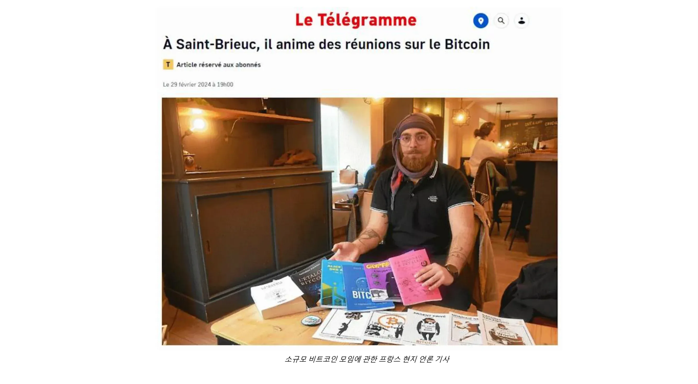

물론 이 섹션에서 제안한 모든 프로젝트 외에도 **다른 많은 프로젝트를 수행할 수 있습니다**. 이 모든 것은 여러분의 시간과 동기뿐만 아니라 해당 프로젝트의 난이도에 따라 달라집니다.

봉사 활동 프로젝트를 위한 마지막 팁입니다:

1) **미리 계획하기**: 목표, 필요한 단계, 누가 무엇을 할 것인지 정의합니다.

2) **단계적으로 진행**: 노력의 속도를 조절하여 번아웃을 방지하세요.

3) **도움 요청하기**: 회원과 주변 커뮤니티에 도움을 요청하세요.

기억하세요: 모든 Bitcoin 커뮤니티는 여러분이 지금 있는 곳에 있었습니다. 그들의 경험과 조언에서 배우는 것을 주저하지 마세요.

# 미래 예측

<partId>6ea07445-9369-54bc-9aa0-d260db026e0b</partId>

## 참가자 증가에 대비한 계획

<chapterId>8af722d4-3a9f-548c-9001-424f2142de12</chapterId>

Bitcoin가 84만 블록에서 네 번째 시대에 접어들자 점점 더 많은 사람들이 이를 기술, 금융, 사회적 혁명으로 인식하기 시작했습니다.

인터넷의 부상과 마찬가지로 이 혁명은 시간이 걸릴 것이며, 이는 오히려 장점입니다. 사람들이 Bitcoin의 기본을 배우고 사용법을 이해할 수 있으며, 개발자와 기업이 그 잠재력을 최대한 발휘할 수 있는 프로토콜과 애플리케이션을 구축할 수 있기 때문입니다.

미래를 예측할 수 있는 사람은 아무도 없지만, Bitcoin 채택이 급격히 증가할 것으로 **예상할 수 있습니다**. 이는 기존 금융 시스템의 붕괴나 Bitcoin의 전면적인 금지와 같은 극단적인 시나리오를 포함한 모든 시나리오에 **준비되어 있어야 함을 의미합니다**.

이 과정의 일곱 번째이자 두 번째 파트에서는 커뮤니티와 모임이 성장함에 따라 염두에 두어야 할 핵심 사항을 살펴봅니다.

첫 번째이자 가장 쉽게 예상할 수 있는 것은 커뮤니티에 가입하는 사람들의 수가 증가하는 것입니다. 이는 크게 두 가지 방식으로 영향을 미칩니다:

1/ **커뮤니케이션 채널(텔레그램, 시그널, 매트릭스 등)은 결국 혼잡해져서** 대화를 따라가기 힘들어질 것입니다. 명심해야 할 두 가지 사항이 있습니다.

첫째, 500명이 하나의 대화에서 모든 종류의 주제에 대해 토론하는 경우, 엄청난 양의 메시지와 알림으로 인해 많은 구성원들이 대화에 참여하지 않게 될 것입니다. 이때는 주제별로 토론을 쉽게 정리할 수 있는 텔레그램 슈퍼그룹이나 디스코드 서버로 전환하는 등, 설정을 다시 생각해 볼 수 있는 좋은 시기입니다.

둘째, 채널에 참여하는 사람이 많다는 것은 더 많은 봇과 사기가 발생한다는 의미이므로 처리해야 할 모더레이션도 많아집니다. 메시지를 검토할 때 참조할 수 있는 명확한 규칙을 만들어 이에 대비하세요. 저희의 경험에 따르면, 특히 채널에서 규칙에 쉽게 액세스할 수 있는 경우 분쟁을 방지하는 데 큰 도움이 됩니다.

좋은 예로 몇 년 전 텔레그램 그룹과 디스코드 서버를 위해 작성된 **[Bitcoin Lille의 오픈소스 규칙집](https://bitcoinlille.fr/reglement/)**이 있습니다. 간단하고 보편적인 원칙을 기반으로 하고 있으며, [여기에서](https://www.canva.com/design/DAGHI692AD4/rjT4sqEnhajc5FiPA6GFZQ/edit?utm_content=DAGHI692AD4&utm_campaign=designshare&utm_medium=link2&utm_source=sharebutton) 사용자 정의 가능한 버전을 다운로드 받을 수도 있습니다.

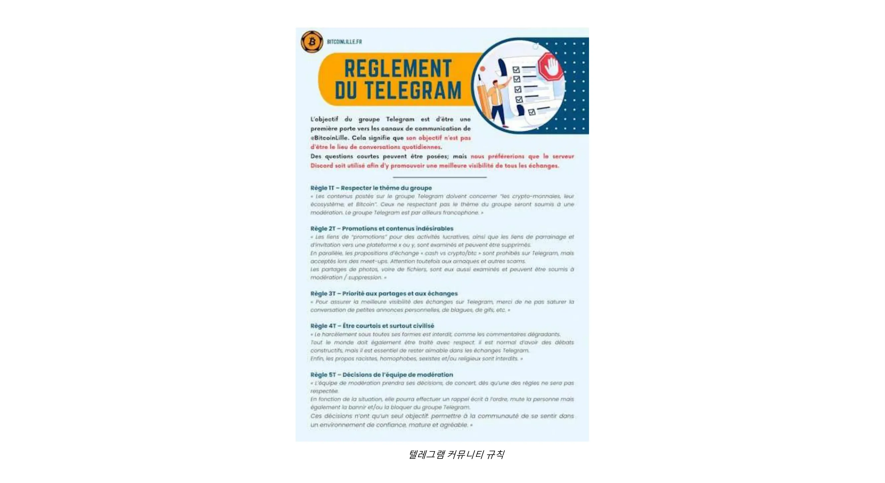

2/ **모임과 이벤트에 많은 인파가 몰리기 시작하고, 새로운 얼굴들이 많이 참여하게 됩니다**.

이렇게 참석자가 급증하면서

    - 특히 과거에 20명 내외의 인원만 초대할 수 있었다면 **모임과 이벤트를 위한 더 큰 장소를 찾는 것이 좋습니다**.
    - 참석자 수가 너무 많다고 판단되면 다음 모임에서 **참가자에게 등록을 요구**하거나(Meetup 앱 또는 간단한 양식을 통해), **매월 여러 번 모임을 개최**(예: 초급 모임, 중급 모임, 고급 모임)할 수 있습니다.
    - 동시에, 수익을 창출하는 것을 주된 목표로 삼고 생태계에 새로 유입되는 사람들이 많을 것으로 예상됩니다. 이렇게 빠르게 성장하는 밋업에서 **Bitcoin**에 집중된 대화를 유지하려면 다음과 같이 하는 것이 좋습니다:

a) 이러한 이벤트에 **Bitcoin을 주제로 한 프레젠테이션**을 포함시키면 자연스럽게 많은 대화가 해당 주제(그리고 최근의 "혁명적인" 똥코인 프로젝트에서 벗어나)로 향할 수 있습니다;

b) **동료 비트코인 사용자들과만 어울리지 마세요**. 대신, 방 뒤편에 서서 인사를 나누더라도 **새로운 사람에게 다가가세요**. 거기서부터 그들이 왜 왔는지, 무엇을 찾고 있는지, 커뮤니티의 목표(또는 핵심 원칙) 등에 대해 이야기할 수 있습니다.

마지막으로, 안타까운 일이지만 사기꾼이 밋업에 나타날 수 있습니다. 그들의 목표는 폰지 사기, 다단계 판매 또는 "인공지능으로 구동되는 Blockchain 혁명"에 대해 끝없이 이야기하는 것일 수 있습니다 또한 언젠가 나쁜 의도를 가진 사람이 돈 세탁을 위해 참석하거나 위조 지폐로 BTC를 구매하려고 시도할 가능성도 있습니다.

이와 같이 까다로운 상황에서는 가장 쉬운 방법은 해당 모임이 그런 모임이 아니라는 점을 정중하게 설명하고, 사복 경찰이 있을 수 있다는 점을 언급하는 등 어떤 논거로든 이를 뒷받침하는 것입니다.

안타깝게도 그들이 퇴장을 거부하거나 정중하게 행동하지 않는 경우(예, 실제로 그런 일이 발생했습니다), 모임 중에 직접 그룹에 Address를 보내 특정 사람 또는 사람들이 어떤 종류의 악의적인 활동을 시도하고 있음을 모두에게 알릴 수 있습니다.

다행히도 이러한 상황은 드물고 위협적이라기보다는 터무니없는 경우가 많지만, 그래도 대비하는 것이 최선입니다.

안심하세요: 개인적으로 법을 위반하거나 불법 거래를 직접 조장하지 않는 한, 이벤트에서 다른 사람의 행동에 대한 법적 책임은 없습니다(적어도 프랑스 법에 따라).

이상적인 세계에서는 커뮤니티가 성장함에 따라 수십 명을 수용할 수 있을 만큼 큰 **공간**을 확보하고, 약세장 동안 비트코인과 미래의 비트코인인 사이에 **강력한 관계**를 구축하여 상승장이 오면 가능한 많은 사람이 다른 사람에게 오렌지 알약을 줄 수 있도록 준비할 수 있습니다.

## 커뮤니티 조직 탈중앙화

<chapterId>bedfc110-e099-58f4-a5b7-fb50f3b19a49</chapterId>

수년간 Bitcoin 모임을 운영해 왔는데, 어느 날 페루에서 라마를 키우거나 엘살바도르에서 완벽한 파도를 쫓기 위해 이 일을 그만두기로 결정했다고 상상해 보세요. 여러분이 커뮤니티를 떠나면 커뮤니티는 어떻게 될까요?

커뮤니티 이전을 위한 계획을 미리 세우시기 바랍니다:

1) *신뢰할 수 있는 회원에게 커뮤니케이션 채널에 대한* **관리자(또는 Ownership) 권한**을 부여합니다. 역할은 나중에 언제든지 변경할 수 있습니다.

2) **소셜 미디어 및 가시성 채널의 계정 세부정보**(사용자 아이디, 비밀번호, 관련 이메일)를 신뢰할 수 있는 사람 한 명 이상과 공유하세요.

이러한 액세스 권한이 없으면 다른 사람이 효과적으로 인수인계하는 것은 거의 불가능합니다. 처음부터 '포크된' 그룹을 만들고 네트워크를 재구축하는 방식은 느리고, 지치고, 종종 사기를 떨어뜨릴 수 있습니다.

모임 내에 신뢰할 수 있는 연락처가 없는 경우, 언제든지 텔레그램의 @ProfEduStream, @copinmalin, 또는 @gabtribe에게 연락할 수 있습니다. 이들은 의욕적인 후임자를 찾고 계정과 관리자 권한의 이전을 조율하는 데 도움을 줄 수 있습니다.

**왜 탈중앙화가 중요한가?**

나 혼자만 모든 권한을 가지고 있다면, 내가 사라지면 어떻게 될까요? 답은 간단합니다. 커뮤니티도 사라질 것입니다.

해결책: 작업, 역할, 액세스 권한을 분산하여 한 명의 주최자가 시간 제약으로 인해 또는 더 어두운 시나리오에서는 비 KYC Bitcoin를 소지한 혐의로 체포되어 중도 하차하더라도 그룹이 계속 운영될 수 있도록 합니다.

**탈중앙화를 더욱 촉진하는 방법 ?**

프레임소프트 제품군](https://framasoft.org/fr/)과 같은 **무료 오픈 소스 소프트웨어**를 도입하여 중앙 집중식 플랫폼에 대한 의존도를 줄이고 잠재적인 국가 검열 또는 Bitcoin 금지 조치에 대한 복원력을 강화하세요.

암호화 또는 익명 커뮤니케이션 **도구**를 사용하여 회원의 개인정보와 커뮤니티 활동을 보호하세요.

## Bitcoin이 공공의 적 1호라면 어떻게 될까요?

<chapterId>c739651f-cd13-51e0-a36e-85023749b15b</chapterId>

1933년 4월 5일, 미국의 32대 대통령인 프랭클린 루스벨트는 **행정명령 6102**에 서명하여 미국 전역에서 개인이 금화, 금괴 또는 증권을 소유하는 것을 불법으로 규정했습니다.

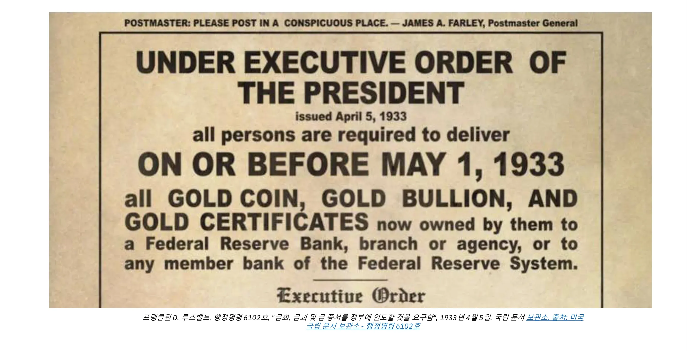

물론 대공황(1929년 주식 시장 붕괴)은 현재 우리의 현실이 아닙니다. 하지만 언젠가 정부가 Bitcoin에 대해서도 같은 일을 할 수 있을까요? **민간 Ownership을 전면적으로 금지하는 것?**

사실 이러한 조지 오웰식 조치가 실제로 누군가의 진정한 비트코인 소유를 막지는 못할 것입니다. 왜냐하면 어떤 법도 사람이 일련의 단어를 암기하는 것을 막을 수는 없기 때문입니다.

하지만 세계 지도자들이 마침내 국가 차원에서라도 세계 질서를 재편할 수 있는 Bitcoin의 잠재력을 깨닫게 된다면 어떨까요? 그렇다면 Bitcoin은 '공공의 적 1호'로 분류될까요?

음모론에 빠질 필요는 없습니다. 하지만 지금부터라도 예측하고, 탈중앙화하며, 교육하는 것을 멈출 수는 없습니다.

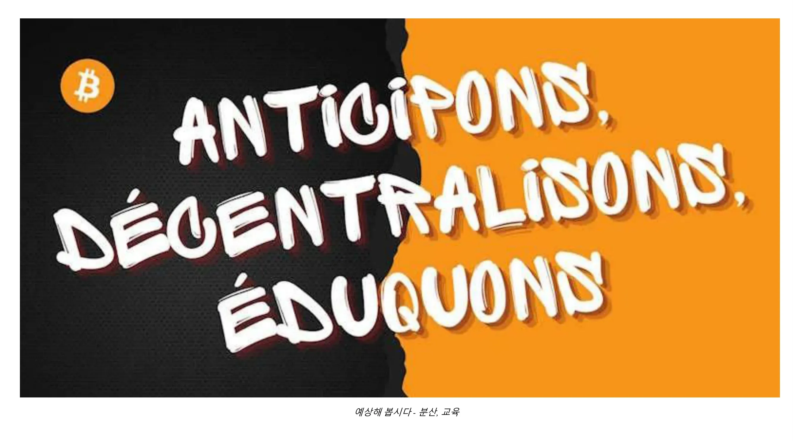

# 비트코인 사용자들을 하나로 모으기

<partId>62bc2138-c0be-5d39-a341-594690863257</partId>

## Bitcoin 커뮤니티 구축을 위한 빠른 실행 계획

<chapterId>1f463ec2-3f64-5641-8d60-e02a47c94f27</chapterId>

Satoshi 나카모토는 이미 세상을 바꾸고 있는 혁신적인 도구를 만들었습니다. 하지만 미래를 어떻게 만들어갈지는 우리 비트코인 사용자들에게 달려 있습니다.

Bitcoin은 역사, 경제, 문학, 수학, 컴퓨터 과학, 암호학을 아우르는 방대한 토끼굴입니다. 누구도 이 모든 것을 탐험할 수 없다는 점이 바로 이 게임의 매력입니다.

시간은 한정되어 있으므로 겸손한 자세로 계속 배우고 다른 사람들과 지식을 공유하는 것이 중요합니다. 그렇게 하면 우리 각자가 추구하는 이해의 수준에 도달할 수 있습니다.

**따라서 글로벌 Bitcoin 커뮤니티는 비트코인이 *Exchange*를 구축하고 공유할 수 있는 공간인 내일의 세상을 만드는 데 근본적인 역할을 합니다. 함께.**

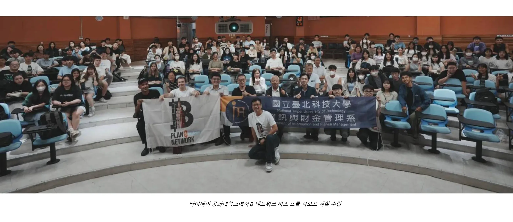

이 과정을 통해 살펴보았듯이, **Bitcoin 커뮤니티를 구축하고 모임을 조직하려면** 계획과 동기 부여가 모두 필요합니다. 목표와 할애할 수 있는 시간에 따라 더 야심찬 프로젝트를 진행할 수도 있고, 간단하게 진행할 수도 있습니다.

어느 쪽이든 목표는 동일합니다: **관심을 불러일으키고 Bitcoin이 도시에서 성장할 수 있도록 돕는 것**입니다.

지금까지 다룬 여러 챕터와 하위 챕터를 마무리하기 위해 Bitcoin 커뮤니티를 만들기 위한 **간결한 '실행 계획'**을 소개합니다:

1) Bitcoin 커뮤니티를 만들고자 하는 이유, 목표, 운영할 도시 또는 위치를 미리 결정하세요.

2) 근처에 있는 기존 커뮤니티와 연락을 취하고 필요할 때 주저하지 말고 조언을 구하세요;

3) 커뮤니티와 위치를 반영하는 커뮤니티의 명확한 정체성(로고, 포스터, 배너, 전단지 등)을 만듭니다

4) 텔레그램, 트위터, 노스트라, 디스코드 또는 심플렉스와 같은 커뮤니케이션 채널과 소셜 네트워크를 만듭니다. 또한 탈중앙화 및/또는 검열 방지 채널을 고려하세요.

5) 온라인에서 다른 지역 모임과 커뮤니티를 팔로우하고 다양한 지도와 플랫폼에 그룹을 등록하여 가시성을 높이세요.

커뮤니티의 커뮤니케이션 채널이 활성화되면 커뮤니티가 활성화됩니다:

6) 충분한 관심이 형성되었다고 생각되면 설문조사를 시작하여 첫 만남을 제안하세요.

7) 이 대면 이벤트를 통해 달성하고자 하는 목표를 정의합니다.

8) 목적에 맞는 좋은 위치의 환영하는 장소를 선택하고 테이블이나 방을 예약하세요.

9) 일주일 전에 채널에서 이벤트를 홍보하고, 날짜 2~3일 전에 다시 한 번 홍보하세요.

10) 관련 웹사이트 및 플랫폼에 이벤트를 등록합니다.

11) 당일에는 이벤트가 자연스럽게 흐르도록 하고, 필요한 경우 부드럽게 토론을 유도하면서 참가자들의 참여를 유도하세요.

나중에:

12) 참가자의 재참여를 유도하고 유지하는 데 집중하세요.

13) 간단한 프로젝트나 이니셔티브를 제안하고 개인적으로 관심 있는 프로젝트를 시작하세요. 다른 사람이 다른 프로젝트를 주도하고 싶다면 가능한 범위 내에서 지원하세요.

마지막으로:

14) 더 큰 모임 장소, 커뮤니케이션 채널에 대한 규칙, 웹사이트 등을 생각하며 미래를 예측하세요;

15) 쇼핑할 때마다 간단히 물어보는 것만으로도 지역 업체들이 Bitcoin을 수용하도록 장려하세요.

16) 작업 및 채널/네트워크 관리자 권한을 신뢰할 수 있는 멤버에게 위임하세요.

17) 커뮤니티를 널리 홍보하여 더 많은 사람들이 참여할 수 있도록 하고, 관심을 보이는 사람들을 참여시키세요.

18) 자신이 좋아하고 중요한 프로젝트에 더욱 집중하세요.

이 21분짜리 동영상은 이러한 단계를 간략하게 요약한 것입니다:

:::video id=a59956da-f554-4b54-89dd-5ca55b722686:::

기억하세요: **여러분은 혼자가 아닙니다. 기존 커뮤니티가 여러분을 지원하기 위해 여기 있습니다**.

## 자기 관리하기

<chapterId>cf1631cb-ddbe-55c7-be8c-26a5652979a0</chapterId>

Bitcoin의 토끼굴에 빠지면 인생에 대한 관점이 달라집니다.

마음 깊은 곳에서는 더 나아가 같은 정신적 여정을 겪고 있는 다른 사람들을 만나고 싶다는 끌림을 느낍니다.

그 에너지가 여러분의 발견을 공유함으로써 퍼즐 조각을 완성하는 데 기여하게 합니다: Bitcoin. 또한 여러분이 만들고자 하는 내일의 세상과 이를 위해 노력하는 커뮤니티에 대해 생각하도록 영감을 줍니다.

커뮤니티를 구축하는 것은 동기 부여, 전략, 헌신, 시간이 필요한 긴 터널과도 같습니다. 감사할 줄 모르는 일이 될 수 있으므로 지치지 않도록 차근차근 단계를 밟아나가는 것이 중요합니다.

**자기 자신과 자신의 한계를 생각하세요**. 그리고 Bitcoin가 당신을 밤낮으로 몰아붙일지라도 **혼자 모든 일을 하려고 하지 마세요**.

대신 이미 같은 터널을 지나고, 같은 경로를 탐색하고, 같은 도구를 구축한 **비트코인에게 도움을 구하세요**. 많은 시간을 절약할 수 있습니다.

**위임으로 인해 특정 작업이 더 오래 걸리더라도 이 모험에서 여러분을 따르는 사람들에게 도움을 요청하세요**. 장기적으로 커뮤니티는 더 강해지고 회복력이 높아질 것입니다.

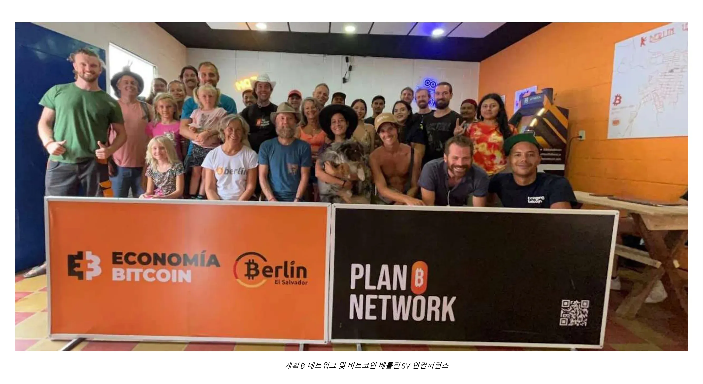

혼자서도 Bitcoin 토끼굴의 수많은 터널 중 하나를 빠르게 탐험할 수 있습니다. 하지만 탐험할 수 있는 다른 방향도 무수히 많다는 것을 기억하세요.

**비트코인 커뮤니티를 만들거나 가입하여 정기적으로 정보를 공유하고 교류함으로써, 여러분은 토끼굴의 모든 방향으로 동시에 나아갈 수 있습니다**

## BTC 304, 다음 단계

<chapterId>8bf10b77-80ee-5d50-87bc-0ef32574a675</chapterId>

이번 BTC 304 강좌에서는 커뮤니티 또는 밋업을 설정하는 방법과 다양한 프로젝트를 시작하는 방법에 대해 자세히 설명합니다.

커뮤니티가 다음 단계로 나아갈 준비가 되면 **공식적인 협회를 만들 수 있습니다**.

예를 들어, 프랑스에서는 약 60개의 커뮤니티와 모임 중 약 12개 정도가 협회 지위를 가지고 있습니다.

이점은 두 가지입니다:

- **공식 인정**: 협회 은행 계좌를 개설하고, 언론/미디어의 관심을 받고, 보조금을 신청할 수도 있습니다.
- **구조화된 조직**: 명확한 역할을 정의할 수 있어 커뮤니티 운영과 프로젝트 수행이 더욱 쉬워집니다.

여러분의 커뮤니티가 더욱 성장하도록 돕기 위해, **앞으로 몇 달 안에 이 교육의 후속 과정이 [Plan ₿ Academy](https://planb.academy/)에 공개될 가능성을 배제할 수 없습니다**.

다음 세션에서는 다음과 같은 고급 주제를 살펴볼 수 있습니다:

- 미팅을 위한 프레젠테이션이나 워크숍을 디자인하고 명확한 목표를 설정하세요.
- 약 100명이 참가하는 대규모 이벤트 개최.

이를 위해 이미 자체 이벤트와 프레젠테이션을 진행한 커뮤니티의 경험을 참고할 것입니다.

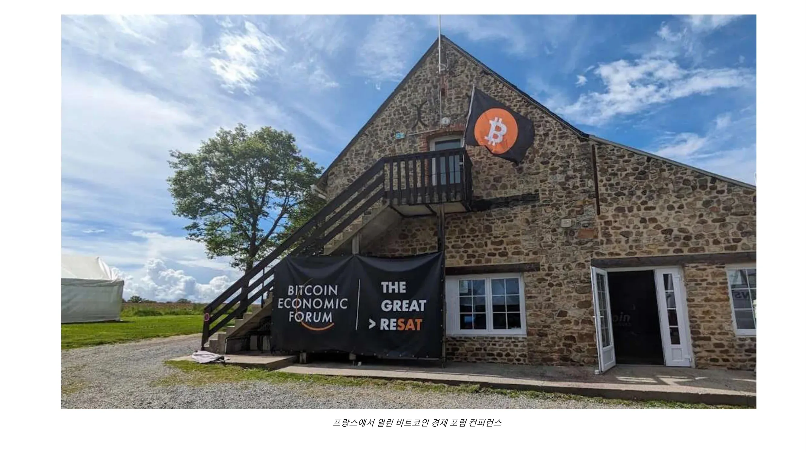

# 마지막 섹션

<partId>e9bdddf4-54c9-4de9-bbce-c3eade8c32e5</partId>

## 리뷰 및 평가

<chapterId>08a35d2a-204b-519a-9bb1-588665a037fa</chapterId>

<isCourseReview>true</isCourseReview>

## 결론

<chapterId>d74606a5-cb14-4117-acb2-2bf5920de092</chapterId>

<isCourseConclusion>true</isCourseConclusion>