# Det første steget mot Bitcoin-adopsjon

I dag kan hvem som helst lære om Bitcoin på nettet, men det som ofte mangler er muligheten til å møtes, utveksle ideer og bygge sammen. For å fylle dette gapet danner mange bitcoinere lokale fellesskap, hvor møter skaper workshops, presentasjoner og meningsfulle diskusjoner.

I BTC304 vil vi se på hvorfor samfunnsbygging er viktig, utforske verktøy for å skape en sterk visuell og digital identitet, og dele enkle open-source-prosjekter du kan starte. Vi vil også vurdere hvordan lokale initiativer skalerer til nasjonale fellesskap som kan bidra til å drive en hyperbitcoinisert fremtid.
+++
# Innledning

<partId>81318b8f-d316-5787-aa4c-4ec8370ba668</partId>

## Kursoversikt

<chapterId>e8991b82-4966-5e04-8f05-7cae46eacbaa</chapterId>

Velkommen til BTC 304!

Siden 2009 har Bitcoin vokst uavbrutt. Veksten har tatt form gjennom nye Bitcoin Improvement Proposals (BIP), opprettelsen av flere lag for å gjøre nettverket skalerbart (blant annet Lightning Network), og utviklingen av flere selskaper og oppstartsbedrifter.

Utviklingen er også tydelig i On-Chain, med et stadig økende antall transaksjoner.

Mellom 1. januar 2018 og 1. januar 2024 anslås det for eksempel at antallet transaksjoner på Bitcoins hovednettverk Layer [økte med 66,2 %](https://dune.com/queries/3375917/5663935). I mellomtiden, mellom august 2021 og august 2023, økte antallet offentlige transaksjoner på Lightning Network [med 1 212 %](https://river.com/learn/files/river-lightning-report-2023.pdf).

Denne betydelige veksten er selvfølgelig nært knyttet til:

- den [økende interessen for å bruke Bitcoin](https://profedustream.substack.com/p/21-raisons-dutiliser-Bitcoin), for å frigjøre seg fra banksystemet og/eller bruke en mindre volatil eller mindre devaluert valuta, slik tilfellet er for befolkninger i Libanon, Syria, Egypt, Argentina og andre land;
- den har steget i verdi over tid, og har etablert seg som et verdioppbevaringsmiddel og en langsiktig investering, drevet av den faste pengepolitikken;
- den suksessive veksten i det spekulative kryptovalutamarkedet, særlig i 2017-2018 og 2020-2021;
- Bitcoins økende tilstedeværelse i mainstream-mediene.

Selv om Bitcoin fortsatt er i en tidlig fase, gir denne virkeligheten, som du sannsynligvis allerede er klar over, oss grunn til å vurdere to viktige spørsmål:

- Hvordan kan vi oppmuntre Bitcoinere til å gå videre i læringen og prosjektene sine for å **utnytte Bitcoins potensial fullt ut**?

- Hvordan kan vi hjelpe nykommere, som ofte tiltrekkes av kortsiktig spekulasjon, med å unngå å tape penger på den siste memecoin-bølgen og i stedet fokusere på å **lære seg Bitcoins grunnleggende prinsipper**?

Den beste løsningen på begge utfordringene er enkel: **vær til stede i den virkelige verden og utdanne**.

Målet med dette kurset er å gi deg alt du trenger for å opprette og effektivt organisere et Bitcoin-fellesskap eller et møte. Enten du ønsker å bygge opp et lokalt initiativ eller utvide en nettgruppe, vil dette kurset veilede deg trinn for trinn: fra å skape en visuell identitet til å sette opp regelmessige arrangementer og administrere kommunikasjonskanalene dine.

**Avsnitt 1: Innledning**

Vi begynner med å fremheve viktigheten av å samle folk rundt Bitcoin, enten det er gjennom nettsamfunn eller lokale møter. Du får vite hvorfor og hvor du kan starte ditt eget fellesskap, og hvordan du kan sette deg klare mål for å fremme vekst og langsiktig bærekraft.

**Del 2: Utforming av en unik identitet for ditt Bitcoin-fellesskap**

For å tiltrekke seg nye medlemmer og skape en følelse av tilhørighet, er det viktig å bygge en unik identitet. I denne delen lærer du hvordan du kan designe logoer, plakater og bannere som gjenspeiler ånden i Bitcoin-fellesskapet ditt.

**Del 3: Opprette kommunikasjonskanaler for Bitcoin-fellesskapet**

Kommunikasjon er ryggraden i ethvert fellesskap. I denne delen utforsker vi de beste kanalene å bruke og veileder deg gjennom hvordan du effektivt setter opp en Telegram-gruppe eller Discord-server. Du lærer også hvordan du integrerer multifunksjonelle roboter for å effektivisere administrasjonen av fellesskapet.

**Avsnitt 4: Lansering av sosiale nettverk** (på fransk)

Synlighet er nøkkelen til å utvide fellesskapet ditt. I denne delen lærer du hvordan du oppretter en egen Twitter-profil, kobler deg til lokale møter og utnytter plattformer som btcmap.org for å øke synligheten og tiltrekke deg nye medlemmer.

**Avsnitt 5: Organisering av et Bitcoin-møte**

Denne delen tar for seg hvordan du organiserer møter: fra å velge riktig sted til å gjennomføre selve arrangementet. Vi utforsker også strategier for å bygge lojalitet blant deltakerne og sikre fellesskapets bærekraft på lang sikt.

**Avsnitt 6: Eksempler på prosjekter og initiativer** (på fransk)

For å gå lenger enn bare å arrangere møter, viser denne delen konkrete og originale prosjekter: fra temaarrangementer og verksteder til produksjon av pedagogisk innhold og lokale samarbeid. Du lærer også hvordan du utformer både fysisk og digitalt materiale for å promotere fellesskapet ditt.

**Avsnitt 7: Forutse fremtiden**

Her skal vi se nærmere på den naturlige utviklingen av fellesskapet ditt: hva du skal gjøre hvis det vokser for raskt, hvordan du kan desentralisere organisasjonen, og hvordan du skal forholde deg til et fiendtlig regelverk. Denne delen vil hjelpe deg med å forutse og overvinne disse utfordringene.

**Avsnitt 8: Å bringe Bitcoin-brukere sammen**

Den siste delen handler om kjernen i prosjektet ditt: å forene Bitcoin-entusiaster rundt en felles visjon. Her lærer du hvordan du kan strukturere tilnærmingen din for å tiltrekke og beholde medlemmer, delegere oppgaver effektivt og få fellesskapet til å vokse på en bærekraftig måte.

Er du klar til å lære hvordan du kan bygge et sterkt og levende Bitcoin-fellesskap? La oss dykke ned i det!

## Hvorfor starte et Bitcoin-fellesskap eller et møtepunkt?

<chapterId>893ea248-7d5a-5b8e-948c-7031497b1031</chapterId>

### Hva er forskjellen mellom et fellesskap og et møte?

Selv om det ikke finnes noen streng definisjon av disse begrepene i Bitcoin-økosystemet, kan et fellesskap best forstås som en gruppe mennesker som deler en felles lidenskap og kommuniserer regelmessig.

Et møte er derimot et arrangement som organiseres av og for dette fellesskapet, med et bestemt formål. Meetups finner vanligvis sted når et fellesskap allerede er etablert.

I dette kurset tar vi utgangspunkt i at du allerede har fått kontakt med noen få personer som er interessert i å holde et slikt arrangement før du starter et Bitcoin-møte, med andre ord at **samfunnet allerede eksisterer**.

### Hvorfor opprette et Bitcoin-fellesskap?

Det er flere grunner til å opprette et Bitcoin-fellesskap:

- Kunnskapsdeling og samarbeid: Fellesskap gir medlemmene et rom for å Exchange ideer og dele kunnskap. Gjensidig støtte er en viktig bærebjelke for vekst, og gjør det mulig for alle å akselerere læringen sin, noe som er spesielt relevant for Bitcoin, med tanke på hvor mye det er å oppdage.

- Peer-to-peer-bygging: Mange initiativer og prosjekter blir unnfanget, bygget og utviklet i disse miljøene.

Bitcoin-samfunn har ofte bredere mål, særlig når det gjelder folkeopplysning:

1. Hva Bitcoin er;

2. Slik fungerer det;

3. Dens bidrag til samfunnet;

4. Avkrefte villedende eller grunnløse påstander fra enkelte offentlige personer og medier;

5. De grunnleggende forskjellene mellom Bitcoin og andre [kryptovalutaer](https://planb.academy/resources/glossary/cryptocurrency);

Ved å bygge morgendagens første "citadeller" fungerer **Bitcoin-fellesskap over hele verden som et bolverk mot desinformasjon og sensur, samtidig som de gir grobunn for å lære Bitcoins grunnprinsipper**. De tilbyr nykommere, selv skeptikere, de ressursene og kontaktene som trengs for å utforske Bitcoins sanne potensial.

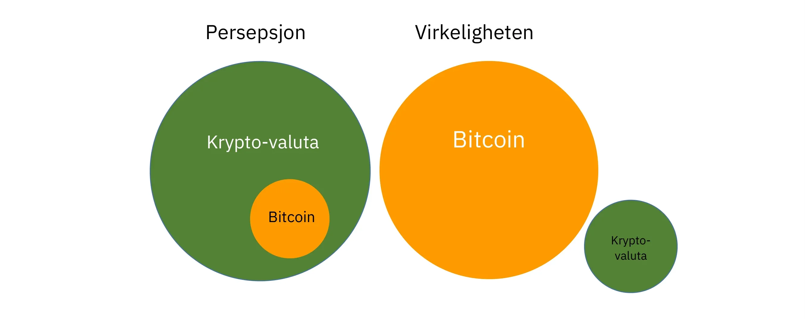

Det er også verdt å merke seg at **et fellesskap kan eksistere helt og holdent på nettet**, enten det er en Telegram-gruppe ("Bitcoin London"), en Facebook-gruppe ("Bitcoin Berlin"), en Discord-server ("Bitcoin Madrid") eller til og med en e-postliste ("Bitcoin Frankrike").

Med andre ord, **et fellesskap trenger ikke fysiske møter for å trives eller starte prosjekter. Kjerneformålet forblir det samme: å dele, bygge og utdanne**.

### Hvorfor opprette en møteplass?

Som nevnt tidligere kommer **møter vanligvis etter at et fellesskap er etablert, og fungerer som et supplement til det**.

Etter hvert som en bitcoiner utvikler seg, oppstår det ofte et ønske, eller til og med et behov, **for å møte og samhandle personlig med andre** fra det samme økosystemet. Dette kan komme av at man føler seg isolert eller rett og slett ikke har noen å snakke med om Bitcoin i dagliglivet.

Meetups gir en mer personlig og innbydende opplevelse enn lyd- eller videosamtaler på nettet. Enten det er over en drink eller et måltid, skaper de uformelle, vennlige rom der folk kan utveksle ideer åpent og direkte.

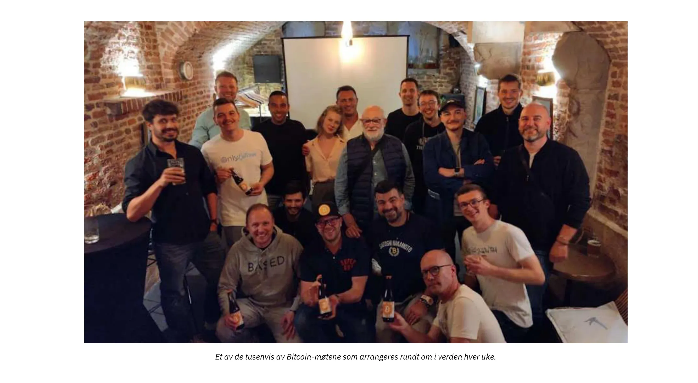

Bitcoin-møter kan tjene mange formål:

- Diskutere tekniske emner eller pågående prosjekter
- Hjelper nye bitcoinere med å gradvis dykke dypere inn i Bitcoin-verdenen
- Kunngjøring av nye prosjekter eller initiativer
- Utveksling av materialer eller bøker
- Forhåndsvisning av dokumentarfilmer
- Arrangere konferanser eller workshops om spesifikke temaer

Vi kommer til å gå nærmere inn på mange av disse mulighetene i del 6/8 av dette kurset, med tittelen "[Eksempler på prosjekter og initiativer](https://planb.academy/courses/1c643dc9-a15f-4f9e-93b6-cb3c58b4ee35/3213d87a-1998-5972-ab93-97a5769ba279).

Selv om hvert samfunn står fritt til å danne sine egne meninger, lansere prosjekter og eksperimentere på sin egen måte, viser det seg at meetups blir stadig **viktigere for Bitcoins utvikling og for veksten av bitcoinere**. **Å organisere dem krever tid og innsats**, og derfor deler dette kurset den kombinerte erfaringen fra [rundt seksti Bitcoin-fellesskap i Frankrike og Belgia](https://btcmap.org/communities/map#2/5.24949/0.20000) **for å hjelpe deg med å bygge og utvide ditt eget fellesskap og møteplasser så smidig som mulig**.

## Hvor bør du skape ditt eget fellesskap?

<chapterId>72da5285-5395-592d-ab62-303a0aef3d6d</chapterId>

Det første spørsmålet man bør stille seg, er: Hvor skal lokalsamfunnet ditt ha base?

Denne beslutningen er avgjørende hvis du ønsker å beholde muligheten til å organisere møter senere.

Hvis medlemmene må kjøre to timer for å delta på et arrangement, vil oppmøtet sannsynligvis være lavt. Derfor har det å velge riktig **lokasjon for fellesskapet ditt, og dermed også for fremtidige møter, stor innvirkning på veksten**.

Noen tips som kan hjelpe deg med å ta en beslutning:

1/ **Opprett og dyrk samfunnet ditt i en mellomstor eller stor by**. Dette vil gjøre det lettere å:

    - Finn hyggelige arenaer for møter og prosjekter (presentasjoner, workshops, promotering av Bitcoin-adopsjon osv.);
    - Øke følelsen av engasjement og tilhørighet blant et større antall mennesker;
    - Forbedre arrangementets tilgjengelighet (offentlig transport, parkering osv.). Det anbefales å velge et sted i nærheten av offentlig transport og parkering.

2/ **Velg et navn som er knyttet til byen din**. Dette gjør det enkelt for folk å identifisere seg med lokalsamfunnet ditt. Eksempler: Bitcoin Paris, Einundzwanzig Berlin, Satoshi Spritz Milano, osv.

3/ **Sjekk om det allerede finnes et møte i nærheten av deg**.

Du kan sjekke [btcmap.org](https://btcmap.org/communities/map#0/0/0/), som viser de fleste Bitcoin-fellesskap og møteplasser over hele verden.

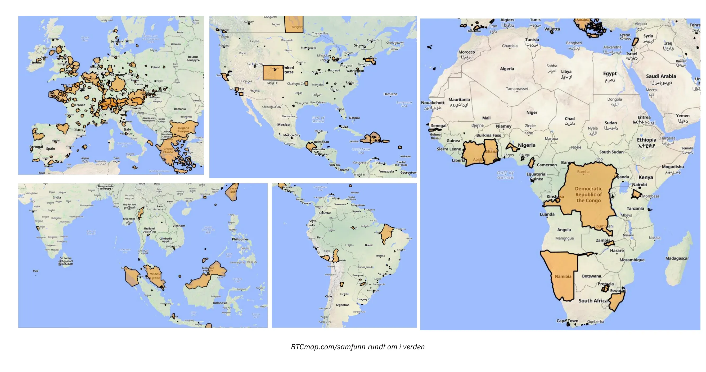

Etter litt research kan du kanskje finne et eksisterende møtepunkt eller fellesskap i byen din.

Bitcoin er desentralisert, så det står naturligvis enhver fritt å gjøre som de vil.

Det er imidlertid ofte mer fornuftig å slå seg sammen enn å splitte nærliggende lokalsamfunn og redusere effekten av hvert enkelt. Å starte et helt nytt lokalsamfunn der det allerede finnes et, kan utilsiktet skape konkurranse.

I så måte kan en enkel "tommelfingerregel" være til hjelp: Hvis det ikke finnes et aktivt Bitcoin-fellesskap innen 30-45 minutter fra der du bor, kan det lønne seg å starte et nytt. Når det er sagt, står du alltid fritt til å gjøre som du vil.

Og hvis et eldre fellesskap har "utviklet" seg i en retning som ikke lenger er i tråd med dine verdier, og du ikke har tid eller motivasjon til å "[oransjepille](https://planb.academy/resources/glossary/orange-pill)" dem, er det selvfølgelig alltid et alternativ å lage din egen [Fork](https://planb.academy/resources/glossary/fork).

## Hvilke målsetninger bør være styrende for samfunnet?

<chapterId>0aae1aa8-93ec-544a-ad88-22d32c619595</chapterId>

Når du har identifisert byen (eller det geografiske området) for lokalsamfunnet ditt, er det på tide å **definere hva du ønsker å oppnå**.

Disse målene kan settes allerede ved oppstart, eller de kan finjusteres senere, når flere medlemmer har blitt med og gruppen er aktivt engasjert.

Her er noen punkter du kan bruke som veiledning:

1/ **Hvorfor oppretter jeg dette fellesskapet som bitcoiner? Utdanne andre? Lære av mer erfarne jevnaldrende? Møte likesinnede mennesker? Bli involvert i Bitcoin-økosystemet? Få kontakt med profesjonelle? Eller bare ta en drink og få nye venner?**

Svarene dine vil forme posisjoneringen og motivasjonen din.

Hvis målet ditt er å **dele kunnskap og utdanne folk om Bitcoin**, kan du fokusere på å **skape pedagogisk innhold** (artikler, podcaster, videoer, presentasjoner, brosjyrer osv.), og spare andre for utallige timer med research. Du kan til og med gå enda lenger ved å **organisere workshops, presentasjoner og konferanser**.

Hvis målet ditt bare er å møte andre bitcoinere og dele erfaringer, kan du velge en mer avslappet tilnærming, for eksempel ved å ta en drink sammen.

På denne måten vil du lettere skape sosiale bånd. Men husk alltid at **øldrikking ikke er den rette veien å gå for å bygge morgendagens verden**.

Derfor er det viktig å sette seg konkrete mål og prosjekter.

2/ Bør jeg gi lokalsamfunnet mitt en **fysisk dimensjon**? Hvis ja, hva slags arrangementer bør du organisere?

Ditt første arrangement vil sannsynligvis være et møte. Hovedformålet er å samle bitcoinere i ditt område.

Men som vi skal se senere i [Eksempler på prosjekter og initiativer](https://planb.academy/courses/1c643dc9-a15f-4f9e-93b6-cb3c58b4ee35/3213d87a-1998-5972-ab93-97a5769ba279), **kan et møte bygges opp på mange måter, med mange mål:**

- Kombiner nettverksbygging med en pedagogisk presentasjon av et Bitcoin-konsept;
- Hold en profesjonell demonstrasjon av Bitcoin-løsninger;
- Debattere strategier for oransjepilling av lokale kjøpmenn;

og så videre.

Avhengig av tema (tekniske foredrag eller praktiske verksteder) kan det til og med være fornuftig å **organisere flere arrangementer** utenfor det vanlige møtet.

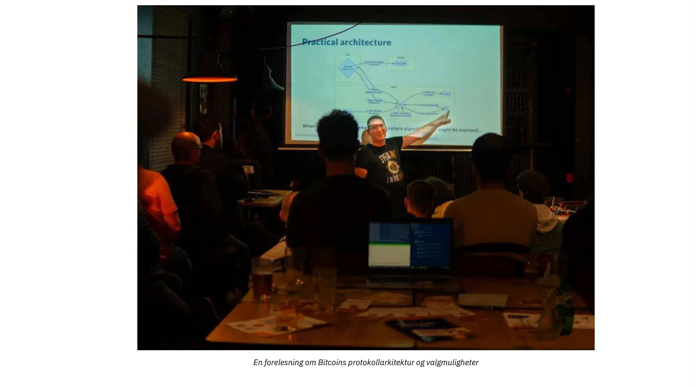

3/ Hvordan ønsker jeg at samfunnet mitt skal bidra til Bitcoin-økosystemet?

Dette er et mer avansert spørsmål, men det er verdt å tenke på tidlig.

Hvis visjonen din er å **skape et tett sammensveiset, motivert fellesskap** med fokus på å appelsinpille så mange mennesker som mulig, så..:

- Samarbeid med eksisterende miljøer for å få tilgang til bredere informasjon, ressurser med åpen kildekode og verdifull støtte når det trengs.
- Organiser og deleger oppgaver innad i gruppen for å utvide og skalere innsatsen på en effektiv måte.

**Sett mål på kort, mellomlang og lang sikt**

En praktisk måte å planlegge på er å sette seg mål for hver tidsramme:

- På kort sikt: bygge opp en tilstedeværelse i sosiale medier og etablere kommunikasjonskanaler i lokalsamfunnet.
- På mellomlang sikt: lage opplæringsressurser (artikler, brosjyrer, videoer).
- På lang sikt: starte regelmessige fysiske møter.

Når møtene er etablert, kan du ta sikte på:

- Kortsiktig: arrangere workshops eller presentasjoner om spesifikke temaer
- Mellomlang sikt: gjennomføre Bitcoin bevisstgjørings- eller utdanningskampanjer
- På lang sikt: Opprett en formell forening eller et partnerskap med en bar som godtar Bitcoin som betaling.

Vær forberedt: **Å bygge et fellesskap krever innsats**

Å skape et fellesskap skjer ikke over natten. Det krever tid, motivasjon og organisering.

Til tider kan det til og med føles nedslående, spesielt når ingen dukker opp, og du føler at du er den eneste som bærer dette oppdraget på dine skuldre.

Derfor er **dette kurset designet for å dele verdifulle ressurser og tips, slik at lokalsamfunnene kan vokse effektivt og til slutt bli selvforsynte.**.

# Utforming av en fellesskapsidentitet Bitcoin

<partId>da6673ad-bf49-5979-80a6-3f69cfb28046</partId>

## Hvorfor og hvordan kan du skape din egen identitet?

<chapterId>b48a18cc-afdf-5216-802c-32647b5cd8a3</chapterId>

På dette stadiet antar vi at:

- Du vet allerede hvor fellesskapet ditt (eller det fremtidige faste møtet) vil ha base.
- Du har satt deg mål for ulike tidshorisonter, selv om de ennå ikke er endelige.

Neste trinn i oppbyggingen av fellesskapet er å **definere identiteten**, både navnet og den visuelle stilen.

I denne delen finner du veiledninger og nybegynnervennlige programvareløsninger som kan hjelpe deg med å utforme fellesskapets visuelle identitet, selv med nybegynnerferdigheter.

**Hvorfor er identitet viktig?**

Folk føler seg mer engasjerte og forpliktet når de kan identifisere seg med en gruppe. En sterk identitet bidrar til at lokalsamfunnet skiller seg ut og skaper en følelse av tilhørighet.

Det hele starter med valg av navn, og hvert land har ofte sine egne trender:

- Frankrike: De fleste av de mer enn 60 lokalsamfunnene bruker navn som "Bitcoin [CITY]" eller "[CITY] Bitcoin". Telegramgruppene deres følger ofte dette mønsteret: "Bitcoin [CITY] meetup".
- Tyskland: Initiativet Einundzwanzig (som betyr "21") inspirerte til navn som "Einundzwanzig [CITY]".
- Italia: Satoshi Spritz-nettverket bruker navn som Satoshi "Spritz [CITY]".

**Hvert lokalsamfunn har sin egen identitet, knyttet til hjembyen, men samtidig forbundet med landets bredere identitet**.

Den visuelle identiteten din: logo, farger, bannere, er det folk vil huske og forbinde med gruppen din.

Når du oppretter kontoer og kommunikasjonskanaler i sosiale medier, er det et stort pluss å ha en logo og et banner. Du trenger ikke å ha profesjonelle designferdigheter; det finnes gratis verktøy som er enkle å bruke.

Et godt utgangspunkt er å innlemme et landemerke eller symbol fra byen din. I Paris kan dette være Eiffeltårnet. I Lille kan det være klokketårnet eller citadellet. I New York kan det være Frihetsgudinnen. I London kan det være Big Ben, og så videre.

Deretter kan du designe enten en enkel eller mer detaljert logo, avhengig av hva du foretrekker.

For å gi deg noen ideer, her er noen eksempler på franske fellesskapslogoer:

- I Marseille representerer logoen Notre-Dame-de-la-Garde-basilikaen, som ligger med utsikt over byen:

- I Monaco refererer det til den monegaskiske steinen:

- I Lille representerer den elegante logoen Vaubans citadell og parken:

- I Saint-Malo er hermelinen - byens emblem - fremhevet:

**Gå videre hvis du vil**

Hvis du blir inspirert, kan du ta det enda lenger: Lag et våpenskjold, et motto eller til og med en sang for lokalsamfunnet ditt. Det er bare kreativiteten som setter grenser!

## Lag en logo, plakat og banner

<chapterId>3470a31f-0190-5e87-8af0-6a00e79267ef</chapterId>

### Bruk av Canva

Du kan bruke [Canva](https://www.canva.com/) til å lage de ulike visuelle elementene for fellesskapet ditt.

Denne gratis og brukervennlige plattformen er populær for sitt store bibliotek med forhåndsdesignede maler som du kan kopiere og tilpasse med bare noen få klikk.

**Laging av logoen din**

Søk etter forhåndsdesignede logoer på Canvas hjemmeside. Velg en eller flere som inspirerer deg, kopier dem, og tilpass dem deretter slik at de passer til lokalsamfunnet ditt.

Du kan legge til et lokalt landemerke eller emblem i bakgrunnen (importer et bilde eller søk på "Illustrasjoner" eller "Bilder" i Elements-menyen), og legg deretter over Bitcoin-logoen eller ₿, og juster fargen om nødvendig.

**Laging av bannere og plakater**

For å lage et banner eller en plakat kan du søke i Canvas bibliotek etter forhåndsdesignede maler. Når du har duplisert en av dem, kan du endre teksten og skriftene, legge til fellesskapslogoen og importere bilder ved hjelp av rammer (søk etter "frame" i Elements-menyen).

Du kan også bruke Design-menyen til å utforske flere modeller som passer dine behov.

For YouTube-miniatyrbilder eller -bannere er det bare å søke etter disse malene, duplisere dem og tilpasse dem etter ønske.

Kort sagt, **mulighetene er uendelige og formes ikke bare av dine behov, men også av den visuelle stilen du ønsker å skape** for ditt fellesskap og dine møter/arrangementer!

For å gi deg en bedre oversikt har vi tatt med en ikke-uttømmende videoveiledning som viser noen av disse mulighetene:

:::video id=d11ae0ed-eacd-4924-afd3-75aff95d2899:::

**Eksempel på maler fra Bitcoin Lille**

Her er ferdige Canva-maler som du kan kopiere og tilpasse til din organisasjon:

- **Plakat for kunngjøring av møtet** (for sosiale medier og A4/A3-utskrift): [lenke](https://www.canva.com/design/DAGBvBXFJ8A/92-j_toeLU8QbVAD0NwoAA/edit?utm_content=DAGBvBXFJ8A&utm_campaign=designshare&utm_medium=link2&utm_source=sharebutton)

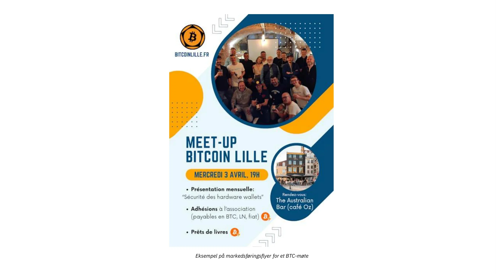

- **Arrangementsplakat** (for sosiale medier og A4/A3-utskrift): [lenke](https://www.canva.com/design/DAGBvG3rNCc/oXtNR9pduRs22AqclG4O2g/edit?utm_content=DAGBvG3rNCc&utm_campaign=designshare&utm_medium=link2&utm_source=sharebutton)

- **bannere i sosiale medier**: [lenke](https://www.canva.com/design/DAGBvOXyNqw/iSJG9PbIQHgGWHz5PhlXSQ/edit?utm_content=DAGBvOXyNqw&utm_campaign=designshare&utm_medium=link2&utm_source=sharebutton)

- **Kunngjøring av konkurransen**: [lenke](https://www.canva.com/design/DAGBvIjuA_w/YzSUXzOmbNV9oCma9mluOw/edit?utm_content=DAGBvIjuA_w&utm_campaign=designshare&utm_medium=link2&utm_source=sharebutton)

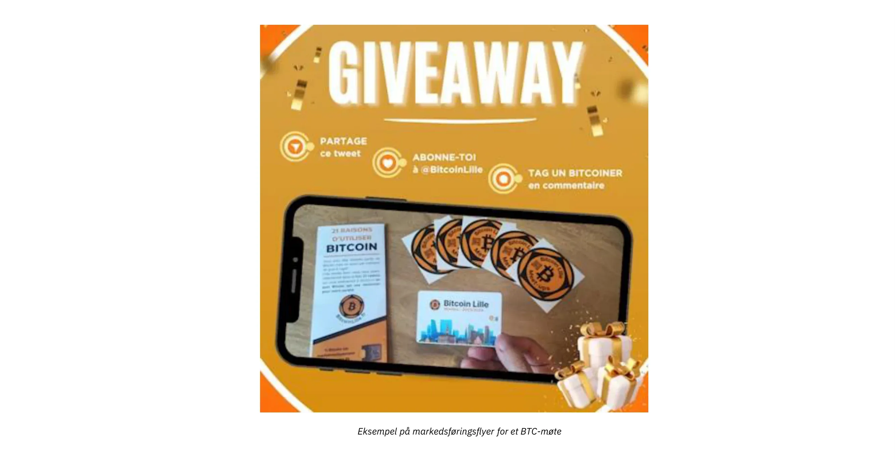

- **bibliotekets retningslinjer**, som vises på A4-ark ved møter: [lenke](https://www.canva.com/design/DAGBvPqL7N4/LmUItfsysypRLSOFOzBXcQ/edit?utm_content=DAGBvPqL7N4&utm_campaign=designshare&utm_medium=link2&utm_source=sharebutton)

- **PowerPoint-presentasjon** "Chapter 2 - Understanding Bitcoin transactions", av @ProfEduStream: [link](https://www.canva.com/design/DAFsEcnOro8/Mz9FYdTGhsvozZOe0Y9jtw/edit?utm_content=DAFsEcnOro8&utm_campaign=designshare&utm_medium=link2&utm_source=sharebutton)

- **brosjyre** "21 grunner til å bruke Bitcoin", skrevet av @ProfEduStream: [link](https://www.canva.com/design/DAFtAR1NauQ/ZDwl2CchIJ9Gpb36N6-7iw/edit?utm_content=DAFtAR1NauQ&utm_campaign=designshare&utm_medium=link2&utm_source=sharebutton)

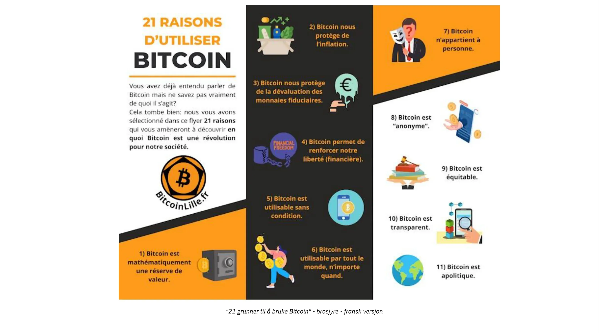

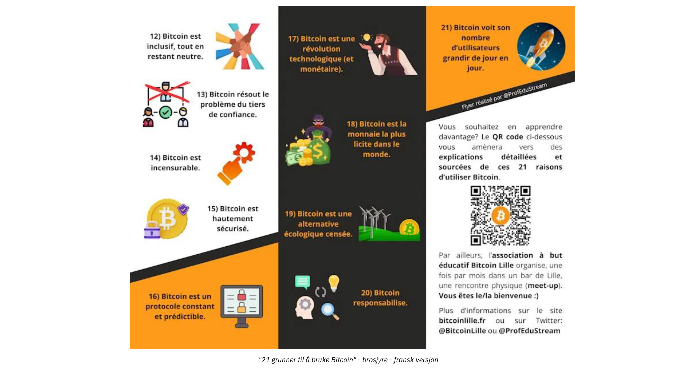

**Del dine kreasjoner**

Mulighetene er uendelige, og designene dine vil avhenge av målene og den visuelle identiteten din. Vurder å dele malene dine i åpen kildekode, det sparer tid for andre Bitcoin-fellesskap som uunngåelig vil møte de samme utfordringene som deg. Ved å dele bidrar du til å akselerere veksten av Bitcoin-fellesskap over hele verden.

**Anbefalte dimensjoner**

Når du lager grafikk, må du alltid sjekke størrelseskravene for hver plattform:

| Platform | Logo | Banner | Poster / Image
| -------- | -------- | -------- | -------- |
| Telegram     | 512 x 512     | N/A     | N/A     |
| Signal     | N/A     | N/A     | N/A     |
| Twitter     | 400 x 400     | 1500 x 500     | 1200 x 628     |
| Meet-up     | N/A     | N/A     | N/A     |
| Discord     | 512 x 512     | 960 x 540     | N/A     |
| Facebook     | 512 x 512     | 851 x 315     | 960 x 720     |

Vanligvis passende størrelser:

Logoer: 512 x 512 piksler

Bannere: Varierer avhengig av app eller nettsted

Plakater: A4 er standard utskriftsformat

### Bruk av kunstig intelligens

Canva tilbyr et bredt spekter av verktøy for å lage logoer, plakater, bannere og flygeblad, men det er ikke det eneste alternativet. Hvis du er mer komfortabel med annen programvare (som Photoshop eller Illustrator), kan du bruke det som fungerer best for deg.

Når det er sagt, kan **kunstig intelligens være en mektig alliert når det gjelder å skape unike og tiltalende visuelle uttrykk**, enten du skal designe en logo for et lokalsamfunn eller forbedre plakater, presentasjoner eller flyers.

Det finnes en rekke AI-er som kan brukes til dette formålet. Disse inkluderer

- [midjourney](https://docs.midjourney.com/docs/quick-start) (betalt);
- [leonardo](https://leonardo.ai/) (gratis, kontobegrenset);
- [copilot](https://copilot.microsoft.com/) (gratis, kontobegrenset);
- (https://www.dall-efree.com/) (betalt).

Mange andre AI-verktøy har dukket opp i det siste, så denne listen er langt fra uttømmende.

**Eksempel: Skape en futuristisk Bitcoin London-logo**

Hvis du ønsker å designe en futuristisk logo for et "Bitcoin London"-treff, kan du spørre Copilot:

- [ ] *Oppfordring: Lag en Bitcoin-logo med London Bridge og Big Ben i bakgrunnen. Futuristisk* - [Lenke](https://copilot.microsoft.com/images/create/un-logo-Bitcoin-futuriste-avec-en-arric3a8re-plan-le-/1-6612ba1758df4384bc33c4bca00ab45b?FORM=SYDBIC)

Hvis de fire første resultatene ikke er realistiske nok, kan du avgrense forespørselen din:

- [ ] *Prompt: Gjør den fjerde mye mer realistisk* - [Lenke](https://copilot.microsoft.com/images/create/un-logo-Bitcoin-futuriste-avec-en-arric3a8re-plan-le-/1-6612ba64b72d4cea9830ab7eb844f785?FORM=SYDBIC)

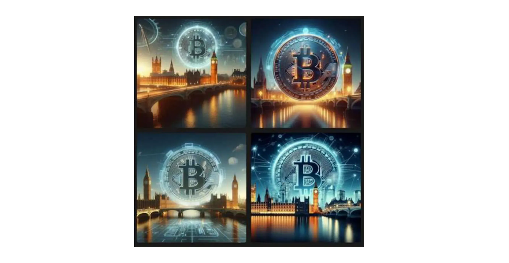

Det siste resultatet ble flott!

**Eksempel: Lage en enkel logo i britisk stil**

For et renere utseende, som for et klistremerke:

- [ ] *Oppfordring: Lag logoen til "London Bitcoin Meetup" med en britisk og ren stil* - [Link](https://copilot.microsoft.com/images/create/logo-for-27londres-Bitcoin-meetup27-with-a-british-a/1-6612bb9451924859a6c34b350b3a6ebc?FORM=SYDBIC)

Resultatet ser veldig kult ut!

**Tips for å jobbe med AI**

- Vær tålmodig: Det er ikke sikkert at AI produserer akkurat det du ser for deg på første forsøk.

- Bruk presise instruksjoner: Jo tydeligere og mer detaljerte instruksjoner du gir, desto bedre blir resultatet.

- Be om hjelp: Hvis du ikke er fornøyd, ta kontakt med noen som har erfaring med grafisk design eller AI-verktøy, mange Bitcoinere vil gjerne hjelpe deg, noen ganger til og med gratis eller for noen få Sats.

# Opprette kommunikasjonskanaler for Bitcoin-fellesskapet ditt

<partId>fc588298-6876-554c-bd57-55d182464878</partId>

## Hvilke kommunikasjonskanaler bør du velge?

<chapterId>b4f4eef6-1035-5290-848a-2b7f9391c77a</chapterId>

Som nevnt ovenfor kan et samfunns kommunikasjonskanaler variere avhengig av motivasjoner og vaner.

I Frankrike, Tyskland og Italia er for eksempel **Telegram og Twitter de dominerende plattformene**, og de har blitt "standarden" for Bitcoin-samfunn.

I Tsjekkia, derimot, bruker mange lokalsamfunn **Matrix**, en sikker protokoll for direktemeldinger, i stedet for Telegram.

Tips: Før du velger kanaler, bør du **se på hva som skjer i lokalsamfunnene i nærheten**. Bruk kartet [btcmap.org](https://btcmap.org/communities/map#0/0/0/) for å se hvilke plattformer som er mest populære i din region.

For eksempel bruker sveitsiske miljøer først og fremst Telegram, Twitter og sin egen nettside:

**Anbefalte kanaler for fransktalende samfunn**

- Telegram: Kommunikasjonsverktøy nr. 1, over 90 % av franske møteplasser bruker det.

- Twitter (X): Det viktigste sosiale nettverket som brukes av bitcoinere over hele verden. Det brukes av ~70 % av franske meet-ups. Det er ideelt for å nå ut til bitcoinere.

- Meetup.com: Betalt, men mye brukt (av ~30 % av franske og nesten alle kanadiske møteplasser) for å øke synligheten utenfor Bitcoin-økosystemet.

- Andre alternativer: ~30 % har også en nettside; ~10 % driver Discord-servere eller NOSTR-kontoer.

Andre plattformer som Matrix, Keet, Signal, Facebook, Instagram og LinkedIn kan også brukes. Vær oppmerksom på at jo flere kanaler du administrerer, desto mer tid må du bruke på å moderere, publisere og holde dem aktive.

Den som ønsker å starte et fellesskap i Frankrike, gjør derfor lurt i å starte med å skape:

- en Telegram-gruppe;
- en Twitter-konto.

Etter hvert som fellesskapet vokser, kan du legge til flere plattformer og delegere moderering til betrodde medlemmer.

## Opprett og konfigurer en Telegram-kanal, -gruppe eller -supergruppe

<chapterId>d13714ce-8f08-53e9-bedd-b6a3aaac5dad</chapterId>

Før du oppretter kommunikasjonsområdet for fellesskapet ditt på Telegram, er det viktig å vite forskjellen mellom:

- en Telegram-kanal;
- en Telegram-gruppe;
- en Telegram-supergruppe.

Det anbefales på det sterkeste å starte med en Telegram-gruppe.

Ved behov kan du senere konvertere den til en supergruppe.

For veiledningene nedenfor brukte vi opprinnelig "Telegram +" APK, som gir mulighet for mer avansert konfigurasjon. Du trenger imidlertid ikke nødvendigvis det, da den offisielle Telegram-appen er nok til å opprette og administrere grupper, selv via telefonen din:

:::video id=b1da7cb4-5fb1-4a41-a1d4-bd90686826a9:::

### Opprett en Telegram-kanal

Hvis du ønsker å opprette et sted der medlemmene dine kan snakke direkte med hverandre, svare hverandre osv., bør du kanskje opprette en Telegram-gruppe, og ikke en Telegram-kanal!

Gå direkte til neste avsnitt, med tittelen [Opprett en Telegram-gruppe](https://planb.academy/courses/1c643dc9-a15f-4f9e-93b6-cb3c58b4ee35/d13714ce-8f08-53e9-bedd-b6a3aaac5dad).

Faktisk er **en Telegram-kanal mer som et enveis kringkastingsverktøy for administratorer**. Medlemmene kan ikke chatte fritt, de kan bare reagere med emojis (eller legge igjen kommentarer i separate tråder, noe som fragmenterer samtalene).

**Fordi lokalsamfunn trenger interaksjon og samarbeid, anbefales ikke en Telegram-kanal** hvis målet ditt er å bygge relasjoner og dele kunnskap.

Veiledning for å opprette en Telegram-kanal:

:::video id=98be4709-d221-4030-8c31-e10113482515:::

### Opprett en Telegram-gruppe

På den annen side er **en Telegram-gruppe ideell for lokalsamfunn**: Akkurat som i meldingsapplikasjoner som Messenger eller WhatsApp, kan medlemmene chatte og svare hverandre i en enkelt delt samtale.

Hva du kan gjøre som administrator:

- Legg ut og fest viktige meldinger.
- Opprett **avstemninger** (nyttig for å bestemme møtedatoer når fellesskapet er nytt).
- opprett **tilpasset invitasjonskobling** (Bare hvis gruppen er "offentlig" og ikke "privat", som er definert i innstillingene. Det er også nyttig å ha din egen Telegram-invitasjonslenke, for eksempel: t.me/Bitcoin[CITY]);
- Administrer medlemstillatelser, roller og moderering.
- Legg til et profilbilde (fellesskapslogoen din) og oppdater gruppens navn.

Veiledning for å opprette en Telegram-gruppe:

:::video id=3d4792a7-1345-475b-93b1-b3a3945fb567:::

Merk: Denne veiledningen ble laget ved hjelp av Telegram+, men du kan gjøre alt direkte fra den vanlige Telegram-mobilappen.

### Opprett en Telegram-supergruppe

Hvorfor en supergruppe?

Når Telegram-gruppen din vokser til hundrevis av medlemmer, kan samtalene bli kaotiske. Dette fører ofte til at medlemmene går glipp av viktige kunngjøringer, for eksempel datoen for neste møte.

Det finnes flere løsninger:

1. **Pin viktige meldinger** slik at alle medlemmer får et varsel (trykk én gang med fingeren på den aktuelle meldingen, og velg deretter "Pin");

2. Vurder å bruke **Discord** til flere kommunikasjonskanaler, som hver enkelt bruker kan slå av lyden på ved behov.

3. **Konverter Telegram-gruppen din til en supergruppe**.

Hva er en Telegram-supergruppe?

En supergruppe er egentlig en Telegram-gruppe med emner (underkanaler) inne i den.

Eksempler på emner:

- "Viktig informasjon": kun viktige oppdateringer og kunngjøringer om hendelser.
- "Generelt": for alle medlemsdiskusjoner.
- Spesifikke temaer: f.eks. Mining, prosjektutvikling, kommende konferanser.

Tips: Tilpass temaene til lokalsamfunnets behov. Eksempel: Abidjan Bitcoin Meet-up bruker dette formatet med stor suksess.

Husk at **Telegram-supergrupper kan være litt vanskelige å bruke for noen medlemmer**. For eksempel er det ikke alle som vet **hvordan man får tilgang til de ulike emnene** (de trenger bare å trykke på gruppelogoen i hovedmenyen i Telegram for å se hele listen over emner). Å sende et raskt skjermbilde kan bidra til å oppklare eventuell forvirring.

Det finnes ingen streng regel for når du skal bytte fra en vanlig Telegram-gruppe til en supergruppe, det kommer helt an på medlemmenes behov. Den gode nyheten er at du enkelt kan bytte frem og tilbake: bare opprett et emne for å konvertere til en supergruppe, eller slett alle emner unntatt "Generelt" for å gå tilbake til en vanlig gruppe.

Veiledning for å opprette en Telegram-supergruppe:

:::video id=f78800ae-d8ca-479a-b913-99abd9916bff:::

Rask merknad: som nevnt tidligere ble opplæringen ovenfor laget på en datamaskin ved hjelp av "Telegram +" APK. I dag er det imidlertid enkelt å opprette en Telegram-supergruppe på telefonen din.

Bare opprett en Telegram-gruppe, gå til innstillingene og trykk på "Emner"-knappen for å legge til emner. Når du har lagret, ser du en liste over emner som du kan redigere som du vil.

Så det er ikke nødvendig å laste ned "Telegram+" lenger, med mindre du vil ha tilgang til mer avanserte personverninnstillinger for supergruppen din.

## Sette opp en Telegram-gruppe eller supergruppe

<chapterId>35e674b3-5924-50b0-98f1-83a56c9a186d</chapterId>

Nå som Telegram-gruppen (eller supergruppen) er oppe og går, er det på tide å **konfigurere tillatelser og sette opp moderering**.

Hvert fellesskap står fritt til å velge sin egen tilnærming, men erfaringsmessig er det **best å begrense visse medlemstillatelser**:

- Sende en spørreundersøkelse;
- Sende filer (for å unngå potensielle virus);
- Sende talemeldinger;
- Legge til brukere (bidrar til å forhindre bot-invasjoner);
- Festing av meldinger;
- Redigering av gruppeinformasjon.

Det anbefales på det sterkeste å **skrive en tydelig beskrivelse av møtet** når du oppretter en Telegram-gruppe eller supergruppe, ettersom det er det første potensielle medlemmer vil se. For eksempel

> Velkommen til @Bitcoin's Telegram [CITY] 🔥
>

> Vi arrangerer et møte hver første onsdag i måneden på baren [BAR_NAVN], i [BY] 🍻
>

> Sjekk ut våre andre sosiale nettverk: [LINK] 🌐

I dette eksemplet har Bitcoin Lille-administratorene tilpasset den offentlige Telegram-lenken for å gjøre det enklere å dele.

I "Gruppeinnstillinger" kan det være lurt å **aktivere "Godkjenn nye medlemmer"**.

Noen Bitcoin Telegram-grupper har blitt angrepet av tusenvis av falske kontoer som er designet for å spamme eller forstyrre fellesskapet.

**Aktivering av medlemsgodkjenning kan redde gruppen din fra spam-angrep**

I Administrators-delen kan du også aktivere en "Aggressive Anti-Spam"-funksjon for automatisk sletting av mistenkelige meldinger.

Dette er ikke alltid nødvendig, men kan gi en ekstra Layer beskyttelse.

## Legge til en multifunksjonsbot i Telegram-gruppen din

<chapterId>c61f69cc-15ec-53f1-8c02-1cea55def09e</chapterId>

**Et annet alternativ for å konfigurere og sikre Telegram-gruppen eller supergruppen din er å legge til en multifunksjonsbot**. Dette gjør at du kan utvide gruppens funksjoner og modereringsmuligheter betydelig.

Ved hjelp av **roboten [@GroupHelpBot](https://telegram.me/grouphelpbot)** er de mest nyttige alternativene:

- En **regelkommando** (/rules) for å vise fellesskapets retningslinjer;
- **Antispam**-beskyttelse for å filtrere mistenkelige meldinger og kontoer;
- **Tilpassbare automatiske velkomstmeldinger** til nye medlemmer (med mulighet for automatisk sletting etter noen minutter)
- **Beskyttelse mot oversvømmelse** for å forhindre spam
- En **@administrator-kommando** for raskt å nå gruppeadministratorer
- **Blokkeringsregler** for uønsket innhold
- En **kommando for gruppelink** (/link)
- Kommando **tillatelsesadministrasjon**
- **Automatisk sletting** av bestemte meldingstyper
- **Botblokkering** og **inngangs-/utgangsblokkering** for å holde gruppen din sikker
- Liste over **fellesskapets sosiale nettverk** (/nettverk)
- Og mye mer...

Utallige tilleggsfunksjoner er tilgjengelige.

Profftips: **Ikke begrens samtalen for mye**.

Veiledning for å legge til en multifunksjonsbot i en Telegram-gruppe eller supergruppe:

:::video id=cdbf82d6-3530-45c4-90de-593f100863bb:::

(Merk: Hele denne prosessen kan nå gjøres direkte fra telefonen din. Det er ikke lenger behov for Telegram+-appen)

## Opprett en Discord-server

<chapterId>eef2a965-4c24-5f3a-8013-72cc7d315314</chapterId>

Når Telegram-gruppen din blir for stor, kan du gjøre den om til en Telegram-supergruppe for å organisere diskusjonene.

Som nevnt tidligere kan imidlertid **den økte kompleksiteten og økningen i antall emner og meldinger føre til at noen aktive medlemmer mister interessen**.

Hvorfor vurdere Discord?

**Discord er et alternativ** til en Telegram-supergruppe, siden det lar brukerne **opprette spesifikke tekst- og talechatterom** og lar medlemmene slå av lyden på kanaler de ikke er interessert i.

Det krever selvfølgelig litt mer tid å administrere både Telegram og Discord, spesielt under konfigurasjon og lansering.

For å gjøre ting enklere for deg, **deler vi en [Discord-server som du kan duplisere og tilpasse](https://discord.com/template/bDY4eXXJk2C8)**:

:::video id=e647458a-a21e-44e0-bd03-20b82a871777:::

En Discord-server kan være en stor ressurs for fellesskapet ditt når den er godt utformet. Mange Bitcoinere bruker allerede **Discord** daglig, og det å kunne følge Telegram-samtaler direkte i Discord (og vice versa) kan spare alle for mye tid.

For å synkronisere begge plattformene finnes det en åpen kildekode-bot som heter [TediCross](https://github.com/TediCross/TediCross). Formålet er enkelt: automatisk videresending av meldinger fra en Discord-tekstkanal til en Telegram-gruppe (eller et emne i en supergruppe), og vice versa.

Husk imidlertid at den ikke er den enkleste å installere. Du må ha en kommandoprompt (CMD) kjørende på datamaskinen din for at boten skal fungere, og det kan oppstå feil av og til. Heldigvis er det enkelt å fikse det: bare start boten på nytt, og som oftest går alt tilbake til det normale.

For å spare deg for tid, her er en veiledning om hvordan du legger til denne multifunksjonsboten i en Telegram-gruppe eller supergruppe:

:::video id=6a0283f6-6d6c-4e81-8b2f-644b33c52fe6:::

## Vurder alternative, private og sikrere kommunikasjonskanaler

<chapterId>29d0aad6-0612-5dd0-bcef-7337eaf4fefc</chapterId>

Som vi har vært inne på tidligere, er Twitter og Telegram de mest brukte kommunikasjonsverktøyene for Bitcoin-samfunn i Europa (om ikke i hele verden).

Telegram er imidlertid ikke akkurat kjent for å være den sikreste eller mest personvernfokuserte meldingsappen, og Twitter, nå X, eies av et av de frieste selskapene på planeten.

Derfor kan det være verdt å ta seg tid til å utforske andre alternativer når kjernekanalene er på plass og alt fungerer som det skal.

I løpet av de kommende månedene vil dette kurset og planb.network-plattformen tilby opplæring i hvordan man bruker alternative protokoller som **Simplex og Element**: desentraliserte, krypterte og svært tilpassbare kommunikasjonsverktøy.

**Hvorfor gidder du å undersøke disse alternativene?**

For akkurat som det sosiale nettverket NOSTR gir de ikke bare større personvern, men også en beskyttelse mot sensur eller vilkårlig nedleggelse av Telegram-gruppen din.

Og hva kan vel egentlig være mer i tråd med Bitcoin-ånden enn å være sensurresistent og motstandsdyktig gjennom design?

# Start de sosiale nettverkene dine

<partId>8ebf8cd7-9248-543f-bc27-4ec4cc03f9cf</partId>

## Viktigheten av synlighet for å utvide Bitcoin-fellesskapet

<chapterId>b20f12e4-c5de-5f02-80c7-b7fc6cadd3ac</chapterId>

Så, fellesskapet ditt er oppe og går. Du har satt opp Telegram- eller Matrix-området ditt ... men foreløpig er du den eneste som er der. **På tide å la folk få vite at du eksisterer!**

Det er enkelt: Hvis ingen har tilgang til gruppen din og kan se når neste møte skal finne sted, vil du bare poste innlegg i tomrommet. Det er derfor sosiale medier, og noen få spesifikke plattformer som vi skal se nærmere på senere, er så viktige for å bygge opp et fellesskap.

Twitter (X) har blitt nesten synonymt med Bitcoin-samtaler på nettet. Det er ikke perfekt, langt ifra, men det er for tiden der en stor del av samfunnet samles. Det anbefales på det sterkeste å opprette en konto der.

For å ligge i forkant av eventuell sensur eller restriksjoner, åpner noen lokalsamfunn også en NOSTR-profil.

Det er det FREE Madeira-kollektivet har gjort.

Selvfølgelig kan andre plattformer også være nyttige. Facebook (med enten en gruppe eller en side), eller til og med LinkedIn.

Når det er sagt, må du huske på at **jo flere kommunikasjonskanaler og sosiale nettverk du administrerer, jo mer tid krever det**. Det er ofte bedre å fokusere **på de mest relevante**, og Twitter (og NOSTR) er gode alternativer til å begynne med.

## Opprett en Twitter-profil

<chapterId>c8d73097-8eba-5530-918c-221002954110</chapterId>

Twitter er svært enkelt å bruke, og for å forbedre personvernet ditt må du justere noen få innstillinger.

**Når du oppretter en ny Twitter-konto, må du oppgi fire viktige opplysninger:**:

1/ ** @ Twitter**, som definerer identiteten din og gjør deg lett å finne. Hvis navnet på lokalsamfunnet ditt er "Bitcoin [BY]", er det passende å velge "@Bitcoin[BY]";

2/ **logoen og banneret** du har laget for fellesskapet eller møteplassen din (se avsnittet [Lag en logo, plakat og banner](https://planb.academy/courses/1c643dc9-a15f-4f9e-93b6-cb3c58b4ee35/3470a31f-0190-5e87-8af0-6a00e79267ef));

3/ **beskrivelsen**, som gir deg mulighet til å dele nøkkelinformasjon om samfunnet ditt på noen få hundre tegn. For eksempel

> Offisiell konto for Bitcoin [CITY]-fellesskapet #BTC | Meet-ups hver 1. onsdag i måneden på [BAR_NAME] i [CITY] 🍻 | Bli med oss på Telegram 🔽

4/ Under denne beskrivelsen er det mulig å **legge inn en lenke**. Denne kan lede brukerne til en "sosiale medier"-side på nettsamfunnet ditt, eller til Telegram-kanalen din. Det er opp til deg å bestemme hva du vil fremheve.

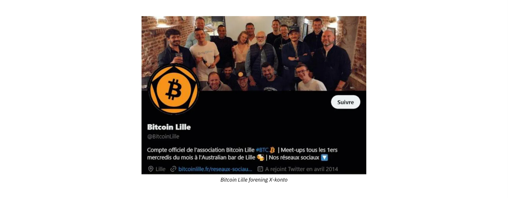

I tillegg er det verdt å justere noen **personverninnstillinger**:

- la Twitter-kontoen din være i "offentlig" modus (innlegg synlige for alle);
- gjør at alle kan finne deg;
- deaktivere sporing av posisjon og deling av data med andre enheter (i personverninnstillingene).

For hvert arrangement vil du sannsynligvis bruke Twitter til å dele nyttig informasjon. Men som i de fleste sosiale nettverk er **synlighet alt**.

For å spare deg for mye tid har vi tatt oss tid til å studere [Twitters rangeringsalgoritme med åpen kildekode](https://github.com/twitter).

Her er de **viktigste tingene du bør fokusere på for å øke synligheten din**:

- Generelle tips:
    - Tweet på kontoens språk eller på engelsk: Hvis du tweeter på andre språk, kan det redusere synligheten din betraktelig;
    - Hold deg til nisjen din, og del bare innhold som er relatert til kontoens fokus; tweets utenfor tema blir straffet av algoritmen;
    - Sikt på 1 til 2 tweets per dag;
    - Publiser i de travleste timene: Torsdag eller fredag mellom kl. 08.00 og 10.00 pleier å gi best resultater (sjekk i kontoen din: Twitter Analytics).

- Når du skriver en tweet:
    - legg til et bilde (eller til og med en video);
    - Bruk bare én emneknagg (vanligvis er #Bitcoin den mest relevante). Hvis det er hensiktsmessig, kan du legge til en hashtag som er relatert til kontoområdet ditt);
    - Oppmuntre lokalsamfunnet til å samhandle:
        - Liker = vekt 0,5
        - Retweet = vekt 1
- Svar = vekt 27 (**!!**)
- Svar på folk som svarer på **tweets** (vekt på 75!!);
    - Unngå å plassere lenker i hovedtweeten: legg dem i stedet til i den første kommentaren;
    - Skriv ordene fullt ut, unngå forkortelser.

- Andre tips:
    - Tweet om populære temaer, så lenge de er i tråd med kontoens ekspertiseområde;
    - Legg ut de beste tweetsene dine på nytt;
    - Kjør av og til meningsmålinger;
    - Skriv tråder når det er mulig;
    - Oppfordre fellesskapet til å besøke profilen din og følge deg.

I tillegg kan du **feste en tweet eller tråd til Twitter-profilen din for å gi den maksimal synlighet**, akkurat som Bitcoin Witsand-fellesskapet i Sør-Afrika gjør.

Merk også at det er mulig å være innlogget på to Twitter-kontoer samtidig, både på telefon og datamaskin. Dette er veldig praktisk hvis du enkelt vil kunne veksle mellom dine personlige kontoer og samfunnskontoer.

Bare vær forsiktig ... det kan skje raskere enn du tror at du ved et uhell legger ut et festbilde fra felleskontoen!

Selv om brukernavnet ditt "@Bitcoin[CITY]" er unikt og nå er ditt, er det smart å være forberedt på falske kontoer eller etterligninger. Vurder også å registrere deg:

- @Bitcoin_[CITY]
- @[CITY]Bitcoin
- @[CITY]_Bitcoin

På den måten reduserer du sjansene for at noen utgir seg for å være fra ditt fellesskap.

Veiledning i hvordan du oppretter en Twitter-konto:

:::video id=4648976f-41ec-499a-b7ec-a53e796f71b4:::

## Nærmere til nabomøter

<chapterId>12a21c3b-235a-5292-8209-67bf60f61e49</chapterId>

Nå som kommunikasjonskanalene og de sosiale nettverkene dine er satt opp og gjenspeiler fellesskapets visuelle identitet, er det på tide å begynne å følge de riktige personene.

På Twitter kan du begynne med å følge nøkkelkontoer som promoterer Bitcoin globalt, som [@Bitcoin](https://twitter.com/Bitcoin) og [@planb_network](https://twitter.com/planb_network), samt initiativer som [@FBCEglobal](https://twitter.com/FBCEglobal). Du kan også retweete [@halfin](https://twitter.com/halfin) sin berømte "Running Bitcoin"-tweet fra 11. januar 2009. Og enda viktigere: **følg kontoene til Bitcoin-fellesskap og -møter i ditt eget land**.

Dette skaper **muligheter til å følge hverandre, tagge hverandre og øke den kollektive synligheten**. Det er allerede vanlig praksis blant de rundt 50 Bitcoin-fellesskapene i Frankrike, "Satoshi Spritz"-initiativene i Italia og "Einundzwanzig"-gruppene i Tyskland.

Selv om det kan virke trivielt for noen, kan det å følge med på kontoene til lokalsamfunn og initiativer føre til samarbeid eller til og med **partnerskap**. For eksempel har miljøene Bitcoin Liège og Bitcoin Lille (og likeledes Bitcoin Aix og Bitcoin Marseille) fått kontakt på denne måten, noe som har ført til at de nå arrangerer et årlig møte sammen.

Måltidene i **Cercle du Coin** er et annet godt eksempel.

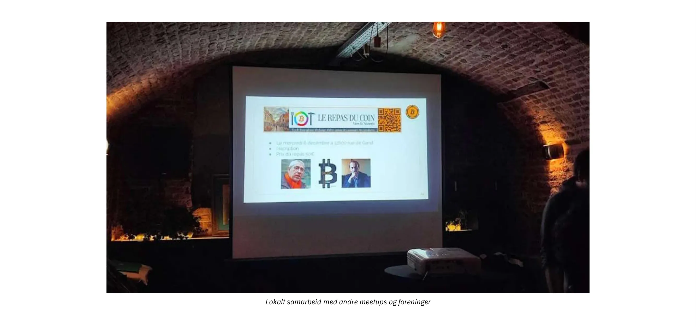

I Frankrike kan det også være relevant å ** følge initiativene som [@KonsensusFR](https://twitter.com/KonsensusFR), [@bitcoinpointfr](https://twitter.com/bitcoinpointfr), [@DecouvreBitcoin](https://twitter.com/DecouvreBitcoin) og [@btcmap](https://twitter.com/btcmap)**. Dette er selvfølgelig bare forslag, og hvert samfunn står fritt til å gjøre som det ønsker, i fullstendig desentralisering og autonomi.

Som nevnt ovenfor, er målet med å følge hverandre å skape gjensidig synlighet. Jo mer du promoterer ditt eget og regionens/landets fellesskap i de sosiale nettverkene, desto flere vil snakke om dere. Jo flere som snakker om dere, desto mer sannsynlig er det at de vil delta på arrangementene deres.

Å like og retweete innlegg fra andre nettsamfunn kan derfor være til stor hjelp for deres utvikling... og din egen.

Du kan også foreslå at **møtearrangører og bitcoinere som driver bitcoin-fellesskap møtes to eller tre ganger i året via videokonferanse for å gå gjennom fremdriften i nasjonale prosjekter og relaterte fellesskap. Dette kan også finne sted under fysiske arrangementer**

Målet er enkelt: samle tilbakemeldinger fra alle, diskutere hvordan lokalsamfunnene utvikler seg, dele vellykkede ideer og prosjekter, og foreslå løsninger når det trengs. Et skriftlig sammendrag av møtet kan deles med lokalsamfunnsorganisatorer i landet ditt som ikke hadde anledning til å delta.

## Btcmap.org

<chapterId>365f43d4-7b2c-5961-a184-157b8c1a0116</chapterId>

På dette stadiet er fellesskapet ditt allerede oppe og går. Nå gjenstår det bare å ta imot flere interesserte og hjelpe det til å vokse.

Men du kan ikke gå videre uten å vite at **det finnes plattformer der bitcoinere kan finne lokalsamfunn og meetups i nærheten av dem**. Derfor er det viktig å bruke noen minutter på å be om en oppføring på disse nettstedene.

Disse inkluderer:

- [Btcmap.org](https://btcmap.org/), et nettsted med to kart som oppdateres daglig: **[verdenskartet over virksomheter som godtar Bitcoin](https://btcmap.org/map)** og **[kartet over lokalsamfunn i verden](https://btcmap.org/communities/map)**. Mange bitcoinere sjekker disse kartene regelmessig, enten de er ute og reiser eller går rundt i hverdagen, for å møte nye mennesker eller finne steder å bruke [Sats](https://planb.academy/resources/glossary/satoshi-sat) på. Btcmap er den globale referansen, og det er viktig for synligheten din at du lister opp samfunnet ditt der
- [BitcoinerEvents](https://www.bitcoinerevents.com/), et nettsted laget av bitcoinere, for bitcoinere. **Her kan du legge ut kommende arrangementer i ditt fellesskap**. I Frankrike er det imidlertid fortsatt ikke mye brukt.
- avhengig av hvilket land du bor i, kan det finnes andre lokale initiativer. I Frankrike finnes det for eksempel [Bitcoin.fr](https://Bitcoin.fr/events/categories/evenements/), som **lister opp dusinvis av Bitcoin-arrangementer hver måned**. Så hvis du ennå ikke har fulgt dem på Twitter eller kontaktet dem for å dele informasjon om ditt lokalsamfunn og arrangementer, er det på tide nå! **For å holde den franske arrangementskalenderen oppdatert, ville det være flott om alle franske Bitcoin-fellesskap gjorde det til en vane å:**
    - nevner @bitcoinpointfr på Twitter for hvert nye fellesskapsarrangement
    - pinne nye kunngjøringer om arrangementer i Telegram-gruppen deres.

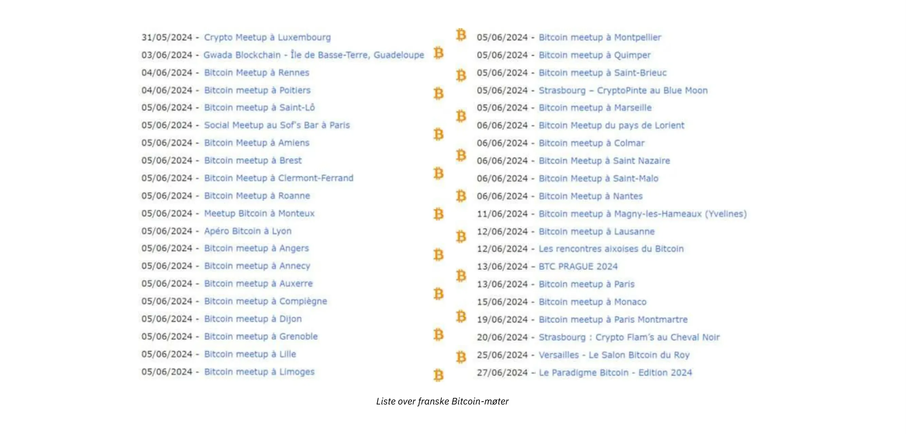

Andre plattformer kan også øke synligheten din. **[Meetup](https://www.meetup.com/)** er en av dem, og det er et nettsted (og en telefonapp) der du kan opprette et arrangement og finne andre i nærheten.

Det koster rundt 8 euro i måneden (eller rundt 90 euro i året), noe som kan være dyrt for et lite, ustrukturert fellesskap. Når det er sagt, er Meetup mye brukt i noen land, spesielt i Canada og USA, og det er nyttig for å administrere registreringer.

På samme måte er **[Orangepillapp](https://www.orangepillapp.com/)** en betalt mobilapp (50 000 Sats/år eller 200 000 Sats for livstidstilgang) som hjelper bitcoinere med å møtes.

Selv om de to sistnevnte plattformene kan bidra til å øke synligheten, anbefales de ikke når du skal starte et nettsamfunn, rett og slett fordi de ikke er gratis.

**Det er mer enn nok å starte med en oppføring på [btcmap.org](https://btcmap.org/), [BitcoinerEvents](https://www.bitcoinerevents.com/) og for franske lokalsamfunn, på [Bitcoin.fr](https://Bitcoin.fr)**.

Gratulerer så mye! Ditt **fellesskap er opprettet**, dine **visuals er klare**, dine **målsettinger er satt**, dine **kommunikasjonskanaler er på plass**, dine **sosiale nettverk er lansert** og din **synlighetsstrategi er bestemt**.

Når en liten gruppe bitcoinere har sluttet seg til deg, er det tid for neste steg: å organisere ditt første Bitcoin-møte.

# Organiser et Bitcoin-møte

<partId>c009d2a6-40ce-583b-bd24-fdfd1fea262e</partId>

## Hvorfor starte et regelmessig møte med fellesskapet ditt?

<chapterId>ed8e471c-3b99-57e2-a042-2d4e8a40b137</chapterId>

Nå som fellesskapets sosiale nettverk og kommunikasjonskanaler er lansert, er det på tide å gjøre seg bemerket på disse plattformene. Oppfordre nye medlemmer til å presentere seg og gradvis delta i samtalen.

Dette vil frigjøre tid, som du kan bruke til å tenke på å skape en eller annen form for møteplass. Dette vil bli enda mer relevant når du begynner å føle ekte begeistring i samfunnet ditt.

Som nevnt tidligere kan **et Bitcoin-møte ses på som det neste "nivået" for et fellesskap**. På den ene siden gir det **medlemmene mulighet til å møtes personlig**, og på den andre siden bidrar det til å **utdanne nykommere som er interessert i dette økosystemet**.

Et arrangement som dette lar deg, i din egen målestokk, **skape en stemning rundt Bitcoin** i byen din, som kan vokse over tid etter hvert som lokalsamfunnet ditt tar på seg prosjekter.

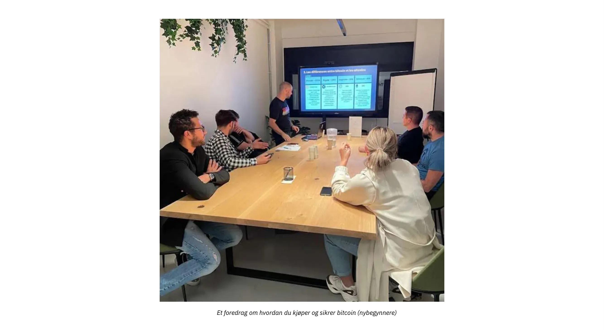

Jo større mål du har for samfunnsutviklingen, desto mer tid må du og medlemmene investere.

Derfor er det viktig å **begynne med å sette oppnåelige mål for møtet**.

## Det første møtet: når, og hvorfor?

<chapterId>f3f8a614-cfb4-5994-a2e8-d56e6f8e3347</chapterId>

Du kan starte et møte bare noen uker etter at du har opprettet fellesskapet ditt.

Men på det stadiet vil gruppen din sannsynligvis fortsatt være liten, noe som betyr at det er en sjanse for at ingen dukker opp.

Det er bedre å organisere et møte når du har minst noen få aktive medlemmer i kommunikasjonskanalene dine, for eksempel noen titalls. Dette kan skje raskt, men det avhenger også av folks personligheter.

Når du føler at det gnistrer, foreslår du å møtes personlig. Hvis andre er interessert, er det bare å **fastsette en dato for det første møtet**.

I stedet for å velge datoen selv, er det vanligvis best å **opprette en avstemning omtrent ti dager i forveien med flere mulige dager og tidspunkter**. På denne måten kan du bruke stemmene til å maksimere oppmøtet, skape begeistring og bruke tiden din på best mulig måte.

Det er best å ikke gå inn i møtet med faste forventninger om hvordan det skal forløpe, hvor mange som kommer, eller hvilke temaer som skal diskuteres. Da unngår man skuffelser, og deltakerne føler seg ikke presset.

La ting flyte naturlig, kanskje over en drink. Samtalene bør gå lett, og om nødvendig kan du forsiktig styre diskusjonen tilbake til Bitcoin hvis den begynner å gli av sporet.

Hvis du vil forberede deg på roligere stunder, kan du planlegge noen aktiviteter eller samtaleemner, for eksempel:

- viser **[Mempool](https://Mempool.space/)** på en datamaskin eller smarttelefon;
- ta med en bok;
- med en **Nerdminer**, Bitaxe, FPGA eller til og med ASIC;
- som har en **Bitcoin flygeblad**;
- idémyldring om en Bitcoin-visuell eller logo for lokalsamfunnet ditt;
- spiller et **[Bitcoin-kortspill](https://www.Maximalist.ovh/accueil/20-game-le-Coin-de-table.html)**;
- som viser **[btcmap.org](https://btcmap.org/)**-kartet over lokalsamfunn og selgere;
- sende eller motta Bitcoin ved hjelp av **Lightning**.

Når møtet er i startfasen, er det ofte ikke det rette tidspunktet for en formell presentasjon. Hvis det er få deltakere, fungerer en åpen og uformell diskusjon som regel best.

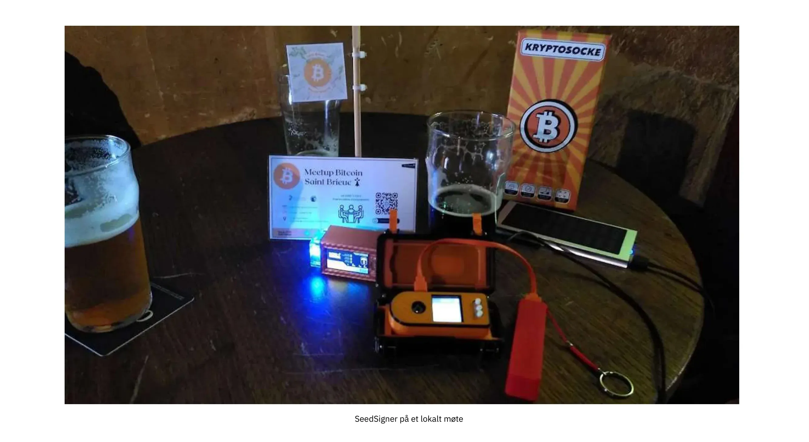

Etter det første møtet vil dere sannsynligvis planlegge et nytt. Så lenge fellesskapet fortsatt er lite, er det best å fortsette å velge datoer gjennom avstemninger, for eksempel en gang i måneden eller annenhver måned. Dere kan diskutere dette i kommunikasjonskanalene deres.

Hvis det dannes en fast gruppe av bitcoinere og interesserte deltakere, er det fornuftig å sette opp en fast timeplan av to grunner:

1) Det gjør det enklere for alle å planlegge;

2) Det bidrar til å **etablere en "vane"**. Selv om noen slutter å sjekke kanalene dine regelmessig, vil de fortsatt vite når møtet finner sted og kan stikke innom som vanlig.

Dette andre punktet er en av grunnene til at ** i Frankrike finner de fleste møter sted den første onsdagen i hver måned ** (se "ambassadører" -initiativet, lansert av [DecouvreBitcoin](https://decouvrebitcoin.fr/) i 2022).

I Tyskland og Italia er det ingen fast nasjonaldag.

Men hvis alle landsomfattende meet-ups arrangeres på samme dag, oppstår det et sentraliseringsproblem: Det hindrer bitcoinere fra å delta på arrangementer i nærliggende lokalsamfunn, og det kan også skape sikkerhetsproblemer. Snakk med arrangører av nabomøter for å bli enige om et godt opplegg.

Etter hvert som fellesskapet vokser og flere deltar på møtene, kan du gjøre det:

- sett deg et konkret mål for hvert møte;
- eller til og med **legge til et ekstra arrangement hver måned**.

I det første tilfellet kan et tydelig mål sørge for at deltakerne har lært noe nytt, samtidig som man tar hensyn til alles preferanser og holder samtalene fokusert på Bitcoin.

I det andre tilfellet kan et annet månedlig arrangement være dedikert til et bestemt tema, for eksempel nybegynnerøkter eller workshops (Mining, Lightning, nodeinstallasjon osv.).

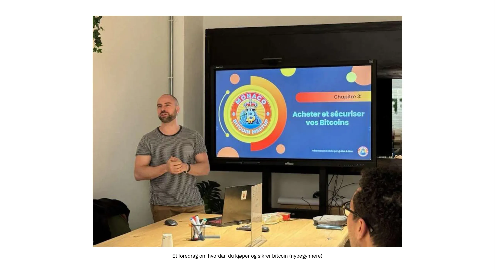

Husk at **dette krever mer organisering og mer av din tid**. Heldigvis finner du i [del 6/8 av dette kurset](https://planb.academy/courses/1c643dc9-a15f-4f9e-93b6-cb3c58b4ee35/3213d87a-1998-5972-ab93-97a5769ba279) en rekke gjenbrukbare ressurser med åpen kildekode som kan hjelpe deg.

Uansett avhenger alt av den kortsiktige, mellomlangsiktige og langsiktige handlingsplanen du eller ditt lokalsamfunn har satt opp for dere selv.

## Jakten på et sted

<chapterId>405d389e-6a32-5777-af8d-293380d2e8fd</chapterId>

Det er ofte ikke lett å finne et sted for arrangementene dine. I tillegg er det viktig at lokalet er **lokalisert i byen**.

Det er flere kriterier å ta hensyn til, blant annet

1) **Lokalisering**: Er det lett tilgjengelig med offentlig transport? Med bil? Er det parkering tilgjengelig?

2) Er lokalet hyggelig og ikke for **støyende**? Er du ute etter en formell setting (co-working space, møterom) eller noe mer uformelt (bar, restaurant)?

3) Har det nok kapasitet til å ta imot deg, selv på en rugby- eller Champions League-kampkveld?

4) Har det en videoprojektor og et stille område for presentasjoner?

5) Og til slutt, hvis det er en bar eller restaurant, tilbyr menyen noe å spise og drikke for alle?

I tillegg er det tre viktige punkter du bør huske på:

- Hvis du planlegger å dele opp kvelden i to deler: først en presentasjon i et formelt lokale for å hjelpe alle med å fokusere, og deretter gå til en bar eller restaurant for å fortsette i en mer avslappet atmosfære, viser erfaringen at det å bytte lokale midt på kvelden ofte fører til at noen av deltakerne forlater stedet i pausen. Denne tilnærmingen anbefales derfor ikke.
- På de første møtene dine vil det sannsynligvis være få deltakere, og du vil sannsynligvis ikke holde formelle presentasjoner. Da er det ikke nødvendig å presentere seg for eieren eller forklare hva som er målet. Men **når møtene blir regelmessige og godt besøkt, er det verdt å gjøre det for å vise profesjonalitet og uttrykke et ønske om å komme tilbake hver måned**. Dette kan føre til mange diskusjoner (automatiske månedlige reservasjoner, gratis drikke og/eller matbrett, rabatter, samtaler om Bitcoin, aksept av Bitcoin-betalinger osv.) Hvis du er på utkikk etter et sted med videoprojektor for å holde presentasjoner, er det selvsagt viktig å be om et møte (ansikt til ansikt, eller til og med over telefon) med eieren og/eller den daglige lederen for å presentere prosjektet og målene dine.

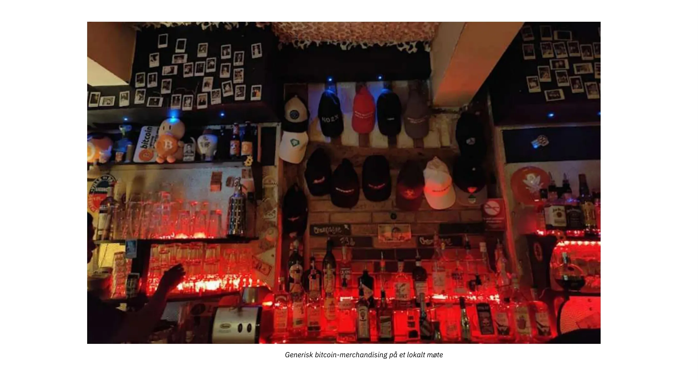

- til slutt, noen lokalsamfunn **ønsker bare å holde arrangementene sine på steder som godtar Bitcoin-betalinger**, noe som er forståelig. I dette tilfellet er det en god idé å **begynne med å søke etter Bitcoin-aksepterende virksomheter i byen din** (på [btcmap.org](https://btcmap.org/map/)) og kontakte dem for å se om de oppfyller kriteriene dine. Hvis det ikke finnes noe som passer, kan du prøve å ta imot nye forhandlere, men forvent mange avslag, noe som kan være nedslående. Derfor er det ofte best å ikke ha dette som et mål fra starten av, men heller vurdere det når fellesskapet er veletablert og dere har nok "ildkraft"

Når du starter opp et møte, ikke nøl med å **bytte møtested de første månedene**. Dette vil hjelpe deg med å **bygge relasjoner med ulike ledere**, utforske ulike atmosfærer og samle informasjon om potensielle fremtidige verter.

Senere, når gruppen har vokst, kan dere til og med bruke en ettermiddag på å besøke flere forretninger og barer og spørre om de har et lokale som egner seg til å huse månedlige arrangementer og møter.

## Før møtet

<chapterId>c5218943-580d-5efc-89ed-6b5d728816d6</chapterId>

Planlegger du å arrangere et møte i løpet av de kommende ukene?

Her er en sjekkliste som hjelper deg med å forberede deg:

1/ **Bekreft møtested**

Ta kontakt med stedet der du skal avholde arrangementet, og reserver det for det estimerte antallet deltakere.

2/ **Kunngjør om arrangementet**:

    - Del dato, klokkeslett og sted på sosiale nettverk og i andre kommunikasjonskanaler. Legg ved en påmeldingslenke om nødvendig.
    - Lag et eget visuelt uttrykk (for eksempel en Canva-plakat, se del 2/8 "[Utforme en identitet for Bitcoin-fellesskapet](https://planb.academy/courses/1c643dc9-a15f-4f9e-93b6-cb3c58b4ee35/b48a18cc-afdf-5216-802c-32647b5cd8a3)").
    - Maksimer synligheten ved å feste kunngjøringen på Telegram og Twitter, og bruk en "@everyone"-omtale på Discord.
    - Legg ut kunngjøringer 7 til 10 dager før arrangementet, slik at deltakerne kan planlegge i forkant.

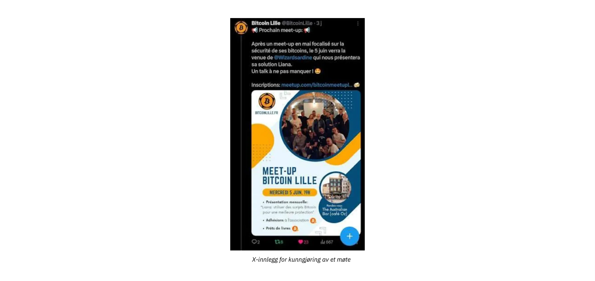

3/ **Påminn publikum**

To til tre dager før arrangementet kan du dele og retweete kunngjøringene dine på nytt for å øke synligheten.

4/ **Oppdater spillestedet**

Dagen før (eller to dager før) sjekker du påmeldingene og gir beskjed til lokalet om det endelige forventede antallet deltakere.

Ekstra tiltak for å få arrangementet ditt til å skille seg ut:

- Skriv ut løpesedler og/eller plakater
- Forberede en presentasjon om et bestemt tema
- Organiser en aktivitet eller workshop

## Dagen for møtet

<chapterId>cf60067b-591f-5fdf-9b9e-d442aad0e8f9</chapterId>

Den store dagen er her! En til to timer før arrangementet starter, sender du ut en påminnelse gjennom lokalsamfunnets kommunikasjonskanaler. Bekreft starttidspunktet og fortell deltakerne hvordan de kan kjenne deg igjen, for eksempel ved å nevne at du kommer til å ha på deg en Bitcoin T-skjorte og caps.

Etter hvert som møtene dine vokser og du begynner å ta imot mer enn 20 personer, blir det stadig viktigere å forberede lokalet.

Her er hva du skal gjøre:

1) **Kom tidlig** for å gjøre alt klart.

2) **Arranger plassen** etter dine behov og lokalets muligheter. Hvis dere bare er seks personer, er det lite som trengs. Men når dere kommer opp i 10-20 deltakere, kan et fullt sittende oppsett begrense interaksjonen. I så fall bør dere velge et stående oppsett med høye bord med god avstand mellom hvis det er mulig, samtidig som dere har noen få (helst høye) stoler. Hvis det er planlagt en presentasjon, bør du beholde det stående oppsettet det meste av kvelden og sette inn stoler rett før foredraget.

3) Legg til små, tilpassede detaljer:

    - Sett opp en plakat ved inngangen for å vise hvor du befinner deg (bruk Patafix og få tillatelse fra lokalet først).
    - Heng opp plakater med Bitcoin-tema inne (Bitcoin-hvitbok, fellesskapets charter, aktuelle prosjekter osv.)
    - Legg ut klistremerker, flygeblad eller samtaleemner på bordene, for eksempel en Nerdminer, Hardware Wallet, en bærbar PC med Mempool, ASIC, Miner eller en metallplate for private nøkler.

Hvis du bare forventer noen få deltakere og ennå ikke har bygget opp et forhold til de ansvarlige for lokalet, bør du unngå å ta med og vise frem alt utstyret ditt med en gang. Når tilliten er etablert, har du større frihet til å innrede lokalet slik du ønsker.

Til slutt kan du ta en drink og vente på at folk skal komme. Og husk: Ikke bli motløs hvis ingen kommer første gang. Ta med en bok eller en video å se på, bare i tilfelle.

## Etter møtet

<chapterId>3e881af9-9c09-5721-81ee-c5cda3b109c5</chapterId>

Når møtet er over, er det tid for opprydding for de ansatte på stedet. Før du går, kan du tilby deg å hjelpe servitørene eller sjefen. Det kan være så enkelt som å samle alle glassene på ett bord, eller, hvis du er i nærheten av baren, å levere dem tilbake før du går.

Når du er hjemme igjen, vil du sannsynligvis fortsatt ha Bitcoin i tankene i flere dager. Det er det perfekte tidspunktet for å ta pulsen på lokalsamfunnet og samle inn tilbakemeldinger fra deltakerne. Det kan dere gjøre:

- Legg ut en takkehilsen på kommunikasjonskanalene dine, og del eventuelle lenker eller ressurser som ble nevnt under arrangementet.
- Inviter deltakerne til å foreslå forbedringer til neste møte.
- Begynn å planlegge ditt neste arrangement.

Deretter har du noen uker på deg til å utvikle nye ideer, visuelt materiale eller prosjekter for å gjøre neste møte enda bedre.

## Viktigheten av å involvere og beholde deltakerne

<chapterId>f5355e35-4b07-527c-88a3-8535cba7592c</chapterId>

Roma ble ikke bygget på én dag, og det vil heller ikke ditt fellesskap bli. Momentum rundt Bitcoin kommer fra regelmessige møter og arrangementer.

For å få det til, er det én ting som er avgjørende: **holde deltakerne engasjert**.

Det kan begynne med en liten gruppe lidenskapelige bitcoinere, som har som mål å møtes regelmessig og snakke om Bitcoin. Over tid, avhengig av hver enkelt persons tilgjengelighet og interesser, kan du **dele visse organisatoriske oppgaver med gruppen**, eller invitere sentrale **medlemmer til å ta på seg spesifikke prosjekter**. Disse kan være unike for ditt lokalsamfunn, dine møter eller din by, eller til og med inspirert av de mange initiativene som er foreslått i [del 6/8 av dette kurset](https://planb.academy/courses/1c643dc9-a15f-4f9e-93b6-cb3c58b4ee35/3213d87a-1998-5972-ab93-97a5769ba279). **Dette fremmer ikke bare Commitment fra kjernemedlemmene, men bidrar også til at fellesskapet vokser og trives.**

Etter hvert som møtene utvikler seg, vil nye ansikter dukke opp: folk som har kjøpt BTC og/eller altcoins i tidligere sykluser, teknologientusiaster som ønsker å utdype sin forståelse, eller nybegynnere som er nysgjerrige på dette ikke-sensurerbare, desentraliserte, transparente og rettferdige betalingssystemet som fungerer uten betingelser og uten pålitelige tredjeparter.

For å sikre at alle føler seg inkludert på arrangementene dine, bør du fokusere på to viktige aspekter:

- **Sosial inkludering**: Alle som deltar, skal føle seg velkomne. Gjør en innsats for å hilse på nykommere, spør hvorfor de kom, og introduser dem for andre. Når folk føler seg inkludert, er det mer sannsynlig at de kommer tilbake og kanskje til og med hjelper til med å organisere fremtidige arrangementer.
- **Tålmodighet og åpenhet**: Dette krever tid og motivasjon. Hvis du snakker med en engasjert shitcoiner (eller enda verre, en XRP Maximalist), kan det være fristende å avfeie vedkommende. Men ved å engasjere deg i en samtale kan du kanskje oppklare misforståelser eller feilaktige resonnementer. Hvis de er villige til å lytte, kan de være klare til å virkelig forstå Bitcoin.

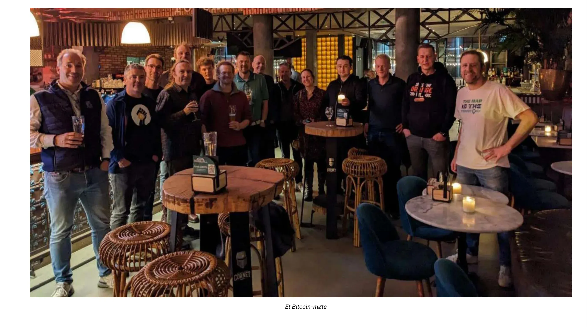

Fra et praktisk synspunkt bør du tenke på den totale opplevelsen av arrangementet:

- Var **stedet hyggelig**?
- Var det **lett å få tilgang til**?
- Hvorfor var det noen som meldte seg på, men ikke møtte opp?
- Hvilke diskusjoner ble holdt? Var diskusjonene for tekniske for nybegynnere?
- Var diskusjonene for alkoholiserte?

Hver deltaker har sin egen personlighet, sine egne mål og interesser, så opplevelsene vil variere. Men når stedet er det rette, deltakerne er åpne og intensjonene er ekte, er det all grunn til at møtet skal bli en suksess.

Det tar tid å bygge opp et meetup, men fremfor alt krever det organisering. Det er et menneskelig prosjekt, og det vil bare fungere og vokse på lang sikt hvis det er godt planlagt, åpent og inkluderende.

Til syvende og sist er det opp til deg å bestemme hvor langt "åpen og inkluderende" skal gå. Bare husk: En shitcoiner er ofte bare en bitcoiner i ferd med å bli en bitcoiner.

# Eksempler på prosjekter og initiativer

<partId>45b3bc40-1c31-583e-8411-2662e6efd765</partId>

## Hvorfor gå lenger enn bare å drikke øl?

<chapterId>3213d87a-1998-5972-ab93-97a5769ba279</chapterId>

Etter hvert som blokkene ruller videre, vil samfunnet utvikle seg. Nye ansikter vil komme til, andre vil forsvinne, men det ledende prinsippet bør forbli det samme: utvikle Bitcoin-økosystemet og styrke båndene mellom medlemmene.

Det finnes mange prosjekter og initiativer som kan gjennomføres. Dette kapittelet inneholder en ikke-uttømmende liste over ideer som kan gjennomføres i et fellesskap eller under et møte. Velg gjerne de som inspirerer deg, og bidra gjerne med dine egne ideer til dette kurset [ved å lage en "Pull Request" på GitHub](https://github.com/PlanB-Network/Bitcoin-educational-content).

Før vi går i gang, la oss ta opp igjen et poeng som er nevnt tidligere.

Når du arrangerer et Bitcoin-møte, møter du nye mennesker. Sosialt samvær er viktig, og øl (eller alkohol generelt) kan bidra til å skape en festlig atmosfære. Men det er verdt å huske på:

- Alkohol svekker kognitive evner som tenkning og forståelse, noe som kan gjøre det vanskeligere for deltakerne å følge med på seriøse diskusjoner eller presentasjoner.
- Alkohol kan også bli et trøstende ritual: Hver måned deler du "Bitcoin-øyeblikket" ditt med venner over en drink. Selv om det er en fin måte å komme sammen på, er det å drikke øl virkelig hovedmålet med møtet ditt? Eller vil du heller forske på Exchange, lære av andre og hjelpe nykommere med å oppdage Bitcoin?

Alle har sine egne preferanser, overbevisninger og personlighet. Dette handler ikke om å dømme ett møte fremfor et annet. Men selv om det ofte er over en øl at vi snakker om å forandre verden, er det ikke slik at revolusjoner starter eller vokser frem.

Nøkkelen er rett og slett å være klar over det.

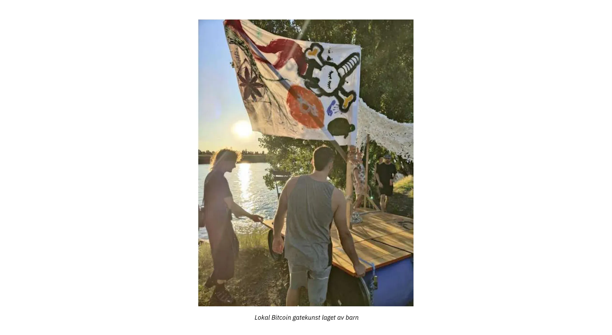

## Organisere temamøter, med en årlig progresjon

<chapterId>46afdbcc-a775-5c16-b20a-34956690d58f</chapterId>

Når du har bygget opp en kjernegruppe på rundt ti personer, kan du begynne å legge til presentasjoner på hvert arrangement. Disse kan følge et tema som er annonsert på forhånd, eller være helt uavhengige av hverandre.

Når du planlegger presentasjoner eller workshoper, er det nyttig å skape en tydelig og velstrukturert progresjon. Målet er å **dekke Bitcoins kjernekonsepter trinn for trinn**, slik at deltakerne får en fullstendig oversikt over emnet fra flere vinkler.

I Frankrike, sommeren 2023, arbeidet arrangørene med **en årlig progresjon**.

I tillegg til den sterke pedagogiske verdien gjør denne tilnærmingen det mulig å dele dokumenter og lysbildedekker med åpen kildekode mellom grupper og gradvis bygge opp et felles bibliotek med ressurser. Initiativet har blitt godt mottatt, og det kommer til å vokse i årene som kommer.

Nedenfor ser du progresjonen for de franske møtene i 2023-2024. For hvert tema finnes det en åpen kildekode-presentasjon og en video, som kan gi deg ideer til temaer du kan ta opp på dine egne arrangementer.

Andre ressurser er også tilgjengelige i seksjonen ["Educator Content"](https://planb.academy/educator-content) på Plan ₿ Academy, et samarbeidsområde hvor Bitcoin-utdannere fra hele verden deler og gjør tilgjengelig sine undervisningsmateriell (presentasjoner, flygeblader, guider, plakater...) i klare til bruk eller redigerbare formater. Målet: samle krefter for ikke å begynne på nytt hver gang!

| Month | Theme | Video | Editable Resource |
| -------- | -------- | -------- | --- |
| September     | Chapter 1: What is Bitcoin?     | [	YouTube link](https://www.youtube.com/watch?v=CSjuBqrl4t8)     | [Editable PowerPoint](https://www.canva.com/design/DAFu0d5Jd7M/9gAWDAOSS6LDkWENuZjYgw/edit) |
| October & November| Chapter 2: Understanding Bitcoin Transactions     | [YouTube link](https://www.youtube.com/watch?v=inFnR-3NsdM)     | [Editable PowerPoint](https://www.canva.com/design/DAFsEcnOro8/Mz9FYdTGhsvozZOe0Y9jtw/edit) |
| December     | Chapter 3: Understanding the Lightning Network     | [YouTube link](https://www.youtube.com/watch?v=hHz-ALx8D9w)     | [Editable PowerPoint](https://www.canva.com/design/DAF4YPSNnR8/HKp4Vmcno8eMtVWnZmFtcw/edit) |
| January     | Chapter 4: What is Mining?     | [YouTube link](https://www.youtube.com/watch?v=QyHZ3CVI_OI)     | [Editable PowerPoint](https://www.canva.com/design/DAF5DE6iBEM/tsy8E3oBebUnsR0kj53vvQ/edit) |
| February     | 	Chapter 5: Running a Bitcoin and Lightning Node    | [YouTube link](https://www.youtube.com/watch?v=RRYK-usg-OY)     | [Editable PowerPoint](https://www.canva.com/design/DAF55FU6HI0/sQ0lacRJblqrhn_9Xk1yDg/edit) |
| March     | 	Chapter 6: Using the Lightning Network in Daily Life    | [YouTube link](https://www.youtube.com/watch?v=o2BS4xjei8M)    | [Editable PowerPoint](https://www.canva.com/design/DAGAcJMw7lw/-haMNnHnwj5vpDAy8MDowA/edit) |
| April & May    | Chapter 7: Securing Your Bitcoins      | [YouTube link](https://www.youtube.com/watch?v=fHExPbhM0Hg)    | [Editable PowerPoint](https://www.canva.com/design/DAGDz3Nq4e0/D3uG-4w9FN6OhUq-VXzhfg/edit) |
| June     | 	Chapter 8: What is Multi-Sig?     | [YouTube link](https://www.youtube.com/watch?v=Me5489mpoxA)     | [Editable PowerPoint](https://www.canva.com/design/DAGLMtQT6sg/rYIxr4ldUJ0jTelNf-Pj8Q/edit) |
| July     | 	Chapter 9: Understanding the Bull Run and How to Prepare    | [YouTube link](https://www.youtube.com/watch?v=7RA-gnCJWyM)     | [Editable PowerPoint](https://www.canva.com/design/DAGJQkiZ_YA/9lUluP9RZ0eeA_e61mk9Hw/edit) |
| August     | Chapter 10: The Taxman is Never Far Away   | [YouTube link](https://www.youtube.com/watch?v=oY4NwonGDm0)     | [Editable PowerPoint](https://www.canva.com/design/DAGQhx7Yc_c/7mRhb_vlgnhSgxd1FtjK8w/edit) |

Kapittel 2 og 7 kan deles opp i to kortere presentasjoner for å unngå å overvelde deltakerne. Ved å kjøre dem i én økt frigjøres det imidlertid plass i kalenderen til spesielle aktiviteter, for eksempel fellesmøter med nabogrupper, spørrekonkurranser eller workshops.

**Du står fritt til å bruke, tilpasse og dele disse ressursene, men husk å oppgi opphavspersonene hvis du gjenbruker arbeidet deres**

Siden ikke alle kan delta på alle møter, er det en god idé å ta opp presentasjoner og laste dem opp til en strømmeplattform eller nettstedet ditt. På den måten kan de som er fraværende, ta igjen det tapte, og deltakerne kan gå tilbake til materialet senere.

Parallelt kan du arrangere andre temamøter, for eksempel:

- En Bitcoin-kunnskapsquiz (med en Hardware Wallet som premie)
- En onboarding-utfordring der du sender gratis satoshier til folk uten mynter på gaten
- Invitere en ekspertforedragsholder eller et selskap til å presentere et Bitcoin-relatert produkt
- En nattlig omvisning i barer og butikker som godtar Bitcoin

Og mye mer, det er bare fantasien som setter grenser!

## Lag sidearrangementer og workshops

<chapterId>9dbd651a-8712-5630-90b3-b9525dcc1385</chapterId>

Avhengig av hvor tilgjengelig du er og hvor engasjert du er i lokalsamfunnet, kan du planlegge flere arrangementer i løpet av året, for eksempel

- En restaurantkveld i anledning **Pizzadagen** 22. mai
- En kveld eller helg for å feire den neste **Halving**
- En familie **spillkveld** om Bitcoin og hvordan det fungerer, ved hjelp av spill som [Le Coin de Table](https://www.Maximalist.ovh/) eller [SHAmory](https://shamory.com/)
- En **Mining-workshop** med presentasjon av ulike typer maskinvare (CPU, GPU, FPGA, ASIC, Nerdminer, Bitaxe)
- En **eftermiddag eller kveld for nybegynnere**, med temaverksteder
- Et **fellesmøte med nabokommunene**

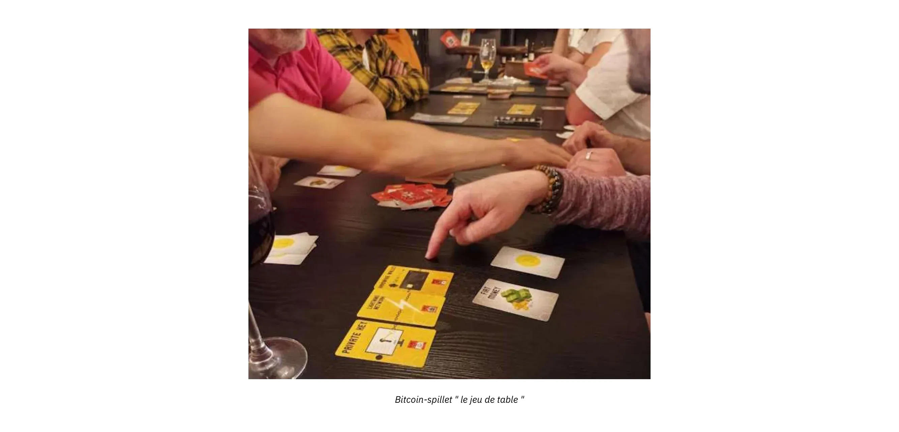

Bare vær forsiktig så du ikke overbelaster kalenderen. For mange arrangementer i løpet av én måned kan føre til utbrenthet hos arrangørene og redusert oppmøte over tid.

## Lag klistremerker

<chapterId>d605f3b3-130e-513d-85e6-06bc5ea13e99</chapterId>

Klistremerker er en morsom måte å promotere både Bitcoin og lokalsamfunnet ditt på, samtidig som de forsterker identiteten din.

Husk disse tipsene før du bestiller:

- Sørg for at klistremerkene er vanntette ved utendørs bruk.
- Hold logoen litt mindre enn skjæreområdet for å unngå beskjæringsproblemer under laserskjæring.
- Bruk en vektorfil i stedet for et rasterbilde for å få bedre utskriftskvalitet.
- Velg riktig størrelse: 8 cm i diameter (omtrent på størrelse med en voksen håndflate) er svært synlig, mens 4 cm er mer diskret. Er du ute etter synlighet eller diskresjon?
- For utskrift med mye svart ("quad black") bruker du 30 % cyan, 30 % magenta, 30 % gult og 100 % svart. Hvis du bare bruker 100 % svart, kan det resultere i en gråaktig tone. Skrivere kontrollerer ofte dette, men det er verdt å vite.

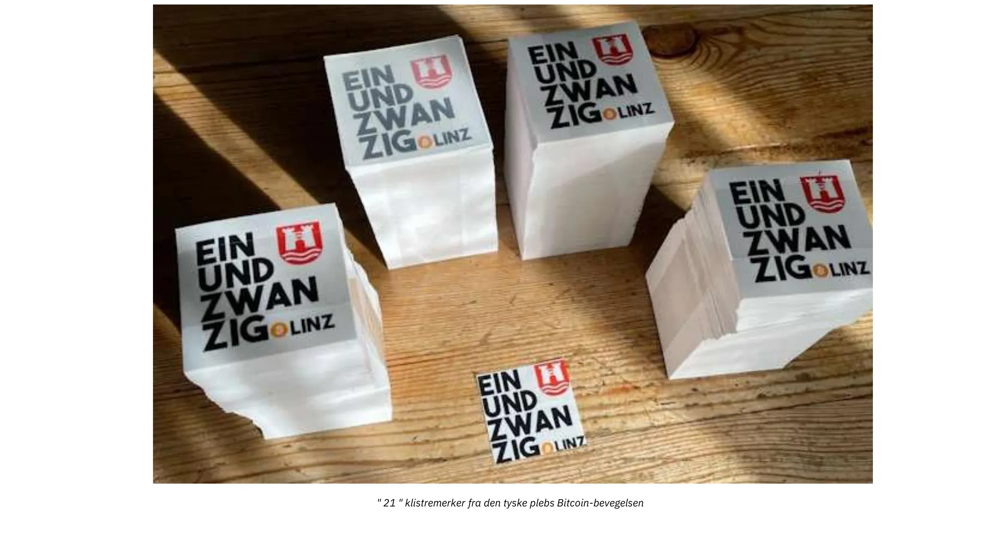

Avhengig av behov og leverandør kan 1000 klistremerker koste mellom 100€ og 250€. Du kan kontakte [@Mill3sim3 på Twitter](https://x.com/Mill3sim3), en fransk bitcoiner som spesialiserer seg på markedsføring, og som noen ganger kan sikre deg priser som er opptil 30 % lavere enn vanlige nettleverandører.

Når det er sagt, er 1000 klistremerker mye. Det er vanligvis bedre å starte med rundt 100 for å være sikker på at du kan distribuere dem alle.

Viktig! **Sjekk lokale forskrifter før du plasserer klistremerker på offentlige steder**.

I Frankrike kan klistremerker bare plasseres på offisielle offentlige oppslagstavler. Hvis du setter dem andre steder (f.eks. på et stoppskilt), vil de sannsynligvis bli fjernet og eventuelt bøtelagt hvis de kan knyttes til deg eller møtet ditt. Informer medlemmene dine om dette.

På private arenaer som konserter, barer eller stadioner bør du sjekke om det allerede finnes klistremerker før du legger til dine. Hvis ikke, kan du be de ansatte om tillatelse. Du vil ikke at bedriftseierens førsteinntrykk av lokalsamfunnet ditt skal være at du har vandalisert stedet deres.

## Opprett et bibliotek

<chapterId>acc94093-f8b3-51b8-9359-348e9e075d38</chapterId>

Et annet prosjekt du enkelt kan sette i gang, er å **opprette et bibliotek på møtene dine**.

Du kan invitere deltakere som ønsker å dele lesestoffet sitt, til å ta med en Bitcoin-relatert bok. Hvis noen andre på møtet ønsker å låne den, kan et lån avtales med eieren i Exchange mot et depositum, for eksempel 21 000 satoshis via [Lyn](https://planb.academy/resources/glossary/lightning-network).

For eieren bidrar dette depositumet til å dekke potensielt tap eller tyveri. For låntakeren er det et insentiv til å komme tilbake til et fremtidig møte for å hente depositumet.

Hvis dere driver en forening og ønsker å investere en del av midlene deres i utdanningsressurser, kan dere også kjøpe inn flere bøker som dere kan tilby i **Bitcoin-biblioteket**, som er tilgjengelig på hvert møte.

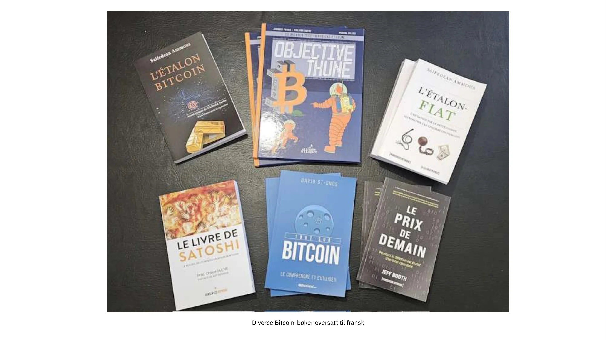

For å støtte økosystemet har **[forlaget Konsensus Network](https://konsensus.network/) tilbudt internasjonale Bitcoin-møter og -fellesskap 15 % til 35 % rabatt på alle sine bøker siden slutten av 2023, for bestillinger på tre bøker eller mer**.

For å benytte deg av denne rabatten er det bare å **kontakte [Konsensus forlag](https://twitter.com/KonsensusFR) på Twitter**.

Hvis du ikke har penger, kan du likevel gi rabatten videre til medlemmer i lokalsamfunnet.

Hvis du ikke har pengene selv, kan du likevel gi rabatten videre til medlemmene dine. En arrangør kan for eksempel samle inn bestillinger fra medlemmene, legge inn en bulkbestilling til redusert pris og dele ut bøkene på neste møte, med betaling i Lightning på det tidspunktet.

Du kan også legge ut et bokutlånsreglement på møtene dine for å forklare lånereglene tydelig for nykommere.

Her er et eksempel med åpen kildekode som du kan bruke og tilpasse:

[Charta for bokutlån](https://www.canva.com/design/DAF7u1b5kRM/r2gEAlibe_jTIXIX-O9PMA/edit)

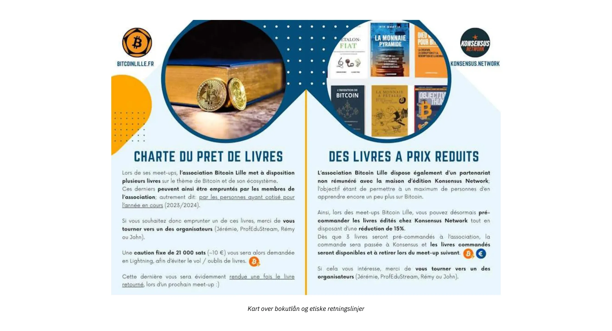

For å oppmuntre til Bitcoin-relatert lesing kan du besøke **lokale kommunale biblioteker** for å se om de har bøker om Bitcoin.

Hvis de gjør det, kan du spørre bibliotekarene om det er planlagt **rundebord** om temaet, og tilby dem kontaktinformasjonen til møtet ditt.

Hvis ikke, kan du foreslå at de skaffer seg noen bøker fra en forhåndsutvalgt liste. Forlaget Konsensus Network (https://konsensus.network/) kan være en kilde til inspirasjon.

## Lage og distribuere personlige flygeblad

<chapterId>62ad5430-c698-51b3-89ac-090f31c88953</chapterId>

Det tar tid å designe og skrive flygeblad, men det er verdt det, for de gir deg en håndgripelig ressurs å dele ut når du snakker om Bitcoin, noe som alltid blir satt pris på.

Disse flygebladene kan være målrettet mot:

- Forhandlere, hvis du ønsker å innføre Bitcoin som betalingsmetode;
- Deltakere på arrangementet, med en flyer som forklarer hvordan du bruker og betaler med Bitcoin/Lightning;
- Nybegynnere, enten de møtes på gaten, på jobben eller under en familiesammenkomst, med en brosjyre som fremhever Bitcoins viktigste fordeler.

Du kan også utforme en brosjyre som er spesifikk for ditt lokalsamfunn eller din møteplass, der du presenterer aktiviteter, mål, lenker til sosiale medier, kommunikasjonskanaler og kommende arrangementer.

Flere brosjyrer er allerede **tilgjengelige som åpen kildekode i [Bitcoin Teaching Toolbox](https://planb.academy/fr/resources/bet)** på planB.network, og flere vil bli lagt til etter hvert.

Et eksempel er en [komplett brosjyre](https://profedustream.substack.com/p/21-raisons-dutiliser-Bitcoin) med 21 grunner til å bruke Bitcoin. Utformingen er også [tilgjengelig i åpen kildekode](https://www.canva.com/design/DAFtAR1NauQ/ZDwl2CchIJ9Gpb36N6-7iw/edit?utm_content=DAFtAR1NauQ&utm_campaign=designshare&utm_medium=link2&utm_source=sharebutton), slik at du kan endre, tilpasse og dele den. Bare husk å oppgi kildene dine.

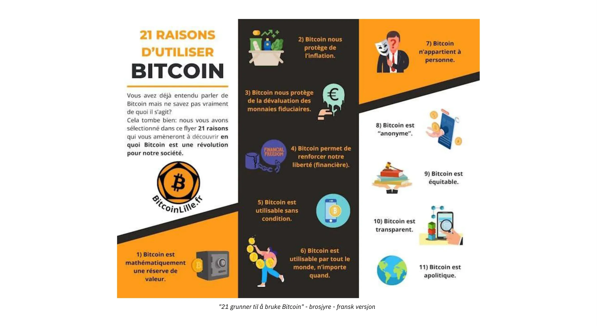

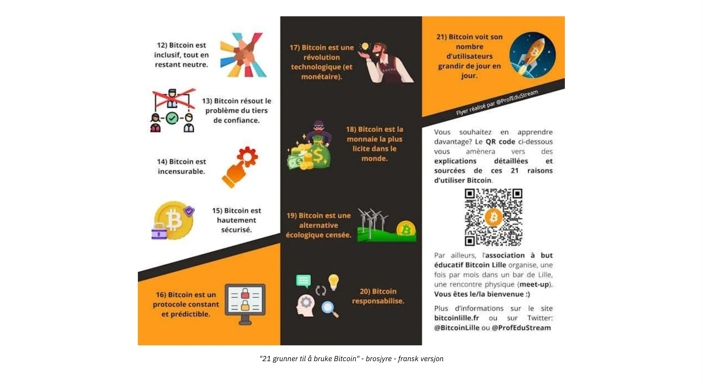

Som nevnt tidligere kan du legge igjen disse flygebladene nesten hvor som helst: på et felles skrivebord på jobben, ved middagsbordet i familien, på et bibliotek osv.

I Frankrike og noen få andre land finnes det også "bokkasser", små trekasser der folk fritt kan donere eller låne bøker. Du kan legge igjen en løpeseddel der, eller enda bedre, en bok.

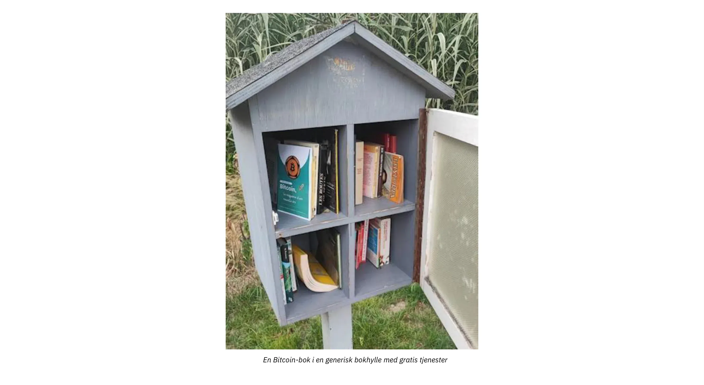

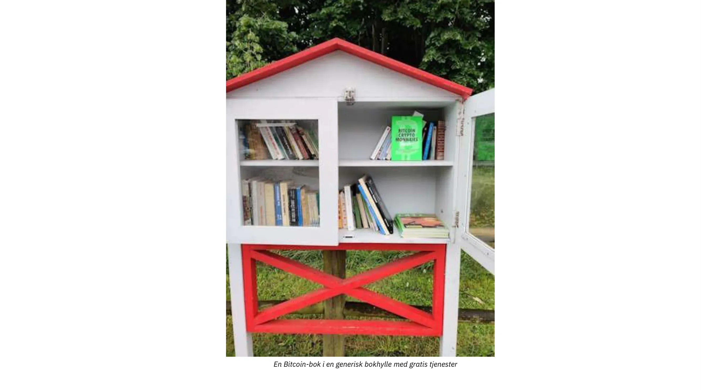

I 2023 ble initiativet **"Bitcoin Hvitbok i Frankrikes bokkasser**" lansert.

For å kunne gjennomføre dette prosjektet måtte deltakerne først samle inn den geografiske plasseringen av alle bokkasser i landet. Det finnes flere databaser for dette formålet:

- [boite.a.livres.zonelivre.fr](https://boite.a.livres.zonelivre.fr/);
- [boites-a-livres.fr](https://www.boites-a-livres.fr/carte-de-france);
- [delivrez.fr](https://delivrez.fr/maps/fr_FR/);
- pluss artikler i lokalpressen

Selv om det er symbolsk å forlate Bitcoin-hvitboken, er den ofte for kompleks til at nykommere kan forstå den. I stedet ble ideen å lage et lite hefte som inneholder:

- en lett tilgjengelig og godt kildebelagt introduksjon til Bitcoin, bruksområdene og problemene det løser;
- gW-166-hvitboken, oversatt til fransk.

Her er [heftet som deles blant franske bitcoinere](https://profedustream.substack.com/p/Bitcoin-la-naissance-dune-nouvelle), som har blitt plassert i dusinvis av bokkasser rundt om i landet. Designet er også [tilgjengelig som åpen kildekode](https://www.canva.com/design/DAFs18FSoVM/Sy0QsfUkycTgXveeGgutBg/edit?utm_content=DAFs18FSoVM&utm_campaign=designshare&utm_medium=link2&utm_source=sharebutton).

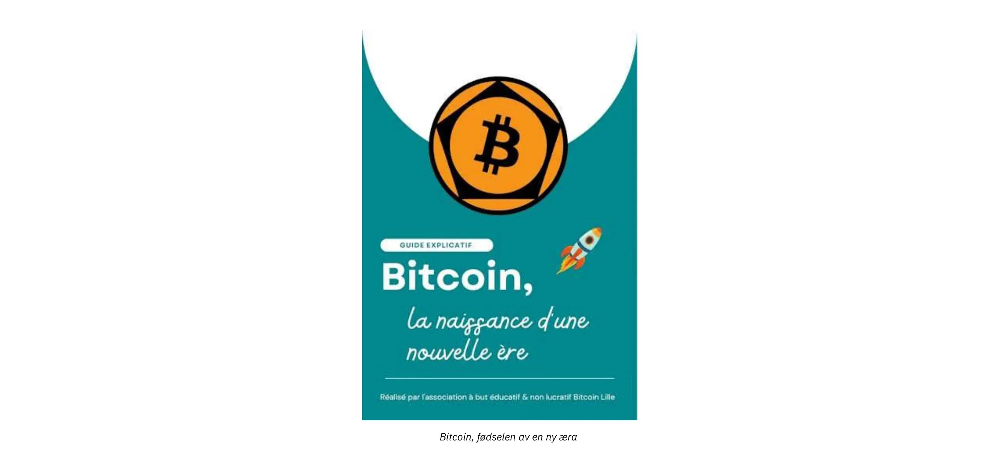

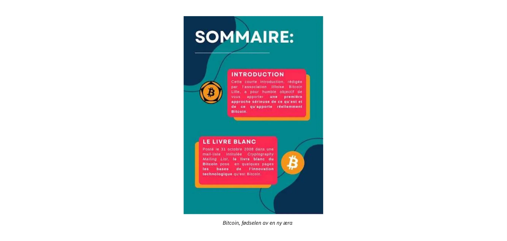

## Produsere en videoprojeksjon

<chapterId>892b248a-b837-5df6-aac9-4b3261ff0390</chapterId>

Nesten alle bitcoiner har sannsynligvis sett [Rémi Forte](https://twitter.com/forteremi) sin fascinerende midtserie "Le mystère Satoshi, aux origines du Bitcoin" (The Satoshi Mystery: The Origins of Bitcoin).

Den ble utgitt i 2021 og har blitt sett [flere millioner ganger på YouTube](https://www.youtube.com/watch?v=0ETcLj5jBy4).

En idé kan være å organisere en visning av Satoshi-mysteriet for lokalsamfunnet ditt, kanskje som et ekstra månedlig arrangement.

En liten advarsel: Selv om ARTE France har bekreftet at offentlige visninger er tillatt, må du betale for visningsrettigheter for å gjøre det lovlig. I 2023 kostet dette rundt 250 euro per visning, eller 120 euro per visning hvis minst fem meetups viste den i løpet av året.

For de fleste lokalsamfunn er denne prisen uoverkommelig, spesielt siden dokumentaren allerede er gratis tilgjengelig på ARTEs YouTube-kanal.

Det er selvsagt mulig å gjøre andre anslag.

I Frankrike har for eksempel **regissør [Alana Mediavilla](https://twitter.com/AlanaMediavilla) gitt lokale møteplasser rett til å forhåndsvise dokumentarfilmen hennes "Stranded"**, som inneholder opptak fra den kommende 2024-filmen [filmen "Dirty Coin"](https://www.dirtycointhemovie.com/).

Noen bitcoinere tok til og med initiativ til å fulloversette "Stranded" til fransk, legge til undertekster og dele den med meetups over hele landet. I løpet av uken 4. mars 2024 ble den vist samtidig på rundt et dusin meetups over hele landet.

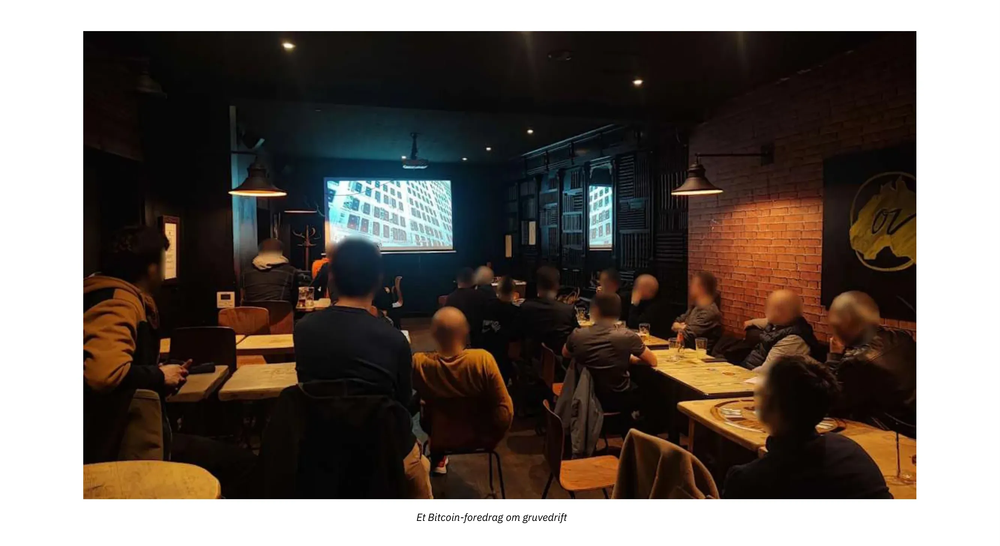

Arrangementet utløste livlige diskusjoner om Bitcoin Mining, energiforbruket og den bredere miljøpåvirkningen.

## Sette opp plakater i byen din

<chapterId>6565e8a0-d535-5be0-9764-273584c675bd</chapterId>

I flere europeiske land (blant annet Tyskland, Spania og Frankrike) har bitcoinere tatt initiativ til å henge opp plakater rundt om i byene sine.

Noen design omarbeider Banksys kunst for å inkludere Bitcoin-logoen.

Et eksempel er [StreetCyberArt](https://twitter.com/streetcyber_art), en tysk bitcoiner som har laget collager og gatekunst i flere år.

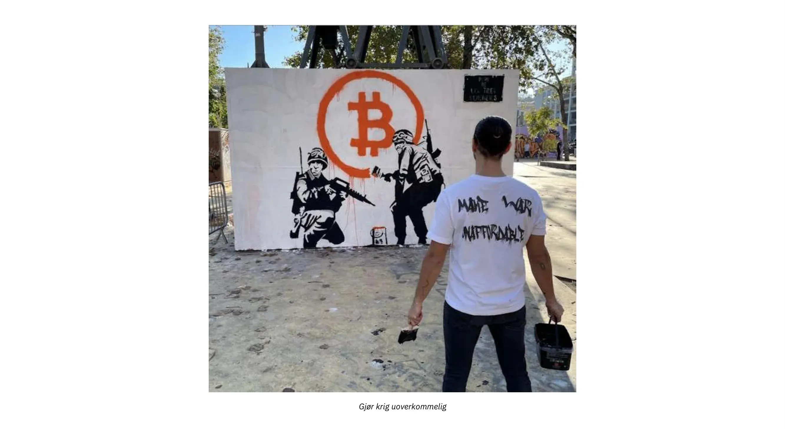

Hvis du vil begynne med gateplakatering, må du sette deg inn i landets lover. I Frankrike er det for eksempel bare tillatt å henge opp plakater på offentlige reklametavler. Andre steder er det helt forbudt og kan straffes med bøter.

Hvis du bestemmer deg for å tøye grensene og håper at du ikke blir tatt "på fersk gjerning", bør du unngå å inkludere identifiserende informasjon (for eksempel navnet på møtet eller @Twitter) på plakatene.

Vær også oppmerksom på at utskrift av disse plakatene på en personlig skriver vanligvis resulterer i blekkblødning og rask forringelse utendørs. Det beste er å samarbeide med et profesjonelt trykkeri som kan produsere plakatene på selvklebende spesialpapir beregnet for utendørs bruk, noe som sikrer både kvalitet og holdbarhet.

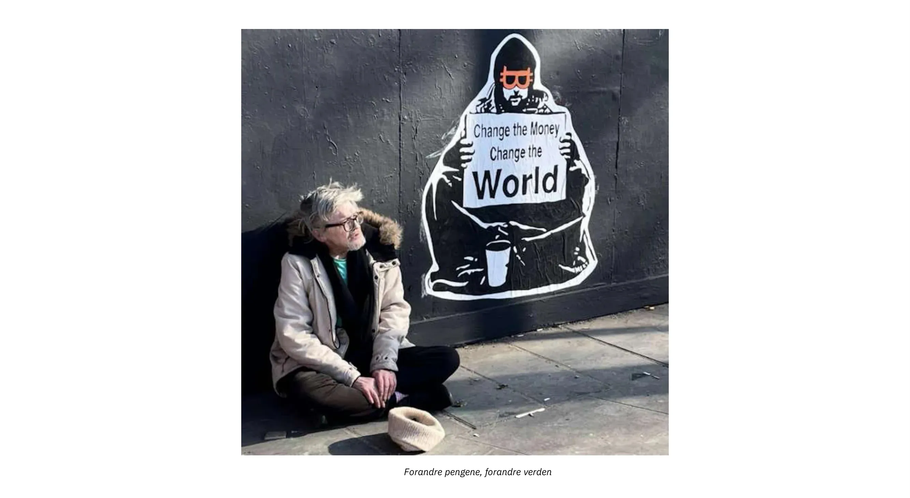

Dette initiativet kan være kostbart, over 40 euro per plakat (ca. 40 euro for hundre plakater), og prisene på nettet kan variere fra det dobbelte til det femdobbelte av dette beløpet. Gode kontakter er avgjørende.

Som nevnt ovenfor har den franske bitcoiner [@Mill3sim3](https://twitter.com/Mill3sim3) det rette profesjonelle utstyret og kan kontaktes for detaljer.

Alternativt kan du lage en sjablong av et stort stykke papp og bruke spraymaling til å tagge designet ditt på utvalgte steder i byen.

## Et personlig NFC-kort

<chapterId>8ad65d4e-a68a-59c2-a812-85f4907ed9f3</chapterId>

En annen original prosjektidé er å lage personlige NFC-kort for lynbetalinger (kompatible med BoltCard-standarden). For dette er sveitsiske Bitcoin Pay en flott partner.

(https://swiss-Bitcoin-pay.ch/cards) tilbyr for tiden fire standarddesign.

Hvis du ønsker å bestille mer enn 50 NFC-kort, kan du kontakte selskapet via deres offisielle nettside eller [Twitter](https://twitter.com/SwissBitcoinPay) for å foreslå et tilpasset design for forsiden av kortet. Baksiden vil forbli standardisert.

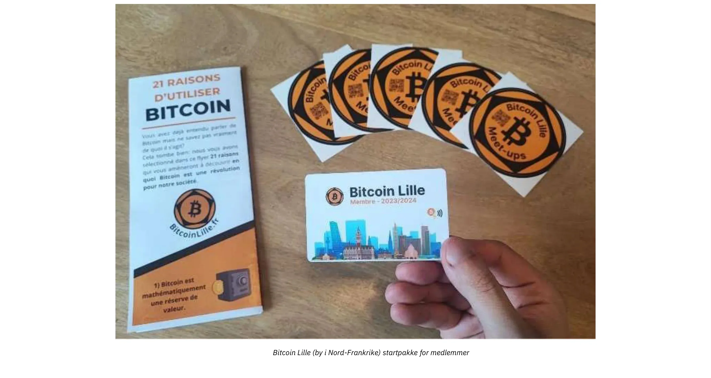

I 2023 bestilte for eksempel den franske foreningen [Bitcoin Lille](https://twitter.com/BitcoinLille) et parti NFC-kort med et tilpasset design. Alle nye medlemmer fikk et kort i velkomstpakken i løpet av året. Denne ideen kan enkelt tilpasses og tilpasses ditt eget fellesskap.

Enhetsprisen for disse kortene varierer vanligvis fra 2,50 euro til 5 euro, avhengig av ordrestørrelse og markedsforhold, med lavere priser for større mengder.

## Opprett et nettsted

<chapterId>9a2a1b9b-0633-544a-b331-c06187d23d7f</chapterId>

På et visst stadium i fellesskapets vekst kan det være verdifullt å ha et nettsted som fungerer som et utstillingsvindu for gruppen, møter, arrangementer og opplæringsinnhold.

Det tar tid å bygge et nettsted, men veiledningen nedenfor viser deg hvordan du oppretter et gratis WordPress-nettsted på bare 30 minutter. Du kan sette opp en hjemmeside som kan tilpasses, publisere artikler og legge inn media som YouTube-videoer, bilder eller PDF-filer.

Senere kan du kjøpe ditt eget domenenavn eller til og med hoste nettstedet på din egen server.

:::video id=a1b25c18-5fc1-4b97-baef-816d819c9382:::

Det finnes andre CMS-plattformer, noen med enklere og mer nybegynnervennlige grensesnitt, men de er vanligvis langt mindre tilpasningsdyktige. Derfor er WordPress generelt det beste utgangspunktet.

WordPress støtter også et bredt spekter av plugin-moduler (noen betalte, men av høy kvalitet) som kan utvide nettstedets funksjoner betydelig uten å kreve kodingsferdigheter. Et eksempel er [premium "Uncode"-temaet](https://undsgn.com/uncode/)

## Opprett en videokanal (Youtube eller Odyssee)

<chapterId>076286db-1627-57ec-a410-c44b1666e1cd</chapterId>

Noen medlemmer av fellesskapet ditt ønsker kanskje å lage multimedieinnhold, for eksempel opplæringsvideoer.

Du kan også holde presentasjoner på møter eller til og med på universiteter.

**Når den tiden kommer, vil en dedikert videokanal gi deg mulighet til å publisere og samle alt innholdet ditt på ett sted**

Populære plattformer inkluderer:

- [**YouTube**](https://www.youtube.com/), mye brukt, men ikke sensurresistent.
- [**Odyssee**](https://odysee.com/), mindre populær, men desentralisert gjennom peer-to-peer-teknologi.
- [**peertube**](https://joinpeertube.org/fr_FR), lar deg være vert for din egen videoplattform, selv om den er mer kompleks å sette opp.

Uansett hva du velger, må du designe plattformspesifikke bilder for å gjøre kanalen din tiltalende. Canva, som ble nevnt i [del 2/8](https://planb.academy/courses/1c643dc9-a15f-4f9e-93b6-cb3c58b4ee35/3470a31f-0190-5e87-8af0-6a00e79267ef), tilbyr en "YouTube Thumbnail"-kategori med ferdiglagde, tilpassbare design.

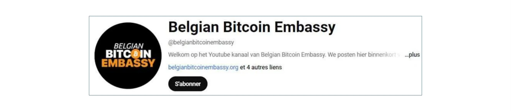

For **opptak** fra datamaskinen din er [Streamlabs](https://streamlabs.com/fr-fr) gratis, funksjonsrikt og støtter sceneoverganger.

For **videoredigering** er [Wondershare Filmora](https://filmora.wondershare.fr/) (ca. 45 €/år) enkelt å bruke og gir raskt profesjonelle resultater.

Du kan enkelt finne passende maler for introen og outroen til **videoen** på Canva. Tilpass designet etter din smak, last det ned og legg det til i redigeringsprogrammet ditt.

Tips: Hvis Bitcoin noen gang blir forbudt eller sensurert, bør du alltid ta en lokal sikkerhetskopi av videoene dine på en Hard-stasjon.

## Opprett en lydpodkast

<chapterId>12e96b45-1c33-5687-a753-80d0114d487a</chapterId>

En lydpodkast er en annen flott måte å dele ideer på. I likhet med videokanaler tar det tid å bygge opp et publikum.

Populære podkastplattformer inkluderer:

- [**Fountain**](https://www.fountain.fm/), støtter Lightning-donasjoner.
- [**Soundcloud**](https://soundcloud.com/);
- [**Deezer**](https://www.deezer.com/fr/);
- [**Spotify**](https://open.spotify.com/);
- [**Google podcast**](https://podcasts.google.com/).

Hver plattform har sitt eget publikum, så ved å være til stede på flere plattformer vil du nå bredere ut. **[Spotify for podcastere](https://podcasters.spotify.com/) gjør dette enkelt ved å la deg laste opp podcasten din én gang og generate en RSS-feed for andre plattformer**.

Så når arbeidet med "Spotify for Podcasters" er gjort, gjenstår det bare å formatere innholdet for de andre plattformene, en prosess som går relativt raskt.

[Audacity](https://www.audacityteam.org/) er gratis og lar deg justere lydnivåer, legge til effekter som fades og forbedre klarheten under redigering. Det er enkelt å spille inn stemmen din og lage en podkast av profesjonell kvalitet.

Her er en kort 10-minutters veiledning som tar for seg det viktigste for å lage podkast med Audacity:

:::video id=67d80ac7-253f-40a5-b621-fef2fb7174bd:::

Tips: Akkurat som med videoer, bør du ta en lokal sikkerhetskopi av alle podcaster i tilfelle fremtidig sensur.

## Opprett et merke for arrangementene dine

<chapterId>0cccef8d-a765-5844-8921-c40f0ce653e4</chapterId>

På møter og arrangementer kan du introdusere et lite insentiv: arrangementsmerker. Ideen er å **opprette et merke som bare kan fås på det spesifikke arrangementet**. Dette konseptet finnes på andre blokkjeder under navnet "POAP" ("Proof Of Attendance Protocol"). Det finnes imidlertid for øyeblikket ingen gratis måte å implementere dette på Bitcoin.

Et slikt system kan også brukes til å belønne de mest aktive medlemmene i fellesskapet. Du kan for eksempel arrangere en årlig utlodning der hvert innsamlede badge tilsvarer ett lodd. Et medlem som deltar på alle de 12 møtene i løpet av et år, vil ha 12 lodd til utlodningen.

En annen, mer tradisjonell tilnærming er å be deltakerne på hvert arrangement om å skrive fornavnet eller kallenavnet sitt på et skilt, sammen med grunnen til at de er til stede.

Selv om det er litt formelt, kan dette bidra til at medlemmene lettere finner felles interesser og samtaleemner, og det gjør det også lettere for nykommere å få øye på arrangørene (eller de offisielle medlemmene av fellesskapet/foreningen).

Flere av merkemalene som brukes av foreningen Bitcoin Lille er [tilgjengelig i åpen kildekode på Canva](https://www.canva.com/design/DAGHAsT15MU/AIA7-L_xBjNdsuxdD4-h-Q/edit?utm_content=DAGHAsT15MU&utm_campaign=designshare&utm_medium=link2&utm_source=sharebutton).

## Planlegging av overlevering ved dødsfall

<chapterId>c5febf18-235c-51bc-8fbb-9467dabe4cb0</chapterId>

La oss ta opp et helt annet Address ømtålig tema: bortgangen til et medlem av ditt Bitcoin samfunn.

En dag blir du kanskje kontaktet av familien til et tidligere medlem som informerer deg om dødsfallet. De forklarer kanskje at den avdøde har etterlatt seg instruksjoner, blant annet om å ta kontakt med lokalsamfunnet, møteplassen eller foreningen din.

I noen tilfeller kan familien også søke om hjelp til å få tilbake midler som arvinger.

Det er lurt å samarbeide med lokalsamfunnet for å etablere en klar prosedyre for slike situasjoner på forhånd, slik at man sikrer at

- Den avdøde har allerede gitt råd til familien om **aldri å dele private nøkler eller ta med fysiske lommebøker til et møte**.
- Familien forstår at formålet med besøket er pedagogisk: å lære hvordan Bitcoin fungerer, slik at de senere kan ta suveren kontroll over midlene.
- Familien er klar over de relevante lovene i landet der de bor når det gjelder gaver, arv og konvertering av Bitcoin til fiat.

En standard protokoll forhindrer også at noen, medlemmer eller gjester, utnytter situasjonen til å stjele penger.

Dere kan danne en egen arbeidsgruppe for å definere denne prosessen. Foreningen Bitcoin Lille jobber allerede med et slikt [dokument](https://docs.google.com/document/d/1TDfLZjuictC5s3PEM2Z7WmkxIDSJ8Q1E4xevm52pVgU/edit?usp=sharing), som de planlegger å publisere som åpen kildekode i løpet av de kommende månedene.

## Holder foredrag på skoler og universiteter

<chapterId>65efdb44-e3d4-567c-aedf-972765753d73</chapterId>

Listen over prosjekter som er beskrevet ovenfor, er selvsagt ikke uttømmende. Generelt er det mer sannsynlig at det dreier seg om interne prosjekter for lokalsamfunnet eller meetups, som ganske enkelt kan implementeres etter hvert som de utvikler seg.

La oss nå gå over til onboarding.

Som du vet, er en av de beste måtene **å nå ut til et stort publikum på en gang å holde et gratis foredrag**. Dette kan gjøres på høyskoler og universiteter, og introdusere både unge mennesker (og de som ikke er så unge) til Bitcoin, enten de er helt nye eller ønsker å utdype sin forståelse.

Å holde en forelesning for flere titalls eller hundrevis av mennesker krever mer enn bare teknisk ekspertise. Du vil trenge det:

- Selvtillit i offentlige taler
- God stressmestring
- Tydelig artikulasjon
- God tidsstyring
- En velresearchet presentasjon eller workshop av høy kvalitet, skreddersydd til publikums ferdighetsnivå

Like viktig er det å **ha et åpent sinn og vite når man skal forenkle konsepter**, spesielt under spørsmål og svar eller en paneldiskusjon. Det handler ikke om å gi avkall på prinsippene dine, men bare om å anerkjenne at andre kan se ting annerledes. Noen ganger er det best å svare senere eller la det ligge, slik at diskusjonen kan gå videre. Hvis poengene dine er underbygget av solide, velbegrunnede argumenter, vil folk skjønne det.

Hvis du føler deg klar, så gjør det! Verden trenger desperat bedre opplæring om Bitcoin.

Når det er sagt, er ikke dette noen lett oppgave: Det krever motivasjon, innsats og de rette kontaktene.

Å organisere et foredrag eller en workshop på en skole eller et universitet starter med å finne den rette kontakten. Det kan for eksempel være

- En personlig bekjent
- En studentforening
- En studentforening som arrangerer forelesningsserier eller arrangementer
- Tidligere professorer fra ingeniørhøyskolen eller universitetet ditt
- Den akademiske programkoordinatoren, hvis du tar direkte kontakt

Det første steget er vanligvis å presentere initiativet eller foreningen og be om et møte. I beste fall fører dette til en presentasjon på Bitcoin foran studentene noen uker senere.

Dessverre blir Bitcoin fortsatt demonisert av store deler av media og mange politikere, noe som får noen til å mene at det ikke har noen plass i klasserommene. Avvisninger er vanlige, spesielt i akademiske kretser der temaer som Proof of Work og energiforbruk fortsatt er kontroversielle.

Det er likevel verdt å prøve, spesielt med studentforeninger og -organisasjoner. Og hvem vet? Selv om du får et "nei" i første forsøk, kan det jo hende at du finner en e-post i innboksen din under neste bull run, der du blir invitert til å snakke med for eksempel 280 studenter!

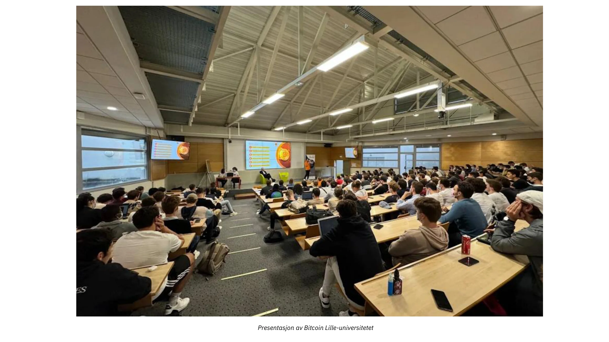

## Henvendelse til bedrifter

<chapterId>b730462b-7928-5d28-a14f-9ceaa773d3d2</chapterId>

For mange bitcoinere er det å få en bedrift til å akseptere Bitcoin litt som å låse opp en sjelden prestasjon i Pokédex.

Alle selgere er forskjellige, og det å ta dem i bruk har sine egne utfordringer:

- De trenger fortsatt fiat-valuta for å betale leverandører.
- De krever tydelige, regnskapsklare finansielle rapporter.
- Betalingssystemene må være pålitelige, enkle å bruke og tyverisikre.
- De kan ha misoppfatninger eller negative fordommer om Bitcoin.
- Det kan være vanskelig å finne en feilfri programvareløsning.
- Få forhandleren til å forstå hvorfor det er verdt å akseptere Bitcoin som betaling.

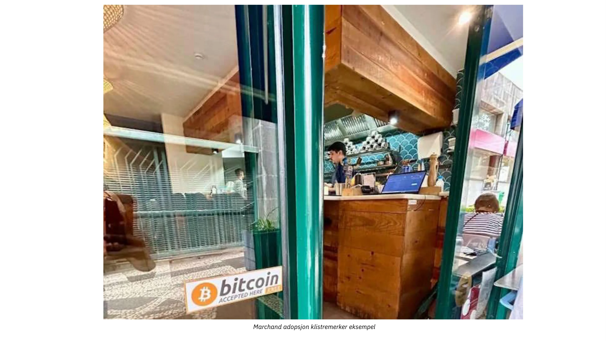

Å få med lokale bedrifter er en av de beste måtene å utvide byens Bitcoin-økosystem på. Nøkkelen er å gå frem trinn for trinn:

1/ **Beg om å få betale med Bitcoin hver gang du handler**

Som oftest vil du få et "nei" og kanskje et forundret, eller til og med litt fordømmende, blikk, men bare det å spørre planter ideen om at Bitcoin er noe "vanlige folk" kan bruke, og at det blir mer og mer populært som betalingsmåte. Du kan til og med slå deg sammen med et par venner og stikke innom samme butikk på forskjellige dager, og hver gang be om å få betale med Bitcoin. Før eller senere vil det vekke eierens nysgjerrighet.

2/ **Gi en enkel og tydelig forklaring**

Hvis de spør hva Bitcoin er, må du holde det kort og uten sjargong. For eksempel

*"Bitcoin er penger som ikke kontrolleres av banker, som fungerer uten mellomledd, som ikke kan sensureres, som ikke er utsatt for inflasjon og som har lavere gebyrer enn tradisjonell bankvirksomhet."*

Gi dem deretter en brosjyre, for eksempel "21 grunner til å bruke Bitcoin" eller "10 grunner til å akseptere Bitcoin i din virksomhet", med kontaktinformasjonen din eller møteinformasjonen din. På denne måten vet de hvor de kan finne deg når de er klare for en demo.

3/ **Arranger en demonstrasjon**

Når de uttrykker interesse, avtaler du et tidspunkt for å vise dem en betalingsløsning.

Et godt alternativ er **[Swiss Bitcoin Pay](https://swiss-Bitcoin-pay.ch/)**, fordi det:

    - Gjør det mulig for selgere å automatisk konvertere BTC til fiat hver dag, slik at de kan betale leverandører.
    - Tillater dem å beholde en prosentandel i BTC hvis de ønsker det.
    - Genererer eksporterbare regnskapsrapporter for regnskapsførerne deres.
    - Har et enkelt dashbord for ledere.
    - Gir de ansatte en intuitiv Interface for å ta imot betalinger uten å berøre kassen.
    - Koster mindre enn de 2-3 % gebyrene som kreves av tradisjonelle betalingsnettverk.

4/ **Støtt dem når de begynner å ta imot Bitcoin**

Etter at de er om bord:

    - Besøk oss regelmessig og gjør innkjøp.
    - Ta en titt for å se om alt går som det skal.
    - Del kontaktinformasjonen din på nytt ved behov.
    - Inviter dem til møtene dine.
    - Legg dem til på [btcmap.org-kartet](https://btcmap.org/) og gi beskjed til [Swiss Bitcoin Pay](https://x.com/swissbitcoinpay) på Twitter for å øke synligheten.
    - Vurder å arrangere workshops eller møter på stedet deres.

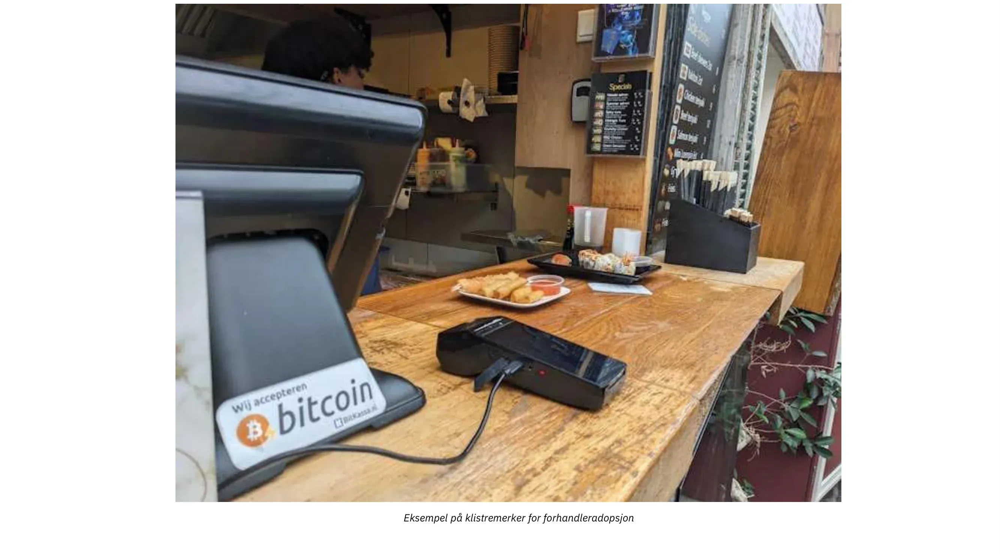

5/ **Koble til lokale kjøpmenn**

Når du har noen Bitcoin-vennlige bedrifter, kan du foreslå å opprette en Telegram-gruppe kun for selgere. Dette kan:

- La dem dele erfaringer og ta med seg nye virksomheter.
- Fungerer som en rask kanal for teknisk støtte.
- Styrke det lokale Bitcoin-nettverket.

Canvassing er et langsiktig arbeid. Det krever tålmodighet, utholdenhet og strategi. Men hvis lokalsamfunnet ditt er klart, kan du begynne å legge grunnlaget for en ekte Bitcoin-sirkulær økonomi, akkurat som [Arnhem i Nederland](https://www.arnhembitcoinstad.nl/) i Nederland.

## Kontakt lokal presse og radio

<chapterId>435bfbc1-22dd-59bb-b737-a32ea995b238</chapterId>

Bitcoinere fokuserer ofte på sosiale medier og nettbaserte plattformer for å nå ut, men det er bare en del av bildet. Lokal presse og radio kan være mektige allierte.

Noen lokalsamfunn, som [Breizh Bitcoin](https://breizhbitcoin.com/) i Frankrike, **kontakter jevnlig sine lokale medier** for å

- Kunngjør kommende arrangementer (møter, presentasjoner, workshops, Halving-fester osv.).
- Inviter journalister til å besøke Bitcoin-vennlige bedrifter og skrive om dem.
- Del datoer og steder for arrangementer slik at de kan inkluderes i lokale oppføringer.

Mange aviser har fortsatt en "Hva skjer"-seksjon, ofte gjemt bort på de siste sidene, der de lister opp kommende lokale arrangementer. Breizh Bitcoin har erfart at denne tilnærmingen fungerer: Nykommere har dukket opp på møter bare fordi de har sett oppføringen i avisen.

Denne strategien kan fungere bedre i visse områder enn i andre, men det er verdt å prøve. Du kan begynne med å kontakte regionale nyhetsbyråer, som for eksempel Frankrike:

- [acpm.fr](https://www.acpm.fr/Les-chiffres/Diffusion-Presse/Presse-Payante/Presse-Quotidienne-Regionale);
- [voxpublic.org](https://www.voxpublic.org/spip.php?page=annuaire&cat=medias&type_media=Presse%20quotidienne%20r%C3%A9gionale).

og ved å kontakte lokale radiostasjoner for å foreslå et intervju eller en podcastopptreden.

Vær oppmerksom på at medieintervjuer kan være vanskelige. Ord kan bli tatt ut av sin sammenheng eller fremstilt feil. Forberedelse er avgjørende.

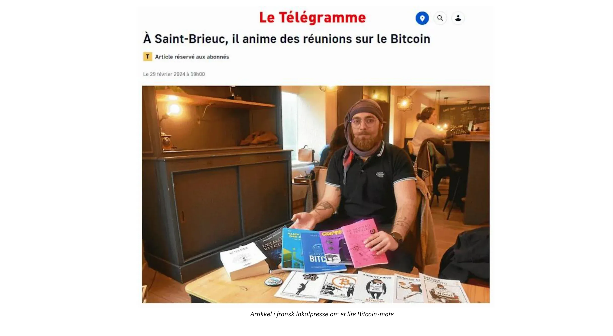

I tillegg til alle de som er foreslått i dette avsnittet, kan **mange andre prosjekter gjennomføres**. Alt avhenger av tid og motivasjon, men også av vanskelighetsgraden på det aktuelle prosjektet.

Siste tips for ethvert oppsøkende prosjekt:

1) **Planlegg fremover**: Definer målene dine, hvilke trinn som trengs, og hvem som skal gjøre hva.

2) **Gjør det steg for steg**: Unngå utbrenthet ved å ta det med ro.

3) **Be om hjelp**: Be om støtte fra medlemmene dine og nabokommunene.

Husk: Alle Bitcoin-fellesskapene har vært der du er nå. Ikke nøl med å lære av deres erfaringer og råd.

# Forutse fremtiden

<partId>6ea07445-9369-54bc-9aa0-d260db026e0b</partId>

## Planlegging for en økning i antall deltakere

<chapterId>8af722d4-3a9f-548c-9001-424f2142de12</chapterId>

Da Bitcoin gikk inn i sin fjerde epoke ved blokk 840 000, begynte flere og flere å anerkjenne den som en teknologisk, økonomisk og sosial revolusjon.

I likhet med fremveksten av internett vil denne revolusjonen ta tid, noe som faktisk er en fordel. Det gir folk sjansen til å **lære seg Bitcoins grunnleggende prinsipper**, forstå hvordan man bruker det, og det gir utviklere og selskaper muligheten til å **bygge protokollene og applikasjonene** som vil frigjøre det fulle potensialet.

Ingen kan spå om fremtiden, men vi kan **forvente en kraftig økning i bruken av Bitcoin**. Det betyr at vi må være klare for alle scenarier, selv de mest ekstreme, som for eksempel en kollaps i det tradisjonelle finanssystemet eller et direkte forbud mot Bitcoin.

I denne syvende og nest siste delen av kurset tar vi for oss viktige punkter du bør huske på når fellesskapet og møteplassene dine vokser.

Den første, og enkleste å forutse, er en økning i antall personer som blir med i fellesskapet. Dette vil påvirke dere på to måter:

1/ **Kommunikasjonskanalene dine (Telegram, Signal, Matrix osv.) vil etter hvert bli overfylte**, noe som gjør det vanskeligere å henge med i samtalene. Det er to ting du må huske på.

For det første, hvis du har 500 personer som diskuterer alle slags emner i én enkelt chat, vil mengden av meldinger og varsler uunngåelig føre til at mange medlemmer melder seg ut. Da er det på tide å tenke nytt, for eksempel ved å gå over til Telegram-supergrupper eller en Discord-server, som begge gjør det enkelt å organisere diskusjoner etter tema.

For det andre betyr flere mennesker i kanalene dine flere roboter, mer svindel og dermed mer moderering å håndtere. Vær forberedt på dette ved å lage et tydelig sett med regler som du kan henvise til når du modererer meldinger. Vår erfaring viser at dette i stor grad bidrar til å unngå konflikter, spesielt hvis reglene er lett tilgjengelige i kanalene dine.

Et godt eksempel er **[Bitcoin Lille's open-source rulebook](https://bitcoinlille.fr/reglement/)** som ble skrevet for noen år siden for deres Telegram-gruppe og Discord-server. Den er basert på enkle, universelle prinsipper, og du kan til og med få tak i [en tilpassbar versjon av designet her](https://www.canva.com/design/DAGHI692AD4/rjT4sqEnhajc5FiPA6GFZQ/edit?utm_content=DAGHI692AD4&utm_campaign=designshare&utm_medium=link2&utm_source=sharebutton).

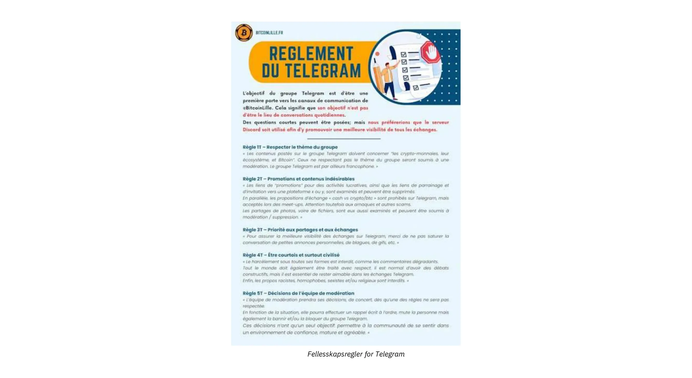

2/ **Møtene og arrangementene dine vil begynne å trekke store folkemengder, med mange nye ansikter som dukker opp for å komme i kontakt**.

Med denne økningen i oppmøtet

    - det kan være verdt å **finne et større lokale for møter og arrangementer**, spesielt hvis dere tidligere bare har hatt plass til rundt tjue personer.
    - hvis du opplever at antallet deltakere blir overveldende, kan du for fremtidige møter enten **kreve at deltakerne registrerer seg** (via Meetup-appen eller et enkelt skjema) eller **avholde flere møter hver måned** (for eksempel et møte for nybegynnere, et for viderekomne og et for viderekomne).
    - Samtidig kan du forvente mange nykommere i økosystemet, ofte med hovedmål om å tjene penger. For å **holde samtalene fokusert på Bitcoin** i disse raskt voksende møtene, er det en god idé å:

a) Inkluder en **Bitcoin-tema-presentasjon** under disse arrangementene, da dette naturlig vil styre mye av samtalen mot dette temaet (og bort fra det siste angivelig "revolusjonerende" [shitcoin-prosjektet](https://planb.academy/resources/glossary/shitcoin));

b) **Unngå å holde deg til andre bitcoinere**. I stedet bør du **gå til nykommere**, selv om det betyr at du må henge bakerst i lokalet for å hilse på dem. Derfra kan du snakke om hvorfor de kom, hva de er ute etter, målene (eller til og med kjerneprinsippene) for fellesskapet ditt, og så videre.

Til slutt, selv om det er uheldig å måtte si det, kan svindlere dukke opp på meetups. Målet deres kan være å snakke i det uendelige om pyramidespill, MLM eller en "Blockchain-revolusjon drevet av AI" Det er også fullt mulig at noen med dårlige intensjoner en dag kan delta spesielt for å hvitvaske penger eller prøve å kjøpe BTC med falske sedler.

I slike vanskelige situasjoner er det enklest å forklare høflig at møtet ikke er det rette stedet for det, og underbygge det med de argumentene du måtte ønske (for eksempel at det kan være sivilkledd politi til stede).

Hvis de dessverre nekter å forlate eller oppføre seg respektfullt (ja, det har skjedd), kan du Address gruppen direkte under møtet for å fortelle alle at en person, eller personer, forsøker seg på en eller annen form for ondsinnet aktivitet.

Heldigvis er slike situasjoner sjeldne og ofte mer absurde enn truende, men det er likevel best å være forberedt.

For din egen sjelefred: Så lenge du ikke personlig bryter loven eller direkte legger til rette for ulovlige transaksjoner, er du ikke juridisk ansvarlig for andres handlinger på arrangementet ditt (i hvert fall ikke i henhold til fransk lov).

I en ideell verden ville du hatt et **rom stort nok til å huse flere titalls mennesker** etter hvert som samfunnet vokser, og du ville også bygget **sterke relasjoner mellom bitcoinere** og fremtidige bitcoinere i [nedgangstider](https://planb.academy/resources/glossary/bear-market), slik at når [oppgangen](https://planb.academy/resources/glossary/bull-market) kommer, har du så mange som mulig klare til å gi andre oransje piller.

## Desentralisering av samfunnsorganisasjonen

<chapterId>bedfc110-e099-58f4-a5b7-fb50f3b19a49</chapterId>

Tenk deg dette: Du har drevet Bitcoin-møtet i årevis, og en dag bestemmer du deg for å slutte i jobben, kanskje for å oppdra lamaer i Peru eller jakte på perfekte bølger i El Salvador. Hva skjer med fellesskapet ditt når du drar?

Vennligst planlegg overføringen av samfunnet ditt i god tid:

1) **Gi betrodde medlemmer administratorrettigheter (eller Ownership)** for kommunikasjonskanalene dine. Rollene kan alltid skifte hender senere.

2) **Del kontoopplysninger** (brukernavn, passord, tilhørende e-post) for sosiale medier og synlighetskanaler med minst én person du stoler på.

Uten denne tilgangen er det nesten umulig for andre å ta over på en effektiv måte. Å starte fra bunnen av, ved å opprette "forgrenede" grupper og bygge opp nettverket på nytt, er tidkrevende, utmattende og ofte demoraliserende.

Hvis du ikke har en betrodd kontaktperson i møtegruppen din, kan du alltid ta kontakt med @ProfEduStream, @copinmalin eller @gabtribe på Telegram. De kan hjelpe deg med å finne en motivert etterfølger og koordinere overføringen av kontoer og administratorrettigheter.

**Hvorfor desentralisering er viktig?**

Hvis du er den eneste som er involvert og har all kontroll, hva skjer da hvis du forsvinner? Svaret er enkelt: Da forsvinner også fellesskapet ditt.

Løsningen: desentraliser oppgaver, roller og tilganger slik at gruppen kan fortsette å fungere selv om en av arrangørene faller fra, enten det er på grunn av tidsbegrensninger eller, i et mørkere scenario, fordi de blir arrestert for å inneha Bitcoin som ikke er godkjent av myndighetene.

**Hvordan fremme desentralisering ytterligere?**

Ta i bruk **gratis programvare med åpen kildekode**, for eksempel [framasoft-pakken](https://framasoft.org/fr/), for å redusere avhengigheten av sentraliserte plattformer og øke motstandsdyktigheten mot potensiell statlig sensur eller Bitcoin-forbud.

Bruk **krypterte eller anonyme kommunikasjonsverktøy** for å beskytte medlemmenes personvern og fellesskapets aktiviteter.

## Hva om Bitcoin ble samfunnsfiende nr. 1?

<chapterId>c739651f-cd13-51e0-a36e-85023749b15b</chapterId>

Den 5. april 1933 undertegnet Franklin Roosevelt, USAs 32. president, **Executive Order 6102**, som gjorde det ulovlig for privatpersoner å eie gullmynter, gullbarrer eller gullsertifikater hvor som helst i landet.

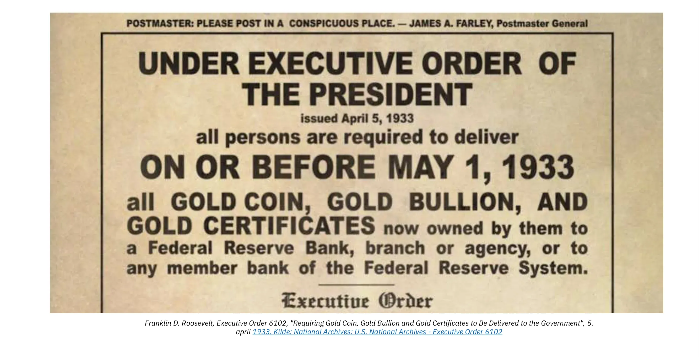

Den store depresjonen (børskrakket i 1929) er selvfølgelig ikke vår nåværende virkelighet. Men kan en regjering en dag gjøre det samme med Bitcoin? **forby private Ownership helt og holdent?**

Sannheten er at et slikt orwellsk tiltak faktisk ikke ville hindre noen i å eie BTC, fordi ingen lov kan hindre en person i å memorere en sekvens av ord.

Men hva om verdens ledere endelig innså Bitcoins potensial til å omforme den globale ordenen, selv på statlig nivå? Ville det da bli stemplet som "samfunnsfiende nr. 1"?

Vi trenger ikke å falle inn i konspirasjonstenkning. Men det er ingenting som hindrer oss i å forutse, desentralisere og utdanne, med start nå.

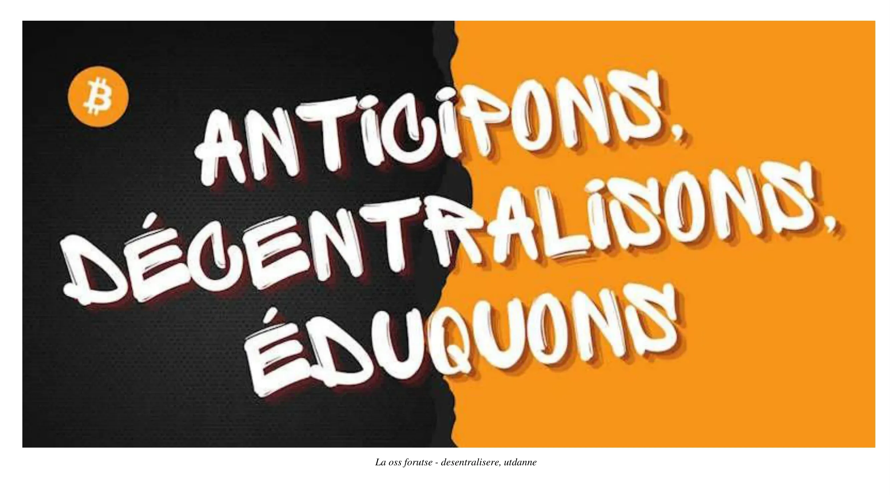

# Bringer bitcoinere sammen

<partId>62bc2138-c0be-5d39-a341-594690863257</partId>

## En rask handlingsplan for å bygge Bitcoin-fellesskapet ditt

<chapterId>1f463ec2-3f64-5641-8d60-e02a47c94f27</chapterId>

Satoshi Nakamoto skapte et revolusjonerende verktøy som allerede er i ferd med å forandre verden. Men det er opp til oss, bitcoin-brukerne, å bestemme hvordan vi skal forme fremtiden.

Bitcoin er et stort kaninhull som berører historie, økonomi, litteratur, matematikk, informatikk og kryptografi. Ingen kan utforske alt, og det er noe av det som er så fint med den.

Siden tiden vår er begrenset, er nøkkelen å være ydmyk, fortsette å lære og dele Exchange-kunnskap med andre. På den måten kan hver og en av oss nå det nivået av forståelse vi søker.

**Globale Bitcoin-fellesskap spiller derfor en grunnleggende rolle i byggingen av morgendagens verden**: rom der bitcoinere kan **Exchange, bygge og dele**. **Sammen**.

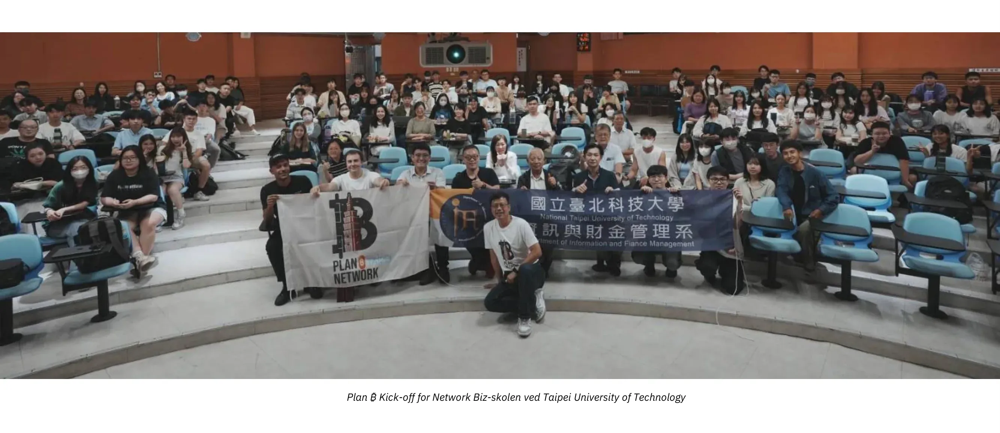

Som du har sett gjennom dette kurset, krever det både planlegging og motivasjon å **bygge et Bitcoin-fellesskap og organisere møter**. Avhengig av målene dine og tiden du har til rådighet, kan du ta fatt på mer ambisiøse prosjekter eller holde det enkelt.

Uansett er målet det samme: **Å vekke interesse og bidra til at Bitcoin vokser i byen din**.

For å oppsummere de mange kapitlene og underkapitlene vi har gjennomgått, følger her en **konkret "handlingsplan"** for hvordan du kan skape ditt eget Bitcoin-fellesskap:

1) Bestem deg på forhånd for hvorfor du vil opprette et Bitcoin-fellesskap, hvilke mål du har, og i hvilken by eller på hvilket sted du vil drive virksomhet.

2) Ta kontakt med eksisterende miljøer i nærheten, og ikke nøl med å spørre dem om råd når du trenger det;

3) Skap en tydelig identitet for lokalsamfunnet som gjenspeiler lokalsamfunnet og stedet (logo, plakat, banner, flyer osv.)

4) Opprett kommunikasjonskanaler og sosiale nettverk som Telegram, Twitter, NOSTR, Discord eller Simplex. Vurder også desentraliserte og/eller sensurresistente kanaler.

5) Følg med på andre lokale møter og fellesskap på nettet, og få gruppen din oppført på ulike kart og plattformer for å øke synligheten.

Når fellesskapets kommunikasjonskanaler er aktive:

6) Start en spørreundersøkelse for å foreslå det første møtet når du føler at interessen er stor nok.

7) Definer målene du ønsker å oppnå med dette personlige arrangementet.

8) Velg et innbydende lokale med god beliggenhet som er i tråd med målene dine, og reserver et bord eller et rom.

9) Markedsfør arrangementet i kanalene dine en uke før, og deretter igjen to til tre dager før datoen.

10) Legg ut arrangementet ditt på relevante nettsteder og plattformer.

11) La arrangementet flyte naturlig på dagen, og engasjer deg i deltakerne ved å styre diskusjonen forsiktig hvis det trengs.

Etterpå:

12) Fokuser på å beholde og involvere deltakerne slik at de kommer tilbake.

13) Foreslå enkle prosjekter eller initiativer, og sett i gang dem du personlig bryr deg om. Hvis noen andre ønsker å lede et annet prosjekt, kan du støtte dem der du kan.

Endelig:

14) Forutse fremtiden ved å tenke på et større møtested, regler for kommunikasjonskanaler, en nettside osv;

15) Oppfordre lokale forretninger til å ta imot Bitcoin, selv om du bare spør hver gang du handler der.

16) Deleger oppgaver og kanal/nettverksadministratorrettigheter til betrodde medlemmer.

17) Markedsfør fellesskapet bredt, slik at flere blir med, og involver dem som viser interesse.

18) Gå enda lenger med prosjekter som du liker og som er viktige for deg.

For en raskere oversikt, kan du se denne 21 minutter lange videoen som oppsummerer disse trinnene:

:::video id=a59956da-f554-4b54-89dd-5ca55b722686:::

Husk at du ikke er alene: **du er ikke alene, det finnes miljøer som kan støtte deg**.

## Ta vare på deg selv

<chapterId>cf1631cb-ddbe-55c7-be8c-26a5652979a0</chapterId>

Når du faller ned i Bitcoin-kaninhullet, endrer perspektivet ditt på livet seg.

Innerst inne føler du en dragning til å gå videre, til å møte andre som går gjennom den samme mentale reisen.

Denne energien driver deg til å bidra med din bit til puslespillet ved å dele oppdagelsen din: Bitcoin. Det inspirerer deg også til å tenke på morgendagens verden, den du ønsker å bidra til å bygge, og de lokalsamfunnene som jobber mot den.

Å bygge et fellesskap er en lang tunnel som krever motivasjon, strategi, engasjement og tid. Det kan være en utakknemlig oppgave, så det er viktig å ta ting steg for steg for å unngå å bli utbrent.

**Tenk på deg selv, på dine grenser**. Og selv om Bitcoin kan drive deg dag og natt, **forsøk ikke å gjøre alt alene, for da brenner du deg ut**.

I stedet bør du **søke hjelp fra bitcoinere som allerede har gått i den samme tunnelen, utforsket de samme stiene og bygget de samme verktøyene**. Det vil spare deg for mye tid.

**Inviter de som følger deg i dette eventyret til å hjelpe til**, selv om det å delegere gjør at enkelte oppgaver tar lengre tid. I det lange løp vil fellesskapet ditt bli sterkere og mer robust.

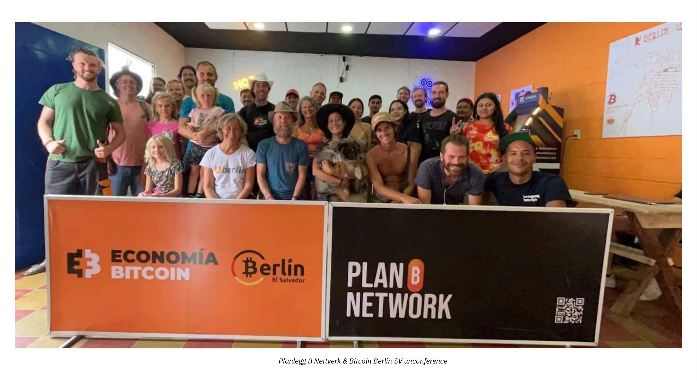

Alene kan du raskt utforske en av de mange tunnelene i Bitcoin-kaninhullet. Men husk at det finnes utallige andre retninger å utforske.

**Ved å opprette og/eller bli med i et fellesskap av bitcoinere, og ved å dele og utveksle med dem regelmessig, vil du bevege deg i alle retninger ned kaninhullet samtidig.**

## BTC 304, Hva blir det neste?

<chapterId>8bf10b77-80ee-5d50-87bc-0ef32574a675</chapterId>

I dette BTC 304-kurset har vi gått i detalj på hvordan du setter opp et fellesskap eller et møte, samt hvordan du starter en rekke prosjekter.

Når lokalsamfunnet er klart til å ta neste skritt, kan dere **opprette en formell forening**.

I Frankrike, for eksempel, har nesten et dusin av de rundt seksti lokalsamfunnene og møteplassene status som forening.

Fordelene er todelt:

- **Offisiell anerkjennelse**: Dere kan åpne en bankkonto for foreningen, få oppmerksomhet i presse/media og til og med søke om støtte.
- **Strukturert organisasjon**: Du kan definere klare roller, noe som gjør det enklere å drive fellesskapet og gjennomføre prosjekter.

For å bidra til at fellesskapet deres kan blomstre enda mer, **er det ikke utelukket at en oppfølger til dette kurset kan bli lansert på [Plan ₿ Academy](https://planb.academy/) i de kommende månedene**.

Den neste økten kan ta for seg avanserte temaer som for eksempel

- Utforme presentasjoner eller workshops for møtene dine og sette klare mål.
- Organisering av et stort arrangement med rundt 100 deltakere.

Her vil vi trekke veksler på erfaringer fra lokalsamfunn som allerede har laget sine egne arrangementer og presentasjoner.

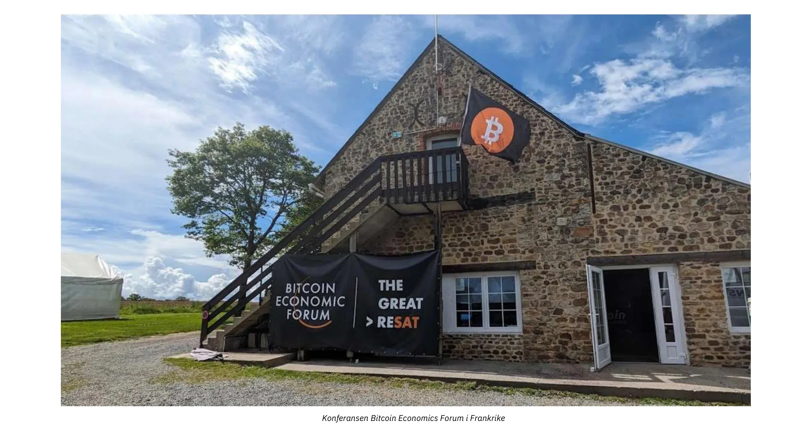

# Siste del

<partId>e9bdddf4-54c9-4de9-bbce-c3eade8c32e5</partId>

## Anmeldelser og rangeringer

<chapterId>08a35d2a-204b-519a-9bb1-588665a037fa</chapterId>

<isCourseReview>true</isCourseReview>

## Konklusjon

<chapterId>d74606a5-cb14-4117-acb2-2bf5920de092</chapterId>

<isCourseConclusion>true</isCourseConclusion>