# De eerste stap naar Bitcoin-adoptie

Tegenwoordig kan iedereen online leren over Bitcoin, maar wat vaak ontbreekt is de kans om elkaar te ontmoeten, ideeën uit te wisselen en samen te bouwen. Om deze kloof te overbruggen, vormen veel bitcoiners lokale gemeenschappen, waar bijeenkomsten workshops, presentaties en betekenisvolle discussies op gang brengen.

In BTC304 kijken we naar waarom gemeenschapsopbouw belangrijk is, verkennen we tools voor het creëren van een sterke visuele en digitale identiteit, en delen we eenvoudige open-source projecten die je kunt starten. We zullen ook overwegen hoe lokale initiatieven opschalen naar nationale gemeenschappen die kunnen helpen een hypergebitcoiniseerde toekomst te realiseren.
+++
# Inleiding

<partId>81318b8f-d316-5787-aa4c-4ec8370ba668</partId>

## Cursusoverzicht

<chapterId>e8991b82-4966-5e04-8f05-7cae46eacbaa</chapterId>

Welkom bij BTC 304!

Sinds 2009 is Bitcoin onophoudelijk gegroeid. Deze groei heeft vorm gekregen door nieuwe Bitcoin Verbeteringsvoorstellen (BIP), het creëren van extra lagen om het netwerk schaalbaar te maken (onder andere Lightning Network) en de ontwikkeling van meerdere bedrijven en start-ups.

De ontwikkeling is ook duidelijk in On-Chain, met een gestage toename van het aantal transacties.

Bijvoorbeeld, tussen 1 januari 2018 en 1 januari 2024 is het aantal transacties op Bitcoin's hoofd Layer naar schatting [gestegen met 66,2%](https://dune.com/queries/3375917/5663935). Ondertussen, tussen augustus 2021 en augustus 2023, is het aantal openbare transacties op Lightning Network [gestegen met 1.212%](https://river.com/learn/files/river-lightning-report-2023.pdf).

Deze aanzienlijke groei is natuurlijk nauw verbonden met:

- de [groeiende interesse van mensen over de hele wereld in het gebruik van Bitcoin](https://profedustream.substack.com/p/21-raisons-dutiliser-Bitcoin), om zich te bevrijden van het banksysteem en/of een minder volatiele of minder gedevalueerde valuta te gebruiken, zoals het geval is voor bevolkingen in Libanon, Syrië, Egypte, Argentinië en anderen;
- de prijsstijging in de loop van de tijd, waardoor het een waardeopslag en een langetermijnbelegging wordt, gedreven door het vaste monetaire beleid;
- de opeenvolgende groei van de speculatieve cryptocurrency markt, vooral in 2017-2018 en 2020-2021;
- De groeiende aanwezigheid van Bitcoin in de reguliere media.

Hoewel Bitcoin zich nog in de beginfase bevindt, zet deze realiteit, waarvan je je waarschijnlijk al bewust bent, ons aan om twee belangrijke vragen te overwegen:

- Hoe kunnen we Bitcoiners aanmoedigen om verder te gaan in hun leren en projecten om **het potentieel van Bitcoin volledig te benutten**?

- Hoe kunnen we nieuwkomers, die vaak worden aangetrokken door speculatie op korte termijn, helpen om geen geld te verliezen op de nieuwste memecoin rage en zich in plaats daarvan te concentreren op **het leren van de fundamenten van Bitcoin**?

De beste oplossing voor beide uitdagingen is simpel: **ben aanwezig in de echte wereld en geef voorlichting**.

Het doel van deze cursus is om je alles te geven wat je nodig hebt om een Bitcoin community of meet-up te creëren en effectief te organiseren. Of je nu een lokaal initiatief wilt opzetten of een online groep wilt laten groeien, deze cursus begeleidt je stap voor stap: van het creëren van je visuele identiteit tot het opzetten van regelmatige evenementen en het beheren van je communicatiekanalen.

**Deel 1: Inleiding**

We beginnen met het benadrukken van het belang van het verenigen van mensen rond Bitcoin, hetzij door online gemeenschappen of lokale meetups. Je zult ontdekken waarom en waar je je eigen community kunt starten, samen met hoe je duidelijke doelen kunt stellen om de groei en duurzaamheid op lange termijn te bevorderen.

**Deel 2: Ontwerp een unieke identiteit voor uw Bitcoin gemeenschap**

Om nieuwe leden aan te trekken en het saamhorigheidsgevoel te bevorderen, is het essentieel om een unieke identiteit op te bouwen. In dit onderdeel leer je hoe je logo's, posters en banners ontwerpt die de geest van jouw Bitcoin gemeenschap uitstralen.

**Deel 3: Creëer communicatiekanalen voor je Bitcoin gemeenschap**

Communicatie is de ruggengraat van elke gemeenschap. In dit gedeelte verkennen we de beste kanalen om te gebruiken en begeleiden we je bij het efficiënt opzetten van een Telegram-groep of Discord-server. Je leert ook hoe je multifunctionele bots kunt integreren om het communitybeheer te stroomlijnen.

**Sectie 4: Uw sociale netwerken lanceren** (in het Frans)

Zichtbaarheid is de sleutel tot het groeien van je community. In dit gedeelte leer je hoe je een speciaal Twitter-profiel kunt maken, contact kunt leggen met lokale meetups en gebruik kunt maken van platforms zoals btcmap.org om je zichtbaarheid te vergroten en nieuwe leden aan te trekken.

**Deel 5: Een Bitcoin bijeenkomst organiseren**

Dit gedeelte behandelt hoe je meetups organiseert: van het kiezen van de juiste locatie tot het organiseren van het evenement zelf. We onderzoeken ook strategieën om deelnemers te binden en de duurzaamheid van je community op lange termijn te garanderen.

**Deel 6: Voorbeelden van projecten en initiatieven** (in het Frans)

Om verder te gaan dan eenvoudige meetups, laat dit gedeelte concrete en originele projecten zien: van thema-evenementen en workshops tot het maken van educatieve content en lokale samenwerkingen. Je leert ook hoe je zowel fysiek als digitaal materiaal ontwerpt om je community te promoten.

**Deel 7: Anticiperen op de toekomst**

Hier onderzoeken we de natuurlijke evolutie van uw community: wat te doen als het te snel groeit, hoe uw organisatie te decentraliseren en hoe te reageren op een vijandige regelgevende omgeving. Dit hoofdstuk zal je helpen op deze uitdagingen te anticiperen en ze te overwinnen.

**Sectie 8: Bitcoiners samenbrengen**

Het laatste deel gaat over de essentie van je project: Bitcoin enthousiastelingen verenigen rond een gedeelde visie. Je leert hoe je je aanpak kunt structureren om leden aan te trekken en te behouden, taken effectief te delegeren en je gemeenschap duurzaam te laten groeien.

Klaar om te leren hoe je een sterke, levendige Bitcoin gemeenschap opbouwt? Laten we erin duiken!

## Waarom een Bitcoin community of meetup starten?

<chapterId>893ea248-7d5a-5b8e-948c-7031497b1031</chapterId>

### Wat is het verschil tussen een community en een meet-up?

Hoewel er geen strikte definitie van deze termen bestaat in het Bitcoin ecosysteem, wordt een community het best begrepen als een groep mensen die een gemeenschappelijke passie delen en regelmatig met elkaar communiceren.

Een meetup daarentegen is een evenement georganiseerd door en voor deze gemeenschap, met een specifiek doel. Meetups vinden meestal plaats wanneer een gemeenschap al gevestigd is.

Voor deze cursus gaan we ervan uit dat je voor het lanceren van een Bitcoin meetup al contact hebt gelegd met een paar mensen die geïnteresseerd zijn in het organiseren van zo'n evenement, met andere woorden, de **community bestaat al**.

### Waarom een Bitcoin gemeenschap creëren?

Er zijn verschillende redenen om een Bitcoin gemeenschap te creëren:

- Kennisdeling & samenwerking: Communities geven leden de ruimte om Exchange ideeën uit te wisselen en kennis te delen. Wederzijdse ondersteuning is een belangrijke pijler voor groei, waardoor iedereen sneller kan leren, vooral relevant voor Bitcoin, gezien hoeveel er te ontdekken valt.

- Peer-to-peer opbouw: Veel initiatieven en projecten worden bedacht, gebouwd en ontwikkeld binnen deze gemeenschappen.

Bitcoin gemeenschappen streven vaak bredere doelen na, vooral op het gebied van openbaar onderwijs:

1. Wat Bitcoin is;

2. Hoe het werkt;

3. Haar bijdragen aan de samenleving;

4. Misleidende of ongegronde beweringen van sommige publieke figuren en media ontkrachten;

5. De fundamentele verschillen tussen Bitcoin en andere cryptocurrencies;

Door de eerste "burchten" van morgen te bouwen, dienen **Bitcoin gemeenschappen wereldwijd als een bolwerk tegen desinformatie en censuur, terwijl ze een vruchtbare bodem vormen voor het leren van Bitcoin's grondbeginselen**. Ze bieden nieuwkomers, zelfs sceptici, de middelen en connecties die nodig zijn om het ware potentieel van Bitcoin te verkennen.

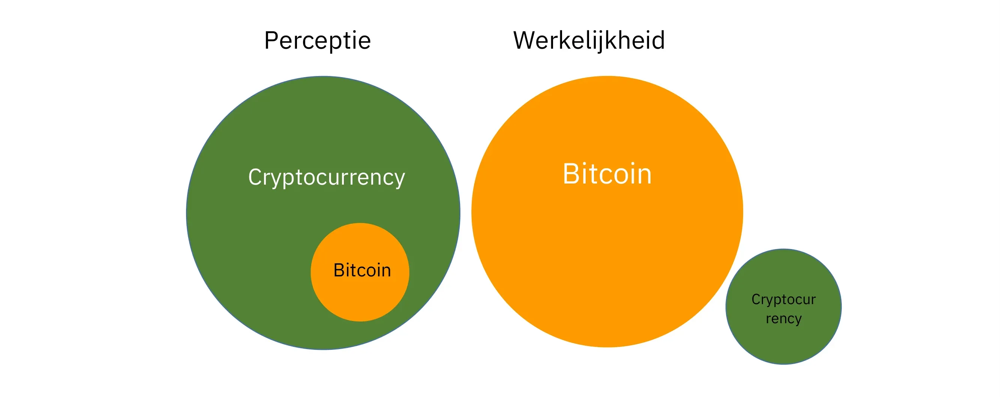

Het is ook vermeldenswaard dat **een gemeenschap volledig online kan bestaan**, of het nu een Telegram-groep is ("Bitcoin Londen"), een Facebook-groep ("Bitcoin Berlijn"), een Discord-server ("Bitcoin Madrid") of zelfs een e-maillijst ("Bitcoin Frankrijk").

Met andere woorden, **een gemeenschap heeft geen fysieke meetups nodig om te gedijen of projecten te lanceren. Het kerndoel blijft hetzelfde: delen, bouwen en onderwijzen**.

### Waarom een meet-up maken?

Zoals eerder vermeld, **ontmoetingen komen meestal nadat een gemeenschap is opgericht en dienen om deze aan te vullen**.

Naarmate de reis van een bitcoiner zich ontwikkelt, is er vaak een verlangen, of zelfs een behoefte, **om anderen** uit hetzelfde ecosysteem te ontmoeten en er persoonlijk mee om te gaan. Dit kan komen doordat men zich geïsoleerd voelt of simpelweg niemand heeft om mee te praten over Bitcoin in het dagelijks leven.

Meetups bieden een persoonlijkere en gastvrijere ervaring dan online audio- of videogesprekken. Of het nu **onder het genot van een drankje of een maaltijd** is, ze creëren informele, vriendelijke ruimtes waar mensen open en direct Exchange ideeën kunnen uitwisselen.

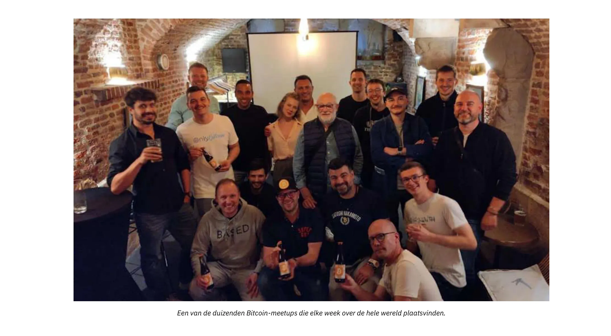

Bitcoin meetups kunnen vele doelen dienen:

- Bespreken van technische onderwerpen of lopende projecten
- Nieuwe bitcoiners helpen om geleidelijk dieper in de Bitcoin wereld te duiken
- Nieuwe projecten of initiatieven aankondigen
- Uitwisselen van materialen of boeken
- Documentaires in voorvertoning
- Conferenties of workshops over specifieke onderwerpen organiseren

We zullen veel van deze mogelijkheden in detail behandelen in deel 6/8 van deze cursus, getiteld "[Voorbeelden van projecten en initiatieven](https://planb.academy/courses/1c643dc9-a15f-4f9e-93b6-cb3c58b4ee35/3213d87a-1998-5972-ab93-97a5769ba279).

Hoewel elke gemeenschap vrij is om zijn eigen mening te vormen, projecten te lanceren en op zijn eigen manier te experimenteren, blijken meetups steeds **essentieel voor de ontwikkeling van Bitcoin en de groei van bitcoiners**. **Het organiseren ervan kost tijd en moeite**, daarom deelt deze cursus de gecombineerde ervaring van [ongeveer zestig Bitcoin gemeenschappen in Frankrijk en België](https://btcmap.org/communities/map#2/5.24949/0.20000) **om je te helpen je eigen gemeenschap en meetups zo soepel mogelijk op te bouwen en te laten groeien**.

## Waar moet je je community creëren?

<chapterId>72da5285-5395-592d-ab62-303a0aef3d6d</chapterId>

De eerste vraag die je je moet stellen is: waar moet je community gevestigd zijn?

Deze beslissing is cruciaal als je de mogelijkheid wilt behouden om later meetups te organiseren.

Als leden twee uur moeten rijden om een evenement bij te wonen, zal de opkomst waarschijnlijk laag zijn. Daarom heeft het kiezen van de juiste **locatie voor je community, en dus je toekomstige meetups, een grote impact op de groei**.

Een paar tips als leidraad bij je beslissing:

1/ **Schep en groei je gemeenschap in een middelgrote of grote stad**. Dit maakt het makkelijker om:

    - Zoek aangename locaties voor ontmoetingen en projecten (presentaties, workshops, het promoten van Bitcoin adoptie, etc.);
    - Vergroot het gevoel van betrokkenheid en saamhorigheid onder een groter aantal mensen;
    - Verbeter de toegankelijkheid van het evenement (openbaar vervoer, parkeren, enz.). Het is ten zeerste aan te raden om een locatie te kiezen in de buurt van openbaar vervoer en parkeergelegenheid.

2/ **Kies een naam die gekoppeld is aan je stad**. Dit maakt het makkelijk voor mensen om zich te identificeren met je gemeenschap. Voorbeelden: Bitcoin Parijs, Einundzwanzig Berlijn, Satoshi Spritz Milano, enz.

3/ **Controleer of er al een meet-up bij jou in de buurt is**.

Je kunt kijken op [btcmap.org](https://btcmap.org/communities/map#0/0/0/), waar de meeste Bitcoin gemeenschappen en meet-ups wereldwijd staan.

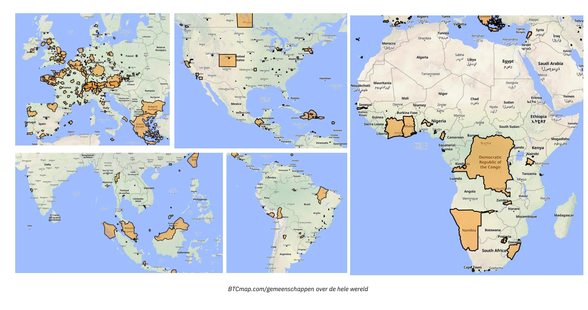

Na wat onderzoek vind je misschien een bestaande meetup of community in jouw stad.

Bitcoin is gedecentraliseerd, dus natuurlijk is iedereen vrij om te doen wat hij wil.

Echter, **het bundelen van krachten is vaak zinvoller dan het opsplitsen van naburige gemeenschappen en het verkleinen van ieders impact**. Een gloednieuwe gemeenschap beginnen waar er al een bestaat, kan onbedoeld concurrentie creëren.

In dit opzicht kan een eenvoudige "vuistregel" helpen: als er geen actieve Bitcoin gemeenschap is binnen 30-45 minuten van waar je woont, kan het de moeite waard zijn om een nieuwe te beginnen. Dat gezegd hebbende, je bent altijd vrij om te doen wat je wilt.

En natuurlijk, als een oudere gemeenschap "geëvolueerd" is in een richting die niet langer overeenkomt met jouw waarden, en je hebt niet de tijd of motivatie om ze te "oranje-pillen", dan is het creëren van je eigen Fork altijd een optie.

## Welke doelstellingen moeten de leidraad vormen voor je gemeenschap?

<chapterId>0aae1aa8-93ec-544a-ad88-22d32c619595</chapterId>

Zodra je de stad (of het geografische gebied) voor je community hebt geïdentificeerd, is het tijd om **te definiëren wat je wilt bereiken**.

Deze doelen kunnen direct bij de lancering worden ingesteld of later worden verfijnd, als er al meerdere leden lid zijn en je groep actief is.

Hier zijn enkele punten die je kunnen helpen bij het nadenken:

1/ **Waarom maak ik als bitcoiner deze community aan?** Is het om kennis te delen? Anderen te onderwijzen? Leren van meer ervaren collega's? Gelijkgestemde mensen ontmoeten? Betrokken raken bij het Bitcoin ecosysteem? In contact komen met professionals? Of gewoon wat drinken en nieuwe vrienden maken?

Je antwoorden zullen je positionering en motivatie bepalen.

Als het je doel is om **kennis te delen en mensen te onderwijzen over Bitcoin**, richt je dan op het **creëren van educatieve content** (artikelen, podcasts, video's, presentaties, flyers, etc.), waarmee je anderen ontelbare uren onderzoek bespaart. Je kunt zelfs verder gaan door **workshops, presentaties en conferenties** te organiseren.

Als je gewoon andere bitcoiners wilt ontmoeten en ervaringen wilt uitwisselen, kun je voor een meer ontspannen aanpak kiezen, zoals afspreken voor een drankje.

Zo creëer je gemakkelijker sociale banden. Onthoud echter altijd dat **bier drinken niet de juiste weg is om de wereld van morgen op te bouwen**.

Daarom is **het stellen van concrete doelen en projecten essentieel**.

2/ Moet ik mijn gemeenschap een **fysieke dimensie** geven? Zo ja, wat voor soort evenementen moet je organiseren?

Je eerste evenement zal waarschijnlijk een meet-up zijn. Het belangrijkste doel: bitcoiners in je omgeving samenbrengen.

Maar, zoals we later zullen zien in [Voorbeelden van projecten en initiatieven](https://planb.academy/courses/1c643dc9-a15f-4f9e-93b6-cb3c58b4ee35/3213d87a-1998-5972-ab93-97a5769ba279), **een meet-up kan op vele manieren worden opgebouwd, met vele doelen:**

- Combineer netwerken met een educatieve presentatie over een Bitcoin concept;
- Organiseer een professionele demonstratie van Bitcoin oplossingen;
- Debatstrategieën voor het sinaasappelen van lokale handelaars;

enzovoort.

Afhankelijk van de onderwerpen (technische lezingen of hands-on workshops) kan het zelfs zinvol zijn om **extra evenementen** te organiseren buiten je reguliere meet-up.

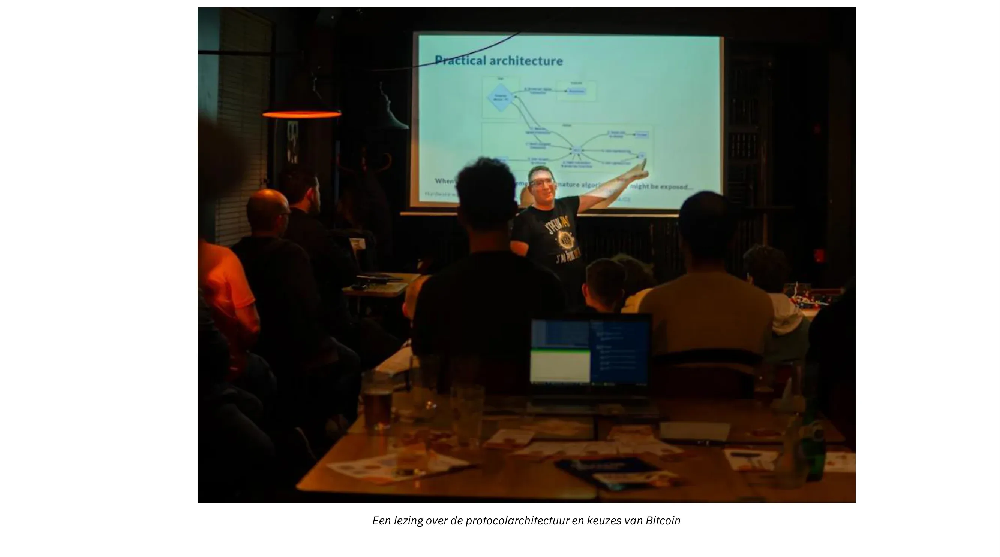

3/ Hoe wil ik dat mijn community bijdraagt aan het Bitcoin ecosysteem?

Dit is een vraag voor gevorderden, maar het is de moeite waard om er in een vroeg stadium over na te denken.

Als het jouw visie is om **een hechte, gemotiveerde gemeenschap** te creëren die erop gericht is om zoveel mogelijk mensen oranje te laten kleuren, dan..:

- Werk samen met bestaande gemeenschappen om toegang te krijgen tot bredere informatie, open bronnen en waardevolle ondersteuning wanneer dat nodig is.
- Organiseer en delegeer taken binnen je groep om je inspanningen effectief uit te breiden en op te schalen.

**Stel doelen voor de korte, middellange en lange termijn**

Een praktische manier om te plannen is door doelen te stellen voor elk tijdsbestek:

- Op korte termijn: een aanwezigheid op sociale media opbouwen en communicatiekanalen voor de gemeenschap opzetten.
- Middellange termijn: educatief materiaal creëren (artikelen, flyers, video's).
- Op lange termijn: regelmatige fysieke ontmoetingen organiseren.

Als er eenmaal meetups zijn, kun je je richten op:

- Korte termijn: organiseren van workshops of presentaties over specifieke onderwerpen
- Middellange termijn: Bitcoin bewustmakings- of voorlichtingscampagnes voeren
- Op lange termijn: creëer een formele associatie of partnerschap met een bar die Bitcoin als betaling accepteert.

Wees voorbereid: **een gemeenschap opbouwen kost moeite**

Het creëren van een gemeenschap gebeurt niet van de ene op de andere dag. Het kost tijd, motivatie en organisatie.

Soms kan het zelfs ontmoedigend voelen, vooral als er niemand komt opdagen en je het gevoel hebt dat je de enige bent die deze missie op je schouders draagt.

Daarom is **deze cursus ontworpen om waardevolle bronnen en tips te delen, zodat gemeenschappen effectief kunnen groeien en uiteindelijk zelfvoorzienend worden**.

# Een gemeenschapsidentiteit ontwerpen Bitcoin

<partId>da6673ad-bf49-5979-80a6-3f69cfb28046</partId>

## Waarom en hoe kun je je eigen identiteit creëren?

<chapterId>b48a18cc-afdf-5216-802c-32647b5cd8a3</chapterId>

In dit stadium nemen we aan dat:

- Je weet al waar je community (of toekomstige regelmatige meetup) gevestigd zal zijn.
- Je hebt doelen gesteld voor verschillende tijdshorizonten, zelfs als ze nog niet definitief zijn.

De volgende stap in het opbouwen van je community is het **definiëren van de identiteit**, zowel de naam als de visuele stijl.

In dit gedeelte vind je tutorials en beginnersvriendelijke software-oplossingen om je te helpen de visuele identiteit van je community te ontwerpen, zelfs met beginnersvaardigheden.

**Waarom is identiteit belangrijk?**

Mensen voelen zich meer betrokken en geëngageerd als ze zich kunnen identificeren met een groep. Een sterke identiteit helpt je gemeenschap zich te onderscheiden en bevordert het gevoel erbij te horen.

Het begint allemaal met het kiezen van een naam en elk land heeft vaak zijn eigen trends:

- Frankrijk: De meeste van de meer dan 60 lokale gemeenschappen gebruiken namen als "Bitcoin [CITY]" of "[CITY] Bitcoin". Hun Telegram-groepen volgen vaak dit patroon: "Bitcoin [STAD] meetup".
- Duitsland: Het initiatief Einundzwanzig (wat "21" betekent) inspireerde namen als "Einundzwanzig [STAD]".
- Italië: Het Satoshi Spritz-netwerk gebruikt namen als Satoshi "Spritz [CITY]".

**Elke gemeenschap heeft haar eigen identiteit, die verbonden is met haar woonplaats, maar ook met de bredere identiteit van haar land**.

Je visuele identiteit: logo, kleuren, banners, is wat mensen zullen onthouden en associëren met je groep.

Bij het maken van sociale media-accounts en communicatiekanalen is het hebben van een logo en banner een sterk pluspunt. Maak je geen zorgen, je hebt geen professionele ontwerpvaardigheden nodig; er zijn gratis en eenvoudig te gebruiken tools beschikbaar.

Een goed uitgangspunt is om een herkenningspunt of symbool van je stad te gebruiken. In Parijs kan dit de Eiffeltoren zijn. In Lille, het belfort of de citadel. In New York, het Vrijheidsbeeld. In Londen, de Big Ben, enzovoort.

Van daaruit kun je een eenvoudig of meer gedetailleerd logo ontwerpen, afhankelijk van je voorkeur.

Om je wat ideeën te geven, volgen hier een paar voorbeelden van Franse gemeenschapslogo's:

- In Marseille staat het logo voor de basiliek Notre-Dame-de-la-Garde, die over de stad uitkijkt:

- In Monaco verwijst het naar de Monegaskische rots:

- In Lille staat het slanke logo voor de citadel van Vauban en het bijbehorende park:

- In Saint-Malo wordt de hermelijn - het embleem van de stad - benadrukt:

**Ga verder als je wilt**

Als je inspiratie krijgt, kun je nog verder gaan: maak een wapen, een motto of zelfs een lied voor je gemeenschap. Jouw creativiteit is de enige grens!

## Maak een logo, poster en banner

<chapterId>3470a31f-0190-5e87-8af0-6a00e79267ef</chapterId>

### Canva gebruiken

Je kunt **[Canva](https://www.canva.com/)** gebruiken om de verschillende visuals voor je community te maken.

Dit gratis en gebruiksvriendelijke platform is populair vanwege de grote bibliotheek met vooraf ontworpen sjablonen die je met een paar klikken kunt dupliceren en aanpassen.

**Je logo maken**

Zoek op de startpagina van Canva naar vooraf ontworpen logo's. Kies er een of meer die je inspireren, kopieer ze en pas ze aan zodat ze bij jouw gemeenschap passen.

Je kunt een lokaal herkenningspunt of embleem toevoegen aan de achtergrond (importeer een foto of zoek 'Illustraties' of 'Afbeeldingen' in het Elements menu), en dan het Bitcoin logo of ₿ eroverheen leggen en de kleur aanpassen indien nodig.

**Banners en posters maken**

Om een banner of poster te maken, zoek je in de bibliotheek van Canva naar vooraf ontworpen sjablonen. Zodra je er een hebt gedupliceerd, pas je de tekst en lettertypen aan, voeg je je gemeenschapslogo toe en importeer je foto's met behulp van frames (zoek naar "frame" in het Elements menu).

Je kunt ook het menu Ontwerpen gebruiken om aanvullende modellen te bekijken die aan je wensen voldoen.

Voor YouTube-miniaturen of -banners zoek je gewoon naar die sjablonen, dupliceer je ze en pas je ze naar wens aan.

Kortom, **de mogelijkheden zijn eindeloos en worden niet alleen bepaald door je behoeften, maar ook door de visuele stijl die je wilt creëren** voor je community en je meet-ups/evenementen!

Om je een duidelijker idee te geven, hebben we een niet-uitputtende videotutorial toegevoegd die enkele van deze mogelijkheden laat zien:

:::video id=d11ae0ed-eacd-4924-afd3-75aff95d2899:::

**Voorbeeldsjablonen van Bitcoin Lille**

Hier zijn kant-en-klare Canva-sjablonen die je kunt dupliceren en aanpassen voor jouw gemeenschap:

- **Affiche voor aankondiging bijeenkomst** (voor sociale media en afdrukken op A4/A3): [link](https://www.canva.com/design/DAGBvBXFJ8A/92-j_toeLU8QbVAD0NwoAA/edit?utm_content=DAGBvBXFJ8A&utm_campaign=designshare&utm_medium=link2&utm_source=sharebutton)

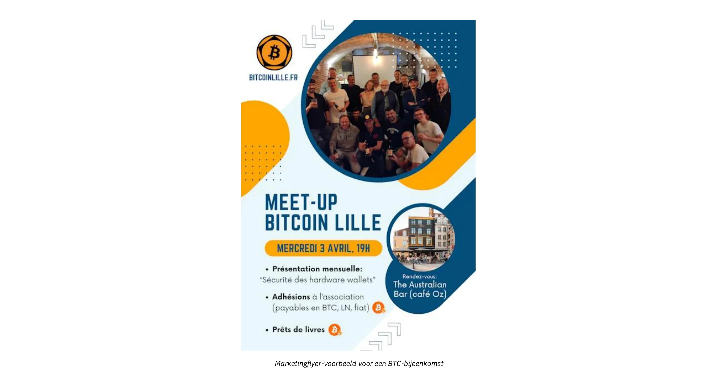

- **Evenementposter** (voor sociale media en A4/A3 afdrukken): [link](https://www.canva.com/design/DAGBvG3rNCc/oXtNR9pduRs22AqclG4O2g/edit?utm_content=DAGBvG3rNCc&utm_campaign=designshare&utm_medium=link2&utm_source=sharebutton)

- **banners voor sociale media**: [link](https://www.canva.com/design/DAGBvOXyNqw/iSJG9PbIQHgGWHz5PhlXSQ/edit?utm_content=DAGBvOXyNqw&utm_campaign=designshare&utm_medium=link2&utm_source=sharebutton)

- **Wedstrijdaankondiging**: [link](https://www.canva.com/design/DAGBvIjuA_w/YzSUXzOmbNV9oCma9mluOw/edit?utm_content=DAGBvIjuA_w&utm_campaign=designshare&utm_medium=link2&utm_source=sharebutton)

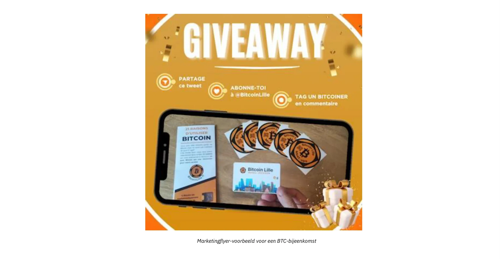

- **merkrichtlijnen** van onze bibliotheek, weergegeven op A4 bij meet-ups: [link](https://www.canva.com/design/DAGBvPqL7N4/LmUItfsysypRLSOFOzBXcQ/edit?utm_content=DAGBvPqL7N4&utm_campaign=designshare&utm_medium=link2&utm_source=sharebutton)

- **PowerPoint-presentatie** "Hoofdstuk 2 - Bitcoin transacties begrijpen", door @ProfEduStream: [link](https://www.canva.com/design/DAFsEcnOro8/Mz9FYdTGhsvozZOe0Y9jtw/edit?utm_content=DAFsEcnOro8&utm_campaign=designshare&utm_medium=link2&utm_source=sharebutton)

- **flyer** "21 redenen om Bitcoin te gebruiken", geschreven door @ProfEduStream: [link](https://www.canva.com/design/DAFtAR1NauQ/ZDwl2CchIJ9Gpb36N6-7iw/edit?utm_content=DAFtAR1NauQ&utm_campaign=designshare&utm_medium=link2&utm_source=sharebutton)

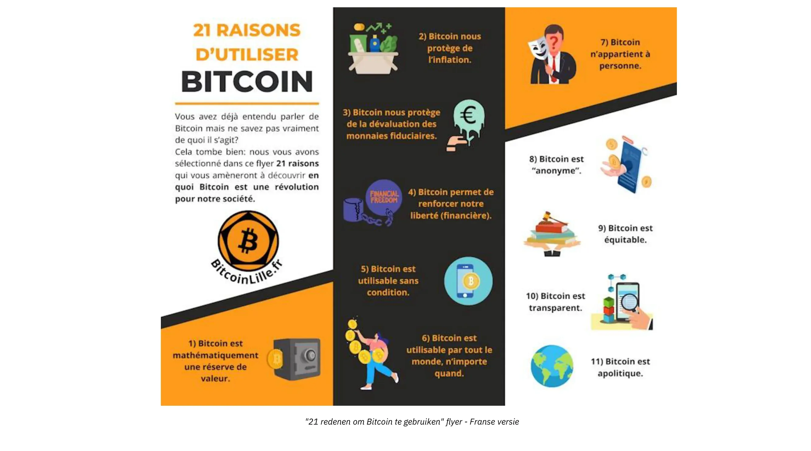

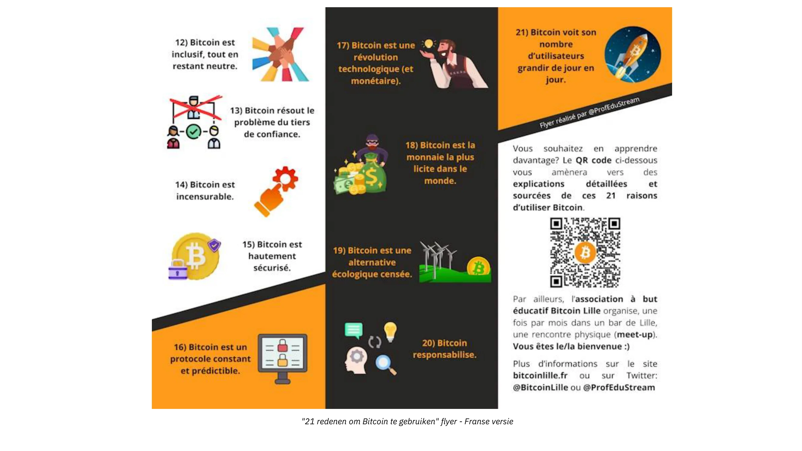

**Deel je creaties**

De mogelijkheden zijn eindeloos, en je ontwerpen zullen afhangen van je doelen en visuele identiteit. Overweeg om je sjablonen te delen in open source, het bespaart tijd voor andere Bitcoin gemeenschappen die onvermijdelijk voor dezelfde uitdagingen komen te staan als jij. Door te delen, help je de groei van Bitcoin gemeenschappen overal te versnellen.

**Aanbevolen afmetingen**

Controleer bij het maken van visuals altijd de groottevereisten voor elk platform:

| Platform | Logo | Banner | Poster / Image
| -------- | -------- | -------- | -------- |
| Telegram     | 512 x 512     | N/A     | N/A     |
| Signal     | N/A     | N/A     | N/A     |
| Twitter     | 400 x 400     | 1500 x 500     | 1200 x 628     |
| Meet-up     | N/A     | N/A     | N/A     |
| Discord     | 512 x 512     | 960 x 540     | N/A     |
| Facebook     | 512 x 512     | 851 x 315     | 960 x 720     |

Meestal geschikte maten:

Logo's: 512 x 512 pixels

Banners: Afhankelijk van de app of site

Posters: A4 is het standaard afdrukformaat

### Kunstmatige intelligentie gebruiken

Hoewel Canva een breed scala aan tools biedt voor het maken van logo's, posters, banners en flyers, is het niet de enige optie. Als je meer vertrouwd bent met andere software (zoals Photoshop of Illustrator), voel je dan vrij om te gebruiken wat voor jou het beste werkt.

Dat gezegd hebbende, of je nu een gemeenschapslogo ontwerpt of posters, presentaties of flyers verbetert, **kunstmatige intelligentie kan een krachtige bondgenoot zijn voor het maken van unieke en aantrekkelijke visuals**.

Hiervoor zijn een aantal AI's beschikbaar. Deze omvatten

- [midjourney](https://docs.midjourney.com/docs/quick-start) (betaald);
- [leonardo](https://leonardo.ai/) (gratis, account beperkt);
- [copilot](https://copilot.microsoft.com/) (gratis, account beperkt);
- [DALL-E](https://www.dall-efree.com/) (betaald).

Er zijn de laatste tijd veel andere AI-tools verschenen, dus deze lijst is verre van volledig.

**Voorbeeld: Een futuristisch Bitcoin-logo voor Londen maken**

Als je een futuristisch logo wilt ontwerpen voor een "Bitcoin Londen" meet-up, kun je Copilot vragen:

- [*Prompt: Maak een Bitcoin logo met de London Bridge en de Big Ben op de achtergrond. Futuristisch* - [Link](https://copilot.microsoft.com/images/create/un-logo-Bitcoin-futuriste-avec-en-arric3a8re-plan-le-/1-6612ba1758df4384bc33c4bca00ab45b?FORM=SYDBIC)

Als de eerste vier resultaten niet realistisch genoeg zijn, verfijn dan je verzoek:

- [*Prompt: Maak de 4e veel realistischer* - [Link](https://copilot.microsoft.com/images/create/un-logo-Bitcoin-futuriste-avec-en-arric3a8re-plan-le-/1-6612ba64b72d4cea9830ab7eb844f785?FORM=SYDBIC)

Het laatste resultaat was geweldig!

**Voorbeeld: Een eenvoudig logo in Britse stijl maken**

Voor een netter uiterlijk, zoals bij een sticker:

- [*Prompt: Maak het logo van de "London Bitcoin Meetup" met een Britse en strakke stijl* - [Link](https://copilot.microsoft.com/images/create/logo-for-27londres-Bitcoin-meetup27-with-a-british-a/1-6612bb9451924859a6c34b350b3a6ebc?FORM=SYDBIC)

Het resultaat ziet er echt gaaf uit!

**Tips voor het werken met AI**

- Heb geduld: AI produceert misschien niet meteen wat je voor ogen hebt.

- Gebruik nauwkeurige aanwijzingen: Hoe duidelijker en gedetailleerder je instructies, hoe beter de resultaten.

- Vraag om hulp: Als je niet tevreden bent, neem dan contact op met iemand die ervaring heeft met grafisch ontwerp of AI-tools. Veel Bitcoiners helpen je graag, soms zelfs gratis of voor een paar Sats.

# Communicatiekanalen creëren voor uw Bitcoin gemeenschap

<partId>fc588298-6876-554c-bd57-55d182464878</partId>

## Welke communicatiekanalen moet je kiezen?

<chapterId>b4f4eef6-1035-5290-848a-2b7f9391c77a</chapterId>

Zoals hierboven vermeld, kunnen de communicatiekanalen van een gemeenschap verschillen afhankelijk van motivaties en gewoonten.

Bijvoorbeeld, **in Frankrijk, Duitsland en Italië zijn Telegram en Twitter de dominante platforms**, en ze zijn de "standaard" geworden voor Bitcoin gemeenschappen.

In Tsjechië daarentegen gebruiken veel gemeenschappen **Matrix**, een beveiligd instant messaging protocol, in plaats van Telegram.

Tip: Voordat je je kanalen kiest, **kijk naar wat naburige gemeenschappen doen**. Gebruik de kaart [btcmap.org](https://btcmap.org/communities/map#0/0/0/) om te zien welke platformen het populairst zijn in jouw regio.

Zwitserse gemeenschappen gebruiken bijvoorbeeld voornamelijk Telegram, Twitter en hun eigen website:

**Aanbevolen kanalen voor Franstalige gemeenschappen**

- Telegram: De #1 communicatietool, meer dan 90% van de Franse meet-ups gebruikt het.

- Twitter (X): Het belangrijkste sociale netwerk dat wordt gebruikt door bitcoiners over de hele wereld. Het wordt gebruikt door ~70% van de Franse meet-ups. Het is ideaal om bitcoiners te bereiken.

- Meetup.com: Betaald maar veel gebruikt (door ~30% van de Franse meet-ups en bijna alle Canadese) om de zichtbaarheid buiten het Bitcoin ecosysteem te vergroten.

- Andere opties: ~30% heeft ook een website; ~10% beheert Discord servers of NOSTR accounts.

Andere platforms zoals Matrix, Keet, Signal, Facebook, Instagram en LinkedIn kunnen ook worden gebruikt. Let op, hoe meer kanalen je beheert, hoe meer tijd je kwijt bent aan het modereren, posten en actief houden ervan.

Iedereen die een community in Frankrijk wil starten, doet er daarom goed aan om te beginnen met creëren:

- een Telegram-groep;
- een Twitter-account.

Naarmate je community groeit, kun je meer platformen toevoegen en moderatie delegeren aan vertrouwde leden.

## Een Telegram-kanaal, -groep of -supergroep maken en configureren

<chapterId>d13714ce-8f08-53e9-bedd-b6a3aaac5dad</chapterId>

Voordat je de communicatieruimte van je community op Telegram maakt, is het belangrijk om het verschil te weten tussen:

- een Telegram-kanaal;
- een Telegram-groep;
- een Telegram-supergroep.

Het wordt sterk aanbevolen om te beginnen met een Telegram-groep.

Indien nodig kun je het later omzetten naar een Supergroep.

Voor de tutorials hieronder hebben we oorspronkelijk de "Telegram+" APK gebruikt, die een meer geavanceerde configuratie mogelijk maakt. Je hebt het echter niet per se nodig, omdat de officiële Telegram-app voldoende is voor het maken en beheren van groepen, zelfs via je telefoon:

:::video id=b1da7cb4-5fb1-4a41-a1d4-bd90686826a9:::

### Maak een Telegram-kanaal

Als je een plek wilt creëren waar je leden rechtstreeks met elkaar kunnen praten, op elkaar kunnen reageren, enz., dan kun je beter een Telegram-groep maken en geen Telegram-kanaal!

Ga direct naar het volgende gedeelte, getiteld [Een Telegram-groep maken](https://planb.academy/courses/1c643dc9-a15f-4f9e-93b6-cb3c58b4ee35/d13714ce-8f08-53e9-bedd-b6a3aaac5dad).

Inderdaad, **een Telegram-kanaal is meer een eenrichtingsuitzending voor beheerders**. Leden kunnen niet vrijuit chatten, ze kunnen alleen reageren met emoji's (of commentaar achterlaten in aparte threads, waardoor gesprekken versnipperd raken).

**Omdat communities interactie en samenwerking nodig hebben, is een Telegram-kanaal niet aan te raden** als het je doel is om relaties op te bouwen en kennis te delen.

Handleiding voor het maken van een Telegram-kanaal:

:::video id=98be4709-d221-4030-8c31-e10113482515:::

### Een Telegram-groep maken

Aan de andere kant is **een Telegram-groep ideaal voor gemeenschappen**: Net als messagingprogramma's zoals Messenger of WhatsApp kunnen leden met elkaar chatten en elkaar antwoorden in één gedeelde conversatie.

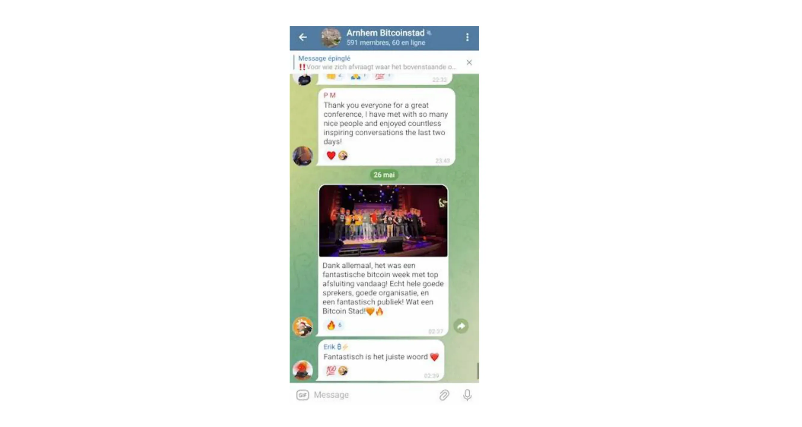

Wat je kunt doen als beheerder:

- Post en pin belangrijke berichten.
- Maak **polls** (handig voor het bepalen van meet-up data als je community nieuw is).
- **aangepaste uitnodigingslink** maken (alleen als de groep "openbaar" is en niet "privé", wat is gedefinieerd in de instellingen. Het is ook handig om je eigen Telegram-uitnodigingslink te hebben, zoals: t.me/Bitcoin[CITY]);
- Beheer lidmachtigingen, rollen en moderatie.
- Voeg een profielfoto toe (je gemeenschapslogo) en werk de naam van de groep bij.

Handleiding voor het maken van een Telegram-groep:

:::video id=3d4792a7-1345-475b-93b1-b3a3945fb567:::

Opmerking: Deze tutorial is gemaakt met Telegram+, maar je kunt alles ook rechtstreeks vanuit de standaard Telegram mobiele app doen.

### Een Telegram-supergroep maken

Waarom een supergroep?

Als je Telegram-groep uitgroeit tot honderden leden, kunnen de gesprekken chaotisch worden. Dit leidt er vaak toe dat leden belangrijke aankondigingen missen, zoals de datum van de volgende meet-up.

Er zijn verschillende oplossingen beschikbaar:

1. **Pin belangrijke berichten** zodat alle leden een melding ontvangen (druk eenmaal met je vinger op het bericht in kwestie en selecteer dan "Pin");

2. Overweeg het gebruik van **Discord** voor meerdere communicatiekanalen, die gebruikers allemaal kunnen dempen als dat nodig is.

3. **Verander je Telegram-groep in een Supergroep**.

Wat is een Telegram-supergroep?

Een Supergroep is in wezen een Telegram-groep met onderwerpen (subkanalen) erin.

Voorbeeldonderwerpen:

- "Belangrijke informatie": alleen belangrijke updates en aankondigingen van evenementen.
- "Algemeen": voor alle discussies tussen leden.
- Specifieke onderwerpen: bijv. Mining, projectontwikkeling, komende conferenties.

Tip: Pas je onderwerpen aan aan de behoeften van je gemeenschap. Voorbeeld: Abidjan Bitcoin Meet-up gebruikt dit format met succes.

Houd er rekening mee dat **Telegram supergroepen voor sommige leden een beetje lastig kunnen zijn om te gebruiken**. Niet iedereen weet bijvoorbeeld **hoe de verschillende onderwerpen** te openen (ze hoeven alleen maar op het groepslogo in het hoofdmenu van Telegram te tikken om de volledige lijst met onderwerpen te zien). Het sturen van een screenshot kan verwarring wegnemen.

Er is geen strikte regel voor wanneer je moet overschakelen van een gewone Telegram-groep naar een supergroep, het hangt echt af van de behoeften van je leden. Het goede nieuws is dat je gemakkelijk heen en weer kunt schakelen: maak gewoon een onderwerp om te converteren naar een supergroep of verwijder alle onderwerpen behalve "Algemeen" om terug te keren naar een gewone groep.

Handleiding voor het maken van een Telegram-supergroep:

:::video id=f78800ae-d8ca-479a-b913-99abd9916bff:::

Opmerking: zoals eerder vermeld, is de bovenstaande tutorial gemaakt op een computer met behulp van de "Telegram+" APK. Tegenwoordig is het maken van een Telegram-supergroep op je telefoon echter heel eenvoudig.

Maak gewoon een Telegram-groep aan, ga naar de instellingen en tik op de knop "Onderwerpen" om onderwerpen toe te voegen. Eenmaal opgeslagen, zie je een lijst met onderwerpen die je naar wens kunt bewerken.

Het is dus niet meer nodig om "Telegram+" te downloaden, tenzij je toegang wilt tot meer geavanceerde privacy-instellingen voor je supergroep.

## Je Telegram-groep of supergroep opzetten

<chapterId>35e674b3-5924-50b0-98f1-83a56c9a186d</chapterId>

Nu je Telegram groep (of supergroep) klaar is, is het tijd om **machtigingen te configureren en moderatie** in te stellen.

Elke gemeenschap is vrij om zijn eigen aanpak te kiezen, maar de ervaring leert dat het **het beste is om bepaalde rechten voor leden te beperken**:

- Een enquête versturen;
- Bestanden versturen (om mogelijke virussen te vermijden);
- Spraakberichten versturen;
- Gebruikers toevoegen (helpt botinvasies voorkomen);
- Berichten vastmaken;
- Groepsinformatie bewerken.

Het is sterk aanbevolen om **een duidelijke beschrijving van je meetup** te schrijven bij het maken van je Telegram groep of supergroep, omdat dit het eerste is wat potentiële leden zullen zien. Bijvoorbeeld:

> Welkom op @Bitcoin's Telegram [CITY] 🔥
>

> We organiseren een meet-up elke eerste woensdag van de maand in de bar [BAR_NAME], in [STAD] 🍻
>

> Bekijk onze andere sociale netwerken: [LINK] 🌐

In dit voorbeeld hebben de beheerders van Bitcoin Lille hun openbare Telegram-link aangepast om het delen te vergemakkelijken.

In "Groepsinstellingen" kan het verstandig zijn om **"Nieuwe leden goedkeuren"** in te schakelen.

Sommige Bitcoin Telegram groepen zijn het doelwit van duizenden nepaccounts die zijn ontworpen om de gemeenschap te spammen of te verstoren.

**Het activeren van goedkeuring van leden kan je groep redden van een spamaanval.**

In het gedeelte Beheerders kun je ook een functie "Agressieve anti-spam" inschakelen om verdachte berichten automatisch te verwijderen.

Dit is niet altijd nodig, maar kan een extra Layer aan bescherming toevoegen.

## Een multifunctionele bot toevoegen aan je Telegram-groep

<chapterId>c61f69cc-15ec-53f1-8c02-1cea55def09e</chapterId>

**Een andere optie voor het configureren en beveiligen van je Telegram groep of supergroep is het toevoegen van een multifunctionele bot**. Hiermee kun je de functies en moderatiemogelijkheden van je groep aanzienlijk uitbreiden.

Met **de bot [@GroupHelpBot](https://telegram.me/grouphelpbot)** zijn de handigste opties:

- Een **rules commando** (/rules) om je communityrichtlijnen weer te geven;
- **Anti-spam** bescherming om verdachte berichten en accounts te filteren;
- **Aanpasbare automatische welkomstberichten** voor nieuwe leden (met optionele automatische verwijdering na een paar minuten)
- **Anti-spambeveiliging** om spam van berichten te voorkomen
- Een **@administrator commando** om snel groepbeheerders te bereiken
- **Blokkeerregels** voor ongewenste inhoud
- Een **groepskoppelingscommando** (/link)
- Commando **toegangsbeheer**
- **Automatisch verwijderen** van specifieke berichttypes
- **Botblokkering** en **ingangs-/uitgangsblokkering** om uw groep veilig te houden
- Maak een lijst van de sociale netwerken** van je **gemeenschap (/networks)
- En nog veel meer...

Er zijn talloze extra functies beschikbaar.

Pro tip: **Beperk het gesprek niet te veel**.

Handleiding voor het toevoegen van een multifunctionele bot aan een Telegram-groep of supergroep:

:::video id=cdbf82d6-3530-45c4-90de-593f100863bb:::

(Opmerking: Dit hele proces kan nu rechtstreeks vanaf je telefoon worden uitgevoerd. De Telegram+ app is niet langer nodig)

## Een Discord-server maken

<chapterId>eef2a965-4c24-5f3a-8013-72cc7d315314</chapterId>

Als je Telegram groep te groot wordt, kan het veranderen in een Telegram supergroep helpen om discussies te organiseren.

Maar zoals eerder vermeld, kunnen de **toegevoegde complexiteit en de toename van onderwerpen en berichten ervoor zorgen dat sommige actieve leden hun interesse verliezen**.

Waarom Discord overwegen?

**Discord is een alternatief** voor een Telegram-supergroep omdat gebruikers **specifieke tekst- en spraakchatrooms** kunnen maken en leden kanalen waarin ze niet geïnteresseerd zijn kunnen dempen.

Natuurlijk vergt het beheren van zowel Telegram als Discord iets meer tijd, vooral tijdens de configuratie en lancering.

Om het je makkelijker te maken, delen we een [Discord server die je kunt dupliceren en aanpassen](https://discord.com/template/bDY4eXXJk2C8):

:::video id=e647458a-a21e-44e0-bd03-20b82a871777:::

Een goed ontworpen Discord-server kan een echte aanwinst zijn voor je community. Veel Bitcoiners gebruiken **Discord** al dagelijks, en de mogelijkheid om Telegram-gesprekken direct in Discord te volgen (en vice versa) kan iedereen veel tijd besparen.

Om beide platformen te synchroniseren, is er een open-source bot genaamd [TediCross](https://github.com/TediCross/TediCross). Het doel is simpel: automatisch berichten doorsturen van een Discord tekstkanaal naar een Telegram groep (of onderwerp in een supergroep), en vice versa.

Houd er wel rekening mee dat het niet de makkelijkste manier is om te installeren. Je moet een opdrachtprompt (CMD) actief houden op je computer om de bot te laten werken, en af en toe kunnen er fouten optreden. Gelukkig is het oplossen hiervan eenvoudig: herstart de bot en meestal werkt alles dan weer normaal.

Om je tijd te besparen, lees je hier hoe je deze multifunctionele bot toevoegt aan een Telegram-groep of supergroep:

:::video id=6a0283f6-6d6c-4e81-8b2f-644b33c52fe6:::

## Overweeg alternatieve, private en veiligere communicatiekanalen

<chapterId>29d0aad6-0612-5dd0-bcef-7337eaf4fefc</chapterId>

Zoals eerder besproken zijn Twitter en Telegram de meest gebruikte communicatiemiddelen voor Bitcoin gemeenschappen in Europa (zo niet wereldwijd).

Telegram staat echter niet bepaald bekend als de meest veilige of privacygerichte messaging-app en Twitter, nu X, is eigendom van een van de meest vrijgevochten bedrijven ter wereld.

Daarom kan het de moeite waard zijn om de tijd te nemen om andere opties te onderzoeken zodra je kernkanalen zijn geïnstalleerd en alles soepel verloopt.

In de komende maanden zullen deze cursus en het planb.network platform tutorials aanbieden over het gebruik van alternatieve protocollen zoals **Simplex en Element**: gedecentraliseerde, versleutelde en zeer aanpasbare communicatiemiddelen.

**Waarom moeite doen om deze opties te bekijken?**

Omdat ze, net als het sociale netwerk NOSTR, niet alleen meer privacy bieden, maar ook een bescherming tegen censuur of het willekeurig afsluiten van je Telegram-groep.

En echt, wat is er meer in lijn met de geest van Bitcoin dan censuurbestendig en veerkrachtig zijn door ontwerp?

# Start uw sociale netwerken

<partId>8ebf8cd7-9248-543f-bc27-4ec4cc03f9cf</partId>

## Het belang van zichtbaarheid om je Bitcoin gemeenschap te laten groeien

<chapterId>b20f12e4-c5de-5f02-80c7-b7fc6cadd3ac</chapterId>

Je community is dus gestart. Je hebt je Telegram- of Matrix-ruimte ingericht... maar voorlopig ben jij de enige daar. **Tijd om mensen te laten weten dat je bestaat!**

Het is simpel: als niemand toegang heeft tot je groep en kan zien wanneer de volgende meet-up plaatsvindt, dan post je alleen maar in het luchtledige. Daarom zijn sociale media, en een paar specifieke platforms die we later zullen bespreken, zo belangrijk voor het opbouwen van je community.

Twitter (X) is bijna synoniem geworden voor Bitcoin gesprekken online. Het is niet perfect, verre van dat, maar het is momenteel de plek waar een groot deel van de gemeenschap samenkomt. Een account aanmaken wordt sterk aangeraden.

Om mogelijke censuur of beperkingen voor te zijn, openen sommige gemeenschappen ook een NOSTR-profiel.

Dat is wat het collectief FREE Madeira heeft gedaan.

Natuurlijk kunnen andere platforms ook nuttig zijn. Facebook (met een groep of een pagina), of zelfs LinkedIn.

Houd er wel rekening mee dat **hoe meer communicatiekanalen en sociale netwerken je beheert, hoe meer tijd het kost**. Het is vaak beter om je te richten op de meest relevante. **Twitter (en NOSTR) zijn goede opties om mee te beginnen.**

## Een Twitter-profiel maken

<chapterId>c8d73097-8eba-5530-918c-221002954110</chapterId>

Twitter is heel gemakkelijk te gebruiken en om je privacy te verbeteren, moet je een paar instellingen aanpassen.

**Bij het aanmaken van een nieuwe Twitter-account moet je vier essentiële gegevens invoeren:**:

1/ **de @ Twitter**, die je identiteit definieert en je makkelijk vindbaar maakt. Als de naam van je gemeenschap "Bitcoin [STAD]" is, is het gepast om "@Bitcoin[STAD]" te kiezen;

2/ **het logo en de banner** die je hebt gemaakt voor je community of meet-up (zie sectie [Maak een logo, poster en banner](https://planb.academy/courses/1c643dc9-a15f-4f9e-93b6-cb3c58b4ee35/3470a31f-0190-5e87-8af0-6a00e79267ef));

3/ **de beschrijving**, waarmee je belangrijke informatie over je community kunt delen in een paar honderd tekens. Bijvoorbeeld:

> Officieel account van de Bitcoin [STAD] gemeenschap #BTC | Meet-ups elke 1e woensdag van de maand in [BAR_NAME] in [STAD] 🍻 | Volg ons op Telegram 🔽

4/ Onder deze beschrijving is het mogelijk om **een link** in te voegen. Dit kan gebruikers leiden naar een "sociale media"-pagina op de website van je community, of naar je Telegram-kanaal. Het is aan jou om te beslissen wat je wilt benadrukken.

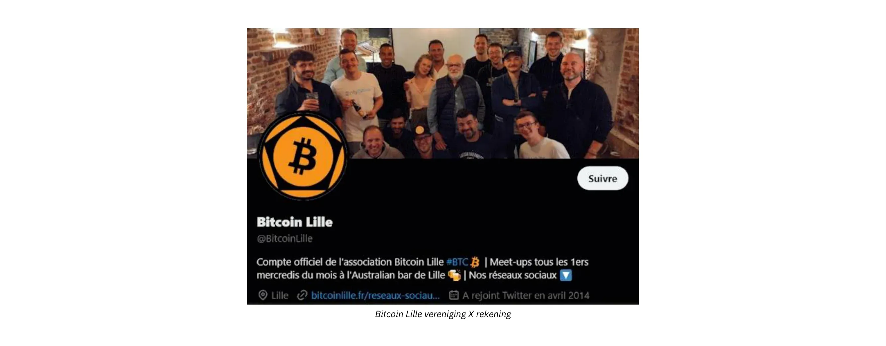

Daarnaast zijn **een paar privacy-instellingen het aanpassen waard**:

- je Twitter-account in de "openbare" modus laten staan (berichten zichtbaar voor iedereen);
- zorgen dat iedereen je kan vinden;
- het volgen van locaties en het delen van gegevens met andere entiteiten uitschakelen (in de privacyinstellingen).

Voor elk evenement zul je Twitter waarschijnlijk gebruiken om nuttige informatie te delen. Maar zoals bij de meeste sociale netwerken is **zichtbaarheid alles**.

Om je veel tijd te besparen, hebben we de tijd genomen om [Twitter's open-source rangschikkingsalgoritme](https://github.com/twitter) te bestuderen.

Dit zijn de **belangrijkste dingen waarop je je moet richten om je zichtbaarheid te vergroten**:

- Algemene tips:
    - Tweet in de ingestelde taal van je account of in het Engels: tweeten in andere talen kan je zichtbaarheid sterk verminderen;
    - Blijf bij je niche, deel alleen inhoud die gerelateerd is aan de focus van je account; tweets die niet over het onderwerp gaan, worden bestraft door het algoritme;
    - Streef naar 1 tot 2 tweets per dag;
    - Post tijdens piekuren: Donderdag of vrijdag tussen 8 en 10 uur 's ochtends presteert meestal het beste (controleer in je account: Twitter Analytics).

- Als je een tweet schrijft:
    - een foto (of zelfs een video) toevoegen;
    - Gebruik slechts één hashtag (meestal is #Bitcoin het meest relevant. Indien van toepassing kun je een trending hashtag toevoegen die gerelateerd is aan jouw accountgebied);
    - Moedig je gemeenschap aan tot interactie:
        - Zoals = gewicht 0,5
        - Retweet = gewicht 1
- Antwoord = gewicht 27 (**!!**)
- Beantwoord mensen die reageren op je tweets (gewicht van 75!!);
    - Plaats links niet in de hoofdtweet, maar in het eerste commentaar;
    - Schrijf woorden voluit, vermijd afkortingen.

- Andere tips:
    - Tweet over onderwerpen die trending zijn, zolang ze aansluiten bij het expertisegebied van je account;
    - Repost je best presterende tweets;
    - Voer af en toe peilingen uit;
    - Schrijf waar mogelijk draden;
    - Moedig je gemeenschap aan om je profiel te bezoeken en je te volgen.

Bovendien kun je **een tweet of thread vastmaken aan je Twitter-profiel om het maximale zichtbaarheid te geven**, net zoals de Bitcoin Witsand-gemeenschap in Zuid-Afrika doet.

Merk ook op dat het mogelijk is om op twee Twitter-accounts tegelijk ingelogd te blijven, zowel op je telefoon als op je computer. Dit is superhandig als je gemakkelijk wilt wisselen tussen je persoonlijke en gemeenschappelijke accounts.

Wees alleen voorzichtig... per ongeluk een feestfoto plaatsen vanaf de community-account kan sneller gebeuren dan je denkt!

Tot slot, ook al is je gebruikersnaam "@Bitcoin[CITY]" uniek en nu van jou, is het slim om te anticiperen op nep- of copycataccounts. Overweeg ook om je te registreren:

- @Bitcoin_[CITY]
- @[STAD]Bitcoin
- @[STAD]_Bitcoin

Op die manier verklein je de kans aanzienlijk dat iemand zich voordoet als jouw community.

Handleiding voor het maken van een Twitter-account:

:::video id=4648976f-41ec-499a-b7ec-a53e796f71b4:::

## Dichterbij naburige meetups komen

<chapterId>12a21c3b-235a-5292-8209-67bf60f61e49</chapterId>

Nu je communicatiekanalen en sociale netwerken zijn ingesteld en de visuele identiteit van je community weerspiegelen, is het tijd om de juiste mensen te gaan volgen.

Begin op Twitter met het volgen van belangrijke accounts die Bitcoin wereldwijd promoten, zoals [@Bitcoin](https://twitter.com/Bitcoin) en [@planb_network](https://twitter.com/planb_network), evenals initiatieven zoals [@FBCEglobal](https://twitter.com/FBCEglobal). Je kunt ook [@halfin](https://twitter.com/halfin)'s beroemde "Running Bitcoin" tweet van 11 januari 2009 retweeten. En nog belangrijker, **volg de accounts van Bitcoin gemeenschappen en meetups in je eigen land**.

Dit creëert **kansen om elkaar te volgen, elkaar te taggen en de collectieve zichtbaarheid te vergroten**. Dit is al gebruikelijk bij de ~50 Bitcoin gemeenschappen in Frankrijk, de "Satoshi Spritz" initiatieven in Italië en de "Einundzwanzig" groepen in Duitsland.

Hoewel het voor sommigen misschien triviaal lijkt, kan **het volgen van de accounts van lokale gemeenschappen en initiatieven leiden tot samenwerkingen of zelfs partnerschappen**. Bijvoorbeeld, de Bitcoin Luik en Bitcoin Rijsel gemeenschappen (en ook Bitcoin Aix en Bitcoin Marseille) kwamen op deze manier met elkaar in contact, waardoor ze samen een jaarlijkse meetup organiseerden.

De **Cercle du Coin** maaltijden zijn een ander goed voorbeeld.

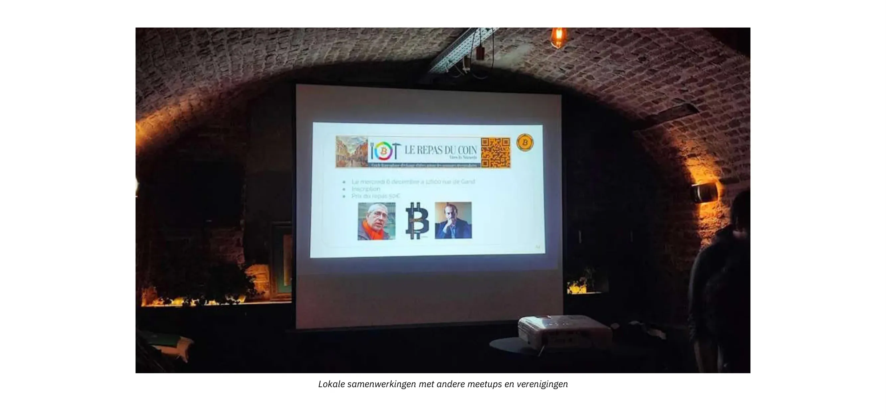

In Frankrijk kan het ook relevant zijn om **de initiatieven te volgen zoals [@KonsensusFR](https://twitter.com/KonsensusFR), [@bitcoinpointfr](https://twitter.com/bitcoinpointfr), [@DecouvreBitcoin](https://twitter.com/DecouvreBitcoin) en [@btcmap](https://twitter.com/btcmap)**. Dit zijn natuurlijk slechts suggesties en elke gemeenschap is vrij om te doen wat ze wil, in volledige decentralisatie en autonomie.

Zoals hierboven vermeld, is het doel van elkaar volgen om wederzijdse zichtbaarheid te vergroten. Hoe meer je jouw gemeenschap en die van je regio/land promoot op de sociale netwerken, hoe meer mensen over je zullen praten. Hoe meer mensen over je praten, hoe groter de kans dat ze je evenementen zullen bijwonen.

Het liken en retweeten van posts van andere communities kan hun ontwikkeling dus enorm helpen... en die van jou.

Je zou ook kunnen voorstellen dat **meetup-organisatoren en bitcoiners die gemeenschappen leiden twee of drie keer per jaar samenkomen via videoconferentie om de voortgang van nationale projecten en gerelateerde gemeenschappen te bespreken. Dit kan ook plaatsvinden tijdens persoonlijke evenementen.**

Het doel is eenvoudig: verzamel ieders feedback, bespreek hoe de gemeenschappen evolueren, deel succesvolle ideeën en projecten en stel oplossingen voor waar nodig. Een schriftelijke samenvatting van de bijeenkomst kan achteraf worden gedeeld met community-organisatoren in je land die niet aanwezig konden zijn.

## Btcmap.org

<chapterId>365f43d4-7b2c-5961-a184-157b8c1a0116</chapterId>

In dit stadium is je community al actief. Het enige wat je nog moet doen, is meer geïnteresseerden verwelkomen en helpen groeien.

Maar je kunt niet vooruit zonder te weten dat er **platforms zijn waar bitcoiners communities en meetups in hun buurt** kunnen vinden. Daarom is het belangrijk om een paar minuten de tijd te nemen om een vermelding op deze sites aan te vragen.

Deze omvatten:

- [Btcmap.org](https://btcmap.org/)**, een website met twee kaarten die dagelijks worden bijgewerkt: **[de wereldkaart van bedrijven die Bitcoin accepteren](https://btcmap.org/map)** en **[de wereldkaart van gemeenschappen](https://btcmap.org/communities/map)**. Veel bitcoiners bekijken deze kaarten regelmatig, of ze nu op reis zijn of hun dagelijks leven leiden, om nieuwe mensen te ontmoeten of plekken te vinden om hun Sats uit te geven. Btcmap is de wereldwijde referentie en het is essentieel voor de zichtbaarheid om je gemeenschap daar te vermelden.**
- [BitcoinerEvents](https://www.bitcoinerevents.com/), een website gemaakt door bitcoiners, voor bitcoiners. **Je kunt er de komende evenementen van je gemeenschap posten**. In Frankrijk wordt het echter nog niet veel gebruikt.
- afhankelijk van je land kunnen er andere lokale initiatieven zijn. In Frankrijk is er bijvoorbeeld [Bitcoin.fr](https://Bitcoin.fr/events/categories/evenements/), die **elke maand een lijst maakt van tientallen Bitcoin evenementen**. Dus als je hen nog niet volgt op Twitter of contact met hen opneemt om informatie over jouw gemeenschap en evenementen te delen, dan is het nu tijd! **Om de Franse evenementenkalender up-to-date te houden, zou het geweldig zijn als alle Franse Bitcoin gemeenschappen er een gewoonte van maken om:**
    - vermelding van @bitcoinpointfr op Twitter voor elk nieuw gemeenschapsevenement
    - nieuwe aankondigingen van evenementen vastpinnen in hun Telegram-groep.

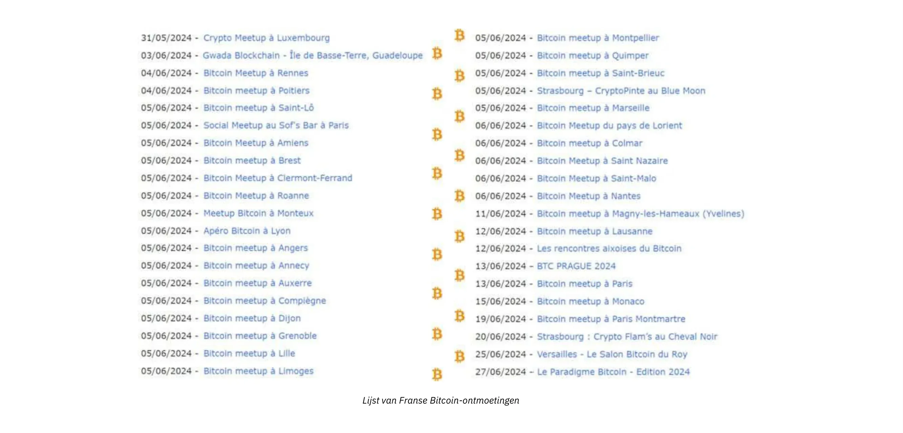

Andere platforms kunnen je zichtbaarheid ook vergroten. **[Meetup](https://www.meetup.com/)** is er een van, en het is een website (en een telefoon-app) waar je een evenement kunt aanmaken en anderen in de buurt kunt vinden.

Het kost ongeveer 8€ per maand (of ongeveer 90€ per jaar), wat duur kan zijn voor een kleine, ongestructureerde gemeenschap. Dat gezegd hebbende, Meetup wordt veel gebruikt in sommige landen, vooral in Canada en de Verenigde Staten, en het is handig voor het beheren van inschrijvingen.

Ook **[Orangepillapp](https://www.orangepillapp.com/)** is een betaalde mobiele app (50.000 Sats/jaar of 200.000 Sats voor levenslange toegang) die bitcoiners helpt elkaar te ontmoeten.

Hoewel deze laatste twee platforms kunnen helpen om de zichtbaarheid te vergroten, worden ze niet aanbevolen bij het lanceren van een community, simpelweg omdat ze niet gratis zijn.

**Beginnen met een vermelding op [btcmap.org](https://btcmap.org/), [BitcoinerEvents](https://www.bitcoinerevents.com/) en voor Franse gemeenschappen, op [Bitcoin.fr](https://Bitcoin.fr) is meer dan genoeg**.

Gefeliciteerd! Je **community is gecreëerd**, je **visualisaties zijn klaar**, je **doelstellingen zijn bepaald**, je **communicatiekanalen zijn operationeel**, je **sociale netwerken zijn gelanceerd** en je **zichtbaarheidsstrategie is bepaald**.

Zodra een kleine groep bitcoiners zich bij je heeft aangesloten, is het tijd voor de volgende stap: het organiseren van je eerste Bitcoin meetup.

# Organiseer een Bitcoin bijeenkomst

<partId>c009d2a6-40ce-583b-bd24-fdfd1fea262e</partId>

## Waarom een regelmatige meetup organiseren met je community?

<chapterId>ed8e471c-3b99-57e2-a042-2d4e8a40b137</chapterId>

Nu de sociale netwerken en communicatiekanalen van je community zijn gelanceerd, is het tijd om je aanwezigheid op deze platforms te laten voelen. Moedig nieuwe leden aan om zich voor te stellen en geleidelijk aan deel te nemen aan de conversatie.

Dit zal je tijd vrijmaken, die je zou kunnen gebruiken om na te denken over het creëren van een soort meetup. Dit zal nog relevanter worden zodra je echte opwinding begint te voelen binnen je gemeenschap.

Zoals eerder vermeld, kan **een Bitcoin meetup gezien worden als het volgende "niveau" voor een gemeenschap**. Aan de ene kant stelt het **leden in staat elkaar persoonlijk te ontmoeten**, en aan de andere kant helpt het **nieuwkomers die geïnteresseerd zijn in dit ecosysteem** op te leiden.

Met een evenement als dit kun je, op je eigen schaal, **een buzz creëren rond Bitcoin** in jouw stad, die na verloop van tijd kan groeien naarmate jouw gemeenschap projecten oppakt.

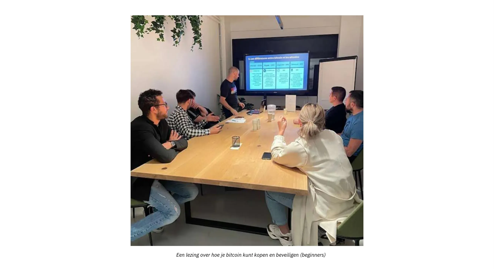

Natuurlijk, hoe groter je doelen voor gemeenschapsontwikkeling, hoe meer tijd jij en je leden zullen moeten investeren.

Daarom is het belangrijk om **te beginnen met haalbare doelen te stellen voor je meetup**.

## De eerste meet-up: wanneer en waarom?

<chapterId>f3f8a614-cfb4-5994-a2e8-d56e6f8e3347</chapterId>

Je kunt al enkele weken na het aanmaken van je community een meet-up lanceren.

Maar in dat stadium zal je groep waarschijnlijk nog steeds klein zijn, wat betekent dat er een kans is dat er niemand komt opdagen.

Het is beter om een meet-up te organiseren zodra je ten minste een paar actieve leden hebt in je communicatiekanalen, bijvoorbeeld een paar dozijn. Dit kan snel gebeuren, maar het hangt ook af van de persoonlijkheid van mensen.

Als je die vonk eenmaal voelt, stel dan voor om elkaar persoonlijk te ontmoeten. Als anderen geïnteresseerd zijn, hoef je alleen nog maar **een datum vast te leggen voor jullie eerste ontmoeting**.

In plaats van zelf de datum te kiezen, is het meestal het beste om **een tiental dagen op voorhand een poll te maken met verschillende mogelijke dagen en tijdstippen**. Op deze manier kun je de stemmen gebruiken om de opkomst te maximaliseren, spanning op te bouwen en je tijd zo goed mogelijk te gebruiken.

Het is het beste om er niet aan te beginnen met vaste verwachtingen over hoe de meet-up zal verlopen, hoeveel mensen er zullen komen of welke onderwerpen er besproken zullen worden. Dit voorkomt teleurstellingen en voorkomt dat deelnemers zich onder druk gezet voelen.

Laat alles op een natuurlijke manier verlopen, misschien onder het genot van een drankje. Gesprekken moeten gemakkelijk verlopen en als het nodig is, kun je de discussie zachtjes terugsturen naar Bitcoin als het begint af te dwalen.

Als je je wilt voorbereiden op rustigere momenten, kun je een paar activiteiten of gespreksonderwerpen plannen, zoals:

- het tonen van de **[Mempool](https://Mempool.space/)** op een computer of smartphone;
- een boek meenemen;
- een **Nerdminer**, Bitaxe, FPGA of zelfs ASIC meenemen;
- met een **Bitcoin flyer**;
- brainstormen over een Bitcoin visual of logo voor jouw gemeenschap;
- een **[Bitcoin kaartspel](https://www.Maximalist.ovh/accueil/20-game-le-Coin-de-table.html)** spelen;
- met de **[btcmap.org](https://btcmap.org/)** kaart van gemeenschappen en handelaren;
- gW-116 verzenden of ontvangen met **bliksem**.

Als je meet-up net begint, is het vaak niet het juiste moment voor een formele presentatie. Als de opkomst klein is, werkt een open en ongedwongen discussie meestal het beste.

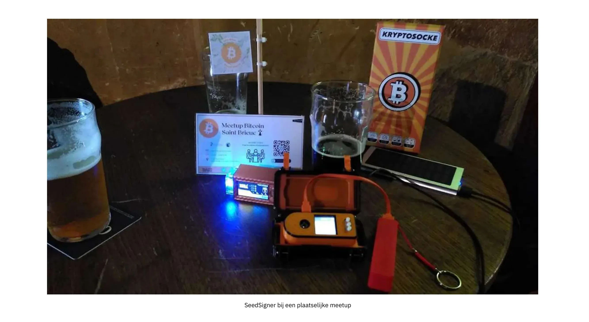

Na je eerste meet-up wil je waarschijnlijk nog een meet-up plannen. Zolang je community nog klein is, kun je het beste data blijven kiezen via peilingen, bijvoorbeeld één keer per maand of om de twee maanden. Je kunt dit bespreken in je communicatiekanalen.

Als zich een vaste groep van bitcoiners en geïnteresseerde deelnemers vormt, is het om twee redenen zinvol om een terugkerend schema op te stellen:

1) het maakt het voor iedereen gemakkelijker om vooruit te plannen;

2) het helpt **een "gewoonte" ** te creëren. Zelfs als iemand stopt met het regelmatig bekijken van je kanalen, weten ze nog steeds wanneer de meet-up plaatsvindt en kunnen ze langskomen zoals gewoonlijk.

Dit tweede punt is een van de redenen waarom **in Frankrijk de meeste meetups plaatsvinden op de eerste woensdag van elke maand** (zie het "ambassadeurs" initiatief, gelanceerd door [DecouvreBitcoin](https://decouvrebitcoin.fr/) in 2022).

In Duitsland en Italië is er geen vaste nationale dag.

Echter, als alle meet-ups in het hele land op dezelfde dag plaatsvinden, ontstaat er een centralisatieprobleem: het verhindert bitcoiners om evenementen bij te wonen in gemeenschappen in de buurt en het kan ook veiligheidsproblemen opleveren. Praten met naburige organisatoren van meet-ups kan helpen om tot een goede regeling te komen.

Naarmate je gemeenschap groeit en meet-ups meer mensen aantrekken, zou je dit kunnen doen:

- stel een specifiek doel voor elke ontmoeting;
- of zelfs **elke maand een tweede evenement toevoegen**.

In het eerste geval kan een duidelijk doel ervoor zorgen dat de aanwezigen iets nieuws hebben geleerd en dat de gesprekken gericht blijven op Bitcoin, zonder daarbij ieders voorkeuren uit het oog te verliezen.

In het tweede geval kan een tweede maandelijks evenement gewijd zijn aan een specifiek thema, zoals beginnerssessies of workshops (Mining, Lightning, knooppuntinstallatie, enz.).

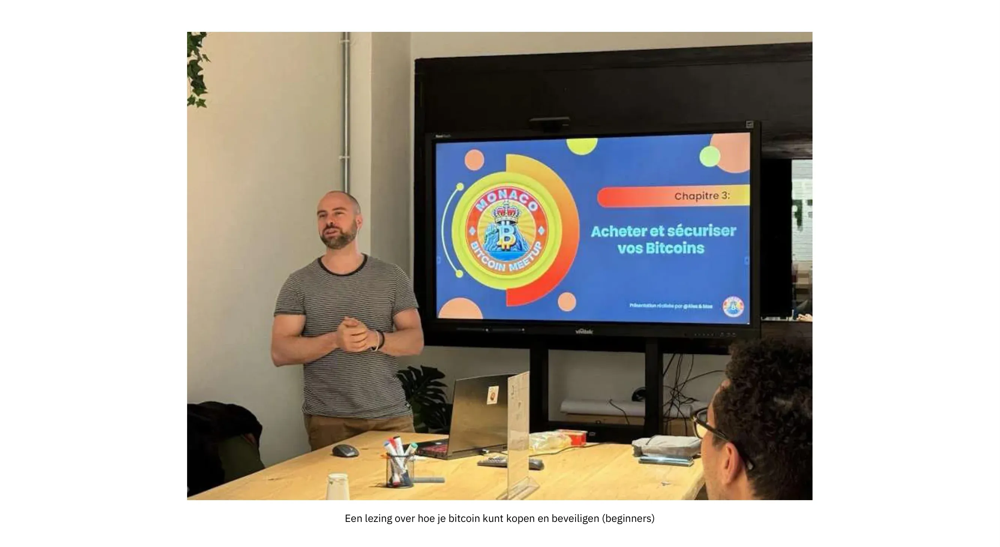

Houd er rekening mee dat **dit meer organisatie en meer van je tijd vergt**. Gelukkig vindt u in [deel 6/8 van deze cursus](https://planb.academy/courses/1c643dc9-a15f-4f9e-93b6-cb3c58b4ee35/3213d87a-1998-5972-ab93-97a5769ba279) een reeks herbruikbare open-source bronnen om u te helpen.

Hoe dan ook, het hangt allemaal af van het actieplan voor de korte, middellange en lange termijn dat jij, of je gemeenschap, voor jezelf opstelt.

## De zoektocht naar een locatie

<chapterId>405d389e-6a32-5777-af8d-293380d2e8fd</chapterId>

Een locatie vinden voor je evenementen is vaak geen gemakkelijke taak. Bovendien is het essentieel dat deze locatie **in de stad van je gemeenschap ligt**.

Er zijn verschillende criteria om te overwegen, waaronder:

1) **Locatie**: is het goed bereikbaar met het openbaar vervoer? Met de auto? Is er parkeergelegenheid?

2) Is de locatie aangenaam en niet te **luidruchtig**? Ben je op zoek naar een formele setting (co-working space, vergaderruimte) of iets informelers (bar, restaurant)?

3) Heeft het genoeg capaciteit om je te ontvangen, zelfs op de avond van een rugby- of Champions League-wedstrijd?

4) Is er een videoprojector en een rustige ruimte voor presentaties?

5) En tot slot, als het een bar of restaurant is, biedt het menu dan voor elk wat wils om te eten en te drinken?

Daarnaast zijn er drie belangrijke punten om in gedachten te houden:

- Als je van plan bent om de avond in twee delen op te splitsen: eerst een presentatie in een formele ruimte om iedereen te helpen zich te concentreren, en dan naar een bar of restaurant om verder te gaan in een meer ontspannen sfeer, leert de ervaring dat het veranderen van locatie halverwege de avond er vaak toe leidt dat sommige deelnemers tijdens de pauze vertrekken. Deze aanpak wordt daarom niet aanbevolen.
- Bij je eerste meet-ups zal de opkomst waarschijnlijk klein zijn en je zult waarschijnlijk geen formele presentaties houden. In dat geval is het niet nodig om jezelf voor te stellen aan de eigenaar of je doelstellingen uit te leggen. Echter, **als de meet-ups eenmaal regelmatig en goed bezocht worden, is het de moeite waard om dit te doen om professionaliteit te tonen en je wens uit te spreken om maandelijks terug te komen**. Dit kan tot veel discussies leiden (automatische maandelijkse reserveringen, gratis drankjes en/of etensborden, kortingen, gesprekken over Bitcoin, acceptatie van Bitcoin betalingen, etc.). Als je specifiek op zoek bent naar een locatie met een videoprojector om presentaties te geven, is het natuurlijk essentieel om een ontmoeting aan te vragen (persoonlijk of zelfs telefonisch) met de eigenaar en/of manager om je project en doelstellingen voor te stellen.

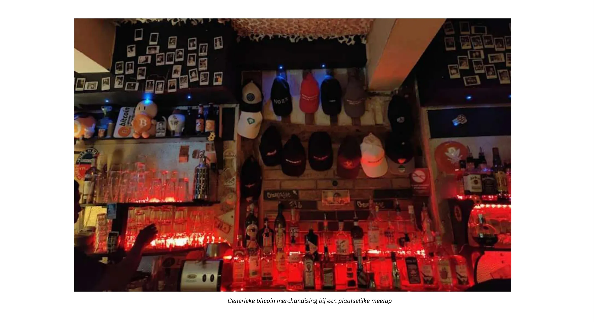

- tot slot willen sommige gemeenschappen **alleen hun evenementen houden op plaatsen die Bitcoin betalingen accepteren**, wat begrijpelijk is. In dit geval is het een goed idee om **te beginnen met het zoeken naar Bitcoin accepterende bedrijven in jouw stad** (op [btcmap.org](https://btcmap.org/map/)en contact met ze op te nemen om te zien of ze aan jouw criteria voldoen. Als er niets geschikts beschikbaar is, kun je proberen nieuwe handelaren aan te nemen, maar verwacht veel weigeringen, wat ontmoedigend kan zijn. Daarom is het vaak het beste om dit niet vanaf het begin als doel te stellen, maar het te overwegen zodra je gemeenschap goed gevestigd is en je genoeg "vuurkracht" hebt

Aarzel bij het opstarten van je meet-up niet om de eerste paar maanden van locatie te veranderen. Dit zal je helpen om **relaties op te bouwen met verschillende managers**, verschillende sferen te verkennen en informatie te verzamelen over potentiële toekomstige hosts.

Later, als je groep is gegroeid, zou je zelfs een middag kunnen nemen om verschillende bedrijven en bars te bezoeken en te vragen of ze een ruimte hebben die geschikt is voor het houden van je maandelijkse evenementen en meet-ups.

## Voor de ontmoeting

<chapterId>c5218943-580d-5efc-89ed-6b5d728816d6</chapterId>

Ben je van plan om in de komende weken een meet-up te organiseren?

Hier is een checklist om je voor te bereiden:

1/ **Bevestig de locatie**

Neem contact op met de locatie waar je het evenement gaat houden en reserveer deze voor het geschatte aantal deelnemers.

2/ **Kondig het evenement aan**:

    - Deel de datum, tijd en locatie op je sociale netwerken en andere communicatiekanalen. Voeg indien nodig een registratielink toe.
    - Maak een speciale visual (Canva poster bijvoorbeeld, zie deel 2/8 "[Een identiteit ontwerpen voor je Bitcoin community](https://planb.academy/courses/1c643dc9-a15f-4f9e-93b6-cb3c58b4ee35/b48a18cc-afdf-5216-802c-32647b5cd8a3)").
    - Maximaliseer de zichtbaarheid door de aankondiging vast te zetten op Telegram en Twitter en een "@iedereen" vermelding te gebruiken op Discord.
    - Plaats aankondigingen 7 tot 10 dagen voor het evenement zodat deelnemers vooruit kunnen plannen.

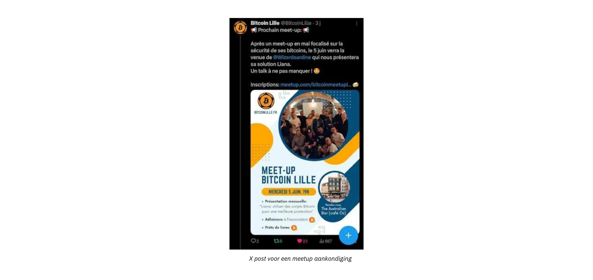

3/ **Herinner je publiek**

Deel en retweet je aankondigingen twee tot drie dagen voor het evenement om de zichtbaarheid te vergroten.

4/ **De locatie bijwerken**

Controleer de dag ervoor (of twee dagen ervoor) je inschrijvingen en laat de locatie weten hoeveel deelnemers er uiteindelijk worden verwacht.

Extra stappen om je evenement te laten opvallen:

- Flyers en/of posters drukken
- Een presentatie over een specifiek onderwerp voorbereiden
- Organiseer een activiteit of workshop

## De dag van de meet-up

<chapterId>cf60067b-591f-5fdf-9b9e-d442aad0e8f9</chapterId>

De grote dag is aangebroken! Eén of twee uur voordat het evenement begint, stuur je een herinnering via de communicatiekanalen van jouw gemeenschap. Herbevestig de starttijd en laat deelnemers weten hoe ze je kunnen herkennen, bijvoorbeeld door te vermelden dat je een Bitcoin T-shirt en pet draagt.

Naarmate je meetups groeien en je meer dan 20 mensen begint te verwelkomen, wordt het steeds belangrijker om de locatie voor te bereiden.

Dit is wat je moet doen:

1) **Kom vroeg** om alles klaar te zetten.

2) **Ruim de ruimte** in volgens jullie behoeften en de mogelijkheden van de locatie. Als je maar met zes personen bent, is er weinig opstelling nodig. Maar als je 10-20 deelnemers hebt, kan een volledig zittende opstelling de interactie beperken. Kies in dat geval voor een staande opstelling met goed geplaatste hoge tafels als die beschikbaar zijn, terwijl je toch een paar (bij voorkeur hoge) stoelen voorziet. Als er een presentatie gepland is, houd dan de staande opstelling voor het grootste deel van de avond en breng stoelen net voor de lezing.

3) Voeg kleine aangepaste accenten toe:

    - Hang een poster op bij de ingang om je locatie aan te geven (gebruik Patafix en vraag eerst toestemming aan de zaal).
    - Hang Bitcoin-thema posters op binnenin (Bitcoin witboek, uw gemeenschapshandvest, huidige projecten, etc.).
    - Plaats stickers, flyers of conversatiestarters op tafels, bijvoorbeeld: een Nerdminer, Hardware Wallet, laptop met zijn Mempool, ASIC Miner of metalen reserveplaatje voor privésleutels.

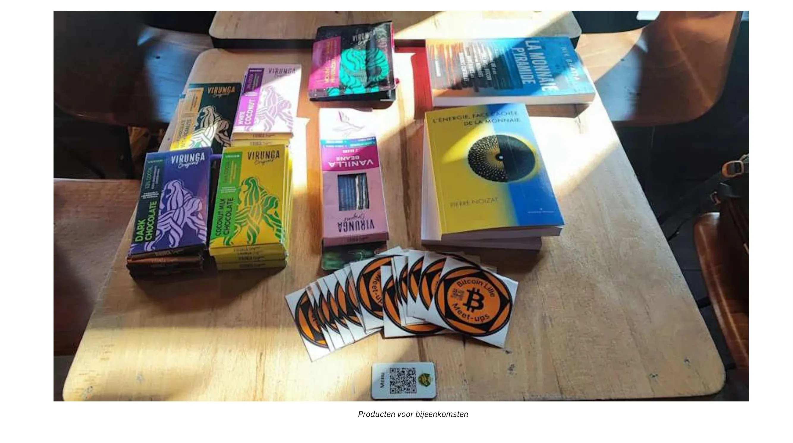

Als je slechts een paar deelnemers verwacht en nog geen relatie hebt opgebouwd met de managers van de locatie, vermijd dan om meteen al je apparatuur mee te nemen en uit te stallen. Als er eenmaal vertrouwen is, heb je meer vrijheid om de ruimte in te richten zoals jij dat wilt.

Pak tot slot een drankje en wacht tot er mensen komen. En onthoud: laat je niet ontmoedigen als er de eerste keer niemand komt. Neem een boek of een video mee om naar te kijken, voor het geval dat.

## Na de ontmoeting

<chapterId>3e881af9-9c09-5721-81ee-c5cda3b109c5</chapterId>

Als de bijeenkomst is afgelopen, is het tijd om op te ruimen voor het zaalpersoneel. Bied voordat je vertrekt aan om de obers of managers een handje te helpen. Dit kan zo simpel zijn als het verzamelen van alle glazen op één tafel of, als je bij de bar staat, ze terugbrengen voordat je weggaat.

Als je weer thuis bent, denk je waarschijnlijk nog dagen aan Bitcoin. Dat is het perfecte moment om de vinger aan de pols van je gemeenschap te houden en feedback van deelnemers te verzamelen. Dat kan:

- Plaats een bedankbericht op je communicatiekanalen en deel links of bronnen die tijdens het evenement zijn genoemd.
- Nodig deelnemers uit om verbeteringen voor te stellen voor de volgende meetup.
- Begin met het plannen van je volgende evenement.

Je hebt dan een paar weken de tijd om nieuwe ideeën, visuals of projecten te ontwikkelen om de volgende meetup nog beter te maken.

## Het belang van het betrekken en behouden van deelnemers

<chapterId>f5355e35-4b07-527c-88a3-8535cba7592c</chapterId>

Rome werd niet in één dag gebouwd, en dat zal jouw gemeenschap ook niet zijn. Het momentum rond Bitcoin komt van regelmatige bijeenkomsten en evenementen.

Om dat voor elkaar te krijgen is één ding essentieel: **Deelnemers betrokken houden**.

Het zou kunnen beginnen met een kleine groep gepassioneerde bitcoiners, met als doel regelmatig samen te komen en over Bitcoin te praten. Na verloop van tijd, afhankelijk van ieders beschikbaarheid en interesses, kun je **bepaalde organisatorische taken delen met de groep**, of kernleden** uitnodigen om specifieke projecten** op zich te nemen. Deze kunnen uniek zijn voor jouw gemeenschap, jouw meet-ups of jouw stad of zelfs geïnspireerd zijn op de vele initiatieven die voorgesteld worden in [deel 6/8 van deze cursus](https://planb.academy/courses/1c643dc9-a15f-4f9e-93b6-cb3c58b4ee35/3213d87a-1998-5972-ab93-97a5769ba279). **Dit bevordert niet alleen Commitment van je kernleden, maar helpt je gemeenschap ook groeien en bloeien**.

Naarmate je meetups vorderen, zullen er nieuwe gezichten opduiken: mensen die BTC en/of altcoins kochten in vorige cycli, tech-enthousiastelingen die hun kennis willen verdiepen, of complete beginners die nieuwsgierig zijn naar dit niet-sensibiliseerbare, gedecentraliseerde, transparante en eerlijke betalingssysteem dat werkt zonder voorwaarden en zonder vertrouwde derde partijen.

Om ervoor te zorgen dat iedereen zich betrokken voelt bij je evenementen, moet je je richten op twee belangrijke aspecten:

- **Sociale inclusie**: Iedereen die aanwezig is moet zich welkom voelen. Doe de moeite om nieuwkomers te begroeten, vraag waarom ze gekomen zijn en stel ze voor aan anderen. Als mensen zich betrokken voelen, is de kans groter dat ze terugkomen en misschien zelfs helpen bij het organiseren van toekomstige evenementen.
- **Geduld en openheid**: Dit kost tijd en motivatie. Als je praat met een toegewijde schijtlijder (of erger nog, een XRP Maximalist), kan het verleidelijk zijn om hem af te wijzen. Maar door in gesprek te gaan, kun je misverstanden of verkeerde redeneringen ophelderen. Als ze bereid zijn om te luisteren, zijn ze misschien bereid om Bitcoin echt te begrijpen.

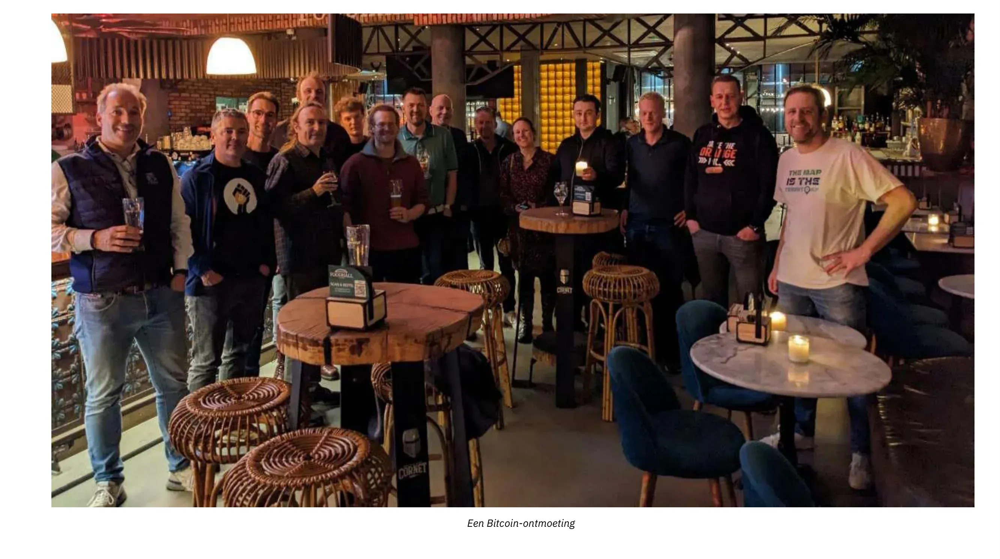

Denk vanuit een praktisch standpunt aan de algehele evenementervaring:

- Was de **venue aangenaam**?
- Was het **gemakkelijk toegankelijk?**
- Waarom hebben sommige mensen zich aangemeld maar zijn ze niet komen opdagen?
- Welke discussies werden er gehouden? Waren de discussies te technisch voor beginners?
- Waren de discussies te alcoholisch?

Elke deelnemer heeft zijn eigen persoonlijkheid, doelen en interesses, dus de ervaringen zullen variëren. Maar als de locatie goed is, het publiek openstaat en de bedoelingen oprecht zijn, is er alle reden voor een succesvolle meetup.

Het opbouwen van een meetup vergt tijd, maar vooral organisatie. Het is een menselijk project en het zal alleen werken en groeien op lange termijn als het goed gepland, open en inclusief is.

Uiteindelijk is het aan jou om te beslissen hoe ver "open en inclusief" moet gaan. Onthoud wel: een shitcoiner is vaak gewoon een bitcoiner in wording.

# Voorbeelden van projecten en initiatieven

<partId>45b3bc40-1c31-583e-8411-2662e6efd765</partId>

## Waarom verder gaan dan alleen bier drinken?

<chapterId>3213d87a-1998-5972-ab93-97a5769ba279</chapterId>

Naarmate de blokken vorderen, zal jullie gemeenschap evolueren. Nieuwe gezichten zullen erbij komen, anderen zullen wegdrijven, maar het leidende principe moet hetzelfde blijven: ontwikkel het Bitcoin ecosysteem en versterk de banden tussen de leden.

Er zijn veel projecten en initiatieven die kunnen worden uitgevoerd. Dit hoofdstuk biedt een niet-uitputtende lijst van ideeën die kunnen worden uitgevoerd binnen een community of tijdens een meetup. Voel je vrij om diegene te kiezen die je inspireren en zelfs om je eigen ideeën bij te dragen aan deze cursus [door een "Pull Request" aan te maken op GitHub](https://github.com/PlanB-Network/Bitcoin-educational-content).

Laten we, voordat we er dieper op ingaan, nog eens terugkomen op een eerder genoemd punt.

Wanneer je een Bitcoin meetup organiseert, ontmoet je nieuwe mensen. Sociale interactie is essentieel en bier (of alcohol in het algemeen) kan helpen om een feestelijke sfeer te creëren. Maar het is de moeite waard om in gedachten te houden:

- Alcohol tast cognitieve vaardigheden zoals denken en begrijpen aan, waardoor het voor deelnemers moeilijker kan worden om serieuze discussies of presentaties te volgen.
- Alcohol kan ook een troostritueel worden: elke maand deel je je "Bitcoin moment" met vrienden onder het genot van een drankje. Hoewel dat een geweldige manier is om contact te maken, is bier drinken echt het hoofddoel van je meetup? Of doe je liever Exchange onderzoek, leer je van anderen en help je nieuwkomers Bitcoin te ontdekken?

Iedereen heeft zijn eigen voorkeuren, overtuigingen en persoonlijkheid. Dit gaat niet over het beoordelen van de ene meetup boven de andere. Hoewel we vaak onder het genot van een biertje praten over het veranderen van de wereld, beginnen revoluties niet op die manier en groeien ze ook niet op die manier.

De sleutel is om je er gewoon bewust van te zijn.

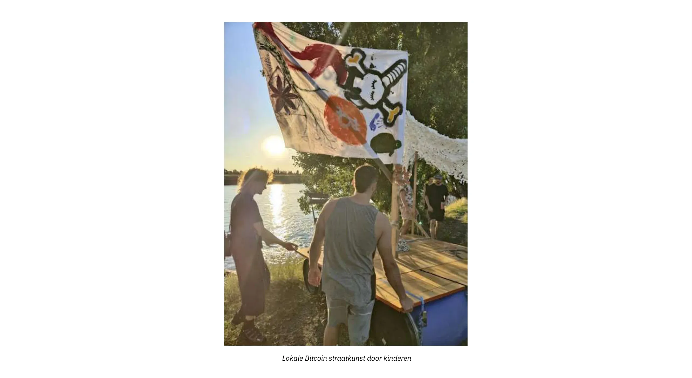

## Organiseer thematische meet-ups, met een jaarlijkse progressie

<chapterId>46afdbcc-a775-5c16-b20a-34956690d58f</chapterId>

Zodra je een kerngroep van ongeveer tien mensen hebt opgebouwd, kun je beginnen met presentaties toe te voegen aan elk evenement. Deze kunnen een vooraf aangekondigd thema volgen of volledig los van elkaar staan.

Bij het plannen van presentaties of workshops helpt het om een duidelijk, goed gestructureerd verloop te creëren. Het doel is om de kernconcepten van Bitcoin **stap voor stap** te behandelen, zodat de deelnemers een compleet beeld krijgen van het onderwerp vanuit verschillende invalshoeken.

In Frankrijk werkten organisatoren tijdens de zomer van 2023 aan **een jaarlijkse progressie**.

Naast de sterke educatieve waarde, maakt deze aanpak het mogelijk om open-source documenten en diavoorstellingen te delen tussen groepen, waardoor geleidelijk een gedeelde bibliotheek van bronnen wordt opgebouwd. Het initiatief is goed ontvangen en zal de komende jaren verder groeien.

Hieronder staat de progressie van de Franse meetups voor 2023-2024. Voor elk thema zijn een open-source presentatie en een video beschikbaar, die je op ideeën kunnen brengen voor onderwerpen die je voor je eigen evenementen zou kunnen behandelen.

Extra bewerkbaar materiaal is ook te vinden in de [Bitcoin Teaching Toolbox](https://planb.academy/fr/resources/bet)!

| Month | Theme | Video | Editable Resource |
| -------- | -------- | -------- | --- |
| September     | Chapter 1: What is Bitcoin?     | [	YouTube link](https://www.youtube.com/watch?v=CSjuBqrl4t8)     | [Editable PowerPoint](https://www.canva.com/design/DAFu0d5Jd7M/9gAWDAOSS6LDkWENuZjYgw/edit) |
| October & November| Chapter 2: Understanding Bitcoin Transactions     | [YouTube link](https://www.youtube.com/watch?v=inFnR-3NsdM)     | [Editable PowerPoint](https://www.canva.com/design/DAFsEcnOro8/Mz9FYdTGhsvozZOe0Y9jtw/edit) |
| December     | Chapter 3: Understanding the Lightning Network     | [YouTube link](https://www.youtube.com/watch?v=hHz-ALx8D9w)     | [Editable PowerPoint](https://www.canva.com/design/DAF4YPSNnR8/HKp4Vmcno8eMtVWnZmFtcw/edit) |
| January     | Chapter 4: What is Mining?     | [YouTube link](https://www.youtube.com/watch?v=QyHZ3CVI_OI)     | [Editable PowerPoint](https://www.canva.com/design/DAF5DE6iBEM/tsy8E3oBebUnsR0kj53vvQ/edit) |
| February     | 	Chapter 5: Running a Bitcoin and Lightning Node    | [YouTube link](https://www.youtube.com/watch?v=RRYK-usg-OY)     | [Editable PowerPoint](https://www.canva.com/design/DAF55FU6HI0/sQ0lacRJblqrhn_9Xk1yDg/edit) |
| March     | 	Chapter 6: Using the Lightning Network in Daily Life    | [YouTube link](https://www.youtube.com/watch?v=o2BS4xjei8M)    | [Editable PowerPoint](https://www.canva.com/design/DAGAcJMw7lw/-haMNnHnwj5vpDAy8MDowA/edit) |
| April & May    | Chapter 7: Securing Your Bitcoins      | [YouTube link](https://www.youtube.com/watch?v=fHExPbhM0Hg)    | [Editable PowerPoint](https://www.canva.com/design/DAGDz3Nq4e0/D3uG-4w9FN6OhUq-VXzhfg/edit) |
| June     | 	Chapter 8: What is Multi-Sig?     | [YouTube link](https://www.youtube.com/watch?v=Me5489mpoxA)     | [Editable PowerPoint](https://www.canva.com/design/DAGLMtQT6sg/rYIxr4ldUJ0jTelNf-Pj8Q/edit) |
| July     | 	Chapter 9: Understanding the Bull Run and How to Prepare    | [YouTube link](https://www.youtube.com/watch?v=7RA-gnCJWyM)     | [Editable PowerPoint](https://www.canva.com/design/DAGJQkiZ_YA/9lUluP9RZ0eeA_e61mk9Hw/edit) |
| August     | Chapter 10: The Taxman is Never Far Away   | [YouTube link](https://www.youtube.com/watch?v=oY4NwonGDm0)     | [Editable PowerPoint](https://www.canva.com/design/DAGQhx7Yc_c/7mRhb_vlgnhSgxd1FtjK8w/edit) |

Hoofdstukken 2 en 7 kunnen opgesplitst worden in twee kortere presentaties om de deelnemers niet te overweldigen. Door ze in één sessie te houden, komt er echter ruimte vrij in de kalender voor speciale activiteiten, zoals gezamenlijke meetups met naburige groepen, quizzen of workshops.

**Het staat je vrij om deze bronnen te gebruiken, aan te passen en te delen, maar zorg ervoor dat je de originele auteurs vermeldt als je hun werk hergebruikt.**

Omdat niet iedereen elke meetup zal bijwonen, is het een goed idee om presentaties op te nemen en te uploaden naar een streamingplatform of je website. Zo kunnen afwezigen hun achterstand inhalen en kunnen deelnemers het materiaal later nog eens bekijken.

Tegelijkertijd kun je andere thematische meetups organiseren, zoals:

- Een Bitcoin kennisquiz (met een Hardware Wallet als prijs)
- Een onboarding-uitdaging waarbij je gratis satoshi's naar no-coiners op straat stuurt
- Een deskundige spreker of een bedrijf uitnodigen om een Bitcoin gerelateerd product te presenteren
- Een nachtelijke rondleiding langs bars en winkels die Bitcoin accepteren

En nog veel meer, jouw verbeelding is de enige beperking!

## Maak nevenevenementen en workshops

<chapterId>9dbd651a-8712-5630-90b3-b9525dcc1385</chapterId>

Afhankelijk van je beschikbaarheid en de mate van betrokkenheid bij je gemeenschap, kun je het hele jaar door extra evenementen plannen, zoals:

- Een restaurantavond voor **Pizzadag** op 22 mei
- Een avond of weekend om de volgende **Halving** te vieren
- Een **spellenavond** voor het hele gezin over Bitcoin en hoe het werkt, met spellen als [Le Coin de Table](https://www.Maximalist.ovh/) of [SHAmory](https://shamory.com/)
- Een **Mining workshop** waarin verschillende soorten hardware (CPU, GPU, FPGA, ASIC, Nerdminer, Bitaxe) worden gepresenteerd
- Een **middag of avond voor beginners**, met themaworkshops
- Een **gezamenlijke bijeenkomst met naburige gemeenschappen**

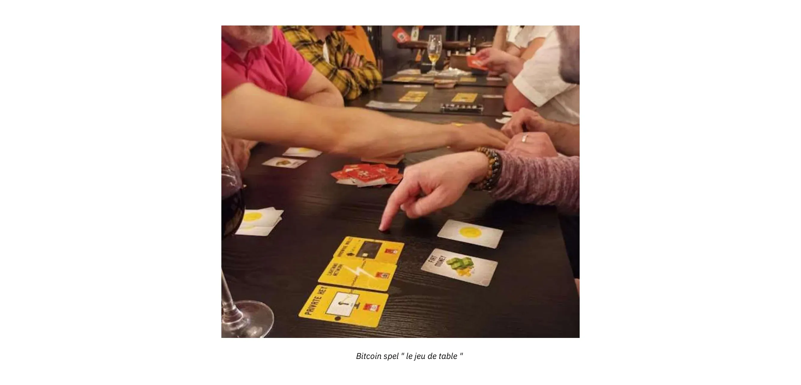

Pas alleen op dat je de kalender niet te vol maakt. Te veel evenementen in één maand kan leiden tot een burn-out bij de organisatoren en een verminderde opkomst na verloop van tijd.

## Stickers maken

<chapterId>d605f3b3-130e-513d-85e6-06bc5ea13e99</chapterId>

Stickers zijn een leuke manier om zowel Bitcoin als je gemeenschap te promoten en tegelijkertijd je identiteit te versterken.

Houd deze tips in gedachten voordat je bestelt:

- Als je de stickers buiten gebruikt, zorg er dan voor dat ze waterdicht zijn.
- Houd je logo iets kleiner dan het snijgebied om bijsnijden tijdens het lasersnijden te voorkomen.
- Gebruik een vectorbestand in plaats van een rasterafbeelding voor een hogere afdrukkwaliteit.
- Kies de juiste maat: 8 cm diameter (ongeveer de grootte van een volwassen handpalm) is goed zichtbaar, terwijl 4 cm discreter is. Ben je op zoek naar zichtbaarheid of discretie?
- Gebruik voor rijke zwarte afdrukken ("quad black") 30% cyaan, 30% magenta, 30% geel en 100% zwart. Als je alleen 100% zwart gebruikt, kan dit resulteren in een grijzige tint. Printers controleren dit vaak, maar het is de moeite waard om te weten.

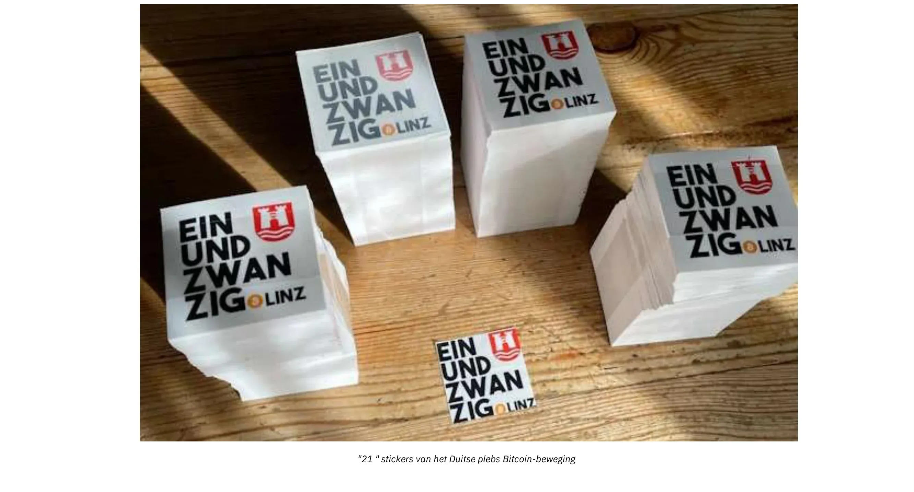

Afhankelijk van uw behoeften en leverancier kunnen 1.000 stickers tussen de € 100 en € 250 kosten. U kunt contact opnemen met [@Mill3sim3 op Twitter](https://x.com/Mill3sim3), een Franse Bitcoiner gespecialiseerd in marketing, die soms prijzen kan garanderen die tot 30% lager liggen dan standaard online verkopers.

Dat gezegd hebbende, 1.000 stickers is veel. Het is meestal beter om met ongeveer 100 te beginnen om er zeker van te zijn dat je ze allemaal kunt verspreiden.

Belangrijk: **Controleer de plaatselijke voorschriften voordat je stickers op openbare plaatsen plaatst**.

In Frankrijk mogen stickers alleen op officiële openbare informatieborden worden geplakt. Als je ze ergens anders plakt (bijvoorbeeld op een stopbord), zal dit waarschijnlijk leiden tot verwijdering en mogelijk een boete als ze aan jou of je meetup gelinkt kunnen worden. Informeer je leden hierover.

Controleer in privégelegenheden zoals concerten, bars of stadions of er al stickers aanwezig zijn voordat je de jouwe aanbrengt. Zo niet, vraag het personeel dan om toestemming. Je wilt niet dat de eerste indruk van een bedrijfseigenaar is dat je hun ruimte hebt vernield.

## Een bibliotheek maken

<chapterId>acc94093-f8b3-51b8-9359-348e9e075d38</chapterId>

Een ander project dat je gemakkelijk kunt opzetten is **een bibliotheek maken bij je meet-ups**.

Je zou deelnemers die hun leesmateriaal willen delen kunnen uitnodigen om een Bitcoin-gerelateerd boek mee te nemen. Als iemand anders op de meet-up het wil lenen, kan een lening worden geregeld met de eigenaar in Exchange tegen een borg, bijvoorbeeld 21.000 satoshis via Lightning.

Voor de eigenaar helpt deze borg om mogelijk verlies of diefstal te dekken. Voor de lener is het een stimulans om terug te komen naar een toekomstige ontmoeting om zijn borg op te halen.

Als je een vereniging runt en een deel van je fondsen wilt investeren in educatieve middelen, kun je ook verschillende boeken kopen om aan te bieden in je **Bitcoin bibliotheek**, die beschikbaar is op elke meet-up.

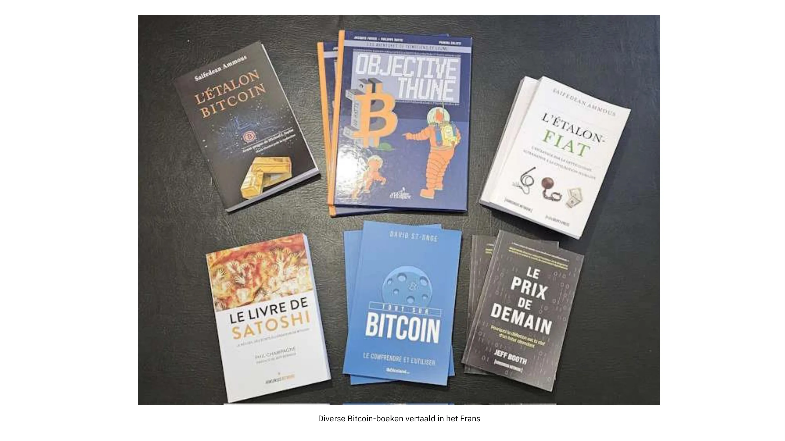

Om het ecosysteem te ondersteunen, biedt **[uitgeverij Konsensus Network](https://konsensus.network/) internationale Bitcoin meet-ups en gemeenschappen sinds eind 2023 een korting van 15% tot 35% op al haar boeken, bij bestellingen van drie boeken of meer**.

Om gebruik te maken van deze korting, neem **contact op met [uitgeverij Konsensus](https://twitter.com/KonsensusFR) via Twitter**.

Als je het geld niet hebt, kun je nog steeds de korting doorgeven aan leden van je gemeenschap.

Als je zelf het geld niet hebt, kun je de korting nog steeds doorgeven aan je leden. Een organisator kan bijvoorbeeld bestellingen van leden verzamelen, een bulkbestelling plaatsen tegen de gereduceerde prijs en de boeken uitdelen op de volgende bijeenkomst, waarbij de betaling dan in Lightning wordt geïnd.

Je kunt ook een boekenuitleenhandvest ophangen bij je meet-ups om de leenregels duidelijk uit te leggen aan nieuwkomers.

Hier is een open-source voorbeeld dat je kunt gebruiken en aanpassen:

[Boekenuitleen charter](https://www.canva.com/design/DAF7u1b5kRM/r2gEAlibe_jTIXIX-O9PMA/edit)

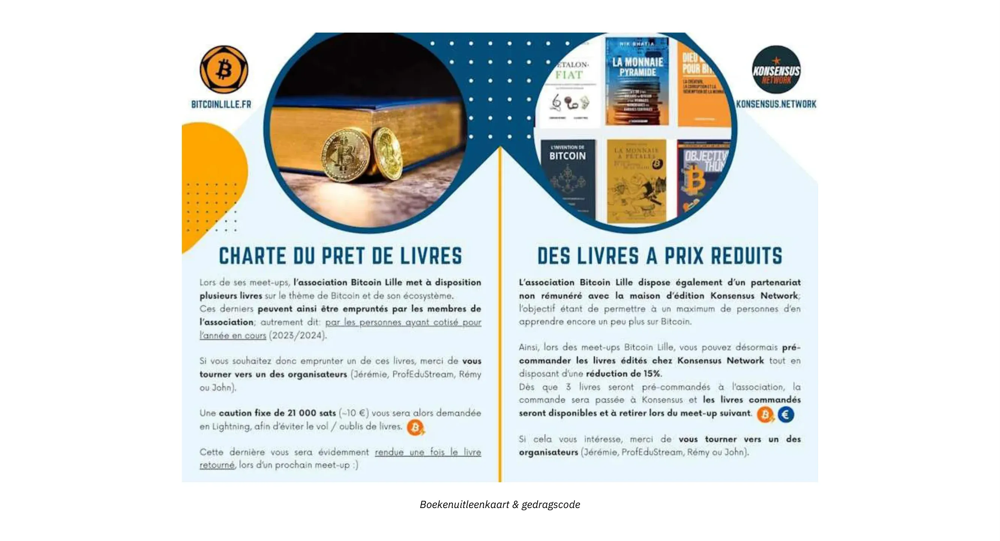

Ten slotte, om het lezen van Bitcoin-gerelateerde boeken aan te moedigen, zou je naar **lokale gemeentelijke bibliotheken** kunnen gaan om te kijken of ze boeken hebben over Bitcoin.

Als dat zo is, vraag dan aan de bibliothecarissen of er **rondetafelgesprekken** over het onderwerp gepland zijn en geef ze de contactgegevens van je meet-up.

Zo niet, stel dan voor dat ze een paar boeken aanschaffen van een vooraf geselecteerde lijst. Het [publisher Konsensus Network](https://konsensus.network/) kan een bron van inspiratie zijn.

## Creëer en verspreid gepersonaliseerde flyers

<chapterId>62ad5430-c698-51b3-89ac-090f31c88953</chapterId>

Het ontwerpen en schrijven van flyers kost tijd, maar het is het waard. Ze geven je een tastbare bron om uit te delen als je over Bitcoin praat, wat altijd gewaardeerd wordt.

Deze flyers kunnen gericht zijn op:

- Handelaars, als u Bitcoin als betaalmethode wilt introduceren;
- Deelnemers aan het evenement, met een flyer die uitlegt hoe ze Bitcoin/Lightning kunnen gebruiken en betalen;
- Beginners, op straat, op het werk of tijdens een familiebijeenkomst, met een flyer die de belangrijkste voordelen van Bitcoin belicht.

Je zou ook een flyer kunnen ontwerpen die specifiek is voor jouw community of meet-up, waarin je je activiteiten, doelen, links naar sociale media, communicatiekanalen en aankomende evenementen presenteert.

Verschillende flyers zijn al **beschikbaar als open-source in de [Bitcoin Teaching Toolbox](https://planb.academy/fr/resources/bet)** op planB.network en in de loop van de tijd zullen er meer worden toegevoegd.

Een voorbeeld is een [complete flyer met bron](https://profedustream.substack.com/p/21-raisons-dutiliser-Bitcoin) met 21 redenen om Bitcoin te gebruiken. Het ontwerp is ook [beschikbaar in open-source](https://www.canva.com/design/DAFtAR1NauQ/ZDwl2CchIJ9Gpb36N6-7iw/edit?utm_content=DAFtAR1NauQ&utm_campaign=designshare&utm_medium=link2&utm_source=sharebutton) zodat je het kunt aanpassen en delen. Vergeet alleen niet je bronnen te vermelden.

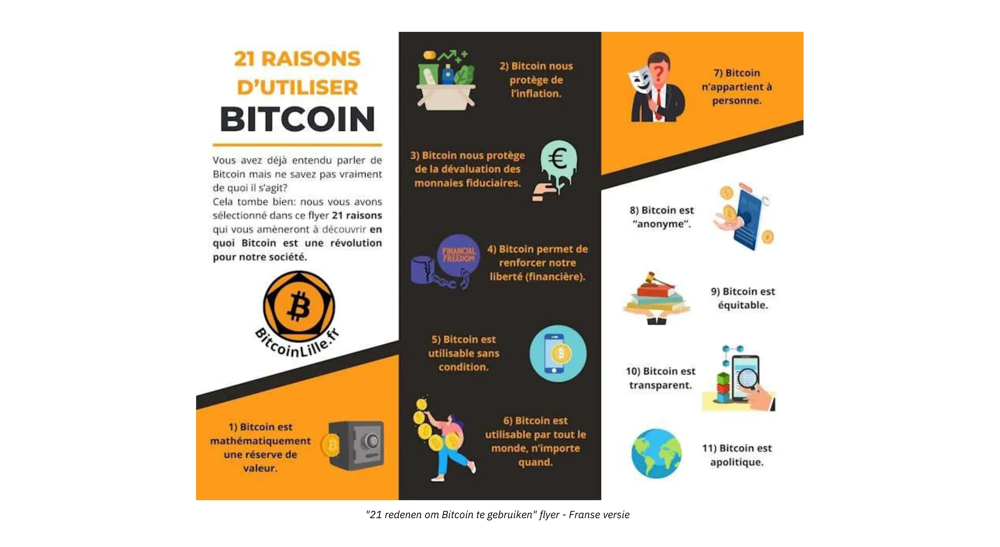

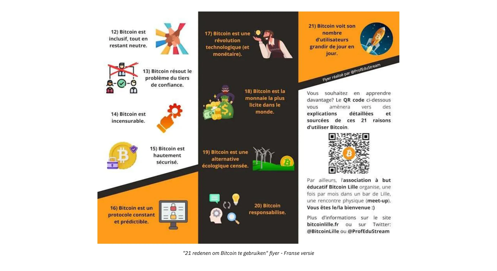

Zoals eerder vermeld, kun je deze flyers bijna overal achterlaten: op een gedeeld bureau op het werk, aan de eettafel van een gezin, in een openbare bibliotheek, enz.

In Frankrijk en een paar andere landen zijn er ook "boekenkisten", kleine houten kisten waar mensen gratis boeken kunnen doneren of lenen. Je kunt er een flyer achterlaten, of nog beter, een boek.

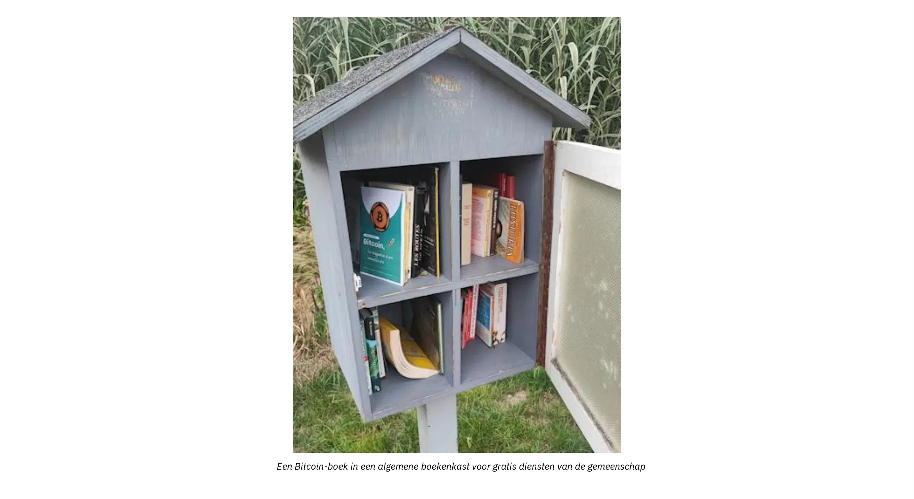

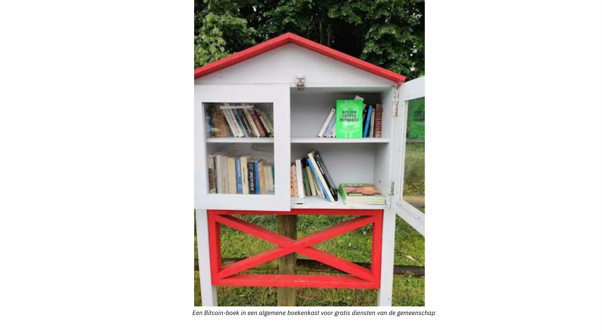

In 2023 werd het initiatief **"Bitcoin Witboek in Franse boekendozen**" gelanceerd.

Om dit project uit te voeren, moesten de deelnemers eerst de geolocatie van alle boekenbakken in het land verzamelen. Hiervoor bestaan verschillende databases:

- [boite.a.livres.zonelivre.fr](https://boite.a.livres.zonelivre.fr/);
- [boites-a-livres.fr](https://www.boites-a-livres.fr/carte-de-france);
- [delivrez.fr](https://delivrez.fr/maps/fr_FR/);
- plus artikelen in de lokale pers

Hoewel het verlaten van het Bitcoin witboek symbolisch is, is het vaak te ingewikkeld voor nieuwkomers om te begrijpen. In plaats daarvan was het idee om een klein boekje te maken met daarin:

- een toegankelijke, goed onderbouwde inleiding tot Bitcoin, het gebruik ervan en de problemen die het oplost;
- het Bitcoin witboek, vertaald in het Frans.

Hier is [het boekje gedeeld onder Franse bitcoiners](https://profedustream.substack.com/p/Bitcoin-la-naissance-dune-nouvelle) dat in tientallen boekendozen in het hele land is geplaatst. Het ontwerp is ook [beschikbaar als open-source](https://www.canva.com/design/DAFs18FSoVM/Sy0QsfUkycTgXveeGgutBg/edit?utm_content=DAFs18FSoVM&utm_campaign=designshare&utm_medium=link2&utm_source=sharebutton).

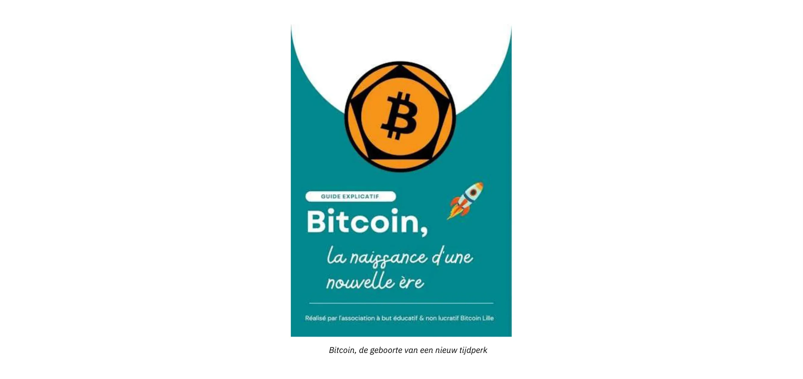

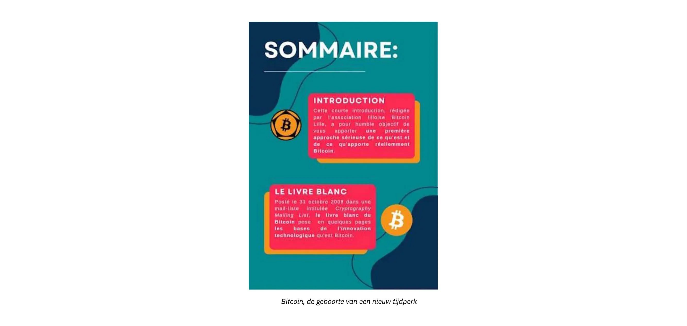

## Een videoprojectie produceren

<chapterId>892b248a-b837-5df6-aac9-4b3261ff0390</chapterId>

Bijna elke bitcoiner heeft waarschijnlijk de fascinerende mid-serie "Le mystère Satoshi, aux origines du Bitcoin" (Het Satoshi mysterie: de oorsprong van Bitcoin) van [Rémi Forte](https://twitter.com/forteremi) gezien.

Het werd uitgebracht in 2021 en is [meerdere miljoenen keren bekeken op YouTube](https://www.youtube.com/watch?v=0ETcLj5jBy4).

Een idee zou kunnen zijn om een vertoning van The Satoshi Mystery te organiseren voor jouw gemeenschap, misschien als een extra maandelijks evenement.

Een waarschuwing: hoewel ARTE France heeft bevestigd dat openbare vertoningen zijn toegestaan, moet je projectierechten betalen om dit legaal te doen. In 2023 bedroegen deze kosten ongeveer €250 per vertoning, of €120 per vertoning als er gedurende het jaar minstens vijf meetups vertoond werden.

Voor de meeste gemeenschappen is deze prijs onbetaalbaar, vooral omdat de documentaire al gratis beschikbaar is op het YouTube-kanaal van ARTE.

Natuurlijk zijn er ook andere projecties mogelijk.

Bijvoorbeeld, in Frankrijk gaf **regisseur [Alana Mediavilla](https://twitter.com/AlanaMediavilla) lokale ontmoetingsplaatsen het recht om haar documentaire "Stranded"** te previewen, die beelden bevat uit de aankomende 2024 film [film "Dirty Coin"](https://www.dirtycointhemovie.com/).

Sommige bitcoiners namen zelfs het initiatief om "Stranded" volledig in het Frans te vertalen, ondertitels toe te voegen en te delen met meetups in het hele land. In de week van 4 maart 2024 werd het gelijktijdig vertoond op een tiental ontmoetingsplaatsen in het hele land.

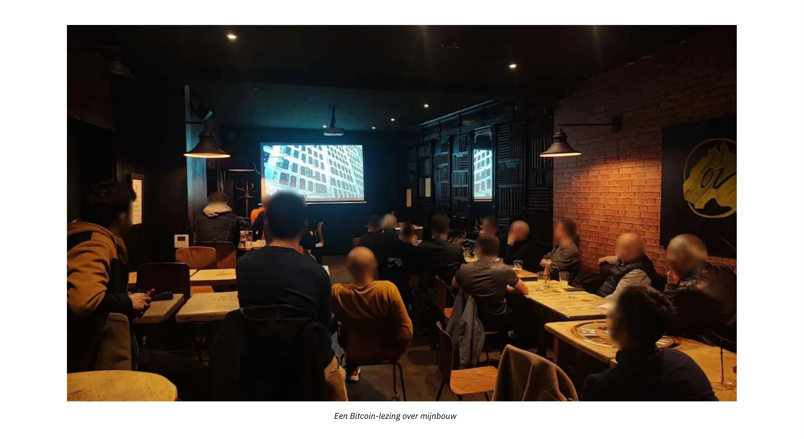

Het evenement leidde tot levendige discussies over Bitcoin Mining, het energieverbruik en de bredere impact op het milieu.

## Posters ophangen in je stad

<chapterId>6565e8a0-d535-5be0-9764-273584c675bd</chapterId>

In verschillende Europese landen (waaronder Duitsland, Spanje en Frankrijk) hebben bitcoiners het initiatief genomen om posters op te hangen in hun steden.

Sommige ontwerpen bewerken Banksy's kunst met het Bitcoin logo.

Een voorbeeld is [StreetCyberArt](https://twitter.com/streetcyber_art), een Duitse bitcoiner die al enkele jaren collages en straatkunst maakt.

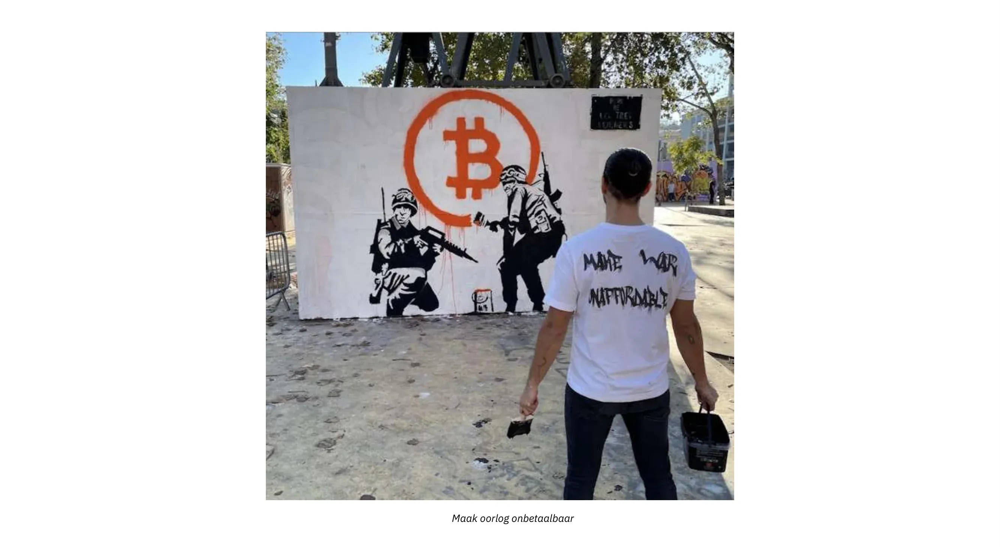

Als je op straat wilt gaan posten, zorg er dan voor dat je de wetten van je land kent. In Frankrijk bijvoorbeeld mogen posters alleen op openbare aanplakborden worden geplaatst. Op andere plaatsen is het helemaal verboden en staat er een boete op.

Als je besluit om de grenzen te verleggen en hoopt dat je niet "op heterdaad" wordt betrapt, vermijd dan om identificerende informatie (zoals je ontmoetingsnaam of @Twitter) op de posters te zetten.

Houd er ook rekening mee dat het afdrukken van deze posters op een persoonlijke printer meestal leidt tot inktverlies en snelle slijtage buiten. De beste aanpak is om samen te werken met een professionele drukker die ze kan produceren op speciaal zelfklevend papier dat is ontworpen voor buitengebruik, waardoor zowel kwaliteit als duurzaamheid worden gegarandeerd.

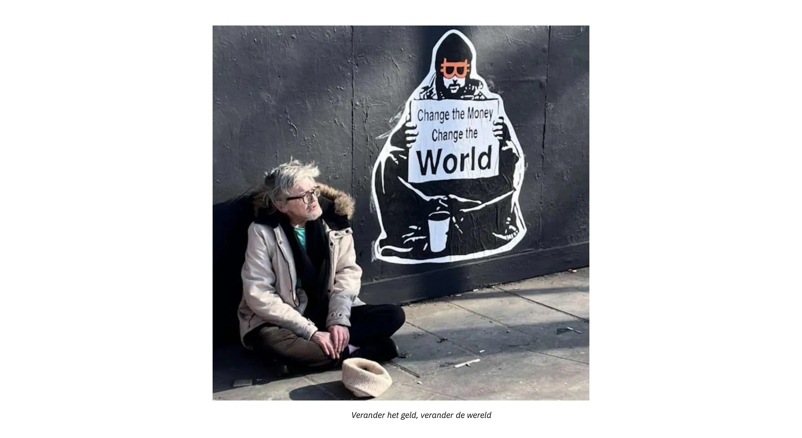

Dit initiatief kan kostbaar zijn boven € 0,40 per poster (ongeveer € 40 voor honderd posters) en online prijzen kunnen variëren van het dubbele tot vijf keer dat bedrag. Goede contacten zijn essentieel.

Zoals hierboven vermeld, heeft de Franse bitcoiner [@Mill3sim3](https://twitter.com/Mill3sim3) de juiste professionele apparatuur en kan er contact worden opgenomen voor meer informatie.

Je kunt ook een sjabloon maken van een groot stuk karton en met spuitverf je ontwerp op een aantal plekken in je stad aanbrengen.

## Een gepersonaliseerde NFC-kaart

<chapterId>8ad65d4e-a68a-59c2-a812-85f4907ed9f3</chapterId>

Een ander origineel projectidee is het maken van gepersonaliseerde NFC-kaarten voor Lightning-betalingen (compatibel met de BoltCard-standaard). Hiervoor is het Zwitserse Bitcoin Pay een geweldige partner.

[Hun website](https://swiss-Bitcoin-pay.ch/cards) biedt momenteel vier standaardontwerpen aan.

Als je meer dan 50 NFC-kaarten wilt bestellen, kun je contact opnemen met het bedrijf via de officiële website of [Twitter](https://twitter.com/SwissBitcoinPay) om een aangepast ontwerp voor de voorkant van de kaart voor te stellen. De achterkant blijft gestandaardiseerd.

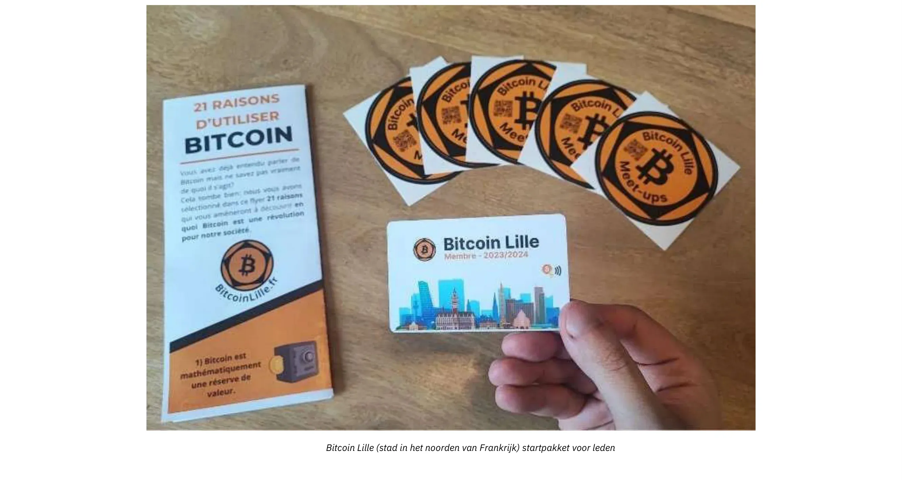

In 2023 bestelde de Franse vereniging [Bitcoin Lille](https://twitter.com/BitcoinLille) bijvoorbeeld een partij NFC-kaarten met een aangepast ontwerp. Elk nieuw lid ontving er een in zijn welkomstpakket gedurende het jaar. Dit idee kan gemakkelijk worden aangepast en gepersonaliseerd voor je eigen gemeenschap.

De eenheidsprijs voor deze kaarten varieert meestal van € 2,50 tot € 5, afhankelijk van de grootte van de bestelling en de marktomstandigheden, met lagere prijzen voor grotere hoeveelheden.

## Een website maken

<chapterId>9a2a1b9b-0633-544a-b331-c06187d23d7f</chapterId>

In een bepaald stadium van de groei van je community kan het waardevol zijn om een website te hebben die dient als etalage voor je groep, meetups, evenementen en educatieve content.

Het bouwen van een website kost tijd, maar de onderstaande tutorial laat zien hoe je in slechts 30 minuten een gratis WordPress site kunt maken. Je kunt een aanpasbare homepage maken, artikelen publiceren en media zoals YouTube-video's, afbeeldingen of PDF's invoegen.

Later kun je je eigen domeinnaam kopen of de site zelfs op je eigen server hosten.

:::video id=a1b25c18-5fc1-4b97-baef-816d819c9382:::

Hoewel er andere CMS-platforms bestaan, sommige met eenvoudigere, beginnersvriendelijkere interfaces, zijn ze meestal veel minder aanpasbaar. Daarom is WordPress over het algemeen het beste uitgangspunt.

WordPress ondersteunt ook een breed scala aan plug-ins (sommige betaald, maar van hoge kwaliteit) die de mogelijkheden van je site aanzienlijk kunnen uitbreiden zonder dat je codeervaardigheden nodig hebt. Een voorbeeld is het [premium "Uncode" thema](https://undsgn.com/uncode/)

## Maak een videokanaal (Youtube of Odyssee)

<chapterId>076286db-1627-57ec-a410-c44b1666e1cd</chapterId>

Sommige leden van je community willen misschien multimediacontent maken, zoals instructievideo's.

Je kunt ook presentaties geven op bijeenkomsten of zelfs universiteiten.

**Als het zover is, kun je met een speciaal videokanaal al je content op één plek publiceren en centraliseren.**

Populaire platforms zijn onder andere:

- [**YouTube**](https://www.youtube.com/), veel gebruikt maar niet bestand tegen censuur.
- [**Odyssee**](https://odysee.com/), minder populair maar gedecentraliseerd via peer-to-peer technologie.
- met [**peertube**](https://joinpeertube.org/fr_FR) kun je je eigen videoplatform hosten, hoewel het complexer is om op te zetten.

Wat je ook kiest, ontwerp platformspecifieke visuals om je kanaal aantrekkelijk te maken. Canva, genoemd in [deel 2/8](https://planb.academy/courses/1c643dc9-a15f-4f9e-93b6-cb3c58b4ee35/3470a31f-0190-5e87-8af0-6a00e79267ef) biedt een "YouTube Thumbnail" categorie met kant-en-klare, aanpasbare ontwerpen.

Voor **opname** vanaf je computer is [Streamlabs](https://streamlabs.com/fr-fr) gratis, rijk aan functies en ondersteunt het scèneovergangen.

Voor **videobewerking**, [Wondershare Filmora](https://filmora.wondershare.fr/) (ongeveer 45€/jaar) is eenvoudig te gebruiken en produceert snel professionele resultaten.

Voor de intro en outro van je **video** kun je gemakkelijk geschikte sjablonen vinden op Canva. Pas het ontwerp aan je smaak aan, download het en voeg het toe aan je bewerkingssoftware.

Tip: Als Bitcoin ooit verboden of gecensureerd wordt, bewaar dan altijd een lokale back-up van je video's op een Hard schijf.

## Een audiopodcast maken

<chapterId>12e96b45-1c33-5687-a753-80d0114d487a</chapterId>

Een audiopodcast is een andere geweldige manier om ideeën te delen. Net als bij videokanalen kost het tijd om een publiek op te bouwen.

Populaire podcastplatforms zijn onder andere:

- [**Fountain**](https://www.fountain.fm/), ondersteunt Lightning-donaties.
- [**Soundcloud**](https://soundcloud.com/);
- [**Deezer**](https://www.deezer.com/fr/);
- [**Spotify**](https://open.spotify.com/);
- [**Google podcast**](https://podcasts.google.com/).

Elk platform heeft zijn eigen publiek, dus aanwezig zijn op verschillende platforms zal je bereik vergroten. **[Spotify voor podcasters](https://podcasters.spotify.com/) maakt dit gemakkelijk door je podcast één keer te laten uploaden en generate een RSS feed te laten maken voor andere platformen**.

Dus als het werk eenmaal gedaan is op "Spotify voor Podcasters", hoef je alleen nog maar je inhoud te formatteren voor de andere platforms, een proces dat relatief snel gaat.

Om op te nemen is [Audacity](https://www.audacityteam.org/) gratis. Hiermee kun je geluidsniveaus aanpassen, effecten zoals fades toevoegen en de helderheid verbeteren tijdens het bewerken. Het is eenvoudig om je stem op te nemen en een podcast van professionele kwaliteit te maken.

Hier vind je een korte tutorial van 10 minuten over de essentie van podcasts maken met Audacity:

:::video id=67d80ac7-253f-40a5-b621-fef2fb7174bd:::

Tip: Bewaar net als bij video's een lokale back-up van alle podcasts voor het geval van toekomstige censuur.

## Maak een badge voor je evenementen

<chapterId>0cccef8d-a765-5844-8921-c40f0ce653e4</chapterId>

Op je meet-ups en evenementen kun je een kleine stimulans introduceren: evenementbadges. Het idee is om **een badge te maken die alleen op dat specifieke evenement kan worden verkregen**. Dit concept bestaat op andere blockchains onder de naam "POAP" ("Proof Of Attendance Protocol"). Er is momenteel echter geen vrije manier om dit op Bitcoin te implementeren.

Zo'n systeem kan ook gebruikt worden om de meest actieve leden van je gemeenschap te belonen. Je zou bijvoorbeeld een jaarlijkse loterij kunnen organiseren waarbij elke verzamelde badge gelijk staat aan één toegangsticket. Een lid dat alle 12 meet-ups in een jaar bijwoont, heeft dan 12 tickets voor de loterij.

Bij een andere, meer traditionele aanpak kun je deelnemers aan elk evenement vragen om hun voornaam of bijnaam op een badge te schrijven, samen met de reden waarom ze aanwezig zijn.

Hoewel dit een beetje formeel is, kan dit leden helpen om gemakkelijker gemeenschappelijke interesses en gespreksonderwerpen te vinden, en het maakt het ook gemakkelijker voor nieuwkomers om de organisatoren (of officiële leden van de gemeenschap/vereniging) te herkennen.

Verschillende badgesjablonen gebruikt door de vereniging Bitcoin Lille zijn [beschikbaar in open-source op Canva](https://www.canva.com/design/DAGHAsT15MU/AIA7-L_xBjNdsuxdD4-h-Q/edit?utm_content=DAGHAsT15MU&utm_campaign=designshare&utm_medium=link2&utm_source=sharebutton).

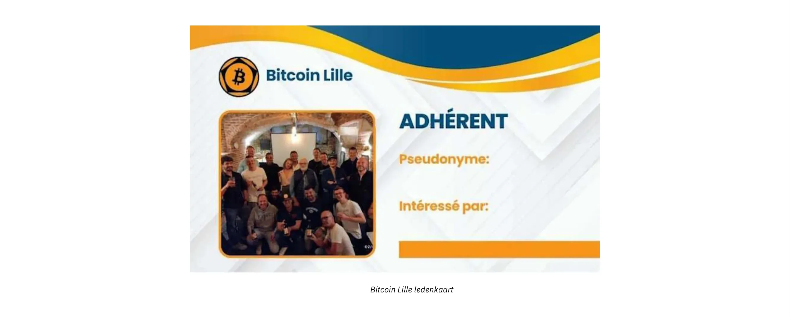

## Planning voor overdracht bij overlijden

<chapterId>c5febf18-235c-51bc-8fbb-9467dabe4cb0</chapterId>

Op een heel ander niveau, laten we Address een gevoelig onderwerp bespreken: het overlijden van een lid van jullie Bitcoin gemeenschap.

Op een dag kan de familie van een voormalig lid contact met je opnemen om je te informeren over het overlijden. Ze kunnen uitleggen dat de overledene instructies heeft achtergelaten, waaronder het contact opnemen met je gemeenschap, bijeenkomst of vereniging.

In sommige gevallen kan de familie ook hulp zoeken bij het terugvorderen van fondsen als begunstigden van de erfenis.

Het is verstandig om samen met je gemeenschap vooraf een duidelijke procedure op te stellen voor dergelijke situaties, zodat je zeker weet dat:

- De overledene heeft zijn familie al geadviseerd **nooit privésleutels te delen of fysieke portemonnees mee te nemen naar een meet-up**.
- De familie begrijpt dat het doel van hun bezoek educatief is: leren hoe Bitcoin werkt, zodat ze later soeverein controle kunnen nemen over de fondsen.
- De familie is op de hoogte van de relevante wetten in hun land met betrekking tot schenkingen, erfenissen en het omzetten van Bitcoin in fiat.

Het hebben van een standaardprotocol voorkomt ook dat iemand, lid of gast, misbruik maakt van de situatie om geld te stelen.

Je zou een speciale werkgroep kunnen vormen om dit proces te definiëren. De vereniging Bitcoin Lille werkt al aan een dergelijk [document](https://docs.google.com/document/d/1TDfLZjuictC5s3PEM2Z7WmkxIDSJ8Q1E4xevm52pVgU/edit?usp=sharing), dat ze in de komende maanden als open-source willen vrijgeven.

## Lezingen geven op scholen en universiteiten

<chapterId>65efdb44-e3d4-567c-aedf-972765753d73</chapterId>

De bovenstaande lijst van projecten is natuurlijk niet volledig. Over het algemeen zijn dit eerder interne projecten voor hun community of meetups, die vrij gemakkelijk kunnen worden geïmplementeerd terwijl ze zich ontwikkelen.

Laten we het nu hebben over onboarding.

Zoals jullie weten, is een van de beste manieren **om in één keer een groot publiek te bereiken, het geven van een gratis lezing**. Dit kan op hogescholen en universiteiten, waar jonge mensen (en minder jonge) kennismaken met Bitcoin, of ze er nu helemaal nieuw in zijn of hun kennis willen verdiepen.

Een lezing geven voor tientallen of zelfs honderden mensen vereist meer dan alleen technische expertise. Dat heb je nodig:

- Zelfvertrouwen in spreken in het openbaar
- Goed stressmanagement
- Duidelijke articulatie
- Sterk tijdmanagement
- Een goed onderbouwde presentatie of workshop van hoge kwaliteit, afgestemd op het vaardigheidsniveau van je publiek

Net zo belangrijk is **een open geest houden en weten wanneer je concepten moet vereenvoudigen**, vooral tijdens de vraag- en antwoordsessie of een paneldiscussie. Het gaat er niet om je principes op te geven, maar om te erkennen dat anderen dingen misschien anders zien. Soms is het beter om later te antwoorden of het te laten rusten, zodat de discussie verder kan gaan. Als je punten worden ondersteund door solide, goed onderbouwde argumenten, zullen mensen dat herkennen.

Als jij je er klaar voor voelt, ga er dan voor! De wereld heeft wanhopig behoefte aan betere voorlichting over Bitcoin.

Dat gezegd hebbende, dit is geen lichte onderneming: het vereist motivatie, inspanning en de juiste connecties.

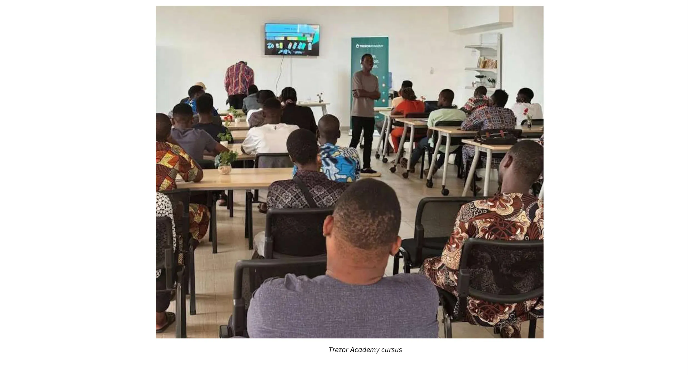

Het organiseren van een lezing of workshop op een school of universiteit begint met het vinden van de juiste contactpersoon. Dit kan zijn:

- Een persoonlijke kennismaking
- Een studentenvereniging
- Een studentenvereniging die collegereeksen of evenementen organiseert
- Voormalige professoren van je technische school of universiteit
- De coördinator van het academische programma, als u rechtstreeks contact opneemt

De eerste stap is meestal om je initiatief of vereniging voor te stellen en een gesprek aan te vragen. In het beste geval leidt dit een paar weken later tot een presentatie op Bitcoin voor studenten.

Helaas wordt Bitcoin nog steeds gedemoniseerd door een groot deel van de media en veel politici, waardoor sommigen geloven dat er geen plaats voor is in klaslokalen. Verwerpingen komen vaak voor, vooral in academische kringen waar onderwerpen als Proof of Work en energieverbruik controversieel blijven.

Toch is het het proberen waard, vooral met studentenverenigingen. En wie weet? Zelfs als je eerste poging een "nee" krijgt, vind je tijdens de volgende stierenloop misschien wel een e-mail in je inbox waarin je wordt uitgenodigd om te spreken met bijvoorbeeld 280 studenten!

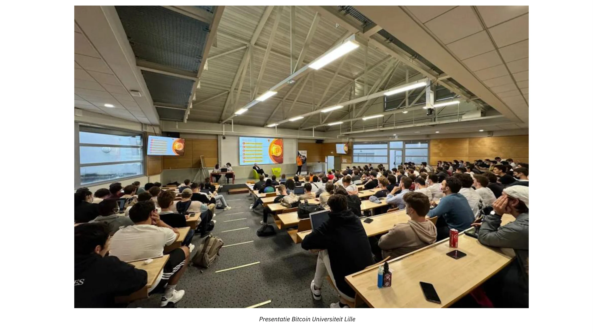

## Bedrijven benaderen

<chapterId>b730462b-7928-5d28-a14f-9ceaa773d3d2</chapterId>

Een bedrijf zover krijgen dat het Bitcoin accepteert, is voor veel bitcoiners een beetje als het ontgrendelen van een zeldzame prestatie in je Pokédex.

Elke merchant is anders en het inwerken van merchants brengt zijn eigen uitdagingen met zich mee:

- Ze hebben nog steeds fiatvaluta nodig om leveranciers te betalen.
- Ze hebben duidelijke, boekhoudklare financiële rapporten nodig.
- Hun betalingssystemen moeten betrouwbaar, gebruiksvriendelijk en beveiligd tegen diefstal zijn.
- Ze kunnen misvattingen of negatieve vooroordelen hebben over Bitcoin.
- Een feilloze softwareoplossing vinden kan lastig zijn.
- De handelaar laten begrijpen waarom het de moeite waard is om Bitcoin als betaling te accepteren.

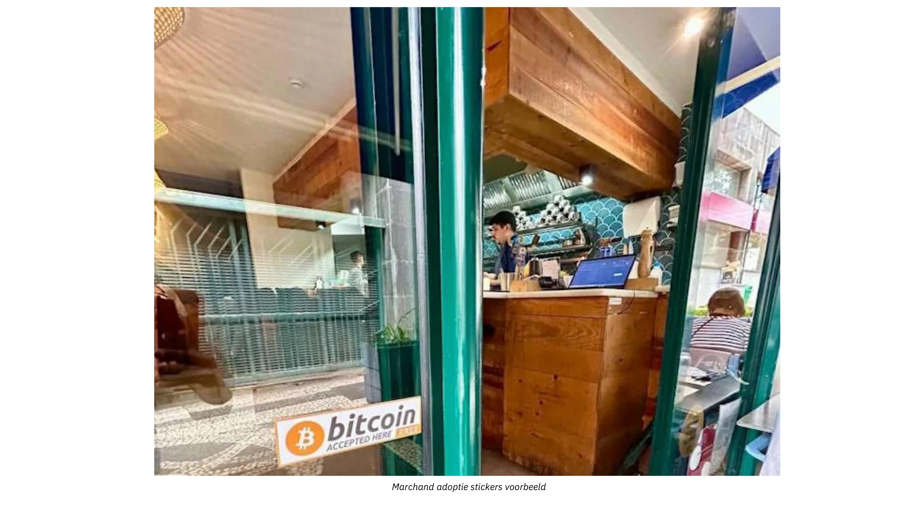

Het in dienst nemen van lokale bedrijven is een van de beste manieren om het Bitcoin ecosysteem van je stad te laten groeien. De sleutel is om stap voor stap te werk te gaan:

1/ **Vraag om te betalen in Bitcoin, elke keer dat je winkelt**

Meestal krijg je een "nee" en misschien een verbaasde, of zelfs licht veroordelende, blik, maar gewoon vragen plant het idee dat Bitcoin iets is dat "gewone mensen" kunnen gebruiken en dat het steeds populairder wordt als manier om te betalen. Je kunt zelfs samen met een paar vrienden op verschillende dagen naar dezelfde winkel gaan en telkens vragen om in Bitcoin te betalen. Vroeg of laat zal dat de nieuwsgierigheid van de eigenaar wekken.

2/ **Een eenvoudige, duidelijke uitleg geven**

Als ze vragen wat Bitcoin is, houd het dan kort en zonder jargon. Bijvoorbeeld:

**"Bitcoin is geld dat niet gecontroleerd wordt door banken, zonder tussenpersonen werkt, niet gecensureerd kan worden, niet onderhevig is aan inflatie en lagere kosten heeft dan traditioneel bankieren"**

Geef ze dan een flyer, zoals "21 redenen om Bitcoin te gebruiken" of "10 redenen om Bitcoin in je bedrijf te gebruiken", met je contactgegevens of de details van je bijeenkomst. Op die manier weten ze waar ze je kunnen vinden als ze klaar zijn voor een demo.

3/ **Regel een demonstratie**

Als ze interesse tonen, maak dan een afspraak om ze een betaaloplossing te laten zien.

Een geweldige optie is **[Swiss Bitcoin Pay](https://swiss-Bitcoin-pay.ch/)**, omdat het:

    - Stelt handelaars in staat om dagelijks automatisch BTC om te zetten naar fiat, zodat ze leveranciers kunnen betalen.
    - Hiermee kunnen ze een percentage in BTC houden als ze dat willen.
    - Genereert exporteerbare boekhoudrapporten voor hun accountants.
    - Heeft een eenvoudig dashboard voor managers.
    - Geeft werknemers een intuïtieve Interface om betalingen te accepteren zonder de kassa aan te raken.
    - Kost minder dan de 2-3% kosten die traditionele betalingsnetwerken in rekening brengen.

4/ **Steun ze zodra ze Bitcoin** beginnen te accepteren

Nadat ze aan boord zijn:

    - Bezoek regelmatig en doe aankopen.
    - Controleer of alles soepel verloopt.
    - Deel je contactgegevens opnieuw indien nodig.
    - Nodig ze uit voor je meet-ups.
    - Voeg ze toe aan [btcmap.org map](https://btcmap.org/) en laat het [Swiss Bitcoin Pay](https://x.com/swissbitcoinpay) weten op Twitter om de zichtbaarheid te vergroten.
    - Overweeg om workshops of meet-ups op hun locatie te organiseren.

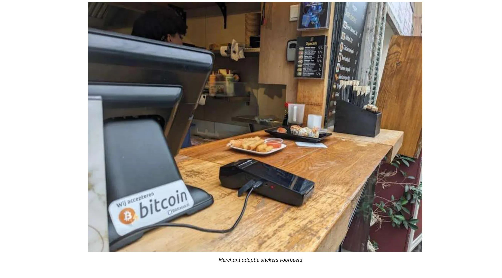

5/ **Verbind lokale handelaars**

Als je eenmaal een paar Bitcoin-vriendelijke bedrijven hebt, stel dan voor om een Telegram-groep te maken die alleen uit handelaren bestaat. Dit kan:

- Laat ze ervaringen delen en nieuwe bedrijven aan boord halen.
- Dienen als een snel kanaal voor technische ondersteuning.
- Het lokale Bitcoin netwerk versterken.

Klanten werven is iets voor de lange termijn. Het vereist geduld, doorzettingsvermogen en strategie. Maar als jouw gemeenschap er klaar voor is, kun je beginnen met het leggen van de basis voor een echte Bitcoin circulaire economie, net als [Arnhem in Nederland](https://www.arnhembitcoinstad.nl/) in Nederland.

## Neem contact op met de lokale pers en radio

<chapterId>435bfbc1-22dd-59bb-b737-a32ea995b238</chapterId>

Bitcoiners richten zich vaak op sociale media en online platforms, maar dat is slechts een deel van het plaatje. Lokale pers en radio kunnen krachtige bondgenoten zijn.

Sommige gemeenschappen, zoals [Breizh Bitcoin](https://breizhbitcoin.com/) in Frankrijk, nemen **regelmatig contact op met hun lokale media** om:

- Aankondigen van komende evenementen (meet-ups, presentaties, workshops, Halving feestjes, etc.).
- Nodig journalisten uit om Bitcoin-vriendelijke bedrijven te bezoeken en erover te schrijven.
- Deel evenementdata en -locaties voor opname in lokale lijsten.

Veel kranten hebben nog steeds een "Wat is er te doen" sectie, vaak weggestopt op de laatste pagina's, waar ze de komende lokale evenementen vermelden. Breizh Bitcoin heeft ontdekt dat deze aanpak werkt: nieuwkomers zijn komen opdagen bij meet-ups, gewoon omdat ze de vermelding in de krant hadden gezien.

Deze strategie kan in bepaalde gebieden beter werken dan in andere, maar het is het proberen waard. Je kunt beginnen met het benaderen van regionale nieuwsverkooppunten, Frankrijk heeft voorbeelden zoals:

- [acpm.fr](https://www.acpm.fr/Les-chiffres/Diffusion-Presse/Presse-Payante/Presse-Quotidienne-Regionale);
- [voxpublic.org](https://www.voxpublic.org/spip.php?page=annuaire&cat=medias&type_media=Presse%20quotidienne%20r%C3%A9gionale).

en door contact op te nemen met lokale radiostations en een interview of podcast voor te stellen.

Wees je ervan bewust dat media-interviews lastig kunnen zijn. Woorden kunnen uit hun verband worden gerukt of verkeerd worden weergegeven. Voorbereiding is essentieel.

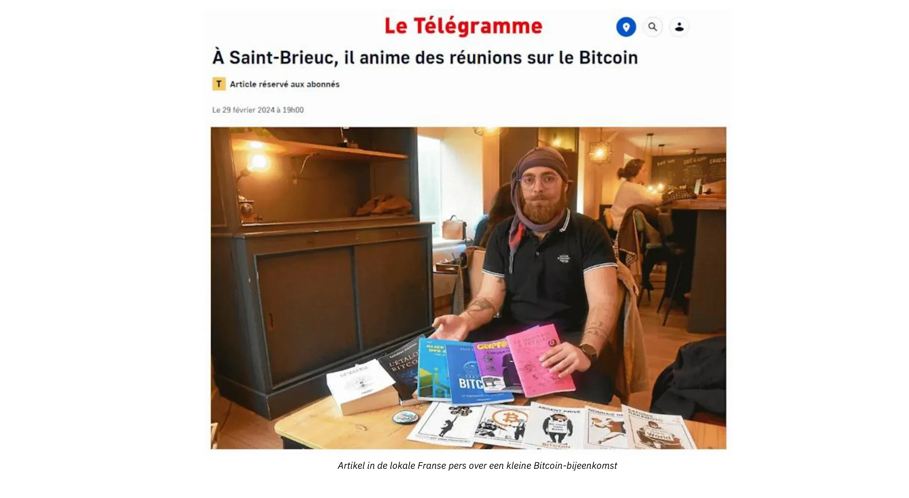

Naast alle projecten die in deze sectie worden voorgesteld, kunnen er natuurlijk **veel andere projecten worden uitgevoerd**. Alles hangt af van je tijd en motivatie, maar ook van de moeilijkheidsgraad van het project in kwestie.

Laatste tips voor elk project:

1) **Plan vooruit**: bepaal je doelen, de stappen die nodig zijn en wie wat gaat doen.

2) **Neem het stap voor stap**: voorkom een burn-out door het tempo van je inspanningen te bepalen.

3) **Vraag om hulp**: vraag je leden en naburige gemeenschappen om steun.

Onthoud: elke Bitcoin gemeenschap is geweest waar jij nu bent. Aarzel niet om van hun ervaringen en adviezen te leren.

# Anticiperen op de toekomst

<partId>6ea07445-9369-54bc-9aa0-d260db026e0b</partId>

## Plannen voor een toename van het aantal deelnemers

<chapterId>8af722d4-3a9f-548c-9001-424f2142de12</chapterId>

Toen Bitcoin zijn vierde tijdperk inging bij blok 840.000, begonnen steeds meer mensen het te herkennen als een technologische, financiële en sociale revolutie.

Net als de opkomst van het internet zal deze revolutie tijd kosten, wat eigenlijk een voordeel is. Het geeft mensen de kans om **de grondbeginselen van Bitcoin te leren**, te begrijpen hoe het te gebruiken en stelt ontwikkelaars en bedrijven in staat om **de protocollen en toepassingen** te bouwen die het volledige potentieel zullen ontsluiten.

Niemand kan de toekomst voorspellen, maar we kunnen **een sterke toename verwachten in het gebruik van Bitcoin**. Dat betekent dat we voorbereid moeten zijn op alle scenario's, zelfs extreme, zoals een ineenstorting van het traditionele financiële systeem of een algeheel verbod op Bitcoin.

In dit zevende en voorlaatste deel van de cursus kijken we naar belangrijke punten om in gedachten te houden wanneer je community en meet-ups groeien.

De eerste, en makkelijkst te verwachten, is een toename van het aantal mensen dat zich aansluit bij je community. Dit zal je op twee manieren beïnvloeden:

1/ **Uw communicatiekanalen (Telegram, Signal, Matrix, enz.) zullen uiteindelijk overvol raken**, waardoor het moeilijker wordt om gesprekken bij te houden. Er zijn twee dingen om in gedachten te houden.

Ten eerste, als je 500 mensen hebt die allerlei onderwerpen bespreken in een enkele chat, zal de enorme hoeveelheid berichten en notificaties er onvermijdelijk toe leiden dat veel leden afhaken. Dat is een goed moment om je opzet te herzien, bijvoorbeeld door over te stappen op Telegram-supergroepen of een Discord-server, die het allebei gemakkelijk maken om discussies per onderwerp te organiseren.

Ten tweede, meer mensen in je kanalen betekent meer bots, meer scams en dus meer moderatie om af te handelen. Wees daarop voorbereid door een duidelijke set regels op te stellen waarnaar je kunt verwijzen bij het modereren van berichten. Onze ervaring is dat dit veel helpt om conflicten te voorkomen, vooral als de regels gemakkelijk toegankelijk zijn in je kanalen.

Een goed voorbeeld is **[Bitcoin Lille's open-source regelboek](https://bitcoinlille.fr/reglement/)** dat een paar jaar geleden is geschreven voor de Telegram-groep en Discord-server. Het is gebaseerd op eenvoudige, universele principes en je kunt zelfs [een aanpasbare versie van het ontwerp hier](https://www.canva.com/design/DAGHI692AD4/rjT4sqEnhajc5FiPA6GFZQ/edit?utm_content=DAGHI692AD4&utm_campaign=designshare&utm_medium=link2&utm_source=sharebutton).

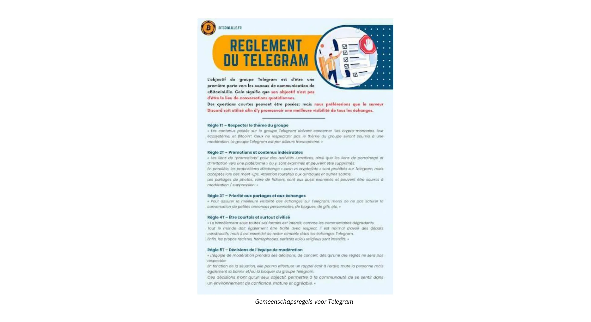

2/ **Uw meetups en evenementen zullen grote mensenmassa's trekken, met veel nieuwe gezichten die komen opdagen om contact te leggen**.

Met deze stijging in bezoekersaantallen:

    - het kan de moeite waard zijn om **een grotere locatie te zoeken voor je meetups en evenementen**, vooral als je in het verleden maar zo'n twintig mensen kon ontvangen.
    - als je merkt dat het aantal deelnemers overweldigend wordt, kun je voor toekomstige meetups ofwel **vereisen dat deelnemers zich registreren** (via de Meetup-app of een eenvoudig formulier) of **meerdere meetups per maand houden** (bijvoorbeeld: een meetup voor beginners, een voor gevorderden en een voor vergevorderden).
    - Verwacht tegelijkertijd veel nieuwkomers in het ecosysteem, vaak met het hoofddoel om geld te verdienen. Om **de gesprekken gericht te houden op Bitcoin** in deze snelgroeiende meetups, is het een goed idee om:

a) Neem een **Bitcoin thema-presentatie** op tijdens deze evenementen, omdat dit natuurlijk een groot deel van het gesprek in de richting van dat onderwerp zal sturen (en weg van het laatste zogenaamd "revolutionaire" shitcoin project);

b) **Vermijd het om alleen met mede-bitcoiners om te gaan.** Maak er in plaats daarvan een punt van om **nieuwkomers** te benaderen, zelfs als dat betekent dat je achter in de kamer moet staan om ze te begroeten. Van daaruit kunt u praten over waarom ze gekomen zijn, wat ze zoeken, de doelen (of zelfs de kernprincipes) van uw gemeenschap, enzovoort.

Tot slot, hoewel het jammer is om het te moeten zeggen, kunnen oplichters opduiken op meetups. Hun doel kan zijn om eindeloos te praten over hun Ponzi schema, MLM, of een of andere "Blockchain revolutie aangedreven door AI." Het is ook heel goed mogelijk dat iemand met slechte bedoelingen op een dag speciaal komt om geld wit te wassen of BTC probeert te kopen met valse biljetten.

In dit soort lastige situaties is het het makkelijkst om beleefd uit te leggen dat de meetup daar niet de plek voor is, en dat te onderbouwen met argumenten naar keuze (bijvoorbeeld dat er politie in burger aanwezig kan zijn).

Als ze helaas weigeren om te vertrekken of zich respectvol te gedragen (ja, het is al gebeurd), dan kun je Address rechtstreeks naar de groep sturen tijdens de meetup om iedereen te laten weten dat een persoon of personen een kwaadaardige activiteit proberen uit te voeren.

Gelukkig zijn deze situaties zeldzaam en vaak eerder absurd dan bedreigend, maar het is nog steeds het beste om voorbereid te zijn.

Voor je gemoedsrust: zolang je niet persoonlijk de wet overtreedt of direct illegale transacties faciliteert, ben je niet wettelijk verantwoordelijk voor de acties van anderen op je evenement (tenminste volgens de Franse wet).

In een ideale wereld zou je een **ruimte hebben die groot genoeg is om enkele tientallen mensen** te huisvesten terwijl je gemeenschap groeit en je zou ook **sterke relaties opbouwen tussen bitcoiners** en toekomstige bitcoiners tijdens de dalende markt, zodat wanneer de stijgende markt komt, je zoveel mogelijk mensen hebt die klaar staan om anderen te oranje pillen.

## Decentralisatie van gemeenschapsorganisatie

<chapterId>bedfc110-e099-58f4-a5b7-fb50f3b19a49</chapterId>

Stel je voor: je runt al jaren je Bitcoin meet-up en op een dag besluit je om je baan op te zeggen, misschien om lama's op te voeden in Peru of om perfecte golven na te jagen in El Salvador. Wat gebeurt er met je gemeenschap als je vertrekt?

Plan vooruit voor de overdracht van je gemeenschap door:

1) **Geef admin (of Ownership) rechten** voor je communicatiekanalen aan vertrouwde leden. Rollen kunnen later altijd in andere handen overgaan.

2) **Deel accountgegevens** (gebruikersnamen, wachtwoorden, bijbehorende e-mails) voor je sociale media en zichtbaarheidskanalen met minstens één vertrouwd persoon.

Zonder deze toegang is het bijna onmogelijk voor iemand anders om het effectief over te nemen. Vanaf nul beginnen, door "gevorkte" groepen aan te maken en het netwerk opnieuw op te bouwen, is langzaam, vermoeiend en vaak demotiverend.

Als je geen vertrouwde contactpersoon binnen je meet-up hebt, kun je altijd contact opnemen met @ProfEduStream, @copinmalin of @gabtribe op Telegram. Zij kunnen helpen bij het vinden van een gemotiveerde opvolger en de overdracht van accounts en beheerrechten coördineren.

**Waarom decentralisatie belangrijk is?**

Als jij de enige betrokkene bent en alle controle in handen hebt, wat gebeurt er dan als jij verdwijnt? Het antwoord is simpel: je gemeenschap zal ook verdwijnen.

De oplossing: decentraliseer taken, rollen en toegang zodat de groep kan blijven draaien, zelfs als één organisator afhaakt, of dat nu komt door tijdgebrek of, in een duister scenario, omdat hij/zij gearresteerd wordt omdat hij/zij een Bitcoin zonder KYC heeft.

**Hoe decentralisatie verder doorvoeren?**

Gebruik **vrije en open-source software** zoals [de framasoft suite](https://framasoft.org/fr/) om afhankelijkheid van gecentraliseerde platforms te verminderen en weerbaarheid te bieden tegen mogelijke staatscensuur of Bitcoin-verboden.

Gebruik **versleutelde of anonieme communicatiemiddelen** om de privacy van je leden en de activiteiten van je community te beschermen.

## Wat als Bitcoin publieke vijand nr. 1 werd?

<chapterId>c739651f-cd13-51e0-a36e-85023749b15b</chapterId>

Op 5 april 1933 tekende Franklin Roosevelt, de 32e president van de Verenigde Staten van Amerika, **Executive Order 6102**, waardoor het illegaal werd voor particulieren om gouden munten, ongemunt goud of certificaten te bezitten waar dan ook in het land.

Natuurlijk is de Grote Depressie (beurscrash van 1929) niet onze huidige realiteit. Maar zou een regering op een dag hetzelfde kunnen doen met Bitcoin: **privé Ownership volledig verbieden?**

De waarheid is dat zo'n Orwelliaanse maatregel iemand er niet echt van zou weerhouden om BTC te bezitten, omdat geen enkele wet iemand ervan kan weerhouden om een reeks woorden uit het hoofd te leren.

Maar wat als de wereldleiders zich eindelijk bewust zouden worden van het potentieel van Bitcoin om de wereldorde opnieuw vorm te geven, zelfs op staatsniveau? Zou het dan bestempeld worden als "Publieke Vijand Nr. 1"?

We hoeven niet te vervallen in complotdenken. Maar niets houdt ons tegen om te anticiperen, te decentraliseren en op te voeden, vanaf nu.

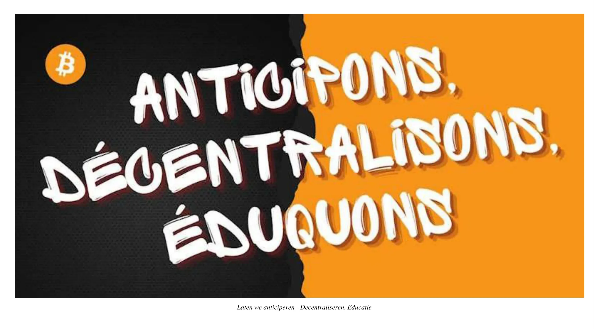

# Bitcoiners samenbrengen

<partId>62bc2138-c0be-5d39-a341-594690863257</partId>

## Een snel actieplan om jouw Bitcoin gemeenschap op te bouwen

<chapterId>1f463ec2-3f64-5641-8d60-e02a47c94f27</chapterId>

Satoshi Nakamoto creëerde een revolutionair hulpmiddel dat onze wereld nu al verandert. Maar het is aan ons, de bitcoiners, om te beslissen hoe we de toekomst vormgeven.

Bitcoin is een enorm konijnenhol, dat raakt aan geschiedenis, economie, literatuur, wiskunde, computerwetenschap en cryptografie. Niemand kan het allemaal verkennen, en dat is een deel van de schoonheid ervan.

Omdat onze tijd beperkt is, is de sleutel om nederig te blijven, te blijven leren en Exchange kennis met anderen te delen. Op die manier kan ieder van ons het niveau van begrip bereiken dat we zoeken.

**Globale Bitcoin gemeenschappen spelen daarom een fundamentele rol in het bouwen van de wereld van morgen**: ruimtes waar bitcoiners kunnen **Exchange, bouwen en delen**. **Samen**.

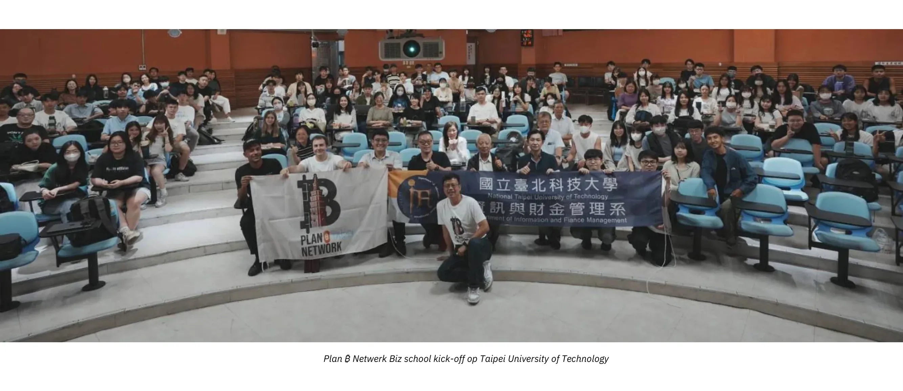

Zoals je in de loop van deze cursus hebt gezien, vereist **het opbouwen van een Bitcoin gemeenschap en het organiseren van meet-ups** zowel planning als motivatie. Afhankelijk van je doelen en de tijd die je kunt besteden, kun je ambitieuzere projecten aannemen of het eenvoudig houden.

Hoe dan ook, het doel is hetzelfde: **interesse wekken en Bitcoin helpen groeien in jouw stad**.

Om de vele hoofdstukken en subhoofdstukken die we behandeld hebben af te ronden, volgt hier een **concreet "actieplan"** voor het creëren van jouw Bitcoin gemeenschap:

1) Beslis op voorhand waarom je een Bitcoin gemeenschap wil creëren, wat je doelen zijn en in welke stad of locatie je actief zal zijn.

2) Neem contact op met de bestaande gemeenschappen in de buurt en aarzel niet om hen om advies te vragen als je dat nodig hebt;

3) Creëer een duidelijke identiteit voor je gemeenschap die je gemeenschap en locatie weerspiegelt (logo, poster, banner, flyer, etc.)

4) Creëer communicatiekanalen en sociale netwerken zoals Telegram, Twitter, NOSTR, Discord of Simplex. Overweeg ook gedecentraliseerde en/of censuurbestendige kanalen.

5) Volg andere lokale meet-ups en gemeenschappen online en zorg dat je groep op verschillende kaarten en platforms staat om de zichtbaarheid te vergroten.

Zodra de communicatiekanalen van je gemeenschap actief zijn:

6) Start een enquête om je eerste meet-up voor te stellen zodra je voelt dat er genoeg interesse is.

7) Bepaal de doelstellingen die je wilt bereiken met dit persoonlijke evenement.

8) Kies een goed gelegen, gastvrije locatie die aansluit bij je doelen en reserveer een tafel of zaal.

9) Promoot het evenement een week van tevoren op je kanalen en daarna nog een keer twee tot drie dagen voor de datum.

10) Plaats je evenement op relevante websites en platforms.

11) Laat het evenement op de dag zelf op een natuurlijke manier verlopen en ga een dialoog aan met de deelnemers.

Achteraf:

12) Focus op het behouden en betrekken van deelnemers zodat ze terugkomen.

13) Stel eenvoudige projecten of initiatieven voor en begin met de projecten waar je persoonlijk om geeft. Als iemand anders een ander project wil leiden, steun hem dan waar je kunt.

Eindelijk:

14) Anticipeer op de toekomst door na te denken over een grotere locatie voor meet-ups, regels voor communicatiekanalen, een website, enz;

15) Moedig lokale bedrijven aan om Bitcoin te accepteren, zelfs door het gewoon te vragen als je er winkelt.

16) Taken en kanaal-/netwerkbeheerdersrechten delegeren aan vertrouwde leden.

17) Promoot je community op grote schaal zodat meer mensen meedoen en betrek degenen die interesse tonen erbij.

18) Ga nog verder met projecten die je leuk vindt en die belangrijk voor je zijn.

Voor een sneller overzicht, vat deze 21 minuten durende video deze stappen samen:

:::video id=a59956da-f554-4b54-89dd-5ca55b722686:::

Onthoud: **je bent niet alleen, bestaande gemeenschappen zijn er om je te steunen**.

## Voor jezelf zorgen

<chapterId>cf1631cb-ddbe-55c7-be8c-26a5652979a0</chapterId>

Als je in het Bitcoin konijnenhol valt, verandert je kijk op het leven.

Diep van binnen voel je een drang om verder te gaan, om anderen te ontmoeten die dezelfde mentale reis maken.

Die energie stimuleert je om jouw stukje bij te dragen aan de puzzel door je ontdekking te delen: Bitcoin. Het inspireert je ook om na te denken over de wereld van morgen, de wereld die je wilt helpen opbouwen en de gemeenschappen die eraan werken.

Het opbouwen van een community is een lange tunnel die motivatie, strategie, toewijding en tijd vereist. Het kan een ondankbare taak zijn, dus het is belangrijk om stap voor stap te werk te gaan om een burn-out te voorkomen.

**Denk aan jezelf, aan je grenzen**. En hoewel Bitcoin je dag en nacht opjaagt, **probeer niet alles alleen te doen, anders brand je jezelf op**.

Zoek in plaats daarvan **hulp bij bitcoiners die al dezelfde tunnel hebben bewandeld, dezelfde paden hebben verkend en dezelfde tools hebben gebouwd**. Het zal je veel tijd besparen.

**Nodig degenen die je volgen in dit avontuur uit om een handje te helpen**, zelfs als het delegeren ervoor zorgt dat bepaalde taken langer duren. Op de lange termijn zal je gemeenschap sterker en veerkrachtiger zijn.

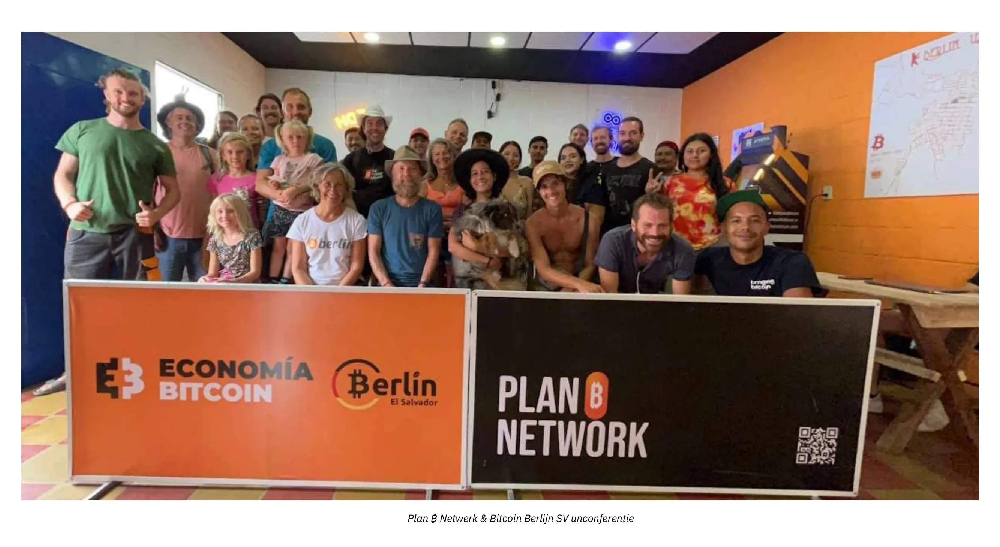

In je eentje kun je snel een van de vele tunnels in het Bitcoin konijnenhol verkennen. Maar vergeet niet dat er talloze andere richtingen zijn om te verkennen.

**Door een gemeenschap van bitcoiners te creëren en/of je bij hen aan te sluiten en door regelmatig met hen te delen en uit te wisselen, beweeg je je tegelijkertijd in alle richtingen door het konijnenhol.**

## BTC 304, Wat is de volgende stap?

<chapterId>8bf10b77-80ee-5d50-87bc-0ef32574a675</chapterId>

In deze BTC 304-cursus zijn we in detail ingegaan op hoe je een community of meet-up opzet en hoe je verschillende projecten lanceert.

Als je gemeenschap klaar is om de volgende stap te zetten, **kan je een formele vereniging oprichten**.

In Frankrijk bijvoorbeeld hebben bijna een dozijn van de ongeveer zestig communities en meet-ups een verenigingsstatus.

De voordelen zijn tweeledig:

- **Officiële erkenning**: je kunt een bankrekening van een vereniging openen, aandacht van de pers/media krijgen en zelfs subsidies aanvragen.
- **Gestructureerde organisatie**: je kunt duidelijke rollen definiëren, waardoor het eenvoudiger wordt om je community te leiden en projecten uit te voeren.

Met de bedoeling uw gemeenschap verder te laten bloeien, **valt niet uit te sluiten dat er in de komende maanden een vervolg op deze opleiding verschijnt op [Plan ₿ Academy](https://planb.academy/)**.

Tijdens deze volgende sessie kunnen geavanceerde onderwerpen aan bod komen, zoals:

- Het ontwerpen van presentaties of workshops voor je meetups en het stellen van duidelijke doelen.
- Het organiseren van een grootschalig evenement met ongeveer 100 deelnemers.

Hiervoor putten we uit de ervaringen van gemeenschappen die al hun eigen evenementen en presentaties hebben gemaakt.

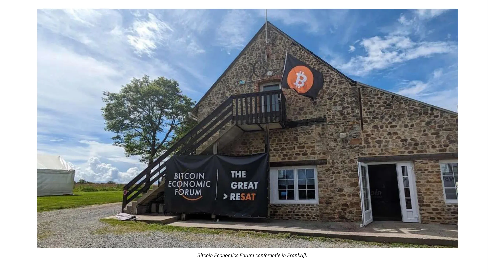

# Laatste deel

<partId>e9bdddf4-54c9-4de9-bbce-c3eade8c32e5</partId>

## Beoordelingen

<chapterId>08a35d2a-204b-519a-9bb1-588665a037fa</chapterId>

<isCourseReview>true</isCourseReview>

## Conclusie

<chapterId>d74606a5-cb14-4117-acb2-2bf5920de092</chapterId>

<isCourseConclusion>true</isCourseConclusion>