# Первый шаг к принятию Биткоина

Сегодня каждый может узнать о Биткоине онлайн, но часто не хватает возможности встретиться, обменяться идеями и строить вместе. Чтобы заполнить этот пробел, многие биткоинеры создают местные сообщества, где встречи порождают семинары, презентации и содержательные дискуссии.

В BTC304 мы рассмотрим, почему построение сообщества важно, изучим инструменты для создания сильной визуальной и цифровой идентичности и поделимся простыми проектами с открытым исходным кодом, которые вы можете запустить. Мы также рассмотрим, как локальные инициативы масштабируются в национальные сообщества, которые могут помочь построить гипербиткоинизированное будущее.
+++
# Введение

<partId>81318b8f-d316-5787-aa4c-4ec8370ba668</partId>

## Обзор курса

<chapterId>e8991b82-4966-5e04-8f05-7cae46eacbaa</chapterId>

Добро пожаловать в BTC 304!

С 2009 года Bitcoin неустанно развивается. Этот рост выражается в новых предложениях по улучшению Bitcoin (BIP), создании дополнительных уровней для масштабируемости сети (в том числе Lightning Network), а также в развитии множества компаний и стартапов.

Его развитие заметно и в On-Chain: количество сделок неуклонно растет.

Например, в период с 1 января 2018 года по 1 января 2024 года количество транзакций на основном Bitcoin - Layer, по оценкам, [увеличилось на 66,2 %](https://dune.com/queries/3375917/5663935). Между тем, в период с августа 2021 по август 2023 года количество публичных сделок на Lightning Network [выросло на 1 212 %](https://river.com/learn/files/river-lightning-report-2023.pdf).

Этот значительный рост, конечно же, тесно связан с:

- [растущий интерес людей по всему миру к использованию Bitcoin](https://profedustream.substack.com/p/21-raisons-dutiliser-Bitcoin), чтобы освободиться от банковской системы и/или использовать менее волатильную или менее девальвированную валюту, как это происходит с населением Ливана, Сирии, Египта, Аргентины и других стран;
- его удорожание с течением времени, превращение его в хранилище ценностей и долгосрочную инвестицию, обусловленную фиксированной денежно-кредитной политикой;
- последовательный рост спекулятивного криптовалютного рынка, особенно в 2017-2018 и 2020-2021 годах;
- Растущее присутствие Bitcoin в основных средствах массовой информации.

Хотя Bitcoin все еще находится на ранней стадии разработки, эта реальность, о которой вы, скорее всего, уже знаете, заставляет нас задуматься над двумя ключевыми вопросами:

- Как мы можем поощрять биткойнеров идти дальше в их обучении и проектах, чтобы **полностью использовать потенциал Bitcoin**?

- Как мы можем помочь новичкам, которых часто привлекают краткосрочные спекуляции, избежать потери денег на последнем увлечении memecoin и вместо этого сосредоточиться на **изучении основ Bitcoin**?

Лучшее решение обеих проблем простое: **присутствовать в реальном мире и обучать**.

Цель этого курса - предоставить вам все необходимое для создания и эффективной организации сообщества или встречи Bitcoin. Независимо от того, хотите ли вы создать местную инициативу или развить онлайн-группу, этот курс проведет вас шаг за шагом: от создания визуального стиля до организации регулярных мероприятий и управления каналами связи.

**Раздел 1: Введение**

Мы начнем с того, что подчеркнем важность объединения людей вокруг Bitcoin, будь то онлайн-сообщества или местные встречи. Вы узнаете, зачем и где создавать свое собственное сообщество, а также как поставить четкие цели, чтобы способствовать его росту и долгосрочной устойчивости.

**Раздел 2: Разработка уникальной идентичности для вашего сообщества Bitcoin**

Чтобы привлечь новых членов и укрепить чувство сопричастности, необходимо создать уникальную идентичность. В этом разделе вы узнаете, как разработать логотипы, плакаты и баннеры, воплощающие дух вашего сообщества Bitcoin.

**Раздел 3: Создание каналов связи для вашего сообщества Bitcoin**

Общение - основа любого сообщества. В этом разделе мы рассмотрим лучшие каналы связи и расскажем, как эффективно настроить группу Telegram или сервер Discord. Вы также узнаете, как интегрировать многофункциональных ботов, чтобы упростить управление сообществом.

**Раздел 4: Запуск социальных сетей** (на французском языке)

Видимость - ключ к развитию вашего сообщества. В этом разделе вы узнаете, как создать специальный профиль в Twitter, подключиться к местным встречам и использовать такие платформы, как btcmap.org, чтобы повысить узнаваемость и привлечь новых участников.

**Раздел 5: Организация встречи Bitcoin**

В этом разделе мы расскажем о том, как организовывать встречи: от выбора подходящего места до проведения самого мероприятия. Мы также рассмотрим стратегии формирования лояльности участников и обеспечения долгосрочной устойчивости вашего сообщества.

**Раздел 6: Примеры проектов и инициатив** (на французском языке)

Чтобы не ограничиваться простыми встречами, в этом разделе представлены конкретные и оригинальные проекты: от тематических мероприятий и мастер-классов до создания образовательного контента и локальных коллабораций. Вы также узнаете, как разрабатывать физические и цифровые материалы для продвижения вашего сообщества.

**Раздел 7: Предвидение будущего**

Здесь мы рассмотрим естественное развитие вашего сообщества: что делать, если оно растет слишком быстро, как децентрализовать свою организацию и как реагировать на враждебную нормативную среду. Этот раздел поможет вам предвидеть и преодолеть эти проблемы.

**Раздел 8: Объединение биткойнеров**

Последний раздел посвящен сути вашего проекта: объединению энтузиастов Bitcoin вокруг общего видения. Вы узнаете, как выстроить свою работу, чтобы привлечь и удержать участников, эффективно делегировать задачи и обеспечить устойчивое развитие сообщества.

Готовы узнать, как создать сильное, энергичное сообщество Bitcoin? Давайте погрузимся!

## Зачем создавать сообщество или встречу Bitcoin?

<chapterId>893ea248-7d5a-5b8e-948c-7031497b1031</chapterId>

### В чем разница между сообществом и встречей?

Хотя в экосистеме Bitcoin нет строгого определения этих терминов, под сообществом лучше всего понимать группу людей, которые разделяют общие увлечения и регулярно общаются.

С другой стороны, встреча - это мероприятие, организованное сообществом и для него, с определенной целью. Встречи обычно проводятся, когда сообщество уже сформировалось.

В этом курсе мы предполагаем, что перед запуском Bitcoin meetup вы уже связались с несколькими людьми, заинтересованными в проведении такого мероприятия, другими словами, **сообщество уже существует**.

### Зачем создавать сообщество Bitcoin?

Существует несколько причин для создания сообщества Bitcoin:

- Обмен знаниями и сотрудничество: Сообщества предоставляют участникам пространство для обмена идеями и знаниями Exchange. Взаимная поддержка - ключевая основа роста, позволяющая каждому ускорить процесс обучения, что особенно актуально для Bitcoin, учитывая, сколько всего предстоит открыть для себя.

- Создание сообществ по принципу "равный-равному": Многие инициативы и проекты задумываются, создаются и развиваются в рамках этих сообществ.

Сообщества Bitcoin часто преследуют более широкие цели, в частности, просвещение населения:

1. Что такое Bitcoin;

2. Как это работает;

3. Его вклад в развитие общества;

4. Развенчание недостоверных или необоснованных утверждений, сделанных некоторыми общественными деятелями и средствами массовой информации;

5. Принципиальные отличия Bitcoin от других криптовалют;

Создавая первые "цитадели" завтрашнего дня, **сообщества Bitcoin по всему миру служат оплотом против дезинформации и цензуры, одновременно являясь плодородной почвой для изучения основ Bitcoin**. Они предлагают новичкам, даже скептикам, ресурсы и связи, необходимые для раскрытия истинного потенциала Bitcoin.

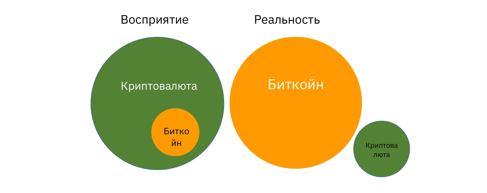

Стоит также отметить, что **сообщество может существовать полностью онлайн**, будь то группа в Telegram ("Bitcoin London"), группа в Facebook ("Bitcoin Berlin"), сервер Discord ("Bitcoin Madrid") или даже список адресов электронной почты ("Bitcoin France").

Другими словами, **сообществу не нужны физические встречи, чтобы процветать или запускать проекты. Его основная цель остается прежней: делиться, создавать и обучать**.

### Зачем создавать встречи?

Как уже говорилось, **встречи обычно проводятся после создания сообщества и служат его дополнением**.

По мере развития биткойна часто возникает желание или даже потребность **встретиться и пообщаться лично с другими** из той же экосистемы. Это может быть вызвано чувством изоляции или тем, что вам просто не с кем поговорить о Bitcoin в повседневной жизни.

Встречи предлагают более личный и дружелюбный опыт, чем аудио- или видеозвонки онлайн. Будь то **за напитком или едой**, они создают неформальное, дружеское пространство, где люди могут открыто и напрямую обмениваться идеями Exchange.

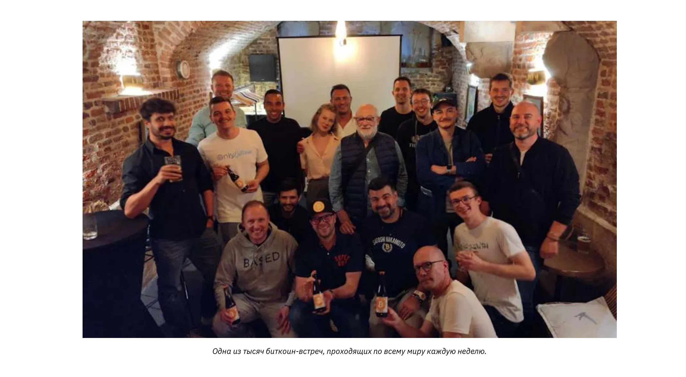

Встречи Bitcoin могут служить многим целям:

- Обсуждение технических тем или текущих проектов
- Помощь новым биткойнерам в постепенном погружении в мир Bitcoin
- Объявление о новых проектах или инициативах
- Обмен материалами или книгами
- Предварительный показ документальных фильмов
- Проведение конференций или семинаров по конкретным темам

Мы подробно рассмотрим многие из этих возможностей в части 6/8 этого курса, озаглавленной "[Примеры проектов и инициатив](https://planb.academy/courses/1c643dc9-a15f-4f9e-93b6-cb3c58b4ee35/3213d87a-1998-5972-ab93-97a5769ba279)".

Хотя каждое сообщество вольно формировать собственное мнение, запускать проекты и экспериментировать по-своему, встречи становятся все более **необходимыми для развития Bitcoin и роста биткоинеров**. **Их организация требует времени и усилий**, поэтому этот курс делится общим опытом [около шестидесяти сообществ Bitcoin во Франции и Бельгии](https://btcmap.org/communities/map#2/5.24949/0.20000) **чтобы помочь вам создать и развить собственное сообщество и проводить встречи как можно более гладко**.

## Где вы должны создать свое сообщество?

<chapterId>72da5285-5395-592d-ab62-303a0aef3d6d</chapterId>

Первый вопрос, который необходимо задать: где должно располагаться ваше сообщество?

Это решение очень важно, если вы хотите сохранить возможность организовывать встречи в дальнейшем.

Если участникам приходится ехать два часа, чтобы посетить мероприятие, посещаемость, скорее всего, будет низкой. Вот почему выбор правильного **места для вашего сообщества, а значит, и для ваших будущих встреч, оказывает большое влияние на его рост**.

Несколько советов, которыми вы можете руководствоваться при принятии решения:

1/ **Создайте и развивайте свое сообщество в среднем или крупном городе**. Это облегчит вам задачу:

    - Найдите приятные места для встреч и проектов (презентации, семинары, продвижение усыновления Bitcoin и т.д.);
    - Повышение чувства вовлеченности и сопричастности среди большего числа людей;
    - Улучшите доступность мероприятия (общественный транспорт, парковка и т. д.). Настоятельно рекомендуется выбирать место, расположенное недалеко от остановок общественного транспорта и парковки.

2/ **Выберите название, связанное с вашим городом**. Так людям будет легче идентифицировать себя с вашим сообществом. Примеры: Bitcoin Париж, Einundzwanzig Берлин, Satoshi Spritz Милан и т. д.

3/ **Проверьте, нет ли поблизости такой встречи**.

Вы можете посмотреть [btcmap.org](https://btcmap.org/communities/map#0/0/0/), где перечислено большинство сообществ и встреч Bitcoin по всему миру.

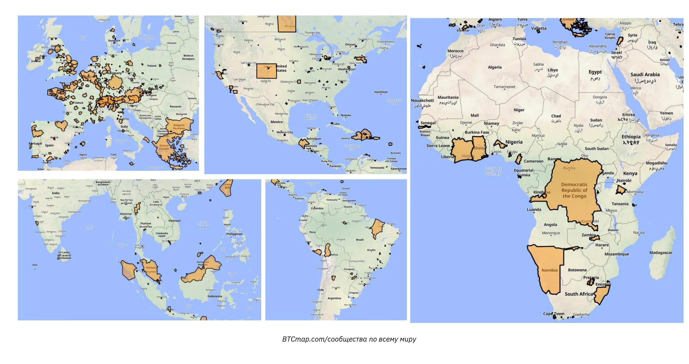

Проведя небольшое исследование, вы, возможно, найдете уже существующую встречу или сообщество в вашем городе.

Bitcoin децентрализована, поэтому, естественно, каждый волен делать то, что ему заблагорассудится.

Однако **объединение усилий часто имеет больше смысла, чем разделение близлежащих сообществ и уменьшение влияния каждого из них**. Создание нового сообщества там, где уже существует одно, может непреднамеренно создать конкуренцию.

В этом смысле может помочь простое "эмпирическое правило": если в радиусе 30-45 минут от места вашего проживания нет активного сообщества Bitcoin, возможно, стоит основать новое. Впрочем, вы всегда вольны поступать по своему усмотрению.

И конечно, если старое сообщество "эволюционировало" в направлении, которое больше не соответствует вашим ценностям, а у вас нет времени или мотивации "оранжировать" его, то создание собственного Fork - это всегда вариант.

## Какими целями должно руководствоваться ваше сообщество?

<chapterId>0aae1aa8-93ec-544a-ad88-22d32c619595</chapterId>

После того как вы определили город (или географическую зону) для своего сообщества, пришло время **определить, чего вы хотите достичь**.

Эти цели можно установить сразу при запуске или уточнить позже, когда к группе присоединятся несколько участников и она начнет активно работать.

Вот несколько пунктов, которые помогут вам определиться:

1/ **Почему я создаю это сообщество как биткойнер?** Это для того, чтобы делиться знаниями? Обучать других? Учиться у более опытных коллег? Встретить единомышленников? Вовлечься в экосистему Bitcoin? Общаться с профессионалами? Или просто выпить и завести новых друзей?

Ваши ответы определят ваше позиционирование и мотивацию.

Если ваша цель - **делиться знаниями и просвещать людей о Bitcoin**, сосредоточьтесь на **создании образовательного контента** (статей, подкастов, видео, презентаций, листовок и т. д.), избавляя других от бесчисленных часов исследований. Вы можете пойти еще дальше, **организовывая семинары, презентации и конференции**.

Если ваша цель - просто познакомиться с другими биткойнерами и обменяться опытом, вы можете использовать более расслабленный подход, например, встретиться, чтобы выпить.

Так вам будет легче наладить социальные связи. Однако всегда помните, что **пить пиво - это не тот путь, который поможет построить завтрашний мир**.

Вот почему **определение конкретных целей и проектов имеет большое значение**.

2/ Следует ли мне придать своему сообществу **физическое измерение**? Если да, то какие мероприятия следует организовать?

Вашим первым мероприятием, скорее всего, станет встреча. Его основная цель - собрать вместе биткоинщиков в вашем регионе.

Однако, как мы увидим далее в [Примерах проектов и инициатив](https://planb.academy/courses/1c643dc9-a15f-4f9e-93b6-cb3c58b4ee35/3213d87a-1998-5972-ab93-97a5769ba279), **встречу можно построить по-разному, с разными целями:**

- Совместите общение с образовательной презентацией по концепции Bitcoin;
- Проведите профессиональную демонстрацию решений Bitcoin;
- Стратегии дебатов для апельсиновых пилюль местных торговцев;

и так далее.

В зависимости от тематики (технические доклады или практические семинары), возможно, даже имеет смысл **организовать дополнительные мероприятия** вне вашей обычной встречи.

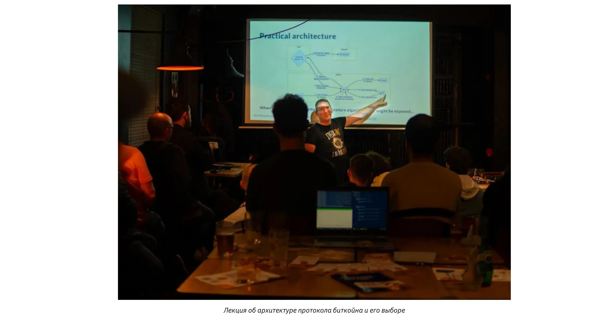

3/ Как я хочу, чтобы мое сообщество внесло свой вклад в экосистему Bitcoin?

Это более сложный вопрос, но о нем стоит задуматься как можно раньше.

Если ваша цель - **создать сплоченное, мотивированное сообщество**, нацеленное на то, чтобы оранжировать как можно больше людей, тогда:

- Сотрудничайте с существующими сообществами, чтобы получить доступ к более широкой информации, ресурсам с открытым исходным кодом и ценной поддержке в случае необходимости.
- Организуйте и делегируйте задачи внутри группы, чтобы эффективно расширять и масштабировать свои усилия.

**Ставьте краткосрочные, среднесрочные и долгосрочные цели**

Практичный способ планирования - постановка целей на каждый период времени:

- Краткосрочная перспектива: создание присутствия в социальных сетях и организация каналов связи с сообществом.
- Среднесрочная перспектива: создание образовательных ресурсов (статьи, листовки, видео).
- В долгосрочной перспективе: запустить регулярные физические встречи.

Когда встречи будут организованы, вы можете стремиться к ним:

- Краткосрочные: проведение семинаров или презентаций по конкретным темам
- Среднесрочная перспектива: проведение информационных или образовательных кампаний Bitcoin
- В долгосрочной перспективе: создать официальную ассоциацию или партнерство с баром, принимающим Bitcoin в качестве оплаты.

Будьте готовы: **создание сообщества требует усилий**

Создание сообщества не происходит в одночасье. Это требует времени, мотивации и организации.

Временами это может даже обескуражить, особенно когда никто не приходит, и вы чувствуете себя единственным, кто несет эту миссию на своих плечах.

Именно поэтому **этот курс призван поделиться ценными ресурсами и советами, помогая сообществам эффективно развиваться и в конечном итоге стать самодостаточными**.

# Разработка идентичности сообщества Bitcoin

<partId>da6673ad-bf49-5979-80a6-3f69cfb28046</partId>

## Почему и как вы можете создать свою собственную личность?

<chapterId>b48a18cc-afdf-5216-802c-32647b5cd8a3</chapterId>

На данном этапе мы предполагаем, что:

- Вы уже знаете, где будет располагаться ваше сообщество (или будущая регулярная встреча).
- Вы поставили цели на разные временные горизонты, даже если они еще не окончательны.

Следующий шаг в создании сообщества - это **определение его идентичности**, как названия, так и визуального стиля.

В этом разделе представлены учебные пособия и удобные для начинающих программные решения, которые помогут вам разработать визуальный стиль вашего сообщества, даже имея начальные навыки.

**Почему личность имеет значение?**

Люди чувствуют себя более вовлеченными и преданными, когда они могут идентифицировать себя с группой. Сильная идентичность помогает вашему сообществу выделиться и способствует формированию чувства принадлежности.

Все начинается с выбора имени, и в каждой стране часто существуют свои тенденции:

- Франция: Большинство из 60 с лишним местных сообществ используют такие названия, как "Bitcoin [CITY]" или "[CITY] Bitcoin". Их группы в Telegram часто следуют этому шаблону: "Bitcoin [CITY] meetup".
- Германия: Инициатива Einundzwanzig (что означает "21") вдохновила на создание таких названий, как "Einundzwanzig [CITY]".
- Италия: В сети Satoshi Spritz используются такие названия, как Satoshi "Spritz [CITY]".

**Каждое сообщество имеет свою собственную идентичность, связанную с родным городом и в то же время с более широкой идентичностью своей страны**.

Ваша визуальная идентичность: логотип, цвета, баннеры - это то, что люди будут помнить и ассоциировать с вашей группой.

При создании аккаунтов в социальных сетях и каналов коммуникации наличие логотипа и баннера - несомненный плюс. Не волнуйтесь, вам не понадобятся профессиональные дизайнерские навыки - в вашем распоряжении бесплатные и простые в использовании инструменты.

Отличная отправная точка - включить в интерьер достопримечательность или символ вашего города. В Париже это может быть Эйфелева башня. В Лилле - колокольня или цитадель. В Нью-Йорке - статуя Свободы. В Лондоне - Биг-Бен и так далее.

В зависимости от ваших предпочтений вы можете разработать простой или более детальный логотип.

Чтобы дать вам несколько идей, вот несколько примеров логотипов французских сообществ:

- В Марселе на логотипе изображена базилика Нотр-Дам-де-ла-Гард, с которой открывается вид на город:

- В Монако он обозначает монегасскую скалу:

- В Лилле элегантный логотип представляет цитадель Вобана и его парк:

- В Сен-Мало выделяется горностай - эмблема города:

**Далее, если хотите**

Если вас посетит вдохновение, вы можете пойти еще дальше: придумать герб, девиз или даже песню для своего сообщества. Ваша креативность - единственный предел!

## Создайте логотип, плакат и баннер

<chapterId>3470a31f-0190-5e87-8af0-6a00e79267ef</chapterId>

### Использование Canva

Вы можете использовать [Canva](https://www.canva.com/) для создания различных визуальных элементов для вашего сообщества.

Эта бесплатная и простая в использовании платформа популярна благодаря большой библиотеке готовых шаблонов, которые вы можете дублировать и настраивать всего за несколько кликов.

**Создание логотипа**

На главной странице Canva найдите готовые логотипы. Выберите один или несколько, которые вас вдохновляют, продублируйте их, а затем измените в соответствии с требованиями вашего сообщества.

Вы можете добавить на фон местную достопримечательность или эмблему (импортируйте фотографию или найдите "Иллюстрации" или "Изображения" в меню Elements), а затем наложить логотип Bitcoin или ₿, при необходимости подправив его цвет.

**Создание баннеров и плакатов**

Чтобы создать баннер или плакат, найдите в библиотеке Canva готовые шаблоны. После того как вы продублируете один из них, измените текст и шрифты, добавьте логотип вашего сообщества и импортируйте любые фотографии с помощью рамок (найдите "frame" в меню Elements).

Вы также можете использовать меню Designs для поиска дополнительных моделей, соответствующих вашим потребностям.

Для миниатюр YouTube или баннеров просто найдите эти шаблоны, продублируйте их и настройте по своему усмотрению.

Одним словом, **возможности безграничны и зависят не только от ваших потребностей, но и от визуального стиля, который вы хотите создать** для вашего сообщества и ваших встреч/мероприятий!

Чтобы дать вам более четкое представление, мы включили неполный видеоурок, демонстрирующий некоторые из этих возможностей:

:::video id=d11ae0ed-eacd-4924-afd3-75aff95d2899:::

**Примерные шаблоны от Bitcoin Lille**

Здесь представлены готовые шаблоны Canva, которые вы можете скопировать и адаптировать для своего сообщества:

- **Плакат с анонсом встречи** (для социальных сетей и печати в формате A4/A3): [ссылка](https://www.canva.com/design/DAGBvBXFJ8A/92-j_toeLU8QbVAD0NwoAA/edit?utm_content=DAGBvBXFJ8A&utm_campaign=designshare&utm_medium=link2&utm_source=sharebutton)

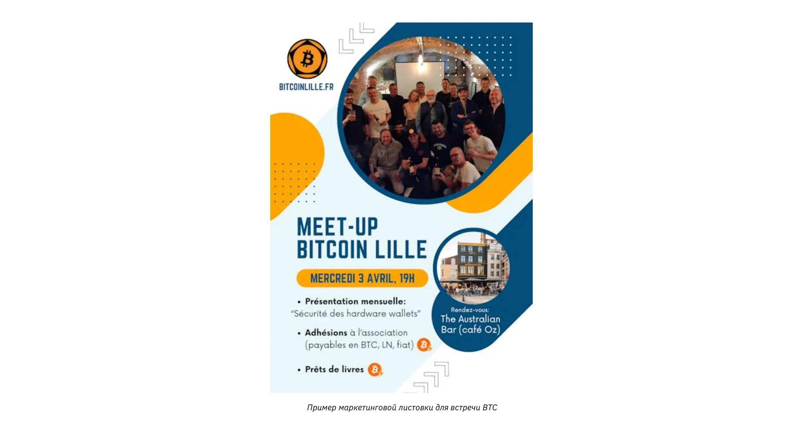

- **Афиша мероприятия** (для социальных сетей и печати в формате A4/A3): [ссылка](https://www.canva.com/design/DAGBvG3rNCc/oXtNR9pduRs22AqclG4O2g/edit?utm_content=DAGBvG3rNCc&utm_campaign=designshare&utm_medium=link2&utm_source=sharebutton)

- **баннеры в социальных сетях**: [ссылка](https://www.canva.com/design/DAGBvOXyNqw/iSJG9PbIQHgGWHz5PhlXSQ/edit?utm_content=DAGBvOXyNqw&utm_campaign=designshare&utm_medium=link2&utm_source=sharebutton)

- **Объявление о конкурсе**: [ссылка](https://www.canva.com/design/DAGBvIjuA_w/YzSUXzOmbNV9oCma9mluOw/edit?utm_content=DAGBvIjuA_w&utm_campaign=designshare&utm_medium=link2&utm_source=sharebutton)

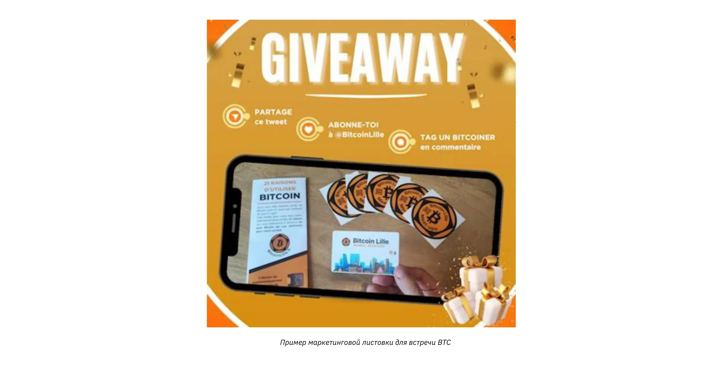

- **фирменные рекомендации** нашей библиотеки, вывешиваемые на А4 на встречах: [ссылка](https://www.canva.com/design/DAGBvPqL7N4/LmUItfsysypRLSOFOzBXcQ/edit?utm_content=DAGBvPqL7N4&utm_campaign=designshare&utm_medium=link2&utm_source=sharebutton)

- Презентация PowerPoint **"Глава 2 - Понимание транзакций Bitcoin"**, автор @ProfEduStream: [ссылка](https://www.canva.com/design/DAFsEcnOro8/Mz9FYdTGhsvozZOe0Y9jtw/edit?utm_content=DAFsEcnOro8&utm_campaign=designshare&utm_medium=link2&utm_source=sharebutton)

- листовка **"21 причина использовать Bitcoin"**, написанная @ProfEduStream: [ссылка](https://www.canva.com/design/DAFtAR1NauQ/ZDwl2CchIJ9Gpb36N6-7iw/edit?utm_content=DAFtAR1NauQ&utm_campaign=designshare&utm_medium=link2&utm_source=sharebutton)

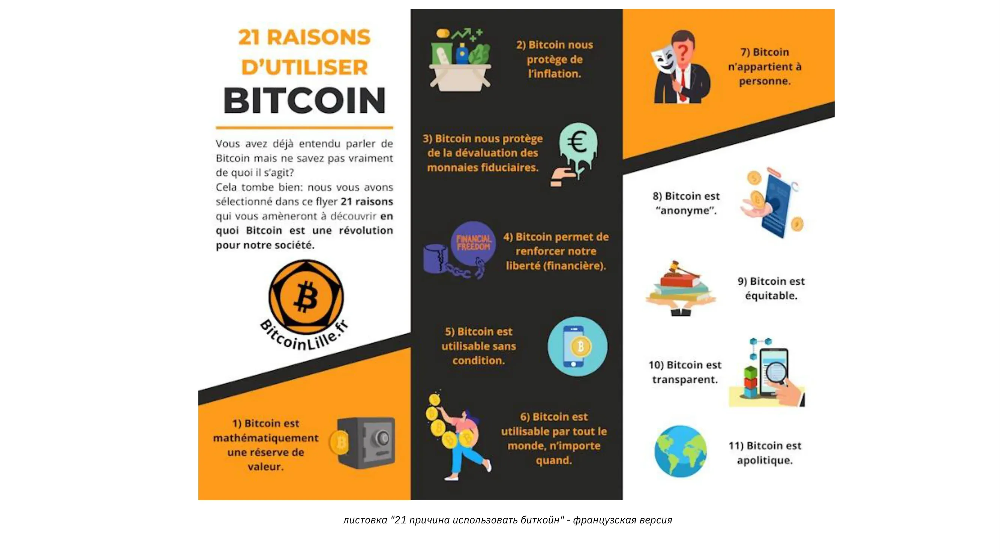

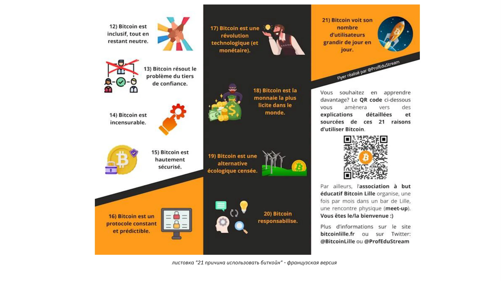

**Поделитесь своими творениями**

Возможности безграничны, и ваш дизайн будет зависеть от ваших целей и визуальной идентичности. Подумайте о том, чтобы поделиться своими шаблонами с открытым исходным кодом - это сэкономит время для других сообществ Bitcoin, которые неизбежно столкнутся с теми же проблемами, что и вы. Делясь с другими, вы помогаете ускорить рост сообществ Bitcoin во всем мире.

**Рекомендуемые размеры**

При создании визуальных материалов всегда проверяйте требования к размеру для каждой платформы:

| Platform | Logo | Banner | Poster / Image
| -------- | -------- | -------- | -------- |
| Telegram     | 512 x 512     | N/A     | N/A     |
| Signal     | N/A     | N/A     | N/A     |
| Twitter     | 400 x 400     | 1500 x 500     | 1200 x 628     |
| Meet-up     | N/A     | N/A     | N/A     |
| Discord     | 512 x 512     | 960 x 540     | N/A     |
| Facebook     | 512 x 512     | 851 x 315     | 960 x 720     |

Обычно подходящие размеры:

Логотипы: 512 x 512 пикселей

Баннеры: Варьируется в зависимости от приложения или сайта

Плакаты: Стандартный формат печати - A4

### Использование искусственного интеллекта

Хотя Canva предлагает широкий спектр инструментов для создания логотипов, плакатов, баннеров и флаеров, это не единственный вариант. Если вам удобнее работать с другими программами (например, Photoshop или Illustrator), смело используйте то, что вам больше подходит.

И все же, разрабатываете ли вы логотип сообщества или улучшаете плакаты, презентации или листовки, **искусственный интеллект может стать мощным союзником в создании уникальных и привлекательных визуальных образов**.

Для этого существует ряд искусственных интеллектов. К ним относятся

- [midjourney](https://docs.midjourney.com/docs/quick-start) (платно);
- [leonardo](https://leonardo.ai/) (бесплатно, аккаунт ограничен);
- [copilot](https://copilot.microsoft.com/) (бесплатно, аккаунт ограничен);
- [DALL-E](https://www.dall-efree.com/) (платно).

В последнее время появилось множество других инструментов искусственного интеллекта, так что этот список далеко не исчерпывающий.

**Пример: Создание футуристического логотипа Bitcoin London**

Если вы хотите разработать футуристический логотип для встречи "Bitcoin London", вы можете обратиться к Copilot:

- [ ] * Задание: Создайте логотип Bitcoin с Лондонским мостом и Биг-Беном на заднем плане. Футуристический* - [ссылка](https://copilot.microsoft.com/images/create/un-logo-Bitcoin-futuriste-avec-en-arric3a8re-plan-le-/1-6612ba1758df4384bc33c4bca00ab45b?FORM=SYDBIC)

Если первые четыре результата недостаточно реалистичны, уточните свой запрос:

- [ ] *Приглашение: Сделайте 4-ю более реалистичной* - [Ссылка](https://copilot.microsoft.com/images/create/un-logo-Bitcoin-futuriste-avec-en-arric3a8re-plan-le-/1-6612ba64b72d4cea9830ab7eb844f785?FORM=SYDBIC)

Последний результат получился великолепным!

**Пример: Создание простого логотипа в британском стиле**

Для более чистого вида, как для наклейки:

- [ ] * Задание: Создайте логотип "London Bitcoin Meetup" в британском и чистом стиле* - [Ссылка](https://copilot.microsoft.com/images/create/logo-for-27londres-Bitcoin-meetup27-with-a-british-a/1-6612bb9451924859a6c34b350b3a6ebc?FORM=SYDBIC)

Результат выглядит очень круто!

**Советы по работе с искусственным интеллектом**

- Будьте терпеливы: С первой попытки ИИ может не выдать именно то, что вы задумали.

- Используйте точные подсказки: Чем четче и подробнее будут ваши инструкции, тем лучше будут результаты.

- Попросите о помощи: Если вас что-то не устраивает, обратитесь к кому-нибудь, кто имеет опыт работы с графическим дизайном или инструментами искусственного интеллекта - многие биткойнеры с радостью помогут, иногда даже бесплатно или за несколько Sats.

# Создание каналов связи для вашего сообщества Bitcoin

<partId>fc588298-6876-554c-bd57-55d182464878</partId>

## Какие каналы связи вам следует выбрать?

<chapterId>b4f4eef6-1035-5290-848a-2b7f9391c77a</chapterId>

Как уже говорилось выше, каналы коммуникации сообщества могут различаться в зависимости от мотивов и привычек.

Например, **во Франции, Германии и Италии Telegram и Twitter являются доминирующими платформами** и стали "стандартом" для сообществ Bitcoin.

В Чехии, напротив, многие сообщества используют **Matrix**, защищенный протокол обмена мгновенными сообщениями, вместо Telegram.

Совет: прежде чем выбирать каналы, **посмотрите, чем занимаются соседние сообщества**. Воспользуйтесь картой [btcmap.org](https://btcmap.org/communities/map#0/0/0/), чтобы узнать, какие платформы наиболее популярны в вашем регионе.

Например, швейцарские сообщества в основном используют Telegram, Twitter и свой собственный сайт:

**Рекомендуемые каналы для франкоговорящих сообществ**

- Telegram: Средство общения №1, им пользуются более 90 % французских встреч.

- Twitter (X): Основная социальная сеть, используемая биткойнерами по всему миру. Его используют ~70% французских встреч. Она идеально подходит для общения с биткойнерами.

- Meetup.com: Платный, но широко используемый (~30% французских и почти все канадские встречи) для повышения узнаваемости за пределами экосистемы Bitcoin.

- Другие варианты: ~30% также имеют свой веб-сайт; ~10% ведут серверы Discord или аккаунты NOSTR.

Можно использовать и другие платформы, такие как Matrix, Keet, Signal, Facebook, Instagram и LinkedIn. Имейте в виду, что чем больше каналов вы контролируете, тем больше времени вы будете тратить на их модерацию, публикацию и поддержание активности.

Поэтому всем, кто хочет создать сообщество во Франции, рекомендуется начать с создания:

- группа Telegram;
- аккаунт в Твиттере.

По мере роста вашего сообщества вы можете добавлять новые платформы и делегировать модерацию доверенным лицам.

## Создание и настройка канала, группы или супергруппы Telegram

<chapterId>d13714ce-8f08-53e9-bedd-b6a3aaac5dad</chapterId>

Прежде чем создавать пространство для общения вашего сообщества в Telegram, важно знать разницу между ними:

- канал в Telegram;
- группа Telegram;
- супергруппа Telegram.

Настоятельно рекомендуется начать с группы Telegram.

При необходимости вы можете позже преобразовать ее в супергруппу.

Для приведенного ниже руководства мы изначально использовали APK "Telegram+", который позволяет выполнять более сложные настройки. Однако он не обязательно нужен, так как официального приложения Telegram достаточно для создания и управления группами даже через телефон:

:::video id=b1da7cb4-5fb1-4a41-a1d4-bd90686826a9:::

### Создайте канал Telegram

Если вы хотите создать место, где ваши участники смогут общаться друг с другом напрямую, отвечать друг другу и т. д., то вам лучше создать группу Telegram, а не канал Telegram!

Перейдите к следующему разделу, озаглавленному [Создать группу Telegram](https://planb.academy/courses/1c643dc9-a15f-4f9e-93b6-cb3c58b4ee35/d13714ce-8f08-53e9-bedd-b6a3aaac5dad).

Действительно, **канал Telegram больше похож на инструмент одностороннего вещания для администраторов**. Участники не могут свободно общаться, они могут только реагировать с помощью эмодзи (или оставлять комментарии в отдельных темах, что фрагментирует беседу).

**Поскольку сообществам необходимо взаимодействие и сотрудничество, канал Telegram не рекомендуется**, если ваша цель - наладить отношения и поделиться знаниями.

Руководство по созданию канала Telegram:

:::video id=98be4709-d221-4030-8c31-e10113482515:::

### Создайте группу Telegram

С другой стороны, **группа Telegram идеально подходит для сообществ**: Подобно приложениям для обмена сообщениями, таким как Messenger или WhatsApp, участники могут общаться и отвечать друг другу в одной общей беседе.

Что вы можете сделать как администратор:

- Размещайте и прикрепляйте важные сообщения.
- Создавайте **опросы** (полезно для определения даты встречи, если ваше сообщество новое).
- создайте **заказную пригласительную ссылку** (Только если группа "публичная", а не "приватная", что определяется в настройках. Также удобно иметь собственную ссылку для приглашения в Telegram, например: t.me/Bitcoin[CITY]);
- Управление правами пользователей, ролями и модерацией.
- Добавьте фотографию профиля (логотип вашего сообщества) и обновите название группы.

Руководство по созданию группы Telegram:

:::video id=3d4792a7-1345-475b-93b1-b3a3945fb567:::

Примечание: Это руководство было сделано с помощью Telegram+, но вы можете делать все прямо из стандартного мобильного приложения Telegram.

### Создайте супергруппу Telegram

Почему именно супергруппа?

Когда в вашей группе Telegram становится сотни участников, разговоры могут стать хаотичными. Это часто приводит к тому, что участники пропускают важные объявления, например дату следующей встречи.

Существует несколько решений:

1. **Отметьте важные сообщения**, чтобы все пользователи получили уведомление (нажмите один раз пальцем на соответствующем сообщении, затем выберите "Отметить");

2. Рассмотрите возможность использования **Discord** для нескольких каналов связи, каждый из которых пользователи могут отключить при необходимости.

3. **Преобразуйте свою группу Telegram в супергруппу**.

Что такое супергруппа Telegram?

Супергруппа - это, по сути, группа Telegram с темами (подканалами) внутри нее.

Примерные темы:

- "Важная информация": только ключевые обновления и объявления о событиях.
- "Общие": для всех обсуждений участников.
- Конкретные темы: например, Mining, развитие проекта, предстоящие конференции.

Совет: Адаптируйте темы к потребностям вашего сообщества. Пример: Abidjan Bitcoin Meet-up успешно использует этот формат.

Имейте в виду, что **супергруппы Telegram могут быть немного сложными в использовании** для некоторых пользователей. Например, не все знают, **как получить доступ к различным темам** (чтобы увидеть полный список тем, нужно просто нажать на логотип группы в главном меню Telegram). Отправка быстрого скриншота поможет прояснить ситуацию.

Не существует строгого правила, когда переходить от обычной группы Telegram к супергруппе, все зависит от потребностей ваших участников. Хорошая новость заключается в том, что вы можете легко переключаться туда и обратно: просто создайте тему для преобразования в супергруппу или удалите все темы, кроме "Общей", чтобы вернуться к обычной группе.

Руководство по созданию супергруппы Telegram:

:::video id=f78800ae-d8ca-479a-b913-99abd9916bff:::

Небольшое примечание: как уже говорилось, приведенное выше руководство было сделано на компьютере с помощью APK "Telegram+". Однако сегодня создать супергруппу Telegram на телефоне проще простого.

Просто создайте группу Telegram, зайдите в ее настройки и нажмите кнопку "Темы", чтобы добавить темы. После сохранения вы увидите список тем, которые можно редактировать по своему усмотрению.

Таким образом, скачивать "Telegram+" больше не нужно, если только вы не хотите получить доступ к более продвинутым настройкам конфиденциальности для своей супергруппы.

## Настройка группы или супергруппы Telegram

<chapterId>35e674b3-5924-50b0-98f1-83a56c9a186d</chapterId>

Теперь, когда ваша группа Telegram (или супергруппа) создана и работает, пришло время **настроить разрешения и установить модерацию**.

Каждое сообщество вольно выбирать свой собственный подход, но опыт показывает, что **лучше всего ограничить определенные полномочия членов**:

- Отправка опроса;
- Отправка файлов (чтобы избежать возможных вирусов);
- Отправка голосовых сообщений;
- Добавление пользователей (помогает предотвратить вторжение ботов);
- Закрепление сообщений;
- Редактирование информации о группе.

Настоятельно рекомендуется **написать четкое описание вашей встречи** при создании группы или супергруппы Telegram, так как это первое, что увидят потенциальные участники. Например:

> Добро пожаловать в Telegram @Bitcoin [CITY] 🔥
>

> Мы проводим встречи каждую первую среду месяца в баре [BAR_NAME], в [CITY] 🍻
>

> Загляните в другие наши социальные сети: [LINK] 🌐

В этом примере администраторы Bitcoin Lille настроили свою публичную ссылку в Telegram для более удобного обмена информацией.

В "Настройках группы", возможно, имеет смысл **включить "Одобрение новых членов "**.

Некоторые группы Bitcoin в Telegram стали мишенью для тысяч фальшивых аккаунтов, призванных спамить или нарушать работу сообщества.

**Активация одобрения участников может спасти вашу группу от спам-атак**

В разделе "Администраторы" вы также можете включить функцию "Агрессивный антиспам" для автоматического удаления подозрительных сообщений.

Это не всегда необходимо, но может добавить дополнительную защиту Layer.

## Добавление многофункционального бота в вашу группу Telegram

<chapterId>c61f69cc-15ec-53f1-8c02-1cea55def09e</chapterId>

**Еще один вариант настройки и защиты группы или супергруппы Telegram - добавить многофункционального бота**. Это позволит вам значительно расширить функции и возможности модерации группы.

Используя **бот [@GroupHelpBot](https://telegram.me/grouphelpbot)**, можно воспользоваться следующими наиболее полезными опциями:

- Команда **правила** (/rules) для отображения правил сообщества;
- **Защита от спама** для фильтрации подозрительных сообщений и учетных записей;
- **Настраиваемые автоматические приветственные сообщения** для новых пользователей (с возможностью автоматического удаления через несколько минут)
- **Защита от флуда** для предотвращения спама в сообщениях
- Команда **@administrator** для быстрого обращения к администраторам групп
- **Правила блокировки** нежелательного контента
- Команда **групповой ссылки** (/link)
- Команда **Управление разрешениями**
- **Автоматическое удаление** сообщений определенных типов
- **Блокировка ботов** и **блокировка входа/выхода** для обеспечения безопасности вашей группы
- Перечислите **социальные сети вашего сообщества** (/networks)
- И многое другое...

Доступны бесчисленные дополнительные функции.

Совет профессионала: **Не перегружайте разговор**.

Руководство по добавлению многофункционального бота в группу или супергруппу Telegram:

:::video id=cdbf82d6-3530-45c4-90de-593f100863bb:::

(Примечание: теперь весь этот процесс можно выполнить прямо с телефона. Больше нет необходимости в приложении Telegram+)

## Создайте сервер Discord

<chapterId>eef2a965-4c24-5f3a-8013-72cc7d315314</chapterId>

Когда ваша группа Telegram становится слишком большой, преобразование ее в супергруппу Telegram может помочь организовать обсуждения.

Однако, как уже говорилось ранее, **дополнительная сложность и увеличение количества тем и сообщений может привести к тому, что некоторые активные участники потеряют интерес**.

Почему стоит обратить внимание на Discord?

**Discord - это альтернатива** супергруппе Telegram, поскольку он позволяет пользователям **создавать специальные текстовые и голосовые чаты** и позволяет участникам отключать неинтересные им каналы.

Конечно, управление и Telegram, и Discord требует немного больше времени, особенно во время настройки и запуска.

Чтобы облегчить вам задачу, **мы совместно используем [Discord-сервер, который вы можете дублировать и настраивать](https://discord.com/template/bDY4eXXJk2C8)**:

:::video id=e647458a-a21e-44e0-bd03-20b82a871777:::

При правильном проектировании сервер Discord может стать настоящим активом для вашего сообщества. Многие биткойнеры уже используют **Discord** ежедневно, и возможность следить за разговорами в Telegram прямо в Discord (и наоборот) может сэкономить всем много времени.

Для синхронизации обеих платформ существует бот с открытым исходным кодом под названием [TediCross](https://github.com/TediCross/TediCross). Его задача проста: автоматически пересылать сообщения из текстового канала Discord в группу Telegram (или тему в супергруппе), и наоборот.

Однако имейте в виду, что установить его не так-то просто. Чтобы бот работал, на вашем компьютере должна быть запущена командная строка (CMD), и иногда могут возникать ошибки. К счастью, исправить их просто: достаточно перезапустить бота, и в большинстве случаев все возвращается на круги своя.

Чтобы сэкономить ваше время, вот инструкция, как добавить этого многофункционального бота в группу или супергруппу Telegram:

:::video id=6a0283f6-6d6c-4e81-8b2f-644b33c52fe6:::

## Рассмотрите альтернативные, частные и более безопасные каналы связи

<chapterId>29d0aad6-0612-5dd0-bcef-7337eaf4fefc</chapterId>

Как уже говорилось ранее, Twitter и Telegram являются наиболее распространенными средствами коммуникации для сообществ Bitcoin в Европе (если не во всем мире).

Однако Telegram известен не как самое безопасное или ориентированное на конфиденциальность приложение для обмена сообщениями, а Twitter, теперь уже X, принадлежит одной из самых свободолюбивых корпораций на планете.

Именно поэтому, когда основные каналы налажены и все работает гладко, стоит изучить другие варианты.

В ближайшие месяцы этот курс и платформа planb.network будут предлагать учебные пособия по использованию альтернативных протоколов, таких как **Simplex и Element**: децентрализованных, зашифрованных и очень настраиваемых средств коммуникации.

**Зачем изучать эти варианты?**

Потому что, как и социальная сеть NOSTR, они обеспечивают не только большую конфиденциальность, но и защиту от цензуры или произвольного закрытия вашей группы Telegram.

И действительно, что может быть более соответствующим духу Bitcoin, чем устойчивость к цензуре и жизнеспособность по замыслу?

# Запустите свои социальные сети

<partId>8ebf8cd7-9248-543f-bc27-4ec4cc03f9cf</partId>

## Важность видимости для развития вашего сообщества Bitcoin

<chapterId>b20f12e4-c5de-5f02-80c7-b7fc6cadd3ac</chapterId>

Итак, ваше сообщество создано и работает. Вы создали свое пространство в Telegram или Matrix... но пока вы там один. **Пора дать людям знать о своем существовании!**

Все просто: если никто не сможет зайти в вашу группу и узнать, когда состоится следующая встреча, вы просто будете писать в пустоту. Вот почему социальные сети и несколько конкретных платформ, о которых мы расскажем ниже, так важны для создания сообщества.

Твиттер (X) стал почти синонимом разговоров о Bitcoin в сети. Он не идеален, далеко не идеален, но именно там сейчас собирается большая часть сообщества. Настоятельно рекомендуется завести там аккаунт.

Чтобы опередить возможную цензуру или ограничения, некоторые сообщества также открывают профиль NOSTR.

Именно так поступил коллектив FREE Madeira.

Конечно, другие платформы тоже могут быть полезны. Facebook (с группой или страницей) или даже LinkedIn.

При этом не забывайте, что **чем больше каналов связи и социальных сетей вы ведете, тем больше времени это требует**. Зачастую лучше сосредоточиться **на наиболее актуальных**, и Twitter (и NOSTR) - отличные варианты для начала.

## Создайте профиль в Twitter

<chapterId>c8d73097-8eba-5530-918c-221002954110</chapterId>

Twitter очень прост в использовании, но чтобы повысить уровень конфиденциальности, вам нужно будет изменить несколько настроек.

**При создании нового аккаунта в Twitter необходимо ввести четыре важные данные:**:

1/ **Твиттер @**, который определяет вашу идентичность и позволяет легко найти вас. Если название вашего сообщества - "Bitcoin [CITY]", уместно выбрать "@Bitcoin[CITY]";

2/ **логотип и баннер**, которые вы создали для своего сообщества или встречи (см. раздел [Создание логотипа, плаката и баннера](https://planb.academy/courses/1c643dc9-a15f-4f9e-93b6-cb3c58b4ee35/3470a31f-0190-5e87-8af0-6a00e79267ef));

3/ **описание**, которое позволяет в нескольких сотнях символов рассказать ключевую информацию о вашем сообществе. Например:

> Официальный аккаунт сообщества Bitcoin [CITY] #BTC | Встречи каждую 1-ю среду месяца в [BAR_NAME] в [CITY] 🍻 | Присоединяйтесь к нам в Telegram 🔽

4/ Под этим описанием можно **вставить ссылку**. Она может вести пользователей на страницу "социальных сетей" на сайте вашего сообщества или на ваш канал в Telegram. Вам решать, что именно вы хотите выделить.

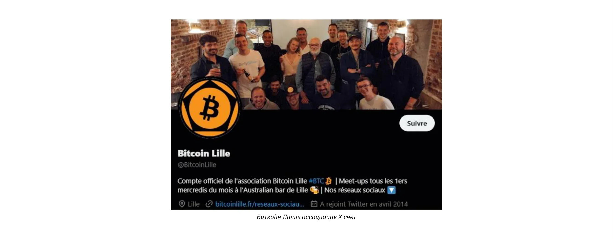

Кроме того, **несколько параметров конфиденциальности стоит настроить**:

- оставьте свой аккаунт в Twitter в "публичном" режиме (сообщения видны всем);
- позволяйте всем находить вас;
- отключить отслеживание местоположения и передачу данных другим организациям (в настройках конфиденциальности).

Для каждого мероприятия вы, скорее всего, будете использовать Twitter, чтобы поделиться полезной информацией. Но, как и в большинстве других социальных сетей, **видимость - это все**.

Чтобы сэкономить ваше время, мы изучили [алгоритм ранжирования Twitter с открытым исходным кодом](https://github.com/twitter).

Вот **ключевые моменты, на которых следует сосредоточиться, чтобы повысить свою узнаваемость**:

- Общие советы:
    - Пишите твиты на установленном языке вашего аккаунта или на английском: твиты на других языках могут значительно снизить вашу видимость;
    - Придерживайтесь своей ниши, делитесь только контентом, связанным с тематикой вашего аккаунта; твиты не по теме наказываются алгоритмом;
    - Старайтесь делать от 1 до 2 твитов в день;
    - Публикуйте сообщения в часы пик: Четверг или пятница между 8 и 10 часами утра, как правило, показывают наилучшие результаты (проверьте в своем аккаунте: Twitter Analytics).

- При написании твита:
    - добавьте фотографию (или даже видео);
    - Используйте только один хэштег (обычно наиболее релевантным является #Bitcoin. При необходимости вы можете добавить трендовый хэштег, связанный с вашей сферой деятельности);
    - Поощряйте сообщество к взаимодействию:
        - Нравится = вес 0,5
        - Ретвит = вес 1
- Ответ = вес 27 (!!)
- Отвечайте людям, которые отвечают на ваши твиты (вес 75!!);
    - Избегайте размещения ссылок в основном твите: вместо этого добавьте их в первый комментарий;
    - Пишите слова полностью, избегайте сокращений.

- Другие советы:
    - Пишите в Твиттере на актуальные темы, если они соответствуют тематике вашего аккаунта;
    - Делайте репосты своих самых эффективных твитов;
    - Время от времени проводите опросы;
    - По возможности пишите нити;
    - Поощряйте свое сообщество посещать ваш профиль и следовать за вами.

Более того, **вы можете прикрепить твит или тему к своему профилю в Twitter, чтобы сделать ее максимально заметной**, как это делает сообщество Bitcoin Witsand в Южной Африке.

Также обратите внимание на возможность одновременного входа в два аккаунта Twitter на телефоне и компьютере. Это очень удобно, если вы хотите легко переключаться между личным и общественным аккаунтами.

Только будьте осторожны... случайная публикация фотографии с вечеринки в аккаунте сообщества может произойти быстрее, чем вы думаете!

Наконец, несмотря на то, что ваше имя пользователя "@Bitcoin[CITY]" уникально и теперь принадлежит вам, разумно предвидеть появление поддельных или подражательных аккаунтов. Подумайте также о регистрации:

- @Bitcoin_[CITY]
- @[CITY]Bitcoin
- @[CITY]_Bitcoin

Таким образом, вы значительно снизите вероятность того, что кто-то выдаст себя за представителя вашего сообщества.

Руководство по созданию учетной записи в Twitter:

:::video id=4648976f-41ec-499a-b7ec-a53e796f71b4:::

## Все ближе к соседним встречам

<chapterId>12a21c3b-235a-5292-8209-67bf60f61e49</chapterId>

Теперь, когда ваши каналы связи и социальные сети настроены и отражают визуальную идентичность вашего сообщества, самое время начать следить за нужными людьми.

В Твиттере начните следить за ключевыми аккаунтами, которые продвигают Bitcoin по всему миру, такими как [@Bitcoin](https://twitter.com/Bitcoin) и [@planb_network](https://twitter.com/planb_network), а также за инициативами, такими как [@FBCEglobal](https://twitter.com/FBCEglobal). Вы также можете ретвитнуть знаменитый твит [@halfin](https://twitter.com/halfin) "Running Bitcoin" от 11 января 2009 года. И, что еще важнее, **следите за аккаунтами сообществ и встреч Bitcoin в вашей стране**.

Это создает **возможности следить друг за другом, отмечать друг друга и повышать коллективную узнаваемость**. Это уже обычная практика среди ~50 сообществ Bitcoin во Франции, инициатив "Satoshi Spritz" в Италии и групп "Einundzwanzig" в Германии.

Хотя кому-то это может показаться банальным, **слежение за аккаунтами местных сообществ и инициатив может привести к сотрудничеству или даже партнерству**. Например, сообщества Bitcoin Льежа и Bitcoin Лилля (а также Bitcoin Экса и Bitcoin Марселя) связались таким образом, в результате чего они совместно организовали ежегодную встречу.

Еще один хороший пример - блюда **Cercle du Coin**.

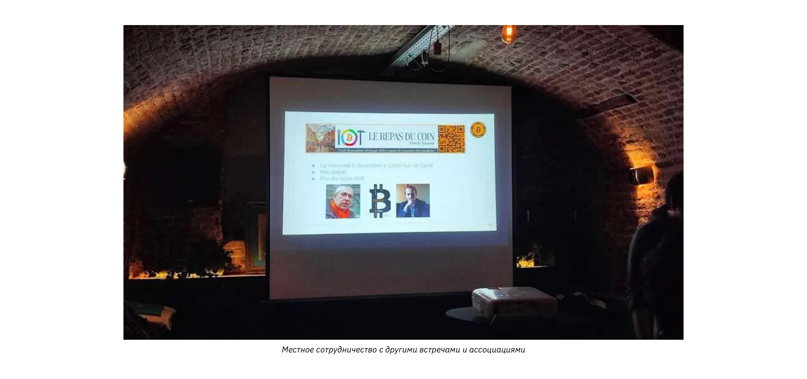

Во Франции также может быть актуально **следить за такими инициативами, как [@KonsensusFR](https://twitter.com/KonsensusFR), [@bitcoinpointfr](https://twitter.com/bitcoinpointfr), [@DecouvreBitcoin](https://twitter.com/DecouvreBitcoin) и [@btcmap](https://twitter.com/btcmap)**. Разумеется, это лишь предложения, и каждое сообщество вольно поступать так, как ему заблагорассудится, в условиях полной децентрализации и автономии.

Как уже говорилось выше, цель следования друг за другом заключается в повышении взаимной узнаваемости. Чем больше вы продвигаете свое сообщество и сообщества своего региона/страны в социальных сетях, тем больше людей будут говорить о вас. Чем больше людей будут говорить о вас, тем больше вероятность того, что они посетят ваши мероприятия.

Поэтому лайки и ретвиты постов из других сообществ могут значительно помочь их развитию... и вашему.

Вы также можете предложить, чтобы **организаторы митапов и биткойнеры, управляющие сообществами, встречались два или три раза в год в режиме видеоконференции, чтобы проанализировать прогресс национальных проектов и связанных с ними сообществ. Это также может происходить во время очных мероприятий**

Цель проста: собрать отзывы всех участников, обсудить, как развиваются сообщества, поделиться успешными идеями и проектами и предложить решения, если это необходимо. Письменное резюме встречи можно потом передать организаторам сообществ в вашей стране, которые не смогли присутствовать на встрече.

## Btcmap.org

<chapterId>365f43d4-7b2c-5961-a184-157b8c1a0116</chapterId>

На этом этапе ваше сообщество уже создано и работает. Осталось только принять новых заинтересованных людей и помочь ему расти.

Но вы не можете двигаться вперед, не зная, что **существуют платформы, на которых биткоинщики могут найти сообщества и встречи поблизости**. Поэтому важно потратить несколько минут на то, чтобы подать заявку на размещение объявления на этих сайтах.

К ним относятся:

- [Btcmap.org](https://btcmap.org/)**, сайт с двумя ежедневно обновляемыми картами: **[мировая карта предприятий, принимающих Bitcoin](https://btcmap.org/map)** и **[карта мировых сообществ](https://btcmap.org/communities/map)**. Многие биткойнеры регулярно просматривают эти карты, путешествуя или занимаясь повседневной жизнью, чтобы познакомиться с новыми людьми или найти места, где можно потратить свои Sats. Btcmap - это глобальная ссылка, и размещение вашего сообщества на ней необходимо для обеспечения видимости**
- [BitcoinerEvents](https://www.bitcoinerevents.com/), сайт, созданный биткойнерами для биткойнеров. **На нем можно размещать информацию о предстоящих мероприятиях вашего сообщества**. Во Франции, однако, он все еще не получил широкого распространения.
- в зависимости от вашей страны могут существовать и другие местные инициативы. Во Франции, например, есть сайт [Bitcoin.fr](https://Bitcoin.fr/events/categories/evenements/), который **сообщает о десятках мероприятий Bitcoin каждый месяц**. Так что если вы еще не следите за ними в Twitter или не связались с ними, чтобы поделиться информацией о своем сообществе и мероприятиях, сейчас самое время! **Чтобы помочь французскому календарю событий оставаться актуальным, было бы здорово, если бы все французские сообщества Bitcoin взяли за привычку:**
    - упоминание @bitcoinpointfr в Twitter для каждого нового события сообщества
    - прикреплять анонсы новых событий в своей группе Telegram.

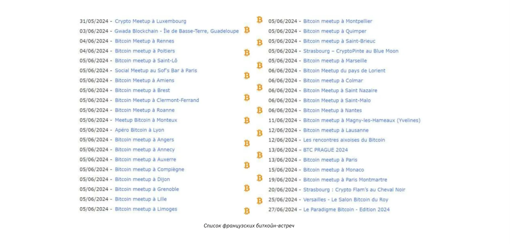

Другие платформы также могут повысить вашу узнаваемость. **[Meetup](https://www.meetup.com/)** - одна из них, это сайт (и приложение для телефона), где вы можете создать мероприятие и найти других людей поблизости.

Его стоимость составляет около 8 евро в месяц (или около 90 евро в год), что может быть дороговато для небольшого, неструктурированного сообщества. Тем не менее, Meetup широко используется в некоторых странах, особенно в Канаде и США, и он полезен для управления регистрацией.

Аналогично, **[Orangepillapp](https://www.orangepillapp.com/)** - это платное мобильное приложение (50 000 Sats в год или 200 000 Sats за пожизненный доступ), которое помогает биткойнерам знакомиться.

Хотя эти две последние платформы могут помочь повысить видимость, их не рекомендуется использовать при запуске сообщества, просто потому что они не бесплатны.

**Начать с размещения информации на сайтах [btcmap.org](https://btcmap.org/), [BitcoinerEvents](https://www.bitcoinerevents.com/), а для французских сообществ - на [Bitcoin.fr](https://Bitcoin.fr) - более чем достаточно**.

Поздравляем! Ваше **сообщество создано**, ваши **визуальные материалы готовы**, ваши **цели определены**, ваши **коммуникационные каналы налажены**, ваши **социальные сети запущены** и ваша **стратегия видимости определена**.

Когда к вам присоединится небольшая группа биткоинщиков, настанет время для следующего шага: организации первой встречи Bitcoin.

# Организуйте встречу Bitcoin

<partId>c009d2a6-40ce-583b-bd24-fdfd1fea262e</partId>

## Почему стоит начать регулярные встречи со своим сообществом?

<chapterId>ed8e471c-3b99-57e2-a042-2d4e8a40b137</chapterId>

Теперь, когда социальные сети и коммуникационные каналы вашего сообщества запущены, самое время заявить о своем присутствии на этих платформах. Поощряйте новых участников представляться и постепенно вливайтесь в беседу.

Это освободит ваше время, которое вы можете использовать для организации встреч. Это станет еще более актуальным, когда вы начнете ощущать настоящий ажиотаж в своем сообществе.

Как уже говорилось ранее, **встречу Bitcoin можно рассматривать как следующий "уровень" для сообщества**. С одной стороны, он позволяет **членам сообщества встретиться лично**, а с другой - помогает **обучить новичков, заинтересованных в этой экосистеме**.

Подобное мероприятие позволяет вам в собственном масштабе **создать в своем городе шумиху вокруг Bitcoin**, которая со временем может разрастаться по мере того, как ваше сообщество будет принимать участие в проектах.

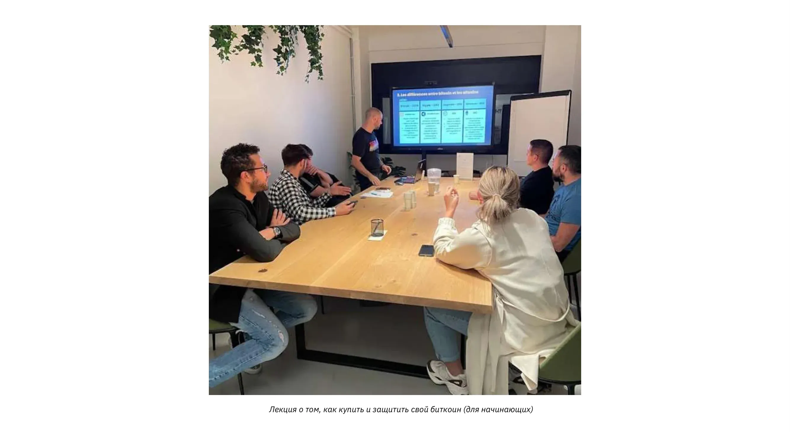

Конечно, чем масштабнее ваши цели по развитию сообщества, тем больше времени вам и вашим членам придется потратить.

Вот почему важно **начать с постановки достижимых целей для вашей встречи**.

## Первая встреча: когда и зачем?

<chapterId>f3f8a614-cfb4-5994-a2e8-d56e6f8e3347</chapterId>

Вы можете организовать встречу уже через несколько недель после создания сообщества.

Однако на этом этапе ваша группа, скорее всего, все еще будет небольшой, а значит, есть шанс, что никто не придет.

Лучше организовать встречу, когда в ваших каналах связи будет хотя бы несколько активных участников, например, несколько десятков. Это может произойти быстро, но также зависит от личных качеств людей.

Как только вы почувствуете искру, предложите встретиться лично. Если другие заинтересованы, остается только **назначить дату вашей первой встречи**.

Вместо того чтобы выбирать дату самостоятельно, лучше **создать опрос примерно за десять дней до мероприятия с несколькими возможными днями и временем**. Таким образом, вы сможете использовать результаты голосования, чтобы увеличить посещаемость, вызвать волнение и наилучшим образом использовать свое время.

Лучше всего не идти на встречу с застывшими ожиданиями относительно того, как она пройдет, сколько людей придет или какие темы будут обсуждаться. Это позволит избежать разочарований и не даст участникам почувствовать давление.

Пусть все идет естественным путем, может быть, за выпивкой. Разговор должен проходить легко, и при необходимости вы сможете мягко вернуть обсуждение к Bitcoin, если оно начнет уходить в сторону.

Если вы хотите подготовиться к более спокойным моментам, вы можете запланировать несколько занятий или тем для разговора, например:

- показывая **[Mempool](https://Mempool.space/)** на компьютере или смартфоне;
- принести книгу;
- прихватив с собой **Nerdminer**, Bitaxe, FPGA или даже ASIC;
- у нас есть **флаер Bitcoin**;
- разработать визуальный образ или логотип Bitcoin для вашего сообщества;
- играя в **[Карточную игру Bitcoin](https://www.Maximalist.ovh/accueil/20-game-le-Coin-de-table.html)**;
- показывает **[btcmap.org](https://btcmap.org/)** карту сообществ и торговцев;
- отправка или получение Bitcoin с помощью **Lightning**.

Когда ваша встреча только начинается, зачастую не самое подходящее время для официальной презентации. Если количество участников невелико, лучше всего подойдет открытая и непринужденная беседа.

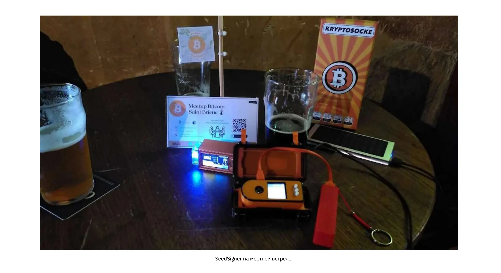

После первой встречи вы наверняка захотите запланировать еще одну. Пока ваше сообщество еще небольшое, лучше всего выбирать даты путем опроса, например, раз в месяц или раз в два месяца. Вы можете обсудить это в своих каналах связи.

Если образуется постоянная группа биткоинщиков и заинтересованных участников, имеет смысл установить повторяющееся расписание по двум причинам:

1) так всем легче планировать заранее;

2) это помогает **установить "привычку "**. Даже если кто-то перестанет регулярно проверять ваши каналы, он все равно будет знать, когда состоится встреча, и сможет прийти, как обычно.

Этот второй пункт - одна из причин, почему **во Франции большинство встреч проходит в первую среду каждого месяца** (см. инициативу "Амбассадоры", запущенную [DecouvreBitcoin](https://decouvrebitcoin.fr/) в 2022 году).

В Германии и Италии нет фиксированного национального дня.

Однако проведение всех встреч по всей стране в один день создает проблему централизации: это мешает биткойнерам посещать мероприятия в соседних населенных пунктах, а также может вызвать проблемы с безопасностью. Переговоры с организаторами соседних встреч могут помочь вам договориться об оптимальном варианте.

По мере того как ваше сообщество будет расти, а встречи привлекать все больше людей, вы сможете:

- ставьте конкретную цель для каждой встречи;
- или даже **добавить второе мероприятие каждый месяц**.

В первом случае, не забывая о предпочтениях каждого, четкая цель может гарантировать, что участники уйдут, узнав что-то новое, и удержать беседу в фокусе Bitcoin.

Во втором случае второе ежемесячное мероприятие может быть посвящено определенной теме, например, занятиям для новичков или мастер-классам (Mining, Lightning, установка узлов и т.д.).

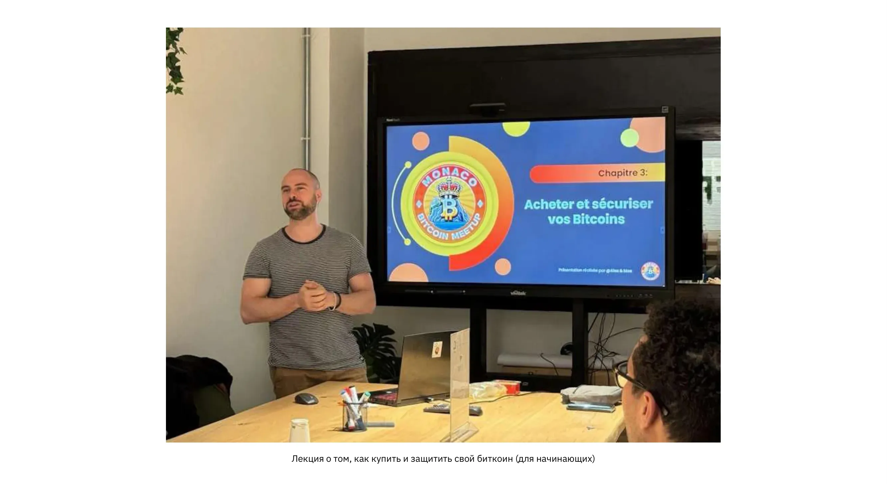

Имейте в виду, что **это требует больше организации и больше вашего времени**. К счастью, в [части 6/8 этого курса](https://planb.academy/courses/1c643dc9-a15f-4f9e-93b6-cb3c58b4ee35/3213d87a-1998-5972-ab93-97a5769ba279) вы найдете ряд многократно используемых ресурсов с открытым исходным кодом, которые вам помогут.

В любом случае, все зависит от того, какой краткосрочный, среднесрочный и долгосрочный план действий вы или ваше сообщество составили для себя.

## Поиск места

<chapterId>405d389e-6a32-5777-af8d-293380d2e8fd</chapterId>

Поиск места для проведения мероприятий - задача не из легких. Кроме того, очень важно, чтобы это место было **расположено в городе вашего сообщества**.

Необходимо учитывать несколько критериев, в том числе:

1) **Расположение**: легко ли до него добраться на общественном транспорте? На машине? Есть ли парковка?

2) Приятное ли место и не слишком ли оно шумное? Вы ищете официальную обстановку (коворкинг, конференц-зал) или что-то более неформальное (бар, ресторан)?

3) Достаточно ли в нем места, чтобы принять вас, даже в ночь матча регби или Лиги чемпионов?

4) Есть ли в нем видеопроектор и тихая зона для презентаций?

5) И наконец, если это бар или ресторан, есть ли в меню что-то для каждого, что можно съесть и выпить?

Кроме того, следует помнить о трех важных моментах:

- Если вы планируете разделить вечер на две части: сначала провести презентацию в официальном помещении, чтобы помочь всем сосредоточиться, а затем перейти в бар или ресторан, чтобы продолжить в более расслабленной атмосфере, опыт показывает, что смена места проведения в середине вечера часто приводит к тому, что некоторые участники уходят во время перерыва. Поэтому такой подход не рекомендуется.
- На ваших первых встречах, скорее всего, будет мало народу, и вы, вероятно, не будете проводить официальных презентаций. В этом случае нет необходимости представляться владельцу или объяснять свои цели. Однако **когда встречи станут регулярными и посещаемыми, стоит сделать это, чтобы продемонстрировать профессионализм и выразить желание возвращаться ежемесячно**. Это может повлечь за собой множество обсуждений (автоматическое бронирование на месяц, бесплатные напитки и/или фуд-борды, скидки, разговоры о Bitcoin, прием платежей Bitcoin и т.д.). Очевидно, что если вы специально ищете место с видеопроектором для проведения презентаций, необходимо попросить о встрече (лично или даже по телефону) с владельцем и/или менеджером, чтобы представить свой проект и цели.

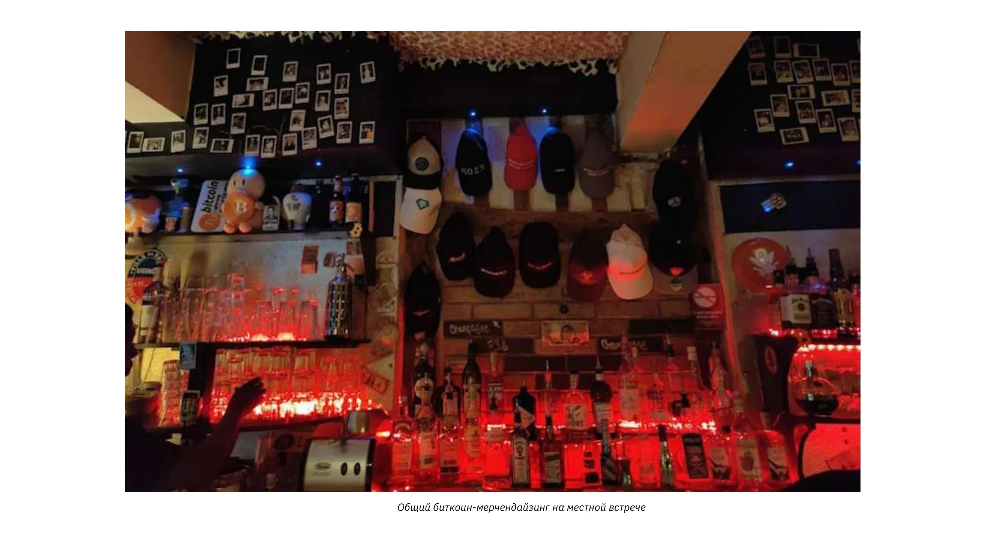

- наконец, некоторые сообщества **хотят проводить свои мероприятия только в местах, принимающих платежи Bitcoin**, что вполне объяснимо. В этом случае стоит **начать с поиска предприятий, принимающих Bitcoin в вашем городе** (на [btcmap.org](https://btcmap.org/map/)), и связаться с ними, чтобы узнать, соответствуют ли они вашим критериям. Если ничего подходящего нет, можно попробовать привлечь новых торговцев, но ожидайте много отказов, что может обескуражить. Вот почему часто лучше не ставить эту цель с самого начала, а рассмотреть ее, когда ваше сообщество уже укрепится и у вас будет достаточно "огневой мощи"

Кроме того, когда вы начнете проводить встречи, не стесняйтесь **менять места проведения в течение первых нескольких месяцев**. Это поможет вам **построить отношения с разными менеджерами**, изучить различные атмосферы и собрать информацию о потенциальных будущих хозяевах.

Позже, когда ваша группа разрастется, вы можете даже выделить день на посещение нескольких предприятий и баров, чтобы узнать, есть ли у них помещение, подходящее для проведения ваших ежемесячных мероприятий и встреч.

## Перед встречей

<chapterId>c5218943-580d-5efc-89ed-6b5d728816d6</chapterId>

Планируете организовать встречу в ближайшие недели?

Вот контрольный список, который поможет вам подготовиться:

1/ **Подтвердите место проведения**

Свяжитесь с местом, где будет проходить мероприятие, и забронируйте его на предполагаемое количество участников.

2/ **Объявление о событии**:

    - Сообщите о дате, времени и месте проведения в своих социальных сетях и других каналах связи. При необходимости включите ссылку на регистрацию.
    - Создайте специальное визуальное оформление (например, постер Canva, см. часть 2/8 "[Разработка идентичности для вашего сообщества Bitcoin](https://planb.academy/courses/1c643dc9-a15f-4f9e-93b6-cb3c58b4ee35/b48a18cc-afdf-5216-802c-32647b5cd8a3)").
    - Чтобы сделать объявление максимально заметным, прикрепите его в Telegram и Twitter, а также используйте упоминание "@everyone" в Discord.
    - Разместите объявления за 7-10 дней до мероприятия, чтобы участники могли заранее подготовиться.

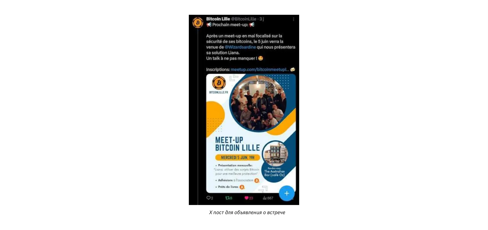

3/ **Напоминайте своей аудитории**

За два-три дня до мероприятия повторно публикуйте и ретвитуйте свои объявления, чтобы повысить их заметность.

4/ **Обновить место проведения**

Накануне (или за два дня до начала) проверьте регистрацию и сообщите месту проведения мероприятия окончательное предполагаемое количество участников.

Дополнительные шаги, чтобы сделать ваше мероприятие особенным:

- Печать листовок и/или плакатов
- Подготовьте презентацию на определенную тему
- Организуйте мероприятие или семинар

## День встречи

<chapterId>cf60067b-591f-5fdf-9b9e-d442aad0e8f9</chapterId>

Важный день настал! За один-два часа до начала мероприятия разошлите напоминание по каналам связи вашего сообщества. Подтвердите время начала и сообщите участникам, как вас узнать, например, упомяните, что вы будете в футболке и кепке Bitcoin.

По мере того как ваши встречи будут расти, и вы начнете принимать более 20 человек, подготовка места проведения будет становиться все более важной.

Вот что нужно сделать:

1) **Приезжайте пораньше**, чтобы все подготовить.

2) **Организуйте пространство** в соответствии с вашими потребностями и возможностями площадки. Если вас всего шесть человек, то рассадка не требуется. Но как только количество участников достигнет 10-20 человек, полностью сидячая расстановка может ограничить взаимодействие. В таком случае выбирайте стоячую расстановку с хорошо расставленными высокими столами, если таковые имеются, но при этом поставьте несколько (желательно высоких) стульев. Если планируется презентация, сохраняйте стоячую расстановку большую часть вечера, а стулья принесите непосредственно перед выступлением.

3) Добавьте небольшие штрихи:

    - Повесьте у входа плакат с указанием вашего местоположения (используйте Patafix и предварительно получите разрешение заведения).
    - Разместите внутри плакаты на тему Bitcoin (белая книга Bitcoin, устав вашего сообщества, текущие проекты и т. д.).
    - Разместите на столах наклейки, листовки или заставки для разговоров, например: ноутбук Nerdminer, Hardware Wallet, демонстрирующий свои Mempool, ASIC Miner или металлическую резервную пластину для личных ключей.

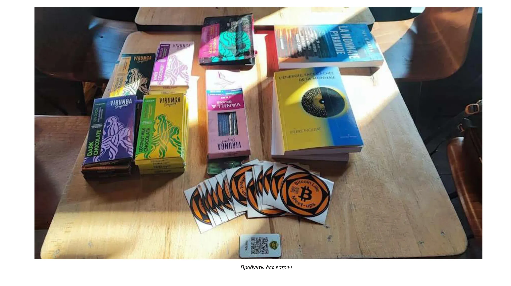

Если вы ожидаете всего несколько участников и еще не успели наладить отношения с менеджерами площадки, не стоит сразу привозить и выставлять все свое оборудование. Когда доверие будет установлено, у вас будет больше свободы в организации пространства по своему усмотрению.

Наконец, возьмите напиток и ждите, пока придут люди. И помните: не отчаивайтесь, если никто не придет с первого раза. На всякий случай возьмите с собой книгу или видео для просмотра.

## После встречи

<chapterId>3e881af9-9c09-5721-81ee-c5cda3b109c5</chapterId>

Когда встреча заканчивается, наступает время уборки для персонала заведения. Перед уходом предложите официантам или менеджерам помочь. Это может быть просто собрать все бокалы на один стол или, если вы находитесь возле бара, вернуть их на место перед уходом.

Вернувшись домой, вы, скорее всего, еще несколько дней будете думать о Bitcoin. Это идеальное время для того, чтобы прощупать пульс вашего сообщества и собрать отзывы участников. Вы можете:

- Опубликуйте сообщение с благодарностью на своих каналах связи и поделитесь ссылками или ресурсами, упомянутыми во время мероприятия.
- Предложите участникам предложить улучшения для следующей встречи.
- Начните планировать свое следующее мероприятие.

У вас будет несколько недель, чтобы разработать свежие идеи, визуальные образы или проекты, которые сделают следующую встречу еще лучше.

## Важность привлечения и удержания участников

<chapterId>f5355e35-4b07-527c-88a3-8535cba7592c</chapterId>

Рим был построен не за один день, и ваше сообщество тоже. Движение вокруг Bitcoin происходит благодаря регулярным встречам и мероприятиям.

Для того чтобы это произошло, необходимо одно: **поддерживать вовлеченность участников**.

Все может начаться с небольшой группы увлеченных биткойном людей, цель которой - регулярно собираться вместе и разговаривать о Bitcoin. Со временем, в зависимости от возможностей и интересов каждого, вы можете **разделить с группой определенные организационные задачи** или пригласить основных **членов группы заняться конкретными проектами**. Они могут быть уникальными для вашего сообщества, ваших встреч, вашего города или даже вдохновленными многочисленными инициативами, предложенными в [части 6/8 этого курса](https://planb.academy/courses/1c643dc9-a15f-4f9e-93b6-cb3c58b4ee35/3213d87a-1998-5972-ab93-97a5769ba279). **Это не только способствует развитию Commitment у ваших основных членов, но и помогает вашему сообществу расти и процветать**.

По мере проведения встреч будут появляться новые лица: люди, купившие BTC и/или альткоины в предыдущие циклы, энтузиасты технологий, желающие углубить свое понимание, или полные новички, интересующиеся этой нецензурной, децентрализованной, прозрачной и справедливой платежной системой, которая работает без условий и без доверенных третьих сторон.

Чтобы на ваших мероприятиях все чувствовали себя участниками, сосредоточьтесь на двух ключевых аспектах:

- **Социальная интеграция**: Каждый посетитель должен чувствовать себя желанным гостем. Поприветствуйте новичков, спросите, зачем они пришли, и познакомьте их с другими. Когда люди чувствуют, что их принимают, они с большей вероятностью вернутся и, возможно, даже помогут организовать будущие мероприятия.
- **Терпение и открытость**: Это требует времени и мотивации. Если вы разговариваете с убежденным говноедом (или, что еще хуже, с XRP Maximalist), может возникнуть соблазн отмахнуться от него. Но вступая в разговор, вы можете прояснить недоразумения или ошибочные рассуждения. Если они готовы слушать, то, возможно, будут готовы по-настоящему понять Bitcoin.

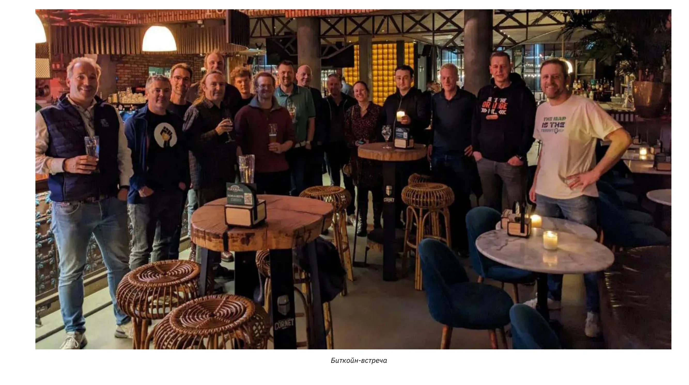

С практической точки зрения, подумайте об общем впечатлении от мероприятия:

- Понравился ли вам **проспект**?
- Было ли **легко получить доступ**?
- Почему некоторые люди зарегистрировались, но не пришли?
- Какие дискуссии проводились? Были ли дискуссии слишком техническими для новичков?
- Были ли дискуссии слишком алкогольными?

У каждого участника свои особенности, цели и интересы, поэтому опыт будет разным. Но если место встречи выбрано правильно, люди настроены открыто, а намерения искренни, есть все основания для успеха.

Создание встреч требует времени, но прежде всего - организации. Это человеческий проект, и он будет работать и развиваться в долгосрочной перспективе только в том случае, если он хорошо спланирован, открыт и инклюзивен.

В конечном счете, только вам решать, насколько далеко должна заходить "открытость и инклюзивность". Только помните: говнокоинер - это зачастую просто биткоинер в зародыше.

# Примеры проектов и инициатив

<partId>45b3bc40-1c31-583e-8411-2662e6efd765</partId>

## Зачем идти дальше, чем просто пить пиво?

<chapterId>3213d87a-1998-5972-ab93-97a5769ba279</chapterId>

По мере того как будут появляться новые блоки, ваше сообщество будет развиваться. К нему будут присоединяться новые лица, другие будут отдаляться, но главный принцип должен оставаться неизменным: развивать экосистему Bitcoin и укреплять связи между членами.

Существует множество проектов и инициатив, которые можно реализовать. В этой главе представлен неполный список идей, которые можно реализовать в рамках сообщества или во время встреч. Не стесняйтесь выбрать те, которые вас вдохновляют, и даже внести свои идеи в этот курс [сделав "Pull Request" на GitHub](https://github.com/PlanB-Network/Bitcoin-educational-content).

Прежде чем погрузиться в эту тему, давайте вернемся к одному моменту, о котором говорилось ранее.

Организуя встречу Bitcoin, вы знакомитесь с новыми людьми. Социальное взаимодействие необходимо, а пиво (или алкоголь в целом) может помочь создать праздничную атмосферу. Но стоит иметь в виду:

- Алкоголь ухудшает когнитивные способности, такие как мышление и понимание, что может затруднить участникам серьезные дискуссии или презентации.
- Алкоголь также может стать комфортным ритуалом: каждый месяц вы делитесь с друзьями своим "моментом Bitcoin" за бокалом. Хотя это отличный способ наладить контакт, но действительно ли распитие пива является главной целью вашей встречи? Или вы предпочитаете изучать Exchange, учиться у других и помогать новичкам открывать для себя Bitcoin?

У каждого свои предпочтения, убеждения и характер. Речь не идет о том, чтобы осуждать одну встречу за другую. Тем не менее, хотя мы часто говорим о том, как изменить мир за кружкой пива, революции не начинаются и не развиваются таким образом.

Главное - просто осознавать это.

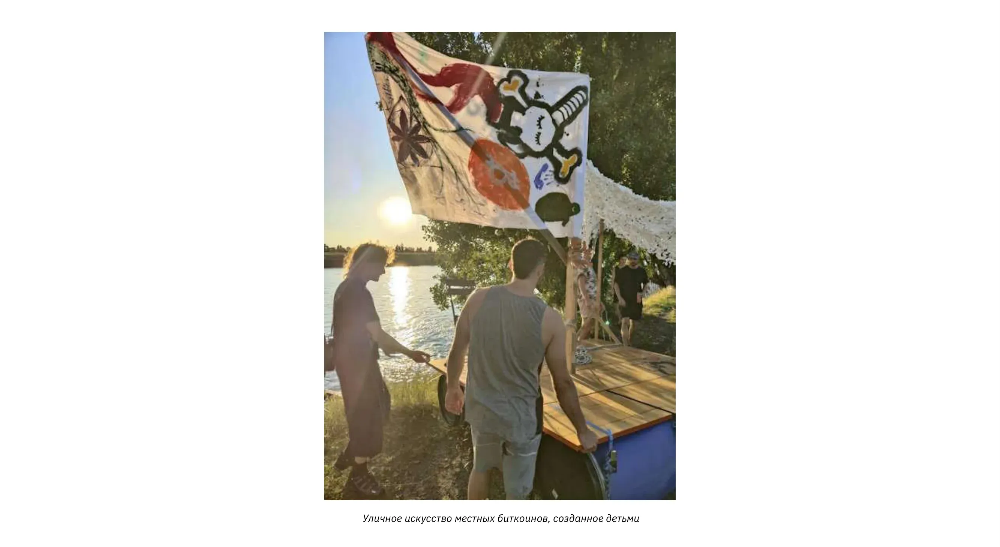

## Организуйте тематические встречи с ежегодной периодичностью

<chapterId>46afdbcc-a775-5c16-b20a-34956690d58f</chapterId>

Как только вы сформируете основную группу примерно из десяти человек, вы можете начать добавлять презентации к каждому мероприятию. Они могут следовать заранее объявленной теме или быть совершенно независимыми друг от друга.

При планировании презентаций или семинаров важно создать четкую, хорошо структурированную последовательность действий. Цель состоит в том, чтобы **поэтапно раскрыть основные концепции Bitcoin**, давая слушателям полное представление о теме с разных сторон.

Во Франции летом 2023 года организаторы встреч работали над **годовой прогрессией**.

Помимо высокой образовательной ценности, такой подход позволяет обмениваться документами с открытым исходным кодом и слайд-десками между группами, постепенно создавая общую библиотеку ресурсов. Эта инициатива была хорошо принята и в ближайшие годы будет развиваться.

Ниже приведена программа французских встреч на 2023-2024 годы. Для каждой темы доступны презентация с открытым исходным кодом и видео, которые могут подсказать вам темы для ваших собственных мероприятий.

Дополнительные редактируемые материалы также можно найти в [Bitcoin Teaching Toolbox](https://planb.academy/fr/resources/bet)!

| Month | Theme | Video | Editable Resource |
| -------- | -------- | -------- | --- |
| September     | Chapter 1: What is Bitcoin?     | [	YouTube link](https://www.youtube.com/watch?v=CSjuBqrl4t8)     | [Editable PowerPoint](https://www.canva.com/design/DAFu0d5Jd7M/9gAWDAOSS6LDkWENuZjYgw/edit) |
| October & November| Chapter 2: Understanding Bitcoin Transactions     | [YouTube link](https://www.youtube.com/watch?v=inFnR-3NsdM)     | [Editable PowerPoint](https://www.canva.com/design/DAFsEcnOro8/Mz9FYdTGhsvozZOe0Y9jtw/edit) |
| December     | Chapter 3: Understanding the Lightning Network     | [YouTube link](https://www.youtube.com/watch?v=hHz-ALx8D9w)     | [Editable PowerPoint](https://www.canva.com/design/DAF4YPSNnR8/HKp4Vmcno8eMtVWnZmFtcw/edit) |
| January     | Chapter 4: What is Mining?     | [YouTube link](https://www.youtube.com/watch?v=QyHZ3CVI_OI)     | [Editable PowerPoint](https://www.canva.com/design/DAF5DE6iBEM/tsy8E3oBebUnsR0kj53vvQ/edit) |
| February     | 	Chapter 5: Running a Bitcoin and Lightning Node    | [YouTube link](https://www.youtube.com/watch?v=RRYK-usg-OY)     | [Editable PowerPoint](https://www.canva.com/design/DAF55FU6HI0/sQ0lacRJblqrhn_9Xk1yDg/edit) |
| March     | 	Chapter 6: Using the Lightning Network in Daily Life    | [YouTube link](https://www.youtube.com/watch?v=o2BS4xjei8M)    | [Editable PowerPoint](https://www.canva.com/design/DAGAcJMw7lw/-haMNnHnwj5vpDAy8MDowA/edit) |
| April & May    | Chapter 7: Securing Your Bitcoins      | [YouTube link](https://www.youtube.com/watch?v=fHExPbhM0Hg)    | [Editable PowerPoint](https://www.canva.com/design/DAGDz3Nq4e0/D3uG-4w9FN6OhUq-VXzhfg/edit) |
| June     | 	Chapter 8: What is Multi-Sig?     | [YouTube link](https://www.youtube.com/watch?v=Me5489mpoxA)     | [Editable PowerPoint](https://www.canva.com/design/DAGLMtQT6sg/rYIxr4ldUJ0jTelNf-Pj8Q/edit) |
| July     | 	Chapter 9: Understanding the Bull Run and How to Prepare    | [YouTube link](https://www.youtube.com/watch?v=7RA-gnCJWyM)     | [Editable PowerPoint](https://www.canva.com/design/DAGJQkiZ_YA/9lUluP9RZ0eeA_e61mk9Hw/edit) |
| August     | Chapter 10: The Taxman is Never Far Away   | [YouTube link](https://www.youtube.com/watch?v=oY4NwonGDm0)     | [Editable PowerPoint](https://www.canva.com/design/DAGQhx7Yc_c/7mRhb_vlgnhSgxd1FtjK8w/edit) |

Главы 2 и 7 можно разделить на две более короткие презентации, чтобы не перегружать участников. Однако проведение их в рамках одной сессии освобождает место в календаре для специальных мероприятий, таких как совместные встречи с соседними группами, викторины или семинары.

**Вы можете свободно использовать, адаптировать и делиться этими ресурсами, только не забудьте указать авторов, если вы повторно используете их работу.**

Поскольку не все могут присутствовать на каждой встрече, стоит записывать презентации и загружать их на потоковую платформу или на свой сайт. Это позволит отсутствующим наверстать упущенное, а участникам - пересмотреть материал позже.

Параллельно можно проводить другие тематические встречи, например:

- Викторина на знание Bitcoin (с Hardware Wallet в качестве приза)
- Задача на входе, в которой вы отправляете бесплатные сатоши безкоиновым игрокам на улице
- Приглашение эксперта или компании для презентации продукта, связанного с Bitcoin
- Ночной тур по барам и магазинам, принимающим Bitcoin

И многое другое - только ваше воображение!

## Проводите дополнительные мероприятия и семинары

<chapterId>9dbd651a-8712-5630-90b3-b9525dcc1385</chapterId>

В зависимости от вашей занятости и уровня вовлеченности в жизнь вашего сообщества, вы можете планировать дополнительные мероприятия в течение года, например:

- Ресторанный вечер в честь **Дня пиццы** 22 мая
- Вечер или выходные, чтобы отпраздновать следующий **Halving**
- Семейный **игровой вечер** о Bitcoin и о том, как он работает, с использованием таких игр, как [Le Coin de Table](https://www.Maximalist.ovh/) или [SHAmory](https://shamory.com/)
- Семинар **Mining**, представляющий различные типы оборудования (CPU, GPU, FPGA, ASIC, Nerdminer, Bitaxe)
- **День или вечер для начинающих**, с тематическими мастер-классами
- **Объединенная встреча с соседними сообществами**

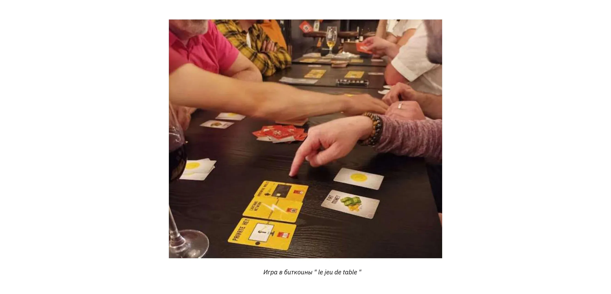

Только будьте осторожны и не перегружайте календарь. Слишком большое количество мероприятий за один месяц может привести к выгоранию организаторов и снижению посещаемости со временем.

## Создание наклеек

<chapterId>d605f3b3-130e-513d-85e6-06bc5ea13e99</chapterId>

Наклейки - это забавный способ продвижения Bitcoin и вашего сообщества, который одновременно усиливает вашу индивидуальность.

Прежде чем сделать заказ, запомните эти советы:

- Для использования на улице убедитесь, что наклейки водонепроницаемы.
- Чтобы избежать проблем с обрезкой логотипа при лазерной резке, сделайте его немного меньше области резки.
- Для повышения качества печати используйте векторный файл вместо растрового изображения.
- Выберите правильный размер: диаметр 8 см (примерно с ладонь взрослого человека) очень заметен, а 4 см - более скрытен. Что для вас важнее - видимость или незаметность?
- Для печати насыщенным черным цветом ("quad black") используйте 30% голубого, 30% пурпурного, 30% желтого и 100% черного. Использование только 100 % черного может привести к получению сероватого оттенка. Принтеры часто проверяют это, но знать об этом стоит.

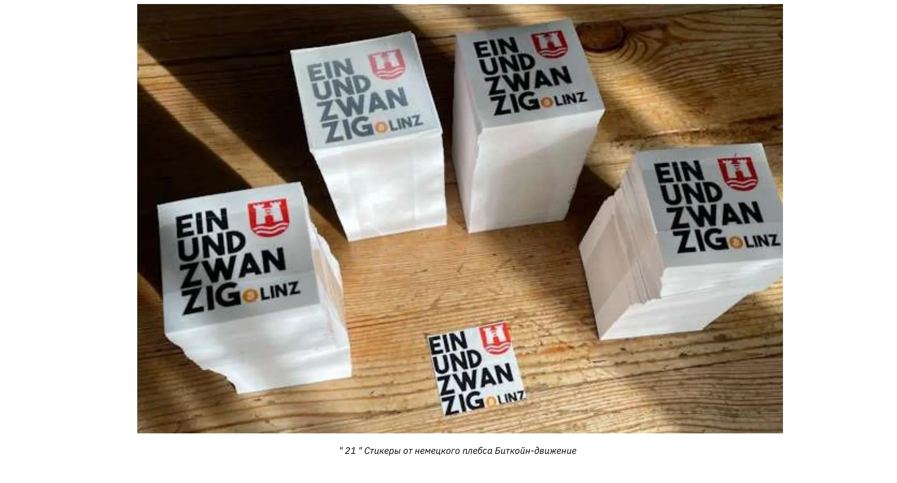

В зависимости от ваших потребностей и поставщика 1 000 наклеек может стоить от 100 до 250 евро. Вы можете связаться с [@Mill3sim3 в Twitter](https://x.com/Mill3sim3), французским биткойнером, специализирующимся на маркетинге, который иногда может обеспечить цены на 30 % ниже, чем у стандартных онлайн-продавцов.

Тем не менее, 1000 наклеек - это очень много. Обычно лучше начать со 100, чтобы убедиться, что вы сможете распространить их все.

Внимание: **Прежде чем размещать наклейки в общественных местах**, ознакомьтесь с местными правилами.

Во Франции наклейки можно размещать только на официальных досках объявлений. Размещение их в других местах (например, на знаке "Стоп"), скорее всего, приведет к удалению и, возможно, штрафу, если их можно будет связать с вами или вашей встречей. Проинформируйте об этом своих участников.

В частных заведениях, таких как концерты, бары или стадионы, прежде чем добавить свою наклейку, проверьте, нет ли на них уже наклеенных. Если нет, спросите разрешения у персонала. Вы же не хотите, чтобы первым впечатлением владельца бизнеса о вашем сообществе было то, что вы совершили акт вандализма на его территории.

## Создайте библиотеку

<chapterId>acc94093-f8b3-51b8-9359-348e9e075d38</chapterId>

Еще один проект, который вы можете легко организовать, - это **создание библиотеки на ваших встречах**.

Вы можете предложить участникам, желающим поделиться своими материалами для чтения, принести книгу, связанную с Bitcoin. Если кто-то из участников встречи захочет взять ее, можно договориться с владельцем в Exchange о займе под залог, например, 21 000 сатоши через Lightning.

Для владельца этот залог помогает покрыть возможную потерю или кражу. Для заемщика это стимул вернуться на будущую встречу, чтобы забрать свой залог.

Если вы руководите ассоциацией и хотите инвестировать часть своих средств в образовательные ресурсы, вы также можете приобрести несколько книг для своей библиотеки **Bitcoin**, которая будет доступна на каждой встрече.

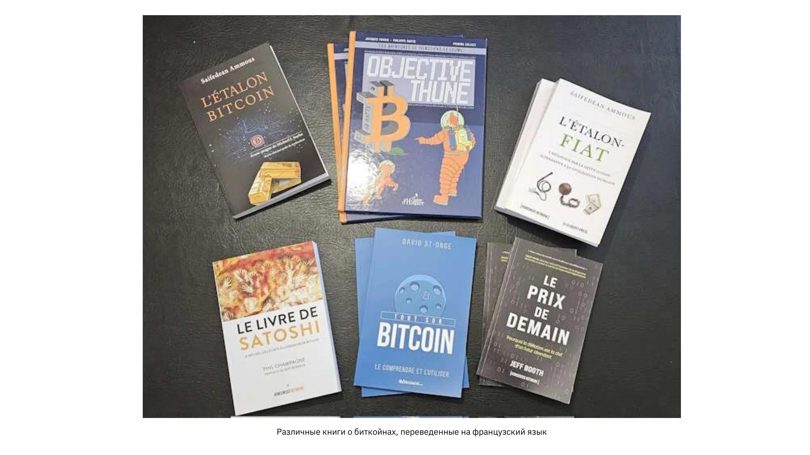

Чтобы поддержать экосистему, **[издательство Konsensus Network](https://konsensus.network/) с конца 2023 года предлагает международным встречам и сообществам Bitcoin скидку от 15 до 35 % на все свои книги при заказе трех книг и более**.

Чтобы воспользоваться этой скидкой, просто **контактируйте с [издательством "Консенсус"](https://twitter.com/KonsensusFR) в Twitter**.

Если у вас нет денег, вы все равно можете передать скидку членам своей общины.

Если у вас нет средств, вы все равно можете передать скидку своим участникам. Например, один организатор может собрать заказы от членов клуба, сделать оптовый заказ по сниженной цене и распространить книги на следующей встрече, получив оплату в Lightning.

На встречах можно также вывешивать устав книговыдачи, чтобы четко объяснить новичкам правила получения книг.

Вот пример с открытым исходным кодом, который вы можете использовать и адаптировать:

[Устав книжного кредитования](https://www.canva.com/design/DAF7u1b5kRM/r2gEAlibe_jTIXIX-O9PMA/edit)

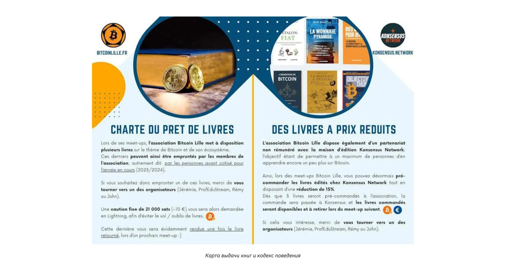

Наконец, чтобы стимулировать чтение, связанное с Bitcoin, вы можете посетить **местные муниципальные библиотеки** и узнать, есть ли в них книги о Bitcoin.

Если да, спросите библиотекарей, не планируется ли **круглый стол** по этой теме, и предложите им контактные данные вашей встречи.

Если нет, предложите им приобрести несколько книг из заранее отобранного списка. Источником вдохновения может стать [издательство Konsensus Network](https://konsensus.network/).

## Создавайте и распространяйте персонализированные рекламные проспекты

<chapterId>62ad5430-c698-51b3-89ac-090f31c88953</chapterId>

Разработка и написание листовок требует времени, но оно того стоит: они дают вам ощутимый ресурс, который можно вручить, рассказывая о Bitcoin, а это всегда ценится.

Эти листовки могут быть адресованы:

- Торговцы, если вы хотите ввести Bitcoin в качестве способа оплаты;
- Посетители мероприятия с листовкой, объясняющей, как использовать и оплачивать Bitcoin/Lightning;
- Новичкам, встреченным на улице, на работе или во время семейных посиделок, вручают листовку, рассказывающую об основных преимуществах Bitcoin.

Вы также можете разработать листовку, предназначенную именно для вашего сообщества или встречи, в которой будут представлены ваши мероприятия, цели, ссылки на социальные сети, каналы связи и предстоящие события.

Несколько листовок уже **доступны в виде открытого исходного кода в [Bitcoin Teaching Toolbox](https://planb.academy/fr/resources/bet)** на planB.network, и со временем будут добавлены новые.

Один из примеров - [полная листовка](https://profedustream.substack.com/p/21-raisons-dutiliser-Bitcoin) с 21 причиной использовать Bitcoin. Ее дизайн также [доступен с открытым исходным кодом](https://www.canva.com/design/DAFtAR1NauQ/ZDwl2CchIJ9Gpb36N6-7iw/edit?utm_content=DAFtAR1NauQ&utm_campaign=designshare&utm_medium=link2&utm_source=sharebutton), и вы можете изменять, адаптировать и распространять его. Только не забывайте указывать источники.

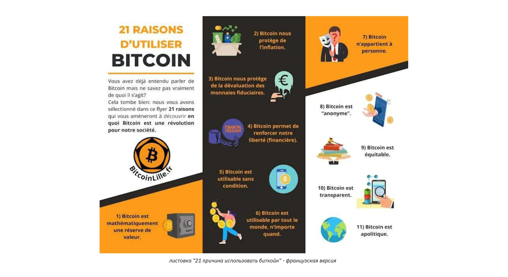

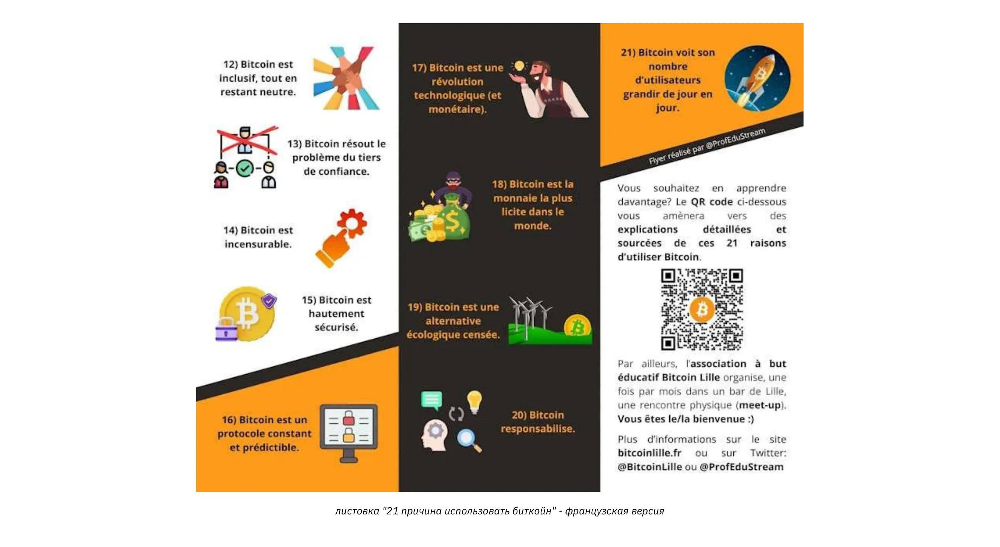

Как уже говорилось, вы можете оставить эти листовки практически где угодно: на общем столе на работе, за семейным обеденным столом, в публичной библиотеке и т. д.

Во Франции и некоторых других странах существуют "книжные ящики" - небольшие деревянные ящики, куда люди могут свободно пожертвовать или одолжить книги. Вы можете оставить там листовку, а еще лучше - книгу.

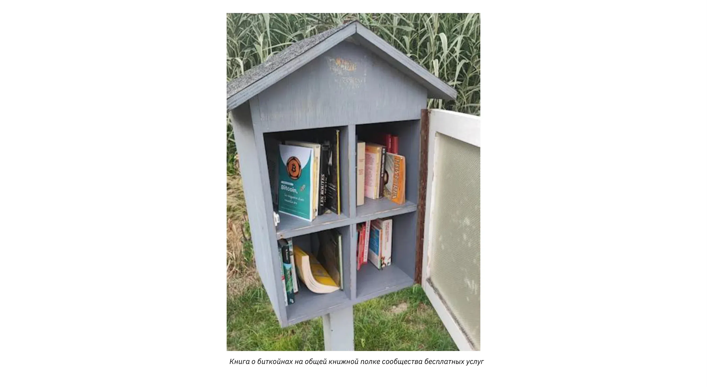

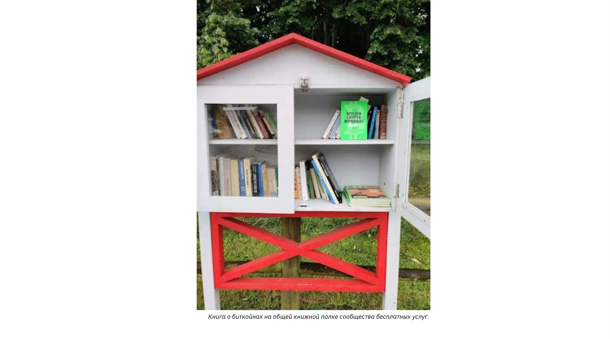

В 2023 году была запущена инициатива **"Белая книга Bitcoin в книжных коробках Франции**".

Чтобы осуществить этот проект, участникам сначала нужно было собрать информацию о геолокации всех книжных ящиков в стране. Для этого существует несколько баз данных:

- [boite.a.livres.zonelivre.fr](https://boite.a.livres.zonelivre.fr/);
- [boites-a-livres.fr](https://www.boites-a-livres.fr/carte-de-france);
- [delivrez.fr](https://delivrez.fr/maps/fr_FR/);
- плюс статьи в местной прессе

Хотя выход из белой книги Bitcoin символичен, он часто слишком сложен для понимания новичками. Вместо этого было решено создать небольшой буклет, содержащий:

- доступное и хорошо обоснованное введение в Bitcoin, его применение и проблемы, которые он решает;
- белая книга Bitcoin, переведенная на французский язык.

Вот [буклет, которым поделились французские биткойнеры](https://profedustream.substack.com/p/Bitcoin-la-naissance-dune-nouvelle), который был размещен в десятках книжных ящиков по всей стране. Его дизайн также [доступен с открытым исходным кодом](https://www.canva.com/design/DAFs18FSoVM/Sy0QsfUkycTgXveeGgutBg/edit?utm_content=DAFs18FSoVM&utm_campaign=designshare&utm_medium=link2&utm_source=sharebutton).

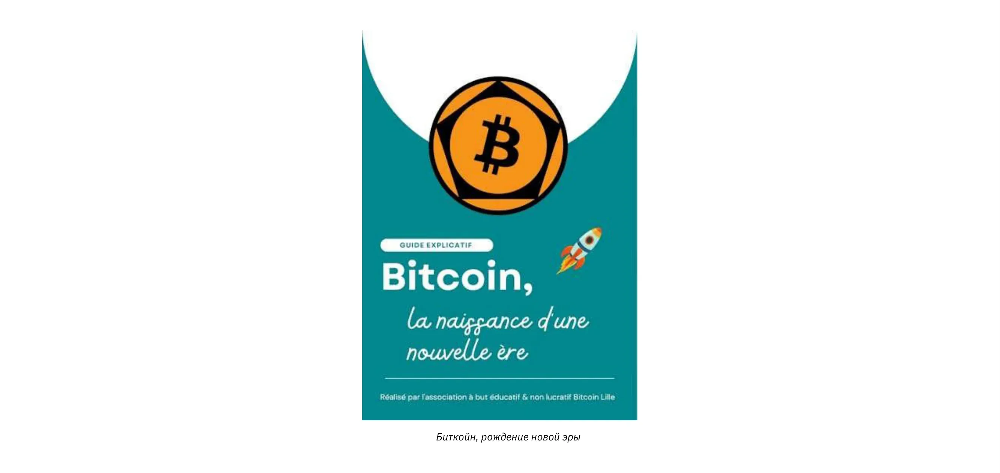

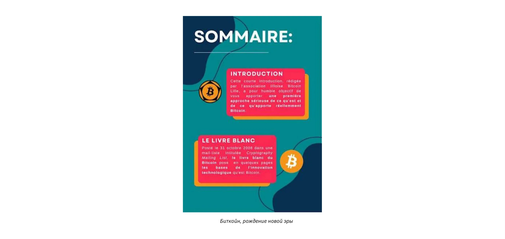

## Создание видеопроекции

<chapterId>892b248a-b837-5df6-aac9-4b3261ff0390</chapterId>

Почти каждый биткойнер наверняка видел увлекательный средний сериал [Rémi Forte](https://twitter.com/forteremi) "Le mystère Satoshi, aux origines du Bitcoin" (Загадка Satoshi: происхождение Bitcoin).

Выпущенный в 2021 году, он был просмотрен [несколько миллионов раз на YouTube](https://www.youtube.com/watch?v=0ETcLj5jBy4).

Одна из идей - организовать показ фильма "Тайна Satoshi" для вашей общины, возможно, в качестве дополнительного ежемесячного мероприятия.

Предупреждение: хотя ARTE France подтвердил, что публичные показы разрешены, вы должны оплатить проекционные права, чтобы сделать это легально. В 2023 году эта стоимость составляла около 250 евро за показ или 120 евро за показ, если в течение года фильм покажут не менее пяти встреч.

Для большинства сообществ эта цена непомерно высока, тем более что документальный фильм уже доступен бесплатно на канале ARTE в YouTube.

Конечно, возможны и другие прогнозы.

Например, во Франции **режиссер [Алана Медиавилла](https://twitter.com/AlanaMediavilla) предоставила местным встречам право на предварительный просмотр своего документального фильма "Stranded "**, в который вошли кадры из готовящегося к выходу в 2024 году [фильма "Грязный Coin"](https://www.dirtycointhemovie.com/).

Некоторые биткоинщики даже взяли на себя инициативу полностью перевести фильм "Stranded" на французский язык, добавить субтитры и показать его на встречах по всей стране. В течение недели 4 марта 2024 года фильм был показан одновременно примерно на дюжине встреч по всей стране.

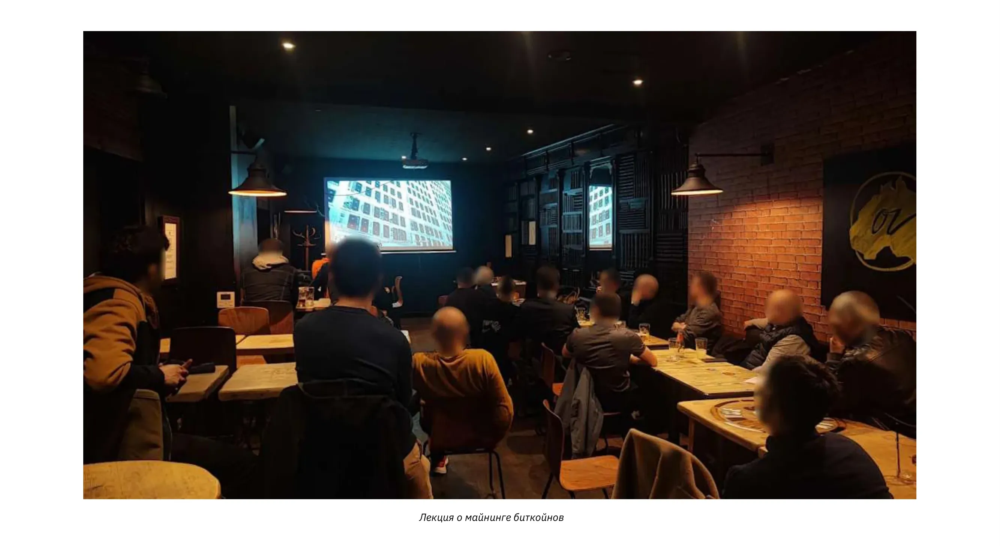

Мероприятие вызвало оживленные дискуссии о Bitcoin Mining, его энергопотреблении и более широком воздействии на окружающую среду.

## Расклейте плакаты в своем городе

<chapterId>6565e8a0-d535-5be0-9764-273584c675bd</chapterId>

В нескольких европейских странах (включая Германию, Испанию и Францию) биткоинщики выступили с инициативой расклеить плакаты по своим городам.

Некоторые дизайнеры переработали работы Бэнкси, добавив логотип Bitcoin.

Один из примеров - [StreetCyberArt](https://twitter.com/streetcyber_art), немецкий биткойнер, который уже несколько лет создает коллажи и стрит-арт.

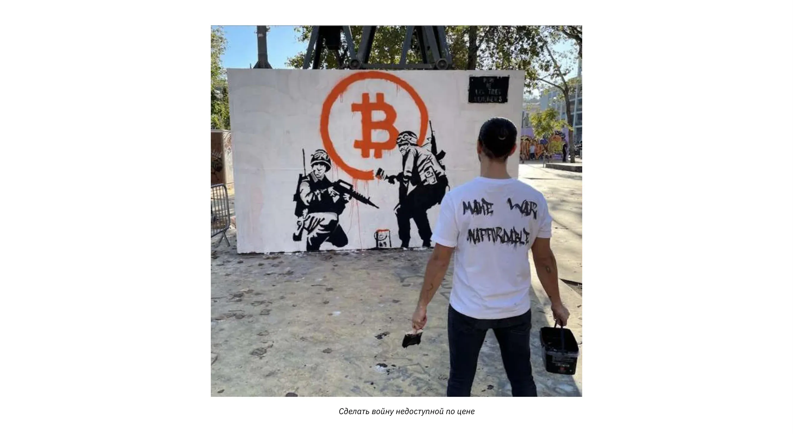

Если вы хотите заняться уличной расклейкой, убедитесь, что вы понимаете законы своей страны. Во Франции, например, плакаты можно размещать только на общественных рекламных щитах. В других местах это полностью запрещено и карается штрафом.

Если вы все же решили расширить границы и надеетесь, что вас не поймают "на месте преступления", избегайте указания на плакатах какой-либо идентифицирующей информации (например, названия вашей встречи или @Twitter).

Также обратите внимание, что печать таких плакатов на персональном принтере обычно приводит к выцветанию краски и быстрому разрушению плакатов на открытом воздухе. Лучше всего работать с профессиональной типографией, которая сможет изготовить их на специальной самоклеящейся бумаге, предназначенной для использования на открытом воздухе, обеспечив качество и долговечность.

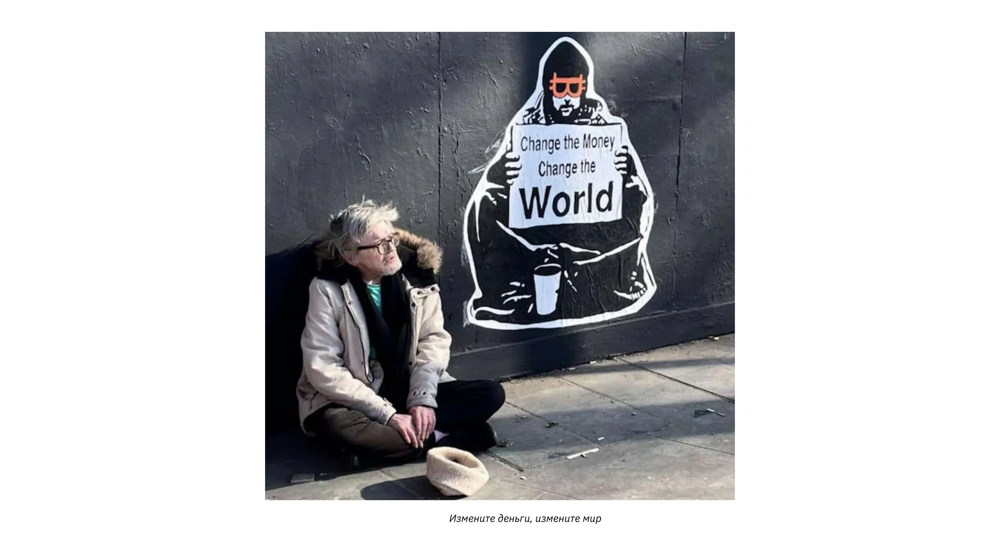

Эта инициатива может стоить более 0,40 евро за плакат (около 40 евро за сотню плакатов), а цены в Интернете могут варьироваться от двойной до пятикратной суммы. Хорошие контакты очень важны.

Как уже упоминалось выше, французский биткойнер [@Mill3sim3](https://twitter.com/Mill3sim3) имеет соответствующее профессиональное оборудование, и с ним можно связаться для получения подробной информации.

В качестве альтернативы можно сделать трафарет из большого куска картона и с помощью аэрозольной краски нанести рисунок на отдельные места в вашем городе.

## Персонализированная карта NFC

<chapterId>8ad65d4e-a68a-59c2-a812-85f4907ed9f3</chapterId>

Еще одна оригинальная идея проекта - создание персонализированных NFC-карт для платежей Lightning (совместимых со стандартом BoltCard). Для этого швейцарский Bitcoin Pay является отличным партнером.

на данный момент [их сайт](https://swiss-Bitcoin-pay.ch/cards) предлагает четыре стандартных дизайна.

Если вы хотите заказать более 50 карт NFC, вы можете связаться с компанией через ее официальный сайт или [Twitter](https://twitter.com/SwissBitcoinPay), чтобы предложить индивидуальный дизайн для лицевой стороны карты. Обратная сторона останется стандартной.

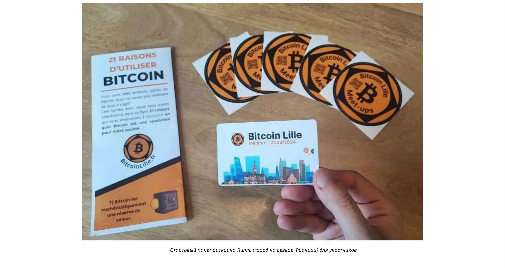

Например, в 2023 году французская ассоциация [Bitcoin Lille](https://twitter.com/BitcoinLille) заказала партию NFC-карт с индивидуальным дизайном. В течение года каждый новый член ассоциации получал одну из них в своем приветственном пакете. Эту идею можно легко адаптировать и персонализировать для вашего собственного сообщества.

Стоимость единицы этих карт обычно составляет от 2,50 до 5 евро, в зависимости от объема заказа и рыночных условий, причем при больших объемах цена ниже.

## Создайте веб-сайт

<chapterId>9a2a1b9b-0633-544a-b331-c06187d23d7f</chapterId>

На определенном этапе развития вашего сообщества может оказаться полезным иметь сайт, который будет служить витриной для вашей группы, встреч, мероприятий и образовательного контента.

Создание сайта требует времени, но в приведенном ниже руководстве показано, как создать бесплатный сайт WordPress всего за 30 минут. Вы сможете создать настраиваемую домашнюю страницу, публиковать статьи и вставлять медиафайлы, такие как видео с YouTube, изображения или PDF-файлы.

Позже вы сможете приобрести собственное доменное имя или даже разместить сайт на собственном сервере.

:::video id=a1b25c18-5fc1-4b97-baef-816d819c9382:::

Хотя существуют и другие CMS-платформы, некоторые из которых имеют более простые и удобные для новичков интерфейсы, они, как правило, гораздо хуже настраиваются. Именно поэтому WordPress, как правило, является лучшей отправной точкой.

WordPress также поддерживает широкий спектр плагинов (некоторые платные, но качественные), которые могут значительно расширить возможности вашего сайта, не требуя навыков кодирования. Одним из примеров является [премиум-тема "Uncode"](https://undsgn.com/uncode/)

## Создайте видеоканал (Youtube или Odyssee)

<chapterId>076286db-1627-57ec-a410-c44b1666e1cd</chapterId>

Некоторые члены вашего сообщества могут захотеть создать мультимедийный контент, например обучающие видеоролики.

Вы также можете выступать с презентациями на встречах или в университетах.

**Когда придет время, специальный видеоканал позволит вам публиковать и концентрировать весь свой контент в одном месте**

Популярные платформы включают:

- [**YouTube**](https://www.youtube.com/), широко используемый, но не устойчивый к цензуре.
- [**Odyssee**](https://odysee.com/), менее популярная, но децентрализованная благодаря технологии peer-to-peer.
- [**peertube**](https://joinpeertube.org/fr_FR), позволяет разместить собственную видеоплатформу, хотя и более сложную в настройке.

Что бы вы ни выбрали, создавайте визуальные образы для конкретной платформы, чтобы сделать ваш канал привлекательным. Canva, упомянутая в [часть 2/8](https://planb.academy/courses/1c643dc9-a15f-4f9e-93b6-cb3c58b4ee35/3470a31f-0190-5e87-8af0-6a00e79267ef), предлагает категорию "Эскизы YouTube" с готовыми, настраиваемыми дизайнами.

Для **записи** с компьютера можно использовать [Streamlabs](https://streamlabs.com/fr-fr) - бесплатный, многофункциональный и поддерживающий переходы между сценами.

Для **видеомонтажа** используется [Wondershare Filmora](https://filmora.wondershare.fr/) (около 45 евро в год), который прост в использовании и быстро дает профессиональные результаты.

Для **вступления и заставки** вашего видео вы можете легко найти подходящие шаблоны на Canva. Настройте дизайн по своему вкусу, загрузите его и добавьте в свою программу для редактирования.

Совет: если Bitcoin будет запрещен или подвергнут цензуре, всегда храните локальную резервную копию своих видеозаписей на диске Hard.

## Создайте аудиоподкаст

<chapterId>12e96b45-1c33-5687-a753-80d0114d487a</chapterId>

Аудиоподкаст - еще один отличный способ поделиться идеями. Как и видеоканалы, он требует времени, чтобы собрать аудиторию.

Популярные платформы для подкастов включают:

- [**Фонтан**](https://www.fountain.fm/), поддерживает пожертвования Lightning.
- [**Soundcloud**](https://soundcloud.com/);
- [**Deezer**](https://www.deezer.com/fr/);
- [**Spotify**](https://open.spotify.com/);
- [**Google podcast**](https://podcasts.google.com/).

У каждой платформы своя аудитория, поэтому присутствие на нескольких из них расширит ваш охват. **[Spotify for podcasters](https://podcasters.spotify.com/) облегчает эту задачу, позволяя вам загружать подкаст один раз и generate RSS-канал для других платформ**.

Итак, когда работа над "Spotify for Podcasters" закончена, остается только отформатировать контент для других платформ - процесс относительно быстрый.

Для записи используется бесплатная программа [Audacity](https://www.audacityteam.org/), позволяющая регулировать уровень звука, добавлять эффекты, например, затухания, и повышать четкость при редактировании. С ее помощью можно легко записать свой голос и создать подкаст профессионального качества.

Перед вами короткое 10-минутное руководство по созданию подкастов с помощью Audacity:

:::video id=67d80ac7-253f-40a5-b621-fef2fb7174bd:::

Совет: Как и в случае с видео, сохраняйте локальные резервные копии всех подкастов на случай цензуры в будущем.

## Создайте бейдж для своих мероприятий

<chapterId>0cccef8d-a765-5844-8921-c40f0ce653e4</chapterId>

На ваших встречах и мероприятиях можно ввести небольшой стимул: значки событий. Идея заключается в том, чтобы **создать бейдж, который можно получить только на данном конкретном мероприятии**. Эта концепция существует в других блокчейнах под названием "POAP" ("Proof Of Attendance Protocol"). Однако в настоящее время не существует свободного способа реализовать ее на Bitcoin.

Такая система также может быть использована для поощрения наиболее активных членов вашего сообщества. Например, вы можете организовать ежегодную лотерею, в которой каждый собранный значок будет равен одному входному билету. Участник, посетивший все 12 встреч за год, получит 12 билетов для участия в лотерее.

Другой, более традиционный подход: можно просто попросить участников каждого мероприятия написать на бейдже свое имя или прозвище, а также причину, по которой они пришли на мероприятие.

Несмотря на некоторую формальность, это может помочь участникам легче найти общие интересы и темы для разговора, а также облегчить новичкам поиск организаторов (или официальных членов сообщества/ассоциации).

Несколько шаблонов значков, используемых ассоциацией Bitcoin Lille, [доступны в открытом доступе на Canva](https://www.canva.com/design/DAGHAsT15MU/AIA7-L_xBjNdsuxdD4-h-Q/edit?utm_content=DAGHAsT15MU&utm_campaign=designshare&utm_medium=link2&utm_source=sharebutton).

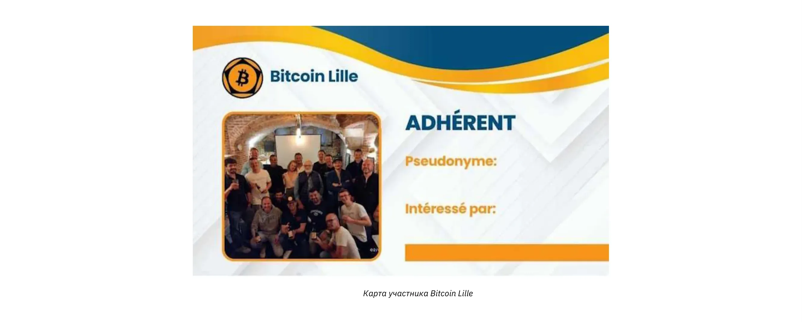

## Планирование передачи дел в случае смерти

<chapterId>c5febf18-235c-51bc-8fbb-9467dabe4cb0</chapterId>

На совершенно другой ноте, давайте Address затронем деликатную тему: уход из жизни члена вашего Bitcoin сообщества.

Однажды с вами может связаться семья бывшего члена клуба и сообщить о его смерти. Они могут объяснить, что покойный оставил инструкции, в том числе о том, как связаться с вашим сообществом, собранием или ассоциацией.

В некоторых случаях семья может также обратиться за помощью в возврате средств в качестве бенефициаров наследства.

Разумно будет заранее совместно с местным сообществом разработать четкую процедуру действий в таких ситуациях:

- Покойный уже посоветовал своей семье **никогда не делиться приватными ключами и не приносить физические кошельки на встречу**.
- Семья понимает, что цель их визита - образовательная: узнать, как работает Bitcoin, чтобы впоследствии получить суверенный контроль над средствами.
- Семья осведомлена о законах своей страны, касающихся подарков, наследования и конвертации Bitcoin в фиаты.

Наличие стандартного протокола также не позволит никому, будь то участник или гость, воспользоваться ситуацией и украсть средства.

Вы можете создать специальную рабочую группу для определения этого процесса. Ассоциация Bitcoin Lille уже работает над таким [документом](https://docs.google.com/document/d/1TDfLZjuictC5s3PEM2Z7WmkxIDSJ8Q1E4xevm52pVgU/edit?usp=sharing), который они планируют выпустить в виде открытого исходного кода в ближайшие месяцы.

## Читать лекции в школах и университетах

<chapterId>65efdb44-e3d4-567c-aedf-972765753d73</chapterId>

Список проектов, описанных выше, конечно, не является исчерпывающим. В целом, это, скорее всего, внутренние проекты для сообщества или встреч, которые могут быть достаточно легко реализованы по мере их развития.

Теперь давайте перейдем к вопросу о создании новых пользователей.

Как вы знаете, один из лучших способов **охватить сразу большую аудиторию - это провести бесплатную лекцию**. Это можно сделать в колледжах и университетах, знакомя молодых (и не очень молодых) людей с Bitcoin, независимо от того, являются ли они совсем новичками или хотят углубить свое понимание.

Проведение лекций для десятков или даже сотен людей требует не только технических знаний. Вам понадобятся:

- Уверенность в публичных выступлениях
- Правильное управление стрессом
- Четкая артикуляция
- Умелое управление временем
- Хорошо подготовленная, высококачественная презентация или семинар, адаптированный к уровню подготовки вашей аудитории

Не менее важно **сохранять непредвзятость и уметь упрощать понятия**, особенно во время сессии вопросов и ответов или панельной дискуссии. Речь идет не о том, чтобы отказаться от своих принципов, а о том, чтобы признать, что другие могут видеть вещи по-другому. Иногда лучше ответить позже или оставить все как есть, чтобы дискуссия продолжалась. Если ваши тезисы подкреплены весомыми, хорошо обоснованными аргументами, люди это поймут.

Если вы чувствуете, что готовы, действуйте! Мир отчаянно нуждается в лучшем образовании о Bitcoin.

Однако это нелегкое дело: оно требует мотивации, усилий и нужных связей.

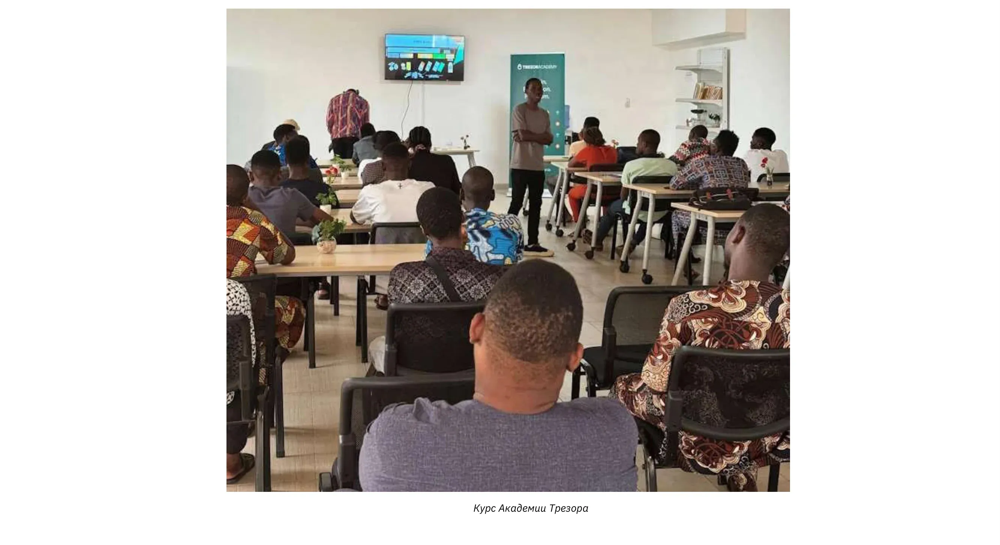

Организация лекции или семинара в школе или университете начинается с поиска нужного контакта. Это могут быть:

- Личное знакомство
- Студенческий союз
- Студенческая ассоциация, которая организует серии лекций или мероприятий
- Бывшие преподаватели вашей инженерной школы или университета
- Координатор академической программы, если он обращается напрямую

Первым шагом обычно является представление своей инициативы или ассоциации и просьба о встрече. В лучшем случае это приведет к презентации на Bitcoin перед студентами через несколько недель.

К сожалению, Bitcoin по-прежнему демонизируется в средствах массовой информации и многими политиками, что заставляет некоторых считать, что ему не место в классе. Отклонения - обычное дело, особенно в академических кругах, где такие темы, как ГВ-191 и энергопотребление, остаются спорными.

Но попробовать стоит, особенно со студенческими союзами и ассоциациями. Кто знает? Даже если на первую попытку вы ответите "нет", возможно, во время следующей акции вы обнаружите в своем почтовом ящике письмо с предложением выступить, скажем, перед 280 студентами!

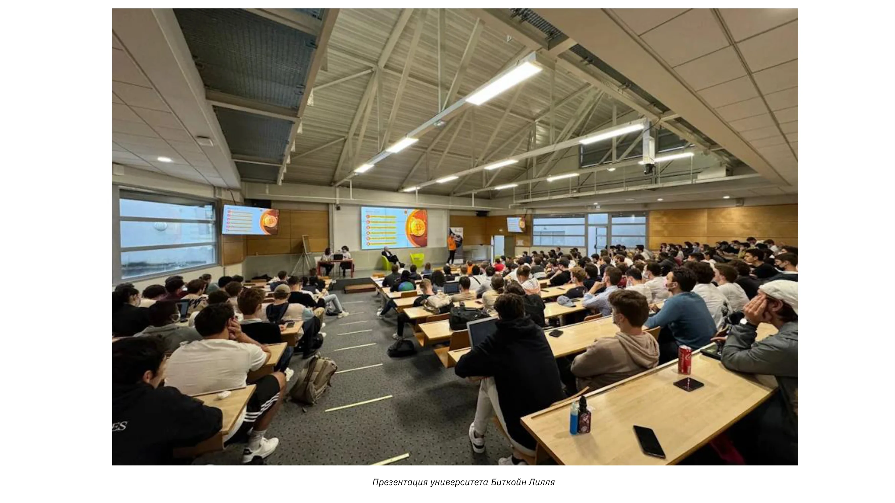

## Приближение к предприятиям

<chapterId>b730462b-7928-5d28-a14f-9ceaa773d3d2</chapterId>

Для многих биткойнеров заставить компанию принимать Bitcoin - это все равно что открыть редкое достижение в своем покедексе.

Каждый торговец индивидуален, и их привлечение сопряжено с определенными трудностями:

- Им по-прежнему нужна фиатная валюта, чтобы платить поставщикам.
- Им требуются четкие, готовые для бухгалтера финансовые отчеты.
- Их платежные системы должны быть надежными, простыми в использовании и защищенными от краж.
- У них могут быть неправильные или негативные представления о Bitcoin.
- Найти безупречное программное решение бывает непросто.
- Заставить торговца понять, почему стоит принимать Bitcoin в качестве оплаты.

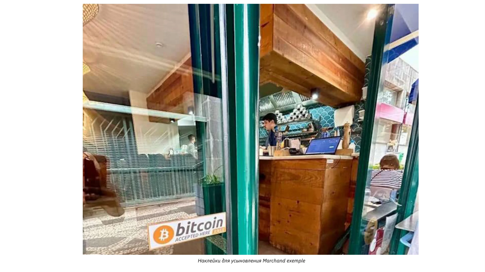

Привлечение местных предприятий - один из лучших способов развития экосистемы Bitcoin в вашем городе. Главное - действовать шаг за шагом:

1/ **Запросите оплату в Bitcoin, каждый раз, когда совершаете покупки**

В большинстве случаев вы получите "нет" и, возможно, недоуменный или даже слегка осуждающий взгляд, но просто спросите, и вы поймете, что Bitcoin - это то, чем могут пользоваться "обычные люди", и что этот способ оплаты становится все более популярным. Вы даже можете объединиться с парой друзей и заходить в один и тот же магазин в разные дни, каждый раз прося заплатить Bitcoin. Рано или поздно это вызовет любопытство владельца.

2/ **Предложите простое и понятное объяснение**

Если вас спросят, что такое Bitcoin, ответьте коротко и без жаргонизмов. Например:

*"Bitcoin - это деньги, которые не контролируются банками, работают без посредников, не подвергаются цензуре, не подвержены инфляции и имеют более низкие комиссии, чем традиционные банковские услуги "*

Затем вручите им листовку, например "21 причина использовать Bitcoin" или "10 причин использовать Bitcoin в вашем бизнесе", с вашей контактной информацией или информацией о встрече. Таким образом, когда они будут готовы к демонстрации, они будут знать, где вас найти.

3/ **Устройте демонстрацию**

Когда они проявят интерес, назначьте время, чтобы показать им платежное решение.

Отличный вариант - **[Swiss Bitcoin Pay](https://swiss-Bitcoin-pay.ch/)**, потому что он:

    - Позволяет торговцам ежедневно автоматически конвертировать BTC в фиатные деньги, чтобы они могли расплачиваться с поставщиками.
    - Позволяет им держать процент в BTC, если они хотят.
    - Генерирует экспортируемые бухгалтерские отчеты для своих бухгалтеров.
    - Имеет простую приборную панель для менеджеров.
    - Интуитивно понятный Interface позволяет сотрудникам принимать платежи, не прикасаясь к кассе.
    - Стоит меньше, чем 2-3%, которые взимают традиционные платежные сети.

4/ **Поддержите их, когда они начнут принимать Bitcoin**

После того, как они окажутся на борту:

    - Регулярно посещайте сайт и совершайте покупки.
    - Проверьте, все ли идет гладко.
    - При необходимости повторно сообщите свою контактную информацию.
    - Приглашайте их на свои встречи.
    - Добавьте их на [карту btcmap.org](https://btcmap.org/) и сообщите [Swiss Bitcoin Pay](https://x.com/swissbitcoinpay) в Twitter, чтобы повысить видимость.
    - Подумайте о том, чтобы проводить семинары или встречи на их территории.

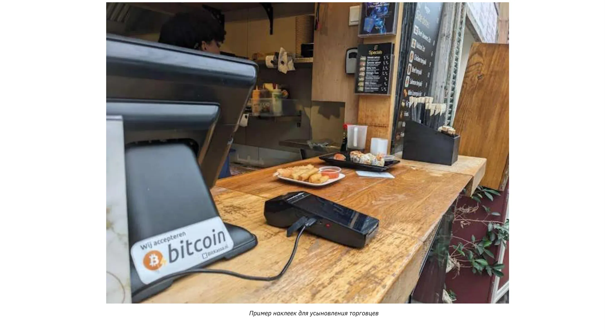

5/ **Познакомьтесь с местными торговцами**

Как только у вас появится несколько предприятий, дружественных Bitcoin, предложите создать группу Telegram, предназначенную только для торговцев. В ней можно:

- Позвольте им обмениваться опытом и привлекать новые компании.
- Служит каналом быстрой технической поддержки.
- Укрепите местную сеть Bitcoin.

Агитация - это долгосрочная игра. Она требует терпения, настойчивости и стратегии. Но если ваше сообщество готово, вы можете начать закладывать фундамент для настоящей циркулярной экономики Bitcoin, как в [Арнеме в Нидерландах](https://www.arnhembitcoinstad.nl/) в Нидерландах.

## Свяжитесь с местной прессой и радио

<chapterId>435bfbc1-22dd-59bb-b737-a32ea995b238</chapterId>

Биткойнеры часто фокусируются на социальных сетях и онлайн-платформах, но это лишь часть картины. Местная пресса и радио могут стать мощными союзниками.

Некоторые сообщества, например [Breizh Bitcoin](https://breizhbitcoin.com/) во Франции, **регулярно связываются с местными СМИ**, чтобы:

- Анонсируйте предстоящие мероприятия (встречи, презентации, семинары, вечеринки Halving и т.д.).
- Пригласите журналистов посетить предприятия, дружественные Bitcoin, и написать о них.
- Сообщайте даты и место проведения мероприятий для включения в местные объявления.

Во многих газетах до сих пор есть раздел "Что происходит", часто на последних страницах, где перечисляются предстоящие местные события. Брейж Bitcoin убедился, что такой подход работает: новички приходят на встречи только потому, что заметили объявление в газете.

В некоторых регионах эта стратегия может работать лучше, чем в других, но попробовать стоит. Для начала можно обратиться к региональным новостным изданиям, например, во Франции:

- [acpm.fr](https://www.acpm.fr/Les-chiffres/Diffusion-Presse/Presse-Payante/Presse-Quotidienne-Regionale);
- [voxpublic.org](https://www.voxpublic.org/spip.php?page=annuaire&cat=medias&type_media=Presse%20quotidienne%20r%C3%A9gionale).

и связаться с местными радиостанциями, чтобы предложить интервью или выступление в подкасте.

Имейте в виду, что интервью со СМИ могут быть непростыми. Слова могут быть вырваны из контекста или искажены. Подготовка крайне важна.

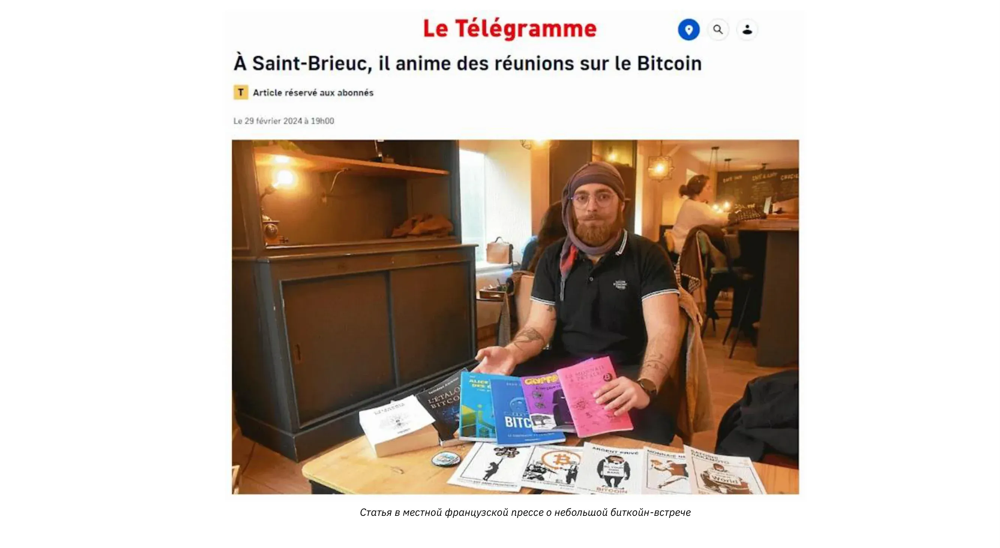

Очевидно, что помимо всех предложенных в этом разделе проектов можно реализовать **множество других**. Все зависит от вашего времени и мотивации, а также от сложности проекта.

Последние советы для любого информационно-просветительского проекта:

1) **Планируйте заранее**: определите свои цели, необходимые шаги и то, кто что будет делать.

2) **Постепенно**: избегайте выгорания, распределяя свои усилия по времени.

3) **Обратитесь за помощью**: обратитесь за поддержкой к членам вашей организации и соседним сообществам.

Помните: все члены сообщества Bitcoin были там, где вы сейчас находитесь. Не стесняйтесь учиться на их опыте и советах.

# Предвидя будущее

<partId>6ea07445-9369-54bc-9aa0-d260db026e0b</partId>

## Планирование увеличения числа участников

<chapterId>8af722d4-3a9f-548c-9001-424f2142de12</chapterId>

Когда Bitcoin вошла в свою четвертую эру на блоке 840 000, все больше и больше людей начали осознавать ее как технологическую, финансовую и социальную революцию.

Как и в случае с развитием интернета, эта революция займет время, что, в общем-то, является преимуществом. Это дает людям возможность **изучить основы Bitcoin**, понять, как ее использовать, и позволяет разработчикам и компаниям **создать протоколы и приложения**, которые раскроют весь ее потенциал.

Никто не может предсказать будущее, но мы можем **ожидать резкого роста внедрения Bitcoin**. Это означает **готовность ко всем сценариям**, даже к таким экстремальным, как крах традиционной финансовой системы или прямой запрет на Bitcoin.

В этой седьмой и предпоследней части курса мы рассмотрим ключевые моменты, о которых следует помнить по мере роста вашего сообщества и встреч.

Первое, что легче всего предвидеть, - это увеличение числа людей, присоединяющихся к вашему сообществу. Это повлияет на вас двумя основными способами:

1/ **Ваши каналы связи (Telegram, Signal, Matrix и т. д.) со временем станут переполненными**, что затруднит поддержание разговоров. Следует помнить о двух вещах.

Во-первых, если в одном чате 500 человек обсуждают самые разные темы, объем сообщений и уведомлений неизбежно приведет к тому, что многие пользователи начнут отключаться. Самое время пересмотреть свою структуру, например, перейти на супергруппы Telegram или сервер Discord, которые позволяют легко организовать обсуждения по темам.

Во-вторых, больше людей в ваших каналах означает больше ботов, больше мошенников и, соответственно, больше модерации. Будьте готовы к этому, создав четкий свод правил, на которые вы можете ссылаться при модерации сообщений. По нашему опыту, это помогает избежать конфликтов, особенно если правила легко доступны в ваших каналах.

Хороший пример - **[Bitcoin Lille's open-source rulebook](https://bitcoinlille.fr/reglement/)**, написанный несколько лет назад для группы Telegram и сервера Discord. Он основан на простых, универсальных принципах, и вы даже можете взять [настраиваемую версию дизайна здесь](https://www.canva.com/design/DAGHI692AD4/rjT4sqEnhajc5FiPA6GFZQ/edit?utm_content=DAGHI692AD4&utm_campaign=designshare&utm_medium=link2&utm_source=sharebutton).

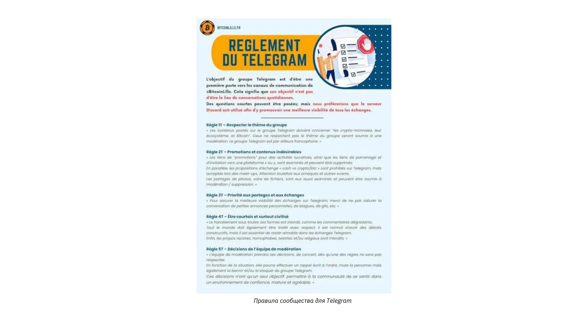

2/ **На ваших встречах и мероприятиях будет собираться много народу, и многие новые лица будут приходить, чтобы пообщаться**.

Благодаря такому росту посещаемости:

    - возможно, стоит **поискать более просторное место для проведения встреч и мероприятий**, особенно если в прошлом вы могли принять только около двадцати человек.
    - если вы обнаружите, что количество участников становится чрезмерным, вы можете в будущем либо **потребовать от участников регистрации** (через приложение Meetup или простую форму), либо **проводить несколько встреч каждый месяц** (например, встречу для новичков, промежуточную и продвинутую).
    - В то же время ожидайте появления большого количества новичков в экосистеме, часто с главной целью - заработать денег. Чтобы **сохранить фокус разговоров на Bitcoin** на этих быстрорастущих встречах, рекомендуется:

a) Включите в эти мероприятия презентацию на тему **Bitcoin**, так как это естественным образом направит большую часть разговора в сторону этой темы (и в сторону от последнего якобы "революционного" проекта говнокоина);

б) **Избегайте общения только с товарищами по биткойну**. Вместо этого постарайтесь **подойти к новичкам**, даже если это означает стоять в конце комнаты и приветствовать их. Оттуда вы можете поговорить о том, почему они пришли, что они ищут, о целях (или даже основных принципах) вашего сообщества и так далее.

Наконец, как ни прискорбно об этом говорить, на встречах могут появляться мошенники. Их целью может быть бесконечное рассказывание о своей схеме Понци, MLM или некой "революции Blockchain на основе ИИ" Также вполне возможно, что однажды кто-то с плохими намерениями может прийти на встречу специально для того, чтобы отмыть деньги или попытаться купить BTC с помощью поддельных купюр.

В подобных ситуациях проще всего вежливо объяснить, что встреча - не место для этого, подкрепив это любыми аргументами (например, упомянув, что на ней может присутствовать полиция в штатском).

Если, к сожалению, они отказываются уходить или вести себя уважительно (да, такое случалось), вы можете Address в группе прямо во время встречи, чтобы сообщить всем, что человек или люди пытаются совершить какую-то вредоносную деятельность.

К счастью, такие ситуации случаются редко и чаще всего носят скорее абсурдный, чем угрожающий характер, но все же лучше быть готовым.

Для душевного спокойствия: пока вы лично не нарушаете закон и не способствуете незаконным сделкам, вы не несете никакой юридической ответственности за действия других людей на вашем мероприятии (по крайней мере, по французским законам).

В идеальном мире у вас было бы **пространство, достаточно большое, чтобы разместить несколько десятков человек** по мере роста вашего сообщества, и вы также строили бы **прочные отношения между биткойнерами** и будущими биткойнерами во время медвежьего рынка, чтобы, когда наступит бычий период, у вас было как можно больше людей, готовых к оранжевой пилюле других.

## Децентрализация организации сообщества

<chapterId>bedfc110-e099-58f4-a5b7-fb50f3b19a49</chapterId>

Представьте себе: вы проводите встречи Bitcoin уже много лет, и однажды вы решаете бросить эту работу, возможно, чтобы разводить лам в Перу или гоняться за идеальными волнами в Сальвадоре. Что произойдет с вашим сообществом, когда вы уедете?

Пожалуйста, заранее планируйте передачу своего сообщества:

1) **Наделите правами администратора (или Ownership)** для ваших каналов связи доверенных лиц. Роли всегда могут смениться позже.

2) **Поделитесь информацией об аккаунтах** (имена пользователей, пароли, связанные с ними электронные адреса) в социальных сетях и каналах видимости хотя бы с одним доверенным лицом.

Без этого доступа никому другому практически невозможно эффективно управлять сетью. Начинать с нуля, создавая "вилочные" группы и перестраивая сеть, медленно, утомительно и зачастую деморализующе.

Если у вас нет доверенного лица в вашей группе, вы всегда можете обратиться к @ProfEduStream, @copinmalin или @gabtribe в Telegram. Они помогут найти мотивированного преемника и скоординировать передачу аккаунтов и прав администратора.

**Почему децентрализация важна?**

Если вы единственный участник и все контролируете, что произойдет, если вы исчезнете? Ответ прост: ваше сообщество тоже исчезнет.

Решение: децентрализуйте задачи, роли и доступ, чтобы группа могла продолжать работать, даже если один организатор выбывает из нее, будь то из-за нехватки времени или, в более мрачном сценарии, из-за ареста за хранение Bitcoin, не имеющего отношения к KYC.

**Как продвинуть децентрализацию дальше?**

Перейдите на **свободное программное обеспечение с открытым исходным кодом**, такое как [framasoft suite](https://framasoft.org/fr/), чтобы уменьшить зависимость от централизованных платформ и повысить устойчивость к потенциальной государственной цензуре или запретам Bitcoin.

Используйте **шифрованные или анонимные средства связи**, чтобы защитить конфиденциальность членов и деятельность вашего сообщества.

## Что, если Bitcoin станет врагом народа № 1?

<chapterId>c739651f-cd13-51e0-a36e-85023749b15b</chapterId>

5 апреля 1933 года Франклин Рузвельт, 32-й президент Соединенных Штатов Америки, подписал **Исполнительный указ 6102**, согласно которому частным лицам запрещалось владеть золотыми монетами, слитками или сертификатами в любой точке страны.

Конечно, Великая депрессия (крах фондового рынка в 1929 году) - это не наша современная реальность. Но может ли правительство однажды сделать то же самое с Bitcoin: **запретив полностью частные Ownership?**

Правда в том, что такая оруэлловская мера на самом деле не помешает кому-то по-настоящему владеть BTC, потому что ни один закон не может помешать человеку запомнить последовательность слов.

И все же, что если бы мировые лидеры наконец осознали потенциал Bitcoin по изменению глобального порядка даже на государственном уровне? Стали бы тогда называть его "врагом № 1"?

Нам не нужно впадать в конспирологическое мышление. Но ничто не мешает нам предвидеть, децентрализовать и просвещать, начиная с сегодняшнего дня.

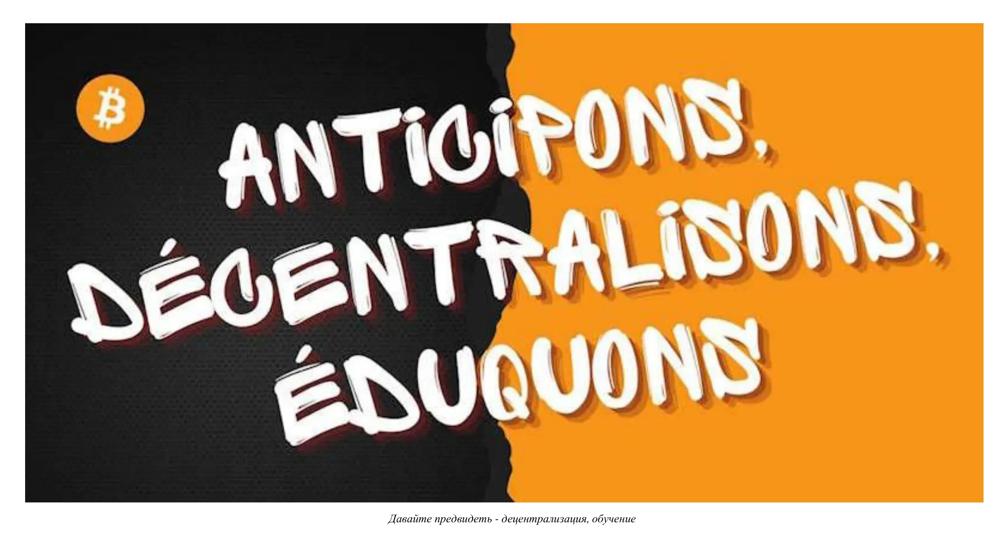

# Сплочение биткойнеров

<partId>62bc2138-c0be-5d39-a341-594690863257</partId>

## План быстрых действий по созданию сообщества Bitcoin

<chapterId>1f463ec2-3f64-5641-8d60-e02a47c94f27</chapterId>

Satoshi Накамото создал революционный инструмент, который уже меняет наш мир. Но только от нас, биткойнеров, зависит, как мы будем формировать будущее.

Bitcoin - это огромная кроличья нора, затрагивающая историю, экономику, литературу, математику, информатику и криптографию. Никто не сможет изучить ее всю, и в этом ее прелесть.

Поскольку наше время ограничено, главное - сохранять смирение, продолжать учиться и делиться знаниями Exchange с другими. Таким образом, каждый из нас сможет достичь того уровня понимания, к которому стремится.

**Поэтому глобальные сообщества Bitcoin играют фундаментальную роль в построении завтрашнего мира**: пространства, где биткоинеры могут **Exchange, создавать и делиться**. **Вместе**.

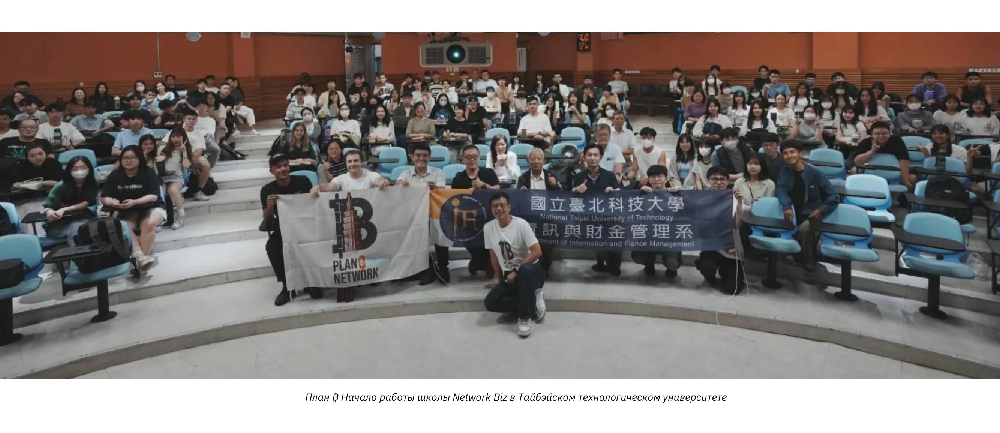

Как вы убедились на протяжении всего курса, **создание сообщества Bitcoin и организация встреч** требует планирования и мотивации. В зависимости от ваших целей и времени, которое вы можете выделить, вы можете взяться за более амбициозные проекты или оставить все просто.

В любом случае, цель одна: **зажечь интерес и помочь Bitcoin развиваться в вашем городе**.

В заключение многочисленных глав и подглав, которые мы рассмотрели, вот **краткий "план действий "** по созданию вашего сообщества Bitcoin:

1) Заранее решите, зачем вы хотите создать сообщество Bitcoin, каковы ваши цели и в каком городе или местности вы будете действовать.

2) Установите контакт с существующими поблизости сообществами и не стесняйтесь спрашивать у них совета, когда он вам понадобится;

3) Создайте четкий стиль вашего сообщества, отражающий его местоположение (логотип, плакат, баннер, флаер и т. д.)

4) Создайте каналы связи и социальные сети, такие как Telegram, Twitter, NOSTR, Discord или Simplex. Также рассмотрите децентрализованные и/или устойчивые к цензуре каналы.

5) Следите за другими местными встречами и сообществами в Интернете, а также внесите свою группу в список на различных картах и платформах, чтобы повысить ее узнаваемость.

Как только каналы связи вашего сообщества станут активными:

6) Запустите опрос, чтобы предложить первую встречу, как только почувствуете достаточный интерес.

7) Определите цели, которых вы хотите достичь в результате этого очного мероприятия.

8) Выберите хорошо расположенное, гостеприимное место, соответствующее вашим целям, и зарезервируйте столик или комнату.

9) Прорекламируйте событие на своих каналах за неделю до его проведения, а затем еще раз за два-три дня до даты.

10) Разместите информацию о своем мероприятии на соответствующих сайтах и платформах.

11) В день проведения мероприятия дайте ему протекать естественно и взаимодействуйте с участниками, при необходимости мягко направляя ход дискуссии.

После:

12) Сосредоточьтесь на удержании и вовлечении участников, чтобы они возвращались.

13) Предлагайте простые проекты или инициативы и начинайте те, которые интересны лично вам. Если кто-то другой хочет возглавить другой проект, поддержите его, если сможете.

Наконец-то:

14) Прогнозируйте будущее, думая о более просторном месте для встреч, правилах для каналов связи, сайте и т.д;

15) Поощряйте местные предприятия принимать Bitcoin, даже просто спрашивая об этом каждый раз, когда вы делаете покупки.

16) Делегируйте задачи и права администратора канала/сети доверенным лицам.

17) Широко рекламируйте свое сообщество, чтобы к нему присоединялось больше людей, и привлекайте тех, кто проявляет интерес.

18) Пойдите еще дальше, начав с проектов, которые вам нравятся и которые важны для вас.

Для более быстрого ознакомления с этими шагами можно посмотреть этот 21-минутный видеоролик:

:::video id=a59956da-f554-4b54-89dd-5ca55b722686:::

Помните: **Вы не одиноки, существующие сообщества готовы поддержать вас**.

## Забота о себе

<chapterId>cf1631cb-ddbe-55c7-be8c-26a5652979a0</chapterId>

Когда вы попадаете в кроличью нору Bitcoin, ваш взгляд на жизнь меняется.

В глубине души вы чувствуете тягу идти дальше, чтобы встретиться с другими людьми, которые проходят тот же путь.

Эта энергия побуждает вас внести свою лепту в головоломку, поделившись своим открытием: Bitcoin. Она также вдохновляет вас задуматься о мире будущего, о том, который вы хотите помочь построить, и о сообществах, работающих над этим.

Создание сообщества - это длинный туннель, требующий мотивации, стратегии, преданности и времени. Это может быть неблагодарной задачей, поэтому важно делать все шаг за шагом, чтобы не перегореть.

**Думайте о себе, о своих возможностях**. И хотя Bitcoin может гонять вас днем и ночью, **не пытайтесь делать все в одиночку, иначе вы перегорите**.

Вместо этого **обращайтесь за помощью к биткойнерам, которые уже прошли по тому же туннелю, исследовали те же пути и создали те же инструменты**. Это сэкономит вам массу времени.

**Пригласите тех, кто следует за вами в этом приключении, оказать помощь**, даже если делегирование некоторых задач займет больше времени. В конечном итоге ваше сообщество станет сильнее и устойчивее.

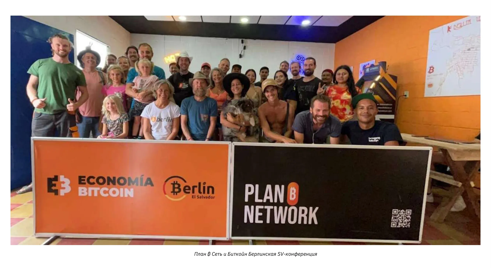

В одиночку вы сможете быстро исследовать один из многочисленных туннелей в кроличьей норе Bitcoin. Но помните, что существует бесчисленное множество других направлений для исследования.

**Создав сообщество биткойнеров и/или присоединившись к нему, а также регулярно обмениваясь с ними, вы будете двигаться по кроличьей норе одновременно во всех направлениях**

## BTC 304, что дальше

<chapterId>8bf10b77-80ee-5d50-87bc-0ef32574a675</chapterId>

В этом курсе BTC 304 мы подробно рассмотрели, как создать сообщество или встречу, а также как запустить различные проекты.

Когда ваша община будет готова сделать следующий шаг, **вы сможете создать официальную ассоциацию**.

Например, во Франции из примерно шестидесяти сообществ и встреч почти дюжина имеет статус ассоциации.

Преимущества двоякие:

- **Официальное признание**: вы можете открыть банковский счет ассоциации, привлечь внимание прессы и СМИ и даже подать заявку на получение субсидий.
- **Структурированная организация**: вы можете определить четкие роли, что упрощает управление сообществом и реализацию проектов.

С целью дальнейшего развития вашего сообщества **не исключено, что в ближайшие месяцы выйдет продолжение этого обучения на платформе [Plan ₿ Academy](https://planb.academy/)**.

На следующем занятии могут быть рассмотрены такие продвинутые темы, как:

- Разработка презентаций или семинаров для ваших встреч и постановка четких задач.
- Организация масштабного мероприятия с участием около 100 человек.

Для этого мы воспользуемся опытом сообществ, которые уже создали свои собственные мероприятия и презентации.

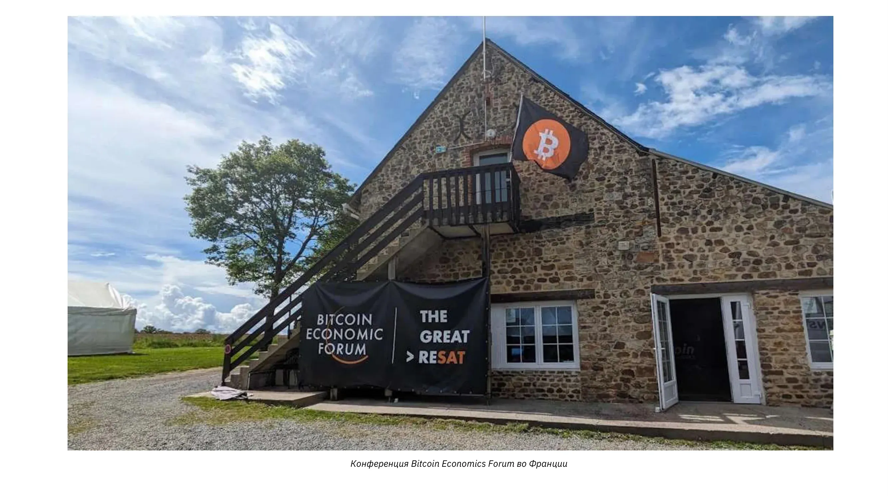

# Заключительный раздел

<partId>e9bdddf4-54c9-4de9-bbce-c3eade8c32e5</partId>

## Отзывы и рейтинги

<chapterId>08a35d2a-204b-519a-9bb1-588665a037fa</chapterId>

<isCourseReview>true</isCourseReview>

## Заключение

<chapterId>d74606a5-cb14-4117-acb2-2bf5920de092</chapterId>

<isCourseConclusion>true</isCourseConclusion>