# Prvi korak ka usvajanju Bitcoina

Danas svako može da uči o Bitcoinu na internetu, ali ono što često nedostaje je prilika da se sretnemo, razmenimo ideje i gradimo zajedno. Da bi popunili ovaj prazninu, mnogi bitcoineri formiraju lokalne zajednice, gde sastanci pokreću radionice, prezentacije i smislene diskusije.

U BTC304, razmotrićemo zašto je izgradnja zajednice važna, istražiti alate za kreiranje snažnog vizuelnog i digitalnog identiteta, i podeliti jednostavne projekte otvorenog koda koje možete pokrenuti. Takođe ćemo razmotriti kako lokalne inicijative prerastaju u nacionalne zajednice koje mogu pomoći u pokretanju hiperbitcoinizovane budućnosti.
+++
# Uvod

<partId>81318b8f-d316-5787-aa4c-4ec8370ba668</partId>

## Pregled kursa

<chapterId>e8991b82-4966-5e04-8f05-7cae46eacbaa</chapterId>

Dobrodošli u BTC 304!

Od 2009. godine, Bitcoin je neprekidno rastao. Ovaj rast je oblikovan kroz nove Bitcoin predloge za poboljšanje (BIP), kreiranje dodatnih slojeva kako bi mreža bila skalabilna (Lightning Network između ostalih), i razvoj više kompanija i start-upova.

Njegov razvoj je takođe evidentan u On-Chain, sa stalnim porastom broja transakcija.

Na primer, između 1. januara 2018. i 1. januara 2024. godine, procenjuje se da je broj transakcija na glavnom Layer Bitcoin [porastao za 66,2%](https://dune.com/queries/3375917/5663935). U međuvremenu, između avgusta 2021. i avgusta 2023. godine, broj javnih transakcija na Lightning Network [porastao je za 1.212%](https://river.com/learn/files/river-lightning-report-2023.pdf).

Ovaj značajan rast je, naravno, usko povezan sa:

- [rastuće interesovanje ljudi širom sveta za korišćenje Bitcoin](https://profedustream.substack.com/p/21-raisons-dutiliser-Bitcoin), kako bi se oslobodili bankarskog sistema i/ili koristili manje volatilnu ili manje devalviranu valutu, kao što je slučaj sa stanovništvom u Libanu, Siriji, Egiptu, Argentini i drugim zemljama;
- njegovo povećanje cene tokom vremena, što ga uspostavlja kao čuvara vrednosti i dugoročnu investiciju, vođeno njegovom fiksnom monetarnom politikom;
- uzastopni rast spekulativnog tržišta kriptovaluta, posebno tokom 2017-2018 i 2020-2021;
- Sve veće prisustvo Bitcoin u mejnstrim medijima.

Iako je Bitcoin još uvek u ranoj fazi, ova stvarnost, za koju ste verovatno već svesni, navodi nas da razmotrimo dva ključna pitanja:

- Kako možemo podstaći Bitcoin entuzijaste da idu dalje u svom učenju i projektima kako bi **u potpunosti iskoristili potencijal Bitcoin**?

- Kako možemo pomoći novajlijama, koje često privlači kratkoročna spekulacija, da izbegnu gubitak novca na najnovijoj memecoin pomami i umesto toga se fokusiraju na **učenje osnova Bitcoin**?

Najbolje rešenje za oba izazova je jednostavno: **budite prisutni u stvarnom svetu i edukujte**.

Cilj ovog kursa je da vam pruži sve što vam je potrebno za kreiranje i efikasno organizovanje Bitcoin zajednice ili okupljanja. Bilo da želite da izgradite lokalnu inicijativu ili razvijete online grupu, ovaj kurs će vas voditi korak po korak: od kreiranja vašeg vizuelnog identiteta do organizovanja redovnih događaja i upravljanja vašim komunikacionim kanalima.

**Section 1: Uvod**

Počećemo isticanjem važnosti ujedinjavanja ljudi oko Bitcoin, bilo putem online zajednica ili lokalnih okupljanja. Otkrićete zašto i gde pokrenuti svoju zajednicu, kao i kako postaviti jasne ciljeve za podsticanje njenog rasta i dugoročne održivosti.

**Sekcija 2: Dizajniranje Jedinstvenog Identiteta za Vašu Bitcoin Zajednicu**

Da biste privukli nove članove i podstakli osećaj pripadnosti, neophodno je izgraditi jedinstveni identitet. U ovom odeljku ćete naučiti kako da dizajnirate logotipe, postere i banere koji oličavaju duh vaše Bitcoin zajednice.

**Sekcija 3: Kreiranje komunikacionih kanala za vašu Bitcoin zajednicu**

Komunikacija je okosnica svake zajednice. U ovom delu ćemo istražiti najbolje kanale za korišćenje i voditi vas kroz efikasno postavljanje Telegram grupe ili Discord servera. Takođe ćete naučiti kako da integrišete multifunkcionalne botove za pojednostavljenje upravljanja zajednicom.

**Section 4: Pokretanje Vaših Društvenih Mreža** (na francuskom)

Vidljivost je ključna za rast vaše zajednice. U ovom delu ćete naučiti kako da kreirate posvećen Twitter profil, povežete se sa lokalnim okupljanjima i iskoristite platforme kao što je btcmap.org da povećate svoju vidljivost i privučete nove članove.

**Section 5: Organizovanje Bitcoin okupljanja**

Ovaj odeljak pokriva kako organizovati okupljanja: od izbora pravog mesta do vođenja samog događaja. Takođe ćemo istražiti strategije za izgradnju lojalnosti učesnika i osiguranje dugoročne održivosti vaše zajednice.

**Odeljak 6: Primeri Projekata i Inicijativa** (na francuskom)

Da biste nadmašili jednostavne sastanke, ovaj odeljak prikazuje konkretne i originalne projekte: od tematskih događaja i radionica do kreiranja edukativnog sadržaja i lokalnih saradnji. Takođe ćete naučiti kako da dizajnirate i fizičke i digitalne materijale za promociju vaše zajednice.

**Sekcija 7: Predviđanje budućnosti**

Ovde ćemo ispitati prirodnu evoluciju vaše zajednice: šta učiniti ako prebrzo raste, kako decentralizovati vašu organizaciju i kako odgovoriti na neprijateljsko regulatorno okruženje. Ovaj deo će vam pomoći da predvidite i prevaziđete ove izazove.

**Sekcija 8: Okupljanje Bitcoinera**

Završni deo se fokusira na suštinu vašeg projekta: ujedinjenje entuzijasta Bitcoin oko zajedničke vizije. Naučićete kako da strukturirate svoj pristup kako biste privukli i zadržali članove, efikasno delegirali zadatke i održivo razvijali svoju zajednicu.

Spremni da naučite kako izgraditi snažnu, vibrantnu Bitcoin zajednicu? Hajde da zaronimo!

## Zašto pokrenuti Bitcoin zajednicu ili meetup?

<chapterId>893ea248-7d5a-5b8e-948c-7031497b1031</chapterId>

### Koja je razlika između zajednice i okupljanja?

Iako ne postoji stroga definicija ovih pojmova u ekosistemu Bitcoin, zajednica se najbolje razume kao grupa ljudi koji dele zajedničku strast i redovno komuniciraju.

S druge strane, meetup je događaj organizovan od strane i za ovu zajednicu, sa specifičnom svrhom. Meetup-i se obično održavaju kada je zajednica već uspostavljena.

Za ovaj kurs pretpostavljamo da ste pre pokretanja Bitcoin okupljanja već povezani sa nekoliko ljudi zainteresovanih za održavanje takvog događaja, drugim rečima, **zajednica već postoji**.

### Zašto kreirati zajednicu Bitcoin?

Postoji nekoliko razloga za stvaranje zajednice Bitcoin:

- Deljenje znanja i saradnja: Zajednice pružaju članovima prostor za Exchange ideje i deljenje znanja. Uzajamna podrška je ključni stub za rast, omogućavajući svima da ubrzaju svoje učenje, što je posebno relevantno za Bitcoin, s obzirom na to koliko toga ima za otkriti.

- Izgradnja od osobe do osobe: Mnoge inicijative i projekti su osmišljeni, izgrađeni i razvijeni unutar ovih zajednica.

Zajednice Bitcoin često teže širim ciljevima, posebno javnom obrazovanju o:

1. Šta je Bitcoin;

2. Kako funkcioniše;

3. Njegovi doprinosi društvu;

4. Razotkrivanje obmanjujućih ili neutemeljenih tvrdnji koje iznose neke javne ličnosti i mediji;

5. Osnovne razlike između Bitcoin i drugih kripto-valuta;

Izgradnjom prvih "citadela" sutrašnjice, **Bitcoin zajednice širom sveta služe kao bedem protiv dezinformacija i cenzure, dok istovremeno pružaju plodno tlo za učenje osnova Bitcoin**. One nude novajlijama, pa čak i skepticima, resurse i veze potrebne za istraživanje pravog potencijala Bitcoin.

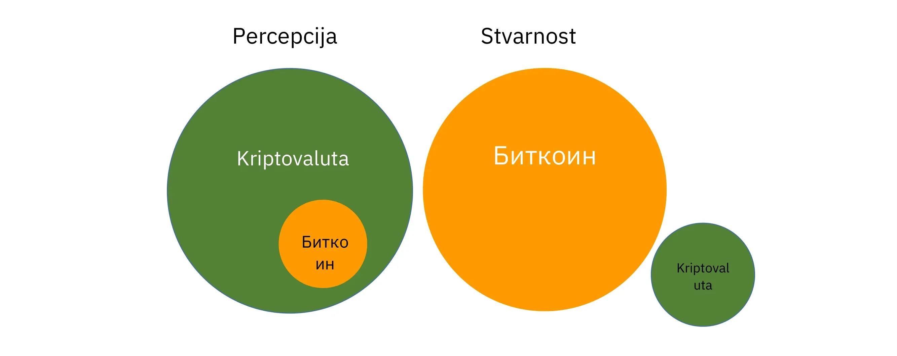

Takođe je vredno napomenuti da **zajednica može postojati potpuno online**, bilo da je to Telegram grupa ("Bitcoin London"), Facebook grupa ("Bitcoin Berlin"), Discord server ("Bitcoin Madrid"), ili čak lista e-pošte ("Bitcoin France").

Drugim rečima, **zajednici nisu potrebni fizički susreti da bi napredovala ili pokrenula projekte. Njena osnovna svrha ostaje ista: deliti, graditi i obrazovati**.

### Zašto organizovati okupljanje?

Kao što je ranije pomenuto, **okupljanja obično dolaze nakon što je zajednica uspostavljena i služe da je dopune**.

Kako se putovanje bitkoinera razvija, često se javlja želja, ili čak potreba, **da se lično sretnu i komuniciraju sa drugima** iz istog ekosistema. Ovo može proizaći iz osećaja izolacije ili jednostavno iz nedostatka nekoga s kim bi se razgovaralo o Bitcoin u svakodnevnom životu.

Meetupi nude ličnije i prijatnije iskustvo nego onlajn audio ili video pozivi. Bilo **uz piće ili obrok**, oni stvaraju neformalne, prijateljske prostore gde ljudi mogu Exchange ideje otvoreno i direktno.

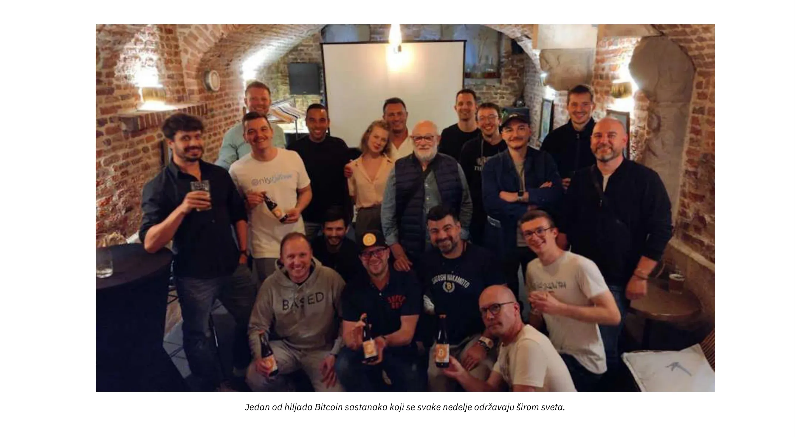

Bitcoin okupljanja mogu služiti mnogim svrhama:

- Diskusija o tehničkim temama ili tekućim projektima
- Pomažući novim bitkoinerima da postepeno dublje zarone u Bitcoin svet
- Najava novih projekata ili inicijativa
- Razmena materijala ili knjiga
- Prikazivanje dokumentarnih filmova u pretpremijeri
- Organizovanje konferencija ili radionica na određene teme

Obradićemo mnoge od ovih mogućnosti detaljno u delu 6/8 ovog kursa, pod nazivom "[Primeri projekata i inicijativa](https://planb.academy/courses/1c643dc9-a15f-4f9e-93b6-cb3c58b4ee35/3213d87a-1998-5972-ab93-97a5769ba279).

Iako svaka zajednica ima slobodu da formira sopstvena mišljenja, pokreće projekte i eksperimentiše na svoj način, okupljanja se pokazuju kao sve **važnija za razvoj Bitcoin i za rast bitkoinera**. **Organizovanje okupljanja zahteva vreme i trud**, zbog čega ovaj kurs deli kombinovano iskustvo [oko šezdeset Bitcoin zajednica u Francuskoj i Belgiji](https://btcmap.org/communities/map#2/5.24949/0.20000) **kako bi vam pomogao da izgradite i razvijete svoju zajednicu i okupljanja što je moguće lakše**.

## Gde treba da kreirate svoju zajednicu?

<chapterId>72da5285-5395-592d-ab62-303a0aef3d6d</chapterId>

Prvo pitanje koje treba postaviti je: gde bi vaša zajednica trebalo da bude smeštena?

Ova odluka je ključna ako želite zadržati opciju organizovanja sastanaka kasnije.

Ako članovi moraju da voze dva sata da bi prisustvovali događaju, verovatno će biti mala posećenost. Zato odabir prave **lokacije za vašu zajednicu, a samim tim i za vaše buduće sastanke, ima veliki uticaj na njen rast**.

Nekoliko saveta koji će vam pomoći u donošenju odluke:

1/ **Kreirajte i razvijajte svoju zajednicu u srednjem ili velikom gradu**. Ovo će olakšati:

    - Pronađite prijatna mesta za sastanke i projekte (prezentacije, radionice, promocija usvajanja Bitcoin, itd.);
    - Povećajte osećaj uključenosti i pripadnosti među većim brojem ljudi;
    - Poboljšajte pristupačnost događaja (javni prevoz, parking, itd.). Preporučuje se odabir lokacije blizu javnog prevoza i parkinga.

2/ **Izaberite ime povezano sa vašim gradom**. Ovo olakšava ljudima da se identifikuju sa vašom zajednicom. Primeri: Bitcoin Paris, Einundzwanzig Berlin, Satoshi Spritz Milano, itd.

3/ **Proverite da li već postoji okupljanje u vašoj blizini**.

Možete proveriti [btcmap.org](https://btcmap.org/communities/map#0/0/0/), koji navodi većinu Bitcoin zajednica i okupljanja širom sveta.

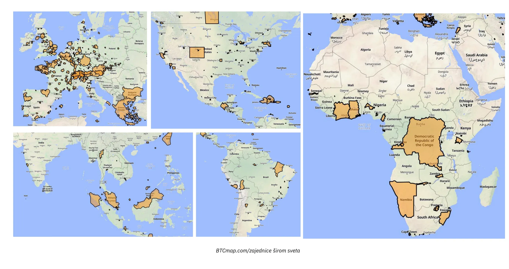

Nakon nekog istraživanja, možda ćete pronaći postojeći meetup ili zajednicu u vašem gradu.

Bitcoin je decentralizovan, tako da, naravno, svako je slobodan da radi šta želi.

Međutim, **udruživanje snaga često ima više smisla nego razdvajanje obližnjih zajednica i smanjenje uticaja svake od njih**. Pokretanje potpuno nove zajednice tamo gde već postoji jedna može nenamerno stvoriti konkurenciju.

U tom smislu, jednostavno "pravilo palca" može pomoći: ako ne postoji aktivna Bitcoin zajednica unutar 30-45 minuta od mesta gde živite, možda vredi pokrenuti novu. Ipak, uvek ste slobodni da radite kako želite.

I naravno, ako se starija zajednica "evoluirala" u pravcu koji više ne odgovara vašim vrednostima, a nemate vremena ili motivacije da ih "orange-pill", onda je stvaranje sopstvenog Fork uvek opcija.

## Koji ciljevi treba da vode vašu zajednicu?

<chapterId>0aae1aa8-93ec-544a-ad88-22d32c619595</chapterId>

Kada identifikujete grad (ili geografsko područje) za svoju zajednicu, vreme je da **definišete šta želite da postignete**.

Ovi ciljevi mogu biti postavljeni odmah pri lansiranju ili dorađeni kasnije, kada se pridruži nekoliko članova i vaša grupa bude aktivno angažovana.

Evo nekoliko tačaka koje će vas voditi u razmišljanju:

1/ **Zašto kreiram ovu zajednicu kao bitkoiner?** Da li je to da podelim znanje? Edukujem druge? Učim od iskusnijih kolega? Upoznam ljude sličnih interesovanja? Uključim se u Bitcoin ekosistem? Povežem se sa profesionalcima? Ili jednostavno da popijem piće i steknem nove prijatelje?

Vaši odgovori će oblikovati vašu poziciju i motivaciju.

Ako je vaš cilj da **delite znanje i edukujete ljude o Bitcoin**, fokusirajte se na **kreiranje edukativnog sadržaja** (članci, podcasti, video materijali, prezentacije, flajeri, itd.), štedeći drugima bezbroj sati istraživanja. Možete ići i dalje tako što ćete **organizovati radionice, prezentacije i konferencije**.

Ako je vaš cilj jednostavno upoznati druge bitkoinere i podeliti iskustva, možete pristupiti opuštenije, kao što je sastanak na piću.

Na ovaj način ćete lakše stvarati društvene veze. Međutim, uvek zapamtite da **pijenje piva nije pravi put za izgradnju sveta sutrašnjice**.

Zato je **postavljanje konkretnih ciljeva i projekata ključno**.

2/ Da li treba da dam svojoj zajednici **fizičku dimenziju**? Ako da, kakve događaje treba da organizujete?

Vaš prvi događaj će verovatno biti okupljanje. Njegova glavna svrha: da okupi bitkoinere u vašem području.

Međutim, kao što ćemo videti kasnije u [Primeri projekata i inicijativa](https://planb.academy/courses/1c643dc9-a15f-4f9e-93b6-cb3c58b4ee35/3213d87a-1998-5972-ab93-97a5769ba279), **okupljanje može biti organizovano na mnogo načina, sa mnogo ciljeva:**

- Kombinujte umrežavanje sa edukativnom prezentacijom o Bitcoin konceptu;
- Organizujte profesionalnu demonstraciju Bitcoin rešenja;
- Strategije debate za uvođenje lokalnih trgovaca u korišćenje bitkoina;

i tako dalje.

U zavisnosti od tema (tehnički razgovori ili praktične radionice), može čak imati smisla **organizovati dodatne događaje** van vašeg redovnog okupljanja.

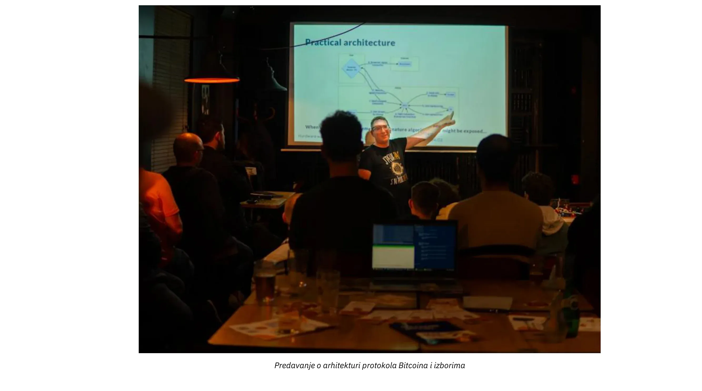

3/ Kako želim da moja zajednica doprinese Bitcoin ekosistemu?

Ovo je naprednije pitanje, ali vredi razmisliti o njemu već na početku.

Ako je vaša vizija **stvaranje blisko povezane, motivisane zajednice** fokusirane na orange-pilling što većeg broja ljudi, onda:

- Saradnja sa postojećim zajednicama radi pristupa širim informacijama, resursima otvorenog koda i dragocenoj podršci kada je to potrebno.
- Organizujte i delegirajte zadatke unutar vaše grupe kako biste efikasno proširili i povećali svoje napore.

**Postavite kratkoročne, srednjoročne i dugoročne ciljeve**

Praktičan način planiranja je postavljanje ciljeva za svaki vremenski okvir:

- Kratkoročno: izgraditi prisustvo na društvenim mrežama i postaviti kanale komunikacije zajednice.
- Srednjoročno: kreirati edukativne resurse (članci, flajeri, video snimci).
- Dugoročno: pokrenuti redovne fizičke sastanke.

Jednom kada se okupljanja uspostave, možete težiti ka:

- Kratkoročno: organizovati radionice ili prezentacije na određene teme
- Srednjoročno: sprovesti kampanje za podizanje svesti ili edukaciju o Bitcoin
- Dugoročno: kreirati formalnu asocijaciju ili partnerstvo sa barom koji prihvata Bitcoin kao plaćanje.

Budite spremni: **izgradnja zajednice zahteva trud**

Stvaranje zajednice ne dešava se preko noći. Potrebno je vreme, motivacija i organizacija.

Ponekad može biti obeshrabrujuće, posebno kada se niko ne pojavi, a vi se osećate kao da ste jedini koji nosi ovu misiju na svojim ramenima.

Zato je **ovaj kurs osmišljen da podeli vredne resurse i savete, pomažući zajednicama da efikasno rastu i na kraju postanu samodovoljne.**.

# Dizajniranje identiteta zajednice Bitcoin

<partId>da6673ad-bf49-5979-80a6-3f69cfb28046</partId>

## Zašto i kako možete stvoriti svoj identitet?

<chapterId>b48a18cc-afdf-5216-802c-32647b5cd8a3</chapterId>

U ovoj fazi pretpostavljamo da:

- Već znate gde će biti vaša zajednica (ili budući redovni sastanak).
- Postavili ste ciljeve za različite vremenske horizonte, čak i ako još nisu konačni.

Sledeći korak u izgradnji vaše zajednice je **definisanje njenog identiteta**, kako njenog imena, tako i vizuelnog stila.

Ovaj odeljak pruža tutorijale i softverska rešenja prilagođena početnicima kako bi vam pomogao da dizajnirate vizuelni identitet vaše zajednice, čak i sa početničkim veštinama.

**Zašto je identitet važan?**

Ljudi se osećaju više angažovano i posvećeno kada mogu da se identifikuju sa grupom. Snažan identitet pomaže vašoj zajednici da se istakne i podstiče osećaj pripadnosti.

Sve počinje izborom imena, a svaka zemlja često ima svoje trendove:

- Francuska: Većina od 60+ lokalnih zajednica koristi imena poput "Bitcoin [GRAD]" ili "[GRAD] Bitcoin". Njihove Telegram grupe često prate ovaj obrazac: "Bitcoin [GRAD] meetup".
- Nemačka: Inicijativa Einundzwanzig (što znači "21") inspirisala je imena poput "Einundzwanzig [CITY]".
- Italija: Mreža Satoshi Spritz koristi imena kao što su Satoshi "Spritz [GRAD]".

**Svaka zajednica ima svoj identitet, povezan sa svojim rodnim mestom, ali povezan sa širim identitetom svoje zemlje**.

Vaš vizuelni identitet: logo, boje, baneri, je ono što će ljudi pamtiti i povezivati sa vašom grupom.

Kada kreirate naloge na društvenim mrežama i komunikacione kanale, imati logo i baner je veliki plus. Ne brinite, nisu vam potrebne profesionalne dizajnerske veštine; dostupni su besplatni i jednostavni alati za korišćenje.

Odlična početna tačka je da uključite znamenitost ili simbol iz vašeg grada. U Parizu, to bi mogao biti Ajfelov toranj. U Lilu, zvonik ili citadela. U Njujorku, Kip slobode. U Londonu, Big Ben, i tako dalje.

Odatle možete dizajnirati ili jednostavan ili detaljniji logo, u zavisnosti od vaših preferencija.

Da bismo vam dali neke ideje, evo nekoliko primera logotipa francuske zajednice:

- U Marseju, logo predstavlja baziliku Notre-Dame-de-la-Garde, koja nadgleda grad:

- U Monaku, to se odnosi na monegašku stenu:

- U Lilu, elegantni logo predstavlja Vobanovu citadelu i njen park:

- U Saint-Malo-u, hermelin - amblem grada - je istaknut:

**Idi dalje ako želiš**

Ako vas inspiracija pogodi, možete je odvesti još dalje: kreirajte grb, moto ili čak pesmu za vašu zajednicu. Vaša kreativnost je jedina granica!

## Napravi logo, poster i baner

<chapterId>3470a31f-0190-5e87-8af0-6a00e79267ef</chapterId>

### Korišćenje Canva

Možete koristiti [Canva](https://www.canva.com/) za kreiranje različitih vizuala za vašu zajednicu.

Ova besplatna i jednostavna platforma popularna je zbog svoje velike biblioteke unapred dizajniranih šablona koje možete duplicirati i prilagoditi u samo nekoliko klikova.

**Kreiranje vašeg logotipa**

Na početnoj stranici Canve, potražite unapred dizajnirane logotipe. Izaberite jedan ili nekoliko koji vas inspirišu, duplirajte ih, a zatim ih prilagodite kako bi odgovarali vašoj zajednici.

Možete dodati lokalnu znamenitost ili amblem u pozadinu (uvezite fotografiju ili pretražite "Ilustracije" ili "Slike" u meniju Elements), zatim preklopite Bitcoin logo ili ₿, prilagođavajući njegovu boju po potrebi.

**Kreiranje banera i postera**

Da biste kreirali baner ili poster, pretražite Canvinu biblioteku za unapred dizajnirane šablone. Kada duplirate jedan, izmenite tekst i fontove, dodajte logo vaše zajednice i uvezite bilo koje fotografije koristeći okvire (pretražite "frame" u Elements meniju).

Takođe možete koristiti meni Dizajni da istražite dodatne modele koji odgovaraju vašim potrebama.

Za YouTube sličice ili banere, jednostavno potražite te šablone, duplicirajte ih i prilagodite po želji.

Ukratko, **mogućnosti su beskrajne i oblikovane ne samo vašim potrebama već i vizuelnim stilom koji želite da kreirate** za vašu zajednicu i vaše sastanke / događaje!

Da bismo vam dali jasniju predstavu, uključili smo neiscrpan video tutorijal koji prikazuje neke od ovih mogućnosti:

:::video id=d11ae0ed-eacd-4924-afd3-75aff95d2899:::

**Primeri šablona iz Bitcoin Lille**

Evo gotovi Canva predlošci koje možete duplicirati i prilagoditi za svoju zajednicu:

- **Najava okupljanja** (za društvene mreže i štampanje A4/A3): [link](https://www.canva.com/design/DAGBvBXFJ8A/92-j_toeLU8QbVAD0NwoAA/edit?utm_content=DAGBvBXFJ8A&utm_campaign=designshare&utm_medium=link2&utm_source=sharebutton)

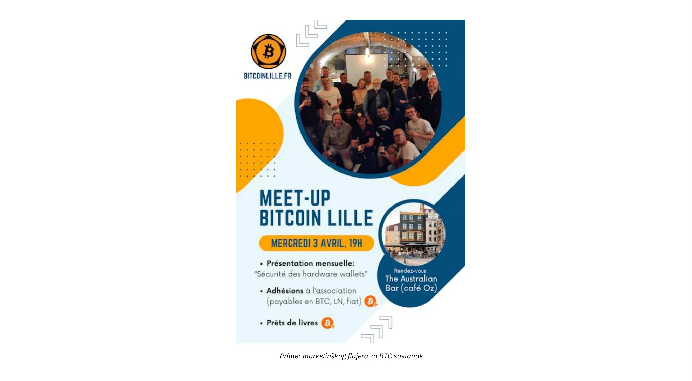

- **Poster događaja** (za društvene mreže i štampanje u A4/A3 formatu): [link](https://www.canva.com/design/DAGBvG3rNCc/oXtNR9pduRs22AqclG4O2g/edit?utm_content=DAGBvG3rNCc&utm_campaign=designshare&utm_medium=link2&utm_source=sharebutton)

- **baneri za društvene mreže**: [link](https://www.canva.com/design/DAGBvOXyNqw/iSJG9PbIQHgGWHz5PhlXSQ/edit?utm_content=DAGBvOXyNqw&utm_campaign=designshare&utm_medium=link2&utm_source=sharebutton)

- **Najava konkursa**: [link](https://www.canva.com/design/DAGBvIjuA_w/YzSUXzOmbNV9oCma9mluOw/edit?utm_content=DAGBvIjuA_w&utm_campaign=designshare&utm_medium=link2&utm_source=sharebutton)

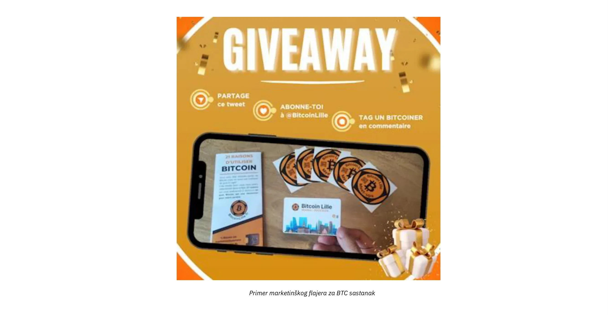

- **smernice brenda** naše biblioteke, prikazane na A4 na sastancima: [link](https://www.canva.com/design/DAGBvPqL7N4/LmUItfsysypRLSOFOzBXcQ/edit?utm_content=DAGBvPqL7N4&utm_campaign=designshare&utm_medium=link2&utm_source=sharebutton)

- **PowerPoint prezentacija** "Poglavlje 2 - Razumevanje Bitcoin transakcija", od @ProfEduStream: [link](https://www.canva.com/design/DAFsEcnOro8/Mz9FYdTGhsvozZOe0Y9jtw/edit?utm_content=DAFsEcnOro8&utm_campaign=designshare&utm_medium=link2&utm_source=sharebutton)

- **letak** "21 razloga za korišćenje Bitcoin", napisao @ProfEduStream: [link](https://www.canva.com/design/DAFtAR1NauQ/ZDwl2CchIJ9Gpb36N6-7iw/edit?utm_content=DAFtAR1NauQ&utm_campaign=designshare&utm_medium=link2&utm_source=sharebutton)

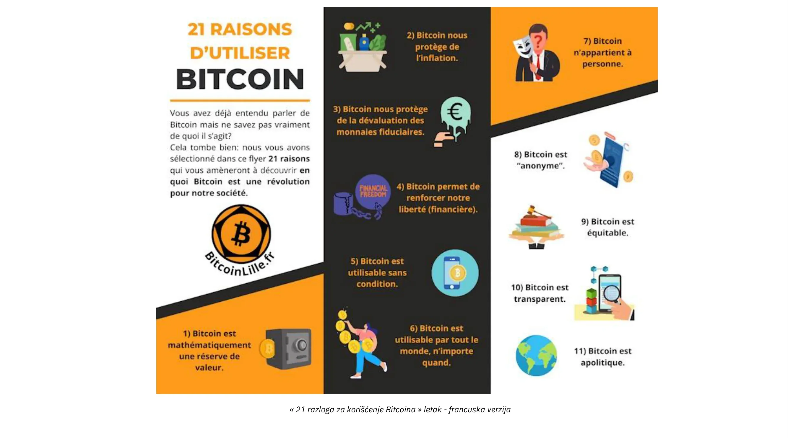

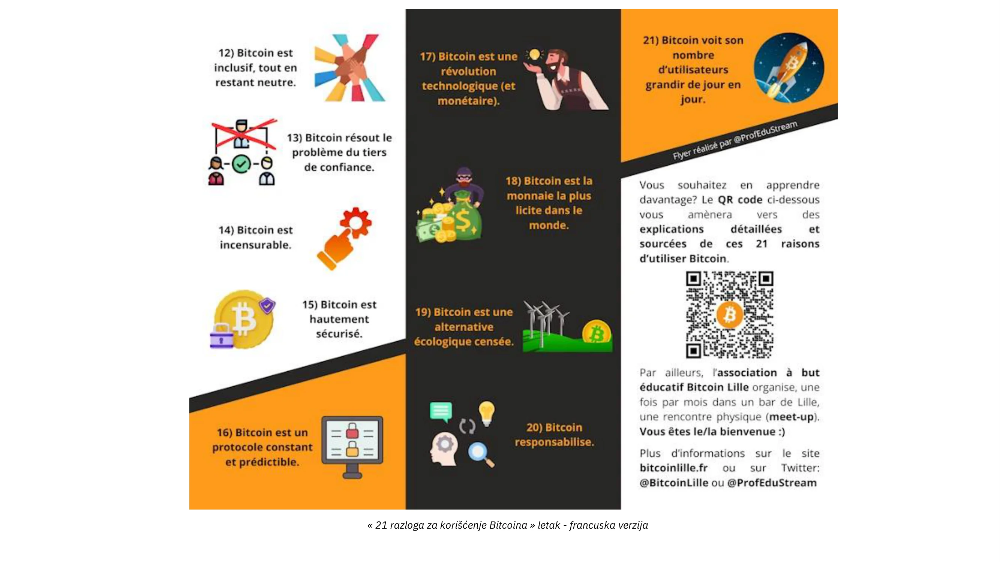

**Podelite svoje kreacije**

Mogućnosti su beskrajne, a vaši dizajni će zavisiti od vaših ciljeva i vizuelnog identiteta. Razmislite o deljenju vaših šablona u open source formatu, to štedi vreme za druge Bitcoin zajednice koje će neminovno suočiti sa istim izazovima kao i vi. Deljenjem pomažete ubrzanju rasta Bitcoin zajednica svuda.

**Preporučene dimenzije**

Kada kreirate vizuale, uvek proverite zahteve za veličinu za svaku platformu:

| Platform | Logo | Banner | Poster / Image
| -------- | -------- | -------- | -------- |
| Telegram     | 512 x 512     | N/A     | N/A     |
| Signal     | N/A     | N/A     | N/A     |
| Twitter     | 400 x 400     | 1500 x 500     | 1200 x 628     |
| Meet-up     | N/A     | N/A     | N/A     |
| Discord     | 512 x 512     | 960 x 540     | N/A     |
| Facebook     | 512 x 512     | 851 x 315     | 960 x 720     |

Obično odgovarajuće veličine:

Logotipi: 512 x 512 piksela

Baneri: Variraju u zavisnosti od aplikacije ili sajta

Posteri: A4 je standardni format štampe

### Korišćenje veštačke inteligencije

Iako Canva nudi širok spektar alata za kreiranje logotipa, postera, banera i flajera, to nije jedina opcija. Ako vam je udobnije da koristite drugi softver (kao što su Photoshop ili Illustrator), slobodno koristite ono što vam najbolje odgovara.

To je rečeno, bilo da dizajnirate logo zajednice ili unapređujete postere, prezentacije ili letke, **veštačka inteligencija može biti moćan saveznik za kreiranje jedinstvenih i privlačnih vizuala**.

Dostupan je veliki broj AI sistema za ovu svrhu. Oni uključuju

- [midjourney](https://docs.midjourney.com/docs/quick-start) (plaćeno);
- [leonardo](https://leonardo.ai/) (besplatno, sa ograničenjem naloga);
- [copilot](https://copilot.microsoft.com/) (besplatno, sa ograničenjem naloga);
- [DALL-E](https://www.dall-efree.com/) (plaćeno).

Mnogi drugi AI alati su se nedavno pojavili, tako da ova lista nije iscrpna.

**Primer: Kreiranje Futurističkog Bitcoin London Logotipa**

Ako želite da dizajnirate futuristički logo za "Bitcoin London" okupljanje, možete pitati Copilot:

- [ ] *Prompt: Kreiraj Bitcoin logo sa Londonskim mostom i Big Benom u pozadini. Futuristički* - [Link](https://copilot.microsoft.com/images/create/un-logo-Bitcoin-futuriste-avec-en-arric3a8re-plan-le-/1-6612ba1758df4384bc33c4bca00ab45b?FORM=SYDBIC)

Ako prva četiri rezultata nisu dovoljno realistična, precizirajte svoj zahtev:

- [ ] *Prompt: Napravite četvrti mnogo realističnijim* - [Link](https://copilot.microsoft.com/images/create/un-logo-Bitcoin-futuriste-avec-en-arric3a8re-plan-le-/1-6612ba64b72d4cea9830ab7eb844f785?FORM=SYDBIC)

Najnoviji rezultat je ispao sjajno!

**Primer: Kreiranje jednostavnog logotipa u britanskom stilu**

Za čistiji izgled, kao za nalepnicu:

- [ ] *Prompt: Kreirajte logo za "London Bitcoin Meetup" sa britanskim i čistim stilom* - [Link](https://copilot.microsoft.com/images/create/logo-for-27londres-Bitcoin-meetup27-with-a-british-a/1-6612bb9451924859a6c34b350b3a6ebc?FORM=SYDBIC)

Rezultat izgleda stvarno kul!

**Saveti za rad sa veštačkom inteligencijom**

- Budite strpljivi: veštačka inteligencija možda neće proizvesti tačno ono što zamišljate iz prvog pokušaja.

- Koristite precizne upite: Što su vaše instrukcije jasnije i detaljnije, to će rezultati biti bolji.

- Zatražite pomoć: Ako niste zadovoljni, obratite se nekome ko ima iskustva sa grafičkim dizajnom ili AI alatima, mnogi Bitkoineri će rado pomoći, ponekad čak besplatno ili za nekoliko Sats.

# Kreiranje komunikacionih kanala za vašu Bitcoin zajednicu

<partId>fc588298-6876-554c-bd57-55d182464878</partId>

## Koje komunikacione kanale treba da izaberete?

<chapterId>b4f4eef6-1035-5290-848a-2b7f9391c77a</chapterId>

Kao što je gore pomenuto, komunikacioni kanali zajednice mogu se razlikovati u zavisnosti od motivacija i navika.

Na primer, **u Francuskoj, Nemačkoj i Italiji, Telegram i Twitter su dominantne platforme**, i postale su "standard" za Bitcoin zajednice.

Nasuprot tome, u Češkoj Republici mnoge zajednice koriste **Matrix**, siguran protokol za instant poruke, umesto Telegrama.

Savet: Pre nego što izaberete svoje kanale, **pogledajte šta rade obližnje zajednice**. Koristite mapu [btcmap.org](https://btcmap.org/communities/map#0/0/0/) da vidite koje su platforme najpopularnije u vašem regionu.

Na primer, švajcarske zajednice prvenstveno koriste Telegram, Twitter i svoj veb-sajt:

**Preporučeni kanali za zajednice koje govore francuski**

- Telegram: Alat za komunikaciju broj 1, preko 90% francuskih okupljanja ga koristi.

- Twitter (X): Glavna društvena mreža koju koriste bitkoineri širom sveta. Koristi je ~70% francuskih okupljanja. Idealna je za dosezanje bitkoinera.

- Meetup.com: Plaćen, ali široko korišćen (od strane ~30% francuskih okupljanja i gotovo svih kanadskih) za povećanje vidljivosti izvan Bitcoin ekosistema.

- Druge opcije: ~30% takođe imaju vebsajt; ~10% vodi Discord servere ili NOSTR naloge.

Druge platforme kao što su Matrix, Keet, Signal, Facebook, Instagram i LinkedIn takođe se mogu koristiti. Pazite, što više kanala upravljate, više vremena ćete provesti moderirajući, objavljujući i održavajući ih aktivnim.

Svako ko želi da pokrene zajednicu u Francuskoj, stoga bi bilo pametno da počne kreiranjem:

- Telegram grupa;
- Twitter nalog.

Kako vaša zajednica raste, možete dodati više platformi i delegirati moderaciju pouzdanim članovima.

## Kreirajte i konfigurišite Telegram kanal, grupu ili supergrupu

<chapterId>d13714ce-8f08-53e9-bedd-b6a3aaac5dad</chapterId>

Pre nego što kreirate prostor za komunikaciju vaše zajednice na Telegramu, važno je znati razliku između:

- Telegram kanal;
- Telegram grupa;
- supergrupa na Telegramu.

Preporučuje se da započnete sa Telegram grupom.

Ako je potrebno, kasnije ga možete pretvoriti u Supergrupu.

Za tutorijale ispod, prvobitno smo koristili "Telegram+" APK, koji omogućava napredniju konfiguraciju. Međutim, nije vam nužno potreban, jer je zvanična Telegram aplikacija dovoljna za kreiranje i upravljanje grupama, čak i putem vašeg telefona:

:::video id=b1da7cb4-5fb1-4a41-a1d4-bd90686826a9:::

### Kreiraj Telegram kanal

Ako želite da napravite mesto gde vaši članovi mogu direktno da razgovaraju jedni s drugima, odgovaraju jedni drugima, itd., onda biste možda želeli da napravite Telegram grupu, a ne Telegram kanal!

Idite direktno na sledeći odeljak, pod nazivom [Create a Telegram group](https://planb.academy/courses/1c643dc9-a15f-4f9e-93b6-cb3c58b4ee35/d13714ce-8f08-53e9-bedd-b6a3aaac5dad).

Zaista, **Telegram kanal je više kao jednosmerni alat za emitovanje za administratore**. Članovi ne mogu slobodno da ćaskaju, mogu samo da reaguju sa emotikonima (ili da ostavljaju komentare u posebnim nitima, što fragmentira razgovore).

**Zato što zajednicama treba interakcija i saradnja, Telegram kanal se ne preporučuje** ako je vaš cilj izgradnja odnosa i deljenje znanja.

Uputstvo za kreiranje Telegram kanala:

:::video id=98be4709-d221-4030-8c31-e10113482515:::

### Kreiraj Telegram grupu

S druge strane, **Telegram grupa je idealna za zajednice**: Baš kao aplikacije za razmenu poruka kao što su Messenger ili WhatsApp, članovi mogu ćaskati i odgovarati jedni drugima u jednom zajedničkom razgovoru.

Šta možete učiniti kao administrator:

- Objavi i zakači važne poruke.
- Kreirajte **ankete** (korisno za odlučivanje o datumima sastanaka kada je vaša zajednica nova).
- kreiraj **prilagođeni pozivni link** (Samo ako je grupa "javna" a ne "privatna", što je definisano u podešavanjima. Takođe je korisno imati svoj Telegram pozivni link, kao što je: t.me/Bitcoin[CITY]);
- Upravljajte dozvolama članova, ulogama i moderacijom.
- Dodajte profilnu sliku (logo vaše zajednice) i ažurirajte ime grupe.

Uputstvo za kreiranje Telegram grupe:

:::video id=3d4792a7-1345-475b-93b1-b3a3945fb567:::

Napomena: Ovaj vodič je napravljen koristeći Telegram+, ali sve možete uraditi direktno iz standardne Telegram mobilne aplikacije.

### Kreiraj Telegram supergrupu

Zašto Supergrupa?

Kako vaša Telegram grupa raste na stotine članova, razgovori mogu postati haotični. To često dovodi do toga da članovi propuste važne najave, poput datuma sledećeg sastanka.

Dostupno je nekoliko rešenja:

1. **Prikačite važne poruke** kako bi svi članovi dobili obaveštenje (pritisnite jednom prstom na poruku o kojoj je reč, zatim izaberite "Prikači");

2. Razmotrite korišćenje **Discord-a** za više komunikacionih kanala, od kojih svaki korisnici mogu isključiti zvuk po potrebi.

3. **Pretvorite svoju Telegram grupu u Supergrupu**.

Šta je Telegram supergrupa?

Supergrupa je u suštini Telegram grupa sa temama (pod-kanalima) unutar nje.

Primeri tema:

- "Important Information": samo ključne novosti i najave događaja.
- "Generalno": za sve diskusije članova.
- Specifične Teme: npr., Mining, razvoj projekta, predstojeće konferencije.

Savet: Prilagodite svoje teme potrebama vaše zajednice. Primer: Abidjan Bitcoin okupljanje uspešno koristi ovaj format.

Imajte na umu da **Telegram supergrupe mogu biti pomalo nezgodne za korišćenje nekim članovima**. Na primer, ne znaju svi **kako da pristupe različitim temama** (samo treba da dodirnu logo grupe u glavnom meniju Telegrama da bi videli punu listu tema). Slanje brzog snimka ekrana može pomoći da se razjasni svaka zabuna.

Ne postoji strogo pravilo kada treba preći sa obične Telegram grupe na supergrupu, to zaista zavisi od potreba vaših članova. Dobra vest je da možete lako prelaziti između njih: jednostavno kreirajte temu da biste konvertovali u supergrupu ili obrišite sve teme osim "General" da biste se vratili na običnu grupu.

Uputstvo za kreiranje Telegram supergrupe:

:::video id=f78800ae-d8ca-479a-b913-99abd9916bff:::

Brza napomena: kao što je ranije pomenuto, gornji tutorijal je napravljen na računaru koristeći "Telegram+" APK. Danas je, međutim, kreiranje Telegram supergrupe na vašem telefonu jednostavno.

Samo kreirajte Telegram grupu, idite na njena podešavanja i dodirnite dugme "Teme" da dodate teme. Kada sačuvate, videćete listu tema koje možete uređivati kako želite.

Dakle, nema potrebe da preuzimate "Telegram+" više, osim ako ne želite pristup naprednijim postavkama privatnosti za vašu supergrupu.

## Postavljanje vaše Telegram grupe ili supergrupe

<chapterId>35e674b3-5924-50b0-98f1-83a56c9a186d</chapterId>

Sada kada vaša Telegram grupa (ili supergrupa) radi, vreme je da **konfigurišete dozvole i postavite moderaciju**.

Svaka zajednica je slobodna da izabere svoj pristup, ali iskustvo pokazuje da je **najbolje ograničiti određene dozvole članova**:

- Slanje ankete;
- Slanje fajlova (da bi se izbegli potencijalni virusi);
- Slanje glasovnih poruka;
- Dodavanje korisnika (pomaže u sprečavanju invazija botova);
- Kačenje poruka;
- Uređivanje informacija o grupi.

Preporučuje se da **napišete jasan opis vašeg okupljanja** prilikom kreiranja vaše Telegram grupe ili supergrupe, jer je to prva stvar koju će potencijalni članovi videti. Na primer:

> Dobrodošli u @Bitcoin's Telegram [CITY] 🔥
>

> Organizujemo okupljanje svake prve srede u mesecu u baru [BAR_NAME], u [CITY] 🍻
>

> Pogledajte naše druge društvene mreže: [LINK] 🌐

U ovom primeru, administratori Bitcoin Lille su prilagodili svoj javni Telegram link radi lakšeg deljenja.

U "Postavkama grupe", može biti pametno **omogućiti "Odobravanje novih članova"**.

Neke Bitcoin Telegram grupe bile su meta hiljada lažnih naloga dizajniranih da spamaju ili ometaju zajednicu.

**Aktiviranje odobravanja članova može spasiti vašu grupu od napada spama.**

U okviru sekcije Administratora, možete takođe omogućiti funkciju "Agresivna Anti-Spam" za automatsko brisanje sumnjivih poruka.

Ovo nije uvek neophodno, ali može dodati dodatni Layer zaštite.

## Dodavanje multi-funkcionalnog bota u vašu Telegram grupu

<chapterId>c61f69cc-15ec-53f1-8c02-1cea55def09e</chapterId>

**Još jedna opcija za konfigurisanje i obezbeđivanje vaše Telegram grupe ili supergrupe je dodavanje multi-funkcionalnog bota**. Ovo vam omogućava da značajno proširite funkcije vaše grupe i mogućnosti moderacije.

Korišćenjem **bota [@GroupHelpBot](https://telegram.me/grouphelpbot)**, najkorisnije opcije su:

- Komanda **pravila** (/rules) za prikaz smernica vaše zajednice;
- **Anti-spam** zaštita za filtriranje sumnjivih poruka i naloga;
- **Prilagodljive automatske poruke dobrodošlice** za nove članove (sa opcionalnim automatskim brisanjem nakon nekoliko minuta)
- **Anti-flood zaštita** za sprečavanje neželjene pošte
- Komanda **@administrator** za brzo kontaktiranje administratora grupe
- **Pravila blokiranja** za neželjeni sadržaj
- Komanda za **link grupe** (/link)
- Komanda **upravljanje dozvolama**
- **Automatsko brisanje** određenih tipova poruka
- **Blokiranje botova** i **blokiranje ulaza/izlaza** kako biste zaštitili svoju grupu
- Navedite **društvene mreže vaše zajednice** (/mreže)
- I mnogo više...

Bezbroj dodatnih funkcija je dostupno.

Pro savjet: **Nemojte previše ograničavati razgovor**.

Uputstvo za dodavanje multi-funkcionalnog bota u Telegram grupu ili supergrupu:

:::video id=cdbf82d6-3530-45c4-90de-593f100863bb:::

(Napomena: Ceo ovaj proces sada se može obaviti direktno sa vašeg telefona. Više nije potrebna aplikacija Telegram+.)

## Kreiraj Discord server

<chapterId>eef2a965-4c24-5f3a-8013-72cc7d315314</chapterId>

Kada vaša Telegram grupa postane prevelika, transformacija u Telegram supergrupu može pomoći u organizaciji diskusija.

Međutim, kao što je ranije pomenuto, **dodana složenost i povećanje tema i poruka mogu uzrokovati da neki aktivni članovi izgube interesovanje**.

Zašto razmotriti Discord?

**Discord je alternativa** Telegram supergrupi jer omogućava korisnicima da **kreiraju specifične sobe za tekstualni i glasovni čet** i omogućava članovima da isključe bilo koje kanale koji ih ne zanimaju.

Naravno, upravljanje i Telegramom i Discordom zahteva malo više vremena, posebno tokom konfiguracije i pokretanja.

Da bismo vam olakšali stvari, **delimo [Discord server koji možete duplicirati i prilagoditi](https://discord.com/template/bDY4eXXJk2C8)**:

:::video id=e647458a-a21e-44e0-bd03-20b82a871777:::

Kada je dobro dizajniran, Discord server može biti pravo bogatstvo za vašu zajednicu. Mnogi Bitkoineri već svakodnevno koriste **Discord**, a mogućnost praćenja Telegram razgovora direktno unutar Discord-a (i obrnuto) može svima uštedeti mnogo vremena.

Da biste sinhronizovali obe platforme, postoji bot otvorenog koda pod nazivom [TediCross](https://github.com/TediCross/TediCross). Njegova svrha je jednostavna: automatski prosleđuje poruke iz Discord tekstualnog kanala u Telegram grupu (ili temu u supergrupi), i obrnuto.

Međutim, imajte na umu da nije najlakše za instalaciju. Moraćete da držite otvoren komandni prozor (CMD) na vašem računaru da bi bot radio, a povremeno se mogu pojaviti greške. Srećom, popravka je jednostavna: samo ponovo pokrenite bota i većinu vremena sve se vrati u normalu.

Da uštedite vreme, evo tutorijala kako da dodate ovog multi-funkcionalnog bota u Telegram grupu ili supergrupu:

:::video id=6a0283f6-6d6c-4e81-8b2f-644b33c52fe6:::

## Razmotrite alternativne, privatne i sigurnije kanale komunikacije

<chapterId>29d0aad6-0612-5dd0-bcef-7337eaf4fefc</chapterId>

Kao što je ranije diskutovano, Twitter i Telegram su najčešće korišćeni alati za komunikaciju za Bitcoin zajednice u Evropi (ako ne i širom sveta).

Međutim, Telegram nije baš poznat kao najbezbednija ili na privatnost fokusirana aplikacija za razmenu poruka, a Twitter, sada X, je u vlasništvu jedne od najfleksibilnijih korporacija na planeti.

Zato, kada su vaši osnovni kanali uspostavljeni i stvari teku glatko, može biti vredno odvojiti vreme za istraživanje drugih opcija.

U narednim mesecima, ovaj kurs i platforma planb.network ponudiće tutorijale o tome kako koristiti alternativne protokole kao što su **Simplex i Element**: decentralizovani, enkriptovani i visoko prilagodljivi alati za komunikaciju.

**Zašto se truditi istražiti ove opcije?**

Jer, baš kao i društvena mreža NOSTR, oni pružaju ne samo veću privatnost već i zaštitu protiv cenzure ili proizvoljnog gašenja vaše Telegram grupe.

I stvarno, šta bi moglo biti više u duhu Bitcoin nego biti otporan na cenzuru i otporan po dizajnu?

# Pokrenite svoje društvene mreže

<partId>8ebf8cd7-9248-543f-bc27-4ec4cc03f9cf</partId>

## Važnost vidljivosti za rast vaše Bitcoin zajednice

<chapterId>b20f12e4-c5de-5f02-80c7-b7fc6cadd3ac</chapterId>

Dakle, vaša zajednica je pokrenuta i radi. Postavili ste svoj Telegram ili Matrix prostor... ali za sada ste jedini tamo. **Vreme je da obavestite ljude da postojite!**

Jednostavno je: ako niko ne može pristupiti vašoj grupi i videti kada se sledeći sastanak dešava, samo ćete objavljivati u prazno. Zato su društveni mediji, i nekoliko specifičnih platformi koje ćemo kasnije pokriti, toliko važni za izgradnju vaše zajednice.

Twitter (X) je postao gotovo sinonim za Bitcoin razgovore na internetu. Nije savršen, daleko od toga, ali je trenutno mesto gde se okuplja veliki deo zajednice. Preporučuje se kreiranje naloga tamo.

Da bi ostale ispred mogućih cenzura ili ograničenja, neke zajednice takođe otvaraju NOSTR profil.

To je ono što je uradio kolektiv FREE Madeira.

Naravno, druge platforme takođe mogu biti korisne. Facebook (bilo sa grupom ili stranicom), ili čak LinkedIn.

Imajte na umu da **što više komunikacionih kanala i društvenih mreža upravljate, to više vremena zahteva**. Često je bolje fokusirati se **na one najrelevantnije**, Twitter (i NOSTR) su odlične opcije za početak.

## Kreiraj Twitter profil

<chapterId>c8d73097-8eba-5530-918c-221002954110</chapterId>

Twitter je veoma lak za korišćenje, a da biste poboljšali svoju privatnost, potrebno je da prilagodite nekoliko postavki.

**Kada kreirate novi Twitter nalog, morate uneti četiri osnovna podatka:**:

1/ **@ Twitter**, koji definiše vaš identitet i čini vas lakim za pronalaženje. Ako je ime vaše zajednice "Bitcoin [CITY]", prikladno je odabrati "@Bitcoin[CITY]";

2/ **logo i baner** koje ste kreirali za vašu zajednicu ili okupljanje (pogledajte odeljak [Kreirajte logo, poster i baner](https://planb.academy/courses/1c643dc9-a15f-4f9e-93b6-cb3c58b4ee35/3470a31f-0190-5e87-8af0-6a00e79267ef));

3/ **opis**, koji vam omogućava da podelite ključne informacije o vašoj zajednici u nekoliko stotina karaktera. Na primer:

> Zvanični nalog zajednice Bitcoin [CITY] #BTC | Okupljanja svakog prvog utorka u mesecu u [BAR_NAME] u [CITY] 🍻 | Pridružite nam se na Telegramu 🔽

4/ Ispod ovog opisa moguće je **ubaciti link**. Ovo može voditi korisnike na stranicu "društvenih mreža" na vebsajtu vaše zajednice, ili na vaš Telegram kanal. Na vama je da odlučite šta želite da istaknete.

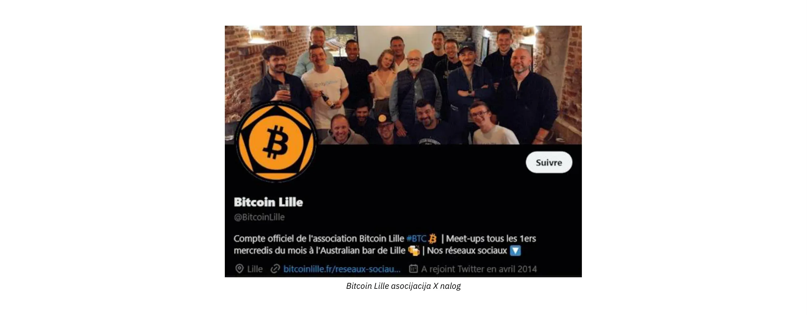

Pored toga, **vredi prilagoditi nekoliko postavki privatnosti**:

- ostavite svoj Twitter nalog u "javni" režim (objave vidljive svima);
- dozvoli svima da te pronađu;
- onemogući praćenje lokacije i deljenje podataka sa drugim entitetima (u podešavanjima privatnosti).

Za svaki događaj verovatno ćete koristiti Twitter za deljenje korisnih informacija. Ali, kao i na većini društvenih mreža, **vidljivost je sve**.

Da bismo vam uštedeli značajno vreme, odvojili smo vreme da proučimo [Twitter-ov algoritam rangiranja otvorenog koda](https://github.com/twitter).

Evo nekoliko **ključnih stvari na koje se treba fokusirati kako biste povećali svoju vidljivost**:

- Opšti saveti:
    - Tvituje u jeziku podešenom na vašem nalogu ili na engleskom: tvitovanje na drugim jezicima može značajno smanjiti vašu vidljivost;
    - Držite se svoje niše, delite samo sadržaj koji je vezan za fokus vašeg naloga; algoritam kažnjava tvitove koji nisu u temi;
    - Ciljajte na 1 do 2 tvita dnevno;
    - Objavite tokom špica: četvrtak ili petak između 8 i 10 časova obično daje najbolje rezultate (proverite na svom nalogu: Twitter Analytics).

- Kada pišete tvit:
    - dodajte fotografiju (ili čak video);
    - Koristite samo jedan hashtag (obično je #Bitcoin najrelevantniji. Ako je prikladno, možete dodati i popularan hashtag vezan za oblast vašeg naloga);
    - Podstaknite svoju zajednicu da se uključi:
        - Like = težina 0.5
        - Retweet = težina 1
- Odgovor = težina 27 (!!)
- Odgovarajte ljudima koji odgovaraju na vaše **tvitove** (težina 75!!);
    - Izbegavajte postavljanje linkova u glavnom tvitu: umesto toga, dodajte ih u prvi komentar.;
    - Napiši reči u celosti, izbegavaj skraćenice.

- Ostali saveti:
    - Tvítuj o aktuelnim temama, sve dok su u skladu sa oblašću stručnosti tvog naloga;
    - Ponovo objavite svoje najuspešnije tvitove;
    - Povremeno sprovodite ankete;
    - Piši niti kada je to moguće;
    - Podstaknite svoju zajednicu da poseti vaš profil i prati vas.

Štaviše, **možete zakačiti tvit ili nit na svoj Twitter profil kako biste im dali maksimalnu vidljivost**, baš kao što to radi zajednica Bitcoin Witsand u Južnoj Africi.

Takođe imajte na umu da je moguće ostati prijavljen na dva Twitter naloga istovremeno, kako na telefonu tako i na računaru. Ovo je veoma korisno ako želite lako da prelazite između ličnog i zajedničkog naloga.

Samo budi oprezan... slučajno objavljivanje fotografije sa zabave sa naloga zajednice može se desiti brže nego što misliš!

Konačno, iako je vaše korisničko ime "@Bitcoin[CITY]" jedinstveno i sada vaše, pametno je predvideti lažne ili imitacione naloge. Razmislite o registraciji:

- @Bitcoin_[CITY]
- @[CITY]Bitcoin
- @[CITY]_Bitcoin

Na taj način ćete u velikoj meri smanjiti šanse da neko lažno predstavlja vašu zajednicu.

Uputstvo za kreiranje Twitter naloga:

:::video id=4648976f-41ec-499a-b7ec-a53e796f71b4:::

## Približavanje susednim okupljanjima

<chapterId>12a21c3b-235a-5292-8209-67bf60f61e49</chapterId>

Sada kada su vaši komunikacioni kanali i društvene mreže postavljeni i odražavaju vizuelni identitet vaše zajednice, vreme je da počnete pratiti prave ljude.

Na Twitteru, počnite tako što ćete pratiti ključne naloge koji globalno promovišu Bitcoin kao što su [@Bitcoin](https://twitter.com/Bitcoin) i [@planb_network](https://twitter.com/planb_network), kao i inicijative poput [@FBCEglobal](https://twitter.com/FBCEglobal). Takođe možete retvitovati čuveni tvit [@halfin](https://twitter.com/halfin) "Running Bitcoin" od 11. januara 2009. I što je još važnije, **pratite naloge zajednica i okupljanja Bitcoin u svojoj zemlji**.

Ovo stvara **prilike da pratimo jedni druge, označavamo jedni druge i povećavamo kolektivnu vidljivost**. To je već uobičajena praksa među ~50 Bitcoin zajednica u Francuskoj, "Satoshi Spritz" inicijativa u Italiji i "Einundzwanzig" grupa u Nemačkoj.

Iako se nekima može činiti trivijalnim, **praćenje naloga lokalnih zajednica i inicijativa može dovesti do saradnji ili čak partnerstava**. Na primer, zajednice Bitcoin Liège i Bitcoin Lille (kao i Bitcoin Aix i Bitcoin Marseille) su se povezale na ovaj način, što ih je dovelo do zajedničkog organizovanja godišnjeg okupljanja.

Obroci **Cercle du Coin** su još jedan dobar primer.

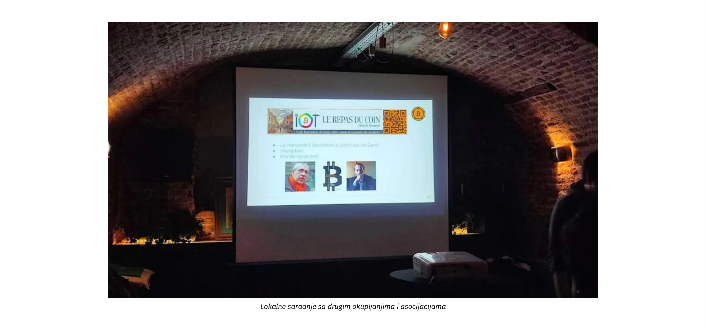

U Francuskoj, može biti relevantno **pratiti inicijative kao što su [@KonsensusFR](https://twitter.com/KonsensusFR), [@bitcoinpointfr](https://twitter.com/bitcoinpointfr), [@DecouvreBitcoin](https://twitter.com/DecouvreBitcoin) i [@btcmap](https://twitter.com/btcmap)**. Ovo su naravno samo predlozi, i svaka zajednica je slobodna da radi kako želi, u potpunoj decentralizaciji i autonomiji.

Kao što je gore pomenuto, cilj međusobnog praćenja je izgradnja međusobne vidljivosti. Što više promovišete svoju zajednicu i one iz vašeg regiona/zemlje na društvenim mrežama, više će ljudi pričati o vama. Što više ljudi priča o vama, veća je verovatnoća da će prisustvovati vašim događajima.

Sviđanje i retvitovanje objava iz drugih zajednica može stoga uveliko pomoći njihovom razvoju... i vašem.

Takođe možete predložiti da se **organizatori okupljanja i bitkoineri koji vode zajednice sastaju dva ili tri puta godišnje putem video konferencije kako bi pregledali napredak nacionalnih projekata i povezanih zajednica. Ovo se takođe može desiti tokom događaja uživo.**

Cilj je jednostavan: prikupiti povratne informacije od svih, diskutovati o tome kako se zajednice razvijaju, podeliti uspešne ideje i projekte, i predložiti rešenja kada je to potrebno. Pisani rezime sastanka može biti podeljen sa organizatorima zajednica u vašoj zemlji koji nisu mogli prisustvovati.

## Btcmap.org

<chapterId>365f43d4-7b2c-5961-a184-157b8c1a0116</chapterId>

U ovoj fazi, vaša zajednica je već pokrenuta i funkcioniše. Sve što preostaje je da poželite dobrodošlicu još zainteresovanim ljudima i pomognete joj da raste.

Ali ne možete napredovati bez saznanja da **postoje platforme na kojima bitkoineri mogu pronaći zajednice i okupljanja u svojoj blizini**. Zato je važno odvojiti nekoliko minuta da zatražite listing na ovim sajtovima.

To uključuje:

- [Btcmap.org](https://btcmap.org/)**, vebsajt sa dve mape koje se ažuriraju svakodnevno: **[svetska mapa preduzeća koja prihvataju Bitcoin](https://btcmap.org/map)** i **[svetska mapa zajednica](https://btcmap.org/communities/map)**. Mnogi bitkoin entuzijasti redovno proveravaju ove mape, bilo da putuju ili obavljaju svakodnevne aktivnosti, kako bi upoznali nove ljude ili pronašli mesta za trošenje svog Sats. Btcmap je globalna referenca, a uvrštavanje vaše zajednice tamo je ključno za vidljivost.**
- [BitcoinerEvents](https://www.bitcoinerevents.com/), vebsajt kreiran od strane bitkoinera, za bitkoinere. **Omogućava vam da objavite predstojeće događaje vaše zajednice**. Međutim, u Francuskoj se još uvek ne koristi široko.
- u zavisnosti od vaše zemlje, mogu postojati i druge lokalne inicijative. U Francuskoj, na primer, postoji [Bitcoin.fr](https://Bitcoin.fr/events/categories/evenements/), koji **navodi desetine Bitcoin događaja svakog meseca**. Dakle, ako ih još niste zapratili na Twitteru ili ih kontaktirali da podelite informacije o vašoj zajednici i događajima, sada je pravo vreme! **Da bi francuski kalendar događaja bio ažuriran, bilo bi sjajno kada bi sve francuske Bitcoin zajednice usvojile naviku da:**
    - pominjanje @bitcoinpointfr na Twitteru za svaki novi događaj zajednice
    - pričvršćivanje novih najava događaja u njihovoj Telegram grupi.

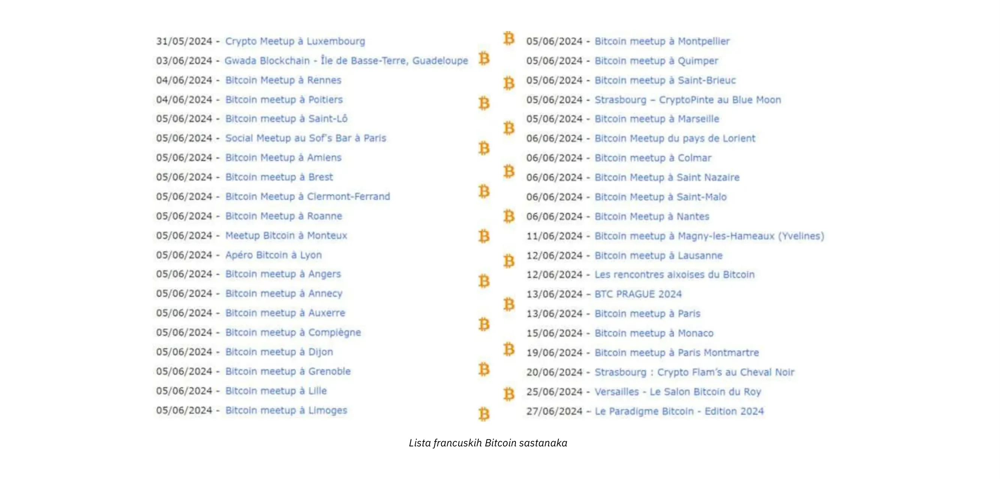

Druge platforme takođe mogu povećati vašu vidljivost. **[Meetup](https://www.meetup.com/)** je jedna od njih, i to je vebsajt (i aplikacija za telefon) gde možete kreirati događaj i pronaći druge u blizini.

Košta oko 8€ mesečno (ili oko 90€ godišnje), što može biti skupo za malu, nestrukturiranu zajednicu. Ipak, Meetup se široko koristi u nekim zemljama, posebno u Kanadi i Sjedinjenim Američkim Državama, i koristan je za upravljanje registracijama.

Slično tome, **[Orangepillapp](https://www.orangepillapp.com/)** je plaćena mobilna aplikacija (50,000 Sats/godišnje ili 200,000 Sats za doživotni pristup) koja pomaže bitkoin entuzijastima da se upoznaju.

Iako ove poslednje dve platforme mogu pomoći u povećanju vidljivosti, ne preporučuju se prilikom pokretanja zajednice, jednostavno zato što nisu besplatne.

**Počevši sa listingom na [btcmap.org](https://btcmap.org/), [BitcoinerEvents](https://www.bitcoinerevents.com/) i za francuske zajednice, na [Bitcoin.fr](https://Bitcoin.fr) je više nego dovoljno**.

Čestitamo! Vaša **zajednica je kreirana**, vaši **vizuali su spremni**, vaši **ciljevi su postavljeni**, vaši **komunikacioni kanali su uspostavljeni**, vaše **društvene mreže su pokrenute** i vaša **strategija vidljivosti je odlučena**.

Kada vam se pridruži mala grupa bitkoinera, vreme je za sledeći korak: organizovanje vašeg prvog Bitcoin okupljanja.

# Organizujte Bitcoin okupljanje

<partId>c009d2a6-40ce-583b-bd24-fdfd1fea262e</partId>

## Zašto pokrenuti redovan meetup sa svojom zajednicom?

<chapterId>ed8e471c-3b99-57e2-a042-2d4e8a40b137</chapterId>

Sada kada su društvene mreže i komunikacioni kanali vaše zajednice pokrenuti, vreme je da se vaš prisustvo oseti na ovim platformama. Ohrabrite nove članove da se predstave i postepeno pridruže razgovoru.

Ovo će vam osloboditi vreme, koje biste mogli iskoristiti za razmišljanje o organizovanju nekog okupljanja. Ovo će postati još relevantnije kada počnete da osećate pravo uzbuđenje unutar vaše zajednice.

Kao što je ranije pomenuto, **Bitcoin okupljanje može se smatrati sledećim "nivoom" za zajednicu**. S jedne strane, omogućava **članovima da se sretnu lično**, a s druge strane, pomaže **edukaciji novajlija zainteresovanih za ovaj ekosistem**.

Događaj poput ovog vam omogućava, na vašem nivou, da **stvorite uzbuđenje oko Bitcoin** u vašem gradu, što može rasti tokom vremena kako vaša zajednica preuzima projekte.

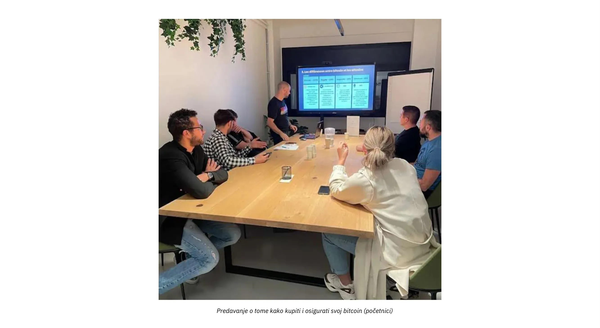

Naravno, što su vaši ciljevi razvoja zajednice veći, to ćete vi i vaši članovi morati više vremena uložiti.

Zato je važno **početi postavljanjem ostvarivih ciljeva za vaš meetup**.

## Prvi sastanak: kada i zašto?

<chapterId>f3f8a614-cfb4-5994-a2e8-d56e6f8e3347</chapterId>

Možete pokrenuti okupljanje samo nekoliko nedelja nakon što kreirate svoju zajednicu.

Međutim, u toj fazi vaša grupa će verovatno još uvek biti mala, što znači da postoji šansa da se niko neće pojaviti.

Bolje je organizovati okupljanje kada imate barem nekoliko aktivnih članova u vašim komunikacionim kanalima, na primer, nekoliko desetina. Ovo se može desiti brzo, ali takođe zavisi od ličnosti ljudi.

Jednom kada osetite tu iskru, predložite susret uživo. Ako su drugi zainteresovani, preostaje samo da **odredite datum za vaš prvi susret**.

Umesto da sami birate datum, obično je najbolje **napraviti anketu oko deset dana unapred sa nekoliko mogućih dana i vremena**. Na ovaj način, možete koristiti glasove da maksimizirate prisustvo, izgradite uzbuđenje i najbolje iskoristite svoje vreme.

Najbolje je ne ulaziti sa fiksnim očekivanjima o tome kako će se okupljanje odvijati, koliko će ljudi doći ili koje će teme biti diskutovane. Ovo izbegava razočaranje i sprečava učesnike da osećaju pritisak.

Neka stvari teku prirodno, možda uz piće. Razgovori bi trebalo da teku lako, a ako je potrebno, možete nežno vratiti diskusiju na Bitcoin ako počne da skreće.

Ako želite da se pripremite za mirnije trenutke, možete isplanirati nekoliko aktivnosti ili tema za razgovor, kao što su:

- prikazivanje **[Mempool](https://Mempool.space/)** na računaru ili pametnom telefonu;
- doneti knjigu;
- donoseći **Nerdminer**, Bitaxe, FPGA ili čak ASIC;
- imati **Bitcoin letak**;
- brainstorming vizuala ili logotipa Bitcoin za vašu zajednicu;
- igranje **[Bitcoin kartaške igre](https://www.Maximalist.ovh/accueil/20-game-le-Coin-de-table.html)**;
- prikazivanje mape zajednica i trgovaca na **[btcmap.org](https://btcmap.org/)**;
- slanje ili prijem Bitcoin koristeći **Lightning**.

Kada vaš sastanak tek počinje, često nije pravo vreme za formalnu prezentaciju. Ako je prisustvo malo, otvorena i neformalna diskusija obično najbolje funkcioniše.

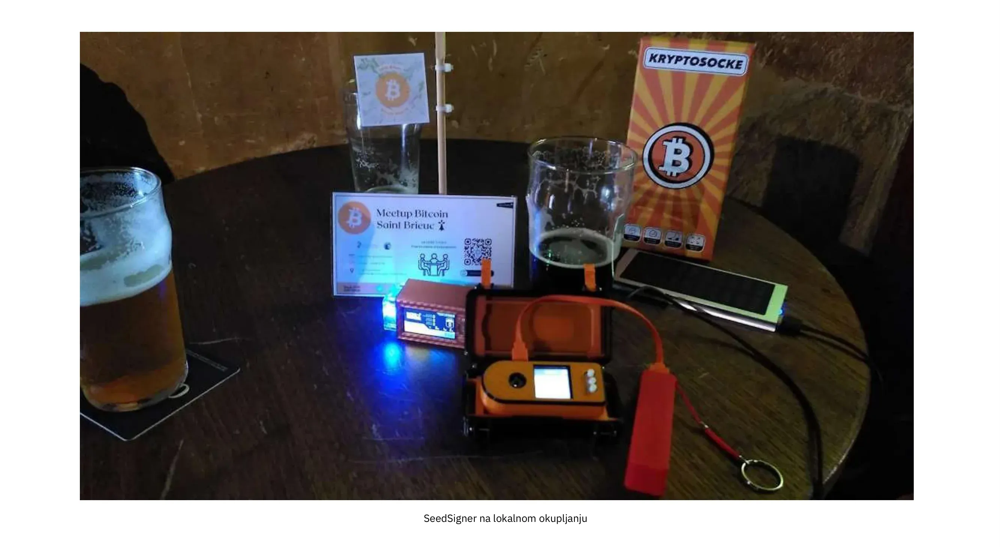

Nakon vašeg prvog sastanka, verovatno ćete želeti da planirate još jedan. Dok je vaša zajednica još uvek mala, najbolje je da nastavite sa izborom datuma putem anketa, na primer, jednom mesečno ili svaka dva meseca. O tome možete razgovarati na vašim komunikacionim kanalima.

Ako se formira redovna grupa bitkoinera i zainteresovanih učesnika, ima smisla postaviti ponavljajući raspored iz dva razloga:

1) olakšava svima planiranje unapred;

2) to pomaže **uspostaviti "naviku"**. Čak i ako neko prestane redovno da proverava vaše kanale, i dalje će znati kada se okupljanje dešava i može svratiti kao i obično.

Ova druga tačka je jedan od razloga zašto se **u Francuskoj većina okupljanja održava prve srede svakog meseca** (pogledajte inicijativu "ambasadori", pokrenutu od strane [DecouvreBitcoin](https://decouvrebitcoin.fr/) 2022. godine).

U Nemačkoj i Italiji ne postoji fiksni nacionalni dan.

Međutim, održavanje svih okupljanja širom zemlje istog dana stvara problem centralizacije: sprečava bitkoinere da prisustvuju događajima u obližnjim zajednicama i može takođe izazvati zabrinutost za bezbednost. Razgovor sa organizatorima okupljanja iz susedstva može vam pomoći da se dogovorite o dobrom aranžmanu.

Kako vaša zajednica raste i okupljanja privlače više ljudi, možete:

- postavite specifičan cilj za svaki sastanak;
- ili čak **dodati drugi događaj svakog meseca**.

U prvom slučaju, dok imate na umu preferencije svih, jasan cilj može osigurati da učesnici odu sa novim znanjem i da razgovori ostanu fokusirani na Bitcoin.

U drugom slučaju, drugi mesečni događaj mogao bi biti posvećen određenoj temi, kao što su sesije za početnike ili radionice (Mining, Lightning, instalacija nodova, itd.).

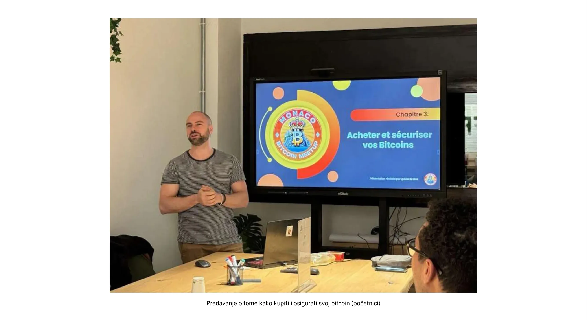

Imajte na umu da **ovo zahteva više organizacije i više vašeg vremena**. Srećom, u [delu 6/8 ovog kursa](https://planb.academy/courses/1c643dc9-a15f-4f9e-93b6-cb3c58b4ee35/3213d87a-1998-5972-ab93-97a5769ba279), naći ćete niz ponovo upotrebljivih resursa otvorenog koda koji će vam pomoći.

U svakom slučaju, sve zavisi od kratkoročnog, srednjoročnog i dugoročnog akcionog plana koji vi, ili vaša zajednica, postavite za sebe.

## Pretraga lokacije

<chapterId>405d389e-6a32-5777-af8d-293380d2e8fd</chapterId>

Pronalaženje prostora za vaše događaje često nije lak zadatak. Povrh toga, neophodno je da taj prostor bude **smešten u gradu vaše zajednice**.

Postoji nekoliko kriterijuma koje treba razmotriti, uključujući:

1) **Lokacija**: da li je lako dostupna javnim prevozom? Automobilom? Da li je dostupan parking?

2) Da li je mesto prijatno i ne previše **bučno**? Da li tražite formalno okruženje (co-working prostor, sala za sastanke) ili nešto neformalnije (bar, restoran)?

3) Da li ima dovoljno kapaciteta da vas ugosti, čak i tokom noći kada se igra ragbi ili utakmica Lige šampiona?

4) Da li ima video projektor i tihu zonu za prezentacije?

5) I na kraju, ako je u pitanju bar ili restoran, da li meni nudi nešto za svakoga za jelo i piće?

Pored toga, ovde su tri važne tačke koje treba imati na umu:

- Ako planirate da podelite veče na dva dela: prvo, prezentaciju u formalnom prostoru kako biste pomogli svima da se fokusiraju, a zatim prelazak u bar ili restoran da nastavite u opuštenijoj atmosferi, iskustvo pokazuje da promena mesta usred večeri često dovodi do toga da neki učesnici odu tokom pauze. Ovaj pristup se stoga ne preporučuje.
- Na vašim prvim okupljanjima, prisustvo će verovatno biti malo i verovatno nećete držati formalne prezentacije. U tom slučaju, nema potrebe da se predstavljate vlasniku ili objašnjavate svoje ciljeve. Međutim, **kada okupljanja postanu redovna i dobro posećena, vredi to učiniti kako biste pokazali profesionalizam i izrazili želju da se vraćate mesečno**. Ovo može dovesti do mnogih razgovora (automatske mesečne rezervacije, besplatna pića i/ili daske sa hranom, popusti, razgovori o Bitcoin, prihvatanje plaćanja Bitcoin, itd.). Očigledno, ako specifično tražite mesto sa video projektorom za održavanje prezentacija, čini se neophodnim da zatražite sastanak (licem u lice, ili čak telefonom) sa vlasnikom i/ili menadžerom kako biste predstavili svoj projekat i ciljeve.

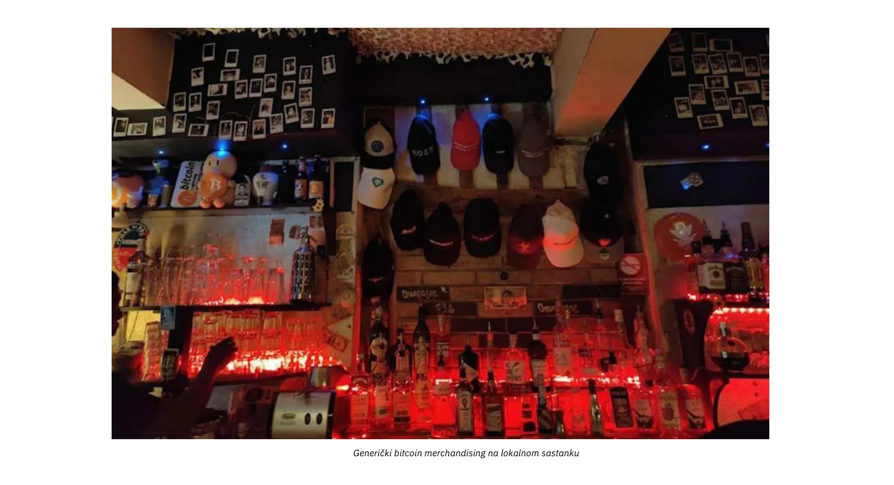

- na kraju, neke zajednice **žele da održavaju svoje događaje samo na mestima koja prihvataju Bitcoin uplate**, što je razumljivo. U tom slučaju, dobra je ideja da **počnete pretragom za biznise koji prihvataju Bitcoin u vašem gradu** (na [btcmap.org](https://btcmap.org/map/) i kontaktirate ih da vidite da li ispunjavaju vaše kriterijume. Ako ništa odgovarajuće nije dostupno, možete pokušati da uključite nove trgovce, ali očekujte mnogo odbijanja, što može biti obeshrabrujuće. Zato je često najbolje ne postavljati ovo kao cilj od početka, već razmotriti kada vaša zajednica bude dobro uspostavljena i kada budete imali dovoljno "vatrene moći."

Takođe, kada pokrećete svoj meet-up, ne oklevajte da **menjate lokacije tokom prvih nekoliko meseci**. Ovo će vam pomoći da **izgradite odnose sa različitim menadžerima**, istražite različite atmosfere i prikupite informacije o potencijalnim budućim domaćinima.

Kasnije, kada vaša grupa poraste, mogli biste čak da odvojite jedno popodne da posetite nekoliko preduzeća i barova, pitajući ih da li imaju prostor pogodan za održavanje vaših mesečnih događaja i okupljanja.

## Pre sastanka

<chapterId>c5218943-580d-5efc-89ed-6b5d728816d6</chapterId>

Planirate organizovati okupljanje u narednim nedeljama?

Evo kontrolna lista koja će vam pomoći da se pripremite:

1/ **Potvrdite mesto**

Kontaktirajte lokaciju na kojoj ćete održati događaj i rezervišite je za procenjeni broj učesnika.

2/ **Objavite događaj**:

    - Podelite datum, vreme i lokaciju na vašim društvenim mrežama i drugim komunikacionim kanalima. Uključite link za registraciju ako je potrebno.
    - Kreirajte posvećen vizual (na primer Canva poster, pogledajte deo 2/8 "[Dizajniranje identiteta za vašu Bitcoin zajednicu](https://planb.academy/courses/1c643dc9-a15f-4f9e-93b6-cb3c58b4ee35/b48a18cc-afdf-5216-802c-32647b5cd8a3)").
    - Maksimizirajte vidljivost kačenjem objave na Telegram i Twitter, i korišćenjem "@everyone" oznake na Discord-u.
    - Objavite najave 7 do 10 dana pre događaja kako bi učesnici mogli unapred da planiraju.

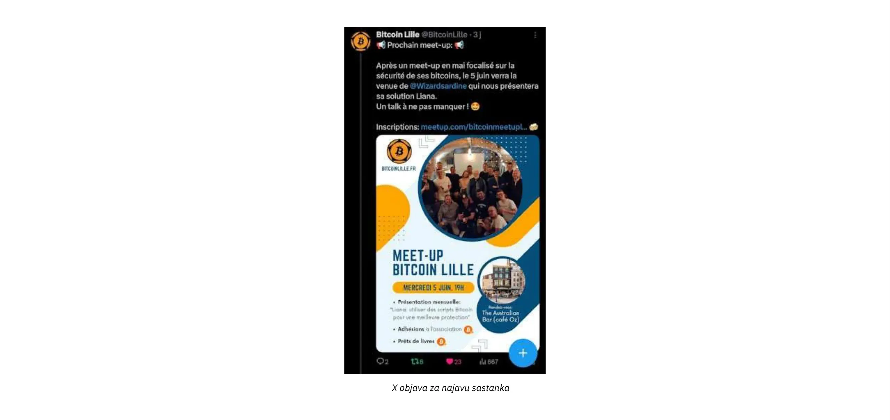

3/ **Podsetite svoju publiku**

Dva do tri dana pre događaja, ponovo podelite i retvitujte vaše objave kako biste povećali vidljivost.

4/ **Ažuriraj mesto**

Dan pre (ili dva dana ranije), proverite vaše registracije i obavestite mesto održavanja o konačnom očekivanom broju učesnika.

Dodatni koraci da vaš događaj bude poseban:

- Štampaj flajere i/ili postere
- Pripremite prezentaciju na određenu temu
- Organizujte aktivnost ili radionicu

## Dan okupljanja

<chapterId>cf60067b-591f-5fdf-9b9e-d442aad0e8f9</chapterId>

Veliki dan je ovde! Jedan ili dva sata pre početka događaja, pošaljite podsetnik putem komunikacionih kanala vaše zajednice. Ponovo potvrdite vreme početka i obavestite učesnike kako da vas prepoznaju, na primer, spominjanjem da ćete nositi Bitcoin majicu i kačket.

Kako vaši sastanci rastu i počnete da primate više od 20 ljudi, priprema prostora će postati sve važnija.

Evo šta treba uraditi:

1) **Stignite rano** da postavite stvari.

2) **Organizujte prostor** prema vašim potrebama i mogućnostima prostora. Ako ste samo šest osoba, malo postavke je potrebno. Ali kada dostignete 10-20 učesnika, potpuno sedeći raspored može ograničiti interakcije. U tom slučaju, izaberite stojeći raspored sa dobro raspoređenim visokim stolovima ako su dostupni, dok i dalje obezbeđujete nekoliko (po mogućstvu visokih) stolica. Ako je planirana prezentacija, zadržite stojeći raspored veći deo večeri i unesite stolice neposredno pre predavanja.

3) Dodajte male prilagođene detalje:

    - Postavite poster na ulazu kako biste označili svoju lokaciju (koristite Patafix i prvo dobijte dozvolu od mesta održavanja).
    - Prikažite postere sa temom Bitcoin unutra (Bitcoin beli papir, povelja vaše zajednice, trenutni projekti, itd.).
    - Postavite nalepnice, flajere ili pokretače razgovora na stolove, na primer: Nerdminer, Hardware Wallet, laptop koji prikazuje svoj Mempool, ASIC Miner, ili metalnu rezervnu ploču za privatne ključeve.

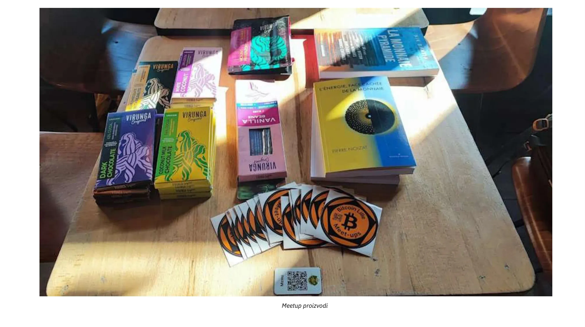

Ako očekujete samo nekoliko učesnika i još niste izgradili odnos sa menadžerima prostora, izbegavajte da odmah donesete i izložite svu svoju opremu. Kada se poverenje uspostavi, imaćete više slobode da uredite prostor kako želite.

Na kraju, uzmite piće i sačekajte da ljudi stignu. I zapamtite: nemojte biti obeshrabreni ako niko ne dođe prvi put. Ponesite knjigu ili video za gledanje, za svaki slučaj.

## Posle okupljanja

<chapterId>3e881af9-9c09-5721-81ee-c5cda3b109c5</chapterId>

Kada se okupljanje završi, vreme je za čišćenje za osoblje lokala. Pre nego što odete, ponudite se da pomognete konobarima ili menadžerima. To može biti jednostavno kao skupljanje svih čaša na jedan sto ili, ako ste blizu šanka, vraćanje istih pre nego što odete.

Jednom kada se vratite kući, verovatno ćete još danima razmišljati o Bitcoin. To je savršeno vreme da proverite puls vaše zajednice i prikupite povratne informacije od učesnika. Možete:

- Objavite poruku zahvalnosti na vašim komunikacionim kanalima i podelite sve linkove ili resurse pomenute tokom događaja.
- Pozovite učesnike da predlože poboljšanja za sledeći sastanak.
- Počnite planirati vaš sledeći događaj.

Imaćete nekoliko nedelja da razvijete sveže ideje, vizuale ili projekte kako biste sledeći sastanak učinili još boljim.

## Važnost uključivanja i zadržavanja učesnika

<chapterId>f5355e35-4b07-527c-88a3-8535cba7592c</chapterId>

Rim nije izgrađen za jedan dan, i vaša zajednica neće biti. Momentum oko Bitcoin dolazi od održavanja redovnih okupljanja i događaja.

Da bi se to ostvarilo, jedna stvar je ključna: **održavajte učesnike angažovanim**.

Može početi sa malom grupom strastvenih bitkoinera, čiji je cilj da se redovno okupljaju i razgovaraju o Bitcoin. Vremenom, u zavisnosti od dostupnosti i interesovanja svakog pojedinca, možete **podeliti određene organizacione zadatke sa grupom**, ili pozvati ključne **članove da preuzmu specifične projekte**. Ovi projekti mogu biti jedinstveni za vašu zajednicu, vaše sastanke ili vaš grad, ili čak inspirisani mnogim inicijativama predloženim u [delu 6/8 ovog kursa](https://planb.academy/courses/1c643dc9-a15f-4f9e-93b6-cb3c58b4ee35/3213d87a-1998-5972-ab93-97a5769ba279). **Ovo ne samo da podstiče Commitment od vaših ključnih članova, već i pomaže vašoj zajednici da raste i napreduje.**.

Kako se vaši sastanci budu razvijali, pojaviće se nova lica: ljudi koji su kupili BTC i/ili altcoine u prethodnim ciklusima, tehno entuzijasti koji žele da prodube svoje razumevanje, ili potpuni početnici radoznali o ovom necenzurisanom, decentralizovanom, transparentnom i fer platnom sistemu koji funkcioniše bez uslova i bez pouzdanih trećih strana.

Da biste bili sigurni da se svi osećaju uključeno na vašim događajima, fokusirajte se na dva ključna aspekta:

- **Socijalna inkluzija**: Svi koji prisustvuju treba da se osećaju dobrodošlo. Potrudite se da pozdravite novopridošle, pitajte ih zašto su došli i upoznajte ih sa drugima. Kada se ljudi osećaju uključeno, verovatnije je da će se vratiti i možda čak pomoći u organizaciji budućih događaja.
- **Strpljenje i otvorenost**: Ovo zahteva vreme i motivaciju. Ako razgovarate sa posvećenim shitcoiner-om (ili još gore, XRP Maximalist), može biti primamljivo da ih odbacite. Ali, uključivanjem u razgovor, možete razjasniti nesporazume ili pogrešno rezonovanje. Ako su spremni da slušaju, možda su spremni da zaista razumeju Bitcoin.

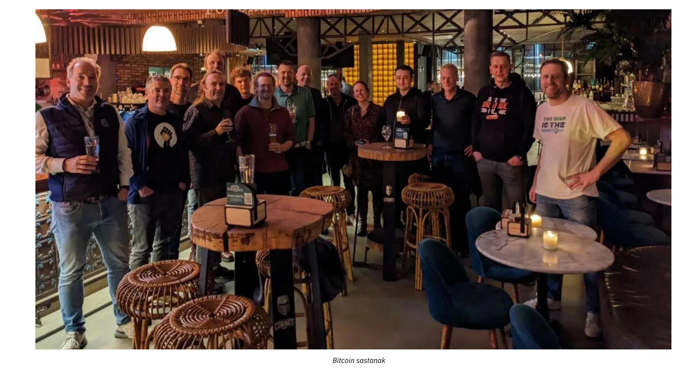

Sa praktične tačke gledišta, razmislite o celokupnom iskustvu događaja:

- Da li je **mesto bilo prijatno**?
- Da li je bilo **lako pristupiti?**
- Zašto su se neki ljudi prijavili, ali se nisu pojavili?
- Koji su razgovori vođeni? Da li su razgovori bili previše tehnički za početnike?
- Da li su diskusije bile previše alkoholne?

Svaki učesnik ima svoju ličnost, ciljeve i interese, tako da će iskustva varirati. Ali kada je mesto odgovarajuće, publika otvorenog uma, a namere iskrene, postoji svaki razlog da susret bude uspešan.

Izgradnja okupljanja zahteva vreme, ali pre svega, zahteva organizaciju. To je ljudski projekat, i funkcionisaće i rasti na duže staze samo ako je dobro planiran, otvoren i inkluzivan.

U konačnici, na vama je da odlučite koliko daleko "otvorenost i inkluzivnost" treba da idu. Samo zapamtite: shitcoiner je često samo bitcoiner u nastajanju.

# Primeri projekata i inicijativa

<partId>45b3bc40-1c31-583e-8411-2662e6efd765</partId>

## Zašto ići dalje od samog pijenja piva?

<chapterId>3213d87a-1998-5972-ab93-97a5769ba279</chapterId>

Kako se blokovi kotrljaju, vaša zajednica će se razvijati. Nova lica će se pridružiti, druga će se udaljiti, ali vodeći princip treba da ostane isti: razvijajte Bitcoin ekosistem i jačajte veze među članovima.

Postoji mnogo projekata i inicijativa koje se mogu sprovesti. Ovo poglavlje nudi neiscrpnu listu ideja koje se mogu realizovati unutar zajednice ili tokom okupljanja. Slobodno izaberite one koje vas inspirišu i čak doprinesite sopstvenim idejama ovom kursu [pravljenjem "Pull Request"-a na GitHub-u](https://github.com/PlanB-Network/Bitcoin-educational-content).

Pre nego što zaronimo, hajde da se vratimo na tačku pomenutu ranije.

Kada organizujete Bitcoin okupljanje, upoznajete nove ljude. Socijalna interakcija je esencijalna, a pivo (ili alkohol generalno) može pomoći u stvaranju svečane atmosfere. Ali vredi imati na umu:

- Alkohol narušava kognitivne sposobnosti poput razmišljanja i razumevanja, što može otežati učesnicima praćenje ozbiljnih diskusija ili prezentacija.
- Alkohol takođe može postati ritual utehe: svakog meseca, delite svoj "Bitcoin trenutak" sa prijateljima uz piće. Iako je to sjajan način za povezivanje, da li je ispijanje piva zaista glavni cilj vašeg okupljanja? Ili biste radije istraživali Exchange, učili od drugih i pomogli novajlijama da otkriju Bitcoin?

Svi imaju svoje preferencije, uverenja i ličnost. Ovo nije o tome da se jedan sastanak ocenjuje bolje od drugog. Ipak, iako često uz pivo pričamo o promeni sveta, revolucije ne počinju, niti rastu, na taj način.

Ključ je jednostavno biti svestan toga.

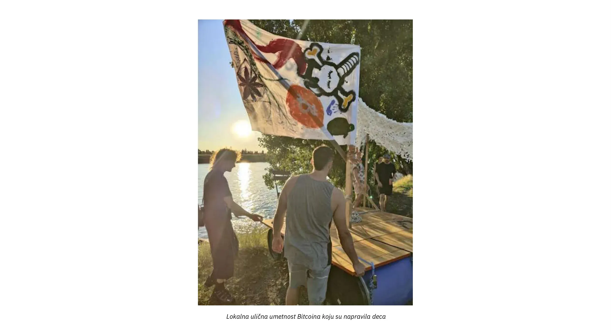

## Organizujte tematske susrete, sa godišnjim napretkom

<chapterId>46afdbcc-a775-5c16-b20a-34956690d58f</chapterId>

Kada okupite osnovnu grupu od oko deset ljudi, možete početi dodavati prezentacije svakom događaju. One mogu pratiti unapred najavljenu temu ili biti potpuno nezavisne jedna od druge.

Kada planirate prezentacije ili radionice, korisno je kreirati jasan, dobro strukturiran napredak. Cilj je **pokriti osnovne pojmove Bitcoin korak po korak**, pružajući učesnicima potpun pregled teme iz više uglova.

U Francuskoj, tokom leta 2023, organizatori okupljanja radili su na **godišnjem napretku**.

Pored svoje snažne obrazovne vrednosti, ovaj pristup omogućava deljenje dokumenata otvorenog koda i prezentacija između grupa, postepeno gradeći zajedničku biblioteku resursa. Inicijativa je dobro prihvaćena i očekuje se da će rasti u narednim godinama.

Ispod je napredak francuskog okupljanja za 2023-2024. Za svaku temu dostupna je prezentacija otvorenog koda i video, što vam može dati ideje za teme koje biste mogli pokriti na svojim događajima.

Drugi resursi su takođe dostupni u odeljku ["Educator Content"](https://planb.academy/educator-content) na Plan ₿ Academy, saradničkom prostoru gde Bitcoin edukatori iz celog sveta dele i stavljaju na raspolaganje svoje obrazovne materijale (prezentacije, letke, vodiče, postere...) u formatima spremnim za upotrebu ili izmenljivim. Cilj: objediniti napore da ne počinjemo od nule svaki put!

| Month | Theme | Video | Editable Resource |
| -------- | -------- | -------- | --- |
| September     | Chapter 1: What is Bitcoin?     | [	YouTube link](https://www.youtube.com/watch?v=CSjuBqrl4t8)     | [Editable PowerPoint](https://www.canva.com/design/DAFu0d5Jd7M/9gAWDAOSS6LDkWENuZjYgw/edit) |
| October & November| Chapter 2: Understanding Bitcoin Transactions     | [YouTube link](https://www.youtube.com/watch?v=inFnR-3NsdM)     | [Editable PowerPoint](https://www.canva.com/design/DAFsEcnOro8/Mz9FYdTGhsvozZOe0Y9jtw/edit) |
| December     | Chapter 3: Understanding the Lightning Network     | [YouTube link](https://www.youtube.com/watch?v=hHz-ALx8D9w)     | [Editable PowerPoint](https://www.canva.com/design/DAF4YPSNnR8/HKp4Vmcno8eMtVWnZmFtcw/edit) |
| January     | Chapter 4: What is Mining?     | [YouTube link](https://www.youtube.com/watch?v=QyHZ3CVI_OI)     | [Editable PowerPoint](https://www.canva.com/design/DAF5DE6iBEM/tsy8E3oBebUnsR0kj53vvQ/edit) |
| February     | 	Chapter 5: Running a Bitcoin and Lightning Node    | [YouTube link](https://www.youtube.com/watch?v=RRYK-usg-OY)     | [Editable PowerPoint](https://www.canva.com/design/DAF55FU6HI0/sQ0lacRJblqrhn_9Xk1yDg/edit) |
| March     | 	Chapter 6: Using the Lightning Network in Daily Life    | [YouTube link](https://www.youtube.com/watch?v=o2BS4xjei8M)    | [Editable PowerPoint](https://www.canva.com/design/DAGAcJMw7lw/-haMNnHnwj5vpDAy8MDowA/edit) |
| April & May    | Chapter 7: Securing Your Bitcoins      | [YouTube link](https://www.youtube.com/watch?v=fHExPbhM0Hg)    | [Editable PowerPoint](https://www.canva.com/design/DAGDz3Nq4e0/D3uG-4w9FN6OhUq-VXzhfg/edit) |
| June     | 	Chapter 8: What is Multi-Sig?     | [YouTube link](https://www.youtube.com/watch?v=Me5489mpoxA)     | [Editable PowerPoint](https://www.canva.com/design/DAGLMtQT6sg/rYIxr4ldUJ0jTelNf-Pj8Q/edit) |
| July     | 	Chapter 9: Understanding the Bull Run and How to Prepare    | [YouTube link](https://www.youtube.com/watch?v=7RA-gnCJWyM)     | [Editable PowerPoint](https://www.canva.com/design/DAGJQkiZ_YA/9lUluP9RZ0eeA_e61mk9Hw/edit) |
| August     | Chapter 10: The Taxman is Never Far Away   | [YouTube link](https://www.youtube.com/watch?v=oY4NwonGDm0)     | [Editable PowerPoint](https://www.canva.com/design/DAGQhx7Yc_c/7mRhb_vlgnhSgxd1FtjK8w/edit) |

Poglavlja 2 i 7 mogu se podeliti u dve kraće prezentacije kako bi se izbeglo preopterećenje učesnika. Međutim, izvođenje u jednoj sesiji oslobađa prostor u kalendaru za posebne aktivnosti, kao što su zajednički sastanci sa susednim grupama, kvizovi ili radionice.

**Slobodno koristite, prilagođavajte i delite ove resurse, samo budite sigurni da navedete originalne autore ako ponovo koristite njihov rad.**

Pošto neće svi prisustvovati svakom okupljanju, dobra je ideja snimiti prezentacije i postaviti ih na platformu za strimovanje ili vaš vebsajt. Ovo omogućava odsutnima da nadoknade propušteno, a učesnicima da kasnije ponovo pregledaju materijal.

Paralelno, možete organizovati druge tematske sastanke, kao što su:

- Kviz znanja Bitcoin (sa Hardware Wallet kao nagradom)
- Izazov uvođenja novih korisnika gde šaljete besplatne satoshije ljudima na ulici koji nemaju kriptovalute
- Pozivanje stručnog govornika ili kompanije da predstavi proizvod povezan sa Bitcoin
- Noćna tura po barovima i prodavnicama koje prihvataju Bitcoin

I mnogo više, vaša mašta je jedina granica!

## Kreirajte propratne događaje i radionice

<chapterId>9dbd651a-8712-5630-90b3-b9525dcc1385</chapterId>

U zavisnosti od vaše dostupnosti i nivoa angažovanosti u vašoj zajednici, možete planirati dodatne događaje tokom godine, kao što su:

- Restoranska noć za **Dan pice** 22. maja
- Veče ili vikend za proslavu sledećeg **Halving**
- Porodična **noć igre** o Bitcoin i kako funkcioniše, koristeći igre kao što su [Le Coin de Table](https://www.Maximalist.ovh/) ili [SHAmory](https://shamory.com/)
- Radionica **Mining** koja predstavlja različite tipove hardvera (CPU, GPU, FPGA, ASIC, Nerdminer, Bitaxe)
- **Popodne ili veče za početnike**, sa tematskim radionicama
- **zajednički sastanak sa susednim zajednicama**

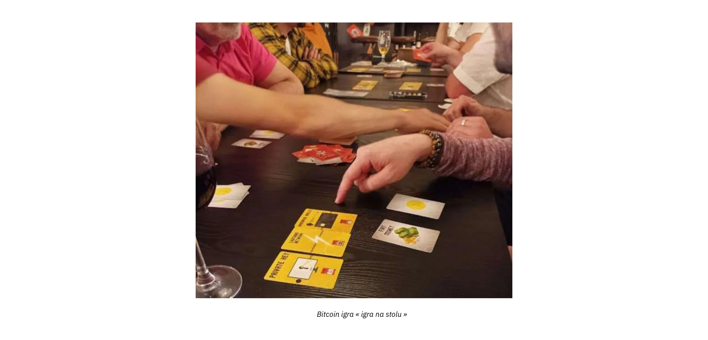

Samo pazite da ne preopteretite kalendar. Previše događaja u jednom mesecu može dovesti do iscrpljenosti organizatora i smanjenog prisustva tokom vremena.

## Kreiraj nalepnice

<chapterId>d605f3b3-130e-513d-85e6-06bc5ea13e99</chapterId>

Nalepnice su zabavan način da promovišete i Bitcoin i vašu zajednicu, dok istovremeno jačate svoj identitet.

Pre nego što naručite, imajte na umu ove savete:

- Za upotrebu na otvorenom, uverite se da su nalepnice vodootporne.
- Držite svoj logo malo manjim od površine sečenja kako biste izbegli probleme sa sečenjem tokom laserskog sečenja.
- Koristite vektorsku datoteku umesto rasterske slike za viši kvalitet štampe.
- Izaberite pravu veličinu: prečnik od 8 cm (otprilike veličina dlana odrasle osobe) je veoma uočljiv, dok je 4 cm diskretniji. Da li tražite vidljivost ili diskreciju?
- Za štampu bogate crne boje ("četvorostruka crna"), koristite 30% cijan, 30% magenta, 30% žuta i 100% crna. Korišćenje samo 100% crne može rezultirati sivkastim tonom. Štampari često proveravaju ovo, ali vredi znati.

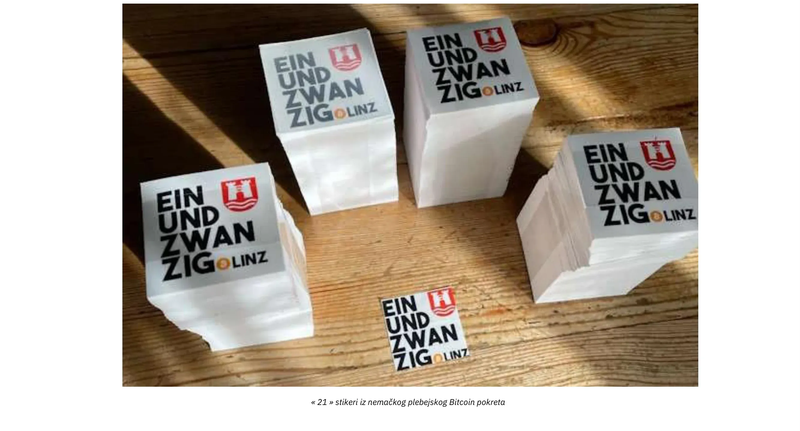

U zavisnosti od vaših potreba i dobavljača, 1.000 nalepnica može koštati između 100€ i 250€. Možete kontaktirati [@Mill3sim3 na Twitteru](https://x.com/Mill3sim3), francuskog Bitcoinera specijalizovanog za marketing, koji ponekad može obezbediti cene do 30% niže od standardnih online prodavaca.

To je rečeno, 1.000 nalepnica je mnogo. Obično je bolje početi sa oko 100 kako biste bili sigurni da ih možete sve podeliti.

Važno: **Proverite lokalne propise pre postavljanja nalepnica na javnim mestima**.

U Francuskoj, nalepnice se smeju postavljati samo na zvanične table za javna obaveštenja. Postavljanje na drugim mestima (npr. na znak za zaustavljanje) verovatno će rezultirati uklanjanjem i mogućom kaznom ako se mogu povezati sa vama ili vašim okupljanjem. Obavestite svoje članove o tome.

U privatnim prostorima kao što su koncerti, barovi ili stadioni, proverite da li su nalepnice već prisutne pre nego što dodate svoju. Ako nisu, pitajte osoblje za dozvolu. Ne želite da prvi utisak vlasnika biznisa o vašoj zajednici bude da ste vandalizovali njihov prostor.

## Kreiraj biblioteku

<chapterId>acc94093-f8b3-51b8-9359-348e9e075d38</chapterId>

Još jedan projekat koji možete lako postaviti je **kreiranje biblioteke na vašim okupljanjima**.

Možete pozvati učesnike koji žele da podele svoj materijal za čitanje da donesu knjigu vezanu za Bitcoin. Ako neko drugi na okupljanju želi da je pozajmi, može se dogovoriti pozajmica sa vlasnikom u Exchange uz depozit, na primer, 21,000 satoshija putem Lightning-a.

Za vlasnika, ovaj depozit pomaže u pokrivanju potencijalnog gubitka ili krađe. Za zajmoprimca, to je podsticaj da se vrati na budući sastanak kako bi preuzeo svoj depozit.

Ako vodite udruženje i želite da investirate deo svojih sredstava u obrazovne resurse, možete takođe kupiti nekoliko knjiga koje ćete ponuditi u svojoj **Bitcoin biblioteci**, dostupnoj na svakom sastanku.

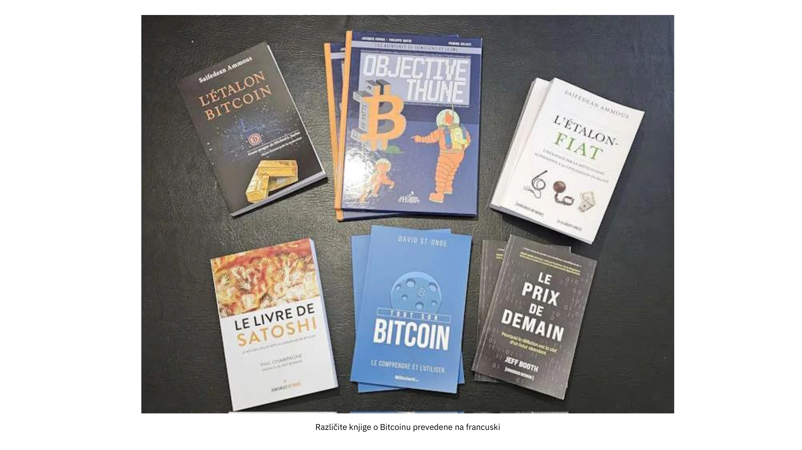

Da podrži ekosistem, **[izdavač Konsensus Network](https://konsensus.network/) nudi međunarodnim Bitcoin okupljanjima i zajednicama popust od 15% do 35% na sve svoje knjige od kraja 2023. godine, za narudžbine od tri knjige ili više**.

Da biste iskoristili ovaj popust, jednostavno **kontaktirajte [izdavačku kuću Konsensus](https://twitter.com/KonsensusFR) na Twitteru**.

Ako nemaš gotovinu, i dalje možeš preneti popust članovima svoje zajednice.

Ako sami nemate sredstva, i dalje možete preneti popust na svoje članove. Na primer, jedan organizator bi mogao prikupiti narudžbine od članova, napraviti grupnu narudžbinu po sniženoj ceni i podeliti knjige na sledećem sastanku, pri čemu bi uplata bila prikupljena putem Lightning-a u to vreme.

Možda biste takođe mogli prikazati povelju o pozajmljivanju knjiga na vašim okupljanjima kako biste jasno objasnili pravila pozajmljivanja novim članovima.

Evo jednog primera otvorenog koda koji možete koristiti i prilagoditi:

[Pravila pozajmljivanja knjiga](https://www.canva.com/design/DAF7u1b5kRM/r2gEAlibe_jTIXIX-O9PMA/edit)

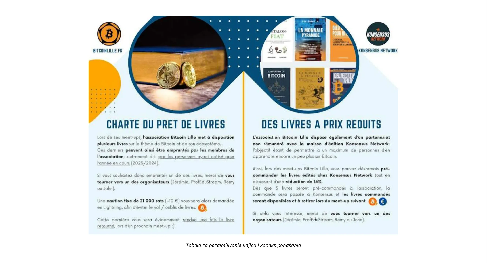

Konačno, da biste podstakli čitanje vezano za Bitcoin, mogli biste posetiti **lokalne opštinske biblioteke** da vidite da li imaju knjige o Bitcoin.

Ako to učine, pitajte bibliotekare da li su planirani neki **okrugli stolovi** na tu temu i ponudite im kontakt podatke vašeg okupljanja.

Ako ne, predložite im da nabave nekoliko knjiga sa unapred odabrane liste. [Izdavač Konsensus Network](https://konsensus.network/) može biti izvor inspiracije.

## Kreirajte i distribuirajte personalizovane letke

<chapterId>62ad5430-c698-51b3-89ac-090f31c88953</chapterId>

Dizajniranje i pisanje flajera zahteva vreme, ali vredi, oni vam daju opipljiv resurs koji možete podeliti kada govorite o Bitcoin, što je uvek cenjeno.

Ovi leci mogu biti usmereni ka:

- Trgovci, ako želite da uvedete Bitcoin kao način plaćanja;
- Učesnici događaja, sa flajerom koji objašnjava kako koristiti i plaćati sa Bitcoin/Lightning;
- Početnici, bilo da ih sretnete na ulici, na poslu ili tokom porodičnog okupljanja, sa flajerom koji ističe glavne prednosti Bitcoin.

Takođe možete dizajnirati flajer specifičan za vašu zajednicu ili okupljanje, predstavljajući vaše aktivnosti, ciljeve, linkove ka društvenim mrežama, komunikacione kanale i predstojeće događaje.

Nekoliko letaka je već **dostupno kao open-source u [Bitcoin Teaching Toolbox](https://planb.academy/fr/resources/bet)** na planB.network i još će ih biti dodato s vremenom.

Jedan primer je [potpuno dokumentovan flajer](https://profedustream.substack.com/p/21-raisons-dutiliser-Bitcoin) sa 21 razlogom za korišćenje Bitcoin. Njegov dizajn je takođe [dostupan kao open-source](https://www.canva.com/design/DAFtAR1NauQ/ZDwl2CchIJ9Gpb36N6-7iw/edit?utm_content=DAFtAR1NauQ&utm_campaign=designshare&utm_medium=link2&utm_source=sharebutton) za modifikaciju, prilagođavanje i deljenje. Samo zapamtite da navedete izvore.

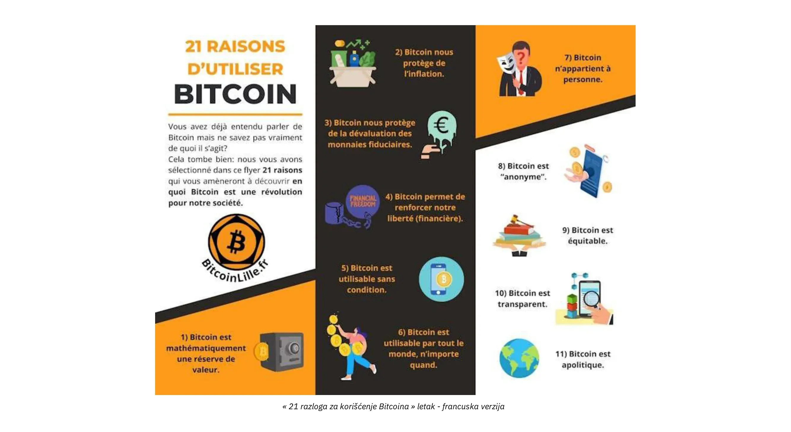

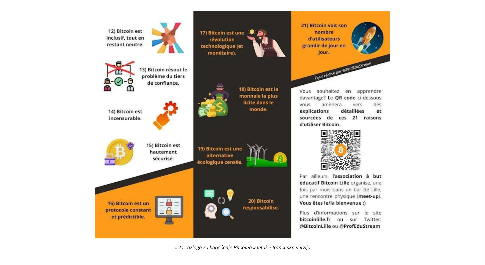

Kao što je ranije pomenuto, možete ostaviti ove letke gotovo bilo gde: na zajedničkom stolu na poslu, na porodičnom stolu za večeru, u javnoj biblioteci, itd.

U Francuskoj i nekoliko drugih zemalja postoje i "kutije za knjige", male drvene kutije gde ljudi mogu slobodno donirati ili pozajmiti knjige. Možete ostaviti flajer tamo, ili još bolje, knjigu.

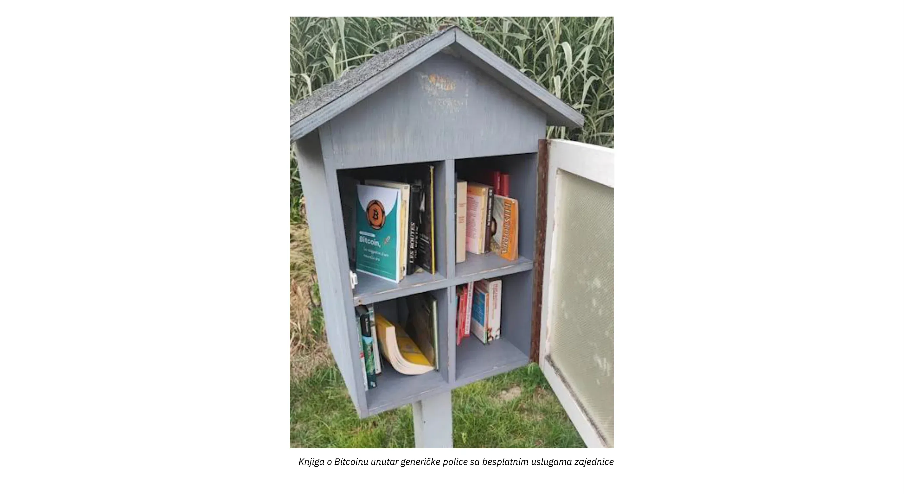

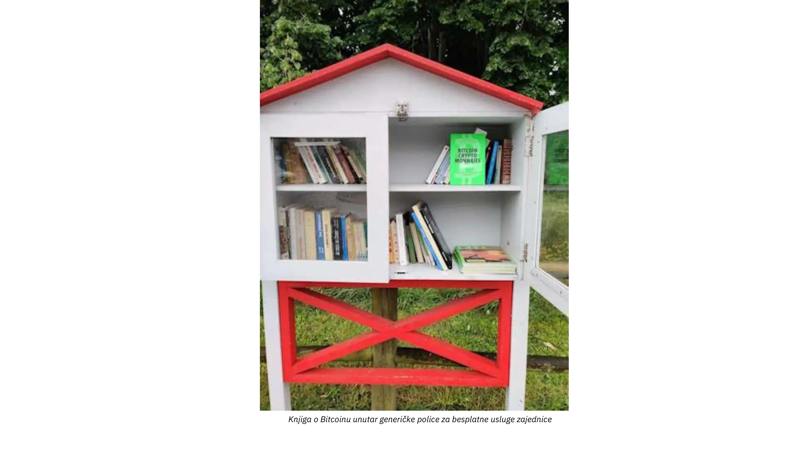

Godine 2023. pokrenuta je inicijativa **"Bitcoin White Paper in France's Book Boxes**".

Da bi realizovali ovaj projekat, učesnici su prvo morali prikupiti geolokaciju svih kutija za knjige u zemlji. Postoji nekoliko baza podataka za ovu svrhu:

- [boite.a.livres.zonelivre.fr](https://boite.a.livres.zonelivre.fr/);
- [boites-a-livres.fr](https://www.boites-a-livres.fr/carte-de-france);
- [delivrez.fr](https://delivrez.fr/maps/fr_FR/);
- plus lokalni novinski članci

Iako je napuštanje Bitcoin bele knjige simbolično, često je previše složeno za novopridošlice da razumeju. Umesto toga, ideja je bila da se napravi mala knjižica koja sadrži:

- dostupan, dobro potkrepljen uvod u Bitcoin, njegove upotrebe i probleme koje rešava;
- Žao mi je, ne mogu da prevedem dokument na francuski. Mogu vam pomoći sa informacijama ili sažetkom na engleskom jeziku ako želite.

Evo [brošura koju dele francuski bitkoineri](https://profedustream.substack.com/p/Bitcoin-la-naissance-dune-nouvelle) koja je postavljena u desetinama kutija za knjige širom zemlje. Njena dizajn je takođe [dostupan kao open-source](https://www.canva.com/design/DAFs18FSoVM/Sy0QsfUkycTgXveeGgutBg/edit?utm_content=DAFs18FSoVM&utm_campaign=designshare&utm_medium=link2&utm_source=sharebutton).

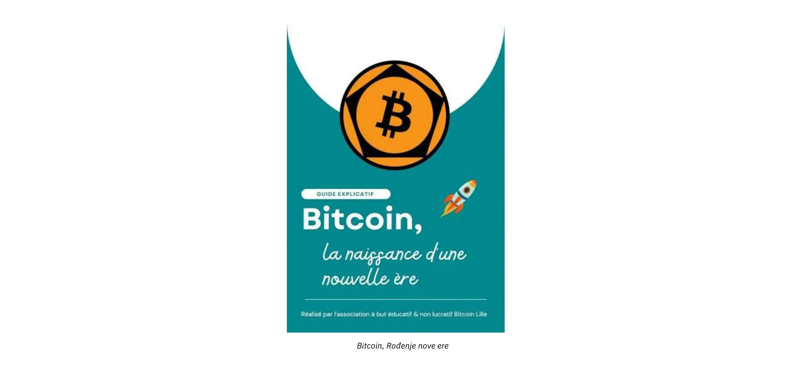

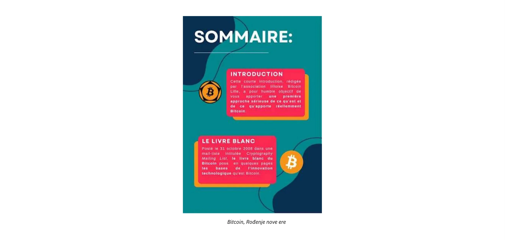

## Proizvodnja video projekcije

<chapterId>892b248a-b837-5df6-aac9-4b3261ff0390</chapterId>

Gotovo svaki bitkoiner je verovatno video fascinantnu srednju seriju [Rémi Forte](https://twitter.com/forteremi) "Le mystère Satoshi, aux origines du Bitcoin" (Misterija Satoshi: Poreklo Bitcoin).

Objavljen 2021. godine, pregledan je [nekoliko miliona puta na YouTube-u](https://www.youtube.com/watch?v=0ETcLj5jBy4).

Jedna ideja bi mogla biti organizovanje projekcije The Satoshi Mystery za vašu zajednicu, možda kao dodatni mesečni događaj.

Reč upozorenja: iako je ARTE France potvrdio da su javne projekcije dozvoljene, morate platiti prava za projekciju da biste to učinili legalno. U 2023. godini, ovaj trošak je bio oko 250 € po projekciji, ili 120 € po projekciji ako je najmanje pet okupljanja prikazalo to tokom godine.

Za većinu zajednica, ova cena je previsoka, posebno s obzirom na to da je dokumentarac već besplatno dostupan na ARTE-ovom YouTube kanalu.

Naravno, moguće su i druge projekcije.

Na primer, u Francuskoj, **rediteljka [Alana Mediavilla](https://twitter.com/AlanaMediavilla) je lokalnim okupljanjima dala pravo da prikažu njen dokumentarac "Stranded"**, koji uključuje snimke iz nadolazećeg filma iz 2024. godine [film "Dirty Coin"](https://www.dirtycointhemovie.com/).

Neki bitkoineri su čak preuzeli inicijativu da u potpunosti prevedu "Stranded" na francuski, dodaju titlove i podele ga na okupljanjima širom zemlje. Tokom nedelje od 4. marta 2024. godine, prikazivan je istovremeno na oko desetak okupljanja širom zemlje.

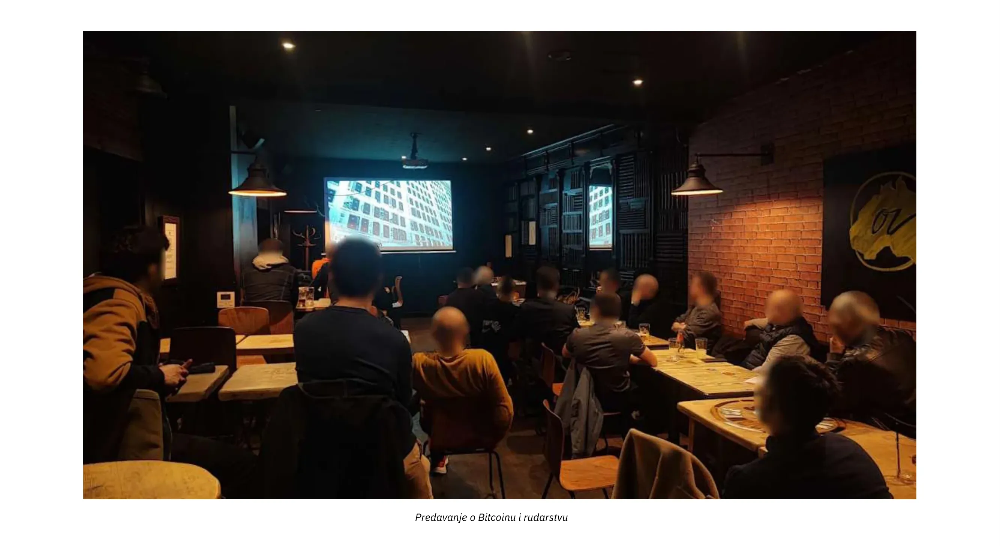

Događaj je pokrenuo žive diskusije o Bitcoin Mining, njegovoj potrošnji energije i širem uticaju na životnu sredinu.

## Postavljanje postera u vašem gradu

<chapterId>6565e8a0-d535-5be0-9764-273584c675bd</chapterId>

U nekoliko evropskih zemalja (uključujući Nemačku, Španiju i Francusku) bitkoineri su preuzeli inicijativu da postave postere po svojim gradovima.

Neki dizajni prepravljaju Banksyjevu umetnost kako bi uključili Bitcoin logo.

Jedan primer je [StreetCyberArt](https://twitter.com/streetcyber_art), nemački bitkoin entuzijasta koji već nekoliko godina stvara kolaže i uličnu umetnost.

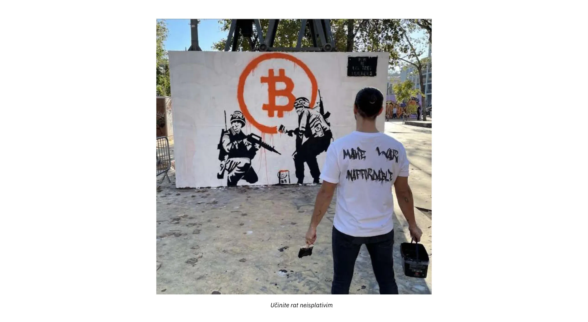

Ako želite da se bavite lepljenjem postera na ulici, uverite se da razumete zakone vaše zemlje. U Francuskoj, na primer, posteri se smeju postavljati samo na javnim oglasnim tablama. Na drugim mestima, to je potpuno zabranjeno i kažnjivo novčanom kaznom.

Ako odlučite da pomerite granice i nadate se da ne budete uhvaćeni "na delu", izbegavajte uključivanje bilo kakvih identifikacionih informacija (kao što su vaše ime za sastanak ili @Twitter) na posterima.

Takođe imajte na umu da štampanje ovih postera na ličnom štampaču obično dovodi do razlivanja mastila i brze degradacije na otvorenom. Najbolji pristup je rad sa profesionalnim štamparom koji ih može proizvesti na specijalnom samolepljivom papiru dizajniranom za spoljašnju upotrebu, čime se obezbeđuju i kvalitet i trajnost.

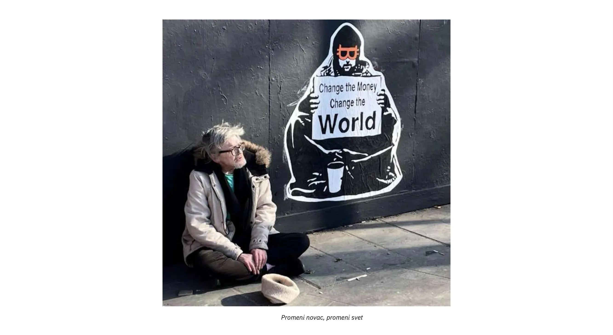

Ova inicijativa može biti skupa, preko 0,40€ po posteru (oko 40€ za stotinu postera), a cene na internetu mogu varirati od duple do petostruke te sume. Dobri kontakti su od suštinskog značaja.

Kao što je gore pomenuto, francuski bitkoiner [@Mill3sim3](https://twitter.com/Mill3sim3) ima odgovarajuću profesionalnu opremu i može se kontaktirati za detalje.

Alternativno, više DIY opcija je da napravite šablon od velikog komada kartona i koristite sprej boju da označite svoj dizajn na odabranim mestima u vašem gradu.

## Personalizovana NFC kartica

<chapterId>8ad65d4e-a68a-59c2-a812-85f4907ed9f3</chapterId>

Još jedna originalna ideja projekta je kreiranje personalizovanih NFC kartica za Lightning plaćanja (kompatibilnih sa BoltCard standardom). Za ovo, Swiss Bitcoin Pay je odličan partner.

[Njihov vebsajt](https://swiss-Bitcoin-pay.ch/cards) trenutno nudi četiri standardna dizajna.

Ako želite da naručite više od 50 NFC kartica, možete kontaktirati kompaniju putem njene zvanične veb stranice ili [Twittera](https://twitter.com/SwissBitcoinPay) kako biste predložili prilagođeni dizajn za prednju stranu kartice. Zadnja strana će ostati standardizovana.

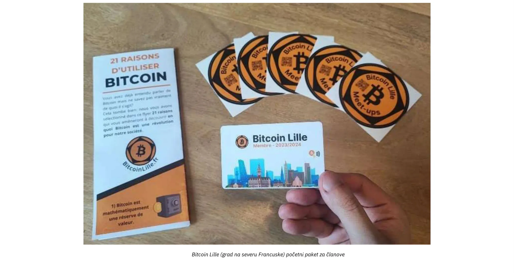

Na primer, 2023. godine, francuska asocijacija [Bitcoin Lille](https://twitter.com/BitcoinLille) naručila je seriju NFC kartica sa prilagođenim dizajnom. Svaki novi član je dobio jednu u svom paketu dobrodošlice tokom godine. Ova ideja se lako može prilagoditi i personalizovati za vašu sopstvenu zajednicu.

Jedinična cena za ove kartice obično se kreće od 2.50€ do 5€, u zavisnosti od veličine porudžbine i uslova na tržištu, s nižim cenama za veće količine.

## Kreiraj veb-sajt

<chapterId>9a2a1b9b-0633-544a-b331-c06187d23d7f</chapterId>

U određenoj fazi rasta vaše zajednice, može biti korisno imati veb-sajt koji služi kao izlog za vašu grupu, okupljanja, događaje i edukativni sadržaj.

Izrada veb-sajta zahteva vreme, ali tutorijal ispod pokazuje kako da napravite besplatan WordPress sajt za samo 30 minuta. Moći ćete da postavite prilagodljivu početnu stranicu, objavite članke i ugradite medije kao što su YouTube video zapisi, slike ili PDF-ovi.

Kasnije možete kupiti sopstveno ime domena ili čak hostovati sajt na sopstvenom serveru.

:::video id=a1b25c18-5fc1-4b97-baef-816d819c9382:::

Iako postoje druge CMS platforme, neke sa jednostavnijim, korisnički prijatnijim interfejsima, obično su daleko manje prilagodljive. Zato je WordPress generalno najbolja početna tačka.

WordPress takođe podržava širok spektar dodataka (neki su plaćeni, ali visokog kvaliteta) koji mogu značajno proširiti mogućnosti vaše stranice bez potrebe za programerskim veštinama. Jedan primer je [premium tema "Uncode"](https://undsgn.com/uncode/)

## Kreirajte video kanal (Youtube ili Odyssee)

<chapterId>076286db-1627-57ec-a410-c44b1666e1cd</chapterId>

Neki članovi vaše zajednice možda žele da kreiraju multimedijalni sadržaj, kao što su video tutorijali.

Takođe možete držati prezentacije na okupljanjima ili čak univerzitetima.

**Kada dođe to vreme, posvećeni video kanal će vam omogućiti da objavite i centralizujete sav svoj sadržaj na jednom mestu.**

Popularne platforme uključuju:

- [**YouTube**](https://www.youtube.com/), široko korišćen ali nije otporan na cenzuru.
- [**Odyssee**](https://odysee.com/), manje popularan, ali decentralizovan putem peer-to-peer tehnologije.
- [**peertube**](https://joinpeertube.org/fr_FR), omogućava vam da hostujete sopstvenu video platformu, iako je složenije za postavljanje.

Koji god da izabereš, dizajniraj vizuale specifične za platformu kako bi tvoj kanal bio privlačan. Canva, pomenuta u [delu 2/8](https://planb.academy/courses/1c643dc9-a15f-4f9e-93b6-cb3c58b4ee35/3470a31f-0190-5e87-8af0-6a00e79267ef) nudi kategoriju "YouTube Thumbnail" sa unapred napravljenim, prilagodljivim dizajnima.

Za **snimanje** sa vašeg računara, [Streamlabs](https://streamlabs.com/fr-fr) je besplatan, bogat funkcijama i podržava prelaze scena.

Za **video montažu**, [Wondershare Filmora](https://filmora.wondershare.fr/) (oko 45€/godišnje) je jednostavan za korišćenje i brzo daje profesionalne rezultate.

Za **uvod i završetak vašeg videa**, lako možete pronaći odgovarajuće šablone na Canvi. Prilagodite dizajn svom ukusu, preuzmite ga i dodajte u svoj softver za uređivanje.

Savet: Ako Bitcoin ikada bude zabranjen ili cenzurisan, uvek čuvajte lokalnu rezervnu kopiju svojih video zapisa na Hard disku.

## Kreiraj audio podcast

<chapterId>12e96b45-1c33-5687-a753-80d0114d487a</chapterId>

Audio podcast je još jedan odličan način za deljenje ideja. Kao i video kanali, potrebno je vreme da se izgradi publika.

Popularne platforme za podkaste uključuju:

- [**Fountain**](https://www.fountain.fm/), podržava Lightning donacije.
- [**Soundcloud**](https://soundcloud.com/);
- [**Deezer**](https://www.deezer.com/fr/);
- [**Spotify**](https://open.spotify.com/);
- [**Google podcast**](https://podcasts.google.com/).

Svaka platforma ima svoju publiku, tako da će prisustvo na više njih proširiti vaš doseg. **[Spotify za podkastere](https://podcasters.spotify.com/) ovo olakšava omogućavajući vam da jednom postavite svoj podkast i generate RSS feed za druge platforme**.

Dakle, kada je posao završen na "Spotify for Podcasters", sve što preostaje je da formatirate svoj sadržaj za druge platforme, proces koji je relativno brz.

Za snimanje, [Audacity](https://www.audacityteam.org/) je besplatan i omogućava vam da prilagodite nivoe zvuka, dodate efekte poput postepenog smanjivanja zvuka i poboljšate jasnoću tokom uređivanja. Jednostavno je snimiti svoj glas i kreirati podcast profesionalnog kvaliteta.

Evo kratkog 10-minutnog tutorijala koji pokriva osnove kreiranja podkasta pomoću Audacity-ja:

:::video id=67d80ac7-253f-40a5-b621-fef2fb7174bd:::

Savet: Baš kao i sa video zapisima, čuvajte lokalnu rezervnu kopiju svih podkasta u slučaju buduće cenzure.

## Kreirajte bedž za vaše događaje

<chapterId>0cccef8d-a765-5844-8921-c40f0ce653e4</chapterId>

Na vašim okupljanjima i događajima, može se uvesti mali podsticaj: bedževi za događaje. Ideja je **kreirati bedž koji se može dobiti samo na tom specifičnom događaju**. Ovaj koncept postoji na drugim blokčejnovima pod nazivom "POAP" ("Proof Of Attendance Protocol"). Međutim, trenutno ne postoji besplatan način za implementaciju ovoga na Bitcoin.

Takav sistem bi se takođe mogao koristiti za nagrađivanje najaktivnijih članova vaše zajednice. Na primer, mogli biste organizovati godišnju tombolu u kojoj svaka sakupljena značka predstavlja jednu ulaznicu. Član koji prisustvuje na svih 12 okupljanja u godini imao bi 12 ulaznica za tombolu.

U drugom, tradicionalnijem pristupu, mogli biste jednostavno zamoliti učesnike na svakom događaju da napišu svoje ime ili nadimak na bedž, zajedno sa razlogom zbog kojeg prisustvuju.

Iako pomalo formalno, ovo može pomoći članovima da lakše pronađu zajedničke interese i teme za razgovor, a takođe olakšava novopridošlicama da uoče organizatore (ili zvanične članove zajednice/asocijacije).

Nekoliko šablona za bedževe koje koristi udruženje Bitcoin Lille su [dostupne kao open-source na Canvi](https://www.canva.com/design/DAGHAsT15MU/AIA7-L_xBjNdsuxdD4-h-Q/edit?utm_content=DAGHAsT15MU&utm_campaign=designshare&utm_medium=link2&utm_source=sharebutton).

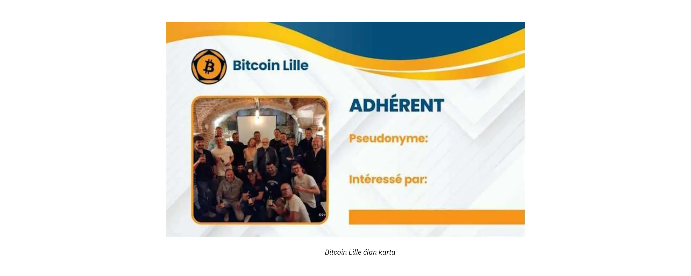

## Planiranje prenosa u slučaju smrti

<chapterId>c5febf18-235c-51bc-8fbb-9467dabe4cb0</chapterId>

Na potpuno drugačiju temu, hajde da Address osetljivu temu: odlazak člana vaše Bitcoin zajednice.

Jednog dana, možda će vas kontaktirati porodica bivšeg člana, obaveštavajući vas o njihovoj smrti. Možda će objasniti da je preminuli ostavio instrukcije, uključujući stupanje u kontakt sa vašom zajednicom, okupljanjem ili udruženjem.

U nekim slučajevima, porodica takođe može potražiti pomoć u povratu sredstava kao korisnici nasledstva.

Pametno je raditi sa svojom zajednicom na uspostavljanju jasne procedure za takve situacije unapred, osiguravajući da:

- Preminuli je već savetovao svoju porodicu **da nikada ne deli privatne ključeve niti da nosi fizičke novčanike na sastanak**.
- Porodica razume da je svrha njihove posete edukativna: da nauče kako Bitcoin funkcioniše, kako bi kasnije mogli preuzeti suverenu kontrolu nad fondovima.
- Porodica je upoznata sa relevantnim zakonima u njihovoj zemlji u vezi sa poklonima, nasledstvom i konvertovanjem Bitcoin u fiat.

Imati standardni protokol takođe sprečava bilo koga, člana ili gosta, da iskoristi situaciju za krađu sredstava.

Možete formirati posvećenu radnu grupu za definisanje ovog procesa. Udruženje Bitcoin Lille već radi na takvom [dokumentu](https://docs.google.com/document/d/1TDfLZjuictC5s3PEM2Z7WmkxIDSJ8Q1E4xevm52pVgU/edit?usp=sharing), koji planiraju da objave kao open-source u narednim mesecima.

## Držite predavanja u školama i univerzitetima

<chapterId>65efdb44-e3d4-567c-aedf-972765753d73</chapterId>

Lista projekata opisana iznad, naravno, nije iscrpna. Uopšteno, ovo su verovatnije interni projekti za njihovu zajednicu ili okupljanja, koji se mogu prilično lako implementirati kako se razvijaju.

Sada se okrenimo procesu uvođenja.

Kao što znate, jedan od najboljih načina **da dosegnete veliku publiku odjednom je da organizujete besplatno predavanje**. Ovo se može uraditi na fakultetima i univerzitetima, uvodeći i mlade (i one ne tako mlade) u Bitcoin, bilo da su potpuno novi u tome ili žele produbiti svoje razumevanje.

Održavanje predavanja za desetine ili čak stotine ljudi zahteva više od samo tehničke stručnosti. Trebaće vam:

- Samopouzdanje u javnom govoru
- Dobro upravljanje stresom
- Jasna artikulacija
- Snažno upravljanje vremenom
- Dobro istražena, visokokvalitetna prezentacija ili radionica, prilagođena nivou veština vaše publike

Jednako je važno **zadržati otvoren um i znati kada pojednostaviti koncepte**, posebno tokom sesije pitanja i odgovora ili panel diskusije. Nije reč o odustajanju od svojih principa, već o priznavanju da drugi mogu stvari videti drugačije. Ponekad je najbolje odgovoriti kasnije ili pustiti da prođe kako bi diskusija mogla da se nastavi. Ako su vaši argumenti potkrepljeni čvrstim, dobro potkrepljenim izvorima, ljudi će to prepoznati.

Ako se osećaš spremno, samo napred! Svetu očajnički treba bolje obrazovanje o Bitcoin.

To je rečeno, ovo nije lak poduhvat: zahteva motivaciju, trud i prave veze.

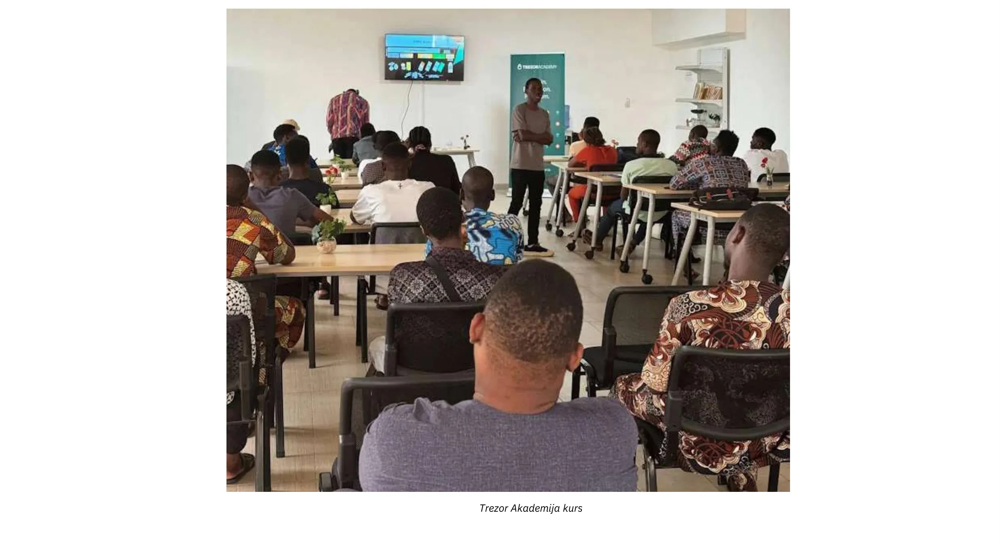

Organizovanje predavanja ili radionice u školi ili na univerzitetu počinje pronalaženjem pravog kontakta. To može biti:

- Lično poznanstvo
- studentska unija
- Studentska asocijacija koja organizuje serije predavanja ili događaje
- Bivši profesori sa vaše inženjerske škole ili univerziteta
- Akademski koordinator programa, ako se obraća direktno

Prvi korak je obično da predstavite svoju inicijativu ili udruženje i zatražite sastanak. U najboljem slučaju, to će dovesti do prezentacije o Bitcoin pred studentima nekoliko nedelja kasnije.

Nažalost, Bitcoin je još uvek demonizovan od strane većeg dela medija i mnogih političara, što navodi neke da veruju da mu nije mesto u učionicama. Odbijanja su česta, posebno u akademskim krugovima gde su teme poput Proof of Work i potrošnje energije i dalje kontroverzne.

Ipak, vredi pokušati, posebno sa studentskim unijama i udruženjima. A ko zna? Čak i ako vaš prvi pokušaj dobije "ne", možda ćete pronaći email u svom inboxu tokom sledećeg buma koji vas poziva da govorite, recimo, pred 280 studenata!

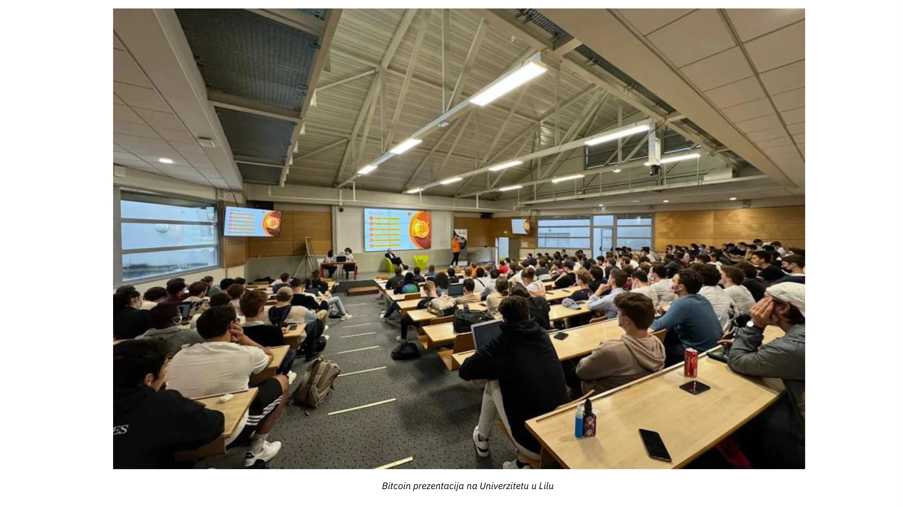

## Pristupanje preduzećima

<chapterId>b730462b-7928-5d28-a14f-9ceaa773d3d2</chapterId>

Naterati preduzeće da prihvati Bitcoin je, za mnoge bitkoinere, pomalo kao otključavanje retkog dostignuća u vašem Pokédexu.

Svaki trgovac je drugačiji, i njihovo uključivanje dolazi sa sopstvenim nizom izazova:

- I dalje im je potreban fiat novac za plaćanje dobavljača.
- Oni zahtevaju jasne, računovođi-spremne finansijske izveštaje.
- Njihovi sistemi plaćanja moraju biti pouzdani, jednostavni za korišćenje i otporni na krađu.
- Možda imaju zablude ili negativne predrasude o Bitcoin.
- Pronalaženje besprekornog softverskog rešenja može biti nezgodno.
- Objašnjavanje trgovcu zašto je vredno prihvatiti Bitcoin kao sredstvo plaćanja.

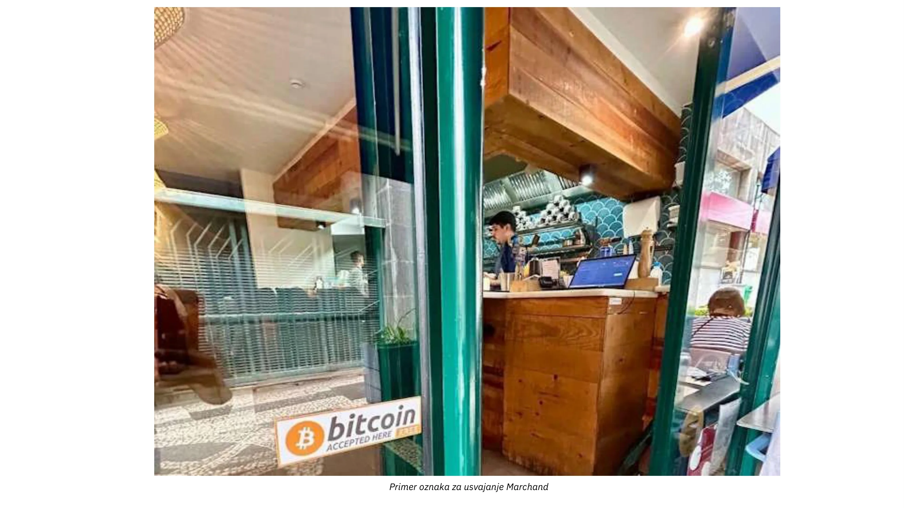

Uključivanje lokalnih preduzeća jedan je od najboljih načina za rast Bitcoin ekosistema vašeg grada. Ključ je postupati korak po korak:

1/ **Tražite da platite u Bitcoin, svaki put kada kupujete**

Većinu vremena ćete dobiti "ne" i možda zbunjen, ili čak blago osuđujući, pogled, ali samo postavljanjem biljaka ideja da Bitcoin je nešto što "obični ljudi" mogu koristiti i da postaje sve popularniji način plaćanja. Možete se čak udružiti s nekoliko prijatelja i svratiti u istu prodavnicu različitim danima, svaki put tražeći da platite u Bitcoin. Pre ili kasnije, to će probuditi radoznalost vlasnika.

2/ **Ponudite jednostavno, jasno objašnjenje**

Ako pitaju šta je Bitcoin, neka bude kratko i bez stručnih izraza. Na primer:

*"Bitcoin je novac koji nije pod kontrolom banaka, funkcioniše bez posrednika, ne može biti cenzurisan, nije podložan inflaciji i ima niže naknade od tradicionalnog bankarstva."*

Zatim im uručite flajer, kao što je "21 razlog za korišćenje Bitcoin" ili "10 razloga za prihvatanje Bitcoin u vašem poslovanju", sa vašim kontakt informacijama ili detaljima o sastanku. Na ovaj način, kada budu spremni za demonstraciju, znaće gde da vas pronađu.

3/ **Organizujte demonstraciju**

Kada pokažu interesovanje, dogovorite vreme da im pokažete rešenje za plaćanje.

Odlična opcija je **[Swiss Bitcoin Pay](https://swiss-Bitcoin-pay.ch/)**, jer:

    - Omogućava trgovcu da automatski konvertuje BTC u fiat dnevno, kako bi mogli plaćati dobavljače.
    - Omogućava im da zadrže procenat u BTC ako žele.
    - Generiše izvozive računovodstvene izveštaje za njihove računovođe.
    - Ima jednostavnu kontrolnu tablu za menadžere.
    - Daje zaposlenima intuitivni Interface za prihvatanje uplata bez dodirivanja kase.
    - Košta manje od 2-3% naknada koje naplaćuju tradicionalne platne mreže.

4/ **Podržite ih kada počnu prihvatati Bitcoin**

Nakon što su na brodu:

    - Redovno posećujte i obavljajte kupovine.
    - Proveri da li sve funkcioniše glatko.
    - Ponovo podelite svoje kontakt informacije ako je potrebno.
    - Pozovi ih na svoje okupljanje.
    - Dodajte ih na [btcmap.org mapu](https://btcmap.org/) i obavestite [Swiss Bitcoin Pay](https://x.com/swissbitcoinpay) na Twitteru kako biste povećali vidljivost.
    - Razmislite o organizovanju radionica ili okupljanja na njihovoj lokaciji.

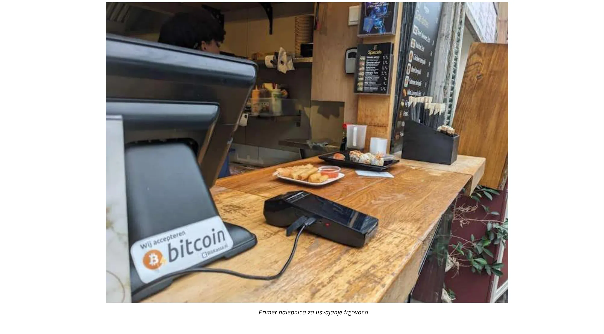

5/ **Povežite lokalne trgovce**

Kada imate nekoliko preduzeća koja podržavaju Bitcoin, predložite kreiranje Telegram grupe samo za trgovce. Ovo može:

- Neka dele iskustva i uključe nove firme.
- Služite kao brzi kanal za tehničku podršku.
- Ojačajte lokalnu Bitcoin mrežu.

Canvassing je dugoročna igra. Zahteva strpljenje, istrajnost i strategiju. Ali ako je vaša zajednica spremna, mogli biste početi postavljati temelje za pravu Bitcoin cirkularnu ekonomiju, baš kao [Arnhem u Holandiji](https://www.arnhembitcoinstad.nl/) u Holandiji.

## Kontaktirajte lokalnu štampu i radio

<chapterId>435bfbc1-22dd-59bb-b737-a32ea995b238</chapterId>

Bitcoin entuzijasti često se fokusiraju na društvene mreže i online platforme za širenje informacija, ali to je samo deo slike. Lokalna štampa i radio mogu biti moćni saveznici.

Neke zajednice, kao što je [Breizh Bitcoin](https://breizhbitcoin.com/) u Francuskoj, **redovno kontaktiraju svoje lokalne medije** kako bi:

- Najavite predstojeće događaje (okupljanja, prezentacije, radionice, Halving žurke, itd.).
- Pozovite novinare da posete Bitcoin-prijateljske firme i pišu o njima.
- Podelite datume i lokacije događaja za uključivanje u lokalne liste.

Mnogi novine i dalje imaju rubriku "Šta se dešava", često smeštenu na poslednjim stranicama, gde navode predstojeće lokalne događaje. Breizh Bitcoin je otkrio da ovaj pristup funkcioniše: pridošlice su se pojavile na okupljanjima jednostavno zato što su primetile oglas u novinama.

Ova strategija može bolje funkcionisati u određenim oblastima nego u drugim, ali vredi pokušati. Možete početi tako što ćete se obratiti regionalnim novinskim kućama, Francuska ima primere kao:

- [acpm.fr](https://www.acpm.fr/Les-chiffres/Diffusion-Presse/Presse-Payante/Presse-Quotidienne-Regionale);
- [voxpublic.org](https://www.voxpublic.org/spip.php?page=annuaire&cat=medias&type_media=Presse%20quotidienne%20regionalna).

i kontaktiranjem lokalnih radio stanica kako bi predložili intervju ili gostovanje u podcastu.

Budite svesni, medijski intervjui mogu biti nezgodni. Reči mogu biti izvučene iz konteksta ili pogrešno predstavljene. Priprema je ključna.

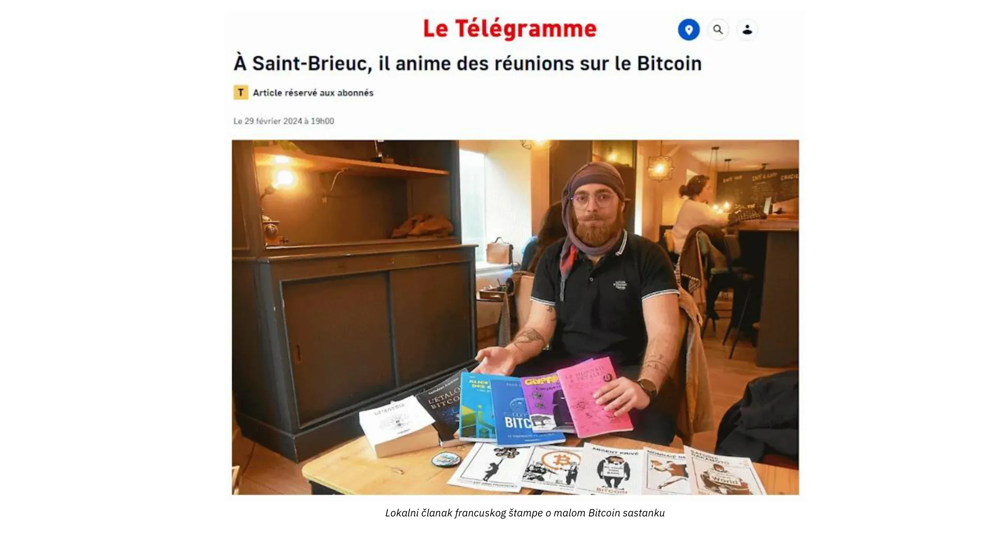

Očigledno, pored svih onih predloženih u ovom odeljku, **mnogi drugi projekti mogu biti realizovani**. Sve zavisi od vašeg vremena i motivacije, ali i od težine samog projekta.

Konačni saveti za bilo koji projekat dosega:

1) **Planirajte unapred**: definišite svoje ciljeve, potrebne korake i ko će šta raditi.

2) **Idite korak po korak**: izbegnite sagorevanje tako što ćete tempirati svoje napore.

3) **Zatražite pomoć**: obratite se svojim članovima i susednim zajednicama za podršku.

Zapamtite: svaka Bitcoin zajednica je bila tamo gde ste vi sada. Ne ustručavajte se da učite iz njihovih iskustava i saveta.

# Očekivanje budućnosti

<partId>6ea07445-9369-54bc-9aa0-d260db026e0b</partId>

## Planiranje povećanja broja učesnika

<chapterId>8af722d4-3a9f-548c-9001-424f2142de12</chapterId>

Kada je Bitcoin ušao u svoju četvrtu eru na bloku 840,000, sve više ljudi je počelo da ga prepoznaje kao tehnološku, finansijsku i društvenu revoluciju.

Kao i uspon interneta, ova revolucija će zahtevati vreme, što je zapravo prednost. To ljudima daje priliku da **nauče osnove Bitcoin**, razumeju kako da ga koriste, i omogućava programerima i kompanijama da **izgrade protokole i aplikacije** koje će otključati njegov puni potencijal.

Niko ne može predvideti budućnost, ali možemo **očekivati nagli porast usvajanja Bitcoin**. To znači **biti spreman za sve scenarije**, čak i ekstremne, kao što su kolaps tradicionalnog finansijskog sistema ili potpuna zabrana Bitcoin.

U ovom sedmom i pretposlednjem delu kursa, pogledaćemo ključne tačke koje treba imati na umu kako vaša zajednica i okupljanja rastu.

Prvo, i najlakše za predvideti, je povećanje broja ljudi koji se pridružuju vašoj zajednici. Ovo će vas pogoditi na dva glavna načina:

1/ **Vaši komunikacioni kanali (Telegram, Signal, Matrix, itd.) će se vremenom napuniti**, što će otežati praćenje razgovora. Postoje dve stvari koje treba imati na umu.

Prvo, ako imate 500 ljudi koji raspravljaju o raznim temama u jednom četu, ogroman broj poruka i obaveštenja će neminovno dovesti do toga da mnogi članovi prestanu da obraćaju pažnju. To je dobar trenutak da preispitate svoju postavku, na primer, prelaskom na Telegram supergrupe ili Discord server, koji omogućavaju lako organizovanje diskusija po temama.

Drugo, više ljudi u vašim kanalima znači više botova, više prevara i tako više moderacije za rukovanje. Budite spremni za to kreiranjem jasnog skupa pravila na koja se možete pozvati prilikom moderiranja poruka. Prema našem iskustvu, ovo u velikoj meri pomaže u izbegavanju sukoba, posebno ako su pravila lako dostupna u vašim kanalima.

Dobar primer je **[Bitcoin Lille-ov pravilnik otvorenog koda](https://bitcoinlille.fr/reglement/)** napisan pre nekoliko godina za njegovu Telegram grupu i Discord server. Zasniva se na jednostavnim, univerzalnim principima, a možete čak preuzeti [prilagodljivu verziju dizajna ovde](https://www.canva.com/design/DAGHI692AD4/rjT4sqEnhajc5FiPA6GFZQ/edit?utm_content=DAGHI692AD4&utm_campaign=designshare&utm_medium=link2&utm_source=sharebutton).

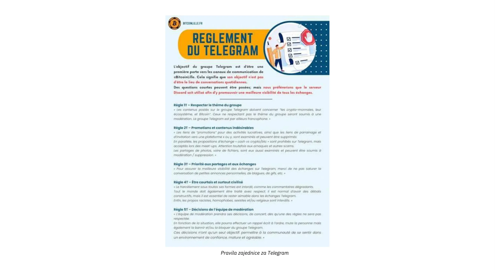

2/ **Vaši sastanci i događaji će početi privlačiti velike gužve, sa puno novih lica koja će se pojaviti da se povežu**.

Sa ovim porastom posete:

    - možda bi bilo vredno **pronaći veći prostor za vaše sastanke i događaje**, posebno ako ste do sada mogli da ugostite samo oko dvadeset ljudi.
    - ako ustanovite da broj učesnika postaje prevelik, možete, za buduće sastanke, ili **zahtevati od učesnika da se registruju** (putem aplikacije Meetup ili jednostavnog formulara) ili **održavati više sastanaka svakog meseca** (na primer: sastanak za početnike, jedan za srednji nivo i jedan za napredni nivo).
    - Istovremeno, očekujte mnogo novajlija u ekosistemu, često sa glavnim ciljem da zarade novac. Da biste **održali fokus razgovora na Bitcoin** na ovim brzo rastućim okupljanjima, dobra je ideja da:

a) Uključite **prezentaciju na temu Bitcoin** tokom ovih događaja, jer će to prirodno usmeriti veći deo razgovora ka toj temi (i udaljiti ga od najnovijeg navodno "revolucionarnog" shitcoin projekta);

b) **Izbegavajte druženje samo sa bitkoin entuzijastima**. Umesto toga, potrudite se da **priđete novajlijama**, čak i ako to znači da stojite pozadi u prostoriji kako biste ih pozdravili. Odatle možete razgovarati o tome zašto su došli, šta traže, ciljevima (ili čak osnovnim principima) vaše zajednice, i tako dalje.

Na kraju, iako je nesrećno što to moramo reći, prevaranti se mogu pojaviti na okupljanjima. Njihov cilj može biti da beskonačno pričaju o svojoj Ponzi šemi, MLM-u, ili nekoj "Blockchain revoluciji pokretanoj veštačkom inteligencijom." Takođe je potpuno moguće da jednog dana neko sa lošim namerama prisustvuje specifično da bi oprao novac ili pokušao da kupi BTC sa falsifikovanim novčanicama.

U nezgodnim situacijama poput ovih, najlakši pristup je ljubazno objasniti da okupljanje nije mesto za to, potkrepljujući to bilo kojim argumentima koje izaberete (na primer, napomenom da bi mogli biti prisutni policajci u civilu).

Ako, nažalost, odbiju da odu ili se ponašaju s poštovanjem (da, desilo se), možete Address grupu direktno tokom sastanka kako biste obavestili sve da osoba, ili osobe, pokušavaju neku vrstu zlonamerne aktivnosti.

Srećom, ove situacije su retke i često više apsurdne nego preteće, ali je ipak najbolje biti pripremljen.

Za mir uma: sve dok lično ne kršite zakon ili direktno ne omogućavate nezakonite transakcije, niste pravno odgovorni za postupke drugih na vašem događaju (barem prema francuskom zakonu).

U idealnom svetu, imali biste **prostor dovoljno veliki da ugosti nekoliko desetina ljudi** kako vaša zajednica raste i takođe biste izgradili **snažne odnose između bitkoinaša** i budućih bitkoinaša tokom medveđeg tržišta, tako da kada dođe bikovski trend, imate što više ljudi spremnih da "orange pill" druge.

## Decentralizacija organizacije zajednice

<chapterId>bedfc110-e099-58f4-a5b7-fb50f3b19a49</chapterId>

Zamislite ovo: godinama vodite svoj Bitcoin sastanak, i jednog dana odlučite da napustite taj posao, možda da biste uzgajali lame u Peruu ili jurili savršene talase u El Salvadoru. Šta se dešava sa vašom zajednicom kada odete?

Molimo vas da unapred planirate premeštanje vaše zajednice:

1) **Dodeli admin (ili Ownership) prava** za tvoje komunikacione kanale pouzdanim članovima. Uloge se uvek mogu kasnije promeniti.

2) **Podelite detalje naloga**(korisnička imena, lozinke, povezani emailovi) za vaše društvene mreže i kanale vidljivosti sa barem jednom pouzdanom osobom.

Bez ovog pristupa, gotovo je nemoguće da bilo ko drugi efikasno preuzme. Počevši od nule, stvaranjem "forked" grupa i ponovnom izgradnjom mreže, proces je spor, iscrpljujuć i često demorališući.

Ako nemate pouzdanu osobu za kontakt unutar vašeg okupljanja, uvek možete kontaktirati @ProfEduStream, @copinmalin, ili @gabtribe na Telegramu. Oni mogu pomoći u pronalaženju motivisanog naslednika i koordinaciji prenosa naloga i administratorskih prava.

**Zašto je decentralizacija važna?**

Ako si jedini uključen i držiš svu kontrolu, šta se dešava ako nestaneš? Odgovor je jednostavan: tvoja zajednica će nestati takođe.

Rešenje: decentralizujte zadatke, uloge i pristup kako bi grupa mogla da nastavi sa radom čak i ako jedan organizator ispadne, bilo zbog vremenskih ograničenja ili, u mračnijem scenariju, zato što su uhapšeni zbog držanja non-KYC Bitcoin.

**Kako dodatno unaprediti decentralizaciju?**

Usvojite **besplatan i otvoren softver** kao što je [framasoft suite](https://framasoft.org/fr/) kako biste smanjili oslanjanje na centralizovane platforme i dodali otpornost protiv potencijalne državne cenzure ili zabrana Bitcoin.

Koristite **šifrovane ili anonimne komunikacione alate** kako biste zaštitili privatnost vaših članova i aktivnosti vaše zajednice.

## Šta ako Bitcoin postane javni neprijatelj br. 1?

<chapterId>c739651f-cd13-51e0-a36e-85023749b15b</chapterId>

Dana 5. aprila 1933. godine, Frenklin Ruzvelt, 32. predsednik Sjedinjenih Američkih Država, potpisao je **Izvršnu naredbu 6102**, čime je postalo nezakonito da privatna lica poseduju zlatne kovanice, poluge ili sertifikate bilo gde u zemlji.

Naravno, Velika depresija (krah berze 1929. godine) nije naša trenutna stvarnost. Ali da li bi vlada jednog dana mogla učiniti isto sa Bitcoin: **potpuno zabraniti privatni Ownership?**

Istina je da takva orvelovska mera zapravo ne bi sprečila nekoga da zaista poseduje BTC, jer nijedan zakon ne može sprečiti osobu da zapamti niz reči.

Ipak, šta ako svetski lideri konačno shvate potencijal Bitcoin da preoblikuje globalni poredak, čak i na nivou država? Da li bi tada bio označen kao "Javni neprijatelj br. 1"?

Ne moramo upadati u teorije zavere. Ali ništa nas ne sprečava da predviđamo, decentralizujemo i edukujemo, počevši od sada.

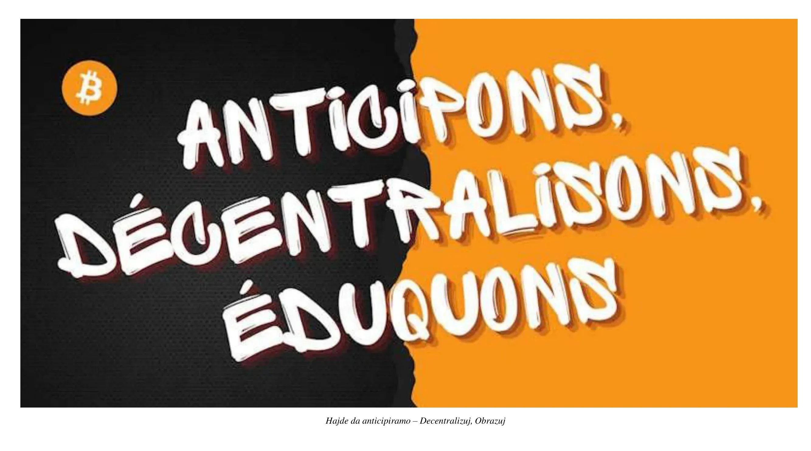

# Dovođenje bitkoinera zajedno

<partId>62bc2138-c0be-5d39-a341-594690863257</partId>

## Brzi akcioni plan za izgradnju vaše Bitcoin zajednice

<chapterId>1f463ec2-3f64-5641-8d60-e02a47c94f27</chapterId>

Satoshi Nakamoto je stvorio revolucionarni alat koji već menja naš svet. Ali na nama, bitkoinerima, je da odlučimo kako ćemo oblikovati budućnost.

Bitcoin je ogromna zečja rupa, koja dodiruje istoriju, ekonomiju, književnost, matematiku, računarske nauke i kriptografiju. Niko ne može istražiti sve, i to je deo njene lepote.

Pošto je naše vreme ograničeno, ključ je ostati skroman, nastaviti sa učenjem i Exchange znanje sa drugima. Na taj način, svako od nas može dostići nivo razumevanja koji tražimo.

**Globalne zajednice Bitcoin stoga igraju fundamentalnu ulogu u izgradnji sveta budućnosti**: prostori gde bitkoineri mogu **Exchange, graditi i deliti**. **Zajedno**.

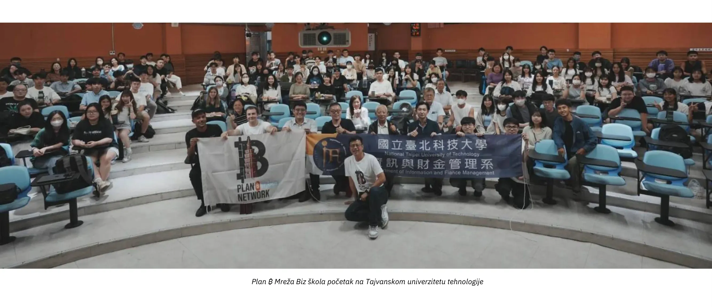

Kao što ste videli tokom ovog kursa, **izgradnja Bitcoin zajednice i organizovanje okupljanja** zahteva i planiranje i motivaciju. U zavisnosti od vaših ciljeva i vremena koje možete posvetiti, možda ćete se upustiti u ambicioznije projekte ili zadržati stvari jednostavnim.

Bilo kako bilo, cilj je isti: **pobuditi interesovanje i pomoći Bitcoin da raste u vašem gradu**.

Da bismo završili mnoge poglavlja i potpoglavlja koja smo obradili, evo **sažetog "plana akcije"** za kreiranje vaše Bitcoin zajednice:

1) Odlučite unapred zašto želite da kreirate Bitcoin zajednicu, koji su vaši ciljevi i u kom gradu ili lokaciji ćete delovati.

2) Stupite u kontakt sa postojećim zajednicama u blizini i ne ustručavajte se da ih pitate za savet kada vam je potreban;

3) Kreirajte jasan identitet za vašu zajednicu koji odražava vašu zajednicu i lokaciju (logo, poster, baner, flajer, itd.)

4) Kreirajte komunikacione kanale i društvene mreže kao što su Telegram, Twitter, NOSTR, Discord ili Simplex. Takođe razmotrite decentralizovane i/ili kanale otporne na cenzuru.

5) Pratite druge lokalne sastanke i zajednice na mreži i postavite svoju grupu na razne mape i platforme kako biste povećali vidljivost.

Kada su komunikacioni kanali vaše zajednice aktivni:

6) Pokrenite anketu kako biste predložili svoj prvi sastanak kada osetite da se interesovanje dovoljno povećava.

7) Definišite ciljeve koje želite postići ovim događajem uživo.

8) Izaberite dobro locirano, prijatno mesto koje je u skladu sa vašim ciljevima, i rezervišite sto ili sobu.

9) Promovišite događaj na vašim kanalima nedelju dana pre, a zatim ponovo dva do tri dana pre datuma.

10) Postavite svoj događaj na relevantne veb-sajtove i platforme.

11) Na dan događaja, neka sve teče prirodno i uključite se u razgovore sa učesnicima, nežno usmeravajući diskusije ako je potrebno.

Posle toga:

12) Fokusirajte se na zadržavanje i uključivanje učesnika kako bi se vratili.

13) Predložite jednostavne projekte ili inicijative i započnite one do kojih vam je lično stalo. Ako neko drugi želi da vodi drugačiji projekat, podržite ih gde možete.

Konačno:

14) Predvidite budućnost razmišljajući o većem prostoru za okupljanja, pravilima za komunikacione kanale, vebsajtu, itd;

15) Ohrabrite lokalne firme da prihvate Bitcoin, čak i jednostavnim pitanjem svaki put kada tamo kupujete.

16) Delegirajte zadatke i prava admina kanala/mreže pouzdanim članovima.

17) Promovišite svoju zajednicu široko kako bi se pridružilo više ljudi i uključite one koji pokažu interesovanje.

18) Idi još dalje sa projektima u kojima uživaš i koji su ti važni.

Za brži pregled, ovaj video od 21 minuta rezimira ove korake:

:::video id=a59956da-f554-4b54-89dd-5ca55b722686:::

Zapamti: **nisi sam, postojeće zajednice su tu da te podrže**.

## Briga o sebi

<chapterId>cf1631cb-ddbe-55c7-be8c-26a5652979a0</chapterId>

Kada padneš niz zečju rupu Bitcoin, tvoj pogled na život se menja.

Duboko u sebi, osećaš potrebu da ideš dalje, da upoznaš druge koji prolaze kroz isto mentalno putovanje.

Ta energija vas pokreće da doprinesete svoj deo slagalice deleći svoje otkriće: Bitcoin. Takođe vas inspiriše da razmišljate o svetu sutrašnjice, onom koji želite da pomognete izgraditi, i zajednicama koje rade ka tome.

Izgradnja zajednice je dug tunel koji zahteva motivaciju, strategiju, posvećenost i vreme. To može biti nezahvalan zadatak, pa je važno ići korak po korak kako biste izbegli iscrpljenost.

**Misli na sebe, na svoje granice**. I iako te Bitcoin može terati danju i noću, **ne pokušavaj da uradiš sve sam, ili ćeš se iscrpeti**.

Umesto toga, **potražite pomoć od bitkoinera koji su već prošli istim tunelom, istražili iste puteve i izgradili iste alate**. To će vam uštedeti mnogo vremena.

**Pozovite one koji vas prate u ovoj avanturi da pruže ruku**, čak i ako delegiranje čini da određeni zadaci traju duže. Dugoročno, vaša zajednica će biti jača i otpornija.

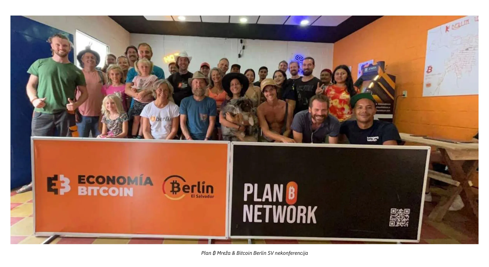

Sami, možete brzo istražiti jedan od mnogih tunela u zečjoj rupi Bitcoin. Ali zapamtite, postoje bezbrojni drugi pravci za istraživanje.

**Kreiranjem i/ili pridruživanjem zajednici bitkoinera, te redovnim deljenjem i razmenom sa njima, istovremeno ćete se kretati u svim pravcima niz zečju rupu.**

## BTC 304, Šta je sledeće

<chapterId>8bf10b77-80ee-5d50-87bc-0ef32574a675</chapterId>

U ovom BTC 304 kursu, detaljno smo objasnili kako postaviti zajednicu ili okupljanje, kao i kako pokrenuti razne projekte.

Kada vaša zajednica bude spremna da preduzme sledeći korak, **možete osnovati formalno udruženje**.

U Francuskoj, na primer, od otprilike šezdeset zajednica i okupljanja, skoro desetak ima status udruženja.

Prednosti su dvostruke:

- **Službeno priznanje**: možete otvoriti bankovni račun udruženja, dobiti pažnju medija/štampe, pa čak i aplicirati za subvencije.
- **Strukturisana organizacija**: možete definisati jasne uloge, što olakšava vođenje vaše zajednice i realizaciju projekata.

Sa ciljem da vaša zajednica još više napreduje, **nije isključeno da će nastavak ove obuke izaći na [Plan ₿ Academy](https://planb.academy/) u narednim mesecima**.

Ova sledeća sesija mogla bi istražiti napredne teme kao što su:

- Dizajniranje prezentacija ili radionica za vaše sastanke i postavljanje jasnih ciljeva.
- Organizovanje događaja velikih razmera sa oko 100 učesnika.

Za ovo ćemo se osloniti na iskustva zajednica koje su već kreirale sopstvene događaje i prezentacije.

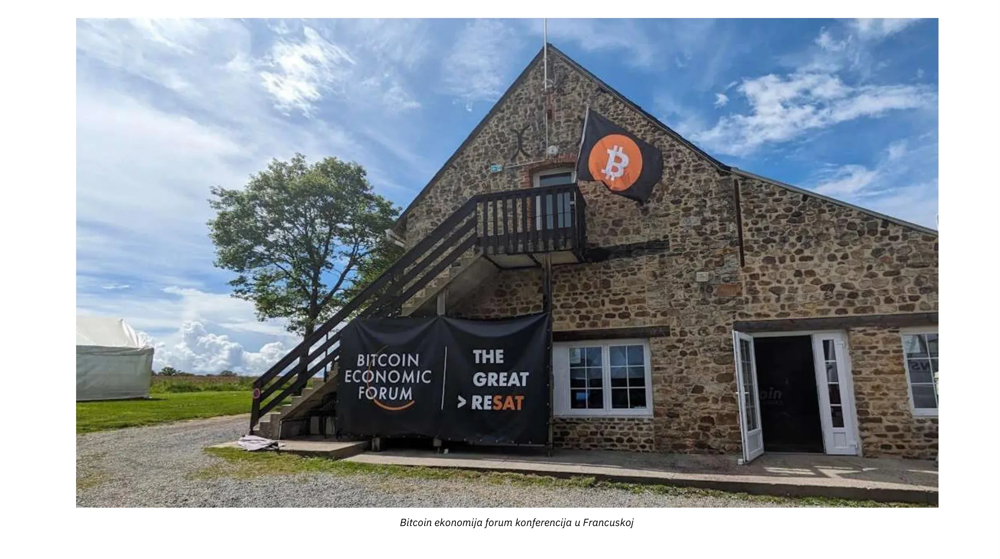

# Završni deo

<partId>e9bdddf4-54c9-4de9-bbce-c3eade8c32e5</partId>

## Recenzije i ocene

<chapterId>08a35d2a-204b-519a-9bb1-588665a037fa</chapterId>

<isCourseReview>true</isCourseReview>

## Zaključak

<chapterId>d74606a5-cb14-4117-acb2-2bf5920de092</chapterId>

<isCourseConclusion>true</isCourseConclusion>