# Det första steget mot Bitcoin-adoption

Idag kan vem som helst lära sig om Bitcoin online, men det som ofta saknas är möjligheten att träffas, utbyta idéer och bygga tillsammans. För att fylla denna lucka bildar många bitcoiners lokala gemenskaper, där möten ger upphov till workshops, presentationer och meningsfulla diskussioner.

I BTC304 kommer vi att titta på varför gemenskapsbyggande är viktigt, utforska verktyg för att skapa en stark visuell och digital identitet, och dela enkla open source-projekt som du kan starta. Vi kommer också att överväga hur lokala initiativ växer till nationella gemenskaper som kan hjälpa till att driva en hyperbitcoiniserad framtid.
+++
# Inledning

<partId>81318b8f-d316-5787-aa4c-4ec8370ba668</partId>

## Kursöversikt

<chapterId>e8991b82-4966-5e04-8f05-7cae46eacbaa</chapterId>

Välkommen till BTC302!

Sedan 2009 har Bitcoin vuxit obevekligt. Denna tillväxt har tagit form genom nya Bitcoin Improvement Proposals (BIP), skapandet av ytterligare lager för att göra nätverket skalbart (Lightning Network bland andra) och utvecklingen av flera företag och start-ups.

Dess utveckling är också tydlig i On-Chain, där antalet transaktioner stadigt ökar.

Mellan den 1 januari 2018 och den 1 januari 2024 beräknas till exempel antalet transaktioner på Bitcoin:s huvud Layer ha [ökat med 66,2 %] (https://dune.com/queries/3375917/5663935). Under tiden, mellan augusti 2021 och augusti 2023, ökade antalet offentliga transaktioner på Lightning Network [med 1 212%](https://river.com/learn/files/river-lightning-report-2023.pdf).

Denna betydande tillväxt är naturligtvis nära kopplad till:

- det [växande intresset hos människor runt om i världen för att använda Bitcoin] (https://profedustream.substack.com/p/21-raisons-dutiliser-Bitcoin), för att frigöra sig från banksystemet och/eller använda en mindre volatil eller mindre devalverad valuta, vilket är fallet för befolkningar i Libanon, Syrien, Egypten, Argentina och andra länder;
- dess prisuppgång över tiden, vilket etablerar den som en värdebevarare och en långsiktig investering, driven av den fasta penningpolitiken;
- den successiva tillväxten av den spekulativa kryptovalutamarknaden, särskilt under 2017-2018 och 2020-2021;
- Bitcoin:s växande närvaro i mainstream-media.

Bitcoin befinner sig fortfarande i ett tidigt skede, men denna verklighet, som du sannolikt redan är medveten om, får oss att fundera över två viktiga frågor:

- Hur kan vi uppmuntra Bitcoiners att gå längre i sin utbildning och sina projekt för att **fullt utnyttja Bitcoin:s potential**?

- Hur kan vi hjälpa nykomlingar, som ofta dras till kortsiktiga spekulationer, att undvika att förlora pengar på den senaste memecoin-galenskapen och istället fokusera på att **lär sig Bitcoin:s fundament**?

Den bästa lösningen på båda utmaningarna är enkel: **vara närvarande i den verkliga världen och utbilda**.

Syftet med den här kursen är att ge dig allt du behöver för att skapa och effektivt organisera en Bitcoin-community eller meet-up. Oavsett om du vill bygga upp ett lokalt initiativ eller utveckla en onlinegrupp kommer den här kursen att vägleda dig steg för steg: från att skapa din visuella identitet till att anordna regelbundna evenemang och hantera dina kommunikationskanaler.

**Avsnitt 1: Inledning**

Vi börjar med att belysa vikten av att förena människor kring Bitcoin, oavsett om det sker genom online-communities eller lokala möten. Du kommer att upptäcka varför och var du ska starta din egen community, tillsammans med hur du sätter upp tydliga mål för att främja dess tillväxt och långsiktiga hållbarhet.

**Avsnitt 2: Utforma en unik identitet för ditt Bitcoin-samhälle**

För att locka nya medlemmar och skapa en känsla av samhörighet är det viktigt att bygga en unik identitet. I det här avsnittet får du lära dig hur du utformar logotyper, affischer och banderoller som förkroppsligar andan i din Bitcoin-community.

**Avsnitt 3: Skapa kommunikationskanaler för din Bitcoin-community**

Kommunikation är ryggraden i alla samhällen. I det här avsnittet kommer vi att utforska de bästa kanalerna att använda och vägleda dig genom att effektivt sätta upp en Telegram-grupp eller Discord-server. Du får också lära dig hur du integrerar multifunktionella bots för att effektivisera communityhanteringen.

**Avsnitt 4: Starta dina sociala nätverk** (på franska)

Synlighet är nyckeln till att få din community att växa. I det här avsnittet får du lära dig hur du skapar en särskild Twitter-profil, ansluter till lokala möten och utnyttjar plattformar som btcmap.org för att öka din synlighet och locka nya medlemmar.

**Avsnitt 5: Organisera ett Bitcoin-möte**

Det här avsnittet handlar om hur man organiserar möten: från att välja rätt plats till att driva själva evenemanget. Vi utforskar också strategier för att bygga upp deltagarnas lojalitet och säkerställa din gemenskaps långsiktiga hållbarhet.

**Avsnitt 6: Exempel på projekt och initiativ** (på franska)

För att gå bortom enkla möten visar detta avsnitt konkreta och originella projekt: från evenemang och workshops med olika teman till skapande av utbildningsinnehåll och lokala samarbeten. Du får också lära dig hur du utformar både fysiskt och digitalt material för att marknadsföra din community.

**Avsnitt 7: Att förutse framtiden**

Här kommer vi att undersöka den naturliga utvecklingen av ditt samhälle: vad du ska göra om det växer för snabbt, hur du decentraliserar din organisation och hur du ska reagera på en fientlig regleringsmiljö. Detta avsnitt hjälper dig att förutse och övervinna dessa utmaningar.

**Avsnitt 8: Att föra samman bitcoinanvändare**

Det sista avsnittet handlar om kärnan i ditt projekt: att förena Bitcoin-entusiaster kring en gemensam vision. Du får lära dig hur du strukturerar ditt tillvägagångssätt för att locka och behålla medlemmar, delegera uppgifter effektivt och få din gemenskap att växa på ett hållbart sätt.

Är du redo att lära dig hur du bygger en stark, livlig Bitcoin-community? Låt oss dyka in!

## Varför starta ett Bitcoin-community eller en mötesplats?

<chapterId>893ea248-7d5a-5b8e-948c-7031497b1031</chapterId>

### Vad är skillnaden mellan ett community och en meet-up?

Det finns ingen strikt definition av dessa termer i Bitcoin:s ekosystem, men en community förstås bäst som en grupp människor som delar en gemensam passion och kommunicerar regelbundet.

Ett möte är å andra sidan ett evenemang som organiseras av och för den här gruppen, med ett specifikt syfte. Möten äger vanligtvis rum när en gemenskap redan är etablerad.

I den här kursen antar vi att du redan har kontakt med några personer som är intresserade av att hålla ett sådant evenemang innan du startar ett Bitcoin-möte, med andra ord finns **gemenskapen redan**.

### Varför skapa en Bitcoin-community?

Det finns flera anledningar till att skapa en Bitcoin-community:

- Kunskapsdelning och samarbete: Communities ger medlemmarna utrymme att Exchange idéer och dela kunskap. Ömsesidigt stöd är en viktig pelare för tillväxt, vilket gör det möjligt för alla att påskynda sitt lärande, särskilt relevant för Bitcoin, med tanke på hur mycket det finns att upptäcka.

- Uppbyggnad mellan jämlikar: Många initiativ och projekt utformas, byggs upp och utvecklas inom dessa gemenskaper.

Bitcoin-samfund strävar ofta efter bredare mål, särskilt allmän utbildning om:

1. Vad Bitcoin är;

2. Hur det fungerar;

3. Dess bidrag till samhället;

4. Avfärda vilseledande eller grundlösa påståenden från vissa offentliga personer och medier;

5. De grundläggande skillnaderna mellan Bitcoin och andra kryptovalutor;

Genom att bygga morgondagens första "citadeller" fungerar **Bitcoin-gemenskaper världen över som ett bålverk mot desinformation och censur samtidigt som de utgör en bördig grund för att lära sig Bitcoin:s grunder**. De erbjuder nykomlingar, även skeptiker, de resurser och kontakter som behövs för att utforska Bitcoin:s verkliga potential.

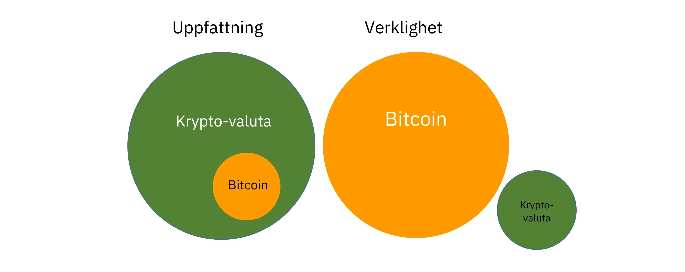

Det är också värt att notera att **en gemenskap kan existera helt online**, oavsett om det är en Telegram-grupp ("Bitcoin London"), en Facebook-grupp ("Bitcoin Berlin"), en Discord-server ("Bitcoin Madrid") eller till och med en e-postlista ("Bitcoin Frankrike").

Med andra ord, **en community behöver inte fysiska möten för att trivas eller starta projekt. Dess kärnsyfte förblir detsamma: att dela, bygga och utbilda**.

### Varför skapa en mötesplats?

Som tidigare nämnts kommer **möten vanligtvis efter att en gemenskap har etablerats och fungerar som ett komplement till den**.

När en bitcoiners resa utvecklas finns det ofta en önskan, eller till och med ett behov, **att träffa och interagera personligen med andra** från samma ekosystem. Detta kan komma från att känna sig isolerad eller helt enkelt inte ha någon att prata med om Bitcoin i det dagliga livet.

Meetups erbjuder en mer personlig och välkomnande upplevelse än ljud- eller videosamtal online. Oavsett om det är **över en drink eller en måltid** skapar de informella, vänliga utrymmen där människor kan Exchange idéer öppet och direkt.

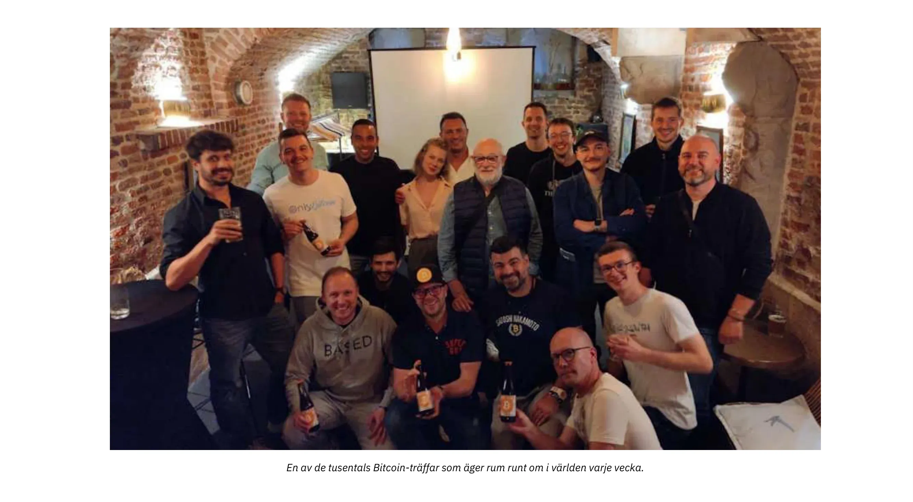

Bitcoin-möten kan tjäna många syften:

- Diskutera tekniska ämnen eller pågående projekt
- Hjälper nya bitcoinanvändare att gradvis dyka djupare in i Bitcoin-världen
- Tillkännagivande av nya projekt eller initiativ
- Utbyte av material eller böcker
- Visning av dokumentärer i förhandsgranskning
- Värdskap för konferenser eller workshops om specifika ämnen

Vi kommer att gå igenom många av dessa möjligheter i detalj i del 6/8 av den här kursen, med titeln "[Exempel på projekt och initiativ] (https://planb.academy/courses/1c643dc9-a15f-4f9e-93b6-cb3c58b4ee35/3213d87a-1998-5972-ab93-97a5769ba279).

Även om varje community är fritt att bilda sina egna åsikter, starta projekt och experimentera på sitt eget sätt, visar sig möten alltmer **väsentliga för Bitcoin:s utveckling och för bitcoiners tillväxt**. **Att organisera dem kräver tid och ansträngning**, vilket är anledningen till att den här kursen delar den kombinerade erfarenheten från [cirka sextio Bitcoin-communities i Frankrike och Belgien] (https://btcmap.org/communities/map#2/5.24949/0.20000) **för att hjälpa dig att bygga och växa din egen community och möten så smidigt som möjligt**.

## Var ska du skapa din community?

<chapterId>72da5285-5395-592d-ab62-303a0aef3d6d</chapterId>

Den första frågan att ställa sig är: var ska din community vara baserad?

Detta beslut är avgörande om du vill behålla möjligheten att organisera möten senare.

Om medlemmarna måste köra två timmar för att delta i ett evenemang kommer deltagandet sannolikt att vara lågt. Det är därför som valet av rätt **plats för ditt community, och därmed dina framtida möten, har stor inverkan på dess tillväxt**.

Några tips som kan vägleda dig i ditt beslut:

1/ **Skapa och utveckla din community i en medelstor eller stor stad**. Detta kommer att göra det lättare att:

    - Hitta trevliga mötesplatser för träffar och projekt (presentationer, workshops, främja adoption av Bitcoin osv;)
    - Öka känslan av engagemang och samhörighet hos ett större antal människor;
    - Förbättra tillgängligheten till evenemanget (kollektivtrafik, parkering etc.). Att välja en plats nära kollektivtrafik och parkering är starkt rekommenderat.

2/ **Välj ett namn som är kopplat till din stad**. Det gör det lätt för människor att identifiera sig med din kommun. Exempel: Bitcoin Paris, Einundzwanzig Berlin, Satoshi Spritz Milano, etc.

3/ **Kontrollera om det redan finns en mötesplats nära dig**.

Du kan kolla [btcmap.org](https://btcmap.org/communities/map#0/0/0/), som listar de flesta Bitcoin-communities och möten över hela världen.

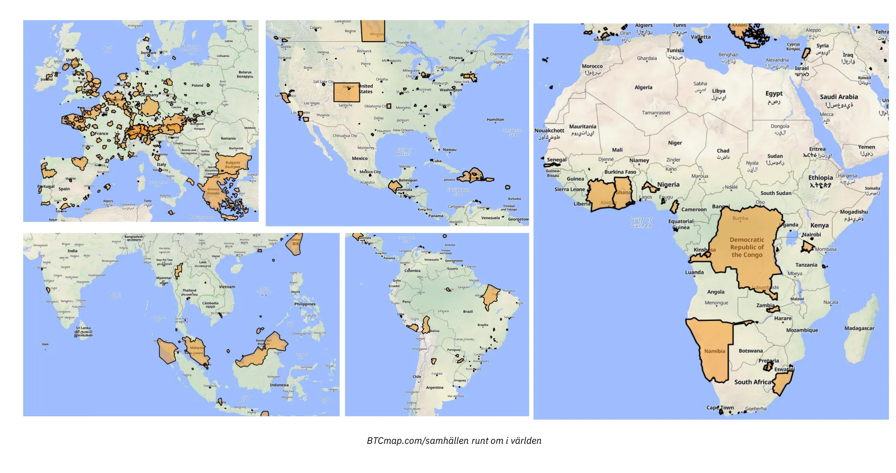

Efter lite efterforskningar kanske du hittar en befintlig mötesplats eller ett community i din stad.

Bitcoin är decentraliserat, så naturligtvis är vem som helst fri att göra som de vill.

Men **att gå samman är ofta mer meningsfullt än att dela upp närliggande samhällen och minska var och ens påverkan**. Att starta ett helt nytt samhälle där det redan finns ett kan oavsiktligt skapa konkurrens.

På så sätt kan en enkel "tumregel" vara till hjälp: om det inte finns något aktivt Bitcoin-community inom 30-45 minuter från där du bor, kan det vara värt att starta ett nytt. Med det sagt är du alltid fri att göra som du vill.

Och om en äldre community har "utvecklats" i en riktning som inte längre stämmer överens med dina värderingar, och du inte har tid eller motivation att "orangepilla" dem, är det naturligtvis alltid ett alternativ att skapa din egen Fork.

## Vilka mål ska vägleda ditt samhälle?

<chapterId>0aae1aa8-93ec-544a-ad88-22d32c619595</chapterId>

När du har identifierat staden (eller det geografiska området) för din community är det dags att **definiera vad du vill uppnå**.

Dessa mål kan sättas upp direkt vid lanseringen eller förfinas senare, när flera medlemmar har anslutit sig och din grupp är aktivt engagerad.

Här är några punkter som kan vägleda dig i ditt tänkande:

1/ ** Varför skapar jag denna gemenskap som en bitcoiner? ** Är det för att dela kunskap? Utbilda andra? Lära av mer erfarna kamrater? Möt likasinnade människor? Bli involverad i Bitcoin-ekosystemet? Få kontakt med yrkesverksamma? Eller bara ta en drink och få nya vänner?

Dina svar kommer att forma din positionering och motivation.

Om ditt mål är att **dela kunskap och utbilda människor om Bitcoin**, fokusera på att **skapa utbildningsinnehåll** (artiklar, podcasts, videor, presentationer, flygblad etc.), vilket sparar andra otaliga timmar av forskning. Du kan till och med gå ännu längre genom att **organisera workshops, presentationer och konferenser**.

Om ditt mål helt enkelt är att träffa andra bitcoinare och utbyta erfarenheter kan du ta det lite lugnare, som att träffas över en drink.

På så sätt kommer du lättare att skapa sociala band. Kom dock alltid ihåg att **dricka öl inte är rätt väg att gå för att bygga morgondagens värld**.

Det är därför **det är viktigt att sätta upp konkreta mål och projekt**.

2/ Ska jag ge mitt samhälle en **fysisk dimension**? Om ja, vilken typ av evenemang ska du anordna?

Ditt första evenemang kommer troligen att vara en meet-up. Dess huvudsyfte är att sammanföra bitcoinare i ditt område.

Men som vi kommer att se senare i [Exempel på projekt och initiativ] (https://planb.academy/courses/1c643dc9-a15f-4f9e-93b6-cb3c58b4ee35/3213d87a-1998-5972-ab93-97a5769ba279), **kan en träff byggas upp på många sätt, med många mål:**

- Kombinera nätverkande med en utbildningspresentation om ett Bitcoin-koncept;
- Håll en professionell demonstration av Bitcoin:s lösningar;
- Debattstrategier för lokala handlare med apelsinprickning;

och så vidare.

Beroende på ämnena (tekniska föredrag eller praktiska workshops) kan det till och med vara meningsfullt att **organisera ytterligare evenemang** utanför din vanliga mötesplats.

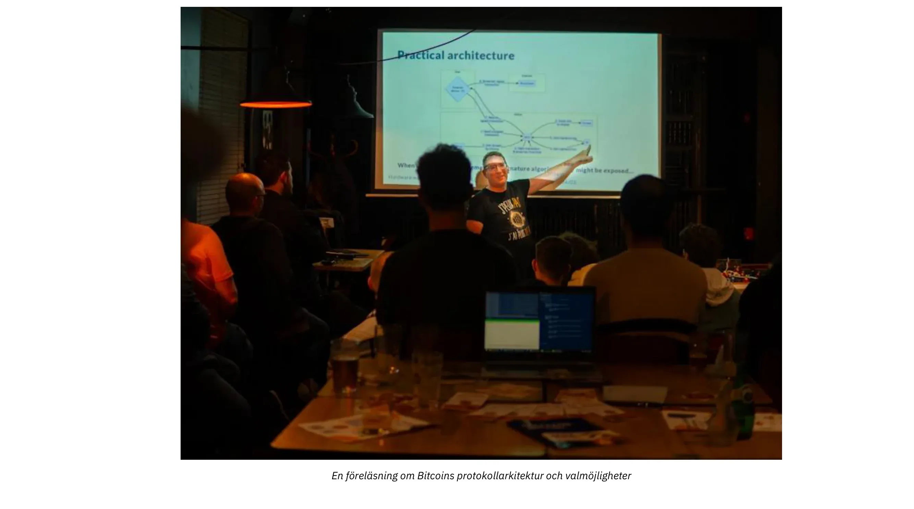

3/ Hur vill jag att min community ska bidra till Bitcoin:s ekosystem?

Det här är en mer avancerad fråga, men den är värd att fundera på i ett tidigt skede.

Om din vision är att **skapa ett sammansvetsat, motiverat samhälle** med fokus på att orangepilla så många människor som möjligt, då:

- Samarbeta med befintliga grupper för att få tillgång till bredare information, resurser med öppen källkod och värdefullt stöd när det behövs.
- Organisera och delegera uppgifter inom din grupp för att expandera och skala upp dina insatser på ett effektivt sätt.

**Sätta upp mål på kort, medellång och lång sikt**

Ett praktiskt sätt att planera är att sätta upp mål för varje tidsram:

- Kortsiktigt: bygga upp en närvaro på sociala medier och inrätta kommunikationskanaler för samhället.
- Medellång sikt: skapa utbildningsresurser (artiklar, flygblad, videor).
- Långsiktigt: starta regelbundna fysiska möten.

När möten har etablerats kan du sikta på:

- Kortsiktigt: anordna workshops eller presentationer om specifika ämnen
- Medellång sikt: genomföra Bitcoin medvetandehöjande kampanjer eller utbildningskampanjer
- Långsiktigt: skapa en formell association eller ett partnerskap med en bar som accepterar Bitcoin som betalning.

Var beredd: **att bygga en gemenskap kräver ansträngning**

Att skapa en gemenskap sker inte över en natt. Det tar tid, motivation och organisation.

Ibland kan det till och med kännas nedslående, särskilt när ingen dyker upp och man känner sig som den enda som bär uppdraget på sina axlar.

Det är därför **den här kursen är utformad för att dela värdefulla resurser och tips, hjälpa samhällen att växa effektivt och så småningom bli självförsörjande.**.

# Utforma en samhällsidentitet Bitcoin

<partId>da6673ad-bf49-5979-80a6-3f69cfb28046</partId>

## Varför och hur kan du skapa din egen identitet?

<chapterId>b48a18cc-afdf-5216-802c-32647b5cd8a3</chapterId>

I detta skede antar vi att:

- Du vet redan var din community (eller framtida regelbundna mötesplats) kommer att vara baserad.
- Du har satt upp mål för olika tidshorisonter, även om de ännu inte är slutgiltiga.

Nästa steg i uppbyggnaden av din community är att **definiera dess identitet**, både dess namn och dess visuella stil.

I det här avsnittet finns handledningar och nybörjarvänliga programvarulösningar som hjälper dig att utforma din kommuns visuella identitet, även med nybörjarkunskaper.

**Varför är identitet viktigt?**

Människor känner sig mer engagerade och delaktiga när de kan identifiera sig med en grupp. En stark identitet hjälper ditt samhälle att sticka ut och främjar en känsla av tillhörighet.

Allt börjar med att välja ett namn, och varje land har ofta sina egna trender:

- Frankrike: De flesta av de 60+ lokala samhällena använder namn som "Bitcoin [CITY]" eller "[CITY] Bitcoin". Deras Telegram-grupper följer ofta detta mönster: "Bitcoin [CITY] meetup".
- Tyskland: Initiativet Einundzwanzig (som betyder "21") inspirerade till namn som "Einundzwanzig [CITY]".
- Italien: Satoshi Spritz-nätverket använder namn som Satoshi "Spritz [CITY]".

**Varje samhälle har sin egen identitet, kopplad till sin hemstad, men också till landets bredare identitet**.

Din visuella identitet: logotyp, färger, banderoller, är det som människor kommer att minnas och associera med din grupp.

När du skapar konton på sociala medier och kommunikationskanaler är det ett stort plus att ha en logotyp och en banner. Oroa dig inte, du behöver inte professionella designfärdigheter; gratis och lättanvända verktyg finns tillgängliga.

En bra utgångspunkt är att införliva ett landmärke eller en symbol från din stad. I Paris kan detta vara Eiffeltornet. I Lille kan det vara klockstapeln eller citadellet. I New York kan det vara Frihetsgudinnan. I London Big Ben och så vidare.

Därefter kan du designa antingen en enkel eller mer detaljerad logotyp, beroende på vad du föredrar.

För att ge dig några idéer, här är några exempel på franska samhällslogotyper:

- I Marseille representerar logotypen basilikan Notre-Dame-de-la-Garde, som har utsikt över staden:

- I Monaco syftar det på den monegaskiska klippan:

- I Lille representerar den eleganta logotypen Vaubans citadell och dess park:

- I Saint-Malo är hermelinen - stadens emblem - framhävd:

**Gå vidare om du vill**

Om du blir inspirerad kan du ta det ännu längre: skapa ett vapen, ett motto eller till och med en sång för ditt samhälle. Det är bara din kreativitet som sätter gränser!

## Skapa en logotyp, affisch och banner

<chapterId>3470a31f-0190-5e87-8af0-6a00e79267ef</chapterId>

### Använda Canva

Du kan använda [Canva](https://www.canva.com/) för att skapa de olika bilderna för din community.

Denna kostnadsfria och lättanvända plattform är populär för sitt stora bibliotek med fördesignade mallar som du kan kopiera och anpassa med bara några få klick.

**Skapa din logotyp**

Sök efter fördesignade logotyper på Canvas startsida. Välj en eller flera som inspirerar dig, kopiera dem och anpassa dem sedan så att de passar ditt samhälle.

Du kan lägga till ett lokalt landmärke eller emblem i bakgrunden (importera ett foto eller sök på "Illustrationer" eller "Bilder" i Elements-menyn) och sedan lägga över Bitcoin-logotypen eller ₿ och justera färgen vid behov.

**Skapande av banners och affischer**

För att skapa en banderoll eller affisch kan du söka i Canvas bibliotek efter fördesignade mallar. När du har kopierat en mall kan du ändra text och typsnitt, lägga till din logotyp och importera foton med hjälp av ramar (sök efter "frame" i Elements-menyn).

Du kan också använda designmenyn för att utforska ytterligare modeller som passar dina behov.

För YouTube-miniatyrer eller banners söker du helt enkelt efter dessa mallar, duplicerar och anpassar dem efter önskemål.

Kort sagt, **möjligheterna är oändliga och formas inte bara av dina behov utan också av den visuella stil du vill skapa** för din gemenskap och dina möten / evenemang!

För att ge dig en tydligare uppfattning har vi inkluderat en icke uttömmande videohandledning som visar några av dessa möjligheter:

:::video id=d11ae0ed-eacd-4924-afd3-75aff95d2899:::

**Exempel på mallar från Bitcoin Lille**

Här finns färdiga Canva-mallar som du kan kopiera och anpassa till din organisation:

- Affisch för mötesannonsering (för sociala medier och A4/A3-utskrift): [länk](https://www.canva.com/design/DAGBvBXFJ8A/92-j_toeLU8QbVAD0NwoAA/edit?utm_content=DAGBvBXFJ8A&utm_campaign=designshare&utm_medium=link2&utm_source=sharebutton)

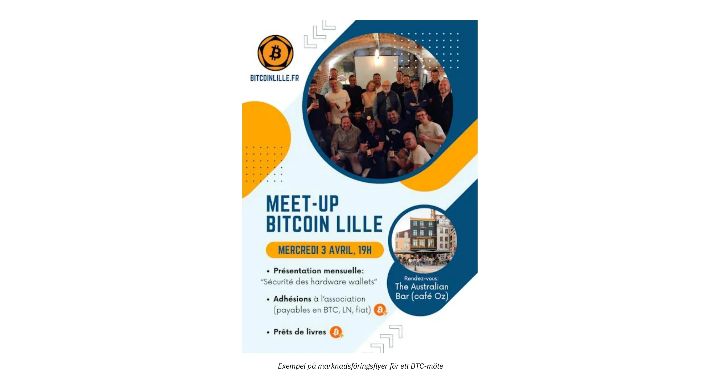

- **Evenemangsaffisch** (för sociala medier och A4/A3-utskrifter): [länk](https://www.canva.com/design/DAGBvG3rNCc/oXtNR9pduRs22AqclG4O2g/edit?utm_content=DAGBvG3rNCc&utm_campaign=designshare&utm_medium=link2&utm_source=sharebutton)

- **banners för sociala medier**: [länk](https://www.canva.com/design/DAGBvOXyNqw/iSJG9PbIQHgGWHz5PhlXSQ/edit?utm_content=DAGBvOXyNqw&utm_campaign=designshare&utm_medium=link2&utm_source=sharebutton)

- **Tillkännagivande av tävling**: [länk](https://www.canva.com/design/DAGBvIjuA_w/YzSUXzOmbNV9oCma9mluOw/edit?utm_content=DAGBvIjuA_w&utm_campaign=designshare&utm_medium=link2&utm_source=sharebutton)

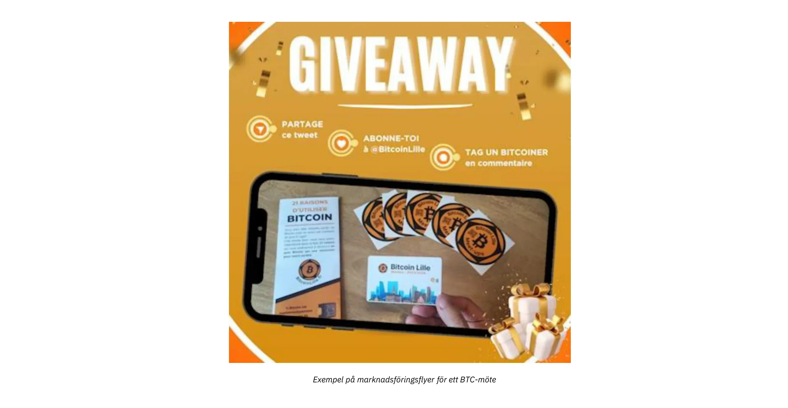

- **riktlinjer för varumärket** för vårt bibliotek, visas på A4 vid möten: [länk](https://www.canva.com/design/DAGBvPqL7N4/LmUItfsysypRLSOFOzBXcQ/edit?utm_content=DAGBvPqL7N4&utm_campaign=designshare&utm_medium=link2&utm_source=sharebutton)

- **PowerPoint-presentation** "Kapitel 2 - Förstå Bitcoin-transaktioner", av @ProfEduStream: [länk](https://www.canva.com/design/DAFsEcnOro8/Mz9FYdTGhsvozZOe0Y9jtw/edit?utm_content=DAFsEcnOro8&utm_campaign=designshare&utm_medium=link2&utm_source=sharebutton)

- flygblad **"21 skäl att använda Bitcoin"**, skrivet av @ProfEduStream: [länk](https://www.canva.com/design/DAFtAR1NauQ/ZDwl2CchIJ9Gpb36N6-7iw/edit?utm_content=DAFtAR1NauQ&utm_campaign=designshare&utm_medium=link2&utm_source=sharebutton)

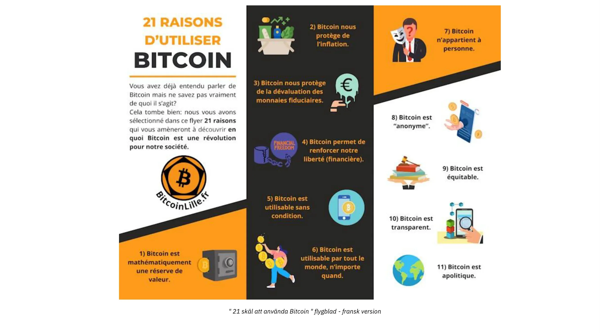

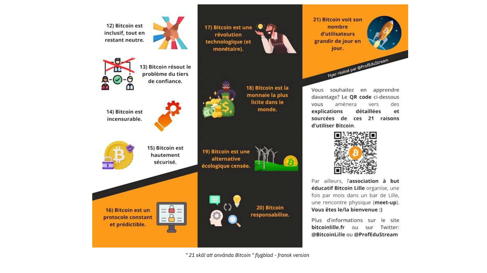

** Dela med dig av dina skapelser**

Möjligheterna är oändliga och din design kommer att bero på dina mål och din visuella identitet. Överväg att dela dina mallar i öppen källkod, det sparar tid för andra Bitcoin-communities som oundvikligen kommer att möta samma utmaningar som du. Genom att dela hjälper du till att påskynda tillväxten av Bitcoin-gemenskaper överallt.

**Rekommenderade mått**

När du skapar bilder ska du alltid kontrollera storlekskraven för varje plattform:

| Platform | Logo | Banner | Poster / Image
| -------- | -------- | -------- | -------- |
| Telegram     | 512 x 512     | N/A     | N/A     |
| Signal     | N/A     | N/A     | N/A     |
| Twitter     | 400 x 400     | 1500 x 500     | 1200 x 628     |
| Meet-up     | N/A     | N/A     | N/A     |
| Discord     | 512 x 512     | 960 x 540     | N/A     |
| Facebook     | 512 x 512     | 851 x 315     | 960 x 720     |

Vanligtvis lämpliga storlekar:

Logotyper: 512 x 512 pixlar

Banners: Varierar beroende på app eller webbplats

Affischer: A4 är det vanliga utskriftsformatet

### Använda artificiell intelligens

Canva erbjuder ett brett utbud av verktyg för att skapa logotyper, affischer, banderoller och flygblad, men det är inte det enda alternativet. Om du är mer bekväm med annan programvara (som Photoshop eller Illustrator) kan du använda det som fungerar bäst för dig.

Oavsett om du utformar en logotyp för ett samhälle eller förbättrar affischer, presentationer eller flygblad kan artificiell intelligens vara en kraftfull allierad för att skapa unika och tilltalande bilder.

Det finns ett antal AI:er tillgängliga för detta ändamål. Dessa inkluderar

- [midjourney](https://docs.midjourney.com/docs/quick-start) (betald);
- [leonardo](https://leonardo.ai/) (gratis, konto-begränsat);
- [copilot](https://copilot.microsoft.com/) (gratis, konto-begränsat);
- [DALL-E](https://www.dall-efree.com/) (betald).

Många andra AI-verktyg har dykt upp på senare tid, så den här listan är långt ifrån uttömmande.

**Exempel: Skapa en futuristisk Bitcoin London-logotyp**

Om du vill designa en futuristisk logotyp för en "Bitcoin London"-träff kan du fråga Copilot:

- [ ] *Prompt: Skapa en Bitcoin-logotyp med London Bridge och Big Ben i bakgrunden. Futuristisk* - [Länk](https://copilot.microsoft.com/images/create/un-logo-Bitcoin-futuriste-avec-en-arric3a8re-plan-le-/1-6612ba1758df4384bc33c4bca00ab45b?FORM=SYDBIC)

Om de fyra första resultaten inte är tillräckligt realistiska kan du förfina din begäran:

- [ ] *Prompt: Gör den 4:e mycket mer realistisk* - [Länk] (https://copilot.microsoft.com/images/create/un-logo-Bitcoin-futuriste-avec-en-arric3a8re-plan-le-/1-6612ba64b72d4cea9830ab7eb844f785?FORM=SYDBIC)

Det senaste resultatet blev fantastiskt!

**Exempel: Skapa en enkel logotyp i brittisk stil**

För en renare look, som för ett klistermärke:

- [ ] *Uppmaning: Skapa logotypen för "London Bitcoin Meetup" med en brittisk och ren stil* - [Länk](https://copilot.microsoft.com/images/create/logo-for-27londres-Bitcoin-meetup27-with-a-british-a/1-6612bb9451924859a6c34b350b3a6ebc?FORM=SYDBIC)

Resultatet ser riktigt häftigt ut!

**Tips för att arbeta med AI**

- Ha lite tålamod: AI kanske inte producerar exakt det du föreställer dig på första försöket.

- Använd exakta anvisningar: Ju tydligare och mer detaljerade instruktioner du ger, desto bättre blir resultatet.

- Be om hjälp: Om du inte är nöjd kan du kontakta någon som har erfarenhet av grafisk design eller AI-verktyg, många Bitcoiners hjälper gärna till, ibland till och med gratis eller för några Sats.

# Skapa kommunikationskanaler för din Bitcoin-grupp

<partId>fc588298-6876-554c-bd57-55d182464878</partId>

## Vilka kommunikationskanaler ska du välja?

<chapterId>b4f4eef6-1035-5290-848a-2b7f9391c77a</chapterId>

Som nämnts ovan kan en grupps kommunikationskanaler variera beroende på motiv och vanor.

I Frankrike, Tyskland och Italien är till exempel Telegram och Twitter de dominerande plattformarna och har blivit "standarden" för Bitcoin-communities.

I Tjeckien däremot använder många grupper **Matrix**, ett säkert protokoll för snabbmeddelanden, i stället för Telegram.

Tips: Innan du väljer dina kanaler, ** titta på vad närliggande samhällen gör**. Använd kartan [btcmap.org] (https://btcmap.org/communities/map#0/0/0/) för att se vilka plattformar som är mest populära i din region.

Till exempel använder schweiziska samfund främst Telegram, Twitter och sin egen webbplats:

**Rekommenderade kanaler för fransktalande samhällen**

- Telegram: Kommunikationsverktyget #1, över 90% av de franska mötesplatserna använder det.

- Twitter (X): Det viktigaste sociala nätverket som används av bitcoiners över hela världen. Det används av ~70% av de franska mötesplatserna. Det är idealiskt för att nå bitcoiners.

- Meetup.com: Avgiftsbelagd men används ofta (av ~30% av de franska mötesplatserna och nästan alla kanadensiska) för att öka synligheten utanför Bitcoin-ekosystemet.

- Andra alternativ: ~30% har också en webbplats; ~10% driver Discord-servrar eller NOSTR-konton.

Andra plattformar som Matrix, Keet, Signal, Facebook, Instagram och LinkedIn kan också användas. Tänk på att ju fler kanaler du hanterar, desto mer tid kommer du att lägga på att moderera, publicera och hålla dem aktiva.

Den som vill starta en community i Frankrike gör därför klokt i att börja med att skapa:

- en Telegram-grupp;
- ett Twitter-konto.

I takt med att din community växer kan du lägga till fler plattformar och delegera moderering till betrodda medlemmar.

## Skapa och konfigurera en Telegram-kanal, -grupp eller -supergrupp

<chapterId>d13714ce-8f08-53e9-bedd-b6a3aaac5dad</chapterId>

Innan du skapar din gemenskaps kommunikationsutrymme på Telegram är det viktigt att känna till skillnaden mellan:

- en Telegram-kanal;
- en Telegram-grupp;
- en supergrupp från Telegram.

Det är starkt rekommenderat att börja med en Telegram-grupp.

Om det behövs kan du senare konvertera den till en Supergroup.

För handledningarna nedan använde vi ursprungligen "Telegram +" APK, vilket möjliggör mer avancerad konfiguration. Du behöver dock inte nödvändigtvis det, eftersom den officiella Telegram-appen räcker för att skapa och hantera grupper, även via din telefon:

:::video id=b1da7cb4-5fb1-4a41-a1d4-bd90686826a9:::

### Skapa en Telegram-kanal

Om du vill skapa en plats där dina medlemmar kan prata direkt med varandra, svara på varandra osv. bör du kanske skapa en Telegram-grupp och inte en Telegram-kanal!

Gå direkt till nästa avsnitt med rubriken [Skapa en Telegramgrupp] (https://planb.academy/courses/1c643dc9-a15f-4f9e-93b6-cb3c58b4ee35/d13714ce-8f08-53e9-bedd-b6a3aaac5dad).

Faktum är att **en Telegram-kanal är mer som ett enkelriktat sändningsverktyg för administratörer**. Medlemmar kan inte chatta fritt, de kan bara reagera med emojis (eller lämna kommentarer i separata trådar, vilket fragmenterar konversationer).

**Eftersom communities behöver interaktion och samarbete rekommenderas inte en Telegram-kanal** om ditt mål är att bygga relationer och dela kunskap.

Handledning för att skapa en Telegram-kanal:

:::video id=98be4709-d221-4030-8c31-e10113482515:::

### Skapa en Telegram-grupp

Å andra sidan är **en Telegram-grupp perfekt för samhällen**: Precis som i meddelandeprogram som Messenger eller WhatsApp kan medlemmarna chatta och svara varandra i en enda delad konversation.

Vad du kan göra som administratör:

- Posta och fäst viktiga meddelanden.
- Skapa **polls** (användbart för att bestämma mötesdatum när din community är ny).
- skapa **egna inbjudningslänkar** (Endast om gruppen är "offentlig" och inte "privat", vilket definieras i inställningarna. Det är också praktiskt att ha en egen länk för Telegram-inbjudan, till exempel: t.me/Bitcoin[CITY]);
- Hantera medlemmars behörigheter, roller och moderering.
- Lägg till en profilbild (din community-logotyp) och uppdatera gruppens namn.

Handledning för att skapa en Telegram-grupp:

:::video id=3d4792a7-1345-475b-93b1-b3a3945fb567:::

Obs: Denna handledning gjordes med Telegram +, men du kan göra allt direkt från standard Telegram-mobilappen.

### Skapa en Telegram-supergrupp

Varför en supergrupp?

När din Telegram-grupp växer till hundratals medlemmar kan konversationerna bli kaotiska. Detta leder ofta till att medlemmarna missar viktiga meddelanden, som datumet för nästa möte.

Flera lösningar finns tillgängliga:

1. **Pinna viktiga meddelanden** så att alla medlemmar får ett meddelande (tryck en gång med fingret på meddelandet i fråga och välj sedan "Pin");

2. Överväg att använda **Discord** för flera kommunikationskanaler, där användarna kan stänga av ljudet för var och en vid behov.

3. **Konvertera din Telegram-grupp till en supergrupp**.

Vad är en Telegram-supergrupp?

En supergrupp är i princip en Telegram-grupp med ämnen (underkanaler) inuti den.

Exempel på ämnen:

- "Viktig information": endast viktiga uppdateringar och evenemangsmeddelanden.
- "Allmänt": för alla medlemsdiskussioner.
- Specifika ämnen: t.ex. Mining, projektutveckling, kommande konferenser.

Tips: Anpassa dina ämnen till din kommuns behov. Exempel: Abidjan Bitcoin Meet-up använder framgångsrikt detta format.

Tänk på att **Telegram-supergrupper kan vara lite knepiga att använda för vissa medlemmar**. Till exempel är det inte alla som vet **hur man kommer åt de olika ämnena** (de behöver bara trycka på grupplogotypen i Telegram-huvudmenyn för att se hela listan med ämnen). Att skicka en snabb skärmdump kan hjälpa till att reda ut eventuell förvirring.

Det finns ingen strikt regel för när du ska byta från en vanlig Telegram-grupp till en supergrupp, det beror helt på dina medlemmars behov. Den goda nyheten är att du enkelt kan växla fram och tillbaka: skapa helt enkelt ett ämne för att konvertera till en supergrupp eller ta bort alla ämnen utom "Allmänt" för att återgå till en vanlig grupp.

Handledning för att skapa en Telegram-supergrupp:

:::video id=f78800ae-d8ca-479a-b913-99abd9916bff:::

Snabb anmärkning: som nämnts tidigare gjordes handledningen ovan på en dator med hjälp av "Telegram +" APK. Idag är det dock enkelt att skapa en Telegram-supergrupp på din telefon.

Skapa bara en Telegram-grupp, gå till dess inställningar och tryck på knappen "Ämnen" för att lägga till ämnen. När du har sparat kommer du att se en lista med ämnen som du kan redigera som du vill.

Så det finns inget behov av att ladda ner "Telegram +" längre, såvida du inte vill ha tillgång till mer avancerade sekretessinställningar för din supergrupp.

## Skapa din Telegram-grupp eller supergrupp

<chapterId>35e674b3-5924-50b0-98f1-83a56c9a186d</chapterId>

Nu när din Telegram-grupp (eller supergrupp) är igång är det dags att **konfigurera behörigheter och ställa in moderering**.

Det står varje community fritt att välja sin egen strategi, men erfarenheten visar att det är **bäst att begränsa vissa medlemsbehörigheter**:

- Skickar en enkät;
- Skickar filer (för att undvika eventuella virus);
- Skicka röstmeddelanden;
- Lägga till användare (hjälper till att förhindra botinvasioner);
- Fästa meddelanden;
- Redigera gruppinformation.

Det rekommenderas starkt att **skriva en tydlig beskrivning av ditt möte** när du skapar din Telegram-grupp eller supergrupp, eftersom det är det första som potentiella medlemmar kommer att se. Till exempel:

> Välkommen till @Bitcoin:s Telegram [CITY] 🔥
>

> Vi anordnar en träff varje första onsdag i månaden på baren [BAR_NAME], i [CITY] 🍻
>

> Kolla in våra andra sociala nätverk: [LÄNK] 🌐

I det här exemplet har Bitcoin Lille-administratörerna anpassat sin offentliga Telegram-länk för enklare delning.

I "Group settings" kan det vara klokt att **aktivera "Approve new members"**.

Vissa Bitcoin Telegram-grupper har utsatts för tusentals falska konton som utformats för att skräpposta eller störa gemenskapen.

**Om du aktiverar medlemsgodkännande kan du rädda din grupp från en spamattack**

I avsnittet Administratörer kan du också aktivera funktionen "Aggressiv antispam" för att automatiskt radera misstänkta meddelanden.

Det är inte alltid nödvändigt, men kan ge ett extra Layer-skydd.

## Lägga till en multifunktionsbot till din Telegram-grupp

<chapterId>c61f69cc-15ec-53f1-8c02-1cea55def09e</chapterId>

**Ett annat alternativ för att konfigurera och säkra din Telegram-grupp eller supergrupp är att lägga till en multifunktionsbot**. Detta gör att du kan utöka din grupps funktioner och modereringsfunktioner avsevärt.

Med hjälp av **boten [@GroupHelpBot](https://telegram.me/grouphelpbot)** är de mest användbara alternativen:

- Ett **regelkommando** (/rules) för att visa dina riktlinjer för communityn;
- **Anti-spam**-skydd för att filtrera misstänkta meddelanden och konton;
- **Anpassningsbara automatiska välkomstmeddelanden** för nya medlemmar (med möjlighet till automatisk radering efter några minuter)
- **Skydd mot översvämningar** för att förhindra skräppost
- Ett **@administrator-kommando** för att snabbt nå gruppadministratörer
- **Blockeringsregler** för oönskat innehåll
- Ett **kommando för grupplänk** (/link)
- Kommando **hantering av behörigheter**
- **Automatisk radering** av specifika meddelandetyper
- **Botblockering** och **blockering av in- och utpassering** för att hålla din grupp säker
- Lista din **samhällsgrupps sociala nätverk** (/nätverk)
- Och mycket mer...

Otaliga ytterligare funktioner finns tillgängliga.

Proffstips: **Begränsa inte konversationen för mycket**.

Handledning för att lägga till en multifunktionsbot till en Telegram-grupp eller supergrupp:

:::video id=cdbf82d6-3530-45c4-90de-593f100863bb:::

(Obs: Hela denna process kan nu göras direkt från din telefon. Det finns inte längre något behov av Telegram + -appen.)

## Skapa en Discord-server

<chapterId>eef2a965-4c24-5f3a-8013-72cc7d315314</chapterId>

När din Telegram-grupp växer sig för stor kan det hjälpa till att organisera diskussioner genom att omvandla den till en Telegram-supergrupp.

Som tidigare nämnts kan dock **den ökade komplexiteten och ökningen av ämnen och meddelanden leda till att vissa aktiva medlemmar tappar intresset**.

Varför överväga Discord?

**Discord är ett alternativ** till en Telegram-supergrupp eftersom det gör det möjligt för användare att **skapa specifika text- och röstchattrum** och låta medlemmar stänga av kanaler som de inte är intresserade av.

Att hantera både Telegram och Discord kräver naturligtvis lite mer tid, särskilt under konfiguration och lansering.

För att göra det enklare för dig ** delar vi en [Discord-server som du kan duplicera och anpassa] (https://discord.com/template/bDY4eXXJk2C8)**:

:::video id=e647458a-a21e-44e0-bd03-20b82a871777:::

När den är väl utformad kan en Discord-server vara en verklig tillgång för ditt community. Många Bitcoiners använder redan **Discord** dagligen, och att kunna följa Telegram-konversationer direkt inom Discord (och vice versa) kan spara mycket tid för alla.

För att synkronisera båda plattformarna finns det en bot med öppen källkod som heter [TediCross] (https://github.com/TediCross/TediCross). Dess syfte är enkelt: vidarebefordra automatiskt meddelanden från en Discord-textkanal till en Telegram-grupp (eller ämne i en supergrupp) och vice versa.

Tänk dock på att det inte är det enklaste att installera. Du måste hålla en kommandotolk (CMD) igång på din dator för att boten ska fungera, och enstaka fel kan uppstå. Lyckligtvis är det enkelt att fixa det: starta bara om boten, och för det mesta går allt tillbaka till det normala.

För att spara tid, här är en handledning om hur du lägger till den här multifunktionsboten till en Telegram-grupp eller supergrupp:

:::video id=6a0283f6-6d6c-4e81-8b2f-644b33c52fe6:::

## Överväg alternativa, privata och säkrare kommunikationskanaler

<chapterId>29d0aad6-0612-5dd0-bcef-7337eaf4fefc</chapterId>

Som tidigare nämnts är Twitter och Telegram de mest använda kommunikationsverktygen för Bitcoin-grupper i Europa (om inte i hela världen).

Telegram är dock inte precis känt för att vara den säkraste eller mest integritetsfokuserade meddelandeappen, och Twitter, nu X, ägs av ett av de mest fritt rörliga företagen på planeten.

Det är därför som det kan vara värt att ta sig tid att utforska andra alternativ när dina huvudkanaler är på plats och saker och ting fungerar smidigt.

Under de kommande månaderna kommer den här kursen och planb.network-plattformen att erbjuda handledning i hur man använder alternativa protokoll som **Simplex och Element**: decentraliserade, krypterade och mycket anpassningsbara kommunikationsverktyg.

**Varför bry sig om att undersöka dessa alternativ?**

För precis som det sociala nätverket NOSTR ger de inte bara större integritet utan också ett skydd mot censur eller godtycklig avstängning av din Telegram-grupp.

Och vad kan egentligen vara mer i linje med andan i Bitcoin än att vara censurresistent och motståndskraftig genom design?

# Starta dina sociala nätverk

<partId>8ebf8cd7-9248-543f-bc27-4ec4cc03f9cf</partId>

## Vikten av synlighet för att få din Bitcoin-community att växa

<chapterId>b20f12e4-c5de-5f02-80c7-b7fc6cadd3ac</chapterId>

Så, din community är igång. Du har skapat ditt Telegram- eller Matrix-utrymme ... men för tillfället är du den enda där. **Dags att låta folk veta att du finns!**

Det är enkelt: om ingen kan komma åt din grupp och se när nästa möte äger rum, kommer du bara att posta i tomma intet. Det är därför sociala medier, och några specifika plattformar som vi kommer att ta upp senare, är så viktiga för att bygga upp din grupp.

Twitter (X) har blivit nästan synonymt med Bitcoin-konversation online. Det är inte perfekt, långt ifrån det, men det är för närvarande där en stor del av samhället samlas. Att skapa ett konto där rekommenderas starkt.

För att ligga steget före eventuell censur eller restriktioner öppnar vissa grupper också en NOSTR-profil.

Det är vad FREE Madeira-kollektivet har gjort.

Naturligtvis kan andra plattformar också vara användbara. Facebook (med antingen en grupp eller en sida), eller till och med LinkedIn.

Med det sagt, kom ihåg att **ju fler kommunikationskanaler och sociala nätverk du hanterar, desto mer tid kräver det**. Det är ofta bättre att fokusera **på de mest relevanta**, och Twitter (och NOSTR) är bra alternativ att börja med.

## Skapa en Twitter-profil

<chapterId>c8d73097-8eba-5530-918c-221002954110</chapterId>

Twitter är mycket lätt att använda, och för att förbättra din integritet behöver du justera några inställningar.

**När du skapar ett nytt Twitter-konto måste du ange fyra viktiga uppgifter:**:

1/ ** @ Twitter**, som definierar din identitet och gör dig lätt att hitta. Om din kommuns namn är "Bitcoin [CITY]" är det lämpligt att välja "@Bitcoin[CITY]";

2/ **den logotyp och banner** som du har skapat för din community eller mötesplats (se avsnitt [Skapa en logotyp, affisch och banner] (https://planb.academy/courses/1c643dc9-a15f-4f9e-93b6-cb3c58b4ee35/3470a31f-0190-5e87-8af0-6a00e79267ef));

3/ **beskrivningen**, som gör att du kan dela viktig information om ditt samhälle med några hundra tecken. Till exempel

> Officiellt konto för Bitcoin [CITY]-gemenskapen #BTC | Möten varje 1:a onsdag i månaden på [BAR_NAME] i [CITY] 🍻 | Gå med oss på Telegram 🔽

4/ Under den här beskrivningen är det möjligt att **införa en länk**. Den kan leda användarna till en sida för "sociala medier" på din communitys webbplats eller till din Telegram-kanal. Det är upp till dig att bestämma vad du vill lyfta fram.

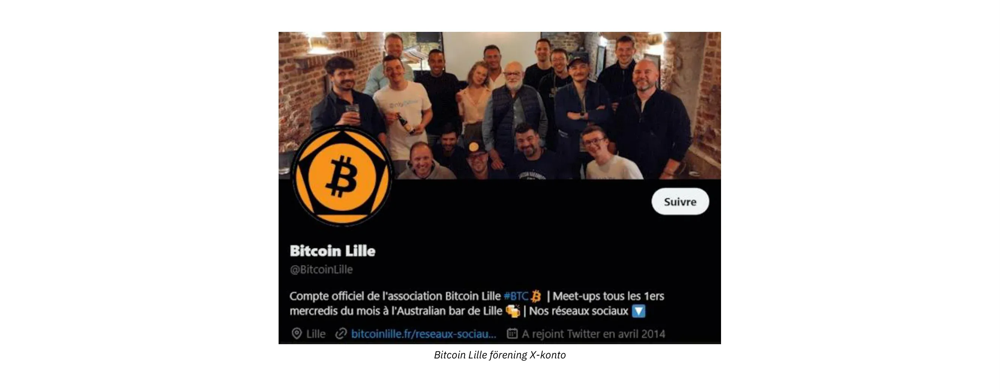

Dessutom finns det **några sekretessinställningar som är värda att justera**:

- lämna ditt Twitter-konto i "offentligt" läge (inlägg synliga för alla);
- gör att alla kan hitta dig;
- avaktivera platsspårning och datadelning med andra enheter (i sekretessinställningarna).

För varje evenemang kommer du sannolikt att använda Twitter för att dela med dig av användbar information. Men som i de flesta sociala nätverk är **synlighet allt**.

För att spara dig mycket tid har vi tagit oss tid att studera [Twitters rankingalgoritm med öppen källkod] (https://github.com/twitter).

Här är de **viktigaste sakerna att fokusera på för att öka din synlighet**:

- Allmänna tips:
    - Tweeta på ditt kontos språk eller på engelska: om du tweetar på andra språk kan det minska din synlighet avsevärt;
    - Håll dig till din nisch, dela bara innehåll som är relaterat till ditt kontos fokus; tweets utanför ämnet bestraffas av algoritmen;
    - Sikta på 1 till 2 tweets per dag;
    - Posta under rusningstid: Torsdagar eller fredagar mellan kl. 8 och 10 brukar ge bäst resultat (kontrollera i ditt konto: Twitter Analytics).

- När du skriver en tweet:
    - lägg till ett foto (eller till och med en video);
    - Använd endast en hashtag (vanligtvis är #Bitcoin den mest relevanta. Om det är lämpligt kan du lägga till en trendig hashtag som är relaterad till ditt kontoområde);
    - Uppmuntra din community att interagera:
        - Gilla = vikt 0,5
        - Retweet = vikt 1
- Svar = vikt 27 (!!)
- Svara personer som svarar på dina tweets (vikt av 75!!);
    - Undvik att placera länkar i huvudtweeten: lägg istället till dem i den första kommentaren..;
    - Skriv orden i sin helhet, undvik förkortningar.

- Andra tips:
    - Tweeta om trendiga ämnen, så länge de stämmer överens med ditt kontos expertområde;
    - Reposta dina tweets med bäst resultat;
    - Ibland genomföra opinionsundersökningar;
    - Skriv trådar när det är möjligt;
    - Uppmuntra din community att besöka din profil och följa dig.

Dessutom kan du **fästa en tweet eller tråd på din Twitter-profil för att ge den maximal synlighet**, precis som Bitcoin Witsand community i Sydafrika gör.

Observera också att det är möjligt att vara inloggad på två Twitter-konton samtidigt, på både telefon och dator. Detta är superpraktiskt om du vill växla enkelt mellan dina personliga konton och dina community-konton.

Var bara försiktig... att råka lägga upp ett partyfoto från community-kontot kan hända snabbare än du tror!

Slutligen, även om ditt användarnamn "@Bitcoin[CITY]" är unikt och nu ditt, är det smart att förutse falska eller copycat-konton. Överväg också att registrera dig:

- @Bitcoin_[CITY]
- @[CITY]Bitcoin
- @[CITY]_Bitcoin

På så sätt minskar du kraftigt risken för att någon utger sig för att vara din community.

Handledning för att skapa ett Twitter-konto:

:::video id=4648976f-41ec-499a-b7ec-a53e796f71b4:::

## Närmare till närliggande mötesplatser

<chapterId>12a21c3b-235a-5292-8209-67bf60f61e49</chapterId>

Nu när dina kommunikationskanaler och sociala nätverk har satts upp och återspeglar din gemenskaps visuella identitet är det dags att börja följa rätt personer.

På Twitter kan du börja med att följa nyckelkonton som främjar Bitcoin globalt, till exempel [@Bitcoin] (https://twitter.com/Bitcoin) och [@planb_network] (https://twitter.com/planb_network), samt initiativ som [@FBCEglobal] (https://twitter.com/FBCEglobal). Du kan också retweeta [@halfin](https://twitter.com/halfin):s berömda tweet "Running Bitcoin" från den 11 januari 2009. Och ännu viktigare, **följ kontona för Bitcoin-grupper och möten i ditt eget land**.

Detta skapar **möjligheter att följa varandra, tagga varandra och öka den kollektiva synligheten**. Det är redan vanligt förekommande bland de ~50 Bitcoin-grupperna i Frankrike, "Satoshi Spritz"-initiativen i Italien och "Einundzwanzig"-grupperna i Tyskland.

Även om det kan verka trivialt för vissa, kan **att följa konton för lokala samhällen och initiativ leda till samarbeten eller till och med partnerskap**. Till exempel fick Bitcoin Liège och Bitcoin Lille (och likaså Bitcoin Aix och Bitcoin Marseille) kontakt på det här sättet, vilket ledde till att de tillsammans anordnade en årlig träff.

Måltiderna från **Cercle du Coin** är ett annat bra exempel.

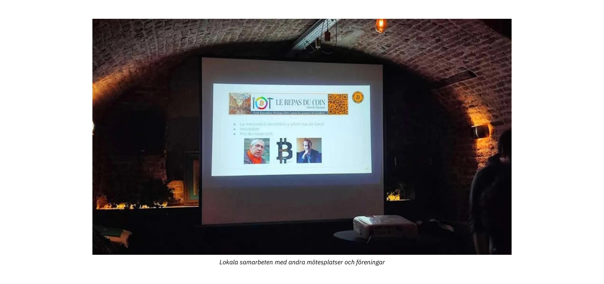

I Frankrike kan det också vara relevant att ** följa initiativen som [@KonsensusFR](https://twitter.com/KonsensusFR), [@bitcoinpointfr](https://twitter.com/bitcoinpointfr), [@DecouvreBitcoin](https://twitter.com/DecouvreBitcoin) och [@btcmap](https://twitter.com/btcmap)**. Detta är naturligtvis bara förslag, och varje gemenskap är fri att göra som den vill, i fullständig decentralisering och autonomi.

Som nämnts ovan är målet med att följa varandra att skapa ömsesidig synlighet. Ju mer du marknadsför ditt och din regions/lands community på de sociala nätverken, desto fler kommer att prata om dig. Ju fler som pratar om dig, desto mer sannolikt är det att de kommer att delta i dina evenemang.

Att gilla och retweeta inlägg från andra communities kan därför i hög grad bidra till deras utveckling... och din egen.

Du kan också föreslå att **mötesarrangörer och bitcoiners som driver communities träffas två eller tre gånger per år via videokonferens för att granska framstegen i nationella projekt och relaterade communities. Detta kan också ske under personliga evenemang.**

Målet är enkelt: samla in allas feedback, diskutera hur communityerna utvecklas, dela med sig av framgångsrika idéer och projekt och föreslå lösningar när det behövs. En skriftlig sammanfattning av mötet kan efteråt delas med de samhällsorganisatörer i ditt land som inte kunde delta.

## Btcmap.org

<chapterId>365f43d4-7b2c-5961-a184-157b8c1a0116</chapterId>

I det här skedet är din community redan igång. Allt som återstår är att välkomna fler intresserade och hjälpa den att växa.

Men du kan inte gå vidare utan att veta att **det finns plattformar där bitcoiners kan hitta communities och meetups nära dem**. Det är därför det är viktigt att ta några minuter för att begära en listning på dessa webbplatser.

Dessa inkluderar:

- [Btcmap.org](https://btcmap.org/)**, en webbplats med två kartor som uppdateras dagligen: **[världskartan över företag som accepterar Bitcoin](https://btcmap.org/map)** och **[världskartan över samhällen](https://btcmap.org/communities/map)**. Många bitcoiners kollar dessa kartor regelbundet, oavsett om de reser eller lever sitt dagliga liv, för att träffa nya människor eller hitta platser att spendera sina Sats på. Btcmap är den globala referensen, och att lista din community där är viktigt för synligheten.**
- [BitcoinerEvents] (https://www.bitcoinerevents.com/), en webbplats skapad av bitcoiners, för bitcoiners. **Där kan du lägga upp kommande evenemang i ditt community**. I Frankrike används den dock fortfarande inte i någon större utsträckning.
- beroende på ditt land kan det finnas andra lokala initiativ. I Frankrike finns det till exempel [Bitcoin.fr] (https://Bitcoin.fr/events/categories/evenements/), som **listar dussintals Bitcoin-evenemang varje månad**. Så om du ännu inte har följt dem på Twitter eller kontaktat dem för att dela information om ditt samhälle och dina evenemang är det dags nu! **För att hålla den franska evenemangskalendern uppdaterad skulle det vara bra om alla franska Bitcoin-grupper tog för vana att:**
    - nämna @bitcoinpointfr på Twitter för varje nytt gemenskapsevenemang
    - fästa nya evenemangsmeddelanden i deras Telegram-grupp.

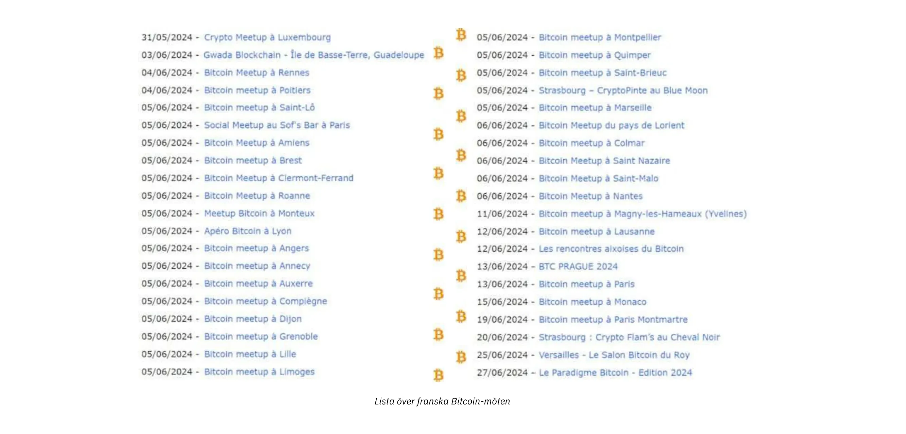

Andra plattformar kan också öka din synlighet. **[Meetup](https://www.meetup.com/)** är en av dem, och det är en webbplats (och en telefonapp) där du kan skapa ett evenemang och hitta andra i närheten.

Det kostar cirka 8 euro i månaden (eller cirka 90 euro per år), vilket kan vara dyrt för en liten, ostrukturerad gemenskap. Med detta sagt används Meetup i stor utsträckning i vissa länder, särskilt i Kanada och USA, och det är användbart för att hantera registreringar.

På samma sätt är **[Orangepillapp] (https://www.orangepillapp.com/)** en betald mobilapp (50 000 Sats/år eller 200 000 Sats för livstidsaccess) som hjälper bitcoiners att träffas.

Även om de två sistnämnda plattformarna kan bidra till att öka synligheten rekommenderas de inte när man startar en community, helt enkelt för att de inte är gratis.

**Att börja med en listning på [btcmap.org] (https://btcmap.org/), [BitcoinerEvents] (https://www.bitcoinerevents.com/) och för franska samhällen, på [Bitcoin.fr] (https://Bitcoin.fr) är mer än tillräckligt**.

Gratulerar, gratulerar, gratulerar! Din **community är skapad**, dina **bilder är klara**, dina **mål är satta**, dina **kommunikationskanaler är på plats**, dina **sociala nätverk är lanserade** och din **synlighetsstrategi är beslutad**.

När en liten grupp bitcoiners har anslutit sig till dig är det dags för nästa steg: att organisera ditt första Bitcoin-möte.

# Organisera en Bitcoin-träff

<partId>c009d2a6-40ce-583b-bd24-fdfd1fea262e</partId>

## Varför starta ett regelbundet möte med din community?

<chapterId>ed8e471c-3b99-57e2-a042-2d4e8a40b137</chapterId>

Nu när de sociala nätverken och kommunikationskanalerna har lanserats är det dags att göra er närvaro känd på dessa plattformar. Uppmuntra nya medlemmar att presentera sig och gradvis delta i konversationen.

Detta kommer att frigöra din tid, som du kan använda för att fundera på att skapa någon form av möte. Detta kommer att bli ännu mer relevant när du börjar känna verklig spänning i ditt samhälle.

Som tidigare nämnts kan **ett Bitcoin-möte ses som nästa "nivå" för ett community**. Å ena sidan gör det det möjligt för **medlemmar att träffas personligen**, och å andra sidan hjälper det till att **utbilda nykomlingar som är intresserade av detta ekosystem**.

Ett evenemang som detta låter dig, i din egen skala, **skapa ett surr kring Bitcoin** i din stad, som kan växa över tid när ditt samhälle tar sig an projekt.

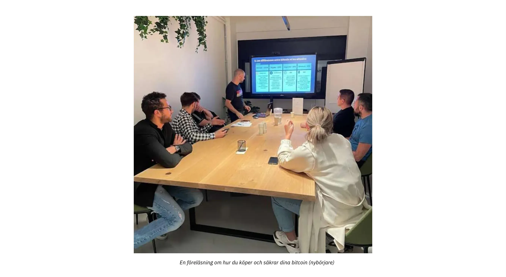

Ju större mål du har för samhällsutvecklingen, desto mer tid behöver du och dina medlemmar naturligtvis lägga ner.

Det är därför det är viktigt att **börja med att sätta upp uppnåeliga mål för ditt möte**.

## Den första träffen: när och varför?

<chapterId>f3f8a614-cfb4-5994-a2e8-d56e6f8e3347</chapterId>

Du kan starta en mötesplats bara några veckor efter att du har skapat din community.

Men i det skedet kommer din grupp förmodligen fortfarande att vara liten, vilket innebär att det finns en risk att ingen dyker upp.

Det är bättre att organisera ett möte när du har åtminstone några aktiva medlemmar i dina kommunikationskanaler, till exempel några dussin. Detta kan ske snabbt, men det beror också på människors personligheter.

När du känner gnistan kan du föreslå ett personligt möte. Om andra är intresserade återstår bara att **bestämma ett datum för ert första möte**.

I stället för att välja datum själv är det oftast bäst att **skapa en omröstning cirka tio dagar i förväg med flera möjliga dagar och tider**. På så sätt kan du använda rösterna för att maximera närvaron, skapa spänning och använda din tid på bästa sätt.

Det är bäst att inte gå in med fasta förväntningar på hur mötet ska gå till, hur många som ska komma eller vilka ämnen som ska diskuteras. På så sätt undviker man besvikelser och deltagarna känner sig inte pressade.

Låt saker och ting flyta naturligt, kanske över en drink. Samtalen ska vara lätta att föra och om det behövs kan du försiktigt styra tillbaka diskussionen till Bitcoin om den börjar spåra ur.

Om du vill förbereda dig för lugnare stunder kan du planera några aktiviteter eller samtalsämnen, t.ex:

- visa **[Mempool](https://Mempool.space/)** på en dator eller smartphone;
- ta med en bok;
- med en **Nerdminer**, Bitaxe, FPGA eller till och med ASIC;
- har en **Bitcoin flyer**;
- brainstorma fram en Bitcoin-visual eller logotyp för ditt samhälle;
- spelar ett **[Bitcoin-kortspel](https://www.Maximalist.ovh/accueil/20-game-le-Coin-de-table.html)**;
- visar **[btcmap.org](https://btcmap.org/)** kartan över samhällen och handlare;
- skicka eller ta emot Bitcoin med hjälp av **Lightning**.

När din mötesplats precis har startat är det ofta inte rätt tillfälle för en formell presentation. Om deltagarantalet är litet fungerar en öppen och avslappnad diskussion oftast bäst.

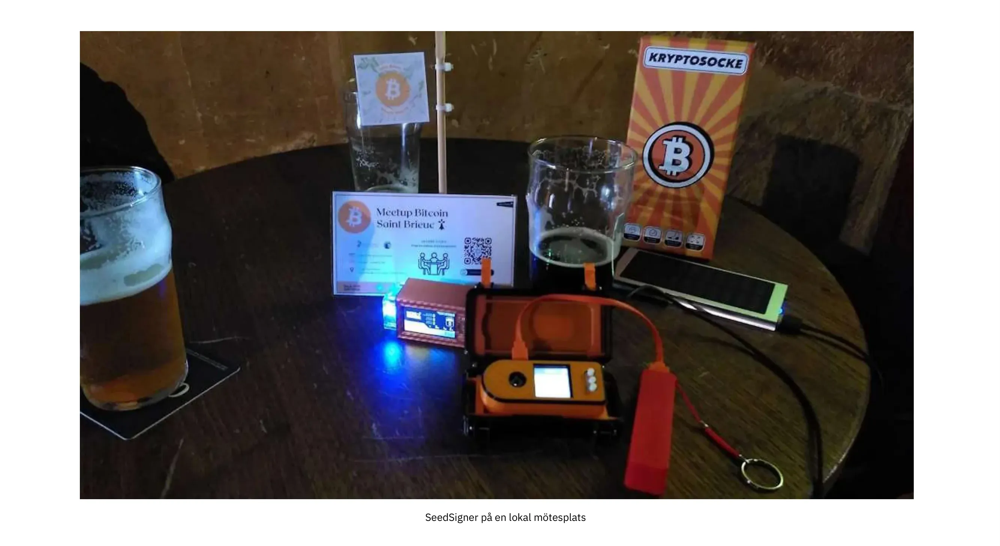

Efter din första träff vill du förmodligen planera en till. Så länge er community fortfarande är liten är det bäst att fortsätta välja datum genom omröstningar, till exempel en gång i månaden eller varannan månad. Du kan diskutera detta i dina kommunikationskanaler.

Om det bildas en regelbunden grupp av bitcoinare och intresserade deltagare är det vettigt att sätta ett återkommande schema av två skäl:

1) Det gör det lättare för alla att planera i förväg;

2) Det hjälper till att **etablera en "vana"**. Även om någon slutar kolla dina kanaler regelbundet vet de fortfarande när mötet äger rum och kan komma förbi som vanligt.

Denna andra punkt är en av anledningarna till att ** i Frankrike äger de flesta möten rum den första onsdagen i varje månad** (se initiativet "ambassadörer", som lanserades av [DecouvreBitcoin] (https://decouvrebitcoin.fr/) 2022).

I Tyskland och Italien finns det ingen fast nationaldag.

Att ha alla meet-ups över hela landet på samma dag skapar dock ett centraliseringsproblem: det hindrar bitcoiners från att delta i evenemang i närliggande samhällen och kan också ge upphov till säkerhetsproblem. Att prata med närliggande mötesarrangörer kan hjälpa dig att komma överens om ett bra arrangemang.

I takt med att din community växer och mötesplatserna lockar fler människor kan du göra det:

- sätta upp ett specifikt mål för varje möte;
- eller till och med **lägg till ett andra evenemang varje månad**.

I det första fallet kan ett tydligt mål, med allas preferenser i åtanke, säkerställa att deltagarna går hem efter att ha lärt sig något nytt och hålla samtalen fokuserade på Bitcoin.

I det andra fallet kan ett andra månatligt evenemang ägnas åt ett specifikt tema, t.ex. nybörjarsessioner eller workshops (Mining, Lightning, nodinstallation etc.).

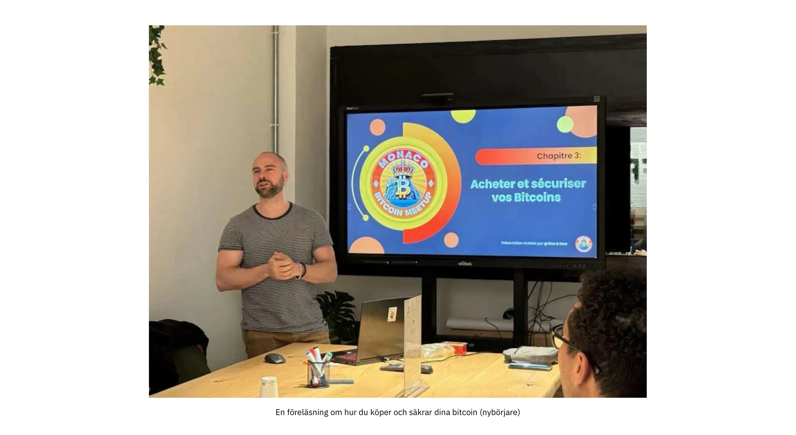

Tänk på att **detta kräver mer organisation och mer av din tid**. Lyckligtvis hittar du i [del 6/8 av den här kursen] (https://planb.academy/courses/1c643dc9-a15f-4f9e-93b6-cb3c58b4ee35/3213d87a-1998-5972-ab93-97a5769ba279) en rad återanvändbara resurser med öppen källkod som kan hjälpa dig.

I vilket fall som helst beror allt på den handlingsplan på kort, medellång och lång sikt som du eller ditt samhälle har fastställt för er själva.

## Sökandet efter en plats

<chapterId>405d389e-6a32-5777-af8d-293380d2e8fd</chapterId>

Att hitta en plats för dina evenemang är ofta ingen lätt uppgift. Dessutom är det viktigt att denna plats är **placerad i din kommuns stad**.

Det finns flera kriterier att ta hänsyn till, bland annat:

1) **Läge**: Är det lättillgängligt med kollektivtrafik? Med bil? Finns parkering tillgänglig?

2) Är lokalen trevlig och inte alltför ** bullrig**? Letar du efter en formell miljö (co-working space, mötesrum) eller något mer informellt (bar, restaurang)?

3) Har det tillräckligt med kapacitet för att ta emot dig, även på en rugby- eller Champions League-matchkväll?

4) Finns det en videoprojektor och ett lugnt område för presentationer?

5) Och slutligen, om det är en bar eller restaurang, erbjuder menyn något för alla att äta och dricka?

Här är dessutom tre viktiga punkter att tänka på:

- Om du planerar att dela upp kvällen i två delar: först en presentation i en formell lokal för att hjälpa alla att fokusera, och sedan gå till en bar eller restaurang för att fortsätta i en mer avslappnad atmosfär, visar erfarenheten att byte av lokal mitt i kvällen ofta leder till att vissa deltagare lämnar lokalen under pausen. Detta tillvägagångssätt rekommenderas därför inte.
- Vid dina första möten kommer deltagarantalet sannolikt att vara litet och du kommer förmodligen inte att hålla några formella presentationer. I så fall behöver du inte presentera dig för ägaren eller förklara dina mål. Men **när mötena blir regelbundna och välbesökta är det värt att göra det för att visa professionalism och uttrycka din önskan att återvända varje månad**. Detta kan leda till många diskussioner (automatiska månadsreservationer, gratis drinkar och/eller matbrädor, rabatter, samtal om Bitcoin, godkännande av Bitcoin-betalningar etc.) Om du specifikt letar efter en lokal med en videoprojektor för att göra presentationer är det naturligtvis viktigt att be om ett möte (ansikte mot ansikte eller till och med per telefon) med ägaren och/eller chefen för att presentera ditt projekt och dina mål.

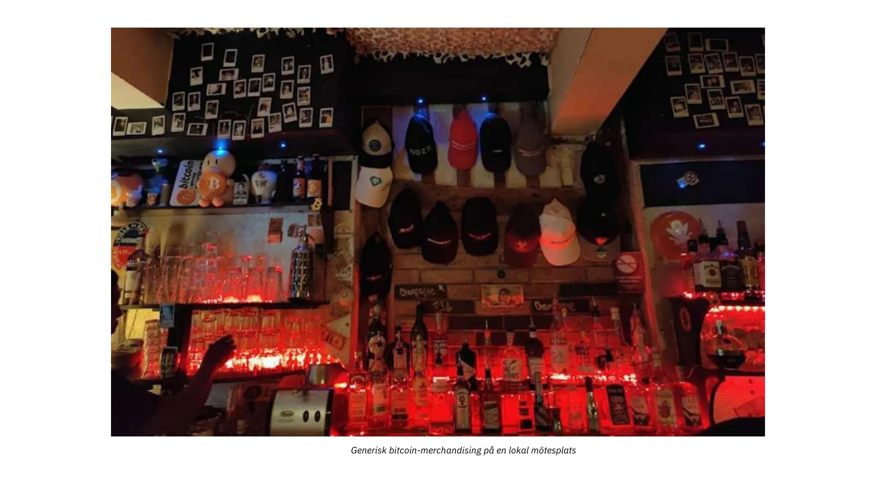

- slutligen vill vissa samhällen **bara hålla sina evenemang på platser som accepterar Bitcoin-betalningar**, vilket är förståeligt. I det här fallet är det en bra idé att **börja med att söka efter Bitcoin-acceptabla företag i din stad** (på [btcmap.org](https://btcmap.org/map/)och kontakta dem för att se om de uppfyller dina kriterier. Om inget lämpligt finns tillgängligt kan du försöka ta ombord nya handlare, men förvänta dig många avslag, vilket kan vara nedslående. Det är därför det ofta är bäst att inte sätta upp detta som ett mål från början, utan istället överväga det när din community är väletablerad och du har tillräckligt med "eldkraft"

När du lanserar din mötesplats, tveka inte att **byta plats under de första månaderna**. Detta hjälper dig att **bygga relationer med olika chefer**, utforska olika atmosfärer och samla information om potentiella framtida värdar.

Senare, när gruppen har vuxit, kan du till och med ta en eftermiddag för att besöka flera företag och barer och fråga om de har ett utrymme som passar för att hålla dina månatliga evenemang och möten.

## Före mötet

<chapterId>c5218943-580d-5efc-89ed-6b5d728816d6</chapterId>

Planerar du att organisera ett möte under de kommande veckorna?

Här är en checklista som hjälper dig att förbereda dig:

1/ **Bekräfta platsen**

Kontakta den plats där du ska hålla evenemanget och boka den för det beräknade antalet deltagare.

2/ **Anmäl händelsen**:

    - Dela datum, tid och plats på dina sociala nätverk och andra kommunikationskanaler. Inkludera en registreringslänk om det behövs.
    - Skapa en särskild visuell del (till exempel en Canva-poster, se del 2/8 "[Designa en identitet för din Bitcoin-grupp] (https://planb.academy/courses/1c643dc9-a15f-4f9e-93b6-cb3c58b4ee35/b48a18cc-afdf-5216-802c-32647b5cd8a3)").
    - Maximera synligheten genom att fästa tillkännagivandet på Telegram och Twitter och använda ett "@everyone"-omnämnande på Discord.
    - Skicka ut meddelanden 7 till 10 dagar före evenemanget så att deltagarna kan planera i förväg.

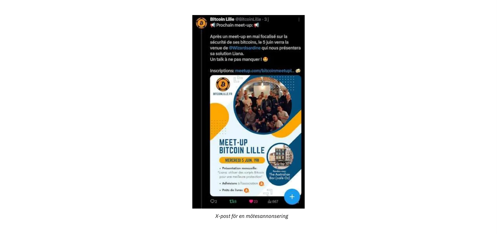

3/ **Reminder din publik**

Två till tre dagar före evenemanget kan du dela och retweeta dina meddelanden för att öka synligheten.

4/ **Uppdatera platsen**

Dagen innan (eller två dagar innan) ska du kontrollera dina anmälningar och meddela lokalen det slutliga förväntade antalet deltagare.

Extra åtgärder för att få ditt evenemang att sticka ut:

- Tryck flyers och/eller affischer
- Förbereda en presentation om ett specifikt ämne
- Organisera en aktivitet eller workshop

## Dagen för mötet

<chapterId>cf60067b-591f-5fdf-9b9e-d442aad0e8f9</chapterId>

Den stora dagen är här! En eller två timmar innan evenemanget börjar skickar du en påminnelse via ditt samhälles kommunikationskanaler. Bekräfta starttiden och låt deltagarna veta hur de ska känna igen dig, till exempel genom att nämna att du kommer att bära en Bitcoin T-shirt och keps.

När dina möten växer och du börjar välkomna fler än 20 personer blir det allt viktigare att förbereda lokalen.

Här är vad du ska göra:

1) **Arrangera tidigt** för att förbereda saker.

2) **Arrangera utrymmet** efter dina behov och lokalens möjligheter. Om ni bara är sex personer behövs det inte så mycket möblering. Men när ni är 10-20 deltagare kan en helt sittande layout begränsa interaktionen. I så fall kan du välja att stå upp med välplacerade höga bord om sådana finns, samtidigt som du har några få (helst höga) stolar. Om en presentation är planerad, behåll den stående uppställningen under större delen av kvällen och ta in stolar strax före föredraget.

3) Lägg till små personliga detaljer:

    - Sätt upp en affisch vid entrén för att visa var du befinner dig (använd Patafix och be om lokalens tillstånd först).
    - Sätt upp affischer med Bitcoin-tema inuti (Bitcoin:s vitbok, din samhällsstadga, aktuella projekt etc.)
    - Placera klistermärken, flygblad eller konversationsstartare på borden, till exempel: en Nerdminer, Hardware Wallet, en bärbar dator som visar sin Mempool, ASIC Miner eller metallplatta för privata nycklar.

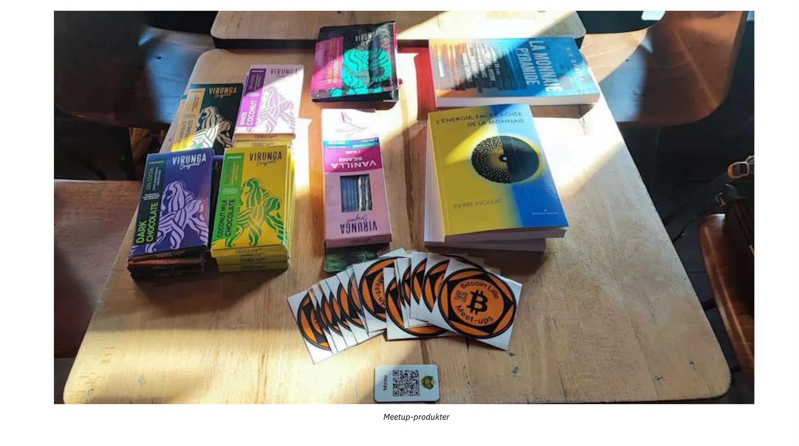

Om du bara förväntar dig ett fåtal deltagare och ännu inte har byggt upp en relation med lokalens ansvariga, undvik att ta med och visa upp all din utrustning direkt. När förtroendet väl har etablerats får du större frihet att arrangera lokalen som du vill.

Slutligen kan du ta en drink och vänta på att folk ska komma. Och kom ihåg: bli inte avskräckt om ingen kommer första gången. Ta med en bok eller en video att titta på, för säkerhets skull.

## Efter mötet

<chapterId>3e881af9-9c09-5721-81ee-c5cda3b109c5</chapterId>

När mötet är slut är det dags för lokalens personal att städa upp. Innan du går kan du erbjuda dig att hjälpa servitörerna eller cheferna. Det kan vara så enkelt som att samla alla glas på ett bord eller, om du är nära baren, att lämna tillbaka dem innan du går.

När du väl är hemma igen kommer du troligen att ha Bitcoin i tankarna i flera dagar. Det är det perfekta tillfället att ta pulsen på din kommun och samla in feedback från deltagarna. Det kan du göra:

- Skicka ett tackmeddelande på dina kommunikationskanaler och dela med dig av länkar eller resurser som nämnts under evenemanget.
- Bjud in deltagarna att föreslå förbättringar till nästa möte.
- Börja planera ditt nästa evenemang.

Du har sedan några veckor på dig att utveckla nya idéer, bilder eller projekt för att göra nästa möte ännu bättre.

## Vikten av att involvera och behålla deltagare

<chapterId>f5355e35-4b07-527c-88a3-8535cba7592c</chapterId>

Rom byggdes inte på en dag, och det kommer inte heller ditt samhälle att göra. Momentum runt Bitcoin kommer från att hålla regelbundna möten och evenemang.

För att få det att hända är en sak avgörande: **hålla deltagarna engagerade**.

Det kan börja med en liten grupp passionerade bitcoinare, vars mål är att träffas regelbundet och prata om Bitcoin. Med tiden, beroende på varje persons tillgänglighet och intressen, kan du **dela vissa organisatoriska uppgifter med gruppen**, eller bjuda in kärnmedlemmar **att ta sig an specifika projekt**. Dessa kan vara unika för din gemenskap, dina möten eller din stad eller till och med inspirerade av de många initiativ som föreslås i [del 6/8 av denna kurs] (https://planb.academy/courses/1c643dc9-a15f-4f9e-93b6-cb3c58b4ee35/3213d87a-1998-5972-ab93-97a5769ba279). **Detta främjar inte bara Commitment från dina kärnmedlemmar utan hjälper också din gemenskap att växa och frodas.**

Allteftersom dina möten fortskrider kommer nya ansikten att dyka upp: människor som köpte BTC och/eller altcoins i tidigare cykler, teknikentusiaster som vill fördjupa sin förståelse eller nybörjare som är nyfikna på detta ocensurerbara, decentraliserade, transparenta och rättvisa betalningssystem som fungerar utan villkor och utan betrodda tredje parter.

För att se till att alla känner sig inkluderade på dina evenemang bör du fokusera på två viktiga aspekter:

- **Social inkludering**: Alla som deltar ska känna sig välkomna. Bemöda dig om att hälsa på nykomlingar, fråga varför de kom och presentera dem för andra. När människor känner sig inkluderade är det mer sannolikt att de kommer tillbaka och kanske till och med hjälper till att organisera framtida evenemang.
- **Tålamod och öppenhet**: Detta tar tid och motivation. Om du pratar med en engagerad shitcoiner (eller ännu värre, en XRP Maximalist), kan det vara frestande att avfärda dem. Men genom att engagera dig i en konversation kan du reda ut missförstånd eller felaktiga resonemang. Om de är villiga att lyssna kan de vara redo att verkligen förstå Bitcoin.

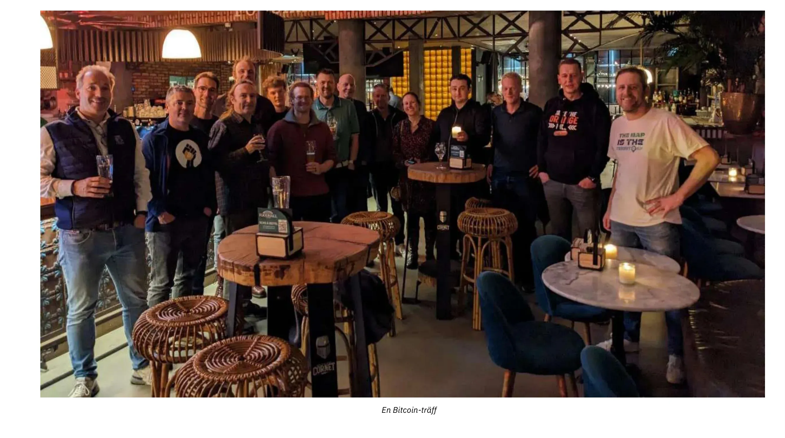

Från en praktisk synvinkel, tänk på den övergripande upplevelsen av evenemanget:

- Var **vägen trevlig**?
- Var det **lätt att komma åt? **
- Varför anmälde sig vissa personer men dök inte upp?
- Vilka diskussioner fördes? Var diskussionerna för tekniska för nybörjare?
- Var diskussionerna för alkoholiserade?

Varje deltagare har sin egen personlighet, sina egna mål och intressen, så erfarenheterna kommer att variera. Men när platsen är rätt, publiken är öppen och avsikterna är genuina finns det all anledning att mötet ska bli en framgång.

Att bygga upp en mötesplats tar tid, men framför allt kräver det organisation. Det är ett mänskligt projekt, och det kommer bara att fungera och växa på lång sikt om det är välplanerat, öppet och inkluderande.

I slutändan är det upp till dig att bestämma hur långt "öppet och inkluderande" ska gå. Kom bara ihåg: en shitcoiner är ofta bara en bitcoiner i vardande.

# Exempel på projekt och initiativ

<partId>45b3bc40-1c31-583e-8411-2662e6efd765</partId>

## Varför gå längre än att bara dricka öl?

<chapterId>3213d87a-1998-5972-ab93-97a5769ba279</chapterId>

Allt eftersom blocken rullar vidare kommer din gemenskap att utvecklas. Nya ansikten kommer att ansluta sig, andra kommer att glida iväg men den vägledande principen bör förbli densamma: utveckla Bitcoin-ekosystemet och stärka banden mellan medlemmarna.

Det finns många projekt och initiativ som kan genomföras. Det här kapitlet innehåller en icke uttömmande lista över idéer som kan genomföras inom ett community eller under en meetup. Välj gärna de som inspirerar dig och bidra även med dina egna idéer till den här kursen [genom att göra en "Pull Request" på GitHub] (https://github.com/PlanB-Network/Bitcoin-educational-content).

Innan vi går in på ämnet, låt oss återkomma till en punkt som nämndes tidigare.

När du organiserar ett Bitcoin-möte träffar du nya människor. Social interaktion är viktigt och öl (eller alkohol i allmänhet) kan bidra till att skapa en festlig atmosfär. Men det är värt att komma ihåg:

- Alkohol försämrar kognitiva förmågor som tänkande och förståelse, vilket kan göra det svårare för deltagarna att följa seriösa diskussioner eller presentationer.
- Alkohol kan också bli en tröstritual: varje månad delar du ditt "Bitcoin-ögonblick" med dina vänner över en drink. Även om det är ett bra sätt att få kontakt, är det verkligen huvudmålet med din träff att dricka öl? Eller vill du hellre forska om Exchange, lära dig av andra och hjälpa nykomlingar att upptäcka Bitcoin?

Alla har sina egna preferenser, övertygelser och personlighet. Det handlar inte om att bedöma en mötesplats framför en annan. Men även om det ofta är över en öl som vi pratar om att förändra världen, så börjar inte revolutioner, eller växer, på det sättet.

Nyckeln är helt enkelt att vara medveten om det.

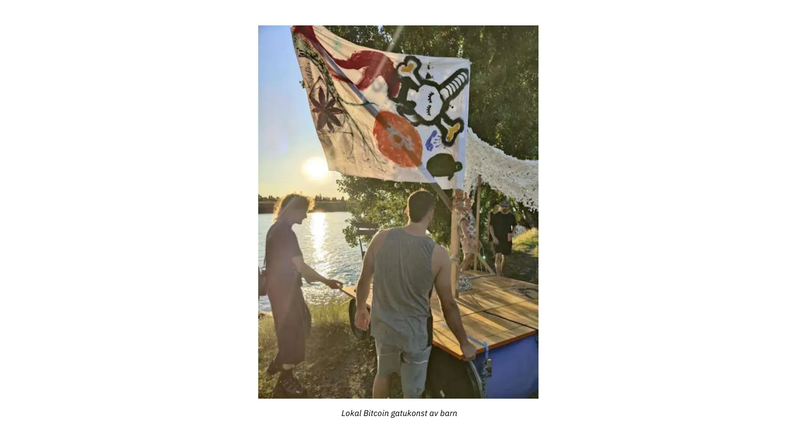

## Organisera tematräffar, med en årlig progression

<chapterId>46afdbcc-a775-5c16-b20a-34956690d58f</chapterId>

När du har byggt upp en kärngrupp på cirka tio personer kan du börja lägga till presentationer till varje evenemang. Dessa kan följa ett tema som meddelats i förväg eller vara helt oberoende av varandra.

När du planerar presentationer eller workshops hjälper det att skapa en tydlig, välstrukturerad progression. Målet är att **täcka Bitcoin:s kärnkoncept steg för steg**, vilket ger deltagarna en fullständig bild av ämnet från flera vinklar.

I Frankrike, under sommaren 2023, arbetade mötesarrangörerna med **en årlig progression**.

Utöver det starka pedagogiska värdet gör detta tillvägagångssätt det möjligt att dela dokument och bildspel med öppen källkod mellan grupper och gradvis bygga upp ett gemensamt bibliotek med resurser. Initiativet har tagits emot väl och kommer att växa under de kommande åren.

Nedan är den franska mötesprogressionen 2023-2024. För varje tema finns en presentation med öppen källkod och en video, som kan ge dig idéer om ämnen som du kan ta upp i dina egna evenemang.

Ytterligare redigerbart material finns också i [Bitcoin Teaching Toolbox] (https://planb.academy/fr/resources/bet)!

| Month | Theme | Video | Editable Resource |
| -------- | -------- | -------- | --- |
| September     | Chapter 1: What is Bitcoin?     | [	YouTube link](https://www.youtube.com/watch?v=CSjuBqrl4t8)     | [Editable PowerPoint](https://www.canva.com/design/DAFu0d5Jd7M/9gAWDAOSS6LDkWENuZjYgw/edit) |
| October & November| Chapter 2: Understanding Bitcoin Transactions     | [YouTube link](https://www.youtube.com/watch?v=inFnR-3NsdM)     | [Editable PowerPoint](https://www.canva.com/design/DAFsEcnOro8/Mz9FYdTGhsvozZOe0Y9jtw/edit) |
| December     | Chapter 3: Understanding the Lightning Network     | [YouTube link](https://www.youtube.com/watch?v=hHz-ALx8D9w)     | [Editable PowerPoint](https://www.canva.com/design/DAF4YPSNnR8/HKp4Vmcno8eMtVWnZmFtcw/edit) |
| January     | Chapter 4: What is Mining?     | [YouTube link](https://www.youtube.com/watch?v=QyHZ3CVI_OI)     | [Editable PowerPoint](https://www.canva.com/design/DAF5DE6iBEM/tsy8E3oBebUnsR0kj53vvQ/edit) |
| February     | 	Chapter 5: Running a Bitcoin and Lightning Node    | [YouTube link](https://www.youtube.com/watch?v=RRYK-usg-OY)     | [Editable PowerPoint](https://www.canva.com/design/DAF55FU6HI0/sQ0lacRJblqrhn_9Xk1yDg/edit) |
| March     | 	Chapter 6: Using the Lightning Network in Daily Life    | [YouTube link](https://www.youtube.com/watch?v=o2BS4xjei8M)    | [Editable PowerPoint](https://www.canva.com/design/DAGAcJMw7lw/-haMNnHnwj5vpDAy8MDowA/edit) |
| April & May    | Chapter 7: Securing Your Bitcoins      | [YouTube link](https://www.youtube.com/watch?v=fHExPbhM0Hg)    | [Editable PowerPoint](https://www.canva.com/design/DAGDz3Nq4e0/D3uG-4w9FN6OhUq-VXzhfg/edit) |
| June     | 	Chapter 8: What is Multi-Sig?     | [YouTube link](https://www.youtube.com/watch?v=Me5489mpoxA)     | [Editable PowerPoint](https://www.canva.com/design/DAGLMtQT6sg/rYIxr4ldUJ0jTelNf-Pj8Q/edit) |
| July     | 	Chapter 9: Understanding the Bull Run and How to Prepare    | [YouTube link](https://www.youtube.com/watch?v=7RA-gnCJWyM)     | [Editable PowerPoint](https://www.canva.com/design/DAGJQkiZ_YA/9lUluP9RZ0eeA_e61mk9Hw/edit) |
| August     | Chapter 10: The Taxman is Never Far Away   | [YouTube link](https://www.youtube.com/watch?v=oY4NwonGDm0)     | [Editable PowerPoint](https://www.canva.com/design/DAGQhx7Yc_c/7mRhb_vlgnhSgxd1FtjK8w/edit) |

Kapitel 2 och 7 kan delas upp i två kortare presentationer för att undvika att deltagarna blir överväldigade. Om du kör dem i en session frigörs dock utrymme i kalendern för särskilda aktiviteter, till exempel gemensamma möten med angränsande grupper, frågesporter eller workshops.

**Du är fri att använda, anpassa och dela dessa resurser, men se till att du krediterar originalförfattarna om du återanvänder deras arbete.**

Eftersom alla inte kommer att delta i alla möten är det en bra idé att spela in presentationer och ladda upp dem till en streamingplattform eller din webbplats. Det gör det möjligt för frånvarande att komma ikapp och för deltagare att gå igenom materialet senare.

Parallellt kan du köra andra tematräffar, till exempel:

- En kunskapstävling om Bitcoin (med en Hardware Wallet som pris)
- En onboarding-utmaning där du skickar gratis satoshis till no-coiners på gatan
- Bjuda in en expertföreläsare eller ett företag att presentera en Bitcoin-relaterad produkt
- En nattlig rundtur i barer och butiker som accepterar Bitcoin

Och mycket mer, det är bara fantasin som sätter gränser!

## Skapa sidoevenemang och workshops

<chapterId>9dbd651a-8712-5630-90b3-b9525dcc1385</chapterId>

Beroende på din tillgänglighet och graden av engagemang i din kommun kan du planera ytterligare evenemang under året, t.ex:

- En restaurangkväll för **Pizzadagen** den 22 maj
- En kväll eller en helg för att fira nästa **Halving**
- En **spelkväll** för hela familjen om Bitcoin och hur den fungerar, med spel som [Le Coin de Table] (https://www.Maximalist.ovh/) eller [SHAmory] (https://shamory.com/)
- En **Mining workshop** där olika typer av hårdvara presenteras (CPU, GPU, FPGA, ASIC, Nerdminer, Bitaxe)
- En **eftermiddag eller kväll för nybörjare**, med tematiska workshops
- En **gemensam träff med angränsande samhällen**

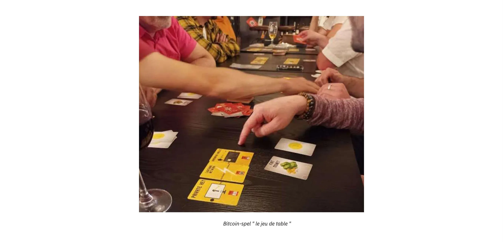

Var bara försiktig så att du inte överbelastar kalendern. För många evenemang under en och samma månad kan leda till utbrändhet för arrangörerna och minskad närvaro över tid.

## Skapa klistermärken

<chapterId>d605f3b3-130e-513d-85e6-06bc5ea13e99</chapterId>

Klistermärken är ett roligt sätt att marknadsföra både Bitcoin och ditt samhälle samtidigt som du förstärker din identitet.

Tänk på dessa tips innan du beställer:

- För utomhusbruk, se till att klistermärkena är vattentäta.
- Håll din logotyp något mindre än skärområdet för att undvika problem med beskärning under laserskärning.
- Använd en vektorfil i stället för en rasterbild för högre utskriftskvalitet.
- Välj rätt storlek: en diameter på 8 cm (ungefär lika stor som en vuxen handflata) är mycket synlig, medan 4 cm är mer diskret. Är du ute efter synlighet eller diskretion?
- För utskrifter med riklig svärta ("quad black") använder du 30% cyan, 30% magenta, 30% gult och 100% svart. Om du bara använder 100% svart kan det resultera i en gråaktig ton. Tryckerier kontrollerar ofta detta, men det är värt att veta.

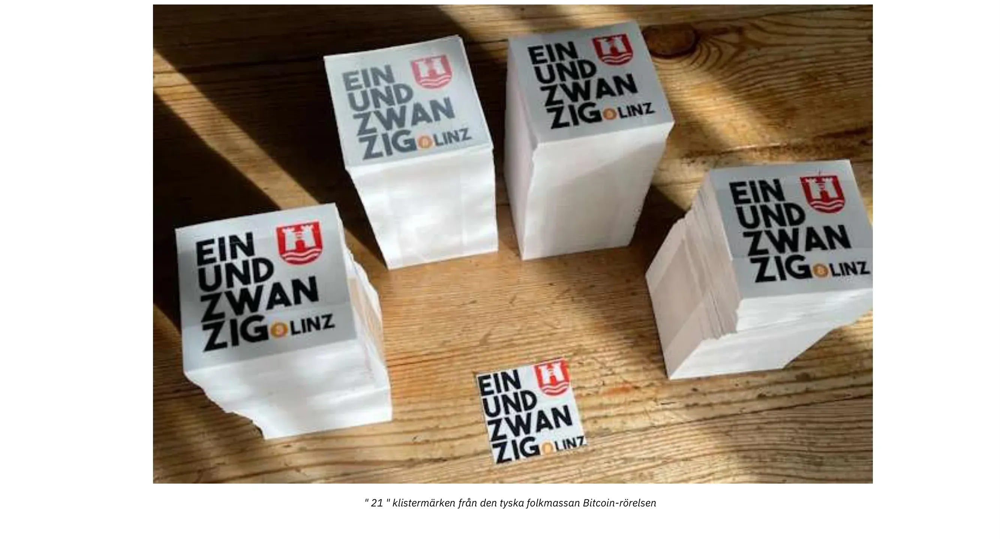

Beroende på dina behov och leverantör kan 1 000 klistermärken kosta mellan 100 euro och 250 euro. Du kan kontakta [@Mill3sim3 på Twitter] (https://x.com/Mill3sim3), en fransk bitcoiner som specialiserar sig på marknadsföring, som ibland kan säkra priser som är upp till 30% lägre än vanliga online-leverantörer.

Med det sagt är 1 000 klistermärken väldigt mycket. Det är vanligtvis bättre att börja med cirka 100 för att se till att du kan distribuera dem alla.

Viktig information: **Kontrollera lokala bestämmelser innan du sätter upp dekaler på offentliga platser**.

I Frankrike får klistermärken endast sättas upp på officiella offentliga anslagstavlor. Att sätta dem någon annanstans (t.ex. en stoppskylt) kommer sannolikt att leda till borttagning och eventuellt böter om de kan kopplas till dig eller din meetup. Informera dina medlemmar om detta.

På privata platser som konserter, barer eller arenor ska du kontrollera om det redan finns klistermärken innan du lägger till dina egna. Om inte, fråga personalen om lov. Du vill inte att en företagares första intryck av ditt samhälle ska vara att du vandaliserat deras utrymme.

## Skapa ett bibliotek

<chapterId>acc94093-f8b3-51b8-9359-348e9e075d38</chapterId>

Ett annat projekt som du enkelt kan sätta upp är att **skapa ett bibliotek på dina möten**.

Du kan bjuda in deltagare som vill dela med sig av sitt läsmaterial att ta med en Bitcoin-relaterad bok. Om någon annan på träffen vill låna den kan ett lån ordnas med ägaren i Exchange mot en deposition, till exempel 21 000 satoshis via Lightning.

För ägaren hjälper depositionen till att täcka eventuell förlust eller stöld. För låntagaren är det ett incitament att komma tillbaka till en framtida träff för att hämta sin deposition.

Om du driver en förening och vill investera en del av dina medel i utbildningsresurser kan du också köpa flera böcker att erbjuda i ditt **Bitcoin-bibliotek**, tillgängligt vid varje möte.

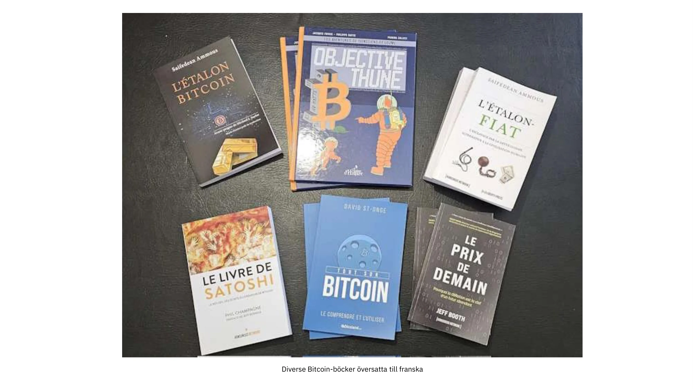

För att stödja ekosystemet har **[förlaget Konsensus Network] (https://konsensus.network/) sedan slutet av 2023 erbjudit internationella Bitcoin-möten och -samhällen 15-35 % rabatt på alla sina böcker, för beställningar på tre böcker eller mer**.

För att ta del av denna rabatt är det bara att **kontakta [Konsensus förlag] (https://twitter.com/KonsensusFR) på Twitter**.

Om du inte har pengar kan du ändå ge rabatten vidare till medlemmar i din grupp.

Om du inte har pengarna själv kan du ändå låta dina medlemmar ta del av rabatten. En arrangör kan till exempel samla in beställningar från medlemmar, göra en bulkbeställning till det reducerade priset och distribuera böckerna vid nästa träff, med betalning i Lightning vid den tidpunkten.

Du kan också visa upp en stadga för boklån på dina möten för att tydligt förklara lånereglerna för nykomlingar.

Här är ett exempel med öppen källkod som du kan använda och anpassa:

[Stadga för bokutlåning] (https://www.canva.com/design/DAF7u1b5kRM/r2gEAlibe_jTIXIX-O9PMA/edit)

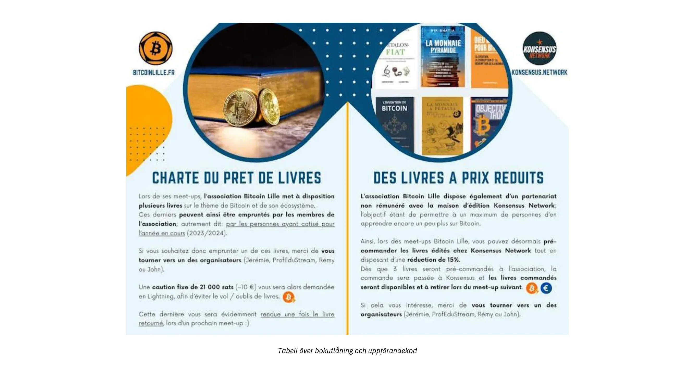

Slutligen, för att uppmuntra Bitcoin-relaterad läsning, kan du besöka **lokala kommunala bibliotek** för att se om de har böcker om Bitcoin.

Om de gör det kan du fråga bibliotekarierna om det finns några **rundabordssamtal** planerade i ämnet och ge dem kontaktuppgifterna till ditt möte.

Om inte, föreslå att de skaffar några böcker från en lista som valts ut i förväg. Nätverket [publisher Konsensus Network] (https://konsensus.network/) kan vara en inspirationskälla.

## Skapa och distribuera personliga flygblad

<chapterId>62ad5430-c698-51b3-89ac-090f31c88953</chapterId>

Att designa och skriva flygblad tar tid, men det är värt det, de ger dig en konkret resurs att dela ut när du pratar om Bitcoin, vilket alltid är uppskattat.

Dessa flygblad kan riktas till:

- Handlare, om du vill införa Bitcoin som betalningsmetod;
- Eventdeltagare med en flyer som förklarar hur man använder och betalar med Bitcoin/Lightning;
- Nybörjare, oavsett om de träffas på gatan, på jobbet eller under en familjesammankomst, med ett flygblad som belyser Bitcoin:s främsta fördelar.

Du kan också utforma en flyer som är specifik för ditt community eller din mötesplats och som presenterar dina aktiviteter, mål, länkar till sociala medier, kommunikationskanaler och kommande evenemang.

Flera flyers finns redan **tillgängliga som öppen källkod i [Bitcoin Teaching Toolbox](https://planb.academy/fr/resources/bet)** på planB.network och fler kommer att läggas till med tiden.

Ett exempel är ett [komplett flygblad](https://profedustream.substack.com/p/21-raisons-dutiliser-Bitcoin) med 21 skäl att använda Bitcoin. Dess design är också [tillgänglig i öppen källkod](https://www.canva.com/design/DAFtAR1NauQ/ZDwl2CchIJ9Gpb36N6-7iw/edit?utm_content=DAFtAR1NauQ&utm_campaign=designshare&utm_medium=link2&utm_source=sharebutton) så att du kan ändra, anpassa och dela den. Kom bara ihåg att ange dina källor.

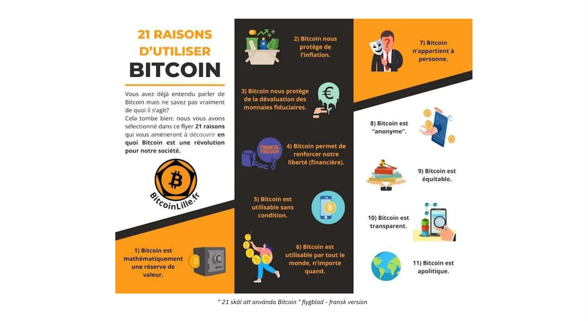

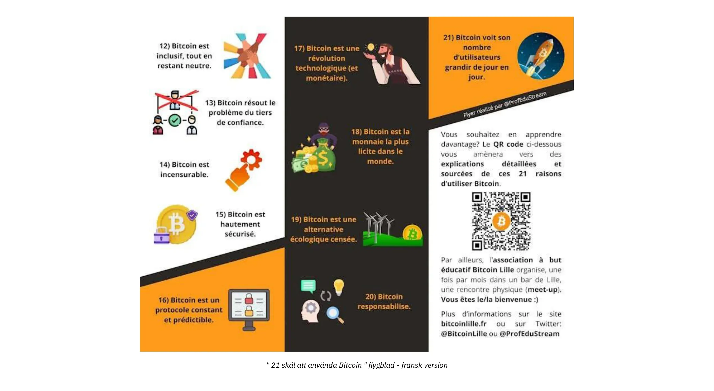

Som tidigare nämnts kan du lämna dessa flygblad nästan var som helst: på ett gemensamt skrivbord på jobbet, vid ett familjemiddagsbord, på ett offentligt bibliotek etc.

I Frankrike och några andra länder finns det också "boklådor", små trälådor där människor fritt kan skänka eller låna böcker. Du kan lämna ett flygblad där, eller ännu hellre en bok.

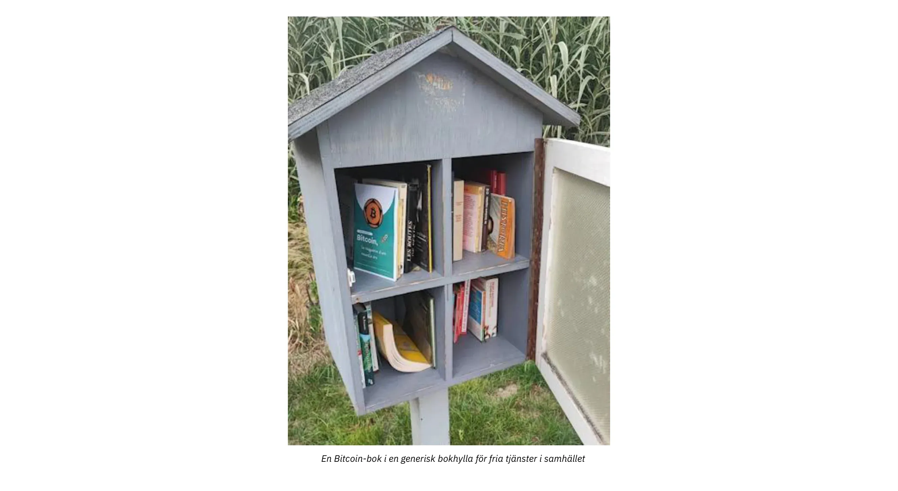

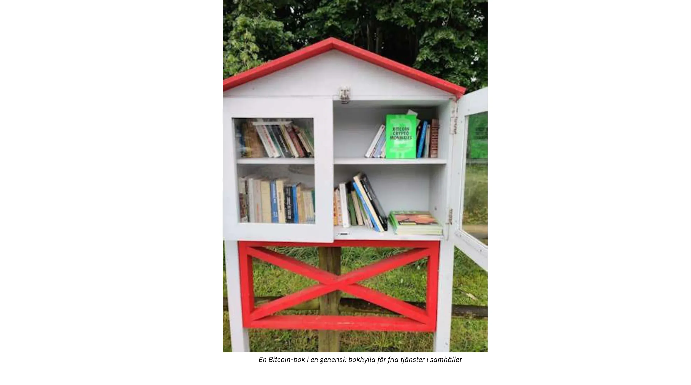

År 2023 lanserades initiativet **"Bitcoin White Paper in France's Book Boxes**".

För att genomföra detta projekt var deltagarna först tvungna att samla in geolokaliseringen av alla boklådor i landet. Det finns flera databaser för detta ändamål:

- [boite.a.livres.zonelivre.fr](https://boite.a.livres.zonelivre.fr/);
- [boites-a-livres.fr] (https://www.boites-a-livres.fr/carte-de-france);
- [delivrez.fr] (https://delivrez.fr/maps/fr_FR/);
- plus artiklar i lokal press

Även om det är symboliskt att lämna Bitcoin-vitboken är den ofta för komplex för att nykomlingar ska förstå den. Istället var tanken att skapa en liten broschyr som innehåller:

- en lättillgänglig introduktion med bra källor till Bitcoin, dess användningsområden och de problem som den löser;
- vitboken Bitcoin, översatt till franska.

Här är [broschyren som delas mellan franska bitcoinare](https://profedustream.substack.com/p/Bitcoin-la-naissance-dune-nouvelle) som har placerats i dussintals boklådor runt om i landet. Dess design är också [tillgänglig som öppen källkod] (https://www.canva.com/design/DAFs18FSoVM/Sy0QsfUkycTgXveeGgutBg/edit?utm_content=DAFs18FSoVM&utm_campaign=designshare&utm_medium=link2&utm_source=sharebutton).

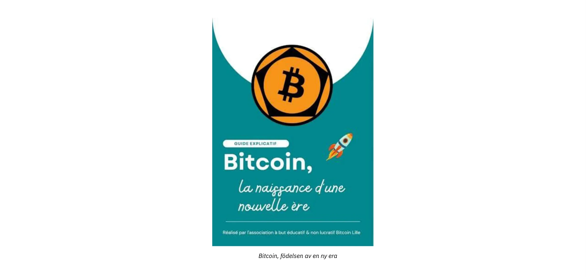

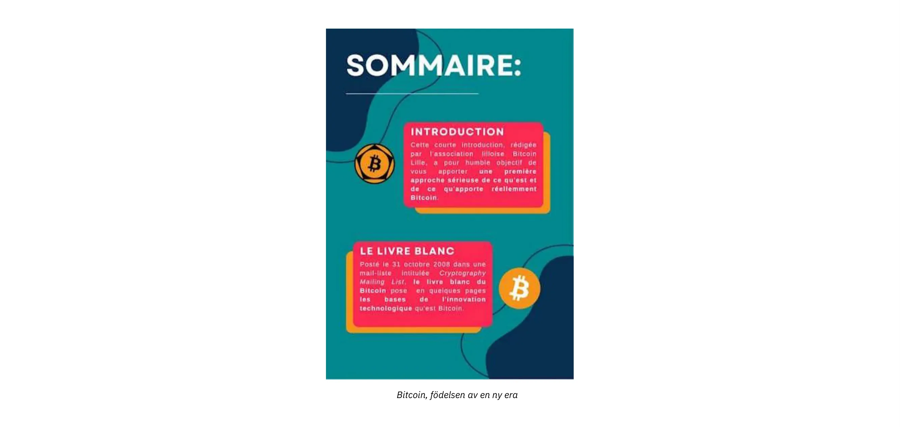

## Framställning av en videoprojektion

<chapterId>892b248a-b837-5df6-aac9-4b3261ff0390</chapterId>

Nästan alla bitcoiner har förmodligen sett [Rémi Forte] (https://twitter.com/forteremi):s fascinerande midserieserie "Le mystère Satoshi, aux origines du Bitcoin" (The Satoshi Mystery: The Origins of Bitcoin).

Den släpptes 2021 och har visats [flera miljoner gånger på YouTube] (https://www.youtube.com/watch?v=0ETcLj5jBy4).

En idé skulle kunna vara att organisera en visning av The Satoshi Mystery för ditt samhälle, kanske som ett extra månatligt evenemang.

Ett varningens ord: även om ARTE France har bekräftat att offentliga visningar är tillåtna måste du betala projektionsrättigheter för att göra det lagligt. År 2023 var denna kostnad cirka 250 euro per visning, eller 120 euro per visning om minst fem mötesplatser visade den under året.

För de flesta samhällen är detta pris oöverkomligt, särskilt eftersom dokumentären redan finns tillgänglig gratis på ARTE:s YouTube-kanal.

Naturligtvis är andra prognoser möjliga.

I Frankrike har till exempel **regissören [Alana Mediavilla] (https://twitter.com/AlanaMediavilla) gett lokala mötesplatser rätten att förhandsgranska hennes dokumentär "Stranded"**, som innehåller bilder från den kommande 2024-filmen [filmen "Dirty Coin"] (https://www.dirtycointhemovie.com/).

Vissa bitcoinare tog till och med initiativet att översätta "Stranded" till franska, lägga till undertexter och dela den med mötesplatser över hela landet. Under veckan den 4 mars 2024 visades den samtidigt på ett dussintal mötesplatser över hela landet.

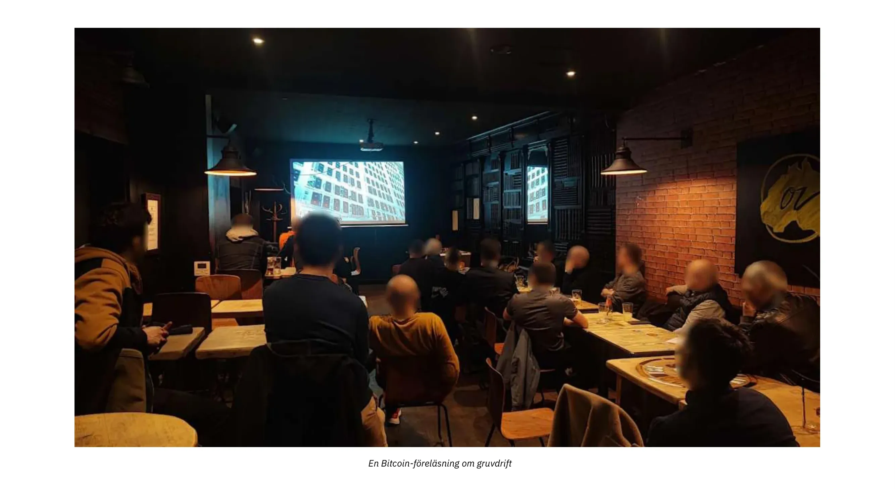

Evenemanget gav upphov till livliga diskussioner om Bitcoin Mining, dess energiförbrukning och dess bredare miljöpåverkan.

## Sätta upp affischer i din stad

<chapterId>6565e8a0-d535-5be0-9764-273584c675bd</chapterId>

I flera europeiska länder (bland annat Tyskland, Spanien och Frankrike) har bitcoinanvändare tagit initiativ till att sätta upp affischer runt om i städerna.

Vissa designer omarbetar Banksys konst för att inkludera Bitcoin-logotypen.

Ett exempel är [StreetCyberArt] (https://twitter.com/streetcyber_art), en tysk bitcoiner som har skapat collage och gatukonst i flera år.

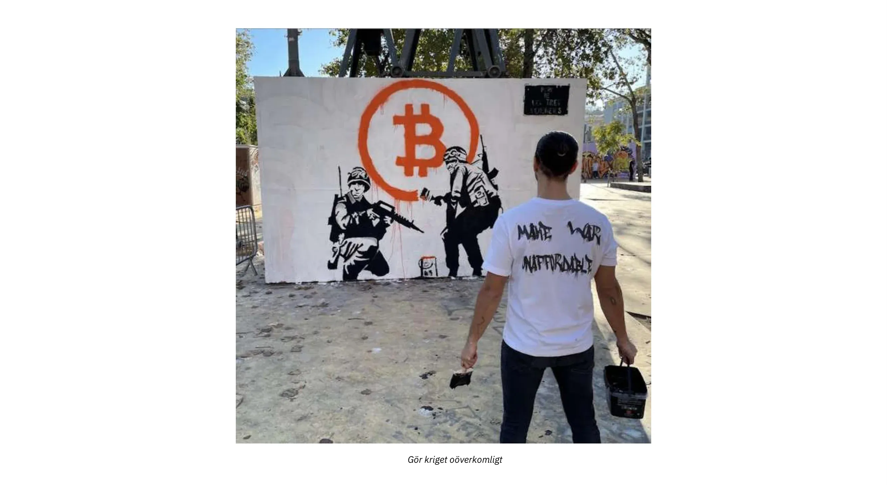

Om du vill börja affischera på gator och torg måste du sätta dig in i ditt lands lagar. I Frankrike får affischer till exempel bara sättas upp på offentliga anslagstavlor. På andra ställen är det helt förbjudet och straffbart med böter.

Om du bestämmer dig för att tänja på gränserna och hoppas att du inte ska bli tagen på bar gärning, undvik att ange någon identifierande information (t.ex. ditt namn på mötet eller @Twitter) på affischerna.

Observera också att utskrift av dessa affischer på en personlig skrivare vanligtvis resulterar i bläckblödning och snabb försämring utomhus. Det bästa är att samarbeta med ett professionellt tryckeri som kan producera dem på speciellt självhäftande papper som är utformat för utomhusbruk, vilket garanterar både kvalitet och hållbarhet.

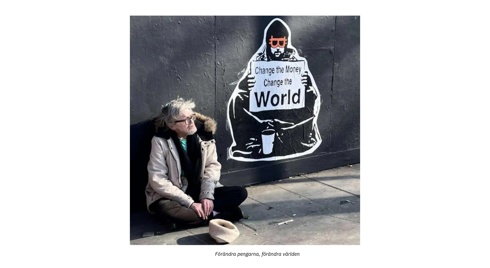

Detta initiativ kan kosta mer än 0,40 euro per affisch (ca 40 euro för hundra affischer) och priserna på nätet kan variera från det dubbla till det femdubbla. Goda kontakter är avgörande.

Som nämnts ovan har den franska bitcoinern [@Mill3sim3] (https://twitter.com/Mill3sim3) rätt professionell utrustning och kan kontaktas för mer information.

Ett annat alternativ är att göra en stencil av en stor bit kartong och använda sprayfärg för att märka ut din design på utvalda platser i staden.

## Ett personligt NFC-kort

<chapterId>8ad65d4e-a68a-59c2-a812-85f4907ed9f3</chapterId>

En annan originell projektidé är att skapa personliga NFC-kort för Lightning-betalningar (kompatibla med BoltCard-standarden). För detta är schweiziska Bitcoin Pay en bra partner.

[Deras webbplats] (https://swiss-Bitcoin-pay.ch/cards) erbjuder för närvarande fyra standardutföranden.

Om du vill beställa mer än 50 NFC-kort kan du kontakta företaget via dess officiella webbplats eller [Twitter] (https://twitter.com/SwissBitcoinPay) för att föreslå en anpassad design för kortets framsida. Baksidan kommer att förbli standardiserad.

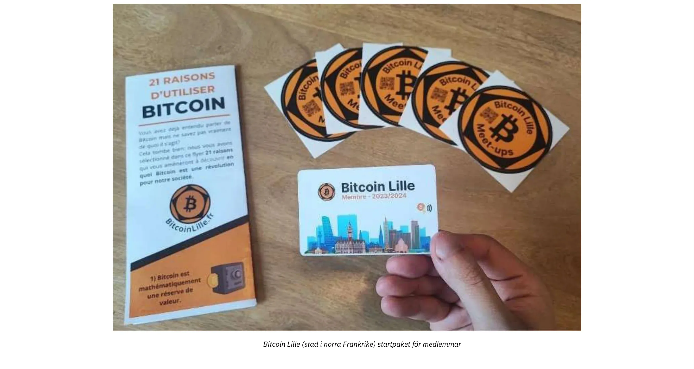

År 2023 beställde till exempel den franska föreningen [Bitcoin Lille] (https://twitter.com/BitcoinLille) ett antal NFC-kort med en anpassad design. Varje ny medlem fick ett kort i sitt välkomstpaket under året. Den här idén kan enkelt anpassas och göras personlig för din egen förening.

Enhetspriset för dessa kort varierar normalt mellan 2,50 euro och 5 euro, beroende på orderstorlek och marknadsförhållanden, med lägre priser för större kvantiteter.

## Skapa en webbplats

<chapterId>9a2a1b9b-0633-544a-b331-c06187d23d7f</chapterId>

I ett visst skede av din gemenskaps tillväxt kan det vara värdefullt att ha en webbplats som fungerar som ett skyltfönster för din grupp, möten, evenemang och utbildningsinnehåll.

Att bygga en webbplats tar tid, men i handledningen nedan visas hur du skapar en gratis WordPress-webbplats på bara 30 minuter. Du kommer att kunna skapa en anpassningsbar hemsida, publicera artiklar och bädda in media som YouTube-videor, bilder eller PDF-filer.

Senare kan du köpa ditt eget domännamn eller till och med hosta webbplatsen på din egen server.

:::video id=a1b25c18-5fc1-4b97-baef-816d819c9382:::

Även om det finns andra CMS-plattformar, vissa med enklare och mer nybörjarvänliga gränssnitt, är de vanligtvis mycket mindre anpassningsbara. Det är därför WordPress i allmänhet är den bästa utgångspunkten.

WordPress stöder också ett brett utbud av plug-ins (vissa betalda men av hög kvalitet) som kan utöka webbplatsens funktioner avsevärt utan att kräva kodningskunskaper. Ett exempel är [premium "Uncode"-temat](https://undsgn.com/uncode/)

## Skapa en videokanal (Youtube eller Odyssee)

<chapterId>076286db-1627-57ec-a410-c44b1666e1cd</chapterId>

Vissa medlemmar i din community kanske vill skapa multimediainnehåll, t.ex. handledningsvideor.

Du kan också hålla presentationer på mötesplatser eller till och med på universitet.

**När den tiden kommer kommer en särskild videokanal att låta dig publicera och centralisera allt ditt innehåll på ett ställe**

Populära plattformar inkluderar:

- [**YouTube**] (https://www.youtube.com/), som används flitigt men inte är censurresistent.
- [**Odyssee**] (https://odysee.com/), mindre populär men decentraliserad genom peer-to-peer-teknik.
- [**peertube**] (https://joinpeertube.org/fr_FR), låter dig vara värd för din egen videoplattform, men det är mer komplicerat att ställa in.

Oavsett vad du väljer, utforma plattformsspecifika bilder för att göra din kanal tilltalande. Canva, som nämns i [del 2/8] (https://planb.academy/courses/1c643dc9-a15f-4f9e-93b6-cb3c58b4ee35/3470a31f-0190-5e87-8af0-6a00e79267ef) erbjuder en "YouTube Thumbnail" -kategori med färdiga, anpassningsbara mönster.

För **inspelning** från din dator är [Streamlabs] (https://streamlabs.com/fr-fr) gratis, funktionsrikt och stöder scenövergångar.

För **videoredigering** är [Wondershare Filmora] (https://filmora.wondershare.fr/) (ca 45 €/år) enkelt att använda och ger snabbt professionella resultat.

För din **videos intro och outro** kan du enkelt hitta lämpliga mallar på Canva. Anpassa designen efter din smak, ladda ner den och lägg till den i ditt redigeringsprogram.

Tips: Om Bitcoin någonsin förbjuds eller censureras ska du alltid spara en lokal säkerhetskopia av dina videor på en Hard-enhet.

## Skapa en ljudpodcast

<chapterId>12e96b45-1c33-5687-a753-80d0114d487a</chapterId>

En ljudpodcast är ett annat bra sätt att dela idéer. Precis som med videokanaler tar det tid att bygga upp en publik.

Populära podcastplattformar inkluderar:

- [**Fountain**] (https://www.fountain.fm/), stödjer Lightning donationer.
- [**Soundcloud**] (https://soundcloud.com/);
- [**Deezer**] (https://www.deezer.com/fr/);
- [**Spotify**] (https://open.spotify.com/);
- [**Google podcast**] (https://podcasts.google.com/).

Varje plattform har sin egen publik, så att vara närvarande på flera kommer att bredda din räckvidd. **[Spotify for podcasters] (https://podcasters.spotify.com/) gör detta enkelt genom att låta dig ladda upp din podcast en gång och generate ett RSS-flöde för andra plattformar**.

Så när arbetet med "Spotify for Podcasters" är klart återstår bara att formatera innehållet för de andra plattformarna, en process som går relativt snabbt.

För inspelning är [Audacity] (https://www.audacityteam.org/) gratis och låter dig justera ljudnivåer, lägga till effekter som övertoningar och förbättra tydligheten under redigeringen. Det är enkelt att spela in din röst och skapa en podcast av professionell kvalitet.

Här är en kort 10 minuters handledning som täcker det väsentliga för podcastskapande med Audacity:

:::video id=67d80ac7-253f-40a5-b621-fef2fb7174bd:::

Tips: Precis som med videor bör du spara en lokal säkerhetskopia av alla podcasts i händelse av framtida censur.

## Skapa en badge för dina evenemang

<chapterId>0cccef8d-a765-5844-8921-c40f0ce653e4</chapterId>

På dina möten och evenemang kan ett litet incitament introduceras: evenemangsbadges. Tanken är att ** skapa en badge som endast kan erhållas vid det specifika evenemanget **. Det här konceptet finns på andra blockkedjor under namnet "POAP" ("Proof Of Attendance Protocol"). Det finns dock för närvarande inget gratis sätt att implementera detta på Bitcoin.

Ett sådant system kan också användas för att belöna de mest aktiva medlemmarna i din community. Du kan till exempel anordna en årlig utlottning där varje insamlad badge motsvarar en inträdesbiljett. En medlem som deltar i alla 12 mötena under ett år skulle ha 12 lotter till lotteriet.

En annan, mer traditionell metod är att be deltagarna vid varje evenemang att skriva sitt förnamn eller smeknamn på en badge, tillsammans med anledningen till att de deltar.

Även om det är lite formellt kan detta hjälpa medlemmarna att lättare hitta gemensamma intressen och samtalsämnen, och det gör det också lättare för nykomlingar att upptäcka organisatörerna (eller officiella medlemmar i samhället/föreningen).

Flera badge-mallar som används av Bitcoin Lille-föreningen är [tillgängliga i öppen källkod på Canva](https://www.canva.com/design/DAGHAsT15MU/AIA7-L_xBjNdsuxdD4-h-Q/edit?utm_content=DAGHAsT15MU&utm_campaign=designshare&utm_medium=link2&utm_source=sharebutton).

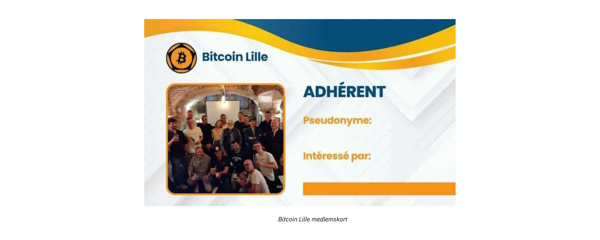

## Planering för överlämning i händelse av dödsfall

<chapterId>c5febf18-235c-51bc-8fbb-9467dabe4cb0</chapterId>

På ett helt annat sätt, låt oss Address ta upp ett känsligt ämne: bortgången av en medlem i din Bitcoin gemenskap.

En dag kanske du blir kontaktad av en tidigare medlems familj som informerar dig om dennes död. De kanske förklarar att den avlidne har lämnat instruktioner, bland annat att du ska kontakta ditt community, din mötesplats eller din förening.

I vissa fall kan familjen också söka hjälp med att återfå medel som arvtagare.

Det är klokt att samarbeta med din kommun för att i förväg fastställa ett tydligt förfarande för sådana situationer och se till att:

- Den avlidne har redan uppmanat sin familj att **aldrig dela privata nycklar eller ta med fysiska plånböcker till en träff**.
- Familjen förstår att syftet med deras besök är utbildning: att lära sig hur Bitcoin fungerar, så att de senare kan ta suverän kontroll över fonderna.
- Familjen är medveten om de relevanta lagarna i sitt land gällande gåvor, arv och konvertering av Bitcoin till fiat.

Genom att ha ett standardprotokoll förhindrar man också att någon, medlem eller gäst, utnyttjar situationen för att stjäla pengar.

Du kan bilda en särskild arbetsgrupp för att definiera denna process. Bitcoin Lille-föreningen arbetar redan med ett sådant [dokument] (https://docs.google.com/document/d/1TDfLZjuictC5s3PEM2Z7WmkxIDSJ8Q1E4xevm52pVgU/edit?usp=sharing), som de planerar att släppa som öppen källkod under de kommande månaderna.

## Föreläsningar på skolor och universitet

<chapterId>65efdb44-e3d4-567c-aedf-972765753d73</chapterId>

Listan över projekt som beskrivs ovan är naturligtvis inte uttömmande. I allmänhet är det mer sannolikt att dessa är interna projekt för deras community eller möten, som ganska enkelt kan implementeras när de utvecklas.

Låt oss nu gå över till onboarding.

Som du vet är ett av de bästa sätten **att nå en stor publik på en gång att vara värd för en gratis föreläsning**. Detta kan göras på högskolor och universitet och introducera både unga människor (och de som inte är så unga) till Bitcoin, oavsett om de är helt nya eller vill fördjupa sin förståelse.

Att hålla en föreläsning för dussintals eller till och med hundratals personer kräver mer än bara teknisk expertis. Du kommer att behöva:

- Förtroende för att tala inför publik
- God stresshantering
- Tydlig artikulation
- God förmåga att hantera tid
- En välresearchad presentation eller workshop av hög kvalitet, anpassad till din publiks kunskapsnivå

Lika viktigt är det att **ha ett öppet sinne och veta när man ska förenkla begrepp**, särskilt under frågestunden eller en paneldiskussion. Det handlar inte om att ge upp sina principer, utan bara om att erkänna att andra kanske ser saker på ett annat sätt. Ibland är det bäst att svara senare eller släppa det så att diskussionen kan fortsätta. Om dina synpunkter backas upp av solida, väl underbyggda argument kommer folk att inse det.

Om du känner dig redo, gör det! Världen behöver desperat bättre utbildning om Bitcoin.

Det här är dock ingen lätt uppgift: det kräver motivation, ansträngning och rätt kontakter.

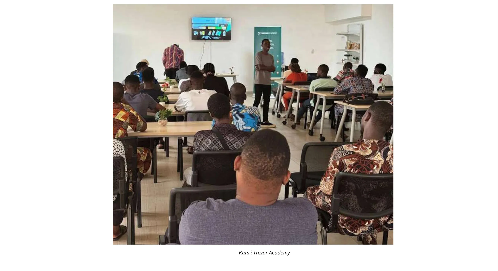

Att anordna en föreläsning eller workshop på en skola eller ett universitet börjar med att hitta rätt kontakt. Detta kan vara:

- En personlig bekant
- En studentkår
- En studentförening som anordnar föreläsningsserier eller evenemang
- Tidigare professorer från din ingenjörsskola eller ditt universitet
- Den akademiska programkoordinatorn, om du kontaktar oss direkt

Det första steget är oftast att presentera sitt initiativ eller sin förening och be om ett möte. I bästa fall leder detta till en presentation om Bitcoin inför studenterna några veckor senare.

Tyvärr demoniseras Bitcoin fortfarande av en stor del av media och många politiker, vilket får vissa att tro att det inte har någon plats i klassrummen. Avslag är vanliga, särskilt i akademiska kretsar där ämnen som Proof of Work och energiförbrukning fortfarande är kontroversiella.

Men det är ändå värt att försöka, särskilt med studentkårer och föreningar. Och vem vet? Även om ditt första försök blir ett "nej" kanske du hittar ett mejl i din inkorg under nästa bull run där du bjuds in att tala till, säg, 280 studenter!

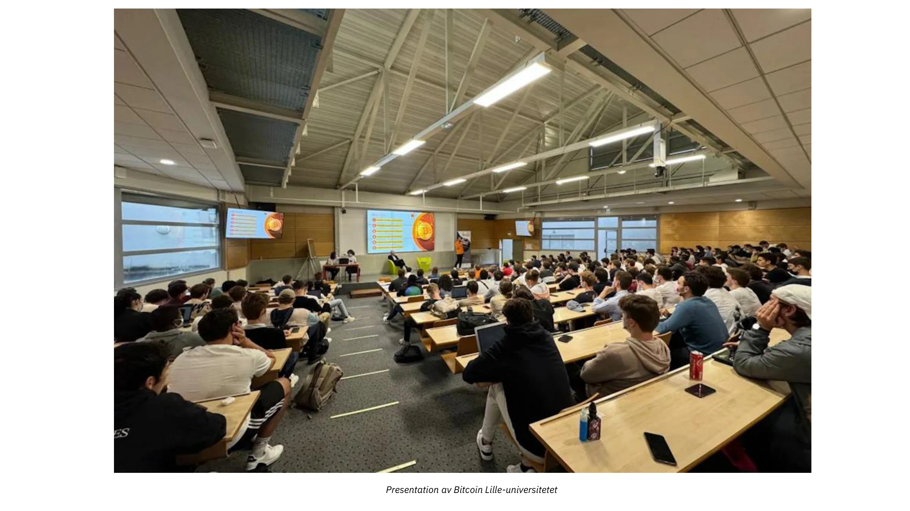

## Närmande företag

<chapterId>b730462b-7928-5d28-a14f-9ceaa773d3d2</chapterId>

Att få ett företag att acceptera Bitcoin är för många bitcoinare lite som att låsa upp en sällsynt prestation i ditt Pokédex.

Alla handlare är olika, och att introducera dem innebär en rad utmaningar:

- De behöver fortfarande fiatvaluta för att betala sina leverantörer.
- De kräver tydliga, redovisningsbara finansiella rapporter.
- Deras betalningssystem måste vara tillförlitliga, enkla att använda och stöldsäkra.
- De kan ha missuppfattningar eller negativa förutfattade meningar om Bitcoin.
- Det kan vara svårt att hitta en felfri mjukvarulösning.
- Få handlaren att förstå varför det är värt att acceptera Bitcoin som betalning.

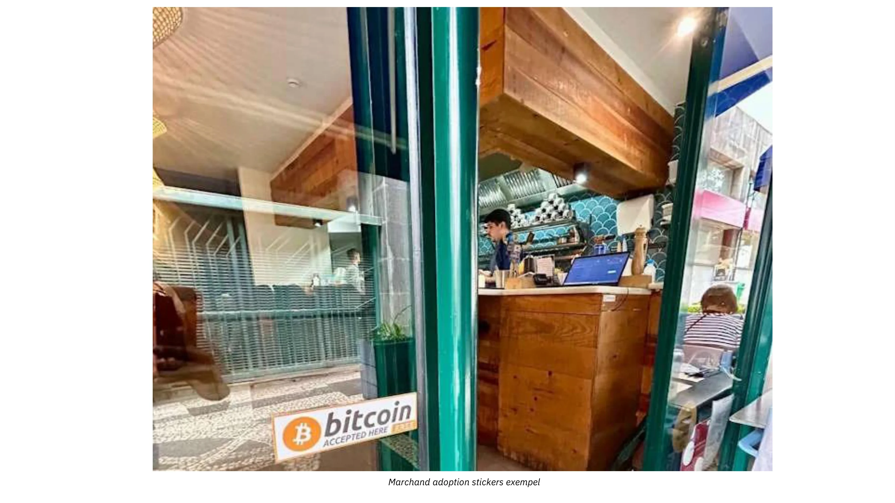

Att ta in lokala företag är ett av de bästa sätten att få stadens Bitcoin-ekosystem att växa. Nyckeln är att gå vidare steg för steg:

1/ **Befodra att betala med Bitcoin varje gång du handlar**

För det mesta får du ett "nej" och kanske en förbryllad eller till och med lite dömande blick, men bara genom att fråga planterar du tanken att Bitcoin är något som "vanliga människor" kan använda och att det blir mer och mer populärt som betalningssätt. Du kan även gå ihop med ett par vänner och besöka samma butik olika dagar och varje gång be om att få betala med Bitcoin. Förr eller senare kommer det att väcka ägarens nyfikenhet.

2/ **Erbjud en enkel och tydlig förklaring**

Om de frågar vad Bitcoin är ska du hålla det kort och utan jargong. Till exempel

*"Bitcoin är pengar som inte kontrolleras av banker, som fungerar utan mellanhänder, som inte kan censureras, som inte är föremål för inflation och som har lägre avgifter än traditionella banker."*

Ge dem sedan en flyer, som "21 skäl att använda Bitcoin" eller "10 skäl att acceptera Bitcoin i ditt företag", med din kontaktinformation eller dina mötesuppgifter. På så sätt vet de var de kan hitta dig när de är redo för en demo.

3/ **Arrangera en demonstration**

När de visar intresse kan du bestämma en tid för att visa dem en betalningslösning.

Ett bra alternativ är **[Swiss Bitcoin Pay](https://swiss-Bitcoin-pay.ch/)**, eftersom det:

    - Gör det möjligt för handlare att automatiskt konvertera BTC till fiat dagligen, så att de kan betala leverantörer.
    - Tillåter dem att hålla en procentandel i BTC om de vill.
    - Skapar exporterbara redovisningsrapporter för sina revisorer.
    - Har en enkel instrumentpanel för chefer.
    - Ger medarbetarna en intuitiv Interface för att ta emot betalningar utan att röra kassan.
    - Kostar mindre än de 2-3% avgifter som tas ut av traditionella betalningsnätverk.

4/ **Stötta dem när de börjar ta emot Bitcoin**

Efter att de är ombord:

    - Besök oss regelbundet och gör inköp.
    - Kolla in om allt fungerar som det ska.
    - Dela med dig av dina kontaktuppgifter om det behövs.
    - Bjud in dem till dina möten.
    - Lägg till dem på [btcmap.org map](https://btcmap.org/) och meddela [Swiss Bitcoin Pay](https://x.com/swissbitcoinpay) på Twitter för att öka synligheten.
    - Överväg att anordna workshops eller möten i deras lokaler.

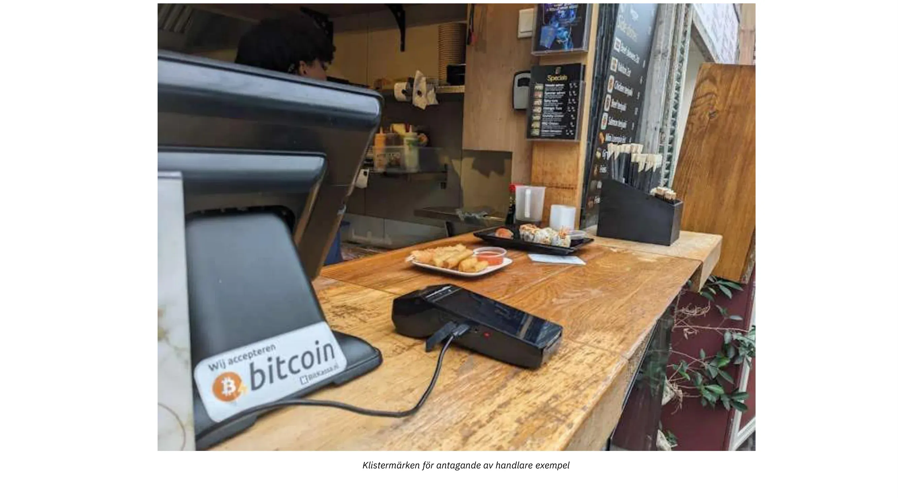

5/ **Koppla ihop lokala handlare**

När du har några Bitcoin-vänliga företag, föreslå att du skapar en Telegram-grupp endast för handlare. Detta kan:

- Låt dem dela med sig av sina erfarenheter och ta in nya företag.
- Fungera som en snabb kanal för teknisk support.
- Stärka det lokala Bitcoin-nätverket.

Canvassing är ett långsiktigt arbete. Det kräver tålamod, uthållighet och strategi. Men om ditt samhälle är redo kan du börja lägga grunden för en äkta Bitcoin cirkulär ekonomi, precis som [Arnhem i Nederländerna](https://www.arnhembitcoinstad.nl/) i Nederländerna.

## Kontakta lokal press och radio

<chapterId>435bfbc1-22dd-59bb-b737-a32ea995b238</chapterId>

Bitcoinanvändare fokuserar ofta på sociala medier och onlineplattformar för att nå ut, men det är bara en del av bilden. Lokal press och radio kan vara kraftfulla allierade.

Vissa grupper, som [Breizh Bitcoin](https://breizhbitcoin.com/) i Frankrike, **kontaktar regelbundet sina lokala medier** för att:

- Meddela kommande evenemang (möten, presentationer, workshops, Halving-fester etc.).
- Bjud in journalister att besöka Bitcoin-vänliga företag och skriva om dem.
- Dela med dig av datum och platser för evenemang för att inkludera dem i lokala listor.

Många tidningar har fortfarande en "What's On"-sektion, ofta undangömd på de sista sidorna, där de listar kommande lokala evenemang. Breizh Bitcoin har upptäckt att detta tillvägagångssätt fungerar: nykomlingar har dykt upp på möten helt enkelt för att de såg listan i tidningen.

Den här strategin kan fungera bättre i vissa områden än i andra, men den är värd att pröva. Du kan börja med att nå ut till regionala nyhetsbyråer, Frankrike har exempel som:

- [acpm.fr] (https://www.acpm.fr/Les-chiffres/Diffusion-Presse/Presse-Payante/Presse-Quotidienne-Regionale);
- [voxpublic.org] (https://www.voxpublic.org/spip.php?page=annuaire&cat=medias&type_media=Presse%20quotidienne%20r%C3%A9gionale).

och genom att kontakta lokala radiostationer för att föreslå en intervju eller ett podcastframträdande.

Var medveten om att intervjuer i media kan vara knepiga. Ord kan tas ur sitt sammanhang eller återges på ett felaktigt sätt. Förberedelse är viktigt.

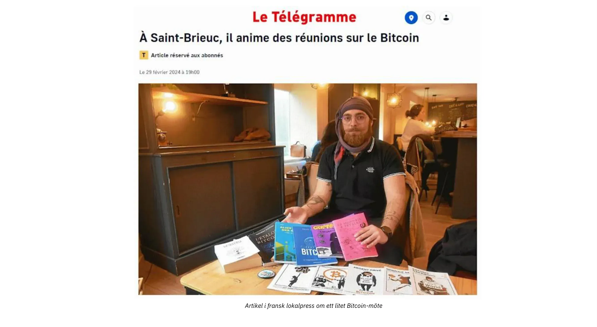

Förutom alla de projekt som föreslås i detta avsnitt kan du naturligtvis genomföra **många andra projekt**. Allt beror på din tid och motivation, men också på svårighetsgraden i det aktuella projektet.

Avslutande tips för alla uppsökande projekt:

1) **Planera framåt**: definiera dina mål, vilka steg som behövs och vem som ska göra vad.

2) **Gör det steg för steg**: undvik utbrändhet genom att anpassa tempot i dina ansträngningar.

3) **Bjud in till hjälp**: be om stöd från dina medlemmar och närliggande samhällen.

Kom ihåg: varje Bitcoin-community har varit där du är nu. Tveka inte att lära dig av deras erfarenheter och råd.

# Att förutse framtiden

<partId>6ea07445-9369-54bc-9aa0-d260db026e0b</partId>

## Planering för ett ökat antal deltagare

<chapterId>8af722d4-3a9f-548c-9001-424f2142de12</chapterId>

När Bitcoin gick in i sin fjärde era vid block 840.000 började allt fler att se den som en teknisk, finansiell och social revolution.

Precis som uppkomsten av internet kommer denna revolution att ta tid, vilket faktiskt är en fördel. Det ger människor chansen att **lär sig Bitcoin:s grunder**, förstå hur man använder det och gör det möjligt för utvecklare och företag att **bygga de protokoll och applikationer** som kommer att frigöra dess fulla potential.

Ingen kan förutspå framtiden, men vi kan **förvänta oss en kraftig ökning av Bitcoin-användningen**. Det innebär att **vara redo för alla scenarier**, även extrema sådana, som en kollaps av det traditionella finansiella systemet eller ett direkt förbud mot Bitcoin.

I den här sjunde och näst sista delen av kursen tittar vi på viktiga punkter att tänka på när din community och dina möten växer.

Det första, och enklaste att förutse, är en ökning av antalet personer som ansluter sig till er community. Detta kommer att påverka dig på två huvudsakliga sätt:

1/ **Dina kommunikationskanaler (Telegram, Signal, Matrix, etc.) kommer så småningom att bli överfulla**, vilket gör det svårare att hänga med i konversationer. Det finns två saker att tänka på.

För det första, om du har 500 personer som diskuterar alla möjliga ämnen i en enda chatt, kommer den stora volymen av meddelanden och aviseringar oundvikligen att leda till att många medlemmar stänger av. Det är en bra tid att tänka om, till exempel genom att flytta till Telegram-supergrupper eller en Discord-server, som båda gör det enkelt att organisera diskussioner efter ämne.

För det andra innebär fler personer i dina kanaler fler botar, fler bedrägerier och därmed mer moderering att hantera. Var redo för det genom att skapa en tydlig uppsättning regler som du kan hänvisa till när du modererar meddelanden. Vår erfarenhet är att detta är ett bra sätt att undvika konflikter, särskilt om reglerna är lättillgängliga i dina kanaler.

Ett bra exempel är **[Bitcoin Lille's open-source rulebook](https://bitcoinlille.fr/reglement/)** som skrevs för några år sedan för sin Telegram-grupp och Discord-server. Den är baserad på enkla, universella principer, och du kan till och med ta [en anpassningsbar version av designen här](https://www.canva.com/design/DAGHI692AD4/rjT4sqEnhajc5FiPA6GFZQ/edit?utm_content=DAGHI692AD4&utm_campaign=designshare&utm_medium=link2&utm_source=sharebutton).

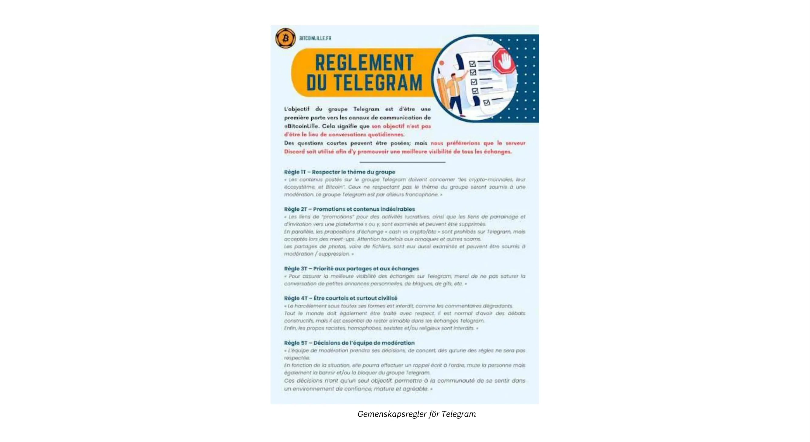

2/ **Dina möten och evenemang kommer att börja dra stora folkmassor, med massor av nya ansikten som dyker upp för att få kontakt**.

Med den här ökningen av antalet besökare:

    - det kan vara värt **att hitta en större lokal för dina möten och evenemang**, särskilt om du bara har kunnat vara värd för cirka tjugo personer tidigare.
    - om du tycker att antalet deltagare blir överväldigande kan du, för framtida möten, antingen **kräva att deltagarna registrerar sig** (via Meetup-appen eller ett enkelt formulär) eller **hålla flera möten varje månad** (till exempel: ett nybörjarmöte, ett mellanliggande möte och ett avancerat möte).
    - Samtidigt kan du förvänta dig många nykomlingar i ekosystemet, ofta med det huvudsakliga målet att tjäna pengar. För att **hålla konversationer fokuserade på Bitcoin** i dessa snabbväxande möten är det en bra idé att:

a) Inkludera en ** Bitcoin-tema presentation ** under dessa evenemang, eftersom detta naturligtvis kommer att styra mycket av konversationen mot det ämnet (och bort från det senaste förment "revolutionerande" shitcoin-projektet);

b) ** Undvik att bara umgås med andra bitcoinare**. Gör istället en poäng av att **ta kontakt med nykomlingar**, även om det innebär att hänga längst bak i rummet för att hälsa på dem. Därifrån kan du prata om varför de kom, vad de letar efter, målen (eller till och med de grundläggande principerna) för ditt community och så vidare.

Slutligen, även om det är olyckligt att behöva säga det, kan bedragare dyka upp på möten. Deras mål kan vara att prata oändligt om deras Ponzi-schema, MLM eller någon "Blockchain-revolution som drivs av AI." Det är också helt möjligt att någon med dåliga avsikter en dag kan delta specifikt för att tvätta pengar eller försöka köpa BTC med förfalskade räkningar.

I knepiga situationer som dessa är det enklaste tillvägagångssättet att artigt förklara att mötet inte är rätt plats för det och backa upp det med de argument du väljer (till exempel att nämna att det kan finnas civilklädda poliser närvarande).

Om de tyvärr vägrar att lämna eller uppträda respektfullt (ja, det har hänt) kan du Address gruppen direkt under mötet för att låta alla veta att en person, eller personer, försöker någon form av skadlig aktivitet.

Lyckligtvis är dessa situationer sällsynta och ofta mer absurda än hotfulla, men det är ändå bäst att vara förberedd.

För sinnesfrid: så länge du inte personligen bryter mot lagen eller direkt underlättar olagliga transaktioner är du inte juridiskt ansvarig för andras handlingar på ditt evenemang (åtminstone inte enligt fransk lag).

I en idealisk värld skulle du ha ett **utrymme stort nog att hysa flera dussin personer** när ditt samhälle växer och du skulle också bygga **starka relationer mellan bitcoiners** och framtida bitcoiners under björnmarknaden, så att när tjurrusningen kommer har du så många människor som möjligt redo att orange piller andra.

## Decentralisering av samhällsorganisation

<chapterId>bedfc110-e099-58f4-a5b7-fb50f3b19a49</chapterId>

Föreställ dig det här: du har drivit din Bitcoin-träff i flera år och en dag bestämmer du dig för att sluta på jobbet, kanske för att föda upp lamor i Peru eller jaga perfekta vågor i El Salvador. Vad händer med din gemenskap när du lämnar?

Vänligen planera i förväg för att överföra ditt samhälle genom:

1) **Ge betrodda medlemmar administratörsrättigheter (eller Ownership-rättigheter)** för dina kommunikationskanaler. Rollerna kan alltid bytas ut senare.

2) ** Dela kontouppgifter** (användarnamn, lösenord, tillhörande e-post) för dina sociala medier och synlighetskanaler med minst en betrodd person.

Utan denna åtkomst är det nästan omöjligt för någon annan att ta över på ett effektivt sätt. Att börja om från början, genom att skapa "förgrenade" grupper och bygga upp nätverket på nytt, är långsamt, utmattande och ofta demoraliserande.

Om du inte har någon betrodd kontakt inom din mötesgrupp kan du alltid kontakta @ProfEduStream, @copinmalin eller @gabtribe på Telegram. De kan hjälpa till att hitta en motiverad efterträdare och samordna överföringen av konton och administratörsrättigheter.

**Varför decentralisering är viktigt**

Om du är den enda som är involverad och du har all kontroll, vad händer om du försvinner? Svaret är enkelt: din gemenskap försvinner också.

Lösningen: decentralisera uppgifter, roller och åtkomst så att gruppen kan fortsätta att fungera även om en organisatör hoppar av, oavsett om det beror på tidsbegränsningar eller, i ett mörkare scenario, för att de arresteras för att ha Bitcoin utan kundkännedom.

**Hur decentraliseringen kan drivas vidare**

Anta **fri programvara med öppen källkod** som [framasoft-sviten] (https://framasoft.org/fr/) för att minska beroendet av centraliserade plattformar och öka motståndskraften mot potentiell statlig censur eller Bitcoin-förbud.

Använd **krypterade eller anonyma kommunikationsverktyg** för att skydda dina medlemmars integritet och din gemenskaps aktiviteter.

## Tänk om Bitcoin blev samhällets fiende nr 1?

<chapterId>c739651f-cd13-51e0-a36e-85023749b15b</chapterId>

Den 5 april 1933 undertecknade Franklin Roosevelt, USA:s 32:a president, **Executive Order 6102**, som gjorde det olagligt för privatpersoner att äga guldmynt, guldtackor eller certifikat var som helst i landet.

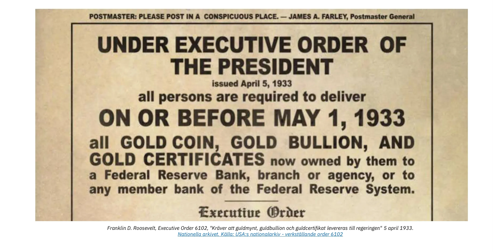

Naturligtvis är den stora depressionen (börskraschen 1929) inte vår nuvarande verklighet. Men skulle en regering en dag kunna göra samma sak med Bitcoin: **förbjuda privata Ownership helt och hållet?**

Sanningen är att en sådan Orwellian-åtgärd faktiskt inte skulle hindra någon från att verkligen äga BTC, eftersom ingen lag kan hindra en person från att memorera en sekvens av ord.

Men tänk om världens ledare till slut insåg Bitcoin:s potential att omforma den globala ordningen, även på statlig nivå? Skulle den då få etiketten "Allmänhetens fiende nr 1"?

Vi behöver inte falla in i konspirationstänkande. Men det finns inget som hindrar oss från att förutse, decentralisera och utbilda, med start nu.

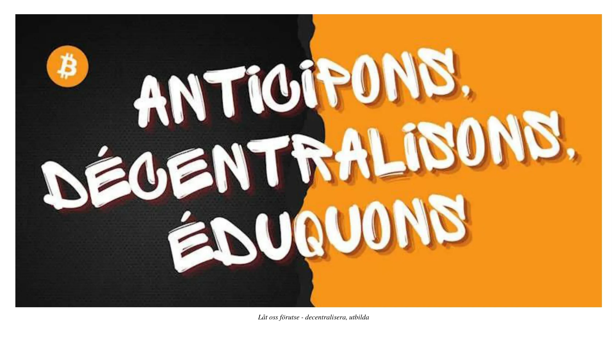

# För samman bitcoiners

<partId>62bc2138-c0be-5d39-a341-594690863257</partId>

## En snabb handlingsplan för att bygga upp din Bitcoin-community

<chapterId>1f463ec2-3f64-5641-8d60-e02a47c94f27</chapterId>

Satoshi Nakamoto skapade ett revolutionerande verktyg som redan håller på att förändra vår värld. Men det är upp till oss, bitcoiners, att bestämma hur vi formar framtiden.

Bitcoin är ett stort kaninhål som berör historia, ekonomi, litteratur, matematik, datavetenskap och kryptografi. Ingen kan utforska allt, och det är en del av dess skönhet.

Eftersom vår tid är begränsad gäller det att vara ödmjuk, fortsätta lära sig och dela med sig av Exchange-kunskap till andra. På så sätt kan var och en av oss nå den nivå av förståelse som vi söker.

**Globala Bitcoin communities spelar därför en grundläggande roll i att bygga morgondagens värld**: utrymmen där bitcoiners kan **Exchange, bygga och dela**. **Tillsammans**.

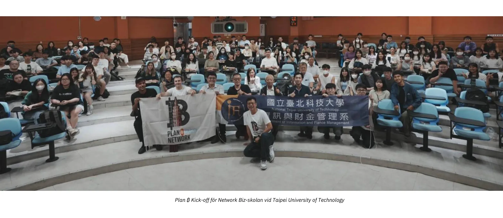

Som du har sett under hela den här kursen kräver **uppbyggnad av en Bitcoin-community och organisering av möten** både planering och motivation. Beroende på dina mål och den tid du kan avsätta kan du ta dig an mer ambitiösa projekt eller hålla saker och ting enkla.

Oavsett vilket är målet detsamma: **att väcka intresse och hjälpa Bitcoin att växa i din stad**.

För att sammanfatta de många kapitel och underkapitel som vi har behandlat, här är en **konkret "handlingsplan"** för att skapa din Bitcoin-community:

1) Bestäm i förväg varför du vill skapa en Bitcoin-community, vilka dina mål är och i vilken stad eller på vilken plats du kommer att verka.

2) Ta kontakt med befintliga grupper i närheten och tveka inte att be dem om råd när du behöver det;

3) Skapa en tydlig identitet för ditt samhälle som återspeglar ditt samhälle och din plats (logotyp, affisch, banner, flygblad etc.)

4) Skapa kommunikationskanaler och sociala nätverk som Telegram, Twitter, NOSTR, Discord eller Simplex. Överväg även decentraliserade och/eller censurresistenta kanaler.

5) Följ andra lokala möten och gemenskaper online och se till att din grupp finns med på olika kartor och plattformar för att öka synligheten.

När ditt samhälles kommunikationskanaler är aktiva:

6) Starta en undersökning för att föreslå ditt första möte när du känner att tillräckligt intresse har byggts upp.

7) Definiera de mål som du vill uppnå med detta personliga evenemang.

8) Välj en välbelägen, välkomnande lokal som stämmer överens med dina mål och reservera ett bord eller ett rum.

9) Marknadsför evenemanget på dina kanaler en vecka innan och sedan igen två till tre dagar innan datumet.

10) Lägg ut ditt evenemang på relevanta webbplatser och plattformar.

11) Låt evenemanget flyta på naturligt under dagen och engagera dig i deltagarna genom att försiktigt styra diskussionerna om det behövs.

Efteråt:

12) Fokusera på att behålla och involvera deltagare så att de återkommer.

13) Föreslå enkla projekt eller initiativ och starta dem som du personligen bryr dig om. Om någon annan vill leda ett annat projekt, stötta dem där du kan.

Äntligen:

14) Förutse framtiden genom att fundera på en större mötesplats, regler för kommunikationskanaler, en webbplats etc;

15) Uppmuntra lokala företag att ta emot Bitcoin, till och med genom att helt enkelt fråga varje gång du handlar där.

16) Delegera uppgifter och administratörsrättigheter för kanaler/nätverk till betrodda medlemmar.

17) Marknadsför din community brett så att fler blir medlemmar och engagera dem som visar intresse.

18) Gå ännu längre med projekt som du tycker om och som är viktiga för dig.

För en snabbare överblick sammanfattar denna 21 minuter långa video dessa steg:

:::video id=a59956da-f554-4b54-89dd-5ca55b722686:::

Kom ihåg att **Du är inte ensam, befintliga grupper finns här för att stötta dig**.

## Ta hand om dig själv

<chapterId>cf1631cb-ddbe-55c7-be8c-26a5652979a0</chapterId>

När du faller ner i Bitcoin-kaninhålet förändras ditt perspektiv på livet.

Djupt inom dig känner du en dragningskraft att gå vidare, att träffa andra som går igenom samma mentala resa.

Den energin driver dig att bidra med din bit till pusslet genom att dela med dig av din upptäckt: Bitcoin. Det inspirerar dig också att tänka på morgondagens värld, den du vill hjälpa till att bygga, och de samhällen som arbetar för den.

Att bygga upp en community är en lång resa som kräver motivation, strategi, engagemang och tid. Det kan vara en otacksam uppgift, så det är viktigt att ta saker steg för steg för att undvika att bränna ut sig.

**Tänk på dig själv, på dina gränser**. Och även om Bitcoin kan driva dig natt och dag, **försök inte att göra allt helt ensam, för då bränner du ut dig**.

Sök istället **hjälp från bitcoiners som redan har gått i samma tunnel, utforskat samma stigar och byggt samma verktyg**. Det kommer att spara dig mycket tid.

**Invitera dem som följer dig i det här äventyret att hjälpa till**, även om delegering gör att vissa uppgifter tar längre tid. I det långa loppet kommer ditt samhälle att bli starkare och mer motståndskraftigt.

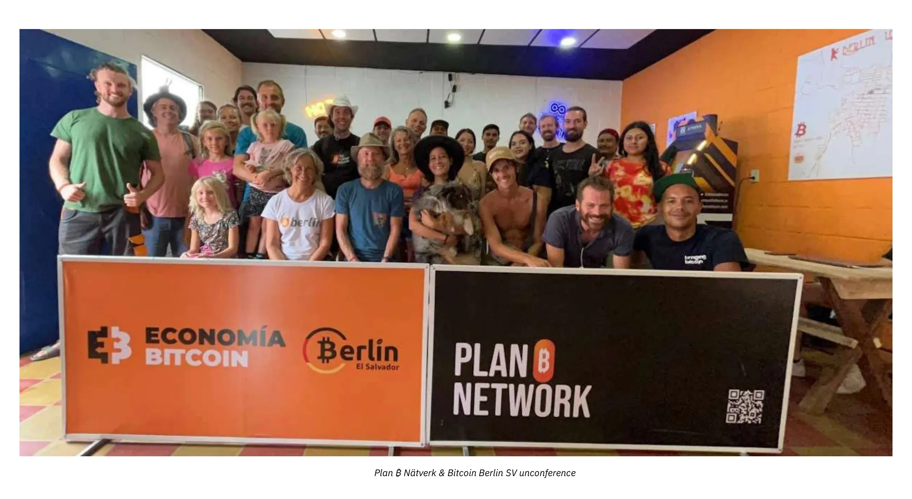

Ensam kan du snabbt utforska en av de många tunnlarna i Bitcoin-kaninhålet. Men kom ihåg,det finns otaliga andra riktningar att utforska.

**Genom att skapa och/eller gå med i en gemenskap av bitcoinanvändare, och genom att dela och utbyta med dem regelbundet, kommer du att röra dig i alla riktningar ner i kaninhålet samtidigt.**

## BTC302, Vad händer härnäst?

<chapterId>8bf10b77-80ee-5d50-87bc-0ef32574a675</chapterId>

I den här BTC302-kursen har vi gått in i detalj på hur man skapar en community eller meet-up, samt hur man startar en mängd olika projekt.

När din förening är redo att ta nästa steg kan du **skapa en formell förening**.

I Frankrike, till exempel, har nästan ett dussin av de cirka sextio communities och meet-ups en associationsstatus.

Fördelarna är tvåfaldiga:

- **Officiellt erkännande**: du kan öppna ett bankkonto för föreningen, få uppmärksamhet i press/media och till och med ansöka om bidrag.
- **Strukturerad organisation**: du kan definiera tydliga roller, vilket gör det lättare att driva din community och genomföra projekt.

För att hjälpa ditt samhälle att växa ytterligare, **en uppföljning av COMMU302-kursen**

kan komma att släppas på [planb.network](https://planb.academy/) under de kommande månaderna.

Nästa session kan behandla avancerade ämnen som t.ex:

- Utforma presentationer eller workshops för dina möten och sätt upp tydliga mål.
- Organisera ett storskaligt evenemang med cirka 100 deltagare.

För detta ändamål kommer vi att dra nytta av erfarenheterna från grupper som redan har skapat sina egna evenemang och presentationer.

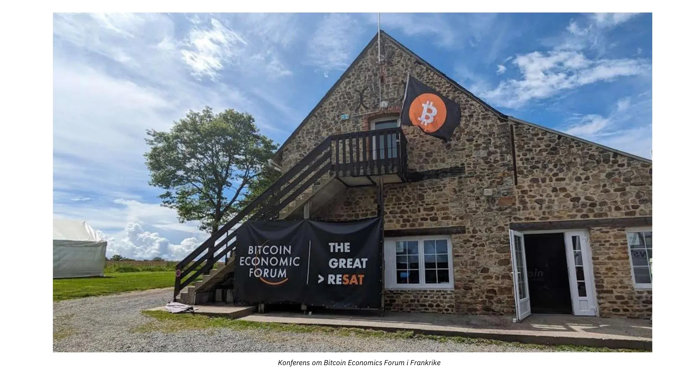

# Sista avsnittet

<partId>e9bdddf4-54c9-4de9-bbce-c3eade8c32e5</partId>

## Recensioner & betyg

<chapterId>08a35d2a-204b-519a-9bb1-588665a037fa</chapterId>

<isCourseReview>true</isCourseReview>

## Slutsats

<chapterId>d74606a5-cb14-4117-acb2-2bf5920de092</chapterId>

<isCourseConclusion>true</isCourseConclusion>