# 迈向比特币采用的第一步

如今，任何人都可以在线学习比特币，但往往缺少的是见面、交流想法和共同建设的机会。为了填补这一空白，许多比特币爱好者组建了本地社区，在那里聚会激发研讨会、演讲和有意义的讨论。

在BTC304中，我们将探讨为什么社区建设很重要，探索创建强大视觉和数字身份的工具，并分享您可以启动的简单开源项目。我们还将考虑本地倡议如何扩展为国家社区，从而帮助推动超比特币化的未来。
+++
# 导言

<partId>81318b8f-d316-5787-aa4c-4ec8370ba668</partId>

## 课程概述

<chapterId>e8991b82-4966-5e04-8f05-7cae46eacbaa</chapterId>

欢迎来到 BTC302！

自 2009 年以来，Bitcoin 不断发展壮大。这种增长是通过新的 Bitcoin 改进提案 (BIP)、创建附加层以实现网络的可扩展性（Lightning Network 等）以及发展多家公司和初创企业实现的。

其发展在 On-Chain 中也很明显，交易数量稳步增长。

例如，2018 年 1 月 1 日至 2024 年 1 月 1 日期间，Bitcoin 的主站 Layer 上的交易数量预计[增长了 66.2%](https://dune.com/queries/3375917/5663935)。同时，在 2021 年 8 月至 2023 年 8 月期间，Lightning Network 上的公开交易数量[增长了 1212%](https://river.com/learn/files/river-lightning-report-2023.pdf)。

当然，这一显著增长与以下因素密切相关：

- 全世界人民对使用 Bitcoin 的兴趣与日俱增](https://profedustream.substack.com/p/21-raisons-dutiliser-Bitcoin)，以便从银行系统中解脱出来和/或使用波动较小或贬值较少的货币，黎巴嫩、叙利亚、埃及、阿根廷和其他国家的人民就是这种情况；
- 在固定货币政策的推动下，其价格随着时间的推移不断升值，使其成为一种价值储存和长期投资；
- 投机性加密货币市场的连续增长，尤其是在 2017-2018 年和 2020-2021 年期间；
- Bitcoin 在主流媒体中的地位日益提高。

尽管 Bitcoin 仍处于早期阶段，但您可能已经意识到的这一现实促使我们思考两个关键问题：

- 我们如何鼓励比特币玩家在学习和项目中更进一步，**充分地利用 Bitcoin 的潜力？**

- 我们怎样才能帮助经常被短期投机所吸引的新手们避免在最新的memecoin热潮中损失金钱，转而专注于**学习Bitcoin的基本原理**？

解决这两项挑战的最佳办法很简单： **在现实世界中开展教育**。

本课程旨在为您提供创建和有效组织 Bitcoin 社区或聚会所需的一切知识。无论您是想建立一个本地倡议还是发展一个在线团体，本课程都将一步一步地指导您：从创建您的视觉形象到建立定期活动和管理您的交流渠道。

**第 1 部分：导言**

首先，我们将强调围绕 Bitcoin 将人们团结起来的重要性，无论是通过在线社区还是本地聚会。您将发现为什么要建立自己的社区，在哪里建立社区，以及如何制定明确的目标来促进社区的发展和长期可持续性。

**第 2 部分：为 Bitcoin 社区设计独特的标识**

要吸引新成员并培养归属感，就必须建立独特的标识。在本节中，您将学习如何设计体现 Bitcoin 社区精神的标识、海报和横幅。

**第 3 部分：为您的 Bitcoin 社区创建交流渠道**

交流是任何社区的支柱。在本节中，我们将探讨使用的最佳渠道，并指导您有效地建立 Telegram 群组或 Discord 服务器。您还将学习如何集成多功能机器人来简化社区管理。

**第 4 部分：启动社交网络**（法语）

知名度是发展社区的关键。在本节中，您将学习如何创建专门的 Twitter 个人档案、与本地聚会建立联系，以及利用 btcmap.org 等平台提高您的知名度并吸引新成员。

**第 5 部分：组织 Bitcoin 会议**

本节介绍如何组织聚会：从选择合适的地点到活动本身的运营。我们还将探讨建立参与者忠诚度和确保社区长期可持续性的策略。

**第 6 部分：项目和倡议实例** （法文）

除了简单的聚会，本部分还展示了具体的原创项目：从主题活动和研讨会到教育内容创作和地方合作。您还将学习如何设计实体和数字材料来宣传您的社区。

**第 7 部分：预测未来**

在此，我们将探讨社区的自然发展：如果发展过快该怎么办，如何分散组织的权力，以及如何应对恶劣的监管环境。本节将帮助您预测并克服这些挑战。

**第 8 部分：让比特币爱好者团结起来**

最后一部分将围绕项目的精髓展开：将 Bitcoin 爱好者团结在一个共同的愿景周围。您将学习如何构建您的方法，以吸引和留住成员、有效地分配任务，以及可持续地发展您的社区。

准备好学习如何建立一个强大、充满活力的 Bitcoin 社区了吗？让我们一起来学习吧！

## 为什么要创建 Bitcoin 社区或聚会？

<chapterId>893ea248-7d5a-5b8e-948c-7031497b1031</chapterId>

### 社区和聚会有什么区别？

虽然在 Bitcoin 生态系统中这些术语没有严格的定义，但社区最好理解为拥有共同爱好并定期交流的一群人。

而聚会则是由这个社区组织的、为这个社区服务的、有特定目的的活动。聚会通常在一个社区建立之后举行。

在本课程中，我们假设在发起 Bitcoin 聚会之前，您已经与一些对举办此类活动感兴趣的人建立了联系，换句话说，**社区已经存在**。

### 为什么要创建 Bitcoin 社区？

创建 Bitcoin 社区有几个原因：

- 知识共享与协作：社区为成员提供 Exchange 创意和分享知识的空间。相互支持是成长的关键支柱，使每个人都能加快学习速度，这对 Bitcoin 尤为重要，因为有很多东西需要探索。

- 点对点建设：许多倡议和项目都是在这些社区内构思、建立和发展起来的。

Bitcoin 社区往往追求更广泛的目标，特别是关于公众教育的目标：

1.什么是 Bitcoin？

2.如何使用

3.对社会的贡献；

4.揭穿一些公众人物和媒体误导性或毫无根据的说法；

5.Bitcoin 与其他加密货币的根本区别；

通过建立未来的第一批 "堡垒"，**全球的 Bitcoin 社区成为抵御虚假信息和审查的堡垒，同时也为学习 Bitcoin 的基本原理**了沃土。它们为新来者，甚至是怀疑论者，提供探索 Bitcoin 真正潜力所需的资源和联系。

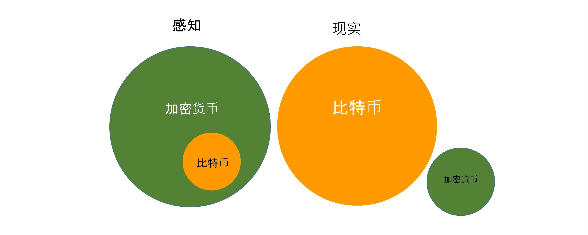

值得注意的是，**社区可以完全存在于网上**，无论是 Telegram 群组（"Bitcoin 伦敦"）、Facebook 群组（"Bitcoin 柏林"）、Discord 服务器（"Bitcoin 马德里"），甚至是电子邮件列表（"Bitcoin 法国"）。

换句话说，**社区不需要实体聚会来繁荣或启动项目。其核心目的始终如一：分享、建设和教育**。

### 为什么要创建一个聚会？

如前所述，**聚会通常是在社区建立之后举行的，是对社区的补充**。

随着比特币玩家的旅程不断发展，他们往往渴望，甚至需要，**与来自同一生态系统的其他人**见面和互动。这可能是由于在日常生活中感到孤立无援或根本没有人可以谈论 Bitcoin。

与在线音频或视频通话相比，聚会提供了更加个性化和温馨的体验。无论是**酒还是**饭，它们都能创造出非正式、友好的空间，让人们可以公开、直接地Exchange想法。

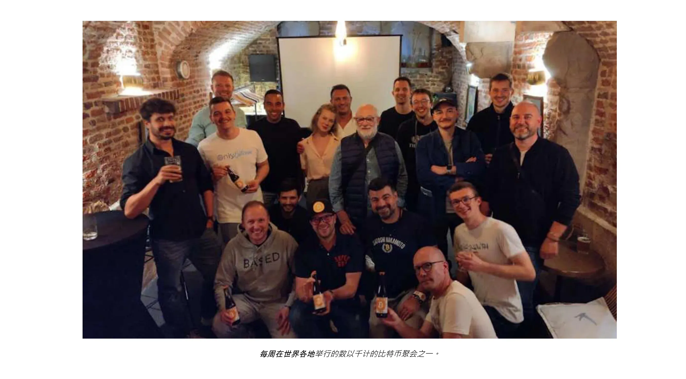

Bitcoin 聚会有多种用途：

- 讨论技术主题或正在进行的项目
- 帮助比特币新手逐步深入 Bitcoin 世界
- 宣布新项目或新举措
- 交换材料或书籍
- 预映纪录片
- 主办有关特定主题的会议或研讨会

我们将在本课程的第 6/8 部分"[项目和倡议范例](https://planb.academy/courses/1c643dc9-a15f-4f9e-93b6-cb3c58b4ee35/3213d87a-1998-5972-ab93-97a5769ba279) "中详细介绍其中的许多可能性。

虽然每个社区都可以自由地形成自己的观点，启动项目，并以自己的方式进行实验，但事实证明，聚会对于 Bitcoin 的发展和比特币玩家的成长**越来越重要**。**组织聚会确实需要时间和精力**，这就是为什么本课程分享了[法国和比利时约六十个 Bitcoin 社区](https://btcmap.org/communities/map#2/5.24949/0.20000)的综合经验，**以帮助您尽可能顺利地建立和发展自己的社区和聚会**。

## 您应该在哪里创建自己的社区？

<chapterId>72da5285-5395-592d-ab62-303a0aef3d6d</chapterId>

首先要问的问题是：你的社区应该设在哪里？

如果您想保留以后组织聚会的选择，那么这一决定至关重要。

如果会员必须驱车两小时才能参加一次活动，那么出席率很可能会很低。这就是为什么为您的社区选择合适的**地点，从而为您未来的聚会选择合适的地点，会对社区的发展产生重大影响**。

为您的决定提供一些建议：

1/ **在大中型城市**创建和发展你的社区。这将使您更容易

    - 为聚会和项目（演讲、研讨会、推广 Bitcoin 采用等）寻找令人愉快的场所；
    - 增强更多人的参与感和归属感；
    - 改善活动的可达性（公共交通、停车场等）。强烈建议选择靠近公共交通和停车场的地点。

2/ **选择一个与您所在城市相关的名称**。这样便于人们识别您的社区。例如Bitcoin 巴黎、Einundzwanzig 柏林、Satoshi Spritz 米兰等。

3/ **查看您附近是否已经有聚会**。

您可以查看 [btcmap.org](https://btcmap.org/communities/map#0/0/0/)，其中列出了全球大多数 Bitcoin 社区和聚会。

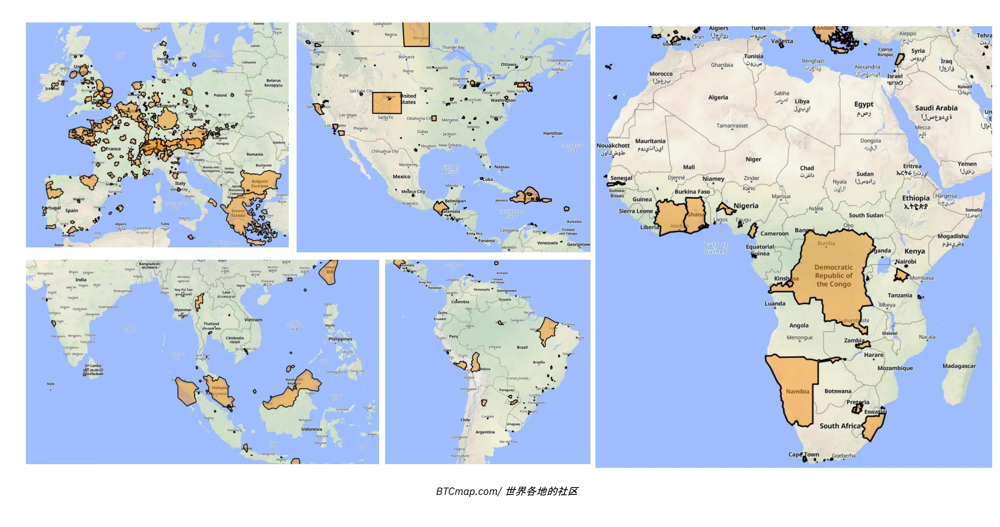

经过研究，您可能会在自己所在的城市找到现有的聚会或社区。

Bitcoin 是去中心化的，因此任何人自然都可以随心所欲。

然而，**联合起来往往比分裂附近的社区和减少各自的影响**更有意义。在已有社区的地方建立一个全新的社区，可能会无意中造成竞争。

从这个意义上说，一个简单的 "经验法则 "可以帮到你：如果在你居住的 30-45 分钟内没有活跃的 Bitcoin 社区，那就值得开始一个新的社区。尽管如此，您还是可以按照自己的意愿行事。

当然，如果一个老社区已经 "进化 "到不再符合你的价值观的方向，而你又没有时间或动力去 "橙色填充 "它们，那么创建自己的 Fork 始终是一个选择。

## 您的社区应遵循哪些目标？

<chapterId>0aae1aa8-93ec-544a-ad88-22d32c619595</chapterId>

一旦确定了社区所在的城市（或地理区域），就该**确定要实现的**了。

这些目标可以在启动时设定，也可以在几个成员加入、小组积极参与之后再进行完善。

以下几点可以为您的思考提供指导：

1/ **作为比特币玩家，我为什么要创建这个社区？教育他人？向更有经验的同行学习？认识志同道合的人？参与 Bitcoin 生态系统？与专业人士联系？或者只是喝一杯，结交新朋友？**

你的答案将决定你的定位和动机。

如果您的目标是**分享知识和教育人们了解 Bitcoin**，那么请专注于**创建教育内容**（文章、播客、视频、演示文稿、传单等），为他人节省无数的研究时间。您甚至还可以通过**组织研讨会、演讲和会议**。

如果你的目的仅仅是认识其他比特币玩家并分享经验，你可以采取更轻松的方式，比如约出来喝一杯。

这样，你会更容易建立社交纽带。但是，请永远记住，**喝啤酒并不是建设未来世界的正确道路**。

这就是为什么**制定具体的目标和项目至关重要**。

2/ 我是否应该为我的社区赋予**更多**的物质层面？如果是，你应该组织什么样的活动？

你的第一次活动很可能是一次聚会。它的主要目的是：把你所在地区的比特币爱好者聚集在一起。

不过，正如我们在后面的[项目和倡议举例](https://planb.academy/courses/1c643dc9-a15f-4f9e-93b6-cb3c58b4ee35/3213d87a-1998-5972-ab93-97a5769ba279)中所看到的，**聚会可以以多种方式建立，并有多种目标：**

- 将交流与有关 Bitcoin 概念的教育介绍相结合；
- 举办 Bitcoin 解决方案的专业演示；
- 辩论当地商家的橘皮战略；

等等。

根据主题（技术讲座或实践研讨会）的不同，甚至可以在定期聚会之外**组织额外的活动**。

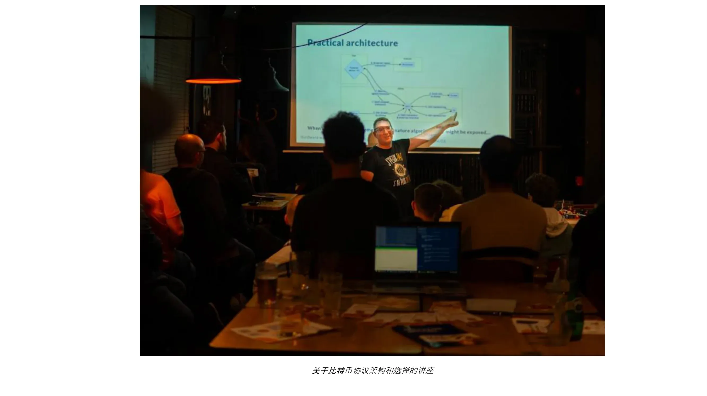

3/ 我希望我的社区如何为 Bitcoin 生态系统做出贡献？

这是一个更高级的问题，但值得尽早思考。

如果你的愿景是**建立一个紧密团结、积极进取的社区**，专注于尽可能多的橙色填充，那么：

- 与现有社区合作，以获取更广泛的信息、开源资源和所需的宝贵支持。
- 在小组内组织和分配任务，以便有效地扩展和扩大工作范围。

**设定短期、中期和长期目标**

制定计划的实用方法是为每个时间段设定目标：

- 短期：建立社交媒体，建立社区沟通渠道。
- 中期：创建教育资源（文章、传单、视频）。
- 长期：定期举办实体聚会。

一旦建立了聚会，您就可以瞄准以下目标：

- 短期：主办有关特定主题的讲习班或介绍会
- 中期：开展 Bitcoin 宣传或教育活动
- 长期：与接受 Bitcoin 作为付款方式的酒吧建立正式协会或伙伴关系。

做好准备： **建设社区需要付出努力**

创建社区并非一朝一夕之事。它需要时间、动力和组织。

有时，这甚至会让人感到气馁，尤其是当没有人来的时候，你会觉得只有你一个人肩负着这个使命。

因此，**本课程旨在分享宝贵的资源和技巧，帮助社区有效发展，最终实现自给自足。**

# 设计社区标识 Bitcoin

<partId>da6673ad-bf49-5979-80a6-3f69cfb28046</partId>

## 为什么以及如何创建自己的身份？

<chapterId>b48a18cc-afdf-5216-802c-32647b5cd8a3</chapterId>

在现阶段，我们假设

- 您已经知道您的社区（或未来的定期聚会）将设在哪里。
- 您已经为不同的时间跨度设定了目标，即使这些目标尚未最终确定。

建立社区的下一步是**确定其身份，包括名称和视觉风格**。

本部分提供教程和适合初学者的软件解决方案，帮助您设计社区的视觉形象，即使您的技能还很初级。

**身份为何重要？**

当人们能够认同一个群体时，他们就会更加投入和投入。强烈的认同感能让你的社区脱颖而出，并培养归属感。

一切都要从取名开始，而每个国家往往都有自己的趋势：

- 法国：在 60 多个本地社区中，大多数都使用 "Bitcoin [CITY]"或"[CITY] Bitcoin "这样的名称。他们的 Telegram 群组通常采用这种模式："Bitcoin [CITY] meetup"。
- 德国：Einundzwanzig（意为 "21"）倡议激发了 "Einundzwanzig [城市]"等名称的灵感。
- 意大利：Satoshi Spritz 网络使用 Satoshi "Spritz [CITY]"等名称。

**每个社区都有自己的特性，与家乡相连，但又与国家的广泛特性相联系**。

你的视觉形象：徽标、颜色、横幅，是人们对你的团体的记忆和联想。

在创建社交媒体账户和交流渠道时，拥有徽标和横幅是一大优势。别担心，你不需要专业的设计技能，免费且易于使用的工具随处可见。

一个很好的起点是将您所在城市的地标或标志融入其中。在巴黎，这可能是埃菲尔铁塔。在里尔，可以是钟楼或城堡。在纽约，自由女神像。在伦敦，大本钟，等等。

在此基础上，你可以根据自己的喜好设计一个简单或更详细的徽标。

以下是一些法国社区标识的范例，希望能给您一些启发：

- 在马赛，徽标代表着俯瞰城市的圣母大教堂：

- 在摩纳哥，它指的是摩纳哥岩石：

- 在里尔，光滑的徽标代表着沃邦城堡及其公园：

- 在圣马洛（Saint-Malo），镇徽朱雀（ermine）被凸显出来：

**如果你愿意，请继续**

如果灵感来了，您还可以更进一步：为您的社区创作徽章、座右铭甚至歌曲。你的创造力是唯一的限制！

## 制作徽标、海报和横幅

<chapterId>3470a31f-0190-5e87-8af0-6a00e79267ef</chapterId>

### 使用 Canva

您可以使用 [Canva](https://www.canva.com/) 为您的社区创建各种视觉效果。

这个免费且易于使用的平台因其庞大的预设计模板库而广受欢迎，只需点击几下即可复制和定制这些模板。

**创建您的徽标**

在 Canva 主页上，搜索预先设计好的徽标。选择一个或几个能激发您灵感的徽标，复制它们，然后进行定制，使其与您的社区相匹配。

您可以在背景中添加当地地标或徽章（导入照片或在 Elements 菜单中选择 "插图 "或 "图像"），然后叠加 Bitcoin 徽标或₿，必要时调整其颜色。

**制作标语和海报**

要制作横幅或海报，请搜索 Canva 库中的预设计模板。复制一个模板后，修改文字和字体，添加社区徽标，并使用相框导入任何照片（在 Elements 菜单中选择 "相框"）。

您还可以使用 "设计 "菜单来查看符合您需求的其他型号。

对于 YouTube 缩略图或横幅广告，只需搜索这些模板，复制并按需定制即可。

总之，**的可能性是无限的，不仅取决于您的需求，还取决于您想为您的社区和聚会/活动创建**的视觉风格！

为了让您更清楚地了解这些可能性，我们特意为您提供了一个不完整的视频教程：

:::video id=d11ae0ed-eacd-4924-afd3-75aff95d2899:::

**来自 Bitcoin Lille 的模板示例**

以下是现成的 Canva 模板，您可以复制并为您的社区进行调整：

- 会议公告海报**（用于社交媒体和 A4/A3 打印）**：[link](https://www.canva.com/design/DAGBvBXFJ8A/92-j_toeLU8QbVAD0NwoAA/edit?utm_content=DAGBvBXFJ8A&utm_campaign=designshare&utm_medium=link2&utm_source=sharebutton)

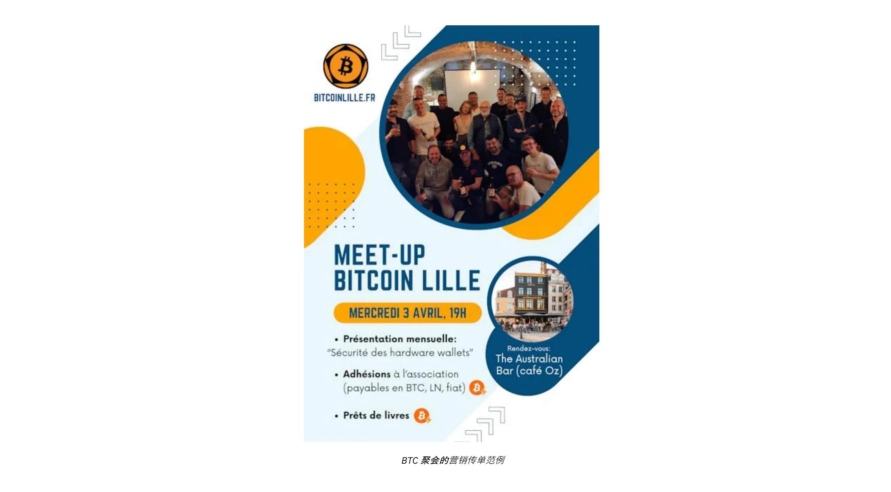

- 活动海报（用于社交媒体和 A4/A3 打印）：[link](https://www.canva.com/design/DAGBvG3rNCc/oXtNR9pduRs22AqclG4O2g/edit?utm_content=DAGBvG3rNCc&utm_campaign=designshare&utm_medium=link2&utm_source=sharebutton)

- 社交媒体横幅：[link](https://www.canva.com/design/DAGBvOXyNqw/iSJG9PbIQHgGWHz5PhlXSQ/edit?utm_content=DAGBvOXyNqw&utm_campaign=designshare&utm_medium=link2&utm_source=sharebutton)

- **竞赛公告**：[link](https://www.canva.com/design/DAGBvIjuA_w/YzSUXzOmbNV9oCma9mluOw/edit?utm_content=DAGBvIjuA_w&utm_campaign=designshare&utm_medium=link2&utm_source=sharebutton)

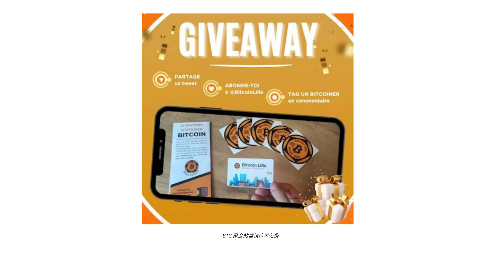

- 我们图书馆的品牌指南，在聚会时展示在 A4 纸上：[link](https://www.canva.com/design/DAGBvPqL7N4/LmUItfsysypRLSOFOzBXcQ/edit?utm_content=DAGBvPqL7N4&utm_campaign=designshare&utm_medium=link2&utm_source=sharebutton)

- PowerPoint 演示**"第 2 章 - 理解 Bitcoin 交易"**，由 @ProfEduStream 制作：[链接](https://www.canva.com/design/DAFsEcnOro8/Mz9FYdTGhsvozZOe0Y9jtw/edit?utm_content=DAFsEcnOro8&utm_campaign=designshare&utm_medium=link2&utm_source=sharebutton)

- 传单**"使用 Bitcoin 的 21 个理由"**，由 @ProfEduStream 撰写：[链接](https://www.canva.com/design/DAFtAR1NauQ/ZDwl2CchIJ9Gpb36N6-7iw/edit?utm_content=DAFtAR1NauQ&utm_campaign=designshare&utm_medium=link2&utm_source=sharebutton)

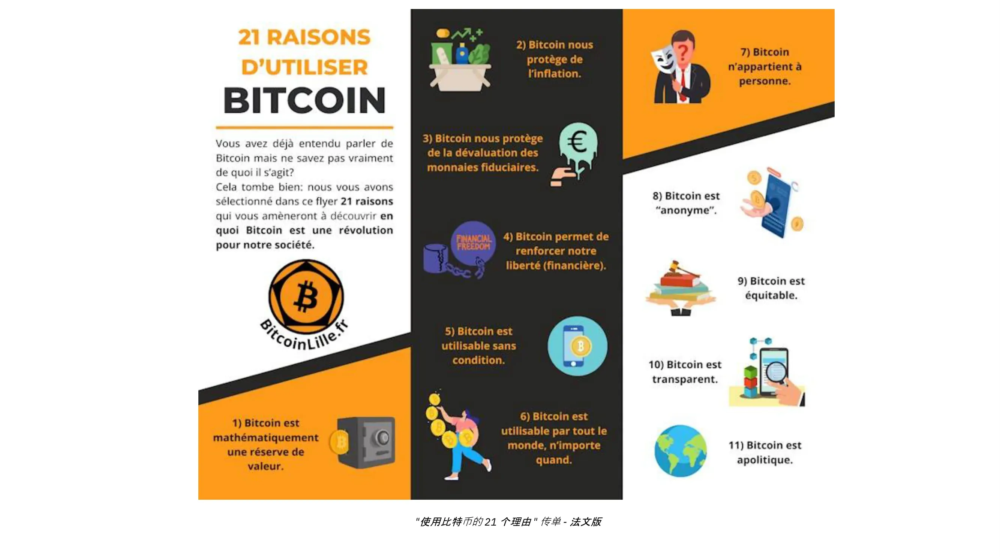

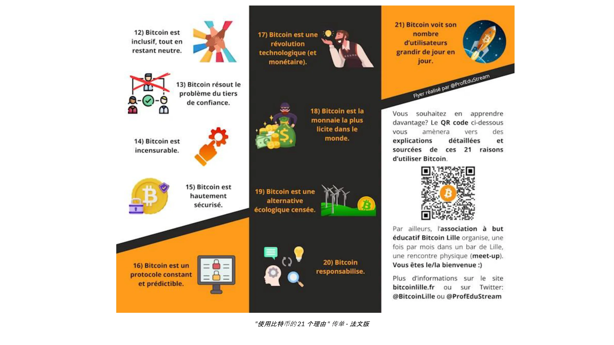

**分享您的创作**

可能性是无限的，您的设计将取决于您的目标和视觉形象。考虑以开放源代码的方式共享您的模板，这样可以为其他 Bitcoin 社区节省时间，因为他们不可避免地会面临与您相同的挑战。通过分享，您可以帮助各地的 Bitcoin 社区加速成长。

**建议尺寸**

制作视觉效果时，请务必查看每个平台的尺寸要求：

| Platform | Logo | Banner | Poster / Image
| -------- | -------- | -------- | -------- |
| Telegram     | 512 x 512     | N/A     | N/A     |
| Signal     | N/A     | N/A     | N/A     |
| Twitter     | 400 x 400     | 1500 x 500     | 1200 x 628     |
| Meet-up     | N/A     | N/A     | N/A     |
| Discord     | 512 x 512     | 960 x 540     | N/A     |
| Facebook     | 512 x 512     | 851 x 315     | 960 x 720     |

通常尺寸合适：

徽标：512 x 512 像素

横幅：因应用程序或网站而异

海报：A4 是标准打印格式

### 使用人工智能

虽然 Canva 为创建徽标、海报、横幅和传单提供了多种工具，但它并不是唯一的选择。如果您更擅长使用其他软件（如 Photoshop 或 Illustrator），请使用最适合您的软件。

也就是说，无论你是在设计社区徽标，还是在增强海报、演示文稿或传单的效果，**人工智能都可以成为你创造独特、吸引人的视觉**的强大盟友。

有许多人工智能可用于这一目的。其中包括

- [midjourney](https://docs.midjourney.com/docs/quick-start)（付费）；
- [leonardo](https://leonardo.ai/)（免费，有账户限制）；
- [copilot](https://copilot.microsoft.com/)（免费，有账户限制）；
- [DALL-E](https://www.dall-efree.com/)（付费）。

最近还出现了许多其他人工智能工具，因此这份清单还远远不够详尽。

**举例说明创建具有未来感的 Bitcoin 伦敦徽标**

如果你想为 "Bitcoin 伦敦 "聚会设计一个未来派标志，可以向 Copilot 咨询：

- [ ] *提示：创建一个以伦敦桥和大本钟为背景的 Bitcoin 徽标。未来派* - [链接](https://copilot.microsoft.com/images/create/un-logo-Bitcoin-futuriste-avec-en-arric3a8re-plan-le-/1-6612ba1758df4384bc33c4bca00ab45b?FORM=SYDBIC)

如果前四项结果不够现实，请完善您的要求：

- [ ] *提示：让第四个更真实* - [链接](https://copilot.microsoft.com/images/create/un-logo-Bitcoin-futuriste-avec-en-arric3a8re-plan-le-/1-6612ba64b72d4cea9830ab7eb844f785?FORM=SYDBIC)

最新的结果非常好！

*示例：创建简洁的英式徽标**创建简单的英式徽标**

为了看起来更干净，就像贴纸一样：

- [ ] *提示：创建具有英式简洁风格的 "伦敦 Bitcoin Meetup "徽标* - [链接](https://copilot.microsoft.com/images/create/logo-for-27londres-Bitcoin-meetup27-with-a-british-a/1-6612bb9451924859a6c34b350b3a6ebc?FORM=SYDBIC)

结果看起来真的很酷！

**与人工智能合作的技巧**

- 要有耐心：人工智能可能不会在第一次尝试时就产生你所设想的效果。

- 使用准确的提示：指示越清晰、越详细，效果就越好。

- 寻求帮助：如果你不满意，可以向有图形设计或人工智能工具经验的人寻求帮助，许多比特币玩家都会乐意提供帮助，有时甚至是免费或只需支付几个 Sats 美元。

# 为您的 Bitcoin 社区创建交流渠道

<partId>fc588298-6876-554c-bd57-55d182464878</partId>

## 您应该选择哪些传播渠道？

<chapterId>b4f4eef6-1035-5290-848a-2b7f9391c77a</chapterId>

如上所述，社区的交流渠道会因动机和习惯的不同而不同。

例如，**在法国、德国和意大利，Telegram 和 Twitter 是主流平台**，已成为 Bitcoin 社区的 "标准"。

相比之下，在捷克共和国，许多社区使用安全即时通讯协议**Matrix**，而不是 Telegram。

提示：在选择渠道之前，**看看附近的社区都在做什么**。使用地图 [btcmap.org](https://btcmap.org/communities/map#0/0/0/) 查看您所在地区最受欢迎的平台。

例如，瑞士社区主要使用 Telegram、Twitter 和自己的网站：

**法语社区推荐渠道**

- Telegram：第一大通讯工具，超过 90% 的法国聚会使用它。

- 推特（X）：全球比特币用户使用的主要社交网络。约 70% 的法国聚会都使用它。它是接触比特币爱好者的理想工具。

- Meetup.com：付费但被广泛使用（约 30% 的法国聚会和几乎所有的加拿大聚会），以提高 Bitcoin 生态系统之外的知名度。

- 其他选择：~约 30% 还拥有网站；约 10% 经营 Discord 服务器或 NOSTR 账户。

还可以使用 Matrix、Keet、Signal、Facebook、Instagram 和 LinkedIn 等其他平台。需要注意的是，你管理的渠道越多，你就需要花更多的时间来管理、发布和保持它们的活跃。

因此，任何希望在法国建立社区的人最好从创建开始：

- 一个 Telegram 群组；
- 一个 Twitter 账户。

随着社区的发展壮大，您可以添加更多平台，并委托可信赖的成员进行管理。

## 创建并配置 Telegram 频道、群组或超级群组

<chapterId>d13714ce-8f08-53e9-bedd-b6a3aaac5dad</chapterId>

在 Telegram 上创建您的社区交流空间之前，有必要了解以下两者之间的区别：

- 一个 Telegram 频道；
- 一个 Telegram 群组；
- 一个 Telegram 超级团队。

强烈建议从 Telegram 群组开始。

如有需要，您可以稍后将其转换为超级群组。

在下面的教程中，我们最初使用的是 "Telegram+"APK，它可以进行更高级的配置。不过，你并不一定需要它，因为官方 Telegram 应用程序足以创建和管理群组，即使通过手机也可以：

:::video id=b1da7cb4-5fb1-4a41-a1d4-bd90686826a9:::

### 创建 Telegram 频道

如果您想创建一个可以让成员直接对话、互相回复等的地方，那么您可能需要创建一个 Telegram 群组，而不是 Telegram 频道！

直接进入下一节，标题为 [创建 Telegram 群组](https://planb.academy/courses/1c643dc9-a15f-4f9e-93b6-cb3c58b4ee35/d13714ce-8f08-53e9-bedd-b6a3aaac5dad)。

事实上，**Telegram 频道更像是管理员**的单向广播工具。成员不能自由聊天，他们只能用表情符号做出反应（或在单独的线程中留言，这样会使对话变得支离破碎）。

**由于社区需要互动和协作，如果你的目标是建立关系和分享知识，不建议** Telegram 频道。

创建 Telegram 频道的教程：

:::video id=98be4709-d221-4030-8c31-e10113482515:::

### 创建 Telegram 群组

另一方面，**Telegram 群组是社区**的理想选择：就像 Messenger 或 WhatsApp 等消息应用程序一样，成员可以在一个共享对话中聊天并相互回复。

作为管理员，您能做些什么？

- 张贴和固定重要信息。
- 创建**民意调查**（在社区刚成立时，用于决定聚会日期）。
- 创建**自定义邀请链接**（仅当群组为 "公开 "而非 "私人 "时，"私人 "在设置中定义。拥有自己的 Telegram 邀请链接也很方便，例如：t.me/Bitcoin[CITY]）；
- 管理成员权限、角色和审核。
- 添加个人资料图片（您的社区徽标）并更新群组名称。

创建 Telegram 群组的教程：

:::video id=3d4792a7-1345-475b-93b1-b3a3945fb567:::

注：本教程使用 Telegram+ 制作，但您也可以直接从标准的 Telegram 移动应用程序完成所有操作。

### 创建 Telegram 超级群组

为什么是超级组合？

当你的 Telegram 群组发展到数百个成员时，对话可能会变得混乱。这往往会导致成员错过重要通知，比如下次聚会的日期。

有几种解决方案可供选择：

1. **将重要信息**固定，以便所有成员都能收到通知（用手指在相关信息上按一下，然后选择 "固定"）；

2.考虑使用**Discord**来提供多个通信渠道，每个渠道的用户都可以在需要时将其静音。

3. **将你的 Telegram 群组转换为超级群组**。

什么是 Telegram 超级群组？

超级群组本质上是一个 Telegram 群组，其中包含主题（子频道）。

主题示例：

- "重要信息"：只有关键更新和活动公告。
- "一般"：供所有成员讨论。
- 具体主题：例如，Mining、项目开发、即将召开的会议。

提示：根据社区需求调整主题。举例说明：阿比让 Bitcoin 会议成功采用了这种形式。

请记住，**Telegram 超级群组对于某些成员来说使用起来可能会有点麻烦**。例如，并非每个人都知道**如何访问不同的主题**（他们只需点击 Telegram 主菜单中的群组徽标即可查看完整的主题列表）。发送快速截图可以帮助您消除困惑。

何时从普通 Telegram 群组切换到超级群组没有严格的规定，这完全取决于成员的需求。好消息是，您可以轻松地来回切换：只需创建一个主题即可转换为超级群组，或者删除除 "常规 "外的所有主题返回常规群组。

创建 Telegram 超级群组的教程：

:::video id=f78800ae-d8ca-479a-b913-99abd9916bff:::

快速说明：如前所述，上述教程是在电脑上使用 "Telegram+"APK 制作的。不过，如今在手机上创建 Telegram 超级群组也很简单。

只需创建一个 Telegram 群组，进入其设置，然后点击 "话题 "按钮添加话题。保存后，你会看到一个主题列表，可以随意编辑。

因此，除非你想为你的超级群组访问更高级的隐私设置，否则没有必要再下载 "Telegram+"了。

## 设置 Telegram 群组或超级群组

<chapterId>35e674b3-5924-50b0-98f1-83a56c9a186d</chapterId>

现在你的 Telegram 群组（或超级群组）已经建立并运行，是时候**配置权限和设置管理**了。

每个社区都可以自由选择自己的方法，但经验表明，**好的办法是限制某些成员的权限**：

- 发送调查问卷
- 发送文件（避免潜在病毒）；
- 发送语音信息
- 添加用户（有助于防止僵尸入侵）；
- 钉住信息；
- 编辑组信息。

在创建 Telegram 群组或超级群组时，强烈建议**对您的聚会**进行清晰的描述，因为这是潜在成员首先会看到的内容。例如

> 欢迎来到 @Bitcoin 的电报 [CITY] 🔥
>

> 我们每个月的第一个星期三在 [城市] 的 [BAR_NAME] 酒吧组织聚会 🍻
>

> 查看我们的其他社交网络：[链接] 🌐

在本例中，Bitcoin 里尔的管理员自定义了他们的公共 Telegram 链接，以方便分享。

在 "组设置 "中，最好**启用 "批准新成员 "**。

一些 Bitcoin Telegram 群组已成为数千个假冒账户的攻击目标，这些账户的目的是发送垃圾邮件或扰乱社区。

**激活成员批准可使您的群组免受垃圾邮件攻击**。

在管理员部分，您还可以启用 "强力反垃圾邮件 "功能，自动删除可疑邮件。

这并不总是必要的，但可以增加额外的 Layer 保护。

## 在 Telegram 群组中添加多功能机器人

<chapterId>c61f69cc-15ec-53f1-8c02-1cea55def09e</chapterId>

**配置和保护 Telegram 群组或超级群组的另一个方法是添加一个多功能机器人**。这样可以大大扩展群组的功能和管理能力。

使用**机器人 [@GroupHelpBot](https://telegram.me/grouphelpbot)** ，最有用的选项有

- **规则命令** (/rules) 用于显示社区指南；
- 反垃圾邮件**保护**，可过滤可疑邮件和账户；
- 可定制的新会员自动欢迎信息**（可选择在几分钟后自动删除）**
- 防洪保护，防止垃圾邮件
- 用于快速联系组管理员的 **@administrator 命令**
- **阻止不受欢迎内容的规则**
- 一个**组链接命令** (/link)
- 指挥**许可管理**
- 自动删除**特定信息类型**
- 僵尸拦截**和出入口拦截**，确保您的团队安全
- 列出您**社区的社交网络** (/networks)
- 还有更多

还有数不胜数的附加功能。

专业建议：**不要过度限制谈话**。

向 Telegram 群组或超级群组添加多功能机器人的教程：

:::video id=cdbf82d6-3530-45c4-90de-593f100863bb:::

(注：现在整个过程都可以直接在手机上完成。不再需要 Telegram+ 应用程序）。

## 创建 Discord 服务器

<chapterId>eef2a965-4c24-5f3a-8013-72cc7d315314</chapterId>

当你的 Telegram 群组过于庞大时，将其转变为 Telegram 超级群组有助于组织讨论。

不过，如前所述，**增加的复杂性以及主题和信息的增加可能会使一些活跃会员失去兴趣**。

为什么考虑 Discord？

**Discord 是 Telegram 超级群组的**替代选择，因为它允许用户**创建特定的文字和语音聊天室**，并允许成员将他们不感兴趣的频道静音。

当然，同时管理 Telegram 和 Discord 需要更多时间，尤其是在配置和启动期间。

为了方便您，**我们共享了一个[您可以复制和自定义的 Discord 服务器](https://discord.com/template/bDY4eXXJk2C8)**：

:::video id=e647458a-a21e-44e0-bd03-20b82a871777:::

如果设计得当，Discord 服务器可以成为社区的真正资产。许多比特币用户已经开始每天使用 Discord，在 Discord 中直接关注 Telegram 对话（反之亦然）可以为大家节省大量时间。

为了同步两个平台，有一个名为 [TediCross](https://github.com/TediCross/TediCross) 的开源机器人。它的目的很简单：自动将 Discord 文本频道中的消息转发到 Telegram 群组（或超级群组中的主题），反之亦然。

不过，请记住，它并不是最容易安装的。你需要在电脑上运行命令提示符 (CMD) 才能让机器人工作，而且偶尔可能会出现错误。幸运的是，修复起来很简单：只需重启机器人，大多数时候一切都会恢复正常。

为了节省您的时间，下面是如何将这个多功能机器人添加到 Telegram 群组或超级群组的教程：

:::video id=6a0283f6-6d6c-4e81-8b2f-644b33c52fe6:::

## 考虑其他更私密、更安全的通信渠道

<chapterId>29d0aad6-0612-5dd0-bcef-7337eaf4fefc</chapterId>

如前所述，Twitter 和 Telegram 是欧洲（甚至全球）Bitcoin 社区使用最广泛的通信工具。

然而，Telegram 并不是众所周知的最安全或最注重隐私的消息应用，而 Twitter（现在的 X）则由地球上行动最自由的公司之一所拥有。

这就是为什么一旦你的核心渠道就位，一切运行顺利，就值得花时间探索其他选择的原因。

在接下来的几个月里，本课程和 planb.network 平台将提供关于如何使用**Simplex 和 Element** 等替代协议的教程：分散、加密和高度可定制的通信工具。

**为什么要费心研究这些选项？**

因为，就像 NOSTR 社交网络一样，它们不仅能提供更多隐私，还能防止审查或任意关闭您的 Telegram 群组。

实际上，还有什么能比抵制审查和具有弹性的设计更符合 Bitcoin 的精神呢？

# 启动您的社交网络

<partId>8ebf8cd7-9248-543f-bc27-4ec4cc03f9cf</partId>

## 知名度对发展 Bitcoin 社区的重要性

<chapterId>b20f12e4-c5de-5f02-80c7-b7fc6cadd3ac</chapterId>

你的社区已经建立并运行。你建立了 Telegram 或 Matrix 空间......但现在，那里只有你一个人。 **是时候让人们知道你的存在了！**

这很简单：如果没有人能够访问你的群组并查看下一次聚会的时间，你就只能在空空如也的群组里发布信息。这就是为什么社交媒体，以及我们稍后将介绍的几个特定平台，对于建立你的社区如此重要。

推特（X）几乎已成为 Bitcoin 在线对话的代名词。它并不完美，远非如此，但目前它是大部分社区的聚集地。强烈建议在那里创建一个账户。

为了防范可能的审查或限制，一些社区还开设了 NOSTR 个人档案。

这就是 FREE Madeira 集体所做的工作。

当然，其他平台也很有用。Facebook（群组或页面），甚至 LinkedIn。

不过，请记住，**管理的传播渠道和社交网络越多，所需的时间就越**。通常情况下，最好将**重点放在最相关的**上，Twitter（和 NOSTR）就是很好的选择。

## 创建 Twitter 个人资料

<chapterId>c8d73097-8eba-5530-918c-221002954110</chapterId>

Twitter 非常容易使用，要改善隐私，你需要调整一些设置。

**创建新的 Twitter 账户时，必须输入四项基本信息：**：

1/ **的 @ Twitter**，它定义了你的身份，让你很容易被找到。如果你的社区名称是 "Bitcoin [CITY]"，那么选择"@Bitcoin[CITY]"就很合适；

2/ **您为社区或聚会创建的徽标和横幅**（请参阅[创建徽标、海报和横幅]部分(https://planb.academy/courses/1c643dc9-a15f-4f9e-93b6-cb3c58b4ee35/3470a31f-0190-5e87-8af0-6a00e79267ef)）；

3/ **描述**，您可以用几百个字符分享社区的关键信息。例如

> Bitcoin [CITY] 社区的官方账户 #BTC | 每月第一个星期三在 [CITY] 的 [BAR_NAME] 举行聚会 🍻 | 在 Telegram 上加入我们 🔽

4/ 在描述下方，可以**插入链接**。这可以引导用户访问社区网站上的 "社交媒体 "页面或 Telegram 频道。您可以自行决定要突出什么。

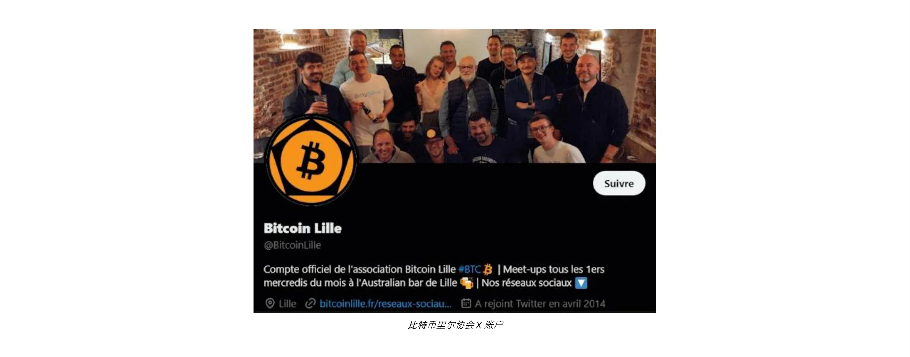

此外，**一些隐私设置也值得调整**：

- 让你的 Twitter 帐户处于 "公开 "模式（任何人都能看到帖子）；
- 让每个人都能找到你；
- 禁用位置跟踪和与其他实体共享数据（在隐私设置中）。

在每次活动中，您都可能使用 Twitter 分享有用的信息。但是，与大多数社交网络一样，**可见性就是一切**。

为了节省您大量的时间，我们花时间研究了 [Twitter 的开源排名算法](https://github.com/twitter)。

以下是提高您的知名度**需要关注的**关键事项：

- 一般提示：
    - 使用账户设置的语言或英语发推：使用其他语言发推会大大降低您的知名度；
    - 坚持自己的定位，只分享与账户关注点相关的内容；偏离主题的推文会受到算法的惩罚；
    - 争取每天发 1 到 2 条微博；
    - 在高峰时段发布：周四或周五上午 8 点到 10 点之间往往表现最佳（请查看您的账户：Twitter Analytics）。

- 写推文时：
    - 添加照片（甚至视频）；
    - 只使用一个标签（通常 #Bitcoin 是最相关的标签。如果合适，您可以添加一个与您的账户区域相关的流行标签）；
    - 鼓励社区互动：
        - 喜欢 = 重量 0.5
        - 转发 = 权重 1
- 答复 = 重量 27 (!!)
- 回复那些回复你微博的人**（权重 75！！）**；
    - 避免将链接放在主推文中：而是将其添加到第一条评论中；
    - 写出单词的全称，避免缩写。

- 其他提示：
    - 只要与你的账户的专业领域相符，就可以在推特上发布热门话题；
    - 转发表现最好的推文；
    - 偶尔进行民意调查；
    - 尽可能编写线程；
    - 鼓励你的社区访问你的个人主页并关注你。

此外，**您还可以将推文或主题固定在您的推特个人主页上，使其具有最大的可见性**，就像南非的 Bitcoin Witsand 社区所做的那样。

还要注意的是，可以同时在手机和电脑上登录两个 Twitter 账户。如果你想在个人账户和社区账户之间轻松切换，这就超级方便了。

只是要小心......不小心从社区账户发布派对照片的速度可能比你想象的还要快！

最后，尽管你的用户名"@Bitcoin[CITY]"是独一无二的，现在也是你的，但明智的做法是防范假冒或山寨账户。也可以考虑注册：

- @Bitcoin_[CITY]
- @[CITY]Bitcoin
- @[城市]_比特币

这样，您就可以大大减少有人冒充您的社区的机会。

创建 Twitter 账户教程：

:::video id=4648976f-41ec-499a-b7ec-a53e796f71b4:::

## 拉近与周边聚会的距离

<chapterId>12a21c3b-235a-5292-8209-67bf60f61e49</chapterId>

现在，您的交流渠道和社交网络已经建立并反映了您社区的视觉形象，是时候开始关注正确的人了。

在 Twitter 上，首先关注在全球宣传 Bitcoin 的主要账户，如 [@Bitcoin](https://twitter.com/Bitcoin) 和 [@planb_network](https://twitter.com/planb_network) 以及 [@FBCEglobal](https://twitter.com/FBCEglobal) 等倡议。您还可以转发[@halfin](https://twitter.com/halfin) 2009 年 1 月 11 日著名的 "Running Bitcoin "推文。更重要的是，**关注您所在国家的 Bitcoin 社区和聚会**。

这就创造了**互相关注、互相标记和提高集体知名度的机会**。在法国的约 50 个 Bitcoin 社区、意大利的 "Satoshi Spritz "倡议和德国的 "Einundzwanzig "小组中，这种做法已经非常普遍。

虽然对某些人来说这似乎微不足道，但**关注当地社区和倡议的账户可以促成合作甚至伙伴关系**。例如，Bitcoin列日社区和Bitcoin里尔社区（同样还有Bitcoin艾克斯社区和Bitcoin马赛社区）通过这种方式建立了联系，从而共同举办了年度聚会。

** Cercle du Coin** 餐是另一个很好的例子。

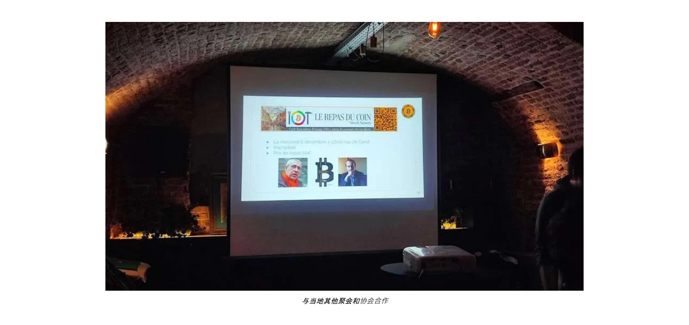

在法国，也可以**关注[@KonsensusFR](https://twitter.com/KonsensusFR)、[@bitcoinpointfr](https://twitter.com/bitcoinpointfr)、[@DecouvreBitcoin](https://twitter.com/DecouvreBitcoin) 和 [@btcmap](https://twitter.com/btcmap)** 等倡议。当然，这些只是建议，每个社区都可以按照自己的意愿，完全去中心化和自治。

如上所述，互相关注的目的是建立彼此的知名度。你越是在社交网络上宣传你的社区和你所在地区/国家的社区，就会有越多的人谈论你。谈论你的人越多，他们就越有可能参加你的活动。

因此，喜欢和转发其他社区的帖子可以极大地帮助他们的发展......也有助于你的发展。

你也可以建议**聚会的组织者和管理社区的比特币玩家**每年召开两到三次视频会议，审查国家项目和相关社区的进展情况。这也可以在现场活动中进行。

目的很简单：收集大家的反馈意见，讨论社区如何发展，分享成功的想法和项目，并在必要时提出解决方案。会议结束后，可以将会议的书面总结与本国未能参加会议的社区组织者分享。

## Btcmap.org

<chapterId>365f43d4-7b2c-5961-a184-157b8c1a0116</chapterId>

在这个阶段，您的社区已经启动并运行。剩下的就是欢迎更多感兴趣的人加入，并帮助它成长。

但是，如果你不知道**有一些平台可以让比特币玩家找到他们附近的社区和聚会**，你就无法继续前进。因此，花几分钟时间在这些网站上申请一个列表是很重要的。

其中包括

- [Btcmap.org](https://btcmap.org/)**，这是一个每天更新两张地图的网站： **[接受 Bitcoin 的企业世界地图](https://btcmap.org/map)** 和**[世界社区地图](https://btcmap.org/communities/map)**。许多比特币使用者都会定期查看这些地图，无论是旅行还是日常生活，以便结识新朋友或找到Sats的消费场所。Btcmap 是全球参考地图，在这里列出你的社区对提高知名度至关重要**。
- [BitcoinerEvents](https://www.bitcoinerevents.com/)，一个由比特币玩家为比特币玩家创建的网站。 **它可以让你发布你的社区即将举行的活动**。不过，在法国，这个网站还没有被广泛使用。
- 根据您所在的国家，当地可能还有其他活动。例如，法国有一个 [Bitcoin.fr](https://Bitcoin.fr/events/categories/evenements/)，每月**列出数十个 Bitcoin 活动**。因此，如果您还没有在 Twitter 上关注他们或联系他们，分享有关您所在社区和活动的信息，现在正是时候！**为了帮助更新法国的活动日历，如果所有法国的 Bitcoin 社区都能养成以下习惯，那将会非常棒：**
    - 在 Twitter 上提及 @bitcoinpointfr 的每个新社区活动
    - 在 Telegram 群组中钉入新活动公告。

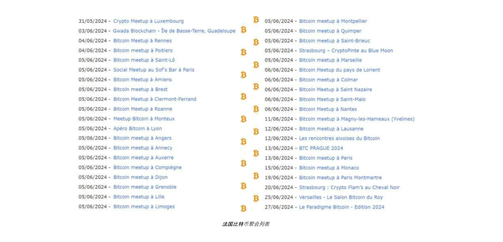

其他平台也可以提高您的知名度。 **[Meetup](https://www.meetup.com/)**就是其中之一，它是一个网站（还有一个手机应用），在这里你可以创建一个活动并找到附近的其他人。

它的费用约为每月 8 欧元（或每年约 90 欧元），这对于一个小型、非结构化的社区来说可能比较昂贵。尽管如此，Meetup 在一些国家，尤其是加拿大和美国得到了广泛应用，它对于管理注册非常有用。

同样，**[Orangepillapp](https://www.orangepillapp.com/)** 也是一款帮助比特币用户见面的付费手机应用（50,000 Sats/年或 200,000 Sats（终身使用））。

虽然后两个平台有助于提高知名度，但在创建社区时并不推荐使用，因为它们不是免费的。

**首先在 [btcmap.org](https://btcmap.org/)、[BitcoinerEvents](https://www.bitcoinerevents.com/) 以及法国社区的 [Bitcoin.fr](https://Bitcoin.fr) 上列出列表就足够了**。

恭喜您！您的**社区已经创建**，您的**视觉效果已经准备**，您的**目标已经设定**，您的**沟通渠道已经就位**，您的**社交网络已经启动**，您的**知名度战略已经决定**。

一旦有一小群比特币爱好者加入你的行列，就该进行下一步了：组织你的第一次 Bitcoin 聚会。

# 组织一次 Bitcoin 聚会

<partId>c009d2a6-40ce-583b-bd24-fdfd1fea262e</partId>

## 为什么要与社区定期举行聚会？

<chapterId>ed8e471c-3b99-57e2-a042-2d4e8a40b137</chapterId>

现在，您的社区社交网络和交流渠道已经启动，是时候让这些平台感受到您的存在了。鼓励新成员介绍自己，并逐步加入对话。

这样你就可以腾出时间，用来考虑创建某种聚会。一旦你开始在社区中感受到真正的兴奋，这将变得更加重要。

如前所述，**Bitcoin 聚会可视为社区**的下一个 "层次"。一方面，它允许**成员亲自会面**，另一方面，它有助于**教育对这一生态系统感兴趣的新人**。

通过这样的活动，您可以在自己的范围内，**在您所在的小镇上围绕 Bitcoin** 创造话题，随着时间的推移，随着您所在的社区开展项目，话题会越来越多。

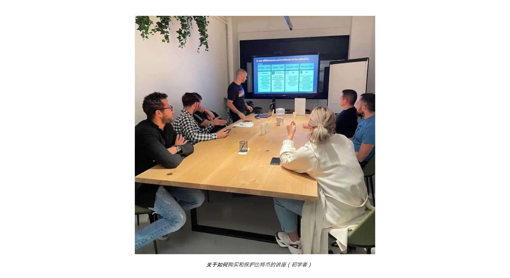

当然，社区发展目标越大，您和您的成员需要投入的时间就越多。

因此，**先为您的聚会制定可实现的目标**很重要。

## 第一次聚会：何时，为何？

<chapterId>f3f8a614-cfb4-5994-a2e8-d56e6f8e3347</chapterId>

创建社区几周后，您就可以发起聚会。

不过，在这个阶段，你的团队可能仍然很小，这意味着有可能没有人来。

最好是在交流渠道中至少有几个活跃成员（例如几十个）后再组织聚会。这可以很快实现，但也取决于人们的性格。

一旦你们擦出了火花，就建议见面。如果其他人有兴趣，剩下的就是**确定第一次见面的日期**。

与其自己选择日期，通常最好提前十天左右**一次投票，列出几个可能的日期和时间**。这样，您就可以利用投票来最大限度地提高出席率、激发热情并充分利用时间。

最好不要带着固定的期望去参加聚会，比如聚会将如何展开、会有多少人参加或将讨论哪些话题。这样既能避免失望，又能避免参与者感到压力。

让事情自然而然地发展，也许可以边喝边谈。对话应该轻松进行，如果有必要，您可以在讨论开始偏离 Bitcoin 时，温和地将其引导回 Bitcoin。

如果您想为比较安静的时刻做准备，可以计划一些活动或谈话要点，例如

- 在电脑或智能手机上显示**[Mempool](https://Mempool.space/)**；
- 带一本书
- 带来**Nerdminer**、Bitaxe、FPGA 甚至 ASIC；
- 有**Bitcoin传单**；
- 集思广益，为您的社区设计一个 Bitcoin 视觉或徽标；
- 玩**[Bitcoin 纸牌游戏](https://www.Maximalist.ovh/accueil/20-game-le-Coin-de-table.html)**；
- 显示**[btcmap.org](https://btcmap.org/)** 社区和商家地图；
- 使用**闪电**发送或接收 Bitcoin。

聚会刚刚开始时，往往不适合做正式演讲。如果参加人数不多，通常以开放和随意的讨论方式效果最佳。

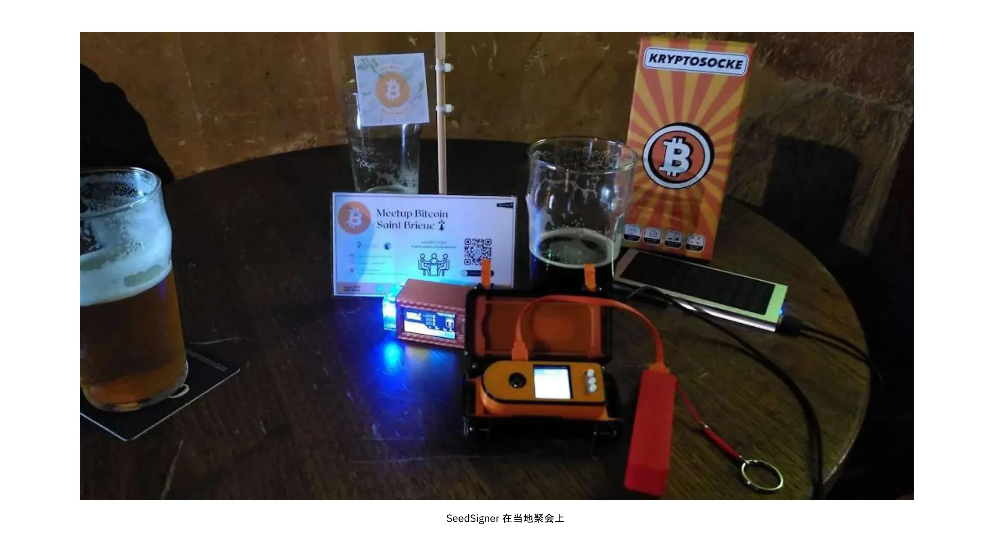

第一次聚会后，您可能会想再策划一次聚会。在您的社区规模还很小的时候，最好通过投票来选择日期，例如，每月一次或每两个月一次。您可以在交流渠道中讨论这个问题。

如果比特币爱好者和感兴趣的参与者形成了一个固定的群体，那么出于两个原因，制定一个经常性的时间表是有意义的：

1) 让每个人都更容易提前计划；

2）有助于**建立 "习惯 "**。即使有人不再经常查看您的频道，他们也会知道什么时候会有聚会，并能像往常一样过来。

第二点也是为什么**在法国，大多数聚会都在每个月的第一个星期三举行**的原因之一（参见[DecouvreBitcoin](https://decouvrebitcoin.fr/) 在 2022 年发起的 "大使 "倡议）。

德国和意大利没有固定的国庆日。

但是，在同一天举行全国范围内的所有见面会会产生一个集中化问题：它会阻止比特币爱好者参加附近社区的活动，也会引起安全问题。与邻近的见面会组织者沟通，可以帮助你达成一个好的安排。

随着社区的发展和聚会吸引更多的人，您可以这样做：

- 为每次见面设定一个具体目标；
- 甚至**每月增加第二个活动**。

在第一种情况下，在牢记每个人的喜好的同时，一个明确的目标可以确保与会者在离开时学到新的东西，并使对话集中在 Bitcoin 上。

在第二种情况下，第二个月度活动可以专门针对一个特定主题，如初级课程或研讨会（Mining、闪电、节点安装等）。

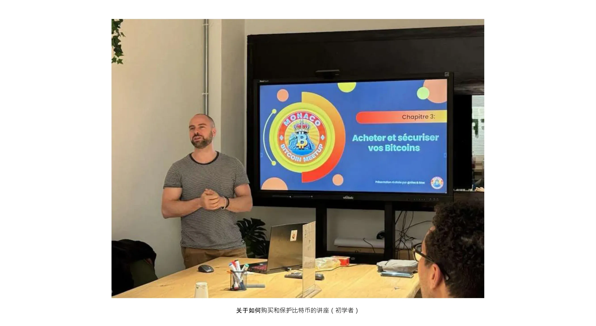

请记住，**这需要更多的组织和时间**。幸运的是，在[本课程第 6/8 部分](https://planb.academy/courses/1c643dc9-a15f-4f9e-93b6-cb3c58b4ee35/3213d87a-1998-5972-ab93-97a5769ba279)中，你会发现一系列可重复使用的开源资源可以提供帮助。

无论如何，这都取决于你们或你们的社区为自己制定的短期、中期和长期行动计划。

## 寻找地点

<chapterId>405d389e-6a32-5777-af8d-293380d2e8fd</chapterId>

为活动寻找场地往往不是一件容易的事。除此之外，场地必须**位于您所在社区的城市**。

有几个标准需要考虑，包括

1) **位置**：公共交通是否方便？自驾车是否方便？是否有停车场？

2) 地点是否舒适，是否过于嘈杂？您是在寻找正式的场所（联合办公空间、会议室）还是非正式的场所（酒吧、餐厅）？

3) 即使是在橄榄球或冠军联赛比赛之夜，是否有足够的能力接待您？

4) 是否有视频投影仪和安静的演示区？

5) 最后，如果是酒吧或餐厅，菜单上是否有适合每个人的食物和饮料？

此外，有三个要点需要牢记：

- 如果你计划将晚会分为两个部分：首先在正式场所进行演讲，以帮助大家集中精力，然后到酒吧或餐厅继续在更轻松的氛围中进行演讲，经验表明，晚会中途更换场地往往会导致一些与会者在休息时离开。因此，不建议采用这种方法。
- 在第一次见面会上，出席人数可能很少，您可能也不会举行正式的演讲。在这种情况下，没有必要向所有者介绍自己或说明自己的目标。但是，**一旦见面会成为定期活动且参加人数众多，就值得这样做，以显示你的专业性，并表达你希望每月再次参加**的愿望。这可能会引发许多讨论（每月自动预订、免费饮料和/或食物板、折扣、关于 Bitcoin 的对话、接受 Bitcoin 付款等）。显然，如果您特别想找一个有视频投影仪的场所做演示，似乎有必要要求与业主和/或经理会面（面对面，甚至通过电话），介绍您的项目和目标。

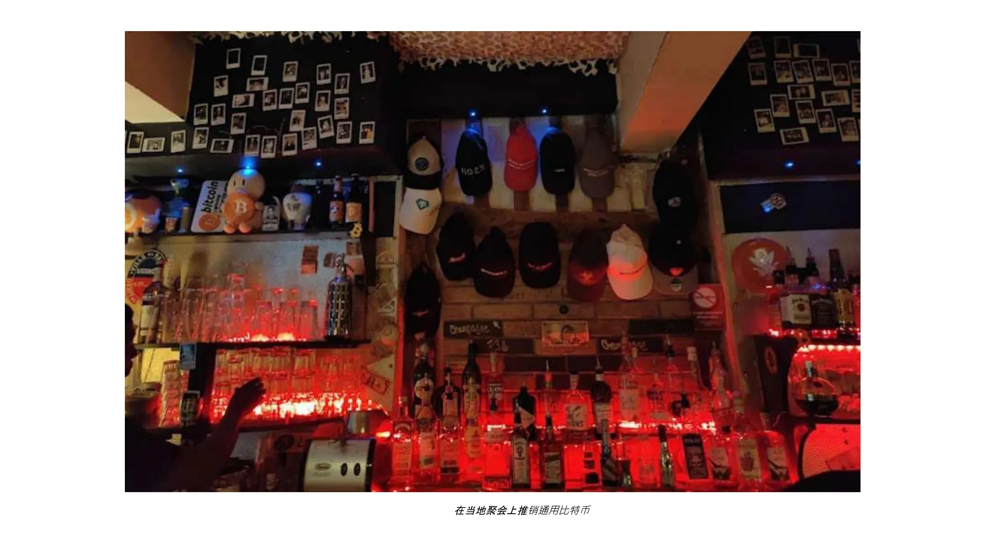

- 最后，有些社区**只希望在接受 Bitcoin 支付的地方**举办活动，这是可以理解的。在这种情况下，不妨**先在 [btcmap.org](https://btcmap.org/map/)上搜索您所在城市**接受 Bitcoin 的商家，然后联系他们，看看他们是否符合您的标准。如果没有合适的商家，您可以尝试加入新的商家，但预计会有很多商家拒绝，这可能会让您气馁。这就是为什么最好不要从一开始就将此作为目标，而是在您的社区建立起来并拥有足够的 "火力 "后再考虑。

此外，在发起你的聚会时，不要犹豫，**在最初的几个月里**更换聚会地点。这将帮助你**与不同的经理**建立关系，探索各种氛围，并收集未来潜在主办方的信息。

之后，当你们的团队发展壮大后，你们甚至可以花一个下午的时间去拜访几家企业和酒吧，询问他们是否有适合举办月度活动和聚会的空间。

## 聚会前

<chapterId>c5218943-580d-5efc-89ed-6b5d728816d6</chapterId>

计划在未来几周内组织一次聚会？

以下是一份帮助您做好准备的清单：

1/ **确认地点**

联系您要举办活动的地点，并根据预计的参加人数预留场地。

2/ **宣布活动**：

    - 在社交网络和其他交流渠道上分享日期、时间和地点。如有需要，请附上注册链接。
    - 创建专门的视觉效果（例如 Canva 海报，参见第 2/8 部分"[为 Bitcoin 社区设计形象](https://planb.academy/courses/1c643dc9-a15f-4f9e-93b6-cb3c58b4ee35/b48a18cc-afdf-5216-802c-32647b5cd8a3)"）。
    - 将公告固定在 Telegram 和 Twitter 上，并在 Discord 上使用"@everyone "提及，从而最大限度地提高可见度。
    - 在活动前 7-10 天发布公告，以便与会者提前计划。

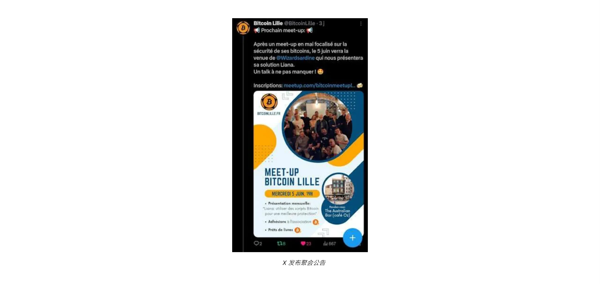

3/ **提醒受众**

在活动开始前两三天，转发和转推您的公告，以提高知名度。

4/ **更新地点**

前一天（或前两天），检查您的注册情况，并告知会场最终的预计参加人数。

额外步骤，让您的活动与众不同：

- 印刷传单和/或海报
- 就特定主题准备演示文稿
- 组织活动或研讨会

## 聚会当天

<chapterId>cf60067b-591f-5fdf-9b9e-d442aad0e8f9</chapterId>

大日子到了！在活动开始前一、两个小时，通过您所在社区的通信渠道发出提醒。再次确认活动开始时间，并让参与者知道如何认出您，例如，提到您将穿着 Bitcoin T 恤并戴着帽子。

随着聚会规模的扩大，聚会人数开始超过 20 人，场地的准备工作将变得越来越重要。

该怎么做？

1) **提前到达**，做好准备工作。

2) **根据您的需要和场地的可能性安排空间**。如果只有六个人，几乎不需要什么布置。但一旦与会者达到 10-20 人，完全坐式的布置就会限制互动。在这种情况下，如果有空位，可以选择站立式布置，摆放间隔合理的高脚桌，同时提供几把椅子（最好是高脚椅）。如果计划进行演讲，则在当晚的大部分时间保持站立式布置，在演讲前再搬来椅子。

3) 添加小的定制装饰：

    - 在入口处张贴海报，标明您的位置（使用 Patafix 并首先获得场地许可）。
    - 在室内张贴以 Bitcoin 为主题的海报（Bitcoin 白皮书、社区章程、当前项目等）。
    - 在桌子上摆放贴纸、传单或谈话开场白，例如：Nerdminer、Hardware Wallet、展示 Mempool、ASIC、Miner 或私人钥匙金属备份板的笔记本电脑。

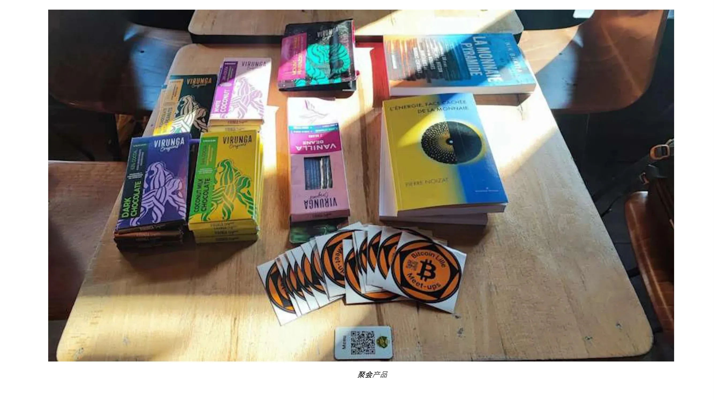

如果只有少数人参加，而且尚未与场地管理人员建立关系，则应避免立即携带和展示所有设备。一旦建立了信任，您就可以更自由地安排场地。

最后，拿上一杯饮料，等待人们的到来。记住：如果第一次没人来，也不要气馁。带上一本书或视频，以防万一。

## 聚会结束后

<chapterId>3e881af9-9c09-5721-81ee-c5cda3b109c5</chapterId>

聚会结束后，就是会场工作人员的清理时间。在您离开之前，请主动向服务员或经理伸出援手。这可以很简单，比如把所有的杯子集中到一张桌子上，或者，如果您在吧台附近，可以在离开前把杯子还回去。

回到家后，您很可能好几天都还惦记着 Bitcoin。这是把握社区脉搏、收集参与者反馈的最佳时机。您可以

- 在您的交流渠道上发布感谢信息，并分享活动中提到的任何链接或资源。
- 邀请与会者为下次会议提出改进建议。
- 开始计划您的下一次活动。

然后，您将有几周的时间来开发新的想法、视觉效果或项目，使下一次聚会更加完美。

## 让参与者参与并留住他们的重要性

<chapterId>f5355e35-4b07-527c-88a3-8535cba7592c</chapterId>

罗马不是一天建成的，您的社区也不是一天建成的。定期举行聚会和活动可以为 Bitcoin 增添动力。

要做到这一点，有一点至关重要： **保持参与者的参与**。

一开始，可以先成立一个由热衷于比特币的人组成的小组，目的是定期聚在一起讨论 Bitcoin。随着时间的推移，根据每个人的时间和兴趣，你可以**与小组分担某些组织任务**，或邀请核心**成员承担特定项目**。这些项目可以是你的社区、你的聚会或你的城市所独有的，甚至可以从[本课程第 6/8 部分](https://planb.academy/courses/1c643dc9-a15f-4f9e-93b6-cb3c58b4ee35/3213d87a-1998-5972-ab93-97a5769ba279)中提出的许多倡议中得到启发。 **这不仅能培养核心成员的 Commitment 能力，还能帮助社区发展壮大**。

随着聚会的进行，新面孔也会出现：在之前的周期中购买过 BTC 和/或另类币的人、希望加深了解的技术爱好者，或者对这种无条件运行、无需可信第三方的不可审查、去中心化、透明和公平的支付系统充满好奇的完全初学者。

要确保每个人在活动中都有融入感，应重点关注两个关键方面：

- 社会包容：每个参加活动的人都应感到受欢迎。努力向新来者问好，询问他们为何而来，并将他们介绍给其他人。当人们感到被包容时，他们就更有可能再次参加，甚至帮助组织未来的活动。
- 耐心和开放：这需要时间和动力。如果你的对话对象是一个坚定的垃圾币持有者（或者更糟糕的是，XRP Maximalist），那么你很可能会拒绝他们。但是，通过对话，你可以澄清误解或错误的推理。如果他们愿意倾听，也许就能真正理解 Bitcoin。

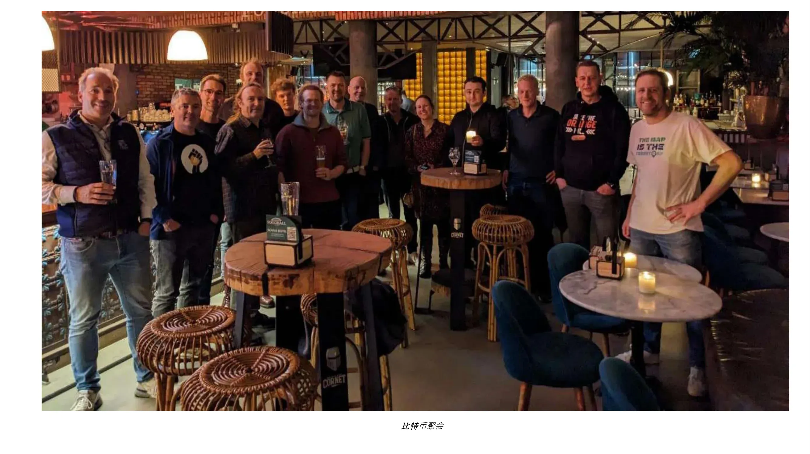

从实际出发，考虑整个活动的体验：

- **途径是否令人愉快？**
- 是否**容易获取**？
- 为什么有些人报名了却没来？
- 进行了哪些讨论？对于初学者来说，讨论是否过于专业？
- 讨论是否过于酗酒？

每个参与者都有自己的个性、目标和兴趣，因此经历也会有所不同。但是，只要地点合适、人群开放、意图真诚，聚会就完全有理由取得成功。

建立一个聚会需要时间，但最重要的是需要组织。这是一项人类工程，只有计划周密、开放包容，才能长期有效地开展和发展。

归根结底，"开放与包容 "的程度取决于你自己。请记住："屎壳郎 "往往只是 "比特币 "的雏形。

# 项目和倡议实例

<partId>45b3bc40-1c31-583e-8411-2662e6efd765</partId>

## 为什么不仅仅是喝啤酒？

<chapterId>3213d87a-1998-5972-ab93-97a5769ba279</chapterId>

随着时间的推移，您的社区将不断发展。会有新面孔加入，也会有新成员离开，但指导原则应该保持不变：发展 Bitcoin 生态系统，加强成员之间的联系。

有许多项目和倡议可以实施。本章列举了一些可以在社区内或聚会期间实施的想法，但并非详尽无遗。您可以自由选择对您有启发的想法，甚至可以[通过在 GitHub 上提交 "Pull Request"](https://github.com/PlanB-Network/Bitcoin-educational-content)为本课程贡献自己的想法。

在深入探讨之前，让我们重温一下之前提到的一点。

当您组织 Bitcoin 聚会时，您会结识新朋友。社交互动是必不可少的，而啤酒（或一般酒类）有助于营造节日气氛。但值得注意的是

- 酒精会损害思维和理解等认知能力，从而使参与者更难跟上严肃的讨论或演讲。
- 酒精也可能成为一种舒适的仪式：每个月，您都会和朋友们一起喝酒，分享您的 "Bitcoin 时刻"。虽然这是一种很好的交流方式，但喝啤酒真的是聚会的主要目的吗？还是您更愿意进行 Exchange 研究、向他人学习并帮助新人发现 Bitcoin？

每个人都有自己的喜好、信念和个性。这并不是要评判某个聚会的好坏。尽管我们经常在喝啤酒时谈论改变世界，但革命并不是这样开始或发展的。

关键是要意识到这一点。

## 组织主题聚会，每年逐步推进

<chapterId>46afdbcc-a775-5c16-b20a-34956690d58f</chapterId>

一旦你建立了一个十人左右的核心小组，你就可以开始在每次活动中加入演讲。这些演讲可以遵循事先公布的主题，也可以完全独立。

在计划演讲或研讨会时，创建一个清晰、结构合理的进展过程会有所帮助。这样做的目的是**一步一步地涵盖 Bitcoin 的核心概念，**让与会者从多个角度全面了解这一主题。

在法国，2023 年夏天，聚会组织者致力于**年度进展**。

除了其强大的教育价值外，这种方法还使小组之间共享开源文件和幻灯片成为可能，从而逐步建立起一个共享的资源库。这一举措广受好评，并将在未来几年中不断发展壮大。

以下是 2023-2024 年法国聚会的进展。每个主题都有一个开源演示文稿和一段视频，您可以从中了解自己活动的主题。

其他可编辑的材料也可在【Bitcoin 教学工具箱】(https://planb.academy/fr/resources/bet) 中找到！

| Month | Theme | Video | Editable Resource |
| -------- | -------- | -------- | --- |
| September     | Chapter 1: What is Bitcoin?     | [	YouTube link](https://www.youtube.com/watch?v=CSjuBqrl4t8)     | [Editable PowerPoint](https://www.canva.com/design/DAFu0d5Jd7M/9gAWDAOSS6LDkWENuZjYgw/edit) |
| October & November| Chapter 2: Understanding Bitcoin Transactions     | [YouTube link](https://www.youtube.com/watch?v=inFnR-3NsdM)     | [Editable PowerPoint](https://www.canva.com/design/DAFsEcnOro8/Mz9FYdTGhsvozZOe0Y9jtw/edit) |
| December     | Chapter 3: Understanding the Lightning Network     | [YouTube link](https://www.youtube.com/watch?v=hHz-ALx8D9w)     | [Editable PowerPoint](https://www.canva.com/design/DAF4YPSNnR8/HKp4Vmcno8eMtVWnZmFtcw/edit) |
| January     | Chapter 4: What is Mining?     | [YouTube link](https://www.youtube.com/watch?v=QyHZ3CVI_OI)     | [Editable PowerPoint](https://www.canva.com/design/DAF5DE6iBEM/tsy8E3oBebUnsR0kj53vvQ/edit) |
| February     | 	Chapter 5: Running a Bitcoin and Lightning Node    | [YouTube link](https://www.youtube.com/watch?v=RRYK-usg-OY)     | [Editable PowerPoint](https://www.canva.com/design/DAF55FU6HI0/sQ0lacRJblqrhn_9Xk1yDg/edit) |
| March     | 	Chapter 6: Using the Lightning Network in Daily Life    | [YouTube link](https://www.youtube.com/watch?v=o2BS4xjei8M)    | [Editable PowerPoint](https://www.canva.com/design/DAGAcJMw7lw/-haMNnHnwj5vpDAy8MDowA/edit) |
| April & May    | Chapter 7: Securing Your Bitcoins      | [YouTube link](https://www.youtube.com/watch?v=fHExPbhM0Hg)    | [Editable PowerPoint](https://www.canva.com/design/DAGDz3Nq4e0/D3uG-4w9FN6OhUq-VXzhfg/edit) |
| June     | 	Chapter 8: What is Multi-Sig?     | [YouTube link](https://www.youtube.com/watch?v=Me5489mpoxA)     | [Editable PowerPoint](https://www.canva.com/design/DAGLMtQT6sg/rYIxr4ldUJ0jTelNf-Pj8Q/edit) |
| July     | 	Chapter 9: Understanding the Bull Run and How to Prepare    | [YouTube link](https://www.youtube.com/watch?v=7RA-gnCJWyM)     | [Editable PowerPoint](https://www.canva.com/design/DAGJQkiZ_YA/9lUluP9RZ0eeA_e61mk9Hw/edit) |
| August     | Chapter 10: The Taxman is Never Far Away   | [YouTube link](https://www.youtube.com/watch?v=oY4NwonGDm0)     | [Editable PowerPoint](https://www.canva.com/design/DAGQhx7Yc_c/7mRhb_vlgnhSgxd1FtjK8w/edit) |

第 2 章和第 7 章可以分成两个较短的专题介绍，以避免让与会者应接不暇。不过，将这两章放在一次会议中进行，可以腾出日程表中的空间用于开展特殊活动，例如与邻近小组的联合聚会、测验或研讨会。

**您可以自由使用、改编和分享这些资源，但在重复使用原作者的作品时，请务必注明出处。**

由于不是每个人都会参加每次聚会，因此最好录制演讲并上传到流媒体平台或您的网站上。这样，缺席者可以补上，与会者也可以稍后重温材料。

与此同时，您还可以举办其他主题聚会，例如

- Bitcoin 知识问答（奖品为 Hardware Wallet）
- 向街上的无币者发送免费卫星币的入职挑战
- 邀请专家发言人或公司介绍与 Bitcoin 有关的产品
- 夜游接受 Bitcoin 的酒吧和商店

还有更多，你的想象力是唯一的限制！

## 创建会外活动和研讨会

<chapterId>9dbd651a-8712-5630-90b3-b9525dcc1385</chapterId>

根据您的时间和参与社区活动的程度，您可以在全年策划更多的活动，例如

- 5 月 22 日**披萨日**餐厅之夜
- 庆祝下一个**Halving**的夜晚或周末
- 利用 [Le Coin de Table](https://www.Maximalist.ovh/) 或 [SHAmory](https://shamory.com/) 等游戏，举办关于 Bitcoin 及其工作原理的家庭**游戏之夜**
- 介绍不同类型硬件（CPU、GPU、FPGA、ASIC、Nerdminer、Bitaxe）的**Mining 讲习班**
- 为初学者提供**个下午或晚上**，举办主题讲习班
- 与邻近社区的**次联合聚会**

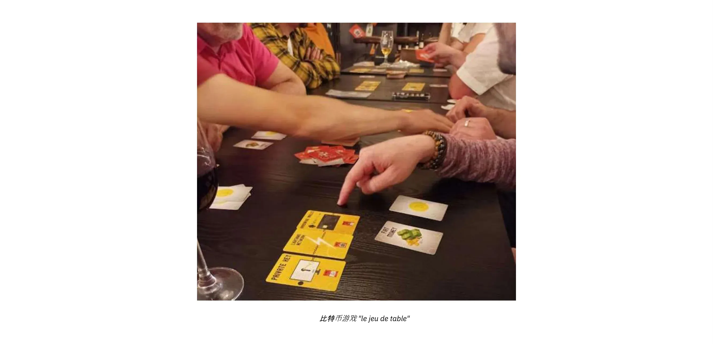

但要注意不要让日程表负担过重。一个月内举办过多的活动可能会导致组织者倦怠，并随着时间的推移降低出席率。

## 创建贴纸

<chapterId>d605f3b3-130e-513d-85e6-06bc5ea13e99</chapterId>

贴纸是宣传 Bitcoin 和您所在社区的一种有趣方式，同时还能强化您的身份。

订购前，请记住以下提示：

- 户外使用时，确保贴纸防水。
- 保持徽标略小于切割区域，以避免激光切割时出现裁剪问题。
- 使用矢量文件而不是光栅图像，以获得更高的打印质量。
- 选择合适的尺寸：8 厘米直径（约成人手掌大小）非常醒目，而 4 厘米直径则更加隐蔽。您是要明显还是要隐蔽？
- 对于浓黑打印（"四黑"），请使用 30% 青色、30% 洋红、30% 黄色和 100% 黑色。只使用 100% 黑色会导致色调偏灰。打印机通常会检查这一点，但还是值得了解一下。

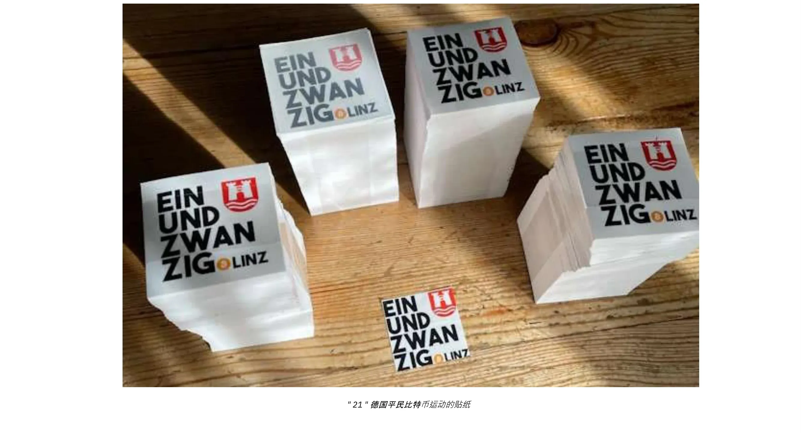

根据您的需求和供应商的不同，1,000 张贴纸的价格可能在 100 欧元到 250 欧元之间。您可以联系 [@Mill3sim3 on Twitter](https://x.com/Mill3sim3)，他是一位专门从事市场营销的法国比特币玩家，有时可以确保价格比标准在线供应商低 30%。

尽管如此，1,000 张贴纸还是太多了。通常最好从 100 张左右开始，以确保能全部分发出去。

重要提示 **在公共场所张贴贴纸**前，请查阅当地法规。

在法国，贴纸只能贴在官方公告栏上。如果贴在其他地方（如停车标志），很可能会被移除，如果能与您或您的聚会联系起来，还可能被罚款。请告知您的会员这一点。

在音乐会、酒吧或体育场馆等私人场所，在添加贴纸前，请检查是否已经有贴纸。如果没有，请征得工作人员的同意。您不希望企业主对您社区的第一印象是您破坏了他们的空间。

## 创建图书馆

<chapterId>acc94093-f8b3-51b8-9359-348e9e075d38</chapterId>

您可以轻松设立的另一个项目是**在您的聚会**创建一个图书馆。

您可以邀请希望分享阅读材料的与会者携带一本与 Bitcoin 相关的书籍。如果参加聚会的其他人想借阅这本书，可以通过 "闪电 "向 Exchange 的所有者安排借阅，但需要支付押金，例如 21000 萨托希。

对所有者来说，这笔押金有助于弥补潜在的损失或失窃。对借款人来说，这也是一种激励，鼓励他们在未来的聚会上再来取回押金。

如果您经营着一个协会，并希望将部分资金投入到教育资源中，您也可以购买几本书放在您的**Bitcoin 图书馆**，每次聚会时都可以获得。

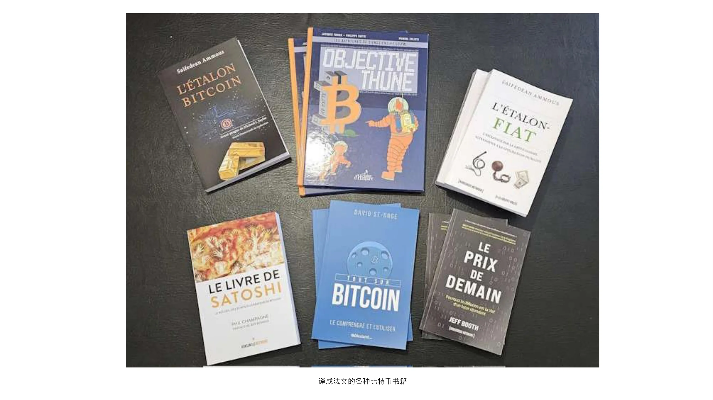

为了支持这一生态系统，**[出版商 Konsensus Network](https://konsensus.network/)自 2023 年底起，为国际 Bitcoin 聚会和社区提供所有图书 15% 至 35% 的折扣，订购三本或更多**。

要享受这一折扣，只需**在 Twitter 上联系 [Konsensus 出版社](https://twitter.com/KonsensusFR)**。

如果您没有现金，也可以将折扣转给社区成员。

如果您自己没有资金，也可以将折扣转给会员。例如，一位组织者可以收集会员的订单，以优惠价格批量订购，并在下次见面会上分发书籍，届时以 "闪电 "方式收款。

您还可以在聚会上展示图书借阅章程，向新人清楚地解释借阅规则。

下面是一个开源示例，您可以使用和改编：

[图书借阅章程](https://www.canva.com/design/DAF7u1b5kRM/r2gEAlibe_jTIXIX-O9PMA/edit)

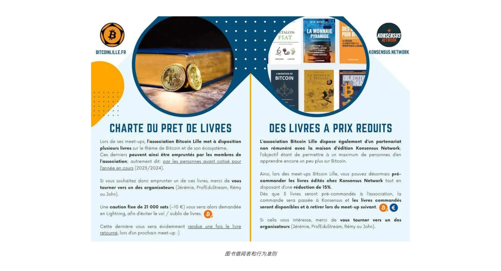

最后，为了鼓励阅读与 Bitcoin 有关的书籍，您可以访问**当地的市立图书馆**，看看它们是否有关于 Bitcoin 的书籍。

如果有，询问图书馆员是否有关于该主题的**圆桌计划**，并向他们提供你的聚会的详细联系方式。

如果没有，建议他们从预先选择的书单中购买几本书。出版商 Konsensus 网络](https://konsensus.network/) 可以提供灵感。

## 制作和分发个性化传单

<chapterId>62ad5430-c698-51b3-89ac-090f31c88953</chapterId>

设计和撰写传单需要时间，但这是值得的，因为在谈论 Bitcoin 时，传单为您提供了实实在在的资源，这一点总是值得赞赏的。

这些传单可以针对

- 商家，如果您想将 Bitcoin 作为一种支付方式；
- 活动参加者，手持介绍如何使用和支付 Bitcoin/Lightning 的传单；
- 初学者，无论是在街上、工作场所，还是在家庭聚会上，都可以通过传单了解 Bitcoin 的主要优点。

您还可以为您的社区或聚会设计专门的传单，介绍您的活动、目标、社交媒体链接、交流渠道和即将举行的活动。

planB.net上的[Bitcoin 教学工具箱](https://planb.academy/fr/resources/bet)**中已经**了几份传单的开放源代码，随着时间的推移还将添加更多传单。

其中一个例子是一份[完整来源传单](https://profedustream.substack.com/p/21-raisons-dutiliser-Bitcoin)，其中包含 21 个使用 Bitcoin 的理由。它的设计也[开源](https://www.canva.com/design/DAFtAR1NauQ/ZDwl2CchIJ9Gpb36N6-7iw/edit?utm_content=DAFtAR1NauQ&utm_campaign=designshare&utm_medium=link2&utm_source=sharebutton)，供您修改、改编和分享。只需记住注明来源即可。

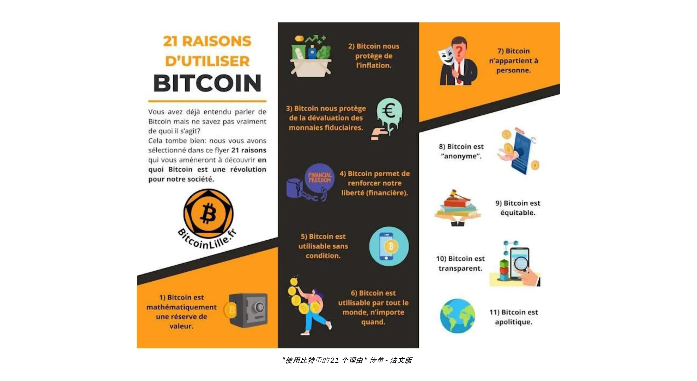

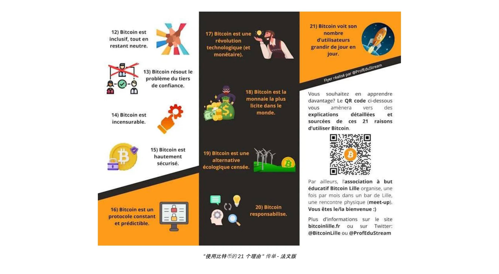

如前所述，您几乎可以在任何地方留下这些传单：工作场所的共用办公桌上、家庭餐桌上、公共图书馆等。

在法国和其他一些国家，也有 "书箱"，即人们可以自由捐赠或借阅书籍的小木箱。您可以在那里留一张传单，或者最好是一本书。

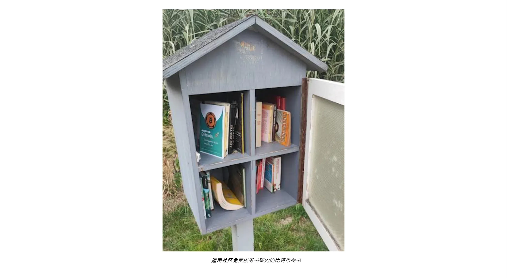

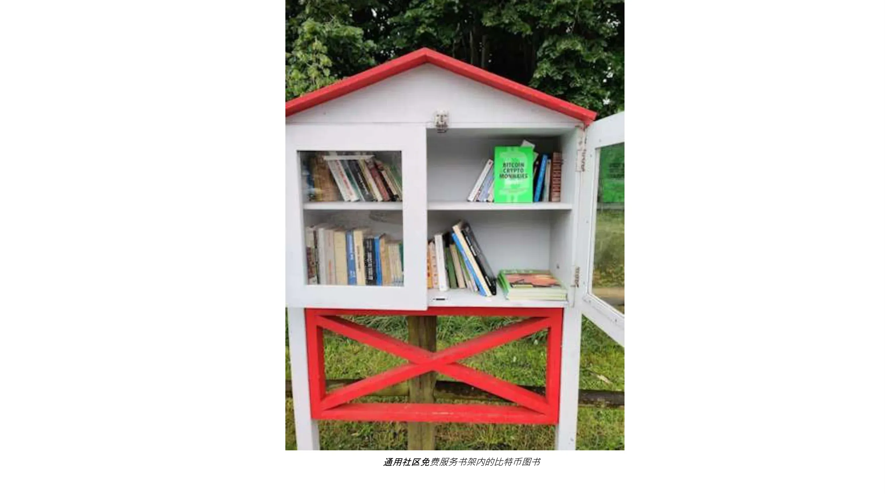

2023 年，**"法国书箱中的 Bitcoin 白皮书**"倡议启动。

要实施这一项目，参与者首先必须收集全国所有书箱的地理位置信息。有几个数据库可用于此目的：

- [boite.a.livres.zonelivre.fr](https://boite.a.livres.zonelivre.fr/)；
- [boites-a-livres.fr](https://www.boites-a-livres.fr/carte-de-france)；
- [delivrez.fr](https://delivrez.fr/maps/fr_FR/)；
- 加上当地媒体的文章

虽然离开 Bitcoin 白皮书具有象征意义，但它对于新手来说往往过于复杂，难以理解。因此，我们的想法是制作一本小册子，其中包含：

- 该书通俗易懂、资料翔实地介绍了 Bitcoin、其用途和所能解决的问题；
- 翻译成法文的 Bitcoin 白皮书。

这是[法国比特币爱好者分享的小册子](https://profedustream.substack.com/p/Bitcoin-la-naissance-dune-nouvelle)，它已被放置在全国各地的几十个书箱中。它的设计也是[开源的](https://www.canva.com/design/DAFs18FSoVM/Sy0QsfUkycTgXveeGgutBg/edit?utm_content=DAFs18FSoVM&utm_campaign=designshare&utm_medium=link2&utm_source=sharebutton)。

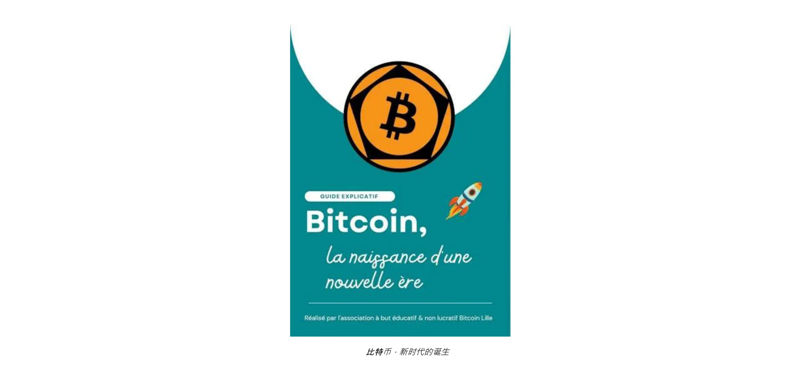

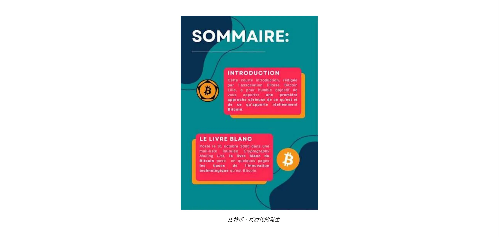

## 制作视频投影

<chapterId>892b248a-b837-5df6-aac9-4b3261ff0390</chapterId>

几乎每个比特币玩家都可能看过 [Rémi Forte](https://twitter.com/forteremi)引人入胜的中篇系列《Le mystère Satoshi, aux origines du Bitcoin》（《Satoshi 之谜：Bitcoin 的起源》）。

它于 2021 年发布，在 YouTube 上已被观看了 [数百万次](https://www.youtube.com/watch?v=0ETcLj5jBy4)。

一个想法是为社区组织一次《Satoshi 之谜》的放映活动，或许可以作为每月的额外活动。

需要提醒的是：虽然法国国家广播电视公司（ARTE France）已确认允许公开放映，但必须支付放映权费用才能合法放映。2023 年，每次放映的费用约为 250 欧元，如果当年至少有五个聚会放映，则每次放映的费用为 120 欧元。

对于大多数社区来说，这个价格是高昂的，尤其是这部纪录片已经可以在 ARTE 的 YouTube 频道上免费观看。

当然，还可能有其他预测。

例如，在法国，**导演[Alana Mediavilla](https://twitter.com/AlanaMediavilla)授予当地见面会预览其纪录片《搁浅》**的权利，其中包括即将于2024年上映的电影[电影《肮脏的Coin》](https://www.dirtycointhemovie.com/)的片段。

一些比特币爱好者甚至主动将《搁浅》完全翻译成法语，加上字幕，并在全国各地的聚会上分享。在 2024 年 3 月 4 日的一周内，全国约有十几个聚会同时放映了这部影片。

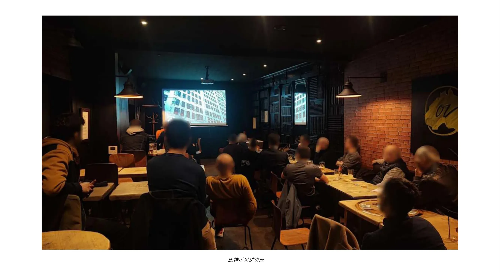

该活动引发了有关 Bitcoin Mining、其能源消耗及其更广泛的环境影响的热烈讨论。

## 在您所在的城市张贴海报

<chapterId>6565e8a0-d535-5be0-9764-273584c675bd</chapterId>

在一些欧洲国家（包括德国、西班牙和法国），比特币爱好者主动在城市周围张贴海报。

有些设计对班克斯的艺术进行了再创作，加入了 Bitcoin 徽标。

其中一个例子是 [StreetCyberArt](https://twitter.com/streetcyber_art)，他是一名德国比特币玩家，几年来一直在创作拼贴画和街头艺术。

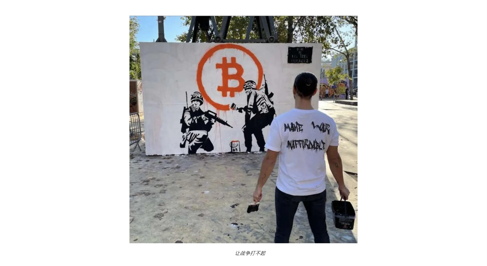

如果您想在街头张贴海报，请务必了解您所在国家的法律。例如，在法国，海报只能张贴在公共广告牌上。在其他地方，这是完全禁止的，而且会被处以罚款。

如果您决定突破界限并希望不被抓到 "现行"，请避免在海报上包含任何身份信息（如您的聚会名称或 @Twitter）。

还需注意的是，用个人打印机打印这些海报通常会导致渗墨，并在户外迅速变质。最好的办法是与专业印刷商合作，他们可以用专为户外用途设计的特殊不干胶纸张制作海报，确保质量和耐用性。

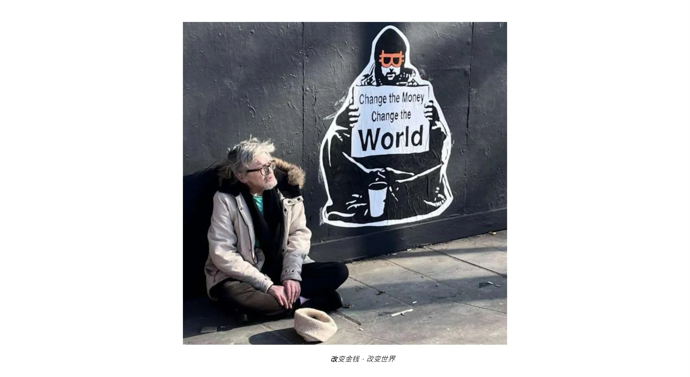

这一举措的成本可能超过每张海报 0.40 欧元（一百张海报约 40 欧元），而网上价格可能是这一金额的两倍到五倍不等。良好的人际关系至关重要。

如上所述，法国比特币玩家 [@Mill3sim3](https://twitter.com/Mill3sim3) 拥有合适的专业设备，可以联系他了解详情。

另外，还有一种更 DIY 的方法，就是用一块大纸板制作模板，然后用喷漆在城市的选定地点贴上你的设计。

## 个性化 NFC 卡

<chapterId>8ad65d4e-a68a-59c2-a812-85f4907ed9f3</chapterId>

另一个新颖的项目创意是制作用于闪电支付的个性化 NFC 卡（与 BoltCard 标准兼容）。在这方面，瑞士 Bitcoin Pay 是一个很好的合作伙伴。

[其网站](https://swiss-Bitcoin-pay.ch/cards) 目前提供四种标准设计。

如果您想订购 50 张以上的 NFC 卡，可以通过其官方网站或 [Twitter](https://twitter.com/SwissBitcoinPay) 联系该公司，为卡片的正面提出定制设计方案。反面将保持标准化。

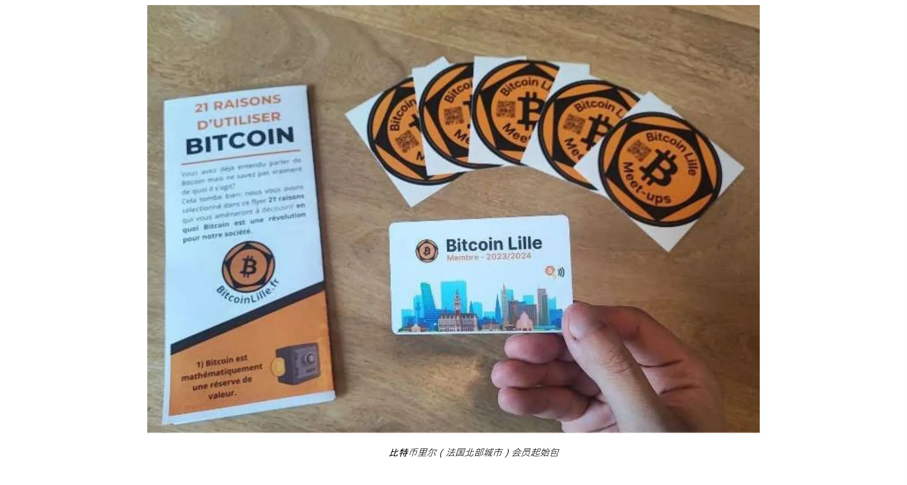

例如，2023 年，法国协会 [Bitcoin Lille](https://twitter.com/BitcoinLille)订购了一批定制设计的 NFC 卡。在这一年里，每个新会员都会在欢迎礼包中收到一张。这个想法可以很容易地为您的社区进行调整和个性化。

这些卡片的单价通常在 2.50 欧元至 5 欧元之间，具体取决于订单大小和市场条件，数量大的价格会更低。

## 创建网站

<chapterId>9a2a1b9b-0633-544a-b331-c06187d23d7f</chapterId>

在社区发展的某个阶段，建立一个网站来展示您的团体、聚会、活动和教育内容是非常有价值的。

建立一个网站需要时间，但下面的教程告诉你如何在 30 分钟内创建一个免费的 WordPress 网站。您可以设置可定制的主页，发布文章，并嵌入 YouTube 视频、图片或 PDF 等媒体。

之后，您可以购买自己的域名，甚至在自己的服务器上托管网站。

:::video id=a1b25c18-5fc1-4b97-baef-816d819c9382:::

虽然也有其他内容管理系统平台，有些界面更简单、更适合初学者，但它们的可定制性通常要差得多。这就是为什么 WordPress 通常是最好的起点。

WordPress 还支持大量插件（有些是付费插件，但质量很高），无需编码技能即可大大扩展网站功能。其中一个例子是[高级 "Uncode "主题](https://undsgn.com/uncode/)

## 创建视频频道（Youtube 或 Odyssee）

<chapterId>076286db-1627-57ec-a410-c44b1666e1cd</chapterId>

有些社区成员可能希望创建多媒体内容，如教程视频。

您还可以在聚会甚至大学中发表演讲。

**届时，专门的视频频道将让您在一个地方发布和集中所有内容。**

受欢迎的平台包括

- [**YouTube**](https://www.youtube.com/)，使用广泛，但无法抵御审查。
- [**Odyssee**](https://odysee.com/)，不那么流行，但通过点对点技术实现了去中心化。
- [**peertube**](https://joinpeertube.org/fr_FR)可以让你托管自己的视频平台，不过设置起来比较复杂。

无论你选择哪种方式，都要设计特定平台的视觉效果，使你的频道吸引人。在 [第 2/8 部分](https://planb.academy/courses/1c643dc9-a15f-4f9e-93b6-cb3c58b4ee35/3470a31f-0190-5e87-8af0-6a00e79267ef) 中提到的 Canva 提供了一个 "YouTube 缩略图 "类别，其中有预制的、可定制的设计。

对于从电脑**录制**，[Streamlabs](https://streamlabs.com/fr-fr) 是免费的，功能丰富，并支持场景转换。

在**视频编辑方面**，[Wondershare Filmora](https://filmora.wondershare.fr/)（约 45 欧元/年）使用简单，可快速制作专业效果。

您可以在 Canva 上轻松找到合适的模板，用于**视频的开头和结尾**。根据自己的喜好定制设计，下载并添加到编辑软件中。

提示：如果 Bitcoin 遭到禁止或审查，请始终在 Hard 硬盘上保存视频的本地备份。

## 创建音频播客

<chapterId>12e96b45-1c33-5687-a753-80d0114d487a</chapterId>

音频播客是另一种分享想法的好方法。与视频频道一样，建立受众群也需要时间。

流行的播客平台包括

- [**Fountain**](https://www.fountain.fm/), 支持闪电捐款。
- [**Soundcloud**](https://soundcloud.com/)；
- [**Deezer**](https://www.deezer.com/fr/)；
- [**Spotify**](https://open.spotify.com/)；
- [** 谷歌播客**](https://podcasts.google.com/)。

每个平台都有自己的受众，因此在多个平台上出现将扩大您的影响力。 **[播客专用 Spotify](https://podcasters.spotify.com/)可以让您一次性上传播客，并为其他平台** generate RSS 源，从而轻松实现这一目标。

因此，一旦完成了 "Spotify for Podcasters "上的工作，剩下的就是为其他平台格式化你的内容了，这个过程相对较快。

在录音方面，[Audacity](https://www.audacityteam.org/) 是免费的，它可以让你在编辑过程中调整音频电平、添加淡入淡出等效果并提高清晰度。它可以直接录制你的声音并创建专业品质的播客。

下面是一个简短的 10 分钟教程，涵盖了使用 Audacity 制作播客的基本要素：

:::video id=67d80ac7-253f-40a5-b621-fef2fb7174bd:::

提示：与视频一样，保存所有播客的本地备份，以防将来审查。

## 为您的活动创建徽章

<chapterId>0cccef8d-a765-5844-8921-c40f0ce653e4</chapterId>

在您的聚会和活动中，可以引入一个小小的激励机制：活动徽章。我们的想法是**创建一个只能在特定活动中获得的徽章**。这一概念以 "POAP"（"出席证明协议"）的名义存在于其他区块链中。不过，目前在 Bitcoin 上还没有免费的实现方式。

这种系统还可以用来奖励社区中最活跃的成员。例如，您可以组织年度抽奖活动，每收集一枚徽章就等于一张入场券。一年中参加 12 次聚会的会员将有 12 张抽奖券。

另一种更传统的方法是，你可以要求每次活动的参与者在徽章上写下自己的名字或昵称，以及参加活动的原因。

这样做虽然有些形式化，但可以帮助成员更容易找到共同的兴趣和谈话话题，也能让新人更容易发现组织者（或正式的社区/协会成员）。

里尔 Bitcoin 协会使用的几种徽章模板[可在 Canva 上获取开放源代码](https://www.canva.com/design/DAGHAsT15MU/AIA7-L_xBjNdsuxdD4-h-Q/edit?utm_content=DAGHAsT15MU&utm_campaign=designshare&utm_medium=link2&utm_source=sharebutton)。

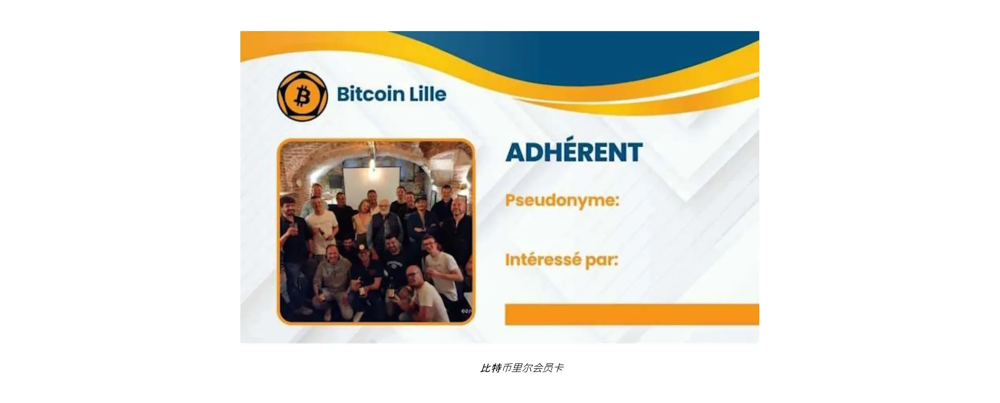

## 制定死亡时的移交计划

<chapterId>c5febf18-235c-51bc-8fbb-9467dabe4cb0</chapterId>

换一个完全不同的话题，让我们来谈谈 Address 这个敏感话题：你们 Bitcoin 社区的一位成员去世了。

有一天，您可能会接到一位前会员家属的联系，告知您他们去世的消息。他们可能会解释说，逝者留下了一些指示，包括与您的社区、聚会或协会取得联系。

在某些情况下，家人还可以作为遗产受益人寻求帮助追回资金。

明智的做法是与社区合作，事先为此类情况制定明确的程序，确保：

- 死者已建议其家人**切勿共享私钥或携带实体钱包参加聚会**。
- 这家人明白，他们此行的目的是为了接受教育：了解 Bitcoin 的工作原理，以便日后掌握资金的主权控制权。
- 该家庭了解本国关于礼物、继承和将 Bitcoin 转换为法定货币的相关法律。

制定标准协议还可以防止任何人，无论是会员还是客人，趁机窃取资金。

您可以成立一个专门的工作组来定义这一流程。Bitcoin 里尔协会已经在编写这样一份[文件](https://docs.google.com/document/d/1TDfLZjuictC5s3PEM2Z7WmkxIDSJ8Q1E4xevm52pVgU/edit?usp=sharing)，他们计划在未来几个月内将其作为开源文件发布。

## 在中小学和大学举办讲座

<chapterId>65efdb44-e3d4-567c-aedf-972765753d73</chapterId>

当然，上述项目清单并非详尽无遗。一般来说，这些项目更有可能是其社区或聚会的内部项目，在发展过程中很容易实施。

现在我们来谈谈入职培训。

大家都知道，**次接触大量受众的最佳方式之一就是举办免费讲座**。这可以在大专院校进行，向年轻人（和不那么年轻的人）介绍 Bitcoin，无论他们是完全陌生还是希望加深理解。

向几十甚至上百人发表演讲，需要的不仅仅是专业技术。您需要

- 公开演讲的信心
- 良好的压力管理
- 清晰的发音
- 时间管理能力强
- 根据听众的技能水平量身定制的经过充分研究的高质量演讲或研讨会

同样重要的是**保持开放的心态，知道何时简化概念**，尤其是在问答环节或小组讨论中。这并不是说要放弃自己的原则，只是承认别人可能会有不同的看法。有时，最好稍后再回复或放手让讨论继续进行。如果你的观点有确凿、充分的论据支持，人们就会认识到这一点。

如果你觉得准备好了，就去做吧！世界迫切需要更好的关于 Bitcoin 的教育。

尽管如此，这并不是一项轻而易举的工作：它需要动力、努力和正确的联系。

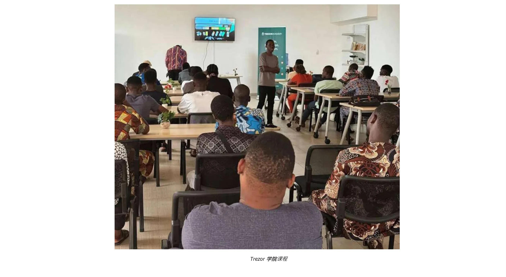

在学校或大学举办讲座或研讨会，首先要找到合适的联系人。这可能是

- 一个熟人
- 学生会
- 组织系列讲座或活动的学生协会
- 您所在工程学院或大学的前任教授
- 如果直接联系，则应联系学术项目协调员

第一步通常是提出您的倡议或协会，并请求会面。在最好的情况下，这将导致几周后在学生面前介绍 Bitcoin。

遗憾的是，Bitcoin 仍然被许多媒体和政客妖魔化，导致一些人认为它在课堂上没有用武之地。特别是在学术界，Proof of Work 和能源消耗等话题仍然存在争议，因此拒绝接受的情况很普遍。

不过，这还是值得一试的，尤其是在学生会和协会方面。谁知道呢？即使你的第一次尝试得到的是 "不"，你也可能会在下一次 "牛市 "中发现收件箱里有一封电子邮件，邀请你与 280 名学生进行交流！

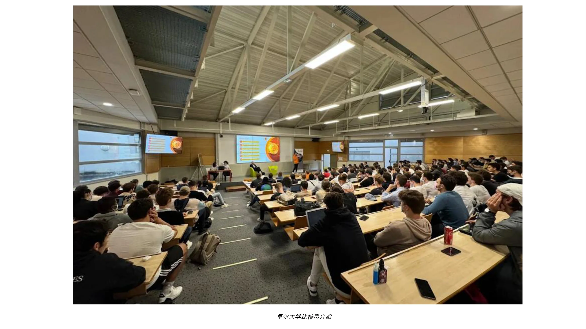

## 接触企业

<chapterId>b730462b-7928-5d28-a14f-9ceaa773d3d2</chapterId>

对许多比特币用户来说，让一家企业接受 Bitcoin 有点像解锁 Pokédex 中的一个稀有成就。

每个商户都不尽相同，入驻商户也会遇到各种挑战：

- 他们仍然需要法定货币来支付供应商。
- 他们需要清晰、便于会计处理的财务报告。
- 他们的支付系统必须可靠、易用、防盗。
- 他们可能对 Bitcoin 有误解或负面的成见。
- 找到一个完美的软件解决方案可能很棘手。
- 让商家明白为什么值得接受 Bitcoin 作为付款方式。

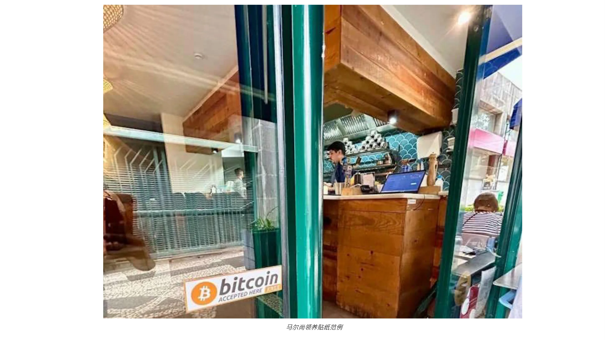

加入本地企业是发展城市 Bitcoin 生态系统的最佳方式之一。关键是要循序渐进：

1/ **每次购物都要求以 Bitcoin 支付**

大多数情况下，你会得到 "不 "的回答，也许还会得到不解甚至略带批判的目光，但只要你提出要求，就会让人觉得 Bitcoin 是 "普通人 "也能使用的东西，而且它作为一种支付方式正变得越来越流行。你甚至可以和几个朋友一起，在不同的日子去同一家商店，每次都要求用 Bitcoin 支付。这样迟早会引起店主的好奇心。

2/ **提供简单明了的解释**

如果他们问什么是 Bitcoin，请简明扼要，不要使用专业术语。例如

*"Bitcoin是不受银行控制的货币，没有中介机构，不受审查，不受通货膨胀影响，费用低于传统银行业务 "*。

然后递给他们一张传单，如 "使用 Bitcoin 的 21 个理由 "或 "在您的业务中接受 Bitcoin 的 10 个理由"，并附上您的联系方式或见面会详情。这样，当他们准备好进行演示时，就知道该去哪里找你了。

3/ **安排演示**

当他们表示有兴趣时，就安排时间向他们展示支付解决方案。

**[Swiss Bitcoin Pay](https://swiss-Bitcoin-pay.ch/)**是一个不错的选择，因为它：

    - 使商家能够每天自动将 BTC 转换为法币，以便向供应商付款。
    - 如果他们愿意，允许他们保留一定比例的 BTC。
    - 为会计师生成可导出的会计报告。
    - 为管理人员提供一个简单的仪表板。
    - 为员工提供直观的 Interface 无需接触收银机即可接受付款。
    - 成本低于传统支付网络收取的 2-3% 费用。

4/ **一旦他们开始接受 Bitcoin 就支持他们**

在他们上船之后

    - 定期访问并进行购买。
    - 检查是否一切正常。
    - 如有需要，请再次分享您的联系信息。
    - 邀请他们参加你的聚会。
    - 将它们添加到 [btcmap.org 地图](https://btcmap.org/)，并在 Twitter 上告知 [Swiss Bitcoin Pay](https://x.com/swissbitcoinpay) 以提高知名度。
    - 考虑在其所在地举办研讨会或聚会。

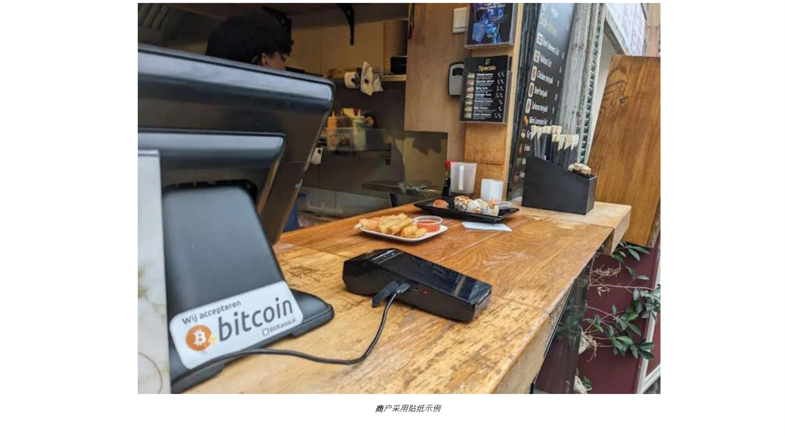

5/ **联系当地商家**

一旦您有了一些对 Bitcoin 友好的商家，建议创建一个商家专用的 Telegram 群组。这可以

- 让他们分享经验并加入新企业。
- 作为快速技术支持渠道。
- 加强当地的 Bitcoin 网络。

拉票是一项长期工作。它需要耐心、毅力和策略。但是，如果您的社区已经做好准备，您就可以开始为真正的 Bitcoin 循环经济奠定基础，就像荷兰的 [荷兰阿纳姆](https://www.arnhembitcoinstad.nl/)一样。

## 联系当地媒体和电台

<chapterId>435bfbc1-22dd-59bb-b737-a32ea995b238</chapterId>

比特币爱好者通常将宣传重点放在社交媒体和网络平台上，但这只是其中的一部分。当地媒体和广播也可以成为强大的盟友。

一些社区，如法国的 [Breizh Bitcoin](https://breizhbitcoin.com/)，**经常与当地媒体**联系：

- 宣布即将举行的活动（聚会、演讲、研讨会、Halving 派对等）。
- 邀请记者参观 Bitcoin 友好型企业并撰写相关报道。
- 分享活动日期和地点，以便纳入当地列表。

许多报纸仍然有一个 "正在进行的活动 "版块，通常隐藏在最后几页，上面列出了即将举行的本地活动。Breizh Bitcoin 发现这种方法很有效：一些新人就是因为看到了报纸上的活动列表才来参加聚会的。

这种策略在某些地区可能比在其他地区更有效，但值得一试。您可以从联系地区新闻机构开始，法国就有这样的例子：

- [acpm.fr](https://www.acpm.fr/Les-chiffres/Diffusion-Presse/Presse-Payante/Presse-Quotidienne-Regionale)；
- [voxpublic.org](https://www.voxpublic.org/spip.php?page=annuaire&cat=medias&type_media=Presse%20quotidienne%20r%C3%A9gionale).

并联系当地广播电台，建议进行采访或在播客中露面。

请注意，媒体采访可能很棘手。有些话可能会被断章取义或歪曲。准备工作至关重要。

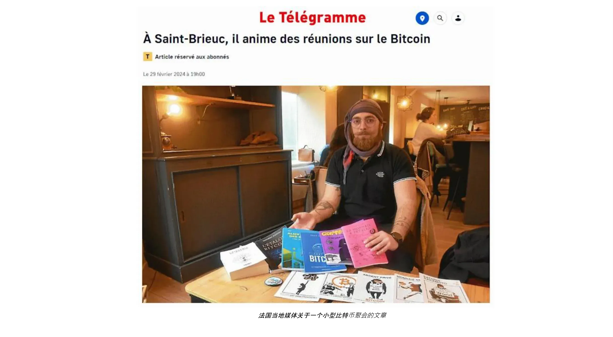

显然，除了本节中建议的所有项目外，还可以开展**许多其他项目**。这完全取决于你的时间和动力，也取决于有关项目的难度。

任何外联项目的最后提示：

1) **提前**计划：确定目标、所需步骤以及谁来做什么。

2) **循序渐进**：把握好努力的节奏，避免倦怠。

3) **寻求帮助**：向成员和邻近社区寻求支持。

请记住：每个 Bitcoin 社区都曾经历过您现在所处的位置。不要犹豫，向他们学习经验和建议。

# 展望未来

<partId>6ea07445-9369-54bc-9aa0-d260db026e0b</partId>

## 计划增加参与者

<chapterId>8af722d4-3a9f-548c-9001-424f2142de12</chapterId>

当 Bitcoin 在 84 万区块进入第四个时代时，越来越多的人开始认识到这是一场技术、金融和社会革命。

与互联网的兴起一样，这场革命也需要时间，但这其实是一种优势。它让人们有机会**学习 Bitcoin 的基本原理，了解如何使用它，并让开发人员和公司构建协议和应用**，从而释放它的全部潜力。

没有人能够预测未来，但我们可以**预计Bitcoin的采用率会急剧上升**。这意味着**做好应对各种情况的准备**，甚至是极端情况，如传统金融体系崩溃或全面禁止使用 Bitcoin。

在本课程的第七部分，也是倒数第二部分，我们将探讨在社区和聚会发展过程中需要注意的要点。

首先，也是最容易预料的，就是加入您社区的人数增加。这将在两个主要方面对您产生影响：

1/ **您的通信渠道（Telegram、Signal、Matrix 等）最终会变得拥挤**，从而难以跟上对话。有两点需要注意。

首先，如果有 500 人在一个聊天室里讨论各种话题，那么大量的消息和通知将不可避免地导致许多成员退出聊天。这正是重新考虑你的设置的好时机，例如，转移到 Telegram 超级群组或 Discord 服务器，这两种方式都可以轻松地按主题组织讨论。

其次，更多的人进入您的频道意味着更多的机器人、更多的骗局，因此需要处理更多的审核工作。为此，您需要制定一套明确的规则，以便在审核消息时参考。根据我们的经验，这对避免冲突大有帮助，尤其是如果这些规则在您的频道中很容易找到的话。

一个很好的例子是 **[Bitcoin里尔的开源规则手册](https://bitcoinlille.fr/reglement/)**，这是几年前为其 Telegram 群组和 Discord 服务器编写的。它基于简单、通用的原则，您甚至可以在这里获取[可定制的设计版本](https://www.canva.com/design/DAGHI692AD4/rjT4sqEnhajc5FiPA6GFZQ/edit?utm_content=DAGHI692AD4&utm_campaign=designshare&utm_medium=link2&utm_source=sharebutton)。

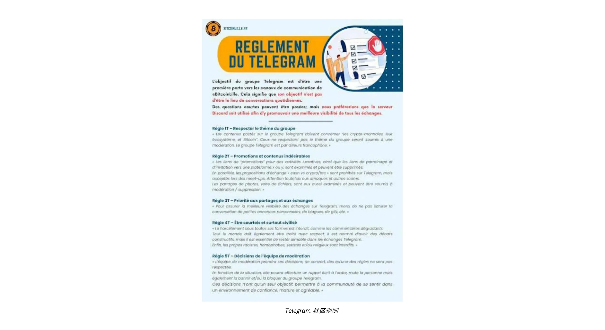

2/ **你的聚会和活动将开始吸引大量人群，有很多新面孔出现**。

随着出席人数的激增：

    - 也许值得**为你的聚会和活动**一个更大的场地，尤其是如果你过去只能接待二十人左右的话。
    - 如果您发现参加人数过多，您可以在以后的聚会中**要求参与者注册**（通过 Meetup 应用程序或简单的表格），或者**每月举行多次聚会**（例如：一次初级聚会、一次中级聚会和一次高级聚会）。
- 与此同时，预计会有很多新人加入这个生态系统，他们通常以赚钱为主要目标。在这些快速发展的聚会中，要想**有效地**将话题集中在Bitcoin上，最好的办法是：

a) 在这些活动中加入以**Bitcoin 为主题的演讲**，因为这会自然而然地将大部分话题引向该主题（而不是最新的所谓 "革命性 "的狗屎币项目）；

b) **避免只与比特币同行**。相反，要注意***接近新来者***，哪怕是在房间后面迎接他们。在那里，你可以谈论他们为什么来，他们在寻找什么，你的社区的目标（甚至是核心原则）等等。

最后，虽然不得不说这很不幸，但骗子也会出现在聚会上。他们的目的可能是滔滔不绝地谈论他们的庞氏骗局、传销或什么 "由人工智能驱动的 Blockchain 革命"。也完全有可能有一天，一些居心不良的人专门为了洗钱或试图用假钞购买 BTC 而参加聚会。

在这种棘手的情况下，最简单的办法就是礼貌地解释聚会不适合这样做，并用你选择的任何论据来支持（例如，提到可能会有便衣警察在场）。

如果不幸的是，他们拒绝离开或表现得不体面（是的，这种情况确实发生过），您可以在聚会期间直接 Address 群组，让每个人都知道某个人或某些人正在试图进行某种恶意活动。

值得庆幸的是，这种情况很少发生，而且往往是荒唐多于威胁，但最好还是做好准备。

放心：只要您本人没有违法或直接为非法交易提供便利，您就不需要为他人在您的活动中的行为承担法律责任（至少根据法国法律是这样）。

在理想的世界里，随着社区的发展壮大，你会有一个足够大的**空间来容纳几十个人**，你还会在熊市期间在比特币**持有者和未来的比特币持有者**之间建立**牢固的关系**，这样当牛市来临时，你就会有尽可能多的人准备好橘子药丸。

## 社区组织权力下放

<chapterId>bedfc110-e099-58f4-a5b7-fb50f3b19a49</chapterId>

想象一下：你经营 Bitcoin 聚会多年，有一天你决定辞职，也许是去秘鲁养骆驼，也许是去萨尔瓦多追逐完美的海浪。你离开后，你的社区会怎样？

请通过以下方式提前规划社区转移：

1) **将通信频道的管理员（或 Ownership）权限**授予受信任的成员。角色可以随时变更。

2) **与至少一位可信赖的人共享社交媒体和知名度渠道的账户详情**（用户名、密码、相关电子邮件）。

没有这种访问权限，其他人几乎不可能有效接管。通过创建 "分叉 "群组和重建网络，从头开始是缓慢、令人精疲力竭的，而且往往会打击士气。

如果您在聚会中没有值得信赖的联系人，可以随时联系 Telegram 上的 @ProfEduStream、@copinmalin 或 @gabtribe。他们可以帮助你找到一位积极的继任者，并协调账户和管理权限的转移。

**权力下放为何重要？**

如果你是唯一的参与者，你掌握着所有的控制权，那么如果你消失了，会发生什么呢？答案很简单：你的社区也会消失。

解决方案：分散任务、角色和访问权限，这样即使有组织者退出，小组也能继续运行，不管是由于时间限制，还是在更糟糕的情况下，由于持有非 KYC Bitcoin 而被捕。

**如何进一步推进权力下放？**

采用**自由和开放源码软件**，如[framasoft suite](https://framasoft.org/fr/)，以减少对中央平台的依赖，并增强抵御潜在的国家审查或 Bitcoin 禁令的能力。

使用**加密或匿名通信工具**，保护会员隐私和社区活动。

## 如果 Bitcoin 成为头号公敌呢？

<chapterId>c739651f-cd13-51e0-a36e-85023749b15b</chapterId>

1933 年 4 月 5 日，美利坚合众国第 32 任总统富兰克林-罗斯福签署了第 **6102** 号行政命令，规定私人在国内任何地方拥有金币、金块或证书均属非法。

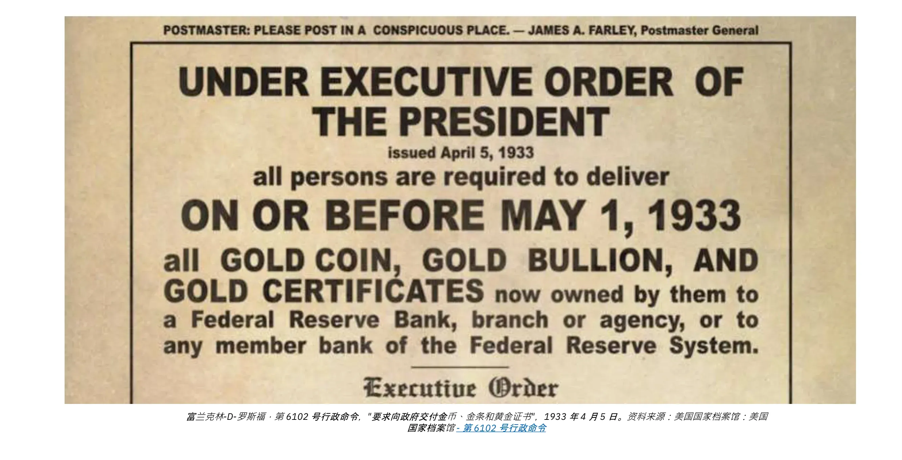

当然，大萧条（1929 年股市崩盘）并不是我们当前的现实。但有朝一日，政府是否也能对 Bitcoin 采取同样的做法？**彻底禁止私人Ownership？**

事实上，这种奥威尔式的措施并不能真正阻止某人真正拥有 BTC，因为没有任何法律可以阻止一个人记住一连串的单词。

不过，如果世界各国领导人最终意识到 Bitcoin 有可能重塑全球秩序，甚至是国家层面的秩序呢？到那时，它还会被贴上 "头号公敌 "的标签吗？

我们不需要陷入阴谋论。但是，从现在开始，没有什么能阻止我们进行预测、权力下放和教育。

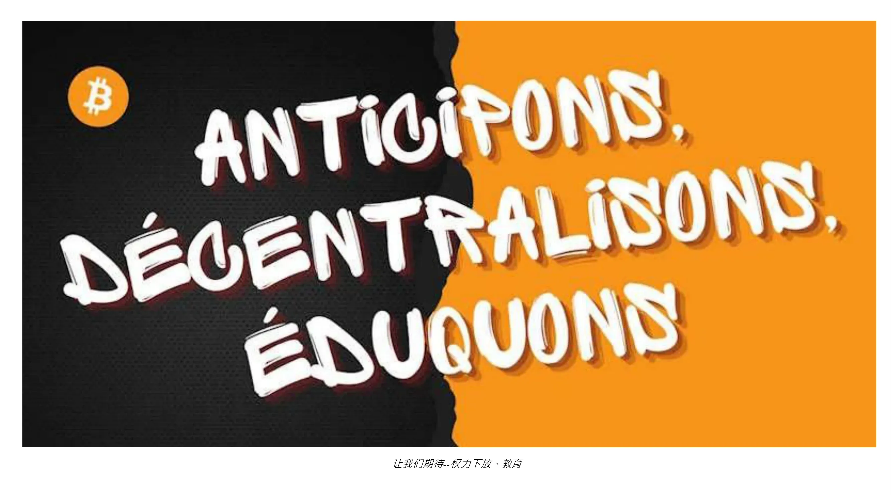

# 将比特币爱好者聚集在一起

<partId>62bc2138-c0be-5d39-a341-594690863257</partId>

## 建设 Bitcoin 社区的快速行动计划

<chapterId>1f463ec2-3f64-5641-8d60-e02a47c94f27</chapterId>

Satoshi 中本聪创造了一个革命性的工具，它已经在改变我们的世界。但如何塑造未来，还得由我们比特币使用者来决定。

Bitcoin 是一个巨大的兔子洞，涉及历史、经济、文学、数学、计算机科学和密码学。没有人能够探索它的全部，而这正是它的魅力所在。

由于我们的时间有限，关键是要保持谦虚，不断学习，并与他人分享 Exchange 知识。这样，我们每个人都能达到我们所追求的理解水平。

**因此，全球 Bitcoin 社区在建设未来世界中发挥着重要作用：比特币用户可以 Exchange、建设和分享的空间。共同**。

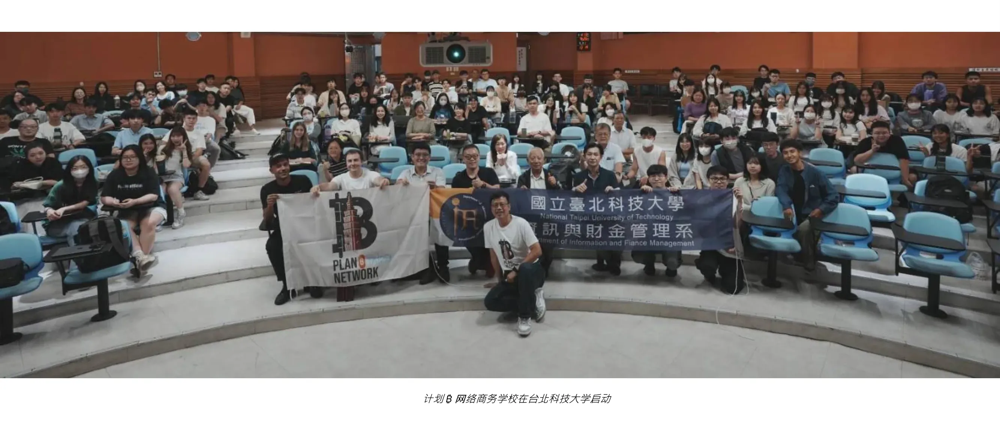

正如您在本课程中所看到的，**建立一个 Bitcoin 社区和组织聚会**需要计划和动力。根据自己的目标和可投入的时间，您可以开展更雄心勃勃的项目，也可以将事情简单化。

无论哪种方式，目的都是一样的： **激发兴趣，帮助 Bitcoin 在您所在的城市发展**。

为了总结我们已经介绍过的许多章节，下面是创建 Bitcoin 社区的**简要 "行动计划 "**：

1) 提前决定为什么要创建 Bitcoin 社区，目标是什么，在哪个城市或地点运营。

2) 与附近的现有社区取得联系，在需要时毫不犹豫地向他们寻求建议；

3) 为你的社区创建一个清晰的标识，以反映你的社区和地点（徽标、海报、横幅、传单等）。

4) 创建交流渠道和社交网络，如 Telegram、Twitter、NOSTR、Discord 或 Simplex。还可以考虑去中心化和/或抵制审查的渠道。

5) 在网上关注其他本地聚会和社区，并在各种地图和平台上列出您的团体，以提高知名度。

一旦您的社区沟通渠道活跃起来：

6) 一旦您觉得有足够的兴趣，就可以发起调查，提议举行第一次聚会。

7)确定您希望通过这次面对面活动实现的目标。

8) 选择一个位置优越、环境温馨、符合您目标的场所，并预订桌子或房间。

9)一周前在您的频道上宣传活动，然后在活动日期前两三天再次宣传。

10) 在相关网站和平台上列出您的活动。

11)活动当天，让活动自然流畅地进行，并与参与者互动，必要时温和地引导讨论。

之后：

12)注重留住参与者并让他们参与进来，以便他们再次参与。

13)提出简单的项目或倡议，启动你个人关心的项目或倡议。如果其他人想领导不同的项目，请尽力支持他们。

最后

14)展望未来，考虑更大的聚会场所、交流渠道规则、网站等；

15) 鼓励当地商家接受 Bitcoin，哪怕只是在每次购物时询问一下。

16)将任务和频道/网络管理权限委托给受信任的成员。

17)广泛宣传你的社区，让更多的人加入，并让有兴趣的人参与进来。

18) 进一步开展你喜欢的、对你很重要的项目。

如果想更快地了解这些步骤，可以观看这段 21 分钟的视频：

:::video id=a59956da-f554-4b54-89dd-5ca55b722686:::

请记住 **你并不孤单，现有的社区会为你提供支持**。

## 照顾好自己

<chapterId>cf1631cb-ddbe-55c7-be8c-26a5652979a0</chapterId>

当你掉进 Bitcoin 的兔子洞时，你对生活的看法就会改变。

在内心深处，你感到有一种力量在牵引着你，让你走得更远，去结识那些正在经历同样心理历程的人。

这种能量促使你分享自己的发现，为拼图贡献自己的一份力量：Bitcoin。它还激励您思考明天的世界、您希望帮助建设的世界以及为之努力的社区。

建立社区是一条漫长的隧道，需要动力、策略、奉献精神和时间。这可能是一项吃力不讨好的任务，因此必须循序渐进，避免焦头烂额。

**想想你自己，想想你的极限**。虽然 Bitcoin 可能会驱使你夜以继日地工作，但**不要试图独自完成所有事情，否则你会把自己累垮**。

相反，**向那些已经走过同样的隧道、探索过同样的道路、制造过同样的工具的比特币玩家**寻求帮助。这将为你节省大量时间。

**即使委派某些任务需要更长的时间，也要邀请那些跟随你一起冒险的人伸出援手**。从长远来看，你的社区将变得更加强大，更有韧性。

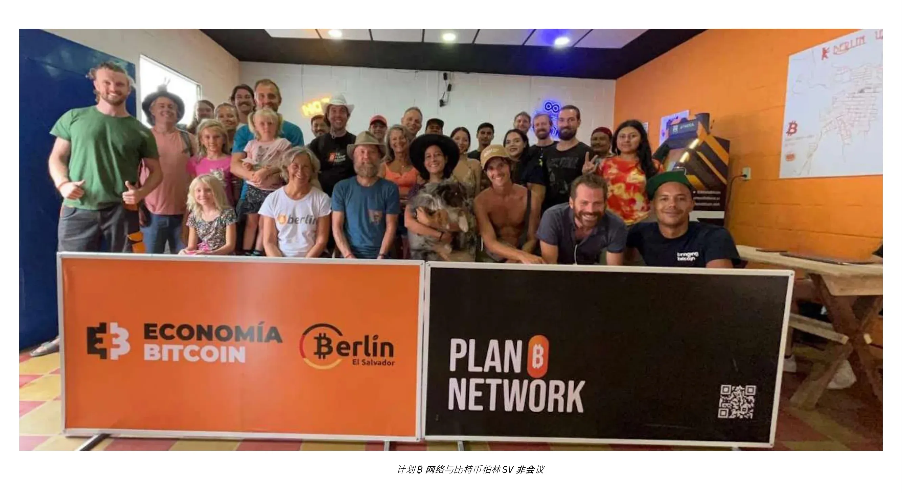

您可以独自一人快速探索 Bitcoin 兔子洞中的众多隧道之一。但请记住，还有无数其他方向可以探索。

**通过创建和/或加入一个比特币社区，并定期与他们分享和交流，你将同时向兔子洞的各个方向前进。**

## BTC302，下一步

<chapterId>8bf10b77-80ee-5d50-87bc-0ef32574a675</chapterId>

在本 BTC302 课程中，我们详细介绍了如何建立社区或聚会，以及如何启动各种项目。

当您的社区准备好迈出下一步时，**可以创建一个正式的协会**。

以法国为例，在约六十个社区和聚会中，有近十个具有协会地位。

好处是双重的：

- 官方认可：您可以开设协会银行账户，获得新闻/媒体关注，甚至申请补贴。
- 结构化的组织：您可以定义明确的角色，从而更轻松地管理社区和开展项目。

为了帮助您的社区进一步发展，**COMMU302 课程的后续课程**

可能会在未来几个月内在 [planb.network](https://planb.academy/) 上发布。

下一届会议可以探讨一些高级主题，例如

- 为您的会议设计演示文稿或研讨会，并设定明确的目标。
- 组织约 100 人参加的大型活动。

为此，我们将借鉴已经创建了自己的活动和演示的社区的经验。

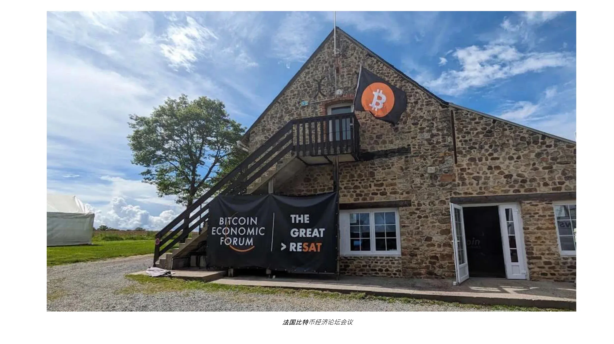

# 最后一节

<partId>e9bdddf4-54c9-4de9-bbce-c3eade8c32e5</partId>

## 评论与评级

<chapterId>08a35d2a-204b-519a-9bb1-588665a037fa</chapterId>

<isCourseReview>true</isCourseReview>

## 结论

<chapterId>d74606a5-cb14-4117-acb2-2bf5920de092</chapterId>

<isCourseConclusion>true</isCourseConclusion>