به دوره‌های توسعه Cubo+ برای Bitcoin خوش آمدید!


در طول 20 ساعت آینده، شما به عمق پروتکل‌های BTC و LN خواهید پرداخت. این دوره برای برنامه‌نویسانی طراحی شده است که می‌خواهند کار در اکوسیستم BTC را آغاز کنند و به دنبال درک جامعی از پشته‌های فناوری مختلف BTC و LN هستند.


ویدیوها به صورت زنده در طول بوت‌کمپ CUBO+ 2023 در السالوادور ضبط شدند و موفق به گرد هم آوردن معلمان مشهور جهانی شدند. این دوره به لطف سخاوت Fulgure Venture و تلاش‌های مشترک معلمان، دفتر Bitcoin، DecouvreBitcoin و بسیاری از بازیگران دیگر به صورت رایگان ارائه شد.


لذت ببرید!


+++

# مقدمه و دوره‌های مقدماتی


<partId>43a835de-c4e7-542b-9d1a-c92f049e88e6</partId>


## مقدمه‌ای بر دوره‌های CUBO+


<chapterId>dcf2d37e-b32a-5eb8-aaa3-41ac92475ba9</chapterId>


:::video id=9b6aa5cf-245e-4a66-b3b8-c4860ab51e90:::


فیلیپو و ماریو یک سخنرانی مقدماتی درباره CUBO+ 2023 ارائه می‌دهند و زمینه را برای سفر جامع یادگیری که در انتظار است، فراهم می‌کنند. آنها درباره ساختار دوره‌ها، نتایج یادگیری و چگونگی توانمندسازی دانشجویان در فضای توسعه Bitcoin بحث می‌کنند.


### اهداف


هدف این دوره تجهیز شرکت‌کنندگان به درک عمیق از اصول پایه‌ای Bitcoin، مهارت‌های توسعه عملی و توانایی جهت‌یابی و مشارکت مؤثر در اکوسیستم Bitcoin است. از طریق ترکیبی از دانش نظری و تمرینات عملی، دانشجویان به اصول امنیتی Bitcoin، پیچیدگی‌های پشته نرم‌افزاری آن و مکانیسم‌های حاکمیتی آن مسلط خواهند شد.


### پیش‌نیاز


از شرکت‌کنندگان انتظار می‌رود که حس کنجکاوی قوی، اشتیاق به یادگیری در سطح حرفه‌ای و مقداری دانش پایه در توسعه داشته باشند. در حالی که داشتن پیش‌زمینه دقیق در Bitcoin ضروری نیست، درک پایه‌ای از اصول کدنویسی و آمادگی برای درگیر شدن با مفاهیم فنی پیچیده برای بهره‌برداری کامل از شتاب‌دهنده ضروری است.


#### ابزارها


در طول دوره، شرکت‌کنندگان از ابزارهای کلیدی استفاده خواهند کرد که به درک آن‌ها کمک کرده و تجربه یادگیری آن‌ها را بهبود می‌بخشد. استفاده از لینوکس، خط فرمان Interface، گیت‌هاب و داکر در ارائه یک رویکرد عملی به توسعه Bitcoin نقش اساسی خواهد داشت. این ابزارها کار با پشته نرم‌افزاری Bitcoin، مدیریت محیط‌های توسعه و همکاری در پروژه‌ها در یک محیط واقعی را تسهیل خواهند کرد.


## چرا Bitcoin


<chapterId>89a0aa8b-90bd-58b2-82b3-bc5e1f82eaeb</chapterId>


### چرا السالوادور به Bitcoin نیاز دارد؟


:::video id=ff820fb2-83d4-450f-bda0-17cc5044a902:::


به اولین جلسه از برنامه آموزشی **Cubo Plus** خوش آمدید. امروز به دنیای Bitcoin وارد می‌شویم، به رهبری ریکی، بنیان‌گذار **پادکست Bitcoin ایتالیا**. ریکی یک فعال پرشور حقوق بشر است که از Bitcoin به عنوان ابزاری برای حفاظت و ترویج حقوق بشر استفاده می‌کند. با بیش از شش سال تجربه، ریکی به طور گسترده سفر کرده و مستنداتی از پذیرش Bitcoin در بازارهای نوظهوری مانند السالوادور و گواتمالا تهیه کرده است. کار او فراتر از پادکست است؛ او همچنین در یوتیوب (**Bitcoin Explorers**) و توییتر (**BTC Explorer**، **Ricky6**) فعال است. تغییر ریکی از Commitment به Bitcoin ناشی از باور او به این است که این فناوری آزادی مالی و حریم خصوصی را ارائه می‌دهد و سیستم‌های بانکی سنتی و متمرکز را به چالش می‌کشد.


_جمعیت بدون بانک جهانی_


### Bitcoin: آزادی مالی و تأثیر آن بر السالوادور


این سخنرانی، **"چرا السالوادور به Bitcoin نیاز دارد،"** مروری بر **پروتکل Bitcoin**، ریشه‌های آن در **جنبش Cypherpunk** و نقش آن به عنوان ابزاری برای آزادی—امکان‌پذیر ساختن **پول بدون سانسور**، **شمول مالی** و بسیاری موارد دیگر ارائه می‌دهد.


> **تعاریف:**
>

> - _پروتکل بیت‌کوین:_ قوانین و ساختاری که نحوه عملکرد Bitcoin به عنوان یک ارز دیجیتال غیرمتمرکز را تعیین می‌کند.
> - _جنبش سایفرپانک:_ گروهی که از استفاده از رمزنگاری برای تضمین حریم خصوصی و آزادی در فضاهای دیجیتال حمایت می‌کند.
> - _شمول مالی:_ فراهم کردن دسترسی به خدمات مالی برای افرادی که از سیستم‌های بانکی سنتی محروم بوده‌اند، که اغلب به آن‌ها "بدون بانک" گفته می‌شود.
> - _پول بدون سانسور:_ پولی که نمی‌تواند توسط دولت‌ها یا مؤسسات مالی کنترل یا محدود شود.

#### پیشینه ریکی و حمایت از Bitcoin


سفر ریکی به Bitcoin ریشه در کار او به عنوان یک مدافع حقوق بشر دارد. او معتقد است که Bitcoin می‌تواند به افراد کنترل بر امور مالی‌شان را بدهد، به آن‌ها اجازه دهد حریم خصوصی خود را حفظ کنند و از محدودیت‌های بانک‌های متمرکز اجتناب کنند. بررسی او از پذیرش Bitcoin در مکان‌هایی مانند السالوادور نشان می‌دهد که چگونه این فناوری می‌تواند به مردم در بازارهای نوظهور کمک کند تا استقلال مالی به دست آورند.


### اهمیت جهانی و چالش‌های Bitcoin


Bitcoin چیزی فراتر از یک ارز دیجیتال است. این یک ابزار برای حفاظت از حریم خصوصی و تضمین آزادی مالی است. با استفاده از **کلیدهای خصوصی** که مانند رمزهای عبور اصلی عمل می‌کنند، کاربران می‌توانند Bitcoin خود را با امنیت مدیریت کرده و کنترل کامل بر روی وجوه خود داشته باشند.


در رژیم‌های استبدادی، جایی که سرکوب مالی رایج است، **ماهیت غیرقابل سانسور** Bitcoin به مردم اجازه می‌دهد بدون ترس از مسدود شدن یا مصادره وجوه خود معامله کنند. ماهیت **متن‌باز** آن مشارکت جهانی را تشویق می‌کند و جامعه‌ای را پرورش می‌دهد که به طور مداوم شبکه را بهبود می‌بخشد.


علیرغم پتانسیل خود، Bitcoin با چالش‌های قابل توجهی روبرو است. در مناطقی مانند آفریقا و هند، زیرساخت‌های اساسی مانند برق و دسترسی به اینترنت اغلب وجود ندارد که این امر پذیرش را محدود می‌کند. علاوه بر این، **شمول دیجیتال**—اطمینان از اینکه افراد در تمام سنین و سطوح تحصیلی می‌توانند از فناوری استفاده کنند—همچنان یک مانع بزرگ است.


> **تعاریف:**
>

> - _کلیدهای خصوصی:_ کدهای محرمانه‌ای که دسترسی به Bitcoin کاربر را فراهم می‌کنند.
> - _متن‌باز:_ نرم‌افزاری که هر کسی می‌تواند آن را بررسی، تغییر و بهبود دهد.

### مورد السالوادور


تصمیم السالوادور برای پذیرش Bitcoin به عنوان پول قانونی، پتانسیل تحول‌آفرین آن را نشان می‌دهد. با استفاده از Bitcoin، این کشور به دنبال جذب سرمایه‌گذاری خارجی و تقویت ثبات مالی است. پروژه‌هایی مانند **Bitcoin Beach** نشان می‌دهند که چگونه اقتصادهای محلی می‌توانند با پذیرش Bitcoin به عنوان وسیله‌ای برای Exchange رشد کنند.


با این حال، پذیرش جهانی Bitcoin با موانعی مانند ناآگاهی، مقاومت در برابر فناوری‌های جدید و چالش‌های زیرساختی مواجه است. مسیر به سوی یک سیستم مالی فراگیرتر—جایی که Bitcoin می‌تواند به ارتقاء کشورهای در حال توسعه کمک کند—طولانی اما امیدوارکننده است. ماهیت غیرمتمرکز و متن‌باز Bitcoin امیدی برای آینده‌ای فراهم می‌کند که در آن عدالت مالی برای همه در دسترس باشد.


#### نتیجه‌گیری


به طور خلاصه، Bitcoin نویدبخش توانمندسازی و شمول مالی عظیمی است، اما چالش‌های قابل توجهی در پیش رو قرار دارد. درگیر ماندن با جامعه Bitcoin، یادگیری و پرسیدن سوالات، کلید دستیابی به آینده‌ای مالی غیرمتمرکز خواهد بود. از طریق همکاری و حمایت، چشم‌انداز یک سیستم مالی عادلانه‌تر برای همه می‌تواند به واقعیت تبدیل شود.


### Cypherpunk جنبش و اقتصاد اتریشی


#### Cypherpunk حرکت


جنبش **Cypherpunk** در اواخر قرن بیستم ظهور کرد و از حریم خصوصی و آزادی از طریق رمزنگاری حمایت می‌کرد. پیشگامانی مانند **اریک هیوز** و **تیم می** بر این باور بودند که رمزنگاری قوی برای حفاظت از آزادی شخصی در دنیای دیجیتال ضروری است. ایده‌های آن‌ها تأثیر زیادی بر ایجاد Bitcoin داشت.


> **تعریف:**
>

> - _Cypherpunk:_ جنبشی که با استفاده از رمزنگاری، حریم خصوصی و آزادی را ترویج می‌کند.

#### اقتصاد اتریشی


همزمان، **اقتصاد اتریشی** پایه‌های اصول پولی Bitcoin را فراهم کرد. اقتصاددانانی مانند **لودویگ فون میزس** و **فریدریش هایک** استدلال کردند که پول سالم باید کمیاب، بادوام و دارای ارزش ذخیره‌ای خوب باشد—اصول اساسی که طراحی Bitcoin را شکل دادند.


> **تعریف:**
>

> - _کمیابی:_ دسترسی محدود، ایجاد ارزش از طریق نیاز به تخصیص دقیق.

### ایجاد Bitcoin


**Satoshi ناکاموتو** این ایده‌ها را در سال 2008 ترکیب کرد تا Bitcoin را به عنوان یک ارز دیجیتال غیرمتمرکز و مقاوم در برابر سانسور ایجاد کند. با ادغام ایده‌آل‌های Cypherpunk در مورد حریم خصوصی با اصول اتریشی پول سالم، Bitcoin یک سیستم مالی ارائه می‌دهد که به چالش کشیدن بانک‌های سنتی و کنترل دولت می‌پردازد.


> **تعریف:**
>

> - _مقاوم در برابر سانسور:_ پولی که نمی‌تواند توسط نیروهای خارجی کنترل یا مسدود شود.

#### اصول کلیدی اقتصادی


- **کمیابی:** Bitcoin ثابت Supply ارزش آن را در طول زمان تضمین می‌کند.
- **ترجیح زمانی:** تشویق به پس‌انداز برای آینده به جای خرج کردن فوری.
- **پس‌انداز:** ذخیره‌سازی ارزش برای نیازهای آینده، که به سرمایه‌گذاری و نوآوری منجر می‌شود.


> **تعاریف:**
>

> - _ترجیح زمانی:_ ارزش‌گذاری کالاهای حاضر نسبت به کالاهای آینده.
> - _ذخیره‌سازی:_ ذخیره کردن ارزش برای استفاده در آینده.

### Bitcoin در السالوادور


اتخاذ Bitcoin توسط السالوادور نشان‌دهنده پتانسیل آن به عنوان ابزاری برای آزادی مالی است که با **اقتصاد اتریشی** همسو می‌شود و پذیرش داوطلبانه و تمرکززدایی را ترویج می‌کند. این حرکت با پرداختن به مسائل کلیدی: رقابت، انحصار و مصادره، سیستم‌های مالی سنتی را به چالش می‌کشد.


- **رقابت**: Bitcoin رقابت را به چشم‌انداز مالی معرفی می‌کند و با ارائه جایگزینی برای بانکداری سنتی، به سالوادوری‌ها اجازه می‌دهد تا از دروازه‌بانان مالی عبور کرده و خدماتی را انتخاب کنند که بهتر نیازهایشان را برآورده می‌کند.


- **انحصار**: با غیرمتمرکز کردن دسترسی مالی، Bitcoin انحصار بانک‌ها و ارزهای صادر شده توسط دولت را می‌شکند، وابستگی به نهادهای متمرکز را کاهش می‌دهد و شمول مالی را تقویت می‌کند.


- **مصادره**: مقاومت Bitcoin در برابر مصادره به سالوادوری‌ها امکان کنترل بر دارایی‌هایشان را می‌دهد، ثروت آن‌ها را از مصادره خارجی محافظت کرده و حاکمیت مالی را تقویت می‌کند.


پذیرش Bitcoin توسط السالوادور یک سیستم مالی فراگیرتر، رقابتی‌تر و امن‌تر را ترویج می‌کند و محدودیت‌های مالی سنتی را به چالش می‌کشد.


#### نتیجه‌گیری


پایه‌های Bitcoin در **جنبش Cypherpunk** و **اقتصاد اتریشی** آن را به شکلی منحصر به فرد و انقلابی از پول تبدیل کرده است. درک این اصول به فهم دلیل ایجاد Bitcoin و نحوه عملکرد آن در امروز کمک می‌کند. برای مطالعه بیشتر، **استاندارد Bitcoin** نوشته **سیف‌الدین آموس** را در نظر بگیرید.


از اینکه با این محتوا درگیر شدید، متشکریم!


## چگونه Bitcoin


<chapterId>d800970a-0d8e-5557-810a-7aef845d4a34</chapterId>


### پشته فناوری Bitcoin


:::video id=2c008198-7f4e-4e60-87a0-0af17528ad2f:::


در اولین جلسه دوره 'How Bitcoin'، ما به بررسی فناوری‌هایی پرداختیم که زیربنای شبکه Bitcoin را تشکیل می‌دهند. ما موضوعاتی مانند **Hashcash**، **تراکنش‌ها**، **Blockchain**، **Lightning Network** و سایر اجزای کلیدی پروتکل Bitcoin را پوشش دادیم.


### پشته فناوری Bitcoin بخش 2


:::video id=752343b8-aa78-4bd3-9320-efe2a7e9d88f:::

در طول دومین سخنرانی 'How Bitcoin'، ما به بررسی عمیق‌تری از فناوری‌های به‌کاررفته در Bitcoin پرداختیم.


### ساختار Bitcoin


起源 Bitcoin بر اساس چندین نوآوری کلیدی استوار است، که با **هش‌کش آدام بک** آغاز می‌شود، یک سیستم Proof-of-Work (PoW) که برای جلوگیری از هرزنامه‌های ایمیل و حملات انکار سرویس طراحی شده بود و از ارسال‌کنندگان می‌خواست تا وظایف محاسباتی را انجام دهند. این مفهوم PoW به سنگ بنای امنیت Bitcoin تبدیل شد.


Bitcoin بر **امضاهای دیجیتال** با استفاده از **رمزنگاری منحنی بیضوی** تکیه می‌کند تا تراکنش‌ها را ایمن و تأیید کند. **الگوریتم امضای دیجیتال منحنی بیضوی (ECDSA)** تضمین می‌کند که تنها مالک قانونی Bitcoin می‌تواند تراکنش‌ها را بدون افشای کلیدهای خصوصی خود مجاز کند.


**Satoshi ناکاموتو**، خالق مستعار Bitcoin، با انتقال مدل PoW به یک **Blockchain** غیرمتمرکز، این ایده‌ها را گسترش داد. این امر امکان‌پذیر ساخت که یک شبکه توزیع‌شده از نودها بتواند تراکنش‌ها را بدون نیاز به یک مرجع مرکزی تأیید و ثبت کند، که نشان‌دهنده یک تحول مهم نسبت به تلاش‌های قبلی در زمینه ارز دیجیتال بود.


> **تعاریف:**
>

> - _اثبات کار (PoW):_ سیستمی که در آن شرکت‌کنندگان باید معماهای محاسباتی را حل کنند تا تراکنش‌ها را تأیید کرده و شبکه را امن کنند.
> - _رمزنگاری منحنی بیضوی:_ یک روش رمزنگاری که امضاهای دیجیتال امن و کارآمد را امکان‌پذیر می‌سازد.

### مکانیک‌ها و اعتبارسنجی تراکنش Blockchain


تراکنش‌های Bitcoin توسط **ماینرها** اعتبارسنجی و به بلاک‌ها اضافه می‌شوند، که برای حل یک معمای رمزنگاری با استفاده از الگوریتم Proof-of-Work رقابت می‌کنند. این فرآیند شامل یافتن یک Hash با تعداد مشخصی از صفرهای پیشرو با تنظیم مقدار **Nonce** تا زمانی که Hash صحیح کشف شود، است.


هر **بلوک** در Blockchain شامل یک **هدر** (با داده‌هایی مانند Hash بلوک قبلی) و یک لیست از تراکنش‌ها است. اولین بلوک، که به عنوان **بلوک Genesis** شناخته می‌شود، منحصر به فرد است زیرا هیچ پیشینی ندارد.


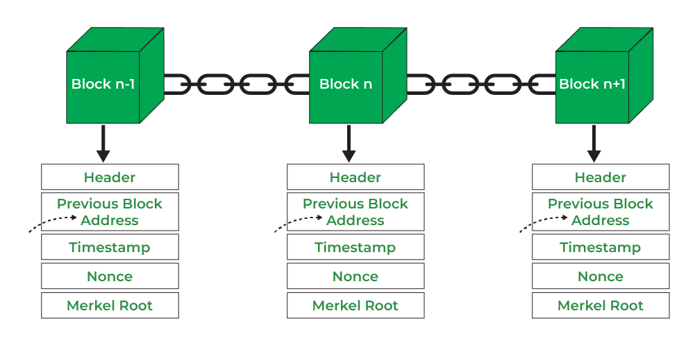


قبل از اینکه تراکنش‌ها در یک بلاک گنجانده شوند، در **Mempool** قرار می‌گیرند، جایی که منتظر اعتبارسنجی هستند. پس از اعتبارسنجی، این تراکنش‌ها به بلاک تازه استخراج‌شده و سپس به Blockchain اضافه می‌شوند.


> **تعاریف:**
>

> - _استخراج:_ فرآیند حل معماهای رمزنگاری برای افزودن بلوک‌های جدید به Blockchain.
> - _نانس:_ مقداری که برای یافتن Hash صحیح در طول Mining استفاده می‌شود.
> - _Mempool:_ یک منطقه انتظار برای تراکنش‌های تایید نشده قبل از اضافه شدن به یک بلاک.

### مقیاس‌پذیری، حریم خصوصی، و توسعه در Bitcoin


Bitcoin با چالش‌های مربوط به مقیاس‌پذیری و حریم خصوصی مواجه است. ظرفیت محدود تراکنش در Blockchain مدیریت حجم بالای تراکنش‌ها را دشوار می‌کند. راه‌حل‌هایی مانند **Lightning Network** Address این چالش‌ها را با امکان‌پذیر ساختن تراکنش‌های off-chain از طریق کانال‌های پرداخت، که سرعت و حریم خصوصی را افزایش می‌دهند، برطرف می‌کنند.


اجرای یک **Full node** برای اطمینان از تمرکززدایی و امنیت ضروری است، اما **گره‌های تأیید پرداخت ساده‌شده (SPV)** امکان مشارکت سبک‌تر را با هزینه‌ای از امنیت فراهم می‌کنند.


توسعه Bitcoin برای بهبود عملکرد و امنیت تکامل یافته است. ارتقاء‌های عمده شامل **Segregated Witness (SegWit)** است که به مسئله تغییرپذیری تراکنش‌ها پرداخته و اندازه مؤثر بلوک را افزایش می‌دهد، و **Taproot** که حریم خصوصی را بهبود می‌بخشد و امکان قراردادهای پیچیده‌تر با استفاده از **Merkleized Abstract Syntax Trees (MAST)** را فراهم می‌کند.


> **تعاریف:**
>

> - _SegWit:_ یک ارتقاء Bitcoin که داده‌های امضا را از داده‌های تراکنش جدا می‌کند و کارایی را بهبود می‌بخشد.
> - _Taproot:_ ارتقایی که حریم خصوصی و مقیاس‌پذیری Bitcoin را با امکان‌پذیر ساختن قراردادهای هوشمند پیچیده‌تر بهبود می‌بخشد.
> - _شبکه لایتنینگ:_ یک راه‌حل Layer دوم برای تراکنش‌های Bitcoin سریع‌تر و ارزان‌تر با استفاده از کانال‌های پرداخت.

#### نتیجه‌گیری


ساختار و تکامل مداوم Bitcoin نوآوری و سازگاری فناوری آن را به نمایش می‌گذارد. از **هش‌کش** تا Blockchain غیرمتمرکز، و از **SegWit** تا **Taproot**، Bitcoin به چالش‌های Address مرتبط با مقیاس‌پذیری، حریم خصوصی و امنیت ادامه می‌دهد. تلاش‌های مستمر جامعه تضمین می‌کند که Bitcoin همچنان مقاوم و غیرمتمرکز باقی بماند و در عین حال برای پاسخگویی به نیازهای آینده تکامل یابد.


## رد نظریه Bitcoin


<chapterId>171ec71d-3028-5820-9b4f-36682113fc81</chapterId>


### رد نظریه Bitcoin


:::video id=c5e2e575-fa9d-4430-805f-205c2cf6f2a5:::


در این سخنرانی، به بررسی و رفع ابهامات رایج پیرامون **Bitcoin**، **بلاکچین‌ها** و **ارزهای دیجیتال** می‌پردازیم. بیایید به بررسی تصورات غلط Address درباره مصرف انرژی Bitcoin، استفاده‌های مجرمانه و گسترش "FUD" (ترس، عدم اطمینان، شک) در مورد این فناوری بپردازیم.


### Bitcoin در مقابل Blockchain


یک تصور غلط رایج این است که **Bitcoin** و **Blockchain** یکسان هستند. در حالی که Bitcoin یک ارز دیجیتال است، **Blockchain** فناوری است که آن را قدرت می‌بخشد. بلاکچین‌ها یک رکورد تأیید شده از تراکنش‌ها ارائه می‌دهند اما با معایبی مانند سرعت‌های کندتر و هزینه‌های بالاتر همراه هستند، که راه‌حل‌هایی مانند **Lightning Network** Address.


> **تعاریف:**
>

> - _بلاکچین:_ فناوری زیربنایی که برای ثبت تراکنش‌ها در یک Ledger غیرمتمرکز و تغییرناپذیر استفاده می‌شود.
> - _شبکه لایتنینگ:_ یک راه‌حل Layer ثانویه که با امکان‌پذیر ساختن تراکنش‌های off-chain، کارایی تراکنش Bitcoin را بهبود می‌بخشد.

### Bitcoin در مقابل کریپتو


تفاوت کلیدی دیگر این است که **Bitcoin** با هدف ارائه یک شکل غیرمتمرکز و مقاوم در برابر سانسور از پول ایجاد شده است که از کنترل هر شرکت یا دولتی آزاد است. در مقابل، ارزهای دیجیتال **shitcoins** اغلب با کنترل متمرکز طراحی می‌شوند و عمدتاً برای غنی‌سازی شرکت‌های پشت آن‌ها از طریق روش‌های استثماری، طرح‌های پمپ و تخلیه، یا کلاهبرداری‌های آشکار وجود دارند. این توکن‌ها معمولاً هیچ هدف واقعی جز کسب سود سریع برای سازندگان خود به هزینه سرمایه‌گذاران ناآگاه ندارند. با این حال، Bitcoin به عنوان تنها ارز دیجیتال واقعاً غیرمتمرکز با سابقه اثبات شده‌ای از امنیت و مقاومت، به تنهایی ایستاده است.


> **تعاریف:**
>

> - _شت‌کوین‌ها:_ شت‌کوین‌ها ارزهای دیجیتال با ارزش پایین یا کیفیت مشکوک هستند که فاقد کاربرد واقعی می‌باشند. این ارزها اغلب بسیار سفته‌بازانه هستند و گاهی اوقات برای اهداف کلاهبرداری یا بدون هدف مشخص ایجاد می‌شوند و از رونق بازار ارزهای دیجیتال سوءاستفاده می‌کنند.


### مصرف انرژی و تأثیرات زیست‌محیطی


یکی از رایج‌ترین انتقادات به Bitcoin **مصرف انرژی** آن است. در حالی که Bitcoin Mining از انرژی استفاده می‌کند، اما کمتر از 1% از مصرف برق جهانی و کمتر از 3% از انرژی هدررفته را به خود اختصاص می‌دهد. علاوه بر این، **Bitcoin Mining** اغلب از منابع انرژی استفاده‌نشده یا تجدیدپذیر بهره می‌برد که آن را سبزتر از آنچه که معمولاً به تصویر کشیده می‌شود، می‌سازد.


> **تعاریف:**
>

> - _بیت‌کوین Mining:_ فرآیند اعتبارسنجی تراکنش‌ها و ایمن‌سازی شبکه با حل معماهای رمزنگاری که نیاز به قدرت محاسباتی دارد.

### تصورات غلط درباره استفاده جنایی


Bitcoin اغلباً به دلیل استفاده در فعالیت‌های مجرمانه مورد انتقاد قرار می‌گیرد. با این حال، تحلیل Blockchain نشان می‌دهد که تنها درصد کمی از تراکنش‌های Bitcoin به جرم مرتبط هستند. در واقع، سیستم‌های مالی سنتی استفاده مجرمانه بسیار بیشتری نسبت به Bitcoin دارند.


### حریم خصوصی و قابلیت تعویض


**حریم خصوصی** و **قابلیت تعویض** ویژگی‌های اساسی Bitcoin هستند. حریم خصوصی از کاربران در رژیم‌های سرکوبگر محافظت می‌کند و قابلیت تعویض تضمین می‌کند که هر Bitcoin برابر است، صرف‌نظر از تاریخچه‌اش. این ویژگی‌ها Bitcoin را به شکلی قابل اعتماد و عادلانه از پول تبدیل می‌کنند.


> **تعاریف:**
>

> - _قابلیت تعویض:_ ویژگی پول که در آن هر واحد قابل تعویض با واحد دیگر است و ارزش برابر را تضمین می‌کند.

### مدیریت FUD و پویایی‌های بازار


ترس و عدم اطمینان پیرامون Bitcoin اغلب نگرانی‌ها درباره تأثیرات زیست‌محیطی، استفاده‌های مجرمانه و امنیت را بزرگ‌نمایی می‌کند. در حالی که نوسانات بازار رخ خواهد داد، فناوری غیرمتمرکز و مطمئن Bitcoin پایه‌ای محکم برای ثبات بلندمدت و آزادی مالی فراهم می‌کند، به‌ویژه در محیط‌های محدودکننده‌ای مانند ونزوئلا.


#### نتیجه‌گیری


درک واقعیت‌های مربوط به مصرف انرژی، ویژگی‌های حریم خصوصی و نقش Bitcoin در پیشگیری از جرم به رفع افسانه‌های پیرامون آن کمک می‌کند. با کنار زدن FUD، می‌توانیم به پتانسیل Bitcoin به عنوان یک شکل انقلابی از پول صوتی که حریم خصوصی، امنیت و تمرکززدایی را ترویج می‌دهد، پی ببریم.


## اجرای Bitcoin


<chapterId>5f638ec9-a6c1-5716-b27f-d837ab896eb1</chapterId>

<professorId>e7e63d59-ea19-4960-9446-61bd4dcc98f0</professorId>


### نصب Bitcoin Core


:::video id=4a5253cf-b863-466a-8506-0506b28a28de:::


در اولین سخنرانی از ماژول چهارم، معماری Bitcoin و نصب یک نود هسته Bitcoin را بررسی کردیم.


### اجرای یک نود Bitcoin


**1. مرور مقدمه**

خوش آمدید! در جلسه قبلی، مفاهیم اساسی پشت معماری Bitcoin را پوشش دادیم، از جمله مبانی رمزنگاری آن و ساختار شبکه همتا به همتا. امروز، از تئوری به عمل می‌رویم و نحوه نصب و پیکربندی یک نود Bitcoin را نشان می‌دهیم.


**2. مرور کلی جلسه عملی**

در این جلسه، آلکوس ما را با فرآیند راه‌اندازی یک نود Bitcoin با استفاده از یک ماشین مجازی آشنا خواهد کرد. این آموزش عملی به منظور آشنایی شما با مراحل پیکربندی نودتان برای مشارکت در شبکه Bitcoin طراحی شده است.


اجرای یک نود Bitcoin شامل اعتبارسنجی تراکنش‌ها و بلوک‌ها، اجرای قوانین اجماع و حمایت از تمرکززدایی شبکه است. راه‌اندازی یک نود تضمین می‌کند که شما یک اتصال مستقیم به شبکه Bitcoin دارید و به امنیت و یکپارچگی آن کمک می‌کنید.


در این سخنرانی، شما راهنمایی برای نصب و اجرای Bitcoin Core خودتان پیدا خواهید کرد، یاد می‌گیرید که چگونه Blockchain را برای صرفه‌جویی در فضا هرس کنید و شروع به آزمایش با نرم‌افزار کنید. آلکوس شما را گام به گام در این فرآیند هیجان‌انگیز راهنمایی خواهد کرد.


### چه کارهایی می‌توانید با Bitcoin Core انجام دهید و مزایای آن چیست؟


با اجرای Bitcoin Core، شما توانایی زیر را به دست می‌آورید:


- **تراکنش‌ها و بلوک‌های خود را تأیید کنید**: اطمینان از رعایت قوانین شبکه Bitcoin بدون اتکا به اشخاص ثالث.
- **تقویت شبکه**: با شرکت در شبکه، به غیرمتمرکز نگه داشتن آن کمک می‌کنید و Bitcoin را در برابر حملات مقاوم‌تر می‌سازید.
- **هرس کردن Blockchain**: نیازهای ذخیره‌سازی را با نگه‌داشتن تنها تراکنش‌های اخیر کاهش دهید، که این کار در صورتی که فضای دیسک محدودی دارید ایده‌آل است.
- از ویژگی‌های پیشرفته **Wallet استفاده کنید**: Bitcoin خود را با حفظ حریم خصوصی و امنیت مدیریت کنید، کلیدهای خصوصی generate را به صورت آفلاین نگه دارید و تراکنش‌ها را به‌صورت امن امضا کنید.
- **مستقیماً با شبکه Bitcoin تعامل کنید**: با استفاده از Bitcoin Core، می‌توانید بدون واسطه‌ها به شبکه متصل شوید و اطمینان حاصل کنید که دقیق‌ترین داده‌ها را دریافت می‌کنید.
- **از افزایش حریم خصوصی بهره‌مند شوید**: به عنوان یک اپراتور Full node، نیازی به اعتماد به خدمات خارجی ندارید و حریم خصوصی تراکنش‌های خود را از نظارت خارجی محافظت می‌کنید.


مزایای اجرای یک نود Bitcoin برای هر بیت‌کوینر متعهد قابل توجه است. نه تنها به امنیت شبکه و تقویت تمرکززدایی آن کمک می‌کنید، بلکه حریم خصوصی خود را افزایش می‌دهید، از صحت تراکنش‌های خود اطمینان حاصل می‌کنید و نقشی فعال در اکوسیستم Bitcoin ایفا می‌کنید. اجرای یک نود گامی کلیدی در دستیابی به حاکمیت مالی و پذیرش کامل ماهیت غیرمتمرکز Bitcoin است.


### دستورات اساسی


این‌ها برخی از دستورات پایه هنگام پیکربندی نود شما هستند:


- وضعیت **Bitcoin daemon** را بررسی کنید:


```bash
sudo systemctl status bitcoind
```


- شروع Bitcoin daemon**:**


```bash
systemctl start bitcoind
```


- توقف **Bitcoin daemon**:


```bash
sudo systemctl stop bitcoind
```


- دریافت اطلاعات **دقیق**:


```bash
bitcoin-cli getblockchaininfo
```


- **Blockchain را هرس کنید تا با نگه داشتن تنها جدیدترین بلوک‌ها، فضای دیسک را ذخیره کنید:**


```bash
prune=550
```


- **سرور Bitcoin Core را فعال کنید و تنظیمات RPC را پیکربندی کنید:**


```bash
server=1
rpcuser=yourusername
rpcpassword=yourpassword
```


- وضعیت **Bitcoin daemon** را بررسی کنید:


```bash
sudo systemctl status bitcoind
```


- **موجودی Bitcoin Wallet خود را بررسی کنید:**

```bash
sudo systemctl status bitcoind
```


### نصب C-lightning


:::video id=e13a1407-46e3-4b03-9a7a-b0f4a338c3c7:::


#### 1. **خلاصه هسته Bitcoin**


بیایید با یک مرور کوتاه از مراحل نصب Bitcoin Core بر روی یک ماشین مجازی ابری شروع کنیم، زیرا این برای تنظیمات بعدی C-Lightning ما بسیار مهم خواهد بود.


**نصب مجدد Bitcoin Core بر روی یک ماشین مجازی ابری**

برای شروع، می‌خواهید Bitcoin Core را روی ماشین مجازی خود دوباره نصب کنید. برای این جلسه، ما از تأیید باینری‌ها صرف‌نظر می‌کنیم تا در زمان صرفه‌جویی کنیم، اما به یاد داشته باشید که در یک محیط تولید، تأیید باینری‌ها یک گام حیاتی برای اطمینان از امنیت است.


**دانلود و تأیید هش‌های فایل**

ابتدا، آخرین نسخه Bitcoin Core را دانلود کرده و هش‌های فایل را بررسی کنید تا اطمینان حاصل شود که هیچ‌گونه دستکاری صورت نگرفته است.


```sh
wget https://bitcoin.org/bin/bitcoin-core-22.0/bitcoin-22.0-x86_64-linux-gnu.tar.gz
sha256sum bitcoin-22.0-x86_64-linux-gnu.tar.gz
# Compare the output hash with the official hash
```


**باینری را نصب کرده و راه‌اندازی خودکار با systemd را پیکربندی کنید**

سپس، باینری را نصب کرده و آن را با استفاده از systemd برای شروع خودکار تنظیم کنید.


```sh
tar -xzf bitcoin-22.0-x86_64-linux-gnu.tar.gz
sudo install -m 0755 -o root -g root -t /usr/local/bin bitcoin-22.0/bin/*
```


**ایجاد یک فایل سرویس systemd:**


```sh
sudo nano /etc/systemd/system/bitcoind.service
```


**پیکربندی زیر را اضافه کنید:**


```ini
[Unit]
Description=Bitcoin daemon
After=network.target

[Service]
ExecStart=/usr/local/bin/bitcoind -daemon
User=bitcoin
Group=bitcoin
Type=forking
PIDFile=/var/lib/bitcoind/bitcoind.pid
Restart=on-failure

[Install]
WantedBy=multi-user.target
```


**ایجاد و پیکربندی کاربر و دایرکتوری‌های Bitcoin**

یک کاربر اختصاصی ایجاد کنید و دایرکتوری‌ها را برای Bitcoin Core تنظیم کنید.


```sh
sudo adduser --disabled-login --gecos "" bitcoin
sudo mkdir -p /var/lib/bitcoind
sudo chown bitcoin:bitcoin /var/lib/bitcoind
```


**با هرس کردن Blockchain فضای دیسک را به حداقل برسانید**

برای صرفه‌جویی در فضای دیسک، هرس کردن را در فایل پیکربندی فعال کنید.


```sh
sudo nano /var/lib/bitcoind/bitcoin.conf
```


افزودن خطوط زیر:


```ini
prune=550
```


با این مراحل، باید Bitcoin Core را با حداقل استفاده از دیسک راه‌اندازی کرده و آماده تعامل با C-Lightning داشته باشید.


#### 2. **بررسی و نصب C-Lightning**


**بررسی اجمالی C-Lightning**


C-Lightning، که به عنوان Core-Lightning نیز شناخته می‌شود، یک پروتکل Layer 2 است که تراکنش‌های سریع‌تر و ارزان‌تر را با استفاده از کانال‌های off-chain تسهیل می‌کند. این پروتکل به دلیل معماری ماژولار و توسعه‌دهنده‌پسند خود متمایز است که امکان سفارشی‌سازی گسترده از طریق پلاگین‌ها را فراهم می‌کند.


**اهمیت ماژولاریتی و قابلیت توسعه با پلاگین‌ها**

طراحی ماژولار C-Lightning به این معناست که می‌توانید ویژگی‌ها را بر اساس نیاز اضافه یا حذف کنید و سیستم را برای موارد استفاده خاص سفارشی‌سازی کنید. مثال‌هایی از موارد استفاده شامل:


- **پردازش پرداخت**: افزونه‌های سفارشی می‌توانند شرایط خاص پرداخت را مدیریت کنند.
- **هزینه‌های مسیریابی**: هزینه‌های مسیریابی را بر اساس شرایط شبکه به صورت پویا تنظیم کنید.
- **اتوماسیون**: وظایفی مانند مدیریت کانال و تأمین نقدینگی را خودکار کنید.


### نصب C-Lightning


بیایید به نصب C-Lightning بپردازیم.


**از آخرین نسخه پایدار استفاده کنید**

برای این سخنرانی، از آخرین نسخه پایدار استفاده خواهیم کرد، به عنوان مثال، 22.11.1.


```sh
wget https://github.com/ElementsProject/lightning/releases/download/v22.11.1/clightning-v22.11.1.tar.gz
sha256sum clightning-v22.11.1.tar.gz
# Verify the hash against the provided hash
```


**اعتبارسنجی یکپارچگی با کلیدهای GPG**

همیشه صحت فایل دانلود شده را با کلیدهای GPG بررسی کنید.


```sh
gpg --recv-keys <developer-key-id>
gpg --verify clightning-v22.11.1.tar.gz.asc clightning-v22.11.1.tar.gz
```


**نصب وابستگی‌ها و کامپایل از کد منبع**

وابستگی‌های لازم را نصب کرده و C-Lightning را از منبع کامپایل کنید.


```sh
sudo apt-get update
sudo apt-get install -y autoconf automake build-essential git libtool libgmp-dev \
libsqlite3-dev python3 python3-mako net-tools zlib1g-dev
tar -xzf clightning-v22.11.1.tar.gz
cd clightning-v22.11.1
./configure
make
sudo make install
```


**پیکربندی سرویس systemd برای شروع خودکار**

یک فایل سرویس systemd برای C-Lightning به صورت زیر ایجاد کنید:

```ini
[Unit]
Description=C-Lightning
After=network.target

[Service]
ExecStart=/usr/local/bin/lightningd --network=bitcoin
User=bitcoin
Group=bitcoin
Restart=always
TimeoutSec=120
RestartSec=30
LimitNOFILE=128000

[Install]
WantedBy=multi-user.target
```

این فایل را در مسیر `/etc/systemd/system/lightningd.service` ذخیره کنید و سپس با استفاده از دستورات زیر سرویس را فعال و راه‌اندازی کنید:

```bash
sudo systemctl enable lightningd
sudo systemctl start lightningd
```


```sh
sudo nano /etc/systemd/system/lightningd.service
```


پیکربندی زیر را اضافه کنید:


```ini
[Unit]
Description=C-Lightning daemon
After=network.target bitcoind.service

[Service]
ExecStart=/usr/local/bin/lightningd
User=bitcoin
Group=bitcoin
Type=simple
Restart=on-failure

[Install]
WantedBy=multi-user.target
```


#### 3. **پیکربندی و تنظیمات**


**ایجاد دایرکتوری‌ها و فایل‌های پیکربندی لازم**

دایرکتوری‌ها و فایل‌های پیکربندی مورد نیاز برای C-Lightning را ایجاد کنید.


```sh
sudo mkdir -p /var/lib/lightning
sudo chown bitcoin:bitcoin /var/lib/lightning
sudo -u bitcoin nano /var/lib/lightning/config
```


خطوط زیر را به فایل پیکربندی اضافه کنید:


```ini
network=testnet
log-level=debug
plugin=/usr/local/libexec/c-lightning/plugins
```


**پیکربندی C-Lightning برای اتصال به Bitcoin Core در Testnet**

اطمینان حاصل کنید که C-Lightning می‌تواند با Bitcoin Core متصل شود با اضافه کردن خطوط زیر:


```ini
bitcoin-datadir=/var/lib/bitcoind
bitcoin-rpcuser=<rpcusername>
bitcoin-rpcpassword=<rpcpassword>
```


**اطمینان از سازگاری و همگام‌سازی**

خدمات را شروع کنید و اطمینان حاصل کنید که سازگار و همگام‌سازی شده‌اند.


```sh
sudo systemctl start bitcoind
sudo systemctl start lightningd
sudo systemctl enable bitcoind
sudo systemctl enable lightningd
```


**مسیرها و مجوزهای فایل Address، به ویژه برای یکپارچه‌سازی با Tor**

پیکربندی مسیرهای فایل و مجوزها برای اطمینان از عملکرد روان، به ویژه اگر از Tor برای حفظ حریم خصوصی استفاده می‌کنید.


```sh
sudo apt-get install tor
sudo -u bitcoin nano /var/lib/lightning/config
```


افزودن موارد زیر برای یکپارچه‌سازی Tor:


```ini
proxy=127.0.0.1:9050
```


**پشتیبان‌گیری از رمز HSM برای بازیابی وجوه**

پشتیبان‌گیری از راز HSM برای بازیابی وجوه.


```sh
sudo cp /var/lib/lightning/hsm_secret /path/to/secure/location
```


**اتصالات را آزمایش کنید و وضعیت عملیاتی گره را تأیید کنید**

در نهایت، وضعیت عملیاتی نود خود را با آزمایش اتصالات و اطمینان از عملکرد صحیح همه چیز بررسی کنید.


```sh
lightning-cli getinfo
```


با دنبال کردن این مراحل، شما یک تنظیمات کامل و عملیاتی C-Lightning خواهید داشت که به نود Bitcoin Core شما متصل است و آماده برای تراکنش‌های Testnet می‌باشد.


#### نتیجه‌گیری و سوالات


در نتیجه، امروز مراحل اساسی برای نصب مجدد Bitcoin Core را پوشش دادیم و به دنبال آن یک راهنمای دقیق برای نصب و پیکربندی C-Lightning ارائه شد. اگر سوالی دارید، لطفاً اکنون بپرسید یا آنها را برای توضیحات بیشتر در جلسه بعدی آماده کنید. به یاد داشته باشید، تجربه عملی بسیار مهم است، بنابراین از تنظیمات Testnet که بحث کردیم برای کسب بینش بیشتر استفاده کنید.


### امنیت و دستگاه‌های سخت‌افزاری


:::video id=8b4baf24-1350-46b8-a87b-18678ed219ed:::


### اسپکتر و دستگاه Ledger


#### معرفی


به سخنرانی ما در مورد امنیت و تنظیم دستگاه برای Bitcoin خوش آمدید. تمرکز امروز بر درک استفاده از ابزارهای امنیتی، به ویژه Specter desktop Wallet و Ledger Hardware Wallet، و نحوه پیکربندی مؤثر آن‌ها برای افزایش امنیت Bitcoin است.


**ابزارها: شبیه‌ساز Specter desktop Wallet و Ledger**


Specter یک Wallet دسکتاپ است که برای تسهیل ایجاد و مدیریت کیف‌پول‌های Bitcoin طراحی شده است، به‌ویژه آن‌هایی که از دستگاه‌های سخت‌افزاری استفاده می‌کنند. برای نمایش ما، از یک شبیه‌ساز Ledger استفاده خواهیم کرد که عملکرد یک Ledger Hardware Wallet را تقلید می‌کند.


**تفاوت بین دستگاه Ledger و جنجال شرکت**


دستگاه Ledger، یک Hardware Wallet محبوب، به دلیل امنیت قوی خود شناخته شده است. با این حال، شرکت پشت Ledger به دلیل جنجال‌های مختلف مربوط به حریم خصوصی داده‌های کاربران تحت بررسی قرار گرفته است. درک تفاوت بین امنیت فیزیکی دستگاه و شیوه‌های شرکت برای استفاده آگاهانه بسیار مهم است.


**مدل‌های امنیتی: اهمیت کیف‌پول‌های multi-sig و سخت‌افزارهای متنوع**


یکی از جنبه‌های کلیدی امنیت Bitcoin استفاده از کیف‌پول‌های چند امضایی (multi-sig) است. کیف‌پول‌های multi-sig برای تأیید یک تراکنش به چندین کلید خصوصی نیاز دارند که به طور قابل توجهی امنیت را افزایش می‌دهد. علاوه بر این، استفاده از انواع مختلف کیف‌پول‌های سخت‌افزاری، ریسک را متنوع کرده و مدل امنیتی را تقویت می‌کند.


### راه‌اندازی و پیکربندی


**دانلود و راه‌اندازی Specter**


اولین مرحله در فرآیند راه‌اندازی ما شامل دانلود Specter از مخزن رسمی آن است. بسیار مهم است که صحت دانلود را بررسی کنید تا از نرم‌افزارهای مخرب جلوگیری شود. پس از دانلود، Specter را روی دسکتاپ خود نصب کرده و برنامه را اجرا کنید.


**پیکربندی Specter برای اتصال به سرورهای Bitcoin Core یا Electrum**


برای پیکربندی Specter، باید آن را به یک سرور Bitcoin Core یا Electrum متصل کنید. این سرورها داده‌های ضروری Blockchain را برای عملیات Wallet فراهم می‌کنند. پیکربندی شامل تنظیم سرور Address در تنظیمات Specter و اطمینان از یک اتصال پایدار است.


**توضیح مسیرهای مشتق‌گیری و بازیابی کلید عمومی**


درک مسیرهای مشتق‌سازی برای مدیریت Wallet ضروری است. مسیرهای مشتق‌سازی تعیین می‌کنند که چگونه کلیدها از یک کلید اصلی تولید می‌شوند. در Specter، می‌توانید با اتصال Hardware Wallet (یا شبیه‌ساز) خود و پیمایش از طریق Wallet Interface، کلیدهای عمومی را بازیابی کنید. اطمینان حاصل کنید که این مسیرها را برای مراجعه‌های آینده مستند کنید.


**نمایش عملی: استفاده از شبیه‌ساز Ledger**


اکنون از یک شبیه‌ساز Ledger برای دریافت کلیدها استفاده خواهیم کرد. این شامل اتصال شبیه‌ساز به Specter، پیمایش به بخش مدیریت کلید و انتخاب کلیدهای مناسب برای ایجاد Wallet است.


**ایجاد و مدیریت کیف پول‌ها در Specter**


ایجاد یک Wallet در Specter ساده است. به Interface ایجاد Wallet دسترسی پیدا کنید، جزئیات لازم را وارد کنید و کلیدهای عمومی بازیابی شده خود را شامل کنید. پس از ایجاد، می‌توانید Wallet را مدیریت کنید، تراکنش‌ها را نظارت کنید و از شیوه‌های امنیتی قوی اطمینان حاصل کنید.


**دریافت و نظارت بر تراکنش‌ها**


پس از راه‌اندازی Wallet، دریافت تراکنش‌ها به سادگی به اشتراک‌گذاری Wallet Address شما است. Specter نظارت لحظه‌ای بر تراکنش‌های ورودی را فراهم می‌کند و اطمینان می‌دهد که همیشه از وضعیت Wallet خود به‌روز هستید.


### پیکربندی‌های پیشرفته


**راه‌اندازی از راه دور Specter daemon**


برای کاربران پیشرفته، راه‌اندازی یک Specter daemon از راه دور می‌تواند دسترسی و امنیت را بهبود بخشد. این شامل پیکربندی یک سرور از راه دور برای اجرای بخش پشتی Specter است که امکان دسترسی امن از دستگاه‌های مختلف را فراهم می‌کند.


**فعال‌سازی تور برای حفظ حریم خصوصی**


برای تقویت حریم خصوصی، توصیه می‌شود که Specter را برای استفاده از Tor پیکربندی کنید. Tor ترافیک شبکه شما را ناشناس می‌کند و از IP شما Address در برابر نظارت احتمالی محافظت می‌کند. این امر به‌ویژه برای کاربرانی که نگران حریم خصوصی و امنیت هستند، اهمیت دارد.


**اتصال امن به نودهای راه دور**


هنگام اتصال به نودهای راه دور، اطمینان حاصل کنید که اتصال امن است. این شامل استفاده از گواهینامه‌های SSL/TLS و تأیید اصالت نود می‌شود. اتصالات امن از حملات مرد میانی جلوگیری کرده و یکپارچگی داده‌ها را تضمین می‌کنند.


**اشکال‌زدایی مشکلات: تکنیک‌های عملی**


مواجهه با مشکلات اجتناب‌ناپذیر است. اشکال‌زدایی عملی شامل بررسی مجوزهای کاربر، تأیید دسترسی به دایرکتوری داده‌ها و مشاوره با لاگ‌ها برای یافتن خطاها می‌شود. به عنوان مثال، اطمینان حاصل کنید که Specter مجوزهای لازم برای دسترسی به دایرکتوری داده‌های Bitcoin Core را دارد تا از اختلالات عملیاتی جلوگیری شود.


**مثال مشکل: دسترسی به دایرکتوری داده‌ها**


یک مشکل رایج دسترسی نادرست به دایرکتوری داده‌ها است. اطمینان حاصل کنید که مسیر دایرکتوری داده‌های Bitcoin Core به‌درستی در پیکربندی Specter تنظیم شده است. این کار تضمین می‌کند که Specter به داده‌های ضروری Blockchain برای عملیات Wallet دسترسی دارد.


**مراحل بعدی و یکپارچه‌سازی**


همانطور که به پایان می‌رسیم، مراحل بعدی شامل یکپارچه‌سازی Specter با Lightning Network است. این امکان ارسال وجوه از Specter به یک نود Lightning را فراهم می‌کند و تراکنش‌ها را سریع‌تر و ارزان‌تر می‌سازد. درس‌های آینده این یکپارچه‌سازی را به‌طور مفصل پوشش خواهند داد و قابلیت‌های تراکنش Bitcoin شما را بهبود خواهند بخشید.


**تغییرپذیری زمان‌بندی بلوک**


درک تغییرپذیری زمان‌بندی بلوک بسیار مهم است. بلوک‌های Bitcoin می‌توانند در فواصل زمانی مختلف استخراج شوند که بر زمان‌های تأیید تراکنش تأثیر می‌گذارد. این تغییرپذیری باید در تمامی پیکربندی‌ها و عملیات Wallet در نظر گرفته شود.


**منابع یادگیری**


برای یادگیری بیشتر، منابعی مانند "تسلط بر Lightning Network" و آموزش‌های Rusty Russell را در نظر بگیرید. این مطالب دانش عمیقی درباره نودهای Lightning و پیکربندی‌های پیشرفته Bitcoin ارائه می‌دهند.


**نصب Node و امنیت Tor**


نصب نودها، چه به صورت محلی و چه از راه دور، با استفاده از تور برای افزایش امنیت بهره‌مند می‌شود. اجرای نود شخصی شما، اعتبارسنجی تراکنش‌های شخصی را تضمین می‌کند و امنیت و حریم خصوصی را بهبود می‌بخشد.


**فلسفه: خودکفایی در یادگیری**


فلسفه خودکفایی را بپذیرید. مهارت‌های عملی و خودآموزی بسیار مهم هستند و اغلب از مزایای آموزش رسمی پیشی می‌گیرند. با تمرین‌های عملی درک خود را از امنیت Bitcoin عمیق‌تر کنید.


**ملاحظات حریم خصوصی**


با اجتناب از خدماتی که تراکنش‌ها را ردیابی یا ثبت می‌کنند، حریم خصوصی را حفظ کنید. ناشناس بودن برای عملیات امن Bitcoin حیاتی است و انتخاب دقیق خدمات به محافظت از هویت و تاریخچه تراکنش شما کمک می‌کند.


این سخنرانی ما در مورد امنیت و تنظیم دستگاه برای Bitcoin با استفاده از Specter و Ledger به پایان می‌رسد. لطفاً هر گونه سوالی دارید بپرسید یا در مورد هر نکته‌ای که بحث شد، درخواست توضیح کنید.


## بهبود Bitcoin


<chapterId>4fdd032f-2b05-5f24-a094-297d64f939de</chapterId>


### مشکلات باز در اکوسیستم Bitcoin


:::video id=6d771eca-3f53-493d-8937-db6ddb2cf172:::


بیش از یک دهه، Bitcoin به عنوان یک نوآوری تحول‌آفرین در دنیای مالی ثابت شده است که با موفقیت در مقیاس جهانی عمل کرده و امکانات جدیدی را در اقتصاد دیجیتال باز کرده است. با این حال، همچنان با چالش‌هایی مواجه است که نیاز به راه‌حل‌های خلاقانه و همکاری دارد. تکامل مداوم Bitcoin فرصتی منحصر به فرد برای کسانی است که به شکل‌دهی آینده مالی غیرمتمرکز علاقه‌مند هستند.


#### مشکلات باز در قابلیت استفاده Bitcoin


Bitcoin، با وجود بیش از یک دهه از وجودش، همچنان با چالش‌های قابل توجهی در زمینه قابلیت استفاده دست و پنجه نرم می‌کند. ابزارها و رابط‌های موجود برای کاربران اغلب فاقد بلوغ و کاربرپسندی هستند که در سیستم‌های مالی سنتی‌تر یافت می‌شود. این مسئله به ویژه در مناطقی مانند السالوادور مشهود است، جایی که پذیرش Bitcoin با حمایت دولت همراه بوده است. مسئله اصلی در اینجا نیاز به انتزاع‌های بهتر است که بتواند تجربه کاربری را ساده‌تر کند و Bitcoin را حتی برای افرادی با دانش فنی حداقلی قابل دسترس سازد.


#### مشکلات باز در مقیاس‌پذیری


مقیاس‌پذیری همواره یک مشکل پایدار در توسعه Bitcoin بوده است. توانایی شبکه در مدیریت حجم بالای تراکنش‌ها همچنان محدود است و اغلب منجر به هزینه‌های بالای On-Chain می‌شود که می‌تواند برخی از کاربران را از مشارکت محروم کند. در حالی که راه‌حل‌هایی مانند Lightning Network با امکان‌پذیر کردن تراکنش‌های off-chain تا حدی تسکین می‌دهند، اما به طور کامل نگرانی‌های مقیاس‌پذیری را Address نمی‌کنند. نیاز به راه‌حل‌های جامع‌تری که بتوانند حجم رو به رشد تراکنش‌ها را بدون به خطر انداختن یکپارچگی شبکه مدیریت کنند، مشهود است.


#### مشکلات باز در امنیت


تأمین دارایی‌های Bitcoin یک وظیفه پیچیده است که با چالش‌های زیادی همراه است. کیف‌پول‌های Hot، که اغلب برای تراکنش‌های روزمره استفاده می‌شوند، خطرات امنیتی قابل توجهی را به‌ویژه برای کسانی که گره‌های Lightning را اداره می‌کنند، ایجاد می‌کنند. علاوه بر این، برنامه‌ریزی برای ارث‌بری دارایی‌های Bitcoin همچنان یک فرآیند پیچیده و اغلب ناامن باقی مانده است. پیچیدگی این تدابیر امنیتی می‌تواند کاربران بالقوه را دلسرد کند و پذیرش گسترده را پیچیده کند.


#### مسائل باز در حریم خصوصی


حریم خصوصی یکی دیگر از مسائل حیاتی در اکوسیستم Bitcoin است. در حالی که حریم خصوصی برای امنیت ضروری است، چارچوب فعلی Bitcoin ویژگی‌های حریم خصوصی محدودی ارائه می‌دهد. تراکنش‌های On-Chain به راحتی قابل ردیابی هستند و خطراتی برای ناشناس بودن کاربران ایجاد می‌کنند. اگرچه Lightning Network پتانسیل بهبود حریم خصوصی را دارد، اما همچنان نیاز به بهبودهای قابل توجهی دارد. تعادل بین شفافیت و حریم خصوصی ظریف است و نیازمند راه‌حل‌های نوآورانه برای تضمین امنیت و حریم خصوصی کاربران است.


#### مسائل باز در انعطاف‌پذیری


انعطاف‌پذیری در پروتکل Bitcoin برای بهبود حریم خصوصی، امنیت و مقیاس‌پذیری ضروری است. با این حال، انعطاف‌پذیری بیش از حد می‌تواند به یک نقطه ضعف تبدیل شود و به عنوان یک بردار حمله عمل کرده و تمرکززدایی شبکه را تهدید کند. یافتن تعادل مناسب برای حفظ یکپارچگی و مقاومت پروتکل Bitcoin بسیار مهم است.


### معاوضه‌ها در بهبود Bitcoin


#### قابلیت استفاده در مقابل امنیت و حریم خصوصی


تلاش‌ها برای بهبود قابلیت استفاده Bitcoin اغلب به قیمت امنیت و حریم خصوصی تمام می‌شود. به عنوان مثال، کیف‌پول‌های حضانتی کاربرپسند، مانند Wallet از Satoshi، یک Interface قابل دسترسی ارائه می‌دهند اما به طور قابل توجهی امنیت و حریم خصوصی را به خطر می‌اندازند. سیستم‌های ساده‌شده ممکن است قابلیت استفاده را افزایش دهند اما می‌توانند به مشکلاتی مانند استفاده مجدد از Address منجر شوند که حریم خصوصی را تضعیف می‌کند. بنابراین، هرگونه بهبود در قابلیت استفاده باید با دقت در برابر مبادلات احتمالی امنیت و حریم خصوصی سنجیده شود.


#### مبادلات مقیاس‌پذیری و حریم خصوصی


مقیاس‌پذیری و حریم خصوصی اغلب در شبکه Bitcoin در تضاد هستند. بهبودهایی که مقیاس‌پذیری را افزایش می‌دهند، مانند UTXOهای بزرگ‌تر یا کاهش ابهام‌سازی رمزنگاری، معمولاً حریم خصوصی را کاهش می‌دهند. از سوی دیگر، تکنیک‌های متمرکز بر حریم خصوصی مانند امضاهای حلقه‌ای مونرو، ناشناس بودن کاربر را افزایش می‌دهند اما تأثیر منفی بر مقیاس‌پذیری دارند. علاوه بر این، معرفی قراردادهای حالت‌دار، همان‌طور که در اتریوم دیده می‌شود، انعطاف‌پذیری بیشتری را با هزینه کاهش امنیت و مقیاس‌پذیری ارائه می‌دهد. متعادل‌سازی این مبادلات یک چالش پیچیده است که نیاز به بررسی دقیق دارد.


### تکنیک‌های حفظ حریم خصوصی


رویکردهای مختلف به حریم خصوصی در Bitcoin هر کدام با مجموعه‌ای از مبادلات خود همراه هستند. حریم خصوصی از طریق مبهم‌سازی، که شامل افزودن اطلاعات بیشتر برای پنهان کردن داده‌های مرتبط است، می‌تواند حریم خصوصی را افزایش دهد اما ممکن است شبکه را پیچیده کند. نمونه‌هایی از این رویکرد شامل Monero و Zcash هستند. از سوی دیگر، حریم خصوصی از طریق حذف، که هدف آن کاهش اطلاعات On-Chain است، همان‌طور که در Lightning Network دیده می‌شود، می‌تواند هم حریم خصوصی و هم مقیاس‌پذیری را بهبود بخشد. هر روش دارای مزایا و معایب خاص خود است و نیازمند رویکردی دقیق به بهبود حریم خصوصی است.


### تغییرات و چالش‌های اجماع


تغییر مکانیزم اجماع Bitcoin به دلیل ماهیت غیرمتمرکز شبکه، یک تلاش نادر و چالش‌برانگیز است. پیشنهاداتی مانند ChISA (تجمیع امضای ورودی متقابل) و پیمان‌ها هدف دارند قوانین تراکنش پیچیده‌تری را معرفی کنند، اما اجرای آن‌ها با دشواری‌های زیادی همراه است. تغییرات اجماع نیاز به توافق گسترده در جامعه دارد و هماهنگی لازم می‌تواند منجر به ناامیدی و فرسودگی قابل توجهی شود اگر تغییرات پیشنهادی پذیرفته نشوند. این موضوع نیاز به تلاش‌های دقیق و همکاری در توسعه پروتکل را برجسته می‌کند.


### نوآوری‌ها و استانداردها در توسعه Bitcoin


پایبندی به شیوه‌های استاندارد در توسعه Bitcoin و Wallet برای اطمینان از سهولت استفاده و امنیت بسیار مهم است. بسیاری از کیف‌پول‌ها در حال حاضر از استانداردهای تعیین‌شده پیروی نمی‌کنند که منجر به تکه‌تکه شدن و آسیب‌پذیری‌های بالقوه می‌شود. استانداردسازی می‌تواند تجربه کاربری و امنیت کلی تراکنش‌های Bitcoin را به‌طور قابل‌توجهی بهبود بخشد.


عبارات پشتیبان ۱۲ کلمه‌ای سنتی، در حالی که برای استفاده پایه‌ای از Bitcoin مؤثر هستند، در تطبیق با پروتکل‌های off-chain مانند Lightning Network ناکام می‌مانند. استانداردهای پشتیبان آینده باید تکامل یابند تا امنیت و قابلیت استفاده بهتری برای این ویژگی‌های پیشرفته فراهم کنند و اطمینان حاصل شود که کاربران می‌توانند دارایی‌های خود را به‌طور ایمن در لایه‌های مختلف اکوسیستم Bitcoin مدیریت کنند.


ساده‌سازی فرآیند پرداخت از طریق پروتکل‌های یکپارچه برای بهبود تجربه کاربری ضروری است. پروتکل‌های موجود مانند BIP70، BIP78 و Payneem راه‌حل‌های مختلفی ارائه می‌دهند، اما فضای بیشتری برای نوآوری وجود دارد. یک پروتکل پرداخت ساده‌تر و کاربرپسندتر می‌تواند به پذیرش گسترده‌تر و سهولت استفاده کمک کند.


توسعه ابزارها و سخت‌افزارهای بهتر برای بهبود قابلیت استفاده و امنیت Bitcoin حیاتی است. نوآوری‌هایی مانند کیف‌پول‌های سخت‌افزاری (مثلاً Ledger و Trezor) راه‌حل‌های امنیتی قوی ارائه می‌دهند اما باید به تکامل خود برای مقابله با تهدیدات نوظهور Address ادامه دهند. ابزارهای بهبود یافته می‌توانند Bitcoin را برای مخاطبان گسترده‌تری قابل دسترس و امن‌تر کنند.


کاهش ریسک‌های مرتبط با توزیع Hardware Wallet و اطمینان از یکپارچگی آن‌ها بسیار مهم است. حملات زنجیره‌ای Supply تهدیدات قابل توجهی برای امنیت این دستگاه‌ها ایجاد می‌کنند. اجرای اقدامات امنیتی دقیق و اطمینان از شفافیت در فرآیند تولید و توزیع می‌تواند به کاهش این ریسک‌ها کمک کند.


ساده‌سازی تعاملات کاربر با Bitcoin و Lightning Network در حالی که امنیت و کارایی حفظ می‌شود، یک هدف کلیدی است. انتزاعات بهتر UX می‌تواند Bitcoin را برای کاربران غیر فنی قابل دسترس‌تر کند و پذیرش گسترده‌تری را بدون به خطر انداختن امنیت ترویج دهد.


ایجاد مطالب آموزشی برای بهبود قابلیت استفاده، امنیت و حریم خصوصی Bitcoin تاثیرگذار است. آموزش کاربران در مورد بهترین شیوه‌ها و اصول اساسی Bitcoin می‌تواند آن‌ها را قادر سازد تا تصمیمات آگاهانه‌ای بگیرند و تجربه کلی خود را با شبکه بهبود بخشند.


**تغییرات Layer 1 و Layer 2**


نوآوری‌ها در پایه Layer (Layer 1) چالش‌برانگیز اما حیاتی برای تکامل بلندمدت Bitcoin هستند. راه‌حل‌های Layer 2، مانند Lightning Network، امکان تغییرات تجربی‌تر را فراهم می‌کنند و می‌توانند مسائل مقیاس‌پذیری و حریم خصوصی Address را به‌طور انعطاف‌پذیرتری مدیریت کنند. هر دو لایه نقش مهمی در توسعه مداوم Bitcoin ایفا می‌کنند.


**هماهنگی اجماع**


تغییرات در پروتکل Bitcoin نیازمند هماهنگی قابل توجه و اجماع جامعه است. ماهیت غیرمتمرکز Bitcoin این فرآیند را ذاتاً چالش‌برانگیز می‌کند. هماهنگی مؤثر و ارتباطات شفاف برای پیمایش پیچیدگی‌های تغییرات پروتکل و اطمینان از پذیرش موفقیت‌آمیز بهبودها ضروری است.


**چالش‌های مقیاس‌پذیری**


دستیابی به اجماع جهانی و مدیریت لایه‌های ثانویه پیچیده، مانند Lightning Network، چالش‌های مقیاس‌پذیری را ارائه می‌دهند. این مسائل باید حل شوند تا اطمینان حاصل شود که Bitcoin می‌تواند حجم معاملات رو به افزایش را در حالی که اصول اصلی امنیت و غیرمتمرکز بودن خود را حفظ می‌کند، مدیریت کند.


در نتیجه، پرداختن مداوم به این مسائل باز و نوآوری در اکوسیستم Bitcoin برای تکامل آن حیاتی است. تعادل بین قابلیت استفاده، امنیت، حریم خصوصی و مقیاس‌پذیری نیازمند بررسی دقیق و تلاش‌های مشترک است. با مشارکت در این تحولات، شرکت‌کنندگان می‌توانند به شکل‌دهی آینده Bitcoin و نقش آن در چشم‌انداز مالی جهانی کمک کنند.


# Bitcoin اصول و مبانی


<partId>6c0a3691-3ce4-5309-8ad7-e16e4b63c734</partId>


## تفکر امنیتی در Bitcoin


<chapterId>0b97af0c-015a-54e3-a7f0-0f62ceb96c07</chapterId>

<professorId>7dfc5865-a0f6-4c3b-9b05-83e0d807ac59</professorId>


:::video id=08101af2-1ded-4f3a-b1db-d4477c6ab63e:::


به سخنرانی امروز درباره **امنیت و قابلیت اطمینان** خوش آمدید. هدف ما بررسی رابطه پیچیده بین این دو جنبه اساسی طراحی سیستم و کاربرد آن‌ها در سناریوهای دنیای واقعی است.


### مقدمه‌ای بر تفکر امنیتی


تفکر امنیتی بر اصولی استوار است که برای محافظت از سیستم‌ها در برابر حملات عمدی طراحی شده‌اند. این شامل شناسایی تهدیدات احتمالی و اجرای تدابیری برای کاهش آن‌ها می‌شود. در مقابل، قابلیت اطمینان بر اطمینان از عملکرد صحیح سیستم‌ها تحت شرایط مشخص تمرکز دارد و به جای تلاش‌های عمدی برای نقض امنیت، به شکست‌های احتمالی می‌پردازد.


#### رابطه بین امنیت و قابلیت اطمینان


در حالی که هر دو امنیت و قابلیت اطمینان به حفظ یکپارچگی سیستم می‌پردازند، رویکردهای آن‌ها به طور قابل توجهی متفاوت است. مهندسی قابلیت اطمینان با احتمال خرابی‌های سیستم به دلیل رویدادهای تصادفی سر و کار دارد و اغلب از روش‌های آماری برای پیش‌بینی و کاهش این خرابی‌ها استفاده می‌کند. از سوی دیگر، امنیت باید به ماهیت عمدی و هوشمندانه حملات توجه کند و نیازمند یک استراتژی دفاع چند لایه به نام "دفاع در عمق" است.


#### امنیت در مقابل قابلیت اطمینان


یک مثال بارز از مهندسی قابلیت اطمینان را می‌توان به قرن هجدهم و ساخت یک پل نسبت داد. کیفیت فولاد استفاده شده، از جمله ترکیب و فرآیند تولید آن، به طور جدی بر قابلیت اطمینان پل تأثیر گذاشت. مهندسان باید نقاط شکست واحد را در نظر می‌گرفتند و از احتمال و آمار برای ارزیابی و اطمینان از قابلیت اطمینان پل در طول زمان استفاده می‌کردند.


برخلاف قابلیت اطمینان، امنیت با تهدیدات عمدی سروکار دارد. به عنوان مثال، یک کلید رمزنگاری ۲۵۶ بیتی به دلیل غیرممکن بودن حمله جستجوی فراگیر، تضمین ریاضی امنیت را فراهم می‌کند. اقدامات امنیتی باید مدل‌های تهدید مختلف، از دستکاری فیزیکی تا حملات سایبری پیچیده را در نظر بگیرند.


### کاربردهای دنیای واقعی


فرآیند ایجاد و ذخیره کلیدهای Bitcoin با استفاده از کیف‌پول‌های کاغذی را در نظر بگیرید. در حالی که کیف‌پول‌های کاغذی می‌توانند امن باشند، اما در معرض آسیب فیزیکی و دستکاری قرار دارند. اطمینان از یکپارچگی چنین کیف‌پول‌هایی نیازمند روش‌های آشکارسازی دستکاری و پروتکل‌های تأیید قوی است.


در سناریویی دیگر، تصور کنید که در یک ترمینال فرودگاه، راننده از یک کد مخفی برای تأیید هویت مسافر استفاده می‌کند. این اقدام امنیتی ساده اما مؤثر از فریب دادن هر دو طرف توسط افراد متقلب جلوگیری می‌کند.


در گواتمالا، زمان‌سنجی نتایج انتخابات نقش حیاتی در تضمین یکپارچگی فرآیند انتخاباتی ایفا کرد. با استفاده از روش‌های رمزنگاری برای داده‌های Timestamp، مقامات انتخاباتی می‌توانستند مدرکی غیرقابل‌دستکاری از اصالت نتایج ارائه دهند و از دستکاری‌های احتمالی که توسط انگیزه‌های مالی قابل‌توجه تحریک می‌شوند، جلوگیری کنند.


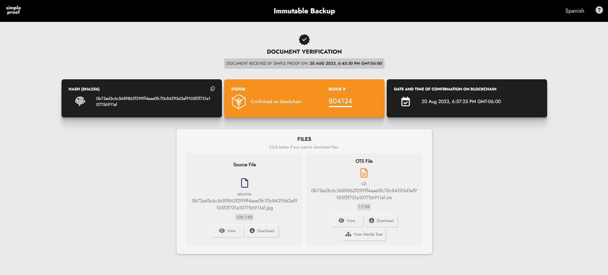


### شناسایی و کاهش تهدیدات احتمالی


مدل‌سازی تهدید فرآیند شناسایی تهدیدات امنیتی بالقوه و ایجاد استراتژی‌هایی برای کاهش آن‌ها است. این شامل درک محیط سیستم، شناسایی مهاجمان احتمالی و توسعه پروتکل‌های امن بر اساس فرضیات و تحلیل احتمالاتی می‌شود.


#### ایجاد پروتکل‌های امن


برای حفاظت از انتخابات، به عنوان مثال، نظارت بی‌طرفانه یا نظارت چندحزبی می‌تواند برای اطمینان از شفافیت و یکپارچگی اجرا شود. روش‌های رمزنگاری، مانند زمان‌سنجی و تأیید متقابل، به حفظ اصالت داده‌ها و جلوگیری از دستکاری کمک می‌کنند.


#### تأیید اعتماد


تأیید اعتماد را می‌توان با تأیید PGP (Pretty Good Privacy) نشان داد. با تأیید اثر انگشت‌ها و امضاهای کلیدهای PGP، کاربران می‌توانند اصالت هویت‌های دیجیتال را برقرار کنند. روش‌های مشابه برای تأیید یکپارچگی نرم‌افزار از طریق تطبیق Hash (مثلاً SHA-256) ضروری هستند.


#### ایجاد مسیرهای اعتماد


ایجاد اعتماد فوری نیست؛ نیازمند پیوند دادن مسیرهای اعتماد متعدد و اطمینان از افزونگی است. به عنوان مثال، استفاده از HTTPS و شفافیت گواهی پشتیبانی‌شده توسط Blockchain، اصالت منابع وب را تضمین می‌کند و نفوذ به اعتماد را برای مهاجمان دشوار می‌سازد.


#### مشوق‌ها برای امنیت


درک نقش مشوق‌ها برای حفظ امنیت بسیار مهم است. به عنوان مثال، مدل امنیتی Bitcoin به مشوق‌های ماینرها و اعتبارسنجی شرکت‌کنندگان شبکه متکی است که اهمیت مشوق‌های اقتصادی در حفاظت از اکوسیستم‌های دیجیتال را برجسته می‌کند.


#### ایمن‌سازی کیف‌پول‌های Bitcoin


استراتژی‌های ایمن‌سازی کیف‌پول‌های Bitcoin شامل تنظیمات چند امضایی و ذخیره‌سازی متنوع است. این روش‌ها تضمین می‌کنند که حتی اگر یک جزء به خطر بیفتد، امنیت کلی دست‌نخورده باقی می‌ماند.


#### اهمیت اعتبارسنجی


در نهایت، اعتبارسنجی کاربران در حفظ یک شبکه امن بسیار حیاتی است. نقش هر کاربر در اعتبارسنجی تراکنش‌ها و تأیید اجزای نرم‌افزاری و سخت‌افزاری به حفظ یکپارچگی شبکه و مقابله با تهدیدات احتمالی کمک می‌کند.


در نتیجه، درک و ادغام اصول امنیت و قابلیت اطمینان در طراحی سیستم‌های قوی ضروری است. با یادگیری از مثال‌های تاریخی، به‌کارگیری استراتژی‌های دنیای واقعی، و اعتبارسنجی مداوم اعتماد، می‌توانیم سیستم‌هایی بسازیم که هم امن و هم قابل اطمینان باشند.


## نرم‌افزار آزاد و متن‌باز (FLOSS) در Bitcoin


<chapterId>2c59d609-f1ef-53f4-9575-df62e4d066e9</chapterId>

<professorId>7dfc5865-a0f6-4c3b-9b05-83e0d807ac59</professorId>


:::video id=4544ef7a-685e-4aaf-98a0-8a10dce06172:::


استفاده از نرم‌افزارهای آزاد و متن‌باز (FLOSS) در اکوسیستم Bitcoin حیاتی است. پیتر تاد به بررسی اهمیت FLOSS برای Bitcoin می‌پردازد، تاریخچه FLOSS را بررسی می‌کند و نحوه‌ای که گیت‌هاب به ما اجازه می‌دهد تا به صورت مشترک نرم‌افزارهای متن‌باز مانند Bitcoin را بسازیم، مورد بررسی قرار می‌دهد.


### ماهیت و اهمیت نرم‌افزار


نرم‌افزار، در اصل، مجموعه‌ای از کد و داده است که به دستگاه‌های محاسباتی دستور می‌دهد چگونه وظایف خاصی را انجام دهند. برخلاف سخت‌افزار، که نیاز به مواد فیزیکی و فرآیندهای تولیدی برای تکثیر دارد، نرم‌افزار می‌تواند به راحتی و با هزینه‌ای تقریباً ناچیز کپی و توزیع شود. این تفاوت اساسی نقش مهمی در گسترش و توسعه نرم‌افزار ایفا می‌کند.


یکی از تفاوت‌های کلیدی بین نرم‌افزار و سخت‌افزار، مفهوم منبع‌باز است. در حالی که سخت‌افزار منبع‌باز وجود دارد، به دلیل پیچیدگی‌های موجود در تکثیر اشیاء فیزیکی، به اندازه نرم‌افزار منبع‌باز رایج نیست. در مقابل، نرم‌افزار منبع‌باز به دلیل سهولت در تکثیر و توزیع، رونق می‌گیرد. نرم‌افزار منبع‌باز به هر کسی اجازه می‌دهد تا کد را مشاهده، تغییر و توزیع کند و محیطی مشارکتی ایجاد می‌کند که نوآوری و حل مسئله را تسریع می‌بخشد.


چارچوب قانونی حاکم بر نرم‌افزار عمدتاً حول قوانین حق‌تألیف می‌چرخد. این قوانین به خالق نرم‌افزار حقوق انحصاری برای استفاده، تغییر و توزیع اثر خود را اعطا می‌کنند. با این حال، مجوزهای متن‌باز مکانیزمی برای به اشتراک‌گذاری این حقوق با عموم، تحت شرایط خاص، فراهم می‌کنند. این ساختار قانونی برای درک پویایی‌های توزیع و تغییر نرم‌افزار ضروری است.


به طور خلاصه، ماهیت نرم‌افزار به عنوان کد و داده‌ای که به راحتی قابل تکرار است، همراه با سازوکارهای قانونی ارائه شده توسط مجوزهای منبع‌باز، اهمیت حیاتی آن را در چشم‌انداز دیجیتال مدرن برجسته می‌کند. این چارچوب نه تنها نوآوری را پیش می‌برد بلکه اطمینان می‌دهد که نرم‌افزار می‌تواند به صورت آزادانه توسط جامعه جهانی به اشتراک گذاشته شده و بهبود یابد.


### تاریخچه جنبش نرم‌افزار آزاد


جنبش نرم‌افزار آزاد ریشه در اوایل دهه ۱۹۸۰ دارد و عمدتاً توسط دیدگاه ریچارد استالمن درباره آزادی نرم‌افزار هدایت می‌شود. استالمن که از ماهیت محدودکننده نرم‌افزارهای مالکیتی ناراضی بود، مأموریتی را برای ایجاد نرم‌افزاری آغاز کرد که کاربران بتوانند آزادانه از آن استفاده، آن را تغییر داده و به اشتراک بگذارند. این امر به تأسیس بنیاد نرم‌افزار آزاد (FSF) در سال ۱۹۸۵ منجر شد.


یکی از مشارکت‌های مهم استالمن توسعه پروژه گنو بود که هدف آن ایجاد یک سیستم‌عامل شبیه یونیکس به صورت رایگان بود. گنو که مخفف "گنو یونیکس نیست" است، بسیاری از اجزای ضروری یک سیستم‌عامل کاملاً رایگان را فراهم کرد. با این حال، این پروژه فاقد یک هسته بود که بخش اصلی سیستم‌عامل است.


شکاف توسط ایجاد هسته لینوکس توسط لینوس توروالدز در سال 1991 پر شد. هسته توروالدز، همراه با اجزای GNU، منجر به یک سیستم عامل رایگان و کاملاً کاربردی به نام GNU/Linux شد. این همکاری بین Commitment فلسفی استالمن برای آزادی نرم‌افزار و مشارکت عملی توروالدز، قدرت رویکرد منبع باز را به نمایش می‌گذارد.


جنبش نرم‌افزار آزاد تأثیر عمیقی بر صنعت نرم‌افزار گذاشته است و ایده‌ای را ترویج می‌کند که نرم‌افزار باید برای همه آزاد باشد تا از آن استفاده، اصلاح و به اشتراک بگذارند. اصول آن پایه‌گذار بسیاری از پروژه‌ها و جوامع متن‌باز است که امروزه رونق دارند.


### اقتصاد و تأمین مالی در منبع باز


تأمین مالی و حفظ پروژه‌های متن‌باز چالش‌ها و فرصت‌های منحصر به فردی را ارائه می‌دهد. برخلاف نرم‌افزارهای اختصاصی که از طریق فروش و هزینه‌های مجوز درآمدزایی می‌کنند، پروژه‌های متن‌باز اغلب به مدل‌های تأمین مالی جایگزین متکی هستند.


یک مثال موفق Bitcoin Core است، که بخش حیاتی زیرساخت Bitcoin می‌باشد. توسعه‌دهندگانی که بر روی Bitcoin Core کار می‌کنند، اغلب از طریق کمک‌های مالی، اهداها و حمایت‌های مالی از سازمان‌هایی که از موفقیت پروژه بهره‌مند می‌شوند، تأمین مالی می‌شوند. این مدل به توسعه‌دهندگان اجازه می‌دهد تا بدون محدودیت‌های تأمین مالی تجاری سنتی بر بهبود نرم‌افزار تمرکز کنند.


مثال برجسته دیگر سیستم عامل لینوکس است. بسیاری از شرکت‌ها، مانند IBM، Red Hat و Intel، به توسعه لینوکس کمک می‌کنند زیرا محصولات و خدمات آن‌ها به یک سیستم عامل قوی و امن وابسته است. این شرکت‌ها حمایت مالی ارائه می‌دهند، کد می‌نویسند و منابعی برای نگهداری و بهبود اکوسیستم لینوکس فراهم می‌کنند.


مجوزهای متن‌باز، مانند MIT، GPL و AGPL، همچنین نقش مهمی در دینامیک اقتصادی نرم‌افزارهای متن‌باز ایفا می‌کنند. مجوزهای انعطاف‌پذیر مانند MIT اجازه استفاده انعطاف‌پذیرتر از کد، از جمله تجاری‌سازی را می‌دهند. در مقابل، مجوزهای کپی‌لفت مانند GPL تضمین می‌کنند که هر کار مشتق‌شده نیز باید متن‌باز باشد و محیطی همکاری‌محور را ترویج می‌دهند.


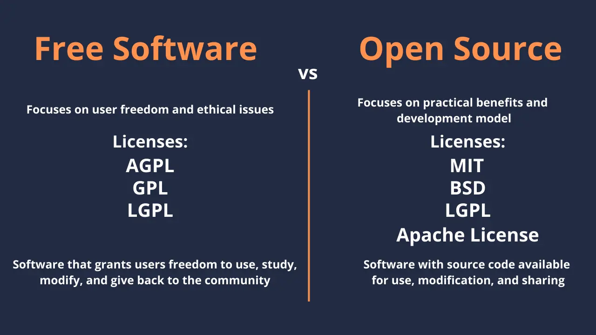


در نتیجه، اقتصاد نرم‌افزارهای متن‌باز توسط مشارکت‌های جامعه، حمایت‌های مالی شرکت‌ها و مدل‌های نوآورانه تأمین مالی هدایت می‌شود. این مکانیزم‌ها پایداری و بهبود مستمر پروژه‌های متن‌باز را تضمین می‌کنند و به نفع توسعه‌دهندگان و کاربران هستند.


## رمزنگاری در Bitcoin


<chapterId>71867dd2-912c-55ad-b59c-9dbca8a39469</chapterId>

<professorId>6cfd206c-53b8-47a0-bbf4-44fd84e6ee1d</professorId>


:::video id=b482b0f0-4468-4eaf-bcd6-eb4748bdfa3a:::


خوش آمدید! امروز، ما به جنبه‌های حیاتی رمزنگاری که هر توسعه‌دهنده Bitcoin باید بداند، خواهیم پرداخت. ما بر روی مفاهیم پایه و کاربردهای عملی تمرکز خواهیم کرد بدون اینکه شما را با جزئیات نظری بیش از حد غرق کنیم. هدف اصلی این است که شما را با دانش لازم برای درک، پیاده‌سازی و رفع اشکال مکانیزم‌های رمزنگاری در Bitcoin به طور مؤثر مجهز کنیم.


### مفاهیم رمزنگاری اصلی برای توسعه‌دهندگان Bitcoin


در این بخش، به مفاهیم کلیدی رمزنگاری که برای توسعه‌دهندگان Bitcoin ضروری است، از جمله توابع Hash، درخت‌های مرکل، امضاهای دیجیتال و منحنی‌های بیضوی خواهیم پرداخت.


عملکردهای **Hash**: یک عملکرد Hash یک ورودی می‌گیرد و یک رشته بایت با طول ثابت تولید می‌کند. در Bitcoin، عملکردهای Hash برای یکپارچگی و امنیت داده‌ها اساسی هستند. عملکردهای رمزنگاری Hash باید کارآمد باشند، خروجی‌های generate به ظاهر تصادفی تولید کنند و خروجی‌های با طول ثابت بدون توجه به اندازه ورودی تولید کنند. از آن‌ها برای بررسی یکپارچگی فایل استفاده می‌شود تا اطمینان حاصل شود که داده‌ها به طور مخرب تغییر نکرده‌اند.


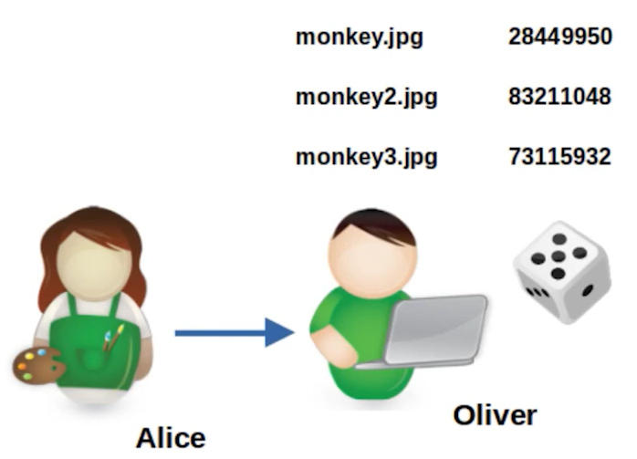


**ویژگی‌های امنیتی**: توابع رمزنگاری Hash باید به چندین ویژگی امنیتی پایبند باشند. مقاومت در برابر پیش‌تصویر تضمین می‌کند که مهندسی معکوس ورودی اصلی از خروجی Hash به لحاظ محاسباتی غیرممکن است. مقاومت در برابر پیش‌تصویر دوم به این معناست که باید یافتن یک ورودی متفاوت که همان خروجی Hash را تولید کند، دشوار باشد. مقاومت در برابر برخورد تضمین می‌کند که یافتن دو ورودی متفاوت که خروجی یکسانی از Hash تولید کنند، غیرمحتمل است.


**درخت‌های مرکل**: Merkle Tree یک ساختار داده است که امکان تأیید کارآمد و امن مجموعه‌های داده بزرگ را فراهم می‌کند. آیتم‌های داده به صورت جفتی هش می‌شوند و هش‌های حاصل به صورت تکراری ترکیب می‌شوند تا یک ریشه واحد Hash تشکیل شود. در Bitcoin، درخت‌های مرکل در ایجاد بلوک و تأیید تراکنش، به ویژه برای مشتریان تأیید پرداخت ساده (SPV) و در Taproot (Mast) بسیار مهم هستند.


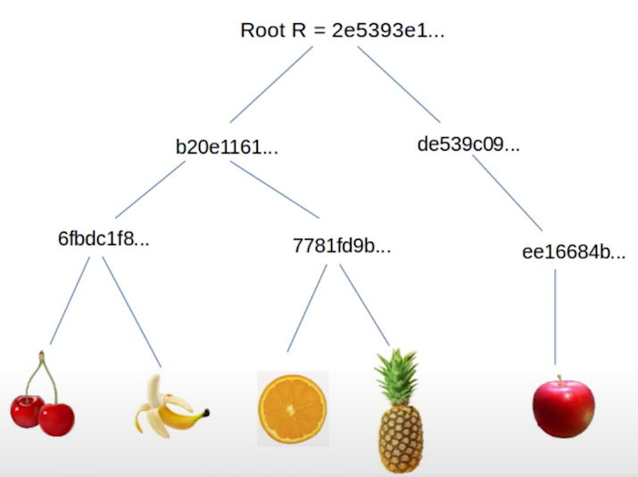


**امضاهای دیجیتال (ECDSA)**: الگوریتم امضای دیجیتال منحنی بیضوی (ECDSA) برای اطمینان از اصالت و یکپارچگی در تراکنش‌های Bitcoin استفاده می‌شود. این شامل تولید یک امضا با استفاده از یک کلید خصوصی است که می‌تواند با استفاده از کلید عمومی مربوطه تأیید شود. مفاهیم کلیدی شامل درک میدان‌های محدود، لگاریتم‌های گسسته و اهمیت نانس‌ها می‌باشد.


**منحنی‌های بیضوی**: منحنی‌های بیضوی در رمزنگاری کلید عمومی به دلیل کارایی و امنیتشان استفاده می‌شوند. امنیت رمزنگاری منحنی بیضوی به دشواری حل مسئله لگاریتم گسسته بستگی دارد.


### کاربردهای رمزنگاری عملی و شیوه‌های امنیتی در Bitcoin


در این بخش، ما به بررسی کاربرد این مفاهیم در توسعه واقعی Bitcoin و بهترین روش‌های امنیتی که باید دنبال شوند، خواهیم پرداخت.


**رمزنگاری = خطر**: رمزنگاری یک شمشیر دو لبه است. در حالی که از آسیب تصادفی داده‌ها و اقدامات مخرب محافظت می‌کند، پیاده‌سازی نادرست می‌تواند به آسیب‌پذیری‌های جدی منجر شود. توسعه‌دهندگان باید درک عمیقی از مکانیزم‌های رمزنگاری داشته باشند تا هم پیاده‌سازی امن و هم توانایی رفع مشکلات احتمالی را تضمین کنند. به عنوان مثال، خروجی 256 بیتی SHA-2 تضمین می‌کند که حملات پیش‌تصویر به حدود 2^256 کار نیاز دارند، با مقاومت در برابر برخورد حدود 2^128 کار.


**برنامه‌های Merkle Tree**: درک اندازه اثبات لگاریتمی و اطمینان از طراحی دقیق درخت برای جلوگیری از نقص‌ها، مانند تکرار Hash در تأیید تراکنش ضروری است. درخت‌های مرکل در ایجاد بلوک، تأیید تراکنش و بهبودهایی مانند Taproot استفاده می‌شوند.


**رمزنگاری کلید عمومی**: لگاریتم‌های گسسته و میدان‌های متناهی در محاسبات رمزنگاری در Bitcoin اساسی هستند. پروتکل‌های چالش-پاسخ برای تأیید دانش یک کلید خصوصی بدون افشای آن استفاده می‌شوند.


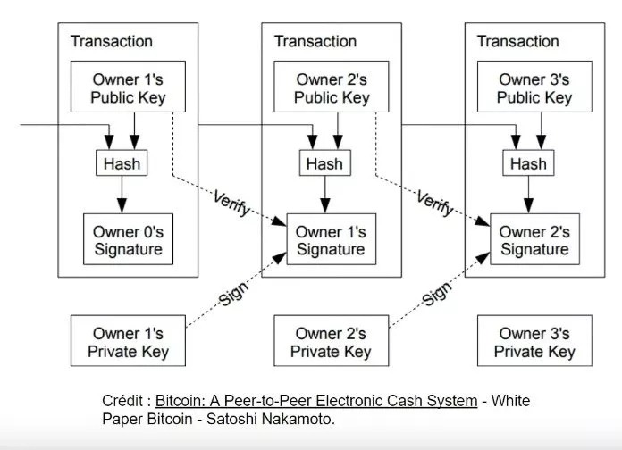


**پیامدهای امنیتی**: مثال‌های تاریخی نشان‌دهنده زیان‌های مالی قابل توجه به دلیل استفاده مجدد از Nonce هستند. درک اهمیت تولید نانس‌های منحصر به فرد بسیار مهم است. استفاده از کتابخانه‌های معتبر مانند LibSecP256k1 عملیات رمزنگاری قوی و امن را تضمین می‌کند.


**رمزنگاری منحنی بیضوی (ECC)**: طرح‌های امضا از پروتکل‌های هویتی به طرح‌هایی مانند امضاهای اشنور تکامل یافته‌اند که در حال حاضر در Bitcoin (BIP 340) استفاده می‌شوند. دانش منحنی‌های بیضوی و حساب در میدان‌های متناهی، پیاده‌سازی‌های رمزنگاری امن را تضمین می‌کند.


**توصیه کلی برای توسعه‌دهندگان**: پروتکل‌های رمزنگاری باید تحت بررسی‌های دقیق همتایان قرار گیرند. توسعه‌دهندگان باید دقیق باشند و هر مرحله از رویه‌های رمزنگاری را به‌طور کامل درک کنند. آگاهی از مشکلات رایج در پیاده‌سازی‌های رمزنگاری می‌تواند از آسیب‌پذیری‌های قابل توجه جلوگیری کند.


**منحنی‌های بیضوی در رمزنگاری**: تغییر کلید و امنیت موضوعات مهمی هستند، مانند تغییر یک کلید عمومی با استفاده از یک کلید خصوصی اضافی در حالی که امنیت حفظ می‌شود. منحنی بیضوی خاص Bitcoin، SECP256K1، و پارامترهای آن (P و N) برای پیاده‌سازی آن اساسی هستند.


#### نتیجه‌گیری


در این سخنرانی، ما به بررسی مفاهیم اساسی رمزنگاری که امنیت و عملکرد Bitcoin را پایه‌ریزی می‌کنند، پرداخته‌ایم. از نقش‌های حیاتی توابع Hash، درخت‌های مرکل و امضاهای دیجیتال تا ریاضیات پیچیده رمزنگاری منحنی بیضوی، این Elements ستون فقرات شبکه غیرمتمرکز Bitcoin را تشکیل می‌دهند. درک این مفاهیم تنها به معنای فهم نظریه نیست—بلکه به معنای شناخت پیامدهای عملی و مشکلات احتمالی در توسعه دنیای واقعی است.


به عنوان توسعه‌دهندگان Bitcoin، ضروری است که به پیاده‌سازی‌های رمزنگاری با احتیاط و دقت نزدیک شوید. امنیت شبکه Bitcoin به شدت به کاربرد صحیح و امن این اصول رمزنگاری وابسته است. چه در حال تأیید تراکنش‌ها باشید، چه در حال طراحی ویژگی‌های جدید یا اطمینان از یکپارچگی Blockchain، دانش عمیق از رمزنگاری به شما این امکان را می‌دهد که راه‌حل‌های قوی‌تر، امن‌تر و نوآورانه‌تری را در اکوسیستم Bitcoin بسازید.


با تسلط بر این مفاهیم و رعایت بهترین شیوه‌ها، شما به خوبی مجهز خواهید شد تا به طور مؤثر در توسعه مداوم Bitcoin مشارکت کنید و از مقاومت و امنیت آن برای آینده اطمینان حاصل نمایید.


## مدل حکمرانی Bitcoin


<chapterId>a30ec3e7-b290-5145-a9a9-042224ab20d2</chapterId>

<professorId>7dfc5865-a0f6-4c3b-9b05-83e0d807ac59</professorId>


:::video id=91a38c17-5801-4a5c-baf2-c9e4cc24fd84:::


### ماهیت Bitcoin


Bitcoin یک ارز دیجیتال است که بر روی یک پروتکل اجماع عمل می‌کند، مجموعه‌ای از قوانین که توسط شرکت‌کنندگان شبکه برای اطمینان از یکنواختی و عملکرد پذیرفته شده است. در هسته خود، Bitcoin یک Ledger غیرمتمرکز شناخته شده به عنوان Blockchain است، جایی که تراکنش‌ها توسط نودهای شبکه ثبت و تأیید می‌شوند. نودهای کامل، که کل تاریخچه Blockchain Bitcoin را ذخیره می‌کنند، نقش مهمی در حفظ یکپارچگی این Ledger ایفا می‌کنند. انواع دیگر نودها، مانند نودهای آرشیوی، نودهای هرس شده و نودهای SPV (تأیید پرداخت ساده‌شده)، نیز به روش‌های مختلف به شبکه کمک می‌کنند. پروتکل اجماع تضمین می‌کند که همه این نودها بر روی وضعیت Blockchain توافق دارند و Bitcoin را در برابر سانسور و تقلب مقاوم می‌سازد.


#### جلوگیری از تغییرات


حاکمیت در Bitcoin برای جلوگیری از تغییرات خودسرانه یا مخرب در پروتکل حیاتی است. این امر از طریق یک مکانیزم اجماع که نیاز به توافق گسترده در میان جامعه دارد، محقق می‌شود. توسعه‌دهندگانی که دانش برنامه‌نویسی دارند نقش مهمی در پیشنهاد تغییرات ایفا می‌کنند، اما این تغییرات باید توسط جامعه گسترده‌تر پذیرفته شوند تا اجرا شوند.


هسته Bitcoin و پیاده‌سازی‌های جایگزین دارای نگهدارندگانی هستند که بر توسعه و نگهداری نرم‌افزار نظارت می‌کنند. این نگهدارندگان مسئول ادغام تغییرات کد هستند و اطمینان حاصل می‌کنند که این تغییرات با قوانین اجماع سازگار بوده و آسیب‌پذیری‌ها را معرفی نمی‌کنند.


#### Soft چنگال‌ها در مقابل Hard چنگال‌ها


چنگال‌های Soft تغییراتی هستند که قوانین موجود پروتکل Bitcoin را سخت‌تر می‌کنند و باعث می‌شوند برخی از تراکنش‌هایی که قبلاً معتبر بودند، نامعتبر شوند. این تغییرات با نسخه‌های قبلی سازگار هستند، به این معنی که نودهایی که به‌روزرسانی نشده‌اند همچنان قوانین جدید را تشخیص خواهند داد. مثالی از Soft Fork، رفع باگ سرریز در سال ۲۰۱۰ است که از ایجاد پول از هیچ جلوگیری کرد.


چنگال‌های Hard تغییراتی هستند که قوانین موجود را شل می‌کنند و اجازه می‌دهند انواع جدیدی از تراکنش‌ها انجام شوند. این تغییرات با نسخه‌های قبلی سازگار نیستند، به این معنی که نودهای به‌روزرسانی‌نشده قوانین جدید را تشخیص نخواهند داد. یک مثال از Hard ممکن است برای مشکل سال 2106 نیاز باشد تا اطمینان حاصل شود که Bitcoin پس از این تاریخ به کار خود ادامه می‌دهد.


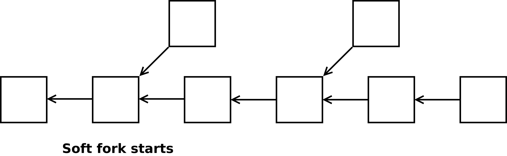


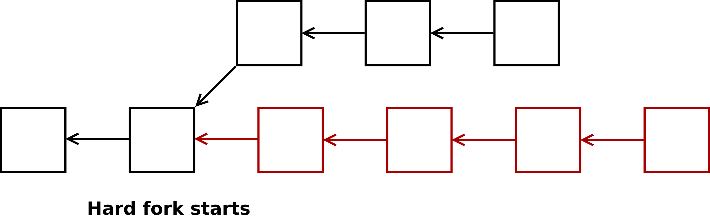


### نمونه‌هایی از حکمرانی


چندین مثال از دنیای واقعی نشان‌دهنده اجرای حاکمیت Bitcoin هستند. رفع باگ سرریز در سال 2010 یک Soft Fork بود که به یک نقص بحرانی پرداخت. مشکل سال 2106 احتمالاً نیاز به یک Hard Fork برای Address پیامدهای آن خواهد داشت. انتقال از زنجیره طولانی‌ترین به زنجیره با بیشترین کار، یک تصمیم حاکمیتی مهم را نشان می‌دهد که بر چگونگی دستیابی به اجماع تأثیر گذاشت.


حکمرانی Bitcoin همچنین به تغییرات دنیای واقعی در استفاده از پروتکل می‌پردازد. به عنوان مثال، معرفی اعداد ترتیبی و کتیبه‌ها نشان می‌دهد که چگونه تغییرات پروتکل می‌توانند در سانسور تراکنش‌ها ناکام بمانند. به همین ترتیب، اجرای RBF کامل (Replace-by-fee) روش‌های جایگزینی تراکنش را بدون تغییر قوانین اجماع تغییر داد.


#### انگیزه‌ها برای تغییر و اجماع


تغییرات در Bitcoin می‌تواند به دلایل مختلفی انجام شود، مانند رفع اشکالات بحرانی، معرفی ویژگی‌های جدید، یا محدود کردن تغییرات به دلایل اقتصادی یا سیاسی. این انگیزه‌ها اغلب منجر به بحث‌هایی در جامعه می‌شود درباره اینکه چه چیزی به عنوان یک اشکال در مقابل یک ویژگی محسوب می‌شود و تأثیر کلی آن بر شبکه.


مکانیزم اجماع Bitcoin به‌طور ذاتی سیاسی است و نیاز به توافق گسترده برای پذیرش تغییرات دارد. این جنبه سیاسی برای حفظ ماهیت غیرمتمرکز شبکه و اطمینان از اینکه هرگونه اصلاحات به نفع جامعه است، حیاتی می‌باشد.


اجرای نودها می‌تواند قوانین Bitcoin را اعتبارسنجی کرده و در شبکه مشارکت کند، حتی با پروتکل‌های ارتباطی متفاوت مانند Blockstream Satellite. این موضوع جدایی بین مکانیزم اجماع Bitcoin و روش‌های ارتباط داده‌ای که توسط شبکه استفاده می‌شود را برجسته می‌کند. اهمیت اقتصادی نودها، به‌ویژه آن‌هایی که توسط نهادهای بزرگی مانند Binance اجرا می‌شوند، می‌تواند بر پذیرش تغییرات تأثیر بگذارد. این نهادها منافع اقتصادی قابل‌توجهی در شبکه دارند و می‌توانند با اجرای نودهای تأثیرگذار تصمیمات را تحت تأثیر قرار دهند.


### بحث اندازه بلاک


بحث در مورد اندازه بلاک یک مسئله مهم حکومتی بود که حول این محور می‌چرخید که آیا اندازه بلاک Bitcoin افزایش یابد یا خیر. این جنجال با اجرای SegWit، یک Soft Fork که اندازه بلاک مؤثر را افزایش داد و Lightning Network را فعال کرد، حل شد.


### تغییرات اجباری و حکومت اکثریت


تلاش‌های قانونی برای وادار کردن توسعه‌دهندگان Bitcoin به تغییر قوانین Blockchain برای منافع شخصی، مانند دعاوی حقوقی توسط کریگ رایت، وجود داشته است. این تلاش‌ها چالش‌ها و ملاحظات اخلاقی درگیر در حاکمیت Bitcoin را برجسته می‌کنند.


در Bitcoin، حکومت اکثریت نقش حیاتی ایفا می‌کند. اگر 60٪ از ماینرها یک قانون جدید را بپذیرند، بلاک‌های آن‌ها توسط کسانی که نسخه اصلی Bitcoin Core را اجرا می‌کنند، رد خواهد شد که منجر به یک انشعاب می‌شود. مثالی از یک Hard Fork ناموفق به دلیل عدم حمایت جامعه، Bitcoin Satoshi's Vision (BSV) است.


بیایید به طور خلاصه برخی از مفاهیم مهم را مرور کنیم.


**Soft اجباری Fork**: مفهوم اجرای قوانین محدودکننده برای تغییر Bitcoin می‌تواند به شکاف‌های بیشتر و مسائل حکومتی منجر شود. این رویکرد پیچیدگی‌ها و تعارضات بالقوه درون جامعه Bitcoin را نشان می‌دهد.


حمله **51%**: حمله 51% سناریویی را توصیف می‌کند که در آن اکثریت قدرت هش می‌تواند با بلوک‌های خالی Bitcoin به Mining حمله کند. این می‌تواند به طور مؤثر شبکه را از بین ببرد مگر اینکه جامعه قوانین اجماع جدیدی را برای Address حمله اتخاذ کند.


**بررسی-زمان-قفل-تأیید (CLTV)**: بررسی-زمان-قفل-تأیید (CLTV) نمونه‌ای از تغییر حاکمیتی است که به عنوان Soft Fork پیاده‌سازی شده است. CLTV تضمین می‌کند که تراکنش‌ها تنها پس از زمان مشخصی معتبر هستند، که برای کانال‌های پرداخت و کلیدهای پشتیبان مفید است. این تغییر قوانین را با استفاده از یک opcode که قبلاً کاری انجام نمی‌داد، سخت‌تر کرد.


در نتیجه، آینده و تغییرات Bitcoin توسط اراده جمعی کاربران آن تعیین می‌شود. تغییرات قابل توجه نیاز به اجماع گسترده دارند که نشان‌دهنده ماهیت غیرمتمرکز و سیاسی حاکمیت Bitcoin است.


# Layer One Concepts


<partId>5300855f-e5e4-5bca-9afe-2397f7c76260</partId>


## اجزای گره در Bitcoin


<chapterId>75ea1d88-ee6f-5f98-af90-e4758c55e606</chapterId>

<professorId>6cfd206c-53b8-47a0-bbf4-44fd84e6ee1d</professorId>


:::video id=6fae79f6-da81-4870-927b-923bd1672176:::


آدام گیبسون اجزای مختلف یک نود Bitcoin را تجزیه و تحلیل می‌کند. این فصل بر نقش هر جزء در حفظ عملکرد و یکپارچگی شبکه تمرکز دارد. به‌ویژه او بر این موضوع تمرکز می‌کند که چرا باید یک نود Bitcoin را اجرا کنیم، یک نود Bitcoin چه کاری انجام می‌دهد و چگونه اجزای مختلف یک نود Bitcoin عمل می‌کنند.


### مقدمه‌ای بر گره‌های Bitcoin


درک نقش نودهای Bitcoin برای هر کسی که در شبکه Bitcoin فعالیت دارد، حیاتی است. اجرای یک نود Bitcoin به کاربران اجازه می‌دهد تا تراکنش‌ها را اعتبارسنجی کنند، در اجماع شرکت کنند و کنترل حریم خصوصی خود را حفظ کنند. این سخنرانی به بررسی این می‌پردازد که چرا اجرای یک نود Bitcoin مفید است و چگونه به امنیت کلی و تمرکززدایی شبکه Bitcoin کمک می‌کند.


### چرا یک نود Bitcoin را اجرا کنیم؟


اجرای یک نود Bitcoin به دلایل مختلفی ضروری است:


1. **تأیید**: با اجرای یک نود، می‌توانید تراکنش‌ها را خودتان تأیید کنید و اطمینان حاصل کنید که Bitcoin دریافتی معتبر است بدون اینکه به اشخاص ثالث متکی باشید.

2. **مشارکت در اجماع**: نودها نقش حیاتی در تعیین قوانین شبکه Bitcoin ایفا می‌کنند، بنابراین مشارکت در اجماع به حفظ یکپارچگی و امنیت Blockchain کمک می‌کند.

3. **حریم خصوصی و کنترل**: اجرای نود خودتان تضمین می‌کند که نیازی به اتکا به نودهای خارجی ندارید، که می‌تواند با ردیابی تراکنش‌ها و موجودی Wallet شما، حریم خصوصی‌تان را به خطر بیندازد.


### گره Bitcoin چه کاری انجام می‌دهد؟


- **فهرستی از همتایان را نگه می‌دارد**: گره‌ها باید برای Exchange اطلاعات، سایر گره‌های شبکه را پیدا کرده و به آن‌ها متصل شوند.
- **دریافت و ارسال تراکنش‌ها و بلوک‌های معتبر**: گره‌های Bitcoin مسئولیت انتشار تراکنش‌ها و بلوک‌های معتبر در سراسر شبکه را بر عهده دارند.
- **تاریخچه بلوک‌ها و زنجیره سنگین‌تر را نگه می‌دارد**: نودها نسخه خود از Blockchain را ذخیره می‌کنند که به آن‌ها اجازه می‌دهد اصالت تراکنش‌ها و بلوک‌ها را تأیید کنند.
- فهرست نامزدهای معتبر را حفظ می‌کند؛ **Mempool**: گره‌ها باید فهرستی از نامزدهای احتمالی تراکنش را در Mempool نگه دارند تا در بلوک‌ها گنجانده شوند.


**توجه**: Mempool یک منطقه ذخیره‌سازی موقت برای تراکنش‌هایی است که تأیید شده‌اند اما هنوز در یک بلوک گنجانده نشده‌اند.


### اجزای گره


#### Bitcoin ماژول‌های اصلی


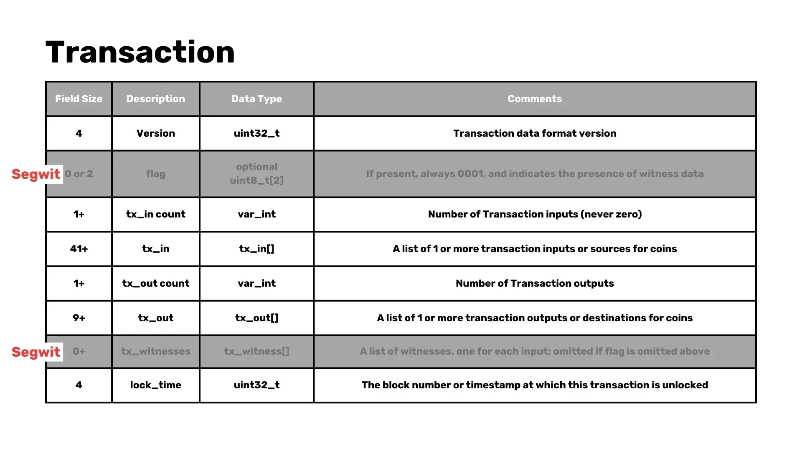


- **کشف همتا**: کشف همتا فرآیندی است که در آن یک گره، گره‌های دیگر را برای اتصال پیدا می‌کند.
- **موتور اعتبارسنجی**: موتور اعتبارسنجی مسئول بررسی اعتبار تراکنش‌ها و بلوک‌ها بر اساس قوانین شبکه است.
- **RPC (تماس رویه دور)**: هسته Bitcoin شامل یک RPC Interface است که به برنامه‌های خارجی، مانند کیف پول‌ها، اجازه می‌دهد با نود تعامل داشته باشند.
- **ذخیره‌سازی بلاک‌ها و وضعیت زنجیره**: Bitcoin Core می‌تواند کل Blockchain را ذخیره کند یا نه، چه به‌صورت یک نود آرشیوی یا هرس‌شده. همچنین وضعیت فعلی شبکه (مجموعه UTXO) را روی دیسک ذخیره می‌کند.


#### چه چیزی را می‌توانیم حذف کنیم؟


- **Miner**: اکثر گره‌های Bitcoin به دلیل نیاز به توان محاسباتی بالا در Mining شرکت نمی‌کنند.
- **RPC (سرور)**: هسته Bitcoin یک JSON-RPC Interface را پیاده‌سازی می‌کند که می‌توان با استفاده از دستیار خط فرمان bitcoin-cli به آن دسترسی داشت.
- **Wallet (disablewallet)**: اگر ترجیح می‌دهید از یک Wallet خارجی استفاده کنید، می‌توانید قابلیت Wallet را در Bitcoin Core غیرفعال کنید. این به شما اجازه می‌دهد کلیدهای خصوصی خود را به‌صورت جداگانه مدیریت کنید.
- **Mempool (blocksonly)**: برای کاربرانی که به دنبال کاهش استفاده از پهنای باند هستند، اجرای یک نود "blocksonly" می‌تواند راه‌حلی باشد که در آن نود فقط بلوک‌ها را پردازش می‌کند و تراکنش‌ها را نادیده می‌گیرد.


### وضعیت زنجیره


#### سکه‌ها کجا هستند؟


سکه‌ها در آدرس‌ها ذخیره نمی‌شوند؛ آن‌ها در UTXOها قرار دارند که نمایانگر تمام خروجی‌های تراکنش‌هایی هستند که خرج نشده‌اند. شما می‌توانید این اطلاعات را با دستور زیر بازیابی کنید:


```Bash
bitcoin-cli gettxoutsetinfo
```


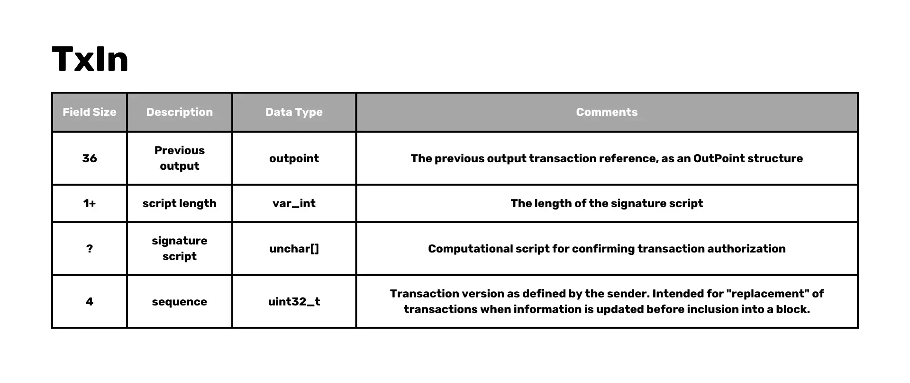


ما می‌توانیم تأیید کنیم که تعداد بیت‌کوین‌ها صحیح است.


#### برای هر UTXO، chainstate دارای:


- txid.
- خروجی شاخص.
- کدام بلوک UTXO در آن است.
- خواه یک کوین‌بیس UTXO باشد.


**مهم**: تراکنش‌ها با UTXOها یکسان نیستند.


#### Mempool


این یک لیست از تراکنش‌های تایید نشده در هر نود است که به آن‌ها تراکنش‌های کاندید گفته می‌شود. این لیست در RAM ذخیره می‌شود تا دسترسی سریع داشته باشد و بخشی از اجماع نیست.


#### ملاحظات امنیتی برای گره‌های Bitcoin


امنیت در هنگام اجرای یک نود Bitcoin بسیار مهم است. در اینجا برخی از نکات کلیدی که باید در نظر داشته باشید آورده شده است:


#### اجتناب از تمرکزگرایی


اتکا به یک منبع واحد برای داده‌های Blockchain، مانند دانلود تمام بلوک‌ها از یک سرور مرکزی، خطرات قابل توجهی را به همراه دارد. برای حفظ ماهیت غیرمتمرکز Bitcoin، نودها باید به چندین همتا متصل شوند و داده‌هایی را که دریافت می‌کنند اعتبارسنجی کنند.


#### جلوگیری از حملات ایزوله‌سازی


حملات ایزوله زمانی رخ می‌دهند که یک گره فریب داده می‌شود تا به مجموعه محدودی از همتایان متصل شود و به مهاجم اجازه می‌دهد داده‌های نادرست به آن ارائه دهد. با اتصال به مجموعه متنوعی از همتایان و تأیید داده‌های دریافتی، گره‌ها می‌توانند خود را در برابر این حملات محافظت کنند.


#### مدیریت ارتباطات همتا


گره‌ها باید به دقت اتصالات همتایان خود را مدیریت کنند تا اطمینان حاصل کنند که به بازیگران مخرب متصل نمی‌شوند. این شامل نگهداری لیستی از همتایان ممنوعه است که رفتار مشکوکی از خود نشان داده‌اند و به‌روزرسانی منظم لیست همتایان برای جلوگیری از اتکا به یک گروه کوچک از گره‌ها می‌شود.


#### اهمیت مجموعه UTXO


مجموعه UTXO نمایانگر وضعیت فعلی Bitcoin است و تمامی خروجی‌های تراکنش خرج‌نشده را فهرست می‌کند. این امر برای اعتبارسنجی تراکنش‌ها و اطمینان از اینکه سکه‌ها بیش از یک‌بار خرج نمی‌شوند، حیاتی است. کوچک و به‌راحتی قابل‌دسترس نگه‌داشتن این مجموعه برای حفظ کارایی شبکه مهم است.


#### نتیجه‌گیری


اجرای یک نود Bitcoin راهی قدرتمند برای مشارکت در شبکه Bitcoin است که به شما امکان می‌دهد تراکنش‌ها را تأیید کنید، حریم خصوصی را حفظ کنید و به امنیت و تمرکززدایی Blockchain کمک کنید. چه تصمیم بگیرید یک Full node را اجرا کنید یا با هرس کردن Blockchain یا غیرفعال کردن برخی از اجزا، تنظیمات خود را سفارشی کنید، درک عملکردهای اصلی و ملاحظات امنیتی یک نود Bitcoin به شما قدرت می‌دهد تا تصمیمات آگاهانه بگیرید و به تکامل مداوم Bitcoin کمک کنید.


## ساختارهای داده Bitcoin


<chapterId>5ed314b1-8293-567d-bf03-730e8c9c774b</chapterId>

<professorId>e7e63d59-ea19-4960-9446-61bd4dcc98f0</professorId>


:::video id=1790e5fb-33f5-4e0e-982e-41589cd02965:::


هدف اصلی این سخنرانی راهنمایی شما در فرآیند تجزیه یک بلوک Bitcoin با کدنویسی یک تجزیه‌گر در Rust است. این شامل درک ساختار بلوک‌ها و تراکنش‌های Bitcoin و پیاده‌سازی منطق لازم برای استخراج و تفسیر این داده‌ها می‌باشد.


### تجزیه بلوک‌ها و تراکنش‌های Bitcoin در Rust


#### اجزای تجزیه کردن


برای تجزیه یک بلوک Bitcoin، باید بر روی اجزای زیر تمرکز کنید:


1. **هدر بلوک**

۲. **تراکنش‌ها درون بلاک**

۳. **ورودی‌ها و خروجی‌های تراکنش**


#### ساختار سرآیند بلوک


هدر بلوک سنگ بنای یک بلوک Bitcoin است و شامل فیلدهای زیر می‌باشد:


- **نسخه**: نشان‌دهنده نسخه بلوک است.
- **بلوک قبلی**: ارجاع به بلوک قبلی در Blockchain.
- **Merkle Root**: یک Hash که نشان‌دهنده Hash ترکیبی از تمام تراکنش‌ها در بلوک است.
- **Timestamp**: زمانی که بلاک استخراج شد.
- **بیت‌ها**: آستانه هدف برای یک بلوک معتبر Hash.
- **Nonce**: مقداری که ماینرها تنظیم می‌کنند تا به Hash زیر آستانه هدف دست یابند.
- **تعداد تراکنش‌ها**: تعداد تراکنش‌ها در بلاک.


**توجه**: تنها اولین 80 بایت (شامل سرآیند بلوک) در طول Mining هش می‌شوند.


#### ساده‌سازی‌ها


برای قابل مدیریت نگه داشتن مثال ما:


- ما بر روی تجزیه بلوک‌های قبل از SegWit (قدیمی) تمرکز خواهیم کرد و از پیچیدگی‌های اضافی Segregated Witness اجتناب می‌کنیم.
- ما از برخی از اپکدها در زبان اسکریپت‌نویسی Bitcoin صرف‌نظر خواهیم کرد و بر روی چند مورد که برای تجزیه یک بلوک کامل نیاز داریم تمرکز خواهیم کرد.


#### ساختار تراکنش


هر تراکنش در یک بلوک Bitcoin شامل موارد زیر است:


- **نسخه**: نسخه تراکنش.
- **تعداد ورودی‌ها**: شمارش ورودی‌های تراکنش.
- **ورودی‌ها**: لیست ورودی‌ها.
- **خروجی قبلی (outpoint)**: مرجع خروجی قبلی.
- **Hash**: Hash تراکنش مرجع.
- **شاخص**: شاخص خروجی خاص در تراکنش، که "vout" نامیده می‌شود.
- **طول اسکریپت**: طول اسکریپت امضا.
- **اسکریپت امضا**: اسکریپت برای تأیید مجوز تراکنش.
- **دنباله**: نسخه تراکنش همان‌طور که توسط فرستنده تعریف شده است.
- **تعداد خروجی‌ها**: تعداد خروجی‌های تراکنش.
- **خروجی‌ها**: شامل مقدار و ScriptPubKey.
- **ارزش**: ارزش تراکنش.
- **طول اسکریپت کلید عمومی**: طول اسکریپت کلید عمومی.
- **اسکریپت PubKey**: شامل کلید عمومی به عنوان یک تنظیم برای ادعای خروجی است.
- **زمان قفل**: ارتفاع بلاک یا Timestamp را نشان می‌دهد که در آن این تراکنش می‌تواند در یک بلاک گنجانده شود.


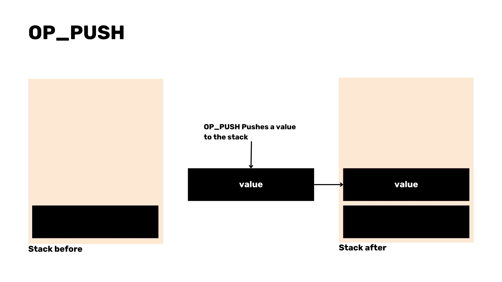


#### تکنیک‌های تجزیه‌ و تحلیل


در Rust، می‌توانیم از تکنیک‌های مختلفی برای تجزیه این ساختارها استفاده کنیم:


- از `from_le_bytes` برای خواندن داده‌های Little Endian استفاده کنید.
- یک trait سفارشی `parse` پیاده‌سازی کنید تا منطق تجزیه را برای ساختارهای مختلف مدیریت کند.


```Rust
trait Parse: Sized {
fn parse(bytes: &[u8]) -> Result<(Self, &[u8]), Error>;
}
```


- پیاده‌سازی تجزیه به صورت عمومی برای لیست‌ها و انواع خاص مانند `VarInt`، `U32`، `U64`، و غیره.


```Rust
impl Parse for i32 {
fn parse(bytes: &[u8]) -> Result<(Self, &[u8]), Error> {
let val = i32::from_le_bytes(bytes[0..4].try_into()?);
Ok((val, &bytes[4..]))
}
}
```


### اشکال‌زدایی و آزمایش


برای اطمینان از اینکه تجزیه‌گر ما به درستی کار می‌کند:


- مقایسه داده‌های تجزیه‌شده با جزئیات بلوک‌های شناخته‌شده (مثلاً از Mempool.space).
- تأیید کنید که تعداد تراکنش‌های تجزیه‌شده و جزئیات بلوک با مقادیر مورد انتظار مطابقت دارند.


### مدیریت موارد خاص و تجزیه اسکریپت


#### پیاده‌سازی تابع 'parse'


ما تابع `parse` را پیاده‌سازی خواهیم کرد تا کل بلاک، شامل سرآیند بلاک و تراکنش‌ها را مدیریت کند. این شامل خواندن داده‌های بلاک و استخراج فیلدهای مرتبط می‌شود.


```Rust
impl Parse for Block {
fn parse(bytes: &[u8]) -> Result<(Self, &[u8]), Error> {
let (header, bytes) = Parse::parse(bytes)?;
let (transactions, bytes) = Parse::parse(bytes)?;

let block = Block {
header, transactions
};

Ok((block, bytes))
}
}
```


#### تغییر سربرگ بلوک


ما نیاز داریم که منطق تجزیه خود را تنظیم کنیم تا تعداد تراکنش‌ها را از ساختار سرآیند بلوک حذف کرده و آن را به عنوان یک موجودیت جداگانه در نظر بگیریم.


```Rust
impl Parse for BlockHeader {
fn parse(bytes: &[u8]) -> Result<(Self, &[u8]), Error> {
let (version, bytes) = Parse::parse(bytes)?;
let (prev_block, bytes) = Parse::parse(bytes)?;
let (merkle_root, bytes) = Parse::parse(bytes)?;
let (timestamp, bytes) = Parse::parse(bytes)?;
let (bits, bytes) = Parse::parse(bytes)?;
let (nonce, bytes) = Parse::parse(bytes)?;

let header = BlockHeader {
version, prev_block, merkle_root, timestamp, bits, nonce,
};

Ok((header, bytes))
}
}
```


#### تعریف ساختار


تعریف یک ساختار جدید `Block` که شامل هم سرآیند بلوک و هم یک لیست از تراکنش‌ها باشد.


```Rust
struct Block {
header: BlockHeader,
transactions: Vec<Transaction>,
}
```


#### Rust نحو‌نگار Elements


معرفی نحو Rust Elements مانند علامت سوال (`؟`) برای مدیریت خطا. این کار کد ما را ساده‌تر و خواناتر خواهد کرد.


#### اظهارات


افزودن ادعاها برای تأیید اینکه هیچ بایتی پس از پردازش یک بلوک کامل بدون تجزیه باقی نمی‌ماند. این کار یکپارچگی فرآیند تجزیه ما را تضمین می‌کند.


#### موارد خاص مانند تراکنش‌های کوین‌بیس


تراکنش‌های Coinbase، که اولین تراکنش در یک بلوک برای ادعای Block reward هستند، ویژگی‌های منحصر به فردی دارند. ما باید این موارد خاص را به‌طور مناسب مدیریت کنیم.


```Rust
struct OutPoint {
txid: [u8; 32],
vout: u32,
}

impl OutPoint {
fn is_coinbase(&self) -> bool {
self.txid == [0; 32] && self.vout == 0xFFFFFFFF
}
}
```


#### استراتژی تجزیه اسکریپت


برای تجزیه اسکریپت در تراکنش‌ها، ما بر روی اپ‌کدهای رایج مانند `OP_CHECKSIG`، `OP_HASH160` و `OP_PUSH` تمرکز خواهیم کرد. تجزیه این اسکریپت‌ها برای اعتبارسنجی تراکنش‌ها و مدیریت خطاها بسیار مهم است.


```Rust
enum OpCode {
False,
Return,
Dup,
Equal,
CheckSig,
Hash160,
EqualVerify,
Push(Vec<u8>),
}

impl Parse for OpCode {
fn parse(bytes: &[u8]) -> Result<(Self, &[u8]), Error> {
match bytes[0] {
v @ 1..=75 => {
let data = bytes[1..(v as usize + 1)].iter().cloned().collect();
Ok((OpCode::Push(data), &bytes[(v as usize + 1)..]))
},
76 => {
let len = bytes[1] as usize;
let data = bytes[2..(len + 2)].iter().cloned().collect();
Ok((OpCode::Push(data), &bytes[(len + 2)..]))
},

0 => Ok((OpCode::False, &bytes[1..])),

106 => Ok((OpCode::Return, &bytes[1..])),
118 => Ok((OpCode::Dup, &bytes[1..])),
135 => Ok((OpCode::Equal, &bytes[1..])),

136 => Ok((OpCode::EqualVerify, &bytes[1..])),
169 => Ok((OpCode::Hash160, &bytes[1..])),
172 => Ok((OpCode::CheckSig, &bytes[1..])),

_ => todo!()
}
}
}
```


#### چالش‌ها در تجزیه اسکریپت


تجزیه اسکریپت می‌تواند چالش‌هایی را به‌ویژه با تراکنش‌های کوین‌بیس به همراه داشته باشد. مهم است که موارد خاص را در نظر بگیریم و آن‌ها را به‌درستی مدیریت کنیم تا از تجزیه دقیق اطمینان حاصل شود.


```Rust
impl Parse for Script {
fn parse(bytes: &[u8]) -> Result<(Self, &[u8]), Error> {
let (len, bytes) = VarInt::parse(bytes)?;
let mut script_bytes = &bytes[..len.0 as usize];
let mut opcodes = Vec::new();
while !script_bytes.is_empty() {
let (opcode, bytes) = OpCode::parse(script_bytes)?;
script_bytes = bytes;
opcodes.push(opcode);
}

Ok((Script(opcodes), &bytes[len.0 as usize..]))
}
}
```


#### بلوک‌های فشرده


استفاده از بلوک‌های فشرده در حال حاضر برای افزایش کارایی انتقال داده بین گره‌ها استفاده می‌شود. این کار با کاهش استفاده از پهنای باند و تسریع همگام‌سازی از طریق ارسال تراکنش‌هایی که در Mempool مفقود بودند، انجام می‌شود و آنها را با تراکنش‌هایی که گره قبلاً در یک بلوک داشت پر کرده و سپس اعتبارسنجی می‌کند.


#### استفاده از کتابخانه‌های موجود


برای برنامه‌های کاربردی حساس به اجماع، توصیه می‌شود از کتابخانه‌های موجود استفاده کنید تا از بروز اشکالات و اطمینان از امنیت جلوگیری شود، مانند [Rust-Bitcoin](https://docs.rs/Bitcoin/latest/Bitcoin/) یا [Bitcoin-dev-kit](https://docs.rs/BDK/latest/BDK/). پیاده‌سازی یک تجزیه‌گر خود می‌تواند آموزشی باشد اما در محیط‌های تولیدی نیز خطرناک است.


### کارایی و امنیت در Bitcoin Mining


#### کارایی در Mining


Mining بلوک‌های خالی می‌توانند برای ماینرها کارآمدتر باشند:


- ماینرها بلوک‌های خالی Mining را برای صرفه‌جویی در زمان شروع می‌کنند.
- بلوک‌های خالی می‌توانند به سرعت استخراج شوند قبل از اینکه به یک بلوک کامل تغییر یابند، زمانی که بلوک قبلی تأیید شود.


#### دلایل بلوک‌های خالی Mining


بلوک‌های خالی گاهی به دلیل مسائل زمانی استخراج می‌شوند. ممکن است ماینرها تا زمانی که شروع به Mining بلوک بعدی می‌کنند، لیست کامل تراکنش‌ها را دریافت نکرده باشند، بنابراین ترجیح می‌دهند به جای آن یک بلوک خالی استخراج کنند.


#### بدخواه Mining از بلوک‌های خالی


در حالی که Mining مخرب از بلوک‌های خالی ممکن است، اما مشاهده نشده است. دلیل اصلی بلوک‌های خالی بیشتر به محدودیت زمانی مربوط می‌شود تا نیت مخرب.


#### پیامدهای بلوک‌های خالی


رخداد بلوک‌های خالی یک جنبه عادی از فرآیند Mining است و عمدتاً به دلیل مسائل زمانی رخ می‌دهد. اگرچه این بلوک‌ها تراکنشی را شامل نمی‌شوند، اما همچنان به گسترش Blockchain کمک کرده و به امنیت شبکه می‌افزایند.


#### اهمیت امنیت


امنیت در Bitcoin Mining بسیار مهم است. با رعایت بهترین شیوه‌ها و استفاده از کتابخانه‌های به‌خوبی بررسی‌شده، ماینرها و توسعه‌دهندگان می‌توانند از یکپارچگی Blockchain اطمینان حاصل کرده و در برابر آسیب‌پذیری‌های احتمالی محافظت کنند.


در نتیجه، تجزیه بلوک‌ها و تراکنش‌های Bitcoin در Rust شامل درک ساختارهای پیچیده و پیاده‌سازی تکنیک‌های تجزیه کارآمد است. مدیریت موارد خاص و تجزیه اسکریپت نیازمند دقت ویژه‌ای است و تمرکز بر کارایی و امنیت، استحکام شبکه Bitcoin را تضمین می‌کند.


## بررسی اجمالی نرم‌افزار Bitcoin و پیاده‌سازی‌های نود


<chapterId>96d64781-fc27-5209-88d8-2acf00d05ea8</chapterId>

<professorId>0b05838c-24af-43ff-93be-896c907e0bc1</professorId>


:::video id=1d148008-9197-446f-afb5-628d4c3a5015:::


دانیلا بروزونی یک مرور جامع از پشته نرم‌افزاری Bitcoin Layer 1 ارائه می‌دهد، لایه‌هایی که پایه پروتکل Bitcoin را تشکیل می‌دهند (یعنی گره‌های Bitcoin و کیف‌پول‌های Bitcoin) و چگونگی ساخت نرم‌افزار Bitcoin با معرفی کتابخانه‌های Bitcoin و بررسی عمیق کیت توسعه Bitcoin (BDK) را توضیح می‌دهد.


### بررسی اجمالی نرم‌افزار Bitcoin


پشته نرم‌افزاری Bitcoin برای عملکرد آن اساسی است و از اجزای مختلف Elements، از جمله نودها و کیف‌پول‌ها تشکیل شده است. بخش مهمی از این اکوسیستم کیت توسعه Bitcoin (BDK) است که در ادامه به‌طور مفصل به آن خواهیم پرداخت. ابتدا، بیایید بر نقش نودها در شبکه Bitcoin تمرکز کنیم.


#### گره‌های Bitcoin


گره‌های Bitcoin ستون فقرات شبکه Bitcoin هستند. آن‌ها به یکدیگر، تراکنش‌ها و بلوک‌های Exchange متصل می‌شوند و داده‌های ورودی را اعتبارسنجی می‌کنند. انواع مختلفی از گره‌ها وجود دارد که هر کدام هدف خاصی را دنبال می‌کنند:


- **گره‌های کامل**: این گره‌ها کل Blockchain را ذخیره کرده و تمامی تراکنش‌ها و بلوک‌ها را اعتبارسنجی می‌کنند. آن‌ها سطح بالایی از امنیت را فراهم می‌کنند و برای تمرکززدایی شبکه ضروری هستند.


- **گره‌های بایگانی**: زیرمجموعه‌ای از گره‌های کامل، گره‌های بایگانی تمام داده‌های Blockchain را حفظ می‌کنند و آن‌ها را برای تحلیل تاریخی و اشکال‌زدایی ارزشمند می‌سازند.


- **گره‌های هرس‌شده**: گره‌های هرس‌شده با نگه‌داشتن تنها بخشی از Blockchain، فضای دیسک را ذخیره می‌کنند و داده‌های قدیمی که دیگر برای اعتبارسنجی مورد نیاز نیستند را حذف می‌کنند.


#### Bitcoin Core


هسته Bitcoin پرکاربردترین پیاده‌سازی Full node است. این هسته به‌طور دوگانه به‌عنوان Full node و Wallet عمل می‌کند. جنبه‌های کلیدی هسته Bitcoin شامل:


- **قابلیت استفاده**: می‌توان از طریق خط فرمان Interface (CLI) و رابط کاربری گرافیکی Interface (GUI) از آن استفاده کرد.
- **ماهیت متن‌باز**: کد متن‌باز است و به توسعه‌دهندگان اجازه می‌دهد تا در آن مشارکت کرده و عملکرد آن را بررسی کنند.
- **زبان**: به زبان C++ نوشته شده با تست‌هایی در Python، که عملکرد و قابلیت اطمینان قوی را تضمین می‌کند.


##### کاوش در هسته Bitcoin


برای کسب تجربه عملی با Bitcoin Core، می‌توان تست‌ها را با استفاده از Git کامپایل و اجرا کرد. این فرآیند شامل:


- کامپایل کردن کدبیس برای ایجاد یک نسخه اجرایی. [Bitcoin github](https://github.com/Bitcoin/Bitcoin) دسترسی به doc/build-\*.md برای دستورالعمل‌ها.


```Bash
./autogen.sh
./configure
make # use "-j N" for N parallel jobs
make install # optional
```


- اجرای تست‌ها برای اطمینان از عملکرد صحیح همه چیز. دستورالعمل‌ها را می‌توانید [اینجا](https://github.com/Bitcoin/Bitcoin/blob/master/test/README.md) پیدا کنید.


```Bash
make check

#individual tests can be run directly calling the test script e.g:
test/functional/feature_rbf.py

#run all possible tests
test/functional/test_runner.py
```


- ایجاد و اجرای یک تست در پایتون برای اعتبارسنجی عملکرد خاص. فایل [example.py](https://github.com/Bitcoin/Bitcoin/blob/master/test/functional/example_test.py) یک مثال با توضیحات فراوان از یک مورد تست است که از هر دو رابط RPC و P2P استفاده می‌کند.


#### پیاده‌سازی‌های جایگزین نود


فراتر از هسته Bitcoin، چندین پیاده‌سازی جایگزین نود وجود دارد:


- **گره‌های Bitcoin**: این نسخه ویژگی‌های پیشرفته‌تری نسبت به هسته Bitcoin ارائه می‌دهد و فضای بیشتری را اشغال کرده و حافظه بیشتری نیاز دارد.
- **LibBitcoin**: یک پیاده‌سازی انعطاف‌پذیر و ماژولار.
- **btcd**: نوشته شده به زبان Go، فلسفه‌های طراحی متفاوتی ارائه می‌دهد.


اجرای این جایگزین‌ها با خطرات خاص خود همراه است، به‌ویژه در مورد قوانین اجماع. انحراف از قوانین اعتبارسنجی موجود می‌تواند به فورک‌ها یا ناسازگاری‌ها منجر شود. پروژه هسته Bitcoin به دنبال کاهش این خطرات با متمرکز کردن کد اجماع است و یکنواختی در سراسر پیاده‌سازی‌ها را تضمین می‌کند.


### کیف پول‌ها و امنیت Bitcoin


کیف پول‌های Bitcoin برای مدیریت امن دارایی‌های Bitcoin شما بسیار مهم هستند. آن‌ها در اشکال مختلفی وجود دارند که هر کدام ویژگی‌ها و ملاحظات امنیتی خاص خود را دارند.


#### انواع کیف پول‌های Bitcoin


1. **متولی در مقابل غیر متولی**:


- **کیف‌پول‌های امانی**: توسط اشخاص ثالث مدیریت می‌شوند، راحتی را ارائه می‌دهند اما نیاز به اعتماد به امانت‌دار دارند.
- **کیف‌پول‌های غیرامانی**: توسط کاربران کنترل می‌شوند و امنیت و حریم خصوصی بیشتری را فراهم می‌کنند.


2. **رومیزی در مقابل موبایل**:


- **کیف‌پول‌های دسکتاپ**: معمولاً دارای ویژگی‌های بیشتر و امنیت بالاتر هستند.
- **کیف پول‌های موبایل**: راحتی و قابلیت حمل را ارائه می‌دهند.


3. **On-Chain در مقابل رعد و برق**:


- **کیف پول‌های On-Chain**: به‌طور مستقیم با Bitcoin Blockchain تعامل داشته باشید.
- **کیف پول‌های لایتنینگ**: تراکنش‌های سریع‌تر و ارزان‌تر را تسهیل می‌کنند off-chain.


4. **کیف پول‌های Cold در مقابل کیف پول‌های Hot**:


- **کیف‌پول‌های Cold**: به اینترنت متصل نیستند و امنیت برتری در برابر هک‌ها ارائه می‌دهند.
- **کیف‌پول‌های Hot**: متصل به اینترنت، ارائه‌دهنده دسترسی بیشتر اما امنیت کمتر.


#### Cold Wallet امنیت


کیف پول‌های Cold به دلیل امنیتشان مورد تحسین قرار می‌گیرند. با آفلاین ماندن، به طور ذاتی در برابر هک‌های آنلاین مقاوم هستند. با این حال، اطمینان از اینکه تراکنش‌های انجام شده از طریق کیف پول‌های Cold امن و دقیق هستند، بسیار مهم است تا از ارسال ناخواسته Bitcoin به بازیگران مخرب جلوگیری شود.


#### کیف‌پول‌های فقط-مشاهده


کیف پول‌های فقط-مشاهده شامل تنها کلیدهای عمومی هستند که به کاربران اجازه می‌دهند Bitcoin دریافت کنند و موجودی خود را بدون توانایی خرج کردن نظارت کنند. این ویژگی یک Layer اضافی از امنیت را برای کسانی که نیاز به نظارت دقیق بر دارایی‌های خود دارند، اضافه می‌کند.


#### توابع پایه‌ای Bitcoin Wallet


صرف نظر از نوع، هر Bitcoin Wallet سه عملکرد اساسی را انجام می‌دهد:


1. **دریافت Bitcoin**: آدرس‌های generate را دریافت کرده و برای تراکنش‌های ورودی نظارت کنید.

2. **ارسال Bitcoin**: ایجاد و پخش تراکنش‌ها به شبکه.

3. **نمایش موجودی**: موجودی فعلی Wallet را نشان دهید.


#### نقش کیف پول‌های Bitcoin


- کیف پول‌های Bitcoin به عنوان جاکلیدی عمل می‌کنند و کلیدهای رمزنگاری را نگه داشته و تولید می‌کنند.


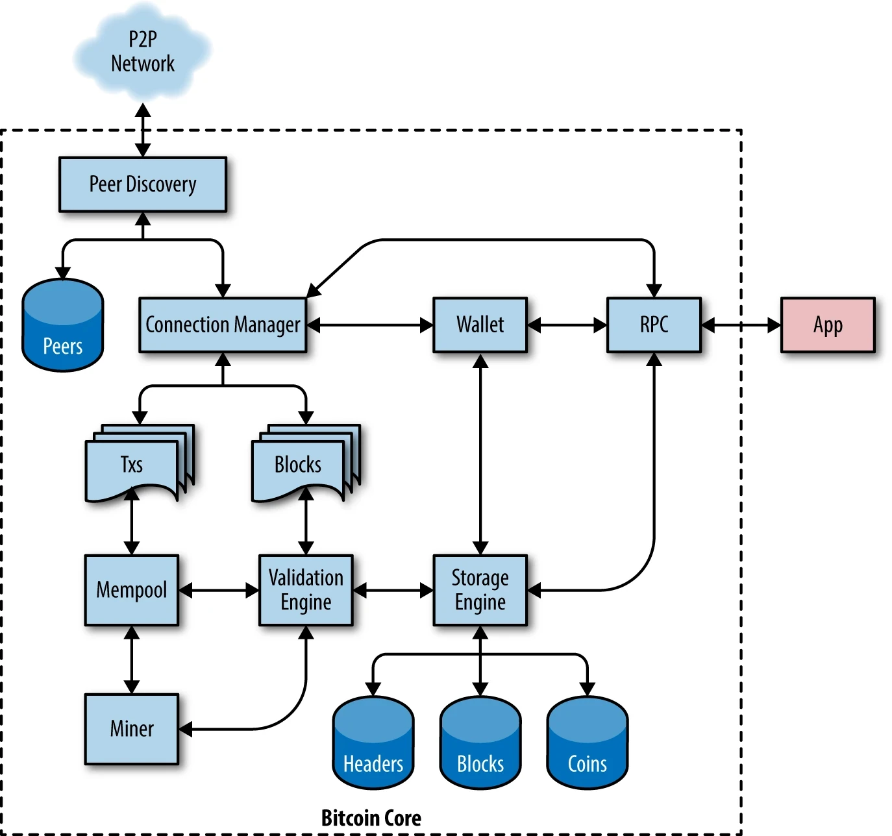


- آن‌ها Blockchain را برای تراکنش‌های ورودی نظارت می‌کنند.


- ایجاد تراکنش‌ها با انتخاب خروجی‌های تراکنش خرج‌نشده (UTXOها)، تنظیم ورودی‌ها و خروجی‌ها، و بهینه‌سازی برای حریم خصوصی و کارمزدها.


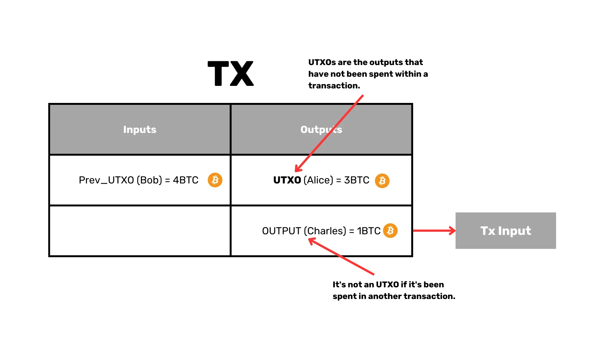


#### قابلیت استفاده مجدد از منطق Wallet


با توجه به اینکه تمام کیف‌پول‌های Bitcoin عملکردهای مشابهی دارند، بازنویسی منطق Wallet به‌طور مکرر غیربهینه است. اینجاست که کیت توسعه Bitcoin (BDK) وارد عمل می‌شود.


### کیت توسعه Bitcoin (BDK) و مفاهیم فنی


کیت توسعه Bitcoin (BDK) یک کتابخانه است که برای ساده‌سازی ایجاد و مدیریت کیف‌پول‌های Bitcoin طراحی شده است.


#### بررسی اجمالی BDK


BDK با ارائه عملکرد سطح بالاتر که بر روی Rust Bitcoin ساخته شده است، ایجاد Wallet را ساده می‌کند. این برنامه از طریق بایندینگ‌ها از چندین زبان برنامه‌نویسی از جمله Kotlin، Swift و Python پشتیبانی می‌کند.


#### کتابخانه‌های دیگر Bitcoin


کتابخانه‌های متعدد Bitcoin به زبان‌های برنامه‌نویسی مختلفی مانند Python، JavaScript، Java، Go و C ارائه می‌شوند. این کتابخانه‌ها ابزارهای متنوعی برای توسعه Bitcoin ارائه می‌دهند.


#### مفاهیم فنی کلیدی


1. **توصیف‌کننده‌ها**: توصیف‌کننده‌ها نحوه استخراج اسکریپت‌ها و آدرس‌های Bitcoin از کلیدها را توصیف می‌کنند و امکان عملکردهای انعطاف‌پذیرتر و قدرتمندتر Wallet را فراهم می‌کنند.

2. **PSBT (تراکنش‌های نیمه‌امضا شده Bitcoin)**: PSBT یک قالب برای تراکنش‌هایی است که به امضاهای متعدد نیاز دارند و تراکنش‌های مشارکتی و امنیت پیشرفته را تسهیل می‌کنند.

3. **Rust نحو**: مفاهیم کلیدی در Rust، مانند `Option` برای ایمنی در برابر null و نوع `Result` برای مدیریت خطا، برای درک و استفاده مؤثر از BDK ضروری هستند.


#### ایجاد و مدیریت تراکنش‌ها


BDK فرآیند ساخت، امضا و پخش تراکنش‌ها را ساده می‌کند:


1. **ایجاد تراکنش‌ها**: گیرندگان، مبالغ و کارمزدها را مشخص کنید.

2. **تراکنش‌ها را امضا کنید**: از PSBT برای جمع‌آوری امضاها استفاده کنید.

3. **تراکنش‌های پخش‌شده**: تراکنش‌های نهایی‌شده را به شبکه ارسال کنید.


#### نمونه‌ای از جریان کار در BDK


- راه‌اندازی **Wallet**: یک Wallet را با توصیف‌گرها مقداردهی اولیه کنید.


```Rust
use bdk::{Wallet, SyncOptions};
use bdk::database::MemoryDatabase;
use bdk::blockchain::ElectrumBlockchain;
use bdk::electrum_client::Client;
use bdk::bitcoin;

fn main() -> Result<(), bdk::Error> {
let wallet = Wallet::new(
"tr(tprv8ZgxMBicQKsPf6WJ1Rr8Zmdsr6MaACS5K3tHw3QDQmFbkEsdnG3zAZzhjEgEtetL1jwZ5VAL85UaaFzUpAZPrS7aGkQ3GdM75xPu4sUxSiF/*)",
None,
bitcoin::Network::Testnet,
MemoryDatabase::default(),
)?;

Ok(())
}
```


- **generate آدرس‌ها**: ایجاد آدرس‌های جدید برای دریافت Bitcoin از یک Testnet Faucet.


```Rust
//import AddressIndex outside the main function
use bdk::wallet::AddressIndex;

//Function to add isnide main function
let address = wallet.get_address(AddressIndex::New)?;

```


- **بررسی موجودی**: ابتدا با اتصال به الکتروم، همگام‌سازی Wallet و دریافت موجودی از Wallet، موجودی Wallet را نظارت کنید.


```Rust
//connect to Electrum server and save the blockchain
let client = Client::new("ssl://electrum.blockstream.info:60002")?;
let blockchain = ElectrumBlockchain::from(client);

//sync wallet to the blockchain received
wallet.sync(&blockchain, SyncOptions::default())?;

//get the balance from your wallet
let balance = wallet.get_balance()?;
println!("This is your wallet balance: {}", balance);
```


- **ایجاد، امضا، و پخش تراکنش‌ها**: تراکنش‌ها را بسازید و نهایی کنید، سپس آن‌ها را به شبکه پخش کنید.


```Rust
//Add to the imports
use bdk::bitcoin::Address;
use bdk::{SignOptions};
use std::str::FromStr;
use bdk::blockchain::Blockchain;

//build a transaction psbt
let mut builder = wallet.build_tx();
let recipient_address = Address::from_str("tb1qlj64u6fqutr0xue85kl55fx0gt4m4urun25p7q").unwrap();

builder
.drain_wallet()
.drain_to(recipient_address.script_pubkey())
.fee_rate(FeeRate::from_sat_per_vb(2.0))
.enable_rbf();
let (mut psbt, tx_details) = builder.finish()?;
println!("This is our psbt: {}", psbt);
println!("These are the details of the tx: {:?}", tx_details);

//Sign the PSBT
let finalized = wallet.sign(&mut psbt, SignOptions::default())?;
println!("Is my PSBT Signed? {}", finalized);
println!("This is my PSBT finalized: {}", psbt);


let tx = psbt.extract_tx();
let tx_id = tx.txid();
println!("this is my Bitcoin tx: {}", bitcoin::consensus::encode::serialize_hex(&tx));
println!("this is mny tx id: {}", tx_id);

//Broadcast the transaction
blockchain.broadcast(&tx)?;
```


#### چاپ txid و پخش تراکنش


اختصاص و چاپ transaction ID (txid) امکان نظارت بر روی پلتفرم‌هایی مانند Mempool.space را فراهم می‌کند. پخش تراکنش می‌تواند با استفاده از روش `Blockchain.broadcast` انجام شود و تأیید جزئیات و وضعیت تراکنش برای اطمینان از انتشار موفقیت‌آمیز بسیار مهم است.


#### BDK ملاحظات کاربردی و حریم خصوصی


BDK برای ساده‌سازی توسعه Bitcoin و Wallet بی‌نهایت ارزشمند است. برای حفظ حریم خصوصی بیشتر، ابزارهایی مانند Electrum، Explora و نودهای شخصی Bitcoin Core توصیه می‌شوند.


#### زبان‌های برنامه‌نویسی


هنگام توسعه پروژه‌های Bitcoin، اغلب Rust به دلیل ایمنی و کارایی آن ترجیح داده می‌شود. با این حال، انتخاب زبان ممکن است بر اساس نیازهای خاص پروژه و تخصص توسعه‌دهنده متفاوت باشد.


#### وابستگی‌های BDK


BDK به چندین وابستگی کلیدی متکی است، از جمله Rust-Bitcoin و Rust-Miniscipt. کتابخانه‌های اضافی ممکن است برای مدیریت پایگاه داده و رمزنگاری به کار گرفته شوند.


با درک این اجزا، از گره‌ها و کیف‌پول‌های Bitcoin تا کیت توسعه Bitcoin (BDK)، می‌توانید با اطمینان و مهارت بیشتری در اکوسیستم Bitcoin حرکت کنید. این دانش به شما قدرت می‌دهد تا برنامه‌های Bitcoin قوی و امنی توسعه دهید و به تکامل مداوم این فناوری انقلابی کمک کنید.


# Lightning Network


<partId>d7ac2ad7-a4b3-564f-8a8d-cfec5297b3a5</partId>


## تاریخچه کانال‌های پرداخت


<chapterId>a0b11c6e-c0ff-5e65-b809-b2ab9a2fc37b</chapterId>

<professorId>880c7fa7-8d4c-4c9b-81b4-bc61ed256516</professorId>


:::video id=b90f19a3-a95e-4cd1-8c55-41016f3339cb:::


### تاریخچه کانال‌های پرداخت


به سخنرانی ما در مورد راه‌حل‌های پرداخت مدرن در فناوری Blockchain خوش آمدید. امروز به بررسی زمینه تاریخی و تحولات کلیدی قفل‌های چند مرحله‌ای (MHLs) و Lightning Network خواهیم پرداخت.


#### بررسی کلی و زمینه تاریخی


قفل‌های چند-هاپ (MHLs) و Lightning Network مفاهیم پیشرفته‌ای در فناوری Blockchain هستند که پرداخت‌های خرد کارآمد و امن را در سراسر شبکه تسهیل می‌کنند. به‌طور تاریخی، نیاز به این نوآوری‌ها از ناکارآمدی‌ها و محدودیت‌هایی که در استقرار اولیه فناوری‌های Blockchain، به‌ویژه Bitcoin مشاهده شد، ناشی می‌شود. با بررسی عمیق‌تر، خواهید فهمید که چگونه ساختارهای مبتنی بر موضوع و رویکردهای لایه‌ای، تراکنش‌های Blockchain را متحول کرده‌اند.


### ساختار مبتنی بر موضوع


معرفی MHLs و Lightning Network نشان‌دهنده یک تغییر پارادایم از تراکنش‌های سنتی و خطی Blockchain به سیستم‌های پیچیده‌تر و چندلایه است. با تقسیم‌بندی تراکنش‌ها به موضوعات یا بخش‌های خاص، این نوآوری‌ها یک زیرساخت پرداخت مقیاس‌پذیرتر و امن‌تر را امکان‌پذیر می‌سازند که بسیاری از مشکلات ذاتی در پیاده‌سازی‌های اولیه Blockchain را برطرف می‌کند.


### مشکلات با Bitcoin


Bitcoin، پیشگام فناوری Blockchain، یک سیستم غیرمتمرکز معرفی کرد که در آن تراکنش‌ها در سراسر شبکه پخش می‌شوند. در حالی که انقلابی است، این روش ذاتاً ناکارآمد است. هر گره در شبکه باید هر تراکنش را تأیید کند که منجر به تأخیرهای قابل توجه و گلوگاه‌ها، به ویژه در حجم بالای تراکنش‌ها می‌شود.


فرآیند اعتبارسنجی غیرمتمرکز Bitcoin نیازمند منابع محاسباتی قابل توجهی است. هر تراکنش باید توسط چندین نود تأیید و ثبت شود که این امر مقادیر زیادی انرژی و قدرت پردازشی مصرف می‌کند. این نه تنها هزینه‌های عملیاتی را افزایش می‌دهد بلکه فشار بر پهنای باند شبکه را نیز افزایش می‌دهد و منجر به افزایش کارمزد تراکنش‌ها و زمان‌های پردازش کندتر می‌شود.


در حالی که غیرمتمرکز بودن Bitcoin یکی از نقاط قوت اصلی آن است، چالش‌های قابل توجهی نیز به همراه دارد. ماهیت عمومی Blockchain به این معناست که تمام تراکنش‌ها برای همه قابل مشاهده است که نگرانی‌های حریم خصوصی را به وجود می‌آورد. علاوه بر این، نیاز به اجماع میان تعداد زیادی از نودها می‌تواند به فشارهای تمرکزگرایی منجر شود، زیرا قدرت Mining در دست چند نهاد بزرگ متمرکز می‌شود.


### کانال‌های پرداخت به عنوان یک راه‌حل


_Gold Standard Metaphor_


به Address، ناکارآمدی‌ها و مسائل حریم خصوصی Bitcoin، کانال‌های پرداخت به عنوان یک راه‌حل قابل قبول پیشنهاد شده‌اند. کانال‌های پرداخت خرد اجازه می‌دهند تراکنش‌ها به صورت off-chain انجام شوند و نیاز به اشتراک‌گذاری مداوم داده‌ها در سراسر شبکه را کاهش می‌دهند. این به طور قابل توجهی بار را بر روی Blockchain کاهش می‌دهد و امکان تراکنش‌های سریع‌تر و ارزان‌تر را فراهم می‌کند.


اصل اساسی پشت کانال‌های پرداخت، مفهوم انجام تراکنش‌ها off-chain است. به جای پخش هر تراکنش به کل شبکه، طرفین می‌توانند یک کانال پرداخت باز کنند و تراکنش‌های متعددی را بین خود انجام دهند. تنها باز و بسته شدن کانال در Blockchain ثبت می‌شود که به طور قابل توجهی کارایی و حریم خصوصی را بهبود می‌بخشد.


با وجود ماهیت off-chain کانال‌های پرداخت، همچنان گزینه‌ای برای اجرای تراکنش‌ها On-Chain وجود دارد. اگر اختلافی پیش آید یا یکی از طرفین تلاش کند تقلب کند، آخرین وضعیت کانال می‌تواند به Blockchain پخش شود، که اطمینان حاصل می‌کند تراکنش‌های توافق‌شده رعایت می‌شوند و وجوه به درستی تخصیص می‌یابند.


کانال‌های پرداخت نشان‌دهنده یک جهش قابل توجه در فناوری Blockchain هستند و روشی مقیاس‌پذیر و امن برای انجام تراکنش‌ها ارائه می‌دهند، در حالی که بسیاری از مسائل اساسی مرتبط با Bitcoin را حل می‌کنند. همان‌طور که ما به نوآوری و توسعه بر روی این پایه‌ها ادامه می‌دهیم، آینده Blockchain به طور فزاینده‌ای امیدوارکننده به نظر می‌رسد.


در نتیجه، درک زمینه تاریخی و چالش‌های Bitcoin، و راه‌حل‌های نوآورانه‌ای که از طریق MHLs، Lightning Network، و کانال‌های پرداخت پیشنهاد شده‌اند، دیدگاهی جامع از چشم‌انداز کنونی و پتانسیل آینده فناوری Blockchain ارائه می‌دهد.


## تاریخچه مسیریابی اتمی


<chapterId>28be7b31-e6b2-5eea-a5ed-62ce0a154b6e</chapterId>

<professorId>880c7fa7-8d4c-4c9b-81b4-bc61ed256516</professorId>


:::video id=059a714b-4fe9-4266-acb0-6fe5af491662:::


در بحث‌های قبلی‌مان، اصول اولیه کانال‌های پرداخت پایه را پوشش دادیم. این کانال‌ها به دو شرکت‌کننده، مثلاً Alice و Bob، اجازه می‌دهند تا به‌طور مستقیم و بدون مشکل با یکدیگر معامله کنند. با این حال، یک محدودیت آشکار در این مدل وجود دارد: Alice فقط می‌تواند با Bob معامله کند و نه با شرکت‌کنندگان دیگر مانند چارلی، مگر اینکه او کانال‌های جداگانه‌ای با هر یک از آن‌ها برقرار کند. این نیاز به کانال‌های متعدد منجر به ناکارآمدی و مشکلات مقیاس‌پذیری می‌شود، زیرا برای Alice غیرعملی خواهد بود که با هر کسی که نیاز به معامله با او دارد، یک کانال مستقیم باز کند.


### هاپ‌های متمرکز


به Address این محدودیت‌ها، مانی روزنفلد مفهوم هاپ‌های متمرکز را در سال ۲۰۱۲ پیشنهاد کرد. این مدل پردازشگرهای پرداخت متمرکز، مانند TrustPay، را معرفی کرد تا پرداخت‌ها را بین کاربران مسیریابی کند. در حالی که این روش می‌تواند نیاز به کانال‌های مستقیم متعدد را کاهش دهد، معایب قابل توجهی را به همراه دارد. هاپ‌های متمرکز از مشکلات امنیتی، نگرانی‌های اعتماد، نقض حریم خصوصی، پتانسیل کلاهبرداری، سانسور و مشکلات قابلیت اطمینان رنج می‌برند. کاربران باید به این نهادهای متمرکز برای تسهیل تراکنش‌های خود اعتماد کنند، که این برخلاف اصول تمرکززدایی است.


### قفل زمان هش‌شده Contract (HTLC) و پیاده‌سازی


محدودیت‌ها و معایب هاب‌های متمرکز نیاز به یک راه‌حل امن‌تر و غیرمتمرکز را ایجاد کردند. این نیاز منجر به توسعه Hashed Time Lock Contract (HTLC) شد که در سال ۲۰۱۵ توسط جوزف پون و تادیوس دریجر به عنوان بخشی از Lightning Network پیشنهاد شد. HTLCها اصول قفل‌های زمانی و قفل‌های Hash را ترکیب می‌کنند تا اتمیک بودن و عدم نیاز به اعتماد در تراکنش‌ها را تضمین کنند. این بدان معناست که یک تراکنش یا به طور کامل انجام می‌شود یا اصلاً رخ نمی‌دهد، که خطرات مرتبط با پرداخت‌های ناقص را کاهش می‌دهد.


گردش کار HTLC شامل یک فرآیند چند مرحله‌ای است که مسیریابی امن از طریق واسطه‌های متعدد را تضمین می‌کند. فرض کنید Alice می‌خواهد از طریق واسطه‌های Bob، کارول و دایانا به اریک پرداخت کند. هر مرحله در این فرآیند شامل ایجاد تراکنش‌های Commitment با قفل‌های زمانی و مقادیر کاهشی است. در صورت لزوم، مرحله نهایی می‌تواند به شبکه Bitcoin پخش شود تا تراکنش نهایی شود.


در یک HTLC، Alice پرداخت را با یک Hash از یک راز "R" قفل می‌کند. Bob، کارول و دایانا هر کدام قراردادهای مشابهی با واسطه‌های بعدی خود ایجاد می‌کنند و اطمینان حاصل می‌کنند که تنها در صورتی می‌توانند وجوه خود را مطالبه کنند که راز صحیح "R" را ارائه دهند. این مکانیزم اتمی بودن را تضمین می‌کند؛ پرداخت به طور کامل انجام می‌شود یا شکست می‌خورد و از دست رفتن جزئی وجوه جلوگیری می‌کند.


_Hash lock function_


### ملاحظات عملی و پویایی‌های شبکه


در یک سناریوی عملی، جریان پرداخت Alice شامل پرداخت به اریک از طریق چندین واسطه، مانند Bob، کارول و دایانا است. هر شرکت‌کننده در این زنجیره مسئولیت کشیدن وجوه از شرکت‌کننده قبلی را بر عهده دارد.


#### به‌روزرسانی‌های وضعیت کانال


کانال‌ها وضعیت خود را بر اساس توافقات متقابل و امضاها بین شرکت‌کنندگان به‌روزرسانی می‌کنند. به عنوان مثال، Alice و Bob می‌توانند وضعیت کانال خود را بدون لزوم استفاده از راز "R" به‌روزرسانی کنند، به شرطی که بر سر شرایط تراکنش توافق داشته باشند.


#### اتمی بودن تضمین شده است


مکانیزم HTLC از طریق استفاده از قفل‌های زمانی و امضاها اتمی بودن را تضمین می‌کند. این محافظت اطمینان می‌دهد که پروتکل پرداخت یا به طور کامل موفق می‌شود یا شکست می‌خورد و از دست دادن جزئی وجوه جلوگیری می‌کند.


_Combine restrictions_


#### انگیزه‌ها و مسئولیت‌ها


واسطه‌هایی مانند دایانا و کارول تشویق می‌شوند تا به‌درستی در شبکه عمل کنند. اگر آن‌ها در انجام این کار ناکام بمانند، پیامدها معمولاً تنها بر خود واسطه تأثیر می‌گذارد و به این ترتیب رفتار مسئولانه را ترویج می‌کند.


### ملاحظات عملی


با این حال، افزایش تعداد گام‌ها در مسیر پرداخت می‌تواند باعث افزایش تأخیر، هزینه‌ها و احتمال عدم اطمینان شود. باز کردن کانال‌های متعدد می‌تواند به کاهش تعداد گام‌های مورد نیاز برای مسیریابی کمک کند و کارایی کلی را بهبود بخشد.


#### نمودار کانال و نقدینگی


گره‌های داخل شبکه می‌توانند بخشی از یک نمودار کانال عمومی اعلام‌شده باشند یا اعلام‌نشده باقی بمانند. نقدینگی این کانال‌ها نقش حیاتی در مسیریابی مؤثر ایفا می‌کند زیرا گره‌ها برای انتقال موفقیت‌آمیز پرداخت‌ها به موجودی کافی نیاز دارند.


#### مسیریابی منبع و حریم خصوصی


Alice باید از توپولوژی شبکه آگاهی داشته باشد تا مسیر پرداخت را تعیین کند. مسیریابی منبع برای حفظ حریم خصوصی به کار گرفته می‌شود، علیرغم پیچیدگی مسیریابی پرداخت‌ها از طریق واسطه‌های متعدد.


_Source Routing Path_


#### نتیجه‌گیری


به طور خلاصه، عملکرد صحیح نود تضمین‌کننده پرداخت‌های اتمی است و Lightning Network هدف دارد تا بسیاری از مشکلاتی که سیستم‌های پرداخت سنتی مانند Ripple با آن‌ها مواجه هستند را Address کند. با بهره‌گیری از HTLCها و مسیریابی استراتژیک، Lightning Network راه‌حلی مقیاس‌پذیرتر، کارآمدتر و امن‌تر برای پرداخت‌های غیرمتمرکز ارائه می‌دهد.


## بررسی Bolt


<chapterId>ba4b09ae-81de-53f2-8c15-316f037aaea9</chapterId>


:::video id=f0d17fe4-d793-4b90-924e-b551db501fbb:::


شبکه Bitcoin به عنوان یک سیستم Exchange ارزش Trustless عمل می‌کند و عمدتاً به عنوان یک Layer تسویه حساب خدمت می‌کند که در آن تراکنش‌ها بر روی یک Ledger عمومی ثبت می‌شوند. این امر امنیت و تغییرناپذیری را تضمین می‌کند اما با محدودیت‌هایی همراه است، به ویژه از نظر سرعت تراکنش و هزینه‌ها. در نتیجه، Bitcoin می‌تواند برای تراکنش‌های کوچک روزمره ناکارآمد باشد.


وارد Lightning Network شوید، که به عنوان Layer دوم بر روی Bitcoin Blockchain عمل می‌کند. این شبکه پرداخت برای تسهیل تراکنش‌های سریع و کم‌هزینه طراحی شده است. با باز کردن یک کانال پرداخت بین دو طرف، آن‌ها می‌توانند off-chain را معامله کنند و تنها موجودی‌های اولیه و نهایی را بر روی Bitcoin Blockchain ثبت کنند. این به طور قابل توجهی بار روی شبکه اصلی را کاهش می‌دهد، مقیاس‌پذیری را افزایش می‌دهد و انجام تراکنش‌های خرد را ممکن می‌سازد.


برای درک بهتر این مفهوم، به قیاس یک حساب باز در بار توجه کنید. وقتی در یک بار حساب باز می‌کنید، می‌توانید به طور مداوم نوشیدنی سفارش دهید بدون اینکه بعد از هر سفارش پرداخت کنید. در نهایت، مبلغ کل را در پایان شب تسویه می‌کنید. به طور مشابه، یک کانال لایتنینگ اجازه می‌دهد تا معاملات متعدد off-chain انجام شوند که تنها زمانی تسویه می‌شوند On-Chain که کانال بسته شود. قیاس دیگر یک فرودگاه است، جایی که مسیریابی یک پرداخت از طریق چندین گره شبیه به گرفتن پروازهای متصل برای رسیدن به مقصد شماست. هر گره (یا "پرواز") به هدایت پرداخت شما به جایی که باید برود کمک می‌کند و مسیریابی کارآمد را تضمین می‌کند.


_The airport analogy of LN_


در اصل، Lightning Network با پرداختن به محدودیت‌های شبکه Bitcoin، آن را از یک Layer ساده به یک سیستم چندکاره تبدیل می‌کند که قادر به مدیریت کارآمد تراکنش‌های روزمره است.


### **مشخصات Lightning Network**


پروتکل Lightning Network با دقت از طریق 10 BOLT (پایه فناوری رعد و برق) تعریف شده است. این BOLTها در طول یک کنفرانس در میلان توافق شدند و به عنوان پایه‌ای برای پیاده‌سازی‌های مختلف Lightning Network عمل می‌کنند.


_BOLT Diagram _


#### Bolt 1 (پروتکل پایه)


Bolt 1 قالب‌بندی پیام را با استفاده از ساختار نوع-طول-مقدار (TLV) تشریح می‌کند، که تضمین می‌کند پیام‌ها به‌طور یکنواخت در پیاده‌سازی‌های مختلف درک می‌شوند. ارتباط معمولاً از طریق یک پورت TCP خاص انجام می‌شود و پیام‌ها می‌توانند به دسته‌های زیر تقسیم شوند:


- **پیام‌های ارتباطی**: این‌ها شامل پیام‌های `Init`، `Error`، `Warning`، `Ping` و `Pong` هستند که اتصالات را برقرار می‌کنند، خطاها را مدیریت می‌کنند، وضعیت اتصال را بررسی می‌کنند و ترافیک را مبهم می‌سازند.
- **پیام‌های تنظیم کانال**: این‌ها در مرحله ایجاد یک کانال بسیار مهم هستند.
- **پیام‌های وضعیت کانال**: این پیام‌ها به‌روزرسانی‌ها در کانال‌های فعال را مدیریت می‌کنند و اطمینان حاصل می‌کنند که هر دو طرف هماهنگ هستند.
- **پیام‌های شایعه**: این‌ها برای کشف و به‌روزرسانی توپولوژی شبکه استفاده می‌شوند.
- **پیام‌های آزمایشی**: این پیام‌ها امکان آزمایش ویژگی‌های جدید را بدون ایجاد اختلال در شبکه فراهم می‌کنند.


#### Bolt 2 (چرخه حیات کانال)


Bolt 2 به چرخه حیات کانال می‌پردازد، از تأسیس تا عملیات عادی و در نهایت تسویه. فرآیندهای کلیدی شامل:


- **ایجاد کانال**: در این مرحله، طرفین یک کانال باز می‌کنند، امضاهای Exchange را انجام می‌دهند و یک تراکنش تأمین مالی ایجاد می‌کنند.
- **عملیات عادی**: در اینجا، وضعیت کانال به طور مداوم با استفاده از قراردادهای زمان‌قفل‌شده Hash (HTLCs) به‌روزرسانی می‌شود. پیام‌های Commitment و ابطال اطمینان حاصل می‌کنند که هر دو طرف بر وضعیت فعلی توافق دارند.
- **تسویه**: این شامل بستن کانال است، معمولاً از طریق توافق متقابل و مذاکره در مورد هزینه‌ها، برای نهایی کردن تراکنش‌ها بدون ورود به یک حلقه بسته شدن نامحدود.


#### مکانیزم به‌روزرسانی


HTLCها نقش محوری در مسیریابی پرداخت شبکه ایفا می‌کنند و امکان انجام تراکنش‌های امن بدون نیاز به اعتماد را فراهم می‌کنند. پیام‌های Commitment و ابطال، توافق متقابل در مورد وضعیت کانال را تضمین کرده و از تقلب جلوگیری می‌کنند.


#### پیام‌های ویژه


پیام‌های خاص مانند `Update Fee` هزینه‌های Miner را برای تراکنش‌های Commitment تنظیم می‌کنند، در حالی که پیام‌های `Channel Reestablish` اطمینان حاصل می‌کنند که هر دو همتا پس از قطع ارتباط همگام باقی می‌مانند.


#### بستن کانال‌ها


کانال‌ها می‌توانند از طریق توافق متقابل، اقدام یک‌جانبه، یا مجازات در صورت تشخیص تقلب بسته شوند. بستن صحیح، تراکنش‌ها را به‌طور ایمن نهایی می‌کند.


#### مبادله‌ها برای مدیریت نقدینگی


سواپ‌ها امکان برداشت On-Chain و مدیریت کارآمد نقدینگی را بدون بستن کانال‌ها فراهم می‌کنند. راه‌حل‌های آینده مانند اسپلیسینگ در حال توسعه هستند تا این فرآیند را بهبود بخشند.


#### اقدامات امنیتی


تراکنش‌های Commitment مکانیزم‌هایی مانند nLockTime، OPCheckSequenceVerify و کلیدهای ابطال را برای ایمن‌سازی وجوه و جلوگیری از سرقت به کار می‌گیرند.


### مسیریابی و مسیریابی پیازی


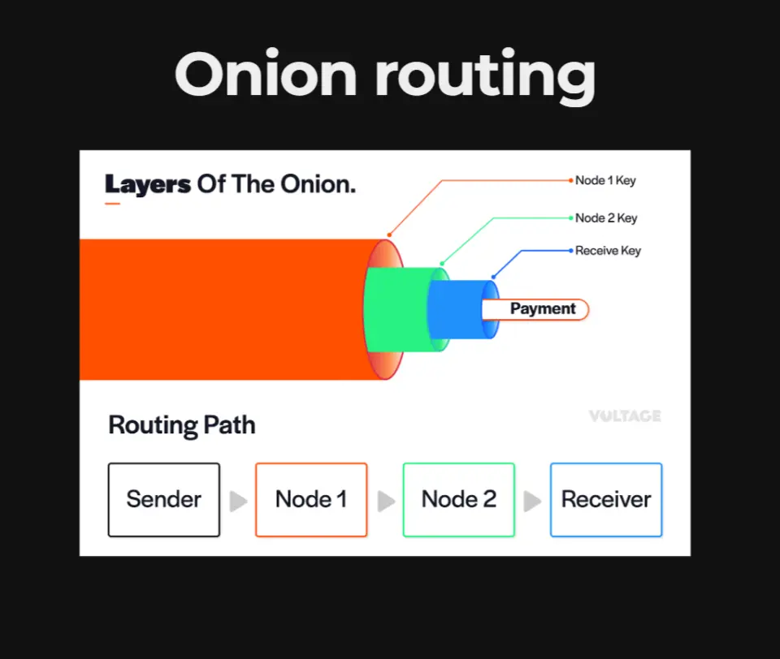_Onion Routing diagram _


پرداخت‌ها با استفاده از مسیریابی پیازی انجام می‌شوند که شامل ایجاد بسته‌های رمزگذاری‌شده‌ای است که از طریق چندین گره ارسال می‌شوند. HTLCها تراکنش را ایمن می‌کنند و حریم خصوصی و امنیت را تضمین می‌کنند.


### ساختار Invoice


فاکتورهای Lightning Network (Bolt 11) در Bech32 کدگذاری شده‌اند و شامل جزئیاتی مانند پرداخت Hash، توضیحات و انقضا هستند. هر Invoice باید یک بار استفاده شود تا از مشکلات استفاده مجدد جلوگیری شود.


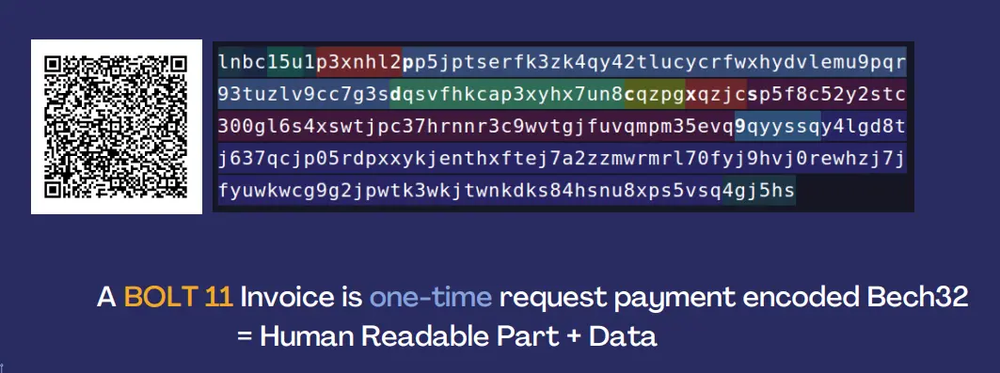_BOLT11 Invoice_


#### رمزگذاری و احراز هویت


روش‌های دست‌دهی و رمزگذاری (Chacha20) با احراز هویت (Poly1305) اطمینان از یکپارچگی و حریم خصوصی پیام‌ها در تراکنش‌های Lightning را فراهم می‌کنند.


#### جایگزین‌ها


روش‌های دیگر درخواست پرداخت مانند LNURL، Keysend و Bolt 12 ویژگی‌ها و سطوح پذیرش متفاوتی را ارائه می‌دهند و انعطاف‌پذیری در شبکه را فراهم می‌کنند.


#### کشف شبکه


کشف شبکه در Lightning Network از استفاده اولیه آن از IRC (ارتباط رله اینترنتی) به یک پروتکل پیچیده‌تر که توسط Bolt 7 تعریف شده است، تکامل یافته است. این پروتکل از پیام‌های خاص Lightning—که معمولاً به عنوان پیام‌های شایعه‌پراکنی شناخته می‌شوند—برای کشف و نگهداری توپولوژی شبکه استفاده می‌کند.


#### پیام‌های Bolt7


کلید Bolt شامل 7 پیام است:


- **اعلان نود**: این پیام وجود یک نود را اعلام می‌کند.
- **اطلاعیه کانال**: این پیام شبکه را از ایجاد یک کانال جدید مطلع می‌کند.
- **امضای اعلان**: این امر اصالت پیام‌های پخش شده را تضمین می‌کند.
- **به‌روزرسانی کانال**: این پیام به‌روزرسانی‌هایی درباره یک کانال را منتقل می‌کند، مانند ساختارهای هزینه و حداکثر مقادیر HTLC.


#### فرآیند اعلام کانال


فرآیند با تبادل جزئیات هویت و کانال توسط همتایان محلی آغاز می‌شود. پس از تأیید امضاها و تراکنش‌های تأمین مالی، آن‌ها کانال را به همتایان شبکه خود اعلام می‌کنند و اطمینان حاصل می‌کنند که کل شبکه با جدیدترین تغییرات توپولوژی به‌روز می‌ماند.


#### بوت‌استرپ DNS


کشف همتایان Lightning با استفاده از پرس‌وجوهای DNS و Bitcoin DNS seed تسهیل می‌شود که اطلاعات IP و نود را فراهم می‌کنند. این مکانیزم کشف اولیه به نودها کمک می‌کند تا به سرعت به شبکه متصل شوند.


#### اعلانات ویژگی‌ها


گره‌ها می‌توانند ویژگی‌های پشتیبانی‌شده خود را پخش کنند و با اطمینان از سازگاری با نسخه‌های قبلی، امکان بهبودهای اختیاری را فراهم کنند. این انعطاف‌پذیری تضمین می‌کند که همه گره‌ها می‌توانند به‌طور روان تعامل داشته باشند، حتی زمانی که پروتکل تکامل می‌یابد.


#### مدیریت فاکتورهای Bolt11


شبکه یکتایی فاکتورهای Bolt 11 را تضمین می‌کند تا از پرداخت‌های متعدد برای همان Invoice جلوگیری شود. اگر یک Invoice دوباره استفاده شود، گره‌های شبکه آن را رهگیری کرده و از پرداخت‌های دوگانه جلوگیری می‌کنند و یکپارچگی تراکنش را حفظ می‌کنند.


#### انتقال داده صوتی


اگرچه ممکن است، انتقال داده‌های صوتی از طریق Lightning Network به شدت فشرده شده و توسط اندازه پیام محدود می‌شود. یک نمونه کاربرد Sphinx است که استفاده نوآورانه از Lightning برای انتقال داده را بررسی می‌کند.


#### موارد استفاده و مباحثات


هدف Lightning Network موضوع بحث مداوم است. در حالی که در درجه اول برای پرداخت‌ها طراحی شده است، موارد استفاده دیگر مانند انتقال داده در حال بررسی است، اگرچه به طور جهانی پذیرفته نشده است. جامعه به طور مداوم در مورد کاربردهای بالقوه شبکه و بهبود پروتکل‌ها بحث می‌کند.


#### بحث‌های جامعه


جامعه Lightning Network پویا است و به طور مداوم در مورد موارد استفاده، کاربردهای پروتکل و بهبودهای احتمالی بحث و گفتگو می‌کند. این محیط همکاری، نوآوری را تقویت می‌کند و در عین حال اطمینان می‌دهد که شبکه برای برآورده کردن نیازهای کاربران تکامل می‌یابد.


در نتیجه، درک اهمیت دوم Layer، مشخصات Lightning Network، و مکانیزم‌های کشف شبکه برای هر کسی که به دنبال ورود به جزئیات Lightning Network است، ضروری است. این یک حوزه پیچیده اما بسیار پربار است که نویدبخش تحول آینده تراکنش‌های دیجیتال می‌باشد.


## مشتریان عمده LN


<chapterId>a2ad8db4-aea2-5231-927c-616c53db31bf</chapterId>


:::video id=90240cb6-a942-4015-b0c2-b721c48309ec:::


Lightning Network (LN) نشان‌دهنده یک پیشرفت قابل توجه در مقیاس‌پذیری و سرعت تراکنش Bitcoin است. مشتریان LN، که معمولاً به عنوان کیف‌پول‌های Lightning شناخته می‌شوند، نرم‌افزارها یا اپلیکیشن‌های تخصصی هستند که به کاربران امکان انجام تراکنش‌ها از طریق Lightning Network را می‌دهند. این کیف‌پول‌ها به عنوان یک Interface حیاتی بین کاربر و LN عمل می‌کنند و با استفاده از مسیرهای off-chain، تراکنش‌های با کارمزد کم و تسویه فوری را تسهیل می‌کنند.


کیف پول‌های لایتنینگ به گونه‌ای طراحی شده‌اند که فرآیند را کاربرپسند کنند و حتی افرادی با دانش فنی کم نیز بتوانند از قابلیت‌های پیشرفته Bitcoin بهره‌مند شوند. با امکان‌پذیر کردن ریزتراکنش‌های سریع و مقرون‌به‌صرفه، این کیف پول‌ها به‌طور قابل‌توجهی به پذیرش گسترده‌تر Bitcoin برای تراکنش‌های روزمره کمک می‌کنند.


_Lightning Wallets_


### کیف‌پول‌های Bitcoin در مقابل کیف‌پول‌های Lightning


کیف‌پول‌های Bitcoin و کیف‌پول‌های Lightning از نظر معماری و موارد استفاده به‌طور اساسی با یکدیگر تفاوت دارند، اگرچه ویژگی مشترک مدیریت کلید خصوصی را دارند:


#### کیف پول‌های Bitcoin:


- **نگرانی کلید خصوصی**: تمرکز اصلی برای کیف‌پول‌های Bitcoin این است که چه کسی کلید خصوصی را در اختیار دارد. این موضوع امنیت و کنترل وجوه کاربر را تعیین می‌کند.
- **پیچیدگی تراکنش**: کیف‌پول‌های Bitcoin انواع اسکریپت‌های تراکنش مانند Segregated Witness (SegWit) و Taproot را مدیریت می‌کنند که اندازه تراکنش‌ها را بهینه کرده و حریم خصوصی و امنیت را افزایش می‌دهند.


#### کیف پول‌های لایتنینگ:


- **مدیریت کلید خصوصی**: مشابه کیف‌پول‌های Bitcoin، کنترل کلیدهای خصوصی همچنان حیاتی است.
- **مدیریت نقدینگی**: یکی از ویژگی‌های متمایز کیف‌پول‌های لایتنینگ نیاز به مدیریت نقدینگی است که شامل متعادل‌سازی نقدینگی محلی (خروجی) و نقدینگی راه دور (ورودی) برای اطمینان از مسیریابی روان تراکنش‌ها می‌شود. این امر نیازمند آن است که کاربران کانال‌های خود را درک و بهینه‌سازی کنند تا انتقال پرداخت‌ها به‌طور کارآمد تسهیل شود.


#### مدیریت نقدینگی در کیف‌پول‌های لایتنینگ


مدیریت مؤثر نقدینگی سنگ بنای عملیات موفق Lightning Network است. این شامل تعادل استراتژیک دو نوع اصلی نقدینگی است:


#### نقدینگی محلی (خروجی):


- این مقدار Bitcoin را نشان می‌دهد که یک کاربر می‌تواند از کانال‌های Lightning خود ارسال کند. این امر برای شروع پرداخت‌ها و اطمینان از اینکه تراکنش‌ها می‌توانند به گیرنده هدایت شوند، حیاتی است.


#### نقدینگی از راه دور (ورودی):


- این نشان‌دهنده مقدار Bitcoin است که یک کاربر می‌تواند از طریق کانال‌های خود دریافت کند. این به همان اندازه مهم است، زیرا اطمینان می‌دهد که دیگران می‌توانند پرداخت‌ها را به کاربر ارسال کنند.


#### مثال مدیریت نقدینگی:


_Lightning Liquidity_


سناریویی را در نظر بگیرید که شامل Alice، Bob، چارلی و دن - کاربران معمولی LN که از طریق کانال‌های مختلف به هم متصل هستند:


- Alice می‌خواهد به دن پرداخت کند اما نقدینگی محلی کافی در کانال خود با Bob ندارد.
- اگر Bob دارای موجودی کافی و یک کانال با چارلی باشد، و چارلی یک کانال با دن داشته باشد، پرداخت Alice می‌تواند از طریق Bob و چارلی به دن منتقل شود.


_Lightning Liquidity_


با این حال، اگر هر یک از این کانال‌ها با کاهش یا مشکلات اتصال مواجه شوند، ممکن است تراکنش با شکست مواجه شود. این موضوع اهمیت حفظ نقدینگی متعادل در سراسر شبکه را نشان می‌دهد.


#### چالش‌ها در Lightning Network:


- **تخلیه کانال**: با گذشت زمان، کانال‌ها می‌توانند نامتعادل شوند و وجوه در یک طرف متمرکز شوند که این امر قابلیت‌های تراکنش را محدود می‌کند.
- **مشکلات اتصال**: مسیریابی کارآمد تراکنش نیازمند اتصالات شبکه قوی است که حفظ آن‌ها می‌تواند چالش‌برانگیز باشد.


برای مقابله با این چالش‌ها، ارائه‌دهندگان خدمات نقدینگی (LSPs) خدماتی را ارائه می‌دهند تا به مدیریت نقدینگی کمک کنند، که اغلب با دریافت هزینه‌ای همراه است، و اطمینان حاصل می‌کنند که کاربران تعادل کانال بهینه‌ای برای انجام معاملات روان دارند.


### کیف پول‌های مختلف و ویژگی‌های آن‌ها


انواع کیف پول‌های Lightning موجود است که هر کدام به نیازها و ترجیحات مختلف کاربران پاسخ می‌دهند. در اینجا چند مثال آورده شده است:


#### Wallet از Satoshi:


- **ویژگی‌ها**: کاملاً حضانتی، کاربرپسند، اما با منبع بسته و نگرانی‌های احتمالی حریم خصوصی.


#### آلبی:


- **ویژگی‌ها**: افزونه مرورگر، متن‌باز، پشتیبانی از مدل‌های حضانتی و غیرحضانتی، افزایش تطبیق‌پذیری.


#### نسیم:


- **ویژگی‌ها**: نود سبک بر روی تلفن، متن‌باز، ترکیب نگهداری شخصی با نقدینگی مدیریت‌شده، ارائه تعادل بین کنترل و راحتی.


#### ققنوس:


- **ویژگی‌ها**: مشابه Breeze، از مدل LSP برای نقدینگی استفاده می‌کند، متن‌باز، بر سادگی کاربر و مدیریت مؤثر نقدینگی تمرکز دارد.


#### باز کردن Bitcoin Wallet (OBW):


- **ویژگی‌ها**: ادغام کیف‌پول‌های On-Chain و Lightning، پشتیبانی از کانال‌های میزبانی‌شده، متن‌باز با ویژگی‌های پیشرفته، مناسب برای کاربران حرفه‌ای.


### ماتریس مدیریت حضانت و نقدینگی


کیف‌پول‌ها را می‌توان بر اساس اینکه چه کسی کلیدهای خصوصی را نگه می‌دارد و چه کسی نقدینگی را مدیریت می‌کند، طبقه‌بندی کرد. این ماتریس به کاربران کمک می‌کند تا کیف‌پول‌هایی را انتخاب کنند که با ترجیحات آن‌ها برای امنیت و راحتی هماهنگ باشد:


- **کیف‌پول‌های حضانتی**: شخص ثالث کلیدهای خصوصی را نگه می‌دارد، معمولاً مدیریت خودکار نقدینگی را ارائه می‌دهند. مثال‌ها شامل Wallet از Satoshi.
- **کیف‌پول‌های غیر حضانتی**: کاربران کلیدهای خصوصی را نگه می‌دارند، ممکن است مدیریت نقدینگی دستی نیاز باشد. مثال‌ها شامل Breeze و OBW هستند.


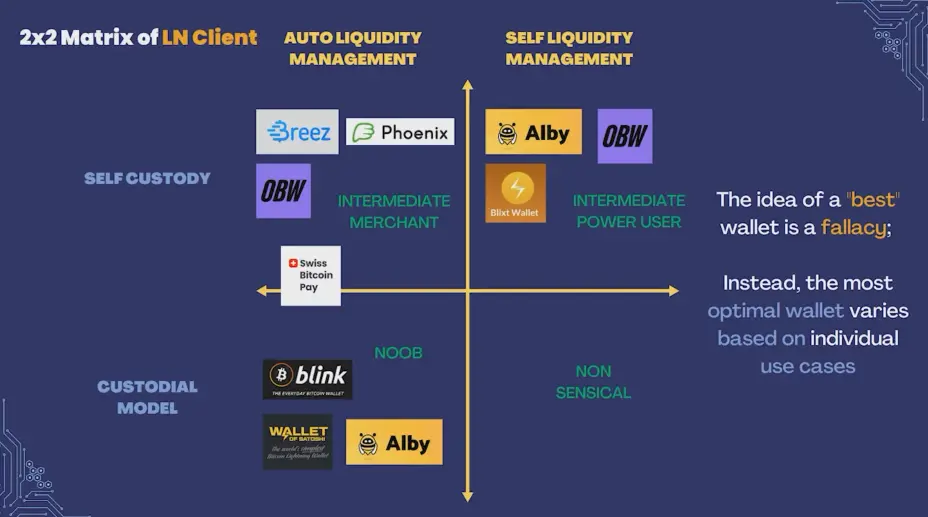_2x2 Matrix of LN Clients_


### انتقاد و حوزه‌های بهبود


علیرغم مزایای خود، کیف‌پول‌های Lightning با چندین انتقاد و زمینه‌هایی برای بهبود مواجه هستند:


- **حریم خصوصی**: کیف‌پول‌های با منبع بسته و برخی مدل‌های حضانتی نگرانی‌های حریم خصوصی را افزایش می‌دهند.
- **سهولت استفاده**: متعادل‌سازی ویژگی‌های پیشرفته با کاربرپسندی همچنان یک چالش است.
- **توسعه منبع‌باز**: سطوح مختلف مشارکت‌های منبع‌باز بر اعتماد کاربران و سرعت نوآوری تأثیر می‌گذارد.


### بینش‌ها و موارد استفاده اضافی


#### چالش‌های الگوریتم:


الگوریتم‌های فعلی برای یافتن مسیر بهینه در Lightning Network اغلب زیر بهینه هستند و شامل آزمون و خطا می‌شوند. بهبودهایی برای افزایش کارایی مسیریابی مورد نیاز است.


#### پرداخت‌های چندبخشی:


شکستن پرداخت‌های بزرگ‌تر به تراکنش‌های کوچک‌تر می‌تواند مشکلات نقدینگی و یافتن مسیر را کاهش دهد و تراکنش‌ها را روان‌تر کند.


#### درآمد از مسیریابی:


درآمد از طریق کارمزدهای مسیریابی معمولاً ناچیز است و این امر باعث می‌شود که برای کاربران فردی جذابیت کمتری برای اجرای گره‌های مسیریابی به منظور کسب سود داشته باشد.


#### انواع مختلف Wallet:


- **بلینک Wallet**: مستقر در السالوادور، حضانتی، نیازمند شماره تلفن، دارای ویژگی‌های پایدار Sats، اما فاقد ویژگی‌های پیشرفته Lightning Network.
- **Blitz Wallet**: متن‌باز، خودنگهداری، نیازمند مدیریت نقدینگی توسط کاربر، ارائه اطلاعات گسترده برای کاربران حرفه‌ای.
- **SwissBitcoinPay**: طراحی‌شده برای بازرگانان، نگهداری تا ۲۴ ساعت، کارمزدهای کم برای کاربران با حجم بالا.


#### موارد استفاده Wallet:


کیف‌پول‌های مختلف اهداف متفاوتی را دنبال می‌کنند، از سهولت استفاده برای مبتدیان تا ویژگی‌های پیشرفته برای کاربران حرفه‌ای. هیچ "بهترین" Wallet واحدی وجود ندارد؛ انتخاب به نیازها و ترجیحات فردی بستگی دارد.


#### مشارکت در منبع باز:


بازخورد کاربران و مشارکت‌ها در پروژه‌های متن‌باز برای توسعه و رشد مهارت‌های شخصی بی‌نهایت ارزشمند هستند و محیطی همکارانه و نوآورانه را پرورش می‌دهند.


در نتیجه، درک جنبه‌های مختلف مشتریان Lightning Network، تفاوت‌های آن‌ها با کیف‌پول‌های سنتی Bitcoin، و اهمیت مدیریت مؤثر نقدینگی برای بهره‌برداری کامل از پتانسیل Lightning Network بسیار مهم است. با انتخاب صحیح Wallet و مشارکت فعال در اکوسیستم، کاربران می‌توانند تجربه تراکنش Bitcoin خود را به‌طور قابل‌توجهی بهبود بخشند.


# چالش‌های LN


<partId>ca58c9d7-ba7e-5392-8488-6a21a9850e6a</partId>


## چالش‌های عملی برای LN


<chapterId>014c7c40-aef7-58ac-b51f-33784463f482</chapterId>


**(ویدیو به زودی در دسترس خواهد بود)**


در این جلسه، Asi0 به چالش‌های عملی که هنگام کار با Lightning Network (LN) با آن‌ها مواجه می‌شویم، می‌پردازد. با وجود رویکرد انقلابی آن در مقیاس‌بندی تراکنش‌های Bitcoin، Lightning Network چندین چالش عملی را ارائه می‌دهد که هم کاربران و هم توسعه‌دهندگان باید با آن‌ها مقابله کنند. به‌ویژه، ما به بررسی چهار چالش اصلی خواهیم پرداخت: **مدیریت نقدینگی**، **انتزاع Layer 1/Layer 2**، **دریافت پرداخت‌های آفلاین** و **مدیریت پشتیبان**.


هر یک از این چالش‌ها از دو دیدگاه بررسی می‌شود: **کاربر** و **توسعه‌دهنده**، زیرا چالش‌ها و راه‌حل‌ها بسته به نقشی که در اکوسیستم ایفا می‌کنید متفاوت است.


---

### چالش 1: مدیریت نقدینگی


#### **از دیدگاه کاربر:**


در Lightning Network، **نقدینگی** به دسترسی به وجوه در کانال‌های پرداخت اشاره دارد که برای انجام یا دریافت پرداخت‌ها ضروری است. کاربران باید اطمینان حاصل کنند که نقدینگی ورودی و خروجی کافی برای تراکنش‌های موفق دارند. به عنوان مثال، اگر می‌خواهید پرداختی دریافت کنید، باید نقدینگی ورودی در دسترس داشته باشید، به این معنی که یک نود دیگر باید بخشی از موجودی خود را به کانال شما اختصاص دهد. به همین ترتیب، اگر می‌خواهید پرداختی ارسال کنید، به نقدینگی خروجی در کانال خود نیاز دارید.


- **مسئله عملی**: کاربران اغلب در متعادل‌سازی کانال‌های خود و حفظ نقدینگی کافی دچار مشکل می‌شوند. علاوه بر این، متعادل‌سازی مجدد کانال می‌تواند هزینه‌هایی را به همراه داشته باشد.
- **راه‌حل‌های ممکن**: برخی از کیف‌پول‌های لایتنینگ شروع به یکپارچه‌سازی تراز خودکار کانال کرده‌اند، اما این ویژگی هنوز در حال توسعه است. کاربران همچنین به **ارائه‌دهندگان خدمات لایتنینگ (LSPs)** برای کمک به مدیریت نقدینگی متکی هستند.


#### **از دیدگاه توسعه‌دهنده:**


توسعه‌دهندگان با چالش پیاده‌سازی مدیریت نقدینگی بدون درز در برنامه‌ها مواجه هستند. آن‌ها باید ابزارهایی ایجاد کنند که بازتعادل‌سازی را خودکار کرده و اصطکاک برای کاربران را کاهش دهند، در حالی که بهینه‌سازی برای کارمزدها و جلوگیری از گلوگاه‌های نقدینگی را نیز در نظر داشته باشند.


- **مسئله عملی**: پیاده‌سازی الگوریتم‌های مؤثر برای مسیریابی پرداخت‌ها در یک شبکه با نقدینگی متغیر می‌تواند پیچیده و محاسباتی فشرده باشد.
- **راه‌حل‌های ممکن**: توسعه‌دهندگان در حال بررسی الگوریتم‌های پیشرفته برای **مسیریابی نقدینگی** و استفاده از **کانال‌های دوطرفه تأمین مالی** هستند تا اطمینان حاصل کنند که نقدینگی در هر دو طرف یک تراکنش موجود است.


> **تعاریف**:
>

> - **نقدینگی**: در دسترس بودن وجوه در یک کانال لایتنینگ برای انجام یا دریافت پرداخت‌ها.
> - **LSP (ارائه‌دهنده خدمات رعد و برق)**: سرویسی که به کاربران کمک می‌کند تا نقدینگی و کانال‌ها را در Lightning Network مدیریت کنند.

---

### چالش 2: انتزاع L1/L2


#### **از دیدگاه کاربر:**


تعامل بین **Layer 1 (L1)** (پایه Bitcoin، Layer) و **Layer 2 (L2)** (Lightning Network) اغلب برای کاربران به‌طور کامل انتزاعی نیست. به عنوان مثال، باز و بسته کردن کانال‌ها نیاز به تراکنش‌های On-Chain Bitcoin (L1) دارد و کاربران باید برای این اقدامات هزینه‌های On-Chain را پرداخت کنند. این امر پیچیدگی اضافی و تأخیرهای احتمالی را زمانی که شبکه Bitcoin شلوغ است، معرفی می‌کند.


- **مسئله عملی**: کاربران اغلب با پیچیدگی درک زمانی که با Bitcoin پایه Layer در مقابل Lightning Layer تعامل دارند، دست و پنجه نرم می‌کنند. این می‌تواند منجر به سردرگمی در مورد هزینه‌ها، زمان‌های تراکنش و امنیت شود.
- **راه‌حل‌های ممکن**: بهبود طراحی‌های Wallet که تعاملات L1/L2 را انتزاع می‌کنند و مدیریت باز و بسته شدن کانال‌ها را در پس‌زمینه انجام می‌دهند. برخی کیف‌پول‌ها از قبل به کاربران اجازه می‌دهند تا بسته به شرایط، به‌صورت یکپارچه بین تراکنش‌های On-Chain و Lightning جابجا شوند.


#### **از دیدگاه توسعه‌دهنده:**


توسعه‌دهندگان موظف به انتزاع پیچیدگی‌های L1 و L2 برای کاربران هستند و باید رابط‌های روان و شهودی ایجاد کنند که تراکنش‌ها را به‌طور کارآمد مدیریت کنند. چالش این است که تجربه کاربری را بهینه کنند و در عین حال یکپارچگی و امنیت پروتکل لایتنینگ را حفظ کنند.


- **مسئله عملی**: اطمینان از اینکه کاربر از پیچیدگی‌های فنی مدیریت کانال‌ها و تراکنش‌های On-Chain محافظت می‌شود، در حالی که شفافیت در مواقع لازم حفظ می‌شود.
- **راه‌حل‌های ممکن**: توسعه‌دهندگان در حال کار بر روی ویژگی‌هایی مانند **splicing** (که امکان اضافه یا حذف کردن وجوه از یک کانال بدون بستن آن را فراهم می‌کند) و ابزارهای مدیریت خودکار کانال هستند.


> **تعاریف**:
>

> - **L1 (Layer 1)**: Bitcoin اصلی Blockchain Layer.
> - **L2 (Layer 2)**: Lightning Network، که بر روی Bitcoin عمل می‌کند تا تراکنش‌ها را سریع‌تر و ارزان‌تر کند.
> - **Splicing**: تکنیکی که امکان ایجاد تغییرات در تراز یک کانال لایتنینگ را بدون نیاز به بستن آن فراهم می‌کند.

---

### چالش 3: دریافت پرداخت‌های آفلاین


#### **از دیدگاه کاربر:**


یکی از چالش‌های Lightning Network **دریافت پرداخت‌ها زمانی که کاربر آفلاین است**. برخلاف پایه Bitcoin یعنی Layer، که در آن تراکنش‌ها می‌توانند در هر زمانی دریافت شوند، Lightning نیاز دارد که هم پرداخت‌کننده و هم دریافت‌کننده آنلاین باشند تا تراکنش تکمیل شود. این یک محدودیت قابل توجه برای بسیاری از کاربرانی است که می‌خواهند از پرداخت‌های Lightning در موقعیت‌های روزمره استفاده کنند.


- **مسئله عملی**: کاربران نمی‌توانند پرداخت‌ها را دریافت کنند مگر اینکه نود آنها آنلاین و به شبکه متصل باشد، که این امر برای کسانی که می‌خواهند از لایتنینگ به عنوان یک روش پرداخت روزانه استفاده کنند، ناخوشایند است.
- **راه‌حل‌های ممکن**: برخی راه‌حل‌ها شامل استفاده از کیف‌پول‌های حضانتی یا تکیه بر خدمات شخص ثالثی است که به عنوان واسطه‌های پرداخت عمل می‌کنند تا زمانی که نود گیرنده آنلاین شود.


#### **از دیدگاه توسعه‌دهنده:**


توسعه‌دهندگان در حال بررسی راه‌هایی هستند که به کاربران اجازه می‌دهد حتی زمانی که نودهایشان آفلاین است، پرداخت‌های لایتنینگ را دریافت کنند. این امر نیازمند راه‌حل‌های خلاقانه‌ای است تا ضمن حفظ ماهیت غیرمتمرکز لایتنینگ، به مسئله عملی اتصال دائمی نیز پرداخته شود.


- **مسئله عملی**: توسعه یک پروتکل یا سیستم که به کاربران اجازه دهد پرداخت‌ها را به صورت آفلاین دریافت کنند بدون اینکه امنیت یا تمرکززدایی را به خطر بیندازد، یک چالش فنی قابل توجه است.
- **راه‌حل‌های ممکن**: تحقیقات در مورد **کوپن‌های پرداخت آفلاین**، که به گیرندگان اجازه می‌دهد پس از اتصال مجدد به شبکه پرداخت‌ها را دریافت کنند، در حال انجام است.


> **تعاریف**:
>

> - **پرداخت‌های آفلاین**: پرداخت‌هایی که در حالی ارسال یا دریافت می‌شوند که یک طرف به Lightning Network متصل نیست.
> - **کیف پول‌های حضانتی**: کیف پول‌هایی که در آن‌ها یک شخص ثالث کلیدهای خصوصی را کنترل کرده و تراکنش‌ها را به نمایندگی از کاربر مدیریت می‌کند.

---

### چالش ۴: مدیریت پشتیبان‌گیری


#### **از دیدگاه کاربر:**


پشتیبان‌گیری از کانال‌های لایتنینگ برای کاربران بسیار مهم است تا در صورت خرابی نود یا از دست رفتن داده‌ها، بتوانند وجوه خود را بازیابی کنند. با این حال، فرآیند پشتیبان‌گیری برای کانال‌های لایتنینگ پیچیده‌تر از Bitcoin است زیرا کانال‌ها حالت‌مند هستند، به این معنی که با هر تراکنش تغییر می‌کنند.


- **مسئله عملی**: کاربران باید اطمینان حاصل کنند که پشتیبان‌گیری‌های کانال آن‌ها به‌روز است، زیرا استفاده از یک پشتیبان‌گیری قدیمی می‌تواند منجر به از دست دادن وجوه یا جریمه شدن توسط شبکه شود.
- **راه‌حل‌های ممکن**: کیف‌پول‌هایی مانند Phoenix و دیگران پشتیبان‌گیری خودکار از کانال‌ها را پیاده‌سازی کرده‌اند، اما این ویژگی‌ها هنوز در همه کیف‌پول‌های Lightning فراگیر نشده‌اند.


#### **از دیدگاه توسعه‌دهنده:**


توسعه‌دهندگان باید راه‌حل‌های پشتیبان‌گیری را پیاده‌سازی کنند که به کاربران اجازه دهد تا حتی پس از شکست‌های فاجعه‌بار، وجوه خود را به‌صورت ایمن و قابل‌اعتماد بازیابی کنند. چالش این است که اطمینان حاصل شود این راه‌حل‌ها امن و آسان برای استفاده هستند و در عین حال یکپارچگی پروتکل لایتنینگ حفظ شود.


- **مسئله عملی**: طراحی سیستم‌های پشتیبان که امن، غیرمتمرکز و کاربرپسند باشند، چالشی قابل توجه است، زیرا پشتیبان‌ها باید با هر تغییر وضعیت در یک کانال به‌روز نگه داشته شوند.
- **راه‌حل‌های ممکن**: **پشتیبان‌گیری‌های کانال استاتیک (SCBs)** برای ساده‌سازی بازیابی توسعه یافته‌اند، اما راه‌حل‌های پیشرفته‌تری برای پشتیبان‌گیری‌های کاملاً خودکار و امن مورد نیاز است.


> **تعاریف**:
>

> - **پشتیبان‌گیری کانال استاتیک (SCB)**: نوعی پشتیبان‌گیری که به کاربران اجازه می‌دهد در صورت خرابی، با بازیابی آخرین وضعیت کانال، وجوه خود را از یک کانال لایتنینگ بازیابی کنند.

---

#### نتیجه‌گیری


Lightning Network مزایای فوق‌العاده‌ای از نظر سرعت و کارایی هزینه برای تراکنش‌های Bitcoin ارائه می‌دهد، اما همچنین چالش‌های عملی متعددی را به همراه دارد. این چالش‌ها—**مدیریت نقدینگی**، **انتزاع L1/L2**، **دریافت پرداخت‌های آفلاین** و **مدیریت پشتیبان‌گیری**—نیازمند راه‌حل‌های نوآورانه از سوی کاربران و توسعه‌دهندگان هستند. با ادامه تکامل شبکه، غلبه بر این موانع کلیدی برای دستیابی به پذیرش گسترده و بهبود تجربه کلی کاربر خواهد بود.


با پرداختن به این چالش‌ها، Lightning Network به تکامل خود ادامه خواهد داد و به یک راه‌حل قوی‌تر و قابل‌اعتمادتر برای مقیاس‌گذاری Bitcoin تبدیل خواهد شد.


## LN تکامل آینده


<chapterId>c06763dd-bb26-5fec-8ac4-3e446e9517cd</chapterId>

<professorId>880c7fa7-8d4c-4c9b-81b4-bc61ed256516</professorId>


:::video id=ab5f65f1-0b0d-4ca9-8ff7-d42764c1e915:::


### تاب‌آوری و تکامل Bitcoin


**Bitcoin نماد: گورکن عسل‌خوار**

Bitcoin اغلباً با گورکن عسل‌خوار شخصی‌سازی می‌شود، موجودی که به خاطر سرسختی و مقاومتش شناخته شده است. این نماد به‌خوبی نمایانگر طبیعت قوی و تسلیم‌ناپذیر Bitcoin است. همان‌طور که گورکن عسل‌خوار می‌تواند نیش‌های سمی را تحمل کند و به زندگی ادامه دهد، Bitcoin نیز مقاومت چشمگیری در برابر انواع مشکلات، از جمله چالش‌های نظارتی، نوسانات بازار و حملات فنی نشان داده است.


**ماهیت Bitcoin: در حال تکامل مداوم**

برخلاف تصور ایستا بودن، Bitcoin در حال تکامل دائمی است. پروتکل و اکوسیستم آن به طور مداوم توسط جامعه جهانی توسعه‌دهندگان و پژوهشگران بهبود و اصلاح می‌شود. این فرآیند تکاملی با هدف افزایش امنیت، مقیاس‌پذیری و کارایی هدایت می‌شود تا اطمینان حاصل شود که Bitcoin در خط مقدم دنیای ارزهای دیجیتال باقی می‌ماند.


### نوآوری‌ها در Lightning Network


**Lightning Network: توسعه سریع**

راه‌حل دوم Lightning Network، Bitcoin برای مقیاس‌پذیری و تسریع تراکنش‌ها، در حال توسعه سریع است. این Layer با فعال‌سازی کانال‌های پرداخت off-chain، امکان تراکنش‌های سریع و کم‌هزینه را فراهم می‌کند. نوآوری‌های قابل‌توجهی برای تقویت کارایی و قابلیت استفاده آن در حال ادغام است.


**کانال‌های دوگانه تأمین مالی**

به طور سنتی، یک کانال Lightning توسط یک طرف تأمین مالی می‌شود. با این حال، کانال‌های دوطرفه به هر دو طرف (مثلاً، Alice و Bob) اجازه می‌دهند تا به نقدینگی کانال کمک کنند. این بهبود، انعطاف‌پذیری بیشتری در ظرفیت ارسال و دریافت فراهم می‌کند و نیازمند ارتباط اولیه و پروتکل‌های جدید برای مدیریت تأمین مالی مشترک است.


**اتصال**

اتصال مجدد یک ویژگی است که به کاربران اجازه می‌دهد اندازه یک کانال لایتنینگ را بدون بستن آن تغییر دهند. این قابلیت امکان اضافه یا حذف وجوه از یک کانال موجود را فراهم می‌کند و راهی بی‌وقفه برای مدیریت نقدینگی کانال ارائه می‌دهد. اتصال مجدد تعامل‌پذیری بین تراکنش‌های On-Chain و کانال‌های لایتنینگ را تقویت می‌کند و کارایی کلی شبکه را بهبود می‌بخشد.


**مکانیزم L2**

مکانیزم L2 یک روش جدید برای باطل کردن وضعیت‌های قدیمی کانال بدون تکیه بر مکانیزم جریمه معرفی می‌کند. این به‌روزرسانی به SIGHASH_ANYPREVOUT وابسته است، ویژگی‌ای که نیاز به Bitcoin Soft Fork دارد. مکانیزم L2 وعده می‌دهد که مدیریت کانال را ساده‌تر کرده و امنیت را بهبود بخشد.


**Bolt 12**

Bolt 12 به محدودیت‌های فاکتورهای فعلی Bolt 11 که در Lightning Network استفاده می‌شوند، می‌پردازد. این نسخه فاکتورهای قابل استفاده مجدد را معرفی کرده و فرآیندها را خودکار می‌کند، و با عمل کردن به‌طور انحصاری در داخل Lightning Network، نیاز به HTTP و سرورهای وب را از بین می‌برد. این نوآوری تراکنش‌ها را ساده کرده و تجربه کاربری را بهبود می‌بخشد.


### افزایش حریم خصوصی و کارایی در تراکنش‌های Bitcoin


**Taproot، muSig، و امضاهای Schnorr**

Taproot یک ارتقاء قابل توجه است که پیچیدگی تراکنش را یکپارچه کرده و حریم خصوصی را بهبود می‌بخشد. هنگامی که با MuSig (یک پروتکل برای تراکنش‌های چند امضایی) و امضاهای Schnorr ترکیب می‌شود، Taproot کارایی تراکنش را بهبود می‌بخشد. این پیشرفت‌ها به تراکنش‌های Lightning اجازه می‌دهند تا شبیه به تراکنش‌های معمولی Bitcoin باشند، فرآیند را ساده کرده و حریم خصوصی را تقویت می‌کنند.


**مسیریابی PTLC**

قراردادهای قفل زمانی نقطه‌ای (PTLCs) بهبود یافته‌ای نسبت به قراردادهای قفل زمانی Hash موجود (HTLCs) هستند. PTLCs از امضاهای Schnorr استفاده می‌کنند و با جایگزینی اسرار مشترک با کلیدهای عمومی، حریم خصوصی را بهبود می‌بخشند و احتمال همبستگی و سوءاستفاده از پرداخت‌ها را کاهش می‌دهند.


**کارخانه‌های کانال**

کارخانه‌های کانال امکان ایجاد کانال‌های چندطرفه (مثلاً 4-از-4 Multisig) را فراهم می‌کنند که می‌توانند کانال‌های پرداخت 2-از-2 جدید off-chain را ایجاد کنند. این سیستم امکان ایجاد و بستن سریع کانال‌ها بدون هزینه را فراهم می‌کند، اگرچه نیاز به همکاری همه شرکت‌کنندگان دارد. کارخانه‌های کانال مقیاس‌پذیری و انعطاف‌پذیری کلی Lightning Network را افزایش می‌دهند.


**برج‌های دیده‌بانی**

برج‌های مراقبت نهادهای شخص ثالثی هستند که Blockchain را برای وضعیت‌های قدیمی کانال نظارت می‌کنند. اگر نقضی شناسایی شود، آن‌ها تراکنش‌های جریمه‌ای را منتشر می‌کنند تا امنیت شبکه را تضمین کنند. در حالی که برج‌های مراقبت با جلوگیری از رفتار نادرست امنیت را افزایش می‌دهند، نگرانی‌های حریم خصوصی را نیز در رابطه با نظارت بر تراکنش‌ها معرفی می‌کنند.


**blinded مسیرها**

مسیرهای blinded به‌گونه‌ای طراحی شده‌اند که حریم خصوصی گیرنده را در Lightning Network بهبود بخشند. آن‌ها گیرنده نهایی Address را مبهم می‌کنند و اطمینان حاصل می‌کنند که تنها فرستنده از گره میانی آگاه است و هر گره تنها از گره‌های مجاور خود مطلع است. این روش هویت گیرنده را محافظت کرده و حریم خصوصی کلی را افزایش می‌دهد.


**ارائه‌دهندگان خدمات لایتنینگ (LSPs)**

مفهوم‌سازی شده توسط Breeze Wallet، ارائه‌دهندگان خدمات لایتنینگ (LSPs) با هدف بهبود تجربه کاربری از طریق امکان دریافت فوری طراحی شده‌اند. LSPها کانال‌هایی را برای کاربران باز می‌کنند، مشابه نحوه ارائه خدمات اتصال توسط ارائه‌دهندگان خدمات اینترنت. این نوآوری فرآیند ورود کاربران را ساده کرده و تعاملات بی‌وقفه‌ای را در Lightning Network تضمین می‌کند.


**منابع برای به‌روز ماندن**

برای به‌روز ماندن از آخرین نوآوری‌های فنی در Bitcoin و Lightning Network، استفاده از منابع ارزشمند ضروری است. خبرنامه Bitcoin OpTec، لیست پستی توسعه‌دهندگان lightning و مطالب از کارشناسان صنعت مانند Jason Lopp، بینش‌ها و به‌روزرسانی‌هایی در مورد پیشرفت‌ها و تحقیقات جاری در این حوزه به سرعت در حال تحول ارائه می‌دهند.


با درک و قدردانی از این تحولات، می‌توانیم پیشرفت چندوجهی و پتانسیلی که هر دو Bitcoin و Lightning Network برای آینده تراکنش‌های دیجیتال دارند را بشناسیم.


## پروتکل‌ها بر روی LN


<chapterId>f4d147bb-f146-5b36-a994-b9b70da83744</chapterId>

<professorId>e7e63d59-ea19-4960-9446-61bd4dcc98f0</professorId>


:::video id=ffee9682-1bfa-4717-9f22-9bc1baff0722:::


### گسترش و یکپارچه‌سازی پرداخت‌های لایتنینگ


#### درک پرداخت‌های لایتنینگ


قبل از پرداختن به توسعه‌ها و یکپارچه‌سازی‌های پرداخت‌های لایتنینگ، ضروری است که عملیات پایه‌ای یک پرداخت لایتنینگ را درک کنیم. یک پرداخت لایتنینگ معمولی شامل چندین مؤلفه کلیدی است: **پرداخت‌کننده**، **دریافت‌کننده**، و خود **Lightning Network**. پرداخت‌کننده با تولید یک **Invoice** که شامل اطلاعات حیاتی مانند مبلغ پرداختی و مقصد (گره دریافت‌کننده) است، پرداخت را به دریافت‌کننده آغاز می‌کند.


این فرآیند به **قراردادهای زمان‌قفل‌شده Hash (HTLCs)** متکی است که اطمینان می‌دهد پرداخت‌ها تنها توسط گیرنده قانونی در یک بازه زمانی مشخص قابل مطالبه هستند. دو عنصر مهم Elements در این مکانیزم عبارتند از **مسیرپیازی** و **زنجیره HTLC**:


- **مسیریابی پیازی**: با محصور کردن داده‌های تراکنش در لایه‌ها، حریم خصوصی را فراهم می‌کند و اطمینان می‌دهد که هر واسطه تنها از گره‌های قبلی و بعدی خود آگاه است و نه از کل مسیر.
- **زنجیره HTLC**: مجموعه‌ای از قراردادها که وجوه را قفل می‌کنند تا زمانی که پرداخت یا تکمیل شود یا برگشت داده شود.


پروتکل جدیدتری که قابلیت‌های Lightning Network را بهبود می‌بخشد، **Keysend** است. برخلاف روش‌های سنتی که نیاز به ارتباط قبلی بین فرستنده و گیرنده برای generate و Invoice دارند، Keysend امکان **پرداخت‌های آغاز شده توسط فرستنده** را فراهم می‌کند و فرآیند را ساده‌تر کرده و تجربه کاربری را بهبود می‌بخشد.


با این حال، فاکتورهای سنتی محدودیت‌های خود را دارند. برای مثال:


- **یکبار مصرف**: فاکتورها معمولاً فقط برای یک تراکنش استفاده می‌شوند که می‌تواند ناخوشایند باشد.
- **محدودیت‌های اندازه**: فاکتورهای بزرگ می‌توانند در قالب کد QR دشوار باشند و برای برخی کاربردها غیرعملی شوند.


> **تعاریف**:
>

> - **Invoice**: درخواستی برای پرداخت در Lightning Network، که معمولاً شامل مبلغ و جزئیات گیرنده است.
> - **HTLC (Hash زمان‌قفل‌شده Contract)**: نوعی از Smart contract که برای اطمینان از پرداخت‌های مشروط در یک بازه زمانی استفاده می‌شود.
> - **مسیر یابی پیازی**: یک تکنیک حفظ حریم خصوصی که در آن داده‌های تراکنش به صورت لایه‌ای مانند پیاز قرار می‌گیرند تا هویت فرستنده و گیرنده محافظت شود.

### پروتکل‌ها و موارد استفاده


به مدل‌های کسب‌وکار و پروتکل‌های پیشرفته

برای غلبه بر محدودیت‌های فاکتورهای سنتی، چندین پروتکل برای گسترش و بهبود پرداخت‌های Lightning به وجود آمده‌اند.


- **LNURL**: پروتکلی که تولید Invoice را با امکان ایجاد فاکتورها به صورت پویا، پشتیبانی از نام‌گذاری فیات و فعال‌سازی استفاده از **آدرس‌های Lightning** ساده می‌کند. این رویکرد با ارائه روش‌های پرداخت انعطاف‌پذیرتر و یکپارچه‌سازی با موارد استفاده مختلف، تجربه کاربری را به‌طور قابل‌توجهی بهبود می‌بخشد.


- **Bolt 12 پیشنهادات**: این پروتکل مشابه LNURL است اما از **پیام‌رسانی Onion** برای افزایش حریم خصوصی استفاده می‌کند. Bolt 12 به کاربران اجازه می‌دهد تا فاکتورها را به‌صورت خودکار و بدون دخالت دستی دریافت کنند، که هم حریم خصوصی و هم قابلیت استفاده را بهبود می‌بخشد.


یکی از ادغام‌های قابل توجه پرداخت‌های لایتنینگ در **Nostr**، یک پلتفرم رسانه اجتماعی غیرمتمرکز است. Nostr پرداخت‌های لایتنینگ را برای امکان‌پذیر کردن انعام‌دهی و تراکنش‌های خرد ادغام می‌کند و نشان می‌دهد که چگونه لایتنینگ می‌تواند در برنامه‌های متنوعی تعبیه شود.


پروتکل دیگری، **RGB**، عملکرد لایتنینگ را با امکان **انتقال دارایی‌ها** از طریق Lightning Network گسترش می‌دهد. RGB اجازه می‌دهد تا انتقال دارایی‌های مختلف، از جمله توکن‌ها، از طریق کانال‌های لایتنینگ انجام شود و دامنه‌ی آنچه می‌توان معامله کرد را گسترش می‌دهد.


ارائه‌دهندگان خدمات نقدینگی لایتنینگ (LSPs) نیز نقش حیاتی در گسترش پرداخت‌های لایتنینگ ایفا می‌کنند. LSPها نقدینگی برای دریافت پرداخت‌ها فراهم می‌کنند، به باز کردن **کانال‌های دوطرفه تأمین مالی** کمک می‌کنند و با رهگیری پرداخت‌ها و باز کردن کانال‌ها به صورت آنی، تراکنش‌های بدون وقفه را تضمین می‌کنند.


> **تعاریف**:
>

> - **LNURL**: پروتکلی که امکان ایجاد پویا Invoice را فراهم می‌کند و پرداخت‌ها را آسان‌تر و انعطاف‌پذیرتر می‌سازد.
> - **Bolt 12**: گسترشی از Lightning که از پیام‌رسانی Onion برای حفظ حریم خصوصی استفاده می‌کند و به‌طور خودکار دریافت Invoice را انجام می‌دهد.
> - **Nostr**: یک پلتفرم غیرمتمرکز که پروتکل‌ها و موارد استفاده را یکپارچه می‌کند
> پرداخت‌های لایتنینگ برای ریزتراکنش‌ها.
> - **پروتکل RGB**: پروتکلی که انتقال دارایی‌ها، مانند توکن‌ها، را از طریق Lightning Network امکان‌پذیر می‌سازد.
> - **LSP (ارائه‌دهنده خدمات لایتنینگ)**: نهادی که نقدینگی فراهم می‌کند و کانال‌هایی برای تراکنش‌های لایتنینگ باز می‌کند، و شبکه را برای کاربران قابل دسترس‌تر می‌سازد.

### مدل‌های کسب‌وکار و پروتکل‌های پیشرفته


پیشرفت‌ها در پرداخت‌های Lightning راه را برای مدل‌های کسب‌وکار جدید، به‌ویژه برای **ارائه‌دهندگان خدمات Lightning (LSPs)** هموار کرده است. LSPها تجربه کاربری را با باز کردن کانال‌ها تنها زمانی که پرداخت‌ها شناسایی می‌شوند، بهبود می‌بخشند و در نتیجه پیچیدگی‌های پیش‌تنظیم را کاهش می‌دهند.


یک نمونه از مدل کسب‌وکار که توسط Lightning تسهیل شده است، **مدل حراج** است. در اینجا، یک سرور بالاترین پیشنهاد را نگه می‌دارد و پیشنهادات پایین‌تر را رد می‌کند و پرداخت‌ها را تا پایان حراج در حالت معلق نگه می‌دارد. این کار نیاز به بازپرداخت را از بین می‌برد و فرآیند حراج را ساده‌تر می‌کند.


مثال عملی دیگر در **بازی‌های پوکر** است، جایی که سرور با نگه‌داشتن شرط‌ها تا پایان بازی، پرداخت‌ها را مدیریت می‌کند و فرآیند شرط‌بندی روانی را تضمین می‌کند.


پرداخت‌های لایتنینگ همچنین در پلتفرم‌هایی مانند **Nostr** و خدمات پادکست ادغام می‌شوند و تطبیق‌پذیری این پروتکل‌ها را نشان می‌دهند. علاوه بر این، **پیش‌تصاویر** پرداخت‌ها می‌توانند به عنوان **کلیدهای دسترسی** برای باز کردن محتوا یا خدمات استفاده شوند و به Lightning Network کاربرد بیشتری می‌بخشند.


پروتکل‌های پیشرفته‌ای مانند **قراردادهای قفل‌شده زمانی نقطه‌ای (PTLCs)** لایتنینگ را با امکان‌پذیر ساختن عملیات رمزنگاری پیچیده‌تر، به سطح بالاتری می‌برند. PTLCs بهبودهایی در مسیریابی و تقسیم پرداخت ارائه می‌دهند که امنیت و کارایی را افزایش می‌دهند.


پروتکل‌هایی مانند **LNURL** و **Bolt 12** با کاهش تعاملات دستی، پرداخت‌ها را ساده‌تر می‌کنند و اطمینان حاصل می‌کنند که **Lightning Network** کاربرپسندتر شده و به‌طور گسترده‌تری پذیرفته می‌شود.


> **تعاریف**:
>

> - **PTLC (Point Time-Locked Contract)**: یک ابتدایی رمزنگاری که HTLCها را بهبود می‌بخشد و امکان پرداخت‌های انعطاف‌پذیرتر و امن‌تر را فراهم می‌کند.
> - **پیش‌تصویر**: مقداری که برای باز کردن HTLC استفاده می‌شود و می‌تواند به عنوان کلید دسترسی به خدمات نیز عمل کند.
> - **مدل حراج**: یک مدل پرداخت که در آن پرداخت‌ها در طول حراج معلق نگه داشته می‌شوند و تنها زمانی آزاد می‌شوند که بالاترین پیشنهاد پذیرفته شود.

### نتیجه‌گیری


گسترش و یکپارچه‌سازی پرداخت‌های لایتنینگ از طریق پروتکل‌ها و موارد استفاده مختلف، تکامل پویا Lightning Network را نشان می‌دهد. از بهبود عملکرد پایه‌ای پرداخت‌ها تا معرفی مدل‌های کسب‌وکار پیشرفته و پروتکل‌های رمزنگاری، آینده لایتنینگ نویدبخش نوآوری و پذیرش گسترده است.


# پاداش


<partId>4c5c74d7-40a9-5292-9b82-e3f3d79875e1</partId>


## Bitcoin Mining ضروریات


<chapterId>a4eacfc3-7b37-5fa3-abd1-b1fc48b645f0</chapterId>

<professorId>e320ccda-be59-492b-a81b-243d9acb592f</professorId>


:::video id=161d074d-4a81-48da-b2c9-9bde041a0da5:::


#### مقدمه


Ajelex بر جنبه تجاری Bitcoin Mining تمرکز دارد و استراتژی‌های حفظ سودآوری در یک بازار رقابتی را بررسی می‌کند. این بحث شامل تجزیه و تحلیل هزینه‌های عملیاتی، اقدامات کارایی و اقتصاد محرک صنعت Mining است.


### 1. عوامل پیچیدگی و سودآوری Mining


#### عوامل فنی و استراتژیک


پیچیدگی Mining در زمینه Bitcoin عمدتاً شامل Elements فنی و استراتژیک است که سودآوری عملیات Mining را تعیین می‌کند. درک این نکته مهم است که Mining صرفاً یک بازی شانس نیست بلکه یک فرآیند پیچیده است که نیاز به برنامه‌ریزی دقیق و بهینه‌سازی مداوم دارد.


#### عوامل کلیدی سودآوری


1. **هزینه‌های برق**: یکی از مهم‌ترین عوامل تأثیرگذار بر سودآوری Mining هزینه برق است. در مناطقی مانند فرانسه، برق می‌تواند نسبتاً گران باشد در مقایسه با کشورهایی مانند السالوادور، جایی که هزینه‌های پایین‌تر مزیت رقابتی برای استخراج‌کنندگان فراهم می‌کند.

2. **کارایی سخت‌افزار**: کارایی سخت‌افزار Mining، که با نرخ Hash و مصرف برق آن اندازه‌گیری می‌شود، نقش محوری دارد. ماینرهای پیشرفته ASIC مانند S19J Pro بسیار کارآمدتر از مدل‌های قدیمی‌تر مانند Antminer S9 هستند.

3. **دوره زمانی**: Bitcoin Mining برنامه‌ریزی بلندمدت را تشویق می‌کند.

4. **قیمت BTC**: قیمت BTC برای تعیین سودآوری Mining ضروری است.

5. **سختی شبکه**: سختی شبکه نشان‌دهنده مقدار متوسط Hashrate مورد نیاز برای استخراج یک بلوک در 10 دقیقه است.

6. **ابزارهای استراتژیک**: ابزارهایی مانند [braiins.com](https://insights.braiins.com) برای محاسبه سودآوری و کمک به ماینرها در اتخاذ تصمیمات مبتنی بر داده بسیار ارزشمند هستند.


#### کاربرد عملی


از تجربه شخصی، من حتی از Mining برای گرم کردن آپارتمانم در فرانسه استفاده کرده‌ام و به طور خلاقانه‌ای هزینه‌های برق را جبران کرده‌ام در حالی که Mining Bitcoin. این مثال بر کاربردی بودن ادغام عملیات Mining در زندگی روزمره برای مزایای اضافی تأکید می‌کند.


#### تنگناها در Mining


ماینرها با سه گلوگاه اصلی مواجه هستند: دسترسی به سخت‌افزار، دسترسی به انرژی، و سرمایه مورد نیاز برای حفظ عملیات. کمبود ASICها به دلیل تقاضای بالا اغلب منجر به زمان‌های انتظار طولانی و قیمت‌های متورم می‌شود که پیچیدگی بیشتری به چشم‌انداز Mining می‌افزاید.


- مثالی از **گلوگاه انرژی**.

در سال 2021، دولت چین Mining را در قلمرو خود ممنوع کرد و باعث شد شرکت‌های Mining در چین دسترسی به انرژی را از دست بدهند. این امر منجر به کاهش **50%** در Hashrate طی دو هفته شد.


---

### ۲. تکامل و کارایی سخت‌افزار Mining


#### تکامل تاریخی


سفر سخت‌افزار Mining بسیار چشمگیر بوده است، از CPU ساده Mining تا ماینرهای بسیار تخصصی ASIC که امروزه استفاده می‌کنیم.


1. **CPU Mining**: در روزهای اولیه، Mining با استفاده از پردازنده‌های معمولی کامپیوتر (CPU) انجام می‌شد. این روش به سرعت با رشد شبکه از رده خارج شد.

۲. **GPU Mining**: واحدهای پردازش گرافیکی (GPUs) افزایش قابل توجهی در کارایی Mining ایجاد کردند و باعث شدند که CPUها برای اهداف Mining منسوخ شوند.

3. **FPGA Mining**: آرایه‌های گیت قابل برنامه‌ریزی میدانی (FPGAs) عملکرد و بهره‌وری انرژی بهتری نسبت به GPUها ارائه می‌دهند.

4. **ASIC Mining**: مدارهای مجتمع با کاربرد خاص (ASICs) نمایانگر اوج بهره‌وری سخت‌افزار Mining هستند که به‌طور خاص برای عملیات Mining با عملکرد بی‌نظیر طراحی شده‌اند.


#### مقایسه دقیق: S19J Pro در مقابل Antminer S9


- **S19J Pro**: به دلیل کارایی بالا و قابلیت اطمینان، S19J Pro نرخ Hash برتری را با مصرف برق کمتر ارائه می‌دهد که آن را برای عملیات‌های بزرگ‌مقیاس ایده‌آل می‌سازد.
- **Antminer S9**: اگرچه قدیمی‌تر و کم‌بازده‌تر است، اما Antminer S9 به دلیل قیمت مناسب و عملکرد قابل قبول، همچنان برای تنظیمات کوچکتر و علاقه‌مندان محبوب است.


#### بهره‌وری و یادگیری Mining


Mining نه تنها پاداش‌های مالی ارائه می‌دهد بلکه تجربه عملی ارزشمندی نیز فراهم می‌کند. به‌دست آوردن بیت‌کوین‌های بدون KYC از طریق Mining می‌تواند پیشنهاد جذابی برای کسانی باشد که نگران حریم خصوصی هستند.


#### ابزارها و تکنیک‌های پیشرفته


نرم‌افزارهای پس از فروش می‌توانند کارایی و عملکرد سخت‌افزار Mining را بهبود بخشند. ابزارهایی که قابلیت‌های بهینه‌سازی و تنظیم خودکار را ارائه می‌دهند، اطمینان حاصل می‌کنند که هر تراشه با حداکثر کارایی عمل می‌کند و نرخ Hash و مصرف انرژی را به طور مؤثر متعادل می‌سازد.


---

### ۳. پویایی‌های نظارتی و بازار در عملیات Mining


#### تأثیر نظارتی


قوانین نقش مهمی در شکل‌دهی به چشم‌انداز Mining ایفا می‌کنند. به عنوان مثال، ممنوعیت Mining در چین تأثیرات عمیقی بر عملیات جهانی Mining داشت و باعث کاهش قابل توجهی در نرخ شبکه Hash شد و به توزیع مجدد قدرت Mining در مناطق مختلف منجر گردید.


#### پویایی‌های بازار


1. **دسترس‌پذیری و هزینه سخت‌افزار**: قیمت و دسترس‌پذیری ماینرهای ASIC تحت تأثیر قیمت بازار Bitcoin است. تقاضای بالا در بازارهای صعودی منجر به کمبود و افزایش قیمت‌ها می‌شود.

2. **ارزش Hash و قیمت Hash**: درک تفاوت بین ارزش Hash (ساتوشی‌های کسب‌شده به ازای هر تراهش در روز) و قیمت Hash (ارزش پولی نرخ Hash) ضروری است. هر دو تحت تأثیر سختی شبکه و قیمت بازار Bitcoin قرار دارند.


#### Mining استخرها و مکانیزم‌های پاداش‌دهی


1. **استخرهای Mining**: با ترکیب منابع، استخرهای Mining پاداش‌های پایدارتری ارائه می‌دهند و واریانس و ریسک مرتبط با Mining انفرادی را کاهش می‌دهند.

2. **طرح‌های پاداش**: مکانیزم‌های مختلف پاداش، مانند پرداخت به ازای هر سهم (PPS) و پاداش‌های نسبی، پروفایل‌های مختلفی از ریسک و پاداش را برای ماینرها ارائه می‌دهند.


- **پرداخت به ازای سهم**: پرداخت به ازای سهم، به ماینرها برای هر سهم معتبری که ارسال می‌کنند، پاداش می‌دهد، بدون توجه به اینکه استخر یک بلوک پیدا کند یا نه. **سهم‌ها** واحدهایی از اثبات هستند که ماینرها کار مورد نیاز را تکمیل کرده‌اند و استخر این سهم‌ها را تأیید می‌کند.


- **متناسب**: این بستگی به استخر Mining دارد که یک بلاک برای توزیع پاداش به طور مساوی به سهم Miner در کل Hashrate استخر اختصاص دهد.


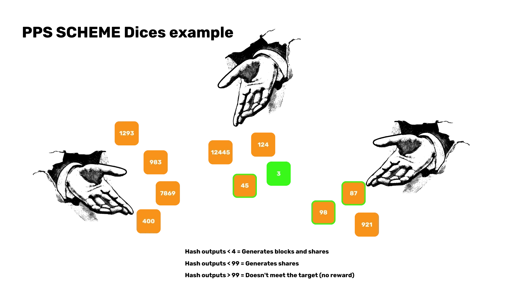


#### آینده Mining


با کاهش پاداش‌های بلاک، ماینرها به طور فزاینده‌ای به کارمزدهای تراکنش متکی خواهند شد. این تغییر نگرانی‌هایی را در مورد اینکه آیا کارمزدهای تراکنش به تنهایی انگیزه‌های کافی برای ادامه تأمین امنیت شبکه برای ماینرها فراهم می‌کند یا خیر، ایجاد می‌کند.


#### میزبانی شده Mining


خدمات میزبانی شده Mining می‌توانند هزینه‌های عملیاتی کمتری ارائه دهند اما با ریسک‌هایی مانند عدم کنترل و احتمال تقلب همراه هستند. بررسی دقیق لازم است تا این ریسک‌ها کاهش یابند.


#### امنیت و کارایی


پروتکل‌های امنیتی پیشرفته و استفاده از انرژی‌های تجدیدپذیر نه تنها سودآوری را افزایش می‌دهند بلکه به رشد پایدار اکوسیستم Mining نیز کمک می‌کنند.


در نتیجه، دنیای Bitcoin Mining یک حوزه پیچیده و چندوجهی است که نیاز به درک عمیق از پویایی‌های فنی، استراتژیک، مقرراتی و بازار دارد. چه شما یک Miner با تجربه باشید یا تازه شروع کرده‌اید، آگاه و سازگار ماندن کلید موفقیت در این زمینه همیشه در حال تحول است. از توجه شما سپاسگزارم و منتظر سوالات و بحث‌های شما هستم.


## درک Joinmarket


<chapterId>f109f64f-9b73-5fbf-8870-5d34d5b69df8</chapterId>

<professorId>6cfd206c-53b8-47a0-bbf4-44fd84e6ee1d</professorId>


:::video id=b89f2064-f2e1-49c3-97d0-580891eee1dd:::


آدام گیبسون بینشی در مورد Joinmarket ارائه می‌دهد و توضیح می‌دهد که چگونه این پیاده‌سازی CoinJoin حریم خصوصی و قابلیت تعویض Bitcoin را بهبود می‌بخشد. او بحث می‌کند که چگونه Joinmarket تراکنش‌های مشارکتی، Trustless و ناشناس را در اکوسیستم Bitcoin تسهیل می‌کند. سپس در بخش دوم، او نشان می‌دهد که چگونه Joinmarket را در Signet اجرا کنیم.


## Cubo+ اولین سال هکاتون


<chapterId>3faf7daa-ea42-5b68-bcaf-04b70b2e02dd</chapterId>


### گروه 1 هکاتون - میراث Satoshi


:::video id=d78b199e-39cd-4d3c-b478-1502ba9c952a:::


گروه Satoshi Legacy کار خود را در زمینه ساخت یک تجارت الکترونیک Lightning با Shopify، React JS و Hydrogen و درگاه پرداخت IBEX ارائه می‌دهد.


### گروه ۲ هکاتون - Honey Badger


:::video id=2159b401-e195-4bc8-9046-67a05c6ab7ea:::


گروه Honey Badger راه‌حل خود را برای یک وبلاگ با پرداخت‌های خرد مبتنی بر Lightning ارائه می‌دهد که با استفاده از LnBits و Next.js، Node.js و Hydrogen ساخته شده است.


### گروه 3 هکاتون


:::video id=eb1e3c20-03ea-4ff8-b018-d197377a85cf:::


گروه سوم یک داشبورد نود Lightning Network را از طریق یک API سفارشی، LND، vue.js، node.js، Bootstrap ارائه می‌دهد.


### گروه ۴ هکاتون - بورسیه Satoshi


:::video id=de1f6032-a0fa-49b0-82eb-18ba0e631756:::


گروه Fellowship از Satoshi یک اپلیکیشن بازی LN را با استفاده از LnBits و MongoDB، Poetry، Node.js ارائه می‌دهد.


### گروه 5 هکاتون - Lighting Walker


:::video id=1328bada-4fd1-494a-83c6-f147a4880448:::


گروه Lightning Walker راه‌حل خود را برای خدمات حواله با استفاده از MySQL، JavaScript و API زِد‌دی‌بی ارائه می‌دهد.


# بخش نهایی

<partId>a633fb0c-839c-4405-8b77-2377cce79dd7</partId>


## بررسی‌ها و رتبه‌بندی‌ها


<chapterId>7f4f46e2-de71-5387-8609-9785fb9e5946</chapterId>

<isCourseReview>true</isCourseReview>

## نتیجه‌گیری


<chapterId>33cb95cf-91d1-555b-a33b-0e3bd6745c33</chapterId>

<isCourseConclusion>true</isCourseConclusion>