Bitcoin용 Cubo+ 개발 과정에 오신 것을 환영합니다!


앞으로 20시간 동안 BTC와 LN 프로토콜에 대해 자세히 알아볼 것입니다. 이 과정은 BTC 생태계에서 일을 시작하고 싶고 BTC와 LN의 다양한 기술 스택에 대한 확실한 이해를 원하는 프로그래머를 위해 설계되었습니다.


이 동영상은 엘살바도르에서 열린 CUBO+ 2023 부트캠프에서 라이브로 녹화되었으며, 세계적으로 유명한 선생님들을 모시는 데 성공했습니다. 이 과정은 풀큐어 벤처의 관대함과 교사, Bitcoin 사무소, 데쿠브레비트코인 및 기타 많은 관계자들의 협력 덕분에 무료로 제공되었습니다.


즐기세요!


+++

# 입문 및 준비 과정


<partId>43a835de-c4e7-542b-9d1a-c92f049e88e6</partId>


## CUBO+ 과정 소개


<chapterId>dcf2d37e-b32a-5eb8-aaa3-41ac92475ba9</chapterId>


:::video id=9b6aa5cf-245e-4a66-b3b8-c4860ab51e90:::

필리포와 마리오가 CUBO+ 2023에 대한 소개 강연을 통해 앞으로의 포괄적인 학습 여정을 위한 무대를 마련합니다. 이들은 과정의 구조와 학습 결과, 그리고 이러한 학습이 Bitcoin 개발 공간에서 학생들에게 어떻게 도움이 될지에 대해 설명합니다.


### 목표


이 과정의 목표는 참가자가 Bitcoin의 기본 원칙에 대한 깊은 이해, 실용적인 개발 기술, Bitcoin 생태계를 효과적으로 탐색하고 기여할 수 있는 능력을 갖추도록 하는 것입니다. 이론적 지식과 실습을 혼합하여 Bitcoin 보안의 필수 요소, 소프트웨어 스택의 복잡성, 거버넌스 메커니즘을 마스터할 수 있습니다.


### 전제 조건


참가자는 강한 호기심과 전문가 수준의 학습에 대한 열의, 그리고 개발에 대한 기초적인 지식을 가져야 합니다. Bitcoin에 대한 자세한 배경 지식은 필요하지 않지만, 코딩 원리에 대한 기본적인 이해와 복잡한 기술 개념에 대한 개방성은 가속기를 최대한 활용하기 위해 필수적입니다.


#### 도구


과정 전반에 걸쳐 참가자는 이해를 돕고 학습 경험을 향상시키는 주요 도구를 활용하게 됩니다. Linux, 명령줄 Interface, GitHub 및 Docker의 사용은 Bitcoin 개발에 대한 실무적인 접근 방식을 제공하는 데 필수적인 요소입니다. 이러한 도구는 Bitcoin 소프트웨어 스택 작업, 개발 환경 관리, 실제 환경에서의 프로젝트 협업을 용이하게 해줍니다.


## 왜 Bitcoin인가?


<chapterId>89a0aa8b-90bd-58b2-82b3-bc5e1f82eaeb</chapterId>


### 엘살바도르에 Bitcoin가 필요한 이유


:::video id=ff820fb2-83d4-450f-bda0-17cc5044a902:::

큐보 플러스** 교육 프로그램의 첫 번째 강의에 오신 것을 환영합니다. 오늘은 **Bitcoin 이탈리아 팟캐스트**의 창립자 리키가 이끄는 Bitcoin의 세계로 들어가 보겠습니다. 리키는 Bitcoin을 인권 보호와 증진을 위한 도구로 사용하는 열정적인 인권 운동가입니다. 6년 이상의 경험을 가진 리키는 엘살바도르와 과테말라 같은 신흥 시장에서의 Bitcoin 채택을 기록하면서 광범위한 여행을 해왔습니다. 그는 팟캐스트뿐만 아니라 유튜브(**Bitcoin Explorer**)와 트위터(**BTC Explorer**, **Ricky6**)에서도 활발히 활동하고 있습니다. 리키의 Commitment에서 Bitcoin은 금융의 자유와 프라이버시를 제공하고 기존의 중앙화된 은행 시스템에 도전한다는 그의 신념에서 비롯되었습니다.


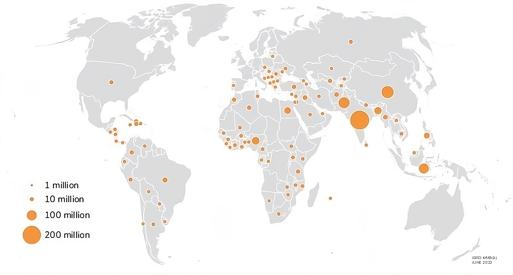

전 세계 은행 서비스를 이용하지 못하는 인구


### Bitcoin: 금융 자유와 엘살바도르에 미치는 영향


"엘살바도르에 Bitcoin가 필요한 이유"라는 이 강연에서는 **Bitcoin 프로토콜**에 대한 개요와 **Cypherpunk 운동에 뿌리를 두고 있으며 **검열받지 않는 돈**, **금융 포용** 등을 가능하게 하는 도구로서의 역할에 대해 설명합니다.


> **정의:**
>

> - 비트코인 프로토콜:_ Bitcoin이 탈중앙화 디지털 화폐로 운영되는 방식을 규정하는 규칙과 구조입니다.
> - 사이퍼펑크 운동_ 디지털 공간에서 프라이버시와 자유를 보장하기 위해 암호화를 사용해야 한다고 주장하는 그룹입니다.
> - 금융 포용성:_ 전통적인 은행 시스템에서 소외된 사람들, 흔히 "금융소외계층"이라고 불리는 사람들에게 금융 서비스에 대한 접근성을 제공합니다
> - 검열되지 않은 화폐:_ 정부나 금융 기관이 통제하거나 제한할 수 없는 화폐입니다.

#### 리키의 배경과 Bitcoin 옹호 활동


리키가 Bitcoin에 뛰어들게 된 계기는 인권 옹호자로서의 활동에 뿌리를 두고 있습니다. 그는 Bitcoin가 개인이 자신의 재정을 통제할 수 있게 함으로써 개인 정보를 보호하고 중앙화된 은행의 한계를 피할 수 있다고 믿습니다. 그는 엘살바도르와 같은 곳에서 Bitcoin를 도입한 사례를 통해 이 기술이 어떻게 신흥 시장의 사람들이 재정적 자립을 이룰 수 있는지를 강조합니다.


### Bitcoin의 글로벌 중요성과 과제


Bitcoin는 단순한 디지털 화폐 그 이상입니다. 프라이버시를 보호하고 재정적 자유를 보장하는 도구입니다. 마스터 비밀번호와 같은 역할을 하는 **개인 키**를 사용하여 사용자는 자신의 자금을 완벽하게 제어하면서 Bitcoin를 안전하게 관리할 수 있습니다.


금융 탄압이 흔한 권위주의 체제에서 Bitcoin의 **검열 불가능성**은 사람들이 자금 동결이나 압수에 대한 두려움 없이 거래할 수 있게 해줍니다. 오픈 소스**의 특성은 전 세계의 참여를 장려하여 네트워크를 지속적으로 개선하는 커뮤니티를 육성합니다.


Bitcoin은 그 잠재력에도 불구하고 상당한 도전에 직면해 있습니다. 아프리카와 인도와 같은 지역에서는 전기와 인터넷 접속과 같은 기본 인프라가 부족하여 채택이 제한되는 경우가 많습니다. 또한 모든 연령과 교육 수준의 사람들이 기술을 사용할 수 있도록 하는 '디지털 포용성'이 여전히 큰 장애물로 남아 있습니다.


> **정의:**
>

> - 비공개 키:_ 사용자의 Bitcoin에 액세스할 수 있는 비밀 코드입니다.
> - 오픈 소스:_ 누구나 검사, 수정, 개선할 수 있는 소프트웨어입니다.

### 엘살바도르의 사례


엘살바도르가 Bitcoin를 법정 화폐로 채택하기로 결정한 것은 이 화폐의 혁신적 잠재력을 보여줍니다. 엘살바도르는 Bitcoin를 사용하여 외국인 투자를 유치하고 재정 안정을 도모하고자 합니다. Bitcoin 해변**과 같은 프로젝트는 Bitcoin를 Exchange의 수단으로 채택함으로써 지역 경제가 어떻게 성장할 수 있는지 보여줍니다.


그러나 전 세계의 Bitcoin 채택은 무지, 신기술에 대한 저항, 인프라 문제와 같은 장애물에 직면해 있습니다. Bitcoin이 개발도상국의 발전을 도울 수 있는 보다 포용적인 금융 시스템으로 가는 길은 멀지만 희망적입니다. Bitcoin의 탈중앙화 및 오픈소스 특성은 모든 사람이 금융의 공정성을 누릴 수 있는 미래에 대한 희망을 제시합니다.


#### 결론


요약하자면, Bitcoin은 금융 권한 부여와 포용을 위한 엄청난 잠재력을 가지고 있지만, 앞으로 해결해야 할 중요한 과제가 있습니다. 탈중앙화된 금융의 미래를 실현하기 위해서는 Bitcoin 커뮤니티에 계속 참여하고, 배우고, 질문하는 것이 핵심이 될 것입니다. 협력과 옹호를 통해 모두를 위한 더 공정한 금융 시스템의 비전이 현실이 될 수 있습니다.


### Cypherpunk 운동과 오스트리아 경제학


#### Cypherpunk 무브먼트


20세기 후반에 암호화를 통한 프라이버시와 자유를 옹호하는 **Cypherpunk 운동**이 등장했습니다. 에릭 휴즈**와 팀 메이** 같은 선구자들은 디지털 세상에서 개인의 자유를 보호하기 위해서는 강력한 암호화가 필수적이라고 믿었습니다. 이들의 아이디어는 Bitcoin의 탄생에 큰 영향을 미쳤습니다.


> **정의:**
>

> - 사이퍼펑크:_ 암호화를 사용하여 프라이버시와 자유를 증진하는 운동.

#### 오스트리아 경제학


동시에 **오스트리아 경제학**은 Bitcoin의 통화 원칙의 토대를 제공했습니다. 루드비히 폰 미제스**와 프리드리히 하이에크** 같은 경제학자들은 건전한 화폐는 희소성이 있어야 하고, 내구성이 있어야 하며, 가치를 잘 저장할 수 있어야 한다고 주장했고, 이러한 원칙이 Bitcoin의 설계에 영향을 미쳤습니다.


> **정의:**
>

> - _희소성:_ 제한된 가용성, 신중한 배분의 필요성을 통해 가치를 창출합니다.

### Bitcoin의 탄생


**Satoshi 나카모토**는 이러한 아이디어를 결합하여 2008년에 검열에 저항하는 탈중앙화된 디지털 화폐인 Bitcoin를 만들었습니다. Cypherpunk의 프라이버시에 대한 이상과 오스트리아의 건전한 화폐 원칙을 결합한 Bitcoin는 전통적인 은행과 정부의 통제에 도전하는 금융 시스템을 제공합니다.


> **정의:**
>

> - 검열 저항성:_ 외부의 힘으로 통제하거나 차단할 수 없는 화폐입니다.

#### 주요 경제 원칙


- 희소성: ** Bitcoin의 고정 Supply는 시간이 지남에 따라 그 가치를 보장합니다.
- 시간 선호도:** 당장 지출하기보다는 미래를 위한 저축을 장려합니다.
- 절약:** 미래의 필요를 위해 가치를 저장하여 투자와 혁신으로 이어집니다.


> **정의:**
>

> - 시간 선호도:_ 미래의 재화보다 현재의 재화를 더 중요하게 생각합니다.
> - 저장:_ 나중에 사용할 수 있도록 가치를 저장합니다.

### 엘살바도르의 Bitcoin


엘살바도르의 Bitcoin 채택은 자발적인 채택과 탈중앙화를 촉진함으로써 **오스트리아 경제학**에 부합하는 금융 자유를 위한 도구로서의 잠재력을 반영합니다. 이러한 움직임은 경쟁, 독점, 몰수라는 주요 문제를 해결함으로써 전통적인 금융 시스템에 도전합니다.


- 경쟁**: Bitcoin는 전통적인 은행 업무에 대한 대안을 제공함으로써 금융 환경에 경쟁을 도입하여 살바도르 주민들이 금융 게이트키퍼를 우회하고 자신의 필요에 더 잘 맞는 서비스를 선택할 수 있도록 합니다.


- 독점**: Bitcoin은 금융 접근성을 탈중앙화함으로써 은행과 정부 발행 통화의 독점을 깨고 중앙 집중식 기관에 대한 의존도를 낮추고 금융 포용성을 촉진합니다.


- 몰수**: Bitcoin은 몰수에 대한 저항을 통해 살바도르 국민들이 자산을 통제하고 외부 압류로부터 재산을 보호하며 금융 주권을 강화할 수 있도록 합니다.


엘살바도르의 Bitcoin 도입은 기존 금융의 한계에 도전하여 보다 포용적이고 경쟁력 있으며 안전한 금융 시스템을 촉진합니다.


#### 결론


Bitcoin은 **Cypherpunk 운동**과 **오스트리아 경제학**에 기반을 두고 있어 독특하고 혁신적인 형태의 화폐입니다. 이러한 원칙을 이해하면 Bitcoin이 만들어진 이유와 현재 운영 방식을 파악하는 데 도움이 됩니다. 더 자세히 알아보시려면 **사이페데안 암무스**의 **Bitcoin 표준**을 참고하세요.


이 자료에 참여해 주셔서 감사합니다!


## Bitcoin


<chapterId>d800970a-0d8e-5557-810a-7aef845d4a34</chapterId>


### Bitcoin의 기술 스택


:::video id=2c008198-7f4e-4e60-87a0-0af17528ad2f:::

'How Bitcoin' 과정의 첫 번째 강의에서는 Bitcoin 네트워크를 뒷받침하는 기술 스택을 살펴보기 시작했습니다. 해시캐시**, **트랜잭션**, **Blockchain**, **Lightning Network** 및 기타 Bitcoin 프로토콜의 주요 구성 요소와 같은 주제를 다뤘습니다.


### Bitcoin의 기술 스택 파트 2


:::video id=752343b8-aa78-4bd3-9320-efe2a7e9d88f:::
두 번째 강의인 'How Bitcoin'에서는 Bitcoin의 기술 스택에 대해 보다 심층적으로 살펴봤습니다.


### Bitcoin 구조


Bitcoin의 기원은 발신자가 계산 작업을 완료하도록 하여 이메일 스팸 및 서비스 거부 공격을 방지하도록 설계된 Proof-of-Work(작업 증명) 시스템인 **Adam Back의 해시캐시**를 시작으로 몇 가지 주요 혁신에 기반을 두고 있습니다. 이 작업 증명 개념은 Bitcoin 보안의 초석이 되었습니다.


Bitcoin은 **타원 곡선 암호화**를 사용하는 **디지털 서명**을 사용하여 거래를 보호하고 검증합니다. 타원 곡선 디지털 서명 알고리즘(ECDSA)**은 Bitcoin의 정당한 소유자만 개인 키를 공개하지 않고 거래를 승인할 수 있도록 보장합니다.


*gW-63의 익명의 창시자인 *Satoshi 나카모토**는 이러한 아이디어를 확장하여 작업 증명 모델을 탈중앙화된 **Blockchain**로 전환했습니다. 이를 통해 중앙 기관 없이도 분산된 노드 네트워크가 거래를 검증하고 기록할 수 있게 되었으며, 이는 이전의 디지털 화폐 시도에서 크게 발전한 것입니다.


> **정의:**
>

> - 작업 증명(PoW):_ 참여자가 계산 퍼즐을 풀어야 트랜잭션을 검증하고 네트워크를 보호할 수 있는 시스템입니다.
> - 타원 곡선 암호화:_ 안전하고 효율적인 디지털 서명을 가능하게 하는 암호화 방식입니다.

### Blockchain 메커니즘 및 트랜잭션 유효성 검사


Bitcoin 트랜잭션은 **채굴자**에 의해 검증되고 블록에 추가되며, 이들은 Proof-of-Work 알고리즘을 사용해 암호화 퍼즐을 풀기 위해 경쟁합니다. 여기에는 올바른 Hash가 발견될 때까지 **Nonce** 값을 조정하여 특정 수의 선행 0이 포함된 Hash를 찾는 과정이 포함됩니다.


Blockchain의 각 **블록**은 **헤더**(이전 블록의 Hash와 같은 데이터 포함)와 트랜잭션 목록으로 구성됩니다. 첫 번째 블록인 **Genesis 블록**은 이전 블록이 없기 때문에 고유합니다.


트랜잭션이 블록에 포함되기 전에는 **Mempool**에 상주하며 유효성 검사를 기다립니다. 검증이 완료되면 이러한 트랜잭션은 새로 채굴된 블록에 추가된 다음 Blockchain에 추가됩니다.


> **정의:**
>

> - 채굴:_ 암호화 퍼즐을 풀어서 Blockchain에 새로운 블록을 추가하는 과정입니다.
> - 논스:_ Mining 중 올바른 Hash을 찾는 데 사용되는 값입니다.
> - 멤풀:_ 블록에 추가되기 전 미확인 트랜잭션이 대기하는 공간입니다.

### Bitcoin의 확장성, 개인 정보 보호 및 개발


Bitcoin은 확장성 및 개인정보 보호와 관련된 문제에 직면해 있습니다. Blockchain의 제한된 트랜잭션 용량으로 인해 많은 거래량을 처리하기 어렵습니다. Lightning Network** Address와 같은 솔루션은 결제 채널을 통해 off-chain 거래를 활성화하여 속도와 프라이버시를 향상시킴으로써 이러한 문제를 해결합니다.


탈중앙화와 보안을 보장하려면 **Full node**를 실행하는 것이 필수적이지만, **간편 결제 검증(SPV) 노드를 사용하면 일부 보안을 희생하는 대신 더 가볍게 참여할 수 있습니다.


Bitcoin 개발은 성능과 보안을 개선하기 위해 발전해왔습니다. 주요 업그레이드에는 트랜잭션 가변성을 해결하고 유효 블록 크기를 증가시키는 **분리된 증인(SegWit)**과 개인 정보 보호를 개선하고 **MAST(머클화된 추상 구문 트리)**를 사용해 더 복잡한 계약을 허용하는 **Taproot**이 있습니다.


> **정의:**
>

> - 서명 데이터와 트랜잭션 데이터를 분리하여 효율성을 개선하는 Bitcoin 업그레이드입니다.
> - 탭루트:_ 더 복잡한 스마트 컨트랙트를 지원하여 Bitcoin의 프라이버시와 확장성을 강화하는 업그레이드입니다.
> - 라이트닝 네트워크:_ 결제 채널을 사용하여 더 빠르고 저렴한 Bitcoin 거래를 위한 두 번째 Layer 솔루션입니다.

#### 결론


Bitcoin의 구조와 지속적인 진화는 기술의 혁신과 적응성을 보여줍니다. 해시캐시**에서 탈중앙화된 Blockchain로, 그리고 **SegWit**에서 **Taproot**로, Bitcoin는 확장성, 프라이버시 및 보안과 관련된 Address의 과제를 계속 해결해 나가고 있습니다. 커뮤니티의 지속적인 노력으로 Bitcoin는 탄력적이고 탈중앙화된 상태를 유지하면서 미래의 수요를 충족하기 위해 진화하고 있습니다.


## Bitcoin 폭로


<chapterId>171ec71d-3028-5820-9b4f-36682113fc81</chapterId>


### Bitcoin에 대한 반박


:::video id=c5e2e575-fa9d-4430-805f-205c2cf6f2a5:::

이 강연에서는 **Bitcoin**, **블록체인**, **암호화폐**를 둘러싼 일반적인 통념을 파헤칩니다. Bitcoin의 에너지 소비, 범죄적 사용, 그리고 이 기술에 대한 광범위한 'FUD'(공포, 불확실성, 의심)에 대한 99가지 오해를 바로잡아 보겠습니다.


### Bitcoin와 Blockchain 비교


흔히 오해하는 것은 **Bitcoin**과 **Blockchain**가 동일하다는 것입니다. Bitcoin은 디지털 화폐이지만 **Blockchain**는 이를 뒷받침하는 기술입니다. 블록체인은 거래에 대한 검증된 기록을 제공하지만 **Lightning Network** Address와 같은 솔루션은 느린 속도와 높은 비용과 같은 단점이 있습니다.


> **정의:**
>

> - 블록체인:_ 탈중앙화되고 불변하는 Ledger에 거래를 기록하는 데 사용되는 기반 기술입니다.
> - 라이트닝 네트워크:_ off-chain 트랜잭션을 활성화하여 Bitcoin의 트랜잭션 효율성을 개선하는 두 번째 Layer 솔루션입니다.

### Bitcoin 대 암호화폐


또 다른 주요 차이점은 **Bitcoin**는 기업이나 정부의 통제를 받지 않는 탈중앙화되고 검열에 강한 형태의 화폐를 제공하기 위한 목적으로 만들어졌다는 점입니다. 이와 대조적으로 암호화폐 **똥코인**은 중앙 집중식 통제를 위해 설계된 경우가 많으며, 주로 약탈적 관행, 펌프 앤 덤프 방식 또는 노골적인 사기를 통해 배후에 있는 회사의 배를 불리기 위해 존재합니다. 이러한 토큰은 일반적으로 정보에 어두운 투자자를 희생시켜 제작자가 빠른 수익을 올리는 것 외에 진정한 목적이 없습니다. 그러나 Bitcoin는 보안과 복원력이 입증된 유일한 탈중앙화 디지털 통화로 홀로 서 있습니다.


> **정의:**
>

> - 싯코인: 싯코인은 가치가 낮거나 품질이 의심스러운 암호화폐로 실제 유용성이 부족합니다. 투기성이 높은 경우가 많으며, 암호화폐 시장의 호황을 이용하여 사기 목적이나 명확한 목적 없이 만들어지기도 합니다.

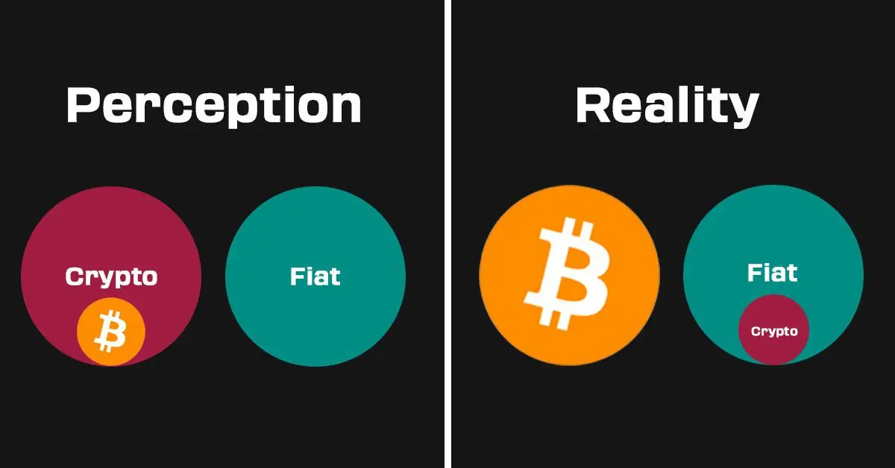


### 에너지 소비 및 환경 영향


Bitcoin에 대한 가장 일반적인 비판 중 하나는 **에너지 소비량**입니다. Bitcoin Mining는 에너지를 사용하지만, 전 세계 전력 소비량의 1% 미만을 차지하며 낭비되는 에너지의 비율은 3% 미만입니다. 또한, **Bitcoin Mining**는 종종 미사용 또는 재생 가능한 에너지원을 활용하기 때문에 흔히 묘사되는 것보다 더 친환경적입니다.


> **정의:**
>

> - 비트코인 Mining:_ 암호화 퍼즐을 풀어서 거래를 검증하고 네트워크를 보호하는 과정으로, 연산 능력이 필요합니다.

### 범죄적 사용에 대한 오해


Bitcoin은 종종 범죄 활동에 사용된다는 비판을 받습니다. 그러나 Blockchain 분석에 따르면 Bitcoin 거래의 극히 일부만이 범죄와 연관되어 있는 것으로 나타났습니다. 실제로 전통적인 금융 시스템에서는 Bitcoin보다 훨씬 더 많은 범죄에 사용되고 있습니다.


### 개인 정보 보호 및 활용성


**프라이버시**와 **복제가능성**은 Bitcoin의 필수 기능입니다. 프라이버시는 억압적인 체제에서 사용자를 보호하고, 대체 가능성은 기록에 관계없이 모든 Bitcoin이 동등하다는 것을 보장합니다. 이를 통해 Bitcoin은 신뢰할 수 있고 공정한 형태의 화폐가 될 수 있습니다.


> **정의:**
>

> - 대체가능성:_ 각 단위가 다른 단위와 교환이 가능하여 동등한 가치를 보장하는 화폐의 속성입니다.

### FUD 및 시장 역학 관계 처리


Bitcoin를 둘러싼 FUD는 종종 환경 영향, 범죄 사용, 보안에 대한 우려를 과장합니다. 시장 변동이 있기는 하지만, Bitcoin의 탈중앙화되고 건전한 기술은 특히 베네수엘라와 같은 제한적인 환경에서 장기적인 안정성과 재정적 자유를 위한 견고한 기반을 제공합니다.


#### 결론


Bitcoin의 에너지 소비량, 프라이버시 기능, 범죄 예방에서의 역할에 대한 현실을 이해하면 이를 둘러싼 오해를 불식시키는 데 도움이 됩니다. FUD를 파헤치면 프라이버시, 보안, 탈중앙화를 촉진하는 혁신적인 형태의 건전한 화폐로서 Bitcoin의 잠재력을 이해할 수 있습니다.


## Bitcoin 실행 중


<chapterId>5f638ec9-a6c1-5716-b27f-d837ab896eb1</chapterId>

<professorId>e7e63d59-ea19-4960-9446-61bd4dcc98f0</professorId>


### Bitcoin core 설치


:::video id=4a5253cf-b863-466a-8506-0506b28a28de:::

4번째 모듈의 첫 번째 강의에서는 Bitcoin의 아키텍처와 Bitcoin core 노드 설치에 대해 살펴보았습니다.


### Bitcoin 노드 실행


**1. 소개 요약**

다시 만나뵙게 되어 반갑습니다! 이전 세션에서는 암호화 기반과 P2P 네트워크 구조 등 Bitcoin 아키텍처의 기본 개념에 대해 살펴보았습니다. 오늘은 Bitcoin 노드를 설치하고 구성하는 방법을 시연함으로써 이론에서 실습으로 넘어가겠습니다.


**2. 실습 세션 개요**

이 세션에서는 알레코스가 가상 머신을 사용하여 Bitcoin 노드를 설정하는 과정을 안내합니다. 이 실습 튜토리얼은 Bitcoin 네트워크에 참여하도록 노드를 구성하는 단계에 익숙해지도록 설계되었습니다.


Bitcoin 노드를 운영하려면 트랜잭션과 블록을 검증하고, 합의 규칙을 적용하며, 네트워크의 탈중앙화를 지원해야 합니다. 노드를 설정하면 Bitcoin 네트워크에 직접 연결할 수 있으므로 네트워크의 보안과 무결성에 기여할 수 있습니다.


이 강의에서는 Bitcoin core를 직접 설치 및 실행하고, 공간을 절약하기 위해 Blockchain을 정리하는 방법을 배우고, 소프트웨어 실험을 시작하는 가이드를 찾을 수 있습니다. 알레코스가 이 흥미로운 과정을 단계별로 안내해 드립니다.


### Bitcoin core로 할 수 있는 작업과 그 이점


Bitcoin core를 실행하면 다음과 같은 기능을 사용할 수 있습니다:


- 자신의 트랜잭션과 블록을 검증하세요**: 타사에 의존하지 않고 Bitcoin 네트워크의 규칙을 따르도록 보장합니다.
- 네트워크 강화**: 네트워크에 참여하면 탈중앙화를 유지하여 Bitcoin가 공격에 더 탄력적으로 대응할 수 있도록 도와줍니다.
- Blockchain**를 정리합니다: 가장 최근 트랜잭션만 유지하여 스토리지 요구 사항을 줄이면 디스크 공간이 제한되어 있는 경우에 이상적입니다.
- Wallet의 고급 기능**을 사용하세요: 개인 정보 보호 및 보안을 통해 Bitcoin을 관리하고, 오프라인에서 generate 개인 키를 관리하고, 거래에 안전하게 서명하세요.
- Bitcoin 네트워크와 직접 상호 작용**: Bitcoin core를 사용하면 중개자 없이 네트워크에 직접 연결할 수 있어 가장 정확한 데이터를 얻을 수 있습니다.
- 개인정보 보호 강화**의 혜택**: Full node 운영자는 외부 서비스를 신뢰할 필요가 없으므로 외부 감시로부터 거래 개인 정보를 보호할 수 있습니다.


Bitcoin 노드 운영의 이점은 모든 헌신적인 비트코인 사용자에게 상당한 혜택을 제공합니다. 네트워크를 보호하고 탈중앙화를 강화하는 데 도움이 될 뿐만 아니라, 개인 정보를 보호하고 거래의 무결성을 보장하며 Bitcoin 생태계에서 주도적인 역할을 수행할 수 있습니다. 노드를 운영하는 것은 금융 주권을 달성하고 Bitcoin의 탈중앙화 특성을 완전히 수용하는 데 있어 핵심적인 단계입니다.


### 기본 명령


다음은 노드를 구성할 때 사용하는 몇 가지 기본 명령어입니다:


- Bitcoin daemon**의 상태를 확인하세요:


```bash
sudo systemctl status bitcoind
```


- Bitcoin daemon:**을 시작합니다:


```bash
systemctl start bitcoind
```


- Bitcoin daemon:**을 중지합니다:


```bash
sudo systemctl stop bitcoind
```


  - 자세한 정보 보기**:


```bash
bitcoin-cli getblockchaininfo
```


- 가장 최근 블록만 유지하여 디스크 공간을 절약하려면 Blockchain를 정리하세요:**:


```bash
prune=550
```


- Bitcoin core 서버를 활성화하고 RPC 설정을 구성합니다:**:


```bash
server=1
rpcuser=yourusername
rpcpassword=yourpassword
```


- Bitcoin daemon**의 상태를 확인합니다:


```bash
sudo systemctl status bitcoind
```


- Bitcoin Wallet:**의 잔액을 확인하세요:

```bash
sudo systemctl status bitcoind
```


### C-lightning 설치


:::video id=e13a1407-46e3-4b03-9a7a-b0f4a338c3c7:::

#### 1. **Bitcoin core 요약**


이후 C-Lightning을 설정하는 데 중요하므로 클라우드 가상 머신에 Bitcoin core을 설치하는 단계를 간단히 요약하는 것부터 시작하겠습니다.


**클라우드 가상 머신에 Bitcoin core 재설치**

시작하려면 가상 머신에 Bitcoin core를 다시 설치해야 합니다. 이 세션에서는 시간을 절약하기 위해 바이너리 검증을 생략하지만 프로덕션 환경에서는 바이너리를 검증하는 것이 보안을 보장하는 중요한 단계라는 점을 기억하세요.


**파일 해시 다운로드 및 확인**

먼저 최신 Bitcoin core 릴리스를 다운로드하고 파일 해시를 확인하여 변조가 발생하지 않았는지 확인합니다.


```sh
wget https://bitcoin.org/bin/bitcoin-core-22.0/bitcoin-22.0-x86_64-linux-gnu.tar.gz
sha256sum bitcoin-22.0-x86_64-linux-gnu.tar.gz
# Compare the output hash with the official hash
```


**바이너리를 설치하고 systemd로 자동 시작을 구성합니다**

그런 다음 바이너리를 설치하고 systemd를 사용하여 자동 시작되도록 설정합니다.


```sh
tar -xzf bitcoin-22.0-x86_64-linux-gnu.tar.gz
sudo install -m 0755 -o root -g root -t /usr/local/bin bitcoin-22.0/bin/*
```


**시스템 서비스 파일 만들기:**


```sh
sudo nano /etc/systemd/system/bitcoind.service
```


**다음 구성을 추가합니다:**


```ini
[Unit]
Description=Bitcoin daemon
After=network.target

[Service]
ExecStart=/usr/local/bin/bitcoind -daemon
User=bitcoin
Group=bitcoin
Type=forking
PIDFile=/var/lib/bitcoind/bitcoind.pid
Restart=on-failure

[Install]
WantedBy=multi-user.target
```


**Bitcoin 사용자 및 디렉터리 생성 및 구성**

전용 사용자를 생성하고 Bitcoin core용 디렉터리를 설정합니다.


```sh
sudo adduser --disabled-login --gecos "" bitcoin
sudo mkdir -p /var/lib/bitcoind
sudo chown bitcoin:bitcoin /var/lib/bitcoind
```


**Blockchain을 정리하여 최소한의 디스크 공간을 사용**합니다

디스크 공간을 절약하려면 구성 파일에서 가지치기를 사용 설정하세요.


```sh
sudo nano /var/lib/bitcoind/bitcoin.conf
```


다음 줄을 추가합니다:


```ini
prune=550
```


이 단계를 수행하면 최소한의 디스크 사용량으로 Bitcoin core를 실행하여 C-Lightning과 상호 작용할 준비가 완료됩니다.


#### 2. **C-Lightning 개요 및 설치**


**C-Lightning 개요**


코어 라이트닝이라고도 알려진 C-Lightning은 Layer 2 프로토콜로, off-chain 채널을 사용해 더 빠르고 저렴한 트랜잭션을 지원합니다. 플러그인을 통해 광범위한 커스터마이징이 가능한 모듈식 개발자 친화적인 아키텍처가 특징입니다.


*플러그인을 통한 모듈화 및 확장성의 중요성****

C-Lightning의 모듈식 설계는 필요에 따라 기능을 추가하거나 제거할 수 있으므로 특정 사용 사례에 맞게 시스템을 조정할 수 있습니다. 사용 사례의 예는 다음과 같습니다:


- 결제 처리**: 사용자 지정 플러그인은 특정 결제 조건을 처리할 수 있습니다.
- 라우팅 수수료**: 네트워크 조건에 따라 라우팅 수수료를 동적으로 조정합니다.
- 자동화**: 채널 관리 및 유동성 프로비저닝과 같은 작업을 자동화하세요.


### C-Lightning 설치


C-Lightning 설치로 넘어가겠습니다.


**최신 안정 버전 사용**

이 강의에서는 최신 안정 버전(예: 22.11.1)을 사용합니다.


```sh
wget https://github.com/ElementsProject/lightning/releases/download/v22.11.1/clightning-v22.11.1.tar.gz
sha256sum clightning-v22.11.1.tar.gz
# Verify the hash against the provided hash
```


**GPG 키로 무결성 확인**

다운로드한 파일의 무결성을 항상 GPG 키로 확인합니다.


```sh
gpg --recv-keys <developer-key-id>
gpg --verify clightning-v22.11.1.tar.gz.asc clightning-v22.11.1.tar.gz
```


**종속성 설치 및 소스 코드에서 컴파일하기**

필요한 종속성을 설치하고 소스에서 C-Lightning을 컴파일합니다.


```sh
sudo apt-get update
sudo apt-get install -y autoconf automake build-essential git libtool libgmp-dev \
libsqlite3-dev python3 python3-mako net-tools zlib1g-dev
tar -xzf clightning-v22.11.1.tar.gz
cd clightning-v22.11.1
./configure
make
sudo make install
```


**자동 시작을 위한 시스템 서비스 구성하기**

C-Lightning용 시스템 서비스 파일을 만듭니다:


```sh
sudo nano /etc/systemd/system/lightningd.service
```


다음 구성을 추가합니다:


```ini
[Unit]
Description=C-Lightning daemon
After=network.target bitcoind.service

[Service]
ExecStart=/usr/local/bin/lightningd
User=bitcoin
Group=bitcoin
Type=simple
Restart=on-failure

[Install]
WantedBy=multi-user.target
```


#### 3. **구성 및 설정**


**필요한 디렉토리 및 설정 파일 만들기**

C-Lightning에 필요한 디렉터리 및 구성 파일을 만듭니다.


```sh
sudo mkdir -p /var/lib/lightning
sudo chown bitcoin:bitcoin /var/lib/lightning
sudo -u bitcoin nano /var/lib/lightning/config
```


구성 파일에 다음 줄을 추가합니다:


```ini
network=testnet
log-level=debug
plugin=/usr/local/libexec/c-lightning/plugins
```


**Bitcoin core에서 Testnet과 연결하도록 C-Lightning 구성**

다음 줄을 추가하여 C-Lightning이 Bitcoin core와 연결할 수 있는지 확인합니다:


```ini
bitcoin-datadir=/var/lib/bitcoind
bitcoin-rpcuser=<rpcusername>
bitcoin-rpcpassword=<rpcpassword>
```


**호환성 및 동기화 보장**

서비스를 시작하고 서비스가 호환되고 동기화되었는지 확인합니다.


```sh
sudo systemctl start bitcoind
sudo systemctl start lightningd
sudo systemctl enable bitcoind
sudo systemctl enable lightningd
```


**Address 파일 경로 및 권한, 특히 토르 통합을 위한 권한**

특히 개인 정보 보호를 위해 토르를 사용하는 경우, 원활한 작동을 위해 파일 경로와 권한을 구성하세요.


```sh
sudo apt-get install tor
sudo -u bitcoin nano /var/lib/lightning/config
```


토르 통합을 위해 다음을 추가하세요:


```ini
proxy=127.0.0.1:9050
```


**자금 복구를 위한 백업 HSM의 비밀**

자금 복구를 위해 HSM 비밀을 백업하세요.


```sh
sudo cp /var/lib/lightning/hsm_secret /path/to/secure/location
```


**연결 테스트 및 노드 작동 상태 확인**

마지막으로 연결을 테스트하고 모든 것이 예상대로 작동하는지 확인하여 노드의 작동 상태를 검증합니다.


```sh
lightning-cli getinfo
```


이 단계를 수행하면 Bitcoin core 노드에 연결된 모든 기능을 갖춘 C-Lightning 설정이 완료되어 Testnet 트랜잭션에 사용할 수 있습니다.


#### 결론 및 질문


끝으로, 오늘은 Bitcoin core 재설치를 위한 필수 단계와 C-Lightning 설치 및 구성에 대한 자세한 안내를 다루었습니다. 궁금한 점이 있으면 지금 바로 질문하거나 다음 세션에서 더 자세히 설명할 수 있도록 준비해 주세요. 실질적인 실습 경험이 중요하다는 점을 기억하시고, 더 많은 인사이트를 얻으려면 앞서 설명한 Testnet 설정을 사용해 보세요.


### 보안 및 하드웨어 장치


:::video id=8b4baf24-1350-46b8-a87b-18678ed219ed:::

### 스펙터 및 Ledger 장치


#### 소개


Bitcoin의 보안 및 기기 설정에 대한 강의에 오신 것을 환영합니다. 오늘 강의에서는 보안 도구, 특히 Specter 데스크톱 Wallet 및 Ledger Hardware Wallet의 활용도를 이해하고 Bitcoin 보안을 강화하기 위해 효과적으로 구성하는 방법을 중점적으로 다룹니다.


**도구: 스펙터 데스크톱 Wallet 및 Ledger 에뮬레이터**


스펙터는 특히 하드웨어 장치를 사용하는 Bitcoin 지갑의 생성과 관리를 용이하게 하도록 설계된 데스크톱 Wallet입니다. 데모에서는 Ledger Hardware Wallet의 기능을 모방한 Ledger 에뮬레이터를 사용하겠습니다.


**Ledger 디바이스와 회사 간의 차이점 논란**


Hardware Wallet의 후속 모델인 Ledger 디바이스는 강력한 보안 기능으로 유명합니다. 하지만 Ledger을 개발한 회사는 사용자 데이터 프라이버시와 관련된 다양한 논란으로 인해 조사를 받고 있습니다. 현명한 사용을 위해서는 실제 디바이스의 보안과 회사의 관행을 구분하여 이해하는 것이 중요합니다.


**보안 모델: multi-sig 지갑과 다양한 하드웨어의 중요성**


Bitcoin 보안의 핵심은 다중 서명(multi-sig) 지갑을 활용하는 것입니다. multi-sig 지갑은 거래를 승인하기 위해 여러 개의 개인 키가 필요하므로 보안이 크게 강화됩니다. 또한 다양한 유형의 하드웨어 지갑을 사용하면 위험을 분산하고 보안 모델을 강화할 수 있습니다.


### 설정 및 구성


**스펙터 다운로드 및 설정하기**


설치 과정의 첫 번째 단계는 공식 저장소에서 Specter를 다운로드하는 것입니다. 소프트웨어가 손상되지 않도록 다운로드의 무결성을 확인하는 것이 중요합니다. 다운로드가 완료되면 데스크톱에 Specter를 설치하고 애플리케이션을 실행합니다.


*gW-192 또는 일렉트럼 서버와 연결하도록 스펙터 구성하기** **


스펙터를 구성하려면 Bitcoin core 또는 일렉트럼 서버에 연결해야 합니다. 이러한 서버는 Wallet 작동에 필요한 Blockchain 데이터를 제공합니다. 구성에는 Specter의 설정에서 서버 Address를 설정하고 안정적인 연결을 보장하는 것이 포함됩니다.


**파생 경로 및 공개 키 검색에 대한 설명**


파생 경로를 이해하는 것은 Wallet 관리에 필수적입니다. 파생 경로는 마스터 키에서 키가 생성되는 방법을 정의합니다. Specter에서는 Hardware Wallet(또는 에뮬레이터)을 연결하고 Wallet Interface을 탐색하여 공개 키를 검색할 수 있습니다. 나중에 참조할 수 있도록 이러한 경로를 문서화하세요.


**실습 데모: Ledger 에뮬레이터 사용**


이제 Ledger 에뮬레이터를 사용하여 키를 가져오겠습니다. 여기에는 에뮬레이터를 Specter에 연결하고 키 관리 섹션으로 이동한 다음 Wallet 생성에 적합한 키를 선택하는 작업이 포함됩니다.


**스펙터에서 지갑 생성 및 관리하기**


스펙터에서 Wallet를 생성하는 방법은 간단합니다. Wallet 생성 Interface에 액세스하여 필요한 세부 정보를 입력하고 검색한 공개 키를 포함시키면 됩니다. Wallet가 생성되면 Wallet를 관리하고, 트랜잭션을 모니터링하고, 강력한 보안 관행을 보장할 수 있습니다.


**거래 수신 및 모니터링**


Wallet을 설정한 후에는 Address를 공유하기만 하면 간단하게 트랜잭션을 수신할 수 있습니다. 스펙터는 수신 트랜잭션에 대한 실시간 모니터링을 제공하므로 Wallet의 상태를 항상 최신 상태로 유지할 수 있습니다.


### 고급 구성


**원격 스펙터 daemon 설정**


고급 사용자의 경우 원격 Specter daemon을 설정하면 접근성과 보안을 강화할 수 있습니다. 여기에는 원격 서버를 구성하여 Specter의 백엔드를 실행하고 다른 기기에서 안전하게 액세스할 수 있도록 하는 것이 포함됩니다.


**개인 정보 보호를 위한 토르 활성화**


개인 정보 보호를 강화하려면, 토르를 사용하도록 스펙터를 구성하는 것을 적극 권장합니다. 토르는 네트워크 트래픽을 익명화하여 잠재적인 감시로부터 사용자의 IP Address를 보호합니다. 이는 개인 정보 보호와 보안을 염려하는 사용자에게 특히 중요합니다.


**원격 노드에 안전하게 연결**


원격 노드에 연결할 때는 연결이 안전한지 확인하세요. 여기에는 SSL/TLS 인증서를 사용하고 노드의 진위 여부를 확인하는 것이 포함됩니다. 보안 연결은 중간자 공격을 방지하고 데이터 무결성을 보장합니다.


**문제 디버깅: 실용적인 기술**


문제가 발생하는 것은 피할 수 없는 일입니다. 실제 디버깅에는 사용자 권한 확인, 데이터 디렉터리 액세스 확인, 오류에 대한 로그 참조가 포함됩니다. 예를 들어, 운영 중단을 방지하기 위해 Specter가 Bitcoin core 데이터 디렉토리에 액세스하는 데 필요한 권한을 가지고 있는지 확인합니다.


**문제 예시: 데이터 디렉터리 액세스**


일반적인 문제는 잘못된 데이터 디렉터리 액세스입니다. Specter의 구성에서 Bitcoin core 데이터 디렉터리 경로가 올바르게 설정되어 있는지 확인하세요. 이렇게 하면 Specter가 Wallet 작업에 필요한 Blockchain 데이터에 액세스할 수 있습니다.


**다음 단계 및 통합**


결론적으로, 다음 단계는 스펙터와 Lightning Network를 통합하는 것입니다. 이렇게 하면 스펙터에서 라이트닝 노드로 자금을 송금할 수 있어 더 빠르고 저렴한 거래가 가능해집니다. 향후 강의에서는 이 통합을 자세히 다루며 Bitcoin의 트랜잭션 기능을 향상시킬 것입니다.


**블록 타이밍 가변성**


블록 타이밍의 가변성을 이해하는 것이 중요합니다. Bitcoin 블록은 다양한 간격으로 채굴될 수 있으며, 이는 트랜잭션 확인 시간에 영향을 미칩니다. 모든 구성과 Wallet 작업에서 이러한 가변성을 고려해야 합니다.


**학습 리소스**


추가 학습이 필요한 경우 "Lightning Network 마스터하기" 및 Rusty Russell의 튜토리얼과 같은 리소스를 참조하세요. 이러한 자료는 Lightning 노드 및 고급 Bitcoin 구성에 대한 심층적인 지식을 제공합니다.


**노드 설치 및 토르 보안**


로컬이든 원격이든 노드를 설치하면 보안을 강화하기 위해 토르를 사용하는 이점이 있습니다. 자체 노드를 실행하면 개인 거래 검증을 보장하여 보안과 프라이버시를 향상시킬 수 있습니다.


**철학: 학습의 자급자족**


자급자족의 철학을 받아들이세요. 실용적인 기술과 자가 학습이 가장 중요하며, 이는 종종 공식 교육의 이점을 능가합니다. 실습에 참여하여 Bitcoin 보안에 대한 이해를 심화하세요.


**개인정보 보호 고려 사항**


거래를 추적하거나 기록하는 서비스를 피하여 개인정보를 유지하세요. 익명성은 안전한 Bitcoin 운영을 위해 매우 중요하며, 신중한 서비스 선택은 사용자의 신원과 거래 내역을 보호하는 데 도움이 됩니다.


이것으로 스펙터와 Ledger을 사용한 Bitcoin의 보안 및 디바이스 설정에 대한 강의를 마칩니다. 궁금한 점이 있으면 언제든지 질문하거나 설명을 요청하세요.


## Bitcoin 개선


<chapterId>4fdd032f-2b05-5f24-a094-297d64f939de</chapterId>


### Bitcoin 에코시스템의 미해결 문제


:::video id=6d771eca-3f53-493d-8937-db6ddb2cf172:::

10년이 넘는 기간 동안 Bitcoin은 전 세계적으로 성공적으로 운영되며 디지털 경제의 새로운 가능성을 열며 금융계를 변화시키는 혁신으로 입증되었습니다. 하지만 여전히 창의적이고 협업적인 솔루션이 필요한 과제에 직면해 있습니다. Bitcoin의 지속적인 진화는 탈중앙화 금융의 미래를 만드는 데 관심이 있는 사람들에게 특별한 기회를 제공합니다.


#### Bitcoin 사용성의 미해결 문제


Bitcoin은 출시된 지 10년이 넘었음에도 불구하고 여전히 심각한 사용성 문제를 안고 있습니다. 사용자가 사용할 수 있는 도구와 인터페이스는 기존 금융 시스템에서 볼 수 있는 성숙도와 사용자 친화성이 부족한 경우가 많습니다. 이는 특히 Bitcoin 도입이 정부의 승인을 받은 엘살바도르와 같은 지역에서 두드러지게 나타납니다. 여기서 가장 중요한 문제는 사용자 경험을 단순화할 수 있는 더 나은 추상화를 통해 최소한의 기술적 노하우가 있는 개인도 Bitcoin에 액세스할 수 있도록 해야 한다는 것입니다.


#### 확장성 문제 해결


확장성은 Bitcoin의 개발 과정에서 지속적으로 제기된 문제였습니다. 네트워크의 대량의 트랜잭션을 처리할 수 있는 능력은 여전히 제한적이며, 일부 사용자의 참여를 배제할 수 있는 높은 On-Chain 수수료로 이어지는 경우가 많습니다. Lightning Network와 같은 솔루션은 off-chain 트랜잭션을 가능하게 함으로써 어느 정도 해결책을 제시하지만, 확장성 문제를 완전히 해결하지는 못합니다. 네트워크의 무결성을 손상시키지 않으면서도 증가하는 거래량을 처리할 수 있는 보다 포괄적인 솔루션이 필요한 것은 분명합니다.


#### 보안의 미해결 문제


Bitcoin 자산을 보호하는 것은 복잡한 작업이며, 여러 가지 어려움이 있습니다. 일상적인 거래에 자주 사용되는 Hot 지갑은 특히 라이트닝 노드를 운영하는 사람들에게 상당한 보안 위험을 초래합니다. 또한, Bitcoin 자산의 상속 계획은 복잡하고 종종 안전하지 않은 프로세스로 남아 있습니다. 이러한 보안 조치의 복잡성은 잠재적인 사용자를 억제하고 광범위한 채택을 복잡하게 만들 수 있습니다.


#### 개인 정보 보호의 공개 문제


개인정보 보호는 Bitcoin 생태계 내에서 또 다른 중요한 문제입니다. 개인 정보 보호는 보안에 필수적이지만, Bitcoin의 현재 프레임워크는 제한된 개인 정보 보호 기능을 제공합니다. On-Chain 트랜잭션은 쉽게 추적할 수 있어 사용자 익명성에 위험을 초래할 수 있습니다. Lightning Network은 프라이버시를 강화할 수 있는 잠재력을 가지고 있지만, 여전히 상당한 개선이 필요합니다. 투명성과 프라이버시 사이의 균형은 미묘하며 사용자 보안과 프라이버시를 보장하기 위한 혁신적인 솔루션이 필요합니다.


#### 유연성의 열린 문제


개인정보 보호, 보안, 확장성을 개선하기 위해서는 Bitcoin 프로토콜의 유연성이 필요합니다. 그러나 지나친 유연성은 취약점이 될 수 있으며, 잠재적으로 공격 벡터로 작용하여 네트워크의 탈중앙화를 위협할 수 있습니다. Bitcoin 프로토콜의 무결성과 복원력을 유지하려면 적절한 균형을 유지하는 것이 중요합니다.


### Bitcoin 강화의 장단점


#### 사용성 대 보안 및 개인정보 보호


Bitcoin의 사용성을 개선하기 위한 노력은 종종 보안과 프라이버시를 희생하게 됩니다. 예를 들어, Satoshi의 Wallet와 같은 사용자 친화적인 보관 지갑은 Interface에 액세스할 수 있지만 보안과 개인정보 보호에 상당한 타협을 하게 됩니다. 간소화된 시스템은 사용성을 높일 수 있지만 Address 재사용과 같은 문제를 일으켜 프라이버시를 훼손할 수 있습니다. 따라서 사용성 개선은 잠재적인 보안 및 개인정보 보호 절충안과 신중하게 비교 검토해야 합니다.


#### 확장성 및 개인정보 보호 절충안


Bitcoin 네트워크에서는 확장성과 개인정보 보호가 상충되는 경우가 많습니다. 확장성을 향상시키는 개선 사항(예: 더 큰 UTXO 또는 암호화 난독화 감소)은 일반적으로 프라이버시를 약화시킵니다. 반대로 모네로의 링 서명과 같은 프라이버시 중심 기술은 사용자 익명성을 강화하지만 확장성에는 부정적인 영향을 미칩니다. 또한, 이더리움에서 볼 수 있듯이 스테이트풀 컨트랙트를 도입하면 보안과 확장성이 저하되는 대신 유연성이 향상됩니다. 이러한 장단점의 균형을 맞추는 것은 세심한 고려가 필요한 복잡한 과제입니다.


### 개인 정보 보호 기술


Bitcoin의 개인정보 보호에 대한 다양한 접근 방식에는 고유한 장단점이 있습니다. 관련 데이터를 모호하게 하기 위해 더 많은 정보를 추가하는 난독화를 통한 프라이버시는 프라이버시를 강화할 수 있지만 네트워크를 복잡하게 만들 수 있습니다. 모네로와 지캐시가 그 예입니다. 반면, Lightning Network에서 볼 수 있듯이 On-Chain 정보를 줄이는 것을 목표로 하는 생략에 의한 프라이버시는 프라이버시와 확장성을 모두 향상시킬 수 있습니다. 각 방법에는 장단점이 있으므로 개인정보 보호 강화에 대한 미묘한 접근 방식이 필요합니다.


### 컨센서스의 변화와 과제


Bitcoin의 합의 메커니즘을 변경하는 것은 네트워크의 탈중앙화 특성으로 인해 드물고 어려운 작업입니다. ChISA(교차 입력 서명 집계) 및 컨벤트와 같은 제안은 보다 복잡한 거래 규칙을 도입하는 것을 목표로 하지만, 이를 구현하는 데는 어려움이 따릅니다. 합의에 의한 변경은 커뮤니티 내에서 광범위한 동의를 필요로 하며, 제안된 변경이 받아들여지지 않을 경우 필요한 조율로 인해 상당한 좌절감과 소진이 발생할 수 있습니다. 이는 프로토콜 개발에 있어 신중하고 협력적인 노력이 필요하다는 점을 강조합니다.


### Bitcoin 개발의 혁신과 표준


사용 편의성과 보안을 보장하기 위해서는 Bitcoin Wallet 개발에서 표준화된 관행을 준수하는 것이 중요합니다. 현재 많은 지갑이 확립된 표준을 따르지 않아 파편화와 잠재적 취약성을 초래하고 있습니다. 표준화는 사용자 경험과 Bitcoin 트랜잭션의 전반적인 보안을 크게 향상시킬 수 있습니다.


기존의 12단어 백업 문구는 기본적인 Bitcoin 사용에는 효과적이지만, Lightning Network와 같은 off-chain 프로토콜을 수용하기에는 부족합니다. 향후 백업 표준은 이러한 고급 기능에 대해 더 나은 보안과 사용성을 제공하도록 발전하여 사용자가 Bitcoin 에코시스템의 여러 계층에서 자산을 안전하게 관리할 수 있도록 보장해야 합니다.


통합 프로토콜을 통해 결제 프로세스를 간소화하는 것은 사용자 경험을 향상시키는 데 필수적입니다. BIP70, BIP78, Payneem과 같은 기존 프로토콜은 다양한 솔루션을 제공하지만 더 많은 혁신의 여지가 있습니다. 보다 간소화되고 사용자 친화적인 결제 프로토콜은 더 폭넓은 채택과 사용 편의성을 촉진할 수 있습니다.


Bitcoin의 사용성과 보안을 개선하기 위해서는 더 나은 도구와 하드웨어의 개발이 필수적입니다. 하드웨어 지갑(예: Ledger 및 Trezor)과 같은 혁신은 강력한 보안 솔루션을 제공하지만 Address의 새로운 위협에 대응하기 위해 계속 진화해야 합니다. 개선된 도구를 통해 더 많은 사람들이 Bitcoin에 더 쉽게 접근하고 안전하게 사용할 수 있습니다.


Hardware Wallet 배포와 관련된 위험을 완화하고 무결성을 보장하는 것은 매우 중요합니다. Supply 체인 공격은 이러한 디바이스의 보안에 심각한 위협이 됩니다. 엄격한 보안 조치를 구현하고 생산 및 배포 프로세스의 투명성을 보장하면 이러한 위험을 완화하는 데 도움이 될 수 있습니다.


보안과 효율성을 유지하면서 Bitcoin 및 Lightning Network와의 사용자 상호 작용을 간소화하는 것이 핵심 목표입니다. UX 추상화를 개선하면 기술 전문가가 아닌 사용자도 Bitcoin에 더 쉽게 접근할 수 있어 보안을 유지하면서 더 폭넓게 채택할 수 있습니다.


Bitcoin의 사용성, 보안 및 개인정보 보호를 개선하기 위한 교육 자료를 만드는 것은 큰 영향을 미칩니다. 사용자에게 모범 사례와 Bitcoin의 기본 원칙을 교육하면 사용자가 정보에 입각한 결정을 내리고 네트워크에 대한 전반적인 경험을 향상시킬 수 있습니다.


**Layer 1 및 Layer 2 변경 사항**


기본 Layer(Layer 1)의 혁신은 도전적이지만 Bitcoin의 장기적인 진화를 위해 매우 중요합니다. Layer 2 솔루션은 Lightning Network과 마찬가지로 더 많은 실험적 변경을 허용하고 Address 확장성 및 개인 정보 보호 문제를 보다 유연하게 해결할 수 있습니다. 두 레이어 모두 Bitcoin의 지속적인 개발에서 중요한 역할을 합니다.


**합의 조정**


Bitcoin의 프로토콜을 변경하려면 상당한 조정과 커뮤니티 합의가 필요합니다. Bitcoin의 탈중앙화된 특성으로 인해 이 과정은 본질적으로 어렵습니다. 프로토콜 변경의 복잡성을 헤쳐나가고 개선 사항을 성공적으로 채택하려면 효과적인 조정과 명확한 의사소통이 필수적입니다.


**확장성 과제**


글로벌 합의를 달성하고 Lightning Network과 같은 복잡한 보조 레이어를 관리하는 것은 확장성 문제를 야기합니다. 이러한 문제를 해결해야 Bitcoin가 보안과 탈중앙화라는 핵심 원칙을 유지하면서 증가하는 거래량을 수용할 수 있습니다.


결론적으로, Bitcoin 생태계의 발전을 위해서는 이러한 미해결 문제를 지속적으로 해결하고 혁신하는 것이 중요합니다. 사용성, 보안, 개인정보 보호, 확장성 간의 균형을 맞추려면 신중한 고려와 협력적인 노력이 필요합니다. 이러한 발전에 기여함으로써 참가자들은 Bitcoin의 미래와 글로벌 금융 환경에서의 역할을 형성하는 데 도움을 줄 수 있습니다.


# Bitcoin 기본 사항


<partId>6c0a3691-3ce4-5309-8ad7-e16e4b63c734</partId>


## Bitcoin의 보안 사고


<chapterId>0b97af0c-015a-54e3-a7f0-0f62ceb96c07</chapterId>

<professorId>7dfc5865-a0f6-4c3b-9b05-83e0d807ac59</professorId>


:::video id=08101af2-1ded-4f3a-b1db-d4477c6ab63e:::

보안과 신뢰성**에 대한 오늘 강의에 오신 것을 환영합니다. 이 강의의 목표는 실제 시나리오에서 시스템 설계와 애플리케이션의 이 두 가지 기본 측면 간의 미묘한 관계를 살펴보는 것입니다.


### 보안 사고에 대한 소개


보안 사고는 의도적인 공격으로부터 시스템을 보호하기 위해 고안된 원칙에 기반을 두고 있습니다. 여기에는 잠재적인 위협을 식별하고 이를 완화하기 위한 조치를 구현하는 것이 포함됩니다. 이와는 대조적으로 신뢰성은 고의적인 보안 위반 시도보다는 확률적인 장애를 고려하여 시스템이 지정된 조건에서 올바르게 작동하도록 하는 데 중점을 둡니다.


#### 보안과 신뢰성의 관계


보안과 안정성은 모두 시스템 무결성을 유지하는 것을 목표로 하지만 접근 방식은 크게 다릅니다. 안정성 엔지니어링은 무작위 이벤트로 인한 시스템 장애 가능성을 다루며, 이러한 장애를 예측하고 완화하기 위해 통계적 방법을 사용하는 경우가 많습니다. 반면 보안은 공격의 고의적이고 지능적인 특성을 고려해야 하므로 "심층 방어"라고 하는 다계층 방어 전략이 필요합니다


#### 보안 대 안정성


신뢰성 엔지니어링의 전형적인 예는 18세기 교량 건설로 거슬러 올라갈 수 있습니다. 당시 사용된 강철의 품질과 구성 및 제조 공정은 다리의 신뢰성에 결정적인 영향을 미쳤습니다. 엔지니어는 단일 고장 지점을 고려하고 확률과 통계를 사용하여 시간이 지남에 따라 다리의 신뢰성을 평가하고 보장해야 했습니다.


신뢰성과 달리 보안은 의도적인 위협에 대응합니다. 예를 들어 256비트 암호화 키는 무차별 암호 대입이 불가능하기 때문에 수학적 보안을 보장합니다. 보안 조치는 물리적 변조부터 정교한 사이버 공격에 이르기까지 다양한 위협 모델을 고려해야 합니다.


### 실제 애플리케이션


종이 지갑을 사용하여 Bitcoin 키를 생성하고 보관하는 과정을 고려해 보세요. 종이 지갑은 안전할 수 있지만 물리적 손상과 변조에 취약합니다. 이러한 지갑의 무결성을 보장하려면 변조 방지 방법과 강력한 검증 프로토콜이 필요합니다.


다른 시나리오로, 운전기사가 비밀 코드를 사용하여 승객을 인증하는 공항 픽업을 상상해 보세요. 이 간단하면서도 효과적인 보안 조치는 사기꾼이 양쪽 당사자를 속이는 것을 방지합니다.


과테말라에서는 선거 결과의 타임스탬프가 선거 과정의 무결성을 보장하는 데 중요한 역할을 했습니다. 선거 관리자들은 Timestamp 데이터에 암호화 방법을 사용하여 결과의 진위 여부에 대한 변조 방지 증거를 제공함으로써 상당한 재정적 인센티브에 이끌린 잠재적 조작자를 억제할 수 있었습니다.


### 잠재적 위협 식별 및 완화


위협 모델링은 잠재적인 보안 위협을 식별하고 이를 완화하기 위한 전략을 수립하는 프로세스입니다. 여기에는 시스템 환경을 이해하고, 가능한 공격자를 식별하며, 가정과 확률적 분석을 기반으로 보안 프로토콜을 개발하는 작업이 포함됩니다.


#### 보안 프로토콜 만들기


예를 들어, 선거를 보호하기 위해 공정한 감독 또는 정당 간 모니터링을 실시하여 투명성과 무결성을 보장할 수 있습니다. 타임스탬프 및 교차 검증과 같은 암호화 방법은 데이터의 신뢰성을 유지하고 변조를 방지하는 데 도움이 됩니다.


#### 신뢰 확인


신뢰 검증은 PGP(Pretty Good Privacy) 검증으로 설명할 수 있습니다. 사용자는 PGP 키의 지문과 서명을 확인함으로써 디지털 ID의 진위 여부를 확인할 수 있습니다. Hash 매칭(예: SHA-256)을 통해 소프트웨어 무결성을 검증할 때도 유사한 방식이 필수적입니다.


#### 신뢰 경로 설정


신뢰 구축은 즉각적인 것이 아니라 여러 신뢰 경로를 연결하고 중복성을 보장해야 합니다. 예를 들어 HTTPS 및 Blockchain 지원 인증서 투명성을 사용하면 웹 소스의 신뢰성을 보장하여 공격자가 신뢰를 침해하기 어렵게 만듭니다.


#### 보안을 위한 인센티브


보안을 유지하려면 인센티브의 역할을 이해하는 것이 중요합니다. 예를 들어, Bitcoin의 보안 모델은 채굴자의 인센티브와 네트워크 참여자의 검증에 의존하며, 디지털 생태계를 보호하는 데 있어 경제적 인센티브의 중요성을 강조합니다.


#### Bitcoin 지갑 보호


Bitcoin 지갑 보안을 위한 전략에는 다중 서명 설정과 다양한 저장소가 포함됩니다. 이러한 방법은 한 구성 요소가 손상되더라도 전체 보안이 손상되지 않도록 합니다.


#### 유효성 검사 중요성


마지막으로, 사용자 검증은 안전한 네트워크를 유지하는 데 매우 중요합니다. 트랜잭션의 유효성을 검사하고 소프트웨어 및 하드웨어 구성 요소를 검증하는 각 사용자의 역할은 네트워크의 무결성을 유지하고 잠재적인 위협을 차단하는 데 도움이 됩니다.


결론적으로, 보안과 신뢰성 원칙을 이해하고 통합하는 것은 견고한 시스템을 설계하는 데 필수적입니다. 과거의 사례를 통해 학습하고, 실제 전략을 적용하고, 지속적으로 신뢰를 검증함으로써 보안과 신뢰성을 모두 갖춘 시스템을 구축할 수 있습니다.


## Bitcoin의 무료 오픈 소스 소프트웨어(FLOSS)


<chapterId>2c59d609-f1ef-53f4-9575-df62e4d066e9</chapterId>

<professorId>7dfc5865-a0f6-4c3b-9b05-83e0d807ac59</professorId>


:::video id=4544ef7a-685e-4aaf-98a0-8a10dce06172:::

무료 및 오픈 소스 소프트웨어(FLOSS)의 사용은 Bitcoin의 생태계에서 매우 중요합니다. 피터 토드가 FLOSS의 역사를 살펴보고 Github을 통해 Bitcoin와 같은 오픈 소스 소프트웨어를 공동으로 구축할 수 있는 방법을 살펴보면서 Bitcoin에 있어 FLOSS의 중요성을 설명합니다.


### 소프트웨어의 본질과 중요성


소프트웨어의 핵심은 컴퓨팅 장치에 특정 작업을 수행하는 방법을 지시하는 코드와 데이터의 모음입니다. 복제를 위해 물리적 재료와 제조 공정이 필요한 하드웨어와 달리 소프트웨어는 거의 비용 없이 쉽게 복사하고 배포할 수 있습니다. 이러한 근본적인 차이는 소프트웨어의 확산과 발전에 중요한 역할을 합니다.


소프트웨어와 하드웨어의 주요 차이점 중 하나는 오픈소스라는 개념입니다. 오픈소스 하드웨어는 존재하지만, 물리적 개체를 복제하는 데 따르는 복잡성 때문에 널리 보급되지는 않았습니다. 반면, 오픈소스 소프트웨어는 복제와 배포가 쉽기 때문에 번창하고 있습니다. 오픈소스 소프트웨어는 누구나 코드를 보고, 수정하고, 배포할 수 있어 혁신과 문제 해결을 가속화하는 협업 환경을 조성합니다.


소프트웨어를 규율하는 법적 체계는 주로 저작권법을 중심으로 이루어집니다. 이러한 법률은 소프트웨어 제작자에게 저작물을 사용, 수정 및 배포할 수 있는 독점적인 권리를 부여합니다. 하지만 오픈소스 라이선스는 특정 조건 하에 이러한 권리를 대중과 공유할 수 있는 메커니즘을 제공합니다. 이러한 법적 구조는 소프트웨어 배포 및 수정의 역학을 이해하는 데 필수적입니다.


요약하자면, 쉽게 복제 가능한 코드와 데이터라는 소프트웨어의 특성과 오픈소스 라이선스가 제공하는 법적 메커니즘은 현대 디지털 환경에서 소프트웨어의 중요성을 강조합니다. 이 프레임워크는 혁신을 촉진할 뿐만 아니라 전 세계 커뮤니티가 소프트웨어를 자유롭게 공유하고 개선할 수 있도록 보장합니다.


### 자유 소프트웨어 운동의 역사


자유 소프트웨어 운동은 1980년대 초, 소프트웨어 자유에 대한 리처드 스톨먼의 비전에 의해 주도된 운동에 그 뿌리를 두고 있습니다. 독점 소프트웨어의 제한적인 특성에 좌절감을 느낀 스톨만은 사용자가 자유롭게 사용, 수정, 공유할 수 있는 소프트웨어를 만들겠다는 사명에 착수했습니다. 그 결과 1985년 자유 소프트웨어 재단(FSF)이 설립되었습니다.


스톨만의 중요한 공헌 중 하나는 유닉스와 유사한 무료 운영체제를 만드는 것을 목표로 한 GNU 프로젝트의 개발이었습니다. "GNU는 유닉스가 아니다"라는 뜻의 GNU는 완전 무료 운영체제의 필수 구성 요소를 다수 제공했습니다. 하지만 운영 체제의 핵심 부분인 커널이 없었습니다.


1991년 라이너스 토발즈가 리눅스 커널을 만들면서 그 공백이 메워졌습니다. 토발즈의 커널은 GNU 구성 요소와 결합되어 완전한 기능을 갖춘 무료 운영 체제인 GNU/Linux를 탄생시켰습니다. 소프트웨어 자유에 대한 스톨만의 철학적 Commitment와 토발즈의 실질적인 공헌 사이의 이러한 협력은 오픈 소스 접근법의 힘을 잘 보여줍니다.


자유 소프트웨어 운동은 소프트웨어 산업에 큰 영향을 미쳤으며, 누구나 소프트웨어를 자유롭게 사용, 수정, 공유할 수 있어야 한다는 생각을 장려했습니다. 이 원칙은 오늘날 번창하고 있는 많은 오픈 소스 프로젝트와 커뮤니티의 토대가 되었습니다.


### 오픈소스의 경제성과 자금 조달


오픈소스 프로젝트의 자금 조달과 유지에는 고유한 도전과 기회가 존재합니다. 판매 및 라이선스 비용을 통해 수익을 창출하는 독점 소프트웨어와 달리 오픈소스 프로젝트는 대체 자금 조달 모델에 의존하는 경우가 많습니다.


한 가지 성공적인 사례는 Bitcoin core 인프라의 핵심 부분인 Bitcoin입니다. Bitcoin core에 참여하는 개발자는 프로젝트의 성공으로 혜택을 받는 단체의 보조금, 기부금, 후원을 통해 자금을 지원받는 경우가 많습니다. 이 모델을 통해 개발자는 기존의 상업적 자금의 제약 없이 소프트웨어 개선에 집중할 수 있습니다.


또 다른 대표적인 예로 리눅스 운영체제를 들 수 있습니다. IBM, Red Hat, Intel과 같은 많은 회사들은 자사의 제품과 서비스가 강력하고 안전한 운영 체제에 의존하기 때문에 Linux 개발에 기여하고 있습니다. 이러한 회사는 재정적 지원을 제공하고, 코드를 제공하고, Linux 생태계를 유지 및 개선하기 위한 리소스를 제공합니다.


MIT, GPL, AGPL과 같은 오픈소스 라이선스도 오픈소스 소프트웨어의 경제적 역학 관계에서 중요한 역할을 합니다. MIT와 같은 허가 라이선스는 상용화를 포함하여 코드를 보다 유연하게 사용할 수 있도록 허용합니다. 반면, GPL과 같은 카피레프트 라이선스는 모든 파생 작업물도 오픈소스여야 한다는 것을 보장하여 협업 환경을 조성합니다.


결론적으로, 오픈소스 소프트웨어의 경제성은 커뮤니티 기여, 기업 후원, 혁신적인 자금 조달 모델에 의해 좌우됩니다. 이러한 메커니즘은 오픈소스 프로젝트의 지속 가능성과 지속적인 개선을 보장하여 개발자와 사용자 모두에게 혜택을 줍니다.


## Bitcoin의 암호화


<chapterId>71867dd2-912c-55ad-b59c-9dbca8a39469</chapterId>

<professorId>6cfd206c-53b8-47a0-bbf4-44fd84e6ee1d</professorId>


:::video id=b482b0f0-4468-4eaf-bcd6-eb4748bdfa3a:::

환영합니다! 오늘은 모든 Bitcoin 개발자가 알아야 할 암호화의 핵심적인 측면에 대해 알아보겠습니다. 과도한 이론적 세부 사항으로 여러분을 압도하지 않고 기본 개념과 실제 적용에 초점을 맞출 것입니다. 주요 목표는 Bitcoin의 암호화 메커니즘을 효과적으로 이해하고, 구현하고, 문제를 해결할 수 있는 지식을 갖추도록 하는 것입니다.


### Bitcoin 개발자를 위한 핵심 암호화 개념


이 섹션에서는 Hash 함수, 머클 트리, 디지털 서명, 타원 곡선 등 Bitcoin 개발자에게 필수적인 주요 암호화 개념에 대해 자세히 알아보겠습니다.


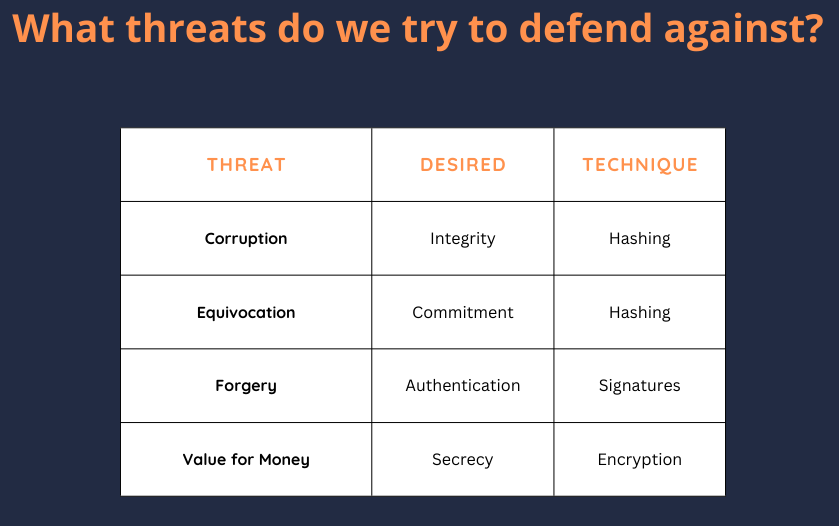


**Hash 함수**: Hash 함수는 입력을 받아 고정 길이의 바이트 문자열을 생성합니다. Bitcoin에서 Hash 함수는 데이터 무결성과 보안을 위한 기본 요소입니다. 암호화 Hash 함수는 효율적이어야 하고, generate은 무작위로 보이는 출력을 생성하며, 입력 크기에 관계없이 고정 길이의 출력을 생성해야 합니다. 파일 무결성 검사에 사용되어 데이터가 악의적으로 변경되지 않았는지 확인합니다.


**보안 속성**: 암호화 Hash 함수는 몇 가지 보안 속성을 준수해야 합니다. 사전 이미지 저항은 Hash 출력에서 원래 입력을 리버스 엔지니어링하는 것이 계산적으로 불가능하다는 것을 보장합니다. 두 번째 사전 이미지 저항은 동일한 Hash 출력을 생성하는 다른 입력을 찾기가 어려워야 함을 의미합니다. 충돌 저항은 동일한 Hash 출력을 생성하는 두 개의 다른 입력을 찾는 것이 불가능하다는 것을 보장합니다.


**머클 트리**: Merkle Tree은 대규모 데이터 세트를 효율적이고 안전하게 검증할 수 있는 데이터 구조입니다. 데이터 항목은 쌍으로 해시되며, 결과 해시는 반복적으로 결합되어 단일 루트 Hash을 형성합니다. Bitcoin에서 머클 트리는 블록 생성 및 트랜잭션 검증, 특히 간편결제 검증(SPV) 클라이언트와 Taproot(마스트)에서 매우 중요한 역할을 합니다.


**디지털 서명(ECDSA)**: 타원 곡선 디지털 서명 알고리즘(ECDSA)은 Bitcoin 거래의 진위성과 무결성을 보장하는 데 사용됩니다. 여기에는 해당 공개 키를 사용하여 확인할 수 있는 개인 키를 사용하여 서명을 생성하는 것이 포함됩니다. 주요 개념에는 유한 필드, 이산 로그, 논스의 중요성에 대한 이해가 포함됩니다.


**타원 곡선**: 타원 곡선은 효율성과 보안성 때문에 공개 키 암호화에 사용됩니다. 타원 곡선 암호화의 보안은 이산 로그 문제 해결의 난이도에 따라 달라집니다.


### Bitcoin의 실용적인 암호화 애플리케이션 및 보안 사례


이 섹션에서는 실제 Bitcoin 개발에서 이러한 개념을 적용하는 방법과 따라야 할 모범 보안 사례를 살펴봅니다.


**암호화 = 위험**: 암호화는 양날의 검과도 같습니다. 우발적인 데이터 손상과 악의적인 행동으로부터 데이터를 보호하지만, 잘못 구현하면 심각한 취약점으로 이어질 수 있습니다. 개발자는 안전한 구현과 잠재적인 문제 해결 능력을 모두 확보하기 위해 암호화 메커니즘을 깊이 이해해야 합니다. 예를 들어, SHA-2의 256비트 출력은 사전 이미지 공격에 약 2^256의 작업이 필요하고 충돌 저항은 약 2^128의 작업이 필요함을 보장합니다.


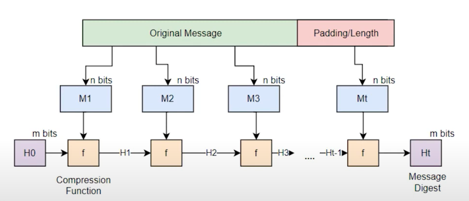


**Merkle Tree 애플리케이션**: 로그 증명 크기를 이해하고 트랜잭션 검증에서 Hash 중복과 같은 결함을 방지하려면 신중한 트리 설계가 필수적입니다. 머클 트리는 블록 생성, 트랜잭션 검증 및 Taproot와 같은 개선 사항에 사용됩니다.


**공개 키 암호화**: 이산 로그와 유한 필드는 Bitcoin의 암호화 계산에서 기본입니다. 챌린지-응답 프로토콜은 개인키를 공개하지 않고 개인키에 대한 지식을 검증하는 데 사용됩니다.


**보안 영향**: 과거 사례에 따르면 Nonce 재사용으로 인해 상당한 재정적 손실이 발생했습니다. 고유한 논스를 생성하는 것의 중요성을 이해하는 것이 중요합니다. LibSecP256k1과 같은 신뢰할 수 있는 라이브러리를 사용하면 강력하고 안전한 암호화 작업을 보장할 수 있습니다.


**타원 곡선 암호화(ECC)**: 서명 체계는 신원 프로토콜에서 슈노르 서명과 같은 체계로 발전해 왔으며 현재 Bitcoin(BIP 340)에서 사용되고 있습니다. 타원 곡선과 유한 필드 산술에 대한 지식은 안전한 암호화 구현을 보장합니다.


**개발자를 위한 일반적인 조언**: 암호화 프로토콜은 철저한 동료 검토를 거쳐야 합니다. 개발자는 암호화 절차의 모든 단계를 정확하고 완벽하게 이해해야 합니다. 암호화 구현의 일반적인 함정을 인식하면 심각한 취약점을 예방할 수 있습니다.


**암호학의 타원 곡선**: 보안을 보장하면서 추가 개인키를 사용해 공개키를 수정하는 등 키 조정과 보안은 중요한 주제입니다. Bitcoin의 특정 타원 곡선인 SECP256K1과 그 매개변수(P 및 N)가 구현의 기본입니다.


#### 결론


이 강의에서는 Bitcoin의 보안과 기능을 뒷받침하는 기본적인 암호화 개념을 살펴봤습니다. Hash 함수, 머클 트리, 디지털 서명의 중요한 역할부터 타원 곡선 암호화의 복잡한 수학까지, 이러한 Elements는 Bitcoin 분산 네트워크의 근간을 형성합니다. 이러한 개념을 이해한다는 것은 단순히 이론을 이해하는 것이 아니라 실제 개발에서 실질적인 의미와 잠재적인 함정을 인식하는 것입니다.


Bitcoin 개발자는 암호화 구현에 신중하고 정확하게 접근하는 것이 필수적입니다. Bitcoin 네트워크의 보안은 이러한 암호화 원칙의 정확하고 안전한 적용에 크게 의존합니다. 트랜잭션을 검증하든, 새로운 기능을 설계하든, Blockchain의 무결성을 보장하든, 암호화에 대한 깊은 지식이 있다면 Bitcoin 생태계 내에서 더욱 강력하고 안전하며 혁신적인 솔루션을 구축할 수 있습니다.


이러한 개념을 숙지하고 모범 사례를 준수하면 Bitcoin의 지속적인 개발에 효과적으로 기여하여 미래를 위한 복원력과 보안을 보장할 수 있습니다.


## Bitcoin의 거버넌스 모델


<chapterId>a30ec3e7-b290-5145-a9a9-042224ab20d2</chapterId>

<professorId>7dfc5865-a0f6-4c3b-9b05-83e0d807ac59</professorId>


:::video id=91a38c17-5801-4a5c-baf2-c9e4cc24fd84:::

### Bitcoin의 특성


Bitcoin은 네트워크 참여자들이 통일성과 기능을 보장하기 위해 합의한 일련의 규칙인 합의 프로토콜에 따라 작동하는 디지털 화폐입니다. Bitcoin의 핵심은 네트워크 노드에 의해 거래가 기록되고 검증되는 Blockchain으로 알려진 탈중앙화된 Ledger입니다. Bitcoin Blockchain의 전체 기록을 저장하는 풀 노드는 이 Ledger의 무결성을 유지하는 데 중요한 역할을 합니다. 아카이브 노드, pruned 노드, SPV(간편 결제 검증) 노드와 같은 다른 유형의 노드도 다양한 방식으로 네트워크에 기여합니다. 합의 프로토콜은 이러한 모든 노드가 Blockchain의 상태에 동의하도록 보장하여 Bitcoin을 검열과 사기에 대해 강력하게 만듭니다.


#### 변경 방지


Bitcoin의 거버넌스는 프로토콜의 임의적이거나 악의적인 변경을 방지하기 위해 필수적입니다. 이는 커뮤니티의 광범위한 동의를 필요로 하는 합의 메커니즘을 통해 이루어집니다. 프로그래밍 지식을 갖춘 개발자가 변경 사항을 제안하는 데 중요한 역할을 하지만, 이러한 변경 사항이 구현되려면 더 많은 커뮤니티가 이를 받아들여야 합니다.


Bitcoin core 및 대체 구현에는 소프트웨어의 개발 및 유지 관리를 감독하는 관리자가 있습니다. 이러한 관리자는 코드 변경 사항을 병합하여 합의 규칙을 준수하고 취약성을 유발하지 않도록 할 책임이 있습니다.


#### Soft 포크와 Hard 포크 비교


Soft 포크는 Bitcoin 프로토콜의 기존 규칙을 강화하는 변경 사항으로, 이전에 유효했던 일부 트랜잭션을 무효로 만듭니다. 이전 버전과 호환되므로 업그레이드하지 않은 노드에서도 새로운 규칙을 인식할 수 있습니다. Soft Fork의 예로는 2010년에 오버플로 버그가 수정되어 무에서 돈이 생성되는 것을 방지한 것을 들 수 있습니다.


Hard 포크는 기존 규칙을 완화하여 새로운 유형의 트랜잭션을 허용하는 변경 사항입니다. 이는 이전 버전과 호환되지 않으므로 업그레이드되지 않은 노드는 새로운 규칙을 인식하지 못합니다. 2106년에 발생한 문제에 대해 Bitcoin가 이 날짜 이후에도 계속 작동하도록 하려면 Hard Fork의 예가 필요할 수 있습니다.


### 거버넌스의 예


몇 가지 실제 사례를 통해 Bitcoin의 거버넌스가 실제로 작동하고 있음을 알 수 있습니다. 2010년의 오버플로 버그 수정은 Soft Fork를 통해 중대한 결함을 해결했습니다. 2106년에 발생한 문제는 Hard Fork에서 Address으로 변경해야 할 가능성이 높습니다. 가장 긴 체인에서 가장 많은 작업 체인으로의 전환은 합의 도출 방식에 영향을 미친 중요한 거버넌스 결정을 반영합니다.


Bitcoin의 거버넌스는 프로토콜 사용의 실제적인 변화도 다루고 있습니다. 예를 들어, 서수와 비문의 도입은 프로토콜 변경이 트랜잭션을 검열하는 데 실패할 수 있음을 보여줍니다. 마찬가지로, 전체 RBF(Replace-by-fee)의 구현은 합의 규칙을 변경하지 않고 트랜잭션 교체 절차를 변경했습니다.


#### 변화와 합의를 위한 동기 부여


중요한 버그 수정, 새로운 기능 도입, 경제적 또는 정치적 이유로 인한 변경 제한 등 다양한 동기에 의해 Bitcoin의 변경이 추진될 수 있습니다. 이러한 동기는 종종 커뮤니티 내에서 버그와 기능의 구분과 네트워크에 미치는 전반적인 영향에 대한 논쟁으로 이어지기도 합니다.


Bitcoin의 합의 메커니즘은 본질적으로 정치적이기 때문에 변경 사항이 수용되기 위해서는 광범위한 동의가 필요합니다. 이러한 정치적 측면은 네트워크의 탈중앙화 특성을 유지하고 모든 수정 사항이 커뮤니티의 최선의 이익에 부합하도록 보장하는 데 매우 중요합니다.


실행 중인 노드는 블록스트림 새틀라이트와 같은 다른 통신 프로토콜을 사용하더라도 Bitcoin 규칙을 검증하고 네트워크에 참여할 수 있습니다. 이는 Bitcoin의 합의 메커니즘과 네트워크에서 사용하는 데이터 통신 방식이 분리되어 있다는 점을 강조합니다. 노드의 경제적 중요성, 특히 바이낸스와 같은 대기업이 운영하는 노드는 변경 사항의 채택에 영향을 미칠 수 있습니다. 이러한 주체는 네트워크에서 상당한 경제적 이해관계를 가지고 있으며, 영향력 있는 노드를 운영함으로써 의사 결정에 영향을 미칠 수 있습니다.


### 블록 크기 논쟁


블록 크기 논쟁은 Bitcoin의 블록 크기를 늘릴 것인지 여부를 둘러싼 중요한 거버넌스 이슈였습니다. 이 논란은 유효 블록 크기를 늘리고 Lightning Network를 활성화하는 SegWit, Soft Fork의 구현으로 해결되었습니다.


### 강제 변경 및 다수결 원칙


크레이그 라이트의 소송과 같이 Bitcoin 개발자가 개인적인 이익을 위해 Blockchain 규칙을 변경하도록 강요하려는 법적 시도가 있었습니다. 이러한 시도는 Bitcoin 거버넌스와 관련된 도전과 윤리적 고려 사항을 강조합니다.


Bitcoin에서는 다수결 원칙이 중요한 역할을 합니다. 채굴자의 60%가 새로운 규칙을 채택하면 기존 Bitcoin core을 실행하는 채굴자에 의해 블록이 거부되어 분열로 이어집니다. 커뮤니티 지원 부족으로 인해 실패한 Hard Fork의 예는 Bitcoin Satoshi의 비전(BSV)입니다.


몇 가지 중요한 개념을 간단히 살펴보겠습니다.


**강제 Soft Fork**: Bitcoin를 변경하기 위해 제한적인 규칙을 구현하는 개념은 추가적인 분열과 거버넌스 문제로 이어질 수 있습니다. 이 접근 방식은 Bitcoin 커뮤니티 내의 복잡성과 잠재적 갈등을 보여줍니다.


**51% 공격**: 51% 공격은 해싱 파워의 과반수가 Bitcoin 빈 블록으로 Mining을 공격하는 시나리오를 설명합니다. 커뮤니티가 Address 공격에 대한 새로운 합의 규칙을 채택하지 않는 한, 이는 네트워크를 효과적으로 죽일 수 있습니다.


**CLTV(확인-잠금-시간-확인)**: CLTV(Check-Lock-Time-Verify)는 Soft Fork로 구현된 거버넌스 변경의 예입니다. CLTV는 트랜잭션이 특정 시간이 지난 후에만 유효하도록 하는 것으로, 결제 채널과 백업 키에 유용합니다. 이 변경으로 이전에는 아무 역할도 하지 않았던 옵코드를 사용하여 규칙이 강화되었습니다.


결론적으로, Bitcoin의 미래와 변화는 사용자들의 집단적 의지에 의해 결정됩니다. 중요한 변화를 위해서는 Bitcoin 거버넌스의 탈중앙화 및 정치적 특성을 반영하여 광범위한 합의가 필요합니다.


# Layer 원 컨셉


<partId>5300855f-e5e4-5bca-9afe-2397f7c76260</partId>


## Bitcoin의 노드 구성 요소


<chapterId>75ea1d88-ee6f-5f98-af90-e4758c55e606</chapterId>

<professorId>6cfd206c-53b8-47a0-bbf4-44fd84e6ee1d</professorId>


:::video id=6fae79f6-da81-4870-927b-923bd1672176:::

아담 깁슨이 Bitcoin 노드의 다양한 구성 요소를 자세히 설명합니다. 이 장에서는 네트워크의 기능과 무결성을 유지하는 데 있어 각 구성 요소가 수행하는 역할에 중점을 둡니다. 특히 Bitcoin 노드를 실행해야 하는 이유, Bitcoin 노드가 하는 일, Bitcoin 노드의 다양한 구성 요소가 어떻게 작동하는지에 대해 중점적으로 설명합니다.


### Bitcoin 노드 소개


Bitcoin 네트워크에 참여하는 모든 사람은 Bitcoin 노드의 역할을 이해하는 것이 중요합니다. Bitcoin 노드를 실행하면 사용자가 트랜잭션을 검증하고, 합의에 참여하고, 개인 정보에 대한 통제권을 유지할 수 있습니다. 이 강연에서는 Bitcoin 노드를 운영하는 것이 왜 유익한지, 그리고 Bitcoin 네트워크의 전반적인 보안과 탈중앙화에 어떻게 기여하는지에 대해 자세히 설명합니다.


### Bitcoin 노드를 실행하는 이유는 무엇인가요?


Bitcoin 노드를 실행하는 것은 여러 가지 이유로 필수적입니다:


1. **검증**: 노드를 실행하여 트랜잭션을 직접 검증하여 타사에 의존하지 않고도 수신한 Bitcoin이 유효한지 확인할 수 있습니다.

2. **합의 참여**: 노드는 Bitcoin 네트워크의 규칙을 결정하는 데 중요한 역할을 하므로 합의에 참여하면 Blockchain의 무결성과 보안을 유지하는 데 도움이 됩니다.

3. **개인정보 보호 및 통제**: 자체 노드를 운영하면 거래 및 Wallet 잔액을 추적하여 개인 정보를 침해할 수 있는 외부 노드에 의존할 필요가 없습니다.


### Bitcoin 노드의 기능은 무엇인가요?


- 피어 목록을 유지합니다**: 노드는 네트워크에서 다른 노드를 찾아 연결하여 Exchange 정보를 얻어야 합니다.
- 유효한 트랜잭션과 블록을 수신하고 전송합니다**: Bitcoin 노드는 네트워크 전반에 걸쳐 유효한 트랜잭션과 블록을 전파하는 역할을 담당합니다.
- 블록과 가장 무거운 체인**의 기록을 유지합니다: 노드는 트랜잭션과 블록의 진위 여부를 검증할 수 있는 Blockchain의 자체 사본을 저장합니다.
- 유효한 후보 목록 유지; Mempool**: 노드는 블록에 포함될 수 있는 트랜잭션 후보 목록을 Mempool에 보관해야 합니다.


**참고**: Mempool은 검증되었지만 아직 블록에 포함되지 않은 트랜잭션을 위한 임시 저장 영역입니다.


### 노드 구성 요소


#### Bitcoin core 모듈


- 피어 검색**: 피어 검색은 노드가 연결할 다른 노드를 찾는 프로세스입니다.
- 검증 엔진**: 검증 엔진은 네트워크의 규칙에 따라 트랜잭션과 블록의 유효성을 확인하는 역할을 담당합니다.
- RPC(원격 프로시저 호출)**: Bitcoin core에는 지갑과 같은 외부 애플리케이션이 노드와 상호 작용할 수 있도록 하는 RPC Interface이 포함되어 있습니다.
- 블록 및 체인 상태 저장**: Bitcoin core는 아카이브 노드든 Blockchain 노드든 전체 pruned를 저장할 수 있습니다. 또한 네트워크의 현재 상태(UTXO 세트)를 디스크에 저장합니다.


#### 무엇을 제거할 수 있나요?


- Miner**: 대부분의 Bitcoin 노드는 높은 연산 능력이 필요하기 때문에 Mining에 참여하지 않습니다.
- RPC (서버)**: Bitcoin core는 명령줄 도우미 bitcoin-cli을 사용하여 액세스할 수 있는 JSON-RPC Interface을 구현합니다.
- Wallet(지갑 비활성화)**: 외부 Wallet를 사용하는 것을 선호하는 경우 Bitcoin core에서 Wallet 기능을 비활성화할 수 있습니다. 이렇게 하면 개인 키를 별도로 관리할 수 있습니다.
- Mempool (블록온리)**: 대역폭 사용량을 최소화하려는 사용자에게는 트랜잭션을 무시하고 블록만 처리하는 "블록 전용" 노드를 실행하는 것이 해결책이 될 수 있습니다.


### 체인 상태


#### 코인은 어디에 있나요?


코인은 주소에 저장되지 않고 사용되지 않은 거래의 모든 출금을 나타내는 UTXO에 저장됩니다. 다음 명령으로 이 정보를 검색할 수 있습니다:


```Bash
bitcoin-cli gettxoutsetinfo
```


비트코인의 수가 정확한지 감사할 수 있습니다.


#### 각 UTXO에 대해 체인스테이트는 다음과 같은 기능을 제공합니다:


- txid.
- 출력 색인.
- UTXO이 어느 블록에 있는지 확인합니다.
- 코인베이스 UTXO인지 여부.


**중요**: 트랜잭션은 UTXO와 동일하지 않습니다.


#### Mempool


각 노드에서 확인되지 않은 트랜잭션의 목록으로, 이를 후보 트랜잭션이라고 합니다. 빠른 액세스를 위해 RAM에 저장되며 컨센서스의 일부가 아닙니다.


#### Bitcoin 노드에 대한 보안 고려 사항


Bitcoin 노드를 실행할 때는 보안이 가장 중요합니다. 다음은 염두에 두어야 할 몇 가지 주요 고려 사항입니다:


#### 중앙 집중화 방지


중앙 서버에서 모든 블록을 다운로드하는 등 Blockchain 데이터를 단일 소스에 의존하는 것은 상당한 위험을 초래할 수 있습니다. Bitcoin의 탈중앙화 특성을 유지하려면 노드는 여러 피어에 연결하여 수신한 데이터를 검증해야 합니다.


#### 고립 공격 방지


고립 공격은 노드가 제한된 피어 집합에 연결하도록 속여 공격자가 잘못된 데이터를 전송하도록 허용할 때 발생합니다. 다양한 피어 집합에 연결하고 수신된 데이터를 확인함으로써 노드는 이러한 공격으로부터 자신을 보호할 수 있습니다.


#### 피어 연결 관리


노드는 악의적인 행위자와 연결되지 않도록 피어 연결을 주의 깊게 관리해야 합니다. 여기에는 의심스러운 행동을 보인 금지된 피어 목록을 유지하고, 소수의 노드 그룹에 의존하지 않도록 피어 목록을 정기적으로 업데이트하는 것이 포함됩니다.


#### UTXO 세트의 중요성


UTXO 세트는 Bitcoin의 현재 상태를 나타내며, 사용되지 않은 모든 트랜잭션 출력을 나열합니다. 이는 트랜잭션의 유효성을 검사하고 코인이 두 번 이상 사용되지 않도록 하는 데 매우 중요합니다. 이 집합을 작고 쉽게 액세스할 수 있도록 유지하는 것은 네트워크의 효율성을 유지하는 데 중요합니다.


#### 결론


Bitcoin 노드를 실행하는 것은 Bitcoin 네트워크에 참여할 수 있는 강력한 방법으로, 트랜잭션을 검증하고 개인정보를 유지하며 Blockchain의 보안과 탈중앙화에 기여할 수 있는 기능을 제공합니다. Full node를 실행하든, Blockchain을 정리하거나 특정 구성 요소를 비활성화하여 설정을 사용자 지정하든, Bitcoin 노드의 핵심 기능과 보안 고려 사항을 이해하면 정보에 기반한 결정을 내리고 Bitcoin의 지속적인 진화에 기여할 수 있습니다.


## Bitcoin의 데이터 구조


<chapterId>5ed314b1-8293-567d-bf03-730e8c9c774b</chapterId>

<professorId>e7e63d59-ea19-4960-9446-61bd4dcc98f0</professorId>


:::video id=1790e5fb-33f5-4e0e-982e-41589cd02965:::

이 강의의 주요 목표는 Rust에서 파서를 코딩하여 Bitcoin 블록을 파싱하는 과정을 안내하는 것입니다. 여기에는 Bitcoin 블록과 트랜잭션의 구조를 이해하고, 이 데이터를 추출하고 해석하는 데 필요한 로직을 구현하는 것이 포함됩니다.


### Bitcoin 블록 및 Rust에서 트랜잭션 구문 분석하기


#### 구문 분석할 컴포넌트


Bitcoin 블록을 구문 분석하려면 다음 구성 요소에 집중해야 합니다:


1. **블록 헤더**

2. **블록 내 트랜잭션**

3. **트랜잭션 입력 및 출력**


#### 블록 헤더 구조


블록 헤더는 Bitcoin 블록의 초석이며 다음 필드를 포함합니다:


- 버전**: 블록의 버전을 나타냅니다.
- 이전 블록**: Blockchain의 이전 블록에 대한 참조입니다.
- Merkle Root**: 블록에 있는 모든 트랜잭션의 Hash을 합친 Hash을 나타냅니다.
- Timestamp**: 블록이 채굴된 시간입니다.
- 비트**: 유효한 블록 Hash의 목표 임계값입니다.
- Nonce**: 채굴자가 목표 임계값보다 낮은 Hash를 달성하기 위해 조정하는 값입니다.
- 트랜잭션 수**: 블록 내 트랜잭션 수입니다.


**참고**: Mining에서는 처음 80바이트(블록 헤더를 구성하는)만 해시됩니다.


#### 간소화


예제를 관리하기 쉽게 유지합니다:


- 분리된 증인의 복잡성이 가중되는 것을 피하기 위해 SegWit 이전(레거시) 블록을 파싱하는 데 집중할 것입니다.
- 전체 블록을 구문 분석하는 데 필요한 몇 가지에 집중하여 Bitcoin 스크립팅 언어의 특정 옵코드를 건너뛰겠습니다.


#### 트랜잭션 구조


Bitcoin 블록의 각 트랜잭션에는 다음이 포함됩니다:


- 버전**: 트랜잭션의 버전입니다.
- 입력 수**: 트랜잭션 입력의 개수입니다.
- 입력**: 입력 목록입니다.
  - 이전 출력(아웃포인트)**: 이전 출력 레퍼런스입니다.
    - Hash**: 참조된 트랜잭션의 Hash입니다.
    - 인덱스**: "vout"이라고 하는 트랜잭션의 특정 출력의 인덱스입니다.
  - 스크립트 길이**: 서명 스크립트의 길이입니다.
  - 서명 스크립트**: 거래 승인 확인을 위한 스크립트입니다.
  - 시퀀스**: 발신자가 정의한 트랜잭션 버전입니다.
- 출력 수**: 트랜잭션 출력의 개수입니다.
- 출력**: Value와 ScriptPubKey를 포함합니다.
  - 가치**: 거래 가치.
  - PubKey 스크립트 길이**: PubKey 스크립트의 길이입니다.
  - PubKey 스크립트**: 출력을 요청하기 위한 설정으로 공개키를 포함합니다.
- 잠금 시간**: 이 트랜잭션이 블록에 포함될 수 있는 블록 높이 또는 Timestamp을 나타냅니다.


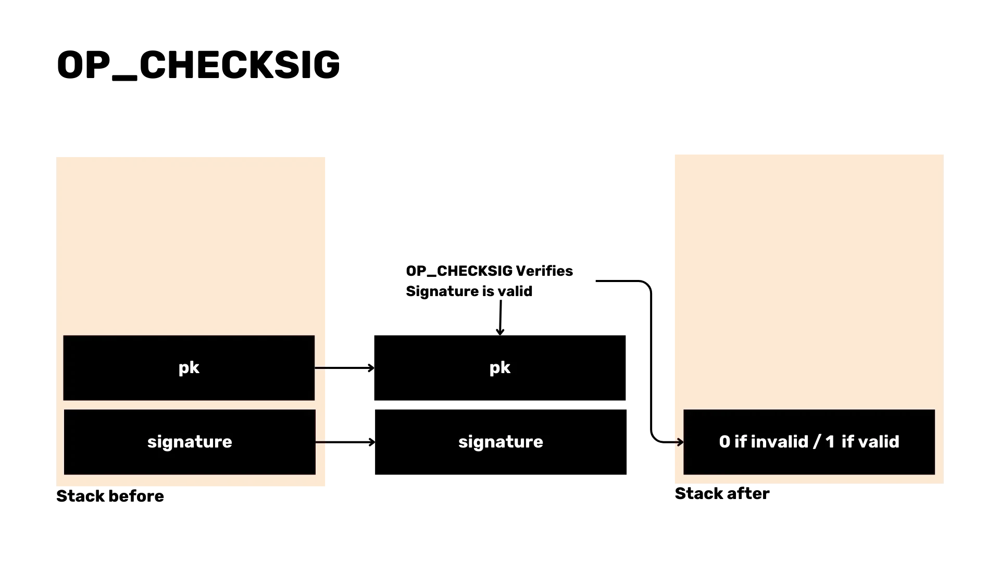

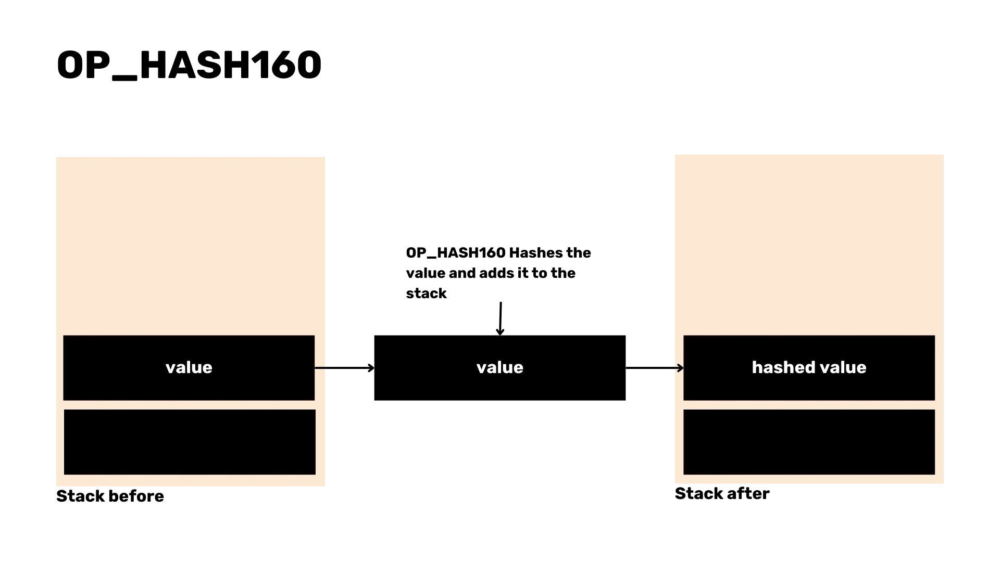


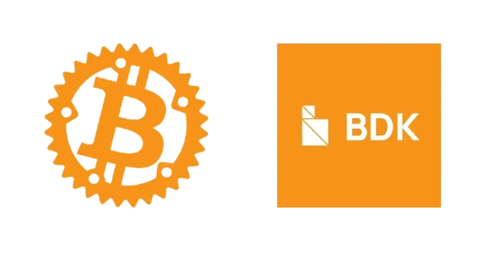


#### 구문 분석 기술


Rust에서는 다양한 기술을 사용하여 이러한 구조를 파싱할 수 있습니다:


- 리틀 엔디안 데이터를 읽을 때는 `From_LE_BYTE`를 활용하세요.
- 다양한 구조에 대한 구문 분석 로직을 처리하기 위해 사용자 정의 `파싱` 특성을 구현합니다.


```Rust
trait Parse: Sized {
fn parse(bytes: &[u8]) -> Result<(Self, &[u8]), Error>;
}
```


- 목록 및 `VarInt`, `U32`, `U64` 등과 같은 특정 유형에 대해 일반적으로 구문 분석을 구현합니다.


```Rust
impl Parse for i32 {
fn parse(bytes: &[u8]) -> Result<(Self, &[u8]), Error> {
let val = i32::from_le_bytes(bytes[0..4].try_into()?);
Ok((val, &bytes[4..]))
}
}
```


### 디버깅 및 테스트


구문 분석기가 올바르게 작동하는지 확인합니다:


- 구문 분석된 데이터를 알려진 블록 세부 정보(예: Mempool.space)와 비교합니다.
- 구문 분석된 트랜잭션 수와 블록 세부 정보가 예상 값과 일치하는지 확인합니다.


### 특수 케이스 처리 및 스크립트 구문 분석


#### '구문 분석' 기능 구현


블록 헤더와 트랜잭션을 포함한 전체 블록을 처리하기 위해 `파싱` 함수를 구현합니다. 여기에는 블록 데이터를 읽고 관련 필드를 추출하는 작업이 포함됩니다.


```Rust
impl Parse for Block {
fn parse(bytes: &[u8]) -> Result<(Self, &[u8]), Error> {
let (header, bytes) = Parse::parse(bytes)?;
let (transactions, bytes) = Parse::parse(bytes)?;

let block = Block {
header, transactions
};

Ok((block, bytes))
}
}
```


#### 블록 헤더 수정


블록 헤더 구조에서 트랜잭션 수를 제거하여 별도의 엔티티로 취급하도록 구문 분석 로직을 조정해야 합니다.


```Rust
impl Parse for BlockHeader {
fn parse(bytes: &[u8]) -> Result<(Self, &[u8]), Error> {
let (version, bytes) = Parse::parse(bytes)?;
let (prev_block, bytes) = Parse::parse(bytes)?;
let (merkle_root, bytes) = Parse::parse(bytes)?;
let (timestamp, bytes) = Parse::parse(bytes)?;
let (bits, bytes) = Parse::parse(bytes)?;
let (nonce, bytes) = Parse::parse(bytes)?;

let header = BlockHeader {
version, prev_block, merkle_root, timestamp, bits, nonce,
};

Ok((header, bytes))
}
}
```


#### 구조 정의


블록 헤더와 트랜잭션 목록을 모두 포함하는 새 구조체 '블록'을 정의합니다.


```Rust
struct Block {
header: BlockHeader,
transactions: Vec<Transaction>,
}
```


#### Rust 구문 Elements


오류 처리를 위해 물음표(`?`)와 같은 Rust 구문 Elements를 도입합니다. 이렇게 하면 코드가 단순화되고 가독성이 높아집니다.


#### 어설션


어설션을 추가하여 전체 블록을 처리한 후 구문 분석되지 않은 바이트가 남아 있지 않은지 확인합니다. 이렇게 하면 구문 분석 프로세스의 무결성을 보장할 수 있습니다.


#### 코인베이스 거래와 같은 특수한 경우


Block reward을 청구하는 데 사용되는 블록의 첫 번째 트랜잭션인 코인베이스 트랜잭션은 고유한 특성을 가지고 있습니다. 이러한 특수한 경우를 적절히 처리해야 합니다.


```Rust
struct OutPoint {
txid: [u8; 32],
vout: u32,
}

impl OutPoint {
fn is_coinbase(&self) -> bool {
self.txid == [0; 32] && self.vout == 0xFFFFFFFF
}
}
```


#### 스크립트 구문 분석 전략


트랜잭션에서 스크립트를 구문 분석하기 위해 `OP_CHECKSIG`, `OP_HASH160`, `OP_PUSH`와 같은 일반적인 옵코드에 초점을 맞추겠습니다. 이러한 스크립트를 구문 분석하는 것은 트랜잭션의 유효성을 검사하고 오류를 처리하는 데 매우 중요합니다.


```Rust
enum OpCode {
False,
Return,
Dup,
Equal,
CheckSig,
Hash160,
EqualVerify,
Push(Vec<u8>),
}

impl Parse for OpCode {
fn parse(bytes: &[u8]) -> Result<(Self, &[u8]), Error> {
match bytes[0] {
v @ 1..=75 => {
let data = bytes[1..(v as usize + 1)].iter().cloned().collect();
Ok((OpCode::Push(data), &bytes[(v as usize + 1)..]))
},
76 => {
let len = bytes[1] as usize;
let data = bytes[2..(len + 2)].iter().cloned().collect();
Ok((OpCode::Push(data), &bytes[(len + 2)..]))
},

0 => Ok((OpCode::False, &bytes[1..])),

106 => Ok((OpCode::Return, &bytes[1..])),
118 => Ok((OpCode::Dup, &bytes[1..])),
135 => Ok((OpCode::Equal, &bytes[1..])),

136 => Ok((OpCode::EqualVerify, &bytes[1..])),
169 => Ok((OpCode::Hash160, &bytes[1..])),
172 => Ok((OpCode::CheckSig, &bytes[1..])),

_ => todo!()
}
}
}
```


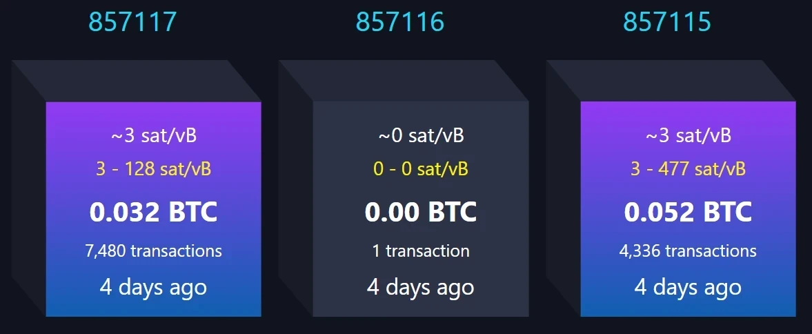


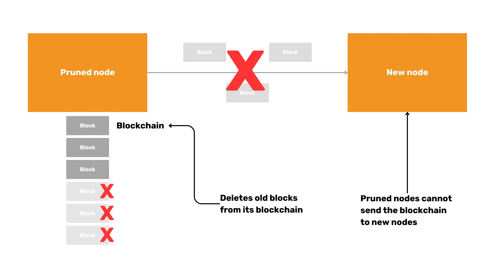


#### 스크립트 구문 분석의 과제


스크립트 구문 분석은 특히 코인베이스 트랜잭션에서 어려움을 겪을 수 있습니다. 정확한 구문 분석을 위해서는 에지 케이스를 고려하고 올바르게 처리하는 것이 중요합니다.


```Rust
impl Parse for Script {
fn parse(bytes: &[u8]) -> Result<(Self, &[u8]), Error> {
let (len, bytes) = VarInt::parse(bytes)?;
let mut script_bytes = &bytes[..len.0 as usize];
let mut opcodes = Vec::new();
while !script_bytes.is_empty() {
let (opcode, bytes) = OpCode::parse(script_bytes)?;
script_bytes = bytes;
opcodes.push(opcode);
}

Ok((Script(opcodes), &bytes[len.0 as usize..]))
}
}
```


#### 컴팩트 블록


현재 노드 간 데이터 전송의 효율성을 높이기 위해 컴팩트 블록을 사용하고 있습니다. 이는 Mempool에서 누락된 트랜잭션을 전송하고 노드가 이미 블록에 가지고 있던 트랜잭션으로 채운 다음 유효성을 검사함으로써 대역폭 사용량을 줄이고 동기화 속도를 높입니다.


#### 기존 라이브러리 사용


합의가 중요한 애플리케이션의 경우 버그를 방지하고 보안을 보장하기 위해 [Rust-Bitcoin](https://docs.rs/Bitcoin/latest/Bitcoin/) 또는 [Bitcoin-dev-kit](https://docs.rs/BDK/latest/BDK/)과 같은 기존 라이브러리를 사용하는 것이 좋습니다. 자체 파서를 구현하는 것은 교육적일 수 있지만 프로덕션 환경에서는 위험할 수도 있습니다.


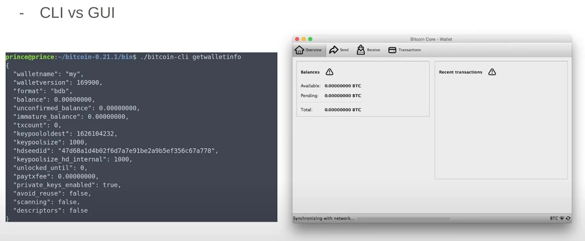


### Bitcoin의 효율성 및 보안 Mining


#### Mining의 효율성


Mining 빈 블록은 채굴자에게 더 효율적일 수 있습니다:


- 채굴자는 시간을 절약하기 위해 Mining 빈 블록을 시작합니다.
- 빈 블록은 이전 블록이 확인되면 전체 블록으로 전환하기 전에 빠르게 채굴할 수 있습니다.


#### Mining 빈 블록의 이유


타이밍 문제로 인해 빈 블록이 채굴되는 경우가 있습니다. 채굴자는 다음 블록에서 Mining을 시작할 때까지 전체 거래 목록을 받지 못했을 수 있으므로 빈 블록을 채굴하는 대신 빈 블록을 선택하게 됩니다.


#### 빈 블록의 악성 Mining


빈 블록의 악의적인 Mining은 가능하지만, 아직 관찰된 바는 없습니다. 빈 블록이 발생하는 주된 이유는 악의적인 의도보다는 타이밍 제약 때문입니다.


#### 빈 블록의 의미


빈 블록의 발생은 Mining 프로세스의 정상적인 측면이며 주로 타이밍 문제로 인해 발생합니다. 트랜잭션이 포함되지는 않지만 여전히 Blockchain을 확장하고 네트워크 보안에 기여합니다.


#### 보안의 중요성


Bitcoin Mining의 보안은 무엇보다 중요합니다. 채굴자와 개발자는 모범 사례를 준수하고 잘 검증된 라이브러리를 사용함으로써 Blockchain의 무결성을 보장하고 잠재적인 취약성으로부터 보호할 수 있습니다.


결론적으로, Bitcoin 블록과 Rust 트랜잭션을 파싱하려면 복잡한 구조를 이해하고 효율적인 파싱 기술을 구현해야 합니다. 특수 사례와 스크립트 구문 분석을 처리하려면 신중한 고려가 필요하며, 효율성과 보안에 집중해야 Bitcoin 네트워크의 견고성을 보장할 수 있습니다.


## Bitcoin 소프트웨어 개요 및 노드 구현


<chapterId>96d64781-fc27-5209-88d8-2acf00d05ea8</chapterId>

<professorId>0b05838c-24af-43ff-93be-896c907e0bc1</professorId>


:::video id=1d148008-9197-446f-afb5-628d4c3a5015:::

다니엘라 브로조니는 Bitcoin Layer 1 소프트웨어 스택에 대한 포괄적인 개요를 제공하며, Bitcoin 프로토콜의 기초를 구성하는 계층(예: Bitcoin 노드 및 Bitcoin 지갑)을 설명하고 Bitcoin 라이브러리 소개와 Bitcoin 개발 키트(BDK)에 대한 심층 분석을 통해 Bitcoin 소프트웨어를 구축하는 방법에 대해 설명합니다.


### Bitcoin 소프트웨어 개요


Bitcoin의 소프트웨어 스택은 운영의 기본이며 노드와 지갑을 포함한 다양한 Elements으로 구성됩니다. 이 생태계의 중요한 부분은 Bitcoin 개발 키트(BDK)이며, 이에 대해서는 나중에 자세히 살펴보겠습니다. 먼저 Bitcoin 네트워크 내 노드의 역할에 대해 알아보겠습니다.


#### Bitcoin 노드


Bitcoin 노드는 Bitcoin 네트워크의 중추입니다. 이들은 서로 연결하고, Exchange 트랜잭션과 블록을 생성하며, 들어오는 데이터를 검증합니다. 노드에는 다양한 유형이 있으며, 각각 고유한 목적을 수행합니다:


- 전체 노드**: 이 노드는 전체 Blockchain를 저장하고 모든 트랜잭션과 블록을 검증합니다. 높은 수준의 보안을 제공하며 네트워크의 탈중앙화를 위해 필수적입니다.


  - 아카이브 노드**: 전체 노드의 하위 집합인 아카이브 노드는 모든 Blockchain 데이터를 보유하므로 기록 분석 및 디버깅에 유용합니다.


  - pruned 노드**: pruned 노드는 Blockchain의 일부만 유지하여 더 이상 유효성 검사에 필요하지 않은 오래된 데이터를 제거함으로써 디스크 공간을 절약합니다.


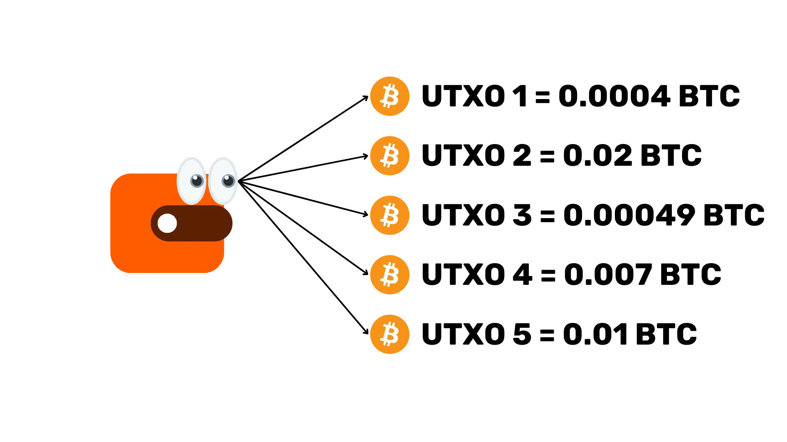


#### Bitcoin core


Bitcoin core는 가장 널리 사용되는 Full node 구현입니다. Full node와 Wallet의 두 가지 기능을 모두 수행합니다. Bitcoin core의 주요 측면은 다음과 같습니다:


- 사용성**: 명령줄 Interface(CLI)과 그래픽 사용자 Interface(GUI)을 통해 사용할 수 있습니다.
- 오픈 소스 특성**: 이 코드는 오픈 소스이므로 개발자가 기여하고 그 작동 방식을 면밀히 검토할 수 있습니다.
- 언어**: 강력한 성능과 안정성을 보장하는 파이썬 테스트와 함께 C++로 작성되었습니다.


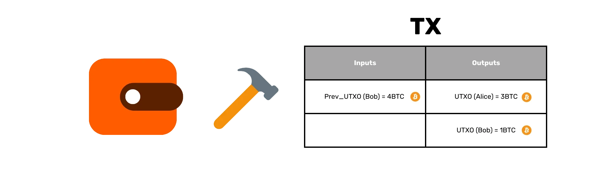


##### Bitcoin core 살펴보기


Bitcoin core을 직접 경험해 보려면 Git을 사용하여 테스트를 컴파일하고 실행할 수 있습니다. 이 과정에는 다음이 포함됩니다:


- 코드베이스를 컴파일하여 실행 가능한 버전을 생성합니다. [Bitcoin github](https://github.com/Bitcoin/Bitcoin)에서 doc/build-\*.md에 액세스하여 지침을 확인하세요.


```Bash
./autogen.sh
./configure
make # use "-j N" for N parallel jobs
make install # optional
```


- 테스트를 실행하여 모든 것이 올바르게 작동하는지 확인합니다. 지침은 [여기](https://github.com/Bitcoin/Bitcoin/blob/master/test/README.md)에서 확인할 수 있습니다


```Bash
make check

#individual tests can be run directly calling the test script e.g:
test/functional/feature_rbf.py

#run all possible tests
test/functional/test_runner.py
```


- 특정 기능을 검증하기 위해 Python으로 테스트를 만들고 실행합니다. Example.py](https://github.com/Bitcoin/Bitcoin/blob/master/test/functional/example_test.py) 파일은 RPC 및 P2P 인터페이스를 모두 사용하는 테스트 사례에 대한 많은 주석이 달린 예제입니다.


#### 대체 노드 구현


Bitcoin core 외에도 몇 가지 대체 노드 구현이 있습니다:


- Bitcoin Knots**: Bitcoin core보다 더 많은 고급 기능을 제공하며 더 많은 공간과 메모리를 차지합니다.
- LibBitcoin**: 유연하고 모듈화된 구현.
- btcd**: Go로 작성되어 다양한 디자인 철학을 제공합니다.


이러한 대안을 구현하는 데에는 특히 합의 규칙과 관련하여 자체적인 위험이 따릅니다. 확립된 검증 규칙에서 벗어나면 포크나 불일치가 발생할 수 있습니다. Bitcoin 커널 프로젝트는 합의 코드를 중앙 집중화하여 구현 전반의 일관성을 보장함으로써 이러한 위험을 완화하고자 합니다.


### Bitcoin 지갑 및 보안


Bitcoin 지갑은 Bitcoin 보유 자산을 안전하게 관리하는 데 매우 중요합니다. 지갑은 다양한 형태로 제공되며, 각각 고유한 기능과 보안 고려 사항이 있습니다.


#### Bitcoin 지갑의 종류


1. **수탁자 대 비수탁자**:


   - 수탁자 지갑**: 제3자가 관리하며 편리함을 제공하지만 관리자에 대한 신뢰가 필요합니다.
   - 비수탁자 지갑**: 사용자가 직접 관리하여 보안과 개인정보 보호를 강화합니다.


2. **데스크톱 대 모바일**:


   - 데스크톱 지갑**: 일반적으로 기능이 더 풍부하고 안전합니다.
   - 모바일 지갑**: 편리함과 휴대성을 제공합니다.


3. **On-Chain 대 번개**:


   - On-Chain 지갑**: Bitcoin Blockchain와 직접 상호 작용합니다.
   - 라이트닝 지갑**: 더 빠르고 저렴한 거래 촉진 off-chain.


4. **Cold 지갑 대 Hot 지갑**:


   - Cold 지갑**: 인터넷에 연결되지 않아 해킹에 대한 탁월한 보안을 제공합니다.
   - Hot 지갑**: 인터넷에 연결되어 있어 접근성은 높지만 보안이 취약합니다.


#### Cold Wallet 보안


Cold 지갑은 보안성이 뛰어나다는 평가를 받고 있습니다. 오프라인 상태로 유지되므로 본질적으로 온라인 해킹에 강합니다. 그러나 Cold 지갑을 통해 수행되는 거래가 안전하고 정확한지 확인하여 실수로 악의적인 공격자에게 Bitcoin를 전송하는 것을 방지하는 것이 중요합니다.


#### 시계 전용 지갑


시계 전용 지갑에는 공개 키만 포함되어 있어 사용자는 Bitcoin을 수신하고 지출 기능 없이 잔액을 모니터링할 수 있습니다. 이 기능은 보유 자산을 면밀히 주시해야 하는 분들을 위해 Layer의 보안을 추가합니다.


#### Bitcoin Wallet의 기본 기능


유형에 관계없이 모든 Bitcoin Wallet은 세 가지 기본 기능을 수행합니다:


1. **Bitcoin 수신**: generate는 수신 트랜잭션을 주소 지정하고 모니터링합니다.

2. **Bitcoin**를 전송합니다: 트랜잭션을 생성하고 네트워크에 브로드캐스트합니다.

3. **잔액 표시**: Wallet의 현재 잔액을 표시합니다.


#### Bitcoin 지갑의 역할


- Bitcoin 지갑은 키체인 역할을 하며 암호화 키를 보관하고 생성합니다.


- Blockchain을 통해 들어오는 트랜잭션을 모니터링합니다.


- 미사용 거래 출력(UTXO)을 선택하고, 입력과 출력을 설정하고, 개인정보 보호 및 수수료를 최적화하여 거래를 생성합니다.


#### Wallet 로직의 재사용성


모든 Bitcoin 지갑이 비슷한 기능을 공유한다는 점을 감안하면, Wallet 로직을 반복적으로 재작성하는 것은 비효율적입니다. 이 점이 바로 Bitcoin 개발 키트(BDK)의 역할입니다.


### Bitcoin 개발 키트(BDK) 및 기술 개념


Bitcoin 개발 키트(BDK)는 Bitcoin 지갑의 생성 및 관리를 간소화하도록 설계된 라이브러리입니다.


#### BDK 개요


BDK은 Rust Bitcoin 위에 구축된 더 높은 수준의 기능을 제공하여 Wallet 생성을 간소화합니다. 바인딩을 통해 Kotlin, Swift, Python 등 여러 프로그래밍 언어를 지원합니다.


#### 기타 Bitcoin 라이브러리


파이썬, 자바스크립트, 자바, 고, C 등 다양한 프로그래밍 언어를 지원하는 수많은 Bitcoin 라이브러리는 Bitcoin 개발을 위한 다양한 도구를 제공합니다.


#### 주요 기술 개념


1. **설명자**: 디스크립터는 키에서 Bitcoin 스크립트와 주소를 도출하는 방법을 설명하여 보다 유연하고 강력한 Wallet 기능을 사용할 수 있도록 합니다.

2. **PSBT(부분 서명된 Bitcoin 트랜잭션)**: PSBT은 여러 서명이 필요한 거래를 위한 형식으로, 협업 거래를 촉진하고 보안을 강화합니다.

3. **Rust 구문**: 널 안전성을 위한 'Option'과 오류 처리를 위한 'Result' 유형과 같은 Rust의 주요 개념은 BDK를 효과적으로 이해하고 사용하는 데 필수적입니다.


#### 트랜잭션 생성 및 관리


BDK은 트랜잭션 구축, 서명 및 브로드캐스팅 프로세스를 간소화합니다:


1. **거래 구축**: 받는 사람, 금액, 수수료를 지정합니다.

2. **거래 서명**: PSBT을 사용하여 서명을 수집합니다.

3. **트랜잭션 브로드캐스트**: 확정된 트랜잭션을 네트워크에 전송합니다.


#### BDK의 워크플로 예시


- Wallet**을 설정합니다: 설명자를 사용하여 Wallet을 초기화합니다.


```Rust
use bdk::{Wallet, SyncOptions};
use bdk::database::MemoryDatabase;
use bdk::blockchain::ElectrumBlockchain;
use bdk::electrum_client::Client;
use bdk::bitcoin;

fn main() -> Result<(), bdk::Error> {
let wallet = Wallet::new(
"tr(tprv8ZgxMBicQKsPf6WJ1Rr8Zmdsr6MaACS5K3tHw3QDQmFbkEsdnG3zAZzhjEgEtetL1jwZ5VAL85UaaFzUpAZPrS7aGkQ3GdM75xPu4sUxSiF/*)",
None,
bitcoin::Network::Testnet,
MemoryDatabase::default(),
)?;

Ok(())
}
```


- generate 주소**: Testnet Faucet에서 Bitcoin를 수신할 새 주소를 만듭니다.


```Rust
//import AddressIndex outside the main function
use bdk::wallet::AddressIndex;

//Function to add isnide main function
let address = wallet.get_address(AddressIndex::New)?;

```


- 잔액 확인**: 먼저 일렉트럼에 연결하고 Wallet을 동기화한 다음 Wallet에서 잔액을 가져와서 Wallet의 잔액을 모니터링합니다.


```Rust
//connect to Electrum server and save the blockchain
let client = Client::new("ssl://electrum.blockstream.info:60002")?;
let blockchain = ElectrumBlockchain::from(client);

//sync wallet to the blockchain received
wallet.sync(&blockchain, SyncOptions::default())?;

//get the balance from your wallet
let balance = wallet.get_balance()?;
println!("This is your wallet balance: {}", balance);
```


- 트랜잭션 작성, 서명 및 브로드캐스트**: 트랜잭션을 생성하고 마무리한 다음 네트워크에 브로드캐스트합니다.


```Rust
//Add to the imports
use bdk::bitcoin::Address;
use bdk::{SignOptions};
use std::str::FromStr;
use bdk::blockchain::Blockchain;

//build a transaction psbt
let mut builder = wallet.build_tx();
let recipient_address = Address::from_str("tb1qlj64u6fqutr0xue85kl55fx0gt4m4urun25p7q").unwrap();

builder
.drain_wallet()
.drain_to(recipient_address.script_pubkey())
.fee_rate(FeeRate::from_sat_per_vb(2.0))
.enable_rbf();
let (mut psbt, tx_details) = builder.finish()?;
println!("This is our psbt: {}", psbt);
println!("These are the details of the tx: {:?}", tx_details);

//Sign the PSBT
let finalized = wallet.sign(&mut psbt, SignOptions::default())?;
println!("Is my PSBT Signed? {}", finalized);
println!("This is my PSBT finalized: {}", psbt);


let tx = psbt.extract_tx();
let tx_id = tx.txid();
println!("this is my Bitcoin tx: {}", bitcoin::consensus::encode::serialize_hex(&tx));
println!("this is mny tx id: {}", tx_id);

//Broadcast the transaction
blockchain.broadcast(&tx)?;
```


#### txid 인쇄 및 브로드캐스트 거래


transaction ID(txid)을 할당하고 인쇄하면 Mempool.space와 같은 플랫폼에서 모니터링할 수 있습니다. 트랜잭션 브로드캐스트는 `Blockchain.broadcast` 방법을 사용하여 수행할 수 있으며, 성공적인 전파를 위해서는 트랜잭션의 세부 사항과 상태를 확인하는 것이 중요합니다.


#### BDK 유틸리티 및 개인정보 보호 고려 사항


BDK은 Bitcoin Wallet 개발을 간소화하는 데 매우 유용합니다. 개인 정보 보호를 강화하려면 Electrum, Explora, 개인용 Bitcoin core 노드와 같은 도구를 사용하는 것이 좋습니다.


#### 프로그래밍 언어


Bitcoin 프로젝트를 개발할 때는 안전성과 효율성 때문에 Rust이 선호되는 경우가 많습니다. 그러나 특정 프로젝트 요구 사항과 개발자의 전문 지식에 따라 언어 선택은 달라질 수 있습니다.


#### BDK 종속성


BDK는 Rust-Bitcoin 및 Rust-Miniscipt을 비롯한 몇 가지 주요 종속성에 의존합니다. 데이터베이스 관리 및 암호화를 위해 추가 라이브러리가 사용될 수 있습니다.


Bitcoin 노드와 지갑부터 Bitcoin 개발 키트(BDK)에 이르기까지 이러한 구성 요소를 이해하면 더 큰 자신감과 역량으로 Bitcoin 생태계를 탐색할 수 있습니다. 이러한 지식을 바탕으로 강력하고 안전한 Bitcoin 애플리케이션을 개발하여 이 혁신적인 기술의 지속적인 발전에 기여할 수 있습니다.


# Lightning Network


<partId>d7ac2ad7-a4b3-564f-8a8d-cfec5297b3a5</partId>


## 결제 채널 내역


<chapterId>a0b11c6e-c0ff-5e65-b809-b2ab9a2fc37b</chapterId>

<professorId>880c7fa7-8d4c-4c9b-81b4-bc61ed256516</professorId>


:::video id=b90f19a3-a95e-4cd1-8c55-41016f3339cb:::

### 결제 채널 내역


Blockchain 기술 내 최신 결제 솔루션에 대한 강의에 오신 것을 환영합니다. 오늘은 멀티홉 잠금장치(MHL)와 Lightning Network의 역사적 맥락과 주요 개발 사항을 살펴보겠습니다.


#### 개요 및 역사적 맥락


멀티홉 잠금(MHL)과 Lightning Network은 네트워크 전반에서 효율적이고 안전한 소액 결제를 가능하게 하는 Blockchain 기술의 발전된 개념입니다. 역사적으로 이러한 혁신의 필요성은 Blockchain 기술, 특히 Bitcoin의 초기 배포에서 관찰된 비효율성과 한계로 인해 발생했습니다. 더 자세히 살펴보면서 주제 기반 구조와 계층화된 접근 방식이 어떻게 Blockchain 트랜잭션에 혁신을 가져왔는지 이해하게 될 것입니다.


### 주제 기반 구조


MHL과 Lightning Network의 도입은 기존의 선형적인 Blockchain 거래에서 보다 정교하고 다층적인 시스템으로 패러다임이 전환되었음을 의미합니다. 이러한 혁신은 거래를 특정 주제 또는 세그먼트로 구분함으로써 초기 Blockchain 구현에 내재된 많은 문제를 해결하는 보다 확장 가능하고 안전한 결제 인프라를 가능하게 합니다.


### Bitcoin 관련 문제


Blockchain 기술의 선구자인 Bitcoin은 거래가 전체 네트워크에 걸쳐 브로드캐스트되는 탈중앙화 시스템을 도입했습니다. 이 방식은 혁신적이긴 하지만 본질적으로 비효율적입니다. 네트워크의 모든 노드가 각 트랜잭션의 유효성을 검사해야 하므로 특히 거래량이 많을 때 상당한 지연과 병목 현상이 발생할 수 있습니다.


Bitcoin의 탈중앙화 검증 프로세스에는 상당한 연산 자원이 필요합니다. 각 트랜잭션은 여러 노드에서 검증하고 기록해야 하므로 막대한 양의 에너지와 처리 능력이 소모됩니다. 이는 운영 비용을 증가시킬 뿐만 아니라 네트워크 대역폭에 부담을 주어 트랜잭션 수수료 증가와 처리 시간 지연으로 이어집니다.


Bitcoin의 탈중앙화는 핵심적인 강점 중 하나이지만, 동시에 상당한 도전 과제를 안고 있습니다. Blockchain의 공공성은 모든 거래가 모든 사람에게 공개된다는 것을 의미하므로 프라이버시 문제가 제기될 수 있습니다. 또한, 수많은 노드 간의 합의가 필요하기 때문에 Mining의 권한이 소수의 대형 기관에 집중되어 중앙화 압력이 발생할 수 있습니다.


### 솔루션으로서의 결제 채널


_Gold Standard Metaphor_


Address의 비효율성과 개인정보 보호 문제를 해결하기 위해 결제 채널이 실행 가능한 해결책으로 제안되었습니다. 소액 결제 채널을 사용하면 off-chain에서 트랜잭션이 발생하여 전체 네트워크에서 지속적인 데이터 공유의 필요성을 줄일 수 있습니다. 이는 Blockchain의 부담을 크게 완화하여 더 빠르고 저렴한 거래를 가능하게 합니다.


결제 채널의 기본 원칙은 트랜잭션 off-chain을 받는 개념입니다. 모든 거래를 전체 네트워크에 브로드캐스팅하는 대신, 당사자들은 결제 채널을 개설하고 서로 간에 수많은 거래를 진행할 수 있습니다. 채널의 개설과 종료만 Blockchain에 기록되므로 효율성과 개인정보 보호가 크게 향상됩니다.


결제 채널의 off-chain 특성에도 불구하고 On-Chain 거래를 강제할 수 있는 옵션이 남아 있습니다. 분쟁이 발생하거나 한 당사자가 속이려고 시도하는 경우 채널의 최신 상태를 Blockchain로 전송하여 합의된 거래가 준수되고 자금이 올바르게 할당되었는지 확인할 수 있습니다.


결제 채널은 Blockchain 기술의 중요한 도약을 의미하며, Bitcoin와 관련된 많은 근본적인 문제를 해결하면서 확장 가능하고 안전한 거래 방법을 제공합니다. 이러한 기반 위에 혁신을 거듭하고 구축해 나감에 따라 Blockchain의 미래는 점점 더 밝아 보입니다.


결론적으로, Bitcoin의 역사적 맥락과 과제, 그리고 MHL, Lightning Network, 결제 채널을 통해 제안된 혁신적인 솔루션을 이해하면 Blockchain 기술의 현재 환경과 미래 잠재력을 종합적으로 파악할 수 있습니다.


## 원자 라우팅의 역사


<chapterId>28be7b31-e6b2-5eea-a5ed-62ce0a154b6e</chapterId>

<professorId>880c7fa7-8d4c-4c9b-81b4-bc61ed256516</professorId>


:::video id=059a714b-4fe9-4266-acb0-6fe5af491662:::

이전 논의에서 기본 결제 채널의 기본 사항에 대해 살펴보았습니다. 이러한 채널을 통해 두 참가자(예: Alice 및 Bob)가 서로 원활하게 직접 거래할 수 있습니다. 하지만 이 모델에는 눈에 띄는 한계가 있습니다: Alice은 Bob과만 거래할 수 있고 찰리와 같은 다른 참가자와는 각각 별도의 채널을 설정하지 않는 한 거래할 수 없습니다. 여러 채널의 필요성은 비효율성과 확장성 문제로 이어지는데, Alice이 거래해야 하는 모든 참여자와 직접 채널을 개설하는 것은 비현실적이기 때문입니다.


### 중앙 집중식 홉


이러한 한계를 극복하기 위해 2012년에 매니 로젠펠드는 중앙화된 홉이라는 개념을 제안했습니다. 이 모델은 사용자 간에 결제를 라우팅하기 위해 TrustPay와 같은 중앙화된 결제 프로세서를 도입했습니다. 이 방식은 여러 개의 직접 채널의 필요성을 줄일 수 있지만 상당한 단점이 있습니다. 중앙 집중식 홉은 보안 문제, 신뢰 문제, 개인정보 침해, 사기 가능성, 검열 및 신뢰성 문제를 안고 있습니다. 사용자는 거래를 원활하게 하기 위해 이러한 중앙화된 주체를 신뢰해야 하며, 이는 탈중앙화 정신에 반하는 것입니다.


### 해시된 시간 잠금 Contract(HTLC) 및 구현


중앙화된 홉의 한계와 단점으로 인해 보다 안전하고 탈중앙화된 솔루션이 필요했습니다. 이러한 필요성에 따라 2015년 Joseph Poon과 Thaddeus Dreijer가 Lightning Network의 일부로 제안한 해시된 시간 잠금 Contract(HTLC)가 개발되었습니다. HTLC는 시간 잠금과 Hash 잠금의 원리를 결합하여 트랜잭션의 원자성과 무신뢰성을 보장합니다. 즉, 트랜잭션이 완전히 완료되거나 전혀 발생하지 않으므로 불완전한 결제와 관련된 위험을 완화할 수 있습니다.


HTLC의 워크플로에는 여러 중개자를 통한 안전한 라우팅을 보장하는 다단계 프로세스가 포함되어 있습니다. Alice이 중개자 Bob, 캐롤, 다이애나를 통해 에릭에게 지급하고자 한다고 가정해 보겠습니다. 프로세스의 각 단계에는 시간 잠금과 금액이 줄어드는 Commitment 트랜잭션을 생성하는 것이 포함됩니다. 필요한 경우 마지막 단계를 Bitcoin 네트워크로 브로드캐스트하여 트랜잭션을 마무리할 수 있습니다.


HTLC에서 Alice은 비밀 "R"의 Hash로 지불을 잠급니다 Bob, 캐롤, 다이애나는 각각 후속 중개자와 유사한 계약을 생성하여 정확한 비밀 "R"을 제시하는 경우에만 자금을 청구할 수 있도록 합니다 이 메커니즘은 원자성을 보장하며, 결제가 완전히 완료되거나 실패하여 부분적인 자금 손실을 방지합니다.


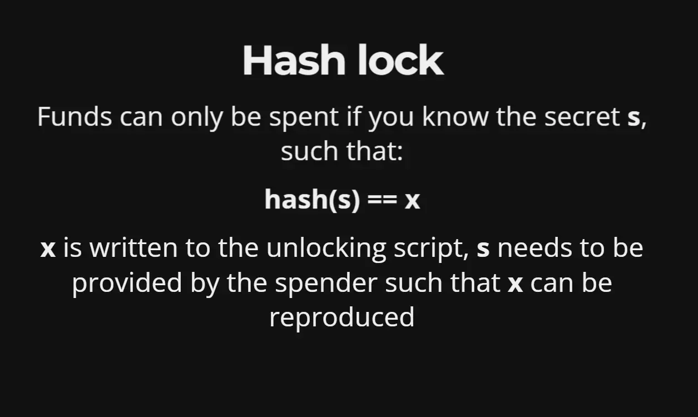_Hash lock function_


### 실용적인 고려 사항 및 네트워크 역학


실제 시나리오에서 Alice의 결제 흐름에는 Bob, 캐롤, 다이애나와 같은 여러 중개자를 통해 에릭에게 결제하는 것이 포함됩니다. 이 체인의 각 참가자는 이전 참가자로부터 자금을 인출할 책임이 있습니다.


#### 채널 상태 업데이트


채널은 참여자 간의 상호 합의와 서명에 따라 상태를 업데이트합니다. 예를 들어, Alice과 Bob은 트랜잭션 조건에 동의한다면 비밀 'R'을 사용하지 않고도 채널 상태를 업데이트할 수 있습니다.


#### 원자성 보장


HTLC 메커니즘은 시간 잠금과 서명을 사용해 원자성을 보장합니다. 이 안전장치는 결제 프로토콜이 완전한 성공 또는 실패를 보장하여 부분적인 자금 손실을 방지합니다.


_Combine restrictions_


#### 인센티브 및 책임


다이애나나 캐롤과 같은 중개자는 네트워크 내에서 올바르게 행동하도록 인센티브를 받습니다. 그렇게 하지 않을 경우 그 결과는 일반적으로 중개자 본인에게만 영향을 미치므로 책임감 있는 행동을 장려합니다.


### 실용적인 고려 사항


하지만 결제 경로에 홉이 많으면 지연 시간, 수수료, 잠재적인 불안정성이 증가할 수 있습니다. 여러 채널을 열면 라우팅에 필요한 홉 수를 줄여 전반적인 효율성을 높일 수 있습니다.


#### 채널 그래프 및 유동성


네트워크 내 노드는 공개적으로 발표된 채널 그래프에 포함되거나 발표되지 않은 채로 남아있을 수 있습니다. 노드가 결제를 성공적으로 전달하려면 충분한 잔액이 필요하기 때문에 이러한 채널의 유동성은 효과적인 라우팅에 중요한 역할을 합니다.


#### 소스 라우팅 및 개인정보 보호


Alice는 결제 경로를 결정하기 위해 네트워크 토폴로지에 대한 지식이 있어야 합니다. 소스 라우팅은 여러 중개자를 통한 결제 라우팅의 복잡성에도 불구하고 개인 정보를 보호하기 위해 사용됩니다.


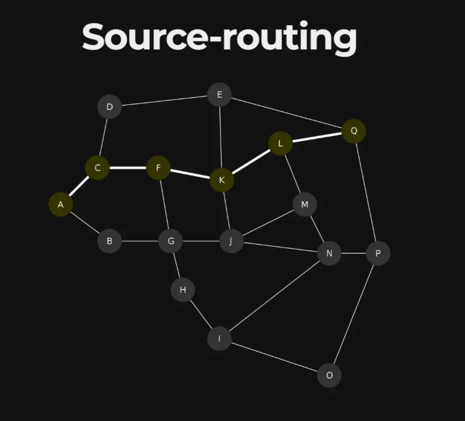_Source Routing Path_


#### 결론


요약하자면, 적절한 노드 운영은 아토믹 결제를 보장하며, Lightning Network은 리플과 같은 기존 결제 시스템이 직면한 많은 문제를 해결하는 것을 목표로 합니다. HTLC와 전략적 라우팅을 활용함으로써 Lightning Network은 탈중앙화 결제를 위한 보다 확장 가능하고 효율적이며 안전한 솔루션을 제공합니다.


## Bolt 검토


<chapterId>ba4b09ae-81de-53f2-8c15-316f037aaea9</chapterId>


:::video id=f0d17fe4-d793-4b90-924e-b551db501fbb:::

Bitcoin 네트워크는 Trustless 가치 Exchange 시스템으로 운영되며, 주로 거래가 공개 Ledger에 기록되는 결제 Layer의 역할을 합니다. 이는 보안과 불변성을 보장하지만 특히 거래 속도와 수수료 측면에서 한계가 있습니다. 따라서 Bitcoin는 일상적인 소규모 거래에는 비효율적일 수 있습니다.


Bitcoin Blockchain 위에 두 번째 Layer로 작동하는 Lightning Network을 입력합니다. 이 결제 네트워크는 신속하고 저렴한 거래를 촉진하도록 설계되었습니다. 두 당사자 간에 결제 채널을 개설하면 off-chain을 거래하고 초기 잔액과 최종 잔액만 Bitcoin Blockchain에 기록할 수 있습니다. 이렇게 하면 메인 네트워크의 부하가 크게 줄어들어 확장성이 향상되고 소액 거래가 가능해집니다.


개념을 더 잘 이해하려면 바 탭의 비유를 생각해 보세요. 바에서 탭을 열면 음료를 마실 때마다 계산하지 않고 계속 주문할 수 있습니다. 마지막으로 밤이 끝날 때 총 금액을 정산합니다. 마찬가지로, 라이트닝 채널은 여러 트랜잭션(off-chain)을 허용하며, 채널이 닫힐 때만 정산(On-Chain)됩니다. 또 다른 비유는 공항으로, 여러 노드를 통해 결제를 라우팅하는 것은 목적지에 도착하기 위해 환승 항공편을 이용하는 것과 비슷합니다. 각 노드(또는 "항공편")는 결제가 필요한 곳으로 이동하도록 도와주므로 효율적인 라우팅을 보장합니다.


_The airport analogy of LN_


본질적으로 Lightning Network는 Bitcoin 네트워크의 한계를 보완하여 단순한 결제용 Layer에서 일상적인 거래를 효율적으로 처리할 수 있는 다목적 시스템으로 탈바꿈합니다.


### **Lightning Network 사양**


Lightning Network 프로토콜은 10개의 BOLT(Basis of Lightning Technology)를 통해 세심하게 정의되어 있습니다. 이 볼트들은 밀라노에서 열린 컨퍼런스에서 합의된 것으로, Lightning Network의 다양한 구현을 위한 기반이 됩니다.


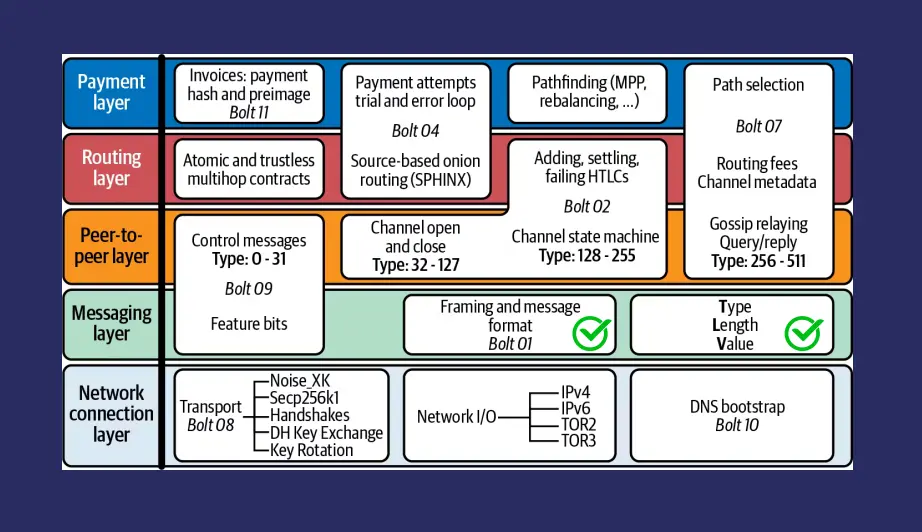_BOLT Diagram _


#### Bolt 1(기본 프로토콜)


Bolt 1은 서로 다른 구현에서 메시지를 균일하게 이해할 수 있도록 유형-길이-값(TLV) 구조를 사용하여 메시지 형식을 설명합니다. 통신은 일반적으로 특정 TCP 포트를 통해 이루어지며, 메시지는 다음과 같이 분류할 수 있습니다:


- 통신 메시지**: 여기에는 연결을 설정하고, 오류를 처리하고, 연결 상태를 조사하고, 트래픽을 난독화하는 '초기화', '오류', '경고', '핑', '퐁' 메시지가 포함됩니다.
- 채널 설정 메시지**: 채널 설정 단계에 매우 중요한 메시지입니다.
- 채널 상태 메시지**: 이 메시지는 활성 채널 내에서 업데이트를 처리하여 양 당사자가 동기화되도록 합니다.
- 가십 메시지**: 네트워크 토폴로지 검색 및 업데이트에 사용됩니다.
- 실험용 메시지**: 네트워크를 중단하지 않고 새로운 기능을 테스트할 수 있습니다.


#### Bolt 2(채널 수명 주기)


Bolt 2는 채널 구축부터 정상 운영, 그리고 최종적으로 정산에 이르는 채널 라이프사이클에 대해 자세히 설명합니다. 주요 프로세스는 다음과 같습니다:


- 채널 설정**: 이 단계에서는 당사자가 채널을 개설하고 Exchange 서명을 한 후 펀딩 거래를 생성합니다.
- 정상 작동**: 여기서 채널 상태는 Hash 시간 고정 계약(HTLC)을 사용하여 지속적으로 업데이트됩니다. Commitment 및 해지 메시지는 양 당사자가 현재 상태에 동의하는지 확인합니다.
- 정산**: 여기에는 일반적으로 상호 합의와 수수료 협상을 통해 채널을 폐쇄하여 무기한 폐쇄 루프에 들어가지 않고 거래를 마무리하는 것이 포함됩니다.


#### 업데이트 메커니즘


HTLC는 네트워크의 결제 라우팅에서 중추적인 역할을 담당하며, 신뢰 없이도 안전한 거래를 가능하게 합니다. Commitment과 해지 메시지는 채널 상태에 대한 상호 동의를 보장하고 사기를 방지합니다.


#### 특별 메시지


'업데이트 수수료'와 같은 특정 메시지는 Miner 트랜잭션에 대한 Commitment 수수료를 조정하고, '채널 재설정' 메시지는 연결 해제 후 두 피어가 동기화 상태를 유지하도록 합니다.


#### 채널 닫기


부정 행위가 감지되면 상호 합의, 일방적인 조치 또는 처벌을 통해 채널을 폐쇄할 수 있습니다. 적절한 채널 폐쇄는 거래를 안전하게 마무리합니다.


#### 유동성 관리를 위한 스왑


스왑을 통해 채널을 닫지 않고도 On-Chain을 인출하고 효율적인 유동성 관리를 할 수 있습니다. 이 프로세스를 개선하기 위해 스플라이싱과 같은 향후 솔루션이 개발되고 있습니다.


#### 보안 조치


Commitment 트랜잭션은 자금을 보호하고 도난을 방지하기 위해 nLockTime, OPCheckSequenceVerify, 해지 키와 같은 메커니즘을 통합합니다.


### 라우팅 및 어니언 라우팅


_Onion Routing diagram _


결제는 여러 노드를 통해 전송되는 암호화된 패킷을 생성하는 Onion 라우팅을 사용하여 라우팅됩니다. HTLC는 거래를 보호하여 개인정보와 보안을 보장합니다.


### Invoice 구조


Lightning Network 송장(Bolt 11)은 Bech32로 인코딩되며 결제 Hash, 설명, 만료일 등의 세부 정보를 포함합니다. 각 Invoice는 재사용 문제를 방지하기 위해 한 번만 사용해야 합니다.


_BOLT11 Invoice_


#### 암호화 및 인증


핸드셰이크 절차 및 인증(Poly1305)을 통한 암호화(Chacha20)는 라이트닝 트랜잭션에서 메시지 무결성과 프라이버시를 보장합니다.


#### 대안


LNURL, Keysend, Bolt 12와 같은 다른 결제 요청 방법은 다양한 기능과 채택 수준을 제공하여 네트워크에 유연성을 제공합니다.


#### 네트워크 검색


Lightning Network의 네트워크 검색은 초기 IRC(인터넷 릴레이 통신) 사용에서 Bolt 7에 정의된 보다 정교한 프로토콜로 발전했습니다. 이 프로토콜은 특정 라이트닝 메시지(일반적으로 가십 메시지라고 함)를 사용하여 네트워크 토폴로지를 검색하고 유지 관리합니다.


#### Bolt7 메시지


주요 Bolt 7 메시지에는 다음이 포함됩니다:


- 노드 공지**: 이 메시지는 노드의 존재를 알립니다.
- 채널 공지**: 이 메시지는 새 채널이 생성되었음을 네트워크에 알립니다.
- 공지 서명**: 이는 생방송 메시지의 신뢰성을 보장합니다.
- 채널 업데이트**: 이 메시지는 수수료 구조 및 최대 HTLC 금액 등 채널에 대한 업데이트를 알립니다.


#### 채널 공지 프로세스


이 과정은 로컬 피어가 신원 및 채널 세부 정보를 교환하는 것으로 시작됩니다. 서명과 자금 거래를 확인한 후 네트워크 피어에게 채널을 발표하여 전체 네트워크가 최신 토폴로지 변경 사항으로 업데이트되도록 합니다.


#### DNS 부트스트랩


라이트닝 피어를 검색하는 것은 IP 및 노드 정보를 제공하는 DNS 및 Bitcoin DNS seed 쿼리를 통해 용이하게 이루어집니다. 이 초기 검색 메커니즘은 노드가 네트워크에 빠르게 연결하는 데 도움이 됩니다.


#### 기능 공지 사항


노드는 지원되는 기능을 브로드캐스트하여 이전 버전과의 호환성을 보장하는 동시에 선택적으로 기능을 개선할 수 있습니다. 이러한 유연성은 프로토콜이 발전하더라도 모든 노드가 원활하게 상호 작용할 수 있도록 보장합니다.


#### Bolt11 송장 처리


네트워크는 Bolt 11 인보이스의 고유성을 보장하여 동일한 Invoice에 대한 중복 결제를 방지합니다. Invoice를 재사용하는 경우 네트워크 노드가 이중 결제를 차단하고 방지하여 거래 무결성을 유지합니다.


#### 음성 데이터 전송


Lightning Network을 통한 음성 데이터 전송은 가능하지만 메시지 크기가 크게 압축되어 제한됩니다. 데이터 전송에 라이트닝을 혁신적으로 활용하는 애플리케이션의 예로 스핑크스를 들 수 있습니다.


#### 사용 사례 및 토론


Lightning Network의 용도는 계속 논의되고 있는 주제입니다. 주로 결제용으로 설계되었지만 데이터 전송과 같은 다른 사용 사례도 모색되고 있지만 보편적으로 받아들여지지는 않고 있습니다. 커뮤니티에서는 잠재적인 네트워크 애플리케이션과 프로토콜 개선에 대해 지속적으로 논의하고 있습니다.


#### 커뮤니티 토론


Lightning Network 커뮤니티는 사용 사례, 프로토콜 애플리케이션, 잠재적인 개선 사항에 대해 지속적으로 토론하고 논의하며 활기차게 움직이고 있습니다. 이러한 협업 환경은 혁신을 촉진하는 동시에 네트워크가 사용자의 요구를 충족하도록 발전하도록 보장합니다.


결론적으로, Layer의 두 번째 중요성, Lightning Network 사양 및 네트워크 검색 메커니즘을 이해하는 것은 Lightning Network의 복잡성을 탐구하고자 하는 모든 사람에게 매우 중요합니다. 이 분야는 복잡하지만 디지털 거래의 미래를 변화시킬 수 있는 가능성을 지닌 매우 보람 있는 분야입니다.


## 주요 LN 고객


<chapterId>a2ad8db4-aea2-5231-927c-616c53db31bf</chapterId>


:::video id=90240cb6-a942-4015-b0c2-b721c48309ec:::

Lightning Network(LN)은 Bitcoin의 확장성과 트랜잭션 속도에서 획기적인 발전을 이뤘습니다. 일반적으로 라이트닝 지갑이라고 불리는 LN 클라이언트는 사용자가 Lightning Network을 통해 거래를 수행할 수 있도록 하는 특수 소프트웨어 또는 앱입니다. 이러한 지갑은 사용자와 LN 사이의 중요한 Interface 역할을 하며, off-chain 경로를 활용하여 즉시 정산되고 수수료가 낮은 거래를 촉진합니다.


라이트닝 지갑은 사용자 친화적으로 설계되어 최소한의 기술 지식만 있어도 고급 Bitcoin 기능의 혜택을 누릴 수 있습니다. 이러한 지갑은 빠르고 비용 효율적인 소액 결제를 가능하게 함으로써 일상적인 거래에 Bitcoin이 널리 채택되는 데 크게 기여합니다.


_Lightning Wallets_


### Bitcoin 지갑과 라이트닝 지갑 비교


Bitcoin 지갑과 라이트닝 지갑은 아키텍처와 사용 사례에서 근본적으로 다르지만, 개인 키 관리라는 공통된 기능을 공유합니다:


#### Bitcoin 지갑:


- 개인 키 우려**: Bitcoin 지갑의 주요 초점은 개인키를 보유한 사람이 누구인지입니다. 이는 사용자 자금의 보안과 통제권을 결정합니다.
- 트랜잭션 복잡성**: Bitcoin 지갑은 거래 크기를 최적화하고 개인 정보 보호 및 보안을 강화하는 분리된 증인(SegWit) 및 Taproot와 같은 다양한 거래 스크립트를 처리합니다.


#### 라이트닝 지갑:


- 개인 키 관리**: Bitcoin 지갑과 마찬가지로 개인 키의 관리가 여전히 중요합니다.
- 유동성 관리**: 라이트닝 지갑의 특징은 원활한 거래 라우팅을 위해 로컬(아웃바운드)과 원격(인바운드) 유동성의 균형을 맞추는 유동성 관리가 필요하다는 점입니다. 이를 위해서는 사용자가 채널을 이해하고 최적화하여 효율적인 결제 전달을 촉진해야 합니다.


#### 라이트닝 지갑의 유동성 관리


효과적인 유동성 관리는 성공적인 Lightning Network 운영의 초석입니다. 여기에는 두 가지 주요 유동성 유형의 전략적 균형이 포함됩니다:


#### 로컬(아웃바운드) 유동성:


- 이는 사용자가 자신의 라이트닝 채널에서 보낼 수 있는 Bitcoin의 양을 나타냅니다. 결제를 시작하고 트랜잭션이 수신자에게 전달될 수 있도록 하는 데 매우 중요합니다.


#### 원격(인바운드) 유동성:


- 이는 사용자가 채널을 통해 받을 수 있는 Bitcoin의 양을 나타냅니다. 다른 사람들이 사용자에게 결제를 보낼 수 있도록 보장하기 때문에 마찬가지로 중요합니다.


#### 유동성 관리의 예


_Lightning Liquidity_


다양한 채널을 통해 상호 연결된 전형적인 LN 사용자들인 Alice, Bob, Charlie 및 Dan이 포함된 시나리오를 생각해 보세요:


- Alice은 댄에게 돈을 지불하고 싶지만 Bob가 있는 채널에 충분한 로컬 유동성이 부족합니다.
- Bob이 적절한 잔액과 찰리와 채널이 있고 찰리가 댄과 채널이 있는 경우, Alice의 결제는 Bob과 찰리를 통해 댄에게 전달될 수 있습니다.


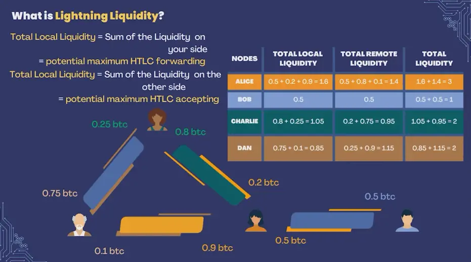_Lightning Liquidity_


그러나 이러한 채널 중 하나라도 고갈되거나 연결 문제가 발생하면 트랜잭션이 실패할 수 있습니다. 이는 네트워크 전반에서 균형 잡힌 유동성을 유지하는 것이 얼마나 중요한지 보여줍니다.


#### Lightning Network의 도전 과제:


- 채널 고갈**: 시간이 지남에 따라 채널이 불균형해져 자금이 한쪽으로 집중되어 거래 기능이 제한될 수 있습니다.
- 연결 문제**: 효율적인 트랜잭션 라우팅을 위해서는 견고한 네트워크 연결이 필요하며, 이는 유지 관리가 어려울 수 있습니다.


이러한 문제를 해결하기 위해 유동성 서비스 제공자(LSP)는 유동성 관리를 지원하는 서비스를 유료로 제공하여 사용자가 원활한 거래를 위해 최적의 채널 잔액을 유지할 수 있도록 합니다.


### 다양한 지갑과 지갑의 기능


다양한 라이트닝 지갑을 사용할 수 있으며, 각 지갑은 사용자의 요구와 취향에 따라 선택할 수 있습니다. 다음은 몇 가지 예시입니다:


#### Satoshi의 Wallet:


- 특징**: 완전 관리형, 사용자 친화적이지만 잠재적인 개인정보 보호 문제가 있는 비공개 소스입니다.


#### Albi:


- 특징**: 오픈 소스인 브라우저 확장 프로그램은 커스터디 모델과 비커스터디 모델을 모두 지원하여 활용성을 높입니다.


#### Breeze:


- 특징**: 오픈 소스인 휴대폰의 경량 노드는 자체 보관과 관리형 유동성을 결합하여 제어와 편의성의 균형을 제공합니다.


#### Phoenix:


- 특징**: Breeze와 마찬가지로 유동성을 위해 LSP 모델을 활용하고, 오픈 소스이며, 사용자 편의성과 효과적인 유동성 관리에 중점을 둡니다.


#### Bitcoin Wallet(OBW)를 엽니다:


- 특징**: On-Chain 및 라이트닝 지갑 통합, 호스팅 채널 지원, 고급 기능을 갖춘 오픈 소스, 파워 유저에게 적합.


### 커스터디 및 유동성 관리 매트릭스


지갑은 누가 개인 키를 보유하고 유동성을 관리하느냐에 따라 분류할 수 있습니다. 이 매트릭스를 통해 사용자는 보안과 편의성에 대한 선호도에 맞는 지갑을 선택할 수 있습니다:


- 커스터디 지갑**: 타사에서 개인 키를 보관하며, 일반적으로 자동 유동성 관리를 제공합니다. 예를 들면 Satoshi의 Wallet가 있습니다.
- 비수탁 지갑**: 사용자가 개인 키를 보유하며 수동 유동성 관리가 필요할 수 있습니다. 브리즈와 OBW가 그 예입니다.


_2x2 Matrix of LN Clients_


### 비판 및 개선 영역


이러한 장점에도 불구하고 라이트닝 지갑은 몇 가지 비판과 개선이 필요한 부분에 직면해 있습니다:


- 프라이버시**: 비공개 지갑과 특정 보관 모델은 개인정보 보호 문제를 야기할 수 있습니다.
- 사용 편의성**: 고급 기능과 사용자 편의성의 균형을 맞추는 것은 여전히 어려운 과제입니다.
- 오픈소스 개발**: 다양한 수준의 오픈소스 기여는 사용자 신뢰와 혁신의 속도에 영향을 미칩니다.


### 추가 인사이트 및 사용 사례


#### 알고리즘 문제:


Lightning Network 내에서 최적의 경로를 찾기 위한 현재의 알고리즘은 시행착오를 수반하는 차선책인 경우가 많습니다. 라우팅 효율성을 높이려면 개선이 필요합니다.


#### 다중 분할 결제:


큰 결제를 작은 거래로 나누면 유동성 및 경로 찾기 문제를 완화하여 더 원활한 거래를 보장할 수 있습니다.


#### 라우팅을 통한 수익:


라우팅 수수료를 통한 수익은 일반적으로 미미하기 때문에 개인 사용자가 수익을 목적으로 라우팅 노드를 운영하기에는 매력적이지 않습니다.


#### 다양한 Wallet 예제:


- Blink Wallet**: 엘살바도르 기반, 관리형, 전화번호 필요, 안정적인 Sats을 제공하지만 고급 Lightning Network 기능이 부족합니다.
- Blitz Wallet**: 오픈 소스, 셀프 커스터디, 사용자가 관리하는 유동성이 필요하며, 파워 유저를 위한 광범위한 정보를 제공합니다.
- SwissBitcoinPay**: 판매자를 위해 설계되었으며, 최대 24시간 동안 보관할 수 있고, 대량 사용자를 위한 최소한의 수수료가 부과됩니다.


#### Wallet 사용 사례:


초보자를 위한 사용 편의성부터 고급 사용자를 위한 고급 기능까지 다양한 지갑이 각기 다른 용도로 사용됩니다. "최고의" Wallet은 없으며, 개인의 필요와 선호도에 따라 선택이 달라집니다.


#### 오픈 소스 기여:


오픈소스 프로젝트에 대한 사용자 피드백과 기여는 개발과 개인의 기술 성장에 매우 중요하며, 협업적이고 혁신적인 환경을 조성하는 데 도움이 됩니다.


결론적으로, Lightning Network 클라이언트의 다양한 측면, 기존 Bitcoin 지갑과의 차이점, 효과적인 유동성 관리의 중요성을 이해하는 것은 Lightning Network의 잠재력을 최대한 활용하기 위해 매우 중요합니다. 올바른 Wallet을 선택하고 생태계에 적극적으로 참여함으로써 사용자는 Bitcoin 거래 경험을 크게 향상시킬 수 있습니다.


# LN의 도전 과제


<partId>ca58c9d7-ba7e-5392-8488-6a21a9850e6a</partId>


## LN에 대한 실질적인 도전 과제


<chapterId>014c7c40-aef7-58ac-b51f-33784463f482</chapterId>


**(동영상은 곧 제공될 예정입니다)**


이 세션에서는 Asi0가 Lightning Network(LN)로 작업할 때 직면하는 실질적인 문제를 다룹니다. Bitcoin 트랜잭션 확장에 대한 혁신적인 접근 방식에도 불구하고 Lightning Network는 사용자와 개발자 모두가 해결해야 할 몇 가지 실질적인 과제를 제시합니다. 특히 네 가지 주요 과제를 살펴보겠습니다: **유동성 관리**, **Layer 1/Layer 2 추상화**, **오프라인 결제 수신**, **백업 관리**입니다.


이러한 각 과제는 생태계에서 수행하는 역할에 따라 과제와 해결책이 달라지기 때문에 **사용자**와 **개발자**의 두 가지 관점에서 바라봅니다.


---

### 과제 1: 유동성 관리


#### **사용자 관점에서:**


Lightning Network에서 **유동성**은 결제를 하거나 받는 데 필요한 결제 채널의 자금 가용성을 의미합니다. 사용자는 성공적인 거래를 위해 충분한 인바운드 및 아웃바운드 유동성을 확보해야 합니다. 예를 들어, 결제를 받으려면 인바운드 유동성이 있어야 하며, 이는 다른 노드가 잔액의 일부를 채널에 할당해야 함을 의미합니다. 마찬가지로 결제를 송금하려면 채널에 아웃바운드 유동성이 필요합니다.


- 현실적인 문제**: 사용자들은 종종 채널의 균형을 맞추고 충분한 유동성을 유지하기가 어렵다는 것을 알게 됩니다. 또한 채널 리밸런싱에는 비용이 발생할 수 있습니다.
- 가능한 해결책**: 일부 라이트닝 지갑은 자동 채널 리밸런싱 기능을 통합하기 시작했지만, 이 기능은 아직 개발 중입니다. 또한 사용자는 유동성 관리를 지원하기 위해 **라이트닝 서비스 공급자(LSP)**에 의존하고 있습니다.


#### **개발자의 관점: ** 다음과 같습니다


개발자는 애플리케이션 내에서 원활한 유동성 관리를 구현해야 하는 과제에 직면해 있습니다. 개발자는 리밸런싱을 자동화하고 사용자의 마찰을 줄이면서 수수료를 최적화하고 유동성 병목 현상을 방지하는 도구를 만들어야 합니다.


- 실용적인 문제**: 유동성이 다양한 네트워크에서 결제를 라우팅하는 효과적인 알고리즘을 구현하는 것은 복잡하고 계산 집약적일 수 있습니다.
- 가능한 해결책**: 개발자들은 **유동성 라우팅**을 위한 고급 알고리즘과 **이중 자금 채널**을 활용하여 거래의 양쪽 끝에서 유동성을 확보할 수 있는 방법을 모색하고 있습니다.


> **정의**:
>

> - **유동성**: 라이트닝 채널에서 결제를 하거나 받을 수 있는 자금의 가용성입니다.
> - **LSP(라이트닝 서비스 제공자)**: 사용자가 Lightning Network에서 유동성 및 채널을 관리할 수 있도록 도와주는 서비스입니다.

---

### 과제 2: L1/L2 추상화


#### **사용자 관점에서:**


Layer 1(L1)**(Bitcoin의 기본 Layer)과 **Layer 2(L2)**(Lightning Network) 간의 상호작용은 사용자에게 완전히 추상화되지 않은 경우가 많습니다. 예를 들어 채널을 열고 닫으려면 On-Chain Bitcoin 트랜잭션(L1)이 필요하며, 사용자는 이러한 작업에 대해 On-Chain 수수료를 지불해야 합니다. 이로 인해 Bitcoin 네트워크가 혼잡할 경우 추가적인 복잡성과 잠재적인 지연이 발생할 수 있습니다.


- 실용적인 문제**: 사용자들은 기본 Bitcoin와 라이트닝 Layer을 상호 작용할 때 이해가 복잡해 어려움을 겪는 경우가 많습니다. 이로 인해 수수료, 거래 시간 및 보안과 관련하여 혼란을 겪을 수 있습니다.
- 가능한 솔루션**: L1/L2 상호작용을 추상화하고 백그라운드에서 채널 열기/닫기를 관리하는 개선된 Wallet 설계. 일부 지갑은 이미 상황에 따라 사용자가 On-Chain과 라이트닝 트랜잭션 사이를 원활하게 전환할 수 있도록 지원합니다.


#### **개발자의 관점: ** 다음과 같습니다


개발자는 사용자를 위해 L1과 L2의 복잡성을 추상화하여 트랜잭션을 효율적으로 처리하는 원활하고 직관적인 인터페이스를 만들어야 하는 과제를 안고 있습니다. 라이트닝 프로토콜의 무결성과 보안을 유지하면서 사용자 경험을 최적화하는 것이 과제입니다.


- 실용적인 문제**: 채널 및 On-Chain 트랜잭션 관리의 기술적 복잡성으로부터 사용자를 보호하는 동시에 필요한 경우 투명성을 유지해야 합니다.
- 가능한 솔루션**: 개발자들은 **스플리싱**(채널을 닫지 않고도 자금을 추가하거나 제거할 수 있는 기능) 및 자동 채널 관리 도구와 같은 기능을 개발 중입니다.


> **정의**:
>

> - **L1 (Layer 1)**: Bitcoin의 메인 Blockchain Layer.
> - **L2 (Layer 2)**: Bitcoin을 기반으로 작동하여 더 빠르고 저렴한 거래를 가능하게 하는 Lightning Network.
> - **스플라이싱**: 라이트닝 채널을 닫지 않고도 밸런스를 수정할 수 있는 기술입니다.

---

### 과제 3: 오프라인 결제 받기


#### **사용자 관점에서:**


Lightning Network의 과제 중 하나는 사용자가 오프라인 상태일 때 **결제를 받는 것**입니다. 언제든지 결제를 받을 수 있는 Bitcoin의 기본 Layer와 달리, 라이트닝은 결제자와 수취인 모두 온라인 상태여야 결제를 완료할 수 있습니다. 이는 일상적인 상황에서 라이트닝 결제를 사용하고자 하는 많은 사용자에게 큰 제약이 될 수 있습니다.


- 실용적인 문제**: 노드가 온라인 상태이고 네트워크에 연결되어 있지 않으면 결제를 받을 수 없으므로 일상적인 결제 수단으로 라이트닝을 사용하고자 하는 사용자에게는 불편합니다.
- 가능한 해결 방법**: 수취인 노드가 온라인 상태가 될 때까지 수탁 지갑을 사용하거나 결제 중개자 역할을 하는 타사 서비스에 의존하는 해결 방법도 있습니다.


#### **개발자의 관점: ** 다음과 같습니다


개발자들은 노드가 오프라인 상태일 때에도 사용자가 라이트닝 결제를 받을 수 있는 방법을 모색하고 있습니다. 이를 위해서는 라이트닝의 탈중앙화 특성을 유지하면서 지속적으로 연결되어야 하는 현실적인 문제를 해결할 수 있는 창의적인 솔루션이 필요합니다.


- 실용적인 문제**: 사용자가 보안이나 탈중앙화를 훼손하지 않으면서 오프라인에서 결제를 받을 수 있는 프로토콜이나 시스템을 개발하는 것은 중요한 기술적 과제입니다.
- 가능한 해결책**: 수신자가 네트워크에 다시 연결하면 지급을 청구할 수 있는 **오프라인 지급 바우처**에 대한 연구가 진행 중입니다.


> **정의**:
>

> - **오프라인 결제**: 한쪽 당사자가 Lightning Network에 연결되어 있지 않은 상태에서 송금 또는 수취하는 결제입니다.
> - **수탁 지갑**: 제3자가 사용자를 대신하여 개인 키를 제어하고 거래를 관리하는 지갑입니다.

---

### 과제 4: 백업 관리


#### **사용자 관점에서:**


라이트닝 채널을 백업하는 것은 노드가 다운되거나 데이터가 손실되는 경우 사용자가 자금을 복구하는 데 매우 중요합니다. 그러나 라이트닝 채널의 백업 프로세스는 각 트랜잭션에 따라 채널이 변경되는 상태 저장 방식이기 때문에 Bitcoin보다 더 복잡합니다.


- 실용적인 문제**: 오래된 백업을 사용하면 자금이 손실되거나 네트워크에 의해 불이익을 받을 수 있으므로 사용자는 채널 백업이 최신 상태인지 확인해야 합니다.
- 가능한 해결책**: Phoenix와 같은 지갑은 자동 채널 백업을 구현했지만, 아직 모든 라이트닝 지갑에 이러한 기능이 보편화되어 있지는 않습니다.


#### **개발자의 관점: ** 다음과 같습니다


개발자는 치명적인 장애가 발생한 후에도 사용자가 안전하고 안정적으로 자금을 복구할 수 있는 백업 솔루션을 구현해야 합니다. 문제는 이러한 솔루션이 라이트닝 프로토콜의 무결성을 유지하면서 안전하고 사용하기 쉽도록 하는 것입니다.


- 현실적인 문제**: 채널의 상태가 변경될 때마다 백업을 최신 상태로 유지해야 하므로 안전하고 분산되어 있으며 사용자 친화적인 백업 시스템을 설계하는 것은 상당한 도전 과제입니다.
- 가능한 솔루션**: *복구를 간소화하기 위해 *정적 채널 백업(SCB)**이 개발되었지만 완전히 자동화되고 안전한 백업을 위해서는 보다 고급 솔루션이 필요합니다.


> **정의**:
>

> - **정적 채널 백업(SCB)**: 장애 발생 시 라이트닝 채널의 최신 상태를 복원하여 사용자가 자금을 복구할 수 있도록 하는 백업 유형입니다.

---

#### 결론


Lightning Network는 Bitcoin 트랜잭션의 속도와 비용 효율성 측면에서 엄청난 이점을 제공하지만, 몇 가지 실질적인 과제를 안고 있습니다. 유동성 관리**, **L1/L2 추상화**, **오프라인 결제 수신**, **백업 관리** 등 이러한 과제에는 사용자와 개발자 모두에게 혁신적인 솔루션이 필요합니다. 네트워크가 계속 발전함에 따라 이러한 장애물을 극복하는 것이 광범위한 채택을 달성하고 전반적인 사용자 경험을 개선하는 데 핵심이 될 것입니다.


이러한 과제를 해결함으로써 Lightning Network은 계속해서 발전하여 Bitcoin 확장을 위한 더욱 강력하고 안정적인 솔루션으로 거듭날 것입니다.


## LN 미래 진화


<chapterId>c06763dd-bb26-5fec-8ac4-3e446e9517cd</chapterId>

<professorId>880c7fa7-8d4c-4c9b-81b4-bc61ed256516</professorId>


:::video id=ab5f65f1-0b0d-4ca9-8ff7-d42764c1e915:::

### Bitcoin의 복원력과 진화


**Bitcoin 마스코트: 꿀 오소리**

Bitcoin는 끈기와 회복력으로 유명한 꿀 오소리로 의인화되기도 합니다. 이 상징은 Bitcoin의 견고하고 불굴의 성격을 적절하게 표현합니다. 꿀 오소리가 독사에 물려도 견뎌내고 번성하는 것처럼 Bitcoin는 규제 문제, 시장 변동성, 기술적 공격 등 다양한 역경에 맞서 놀라운 회복력을 보여줬습니다.


**Bitcoin의 특성: 끊임없이 진화**

고정되어 있다는 개념과 달리 Bitcoin는 끊임없이 진화하는 상태입니다. 프로토콜과 에코시스템은 글로벌 개발자 및 연구자 커뮤니티에 의해 지속적으로 개선되고 개선되고 있습니다. 이러한 진화 과정은 보안, 확장성, 기능을 강화해야 할 필요성에 의해 주도되고 있으며, 이를 통해 Bitcoin는 암호화폐 환경의 최전선에 서게 될 것입니다.


### Lightning Network의 혁신


**Lightning Network: 빠른 개발**

거래 규모를 확장하고 속도를 높이기 위한 Bitcoin의 두 번째 솔루션인 Layer이 빠르게 개발되고 있습니다. 이 Layer은 off-chain 결제 채널을 활성화하여 빠르고 저렴한 비용으로 거래를 처리할 수 있도록 지원합니다. 효율성과 사용성을 강화하기 위해 상당한 혁신이 통합되고 있습니다.


**이중 펀딩 채널**

일반적으로 라이트닝 채널은 한 쪽에서 자금을 조달합니다. 하지만 이중 펀딩 채널에서는 양쪽 당사자(예: Alice 및 Bob)가 모두 채널의 유동성에 기여할 수 있습니다. 이러한 개선으로 송금 및 수신 용량의 유연성이 향상되었으며, 공동 자금 관리를 위한 사전 커뮤니케이션과 새로운 프로토콜이 필요해졌습니다.


**스플라이싱**

스플라이싱은 사용자가 라이트닝 채널을 닫지 않고도 채널의 크기를 수정할 수 있는 기능입니다. 이 기능을 사용하면 기존 채널에서 자금을 추가하거나 제거할 수 있어 채널 유동성을 원활하게 관리할 수 있습니다. 스플라이싱은 On-Chain 트랜잭션과 라이트닝 채널 간의 상호 운용성을 촉진하여 전반적인 네트워크 효율성을 향상시킵니다.


**L2 메커니즘**

L2 메커니즘은 페널티 메커니즘에 의존하지 않고 이전 채널 상태를 무효화하는 새로운 방법을 도입합니다. 이 업데이트는 Bitcoin Soft Fork가 필요한 기능인 SIGHASH_ANYPREVOUT에 의존합니다. L2 메커니즘은 채널 관리를 간소화하고 보안을 향상시킬 것으로 기대됩니다.


**Bolt 12**

Bolt 12는 Lightning Network에서 사용되는 현재 Bolt 11 인보이스의 한계를 해결합니다. 재사용 가능한 인보이스를 도입하고 프로세스를 자동화하여 Lightning Network 내에서만 작동함으로써 HTTP 및 웹 서버가 필요하지 않습니다. 이러한 혁신은 트랜잭션을 간소화하고 사용자 경험을 향상시킵니다.


### Bitcoin 트랜잭션의 개인 정보 보호 및 효율성 향상


**Taproot, muSig 및 Schnorr 서명**

Taproot는 트랜잭션 복잡성을 통합하고 개인 정보 보호를 강화하는 중요한 업그레이드입니다. 다중 서명 트랜잭션을 위한 프로토콜인 MuSig 및 슈노르 서명과 결합하면 Taproot는 트랜잭션 효율성을 개선합니다. 이러한 발전으로 라이트닝 트랜잭션은 일반 Bitcoin 트랜잭션과 유사해져 프로세스가 간소화되고 개인정보 보호가 강화됩니다.


**PTLC 라우팅**

포인트 시간 잠금 계약(PTLC)은 기존 Hash 시간 잠금 계약(HTLC)을 개선한 것입니다. PTLC는 슈노르 서명을 사용하며, 공유 비밀을 공개 키로 대체하여 결제 상관관계와 오용 가능성을 줄여 프라이버시를 개선합니다.


**채널 팩토리**

채널 팩토리를 사용하면 다자간 채널(예: 4 대 4 Multisig)을 생성할 수 있으며, 이를 통해 새로운 2 대 2 결제 채널 off-chain를 생성할 수 있습니다. 이 시스템을 사용하면 모든 참여자의 협조가 필요하지만 수수료 없이 신속하게 채널을 생성하고 폐쇄할 수 있습니다. 채널 팩토리는 Lightning Network의 전반적인 확장성과 유연성을 높여줍니다.


**감시탑**

워치타워는 Blockchain에서 이전 채널 상태를 모니터링하는 타사 기관입니다. 위반이 감지되면 네트워크 보안을 보장하기 위해 페널티 거래를 게시합니다. 워치타워는 잘못된 행동을 억제하여 보안을 강화하지만, 거래 모니터링과 관련하여 개인정보 보호 문제를 야기하기도 합니다.


**blinded 경로**

blinded 경로는 Lightning Network에서 수신자 프라이버시를 강화하도록 설계되었습니다. 최종 수신자의 Address을 모호하게 하여 발신자만 중간 노드를 알 수 있고 각 노드는 인접한 노드만 알 수 있도록 합니다. 이 방법은 수신자의 신원을 보호하고 전반적인 프라이버시를 향상시킵니다.


**라이트닝 서비스 제공업체(LSP)**

Breeze Wallet에서 개념화한 라이트닝 서비스 제공업체(LSP)는 즉각적인 수신 기능을 지원하여 사용자 경험을 개선하는 것을 목표로 합니다. LSP는 인터넷 서비스 제공업체가 연결 서비스를 제공하는 방식과 유사하게 사용자를 위한 채널을 개설합니다. 이 혁신은 사용자 온보딩 프로세스를 간소화하고 Lightning Network에서 원활한 상호 작용을 보장합니다.


**최신 정보를 얻기 위한 리소스**

Bitcoin 및 Lightning Network의 최신 기술 혁신을 따라잡으려면 귀중한 리소스를 활용하는 것이 필수적입니다. Bitcoin OpTec 뉴스레터, 라이트닝 개발 메일링 리스트, Jason Lopp과 같은 업계 전문가의 자료는 빠르게 진화하는 이 분야의 지속적인 발전과 연구에 대한 인사이트와 업데이트를 제공합니다.


이러한 발전을 이해하고 감사함으로써 우리는 Bitcoin과 Lightning Network이 디지털 거래의 미래를 위해 다각적인 발전과 잠재력을 가지고 있음을 인식할 수 있습니다.


## LN 기반 프로토콜


<chapterId>f4d147bb-f146-5b36-a994-b9b70da83744</chapterId>

<professorId>e7e63d59-ea19-4960-9446-61bd4dcc98f0</professorId>


:::video id=ffee9682-1bfa-4717-9f22-9bc1baff0722:::

### Lightning 결제 확장 및 통합


#### Lightning 결제 이해


라이트닝 결제의 확장 및 통합에 대해 자세히 알아보기 전에 라이트닝 결제의 기본 작동을 이해하는 것이 중요합니다. 기존 Lightning 결제에는 **송금인**, **수취인**, **Lightning Network** 등 몇 가지 주요 구성 요소가 포함됩니다. 지급자는 지급할 금액과 목적지(수취인 노드)와 같은 중요한 정보가 포함된 **Invoice**을 생성하여 수취인에게 지급을 시작합니다.


이 프로세스는 지정된 시간 내에 정당한 수령인만 대금을 청구할 수 있도록 보장하는 **Hash 시간 고정 계약(HTLC)**에 의존합니다. 이 메커니즘에서 중요한 두 가지 Elements은 **온니 이아웃**과 **HTLC 체인**입니다:


- 어니언 라우팅**: 트랜잭션 데이터를 여러 계층으로 캡슐화하여 각 중개자가 이전 및 다음 노드만 알고 전체 경로를 알 수 없도록 하여 프라이버시를 제공합니다.
- HTLC 체인**: 결제가 완료되거나 반환될 때까지 자금을 잠그는 일련의 계약입니다.


Lightning Network의 기능을 강화한 새로운 프로토콜은 **Keysend**입니다. 발신자와 수신자 간의 사전 커뮤니케이션이 필요했던 기존 방식과 달리 generate, Invoice을 통해 **발신자 개시 결제**가 가능하여 프로세스를 간소화하고 사용자 경험을 개선할 수 있습니다.


하지만 기존 인보이스에는 한계가 있습니다. 예를 들어


- 일회용**: 인보이스는 일반적으로 한 번의 거래에만 사용되므로 불편할 수 있습니다.
- 크기 제한**: 큰 송장은 QR코드 형태로 처리하기 어려울 수 있으므로 특정 애플리케이션에서는 비실용적일 수 있습니다.


> **정의**:
>

> - **Invoice**: 일반적으로 금액과 수취인 세부 정보가 포함된 Lightning Network 형식의 결제 요청입니다.
> - **HTLC(Hash 시간 고정 Contract)**: 시간 제한 내에 조건부 지급을 보장하는 데 사용되는 Smart contract의 한 유형입니다.
> - **양파 라우팅**: 거래 데이터를 양파처럼 겹겹이 쌓아 발신자와 수신자의 신원을 보호하는 개인정보 보호 기법입니다.

### 프로토콜 및 사용 사례


O비즈니스 모델 및 고급 프로토콜로 이동하기

기존 인보이스의 한계를 극복하기 위해 라이트닝 결제를 확장하고 개선하기 위한 여러 프로토콜이 등장했습니다.


- LNURL**: 동적으로 인보이스를 생성하고 법정 화폐를 지원하며 **라이트닝 주소**를 사용할 수 있게 함으로써 Invoice 생성을 간소화하는 프로토콜입니다. 이 접근 방식은 보다 유연한 결제 방법과 다양한 사용 사례와의 통합을 제공하여 사용자 경험을 크게 향상시킵니다.


- Bolt 12 오퍼**: 이 프로토콜은 LNURL과 유사하지만 **온니 메시징**을 사용하여 개인정보 보호를 강화합니다. Bolt 12를 사용하면 사용자가 수동 개입 없이 자동으로 인보이스를 가져올 수 있어 개인정보 보호와 사용성을 모두 개선할 수 있습니다.


라이트닝 결제의 주목할 만한 통합 사례 중 하나는 탈중앙화 소셜 미디어 플랫폼인 **Nostr**입니다. 노스트르는 라이트닝 결제를 통합하여 팁과 소액 결제를 가능하게 함으로써 라이트닝이 다양한 애플리케이션에 어떻게 내장될 수 있는지 보여줍니다.


또 다른 프로토콜인 **RGB**은 Lightning Network을 통해 **자산 전송**을 가능하게 함으로써 라이트닝의 기능을 더욱 확장합니다. RGB은 라이트닝 채널을 통해 토큰을 포함한 다양한 자산을 전송할 수 있도록 하여 거래할 수 있는 범위를 넓혔습니다.


**라이트닝 유동성 서비스 공급자(LSP)**도 라이트닝 결제를 확장하는 데 중요한 역할을 합니다. LSP는 결제 수취를 위한 유동성을 제공하고, **이중 자금 채널** 개설을 지원하며, 결제를 가로채고 즉시 채널을 개설하여 원활한 거래를 보장합니다.


> **정의**:
>

> - **LNURL**: 동적 Invoice 생성을 허용하는 프로토콜로, 결제를 더욱 쉽고 유연하게 만들어줍니다.
> - **Bolt 12**: Invoice 가져오기를 자동화하는 동시에 개인 정보 보호를 위해 Onion 메시징을 활용하는 Lightning의 확장 기능입니다.
> - **노스트르**: LProtocol과 사용 사례를 통합하는 탈중앙화 플랫폼
> 소액 결제를 위한 라이트닝 결제.
> - **RGB 프로토콜**: Lightning Network를 통해 토큰과 같은 자산을 전송할 수 있는 프로토콜입니다.
> - **LSP(라이트닝 서비스 공급자)**: 유동성을 제공하고 라이트닝 트랜잭션에 대한 채널을 열어 사용자가 네트워크에 더 쉽게 접근할 수 있도록 하는 주체입니다.

### 비즈니스 모델 및 고급 프로토콜


라이트닝 결제의 발전은 특히 **라이트닝 서비스 공급자(LSP)**를 위한 새로운 비즈니스 모델을 위한 길을 열었습니다. LSP는 결제가 감지될 때만 채널을 열어 사용자 경험을 개선하여 사전 설정의 복잡성을 줄입니다.


라이트닝이 지원하는 비즈니스 모델의 한 예로 **경매 모델**을 들 수 있습니다. 여기서 서버는 가장 높은 입찰가를 기록하고 더 낮은 입찰가를 거부하여 경매가 종료될 때까지 결제를 보류합니다. 이렇게 하면 환불이 필요 없고 경매 프로세스가 간소화됩니다.


또 다른 실제 사례는 **포커 게임**에서 서버가 게임이 끝날 때까지 베팅을 보류하여 결제를 관리하여 원활한 베팅 프로세스를 보장하는 것입니다.


라이트닝 결제는 **Nostr**와 팟캐스트 서비스 같은 플랫폼에도 통합되어 프로토콜의 다재다능함을 보여주고 있습니다. 또한 결제의 **프리이미지**는 콘텐츠나 서비스의 잠금을 해제하는 **액세스 키**로 사용할 수 있어 Lightning Network의 활용도가 더욱 높아졌습니다.


포인트 타임 잠금 계약(PTLC)**과 같은 고급 프로토콜은 더 복잡한 암호화 작업을 가능하게 함으로써 라이트닝을 한 단계 더 발전시킵니다. PTLC는 라우팅과 결제 분할을 개선하여 보안과 효율성을 모두 향상시킵니다.


LNURL** 및 **Bolt 12**와 같은 프로토콜은 수동 상호작용을 줄여 결제를 간소화하여 Lightning Network가 더욱 사용자 친화적이고 널리 채택될 수 있도록 합니다.


> **정의**:
>

> - **PTLC(포인트 타임 잠금 Contract)**: HTLC를 개선하여 더욱 유연하고 안전한 결제를 가능하게 하는 암호화 기본 요소입니다.
> - **사전 이미지**: HTLC의 잠금을 해제하는 데 사용되는 값으로, 서비스의 액세스 키로도 사용할 수 있습니다.
> - **경매 모델**: 경매 중에 결제가 보류되었다가 최고가 입찰이 수락될 때만 결제가 해제되는 결제 모델입니다.

### 결론


다양한 프로토콜과 사용 사례를 통한 라이트닝 결제의 확장 및 통합은 Lightning Network의 역동적인 진화를 보여줍니다. 결제의 기본 기능 개선부터 고급 비즈니스 모델 및 암호화 프로토콜 도입에 이르기까지, 라이트닝의 미래는 혁신과 광범위한 채택에 대한 상당한 가능성을 내포하고 있습니다.


# 보너스


<partId>4c5c74d7-40a9-5292-9b82-e3f3d79875e1</partId>


## Bitcoin Mining 에센셜


<chapterId>a4eacfc3-7b37-5fa3-abd1-b1fc48b645f0</chapterId>

<professorId>e320ccda-be59-492b-a81b-243d9acb592f</professorId>


:::video id=161d074d-4a81-48da-b2c9-9bde041a0da5:::

#### 소개


Ajelex는 경쟁이 치열한 시장에서 수익성을 유지하기 위한 전략을 검토하면서 Bitcoin Mining의 비즈니스 측면에 초점을 맞춥니다. 이 논의에는 운영 비용, 효율성 측정 및 Mining 산업을 이끄는 경제성 분석이 포함됩니다.


### 1. Mining 복잡성 및 수익성 요인


#### 기술적 및 전략적 요인


Mining의 복잡성은 주로 Bitcoin 운영의 수익성을 결정하는 기술 및 전략적 Elements와 관련이 있습니다. Mining은 단순한 우연이 아니라 신중한 계획과 지속적인 최적화가 필요한 정교한 프로세스라는 점을 이해하는 것이 중요합니다.


#### 주요 수익성 요인


1. **전기 비용**: Mining의 수익성에 영향을 미치는 가장 중요한 요소 중 하나는 전기 비용입니다. 프랑스와 같은 지역에서는 엘살바도르와 같은 국가에 비해 전기 요금이 상대적으로 비쌀 수 있으며, 낮은 비용이 채굴자에게 경쟁력을 제공합니다.

2. **하드웨어 효율성**: Mining 하드웨어의 효율성은 Hash 속도와 전력 소비로 측정되며, 중추적인 역할을 합니다. S19J Pro와 같은 고급 ASIC 마이너는 Antminer S9와 같은 구형 모델보다 훨씬 효율적입니다.

3. **기간**: Bitcoin Mining은 장기 계획을 권장합니다.

4. **BTC 가격**: BTC 가격은 Mining의 수익성을 결정하는 데 필수적입니다.

5. **네트워크 난이도**: 네트워크 난이도는 10분 동안 블록을 채굴하는 데 필요한 평균 Hashrate의 양을 나타냅니다.

6. **전략적 도구**: Braiins.com](https://insights.braiins.com)과 같은 도구는 수익성을 계산하고 채굴자가 데이터에 기반한 의사 결정을 내리는 데 매우 유용합니다.


#### 실제 적용


개인적인 경험에 비추어 볼 때, 저는 프랑스에 있는 아파트 난방에 Mining을 사용하여 전기 비용을 창의적으로 상쇄한 적도 있습니다. 이 사례는 Mining을 일상 생활에 통합하여 추가적인 이점을 얻을 수 있는 실용성을 강조합니다.


#### Mining의 병목 현상


채굴자들은 하드웨어 가용성, 에너지 접근성, 운영 유지에 필요한 자본이라는 세 가지 주요 병목현상에 직면합니다. 높은 수요로 인한 ASIC의 부족은 종종 긴 대기 시간과 가격 상승으로 이어져 Mining 환경을 더욱 복잡하게 만듭니다.


- 에너지 병목현상**의 예입니다.

2021년 중국 정부는 자국 내 Mining의 사용을 금지했고, 이로 인해 중국 내 Mining 기업들은 에너지 공급을 받지 못하게 되었습니다. 그 결과 2주 동안 Hashrate은 **50%** 하락했습니다.


---

### 2. Mining 하드웨어의 진화와 효율성


#### 역사적 진화


단순한 CPU Mining에서 시작하여 오늘날 우리가 사용하는 고도로 전문화된 ASIC 채굴기에 이르기까지 Mining 하드웨어의 여정은 기념비적인 것이었습니다.


1. **CPU Mining**: 초창기에는 일반 컴퓨터 프로세서(CPU)를 사용하여 Mining를 수행했습니다. 이 방식은 네트워크가 성장함에 따라 빠르게 뒤쳐졌습니다.

2. **GPU Mining**: GPU(그래픽 처리 장치)가 Mining의 효율성을 크게 향상시킴으로써 CPU는 Mining 용도로는 쓸모없게 되었습니다.

3. **FPGA Mining**: 필드 프로그래머블 게이트 어레이(FPGA)는 GPU보다 훨씬 뛰어난 성능과 에너지 효율성을 제공합니다.

4. **ASIC Mining**: 애플리케이션별 집적 회로(ASIC)는 Mining 하드웨어 효율성의 정점을 보여주는 것으로, 탁월한 성능으로 Mining 작업을 위해 특별히 설계되었습니다.


#### 자세한 비교: S19J 프로와 앤트마이너 S9 비교


- S19J Pro**: 높은 효율성과 안정성으로 잘 알려진 S19J Pro는 전력 소비가 적으면서도 우수한 Hash 속도를 제공하여 대규모 작업에 이상적입니다.
- 앤트마이너 S9**: 오래되고 효율성은 떨어지지만, Antminer S9는 저렴한 가격과 괜찮은 성능으로 소규모 설정과 취미로 사용하는 사람들에게 여전히 인기가 있습니다.


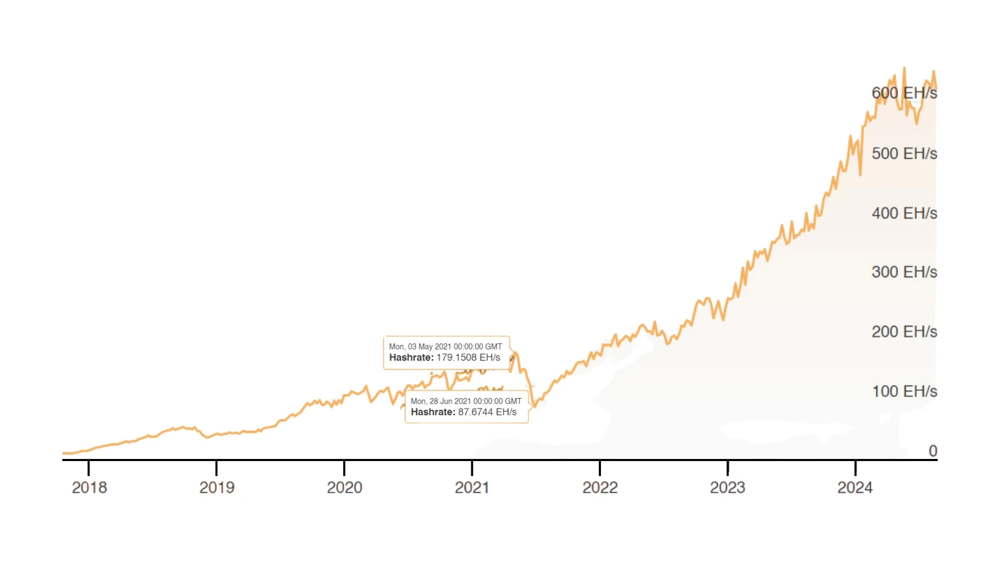


#### Mining 효율성 및 학습


Mining는 금전적인 보상뿐만 아니라 귀중한 실전 경험도 제공합니다. Mining를 통해 KYC가 필요 없는 비트코인을 획득하는 것은 개인 정보 보호에 관심이 있는 분들에게 매력적인 제안이 될 수 있습니다.


#### 고급 도구 및 기술


애프터마켓 소프트웨어는 Mining 하드웨어의 효율성과 기능을 향상시킬 수 있습니다. 최적화 및 자동 튜닝 기능을 제공하는 툴을 사용하면 각 칩이 최대 효율로 작동하여 Hash 속도와 전력 사용량의 균형을 효과적으로 맞출 수 있습니다.


---

### 3. Mining 운영의 규제 및 시장 역학 관계


#### 규제 영향


규제는 Mining 환경을 형성하는 데 중요한 역할을 합니다. 예를 들어, 중국의 Mining 금지 조치는 전 세계 Mining 운영에 큰 영향을 미쳐 네트워크 Hash 비율이 크게 하락하고 여러 지역에 걸쳐 Mining 전력이 재분배되는 결과를 초래했습니다.


#### 시장 역학


1. **하드웨어 가용성 및 비용**: ASIC 채굴기의 가격과 가용성은 Bitcoin의 시장 가격에 영향을 받습니다. 강세장에는 수요가 많아 희소성이 높아지고 가격이 상승합니다.

2. **Hash 가치와 Hash 가격**: Hash 가치(하루 테라해시당 벌어들이는 사토시)와 Hash 가격(Hash 요금의 금전적 가치)의 차이를 이해하는 것은 필수적입니다. 둘 다 네트워크 난이도와 Bitcoin의 시장 가격에 영향을 받습니다.


#### Mining 풀 및 보상 메커니즘


1. **Mining 풀**: Mining 풀은 리소스를 결합하여 보다 안정적인 보상을 제공함으로써 단독 Mining과 관련된 변동성과 위험을 줄입니다.

2. **보상 체계**: 지분 보상(PPS) 및 비례 보상과 같은 다양한 보상 메커니즘은 채굴자에게 다양한 위험과 보상 프로필을 제공합니다.


   - 공유당 지불**: 지분 보상제는 풀이 블록을 발견했는지 여부와 관계없이 채굴자가 제출한 각 유효한 지분에 대해 보상을 지급합니다. **공유**는 채굴자가 필요한 작업을 완료했음을 증명하는 단위이며, 풀은 이러한 공유를 검증합니다.


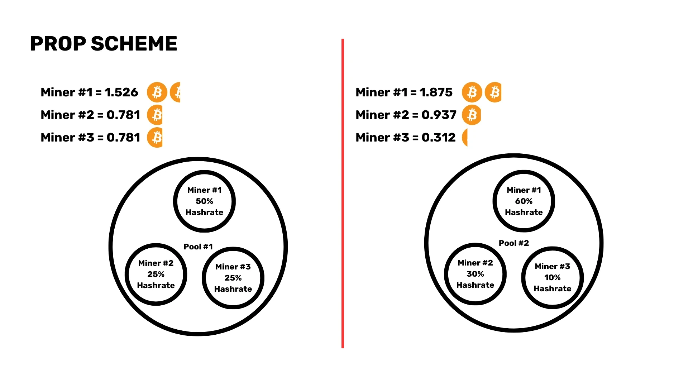


   - 비례**: 풀 Mining에 따라 풀의 총 Hashrate에 대한 Miner의 기여도에 따라 보상을 균등하게 분배하는 블록입니다.


#### Mining의 미래


블록 보상이 줄어들면서 채굴자들은 점점 더 트랜잭션 수수료에 의존하게 될 것입니다. 이러한 변화는 거래 수수료만으로 채굴자들이 네트워크를 계속 보호할 수 있는 충분한 인센티브를 제공할 수 있을지에 대한 우려를 불러일으킵니다.


#### 호스팅된 Mining


호스팅된 Mining 서비스는 운영 비용이 저렴하지만 통제력 부족, 사기 가능성 등의 위험이 따릅니다. 이러한 위험을 완화하려면 적절한 실사가 필요합니다.


#### 보안 및 효율성


고급 보안 프로토콜과 재생 에너지 사용은 수익성을 향상시킬 뿐만 아니라 Mining 생태계의 지속 가능한 성장에도 기여합니다.


결론적으로, Bitcoin Mining의 세계는 기술, 전략, 규제 및 시장 역학에 대한 깊은 이해가 필요한 복잡하고 다면적인 영역입니다. 노련한 Miner 전문가이든 이제 막 시작했든, 끊임없이 진화하는 이 분야에서 성공하려면 최신 정보를 습득하고 적응력을 키우는 것이 중요합니다. 관심을 가져주셔서 감사드리며 여러분의 질문과 토론을 기다리겠습니다.


## 조인마켓 이해


<chapterId>f109f64f-9b73-5fbf-8870-5d34d5b69df8</chapterId>

<professorId>6cfd206c-53b8-47a0-bbf4-44fd84e6ee1d</professorId>


:::video id=b89f2064-f2e1-49c3-97d0-580891eee1dd:::

아담 깁슨이 Joinmarket에 대한 인사이트를 제공하며, 이 CoinJoin 구현이 어떻게 Bitcoin의 개인정보 보호와 대체 가능성을 향상시키는지 자세히 설명합니다. 그는 Joinmarket이 어떻게 Bitcoin 생태계 내에서 공동 작업, Trustless 및 익명 거래를 촉진하는지에 대해 설명합니다. 그런 다음 두 번째 파트에서는 Signet에서 Joinmarket을 실행하는 방법을 보여드립니다.


## Cubo+ 첫 해 해커톤


<chapterId>3faf7daa-ea42-5b68-bcaf-04b70b2e02dd</chapterId>


### 그룹 1 해커톤 - Satoshi 레거시


:::video id=d78b199e-39cd-4d3c-b478-1502ba9c952a:::

Satoshi 레거시 그룹은 Shopify, React JS, Hydrogen 및 IBEX 결제 게이트웨이를 사용하여 라이트닝 이커머스를 구축한 작업을 발표합니다.


### 그룹 2 해커톤 - 허니 배거


:::video id=2159b401-e195-4bc8-9046-67a05c6ab7ea:::

Honey Badger의 그룹은 LnBits와 Next.js, Node.js, Hydrogen을 사용하여 라이트닝 기반 소액 결제가 내장된 블로그 솔루션을 소개합니다.


### 그룹 3 해커톤


:::video id=eb1e3c20-03ea-4ff8-b018-d197377a85cf:::

세 번째 그룹은 사용자 정의 API, LND, vue.js, node.js, 부트스트랩을 통해 Lightning Network 노드 대시보드를 제공합니다.


### 그룹 4 해커톤 - Satoshi 펠로우십


:::video id=de1f6032-a0fa-49b0-82eb-18ba0e631756:::

Satoshi의 펠로우십 그룹은 LnBits와 MongoDB, Poetry, Node.js를 사용한 LN 게임 앱을 선보입니다.


### 그룹 5 해커톤 - 조명 워커


:::video id=1328bada-4fd1-494a-83c6-f147a4880448:::

라이트닝 워커의 그룹이 MySQL, JavaScript 및 ZDB의 API를 사용한 송금 서비스 솔루션을 소개합니다.


# 최종 섹션

<partId>a633fb0c-839c-4405-8b77-2377cce79dd7</partId>


## 리뷰 및 평가


<chapterId>7f4f46e2-de71-5387-8609-9785fb9e5946</chapterId>

<isCourseReview>true</isCourseReview>

## 결론


<chapterId>33cb95cf-91d1-555b-a33b-0e3bd6745c33</chapterId>

<isCourseConclusion>true</isCourseConclusion>