# Kuvumbura amasezerano ya RGB


Nimwinjire mw’isi ya RGB, umurongo wagenewe gushitsa no gushitsa uburenganzira bwa digitale, mu buryo bw’amasezerano n’itunga, bishingiye ku mategeko y’uguhurizako n’imikorere ya Bitcoin Blockchain. Iyi nyigisho yuzuye irakuyobora mu mishinge y'ubuhinga n'ibikorwa vya RGB, kuva ku vyiyumviro vya "Client-side Validation" na "Ibimenyetso bikoreshwa rimwe", gushika ku gushirwa mu ngiro kw'amasezerano y'ubwenge ateye imbere.


Biciye muri porogarama itunganijwe, intambwe ku yindi, uzobona uburyo bwa Client-side Validation, amasezerano y’ugushinga intahe ku Bitcoin n’ingene abakoresha bakorana. Menya uko worema, gucunga no gutanga ibimenyetso vya RGB kuri Bitcoin canke Lightning Network.


Waba uri umuhinga mu bijanye n’ubuhinga, uwukunda Bitcoin, canke gusa ushaka kumenya vyinshi ku bijanye n’ubu buhinga, iri shure rizoguha ibikoresho n’ubumenyi ukeneye kugira ngo umenye neza RGB no kwubaka inyishu nshasha kuri Bitcoin.


Iryo shure rishingiye ku nama y’ubuzima yateguwe na Fulgur’Ventures kandi yigishwa n’abigisha batatu bazwi cane hamwe n’abahinga mu vy’ubuhinga bwa RGB.


+++
# Imenyekanisha


<partId>c6f7a70f-d894-595f-8c0a-b54759778839</partId>


## Ivyigwa vyerekanwa


<chapterId>cf2f087b-6c6b-5037-8f98-94fc9f1d7f46</chapterId>


Muraho mwese, kandi murakaze muri aya mahugurwa yerekeye RGB, ubuhinga bwa Smart contract bwemejwe n'abaguzi bukoreshwa kuri Bitcoin na Lightning Network. Intunganyo y’iyi nyigisho igenewe gutuma umuntu ashobora gutohoza bimwe bigera kure iyo nkuru igoye. Ehe ingene amashure atunganijwe:


**Igice ca 1: Ivyiyumviro**


Igice ca mbere kijanye n’ivyiyumviro vy’inyigisho bikenewe kugira ngo umuntu atahure ivy’ishimikiro vya Client-side Validation na RGB. Nk'uko uzobibona muri iri shure, RGB itanga ivyiyumviro vyinshi vy'ubuhinga bitaboneka muri Bitcoin. Muri iki gice, uzosanga kandi urutonde rw'amajambo rutanga insobanuro z'amajambo yose yihariye ku masezerano ya RGB.


**Igice ca 2: Imyimenyerezo**


Igice ca kabiri kizoba kijanye n’ugushira mu ngiro ivyiyumviro vy’inyigisho vyabonetse mu gice ca 1. Tuzokwiga ingene twohingura no gukoresha amasezerano ya RGB. Turabona kandi ingene twokora porogarama ukoresheje ivyo bikoresho. Ivyo bice bibiri vya mbere bishikirizwa na Maxim Orlovsky.


**Igice ca 3: Ibisabwa**


Igice ca nyuma kirongowe n’abandi bavugishwa batanga ibikorwa vy’ukuri bishingiye kuri RGB, kugira ngo bagaragaze ingene ikoreshwa mu buzima nyakuri.


---
Iryo shure ryakuze mu ntango rivuye mu mahugurwa y’iterambere ry’indwi zibiri i Viareggio muri Toscane, yateguwe na [Fulgur’Ventures](https://fulgur.ventures/). Indwi ya mbere, yibanze kuri Rust na SDKs, ushobora kuyisanga muri iyi yindi nyigisho:


https://planb.network/courses/9fbd8b57-f278-4304-8d88-a2d384eaff58

Muri iki cigwa, twibanda ku ndwi ya kabiri y'ivyigwa, vyibanda ku RGB.


**Indwi ya mbere - LNP402:**


**Indwi ya 2 - Amahugurwa ariho ubu CSV402:**


Turashimira cane abateguye ayo masomo y’ubuzima hamwe n’abigisha 3 bagize uruhara:


- Maxim Orlovsky: *Ivya kera vy’amababa y’inyenyeri. Cypher, AI, ubuhinga bwa robo, ubuhinga bwo guhindura abantu. Umuremyi wa RGB, Umukuru, Umuco n’lnp_bp, mycitadel_io & sifernet_io*;
- Umuhigi Trujilo: *Umuhinguzi, Rust, Bitcoin, Umuravyo, RGB*;
- Federico Tenga: *Ndiko ndakora ivyo nshoboye kugira ngo isi ibe igihugu c'ubuzima bw'abanyagihugu. Ubu ndiko ndakora kuri RGB muri Bitfinex*.


Inyandiko y’iyi nyigisho yateguwe hakoreshejwe ibikoresho 2 nyamukuru:


- Amasanamu y’amahugurwa ya Maxim Orlovsky, Umuhigi Trujilo na Frederiko Tenga mu kigo c’imyimenyerezo c’umuravyo;
- Ivyo bitabo vya RGB, ivyo vyakozwe vyatewe inkunga na [Bitfinex](https://www.bitfinex.com/).


Ni mwiteguye kwisuka mw’isi igoye kandi iryoshe cane ya RGB? Reka tugende!


# RGB mu vyiyumviro


<partId>80e797ee-3f33-599f-ab82-e82eeee08219</partId>


## Intangamarara y'ivyiyumviro vy'ubuhinga bwa none


<chapterId>f52f8af5-5d7c-588b-b56d-99b97176204b</chapterId>


:::id ya videwo = f27338bc-4210-4a2e-9b27-30278ed3282c::


RGB ni umurongo wagenewe gukoresha no gushitsa uburenganzira bwa digitale (mu buryo bw’amasezerano n’itunga) mu buryo bushobora guhindurwa kandi bufise ibanga, bushingiye ku mategeko y’uguhurizako n’imikorere ya Bitcoin Blockchain. Intumbero y’iki gice ca mbere ni ugushikiriza ivyiyumviro n’amajambo y’ishimikiro akikuje umurongo wa RGB, tugaragaza cane cane isano ryayo n’ivyiyumviro vy’ishimikiro vy’ubuhinga bwa none nka Client-side Validation na Single-use Seals.


Muri iki gice, turatohoza ivy’ishimikiro vy’**uburyo bwo kwumvikana busanzwe** maze turabe ingene RGB ijyanye n’uwo muryango w’ubuhinga. Turazozana kandi ingingo ngenderwako nyamukuru zidufasha gutahura igituma RGB ifise intumbero yo kwaguka no kwigenga ku buryo bwo kwumvikana bwa Bitcoin ubwayo, mu gihe yizigira iyo bikenewe.


### Imenyekanisha


Distributed computing, ni ukuvuga ishami ryihariye ry’ubuhinga bwa mudasobwa, yiga amategeko akoreshwa mu gukwiragiza no gukora amakuru ku rubuga rw’ibihimba. Izo nzira n’amategeko yose hamwe, ni vyo bigize ico bita uburyo busanzwe. Mu bintu nyamukuru biranga mwene urwo rutonde , bimwebimwe ni ibi:


- **Ubushobozi bwo kugenzura no kwemeza bwigenga** amakuru amwe amwe n’urudodo rumwe rumwe;
- Ubushobozi bw’ibihimba vy’umubiri bwo kwubaka (bivanye n’umurongo) ukuntu amakuru yose abona canke igice. Ivyo vyiyumviro ni **ibihugu** vy’uburyo busanzwe;
- **Urutonde rw'ibihe** rw'ibikorwa, kugira ngo amakuru ashobore gushirwako ikidodo c'igihe kandi habeho ukwiyumvikana ku rutonde rw'ibintu (urutonde rw'ibihugu).


Cane cane, iciyumviro c’**uguhurizako** mu buryo busanzwe gifise imice ibiri:


- Kwemera ukuri kw'amahinduka ya Leta (hakurikijwe amategeko y'amasezerano);
- **Isezerano ku rutonde** rw'ivyo bihinduka vya Leta, ivyo bikaba bituma bidashoboka kwandika canke guhindura ibikorwa vyemewe a posteriori (ivyo navyo bizwi muri Bitcoin nk'"uburinzi bw'amahera akoreshwa kabiri").


Ishirwa mu ngiro rya mbere rikora, ritagira uruhusha ry’uburyo bwo kwumvikana busanzwe ryashizweho na Satoshi Nakamoto hamwe na Bitcoin, bivuye ku gukoresha hamwe ubuhinga bw’amakuru bwa Blockchain n’ubuhinga bwa Proof-of-Work (PoW). Muri iyo nzira, ukwizera amateka y’amabuye kuva ku bubasha bwo guharura buhabwa n’ibihimba (abacukuzi). Bitcoin rero ni akarorero kanini kandi k’akahise k’uburyo bwo kwumvikana busanzwe bufunguriwe bose (*ata ruhusha*).


Mu isi ya Blockchain n'ubuhinga bwo gukoresha ubuhinga bwa none, turashobora gutandukanya ingero zibiri z'ishimikiro: ***Blockchain*** mu buryo bwa kera, na ***imirongo ya Leta***, akarorero keza kayo mu guhingura ni Lightning Network. Blockchain isobanurwa nk’igitabu c’ibintu vyabaye bikurikiranye, bisubirwamwo n’uguhurizako mu nzira ifunguye kandi idafise uruhusha. Ku rundi ruhande, imirongo ya Leta ni imirongo y’urunganwe ishoboza abayigize babiri (canke barenga) kuguma bafise off-chain ya Leta ivuguruwe, bakoresheje Blockchain gusa igihe bafungura no gufunga iyo mihora.


Mu bijanye na Bitcoin, nta gukeka ko umenyereye ingingo ngenderwako za Mining, kwegereza ubutegetsi abaturage n’uguheza ibikorwa ku Blockchain, hamwe n’ingene inzira zo kwishura zikora. Na RGB, turiko turazana uburyo bushasha bwitwa **Client-side Validation**, butandukanye na Blockchain canke Lightning, bugizwe no kubika no kwemeza imihindukire ya Smart contract. Ivyo navyo bitandukanye n'ubundi buhinga bwa "DeFi" (_rollups_, _plasma_, _ARK_, n'ibindi), aho Client-side Validation yizigira Blockchain kugira ngo ibuze Double-spending no kugira uburyo bwo gushiramwo ikidodo c'igihe, mu gihe igumya urutonde rw'ibihugu vya off-chain n'imihindukire, gusa n'ivyo.


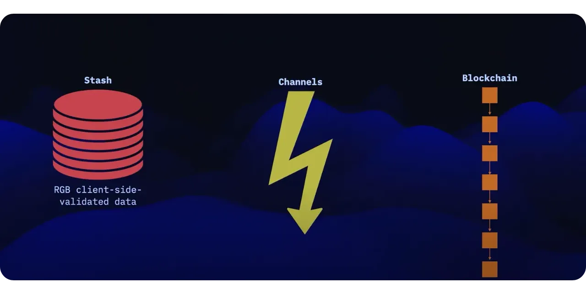


Mu nyuma, tuzozana kandi ijambo rihambaye: iciyumviro ca "**Stash**", ryerekeza ku rutonde rw'amakuru yo ku ruhande rw'umukiriya asabwa kugira ngo umuntu azigame uko Contract imeze, kuko ayo makuru adasubirwamwo kw'isi yose ku rubuga. Ubwa nyuma, turaza kuraba imvo n’imvano y’inyuma ya RGB, umurongo w’itegeko ukoresha neza Client-side Validation, n’igituma yuzuza uburyo busanzweho (Blockchain n’imirongo ya leta).


### Ibibazo bitatu mu gukoresha ubuhinga bwa none


Kugira ngo dutahure ingene ingorane za Client-side Validation na RGB Address zitatowe umuti na Blockchain na Lightning, reka tuvumbure "trilemmas" 3 zikomeye mu gukoresha ubuhinga bwa none:


- Ugutera imbere, Ukwegereza ubutegetsi, **Ubuzima bwite**;
- **CAP** Theorem (Uguhuza, Ububoneka, Ukwihanganira Ugucapura);
- **CIA** trilemma (Ibanga, Ubutungane, Ububoneka).


#### 1. Gushobora gutera imbere, kwegereza ubutegetsi abaturage n'ibanga


- **Blockchain (Bitcoin)**


Blockchain ni igisata gikomeye cane, ariko ntishobora gukoreshwa cane. Ikindi, kuko vyose biri mu gitabu c’isi yose, c’abantu bose, ibanga rirake. Turashobora kugerageza gutuma ibanga rigenda neza dukoresheje ubuhinga butagira ubumenyi (Confidential Transactions, imigambi ya mimblewimble, n’ibindi), ariko uruhererekane rwa bose ntirushobora guhisha igicapo c’ibikorwa.


- **Imiravyo/Imirongo ya Leta**


Imirongo ya Leta (nk'uko biri kuri Lightning Network) irashobora gukoreshwa cane kandi ni iy'ibanga kuruta Blockchain, nk'uko amafaranga akoreshwa off-chain. Ariko rero, inshingano yo gutangaza ku mugaragaro Elements zimwe zimwe (ibikorwa vy’ugutanga amahera, topologie y’urubuga) no kugenzura uruja n’uruza rw’urubuga birashobora gutuma ibanga ridahinduka. Ukwegereza ubutegetsi ubutegetsi na kwo nyene kurababazwa: ugushiramwo ubutegetsi birasaba amahera menshi, kandi ama node akomeye arashobora kuba ahantu ho kwegereza ubutegetsi ubutegetsi hagati. Ivyo ni vyo nyene dutangura kubona kuri Lightning.


- **Client-side Validation (RGB)**


Iyi nzira nshasha irarushiriza gukoreshwa kandi irarushiriza kuba ibanga, kuko ntidushobora gusa gushiramwo ubuhinga bwo gutangaza ikimenyamenya c’ubumenyi ataco buvuze, ariko nta n’igishushanyo c’isi yose c’ibikorwa vy’ubudandaji kiriho, kuko ata n’umwe afise igitabu cose. Ku rundi ruhande, bivuga kandi ko hariho ugusenyera ku mugozi umwe ku bijanye no kwegereza ubutegetsi abaturage: uwutanga Smart contract arashobora kugira uruhara ruhambaye (nk'uwutanga Contract muri Ethereum). Ariko rero, bitandukanye na Blockchain, na Client-side Validation, ubika gusa kandi ukemeza amasezerano ushaka, ivyo bikaba bituma habaho uguhindura neza mu kwirinda gukura no kugenzura intara zose zihari.


#### 2. CAP Theorem (Uguhuza, Ububoneka, Ukwihanganira ugucapura)


Iciyumviro ca CAP gishimika ku vy’uko bidashoboka ko uburyo busanzwe bushobora guhazwa icarimwe *Uguhuza*,*Ukuboneka* na *Ukwihanganira ugucapura*.


- **Blockchain**


Blockchain ikunda uguhuza n’ukuboneka, ariko ntikora neza mu gucapura urubuga: iyo udashobora kubona igice, ntushobora gukora kandi ukagira iciyumviro kimwe n’urubuga rwose.


- **Imiravyo**


Uburyo bw’imirongo ya Leta burafise ubushobozi bwo kuboneka no kwihanganira gucapura (kubera ko uturongo tubiri dushobora kuguma dufatanye naho urubuga rwoba rwacitsemwo ibice), ariko uguhuza muri rusangi kuva ku gufungura no gufunga imirongo kuri Blockchain.


- **Client-side Validation (RGB)**


Uburyo nka RGB buratanga uguhuza (umwe wese mu bari muri iyo nama yemeza amakuru yiwe mu karere, ataco asobanura) no kwihanganira gucapura (ugumya amakuru yawe wigenga), ariko ntivyemeza ko azoboneka kw’isi yose (umuntu wese ategerezwa kumenya neza ko afise ibice vy’amateka bibereye, kandi bamwe mu bari muri iyo nama bashobora kudahagarika gutangaza ikintu na kimwe canke gutangaza ikintu na kimwe muri certa).


#### 3. CIA trilemma (Ibanga, Ubutungane, Ububoneka)


Iyi trilemma itwibutsa ko ibanga, ubutungane n’ukuboneka vyose bidashobora gutunganirizwa igihe kimwe. Blockchain, Umuravyo na Client-side Validation bigwa mu buryo butandukanye muri iyo nzira. Iciyumviro ni uko ata rutonde rumwe rushobora gutanga vyose; birakenewe gufatanya uburyo bwinshi (uburyo bwo gushiramwo ikidodo c’igihe bwa Blockchain, uburyo bwa Lightning bujanye n’igihe, n’uburyo bwo kwemeza mu karere na RGB) kugira ngo haboneke umugwi uhuye utanga ivyemezo vyiza muri buri rugero.


### Uruhara rwa Blockchain n'iciyumviro co gucapura


Blockchain (muri iki gihe, Bitcoin) ikora cane cane nk’uburyo bwo _gushiramwo ikidodo_ c’igihe_ n’uburinzi bwo gukoresha amahera kabiri. Aho kwinjiza amakuru yuzuye ya Smart contract canke uburyo bwegerejwe, dushiramwo gusa **imihigo y'ubuhinga bwa none** ku bikorwa (mu busobanuro bwa Client-side Validation, ivyo tuzokwita "imihindukire ya leta"). Gutyo:


- Turabohora Blockchain ku makuru menshi n’ubwenge;
- Buri muntu wese akoresha abika gusa amateka asabwa ku gice ciwe bwite ca Contract ("*Shard*" yiwe), aho kwisubirako Global State.


Sharding ni iciyumviro cavuye mu makuru yatanzwe (nk’akarorero MySQL ku mbuga ngurukanabumenyi nka Facebook canke Twitter). Kugira ngo umuntu atore umuti w’ingorane y’ubunini bw’amakuru n’igihe co gukorana, urutonde rw’amakuru ruca mu bice _shards_ (USA, Uburayi, Aziya, n’ibindi). Igice kimwekimwe cose kirahuye n’aho hantu kandi gihuye n’ibindi bimwebimwe gusa.


Ku masezerano y’ubwenge y’ubwoko bwa RGB, dukora Shard twisunze amasezerano ubwayo. Contract yose ni _shard_ yigenga. Nk’akarorero, iyo ufise gusa ibimenyetso vya USDT, ntubwirizwa kubika canke kwemeza amateka yose y’iyindi token nka USDC. Ku Bitcoin, Blockchain ntikora _sharding_: ufise umugwi w'isi yose w'ama UTXO. Na Client-side Validation, uwuriko arayigira wese aguma afise amakuru ya Contract gusa afise canke akoresha.


Turashobora rero kwiyumvira ibidukikije nk’uko bikurikira:


- **Blockchain (Bitcoin)** nk'umushinge utuma habaho ugusubiramwo gushitse kw'igitabu gitoyi kandi ukora nk'igitabu gishirako ikidodo c'igihe Layer;
- **Lightning Network** y'ukwihuta, Confidential Transactions, iracari ishingiye ku mutekano n'ugushinga intahe kwa nyuma kwa Bitcoin Blockchain;
- **RGB na Client-side Validation** kugira ngo wongereko ubuhinga buhambaye bwa Smart contract, ata gutera umuvurungano Blockchain canke gutakaza ibanga.


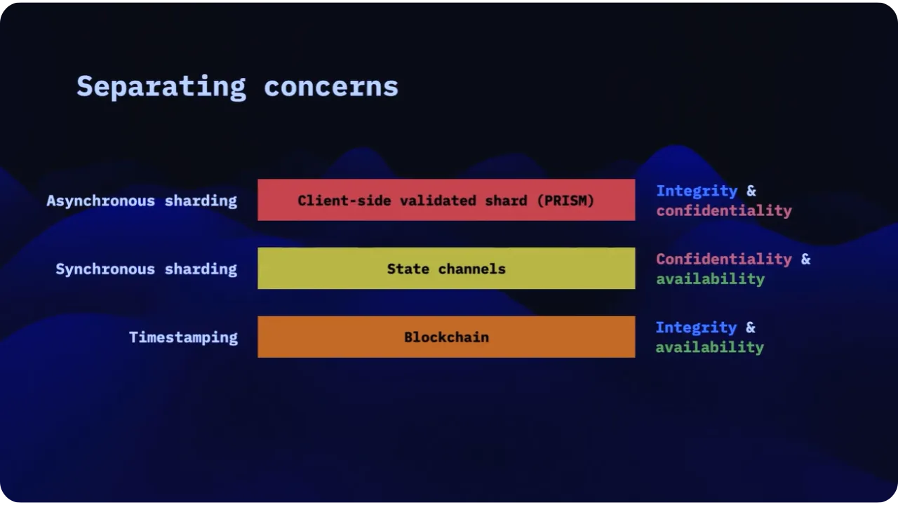


Izo Elements zitatu zikora igice c'inkomoko itatu, aho kuba ikirundo c'umurongo c'"Layer 2", "Layer 3" n'ibindi. Umuravyo ushobora gufatanya na Bitcoin, canke ugafatanya n’ibikorwa vya Bitcoin birimwo amakuru ya RGB. Na "BiFi" (ivy'amahera kuri Bitcoin) irashobora gukorana na Blockchain, na Lightning na RGB bivanye n'ivyo bikenewe ku bijanye n'ibanga, ubushobozi bwo gutera imbere canke ubuhinga bwa Contract.


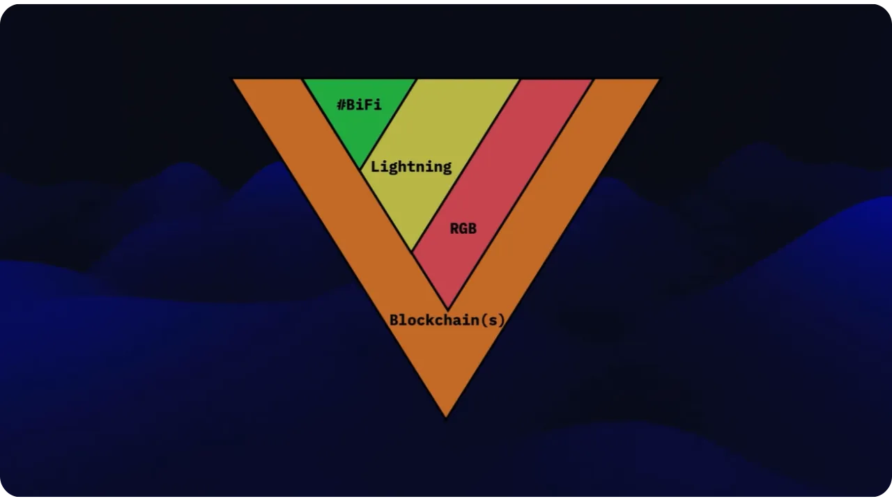


### Iciyumviro c'imihindukire ya Leta


Mu buryo bwose busanzwe, intumbero y’uburyo bwo kwemeza ni ugushobora **kumenya ukuri n’urutonde rw’ibihe vy’amahinduka ya Leta**. Intumbero ni ukugenzura ko amategeko y’amasezerano yubahirijwe, no kwemeza ko ayo mahinduka ya Leta akurikirana mu buryo butomoye, butagira aho bugarukira.


Kugira ngo dutahure ingene iyo validation ikora mu bijanye na **Bitcoin** kandi, muri rusangi, kugira ngo dutahure filozofiya iri inyuma ya Client-side Validation, reka tubanze dusubire kuraba uburyo Bitcoin Blockchain ikora, imbere yo kubona ingene Client-side Validation itandukanye na zo n’ivyo ishobora gutuma bishoboka.


Ku bijanye na Bitcoin Blockchain, kwemeza amafaranga bishingiye kw’itegeko ryoroshe:


- Ivyuma vyose vy’urubuga bikuraho buri bubiko n’ugucuruza;
- Bashingira intahe ivyo bikorwa kugira ngo basuzume iterambere ryiza ry’umugwi wa UTXO (ibisohoka vyose bitakoreshejwe);
- Babika ayo makuru (mu buryo bw’ibipande) kugira ngo amateka ashobore gusubirwamwo iyo bikenewe.


Ariko rero, iyo nzira irafise ingorane zibiri zikomeye:


- **Scalability**: kuko node yose itegerezwa gukora, kugenzura no gushiramwo ububiko bw'ibikorwa vy'umuntu wese, hariho urugero rugaragara rw'ubushobozi bwo gukora, rufitaniye isano cane cane n'ubunini bw'ibara ry'ibara (1 MB ku mwanya mu minota 10 kuri Bitcoin, hatarimwo ama cookies);
- **Ibanga**: vyose biramenyeshwa kandi bikabikwa ku mugaragaro (amahera, amaderesi y'aho umuntu aja, n'ibindi), ivyo bikaba bigabanya ibanga ry'uguhanahana amakuru.


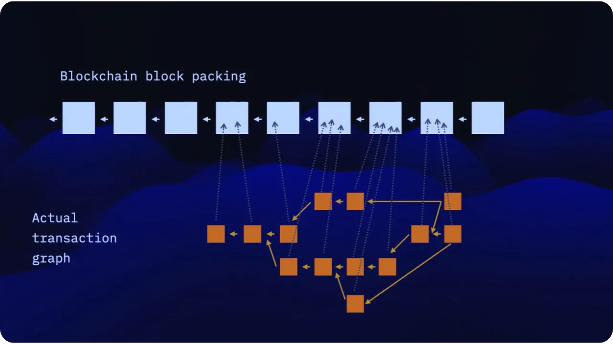


Mu bikorwa, iki kigereranyo gikorera Bitcoin nk’ishimikiro Layer (Layer 1), ariko gishobora kuba kidahagije ku bikorwa bikomeye cane bisaba icarimwe ubushobozi bwinshi bwo gucuruza n’urugero runaka rw’ibanga.


Client-side Validation ishingiye ku ciyumviro gihushanye n’ico: aho gusaba ko urubuga rwose rwemeza no kubika amafaranga yose akoreshwa, umwe wese mu bari muri iyo nama (umukiriya) azokwemeza gusa igice c’amateka kimureba:


- Iyo umuntu aronse umutungo (canke uwundi mutungo uwo ari wo wose w’ubuhinga bwa none), akeneye gusa kumenya no kugenzura uruhererekane rw’ibikorwa (imihindukire ya Leta) ijana kuri uwo mutungo no kwemeza ko ari we wemewe;
- Uwo murongo w’ibikorwa, kuva ku ***Genesis*** (ikinyamakuru ca mbere) gushika ku giciro gishasha, ugira igishushanyo c’inzira (DAG) canke Shard, ni ukuvuga igice c’amateka yose.


Muri ico gihe nyene, kugira ngo igice gisigaye c’urubuga (canke mu buryo bubereye, Layer iri munsi yayo, nka Bitcoin) gishobore gufunga mu rwego rwa nyuma kitabona ido n’ido ry’ayo makuru, Client-side Validation yizigira iciyumviro ca ***Commitment***.


*Commitment* ni Commitment y'ibanga, mu bisanzwe _hash_ (SHA-256 nk'akarorero) yinjijwe mu gikorwa ca Bitcoin, kigaragaza ko amakuru y'ibanga yashizwemwo, ata guhishura ayo makuru.


Kubera ivyo _vyemezo_, turashobora kwemeza:


- Kubaho kw’amakuru (kubera ko yiyemeje gukora Hash);
- Imbere y’ayo makuru (kuko ashizweko ikidodo kandi afise ikidodo c’isaha muri Blockchain, afise itariki n’urutonde rw’ibice).


Ariko rero, ibirimwo vy’ukuri ntibimenyekana, gutyo bikaba bizigama ibanga ryavyo.


Mu majambo nyayo, ng’uko uko RGB State Transition ikora:


- Utegura State Transition nshasha (nk’uguhindura RGB token);
- U generate Commitment y'ibanga kuri iyi mpinduka maze ukayishira mu gikorwa ca Bitcoin (ivyo vyemezo vyitwa "*anchors*" mu masezerano ya RGB);
- Uwundi muntu (uwuronka) araronka amateka y’uruhande rw’umukiriya ajanye n’ico kintu maze akavyemeza ko bihuye kuva ku mpera kugeza ku mpera, kuva kuri Genesis ya Smart contract gushika ku mpinduka uyirungikira.


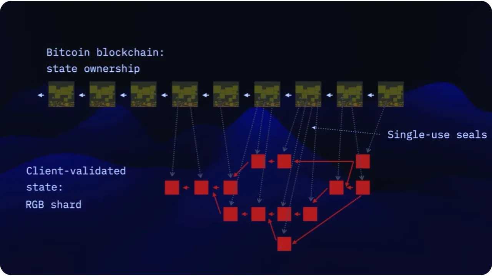


Client-side Validation itanga ivyiza bibiri bihambaye:


- Ugushobora gukwiragizwa:


*Ivyemezo* biri muri Blockchain ni bito (vy'urutonde rw'ama bytes amajana makeyi). Ivyo bituma ikibanza c’amabuye kitazura, kuko Hash yonyene ari yo ikeneye gushirwamwo. Bituma kandi umurongo wa off-chain utera imbere, kuko umukoresha wese ategerezwa gusa kubika igice c'amateka yiwe (_stash_ yiwe).


- **Ubuzima bwite:**


Ibikorwa ubwavyo (ni ukuvuga ibirimwo mu buryo burambuye) ntibisohorwa On-Chain. Intoke zabo gusa (*Hash*) ni zo. Gutyo, amafaranga, amaderesi n’ubuhinga bwa Contract biguma ari ivy’ibanga, kandi uwuyakira arashobora kugenzura, mu karere, ukuri kwa Shard yiwe mu gusuzuma ihinduka ryose ry’imbere. Nta mpamvu n’imwe yotuma uwuronka ayo makuru amenyeshwa abantu bose, kiretse iyo habaye impaka canke iyo bisabwe ikimenyamenya.


Mu buryo nka RGB, amahinduka menshi ya Leta avuye mu masezerano atandukanye (canke itunga ritandukanye) ashobora guhurizwa hamwe mu gikorwa kimwe ca Bitcoin biciye ku _ukwiyemeza_ kumwe. Ubu buryo bushinga isano ry’igihe hagati y’ugucuruza kwa On-Chain n’amakuru ya off-chain (ihinduka ryemejwe n’uruhande rw’umukiriya), kandi rituma ibice vyinshi vyandikwa icarimwe mu ntumbero imwe ya Anchor, bikaba bigabanya igiciro ca On-Chain n’ikirenge.


Mu bikorwa, iyo iyo nzira ya Bitcoin yemejwe, "ifunga" ubudasiba ivy'amasezerano y'ishimikiro, kuko bica bidashoboka guhindura Hash yari yaramaze kwandikwa muri Blockchain.


### Iciyumviro ca Stash


**Stash** ni urutonde rw'amakuru y'umukiriya uwuriko arakora ategerezwa kubika kugira ngo agumane ubutungane n'amateka ya RGB Smart contract. Udakunze umurongo wa Lightning, aho intara zimwe zimwe zishobora gusubirwamwo mu karere zivuye ku makuru asangiye, Stash ya RGB Contract ntiyisubirwamwo ahandi: iyo uyitakaje, nta n’umwe azoshobora kuyigusubiza, kuko ari wewe ufise uruhara ku mugabane wawe w’amateka. Ni co gituma ukeneye gukoresha uburyo bufise uburyo bwo gusubiza inyuma bwizewe muri RGB.


### Single-Use Seal: inkomoko n'imikorere


Igihe wemera umutungo nk’amahera, hariho ivyemezo bibiri bihambaye:


- Ubunyakuri bw’ikintu caronse;
- Ubudasa bw’ikintu caronse, kugira ngo ntihagire amahera akoreshwa incuro zibiri.


Ku bintu vy’umubiri, nk’agapapuro k’amahera, kubaho kw’umubiri birahagije kugira ngo umuntu yerekane ko ataco yasubiyemwo. Ariko rero, mw’isi y’ubuhinga bwa none, aho ivy’ubutunzi ari amakuru gusa, iyo nzira yo kugenzura irarushiriza kugorana, kuko amakuru ashobora kwiyongera bitagoranye no kwisubiriza.


Nk’uko twabibonye mbere, uguhishurirwa kw’uwarungitse amateka y’ihinduka rya Leta biradushoboza kumenya neza ko RGB token ari iy’ukuri. Mu kuronka uburenganzira bwo kubona amafaranga yose yagurishijwe kuva igihe Genesis yagurishijwe, turashobora kwemeza ko token ari iy’ukuri. Iryo hame risa n’irya Bitcoin, aho amateka y’ibiceri ashobora gusubirwamwo gushika ku Coinbase Transaction y’intango kugira ngo umuntu asuzume ko ari ukuri. Ariko rero, bitandukanye na Bitcoin, iyo nkuru y’ihinduka rya Leta muri RGB ni iy’ibanga kandi igumye ku ruhande rw’umukiriya.


Kugira ngo twirinde Double-spending y'ibimenyetso vya RGB, dukoresha uburyo bwitwa "**Single-Use Seal**". Uwo murongo utuma token yose, iyo imaze gukoreshwa, idashobora gusubira gukoreshwa mu buryo bw’ubuhendanyi ubugira kabiri.


Ibimenyetso bikoreshwa rimwe ni ibimenyetso vya kera vy’ubuhinga bwa cryptography, vyashikirijwe mu 2016 na Peter Todd, bisa n’iciyumviro c’ibimenyetso vy’umubiri: iyo Seal imaze gushirwa ku kintu, biraba bidashoboka ko umuntu ayifungura canke ayihindura ataco amenagura Seal.


Ubwo buryo, buhinduwe mu isi y’ubuhinga bwa none, buratuma bishoboka kwemeza ko urutonde rw’ibintu rwabaye vy’ukuri, kandi ko rudashobora guhindurwa a posteriori. Ivyuma bikoreshwa rimwe rero birarenga ivyiyumviro vyoroshe vya `Hash + Timestamp`, vyongerako iciyumviro c'uko Seal ishobora gupfungwa **rimwe gusa**.


Kugira ngo Ibimenyetso vy’Ikoreshwa Rimwe bikore, ukeneye uburyo bwo kwemeza ko igitabu kiriho canke kitariho, kandi kigoye (niba bidashoboka) kubesha iyo amakuru amaze gukwiragizwa. **Blockchain** (nka Bitcoin) irashobora kwuzuza uwo murimo, nk’uko ikinyamakuru c’impapuro gishobora gusohoka mu bantu bose, nk’akarorero. Iciyumviro ni iki:


- Turashaka kwemeza ko Commitment kanaka iri ku butumwa `h(m)` yasohowe ku bantu bumviriza ata guhishura ibirimwo ubutumwa `m`;
- Turashaka kwemeza ko ata bundi butumwa `h(m')` buhiganwa Commitment bwasohowe mu kibanza ca `h(m)`;
- Turashaka kandi kuba dushoboye kugenzura ko ubutumwa `m` buriho imbere y'itariki kanaka.


Blockchain irashobora gukora neza muri uwo murimo: igihe igikorwa co gucuruza kigizwe mu gice, urubuga rwose ruragira ikimenyamenya kimwe kidashobora kwihenda c’ukubaho kwarwo n’ibirimwo (n’imiburiburi mu gice, kuko _ukwiyemeza_ gushobora guhisha ido n’ido mu gihe kwemeza ko ubutumwa ari ubw’ukuri).


Single-Use Seal rero ishobora kubonwa nk’isezerano ry’ugutangaza ubutumwa (butaramenyekana muri iki gihe) rimwe gusa, mu buryo bushobora kugenzurwa n’ababishaka bose.


Udakunze _imihigo_ yoroshe (Hash) canke ibimenyetso vy'igihe, vyemeza itariki y'ukubaho, Single-Use Seal itanga ikimenyamenya c'inyongera c'uko **ata yindi Commitment** ishobora kubana: ntushobora gufunga Seal imwe incuro zibiri, canke ngo ugerageze gusubira kuyisubirira.


Igereranyo rikurikira rifasha gutahura iyo ngingo ngenderwako:


- **Commitment (Hash)**: Ukoresheje igikorwa ca Hash, ushobora kwiyemeza gutanga amakuru (umubare) mu gutangaza Hash yayo. Amakuru aguma ari ibanga gushika uhishuye ishusho y'imbere, ariko ushobora kwemeza ko wari uzi imbere y'igihe;
- **Timestamp (Blockchain)**: Mu kwinjiza iyi Hash muri Blockchain, turagaragaza kandi ko twayimenye mu gihe nyaco (ico co kuyishira mu gice);
- **Single-Use Seal**: Kubera ibimenyetso bikoreshwa rimwe, turatera intambwe imwe imbere mu gutuma Commitment iba iyidasanzwe. Ukoresheje Hash imwe, urashobora gukora amasezerano menshi avuguruzanya mu buryo bumwe (ingorane y'umuganga amenyesha umuryango ngo "*Ni umuhungu*" na "*Ni umukobwa*" mu gitabu ciwe bwite). Single-Use Seal irakuraho ivyo bishoboka mu gufatanya Commitment n'ikimenyamenya c'isohorwa, nka Bitcoin Blockchain, kugira ngo gukoresha UTXO bishireko ikidodo ata gukeka Commitment. Iyo UTXO nyene imaze gukoreshwa, ntishobora gusubira gukoreshwa kugira ngo isubirire Commitment.


|                                                                                  | Simple commitment (digest/hash) | Timestamps | Single-use seals |
| -------------------------------------------------------------------------------- | ------------------------------- | ---------- | ---------------- |
| Publishing the commitment does not reveal the message                           | Yes                             | Yes        | Yes              |
| Proof of the commitment date / existence of the message before a certain date  | Impossible                      | Possible   | Possible         |
| Proof that no alternative commitment can exist                                 | Impossible                      | Impossible | Possible         |

Ibimenyetso bikoreshwa rimwe bikora mu ntambwe zitatu nyamukuru:


**Igitabu-213:**


- Alice isobanura imbere y’igihe amategeko agenga gusohora Seal (igihe ubutumwa buzosohorwa, aho buzosohorwa be n’ingene buzosohorwa);
- Bob yemera canke yemera ivyo bintu.


**Seal Gusozera:**


- Mu gihe c'urugendo, Alice ifunga Seal mu gutangaza ubutumwa nyabwo (kenshi mu buryo bw'_ukwiyemeza_, nk'akarorero Hash);
- Iratanga kandi **icabona** (ikimenyamenya c’ubuhinga bwa none) kigaragaza ko Seal yugarijwe kandi ko idashobora gusubirwamwo.


**Igenzura rya Seal:**


- Iyo Seal imaze gupfungwa, Bob ntashobora kugifungura: ashobora gusa kugenzura ko yapfungiwe;
- Bob akorakoranya Seal, **icabona** n’ubutumwa (canke Commitment yiwe) kugira ngo amenye neza ko vyose bihuye kandi ko ata bimenyetso bihiganwa canke amaverisiyo atandukanye.


Ivyo bishobora gusobanurwamwo muri make gutya:


```txt
# Defined by Alice, validated or accepted by Bob
seal <- Define()
# Seal is closed by Alice with the message
witness <- Close(seal, message)
# Verification by Bob
bool <- Verify(seal, witness, message)
```


Ariko rero, Client-side Validation iratera intambwe imwe imbere: iyo insobanuro ya Seal ubwayo iguma hanze ya Blockchain, birashoboka (mu vyiyumviro) ko umuntu ashobora guhakana ukubaho canke uburenganzira bw’iyo Seal iriko iravugwa. Kugira ngo iyo ngorane ishobore gutorwa, hakoreshwa uruhererekane rw’Ibimenyetso Bikoreshwa Rimwe Bifatanya:


- Seal yose yugarijwe irimwo insobanuro y’iyi Seal ikurikira;
- Twandika ivyo bifunga (n’ivyo _vyemeye_) muri Blockchain (mu gucuruza Bitcoin);
- Gutyo, ukugerageza kwose kwo guhindura Seal ya kera kwoba kuvuguruza amateka ashizwe muri Bitcoin.


Ivyo ni vyo nyene ubuhinga bwa RGB bukora:


- Ubutumwa bwasohowe ni _imihigo_ ku makuru yemejwe n'umukiriya;
- Igitero ca Seal Definition gifatanye n’igitero ca Bitcoin UTXO;
- Seal irafunga iyo iyo UTXO ikoreshejwe canke iyo umusaruro mushasha ushizwe kuri iyo Commitment nyene;
- Uruhererekane rw'ibikorwa rukoresha izo UTXO rujanye n'ikimenyamenya c'isohorwa: ihinduka ryose canke ihinduka ry'ubutegetsi kuri RGB rero rishingiye kuri Bitcoin.


Mu guca irya n’ino:


- _Insobanuro y'ikidodo_ ni UTXO ushaka Seal Commitment izoza;
- _Ugufunga ikidodo_ kubaho iyo ukoresheje iyi UTXO, ukarema igikorwa kirimwo Commitment;
- _Icabona_ ni igikorwa ubwaco, kigaragaza ko mwafunze Seal n’ivyo birimwo;
- Ntushobora kwemeza ko Seal itapfungiwe (ntushobora kwemera neza ko UTXO itaramaze gukoreshwa canke itazokoreshwa mu gice utarabona), ariko ushobora kwemeza ko vy’ukuri yapfungiwe.


Ubwo bwihariye burahambaye kuri Client-side Validation: iyo wemeje State Transition, urasuzuma ko ihuye na UTXO yihariye, itakoreshejwe mbere mu Commitment iriko irahiganwa. Ivyo ni vyo vyemeza ko ata gukoresha amahera kabiri mu masezerano y’ubwenge ya off-chain.


### Ivyemezo vyinshi n'imizi


RGB Smart contract ishobora gukenera gukoresha ibimenyetso vyinshi vy’ikoreshwa rimwe (UTXO nyinshi) icarimwe. Ikindi, igikorwa kimwe ca Bitcoin gishobora kwerekeza ku masezerano atandukanye, umwe wese akagira ikidodo kuri State Transition yayo. Ivyo bisaba uburyo **multi-Commitment** bwo kwemeza, mu buryo butegekanijwe kandi budasanzwe, ko ata n’imwe mu migambi iriho mu buryo bubiri. Aha niho iciyumviro ca **Anchor** kija muri RGB: uburyo budasanzwe buhuza ibikorwa vya Bitcoin n'isezerano rimwe canke menshi ry'umukiriya (ihinduka rya Leta), rimwe ryose rishobora kuba ari irya Contract itandukanye. Tuzokwihweza neza ico ciyumviro mu kigabane gikurikira.


Ibiri mu bibanza nyamukuru vy’ububiko bwa GitHub vy’umugambi (biri munsi y’ishirahamwe LNPBP) bihuriza hamwe ibikorwa vy’ishimikiro vy’ivyo vyiyumviro vyigwa mu kigabane ca mbere:


- **umukiriya_uruhande_kwemeza**: Irimwo Rust ivy'intango vy'ukwemeza kw'aho hantu;
- **single_use_seals**: Ishira mu ngiro uburyo bwo gusobanura no gufunga ibi bimenyetso neza.


Zirikana ko ayo matafari ya porogarama ari Bitcoin agnostic; mu vyiyumviro, vyoshobora gukoreshwa ku bundi buryo bwose bwo kwemeza ko vyasohowe (ubundi buhinga bwo kwandika, ikinyamakuru, n’ibindi). Mu bikorwa, RGB yizigiye Bitcoin kubera ubukomezi bwayo n’uguhurizako kwagutse.


### Ibibazo vya bose


#### Ku bijanye n'ikoreshwa ryagutse ry'Ibidodo Bikoreshwa Rimwe


Peter Todd nawe yararemye _Open Timestamps_ umurongo, kandi iciyumviro ca Single-Use Seal ni ukwaguka kw'ivyo vyiyumviro. Uretse RGB, hariho n'ibindi bikoresho bishobora gukoreshwa, nk'ubwubatsi bw'imirongo y'inyuma_ ata gukoresha _gufatanya ubucukuzi_ canke ivyiyumviro bijanye n'imirongo y'imiduga nka BIP300. Uburyo bwose busaba Commitment imwe burashobora, mu ngingo ngenderwako, gukoresha iyo nzira y’ubuhinga bwa none. Ubu, RGB ni ryo rya mbere rikomeye ry’ugushirwa mu ngiro ku rugero rwose.


#### Ibibazo vyo kuboneka kw'amakuru


Kubera ko muri Client-side Validation, uwukoresha wese abika igice ciwe c’amateka, ukuboneka kw’amakuru ntikwemezwa kw’isi yose. Iyo uwutanga Contract yihishije canke akuyeho amakuru amwamwe, ushobora kuba utazi ingene iyo mpano yateye imbere vy’ukuri. Mu bihe bimwebimwe (nk’ibiceri bikomeye), uwubitanga ategerezwa kuguma afise amakuru ya bose kugira ngo yerekane umubare w’amahera ariko arakoreshwa, ariko nta n’itegeko ry’ubuhinga ryo kubigira. Birashoboka rero guhingura amasezerano ataboneka n’ibigirankana afise Supply itagira aho igarukira, ivyo bikaba bivyura ibibazo vy’ukwizigirana.


#### Gucapura no kwitandukanya na Contract


Buri Contract igereranya _shard_ yitandukanije: USDT na USDC, nk’akarorero, ntibitegerezwa gusangira amateka yavyo. Guhinduranya atome biracari bishoboka, ariko ivyo ntibisaba gufatanya amarejista yabo. Ivyo vyose bikorwa n’ubuhinga bwa cryptographic Commitment, ata kumenyesha igicapo cose c’amateka ku muntu wese ari muri iyo nama.


### Iciyumviro


Twarabonye aho iciyumviro ca Client-side Validation gihuriye na Blockchain na _mirongo ya leta_, ingene yishura ku bibazo vy'ubuhinga bwa none, n'ingene ikoresha Bitcoin Blockchain mu buryo budasanzwe kugira ngo yirinde Double-spending no kugira ngo *yishireko ikidodo ku gihe*. Iciyumviro gishingiye ku ciyumviro ca **Single-Use Seal**, gishoboza kurema amasezerano yihariye udashobora gusubira gukoresha uko ushaka. Muri ubwo buryo, uwuje mu nama wese ashirako gusa amateka akenewe cane, ivyo bikaba bituma amasezerano y’ubwenge ashobora gukoreshwa neza kandi akagira ibanga mu gihe agumana umutekano wa Bitcoin nk’inyuma.


Intambwe ikurikira izoba iyo gusigura mu buryo burambuye ingene ubu buryo bwa Single-Use Seal bukoreshwa muri Bitcoin (biciye muri UTXOs), ingene amananga aremwa kandi yemezwa, hanyuma ingene amasezerano y’ubwenge yuzuye yubakwa muri RGB. Cane cane, tuzorabira ku kibazo c’imihigo myinshi, ingorane y’ubuhinga yo kwemeza ko igikorwa ca Bitcoin gikingira icarimwe amahinduka menshi ya Leta mu masezerano atandukanye, ata gushiramwo ubugoyagoye canke imihigo ibiri.


Imbere yo kwisuka mu bintu vy’ubuhinga vy’igice ca kabiri, ntutinye gusubira gusoma insobanuro nyamukuru (Client-side Validation, Single-Use Seal, amananga, n’ibindi) maze uzirikane ivyiyumviro rusangi: turiko turarondera guhuza inkomezi za Bitcoin Blockchain decurity,cypment of time, () off-chain inyishu (umuvuduko, ibanga, ubushobozi bwo gutera imbere), kandi ivyo ni vyo nyene RGB na Client-side Validation bariko baragerageza gushikako.


## Ivyo Commitment Layer


<chapterId>cc2fe85a-9cc7-5b8c-a00a-c0a867241061</chapterId>


:::id y'amasanamu = 73dea2d-c243-479d-a3dc-12d7db8eef70:::


Muri iki gice, turaza kuraba ingene Client-side Validation n'Ibimenyetso bikoreshwa rimwe gusa bishirwa mu ngiro muri Bitcoin Blockchain. Tuzoshikiriza ingingo ngenderwako nyamukuru za RGB **Commitment Layer** (Layer 1), twibanda canecane ku mugambi wa **TxO2**, uwo RGB ikoresha mu gusobanura no gufunga Seal mu gucuruza kwa Bitcoin. Inyuma y’aho, turaza kuganira ku ngingo zibiri zihambaye zitaravugwa mu buryo burambuye:


- Ivyo _vyemezo vya Bitcoin vyemeza_;
- Ivyemezo vy’amasezerano menshi.


Ni uguhuza ivyo vyiyumviro bituma dushobora gushiramwo ubuhinga canke amasezerano menshi hejuru ya UTXO imwe, rero Blockchain imwe.


Ni ngombwa kwibuka ko ibikorwa vy'ubuhinga bwa cryptography vyavuzwe bishobora gukoreshwa, mu majambo atagira uko asa, ku bindi bice vy'ubuhinga bwa none canke ibinyamakuru vyo gusohora, ariko ibiranga Bitcoin (mu bijanye no kwegereza ubutegetsi, kunanira gucengera no gufungurira bose) biyigira umushinge mwiza wo guteza imbere ubuhinga bwo gukora porogarama buteye imbere nk'ubwo busabwa na **G-30W**.


### Ivyiyumviro vya Commitment biri muri Bitcoin n’ingene bikoreshwa na RGB


Nk’uko twabibonye mu kigabane ca mbere c’amashure, Ibimenyetso vy’Ikoreshwa Rimwe ni iciyumviro rusangi: dutanga umuhango wo gushiramwo Commitment (_commitment_) mu kibanza kinaka c’ugucuruza, kandi ico kibanza gikora nka Seal dufunga ku butumwa. Ariko rero, kuri Bitcoin Blockchain, hariho uburyo bwinshi bwo guhitamwo aho woshira iyo _myemezo_.


Kugira ngo dutahure ivyiyumviro, reka twibuke ingingo ngenderwako y’ishimikiro: kugira ngo dufunge _ikidodo gikoreshwa rimwe_, dukoresha ahantu hakingijwe mu kwinjiza _ukwiyemeza_ ku butumwa bwatanzwe. Muri Bitcoin, ivyo bishobora gukorwa mu buryo butari buke:


- Koresha urufunguzo rwa bose canke **Address**


Turashobora gufata ingingo y'uko urufunguzo rwa bose canke Address ari _ikidodo gikoreshwa rimwe_. Igihe nyene urufunguzo canke Address rubonetse On-Chain mu gucuruza, bisigura ko Seal ipfungiwe n’ubutumwa bumwe.


- Koresha **Bitcoin** igisohoka


Ivyo bisigura ko _ikidodo gikoreshwa rimwe_ gisobanurwa nk'_isohoka_ ry'ukuri (umubare w'isohoka wa txid +). Ico _sohoka_ kimaze guhera, Seal irafunga.


Igihe twariko turakora kuri RGB, twabonye nibura uburyo 4 butandukanye bwo gushitsa ivyo bimenyetso kuri Bitcoin:


- Sigura Seal biciye ku rufunguzo rwa bose, maze urufunge mu _isohoka_;
- Sigura Seal n'_isohoka_ maze uyifunge n'_isohoka_;
- Sigura Seal biciye ku gaciro k'urufunguzo rwa bose, hanyuma urufunge mu _input_;
- Sigura Seal biciye ku _isohoka_, hanyuma uyifunge mu _input_.


| Schema Name | Seal Definition           | Seal Closure              | Additional Requirements                                        | Main Application            | Possible Commitment Schemes     |
| ----------- | ------------------------- | ------------------------- | -------------------------------------------------------------- | --------------------------- | -------------------------------- |
| PkO         | Public Key Value          | Transaction Output        | P2(W)PKH                                                       | None at the moment          | Keytweak, taptweak, opret       |
| TxO2        | Transaction Output        | Transaction Output        | Requires deterministic commitments on Bitcoin                  | RGBv1 (universal)           | Keytweak, tapret, opret         |
| PkI         | Public Key Value          | Transaction Input         | Taproot only & not compatible with legacy wallets              | Bitcoin-based identities    | Sigtweak, witweak               |
| TxO1        | Transaction Output        | Transaction Input         | Taproot only & not compatible with legacy wallets              | None at the moment          | Sigtweak, witweak               |


Ntituzoja mu ndondoro kuri buri imwe muri izo ntunganyo, nk'uko muri RGB twahisemwo gukoresha **an _outpoint_ nk'insobanuro ya Seal**, no gushiramwo _commitment_ mu gisohoka c'ibikorwa bikoresha iyo _outpoint_. Turashobora rero gushiramwo ivyiyumviro bikurikira ku bijanye n’igice gikurikira:


- **"Seal Definition"**: _Igisohoka_ gitanzwe (kigaragazwa na txid + inomero y'isohoka);
- "Seal gufunga": Ibikorwa bikoresha iyi _isohoka_, aho _ukwiyemeza_ kwongerwa ku butumwa.


Iyi nzira yatowe kubera ko ihuye n’ubwubatsi bwa RGB, ariko izindi nzira zoshobora kuba ngirakamaro ku bikorwa bitandukanye.


"O2" iri muri "TxO2" itwibutsa ko insobanuro n'ugufunga vyose bishingiye ku gukoresha (canke kurema) umusaruro w'ibikorwa.


### Akarorero k'ikigereranyo ca TxO2


Nk’ukwibutsa, gusobanura _ikidodo co gukoresha rimwe_ ntibisaba gutangaza ivy’ugucuruza vya On-Chain. Birahagije ko Alice, nk'akarorero, iba isanzwe ifise UTXO itakoreshejwe. Ashobora gufata ingingo: "Iki _ciyumviro_ (kiriho) ubu ni Seal yanje". Ivyo abibona mu karere (_client-side_), kandi gushika iyo UTXO ikoreshejwe, Seal ifatwa ko yuguruye.


Umusi ishaka gufunga Seal (kugira ngo yerekane ikintu, canke ku Anchor ubutumwa bumwe bumwe), ikoresha iyo UTXO mu gikorwa gishasha (ico gikorwa citwa kenshi "_igikorwa c'icabona_" (kidafitaniye isano na _segwit_in_ transmit_, ni ijambo gusa the will it conmitcom). ku butumwa.


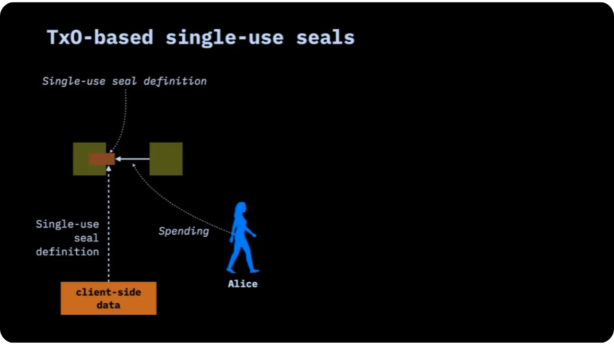


Zirikana ko muri aka karorero:


- Nta n’umwe atari Bob (canke abantu Alice ahisemwo guhishurira ikimenyamenya cose) azomenya ko hari ubutumwa bumwe bumwe bwihishije muri iyo nzira y’ugucuruza;
- Umuntu wese arashobora kubona ko _outpoint_ yakoreshejwe, ariko Bob yonyene ni yo ifise ikimenyamenya c'uko ubutumwa bushingiye vy'ukuri mu gucuruza.


Kugira ngo tugaragaze iyo nzira ya TxO2, turashobora gukoresha _ikidodo gikoreshwa rimwe_ nk'uburyo bwo gukuraho urufunguzo rwa PGP. Aho gutangaza icete co gukuraho ku maserukira, Alice ishobora kuvuga: "Iki gisohoka ca Bitcoin, iyo gikoreshejwe, bisigura ko urufunguzo rwanje rwa PGP rwakuweho".


Alice rero ifise UTXO yihariye, iyo leta canke amakuru (azwi na we gusa) afitaniye isano n’aho hantu (ku ruhande rw’umukiriya).


Alice imenyesha Bob ko iyo iyo UTXO ikoreshejwe, ikintu kinaka kizobonwa ko cabaye. Uvuye hanze, ivyo tubona vyose ni ugucuruza kwa Bitcoin; ariko Bob arazi ko iyo nsiguro ifise insobanuro yihishije.


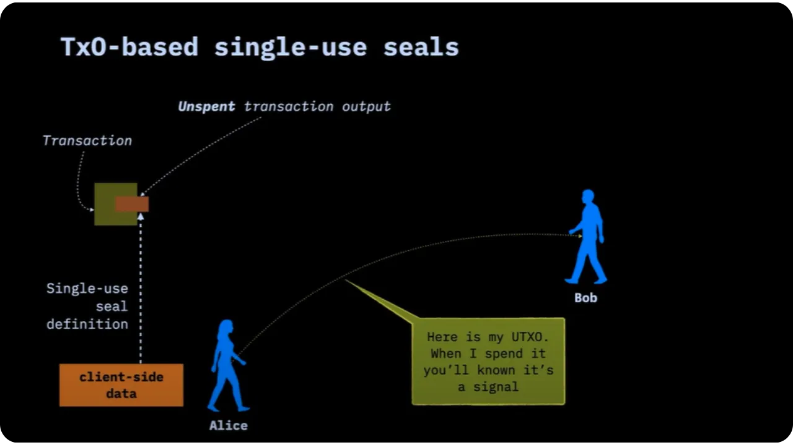


Uko Alice akoresha iyo UTXO, arafunga Seal ku butumwa bwerekana urufunguzo rwiwe rushasha, canke gusa gukuraho urufunguzo rwa kera. Muri ubwo buryo, umuntu wese azokurikirana On-Chain azobona ko UTXO yakoreshejwe, ariko abafise ikimenyamenya cuzuye ni bo bonyene bazomenya ko ari ukurekuraho nyavyo urufunguzo rwa PGP.


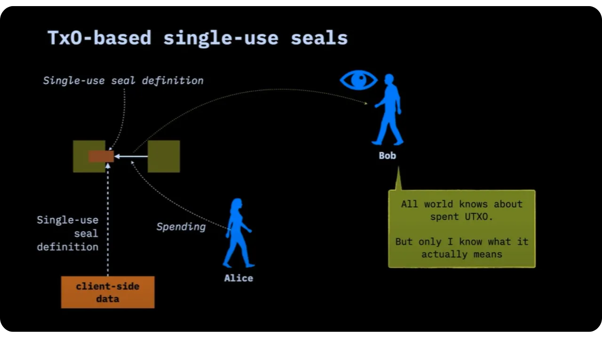


Kugira ngo Bob canke uwundi wese afise uruhara muri ivyo asuzume ubutumwa bwihishije, Alice ategerezwa kumuha amakuru ya off-chain.


Alice rero itegerezwa guha Bob ibi bikurikira:


- Ubutumwa ubwabwo (nk’akarorero, urufunguzo rushasha rwa PGP);
- Ikimenyamenya c’ubuhinga bwa none c’uko ubutumwa bwari mu bikorwa vy’ugucuruza (bizwi nka _ikimenyamenya c’ugucuruza c’inyongera_ canke _inanga_).


Abandi bantu nta makuru bafise. Babona gusa ko UTXO yakoreshejwe. Ibanga rero rirakengwa.


Kugira ngo dusobanukirwe imiterere, reka dufate incamake y’ingene bigenda mu bikorwa bibiri:


- **Ibikorwa 1**: Ibi birimwo _insobanuro y'ikidodo_, ni ukuvuga _isohoka_ rizokora nka Seal.


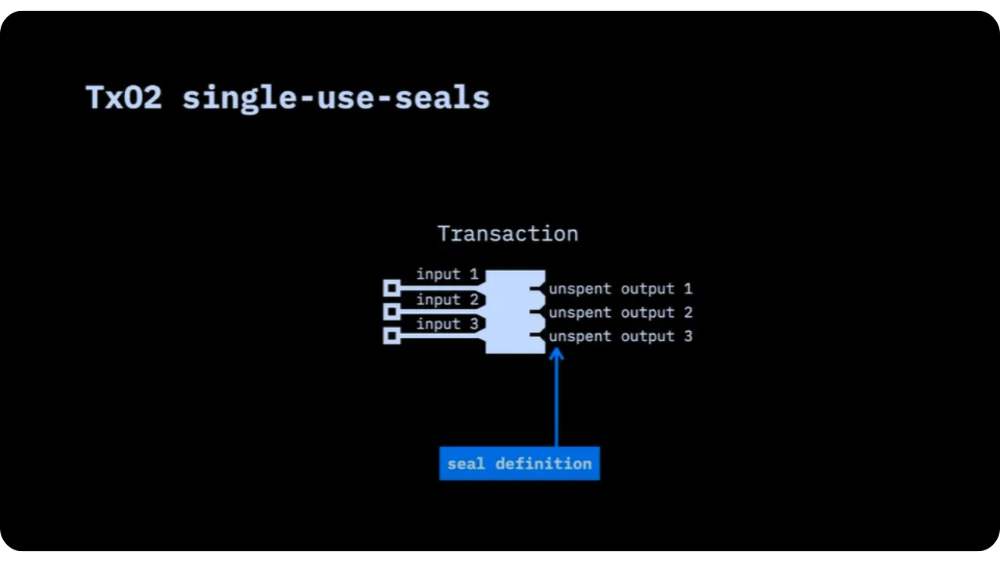


- **Ibikorwa 2**: Ikoresha iyi *isohoka*. Ivyo bifunga Seal kandi, muri iyo nzira nyene, bishiramwo *ukwiyemeza* ku butumwa.


Twita rero igikorwa ca kabiri "_igikorwa c'icabona_".


Kugira ngo ivyo tubigereranye mu yindi mfuruka, turashobora guserura ibice bibiri:


- **Layer yo hejuru (Blockchain, rusangi)**: umuntu wese abona ivy'ugucuruza kandi akamenya ko *isohoka* ryakoreshejwe;
- **Layer yo hasi (client-side, private)**: Alice wenyene (canke uwubireba) ni we azi ko iyo nsiguro ihuye n'ubutumwa nk'ubwo, biciye ku kimenyamenya c'ubuhinga bw'ibanga n'ubutumwa abika mu karere.


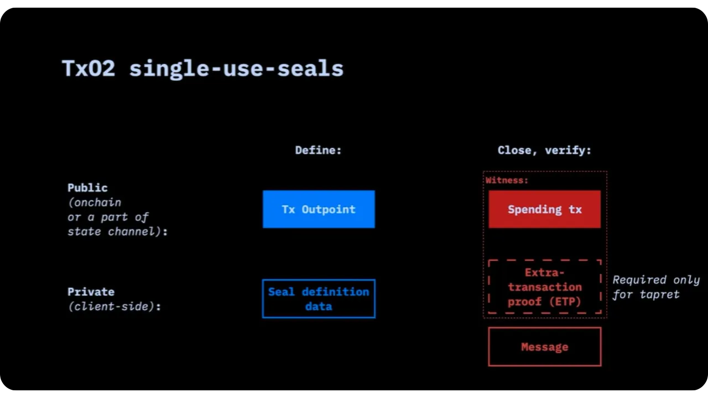


Ariko iyo umuntu afunga Seal, ikibazo kivyuka c’aho _ukwiyemeza_ gukwiye kwinjizwa.


Mu gice ca mbere, twavuze muri make ingene urugero rwa Client-side Validation rushobora gukoreshwa kuri RGB n’izindi nzira. Aha, turakora ku gice kivuga ku **amasezerano ya Bitcoin** n’ingene yoyashirwa mu bikorwa. Iciyumviro ni ugutahura igituma turiko turagerageza kwinjiza Commitment imwe mu _gucuruza kw’abashingantahe_, kandi ikiruta vyose ingene twomenya neza ko ata yindi migambi y’uguhiganwa itamenyekanye ishobora kubaho.


### Commitment ahantu mu gucuruza


Iyo uhaye umuntu ikimenyamenya c’uko ubutumwa bumwe bumwe bushizwe mu gicuruzwa, ukeneye kuba ushoboye kwizera ko ata bundi buryo bwa Commitment (ubutumwa bwa kabiri, bwihishije) buri muri ico gicuruzwa nyene butaguhishuriwe. Kugira ngo Client-side Validation igumye ikomeye, ukeneye uburyo **bugena** bwo gushiramwo _ukwiyemeza_ kumwe mu gucuruza gufunga _ikidodo c'ikoreshwa rimwe_.


_Igurisha ry'abashingantahe_ rikoresha amahera azwi cane UTXO (canke _insobanuro y'ikidodo_) kandi ayo mahera ahuye n'ugufunga Seal. Mu buryo bw’ubuhinga, turazi ko igice cose gishobora gukoreshwa rimwe gusa. Ivyo nyene ni vyo bishigikira ubushobozi bwa Bitcoin bwo kurwanya gukoresha amahera incuro zibiri. Ariko igikorwa co gukoresha amahera gishobora kuba gifise _ibintu vyinshi vyinjizwa_, _ibintu vyinshi bisohoka_, canke kikaba gikozwe mu buryo bugoranye (coinjoins, Lightning channels, n’ibindi). Turakeneye rero gusobanura neza aho twoshira _ukwiyemeza_ muri iyo nzira, ata gukeka kandi mu buryo bumwe.


Uko uburyo bwoba buri kwose (PkO, TxO2, n'ibindi), _ukwiyemeza_ gushobora kwinjizwa:


- Mu **Inyinjizo** biciye kuri:
- **Sigtweak** (ihindura igice ca `r` c'umukono wa ECDSA, gisa n'ingingo ngenderwako y'"Ikimenyetso-ku-Contract");
- **Witweak** (amakuru y'ivyabona *vyatandukanye* vy'ugucuruza arahindurwa).
- Mu **Igisohoka** biciye kuri:
- **Keytweak** (urufunguzo rwa bose rw'uwuronka "rurahindurwa" n'ubutumwa);
- **Opret** (ubutumwa bushirwa mu gisohoka kitashobora gukoreshwa `OP_RETURN`);
- **Tapret** (canke _Taptweak_), yizigira Taproot kugira ngo yinjize Commitment mu gice c'inyandiko c'urufunguzo rwa Taproot, gutyo igahindura urufunguzo rwa bose mu buryo butegekanijwe.


Aha niho hari ido n’ido ry’uburyo bumwe bumwe:


***Ikimenyetso co guhindura (ikimenyetso-ku-Contract):***


Umugambi wa kera wari ukoresha igice c'umukono (ECDSA canke Schnorr) kugira ngo ushiremwo _ukwiyemeza_: ubu ni ubuhinga buzwi nka "**Sign-to-Contract**". Usubiriza Nonce yavutse mu buryo butari bwo n’iyindi Hash irimwo amakuru. Muri ubwo buryo, iyo sinya irahishura ata gufyina Commitment yawe, ata kibanza na kimwe congereweko mu gucuruza. Ubwo buryo burafise ivyiza bitari bike:


- Nta On-Chain irenze urugero (ukoresha ahantu hamwe na Nonce y’ishimikiro);
- Mu vyiyumviro, ivyo bishobora kuba bitandukanye cane, kuko Nonce mu ntango ari urugero rw’ibintu bitari vyo.


Ariko rero, hariho ingorane 2 zikomeye zabonetse:


- Multisig imbere ya Taproot: iyo ufise abasinye benshi, ukeneye guhitamwo umukono uzotwara _ukwiyemeza_. Imikono ishobora gutegekwa mu buryo butandukanye, kandi iyo uwushizeko umukono yanse, uratakaza ububasha ku vyo _ukwiyemeza_ bizovamwo;
- MuSig na Nonce basangira: na Schnorr Multisig (*MuSig*), uruvyaro rwa Nonce ni ubuhinga bw’imigwi myinshi, kandi bica biba nk’ibidashoboka guhindura Nonce ku giti cabo.


Mu bikorwa, **sig tweak** na yo nyene ntihuye cane n’ibikoresho biriho (ibikoresho vy’amasakoshi) n’imiterere (Lightning, n’ibindi). Rero iki ciyumviro gikomeye ni Hard co gushira mu ngiro.


***Urufunguzo rwo guhindura (kwishura-ku-Contract):***


**Key tweak** ifata iciyumviro c'amateka c'_kwishura-ku-masezerano_. Dufata urufunguzo rwa bose `X` tukaruhindura mu kwongerako agaciro `H(ubutumwa)`. Mu buryo bwihariye, iyo `X = x * G` na `h = H(ubutumwa)`, rero urufunguzo rushasha ruzoba `X' = X + h * G`. Urufunguzo rwahinduwe runyegeza Commitment ku `ubutumwa`. Uwufise urufunguzo rw'ibanga rw'umwimerere arashobora, mu kwongerako `h` ku rufunguzo rwiwe rw'ibanga `x`, kwemeza ko afise urufunguzo rwo gukoresha igisohoka. Mu vyiyumviro, ivyo ni vyiza cane, kuko:


- _Ukwiyemeza_ kwinjira ata bindi bibanza vyongeweko;
- Nta makuru y’inyongera ya On-Chain ubika.


Ariko mu bikorwa, turahura n’ingorane zikurikira:


- Ama wallets ntagishobora kwemera urufunguzo rwa bose rusanzwe, kuko rwa "tweaked", rero ntizishobora gufatanya UTXO n'urufunguzo rwawe rusanzwe;
- Ivyuma vy’amasakoshi ntivyagenewe gusinya n’urufunguzo rudakomoka ku vyo bikomokamwo;
- Ukeneye guhindura inyandiko zawe, ibisobanuro, n'ibindi.


Mu bijanye na RGB, iyo nzira yari itegekanijwe gushika mu 2021, ariko vyagaragaye ko igoye cane ku buryo itashobora gukorana n’ingingo mfatirwako n’ibikorwa remezo biriho ubu.


***Ivyabona tweak:***


Ikindi ciyumviro, amategeko amwe amwe nka _inscriptions Ordinals_ yashize mu ngiro, ni ugushira amakuru ataco akora mu gice ca `umushingantahe` c'ugucuruza (ni co gituma imvugo "uguhindura umushingantahe"). Ariko rero, ubu buryo:


- Bituma ubugeni buboneka ubwo nyene (ushiramwo amakuru atagiramwo ivyiza mu cabona);
- Bishobora gucengera (abacukuzi canke ama node bashobora kwanka gutanga iyo ari nini cane canke ikindi kintu cose kiranga ububisha);
- Ifata umwanya mu mabuye, bitandukanye n’intumbero ya RGB yo gukoresha ubukerebutsi no gutuma umuntu agira umuco.


Vyongeye, igishingantahe gigenewe gufatwa mu bihe bimwebimwe, ivyo bikaba bishobora gutuma kugira ibimenyamenya bikomeye bigorana cane.


***Gufungura-kugaruka (opret):***


Biroroshe cane mu mikorere yavyo, `OP_RETURN` iragufasha kubika Hash canke ubutumwa mu kibanza kidasanzwe c'ugucuruza. Ariko biraca bimenyekana: umuntu wese abona ko hariho _ukwiyemeza_ mu gucuruza, kandi birashobora gucengera canke gutabwa, hamwe no kwongerako umusaruro w'inyongera. Kubera ko ivyo birongereza uguseruka n'ubunini, bifatwa nk'ibidashimisha cane ku bijanye n'umuti wa Client-side Validation.


```txt
34-byte_Opret_Commitment =
OP_RETURN   OP_PUSHBYTE_32   <mpc::Commitment>
|_________| |______________| |_________________|

1-byte       1-byte         32 bytes
```


### Tapret


Ihitamwo rya nyuma ni ugukoresha **Taproot** (yashizweho na BIP341) n’umugambi wa *Tapret*. *Tapret* ni uburyo bugoranye cane bw’ubuhinga bwa Commitment, buzana iterambere mu bijanye n’ikirenge kuri Blockchain n’ibanga ry’ibikorwa vya Contract. Iciyumviro nyamukuru ni uguhisha Commitment mu gice ca `Inzira y'Inyandiko` y'[Ibikorwa vya Taproot] (Taproot).


Imbere yo gusobanura ingene Commitment yinjizwa mu gikorwa ca Taproot, reka turabe **uburyo nyabwo** bwa Commitment, butegerezwa **guhuye n'urudodo rw'amabayiti 64** . [yubatswe] (BP-WG/bp-core/blob/umukuru/dbc/src/tapret/mod.rs#L179-L196) nk'uko bikurikira:


```txt
64-byte_Tapret_Commitment =

OP_RESERVED ...  ... .. OP_RESERVED   OP_RETURN   OP_PUSHBYTE_33  <mpc::Commitment>  <Nonce>
|___________________________________| |_________| |______________| |_______________|  |______|
OP_RESERVED x 29 times = 29 bytes      1 byte         1 byte          32 bytes        1 byte
|________________________________________________________________| |_________________________|

TAPRET_SCRIPT_COMMITMENT_PREFIX = 31 bytes                    MPC commitment + NONCE = 33 bytes
```


- Ivyo bice 29 `OP_RESERVED`, bikurikiwe na `OP_RETURN`, hanyuma `OP_PUSHBYTE_33`, bikora igice c'intango_ c'ibice 31;
- Hakurikiraho _ukwiyemeza_ kw’amabayiti 32 (kenshi Merkle Root iva kuri **MPC**), aho twongerako byte 1 ya **Nonce** (ivyo vyose hamwe ni amabayiti 33 y’iki gice ca kabiri).


Rero uburyo bwa `Tapret` bw'amabayiti 64 busa n'ubwa `Opret` twashizeko amabayiti 29 ya `OP_RESERVED` maze twongerako amabayiti y'inyongera nka Nonce.


Kugira ngo umugambi wa Tapret ugume uhinduka mu bijanye n’ugushirwa mu ngiro, ibanga n’ugushira mu ngiro, urazirikana ibikorwa bitandukanye, bivanye n’ibisabwa:


- Ukwinjiza mu buryo budasanzwe Tapret Commitment mu gucuruza Taproot ata n’imiterere y’Inzira y’Inyandiko yariho mbere;
- Ukwinjiza Tapret Commitment mu gikorwa ca Taproot gisanzwe gifise Inzira y’Inyandiko.


Reka twihweze neza kimwekimwe cose muri ivyo bintu bibiri.


#### Injiza ya Tapret ata nzira y'inyandiko iriho


Muri iki gihe ca mbere, dutangura n'urufunguzo rw'isohoka rwa Taproot (*Urufunguzo rw'Isohoka rwa Taproot*) `Q` rurimwo gusa urufunguzo rwa bose rw'imbere `P` *(Urufunguzo rw'Imbere*), ata nzira y'inyandiko ijana (*Inzira y'Inyandiko*):


- `P`: urufunguzo rwa bose rw'imbere rwa _Urufunguzo Inzira Gukoresha_.
- `G`: ikibanza gitera umugozi w'uruzitiro [secp256k1]

-`t = tH_TWEAK(P)` ni umubare w'ihindura, ubariwe biciye ku _hash_ (nk'akarorero `SHA-256(SHA-256(Ihindura) || P)`), bihuye n' [BIP86](Igihugu c'Igihugu c'Igihugu). Ivyo vyerekana ko ata nyandiko yihishije iriho.


Kugira ngo ushiremwo **Tapret** Commitment, wongereko **Inzira y'Inyandiko Gukoresha** n'**Inyandiko yihariye**, nk'uko bikurikira:


- `t = tH_TWEAK(P || Umuzi_w'inyandiko)` hanyuma ihinduka ikintu gishasha co guhindura, harimwo **Umuzi_w'inyandiko**.
- `Imizi_inyandiko = tH_ishami(64-byte_Isezerano_ry'Inyandiko)`, ikaba ari Hash y'ubwoko `SHA-256(SHA-256(Ishami_Iry'Inyandiko) || 64-byte_Isezerano_ry'Inyandiko)`


Ikimenyamenya c'uko hariho n'uko ari ikintu kidasanzwe mu giti ca Taproot hano kigarukira ku rufunguzo rumwe rwa bose rw'imbere `P`.


#### Ukwinjiza Tapret mu nzira y'inyandiko yariho kera


Igishushanyo ca kabiri kijanye n'igisohoka `Q` **Taproot** gikomeye cane, gisanzwe kirimwo inyandiko nyinshi. Nk'akarorero, dufise igiti c'inyandiko 3:


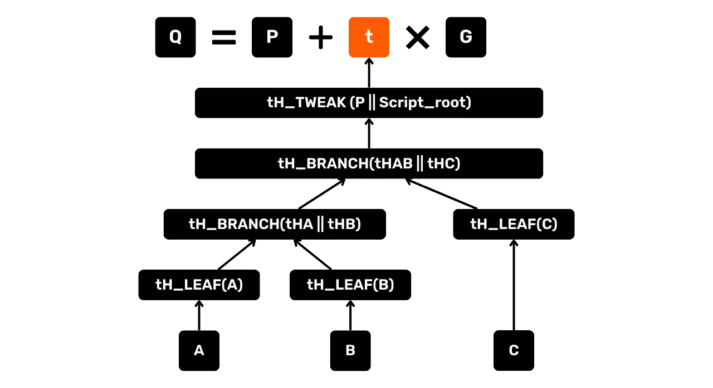


- `tH_LEAF(x)` yerekana igikorwa ca Hash c'inyandiko y'amababi.
- `A, B, C` zigereranya inyandiko zisanzwe ziri mu ntumbero ya Taproot.


Kugira ngo twongereko Tapret Commitment, dukeneye kwinjiza *inyandiko idakoreshwa* ku rugero rwa mbere rw'igiti, tugahindura inyandiko zisanzwe zihari urugero rumwe hasi. Mu mashusho, igiti gica kiba:


- `tHABC` igereranya Hash y'urugero rwo hejuru rw'imigwi `A, B, C`.
- `tHT` igereranya Hash y'inyandiko ihuye n'inyandiko 64-byte `Tapret`.


Dushingiye ku mategeko ya Taproot, ishami/ibabi ryose ritegerezwa guhurizwa hamwe hakurikijwe urutonde rw’inkoranyabumenyi Hash. Hariho ibintu bibiri bishoboka:


- `tHT` > `tHABC`: Tapret Commitment igenda iburyo bw'igiti. Ikimenyamenya c'ubudasa gikeneye gusa `tHABC` na `P`;
- `tHT` < `tHABC`: **Tapret Commitment ishirwa ibubamfu**. Kugira ngo vyemezwe ko ata yindi Tapret Commitment iri iburyo, `tHAB` na `tHC` bitegerezwa guhishurirwa kugira ngo vyerekane ko ata yindi nyandiko nk'iyo iriho.


Akarorero kaboneka k'ikibazo ca mbere (`tHABC < tHT`):


Akarorero k'ikibazo ca kabiri (`tHABC > tHT`):


#### Gutuma ibintu bigenda neza na Nonce


Kugira ngo turonke ibanga ryiza, turashobora "gucukura" (ijambo ry'ukuri ryoba ari "ugukoresha nabi") agaciro ka `<Nonce>` (byte ya nyuma y'i `Tapret` y'amabayiti 64) mu kugerageza kuronka Hash `tHT` ku buryo HT` `tHABC. Muri ivyo, Commitment ishirwa iburyo, ivyo bikaba bituma uwuyikoresha adashobora gutangaza ibirimwo vyose mu nyandiko zisanzweho kugira ngo yerekane ko Tapret ari iyo kwihariza.


Mu ncamake, `Tapret` itanga uburyo butandukanye kandi bugaragara bwo kwinjiza Commitment mu gucuruza Taproot, mu gihe yubaha igisabwa co kuba uwudasanzwe n’ukudasobanuka bihambaye ku bijanye n’ubwenge bwa RGB bwa Client-side Validation na Single-Use Seal.


#### Isohoka ribereye


Ku bikorwa vy’ubudandaji vya RGB Commitment, igisabwa nyamukuru kugira ngo umuntu agire umugambi wa Bitcoin Commitment ukora ni ibi bikurikira: Ivyo bikorwa (*Witness Transaction*) bitegerezwa kuba birimwo Commitment imwe. Ico gisabwa gituma bidashoboka kwubaka amateka y’ubundi buryo bw’amakuru yemejwe n’umukiriya mu gihe c’ugucuruza kumwe. Ivyo bisigura ko ubutumwa _ikidodo c’ikoreshwa rimwe_ gikikuje ari ubwihariye.


Kugira ngo iyo ngingo ngenderwako ishikeko, kandi tutaravye umubare w'ibisohoka mu gucuruza, dusaba ko **igisohoka kimwe kandi kimwe gusa** gishobora kubamwo Commitment. Ku migambi yose ikoreshwa (*Opret* canke *Tapret*), ibisohoka vyonyene bishobora kubamwo _ukwiyemeza_ kwa RGB ni ibi bikurikira:


- Igisohoka ca mbere `OP_RETURN` (niba kiriho) c'umugambi wa *Opret*;
- Igisohoka ca mbere ca Taproot (niba kiriho) c'umugambi wa *Tapret*.


Zirikana ko bishoboka cane ko igikorwa co gucuruza kirimwo `Opret` Commitment imwe na `Tapret` Commitment imwe mu bisohoka bibiri bitandukanye. Kubera kamere y’ugushinga intahe ya Seal Definition, izo ndahiro zibiri rero zihuye n’ibice bibiri bitandukanye vy’amakuru yemejwe ku ruhande rw’umukiriya.


### Isesengura n'amahitamwo ngirakamaro muri RGB


Igihe twatangura RGB, twasubiyemwo ubwo buryo bwose kugira ngo tumenye aho n’ingene twoshira _umugambi_ mu gucuruza mu buryo bugaragara. Twarasobanuye ingingo zimwe zimwe:


- Guhuza n’ibintu bitandukanye (nk’akarorero Multisig, Lightning, amasakoshi y’ibikoresho, n’ibindi);
- Ingaruka ku kirere ca On-Chain;
- Ingorane zo gushirwa mu ngiro no kubungabunga;
- Ibanga n’ukurwanya ugucengera.


| Method                                             | On-chain trace & size | Client-side size | Wallet Integration | Hardware Compatibility | Lightning Compatibility | Taproot Compatibility |
| -------------------------------------------------- | --------------------- | ---------------- | ------------------ | ---------------------- | ---------------------- | --------------------- |
| Keytweak (deterministic P2C)                      | 🟢                     | 🟡                 | 🔴                   | 🟠                     | 🔴 BOLT, 🔴 Bifrost     | 🟠 Taproot, 🟢 MuSig  |
| Sigtweak (deterministic S2C)                      | 🟢                     | 🟢                 | 🟠                   | 🔴                     | 🔴 BOLT, 🔴 Bifrost     | 🟠 Taproot, 🔴 MuSig  |
| Opret (OP_RETURN)                                 | 🔴                     | 🟢                 | 🟢                   | 🟠                     | 🔴 BOLT, 🟠 Bifrost     | -                     |
| Tapret Algorithm: top-left node                   | 🟠                     | 🔴                 | 🟠                   | 🟢                     | 🔴 BOLT, 🟢 Bifrost     | 🟢 Taproot, 🟢 MuSig  |
| Tapret Algorithm #4: any node + proof             | 🟢                     | 🟠                 | 🟠                   | 🟢                     | 🔴 BOLT, 🟢 Bifrost     | 🟢 Taproot, 🟢 MuSig  |
| Deterministic Commitment Scheme                               | Standard       | On-Chain Cost                                                                                                          | Proof Size on Client Side                                                                                       |
| ------------------------------------------------------------- | -------------- | ---------------------------------------------------------------------------------------------------------------------- | ---------------------------------------------------------------------------------------------------------------- |
| Keytweak (Deterministic P2C)                                  | LNPBP-1, 2     | 0 bytes                                                                                                                | 33 bytes (non-tweaked key)                                                                                       |
| Sigtweak (Deterministic S2C)                                  | WIP (LNPBP-39) | 0 bytes                                                                                                                | 0 bytes                                                                                                          |
| Opret (OP_RETURN)                                             | -              | 36 (v)bytes (additional TxOut)                                                                                         | 0 bytes                                                                                                          |
| Tapret Algorithm: top-left node                               | LNPBP-6        | 32 bytes in the witness (8 vbytes) for any n-of-m multisig and spending through script path                           | 0 bytes on scriptless scripts taproot ~270 bytes in a single script case, ~128 bytes if multiple scripts       |
| Tapret Algorithm #4: any node + uniqueness proof              | LNPBP-6        | 32 bytes in the witness (8 vbytes) for single script cases, 0 bytes in the witness in most other cases                | 0 bytes on scriptless scripts taproot, 65 bytes until the Taptree contains a dozen scripts                      |


| Layer                          | On-Chain Cost (Bytes/vbytes) | On-Chain Cost (Bytes/vbytes) | On-Chain Cost (Bytes/vbytes) | On-Chain Cost (Bytes/vbytes) | On-Chain Cost (Bytes/vbytes) | Client-Side Cost (Bytes) | Client-Side Cost (Bytes) | Client-Side Cost (Bytes) | Client-Side Cost (Bytes) | Client-Side Cost (Bytes) |
| ------------------------------ | ---------------------------- | ---------------------------- | ---------------------------- | ---------------------------- | ---------------------------- | ------------------------ | ------------------------ | ------------------------ | ------------------------ | ------------------------ |
| **Type**                       | **Tapret**                   | **Tapret #4**                | **Keytweak**                 | **Sigtweak**                 | **Opret**                    | **Tapret**               | **Tapret #4**            | **Keytweak**             | **Sigtweak**             | **Opret**                |
| Single-sig                     | 0                            | 0                            | 0                            | 0                            | 32                           | 0                        | 0                        | 32                       | 0?                       | 0                        |
| MuSig (n-of-n)                 | 0                            | 0                            | 0                            | 0                            | 32                           | 0                        | 0                        | 32                       | ? > 0                    | 0                        |
| Multi-sig 2-of-3               | 32/8                         | 32/8 or 0                    | 0                            | n/a                          | 32                           | ~270                     | 65                       | 32                       | n/a                      | 0                        |
| Multi-sig 3-of-5               | 32/8                         | 32/8 or 0                    | 0                            | n/a                          | 32                           | ~340                     | 65                       | 32                       | n/a                      | 0                        |
| Multi-sig 2-of-3 with timeouts | 32/8                         | 0                            | 0                            | n/a                          | 32                           | 64                       | 65                       | 32                       | n/a                      | 0                        |


| Layer                            | On-Chain Cost (vbytes) | On-Chain Cost (vbytes) | On-Chain Cost (vbytes) | Client-Side Cost (bytes) | Client-Side Cost (bytes) |
| -------------------------------- | ---------------------- | ---------------------- | ---------------------- | ------------------------ | ------------------------ |
| **Type**                         | **Base**               | **Tapret #2**          | **Tapret #4**          | **Tapret #2**            | **Tapret #4**            |
| MuSig (n-of-n)                   | 16.5                   | 0                      | 0                      | 0                        | 0                        |
| FROST (n-of-m)                   | ?                      | 0                      | 0                      | 0                        | 0                        |
| Multi_a (n-of-m)                 | 1+16n+8m               | 8                      | 8                      | 33 * m                   | 65                       |
| Branch MuSig / Multi_a (n-of-m)  | 1+16n+8n+8xlog(n)      | 8                      | 0                      | 64                       | 65                       |
| With timeouts (n-of-m)           | 1+16n+8n+8xlog(n)      | 8                      | 0                      | 64                       | 65                       |
| Method                                    | Privacy & Scalability | Interoperability | Compatibility | Portability | Complexity |
| ----------------------------------------- | ---------------------- | ---------------- | ------------- | ----------- | ---------- |
| Keytweak (Deterministic P2C)              | 🟢                      | 🔴               | 🔴            | 🟡          | 🟡         |
| Sigtweak (Deterministic S2C)              | 🟢                      | 🔴               | 🔴            | 🟢          | 🔴         |
| Opret (OP_RETURN)                         | 🔴                      | 🟠               | 🔴            | 🟢          | 🟢         |
| Algo Tapret: Top-left node                | 🟠                      | 🟢               | 🟢            | 🔴          | 🟠         |
| Algo Tapret #4: Any node + proof          | 🟢                      | 🟢               | 🟢            | 🟠          | 🔴         |


Mu gihe c’itohoza, vyagaragaye ko ata n’imwe mu migambi ya Commitment yari ihuye neza n’ingingo ngenderwako ya Lightning iriho ubu (idakoresha Taproot, _muSig2_ canke infashanyo y’inyongera _y’ukwiyemeza_). Hariko harakorwa utwigoro two guhindura ubuhinga bwo kwubaka umurongo wa Lightning (*BiFrost*) kugira ngo bishobore kwinjiza amasezerano ya RGB. Iyi ni iyindi nzira dukeneye gusubiramwo imiterere y’ibikorwa, imfunguruzo n’uburyo ivy’uguhindura imirongo bishirwako umukono.


Isesengura ryerekanye ko, mu vy’ukuri, ubundi buryo (uguhindura urufunguzo, uguhindura ibimenyetso, uguhindura icabona, n’ibindi) bwari bufise ubundi buryo bwo kugorana:


- Canke dufise igitabu kinini ca On-Chain;
- Canke hariho ukudahuza gukomeye n’itegeko rya Wallet ririho;
- Canke umuti ntushobora gushoboka muri Multisig idakorana.


Ku RGB, uburyo bubiri cane cane buragaragara: ***Opret*** na ***Tapret***, bwompi bushizwe mu rwego rw'"Igisubizo c'Ibikorwa", kandi buhuye n'uburyo bwa TxO2 bukoreshwa n'umurongo.


### Ivyemezo vyinshi vy'amasezerano - MPC


Muri iki gice, turaba ingene **RGB** ifata ivy’ugukoranya amasezerano menshi (canke, mu buryo bubereye, _imigwi yayo y’ihinduka_) mu Commitment imwe (*Commitment*) yanditswe mu bikorwa vya Bitcoin biciye ku mugambi w’ugushinga intahe (pre`t`t canke). Kugira ngo ivyo bishoboke, urutonde rw’uguhindura amasezerano atandukanye mu buryo bwa Merkel rubera mu ntumbero yitwa **Igiti ca MPC** (_Igiti ca Multi Protocol Commitment_). Muri iki gice, turaza kuraba ingene iki Giti ca MPC cubatswe, ingene tworonka umuzi waco, n’ingene amasezerano menshi ashobora gusangira igikorwa kimwe mu ibanga kandi ata gukeka.


Multi Protocol Commitment (MPC) yagenewe gushitsa ibintu bibiri bikenewe:


- Ubwubatsi bwa `mpc::Commitment` Hash: ivyo bizoshirwa muri Bitcoin Blockchain hakurikijwe umugambi wa `Opret` canke `Tapret`, kandi bitegerezwa kwerekana amahinduka yose ya Leta kugira ngo yemezwe;
- Gubika icarimwe amasezerano menshi mu _nsezerano_ imwe, bikaba bishoboza guhindura ibintu bitandukanye ku mitungo myinshi canke amasezerano ya RGB kugira ngo ashobore gucungirwa mu gikorwa kimwe ca Bitcoin.


Mu majambo nyayo, buri _umugwi w'ihinduka_ ni uwa Contract yihariye. Aya makuru yose yinjizwa mu **Igiti ca MPC**, umuzi waco (`mpc::Umuzi`) ugasubira guhindurwa kugira ngo uhe `mpc::Commitment`. Iyi Hash ya nyuma ni yo ishirwa mu gikorwa ca Bitcoin (_igikorwa c’icabona_), hakurikijwe uburyo bwo guhitamwo bwatowe.


#### Umuzi wa MPC Hash


Agaciro kanditswe On-Chain (mu rurimi rwitwa `mpc::Commitment`. Ivyo biharurwa mu buryo bwa [BIP-341], hakurikijwe uburyo:


```txt
mpc::Commitment = SHA-256(SHA-256(mpc_tag) || SHA-256(mpc_tag) || depth || cofactor || mpc::Root )
```


hehe:


- `mpc_tag` ni ikimenyetso: `urn:ubideco:mpc:Commitment#2024-01-31`, yatowe hakurikijwe [amasezerano yo gushiramwo ikimenyetso ya RGB]
- `uburebure` (1 byte) yerekana uburebure bw'Igiti ca *MPC*;
- cofactor` (16 bits, mu rurimi rwa Little Endian) ni umurongo ukoreshwa mu guteza imbere ubudasa bw’ibibanza vyahawe Contract yose mu giti;
- `mpc::Root` ni umuzi wa *MPC Tree*, ubazwe hakurikijwe uburyo buvugwa mu gice gikurikira.


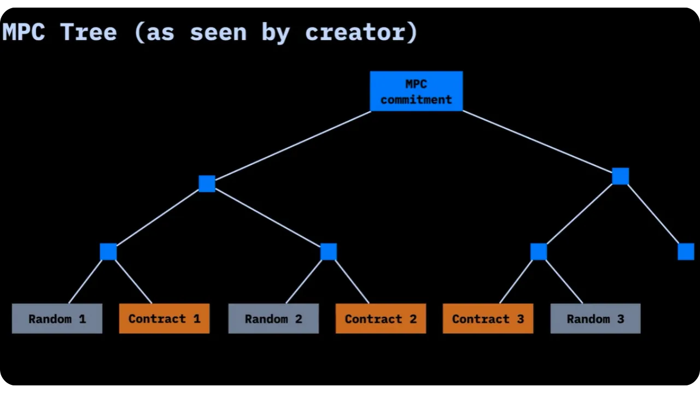


#### MPC Ubwubatsi bw'igiti


Kugira ngo twubake iki Giti ca MPC, turakeneye kumenya neza ko Contract yose ihuye n’aho amababi ari. Twibaze ko dufise:


- `c` amasezerano azoshirwa mu rutonde na `i` muri `i` = {0,1,..,C-1};
- Ku Contract yose `c_i`, dufise ikimenyetso `Id y'Isezerano(i) = c_i`.


Turaheza twubake igiti c'ubwaguke `w` n'uburebure `d` ku buryo `2^d = w`, n' `w > C`, kugira ngo Contract yose ishobore gushirwa mu _babi_ ritandukanye. Ikibanza `pos(c_i)` ca Contract yose mu giti kigenwa na:


```txt
pos(c_i) = c_i mod (w - cofactor)
```


aho `cofactor` ari umubare wose wongera ubushobozi bwo kuronka ibibanza bitandukanye kuri buri Contract. Mu bikorwa, ubwubatsi bukurikira inzira isubiramwo:


- Dutangura n’uburebure bukeyi (`d=3` ku masezerano kugira ngo twihishe umubare nyawo w’amasezerano);
- Turagerageza `cofactors` zitandukanye (zishika kuri `w/2`, canke zishika 500 kubera imvo z’ubushobozi);
- Iyo tunaniwe gushiramwo amasezerano yose ata guhura, twongera `d` tugasubira gutangura.


Intumbero ni ukwirinda ibiti birenze urugero, mu gihe nyene ingorane zo gutombora ziguma ari ntoyi. Zirikana ko ikintu c’ugutombora gikurikira uburyo bwo gukwiragiza ataco buvuze, gifitaniye isano n’[Ikibazo c’Isabukuru](https://ru.wikipedia.org/wiki/Ingorane_y’Isabukuru_y’Ivuka).


#### Amababi atuwemwo


Igihe `C` ibibanza bitandukanye `pos(c_i)` vyaronswe ku masezerano `i = {0,1,..,C-1}`, urupapuro rwose rwuzuzwa igikorwa ca Hash (*rashizweko ikimenyetso Hash*):


```txt
tH_MPC_LEAF(c_i) = SHA-256(SHA-256(merkle_tag) || SHA-256(merkle_tag) || 0x10 || c_i || BundleId(c_i))
```


hehe:


- `merkle_tag = urn:ubideco:merkle:node#2024-01-31`, yama itoranywa hakurikijwe amasezerano ya Merkle ya RGB;
- `0x10` igaragaza _ibabi ry'amasezerano_;
- `c_i` ni ikimenyetso ca Contract c'amabayiti 32 (kiva kuri Genesis Hash);
- bundleId(c_i)` ni Hash y'amabayiti 32 idondora umugwi w'Impinduka z'Igihugu` zijanye n'i `c_i` (zikoranijwe muri *Transition Bundle*).


#### Amababi atabamwo


Amababi asigaye, atashizwe kuri Contract (ni ukuvuga amababi ya `w - C`), yuzuye agaciro "k'ikinyoma" (_ibabi ry'ubuhinga_):


```txt
tH_MPC_LEAF(j) = SHA-256(SHA-256(merkle_tag) || SHA-256(merkle_tag) || 0x11 || entropy || j )
```


hehe:


- `merkle_tag = urn:ubideco:merkle:node#2024-01-31`, yama itoranywa hakurikijwe amasezerano ya Merkle ya RGB;
- `0x11` yerekana _ibabi ry'uburemere_;
- `entropy` ni agaciro k'imburakimazi k'ibice 64, gatorwa n'umuntu yubaka igiti;
- `j` ni ikibanza (mu bice 32 Little Endian) c'iri babi mu giti.


#### Uturongo twa MPC


Tumaze gutera amababi `w` (agira abantu canke ataba), turabandanya gukora merkelization. Ivyuma vyose vyo mu mutima bifatwa nk'uko bikurikira:


```txt
tH_MPC_BRANCH(tH1 || tH2) = SHA-256(SHA-256(merkle_tag) || SHA-256(merkle_tag) || b || d || w || tH1 || tH2)
```


hehe:


- `merkle_tag = urn:ubideco:merkle:node#2024-01-31`, yama itoranywa hakurikijwe amasezerano ya Merkle ya RGB;
- b` ni _umubare w'amashami_ (ibice 8). Kenshi, `b=0x02` kuko igiti ari bibiri kandi kigizwe n’ibintu vyose;
- d` ni uburebure bw'urudodo ruri mu giti;
- `w` ni ubwaguke bw'igiti (mu 256-bit Little Endian);
- tH1` na `tH2` ni hashes z'abana nodes (canke amababi), asanzwe aharuwe nk'uko vyerekanwa haruguru.


Dutera imbere muri ubwo buryo, turonka umuzi `mpc::Root`. Turashobora rero kubara `mpc::Commitment` (nk'uko vyasiguwe haruguru) tukayishiramwo On-Chain.


Kugira ngo ivyo tubisobanure, reka twiyumvire akarorero aho `C=3` (amasezerano atatu). Ivyicaro vyabo vyiyumviriwe ko ari `ahantu (c_0)=7`, `ahantu (c_1)=4`, `ahantu (c_2)=2`. Ayandi mababi (ibibanza 0, 1, 3, 5, 6) ni _amababi y’entropie_. Igishushanyo kiri musi kirerekana urutonde rw'ama hashes ku muzi n':


- `UMUGAMBI_i` ugereranya `UmugwiId(c_i)`;
- `tH_MPC_LEAF(A)` n'ibindi, bigereranya amababi (amwe ku masezerano, ayandi ku entropi);
- Ishami ryose `tH_MPC_ISAMBI(...)` rifatanya ama hashes y'abana baryo babiri.


Igisubizo ca nyuma ni **mpc::Umuzi**, hanyuma `mpc::Commitment`.


#### Igenzura ry'umugozi wa MPC


Iyo umugenzuzi yipfuza kumenya neza ko `c_i` Contract (na `BundleId` yayo) iri mu `mpc::Commitment` ya nyuma, aronka gusa ikimenyamenya ca Merkle. Iki kimenyamenya kigaragaza uturongo dukenewe kugira ngo amababi (muri iki gihe, `c_i`'s _contract leaf_) asubire ku muzi. Ntaco bimaze gutangaza *Igiti ca MPC* cose: ivyo birinda ibanga ry'ayandi masezerano.


Mu karorero, umugenzuzi wa `c_2` akeneye gusa Hash yo hagati (`tH_MPC_IBABI(D)`), `tH_MPC_ISHAMI(...)` ibiri, ikimenyamenya c'aho `pos(c_2)` ari n'agaciro ka `cofactor`. Ishobora rero gusubira kwubaka umuzi mu karere, hanyuma igasubira kubara `mpc::Commitment` ikayigereranya n'iyo yanditswe mu gikorwa ca Bitcoin (mu `Opret` canke `Tapret`).


Ubu buryo buratuma:


- Igihugu gishingiye kuri `c_2` kiri mu vy'ukuri mu gice c'amakuru yose hamwe (uruhande rw'umukiriya);
- Nta n’umwe ashobora kwubaka amateka y’ubundi buryo n’ugucuruza kumwe, kuko On-Chain _commitment_ yerekana umuzi umwe wa MPC.


#### Incamake y'imiterere ya MPC


Multi Protocol Commitment* (MPC) ni ingingo ngenderwako ishoboza RGB gukoranya amasezerano menshi mu gikorwa kimwe ca Bitcoin, mu gihe iguma ifise ubudasa bw’amasezerano n’ibanga ku bandi bari muri iyo nama. Kubera inyubakwa y'igiti, Contract yose ihabwa ikibanza kidasanzwe, kandi ukubaho kw'amababi "y'ibinyoma" (*Entropy Leaves*) bipfuka igice c'umubare wose w'amasezerano agize uruhara mu gucuruza.


Merkle Tree yose ntiyigera ibikwa ku mukiriya. Turaheza gusa generate _inzira ya Merkle_ kuri Contract yose ireba, kugira ngo irungikwe uwuyironka (uwushobora rero kwemeza Commitment). Mu bihe bimwe bimwe, ushobora kuba ufise itunga ryinshi ryaciye muri UTXO imwe. Ushobora rero gufatanya _inzira nyinshi za Merkle_ mu vyo bita _ibara ryinshi Commitment block_, kugira ngo wirinde gusubiramwo amakuru menshi cane.


Buri _Merkle proof_ rero iraremereye cane cane kuko uburebure bw'igiti butazorenga 32 muri RGB. Hariho kandi iciyumviro ca "Merkle block", kigumya amakuru menshi (igice c'umusaraba, entropi, n'ibindi), ngirakamaro mu gufatanya canke gutandukanya amashami menshi.


Ni co gituma vyatwaye igihe kirekire cane kugira ngo RGB irangizwe. Twari dufise iyerekwa rusangi kuva muri 2019: gushiramwo vyose ku ruhande rw’abaguzi, gukwiragiza ibimenyetso off-chain. Ariko ku bijanye n’ibintu nk’uguca ibice ku masezerano menshi, imiterere ya Merkle Tree, ingene umuntu yovyifatamwo mu gutombora no gufatanya ibimenyamenya... ivyo vyose vyasaba ko umuntu asubiramwo.


### Anchors: ikoraniro ry'isi yose


Dukurikije ukwubaka amasezerano yacu (`Opret` canke `Tapret`) na MPC yacu (*Multi Protocol Commitment*), turakeneye Address iciyumviro ca **Anchor** mu masezerano ya RGB. Anchor ni umubumbe wemejwe n’umukiriya uzana hamwe Elements ikenewe kugira ngo umuntu asuzume ko Bitcoin Commitment mu vy’ukuri irimwo amakuru yihariye y’amasezerano. Mu yandi majambo, Anchor ivuga mu ncamake amakuru yose akenewe kugira ngo yemeze _amasezerano_ yavuzwe haruguru.


Anchor igizwe n’ibice bitatu vy’urutonde:


- 'txid'
- `Ikimenyamenya ca MPC`
- Ikimenyamenya c'ibikorwa vy'inyongera - ETP


Imwe muri izo nzira irafise uruhara mu nzira yo kwemeza, haba ari ikibazo co gusubira kwubaka igikorwa ca Bitcoin canke kwemeza ko hariho Commitment yihishije (cane cane ku bijanye na `Tapret`).


#### txid


Umurima wa `txid` uhuye n'ikimenyetso c'amabayiti 32 c'ibikorwa vya Bitcoin birimwo `Opret` canke `Tapret` Commitment.


Mu vyiyumviro, vyoshoboka ko umuntu aronka iyo `txid` mu gukurikirana uruhererekane rw’imihindukire ya Leta ubwayo yerekana Witness Transaction imwe imwe, hakurikijwe ubuhinga bw’Ibimenyetso vy’Ikoreshwa Rimwe. Ariko rero, kugira ngo vyorohe kandi vyihute kugenzura, iyo `txid` ishirwa gusa muri Anchor, gutyo igakiza uwuyigenzura ngo ntasubire mu mateka yose ya off-chain.


#### Ikimenyamenya ca MPC


Ikibanza ca kabiri, `Ikimenyamenya ca MPC`, kivuga ikimenyamenya c'uko iyo Contract (nk'akarorero `c_i`) iri mu _Isezerano ry'amasezerano menshi_. Ni uruvange rwa:


- `pos_i`, ikibanza c'iyi Contract mu giti ca MPC;
- cofactor`, agaciro gasobanuwe kugira ngo utore umuti w’ugutombokana kw’ibibanza;
- `Merkle Proof`, ni ukuvuga umugwi w'ibice n'ibice bikoreshwa mu gusubira kwubaka umuzi wa MPC no kugenzura ko ikimenyetso ca Contract na `Transition Bundle` yaco vyiyemeje ku muzi.


Ubwo buryo bwavuzwe mu gice ca mbere ku bijanye no kwubaka *Igiti ca MPC*, aho Contract yose ironka ibabi ryihariye kubera:


```txt
pos(c_i) = c_i mod (w - cofactor)
```


Hanyuma, umugambi w’uguhindura amababi (merkelization) ukoreshwa kugira ngo amababi yose akoranirizwe hamwe (amasezerano + entropie). Mu mpera, `Ikimenyamenya ca MPC` kiremesha umuzi gusubira kwubakwa mu karere no kugereranywa na `mpc::Commitment` harimwo On-Chain.


#### Ikimenyamenya c'inyongera c'ibikorwa - ETP


Ico kibanza ca gatatu, **ETP**, kivana n’ubwoko bwa Commitment ikoreshwa. Iyo Commitment ari iyo mu bwoko bwa `Opret`, nta kindi kimenyamenya gikenewe. Uwugenzura asuzuma igisohoka ca mbere `OP_RETURN` c'ugucuruza maze agasanga `mpc::Commitment` ari ho nyene.


**Nimba Commitment ari iyo mu bwoko bwa `Tapret`**, hategerezwa gutangwa ikimenyamenya c’inyongera citwa *Ikimenyamenya c’Ibikorwa vy’Iyongera - ETP*. Birimwo:


- Urufunguzo rwa bose rw'imbere (`P`) rw'isohoka rya Taproot aho *Commitment* ishizwemwo;
- Ivyuma vy'abafatanyabikorwa vya `Inzira y'Inyandiko Gukoresha` (igihe Tapret *Commitment* yinjijwe mu nyandiko), kugira ngo vyemeze aho nya nyandiko iyi nyandiko iri mu giti ca Taproot:
 - Iyo `Tapret` *Commitment* iri kw'ishami ry'iburyo, duhishura urudodo rw'ibubamfu (nk'akarorero `tHABC`),
 - Niba `Tapret` *Commitment* iri ibubamfu, ukeneye gutangaza uturongo 2 (nk'akarorero `tHAB` na `tHC`) kugira ngo werekane ko ata wundi *Commitment* uri ku ruhande rw'iburyo.
- `Nonce` ishobora gukoreshwa mu "gucukura" imiterere myiza, igatuma *Commitment* ishirwa iburyo bw'igiti (ugutuma ibimenyamenya bigenda neza).


Ico kimenyamenya c’inyongera ni ngombwa kuko, bitandukanye na `Opret`, `Tapret` Commitment yinjijwe mu mibumbe y’inyandiko ya Taproot, ivyo bikaba bisaba guhishura igice c’igiti ca Taproot kugira ngo umuntu ashobore kwemeza neza aho *Commitment* iri.


**Ivyuma** rero bishiramwo amakuru yose asabwa kugira ngo umuntu yemeze Bitcoin Commitment mu bijanye n'ivyo RGB ivuga. Birerekana vyose bibiri, igikorwa gifitaniye isano (`txid`) n'ikimenyamenya c'aho Contract iri (`Ikimenyamenya ca MPC`), mu gihe bicungera ikimenyamenya c'inyongera (`ETP`) ku bijanye na `Tapret`. Muri ubwo buryo, Anchor irinda ubutungane n’ubudasa bwa Leta ya off-chain mu kumenya neza ko iyo nzira nyene idashobora gusubirwamwo ku yandi makuru y’amasezerano.


### Iciyumviro


Muri iki kigabane, twarihweje ibi:


- Uko woshira mu ngiro iciyumviro c'Ibimenyetso Bikoreshwa Rimwe muri Bitcoin (cane cane biciye ku _isohoka_);
- Uburyo butandukanye bwo kwinjiza mu buryo butegekanijwe _ukwiyemeza_ mu gucuruza (Guhindura Sig, Guhindura urufunguzo, Guhindura icabona, OP_RETURN, Taproot/Tapret);
- Impamvu zituma RGB yibanda ku masezerano ya Tapret;
- Uburongozi bwa Multi-Contract biciye ku _masezerano menshi_, ni ngombwa nimba udashaka gushikiriza Leta yose canke ayandi masezerano igihe ushaka kwemeza ingingo yihariye;
- Twarabonye kandi uruhara rwa _Anchors_, zizana vyose hamwe (ugucuruza txid, ikimenyamenya ca Merkle Tree n'ikimenyamenya ca Taproot) mu gice kimwe.


Mu bikorwa, ugushirwa mu ngiro kw’ubuhinga kugabanywa hagati y’ibikoresho vyinshi vy’ubuhinga bwa Rust (mu _kwemeza_ku ruhande_rw’umukiriya, _gusuzuma_, _bp_core_, n’ibindi). Ivyiyumviro vy’ishimikiro biri ng’aho:


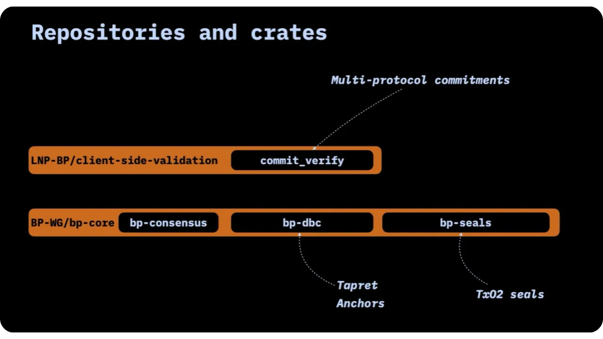


Mu gice gikurikira, turaza kuraba igice ca off-chain gusa ca RGB, ni ukuvuga ubuhinga bwa Contract. Turabona ingene amasezerano ya RGB, atunganijwe nk'ibice vy'amamashini ya leta_, ashika ku vyo guserura vyinshi kuruta inyandiko za Bitcoin, mu gihe azigama ibanga ry'amakuru yabo.


## Intangamarara y'amasezerano y'ubwenge n'ibihugu vyayo


<chapterId>04a9569f-3563-5382-bf53-0c7069343ba0</chapterId>


:::id y'amasanamu y'amasanamu:::


Muri iki gice n'ikindi gikurikira, turaza kuraba iciyumviro ca **Smart contract** mu bidukikije vya RGB maze tubone uburyo butandukanye ayo masezerano ashobora gusobanura no guhindura *igihugu* cayo. Turabona igituma ubuhinga bwa RGB, bukoresheje urutonde rw’Ibimenyetso vy’Ikoreshwa Rimwe, butuma bishoboka gukora ubwoko butandukanye bw’Ibikorwa vya ***Contract*** mu buryo bushobora guhindurwa kandi ata guca mu gitabu c’ivyandikano gihurikiye hamwe. Turaba kandi uruhara rwa ***Business Logic*** mu gutegura iterambere rya Contract State.


### Amasezerano y'ubwenge n'uburenganzira bw'abatwara


Intumbero ya RGB ni ugutanga ibikorwa remezo vyo gushitsa amasezerano y'ubwenge kuri Bitcoin. Mu kuvuga "Smart contract" dushaka kuvuga amasezerano hagati y'imigwi myinshi ashirwa mu ngiro ubwayo kandi akoresheje ubuhinga bwa none, ata muntu yinjiyemwo kugira ngo ashitse ingingo. Mu yandi majambo, itegeko rya Contract rishirwa mu ngiro na porogarama, atari n’uwundi muntu yizigirwa.


Ivyo bikoresho vy’ubuhinga bwa none bivyura ikibazo c’ugusenyura ubutegetsi: twoshobora gute kwibohora mu gitabu c’ivyandikano (nk’akarorero, urubuga canke urutonde rw’amakuru) kugira ngo dushobore gucunga ibikorwa vya Ownership na Contract? Iciyumviro c'intango, cafashwe na RGB, ni ugusubira ku buryo bwa Ownership buzwi nka "ibikoresho vy'abatwara". Mu mateka, hariho ivyemezo bimwebimwe (amabondi, imigabane n’ibindi) vyasohorwa mu buryo bw’umuntu afise iyo nyandiko, ivyo bikaba vyatuma umuntu wese yari afise iyo nyandiko ku mubiri ashobora gushitsa uburenganzira bwiwe.


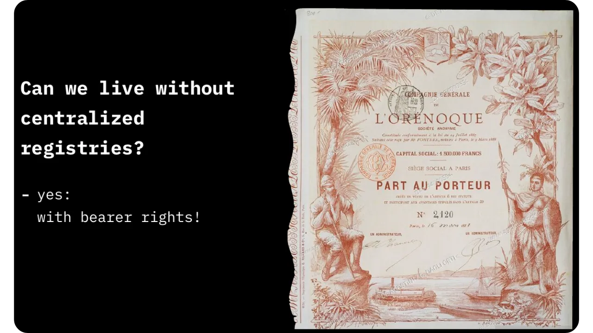


RGB ikoresha ico ciyumviro kw’isi y’ubuhinga bwa none: uburenganzira (n’inshingano) bushirwa mu makuru akoreshwa nabi off-chain, kandi ikibanza c’ayo makuru kiremezwa n’abaje mu nama ubwabo. Ivyo bituma, a priori, habaho urugero runini cane rw’ibanga n’ukwigenga kuruta uko bitangwa n’izindi nzira zishingiye ku bitabo vya bose.


### Intangamarara ku bijanye n'imimerere ya Smart contract


Smart contract muri RGB ishobora kubonwa nk’imashini ya Leta, isobanurwa na:


- A **Igihugu**, ni ukuvuga urutonde rw’amakuru yerekana uko Contract iteye ubu;
- A **Business Logic** (urutonde rw’amategeko), adondora ingene Leta ishobora guhindurwa n’uwushobora guhindurwa.


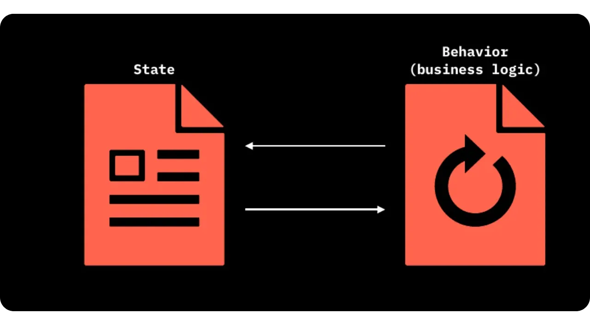


Ni vyiza gutahura ko ayo masezerano atagarukira ku gutanga ibimenyetso vyoroshe. Bishobora gukoresha uburyo bwinshi: kuva ku mutungo wa kera (ibimenyetso, amafaranga, amabondi) gushika ku buhinga bukomeye cane (uburenganzira bwo gukoresha, amajambo y’ubudandaji, n’ibindi). Udakunze izindi blockchains, aho kode ya Contract ishobora gushikwako kandi igashirwa mu ngiro na bose, uburyo bwa RGB buragabanya uburyo bwo gushikira no kumenya Contract ku bari muri iyo nama ("***abaje muri Contract***"). Hariho uruhara rwinshi:


- **Uwutanga** canke umuremyi wa Contract, ni we asigura Genesis ya Contract n'ibihinduka vyayo vy'intango;
- Abafise **uburenganzira** (*Ownership*) canke ubundi bushobozi bwo gushitsa amategeko;
- **Abarorerezi**, bashobora kuba bafise aho babona amakuru amwamye, ariko badashobora gutuma habaho ihinduka.


Ukwo gutandukanya uruhara biratuma habaho ukurwanya ugucengera, mu kumenya ko abantu bemerewe bonyene ari bo bashobora gukorana na Leta y’amasezerano. Iha kandi RGB ubushobozi bwo gupima mu buryo buringaniye: ivyemezo vyinshi bibera hanze ya Blockchain, kandi ni vyo vyonyene bifata amabanga (*amasezerano*) vyanditswe kuri Bitcoin.


### Ikibanza na Business Logic muri RGB


Uvuye ku bijanye n’ibikorwa, **Business Logic** ya Contract ifata uburyo bw’amategeko n’inyandiko, zisobanurwa mu co RGB yita **Schema**. Schema ivuga:


- Imiterere ya Leta (ni imirima iyihe ari iya bose? Ni iyihe mirima ifiswe n’imigambwe iyihe?
- Ivyangombwa vy’uburenganzira (ni igiki kigomba gusuzumwa imbere yo kwemerera Leta guhindura?);
- Ivyemezo (ni nde yoshobora gutanguza *State Transition*? Ni nde yoshobora kwihweza gusa?).


Muri ico gihe nyene, **Contract State** akenshi igabanywamwo ibice bibiri:


- A **Global State**: igice ca bose, gishobora kwihwezwa na bose (bivanye n’imiterere);
- **Ibihugu vy'Igihugu**: ibice vy'abantu ku giti cabo, bigenewe cane cane ba nyen'ibihugu biciye ku ma UTXO yerekanwa mu nzira y'ubwenge ya Contract.


Nk'uko tuzobibona mu bice bikurikira, ivugurura ryose ry'imimerere (*Contract Operation*) ritegerezwa gushirwa ku _nsezerano_ ya Bitcoin (biciye kuri `Opret` canke `Tapret`) kandi ryubahirize inyandiko za *Business Logic* kugira ngo ribonwe ko rifise akamaro.


### Contract Ibikorwa: iremwa n'iterambere rya Leta


Mu gisata ca RGB, ***Contract Operation*** ni ikintu cose gihindura Contract kuva mu **gihugu ca kera** gushika ku **gihugu gishasha**. Ivyo bikorwa bikurikira ubu buhinga bukurikira:


- Turabona uko Contract iri ubu;
- Turashira mu ngiro itegeko canke igikorwa (***State Transition***, ***Genesis*** nimba ari Leta ya mbere cane, canke ***State Extension*** nimba hari *Valency* ya bose yo gusubira gutera);
- Twebwe Anchor ihinduka biciye mu _ukwiyemeza_ gushasha kuri Blockchain, dufunga _ikidodo kimwe co gukoresha rimwe_ tukarema ikindi;
- Abafise uburenganzira baremeza mu karere (*uruhande rw'umukiriya*) ko iyo mpinduka ihuye na *Schema* kandi ko iyo nzira y'ubudandaji ya Bitcoin yanditswe On-Chain.


Iherezo ry’ivyo ni Contract yahinduwe, ubu ikaba ifise igihugu gitandukanye. Iryo hinduka ntirisaba ko urubuga rwose rwa Bitcoin rwitwararika ido n'ido, kuko urutoke rutoyi gusa (_ukwiyemeza_) rwanditswe muri Blockchain. Urutonde rw’Ibimenyetso vy’Ikoreshwa Rimwe rurabuza Double-spending iyo ari yo yose canke gukoresha kabiri Leta.


### Uruhererekane rw'ibikorwa: kuva kuri Genesis gushika ku gihugu c'iherezo


Kugira ngo ivyo tubishire mu ngiro, RGB Smart contract itangura n’i **Genesis**, igihugu ca mbere nyene. Inyuma y’aho, Ibikorwa bitandukanye vya Contract birakurikirana, bikagira DAG (*Directed Acyclic Graph*) y’ibikorwa:


- Impinduka yose ishingiye ku nkuru y’imbere (canke nyinshi, mu gihe c’impinduka zihuye);
- Urutonde rw’ibihe ruremezwa n’ugushiramwo ihinduka ryose mu gitabu Bitcoin Anchor, gifise ikidodo c’igihe kandi kitahinduka bivuye ku kwumvikana kwa Proof-of-Work;
- Iyo ata bindi bikorwa biriko birakorwa, **Igihugu c'Iherezo** kirashikwako: igihugu gishasha kandi cuzuye ca Contract.


Iyi topologie ya DAG (aho kuba uruzitiro rworoshe rw’umurongo) yerekana ko bishoboka ko ibice bitandukanye vya Contract bishobora gutera imbere mu buryo bumwe, igihe cose bitavuguruzanya. RGB rero yitwararika kwirinda ukudahuza kwose biciye mu kugenzura *ku ruhande rw’umukiriya* umuntu wese ari muri iyo nama.


### Icegeranyo


Amasezerano y’ubwenge muri RGB azana uburyo bw’ibikoresho vy’ubuhinga bwa none, vyegerejwe ariko bishingiye kuri Bitcoin kugira ngo bimenyeshe igihe no kwemeza urutonde rw’ibikorwa. Ishirwa mu ngiro ry’ayo masezerano rishingiye kuri:


- A **Contract State**, yerekana uko Contract iteye ubu (uburenganzira, uburinganire, ibihinduka, n’ibindi);
- A **Business Logic** (*Schema*), isobanura amahinduka yemerewe n’ingene ategerezwa kwemezwa;
- Ibikorwa vya **Contract**, bihindura iyi leta intambwe ku yindi, bivuye ku masezerano ashingiye ku bikorwa vya Bitcoin.


Mu gice gikurikira, tuzoja mu buryo burambuye ku bijanye n'ukuntu izo ***intara*** n'izo ***intara*** zigaragara ku rugero rwa off-chain, n'ingene zifitaniye isano n'ivyo bimenyetso vy'ubuhinga bwa none (UTXOs) n'ibimenyetso vy'ubuhinga bwa none (Single-use Seals) bishizwe muri Bitcoin. Ivyo bizoba ari akaryo ko kubona ingene ubuhinga bwo mu mutima bwa RGB, bushingiye kuri Client-side Validation, bushobora kuguma buhuye n’amasezerano y’ubwenge mu gihe buzigama ibanga ry’amakuru.


## RGB Ibikorwa vya Contract


<chapterId>78c44e88-50c4-5ec4-befe-456c1a9f080b</chapterId>


:::id ya videwo=1caec34d-f214-425b-a1a4-0a40ae7d3e0e:::


Muri iki gice, turaza kuraba ingene ibikorwa mu masezerano y’ubwenge no mu guhindura Leta bikora, kandi mu gihe c’amasezerano ya RGB. Intumbero izoba kandi iyo gutahura ingene abaje mu nama benshi bafatanya mu gutanga Ownership y’umutungo.


### Impinduka za Leta n'ubuhinga bwazo


Ingingo rusangi iracari iyo muri Client-side Validation, aho amakuru ya Leta afiswe na nyen’ayo makuru, akaremezwa n’uwuyaronka. Ariko rero, ikintu kidasanzwe aha kuri RGB kiri mu kuba Bob, nk’uwuronka, asaba Alice kwinjiza amakuru amwamwe mu makuru ya Contract kugira ngo agire ububasha nyakuri ku mutungo yaronse, biciye ku nsiguro yihishije kuri imwe mu ma UTXO yiwe.


Kugira ngo tubone ingene *State Transition* ikora (ari yo imwe mu nzira z’ishimikiro ***Ibikorwa vya Contract*** muri RGB), reka dufate akarorero k’intambwe ku yindi k’uguhindura umutungo hagati ya Alice na Bob:


**Ivyabaye mu ntango:**


Alice ifise ***Stash RGB*** y’amakuru yemejwe mu karere (*uruhande rw’umukiriya*). Iyi Stash yerekeza kuri imwe mu UTXO ziwe kuri Bitcoin. Ivyo bisigura ko _insobanuro y'ikidodo_ muri aya makuru yerekana UTXO ari iya Alice. Iciyumviro ni ukumushoboza kwimurira uburenganzira bumwe bumwe bujanye n'umutungo (nk'ibimenyetso vya RGB) kuri Bob.


**Bob nayo irafise ama UTXO:**


Ku rundi ruhande, Bob afise n’imiburiburi UTXO imwe yiwe bwite, ata sano ry’ukuri n’iya Alice. Iyo Bob ata UTXO afise, birashoboka ko yomurungikira akoresheje *Witness Transaction* ubwayo: igisubizo c'iyi nzira kizobamwo Commitment (_commitment_) kandi kizofatanya Ownership ya Bob nshasha na GW-69.


**Ubwubatsi bw'itongo rishasha (*Leta nshasha*):**


Bob yohereza amakuru ya Alice akodeshejwe mu buryo bwa ***Invoice*** (tuzoja mu ndondoro ku bijanye n'ubwubatsi bwa Invoice mu bice bizokurikira), imusaba kurema igihugu gishasha gihuye n'amategeko ya Contract. Iyi leta izobamwo *Seal Definition* nshasha yerekana imwe mu UTXO za Bob. Muri ubwo buryo, Bob ihabwa Ownership y’itunga risobanuwe muri iyo leta nshasha, nk’akarorero umubare kanaka w’ibimenyetso vya RGB.


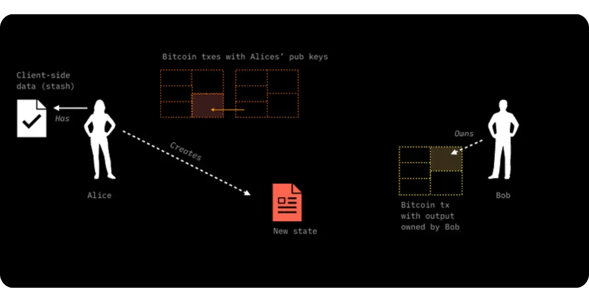


**Gutegura urugero rw'ugucuruza:**


Alice rero irema igikorwa ca Bitcoin ikoresha UTXO yavuzwe muri Seal ya kera (iyo yamuhaye uburenganzira bwo kuba uwuyifise). Mu gisohoka c'iyi nzira, *Commitment* (biciye muri `Opret` canke `Tapret`) yinjizwa muri Anchor igihugu gishasha ca RGB. Amasezerano ya `Opret` canke `Tapret` akomoka ku giti ca *MPC* (nk’uko vyabonetse mu bice vyabanje), gishobora gukoranya amahinduka menshi ava mu masezerano atandukanye.


**Ugutanga *Consignment* kuri Bob:**


Imbere yo gutangaza iyo nzira, Alice yohereza Bob ***Consignment*** irimwo amakuru yose akenewe *yo ku ruhande rw’umukiriya* (*Stash* yiwe) n’amakuru mashasha ya Leta afasha Bob. Muri iki gihe, Bob ikoresha amategeko y’uguhurizako RGB:


- Iremeza amakuru yose ya RGB ari muri *Consignment*, harimwo na Leta nshasha iyiha Ownership y’umutungo;
- Ishingiye ku *Anchors* ziri muri *Consignment*, igenzura urutonde rw'ibikorwa vy'abashingantahe (kuva kuri Genesis gushika ku mpinduka iherutse) kandi ikemeza amasezerano ahuye muri Blockchain.


**Uguheza kw'ihinduka:**


Iyo Bob yuzuye, arashobora gutanga ukwemera kwiwe (nk’akarorero, mu gushira umukono kuri *Consignment*). Alice irashobora rero gutangaza ivyerekanwa vy’ugucuruza vyateguwe. Ivyo bimaze kwemezwa, ivyo bica bifunga Seal yari ifiswe na Alice, bigatuma Ownership igira Bob. Umutekano wo kurwanya Double-spending rero ushingiye ku buryo bumwe nk’ubwo muri Bitcoin: UTXO irakoreshwa, bikaba vyerekana ko Alice itagishobora kuyikoresha.


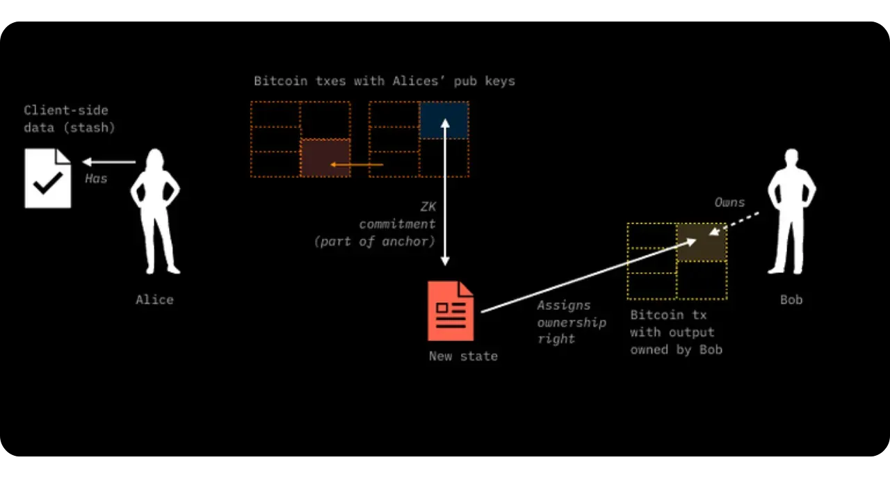


Leta nshasha ubu ikoresha Bob ya Bob, igaha Bob Ownership yahora ifiswe na Alice. Igisohoka ca Bitcoin aho amakuru ya RGB ashizweho gica kiba ikimenyamenya kidashobora gusubirwamwo c'ukwimurirwa kwa Ownership.


Akarorero k’i DAG ntoyi (*Directed Acyclic Graph*) igizwe n’ibikorwa bibiri vya Contract (**Genesis** hanyuma ***State Transition***) karashobora kwerekana ingene igihugu ca RGB (*uruhande rw’umukiriya* Layer, mu mutuku) gifatanya na Blockchain4 G4*W-740). mu rurimi rw’umuhondo).


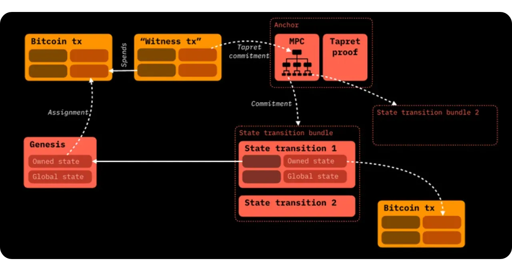


Birerekana ko Genesis isobanura Seal (*Seal Definition*), hanyuma *State Transition* igafunga iyo Seal kugira ngo ireme indi nshasha mu yindi UTXO.


Muri ivyo, ng’ibi ivyibutsa bikeyi vy’amajambo:


- ***Assignment*** ihuriza hamwe ibi bikurikira:
    - Indege ***Seal Definition*** (ikaba yerekana indege 755);
- Ibihugu vy'ubutunzi, ni ukuvuga amakuru ahuye na **Ownership** (nk'akarorero, igitigiri c'ibimenyetso vyimuriwe).
- **Global State** ihuriza hamwe imiterere rusangi ya Contract, iboneka kuri bose, kandi igatuma ivy’ubwihindurize bihuye kw’isi yose.


**Impinduka za Leta**, zavuzwe mu kigabane c'imbere, ni zo nzira nyamukuru za Contract Operation. Bivuga intara imwe canke nyinshi za kera (kuva kuri Genesis canke iyindi State Transition) hanyuma zigasubiramwo intara nshasha.


Iki kigereranyo kirerekana ingene, muri *State Transition Bundle*, ibimenyetso vyinshi bishobora gupfungwa mu gucuruza kw’akarorero kamwe, mu gihe nyene bifungura ibimenyetso bishasha. Nkako, ikintu gishimishije c’umurongo wa RGB ni ubushobozi bwawo bwo gupima: inzira nyinshi zishobora guteranirizwa hamwe zigacika Transition Bundle, iyo nzira yose ikaba ifatanijwe n’ibabi ridasanzwe ry’igiti ca *MPC* (ikimenyetso kidasanzwe c’umugwi). Kubera uburyo bwa *Deterministic Bitcoin Commitment* (DBC), ubutumwa bwose bwinjizwa mu gisohoka ca `Tapret` canke `Opret`, mu gihe bufunga ibimenyetso vya kera kandi bishoboka ko busobanura ibindi bishasha. `Anchor` ikora nk’ihuriro ry’ukuri hagati ya Commitment ibitswe muri Blockchain n’imiterere ya Client-side Validation (*uruhande rw’umukiriya*).


Mu bice bikurikira, turaza kuraba ibice vyose n'ingene bigenda mu kwubaka no kwemeza State Transition. Vyinshi muri ivyo Elements biri mu vyo RGB yemeranije, bishirwa mu ngiro mu **Isoko ry’Ibitabo ry’Ishingiro rya RGB**.


### Transition Bundle


Ku RGB, birashoboka gukoranya Impinduka za Leta zitandukanye ziri muri Contract imwe (ni ukuvuga gusangira **ContractId** imwe, ikomoka kuri Genesis **OpId**). Mu buryo bworoshe, nk’uko biri hagati ya Alice na Bob mu karorero kari hejuru, **Transition Bundle** irimwo inzira imwe gusa. Ariko gushigikira ibikorwa vy’abariha benshi (nk’ama coinjoins, ugufungura imirongo ya Lightning, n’ibindi) bisigura ko abakoresha benshi bashobora gufatanya Impinduka zabo za Leta mu mugwi umwe.


Iyo zimaze kwegeranywa, izo mpinduka zishirwako (n’uburyo bwa MPC + DBC) mu gikorwa kimwe ca Bitcoin:


- State Transition yose irashirwako hashe maze igashirwa mu migwi ikaba Transition Bundle;
- Transition Bundle ubwayo irahashwa maze igashirwa mu ibabi ry’igiti ca MPC rihuye n’iri Contract (BundleId);
- Igiti ca MPC gica gikorana na `Opret` canke `Tapret` muri Witness Transaction, ivyo bikaba bifunga ibimenyetso vyakoreshejwe kandi bikasobanura ibimenyetso bishasha.


Mu buryo bw'ubuhinga, **BundleId** yinjijwe mu rupapuro rwa MPC iboneka ku Hash ikoreshwa ku gukurikirana gukomeye kw'umurima wa *InputMap* w'umugwi:


```txt
BundleId = SHA256( SHA256(bundle_tag) || SHA256(bundle_tag) || InputMap )
```


Mu `umugwi_tag = urn:lnp-bp:RGB:umugwi#2024-02-03` nk'akarorero.


*InputMap* ni urutonde rw'amakuru rutanga urutonde, kuri buri nkuru `i` y'urugero rw'ibikorwa, ivyerekeye *OpId* ya State Transition ihuye. Nk'akarorero:


```txt
InputMap =
N               input_0    OpId(input_0)    input_1    OpId(input_1)   ...    input_N-1  OpId(input_N-1)
|____________________| |_________||______________| |_________||______________|       |__________||_______________|
16-bit Little Endian   32-bit LE   32-byte hash
|_________________________| |_________________________|  ...  |___________________________|

MapElement1                MapElement2                       MapElementN
```


- `N` ni umubare wose w'ibintu vyinjijwe mu gucuruza vyerekeye `OpId`;
- opId(input_j)` ni ikimenyetso c'ibikorwa ca kimwe mu bihinduka vya Leta biri mu mugwi.


Mu gusubiramwo ikintu cose cinjijwe rimwe gusa kandi mu buryo bubereye, turabuza ko Seal imwe ikoreshwa incuro zibiri mu Nzira zibiri z’Igihugu zikora icarimwe.


### Uruvyaro rwa Leta n'Igihugu gikora


Impinduka za Leta rero zirashobora gukoreshwa mu gukura Ownership y'umutungo ku muntu umwe ukayijana ku wundi. Ariko rero, si vyo vyonyene bishobora gukorwa mu masezerano ya RGB. Iryo tegeko risobanura ibikorwa bitatu vya **Contract**:


- 792;
- 793;
- 794.


Muri ivyo, **Genesis** na **State Extension** rimwe na rimwe vyitwa "*Ibikorwa vyo Guhingura Leta*", kuko bihingura Leta nshasha ata n'imwe ihita ifunga. Iyi ni ingingo ihambaye cane: **Genesis** na **State Extension** ntibirimwo gufunga Seal. Ahubwo, basigura Seal nshasha, itegerezwa rero gukoreshwa n’iyindi **State Transition** ikurikira kugira ngo yemezwe vy’ukuri muri kahise ka Blockchain.


**Igihugu gikora** ca Contract akenshi gisobanurwa nk'umugwi w'ibihugu bishasha biva ku mateka (DAG) y'ibikorwa, gutangura na Genesis bigakurikira ivyuma vyose biri muri Bitcoin Blockchain. Intara zose za kera zisanzwe zitagikoreshwa (i.e. zifatanye n’ama UTXO yakoreshejwe) ntizigifatwa nk’izikora, ariko ziguma ari ngirakamaro mu kugenzura ukuntu amateka ahuye.


### Genesis


Genesis ni intango ya RGB yose Contract. Iremwa n'uwayitanga Contract kandi isobanura ibipimo vy'intango, bihuye na **Schema**. Ku bijanye na RGB token, Genesis ishobora gusobanura, nk’akarorero:


- Igitigiri c’ibimenyetso vyaremwe mu ntango n’ababifise;
- Igitigiri cose c’ibibazo bishoboka;
- Amategeko yose yo gusubira gusohora, n’abaje mu nama bashobora gutora.


Kubera ko ari ryo rya mbere rigurishwa muri Contract, Genesis ntivuga igihugu na kimwe ca kera, eka mbere ntiyifunga Seal iyo ari yo yose. Ariko rero, kugira ngo Genesis iboneke muri kahise kandi yemezwe, itegerezwa **gukoreshwa** (ipfungwa) na State Transition ya mbere (kenshi ni igikorwa co gucapura/kwikoresha ubwaco ku wuyitanga ubwiwe, canke ugutanga ubwa mbere ku bakoresha).


### State Extension


**Ivyiyumviro vya Leta** bitanga ikintu c'umwimerere ku masezerano y'ubwenge. Bituma bishoboka ku Redeem uburenganzira bumwe bumwe bw'ubuhinga bwa none (*Valenties*) buvugwa mu nsobanuro ya Contract, ata gufunga Seal ubwo nyene. Akenshi, ivyo bireba:


- Ibinyamakuru vya token vyatanzwe;
- Uburyo bwo guhindura itunga;
- Gusubira gusohora bifise ivyangombwa (bishobora kubamwo no gusenyura ibindi bintu n’ibindi).


Mu buryo bw’ubuhinga, State Extension yerekeza kuri *Redeem* (ubwoko bumwe bw’inyungu ya RGB) buhuye na *Valency* yasobanuwe mbere (nk’akarorero, muri Genesis canke uwundi State Transition). Irasobanura Seal nshasha, iboneka ku muntu canke ku kibazo kivyungukirako. Kugira ngo iyo Seal ikore, itegerezwa gukoreshwa n’iyindi State Transition ikurikira.


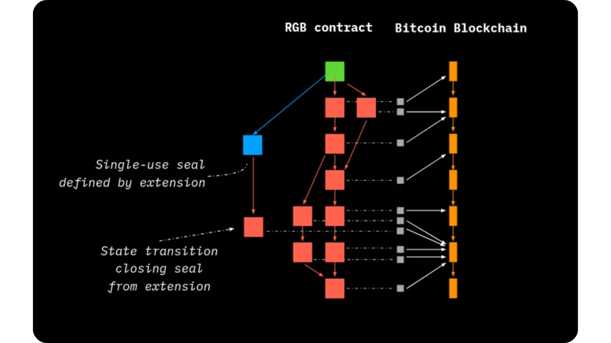


Nk’akarorero: Genesis irema uburenganzira bwo gutanga (*Valency*). Ivyo bishobora gukorwa n’umukinyi yemerewe, aca yubaka State Extension:


- Rivuga igitabu ca Valency (Redeem);
- Irema *Assignment* nshasha (amakuru mashasha ya *Owned State*) yerekana UTXO;
- State Transition izoza, isohowe na nyen’iyi UTXO nshasha, mu vy’ukuri izokwimurira canke igatanga ivyo bimenyetso bishasha vyasohowe.


### Ibice vy'indege Contract Operation


Ubu rero ndashaka kuraba mu buryo burambuye buri kimwe mu bigize Elements ya **Contract Operation** muri RGB. Contract Operation ni igikorwa gihindura uko Contract imeze, kandi cemezwa ku ruhande rw’umukiriya, mu buryo bugenwa, n’uwuyironka mu buryo bubereye. Cane cane, turabona ingene Contract Operation ifata mu muzirikanyi, ku ruhande rumwe, **ivya kera** vya Contract, ku rundi ruhande, insobanuro ya **ivya kera** .


```txt
+---------------------------------------------------------------------------------------------------------------------+
|  Contract Operation                                                                                                 |
|                                                                                                                     |
|  +-----+     +-----------------------+      +--------------------------------+      +---------+     +------------+  |
|  | Ffv |     | ContractId | SchemaId |      | TransitionType | ExtensionType |      | Testnet |     | AltLayers1 |  |
|  +-----+     +-----------------------+      +--------------------------------+      +---------+     +------------+  |
|                                                                                                                     |
|  +-----------------------------------------------+  +------------------------------------------------------------+  |
|  | Metadata                                      |  | Global State                                               |  |
|  |                                               |  | +----------------------------------+                       |  |
|  | +-------------------------------------+       |  | | +-------------------+ +--------+ |                       |  |
|  | |          Structured Data            |       |  | | |  GlobalStateType  | |  Data  | |     ...     ...       |  |
|  | +-------------------------------------+       |  | | +-------------------+ +--------+ |                       |  |
|  |                                               |  | +----------------------------------+                       |  |
|  +-----------------------------------------------+  +------------------------------------------------------------+  |         +------+
|                                                                                                                     +---------> OpId |
|  +-----------------------------------------------+  +------------------------------------------------------------+  |         +------+
|  | Inputs                                        |  | Assignments                                                |  |
|  |                                               |  |                                                            |  |
|  | +-------------------------------------------+ |  | +--------------------------------------------------------+ |  |
|  | | Input #1                                  | |  | | Assignment #1                                          | |  |
+------+       |  | | +----------+ +----------------+ +-------+ | |  | | +----------------+ +-------------+ +-----------------+ | |  |       +--------------+
| OpId +--------------> PrevOpId | | AssignmentType | | Index | | |  | | | AssignmentType | | Owned State | | Seal Definition +--------------> Bitcoin UTXO |
+------+       |  | | +----------+ + ---------------+ +-------+ | |  | | +----------------+ +-------------+ +-----------------+ | |  |       +--------------+
|  | +-------------------------------------------+ |  | +--------------------------------------------------------+ |  |
|  |                                               |  |                                                            |  |
|  | +-------------------------------------------+ |  | +--------------------------------------------------------+ |  |
|  | | Input #2                                  | |  | | Assignment #2                                          | |  |
+------+       |  | | +----------+ +----------------+ +-------+ | |  | | +----------------+ +-------------+ +-----------------+ | |  |       +--------------+
| OpId +--------------> PrevOpId | | AssignmentType | | Index | | |  | | | AssignmentType | | Owned State | | Seal Definition +--------------> Bitcoin UTXO |
+------+       |  | | +----------+ +----------------+ +-------+ | |  | | +----------------+ +-------------+ +-----------------+ | |  |       +--------------+
|  | +-------------------------------------------+ |  | +--------------------------------------------------------+ |  |
|  |                                               |  |                                                            |  |
|  |       ...           ...          ...          |  |     ...          ...             ...                       |  |
|  |                                               |  |                                                            |  |
|  +-----------------------------------------------+  +------------------------------------------------------------+  |
|                                                                                                                     |
|  +-----------------------------------------------+  +------------------------------------------------------------+  |
|  | Redeems                                       |  | Valencies                                                  |  |
|  |                                               |  |                                                            |  |
|  | +------------------------------+              |  |                                                            |  |
+------+       |  | | +----------+ +-------------+ |              |  |  +-------------+  +-------------+                          |  |
| OpId +--------------> PrevOpId | | ValencyType | |  ...   ...   |  |  | ValencyType |  | ValencyType |         ...              |  |
+------+       |  | | +----------+ +-------------+ |              |  |  +-------------+  +-------------+                          |  |
|  | +------------------------------+              |  |                                                            |  |
|  |                                               |  |                                                            |  |
|  +-----------------------------------------------+  +------------------------------------------------------------+  |
|                                                                                                                     |

+---------------------------------------------------------------------------------------------------------------------+
```


Turavye igishushanyo kiri hejuru, turabona ko Contract Operation irimwo Elements yerekeza ku **Leta Nshasha** n’izindi zivuga **Leta ya kera** yahinduwe.


Elements za **Leta Nshasha** ni:


- **Inshingano**, muri zo zisobanurwa:
 - Ivyo **Seal Definition**;
 - Ivyo **Owned State**.
- Ico **Global State**, gishobora guhindurwa canke gutunganirizwa;
- **Ivyiza**, bishobora kuba bisobanuwe muri State Transition canke Genesis.


**Igihugu ca kera** kivugwa biciye kuri:


- **Inputs**, zigaragaza *Ibikorwa* vy'imihindukire ya Leta ya kera (ntibiri muri Genesis);
- **Redeems**, zivuga ku Valencies zasobanuwe mbere (mu Vyagutse vya Leta gusa).


Ikindi, Contract Operation irimwo ibindi bibanza rusangi vyerekeye igikorwa:


- `ffv` (*Verisiyo yihuta*): umubare wose w'amabayiti 2 ugaragaza verisiyo ya Contract;
- `UbwokoBw'Impinduka` canke `UbwokoBw'Ikwaguka`: Umubare w'ibice 16 ugaragaza ubwoko bw'Impinduka canke Ukwaguka, hakurikijwe Business Logic;
- `Id y'amasezerano`: umubare w'amabayiti 32 yerekeye *OpId* ya Contract Genesis. Ishizwe mu Nzira z’Impinduka n’Ivyagutse, ariko ntiziri mu Genesis;
- schemaId: iri muri Genesis gusa, iyi ni Hash y'amabayite 32 iserukira imiterere (*Schema*) ya Contract;
- `Testnet`: Igiharuro kigaragaza nimba uri ku rubuga rwa Testnet canke Mainnet. Genesis gusa;
- `altlayers1`: umuhinduzi ugaragaza ubundi buryo Layer (Sidechain canke ubundi) bukoreshwa ku makuru ya Anchor yongerako Bitcoin. Iriho gusa muri Genesis;
- `metadata`: umwanya ushobora kubika amakuru y'igihe gito, ngirakamaro mu kwemeza Contract igoye, ariko udategerezwa kwandikwa mu mateka y'imimerere ya nyuma.


Ubwa nyuma, ivyo bibanza vyose bihurizwa hamwe n'uburyo bwo gukora hashing, kugira ngo bivemwo ikimenyetso c'urutoke kidasanzwe, `OpId`. Iyi `OpId` ica ishirwa muri Transition Bundle, igatuma ishobora kwemezwa no kwemezwa muri porotokole.


Buri *Contract Operation* rero imenyekana n'igice ca Hash c'amabayite 32 citwa `OpId`. Iyi Hash ibarwa n’i SHA256 Hash y’iyi Elements yose igize igikorwa. Mu yandi majambo, *Contract Operation* yose irafise Commitment yayo y’ibanga, irimwo amakuru yose akenewe kugira ngo umuntu asuzume ukuri n’uko igikorwa gihuye.


RGB Contract rero imenyekana na `ContractId`, ikomoka kuri Genesis `OpId` (kubera ko ata gikorwa c’imbere ya Genesis). Mu majambo nyayo, dufata Genesis `OpId`, tugahindura urutonde rwa byte maze tugakoresha ubuhinga bwa Base58. Ivyo bituma `ContractId` yoroha gukoresha no kumenya.

### Uburyo bwo kuvugurura ivyangombwa n'amabwirizwa


**Contract State** igereranya amakuru yose umurongo wa RGB utegerezwa gukurikirana ku Contract. Igizwe na:


- **Global State** imwe: iki ni igice ca Contract ca bose, co kw'isi yose, kiboneka kuri bose;
- Igihugu kimwe canke vyinshi vy'Umutungo: **Owned State** yose ifatanye n'iyindi Seal yihariye (kandi rero UTXO kuri Bitcoin). Hariho itandukaniro hagati ya:
    - Ibihugu **vya bose**,
    - Ibihugu **vy’abikorera ku giti cabo**.


*Global State* ishirwa ataco ihinduye muri *Contract Operation* nk'igice kimwe. *Ibihugu vy'Umutungo* bisobanurwa muri *Assignment* yose, iruhande ya *Seal Definition*.


Ikintu nyamukuru kiranga RGB ni uburyo Global State n’Ibihugu vy’Igihugu bihindurwa. Muri rusangi hari ubwoko bubiri bw'inyifato:


- **Mutable**: iyo ikintu c'igihugu kidondowe nk'igihinduka, igikorwa gishasha cose gisubirira igihugu ca kera n'igihugu gishasha. Amakuru ya kera rero abonwa ko ataco amaze;
- **Kwirundanira**: iyo ikintu c'intara gisobanuwe nk'ikirundanira, igikorwa gishasha cose congera amakuru mashasha ku ntara y'imbere, ata kwandikako. Ico bivamwo ni ubwoko bw'amateka yirundanijwe.


Iyo, muri Contract, ikintu ca leta kitasobanuwe nk'igihinduka canke gitera, ico kintu kizoguma ari ubusa ku bikorwa bikurikira (mu yandi majambo, nta verisiyo nshasha z'iki kibanza). Ni Contract Schema (i.e. Business Logic ifise kode) igena nimba Leta (Isi yose canke Iy’Umuntu) ihinduka, ishobora kwirundanira canke idahinduka. Igihe Genesis imaze gusobanurwamwo, ivyo bishobora guhindurwa gusa iyo Contract ubwayo ibirekuriye, nk'akarorero biciye ku State Extension yihariye.


Imbonerahamwe iri musi yerekana ingene ubwoko bumwebumwe bwa Contract Operation bushobora gukoresha (canke kutakoresha) Global State na Owned State:


|                              | Genesis | State Extension | State Transition |
| ---------------------------- |:-----: |:-------------: |:--------------: |
| **Addition of Global State** |    +    |        -        |        +         |
| **Mutation of Global State** |   n/a   |        -        |        +         |
| **Addition of Owned State**  |    +    |        -        |        +         |
| **Mutation of Owned State**  |   n/a   |       No        |        +         |
| **Addition of Valencies**    |    +    |        +        |        +         |


**`+`**: igikorwa gishoboka iyo Schema ya Contract ibirekuriye.


**`-`**: igikorwa kigomba kwemezwa na State Transition ikurikira (State Extension yonyene ntifunga Single-Use Seal).


Ikindi, urugero rw’igihe n’uburenganzira bwo guhindura ubwoko bumwebumwe bw’amakuru birashobora gutandukanywa mu mbonerahamwe ikurikira:


|                        | Metadata                                | Global State                                     | Owned State                                                                                              |
| ---------------------- | --------------------------------------- | ------------------------------------------------ | -------------------------------------------------------------------------------------------------------- |
| **Scope**              | Defined for a single Contract Operation | Defined globally for the contract                | Defined for each seal (*Assignment*)                                                                     |
| **Who can update it?** | Non-updatable (ephemeral data)          | Operation issued by actors (issuer, etc.)        | Depends on the legitimate holder who owns the seal (the one who can spend it in a following transaction) |
| **Temporal Scope**     | Only for the current operation          | State is established at the end of the operation | State is defined before the operation (by the *Seal Definition* of the previous operation)               |


### Global State


Global State akenshi idondorwa ngo "nta n'umwe ayifise, bose barabizi". Irimwo amakuru rusangi yerekeye Contract, ikaba iboneka ku mugaragaro. Nk’akarorero, mu Contract itanga token, birashoboka ko irimwo:


- Igiharuro (inyuguti ngufi y’ikigereranyo ya token): `igiharuro`;
- Izina ryose rya token: `izina`;
- Ugushikama (umubare w'ibibanza vy'icumi): `ugushikama`;
- Ivyo gutanga vya mbere (na/canke umupaka w’agaciro kanini wa token): `Itangazwa`;
- Itariki y'isohoka: `yaremwe`;
- Amakuru y'amategeko canke ayandi makuru ya bose: `amakuru`.


Iyi Global State ishobora gushirwa ku bikoresho vya bose (imbuga ngurukanabumenyi, IPFS, Nostr, Torrent, n’ibindi) igashikirizwa abantu bose. Kandi, inguvu z’ubutunzi (ugukenera gufata no gutanga ivyo bimenyetso, n’ibindi) ni vyo bituma abakoresha Contract bo ubwabo babungabunga no gukwiragiza ayo makuru.


### Ibikorwa


*Assignment* ni umubumbe w'ishimikiro wo gusobanura:


- Igikoresho ca Seal (*Igikoresho ca Seal Definition*), kigaragaza igikoresho ca UTXO kidasanzwe;
- *Owned State*, ni ukuvuga umutungo canke amakuru ajanye n'iyi Seal.


*Assignment* ishobora kubonwa nk’ikigereranyo c’igisohoka c’ugucuruza ca Bitcoin, ariko ikaba ifise ubushobozi bwo guhinduranya. Aha niho hari uburyo bwo kwimurira umutungo: *Assignment* ifatanya ubwoko bumwe bw'umutungo canke uburenganzira (`Ubwoko bw'Igikorwa`) na Seal. Uwufise urufunguzo rw’ibanga rwa UTXO rufatanye n’iyi Seal (canke uwushobora gukoresha iyi UTXO) afatwa ko ari nyen’iyi *Owned State*.


Kimwe mu bintu bikomeye bikomeye vya RGB ni ubushobozi bwo *guhishura* canke guhisha (*guhisha*) imirima ya *Seal Definition* na *Owned State* uko ushaka. Ivyo bitanga uruvange rukomeye rw’ibanga n’uguhitamwo. Nk’akarorero, urashobora kwemeza ko ihinduka rifise akamaro ata makuru yose utangaje, mu gutanga verisiyo yahishuriwe ku muntu ategerezwa kuyishingira intahe, mu gihe abandi bantu babona gusa verisiyo yihishije (Hash). Mu bikorwa, `OpId` y'ihinduka yama ibarwa ivuye ku makuru *hishijwe*.


#### Seal Definition


*Seal Definition*, mu buryo bwayo bwahishuriwe, ifise ivyicaro bine vy'ishimikiro: `txptr`, `vout`, `uguhuma` na `uburyo`:


- **txptr**: ibi ni ivyerekeye UTXO kuri Bitcoin:
    - Ku bijanye n’indege **Genesis Seal**, yerekana ata guca ku ruhande UTXO iriho (iyo ifatanye n’iyo Genesis);
    - Mu gihe c'**Igishushanyo Seal**, dushobora kugira:
        - `txid` yoroshe, iyo yerekana UTXO yihariye,
        - Canke `WitnessTx`, yerekana ikintu umuntu yishingirako: Seal yerekana igikorwa ubwaco. Ivyo birakenewe cane cane iyo ata UTXO yo hanze iriho, nk'akarorero mu gufungura umurongo wa Lightning, canke iyo uwuronka ata UTXO afise.
- **vout**: umubare w'isohoka ry'ibikorwa vyerekanywe na `txptr`. Itangazwa gusa ku gishushanyo gisanzwe Seal (si ku `IcabonaTx`);
- **blinding**: umubare w'ibintu 8 vy'ibanga, kugira ngo hakomezwe ibanga no kubuza gukoresha inguvu z'agahomerabunwa ku bijanye n'akaranga ka UTXO;
- **uburyo**: yerekana uburyo bwo gushingira intahe bukoreshwa (`Tapret` canke `Opret`).


Igishushanyo *cahishijwe* ca Seal Definition ni SHA256 Hash (gifise ikimenyetso) c'uguhuza ivyo bibanza 4, gifise ikimenyetso kidasanzwe kuri RGB.


#### Leta zifise


Igice ca kabiri ca *Assignment* ni Owned State. Udakunze Global State, ishobora kubaho mu buryo bwa bose canke bw’abantu ku giti cabo:


- **Owned State ya bose**: umuntu wese arazi amakuru ajanye na Seal. Nk'akarorero, ishusho y'abantu bose;
- **Private Owned State**: amakuru aranyegezwa, amenyekana gusa na nyen'ayo makuru (kandi bishoboka ko ari uwuyashingira intahe iyo bikenewe). Nk'akarorero, igitigiri c'ibimenyetso bifise.


RGB isobanura ubwoko bune bw'intara bushoboka (*UbwokoBw'intara*) bwa Owned State:


- **Itangazo**: nta makuru y'imibare arimwo, uburenganzira bwo gutangaza gusa (nk'uburenganzira bwo gutora). Ivyo bihishijwe n'ivyo bihishuwe birasa;
- **Fungible**: igereranya umubare ushobora guhinduka (nk'ibimenyetso). Mu buryo bwahishuriwe, dufise `umubare` n'`uguhuma`. Mu buryo bwihishije, dufise *Pedersen commitment* imwe ihisha umubare n'uguhuma amaso;
- **Itunganijwe**: ibika amakuru atunganijwe (gushika kuri 64 kB). Mu buryo bwahishuriwe, ni data blob. Mu buryo bwihishije, ni Hash y'iki gice:


```txt
SHA-256(SHA-256(tag_data) || SHA-256(tag_data) || blob)
```


Na, nk'akarorero:


```txt
tag_data = urn:lnp-bp:rgb:state-data#2024-02-12
```


- **Ivyashizweko**: bihuza dosiye (amajwi, ishusho, bibiri, n'ibindi) na Owned State, bikabika dosiye Hash `file_hash`, ubwoko bwa MIME `ubwoko bw'amakuru` n'umunyu w'ibanga `umunyu`. Dosiye ubwayo iracumbikirwa ahandi. Mu buryo bwihishije, ni Hash ifise ikimenyetso c'ibintu bitatu bibanza:


```txt
SHA-256(SHA-256(tag_attachment) || SHA-256(tag_attachment) || file_hash || media_type || salt)
```


Na, nk'akarorero:


```txt
tag_attachment = urn:rgb:state-attach#2024-02-12
```


Mu ncamake, ng’ubu ubwoko 4 bushoboka bwa Leta mu buryo bwa bose no mu buryo bwihishije:


```txt
State                      Concealed form                              Revealed form

+---------------------------------------------------------------------------------------------------------

+--------------------------------------------------------------------------------+
|                                                                                |
Declarative        |                              < void >                                          |
|                                                                                |
+--------------------------------------------------------------------------------+

+---------------------------------------------------------------------------------------------------------

+--------------------------+             +---------------------------------------+
| +----------------------+ |             |         +--------+ +----------+       |
Fungible           | | Pedersen Commitement | | <========== |         | Amount | | Blinding |       |
| +----------------------+ |             |         +--------+ +----------+       |
+--------------------------+             +---------------------------------------+

+---------------------------------------------------------------------------------------------------------

+--------------------------+             +---------------------------------------+
| +----------------------+ |             |         +--------------------+        |
Structured         | |     Tagged Hash      | | <========== |         |     Data Blob      |        |
| +----------------------+ |             |         +--------------------+        |
+--------------------------+             +---------------------------------------+

+---------------------------------------------------------------------------------------------------------

+--------------------------+             +---------------------------------------+
| +----------------------+ |             | +-----------+ +------------+ +------+ |
Attachments        | |     Tagged Hash      | | <========== | | File Hash | | Media Type | | Salt | |
| +----------------------+ |             | +-----------+ +------------+ +------+ |

+--------------------------+             +---------------------------------------+

```


| **Element**     | **Declarative** | **Fungible**                      | **Structured**       | **Attachments**        |
| --------------- | --------------- | --------------------------------- | -------------------- | ---------------------- |
| **Data**        | None            | Signed or unsigned 64-bit integer | Any strict data type | Any file               |
| **Info Type**   | None            | Signed or unsigned                | Strict types         | MIME Type              |
| **Privacy**     | Not required    | Pedersen commitment               | Hash with blinding   | Hashed file identifier |
| **Size Limits** | N/A             | 256 bytes                         | Up to 64 KB          | Up to ~500 GB          |


### Injiza


Ivyo Inputs za *Contract Operation* vyerekeye *Ibikorwa* biriko birakoreshwa muri iki gikorwa gishasha. Injiza yerekana:


- `prevOpId`: ikimenyetso (`OpId`) c'igikorwa c'imbere aho *Assignment* yari;
- `UbwokoBw'Igikorwa`: ubwoko bwa *Assignment* (nk'akarorero, `Nyitungo` ku token);
- `Index`: urutonde rwa *Assignment* ruri ku rutonde rujanye n'i `OpId` y'imbere, rugenwa inyuma y'ugutoranya kw'inkoranyabumenyi kw'ibimenyetso vyihishijwe.


Ivyinjira ntivyigera biboneka muri Genesis, kuko ata Mirimo y’imbere iriho. Eka mbere ntiziboneka mu Vyagutse vya Leta (kuko Ivyagutse vya Leta bitafunga ibimenyetso; ahubwo, bisubira gusobanura ibimenyetso bishasha bishingiye ku Valencies).


Iyo dufise Owned States z’ubwoko bwa `Fungible`, ubuhinga bwo kwemeza (biciye mu nyandiko ya AluVM itangwa muri Schema) burasuzuma ukuntu imibare ihuye: umubare w’ibimenyetso vyinjira (*Inputs*) utegerezwa kuba ungana n’umubare w’ibimenyetso bisohoka (mu *As* nshasha).


### Amakuru


**Metadata** field ishobora gushika kuri 64 KiB kandi ikoreshwa mu gushiramwo amakuru y'igihe gito ngirakamaro mu kwemeza, ariko ntashizwe mu gihe c'ubudasiba ca Contract. Nk'akarorero, ibihinduka vy'imibare yo hagati y'inyandiko zikomeye birashobora kubikwa hano. Ico kibanza ntikigenewe kubikwa mu mateka y'isi yose, ni co gituma kiri hanze y'ububasha bw'Ibihugu vy'Igihugu canke Global State.


### Ivyiza


**Ivyiyumviro** ni uburyo bw'umwimerere bw'amasezerano ya RGB. Bishobora gusangwa muri Genesis, Impinduka za Leta canke Impinduka za Leta. Bigereranya uburenganzira bw’imibare bushobora gukoreshwa na State Extension (biciye muri *Redeems*), hanyuma bikarangizwa n’Impinduka ikurikira. Buri Valency imenyekana n'`UbwokoBw'Uburemere` (ibice 16). Insobanuro yayo (uburenganzira bwo gusubira gusohora, guhindura token, uburenganzira bwo guturira, n'ibindi) zisobanurwa muri Schema.


Mu majambo nyayo, twoshobora kwiyumvira Genesis isobanura "uburenganzira bwo gusubira gusohora" Valency. State Extension izoyirya (*Redeem*) iyo hari ibintu bimwe bimwe bishitse, kugira ngo haboneke umubare mushasha w’ibimenyetso. Hanyuma, State Transition iva ku wufise Seal yaremwe gutyo irashobora kwimurira ivyo bimenyetso bishasha.


### Gucungura


Ivyo gucungura ni Valency bingana n’Ivyinjira mu bikorwa. Biboneka gusa mu Vyagutse vya Leta, kuko ni ho Valency yari yarasobanuwe mbere ikoreshwa. Redeem igizwe n’ibice bibiri:


- `PrevOpId`: `OpId` y'igikorwa aho Valency yari yaravuzwe;
- `UbwokoBw'Ubushobozi`: ubwoko bwa Valency wipfuza gukoresha (buri `UbwokoBw'Ubushobozi` bushobora gukoreshwa rimwe gusa na State Extension).


Akarorero: Redeem ishobora guhura n'ugushirwa mu ngiro kwa CoinSwap, bivanye n'ivyo vyari vyashizwe muri Valency.


### Ibiranga ikibanza ca RGB


Ubu tugiye kuraba ibiranga Leta vyinshi vy'ishimikiro muri RGB. Cane cane, turaza kuraba:


- **Uburyo bw’ubwoko bukomeye**, butegeka gutunganya amakuru mu buryo bubereye kandi bufise ubwoko;
- Akamaro ko gutandukanya **kwemeza** na **Ownership**;
- Uburyo bwa **ugutera imbere kw'uguhurizako** muri RGB, burimwo ivyiyumviro vy'*ugutera imbere vyihuta* n'*ugusubira inyuma*.


Nk’uko bisanzwe, uzirikane ko ikintu cose gifitaniye isano n’ivy’uburenganzira bwa Contract cemezwa ku ruhande rw’umukiriya hakurikijwe amategeko y’uguhurizako ashizweho mu masezerano, kandi ko ishingiro ryayo ry’iherezo ry’ubuhinga bwa none rishingiye ku bikorwa vya Bitcoin.


#### Ubwoko bukomeye


RGB ikoresha *Ubwoko bukomeye* n'uburyo bwo gukurikirana (*Ugushiramwo amakuru*). Iryo shirahamwe ryagenewe gutuma amakuru ya Contract ashobora gusubirwamwo neza kandi akagira ukuri mu gusobanura, gukoresha no kwemeza.


Mu bidukikije vyinshi vy’iporogarama (JSON, YAML...), imiterere y’amakuru irashobora guhinduka, mbere n’ugushobora kwemera cane. Ku rundi ruhande, muri RGB, Imiterere n’Ubwoko bw’umurima wose birasobanurwamwo ibintu bigaragara. Nk'akarorero:


- Ihinduka ryose rifise ubwoko bwihariye (nk'akarorero, umubare w'ibice 8 udafise ikimenyetso `u8`, canke umubare w'ibice 16 ufise ikimenyetso, n'ibindi);
- Ubwoko burashobora gukorwa (ubwoko bushizwemwo). Ibi bisigura ko ushobora gusobanura ubwoko bushingiye ku bundi bwoko (nk'ubwoko bw'umugwi burimwo umwanya `u8`, umwanya `bool`, n'ibindi);
- Amakoraniro arashobora kandi gusobanurwamwo: urutonde (*urutonde*), imigwi (*imigwi*) canke inkoranyamagambo (*ikarita*), n'urutonde rw'iterambere ry'ibintu;
- Buri murima urafise urubibi (*urubibi rwo hasi* / *urubibi rwo hejuru*). Turashiraho kandi imipaka ku mubare w’ama Elements mu makoraniro (ugukingira);
- Amakuru ni byte-aligned kandi urutonde rurasobanuwe neza kandi rudasobanutse.


Urakoze kuri iyi porotokole y'ugushiramwo amakuru:


- Urutonde rw’ibibanza rwama ari rumwe, ata kuraba ururimi rwo gushirwa mu ngiro canke rwo gukora porogarama rukoreshwa;
- Ivyo biharuro biharuwe ku rutonde rumwe rero birashobora gusubirwamwo kandi birasa (*imihigo* y’ugushingira intahe);
- Imipaka ibuza iterambere ritagenzuwe mu bunini bw’amakuru (nk’akarorero, imirima myinshi cane);
- Ubwo buryo bwo gushiramwo amakuru buratuma habaho ugusuzuma kw’ibanga, kuko umwe wese mu bari muri iyo nyigisho azi neza ingene yoshiramwo amakuru mu rutonde no gukora Hash.


Mu bikorwa, imiterere (*Schema*) n’itegeko rivamwo (*Interface* n’ubwenge bujanye n’ivyo) birakoranirizwa hamwe. Ururimi rudondora rukoreshwa mu gusobanura Contract (ubwoko, ivyicaro, amategeko) na generate uburyo bukomeye bw’ibice bibiri. Iyo bishizwe hamwe, igisubizo ni:


- A *Igishushanyo c'Ukwibuka* ku murima wose;
- Ivyerekana insobanuro (vyerekana nimba guhindura izina ry’igihinduka bifise ingaruka ku nsiguro, naho nyene imiterere y’ukwibuka yoguma ari imwe).


Uburyo bw’ubwoko bukomeye kandi burashoboza gukurikirana neza amahinduka: uguhindura kwose kw’imiterere (mbere n’uguhindura izina ry’umurima) kuramenyekana kandi gushobora gutuma haba uguhinduka kw’ikirenge cose.


Ubwa nyuma, ihuriro ryose ritanga ikimenyetso c’urutoke, ikimenyetso c’ibanga gishingira intahe verisiyo nyayo y’iyo kode (amakuru, amategeko, kwemeza). Akarorero, ikimenyetso c'ifomu:


```txt
BEiLYE-am9WhTW1-oK8cpvw4-FEMtzMrf-mKocuGZn-qWK6YF#ginger-parking-nirvana
```


Ivyo bituma bishoboka gucunga ivyagezwe vy’uguhurizako canke ivy’ugushirwa mu ngiro, mu gihe bishoboka ko umuntu ashobora gukurikirana mu buryo burambuye amaverisiyo akoreshwa mu rubuga.


Kugira ngo ubuzima bwa RGB Contract ntibube bugoye cane ku ruhande rw’umukiriya, itegeko ry’uguhurizako rishiraho ubunini burenze `2^16` bytes (64 Kio) ku makuru yose ari mu biharuro vy’ukwemeza. Ivyo bireba umuhinduzi canke imiterere yose: ntibirenze 65536 bytes, canke ibihwanye n’ivyo mu mibare (32768 16-bit integers, n’ibindi). Ivyo birareba kandi amakoraniro (urutonde, amatsinda, amakarata), adashobora kurenga `2^16` Elements.


Iyi nzira iremeza:


- Igenzura ubunini burengeye ubw’amakuru azokoreshwa mu gihe ca State Transition;
- Uguhuza n'imashini y'ivy'impwemu (*AluVM*) ikoreshwa mu gukoresha inyandiko zo kwemeza.


#### Ivyemezo != Ownership akarorero


Kimwe mu bintu bikomeye RGB yakoze ni ugutandukanya cane ivyiyumviro bibiri:


- **Kwemeza**: kugenzura ko State Transition yubaha amategeko ya Contract (Business Logic, amateka, n'ibindi);
- Ico **Ownership** (Ownership, canke ubugenzuzi): ukuri ko umuntu afise Bitcoin UTXO ishobora gutuma Single-Use Seal ikoreshwa (canke igafungwa), gutyo State Transition ikabaho.


**Ukwemeza** bibera ku rugero rw'ikirundo ca porogaramu RGB (amasomero, *amasezerano*, n'ibindi). Uruhara rwayo ni ugutuma amategeko yo mu mutima yo muri Contract (amahera, uruhusha n’ibindi) yubahirizwa. Abarorerezi canke abandi bari muri iyo nama na bo nyene barashobora kwemeza amateka y’amakuru.


**Ownership**, ku rundi ruhande, yizigiye gusa umutekano wa Bitcoin. Kugira urufunguzo rw’ibanga rwa UTXO bisigura kugenzura ubushobozi bwo gutanguza ihinduka rishasha (gufunga Single-Use Seal). Rero, naho umuntu yoshobora kubona canke kwemeza amakuru, ntashobora guhindura Leta iyo atagira UTXO ireba.


Ubu buryo buragabanya ubugoyagoye bwa kera buboneka mu bice vy’ubuhinga bikomeye cane (aho kode yose ya Smart contract ari iya bose kandi ishobora guhindurwa n’umuntu wese, ivyo bikaba vyatumye rimwe na rimwe habaho ubusuma). Ku RGB, uwutera ntashobora gusa gukorana na Leta ya On-Chain, kuko uburenganzira bwo gukora kuri Leta (*Ownership*) burindwa na Bitcoin Layer.


Ikindi, uku gutandukanya bituma RGB ishobora kwifatanya na Lightning Network. Imirongo y’umuravyo ishobora gukoreshwa mu gukorana no kwimurira ivy’ubutunzi vya RGB ata gukorana n’*imihigo* ya On-Chain igihe cose. Tuzokwihweza neza uku gushiramwo RGB ku Muravyo mu bice bizokurikira vy’amashure.


#### Iterambere ry'ubumwe muri RGB


Uretse guhindura kode y’insobanuro, RGB irimwo uburyo bwo guhindura canke guhindura amategeko y’uguhurizako ya Contract uko igihe kigenda kirarenga. Hari uburyo bubiri nyamukuru bw'ubwihindurize:


- **Kwihuta-imbere**
- **Gusunika-inyuma**


Ivyihuta gutera imbere bishika iyo itegeko ryari ritagira akamaro mbere rigira akamaro. Nk'akarorero, iyo Contract ihinduka kugira ngo yemere ubwoko bushasha bwa `AssignmentType` canke umwanya mushasha:


- Ivyo ntibishobora kugereranywa n’ivyuma bikomeye vya kera vya Blockchain, kuko RGB ikora muri Client-side Validation kandi ntigira ico ikoze ku bijanye n’uguhuza muri rusangi kwa Blockchain;
- Mu majambo y’ibikorwa, ubwo bwoko bw’ihinduka bugaragazwa n’umwanya `Ffv` (*verisiyo y’imbere yihuta*) muri Contract Operation;
- Abafise ubu ntibagirirwa nabi: ikibanza cabo kiraguma gifise akamaro;
- Ku rundi ruhande, abashasha bazoronka inyungu (canke abakoresha bashasha), barakeneye guhindura porogarama zabo (Wallet yabo) kugira ngo bamenye ayo mategeko mashasha.


Gusubira inyuma bisigura ko itegeko ryari rifise akamaro mbere rihinduka ubusa. Ni rero "ugukomantaza" amategeko, ariko si mu kuvuga ataco twishimikije:


- Abafise ivy’ubutunzi bariho bashobora gushikirwa n’ingorane (boshobora kwisanga bafise ivy’ubutunzi vyahinduwe bitagira akamaro canke bitagira akamaro muri verisiyo nshasha);
- Turashobora kubona ko mu vy’ukuri turiko turarema umurongo mushasha: uwuzokwemera itegeko rishasha aca ava ku rya kera;
- Uwutanga ashobora gufata ingingo yo gusubira gutanga itunga muri iyo porotokole nshasha, agahatira abakoresha kuguma bafise amasakoshi abiri atandukanye (imwe y’iporotokole ya kera, iyindi y’iyindi nshasha), nimba bashaka gucunga izo verisiyo zompi.


Muri iki gice kivuga ku bikorwa vya RGB Contract, twasuzumye ingingo ngenderwako z’ishimikiro zishingiye kuri iyi porotokole. Nk’uko muzoba mwabibonye, ​​ukuntu umurongo wa RGB ugoranye cane bisaba ko hakoreshwa amajambo menshi y’ubuhinga. Rero, mu kigabane gikurikira, nzobaha urutonde rw'amajambo ruzoca irya n'ino ivyiyumviro vyose bivugwa muri iki gice ca mbere c'inyigisho, n'insobanuro z'amajambo yose y'ubuhinga yerekeye RGB. Hanyuma, mu gice gikurikira, tuzokwihweza mu buryo ngirakamaro insobanuro n’ugushirwa mu ngiro kw’amasezerano ya RGB.


## RGB Insobanuro y'amajambo


<chapterId>545e16a4-3cca-44a3-9fd5-dbc5868abf97</chapterId>


Niba ukeneye kugaruka muri uru rutonde rugufi rw’amajambo y’ubuhinga ahambaye akoreshwa mw’isi ya RGB (yashizwe ku rutonde rw’inyuguti), uzosanga ari ngirakamaro. Iki gice si ngombwa nimba umaze gutahura ivyo twavuze vyose mu gice ca mbere.


#### AluVM


Inyuguti ngufi AluVM ihagarariye "_Imashini y'ubuhinga bwa none_", imashini y'ubuhinga bwa none ishingiye ku nzira y'ubuhinga bwa none yagenewe kwemeza Smart contract no gukoresha ubuhinga bwa none. Ikoreshwa (ariko ntiyihariye gusa) mu kwemeza amasezerano ya RGB. Ivyanditswe canke ibikorwa biri muri RGB Contract birashobora rero gukorwa mu bidukikije vya AluVM.


Ushaka kumenya vyinshi: [Urubuga rwemewe rwa AluVM]


#### Anchor


Anchor igereranya urutonde rw'amakuru y'uruhande rw'umukiriya akoreshwa mu kwemeza ko hariho _ukwiyemeza_ kwihariye mu gucuruza. Mu masezerano ya RGB, Anchor igizwe n’ibi bikurikira:


- Igiharuro c’ibikorwa vy’ubudandaji (txid) c’i **Witness Transaction**;
- Ivyo **Multi Protocol Commitment (MPC)**;
- Ivyo **Igitabu-1058 (DBC)**;
- **Ikimenyamenya c'Ibikorwa vy'Iyongera (ETP)** iyo uburyo bwa **Tapret** Commitment bukoreshejwe (raba igice kigenewe iki kigereranyo).


Anchor rero ikoreshwa mu gushinga isano rishobora kugenzurwa hagati y’ugucuruza kwihariye kwa Bitcoin n’amakuru y’ibanga yemejwe n’amasezerano ya RGB. Biremeza ko ayo makuru ari muri Blockchain vy’ukuri, ata vyo arimwo vy’ukuri bimenyeshwa abantu bose.


#### Assignment


Mu nzira ya RGB, Assignment ni nk'igisubizo c'ibikorwa bihindura, bihindura canke bikora ibintu bimwe bimwe mu gihe ca Contract. Igikoresho ca Assignment gifise ama Elements abiri:


- A **Seal Definition** (ivyerekeye UTXO yihariye);
- An **Owned State** (amakuru adondora igihugu gifitaniye isano n’uwo nyen’itongo rishasha).


Assignment rero yerekana ko igice ca Leta (nk’akarorero, umutungo) ubu gihabwa uwufise, kimenyekana biciye ku Single-Use Seal ifatanye na UTXO.


#### Business Logic


Business Logic ihuriza hamwe amategeko yose n’imikorere yo mu mutima ya Contract, idondorwa na **Schema** yayo (ni ukuvuga imiterere ya Contract ubwayo). Irategeka ingene igihugu ca Contract gishobora guhinduka, kandi mu bihe ibihe.


#### Client-side Validation


Client-side Validation yerekeza ku buryo buri ruhande (umukiriya) asuzuma urutonde rw’amakuru ahindurwa mu bwiherero, hakurikijwe amategeko y’amasezerano. Ku bijanye na RGB, ayo makuru yahinduwe ashirwa hamwe mu vyo bita **ivyoherezwa**. Udakunze umurongo wa Bitcoin, usaba ko amafaranga yose akoreshwa atangazwa On-Chain, RGB yemera gusa _imigambi_ (ishingiye kuri Bitcoin) kubikwa mu ruhame, mu gihe amakuru y'ingenzi ya Contract asigaye hagati ya On-Chain, ibimenyamenya gusa) ivyerekeye.


#### Commitment


Commitment (mu buryo bw'ibanga) ni ikintu c'imibare, kigaragazwa na `C`, kiva ku gikorwa ku makuru atunganijwe `m` (ubutumwa) n'agaciro k'imburakimazi `r`. Twandika:


$$
C = \text{commit}(m, r)
$$


Ubu buryo bugizwe n'ibikorwa bibiri nyamukuru:


- **Commit**: igikorwa c'ibanga gikoreshwa ku butumwa `m` n'umubare w'imburakimazi `r` kugira ngo uvemwo `C`;
- **Verify**: dukoresha `C`, ubutumwa `m` n'agaciro ka `r` kugira ngo tugenzure ko iyi Commitment ari ukuri. Igikorwa kigarura `Ukuri` canke `Ikinyoma`.


Commitment itegerezwa kwubahiriza ibintu bibiri:


- **Binding**: bitegerezwa kuba bidashoboka kuronka ubutumwa bubiri butandukanye butanga `C` imwe:


$$
m': \, | \,: m' \neq m \quad \text{and} \quad r': \, | \,: r' \neq r \quad
$$


Nka nka:


$$
\text{verify}(m, r, C) = \text{verify}(m', r', C) \rightarrow \text{True}
$$


- **Kwihisha**: ubumenyi bwa `C` ntibutegerezwa guhishura ibirimwo muri `m`.


Mu masezerano ya RGB, Commitment ishirwa mu gikorwa ca Bitcoin kugira ngo yerekane ko hari amakuru kanaka ariho mu gihe kinaka, ata makuru ubwayo ahishuriwe.


#### Consignment


A **Consignment** ihuriza hamwe amakuru yashikirijwe hagati y'ababuranyi, hakurikijwe Client-side Validation muri RGB. Hariho ivyiciro bibiri nyamukuru vya Consignment:


- **Contract Consignment**: itangwa n'uwutanga (uwatanga Contract), irimwo amakuru y'intango nka Schema, Genesis, Interface na Interface Implementation.
- **Kwimurira Consignment**: bitangwa n'uwuriha (*uwuriha*). Irimwo amateka yose y'impinduka za Leta zishikana ku Terminal Consignment (ni ukuvuga Leta ya nyuma yaronse n'uwuyitanga).


Ivyo bintu birungitswe ntivyandikwa ku mugaragaro ku rupapuro rwa Blockchain; birahanahana ata guca ku ruhande hagati y’ababijejwe biciye ku nzira y’itumanaho bahisemwo.


#### Contract


Contract ni urutonde rw’uburenganzira bushirwa mu ngiro mu buryo bwa digitale hagati y’abakozi benshi biciye ku masezerano ya RGB. Ifise igihugu gikora na Business Logic, isobanurwa na Schema, igaragaza ibikorwa vyemewe (uguhindura, kwongera, n’ibindi). Ivyo Contract imeze, hamwe n'amategeko agenga ukuri kwayo, bivugwa muri Schema. Igihe cose, Contract iratera imbere gusa bivanye n’ivyo vyemewe n’iyi Schema be n’inyandiko zo kwemeza (run, nk’akarorero, muri AluVM).


#### Contract Operation


Contract Operation ni uguhindura ivy’imimerere ya Contract gukorwa hakurikijwe amategeko ya Schema. Ibikorwa bikurikira biri muri RGB:


- 1117;
- 1118;
- 1119.


Igikorwa kimwekimwe cose gihindura igihugu mu kwongerako canke gusubirira amakuru amwamwe (Global State, Owned State...).


#### Contract Participant


Contract Participant ni umukinyi agira uruhara mu bikorwa bijanye na Contract. Muri RGB, hariho itandukaniro hagati ya:


- Uwutanga Contract, ari we arema Genesis (inkomoko ya Contract);
- Abagize Contract, ni ukuvuga abafise uburenganzira ku gihugu ca Contract;
- Amashirahamwe ya Leta, ashobora kwubaka Ivyumba vya Leta iyo Contract itanga Ivyumba vy’Igihugu bishobora gushikirwa na bose.


#### Contract Rights


Contract Rights yerekeza ku burenganzira butandukanye bushobora gukoreshwa n’abafise uruhara muri RGB Contract. Bica mu mice myinshi:


- uburenganzira bwa **Ownership**, bujanye n'uburenganzira bwa Ownership bwa UTXO kanaka (biciye mu _Nsobanuro y'Ikidodo_);
- Uburenganzira bw'ubutegetsi, ni ukuvuga ubushobozi bwo kwubaka inzira imwe canke nyinshi (Inzira za Leta) hakurikijwe Schema;
- **Uburenganzira bwa bose**, iyo Schema yemerera gukoresha ibintu bimwe bimwe vya bose, nk'akarorero kurema State Extension biciye mu gucungura Valency.


#### Contract State


Contract State ihuye n’ingene Contract iri ubu mu gihe kanaka. Ishobora kuba igizwe n'amakuru ya bose n'ay'abikorera ku giti cabo, yerekana uko Contract imeze. RGB itandukanya:


- **Global State**, irimwo ivy’abantu bose vya Contract (vyashizweho muri Genesis canke vyongeweko biciye mu guhindura vyemewe);
- Ibihugu bifise uburenganzira, ari vyo vy'abafise uburenganzira bwihariye, bimenyekana n'ama UTXO yabo.


#### Deterministic Bitcoin Commitment - DBC


Deterministic Bitcoin Commitment (DBC) ni urutonde rw'amategeko akoreshwa mu kwandika mu buryo bugaragara kandi budasanzwe _ukwiyemeza_ mu gucuruza Bitcoin. Mu masezerano ya RGB, hari uburyo bubiri nyamukuru bwa DBC:


- **Gufungura**
- **Tapret**


Ubu buryo burasobanura neza ingene _ukwiyemeza_ gushirwa mu gisohoka canke mu mibumbe y'isoko rya Bitcoin, kugira ngo bimenyekane ko iyo Commitment ishobora gukurikiranywa no kugenzurwa.


#### Directed Acyclic Graph - DAG


DAG (canke *Acyclic Guided Graph*) ni igishushanyo kitagira inzinguzingu, gishoboza gutegura urutonde rw'ibintu. Ivyuma vy’amabara, nk’ibice _vy’amasezerano ya RGB, bishobora guserukirwa n’ama DAG.


Ku bindi bisobanuro: [Directed Acyclic Graph](Igishushanyo_c'Igishushanyo_C'Igishushanyo_C'Igishushanyo)


#### Gucapura


Gucapura ni urudodo rw’amakuru rwo guhitamwo abafise Contract bakurikirana bashobora kwinjira mu mateka ya Contract. Ico kintu kiriho, nk’akarorero, muri **RGB21** Interface kandi kiratuma amakuru y’icibutso canke y’insobanuro yongerwa ku mateka ya Contract.


#### Ikimenyamenya c'ibikorwa vy'inyongera - ETP


ETP (*Ikimenyamenya c'Ibikorwa vy'Iyongera*) ni igice ca Anchor kirimwo amakuru y'inyongera asabwa kugira ngo umuntu yemeze **Tapret** *Commitment* (mu bijanye na _taproot_). Harimwo, mu bindi, urufunguzo rwa bose rw'imbere rw'inyandiko ya Taproot (_internal PubKey_) n'amakuru yihariye ku _Inzira y'inyandiko Spend_.


#### Genesis


Genesis yerekeza ku rutonde rw'amakuru, ayoborwa na Schema, igize igihugu c'intango ca Contract iyo ari yo yose muri RGB. Bishobora kugereranywa n’iciyumviro ca Bitcoin ca _Genesis Block_, canke n’iciyumviro ca Coinbase Transaction, ariko hano ku rugero rwa _uruhande rw’umukiriya_ n’urwa RGB token.


#### Global State


Global State ni urutonde rw'ibintu vya bose biri muri Contract State. Isobanurwa kuri Genesis kandi, bivanye n’amategeko ya Contract, ishobora guhindurwa n’ihinduka ryemewe. Mu buryo butandukanye n’Ibihugu Bifise Ububasha, Global State ntabwo ari iy’ikigo kinaka; ni hafi cane y’inyandiko ya bose iri muri Contract.


#### Interface


Interface ni urutonde rw'amabwirizwa akoreshwa mu gusobanura amakuru abiri akoranijwe muri Schema canke mu bikorwa vya Contract n'imibereho yayo, kugira ngo ashobore gusomwa n'uwukoresha canke Wallet yiwe. Ikora nk'insobanuro Layer.


#### Interface Implementation


Interface Implementation ni umugwi w'amatangazo ahuza **Interface** na **Schema**. Bishoboza ubuhinduzi bw’insobanuro bukorwa na Interface ubwayo, kugira ngo amakuru atagiramwo ivyatsi yo muri Contract ashobore gutahurwa n’uwukoresha canke porogarama irimwo (amasakoshi).


#### Invoice


Invoice ifata uburyo bwa URL ishizwe muri [base58](https://ru.wikipedia.org/wiki/Binary-to-text encoding#Base58), ikaba ishiramwo amakuru akenewe kugira ngo umuntu yubake **State Transition** (n’uwuyitanga). Mu yandi majambo, ni Invoice ishoboza uwundi (*uwuriha*) gukora ihinduka rihuye n'iryo kugira ngo yimure umutungo canke avugurure uko Contract imeze.


#### Lightning Network


Lightning Network ni urubuga rwigenga rw’imihora yo kwishura (canke _imihora ya leta_) kuri Bitcoin, rugizwe n’ibipapuro 2/2 vy’imikono myinshi. Bishoboza gukora amafaranga yihuta, ataco atwara _inyuma y’uruzitiro_, mu gihe yizigira Layer 1 ya Bitcoin ku bijanye n’ubukemurampaka (canke gufunga) iyo bikenewe.


Kugira ngo umenye vyinshi ku buryo Lightning ikora, ndagusavye gufata iri shure rindi:


https://planb.network/courses/34bd43ef-6683-4a5c-b239-7cb1e40a4aeb

#### Multi Protocol Commitment - MPC


Multi Protocol Commitment (MPC) yerekeza ku miterere ya Merkle Tree ikoreshwa muri RGB kugira ngo ishiremwo, mu gikorwa kimwe ca Bitcoin, **Imigwi y’Impinduka** myinshi iva mu masezerano atandukanye. Iciyumviro ni ugushira hamwe amasezerano menshi (ashobora guhura n’amasezerano atandukanye canke itunga ritandukanye) mu ntumbero imwe ya Anchor kugira ngo umuntu ashobore gukoresha neza ikibanza c’amabuye.


#### Owned State


Owned State ni igice ca Contract State gipfutse muri Assignment kandi gifitaniye isano n’umuntu yihariye afise (biciye kuri Single-Use Seal yerekana UTXO). Ivyo bigereranya nk’akarorero umutungo wo kuri interineti canke uburenganzira bumwe bumwe bw’amasezerano uwo muntu yahawe.


#### Ownership


Ownership yerekeza ku bushobozi bwo kugenzura no gukoresha UTXO yerekanwa na Seal Definition. Iyo Owned State ifatanye na UTXO, nyen'iyo UTXO arafise uburenganzira, bishoboka, bwo kwimurira canke guhindura igihugu gifatanye, hakurikijwe amategeko ya Contract.


#### Partially Signed Bitcoin Transaction - PSBT


PSBT (_Igice ca Bitcoin gishizweko umukono_) ni igitabu ca Bitcoin kitarashirwako umukono ku buryo bushitse. Ishobora gusangizwa hagati y’ibigo vyinshi, kimwe cose kikaba gishobora kwongerako canke kugenzura Elements zimwe zimwe (imikono, inyandiko...), gushika iyo nzira y’ugucuruza ibonwa ko yiteguriye gukwiragizwa On-Chain.


Ku bindi bisobanuro: [BIP-0174] (BIP-0174.mediawiki)


#### Pedersen commitment


Pedersen commitment ni ubwoko bw'ibara ry'ibanga Commitment rifise akamaro ko kuba **homomorphic** ku bijanye n'igikorwa co kwongerako. Ivyo bisigura ko bishoboka kwemeza umubare w’imihigo ibiri ata guhishura agaciro k’umuntu ku giti ciwe.


Mu buryo busanzwe, nimba:


$$
C1=\text{commit}(m1,r1) \quad C2=\text{commit}(m2,r2)
$$


none:


$$
C3=C1⋅C2=\text{commit}(m1+m2, r1+r2)
$$


Iyi nzira ni ngirakamaro, nk'akarorero, mu guhisha amafaranga y'ibimenyetso vyahinduwe, mu gihe ushobora kugenzura igitigiri cose.


Ibindi bisobanuro: [Pedersen commitment] (igice ca 10.1007/3-540-46766-1_9)


#### Redeem


Mu State Extension, Redeem yerekeza ku gikorwa co gusubira gusaba (canke gukoresha nabi) **Valency** yari yatangajwe mbere. Kubera ko Valency ari uburenganzira bwa bose, Redeem iremeza uwufise uburenganzira bwo gusaba Contract State Extension yihariye.


#### Schema


Schema muri RGB ni igice c'itangazo ry'itegeko ridondora urutonde rw'ibihinduka, amategeko na Business Logic (*Business Logic*) bigenzura ibikorwa vya Contract. Schema isobanura imiterere ya Leta, ubwoko bw’ihinduka ryemewe n’ivyo kwemeza.


#### Seal Definition


Seal Definition ni igice ca Assignment gifatanya _ukwiyemeza_ na UTXO y'uwuyifise mushasha. Mu yandi majambo, yerekana aho ivyangombwa biri (aho UTXO iri), kandi igashinga Ownership y’umutungo canke uburenganzira.


#### Shard


Shard igereranya ishami muri DAG y'amateka y'Impinduka za Leta ya RGB Contract. Mu yandi majambo, ni igice gihuye c'amateka yose ya Contract, gihuye, nk'akarorero, n'urutonde rw'ibintu bisabwa kugira ngo umuntu yerekane ko umutungo kanaka ufise ukuri kuva mu _Itanguriro_.


#### Single-Use Seal


Single-Use Seal ni umuhango w’ibanga wa Commitment ku butumwa butaramenyekana, buzohishurirwa rimwe gusa muri kazoza kandi butegerezwa kumenyekana n’abagize umuryango w’abantu bose. Intumbero ni ukubuza gushinga amasezerano menshi y'uguhiganwa ku Seal imwe.


#### Stash


Stash ni urutonde rw’amakuru y’uruhande rw’umukiriya umukoresha abika ku masezerano imwe canke menshi ya RGB, kugira ngo yemezwe (*Client-side Validation*). Ivyo birimwo amateka y’ihinduka, ivy’ugurungika, ibimenyamenya vy’ukuri, n’ibindi.Umuntu wese afise aguma afise gusa ibice vy’amateka akeneye (*shards*).


#### State Extension


State Extension ni Contract Operation ikoreshwa mu gusubira gutera ivyagezwe vya leta mu gucungura **Ivy'agaciro** vyamenyeshejwe mbere. Kugira ngo State Extension ikore neza, itegerezwa rero gupfungwa na State Transition (ihindura uko Contract imeze).


#### State Transition


State Transition ni igikorwa gihindura ikibanza ca RGB Contract kikaja mu kibanza gishasha. Ishobora guhindura amakuru ya Global State na/canke Owned State. Mu bikorwa, uguhinduka kwose kugenzurwa n'amategeko ya Schema kandi gushirwa mu Bitcoin Blockchain biciye ku _ukwiyemeza_.


#### Taproot


Ivuga ku buryo bwo gukoresha Bitcoin bwa SegWit v1, bwashizweho na [BIP341] [BIP342] (Ubuhinga bwo gusoma amakuru). Taproot itera imbere ibanga n’uguhinduranya inyandiko, cane cane mu gutuma amafaranga akoreshwa akora neza kandi akagora gutandukanya n’ayandi.


#### Terminal Consignment - Consignment Endpoint


Terminal Consignment (canke _Iherezo ry’Ibirungikwa_) ni *Consignment yo kwimurira* irimwo ivy’iherezo vya Contract, harimwo na State Transition yaremwe ivuye kuri Invoice y’uwuyironka (*uwuhembwa*). Ni co rero gisozera ukwimurirwa, harimwo amakuru akenewe kugira ngo yerekane ko Ownership canke leta yimuriwe.


#### Transition Bundle


Transition Bundle ni umugwi w'Impinduka za Leta (ziri muri Contract imwe) zose zikora ***Witness Transaction*** Bitcoin imwe. Ivyo bituma bishoboka gukoranya ibintu vyinshi bishasha canke kwimurirwa muri On-Chain Anchor imwe.


#### UTXO


Bitcoin UTXO (*Igisubizo c’Ibikorwa Bitakoreshejwe*) isobanurwa na Hash y’ibikorwa n’urutonde rw’ibikorwa (*vout*). Rimwe na rimwe ryitwa kandi _isonga_. Mu masezerano ya RGB, kwerekeza kuri UTXO (biciye kuri **Seal Definition**) bishoboza aho **Owned State** iri, ni ukuvuga umutungo ufise kuri Blockchain.


#### Valency


Valency ni uburenganzira bwa bose budasaba ububiko bwa Leta nk'uko buri, ariko bushobora gucungurwa biciye ku **State Extension**. Ni uburyo rero bw’ubushobozi bufunguriye bose (canke abakinyi bamwebamwe), bumenyeshwa mu nzira y’ubwenge ya Contract, kugira ngo hakorwe ukwongerekana kw’igihe kinaka mu nyuma.


#### Witness Transaction


Witness Transaction ni igikorwa ca Bitcoin gifunga Single-Use Seal gikikuje ubutumwa burimwo Multi Protocol Commitment (MPC). Ivyo bicuruzwa bikoresha UTXO canke bikabirema, kugira ngo Seal Commitment ihuye n’umurongo wa RGB. Ikora nk’ikimenyamenya ca On-Chain c’uko Leta yashizweho mu gihe kinaka.


# Porogaramu kuri RGB


<partId>148a7436-d079-56d9-be08-aaa4c14c6b3a</partId>


## Gushira mu ngiro amasezerano ya RGB


<chapterId>8333ea5f-51c7-5dd5-b1d7-47d491e58e51</chapterId>


:::id ya videwo=97d81b85-5a82-40a5-b111-7d96be5afd0f:::


Muri iki gice, turaza kuraba neza ingene RGB Contract isobanurwa kandi igashirwa mu ngiro. Turabona ibice bigize RGB Contract ni ibiki, uruhara rwavyo n’ingene vyubatswe.


### Ibice vy'indege ya RGB Contract


Kugeza ubu, twamaze kuvuga kuri **Genesis**, igereranya intango ya Contract, kandi twabonye ingene ihuye n'ubwenge bwa *Contract Operation* n'ingene protocole iri. Insobanuro yuzuye ya RGB Contract, ariko, ntigarukira kuri Genesis yonyene: irimwo ibice bitatu vyuzuzanya, vyose hamwe, bikaba bigize umutima w’ugushirwa mu ngiro.


Igice ca mbere citwa **Schema**. Iyi ni dosiye idondora imiterere y'ishimikiro na Business Logic (*Business Logic*) ya Contract. Irasobanura ubwoko bw’amakuru akoreshwa, amategeko yo kwemeza, ibikorwa vyemewe (nk’ugutanga token mu ntango, ukwimurira, ivyangombwa bidasanzwe, n’ibindi) - muri make, inzego rusangi zitegeka ingene Contract ikora.


Igice ca kabiri ni **Interface**. Bishimikiye cane ku kuntu abakoresha (kandi mu kwagura, porogaramu y'ibikorwa) bazokorana n'iyi Contract. Iradondora insobanuro, ni ukuvuga uguserukira gusomwa kw’ibice bitandukanye n’ibikorwa. Rero, mu gihe Schema isobanura ingene Contract ikora mu buryo bw’ubuhinga, Interface isobanura ingene yoshikiriza no gushikiriza ivyo bikoresho: amazina y’uburyo, kwerekana amakuru, n’ibindi.


Igice ca gatatu ni **Interface Implementation**, kikaba kizuza ibindi bibiri vyabanje mu gukora nk'ikiraro hagati ya Schema na Interface. Mu yandi majambo, rifatanya insobanuro yerekanwa na Interface n’amategeko ashingiyeko asobanuwe muri Schema. Iryo shirwa mu ngiro ni ryo rizocungera, nk’akarorero, uguhindura hagati y’umurongo winjijwe muri Wallet n’imiterere y’ibice bibiri itegekanijwe n’umurongo, canke gukoranya amategeko y’ukwemeza mu rurimi rw’imashini.


Ubwo buhinga ni ikintu gishimishije muri RGB, kuko butuma imigwi itandukanye y’abahinguzi bakora ukwabo kuri ivyo bintu (*Schema*, *Interface*, *Ishirwa mu ngiro*), igihe cose bakurikije amategeko y’uguhurizako y’amasezerano.


Mu guca irya n’ino, Contract yose igizwe na:


- **Genesis**, ​​ari ryo ry'intango rya Contract (kandi rishobora kugereranywa n'ugucuruza kudasanzwe gusobanura Ownership ya mbere y'umutungo, uburenganzira, canke ayandi makuru yose ashobora guhindurwa);
- **Schema**, idondora Business Logic ya Contract (ubwoko bw'amakuru, amategeko yo kwemeza, n'ibindi);
- **Interface**, itanga insobanuro Layer ku bikoresho vyompi n'abakoresha abantu, isobanura ugusoma n'ugushirwa mu ngiro kw'ibikorwa;
- Ishirwa mu ngiro **Interface**, igabanya ikinogo kiri hagati ya Business Logic n'ugushikiriza, kugira ngo insobanuro ya Contract ihure n'ubumenyi bw'ukoresha.


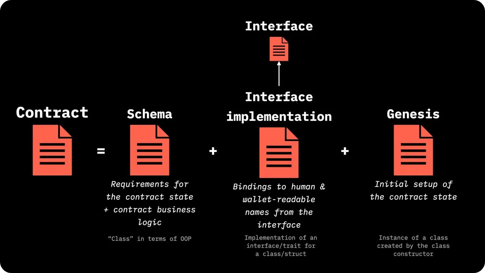


Ni ngombwa kumenya ko kugira ngo Wallet ishobore gucunga umutungo wa RGB (yaba token ishobora guhindurwa canke uburenganzira bw’ubwoko bwose), itegerezwa kuba ifise izo Elements zose zikoranijwe: *Schema*, *Interface*, *GW-134*35. Ivyo birungikwa biciye ku ***Contract Consignment***, ni ukuvuga amakuru arimwo vyose bikenewe kugira ngo wemeze Contract y'umukiriya.


Kugira ngo dufashe gusobanura ivyo vyiyumviro, ng’iyi imbonerahamwe y’incamake igereranya ibice vya RGB Contract n’ivyiyumviro bimaze kumenyekana haba mu gukora porogarama zishingiye ku bintu (OOP) canke mu bidukikije vya Ethereum:


| RGB Contract Component       | Meaning                        | OOP Equivalent                                     | Ethereum Equivalent                |
| ---------------------------- | ------------------------------ | -------------------------------------------------- | ---------------------------------- |
| **Genesis**                  | Initial state of the contract  | Class constructor                                  | Contract constructor               |
| **Schema**                   | Business logic of the contract | Class                                              | Contract                           |
| **Interface**                | Semantics of the contract      | Interface (Java) / Trait (Rust) / Protocol (Swift) | ERC Standard                       |
| **Interface Implementation** | Mapping semantics and logic    | Impl (Rust) / Implements (Java)                    | Application Binary Interface (ABI) |


Inkingi y’ibubamfu yerekana Elements yihariye ku bijanye n’umurongo wa RGB. Inkingi yo hagati yerekana igikorwa nyaco c’igice kimwekimwe cose. Hanyuma, mu nkingi ya "OOP equivalent", dusanga ijambo ringana muri porogarama zishingiye ku kintu:


- **Genesis** ifise uruhara rusa n'urw'umuhinguzi w'Ikigo: niho igihugu ca Contract gitangura;
- **Schema** ni insobanuro y’umugwi, ni ukuvuga insobanuro y’imiterere yawo, uburyo bwawo n’intumbero yawo;
- **Interface** ihuye n' *ibimenyetso* (Java), *ibiranga* (Rust) canke *amasezerano* (Swift): ivyo ni vyo bisobanuro vya bose vy'ibikorwa, ibintu, imirima...;
- **Interface Implementation** ihuye na *Impl* muri Rust canke *Implements* muri Java, aho dusobanura ingene kode izokora uburyo bwamenyeshejwe muri Interface.


Mu bijanye n'ivy'ubuhinga bwa Ethereum, Genesis iri hafi cane y'umwubatsi wa **Contract**, Schema iri hafi y'insobanuro ya Contract, Interface iri hafi y'urugero nka ERC-20 canke ERC-721, na Interface Implementation iri hafi y'insobanuro ya **ABI**, uburyo bwo gukorana na Contract.


Inyungu y’uko RGB ishobora gukoreshwa mu buryo bw’ibice (modularité) na yo iri mu kuba abafatanyabikorwa batandukanye bashobora kwandika, nk’akarorero, Interface Implementation yabo, igihe cose bubaha ubusobanuro bwa *Schema* n’insobanuro ya *Interface*. Gutyo, uwutanga amakuru yoshobora gutegura imbere nshasha, ikoreshwa neza cane (Interface), ataco ahinduye ku nsiguro ya Contract, canke ibihushanye n’ivyo, umuntu yoshobora kwagura Schema kugira ngo yongereko ibikorwa, maze agatanga verisiyo nshasha y’ibikorwa vy’ishimikiro vya Interface Implementation vyahinduwe, mu gihe ibikorwa vya kera vy’ishimikiro vyogumaho.


Iyo dukoranye Contract nshasha, dukora Genesis (intambwe ya mbere yo gutanga canke gutanga umutungo), hamwe n’ibigize (Schema, Interface, Interface Implementation). Inyuma y’ivyo, Contract irakora neza kandi irashobora gukwiragizwa ku ma wallets no ku bakoresha. Ubu buryo, aho Genesis ifatanijwe n’ivyo bice bitatu, butanga icemezo c’urugero rwo hejuru rw’uguhindura (buri Contract ishobora kugira ivyiyumviro vyayo), kwegereza ubutegetsi (umuntu wese ashobora gutanga umusanzu ku gice kinaka), n’umutekano (ugushingira intahe biguma bisobanuwe cane n’umurongo w’amategeko, ata gushingira ku arbitry onG on8- izindi nzira z’amabuye).


Ubu rero ndashaka kwihweza neza kimwe cose muri ivyo bice: **Schema**, **Interface** na **Interface Implementation**.


### Schema


Mu gice ca mbere, twabonye ko mu bidukikije vya RGB, Contract igizwe n’ibidukikije vyinshi: Genesis, bishinga intahe ivy’intango, n’ibindi bihimba vyinshi vy’inyongera. Intumbero ya Schema ni ugusobanura neza Business Logic yose ya Contract, ni ukuvuga imiterere y’amakuru, ubwoko bukoreshwa, ibikorwa vyemewe n’ingene bimeze. Ni ikintu gihambaye cane rero mu gutuma Contract ikora ku ruhande rw’umukiriya, kuko uwuriko arayigiramwo wese (Wallet, nk’akarorero) ategerezwa kugenzura ko amahinduka ya leta aronka ahuye n’ubwenge busobanuwe muri Schema.


Schema ishobora kugereranywa n'"umugwi" mu gukora porogarama zishingiye ku bintu (OOP). Muri rusangi, ikora nk’akarorero gasobanura ibice bigize Contract, nk’akarorero:


- Ubwoko butandukanye bw’Ibihugu vy’Igihugu n’Ibikorwa;
- Valencies, ni ukuvuga uburenganzira budasanzwe bushobora guterwa (*gucungurwa*) ku bikorwa bimwebimwe;
- Global State, zidondora ivy’isi yose, ivy’abantu bose n’ivy’abantu bose vya Contract;
- Igishushanyo ca Genesis (igikorwa ca mbere nyene gikora Contract);
- Uburyo bwemewe bw’Impinduka za Leta n’Ivyaguwe vya Leta, n’ingene ivyo bikorwa bishobora guhindura;
- Metadata ijana n’igikorwa cose, kugira ngo ubike amakuru y’igihe gito canke y’inyongera;
- Amategeko agena ingene amakuru yo mu mutima ya Contract ashobora gutera imbere (nk’akarorero, nimba umurima ushobora guhinduka canke ushobora kwirundanira);
- Urutonde rw’ibikorwa bibonwa ko bifise akamaro: nk’akarorero, urutonde rw’ihinduka ry’ibintu ryubahirizwa canke urutonde rw’ibintu bihuye n’ubwenge bikwiye gushitswako.


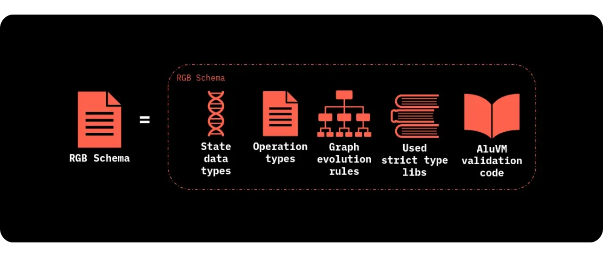


Iyo *uwutanga* umutungo uri kuri RGB asohoye Contract, atanga Genesis na Schema zijana na wo. Abakoresha canke ama wallet bipfuza gukorana n’itunga bararonka iyi Schema kugira ngo batahure ivyiyumviro biri inyuma ya Contract, no kugira ngo bashobore kugenzura mu nyuma ko amahinduka bazogiramwo uruhara ari ay’ukuri.


Intambwe ya mbere, ku muntu wese aronka amakuru yerekeye umutungo wa RGB (nk'akarorero, ukwimurira token), ni ukwemeza ayo makuru ku Schema. Ivyo birimwo gukoresha igitabu Schema kugira ngo:


- Suzuma ko Ibihugu vy’Umutungo, Ibikorwa n’ibindi Elements bisobanuwe neza kandi ko vyubahiriza ubwoko bwategetswe (ivyo bita *strict type system*);
- Suzuma ko amategeko y’uguhindura (inyandiko zo kwemeza) yuzuye. Izo nyandiko zishobora gukoreshwa biciye ku AluVM, iri ku ruhande rw’umukiriya kandi ishinzwe kwemeza ko Business Logic ihuye (amahera yoherezwa, ivyangombwa bidasanzwe, n’ibindi).


Mu bikorwa, Schema si kode ishobora gukorwa, nk’uko bishobora kubonwa mu ma blockchain abika ku-chain code (EVM kuri Ethereum). Ahubwo, RGB itandukanya Business Logic (itangazo) na kode ishobora gushirwa mu ngiro kuri Blockchain (iyigarukira ku nzitizi z’ubuhinga). Gutyo, Schema ni yo igena amategeko, ariko ugushira mu ngiro ayo mategeko bibera hanze ya Blockchain, ku kibanza c’uwuje mu nama wese, hakurikijwe ingingo ngenderwako ya Client-side Validation.


Schema itegerezwa gukoranirizwa imbere y’uko ikoreshwa n’ibikorwa vya RGB. Iyi nkuru itanga dosiye y'ibice bibiri (nk'akarorero `.RGB`) canke dosiye y'ibice bibiri (`.rgba`). Iyo Wallet yinjije iyi dosiye, iramenya:


- Ivyo ubwoko bumwe bumwe bw’amakuru (imibare yose, imiterere, imirongo...) busa kubera uburyo bw’ubwoko bukomeye;
- Uko Genesis ikwiye gutunganirizwa (kugira ngo umuntu atahure intango y’itunga);
- Ubwoko butandukanye bw’ibikorwa (Impinduka za Leta, Ukwagura Leta) n’ingene bishobora guhindura Leta;
- Amategeko y’inyandiko (yashizwe muri Schema) moteri ya AluVM izokoresha kugira ngo isuzume ko ibikorwa bifise ukuri.


Nk’uko vyasiguwe mu bice vyabanje, *uburyo bw’ubwoko bukomeye* buraduha uburyo bwo gushiramwo amakuru buhamye, bushingiye ku vyo umuntu abona: ibihinduka vyose, vyaba Ibihugu vy’Umutungo, Ibihugu vy’Isi yose canke Ivy’Uburemere, biradondaguwe neza (ubunini, imbibe zo hasi n’izo hejuru nimba bikenewe, ubwoko bufise umukono canke butashizweko umukono, n’ibindi). Birashoboka kandi gusobanura imiterere y'ivyatsi, nk'akarorero gushigikira ibibazo vy'ikoreshwa bikomeye.


Mu buryo bw'ubushake, Schema ishobora gukoresha umuzi `SchemaId`, bifasha gusubira gukoresha imiterere y'ishimikiro iriho (ikigereranyo). Muri ubu buryo, ushobora guhindura Contract canke guhingura ibintu bihinduka (nk'ubwoko bushasha bwa token) uhereye ku citegererezo camaze kwemezwa. Ukwo guhinduranya amasezerano kurarinda gusubira gukora amasezerano yose, kandi kuraremesha uguhuza ingendo nziza.


Ikindi kintu gihambaye ni uko ubuhinga bwo gutera imbere kwa Leta (uguhindura, guhindura, n’ibindi) budondora muri Schema mu buryo bw’inyandiko, amategeko n’ivyangombwa. Rero, nimba umuhinguzi wa Contract yipfuza kwemerera gusubira gusohoka canke gushinga uburyo bwo guturira (ugusambura ibimenyetso), arashobora gusobanura inyandiko zihuye na AluVM mu gice co kwemeza Schema.


#### Itandukaniro n'ibindi bishobora gukorwa On-Chain


Udakunze ubuhinga nka Ethereum, aho kode ya Smart contract (ishobora gukorwa) yandikwa muri Blockchain ubwayo, RGB ibika Contract (ubwenge bwayo) off-chain, mu buryo bw’inyandiko y’imenyekanisha ikoranijwe. Ivyo bisigura ko:


- Nta VM yuzuye ya Turing ikora mu nzira yose y’urubuga rwa Bitcoin. Amategeko ya RGB Contract ntashirwa mu ngiro kuri Blockchain, ariko mu mukoresha wese yipfuza kwemeza Leta;
- Amakuru ya Contract ntahumanya Blockchain: ibimenyamenya vy’ubuhinga bwo gukingira amakuru (*ivyemezo*) vyonyene ni vyo bishirwa mu bikorwa vya Bitcoin (biciye muri `Tapret` canke `Opret`);
- Schema ishobora guhindurwa canke igakurwako (*kwihuta-imbere*, *gusunika-inyuma*, n'ibindi), ataco bisaba Fork kuri Bitcoin Blockchain. Amasakoshi akeneye gusa kwinjiza mu gihugu Schema nshasha no kumenyera amahinduka y’ubumwe.


#### Ikoreshwa n'uwutanga n'abakoresha


Iyo *umutanga* aremye umutungo (nk’akarorero, token idashobora guhinduka), ategura:


- Igitabo ca Schema kidondora amategeko agenga ivy’ugusohora, uguhindura n’ibindi;
- Genesis ihuye n’iyi Schema (irimwo umubare wose w’ibimenyetso vyasohowe, akaranga ka nyen’ivyo bimenyetso vya mbere, Valencies zidasanzwe zo gusubira gusohoka, n’ibindi).


Ica ituma Schema (dosiye `.RGB`) yashizwe hamwe iboneka ku bakoresha, kugira ngo umuntu wese yaronse ubutumwa bwo muri iyo token ashobore kugenzura ukuntu igikorwa gihuye mu karere. Iyo ata Schema, uwuyikoresha ntiyoshobora gusobanura amakuru y’ivy’imimerere canke ngo asuzume ko yubahiriza amategeko ya Contract.


Rero iyo Wallet nshasha ishaka gushigikira umutungo, ikeneye gusa gushiramwo Schema ibereye. Ubu buryo buratuma bishoboka kwongerako uguhuza ku bwoko bushasha bw’itunga rya RGB, ata guhindura mu buryo buteye ubwoba urufatiro rwa porogarama ya Wallet: ibisabwa vyose ni ukuzana mu gihugu Schema binary no gutahura imiterere yayo.


Schema isobanura Business Logic muri RGB. Iratanga urutonde rw’amategeko y’iterambere ry’igikoresho ca Contract, imiterere y’amakuru yaco (Ibihugu vy’ubutunzi, Global State, Ivyiyumviro vy’agaciro) n’inyandiko z’ukwemeza zijana (zishobora gukorwa na AluVM). Kubera iyi nyandiko y’itangazo, insobanuro ya Contract (dosiye ikoranijwe) itandukanye neza n’ugushirwa mu ngiro nyakuri kw’amategeko (uruhande rw’umukiriya). Ivyo bituma RGB ishobora guhindura cane, bikaba bishoboza gukoresha ibintu vyinshi (ibimenyetso bishobora guhinduka, NFT, amasezerano ateye igomwe) mu gihe yirinda ugusobanuka n’amakosa asanzwe mu bikoresho vya On-Chain bishobora gutegurwa.


#### Akarorero ka Schema


Reka turabe akarorero nyako ka Schema ku RGB Contract. Iyi ni igice kiri muri Rust muri dosiye `nia.rs` (inyuguti z'intango za "*Itunga Ridashobora Gukura*"), risobanura akarorero k'ibimenyetso bishobora guhinduka bidashobora gusubira gusohoka birenze Supply yabo ya mbere (itunga ridashobora gutera). Ubwo bwoko bwa token bushobora kubonwa nk’ubungana, mu gisata ca RGB, bwa ERC20 kuri Ethereum, ni ukuvuga ibimenyetso bishobora guhinduka vyubahiriza amategeko amwe amwe y’ishimikiro (nk’akarorero ku kwimurira, gutangura Supply, n’ibindi).


Imbere yo kwisuka muri kode, birabereye kwibuka imiterere rusangi ya RGB Schema. Hari urutonde rw'amatangazo ashinzwe:


- `SchemaId` ishoboka yerekana ikoreshwa ry'iyindi Schema y'ishimikiro nk'akarorero;
- **Ibihugu vy’Isi yose** na **Ibihugu vy’Igihugu** (n’ubwoko bwavyo bukomeye);
- **Ivyiza** (niba biriho);
- Ivyo **Ibikorwa** (Genesis, Impinduka za Leta, Ukwaguka kw’Igihugu) bishobora kwerekeza kuri ivyo bihugu n’ivyo bihugu;
- **Ubwoko bukomeye** bukoreshwa mu kudondora no kwemeza amakuru;
- **Ivyanditswe vyemeza** (bikoreshwa biciye kuri AluVM).


Kode iri musi yerekana insobanuro yuzuye ya Rust Schema. Tuzobivuga igice ku kindi, dukurikije ibisobanuro (1) gushika kuri (9) biri aha hepfo:


```rust
// ===== PART 1: Function Header and SubSchema =====
fn nia_schema() -> SubSchema {

// definitions of libraries and variables

// ===== PART 2: General Properties (ffv, subset_of, type_system) =====
Schema {
ffv: zero!(),
subset_of: None,
type_system: types.type_system(),

// ===== PART 3: Global States =====
global_types: tiny_bmap! {
GS_NOMINAL => GlobalStateSchema::once(types.get("RGBContract.DivisibleAssetSpec")),
GS_DATA => GlobalStateSchema::once(types.get("RGBContract.ContractData")),
GS_TIMESTAMP => GlobalStateSchema::once(types.get("RGBContract.Timestamp")),
GS_ISSUED_SUPPLY => GlobalStateSchema::once(types.get("RGBContract.Amount")),
},

// ===== PART 4: Owned Types =====
owned_types: tiny_bmap! {
OS_ASSET => StateSchema::Fungible(FungibleType::Unsigned64Bit),
},

// ===== PART 5: Valencies =====
valency_types: none!(),

// ===== PART 6: Genesis: Initial Operations =====
genesis: GenesisSchema {
metadata: Ty::<SemId>::UNIT.id(None),
globals: tiny_bmap! {
GS_NOMINAL => Occurrences::Once,
GS_DATA => Occurrences::Once,
GS_TIMESTAMP => Occurrences::Once,
GS_ISSUED_SUPPLY => Occurrences::Once,
},
assignments: tiny_bmap! {
OS_ASSET => Occurrences::OnceOrMore,
},
valencies: none!(),
},

// ===== PART 7: Extensions =====
extensions: none!(),

// ===== PART 8: Transitions: TS_TRANSFER =====
transitions: tiny_bmap! {
TS_TRANSFER => TransitionSchema {
metadata: Ty::<SemId>::UNIT.id(None),
globals: none!(),
inputs: tiny_bmap! {
OS_ASSET => Occurrences::OnceOrMore,
},
assignments: tiny_bmap! {
OS_ASSET => Occurrences::OnceOrMore,
},
valencies: none!(),
}
},

// ===== PART 9: Script AluVM and Entry Points =====
script: Script::AluVM(AluScript {
libs: confined_bmap! { alu_id => alu_lib },
entry_points: confined_bmap! {
EntryPoint::ValidateGenesis => LibSite::with(FN_GENESIS_OFFSET, alu_id),
EntryPoint::ValidateTransition(TS_TRANSFER) => LibSite::with(FN_TRANSFER_OFFSET, alu_id),
},
}),
}
}
```


- (1) - **Umutwe w'ibikorwa n'Igishushanyo**


`nia_schema()` igikorwa kigarura `Igishushanyo gito`, kigaragaza ko iyi Schema ishobora kuragwa igice ca Schema rusangi. Mu bidukikije vya RGB, ukwo guhinduranya gutuma bishoboka gusubira gukoresha Elements imwe imwe y’umukuru Schema, hanyuma ugasobanura amategeko yihariye kuri Contract iriko iravugwa. Aha, duhitamwo kudashoboza iragi, kuko `subset_of` izoba `Nta`.


- (2) - Ibirango rusangi: ffv, igice_c', **ubwoko_bw'uburyo**


Igikoresho ca `ffv` gihuye n'ivyo *vyihuta* vya Contract. Agaciro ka `zero!()` hano kerekana ko turi kuri verisiyo 0 canke verisiyo ya mbere y'iyi Schema. Niba mu nyuma wipfuza kwongerako ibikorwa bishasha (ubwoko bushasha bw'ibikorwa, n'ibindi), ushobora kwongera iyi verisiyo kugira ngo werekane ihinduka ry'ukwemeranya.


I `subset_of: Nta` umutungo wemeza ko ata n'iragi. `ubwoko_uburyo` umwanya werekeye ubwoko bukomeye bwa sisitemu busanzwe busobanuwe mu `ubwoko` ububiko bw'ibitabo. Uyu murongo werekana ko amakuru yose akoreshwa na Contract akoresha ugushirwa mu ngiro kw’urutonde gukomeye gutangwa n’ububiko bw’ibitabu buvugwa.


- (3) - Ibihugu vyo kw'isi yose


Mu `ubwoko_bw'isi yose`, dutangaza Elements zine. Dukoresha urufunguzo, nka `GS_IZINA` canke `GS_ISOHOKA_ITANGA`, kugira ngo tubikoreshe mu nyuma:


- `GS_NOMINAL` yerekeza ku bwoko bwa `DivisibleAssetSpec`, budondora ivyicaro bitandukanye vya token yaremwe (izina ryose, ikimenyetso, ukuri...);
- `GS_DATA` igereranya amakuru rusangi, nk'ukwiyamiriza, amakuru y'imbere, canke uwundi munyandiko;
- `GS_TIMESTAMP` yerekana itariki y'isohoka;
- `GS_ISSUED_SUPPLY` ishiraho umubare wose Supply, ni ukuvuga umubare munini w'ibimenyetso bishobora kuremwa.


Ijambo ry'ingenzi `rimwe(...)` risobanura ko buri kimwe muri ivyo bibanza gishobora kugaragara rimwe gusa.


- (4) - Ubwoko bw'ibintu


Mu `ubwoko_bufise`, dutangaza `OS_ASSET`, idondora igihugu gishobora guhinduka. Dukoresha `StateSchema::Fungible(Ubwoko::Unsigned64Bit)`, vyerekana ko umubare w'itunga (ibimenyetso) ubitswe nk'umubare wose udashizweko umukono w'ibice 64. Gutyo, igikorwa cose kizorungika umubare kanaka w’ibice vy’iyi token, ivyo bikaba bizokwemezwa hakurikijwe iyo mibare yanditswe neza.


- (5) - **Ivyiza**


Twerekana `valency_types: none!()`, bisobanura ko ata Valencies ziri muri iyi Schema, mu yandi majambo nta burenganzira budasanzwe canke bwongerekanye (nk'ugusubira gusohora, guturira bitegekanijwe, n'ibindi). Iyo Schema irimwo ivyo, vyomenyeshwa muri iki gice.


- (6) - Genesis: ibikorwa vya mbere


Aha twinjira mu gice kimenyesha Ibikorwa vya Contract. Genesis idondorwa na:


- Kubura `amakuru y'imbere` (umurima `amakuru y'imbere: Ty::<SemId>::UNIT.id(Nta)`);
- Ibihugu vyo kw’isi yose bitegerezwa kubaho rimwe kuri kimwe cose (`Rimwe`);
- Urutonde rw'ibikorwa aho `OS_ASSET` itegerezwa kugaragara `RimweCanke N'ibindi`. Ivyo bisigura ko Genesis isaba nibura `OS_ASSET` imwe Assignment (uwuyifise mu ntango);
- Oya Valency: `ubushobozi: nta n'umwe!()`.


Uko ni ko duca ku rugero rw'insobanuro y'ikibazo ca mbere ca token: dutegerezwa kumenyesha Supply yasohowe (`GS_ISSUED_SUPPLY`), twongereko n'imiburiburi uwuyifise (Owned State y'ubwoko `OS_ASSET`).


- (7) - Ukwagura


`Ivyagutse: nta!()` vyerekana ko ata State Extension itegekanijwe muri iyi Contract. Ivyo bisigura ko ata gikorwa co gukora Redeem uburenganzira bwa digitale (Valency) canke gukora State Extension imbere y’Impinduka. Ivyo vyose bikorwa biciye ku Genesis canke ku nzira za Leta.


- (8) - Impinduka: TS_GUHINDURA


Mu `mihindukire`, dusobanura `TS_TRANSFER` ubwoko bw'igikorwa. Turasigura ko:


- Nta nkuru y’imbere ifise;
- Ntihindura Global State (ivyo bikaba vyaramaze gusobanurwa muri Genesis);
- Bifata `OS_ASSETs` imwe canke nyinshi nk'ivyo kwinjiza. Ivyo bisigura ko itegerezwa gukoresha Leta Zifise Ubutunzi zisanzweho;
- Irema (`ibikorwa`) nibura `OS_ASSET` imwe nshasha (mu yandi majambo, uwuronka canke abaronka baronka ibimenyetso);
- Nta Valency nshasha itanga.


Ivyo bigereranya inyifato y’ukwimurira kw’ishimikiro, gufungura ibimenyetso kuri UTXO, hanyuma bikarema Leta nshasha zifise ububasha ku neza y’abaronka, gutyo bikazigama uburinganire bw’amahera yose hagati y’ivyo yinjiza n’ivyo isohoka.


- (9) - **Inyandiko ya AluVM n'Ivyiyumviro vy'Injira** (mu gifaransa)


Ubwa nyuma, dutangaza inyandiko ya AluVM (`Inyandiko::AluVM(Inyandiko ya Alu { ... })`). Iyi nyandiko irimwo:


- Isoko rimwe canke menshi ry'inyuma (`libs`) rizokoreshwa mu gihe co kwemeza;
- Ivyinjira vyerekana ibikorwa bihinduka muri kode ya AluVM, bihuye n'ukwemeza kwa Genesis (`Kwemeza Itanguriro`) na buri mpinduka yatangajwe (`KwemezaImpinduka(TS_TRANSFER)`).


Iyi kode y'ukwemeza ni yo ishinzwe gukoresha Business Logic. Nk'akarorero, izosuzuma:


- Ko `GS_ISOHOKA_IBIMENYETSO` itarenze mu gihe ca Genesis;
- Ko umubare w'ibintu vyinjijwe` (ibimenyetso vyakoreshejwe) ungana n'umubare w'ibikorwa` (ibimenyetso vyakiriwe) ku `TS_TRANSFER`.


Iyo ayo mategeko atubahirijwe, iyo mpinduka izobonwa ko ata co imaze.


Aka karorero k'"*Itunga Ridashobora Gufutwa*" Schema karaduha ugutahura neza imiterere y'Itunga ryoroshe RGB token Contract. Turashobora kubona neza itandukaniro riri hagati y’insobanuro y’amakuru (Ibihugu vy’Isi yose n’Ibihugu vy’Igihugu), itangazo ry’ibikorwa (Genesis, Impinduka, Ukwagura) n’ugushirwa mu ngiro kw’ivyemezo (inyandiko za AluVM). Kubera iki kigereranyo, token yitwararika nk’iyitwa token, ariko iguma yemejwe ku ruhande rw’umukiriya kandi ntiyivana n’ibikorwa remezo vya On-Chain kugira ngo ikore kode yayo. Ivyemezo vy'ubuhinga bwo gukingira amakuru ni vyo vyonyene bishingiye kuri Bitcoin Blockchain.


### Interface


Interface ni Layer yagenewe gutuma Contract isomwa kandi ikoreshwa, n’abayikoresha (ugusoma kw’abantu) be n’ibitabo (ugusoma kwa porogarama). Interface rero irafise uruhara rugereranywa n’urw’i Interface mu rurimi rw’iporogarama rushingiye ku bintu (Java, akaranga ka Rust, n’ibindi), kuko igaragaza kandi igasobanura neza imiterere y’imikorere ya Contract, ataco isobanura ku bijanye n’ivyo Contract ikora.


Udakunze Schema, ivuga gusa kandi ikoranijwe muri dosiye y’ibice bibiri igoye gukoresha uko iri, Interface itanga imfunguruzo zo gusoma zikenewe kugira ngo:


- Gutanga urutonde no gusobanura Ibihugu vyo kw’Isi yose n’Ibihugu vy’Igihugu biri muri Contract;
- Ushobora gushika ku mazina n’agaciro k’umwanya wose, kugira ngo bishobore kwerekanwa (nk’akarorero ku token, umenye igiharuro cawo, umubare munini, n’ibindi);
- Gusobanura no kwubaka Ibikorwa vya Contract (Genesis, State Transition, canke State Extension) mu gufatanya amakuru n'amazina atahurwa (nk'akarorero, gukora ukwimurira mu gusobanura neza "umubare" aho gukoresha ikimenyetso c'ibice bibiri).


Ushimira Interface, urashobora, nk'akarorero, kwandika kode muri Wallet iyo, aho gukoresha ivyatsi, ikoresha ataco ihinduye ibimenyetso nk'"umubare w'ibimenyetso", "izina ry'umutungo", n'ibindi. Muri ubwo buryo, uburongozi bwa Contract burarushiriza kuba ubw’agaciro.


#### Ibikorwa rusangi


Ubwo buryo burafise ivyiza vyinshi:


- Gushinga urugero:


Ubwo bwoko bumwe bwa Contract burashobora gushigikirwa na Interface isanzwe, isangiwe hagati y'ibikorwa vyinshi vya Wallet. Ivyo bituma vyoroha guhuza no gusubira gukoresha kode.


- **Gutandukanya neza hagati ya Schema na Interface:**


Mu guhingura RGB, Schema (Business Logic) na Interface (ugushikiriza no gukoresha) ni ibigo bibiri vyigenga. Abahinguzi bandika ubuhinga bwa Contract barashobora kwibanda kuri Schema, batababazwa n’ubuhinga bwo gukora canke guserukira amakuru, mu gihe uwundi mugwi (canke uwo mugwi umwe, ariko ku rutonde rw’igihe rutandukanye) ushobora gukora Interface.


- **Uguhinduka guhinduka:**


Interface irashobora guhindurwa canke kwongerwako inyuma y’aho umutungo usohokeye, ataco ukeneye guhindura Contract ubwayo. Ivyo ni itandukaniro rikomeye n'ibindi bikoresho vya On-Chain Smart contract, aho Interface (kenshi ivangwa n'itegeko ry'ugushitsa) ikonjeshwa muri Blockchain.


- Ubushobozi bwa Interface bwinshi


Iryo Contract nyene ryoshobora gushirwa ahabona biciye ku nzira zitandukanye zihuye n’ivyo umuntu akeneye: Interface yoroshe ku muntu akoresha, iyindi iteye imbere cane ku muntu atanga akeneye gucunga ibikorwa vy’imiterere bikomeye. Wallet irashobora rero guhitamwo Interface izozana, bivanye n’ingene ikoreshwa.


Mu bikorwa, iyo Wallet ironse RGB Contract (biciye muri dosiye `.RGB` canke `.rgba`), irazana kandi Interface ijana, na yo nyene irakoranywa. Mu gihe co gukora, Wallet ishobora, nk'akarorero:


- Suzuma urutonde rw’ibihugu maze usome amazina yavyo, kugira ngo ugaragaze Ticker, Initial Amount, Itariki y’Isohoka, n’ibindi ku mukoresha Interface, aho kugaragaza ikimenyetso c’umubare kitasomwa;
- Kubaka igikorwa (nk'uguhindura) ukoresheje amazina y'ibipimo asobanutse: aho kwandika `ibikorwa { OS_ASSET => 1 }`, bishobora guha umukoresha umwanya "Umubare" mu rupapuro, maze ugahindura aya makuru mu bibanza vyanditswe neza vyitezwe na GW-156.


#### Itandukaniro na Ethereum n'izindi sisitemu


Ku Ethereum, Interface (idondora biciye ku ABI, *Ikoreshwa ry’Ibikoresho Bibiri Interface*) muri rusangi ikomoka kuri kode yabitswe ya On-Chain (Smart contract). Bishobora gutwara amahera menshi canke bikaba bigoye guhindura igice kinaka ca Interface utakoze kuri Contract ubwayo. Ariko rero, RGB ishingiye ku nsiguro yose ya off-chain, n'amakuru ashingiye ku *masezerano* kuri Bitcoin. Iyi nzira ituma bishoboka guhindura Interface (canke ugushirwa mu ngiro kwayo) ataco bihinduye ku mutekano w’ishimikiro wa Contract, kuko kwemeza amategeko y’ubudandaji kuguma muri Schema n’itegeko rya AluVM ryerekanwa.


#### Interface gukoranya


Nk'uko biri kuri Schema, Interface isobanurwa muri kode y'inkomoko (kenshi muri Rust) kandi igakoranywa muri dosiye `.RGB` canke `.rgba`. Iyi dosiye ibiri irimwo amakuru yose asabwa na Wallet kugira ngo:


- Kumenya imirima mu mazina;
- Huza umwanya wose (n’agaciro kawo) n’ubwoko bw’urutonde rukomeye rwasobanuwe muri Contract;
- Menya ibikorwa bitandukanye vyemewe n’ingene wovyubaka.


Igihe Interface imaze kwinjizwa, Wallet irashobora kwerekana neza Contract no gusaba imigenderanire ku wuyikoresha.


### Ibikoresho vyashizweho n'ishirahamwe LNP/BP


Mu bidukikije vya RGB, Interface ikoreshwa mu gutanga insobanuro isomwa kandi ikoreshwa ku makuru n'imikorere ya Contract. Interface rero yuzuza Schema, idondora Business Logic imbere (ubwoko bukomeye, inyandiko zo kwemeza, n’ibindi). Muri iki gice, turaza kuraba interfaces zisanzwe zateguwe n’ishirahamwe LNP/BP ku bwoko rusangi bwa Contract (ibimenyetso bishobora guhinduka, NFT, n’ibindi).


Nk’ukwibutsa, iciyumviro ni uko Interface yose idondora ingene yogaragaza no gukoresha Contract ku ruhande rwa Wallet, ikavuga neza amazina y’ibibanza (nk’i `spec`, `ticker`, `issuedSupply`...) kandi igasobanura ibikorwa bishoboka (nk’i, `T `Guhindura izina`...). Interfaces nyinshi zirasanzwe zikora, ariko hazoba izindi muri kazoza.


#### Ibikoresho bimwe bimwe vyiteguye gukoreshwa


**RGB20** ni Interface ku mitungo ishobora guhinduka, ishobora kugereranywa n’itegeko rya Ethereum ERC20. Ariko rero, iratera intambwe imbere, itanga ibikorwa vyinshi:


- Nk’akarorero, ubushobozi bwo guhindura izina ry’umutungo (guhindura *ticker* canke izina ryose) umaze gusohoka, canke guhindura ukuri kwawo (*stock splits*);
- Ishobora kandi gusobanura uburyo bwo gusubira gusohora ubwa kabiri (bifise aho bigarukira canke bitagira aho bigarukira) no guturira hanyuma bikasubirizwa, kugira ngo bihe uburenganzira uwubitanga bwo gusenya no gusubira kurema ivy’ubutunzi mu gihe hari ibintu bimwebimwe;


Nk’akarorero, RGB20 Interface ishobora guhuzwa n’umugambi wa **Itunga Ridashobora Gufutwa (NIA)**, utegeka Supply y’intango idashobora gufutwa, canke n’iyindi migambi iteye imbere cane nk’uko bisabwa.


**RGB21** yerekeye amasezerano y’ubwoko bwa NFT, canke mu buryo bwagutse, ibirimwo vyose vy’ubuhinga bwa none, nk’uguserukira ibinyamakuru vy’ubuhinga bwa none (amashusho, umuziki, n’ibindi). Uretse gusobanura ikibazo no kwimurira umutungo umwe, harimwo n’ibintu nk’ibi:


- Infashanyo yunze ubumwe yo gushiramwo dosiye (ishika kuri 16 MB) muri Contract (kugira ngo umuntu ayironke ku ruhande rw’umukiriya);
- Ubushobozi bwa nyen'itongo bwo kwinjira "*igicapo*" muri kahise kugira ngo yerekane Ownership ya kera ya NFT.


**RGB25** ni urugero rw'ivy'ubuhinga buhurikiyemwo ibintu bishobora guhinduka n'ibidashobora guhinduka. Igenewe imitungo ishobora guhinduka igice, nk'uguhindura ikimenyetso c'amazu, aho ushaka gucapura umutungo mu gihe uguma ufise uruja n'uruza rw'umutungo w'umuzi umwe (mu yandi majambo, ufise ibice vy'inzu bishobora guhinduka, bihuye n'inzu idashobora guhinduka). Mu buryo bw'ubuhinga, iyo Interface ishobora guhuzwa n'**Itunga Rishobora Gukusanywa (CFA) Schema**, ifata mu muzirikanyi iciyumviro co gucapura mu gihe ikurikirana itunga ry'intango.


#### Ibikoresho biriko birategurwa


Ibindi bikoresho biteguwe gukoreshwa mu buryo bwihariye, ariko ntibiraboneka:


- **RGB22**, yihariye ku bijanye n'ibimenyetso vy'ubuhinga bwa none, kugira ngo icunge ibimenyetso n'imirongo ya On-Chain mu bidukikije vya RGB;
- **RGB23**, ku gutera ikidodo c'igihe giteye imbere, ukoresheje bimwe mu vyiyumviro vya *Opentimestamps*, ariko n'ibiranga gukurikirana;
- **RGB24**, igamije gukorana n'uburyo bw'amazina y'itongo (DNS) busa n'ubwa *Serivisi y'izina rya Ethereum*;
- **RGB26**, igenewe gucunga ama DAO (**Ishirahamwe ryigenga ryegerejwe**) mu buryo bugoranye cane (ubutegetsi, amatora, n'ibindi);
- **RGB30**, isa cane na RGB20 ariko ifise ubudasa bwo kwitwararika ugusohoka kw'intango kwegerejwe no gukoresha Ivyagutse vya Leta. Ivyo vyokoreshwa ku mitungo iyo gusubira gusohoka kwayo icungiwe n'inzego nyinshi, canke ikaba ishingiye ku bintu vyiza kuruta.


Ego ni ko, bivanye n’itariki ubona kuri iri shure, izo nzira zishobora kuba zisanzwe zikora kandi zishobora gukoreshwa.


#### Akarorero ka Interface


Iyi kode ya Rust yerekana [RGB20] (umutungo ushobora guhinduka). Iyi kode yakuwe muri dosiye `rgb20.rs` iri mu bubiko bw'ibitabu bwa RGB. Reka tuvyihweze kugira ngo dutahure imiterere ya Interface n’ingene itanga ikiraro hagati, ku ruhande rumwe, Business Logic (isobanuwe muri Schema) n’ibikorwa vyerekanwa n’amasakoshi n’abakoresha.


```rust
// ...
fn rgb20() -> Iface {
let types = StandardTypes::with(rgb20_stl());

Iface {
version: VerNo::V1,
name: tn!("RGB20"),
global_state: tiny_bmap! {
fname!("spec") => GlobalIface::required(types.get("RGBContract.DivisibleAssetSpec")),
fname!("data") => GlobalIface::required(types.get("RGBContract.ContractData")),
fname!("created") => GlobalIface::required(types.get("RGBContract.Timestamp")),
fname!("issuedSupply") => GlobalIface::one_or_many(types.get("RGBContract.Amount")),
fname!("burnedSupply") => GlobalIface::none_or_many(types.get("RGBContract.Amount")),
fname!("replacedSupply") => GlobalIface::none_or_many(types.get("RGBContract.Amount")),
},
assignments: tiny_bmap! {
fname!("inflationAllowance") => AssignIface::public(OwnedIface::Amount, Req::NoneOrMore),
fname!("updateRight") => AssignIface::public(OwnedIface::Rights, Req::Optional),
fname!("burnEpoch") => AssignIface::public(OwnedIface::Rights, Req::Optional),
fname!("burnRight") => AssignIface::public(OwnedIface::Rights, Req::NoneOrMore),
fname!("assetOwner") => AssignIface::private(OwnedIface::Amount, Req::NoneOrMore),
},
valencies: none!(),
genesis: GenesisIface {
metadata: Some(types.get("RGBContract.IssueMeta")),
global: tiny_bmap! {
fname!("spec") => ArgSpec::required(),
fname!("data") => ArgSpec::required(),
fname!("created") => ArgSpec::required(),
fname!("issuedSupply") => ArgSpec::required(),
},
assignments: tiny_bmap! {
fname!("assetOwner") => ArgSpec::many(),
fname!("inflationAllowance") => ArgSpec::many(),
fname!("updateRight") => ArgSpec::optional(),
fname!("burnEpoch") => ArgSpec::optional(),
},
valencies: none!(),
errors: tiny_bset! {
SUPPLY_MISMATCH,
INVALID_PROOF,
INSUFFICIENT_RESERVES
},
},
transitions: tiny_bmap! {
tn!("Transfer") => TransitionIface {
optional: false,
metadata: None,
globals: none!(),
inputs: tiny_bmap! {
fname!("previous") => ArgSpec::from_non_empty("assetOwner"),
},
assignments: tiny_bmap! {
fname!("beneficiary") => ArgSpec::from_non_empty("assetOwner"),
},
valencies: none!(),
errors: tiny_bset! {
NON_EQUAL_AMOUNTS
},
default_assignment: Some(fname!("beneficiary")),
},
tn!("Issue") => TransitionIface {
optional: true,
metadata: Some(types.get("RGBContract.IssueMeta")),
globals: tiny_bmap! {
fname!("issuedSupply") => ArgSpec::required(),
},
inputs: tiny_bmap! {
fname!("used") => ArgSpec::from_non_empty("inflationAllowance"),
},
assignments: tiny_bmap! {
fname!("beneficiary") => ArgSpec::from_many("assetOwner"),
fname!("future") => ArgSpec::from_many("inflationAllowance"),
},
valencies: none!(),
errors: tiny_bset! {
SUPPLY_MISMATCH,
INVALID_PROOF,
ISSUE_EXCEEDS_ALLOWANCE,
INSUFFICIENT_RESERVES
},
default_assignment: Some(fname!("beneficiary")),
},
tn!("OpenEpoch") => TransitionIface {
optional: true,
metadata: None,
globals: none!(),
inputs: tiny_bmap! {
fname!("used") => ArgSpec::from_required("burnEpoch"),
},
assignments: tiny_bmap! {
fname!("next") => ArgSpec::from_optional("burnEpoch"),
fname!("burnRight") => ArgSpec::required()
},
valencies: none!(),
errors: none!(),
default_assignment: Some(fname!("burnRight")),
},
tn!("Burn") => TransitionIface {
optional: true,
metadata: Some(types.get("RGBContract.BurnMeta")),
globals: tiny_bmap! {
fname!("burnedSupply") => ArgSpec::required(),
},
inputs: tiny_bmap! {
fname!("used") => ArgSpec::from_required("burnRight"),
},
assignments: tiny_bmap! {
fname!("future") => ArgSpec::from_optional("burnRight"),
},
valencies: none!(),
errors: tiny_bset! {
SUPPLY_MISMATCH,
INVALID_PROOF,
INSUFFICIENT_COVERAGE
},
default_assignment: None,
},
tn!("Replace") => TransitionIface {
optional: true,
metadata: Some(types.get("RGBContract.BurnMeta")),
globals: tiny_bmap! {
fname!("replacedSupply") => ArgSpec::required(),
},
inputs: tiny_bmap! {
fname!("used") => ArgSpec::from_required("burnRight"),
},
assignments: tiny_bmap! {
fname!("beneficiary") => ArgSpec::from_many("assetOwner"),
fname!("future") => ArgSpec::from_optional("burnRight"),
},
valencies: none!(),
errors: tiny_bset! {
NON_EQUAL_AMOUNTS,
SUPPLY_MISMATCH,
INVALID_PROOF,
INSUFFICIENT_COVERAGE
},
default_assignment: Some(fname!("beneficiary")),
},
tn!("Rename") => TransitionIface {
optional: true,
metadata: None,
globals: tiny_bmap! {
fname!("new") => ArgSpec::from_required("spec"),
},
inputs: tiny_bmap! {
fname!("used") => ArgSpec::from_required("updateRight"),
},
assignments: tiny_bmap! {
fname!("future") => ArgSpec::from_optional("updateRight"),
},
valencies: none!(),
errors: none!(),
default_assignment: Some(fname!("future")),
},
},
extensions: none!(),
error_type: types.get("RGB20.Error"),
default_operation: Some(tn!("Transfer")),
type_system: types.type_system(),
}
}
```


Muri iyi Interface, turabona ibisa n’imiterere ya Schema: turasanga itangazo rya Global State, Ibihugu vy’Umutungo, Ibikorwa vya Contract (Genesis n’Impinduka), hamwe n’ugutorera umuti amakosa. Ariko Interface yibanda ku kwerekana no gukoresha izo Elements ku Wallet canke ikindi gikorwa ico ari co cose.


Itandukaniro riri hagati ya Schema n’ubwoko bwavyo. Schema ikoresha ubwoko bukomeye (nk'ubwoko `Ubwoko::Unsigned64Bit`) n'ibindi bimenyetso vy'ubuhinga. Interface ikoresha amazina y'ibibanza, ama macro (`izina ry'f!()`, `tn!()`), n'ibisobanuro vy'imigwi y'imvo (`ArgSpec`, `Igishushanyo::Uburenganzira`...). Intumbero aha ni ugufasha gutahura no gutunganya ibikorwa vya Elements ku Wallet.


Ikindi, Interface ishobora gushiramwo ibindi bikorwa ku Schema y'ishimikiro (nk'ugucungera uburenganzira bwa `burnEpoch`), igihe cose ivyo biguma bihuye n'ubwenge bwa nyuma bwemejwe ku ruhande rw'umukiriya. Igice ca AluVM "inyandiko" muri Schema kizotuma habaho ukuri kw'inyandiko, mu gihe Interface idondora ingene umukoresha (canke Wallet) akorana n'izo ntara n'ihinduka.


#### Global State n’Ibikorwa


Mu gice ca `global_state`, dusanga ivyicaro nka `spec` (insobanuro y'umutungo), `amakuru`, `yaremwe`, `Itanga`, `Itanga yaturiwe`, `Itanga yasubirijwe`. Ivyo ni ibibanza Wallet ishobora gusoma no gushikiriza. Nk'akarorero:


- `spec` izokwerekana imiterere ya token;
- `issuedSupply` canke `burnedSupply` biduha umubare wose w'ibimenyetso vyasohowe canke vyaturiwe, n'ibindi.


Mu gice ca `ibikorwa`, turasobanura uruhara canke uburenganzira butandukanye. Nk'akarorero:


- `assetOwner` ihuye n'ugufata ibimenyetso (ni *Owned State* ishobora guhinduka);
- `burnRight` ihuye n'ubushobozi bwo guturira ibimenyetso;
- updateRight` ihuye n'uburenganzira bwo guhindura izina ry'umutungo.


Ijambo ry'ingenzi `ry'abantu bose' canke 'ry'ibanga` (nk'akarorero `AssignIface::iry'abantu bose(...)`) ryerekana nimba izo ntara ziboneka (`abantu bose`) canke ibanga (`ibanga`). Naho `Req::NtaCankeIbindi`, `Req::Ihitamwo`, vyerekana ivyitezwe.


#### Genesis n'imihindukire


Igice ca `Genesis` kidondora ingene umutungo utangura:


- Ivyo `ibisobanuro`, `amakuru`, `vyaremwe`, `vyasohowe` ni ngombwa (`ArgSpec::bisabwa()`);
- Ibikorwa nka `assetOwner` bishobora kuba biri mu makopi menshi (`ArgSpec::many()`), bikaba vyemerera ibimenyetso gukwiragizwa ku bafise benshi b'intango;
- Ivyimburwa nka `Igihe c'Iterambere` canke `Igihe c'Igihe` bishobora (canke ntibishobora) gushirwa muri Genesis.


Hanyuma, ku Nzira yose (`Kwimurira`, `Ikibazo`, `Guturira`...), Interface isobanura ivyicaro igikorwa citeze nk'inyungu, ivyicaro igikorwa kizotanga nk'isohoka, n'amakosa yose yoshobora kubaho. Nk'akarorero:


**Guhinduka:**


- Ivyinjijwe: `imbere` → bitegerezwa kuba `Umutungo`;
- Inshingano: `uwuronka inyungu` → azoba `Nyitunga` mushasha;
- Ikosa: `NON_EQUAL_AMOUNTS` (Wallet izoshobora rero gukorana n'ibibazo aho umubare w'injiza udahuye n'umubare w'isohoka).


**Ikibazo `Impinduka`:**


- Ihitamwo (`ihitamwo: ukuri`), nk'uko ivyimburwa vy'inyongera bitakoreshwa vy'ukuri;
- Ivyinjijwe: `vyakoreshejwe` → `InflationAllowance`, ni ukuvuga uruhusha rwo kwongerako ibindi bimenyetso;
- Inshingano: `uwuronka inyungu` (ibimenyetso bishasha vyaronswe) na `akazoza` (ibisigaye `InflationAllowance`);
- Amakosa ashoboka: `GUTANGA_NTIBIHUYE`, `IKIBAZO_KIRENZE_IBIMENYETSO`, n'ibindi.


**Ihinduka ry'uguturira:**


- Ivyinjijwe: `vyakoreshejwe` → a `guturiraIburyo`;
- Globals: `Ivyo Gutanga` vyaturitse` birakenewe;
- Inshingano: `akazoza` → ugukomeza gushoboka kwa `burnRight` nimba tutaturiye vyose;
- Amakosa: `GUTANGA_BITAHURA`, `IKIMENYETSO_KIDAKORA`, `IBIMENYETSO_BITAHAGIJE`.


Igikorwa kimwekimwe cose rero kiradondaguwe mu buryo bushobora gusomwa kuri Wallet. Ivyo bituma bishoboka kugaragaza igishushanyo Interface aho umukoresha ashobora kubona neza: "Ufise uburenganzira bwo guturira. Woba wipfuza guturira umubare kanaka? Kode irazi kwuzuza umwanya wa `burnedSupply` maze ikagenzura ko `burnRight` ari ukuri."


Mu ncamake, birahambaye kwibuka ko Interface, naho yoba yuzuye gute, ubwayo itasobanura ivyiyumviro vy'imbere vya Contract. Umutima w’igikorwa ukorwa na **Schema**, irimwo ubwoko bukomeye, imiterere ya Genesis, inzira z’uguhinduka n’ibindi. Interface gusa igaragaza izo Elements mu buryo busanzwe kandi bufise izina, kugira ngo zikoreshwe mu gikorwa.


Kubera ubuhinga bwa RGB, Interface irashobora gusubirwamwo (nk'akarorero, mu kwongerako `Guhindura izina`, gukosora iyerekanwa ry'umurima, n'ibindi) ataco ukeneye kwandika Contract yose. Abakoresha iyi Interface barashobora rero kwungukira kuri ivyo bintu vyiza, bakimara guhindura dosiye `.RGB` canke `.rgba`.


Ariko umaze gutangaza Interface, ukeneye kuyihuza na Schema ihuye. Ibi bikorwa biciye kuri ***Interface Implementation***, igaragaza ingene woshiramwo ikarita y'umwanya wose ufise izina (nk'izina ry'f!("Nyitungo")`) ku ID ikomeye (nk'iyi `OS_ASSET`) isobanuwe muri Schema. Ivyo bituma, nk'akarorero, iyo Wallet ikoresheje umurima wa `burnRight`, iyo ni yo nzira, muri Schema, idondora ubushobozi bwo guturira ibimenyetso.


### Interface Implementation


Mu nyubakwa ya RGB, twabonye ko igice cose (Schema, Interface, n’ibindi) gishobora gutegurwa no gukoranirizwa ku giti caco. Ariko rero, haracariho ikintu kimwe gihambaye gihuza ivyo bice vy'inyubako bitandukanye: ***Interface Implementation***. Ivyo ni vyo bigaragaza neza ibimenyetso canke ivyicaro vyasobanuwe muri Schema (ku ruhande rwa Business Logic) ku mazina yamenyeshejwe muri Interface (ku ruhande rw’ugushikiriza n’ugukorana n’abakoresha). Rero iyo Wallet ishize Contract, irashobora gutahura neza neza ikibanza gihuye n'iki, n'ingene igikorwa citwa muri Interface gifitaniye isano n'ubwenge bwa Schema.


Iciyumviro gihambaye ni uko Interface Implementation atari ngombwa ko igaragaza ibikorwa vyose vya Schema, canke ivyicaro vyose vya Interface: ishobora kugarukira ku gice gitoyi. Mu bikorwa, ivyo bituma bishoboka kubuza canke gucungera imice imwimwe ya Schema. Nk'akarorero, woshobora kugira Schema ifise ubwoko bune bw'ibikorwa, ariko Implementation Interface igaragaza bibiri gusa muri vyo mu gihe kinaka. Ku rundi ruhande, iyo Interface itanga izindi ntumbero z’iherezo, turashobora guhitamwo kutazishira mu ngiro hano.


Aha ni akarorero ka kera ka Interface Implementation, aho dufatanya *Itunga Ridashobora Gufutwa* (NIA) Schema na RGB20 Interface:


```rust
fn nia_rgb20() -> IfaceImpl {
let schema = nia_schema();
let iface = Rgb20::iface();

IfaceImpl {
version: VerNo::V1,
schema_id: schema.schema_id(),
iface_id: iface.iface_id(),
script: none!(),
global_state: tiny_bset! {
NamedField::with(GS_NOMINAL, fname!("spec")),
NamedField::with(GS_DATA, fname!("data")),
NamedField::with(GS_TIMESTAMP, fname!("created")),
NamedField::with(GS_ISSUED_SUPPLY, fname!("issuedSupply")),
},
assignments: tiny_bset! {
NamedField::with(OS_ASSET, fname!("assetOwner")),
},
valencies: none!(),
transitions: tiny_bset! {
NamedType::with(TS_TRANSFER, tn!("Transfer")),
},
extensions: none!(),
}
}
```


Muri iyi Nshirwa mu ngiro Interface:


- Turavuga neza Schema, biciye ku `nia_schema()`, na Interface, biciye ku `Rgb20::iface()`. Ivyo bimenyetso bikoreshwa kugira ngo Anchor Interface Implementation ku ruhande rwo gukoranya (ivyo bifatanya ibimenyetso vy'ibanga vy'ivyo bice bibiri);
- Ikarata ishirwaho hagati ya Schema Elements na Interface Elements. Nk'akarorero, `GS_NOMINAL` umwanya muri Schema uhuye n'urudodo `"spec"` ku ruhande rwa Interface (`UmwanyaWizina::na(GS_IZINA, fizina!("spec"))`). Turakora ukwo nyene ku bikorwa, nka `TS_TRANSFER`, ivyo duhuza na `"Kwimurira"` muri Interface...;
- Turashobora kubona ko ata n’imwe ifise ubushobozi (`ubushobozi: nta n’umwe!()`) canke ivyungura (`ivyungura: nta n’imwe!()`), bikaba vyerekana ko iyi NIA Contract idakoresha ivyo bimenyetso.


Igisubizo inyuma yo gukoranya ni dosiye itandukanye `.RGB` canke `.rgba`, izokwinjizwa muri Wallet yongerako Schema na Interface. Gutyo, iyo porogarama irazi ingene yohuza neza iyi NIA Contract (iyo ivyiyumviro vyayo bidondora na Schema yayo) na "RGB20" Interface (itanga amazina y'abantu n'uburyo bwo gukorana n'ibimenyetso bishobora guhinduka), ikoresha iyi GW-166 nk'inzira ibiri hagati y'ivyo bibiri.


#### Ni kuki twotandukanya Interface Implementation?


Gutandukana biratuma umuntu ashobora guhindura uko abona ibintu. Schema imwe yoshobora kugira Ibikorwa vyinshi bitandukanye vya Interface, kimwe cose kikaba kigaragaza ibikorwa bitandukanye. Ikindi, Interface Implementation ubwayo irashobora guhinduka canke gusubira kwandikwa ataco bisaba guhindura haba muri Schema canke Interface. Ivyo bigumya ingingo ngenderwako ya RGB y’uguhinduranya: igice cose (Schema, Interface, Interface Implementation) gishobora guhindurwa no guhindurwa kidasanzwe, igihe cose amategeko y’uguhuza yashizweho n’amasezerano yubahirijwe (ibimenyetso bimwe, uguhuza ubwoko, n’ibindi).


Mu gukoresha beton, iyo Wallet itwara Contract, itegerezwa:


- Ishiremwo **Schema** yashizwe hamwe (kugira ngo umenye imiterere ya Business Logic);
- Ugushiramwo **Interface** (kugira ngo utahure amazina n'ibikorwa vyo ku ruhande rw'ukoresha);
- Umuzigo washizwe hamwe **Interface Implementation** (kugira ngo uhuze ubuhinga bwa Schema n'amazina ya Interface, igikorwa ku gikorwa, umurima ku murima).


Ubu buhinga bwo kwubaka buratuma bishoboka gukoresha ibintu nk'ibi:


- Guhagarika ibikorwa bimwebimwe ku bakoresha bamwebamwe: gutanga igice c’Ishirwa mu ngiro Interface gitanga gusa uburenganzira bwo gukoresha amafaranga y’ishimikiro, ata gutanga ibikorwa vyo guturira canke guhindura, nk’akarorero;
- Guhindura ukuntu ivyerekanywe: guhingura Interface Implementation ihindura izina ry’umurima uri muri Interface canke ukayishushanya mu buryo butandukanye, ata guhindura ishingiro rya Contract;
- Gushigikira imigambi myinshi: Wallet ishobora gushiramwo Ibikorwa vyinshi vya Interface ku bwoko bumwe bwa Interface, kugira ngo ikoreshe imigambi itandukanye (imirongo itandukanye ya token), igihe cose imiterere yayo ihuye.


Mu gice gikurikira, turaza kuraba ingene uguhererekanya amafaranga Contract gukora, n’ingene amafagitire ya RGB akora.


## Contract kwimurira


<chapterId>f043a307-d420-5752-b0d7-ebfd845802c0</chapterId>


:::id ya videwo=75eb5a8d-1910-4155-b5e3-81204c9a8901:::


Muri iki gice, turaza gusuzuma ingene Contract igenda mu bidukikije vya RGB. Kugira ngo ivyo tubigereranye, turaza kuraba Alice na Bob, abakinnyi bacu basanzwe, bipfuza ko Exchange iba umutungo wa RGB. Tuzokwereka kandi ibice bimwe bimwe vy'amabwirizwa bivuye mu gikoresho c'umurongo w'amabwirizwa `RGB`, kugira ngo turabe ingene bikora mu bikorwa.


### Gutahura RGB Contract kwimurira


Reka dufate akarorero k'uguhindura hagati ya Alice na Bob. Muri aka karorero, twiyumvira ko Bob ariko aratangura gukoresha RGB, mu gihe Alice asanzwe afise itunga rya RGB muri Wallet yiwe. Turabona ingene Bob ashiraho ibidukikije vyiwe, akazana Contract bibereye, hanyuma agasaba kwimurirwa kuri Alice, n'ingene Alice akora igikorwa nyaco kuri Bitcoin Blockchain.


#### 1) Gushiramwo RGB Wallet


Mbere na mbere, Bob ikeneye gushiramwo RGB Wallet, ni ukuvuga porogarama ihuye n’itegeko. Ivyo nta masezerano arimwo mu ntango. Bob na yo nyene izokenera:


- Igikoresho ca Bitcoin Wallet co gucunga ama UTXO yawe;
- Ihuzwa n’urudodo rwa Bitcoin (canke n’umurongo wa Electrum), kugira ngo ushobore kumenya UTXO zawe no gukwiragiza amafaranga yawe ku rubuga.


Nk’ukwibutsa, **Ibihugu vy’Igihugu** muri RGB vyerekeye UTXO za Bitcoin. Tubwirizwa rero kwama dushobora gucunga no gukoresha UTXOs mu bikorwa vya Bitcoin birimwo amasezerano y’ubuhinga bwa none (`Tapret` canke `Opret`) yerekana amakuru ya RGB.


#### 2) Contract kuronka amakuru


Bob rero arakeneye kugarura amakuru ya Contract akunda. Aya makuru ashobora gukwiragira biciye ku nzira iyo ari yo yose: urubuga, e-mail, ubutumwa... Mu bikorwa, ashirwa hamwe muri ***Consignment***, ni ukuvuga agapaki gatoyi k'amakuru karimwo:


- **Genesis**, isobanura uko Contract yari imeze mu ntango;
- **Schema**, idondora Business Logic (ubwoko bukomeye, inyandiko zo kwemeza, n’ibindi);
- **Interface**, isobanura ikiganiro Layer (amazina y'ibibanza, ibikorwa bishobora gushikwako);
- **Interface Implementation**, ihuza neza Schema na Interface.


Ingano yose hamwe akenshi iba ingana n’amakilobyte makeyi, kuko igice kimwekimwe cose muri rusangi gipima amabayite makeyi. Bishobora kandi gushoboka gutangaza iyi Consignment muri Base58, biciye ku nzira zidashobora gucengera (nka Nostr canke biciye ku Lightning Network, nk’akarorero), canke nk’akarorero ka QR code.


#### 3) Contract kwinjiza no kwemeza


Igihe Bob amaze kwakira Consignment, arayishira mu RGB Wallet yiwe. Ivyo bizoheza:


- Suzuma ko Genesis na Schema zifise akamaro;
- Umuzigo Interface na Interface Implementation;
- Kuvugurura amakuru y'umukiriya wawe Stash.


Bob ubu arashobora kubona umutungo uri muri Wallet yiwe (naho yoba atarawugira) agatahura amatongo ariho, ibikorwa bishoboka... Aca akenera guhamagara umuntu afise vy’ukuri uwo mutungo azokwimurirwa. Mu karorero kacu, iyi ni Alice.


Inzira yo kumenya uwufise umutungo kanaka wa RGB isa n’ukurondera uwuyitanga Bitcoin. Ivyerekeye iyo nzira y’uguhuza bivana n’ikoreshwa (amasoko, imihora y’ubutumwa bwigenga, gutanga invoice, ugurisha ibintu n’ibikorwa, umushahara...).


#### 4) Gutanga urupapuro rwa Invoice


Kugira ngo utangure kwimurira umutungo wa RGB, Bob itegerezwa kubanza gutanga Invoice. Iyi Invoice ikoreshwa mu:


- Bwira Alice ubwoko bw'igikorwa kizokorwa (nk'akarorero, `Ukwimurira` kuva kuri RGB20 Interface);
- Gutanga Alice *Seal Definition* ya Bob (ni ukuvuga UTXO aho yipfuza kwakira umutungo);
- Sobanura umubare w’ibirungo bikora bisabwa (nk’akarorero, ibice 100).


Bob ikoresha igikoresho `RGB` ku murongo w'amabwirizwa. Twibaze ko ashaka ibice 100 vya token `ContractId` yayo izwi, ashaka kwizigira `Tapret`, kandi agasobanura UTXO yayo (`456e3..dfe1:0`):


```bash
bob$ rgb invoice RGB20 100 <ContractId> tapret1st:456e3..dfe1:0
```


Turaza kuraba neza imiterere y’amafagitire ya RGB mu mpera y’iki kigabane.


#### 5) Ugutanga Invoice


Invoice yashizweho (nk'akarorero nk'URL: `RGB:2WBcas9.../RGB20/100+utxob:...`) irimwo amakuru yose Alice ikeneye kugira ngo itegure ukwimurira. Nk'uko biri kuri Consignment, ishobora gushirwa mu buryo bubereye (Base58 canke ubundi buryo) maze ikarungikwa biciye ku butumwa, e-mail, Nostr...


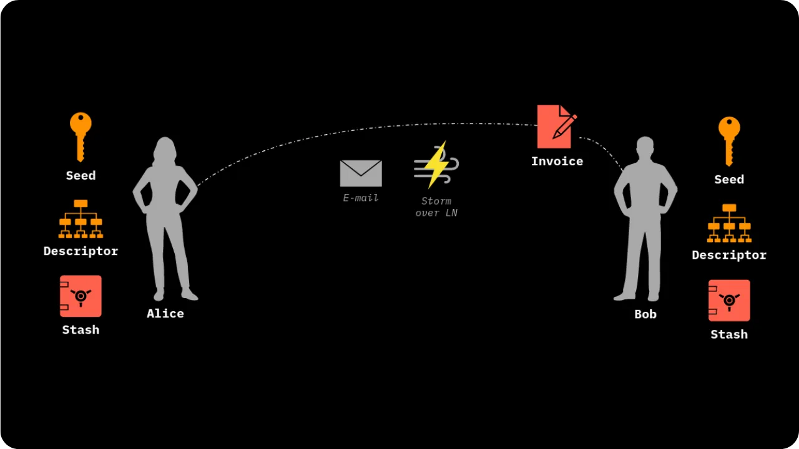


#### 6) Gutegura ibikorwa ku ruhande rwa Alice


Alice yakira Invoice ya Bob. Mu gitabu ciwe ca RGB Wallet, afise igitabu ca Stash kirimwo umutungo azokwimurirwa. Kugira ngo akoreshe UTXO irimwo umutungo, ategerezwa kubanza gutanga PSBT (*Partially Signed Bitcoin Transaction*), ni ukuvuga Bitcoin idatunganye, akoresheje UTXO afise:


```bash
alice$ wallet construct tx.psbt
```


Iyi nzira y'ishimikiro (itashizweko umukono muri iki gihe) izokoreshwa kuri Anchor Commitment y'ibanga ihuye n'uguhindura kuri Bob. Alice izokoreshwa, kandi mu gisohoka, tuzoshiramwo `Tapret` canke `Opret` Commitment ku Bob.


#### 7) Uruvyaro rw'uguhindura Consignment


Inyuma y'aho, Alice yubaka ***Terminal Consignment*** (rimwe na rimwe yitwa "kwimurira Consignment") biciye ku itegeko:


```bash
alice$ rgb transfer tx.psbt <invoice> consignment.rgb
```


Iyi dosiye nshasha irimwo:


- Amateka yose y’Impinduka za Leta zasabwa kugira ngo umutungo wemezwe gushika n’ubu (kuva Genesis);
- Itegeko rishasha rya State Transition ryimura ivy’ubutunzi kuva kuri Alice rikaja muri Bob, hakurikijwe Invoice Bob ryasohoye;
- Igikorwa kidatunganye ca Bitcoin (*Witness Transaction*) (`tx.PSBT`), gikoresha Alice ca Alice, cahinduwe kugira ngo kigiremwo Commitment ku Bob.


Muri iki gihe, iyo nzira y’ugucuruza ntiyigeze itangazwa ku rubuga rwa Bitcoin. Consignment ni nini kuruta Consignment y’ishimikiro, kuko irimwo amateka yose (*uruzitiro rw’ibimenyamenya*) kugira ngo yerekane ko umutungo ubereye.


#### 8) Bob irasuzuma kandi yemera Consignment


Alice irungika iyi **Terminal Consignment** kuri Bob. Bob izoca:


- Gusuzuma ko igitabu ca State Transition gifise ukuri (kumenya ko amateka ahuye, ko amategeko ya Contract yubahirizwa, n’ibindi);
- Wongereko Stash yo mu karere iwanyu;
- Birashoboka ko generate umukono (`sig:...`) kuri Consignment, kugira ngo yerekane ko yasuzumwe kandi yemejwe (rimwe na rimwe yitwa "*igitabu c'umushahara*").


```bash
bob$ rgb accept consignment.rgb
sig:DbwzvSu4BZU81jEpE9FVZ3xjcyuTKWWy2gmdnaxtACrS
```


#### 9) Uburyo: Bob yohereza ivyemezo kuri Alice (*igitabu c'amahera*)


Niba Bob abishaka, arashobora gusubiza iyo sinya kuri Alice. Ivyo vyerekana:


- Ko yemera ko iyo mpinduka ari ngirakamaro;
- Ko yemera ko igikorwa ca Bitcoin gitangazwa.


Ivyo si ngombwa, ariko birashobora gutuma Alice yizigira ko ata ntambara zizokurikira ku bijanye n’ukwimurirwa.


#### 10) Alice ishira umukono kandi itangaza ivy’ugucuruza


Alice ishobora rero:


- Suzuma umukono wa Bob (`RGB suzuma <sig>`);
- Sinya kuri *Witness Transaction* ikiri ikimenyetso ca PSBT (`Ikimenyetso ca Wallet`);
- Gusohora Witness Transaction ku rubuga rwa Bitcoin (`-sohora`).


```bash
alice$ rgb check <sig>
alice$ wallet sign —publish tx.psbt
```


Iyo yemejwe, iyo nzira y’ugucuruza ikimenyetso c’iherezo ry’ugutanga. Bob aba ari we nyen’umutungo mushasha: ubu afise Owned State yerekana UTXO agenzura, ivyo bikaba vyemezwa n’ukubaho kwa Commitment mu gucuruza.


Mu ncamake, ng’iyi inzira yose yo kwimurira:


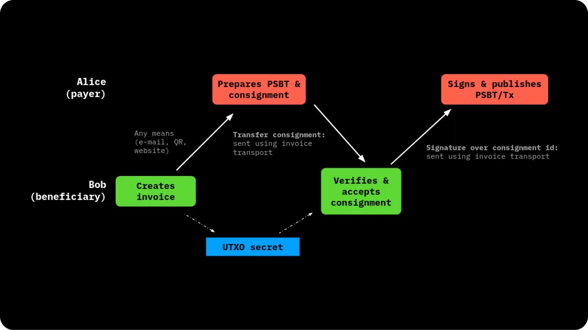


### Inyungu z'uguhindura RGB


- **Ibanga**:


Alice na Bob ni zo zonyene zishobora kuronka amakuru yose ya State Transition. Ba Exchange aya makuru hanze ya Blockchain, biciye ku vyoherezwa. Ivyemezo vy’ubuhinga bwa none mu gucuruza Bitcoin ntivyerekana ubwoko bw’itunga canke umubare, ivyo bikaba bitanga ibanga rikomeye cane kuruta ibindi bikoresho vya On-Chain token.


- **Kwemeza uruhande rw'umukiriya**:


Bob ishobora kugenzura ukuntu ivyo kwimurirwa bihuye mu kugereranya **Consignment** n'ibifatanya biri muri Bitcoin Blockchain. Ntakeneye kwemezwa n'uwundi muntu. Alice ntibwirizwa gutangaza amateka yose kuri Blockchain, ivyo bigabanya umuzigo ku bijanye n'umurongo w'ishimikiro kandi bikaba bituma haba ibanga.


- **Ubutome bworoshe**:


Ivyiyumviro bikomeye (ivy’uguhinduranya atome hagati ya BTC n’umutungo wa RGB, nk’akarorero) birashobora gukorwa mu gihe c’uguhinduranya rimwe, bikaba bikirinda gukenera inyandiko za HTLC canke PTLC. Iyo amasezerano atamenyeshejwe, umuntu wese arashobora gusubira gukoresha ama UTXO yiwe mu bundi buryo.


### Igishushanyo c'incamake c'ukwimurira


Imbere yo kuraba amafagitire mu buryo burambuye, ng’iki igishushanyo c’incamake c’urugendo rwose rw’uguhererekanya amafaranga RGB:


- Bob ishiraho RGB Wallet maze ironka Contract Consignment ya mbere;
- Bob itanga Invoice ivuga UTXO aho umuntu yokwakira umutungo;
- Alice yakira Invoice, yubaka PSBT maze ivyara Terminal Consignment;
- Bob aravyemera, akavyisuzuma, akongerako amakuru kuri Stash yiwe, agashirako umukono (*payslip*) iyo bikenewe;
- Alice itangaza ivy’ugucuruza ku rubuga rwa Bitcoin;
- Kwemeza ivy’ugucuruza bituma ivyo kwimurira biba ivy’ubutegetsi.


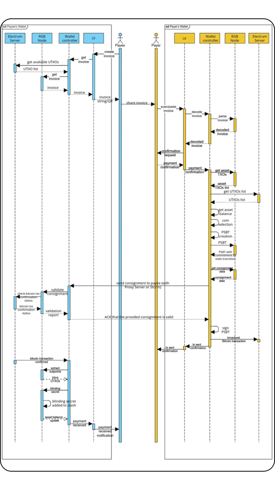


Iryo shirahamwe ryerekana ububasha bwose n’uguhinduranya kw’amasezerano ya RGB: Exchange yigenga, yemejwe ku ruhande rw’umukiriya, ishizweho mu buryo buke kandi buteye ubwoba kuri Bitcoin Blockchain, kandi igumya umutekano mwiza w’amasezerano (nta ngorane ya Double-spending). Ivyo bituma RGB iba ikibanza ciza co gutanga agaciro k’ibintu bifise ibanga kandi bishobora guhindurwa kuruta On-Chain blockchains zishobora gukoreshwa.


### Inyemezabuguzi RGB


Muri iki gice, turasigura mu buryo burambuye ingene **amafagitire** akora mu bidukikije vya RGB n'ingene ashoboza ibikorwa (cane cane ukwimurira) bikorwa na Contract. Ubwa mbere, turaza kuraba ibimenyetso bikoreshwa, hanyuma turabe ingene bishirwa mu nzira, hanyuma turabe imiterere ya Invoice igaragazwa nk’URL (uburyo bubereye gukoreshwa mu bikoresho).


#### Ibiranga n'ugushiramwo


Ikimenyetso kidasanzwe kirasobanurwa kuri buri kimwe muri ibi bikurikira Elements:


- Igitabu c’umwaka w’1883;
- Igitabu caco c’umwaka w’1885 (Igitabu c’umwaka w’1884);
- Igitabu caco c’umwaka w’1887 n’ica 1886;
- Itunga ryayo (ibimenyetso, NFT, n’ibindi),


Ukwo kudasanzwe ni ikintu gihambaye cane, kuko igice cose c’urwo rutonde kigomba kuba gishobora gutandukanywa. Nk’akarorero, Contract X ntitegerezwa gutera urujijo n’iyindi Contract Y, kandi interfaces zibiri zitandukanye (RGB20 vs. RGB21, nk’akarorero) zitegerezwa kuba zifise ibimenyetso bitandukanye.


Kugira ngo ivyo bimenyetso bibe vyiza (bito) kandi bishobore gusomwa, dukoresha:


- Base58 encoding, irinda gukoresha inyuguti zitera urujijo (nk'akarorero `0` n'urudome `O`) kandi itanga imirongo miremire;
- Intangamarara yerekana kamere y’ikimenyetso, akenshi mu buryo bwa `RGB:` canke URN isa n’iyo.


Nk'akarorero, `ContractId` yoshobora guserukirwa n'ikintu nk'iki:


```txt
rgb:2WBcas9-yjzEvGufY-9GEgnyMj7-beMNMWA8r-sPHtV1nPU-TMsGMQX
```


Imbere ya `RGB:` yemeza ko iki ari ikimenyetso ca RGB, kandi atari ihuriro rya HTTP canke uwundi murongo. Kubera iyo ntango, amasakoshi arashobora gusobanura neza urudodo.


#### Ugucapura kw'indanga


Ivyerekana RGB akenshi birareha cane, kuko umutekano wo munsi (cryptographic) ushobora gusaba ivyicaro vy’ibice 256 canke birenze. Kugira ngo umuntu ashobore gusoma no kugenzura, *duca* iyo mirongo mu bice vyinshi bitandukanijwe n'akarongo (`-`). Rero, aho kugira uruzitiro rurerure rw’ibimenyetso rudacitse, turarugabanyamwo ibice bigufi. Ico gikorwa kirasanzwe ku bijanye n’ikarata y’inguzanyo canke inomero za telefone, kandi kirakora no ngaha kugira ngo umuntu ashobore kugenzura neza. Rero, nk'akarorero, umukoresha canke umufatanyabikorwa arashobora kubwirwa ati: "*Ndagusavye usuzume ko igice ca gatatu ari `9GEgnyMj7`*", aho kugereranya vyose icarimwe. Igipande ca nyuma gikoreshwa kenshi nk'**checksum**, kugira ngo hagire uburyo bwo kumenya amakosa canke amakosa yo kwandika.


Nk'akarorero, `ContractId` muri base58 ishobora kuba:


```txt
2WBcas9-yjzEvGufY-9GEgnyMj7-beMNMWA8r-sPHtV1nPU-TMsGMQX
```


Imwe muri izo nzira imenagura urudodo mu bice. Ivyo ntibigira ico bikoze ku nsobanuro y’itegeko, ahubwo bigira ico bikoze ku kuntu rigaragazwa gusa.


#### Gukoresha URLs ku mafagitire


Igitabo ca RGB Invoice kigaragazwa nk'URL. Ivyo bisigura ko umuntu ashobora kuyikanda canke kuyicapura (nk’uko ari kode ya QR), kandi Wallet ishobora kuyisobanura ata guca ku ruhande kugira ngo umuntu akore igikorwa. Ukwo gukorana kworoshe gutandukanye n’izindi nzira zimwe zimwe aho utegerezwa gukopa no gushiramwo amakuru atandukanye mu bice bitandukanye vyo muri porogarama.


Invoice ku token ishobora guhinduka (nk'akarorero RGB20 token) ishobora gusa n'iyi:


```txt
rgb:2WBcas9-yjzEvGufY-9GEgnyMj7-beMNMWA8r-sPHtV1nPU-TMsGMQX/RGB20/100+utxob:egXsFnw-5Eud7WKYn-7DVQvcPbc-rR69YmgmG-veacwmUFo-uMFKFb
```


Reka dusuzume iyi URL:


- `RGB:`** (intango): yerekana ihuriro rikoresha umurongo wa RGB (bisa n'ivyo `http:` canke `Bitcoin:` mu bindi bihe);
- **igereranya**: igereranya `ContractId` ya token ushaka gukoresha;
- `/RGB20/100`: yerekana ko `RGB20` Interface ikoreshwa kandi ko ibice 100 vy'umutungo bisabwa. Inyuguti ni: `/Interface/umubare`;
- `+utxob:`**: isobanura ko amakuru yerekeye uwuronka UTXO (canke, mu buryo bubereye, insobanuro ya Single-Use Seal) yongeweko;
- **Seal**: iyi ni *blinded* UTXO (canke Seal Definition). Mu yandi majambo, Bob yarapfutse UTXO yiwe nyayo, rero uwuyirungitse (Alice) ntazi ico Address nyayo ari co. Azi gusa ko hariho Seal ikora yerekeza kuri UTXO igenzurwa na Bob.


Kuba vyose bifatanya na URL imwe bituma ubuzima bworoha ku muntu abikoresha: gukanda canke gucapura mu Wallet, igikorwa kikaba giteguwe gukorwa.


Umuntu yoshobora kwiyumvira uburyo aho igiharuro coroshe (nk'akarorero `USDT`) gikoreshwa aho gukoresha `ContractId`. Ariko ivyo vyotuma haba ingorane zikomeye z’ukwizigirana n’umutekano: igiharuro si ikintu kidasanzwe (amasezerano menshi yoshobora kuvuga ko yitwa `USDT`). Na RGB, turashaka ikimenyetso kidasanzwe, kitagiramwo amakenga. Ni co gituma kwemera urudodo rw’ibice 256, rwashizwe muri base58 kandi rwaciwemwo ibice. Uwukoresha arazi ko ariko arakoresha neza na neza Contract ID yayo ari `2WBcas9-yjz...` atari uwundi.


#### Ibindi bipimo vya URL


Ushobora kandi kwongerako ibindi bipimo kuri URL, mu buryo bumwe na HTTP, nka:


```txt
rgb:2WBcas9-yjzEvGufY-9GEgnyMj7-beMNMWA8r-sPHtV1nPU-TMsGMQX/RGB20/100+utxob:egXsFnw-5Eud7WKYn-7DVQvcPbc-rR69YmgmG-veacwmUFo-uMFKFb?sig=6kzbKKffP6xftkxn9UP8gWqiC41W16wYKE5CYaVhmEve
```


- `?sig=...`: igereranya, nk'akarorero, umukono ufitaniye isano na Invoice, uwo amasakoshi amwe amwe ashobora kugenzura;
- Iyo Wallet idacungera iyo sinyatire, yirengagiza gusa iyo parametere.


Reka dufate urugero rwa NFT biciye kuri RGB21 Interface. Nk’akarorero, twoshobora kugira:


```txt
rgb:7BKsac8-beMNMWA8r-3GEprtFh7-bjzEvGufY-aNLuU4nSN-MRsLOIK/RGB21/DbwzvSu-4BZU81jEp-E9FVZ3xj-cyuTKWWy-2gmdnaxt-ACrS+utxob:egXsFnw-5Eud7WKYn-7DVQvcPbc-rR69YmgmG-veacwmUFo-uMFKFb
```


Aha turabona:


- `RGB:`**: Intangiriro ya URL;
- 1917 ID (NFT);
- **rGB21**: Interface ku mitungo idashobora guhinduka (NFT);
- **`DbwzvSu-4BZU81jEp-...`**: ivyerekeye igice kidasanzwe ca NFT, nk'akarorero Hash y'amakuru (ivy'amakuru, amakuru y'imbere...);
- `+utxob: nk'akarorero: 1920.


Iciyumviro ni kimwe: gutanga uruja n’uruza rudasanzwe Wallet ishobora gusobanura, rugaragaza neza umutungo udasanzwe uzorungikwa.


#### Ibindi bikorwa biciye kuri URL


RGB URLs ntizikoreshwa gusa mu gusaba kwimurira. Bashobora kandi gushiramwo ibikorwa biteye imbere cane, nk’ugutanga ibimenyetso bishasha (*issuance*). Nk'akarorero:


```txt
rgb:2WBcas9-yjzEvGufY-9GEgnyMj7-beMNMWA8r-sPHtV1nPU-TMsGMQX/RGB20/issue/100000+utxob:egXsFnw-5Eud7WKYn-7DVQvcPbc-rR69YmgmG-veacwmUFo-uMFKFb
```


Aha niho dusanga:


- `RGB:`: amategeko;
- `2Ibibazo9-...`: Indangamuntu ya Contract;
- `/RGB20/ikibazo/100000`: yerekana ko ushaka guhamagara "*Ikibazo*" kugira ngo ureme ibindi bimenyetso 100.000;
- `+Igisubizo:`: Seal Definition.


Nk'akarorero, Wallet yoshobora gusoma ngo: "Nasabwe gukora igikorwa co gukuraho ikibazo kuva kuri `RGB20` Interface, kuri Contract nk'iyo, ku bice 100.000, ku nyungu ya Contract nk'iyo".


None ko twabonye Elements nyamukuru ya porogarama ya RGB, nzobajana mu kigabane gikurikira ku buryo bwo gukora RGB Contract.


## Gutegura amasezerano y'ubwenge


<chapterId>0e0a645c-0049-588d-8965-b8c536590cc9</chapterId>


:::id ya videwo=a3ad6dcd-90b8-4272-9dfc-76c85c859167::


Muri iki gice, tuzofata intambwe ku yindi uburyo bwo kwandika Contract, dukoresheje igikoresho c'umurongo w'amabwirizwa `RGB`. Intumbero ni ukwerekana ingene woshiramwo no gukoresha CLI, ugakoranya **Schema**, ​​ugashiramwo **Interface** na **Interface Implementation**, hanyuma ugatanga (*ugutanga*) umutungo. Turaza kuraba kandi ivyiyumviro bishingiyeko, harimwo n’ugukoranya n’ugushingira intahe. Mu mpera z’iki gice, ukwiye kuba ushoboye gusubiramwo iyo nzira no kwihingurira amasezerano yawe bwite ya RGB.


Nk’ukwibutsa, ubuhinga bwo mu mutima bwa RGB bushingiye ku masomero ya Rust mwebwe nk’abahinguzi, mushobora kwinjiza mu migambi yanyu kugira ngo mucunge igice ca Client-side Validation. Ikindi, umugwi w’ishirahamwe LNP/BP uriko urakora ibijanye n’ugufatanya ibitabu vy’izindi ndimi, ariko ivyo ntibiraheza. Ikindi, izindi nzego nka Bitfinex ziriko zirategura ibirundo vyazo vy’ubufatanye (ivyo tuzobivuga mu bice 2 vya nyuma vy’amashure). Kugeza rero, `RGB` CLI ni co gikoreshwa mu buryo butegekanijwe, naho coba kiguma kidasukuye cane.


### Gushiramwo no gushikiriza igikoresho ca RGB


Itegeko nyamukuru ryitwa gusa `RGB`. Igenewe kwibutsa `git`, ifise amategeko mato mato yo gukoresha amasezerano, kuyahamagara, gutanga itunga n'ibindi. Bitcoin Wallet ubu ntabwo iri muri iyo nkuru, ariko izoba iri mu nsiguro iri hafi (0.11). Iyi verisiyo ikurikira izotuma abakoresha bashobora gukora no gucunga amasakoshi yabo (biciye mu bisobanuro) kuva kuri `RGB`, harimwo n'ivya PSBT, guhuza n'ibikoresho vyo hanze (nk'akarorero Hardware Wallet) vyo gusinya, no gukorana na porogaramu nka Sparrow. Ivyo bizotuma igikorwa cose co gutanga no kwimurira umutungo coroha.


#### Gushiramwo biciye ku mizigo


Turashiramwo igikoresho muri Rust na:


```bash
cargo install rgb-contracts --all-features
```


(Iciyumviro: iyo sandugu yitwa `RGB-contracts`, kandi itegeko ryashizweho rizokwitwa `RGB`. Nimba iyo sandugu yitwa `RGB` iba yaramaze kubaho, hariho ugutombora, ni co gituma iryo zina)


Iryo shirwaho rikoranya umubare munini w'ibintu bishingiyeko (nk'ugusesangura amabwirizwa, gushiramwo Electrum, gucunga ibimenyamenya vy'ubumenyi zero, n'ibindi).


Igihe gushiramwo birangiye,:


```bash
rgb
```


Gukoresha `RGB` (ata mpamvu) yerekana urutonde rw'amabwirizwa mato ariho, nka `imirongo`, `Schema`, `kwinjiza`, `gusohora`, `ikibazo`, `Invoice`, `kwimurira ububiko`, n'ibindi. ibitabo, ibishushanyo n'ibishirwa mu ngiro), uhitemwo urubuga (Testnet, Mainnet) canke utunganye umukozi wawe wa Electrum.


#### Incamake ya mbere y'ibigenzura


Iyo ukoresheje itegeko rikurikira, uzobona ko `RGB20` Interface isanzwe yinjijwe:


```bash
rgb interfaces
```


Niba iyi Interface idashizwemwo, kora clone ya:


```bash
git clone https://github.com/RGB-WG/rgb-interfaces
```


Bishire hamwe:


```bash
cargo run
```


Hanyuma ushiremwo Interface uhisemwo:


```bash
rgb import interfaces/RGB20.rgb
```


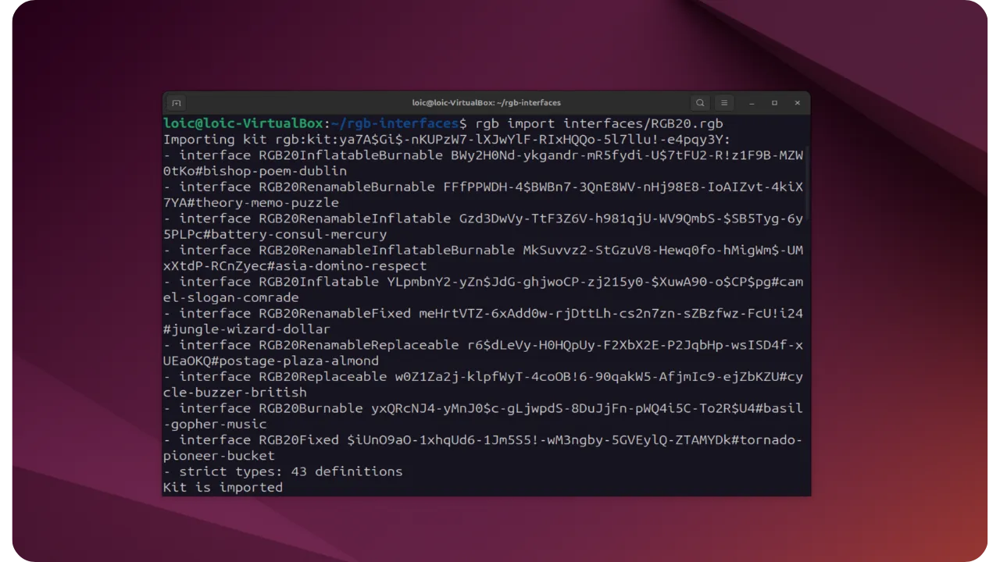


Ku rundi ruhande, tubwirwa ko ata Schema irashirwa muri iyo porogarama. Eka mbere nta Contract iri mu Stash. Kugira ngo uyibone, koresha itegeko:


```bash
rgb schemata
```


Ushobora rero gukora clone y'ububiko kugira ngo ubone ibishushanyo bimwe bimwe:


```bash
git clone https://github.com/RGB-WG/rgb-schemata
```


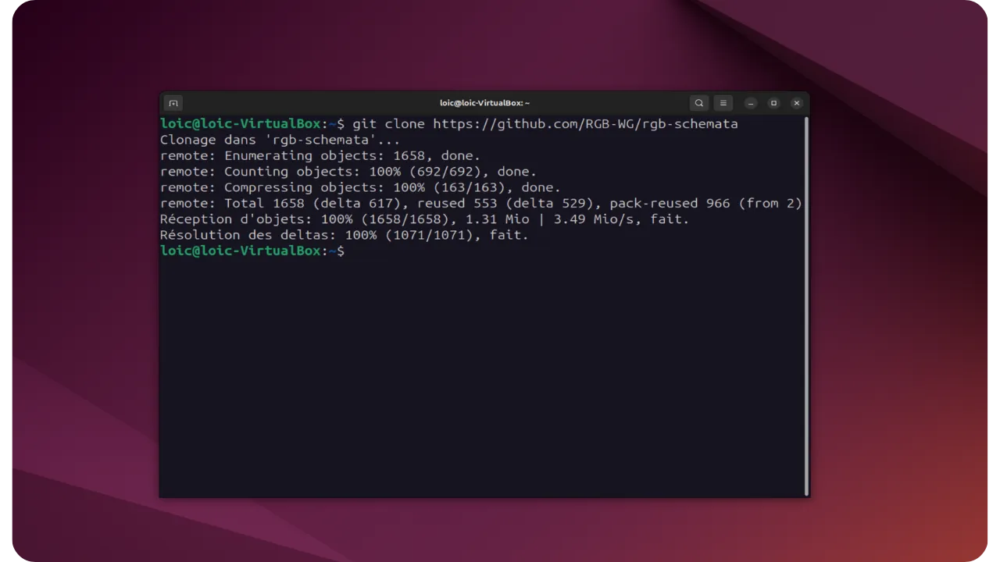


Ubu bubiko burimwo, mu bubiko bwayo bwa `src/`, amadosiye menshi ya Rust (nk'akarorero `nia.rs`) asobanura imirongo (NIA ku "*Itunga Ridashobora Gufutwa*", UDA ku "*Itunga ry'Igihugu*", n'ibindi). Kugira ngo ukoreshe, ushobora gukoresha:


```bash
cd rgb-schemata
cargo run
```


Ivyo bituma habaho amadosiye menshi `.RGB` na `.rgba` ahuye n'imirongo yashizwe hamwe. Nk'akarorero, uzosanga `Itunga ridashobora gutera.RGB`.


#### Kuzana ibicuruzwa vya Schema na Interface Implementation


Ubu ushobora kwinjiza igishushanyo muri `RGB`:


```bash
rgb import schemata/NonInflatableAssets.rgb
```


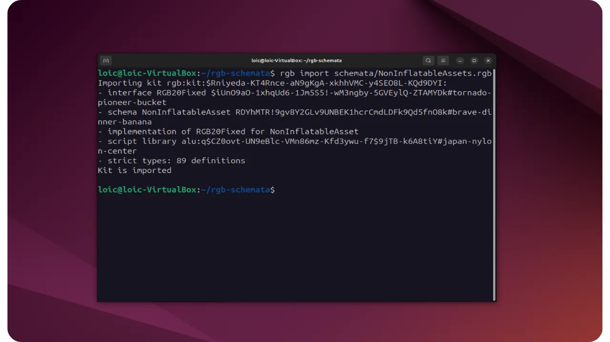


Ivyo bica biyongera kuri Stash yo mu karere. Nitwakoresha itegeko rikurikira, turabona ko Schema ubu ibonetse:


```bash
rgb schemata
```


### Contract irema (gusohora)


Hari uburyo bubiri bwo kurema umutungo mushasha:


- Canke dukoreshe inyandiko canke kode muri Rust yubaka Contract mu gushiramwo ivyicaro vya Schema (Global State, Ibihugu vy'Umutungo, n'ibindi) maze igatanga dosiye `.RGB` canke `.rgba`;
- Canke ukoreshe itegeko rito `issue` ataco rihinduye, n'idosiye ya YAML (canke TOML) idondora imiterere ya token.


Ushobora gusanga ingero muri Rust muri dosiye `ingero`, zigaragaza ingene wubaka `Uwukora Amasezerano`, wuzuze `Global State` (izina ry'umutungo, ikimenyetso, Supply, itariki, n'ibindi), usobanure Owned State (ivyo Owned State ari comp it muri vyose-1). *Contract Consignment* ushobora kwohereza hanze, kwemeza no kwinjiza mu Stash.


Ubundi buryo ni uguhindura n'amaboko dosiye ya YAML kugira ngo uhindure `ticker`, `izina`, `Supply`, n'ibindi. Twibaze ko dosiye yitwa `RGB20-demo.yaml`. Ushobora gusobanura:


- `spec`: ikimenyetso, izina, ukuri;
- `amajambo`: umwanya w'amatangazo y'amategeko;
- `Ivyasohowe`: umubare w'ama token yasohowe;
- `ibikorwa`: vyerekana Single-Use Seal (*Seal Definition*) n'ingero zifunguwe.


Aha ni akarorero ka dosiye ya YAML yo kurema:


```yaml
interface: RGB20Fixed

globals:
spec:
ticker: PBN
name: Plan B Network
details: "Pay attention: the asset has no value"
precision: 2
terms:
text: >
SUBJECT TO, AND WITHOUT IN ANY WAY LIMITING, THE REPRESENTATIONS AND WARRANTIES OF ANY SELLER. PROPERTY IS BEING SOLD “AS IS”...
media: ~
issuedSupply: 100000000

assignments:
assetOwner:
seal: tapret1st:b449f7eaa3f98c145b27ad0eeb7b5679ceb567faef7a52479bc995792b65f804:1
amount: 100000000 # this is 1 million (we have two digits for cents)
```


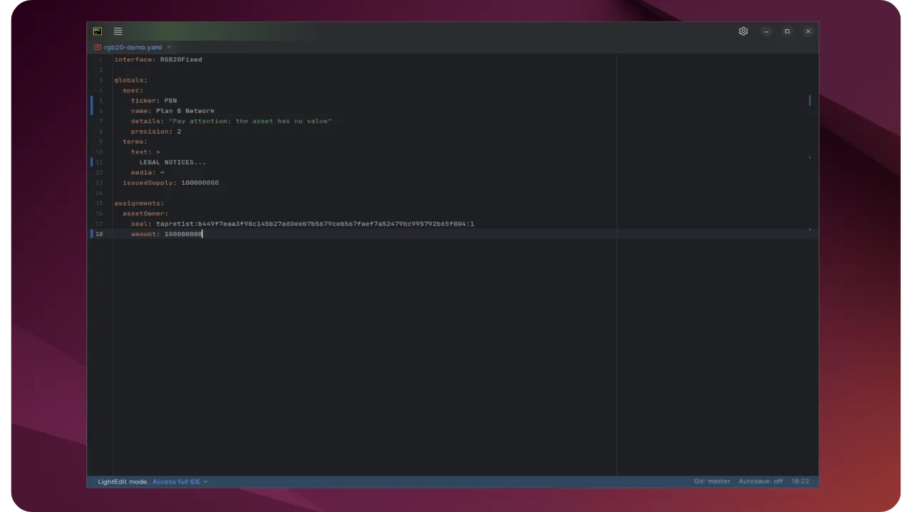


Hanyuma ukoreshe itegeko:


```bash
rgb issue '<SchemaID>' ssi:<Issuer> rgb20-demo.yaml
```


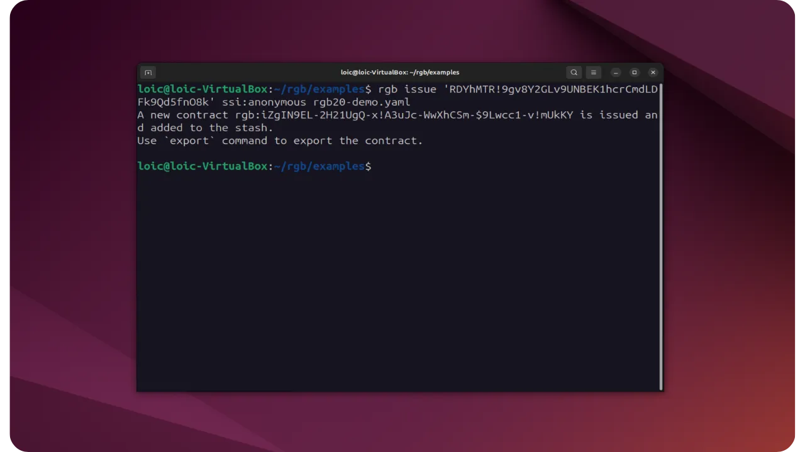


Ku bijanye nanje, ikimenyetso kidasanzwe ca Schema (kizoshirwa mu bimenyetso bimwe bimwe) ni `RDYhMTR! Rero itegeko ryanje ni:


```txt
rgb issue 'RDYhMTR!9gv8Y2GLv9UNBEK1hcrCmdLDFk9Qd5fnO8k' ssi:anonymous rgb20-demo.yaml
```


Niba utazi ID ya Schema, koresha itegeko:


```bash
rgb schemata
```


CLI yishura ko hariho Contract nshasha yasohowe kandi yongerwa ku Stash. Nitwandika iri tegeko rikurikira, turabona ko ubu hariho Contract y’inyongera, ihuye n’iyiherutse gusohoka:


```bash
rgb contracts
```


Hanyuma, itegeko rikurikira ryerekana ibihugu vyo kw’isi yose (izina, ikimenyetso, Supply...) n’urutonde rw’ibihugu vy’ubutunzi, ni ukuvuga ivy’ugutanga (nk’akarorero, ibimenyetso vy’imiliyoni 1 `PBN` vyasobanuwe muri UTXO `b449f7eaa3f98c145b27ad0eeb7b5679ceb567faef7a52479bc995792b65f804:1`).


```bash
rgb state '<ContractId>'
```


### Gusohora hanze, kwinjiza mu gihugu no kwemeza


Kugira ngo usangire iyi Contract n'abandi bakoresha, ushobora kuyirungika hanze kuva kuri Stash ikaja kuri:


```bash
rgb export '<ContractId>' myContractPBN.rgb
```


Dosiye `myContractPBN.RGB` ishobora gushikirizwa uwundi mukozi, ashobora kuyishira kuri Stash yiwe n'itegeko:


```bash
rgb import myContractPBN.rgb
```


Ku bijanye no kwinjiza, nimba ari *Contract Consignment* yoroshe, tuzoronka ubutumwa "`Kuzana Consignment RGB`". Niba ari *State Transition Consignment* nini, itegeko rizoba ritandukanye (`RGB yemera`).


Kugira ngo umenye neza ko ari ukuri, ushobora kandi gukoresha igikorwa co kwemeza co mu karere. Nk'akarorero, woshobora kwiruka:


```bash
rgb validate myContract.rgb
```


#### Stash ikoreshwa, kugenzura no kugaragaza


Nk’ukwibutsa, Stash ni urutonde rw’ibintu vyo mu karere vy’imirongo, imirongo, ishyirwa mu ngiro n’amasezerano (Genesis + imihindukire). Igihe cose ukoresheje "import", wongerako ikintu kuri Stash. Iyi Stash ishobora kurabwa mu buryo burambuye n’itegeko:


```bash
rgb dump
```


Ivyo bizotuma generate igira dosiye irimwo amakuru yose ya Stash.


### Kwimurira na PSBT


Kugira ngo ukore ukwimurira, uzokenera gukoresha Bitcoin Wallet yo mu karere kugira ngo ucungere amasezerano ya `Tapret` canke `Opret`.


#### 2013 na 2014


Akenshi, ugukorana hagati y’abaje mu nama y’ubuhinga bwa none (nk’akarorero, Alice na Bob) bibera biciye mu guhingura Invoice. Iyo Alice ashaka ko Bob akora ikintu (kwimurira token, gusubira gusohora, igikorwa muri DAO, n'ibindi), Alice irema Invoice idondora amabwirizwa yiwe kuri Bob. Rero dufise:


- **Igitabu-2021** (uwatanze igitabu-2020);
- **Bob** (ni we yakira kandi agashitsa Invoice).


Mu buryo butandukanye n’ibindi bidukikije, RGB Invoice ntigarukira ku ciyumviro co kwishura gusa. Ishobora gushiramwo igisabwa cose gifitaniye isano na Contract: gukuraho urufunguzo, gutora, gukora igicapo (*igicapo*) kuri NFT, n'ibindi. Ivyo bishobora gusobanurwa muri Contract Interface.


Itegeko rikurikira ritanga RGB Invoice:


```bash
$ rgb invoice $CONTRACT -i $INTERFACE $ACTION $STATE $SEAL
```


Hamwe:


- `$Contract`: Ikimenyetso ca Contract (*Id y'Isezerano*);
- `$Interface`: Interface izokoreshwa (nk'akarorero `RGB20`);
- `$ACTION`: izina ry'igikorwa kigaragazwa muri Interface (ku bijanye n'uguhindura token, ivyo bishobora kuba "Ukwimurira"). Niba Interface isanzwe itanga igikorwa c'imbere, ntukeneye kugisubiramwo hano;
- `$STATE`: amakuru y'imimerere azokwimurirwa (nk'akarorero, umubare w'ibimenyetso iyo token ishobora guhinduka irungitswe);
- `$Seal`: Single-Use Seal y'uwuronka inyungu (Alice), ni ukuvuga ivyerekeye UTXO. Bob izokoresha aya makuru kugira ngo yubake Witness Transaction, kandi igisubizo gihuye kizoba ica Alice (mu *blinded UTXO* canke mu buryo butagiramwo amakuru).


Nk’akarorero, n’amabwirizwa akurikira .


```bash
alice$ CONTRACT='iZgIN9EL-2H21UgQ-x!A3uJc-WwXhCSm-$9Lwcc1-v!mUkKY'
alice$ MY_UTXO=4960acc21c175c551af84114541eace09c14d3a1bb184809f7b80916f57f9ef8:1
alice$ rgb invoice $CONTRACT -i RGB20 --amount 100 $MY_UTXO
```


Igikoresho ca CLI kizoba igikoresho ca generate na Invoice nk'iki:


```bash
rgb:iZgIN9EL-2H21UgQ-x!A3uJc-WwXhCSm-$9Lwcc1-v!mUkKY/RGB20/100+utxob:zlVS28Rb-...
```


Ishobora gushikirizwa Bob biciye ku nzira iyo ari yo yose (inyandiko, kode ya QR, n’ibindi).


#### Kwimurira


Kugira ngo ushiremwo iyi Invoice:


- Bob (uwufise ibimenyetso muri Stash yiwe) afise Bitcoin Wallet. Arakeneye gutegura igikorwa co gucuruza Bitcoin (mu buryo bwa PSBT, nk’akarorero `tx.PSBT`) gikoresha ama UTXO aho ibimenyetso vya RGB bisabwa biri, yongerako UTXO imwe y’amahera (PSBT);
- Bob ikora itegeko rikurikira:


```bash
bob$ rgb transfer tx.psbt $INVOICE consignment.rgb
```


- Ibi bitanga dosiye `Consignment.RGB` irimwo:
 - Amateka y’ihinduka yerekana Alice ko ivyo bimenyetso ari ivy’ukuri;
 - Ihinduka rishasha ryimurira ibimenyetso kuri Single-Use Seal ya Alice;
 - Igitabo ca Witness Transaction (kitashizweko umukono).
- Bob yohereza iyi dosiye `Consignment.RGB` kuri Alice (biciye kuri e-mail, kuri server yo gusangira canke kuri porotokole ya RGB-RPC, Igihuhusi, n'ibindi);
- Alice yakira `Consignment.RGB` kandi ikayemera muri Stash yayo bwite:


```bash
alice$ rgb accept consignment.rgb
```


- CLI isuzuma ukuri kw'ihinduka maze ikayongera kuri Stash ya Alice. Iyo ataco bimaze, itegeko rirananirwa n'ubutumwa bw'ikosa burambuye. Ahandi ho, biraroranirwa, kandi bikavuga ko iyo nzira y’ugucuruza y’akarorero itaratangazwa ku rubuga rwa Bitcoin (Bob irindiriye umuco wa Green wa Alice);
- Mu buryo bwo kwemeza, itegeko `kwemera` rigarura umukono (*payslip*) Alice ashobora kohereza Bob kugira ngo amwereke ko yemeje *Consignment*;
- Bob ashobora rero gusinya no gutangaza (`--tangaza`) ibikorwa vyiwe vya Bitcoin:


```bash
bob$ rgb check <sig> && wallet sign --publish tx.psbt
```


- Igihe iyo nzira yemejwe On-Chain, Ownership y'umutungo ifatwa nk'iyimuriwe kuri Alice. Alice ya Wallet, igenzura Mining y'isoko, ibona Owned State nshasha iboneka muri Stash yayo.


Mu gice gikurikira, tuzokwihweza neza ingene RGB yoshirwa muri Lightning Network.


## RGB kuri Lightning Network


<chapterId>0962980a-8f94-5d0f-9cd0-43d7f884a01d</chapterId>


:::id ya videwo=be25a165-6e23-488c-91d8-3dcfccc6eca1:::


Muri iki gice, ndasaba gusuzuma ingene RGB ishobora gukoreshwa muri Lightning Network, mu gushiramwo no kwimurira ivy’ubutunzi bwa RGB (ibimenyetso, NFT, n’ibindi) biciye mu nzira zo kwishura za off-chain.


Iciyumviro nyamukuru ni uko RGB State Transition (*State Transition*) ishobora kwiyemeza gukora igikorwa ca Bitcoin, na co nyene, gishobora kuguma ari off-chain gushika umurongo w’umuravyo ufunze. Rero, igihe cose umurongo uvuguruwe, RGB State Transition nshasha irashobora kwinjizwa mu gikorwa gishasha co gukora, ivyo bikaba bica bihindura ubusa iyo mpinduka ya kera. Muri ubwo buryo, imirongo ya Lightning irashobora gukoreshwa mu gutanga itunga rya RGB, kandi ishobora gukoreshwa mu buryo bumwe n’ubw’amahera asanzwe ya Lightning.


### Guhingura umurongo no gutanga amafaranga


Kugira ngo dukore umurongo w’umuravyo utwara ivy’ubutunzi vya RGB, turakeneye Elements zibiri:


- Bitcoin infashanyo yo kurema 2/2 Multisig y’umurongo (UTXO y’ishimikiro y’umurongo);
- RGB infashanyo, yohereza itunga kuri Multisig nyene.


Mu majambo ya Bitcoin, igikorwa co gutanga amahera kigomba kubaho kugira ngo gisobanure igipimo ca UTXO, naho coba kirimwo gusa umubare mutoyi wa Sats (ni ikibazo gusa c’umusaruro wose mu bikorwa vya Commitment vyo muri kazoza bisigaye hejuru y’umupaka wa Dust wose same). Nk’akarorero, Alice ishobora gufata ingingo yo gutanga 10k Sats na 500 USDT (itangazwa nk’umutungo wa RGB). Ku bijanye n'ugutanga amahera, twongerako Commitment (`Opret` canke `Tapret`) ishingira intahe RGB State Transition.


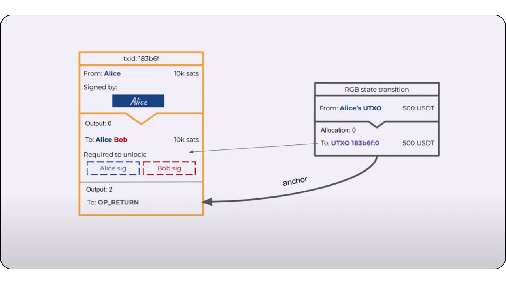


Igihe igikorwa co gutanga amahera kimaze gutegurwa (ariko kitaratangazwa), igikorwa ca Commitment kiraremwa kugira ngo umwe wese mu bagize uruhande ashobore gufunga umuhora ku ruhande rumwe igihe cose. Ivyo bikorwa bisa n'ivyo Commitment vya kera vya Lightning, kiretse ko twongerako ikindi gisohoka kirimwo RGB Anchor (OP_RETURN canke Taproot) gihuye n'iyi State Transition nshasha.


RGB State Transition rero ijana umutungo kuva kuri 2/2 Multisig y'infashanyo ikaja ku biva muri Commitment Transaction. Ivyiza vy’iyi nzira ni uko umutekano w’igihugu ca RGB uhuye neza n’ubuhinga bwo guhana bwa Lightning: iyo Bob itangaje igihugu c’umurongo wa kera, Alice irashobora kumuhana no gukoresha igisohoka, kugira ngo isubire ku Sats n’ivyo vyose. Ico kintu gitera intege rero kirakomeye kuruta mbere n’ico mu muhora wa Lightning udafise itunga rya RGB, kuko uwutera ashobora gutakaza atari Sats gusa, ariko kandi n’itunga rya RGB ry’uwo muhora.


Commitment Transaction yashizweko umukono na Alice ikarungikwa kuri Bob rero yoba imeze gutya:


Kandi Commitment Transaction iherekejwe, yashizweko umukono na Bob ikarungikwa kuri Alice, izomera gutya:


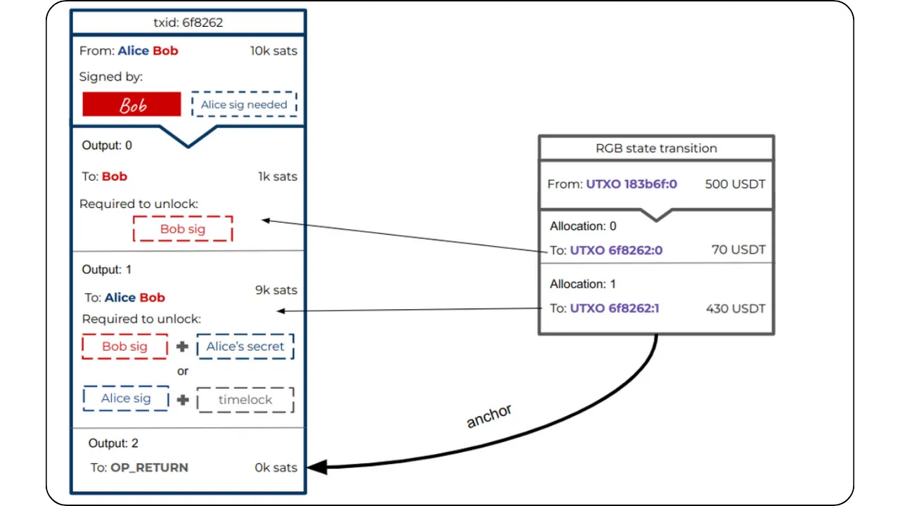


### Ivugurura ry'umurongo


Iyo habayeho ukwishyura hagati y’abafatanyabikorwa babiri (canke bipfuza guhindura ugutanga umutungo), barema umugwi mushasha w’ibikorwa vya Commitment. Amafaranga ari muri Sats ku giciro cose ashobora canke ntahinduke, bivanye n’ugushirwa mu ngiro, kuko uruhara rwayo nyamukuru ari ugutuma habaho kwubaka UTXO zifise akamaro. Ku rundi ruhande, igisohoka ca OP_RETURN (canke Taproot) kigomba guhindurwa kugira ngo kibemwo RGB Anchor nshasha, igereranya ugusangira gushasha kw’itunga mu muyoboro.


Nk’akarorero, iyo Alice yohereje amadolari 30 kuri Bob mu muyoboro, State Transition nshasha izokwerekana amadolari 400 ku Alice n’amadolari 100 ku Bob. Igikorwa kijanye n'ugusezerana congerwa kuri (canke gihindurwa na) OP_RETURN/Taproot Anchor kugira ngo kigiremwo iyo mpinduka. Zirikana ko, uhereye ku mbonerahamwe ya RGB, ivyo winjiza mu guhindura biguma ari Multisig ya mbere (aho itunga rya On-Chain rihabwa mu vy’ukuri gushika umuyoboro ufunze). Ivyo RGB isohora (ivy’ugutanga) vyonyene ni vyo bihinduka, bivanye n’ugusubira gusangira vyafashwe ingingo.


Igitabo ca Commitment Transaction cashizweko umukono na Alice, giteguwe gukwiragizwa na Bob:


Igitabo ca Commitment Transaction cashizweko umukono na Bob, giteguwe gukwiragizwa na Alice:


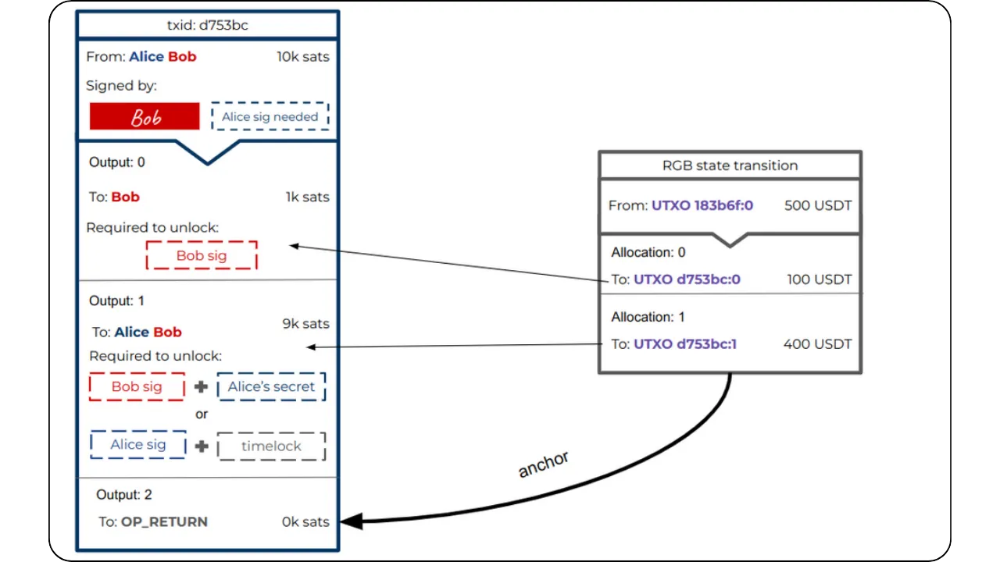


### Ubuyobozi bwa HTLC


Mu vy’ukuri, Lightning Network iratuma amahera yishurwa ashobora guca mu nzira nyinshi, hakoreshejwe HTLCs (*Amasezerano Apfungiwe n’Igihe*). Ni ko biri no kuri RGB: ku kwishura kwose guca mu muhora, umusaruro wa HTLC wongerwa ku gucuruza, n'ugutanga RGB guhuye n'iyi HTLC. Gutyo, uwuzokoresha umusaruro wa HTLC (bivuye ku banga canke inyuma y’aho igihe co gufunga kirangiriye) arasubirana Sats n’itunga ry’i RGB rijana na ryo. Ku rundi ruhande, biragaragara ko ukeneye kugira amahera ahagije ku nzira mu bijanye n’itunga ryompi Sats na RGB.


Ivyo RGB ikora kuri Lightning rero bitegerezwa gufatwa nk’uko bihuye n’ivyo Lightning Network ubwayo ikora. Niba wifuza kwihweza cane muri iki cigwa, ndagusavye cane ko uraba iyindi nyigisho yuzuye:


https://planb.network/courses/34bd43ef-6683-4a5c-b239-7cb1e40a4aeb

### Ikarata ya kode ya RGB


Ubwa nyuma, imbere yo kuja mu gice gikurikira, ndashaka kubaha icegeranyo c'itegeko rikoreshwa muri RGB. Iryo tegeko rishingiye ku masomero ya Rust n’ibisobanuro vy’inkomoko yuguruye. Aha niho hari insiguro y'ububiko nyamukuru n'amasandugu:


#### Client-side Validation


- **Ububiko**: [kwemeza_uruhande rw'umukiriya](https://github.com/LNP-BP/kwemeza_uruhande_rw'umukiriya)
- **Amasandugu**: [kwemeza_uruhande_rw'umukiriya](https://amasandugu.io/amasandugu/kwemeza_uruhande rw'umukiriya), [ibimenyetso_bikoreshwa_rimwe](https://amasandugu.io/amasandugu/ibimenyetso_bikoreshwa_rimwe)


Uburongozi bw’ukwemeza off-chain n’ubuhinga bwo gukoresha rimwe Seals.


#### Ivyemezo vy'Itegeko Bitcoin (DBC)


- **Ububiko**: [Ishingiro rya bp] (Ishingiro ry'Igihugu)
- **Isandugu**: [bp-dbc](https://isanduku.io/isanduku/bp-dbc)


Uburongozi bw’ugushinga intahe mu bikorwa vya Bitcoin (Tapret, OP_RETURN, n’ibindi).


#### Multi Protocol Commitment (MPC)


- **Ububiko**: [kwemeza_uruhande rw'umukiriya](https://github.com/LNP-BP/kwemeza_uruhande_rw'umukiriya)
- **Isandugu**: [gusuzuma_gukora](https://ibisandugu.io/ibisanduka/ugusuzuma_gukora)


Ivyiyumviro vyinshi vy’ugukorana n’ugushiramwo n’amategeko atandukanye.


#### Ubwoko bukomeye n'ugushiramwo amakuru


- **Ibisobanuro**: [urubuga ubwoko-bukomeye.org](https://www.ubwoko-bukomeye.org/)
- **Ububiko**: [ubwoko-bukomeye](https://github.com/ubwoko-bukomeye/ubwoko-bukomeye), [gushiramwo-bukomeye](https://github.com/ubwoko-bukomeye/gushiramwo-bukomeye)
- **Amasandugu**: [ubwoko_bukomeye](https://amasandugu.io/amasandugu/ubwoko_bukomeye), [gushiramwo_amakode](https://amasandugu.io/amasandugu/gushiramwo_amakode)


Uburyo bwo kwandika bukomeye n'urutonde rw'ibintu bikoreshwa kuri Client-side Validation.


#### RGB Ishingiro


- **Ububiko**: [RGB-ishingiro](RGB-Ishingiro)
- **Isanduku**: [RGB-umutima](https://isanduku.io/isanduku/RGB-umutima)


Ishingiro ry’iyo porotokole, rigizwe n’intumbero nyamukuru y’ukwemeza RGB.


#### RGB Ububiko bw'ibitabu busanzwe & Wallet


- **Ububiko**: [Ububiko-2178-ububiko](Ububiko).
- **Isandugu**: [RGB-std](igisandugu.io/isanduku/RGB-igisandugu)


Ivyiyumviro vy’ugushirwa mu ngiro, uburongozi bwa Stash na Wallet.


#### RGB CLI


- **Ububiko**: [Ububiko-2184](Ububiko).
- **Amasandugu**: [RGB-CLI] (Isanduku.io/Isandugu/RGB-CLI), [Isandugu-2187-2185]


Ivyo bikoresho bikoreshwa mu gukoresha amasezerano.


#### RGB Schema


- **Ububiko**: [Imirongo ya RGB] (Imirongo ya RGB/Imirongo ya RGB/)


Irimwo ingero z’imirongo (NIA, UDA, n’ibindi) n’ingene zishirwa mu ngiro.


#### AluVM


- **Amakuru**: [AluVM.org](urubuga rwacu-2195.org/)
- **Ububiko**: [Ibisobanuro vya AluVM](Ibisobanuro vya AluVM), [Ivyiyumviro](Ivyiyumviro)
- **Amasandugu**: [AluVM](amasandugu.io/amasandugu/AluVM), [amasandugu](amasandugu.io/amasandugu/amasandugu)


Igikoresho gishingiye ku kwandika gikoreshwa mu gukoresha inyandiko zo kwemeza.


#### Amasezerano ya Bitcoin - BP


- **Ububiko**: [bp-core] (bp-core), [bp-std] (bp-std), [bp-gW-2199](bp-gw-2199)


Ivyongeyeko vyo gushigikira umurongo wa Bitcoin (ibikorwa, ivy’uguca mu nzira, n’ibindi).


#### Ivy'Ibarabara ry'Ivy'Ibarabara - UBIDECO


- **Ububiko**: [UBIDECO](UBIDECO)


Ibidukikije bifitaniye isano n’iterambere ry’ivy’ubuhinga ry’inkomoko yuguruye.


# Inyubakwa kuri RGB


<partId>3b4b0d66-0c1b-505a-b5ca-4b2e57dd73c2</partId>


## DIBA n'umugambi wa Bitmask


<chapterId>dc92a5e8-ed93-5a3f-bcd0-d433932842f4</chapterId>


:::id ya videwo=2ec9a181-a8b0-4da2-b7b5-9dfaaeb10ba:::


Iki gice ca nyuma c’amashure gishingiye ku nsiguro zashikirijwe n’abatanga insiguro batandukanye mu nama y’ivyigwa ya RGB. Harimwo intahe n’ivyiyumviro ku RGB n’ibidukikije vyayo, hamwe n’ugushikiriza ibikoresho n’imigambi ishingiye kuri iyo porotokole. Iki gice ca mbere kirongowe na Hunter Beast, ibindi bibiri bikurikira na Frederico Tenga.


### Kuva ku nyandiko ya Java gushika kuri Rust, no mu bidukikije vya Bitcoin


Mu ntango, Hunter Beast yakora cane cane mu rurimi rw’igifaransa. Hanyuma abona **Rust**, insiguro y’amajambo yayo yasa n’iyidashimishije kandi ibabaza mu ntango. Ariko rero, yaraje gutahura ububasha bw’ururimi, ukugenzura ubwonko (*heap* na *stack*), n’umutekano n’ubushobozi bijana na vyo. Ashimika ku vy’uko Rust ari ikibanza ciza cane co kwimenyerezamwo kugira ngo umuntu atahure bimwe bigera kure ingene orodinateri ikora.


Hunter Beast avuga ivy’amateka yiwe mu migambi itandukanye mu bidukikije *Altcoin*, nka Ethereum (ifise ubukomezi, TypeScript, n’ibindi), hanyuma Filecoin. Asigura ko mu ntango yatangajwe n’amasezerano amwe amwe, ariko amaherezo yumva ko menshi muri yo yamuhemukiye, atari kubera ubuhinga bwayo bwo gukoresha ibimenyetso. Aragaya inkurikizi z’amahera ziteye amakenga, uguhingura ibimenyetso vy’ugutera imbere bitera ubwoba abashoramari, n’umuce ushobora gutuma iyo migambi ikoreshwa nabi. Yaciye rero aheza afata ingingo ya **Bitcoin Maximalist**, atari ukubera ko hari abantu bamwebamwe bamufunguriye amaso ku buryo bwiza bw’ubutunzi bwa Bitcoin, no ku gukomera kw’iyi nzira.


### Ugusaba kwa RGB no kwubaka ku bipande


Ico camujijuye ata gukeka ko Bitcoin ifise akamaro, mu majambo yiwe, ni ukuvumbura RGB be n’iciyumviro c’ibice. Yemera ko ibikorwa biriho ku bindi bice vy’umubiri bishobora gusubirwamwo ku bice vy’imbere, hejuru ya Bitcoin, ata guhindura umurongo w’ishimikiro.


Muri Ruhuhuma 2022, yinjiye muri **DIBA** kugira ngo akore cane cane kuri RGB, na cane cane kuri **Bitmask** Wallet. Iciyo gihe, Bitmask yari ikiri kuri verisiyo 0.01 kandi yariko ikoresha RGB kuri verisiyo 0.4, gusa ku bijanye no gucunga ibimenyetso bimwe bimwe. Avuga ko ivyo vyari bishingiye cane ku kwizigama nk’uko biri muri iki gihe, kuko ivyiyumviro vyari bishingiye ku serveri. Kuva ico gihe, ubwubatsi bwarateye imbere buja kuri iyo nzira, ishimwa cane n’aba bitcoiners.


### Ishingiro ry'amasezerano ya RGB


Itegeko rya **RGB** ni ryo rishasha kandi riteye imbere cane ry'iciyumviro c'ibiceri vy'amabara, ryaramaze gusuzumwa nko mu 2012-2013. Iciyo gihe, amashirahamwe menshi yariko ararondera gufatanya agaciro gatandukanye ka Bitcoin ku UTXO, ivyo vyatumye habaho ugushirwa mu ngiro kwinshi gutatanijwe. Ukwo kutagira urugero n’ugusaba guke ico gihe vyatumye ivyo bisubizo bitaronka ikibanza kiramvye.


Ubu, RGB irahagaze kubera ubukomezi bwayo bw’ivyiyumviro n’ibisobanuro vy’ubumwe biciye ku shirahamwe rya LNP/BP. Iryo hame rishingiye kuri Client-side Validation. Bitcoin Blockchain ibika gusa amasezerano y’ubuhinga bwa none (_amasezerano_, biciye kuri Taproot canke OP_RETURN), mu gihe amakuru menshi (insobanuro za Contract, amateka yo kwimurira, n’ibindi) abikwa n’abakoresha bireba. Muri ubwo buryo, umuzigo wo kubika uragabanywa kandi ibanga ry’uguhanahana rirakomezwa, ata kuremerera Blockchain. Ubu buryo burashoboza kurema ibintu bishobora guhinduka (**RGB20** standard) canke ibintu bidasanzwe (**RGB21**), mu rwego rw’ibice kandi bishobora guhindurwa.


### Ibikorwa vya token (RGB20) n'ibintu bidasanzwe (RGB21)


Na **RGB20**, dusobanura token ishobora guhinduka kuri Bitcoin. Uwutanga amafaranga ahitamwo _ugutanga_, _ugutanga_, agaca akora _amasezerano_ ashobora guca akoramwo amafaranga. Igihe cose umuntu yimuriwe, akoresheje Bitcoin UTXO, ikora nk’igitabu *Single-Use Seal*. Ivyo bituma uwukoresha atazoshobora gukoresha umutungo umwe incuro zibiri, kuko umuntu wenyene ashobora gukoresha UTXO ari we afise urufunguzo rwo guhindura uko Contract iri ku ruhande rw'umukiriya.


**RGB21** igamije ivy'ubutunzi bidasanzwe (canke "NFT"). Ico kintu gifise Supply ya 1, kandi gishobora gufatanywa n’amakuru (dosiye y’amashusho, amajwi, n’ibindi) adondora biciye mu kibanza kinaka. Udakunze NFTs ku blockchains za bose, amakuru n’ibimenyetso vyayo vya MIME birashobora kuguma ari ivy’ibanga, bigakwiragizwa n’abandi ku bushake bwa nyen’ivyo bikoresho.


### Umuti w'ibipfukisho: Wallet ku RGB


Kugira ngo ubushobozi bwa RGB bukoreshwe mu bikorwa, umugambi wa **DIBA** warateguye Wallet yitwa [Bitmask](https://bitmask.app/). Iciyumviro ni ugutanga igikoresho kitagira ububiko, gishingiye kuri Taproot, gishobora gushikwako nk’urubuga canke nk’igikoresho co kwagura umucukumbuzi. Bitmask icungera ivy'ubutunzi vya RGB20 na RGB21, kandi igashiramwo uburyo butandukanye bwo gucungera umutekano:


- Itegeko ry’ishimikiro ryanditswe muri Rust, hanyuma rikakoranywa muri WebAssembly kugira ngo rikore mu bidukikije vya JavaScript (React);
- Imfunguruzo ziterwa mu karere, hanyuma zigabikwa zipfutse mu karere;
- Amakuru ya Leta (Stash) abikwa mu mutwe, akurikiranwa kandi ashirwa mu mfuruka biciye mu bubiko bw'ibitabu bwa **Carbonado**, bukora igikorwa co gufatanya, gukosora amakosa, gupfuka no kugenzura uruzi hakoreshejwe Blake3.


Kubera iyo nyubakwa, ibikorwa vyose vy’ubutunzi bibera ku ruhande rw’umukiriya. Uvuye hanze, igikorwa ca Bitcoin nta kindi ariko ni igikorwa ca kera co gukoresha amahera ca Taproot, ata n’umwe yokwikeka ko na co nyene gifise uguhindura ibimenyetso canke NFTs. Kuba ata On-Chain irengeje urugero (nta metadata ibitswe ku mugaragaro) biremeza urugero runaka rw’ubukerebutsi kandi bituma vyoroha kunanira ukugerageza gucengera gushoboka.


### Umutekano n'ubwubatsi busanzwe


Kubera ko umurongo wa RGB usaba ko uwuriko arakora wese aguma afise amateka y’ibikorwa vyiwe (kugira ngo yerekane ko amafaranga yimuriwe ari ay’ukuri), ikibazo co kubika kiravyuka. Bitmask isaba gushiramwo iyi Stash mu karere, hanyuma ikayirungika ku ma server menshi canke ku bicu (ntibikenewe). Amakuru aguma apfutse n'uwukoresha biciye kuri **Carbonado**, rero umukozi ntashobora kuyasoma. Iyo habayeho ugusenyuka kw’igice, ugukosora amakosa Layer kurashobora gusubiramwo ibirimwo.


Ikoreshwa rya CRDT (_Ubwoko bw'amakuru asubiyemwo ata ntambara_) rituma verisiyo zitandukanye za Stash zishobora guhurizwa hamwe, iyo zishobora gutandukana. Umuntu wese arafise umwidegemvyo wo kwakira ayo makuru aho yipfuza hose, kuko ata Full node n’imwe itwara amakuru yose afitaniye isano n’ico kintu. Ivyo vyerekana neza na neza filozofiya ya *Client-side Validation*, aho nyen’umutungo wese afise inshingano yo kubika ibimenyamenya vy’ukuri kw’umutungo wiwe wa RGB.


### Ku bijanye n'ibidukikije vyagutse: isoko, ugukorana n'abandi n'ibikorwa bishasha


Ishirahamwe riri inyuma ya Bitmask ntirigarukira ku gutegura Wallet. DIBA ifise umugambi wo gutegura:


- **Isoko** ryo guhanahana ibimenyetso, cane cane mu buryo bwa **RGB21**;
- Guhuza n’ibindi bikoresho (nk’ivyo *Iris Wallet*);
- Ubuhinga bwo kwimurira amafaranga, ni ukuvuga ubushobozi bwo gushiramwo amafaranga menshi akurikirana ya RGB mu gucuruza kumwe.


Muri ico gihe nyene, turiko turakora ku **WebBTC** canke **WebLN** (ingingo ngenderwako zishoboza imbuga gusaba Wallet gusinya amasezerano ya Bitcoin canke Lightning), hamwe n'ubushobozi bwo "gukoresha televiziyo" ivyinjijwe vya Bitcoin (niba dushaka gusubiza mu gihugu ca Wallet).


### Iciyumviro


Ivyo vyose vyerekana ingene ubuhinga bwa RGB bushobora gukoreshwa no gushikira abakoresha biciye mu gutorera umuti ibibazo bikomeye. Ihinduka kuva ku mbonerahamwe ya Altcoin gushika ku mbonerahamwe ishingiye kuri Bitcoin, hamwe n’ukuvumbura *Client-side Validation*, vyerekana inzira yumvikana neza: turatahura ko bishoboka gushirwa mu ngiro ibikorwa bitandukanye (ibimenyetso bishobora guhinduka, NFT, amasezerano y’ubwenge ya GW by-5...) ata2. y'imihigo y'ibanga ku bikorwa vya Taproot canke OP_RETURNs.


**Bitmask** Wallet ni kimwe muri iyo nzira: ku ruhande rwa Blockchain, ivyo ubona vyose ni ugucuruza kwa Bitcoin gusanzwe; ku ruhande rw'ukoresha, ukoresha urubuga Interface aho urema, Exchange kandi ukabika ubwoko bwose bw'itunga rya off-chain. Ico kigereranyo gitandukanya neza ibikorwa remezo vy’amahera (Bitcoin) n’ubuhinga bwo gutanga no gutanga (RGB), mu gihe kigaragaza urugero rwo hejuru rw’ibanga n’ugushobora gutera imbere neza.


## Ibikorwa vya Bitfinex kuri RGB


<chapterId>d4d80e07-5eac-5b29-a93a-123180e97047</chapterId>


:::id ya videwo=04555813-516f-4eea-9767-7082c2ea6f01:::


Muri iki gice, twisunze ikiganiro ca Frederico Tenga, turaba urutonde rw’ibikoresho n’imigambi yashizweho n’umugwi wa Bitfinex wiyeguriye RGB, n’intumbero yo guteza imbere uguseruka kw’ibidukikije vy’ubutunzi kandi bitandukanye bikikuje iyo porotokole. Intumbero y’intango y’iryo tsinda si ugusohora igicuruzwa c’ubudandaji kinaka, ahubwo ni ugutanga ibice vy’inyubako vya porogarama, gutanga umusanzu ku masezerano ya RGB ubwayo, no gutanga ibimenyetso vy’ukuri vyo gushirwa mu ngiro nk’igikoresho gigendagenda (*Iris Wallet*) canke igikoresho gishobora gukoreshwa na RGB-com.


### Inyuma n'intumbero


Kuva nko mu mwaka w’2022, ikigo ca Bitfinex RGB caramaze kwibanda ku gutegura urutonde rw’ubuhinga bufasha RGB gukoreshwa no kugeragezwa neza. Hariho intererano nyinshi zatanzwe:


- Ukwifatanya mu gutanga kode y’inkomoko n’ibisobanuro vy’amasezerano, harimwo kwandika ivyiyumviro vyo kwongereza ubushobozi, gukosora ibibazo, n’ibindi;
- Ibikoresho vy’abahinguzi kugira ngo borohereze gushiramwo RGB mu bikorwa vyabo;
- Guhingura igikoresho gigendagenda citwa [Iris](https://iriswallet.com/) kugira ngo kigerageze kandi kigaragaze uburyo bwiza bwo gukoresha igikoresho citwa RGB;
- Guhingura urudodo rw’umuravyo rusanzwe, rushobora gucunga imirongo n’itunga rya RGB;
- Gushigikira ayandi mashirahamwe yubaka inyishu kuri RGB, kugira ngo baremeshe ubudasa n’ibidukikije bikomeye.


Ubu buryo bufise intumbero yo gupfuka uruhererekane rwose rw’ivyo bikenewe: kuva ku bubiko bw’ibitabu bwo ku rugero ruto (*[RGBlib]*), bikaba bishoboza gushirwa mu ngiro Wallet, Wallet, G6W node2 n’ibindi).


### Ububiko bw'ibitabu bwa RGBlib: kworohereza iterambere ry'ibikorwa vya RGB


Iciyumviro gihambaye mu gutuma habaho demokarasi mu kurema ama wallets ya RGB n’ibikorwa ni ugutuma habaho abstraction yoroshe bihagije kugira ngo abahinguzi ntibabwirizwe kwiga vyose ku bijanye n’ubuhinga bwo mu mutima bw’iyo porotokole. Iyi ni yo ntumbero ya **RGBlib**, yanditswe muri Rust.


RGBlib ikora nk’ikiraro hagati y’ibisabwa bishobora guhinduka cane (ariko rimwe na rimwe bikomeye) vya RGB twashoboye kwiga mu bice vya kera, n’ivyo umuhinguzi w’ibikorwa akeneye vy’ukuri. Mu yandi majambo, Wallet (canke igikorwa) yipfuza gucunga token yoherezwa, gutanga umutungo, kugenzura, n’ibindi, irashobora kwizigira RGBlib itazi ido n’ido ryose ry’ibanga canke parametere yose ya RGB ishobora guhindurwa.


Iduka ry’ibitabu ritanga:


- Ibikorwa vy’ugutanga (_issuance_) ivy’ubutunzi (bishobora guhinduka canke bitahinduka);
- Ubushobozi bwo gutanga (kohereza/kwakira) itunga hakoreshejwe ibintu vyoroshe (amaderesi, amafaranga, UTXOs, n’ibindi);
- Uburyo bwo kubika no gushiramwo amakuru y'imiterere (*ibirungikwa*) bisabwa kuri Client-side Validation.


RGBlib rero yizigira ivyiyumviro bikomeye vyihariye kuri RGB (Client-side Validation, Tapret/Opret anchors), ariko ikabishiramwo kugira ngo igikorwa ca nyuma ntikibwirizwe gusubira gutegura vyose canke gufata ingingo zishobora gutera ingorane. Ikindi, RGBlib irasanzwe iboshe mu ndimi nyinshi (Kotlin na Python), ifungura urugi rw’ikoreshwa rirenze isi yoroshe ya Rust.


### Iris Wallet: akarorero ka RGB Wallet kuri Android


Kugira ngo RGBlib yerekane ko ikora neza, ikigo ca Bitfinex carateguye **Iris Wallet**, kikaba ari kuri Android gusa muri iki gihe. Ni Wallet igendagenda yerekana ubumenyi bw’ukoresha busa n’ubw’i Bitcoin Wallet isanzwe: urashobora gutanga umutungo, ukawurungika, ukawakira, no kuraba amateka yawo, mu gihe uguma ku citegererezo co kwizigama.


Iris ifise ibintu bitari bike bishimishije:


**Gukoresha umukozi wa Electrum:**


Cokimwe na Wallet iyo ari yo yose, Iris arakeneye kumenya ivyerekeye ivyemezo vy'amafaranga kuri Blockchain. Aho gushiramwo urudodo rwuzuye, Iris ikoresha umukozi wa Electrum abungabungwa n’umugwi wa Bitfinex. Ariko rero, abakoresha barashobora gutunganya server yabo canke iyindi serivisi y’uwundi muntu. Muri ubwo buryo, amafaranga y’ibikorwa vya Bitcoin arashobora kwemezwa kandi amakuru akaronswa (indexing) mu buryo bw’ibice.


**Umukozi wa RGB:**


Udakunze Bitcoin, RGB isaba Exchange y’amakuru y’ivya off-chain (*ibirungikwa*) hagati y’uwurungika n’uwuyakira. Kugira ngo iyo nzira yorohe, Iris itanga umuti aho uguhanahana amakuru bibera biciye ku murongo w’ivy’ubuhinga. Wallet yakira itanga *Invoice* ivuga aho uwurungitse akwiye kohereza amakuru *y'uruhande rw'umukiriya*. Ku mburabuzi, URL yerekana proxy yakiriwe n'umugwi wa Bitfinex, ariko ushobora guhindura iyo proxy (canke kwakira iyawe). Iciyumviro ni ugusubira ku bumenyi bumenyerewe bw’abakoresha aho uwuronka iyo kode yerekana kode ya QR, uwuyirungitse na we agaca asuzuma iyo kode kugira ngo abone ivyo akora, ata bindi bikoresho bikomeye vy’inyongera.


**Ugukomeza gusubiza inyuma:**


Mu gihe c'ivya Bitcoin, gushigikira seed yawe muri rusangi birahagije (naho muri iyi misi dusaba gushigikira seed n'ibisobanuro aho kubigira). Na RGB, ivyo ntibihagije: ukeneye kandi kuguma ufise amateka y'aho hantu (ivyo *vyoherezwa*) vyerekana ko vy'ukuri ufise umutungo wa RGB. Igihe cose ubonye ikimenyetso c’uko uronse amahera, ico gikoresho kirabika amakuru mashasha, ivyo bikaba ari ngirakamaro kugira ngo ukoreshe amahera mu nyuma. Iris ihita icungera ububiko bwashizwemwo mu Google Drive y'ukoresha. Ivyo ntibisaba kwizigira Google cane, kuko ububiko bushizwe mu nzira, kandi uburyo bukomeye kuruta (nk’umukozi w’umuntu ku giti ciwe) burateguwe muri kazoza kugira ngo ntihagire ingorane zo gucengera canke gukurwaho n’uwundi muntu.


**Ibindi biranga:**


- Gukora Faucet kugira ngo wihute kugerageza canke gutanga ibimenyetso vyo kugerageza canke guteza imbere;
- Uburyo bwo gutanga icemezo (ubu buri hagati) bwo gutandukanya token yemewe n’iy’ikinyoma ikopiye igicapo kizwi cane. Mu gihe kizoza, ico cete coshobora gukoreshwa cane (biciye kuri DNS canke ubundi buryo).


Muri vyose, Iris itanga ubumenyi bw’abakoresha buri hafi y’ubw’iyi Bitcoin Wallet ya kera, igapfuka ibindi bigoranye (uburongozi bwa Stash, *amateka ya Consignment*, n’ibindi) bivuye kuri RGBlib n’ugukoresha umukozi wa proxy.


### Serveri n'ubumenyi bw'umukoresha


Server ya proxy yashizweho haruguru irakwiriye gusobanurwamwo ido n’ido, kuko ari yo nzira y’ugukoresha neza. Aho ko uwurungitse ategerezwa gutanga *ivyoherezwa* ku wubirungika, igikorwa ca RGB gibera inyuma biciye ku:


- Uwuronka iyo mpapuro atanga *Invoice* (irimwo, mu bindi, igitabu c’uburenganzira Address);
- Uwurungitse yohereza (biciye ku busabe bwa HTTP) umugambi wo guhindura (*Consignment*) ku wuwuserukira;
- Uwuronka uwo mugambi aragarura uwo mugambi, agashitsa *client-side* kwemeza mu karere;
- Uwuronka iyo mpapuro aca atangaza, biciye ku muntu amusubiriza, ko yemeye (canke bishoboka ko yanse) iyo mpapuro State Transition;
- Uwurungitse arashobora kubona uko ivyemezo vyemewe kandi, iyo yemewe, agatangaza ivy’ugucuruza Bitcoin biheza ukwimurira.


Muri ubwo buryo, Wallet yitwararika nk’iyindi Wallet isanzwe. Uwukoresha ntazi intambwe zose ziri hagati. Ni ivy’ukuri ko iyo proxy iriho ubu idafise amakuru canke ngo yemezwe (ivyo bikaba bisiga amaganya ku bijanye n’ibanga n’ubunyankamugayo), ariko ivyo bintu vyiza birashoboka mu bindi bihe vya nyuma. Iciyumviro ca proxy kiguma ari ngirakamaro cane mu gusubira kurema ubumenyi bwa "Nrungika kode ya QR, uracapura kugira ngo wishyure".


### RGB ubufatanye kuri Lightning Network


Ikindi kintu nyamukuru igikorwa c’umugwi wa Bitfinex ni ugutuma Lightning Network ihuye n’itunga rya RGB. Intumbero ni ugutuma imirongo ya Lightning ikoreshwa muri USDT (canke iyindi token iyo ari yo yose), no kwungukira ku nyungu nk’iza Bitcoin kuri Lightning (ugucuruza hafi y’aho nyene, inzira, n’ibindi). Mu majambo nyayo, ivyo birimwo kurema urudodo rw'umuravyo rwahinduwe ngo rube:


- Gufungura umurongo mu gushiramwo atari satoshis gusa, ariko n’umutungo umwe canke myinshi ya RGB mu nkunga UTXO Multisig;
- generate Ibikorwa vy’umuravyo Commitment (uruhande rwa Bitcoin) biherekejwe n’ihinduka ry’intara rihuye RGB. Igihe cose umurongo uvuguruwe, ihinduka rya RGB risubira gusobanura ugusangira umutungo mu bisohoka vya Lightning;
- Gushoboza ugufunga kw’uruhande rumwe, aho umutungo ugarurwa mu UTXO yihariye, hakurikijwe amategeko ya Lightning Network (HTLC, igihe co gufunga, igihano, n’ibindi).


Uwo muti, witwa "**RGB Lightning Node**", ukoresha LDK (*Lightning Dev Kit*) nk'ishimikiro, kandi wongerako uburyo bukenewe bwo gutera ibimenyetso vya RGB mu mihora. Ivyemezo vy’umuravyo bigumya imiterere ya kera (ibisohoka bishobora gutoborwa, igihe...), kandi n’ibindi Anchor na RGB State Transition (biciye muri `Opret` canke `Tapret`). Ku mukoresha, ivyo bifungura inzira y'imirongo y'umuravyo mu bice vy'amahera canke mu kindi kintu cose gisohoka biciye kuri RGB.


### DEX ubushobozi n'ingaruka kuri Bitcoin


Igihe ibintu vyinshi bicungiwe biciye ku Muravyo, birashoboka kwiyumvira **atomic Exchange** ku nzira imwe y’inzira y’Umuravyo, hakoreshejwe ubuhinga bumwe bw’amabanga n’igihe. Nk’akarorero, umukoresha A afise Bitcoin ku murongo umwe w’umuravyo, uwukoresha B na we afise USDT RGB ku wundi murongo w’umuravyo. Bashobora kwubaka inzira ihuza imirongo yabo ibiri kandi icarimwe Exchange BTC ku USDT, ataco bakeneye kwizigira. Ivyo nta kindi ariko ni **uguhinduranya atome** kuba mu bice vyinshi, bituma abaje hanze hafi bakibagira ko bariko barakora ubudandaji, atari uguhindura inzira gusa. Ubu buryo buratanga:


- Igihe co guhagarara kiri hasi cane, kuko vyose biguma ari off-chain ku Muravyo.
- A superior **privacy**: nta n’umwe azi ko ari ubudandaji, kandi si inzira isanzwe;
- Kwirinda gutera imbere, ingorane isubira inyuma kuri On-Chain DEX;
- Ibiciro bigabanutse (ntiwishura blockspace, amafaranga y’urugendo rwa Lightning gusa).


Turashobora rero kwiyumvira ibidukikije aho ama Lightning nodes atanga ibiciro vy’uguhindura (mu gutanga amafaranga). Buri node, iyo ishaka, irashobora gukora uruhara rwa _umuhinguzi w'isoko_, kugura no kugurisha ibintu bitandukanye kuri Lightning. Ivyo vyizigiro vy’i _layer-2_ DEX bikomeza iciyumviro c’uko bidakenewe Fork canke gukoresha blockchains z’abandi kugira ngo umuntu aronke ubuhinga bwo guhindura itunga ry’abantu bose.


Ingaruka kuri Bitcoin yoshobora kuba nziza: Ibikorwa remezo vya Lightning (ama node, imirongo n’ibikorwa) vyokoreshwa neza cane kubera ibiharuro biva kuri izo *stablecoins*, ibivako n’ibindi bimenyetso. Abacuruzi bashaka kwishura USDT kuri Lightning boshobora kumenya mu buryo bw’ubuhinga kwishura BTC kuri Lightning (bicungiwe n’ico kirundo nyene). Ugucungera no gutanga amafaranga y’ibikorwa remezo vya Lightning Network na vyo nyene vyoshobora kwungukira ku kugwiza izo nzira zitari za BTC, ivyo bikaba vyoshobora kugirira akamaro mu buryo butaziguye abakoresha Bitcoin.


### Insozero n'ibikoresho


Ishirahamwe rya Bitfinex ryiyemeje RGB ryerekana, biciye mu gikorwa caryo, ubudasa bw’ibishobora gukorwa hejuru y’amasezerano. Ku ruhande rumwe, hariho RGBlib, ububiko bw’ibitabu bworohereza uguhingura ama wallet n’ibikoresho. Ku rundi ruhande, dufise Iris Wallet, iyerekanwa ry'ibikorwa kuri Android ry'umukoresha w'iherezo Interface. Ubwa nyuma, ugushiramwo RGB na Lightning vyerekana ko imihora ya stablecoin ishoboka, kandi yugurura inzira y’ubushobozi bwa DEX yegerejwe ku Lightning.


Ubu buryo buraguma ahanini ari ubw’igerageza kandi burabandanya gutera imbere: ububiko bw’ibitabu bwa RGBlib buriko buratunganirizwa uko tugenda, Iris Wallet iriko iraronka ivyiza bihoraho, kandi urudodo rwihariye rwa Lightning ntiruraba umukiriya wa Lightning.


Ku bipfuza kumenya vyinshi canke gutanga, hariho uburyo bwinshi bwo kubifasha, harimwo:


- [Ibikoresho vy'ububiko bwa GitHub RGB](Ibikoresho vya RGB);
- [Urubuga rw’amakuru rwerekeye Iris Wallet](https://iriswallet.com/) kugira ngo ugerageze Wallet kuri Android.


Mu gice gikurikira, tuzokwihweza neza ingene twotanguza urudodo rwa RGB Lightning.


## RLN - RGB Umuravyo


<chapterId>ecaabe32-20ba-5f8c-8ca1-a3f095792958</chapterId>


:::id y'amasanamu y'amasanamu y'amasanamu.


Muri iki gice ca nyuma, Frederico Tenga aragutwara intambwe ku yindi mu gushinga urudodo rwa Lightning RGB ku bidukikije vya Regtest, kandi akakwereka ingene worema ibimenyetso vya RGB kuri rwo. Mu gutanguza amanode abiri atandukanye, uzobona kandi ingene wofungura umurongo w’umuco hagati yayo n’itunga rya Exchange RGB.


Iyi video ikora nk’inyigisho, isa n’ivyo twavuze mu kigabane c’imbere, ariko cane cane yibanze ku Muravyo kuri iyi ncuro!


Igikoresho nyamukuru c’iyi videwo ni ububiko bwa Github [Igikoresho c’Umuravyo](Ibikoresho/Igikoresho/Igikoresho c’Umuravyo), ivyo bikaba bigufasha gutanguza iyo ntunganyo muri Regtest.


### Gukoresha urudodo rw'umuravyo ruhuye na RGB


Ivyo bifata kandi bikashira mu ngiro ivyiyumviro vyose vyavuzwe mu bice vyabanje:


- Iciyumviro c’uko **UTXO** ibujijwe kuri 2/2 Multisig y’umurongo w’umuravyo idashobora kwakira amafaranga y’ibice gusa, ariko kandi ishobora kuba Single-Use Seal y’itunga rya RGB (rishobora guhinduka canke ridashobora guhinduka);
- Kwongerwako, muri buri bikorwa vy’ubugeni bw’Umuravyo, ivy’isohoka (`Tapret` canke `Opret`) vyerekeye gushingira intahe RGB State Transition;
- Ivyubatswe bifitaniye isano (bitcoind/indexer/proxy) kugira ngo vyemeze amafaranga y’ibikorwa vya Bitcoin n’amakuru ya Exchange *yo ku ruhande rw’umukiriya*.


### Gutangaza RGB-umuravyo-urudodo


Umugambi **`RGB-umuravyo-node`** ni umugambi wa Rust daemon ushingiye ku `Rust-umuravyo` (LDK) Fork wahinduwe kugira ngo witwararike ukubaho kw’itunga rya RGB mu muhora. Iyo umurongo ufunguwe, ukubaho kw’itunga kurashobora gusobanurwa, kandi igihe cose igihugu c’umurongo gihinduwe, ihinduka rya RGB riraremwa, ryerekana ugusangira kw’itunga mu bisohoka vya Lightning. Ibi bishoboza:


- Gufungura imirongo y’umuravyo mu USDT, nk’akarorero;
- Ivyo bimenyetso bica mu nzira, igihe cose inzira zo kubijana zifise amahera ahagije;
- Gukoresha igihano ca Lightning n'ubuhinga bwo gufunga igihe ataco uhinduye: gusa Anchor ihinduka rya RGB mu gisohoka c'inyongera ca Commitment Transaction.


Kode iracari ku rwego rwa alpha: turahimiriza kuyikoresha muri **regtest** canke kuri **Testnet** gusa.


### Gushiramwo urudodo


Kugira ngo dukoreshe kandi dushiremwo `RGB-lightning-node`, dutangura dukoresheje ububiko n'ibice vyabwo, hanyuma tugakoresha:


```bash
git clone https://github.com/RGB-Tools/rgb-lightning-node --recurse-submodules --shallow-submodules
```


- Ihitamwo rya `--recurse-submodules` na ryo nyene rikora ibikoresho bikenewe (harimwo n'ivyo `Rust-lightning` vyahinduwe);
- Ihitamwo rya `--shallow-submodules` rigabanya uburebure bw'iyi clone kugira ngo ryihute gukuraho, mu gihe riguma ritanga uburyo bwo gushika ku bikorwa vy'ingenzi.


Kuva ku muzi w'umugambi, ukoreshe itegeko rikurikira kugira ngo ukoreshe kandi ushiremwo ibice bibiri:


```bash
cargo install --locked --debug --path .
```


- `--locked` ikora neza ko verisiyo y'ibishingiye ku bindi yubahirizwa cane;
- `--debug` si ngombwa, ariko ishobora kugufasha kwibanda (ushobora gukoresha `--release` niba ushaka);
- `--inzira .` ibwira `cargo install` gushiramwo kuva mu bubiko buriho.


Ku mpera y'iri tegeko, `RGB-umuravyo-urudodo` uzoboneka muri `$CARGO_HOME/bin/` yawe. Raba neza ko iyi nzira iri muri `$PATH` yawe kugira ngo ushobore guhamagara itegeko rivuye mu bubiko bwose.


### Ibisabwa kugira ngo umuntu akore


Kugira ngo bikore, `RGB-umuravyo-node` daemon bisaba kubaho no gutunganya:


- Urudodo bitcoind


Instance ya RLN yose izokenera kuvugana na `bitcoind` kugira ngo itangaze kandi ikurikirane ibikorwa vyayo vya On-Chain. Ivyemezo (kwinjira/ijambobanga) na URL (umushitsi/icuma) bizokenerwa gutangwa kuri daemon.


- **Igiharuro** (Electrum canke Esplora)


daemon itegerezwa kuba ishoboye gutanga urutonde no gutohoza ibikorwa vya On-Chain, cane cane kugira ngo ironke UTXO umutungo washizweko. Uzokenera gutanga URL ya server yawe ya Electrum canke Esplora.


- Uwuserukira **RGB**


Nk'uko vyabonetse mu bice vyabanje, **proxy server** ni igice (kidasanzwe, ariko kiraremeshwa cane) co kworohereza Exchange y'ibirungikwa hagati y'abagenzi ba Lightning. Na none, URL itegerezwa gusobanurwa.


IDs na URLs zishirwamwo iyo daemon _ifunguwe_ biciye kuri API. Ibindi kuri ivyo mu nyuma.


### Gusubiramwo igerageza


Kugira ngo ukoreshe neza, hariho inyandiko `regtest.sh` itangura ubwo nyene, biciye kuri Docker, urutonde rw'ibikorwa: `bitcoind`, `amashanyarazi` (indexer), `RGB-umukozi-w'ubutumwa`.


Ivyo bigufasha gutanguza ibidukikije vyo mu karere, biri ukwavyo, vyatunganijwe imbere y’igihe. Irema kandi igasenyura ibikoresho n’ububiko bw’amakuru ku gusubira gutangura kwose. Tuzotangura dutangura:


```bash
./regtest.sh start
```


Iyi nyandiko izo:


- Rema `docker/` ububiko bwo kubika;
- Gukoresha `bitcoind` mu regtest, hamwe n'urutonde `amashanyarazi` na `RGB-umukozi-w'ubutumwa`;
- Rindira gushika vyose biteguye gukoreshwa.


Igikurikira, tuzotanguza ama node menshi ya RLN. Mu bice bitandukanye, genda, nk'akarorero (kugira ngo utangure 3 RLN nodes):


```bash
# 1st shell
rgb-lightning-node dataldk0/ --daemon-listening-port 3001 \
--ldk-peer-listening-port 9735 --network regtest
# 2nd shell
rgb-lightning-node dataldk1/ --daemon-listening-port 3002 \
--ldk-peer-listening-port 9736 --network regtest
# 3rd shell
rgb-lightning-node dataldk2/ --daemon-listening-port 3003 \
--ldk-peer-listening-port 9737 --network regtest
```


- Igikoresho `--network regtest` kigaragaza ikoreshwa ry'imiterere ya regtest;
- `--daemon-kwumviriza-icuma` yerekana ku cyuho ca REST urudodo rw'umuravyo ruzokwumviriza amahamagara ya API (JSON);
- `--ldk-urunganwe-rutega yompi` igaragaza icuma c'umuravyo P2P co kwumvirizako;
- `dataldk0/`, `dataldk1/` ni inzira zija mu bubiko (buri nzira ibika amakuru yayo ukwayo).


Ushobora kandi gukoresha amabwirizwa ku nzira zawe za RLN ukoresheje umucukumbuzi wawe:


```url
https://rgb-tools.github.io/rgb-lightning-node/
```


Kugira ngo node ifungure umurongo, itegerezwa kubanza kugira bitcoins kuri Address yashizweho n’itegeko rikurikira (ku node n°1, nk’akarorero):


```bash
curl -X POST http://localhost:3001/address
```


Inyishu izoguha Address.


Ku kigeragezo ca `bitcoind`, tugiye gucukura amafaranga makeyi. Kwiruka:


```bash
./regtest.sh mine 101
```


Wohereze amafaranga kuri node Address yavutse haruguru:


```bash
./regtest.sh sendtoaddress <address> <amount>
```


Hanyuma ukore ububiko bwo kwemeza ugucuruza:


```bash
./regtest.sh mine 1
```


### Testnet gutangura (ata Docker)


Niba ushaka kugerageza ikintu gishoboka, ushobora gutanguza 3 RLN nodes kuri Testnet aho gutanguza muri Regtest, yerekana ibikorwa vya Leta:


```bash
rgb-lightning-node dataldk0/ --daemon-listening-port 3001 \
--ldk-peer-listening-port 9735 --network testnet
rgb-lightning-node dataldk1/ --daemon-listening-port 3002 \
--ldk-peer-listening-port 9736 --network testnet
rgb-lightning-node dataldk2/ --daemon-listening-port 3003 \
--ldk-peer-listening-port 9737 --network testnet
```


Ku mburabuzi, iyo ata ntunganyo ibonetse, daemon izogerageza gukoresha:


- `ibikoni_rpc_umushitsi`: `umuyagankuba.isakofe.com`
- `Ikivuko_cy'amafaranga_rpc`: `18332`
- urutonde_url`: `ssl://umuyagankuba.isakoshi.com:50013`
- `iherezo_ry'umuserukira`: `rpcs: umuserukira.


N'ukwinjira:


- `izina_ry'ukoresha_rpc`: 'ukoresha`
- `izina_ry'ukoresha_rpc`: 'ijambobanga'


Ushobora kandi guhindura ivyo Elements biciye ku `init`/`gufungura` API.


### Gutanga urupapuro rwa RGB rwa token


Kugira ngo dusohore token, tuzotangura dukoreshe "amabara" UTXOs:


```bash
curl -X POST -H "Content-Type: application/json" \
-d '{
"up_to": false,
"num": 4,
"size": 2000000,
"fee_rate": 4.2,
"skip_sync": false
}' \
http://localhost:3001/createutxos
```


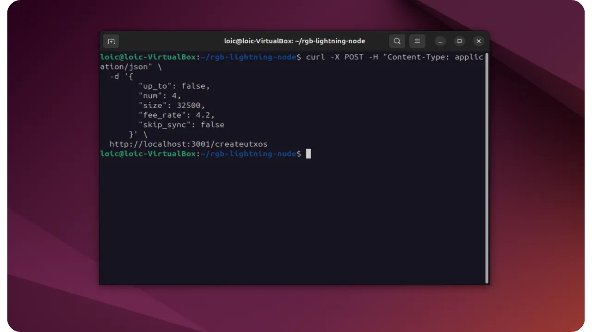


Birumvikana ko ushobora guhindura urutonde rw’ibintu. Kugira twemeze ugucuruza, ducukura a:


```bash
./regtest.sh mine 1
```


Ubu turashobora kurema umutungo wa RGB. Itegeko rizovana n'ubwoko bw'umutungo wipfuza kurema n'imirongo yawo. Aha ndiko ndakora NIA (*Itunga Ridashobora Gufutwa*) token ryitwa "PBN" rifise Supply y'ibice 1000. `Ugushikama` bigufasha gusobanura ukuntu ibice bishobora kugabanywa.


```bash
curl -X POST -H "Content-Type: application/json" \
-d '{
"amounts": [
1000
],
"ticker": "PBN",
"name": "Plan B Network",
"precision": 0
}' \
http://localhost:3001/issueassetnia
```


Inyishu irimwo ID y’umutungo mushasha waremwe. Ibuka kwandika iki kimenyetso. Mu vyerekeye jewe, ni:


```txt
rgb:fc7fMj5S-8yz!vIl-260BEhU-Hj1skvM-ZHcjfyz-RTcWc10
```


Ushobora rero kuyirungika On-Chain, canke ukayitanga mu murongo w’umuravyo. Ivyo nyene ni vyo tuzokora mu gice gikurikira.


### Gufungura umurongo no gutanga umutungo wa RGB


Utegerezwa kubanza gufatanya urudodo rwawe n'umugenzi kuri Lightning Network ukoresheje itegeko `/connectpeer`. Mu karorero kanje, ndagenzura izo node zompi. Rero nzogarura urufunguzo rwa bose rw'umurongo wanje wa kabiri w'umuravyo n'iri tegeko:


```bash
curl -X 'GET' \
'http://localhost:3002/nodeinfo' \
-H 'accept: application/json'
```


Itegeko rigarura urufunguzo rwa bose rw'uruzitiro rwanje n°2:


```txt
031e81e4c5c6b6a50cbf5d85b15dad720fec92c62e84bafb34088f0488e00a8e94
```


Ibikurikira, tuzofungura umurongo mu kugaragaza umutungo ubereye (`PBN`). Itegeko `/openchannel` rigufasha gusobanura ubunini bw'umurongo mu satoshis no guhitamwo gushiramwo umutungo wa RGB. Bivana n’ico ushaka kurema, ariko muri jewe, itegeko ni:


```bash
curl -X POST -H "Content-Type: application/json" \
-d '{
"peer_pubkey_and_opt_addr": "031e81e4c5c6b6a50cbf5d85b15dad720fec92c62e84bafb34088f0488e00a8e94@localhost:9736",
"capacity_sat": 1000000,
"push_msat": 10000000,
"asset_amount": 500,
"asset_id": "rgb:fc7fMj5S-8yz!vIl-260BEhU-Hj1skvM-ZHcjfyz-RTcWc10",
"public": true,
"with_anchors": true,
"fee_base_msat": 1000,
"fee_proportional_millionths": 0,
"temporary_channel_id": "a8b60c8ce3067b5fc881d4831323e24751daec3b64353c8df3205ec5d838f1c5"
}' \
http://localhost:3001/openchannel
```


Ibindi ubimenye hano:


- `peer_pubkey_and_opt_addr`: Ikimenyetso c'umugenzi twipfuza gufatanya (urufunguzo rwa bose twabonye mbere);
- `ubushobozi_sat`: Ubushobozi bwose bw'umurongo mu satoshis;
- `push_msat`: Amahera mu millisatoshis mu ntango yimuriwe ku mugenzi iyo umurongo ufunguwe (aha nca nshira 10.000 Sats kugira ngo ashobore gukora RGB yimurirwa mu nyuma);
- `asset_amount`: Umubare w'itunga rya RGB rizoshikirizwa umurongo;
- `asset_id`: Ikimenyetso kidasanzwe c'umutungo wa RGB ukora mu muhora;
- `public`: Igaragaza nimba umurongo ukwiye gushikirizwa abantu bose kugira ngo ukoreshe umurongo ku rubuga.


Kugira ngo bemeze ko ivyo bigurishwa, amabuye 6 aracukurwa:


```bash
./regtest.sh mine 6
```


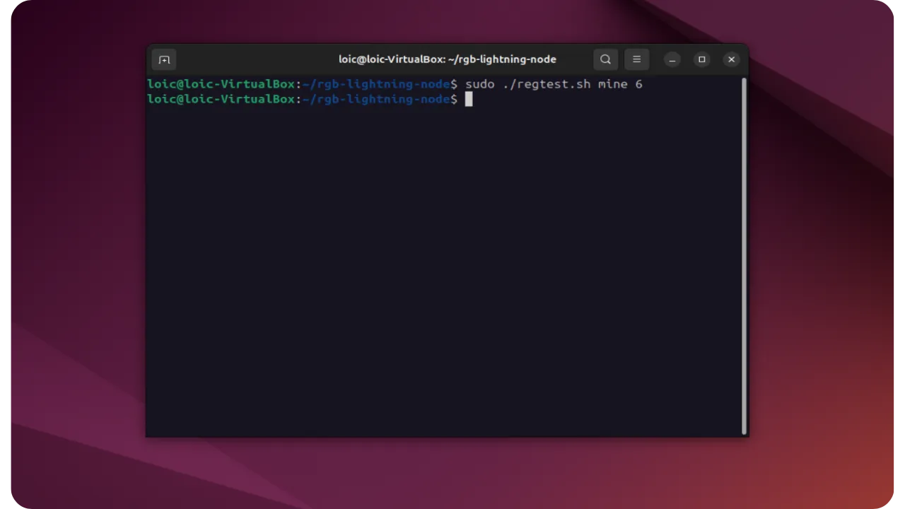


Umurongo w'umuravyo ubu warafunguye kandi urimwo n'ibimenyetso 500 vya `PBN` ku ruhande rwa node n°1. Niba urudodo n°2 rushaka kwakira ibimenyetso vya `PBN`, rutegerezwa kuba generate na Invoice. Ehe ingene wobikora:


```bash
curl -X POST -H "Content-Type: application/json" \
-d '{
"amt_msat": 3000000,
"expiry_sec": 420,
"asset_id": "rgb:fc7fMj5S-8yz!vIl-260BEhU-Hj1skvM-ZHcjfyz-RTcWc10",
"asset_amount": 100
}' \
http://localhost:3002/lninvoice
```


Hamwe:


- `amt_msat`: Amafaranga y’amafaranga 2422 mu bipimo vy’amamiliyoni (amafaranga 3000 y’amafaranga 2423);
- `igihe co guhera_isegonda`: Invoice igihe co guhera mu masegonda;
- `asset_id`: Ikimenyetso c'umutungo wa RGB ufitaniye isano n'umutungo wa Invoice;
- `umutungo_umubare`: Umubare w'umutungo wa RGB uzokwimurirwa n'iyi Invoice.


Mu kwishura, uzoronka RGB Invoice (nk’uko vyavuzwe mu bice vyabanje):


```txt
lnbcrt30u1pncgd4rdqud3jxktt5w46x7unfv9kz6mn0v3jsnp4qv0grex9c6m22r9ltkzmzhddwg87eykx96zt47e5pz8sfz8qp28fgpp5jksvqtleryhvwr299qdz96qxzm24augy5agkdhltudk463lt9dassp5d6n0sqgl0c4gx52fdmutrdtqamt0y4xuz2rcgel4hpjwne08gmls9qyysgqcqpcxqzdylz5wfnkywnxvvmkvnt2x4fj6wre0gshvjtv95ervvzzg4592t2gdgchx6mkf5k45jrrdfn8j73d2f2xx4mrxycq7qzry4v4jan6uxhhacyqa4gn6plggwpq9j74tu74f2zsamtz6ymt600p8su4c4ap9g9d8ku2x3wdh6fuc8fd8pff2yzpjrf24ys3cltca9fgqut6gzj
```


Ubu tuzoriha iyi Invoice kuva ku nzira ya mbere, ifise amahera akenewe n'iyi `PBN` token:


```bash
curl -X POST -H "Content-Type: application/json" \
-d '{
"invoice": "lnbcrt30u1pncgd4rdqud3jxktt5w46x7unfv9kz6mn0v3jsnp4qv0grex9c6m22r9ltkzmzhddwg87eykx96zt47e5pz8sfz8qp28fgpp5jksvqtleryhvwr299qdz96qxzm24augy5agkdhltudk463lt9dassp5d6n0sqgl0c4gx52fdmutrdtqamt0y4xuz2rcgel4hpjwne08gmls9qyysgqcqpcxqzdylz5wfnkywnxvvmkvnt2x4fj6wre0gshvjtv95ervvzzg4592t2gdgchx6mkf5k45jrrdfn8j73d2f2xx4mrxycq7qzry4v4jan6uxhhacyqa4gn6plggwpq9j74tu74f2zsamtz6ymt600p8su4c4ap9g9d8ku2x3wdh6fuc8fd8pff2yzpjrf24ys3cltca9fgqut6gzj"
}' \
http://localhost:3001/sendpayment
```


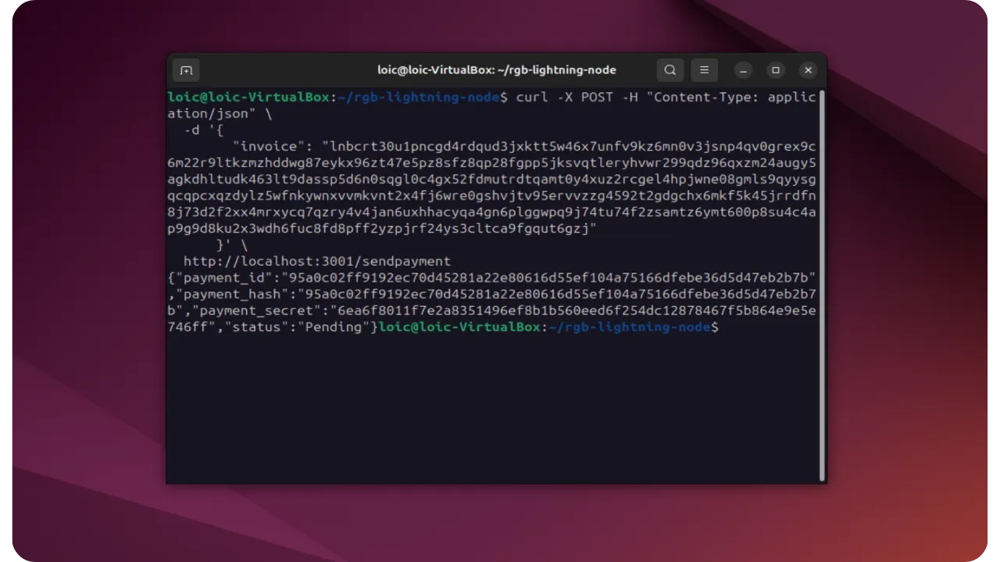


Ukwishurwa kwarakozwe. Ivyo bishobora kugenzurwa mu gushitsa itegeko:


```bash
curl -X 'GET' \
'http://localhost:3001/listpayments' \
-H 'accept: application/json'
```


Ehe ingene wokoresha urudodo rwa Lightning rwahinduwe kugira ngo rutware itunga rya RGB. Iryo yerekanwa rishingiye kuri:


- Ibidukikije vy'igerageza (biciye muri `./igerageza.sh`) canke Testnet;
- Igikoresho c'umuravyo (`RGB-igikoresho-c'umuravyo`) gishingiye kuri `bitcoind`, urutonde n'umurongo w'umuravyo`;
- Urutonde rwa JSON REST APIs zo gufungura/gufunga imirongo, gutanga ibimenyetso, gutanga umutungo biciye ku muravyo, n'ibindi.


Urakoze kuri iyi nzira:


- Ivy’ugukorana n’umuravyo birimwo igisohoka c’inyongera (OP_RETURN canke Taproot) n’ugushinga intahe kw’ihinduka rya RGB;
- Ivyo kwimurira amahera bikorwa mu buryo bumwe nyene n’ubw’amahera ya kera y’umuravyo, ariko hakaba hakongerwako RGB token;
- Ivyiyumviro vyinshi vya RLN birashobora guhuzwa n’inzira no kugerageza kwishura mu vyiyumviro vyinshi, igihe cose hariho amahera ahagije mu bitcoins no mu mutungo RGB ku nzira.


Umugambi uguma mu rwego rwa alpha. Ni vyiza rero cane ko wigarukira ku bidukikije vyo kugerageza (regtest, Testnet).


Amahirwe yuguruwe n’iyi nzira y’uguhuza LN-RGB ni menshi cane: stablecoins kuri Lightning, DEX Layer-2, gutanga ibimenyetso bishobora guhinduka canke NFTs ku giciro gito cane... Ibice vyabanje vyarerekanye ubuhinga bwo kwubaka ivyiyumviro n’ubuhinga bwo kwemeza. Ubu ufise iciyumviro ngirakamaro c’ingene wotuma mwene iyo node ikora, ku bijanye n’iterambere canke ibigeragezo vyawe vyo muri kazoza.


# Igice ca nyuma


<partId>b0baebfc-d146-5938-849a-f835fafb386f</partId>


## Amasuzuma n'Ibipimo


<chapterId>0217e8b0-942a-5fee-bd91-9a866551eff3</chapterId>


<isCourseReview>true</isCourseReview>

## Iciyumviro


<chapterId>0309536d-c336-56a0-869e-a8395ed8d9ae</chapterId>


<isCourseConclusion>true</isCourseConclusion>