# Un Viaggio nel Cuore dei wallet Bitcoin

Scopri i segreti dei wallet Bitcoin gerarchico-deterministici con il nostro corso CYP201! Che tu sia un utente o un appassionato che cerca di approfondire la conoscenza, questo corso offre un'immersione completa nel funzionamento di questi strumenti che tutti noi usiamo quotidianamente.

Impara i meccanismi delle funzioni hash, delle firme digitali (ECDSA e Schnorr), delle frasi mnemoniche, delle chiavi crittografiche e della creazione di indirizzi di ricezione, esplorando al contempo strategie di sicurezza avanzate.

Questo corso ti farà comprendere la struttura di un wallet Bitcoin, ma non solo: ti preparerà anche di immergerti nell'affascinante mondo della crittografia.

Con una chiara pedagogia, oltre 60 diagrammi esplicativi e esempi concreti, CYP201 ti permetterà di capire dalla A alla Z come funziona il tuo wallet, così da poter navigare l'universo Bitcoin con fiducia. Prendi il controllo dei tuoi UTXO oggi, comprendendo come funzionano i wallet HD!

+++

# Introduzione

<partId>32960669-d13a-592f-a053-37f70b997cbf</partId>

## Introduzione al Corso

<chapterId>fb4e8857-ea35-5a8a-ae8a-5300234e0104</chapterId>

:::video id=8028e727-cd5d-4593-a946-a89bfa26f617:::

Benvenuto al corso CYP201, dove esploreremo a fondo il funzionamento dei wallet gerarchico-deterministici. Questo corso è progettato per chiunque voglia comprendere le basi tecniche dell'uso di Bitcoin, sia che si tratti di utenti occasionali, appassionati illuminati o futuri esperti.

L'obiettivo di questa formazione è fornirti le chiavi per padroneggiare gli strumenti che utilizzi quotidianamente. I wallet HD, che sono al centro della tua esperienza utente, si basano su concetti a volte complessi, che cercheremo di rendere accessibili. Insieme semplificheremo questa difficoltà!

Prima di immergerci nei dettagli della costruzione e del funzionamento dei wallet Bitcoin, inizieremo con alcuni capitoli sulle primitive crittografiche da conoscere, necessarie per proseguire. Inizieremo con le funzioni hash crittografiche, fondamentali sia per i wallet sia per il protocollo Bitcoin stesso. Scoprirai le loro principali caratteristiche, le funzioni specifiche utilizzate in Bitcoin e, in un capitolo più tecnico, imparerai in dettaglio il funzionamento della regina delle funzioni hash: SHA256.

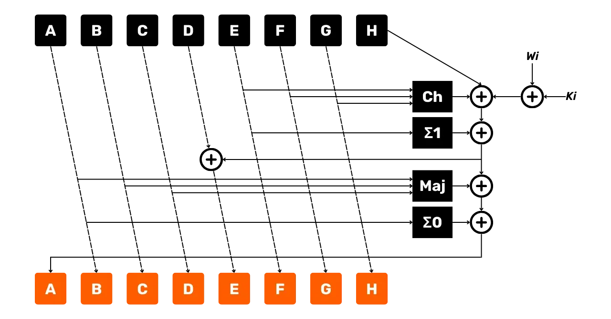

Successivamente, discuteremo il funzionamento degli algoritmi di firma digitale che utilizzi ogni giorno per proteggere i tuoi UTXO. Bitcoin ne utilizza due: ECDSA e il protocollo Schnorr. Imparerai le primitive matematiche alla base di questi algoritmi e come garantiscono la sicurezza delle transazioni.

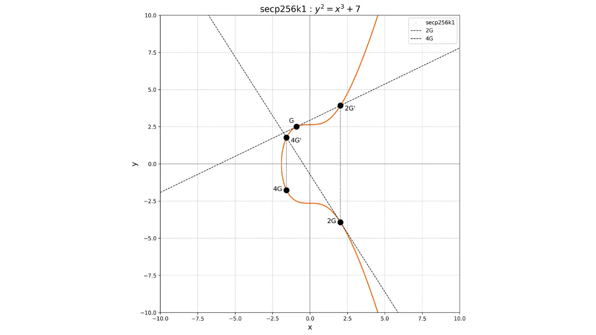

Una volta acquisita una buona comprensione di questi elementi di crittografia, passeremo finalmente al cuore del corso: i wallet gerarchico-deterministici! Prima, c'è una sezione dedicata alle frasi mnemoniche, le sequenze di 12 o 24 parole che ti permettono di creare e ripristinare i wallet. Scoprirai come queste parole vengono generate da una fonte di entropia e come facilitano l'uso di Bitcoin.


La formazione continuerà con lo studio della passphrase BIP39, il seed (da non confondere con la frase mnemonica), la master chain code e la master key. Vedremo in dettaglio cosa sono questi elementi, i loro rispettivi ruoli e come vengono calcolati.

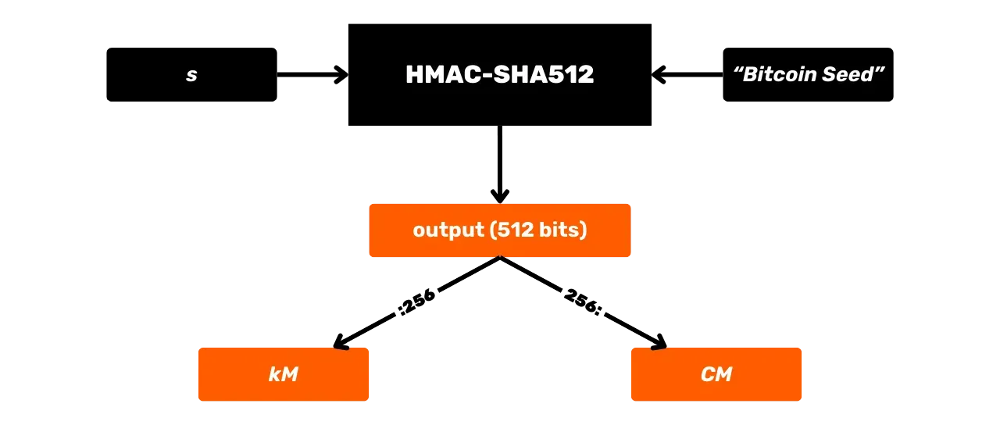

Infine, partendo dalla master key, scopriremo come vengono derivate le coppie di chiavi crittografiche, in modo gerarchico e deterministico, fino agli indirizzi di ricezione.


CYP201 ti permetterà di utilizzare il tuo software wallet con fiducia, migliorando al contempo le tue capacità di riconoscere e mitigare i rischi. Preparati a diventare un vero esperto di wallet Bitcoin!

Questa tabella vi offre una traduzione dei principali termini inglesi utilizzati, al fine di agevolare la comprensione degli schemi e dei documenti tecnici impiegati nell'ambito del corso CYP 201.

| Inglese         | Traduzione / Spiegazione                                                                           |
| --------------- | -------------------------------------------------------------------------------------------------- |
| *pubkey hash*   | Hash della chiave pubblica (usato per generare un indirizzo Bitcoin).                              |
| *public key*    | Chiave pubblica (serve a ricevere fondi, derivata dalla chiave privata).                           |
| *signature*     | Firma digitale (prova crittografica che un messaggio proviene dal titolare di una chiave privata). |
| *scriptPubKey*  | Script di blocco (definisce le condizioni per spendere un'uscita).                                 |
| *scriptSig*     | Script di sblocco (fornisce i dati per soddisfare il *scriptPubKey*).                              |
| *Stack*         | Stack di esecuzione (struttura dati utilizzata da *Bitcoin Script*).                               |
| *input*         | Input di una transazione (riferimento a un'uscita precedente usata come fonte).                    |
| *output*        | Output di una transazione (definisce il destinatario e l'importo).                                 |
| *transaction*   | Transazione Bitcoin (insieme di input e output che convalidano un trasferimento).                  |
| *XOR*           | Operatore logico "OR esclusivo", usato in alcuni schemi crittografici.                             |
| *HMAC*          | Codice di autenticazione dei messaggi basato su un hash e una chiave segreta.                      |
| *ECDSA*         | Algoritmo di firma digitale a curva ellittica.                                                     |
| *hash*          | Hash (impronta digitale unica e fissa di un dato).                                                 |
| *SigHash*       | Tipo di hash della firma (definisce quali parti di una transazione vengono firmate).               |
| *HD Wallet*     | Portafoglio deterministico gerarchico (genera più chiavi da un unico seme).                        |
| *Random Number* | Numero casuale (usato per generare chiavi private sicure).                                         |
| *State*         | Stato (valore intermedio in un processo crittografico).                                            |
| *Entropy*       | Entropia (misura della casualità, usata per generare semi del portafoglio).                        |
| *Mnemonic*      | Mnemonico (sequenza di parole che facilita il backup e il ripristino di un seme).                  |
| *Wordlist*      | Elenco di parole (insieme predefinito usato per generare mnemonici BIP39).                         |
| *Seed*          | Seme (valore iniziale che consente di derivare tutte le chiavi di un HD Wallet).                   |
| *Address*       | Indirizzo Bitcoin (identificatore leggibile per ricevere fondi, derivato dalla chiave pubblica).   |
| *Leaf*          | Foglia (nodo terminale in un albero di derivazione).                                               |

# Funzioni Hash

<partId>3713fee1-2ec2-512e-9e97-b6da9e4d2f17</partId>

## Introduzione alle Funzioni Hash

<chapterId>dba011f5-1805-5a48-ac2b-4bd637c93703</chapterId>

:::video id=f36528c9-9ab0-4037-a413-b16c204d5cc8:::

Il primo tipo di algoritmi crittografici utilizzati in Bitcoin comprende le funzioni hash. Esse svolgono un ruolo essenziale a diversi livelli del protocollo e all'interno dei wallet. Scopriamo insieme cosa è una funzione hash, nonché come viene usata in Bitcoin.

### Definizione e Principio di Hashing

L'hashing è un processo che trasforma informazioni di lunghezza arbitraria in un'altra informazione di lunghezza fissa attraverso una funzione hash crittografica. In altre parole, una funzione hash prende un input di qualsiasi dimensione e lo converte in un'impronta digitale di dimensione fissa, chiamata "hash".
L'hash può anche essere talvolta definito come "digest", "condensed", o "hashed".

La funzione hash SHA256, ad esempio, produce un hash di lunghezza fissa di 256 bit. Se usiamo l'input "_PlanB_", un messaggio di lunghezza arbitraria, l'hash generato sarà la seguente impronta digitale di 256 bit:

```text
24f1b93b68026bfc24f5c8265f287b4c940fb1664b0d75053589d7a4f821b688
```


### Caratteristiche delle Funzioni Hash

Queste funzioni hash crittografiche hanno diverse caratteristiche essenziali che le rendono particolarmente utili nel contesto di Bitcoin e altri sistemi informatici:

- Irreversibilità (o resistenza alla preimmagine)
- Resistenza alla manomissione (effetto valanga)
- Resistenza alle collisioni
- Resistenza alla seconda preimmagine

#### 1. Irreversibilità (resistenza alla preimmagine):

Irreversibilità significa che è facile calcolare l'hash a partire dalle informazioni in input, ma il calcolo inverso, ovvero trovare l'input partendo dall'hash, è praticamente impossibile. Questa proprietà rende le funzioni di hash perfette per creare impronte digitali uniche senza compromettere le informazioni originali. Questa caratteristica viene spesso definita funzione unidirezionale

Nell'esempio dato, ottenere l'hash `24f1b9…` conoscendo l'input "_PlanB_" è semplice e veloce. Tuttavia, trovare il messaggio "_PlanB_" conoscendo solo `24f1b9…` è impossibile.


È pertanto impossibile trovare una preimmagine $m$ per un hash $h$ tale per cui $h = \text{HASH}(m)$, dove $\text{HASH}$ è una funzione hash crittografica.

#### 2. Resistenza alla manomissione (effetto valanga)

La seconda caratteristica è la resistenza alla manomissione, nota anche come **effetto valanga**. Questa caratteristica si osserva in una funzione hash perché un minimo cambiamento nel messaggio di input comporta un radicale cambiamento nell'hash di output.

Se torniamo al nostro esempio con l'input "_PlanB_" e la funzione SHA256, abbiamo visto che l'hash generato è il seguente:

```text
24f1b93b68026bfc24f5c8265f287b4c940fb1664b0d75053589d7a4f821b688
```

Se facciamo un cambiamento molto lieve all'input usando questa volta "_Planb_", il semplice passaggio da una "B" maiuscola a una "b" minuscola altera completamente l'output dell'hash SHA256:

```text
bb038b4503ac5d90e1205788b00f8f314583c5e22f72bec84b8735ba5a36df3f
```

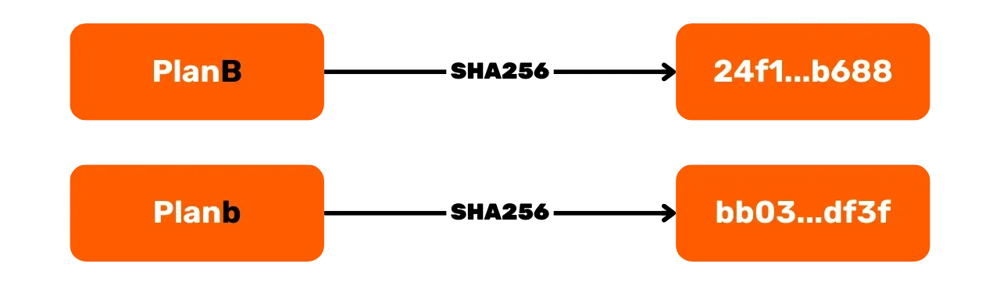

Questa proprietà garantisce che la seppur minima alterazione del messaggio originale diventa immediatamente rilevabile, poiché non cambia solo una piccola parte dell'hash, ma l'intero output. Questo può essere di interesse in vari campi per verificare l'integrità di messaggi, software o anche transazioni Bitcoin.

#### 3. Resistenza alle Collisioni

La terza caratteristica è la resistenza alle collisioni. Una funzione hash è resistente alle collisioni se è computazionalmente impossibile trovare 2 messaggi diversi che producono lo stesso output dalla funzione di hash. Formalmente, è difficile trovare due messaggi distinti $m_1$ e $m_2$ tali per cui:

$$
\text{HASH}(m_1) = \text{HASH}(m_2)
$$

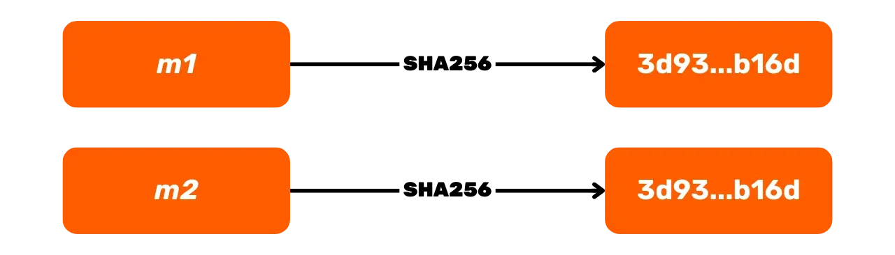

In realtà è matematicamente inevitabile che esistano collisioni per le funzioni hash, perché la quantità degli input può essere maggiore ai possibili output. Questo è noto come il principio dei cassetti di Dirichlet: se $n$ oggetti sono distribuiti in $m$ cassetti, con $m < n$, allora almeno un cassetto conterrà necessariamente due o più oggetti. Per una funzione hash, questo principio si applica perché il numero di messaggi possibili è (quasi) infinito, mentre il numero di hash possibili è finito ($2^{256}$ nel caso di SHA256).

Non significa che non ci siano collisioni per le funzioni hash, ma piuttosto che una buona funzione hash rende trascurabile la probabilità di trovare una collisione. Questa caratteristica, ad esempio, non è più verificata sugli algoritmi SHA-0 e SHA-1, predecessori di SHA-2, per i quali sono state trovate collisioni. SHA-0 e SHA-1 sono quindi ora sconsigliate e spesso considerate obsolete.
Per una funzione hash di $n$ bit, la resistenza alle collisioni è dell'ordine di $2^{\frac{n}{2}}$, in conformità con l'attacco del compleanno. Ad esempio, per SHA256 ($n = 256$), la complessità di trovare una collisione è dell'ordine di $2^{128}$ tentativi. In termini pratici, ciò significa che, per trovare una collisione, si devono passare $2^{128}$ messaggi diversi attraverso la funzione.

#### 4. Resistenza alla Seconda Preimmagine

La resistenza alla seconda preimmagine è un'altra caratteristica importante delle funzioni hash. Afferma che, dato un messaggio $m_1$ e il suo hash $h$, è computazionalmente impraticabile trovare un altro messaggio $m_2 \neq m_1$ tale per cui:

$$
\text{HASH}(m_1) = \text{HASH}(m_2)
$$

La resistenza alla seconda preimmagine è in qualche modo simile alla resistenza alle collisioni, eccetto che qui l'attacco è più difficile, perché l'attaccante non può scegliere liberamente $m_1$.

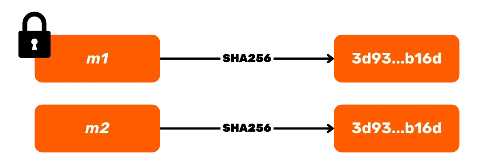

### Applicazioni delle Funzioni Hash in Bitcoin

La funzione hash più utilizzata nel protocollo Bitcoin è **SHA256** ("_Secure Hash Algorithm 256 bits"_). Progettata all'inizio degli anni 2000 dalla NSA e standardizzata dal NIST, produce come output un hash di 256 bit.

Questa funzione è utilizzata in molti ambiti di Bitcoin. A livello del protocollo, è coinvolta nel meccanismo di Proof-of-Work, dove viene applicata in un doppio hashing per cercare una parziale collisione tra l'header di un blocco candidato (creato da un miner) e il target di difficoltà. Se questa parziale collisione viene trovata, il blocco candidato diventa valido e può essere aggiunto alla blockchain.

SHA256 è anche utilizzata nella costruzione di un Merkle Tree, che è il sistema usato per registrare le transazioni nei blocchi. Questa struttura si trova anche nel protocollo Utreexo, che permette di ridurre la dimensione dell'UTXO Set. Con l'introduzione di Taproot nel 2021, inoltre, SHA256 è sfruttato in MAST (_Merkelised Alternative Script Tree_), che permette di rivelare solo le condizioni di spesa effettivamente utilizzate in uno script, senza divulgare le altre opzioni possibili. È anche utilizzato nel calcolo degli identificatori di transazione, nella trasmissione di pacchetti sulla rete P2P, nelle firme digitali... Infine e questo è di particolare interesse in questa formazione, SHA256 è utilizzato a livello applicativo per la generazione dei wallet e la derivazione di indirizzi.

La maggior parte delle volte, quando si incontra l'uso di SHA256 in Bitcoin, si tratta di un doppio hash SHA256, notato "**HASH256**", che consiste semplicemente nell'applicare SHA256 due volte consecutivamente:

HASH256(m) = SHA256(SHA256(m))

Anche se oggi un singolo SHA256 è considerato crittograficamente sicuro, questa pratica del doppio hashing aggiunge un ulteriore strato di sicurezza contro certi potenziali attacchi.

Un'altra funzione hash disponibile nel linguaggio Script, utilizzata per derivare indirizzi di ricezione, è la funzione RIPEMD160. Questa funzione produce un hash di 160 bit (quindi più corto di SHA256) ed è generalmente combinata con SHA256 per formare la funzione HASH160:

$$
\text{HASH160}(m) = \text{RIPEMD160}(\text{SHA256}(m))
$$

La combinazione è utilizzata per generare hash più corti, in particolare nella creazione di certi indirizzi Bitcoin che rappresentano hash di chiavi o hash di script, così come per produrre impronte digitali delle chiavi.

Infine, solo a livello applicativo, talvolta viene utilizzata anche la funzione SHA512, che gioca indirettamente un ruolo nella derivazione delle chiavi per i wallet. Tale funzione è molto simile a SHA256 nel suo funzionamento; entrambe appartengono alla stessa famiglia SHA2, ma SHA512 produce, come indica il nome, un hash di 512 bit rispetto ai 256 bit di SHA256. Ne dettaglieremo l'uso nei capitoli successivi.

Ora conosci le basi essenziali sulle funzioni di hashing per seguire la formazione. Nel prossimo capitolo propongo di scoprire più in dettaglio il funzionamento della funzione che è al cuore di Bitcoin: SHA256. Lo dissezioneremo per capire come raggiunge le caratteristiche che abbiamo descritto qui. Il prossimo capitolo è piuttosto lungo e tecnico, ma non è essenziale per seguire il resto della formazione. Quindi, se hai difficoltà a comprenderlo, non preoccuparti e passa direttamente al capitolo seguente, che sarà molto più accessibile.

## Il Funzionamento Interno di SHA256

<chapterId>905eb320-f15b-5fb6-8d2d-5bb447337deb</chapterId>

:::video id=2e4a42df-4b49-47ff-b6bc-9bcaa53bc82f:::

Abbiamo precedentemente visto che le funzioni di hashing possiedono importanti caratteristiche che giustificano il loro uso nel protocollo Bitcoin. Esaminiamo ora i meccanismi interni di queste funzioni, che conferiscono loro queste proprietà e, per farlo, propongo di dissezionare il funzionamento di SHA256.
Le funzioni SHA256 e SHA512 appartengono alla stessa famiglia SHA2. Il loro meccanismo si basa su una costruzione specifica chiamata **Merkle-Damgård construction**. Anche RIPEMD160 utilizza questo stesso tipo di costruzione.

Come promemoria, abbiamo un messaggio di dimensione arbitraria come input per SHA256, e lo passeremo attraverso la funzione per ottenere un hash di 256 bit come output.

### Pre-elaborazione dell'input

Come prima cosa dobbiamo preparare il nostro messaggio di input $m$ in modo che abbia una lunghezza standard che sia un multiplo di 512 bit. Questo passaggio è cruciale per il corretto funzionamento dell'algoritmo nelle fasi successive.
Per fare ciò, si inizia con una fase, che prevede l'aggiunta di bit di padding. Aggiungiamo prima un bit separatore `1` al messaggio, seguito da un certo numero di bit `0`. Il numero di bit `0` aggiunti è calcolato in modo che la lunghezza totale del messaggio dopo questa aggiunta sia congruente a 448 modulo 512. La lunghezza $L$ del messaggio con i bit di padding è uguale a:

$$
L \equiv 448 \mod 512
$$

$\text{mod}$, che sta per modulo, è un'operazione matematica che, tra due numeri interi, restituisce il resto della divisione euclidea del primo per il secondo. Per esempio: $16 \mod 5 = 1$. È un'operazione ampiamente utilizzata in crittografia.

Il padding assicura che, dopo aver aggiunto i 64 bit nel passaggio successivo, la lunghezza totale del messaggio equalizzato sarà un multiplo di 512 bit. Se il messaggio iniziale ha una lunghezza di $M$ bit, il numero ($N$) di bit `0` da aggiungere è quindi:

$$
N = (448 - (M + 1) \mod 512) \mod 512
$$

Per esempio, se il messaggio iniziale è di 950 bit, il calcolo sarebbe il seguente:

$$
\begin{align*}
M & = 950 \\
M + 1 & = 951 \\
(M + 1) \mod 512 & = 951 \mod 512 \\
& = 951 - 512 \cdot \left\lfloor \frac{951}{512} \right\rfloor \\
& = 951 - 512 \cdot 1 \\
& = 951 - 512 \\
& = 439 \\
\\
448 - (M + 1) \mod 512 & = 448 - 439 \\
& = 9 \\
\\
N & = (448 - (M + 1) \mod 512) \mod 512 \\
N & = 9 \mod 512 \\
& = 9
\end{align*}
$$

Così, avremmo 9 `0` in aggiunta al separatore `1`. I nostri bit di padding da aggiungere direttamente dopo il nostro messaggio $M$ saranno quindi:

```text
1000 0000 00
```

Dopo aver aggiunto i bit di padding al nostro messaggio $M$, aggiungiamo anche una rappresentazione a 64 bit della lunghezza originale del messaggio $M$, espressa in binario. Questo consente alla funzione hash di essere sensibile all'ordine dei bit e alla lunghezza del messaggio.

Se torniamo al nostro esempio con un messaggio iniziale di 950 bit, convertiamo il numero decimale `950` in binario, ottenendo `1110 1101 10`. Completiamo questo numero con zeri alla base per raggiungere un totale di 64 bit. Nel nostro esempio, otteniamo:

```text
0000 0000 0000 0000 0000 0000 0000 0000 0000 0000 0000 0000 0000 0011 1011 0110
```

Questa dimensione viene aggiunta seguendo le necessità della fase di padding. Pertanto, il messaggio dopo la nostra pre-elaborazione consiste di tre parti:

- Il messaggio originale $M$;
- un bit `1` seguito da diversi bit `0` che completa il padding;
- una rappresentazione di 64 bit della lunghezza di $M$ per formare il padding con la dimensione.

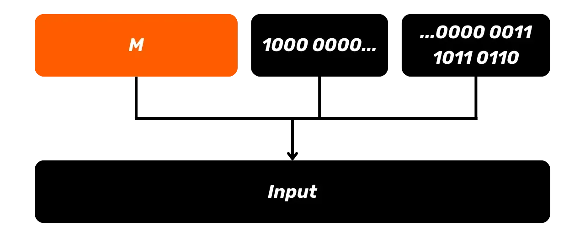

### Inizializzazione delle Variabili

SHA256 utilizza otto variabili di stato iniziali, indicate da $A$ a $H$, ognuna di 32 bit. Queste variabili sono inizializzate con costanti specifiche, che sono le parti frazionarie delle radici quadrate dei primi otto numeri primi. Utilizzeremo questi valori successivamente durante il processo di hashing:

- $A = 0x6a09e667$
- $B = 0xbb67ae85$
- $C = 0x3c6ef372$
- $D = 0xa54ff53a$
- $E = 0x510e527f$
- $F = 0x9b05688c$
- $G = 0x1f83d9ab$
- $H = 0x5be0cd19$

SHA256 utilizza anche altre 64 costanti, indicate da $K_0$ to $K_{63}$, che sono le parti frazionarie delle radici cubiche dei primi 64 numeri primi:

$$
K[0 \ldots 63] = \begin{pmatrix}
0x428a2f98, & 0x71374491, & 0xb5c0fbcf, & 0xe9b5dba5, \\
0x3956c25b, & 0x59f111f1, & 0x923f82a4, & 0xab1c5ed5, \\
0xd807aa98, & 0x12835b01, & 0x243185be, & 0x550c7dc3, \\
0x72be5d74, & 0x80deb1fe, & 0x9bdc06a7, & 0xc19bf174, \\
0xe49b69c1, & 0xefbe4786, & 0x0fc19dc6, & 0x240ca1cc, \\
0x2de92c6f, & 0x4a7484aa, & 0x5cb0a9dc, & 0x76f988da, \\
0x983e5152, & 0xa831c66d, & 0xb00327c8, & 0xbf597fc7, \\
0xc6e00bf3, & 0xd5a79147, & 0x06ca6351, & 0x14292967, \\
0x27b70a85, & 0x2e1b2138, & 0x4d2c6dfc, & 0x53380d13, \\
0x650a7354, & 0x766a0abb, & 0x81c2c92e, & 0x92722c85, \\
0xa2bfe8a1, & 0xa81a664b, & 0xc24b8b70, & 0xc76c51a3, \\
0xd192e819, & 0xd6990624, & 0xf40e3585, & 0x106aa070, \\
0x19a4c116, & 0x1e376c08, & 0x2748774c, & 0x34b0bcb5, \\
0x391c0cb3, & 0x4ed8aa4a, & 0x5b9cca4f, & 0x682e6ff3, \\
0x748f82ee, & 0x78a5636f, & 0x84c87814, & 0x8cc70208, \\
0x90befffa, & 0xa4506ceb, & 0xbef9a3f7, & 0xc67178f2
\end{pmatrix}
$$


### Divisione dell'Input

Ora che abbiamo un input equalizzato, passeremo alla fase più importante di elaborazione dell'algoritmo SHA256: la funzione di compressione. Questo passaggio è molto importante, poiché è questo che che conferisce principalmente alla funzione hash le sue proprietà crittografiche che abbiamo studiato nel capitolo precedente.

Iniziamo dividendo il nostro messaggio equalizzato (risultato dei passaggi di pre-elaborazione) in diversi blocchi $P$ da 512 bit ciascuno. Se il nostro messaggio equalizzato ha una dimensione totale di $n \times 512$ bit, avremo quindi $n$ blocchi, ciascuno di 512 bit. Ogni blocco da 512 bit sarà elaborato individualmente dalla funzione di compressione, che consiste in 64 round di operazioni successive. Chiamiamo questi blocchi $P_1$, $P_2$, $P_3$...

### Operazioni Logiche

Prima di esplorare in dettaglio la funzione di compressione, è importante comprendere le operazioni logiche di base utilizzate. Queste operazioni, basate sull'algebra booleana, operano a livello di bit. Le operazioni logiche di base utilizzate sono:
- **Congiunzione (AND)**: denotata $\le$, corrisponde a un "AND" logico.
- **Disgiunzione (OR)**: denotata $\lor$, corrisponde a un "OR" logico.
- **Negazione (NOT)**: denotata $\lnot$, corrisponde a un "NOT" logico.

Da queste operazioni di base possiamo definire operazioni più complesse, come "Exclusive OR" (XOR) denotato $\oplus$, ampiamente utilizzato in crittografia.
Ogni operazione logica può essere rappresentata da una tabella di riscontro, che indica il risultato per tutte le possibili combinazioni di valori di input binari (due operandi $p$ e $q$).
Per XOR ($\oplus$):

| $p$ | $q$ | $p \oplus q$ |
| --- | --- | ------------ |
| 0   | 0   | 0            |
| 0   | 1   | 1            |
| 1   | 0   | 1            |
| 1   | 1   | 0            |

Per AND ($\le$):

| $p$ | $q$ | $p \le q$ |
| --- | --- | ----------- |
| 0   | 0   | 0           |
| 0   | 1   | 0           |
| 1   | 0   | 0           |
| 1   | 1   | 1           |

Per NOT ($\lnot p$):

| $p$ | $\lnot p$ |
| --- | --------- |
| 0   | 1         |
| 1   | 0         |

Prendiamo un esempio per capire il funzionamento di XOR a livello di bit. Se abbiamo due numeri binari di 6 bit:

- $a = 101100$
- $b = 001000$

Avremo:


$$

a \oplus b = 101100 \oplus 001000 = 100100


$$


Applicando XOR bit per bit:

| Posizione Bit | $a$ | $b$ | $a \oplus b$ |
| ------------ | --- | --- | ------------ |
| 1            | 1   | 0   | 1            |
| 2            | 0   | 0   | 0            |
| 3            | 1   | 1   | 0            |
| 4            | 1   | 0   | 1            |
| 5            | 0   | 0   | 0            |
| 6            | 0   | 0   | 0            |

Il risultato è quindi $100100$.

Oltre alle operazioni logiche, la funzione di compressione utilizza operazioni di bit-shifting, che giocano un ruolo essenziale nel far girare i bit nell'algoritmo.

Prima di tutto, c'è l'operazione logical-right-shift, denotata $ShR_n(x)$, che sposta tutti i bit di $x$ a destra di $n$ posizioni, riempiendo con zeri i bit lasciati vuoti a sinistra.

Per esempio, per $x = 101100001$ (su 9 bit) e $n = 4$:

$$

ShR_4(101100001) = 000010110


$$

Schematicamente, l'operazione di logical-right-shift potrebbe essere vista così:

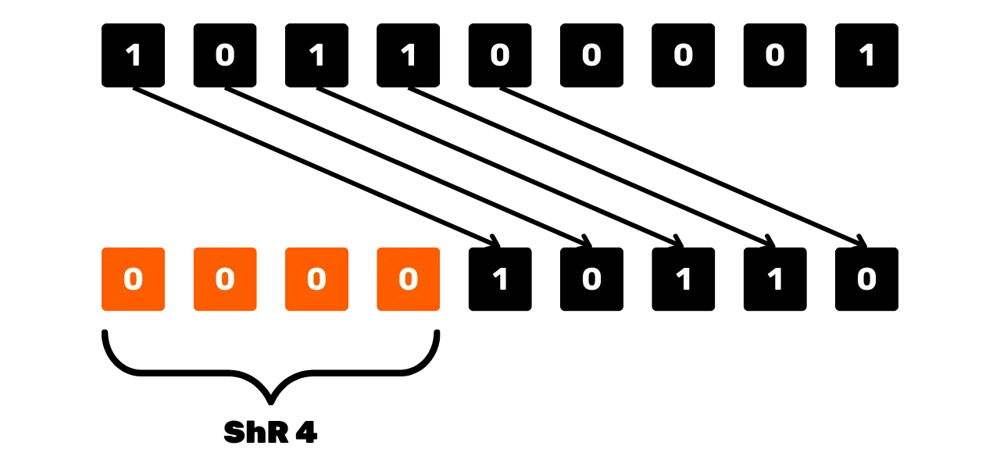

Un'altra operazione utilizzata in SHA256 per la manipolazione dei bit è right-circular-rotation, denotata $RotR_n(x)$, che sposta i bit di $x$ a destra di $n$ posizioni, reinserendo i bit spostati all'inizio della stringa.
Per esempio, per $x = 101100001$ (su 9 bit) e $n = 4$:

$$

RotR_4(101100001) = 000110110


$$

Schematicamente, l'operazione right-circular-rotation potrebbe essere vista così:

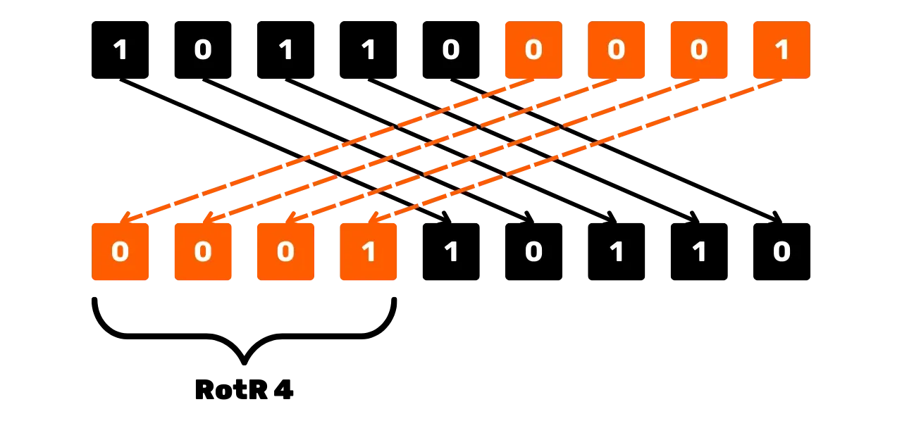

### Funzione di Compressione

Ora che abbiamo compreso le operazioni di base, esaminiamo in dettaglio la funzione di compressione per SHA256.

Nel passaggio precedente, abbiamo diviso il nostro input in diversi pezzi da 512 bit $P$. Per ogni blocco da 512 bit $P$, abbiamo:

- **Le parole del messaggio $W_i$**: con $i$ compreso tra 0 e 63.
- **Le costanti $K_i$**: con $i$ compreso tra 0 e 63, come definite nel passaggio precedente.
- **Le variabili di stato $A, B, C, D, E, F, G, H$**: inizializzate con i valori dal passaggio precedente.

Le prime 16 parole, da $W_0$ fino a $W_{15}$, sono estratte direttamente dal blocco elaborato di 512 bit $P$. Ogni parola $W_i$ consiste di 32 bit consecutivi del blocco. Quindi, ad esempio, prendiamo il nostro primo pezzo di input $P_1$, e lo dividiamo ulteriormente in pezzi più piccoli da 32 bit che chiamiamo parole.

Le successive 48 parole ($W_{16}$ fino a $W_{63}$) sono generate utilizzando la seguente formula:

$$
W_i = W_{i-16} + \sigma_0(W_{i-15}) + W_{i-7} + \sigma_1(W_{i-2}) \mod 2^{32}
$$

Con:

- $\sigma_0(x) = RotR_7(x) \oplus RotR_{18}(x) \oplus ShR_3(x)$
- $\sigma_1(x) = RotR_{17}(x) \oplus RotR_{19}(x) \oplus ShR_{10}(x)$

In questo caso, $x$ è uguale a $W_{i-15}$ per $\sigma_0(x)$ e $W_{i-2}$ per $\sigma_1(x)$.

Una volta determinate tutte le parole $W_i$ per il nostro blocco di 512 bit, possiamo passare alla funzione di compressione, che consiste nell'eseguire le operazioni 64 volte.

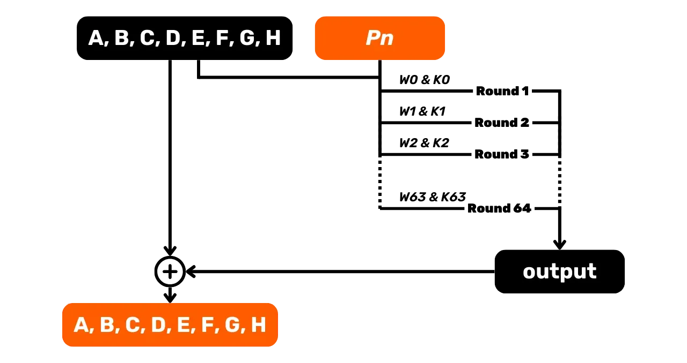
Per ogni round $i$ da 0 a 63, abbiamo tre diversi tipi di input. Primo, $W_i$ che abbiamo appena determinato, in parte costituito dal nostro pezzo di messaggio $P_n$. Successivamente, le 64 costanti $K_i$. Infine usiamo le variabili di stato $A$, $B$, $C$, $D$, $E$, $F$, $G$ e $H$, che cambieranno, evolvendosi, durante il processo di hashing per avere un valore diverso ad ogni round di compressione. Tuttavia, per il primo pezzo $P_1$, usiamo le costanti iniziali date in precedenza.

Eseguiamo quindi le seguenti operazioni sui nostri input:

- **Function $\Sigma_0$:**

$$
\Sigma_0(A) = RotR_2(A) \oplus RotR_{13}(A) \oplus RotR_{22}(A)


-- **Function $\Sigma_1$:**

$$
\Sigma_1(E) = RotR_6(E) \oplus RotR_{11}(E) \oplus RotR_{25}(E)
$$

- **Function $Ch$ ("_Choose_"):**

$$
Ch(E, F, G) = (E \le F) \oplus (\lnot E \le G)
$$

- **Function $Maj$ ("_Majority_"):**

$$
Maj(A, B, C) = (A \le B) \oplus (A \le C) \oplus (B \le C)
$$

Calcoliamo quindi 2 variabili temporanee:

- $temp1$:

$$
temp1 = H + \Sigma_1(E) + Ch(E, F, G) + K_i + W_i \mod 2^{32}
$$

- $temp2$:

$$
temp2 = \Sigma_0(A) + Maj(A, B, C) \mod 2^{32}
$$

Successivamente aggiorniamo le variabili di stato come segue:

$$
\begin{cases}
H = G \\
G = F \\
F = E \\
E = D + temp1 \mod 2^{32} \\
D = C \\
C = B \\
B = A \\
A = temp1 + temp2 \mod 2^{32}
\end{cases}
$$

Il diagramma seguente rappresenta un round della funzione di compressione SHA256 come appena descritto:


- Le frecce indicano il flusso dei dati;
- i riquadri rappresentano le operazioni eseguite;
- il simbolo $+$ circondato rappresenta l'addizione modulo $2^{32}$.

Possiamo già osservare che questo round produce nuove variabili di stato $A$, $B$, $C$, $D$, $E$, $F$, $G$ e $H$. Queste nuove variabili serviranno come input per il round successivo, che a sua volta produrrà nuove variabili $A$, $B$, $C$, $D$, $E$, $F$, $G$ e $H$, da utilizzare per il round seguente. Questo processo continua fino al 64° round.
Dopo i 64 round, aggiorniamo i valori iniziali delle variabili di stato aggiungendoli ai valori finali alla fine dell'ultimo round:

$$$
\begin{cases}
A = A_{\text{initial}} + A \mod 2^{32} \\
B = B_{\text{initial}} + B \mod 2^{32} \\
C = C_{\text{initial}} + C \mod 2^{32} \\
D = D_{\text{initial}} + D \mod 2^{32} \\
E = E_{\text{initial}} + E \mod 2^{32} \\
F = F_{\text{initial}} + F \mod 2^{32} \\
G = G_{\text{initial}} + G \mod 2^{32} \\
H = H_{\text{initial}} + H \mod 2^{32}
\end{cases}
$$

Questi valori di $A$, $B$, $C$, $D$, $E$, $F$, $G$ e $H$ risultanti dall'ultimo round, serviranno come valori iniziali per il blocco successivo, $P_2$. Per questo blocco $P_2$, replichiamo lo stesso processo di compressione con 64 round, poi aggiorniamo le variabili per il blocco $P_3$, e così via fino all'ultimo blocco del nostro input equalizzato.

Dopo aver processato tutti i blocchi del messaggio, concateniamo i valori finali delle variabili $A$, $B$, $C$, $D$, $E$, $F$, $G$ e $H$ per formare l'hash finale a 256 bit della nostra funzione di hashing:

$$

\text{Hash} = A \Vert B \Vert C \Vert D \Vert E \Vert F \Vert G \Vert H


$$

Ogni variabile è un intero a 32 bit, quindi la loro concatenazione produce sempre un risultato a 256 bit, indipendentemente dalla dimensione del nostro input dato inizialmente alla funzione di hashing.

### Come sono Rispettate le Proprietà Crittografiche

Ma allora, come è possibile che questa funzione sia irreversibile, resistente alle collisioni e resistente alle manomissioni?

Per la resistenza alle manomissioni, è abbastanza semplice da capire. Vengono eseguiti così tanti calcoli in cascata, che dipendono sia dall'input che dalle costanti, che la minima modifica del messaggio iniziale cambia completamente il percorso preso, e quindi cambia completamente l'hash di output. Questo è ciò che si chiama effetto valanga, proprietà in parte garantita dalla miscelazione degli stati intermedi con gli stati iniziali per ogni pezzo.
Successivamente, quando si discute di una funzione hash crittografica, il termine "irreversibilità" non è generalmente utilizzato. Si parla piuttosto di "resistenza alla pre-immagine", la quale specifica che, per un dato $y$, è difficile trovare un $x$ tale per cui $h(x) = y$. La resistenza alla pre-immagine è garantita dalla complessità algebrica e dalla forte non-linearità delle operazioni eseguite nella funzione di compressione, così come dalla perdita di certe informazioni nel processo. Ad esempio, per un dato risultato di un'addizione modulo, ci sono diversi operandi possibili:

$$

3+2 \mod 10 = 5 \\
7+8 \mod 10 = 5 \\
5+10 \mod 10 = 5


$$

In questo esempio, conoscendo solo il modulo utilizzato (10) e il risultato (5), non si può determinare con certezza quali siano gli operandi corretti utilizzati nell'addizione. Si dice che ci sono molteplici congruenze modulo 10.

Per l'operazione XOR ci troviamo di fronte al medesimo problema. Ricordiamo la tabella di riscontro per questa operazione: qualsiasi output a 1 bit può essere determinato da due diverse configurazioni di input che hanno esattamente la stessa probabilità di essere i valori corretti. Nessuno può pertanto determinare con certezza gli operandi di un XOR, conoscendo solo il suo risultato. Aumentando la dimensione degli operandi XOR, aumenta esponenzialmente il numero di input possibili, se si parte conoscendo solo il risultato finale. Oltretutto XOR è spesso utilizzato insieme ad altre operazioni a livello di bit, come l'operazione $\text{RotR}$, che aggiungono ancora più possibili interpretazioni al risultato.

La funzione di compressione utilizza anche l'operazione $\text{ShR}$, la quale rimuove una parte delle informazioni di base, che poi diventa impossibile recuperare in seguito. Ancora una volta, non esiste un modo per invertire questa operazione che sia lineare o algebrico. Tutte queste operazioni unidirezionali e di rimozione di informazioni sono utilizzate molto frequentemente nelle funzioni di compressione. Il numero di input possibili per un dato output è quindi pressoché infinito e ogni tentativo di calcolo inverso, porterebbe a equazioni con un numero molto elevato di incognite, destinato ad aumentare esponenzialmente ad ogni passo.

Infine, per rispettare la resistenza alle collisioni, entrano in gioco diversi parametri, con la pre-elaborazione del messaggio originale che gioca un ruolo essenziale. Senza la pre-elaborazione potrebbe essere più facile trovare collisioni sulla funzione. Anche se, teoricamente, le collisioni esistono (a causa del principio del buco della serratura), la struttura della funzione di hash, combinata con le proprietà sopra menzionate, rende la probabilità di trovare una collisione estremamente bassa.
Affinché una funzione hash sia resistente alle collisioni, è essenziale che:

- L'output sia imprevedibile: qualsiasi prevedibilità può essere sfruttata per trovare collisioni più velocemente di un attacco brute force. La funzione assicura che ogni bit dell'output dipenda in modo non banale dall'input. In altre parole: la funzione è progettata in modo che ogni bit del risultato finale abbia una probabilità indipendente di essere 0 o 1, anche se questa indipendenza non è assoluta nella pratica.
- La distribuzione degli hash sia pseudo-casuale: questo garantisce che gli hash siano uniformemente distribuiti.
- La dimensione dell'hash sia sostanziale: più grande è lo spazio possibile per i risultati, più difficile è trovare una collisione.

I crittografi progettano queste funzioni valutando i migliori attacchi possibili per trovare collisioni, poi aggiustando i parametri per rendere questi attacchi inefficaci.

### Costruzione di Merkle-Damgård

La struttura di SHA256 si basa sulla costruzione di Merkle-Damgård, che consente di trasformare una funzione di compressione in una funzione hash che può elaborare messaggi di lunghezza arbitraria. Questo è esattamente ciò che abbiamo appena visto.

Alcune vecchie funzioni hash come SHA1 o MD5, che utilizzano questa specifica costruzione, sono tuttavia vulnerabili agli attacchi di estensione della lunghezza, una è una tecnica che permette a un attaccante che conosce l'hash di un messaggio $M$ e la lunghezza di $M$ (senza conoscere il messaggio stesso) di calcolare l'hash di un messaggio $M'$ formato concatenando $M$ con contenuti aggiuntivi.

Anche se SHA256 utilizza lo stesso tipo di costruzione, è teoricamente resistente a questo tipo di attacco, a differenza di SHA1 e MD5. Questo potrebbe spiegare il mistero del doppio hashing implementato in tutto il protocollo Bitcoin da Satoshi Nakamoto. Per evitare questo tipo di attacco, Satoshi potrebbe aver preferito utilizzare un doppio SHA256:

$$

\text{HASH256}(m) = \text{SHA256}(\text{SHA256}(m))


$$

Il doppio hash migliora la sicurezza contro potenziali attacchi legati alla struttura di Merkle-Damgård, ma non aumenta la sicurezza del processo di hashing in termini di resistenza alle collisioni. Inoltre, anche se SHA256 fosse stato vulnerabile all'attacco dell'estensione della lunghezza, non avrebbe avuto un impatto grave, poiché tutti i casi d'uso delle funzioni hash in Bitcoin coinvolgono dati pubblici. Un attacco di estensione della lunghezza potrebbe essere utile per un attaccante, solo se i dati hashati sono privati e l'utente ha utilizzato la funzione hash come meccanismo di autenticazione per questi dati, simile a un MAC. L'implementazione del doppio hashing rimane un mistero nella progettazione di Bitcoin.
Ora che abbiamo esaminato in dettaglio il funzionamento delle funzioni hash, in particolare SHA256, che è ampiamente utilizzata in Bitcoin, ci concentreremo più specificamente sugli algoritmi di derivazione crittografica utilizzati a livello applicativo, specialmente per derivare le chiavi per il tuo wallet.

## Gli algoritmi utilizzati per la derivazione

<chapterId>cc668121-7789-5e99-bf5e-1ba085f4f5f2</chapterId>

:::video id=a5cf4eb3-e53f-4bff-aee4-de0ca6aab3b6:::

A livello applicativo, oltre alle funzioni hash, nel protocollo Bitcoin vengono utilizzati algoritmi di derivazione crittografica per generare dati sicuri a partire da input iniziali. Sebbene questi algoritmi si basino sulle funzioni hash, servono a scopi diversi, specialmente in termini di autenticazione e generazione di chiavi. Gli algoritmi che vedremo, mantengono alcune delle caratteristiche delle funzioni hash, come l'irreversibilità, la resistenza alla manomissione e la resistenza alle collisioni.

Nella generazione dei wallet Bitcoin vengono principalmente utilizzati 2 algoritmi di derivazione:

- **HMAC (_Hash-based Message Authentication Code_)**
- **PBKDF2 (_Password-Based Key Derivation Function 2_)**

Esploreremo insieme il funzionamento e il ruolo di ciascuno di essi.

### HMAC-SHA512

HMAC è un algoritmo crittografico che calcola un codice di autenticazione basato sulla combinazione di una funzione hash e una chiave segreta. Bitcoin utilizza HMAC-SHA512, la variante di HMAC che utilizza la funzione hash SHA512. Abbiamo già visto nel capitolo precedente che SHA512 fa parte della stessa famiglia di funzioni di SHA256, ma produce un output di 512 bit.

Ecco il suo schema operativo generale con $m$ che rappresenta il messaggio di input e $K$ una chiave segreta:


Studiamo in dettaglio cosa succede all'interno di questa scatola nera che è HMAC-SHA512. La funzione HMAC-SHA512 con:

- $m$: il messaggio di dimensione arbitraria scelto dall'utente (primo input);
- $K$: la chiave segreta arbitraria scelta dall'utente (secondo input);
- $K'$: la chiave $K$ equalizzata per adeguarsi alla dimensione $B$ dei blocchi della funzione hash (1024 bit per SHA512, o 128 byte);
- $\text{SHA512}$: la funzione hash SHA512;
- $\oplus$: l'operazione XOR (exclusive or);
- $\Vert$: l'operatore di concatenazione, che collega stringhe di bit da un'estremità all'altra;
- $\text{opad}$: costante composta dal byte $0x5c$ ripetuto 128 volte
- $\text{ipad}$: costante composta dal byte $0x36$ ripetuto 128 volte

  Prima di calcolare l'HMAC, è necessario equalizzare la chiave e le costanti secondo la dimensione del blocco $B$. Se la chiave $K$ è, ad esempio, più corta di 128 byte, viene riempita con zeri fino a raggiungere la dimensione $B$. Se $K$ è più lunga di 128 byte, viene compressa usando SHA512, e poi vengono aggiunti zeri fino a raggiungere 128 byte. In questo modo si ottiene una chiave equalizzata denominata $K'$. I valori di $\text{opad}$ e $\text{ipad}$ si ottengono ripetendo i loro differenti byte base ($0x5c$ per $\text{opad}$, $0x36$ per $\text{ipad}$) fino a raggiungere la dimensione $B$. Quindi, con $B = 128$ byte, abbiamo:

$$

\text{opad} = \underbrace{0x5c5c\ldots5c}\_{128 \  \text{bytes}}


$$

Una volta processato l'input, l'algoritmo HMAC-SHA512 è definito dalla seguente equazione:

$$

\text{HMAC-SHA512}(K,m) = \text{SHA512} \left( (K' \oplus \text{opad}) \parallel \text{SHA512} \left( (K' \oplus \text{ipad}) \parallel m \right) \right)


$$

L'equazione si scompone nei seguenti passaggi:

- XOR della chiave modificata $K'$ con $\text{ipad}$ per ottenere $\text{iKpad}$;
- XOR della chiave modificata $K'$ con $\text{opad}$ per ottenere $\text{oKpad}$;
- Concatenazione di $\text{iKpad}$ con il messaggio $m$.
- Hash di questo risultato con SHA512 per ottenere un hash intermedio $H_1$.
- Concatenazione di $\text{oKpad}$ con $H_1$.
- Hash di questo risultato con SHA512 per ottenere il risultato finale $H_2$.

Tutti i passaggi possono essere riassunti schematicamente come segue:

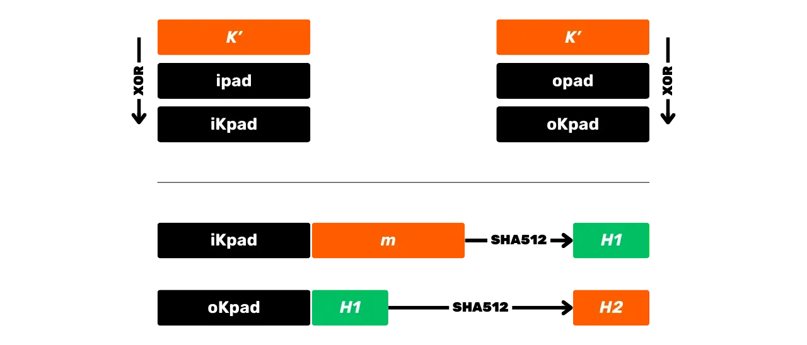

In Bitcoin, il risultato di HMAC è utilizzato in particolare per la derivazione delle chiavi nei wallet HD (gerarchico-deterministici, ne parleremo più dettagliatamente nei prossimi capitoli) e come componente di PBKDF2.

### PBKDF2

PBKDF2 (_Password-Based Key Derivation Function 2_) è un algoritmo di derivazione delle chiavi progettato per aumentare la sicurezza delle password. L'algoritmo applica alla password una funzione pseudo-randomica (in questo caso HMAC-SHA512) e un sale crittografico, per poi ripetere l'operazione un certo numero di volte, al fine di produrre una chiave.

In Bitcoin PBKDF2 è utilizzata per generare il seed di un wallet HD a partire da una frase mnemonica e una passphrase (ma ne parleremo più dettagliatamente nei prossimi capitoli).

Il processo PBKDF2 è il seguente, con:

- $m$: la frase mnemonica dell'utente;
- $s$: la passphrase opzionale per aumentare la sicurezza (campo vuoto se non c'è passphrase);
- $n$: il numero di iterazioni della funzione che, nel nostro caso, è 2048.

  La funzione PBKDF2 è definita iterativamente. Ogni iterazione prende il risultato della precedente, lo passa attraverso HMAC-SHA512 e combina i risultati successivi per produrre la chiave finale:

  $$

\text{PBKDF2}(m, s) = \text{HMAC-SHA512}^{2048}(m, s)


$$

Schematicamente, PBKDF2 può essere rappresentata come segue:

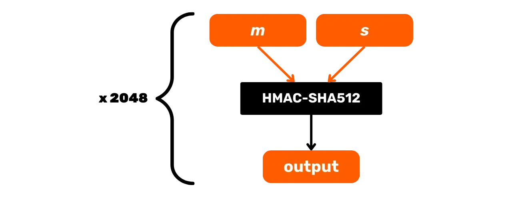

In questo capitolo, abbiamo esplorato le funzioni HMAC-SHA512 e PBKDF2, che utilizzano funzioni di hashing per garantire l'integrità e la sicurezza delle derivazioni di chiavi nel protocollo Bitcoin. Nella prossima parte, esamineremo le firme digitali, un altro metodo crittografico ampiamente utilizzato in Bitcoin.

# Firme Digitali

<partId>76b58a00-0c18-54b9-870d-6b7e34029db8</partId>

## Firme Digitali e Curve Ellittiche

<chapterId>c9dd9672-6da1-57f8-9871-8b28994d4c1a</chapterId>

:::video id=6d307c93-8c79-42e2-ac95-cfcb2a58889f:::

Il secondo processo crittografico utilizzato in Bitcoin coinvolge algoritmi di firma digitale. Esploriamo cosa comportano e come funzionano.

### Bitcoin, UTXO e Condizioni di Spesa

Il termine "_wallet_" in Bitcoin può generare confusione tra i principianti. Ciò che viene chiamato wallet Bitcoin è un software che non detiene direttamente i tuoi bitcoin, a differenza di un portafoglio fisico che può contenere monete o banconote. I Bitcoin sono semplicemente unità di conto, le quali sono rappresentate da **UTXO** (_Unspent Transaction Outputs_, ovvero output di transazione non spesi), ciò che sono esattamente. Se questi output non sono spesi, significa che appartengono a un utente. Gli UTXO sono, in un certo senso, importi espressi di bitcoin, di dimensione variabile, appartenenti a un utente.

Il protocollo Bitcoin è distribuito e opera senza un'autorità centrale. Pertanto non è come i registri bancari tradizionali, dove gli euro che ti appartengono sono semplicemente associati alla tua identità personale. Con Bitcoin gli UTXO ti appartengono perché sono protetti da condizioni di spesa specificate nel linguaggio Script. Per semplificare: esistono due tipi di script: lo script di blocco (_scriptPubKey_) che protegge un UTXO; e lo script di sblocco (_scriptSig_), che consente di sbloccare un UTXO e quindi spendere le unità di bitcoin che rappresenta.
Le primissime transazioni Bitcoin prevedevano gli script P2PK, ovvero l'uso di una chiave pubblica per bloccare i fondi, specificando in uno _scriptPubKey_ che la persona che desiderava spendere questo UTXO doveva fornire una firma valida, fatta con la chiave privata corrispondente a questa chiave pubblica. Per sbloccare questo UTXO era quindi necessario fornire una firma valida nello _scriptSig_. Come suggeriscono i loro nomi, la chiave pubblica è nota a tutti poiché viene trasmessa sulla blockchain, mentre la chiave privata è nota solo al legittimo proprietario dei fondi.
Questa è l'operazione di base di Bitcoin ma, nel tempo, è diventata più complessa. In primo luogo, Satoshi ha introdotto anche gli script P2PKH, che utilizzano un indirizzo di ricezione nello _scriptPubKey_, il quale rappresenta l'hash della chiave pubblica. Poi il sistema è diventato ancora più complesso, con l'arrivo di SegWit prima e di Taproot poi. Il principio generale rimane tuttavia lo stesso: una chiave pubblica, o una rappresentazione di essa, viene utilizzata per bloccare gli UTXO, poi una chiave privata corrispondente è necessaria per sbloccarli e quindi spenderli.

Un utente che desidera effettuare una transazione Bitcoin deve quindi creare una firma digitale utilizzando la propria chiave privata per la transazione in questione. La firma può essere verificata da altri partecipanti alla rete. Se è valida, ciò significa che l'utente che inizia la transazione è effettivamente il proprietario della chiave privata e, quindi, il proprietario dei bitcoin che desidera spendere. Altri utenti possono quindi accettare e propagare la transazione.

Ne consegue che un utente che possiede bitcoin, protetti con una chiave pubblica, deve trovare un modo per conservare in modo sicuro ciò che consente di sbloccare i propri fondi: la chiave privata. Un wallet Bitcoin è precisamente un dispositivo che ti permetterà di conservare facilmente tutte le tue chiavi senza che altre persone abbiano accesso ad esse. È quindi più simile a un portachiavi che a un wallet.

Il legame matematico tra una chiave pubblica e una chiave privata, così come la capacità di effettuare una firma per provare il possesso di una chiave privata senza rivelarla, sono resi possibili da un algoritmo di firma digitale. Nel protocollo Bitcoin vengono utilizzati 2 algoritmi di firma: **ECDSA** (_Elliptic Curve Digital Signature Algorithm_) e lo **schema di firma Schnorr**. ECDSA è il protocollo di firma digitale utilizzato in Bitcoin fin dai suoi inizi. Schnorr è più recente, poiché è stato introdotto nel novembre 2021 con l'aggiornamento Taproot.
Questi due algoritmi sono abbastanza simili nei loro meccanismi. Entrambi si basano sulla crittografia a curva ellittica. La principale differenza tra questi due protocolli risiede nella struttura della firma e in alcune proprietà matematiche specifiche. Studieremo ora il funzionamento di questi algoritmi, partendo dal più vecchio: ECDSA.

### Crittografia a Curva Ellittica

La Crittografia a Curva Ellittica (acronimo ECC da Elliptic Curve Cryptography) è un insieme di algoritmi che utilizzano una curva ellittica per le sue proprietà matematiche e geometriche a scopi crittografici. La sicurezza di questi algoritmi si basa sulla difficoltà del problema del logaritmo discreto sulle curve ellittiche. Le curve ellittiche sono utilizzate in particolare per gli scambi di chiavi, la crittografia asimmetrica o per la creazione di firme digitali.

Una proprietà importante di queste curve è che sono simmetriche rispetto all'asse x. Grazie a questo, ogni linea non verticale che taglia la curva in due punti distinti intersecherà la curva in un terzo punto. Inoltre, ogni tangente alla curva in un punto non singolo intersecherà la curva in un altro punto. Queste proprietà saranno utili per definire operazioni sulla curva.

Ecco una rappresentazione di una curva ellittica nel campo dei numeri reali:

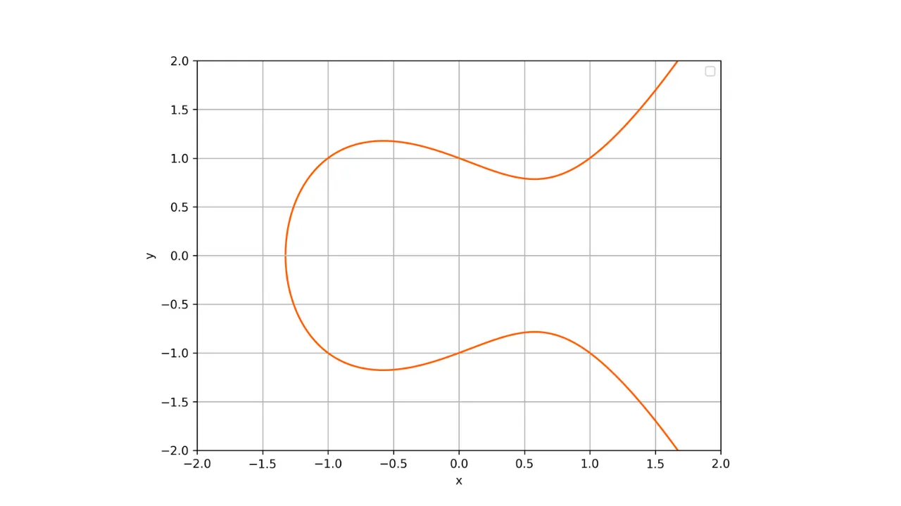

Ogni curva ellittica è definita da un'equazione della forma:

$$

y^2 = x^3 + ax + b


$$

### secp256k1

Per utilizzare ECDSA o Schnorr è necessario scegliere i parametri della curva ellittica, ovvero i valori di $a$ e $b$ nell'equazione della curva. Esistono diversi standard di curve ellittiche che hanno la reputazione di essere sicuri dal punto di vista crittografico. Il più noto è la curva _secp256r1_, definita e raccomandata dal NIST (_National Institute of Standards e Technology_).

Nonostante ciò, Satoshi Nakamoto, l'inventore di Bitcoin, ha scelto di non utilizzare questa curva. La ragione di questa scelta è sconosciuta, ma alcuni credono che abbia preferito trovare un'alternativa perché i parametri di questa curva potrebbero potenzialmente contenere un backdoor. Il protocollo Bitcoin utilizza pertanto lo standard **_secp256k1_**. Questa curva è definita dai parametri $a = 0$ e $b = 7$. La sua equazione è quindi:

$$

y^2 = x^3 + 7


$$

La rappresentazione grafica nel campo dei numeri reali appare così:

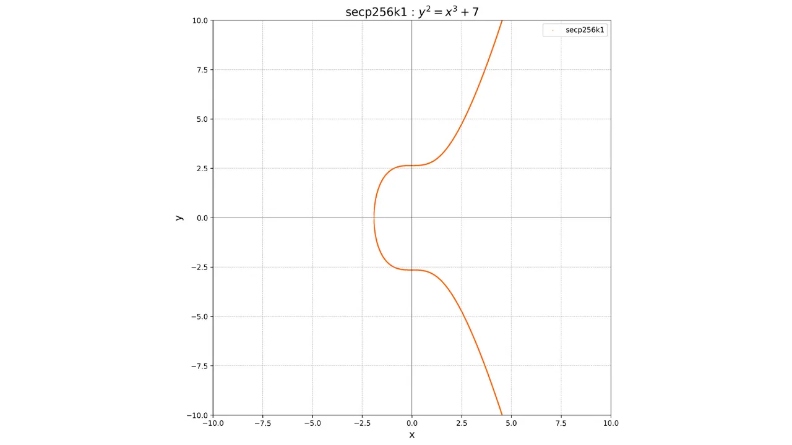

Tuttavia, in crittografia lavoriamo con insiemi finiti di numeri. Più precisamente lavoriamo sul campo finito $\mathbb{F}_p$, che è il campo degli interi modulo di un numero primo $p$.
**Definizione**: un numero primo è un intero naturale maggiore o uguale a 2 che può essere diviso solo da due numeri interi positivi: 1 e se stesso. Il numero 7 è ad esempio un numero primo, poiché può essere diviso solo per 1 e 7. Il numero 8 invece non è primo, perché può essere diviso per 1, 2, 4 e 8.
Il numero primo $p$ utilizzato nel protocollo Bitcoin per definire il campo finito è molto grande. È scelto in modo tale che l'ordine del campo (cioè, il numero di elementi in $\mathbb{F}_p$) sia sufficientemente grande da garantire sicurezza crittografica.

Il numero primo $p$ utilizzato è:

```text
p = 0xFFFFFFFFFFFFFFFFFFFFFFFFFFFFFFFFFFFFFFFFFFFFFFFFFFFFFFFEFFFFFC2F
```

In notazione decimale, questo corrisponde a:

$$

p = 2^{256} - 2^{32} - 977


$$

L'equazione della nostra curva ellittica, nella realtà, diventa così:

$$

y^2 \equiv x^3 + 7 \mod p


$$

Dato che questa curva è definita sul campo finito $\mathbb{F}_p$, non assomiglia più a una curva continua ma piuttosto a un insieme discreto di punti. Ecco come appare per esempio la curva utilizzata in Bitcoin per un $p$ molto piccolo, $p = 17$:

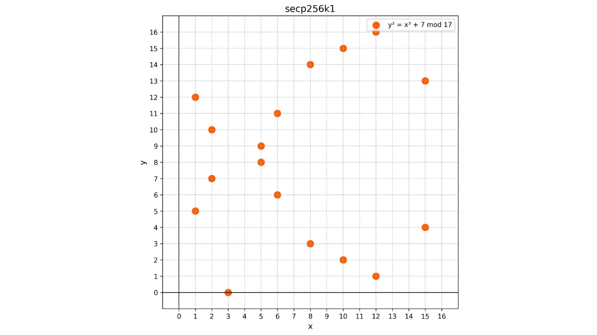

In questo esempio, ho intenzionalmente limitato il campo finito a $p = 17$ per motivi didattici, ma bisogna immaginare che quello utilizzato in Bitcoin sia immensamente più grande, quasi $2^{256}$.

Utilizziamo un campo finito di interi modulo $p$ per garantire l'accuratezza delle operazioni sulla curva. Le curve ellittiche espresse nel campo dei numeri reali, sono infatti soggette a imprecisioni a causa degli errori di arrotondamento durante i calcoli computazionali. Se vengono eseguite numerose operazioni sulla curva, questi errori si accumulano e il risultato finale può essere incorretto o difficile da riprodurre. L'uso esclusivo di interi positivi garantisce una perfetta accuratezza dei calcoli e quindi la riproducibilità del risultato.

La matematica delle curve ellittiche sui campi finiti è analoga a quella applicata nel campo dei numeri reali, con l'adattamento che tutte le operazioni sono eseguite modulo $p$. Per semplificare le spiegazioni continueremo nei capitoli seguenti a illustrare i concetti utilizzando una curva definita su numeri reali, tenendo presente che, in pratica, la curva è definita su un campo finito.

Se desideri approfondire le basi matematiche della crittografia moderna, ti consiglio anche di consultare questo altro corso su Plan ₿ Academy:

https://planb.academy/courses/d2fd9fc0-d9ed-4a87-9fa3-0fdbb3937e28

## Calcolo della Chiave Pubblica a partire dalla Chiave Privata

<chapterId>fcb2bd58-5dda-5ecf-bb8f-ad1a0561ab4a</chapterId>

:::video id=2fddfb16-5ae3-41da-92f8-ef5d09789804:::

Come visto in precedenza, gli algoritmi di firma digitale del protocollo Bitcoin si basano su una coppia di chiavi, privata e pubblica, che sono matematicamente collegate. Esploriamo insieme quale sia questo legame matematico e come vengono generate.

### La Chiave Privata

La chiave privata è semplicemente un numero casuale o pseudo-casuale. Nel caso di Bitcoin questo numero è di 256 bit. Il numero di possibilità per una chiave privata Bitcoin è quindi teoricamente $2^{256}$.

**Nota**: Un "numero pseudo-casuale" è un numero che possiede proprietà vicine a quelle di un numero veramente casuale ma è generato da un algoritmo deterministico.

Tuttavia, nella pratica, ci sono solo $n$ punti distinti sulla nostra curva ellittica secp256k1, dove $n$ è l'ordine del punto generatore $G$ della curva. Vedremo più avanti a cosa corrisponde questo numero, ma ricorda semplicemente che una chiave privata valida è un intero compreso tra $1$ e $n-1$, sapendo che $n$ è un numero vicino ma leggermente inferiore a $2^{256}$. Pertanto, ci sono alcuni numeri a 256 bit che non sono validi per diventare una chiave privata in Bitcoin, specificamente, tutti i numeri tra $n$ e $2^{256}$. Se la generazione del numero casuale (la chiave privata) produce un valore $k$ tale che $k \geq n$, è considerato non valido, e deve essere generato un nuovo valore casuale.

Il numero di possibilità per una chiave privata Bitcoin è quindi circa $n$, che è un numero vicino a $1.158 \times 10^{77}$. Questo numero è così grande che se scegli una chiave privata a caso, è statisticamente quasi impossibile capitare sulla chiave privata di un altro utente. Per darti un'idea della scala, il numero di possibili chiavi private su Bitcoin è di un ordine di grandezza vicino a quello degli atomi stimati nell'universo osservabile.

Come vedremo nei prossimi capitoli, oggi, la maggior parte delle chiavi private utilizzate in Bitcoin non sono generate casualmente ma sono il risultato della derivazione deterministica da una frase mnemonica, essa stessa pseudo-casuale (questa è la famosa frase di 12 o 24 parole). Questa informazione non cambia nulla per l'uso di algoritmi di firma come ECDSA, ma aiuta a riconcentrare la nostra divulgazione su Bitcoin.

Per il proseguimento della spiegazione, la chiave privata sarà denotata dalla lettera minuscola $k$.

### La Chiave Pubblica

La chiave pubblica è un punto sulla curva ellittica, denotato dalla lettera maiuscola $K$, e viene calcolata dalla chiave privata $k$. Questo punto $K$ è rappresentato da una coppia di coordinate $(x, y)$ sulla curva ellittica, ogni coordinata essendo un intero modulo $p$, il numero primo che definisce il campo finito $\mathbb{F}_p$.
Una chiave pubblica non compressa è rappresentata in pratica da 520 bit (o 65 byte), corrispondenti a due numeri a 256 bit ($x$ e $y$) posti uno di seguito all'altro. Questi numeri sono l'ascissa ($x$) e l'ordinata ($y$) del nostro punto su secp256k1, preceduti dal prefisso $0x04$ di 8 bit.

Tuttavia è possibile rappresentare la chiave pubblica in una forma compressa utilizzando solo 33 byte (264 bit) mantenendo solo l'ascissa $x$ del nostro punto sulla curva e un byte che indica la parità di $y$. Questo è ciò che è noto come chiave pubblica compressa. Parlerò di più di questo negli ultimi capitoli di questo corso. Ma ciò che devi ricordare è che una chiave pubblica $K$ è un punto descritto da $x$ e $y$.

Per calcolare il punto $K$ che corrisponde alla nostra chiave pubblica, utilizziamo l'operazione di moltiplicazione scalare sulle curve ellittiche, definita come un'addizione ripetuta ($k$ volte) del punto generatore $G$:

$$

K = k \cdot G


$$

dove:

- $k$ è la chiave privata (un intero casuale tra $1$ e $n-1$);
- $G$ è il punto di generazione della curva ellittica, utilizzato da tutti i partecipanti della rete Bitcoin;
- $\cdot$ rappresenta la moltiplicazione scalare sulla curva ellittica, che equivale ad aggiungere il punto $G$ a se stesso $k$ volte.

Il fatto che, nel protocollo Bitcoin, questo punto $G$ sia comune a tutte le chiavi pubbliche permette di avere la certezza che la stessa chiave privata $k$ ci darà sempre la stessa chiave pubblica $K$:

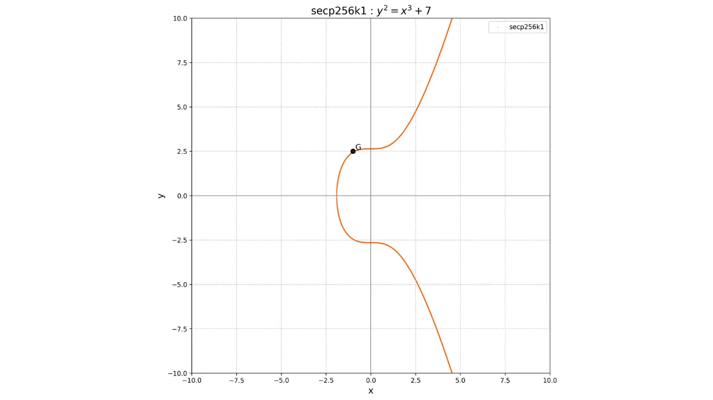

La caratteristica principale di questa operazione è che si tratta di una funzione unidirezionale. È facile calcolare la chiave pubblica $K$ conoscendo la chiave privata $k$ e il punto di generazione $G$, ma è praticamente impossibile calcolare la chiave privata $k$ conoscendo solo la chiave pubblica $K$ e il punto $G$. Trovare $k$ a partire da $K$ e $G$ equivale a risolvere il problema del logaritmo discreto sulle curve ellittiche, un problema matematicamente difficile per il quale non è noto alcun algoritmo efficiente. Anche i calcolatori più potenti contemporanei non sono in grado di risolvere questo problema in un tempo ragionevole.


### Addizione e Raddoppio dei Punti sulle Curve Ellittiche

Il concetto di addizione sulle curve ellittiche è definito geometricamente. Se abbiamo due punti $P$ e $Q$ sulla curva, l'operazione $P + Q$ viene calcolata tracciando una linea che passa per $P$ e $Q$. Questa linea intersecherà necessariamente la curva in un terzo punto $R'$. Prendiamo poi l'immagine speculare di questo punto rispetto all'asse x per ottenere il punto $R$, che è il risultato dell'addizione:

$$

P + Q = R


$$

Graficamente, ciò può essere rappresentato come segue:

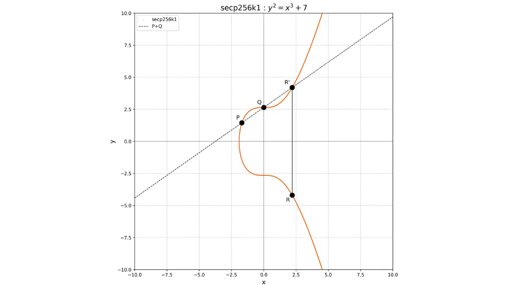

Il raddoppio di un punto, ovvero l'operazione $P + P$, si ottiene tracciando la tangente alla curva nel punto $P$. Questa tangente interseca la curva in un altro punto $S'$. Prendiamo poi l'immagine speculare di questo punto rispetto all'asse x per ottenere il punto $S$, che è il risultato del raddoppio:

$$

2P = S


$$

Graficamente, ciò è mostrato come:

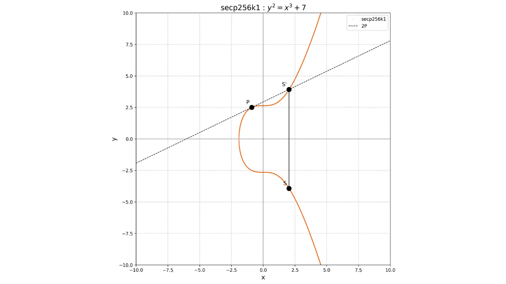

Utilizzando queste operazioni di addizione e raddoppio, possiamo eseguire la moltiplicazione scalare di un punto per un intero $k$, denotata $kP$, eseguendo ripetuti raddoppi e addizioni.

Supponiamo ad esempio di aver scelto una chiave privata $k = 4$. Per calcolare la chiave pubblica associata, eseguiamo:

$$

K = k \cdot G = 4G


$$

Graficamente, ciò corrisponde a eseguire una serie di addizioni e raddoppi:

- Si calcola $2G$ raddoppiando $G$.
- Poi si calcola $4G$ raddoppiando $2G$.


Se vogliamo per esempio calcolare il punto $3G$, dobbiamo prima calcolare il punto $2G$ raddoppiando il punto $G$, poi sommare $G$ e $2G$. Per eseguire la somma tra $G$ e $2G$, basta tracciare la linea che collega questi due punti, recuperare l'unico punto $-3G$ all'intersezione tra questa linea e la curva ellittica, e poi determinare $3G$ come l'opposto di $-3G$.

Avremo:

$$

G + G = 2G


$$

$$

2G + G = 3G


$$

Graficamente, ciò sarebbe rappresentato come segue:

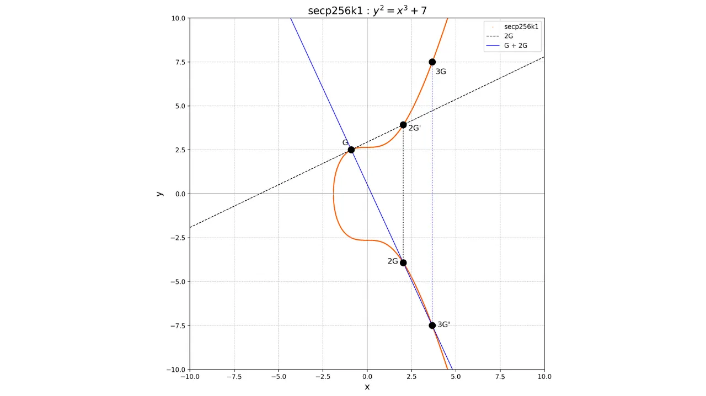

### Funzione Unidirezionale

Grazie a queste operazioni possiamo capire perché è facile derivare una chiave pubblica da una chiave privata, ma il contrario è praticamente impossibile.

Ritorniamo al nostro esempio semplificato. Con una chiave privata $k = 4$. Per calcolare la chiave pubblica associata, eseguiamo:

$$
K = k \cdot G = 4G
$$

Siamo quindi stati in grado di calcolare facilmente la chiave pubblica $K$ conoscendo $k$ e $G$.

Ora: se qualcuno conosce solo la chiave pubblica $K$, si trova di fronte al problema del logaritmo discreto: trovare $k$ tale per cui $K = k \cdot G$. Questo specifico problema è considerato di difficile soluzione, perché non esiste un algoritmo efficiente per risolverlo sulle curve ellittiche, che è ciò che garantisce la sicurezza degli algoritmi ECDSA e Schnorr.

Naturalmente, in questo esempio semplificato con $k = 4$, sarebbe possibile trovare $k$ tramite tentativi ed errori, poiché il numero di possibilità è basso. Ma nella pratica $k$ è un intero a 256 bit, il che rende il numero di possibilità astronomicamente grande (circa $1.158 \times 10^{77}$). È da considerarsi impraticabile trovare $k$ attraverso tentativi di brute force.

## Firmare con la Chiave Privata

<chapterId>bb07826f-826e-5905-b307-3d82001fb778</chapterId>

:::video id=fe3acbf4-a9d4-4c7d-82cc-79de24bf8aec:::

Ora che sai come derivare una chiave pubblica da una chiave privata, puoi già ricevere bitcoin utilizzando questa coppia di chiavi come condizione di spesa. Ma come spenderli? Per spendere bitcoin dovrai sbloccare lo _scriptPubKey_ associato al tuo UTXO, per dimostrare che sei effettivamente il legittimo proprietario. Per farlo devi produrre una firma $s$ che corrisponda alla chiave pubblica $K$ presente nello _scriptPubKey_ utilizzando la chiave privata $k$, la quale a sua volta è stata inizialmente utilizzata per calcolare $K$. La firma digitale è quindi la prova inconfutabile che sei in possesso della chiave privata associata alla chiave pubblica che esponi.

### Parametri della Curva Ellittica

Per fornire una firma digitale, tutti i partecipanti devono prima concordare sui parametri della curva ellittica utilizzata. Nel caso di Bitcoin, i parametri di **secp256k1** sono i seguenti:

Il campo finito $\mathbb{Z}_p$ definito da:

$$
p = 2^{256} - 2^{32} - 977
$$

```text
p = 0xFFFFFFFFFFFFFFFFFFFFFFFFFFFFFFFFFFFFFFFFFFFFFFFFFFFFFFFEFFFFFC2F
```

$p$ è un numero primo molto grande leggermente inferiore a $2^{256}$.

La curva ellittica $y^2 = x^3 + ax + b$ su $\mathbb{Z}_p$ definita da:

$$
a = 0, \quad b = 7
$$

Il punto di generazione o punto di origine $G$:

```text
G = 0x0279BE667EF9DCBBAC55A06295CE870B07029BFCDB2DCE28D959F2815B16F81798
```

Questo numero è la forma compressa che fornisce solo l'ascissa del punto $G$. Il prefisso `02` all'inizio determina quale dei due valori aventi questa ascissa $x$ deve essere utilizzato come punto di origine.
L'ordine $n$ di $G$ (il numero di punti esistenti) e il cofattore $h$:

```text
n = 0xFFFFFFFFFFFFFFFFFFFFFFFFFFFFFFFEBAAEDCE6AF48A03BBFD25E8CD0364141
```

$n$ è un numero molto grande leggermente inferiore a $p$.

$$
h=1
$$

$h$ è il cofattore o il numero di sottogruppi. Non approfondirò cosa rappresenta qui, poiché è abbastanza complesso e, nel caso di Bitcoin, non dobbiamo prenderlo in considerazione poiché è uguale a $1$.

Tutte queste informazioni sono pubbliche e note a tutti i partecipanti. Grazie ad esse, gli utenti sono in grado di effettuare una firma digitale e verificarla.

### Firma con ECDSA

L'algoritmo ECDSA consente a un utente di firmare un messaggio utilizzando la propria chiave privata, in modo tale che chiunque conosca la corrispondente chiave pubblica possa verificare la validità della firma, senza che la chiave privata venga mai rivelata. Nel contesto Bitcoin il messaggio da firmare dipende dal _sighash_ scelto dall'utente. È _sighash_ che determinerà quali parti della transazione sono coperte dalla firma. Parlerò più dettagliatamente di questo nel prossimo capitolo.

Ecco i passaggi per generare una firma ECDSA:

Come primo passo calcoliamo l'hash ($e$) del messaggio che deve essere firmato. Il messaggio $m$ viene quindi passato attraverso una funzione hash crittografica, generalmente SHA256 o doppio SHA256 nel caso di Bitcoin:

$$
e = \text{HASH}(m)
$$

Successivamente, calcoliamo un nonce. In crittografia un nonce è semplicemente un numero generato in modo casuale, o pseudo-casuale, che viene utilizzato una sola volta. Ciò significa che ogni volta che viene effettuata una nuova firma digitale con questa coppia di chiavi, sarà molto importante utilizzare un nonce diverso, altrimenti, comprometterà la sicurezza della chiave privata. È quindi sufficiente determinare un intero casuale e unico $r$ tale per cui $1 \leq r \leq n-1$, dove $n$ è l'ordine del punto di origine $G$ sulla curva ellittica.

Poi calcoleremo il punto $R$ sulla curva ellittica con le coordinate $(x_R, y_R)$ tale per cui:

$$
R = r \cdot G
$$

Estraiamo il valore dell'ascissa del punto $R$ ($x_R$). Questo valore rappresenta la prima parte della firma. Infine calcoliamo la seconda parte della firma $s$ in questo modo:

$$
s = r^{-1} \left( e + k \cdot x_R \right) \mod n
$$

dove:

- $r^{-1}$ è l'inverso modulare di $r$ modulo $n$, cioè un intero tale per cui $r \cdot r^{-1} \equiv 1 \mod n$;
- $k$ è la chiave privata dell'utente;
- $e$ è l'hash del messaggio;
- $n$ è l'ordine del punto di generazione $G$ della curva ellittica.

La firma è quindi semplicemente la concatenazione di $x_R$ e $s$:

$$
\text{SIG} = x_R \Vert s
$$

### Verifica della Firma ECDSA

Per verificare una firma $(x_R, s)$, chiunque conosca la chiave pubblica $K$ e i parametri della curva ellittica può procedere in questo modo:

Innanzitutto verifica che $x_R$ e $s$ siano nell'intervallo $[1, n-1]$. Questo assicura che la firma rispetti i vincoli matematici del gruppo ellittico. Se ciò non avviene, chi effettua la verifica rifiuta immediatamente la firma come non valida.

Poi calcola l'hash del messaggio:

$$
e = \text{HASH}(m)
$$

Calcola l'inverso modulare di $s$ modulo $n$:

$$
s^{-1} \mod n
$$

Calcola due valori scalari $u_1$ e $u_2$ in questo modo:

$$
\begin{align*}
u_1 &= e \cdot s^{-1} \mod n \\
u_2 &= x_R \cdot s^{-1} \mod n
\end{align*}
$$

Infine calcola il punto $V$ sulla curva ellittica tale per cui:

$$
V = u_1 \cdot G + u_2 \cdot K
$$

La firma è valida solo se $x_V \equiv x_R \mod n$, dove $x_V$ è la coordinata $x$ del punto $V$. Infatti, combinando $u_1 \cdot G$ e $u_2 \cdot K$, si ottiene un punto $V$ che, se la firma è valida, deve corrispondere al punto $R$ utilizzato durante la firma (modulo $n$).

### Firma con il Protocollo Schnorr

Lo schema di firma Schnorr è un'alternativa a ECDSA che offre molti vantaggi. È possibile utilizzarlo in Bitcoin dal 2021, con l'introduzione di Taproot e i modelli di script P2TR. Proprio come ECDSA, lo schema Schnorr consente di firmare un messaggio utilizzando una chiave privata, in modo tale che la firma possa essere verificata da chiunque conosca la corrispondente chiave pubblica.
Nel caso di Schnorr si utilizza esattamente la stessa curva di ECDSA, con gli stessi parametri. Le chiavi pubbliche, tuttavia, sono rappresentate in modo leggermente diverso rispetto a ECDSA. Sono infatti definite solo dalla coordinata $x$ del punto sulla curva ellittica. A differenza di ECDSA, dove le chiavi pubbliche compresse sono rappresentate da 33 byte (con un byte per il prefisso che indica la parità di $y$), Schnorr utilizza chiavi pubbliche di 32 byte corrispondenti solo alla coordinata $x$ del punto $K$, assumendo che $y$ sia pari per default. Questa rappresentazione semplificata riduce la dimensione delle firme e facilita alcune ottimizzazioni negli algoritmi di verifica.
La chiave pubblica è quindi la coordinata $x$ del punto $K$:

$$
\text{pk} = K_x
$$

Il primo passo per generare una firma è l'hash del messaggio ma, a differenza di ECDSA, viene fatto con altri valori e si utilizza una funzione di hash etichettata per evitare collisioni in contesti diversi. Una funzione di hash etichettata implica semplicemente l'aggiunta di un "tag" arbitrario agli input della funzione di hash insieme ai dati del messaggio.

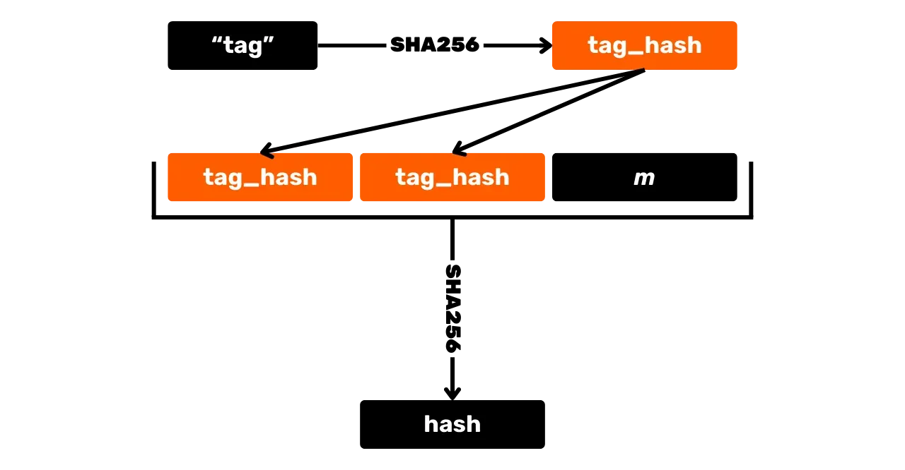

Oltre al messaggio, vengono passati nella funzione etichettata anche la coordinata $x$ della chiave pubblica $K_x$, così come un punto $R$ calcolato dal nonce $r$ ($R=r \cdot G$) che è a sua volta un intero univoco per ogni firma, calcolato deterministicamente dalla chiave privata e dal messaggio per evitare vulnerabilità legate al riutilizzo del nonce. Proprio come per la chiave pubblica, anche per descrivere $R$ viene considerata solo la coordinata $x$ del nonce $R_x$.

Il risultato di questo hashing notato $e$ è chiamato "challenge":

$$
e = \text{HASH}(\text{``BIP0340/challenge''}, R_x \Vert K_x \Vert m) \mod n
$$

Qui, $\text{HASH}$ è la funzione di hash SHA256, e $\text{``BIP0340/challenge''}$ è il tag specifico per l'hashing.

Alla fine viene calcolato il parametro $s$, dalla chiave privata $k$, dal nonce $r$ e dal challenge $e$:

$$
s = (r + e \cdot k) \mod n
$$

La firma è quindi semplicemente la coppia $Rx$ e $s$.

$$
\text{SIG} = R_x \Vert s
$$

### Verifica della Firma Schnorr

La verifica di una firma Schnorr è più semplice di quella effettuata con ECDSA. Ecco i passaggi per verificare la firma $(R_x, s)$ con la chiave pubblica $K_x$ e il messaggio $m$:
Prima verifichiamo che $K_x$ sia un intero valido e minore di $p$. Se è così recuperiamo il corrispondente punto sulla curva con $K_y$ pari. Estraiamo anche $R_x$ e $s$ separando la firma $\text{SIG}$. Poi controlliamo che $R_x < p$ e $s < n$ (l'ordine della curva).
Successivamente calcoliamo il challenge $e$ nello stesso modo in cui l'ha fatto chi ha firmato il messaggio:

$$
e = \text{HASH}(\text{``BIP0340/challenge''}, R_x \Vert K_x \Vert m) \mod n
$$

Poi calcoliamo un punto di riferimento sulla curva in questo modo:

$$
R' = s \cdot G - e \cdot K
$$

Infine, verifichiamo che $R'_x = R_x$. Se le due coordinate x corrispondono, allora la firma $(R_x, s)$ è effettivamente valida con la chiave pubblica $K_x$.

### Perché funziona?

Il firmatario ha calcolato $s = r + e \cdot k \mod n$, quindi $R' = s \cdot G - e \cdot K$ dovrebbe essere uguale al punto originale $R$, perché:

$$
s \cdot G = (r + e \cdot k) \cdot G = r \cdot G + e \cdot k \cdot G
$$

Poiché $K = k \cdot G$, abbiamo $e \cdot k \cdot G = e \cdot K$. Quindi:

$$
R' = r \cdot G = R
$$

Pertanto abbiamo:

$$
R'_x = R_x
$$

### I vantaggi delle firme Schnorr

Lo schema di firma Schnorr offre, per gli utenti Bitcoin, diversi vantaggi rispetto all'algoritmo ECDSA originale. Prima di tutto Schnorr consente l'aggregazione di chiavi e firme. Ciò significa che più chiavi pubbliche possono essere combinate in una singola chiave.

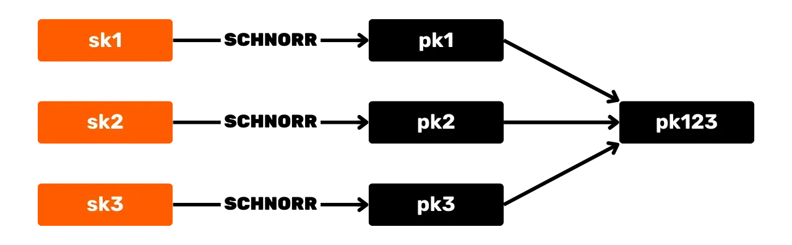

Allo stesso modo più firme possono essere aggregate in una singola firma valida. Significa che in caso di transazione multifirma, un insieme di partecipanti può firmare con una singola firma e una singola chiave pubblica aggregata. Ciò riduce significativamente i costi di archiviazione e di calcolo per la rete, poiché ogni nodo deve verificare una sola firma.

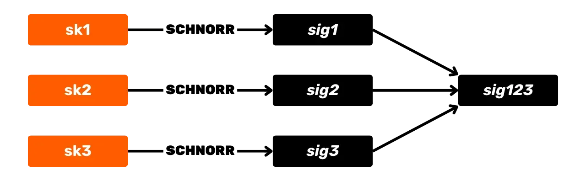

L'aggregazione delle firme poi migliora la privacy. Con Schnorr diventa impossibile distinguere una transazione multisig da una transazione standard single-sig. Questa omogeneità rende l'analisi onchain più difficile, limitando la capacità di identificare le fingerprint dei wallet.

Infine, Schnorr offre anche la possibilità di verifica in batch. Verificando simultaneamente più firme i nodi possono guadagnare in efficienza, specialmente per i blocchi che contengono molte transazioni. Si tratta di un'ottimizzazione che riduce il tempo e le risorse necessarie per validare un blocco. 
Inoltre, le firme Schnorr non sono malleabili, a differenza delle firme prodotte con ECDSA. Significa che un attaccante non può modificare una firma valida per crearne un'altra valida per lo stesso messaggio e la stessa chiave pubblica. Questa vulnerabilità era precedentemente presente nel protocollo e ha in particolare impedito l'implementazione sicura di Lightning Network. Per ECDSA è stata risolta nel 2017, con il soft fork SegWit, che ha introdotto lo spostamento delle firme in un database separato dalle transazioni per prevenirne la malleabilità.

### Perché Satoshi ha scelto ECDSA?

Come abbiamo visto Satoshi ha inizialmente scelto di implementare ECDSA per le firme digitali di Bitcoin. Però abbiamo appena constatato che Schnorr è superiore a ECDSA sotto molti aspetti; questo protocollo è stato creato da Claus-Peter Schnorr nel 1989, 20 anni prima dell'invenzione di Bitcoin.

Non sappiamo realmente perché Satoshi non lo abbia scelto, ma un'ipotesi probabile è che questo protocollo fosse sotto brevetto fino al 2008. Anche se Bitcoin è stato creato un anno dopo, nel gennaio 2009, in quel momento non era disponibile alcuna standardizzazione open-source per le firme Schnorr. Forse Satoshi ha ritenuto più sicuro utilizzare ECDSA, ampiamente utilizzato e testato nel software open-source e con diverse implementazioni riconosciute (in particolare la libreria OpenSSL utilizzata fino al 2015 su Bitcoin Core, poi sostituita da libsecp256k1 nella versione 0.10.0). O forse semplicemente non era a conoscenza che questo brevetto sarebbe scaduto nel 2008. In ogni caso, l'ipotesi più probabile sembra essere legata a questo brevetto e al fatto che ECDSA aveva una storia comprovata ed era più facile da implementare.

## I flag sighash

<chapterId>231c41a2-aff2-4655-9048-47b6d2d83d64</chapterId>

:::video id=43dfce6d-c51a-44c1-b565-95b4430da069:::

Come abbiamo visto nei capitoli precedenti, le firme digitali sono spesso utilizzate per sbloccare lo script di un input. Nel processo di firma è necessario includere nel calcolo i dati firmati, designati nei nostri esempi dal messaggio $m$. Questi dati, una volta firmati, non possono essere modificati senza invalidare la firma. Sia per ECDSA sia per Schnorr, infatti, chi si occupa della verifica della firma deve includere nel suo calcolo lo stesso messaggio $m$. Se differisce dal messaggio $m$ inizialmente utilizzato dal firmatario, il risultato sarà errato e la firma considerata non valida. Si dice quindi che una firma copre determinati dati e in un certo senso li protegge da modifiche non autorizzate.

### Cos'è un flag sighash?

Nel caso specifico di Bitcoin il messaggio $m$ corrisponde alla transazione. Tuttavia, nella realtà, è un po' più complesso. Infatti, grazie ai flag sighash, è possibile selezionare dati specifici all'interno della transazione che possono essere coperti o meno dalla firma.
Il "flag sighash" è quindi un parametro aggiunto a ciascun input, che consente di determinare i componenti di una transazione che sono coperti dalla firma associata. Questi componenti sono gli input e gli output. La scelta del flag sighash determina quindi quali input e quali output della transazione sono bloccati dalla firma e quali possono ancora essere modificati senza invalidarla. Questo meccanismo consente alle firme di impegnare i dati della transazione secondo le intenzioni del firmatario.

Ovviamente, una volta che la transazione è confermata sulla blockchain diventa immutabile, indipendentemente dai flag sighash utilizzati. La possibilità di modifica tramite i flag sighash è limitata al periodo tra la firma e la conferma.

Generalmente il software del wallet non offre l'opzione di modificare manualmente il flag sighash dei tuoi input quando una transazione viene preparata. Per default è impostato `SIGHASH_ALL`. Personalmente, conosco solo Sparrow Wallet che permette questa modifica dall'interfaccia utente.

### Quali sono i flag sighash esistenti in Bitcoin?

Il protocollo Bitcoin prevede innanzitutto 3 flag sighash di base:

- `SIGHASH_ALL` (`0x01`): la firma si applica a tutti gli input e tutti gli output della transazione. La transazione è quindi interamente coperta dalla firma e non può più essere modificata. `SIGHASH_ALL` è il flag più comunemente usato nelle transazioni quotidiane quando si vuole semplicemente effettuare una transazione senza che possa essere modificata.

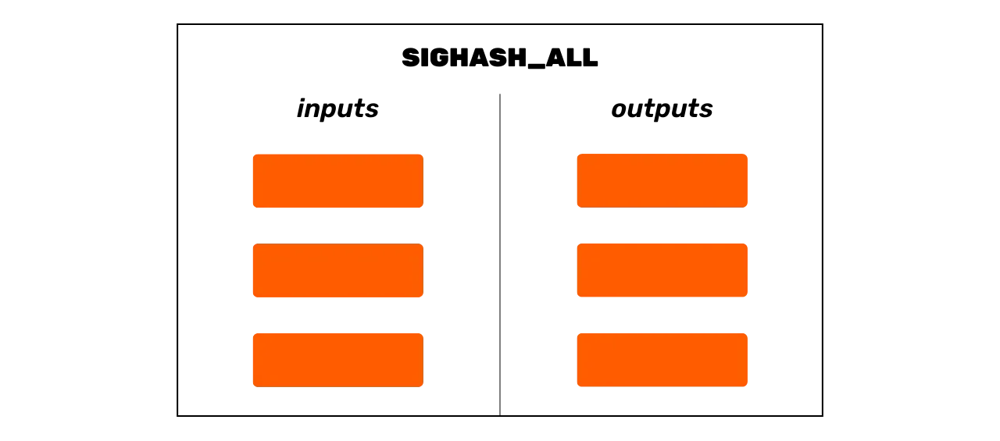

In tutti i diagrammi di questo capitolo il colore arancione rappresenta gli elementi coperti dalla firma, mentre il colore nero indica quelli che non lo sono.

- `SIGHASH_NONE` (`0x02`): la firma copre tutti gli input ma nessuno degli output, consentendo così la modifica degli output dopo la firma. È paragonabile a un assegno in bianco. Il firmatario sblocca gli UTXO negli input ma lascia il campo degli output completamente modificabile. Chiunque conosca questa transazione può quindi aggiungere output di sua scelta, ad esempio specificando un indirizzo di ricezione per raccogliere i fondi spesi dagli input, per poi trasmettere la transazione e recuperare i bitcoin. La firma del proprietario degli input non sarà invalidata, poiché copre solo gli input.


- `SIGHASH_SINGLE` (`0x03`): la firma copre tutti gli input così come un singolo output, corrispondente all'indice dell'input firmato. Se per esempio la firma sblocca lo _scriptPubKey_ dell'input #0, allora copre anche l'output #0. La firma protegge inoltre tutti gli altri input, che non possono più essere modificati. Tuttavia, chiunque può aggiungere un output aggiuntivo senza invalidare la firma, a condizione che l'output #0, che è l'unico coperto da essa, non venga modificato.

  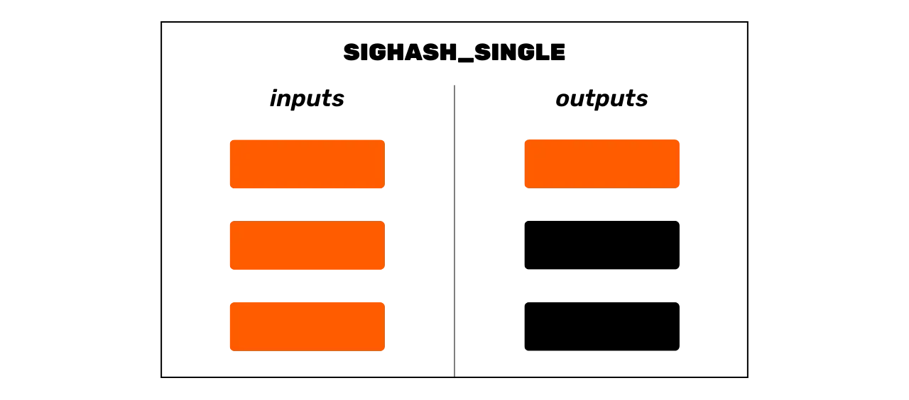

Oltre a questi tre flag sighash, esiste anche il modificatore `SIGHASH_ANYONECANPAY` (`0x80`). Questo modificatore può essere combinato con un flag sighash di base per creare tre nuovi flag sighash:

- `SIGHASH_ALL | SIGHASH_ANYONECANPAY` (`0x81`): la firma copre un singolo input e tutti gli output della transazione. Questo flag sighash combinato permette, ad esempio, la creazione di una transazione di crowdfunding. L'organizzatore prepara l'output con il proprio indirizzo stabilendo un importo target; ogni contributore può aggiungere input per finanziare questo output. Una volta raccolti fondi sufficienti negli input per soddisfare l'output, la transazione può essere propagata.

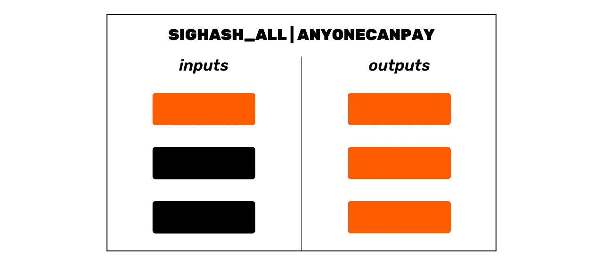

- `SIGHASH_NONE | SIGHASH_ANYONECANPAY` (`0x82`): la firma copre un singolo input, senza impegnare su alcun output;


- `SIGHASH_SINGLE | SIGHASH_ANYONECANPAY` (`0x83`): la firma copre un singolo input così come l'output che ha lo stesso indice. Se per esempio la firma sblocca lo _scriptPubKey_ dell'input #3, coprirà anche l'output #3. Il resto della transazione rimane modificabile, sia in termini di altri input che di altri output.

  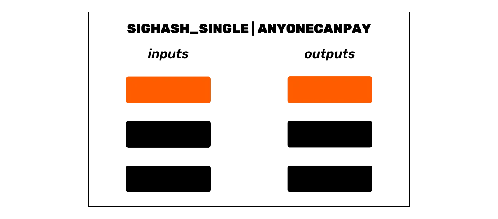

### Progetti per Aggiungere Nuove Flag Sighash

Attualmente (2024), solo i flag sighash presentati nella sezione precedente sono utilizzabili nel protocollo Bitcoin. Alcuni progetti stanno però considerando l'aggiunta di nuovi flag sighash. Ad esempio il BIP118, proposto da Christian Decker e Anthony Towns, introduce due nuovi flag sighash: `SIGHASH_ANYPREVOUT` e `SIGHASH_ANYPREVOUTANYSCRIPT` (_AnyPrevOut = "Any Previous Output", Qualsiasi Output Precedente_).

Questi due flag sighash offrirebbero una possibilità ulteriore a Bitcoin: creare firme che non coprono nessun input specifico della transazione.


L'idea è stata inizialmente formulata da Joseph Poon e Thaddeus Dryja nel White Paper di Lightning Network. Prima di essere rinominato AnyPrevOut era denominato `SIGHASH_NOINPUT`.
Se questo flag sighash verrà integrato in Bitcoin, consentirà l'uso dei covenants, ma è anche un prerequisito obbligatorio per implementare Eltoo, un protocollo generale per i second layer che definisce come gestire congiuntamente la proprietà di un UTXO. Eltoo è stato specificamente progettato per risolvere i problemi associati ai meccanismi di negoziazione dello stato dei canali Lightning Network, ovvero tra l'apertura e la chiusura.

Per approfondire la tua conoscenza su Lightning Network, dopo il corso CYP201, ti consiglio vivamente il corso LNP201 di Fanis Michalakis, che copre l'argomento in dettaglio:

https://planb.academy/courses/34bd43ef-6683-4a5c-b239-7cb1e40a4aeb

Nella prossima parte propongo di scoprire come funziona la frase mnemonica alla base del tuo wallet Bitcoin.

# La frase mnemonica

<partId>4070af16-c8a2-58b5-9871-a22c86c07458</partId>

## Evoluzione dei wallet Bitcoin

<chapterId>9d9acd5d-a0e5-5dfd-b544-f043fae8840f</chapterId>

:::video id=024fb46f-aece-414f-818b-4762e77953b9:::

Ora che abbiamo esplorato il funzionamento delle funzioni hash e delle firme digitali, possiamo studiare come funzionano i wallet Bitcoin. L'obiettivo sarà scoprire come è costruito un wallet Bitcoin, quali parti lo compongono e come sono usate sono le diverse parti di informazione che lo costituiscono. La comprensione di tali meccanismi ti permetterà di migliorare il tuo uso di Bitcoin in termini di sicurezza e privacy.

Prima di immergerci nei dettagli tecnici, è essenziale chiarire cosa si intende per "wallet Bitcoin" e comprenderne la sua utilità.

### Cos'è un wallet Bitcoin?

A differenza dei wallet tradizionali che ti permettono di conservare banconote e monete fisiche, un wallet Bitcoin non "contiene" di per sé bitcoin. I bitcoin infatti non esistono in una forma fisica o digitale che può essere conservata, ma sono rappresentati da unità di conto raffigurate nel sistema sotto forma di **UTXO** (_Unspent Transaction Output_).

Gli UTXO rappresentano quindi frammenti di bitcoin di dimensioni variabili, che possono essere spesi a condizione che il loro _scriptPubKey_ sia soddisfatto. Per spendere i propri bitcoin un utente deve fornire uno _scriptSig_ che sblocca lo _scriptPubKey_ associato al suo UTXO. Questa prova è generalmente fornita attraverso una firma digitale, generata dalla chiave privata corrispondente alla chiave pubblica presente nello _scriptPubKey_. Quindi, l'elemento cruciale che l'utente deve proteggere è la chiave privata. 
Il ruolo di un wallet Bitcoin è proprio quello di gestire queste chiavi private in modo sicuro. In realtà, il suo ruolo è più simile a quello di un portachiavi che non a un wallet nel senso tradizionale.

### Wallet JBOK (_Just a Bunch Of Keys_)

I primi wallet utilizzati su Bitcoin erano i wallet JBOK (_Just a Bunch Of Keys_), che raggruppavano chiavi private generate indipendentemente e senza alcun collegamento tra loro. Questi wallet funzionavano in modo semplice, dove ciascuna chiave privata poteva sbloccare un unico indirizzo di ricezione.

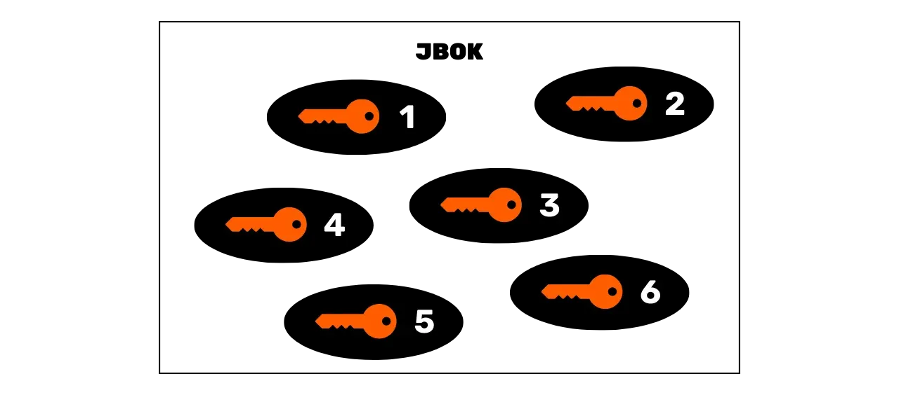

Se si desiderava utilizzare più chiavi private era quindi necessario effettuare altrettanti backup, per garantire l'accesso ai fondi in caso di problemi con il dispositivo che ospita il wallet. Se si utilizza una singola chiave privata la struttura di questa tipologia di wallet può essere sufficiente, poiché un singolo backup è adeguato. Tuttavia questo pone un problema: con Bitcoin, è fortemente sconsigliato utilizzare sempre la stessa chiave privata. Infatti, una chiave privata è associata a un unico indirizzo e gli indirizzi di ricezione sono normalmente progettati per essere usati una sola volta. Ogni volta che ricevi fondi, dovresti generarne un nuovo.

Questo vincolo deriva dal modello di privacy di Bitcoin. Riutilizzando lo stesso indirizzo si facilita il tracciamento di tutte le tue transazioni Bitcoin agli osservatori esterni. Ecco perché è fortemente sconsigliato riutilizzare un indirizzo di ricezione. Ma per avere più indirizzi e separare pubblicamente le nostre transazioni, è per altro necessario gestire più chiavi private. Nel caso dei wallet JBOK ciò implica la creazione di altrettanti backup quanti sono le nuove coppie di chiavi, un compito che può diventare presto complesso e difficile da mantenere per gli utenti.

Per saperne di più sul modello di privacy di Bitcoin e scoprire metodi per proteggere la tua privacy, ti consiglio anche di seguire il mio corso BTC204 su Plan ₿ Academy:

https://planb.academy/courses/65c138b0-4161-4958-bbe3-c12916bc959c

### Wallet HD (_Hierarchical Deterministic_)

Per risolvere il limite dei wallet JBOK è stata successivamente utilizzata una nuova struttura. Nel 2012 Pieter Wuille ha proposto un miglioramento con BIP32, che introduce i wallet gerarchico-deterministici. Il principio di un wallet HD è quello di derivare tutte le chiavi private da una singola fonte di informazione, chiamata seed, in modo deterministico e gerarchico. Il seed viene generato casualmente alla creazione del wallet e costituisce un backup unico che consente di ricreare tutte le chiavi private del wallet. In questo modo l'utente può generare un numero molto elevato di chiavi private per evitare il riutilizzo degli indirizzi e preservare la propria privacy, avendo bisogno di effettuare un solo backup del proprio wallet tramite il seed.

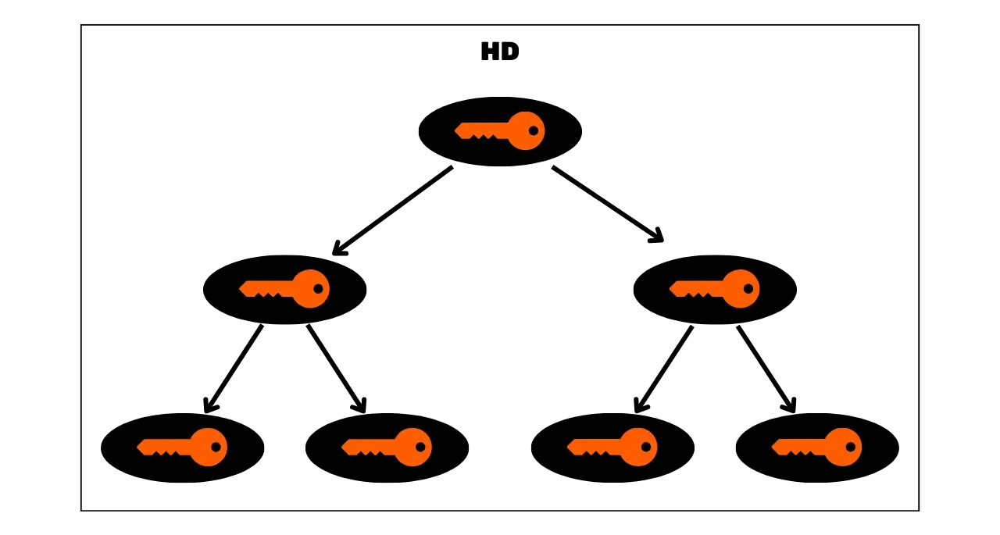

Nei wallet HD la derivazione delle chiavi è eseguita secondo una struttura gerarchica che consente di organizzare le chiavi in sottospazi di derivazione, ciascuno ulteriormente suddivisibile, per facilitare la gestione dei fondi e l'interoperabilità tra diversi software wallet. Oggi, questo standard è adottato dalla stragrande maggioranza degli utenti Bitcoin. Per questo motivo lo esamineremo in dettaglio nei capitoli seguenti.

### Lo Standard BIP39: La Frase Mnemonica

Oltre al BIP32, il BIP39 standardizza il formato del seed come frase mnemonica, per facilitare il backup e la leggibilità da parte degli utenti. La frase mnemonica, chiamata anche frase di recupero (recovery phrase) o frase di 24 parole, è una sequenza di parole tratte da un elenco predefinito che codifica in modo sicuro il seed del wallet.

La mnemonica semplifica notevolmente il backup per l'utente. In caso di perdita, danneggiamento o furto del dispositivo che ospita il wallet, conoscere semplicemente queste parole consente il ripristino del wallet e l'accesso a tutti i fondi conservati in esso.

Nei prossimi capitoli esploreremo il funzionamento interno dei wallet HD, inclusi i meccanismi di derivazione delle chiavi e le diverse possibili strutture gerarchiche. Questo ti permetterà di comprendere meglio i fondamenti della crittografia su cui si basa la sicurezza dei fondi in Bitcoin. Per iniziare, nel prossimo capitolo propongo di scoprire il ruolo dell'entropia alla base del tuo wallet.

## Entropia e Numeri Casuali

<chapterId>b43c715d-affb-56d8-a697-ad5bc2fffd63</chapterId>

:::video id=4b6c3bd5-2d5c-42ff-8f47-141bd20569bd:::

I moderni wallet HD (gerarchico-deterministici) si affidano a un unico frammento iniziale di informazione chiamato "entropia", sfruttato per generare in modo deterministico l'intero set di chiavi del wallet. L'entropia è un numero pseudo-casuale il cui livello di imprevedibilità determina, in parte, la sicurezza del wallet.

### Definizione di Entropia

L'entropia, nel contesto della crittografia e dell'informazione, è una misura quantitativa dell'incertezza o imprevedibilità associata a una fonte di dati o a un processo casuale. Gioca un ruolo importante nella sicurezza dei sistemi crittografici, specialmente nella generazione di chiavi e numeri casuali. Un'alta entropia assicura che le chiavi generate siano sufficientemente imprevedibili e resistenti agli attacchi brute force, dove un attaccante prova tutte le combinazioni possibili per indovinare la chiave.

Nel contesto di Bitcoin l'entropia è utilizzata per generare il seed. Quando si crea un wallet gerarchico-deterministico, la costruzione della frase mnemonica avviene a partire da un numero casuale, a sua volta derivato da una fonte di entropia. La sequenza di parole viene poi utilizzata per generare più chiavi private, in modo gerarchico-deterministico, che creano condizioni di spesa sugli UTXO.

### Metodi di Generazione dell'Entropia

L'entropia iniziale utilizzata per un wallet HD è generalmente di 128 bit o 256 bit, dove:

- **128 bit di entropia** corrispondono a una frase mnemonica di **12 parole**;
- **256 bit di entropia** corrispondono a una frase mnemonica di **24 parole**.

Nella maggior parte dei casi questo numero casuale è generato automaticamente dal software del wallet utilizzando un PRNG (_Pseudo-Random Number Generator_). I numeri PRNG sono una categoria di algoritmi utilizzati per generare sequenze di numeri da uno stato iniziale, che hanno caratteristiche che si avvicinano a quelle di un numero casuale, senza però esserlo. Un buon PRNG deve avere proprietà come uniformità dell'output, imprevedibilità e resistenza agli attacchi predittivi. A differenza dei generatori di numeri casuali veri (TRNG, True Random Number Generators), i PRNG sono deterministici e riproducibili.

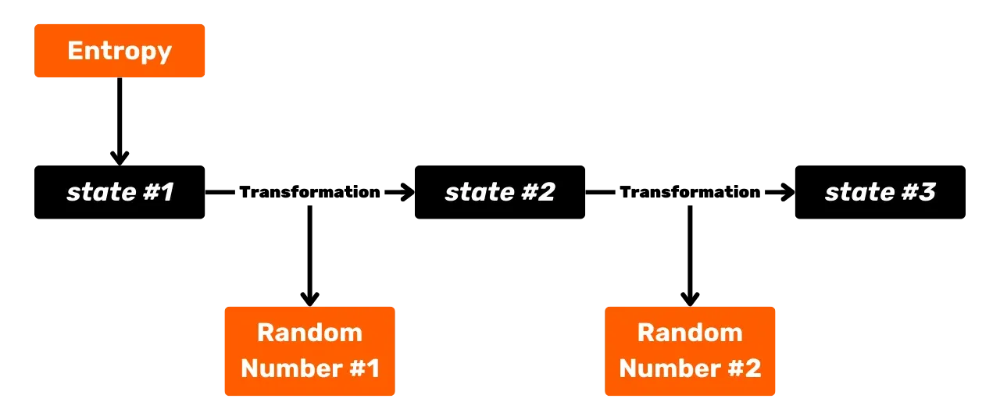

Un'alternativa è generare manualmente l'entropia, che offre un controllo migliore ma è anche molto più rischiosa. Sconsiglio vivamente di generare da soli l'entropia per il vostro wallet HD.

Nel prossimo capitolo, vedremo come si passa da un numero casuale a una frase mnemonica di 12 o 24 parole.

## La Frase Mnemonica

<chapterId>8f9340c1-e6dc-5557-a2f2-26c9669987d5</chapterId>

:::video id=6218472e-b965-484f-b56b-e363f65d2827:::

La frase mnemonica, chiamata anche "seed phrase", "recovery phrase", "frase segreta" o "frase di 24 parole", è una sequenza solitamente composta da 12 o 24 parole generata a partire dall'entropia. Viene utilizzata per derivare deterministicamente tutte le chiavi di un wallet HD. Ciò significa che da questa frase è possibile generare e ricreare, deterministicamente, tutte le chiavi private e pubbliche del wallet Bitcoin e, di conseguenza, accedere ai fondi che sono protetti con esse. Lo scopo della frase mnemonica è fornire un metodo di backup e recupero dei bitcoin che sia al contempo sicuro e facile da usare. È stata introdotta nel 2013 con lo standard BIP39.

Scopriamo insieme come passare dall'entropia a una frase mnemonica.

### Il Checksum

Per trasformare l'entropia in una frase mnemonica, si deve prima aggiungere un checksum (o "somma di controllo") alla fine dell'entropia. Il checksum è una breve sequenza di bit che garantisce l'integrità dei dati, verificando che non siano state introdotte modifiche accidentali.

Per calcolare il checksum si applica la funzione hash SHA256 all'entropia (solo una volta; questo è uno dei rari casi in Bitcoin in cui si usa un singolo SHA256 invece di uno doppio). L'operazione produce un hash di 256 bit. Il checksum consiste nei primi bit di questo hash e la sua lunghezza dipende da quella dell'entropia, secondo la seguente formula:

$$
\text{CS} = \frac{\text{ENT}}{32}
$$

dove $\text{ENT}$ rappresenta la lunghezza dell'entropia in bit, e $\text{CS}$ la lunghezza del checksum in bit.

In un'entropia di 256 bit, ad esempio, si prendono i primi 8 bit dell'hash per formare il checksum:

$$
\text{CS} = \frac{256}{32} = 8 \text{ bit}
$$

Una volta calcolato, il checksum viene concatenato con l'entropia per ottenere una sequenza di bit estesa indicata con $\text{ENT} \Vert \text{CS}$ ("concatenare" significa mettere di seguito).

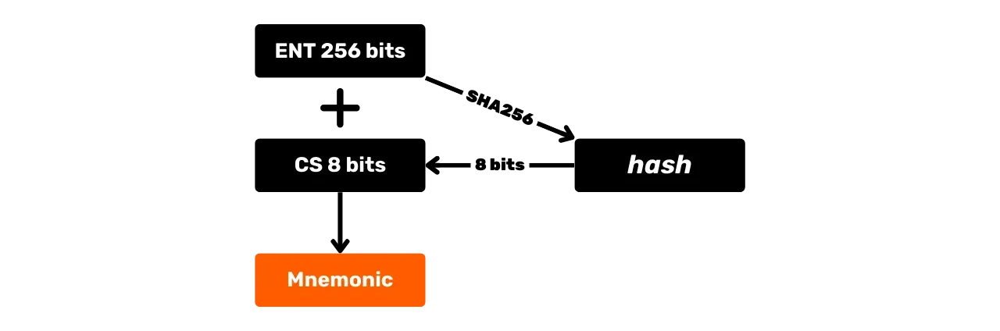

### Corrispondenza tra l'Entropia e la Frase Mnemonica

Il numero di parole nella frase mnemonica dipende dalla dimensione dell'entropia iniziale, come illustrato nella seguente tabella con:

- $\text{ENT}$: la dimensione in bit dell'entropia;
- $\text{CS}$: la dimensione in bit del checksum;
- $w$: il numero di parole nella frase mnemonica risultante.

$$
\begin{array}{|c|c|c|c|}
\hline
\text{ENT} & \text{CS} & \text{ENT} \Vert \text{CS} & w \\
\hline
128 & 4 & 132 & 12 \\
160 & 5 & 165 & 15 \\
192 & 6 & 198 & 18 \\
224 & 7 & 231 & 21 \\
256 & 8 & 264 & 24 \\
\hline
\end{array}
$$

Per un'entropia di 256 bit, ad esempio, il risultato $\text{ENT} \Vert \text{CS}$ è di 264 bit e produce una mnemonica di 24 parole.

### Conversione della Sequenza Binaria in una Frase Mnemonica

La sequenza di bit $\text{ENT} \Vert \text{CS}$ viene quindi divisa in segmenti di 11 bit. Ogni segmento di 11 bit, una volta convertito in decimale, corrisponde a un numero tra 0 e 2047, che designa la posizione di una parola [in una lista di 2048 parole standardizzata dal BIP39](https://github.com/PlanB-Network/bitcoin-educational-content/blob/dev/resources/bet/bip39-wordlist/assets/BIP39-WORDLIST.pdf).

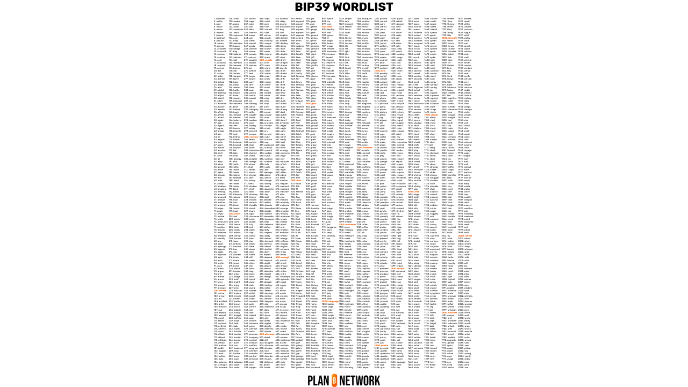

Se prendiamo ad esempio un'entropia di 128 bit, il checksum è di 4 bit e quindi la sequenza totale misura 132 bit, che viene poi divisa in 12 segmenti di 11 bit (i bit arancioni designano il checksum):

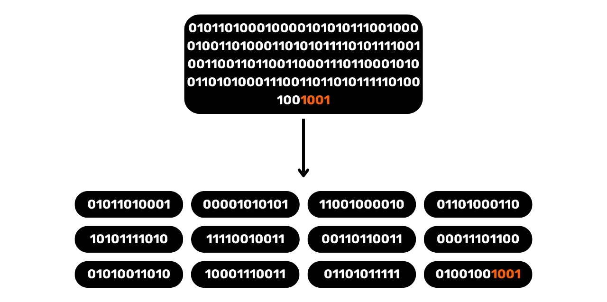

Ogni segmento è poi convertito in un numero decimale che rappresenta una parola nella lista. Il segmento binario `01011010001` dell'esempio è equivalente in decimale a `721`. Aggiungendo 1 per allinearsi con l'indicizzazione della lista (che inizia da 1 e non da 0), si ottiene il rango della parola `722`, che nella lista corrisponde alla parola "*focus*".

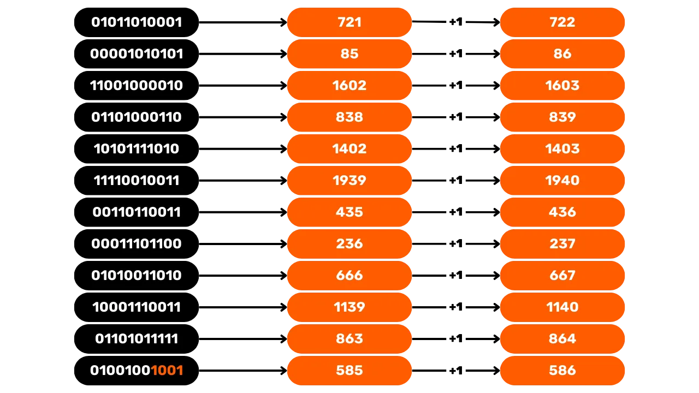

Lo stesso tipo di corrispondenza è ripetuta per ciascuno dei 12 segmenti, al fine di ottenere una frase di 12 parole.

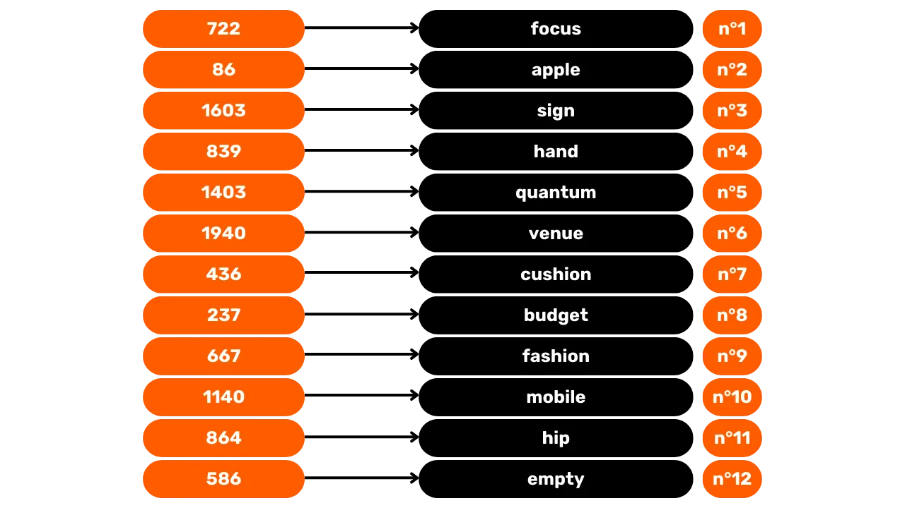

### Caratteristiche del Dizionario BIP39

Una particolarità del dizionario BIP39 è che nessuna parola condivide le stesse prime quattro lettere nello stesso ordine con un'altra. Questo significa che annotare solo le prime quattro lettere di ogni parola è sufficiente per identificarla con certezza e, quindi, salvare la mnemonica. Può essere interessante per risparmiare spazio, specialmente per coloro che desiderano inciderla su un supporto metallico.

La lista di 2048 parole esiste in diverse lingue. Non sono semplici traduzioni, ma parole distinte per ogni lingua. Tuttavia, è fortemente consigliato attenersi alla versione inglese, poiché le versioni in altre lingue generalmente non sono supportate dal software wallet.

### Quale Lunghezza Scegliere per la Tua Frase Mnemonica?

Per determinare la lunghezza ottimale della tua mnemonica, devi considerare la reale sicurezza che essa fornisce. Una frase di 12 parole assicura 128 bit di sicurezza, mentre una frase di 24 ne offre 256.

Tuttavia, questa differenza a livello di frase non migliora la sicurezza complessiva di un wallet Bitcoin, poiché le chiavi private derivate dalla frase beneficiano solo di 128 bit di sicurezza. Come abbiamo infatti visto in precedenza, le chiavi private Bitcoin sono generate da numeri casuali (o derivate da una fonte casuale) compresi tra $1$ e $n-1$, dove $n$ rappresenta l'ordine del punto di origine $G$ sulla curva secp256k1, un numero leggermente inferiore a $2^{256}$. Si potrebbe quindi pensare che queste chiavi private offrano 256 bit di sicurezza, ma la loro sicurezza risiede nella difficoltà di trovare una chiave privata a partire dalla chiave pubblica associata, complessità stabilita dal problema matematico del logaritmo discreto sulle curve ellittiche (_ECDLP_). Ad oggi l'algoritmo più noto per risolvere questo problema è l'algoritmo rho di Pollard, che riduce il numero di operazioni necessarie per violare una chiave alla radice quadrata della sua dimensione.

Per le chiavi a 256 bit, come quelle utilizzate su Bitcoin, l'algoritmo rho di Pollard riduce quindi la complessità a $2^{128}$ operazioni:

$$

O(\sqrt{2^{256}}) = O(2^{128})


$$

Ne consegue che una chiave privata utilizzata su Bitcoin offra 128 bit di sicurezza.

Scegliere una frase di 24 parole non aggiunge protezione al wallet, poiché i 256 bit di sicurezza della frase sono irrilevanti, se le chiavi derivate offrono solo 128 bit di sicurezza. Per illustrare questo principio, è come avere una casa con due porte: una porta di legno vecchia e una porta blindata. In caso di effrazione la porta blindata non sarebbe di alcuna utilità, poiché un intruso passerebbe attraverso la porta di legno. Questa è una situazione analoga.

Una frase di 12 parole, che offre quindi 128 bit di sicurezza, è attualmente sufficiente per proteggere i tuoi bitcoin da qualsiasi tentativo di furto. Finché l'algoritmo di firma digitale non cambia, per utilizzare chiavi più grandi o per affidarsi a un problema matematico diverso da ECDLP, una frase di 24 parole rimane superflua. Inoltre, una frase più lunga aumenta il rischio di perdita durante il backup: un backup che è due volte più corto è sempre più facile da gestire.

Per approfondire e imparare concretamente come generare manualmente una frase mnemonica di prova, ti consiglio di scoprire questo tutorial:

https://planb.academy/tutorials/wallet/backup/generate-mnemonic-phrase-47507d90-e6af-4cac-b01b-01a14d7a8228

Prima di continuare con la derivazione del wallet dalla frase mnemonica, ti presenterò nel capitolo seguente la passphrase BIP39, poiché gioca un ruolo nel processo di derivazione ed è allo stesso livello della frase mnemonica.

## La passphrase

<chapterId>6a51b397-f3b5-5084-b151-cef94bc9b93f</chapterId>

:::video id=59f8a63e-56af-4937-a1d1-3314b3934048:::

Come abbiamo appena visto, i wallet HD sono generati da una frase mnemonica che tipicamente consiste di 12 o 24 parole. Questa frase è molto importante perché permette il ripristino di tutte le chiavi di un wallet in caso il dispositivo fisico (come un hardware wallet, ad esempio) venga perso. Bisogna però considerare che costituisce un unico punto di fallimento perché, se viene compromessa, un attaccante potrebbe rubare tutti i bitcoin. Qui entra in gioco la passphrase BIP39.

### Cos'è una passphrase BIP39?

La passphrase è una password opzionale, che puoi scegliere liberamente, aggiunta alla frase mnemonica nel processo di derivazione delle chiavi, per migliorare la sicurezza del wallet.

Attenzione però: la passphrase non deve essere confusa con il PIN del tuo hardware wallet o la password usata per sbloccare l'accesso al tuo file sul tuo computer. A differenza di tutti questi elementi, la passphrase gioca un ruolo nella derivazione delle chiavi del tuo wallet. **Questo significa che, senza di essa, non sarai mai in grado di recuperare i tuoi bitcoin.**

La passphrase lavora in tandem con la mnemonica, modificando il seed da cui vengono generate le chiavi. In questo scenario, anche se qualcuno ottiene la tua frase di 12 o 24 parole, senza la passphrase non può accedere ai tuoi fondi. Usare una passphrase crea essenzialmente un nuovo wallet con chiavi distinte. Modificare (anche leggermente) la passphrase genera un wallet diverso.

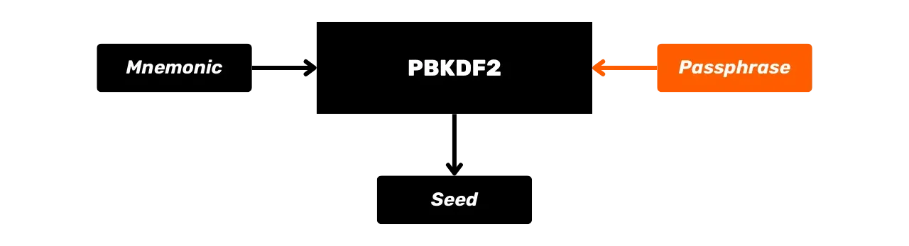

### Perché dovresti usare una passphrase?

La passphrase è arbitraria e si può comporre con qualsiasi combinazione di caratteri scelta dall'utente. Usare una passphrase offre quindi diversi vantaggi. Prima di tutto, riduce tutti i rischi associati alla compromissione della frase mnemonica richiedendo un secondo fattore per accedere ai fondi (effrazione, accesso alla tua casa, ecc.).

Poi può essere usata strategicamente per creare un wallet esca, per affrontare attacchi fisici orchestrati per rubare i tuoi fondi, come il famigerato "_attacco con chiave inglese da 5 dollari_". In uno scenario del genere, l'idea è di avere un wallet senza passphrase contenente solo una piccola quantità di bitcoin, abbastanza per soddisfare un potenziale aggressore, mentre si ha un wallet nascosto. Quest'ultimo utilizza la stessa frase mnemonica ma è protetto con una passphrase aggiuntiva.
Infine, l'uso di una passphrase è interessante quando si desidera avere il controllo sulla casualità con cui un wallet HD viene generato.

### Come scegliere una buona passphrase?

Affinché la passphrase sia efficace, deve essere sufficientemente lunga e casuale. Come per una password forte, raccomando di scegliere una passphrase il più lunga e casuale possibile, un insieme di lettere, numeri e simboli da rendere inefficace qualsiasi attacco brute force.

È inoltre importante salvare correttamente questa passphrase, allo stesso modo della mnemonica. **Perderla significa perdere l'accesso ai propri bitcoin**. Sconsiglio vivamente di ricordarla soltanto a memoria, poiché ciò aumenta in modo irragionevole il rischio di perdita. L'ideale è scriverla su un supporto fisico (carta o metallo) separato dalla frase mnemonica. Questo backup deve ovviamente essere conservato in un luogo diverso da dove si conserva la mnemonica per prevenire che entrambi vengano compromessi simultaneamente.

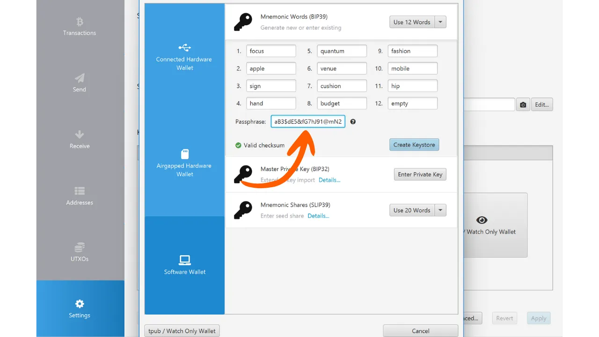

Nella sezione seguente scopriremo come questi due elementi alla base del tuo wallet — la frase mnemonica e la passphrase — vengono utilizzati per derivare le coppie di chiavi usate negli _scriptPubKey_ che bloccano i tuoi UTXO.

# Creazione di Wallet Bitcoin

<partId>9c25e767-7eae-50b8-8c5f-679d8fc83bab</partId>

## Creazione del Seed e della Chiave Master

<chapterId>63093760-2010-5691-8d0e-9a04732ae557</chapterId>

:::video id=60e3ade6-501b-4e1e-a85e-59257ef12900:::

Una volta generati la frase mnemonica e la passphrase opzionale, può iniziare il processo di derivazione di un wallet gerarchico-deterministico. La mnemonica viene prima convertita in un seed che costituisce la base di tutte le chiavi del wallet.

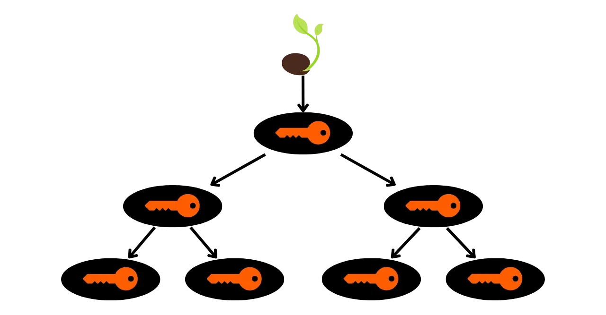

### Il Seed di un Wallet HD

Lo standard BIP39 definisce il seed come una sequenza di 512 bit, che serve come punto di partenza per la derivazione di tutte le chiavi di un wallet HD. Il seed è derivato dalla frase mnemonica e dalla passphrase opzionale, utilizzando l'algoritmo **PBKDF2** (_Password-Based Key Derivation Function 2_) di cui abbiamo già discusso nel capitolo 3.3. In questa funzione di derivazione, utilizzeremo i seguenti parametri:

- $m$ : la frase mnemonica;
- $p$ : una passphrase opzionale scelta dall'utente per aumentare la sicurezza del seed. Se non c'è una passphrase, il campo viene lasciato vuoto;
- $\text{PBKDF2}$ : la funzione di derivazione con $\text{HMAC-SHA512}$ e $2048$ iterazioni;
- $s$: i 512 bit del seed del wallet.
Indipendentemente dalla lunghezza della mnemonica scelta (132 bit o 264 bit), la funzione PBKDF2 produrrà sempre un output di 512 bit, pertanto il seed sarà sempre di questa dimensione.

### Schema di Derivazione del Seed con PBKDF2

L'equazione che segue illustra la derivazione del seed dalla frase mnemonica e dalla passphrase:

$$
s = \text{PBKDF2}_{\text{HMAC-SHA512}}(m, p, 2048)
$$

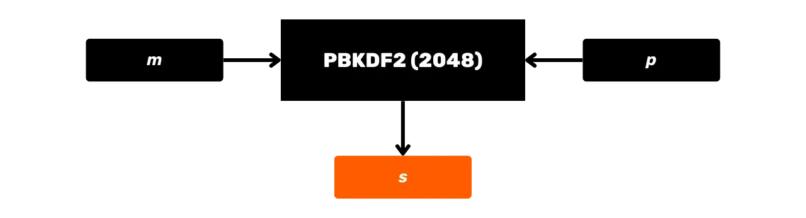

Il valore del seed è quindi influenzato dal valore della mnemonica e della passphrase. Cambiando la passphrase si ottiene un seed diverso. Con la stessa frase mnemonica e passphrase, però, viene sempre generato lo stesso seed, poiché PBKDF2 è una funzione deterministica. Questo garantisce che, attraverso i nostri backup, possano essere recuperate le stesse coppie di chiavi.

**Nota:** Nel linguaggio comune, il termine "seed" si riferisce spesso, per abuso di linguaggio, alla mnemonica. In assenza di una passphrase, infatti, il seed è semplicemente la codifica della frase mnemonica. Tuttavia, come abbiamo visto nella realtà tecnica dei wallet, il seed e la frase mnemonica sono effettivamente due elementi distinti.

Ora che abbiamo il nostro seed possiamo continuare con la derivazione del nostro wallet Bitcoin.

### Master Key e Master Chain Code

Una volta ottenuto il seed, il passo successivo nella derivazione di un wallet HD coinvolge il calcolo della chiave privata master e della master chain code, che rappresenteranno il livello 0 del nostro wallet.

Per ottenere la chiave privata master e la master chain code, viene applicata al seed la funzione HMAC-SHA512, utilizzando una chiave fissa "_Bitcoin Seed_" identica per tutti gli utenti Bitcoin. Questa costante è scelta per garantire che le derivazioni delle chiavi siano specifiche per Bitcoin. Ecco gli elementi:

- $\text{HMAC-SHA512}$: la funzione di derivazione;
- $s$: il seed del wallet da 512 bit;
- $\text{"Bitcoin Seed"}$: la costante di derivazione comune per tutti i wallet Bitcoin.

$$$

\text{output} = \text{HMAC-SHA512}(\text{"Bitcoin Seed"}, s)


$$

L'output di questa funzione è quindi di 512 bit. Viene poi diviso in 2 parti:

- I 256 bit a sinistra formano la **chiave privata master**;
- I 256 bit a destra formano la **master chain code**.

Matematicamente, questi due valori possono essere notati come segue con $k_M$ che rappresenta la chiave privata master e $C_M$ la master chain code:

$$$
k_M = \text{HMAC-SHA512}(\text{"Bitcoin Seed"}, s)_{[:256]}
$$

$$
C_M = \text{HMAC-SHA512}(\text{"Bitcoin Seed"}, s)_{[256:]}
$$


### Ruolo della Chiave master e della Chain Code

La chiave privata master è considerata la chiave genitore, da cui saranno ricavate tutte le chiavi private derivate — figli, nipoti, pronipoti, ecc. — . Rappresenta il livello zero nella gerarchia di derivazione.

La master chain code, d'altra parte, introduce una fonte aggiuntiva di entropia nel processo di derivazione delle chiavi figlie, al fine di contrastare certi potenziali attacchi. Inoltre, nel wallet HD, ogni coppia di chiavi ha una master chain code unica associata ad essa, che viene utilizzata per derivare chiavi figlie da questa coppia, ma discuteremo di questo più dettagliatamente nei prossimi capitoli.

Prima di continuare con la derivazione del wallet HD con i seguenti elementi, desidero, nel prossimo capitolo, introdurvi alle chiavi estese, che sono spesso confuse con la chiave master. Vedremo come sono costruite e quale ruolo giocano nel wallet Bitcoin.

## Chiavi Estese
<chapterId>8dcffce1-31bd-5e0b-965b-735f5f9e4602</chapterId>

:::video id=bbca9cca-62a0-4b4e-93d5-3757dc100123:::

Una chiave estesa è semplicemente la concatenazione di una chiave (sia privata che pubblica) e la sua chain code. La chain code è essenziale per la derivazione delle chiavi figlie perché, senza di essa, è impossibile derivare chiavi figlie da una chiave genitore, ma scopriremo questo processo più precisamente nel prossimo capitolo. Le chiavi estese permettono quindi di aggregare tutte le informazioni necessarie per derivare chiavi figlie, semplificando così la gestione degli account all'interno di un wallet HD.

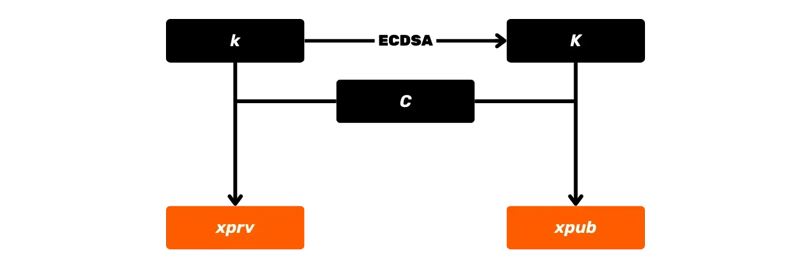

La chiave estesa consiste di due parti:
- il payload, che contiene la chiave privata o pubblica così come la chain code associata;
- i metadati, che sono varie informazioni che facilitano l'interoperabilità tra software e migliorano la comprensione per l'utente.

### Come Funzionano le Chiavi Estese
Quando la chiave estesa contiene una chiave privata, viene definita come chiave privata estesa. È riconosciuta dal suo prefisso che contiene l'identificatore `prv`. Oltre alla chiave privata, la chiave privata estesa contiene anche la chain code associata. Con questo tipo di chiave estesa è possibile derivare tutti i tipi di chiavi private figlie e, mediante l'addizione e il raddoppio dei punti sulle curve ellittiche, permette anche la derivazione dell'intero insieme di chiavi pubbliche figlie.

Quando la chiave estesa non contiene una chiave privata, ma invece una chiave pubblica, viene definita come chiave pubblica estesa. È riconosciuta dal suo prefisso che contiene l'identificatore `pub`. Ovviamente, oltre alla chiave, contiene anche la chain code associata. A differenza della chiave privata estesa, la chiave pubblica estesa permette la derivazione solo di chiavi pubbliche figlie "normali" (cioè non può derivare chiavi figlie "hardened"). Vedremo nel capitolo seguente cosa significa questa distinzione tra "normali" e "hardened".

In ogni caso, la chiave pubblica estesa non permette la derivazione di chiavi private figlie. Anche se qualcuno conosce una `xpub`, non sarà in grado di spendere i fondi associati, poiché non avrà accesso alle corrispondenti chiavi private. Potrà solo derivare chiavi pubbliche figlie per osservare le transazioni associate.

Per proseguire adotteremo la seguente notazione:
- $K_{\text{PAR}}$: una chiave pubblica genitore;
- $k_{\text{PAR}}$: una chiave privata genitore;
- $C_{\text{PAR}}$: una chain code genitore;
- $C_{\text{CHD}}$: una chain code figlia;
- $K_{\text{CHD}}^n$: una chiave pubblica figlia normale;
- $k_{\text{CHD}}^n$: una chiave privata figlia normale;
- $K_{\text{CHD}}^h$: una chiave pubblica figlia hardened;
- $k_{\text{CHD}}^h$: una chiave privata figlia hardened.


### Costruzione di una Chiave Estesa

Una chiave estesa è strutturata come segue:
- **Versione**: codice versione per identificare la natura della chiave (`xprv`, `xpub`, `yprv`, `ypub`...). Vedremo alla fine di questo capitolo a cosa corrispondono le lettere `x`, `y` e `z`.
- **Profondità (Depth)**: livello gerarchico nel wallet HD rispetto alla chiave master (0 per la chiave master).
- **Fingerprint Genitore**: I primi 4 byte dell'hash HASH160 della chiave pubblica genitore utilizzata per derivare la chiave presente nel payload.
- **Indice**: identificatore della chiave figlia tra le chiavi sorelle, ovvero tra tutte le chiavi allo stesso livello di derivazione che hanno gli stessi genitori.
- **Chain Code**: un codice univoco di 32 byte per derivare le chiavi figlie.
- **Chiave**: La chiave privata (prefissata da 1 byte per la dimensione) o la chiave pubblica.
- **Checksum**: viene aggiunto un checksum calcolato con la funzione HASH256 (doppio SHA256), che permette la verifica dell'integrità della chiave estesa durante la sua trasmissione o memorizzazione.

Il formato completo di una chiave estesa è quindi di 78 byte senza il checksum, o di 82 byte con il checksum. Tutto viene poi convertito in Base58 per produrre una rappresentazione facilmente leggibile dagli utenti. Il formato Base58 è lo stesso utilizzato per gli indirizzi di ricezione _Legacy_ (predecessori di _SegWit_).

| Elemento          | Descrizione                                                                                                        | Dimensione |
| ----------------- | ------------------------------------------------------------------------------------------------------------------ | --------- |
| Versione          | Indica se la chiave è pubblica (`xpub`, `ypub`) o privata (`xprv`, `zprv`), così come la versione della chiave estesa | 4 byte    |
| profondità (depth)| Livello nella gerarchia rispetto alla chiave master                                                             | 1 byte    |
| Fingerprint Genitore | I primi 4 byte di HASH160 della chiave pubblica genitore                                                            | 4 byte    |
| Indice     | Posizione della chiave nell'ordine dei figli                                                                        | 4 byte    |
| Chain Code     | Utilizzato per derivare le chiavi figlie                                                                            | 32 byte   |
| Chiave            | La chiave privata (con un prefisso di 1 byte) o la chiave pubblica                                                  | 33 byte   |
| Checksum          | Checksum per verificare l'integrità                                                                                 | 4 byte    |

Se viene aggiunto un byte solo alla chiave privata, è perché la chiave pubblica compressa è più lunga della chiave privata di un byte. Questo byte aggiuntivo, inserito all'inizio della chiave privata come `0x00`, eguaglia le loro dimensioni, assicurando che il payload della chiave estesa abbia la stessa lunghezza sia che si tratti di una chiave pubblica o una privata.

### Prefissi delle Chiavi Estese
Come abbiamo appena visto, le chiavi estese includono un prefisso che indica sia la versione della chiave estesa sia la sua natura. La notazione `pub` indica che si tratta di una chiave pubblica estesa, mentre la notazione `prv` indica una chiave privata estesa. La lettera aggiuntiva alla base della chiave estesa aiuta ad indicare se lo standard seguito è Legacy, SegWit v0, SegWit v1, ecc.
Ecco un riassunto dei prefissi utilizzati e dei loro significati:

| Prefissi Base 58  | Prefissi Base 16   | Network | Purpose             | Script Associati | Derivazione            | Tipo di Chiave     |
| --------------- | --------------- | ------- | ------------------- | ------------------- | --------------------- | ------------ |
| `xpub`          | `0488b21e`      | Mainnet | Legacy e SegWit V1 | P2PK / P2PKH / P2TR | `m/44'/0'`, `m/86'/0'` | pubblica      |
| `xprv`          | `0488ade4`      | Mainnet | Legacy e SegWit V1 | P2PK / P2PKH / P2TR | `m/44'/0'`, `m/86'/0'` | privata      |
| `tpub`          | `043587cf`      | Testnet | Legacy e SegWit V1 | P2PK / P2PKH / P2TR | `m/44'/1'`, `m/86'/1'` | pubblica       |
| `tprv`          | `04358394`      | Testnet | Legacy e SegWit V1 | P2PK / P2PKH / P2TR | `m/44'/1'`, `m/86'/1'` | privata      |
| `ypub`          | `049d7cb2`      | Mainnet | Nested SegWit       | P2WPKH in P2SH      | `m/49'/0'`             | pubblica       |
| `yprv`          | `049d7878`      | Mainnet | Nested SegWit       | P2WPKH in P2SH      | `m/49'/0'`             | privata      |
| `upub`          | `049d7cb2`      | Testnet | Nested SegWit       | P2WPKH in P2SH      | `m/49'/1'`             | pubblica       |
| `uprv`          | `044a4e28`      | Testnet | Nested SegWit       | P2WPKH in P2SH      | `m/49'/1'`             | privata      |
| `zpub`          | `04b24746`      | Mainnet | SegWit V0           | P2WPKH              | `m/84'/0'`             | pubblica       |
| `zprv`          | `04b2430c`      | Mainnet | SegWit V0           | P2WPKH              | `m/84'/0'`             | privata      |
| `vpub`          | `045f1cf6`      | Testnet | SegWit V0           | P2WPKH              | `m/84'/1'`             | pubblica       |
| `vprv`          | `045f18bc`      | Testnet | SegWit V0           | P2WPKH              | `m/84'/1'`             | privata      |


### Dettagli degli Elementi di una Chiave Estesa

Per comprendere meglio la struttura interna di una chiave estesa, prendiamone una come esempio e analizziamola. Ecco una chiave estesa:

- **In Base58**:

```text
xpub6CTNzMUkzpurBWaT4HQoYzLP4uBbGJuWY358Rj7rauiw4rMHCyq3Rfy9w4kyJXJzeFfyrKLUar2rUCukSiDQFa7roTwzjiAhyQAdPLEjqHT
```

- **In esadecimale**:

```text
0488B21E036D5601AD80000000C605DF9FBD77FD6965BD02B77831EC5C78646AD3ACA14DC3984186F72633A89303772CCB99F4EF346078D167065404EED8A58787DED31BFA479244824DF50658051F067C3A
```

Questa chiave estesa si suddivide in diversi elementi distinti:

1.**Versione**: `0488B21E`

I primi 4 byte sono la versione. Qui, corrisponde a una chiave pubblica estesa sulla Mainnet con derivazione _Legacy_ o _SegWit v1_.

2.**profondità (depth)**: `03`

Questo campo indica il livello gerarchico della chiave all'interno del wallet HD. In questo caso, una profondità (depth) di `03` significa che questa chiave è tre livelli di derivazione sotto la chiave master.

3.**Fingerprint Genitore**: `6D5601AD`
Questi sono i primi 4 byte dell'hash HASH160 della chiave pubblica genitore che è stata utilizzata per derivare questa `xpub`.

4.**Indice**: `80000000`

Questo indice definisce la posizione della chiave tra le chiavi figlie di una data chiave genitore. Il prefisso `0x80` indica che la chiave è derivata dalla chiave privata (hardened), e poiché il resto è riempito con zeri, indica che questa chiave è la prima tra le sue possibili sorelle.

5.**Chain code**:
`C605DF9FBD77FD6965BD02B77831EC5C78646AD3ACA14DC3984186F72633A893`

6.**Chiave Pubblica**: `03772CCB99F4EF346078D167065404EED8A58787DED31BFA479244824DF5065805`

7.**Checksum**: `1F067C3A`

Il checksum corrisponde ai primi 4 byte dell'hash (doppio SHA256) di tutto il resto.

In questo capitolo, abbiamo scoperto che esistono due tipi differenti di chiavi figlie. Abbiamo anche appreso che la derivazione di queste chiavi figlie richiede una chiave (che può essere privata o pubblica) e la sua chain code. Nel prossimo capitolo esamineremo in dettaglio la natura di questi diversi tipi di chiavi, come derivarle dalla chiave genitore e dalla chain code.


## Derivazione delle Coppie di Chiavi Figlie
<chapterId>61c0807c-845b-5076-ad06-7f395b36adfd</chapterId>

:::video id=80387fa0-bee8-4aac-9eac-93e90e55a1cb:::

La derivazione delle coppie di chiavi figlie nei wallet gerarchico-deterministici Bitcoin si basa su una struttura gerarchica, che consente di generare un gran numero di chiavi, organizzandole in diversi gruppi attraverso rami. Ogni coppia figlia derivata da una coppia genitore può essere utilizzata direttamente in uno _scriptPubKey_ per bloccare i bitcoin, o come punto di partenza per generare ulteriori chiavi figlie e così via, per creare un albero di chiavi.

Tutte queste derivazioni iniziano con la chiave master e la master chain code, che sono i primi genitori al livello di profondità (depth) 0. Sono, in un certo senso, l'Adamo e l'Eva delle chiavi del tuo wallet, capostipiti comuni di tutte le chiavi derivate.

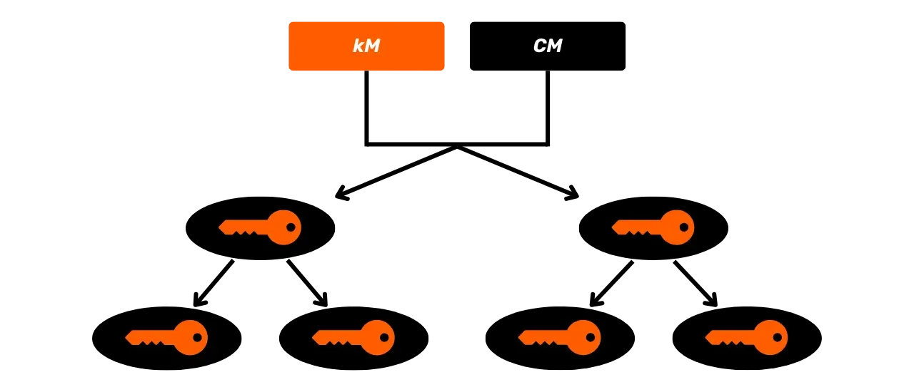

Esploriamo come funziona questa derivazione deterministica.

### I Diversi Tipi di Derivazioni di Chiavi Figlie

Come abbiamo brevemente accennato nel capitolo precedente, le chiavi figlie sono divise in due tipi principali:
- **Chiavi figlie normali** ($k_{\text{CHD}}^n, K_{\text{CHD}}^n$): derivate dalla chiave pubblica estesa ($K_{\text{PAR}}$), o dalla chiave privata estesa ($k_{\text{PAR}}$), dove la chiave pubblica è derivata per prima.
- **Chiavi figlie hardened** ($k_{\text{CHD}}^h, K_{\text{CHD}}^h$), che possono essere derivate solo dalla chiave privata estesa ($k_{\text{PAR}}$) e sono quindi invisibili agli osservatori che hanno solo la chiave pubblica estesa.

Ogni coppia di chiavi figlie è identificata da un **indice** a 32 bit (denominato $i$ nei nostri calcoli). Gli indici per le chiavi normali variano da $0$ a $2^{31}-1$, mentre quelli per le chiavi hardened variano da $2^{31}$ a $2^{32}-1$. Questi numeri sono utilizzati per distinguere le coppie di chiavi sorelle durante la derivazione. Ogni coppia di chiavi genitore deve essere infatti in grado di derivare più coppie di chiavi figlie. Se applicassimo lo stesso calcolo sistematicamente dalle chiavi genitore, tutte le chiavi sorelle ottenute sarebbero identiche, il che non è desiderabile. L'indice introduce quindi una variabile che modifica il calcolo di derivazione, permettendo di differenziare ogni coppia di chiavi figlie. Eccetto per l'uso specifico in certi protocolli e standard di derivazione, generalmente iniziamo derivando la prima chiave figlia con l'indice `0`, la seconda con l'indice `1`, e così via.

### Processo di Derivazione con HMAC-SHA512

La derivazione di ogni chiave figlia si basa sulla funzione HMAC-SHA512, di cui abbiamo discusso nella Sezione 2 dedicata alle funzioni hash. Prende due input: la chain code genitore $C_{\text{PAR}}$ e la concatenazione della chiave genitore (che può essere la chiave pubblica $K_{\text{PAR}}$ o la chiave privata $k_{\text{PAR}}$ a seconda del tipo di chiave figlia desiderata) e l'indice. L'output di HMAC-SHA512 è una sequenza di 512 bit, divisa in due parti:
- **I primi 32 byte** (o $h_1$) sono utilizzati per calcolare la nuova coppia di chiavi figlie.
- **Gli ultimi 32 byte** (o $h_2$) servono come nuova chain code $C_{\text{CHD}}$ per la coppia di chiavi figlie.

In tutti i nostri calcoli, denoterò $\text{hash}$ l'output della funzione HMAC-SHA512.

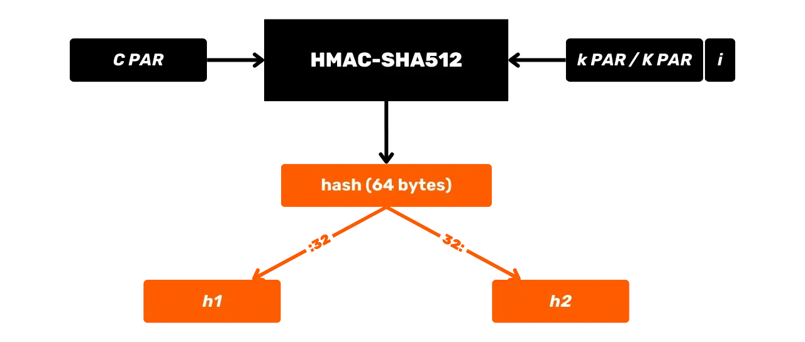

#### Derivazione di una Chiave Privata Figlia da una Chiave Privata Genitore

Per derivare una chiave privata figlia $k_{\text{CHD}}$ da una chiave privata genitore $k_{\text{PAR}}$ sono possibili due scenari, a seconda che si desideri una chiave normale o hardened.

Per una **chiave figlia normale** ($i < 2^{31}$), il calcolo di $\text{hash}$ è il seguente:

$$
\text{hash} = \text{HMAC-SHA512}(C_{\text{PAR}},  k_{\text{PAR}} \cdot G \Vert i)
$$

In questo calcolo osserviamo che la nostra funzione HMAC prende due input: prima la chain code genitore, poi la concatenazione dell'indice con la chiave pubblica associata alla chiave privata genitore. La chiave pubblica genitore è utilizzata perché stiamo cercando di derivare una chiave figlia normale, non una hardened.
Ora abbiamo un $\text{hash}$ di 64 byte che divideremo in 2 parti da 32 byte ciascuna: $h_1$ e $h_2$:


$$$

\text{hash} = h_1 \Vert h_2

$$


$$
h_1 = \text{hash}_{[:32]} \quad, \quad h_2 = \text{hash}_{[32:]}
$$

La chiave privata figlia $k_{\text{CHD}}^n$ è quindi calcolata come segue:

$$
k_{\text{CHD}}^n = \text{parse256}(h_1) + k_{\text{PAR}} \mod n
$$

In questo calcolo l'operazione $\text{parse256}(h_1)$ consiste nell'interpretare i primi 32 byte dell'$\text{hash}$ come un intero a 256 bit. Questo numero viene poi sommato alla chiave privata genitore, il tutto preso modulo $n$ per rimanere nell'ordine della curva ellittica, come abbiamo visto nella sezione 3 sulle firme digitali. Pertanto, per derivare una chiave privata figlia normale, sebbene sia utilizzata la chiave pubblica genitore come base per il calcolo negli input della funzione HMAC-SHA512, è sempre necessario avere la chiave privata genitore per finalizzare il calcolo.

Da questa chiave privata figlia è possibile derivare la corrispondente chiave pubblica applicando ECDSA o Schnorr, così da ottenere una coppia completa di chiavi.

Ne consegue che la seconda parte dell'$\text{hash}$ è semplicemente interpretata come chain code per la coppia di chiavi figlie che abbiamo appena derivato:

$$
C_{\text{CHD}} = h_2
$$

Ecco una rappresentazione schematica della derivazione complessiva:

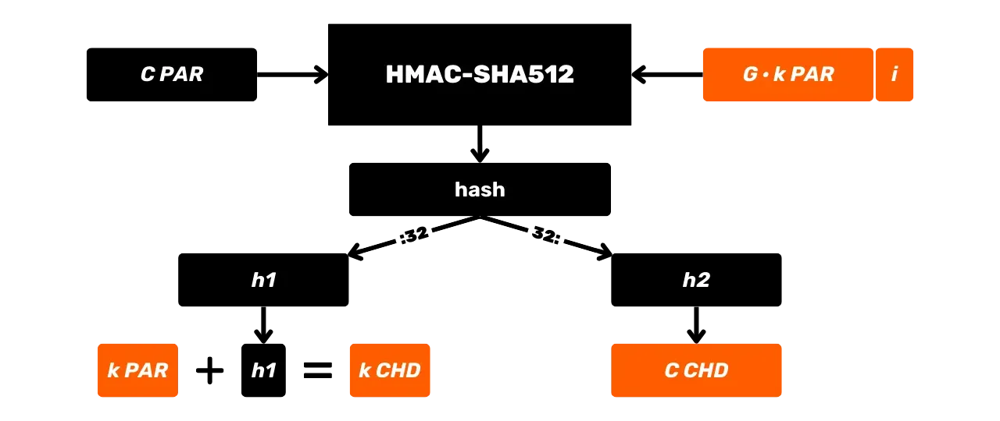

Per una **chiave figlia hardened** ($i \geq 2^{31}$), il calcolo dell'$\text{hash}$ è il seguente:


$$
\text{hash} = \text{HMAC-SHA512}(C_{\text{PAR}}, 0x00 \Vert k_{\text{PAR}} \Vert i)
$$

In questo calcolo osserviamo che la nostra funzione HMAC prende due input: prima la chain code genitore, poi la concatenazione dell'indice con la chiave privata genitore. La chiave privata genitore è utilizzata qui perché stiamo cercando di derivare una chiave figlia hardened. Inoltre un byte pari a `0x00` viene aggiunto all'inizio della chiave, per equalizzare la lunghezza totale e farla corrispondere a quella di una chiave pubblica compressa.
Alla fine del calcolo abbiamo un $\text{hash}$ di 64 byte che divideremo in 2 parti da 32 byte ciascuna: $h_1$ e $h_2$:
$$

\text{hash} = h_1 \Vert h_2

$$


$$
h_1 = \text{hash}[:32] \quad, \quad h_2 = \text{hash}[32:]
$$

La chiave privata figlia $k_{\text{CHD}}^h$ viene quindi calcolata come segue:

$$
k_{\text{CHD}}^h = \text{parse256}(h_1) + k_{\text{PAR}} \mod n
$$

Successivamente interpretiamo semplicemente la seconda parte dell'$\text{hash}$ come chain code per la coppia di chiavi figlie che abbiamo appena derivato:

$$
C_{\text{CHD}} = h_2
$$

Ecco una rappresentazione schematica della derivazione complessiva:

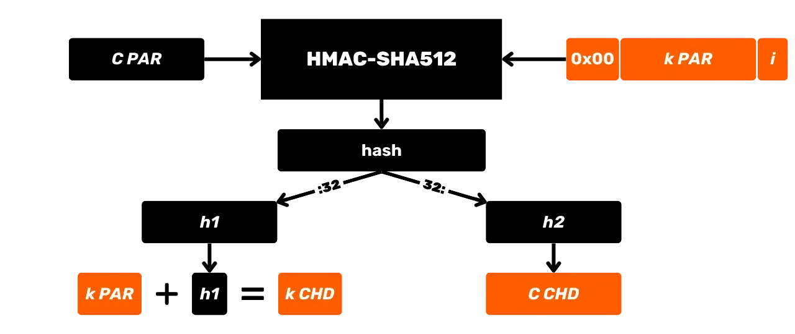

Possiamo vedere che la derivazione normale e quella hardened funzionano allo stesso modo, con questa differenza: la derivazione normale utilizza come input della funzione HMAC la chiave pubblica genitore, mentre la derivazione hardened utilizza la chiave privata genitore.

#### Derivare una chiave pubblica figlia da una chiave pubblica genitore

Se conosciamo solo la chiave pubblica genitore $K_{\text{PAR}}$ e la chain code associata $C_{\text{PAR}}$, ovvero una chiave pubblica estesa, è possibile derivare le chiavi pubbliche figlie $K_{\text{CHD}}^n$, ma solo per le chiavi figlie normali (non hardened). Questo principio permette principalmente di monitorare i movimenti di un account in un wallet Bitcoin a partire dall'`xpub` (_watch-only_).

Per eseguire questo calcolo determineremo l'$\text{hash}$ con un indice $i < 2^{31}$ (derivazione normale):

$$
\text{hash} = \text{HMAC-SHA512}(C_{\text{PAR}}, K_{\text{PAR}} \Vert i)
$$

Osserviamo in questo calcolo che la nostra funzione HMAC prende due input: prima la chain code genitore, poi la concatenazione dell'indice con la chiave pubblica genitore.

Ora abbiamo un $hash$ di 64 byte che divideremo in 2 parti da 32 byte ciascuna: $h_1$ e $h_2$:


$$

\text{hash} = h_1 \Vert h_2

$$


$$$

h_1 = \text{hash}[:32] \quad, \quad h_2 = \text{hash}[32:]

$$

La chiave pubblica figlia $K_{\text{CHD}}^n$ viene quindi calcolata come segue:

$$
K_{\text{CHD}}^n = \text{parse256}(h_1) \cdot G + K_{\text{PAR}}
$$

Se $\text{parse256}(h_1) \geq n$ (ordine della curva ellittica) o se $K_{\text{CHD}}^n$ è il punto all'infinito, la derivazione non è valida e si deve scegliere un altro indice.

In questo calcolo l'operazione $\text{parse256}(h_1)$ implica che i primi 32 byte dell'$\text{hash}$ siano interpretati come un intero a 256 bit. Questo numero è utilizzato per calcolare un punto sulla curva ellittica attraverso l'addizione e il raddoppio dal punto di origine $G$. Questo punto viene poi aggiunto alla chiave pubblica genitore per ottenere la chiave pubblica figlia normale. Pertanto, per derivare una chiave pubblica figlia normale, sono necessari solo la chiave pubblica genitore e la chain code genitore; la chiave privata genitore non entra mai in questo processo, a differenza del calcolo della chiave privata figlia che abbiamo visto in precedenza.

Successivamente la chain code figlia è semplicemente:

$$
C_{\text{CHD}} = h_2
$$

Ecco una rappresentazione schematica della derivazione complessiva:

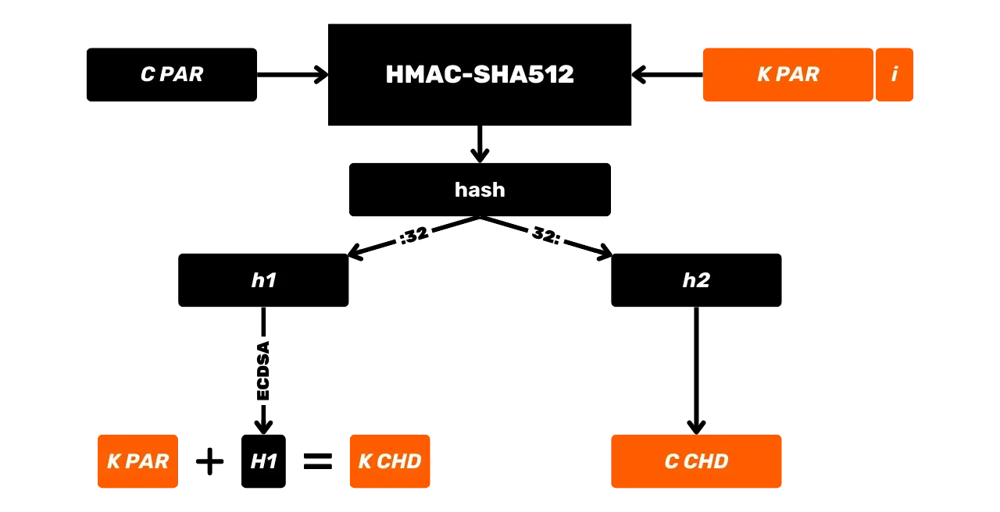

### Corrispondenza tra chiavi pubbliche e private e chiavi figlie

Una domanda che può sorgere è come una chiave pubblica figlia normale, derivata da una chiave pubblica genitore, possa corrispondere a una chiave privata figlia normale derivata dalla corrispondente chiave privata genitore. Questo collegamento è garantito esattamente dalle proprietà delle curve ellittiche. Per derivare una chiave pubblica figlia normale, infatti, HMAC-SHA512 viene applicato nello stesso modo, ma il suo output viene utilizzato diversamente:
   - **Chiave privata figlia normale**: $k_{\text{CHD}}^n = \text{parse256}(h_1) + k_{\text{PAR}} \mod n$
   - **Chiave pubblica figlia normale**: $K_{\text{CHD}}^n = G \cdot \text{parse256}(h_1) + K_{\text{PAR}}$

Grazie alle operazioni di addizione e raddoppio sulla curva ellittica, entrambi i metodi producono risultati omogenei: la chiave pubblica derivata dalla chiave privata figlia è identica alla chiave pubblica figlia derivata direttamente dalla chiave pubblica genitore.

### Riassunto dei tipi di derivazione

Per riassumere, ecco i diversi possibili tipi di derivazioni:

$$
\begin{array}{|c|c|c|c|}
\hline
\rightarrow & \text{PAR} & \text{CHD} & \text{n/h} \\
\hline
k_{\text{PAR}} \rightarrow k_{\text{CHD}} & k_{\text{PAR}} & \{ k_{\text{CHD}}^n, k_{\text{CHD}}^h \} & \{ n, h \} \\
k_{\text{PAR}} \rightarrow K_{\text{CHD}} & k_{\text{PAR}} & \{ K_{\text{CHD}}^n, K_{\text{CHD}}^h \} & \{ n, h \} \\
K_{\text{PAR}} \rightarrow k_{\text{CHD}} & K_{\text{PAR}} & \times & \times \\
K_{\text{PAR}} \rightarrow K_{\text{CHD}} & K_{\text{PAR}} & K_{\text{CHD}}^n & n \\
\hline
\end{array}
$$

Per riassumere finora hai imparato a creare gli elementi base del wallet HD: la frase mnemonica, il seed e poi la chiave e la chain code master. In questo capitolo hai anche scoperto come derivare coppie di chiavi figlie. Nel prossimo capitolo esploreremo come queste derivazioni sono organizzate nei wallet Bitcoin e quale struttura seguire per ottenere concretamente gli indirizzi di ricezione così come le coppie di chiavi utilizzate nello *scriptPubKey* e nello *scriptSig*.

## Struttura del wallet e Derivation Path
<chapterId>34e1bbda-67de-5493-b268-1fded8d67689</chapterId>

:::video id=9fff62bf-9203-46f1-bb4d-4f5a9d5875f8:::

La struttura gerarchica dei wallet HD consente l'organizzazione delle coppie di chiavi in vari modi. L'idea è derivare, a partire dalla chiave privata master e dalla master chain code, diversi livelli di profondità (depth). Ogni livello aggiunto corrisponde alla derivazione di una coppia di chiavi figlie da una coppia di chiavi genitore.

Nel tempo, diversi BIP hanno introdotto standard per questi percorsi di derivazione, con l'obiettivo di unificare il loro uso attraverso diversi software. In questo capitolo scopriremo il significato di ogni livello di derivazione nei wallet HD, secondo questi standard.

### profondità (depth) di Derivazione in un wallet HD

I derivation path sono organizzati in livelli di profondità (depth), che vanno dalla 0, che rappresenta la chiave master e la chain code master, a strati di sottolivelli per derivare gli indirizzi utilizzati per bloccare gli UTXO. I BIP (_Bitcoin Improvement Proposals_) definiscono gli standard per ogni livello, il che aiuta ad armonizzare le pratiche attraverso diversi software di gestione dei wallet.

Un derivation path, quindi, si riferisce alla sequenza di indici utilizzati per derivare le chiavi figlie da una chiave master.

**profondità (depth) 0: Chiave Master (BIP32)**

Questa profondità (depth) corrisponde alla chiave privata master del wallet e alla master chain code. È rappresentata dalla notazione $m/$.

**profondità (depth) 1: Purpose, Scopo (BIP43)**

Il Purpose determina la struttura logica di derivazione. Per un indirizzo P2WPKH, ad esempio, avrà $/84'/$ a profondità (depth) 1 (secondo BIP84), mentre per un indirizzo P2TR avrà $/86'/$ (secondo BIP86). Questo strato facilita la compatibilità tra wallet, mostrando indici corrispondenti ai numeri dei BIP.

In altre parole, una volta che si ha la chiave master e la chain code master, questi servono come coppia di chiavi genitore per derivare una coppia di chiavi figlie. L'indice usato in questa derivazione può essere, ad esempio, $/84'/$ se il wallet è inteso per usare script di tipo SegWit v0. Questa coppia di chiavi è quindi a profondità (depth) 1. Il suo ruolo non è bloccare bitcoin, ma semplicemente servire come punto di passaggio nella gerarchia di derivazione.

**profondità (depth) 2: Tipo di Valuta (BIP44)**

Dalla coppia di chiavi a profondità (depth) 1 viene eseguita una nuova derivazione per ottenere la coppia di chiavi a profondità (depth) 2. Questa profondità (depth) permette di differenziare gli account Bitcoin da altre criptovalute all'interno dello stesso wallet.

Ogni valuta ha un indice unico per garantire la compatibilità tra wallet multi-valuta. Per Bitcoin l'indice è $/0'/$ (o `0x80000000` in notazione esadecimale). Gli indici delle valute sono scelti nell'intervallo da $2^{31}$ a $2^{32}-1$ per garantire una derivazione hardened.

Per darvi altri esempi, ecco gli indici di alcune valute:
- $1'$ (`0x80000001`) per la testnet di Bitcoin;
- $2'$ (`0x80000002`) per Litecoin;
- $60'$ (`0x8000003c`) per Ethereum...

**profondità (depth) 3: Account (BIP32)**

Ogni wallet può essere diviso in diversi account, numerati da $2^{31}$ e rappresentati a profondità (depth) 3 da $/0'/$ per il primo account, $/1'/$ per il secondo, e così via. Generalmente, quando si fa riferimento a una chiave estesa `xpub`, si riferisce a chiavi a questa profondità (depth) di derivazione.

Questa separazione in diversi account è opzionale. Ha lo scopo di semplificare l'organizzazione del wallet per gli utenti. In pratica si usa solo un account, di solito il primo per impostazione predefinita. In alcuni casi, tuttavia, se si desidera distinguere chiaramente coppie di chiavi per usi diversi, può risultare utile usare altri account. Ad esempio è possibile creare un account personale e uno professionale a partire dallo stesso seed, con gruppi di chiavi completamente distinti. Tutto ciò si ottiene a questa profondità (depth) di derivazione.

**profondità (depth) 4: Chain (BIP32)**

Ogni account definito a profondità (depth) 3 è poi strutturato in due chain:
- **Chain esterna**: nella chain esterna vengono derivate quelli che sono noti come indirizzi "pubblici". Gli indirizzi di ricezione sono destinati a bloccare UTXO provenienti da transazioni esterne (cioè, originati dalla spesa di UTXO che non ti appartengono). Per dirla semplicemente, questa chain esterna viene utilizzata ogni volta che si desidera ricevere bitcoin. Quando si clicca su "_receive_" nel wallet, è sempre un indirizzo della chain esterna che viene mostrato.
- **La chain interna (resto/change)**: Questa chain è riservata per gli indirizzi di ricezione che bloccano bitcoin generati spendendo un UTXO che ti appartiene: in altre parole indirizzi di resto. È identificata dall'indice $/1/$.

**profondità (depth) 5: Indice degli Indirizzi (BIP32)**

Infine il livello 5, che rappresenta l'ultimo passo della derivazione nel wallet. Sebbene tecnicamente sia possibile continuare all'infinito, gli standard attuali si fermano a questa profondità (depth). Qui vengono derivate le coppie di chiavi che saranno effettivamente utilizzate per bloccare e sbloccare gli UTXO. Ogni indice permette di distinguere tra coppie di chiavi sorelle: il primo indirizzo di ricezione utilizzerà l'indice $/0/$, il secondo l'indice $/1/$, e così via.


### Notazione del Derivation Path

Il derivation path è scritto separando ogni livello con una barra ($/$). Ogni barra indica quindi la derivazione di una coppia di chiavi genitore ($k_{\text{PAR}}$, $K_{\text{PAR}}$, $C_{\text{PAR}}$) in una coppia di chiavi figlie ($k_{\text{CHD}}$, $K_{\text{CHD}}$, $C_{\text{CHD}}$). Il numero indicato ad ogni profondità (depth) corrisponde all'indice utilizzato per derivare questa chiave dai suoi genitori. L'apostrofo ($'$) posto alla destra dell'indice indica una derivazione hardened ($k_{\text{CHD}}^h$, $K_{\text{CHD}}^h$). Talvolta questo apostrofo è sostituito da una $h$. In assenza di un apostrofo o di una $h$, si tratta quindi di una derivazione normale ($k_{\text{CHD}}^n$, $K_{\text{CHD}}^n$).
Come abbiamo visto nei capitoli precedenti, gli indici delle chiavi hardened partono da $2^{31}$, o `0x80000000` in esadecimale. Quando in un derivation path un indice è seguito da un apostrofo, a $2^{31}$ deve essere aggiunto il numero indicato per ottenere il valore effettivo utilizzato nella funzione HMAC-SHA512. Ad esempio, se il percorso di derivazione specifica $/44'/$, l'indice effettivo sarà:
$$

i = 44 + 2^{31} = 2\,147\,483\,692

$$

In esadecimale, questo è `0x8000002C`.

Ora che abbiamo compreso i principi fondamentali dei derivation path, prendiamo un esempio! Ecco il percorso di derivazione per un indirizzo di ricezione Bitcoin:


$$

m / 84' / 0' / 1' / 0 / 7

$$

In questo esempio:
- $84'$ indica lo standard P2WPKH (SegWit v0);
- $0'$ indica la valuta Bitcoin sulla Mainnet;
- $1'$ corrisponde al secondo account nel wallet;
- $0$ indica che l'indirizzo si trova sulla chain esterna;
- $7$ indica l'8° indirizzo di questo account.

### Riassunto della struttura di derivazione

| Depth | Descrizione        | Standard                          |
| ----- | ------------------ | --------------------------------- |
| 0     | Chiave Master      | $m/$                              |
| 1     | Purpose            | $/86'/$ (P2TR)                    |
| 2     | Valuta             | $/0'/$ (Bitcoin)                  |
| 3     | Account            | $/0'/$ (primo account)            |
| 4     | Chain              | $/0/$ (esterna) or $/1/$ (resto ) |
| 5     | Indice indirizzo   | $/0/$ (primo address)             |

Nel prossimo capitolo scopriremo cosa sono i "_descriptor degli script di output_", una novità introdotta recentemente in Bitcoin Core e che semplifica il backup di un wallet Bitcoin.

## Descriptor degli script di output
<chapterId>e4f1c2d3-9b8a-4d3e-8f2a-7b6c5d4e3f2a</chapterId>

:::video id=ce9d2c33-6a9d-451e-a2b4-41ef81cbfd71:::

Spesso ci viene detto che la frase mnemonica da sola è sufficiente per recuperare l'accesso a un wallet. In realtà le cose sono un po' più complicate. Nel capitolo precedente abbiamo esaminato la struttura di derivazione del wallet gerarchico-deterministico e potreste aver notato che questo processo è piuttosto complesso. I derivation path indicano al software quale direzione seguire per derivare le chiavi dell'utente. Tuttavia, quando si ripristina un wallet Bitcoin, se non si conoscono questi percorsi la frase mnemonica da sola non è sufficiente. La mnemonica permette di ottenere la chiave master e la master chain code, ma è poi necessario conoscere gli indici usati per raggiungere le chiavi figlie.

Teoricamente è necessario salvare non solo la frase mnemonica del nostro wallet, ma anche i percorsi che portano agli account usati. Poi nella pratica è spesso possibile ottenere di nuovo l'accesso alle chiavi figlie senza queste informazioni, a patto che siano stati seguiti gli standard. Testando ogni standard uno per uno, generalmente è possibile riavere l'accesso ai bitcoin. Tuttavia non è garantito ed è particolarmente complicato per i principianti. Si aggiunga poi che, con la diversificazione dei tipi di script e l'emergere di configurazioni più complesse, queste informazioni potrebbero diventare difficili da estrapolare, trasformando così questi dati in informazioni nascoste e difficili da recuperare solo con brute force. Ecco perché è stata recentemente introdotta un'innovazione, che sta iniziando ad essere integrata nel vostro software wallet preferito: i *descriptor degli script di output*.

### Cos'è un "descriptor"?

I "*descriptor degli script di output*", o semplicemente "*descriptor*", sono rappresentazioni strutturate che descrivono completamente uno script di output (_scriptPubKey_), fornendo tutte le informazioni necessarie per seguire le transazioni associate a un particolare script. Facilitano la gestione delle chiavi nei wallet gerarchico-deterministici, offrendo una descrizione standardizzata e completa della struttura del wallet e dei tipi di indirizzi utilizzati.

Il principale vantaggio dei descriptor risiede nella loro capacità di contenere tutte le informazioni essenziali per ripristinare un wallet in una singola stringa (in aggiunta alla recovery phrase). Salvando un descriptor con le parole della mnemonica associata, diventa possibile ripristinare le chiavi private conoscendo esattamente la loro posizione nella gerarchia. Per i wallet multisig, il cui backup era inizialmente più complesso, il descriptor include la `xpub` di ogni partecipante, garantendo così la possibilità di rigenerare gli indirizzi in caso di problema.

### Costruzione di un descriptor

Un descriptor è composto da diversi elementi:
* Funzioni di script come `pk` (*Pay-to-PubKey*), `pkh` (*Pay-to-PubKey-Hash*), `wpkh` (*Pay-to-Witness-PubKey-Hash*), `sh` (*Pay-to-Script-Hash*), `wsh` (*Pay-to-Witness-Script-Hash*), `tr` (*Pay-to-Taproot*), `multi` (*Multifirma*), e `sortedmulti` (*Multifirma con chiavi ordinate*);
**Derivation path**, ad esempio, `[d34db33f/44h/0h/0h]` che indica un percorso di account derivato e la fingerprint della specifica chiave master;
* Chiavi in vari formati come chiavi pubbliche esadecimali o chiavi pubbliche estese (`xpub`);
* Un checksum, preceduto dal segno cancelletto, per verificare l'integrità del descriptor.

Un descriptor per un wallet P2WPKH (SegWit v0) potrebbe apparire, per esempio, così:

```text
wpkh([cdeab12f/84h/0h/0h]xpub6CUGRUonZSQ4TWtTMmzXdrXDtyPWKiKbERr4d5qkSmh5h17C1TjvMt7DJ9Qve4dRxm91CDv6cNfKsq2mK1rMsJKhtRUPZz7MQtp3y6atC1U/<0;1>/*)#jy0l7nr4
```

In questo descriptor la funzione di derivazione `wpkh` indica un tipo di script _Pay-to-Witness-Public-Key-Hash_ ed è seguito dal derivation path che contiene:
* `cdeab12f`: fingerprint della chiave master;
* `84h`: che indica l'uso di uno Purpose BIP84, destinato agli indirizzi SegWit v0;
* `0h`: che indica che si tratta di una valuta BTC sulla Mainnet;
* `0h`: che si riferisce al numero di account specifico utilizzato nel wallet.

Il descriptor include anche la chiave pubblica estesa utilizzata in questo wallet:

```text
xpub6CUGRUonZSQ4TWtTMmzXdrXDtyPWKiKbERr4d5qkSmh5h17C1TjvMt7DJ9Qve4dRxm91CDv6cNfKsq2mK1rMsJKhtRUPZz7MQtp3y6atC1U
```

La notazione `/<0;1>/*` indica che il descrittore può generare indirizzi sia dalla catena esterna (`0`) sia da quella interna (`1`). Il carattere jolly (`*`) alla fine del percorso significa che, in sequenza, è possibile derivare tutte le chiavi figlie non rinforzate (“*unhardened*”) da questa posizione, siano esse indirizzi esterni o interni. Questa sintassi non implica direttamente il concetto di *gap limit*, che appartiene a un meccanismo specifico dei portafogli per il rilevamento degli indirizzi, ma serve qui unicamente a indicare che tutte le derivazioni possibili in questa posizione sono prese in considerazione.

Infine, `#jy0l7nr4` rappresenta il checksum per verificare l'integrità del descriptor.

Ora conosci tutto sul funzionamento del wallet gerarchico-deterministico Bitcoin e il processo di derivazione delle coppie di chiavi. In questi ultimi capitoli però, ci siamo limitati alla generazione di chiavi private e pubbliche, senza affrontare la costruzione degli indirizzi di ricezione. Questo sarà precisamente l'argomento del prossimo capitolo!

## Indirizzi di Ricezione
<chapterId>ca80a89d-f8da-4e09-8c35-43179b65bced</chapterId>

:::video id=4113aebf-c850-4ebc-90a8-a3b599de4453:::

Gli indirizzi di ricezione sono informazioni incorporate in _scriptPubKey_ per bloccare gli UTXO appena creati. In parole semplici, un indirizzo serve a ricevere bitcoin. Scopriamo il loro funzionamento nell'ambito di quanto abbiamo studiato nei capitoli precedenti.

### Il Ruolo degli Indirizzi Bitcoin negli Script

Come spiegato in precedenza, il ruolo di una transazione è trasferire la proprietà dei bitcoin dagli input agli output. Il processo coinvolge il consumo di UTXO come input, mentre crea nuovi UTXO come output. Ogni UTXO è protetto da uno script, che definisce le condizioni necessarie per sbloccare i fondi.

Quando un utente riceve bitcoin, il mittente crea un UTXO e lo blocca con uno _scriptPubKey_. Questo script contiene le regole che specificano esattamente le firme e le chiavi pubbliche richieste per sbloccare l'UTXO. Per spendere questo UTXO in una nuova transazione, l'utente deve fornire le informazioni richieste tramite uno _scriptSig_. L'esecuzione di _scriptSig_, in combinazione con _scriptPubKey_ deve restituire "vero" o `1`. Se questa condizione è soddisfatta l'UTXO può essere speso per creare un nuovo UTXO, a sua volta bloccato da un nuovo _scriptPubKey_, e così via.

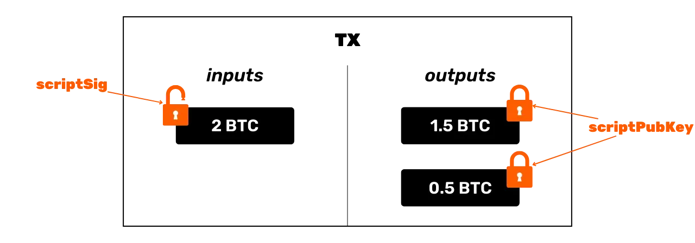

È esattamente nello _scriptPubKey_ che si trovano gli indirizzi di ricezione, ma il loro utilizzo varia a seconda dello standard di script adottato. Ecco una tabella riassuntiva delle informazioni contenute nello _scriptPubKey_ secondo lo standard utilizzato, così come le informazioni richieste nello _scriptSig_ per sbloccare lo _scriptPubKey_.

| Standard           | _scriptPubKey_                                              | _scriptSig_                     | _redeem script_     | _witness_                                |
| ------------------ | ----------------------------------------------------------- | ------------------------------- | ------------------- | ---------------------------------------- |
| P2PK               | `<pubkey> OP_CHECKSIG`                                      | `<signature>`                   |                     |                                          |
| P2PKH              | `OP_DUP OP_HASH160 <pubKeyHash> OP_EQUALVERIFY OP_CHECKSIG` | `<signature> <public key>`      |                     |                                          |
| P2SH               | `OP_HASH160 <scriptHash> OP_EQUAL`                          | `<data pushes> <redeem script>` | Arbitrary data     |                                          |
| P2WPKH             | `0 <pubKeyHash>`                                            |                                 |                     | `<signature> <public key>`               |
| P2WSH              | `0 <witnessScriptHash>`                                     |                                 |                     | `<data pushes> <witness script>`         |
| P2SH-P2WPKH        | `OP_HASH160 <redeemScriptHash> OP_EQUAL`                    | `<redeem script>`               | `0 <pubKeyHash>`    | `<signature> <public key>`               |
| P2SH-P2WSH         | `OP_HASH160 <redeemScriptHash> OP_EQUAL`                    | `<redeem script>`               | `0 <scriptHash>`    | `<data pushes> <witness script>`         |
| P2TR (key path)    | `1 <public key>`                                            |                                 |                     | `<signature>`                            |
| P2TR (script path) | `1 <public key>`                                            |                                 |                     | `<data pushes> <script> <control block>` |

_Fonte: Bitcoin Core PR review club, 7 luglio 2021 - Gloria Zhao_

Gli opcode utilizzati in uno script sono progettati per manipolare le informazioni e, se necessario, per confrontarle o testarle. Prendiamo l'esempio di uno script P2PKH, che è il seguente:

```text
OP_DUP OP_HASH160 OP_PUSHBYTES_20 <pubKeyHash> OP_EQUALVERIFY OP_CHECKSIG
```

Come vedremo in questo capitolo, `<pubKeyHash>` rappresenta effettivamente il payload dell'indirizzo di ricezione utilizzato per bloccare l'UTXO. Per sbloccare questo _scriptPubKey_, è necessario fornire uno _scriptSig_ contenente:

```text
<signature> <public key>
```

Nel linguaggio di script, lo "stack" è una struttura dati "_LIFO_" ("_Last In, First Out_") utilizzata per memorizzare temporaneamente elementi durante l'esecuzione di uno script. Ogni operazione dello script elabora lo stack, dove gli elementi possono essere aggiunti (_push_) o rimossi (_pop_). Gli script utilizzano questi stack per valutare espressioni, memorizzare variabili temporanee e gestire condizioni.

L'esecuzione dello script che ho appena fornito come esempio segue questo processo:

- Abbiamo lo _scriptSig_, lo _ScriptPubKey_ e lo stack:

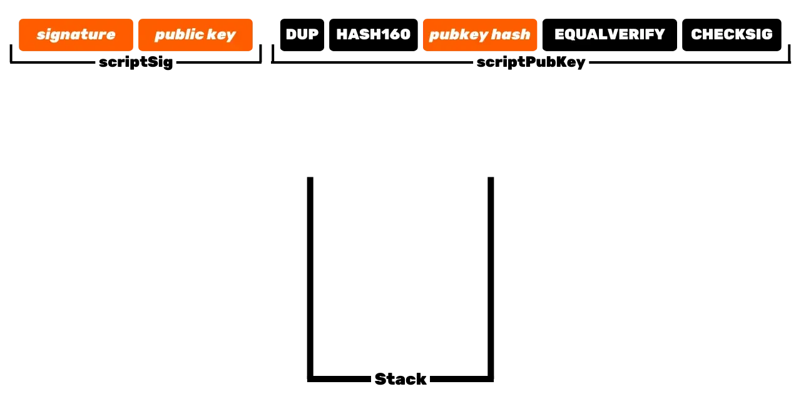

- Lo _scriptSig_ viene inserito nello stack:

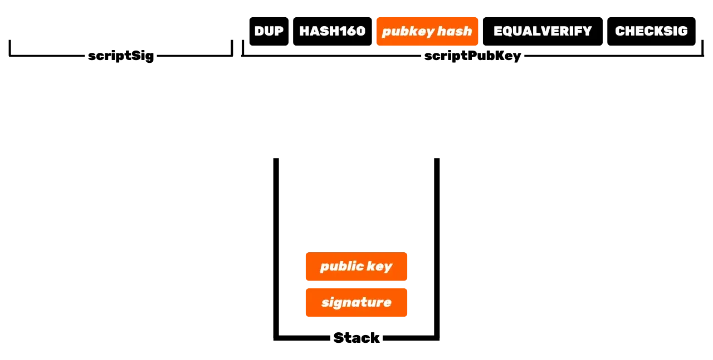

- `OP_DUP` duplica la chiave pubblica fornita nello _scriptSig_ sullo stack:

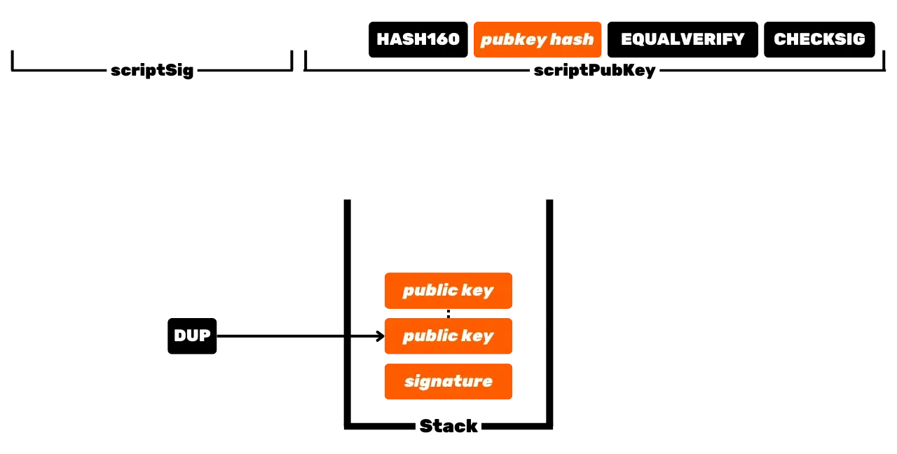

- `OP_HASH160` restituisce l'hash della chiave pubblica appena duplicata:

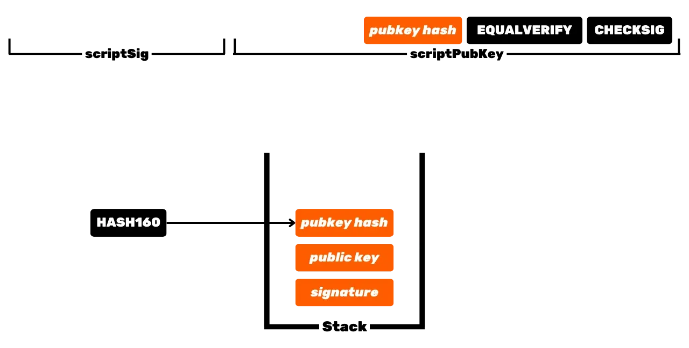

- `OP_PUSHBYTES_20 <pubKeyHash>` inserisce l'indirizzo Bitcoin contenuto nello _scriptPubKey_ sullo stack:

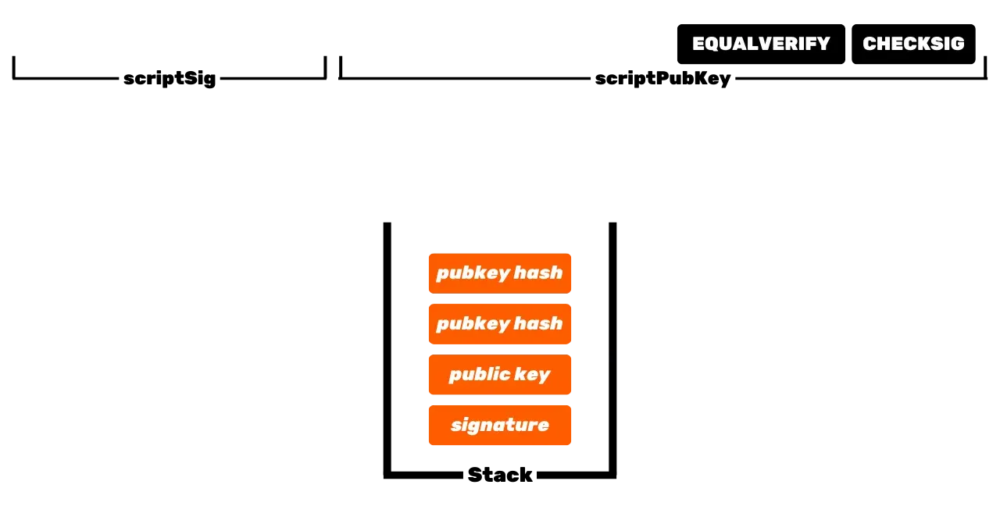

- `OP_EQUALVERIFY` verifica che all'hash della chiave pubblica corrisponda l'indirizzo di ricezione fornito:

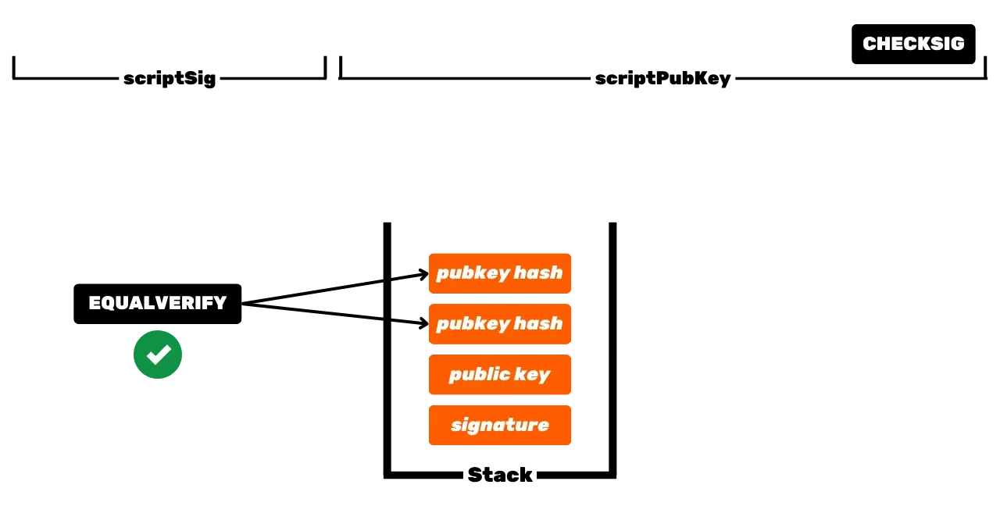

`OP_CHECKSIG` verifica la firma contenuta nello _scriptSig_ utilizzando la chiave pubblica. Questo opcode esegue essenzialmente una verifica della firma come descritto nella parte 3 di questo corso:


- Se sullo stack rimane `1` , allora lo script è valido:


Per riassumere: questo script consente di verificare, con l'aiuto della firma digitale, che l'utente che rivendica la proprietà di questo UTXO e desidera spenderlo possiede effettivamente la chiave privata associata all'indirizzo di ricezione utilizzato durante la creazione di questo UTXO.

### I diversi tipi di indirizzi Bitcoin

Nell'evoluzione di Bitcoin sono stati aggiunti diversi modelli di script standard. Ognuno di essi utilizza un tipo di indirizzo di ricezione caratteristico. Ecco una panoramica dei principali modelli di script disponibili fino ad oggi:

**P2PK (_Pay-to-PubKey_)**:

Questo modello di script è stato introdotto nella prima versione di Bitcoin da Satoshi Nakamoto. Lo script P2PK blocca i bitcoin direttamente utilizzando una chiave pubblica grezza (quindi questo modello non prevede l'utilizzo di indirizzi di ricezione). La sua struttura è semplice: contiene una chiave pubblica e richiede una firma digitale corrispondente per sbloccare i fondi. Questo script fa parte dello standard "_Legacy_".

**P2PKH (_Pay-to-PubKey-Hash_)**:

Come P2PK, lo script P2PKH è stato introdotto al lancio di Bitcoin. A differenza del suo predecessore, blocca i bitcoin utilizzando l'hash della chiave pubblica, anziché utilizzare direttamente la chiave pubblica grezza. Lo _scriptSig_ deve quindi fornire la chiave pubblica associata all'indirizzo di ricezione, così come una firma valida. Gli indirizzi corrispondenti a questo modello iniziano con `1` e sono codificati in _base58check_. Anche questo script appartiene allo standard "_Legacy_".

**P2SH (_Pay-to-Script-Hash_)**:

Introdotta nel 2012 con il BIP16, il modello P2SH prevede nello_scriptPubKey_ l'uso dell'hash di uno script arbitrario. L'hash di questo script, chiamato "_redeemScript_", contiene le condizioni per sbloccare i fondi. Per spendere un UTXO bloccato con P2SH, è necessario fornire uno _scriptSig_ contenente il _redeemScript_ originale, così come i dati necessari per validarlo. Questo modello è principalmente utilizzato per vecchi multisig. Gli indirizzi associati a P2SH iniziano con `3` e sono codificati in _base58check_. Anche questo script appartiene anche allo standard "_Legacy_".

**P2WPKH (_Pay-to-Witness-PubKey-Hash_)**:

Questo script è simile a P2PKH, poiché anch'esso blocca i bitcoin utilizzando l'hash di una chiave pubblica. A differenza di P2PKH, però, lo _scriptSig_ è spostato in una sezione separata chiamata "_Witness_". Talvolta è denominato come "_scriptWitness_", per indicare l'insieme comprendente la firma e la chiave pubblica. Ogni input SegWit ha il proprio _scriptWitness_ e l'insieme' di tutti gli _scriptWitnesse_ costituisce il campo _Witness_ della transazione. Lo spostamento dei dati della firma è un'innovazione introdotta dall'aggiornamento SegWit, finalizzata in modo particolare a prevenire la malleabilità delle transazioni, dovuta alle firme ECDSA.
Gli indirizzi P2WPKH usano la codifica _bech32_ e iniziano sempre con `bc1q`. Questo tipo di script corrisponde agli output SegWit versione 0.

**P2WSH (_Pay-to-Witness-Script-Hash_)**:

Il modello P2WSH è stato anch'esso introdotto con l'aggiornamento SegWit nell'agosto 2017. Simile al modello P2SH, blocca i bitcoin utilizzando l'hash di uno script. La principale differenza risiede in come firme e script sono incorporati nella transazione. Per spendere bitcoin bloccati con questo tipo di script, il proprietario deve fornire lo script originale, chiamato _witnessScript_ (equivalente a _redeemScript_ in P2SH), insieme ai dati necessari per validare lo stesso _witnessScript_. Questo meccanismo permette l'implementazione di condizioni di spesa più complesse, come i multisig.

Gli indirizzi P2WSH usano la codifica _bech32_ e iniziano sempre con `bc1q`. Anche questo script corrisponde agli output SegWit versione 0.

**P2TR (_Pay-to-Taproot_)**:

Il modello P2TR è stato introdotto con l'aggiornamento Taproot nel novembre 2021. Si basa sul protocollo Schnorr per l'aggregazione delle chiavi crittografiche, così come su un Merkle Tree per script alternativi, chiamato MAST (_Merkelized Alternative Script Tree_). A differenza di altri tipi di script, dove le condizioni di spesa sono esposte pubblicamente (sia alla ricezione che alla spesa), P2TR permette di nascondere script complessi dietro a quella che, apparentemente, è una singola chiave pubblica.

Tecnicamente uno script P2TR blocca i bitcoin su un'unica chiave pubblica Schnorr, denotata come $Q$. $Q$ è in realtà l'aggregazione di una chiave pubblica $P$ e una chiave pubblica $M$, quest'ultima calcolata dalla Merkle root di una lista di _scriptPubKey_. I bitcoin bloccati con questo tipo di script possono essere spesi in due modi:
- Esponendo una firma per la chiave pubblica $P$ (_key path_).
- Soddisfacendo uno degli script contenuti nel Merkle tree (_script path_).

P2TR offre quindi grande flessibilità, poiché consente di bloccare bitcoin sia con un'unica chiave pubblica, sia con diversi script a scelta, o entrambi contemporaneamente. Il vantaggio di questa struttura a Merkle tree è che, durante la transazione, viene rivelato solo uno degli script di spesa, mentre tutti gli altri script alternativi rimangono segreti.

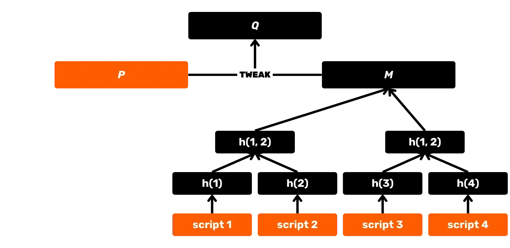

P2TR corrisponde agli output SegWit versione 1, il che significa che le firme per gli input P2TR sono memorizzate nella sezione _Witness_ della transazione e non nello _scriptSig_. Gli indirizzi P2TR utilizzano la codifica _bech32m_ e iniziano con `bc1p`, ma sono piuttosto unici perché non utilizzano una funzione hash per la loro costruzione. Infatti rappresentano direttamente la chiave pubblica $Q$ che è semplicemente formattata con metadati. Il modello di script, quindi, è più vicino a P2PK.

Ora che abbiamo coperto la teoria passiamo alla pratica! Nel capitolo seguente, propongo di derivare sia un indirizzo SegWit v0 che un indirizzo SegWit v1 da una coppia di chiavi.

## Derivazione dell'Indirizzo
<chapterId>3ebdc750-4135-4881-b07e-08965941b93e</chapterId>

:::video id=1517c0fd-d31b-426b-b99e-e4eb19635415:::

Vediamo ora come generare un indirizzo di ricezione da una coppia di chiavi situate, ad esempio, alla profondità (depth) 5 di un wallet HD. Questo indirizzo, poi, potrà essere utilizzato in un software wallet per bloccare un UTXO.

Poiché il processo di generazione di un indirizzo dipende dal modello di script adottato, concentriamoci su due casi specifici: generare un indirizzo SegWit v0 P2WPKH e un indirizzo SegWit v1 P2TR, poiché questi due tipi di indirizzi coprono la stragrande maggioranza di quelli utilizzati oggi.

### Compressione della Chiave Pubblica

Dopo aver eseguito tutti i passaggi di derivazione dalla chiave master alla profondità (depth) 5 utilizzando gli indici appropriati, otteniamo una coppia di chiavi ($k$, $K$) con $K = k \cdot G$. Anche se è possibile utilizzare questa chiave pubblica così com'è per bloccare fondi con lo standard P2PK, questo non è l'obiettivo ora. Adesso miriamo, invece, a creare un indirizzo  P2WPKH in prima istanza, e poi P2TR per un altro esempio.

Il primo passo è comprimere la chiave pubblica $K$. Per comprendere bene questo processo, ricordiamo prima alcuni fondamenti trattati nella parte 3.
Nel protocollo Bitcoin, una chiave pubblica è un punto $K$ situato su una curva ellittica. È rappresentata nella forma $(x, y)$, dove $x$ e $y$ sono le coordinate del punto. Nella sua forma non compressa, questa chiave pubblica misura 520 bit: 8 bit per un prefisso (valore iniziale di `0x04`), 256 bit per la coordinata $x$ e 256 bit per la coordinata $y$.
Bisogna però considerare che le curve ellittiche hanno una proprietà simmetrica rispetto all'asse x: per una data coordinata $x$, ci sono solo due valori possibili per $y$: $y$ e $-y$. Questi due punti si trovano su entrambi i lati dell'asse x. In altre parole, se conosciamo $x$, è sufficiente specificare se $y$ è pari o dispari per identificare il punto esatto sulla curva.

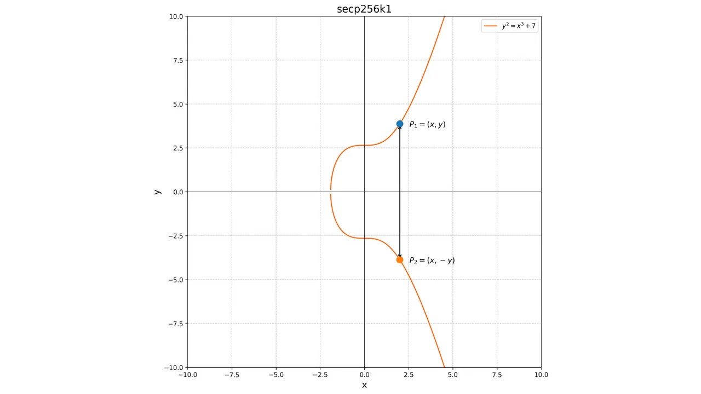

Per comprimere una chiave pubblica viene codificato solo il valore di $x$, che occupa 256 bit, poi viene aggiunto un prefisso per specificare la parità di $y$. Questo metodo riduce la dimensione della chiave pubblica a 264 bit, invece dei 520 iniziali. Il prefisso `0x02` indica che $y$ è pari, e il prefisso `0x03` indica che $y$ è dispari.

Prendiamo un esempio per capire bene, con una chiave pubblica grezza in rappresentazione non compressa:

```text
K = 04678afdb0fe5548271967f1a67130b7105cd6a828e03909a67962e0ea1f61deb649f6bc3f4cef38c4f35504e51ec112de5c384df7ba0b8d578a4c702b6bf11d5f
```

Se decomponiamo questa chiave, abbiamo:
   - Il prefisso: `04`;
   - $x$: `678afdb0fe5548271967f1a67130b7105cd6a828e03909a67962e0ea1f61deb6`;
   - $y$: `49f6bc3f4cef38c4f35504e51ec112de5c384df7ba0b8d578a4c702b6bf11d5f`

L'ultimo carattere esadecimale di $y$ è `f`. In base 10 `f = 15`, che corrisponde a un numero dispari. Pertanto, $y$ è dispari e il prefisso sarà `0x03` per indicarlo.

La chiave pubblica compressa diventa:

```text
K = 03678afdb0fe5548271967f1a67130b7105cd6a828e03909a67962e0ea1f61deb6
```
Questa operazione si applica a tutti i modelli di script basati su ECDSA, cioè tutti tranne P2TR che utilizza Schnorr. Nel caso di Schnorr, come spiegato nella parte 3, si utilizza solo il valore di $x$ senza aggiungere un prefisso per indicare la parità di $y$, a differenza di ECDSA. Questo è reso possibile dal fatto che una parità unica è arbitrariamente scelta per tutte le chiavi. Ciò consente una leggera riduzione dello spazio di archiviazione richiesto per le chiavi pubbliche.
### Derivazione di un indirizzo SegWit v0 (bech32)

Ora che abbiamo ottenuto la nostra chiave pubblica compressa, possiamo derivare da essa un indirizzo di ricezione SegWit v0.

Il primo passo è applicare la funzione hash HASH160 alla chiave pubblica compressa. HASH160 è la combinazione di due funzioni hash successive: SHA256 seguita da RIPEMD160:


$$

\text{HASH160}(K) = \text{RIPEMD160}(\text{SHA256}(K))

$$

Prima passiamo la chiave attraverso SHA256:

```text
SHA256(K) = C489EBD66E4103B3C4B5EAFF462B92F5847CA2DCE0825F4997C7CF57DF35BF3A
```

Poi passiamo il risultato attraverso RIPEMD160:

```text
RIPEMD160(SHA256(K)) = 9F81322CC88622CA4CCB2A52A21E2888727AA535
```

Abbiamo così ottenuto un hash a 160 bit della chiave pubblica, che costituisce quello che viene chiamato il payload dell'indirizzo. Il payload rappresenta la parte centrale e più importante dell'indirizzo, utilizzato anche nello _scriptPubKey_ per bloccare gli UTXO.

Per rendere il payload più facilmente utilizzabile dagli esseri umani, gli vengono aggiunti dei metadati. Il passo successivo prevede la codifica di questo hash in gruppi di 5 bit in decimale. Questa trasformazione decimale sarà utile per la conversione in _bech32_, utilizzato dagli indirizzi post-SegWit. L'hash binario a 160 bit è quindi diviso in 32 gruppi di 5 bit:


$$

\begin{array}{|c|c|}
\hline
\text{5 bit} & \text{Decimal} \\
\hline
10011 & 19 \\
11110 & 30 \\
00000 & 0 \\
10011 & 19 \\
00100 & 4 \\
01011 & 11 \\
00110 & 6 \\
01000 & 8 \\
10000 & 16 \\
11000 & 24 \\
10001 & 17 \\
01100 & 12 \\
10100 & 20 \\
10011 & 19 \\
00110 & 6 \\
01011 & 11 \\
00101 & 5 \\
01001 & 9 \\
01001 & 9 \\
01010 & 10 \\
00100 & 4 \\
00111 & 7 \\
10001 & 17 \\
01000 & 8 \\
10001 & 17 \\
00001 & 1 \\
11001 & 25 \\
00111 & 7 \\
10101 & 21 \\
00101 & 5 \\
00101 & 5 \\
10101 & 21 \\
\hline
\end{array}

$$
Quindi abbiamo:

```text
HASH = 19 30 00 19 04 11 06 08 16 24 17 12 20 19 06 11 05 09 09 10 04 07 17 08 17 01 25 07 21 09 09 21
```

Una volta che l'hash è codificato in gruppi di 5 bit, viene aggiunto un checksum all'indirizzo. Questo checksum è utilizzato per verificare che il payload dell'indirizzo non sia stato modificato durante la sua memorizzazione o trasmissione. Permette ad esempio al wallet di assicurarsi che non sia stato commesso un errore di battitura quando si inserisce un indirizzo di ricezione. Senza questa verifica si potrebbe inviare accidentalmente bitcoin a un indirizzo errato, con la conseguente perdita di fondi, poiché non si possiede la chiave pubblica o privata associata. Il checksum è pertanto una protezione contro gli errori umani.

Per i vecchi indirizzi Bitcoin _Legacy_, il checksum veniva semplicemente calcolato all'inizio dell'hash dell'indirizzo con la funzione HASH256. Con l'introduzione di SegWit e del formato _bech32_, ora vengono utilizzati i codici BCH (_Bose, Ray-Chaudhuri e Hocquenghem_). Questi codici sono correttori di errore e vengono  utilizzati per rilevare e correggere errori nelle sequenze di dati assicurando che le informazioni trasmesse arrivino intatte a destinazione, anche in caso di alterazioni minori. I codici BCH sono utilizzati in molti campi, come SSD, DVD e codici QR. AGrazie a questi codici BCH, è ad esempio possibile leggere e decodificare un QR code parzialmente oscurato.

Nel contesto di Bitcoin, i codici BCH offrono un miglior compromesso tra dimensione e capacità di rilevamento degli errori rispetto alle semplici funzioni hash utilizzate per gli indirizzi _Legacy_. Tuttavia, nel protocollo Bitcoin, i codici BCH sono utilizzati solo per il rilevamento degli errori, non per la correzione. Pertanto, il wallet segnalerà un indirizzo di ricezione errato ma senza correggerlo automaticamente. Questa limitazione è deliberata: consentire la correzione automatica ridurrebbe la capacità di rilevamento degli errori.

Per calcolare il checksum con i codici BCH, dobbiamo preparare diversi elementi:
- **HRP, la Parte Leggibile dall'utente**: per la Mainnet di Bitcoin, l'HRP è `bc`;

HRP deve essere espanso separando ogni carattere in due parti:
- Prendendo i caratteri dell'HRP in ASCII:
	- `b`: `01100010`
  - `c`: `01100011`
- Estraendo i 3 bit più significativi e i 5 bit meno significativi:
  - 3 bit più significativi: `011` (3 in decimale)
  - 3 bit più significativi: `011` (3 in decimale)
  - 5 bit meno significativi: `00010` (2 in decimale)
  - 5 bit meno significativi: `00011` (3 in decimale)

Con il separatore `0` tra i due caratteri, l'estensione di HRP è quindi:

```text
03 03 00 02 03
```

- **La versione witness**: per la versione SegWit 0, è `00`;

- **Il payload**: valori decimali dell'hash della chiave pubblica;

- **Riservare lo spazio per il checksum**: aggiungiamo 6 zeri `[0, 0, 0, 0, 0, 0]` alla fine della sequenza.

Tutti i dati combinati da inserire nel programma per calcolare il checksum sono i seguenti:

```text
HRP = 03 03 00 02 03
SEGWIT v0 = 00
HASH = 19 30 00 19 04 11 06 08 16 24 17 12 20 19 06 11 05 09 09 10 04 07 17 08 17 01 25 07 21 09 09 21
CHECKSUM = 00 00 00 00 00 00

INPUT = 03 03 00 02 03 00 19 30 00 19 04 11 06 08 16 24 17 12 20 19 06 11 05 09 09 10 04 07 17 08 17 01 25 07 21 09 09 21 00 00 00 00 00 00
```

Il calcolo del checksum è piuttosto complesso. Coinvolge l'aritmetica dei campi finiti polinomiali. Non dettaglieremo questo calcolo qui e passeremo direttamente al risultato. Nel nostro esempio, il checksum ottenuto in decimale è:

```text
10 16 11 04 13 18
```

Ora possiamo costruire l'indirizzo di ricezione concatenando in ordine i seguenti elementi:
- **La versione SegWit**: `00`
- **Il payload**: l'hash della chiave pubblica
- **Il checksum**: i valori ottenuti nel passaggio precedente (`10 16 11 04 13 18`)

Questo ci dà, in decimale:

```text
00 19 30 00 19 04 11 06 08 16 24 17 12 20 19 06 11 05 09 09 10 04 07 17 08 17 01 25 07 21 09 09 21 10 16 11 04 13 18
```

Quindi, ogni valore decimale deve essere mappato al suo carattere _bech32_ utilizzando la seguente tabella di conversione:


$$

\begin{array}{|c|c|c|c|c|c|c|c|c|}
\hline
& 0 & 1 & 2 & 3 & 4 & 5 & 6 & 7 \\
\hline
+0 & q & p & z & r & y & 9 & x & 8 \\
\hline
+8 & g & f & 2 & t & v & d & w & 0 \\
\hline
+16 & s & 3 & j & n & 5 & 4 & k & h \\
\hline
+24 & c & e & 6 & m & u & a & 7 & l \\
\hline
\end{array}

$$

Per convertire un valore in un carattere _bech32_ utilizzando questa tabella, è sufficiente localizzare i valori nella prima colonna e nella prima riga che, sommati insieme, danno il risultato desiderato. Si prosegue poi recuperando il carattere corrispondente. Ad esempio, il numero decimale `19` verrà convertito nella lettera `n`, perché $19 = 16 + 3$.

Mappando tutti i nostri valori, otteniamo il seguente indirizzo:

```
qn7qnytxgsc3v5nxt9ff2y83g3pe84ff42stydj
```

Tutto ciò che rimane da fare è aggiungere l'HRP `bc`, che indica che si tratta di un indirizzo per la Mainnet di Bitcoin, così come il separatore `1`, per ottenere l'indirizzo completo di ricezione:

```
bc1qn7qnytxgsc3v5nxt9ff2y83g3pe84ff42stydj
```

La particolarità di questo alfabeto _bech32_ è che include tutti i caratteri alfanumerici tranne `1`, `b`, `i` e `o`, eliminati per evitare confusione visiva tra caratteri simili, specialmente durante la loro digitazione o lettura da parte degli utenti.

Per riassumere, ecco il processo di derivazione:

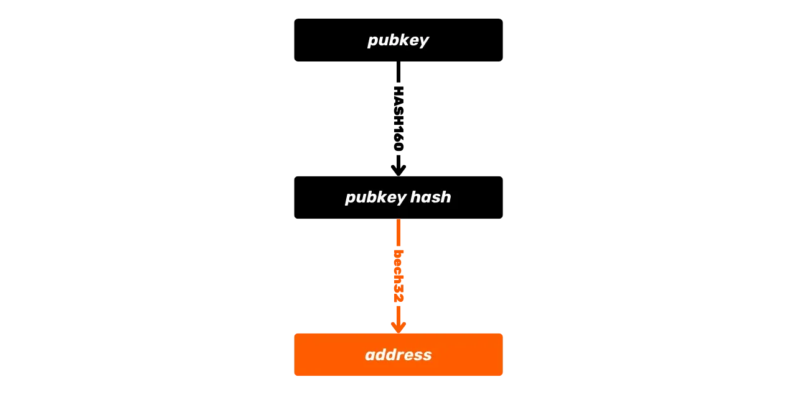

Questo è il modo per derivare un indirizzo di ricezione P2WPKH (SegWit v0) da una coppia di chiavi. Passiamo ora agli indirizzi P2TR (SegWit v1 / Taproot) e scopriamo il loro processo di generazione.

### Derivazione di un Indirizzo SegWit v1 (bech32m)

Il processo di generazione per gli indirizzi Taproot differisce leggermente. Vediamolo insieme!

Fin dalla compressione della chiave pubblica appare una prima distinzione rispetto a ECDSA: le chiavi pubbliche utilizzate per Schnorr su Bitcoin sono rappresentate solo dalla loro ascissa ($x$). Pertanto, non c'è prefisso e la chiave compressa misura esattamente 256 bit.
Come abbiamo visto nel capitolo precedente, uno script P2TR blocca bitcoin su un'unica chiave pubblica Schnorr, denotata $Q$. Questa chiave $Q$ è un aggregato di due chiavi pubbliche: $P$, una chiave pubblica interna principale e $M$, una chiave pubblica derivata dalla Merkle Root di un insieme di _scriptPubKey_. I bitcoin bloccati con questo tipo di script possono essere spesi in due modi:

- Pubblicando una firma per la chiave pubblica $P$ (_key path_);
- Soddisfacendo uno degli script inclusi nel Merkle Tree (_script path_).

In realtà queste due chiavi non sono veramente "aggregate". La chiave $P$ è invece modificata (tweaked) dalla chiave $M$. In crittografia, "modificare" ("tweak") una chiave pubblica significa variare questa chiave applicando un valore additivo chiamato "tweak", un'operazione che permette alla chiave modificata (tweaked) di rimanere compatibile con la chiave privata originale e il tweak. Tecnicamente parlando, un tweak è un valore scalare $t$ che viene aggiunto alla chiave pubblica iniziale. Se $P$ è la chiave pubblica originale, la chiave modificata diventa:


$$

P' = P + t \cdot G

$$

Dove $G$ è l'origine della curva ellittica utilizzata. Questa operazione produce una nuova chiave pubblica, derivata dalla chiave originale, mantenendo al contempo proprietà crittografiche che ne consentono l'uso.

Se non hai bisogno di aggiungere script alternativi (spendendo esclusivamente tramite il _key path_), puoi generare un indirizzo Taproot basato unicamente sulla chiave pubblica presente al livello 5 del tuo wallet. In questo caso, è necessario creare uno script non spendibile per lo _script path_, al fine di soddisfare i requisiti della struttura. Il tweak $t$ viene poi calcolato applicando una funzione di hash etichettata, **`TapTweak`**, sulla chiave pubblica interna $P$:


$$

t = \text{H}_{\text{TapTweak}}(P)

$$

dove:

- **$\text{H}_{\text{TapTweak}}$** è una funzione di hash SHA256 etichettata con il tag `TapTweak`. Se non sei familiare con cosa sia una funzione di hash etichettata, ti invito a consultare il capitolo 3.3;
- $P$ è la chiave pubblica interna, rappresentata nel suo formato compresso di 256 bit, utilizzando solo la coordinata $x$.

La chiave pubblica Taproot $Q$ viene poi calcolata aggiungendo il tweak $t$, moltiplicato per il generatore della curva ellittica $G$, alla chiave pubblica interna $P$:


$$

Q = P + t \cdot G

$$

Una volta ottenuta la chiave pubblica Taproot $Q$, possiamo generare l'indirizzo di ricezione corrispondente. A differenza di altri formati, gli indirizzi Taproot non sono derivati con un hash della chiave pubblica, bensì inserendo la chiave $Q$ in formato grezzo direttamente nell'indirizzo.

Per iniziare, estraiamo la coordinata $x$ del punto $Q$ per ottenere una chiave pubblica compressa. Su questo payload si calcola un checksum utilizzando i codici BCH, come per gli indirizzi SegWit v0. Tuttavia il programma utilizzato per gli indirizzi Taproot differisce leggermente. Dopo l'introduzione del formato _bech32_ con SegWit, è stato infatti scoperto un bug: quando l'ultimo carattere di un indirizzo è una lettera `p`, inserire o rimuovere `q` proprio prima di questa `p` non invalida il checksum. Sebbene questo bug non abbia conseguenze su SegWit v0 (grazie a un vincolo di dimensione), potrebbe rappresentare un problema in futuro. Il bug è stato quindi corretto per gli indirizzi Taproot, con il nuovo formato di codifica chiamato "_bech32m_".

L'indirizzo Taproot viene generato codificando la coordinata $x$ di $Q$ nel formato _bech32m_, con i seguenti elementi:

- **HRP (_Human Readable Part_)**: `bc`, per indicare la Mainnet di Bitcoin;
- **La versione**: `1` per indicare Taproot / SegWit v1;
- **Il checksum**.

L'indirizzo finale avrà quindi il formato:

```
bc1p[Qx][checksum]
```

D'altra parte, se desideri aggiungere script alternativi in aggiunta alla spesa con la chiave pubblica interna (_script path_), il calcolo dell'indirizzo di ricezione sarà leggermente diverso. Dovrai includere l'hash degli script alternativi nel calcolo del tweak. In Taproot, ogni script alternativo, situato alla fine dell'albero di Merkle, è chiamato "foglia" ("leaf").

Una volta scritti i diversi script, alternativi uno all'altro, devi passarli individualmente attraverso una funzione di hash etichettata `TapLeaf`, accompagnata da alcuni metadati:


$$

\text{h}_{\text{leaf}} = \text{H}_{\text{TapLeaf}} (v \Vert sz \Vert S)

$$

Con:

- $v$: il numero di versione dello script (default `0xC0` per Taproot);
- $sz$: la dimensione dello script codificato in formato _CompactSize_; 
- $S$: lo script.

I diversi hash dello script ($\text{h}_{\text{leaf}}$) vengono prima ordinati in ordine lessicografico. Poi vengono concatenati a coppie e passati attraverso una funzione hash etichettata `TapBranch`. Questo processo viene ripetuto iterativamente per costruire, passo dopo passo, il Merkle tree:
$$

\text{h}_{\text{branch}} = \text{H}_{\text{TapBranch}}(\text{h}_{\text{leaf1}} \Vert \text{h}_{\text{leaf2}})

$$

Proseguiamo quindi concatenando i risultati due a due, passandoli ad ogni step attraverso la funzione hash etichettata `TapBranch`, fino ad ottenere la Merkle root:

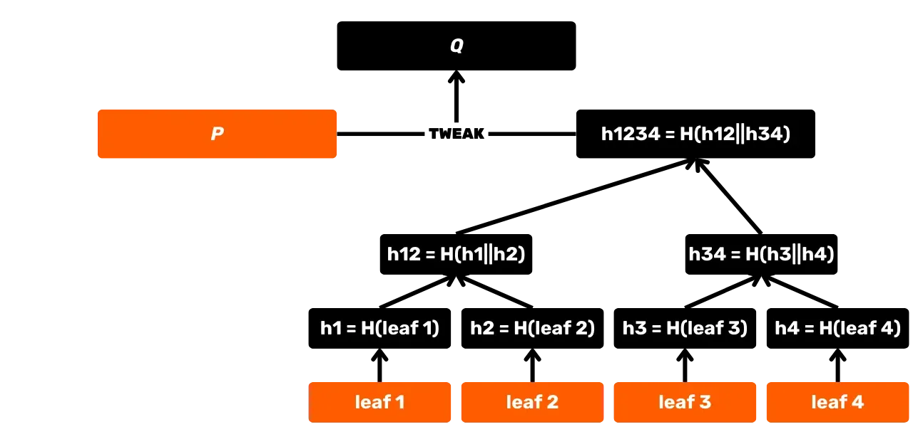

Una volta calcolata la radice di Merkle $h_{\text{root}}$, possiamo calcolare il tweak. Per farlo, la chiave pubblica interna del wallet $P$ viene concatenata con la radice $h_{\text{root}}$ e il risultato viene passato attraverso la funzione di hash etichettata `TapTweak`:


$$

t = \text{H}_{\text{TapTweak}}(P \Vert h_{\text{root}})

$$

Infine, come in precedenza, la chiave pubblica Taproot $Q$ viene ottenuta aggiungendo la chiave pubblica interna $P$ al prodotto del tweak $t$ e del punto di origine $G$:


$$

Q = P + t \cdot G

$$

La generazione dell'indirizzo segue quindi lo stesso processo, utilizzando la chiave pubblica grezza $Q$ come payload, insieme ad alcuni metadati aggiuntivi.

Ed eccoci! Abbiamo raggiunto la fine di questo corso CYP201. Se hai trovato questo corso utile, ti sarei molto grato se potessi dedicare qualche momento per dare una buona valutazione nel capitolo dedicato. Sentiti libero di condividerlo anche con i tuoi cari o sui tuoi social network. Infine, se desideri ottenere il tuo diploma per questo corso, puoi sostenere l'esame finale subito dopo il capitolo di valutazione.

# Conclusione

<partId>58111408-b734-54db-9ea7-0d5b67f99f99</partId>

## Recensioni & Valutazioni

<chapterId>0cd71541-a7fd-53db-b66a-8611b6a28b04</chapterId>
<isCourseReview>true</isCourseReview>

## Esame finale

<chapterId>a53ea27d-0f84-56cd-b37c-a66210a4b31d</chapterId>
<isCourseExam>true</isCourseExam>

## Conclusione

<chapterId>d291428b-3cfa-5394-930e-4b514be82d5a</chapterId>
<isCourseConclusion>true</isCourseConclusion>