# เจาะลึกสู่การเข้ารหัสสมัยใหม่

ในหลักสูตรนี้ เราจะครอบคลุมพื้นฐานของการเข้ารหัสสมัยใหม่ในวิธีที่ชัดเจนและเข้าถึงได้ โดยไม่จำเป็นต้องมีพื้นฐานคณิตศาสตร์ที่หนักหน่วง ตลอดทั้งบท คุณจะได้เรียนรู้แนวคิดหลัก เช่น การเข้ารหัสแบบสมมาตรและกุญแจสาธารณะ ฟังก์ชันแฮช ลายเซ็นดิจิทัล การแลกเปลี่ยนกุญแจ และโปรโตคอลในโลกจริง ระหว่างทาง เราจะเชื่อมโยงจุดต่างๆ ไปยังการประยุกต์ใช้ในทางปฏิบัติ เช่น การส่งข้อความอย่างปลอดภัย TLS การจัดเก็บรหัสผ่าน และการยืนยันตัวตน

เนื้อหานี้ถูกออกแบบมาสำหรับผู้เรียนทุกระดับและสร้างสมดุลระหว่างสัญชาตญาณกับความลึกซึ้งทางเทคนิคที่เพียงพอเพื่อสนองความอยากรู้ คาดหวังการเดินทางที่มีสมาธิและน่าสนใจ เมื่อสิ้นสุด คุณจะเข้าใจว่าเหตุใดและอย่างไรการเข้ารหัสลับสมัยใหม่จึงทำงานได้และวิธีการใช้อย่างมีความรับผิดชอบ

+++
# บทนำ

<partId>bbed2f46-d64c-5fb5-b892-d726032f2494</partId>

## ภาพรวมของหลักสูตร

<chapterId>bb8a8b73-7fb2-50da-bf4e-98996d79887b</chapterId>

ยินดีต้อนรับสู่หลักสูตร CYP302!

หนังสือเล่มนี้นำเสนอการแนะนำเชิงลึกเกี่ยวกับวิทยาศาสตร์และการปฏิบัติของการเข้ารหัสลับ โดยเน้นที่แนวคิดมากกว่าการอธิบายอย่างเป็นทางการของเนื้อหาเมื่อเป็นไปได้

เนื้อหาทางการศึกษานี้ดัดแปลงมาจากหนังสือและที่เก็บ [JWBurgers](https://github.com/JWBurgers/An_Introduction_to_Cryptography) แม้ว่าผู้เขียนจะอนุญาตให้ใช้เพื่อการศึกษาได้ แต่สิทธิ์ในทรัพย์สินทางปัญญาทั้งหมดยังคงเป็นของผู้สร้างดั้งเดิม

**แรงจูงใจและเป้าหมาย**

เป็นการยากที่จะหาวัสดุจำนวนมากที่เสนอพื้นกลางที่ดีในการศึกษาวิทยาการเข้ารหัสลับ

ในด้านหนึ่ง มีบทความยาวและเป็นทางการ ซึ่งจริงๆ แล้วเข้าถึงได้เฉพาะผู้ที่มีพื้นฐานแข็งแกร่งในคณิตศาสตร์ ตรรกศาสตร์ หรือสาขาวิชาอื่นๆ ที่เป็นทางการ ในทางกลับกัน มีการแนะนำในระดับสูงมากที่ซ่อนรายละเอียดมากเกินไปสำหรับผู้ที่มีความอยากรู้อยากเห็นบ้างเล็กน้อย

บทนำสู่การเข้ารหัสลับนี้พยายามที่จะจับจุดกึ่งกลาง แม้ว่ามันควรจะเป็นเรื่องที่ท้าทายและมีรายละเอียดสำหรับผู้ที่เพิ่งเริ่มต้นกับการเข้ารหัสลับ แต่มันก็ไม่ใช่หลุมกระต่ายของตำราพื้นฐานทั่วไป

**กลุ่มเป้าหมาย**

จากนักพัฒนาไปจนถึงผู้ที่มีความอยากรู้อยากเห็นทางปัญญา หนังสือเล่มนี้มีประโยชน์สำหรับทุกคนที่ต้องการความเข้าใจในเรื่องการเข้ารหัสมากกว่าระดับผิวเผิน หากเป้าหมายของคุณคือการเชี่ยวชาญในสาขาการเข้ารหัส หนังสือเล่มนี้ก็เป็นจุดเริ่มต้นที่ดีเช่นกัน

**แนวทางการอ่าน**

หนังสือเล่มนี้ประกอบด้วยเจ็ดบทในปัจจุบัน: "Cryptography คืออะไร?" (บทที่ 1), "พื้นฐานทางคณิตศาสตร์ของ Cryptography I" (บทที่ 2), "พื้นฐานทางคณิตศาสตร์ของ Cryptography II" (บทที่ 3), "Cryptography แบบสมมาตร" (บทที่ 4), "RC4 และ AES" (บทที่ 5), "Cryptography แบบอสมมาตร" (บทที่ 6), และ "ระบบเข้ารหัส RSA" (บทที่ 7) บทสุดท้าย "Cryptography ในทางปฏิบัติ" จะถูกเพิ่มเข้ามา ซึ่งจะเน้นไปที่การประยุกต์ใช้ Cryptography ต่างๆ รวมถึงการรักษาความปลอดภัยของชั้นขนส่ง, การส่งข้อมูลแบบหัวหอม, และระบบแลกเปลี่ยนมูลค่าของ Bitcoin

เว้นแต่คุณจะมีพื้นฐานที่แข็งแกร่งในวิชาคณิตศาสตร์ ทฤษฎีจำนวนอาจเป็นหัวข้อที่ยากที่สุดในหนังสือเล่มนี้ ฉันเสนอภาพรวมของมันในบทที่ 3 และมันยังปรากฏในคำอธิบายของ AES ในบทที่ 5 และระบบการเข้ารหัส RSA ในบทที่ 7

หากคุณกำลังประสบปัญหากับรายละเอียดทางการในส่วนเหล่านี้ของหนังสือ ฉันขอแนะนำให้คุณอ่านแบบคร่าวๆ ในครั้งแรก

**กิตติกรรมประกาศ**

หนังสือที่มีอิทธิพลมากที่สุดในการสร้างหนังสือเล่มนี้คือ _Introduction to Modern Cryptography_ ของ Jonathan Katz และ Yehuda Lindell, CRC Press (Boca Raton, FL), 2015. มีคอร์สที่เกี่ยวข้องให้เรียนบน Coursera ชื่อ "Cryptography."

แหล่งข้อมูลเพิ่มเติมหลักที่มีประโยชน์ในการสร้างภาพรวมในหนังสือเล่มนี้คือ Simon Singh, _The Code Book_, Fourth Estate (London, 1999); Christof Paar และ Jan Pelzl, _Understanding Cryptography_, Springer (Heidelberg, 2010) และ [หลักสูตรที่อิงจากหนังสือของ Paar ชื่อ “Introduction to Cryptography”](https://www.youtube.com/channel/UC1usFRN4LCMcfIV7UjHNuQg); และ Bruce Schneier, Applied Cryptography, 2nd edn, 2015 (Indianapolis, IN: John Wiley & Sons).

ฉันจะอ้างอิงเฉพาะข้อมูลและผลลัพธ์ที่เฉพาะเจาะจงจากแหล่งข้อมูลเหล่านี้เท่านั้น แต่ต้องการแสดงความขอบคุณต่อแหล่งข้อมูลเหล่านี้โดยทั่วไปที่นี่

สำหรับผู้อ่านที่ต้องการค้นหาความรู้ขั้นสูงเพิ่มเติมเกี่ยวกับการเข้ารหัสหลังจากการแนะนำนี้ ฉันขอแนะนำหนังสือของ Katz และ Lindell เป็นอย่างยิ่ง หลักสูตรของ Katz บน Coursera นั้นเข้าถึงได้ง่ายกว่าหนังสือเล็กน้อย

**การมีส่วนร่วม**

โปรดดูที่ [ไฟล์การมีส่วนร่วมในที่เก็บข้อมูล](https://github.com/JWBurgers/An_Introduction_to_Cryptography/blob/master/Contributions.md) สำหรับแนวทางบางประการเกี่ยวกับวิธีการสนับสนุนโครงการนี้

**สัญกรณ์**

**คำสำคัญ:**

คำสำคัญในคู่มือเบื้องต้นจะถูกแนะนำโดยการทำให้เป็นตัวหนา ตัวอย่างเช่น การแนะนำ **Rijndael cipher** เป็นคำสำคัญจะมีลักษณะดังนี้: **Rijndael cipher**.

คำสำคัญจะถูกกำหนดไว้อย่างชัดเจน ยกเว้นในกรณีที่เป็นชื่อเฉพาะหรือมีความหมายที่ชัดเจนจากการสนทนา

คำจำกัดความใด ๆ มักจะถูกให้เมื่อมีการแนะนำคำสำคัญ แม้ว่าบางครั้งจะสะดวกกว่าที่จะทิ้งคำจำกัดความไว้ในภายหลัง

**คำและวลีที่เน้น:**

คำและวลีจะถูกเน้นด้วยตัวเอียง ตัวอย่างเช่น วลี "Remember your password" จะมีลักษณะดังนี้: *Remember your password*

**สัญกรณ์อย่างเป็นทางการ:**

สัญกรณ์อย่างเป็นทางการส่วนใหญ่เกี่ยวข้องกับตัวแปร ตัวแปรสุ่ม และเซต

- ตัวแปร: โดยปกติแล้วจะถูกระบุด้วยตัวอักษรตัวพิมพ์เล็ก (เช่น "x" หรือ "y") บางครั้งอาจใช้ตัวพิมพ์ใหญ่เพื่อความชัดเจน (เช่น "M" หรือ "K")

**ตัวแปรสุ่ม:** เหล่านี้จะแสดงด้วยตัวอักษรตัวพิมพ์ใหญ่เสมอ (เช่น "X" หรือ "Y")

**Sets**: These are always indicated by bold, upper-case letters (e.g., **S**)

พร้อมที่จะสำรวจโลกที่น่าหลงใหลของการเข้ารหัสหรือยัง? ไปกันเลย!

# การเข้ารหัสลับคืออะไร?

<partId>48e4d6d5-cd00-5c00-8adb-ae8477ff47c4</partId>

## รหัสบีล

<chapterId>ae674346-4789-5ab1-9b6f-c8989d83be89</chapterId>

มาเริ่มการสอบถามของเราในด้านการเข้ารหัสด้วยหนึ่งในตอนที่มีเสน่ห์และสนุกสนานที่สุดในประวัติศาสตร์ของมัน: นั่นคือรหัสบีล [1]

เรื่องราวของรหัสลับบีล ในความเห็นของฉัน มีแนวโน้มที่จะเป็นเรื่องแต่งมากกว่าความจริง แต่เรื่องราวที่กล่าวถึงนั้นเกิดขึ้นดังนี้

ทั้งในฤดูหนาวของปี 1820 และ 1822 ชายคนหนึ่งชื่อ Thomas J. Beale ได้พักที่โรงแรมของ Robert Morriss ในเมือง Lynchburg (เวอร์จิเนีย) เมื่อสิ้นสุดการเข้าพักครั้งที่สองของ Beale เขาได้มอบกล่องเหล็กที่มีเอกสารมีค่าให้กับ Morriss เพื่อเก็บรักษา

ไม่กี่เดือนต่อมา มอร์ริสได้รับจดหมายจากบีลลงวันที่ 9 พฤษภาคม 1822 จดหมายเน้นถึงคุณค่ามหาศาลของสิ่งที่อยู่ในกล่องเหล็กและให้คำแนะนำบางอย่างแก่ มอร์ริส: หากไม่มีทั้งบีลหรือผู้ร่วมงานของเขามาเรียกร้องกล่องนี้ เขาควรเปิดกล่องในวันที่ครบสิบปีจากวันที่ในจดหมาย (คือวันที่ 9 พฤษภาคม 1832) เอกสารบางส่วนข้างในจะเขียนด้วยข้อความปกติ อย่างไรก็ตาม บางส่วนจะ “ไม่สามารถเข้าใจได้หากไม่มีตัวช่วย” ตัวช่วยนี้จะถูกส่งให้มอร์ริสโดยเพื่อนที่ไม่ระบุชื่อของบีลในเดือนมิถุนายน 1832

แม้จะมีคำแนะนำที่ชัดเจน แต่ Morriss ก็ไม่ได้เปิดกล่องในเดือนพฤษภาคมปี 1832 และเพื่อนลึกลับของ Beale ก็ไม่ปรากฏตัวในเดือนมิถุนายนของปีนั้น จนกระทั่งปี 1845 ที่เจ้าของโรงแรมตัดสินใจเปิดกล่อง ในกล่องนั้น Morriss พบโน้ตที่อธิบายว่า Beale และเพื่อนร่วมงานของเขาค้นพบทองคำและเงินทางตะวันตกและฝังมันไว้พร้อมกับเครื่องประดับบางอย่างเพื่อความปลอดภัย นอกจากนี้ กล่องยังมี **ข้อความรหัสลับ** สามชุด: นั่นคือ ข้อความที่เขียนในรหัสซึ่งต้องการ **กุญแจเข้ารหัส** หรือความลับ และอัลกอริทึมที่ใช้ร่วมกันเพื่อปลดล็อก กระบวนการปลดล็อกข้อความรหัสลับนี้เรียกว่า **การถอดรหัส** ในขณะที่กระบวนการล็อกเรียกว่า **การเข้ารหัส** (ตามที่อธิบายในบทที่ 3 คำว่า cipher สามารถมีความหมายได้หลายอย่าง ในชื่อ "Beale ciphers" มันย่อมาจากข้อความรหัสลับ)

ข้อความลับทั้งสามที่ Morriss พบในกล่องเหล็กแต่ละอันประกอบด้วยชุดของตัวเลขที่คั่นด้วยเครื่องหมายจุลภาค ตามบันทึกของ Beale ข้อความลับเหล่านี้ให้ข้อมูลเกี่ยวกับที่ตั้งของสมบัติ เนื้อหาของสมบัติ และรายชื่อของผู้ที่มีสิทธิ์รับสมบัติและส่วนแบ่งของพวกเขา (ข้อมูลหลังนี้มีความสำคัญในกรณีที่ Beale และผู้ร่วมงานของเขาไม่มารับกล่อง)

มอร์ริสพยายามถอดรหัสข้อความลับทั้งสามเป็นเวลายี่สิบปี สิ่งนี้คงจะง่ายหากมีคีย์ แต่ มอร์ริส ไม่มีคีย์และไม่ประสบความสำเร็จในการพยายามกู้คืนข้อความต้นฉบับ หรือที่เรียกกันทั่วไปว่า **plaintexts** ในวิชาการเข้ารหัสลับ

ใกล้จะสิ้นชีวิต Morriss ได้ส่งมอบกล่องให้กับเพื่อนคนหนึ่งในปี 1862 ต่อมาเพื่อนคนนี้ได้ตีพิมพ์แผ่นพับในปี 1885 ภายใต้นามแฝง J.B. Ward ซึ่งมีคำอธิบายเกี่ยวกับประวัติศาสตร์ (ที่อ้างว่า) ของกล่อง รหัสลับสามชุด และวิธีแก้ไขที่เขาพบสำหรับรหัสลับชุดที่สอง (ดูเหมือนว่าจะมีคีย์หนึ่งสำหรับแต่ละรหัสลับ และไม่ใช่คีย์เดียวที่ใช้ได้กับรหัสลับทั้งสามชุดตามที่ Beale ดูเหมือนจะเสนอแนะในจดหมายถึง Morriss)

คุณสามารถดูรหัสลับที่สองใน *รูปที่ 2* ด้านล่าง [2] กุญแจสำหรับรหัสลับนี้คือคำประกาศอิสรภาพของสหรัฐอเมริกา ขั้นตอนการถอดรหัสจะสรุปได้โดยการใช้กฎสองข้อดังต่อไปนี้:

**สำหรับตัวเลขใด ๆ n ในข้อความที่เข้ารหัส ให้ค้นหาคำที่ n ในคำประกาศอิสรภาพของสหรัฐอเมริกา**

**แทนที่ตัวเลข n ด้วยตัวอักษรตัวแรกของคำที่คุณพบ**

*รูปที่ 1: รหัสบีลหมายเลข 2*

ตัวอย่างเช่น หมายเลขแรกของรหัสลับที่สองคือ 115 คำที่ 115 ของคำประกาศอิสรภาพคือ “instituted” ดังนั้นตัวอักษรแรกของข้อความธรรมดาคือ “i” รหัสลับไม่ได้ระบุการเว้นวรรคและการใช้ตัวพิมพ์ใหญ่โดยตรง แต่หลังจากถอดรหัสคำแรกๆ คุณสามารถสรุปได้อย่างมีเหตุผลว่าคำแรกของข้อความธรรมดาคือ “I” (ข้อความธรรมดาเริ่มต้นด้วยวลี “I have deposited in the county of Bedford.”)

หลังจากการถอดรหัส ข้อความที่สองให้รายละเอียดเกี่ยวกับสมบัติ (ทองคำ, เงิน, และอัญมณี) และแนะนำว่ามันถูกฝังในหม้อเหล็กและปกคลุมด้วยหินในเขตเบดฟอร์ด (เวอร์จิเนีย) ผู้คนชื่นชอบปริศนาดี ๆ ดังนั้นจึงมีความพยายามอย่างมากในการถอดรหัสรหัสบีลอีกสองชุด โดยเฉพาะอย่างยิ่งชุดที่อธิบายตำแหน่งของสมบัติ แม้แต่นักเข้ารหัสที่มีชื่อเสียงหลายคนก็ได้ลองมือกับมัน อย่างไรก็ตาม จนถึงขณะนี้ ยังไม่มีใครสามารถถอดรหัสข้อความที่เข้ารหัสอีกสองชุดได้

**บันทึก:**

[1] สำหรับบทสรุปที่ดีของเรื่องนี้ ดู Simon Singh, *The Code Book*, Fourth Estate (London, 1999), หน้า 82-99. ภาพยนตร์สั้นของเรื่องนี้ถูกสร้างโดย Andrew Allen ในปี 2010 คุณสามารถหาภาพยนตร์เรื่อง “The Thomas Beale Cipher” [ได้ที่เว็บไซต์ของมัน](http://www.thomasbealecipher.com/).

[2] ภาพนี้มีอยู่ในหน้าวิกิพีเดียสำหรับรหัสบีล

## การเข้ารหัสลับสมัยใหม่

<chapterId>d07d576f-8a4b-5890-b182-2e5763f550f4</chapterId>

เรื่องราวที่มีสีสันเช่นเรื่องราวของรหัสลับ Beale เป็นสิ่งที่พวกเราส่วนใหญ่เชื่อมโยงกับการเข้ารหัสลับ อย่างไรก็ตาม การเข้ารหัสลับสมัยใหม่แตกต่างจากตัวอย่างทางประวัติศาสตร์เหล่านี้อย่างน้อยสี่วิธีที่สำคัญ

ประการแรก ในทางประวัติศาสตร์ วิทยาการเข้ารหัสลับได้ให้ความสำคัญเฉพาะกับ **ความลับ** (หรือการรักษาความลับ) เท่านั้น [3] ข้อความที่ถูกเข้ารหัสจะถูกสร้างขึ้นเพื่อให้แน่ใจว่าเฉพาะบางฝ่ายเท่านั้นที่สามารถรับรู้ข้อมูลในข้อความที่ไม่ได้เข้ารหัสได้ เช่นในกรณีของรหัสบีล เพื่อให้แผนการเข้ารหัสทำหน้าที่นี้ได้ดี การถอดรหัสข้อความที่ถูกเข้ารหัสควรจะเป็นไปได้เฉพาะเมื่อคุณมีคีย์เท่านั้น

วิทยาการเข้ารหัสลับสมัยใหม่เกี่ยวข้องกับหัวข้อที่หลากหลายกว่าการรักษาความลับเพียงอย่างเดียว หัวข้อเหล่านี้รวมถึงหลัก ๆ (1) **ความสมบูรณ์ของข้อความ**—นั่นคือ การรับรองว่าข้อความไม่ได้ถูกเปลี่ยนแปลง; (2) **ความถูกต้องของข้อความ**—นั่นคือ การรับรองว่าข้อความมาจากผู้ส่งที่เฉพาะเจาะจงจริง ๆ; และ (3) **การไม่ปฏิเสธ**—นั่นคือ การรับรองว่าผู้ส่งไม่สามารถปฏิเสธในภายหลังได้ว่าเธอไม่ได้ส่งข้อความ [4]

สิ่งสำคัญที่ควรจำไว้คือ ความแตกต่างระหว่าง **encryption scheme** และ **cryptographic scheme**. Encryption scheme นั้นเกี่ยวข้องกับความลับเท่านั้น ในขณะที่ encryption scheme เป็น cryptographic scheme แต่ในทางกลับกันไม่เป็นความจริง Cryptographic scheme ยังสามารถให้บริการในหัวข้อหลักอื่นๆ ของการเข้ารหัสลับ รวมถึงความสมบูรณ์ ความถูกต้อง และการไม่ปฏิเสธ

หัวข้อเรื่องความซื่อสัตย์และความแท้จริงมีความสำคัญพอๆ กับความลับ ระบบการสื่อสารสมัยใหม่ของเราจะไม่สามารถทำงานได้หากไม่มีการรับประกันเกี่ยวกับความซื่อสัตย์และความแท้จริงของการสื่อสาร การปฏิเสธไม่ได้ก็เป็นข้อกังวลที่สำคัญเช่นกัน เช่น สำหรับสัญญาดิจิทัล แต่มีความจำเป็นน้อยกว่าในแอปพลิเคชันการเข้ารหัสลับเมื่อเทียบกับความลับ ความซื่อสัตย์ และความแท้จริง

ประการที่สอง แผนการเข้ารหัสแบบคลาสสิก เช่น รหัส Beale มักจะเกี่ยวข้องกับกุญแจหนึ่งดอกที่ถูกแชร์ระหว่างทุกฝ่ายที่เกี่ยวข้อง อย่างไรก็ตาม แผนการเข้ารหัสสมัยใหม่หลายๆ แบบไม่ได้เกี่ยวข้องกับกุญแจเพียงดอกเดียว แต่มีสองดอก: **กุญแจส่วนตัว** และ **กุญแจสาธารณะ** ในขณะที่กุญแจแรกควรจะยังคงเป็นส่วนตัวในทุกการใช้งาน กุญแจหลังมักจะเป็นความรู้สาธารณะ (ดังนั้นชื่อของพวกเขา) ในขอบเขตของการเข้ารหัส กุญแจสาธารณะสามารถใช้ในการเข้ารหัสข้อความ ในขณะที่กุญแจส่วนตัวสามารถใช้ในการถอดรหัสได้

สาขาของวิทยาการเข้ารหัสลับที่เกี่ยวข้องกับแผนการที่ทุกฝ่ายใช้กุญแจเดียวกันเรียกว่า **วิทยาการเข้ารหัสลับแบบสมมาตร** กุญแจเดียวในแผนการดังกล่าวมักเรียกว่า **กุญแจส่วนตัว** (หรือกุญแจลับ) สาขาของวิทยาการเข้ารหัสลับที่เกี่ยวข้องกับแผนการที่ต้องใช้คู่กุญแจส่วนตัว-สาธารณะเรียกว่า **วิทยาการเข้ารหัสลับแบบอสมมาตร** สาขาเหล่านี้บางครั้งยังเรียกว่า **วิทยาการเข้ารหัสลับกุญแจส่วนตัว** และ **วิทยาการเข้ารหัสลับกุญแจสาธารณะ** ตามลำดับ (แม้ว่าสิ่งนี้อาจทำให้เกิดความสับสน เนื่องจากแผนการเข้ารหัสลับกุญแจสาธารณะก็มีการใช้กุญแจส่วนตัวด้วย)

การมาถึงของการเข้ารหัสแบบอสมมาตรในช่วงปลายทศวรรษ 1970 ถือเป็นหนึ่งในเหตุการณ์ที่สำคัญที่สุดในประวัติศาสตร์ของการเข้ารหัส หากไม่มีมัน ระบบการสื่อสารสมัยใหม่ส่วนใหญ่ รวมถึง Bitcoin จะไม่สามารถเกิดขึ้นได้ หรืออย่างน้อยก็จะเป็นไปได้ยากมาก

ที่สำคัญคือ วิทยาการเข้ารหัสลับสมัยใหม่ไม่ได้เป็นเพียงการศึกษาระบบการเข้ารหัสด้วยกุญแจสมมาตรและอสมมาตรเท่านั้น (แม้ว่าจะครอบคลุมส่วนใหญ่ของสาขานี้) ตัวอย่างเช่น วิทยาการเข้ารหัสลับยังเกี่ยวข้องกับฟังก์ชันแฮชและตัวสร้างตัวเลขสุ่มเทียม และคุณสามารถสร้างแอปพลิเคชันบนพื้นฐานเหล่านี้ที่ไม่เกี่ยวข้องกับการเข้ารหัสด้วยกุญแจสมมาตรหรืออสมมาตร

ประการที่สาม แผนการเข้ารหัสแบบคลาสสิก เช่นที่ใช้ในรหัสบีล เป็นศิลปะมากกว่าวิทยาศาสตร์ ความปลอดภัยที่รับรู้ได้ส่วนใหญ่ขึ้นอยู่กับสัญชาตญาณเกี่ยวกับความซับซ้อนของพวกมัน โดยทั่วไปแล้วพวกมันจะถูกแก้ไขเมื่อมีการเรียนรู้การโจมตีใหม่ ๆ หรือถูกยกเลิกไปเลยหากการโจมตีนั้นรุนแรงเป็นพิเศษ อย่างไรก็ตาม วิทยาการเข้ารหัสลับสมัยใหม่เป็นวิทยาศาสตร์ที่เข้มงวดด้วยแนวทางทางคณิตศาสตร์อย่างเป็นทางการทั้งในการพัฒนาและวิเคราะห์แผนการเข้ารหัสลับ [5]

โดยเฉพาะอย่างยิ่ง การเข้ารหัสลับสมัยใหม่มุ่งเน้นไปที่**การพิสูจน์ความปลอดภัย**อย่างเป็นทางการ การพิสูจน์ความปลอดภัยสำหรับแผนการเข้ารหัสลับใด ๆ ดำเนินการในสามขั้นตอน:

1.	คำชี้แจงของ **คำนิยามการเข้ารหัสของความปลอดภัย** ซึ่งก็คือ ชุดของเป้าหมายความปลอดภัยและภัยคุกคามที่เกิดจากผู้โจมตี

2.	การระบุสมมติฐานทางคณิตศาสตร์ใด ๆ ที่เกี่ยวข้องกับความซับซ้อนในการคำนวณของแผนการ ตัวอย่างเช่น แผนการเข้ารหัสลับอาจมีตัวสร้างตัวเลขสุ่มเทียม แม้ว่าเราไม่สามารถพิสูจน์การมีอยู่ของสิ่งเหล่านี้ได้ แต่เราสามารถสมมติว่ามันมีอยู่

3.	การอธิบายหลักฐานทางคณิตศาสตร์ **การพิสูจน์ความปลอดภัย** ของแผนการบนพื้นฐานของแนวคิดความปลอดภัยอย่างเป็นทางการและสมมติฐานทางคณิตศาสตร์ใด ๆ

ประการที่สี่ ในขณะที่ในอดีตการเข้ารหัสลับถูกใช้ในบริบททางทหารเป็นหลัก แต่ในยุคดิจิทัลนี้มันได้แทรกซึมเข้ามาในกิจกรรมประจำวันของเรา ไม่ว่าคุณจะทำธุรกรรมธนาคารออนไลน์ โพสต์บนโซเชียลมีเดีย ซื้อสินค้าจาก Amazon ด้วยบัตรเครดิต หรือให้ทิปเพื่อนด้วยบิทคอยน์ การเข้ารหัสลับคือสิ่งที่ขาดไม่ได้ในยุคดิจิทัลของเรา

เมื่อพิจารณาถึงสี่แง่มุมเหล่านี้ของการเข้ารหัสสมัยใหม่ เราอาจอธิบาย **การเข้ารหัส** สมัยใหม่ว่าเป็นวิทยาศาสตร์ที่เกี่ยวข้องกับการพัฒนาและวิเคราะห์รูปแบบการเข้ารหัสอย่างเป็นทางการเพื่อปกป้องข้อมูลดิจิทัลจากการโจมตีของฝ่ายตรงข้าม [6] ความปลอดภัยในที่นี้ควรเข้าใจอย่างกว้างๆ ว่าเป็นการป้องกันการโจมตีที่ทำลายความลับ ความสมบูรณ์ การตรวจสอบสิทธิ์ และ/หรือการไม่ปฏิเสธในการสื่อสาร

การเข้ารหัสลับถือได้ว่าเป็นสาขาย่อยของ **ความปลอดภัยทางไซเบอร์** ซึ่งเกี่ยวข้องกับการป้องกันการขโมย การทำลาย และการใช้ในทางที่ผิดของระบบคอมพิวเตอร์ โปรดทราบว่าความกังวลด้านความปลอดภัยทางไซเบอร์หลายอย่างมีความเชื่อมโยงเพียงเล็กน้อยหรือบางส่วนเท่านั้นกับการเข้ารหัสลับ

ตัวอย่างเช่น หากบริษัทมีเซิร์ฟเวอร์ราคาแพงอยู่ในสถานที่ พวกเขาอาจกังวลเกี่ยวกับการรักษาความปลอดภัยของฮาร์ดแวร์นี้จากการโจรกรรมและความเสียหาย แม้ว่านี่จะเป็นข้อกังวลด้านความปลอดภัยทางไซเบอร์ แต่ก็มีความเกี่ยวข้องน้อยกับการเข้ารหัสลับ

ตัวอย่างอีกประการหนึ่งคือ **การโจมตีแบบฟิชชิ่ง** ซึ่งเป็นปัญหาที่พบได้บ่อยในยุคสมัยใหม่ของเรา การโจมตีเหล่านี้พยายามหลอกลวงผู้คนผ่านทางอีเมลหรือสื่อข้อความอื่น ๆ เพื่อให้เปิดเผยข้อมูลที่ละเอียดอ่อน เช่น รหัสผ่านหรือหมายเลขบัตรเครดิต แม้ว่าการเข้ารหัสลับจะสามารถช่วยแก้ไขปัญหาการโจมตีแบบฟิชชิ่งได้ในระดับหนึ่ง แต่การแก้ไขอย่างครอบคลุมต้องการมากกว่าการใช้การเข้ารหัสลับเพียงอย่างเดียว

**บันทึก:**

[3] ที่จริงแล้ว การประยุกต์ใช้ที่สำคัญของแผนการเข้ารหัสลับนั้นเกี่ยวข้องกับความลับ เด็กๆ ตัวอย่างเช่น มักใช้แผนการเข้ารหัสลับแบบง่ายๆ เพื่อ “ความสนุก” ความลับไม่ใช่เรื่องที่ต้องกังวลในกรณีเหล่านั้น

[4] Bruce Schneier, *Applied Cryptography*, 2nd edn, 2015 (Indianapolis, IN: John Wiley & Sons), p. 2.

[5] ดู Jonathan Katz และ Yehuda Lindell, *Introduction to Modern Cryptography*, CRC Press (Boca Raton, FL: 2015), โดยเฉพาะหน้า 16–23 สำหรับคำอธิบายที่ดี

[6] ดู Katz และ Lindell, ibid., หน้า 3. ฉันคิดว่าการอธิบายของพวกเขามีปัญหาบางอย่าง ดังนั้นจึงนำเสนอเวอร์ชันที่แตกต่างออกไปเล็กน้อยของคำกล่าวของพวกเขาที่นี่

## เปิดการสื่อสาร

<chapterId>cb23d0a6-ba9a-5dc6-a55a-258405ae4117</chapterId>

การเข้ารหัสลับสมัยใหม่ถูกออกแบบมาเพื่อให้การรับรองความปลอดภัยในสภาพแวดล้อมการสื่อสารแบบ **เปิด** หากช่องทางการสื่อสารของเรามีการป้องกันอย่างดีจนผู้ดักฟังไม่มีโอกาสในการแก้ไขหรือแม้แต่สังเกตข้อความของเรา การเข้ารหัสลับก็จะกลายเป็นสิ่งที่ไม่จำเป็น อย่างไรก็ตาม ช่องทางการสื่อสารส่วนใหญ่ของเราแทบจะไม่ได้รับการป้องกันอย่างดีขนาดนั้น

กระดูกสันหลังของการสื่อสารในโลกสมัยใหม่คือเครือข่ายขนาดใหญ่ของสายเคเบิลใยแก้วนำแสง การโทรศัพท์ การดูโทรทัศน์ และการท่องเว็บในครัวเรือนสมัยใหม่มักพึ่งพาเครือข่ายสายเคเบิลใยแก้วนำแสงนี้ (มีเปอร์เซ็นต์เล็กน้อยที่อาจพึ่งพาดาวเทียมเพียงอย่างเดียว) เป็นความจริงที่ว่าคุณอาจมีการเชื่อมต่อข้อมูลที่แตกต่างกันในบ้านของคุณ เช่น สายโคแอกเชียล สายดิจิตอลซับสไครบ์เบอร์ (อสมมาตร) และสายเคเบิลใยแก้วนำแสง แต่ อย่างน้อยในโลกที่พัฒนาแล้ว สื่อข้อมูลที่แตกต่างกันเหล่านี้จะเชื่อมต่อกันอย่างรวดเร็วภายนอกบ้านของคุณไปยังโหนดในเครือข่ายขนาดใหญ่ของสายเคเบิลใยแก้วนำแสงซึ่งเชื่อมต่อทั่วโลก ข้อยกเว้นคือบางพื้นที่ห่างไกลของโลกที่พัฒนาแล้ว เช่น ในสหรัฐอเมริกาและออสเตรเลีย ที่การจราจรข้อมูลอาจยังคงเดินทางเป็นระยะทางไกลผ่านสายโทรศัพท์ทองแดงแบบดั้งเดิม

คงเป็นไปไม่ได้ที่จะป้องกันไม่ให้ผู้โจมตีที่มีศักยภาพเข้าถึงเครือข่ายสายเคเบิลและโครงสร้างพื้นฐานที่สนับสนุนนี้ได้ ในความเป็นจริง เรารู้อยู่แล้วว่าข้อมูลส่วนใหญ่ของเราถูกดักฟังโดยหน่วยงานข่าวกรองแห่งชาติต่างๆ ที่จุดตัดสำคัญของอินเทอร์เน็ต[7] ซึ่งรวมถึงทุกอย่างตั้งแต่ข้อความใน Facebook ไปจนถึงที่อยู่เว็บไซต์ที่คุณเยี่ยมชม

ในขณะที่การสอดส่องข้อมูลในระดับมหาศาลต้องการคู่ต่อสู้ที่มีอำนาจ เช่น หน่วยข่าวกรองแห่งชาติ ผู้โจมตีที่มีทรัพยากรเพียงเล็กน้อยก็สามารถพยายามดักฟังในระดับที่เล็กลงได้อย่างง่ายดาย แม้ว่าสิ่งนี้จะเกิดขึ้นในระดับการแตะสายไฟ แต่การดักสัญญาณการสื่อสารไร้สายก็ง่ายกว่ามาก

ข้อมูลเครือข่ายท้องถิ่นส่วนใหญ่ของเรา—ไม่ว่าจะเป็นที่บ้าน ที่ทำงาน หรือในคาเฟ่—ตอนนี้เดินทางผ่านคลื่นวิทยุไปยังจุดเชื่อมต่อไร้สายบนเราเตอร์แบบรวมทุกอย่าง แทนที่จะผ่านสายเคเบิลทางกายภาพ ดังนั้นผู้โจมตีจึงต้องการทรัพยากรเพียงเล็กน้อยในการดักฟังการจราจรในท้องถิ่นของคุณ นี่เป็นเรื่องที่น่ากังวลเป็นพิเศษเนื่องจากคนส่วนใหญ่ทำเพียงเล็กน้อยเพื่อปกป้องข้อมูลที่เดินทางข้ามเครือข่ายท้องถิ่นของตน นอกจากนี้ ผู้โจมตีที่มีศักยภาพยังสามารถกำหนดเป้าหมายการเชื่อมต่อบรอดแบนด์มือถือของเรา เช่น 3G, 4G และ 5G การสื่อสารไร้สายทั้งหมดนี้เป็นเป้าหมายที่ง่ายสำหรับผู้โจมตี

ดังนั้น แนวคิดในการรักษาการสื่อสารให้เป็นความลับโดยการปกป้องช่องทางการสื่อสารจึงเป็นความหวังที่หลงผิดอย่างสิ้นเชิงสำหรับโลกสมัยใหม่ ทุกสิ่งที่เรารู้สมควรได้รับความหวาดระแวงอย่างรุนแรง: คุณควรสมมติอยู่เสมอว่ามีคนกำลังฟังอยู่ และการเข้ารหัสเป็นเครื่องมือหลักที่เรามีเพื่อให้ได้มาซึ่งความปลอดภัยในสภาพแวดล้อมสมัยใหม่นี้

**บันทึก:**

[7] ดูตัวอย่างเช่น Olga Khazan, “The creepy, long-standing practice of undersea cable tapping”, *The Atlantic*, 16 กรกฎาคม 2013 (สามารถดูได้ที่ [The Atlantic](https://www.theatlantic.com/international/archive/2013/07/the-creepy-long-standing-practice-of-undersea-cable-tapping/277855/)).

# พื้นฐานทางคณิตศาสตร์ของการเข้ารหัสลับ 1

<partId>1bf9f0aa-0f68-5493-83fb-2167238ff9de</partId>

## ตัวแปรสุ่ม

<chapterId>b623a7d0-3dff-5803-bd4e-8257ff73dd69</chapterId>

การเข้ารหัสลับอาศัยคณิตศาสตร์ และหากคุณต้องการสร้างความเข้าใจที่มากกว่าระดับผิวเผินเกี่ยวกับการเข้ารหัสลับ คุณจำเป็นต้องรู้สึกสบายใจกับคณิตศาสตร์นั้น

บทนี้จะแนะนำคณิตศาสตร์พื้นฐานส่วนใหญ่ที่คุณจะพบในการเรียนรู้การเข้ารหัสลับ หัวข้อที่ครอบคลุมได้แก่ ตัวแปรสุ่ม การดำเนินการโมดูโล การดำเนินการ XOR และการสุ่มเทียม คุณควรเชี่ยวชาญเนื้อหาในส่วนเหล่านี้เพื่อความเข้าใจที่ไม่ผิวเผินเกี่ยวกับการเข้ารหัสลับ

ส่วนถัดไปเกี่ยวข้องกับทฤษฎีจำนวน ซึ่งมีความท้าทายมากกว่า

### ตัวแปรสุ่ม

ตัวแปรสุ่มมักจะแทนด้วยตัวอักษรตัวพิมพ์ใหญ่ที่ไม่เป็นตัวหนา ดังนั้น ตัวอย่างเช่น เราอาจพูดถึงตัวแปรสุ่ม $X$, ตัวแปรสุ่ม $Y$, หรือตัวแปรสุ่ม $Z$ นี่คือลักษณะการเขียนที่ฉันจะใช้จากนี้ไป

ตัวแปรสุ่ม (**random variable**) สามารถรับค่าได้สองค่าหรือมากกว่าที่เป็นไปได้ โดยแต่ละค่ามีความน่าจะเป็นบวกที่แน่นอน ค่าที่เป็นไปได้จะถูกระบุไว้ในชุดผลลัพธ์ (**outcome set**)

ทุกครั้งที่คุณ **สุ่มตัวอย่าง** ตัวแปรสุ่ม คุณจะดึงค่าหนึ่งจากชุดผลลัพธ์ตามความน่าจะเป็นที่กำหนดไว้

ลองมาดูตัวอย่างง่ายๆ สมมติว่ามีตัวแปร X ที่ถูกกำหนดดังนี้:

- X มีเซตผลลัพธ์ $\{1,2\}$

$$
Pr[X = 1] = 0.5
$$

$$
Pr[X = 2] = 0.5
$$

เห็นได้ง่ายว่า $X$ เป็นตัวแปรสุ่ม ประการแรก มีค่าที่เป็นไปได้สองค่าหรือมากกว่าที่ $X$ สามารถรับได้ คือ $1$ และ $2$ ประการที่สอง แต่ละค่าที่เป็นไปได้มีความน่าจะเป็นที่เป็นบวกที่จะเกิดขึ้นเมื่อใดก็ตามที่คุณสุ่มตัวอย่าง $X$ คือ $0.5$

สิ่งที่ตัวแปรสุ่มต้องการคือชุดผลลัพธ์ที่มีความเป็นไปได้สองอย่างหรือมากกว่า ซึ่งแต่ละความเป็นไปได้มีความน่าจะเป็นที่เป็นบวกในการเกิดขึ้นเมื่อสุ่มตัวอย่าง ดังนั้นในหลักการแล้ว ตัวแปรสุ่มสามารถกำหนดได้อย่างเป็นนามธรรม ปราศจากบริบทใดๆ ในกรณีนี้ คุณอาจคิดว่า "การสุ่มตัวอย่าง" เป็นการดำเนินการทดลองทางธรรมชาติเพื่อกำหนดค่าของตัวแปรสุ่ม

ตัวแปร $X$ ข้างต้นถูกกำหนดอย่างนามธรรม ดังนั้น คุณอาจคิดถึงการสุ่มตัวแปร $X$ ข้างต้นเหมือนกับการโยนเหรียญที่ยุติธรรมและกำหนดค่า “2” ในกรณีที่ออกหัว และ “1” ในกรณีที่ออกก้อย สำหรับแต่ละตัวอย่างของ $X$ คุณจะโยนเหรียญอีกครั้ง

หรืออีกทางหนึ่ง คุณอาจคิดถึงการสุ่มตัวอย่าง $X$ เหมือนกับการทอยลูกเต๋าที่เป็นธรรม และกำหนดค่า “2” ในกรณีที่ลูกเต๋าออก $1$, $3$, หรือ $4$ และกำหนดค่า “1” ในกรณีที่ลูกเต๋าออก $2$, $5$, หรือ $6$ ทุกครั้งที่คุณสุ่มตัวอย่าง $X$ คุณจะทอยลูกเต๋าอีกครั้ง

จริงๆ แล้ว การทดลองตามธรรมชาติใดๆ ที่จะช่วยให้คุณกำหนดความน่าจะเป็นของค่าที่เป็นไปได้ของ $X$ ข้างต้นสามารถจินตนาการได้ในแง่ของการวาดภาพ

บ่อยครั้ง อย่างไรก็ตาม ตัวแปรสุ่มไม่ได้ถูกนำเสนอเพียงแค่ในเชิงนามธรรมเท่านั้น แต่ชุดของค่าผลลัพธ์ที่เป็นไปได้มีความหมายที่ชัดเจนในโลกแห่งความเป็นจริง (ไม่ใช่แค่เป็นตัวเลข) นอกจากนี้ ค่าผลลัพธ์เหล่านี้อาจถูกกำหนดไว้สำหรับการทดลองประเภทเฉพาะบางอย่าง (แทนที่จะเป็นการทดลองธรรมชาติใด ๆ ที่มีค่าดังกล่าว)

ตอนนี้ลองพิจารณาตัวอย่างของตัวแปร $X$ ที่ไม่ได้ถูกกำหนดอย่างนามธรรม $X$ ถูกกำหนดดังนี้เพื่อที่จะตัดสินใจว่าทีมใดในสองทีมจะเริ่มเกมฟุตบอล:

- $X$ มีชุดผลลัพธ์ {red kicks off,blue kicks off}
- พลิกเหรียญ $C$: ก้อย = “แดงเริ่มเตะ”; หัว = “น้ำเงินเริ่มเตะ”

$$
Pr [X = \text{red kicks off}] = 0.5
$$

$$
Pr [X = \text{blue kicks off}] = 0.5
$$

ในกรณีนี้ ชุดผลลัพธ์ของ X ถูกกำหนดด้วยความหมายที่ชัดเจน นั่นคือทีมใดเริ่มต้นในเกมฟุตบอล นอกจากนี้ ผลลัพธ์ที่เป็นไปได้และความน่าจะเป็นที่เกี่ยวข้องถูกกำหนดโดยการทดลองที่ชัดเจน นั่นคือการโยนเหรียญ $C$ เฉพาะเจาะจง

ภายในการอภิปรายเกี่ยวกับการเข้ารหัสลับ ตัวแปรสุ่มมักถูกนำเสนอในชุดผลลัพธ์ที่มีความหมายในโลกแห่งความเป็นจริง อาจเป็นชุดของข้อความทั้งหมดที่สามารถเข้ารหัสได้ ซึ่งเรียกว่าพื้นที่ข้อความ หรือชุดของกุญแจทั้งหมดที่ฝ่ายที่ใช้การเข้ารหัสสามารถเลือกได้ ซึ่งเรียกว่าพื้นที่กุญแจ

ตัวแปรสุ่มในการอภิปรายเกี่ยวกับการเข้ารหัสลับนั้น โดยทั่วไปแล้วจะไม่ได้ถูกกำหนดขึ้นกับการทดลองทางธรรมชาติที่เฉพาะเจาะจง แต่จะถูกกำหนดขึ้นกับการทดลองใด ๆ ที่อาจให้การแจกแจงความน่าจะเป็นที่ถูกต้อง

ตัวแปรสุ่มสามารถมีการแจกแจงความน่าจะเป็นแบบไม่ต่อเนื่องหรือแบบต่อเนื่องได้ ตัวแปรสุ่มที่มี**การแจกแจงความน่าจะเป็นแบบไม่ต่อเนื่อง**—นั่นคือ ตัวแปรสุ่มแบบไม่ต่อเนื่อง—มีจำนวนผลลัพธ์ที่เป็นไปได้จำกัด ตัวแปรสุ่ม $X$ ในทั้งสองตัวอย่างที่ให้มาจนถึงตอนนี้เป็นแบบไม่ต่อเนื่อง

**ตัวแปรสุ่มต่อเนื่อง** สามารถรับค่าในช่วงหนึ่งหรือมากกว่าหนึ่งช่วงได้ คุณอาจกล่าวได้ว่า ตัวแปรสุ่ม เมื่อทำการสุ่มตัวอย่าง จะรับค่าจริงใด ๆ ระหว่าง 0 และ 1 และแต่ละจำนวนจริงในช่วงนี้มีโอกาสเกิดเท่ากัน ภายในช่วงนี้ มีค่าที่เป็นไปได้อย่างไม่สิ้นสุด

สำหรับการอภิปรายเกี่ยวกับการเข้ารหัส คุณจะต้องเข้าใจเฉพาะตัวแปรสุ่มแบบไม่ต่อเนื่อง การอภิปรายใด ๆ เกี่ยวกับตัวแปรสุ่มจากนี้ไป ควรเข้าใจว่าเป็นการอ้างถึงตัวแปรสุ่มแบบไม่ต่อเนื่อง เว้นแต่จะระบุไว้เป็นอย่างอื่นโดยเฉพาะ

### การสร้างกราฟตัวแปรสุ่ม

ค่าที่เป็นไปได้และความน่าจะเป็นที่เกี่ยวข้องสำหรับตัวแปรสุ่มสามารถมองเห็นได้ง่ายผ่านกราฟ ตัวอย่างเช่น พิจารณาตัวแปรสุ่ม $X$ จากส่วนก่อนหน้าที่มีชุดผลลัพธ์เป็น $\{1, 2\}$ และ $Pr [X = 1] = 0.5$ และ $Pr [X = 2] = 0.5$ โดยปกติเราจะแสดงตัวแปรสุ่มดังกล่าวในรูปแบบของกราฟแท่งดังที่แสดงใน *รูปที่ 1*

*รูปที่ 1: ตัวแปรสุ่ม X*

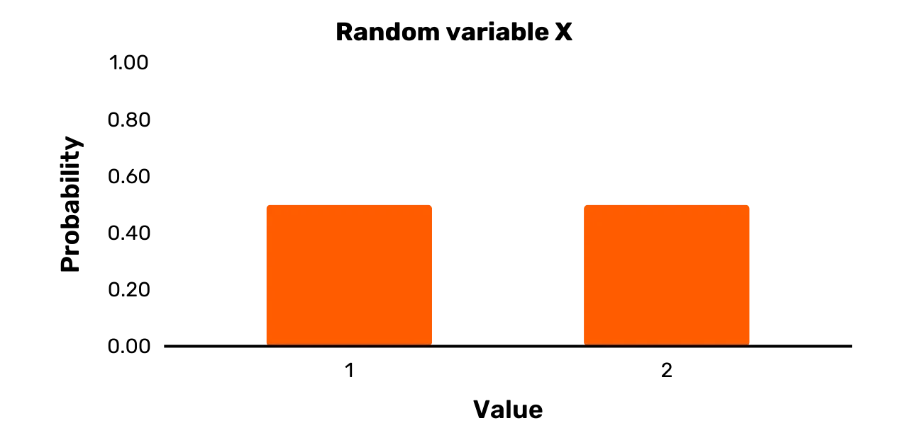

แถบกว้างใน *รูปที่ 1* ไม่ได้หมายความว่า ตัวแปรสุ่ม $X$ เป็นแบบต่อเนื่องจริง ๆ แต่แถบถูกทำให้กว้างเพื่อให้ดูน่าสนใจมากขึ้น (เพียงแค่เส้นตรงขึ้นไปให้ภาพที่ไม่ค่อยเข้าใจง่าย)

### ตัวแปรเครื่องแบบ

ในนิพจน์ “ตัวแปรสุ่ม” คำว่า “สุ่ม” หมายถึง “เชิงความน่าจะเป็น” กล่าวอีกนัยหนึ่ง มันหมายถึงว่าผลลัพธ์ที่เป็นไปได้สองอย่างหรือมากกว่าของตัวแปรเกิดขึ้นด้วยความน่าจะเป็นที่แน่นอน อย่างไรก็ตาม ผลลัพธ์เหล่านี้ *ไม่จำเป็นต้อง* มีโอกาสเกิดเท่ากัน (แม้ว่าคำว่า “สุ่ม” อาจมีความหมายเช่นนั้นในบริบทอื่น ๆ ได้)

ตัวแปรสุ่มแบบ **uniform variable** เป็นกรณีพิเศษของตัวแปรสุ่ม ซึ่งสามารถรับค่าได้สองค่าหรือมากกว่าด้วยความน่าจะเป็นที่เท่ากัน ตัวแปรสุ่ม $X$ ที่แสดงใน *รูปที่ 1* เป็นตัวแปรแบบ uniform อย่างชัดเจน เนื่องจากผลลัพธ์ที่เป็นไปได้ทั้งสองเกิดขึ้นด้วยความน่าจะเป็น $0.5$ อย่างไรก็ตาม ยังมีตัวแปรสุ่มอีกมากมายที่ไม่ใช่กรณีของตัวแปรแบบ uniform

พิจารณาตัวแปรสุ่ม $Y$ เป็นตัวอย่าง มันมีเซตผลลัพธ์ {1, 2, 3, 8, 10} และมีการแจกแจงความน่าจะเป็นดังนี้:

$$
\Pr[Y = 1] = 0.25
$$

$$
\Pr[Y = 2] = 0.35
$$

$$
\Pr[Y = 3] = 0.1
$$

$$
\Pr[Y = 8] = 0.25
$$

$$
\Pr[Y = 10] = 0.05
$$

ในขณะที่ผลลัพธ์ที่เป็นไปได้สองอย่างมีความน่าจะเป็นเท่ากันที่จะเกิดขึ้น คือ $1$ และ $8$ แต่ $Y$ ก็สามารถมีค่าอื่นๆ ที่มีความน่าจะเป็นแตกต่างจาก $0.25$ เมื่อสุ่มตัวอย่าง ดังนั้น แม้ว่า $Y$ จะเป็นตัวแปรสุ่ม แต่มันไม่ใช่ตัวแปรที่มีการกระจายแบบสม่ำเสมอ

มีการแสดงภาพกราฟิกของ $Y$ ใน *รูปที่ 2*

*รูปที่ 2: ตัวแปรสุ่ม Y*

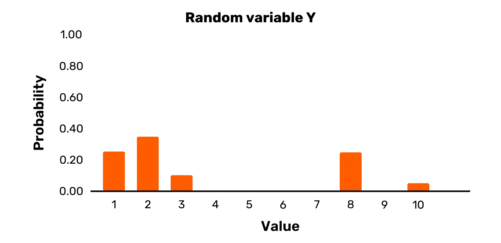

สำหรับตัวอย่างสุดท้าย พิจารณาตัวแปรสุ่ม Z ซึ่งมีเซตผลลัพธ์ {1,3,7,11,12} และมีการแจกแจงความน่าจะเป็นดังนี้:

$$
\Pr[Z = 2] = 0.2
$$

$$
\Pr[Z = 3] = 0.2
$$

$$
\Pr[Z = 9] = 0.2
$$

$$
\Pr[Z = 11] = 0.2
$$

$$
\Pr[Z = 12] = 0.2
$$

คุณสามารถเห็นมันแสดงใน *รูปที่ 3* ตัวแปรสุ่ม Z นั้นตรงกันข้ามกับ Y เป็นตัวแปรแบบสม่ำเสมอ เนื่องจากความน่าจะเป็นทั้งหมดสำหรับค่าที่เป็นไปได้เมื่อสุ่มตัวอย่างนั้นเท่ากัน

*รูปที่ 3: ตัวแปรสุ่ม Z*

### ความน่าจะเป็นแบบมีเงื่อนไข

สมมติว่า Bob ตั้งใจที่จะเลือกวันหนึ่งจากปีปฏิทินที่ผ่านมาอย่างสม่ำเสมอ เราควรสรุปว่าความน่าจะเป็นที่วันที่เลือกจะอยู่ในฤดูร้อนคือเท่าใด?

ตราบใดที่เราคิดว่ากระบวนการของ Bob จะเป็นแบบสม่ำเสมอจริง ๆ เราควรสรุปว่ามีความน่าจะเป็น 1/4 ที่ Bob จะเลือกวันที่อยู่ในฤดูร้อน นี่คือ **ความน่าจะเป็นแบบไม่มีเงื่อนไข** ของวันที่ถูกเลือกแบบสุ่มที่อยู่ในฤดูร้อน

สมมติว่าตอนนี้แทนที่จะสุ่มเลือกวันตามปฏิทิน Bob เลือกเฉพาะจากวันที่อุณหภูมิเที่ยงที่ Crystal Lake (New Jersey) อยู่ที่ 21 องศาเซลเซียสหรือสูงกว่าเท่านั้น จากข้อมูลเพิ่มเติมนี้ เราสามารถสรุปอะไรเกี่ยวกับความน่าจะเป็นที่ Bob จะเลือกวันในฤดูร้อนได้บ้าง?

เราควรสรุปผลที่แตกต่างจากเดิม แม้จะไม่มีข้อมูลเฉพาะเพิ่มเติม (เช่น อุณหภูมิในตอนเที่ยงของแต่ละวันในปฏิทินปีที่แล้ว)

เมื่อรู้ว่า Crystal Lake อยู่ในรัฐนิวเจอร์ซีย์ เราคงไม่คาดหวังว่าอุณหภูมิในตอนเที่ยงจะเป็น 21 องศาเซลเซียสหรือสูงกว่าในฤดูหนาว แต่จะมีแนวโน้มมากกว่าที่จะเป็นวันที่อบอุ่นในฤดูใบไม้ผลิหรือฤดูใบไม้ร่วง หรือวันที่ใดวันหนึ่งในฤดูร้อน ดังนั้น เมื่อรู้ว่าอุณหภูมิในตอนเที่ยงที่ Crystal Lake ในวันที่เลือกคือ 21 องศาเซลเซียสหรือสูงกว่า ความน่าจะเป็นที่วันที่เลือกโดย Bob จะอยู่ในฤดูร้อนจึงสูงขึ้นมาก นี่คือ **ความน่าจะเป็นแบบมีเงื่อนไข** ของวันที่ถูกเลือกแบบสุ่มว่าอยู่ในฤดูร้อน โดยมีเงื่อนไขว่าอุณหภูมิในตอนเที่ยงที่ Crystal Lake เป็น 21 องศาเซลเซียสหรือสูงกว่า

ต่างจากตัวอย่างก่อนหน้านี้ ความน่าจะเป็นของสองเหตุการณ์อาจไม่มีความสัมพันธ์กันเลย ในกรณีนั้น เราจะเรียกว่าพวกมันเป็น **อิสระ**

สมมติว่า เหรียญที่ยุติธรรมบางเหรียญออกหัว เมื่อทราบข้อเท็จจริงนี้แล้ว ความน่าจะเป็นที่ฝนจะตกในวันพรุ่งนี้คือเท่าใด? ความน่าจะเป็นแบบมีเงื่อนไขในกรณีนี้ควรจะเหมือนกับความน่าจะเป็นแบบไม่มีเงื่อนไขที่ฝนจะตกในวันพรุ่งนี้ เนื่องจากการโยนเหรียญโดยทั่วไปไม่มีผลกระทบต่อสภาพอากาศ

เราใช้สัญลักษณ์ "|" สำหรับการเขียนข้อความความน่าจะเป็นแบบมีเงื่อนไข ตัวอย่างเช่น ความน่าจะเป็นของเหตุการณ์ $A$ เมื่อเหตุการณ์ $B$ ได้เกิดขึ้นแล้ว สามารถเขียนได้ดังนี้:

$$
Pr[A|B]
$$

ดังนั้น เมื่อเหตุการณ์สองเหตุการณ์ $A$ และ $B$ เป็นอิสระต่อกัน จะได้ว่า:

$$
Pr[A|B] = Pr[A] \text{ and } Pr[B|A] = Pr[B]
$$

เงื่อนไขสำหรับความเป็นอิสระสามารถทำให้ง่ายขึ้นได้ดังนี้:

$$
Pr[A, B] = Pr[A] \cdot Pr[B]
$$

ผลลัพธ์สำคัญในทฤษฎีความน่าจะเป็นที่รู้จักกันในชื่อ **ทฤษฎีบทของเบย์ส** โดยพื้นฐานแล้วมันระบุว่า $Pr[A|B]$ สามารถเขียนใหม่ได้ดังนี้:

$$
Pr[A|B] = \frac{Pr[B|A] \cdot Pr[A]}{Pr[B]}
$$

แทนที่จะใช้ความน่าจะเป็นแบบมีเงื่อนไขกับเหตุการณ์เฉพาะ เราสามารถพิจารณาความน่าจะเป็นแบบมีเงื่อนไขที่เกี่ยวข้องกับตัวแปรสุ่มสองตัวหรือมากกว่าบนชุดของเหตุการณ์ที่เป็นไปได้ สมมุติตัวแปรสุ่มสองตัว, $X$ และ $Y$ เราสามารถแสดงค่าที่เป็นไปได้ใด ๆ สำหรับ $X$ ด้วย $x$ และค่าที่เป็นไปได้ใด ๆ สำหรับ $Y$ ด้วย $y$ เราอาจกล่าวได้ว่า ตัวแปรสุ่มสองตัวเป็นอิสระต่อกันถ้าข้อความต่อไปนี้เป็นจริง:

$$
Pr[X = x, Y = y] = Pr[X = x] \cdot Pr[Y = y]
$$

สำหรับ $x$ และ $y$ ทั้งหมด

มาทำให้คำกล่าวนี้ชัดเจนขึ้นอีกหน่อยว่าหมายถึงอะไร

สมมติว่าเซตผลลัพธ์สำหรับ $X$ และ $Y$ ถูกกำหนดดังนี้: **X** = $\{x_1, x_2, \ldots, x_i, \ldots, x_n\}$ และ **Y** = $\{y_1, y_2, \ldots, y_i, \ldots, y_m\}$ (โดยทั่วไปจะใช้ตัวอักษรตัวหนาและตัวพิมพ์ใหญ่เพื่อระบุเซตของค่า)

สมมติว่าคุณสุ่มตัวอย่าง $Y$ และสังเกตเห็น $y_1$ ข้อความข้างต้นบอกเราว่าความน่าจะเป็นของการได้ $x_1$ จากการสุ่มตัวอย่าง $X$ ในตอนนี้จะเท่ากับตอนที่เราไม่เคยสังเกตเห็น $y_1$ เลย ซึ่งเป็นจริงสำหรับ $y_i$ ใด ๆ ที่เราสามารถดึงออกมาจากการสุ่มตัวอย่าง $Y$ เริ่มแรกของเรา สุดท้ายนี้ ข้อความนี้ไม่เพียงแต่เป็นจริงสำหรับ $x_1$ เท่านั้น สำหรับ $x_i$ ใด ๆ ความน่าจะเป็นที่จะเกิดขึ้นจะไม่ถูกกระทบโดยผลลัพธ์ของการสุ่มตัวอย่าง $Y$ ทั้งหมดนี้ยังใช้ได้กับกรณีที่ $X$ ถูกสุ่มตัวอย่างก่อนด้วย

มาปิดท้ายการสนทนาของเราด้วยประเด็นที่มีความเป็นปรัชญามากขึ้น ในสถานการณ์จริงใดๆ ความน่าจะเป็นของเหตุการณ์บางอย่างมักถูกประเมินเทียบกับชุดข้อมูลเฉพาะ ไม่มี "ความน่าจะเป็นที่ไม่มีเงื่อนไข" ในความหมายที่เคร่งครัดมากนัก

ตัวอย่างเช่น สมมติว่าฉันถามคุณเกี่ยวกับความน่าจะเป็นที่หมูจะบินได้ภายในปี 2030 แม้ว่าฉันจะไม่ได้ให้ข้อมูลเพิ่มเติมแก่คุณ แต่คุณก็รู้อะไรมากมายเกี่ยวกับโลกที่สามารถมีอิทธิพลต่อการตัดสินของคุณ คุณไม่เคยเห็นหมูบิน คุณรู้ว่าคนส่วนใหญ่จะไม่คาดหวังว่าพวกมันจะบินได้ คุณรู้ว่าพวกมันไม่ได้ถูกสร้างมาให้บินได้จริงๆ และอื่นๆ

ดังนั้น เมื่อเราพูดถึง "ความน่าจะเป็นแบบไม่มีเงื่อนไข" ของเหตุการณ์บางอย่างในบริบทของโลกแห่งความเป็นจริง คำนี้จะมีความหมายได้ก็ต่อเมื่อเราหมายถึงบางสิ่งเช่น "ความน่าจะเป็นโดยไม่มีข้อมูลเพิ่มเติมที่ชัดเจน" การเข้าใจ "ความน่าจะเป็นแบบมีเงื่อนไข" ควรจะต้องเข้าใจเสมอโดยอิงกับข้อมูลเฉพาะบางอย่าง

ตัวอย่างเช่น ฉันอาจถามคุณเกี่ยวกับความน่าจะเป็นที่หมูจะบินได้ภายในปี 2030 หลังจากให้หลักฐานว่ามีแพะบางตัวในนิวซีแลนด์ที่เรียนรู้การบินหลังจากฝึกฝนไม่กี่ปี ในกรณีนี้ คุณอาจจะปรับการตัดสินใจของคุณเกี่ยวกับความน่าจะเป็นที่หมูจะบินได้ภายในปี 2030 ดังนั้นความน่าจะเป็นที่หมูจะบินได้ภายในปี 2030 จึงขึ้นอยู่กับหลักฐานนี้เกี่ยวกับแพะในนิวซีแลนด์

## การดำเนินการโมดูลัส

<chapterId>709b34e5-b155-53d2-abbd-97d67e56db00</chapterId>

### โมดูลู

การแสดงออกที่พื้นฐานที่สุดด้วย **การดำเนินการโมดูลัส** มีรูปแบบดังนี้: $x \mod y$.

ตัวแปร $x$ เรียกว่า ตัวตั้ง และตัวแปร $y$ เรียกว่า ตัวหาร ในการดำเนินการโมดูโลด้วยตัวตั้งที่เป็นบวกและตัวหารที่เป็นบวก คุณเพียงแค่หาค่าเศษเหลือจากการหาร

ตัวอย่างเช่น พิจารณาการแสดงออก $25 \mod 4$. จำนวน 4 เข้าไปในจำนวน 25 ทั้งหมด 6 ครั้ง เศษที่เหลือจากการหารนั้นคือ 1 ดังนั้น $25 \mod 4$ เท่ากับ 1 ในลักษณะเดียวกัน เราสามารถประเมินการแสดงออกด้านล่างนี้:

- $29 \mod 30 = 29$ (as 30 goes into 29 a total of 0 times and the remainder is 29)
- $42 \mod 2 = 0$ (เพราะ 2 หาร 42 ได้ทั้งหมด 21 ครั้งและเหลือเศษ 0)
- $12 \mod 5 = 2$ (เนื่องจาก 5 หาร 12 ได้ทั้งหมด 2 ครั้งและเหลือเศษ 2)
- $20 \mod 8 = 4$ (เนื่องจาก 8 หาร 20 ได้ทั้งหมด 2 ครั้ง และเหลือเศษ 4)

เมื่อเงินปันผลหรือตัวหารเป็นลบ การดำเนินการโมดูลัสอาจถูกจัดการแตกต่างกันโดยภาษาการเขียนโปรแกรม

คุณจะพบกับกรณีที่มีเงินปันผลติดลบในวิทยาการเข้ารหัสลับอย่างแน่นอน ในกรณีเหล่านี้ วิธีการทั่วไปคือดังนี้:

**ขั้นแรกให้หาค่าที่ใกล้เคียงที่สุด *น้อยกว่าหรือเท่ากับ* เงินปันผลที่ตัวหารหารลงตัวโดยมีเศษเหลือเป็นศูนย์ เรียกค่านั้นว่า $p$.**

- ถ้าเงินปันผลคือ $x$ ผลลัพธ์ของการดำเนินการโมดูลัสคือค่าของ $x – p$.

ตัวอย่างเช่น สมมติว่าตัวตั้งคือ $–20$ และตัวหารคือ 3 ค่าที่ใกล้เคียงและต่ำกว่าหรือเท่ากับ $–20$ ที่ 3 หารลงตัวคือ $–21$ ค่าของ $x – p$ ในกรณีนี้คือ $–20 – (–21)$ ซึ่งเท่ากับ 1 ดังนั้น $–20 \mod 3$ จึงเท่ากับ 1 ในลักษณะเดียวกัน เราสามารถประเมินนิพจน์ด้านล่างนี้ได้:

$-8 \mod 5 = 2$

**$–19 \mod 16 = 13$**

**$–14 \mod 6 = 4$**

เกี่ยวกับสัญกรณ์ คุณจะเห็นประเภทของนิพจน์ดังต่อไปนี้: $x = [y \mod z]$ โดยทั่วไป เนื่องจากมีวงเล็บ การดำเนินการโมดูโลในกรณีนี้จะใช้กับด้านขวาของนิพจน์เท่านั้น ถ้า $y$ เท่ากับ 25 และ $z$ เท่ากับ 4 ตัวอย่างเช่น $x$ จะมีค่าเท่ากับ 1

หากไม่มีวงเล็บ การดำเนินการโมดูโลจะทำงานกับ *ทั้งสองด้าน* ของนิพจน์ สมมติว่าเป็นนิพจน์ต่อไปนี้: $x = y \mod z$ ถ้า $y$ เท่ากับ 25 และ $z$ เท่ากับ 4 สิ่งที่เรารู้คือ $x \mod 4$ ประเมินค่าเป็น 1 ซึ่งสอดคล้องกับค่าของ $x$ จากเซต $\{\ldots,–7, –3, 1, 5, 9,\ldots\}$

สาขาของคณิตศาสตร์ที่เกี่ยวข้องกับการดำเนินการโมดูโลบนตัวเลขและนิพจน์เรียกว่า **เลขคณิตโมดูลา** คุณสามารถคิดว่าสาขานี้เป็นเลขคณิตสำหรับกรณีที่เส้นจำนวนไม่ยาวไปจนถึงอนันต์ แม้ว่าเรามักจะพบการดำเนินการโมดูโลสำหรับจำนวนเต็ม (บวก) ในการเข้ารหัสลับ แต่คุณยังสามารถดำเนินการโมดูโลโดยใช้จำนวนจริงใดๆ ก็ได้

### การเข้ารหัสแบบเลื่อน

การดำเนินการโมดูลัสมักพบในวิชาการเข้ารหัสลับ เพื่อเป็นตัวอย่าง ลองพิจารณาหนึ่งในแผนการเข้ารหัสที่มีชื่อเสียงที่สุดในประวัติศาสตร์: การเข้ารหัสแบบเลื่อน

ก่อนอื่นเรามากำหนดมันกัน สมมติว่ามีพจนานุกรม *D* ที่จับคู่ตัวอักษรทั้งหมดในภาษาอังกฤษตามลำดับกับชุดของตัวเลข $\{0, 1, 2, \ldots, 25\}$ สมมติว่ามีพื้นที่ข้อความ **M** จากนั้น **shift cipher** คือแผนการเข้ารหัสที่กำหนดดังนี้:

- เลือกคีย์ $k$ อย่างสม่ำเสมอจากพื้นที่คีย์ **K**, โดยที่ **K** = $\{0, 1, 2, \ldots, 25\}$ [1]
- เข้ารหัสข้อความ $m \in \mathbf{M}$ ดังนี้:
    - แยก $m$ ออกเป็นตัวอักษรแต่ละตัว $m_0, m_1, \ldots, m_i, \ldots, m_l$
    - แปลง $m_i$ แต่ละตัวเป็นตัวเลขตาม *D*
    - สำหรับแต่ละ $m_i$, $c_i = [(m_i + k) \mod 26]$
    - แปลง $c_i$ แต่ละตัวเป็นตัวอักษรตาม *D*
    - จากนั้นรวม $c_0, c_1, \ldots, c_l$ เพื่อให้ได้ข้อความเข้ารหัส $c$
- ถอดรหัสข้อความลับ $c$ ดังนี้:
    - แปลง $c_i$ แต่ละตัวเป็นตัวเลขตาม *D*
    - สำหรับแต่ละ $c_i$, $m_i = [(c_i – k) \mod 26]$
    - แปลง $m_i$ แต่ละตัวเป็นตัวอักษรตาม *D*
    - จากนั้นรวม $m_0, m_1, \ldots, m_l$ เพื่อให้ได้ข้อความต้นฉบับ $m$

ตัวดำเนินการโมดูโลในรหัสซีซาร์ช่วยให้ตัวอักษรหมุนเวียนกลับมา เพื่อให้ตัวอักษรในข้อความลับทั้งหมดถูกกำหนดขึ้นได้ เพื่อเป็นตัวอย่าง ลองพิจารณาการใช้รหัสซีซาร์กับคำว่า "DOG"

สมมติว่าคุณเลือกคีย์ให้มีค่าเท่ากับ $17$ ตัวอักษร “O” เท่ากับ $14$ โดยไม่ใช้การดำเนินการโมดูโล การบวกเลขข้อความธรรมดานี้กับคีย์จะได้เลขข้อความลับเท่ากับ $31$ อย่างไรก็ตาม เลขข้อความลับนั้นไม่สามารถเปลี่ยนเป็นตัวอักษรข้อความลับได้ เนื่องจากตัวอักษรภาษาอังกฤษมีเพียง $26$ ตัว การดำเนินการโมดูโลทำให้แน่ใจว่าเลขข้อความลับคือ $5$ (ผลลัพธ์ของ $31 \mod 26$) ซึ่งเท่ากับตัวอักษรข้อความลับ “F”

การเข้ารหัสทั้งหมดของคำว่า "DOG" ด้วยค่าคีย์ 17 มีดังนี้:

**Message = สุนัข = ส,ุน,ัข = 3,14,6**

$c_0 = [(3 + 17) \mod 26] = [(20) \mod 26] = 20 = U$

$c_1 = [(14 + 17) \mod 26] = [(31) \mod 26] = 5 = F$

$c_2 = [(6 + 17) \mod 26] = [(23) \mod 26] = 23 = X$

*c = UFX*

ทุกคนสามารถเข้าใจได้โดยสัญชาตญาณว่า shift cipher ทำงานอย่างไรและอาจใช้มันด้วยตัวเองได้ อย่างไรก็ตาม สำหรับการพัฒนาความรู้ด้านการเข้ารหัสลับของคุณ การเริ่มต้นทำความคุ้นเคยกับการทำให้เป็นทางการเป็นสิ่งสำคัญ เนื่องจากแผนการจะยากขึ้นมาก ดังนั้นจึงมีการทำให้ขั้นตอนสำหรับ shift cipher เป็นทางการ

**บันทึก:**

[1] เราสามารถกำหนดข้อความนี้ได้อย่างชัดเจน โดยใช้คำศัพท์จากส่วนก่อนหน้า ให้ตัวแปรสม่ำเสมอ $K$ มี $K$ เป็นชุดของผลลัพธ์ที่เป็นไปได้ ดังนั้น:

$$
Pr[K = 0] = \frac{1}{26}
$$

$$
Pr[K = 1] = \frac{1}{26}
$$

...และอื่นๆ ทำการสุ่มตัวแปรแบบสม่ำเสมอ $K$ หนึ่งครั้งเพื่อให้ได้คีย์เฉพาะเจาะจง

## การดำเนินการ XOR

<chapterId>22f185cc-c516-5b33-950b-0908f2f881fe</chapterId>

ข้อมูลคอมพิวเตอร์ทั้งหมดจะถูกประมวลผล จัดเก็บ และส่งผ่านเครือข่ายในระดับบิต โครงร่างการเข้ารหัสใด ๆ ที่ถูกนำมาใช้กับข้อมูลคอมพิวเตอร์ก็จะทำงานในระดับบิตเช่นกัน

ตัวอย่างเช่น สมมติว่าคุณได้พิมพ์อีเมลลงในแอปพลิเคชันอีเมลของคุณ การเข้ารหัสใด ๆ ที่คุณใช้จะไม่เกิดขึ้นบนอักขระ ASCII ของอีเมลของคุณโดยตรง แต่จะถูกนำไปใช้กับการแทนค่าบิตของตัวอักษรและสัญลักษณ์อื่น ๆ ในอีเมลของคุณแทน

การดำเนินการทางคณิตศาสตร์ที่สำคัญในการทำความเข้าใจสำหรับการเข้ารหัสสมัยใหม่ นอกเหนือจากการดำเนินการโมดูโล คือการดำเนินการ **XOR** หรือการดำเนินการ "exclusive or" การดำเนินการนี้รับบิตสองบิตเป็นอินพุตและให้บิตอีกบิตหนึ่งเป็นเอาต์พุต การดำเนินการ XOR จะถูกระบุง่ายๆ ว่า "XOR" มันให้ค่า 0 ถ้าบิตทั้งสองเหมือนกันและให้ค่า 1 ถ้าบิตทั้งสองต่างกัน คุณสามารถดูความเป็นไปได้ทั้งสี่ด้านล่าง สัญลักษณ์ $\oplus$ แทน "XOR" :

- $0 \oplus 0 = 0$

$0 \oplus 1 = 1$

*$1 \oplus 0 = 1$*

*$1 \oplus 1 = 0$*

เพื่อแสดงตัวอย่าง สมมติว่าคุณมีข้อความ $m_1$ (01111001) และข้อความ $m_2$ (01011001) การดำเนินการ XOR ของข้อความทั้งสองนี้สามารถดูได้ด้านล่าง

- $m_1 \oplus m_2 = 01111001 \oplus 01011001 = 00100000$

กระบวนการนี้ตรงไปตรงมา คุณทำการ XOR บิตที่อยู่ซ้ายสุดของ $m_1$ และ $m_2$ ก่อน ในกรณีนี้คือ $0 \oplus 0 = 0$ จากนั้นคุณทำการ XOR คู่ของบิตที่สองจากทางซ้าย ในกรณีนี้คือ $1 \oplus 1 = 0$ คุณทำกระบวนการนี้ต่อไปจนกว่าคุณจะทำการ XOR บิตที่อยู่ขวาสุดเสร็จสิ้น

เห็นได้ง่ายว่าการดำเนินการ XOR เป็นการสลับที่ได้ กล่าวคือ $m_1 \oplus m_2 = m_2 \oplus m_1$ นอกจากนี้ การดำเนินการ XOR ยังเป็นการรวมกลุ่มได้อีกด้วย นั่นคือ $(m_1 \oplus m_2) \oplus m_3 = m_1 \oplus (m_2 \oplus m_3)$

การดำเนินการ XOR บนสตริงสองสตริงที่มีความยาวต่างกันสามารถมีการตีความที่แตกต่างกันได้ ขึ้นอยู่กับบริบท เราจะไม่สนใจการดำเนินการ XOR ใดๆ บนสตริงที่มีความยาวต่างกันในที่นี้

การดำเนินการ XOR เทียบเท่ากับกรณีพิเศษของการดำเนินการโมดูโลบนการบวกของบิตเมื่อตัวหารคือ 2 คุณสามารถเห็นความเทียบเท่าในผลลัพธ์ต่อไปนี้:

$(0 + 0) \mod 2 = 0 \oplus 0 = 0$

$(1 + 0) \mod 2 = 1 \oplus 0 = 1$

$(0 + 1) \mod 2 = 0 \oplus 1 = 1$

$(1 + 1) \mod 2 = 1 \oplus 1 = 0$

## เทียมสุ่ม

<chapterId>20463fc5-3e92-581f-a1b7-3151279bd95e</chapterId>

ในการอภิปรายของเราเกี่ยวกับตัวแปรสุ่มและตัวแปรสม่ำเสมอ เราได้แยกความแตกต่างเฉพาะระหว่าง "สุ่ม" และ "สม่ำเสมอ" ความแตกต่างนั้นมักจะถูกคงไว้ในทางปฏิบัติเมื่ออธิบายตัวแปรสุ่ม อย่างไรก็ตาม ในบริบทปัจจุบันของเรา ความแตกต่างนี้จำเป็นต้องถูกละทิ้งและใช้ "สุ่ม" และ "สม่ำเสมอ" เป็นคำพ้องความหมาย ฉันจะอธิบายเหตุผลในตอนท้ายของส่วนนี้

ในการเริ่มต้น เราสามารถเรียกสตริงไบนารีที่มีความยาว $n$ ว่า **สุ่ม** (หรือ **สม่ำเสมอ**) หากมันเป็นผลลัพธ์จากการสุ่มตัวแปรสม่ำเสมอ $S$ ซึ่งให้ความน่าจะเป็นที่เท่ากันในการเลือกสตริงไบนารีแต่ละตัวที่มีความยาว $n$

สมมติว่า ชุดของสตริงไบนารีทั้งหมดที่มีความยาว 8: $\{0000\ 0000, 0000\ 0001, \ldots, 1111\ 1111\}$ (โดยทั่วไปจะเขียนสตริง 8 บิตในสองควอเตต แต่ละอันเรียกว่า **นิบเบิล**) ให้เรียกชุดของสตริงนี้ว่า **$S_8$**.

ตามคำนิยามข้างต้น เราสามารถเรียกสตริงไบนารีที่มีความยาว 8 ตัวอักษรว่าเป็นแบบสุ่ม (หรือแบบ uniform) ได้ ถ้ามันเป็นผลลัพธ์จากการสุ่มตัวแปรแบบ uniform $S$ ที่ให้ความน่าจะเป็นเท่ากันในการเลือกแต่ละสตริงใน **$S_8$** เนื่องจากเซต **$S_8$** ประกอบด้วย $2^8$ องค์ประกอบ ความน่าจะเป็นในการเลือกเมื่อสุ่มจะต้องเป็น $1/2^8$ สำหรับแต่ละสตริงในเซตนั้น

แง่มุมสำคัญของความสุ่มของสตริงไบนารีคือมันถูกกำหนดโดยอ้างอิงถึงกระบวนการที่มันถูกเลือก รูปแบบของสตริงไบนารีใด ๆ โดยตัวมันเองจึงไม่เปิดเผยอะไรเกี่ยวกับความสุ่มในการเลือก

ตัวอย่างเช่น หลายคนมีความคิดโดยสัญชาตญาณว่า สตริงอย่าง $1111\ 1111$ ไม่สามารถถูกเลือกแบบสุ่มได้ แต่สิ่งนี้ชัดเจนว่าเป็นเท็จ

กำหนดตัวแปรสม่ำเสมอ $S$ เหนือสตริงไบนารีทั้งหมดที่มีความยาว 8 ความน่าจะเป็นของการเลือก $1111\ 1111$ จากเซต **$S_8$** เท่ากับสตริงเช่น $0111\ 0100$ ดังนั้น คุณไม่สามารถบอกอะไรเกี่ยวกับความสุ่มของสตริงได้ เพียงแค่การวิเคราะห์สตริงนั้นเอง

เรายังสามารถพูดถึงสตริงสุ่มโดยไม่จำเป็นต้องหมายถึงสตริงไบนารีโดยเฉพาะ เราอาจพูดถึงสตริงเฮกซ์สุ่ม เช่น $AF\ 02\ 82$ ในกรณีนี้ สตริงจะถูกเลือกแบบสุ่มจากชุดของสตริงเฮกซ์ทั้งหมดที่มีความยาว 6 ซึ่งเทียบเท่ากับการเลือกสตริงไบนารีแบบสุ่มที่มีความยาว 24 เนื่องจากแต่ละตัวเลขเฮกซ์แทน 4 บิต

โดยทั่วไปแล้ว นิพจน์ “a random string” โดยไม่มีการระบุเพิ่มเติม หมายถึงสตริงที่ถูกสุ่มเลือกจากเซตของสตริงทั้งหมดที่มีความยาวเท่ากัน นี่คือวิธีที่ฉันได้อธิบายไว้ข้างต้น สตริงที่มีความยาว $n$ สามารถถูกสุ่มเลือกจากเซตที่แตกต่างออกไปได้เช่นกัน ตัวอย่างเช่น เซตที่เป็นเพียงเซตย่อยของสตริงทั้งหมดที่มีความยาว $n$ หรืออาจจะเป็นเซตที่รวมถึงสตริงที่มีความยาวแตกต่างกัน ในกรณีเหล่านั้น เราจะไม่เรียกมันว่า “random string” แต่จะเรียกว่า “a string that is randomly selected from some set **S**”

แนวคิดสำคัญในวิทยาการเข้ารหัสคือความเป็นเทียมสุ่ม (pseudorandomness) สตริง **เทียมสุ่ม** ที่มีความยาว $n$ ดูเหมือน *ราวกับว่า* เป็นผลลัพธ์จากการสุ่มตัวแปรแบบสม่ำเสมอ $S$ ที่ให้แต่ละสตริงใน **$S_n$** มีความน่าจะเป็นเท่ากันในการถูกเลือก อย่างไรก็ตาม ในความเป็นจริง สตริงนั้นเป็นผลลัพธ์จากการสุ่มตัวแปรแบบสม่ำเสมอ $S'$ ที่กำหนดเพียงการแจกแจงความน่าจะเป็น—ไม่จำเป็นต้องมีความน่าจะเป็นเท่ากันสำหรับทุกผลลัพธ์ที่เป็นไปได้—ในส่วนย่อยของ **$S_n$** จุดสำคัญที่นี่คือไม่มีใครสามารถแยกแยะระหว่างตัวอย่างจาก $S$ และ $S'$ ได้จริง ๆ แม้ว่าคุณจะนำหลาย ๆ ตัวอย่างมาก็ตาม

สมมติว่า มีตัวแปรสุ่ม $S$ ชุดผลลัพธ์ของมันคือ **$S_{256}$** ซึ่งเป็นชุดของสตริงไบนารีทั้งหมดที่มีความยาว 256 ชุดนี้มี $2^{256}$ องค์ประกอบ แต่ละองค์ประกอบมีความน่าจะเป็นในการถูกเลือกเท่ากันคือ $1/2^{256}$ เมื่อทำการสุ่มตัวอย่าง

นอกจากนี้ สมมติว่ามีตัวแปรสุ่ม $S'$ ชุดผลลัพธ์ของมันรวมถึงเฉพาะสตริงไบนารี $2^{128}$ ที่มีความยาว 256 เท่านั้น มันมีการแจกแจงความน่าจะเป็นบางอย่างเหนือสตริงเหล่านั้น แต่การแจกแจงนี้ไม่จำเป็นต้องเป็นแบบสม่ำเสมอ

สมมติว่าฉันได้สุ่มตัวอย่างจาก $S$ หลายพันตัวอย่างและสุ่มตัวอย่างจาก $S'$ หลายพันตัวอย่างและให้ชุดผลลัพธ์ทั้งสองชุดแก่คุณ ฉันบอกคุณว่าชุดผลลัพธ์ใดเกี่ยวข้องกับตัวแปรสุ่มใด ต่อไป ฉันสุ่มตัวอย่างจากหนึ่งในสองตัวแปรสุ่ม แต่คราวนี้ฉันไม่บอกคุณว่าฉันสุ่มตัวอย่างจากตัวแปรสุ่มใด หาก $S'$ เป็นเทียมสุ่ม แนวคิดคือความน่าจะเป็นที่คุณจะเดาถูกว่าฉันสุ่มตัวอย่างจากตัวแปรสุ่มใดนั้นแทบจะไม่ดีกว่า $1/2$ เลย

โดยทั่วไป สตริงเทียมสุ่มที่มีความยาว $n$ จะถูกสร้างขึ้นโดยการสุ่มเลือกสตริงที่มีขนาด $n – x$ ซึ่ง $x$ เป็นจำนวนเต็มบวก และใช้มันเป็นอินพุตสำหรับอัลกอริทึมขยาย สตริงสุ่มนี้ที่มีขนาด $n – x$ รู้จักกันในชื่อ **seed**.

สตริงเทียมสุ่มเป็นแนวคิดสำคัญในการทำให้การเข้ารหัสลับเป็นไปได้ในทางปฏิบัติ ลองพิจารณาตัวอย่างเช่น รหัสลำธาร (stream ciphers) ด้วยรหัสลำธาร คีย์ที่ถูกเลือกแบบสุ่มจะถูกใส่เข้าไปในอัลกอริทึมขยายเพื่อสร้างสตริงเทียมสุ่มที่ใหญ่ขึ้นมาก จากนั้นสตริงเทียมสุ่มนี้จะถูกผสมกับข้อความธรรมดาผ่านการดำเนินการ XOR เพื่อสร้างข้อความเข้ารหัส

หากเราไม่สามารถสร้างสตริงเทียมแบบสุ่มสำหรับรหัสสตรีมได้ เราจะต้องใช้กุญแจที่ยาวเท่ากับข้อความเพื่อความปลอดภัย ซึ่งในกรณีส่วนใหญ่ไม่ใช่ตัวเลือกที่ใช้งานได้จริงนัก

แนวคิดของการสุ่มเทียมที่กล่าวถึงในส่วนนี้สามารถนิยามได้อย่างเป็นทางการมากขึ้น นอกจากนี้ยังสามารถขยายไปยังบริบทอื่น ๆ ได้อีกด้วย แต่เราไม่จำเป็นต้องเจาะลึกในประเด็นนี้ที่นี่ สิ่งที่คุณจำเป็นต้องเข้าใจในเชิงสัญชาตญาณสำหรับการเข้ารหัสส่วนใหญ่คือความแตกต่างระหว่างสตริงสุ่มและสตริงสุ่มเทียม [2]

เหตุผลในการละเว้นความแตกต่างระหว่าง "สุ่ม" และ "สม่ำเสมอ" ในการอภิปรายของเราควรจะชัดเจนในขณะนี้ ในทางปฏิบัติ ทุกคนใช้คำว่า pseudorandom เพื่อบ่งบอกถึงสตริงที่ดูเหมือน **ราวกับว่า** เป็นผลมาจากการสุ่มตัวแปรสม่ำเสมอ $S$ พูดอย่างเคร่งครัด เราควรเรียกสตริงดังกล่าวว่า "pseudo-uniform" โดยนำภาษาของเรามาจากก่อนหน้านี้ เนื่องจากคำว่า "pseudo-uniform" ทั้งเทอะทะและไม่มีใครใช้ เราจะไม่แนะนำที่นี่เพื่อความชัดเจน แต่เราจะละเว้นความแตกต่างระหว่าง "สุ่ม" และ "สม่ำเสมอ" ในบริบทปัจจุบันแทน

**บันทึก**

[2] หากสนใจในการนำเสนอที่เป็นทางการมากขึ้นเกี่ยวกับเรื่องเหล่านี้ คุณสามารถปรึกษา *Introduction to Modern Cryptography* ของ Katz และ Lindell โดยเฉพาะบทที่ 3

# พื้นฐานทางคณิตศาสตร์ของการเข้ารหัสลับ 2

<partId>d7245cc9-bb6d-5403-b3d5-9c703d9a2f81</partId>

## ทฤษฎีจำนวนคืออะไร?

<chapterId>c0051c34-fd5d-539c-93e2-5c6dfd4c3355</chapterId>

บทนี้ครอบคลุมหัวข้อขั้นสูงเพิ่มเติมเกี่ยวกับพื้นฐานทางคณิตศาสตร์ของการเข้ารหัส: ทฤษฎีจำนวน แม้ว่าทฤษฎีจำนวนจะมีความสำคัญต่อการเข้ารหัสแบบสมมาตร (เช่นใน Rijndael Cipher) แต่ก็มีความสำคัญอย่างยิ่งในบริบทของการเข้ารหัสคีย์สาธารณะ

หากคุณพบว่ารายละเอียดของทฤษฎีจำนวนซับซ้อนเกินไป ฉันขอแนะนำให้อ่านในระดับสูงในครั้งแรก คุณสามารถกลับมาอ่านใหม่ได้ในภายหลัง

___

คุณอาจอธิบาย **ทฤษฎีจำนวน** ว่าเป็นการศึกษาคุณสมบัติของจำนวนเต็มและฟังก์ชันทางคณิตศาสตร์ที่ทำงานกับจำนวนเต็ม

พิจารณา, ตัวอย่างเช่น, ว่าตัวเลขสองตัวใด ๆ $a$ และ $N$ เป็น **coprimes** (หรือ **relative primes**) ถ้าตัวหารร่วมมากที่สุดของพวกมันเท่ากับ 1 สมมติว่าตอนนี้มีจำนวนเต็มเฉพาะ $N$ มีกี่จำนวนเต็มที่น้อยกว่า $N$ ที่เป็น coprimes กับ $N$? เราสามารถสร้างข้อสรุปทั่วไปเกี่ยวกับคำตอบของคำถามนี้ได้หรือไม่? เหล่านี้เป็นประเภทของคำถามที่ทฤษฎีจำนวนพยายามที่จะตอบ.

ทฤษฎีจำนวนสมัยใหม่พึ่งพาเครื่องมือของพีชคณิตนามธรรม สาขาของ **พีชคณิตนามธรรม** เป็นสาขาย่อยของคณิตศาสตร์ที่วัตถุหลักของการวิเคราะห์คือวัตถุนามธรรมที่รู้จักกันในชื่อโครงสร้างพีชคณิต **โครงสร้างพีชคณิต** คือชุดขององค์ประกอบที่รวมกับหนึ่งหรือมากกว่าหนึ่งการดำเนินการ ซึ่งตรงตามสัจพจน์บางประการ ผ่านโครงสร้างพีชคณิต นักคณิตศาสตร์สามารถได้รับความเข้าใจในปัญหาทางคณิตศาสตร์เฉพาะ โดยการสรุปออกจากรายละเอียดของปัญหาเหล่านั้น

สาขาพีชคณิตนามธรรมบางครั้งเรียกว่าพีชคณิตสมัยใหม่ คุณอาจพบกับแนวคิดของ **คณิตศาสตร์นามธรรม** (หรือ **คณิตศาสตร์บริสุทธิ์**) คำหลังนี้ไม่ได้หมายถึงพีชคณิตนามธรรม แต่หมายถึงการศึกษาคณิตศาสตร์เพื่อประโยชน์ของมันเอง และไม่ใช่เพียงเพื่อมองหาการประยุกต์ใช้ที่เป็นไปได้เท่านั้น

เซตจากพีชคณิตนามธรรมสามารถจัดการกับวัตถุหลายประเภท ตั้งแต่การแปลงที่รักษารูปร่างบนสามเหลี่ยมด้านเท่าไปจนถึงลวดลายวอลเปเปอร์ สำหรับทฤษฎีจำนวน เราพิจารณาเฉพาะเซตขององค์ประกอบที่มีจำนวนเต็มหรือฟังก์ชันที่ทำงานกับจำนวนเต็มเท่านั้น

## กลุ่ม

<chapterId>3209b270-f9cd-5224-803e-0ed19fbf7826</chapterId>

แนวคิดพื้นฐานในคณิตศาสตร์คือเรื่องของเซตของสมาชิก เซตมักจะแทนด้วยเครื่องหมายวงเล็บปีกกาโดยมีสมาชิกคั่นด้วยเครื่องหมายจุลภาค

ตัวอย่างเช่น เซตของจำนวนเต็มทั้งหมดคือ $\{…, -2, -1, 0, 1, 2, …\}$ จุดไข่ปลาที่นี่หมายถึงรูปแบบที่แน่นอนดำเนินต่อไปในทิศทางหนึ่ง ดังนั้นเซตของจำนวนเต็มทั้งหมดจึงรวมถึง $3, 4, 5, 6$ และอื่น ๆ เช่นเดียวกับ $-3, -4, -5, -6$ และอื่น ๆ เซตของจำนวนเต็มทั้งหมดนี้มักจะแทนด้วย $\mathbb{Z}$

อีกตัวอย่างหนึ่งของเซตคือ $\mathbb{Z} \mod 11$ หรือเซตของจำนวนเต็มทั้งหมดโมดูโล 11 ซึ่งต่างจากเซตทั้งหมด $\mathbb{Z}$ เซตนี้มีจำนวนสมาชิกจำกัด คือ $\{0, 1, \ldots, 9, 10\}$

ข้อผิดพลาดทั่วไปคือการคิดว่าชุด $\mathbb{Z} \mod 11$ จริง ๆ แล้วคือ $\{-10, -9, \ldots, 0, \ldots, 9, 10\}$ แต่ไม่ใช่กรณีนี้ เนื่องจากวิธีที่เรากำหนดการดำเนินการโมดูโลก่อนหน้านี้ จำนวนเต็มลบใด ๆ ที่ลดลงด้วยโมดูโล 11 จะวนไปที่ $\{0, 1, \ldots, 9, 10\}$ ตัวอย่างเช่น นิพจน์ $-2 \mod 11$ จะวนไปที่ $9$ ในขณะที่นิพจน์ $-27 \mod 11$ จะวนไปที่ $5$

แนวคิดพื้นฐานอีกประการหนึ่งในคณิตศาสตร์คือการดำเนินการแบบทวิภาคี นี่คือการดำเนินการใด ๆ ที่ใช้สององค์ประกอบเพื่อสร้างองค์ประกอบที่สาม ตัวอย่างเช่น จากคณิตศาสตร์พื้นฐานและพีชคณิต คุณจะคุ้นเคยกับการดำเนินการแบบทวิภาคีพื้นฐานสี่ประการ: การบวก การลบ การคูณ และการหาร

แนวคิดทางคณิตศาสตร์พื้นฐานสองอย่างนี้, เซตและการดำเนินการแบบทวิภาค, ถูกใช้เพื่อกำหนดแนวคิดของกลุ่ม, ซึ่งเป็นโครงสร้างที่สำคัญที่สุดในพีชคณิตนามธรรม.

สมมติว่ามีการดำเนินการแบบทวิภาคี $\circ$ นอกจากนี้ สมมติว่ามีเซตของสมาชิก **S** ที่มีการดำเนินการนั้น คำว่า "มี" ในที่นี้หมายความว่าการดำเนินการ $\circ$ สามารถทำได้ระหว่างสมาชิกสองตัวใดๆ ในเซต **S**

การรวมกัน $\langle \mathbf{S}, \circ \rangle$ จึงเป็น **กลุ่ม** หากตรงตามเงื่อนไขเฉพาะสี่ข้อ ซึ่งรู้จักกันในชื่อสัจพจน์ของกลุ่ม

1. สำหรับ $a$ และ $b$ ใด ๆ ที่เป็นสมาชิกของ $\mathbf{S}$, $a \circ b$ ก็เป็นสมาชิกของ $\mathbf{S}$ เช่นกัน สิ่งนี้เรียกว่า **เงื่อนไขการปิด**

2. สำหรับ $a$, $b$, และ $c$ ที่เป็นสมาชิกของ $\mathbf{S}$ จะมีกรณีที่ $(a \circ b) \circ c = a \circ (b \circ c)$ นี่เรียกว่า **เงื่อนไขการเปลี่ยนหมู่**

3. มีเอกลักษณ์เฉพาะตัว $e$ ใน $\mathbf{S}$ ซึ่งสำหรับทุกๆ องค์ประกอบ $a$ ใน $\mathbf{S}$ จะมีสมการดังต่อไปนี้: $e \circ a = a \circ e = a$ เนื่องจากมีเพียงองค์ประกอบเดียวเท่านั้นที่เป็นเช่นนี้ จึงเรียกว่า **เอกลักษณ์** เงื่อนไขนี้เรียกว่า **เงื่อนไขเอกลักษณ์**

4. สำหรับแต่ละสมาชิก $a$ ใน $\mathbf{S}$ จะมีสมาชิก $b$ ใน $\mathbf{S}$ ที่ทำให้สมการต่อไปนี้เป็นจริง: $a \circ b = b \circ a = e$ โดยที่ $e$ เป็นสมาชิกเอกลักษณ์ สมาชิก $b$ ที่นี่เรียกว่า **สมาชิกผกผัน** และมักจะเขียนแทนด้วย $a^{-1}$ เงื่อนไขนี้เรียกว่า **เงื่อนไขผกผัน** หรือ **เงื่อนไขการผกผัน**

มาสำรวจกลุ่มกันเพิ่มเติมอีกเล็กน้อย กำหนดให้เซตของจำนวนเต็มทั้งหมดเป็น $\mathbb{Z}$ เซตนี้รวมกับการบวกมาตรฐาน หรือ $\langle \mathbb{Z}, + \rangle$ เห็นได้ชัดว่าเข้ากับคำนิยามของกลุ่ม เนื่องจากตรงตามสี่สัจพจน์ข้างต้น

1. สำหรับ $x$ และ $y$ ใด ๆ ที่เป็นสมาชิกของ $\mathbb{Z}$, $x + y$ ก็เป็นสมาชิกของ $\mathbb{Z}$ เช่นกัน ดังนั้น $\langle \mathbb{Z}, + \rangle$ จึงเป็นไปตามเงื่อนไขการปิด (closure condition)

2. สำหรับ $x$, $y$, และ $z$ ใด ๆ ที่เป็นสมาชิกของ $\mathbb{Z}$, $(x + y) + z = x + (y + z)$. ดังนั้น $\langle \mathbb{Z}, + \rangle$ เป็นไปตามเงื่อนไขการเปลี่ยนหมู่.

3. มีเอกลักษณ์ใน $\langle \mathbb{Z}, + \rangle$ ซึ่งก็คือ 0 สำหรับ $x$ ใด ๆ ใน $\mathbb{Z}$ จะถือว่า: $0 + x = x + 0 = x$ ดังนั้น $\langle \mathbb{Z}, + \rangle$ จึงเป็นไปตามเงื่อนไขเอกลักษณ์

4. ในที่สุด สำหรับแต่ละสมาชิก $x$ ใน $\mathbb{Z}$ จะมี $y$ ที่ทำให้ $x + y = y + x = 0$ ถ้า $x$ เป็น 10 ตัวอย่างเช่น $y$ จะเป็น $-10$ (ในกรณีที่ $x$ เป็น 0, $y$ ก็เป็น 0 เช่นกัน) ดังนั้น $\langle \mathbb{Z}, + \rangle$ จึงเป็นไปตามเงื่อนไขการมีอินเวอร์ส

ที่สำคัญคือ ชุดของจำนวนเต็มที่มีการบวกเป็นกลุ่มไม่ได้หมายความว่ามันจะเป็นกลุ่มเมื่อใช้การคูณ คุณสามารถตรวจสอบสิ่งนี้ได้โดยทดสอบ $\langle \mathbb{Z}, \cdot \rangle$ กับสี่สัจพจน์ของกลุ่ม (ที่ซึ่ง $\cdot$ หมายถึงการคูณมาตรฐาน)

สัจพจน์สองข้อแรกถือเป็นจริงอย่างชัดเจน นอกจากนี้ ภายใต้การคูณ องค์ประกอบ 1 สามารถทำหน้าที่เป็นเอกลักษณ์ได้ จำนวนเต็มใด ๆ $x$ คูณด้วย 1 จะให้ผลลัพธ์เป็น $x$ อย่างไรก็ตาม $\langle \mathbb{Z}, \cdot \rangle$ ไม่เป็นไปตามเงื่อนไขการมีอินเวอร์ส นั่นคือ ไม่มีองค์ประกอบเฉพาะ $y$ ใน $\mathbb{Z}$ สำหรับทุก $x$ ใน $\mathbb{Z}$ ที่ทำให้ $x \cdot y = 1$

ตัวอย่างเช่น สมมติว่า $x = 22$ ค่า $y$ จากเซต $\mathbb{Z}$ ที่คูณกับ $x$ แล้วจะได้ธาตุเอกลักษณ์ 1 คือค่าใด? ค่า $1/22$ จะใช้ได้ แต่ค่านี้ไม่อยู่ในเซต $\mathbb{Z}$ ในความเป็นจริง คุณจะเจอปัญหานี้สำหรับจำนวนเต็ม $x$ ใดๆ ยกเว้นค่า 1 และ -1 (ซึ่ง $y$ จะต้องเป็น 1 และ -1 ตามลำดับ)

หากเราอนุญาตให้ใช้จำนวนจริงสำหรับเซตของเรา ปัญหาของเราก็จะหายไปเป็นส่วนใหญ่ สำหรับทุกๆ องค์ประกอบ $x$ ในเซต การคูณด้วย $1/x$ จะได้ผลลัพธ์เป็น 1 เนื่องจากเศษส่วนรวมอยู่ในเซตของจำนวนจริง เราจึงสามารถหาผกผันสำหรับทุกจำนวนจริงได้ ข้อยกเว้นคือศูนย์ เนื่องจากการคูณใดๆ กับศูนย์จะไม่มีวันได้ผลลัพธ์เป็นเอกลักษณ์ 1 ดังนั้น เซตของจำนวนจริงที่ไม่เป็นศูนย์พร้อมด้วยการคูณจึงเป็นกลุ่มอย่างแท้จริง

บางกลุ่มตรงตามเงื่อนไขทั่วไปที่ห้า ซึ่งรู้จักกันในชื่อ **เงื่อนไขการสลับที่** เงื่อนไขนี้มีดังนี้:

สมมติว่ามีกลุ่ม $G$ กับเซต **S** และตัวดำเนินการทวินาม $\circ$ สมมติว่า $a$ และ $b$ เป็นสมาชิกของ **S** ถ้าเป็นกรณีที่ $a \circ b = b \circ a$ สำหรับสมาชิกสองตัวใด ๆ $a$ และ $b$ ใน **S** แล้ว $G$ จะเป็นไปตามเงื่อนไขการสลับที่ได้

กลุ่มใด ๆ ที่เป็นไปตามเงื่อนไขการสลับที่เรียกว่า **กลุ่มสลับที่ได้** หรือ **กลุ่มอาเบล** (ตามชื่อของ Niels Henrik Abel) สามารถตรวจสอบได้ง่ายว่าทั้งเซตของจำนวนจริงที่ใช้การบวกและเซตของจำนวนเต็มที่ใช้การบวกเป็นกลุ่มอาเบล เซตของจำนวนเต็มที่ใช้การคูณไม่ใช่กลุ่มเลย ดังนั้น ipso facto ไม่สามารถเป็นกลุ่มอาเบลได้ เซตของจำนวนจริงที่ไม่เป็นศูนย์ที่ใช้การคูณ ในทางตรงกันข้าม ก็เป็นกลุ่มอาเบลเช่นกัน

คุณควรปฏิบัติตามข้อกำหนดสองข้อที่สำคัญเกี่ยวกับสัญกรณ์ ประการแรก สัญลักษณ์ “+” หรือ “×” มักจะถูกใช้เพื่อแสดงการดำเนินการของกลุ่ม แม้ว่าองค์ประกอบเหล่านั้นจะไม่ใช่ตัวเลขจริงๆ ในกรณีเหล่านี้ คุณไม่ควรตีความสัญลักษณ์เหล่านี้ว่าเป็นการบวกหรือการคูณทางคณิตศาสตร์มาตรฐาน แต่เป็นการดำเนินการที่มีความคล้ายคลึงกันในเชิงนามธรรมกับการดำเนินการทางคณิตศาสตร์เหล่านี้เท่านั้น

เว้นแต่คุณจะอ้างถึงการบวกหรือการคูณทางคณิตศาสตร์โดยเฉพาะ จะง่ายกว่าถ้าใช้สัญลักษณ์เช่น $\circ$ และ $\diamond$ สำหรับการดำเนินการของกลุ่ม เนื่องจากสัญลักษณ์เหล่านี้ไม่มีความหมายที่ฝังลึกในวัฒนธรรมมากนัก

ประการที่สอง ด้วยเหตุผลเดียวกับที่ “+” และ “×” มักถูกใช้เพื่อบ่งบอกถึงการดำเนินการที่ไม่ใช่เชิงคณิตศาสตร์ องค์ประกอบเอกลักษณ์ของกลุ่มมักถูกสัญลักษณ์ด้วย “0” และ “1” แม้ว่าองค์ประกอบในกลุ่มเหล่านี้จะไม่ใช่ตัวเลขก็ตาม เว้นแต่คุณจะอ้างถึงองค์ประกอบเอกลักษณ์ของกลุ่มที่มีตัวเลข จะง่ายกว่าถ้าใช้สัญลักษณ์ที่เป็นกลางมากขึ้นเช่น “$e$” เพื่อบ่งบอกถึงองค์ประกอบเอกลักษณ์

ชุดของค่าที่แตกต่างกันและสำคัญมากในคณิตศาสตร์ที่มีการดำเนินการทวิภาคีบางอย่างเรียกว่ากลุ่ม อย่างไรก็ตาม การประยุกต์ใช้ในการเข้ารหัสจะทำงานเฉพาะกับชุดของจำนวนเต็มหรืออย่างน้อยที่สุดคือองค์ประกอบที่อธิบายด้วยจำนวนเต็ม นั่นคือ ภายในโดเมนของทฤษฎีจำนวน ดังนั้น ชุดที่มีจำนวนจริงที่ไม่ใช่จำนวนเต็มจะไม่ถูกใช้ในการประยุกต์ใช้ในการเข้ารหัส

มาปิดท้ายด้วยการยกตัวอย่างขององค์ประกอบที่สามารถ “อธิบายด้วยจำนวนเต็ม” แม้ว่ามันจะไม่ใช่จำนวนเต็มก็ตาม ตัวอย่างที่ดีคือจุดบนเส้นโค้งวงรี แม้ว่าจุดใดๆ บนเส้นโค้งวงรีจะไม่ใช่จำนวนเต็มอย่างชัดเจน แต่จุดดังกล่าวสามารถอธิบายได้ด้วยจำนวนเต็มสองจำนวน

เส้นโค้งวงรีมีความสำคัญอย่างยิ่งต่อ Bitcoin ตัวอย่างเช่น คู่กุญแจส่วนตัวและสาธารณะมาตรฐานของ Bitcoin ถูกเลือกจากชุดของจุดที่ถูกกำหนดโดยเส้นโค้งวงรีดังต่อไปนี้:

$$
x^3 + 7 = y^2 \mod 2^{256} – 2^{32} – 29 – 28 – 27 – 26 - 24 - 1
$$

(ซึ่งเป็นจำนวนเฉพาะที่ใหญ่ที่สุดที่น้อยกว่า $2^{256}$)

ธุรกรรมใน Bitcoin มักเกี่ยวข้องกับการล็อกเอาต์พุตไปยังคีย์สาธารณะหนึ่งหรือมากกว่าในบางวิธี จากนั้นมูลค่าจากธุรกรรมเหล่านี้สามารถปลดล็อกได้โดยการสร้างลายเซ็นดิจิทัลด้วยคีย์ส่วนตัวที่สอดคล้องกัน

## กลุ่มเชิงวงจร

<chapterId>bfa5c714-7952-5fef-88b1-ca5b07edd886</chapterId>

ความแตกต่างที่สำคัญที่เราสามารถแยกแยะได้คือระหว่าง **กลุ่มจำกัด** และ **กลุ่มอนันต์** กลุ่มแรกมีจำนวนสมาชิกที่จำกัด ในขณะที่กลุ่มหลังมีจำนวนสมาชิกที่ไม่จำกัด จำนวนสมาชิกในกลุ่มจำกัดใด ๆ เรียกว่า **อันดับของกลุ่ม** การเข้ารหัสลับที่ใช้งานได้จริงทั้งหมดที่เกี่ยวข้องกับการใช้กลุ่มนั้นอาศัยกลุ่มจำกัด (เชิงทฤษฎีจำนวน)

ภายในการเข้ารหัสลับด้วยกุญแจสาธารณะ กลุ่มอาเบลจำกัดประเภทหนึ่งที่เรียกว่ากลุ่มเชิงวงจรมีความสำคัญเป็นพิเศษ เพื่อที่จะเข้าใจกลุ่มเชิงวงจร เราจำเป็นต้องเข้าใจแนวคิดของการยกกำลังของสมาชิกในกลุ่มก่อน

สมมติว่ามีกลุ่ม $G$ ที่มีการดำเนินการกลุ่ม $\circ$ และ $a$ เป็นสมาชิกของ $G$ นิพจน์ $a^n$ ควรถูกตีความว่าเป็นสมาชิก $a$ รวมกับตัวมันเองทั้งหมด $n – 1$ ครั้ง ตัวอย่างเช่น $a^2$ หมายถึง $a \circ a$, $a^3$ หมายถึง $a \circ a \circ a$ และอื่น ๆ (โปรดทราบว่าการยกกำลังที่นี่ไม่จำเป็นต้องเป็นการยกกำลังในความหมายทางคณิตศาสตร์มาตรฐาน)

ลองมาดูตัวอย่างกัน สมมติว่า $G = \langle \mathbb{Z} \mod 7, + \rangle$ และค่าของ $a$ เท่ากับ 4 ในกรณีนี้ $a^2 = [4 + 4 \mod 7] = [8 \mod 7] = 1 \mod 7$ หรืออีกนัยหนึ่ง $a^4$ จะเป็น $[4 + 4 + 4 + 4 \mod 7] = [16 \mod 7] = 2 \mod 7$

กลุ่มอาเบเลียนบางกลุ่มมีหนึ่งหรือมากกว่าหนึ่งสมาชิก ซึ่งสามารถสร้างสมาชิกอื่น ๆ ทั้งหมดในกลุ่มได้ผ่านการยกกำลังต่อเนื่อง สมาชิกเหล่านี้เรียกว่า **ตัวสร้าง** หรือ **สมาชิกปฐมภูมิ**

กลุ่มที่สำคัญประเภทหนึ่งคือ $\langle \mathbb{Z}^* \mod N, \cdot \rangle$ โดยที่ $N$ เป็นจำนวนเฉพาะ สัญลักษณ์ $\mathbb{Z}^*$ ในที่นี้หมายถึงกลุ่มที่ประกอบด้วยจำนวนเต็มบวกที่ไม่เป็นศูนย์ทั้งหมดที่น้อยกว่า $N$ ดังนั้นกลุ่มดังกล่าวจึงมีสมาชิกทั้งหมด $N – 1$ ตัวเสมอ

พิจารณา, ตัวอย่างเช่น $G = \langle \mathbb{Z}^* \mod 11, \cdot \rangle$. กลุ่มนี้มีสมาชิกดังต่อไปนี้: $\{1, 2, 3, 4, 5, 6, 7, 8, 9, 10\}$. ลำดับของกลุ่มนี้คือ 10 (ซึ่งเท่ากับ $11 – 1$ จริงๆ)

ลองมาสำรวจการยกกำลังของสมาชิก 2 จากกลุ่มนี้กัน การคำนวณจนถึง $2^{12}$ แสดงไว้ด้านล่างนี้ โปรดทราบว่าทางด้านซ้ายของสมการ ตัวเลขยกกำลังหมายถึงการยกกำลังของสมาชิกในกลุ่ม ในตัวอย่างเฉพาะของเรา นี่เกี่ยวข้องกับการยกกำลังทางคณิตศาสตร์ทางด้านขวาของสมการ (แต่มันอาจเกี่ยวข้องกับการบวกก็ได้) เพื่อความชัดเจน ฉันได้เขียนการดำเนินการซ้ำ ๆ แทนที่จะใช้รูปแบบยกกำลังทางด้านขวา

$2^1 = 2 \mod 11$

$2^2 = 2 \cdot 2 \mod 11 = 4 \mod 11$

- $2^3 = 2 \cdot 2 \cdot 2 \mod 11 = 8 \mod 11$
- $2^4 = 2 \cdot 2 \cdot 2 \cdot 2 \mod 11 = 16 \mod 11 = 5 \mod 11$
- $2^5 = 2 \cdot 2 \cdot 2 \cdot 2 \cdot 2 \mod 11 = 32 \mod 11 = 10 \mod 11$
- $2^6 = 2 \cdot 2 \cdot 2 \cdot 2 \cdot 2 \cdot 2 \mod 11 = 64 \mod 11 = 9 \mod 11$
- $2^7 = 2 \cdot 2 \cdot 2 \cdot 2 \cdot 2 \cdot 2 \cdot 2 \mod 11 = 128 \mod 11 = 7 \mod 11$

$2^8 = 2 \cdot 2 \cdot 2 \cdot 2 \cdot 2 \cdot 2 \cdot 2 \cdot 2 \mod 11 = 256 \mod 11 = 3 \mod 11$

$2^9 = 2 \cdot 2 \cdot 2 \cdot 2 \cdot 2 \cdot 2 \cdot 2 \cdot 2 \cdot 2 \mod 11 = 512 \mod 11 = 6 \mod 11$

$2^{10} = 2 \cdot 2 \cdot 2 \cdot 2 \cdot 2 \cdot 2 \cdot 2 \cdot 2 \cdot 2 \cdot 2 \mod 11 = 1024 \mod 11 = 1 \mod 11$

$2^{11} = 2 \cdot 2 \cdot 2 \cdot 2 \cdot 2 \cdot 2 \cdot 2 \cdot 2 \cdot 2 \cdot 2 \cdot 2 \mod 11 = 2048 \mod 11 = 2 \mod 11$

$2^{12} = 2 \cdot 2 \cdot 2 \cdot 2 \cdot 2 \cdot 2 \cdot 2 \cdot 2 \cdot 2 \cdot 2 \cdot 2 \cdot 2 \mod 11 = 4096 \mod 11 = 4 \mod 11$

หากคุณสังเกตอย่างละเอียด คุณจะเห็นว่าการยกกำลังของสมาชิก 2 จะวนผ่านสมาชิกทั้งหมดของ $\langle \mathbb{Z}^* \mod 11, \cdot \rangle$ ตามลำดับดังนี้: 2, 4, 8, 5, 10, 9, 7, 3, 6, 1 หลังจาก $2^{10}$ การยกกำลังต่อเนื่องของสมาชิก 2 จะวนผ่านสมาชิกทั้งหมดอีกครั้งและในลำดับเดิม ดังนั้น สมาชิก 2 เป็นตัวสร้างใน $\langle \mathbb{Z}^* \mod 11, \cdot \rangle$.

แม้ว่า $\langle \mathbb{Z}^* \mod 11, \cdot \rangle$ จะมีตัวสร้างหลายตัว แต่ไม่ใช่ทุกองค์ประกอบของกลุ่มนี้ที่เป็นตัวสร้าง พิจารณาตัวอย่างเช่น องค์ประกอบ 3 การยกกำลัง 10 ครั้งแรก โดยไม่แสดงการคำนวณที่ยุ่งยาก จะได้ผลลัพธ์ดังนี้:

$3^1 = 3 \mod 11$

$3^2 = 9 \mod 11$

\(3^3 = 5 \mod 11\)

$3^4 = 4 \mod 11$

$3^5 = 1 \mod 11$

$3^6 = 3 \pmod{11}$

$3^7 = 9 \mod 11$

\(3^8 \equiv 5 \pmod{11}\)

$3^9 = 4 \mod 11$

**$3^{10} = 1 \mod 11$**

แทนที่จะวนผ่านค่าทั้งหมดใน $\langle \mathbb{Z}^* \mod 11, \cdot \rangle$, การยกกำลังของสมาชิก 3 นำไปสู่ชุดย่อยของค่าดังกล่าวเท่านั้น: 3, 9, 5, 4, และ 1 หลังจากการยกกำลังครั้งที่ห้า ค่าดังกล่าวจะเริ่มซ้ำกัน

เราสามารถนิยาม **กลุ่มเชิงวงจร** ได้ว่าเป็นกลุ่มใด ๆ ที่มีตัวสร้างอย่างน้อยหนึ่งตัว นั่นคือ มีธาตุของกลุ่มอย่างน้อยหนึ่งตัวที่สามารถใช้ในการสร้างธาตุอื่น ๆ ทั้งหมดของกลุ่มผ่านการยกกำลัง

คุณอาจสังเกตเห็นในตัวอย่างของเราข้างต้นว่า ทั้ง $2^{10}$ และ $3^{10}$ เท่ากับ $1 \mod 11$ ในความเป็นจริง แม้ว่าเราจะไม่ทำการคำนวณ การยกกำลังด้วย 10 ของสมาชิกใด ๆ ในกลุ่ม $\langle \mathbb{Z}^* \mod 11, \cdot \rangle$ จะให้ผลลัพธ์เป็น $1 \mod 11$ ทำไมถึงเป็นเช่นนี้?

นี่เป็นคำถามที่สำคัญ แต่ต้องใช้ความพยายามในการตอบ

ในการเริ่มต้น สมมติให้มีจำนวนเต็มบวกสองจำนวน $a$ และ $N$ ทฤษฎีบทสำคัญในทฤษฎีจำนวนกล่าวว่า $a$ มีอินเวอร์สการคูณโมดูลัส $N$ (นั่นคือ จำนวนเต็ม $b$ ที่ทำให้ $a \cdot b = 1 \mod N$) ก็ต่อเมื่อ ตัวหารร่วมมากที่สุดระหว่าง $a$ และ $N$ เท่ากับ 1 นั่นคือ ถ้า $a$ และ $N$ เป็นจำนวนที่ไม่มีตัวหารร่วมกัน (coprimes)

ดังนั้น สำหรับกลุ่มของจำนวนเต็มใด ๆ ที่มีการคูณแบบโมดูลัส $N$ จะมีเพียงจำนวนที่เป็น coprime กับ $N$ ที่มีค่าน้อยกว่าถูกนำมารวมในเซตนี้ เราสามารถเขียนเซตนี้ได้เป็น $\mathbb{Z}^c \mod N$.

ตัวอย่างเช่น สมมติว่า $N$ เป็น 10 เฉพาะจำนวนเต็ม 1, 3, 7, และ 9 เท่านั้นที่เป็น coprime กับ 10 ดังนั้นเซต $\mathbb{Z}^c \mod 10$ จะประกอบด้วยเฉพาะ $\{1, 3, 7, 9\}$ คุณไม่สามารถสร้างกลุ่มด้วยการคูณจำนวนเต็มโมดูลัส 10 โดยใช้จำนวนเต็มอื่นใดระหว่าง 1 ถึง 10 สำหรับกลุ่มนี้โดยเฉพาะ อินเวอร์สจะเป็นคู่ 1 และ 9, และ 3 และ 7

ในกรณีที่ $N$ เป็นจำนวนเฉพาะ ตัวเลขทั้งหมดตั้งแต่ 1 ถึง $N – 1$ เป็น coprimes กับ $N$ กลุ่มดังกล่าวจึงมีลำดับเท่ากับ $N – 1$ โดยใช้สัญกรณ์ที่เราใช้ก่อนหน้านี้ $\mathbb{Z}^c \mod N$ เท่ากับ $\mathbb{Z}^* \mod N$ เมื่อ $N$ เป็นจำนวนเฉพาะ กลุ่มที่เราเลือกสำหรับตัวอย่างก่อนหน้านี้ $\langle \mathbb{Z}^* \mod 11, \cdot \rangle$ เป็นตัวอย่างเฉพาะของกลุ่มในชั้นนี้

ถัดไป ฟังก์ชัน $\phi(N)$ คำนวณจำนวนของจำนวนที่เป็น coprime จนถึงจำนวน $N$ และรู้จักกันในชื่อ **ฟังก์ชันฟีของออยเลอร์** [1] ตาม **ทฤษฎีบทของออยเลอร์** เมื่อใดก็ตามที่จำนวนเต็มสองจำนวน $a$ และ $N$ เป็น coprime จะมีความสัมพันธ์ดังนี้:

$a^{\phi(N)} \mod N = 1 \mod N$

สิ่งนี้มีนัยสำคัญสำหรับคลาสของกลุ่ม $\langle \mathbb{Z}^* \mod N, \cdot \rangle$ ที่ $N$ เป็นจำนวนเฉพาะ สำหรับกลุ่มเหล่านี้ การยกกำลังของสมาชิกในกลุ่มแสดงถึงการยกกำลังทางคณิตศาสตร์ นั่นคือ $a^{\phi(N)} \mod N$ แสดงถึงการดำเนินการทางคณิตศาสตร์ $a^{\phi(N)} \mod N$ เนื่องจากสมาชิกใด ๆ $a$ ในกลุ่มการคูณเหล่านี้เป็นจำนวนที่ไม่มีตัวประกอบร่วมกับ $N$ หมายความว่า $a^{\phi(N)} \mod N = a^{N – 1} \mod N = 1 \mod N$

ทฤษฎีบทของออยเลอร์เป็นผลลัพธ์ที่สำคัญมาก ในการเริ่มต้น มันบ่งบอกว่าองค์ประกอบทั้งหมดใน $\langle \mathbb{Z}^* \mod N, \cdot \rangle$ สามารถวนซ้ำผ่านจำนวนค่าที่จำกัดโดยการยกกำลังที่หาร $N – 1$ ลงตัว ในกรณีของ $\langle \mathbb{Z}^* \mod 11, \cdot \rangle$ หมายความว่าแต่ละองค์ประกอบสามารถวนซ้ำผ่าน 2, 5, หรือ 10 องค์ประกอบ ค่ากลุ่มที่องค์ประกอบใด ๆ วนซ้ำผ่านเมื่อยกกำลังเรียกว่า **อันดับขององค์ประกอบ** องค์ประกอบที่มีอันดับเทียบเท่ากับอันดับของกลุ่มคือเครื่องกำเนิด.

ยิ่งไปกว่านั้น ทฤษฎีบทของออยเลอร์บ่งบอกว่าเราสามารถทราบผลลัพธ์ของ $a^{N – 1} \mod N$ ได้เสมอสำหรับกลุ่ม $\langle \mathbb{Z}^* \mod N, \cdot \rangle$ ที่ $N$ เป็นจำนวนเฉพาะ ซึ่งเป็นเช่นนี้ไม่ว่าจะคำนวณจริง ๆ จะซับซ้อนเพียงใดก็ตาม

ตัวอย่างเช่น สมมติว่ากลุ่มของเราคือ $\mathbb{Z}^* \mod 160,481,182$ (ซึ่ง 160,481,182 เป็นจำนวนเฉพาะจริง ๆ) เราทราบว่าจำนวนเต็มทั้งหมดตั้งแต่ 1 ถึง 160,481,181 ต้องเป็นสมาชิกของกลุ่มนี้ และ $\phi(n) = 160,481,181$ แม้ว่าเราจะไม่สามารถทำทุกขั้นตอนในการคำนวณได้ แต่เราทราบว่าสมการเช่น $514^{160,481,181}$, $2,005^{160,481,181}$, และ $256,212^{160,481,181}$ ต้องประเมินค่าเป็น $1 \mod 160,481,182$ ทั้งหมด

**บันทึก:**

[1] ฟังก์ชันทำงานดังนี้ จำนวนเต็มใด ๆ $N$ สามารถแยกตัวประกอบเป็นผลคูณของจำนวนเฉพาะได้ สมมติว่า $N$ หนึ่ง ๆ ถูกแยกตัวประกอบดังนี้: $p_1^{e1} \cdot p_2^{e2} \cdot \ldots \cdot p_m^{em}$ โดยที่ $p$ ทั้งหมดเป็นจำนวนเฉพาะและ $e$ ทั้งหมดเป็นจำนวนเต็มที่มากกว่าหรือเท่ากับ 1 ดังนั้น:

$$
\phi(N) = \sum_{i=1}^m \left[p_i^{e_i} - p_i^{e_i - 1}\right]
$$

สูตรฟังก์ชันฟีของออยเลอร์สำหรับการแยกตัวประกอบเฉพาะของ $N$.

## ฟิลด์

<chapterId>fad52d86-3a22-5c9f-979e-3bec9eaa008e</chapterId>

กลุ่มเป็นโครงสร้างพีชคณิตพื้นฐานในพีชคณิตนามธรรม แต่ยังมีอีกมากมาย โครงสร้างพีชคณิตอื่นที่คุณจำเป็นต้องคุ้นเคยคือ **ฟิลด์** โดยเฉพาะอย่างยิ่ง **ฟิลด์จำกัด** โครงสร้างพีชคณิตประเภทนี้ถูกใช้บ่อยในวิทยาการเข้ารหัสลับ เช่น ในมาตรฐานการเข้ารหัสขั้นสูง ซึ่งเป็นโครงร่างการเข้ารหัสแบบสมมาตรหลักที่คุณจะพบเจอในทางปฏิบัติ

ฟิลด์ถูกสร้างขึ้นจากแนวคิดของกลุ่ม โดยเฉพาะอย่างยิ่ง **ฟิลด์** คือชุดของสมาชิก **S** ที่มีตัวดำเนินการทวิภาค $\circ$ และ $\diamond$ ซึ่งตรงตามเงื่อนไขต่อไปนี้:

1. เซต **S** ที่ติดตั้งด้วย $\circ$ เป็นกลุ่มอาเบเลียน

2. เซต **S** ที่ติดตั้งด้วย $\diamond$ เป็นกลุ่มอาเบลสำหรับ "องค์ประกอบที่ไม่เป็นศูนย์"

3. เซต **S** ที่มีโอเปอเรเตอร์สองตัวตรงตามเงื่อนไขการแจกแจง: สมมติว่า $a$, $b$, และ $c$ เป็นสมาชิกของ **S**. ดังนั้น **S** ที่มีโอเปอเรเตอร์สองตัวจะตรงตามสมบัติการแจกแจงเมื่อ $a \circ (b \diamond c) = (a \circ b) \diamond (a \circ c)$.

โปรดทราบว่า เช่นเดียวกับกลุ่ม นิยามของฟิลด์นั้นเป็นนามธรรมมาก มันไม่ได้กล่าวอ้างเกี่ยวกับประเภทขององค์ประกอบใน **S** หรือเกี่ยวกับการดำเนินการ $\circ$ และ $\diamond$ มันเพียงแค่ระบุว่าฟิลด์คือเซตขององค์ประกอบใด ๆ ที่มีการดำเนินการสองอย่างซึ่งเงื่อนไขทั้งสามข้างต้นถือเป็นจริง (องค์ประกอบ “ศูนย์” ในกลุ่มอาเบเลียนที่สองสามารถตีความได้อย่างนามธรรม)

ดังนั้นตัวอย่างของฟิลด์อาจเป็นอะไรได้บ้าง? ตัวอย่างที่ดีคือเซต $\mathbb{Z} \mod 7$ หรือ $\{0, 1, \ldots, 7\}$ ที่กำหนดด้วยการบวกมาตรฐาน (แทนที่ $\circ$ ข้างต้น) และการคูณมาตรฐาน (แทนที่ $\diamond$ ข้างต้น)

ประการแรก, $\mathbb{Z} \mod 7$ ตรงตามเงื่อนไขสำหรับการเป็นกลุ่มอาเบลเกี่ยวกับการบวก และตรงตามเงื่อนไขสำหรับการเป็นกลุ่มอาเบลเกี่ยวกับการคูณหากพิจารณาเฉพาะสมาชิกที่ไม่เป็นศูนย์ ประการที่สอง, การรวมกันของเซตกับตัวดำเนินการทั้งสองตรงตามเงื่อนไขการแจกแจง

การสำรวจข้ออ้างเหล่านี้โดยใช้ค่าบางอย่างเป็นการสอนที่มีคุณค่า ลองใช้ค่าทดลอง 5, 2, และ 3 ซึ่งเป็นองค์ประกอบที่เลือกแบบสุ่มจากเซต $\mathbb{Z} \mod 7$ เพื่อสำรวจฟิลด์ $\langle \mathbb{Z} \mod 7, +, \cdot \rangle$ เราจะใช้ค่าทั้งสามนี้ตามลำดับตามที่จำเป็นเพื่อสำรวจเงื่อนไขเฉพาะ

ก่อนอื่นเรามาสำรวจว่า $\mathbb{Z} \mod 7$ ที่มีการบวกเป็นกลุ่มอาเบเลียนหรือไม่

1. **Closure condition**: Let’s take 5 and 2 as our values. In that case, $[5 + 2] \mod 7 = 7 \mod 7 = 0$. This is indeed an element of $\mathbb{Z} \mod 7$, so the result is consistent with the closure condition.

2. **เงื่อนไขการเปลี่ยนหมู่**: ให้เราใช้ค่า 5, 2, และ 3 ในกรณีนี้ $[(5 + 2) + 3] \mod 7 = [5 + (2 + 3)] \mod 7 = 10 \mod 7 = 3$ ซึ่งสอดคล้องกับเงื่อนไขการเปลี่ยนหมู่

3. **Identity condition**: Let’s take 5 as our value. In that case, $[5 + 0] \mod 7 = [0 + 5] \mod 7 = 5$. So 0 looks to be the identity element for addition.

4. **Inverse condition**: พิจารณาอินเวอร์สของ 5 จำเป็นต้องเป็นกรณีที่ $[5 + d] \mod 7 = 0$ สำหรับค่าบางอย่างของ $d$ ในกรณีนี้ ค่าที่ไม่ซ้ำจาก $\mathbb{Z} \mod 7$ ที่ตรงตามเงื่อนไขนี้คือ 2.

5. **เงื่อนไขการสลับที่**: ลองใช้ค่า 5 และ 3 ในกรณีนั้น $[5 + 3] \mod 7 = [3 + 5] \mod 7 = 1$ ซึ่งสอดคล้องกับเงื่อนไขการสลับที่

เซต $\mathbb{Z} \mod 7$ ที่มีการบวกนั้นชัดเจนว่าเป็นกลุ่มอาเบลียน ลองมาสำรวจกันว่า $\mathbb{Z} \mod 7$ ที่มีการคูณนั้นเป็นกลุ่มอาเบลียนสำหรับทุกๆ สมาชิกที่ไม่เป็นศูนย์หรือไม่

1. **เงื่อนไขการปิด**: ลองใช้ค่า 5 และ 2 ในกรณีนั้น $[5 \cdot 2] \mod 7 = 10 \mod 7 = 3$ ซึ่งเป็นสมาชิกของ $\mathbb{Z} \mod 7$ ดังนั้นผลลัพธ์จึงสอดคล้องกับเงื่อนไขการปิด

2. **เงื่อนไขการเชื่อมโยง**: ลองใช้ค่า 5, 2, และ 3 ในกรณีนี้ $[(5 \cdot 2) \cdot 3] \mod 7 = [5 \cdot (2 \cdot 3)] \mod 7 = 30 \mod 7 = 2$ ซึ่งสอดคล้องกับเงื่อนไขการเชื่อมโยง

3. **Identity condition**: Let’s take 5 as our value. In that case, $[5 \cdot 1] \mod 7 = [1 \cdot 5] \mod 7 = 5$. So 1 looks to be the identity element for multiplication.

4. **เงื่อนไขผกผัน**: พิจารณาผกผันของ 5 ต้องเป็นกรณีที่ $[5 \cdot d] \mod 7 = 1$ สำหรับค่าบางค่า $d$ ค่าที่ไม่ซ้ำจาก $\mathbb{Z} \mod 7$ ที่ตรงตามเงื่อนไขนี้คือ 3 ซึ่งสอดคล้องกับเงื่อนไขผกผัน

5. **เงื่อนไขการสลับที่**: ลองใช้ค่า 5 และ 3 ในกรณีนี้, $[5 \cdot 3] \mod 7 = [3 \cdot 5] \mod 7 = 15 \mod 7 = 1$. ซึ่งสอดคล้องกับเงื่อนไขการสลับที่.

เซต $\mathbb{Z} \mod 7$ ดูเหมือนจะตรงตามกฎสำหรับการเป็นกลุ่มอาเบลเมื่อรวมกับการบวกหรือการคูณเหนือสมาชิกที่ไม่เป็นศูนย์

ในที่สุด ชุดนี้ที่รวมกับทั้งสองตัวดำเนินการดูเหมือนจะเป็นไปตามเงื่อนไขการแจกแจง ลองใช้ค่า 5, 2, และ 3 เราจะเห็นว่า $[5 \cdot (2 + 3)] \mod 7 = [5 \cdot 2 + 5 \cdot 3] \mod 7 = 25 \mod 7 = 4$.

เราได้เห็นแล้วว่า $\mathbb{Z} \mod 7$ ที่มีการบวกและการคูณนั้นตรงตามสัจพจน์สำหรับฟิลด์จำกัดเมื่อทดสอบด้วยค่าที่เฉพาะเจาะจง แน่นอนว่าเราสามารถแสดงให้เห็นได้โดยทั่วไป แต่จะไม่ทำในที่นี้

ความแตกต่างที่สำคัญคือระหว่างสองประเภทของฟิลด์: ฟิลด์จำกัดและฟิลด์อนันต์

**ฟิลด์อนันต์** เกี่ยวข้องกับฟิลด์ที่เซต **S** มีขนาดใหญ่ไม่สิ้นสุด เซตของจำนวนจริง $\mathbb{R}$ ที่มีการบวกและการคูณเป็นตัวอย่างของฟิลด์อนันต์ **ฟิลด์จำกัด** หรือที่รู้จักกันว่า **ฟิลด์กาลัวส์** เป็นฟิลด์ที่เซต **S** มีขนาดจำกัด ตัวอย่างของเราข้างต้น $\langle \mathbb{Z} \mod 7, +, \cdot \rangle$ เป็นฟิลด์จำกัด

ในวิทยาการเข้ารหัสลับ เราสนใจในฟิลด์จำกัดเป็นหลัก โดยทั่วไปสามารถแสดงให้เห็นว่าฟิลด์จำกัดมีอยู่สำหรับชุดขององค์ประกอบ **S** ก็ต่อเมื่อมันมีองค์ประกอบ $p^m$ โดยที่ $p$ เป็นจำนวนเฉพาะและ $m$ เป็นจำนวนเต็มบวกที่มากกว่าหรือเท่ากับหนึ่ง กล่าวอีกนัยหนึ่ง ถ้าลำดับของชุด **S** เป็นจำนวนเฉพาะ ($p^m$ ที่ $m = 1$) หรือเป็นกำลังของจำนวนเฉพาะ ($p^m$ ที่ $m > 1$) คุณสามารถหาตัวดำเนินการสองตัว $\circ$ และ $\diamond$ ที่ทำให้เงื่อนไขสำหรับฟิลด์เป็นจริงได้

หากฟิลด์จำกัดบางฟิลด์มีจำนวนสมาชิกเป็นจำนวนเฉพาะ จะเรียกว่าฟิลด์เฉพาะ (**prime field**) หากจำนวนสมาชิกในฟิลด์จำกัดเป็นกำลังของจำนวนเฉพาะ ฟิลด์นั้นจะเรียกว่าฟิลด์ขยาย (**extension field**) ในวิทยาการเข้ารหัสลับ เราสนใจทั้งฟิลด์เฉพาะและฟิลด์ขยาย [2]

ฟิลด์เฉพาะที่สำคัญในวิทยาการเข้ารหัสลับคือฟิลด์ที่เซ็ตของจำนวนเต็มทั้งหมดถูกปรับโดยจำนวนเฉพาะบางจำนวน และตัวดำเนินการเป็นการบวกและการคูณมาตรฐาน คลาสของฟิลด์จำกัดนี้จะรวมถึง $\mathbb{Z} \mod 2$, $\mathbb{Z} \mod 3$, $\mathbb{Z} \mod 5$, $\mathbb{Z} \mod 7$, $\mathbb{Z} \mod 11$, $\mathbb{Z} \mod 13$, และอื่น ๆ สำหรับฟิลด์เฉพาะใด ๆ $\mathbb{Z} \mod p$ เซ็ตของจำนวนเต็มของฟิลด์คือ: $\{0, 1, \ldots, p – 2, p – 1\}$

ในวิทยาการเข้ารหัสลับ เราสนใจในฟิลด์ส่วนขยายด้วย โดยเฉพาะฟิลด์ใด ๆ ที่มี $2^m$ องค์ประกอบที่ $m > 1$ ฟิลด์จำกัดเหล่านี้ถูกใช้ใน Rijndael Cipher ซึ่งเป็นพื้นฐานของมาตรฐานการเข้ารหัสขั้นสูง ในขณะที่ฟิลด์เฉพาะนั้นค่อนข้างเข้าใจง่าย ฟิลด์ส่วนขยายฐาน 2 เหล่านี้อาจไม่คุ้นเคยสำหรับใครก็ตามที่ไม่คุ้นเคยกับพีชคณิตนามธรรม

ในการเริ่มต้น มันเป็นความจริงที่ว่าชุดของจำนวนเต็มใด ๆ ที่มี $2^m$ องค์ประกอบสามารถกำหนดตัวดำเนินการสองตัวที่ทำให้การรวมกันของพวกเขาเป็นฟิลด์ (ตราบใดที่ $m$ เป็นจำนวนเต็มบวก) อย่างไรก็ตาม การที่ฟิลด์มีอยู่ไม่ได้หมายความว่ามันจะค้นพบได้ง่ายหรือมีประโยชน์ในทางปฏิบัติสำหรับการใช้งานบางอย่างเสมอไป

ปรากฏว่า ฟิลด์ส่วนขยายที่มีความเกี่ยวข้องโดยเฉพาะของ $2^m$ ในวิทยาการเข้ารหัสลับคือฟิลด์ที่ถูกกำหนดไว้เหนือชุดของนิพจน์พหุนามบางชุด แทนที่จะเป็นชุดของจำนวนเต็มบางชุด

ตัวอย่างเช่น สมมติว่าเราต้องการฟิลด์ขยายที่มี $2^3$ (เช่น 8) องค์ประกอบในเซต แม้ว่าจะมีเซตที่แตกต่างกันหลายเซตที่สามารถใช้สำหรับฟิลด์ขนาดนั้นได้ แต่เซตหนึ่งที่สามารถใช้ได้รวมถึงพหุนามที่ไม่ซ้ำกันทั้งหมดในรูปแบบ $a_2x^2 + a_1x + a_0$ โดยที่สัมประสิทธิ์แต่ละตัว $a_i$ เป็น 0 หรือ 1 ดังนั้น เซต **S** นี้ประกอบด้วยองค์ประกอบดังต่อไปนี้:

1. $0$: กรณีที่ $a_2 = 0$, $a_1 = 0$, และ $a_0 = 0$.

2. $1$: กรณีที่ $a_2 = 0$, $a_1 = 0$, และ $a_0 = 1$.

3. $x$: กรณีที่ $a_2 = 0$, $a_1 = 1$, และ $a_0 = 0$.

4. $x + 1$: กรณีที่ $a_2 = 0$, $a_1 = 1$, และ $a_0 = 1$.

5. $x^2$: กรณีที่ $a_2 = 1$, $a_1 = 0$, และ $a_0 = 0$.

6. $x^2 + 1$: กรณีที่ $a_2 = 1$, $a_1 = 0$, และ $a_0 = 1$.

7. $x^2 + x$: กรณีที่ $a_2 = 1$, $a_1 = 1$, และ $a_0 = 0$.

8. $x^2 + x + 1$: กรณีที่ $a_2 = 1$, $a_1 = 1$, และ $a_0 = 1$.

ดังนั้น **S** จะเป็นเซต $\{0, 1, x, x + 1, x^2, x^2 + 1, x^2 + x, x^2 + x + 1\}$ การดำเนินการสองอย่างใดที่สามารถกำหนดเหนือเซตของสมาชิกนี้เพื่อให้แน่ใจว่าการรวมกันของพวกเขาเป็นฟิลด์?

การดำเนินการแรกบนเซต **S** ($\circ$) สามารถนิยามได้ว่าเป็นการบวกพหุนามแบบมาตรฐานโมดูโล 2 สิ่งที่คุณต้องทำคือบวกพหุนามตามปกติ จากนั้นใช้โมดูโล 2 กับสัมประสิทธิ์ของพหุนามที่ได้ ตัวอย่างมีดังนี้:

$[(x^2) + (x^2 + x + 1)] \mod 2 = [2x^2 + x + 1] \mod 2 = x + 1$

$[(x^2 + x) + (x)] \mod 2 = [x^2 + 2x] \mod 2 = x^2$

$[(x + 1) + (x^2 + x + 1)] \mod 2 = [x^2 + 2x + 2] \mod 2 = x^2 + 1$

การดำเนินการที่สองบนเซต **S** ($\diamond$) ที่จำเป็นสำหรับการสร้างฟิลด์นั้นมีความซับซ้อนมากขึ้น มันเป็นการคูณชนิดหนึ่ง แต่ไม่ใช่การคูณมาตรฐานจากเลขคณิต แต่คุณต้องมองแต่ละองค์ประกอบเป็นเวกเตอร์และเข้าใจการดำเนินการนี้เป็นการคูณของเวกเตอร์สองตัวนั้นโมดูโลพหุนามที่ไม่สามารถแยกตัวประกอบได้

ก่อนอื่นเรามาพิจารณาแนวคิดของพหุนามที่ไม่สามารถแยกตัวประกอบได้ พหุนามที่ไม่สามารถแยกตัวประกอบได้ (**irreducible polynomial**) คือพหุนามที่ไม่สามารถแยกตัวประกอบได้ (เช่นเดียวกับที่จำนวนเฉพาะไม่สามารถแยกตัวประกอบออกเป็นส่วนประกอบอื่นนอกจาก 1 และจำนวนเฉพาะนั้นเอง) สำหรับวัตถุประสงค์ของเรา เราสนใจพหุนามที่ไม่สามารถแยกตัวประกอบได้เมื่อพิจารณาชุดของจำนวนเต็มทั้งหมด (โปรดทราบว่าคุณอาจสามารถแยกตัวประกอบพหุนามบางตัวได้โดยใช้ตัวเลขจริงหรือตัวเลขเชิงซ้อน แม้ว่าคุณจะไม่สามารถแยกตัวประกอบพวกมันโดยใช้จำนวนเต็มก็ตาม)

ตัวอย่างเช่น พิจารณาพหุนาม $x^2 - 3x + 2$ ซึ่งสามารถเขียนใหม่เป็น $(x – 1)(x – 2)$ ดังนั้นจึงไม่ใช่พหุนามที่ไม่สามารถแยกตัวประกอบได้ ตอนนี้พิจารณาพหุนาม $x^2 + 1$ โดยใช้เฉพาะจำนวนเต็ม ไม่มีวิธีใดที่จะสามารถแยกตัวประกอบของนิพจน์นี้ได้อีก ดังนั้นนี่คือพหุนามที่ไม่สามารถแยกตัวประกอบได้เมื่อพิจารณากับจำนวนเต็ม

ต่อไป มาดูแนวคิดของการคูณเวกเตอร์กัน เราจะไม่สำรวจหัวข้อนี้อย่างละเอียด แต่คุณเพียงแค่ต้องเข้าใจกฎพื้นฐาน: การหารเวกเตอร์ใด ๆ สามารถเกิดขึ้นได้ตราบใดที่ตัวตั้งมีดีกรีสูงกว่าหรือเท่ากับตัวหาร หากตัวตั้งมีดีกรีต่ำกว่าตัวหาร ตัวตั้งจะไม่สามารถถูกหารด้วยตัวหารได้อีกต่อไป

ตัวอย่างเช่น พิจารณาสมการ $x^6 + x + 1 \mod x^5 + x^2$ ซึ่งสามารถลดรูปได้อีกเนื่องจากดีกรีของตัวตั้ง, 6, สูงกว่าดีกรีของตัวหาร, 5. ตอนนี้พิจารณาสมการ $x^5 + x + 1 \mod x^5 + x^2$ ซึ่งสามารถลดรูปได้อีกเช่นกัน เนื่องจากดีกรีของตัวตั้ง, 5, และตัวหาร, 5, เท่ากัน.

อย่างไรก็ตาม พิจารณาการแสดงออก $x^4 + x + 1 \mod x^5 + x^2$ ขณะนี้ไม่สามารถลดลงได้อีก เนื่องจากดีกรีของตัวตั้งหาร, 4, ต่ำกว่าดีกรีของตัวหาร, 5.

จากข้อมูลนี้ เราพร้อมแล้วที่จะหาการดำเนินการที่สองสำหรับเซต $\{0, 1, x, x + 1, x^2, x^2 + 1, x^2 + x, x^2 + x + 1\}$

ฉันได้กล่าวไปแล้วว่าการดำเนินการที่สองควรเข้าใจว่าเป็นการคูณเวกเตอร์โมดูโลพหุนามที่ไม่สามารถแยกตัวประกอบได้บางตัว พหุนามที่ไม่สามารถแยกตัวประกอบได้นี้ควรทำให้แน่ใจว่าการดำเนินการที่สองกำหนดกลุ่มอาเบเลียนเหนือ **S** และสอดคล้องกับเงื่อนไขการแจกแจง ดังนั้นพหุนามที่ไม่สามารถแยกตัวประกอบได้นั้นควรเป็นอะไร?

เนื่องจากเวกเตอร์ทั้งหมดในเซ็ตมีดีกรี 2 หรือต่ำกว่า พหุนามที่ไม่สามารถแยกตัวประกอบได้ควรมีดีกรี 3 หากการคูณเวกเตอร์สองตัวในเซ็ตให้ผลลัพธ์เป็นพหุนามที่มีดีกรี 3 หรือสูงกว่า เราทราบว่าการทำโมดูโลด้วยพหุนามที่มีดีกรี 3 จะให้ผลลัพธ์เป็นพหุนามที่มีดีกรี 2 หรือต่ำกว่าเสมอ นี่เป็นกรณีเพราะพหุนามที่มีดีกรี 3 หรือสูงกว่าสามารถหารด้วยพหุนามที่มีดีกรี 3 ได้เสมอ นอกจากนี้ พหุนามที่ทำหน้าที่เป็นตัวหารต้องไม่สามารถแยกตัวประกอบได้

ปรากฏว่ามีพหุนามที่ไม่สามารถแยกตัวประกอบได้หลายตัวที่มีดีกรี 3 ที่เราสามารถใช้เป็นตัวหารได้ แต่ละพหุนามเหล่านี้กำหนดฟิลด์ที่แตกต่างกันเมื่อใช้ร่วมกับเซต **S** ของเราและการบวกแบบโมดูโล 2 ซึ่งหมายความว่าคุณมีตัวเลือกหลายตัวเมื่อใช้ฟิลด์ส่วนขยาย $2^m$ ในการเข้ารหัสลับ

สำหรับตัวอย่างของเรา สมมติว่าเราเลือกพหุนาม $x^3 + x + 1$ ซึ่งแท้จริงแล้วไม่สามารถแยกตัวประกอบได้ เพราะคุณไม่สามารถแยกตัวประกอบมันโดยใช้จำนวนเต็มได้ นอกจากนี้ มันจะทำให้การคูณของสององค์ประกอบใดๆ จะให้ผลลัพธ์เป็นพหุนามที่มีดีกรีไม่เกิน 2

มาทำงานผ่านตัวอย่างของการดำเนินการที่สองโดยใช้พหุนาม $x^3 + x + 1$ เป็นตัวหารเพื่อแสดงให้เห็นว่ามันทำงานอย่างไร สมมติว่าคุณคูณสมาชิก $x^2 + 1$ กับ $x^2 + x$ ในเซต **S** ของเรา จากนั้นเราจำเป็นต้องคำนวณนิพจน์ $[(x^2 + 1) \cdot (x^2 + x)] \mod x^3 + x + 1$ ซึ่งสามารถทำให้ง่ายขึ้นได้ดังนี้:

- $[(x^2 + 1) \cdot (x^2 + x)] \mod x^3 + x + 1 =$

*$[x^2 \cdot x^2 + x^2 \cdot x + 1 \cdot x^2 + 1 \cdot x] \mod x^3 + x + 1 =$*

**$[x^4 + x^3 + x^2 + x] \mod x^3 + x + 1$**

เราทราบว่า $[x^4 + x^3 + x^2 + x] \mod x^3 + x + 1$ สามารถลดรูปได้เนื่องจากตัวตั้งมีดีกรีสูงกว่า (4) กว่าตัวหาร (3)

ในการเริ่มต้น คุณสามารถเห็นได้ว่า $x^3 + x + 1$ สามารถหาร $x^4 + x^3 + x^2 + x$ ได้ทั้งหมด $x$ ครั้ง คุณสามารถตรวจสอบได้โดยการคูณ $x^3 + x + 1$ ด้วย $x$ ซึ่งจะได้ $x^4 + x^2 + x$ เนื่องจากเทอมหลังนี้มีดีกรีเท่ากับตัวตั้งหาร คือ 4 เราจึงรู้ว่าสิ่งนี้ใช้ได้ คุณสามารถคำนวณเศษของการหารนี้ด้วย $x$ ได้ดังนี้:

$[(x^4 + x^3 + x^2 + x) - (x^4 + x^2 + x)] \mod x^3 + x + 1 =$

*$[x^3] \mod x^3 + x + 1 =$*

*$x^3$*

ดังนั้นหลังจากการหาร $x^4 + x^3 + x^2 + x$ ด้วย $x^3 + x + 1$ ทั้งหมด $x$ ครั้ง เราจะมีเศษเหลือเป็น $x^3$ สามารถนำไปหารต่อด้วย $x^3 + x + 1$ ได้หรือไม่?

ตามสัญชาตญาณ อาจดูน่าสนใจที่จะบอกว่า $x^3$ ไม่สามารถถูกหารด้วย $x^3 + x + 1$ ได้อีกต่อไป เพราะเทอมหลังดูเหมือนจะใหญ่กว่า อย่างไรก็ตาม จำการสนทนาเกี่ยวกับการหารเวกเตอร์ของเราไว้ ตราบใดที่ตัวตั้งมีดีกรีมากกว่าหรือเท่ากับตัวหาร นิพจน์สามารถถูกลดลงได้อีก โดยเฉพาะอย่างยิ่ง นิพจน์ $x^3 + x + 1$ สามารถเข้าไปใน $x^3$ ได้ 1 ครั้งพอดี เศษที่เหลือคำนวณได้ดังนี้:

$$
[(x^3) - (x^3 + x + 1)] \mod x^3 + x + 1 = [x + 1] \mod x^3 + x + 1 = x + 1
$$

คุณอาจสงสัยว่าทำไม $(x^3) - (x^3 + x + 1)$ จึงประเมินค่าเป็น $x + 1$ และไม่ใช่ $-x - 1$ จำไว้ว่าการดำเนินการแรกของฟิลด์ของเราถูกกำหนดโมดูโล 2 ดังนั้น การลบเวกเตอร์สองตัวจึงให้ผลลัพธ์เหมือนกับการบวกเวกเตอร์สองตัว

เพื่อสรุปการคูณของ $x^2 + 1$ และ $x^2 + x$: เมื่อคุณคูณสองพจน์นี้ คุณจะได้พหุนามดีกรี 4, $x^4 + x^3 + x^2 + x$, ซึ่งจำเป็นต้องลดลงโมดูโล $x^3 + x + 1$. พหุนามดีกรี 4 นี้สามารถหารด้วย $x^3 + x + 1$ ได้พอดี $x + 1$ ครั้ง เศษที่เหลือหลังจากหาร $x^4 + x^3 + x^2 + x$ ด้วย $x^3 + x + 1$ พอดี $x + 1$ ครั้งคือ $x + 1$. ซึ่งเป็นองค์ประกอบในเซตของเรา $\{0, 1, x, x + 1, x^2, x^2 + 1, x^2 + x, x^2 + x + 1\}$.

ทำไมฟิลด์ส่วนขยายที่มีฐาน 2 เหนือเซตของพหุนาม เช่นในตัวอย่างข้างต้น ถึงมีประโยชน์สำหรับการเข้ารหัสลับ? เหตุผลก็คือคุณสามารถมองสัมประสิทธิ์ในพหุนามของเซตดังกล่าว ซึ่งเป็น 0 หรือ 1 เป็นองค์ประกอบของสตริงไบนารีที่มีความยาวเฉพาะ เซต **S** ในตัวอย่างของเรา สามารถมองเป็นเซต **S** ที่รวมถึงสตริงไบนารีทั้งหมดที่มีความยาว 3 (000 ถึง 111) การดำเนินการบน **S** จึงสามารถใช้เพื่อดำเนินการบนสตริงไบนารีเหล่านี้และสร้างสตริงไบนารีที่มีความยาวเท่ากันได้เช่นกัน

**บันทึก:**

[2] ฟิลด์ขยายกลายเป็นสิ่งที่ขัดกับสัญชาตญาณอย่างมาก แทนที่จะมีสมาชิกเป็นจำนวนเต็ม พวกมันมีชุดของพหุนาม นอกจากนี้ การดำเนินการใด ๆ จะดำเนินการแบบโมดูโลพหุนามที่ไม่สามารถแยกตัวประกอบได้

## พีชคณิตนามธรรมในทางปฏิบัติ

<chapterId>ed35b98d-18b4-5790-9911-1078e0f84f92</chapterId>

แม้จะมีภาษาที่เป็นทางการและความเป็นนามธรรมของการอภิปราย แต่แนวคิดของกลุ่มไม่ควรจะยากเกินไปที่จะเข้าใจ มันเป็นเพียงชุดขององค์ประกอบพร้อมกับการดำเนินการแบบทวิภาคี ซึ่งการดำเนินการแบบทวิภาคีนั้นบนองค์ประกอบเหล่านั้นต้องเป็นไปตามเงื่อนไขทั่วไปสี่ประการ กลุ่มอาเบเลียนมีเงื่อนไขเพิ่มเติมที่เรียกว่าการสลับที่ได้ กลุ่มไซคลิกในทางกลับกันเป็นกลุ่มอาเบเลียนชนิดพิเศษ กล่าวคือเป็นกลุ่มที่มีตัวสร้าง ฟิลด์เป็นเพียงโครงสร้างที่ซับซ้อนมากขึ้นจากแนวคิดพื้นฐานของกลุ่ม

แต่ถ้าคุณเป็นคนที่มีแนวโน้มไปทางปฏิบัติ คุณอาจสงสัยในจุดนี้ว่า: ใครสน? การรู้ว่าชุดขององค์ประกอบบางอย่างที่มีตัวดำเนินการเป็นกลุ่ม หรือแม้กระทั่งกลุ่มอาเบลหรือกลุ่มไซคลิก มีความเกี่ยวข้องกับโลกแห่งความเป็นจริงหรือไม่? การรู้ว่าบางสิ่งเป็นฟิลด์มีความสำคัญหรือไม่?

โดยไม่ต้องลงรายละเอียดมากเกินไป คำตอบคือ "ใช่" กลุ่มถูกสร้างขึ้นครั้งแรกในศตวรรษที่ 19 โดยนักคณิตศาสตร์ชาวฝรั่งเศส Evariste Galois เขาใช้กลุ่มเหล่านี้เพื่อสรุปเกี่ยวกับการแก้สมการพหุนามที่มีดีกรีสูงกว่าห้า

ตั้งแต่นั้นมา แนวคิดของกลุ่มได้ช่วยให้เข้าใจปัญหาหลายประการในคณิตศาสตร์และที่อื่น ๆ บนพื้นฐานของพวกเขา ตัวอย่างเช่น นักฟิสิกส์ Murray-Gellman สามารถทำนายการมีอยู่ของอนุภาคก่อนที่จะมีการสังเกตจริงในการทดลอง [3] สำหรับอีกตัวอย่างหนึ่ง นักเคมีใช้ทฤษฎีกลุ่มในการจำแนกรูปร่างของโมเลกุล นักคณิตศาสตร์ยังได้ใช้แนวคิดของกลุ่มในการสรุปเกี่ยวกับสิ่งที่เป็นรูปธรรมเช่นวอลเปเปอร์!

การแสดงให้เห็นว่าชุดขององค์ประกอบที่มีตัวดำเนินการบางอย่างเป็นกลุ่ม หมายความว่าสิ่งที่คุณกำลังอธิบายมีความสมมาตรเฉพาะ ไม่ใช่ความสมมาตรในความหมายทั่วไปของคำ แต่ในรูปแบบที่เป็นนามธรรมมากขึ้น และสิ่งนี้สามารถให้ข้อมูลเชิงลึกที่สำคัญเกี่ยวกับระบบและปัญหาเฉพาะ แนวคิดที่ซับซ้อนมากขึ้นจากพีชคณิตนามธรรมเพียงแค่ให้ข้อมูลเพิ่มเติมแก่เรา

ที่สำคัญที่สุด คุณจะเห็นความสำคัญของกลุ่มและฟิลด์ในทฤษฎีจำนวนในการปฏิบัติจริงผ่านการประยุกต์ใช้ในวิทยาการเข้ารหัสลับ โดยเฉพาะการเข้ารหัสลับแบบกุญแจสาธารณะ เราได้เห็นแล้วในบทสนทนาเกี่ยวกับฟิลด์ของเรา ตัวอย่างเช่น การใช้ฟิลด์ขยายใน Rijndael Cipher เราจะทำงานกับตัวอย่างนั้นใน *บทที่ 5*

สำหรับการอภิปรายเพิ่มเติมเกี่ยวกับพีชคณิตนามธรรม ฉันขอแนะนำวิดีโอซีรีส์ที่ยอดเยี่ยมเกี่ยวกับพีชคณิตนามธรรมโดย Socratica [4] ฉันขอแนะนำวิดีโอต่อไปนี้เป็นพิเศษ: “What is abstract algebra?”, “Group definition (expanded)”, “Ring definition (expanded)”, และ “Field definition (expanded).” วิดีโอทั้งสี่นี้จะให้ข้อมูลเชิงลึกเพิ่มเติมเกี่ยวกับการอภิปรายข้างต้น (เราไม่ได้พูดถึงวงแหวน แต่ฟิลด์เป็นเพียงประเภทพิเศษของวงแหวน)

สำหรับการอภิปรายเพิ่มเติมเกี่ยวกับทฤษฎีจำนวนสมัยใหม่ คุณสามารถปรึกษาการอภิปรายขั้นสูงหลายเรื่องเกี่ยวกับการเข้ารหัสลับได้ ฉันขอแนะนำหนังสือ Introduction to Modern Cryptography ของ Jonathan Katz และ Yehuda Lindell หรือ Understanding Cryptography ของ Christof Paar และ Jan Pelzl สำหรับการอภิปรายเพิ่มเติม [5]

**บันทึก:**

[3] ดู [วิดีโอ YouTube](https://www.youtube.com/watch?v=NOMUnMuxDZY&feature=youtu.be)

[4] Socratica, [พีชคณิตนามธรรม](https://www.socratica.com/subject/abstract-algebra)

[5] Katz and Lindell, *Introduction to Modern Cryptography*, 2nd edn, 2015 (CRC Press: Boca Raton, FL). Paar and Pelzl, *Understanding Cryptography*, 2010 (Springer-Verlag: Berlin).

# การเข้ารหัสแบบสมมาตร

<partId>ef768d0e-fe7b-510c-87d6-6febb3de1039</partId>

## Alice และ Bob

<chapterId>47345330-be2d-5faf-afd0-d289a8d21bf1</chapterId>

หนึ่งในสองสาขาหลักของการเข้ารหัสคือการเข้ารหัสแบบสมมาตร ซึ่งรวมถึงรูปแบบการเข้ารหัสรวมถึงรูปแบบที่เกี่ยวข้องกับการตรวจสอบและความสมบูรณ์ จนถึงทศวรรษที่ 1970 การเข้ารหัสทั้งหมดจะประกอบด้วยรูปแบบการเข้ารหัสแบบสมมาตร

การอภิปรายหลักเริ่มต้นด้วยการดูที่รูปแบบการเข้ารหัสแบบสมมาตรและทำการแยกแยะที่สำคัญระหว่างรหัสลำธารและรหัสบล็อก จากนั้นเราจะหันไปที่รหัสการตรวจสอบข้อความ ซึ่งเป็นรูปแบบสำหรับการรับรองความถูกต้องและความแท้จริงของข้อความ สุดท้ายเราจะสำรวจว่ารูปแบบการเข้ารหัสแบบสมมาตรและรหัสการตรวจสอบข้อความสามารถรวมกันเพื่อให้การสื่อสารที่ปลอดภัยได้อย่างไร

บทนี้กล่าวถึงรูปแบบการเข้ารหัสสมมาตรต่าง ๆ จากการปฏิบัติในภาพรวม บทถัดไปจะนำเสนอการอธิบายอย่างละเอียดเกี่ยวกับการเข้ารหัสด้วยรหัสสตรีมและรหัสบล็อกจากการปฏิบัติ ได้แก่ RC4 และ AES ตามลำดับ

ก่อนที่เราจะเริ่มการอภิปรายเกี่ยวกับการเข้ารหัสแบบสมมาตร ฉันต้องการกล่าวถึงภาพประกอบ Alice และ Bob ในบทนี้และบทต่อๆ ไปสั้นๆ

___

ในการอธิบายหลักการของการเข้ารหัสลับ ผู้คนมักจะใช้ตัวอย่างที่เกี่ยวข้องกับ Alice และ Bob ฉันก็จะทำเช่นนั้นเช่นกัน

โดยเฉพาะอย่างยิ่งหากคุณเป็นมือใหม่ในด้านการเข้ารหัสลับ สิ่งสำคัญคือต้องตระหนักว่าตัวอย่างเหล่านี้ของ Alice และ Bob มีจุดประสงค์เพื่อใช้เป็นภาพประกอบของหลักการและโครงสร้างการเข้ารหัสลับในสภาพแวดล้อมที่เรียบง่ายเท่านั้น อย่างไรก็ตาม หลักการและโครงสร้างเหล่านี้สามารถนำไปใช้ได้ในบริบทของชีวิตจริงที่หลากหลายมากขึ้น

ต่อไปนี้คือห้าประเด็นสำคัญที่ควรจำเกี่ยวกับตัวอย่างที่เกี่ยวข้องกับ Alice และ Bob ในการเข้ารหัสลับ:

1. สามารถแปลเป็นตัวอย่างที่มีนักแสดงประเภทอื่น ๆ เช่น บริษัทหรือองค์กรรัฐบาลได้อย่างง่ายดาย

2. สามารถขยายได้อย่างง่ายดายเพื่อรวมถึงนักแสดงสามคนหรือมากกว่า

3. ในตัวอย่าง Bob และ Alice มักจะมีบทบาทในการสร้างแต่ละข้อความและในการใช้รูปแบบการเข้ารหัสลับบนข้อความนั้น แต่ในความเป็นจริง การสื่อสารทางอิเล็กทรอนิกส์ส่วนใหญ่เป็นแบบอัตโนมัติ เมื่อคุณเยี่ยมชมเว็บไซต์โดยใช้ความปลอดภัยของชั้นการขนส่ง ตัวอย่างเช่น การเข้ารหัสลับมักจะถูกจัดการทั้งหมดโดยคอมพิวเตอร์ของคุณและเว็บเซิร์ฟเวอร์

4. ในบริบทของการสื่อสารทางอิเล็กทรอนิกส์ "ข้อความ" ที่ถูกส่งผ่านช่องทางการสื่อสารมักจะเป็นแพ็กเก็ต TCP/IP ซึ่งสามารถเป็นส่วนหนึ่งของอีเมล ข้อความ Facebook การสนทนาทางโทรศัพท์ การโอนย้ายไฟล์ เว็บไซต์ การอัปโหลดซอฟต์แวร์ และอื่น ๆ พวกมันไม่ใช่ข้อความในความหมายดั้งเดิม อย่างไรก็ตาม นักเข้ารหัสมักจะทำให้ความจริงนี้ง่ายขึ้นโดยระบุว่าข้อความนั้นเป็นอีเมล เป็นต้น

5. ตัวอย่างมักจะเน้นที่การสื่อสารทางอิเล็กทรอนิกส์ แต่สามารถขยายไปยังรูปแบบการสื่อสารแบบดั้งเดิมเช่นจดหมายได้เช่นกัน

## โครงร่างการเข้ารหัสแบบสมมาตร

<chapterId>41bfdbe1-6d41-5272-98bb-81f24b2fd6af</chapterId>

เราสามารถนิยาม **โครงร่างการเข้ารหัสแบบสมมาตร** อย่างหลวม ๆ ว่าเป็นโครงร่างการเข้ารหัสใด ๆ ที่มีสามอัลกอริทึม:

1. **อัลกอริธึมการสร้างคีย์** ซึ่งสร้างคีย์ส่วนตัว

2. อัลกอริทึมการ **เข้ารหัส** ซึ่งรับคีย์ส่วนตัวและข้อความธรรมดาเป็นข้อมูลนำเข้าและส่งออกเป็นข้อความเข้ารหัส

3. อัลกอริทึมการถอดรหัส ซึ่งรับคีย์ส่วนตัวและข้อความที่ถูกเข้ารหัสเป็นอินพุตและส่งออกข้อความต้นฉบับ

โดยทั่วไปแล้ว โครงร่างการเข้ารหัส—ไม่ว่าจะเป็นแบบสมมาตรหรืออสมมาตร—จะเสนอแม่แบบสำหรับการเข้ารหัสโดยอิงจากอัลกอริธึมหลัก แทนที่จะเป็นข้อกำหนดที่แน่นอน

ตัวอย่างเช่น พิจารณา Salsa20 ซึ่งเป็นรูปแบบการเข้ารหัสแบบสมมาตร สามารถใช้ได้กับความยาวคีย์ทั้ง 128 และ 256 บิต การเลือกความยาวคีย์มีผลต่อรายละเอียดเล็กน้อยของอัลกอริทึม (จำนวนรอบในอัลกอริทึมให้แม่นยำ)

แต่จะไม่มีใครกล่าวว่าการใช้ Salsa20 กับคีย์ 128 บิตเป็นรูปแบบการเข้ารหัสที่แตกต่างจาก Salsa20 กับคีย์ 256 บิต อัลกอริธึมหลักยังคงเหมือนเดิม เฉพาะเมื่ออัลกอริธึมหลักเปลี่ยนไปเท่านั้นที่เราจะพูดถึงรูปแบบการเข้ารหัสที่แตกต่างกันสองแบบจริงๆ

โครงร่างการเข้ารหัสแบบสมมาตรมีประโยชน์ในสองกรณีหลัก: (1) กรณีที่ตัวแทนสองคนหรือมากกว่ากำลังสื่อสารจากระยะไกลและต้องการเก็บเนื้อหาของการสื่อสารให้เป็นความลับ; และ (2) กรณีที่ตัวแทนหนึ่งคนต้องการเก็บเนื้อหาของข้อความให้เป็นความลับตลอดเวลา

คุณสามารถดูภาพสถานการณ์ (1) ใน *รูปที่ 1* ด้านล่าง Bob ต้องการส่งข้อความ $M$ ไปยัง Alice ข้ามระยะทาง แต่ไม่ต้องการให้ผู้อื่นสามารถอ่านข้อความนั้นได้

Bob เข้ารหัสข้อความ $M$ ด้วยกุญแจส่วนตัว $K$ ก่อน จากนั้นเขาส่งข้อความที่เข้ารหัส $C$ ไปยัง Alice เมื่อ Alice ได้รับข้อความที่เข้ารหัสแล้ว เธอสามารถถอดรหัสโดยใช้กุญแจ $K$ และอ่านข้อความต้นฉบับได้ ด้วยวิธีการเข้ารหัสที่ดี ผู้โจมตีที่ดักจับข้อความที่เข้ารหัส $C$ ไม่ควรจะสามารถเรียนรู้อะไรที่มีความสำคัญจริง ๆ เกี่ยวกับข้อความ $M$ ได้

คุณสามารถดูภาพสถานการณ์ (2) ใน *รูปที่ 2* ด้านล่าง Bob ต้องการป้องกันไม่ให้ผู้อื่นดูข้อมูลบางอย่าง สถานการณ์ทั่วไปอาจเป็นว่า Bob เป็นพนักงานที่เก็บข้อมูลที่ละเอียดอ่อนบนคอมพิวเตอร์ของเขา ซึ่งทั้งคนนอกและเพื่อนร่วมงานของเขาไม่ควรอ่าน

Bob เข้ารหัสข้อความ $M$ ที่เวลา $T_0$ ด้วยกุญแจ $K$ เพื่อสร้างข้อความลับ $C$ ขึ้นมา ที่เวลา $T_1$ เขาต้องการข้อความอีกครั้ง และถอดรหัสข้อความลับ $C$ ด้วยกุญแจ $K$ ผู้โจมตีใด ๆ ที่อาจพบข้อความลับ $C$ ในระหว่างนี้ไม่ควรสามารถสรุปข้อมูลสำคัญใด ๆ เกี่ยวกับ $M$ จากมันได้

*รูปที่ 1: ความลับในอวกาศ*

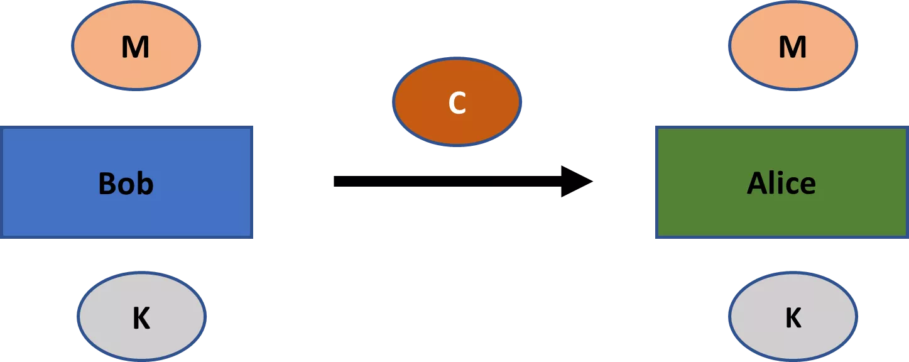

*รูปที่ 2: ความลับตลอดเวลา*

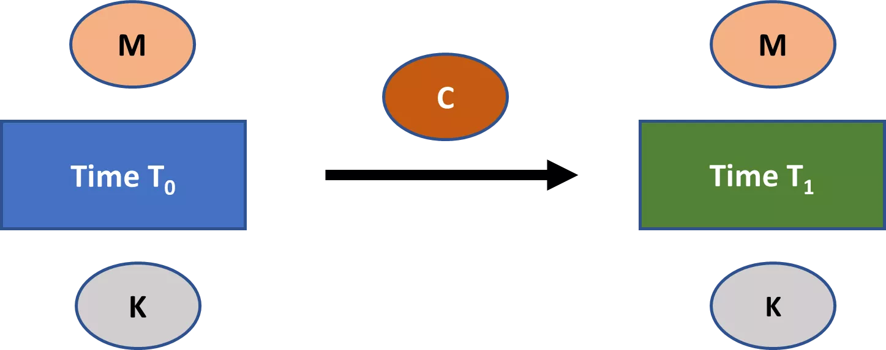

## ตัวอย่าง: การเข้ารหัสแบบเลื่อน

<chapterId>7b179ae8-8d15-5e80-a43f-22c970d87b5e</chapterId>

ในบทที่ 2 เราได้พบกับการเข้ารหัสแบบเลื่อน ซึ่งเป็นตัวอย่างของโครงร่างการเข้ารหัสแบบสมมาตรที่ง่ายมาก ลองมาดูอีกครั้งที่นี่

สมมติว่ามีพจนานุกรม *D* ที่จับคู่ตัวอักษรทั้งหมดในภาษาอังกฤษตามลำดับกับชุดของตัวเลข $\{0,1,2,\dots,25\}$ สมมติชุดข้อความที่เป็นไปได้ **M** การเข้ารหัสแบบเลื่อน (shift cipher) จึงเป็นแผนการเข้ารหัสที่กำหนดดังนี้:

- เลือกกุญแจ $k$ แบบสุ่มจากเซตของกุญแจที่เป็นไปได้ **K** โดยที่ **K** = $\{0,1,2,\dots,25\}$
- เข้ารหัสข้อความ $m \in$ **M**, ดังนี้:
    - แยก $m$ ออกเป็นตัวอักษรแต่ละตัว $m_0, m_1,\dots, m_i, \dots, m_l$
    - แปลง $m_i$ แต่ละตัวเป็นตัวเลขตาม *D*
    - สำหรับแต่ละ $m_i$, $c_i = [(m_i + k) \mod 26]$
    - แปลง $c_i$ แต่ละตัวเป็นตัวอักษรตาม *D*
    - จากนั้นรวม $c_0, c_1,\dots, c_l$ เพื่อให้ได้ข้อความลับ $c$
- ถอดรหัสข้อความลับ $c$ ดังนี้:
    - แปลง $c_i$ แต่ละตัวเป็นตัวเลขตาม *D*
    - สำหรับแต่ละ $c_i$, $m_i = [(c_i - k) \mod 26]$
    - แปลง $m_i$ แต่ละตัวเป็นตัวอักษรตาม *D*
    - จากนั้นรวม $m_0, m_1,\dots, m_l$ เพื่อให้ได้ข้อความต้นฉบับ $m$

สิ่งที่ทำให้การเข้ารหัสแบบเลื่อน (shift cipher) เป็นรูปแบบการเข้ารหัสแบบสมมาตรคือการใช้กุญแจเดียวกันทั้งในกระบวนการเข้ารหัสและถอดรหัส ตัวอย่างเช่น สมมติว่าคุณต้องการเข้ารหัสข้อความ “DOG” โดยใช้การเข้ารหัสแบบเลื่อน และคุณสุ่มเลือก "24" เป็นกุญแจ การเข้ารหัสข้อความด้วยกุญแจนี้จะได้ผลลัพธ์เป็น “BME” วิธีเดียวที่จะดึงข้อความต้นฉบับกลับมาได้คือการใช้กุญแจเดียวกัน "24" สำหรับกระบวนการถอดรหัส

การเข้ารหัสแบบ Shift cipher นี้เป็นตัวอย่างของ **การเข้ารหัสแบบแทนที่ด้วยตัวอักษรเดียว (monoalphabetic substitution cipher)**: ซึ่งเป็นรูปแบบการเข้ารหัสที่ตัวอักษรในข้อความที่เข้ารหัสถูกกำหนดตายตัว (เช่น ใช้ตัวอักษรเพียงชุดเดียว) โดยสมมติว่าอัลกอริทึมการถอดรหัสเป็นแบบกำหนดแน่นอน แต่ละสัญลักษณ์ในข้อความที่เข้ารหัสแบบแทนที่สามารถสอดคล้องกับสัญลักษณ์เพียงหนึ่งตัวในข้อความต้นฉบับเท่านั้น

จนถึงช่วงปี 1700s การใช้งานการเข้ารหัสหลายอย่างพึ่งพาการเข้ารหัสแบบแทนที่ด้วยตัวอักษรเดียว (monoalphabetic substitution ciphers) อย่างมาก แม้ว่าบ่อยครั้งจะซับซ้อนกว่าการเข้ารหัสแบบ Shift cipher มาก คุณสามารถเลือกตัวอักษรจากตัวอักษรทั้งหมดแบบสุ่มสำหรับตัวอักษรต้นฉบับแต่ละตัวภายใต้ข้อจำกัดที่ว่าตัวอักษรแต่ละตัวจะปรากฏเพียงครั้งเดียวในตัวอักษรที่เข้ารหัส ซึ่งหมายความว่าคุณจะมีคีย์ส่วนตัวที่เป็นไปได้ 26 แฟกทอเรียล ซึ่งถือว่าเยอะมากในยุคก่อนคอมพิวเตอร์

โปรดทราบว่าคุณจะพบกับคำว่า **cipher** บ่อยครั้งในวิชาการเข้ารหัสลับ โปรดระวังว่าคำนี้มีความหมายหลากหลาย อันที่จริง ฉันรู้จักอย่างน้อยห้าความหมายที่แตกต่างกันของคำนี้ในวิชาการเข้ารหัสลับ

ในบางกรณีมันหมายถึงแผนการเข้ารหัส เช่นเดียวกับใน Shift cipher และ monoalphabetic substitution cipher อย่างไรก็ตาม คำนี้ยังสามารถหมายถึงอัลกอริธึมการเข้ารหัส กุญแจส่วนตัว หรือเพียงแค่ข้อความที่ถูกเข้ารหัสของแผนการเข้ารหัสใด ๆ

สุดท้ายนี้ คำว่า cipher ยังสามารถหมายถึงอัลกอริธึมหลักที่คุณสามารถสร้างโครงร่างการเข้ารหัสลับได้ ซึ่งอาจรวมถึงอัลกอริธึมการเข้ารหัสต่างๆ แต่ยังรวมถึงโครงร่างการเข้ารหัสลับประเภทอื่นๆ ด้วย ความหมายนี้ของคำจะมีความเกี่ยวข้องในบริบทของบล็อกไซเฟอร์ (ดูส่วน “บล็อกไซเฟอร์” ด้านล่าง)

คุณอาจพบกับคำว่า **encipher** หรือ **decipher** คำเหล่านี้เป็นเพียงคำพ้องความหมายสำหรับการเข้ารหัสและการถอดรหัส

## การโจมตีด้วยกำลังดุร้ายและหลักการของเคิร์กฮอฟส์

<chapterId>2d73ef97-26c5-5d11-8815-0ddbe89c8003</chapterId>

การเข้ารหัสแบบเลื่อนเป็นรูปแบบการเข้ารหัสแบบสมมาตรที่ไม่ปลอดภัยมากนัก อย่างน้อยก็ในโลกยุคใหม่ [1] ผู้โจมตีสามารถพยายามถอดรหัสข้อความที่เข้ารหัสด้วยกุญแจที่เป็นไปได้ทั้งหมด 26 กุญแจเพื่อดูว่าผลลัพธ์ใดที่มีความหมาย การโจมตีประเภทนี้ ที่ผู้โจมตีเพียงแค่หมุนเวียนผ่านกุญแจเพื่อดูว่าอะไรใช้ได้ เรียกว่า **การโจมตีแบบเดรัจฉาน** หรือ **การค้นหากุญแจอย่างละเอียดถี่ถ้วน**

สำหรับแผนการเข้ารหัสใด ๆ ที่จะตอบสนองแนวคิดขั้นต่ำของความปลอดภัย จะต้องมีชุดของคีย์ที่เป็นไปได้ หรือ **keyspace** ซึ่งมีขนาดใหญ่จนการโจมตีแบบ brute-force ไม่สามารถทำได้ แผนการเข้ารหัสสมัยใหม่ทั้งหมดตอบสนองมาตรฐานนี้ ซึ่งรู้จักกันในชื่อ **หลักการพื้นที่คีย์ที่เพียงพอ** หลักการที่คล้ายกันนี้มักจะใช้ในประเภทต่าง ๆ ของแผนการเข้ารหัสลับ

เพื่อให้เข้าใจถึงขนาดของพื้นที่คีย์ในแผนการเข้ารหัสสมัยใหม่ สมมติว่าไฟล์หนึ่งถูกเข้ารหัสด้วยคีย์ขนาด 128 บิต โดยใช้มาตรฐานการเข้ารหัสขั้นสูง ซึ่งหมายความว่าผู้โจมตีมีชุดคีย์จำนวน $2^{128}$ ที่เธอต้องวนผ่านเพื่อทำการโจมตีแบบ brute force โอกาสสำเร็จ 0.78% ด้วยกลยุทธ์นี้จะต้องให้ผู้โจมตีวนผ่านคีย์ประมาณ $2.65 \times 10^{36}$ คีย์

สมมติว่าเรามองในแง่ดีว่าแฮกเกอร์สามารถลองกุญแจได้ $10^{16}$ กุญแจต่อวินาที (เช่น 10 พันล้านล้านกุญแจต่อวินาที) เพื่อทดสอบ 0.78% ของกุญแจทั้งหมดในพื้นที่กุญแจ การโจมตีของเธอจะต้องใช้เวลา $2.65 \times 10^{20}$ วินาที ซึ่งประมาณ 8.4 ล้านล้านปี ดังนั้นแม้แต่การโจมตีด้วยวิธี brute force โดยศัตรูที่มีพลังมหาศาลก็ไม่สมเหตุสมผลกับการเข้ารหัสแบบ 128 บิตในปัจจุบัน นี่คือหลักการของพื้นที่กุญแจที่เพียงพอที่กำลังทำงานอยู่

การเข้ารหัสแบบเลื่อนจะปลอดภัยมากขึ้นหรือไม่หากผู้โจมตีไม่ทราบอัลกอริทึมการเข้ารหัส? อาจจะใช่ แต่ไม่มากนัก

ในทุกกรณี การเข้ารหัสลับสมัยใหม่มักจะถือว่าความปลอดภัยของแผนการเข้ารหัสแบบสมมาตรใด ๆ ขึ้นอยู่กับการเก็บรักษาคีย์ส่วนตัวเป็นความลับ ผู้โจมตีมักจะถูกสมมติให้รู้รายละเอียดอื่น ๆ ทั้งหมด รวมถึงพื้นที่ข้อความ พื้นที่คีย์ พื้นที่ข้อความเข้ารหัส อัลกอริธึมการเลือกคีย์ อัลกอริธึมการเข้ารหัส และอัลกอริธึมการถอดรหัส

แนวคิดที่ว่าความปลอดภัยของโครงร่างการเข้ารหัสแบบสมมาตรสามารถพึ่งพาได้เฉพาะความลับของกุญแจส่วนตัวเท่านั้นเป็นที่รู้จักกันในชื่อ **หลักการของเคิร์กฮอฟส์**

ตามที่ Kerckhoffs ตั้งใจไว้ในตอนแรก หลักการนี้ใช้กับรูปแบบการเข้ารหัสแบบสมมาตรเท่านั้น อย่างไรก็ตาม เวอร์ชันที่ทั่วไปกว่าของหลักการนี้ยังใช้กับรูปแบบการเข้ารหัสประเภทอื่นๆ ในปัจจุบันด้วย: การออกแบบรูปแบบการเข้ารหัสใดๆ ไม่จำเป็นต้องเป็นความลับเพื่อให้ปลอดภัย; ความลับสามารถขยายไปยังสตริงของข้อมูลบางอย่างเท่านั้น โดยทั่วไปคือกุญแจส่วนตัว

หลักการของ Kerckhoffs เป็นศูนย์กลางของการเข้ารหัสสมัยใหม่ด้วยเหตุผลสี่ประการ [2] ประการแรก มีจำนวนจำกัดของรูปแบบการเข้ารหัสสำหรับประเภทของการใช้งานเฉพาะ ตัวอย่างเช่น การใช้งานการเข้ารหัสแบบสมมาตรสมัยใหม่ส่วนใหญ่ใช้รหัส Rijndael ดังนั้นความลับของคุณเกี่ยวกับการออกแบบรูปแบบจึงมีจำกัดมาก อย่างไรก็ตาม มีความยืดหยุ่นมากกว่าในการเก็บรักษาคีย์ส่วนตัวสำหรับรหัส Rijndael ให้เป็นความลับ

ประการที่สอง การแทนที่สตริงของข้อมูลบางอย่างนั้นง่ายกว่าการแทนที่ทั้งโครงร่างการเข้ารหัส ลองสมมติว่าพนักงานของบริษัททั้งหมดมีซอฟต์แวร์การเข้ารหัสเดียวกัน และพนักงานทุกสองคนมีคีย์ส่วนตัวเพื่อสื่อสารอย่างเป็นความลับ การประนีประนอมคีย์เป็นเรื่องยุ่งยากในสถานการณ์นี้ แต่อย่างน้อยบริษัทก็สามารถเก็บซอฟต์แวร์ไว้ได้แม้จะมีการละเมิดความปลอดภัยเช่นนี้ หากบริษัทพึ่งพาความลับของโครงร่างนั้น การละเมิดความลับใด ๆ จะต้องเปลี่ยนซอฟต์แวร์ทั้งหมด

ประการที่สาม หลักการของ Kerckhoffs ช่วยให้เกิดการมาตรฐานและความเข้ากันได้ระหว่างผู้ใช้ของแผนการเข้ารหัสลับ ซึ่งมีประโยชน์อย่างมากต่อประสิทธิภาพ ตัวอย่างเช่น เป็นเรื่องยากที่จะจินตนาการว่าผู้คนนับล้านจะสามารถเชื่อมต่อกับเซิร์ฟเวอร์เว็บของ Google ได้อย่างปลอดภัยในแต่ละวันได้อย่างไร หากความปลอดภัยนั้นต้องการการเก็บแผนการเข้ารหัสลับเป็นความลับ

ประการที่สี่ หลักการของ Kerckhoff อนุญาตให้มีการตรวจสอบสาธารณะของแผนการเข้ารหัสลับ การตรวจสอบประเภทนี้มีความจำเป็นอย่างยิ่งเพื่อให้ได้แผนการเข้ารหัสลับที่ปลอดภัย ตัวอย่างเช่น อัลกอริธึมหลักในวิทยาการเข้ารหัสลับแบบสมมาตร Rijndael cipher เป็นผลมาจากการแข่งขันที่จัดโดยสถาบันมาตรฐานและเทคโนโลยีแห่งชาติระหว่างปี 1997 ถึง 2000

ระบบใด ๆ ที่พยายามบรรลุ **ความปลอดภัยโดยการปกปิด** คือระบบที่อาศัยการเก็บรายละเอียดของการออกแบบและ/หรือการดำเนินการเป็นความลับ ในวิทยาการเข้ารหัสลับ นี่จะเป็นระบบที่อาศัยการเก็บรายละเอียดการออกแบบของแผนการเข้ารหัสลับเป็นความลับ ดังนั้นความปลอดภัยโดยการปกปิดจึงตรงกันข้ามกับหลักการของ Kerckhoffs โดยตรง

ความสามารถของความเปิดกว้างในการเสริมสร้างคุณภาพและความปลอดภัยยังขยายไปสู่โลกดิจิทัลในวงกว้างมากกว่าการเข้ารหัสเพียงอย่างเดียว ตัวอย่างเช่น การแจกจ่าย Linux แบบฟรีและโอเพ่นซอร์ส เช่น Debian โดยทั่วไปแล้วมีข้อได้เปรียบหลายประการเหนือคู่แข่งอย่าง Windows และ MacOS ในด้านความเป็นส่วนตัว ความเสถียร ความปลอดภัย และความยืดหยุ่น แม้ว่านั่นอาจมีสาเหตุหลายประการ แต่หลักการที่สำคัญที่สุดน่าจะเป็นอย่างที่ Eric Raymond กล่าวไว้ในบทความที่มีชื่อเสียงของเขา "The Cathedral and the Bazaar" ว่า "เมื่อมีคนดูมากพอ ข้อบกพร่องทั้งหมดก็จะตื้นเขิน" [3] เป็นหลักการแบบภูมิปัญญาของฝูงชนนี้ที่ทำให้ Linux ประสบความสำเร็จอย่างมากที่สุด

ไม่สามารถระบุได้อย่างชัดเจนว่าระบบการเข้ารหัสลับเป็น "ปลอดภัย" หรือ "ไม่ปลอดภัย" แต่มีแนวคิดต่าง ๆ เกี่ยวกับความปลอดภัยสำหรับระบบการเข้ารหัสลับ แต่ละ**คำจำกัดความของความปลอดภัยในการเข้ารหัสลับ**ต้องระบุ (1) เป้าหมายความปลอดภัย รวมถึง (2) ความสามารถของผู้โจมตี การวิเคราะห์ระบบการเข้ารหัสลับตามแนวคิดความปลอดภัยเฉพาะหนึ่งหรือมากกว่านั้นให้ข้อมูลเชิงลึกเกี่ยวกับการใช้งานและข้อจำกัดของพวกมัน

แม้ว่าเราจะไม่ลงลึกในรายละเอียดทั้งหมดของแนวคิดต่าง ๆ เกี่ยวกับความปลอดภัยทางการเข้ารหัส คุณควรรู้ว่าสมมติฐานสองข้อเป็นที่แพร่หลายในแนวคิดความปลอดภัยทางการเข้ารหัสสมัยใหม่ทั้งหมดที่เกี่ยวข้องกับโครงร่างแบบสมมาตรและอสมมาตร (และในบางรูปแบบกับปฐมภูมิการเข้ารหัสอื่น ๆ):

*ความรู้ของผู้โจมตีเกี่ยวกับแผนการสอดคล้องกับหลักการของ Kerckhoffs*

**ผู้โจมตีไม่สามารถทำการโจมตีแบบ brute force กับแผนการนี้ได้อย่างมีประสิทธิภาพ** โดยเฉพาะอย่างยิ่ง โมเดลภัยคุกคามของแนวคิดการเข้ารหัสลับของความปลอดภัยมักจะไม่อนุญาตให้มีการโจมตีแบบ brute force เนื่องจากพวกเขาถือว่าสิ่งเหล่านี้ไม่ใช่ข้อพิจารณาที่เกี่ยวข้อง

**บันทึก:**

[1] ตามที่ Seutonius กล่าวไว้ Julius Caesar ใช้รหัสเลื่อนที่มีค่าคีย์คงที่เท่ากับ 3 ในการสื่อสารทางทหารของเขา ดังนั้น A จะกลายเป็น D เสมอ, B จะกลายเป็น E เสมอ, C จะกลายเป็น F เสมอ, และอื่น ๆ รหัสเลื่อนเวอร์ชันนี้จึงเป็นที่รู้จักกันในชื่อ **Caesar Cipher** (แม้ว่ามันจะไม่ใช่รหัสในความหมายสมัยใหม่ของคำนี้ เนื่องจากค่าคีย์คงที่) Caesar cipher อาจจะปลอดภัยในศตวรรษที่ 1 ก่อนคริสต์ศักราช หากศัตรูของโรมไม่คุ้นเคยกับการเข้ารหัส แต่เห็นได้ชัดว่ามันจะไม่ใช่แผนการที่ปลอดภัยมากในยุคปัจจุบัน

[2] Jonathan Katz and Yehuda Lindell, _Introduction to Modern Cryptography_, CRC Press (Boca Raton, FL: 2015), p. 7f.

[3] Eric Raymond, “The Cathedral and the Bazaar,” เอกสารนำเสนอที่ Linux Kongress, Würzburg, Germany (27 พฤษภาคม 1997). มีหลายเวอร์ชันที่ตามมา รวมถึงหนังสือด้วย การอ้างอิงของฉันมาจากหน้า 30 ในหนังสือ: Eric Raymond, _The Cathedral and the Bazaar: Musings on Linux and Open Source by an Accidental Revolutionary_, revised edn. (2001), O’Reilly: Sebastopol, CA.

## สตรีมไซเฟอร์

<chapterId>479aa6f4-45c4-59ca-8616-8cf8e61fc871</chapterId>

โครงร่างการเข้ารหัสแบบสมมาตรแบ่งออกเป็นสองประเภท: **stream ciphers** และ **block ciphers** การแบ่งแยกนี้ค่อนข้างยุ่งยาก เนื่องจากผู้คนใช้คำเหล่านี้ในลักษณะที่ไม่สอดคล้องกัน ในอีกไม่กี่ส่วนถัดไป ฉันจะอธิบายการแบ่งแยกในวิธีที่ฉันคิดว่าดีที่สุด อย่างไรก็ตาม คุณควรทราบว่าหลายคนจะใช้คำเหล่านี้แตกต่างจากที่ฉันอธิบายไว้บ้าง

ก่อนอื่นเรามาดูที่รหัสสตรีมกันก่อน รหัสสตรีม (**stream cipher**) เป็นรูปแบบการเข้ารหัสแบบสมมาตรที่การเข้ารหัสประกอบด้วยสองขั้นตอน

ก่อนอื่น สตริงที่มีความยาวเท่ากับข้อความธรรมดาจะถูกสร้างขึ้นผ่านคีย์ส่วนตัว สตริงนี้เรียกว่า **keystream**

ถัดไป สตรีมคีย์จะถูกผสมทางคณิตศาสตร์กับข้อความธรรมดาเพื่อสร้างข้อความลับ การผสมนี้มักจะเป็นการดำเนินการ XOR สำหรับการถอดรหัส คุณสามารถย้อนกลับการดำเนินการได้ (โปรดทราบว่า $A \oplus B = B \oplus A$ ในกรณีที่ $A$ และ $B$ เป็นบิตสตริง ดังนั้นลำดับของการดำเนินการ XOR ในสตรีมไซเฟอร์จึงไม่สำคัญต่อผลลัพธ์ คุณสมบัตินี้เรียกว่า **การสลับที่ได้**)

ตัวเข้ารหัสสตรีม XOR ทั่วไปแสดงใน *รูปที่ 3* คุณเริ่มต้นด้วยการใช้กุญแจส่วนตัว $K$ และใช้มันเพื่อ generate สร้างสตรีมกุญแจ จากนั้นสตรีมกุญแจจะถูกผสมกับข้อความธรรมดาผ่านการดำเนินการ XOR เพื่อสร้างข้อความเข้ารหัส ตัวแทนใดๆ ที่ได้รับข้อความเข้ารหัสสามารถถอดรหัสได้อย่างง่ายดายหากพวกเขามีกุญแจ $K$ สิ่งที่เธอต้องทำคือสร้างสตรีมกุญแจที่ยาวเท่ากับข้อความเข้ารหัสตามขั้นตอนที่กำหนดของแผนการและ XOR กับข้อความเข้ารหัส

*รูปที่ 3: การเข้ารหัสสตรีม XOR*

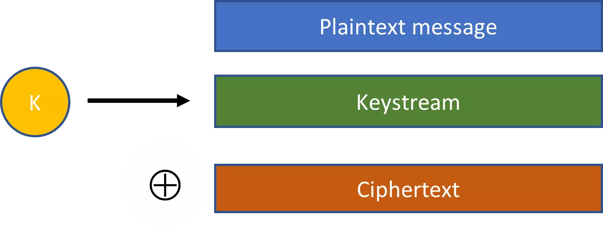

โปรดจำไว้ว่ารูปแบบการเข้ารหัสมักจะเป็นแม่แบบสำหรับการเข้ารหัสด้วยอัลกอริทึมหลักเดียวกัน มากกว่าที่จะเป็นข้อกำหนดที่แน่นอน โดยการขยายความ รหัสลับแบบสตรีมมักจะเป็นแม่แบบสำหรับการเข้ารหัสซึ่งคุณสามารถใช้กุญแจที่มีความยาวต่างกันได้ แม้ว่าความยาวของกุญแจอาจมีผลกระทบต่อรายละเอียดเล็กน้อยของรูปแบบ แต่จะไม่ส่งผลกระทบต่อรูปแบบที่สำคัญของมัน

การเข้ารหัสแบบเลื่อนเป็นตัวอย่างของการเข้ารหัสสตรีมที่ง่ายและไม่ปลอดภัยมาก โดยใช้ตัวอักษรเพียงตัวเดียว (กุญแจลับ) คุณสามารถสร้างสตริงของตัวอักษรที่มีความยาวเท่ากับข้อความ (สตรีมกุญแจ) จากนั้นสตรีมกุญแจนี้จะถูกผสมกับข้อความธรรมดาผ่านการดำเนินการโมดูโลเพื่อสร้างข้อความเข้ารหัส (การดำเนินการโมดูโลนี้สามารถทำให้ง่ายขึ้นเป็นการดำเนินการ XOR เมื่อแทนตัวอักษรในบิต)

อีกตัวอย่างที่มีชื่อเสียงของรหัสลับแบบสตรีมคือ **รหัสลับ Vigenere** ตั้งชื่อตาม Blaise de Vigenere ผู้ที่พัฒนามันอย่างเต็มที่ในช่วงปลายศตวรรษที่ 16 (แม้ว่าคนอื่น ๆ จะได้ทำงานเบื้องต้นมากมายก่อนหน้านี้) มันเป็นตัวอย่างของ **รหัสลับการแทนที่แบบหลายตัวอักษร**: เป็นแผนการเข้ารหัสที่ตัวอักษรของข้อความที่เข้ารหัสสำหรับสัญลักษณ์ข้อความธรรมดาจะเปลี่ยนไปตามตำแหน่งของมันในข้อความ ตรงกันข้ามกับรหัสลับการแทนที่แบบตัวอักษรเดียว สัญลักษณ์ข้อความที่เข้ารหัสสามารถเชื่อมโยงกับสัญลักษณ์ข้อความธรรมดามากกว่าหนึ่งตัวได้

เมื่อการเข้ารหัสได้รับความนิยมในยุโรปยุคฟื้นฟูศิลปวิทยา การวิเคราะห์รหัสลับ (**cryptanalysis**)—หรือการถอดรหัสข้อความที่เข้ารหัส—ก็ได้รับความนิยมเช่นกัน โดยเฉพาะการใช้ **การวิเคราะห์ความถี่** (frequency analysis) ซึ่งใช้ความสม่ำเสมอทางสถิติในภาษาของเราเพื่อถอดรหัสข้อความที่เข้ารหัส และถูกค้นพบโดยนักวิชาการชาวอาหรับตั้งแต่ศตวรรษที่เก้า เทคนิคนี้ทำงานได้ดีเป็นพิเศษกับข้อความที่ยาวขึ้น และแม้แต่รหัสแทนที่แบบโมโนอัลฟาเบติกที่ซับซ้อนที่สุดก็ไม่เพียงพอต่อการวิเคราะห์ความถี่ในยุโรปในช่วงปี 1700 โดยเฉพาะในด้านการทหารและความมั่นคง เมื่อรหัสวิจิเนียร์ (Vigenere cipher) เสนอความก้าวหน้าอย่างมีนัยสำคัญในด้านความปลอดภัย มันจึงได้รับความนิยมในช่วงเวลานี้และแพร่หลายอย่างกว้างขวางในช่วงปลายปี 1700

พูดอย่างไม่เป็นทางการ แผนการเข้ารหัสทำงานดังนี้:

1. เลือกคำที่มีหลายตัวอักษรเป็นกุญแจส่วนตัว

2. สำหรับข้อความใด ๆ ให้ใช้รหัสซีซาร์เลื่อนตัวอักษรแต่ละตัวของข้อความโดยใช้ตัวอักษรที่สอดคล้องกันในคำหลักเป็นการเลื่อน

3. หากคุณใช้คำสำคัญวนครบแล้วแต่ยังไม่ได้เข้ารหัสข้อความทั้งหมด ให้ใช้ตัวอักษรของคำสำคัญเป็นรหัสเลื่อนกับตัวอักษรที่ตรงกันในส่วนที่เหลือของข้อความอีกครั้ง

4. ดำเนินการต่อไปจนกว่าข้อความทั้งหมดจะถูกเข้ารหัส.

เพื่อเป็นการอธิบาย สมมติว่าคีย์ส่วนตัวของคุณคือ "GOLD" และคุณต้องการเข้ารหัสข้อความ "CRYPTOGRAPHY" ในกรณีนั้น คุณจะดำเนินการดังนี้ตามรหัสวิจิแนร์:

- $c_0  = [(2 + 6) \mod 26] = 8 = I$
- $c_1  = [(17 + 14) \mod 26] = 5 = F$
- $c_2  = [(24 + 11) \mod 26] = 9 = J$
- $c_3  = [(15 + 3) \mod 26] = 18 = S$
- $c_4  = [(19 + 6) \mod 26] = 25 = Z$
- $c_5  = [(14 + 14) \mod 26] = 2 = C$
- $c_6  = [(6 + 11) \mod 26] = 17 = R$
- $c_7  = [(17 + 3) \mod 26] = 20 = U$
- $c_8  = [(0 + 6) \mod 26] = 6 = G$
- $c_9  = [(15 + 14) \mod 26] = 3 = D$
- $c_{10} = [(7 + 11) \mod 26] = 18 = S$
- $c_{11} = [(24 + 3) \mod 26] = 1 = B$

ดังนั้น ข้อความที่เข้ารหัส $c$ = "IFJSZCRUGDSB".

อีกตัวอย่างที่มีชื่อเสียงของรหัสลับแบบสตรีมคือ **one-time pad** ด้วย one-time pad คุณเพียงแค่สร้างสตริงของบิตสุ่มที่มีความยาวเท่ากับข้อความที่เป็นข้อความธรรมดาและสร้างข้อความที่เข้ารหัสผ่านการดำเนินการ XOR ดังนั้น กุญแจส่วนตัวและ keystream จึงเทียบเท่ากับ one-time pad

ในขณะที่รหัสซีซาร์และรหัสวิจิเนียร์ไม่ปลอดภัยในยุคปัจจุบัน แต่รหัสแผ่นครั้งเดียวมีความปลอดภัยมากหากใช้อย่างถูกต้อง การใช้งานที่มีชื่อเสียงที่สุดของรหัสแผ่นครั้งเดียวคือ **สายด่วนวอชิงตัน-มอสโก** อย่างน้อยจนถึงทศวรรษที่ 1980 [4]

สายด่วนเป็นช่องทางการสื่อสารโดยตรงระหว่างวอชิงตันและมอสโกสำหรับเรื่องเร่งด่วนที่ติดตั้งหลังจากวิกฤตการณ์ขีปนาวุธคิวบา เทคโนโลยีสำหรับสายด่วนได้เปลี่ยนแปลงไปตามกาลเวลา ปัจจุบันนี้รวมถึงสายเคเบิลใยแก้วนำแสงโดยตรงและลิงก์ดาวเทียมสองเส้น (เพื่อความซ้ำซ้อน) ซึ่งช่วยให้สามารถส่งอีเมลและข้อความได้ สายด่วนนี้สิ้นสุดในหลายสถานที่ในสหรัฐอเมริกา เพนตากอน, ทำเนียบขาว, และ Raven Rock Mountain เป็นจุดสิ้นสุดที่รู้จักกัน ตรงกันข้ามกับความเชื่อที่นิยม สายด่วนนี้ไม่เคยเกี่ยวข้องกับโทรศัพท์

โดยสรุปแล้ว แผนการใช้แผ่นรหัสครั้งเดียวทำงานดังนี้ ทั้งวอชิงตันและมอสโกจะมีชุดตัวเลขสุ่มสองชุด ชุดหนึ่งของตัวเลขสุ่มที่สร้างโดยรัสเซีย ใช้สำหรับการเข้ารหัสและถอดรหัสข้อความใด ๆ ในภาษารัสเซีย ชุดหนึ่งของตัวเลขสุ่มที่สร้างโดยอเมริกัน ใช้สำหรับการเข้ารหัสและถอดรหัสข้อความใด ๆ ในภาษาอังกฤษ เป็นครั้งคราว ตัวเลขสุ่มเพิ่มเติมจะถูกส่งไปยังอีกฝ่ายโดยผู้ส่งสารที่เชื่อถือได้

วอชิงตันและมอสโกสามารถสื่อสารกันอย่างลับๆ โดยใช้ตัวเลขสุ่มเหล่านี้ในการสร้างแผ่นรหัสใช้ครั้งเดียว ทุกครั้งที่คุณต้องการสื่อสาร คุณจะใช้ส่วนถัดไปของตัวเลขสุ่มสำหรับข้อความของคุณ

แม้ว่าจะมีความปลอดภัยสูง แต่ one-time pad ก็มีข้อจำกัดในทางปฏิบัติที่สำคัญ: กุญแจต้องมีความยาวเท่ากับข้อความและไม่สามารถใช้ซ้ำส่วนใดของ one-time pad ได้ ซึ่งหมายความว่าคุณต้องติดตามว่าคุณอยู่ที่ไหนใน one-time pad เก็บบิตจำนวนมาก และแลกเปลี่ยนบิตแบบสุ่มกับคู่ค้าของคุณเป็นครั้งคราว ดังนั้น one-time pad จึงไม่ค่อยถูกใช้งานในทางปฏิบัติ

แทนที่จะเป็นเช่นนั้น รหัสสตรีมที่ใช้กันอย่างแพร่หลายในทางปฏิบัติคือ **รหัสสตรีมเทียมสุ่ม** Salsa20 และรูปแบบที่เกี่ยวข้องอย่างใกล้ชิดที่เรียกว่า ChaCha เป็นตัวอย่างของรหัสสตรีมเทียมสุ่มที่ใช้กันทั่วไป

ด้วยรหัสลับสตรีมเทียมเหล่านี้ คุณจะเลือกคีย์ K แบบสุ่มที่สั้นกว่าความยาวของข้อความธรรมดาก่อน คีย์สุ่ม K ดังกล่าวมักจะถูกสร้างขึ้นโดยคอมพิวเตอร์ของเราบนพื้นฐานของข้อมูลที่ไม่สามารถคาดเดาได้ซึ่งมันรวบรวมมาตลอดเวลา เช่น เวลาระหว่างข้อความเครือข่าย การเคลื่อนไหวของเมาส์ และอื่นๆ

จากนั้นคีย์สุ่ม $K$ นี้จะถูกใส่เข้าไปในอัลกอริทึมขยายซึ่งสร้างสตรีมคีย์เทียมที่ยาวเท่ากับข้อความ คุณสามารถระบุได้อย่างชัดเจนว่าสตรีมคีย์ต้องยาวเท่าใด (เช่น 500 บิต, 1000 บิต, 1200 บิต, 29,117 บิต, เป็นต้น)

สตรีมคีย์ที่ดูเหมือนสุ่มปรากฏ *ราวกับว่า* มันถูกเลือกแบบสุ่มทั้งหมดจากชุดของสตริงทั้งหมดที่มีความยาวเท่ากัน ดังนั้น การเข้ารหัสด้วยสตรีมคีย์ที่ดูเหมือนสุ่มจึงปรากฏราวกับว่ามันได้ทำด้วยแผ่นรหัสครั้งเดียว แต่แน่นอนว่าไม่ใช่กรณีนั้น

เนื่องจากกุญแจส่วนตัวของเราสั้นกว่าสตรีมกุญแจและอัลกอริทึมการขยายตัวของเราจำเป็นต้องเป็นแบบกำหนดได้เพื่อให้กระบวนการเข้ารหัส/ถอดรหัสทำงานได้ ไม่ใช่ทุกสตรีมกุญแจที่มีความยาวเฉพาะนั้นจะสามารถเป็นผลลัพธ์จากการดำเนินการขยายตัวของเราได้

สมมติว่า ตัวอย่างเช่น กุญแจส่วนตัวของเรามีความยาว 128 บิต และเราสามารถใส่มันลงในอัลกอริทึมขยายเพื่อสร้างกระแสกุญแจที่ยาวกว่ามาก เช่น 2,500 บิต เนื่องจากอัลกอริทึมขยายของเราจำเป็นต้องเป็นแบบกำหนดได้ อัลกอริทึมของเราจึงสามารถเลือกสตริงที่มีความยาว 2,500 บิตได้มากที่สุด $1/2^{128}$ ดังนั้นกระแสกุญแจดังกล่าวจึงไม่สามารถถูกเลือกแบบสุ่มทั้งหมดจากสตริงที่มีความยาวเท่ากันได้เลย

คำจำกัดความของเราสำหรับสตรีมไซเฟอร์มีสองแง่มุม: (1) การสร้างคีย์สตรีมที่ยาวเท่ากับข้อความที่ต้องการเข้ารหัสด้วยความช่วยเหลือของคีย์ส่วนตัว; และ (2) คีย์สตรีมนี้จะถูกผสมกับข้อความที่ต้องการเข้ารหัส โดยทั่วไปผ่านการดำเนินการ XOR เพื่อสร้างข้อความที่เข้ารหัส

บางครั้งผู้คนกำหนดเงื่อนไข (1) อย่างเข้มงวดมากขึ้น โดยยืนยันว่ากระแสคีย์ต้องเป็นเทียมสุ่มโดยเฉพาะ ซึ่งหมายความว่าไม่ว่าจะเป็นรหัสซีซาร์หรือแผ่นครั้งเดียวก็จะไม่ถือว่าเป็นรหัสสตรีม

ในมุมมองของฉัน การกำหนดเงื่อนไข (1) ให้กว้างขึ้นเป็นวิธีที่ง่ายกว่าในการจัดระเบียบโครงร่างการเข้ารหัส นอกจากนี้ยังหมายความว่าเราไม่จำเป็นต้องหยุดเรียกโครงร่างการเข้ารหัสเฉพาะว่าเป็นสตรีมไซเฟอร์เพียงเพราะเราเรียนรู้ว่ามันไม่ได้อาศัยสตรีมคีย์เทียมจริงๆ

**บันทึก:**

[4] Crypto Museum, "Washington-Moscow hotline," 2013, available at [https://www.cryptomuseum.com/crypto/hotline/index.htm](https://www.cryptomuseum.com/crypto/hotline/index.htm).

## บล็อกไซเฟอร์

<chapterId>2df52d51-943d-5df7-9d49-333e4c5d97b7</chapterId>

วิธีแรกที่ **block cipher** มักจะถูกเข้าใจคือเป็นสิ่งที่ดั้งเดิมกว่าสตรีมไซเฟอร์: เป็นอัลกอริธึมหลักที่ทำการแปลงที่รักษาความยาวบนสตริงที่มีความยาวเหมาะสมด้วยความช่วยเหลือของคีย์ อัลกอริธึมนี้สามารถใช้สำหรับสร้างแผนการเข้ารหัสและอาจรวมถึงประเภทอื่น ๆ ของแผนการเข้ารหัสลับ

บ่อยครั้งที่บล็อกไซเฟอร์สามารถรับสตริงอินพุตที่มีความยาวแตกต่างกัน เช่น 64, 128 หรือ 256 บิต รวมถึงคีย์ที่มีความยาวแตกต่างกัน เช่น 128, 192 หรือ 256 บิต แม้ว่ารายละเอียดบางอย่างของอัลกอริทึมอาจเปลี่ยนแปลงไปตามตัวแปรเหล่านี้ แต่อัลกอริทึมหลักจะไม่เปลี่ยนแปลง หากเปลี่ยนแปลง เราจะพูดถึงบล็อกไซเฟอร์สองแบบที่แตกต่างกัน โปรดทราบว่าการใช้คำว่าอัลกอริทึมหลักในที่นี้เหมือนกับในแผนการเข้ารหัสลับ

ภาพแสดงการทำงานของบล็อกไซเฟอร์สามารถดูได้ใน *รูปที่ 4* ด้านล่าง ข้อความ $M$ ที่มีความยาว $L$ และกุญแจ $K$ ทำหน้าที่เป็นข้อมูลนำเข้าสำหรับบล็อกไซเฟอร์ มันจะส่งออกข้อความ $M'$ ที่มีความยาว $L$ กุญแจไม่จำเป็นต้องมีความยาวเท่ากับ $M$ และ $M'$ สำหรับบล็อกไซเฟอร์ส่วนใหญ่

*รูปที่ 4: รหัสบล็อก*

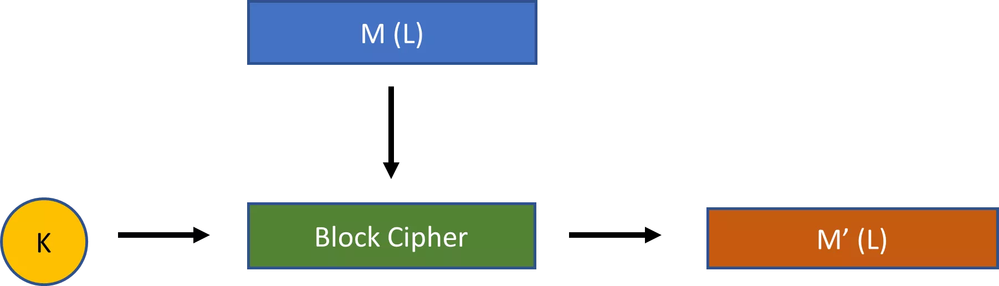

บล็อกไซเฟอร์เพียงอย่างเดียวไม่ใช่แผนการเข้ารหัส แต่บล็อกไซเฟอร์สามารถใช้ร่วมกับ**โหมดการทำงาน**ต่าง ๆ เพื่อสร้างแผนการเข้ารหัสที่แตกต่างกันได้ โหมดการทำงานจะเพิ่มการดำเนินการเพิ่มเติมบางอย่างนอกเหนือจากบล็อกไซเฟอร์

เพื่อแสดงให้เห็นว่าสิ่งนี้ทำงานอย่างไร สมมติว่ามีบล็อกไซเฟอร์ (BC) ที่ต้องการสตริงอินพุตขนาด 128 บิตและคีย์ส่วนตัวขนาด 128 บิต รูปที่ 5 ด้านล่างแสดงให้เห็นว่าบล็อกไซเฟอร์นั้นสามารถใช้กับ **โหมดหนังสือรหัสอิเล็กทรอนิกส์** (**ECB mode**) เพื่อสร้างรูปแบบการเข้ารหัสได้อย่างไร (วงรีทางด้านขวาระบุว่าคุณสามารถทำซ้ำรูปแบบนี้ได้ตราบเท่าที่จำเป็น)

*รูปที่ 5: รหัสบล็อกด้วยโหมด ECB*

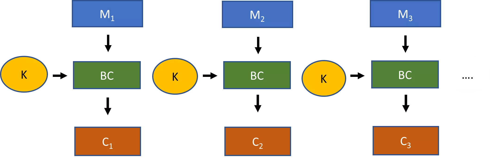

กระบวนการสำหรับการเข้ารหัสด้วยสมุดรหัสอิเล็กทรอนิกส์ด้วยบล็อกไซเฟอร์มีดังนี้ ดูว่าคุณสามารถแบ่งข้อความธรรมดาของคุณออกเป็นบล็อกขนาด 128 บิตได้หรือไม่ หากไม่สามารถ ให้เพิ่ม **การเติม** ลงในข้อความ เพื่อให้ผลลัพธ์สามารถแบ่งได้อย่างลงตัวด้วยขนาดบล็อก 128 บิต นี่คือข้อมูลของคุณที่ใช้สำหรับกระบวนการเข้ารหัส

ตอนนี้แยกข้อมูลออกเป็นชิ้นส่วนของสตริง 128 บิต ($M_1$, $M_2$, $M_3$, และอื่นๆ) รันแต่ละสตริง 128 บิตผ่านบล็อกไซเฟอร์ด้วยคีย์ 128 บิตของคุณเพื่อสร้างชิ้นส่วนของข้อความลับ 128 บิต ($C_1$, $C_2$, $C_3$, และอื่นๆ) ชิ้นส่วนเหล่านี้เมื่อรวมกันใหม่จะสร้างข้อความลับทั้งหมด

การถอดรหัสเป็นเพียงกระบวนการย้อนกลับ แม้ว่าผู้รับจะต้องมีวิธีที่สามารถจดจำได้ในการลบการเติมใด ๆ ออกจากข้อมูลที่ถอดรหัสเพื่อสร้างข้อความตัวอักษรเดิม

แม้ว่าจะค่อนข้างตรงไปตรงมา แต่บล็อกไซเฟอร์ที่ใช้โหมดสมุดรหัสอิเล็กทรอนิกส์ขาดความปลอดภัย นี่เป็นเพราะมันนำไปสู่การ **เข้ารหัสแบบกำหนดได้** ข้อมูลสตริง 128 บิตที่เหมือนกันสองชุดจะถูกเข้ารหัสในลักษณะเดียวกัน ข้อมูลนั้นสามารถถูกนำไปใช้ประโยชน์ได้

แทนที่จะเป็นเช่นนั้น โครงร่างการเข้ารหัสใด ๆ ที่สร้างจากบล็อกไซเฟอร์ควรเป็นแบบ **probabilistic**: นั่นคือ การเข้ารหัสของข้อความใด ๆ $M$ หรือชิ้นส่วนเฉพาะของ $M$ ควรให้ผลลัพธ์ที่แตกต่างกันในแต่ละครั้งโดยทั่วไป [5]

**โหมดการเชื่อมโยงบล็อกการเข้ารหัส** (**โหมด CBC**) อาจเป็นโหมดที่ใช้บ่อยที่สุดกับการเข้ารหัสบล็อก การผสมผสานนี้หากทำอย่างถูกต้องจะสร้างรูปแบบการเข้ารหัสแบบสุ่ม คุณสามารถดูภาพของโหมดการทำงานนี้ได้ใน *รูปที่ 6* ด้านล่าง

*รูปที่ 6: รหัสบล็อกที่มีโหมด CBC*

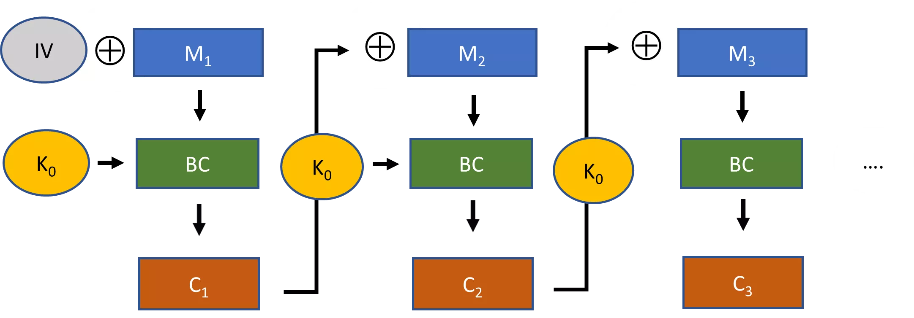

สมมติว่าขนาดบล็อกคือ 128 บิตอีกครั้ง ดังนั้นในการเริ่มต้น คุณจะต้องมั่นใจอีกครั้งว่าข้อความเพลนเท็กซ์ต้นฉบับของคุณได้รับการเติมข้อมูลที่จำเป็น

จากนั้น คุณทำการ XOR ส่วนแรกของ plaintext ขนาด 128 บิต กับ **initialization vector** ขนาด 128 บิต ผลลัพธ์จะถูกนำไปใส่ใน block cipher เพื่อสร้าง ciphertext สำหรับบล็อกแรก สำหรับบล็อกที่สองของ 128 บิต คุณทำการ XOR plaintext กับ ciphertext จากบล็อกแรกก่อนที่จะนำมันไปใส่ใน block cipher คุณดำเนินกระบวนการนี้ต่อไปจนกว่าคุณจะเข้ารหัสข้อความ plaintext ทั้งหมดของคุณเสร็จสิ้น

เมื่อเสร็จสิ้น คุณจะส่งข้อความที่เข้ารหัสพร้อมกับเวกเตอร์เริ่มต้นที่ไม่ได้เข้ารหัสไปยังผู้รับ ผู้รับจำเป็นต้องรู้เวกเตอร์เริ่มต้น มิฉะนั้นเธอจะไม่สามารถถอดรหัสข้อความลับได้

การก่อสร้างนี้มีความปลอดภัยมากกว่าโหมดสมุดรหัสอิเล็กทรอนิกส์เมื่อใช้อย่างถูกต้อง คุณควรตรวจสอบให้แน่ใจว่าตัวเวกเตอร์เริ่มต้นเป็นสตริงแบบสุ่มหรือกึ่งสุ่ม นอกจากนี้ คุณควรใช้ตัวเวกเตอร์เริ่มต้นที่แตกต่างกันทุกครั้งที่คุณใช้แผนการเข้ารหัสนี้

กล่าวอีกนัยหนึ่ง เวกเตอร์เริ่มต้นของคุณควรเป็น nonce แบบสุ่มหรือเทียมสุ่ม ซึ่ง **nonce** หมายถึง "หมายเลขที่ใช้เพียงครั้งเดียว" หากคุณรักษาวิธีปฏิบัตินี้ โหมด CBC กับบล็อกไซเฟอร์จะรับประกันได้ว่าบล็อกข้อความธรรมดาที่เหมือนกันสองบล็อกจะถูกเข้ารหัสแตกต่างกันในแต่ละครั้งโดยทั่วไป

สุดท้ายนี้ เรามาให้ความสนใจกับ **โหมดการป้อนกลับเอาต์พุต** (**OFB mode**) คุณสามารถดูภาพของโหมดนี้ได้ใน *รูปที่ 7*

*รูปที่ 7: รหัสบล็อกที่ใช้โหมด OFB*

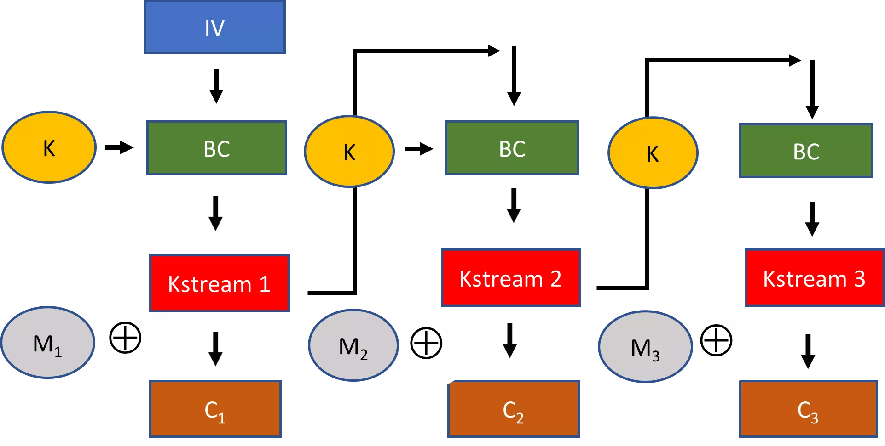

ด้วยโหมด OFB คุณยังต้องเลือกเวกเตอร์เริ่มต้น แต่ที่นี่ สำหรับบล็อกแรก เวกเตอร์เริ่มต้นจะถูกใส่เข้าไปในบล็อกไซเฟอร์โดยตรงพร้อมกับคีย์ของคุณ ผลลัพธ์ที่ได้ 128 บิต จะถูกใช้เป็นคีย์สตรีม จากนั้นคีย์สตรีมนี้จะถูก XOR กับข้อความธรรมดาเพื่อสร้างข้อความลับสำหรับบล็อก สำหรับบล็อกถัดไป คุณจะใช้คีย์สตรีมจากบล็อกก่อนหน้าเป็นอินพุตในบล็อกไซเฟอร์และทำซ้ำขั้นตอนเดิม

หากคุณพิจารณาอย่างถี่ถ้วน สิ่งที่ถูกสร้างขึ้นจริง ๆ จาก block cipher ด้วยโหมด OFB คือ stream cipher คุณ generate keystream ส่วนของ 128 บิตจนกว่าคุณจะมีความยาวของ plaintext (ทิ้งบิตที่คุณไม่ต้องการจากส่วน keystream 128 บิตสุดท้าย) จากนั้นคุณ XOR keystream กับข้อความ plaintext ของคุณเพื่อให้ได้ ciphertext

ในส่วนก่อนหน้านี้เกี่ยวกับรหัสลับแบบสตรีม ฉันได้กล่าวว่าคุณสร้างสตรีมคีย์ด้วยความช่วยเหลือของกุญแจลับ เพื่อให้แม่นยำ มันไม่จำเป็นต้องถูกสร้างขึ้นด้วยกุญแจลับเพียงอย่างเดียว ดังที่คุณเห็นในโหมด OFB สตรีมคีย์ถูกสร้างขึ้นด้วยการสนับสนุนของทั้งกุญแจลับและเวกเตอร์เริ่มต้น

โปรดทราบว่าเช่นเดียวกับโหมด CBC การเลือก nonce ที่เป็น pseudorandom หรือ random สำหรับเวกเตอร์เริ่มต้นทุกครั้งที่คุณใช้ block cipher ในโหมด OFB นั้นมีความสำคัญ มิฉะนั้น สตริงข้อความ 128 บิตเดียวกันที่ส่งในการสื่อสารต่าง ๆ จะถูกเข้ารหัสในลักษณะเดียวกัน นี่เป็นวิธีหนึ่งในการสร้างการเข้ารหัสแบบ probabilistic ด้วย stream cipher

สตรีมไซเฟอร์บางประเภทใช้เพียงกุญแจลับในการสร้างสตรีมกุญแจ สำหรับสตรีมไซเฟอร์เหล่านั้น สิ่งสำคัญคือคุณต้องใช้ nonce แบบสุ่มเพื่อเลือกกุญแจลับสำหรับแต่ละกรณีของการสื่อสาร มิฉะนั้น ผลลัพธ์ของการเข้ารหัสด้วยสตรีมไซเฟอร์เหล่านั้นจะเป็นแบบกำหนดได้ ซึ่งจะนำไปสู่ปัญหาด้านความปลอดภัย

รหัสบล็อกสมัยใหม่ที่ได้รับความนิยมมากที่สุดคือ **รหัส Rijndael** มันเป็นผลงานที่ชนะเลิศจากการส่งผลงานสิบห้าชิ้นในการแข่งขันที่จัดขึ้นโดยสถาบันมาตรฐานและเทคโนโลยีแห่งชาติ (NIST) ระหว่างปี 1997 ถึง 2000 เพื่อแทนที่มาตรฐานการเข้ารหัสที่เก่ากว่า คือ **มาตรฐานการเข้ารหัสข้อมูล** (**DES**)

Rijndael cipher สามารถใช้งานได้ด้วยสเปคที่แตกต่างกันสำหรับความยาวของคีย์และขนาดบล็อก รวมถึงในโหมดการทำงานที่แตกต่างกัน คณะกรรมการสำหรับการแข่งขัน NIST ได้รับรองเวอร์ชันที่จำกัดของ Rijndael cipher—ซึ่งต้องการขนาดบล็อก 128 บิตและความยาวคีย์ที่เป็น 128 บิต, 192 บิต, หรือ 256 บิต—เป็นส่วนหนึ่งของ **มาตรฐานการเข้ารหัสขั้นสูง** (**AES**) นี่คือมาตรฐานหลักสำหรับการเข้ารหัสแบบสมมาตร มันมีความปลอดภัยมากจนแม้แต่ NSA ก็ยินดีที่จะใช้มันกับคีย์ 256 บิตสำหรับเอกสารลับสุดยอด [6]

ตัวเข้ารหัสบล็อก AES จะถูกอธิบายอย่างละเอียดใน *บทที่ 5*

**บันทึก:**

[5] ความสำคัญของการเข้ารหัสแบบความน่าจะเป็นถูกเน้นเป็นครั้งแรกโดย Shafi Goldwasser และ Silvio Micali, “Probabilistic encryption,” _Journal of Computer and System Sciences_, 28 (1984), 270–99.

[6] ดู NSA, "Commercial National Security Algorithm Suite", [https://apps.nsa.gov/iaarchive/programs/iad-initiatives/cnsa-suite.cfm](https://apps.nsa.gov/iaarchive/programs/iad-initiatives/cnsa-suite.cfm).

## การขจัดความสับสน

<chapterId>121c1858-27e3-5862-b0ce-4ff2f70f9f0f</chapterId>

ความสับสนเกี่ยวกับความแตกต่างระหว่างบล็อกไซเฟอร์และสตรีมไซเฟอร์เกิดขึ้นเพราะบางครั้งผู้คนจะเข้าใจคำว่าบล็อกไซเฟอร์ว่าเป็นการอ้างถึง *บล็อกไซเฟอร์ที่มีโหมดการเข้ารหัสแบบบล็อก* โดยเฉพาะเจาะจง

พิจารณาโหมด ECB และ CBC ในส่วนก่อนหน้า โหมดเหล่านี้ต้องการให้ข้อมูลสำหรับการเข้ารหัสสามารถหารด้วยขนาดบล็อกได้ลงตัว (หมายความว่าคุณอาจต้องใช้การเติมข้อมูลสำหรับข้อความต้นฉบับ) นอกจากนี้ ข้อมูลในโหมดเหล่านี้ยังถูกดำเนินการโดยบล็อกไซเฟอร์โดยตรง (และไม่ใช่แค่การรวมกับผลลัพธ์ของการดำเนินการบล็อกไซเฟอร์เหมือนในโหมด OFB)

ดังนั้น อีกทางเลือกหนึ่ง คุณสามารถกำหนด **block cipher** เป็นรูปแบบการเข้ารหัสใด ๆ ที่ทำงานบนบล็อกของข้อความที่มีความยาวคงที่ในแต่ละครั้ง (ซึ่งบล็อกใด ๆ ต้องยาวกว่าหนึ่งไบต์ มิฉะนั้นจะกลายเป็น stream cipher) ทั้งข้อมูลสำหรับการเข้ารหัสและ ciphertext ต้องหารด้วยขนาดบล็อกนี้ลงตัว โดยทั่วไป ขนาดบล็อกจะมีความยาว 64, 128, 192, หรือ 256 บิต ในทางตรงกันข้าม stream cipher สามารถเข้ารหัสข้อความใด ๆ เป็นชิ้น ๆ ของหนึ่งบิตหรือไบต์ในแต่ละครั้ง

ด้วยความเข้าใจที่เฉพาะเจาะจงมากขึ้นเกี่ยวกับบล็อกไซเฟอร์ คุณสามารถอ้างได้ว่าระบบการเข้ารหัสสมัยใหม่เป็นทั้งสตรีมหรือบล็อกไซเฟอร์ จากนี้ไป ฉันจะหมายถึงคำว่าบล็อกไซเฟอร์ในความหมายที่กว้างขึ้น เว้นแต่จะระบุไว้เป็นอย่างอื่น

การอภิปรายเกี่ยวกับโหมด OFB ในส่วนก่อนหน้านี้ยังได้ยกประเด็นที่น่าสนใจอีกประเด็นหนึ่งขึ้นมา สตรีมไซเฟอร์บางตัวถูกสร้างขึ้นจากบล็อกไซเฟอร์ เช่น Rijndael กับ OFB บางตัวเช่น Salsa20 และ ChaCha ไม่ได้ถูกสร้างจากบล็อกไซเฟอร์ คุณอาจเรียกสตรีมไซเฟอร์ประเภทหลังว่า **primitive stream ciphers** (จริงๆ แล้วไม่มีคำศัพท์มาตรฐานในการอ้างถึงสตรีมไซเฟอร์ประเภทนี้)

เมื่อผู้คนพูดถึงข้อดีและข้อเสียของ stream ciphers และ block ciphers พวกเขามักจะเปรียบเทียบ primitive stream ciphers กับ encryption schemes ที่อิงจาก block ciphers

แม้ว่าคุณจะสามารถสร้างรหัสลับแบบสตรีมจากรหัสลับแบบบล็อกได้อย่างง่ายดายเสมอ แต่โดยทั่วไปแล้วจะเป็นเรื่องยากมากที่จะสร้างโครงสร้างบางประเภทด้วยโหมดการเข้ารหัสแบบบล็อก (เช่น โหมด CBC) จากรหัสลับแบบสตรีมพื้นฐาน

จากการอภิปรายนี้ คุณควรเข้าใจ *รูปที่ 8* แล้ว มันให้ภาพรวมเกี่ยวกับรูปแบบการเข้ารหัสแบบสมมาตร เราใช้รูปแบบการเข้ารหัสสามประเภท: รหัสสตรีมแบบดั้งเดิม, รหัสสตรีมบล็อกไซเฟอร์, และรหัสบล็อกในโหมดบล็อก (ในแผนภาพเรียกว่า “รหัสบล็อก”)

*รูปที่ 8: ภาพรวมของรูปแบบการเข้ารหัสแบบสมมาตร*

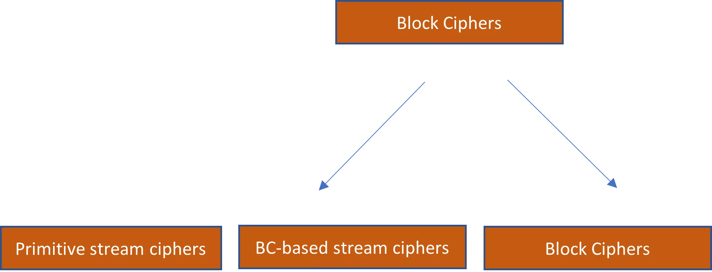

## รหัสการตรวจสอบความถูกต้องของข้อความ

<chapterId>19fa7c00-db59-56a0-9654-5350a137939d</chapterId>

การเข้ารหัสเกี่ยวข้องกับความลับ แต่การเข้ารหัสลับยังเกี่ยวข้องกับธีมที่กว้างขึ้น เช่น ความสมบูรณ์ของข้อความ ความถูกต้อง และการไม่ปฏิเสธ สิ่งที่เรียกว่า **รหัสการตรวจสอบข้อความ** (MACs) เป็นรูปแบบการเข้ารหัสลับแบบกุญแจสมมาตรที่สนับสนุนความถูกต้องและความสมบูรณ์ในการสื่อสาร

ทำไมถึงต้องการสิ่งอื่นนอกจากความลับในด้านการสื่อสาร? สมมติว่า Bob ส่งข้อความถึง Alice โดยใช้การเข้ารหัสที่แทบจะไม่สามารถถอดรหัสได้ ผู้โจมตีที่ดักจับข้อความนี้จะไม่สามารถรับข้อมูลเชิงลึกที่สำคัญเกี่ยวกับเนื้อหาได้ อย่างไรก็ตาม ผู้โจมตียังมีช่องทางการโจมตีอื่นๆ อย่างน้อยสองช่องทางที่สามารถใช้ได้:

1. เธอสามารถดักจับข้อความที่เข้ารหัส เปลี่ยนแปลงเนื้อหา และส่งข้อความที่เข้ารหัสที่ถูกเปลี่ยนแปลงไปยัง Alice ได้

2. เธอสามารถบล็อกข้อความของ Bob ได้ทั้งหมดและส่งรหัสลับที่เธอสร้างขึ้นเอง.

ในทั้งสองกรณีนี้ ผู้โจมตีอาจไม่มีข้อมูลเชิงลึกเกี่ยวกับเนื้อหาจากรหัสลับ (1) และ (2) แต่เธอยังสามารถก่อให้เกิดความเสียหายอย่างมีนัยสำคัญในลักษณะนี้ได้ นี่คือจุดที่รหัสการยืนยันข้อความมีความสำคัญ

รหัสการตรวจสอบข้อความถูกกำหนดอย่างหลวม ๆ ว่าเป็นโครงร่างการเข้ารหัสแบบสมมาตรที่มีสามอัลกอริทึม: อัลกอริทึมการสร้างคีย์, อัลกอริทึมการสร้างแท็ก, และอัลกอริทึมการตรวจสอบ รหัส MAC ที่ปลอดภัยจะรับประกันว่าแท็กจะ **ไม่สามารถปลอมแปลงได้** สำหรับผู้โจมตีใด ๆ — นั่นคือ พวกเขาไม่สามารถสร้างแท็กบนข้อความที่ตรวจสอบได้สำเร็จ เว้นแต่พวกเขาจะมีคีย์ส่วนตัว

Bob และ Alice สามารถต่อสู้กับการดัดแปลงข้อความเฉพาะโดยใช้ MAC สมมติว่าชั่วขณะหนึ่งพวกเขาไม่สนใจเรื่องความลับ พวกเขาเพียงต้องการให้แน่ใจว่าข้อความที่ได้รับโดย Alice นั้นมาจาก Bob จริง ๆ และไม่ได้ถูกเปลี่ยนแปลงในทางใดทางหนึ่ง

กระบวนการนี้แสดงใน *รูปที่ 9* ในการใช้ **MAC** (Message Authentication Code) พวกเขาจะต้อง generate คีย์ส่วนตัว $K$ ที่แชร์ระหว่างทั้งสองคนก่อน Bob สร้างแท็ก $T$ สำหรับข้อความโดยใช้คีย์ส่วนตัว $K$ จากนั้นเขาส่งข้อความพร้อมกับแท็กข้อความไปยัง Alice เธอสามารถตรวจสอบได้ว่า Bob เป็นผู้สร้างแท็กจริง โดยการรันคีย์ส่วนตัว ข้อความ และแท็กผ่านอัลกอริธึมการตรวจสอบ

*รูปที่ 9: ภาพรวมของรูปแบบการเข้ารหัสแบบสมมาตร*

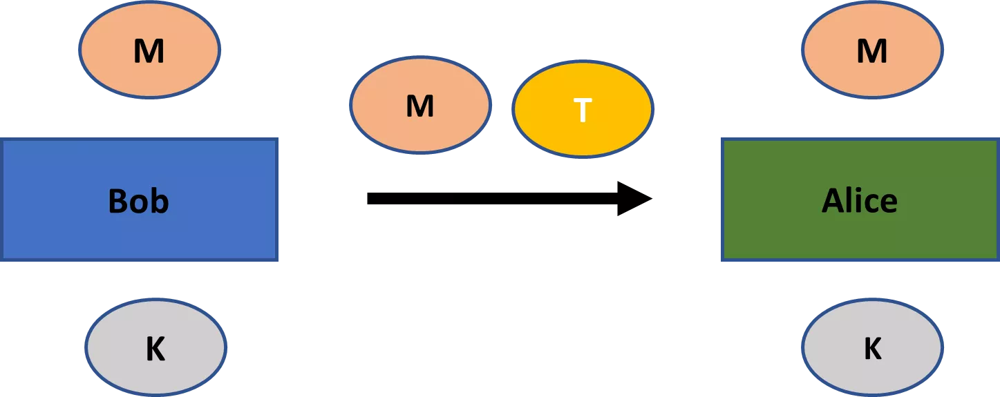

เนื่องจาก **การไม่สามารถปลอมแปลงได้ในเชิงการดำรงอยู่**, ผู้โจมตีไม่สามารถแก้ไขข้อความ $M$ ได้ในทางใดทางหนึ่งหรือสร้างข้อความของตนเองพร้อมแท็กที่ถูกต้องได้ นี่เป็นเช่นนั้น แม้ว่าผู้โจมตีจะสังเกตแท็กของข้อความหลายๆ ข้อความระหว่าง Bob และ Alice ที่ใช้กุญแจส่วนตัวเดียวกันได้ก็ตาม อย่างมากที่สุด ผู้โจมตีอาจจะบล็อก Alice จากการรับข้อความ $M$ (ซึ่งเป็นปัญหาที่การเข้ารหัสไม่สามารถแก้ไขได้)

MAC รับประกันว่าข้อความถูกสร้างขึ้นโดย Bob จริง ความถูกต้องนี้หมายถึงความสมบูรณ์ของข้อความโดยอัตโนมัติ นั่นคือ ถ้า Bob ได้สร้างข้อความบางอย่างขึ้นมาแล้ว ก็หมายความว่า ข้อความนั้นไม่ได้ถูกแก้ไขใดๆ โดยผู้โจมตี ดังนั้นจากนี้ไป ความกังวลใดๆ เกี่ยวกับการตรวจสอบความถูกต้องควรจะเข้าใจโดยอัตโนมัติว่าหมายถึงความกังวลเกี่ยวกับความสมบูรณ์

แม้ว่าฉันจะได้แยกความแตกต่างระหว่างความแท้จริงของข้อความและความสมบูรณ์ในบทสนทนาของฉัน แต่ก็เป็นเรื่องปกติที่จะใช้คำเหล่านั้นเป็นคำพ้องความหมาย ซึ่งหมายถึงแนวคิดของข้อความที่ถูกสร้างขึ้นโดยผู้ส่งเฉพาะและไม่ได้ถูกแก้ไขในทางใด ๆ ในจิตวิญญาณนี้ รหัสการตรวจสอบข้อความมักจะถูกเรียกว่า **รหัสความสมบูรณ์ของข้อความ**

## การเข้ารหัสที่ตรวจสอบความถูกต้อง

<chapterId>33f2ec9b-9fb4-5c61-8fb4-50836270a144</chapterId>

โดยทั่วไปแล้ว คุณต้องการรับประกันทั้งความลับและความถูกต้องในด้านการสื่อสาร ดังนั้น โครงร่างการเข้ารหัสและโครงร่าง MAC มักจะถูกใช้ร่วมกัน

**โครงร่างการเข้ารหัสที่ผ่านการรับรอง** เป็นโครงร่างที่รวมการเข้ารหัสกับ MAC ในลักษณะที่มีความปลอดภัยสูง โดยเฉพาะอย่างยิ่งต้องเป็นไปตามมาตรฐานสำหรับการไม่สามารถปลอมแปลงได้ในทางที่มีอยู่จริง รวมถึงแนวคิดของความลับที่แข็งแกร่งมาก นั่นคือสามารถต้านทานการโจมตีด้วย **chosen-ciphertext attacks** ได้ [7]

เพื่อให้แผนการเข้ารหัสสามารถต้านทานการโจมตีแบบเลือกข้อความเข้ารหัสได้ จะต้องเป็นไปตามมาตรฐานของ **non-malleability**: นั่นคือ การแก้ไขข้อความเข้ารหัสโดยผู้โจมตีควรส่งผลให้ได้ข้อความเข้ารหัสที่ไม่ถูกต้อง หรือข้อความที่ถอดรหัสออกมาแล้วไม่มีความสัมพันธ์กับข้อความต้นฉบับ [8]

เนื่องจากโครงร่างการเข้ารหัสที่รับรองความถูกต้องทำให้มั่นใจได้ว่า ciphertext ที่สร้างโดยผู้โจมตีจะไม่ถูกต้องเสมอ (เนื่องจากแท็กจะไม่ถูกตรวจสอบ) จึงเป็นไปตามมาตรฐานสำหรับการต้านทานการโจมตีด้วย ciphertext ที่เลือกได้ น่าสนใจที่คุณสามารถพิสูจน์ได้ว่าโครงร่างการเข้ารหัสที่รับรองความถูกต้องสามารถสร้างได้เสมอจากการรวมกันของ MAC ที่ไม่สามารถปลอมแปลงได้อย่างมีอยู่จริงและโครงร่างการเข้ารหัสที่ตรงตามแนวคิดด้านความปลอดภัยที่น้อยกว่า ซึ่งรู้จักกันในชื่อ **ความปลอดภัยจากการโจมตีด้วย plaintext ที่เลือกได้**

เราจะไม่ลงลึกในรายละเอียดทั้งหมดของการสร้างโครงร่างการเข้ารหัสที่รับรองความถูกต้อง แต่สิ่งสำคัญคือต้องทราบรายละเอียดสองประการของการสร้างโครงร่างเหล่านี้

ประการแรก แผนการเข้ารหัสที่ผ่านการรับรองจะจัดการการเข้ารหัสก่อนแล้วจึงสร้างแท็กข้อความบนข้อความที่เข้ารหัส ปรากฏว่าแนวทางอื่นๆ เช่น การรวมข้อความที่เข้ารหัสกับแท็กบนข้อความธรรมดา หรือการสร้างแท็กก่อนแล้วจึงเข้ารหัสทั้งข้อความธรรมดาและแท็กนั้นไม่ปลอดภัย นอกจากนี้ การดำเนินการทั้งสองมีคีย์ส่วนตัวที่เลือกแบบสุ่มของตัวเอง มิฉะนั้นความปลอดภัยของคุณจะถูกทำลายอย่างรุนแรง

หลักการที่กล่าวถึงข้างต้นใช้ได้ทั่วไปมากขึ้น: *คุณควรใช้กุญแจที่แตกต่างกันเสมอเมื่อรวมโครงร่างการเข้ารหัสพื้นฐาน*

โครงร่างการเข้ารหัสที่ได้รับการรับรองแสดงใน *รูปที่ 10* Bob สร้างข้อความเข้ารหัส $C$ จากข้อความ $M$ โดยใช้กุญแจที่เลือกแบบสุ่ม $K_C$ จากนั้นเขาสร้างแท็กข้อความ $T$ โดยรันข้อความเข้ารหัสและกุญแจที่เลือกแบบสุ่มอีกอัน $K_T$ ผ่านอัลกอริทึมการสร้างแท็ก ทั้งข้อความเข้ารหัสและแท็กข้อความถูกส่งไปยัง Alice

Alice จะตรวจสอบก่อนว่าแท็กนั้นถูกต้องหรือไม่เมื่อพิจารณาจากข้อความลับ $C$ และกุญแจ $K_T$ หากถูกต้อง เธอสามารถถอดรหัสข้อความโดยใช้กุญแจ $K_C$ ได้ ไม่เพียงแต่เธอจะมั่นใจในความลับที่แข็งแกร่งมากในการสื่อสารของพวกเขา แต่เธอยังรู้ด้วยว่าข้อความนั้นถูกสร้างขึ้นโดย Bob

*รูปที่ 10: แผนผังการเข้ารหัสที่ผ่านการตรวจสอบสิทธิ์*

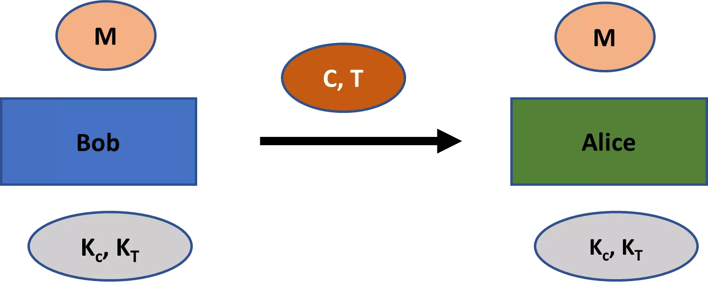

MACs ถูกสร้างขึ้นอย่างไร? ในขณะที่ MACs สามารถสร้างได้ผ่านหลายวิธี วิธีที่พบและมีประสิทธิภาพในการสร้างคือผ่าน **ฟังก์ชันแฮชเชิงเข้ารหัส**

เราจะอธิบายฟังก์ชันแฮชเชิงการเข้ารหัสอย่างละเอียดใน *บทที่ 6* สำหรับตอนนี้ เพียงแค่รู้ว่า **ฟังก์ชันแฮช** เป็นฟังก์ชันที่สามารถคำนวณได้อย่างมีประสิทธิภาพ ซึ่งรับข้อมูลขนาดใดก็ได้และให้ผลลัพธ์ที่มีความยาวคงที่ ตัวอย่างเช่น ฟังก์ชันแฮชยอดนิยม **SHA-256** (secure hash algorithm 256) จะสร้างผลลัพธ์ขนาด 256 บิตเสมอ ไม่ว่าจะมีขนาดของข้อมูลนำเข้าเท่าใดก็ตาม ฟังก์ชันแฮชบางตัว เช่น SHA-256 มีการประยุกต์ใช้ที่มีประโยชน์ในวิทยาการเข้ารหัสลับ

ประเภทแท็กที่พบมากที่สุดที่ผลิตด้วยฟังก์ชันแฮชเข้ารหัสคือ **รหัสการพิสูจน์ตัวตนของข้อความที่ใช้แฮช** (HMAC) กระบวนการนี้แสดงใน *รูปที่ 11* ฝ่ายหนึ่งผลิตคีย์สองคีย์ที่แตกต่างกันจากคีย์ส่วนตัว $K$ คือ คีย์ภายใน $K_1$ และคีย์ภายนอก $K_2$ จากนั้นข้อความธรรมดา $M$ หรือข้อความเข้ารหัส $C$ จะถูกแฮชพร้อมกับคีย์ภายใน ผลลัพธ์ $T'$ จะถูกแฮชกับคีย์ภายนอกเพื่อผลิตแท็กข้อความ $T$

มีชุดของฟังก์ชันแฮชที่สามารถใช้สร้าง HMAC ได้ ฟังก์ชันแฮชที่ใช้กันมากที่สุดคือ SHA-256

*รูปที่ 11: HMAC*

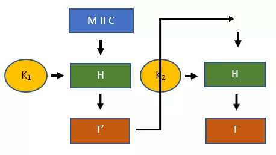

**บันทึก:**

[7] ผลลัพธ์เฉพาะที่กล่าวถึงในส่วนนี้มาจาก Katz และ Lindell, หน้า 131–47.

[8] ในทางเทคนิคแล้ว คำจำกัดความของการโจมตีด้วยการเลือกข้อความเข้ารหัสแตกต่างจากแนวคิดของการไม่สามารถเปลี่ยนแปลงได้ แต่คุณสามารถแสดงให้เห็นว่าแนวคิดทั้งสองของความปลอดภัยนั้นเทียบเท่ากัน

## การสื่อสารที่ปลอดภัย

<chapterId>c7f7dcd3-bbed-53ed-a43d-039da0f180c5</chapterId>

สมมติว่ามีสองฝ่ายอยู่ในช่วงการสื่อสาร ดังนั้นพวกเขาจึงส่งข้อความหลายครั้งไปมา

โครงร่างการเข้ารหัสที่รับรองความถูกต้องช่วยให้ผู้รับข้อความสามารถตรวจสอบได้ว่าข้อความนั้นถูกสร้างขึ้นโดยคู่สนทนาของเธอในเซสชันการสื่อสาร (ตราบใดที่กุญแจส่วนตัวยังไม่รั่วไหล) สิ่งนี้ทำงานได้ดีพอสำหรับข้อความเดียว อย่างไรก็ตาม โดยทั่วไปแล้ว ทั้งสองฝ่ายจะส่งข้อความไปกลับในเซสชันการสื่อสาร และในสถานการณ์นั้น โครงร่างการเข้ารหัสที่รับรองความถูกต้องแบบธรรมดาตามที่อธิบายไว้ในส่วนก่อนหน้านี้ยังไม่เพียงพอในการให้ความปลอดภัย

เหตุผลหลักคือโครงร่างการเข้ารหัสที่ผ่านการรับรองไม่ได้ให้การรับประกันใด ๆ ว่าข้อความนั้นถูกส่งโดยตัวแทนที่สร้างมันขึ้นมาภายในเซสชันการสื่อสาร พิจารณาเวกเตอร์การโจมตีสามแบบต่อไปนี้:

1. **การโจมตีแบบ Replay**: ผู้โจมตีส่งซ้ำข้อความที่เข้ารหัสและแท็กที่เธอดักจับได้ระหว่างสองฝ่ายในช่วงเวลาก่อนหน้านี้

2. **การโจมตีแบบจัดลำดับใหม่**: ผู้โจมตีดักข้อความสองข้อความในเวลาที่ต่างกันและส่งไปยังผู้รับในลำดับย้อนกลับ

3. **การโจมตีแบบสะท้อนกลับ**: ผู้โจมตีสังเกตข้อความที่ส่งจาก A ไปยัง B และส่งข้อความนั้นกลับไปยัง A ด้วย

แม้ว่าผู้โจมตีจะไม่มีความรู้เกี่ยวกับข้อความที่ถูกเข้ารหัสและไม่สามารถสร้างข้อความที่ถูกปลอมแปลงได้ แต่การโจมตีดังกล่าวข้างต้นยังคงสามารถก่อให้เกิดความเสียหายอย่างมีนัยสำคัญในการสื่อสารได้

สมมติว่า ข้อความเฉพาะระหว่างสองฝ่ายเกี่ยวข้องกับการโอนเงินทุน การโจมตีแบบ replay อาจทำให้เงินทุนถูกโอนซ้ำอีกครั้ง วิธีการเข้ารหัสที่รับรองความถูกต้องแบบธรรมดาไม่มีการป้องกันต่อการโจมตีดังกล่าว

โชคดีที่การโจมตีประเภทนี้สามารถบรรเทาได้ง่ายในเซสชันการสื่อสารโดยใช้ **ตัวระบุ** และ **ตัวบ่งชี้เวลาสัมพัทธ์**

สามารถเพิ่มตัวระบุไปยังข้อความธรรมดาก่อนการเข้ารหัสได้ ซึ่งจะป้องกันการโจมตีแบบสะท้อนกลับ ตัวบ่งชี้เวลาสัมพัทธ์สามารถเป็นตัวเลขลำดับในเซสชันการสื่อสารเฉพาะได้ ตัวอย่างเช่น แต่ละฝ่ายจะเพิ่มตัวเลขลำดับไปยังข้อความก่อนการเข้ารหัส ดังนั้นผู้รับจะทราบว่าข้อความถูกส่งตามลำดับใด ซึ่งจะกำจัดความเป็นไปได้ของการโจมตีแบบเรียงลำดับใหม่ นอกจากนี้ยังป้องกันการโจมตีแบบเล่นซ้ำ ข้อความใด ๆ ที่ผู้โจมตีส่งลงมาจะมีตัวเลขลำดับเก่า และผู้รับจะทราบว่าไม่ควรประมวลผลข้อความนั้นอีก

เพื่อแสดงให้เห็นว่าการสื่อสารที่ปลอดภัยทำงานอย่างไร สมมติอีกครั้งว่า Alice และ Bob พวกเขาส่งข้อความทั้งหมดสี่ข้อความไปมา คุณสามารถดูได้ว่ารูปแบบการเข้ารหัสที่รับรองความถูกต้องด้วยตัวระบุและหมายเลขลำดับทำงานอย่างไรด้านล่างใน *รูปที่ 11*

การสื่อสารเริ่มต้นด้วย Bob ส่งข้อความเข้ารหัส $C_{0,B}$ ไปยัง Alice พร้อมกับแท็กข้อความ $T_{0,B}$ ข้อความเข้ารหัสประกอบด้วยข้อความ, ตัวระบุ (BOB) และหมายเลขลำดับ (0) แท็ก $T_{0,B}$ ถูกสร้างขึ้นจากข้อความเข้ารหัสทั้งหมด ในการสื่อสารต่อไป Alice และ Bob จะรักษาโปรโตคอลนี้ โดยปรับปรุงฟิลด์ตามความจำเป็น

*รูปที่ 12: เซสชันการสื่อสารที่ปลอดภัย*

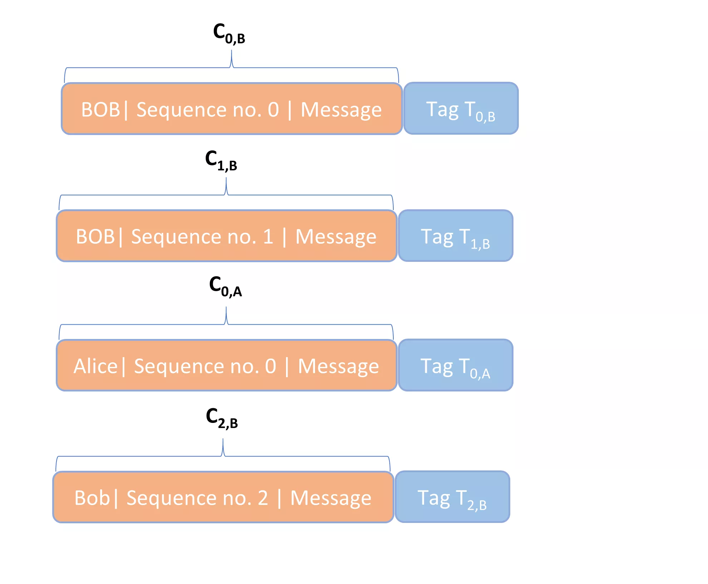

# RC4 และ AES

<partId>a48c4a7d-0a41-523f-a4ab-1305b4430324</partId>

## RC4 สตรีมไซเฟอร์

<chapterId>5caec5bd-5a77-56c9-b5e6-1e86f0d294aa</chapterId>

ในบทนี้ เราจะพูดถึงรายละเอียดของแผนการเข้ารหัสด้วยการเข้ารหัสแบบสตรีมสมัยใหม่ RC4 (หรือ "Rivest cipher 4") และการเข้ารหัสแบบบล็อกสมัยใหม่ AES แม้ว่าการเข้ารหัส RC4 จะไม่เป็นที่นิยมอีกต่อไปในฐานะวิธีการเข้ารหัส แต่ AES เป็นมาตรฐานสำหรับการเข้ารหัสแบบสมมาตรสมัยใหม่ ตัวอย่างทั้งสองนี้จะช่วยให้เข้าใจได้ดีขึ้นว่าการเข้ารหัสแบบสมมาตรทำงานอย่างไรภายใต้พื้นผิว

___

เพื่อให้เข้าใจถึงการทำงานของรหัสสตรีมสุ่มเทียมสมัยใหม่ ผมจะเน้นไปที่รหัสสตรีม RC4 มันเป็นรหัสสตรีมสุ่มเทียมที่เคยใช้ในโปรโตคอลความปลอดภัยของจุดเชื่อมต่อไร้สาย WEP และ WAP รวมถึงใน TLS ด้วย เนื่องจาก RC4 มีจุดอ่อนที่ได้รับการพิสูจน์หลายประการ มันจึงไม่เป็นที่นิยมอีกต่อไป ในความเป็นจริง คณะทำงานวิศวกรรมอินเทอร์เน็ตได้ห้ามการใช้ชุด RC4 โดยแอปพลิเคชันของลูกค้าและเซิร์ฟเวอร์ในทุกกรณีของ TLS อย่างไรก็ตาม มันยังคงทำงานได้ดีในฐานะตัวอย่างเพื่อแสดงให้เห็นว่ารหัสสตรีมพื้นฐานทำงานอย่างไร

ในการเริ่มต้น ฉันจะแสดงวิธีการเข้ารหัสข้อความธรรมดาด้วยรหัสลับ RC4 แบบง่าย สมมติว่าข้อความธรรมดาของเราคือ "SOUP" การเข้ารหัสด้วยรหัสลับ RC4 แบบง่ายของเรา จะดำเนินการในสี่ขั้นตอน

### ขั้นตอนที่ 1

ก่อนอื่น กำหนดอาเรย์ **S** โดยมี $S[0] = 0$ ถึง $S[7] = 7$ อาเรย์ในที่นี้หมายถึงการรวบรวมค่าที่สามารถเปลี่ยนแปลงได้ซึ่งจัดระเบียบตามดัชนี หรือเรียกว่าลิสต์ในบางภาษาโปรแกรม (เช่น Python) ในกรณีนี้ ดัชนีจะเริ่มจาก 0 ถึง 7 และค่าก็จะเริ่มจาก 0 ถึง 7 เช่นกัน ดังนั้น **S** จึงเป็นดังนี้:

- $S = [0, 1, 2, 3, 4, 5, 6, 7]$

ค่าที่นี่ไม่ใช่ตัวเลข ASCII แต่เป็นการแสดงค่าทศนิยมของสตริง 1 ไบต์ ดังนั้นค่าที่เป็น 2 จะเท่ากับ $0000 \ 0011$ ความยาวของอาเรย์ **S** จึงเป็น 8 ไบต์

### ขั้นตอนที่ 2

ประการที่สอง กำหนดอาร์เรย์คีย์ **K** ที่มีความยาว 8 ไบต์ โดยเลือกคีย์ระหว่าง 1 ถึง 8 ไบต์ (โดยไม่มีการใช้เศษส่วนของไบต์) เนื่องจากแต่ละไบต์มี 8 บิต คุณสามารถเลือกตัวเลขใดก็ได้ระหว่าง 0 ถึง 255 สำหรับแต่ละไบต์ของคีย์ของคุณ

สมมติว่าเราเลือกคีย์ของเรา **k** เป็น $[14, 48, 9]$ ดังนั้นมันจะมีความยาว 3 ไบต์ แต่ละดัชนีของอาร์เรย์คีย์ของเราจะถูกตั้งค่าตามค่าทศนิยมสำหรับองค์ประกอบเฉพาะของคีย์นั้นตามลำดับ หากคุณวิ่งผ่านคีย์ทั้งหมดแล้ว ให้เริ่มต้นใหม่อีกครั้ง จนกว่าคุณจะเติม 8 ช่องของอาร์เรย์คีย์ ดังนั้นอาร์เรย์คีย์ของเราคือดังนี้:

- $K = [14, 48, 9, 14, 48, 9, 14, 48]$

### ขั้นตอนที่ 3

ประการที่สาม เราจะทำการแปลงอาร์เรย์ **S** โดยใช้อาร์เรย์คีย์ **K** ในกระบวนการที่เรียกว่า **การจัดตารางคีย์** กระบวนการมีดังนี้ในรูปแบบรหัสเทียม:

- สร้างตัวแปร **j** และ **i**
- กำหนดตัวแปร $j = 0$
- สำหรับแต่ละ $i$ จาก 0 ถึง 7:
    - กำหนด $j = (j + S[i] + K[i]) \mod 8$
    - สลับ $S[i]$ และ $S[j]$

การแปลงของอาร์เรย์ **S** ถูกบันทึกไว้โดย *ตารางที่ 1*

ในการเริ่มต้น คุณสามารถเห็นสถานะเริ่มต้นของ **S** เป็น $[0, 1, 2, 3, 4, 5, 6, 7]$ โดยมีค่าเริ่มต้นของ **j** เป็น 0 สิ่งนี้จะถูกแปลงโดยใช้คีย์อาร์เรย์ $[14, 48, 9, 14, 48, 9, 14, 48]$.

ลูป for เริ่มต้นด้วย $i = 0$ ตามที่ระบุใน pseudocode ข้างต้น ค่าของ **j** ใหม่จะกลายเป็น 6 ($j = (j + S[0] + K[0]) \mod 8 = (0 + 0 + 14) \mod 8 = 6 \mod 8$) สลับ $S[0]$ และ $S[6]$ สถานะของ **S** หลังจากรอบที่ 1 กลายเป็น $[6, 1, 2, 3, 4, 5, 0, 7]$.

ในแถวถัดไป $i = 1$. เมื่อผ่านลูป for อีกครั้ง, **j** ได้รับค่าเป็น 7 ($j = (j + S[1] + K[1]) \mod 8 = (6 + 1 + 48) \mod 8 = 55 \mod 8 = 7 \mod 8$). การสลับ $S[1]$ และ $S[7]$ จากสถานะปัจจุบันของ **S**, $[6, 1, 2, 3, 4, 5, 0, 7]$, จะได้ $[6, 7, 2, 3, 4, 5, 0, 1]$ หลังจากรอบที่ 2.

เราดำเนินการตามกระบวนการนี้ต่อไปจนกระทั่งเราได้แถวสุดท้ายที่ด้านล่างสำหรับอาเรย์ **S**, $[6, 4, 1, 0, 3, 7, 5, 2]$.

*ตารางที่ 1: ตารางการจัดตารางเวลาหลัก*

| Round   | i   | j   |     | S[0] | S[1] | S[2] | S[3] | S[4] | S[5] | S[6] | S[7] |
| ------- | --- | --- | --- | ---- | ---- | ---- | ---- | ---- | ---- | ---- | ---- |
|         |     |     |     |      |      |      |      |      |      |      |      |
| Initial |     | 0   |     | 0    | 1    | 2    | 3    | 4    | 5    | 6    | 7    |
| 1       | 0   | 6   |     | 6    | 1    | 2    | 3    | 4    | 5    | 0    | 7    |
| 2       | 1   | 7   |     | 6    | 7    | 2    | 3    | 4    | 5    | 0    | 1    |
| 3       | 2   | 2   |     | 6    | 7    | 2    | 3    | 4    | 5    | 0    | 1    |
| 4       | 3   | 3   |     | 6    | 7    | 2    | 3    | 4    | 5    | 0    | 1    |
| 5       | 4   | 3   |     | 6    | 7    | 2    | 0    | 3    | 5    | 4    | 1    |
| 6       | 5   | 6   |     | 6    | 4    | 2    | 0    | 3    | 7    | 5    | 1    |
| 7       | 6   | 1   |     | 6    | 4    | 2    | 0    | 3    | 7    | 5    | 2    |
| 8       | 7   | 2   |     | 6    | 4    | 1    | 0    | 3    | 7    | 5    | 2    |

### ขั้นตอนที่ 4

ในขั้นตอนที่สี่ เราผลิต **keystream** นี่คือสตริงสุ่มเทียมที่มีความยาวเท่ากับข้อความที่เราต้องการส่ง ซึ่งจะถูกใช้ในการเข้ารหัสข้อความต้นฉบับ “SOUP” เนื่องจาก keystream จำเป็นต้องมีความยาวเท่ากับข้อความ เราจึงต้องการ keystream ที่มี 4 ไบต์

Keystream ถูกสร้างขึ้นโดยโค้ดเทียมดังต่อไปนี้:

- สร้างตัวแปร **j**, **i**, และ **t**.
- กำหนด $j = 0$.
- สำหรับแต่ละ $i$ ของข้อความธรรมดา เริ่มต้นด้วย $i = 1$ และดำเนินการจนถึง $i = 4$ แต่ละไบต์ของ keystream ถูกสร้างขึ้นดังนี้:
    - $j = (j + S[i]) \mod 8$
    - สลับ $S[i]$ และ $S[j]$.
    - $t = (S[i] + S[j]) \mod 8$
    - ไบต์ที่ $i^{th}$ ของ keystream = $S[t]$

คุณสามารถติดตามการคำนวณใน *ตารางที่ 2*

สถานะเริ่มต้นของ **S** คือ $S = [6, 4, 1, 0, 3, 7, 5, 2]$. ตั้งค่า $i = 1$, ค่าของ **j** กลายเป็น 4 ($j = (j + S[i]) \mod 8 = (0 + 4) \mod 8 = 4$). จากนั้นเราสลับ $S[1]$ และ $S[4]$ เพื่อสร้างการเปลี่ยนแปลงของ **S** ในแถวที่สอง, $[6, 3, 1, 0, 4, 7, 5, 2]$. ค่าของ **t** คือ 7 ($t = (S[i] + S[j]) \mod 8 = (3 + 4) \mod 8 = 7$). สุดท้าย ไบต์สำหรับ keystream คือ $S[7]$, หรือ 2.

จากนั้นเราจะผลิตไบต์อื่น ๆ ต่อไปจนกว่าเราจะได้ไบต์สี่ตัวดังนี้: 2, 6, 3, และ 7 ไบต์แต่ละตัวเหล่านี้สามารถใช้เข้ารหัสตัวอักษรแต่ละตัวของข้อความธรรมดา "SOUP"

ในการเริ่มต้น โดยใช้ตาราง ASCII เราจะเห็นว่า "SOUP" ที่เข้ารหัสด้วยค่าทศนิยมของสตริงไบต์พื้นฐานคือ "83 79 85 80" การรวมกับคีย์สตรีม "2 6 3 7" ให้ผลลัพธ์เป็น "85 85 88 87" ซึ่งยังคงเหมือนเดิมหลังจากการดำเนินการโมดูโล 256 ใน ASCII ข้อความเข้ารหัส "85 85 88 87" เท่ากับ "UUXW"

จะเกิดอะไรขึ้นหากคำที่ต้องการเข้ารหัสยาวกว่าอาร์เรย์ **S**? ในกรณีนั้น อาร์เรย์ **S** จะยังคงเปลี่ยนแปลงในลักษณะที่แสดงไว้ข้างต้นสำหรับทุกไบต์ **i** ของข้อความธรรมดา จนกว่าเราจะมีจำนวนไบต์ในสตรีมคีย์เท่ากับจำนวนตัวอักษรในข้อความธรรมดา

*ตารางที่ 2: การสร้าง Keystream*

| i   | j   | t   | Keystream | S[0] | S[1] | S[2] | S[3] | S[4] | S[5] | S[6] | S[7] |
| --- | --- | --- | --------- | ---- | ---- | ---- | ---- | ---- | ---- | ---- | ---- |
|     |     |     |           |      |      |      |      |      |      |      |      |
|     | 0   |     |           | 6    | 4    | 1    | 0    | 3    | 7    | 5    | 2    |
| 1   | 4   | 7   | 2         | 6    | 3    | 1    | 0    | 4    | 7    | 5    | 2    |
| 2   | 5   | 0   | 6         | 6    | 3    | 7    | 0    | 4    | 1    | 5    | 2    |
| 3   | 5   | 1   | 3         | 6    | 3    | 7    | 1    | 4    | 0    | 5    | 2    |
| 4   | 1   | 7   | 2         | 6    | 4    | 7    | 1    | 3    | 0    | 5    | 2    |

ตัวอย่างที่เราเพิ่งพูดถึงเป็นเพียงเวอร์ชันที่ลดทอนของ **RC4 stream cipher** เท่านั้น RC4 stream cipher ที่แท้จริงมีอาร์เรย์ **S** ที่มีความยาว 256 ไบต์ ไม่ใช่ 8 ไบต์ และคีย์ที่สามารถมีความยาวระหว่าง 1 ถึง 256 ไบต์ ไม่ใช่ระหว่าง 1 ถึง 8 ไบต์ อาร์เรย์คีย์และ keystreams ทั้งหมดจะถูกสร้างขึ้นโดยพิจารณาจากความยาว 256 ไบต์ของอาร์เรย์ **S** การคำนวณจะซับซ้อนมากขึ้นอย่างมาก แต่หลักการยังคงเหมือนเดิม โดยใช้คีย์เดียวกัน [14,48,9] กับ RC4 cipher มาตรฐาน ข้อความ plaintext "SOUP" จะถูกเข้ารหัสเป็น 67 02 ed df ในรูปแบบเลขฐานสิบหก

รหัสสตรีมที่สตรีมคีย์อัปเดตโดยไม่ขึ้นกับข้อความเพลนเท็กซ์หรือรหัสลับคือ **รหัสสตรีมแบบซิงโครนัส** สตรีมคีย์ขึ้นอยู่กับคีย์เท่านั้น เห็นได้ชัดว่า RC4 เป็นตัวอย่างของรหัสสตรีมแบบซิงโครนัส เนื่องจากสตรีมคีย์ไม่มีความสัมพันธ์กับเพลนเท็กซ์หรือรหัสลับ รหัสสตรีมพื้นฐานทั้งหมดที่เรากล่าวถึงในบทก่อนหน้า รวมถึงรหัสเลื่อน รหัส Vigenère และรหัสแผ่นครั้งเดียว ก็เป็นแบบซิงโครนัสเช่นกัน

ในทางตรงกันข้าม **รหัสสตรีมแบบอะซิงโครนัส** มีสตรีมคีย์ที่ผลิตขึ้นจากทั้งคีย์และองค์ประกอบก่อนหน้าของข้อความที่เข้ารหัส รหัสประเภทนี้ยังเรียกว่า **รหัสที่ซิงโครไนซ์ด้วยตนเอง**

ที่สำคัญคือ keystream ที่ผลิตด้วย RC4 ควรถูกปฏิบัติเสมือนเป็น one-time pad และคุณไม่สามารถผลิต keystream ในลักษณะเดียวกันได้ในครั้งถัดไป แทนที่จะเปลี่ยนคีย์ทุกครั้ง วิธีแก้ปัญหาที่เป็นไปได้คือการรวมคีย์กับ **nonce** เพื่อผลิต bytestream

## AES ด้วยคีย์ 128 บิต

<chapterId>0b30886f-e620-5b8d-807b-9d84685ca8ff</chapterId>

ตามที่กล่าวไว้ในบทก่อนหน้า สถาบันมาตรฐานและเทคโนโลยีแห่งชาติ (NIST) ได้จัดการแข่งขันระหว่างปี 1997 ถึง 2000 เพื่อกำหนดมาตรฐานการเข้ารหัสแบบสมมาตรใหม่ **Rijndael cipher** กลายเป็นผลงานที่ชนะเลิศ ชื่อนี้เป็นการเล่นคำจากชื่อของผู้สร้างชาวเบลเยียม Vincent Rijmen และ Joan Daemen

Rijndael cipher เป็น **block cipher** ซึ่งหมายความว่ามีอัลกอริทึมหลักที่สามารถใช้กับสเปคที่แตกต่างกันสำหรับความยาวของคีย์และขนาดของบล็อก จากนั้นคุณสามารถใช้มันกับโหมดการทำงานที่แตกต่างกันเพื่อสร้างรูปแบบการเข้ารหัสได้

คณะกรรมการสำหรับการแข่งขัน NIST ได้รับรองเวอร์ชันที่จำกัดของรหัส Rijndael—ซึ่งต้องการขนาดบล็อก 128 บิตและความยาวคีย์ที่มีทั้ง 128 บิต, 192 บิต, หรือ 256 บิต—เป็นส่วนหนึ่งของ **มาตรฐานการเข้ารหัสขั้นสูง (AES)** เวอร์ชันที่จำกัดของรหัส Rijndael นี้ยังสามารถใช้ภายใต้โหมดการทำงานหลายรูปแบบได้อีกด้วย ข้อกำหนดสำหรับมาตรฐานนี้คือสิ่งที่รู้จักกันในชื่อ **มาตรฐานการเข้ารหัสขั้นสูง (AES)**

เพื่อแสดงให้เห็นว่า Rijndael cipher ซึ่งเป็นแกนหลักของ AES ทำงานอย่างไร ฉันจะแสดงกระบวนการเข้ารหัสด้วยคีย์ขนาด 128 บิต ขนาดของคีย์มีผลต่อจำนวนรอบที่ใช้สำหรับการเข้ารหัสแต่ละบล็อก สำหรับคีย์ขนาด 128 บิต ต้องใช้ 10 รอบ สำหรับคีย์ขนาด 192 บิตและ 256 บิต จะต้องใช้ 12 และ 14 รอบ ตามลำดับ

นอกจากนี้ ฉันจะสมมติว่า AES ถูกใช้ใน **โหมด ECB** ซึ่งทำให้การอธิบายง่ายขึ้นเล็กน้อยและไม่ส่งผลต่ออัลกอริทึม Rijndael เพื่อให้แน่ใจ โหมด ECB ไม่ปลอดภัยในทางปฏิบัติเพราะนำไปสู่การเข้ารหัสแบบกำหนดได้ โหมดที่ปลอดภัยที่ใช้กันมากที่สุดกับ AES คือ **CBC** (Cipher Block Chaining)

เรียกคีย์นี้ว่า $K_0$. การสร้างด้วยพารามิเตอร์ข้างต้นจะมีลักษณะดังใน *รูปที่ 1* โดยที่ $M_i$ หมายถึงส่วนหนึ่งของข้อความ plaintext ขนาด 128 บิต และ $C_i$ หมายถึงส่วนหนึ่งของข้อความ ciphertext ขนาด 128 บิต การเติมข้อมูล (padding) จะถูกเพิ่มเข้าไปใน plaintext สำหรับบล็อกสุดท้าย หาก plaintext ไม่สามารถแบ่งได้ลงตัวด้วยขนาดบล็อก

*รูปที่ 1: AES-ECB ด้วยคีย์ 128 บิต*

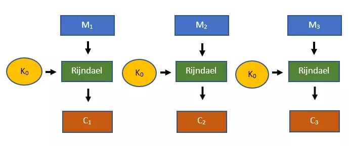

แต่ละบล็อกของข้อความขนาด 128 บิตจะผ่านกระบวนการเข้ารหัส Rijndael ทั้งหมดสิบรอบ ซึ่งต้องใช้คีย์รอบแยกต่างหากสำหรับแต่ละรอบ ($K_1$ ถึง $K_{10}$) คีย์เหล่านี้ถูกสร้างขึ้นสำหรับแต่ละรอบจากคีย์ดั้งเดิมขนาด 128 บิต $K_0$ โดยใช้ **อัลกอริทึมขยายคีย์** ดังนั้น สำหรับแต่ละบล็อกของข้อความที่จะเข้ารหัส เราจะใช้คีย์ดั้งเดิม $K_0$ รวมถึงคีย์รอบแยกต่างหากสิบคีย์ โปรดทราบว่าคีย์ทั้ง 11 คีย์นี้ถูกใช้สำหรับแต่ละบล็อกของข้อความขนาด 128 บิตที่ต้องการการเข้ารหัส

อัลกอริทึมการขยายคีย์นั้นยาวและซับซ้อน การทำความเข้าใจมันอาจไม่มีประโยชน์ทางการสอนมากนัก คุณสามารถดูอัลกอริทึมการขยายคีย์ด้วยตัวเองได้ หากคุณต้องการ เมื่อคีย์รอบถูกสร้างขึ้นแล้ว Rijndael cipher จะจัดการกับบล็อกแรกของ plaintext ขนาด 128 บิต, $M_1$, ตามที่เห็นใน *รูปที่ 2* เราจะดำเนินการตามขั้นตอนเหล่านี้ต่อไป

*รูปที่ 2: การจัดการ $M_1$ ด้วยรหัส Rijndael:*

**รอบ 0:**

- XOR $M_1$ และ $K_0$ เพื่อสร้าง $S_0$

---

**รอบ n สำหรับ n = {1,...,9}:**

- XOR $S_{n-1}$ และ $K_n$
- การแทนที่ไบต์
- เลื่อนแถว
- ผสมคอลัมน์
- XOR $S$ และ $K_n$ เพื่อสร้าง $S_n$

---

**รอบที่ 10:**

- XOR $S_9$ และ $K_{10}$
- การแทนที่ไบต์
- เลื่อนแถว
- XOR $S$ และ $K_{10}$ เพื่อสร้าง $S_{10}$
- $S_{10}$ = $C_1$

### รอบ 0

รอบที่ 0 ของการเข้ารหัส Rijndael นั้นตรงไปตรงมา อาร์เรย์ $S_0$ ถูกสร้างขึ้นโดยการดำเนินการ XOR ระหว่างข้อความที่เป็นรหัส 128 บิตและกุญแจส่วนตัว นั่นคือ

- $S_0 = M_1 \oplus K_0$

### รอบที่ 1

ในรอบที่ 1, อาร์เรย์ $S_0$ จะถูกผสมกับคีย์รอบ $K_1$ โดยใช้การดำเนินการ XOR ซึ่งจะสร้างสถานะใหม่ของ $S$.

ประการที่สอง การดำเนินการ **byte substitution** จะถูกดำเนินการบนสถานะปัจจุบันของ $S$ มันทำงานโดยการนำแต่ละไบต์ของอาร์เรย์ $S$ ขนาด 16 ไบต์และแทนที่ด้วยไบต์จากอาร์เรย์ที่เรียกว่า **Rijndael’s S-box** แต่ละไบต์มีการแปลงที่ไม่ซ้ำกัน และสถานะใหม่ของ $S$ จะถูกสร้างขึ้นเป็นผลลัพธ์ Rijndael's S-box แสดงใน *รูปที่ 3*

*รูปที่ 3: S-Box ของ Rijndael*

|     | 00  | 01  | 02  | 03  | 04  | 05  | 06  | 07  | 08  | 09  | 0A  | 0B  | 0C  | 0D  | 0E  | 0F  |
| --- | --- | --- | --- | --- | --- | --- | --- | --- | --- | --- | --- | --- | --- | --- | --- | --- |
| 00  | 63  | 7C  | 77  | 7B  | F2  | 6B  | 6F  | C5  | 30  | 01  | 67  | 2B  | FE  | D7  | AB  | 76  |
| 10  | CA  | 82  | C9  | 7D  | FA  | 59  | 47  | F0  | AD  | D4  | A2  | AF  | 9C  | A4  | 72  | C0  |
| 20  | B7  | FD  | 93  | 26  | 36  | 3F  | F7  | CC  | 34  | A5  | E5  | F1  | 71  | D8  | 31  | 15  |
| 30  | 04  | C7  | 23  | C3  | 18  | 96  | 05  | 9A  | 07  | 12  | 80  | E2  | EB  | 27  | B2  | 75  |
| 40  | 09  | 83  | 2C  | 1A  | 1B  | 6E  | 5A  | A0  | 52  | 3B  | D6  | B3  | 29  | E3  | 2F  | 84  |
| 50  | 53  | D1  | 00  | ED  | 20  | FC  | B1  | 5B  | 6A  | CB  | BE  | 39  | 4A  | 4C  | 58  | CF  |
| 60  | D0  | EF  | AA  | FB  | 43  | 4D  | 33  | 85  | 45  | F9  | 02  | 7F  | 50  | 3C  | 9F  | A8  |
| 70  | 51  | A3  | 40  | 8F  | 92  | 9D  | 38  | F5  | BC  | B6  | DA  | 21  | 10  | FF  | F3  | D2  |
| 80  | CD  | 0C  | 13  | EC  | 5F  | 97  | 44  | 17  | C4  | A7  | 7E  | 3D  | 64  | 5D  | 19  | 73  |
| 90  | 60  | 81  | 4F  | DC  | 22  | 2A  | 90  | 88  | 46  | EE  | B8  | 14  | DE  | 5E  | 0B  | DB  |
| A0  | E0  | 32  | 3A  | 0A  | 49  | 06  | 24  | 5C  | C2  | D3  | AC  | 62  | 91  | 95  | E4  | 79  |
| B0  | E7  | C8  | 37  | 6D  | 8D  | D5  | 4E  | A9  | 6C  | 56  | F4  | EA  | 65  | 7A  | AE  | 08  |
| C0  | BA  | 78  | 25  | 2E  | 1C  | A6  | B4  | C6  | E8  | DD  | 74  | 1F  | 4B  | BD  | 8B  | 8A  |
| D0  | 70  | 3E  | B5  | 66  | 48  | 03  | F6  | 0E  | 61  | 35  | 57  | B9  | 86  | C1  | 1D  | 9E  |
| E0  | E1  | F8  | 98  | 11  | 69  | D9  | 8E  | 94  | 9B  | 1E  | 87  | E9  | CE  | 55  | 28  | DF  |
| F0  | 8C  | A1  | 89  | 0D  | BF  | E6  | 42  | 68  | 41  | 99  | 2D  | 0F  | B0  | 54  | BB  | 16  |

S-Box นี้เป็นหนึ่งในสถานที่ที่พีชคณิตนามธรรมเข้ามามีบทบาทใน Rijndael cipher โดยเฉพาะอย่างยิ่ง **Galois fields**.

ในการเริ่มต้น คุณกำหนดแต่ละองค์ประกอบไบต์ที่เป็นไปได้ตั้งแต่ 00 ถึง FF เป็นเวกเตอร์ 8 บิต เวกเตอร์แต่ละตัวดังกล่าวเป็นองค์ประกอบของ **ฟิลด์กาโลอิส GF(2^8)** ซึ่งพหุนามที่ไม่สามารถแยกตัวประกอบได้สำหรับการดำเนินการโมดูโลคือ $x^8 + x^4 + x^3 + x + 1$ ฟิลด์กาโลอิสที่มีข้อกำหนดเหล่านี้ยังเรียกว่า **ฟิลด์จำกัดของไรจ์นดาล**

ถัดไป สำหรับแต่ละองค์ประกอบที่เป็นไปได้ในฟิลด์ เราจะสร้างสิ่งที่เรียกว่า **Nyberg S-Box** ในกล่องนี้ แต่ละไบต์จะถูกแมปไปยัง **multiplicative inverse** ของมัน (เช่น เพื่อให้ผลคูณของพวกมันเท่ากับ 1) จากนั้นเราจะแมปค่าพวกนั้นจาก Nyberg S-box ไปยัง Rijndael’s S-Box โดยใช้ **affine transformation**

การดำเนินการที่สามบนอาร์เรย์ **S** คือการดำเนินการ **shift rows** มันจะรับสถานะของ **S** และแสดงรายการไบต์ทั้งสิบหกในรูปแบบเมทริกซ์ การเติมเมทริกซ์เริ่มต้นที่มุมซ้ายบนและทำงานไปรอบ ๆ โดยไปจากบนลงล่าง และทุกครั้งที่คอลัมน์เต็ม จะเลื่อนไปทางขวาหนึ่งคอลัมน์และขึ้นไปด้านบน

เมื่อเมทริกซ์ของ **S** ถูกสร้างขึ้นแล้ว แถวทั้งสี่จะถูกเลื่อน แถวแรกยังคงเหมือนเดิม แถวที่สองเลื่อนไปทางซ้ายหนึ่งตำแหน่ง แถวที่สามเลื่อนไปทางซ้ายสองตำแหน่ง แถวที่สี่เลื่อนไปทางซ้ายสามตำแหน่ง ตัวอย่างของกระบวนการนี้แสดงใน *รูปที่ 4* สถานะเดิมของ **S** แสดงอยู่ด้านบน และสถานะที่ได้หลังจากการเลื่อนแถวแสดงอยู่ด้านล่าง

*รูปที่ 4: การดำเนินการเลื่อนแถว*

| F1   | A0   | B1   | 23   |
|------|------|------|------|
| 59   | EF   | 09   | 82   |
| 97   | 01   | B0   | CC   |
| D4   | 72   | 04   | 21   |
| F1   | A0   | B1   | 23   |
|------|------|------|------|
| EF   | 09   | 82   | 59   |
| B0   | CC   | 97   | 01   |
| 21   | D4   | 72   | 04   |

ในขั้นตอนที่สี่, **ฟิลด์ของกาลัวส์** ปรากฏขึ้นอีกครั้ง เริ่มต้นด้วยการคูณแต่ละคอลัมน์ของเมทริกซ์ **S** กับคอลัมน์ของเมทริกซ์ 4 x 4 ที่เห็นใน *รูปที่ 5* แต่แทนที่จะเป็นการคูณเมทริกซ์ปกติ, มันเป็นการคูณเวกเตอร์ **โมดูโลพหุนามที่ไม่สามารถแยกตัวประกอบได้**, $x^8 + x^4 + x^3 + x + 1$ สัมประสิทธิ์ของเวกเตอร์ที่ได้แสดงถึงบิตแต่ละบิตของไบต์

*รูปที่ 5: เมทริกซ์ผสมคอลัมน์*

| 02   | 03   | 01   | 01   |
|------|------|------|------|
| 01   | 02   | 03   | 01   |
| 01   | 01   | 02   | 03   |
| 03   | 01   | 01   | 02   |

การคูณคอลัมน์แรกของเมทริกซ์ **S** กับเมทริกซ์ 4 x 4 ด้านบนให้ผลลัพธ์ใน *รูปที่ 6*

*รูปที่ 6: การคูณของคอลัมน์แรก:*

$$
\begin{matrix}
02 \cdot F1 + 03 \cdot EF + 01 \cdot B0 + 01 \cdot 21 \\
01 \cdot F1 + 02 \cdot EF + 03 \cdot B0 + 01 \cdot 21 \\
01 \cdot F1 + 01 \cdot EF + 02 \cdot B0 + 03 \cdot 21 \\
03 \cdot F1 + 01 \cdot EF + 01 \cdot B0 + 02 \cdot 21
\end{matrix}
$$

ในขั้นตอนถัดไป เงื่อนไขทั้งหมดในเมทริกซ์จะต้องถูกเปลี่ยนเป็นพหุนาม ตัวอย่างเช่น F1 แทน 1 ไบต์ และจะกลายเป็น $x^7 + x^6 + x^5 + x^4 + 1$ และ 03 แทน 1 ไบต์ และจะกลายเป็น $x + 1$.

การคูณทั้งหมดจะดำเนินการ **modulo** $x^8 + x^4 + x^3 + x + 1$ ซึ่งส่งผลให้มีการบวกพหุนามสี่ตัวในแต่ละเซลล์ของคอลัมน์ หลังจากดำเนินการบวกเหล่านั้น **modulo 2** คุณจะได้พหุนามสี่ตัว แต่ละพหุนามเหล่านี้แทนสตริง 8 บิต หรือ 1 ไบต์ ของ **S** เราจะไม่ดำเนินการคำนวณทั้งหมดนี้ที่นี่บนเมทริกซ์ใน *รูปที่ 6* เนื่องจากมีความซับซ้อนมาก

เมื่อคอลัมน์แรกได้รับการประมวลผลแล้ว คอลัมน์อีกสามคอลัมน์ของเมทริกซ์ **S** จะถูกประมวลผลในลักษณะเดียวกัน สุดท้ายนี้จะได้เมทริกซ์ที่มีสิบหกไบต์ที่สามารถแปลงเป็นอาร์เรย์ได้

ในขั้นตอนสุดท้าย อาร์เรย์ **S** จะถูกรวมกับคีย์รอบอีกครั้งในปฏิบัติการ **XOR** ซึ่งจะผลิตสถานะ $S_1$ นั่นคือ

- $S_1 = S \oplus K_0$

### รอบที่ 2 ถึง 10

รอบที่ 2 ถึง 9 เป็นเพียงการทำซ้ำของรอบที่ 1, *mutatis mutandis*. รอบสุดท้ายดูคล้ายกับรอบก่อนหน้า ยกเว้นขั้นตอน **mix columns** ที่ถูกตัดออกไป นั่นคือ รอบที่ 10 ถูกดำเนินการดังนี้:

- $S_9 \oplus K_{10}$
- การแทนที่ไบต์
- เลื่อนแถว
- $S_{10} = S \oplus K_{10}$

สถานะ $S_{10}$ ถูกตั้งค่าเป็น $C_1$ ซึ่งเป็น 128 บิตแรกของข้อความเข้ารหัส การดำเนินการผ่านบล็อกข้อความธรรมดา 128 บิตที่เหลือจะให้ข้อความเข้ารหัสเต็ม **C**.

### การดำเนินงานของการเข้ารหัส Rijndael

เหตุผลเบื้องหลังการดำเนินการที่แตกต่างกันใน Rijndael cipher คืออะไร?

โดยไม่ต้องลงรายละเอียด วิธีการเข้ารหัสจะถูกประเมินบนพื้นฐานของระดับที่พวกเขาสร้างความสับสนและการแพร่กระจาย หากวิธีการเข้ารหัสมีระดับของ **ความสับสน** สูง หมายความว่าข้อความที่เข้ารหัสดูแตกต่างอย่างมากจากข้อความปกติ หากวิธีการเข้ารหัสมีระดับของ **การแพร่กระจาย** สูง หมายความว่าการเปลี่ยนแปลงเล็กน้อยใด ๆ ในข้อความปกติจะทำให้เกิดข้อความที่เข้ารหัสที่แตกต่างอย่างมาก

เหตุผลสำหรับการดำเนินการเบื้องหลัง Rijndael cipher คือพวกมันสร้างทั้งความสับสนและการกระจายตัวในระดับสูง ความสับสนเกิดจากการดำเนินการแทนที่ไบต์ ในขณะที่การกระจายตัวเกิดจากการดำเนินการเลื่อนแถวและผสมคอลัมน์

# การเข้ารหัสแบบอสมมาตร

<partId>868bd9dd-6e1c-5ea9-9ece-54affc13ba05</partId>

## ปัญหาการกระจายและการจัดการกุญแจ

<chapterId>1bb651ba-689a-5a89-a7d3-0b9cc3b694f7</chapterId>

เช่นเดียวกับการเข้ารหัสแบบสมมาตร, โครงร่างแบบอสมมาตรสามารถใช้เพื่อรับรองทั้งความลับและการตรวจสอบความถูกต้อง อย่างไรก็ตาม, โครงร่างเหล่านี้ใช้กุญแจสองดอกแทนที่จะเป็นดอกเดียว: กุญแจส่วนตัวและกุญแจสาธารณะ

เราเริ่มต้นการสอบถามของเราด้วยการค้นพบการเข้ารหัสแบบอสมมาตร โดยเฉพาะปัญหาที่กระตุ้นให้เกิดมันขึ้นมา ต่อไปเราจะพูดถึงวิธีการทำงานของแผนการเข้ารหัสและการตรวจสอบแบบอสมมาตรในระดับสูง จากนั้นเราจะแนะนำฟังก์ชันแฮช ซึ่งเป็นกุญแจสำคัญในการทำความเข้าใจแผนการตรวจสอบแบบอสมมาตร และยังมีความเกี่ยวข้องในบริบทการเข้ารหัสอื่น ๆ เช่น รหัสการตรวจสอบข้อความที่ใช้แฮชที่เราได้พูดถึงในบทที่ 4

___

สมมติว่า Bob ต้องการซื้อเสื้อกันฝนใหม่จาก Jim’s Sporting Goods ซึ่งเป็นร้านค้าปลีกอุปกรณ์กีฬาทางออนไลน์ที่มีลูกค้านับล้านในอเมริกาเหนือ นี่จะเป็นการซื้อครั้งแรกของเขาจากร้านนี้และเขาต้องการใช้บัตรเครดิต ดังนั้น Bob จะต้องสร้างบัญชีกับ Jim’s Sporting Goods ก่อน ซึ่งต้องส่งรายละเอียดส่วนตัวเช่นที่อยู่และข้อมูลบัตรเครดิต จากนั้นเขาสามารถดำเนินการตามขั้นตอนที่จำเป็นในการซื้อเสื้อกันฝนได้

Bob และ Jim’s Sporting Goods จะต้องการให้แน่ใจว่าการสื่อสารของพวกเขามีความปลอดภัยตลอดกระบวนการนี้ เนื่องจากอินเทอร์เน็ตเป็นระบบการสื่อสารที่เปิด พวกเขาจะต้องการให้แน่ใจว่า ตัวอย่างเช่น ไม่มีผู้โจมตีที่อาจเกิดขึ้นสามารถรับรู้รายละเอียดบัตรเครดิตและที่อยู่ของ Bob และไม่มีผู้โจมตีที่อาจเกิดขึ้นสามารถทำซ้ำการซื้อของเขาหรือสร้างการซื้อปลอมในนามของเขาได้

โครงร่างการเข้ารหัสที่มีการรับรองขั้นสูงตามที่ได้กล่าวถึงในบทก่อนหน้านี้สามารถทำให้การสื่อสารระหว่าง Bob และ Jim’s Sporting Goods ปลอดภัยได้อย่างแน่นอน แต่ก็มีอุปสรรคในทางปฏิบัติที่ชัดเจนในการนำโครงร่างดังกล่าวไปใช้

เพื่อแสดงให้เห็นถึงอุปสรรคในทางปฏิบัติเหล่านี้ ลองสมมติว่าเราอาศัยอยู่ในโลกที่มีเพียงเครื่องมือของการเข้ารหัสแบบสมมาตรเท่านั้น จิมส์ สปอร์ตติ้ง กู๊ดส์ และ Bob จะทำอย่างไรเพื่อให้มั่นใจว่าการสื่อสารจะปลอดภัย?

ภายใต้สถานการณ์เหล่านั้น พวกเขาจะต้องเผชิญกับค่าใช้จ่ายที่มากในการสื่อสารอย่างปลอดภัย เนื่องจากอินเทอร์เน็ตเป็นระบบการสื่อสารแบบเปิด พวกเขาไม่สามารถแลกเปลี่ยนชุดกุญแจผ่านทางอินเทอร์เน็ตได้ ดังนั้น Bob และตัวแทนจาก Jim’s Sporting Goods จะต้องทำการแลกเปลี่ยนกุญแจด้วยตนเอง

เป็นไปได้อย่างหนึ่งคือ Jim’s Sporting Goods สร้างสถานที่แลกเปลี่ยนกุญแจพิเศษ ซึ่งลูกค้าใหม่อย่าง Bob และลูกค้าอื่น ๆ สามารถรับชุดกุญแจสำหรับการสื่อสารที่ปลอดภัยได้ แน่นอนว่าสิ่งนี้จะมาพร้อมกับค่าใช้จ่ายด้านองค์กรที่สูงมากและลดประสิทธิภาพในการที่ลูกค้าใหม่สามารถทำการซื้อได้อย่างมาก

ในทางเลือกอื่น ร้านอุปกรณ์กีฬาของจิมสามารถส่งกุญแจคู่หนึ่งให้กับ Bob ผ่านผู้ส่งของที่มีความน่าเชื่อถือสูง ซึ่งอาจมีประสิทธิภาพมากกว่าการจัดสถานที่แลกเปลี่ยนกุญแจ แต่ก็ยังคงมีค่าใช้จ่ายที่สูง โดยเฉพาะอย่างยิ่งหากลูกค้าหลายคนทำการซื้อเพียงหนึ่งหรือสองครั้งเท่านั้น

ถัดไป, โครงร่างสมมาตรสำหรับการเข้ารหัสที่รับรองความถูกต้องยังบังคับให้ Jim’s Sporting Goods ต้องเก็บชุดกุญแจแยกต่างหากสำหรับลูกค้าทั้งหมดของพวกเขา นี่จะเป็นความท้าทายที่สำคัญในทางปฏิบัติสำหรับลูกค้านับพันคน ไม่ต้องพูดถึงล้านคน

เพื่อที่จะเข้าใจประเด็นหลังนี้ สมมติว่าร้านอุปกรณ์กีฬาของจิมให้กุญแจคู่เดียวกันแก่ลูกค้าทุกคน ซึ่งจะทำให้ลูกค้าทุกคน—หรือใครก็ตามที่สามารถได้กุญแจคู่นี้—สามารถอ่านและแม้กระทั่งแก้ไขการสื่อสารทั้งหมดระหว่างร้านอุปกรณ์กีฬาของจิมและลูกค้าของเขา คุณอาจจะไม่ต้องใช้การเข้ารหัสในการสื่อสารของคุณเลยก็ได้

การใช้ชุดกุญแจซ้ำแม้เพียงสำหรับลูกค้าบางรายก็เป็นการปฏิบัติด้านความปลอดภัยที่แย่มาก ผู้โจมตีที่มีศักยภาพอาจพยายามใช้ประโยชน์จากคุณลักษณะนั้นของแผนการ (จำไว้ว่าผู้โจมตีถูกสมมติให้รู้ทุกอย่างเกี่ยวกับแผนการยกเว้นกุญแจ ตามหลักการของ Kerckhoffs’)

ดังนั้น ร้านอุปกรณ์กีฬาของจิมจะต้องเก็บกุญแจคู่หนึ่งสำหรับลูกค้าแต่ละราย โดยไม่คำนึงถึงวิธีการแจกจ่ายกุญแจคู่นี้ ซึ่งเห็นได้ชัดว่ามีปัญหาด้านปฏิบัติหลายประการ

- ร้านอุปกรณ์กีฬาของจิมจะต้องเก็บกุญแจเป็นล้านคู่ หนึ่งชุดสำหรับลูกค้าแต่ละราย
- กุญแจเหล่านี้จะต้องได้รับการรักษาความปลอดภัยอย่างเหมาะสม เนื่องจากจะเป็นเป้าหมายที่แน่นอนสำหรับแฮกเกอร์ การละเมิดความปลอดภัยใด ๆ จะต้องทำการแลกเปลี่ยนกุญแจที่มีค่าใช้จ่ายสูงซ้ำ ไม่ว่าจะเป็นที่สถานที่แลกเปลี่ยนกุญแจพิเศษหรือโดยผู้ส่งสาร
- ลูกค้าของ Jim’s Sporting Goods ทุกคนจะต้องเก็บกุญแจคู่หนึ่งไว้ที่บ้านอย่างปลอดภัย การสูญหายและการโจรกรรมจะเกิดขึ้น ซึ่งจะต้องมีการแลกเปลี่ยนกุญแจซ้ำ ลูกค้าจะต้องผ่านกระบวนการนี้สำหรับร้านค้าออนไลน์อื่น ๆ หรือหน่วยงานประเภทอื่น ๆ ที่พวกเขาต้องการสื่อสารและทำธุรกรรมด้วยผ่านทางอินเทอร์เน็ต

ความท้าทายหลักสองประการที่เพิ่งอธิบายไปนี้เป็นข้อกังวลพื้นฐานมากจนถึงปลายทศวรรษ 1970 พวกมันเป็นที่รู้จักกันในชื่อ **ปัญหาการแจกจ่ายกุญแจ** และ **ปัญหาการจัดการกุญแจ** ตามลำดับ

ปัญหาเหล่านี้มีอยู่เสมอแน่นอน และมักสร้างความปวดหัวในอดีต ตัวอย่างเช่น กองทัพต้องแจกจ่ายหนังสือที่มีรหัสสำหรับการสื่อสารที่ปลอดภัยให้กับเจ้าหน้าที่ในสนาม ซึ่งมีความเสี่ยงและค่าใช้จ่ายสูง แต่ปัญหาเหล่านี้กำลังแย่ลงเมื่อโลกกำลังเคลื่อนไปสู่การสื่อสารทางไกลแบบดิจิทัลมากขึ้น โดยเฉพาะอย่างยิ่งสำหรับหน่วยงานที่ไม่ใช่ของรัฐบาล

หากปัญหาเหล่านี้ไม่ได้รับการแก้ไขในทศวรรษ 1970 การช้อปปิ้งที่มีประสิทธิภาพและปลอดภัยที่ Jim’s Sporting Goods อาจจะไม่มีอยู่จริง ในความเป็นจริง โลกสมัยใหม่ของเราที่มีการส่งอีเมลที่ปลอดภัย การธนาคารออนไลน์ และการช้อปปิ้งที่สะดวกสบายอาจจะเป็นเพียงแค่จินตนาการที่ห่างไกล สิ่งที่แม้แต่จะคล้ายกับ Bitcoin ก็อาจจะไม่มีอยู่เลย

แล้วเกิดอะไรขึ้นในทศวรรษ 1970? มันเป็นไปได้อย่างไรที่เราสามารถทำการซื้อขายออนไลน์ได้ทันทีและท่องเว็บทั่วโลกได้อย่างปลอดภัย? มันเป็นไปได้อย่างไรที่เราสามารถส่งบิตคอยน์ไปทั่วโลกได้ทันทีจากสมาร์ทโฟนของเรา?

## ทิศทางใหม่ในวิทยาการเข้ารหัสลับ

<chapterId>7a9dd9a3-496e-5f9d-93e0-b5028a7dd0f1</chapterId>

ในช่วงทศวรรษที่ 1970 ปัญหาการกระจายกุญแจและการจัดการกุญแจได้ดึงดูดความสนใจของกลุ่มนักวิชาการด้านการเข้ารหัสลับชาวอเมริกัน: วิทฟิลด์ ดิฟฟี่, มาร์ติน เฮลล์แมน และราล์ฟ เมอร์เคิล ท่ามกลางความสงสัยอย่างรุนแรงจากเพื่อนร่วมงานส่วนใหญ่ พวกเขาได้พยายามคิดค้นวิธีแก้ปัญหานี้

แรงจูงใจหลักอย่างน้อยหนึ่งประการสำหรับการลงทุนของพวกเขาคือการมองการณ์ไกลว่าการสื่อสารด้วยคอมพิวเตอร์แบบเปิดจะส่งผลกระทบอย่างลึกซึ้งต่อโลกของเรา ดังที่ Diffie และ Helmann กล่าวไว้ในปี 1976,

> การพัฒนาเครือข่ายการสื่อสารที่ควบคุมด้วยคอมพิวเตอร์สัญญาว่าจะมีการติดต่อที่ง่ายดายและไม่แพงระหว่างผู้คนหรือคอมพิวเตอร์ที่อยู่คนละฝั่งของโลก แทนที่การส่งจดหมายส่วนใหญ่และการเดินทางหลายครั้งด้วยการสื่อสารโทรคมนาคม สำหรับการใช้งานหลายอย่าง การติดต่อเหล่านี้ต้องมีความปลอดภัยทั้งจากการดักฟังและการแทรกแซงข้อความที่ไม่ถูกต้อง อย่างไรก็ตาม ในปัจจุบัน การแก้ปัญหาด้านความปลอดภัยยังล้าหลังกว่าด้านอื่น ๆ ของเทคโนโลยีการสื่อสาร *การเข้ารหัสร่วมสมัยไม่สามารถตอบสนองความต้องการได้ เนื่องจากการใช้งานจะสร้างความไม่สะดวกอย่างรุนแรงให้กับผู้ใช้ระบบ จนทำให้ประโยชน์หลายอย่างของการประมวลผลทางไกลหายไป* [1]

ความมุ่งมั่นของ Diffie, Hellman และ Merkle ได้ผลตอบแทน การตีพิมพ์ครั้งแรกของผลลัพธ์ของพวกเขาคือบทความโดย Diffie และ Helmann ในปี 1976 ที่มีชื่อว่า “New Directions in Cryptography” ในบทความนี้ พวกเขาได้นำเสนอวิธีการดั้งเดิมสองวิธีในการแก้ไขปัญหาการกระจายกุญแจและการจัดการกุญแจ

วิธีแก้ปัญหาแรกที่พวกเขาเสนอคือ *โปรโตคอลการแลกเปลี่ยนกุญแจระยะไกล* ซึ่งเป็นชุดของกฎสำหรับการแลกเปลี่ยนกุญแจสมมาตรหนึ่งหรือมากกว่าผ่านช่องทางการสื่อสารที่ไม่ปลอดภัย โปรโตคอลนี้ปัจจุบันรู้จักกันในชื่อ *การแลกเปลี่ยนกุญแจ Diffie-Helmann* หรือ *การแลกเปลี่ยนกุญแจ Diffie-Helmann-Merkle* [2]

ด้วยการแลกเปลี่ยนกุญแจ Diffie-Helmann ทั้งสองฝ่ายจะแลกเปลี่ยนข้อมูลบางอย่างในที่สาธารณะบนช่องทางที่ไม่ปลอดภัย เช่น อินเทอร์เน็ต จากข้อมูลนั้นพวกเขาจะสร้างกุญแจสมมาตร (หรือคู่ของกุญแจสมมาตร) สำหรับการสื่อสารที่ปลอดภัย แม้ว่าทั้งสองฝ่ายจะสร้างกุญแจของตนเองอย่างอิสระ ข้อมูลที่พวกเขาแลกเปลี่ยนกันในที่สาธารณะจะทำให้กระบวนการสร้างกุญแจนี้ให้ผลลัพธ์เดียวกันสำหรับทั้งสองฝ่าย

ที่สำคัญคือ ในขณะที่ทุกคนสามารถสังเกตข้อมูลที่ถูกแลกเปลี่ยนกันอย่างเปิดเผยโดยคู่สัญญาผ่านช่องทางที่ไม่ปลอดภัย มีเพียงคู่สัญญาทั้งสองที่มีส่วนร่วมในการแลกเปลี่ยนข้อมูลเท่านั้นที่สามารถสร้างกุญแจสมมาตรจากข้อมูลนั้นได้

แน่นอนว่านี่ฟังดูขัดกับสัญชาตญาณโดยสิ้นเชิง สองฝ่ายจะแลกเปลี่ยนข้อมูลบางอย่างในที่สาธารณะได้อย่างไรที่จะทำให้พวกเขาเท่านั้นสามารถสร้างกุญแจสมมาตรจากข้อมูลนั้นได้? ทำไมคนอื่นที่สังเกตการแลกเปลี่ยนข้อมูลถึงไม่สามารถสร้างกุญแจเดียวกันได้?

มันอาศัยคณิตศาสตร์ที่สวยงามบางอย่างแน่นอน การแลกเปลี่ยนกุญแจ Diffie-Helmann ทำงานผ่านฟังก์ชันทางเดียวที่มีประตูกับดัก ลองมาพูดคุยถึงความหมายของสองคำนี้ทีละคำ

สมมติว่าคุณได้รับฟังก์ชัน $f(x)$ และผลลัพธ์ $f(a) = y$ โดยที่ $a$ เป็นค่าหนึ่งของ $x$ เรากล่าวว่า $f(x)$ เป็น **ฟังก์ชันทางเดียว** ถ้ามันง่ายที่จะคำนวณค่าของ $y$ เมื่อได้รับ $a$ และ $f(x)$ แต่เป็นไปไม่ได้ในเชิงคำนวณที่จะคำนวณค่าของ $a$ เมื่อได้รับ $y$ และ $f(x)$ ชื่อ **ฟังก์ชันทางเดียว** แน่นอนว่ามาจากข้อเท็จจริงที่ว่าฟังก์ชันดังกล่าวสามารถคำนวณได้ในทิศทางเดียวเท่านั้นในทางปฏิบัติ

ฟังก์ชันทางเดียวบางฟังก์ชันมีสิ่งที่เรียกว่า **trapdoor** ในขณะที่มันแทบจะเป็นไปไม่ได้ที่จะคำนวณ $a$ โดยให้เพียง $y$ และ $f(x)$ มีข้อมูลบางอย่าง $Z$ ที่ทำให้การคำนวณ $a$ จาก $y$ เป็นไปได้ในทางคำนวณ ข้อมูลชิ้นนี้ $Z$ เรียกว่า **trapdoor** ฟังก์ชันทางเดียวที่มี trapdoor เรียกว่า **trapdoor functions**

เราจะไม่ลงลึกในรายละเอียดของการแลกเปลี่ยนกุญแจ Diffie-Helmann ที่นี่ แต่โดยพื้นฐานแล้ว ผู้เข้าร่วมแต่ละคนจะสร้างข้อมูลบางอย่าง ซึ่งบางส่วนจะถูกแชร์ต่อสาธารณะและบางส่วนจะยังคงเป็นความลับ จากนั้นแต่ละฝ่ายจะใช้ชิ้นส่วนข้อมูลลับของตนและข้อมูลสาธารณะที่แชร์โดยอีกฝ่ายเพื่อสร้างกุญแจส่วนตัว และอย่างน่าอัศจรรย์ ทั้งสองฝ่ายจะได้กุญแจส่วนตัวเดียวกันในที่สุด

ฝ่ายใดก็ตามที่สังเกตเฉพาะข้อมูลที่แชร์สาธารณะระหว่างสองฝ่ายในกระบวนการแลกเปลี่ยนกุญแจ Diffie Hellman จะไม่สามารถทำซ้ำการคำนวณเหล่านี้ได้ พวกเขาจำเป็นต้องมีข้อมูลส่วนตัวจากฝ่ายใดฝ่ายหนึ่งเพื่อทำเช่นนั้น

แม้ว่ารุ่นพื้นฐานของการแลกเปลี่ยนกุญแจ Diffie-Helmann ที่นำเสนอในเอกสารปี 1976 จะไม่ปลอดภัยมากนัก แต่รุ่นที่ซับซ้อนของโปรโตคอลพื้นฐานยังคงถูกใช้งานอยู่ในปัจจุบันอย่างแน่นอน ที่สำคัญที่สุด ทุกโปรโตคอลการแลกเปลี่ยนกุญแจในเวอร์ชันล่าสุดของโปรโตคอลความปลอดภัยชั้นการขนส่ง (เวอร์ชัน 1.3) เป็นรุ่นที่ได้รับการปรับปรุงของโปรโตคอลที่นำเสนอโดย Diffie และ Hellman ในปี 1976 โปรโตคอลความปลอดภัยชั้นการขนส่งเป็นโปรโตคอลหลักสำหรับการแลกเปลี่ยนข้อมูลอย่างปลอดภัยที่ถูกจัดรูปแบบตามโปรโตคอลการถ่ายโอนข้อความไฮเปอร์เท็กซ์ (http) ซึ่งเป็นมาตรฐานสำหรับการแลกเปลี่ยนเนื้อหาเว็บ

ที่สำคัญ การแลกเปลี่ยนกุญแจ Diffie-Helmann ไม่ใช่รูปแบบอสมมาตร พูดอย่างเคร่งครัด มันอาจจะอยู่ในขอบเขตของการเข้ารหัสกุญแจสมมาตร แต่เนื่องจากทั้งการแลกเปลี่ยนกุญแจ Diffie-Helmann และการเข้ารหัสอสมมาตรพึ่งพาฟังก์ชันทางทฤษฎีตัวเลขทางเดียวที่มีประตูดัก พวกมันจึงมักถูกพูดถึงร่วมกัน

วิธีที่สองที่ Diffie และ Helmann เสนอเพื่อแก้ไขปัญหาการแจกจ่ายและการจัดการกุญแจในเอกสารปี 1976 ของพวกเขาคือ ผ่านการเข้ารหัสแบบอสมมาตร

ตรงกันข้ามกับการนำเสนอการแลกเปลี่ยนกุญแจ Diffie-Hellman พวกเขาเพียงแค่ให้ภาพรวมทั่วไปของวิธีการที่สามารถสร้างโครงร่างการเข้ารหัสแบบอสมมาตรได้อย่างสมเหตุสมผล พวกเขาไม่ได้เสนอฟังก์ชันทางเดียวใด ๆ ที่สามารถตอบสนองเงื่อนไขที่จำเป็นสำหรับความปลอดภัยที่สมเหตุสมผลในโครงร่างดังกล่าวได้โดยเฉพาะเจาะจง

การนำไปใช้จริงของโครงร่างอสมมาตรนั้นถูกค้นพบในปีถัดมาโดยนักวิชาการและนักคณิตศาสตร์ด้านการเข้ารหัสสามคน: Ronald Rivest, Adi Shamir, และ Leonard Adleman. [3] ระบบการเข้ารหัสที่พวกเขาแนะนำกลายเป็นที่รู้จักในชื่อ **RSA cryptosystem** (ตามนามสกุลของพวกเขา)

ฟังก์ชันกับดักที่ใช้ในการเข้ารหัสแบบอสมมาตร (และการแลกเปลี่ยนกุญแจ Diffie Helmann) ทั้งหมดเกี่ยวข้องกับ **ปัญหาทางคอมพิวเตอร์ที่ยาก** สองประการหลัก: การแยกตัวประกอบเฉพาะและการคำนวณลอการิทึมไม่ต่อเนื่อง

**การแยกตัวประกอบเฉพาะ** ตามชื่อที่บ่งบอก หมายถึง การแยกจำนวนเต็มออกเป็นตัวประกอบเฉพาะของมัน ปัญหา RSA เป็นตัวอย่างที่รู้จักกันดีที่สุดของระบบการเข้ารหัสที่เกี่ยวข้องกับการแยกตัวประกอบเฉพาะ

**ปัญหาลอการิทึมไม่ต่อเนื่อง** เป็นปัญหาที่เกิดขึ้นในกลุ่มเชิงวงจร เมื่อให้ตัวสร้างในกลุ่มเชิงวงจรเฉพาะ ต้องการการคำนวณเลขชี้กำลังที่ไม่ซ้ำกันที่จำเป็นในการสร้างสมาชิกอื่นในกลุ่มจากตัวสร้างนั้น

โครงร่างที่ใช้ลอการิทึมแบบไม่ต่อเนื่องพึ่งพากลุ่มไซคลิกสองประเภทหลัก: กลุ่มการคูณของจำนวนเต็มและกลุ่มที่รวมถึงจุดบนเส้นโค้งวงรี การแลกเปลี่ยนกุญแจ Diffie Helmann ดั้งเดิมตามที่นำเสนอใน “New Directions in Cryptography” ทำงานร่วมกับกลุ่มการคูณไซคลิกของจำนวนเต็ม อัลกอริทึมลายเซ็นดิจิทัลของ Bitcoin และโครงร่างลายเซ็น Schnorr ที่เพิ่งเปิดตัว (2021) ทั้งสองอิงตามปัญหาลอการิทึมแบบไม่ต่อเนื่องสำหรับกลุ่มไซคลิกเส้นโค้งวงรีเฉพาะ

ต่อไป เราจะมาดูภาพรวมระดับสูงของการรักษาความลับและการตรวจสอบความถูกต้องในบริบทที่ไม่สมมาตร อย่างไรก็ตาม ก่อนที่จะทำเช่นนั้น เราจำเป็นต้องทำบันทึกประวัติศาสตร์สั้น ๆ

ตอนนี้ดูเหมือนว่าจะเป็นไปได้ที่กลุ่มนักเข้ารหัสและนักคณิตศาสตร์ชาวอังกฤษที่ทำงานให้กับสำนักงานใหญ่การสื่อสารของรัฐบาล (GCHQ) ได้ค้นพบสิ่งที่กล่าวถึงข้างต้นอย่างอิสระเมื่อไม่กี่ปีก่อนหน้านี้ กลุ่มนี้ประกอบด้วย James Ellis, Clifford Cocks และ Malcolm Williamson.

ตามบัญชีของพวกเขาเองและของ GCHQ, James Ellis เป็นผู้ที่คิดค้นแนวคิดของการเข้ารหัสกุญแจสาธารณะครั้งแรกในปี 1969. โดยที่ Clifford Cocks ได้ค้นพบระบบการเข้ารหัส RSA ในปี 1973 และ Malcolm Williamson แนวคิดของการแลกเปลี่ยนกุญแจ Diffie Helmann ในปี 1974. [4] อย่างไรก็ตาม การค้นพบของพวกเขาไม่ได้ถูกเปิดเผยจนถึงปี 1997 เนื่องจากลักษณะความลับของงานที่ทำที่ GCHQ.

**บันทึก:**

[1] Whitfield Diffie และ Martin Hellman, “New directions in cryptography,” _IEEE Transactions on Information Theory_ IT-22 (1976), pp. 644–654, at p. 644.

[2] Ralph Merkle ยังได้กล่าวถึงโปรโตคอลการแลกเปลี่ยนกุญแจใน “Secure communications over insecure channels”, _Communications of the Association for Computing Machinery_, 21 (1978), 294–99. แม้ว่า Merkle จะส่งบทความนี้ก่อนบทความของ Diffie และ Hellman แต่ก็ได้รับการตีพิมพ์ในภายหลัง วิธีแก้ปัญหาของ Merkle ไม่ได้มีความปลอดภัยในระดับเอ็กซ์โพเนนเชียลเหมือนกับของ Diffie-Hellman.

[3] Ron Rivest, Adi Shamir, and Leonard Adleman, “A method for obtaining digital signatures and public-key cryptosystems”, _Communications of the Association for Computing Machinery_, 21 (1978), pp. 120–26.

[4] ประวัติที่ดีของการค้นพบเหล่านี้มีอยู่ในหนังสือของ Simon Singh, _The Code Book_, Fourth Estate (London, 1999), บทที่ 6.

## การเข้ารหัสแบบอสมมาตรและการพิสูจน์ตัวตน

<chapterId>2f6f0f03-3c3d-5025-90f0-5211139bc0cc</chapterId>

ภาพรวมของ **การเข้ารหัสแบบอสมมาตร** โดยใช้ Bob และ Alice แสดงใน *รูปที่ 1*

Alice สร้างคู่ของกุญแจขึ้นมาก่อน ประกอบด้วยกุญแจสาธารณะหนึ่งอัน ($K_P$) และกุญแจส่วนตัวหนึ่งอัน ($K_S$) โดยที่ “P” ใน $K_P$ ย่อมาจาก “public” และ “S” ใน $K_S$ ย่อมาจาก “secret” จากนั้นเธอแจกจ่ายกุญแจสาธารณะนี้ให้กับผู้อื่นอย่างอิสระ เราจะกลับมาพูดถึงรายละเอียดของกระบวนการแจกจ่ายนี้ในภายหลัง แต่สำหรับตอนนี้ ให้สมมติว่าใครก็ตาม รวมถึง Bob สามารถรับกุญแจสาธารณะ $K_P$ ของ Alice ได้อย่างปลอดภัย

ในบางช่วงเวลาต่อมา Bob ต้องการเขียนข้อความ $M$ ถึง Alice เนื่องจากมีข้อมูลที่เป็นความลับ เขาต้องการให้เนื้อหายังคงเป็นความลับสำหรับทุกคนยกเว้น Alice ดังนั้น Bob จึงเข้ารหัสข้อความ $M$ ของเขาโดยใช้ $K_P$ จากนั้นเขาส่งผลลัพธ์การเข้ารหัส $C$ ไปยัง Alice ซึ่งถอดรหัส $C$ ด้วย $K_S$ เพื่อสร้างข้อความต้นฉบับ $M$ ขึ้นมาใหม่

*รูปที่ 1: การเข้ารหัสแบบอสมมาตร*

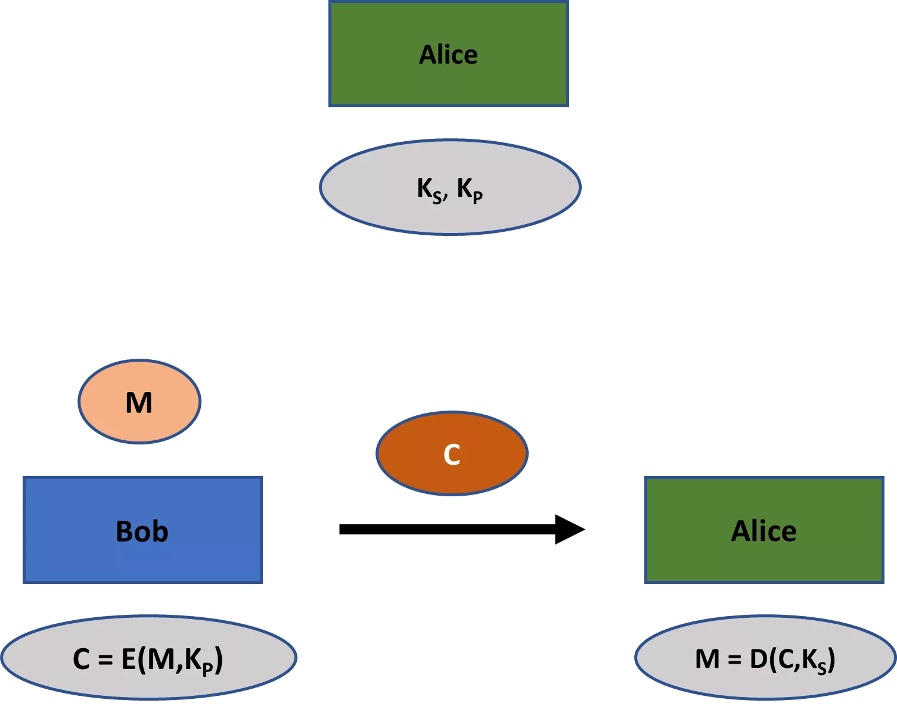

คู่ต่อสู้ที่ดักฟังการสื่อสารระหว่าง Bob และ Alice สามารถสังเกต $C$ ได้ เธอยังรู้ $K_P$ และอัลกอริทึมการเข้ารหัส $E(\cdot)$ อย่างไรก็ตาม ข้อมูลนี้ไม่อนุญาตให้ผู้โจมตีถอดรหัสข้อความลับ $C$ ได้อย่างมีประสิทธิภาพ การถอดรหัสต้องการ $K_S$ ซึ่งผู้โจมตีไม่มีในครอบครอง

รูปแบบการเข้ารหัสแบบสมมาตรโดยทั่วไปจำเป็นต้องมีความปลอดภัยต่อผู้โจมตีที่สามารถเข้ารหัสข้อความธรรมดาได้อย่างถูกต้อง (รู้จักกันในชื่อความปลอดภัยจากการโจมตีด้วยการเลือกข้อความเข้ารหัส) อย่างไรก็ตาม มันไม่ได้ถูกออกแบบมาโดยมีวัตถุประสงค์เฉพาะเพื่อให้ผู้โจมตีหรือบุคคลอื่นสามารถสร้างข้อความเข้ารหัสที่ถูกต้องได้

สิ่งนี้ตรงกันข้ามอย่างสิ้นเชิงกับโครงร่างการเข้ารหัสแบบอสมมาตร ซึ่งวัตถุประสงค์ทั้งหมดคือการอนุญาตให้ใครก็ตาม รวมถึงผู้โจมตี สามารถสร้างข้อความเข้ารหัสที่ถูกต้องได้ ดังนั้น โครงร่างการเข้ารหัสแบบอสมมาตรจึงสามารถถูกระบุว่าเป็น **รหัสการเข้าถึงหลายรายการ**

เพื่อให้เข้าใจได้ดีขึ้นว่าเกิดอะไรขึ้น ลองจินตนาการว่าแทนที่จะส่งข้อความทางอิเล็กทรอนิกส์ Bob ต้องการส่งจดหมายทางกายภาพอย่างลับๆ วิธีหนึ่งในการรับรองความลับคือให้ Alice ส่งแม่กุญแจที่ปลอดภัยไปยัง Bob แต่เก็บกุญแจไว้เพื่อปลดล็อก หลังจากเขียนจดหมายแล้ว Bob สามารถใส่จดหมายลงในกล่องและปิดด้วยแม่กุญแจของ Alice จากนั้นเขาสามารถส่งกล่องที่ล็อกไว้พร้อมข้อความไปยัง Alice ซึ่งมีกุญแจสำหรับปลดล็อกได้

ในขณะที่ Bob สามารถล็อคกุญแจแม่กุญแจได้ แต่ทั้งเขาและบุคคลอื่นใดที่สกัดกล่องก็ไม่สามารถปลดล็อคแม่กุญแจได้หากมันปลอดภัยจริง ๆ มีเพียง Alice เท่านั้นที่สามารถปลดล็อคและดูเนื้อหาของจดหมายของ Bob ได้เพราะเธอมีลูกกุญแจ

โครงร่างการเข้ารหัสแบบอสมมาตรนั้น พูดอย่างคร่าวๆ ก็คือเวอร์ชันดิจิทัลของกระบวนการนี้ กุญแจแม่แรงเปรียบเสมือนกุญแจสาธารณะและกุญแจแม่แรงเปรียบเสมือนกุญแจส่วนตัว อย่างไรก็ตาม เนื่องจากกุญแจแม่แรงเป็นดิจิทัล จึงง่ายกว่าและไม่เสียค่าใช้จ่ายมากนักสำหรับ Alice ในการแจกจ่ายให้กับใครก็ตามที่อาจต้องการส่งข้อความลับถึงเธอ

สำหรับการยืนยันตัวตนในรูปแบบอสมมาตร เราใช้ **ลายเซ็นดิจิทัล** ซึ่งมีฟังก์ชันเดียวกันกับรหัสการยืนยันข้อความในรูปแบบสมมาตร ภาพรวมของลายเซ็นดิจิทัลแสดงไว้ใน *รูปที่ 2*

Bob สร้างคู่ของกุญแจขึ้นมาก่อน ประกอบด้วยกุญแจสาธารณะ ($K_P$) และกุญแจส่วนตัว ($K_S$) และแจกจ่ายกุญแจสาธารณะของเขา เมื่อเขาต้องการส่งข้อความที่ผ่านการรับรองไปยัง Alice เขาจะนำข้อความของเขา $M$ และกุญแจส่วนตัวของเขามาสร้าง **ลายเซ็นดิจิทัล** $D$ จากนั้น Bob จะส่งข้อความของเขาพร้อมกับลายเซ็นดิจิทัลไปยัง Alice

Alice แทรกข้อความ, กุญแจสาธารณะ, และลายเซ็นดิจิทัลเข้าไปใน **อัลกอริธึมการตรวจสอบ** อัลกอริธึมนี้จะให้ผลลัพธ์เป็น **จริง** สำหรับลายเซ็นที่ถูกต้อง หรือ **เท็จ** สำหรับลายเซ็นที่ไม่ถูกต้อง

ลายเซ็นดิจิทัลคือสิ่งที่ชื่อบ่งบอกอย่างชัดเจนว่าเป็นเทียบเท่าดิจิทัลของลายเซ็นที่เขียนบนจดหมาย สัญญา และอื่นๆ ในความเป็นจริง ลายเซ็นดิจิทัลมักจะมีความปลอดภัยมากกว่า ด้วยความพยายามบางอย่าง คุณสามารถปลอมลายเซ็นที่เขียนได้ ซึ่งเป็นกระบวนการที่ง่ายขึ้นเนื่องจากลายเซ็นที่เขียนมักจะไม่ได้รับการตรวจสอบอย่างใกล้ชิด อย่างไรก็ตาม ลายเซ็นดิจิทัลที่ปลอดภัยนั้น เช่นเดียวกับรหัสการตรวจสอบข้อความที่ปลอดภัย **ไม่สามารถปลอมแปลงได้อย่างมีอยู่จริง**: นั่นคือ ด้วยระบบลายเซ็นดิจิทัลที่ปลอดภัย ไม่มีใครสามารถสร้างลายเซ็นสำหรับข้อความที่ผ่านกระบวนการตรวจสอบได้ เว้นแต่พวกเขาจะมีคีย์ส่วนตัว

*รูปที่ 2: การพิสูจน์ตัวตนแบบอสมมาตร*

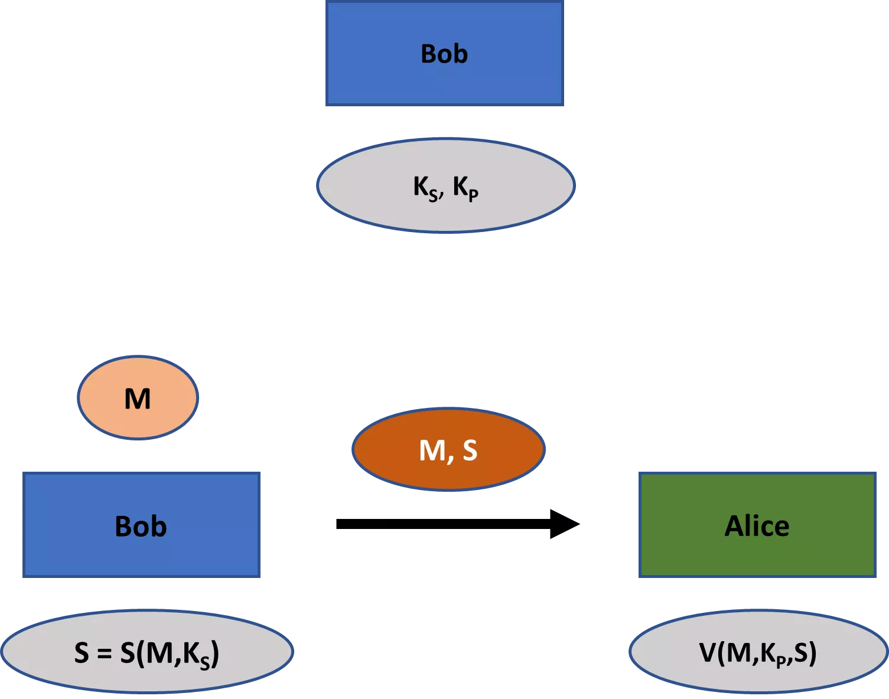

เช่นเดียวกับการเข้ารหัสแบบอสมมาตร เราเห็นความแตกต่างที่น่าสนใจระหว่างลายเซ็นดิจิทัลและรหัสการตรวจสอบข้อความ สำหรับรหัสการตรวจสอบข้อความ อัลกอริธึมการตรวจสอบสามารถใช้ได้โดยฝ่ายใดฝ่ายหนึ่งที่มีส่วนร่วมในการสื่อสารที่ปลอดภัยเท่านั้น เนื่องจากต้องใช้กุญแจส่วนตัว ในการตั้งค่าแบบอสมมาตร อย่างไรก็ตาม ใคร ๆ ก็สามารถตรวจสอบลายเซ็นดิจิทัล $S$ ที่ทำโดย Bob ได้

ทั้งหมดนี้ทำให้ลายเซ็นดิจิทัลเป็นเครื่องมือที่ทรงพลังอย่างยิ่ง มันเป็นพื้นฐานในการสร้างลายเซ็นบนสัญญาที่สามารถตรวจสอบได้เพื่อวัตถุประสงค์ทางกฎหมาย ตัวอย่างเช่น หาก Bob ได้ทำลายเซ็นบนสัญญาในการแลกเปลี่ยนข้างต้น Alice สามารถแสดงข้อความ $M$ สัญญา และลายเซ็น $S$ ต่อศาล ศาลสามารถตรวจสอบลายเซ็นโดยใช้กุญแจสาธารณะของ Bob ได้ [5]

ตัวอย่างอีกประการหนึ่ง ลายเซ็นดิจิทัลเป็นองค์ประกอบสำคัญของซอฟต์แวร์ที่ปลอดภัยและการแจกจ่ายการอัปเดตซอฟต์แวร์ ความสามารถในการตรวจสอบสาธารณะประเภทนี้ไม่สามารถสร้างขึ้นได้โดยใช้เพียงรหัสการตรวจสอบความถูกต้องของข้อความเท่านั้น

ตัวอย่างสุดท้ายของพลังของลายเซ็นดิจิทัล พิจารณา Bitcoin หนึ่งในความเข้าใจผิดที่พบบ่อยที่สุดเกี่ยวกับ Bitcoin โดยเฉพาะในสื่อ คือการที่ธุรกรรมถูกเข้ารหัส: ซึ่งไม่ใช่ความจริง แต่ธุรกรรมของ Bitcoin ใช้ลายเซ็นดิจิทัลเพื่อรับรองความปลอดภัยแทน

Bitcoins มีอยู่ในชุดที่เรียกว่าเอาต์พุตธุรกรรมที่ยังไม่ได้ใช้ (หรือ **UTXO’s**) สมมติว่าคุณได้รับการชำระเงินสามครั้งในที่อยู่ Bitcoin หนึ่งที่สำหรับ 2 bitcoins แต่ละรายการ คุณไม่ได้มี 6 bitcoins ในที่อยู่นั้นในทางเทคนิค แต่คุณมีสามชุดของ 2 bitcoins ที่ถูกล็อกโดยปัญหาการเข้ารหัสที่เกี่ยวข้องกับที่อยู่นั้น สำหรับการชำระเงินใด ๆ ที่คุณทำ คุณสามารถใช้หนึ่ง สอง หรือทั้งสามชุดนี้ ขึ้นอยู่กับว่าคุณต้องการเท่าไรสำหรับการทำธุรกรรม

หลักฐานการเป็นเจ้าของเหนือเอาต์พุตธุรกรรมที่ยังไม่ได้ใช้มักจะแสดงผ่านลายเซ็นดิจิทัลหนึ่งหรือมากกว่า Bitcoin ทำงานได้อย่างแม่นยำเพราะลายเซ็นดิจิทัลที่ถูกต้องบนเอาต์พุตธุรกรรมที่ยังไม่ได้ใช้นั้นไม่สามารถคำนวณได้ เว้นแต่คุณจะมีข้อมูลลับที่จำเป็นในการสร้างมันขึ้นมา

ปัจจุบัน การทำธุรกรรม Bitcoin รวมข้อมูลทั้งหมดที่จำเป็นต้องได้รับการตรวจสอบโดยผู้เข้าร่วมในเครือข่ายอย่างโปร่งใส เช่น แหล่งที่มาของผลลัพธ์การทำธุรกรรมที่ยังไม่ได้ใช้ในธุรกรรม แม้ว่าจะสามารถซ่อนข้อมูลบางส่วนและยังคงอนุญาตให้มีการตรวจสอบได้ (เช่นเดียวกับที่สกุลเงินดิจิทัลทางเลือกบางสกุลเช่น Monero ทำ) แต่ก็สร้างความเสี่ยงด้านความปลอดภัยเฉพาะบางประการเช่นกัน

บางครั้งเกิดความสับสนเกี่ยวกับลายเซ็นดิจิทัลและลายเซ็นที่เขียนด้วยมือที่ถูกจับภาพในรูปแบบดิจิทัล ในกรณีหลังนี้ คุณจับภาพลายเซ็นที่เขียนด้วยมือของคุณและวางลงในเอกสารอิเล็กทรอนิกส์ เช่น สัญญาจ้างงาน อย่างไรก็ตาม นี่ไม่ใช่ลายเซ็นดิจิทัลในความหมายของการเข้ารหัส กรณีหลังนี้เป็นเพียงตัวเลขยาวที่สามารถสร้างได้โดยการครอบครองกุญแจส่วนตัวเท่านั้น

เช่นเดียวกับในกรณีของการใช้คีย์สมมาตร คุณยังสามารถใช้การเข้ารหัสแบบอสมมาตรและโครงร่างการตรวจสอบความถูกต้องร่วมกันได้ หลักการที่คล้ายกันนี้ใช้ได้เช่นกัน ก่อนอื่น คุณควรใช้คู่คีย์ส่วนตัว-สาธารณะที่แตกต่างกันสำหรับการเข้ารหัสและการสร้างลายเซ็นดิจิทัล นอกจากนี้ คุณควรเข้ารหัสข้อความก่อนแล้วจึงตรวจสอบความถูกต้อง

ที่สำคัญ ในหลาย ๆ แอปพลิเคชัน การเข้ารหัสแบบอสมมาตรไม่ได้ถูกใช้ตลอดกระบวนการสื่อสารทั้งหมด แต่จะถูกใช้เพื่อ *แลกเปลี่ยนคีย์สมมาตร* ระหว่างฝ่ายต่าง ๆ ซึ่งพวกเขาจะใช้ในการสื่อสารจริง ๆ

นี่เป็นกรณีตัวอย่างเมื่อคุณซื้อสินค้าทางออนไลน์ เมื่อคุณทราบกุญแจสาธารณะของผู้ขาย เธอสามารถส่งข้อความที่ลงนามดิจิทัลให้คุณ ซึ่งคุณสามารถตรวจสอบความถูกต้องได้ บนพื้นฐานนี้ คุณสามารถปฏิบัติตามหนึ่งในหลายโปรโตคอลสำหรับการแลกเปลี่ยนกุญแจสมมาตรเพื่อสื่อสารอย่างปลอดภัย

เหตุผลหลักสำหรับความถี่ของวิธีการที่กล่าวถึงข้างต้นคือการเข้ารหัสแบบอสมมาตรมีประสิทธิภาพน้อยกว่าการเข้ารหัสแบบสมมาตรมากในการสร้างระดับความปลอดภัยที่เฉพาะเจาะจง นี่เป็นเหตุผลหนึ่งที่เรายังคงต้องการการเข้ารหัสคีย์สมมาตรควบคู่ไปกับการเข้ารหัสสาธารณะ นอกจากนี้ การเข้ารหัสคีย์สมมาตรยังเป็นธรรมชาติมากกว่าในแอปพลิเคชันเฉพาะ เช่น ผู้ใช้คอมพิวเตอร์เข้ารหัสข้อมูลของตนเอง

แล้วลายเซ็นดิจิทัลและการเข้ารหัสคีย์สาธารณะจัดการกับปัญหาการแจกจ่ายคีย์และการจัดการคีย์อย่างไร?

ไม่มีคำตอบเดียวที่นี่ การเข้ารหัสแบบอสมมาตรเป็นเครื่องมือและไม่มีวิธีเดียวในการใช้เครื่องมือนั้น แต่ลองดูตัวอย่างก่อนหน้านี้จาก Jim’s Sporting Goods เพื่อแสดงให้เห็นว่าปัญหาจะได้รับการแก้ไขอย่างไรในตัวอย่างนี้

ในการเริ่มต้น Jim’s Sporting Goods อาจจะติดต่อกับ **certificate authority** ซึ่งเป็นองค์กรที่สนับสนุนการแจกจ่ายกุญแจสาธารณะ certificate authority จะลงทะเบียนรายละเอียดบางอย่างเกี่ยวกับ Jim’s Sporting Goods และมอบกุญแจสาธารณะให้ จากนั้นจะส่งใบรับรองที่เรียกว่า **TLS/SSL certificate** ให้กับ Jim’s Sporting Goods โดยมีกุญแจสาธารณะของ Jim’s Sporting Goods ที่ลงนามดิจิทัลด้วยกุญแจสาธารณะของ certificate authority ด้วยวิธีนี้ certificate authority ยืนยันว่ากุญแจสาธารณะนั้นเป็นของ Jim’s Sporting Goods จริงๆ

กุญแจสำคัญในการทำความเข้าใจกระบวนการนี้กับใบรับรอง TLS/SSL คือ แม้ว่าคุณจะไม่มีคีย์สาธารณะของ Jim’s Sporting Goods เก็บไว้ที่ใดก็ตามในคอมพิวเตอร์ของคุณ แต่คีย์สาธารณะของหน่วยงานรับรองที่ได้รับการยอมรับจะถูกเก็บไว้ในเบราว์เซอร์หรือในระบบปฏิบัติการของคุณ คีย์เหล่านี้ถูกเก็บไว้ในสิ่งที่เรียกว่า **ใบรับรองราก**

ดังนั้น เมื่อ Jim’s Sporting Goods มอบใบรับรอง TLS/SSL ให้คุณ คุณสามารถตรวจสอบลายเซ็นดิจิทัลของหน่วยงานออกใบรับรองผ่านใบรับรองรากในเบราว์เซอร์หรือระบบปฏิบัติการของคุณ หากลายเซ็นนั้นถูกต้อง คุณสามารถมั่นใจได้ในระดับหนึ่งว่าคีย์สาธารณะบนใบรับรองนั้นเป็นของ Jim’s Sporting Goods จริง บนพื้นฐานนี้ การตั้งค่าโปรโตคอลสำหรับการสื่อสารที่ปลอดภัยกับ Jim’s Sporting Goods จึงเป็นเรื่องง่าย

การแจกจ่ายคีย์ได้กลายเป็นเรื่องที่ง่ายขึ้นอย่างมากสำหรับ Jim’s Sporting Goods ไม่ยากที่จะเห็นว่าการจัดการคีย์ก็ได้กลายเป็นเรื่องที่ง่ายขึ้นอย่างมากเช่นกัน แทนที่จะต้องเก็บคีย์นับพัน Jim’s Sporting Goods เพียงแค่ต้องเก็บคีย์ส่วนตัวที่ช่วยให้สามารถสร้างลายเซ็นสำหรับคีย์สาธารณะบนใบรับรอง SSL ของตนได้ ทุกครั้งที่ลูกค้าเข้ามาที่เว็บไซต์ของ Jim’s Sporting Goods พวกเขาสามารถสร้างเซสชันการสื่อสารที่ปลอดภัยจากคีย์สาธารณะนี้ได้ ลูกค้าก็ไม่จำเป็นต้องเก็บข้อมูลใดๆ (นอกจากคีย์สาธารณะของหน่วยงานรับรองที่ได้รับการยอมรับในระบบปฏิบัติการและเบราว์เซอร์ของพวกเขา)

**บันทึก:**

[5] โครงการใด ๆ ที่พยายามบรรลุการปฏิเสธไม่ได้ ซึ่งเป็นหัวข้ออื่นที่เราพูดคุยกันในบทที่ 1 จะต้องเกี่ยวข้องกับลายเซ็นดิจิทัลเป็นพื้นฐาน

## ฟังก์ชัน Hash

<chapterId>ea8327ab-b0e3-5635-941c-4b51f396a648</chapterId>

ฟังก์ชัน Hash มีการใช้งานอย่างแพร่หลายในวิทยาการเข้ารหัสลับ พวกมันไม่ใช่ทั้งแบบสมมาตรหรืออสมมาตร แต่จัดอยู่ในหมวดหมู่การเข้ารหัสลับของตัวเอง

เราได้พบกับฟังก์ชันแฮชแล้วในบทที่ 4 กับการสร้างข้อความการตรวจสอบสิทธิ์ที่ใช้แฮช พวกมันยังมีความสำคัญในบริบทของลายเซ็นดิจิทัลด้วย แต่ด้วยเหตุผลที่แตกต่างกันเล็กน้อย: ลายเซ็นดิจิทัลมักจะทำบนค่าแฮชของข้อความ (ที่เข้ารหัส) บางอย่าง แทนที่จะเป็นข้อความ (ที่เข้ารหัส) จริง ในส่วนนี้ ฉันจะเสนอการแนะนำฟังก์ชันแฮชอย่างละเอียดมากขึ้น

มาเริ่มต้นด้วยการนิยามฟังก์ชันแฮชกันก่อน ฟังก์ชันแฮช (**hash function**) คือฟังก์ชันที่สามารถคำนวณได้อย่างมีประสิทธิภาพ ซึ่งรับข้อมูลเข้าที่มีขนาดใดๆ ก็ได้และให้ผลลัพธ์ที่มีความยาวคงที่

ฟังก์ชันแฮชเชิงการเข้ารหัส (cryptographic hash function) เป็นเพียงฟังก์ชันแฮชที่มีประโยชน์สำหรับการใช้งานในวิทยาการเข้ารหัสลับ ผลลัพธ์ของฟังก์ชันแฮชเชิงการเข้ารหัสมักเรียกว่า **แฮช** (hash), **ค่าแฮช** (hash-value), หรือ **ข้อความย่อย** (message digest)

ในบริบทของการเข้ารหัสลับ, “ฟังก์ชันแฮช” มักจะหมายถึงฟังก์ชันแฮชเชิงเข้ารหัสลับ ฉันจะใช้แนวทางนั้นต่อไปจากนี้ไป

ตัวอย่างหนึ่งของฟังก์ชันแฮชที่ได้รับความนิยมคือ **SHA-256** (secure hash algorithm 256) ไม่ว่าจะมีขนาดของข้อมูลนำเข้าเท่าใด (เช่น 15 บิต, 100 บิต, หรือ 10,000 บิต) ฟังก์ชันนี้จะให้ค่าแฮชที่มีขนาด 256 บิต ด้านล่างนี้คุณสามารถดูตัวอย่างผลลัพธ์บางส่วนของฟังก์ชัน SHA-256 ได้

“Hello”: `185f8db32271fe25f561a6fc938b2e264306ec304eda518007d1764826381969`

"52398": `a3b14d2bf378c1bd47e7f8eaec63b445150a3d7a80465af16dd9fd319454ba90`

“Cryptography is fun”: `3cee2a5c7d2cc1d62db4893564c34ae553cc88623992d994e114e344359b146c`

เอาต์พุตทั้งหมดมีขนาด 256 บิตที่เขียนในรูปแบบเลขฐานสิบหก (แต่ละหลักฐานสิบหกสามารถแทนด้วยสี่หลักฐานสอง) ดังนั้นแม้ว่าคุณจะใส่หนังสือ *The Lord of the Rings* ของโทลคีนลงในฟังก์ชัน SHA-256 เอาต์พุตก็ยังคงเป็น 256 บิต

ฟังก์ชัน Hash เช่น SHA-256 ถูกนำมาใช้เพื่อวัตถุประสงค์ต่างๆ ในการเข้ารหัสลับ คุณสมบัติที่ต้องการจากฟังก์ชันแฮชจริงๆ แล้วขึ้นอยู่กับบริบทของการใช้งานเฉพาะ มีคุณสมบัติหลักสองประการที่โดยทั่วไปต้องการจากฟังก์ชันแฮชในการเข้ารหัสลับ: [6]

1.	การต้านทานการชนกัน

2.	ซ่อน

ฟังก์ชันแฮช $H$ ถูกเรียกว่า **ทนต่อการชนกัน** ถ้าเป็นไปไม่ได้ที่จะหาค่าสองค่า $x$ และ $y$ ที่ $x \neq y$ แต่ $H(x) = H(y)$

ฟังก์ชันแฮชที่ทนต่อการชนกันมีความสำคัญ เช่น ในการตรวจสอบซอฟต์แวร์ สมมติว่าคุณต้องการดาวน์โหลด Windows release ของ Bitcoin Core 0.21.0 (แอปพลิเคชันเซิร์ฟเวอร์สำหรับประมวลผลการจราจรเครือข่าย Bitcoin) ขั้นตอนหลักที่คุณต้องดำเนินการเพื่อยืนยันความถูกต้องของซอฟต์แวร์มีดังนี้:

1.	ขั้นแรกคุณต้องดาวน์โหลดและนำเข้าคีย์สาธารณะของผู้ร่วมพัฒนา Bitcoin Core หนึ่งคนหรือมากกว่าเข้าสู่ซอฟต์แวร์ที่สามารถตรวจสอบลายเซ็นดิจิทัลได้ (เช่น Kleopetra) คุณสามารถหาคีย์สาธารณะเหล่านี้ได้ [ที่นี่](https://github.com/bitcoin/bitcoin/blob/master/contrib/builder-keys/keys.txt) ขอแนะนำให้คุณตรวจสอบซอฟต์แวร์ Bitcoin Core ด้วยคีย์สาธารณะจากผู้ร่วมพัฒนาหลายคน

2.	ถัดไป คุณจำเป็นต้องตรวจสอบคีย์สาธารณะที่คุณนำเข้า อย่างน้อยหนึ่งขั้นตอนที่คุณควรทำคือการตรวจสอบว่าคีย์สาธารณะที่คุณพบตรงกับที่เผยแพร่ในสถานที่ต่างๆ หรือไม่ คุณอาจจะตรวจสอบจากหน้าเว็บส่วนตัว, หน้า Twitter, หรือหน้า Github ของบุคคลที่คุณนำเข้าคีย์สาธารณะ โดยทั่วไปการเปรียบเทียบคีย์สาธารณะนี้ทำโดยการเปรียบเทียบแฮชสั้นๆ ของคีย์สาธารณะที่เรียกว่าลายนิ้วมือ (fingerprint)

3.	ถัดไป คุณต้องดาวน์โหลดไฟล์ปฏิบัติการสำหรับ Bitcoin Core จาก [เว็บไซต์](www.bitcoincore.org) ของพวกเขา จะมีแพ็คเกจที่พร้อมใช้งานสำหรับระบบปฏิบัติการ Linux, Windows และ MAC

4.	ถัดไป คุณต้องค้นหาไฟล์เผยแพร่สองไฟล์ ไฟล์แรกประกอบด้วยแฮช SHA-256 อย่างเป็นทางการสำหรับไฟล์ปฏิบัติการที่คุณดาวน์โหลดพร้อมกับแฮชของแพ็คเกจอื่นๆ ทั้งหมดที่ถูกเผยแพร่ อีกไฟล์เผยแพร่จะประกอบด้วยลายเซ็นจากผู้ร่วมสมทบต่างๆ บนไฟล์เผยแพร่ที่มีแฮชของแพ็คเกจ ทั้งสองไฟล์เผยแพร่เหล่านี้ควรอยู่บนเว็บไซต์ Bitcoin Core

5.	ถัดไป คุณจะต้องคำนวณค่าแฮช SHA-256 ของไฟล์ปฏิบัติการที่คุณดาวน์โหลดจากเว็บไซต์ Bitcoin Core บนคอมพิวเตอร์ของคุณเอง จากนั้นคุณเปรียบเทียบผลลัพธ์นี้กับค่าแฮชของแพ็กเกจอย่างเป็นทางการสำหรับไฟล์ปฏิบัติการ ค่าทั้งสองควรจะเหมือนกัน

6. ในที่สุด คุณจะต้องตรวจสอบว่าลายเซ็นดิจิทัลหนึ่งหรือมากกว่าที่อยู่เหนือไฟล์รีลีสพร้อมแฮชแพ็กเกจอย่างเป็นทางการนั้นตรงกับคีย์สาธารณะหนึ่งหรือมากกว่าที่คุณนำเข้า (รีลีสของ Bitcoin Core ไม่ได้ลงนามโดยทุกคนเสมอไป) คุณสามารถทำสิ่งนี้ได้ด้วยแอปพลิเคชันเช่น Kleopetra.

กระบวนการตรวจสอบซอฟต์แวร์นี้มีประโยชน์หลักสองประการ ประการแรก มันช่วยให้มั่นใจได้ว่าไม่มีข้อผิดพลาดในการส่งข้อมูลขณะดาวน์โหลดจากเว็บไซต์ของ Bitcoin Core ประการที่สอง มันช่วยให้มั่นใจได้ว่าไม่มีผู้โจมตีสามารถทำให้คุณดาวน์โหลดโค้ดที่ถูกแก้ไขหรือเป็นอันตรายได้ ไม่ว่าจะโดยการแฮ็กเว็บไซต์ของ Bitcoin Core หรือโดยการดักจับการรับส่งข้อมูล

กระบวนการตรวจสอบซอฟต์แวร์ดังกล่าวป้องกันปัญหาเหล่านี้ได้อย่างไร?

หากคุณตรวจสอบคีย์สาธารณะที่คุณนำเข้าอย่างขยันขันแข็ง คุณก็สามารถมั่นใจได้ว่าคีย์เหล่านี้เป็นของพวกเขาจริงและไม่ได้ถูกบุกรุก เนื่องจากลายเซ็นดิจิทัลมีความไม่สามารถปลอมแปลงได้ คุณจึงรู้ว่ามีเพียงผู้ร่วมให้ข้อมูลเหล่านี้เท่านั้นที่สามารถสร้างลายเซ็นดิจิทัลเหนือแฮชแพ็คเกจอย่างเป็นทางการในไฟล์ที่เผยแพร่ได้

สมมติว่าลายเซ็นบนไฟล์ที่คุณดาวน์โหลดมาตรวจสอบแล้วถูกต้อง ตอนนี้คุณสามารถเปรียบเทียบค่าแฮชที่คุณคำนวณในเครื่องสำหรับไฟล์ปฏิบัติการ Windows ที่คุณดาวน์โหลดมากับค่าที่รวมอยู่ในไฟล์ที่ลงนามอย่างถูกต้องได้ เนื่องจากคุณทราบว่าแฮชฟังก์ชัน SHA-256 นั้นต้านทานการชนกันได้ การที่ค่าแฮชตรงกันหมายความว่าไฟล์ปฏิบัติการของคุณเหมือนกับไฟล์ปฏิบัติการอย่างเป็นทางการทุกประการ

ตอนนี้เรามาพูดถึงคุณสมบัติทั่วไปที่สองของฟังก์ชันแฮช: **การซ่อน** ฟังก์ชันแฮช $H$ ใด ๆ จะถือว่ามีคุณสมบัติการซ่อนหาก สำหรับ $x$ ที่ถูกสุ่มเลือกจากช่วงที่ใหญ่มาก ๆ การหาค่า $x$ จากการมีเพียง $H(x)$ นั้นเป็นไปไม่ได้ในทางปฏิบัติ

ด้านล่างนี้ คุณสามารถดูผลลัพธ์ของ SHA-256 จากข้อความที่ฉันเขียนได้ เพื่อให้แน่ใจว่ามีความสุ่มเพียงพอ ข้อความนี้ได้รวมสตริงของอักขระที่สร้างขึ้นแบบสุ่มไว้ที่ท้ายข้อความ เนื่องจาก SHA-256 มีคุณสมบัติการซ่อน ไม่มีใครสามารถถอดรหัสข้อความนี้ได้

- `b194221b37fa4cd1cfce15aaef90351d70de17a98ee6225088b523b586c32ded`

แต่ฉันจะไม่ปล่อยให้คุณอยู่ในความสงสัยจนกว่า SHA-256 จะอ่อนแอลง ข้อความต้นฉบับที่ฉันเขียนคือดังนี้:

*"นี่คือข้อความที่ค่อนข้างสุ่ม หรือก็สุ่มแบบหนึ่ง ส่วนเริ่มต้นนี้ไม่ใช่ แต่ฉันจะจบด้วยตัวอักษรที่ค่อนข้างสุ่มเพื่อให้แน่ใจว่าข้อความนี้ไม่สามารถคาดเดาได้ XLWz4dVG3BxUWm7zQ9qS".*

วิธีการทั่วไปที่ใช้ฟังก์ชันแฮชที่มีคุณสมบัติการซ่อนคือในการจัดการรหัสผ่าน (การต้านทานการชนกันก็สำคัญสำหรับการใช้งานนี้เช่นกัน) บริการออนไลน์ที่มีบัญชีผู้ใช้ที่ดี เช่น Facebook หรือ Google จะไม่เก็บรหัสผ่านของคุณโดยตรงเพื่อจัดการการเข้าถึงบัญชีของคุณ แต่จะเก็บเฉพาะแฮชของรหัสผ่านนั้นแทน ทุกครั้งที่คุณกรอกรหัสผ่านในเบราว์เซอร์ จะมีการคำนวณแฮชก่อน และแฮชนั้นเท่านั้นที่จะถูกส่งไปยังเซิร์ฟเวอร์ของผู้ให้บริการและเปรียบเทียบกับแฮชที่เก็บไว้ในฐานข้อมูลแบ็กเอนด์ คุณสมบัติการซ่อนสามารถช่วยให้มั่นใจได้ว่าผู้โจมตีไม่สามารถกู้คืนรหัสผ่านจากค่าแฮชได้

การจัดการรหัสผ่านผ่านแฮช แน่นอนว่าจะได้ผลก็ต่อเมื่อผู้ใช้เลือกใช้รหัสผ่านที่ยากจริง ๆ คุณสมบัติการซ่อนตัวจะถือว่า x ถูกเลือกแบบสุ่มจากช่วงที่กว้างมาก การเลือกรหัสผ่านเช่น "1234", "mypassword" หรือวันเกิดของคุณจะไม่ให้ความปลอดภัยที่แท้จริง รายการยาวของรหัสผ่านทั่วไปและแฮชของพวกมันมีอยู่ซึ่งผู้โจมตีสามารถใช้ประโยชน์ได้หากพวกเขาเคยได้รับแฮชของรหัสผ่านของคุณ การโจมตีประเภทนี้เรียกว่า **การโจมตีแบบพจนานุกรม** หากผู้โจมตีรู้รายละเอียดส่วนตัวบางอย่างของคุณ พวกเขาอาจพยายามเดาอย่างมีข้อมูลด้วย ดังนั้น คุณจึงจำเป็นต้องมีรหัสผ่านที่ยาวและปลอดภัยเสมอ (ควรเป็นสตริงแบบสุ่มยาวจากตัวจัดการรหัสผ่าน)

บางครั้งแอปพลิเคชันอาจต้องการฟังก์ชันแฮชที่มีทั้งความต้านทานการชนกันและการซ่อน แต่ไม่ใช่เสมอไป กระบวนการตรวจสอบซอฟต์แวร์ที่เราพูดถึง ตัวอย่างเช่น ต้องการเพียงให้ฟังก์ชันแฮชแสดงความต้านทานการชนกันเท่านั้น การซ่อนไม่สำคัญ

ในขณะที่ความต้านทานการชนและการซ่อนเป็นคุณสมบัติหลักที่ต้องการจากฟังก์ชันแฮชในวิทยาการเข้ารหัสลับ ในบางแอปพลิเคชันคุณสมบัติประเภทอื่น ๆ อาจเป็นที่ต้องการเช่นกัน

**บันทึก:**

[6] คำศัพท์ "การซ่อน" ไม่ใช่ภาษาทั่วไป แต่ถูกนำมาใช้โดยเฉพาะจาก Arvind Narayanan, Joseph Bonneau, Edward Felten, Andrew Miller, และ Steven Goldfeder, *Bitcoin and Cryptocurrency Technologies*, Princeton University Press (Princeton, 2016), บทที่ 1.

# ระบบการเข้ารหัส RSA

<partId>864dca42-2a8d-530f-bb94-2e1f68b3f411</partId>

## ปัญหาการแยกตัวประกอบ

<chapterId>a31a66e4-52ea-539c-9953-4769ad565d7e</chapterId>

แม้ว่าการเข้ารหัสแบบสมมาตรจะค่อนข้างเข้าใจง่ายสำหรับคนส่วนใหญ่ แต่โดยทั่วไปแล้วจะไม่เป็นเช่นนั้นกับการเข้ารหัสแบบอสมมาตร แม้ว่าคุณอาจจะรู้สึกสบายใจกับคำอธิบายระดับสูงที่เสนอในส่วนก่อนหน้า แต่คุณอาจสงสัยว่าฟังก์ชันทางเดียวคืออะไรและพวกมันถูกใช้ในการสร้างโครงร่างแบบอสมมาตรอย่างไร

ในบทนี้ ฉันจะลบความลึกลับบางอย่างที่ล้อมรอบการเข้ารหัสแบบอสมมาตร โดยการดูตัวอย่างเฉพาะอย่างลึกซึ้งยิ่งขึ้น นั่นคือระบบการเข้ารหัส RSA ในส่วนแรก ฉันจะแนะนำปัญหาการแยกตัวประกอบซึ่งเป็นพื้นฐานของปัญหา RSA จากนั้นจะครอบคลุมผลลัพธ์สำคัญหลายประการจากทฤษฎีจำนวน ในส่วนสุดท้าย เราจะรวบรวมข้อมูลนี้เข้าด้วยกันเพื่ออธิบายปัญหา RSA และวิธีที่สามารถใช้ในการสร้างรูปแบบการเข้ารหัสแบบอสมมาตร

การเพิ่มความลึกซึ้งให้กับการอภิปรายของเราไม่ใช่เรื่องง่าย มันต้องการการแนะนำทฤษฎีและข้อเสนอทางทฤษฎีจำนวนมาก แต่ไม่ต้องให้คณิตศาสตร์ทำให้คุณท้อใจ การทำงานผ่านการอภิปรายนี้จะช่วยปรับปรุงความเข้าใจของคุณเกี่ยวกับสิ่งที่เป็นพื้นฐานของการเข้ารหัสแบบอสมมาตรอย่างมีนัยสำคัญและเป็นการลงทุนที่คุ้มค่า

ตอนนี้เรามาเริ่มต้นที่ปัญหาการแยกตัวประกอบกันก่อน

___

เมื่อใดก็ตามที่คุณคูณตัวเลขสองตัว เช่น $a$ และ $b$ เราจะเรียกตัวเลข $a$ และ $b$ ว่าเป็น **ตัวประกอบ** และผลลัพธ์ว่าเป็น **ผลคูณ** การพยายามเขียนตัวเลข $N$ เป็นการคูณของตัวประกอบสองตัวหรือมากกว่านั้นเรียกว่า **การแยกตัวประกอบ** หรือ **การแยกแฟกเตอร์** [1] คุณสามารถเรียกปัญหาใด ๆ ที่ต้องการสิ่งนี้ว่าเป็น **ปัญหาการแยกตัวประกอบ**

เมื่อประมาณ 2,500 ปีที่แล้ว นักคณิตศาสตร์ชาวกรีกชื่อ Euclid แห่ง Alexandria ได้ค้นพบทฤษฎีบทสำคัญเกี่ยวกับการแยกตัวประกอบของจำนวนเต็ม ซึ่งมักเรียกกันว่า **ทฤษฎีบทการแยกตัวประกอบเฉพาะ** และมีข้อความดังนี้:

**ทฤษฎีบทที่ 1**. ทุกจำนวนเต็ม $N$ ที่มากกว่า 1 เป็นจำนวนเฉพาะ หรือสามารถแสดงเป็นผลคูณของตัวประกอบเฉพาะได้

ส่วนหลังของข้อความนี้หมายความว่าคุณสามารถนำจำนวนเต็มที่ไม่ใช่จำนวนเฉพาะ $N$ ที่มากกว่า 1 และเขียนออกมาเป็นการคูณของจำนวนเฉพาะ ด้านล่างนี้คือตัวอย่างหลายตัวอย่างของจำนวนเต็มที่ไม่ใช่จำนวนเฉพาะที่เขียนเป็นผลคูณของตัวประกอบเฉพาะ

- $18 = 2 \cdot 3 \cdot 3 = 2 \cdot 3^2$

$84 = 2 \cdot 2 \cdot 3 \cdot 7 = 2^2 \cdot 3 \cdot 7$

- $144 = 2 \cdot 2 \cdot 2 \cdot 2 \cdot 3 \cdot 3 = 2^4 \cdot 3^2$

สำหรับจำนวนเต็มทั้งสามข้างต้น การคำนวณตัวประกอบเฉพาะของพวกมันค่อนข้างง่าย แม้ว่าคุณจะได้รับเพียง $N$ เท่านั้น คุณเริ่มต้นด้วยจำนวนเฉพาะที่เล็กที่สุดคือ 2 และดูว่าจำนวนเต็ม $N$ สามารถหารด้วยมันได้กี่ครั้ง จากนั้นคุณจะทดสอบการหารของ $N$ ด้วย 3, 5, 7 และต่อไปเรื่อย ๆ คุณดำเนินกระบวนการนี้ต่อไปจนกว่าจำนวนเต็ม $N$ ของคุณจะถูกเขียนเป็นผลคูณของจำนวนเฉพาะเท่านั้น

ยกตัวอย่างเช่น จำนวนเต็ม 84 ด้านล่างนี้คุณสามารถเห็นกระบวนการในการหาตัวประกอบเฉพาะของมัน ในแต่ละขั้นตอน เราจะนำตัวประกอบเฉพาะที่เล็กที่สุดที่เหลืออยู่ (ทางซ้าย) ออกมาและหาค่าเศษเหลือที่ต้องแยกตัวประกอบต่อไป เราจะทำต่อไปจนกว่าเศษเหลือจะเป็นจำนวนเฉพาะเช่นกัน ในแต่ละขั้นตอน การแยกตัวประกอบปัจจุบันของ 84 จะแสดงอยู่ทางขวาสุด

**ตัวประกอบเฉพาะ = 2: เศษเหลือ = 42** ($84 = 2 \cdot 42$)

- ตัวประกอบเฉพาะ = 2: เศษเหลือ = 21 	($84 = 2 \cdot 2 \cdot 21$)
- ตัวประกอบเฉพาะ = 3: เศษเหลือ = 7 	($84 = 2 \cdot 2 \cdot 3 \cdot 7$)

เนื่องจาก 7 เป็นจำนวนเฉพาะ ผลลัพธ์คือ $2 \cdot 2 \cdot 3 \cdot 7$ หรือ $2^2 \cdot 3 \cdot 7$

สมมติว่า $N$ มีค่ามาก ๆ จะยากแค่ไหนในการแยก $N$ ออกเป็นตัวประกอบเฉพาะ?

นั่นขึ้นอยู่กับ $N$ จริงๆ สมมติว่า $N$ คือ 50,450,400 แม้ว่าตัวเลขนี้จะดูน่ากลัว แต่การคำนวณก็ไม่ซับซ้อนมากนักและสามารถทำได้ด้วยมือ อย่างที่กล่าวไว้ข้างต้น คุณเพียงแค่เริ่มต้นด้วย 2 และทำงานต่อไป ด้านล่างนี้ คุณสามารถเห็นผลลัพธ์ของกระบวนการนี้ในลักษณะเดียวกับที่กล่าวไว้ข้างต้น

**2:** 25,225,200 	($50,450,400 = 2 \cdot 25,225,200$)

**2: 12,612,600** 	($50,450,400 = 2^2 \cdot 12,612,600$)

**2: 6,306,300** ($50,450,400 = 2^3 \cdot 6,306,300$)

**2:** 3,153,150 	($50,450,400 = 2^4 \cdot 3,153,150$)

**2:** 1,576,575 	($50,450,400 = 2^5 \cdot 1,576,575$)

- 3: 525,525 	($50,450,400 = 2^5 \cdot 3 \cdot 525,525$)

**3: 175,175** ($50,450,400 = 2^5 \cdot 3^2 \cdot 175,175$)

*5: 35,035* 		($50,450,400 = 2^5 \cdot 3^2 \cdot 5 \cdot 35,035$)

*5: 7,007		($50,450,400 = 2^5 \cdot 3^2 \cdot 5^2 \cdot 7,007$)*

*7: 1,001* ($50,450,400 = 2^5 \cdot 3^2 \cdot 5^2 \cdot 7 \cdot 1,001$)

*7: 143* ($50,450,400 = 2^5 \cdot 3^2 \cdot 5^2 \cdot 7^2 \cdot 143$)

*11: 13*		($50,450,400 = 2^5 \cdot 3^2 \cdot 5^2 \cdot 7^2 \cdot 11 \cdot 13$)

เนื่องจาก 13 เป็นจำนวนเฉพาะ ผลลัพธ์คือ $2^5 \cdot 3^2 \cdot 5^2 \cdot 7^2 \cdot 11 \cdot 13$.

การแก้ปัญหานี้ด้วยมือใช้เวลาพอสมควร แน่นอนว่าคอมพิวเตอร์สามารถทำทั้งหมดนี้ได้ในเสี้ยววินาที ในความเป็นจริง คอมพิวเตอร์สามารถแยกตัวประกอบจำนวนเต็มขนาดใหญ่มากได้ในเสี้ยววินาทีบ่อยครั้ง

อย่างไรก็ตาม มีข้อยกเว้นบางประการ สมมติว่าเราทำการสุ่มเลือกจำนวนเฉพาะขนาดใหญ่มากสองจำนวน โดยทั่วไปจะกำหนดชื่อให้เป็น $p$ และ $q$ และฉันจะใช้แนวทางนี้ที่นี่

เพื่อความชัดเจน สมมติว่า $p$ และ $q$ เป็นจำนวนเฉพาะที่มีขนาด 1024 บิต และพวกมันต้องการอย่างน้อย 1024 บิตในการแทนค่า (ดังนั้นบิตแรกต้องเป็น 1) ดังนั้น ตัวอย่างเช่น 37 ไม่สามารถเป็นหนึ่งในจำนวนเฉพาะได้ คุณสามารถแทนค่า 37 ด้วย 1024 บิตได้แน่นอน แต่ชัดเจนว่า *คุณไม่จำเป็นต้องใช้* บิตมากขนาดนี้ในการแทนค่า คุณสามารถแทนค่า 37 ด้วยสตริงที่มี 6 บิตหรือมากกว่า (ใน 6 บิต 37 จะถูกแทนค่าเป็น $100101$)

สิ่งสำคัญคือต้องชื่นชมว่าค่า $p$ และ $q$ มีขนาดใหญ่เพียงใดหากเลือกภายใต้เงื่อนไขข้างต้น ตัวอย่างเช่น ฉันได้เลือกจำนวนเฉพาะแบบสุ่มที่ต้องการอย่างน้อย 1024 บิตสำหรับการแสดงผลด้านล่าง

**14,752,173,874,503,595,484,930,006,383,670,759,559,764,562,721,397,166,747,289,220,945,457,932,666,751,048,198,854,920,097,085,690,793,755,254,946,188,163,753,506,778,089,706,699,671,722,089,715,624,760,049,594,106,189,662,669,156,149,028,900,805,928,183,585,427,782,974,951,355,515,394,807,209,836,870,484,558,332,897,443,152,653,214,483,870,992,618,171,825,921,582,253,023,974,514,209,142,520,026,807,636,589**

สมมติว่าตอนนี้หลังจากสุ่มเลือกจำนวนเฉพาะ $p$ และ $q$ แล้ว เราคูณพวกมันเพื่อให้ได้จำนวนเต็ม $N$ จำนวนเต็มนี้จึงเป็นจำนวน 2048 บิตซึ่งต้องการอย่างน้อย 2048 บิตสำหรับการแสดงผล มันใหญ่กว่าทั้ง $p$ หรือ $q$ มาก ๆ

สมมติว่าคุณให้คอมพิวเตอร์เพียง $N$ และขอให้มันหาตัวประกอบเฉพาะ 1024 บิตสองตัวของ $N$ ความน่าจะเป็นที่คอมพิวเตอร์จะค้นพบ $p$ และ $q$ นั้นมีน้อยมาก คุณสามารถบอกได้ว่ามันเป็นไปไม่ได้สำหรับวัตถุประสงค์ในทางปฏิบัติทั้งหมด นี่เป็นเช่นนั้น แม้ว่าคุณจะใช้ซูเปอร์คอมพิวเตอร์หรือแม้แต่เครือข่ายของซูเปอร์คอมพิวเตอร์ก็ตาม

ในการเริ่มต้น สมมติว่าคอมพิวเตอร์พยายามแก้ปัญหาโดยการวนผ่านตัวเลข 1024 บิต ทดสอบในแต่ละกรณีว่าพวกมันเป็นจำนวนเฉพาะและถ้าพวกมันเป็นตัวประกอบของ $N$ ชุดของจำนวนเฉพาะที่จะถูกทดสอบนั้นประมาณ $1.265 \cdot 10^{305}$ [2]

แม้ว่าคุณจะนำคอมพิวเตอร์ทั้งหมดบนโลกมาพยายามค้นหาและทดสอบจำนวนเฉพาะ 1024 บิตในลักษณะนี้ โอกาส 1 ในพันล้านในการค้นหาตัวประกอบเฉพาะของ $N$ ได้สำเร็จจะต้องใช้ระยะเวลาการคำนวณที่ยาวนานกว่าช่วงอายุของจักรวาล

ในทางปฏิบัติแล้ว คอมพิวเตอร์สามารถทำได้ดีกว่าขั้นตอนคร่าว ๆ ที่เพิ่งอธิบายไป มีอัลกอริทึมหลายตัวที่คอมพิวเตอร์สามารถใช้เพื่อทำการแยกตัวประกอบได้รวดเร็วยิ่งขึ้น อย่างไรก็ตาม ประเด็นคือ แม้จะใช้อัลกอริทึมที่มีประสิทธิภาพมากขึ้นเหล่านี้ งานของคอมพิวเตอร์ก็ยังคงเป็นสิ่งที่ไม่สามารถทำได้ในทางคำนวณ [3]

ที่สำคัญ ความยากของการแยกตัวประกอบภายใต้เงื่อนไขที่กล่าวถึงนี้ขึ้นอยู่กับสมมติฐานที่ว่าไม่มีอัลกอริทึมที่มีประสิทธิภาพในการคำนวณตัวประกอบเฉพาะ เราไม่สามารถพิสูจน์ได้จริง ๆ ว่าไม่มีอัลกอริทึมที่มีประสิทธิภาพ อย่างไรก็ตาม สมมติฐานนี้มีความเป็นไปได้สูง: แม้จะมีความพยายามอย่างกว้างขวางที่ครอบคลุมหลายร้อยปี เรายังไม่พบอัลกอริทึมที่มีประสิทธิภาพในการคำนวณดังกล่าว

ดังนั้น ปัญหาการแยกตัวประกอบ ภายใต้สถานการณ์บางอย่าง สามารถสันนิษฐานได้ว่าเป็นปัญหาที่ยาก โดยเฉพาะอย่างยิ่งเมื่อ $p$ และ $q$ เป็นจำนวนเฉพาะที่มีขนาดใหญ่มาก ผลคูณของพวกมัน $N$ ไม่ยากที่จะคำนวณ; แต่การแยกตัวประกอบเมื่อมีเพียง $N$ นั้นแทบจะเป็นไปไม่ได้เลย

**บันทึก:**

[1] การแยกตัวประกอบยังสามารถมีความสำคัญในการทำงานกับวัตถุทางคณิตศาสตร์ประเภทอื่นๆ นอกเหนือจากตัวเลข ตัวอย่างเช่น มันสามารถมีประโยชน์ในการแยกตัวประกอบของนิพจน์พหุนามเช่น $x^2 - 2x + 1$ ในการสนทนาของเรา เราจะมุ่งเน้นเฉพาะการแยกตัวประกอบของตัวเลข โดยเฉพาะจำนวนเต็ม

[2] ตาม **ทฤษฎีบทจำนวนเฉพาะ** จำนวนของจำนวนเฉพาะที่น้อยกว่าหรือเท่ากับ $N$ ประมาณเท่ากับ $N/\ln(N)$ ซึ่งหมายความว่าคุณสามารถประมาณจำนวนของจำนวนเฉพาะที่มีความยาว 1024 บิตได้โดย:

$$ \frac{2^{1024}}{\ln(2^{1024})} - \frac{2^{1023}}{\ln(2^{1023})} $$

...ซึ่งเท่ากับประมาณ $1.265 \times 10^{305}$.

[3] สิ่งเดียวกันนี้เป็นจริงสำหรับปัญหาลอการิทึมแบบไม่ต่อเนื่อง ดังนั้น ทำไมการสร้างแบบอสมมาตรจึงทำงานด้วยคีย์ที่ใหญ่กว่าการสร้างแบบเข้ารหัสสมมาตรมาก

## ผลลัพธ์ทางทฤษฎีจำนวน

<chapterId>23cd2186-8d97-5709-a4a7-b984f1eb9999</chapterId>

น่าเสียดายที่ปัญหาการแยกตัวประกอบไม่สามารถใช้โดยตรงสำหรับโครงร่างการเข้ารหัสแบบอสมมาตรได้ อย่างไรก็ตาม เราสามารถใช้ปัญหาที่ซับซ้อนกว่าแต่เกี่ยวข้องกันเพื่อให้ได้ผลลัพธ์นี้: ปัญหา RSA

ในการทำความเข้าใจปัญหา RSA เราจำเป็นต้องเข้าใจทฤษฎีบทและข้อเสนอจากทฤษฎีจำนวนหลายข้อ ซึ่งจะนำเสนอในส่วนนี้ในสามหัวข้อย่อย: (1) ลำดับของ N, (2) การกลับด้านได้โมดูโล N, และ (3) ทฤษฎีบทของออยเลอร์

เนื้อหาบางส่วนในสามหัวข้อย่อยได้ถูกนำเสนอไปแล้วใน *บทที่ 3* แต่ฉันจะขอกล่าวซ้ำเนื้อหานั้นเพื่อความสะดวก

### ลำดับของ N

จำนวนเต็ม $a$ เป็น **จำนวนร่วมกันน้อย** หรือ **จำนวนที่เป็นญาติกันน้อย** กับจำนวนเต็ม $N$ ถ้าตัวหารร่วมมากที่สุดระหว่างพวกมันคือ 1 แม้ว่า 1 จะไม่ใช่จำนวนเฉพาะตามธรรมเนียม แต่ก็เป็นจำนวนร่วมกันน้อยของทุกจำนวนเต็ม (เช่นเดียวกับ $-1$)

ตัวอย่างเช่น พิจารณากรณีเมื่อ $a = 18$ และ $N = 37$ เหล่านี้เป็นจำนวนที่เป็น coprime อย่างชัดเจน จำนวนเต็มที่มากที่สุดที่หารทั้ง 18 และ 37 ลงตัวคือ 1 ในทางตรงกันข้าม พิจารณากรณีเมื่อ $a = 42$ และ $N = 16$ เหล่านี้ไม่ใช่จำนวนที่เป็น coprime อย่างชัดเจน ทั้งสองจำนวนหารด้วย 2 ได้ ซึ่งมากกว่า 1

ตอนนี้เราสามารถกำหนดลำดับของ $N$ ได้ดังนี้ สมมติว่า $N$ เป็นจำนวนเต็มที่มากกว่า 1 **ลำดับของ N** คือจำนวนของจำนวนที่เป็น coprime กับ $N$ ทั้งหมด โดยที่สำหรับแต่ละ coprime $a$ เงื่อนไขต่อไปนี้เป็นจริง: $1 \leq a < N$

ตัวอย่างเช่น ถ้า $N = 12$ แล้ว 1, 5, 7, และ 11 เป็นจำนวนเฉพาะที่ตรงตามข้อกำหนดข้างต้น ดังนั้น ลำดับของ 12 เท่ากับ 4.

สมมติว่า $N$ เป็นจำนวนเฉพาะ ดังนั้นจำนวนเต็มใด ๆ ที่น้อยกว่า $N$ แต่มากกว่าหรือเท่ากับ 1 จะเป็นจำนวนที่ไม่มีตัวประกอบร่วมกับ $N$ ซึ่งรวมถึงทุกองค์ประกอบในเซตต่อไปนี้: $\{1,2,3,....,N - 1\}$ ดังนั้น เมื่อ $N$ เป็นจำนวนเฉพาะ ลำดับของ $N$ คือ $N - 1$ ซึ่งระบุไว้ในข้อเสนอที่ 1 โดยที่ $\phi(N)$ หมายถึงลำดับของ $N$

**Proposition 1**. $\phi(N) = N - 1$ เมื่อ $N$ เป็นจำนวนเฉพาะ

สมมติว่า $N$ ไม่ใช่จำนวนเฉพาะ คุณสามารถคำนวณลำดับของมันโดยใช้ **ฟังก์ชันฟีของออยเลอร์** ในขณะที่การคำนวณลำดับของจำนวนเต็มขนาดเล็กนั้นค่อนข้างตรงไปตรงมา ฟังก์ชันฟีของออยเลอร์จะมีความสำคัญเป็นพิเศษสำหรับจำนวนเต็มที่ใหญ่ขึ้น ข้อเสนอของฟังก์ชันฟีของออยเลอร์มีดังนี้

**ทฤษฎีบท 2**. ให้ $N$ เท่ากับ $p_1^{e_1} \cdot p_2^{e_2} \cdot \ldots \cdot p_i^{e_i} \cdot \ldots \cdot p_n^{e_n}$ โดยที่เซต $\{p_i\}$ ประกอบด้วยตัวประกอบเฉพาะที่แตกต่างกันทั้งหมดของ $N$ และแต่ละ $e_i$ บ่งบอกจำนวนครั้งที่ตัวประกอบเฉพาะ $p_i$ ปรากฏใน $N$ ดังนั้น,

$$\phi(N) = p_1^{e_1 - 1} \cdot (p_1 - 1) \cdot p_2^{e_2 - 1} \cdot (p_2 - 1) \cdot \ldots \cdot p_n^{e_n - 1} \cdot (p_n - 1)$$

**Theorem 2** แสดงให้เห็นว่าเมื่อคุณได้แยกตัวประกอบเฉพาะของ $N$ ที่ไม่ใช่จำนวนเฉพาะออกมาแล้ว การคำนวณลำดับของ $N$ จะทำได้ง่าย

ตัวอย่างเช่น สมมติว่า $N = 270$ ซึ่งเห็นได้ชัดว่าไม่ใช่จำนวนเฉพาะ การแยก $N$ ออกเป็นตัวประกอบเฉพาะจะได้เป็น: $2 \cdot 3^3 \cdot 5$ ตามฟังก์ชัน Phi ของออยเลอร์ ลำดับของ $N$ คือดังนี้:

$$\phi(N) = 2^{1 - 1} \cdot (2 - 1) + 3^{3 - 1} \cdot (3 - 1) + 5^{1 - 1} \cdot (5 - 1) = 1 \cdot 1 + 9 \cdot 2 + 1 \cdot 4 = 1 + 18 + 4 = 23$$

สมมติถัดไปว่า $N$ เป็นผลคูณของจำนวนเฉพาะสองจำนวน, $p$ และ $q$. **ทฤษฎีบทที่ 2** ข้างต้น, ดังนั้น, ระบุว่าลำดับของ $N$ เป็นดังนี้:

$$p^{1 - 1} \cdot (p - 1) \cdot q^{1 - 1} \cdot (q - 1) = (p - 1) \cdot (q - 1)$$

นี่เป็นผลลัพธ์สำคัญสำหรับปัญหา RSA โดยเฉพาะ และถูกระบุไว้ใน **Proposition 2** ด้านล่างนี้

**Proposition 2**. ถ้า $N$ เป็นผลคูณของจำนวนเฉพาะสองจำนวน, $p$ และ $q$, ลำดับของ $N$ คือผลคูณ $(p - 1) \cdot (q - 1)$.

เพื่อแสดงตัวอย่าง สมมติว่า $N = 119$ จำนวนเต็มนี้สามารถแยกตัวประกอบเป็นจำนวนเฉพาะสองจำนวน ได้แก่ 7 และ 17 ดังนั้น ฟังก์ชัน Phi ของออยเลอร์แสดงให้เห็นว่าอันดับของ 119 เป็นดังนี้:

$$\phi(119) = (7 - 1) \cdot (17 - 1) = 6 \cdot 16 = 96$$

กล่าวอีกนัยหนึ่ง จำนวนเต็ม 119 มีจำนวน coprime 96 ตัวในช่วงตั้งแต่ 1 ถึง 119 ในความเป็นจริง ชุดนี้รวมถึงจำนวนเต็มทั้งหมดตั้งแต่ 1 ถึง 119 ซึ่งไม่ใช่ผลคูณของ 7 หรือ 17

จากนี้ไป เราจะกำหนดเซตของจำนวนที่เป็น coprime ซึ่งกำหนดลำดับของ $N$ เป็น $C_N$ สำหรับตัวอย่างของเราที่ $N = 119$ เซต $C_{119}$ มีขนาดใหญ่เกินกว่าจะระบุทั้งหมดได้ แต่บางส่วนของสมาชิกมีดังนี้:

$$C_{119} = \{1, 2, \dots 6, 8 \dots 13, 15, 16, 18, \dots 33, 35 \dots 96\}$$

### การกลับด้านได้โมดูโล N

เราสามารถกล่าวได้ว่า จำนวนเต็ม $a$ เป็น **อินเวอร์ทิเบิลโมดูโล N** หากมีจำนวนเต็ม $b$ อย่างน้อยหนึ่งตัวที่ทำให้ $a \cdot b \mod N = 1 \mod N$ จำนวนเต็ม $b$ ดังกล่าวเรียกว่า **อินเวอร์ส** (หรือ **อินเวอร์สเชิงการคูณ**) ของ $a$ เมื่อทำการลดด้วยโมดูโล $N$

สมมติว่า $a = 5$ และ $N = 11$ มีจำนวนเต็มหลายจำนวนที่คุณสามารถคูณ 5 ได้ เพื่อให้ $5 \cdot b \mod 11 = 1 \mod 11$ พิจารณาตัวอย่างเช่นจำนวนเต็ม 20 และ 31 จะเห็นได้ง่ายว่าจำนวนเต็มทั้งสองนี้เป็นผกผันของ 5 สำหรับการลดแบบโมดูโล 11

$5 \cdot 20 \mod 11 = 100 \mod 11 = 1 \mod 11$

$5 \cdot 31 \mod 11 = 155 \mod 11 = 1 \mod 11$

ในขณะที่ 5 มีอินเวอร์สหลายตัวในการลดโมดูลัส 11 คุณสามารถแสดงให้เห็นว่าอินเวอร์สเชิงบวกเพียงตัวเดียวของ 5 ที่มีอยู่ซึ่งน้อยกว่า 11 ในความเป็นจริง นี่ไม่ใช่ลักษณะเฉพาะของตัวอย่างของเรา แต่เป็นผลลัพธ์ทั่วไป

**Proposition 3**. ถ้า $a$ เป็นจำนวนเต็มที่มีอินเวอร์สโมดูโล $N$ จะต้องมีอินเวอร์สที่เป็นบวกของ $a$ เพียงหนึ่งเดียวที่น้อยกว่า $N$ (ดังนั้น อินเวอร์สที่ไม่ซ้ำกันนี้ของ $a$ จะต้องมาจากเซต $\{1, \dots, N - 1\}$)

ให้เรากำหนดอินเวอร์สที่ไม่ซ้ำกันของ $a$ จาก **Proposition 3** เป็น $a^{-1}$. สำหรับกรณีที่ $a = 5$ และ $N = 11$, คุณสามารถเห็นได้ว่า $a^{-1} = 9$, เนื่องจาก $5 \cdot 9 \mod 11 = 45 \mod 11 = 1 \mod 11$.

โปรดทราบว่าคุณสามารถหาค่า 9 สำหรับ $a^{-1}$ ในตัวอย่างของเราได้โดยการลดค่าอินเวอร์สอื่น ๆ ของ $a$ ด้วยโมดูลัส 11 ตัวอย่างเช่น $20 \mod 11 = 31 \mod 11 = 9 \mod 11$ ดังนั้นเมื่อใดก็ตามที่จำนวนเต็ม $a > N$ สามารถกลับด้านได้ในโมดูลัส $N$ แล้ว $a \mod N$ ก็ต้องสามารถกลับด้านได้ในโมดูลัส $N$ เช่นกัน

ไม่จำเป็นเสมอไปที่จะมีอินเวอร์สของ $a$ ในการลดโมดูโล $N$ สมมติว่า $a = 2$ และ $N = 8$ ไม่มี $b$ หรือ $a^{-1}$ ใด ๆ โดยเฉพาะ ที่ทำให้ $2 \cdot b \mod 8 = 1 \mod 8$ นี่เป็นเพราะว่าค่าของ $b$ ใด ๆ จะให้ผลคูณของ 2 เสมอ ดังนั้นการหารด้วย 8 จะไม่สามารถให้เศษที่เท่ากับ 1 ได้เลย

เราจะรู้ได้อย่างไรว่าเลขจำนวนเต็ม $a$ มีอินเวอร์สสำหรับ $N$ ที่กำหนดหรือไม่? ดังที่คุณอาจสังเกตเห็นในตัวอย่างข้างต้น ตัวหารร่วมมากที่สุดระหว่าง 2 และ 8 มีค่ามากกว่า 1 ซึ่งก็คือ 2 และนี่เป็นตัวอย่างที่แสดงให้เห็นถึงผลลัพธ์ทั่วไปดังต่อไปนี้:

**Proposition 4**. อินเวอร์สของจำนวนเต็ม $a$ ที่มีการลดแบบโมดูโล $N$ มีอยู่ และโดยเฉพาะอย่างยิ่งอินเวอร์สบวกที่ไม่ซ้ำกันน้อยกว่า $N$ ถ้าและเฉพาะเมื่อ ตัวหารร่วมมากที่สุดระหว่าง $a$ และ $N$ คือ 1 (นั่นคือ ถ้าพวกมันเป็นจำนวนที่ไม่มีตัวหารร่วมกัน).

สำหรับกรณีที่ $a = 5$ และ $N = 11$ เราสรุปได้ว่า $a^{-1} = 9$ เนื่องจาก $5 \cdot 9 \mod 11 = 45 \mod 11 = 1 \mod 11$ สิ่งสำคัญคือต้องสังเกตว่ากลับกันก็เป็นจริงเช่นกัน นั่นคือ เมื่อ $a = 9$ และ $N = 11$ จะเป็นกรณีที่ $a^{-1} = 5$

### ทฤษฎีบทของออยเลอร์

ก่อนที่จะไปยังปัญหา RSA เราจำเป็นต้องเข้าใจทฤษฎีสำคัญอีกหนึ่งข้อ นั่นคือ **ทฤษฎีของออยเลอร์** ซึ่งกล่าวไว้ดังนี้:

**ทฤษฎีบท 3**. สมมติให้จำนวนเต็มสองจำนวน $a$ และ $N$ เป็นจำนวนที่ไม่มีตัวประกอบร่วมกัน. ดังนั้น, $a^{\phi(N)} \mod N = 1 \mod N$.

นี่เป็นผลลัพธ์ที่น่าทึ่ง แต่ตอนแรกอาจจะสับสนเล็กน้อย ลองมาดูตัวอย่างเพื่อทำความเข้าใจกันเถอะ

สมมติว่า $a = 5$ และ $N = 7$ ซึ่งเป็น coprimes ตามที่ทฤษฎีของออยเลอร์กำหนด เราทราบว่า order ของ 7 เท่ากับ 6 เนื่องจาก 7 เป็นจำนวนเฉพาะ (ดู **Proposition 1**)

สิ่งที่ทฤษฎีบทของออยเลอร์ระบุในตอนนี้คือ $5^6 \mod 7$ ต้องเท่ากับ $1 \mod 7$ ด้านล่างนี้คือการคำนวณเพื่อแสดงว่านี่เป็นจริงอย่างแท้จริง

$5^6 \mod 7 = 15,625 \mod 7 = 1 \mod N$

จำนวนเต็ม 7 หาร 15,624 ได้ทั้งหมด 2,233 ครั้ง ดังนั้น เศษจากการหาร 16,625 ด้วย 7 คือ 1

ถัดไป โดยใช้ฟังก์ชัน Phi ของออยเลอร์ **ทฤษฎีบท 2** คุณสามารถสรุป **ข้อเสนอ 5** ด้านล่างนี้ได้

**Proposition 5**. $\phi(a \cdot b) = \phi(a) \cdot \phi(b)$ สำหรับจำนวนเต็มบวกใด ๆ $a$ และ $b$.

เราจะไม่แสดงเหตุผลว่าทำไมถึงเป็นเช่นนี้ แต่เพียงแค่สังเกตว่าคุณได้เห็นหลักฐานของข้อเสนอนี้แล้วจากข้อเท็จจริงที่ว่า $\phi(p \cdot q) = \phi(p) \cdot \phi(q) = (p - 1) \cdot (q - 1)$ เมื่อ $p$ และ $q$ เป็นจำนวนเฉพาะ ตามที่ระบุใน **Proposition 2**.

ทฤษฎีบทของออยเลอร์ร่วมกับ **Proposition 5** มีนัยสำคัญที่สำคัญ ดูสิ่งที่เกิดขึ้น ตัวอย่างเช่น ในสมการด้านล่าง ที่ $a$ และ $N$ เป็นจำนวนที่ไม่มีตัวหารร่วมกัน

- $a^{2 \cdot \phi(N)} \mod N = a^{\phi(N)} \cdot a^{\phi(N)} \mod N = 1 \cdot 1 \mod N = 1 \mod N$
- $a^{\phi(N) + 1} \mod N = a^{\phi(N)} \cdot a^1 \mod N = 1 \cdot a^1 \mod N = a \mod N$

$a^{8 \cdot \phi(N) + 3} \mod N = a^{8 \cdot \phi(N)} \cdot a^3 \mod N = 1 \cdot a^3 \mod N = a^3 \mod N$

ดังนั้น การผสมผสานระหว่างทฤษฎีบทของออยเลอร์และ **ข้อเสนอ 5** ช่วยให้เราสามารถคำนวณนิพจน์จำนวนมากได้อย่างง่ายดาย โดยทั่วไป เราสามารถสรุปข้อมูลเชิงลึกได้ดังที่แสดงใน **ข้อเสนอ 6**.

**Proposition 6**. $a^x \mod N = a^{x \mod \phi(N)}$

ตอนนี้เราต้องรวบรวมทุกอย่างเข้าด้วยกันในขั้นตอนสุดท้ายที่ท้าทาย

เช่นเดียวกับที่ $N$ มีลำดับ $\phi(N)$ ซึ่งรวมถึงสมาชิกของเซต $C_N$ เราทราบว่าจำนวนเต็ม $\phi(N)$ จะต้องมีลำดับและเซตของจำนวนที่เป็น coprime ด้วยเช่นกัน กำหนดให้ $\phi(N) = R$ จากนั้นเราทราบว่ามีค่าหนึ่งสำหรับ $\phi(R)$ และเซตของจำนวนที่เป็น coprime $C_R$

สมมติว่าเราตอนนี้เลือกจำนวนเต็ม $e$ จากเซต $C_R$ เราทราบจาก **Proposition 3** ว่าจำนวนเต็ม $e$ นี้มีอินเวอร์สเชิงบวกที่ไม่ซ้ำกันเพียงหนึ่งเดียวที่น้อยกว่า $R$ นั่นคือ $e$ มีอินเวอร์สที่ไม่ซ้ำกันหนึ่งตัวจากเซต $C_R$ ให้เราเรียกอินเวอร์สนี้ว่า $d$ จากนิยามของอินเวอร์ส นี่หมายความว่า $e \cdot d = 1 \mod R$

เราสามารถใช้ผลลัพธ์นี้เพื่อสร้างข้อความเกี่ยวกับจำนวนเต็มเริ่มต้นของเรา $N$ ได้ ซึ่งสรุปไว้ใน **Proposition 7**.

**Proposition 7**. Suppose that $e \cdot d \mod \phi(N) = 1 \mod \phi(N)$. Then for any element $a$ of the set $C_N$ it must be the case that $a^{e \cdot d \mod \phi(N)} = a^{1 \mod \phi(N)} = a \mod N$.

ตอนนี้เรามีผลลัพธ์ทางทฤษฎีจำนวนทั้งหมดที่จำเป็นในการระบุปัญหา RSA อย่างชัดเจนแล้ว

## ระบบการเข้ารหัส RSA

<chapterId>0253c2f7-b8a4-5d0e-bd60-812ed6b6c7a9</chapterId>

เราพร้อมแล้วที่จะระบุปัญหา RSA สมมติว่าคุณสร้างชุดของตัวแปรที่ประกอบด้วย $p$, $q$, $N$, $\phi(N)$, $e$, $d$, และ $y$ เรียกชุดนี้ว่า $\Pi$ มันถูกสร้างขึ้นดังนี้:

1. สร้างจำนวนเฉพาะสุ่มสองจำนวน $p$ และ $q$ ที่มีขนาดเท่ากันและคำนวณผลคูณของพวกมัน $N$.

2. คำนวณลำดับของ $N$, $\phi(N)$, โดยใช้ผลคูณต่อไปนี้: $(p - 1) \cdot (q - 1)$.

3. เลือก $e > 2$ ที่มีค่าน้อยกว่าและเป็น coprime กับ $\phi(N)$

4. คำนวณ $d$ โดยตั้งค่า $e \cdot d \mod \phi(N) = 1$.

5. เลือกค่าสุ่ม $y$ ที่มีค่าน้อยกว่าและเป็นจำนวนที่ไม่มีตัวประกอบร่วมกับ $N$.

ปัญหา RSA ประกอบด้วยการหาค่า $x$ ที่ทำให้ $x^e = y$ โดยที่มีข้อมูลเพียงบางส่วนเกี่ยวกับ $\Pi$ เท่านั้น คือ ตัวแปร $N$, $e$, และ $y$ เมื่อ $p$ และ $q$ มีขนาดใหญ่มาก โดยทั่วไปแนะนำให้มีขนาด 1024 บิต ปัญหา RSA จึงถูกมองว่ายาก คุณสามารถเห็นได้แล้วว่าทำไมถึงเป็นเช่นนั้นจากการอภิปรายข้างต้น

วิธีที่ง่ายในการคำนวณ $x$ เมื่อ $x^e \mod N = y \mod N$ คือการคำนวณ $y^d \mod N$ เราทราบว่า $y^d \mod N = x \mod N$ จากการคำนวณต่อไปนี้:

$$ y^d \mod N = x^{e \cdot d} \mod N = x^{e \cdot d \mod \phi(N)} \mod N = x^{1 \mod \phi(N)} \mod N = x \mod N. $$

ปัญหาคือเราไม่ทราบค่า $d$ เนื่องจากไม่ได้ระบุไว้ในปัญหา ดังนั้นเราจึงไม่สามารถคำนวณ $y^d \mod N$ โดยตรงเพื่อให้ได้ $x \mod N$

อย่างไรก็ตาม เราอาจจะสามารถคำนวณ $d$ ทางอ้อมจากลำดับของ $N$, $\phi(N)$ ได้ เนื่องจากเราทราบว่า $e \cdot d \mod \phi(N) = 1 \mod \phi(N)$ แต่ตามสมมติฐาน ปัญหานี้ไม่ได้ให้ค่า $\phi(N)$ เช่นกัน

ในที่สุด คำสั่งซื้อสามารถคำนวณทางอ้อมด้วยตัวประกอบเฉพาะ $p$ และ $q$ เพื่อที่เราจะสามารถคำนวณ $d$ ได้ในที่สุด แต่ตามสมมติฐาน ค่า $p$ และ $q$ ก็ไม่ได้ถูกให้มาแก่เราเช่นกัน

อย่างเคร่งครัด แม้ว่าปัญหาการแยกตัวประกอบภายในปัญหา RSA จะยาก เราไม่สามารถพิสูจน์ได้ว่าปัญหา RSA นั้นยากเช่นกัน กล่าวคือ อาจมีวิธีอื่นในการแก้ปัญหา RSA นอกเหนือจากการแยกตัวประกอบ อย่างไรก็ตาม โดยทั่วไปแล้วเป็นที่ยอมรับและสันนิษฐานว่าหากปัญหาการแยกตัวประกอบภายในปัญหา RSA นั้นยาก ปัญหา RSA เองก็ยากเช่นกัน

หากปัญหา RSA นั้นยากจริง ๆ มันจะสร้างฟังก์ชันทางเดียวที่มีประตูกับดัก ฟังก์ชันที่นี่คือ $f(g) = g^e \mod N$ ด้วยความรู้ของ $f(g)$ ใคร ๆ ก็สามารถคำนวณค่า $y$ ได้ง่าย ๆ สำหรับ $g = x$ ที่เฉพาะเจาะจง อย่างไรก็ตาม มันแทบจะเป็นไปไม่ได้ที่จะคำนวณค่า $x$ ที่เฉพาะเจาะจงเพียงแค่รู้ค่าของ $y$ และฟังก์ชัน $f(g)$ ข้อยกเว้นคือเมื่อคุณได้รับข้อมูล $d$ ซึ่งเป็นประตูกับดัก ในกรณีนั้น คุณสามารถคำนวณ $y^d$ เพื่อให้ได้ $x$ ได้อย่างง่ายดาย

มาเดินผ่านตัวอย่างเฉพาะเพื่อแสดงปัญหา RSA ฉันไม่สามารถเลือกปัญหา RSA ที่จะถือว่ายากภายใต้เงื่อนไขข้างต้นได้ เนื่องจากตัวเลขจะใหญ่เกินไป แต่ตัวอย่างนี้เป็นเพียงเพื่อแสดงให้เห็นว่าปัญหา RSA ทำงานอย่างไรโดยทั่วไป

ในการเริ่มต้น สมมติว่าคุณเลือกจำนวนเฉพาะแบบสุ่มสองจำนวนคือ 13 และ 31 ดังนั้น $p = 13$ และ $q = 31$ ผลคูณ $N$ ของจำนวนเฉพาะสองจำนวนนี้เท่ากับ 403 เราสามารถคำนวณลำดับของ 403 ได้อย่างง่ายดาย ซึ่งเทียบเท่ากับ $(13 - 1) \cdot (31 - 1) = 360$

ถัดไป ตามที่กำหนดโดยขั้นตอนที่ 3 ของปัญหา RSA เราจำเป็นต้องเลือกจำนวนที่เป็น coprime กับ 360 ซึ่งมีค่ามากกว่า 2 และน้อยกว่า 360 เราไม่จำเป็นต้องเลือกค่านี้แบบสุ่ม สมมติว่าเราเลือก 103 นี่เป็น coprime ของ 360 เนื่องจากตัวหารร่วมมากที่สุดกับ 103 คือ 1

ขั้นตอนที่ 4 ตอนนี้ต้องการให้เราคำนวณค่าของ $d$ ที่ทำให้ $103 \cdot d \mod 360 = 1$ นี่ไม่ใช่เรื่องง่ายที่จะทำด้วยมือเมื่อค่าของ $N$ มีขนาดใหญ่ มันต้องใช้กระบวนการที่เรียกว่า **อัลกอริทึมยูคลิดแบบขยาย**

แม้ว่าฉันจะไม่แสดงขั้นตอนที่นี่ แต่มันให้ค่า 7 เมื่อ $e = 103$ คุณสามารถตรวจสอบได้ว่าค่าคู่ 103 และ 7 ตรงตามเงื่อนไขทั่วไป $e \cdot d \mod \phi(n) = 1$ ผ่านการคำนวณด้านล่าง

$103 \cdot 7 \mod 360 = 721 \mod 360 = 1 \mod 360$

ที่สำคัญคือ เมื่อพิจารณา *Proposition 4* เราทราบว่าไม่มีจำนวนเต็มอื่นใดระหว่าง 1 และ 360 สำหรับ $d$ ที่จะให้ผลลัพธ์ว่า $103 \cdot d = 1 \mod 360$ นอกจากนี้ ข้อเสนอยังบ่งบอกว่าการเลือกค่าอื่นสำหรับ $e$ จะให้ค่าเฉพาะที่แตกต่างกันสำหรับ $d$

ในขั้นตอนที่ 5 ของปัญหา RSA เราต้องเลือกจำนวนเต็มบวก $y$ ซึ่งเป็น coprime ที่เล็กกว่าของ 403 สมมติว่าเราตั้งค่า $y = 2^{103}$ การยกกำลังของ 2 โดย 103 ให้ผลลัพธ์ด้านล่าง

$2^{103} \mod 403 = 10,141,204,801,825,835,211,973,625,643,008 \mod 403 = 349 \mod 403$

ปัญหา RSA ในตัวอย่างนี้คือ: คุณได้รับ $N = 403$, $e = 103$, และ $y = 349 \mod 403$. ตอนนี้คุณต้องคำนวณ $x$ ที่ทำให้ $x^{103} = 349 \mod 403$. นั่นคือ คุณต้องหาว่าค่าต้นฉบับก่อนยกกำลัง 103 คือ 2.

มันจะเป็นเรื่องง่าย (อย่างน้อยสำหรับคอมพิวเตอร์) ที่จะคำนวณ $x$ ถ้าเรารู้ว่า $d = 7$ ในกรณีนั้น คุณสามารถกำหนด $x$ ได้ดังนี้

$x = y^7 \mod 403 = 349^7 \mod 403 = 630,634,881,591,804,949 \mod 403 = 2 \mod 403$

ปัญหาคือคุณไม่ได้รับข้อมูลว่า $d = 7$ แน่นอนว่าคุณสามารถคำนวณ $d$ จากข้อเท็จจริงที่ว่า $103 \cdot d = 1 \mod 360$ ปัญหาคือคุณก็ไม่ได้รับข้อมูลว่า order ของ $N = 360$ สุดท้ายคุณก็สามารถคำนวณ order ของ 403 ได้โดยการคำนวณผลคูณต่อไปนี้: $(p - 1) \cdot (q - 1)$ แต่คุณก็ไม่ได้รับข้อมูลว่า $p = 13$ และ $q = 31$

แน่นอนว่า คอมพิวเตอร์ยังคงสามารถแก้ปัญหา RSA สำหรับตัวอย่างนี้ได้อย่างง่ายดาย เนื่องจากจำนวนเฉพาะที่เกี่ยวข้องไม่ใหญ่ แต่เมื่อจำนวนเฉพาะมีขนาดใหญ่มาก มันจะเผชิญกับงานที่แทบจะเป็นไปไม่ได้เลย

เราได้นำเสนอปัญหา RSA ชุดของเงื่อนไขที่ทำให้มันยาก และคณิตศาสตร์พื้นฐานแล้ว สิ่งเหล่านี้ช่วยในการเข้ารหัสแบบอสมมาตรได้อย่างไร? โดยเฉพาะอย่างยิ่ง เราจะเปลี่ยนความยากของปัญหา RSA ภายใต้เงื่อนไขบางอย่างให้เป็นโครงร่างการเข้ารหัสหรือโครงร่างลายเซ็นดิจิทัลได้อย่างไร?

วิธีหนึ่งคือการนำปัญหา RSA มาสร้างโครงร่างในลักษณะที่ตรงไปตรงมา ตัวอย่างเช่น สมมติว่าคุณสร้างชุดตัวแปร $\Pi$ ตามที่อธิบายไว้ในปัญหา RSA และตรวจสอบให้แน่ใจว่า $p$ และ $q$ มีขนาดใหญ่เพียงพอ คุณตั้งค่าคีย์สาธารณะของคุณเท่ากับ $(N, e)$ และแบ่งปันข้อมูลนี้กับโลก ตามที่อธิบายไว้ข้างต้น คุณเก็บค่าของ $p$, $q$, $\phi(n)$, และ $d$ ไว้เป็นความลับ ในความเป็นจริง $d$ คือคีย์ส่วนตัวของคุณ

ใครก็ตามที่ต้องการส่งข้อความ $m$ ซึ่งเป็นสมาชิกของ $C_N$ ให้คุณ สามารถเข้ารหัสได้ดังนี้: $c = m^e \mod N$. (ข้อความที่เข้ารหัส $c$ ที่นี่เทียบเท่ากับค่า $y$ ในปัญหา RSA) คุณสามารถถอดรหัสข้อความนี้ได้ง่ายๆ โดยการคำนวณ $c^d \mod N$.

คุณอาจพยายามสร้างโครงร่างลายเซ็นดิจิทัลในลักษณะเดียวกัน สมมติว่าคุณต้องการส่งข้อความ $m$ พร้อมลายเซ็นดิจิทัล $S$ ให้กับใครบางคน คุณสามารถตั้งค่า $S = m^d \mod N$ และส่งคู่ $(m,S)$ ไปยังผู้รับได้ ใครก็ตามสามารถตรวจสอบลายเซ็นดิจิทัลได้เพียงแค่ตรวจสอบว่า $S^e \mod N = m \mod N$ หรือไม่ อย่างไรก็ตาม ผู้โจมตีจะมีความยากลำบากอย่างมากในการสร้าง $S$ ที่ถูกต้องสำหรับข้อความ เนื่องจากพวกเขาไม่มี $d$ อยู่ในครอบครอง

น่าเสียดายที่การเปลี่ยนปัญหาที่ยากในตัวเองอย่างปัญหา RSA ให้กลายเป็นโครงร่างการเข้ารหัสนั้นไม่ง่ายขนาดนั้น สำหรับโครงร่างการเข้ารหัสที่ตรงไปตรงมา คุณสามารถเลือกเฉพาะจำนวนที่เป็น coprime ของ $N$ เป็นข้อความของคุณเท่านั้น ซึ่งไม่ได้ทำให้เรามีข้อความที่เป็นไปได้มากนัก แน่นอนไม่เพียงพอสำหรับการสื่อสารมาตรฐาน นอกจากนี้ ข้อความเหล่านี้จะต้องถูกเลือกแบบสุ่ม ซึ่งดูเหมือนจะไม่ค่อยเป็นไปได้ สุดท้าย ข้อความใด ๆ ที่ถูกเลือกซ้ำสองครั้งจะให้ผลลัพธ์เป็น ciphertext เดียวกันทุกประการ ซึ่งเป็นสิ่งที่ไม่พึงประสงค์อย่างยิ่งในโครงร่างการเข้ารหัสใด ๆ และไม่เป็นไปตามมาตรฐานความปลอดภัยที่เข้มงวดในปัจจุบันของการเข้ารหัส

ปัญหายิ่งแย่ลงสำหรับโครงร่างลายเซ็นดิจิทัลแบบตรงไปตรงมาของเรา ในขณะนี้ ผู้โจมตีสามารถปลอมแปลงลายเซ็นดิจิทัลได้อย่างง่ายดายเพียงแค่เลือก coprime ของ $N$ เป็นลายเซ็นแล้วคำนวณข้อความต้นฉบับที่สอดคล้องกัน สิ่งนี้ชัดเจนว่าทำลายข้อกำหนดของการปลอมแปลงที่ไม่สามารถมีอยู่ได้

อย่างไรก็ตาม ด้วยการเพิ่มความซับซ้อนที่ชาญฉลาดเล็กน้อย ปัญหา RSA สามารถนำมาใช้สร้างโครงร่างการเข้ารหัสกุญแจสาธารณะที่ปลอดภัย รวมถึงโครงร่างลายเซ็นดิจิทัลที่ปลอดภัยได้ เราจะไม่ลงรายละเอียดของการสร้างดังกล่าวที่นี่ [4] อย่างไรก็ตาม สิ่งสำคัญคือ ความซับซ้อนเพิ่มเติมนี้ไม่ได้เปลี่ยนแปลงปัญหา RSA พื้นฐานที่เป็นรากฐานของโครงร่างเหล่านี้

**บันทึก:**

[4] ดูตัวอย่างเช่น Jonathan Katz และ Yehuda Lindell, _Introduction to Modern Cryptography_, CRC Press (Boca Raton, FL: 2015), หน้า 410–32 เกี่ยวกับการเข้ารหัส RSA และหน้า 444–41 สำหรับลายเซ็นดิจิทัล RSA.

# ส่วนสุดท้าย

<partId>e538fb79-bf28-40cd-a5c3-badf864d8567</partId>

## รีวิว & การให้คะแนน

<chapterId>366d6fd0-ceb2-4299-bf37-8c6dfcb681d5</chapterId>

<isCourseReview>true</isCourseReview>

## การสอบปลายภาค

<chapterId>44882d2b-63cd-4fde-8485-f76f14d8b2fe</chapterId>

<isCourseExam>true</isCourseExam>

## บทสรุป

<chapterId>f1905f78-8cf7-5031-949a-dfa8b76079b4</chapterId>

<isCourseConclusion>true</isCourseConclusion>