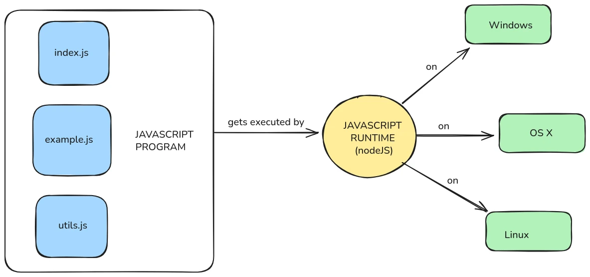
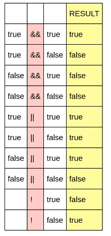
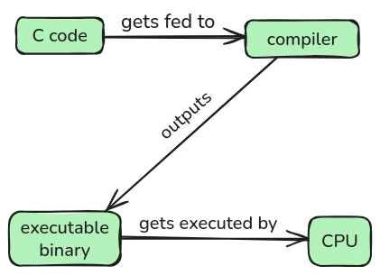
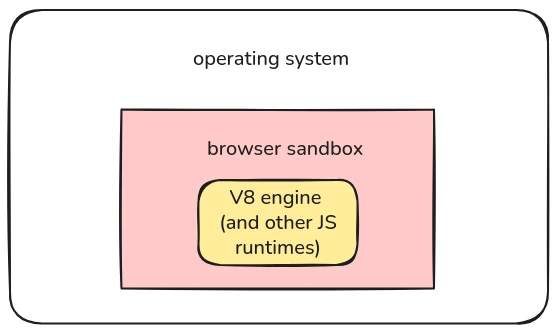

# Comience su viaje de desarrollo


Bienvenido a este curso sobre JavaScript y NodeJS.


JavaScript es el lenguaje de programación más popular del mundo: es el lenguaje de secuencias de comandos de los navegadores modernos, por lo que es básicamente imposible crear una aplicación web moderna sin escribir *algo* de JavaScript; y con el tiempo de ejecución NodeJS también se puede utilizar fuera de los navegadores, para crear secuencias de comandos y aplicaciones que se ejecutan directamente en el ordenador.


Este curso está diseñado para personas que son completamente nuevas en la programación, o que han utilizado otros lenguajes antes, pero quieren entender cómo funciona JavaScript, especialmente en el contexto de NodeJS.


Al final del curso, deberás ser capaz de escribir tus propios programas en JavaScript, utilizar la biblioteca estándar NodeJS e instalar y utilizar paquetes de terceros para crear herramientas útiles.


+++
# JavaScript básico

<partId>a617327c-e5a2-52ca-9380-c63f44623dd4</partId>


## Configurar

<chapterId>ba05a290-1782-5268-87c9-62fd09590e05</chapterId>


En esta sección vamos a configurar nuestra máquina para escribir y ejecutar nuestro primer programa JavaScript.


Un programa JavaScript no es más que una colección de (uno o más) archivos de texto, que contienen comandos para ser ejecutados por un runtime JavaScript.


Los nombres de estos archivos de texto suelen terminar con una extensión de archivo `.js`, como `my_script.js`, `my_program.js`, etc.


Los comandos que contienen están escritos en el lenguaje de programación JavaScript.


Un runtime JavaScript es un programa especial que ejecuta estos archivos.


### Instalación de NodeJS


El tiempo de ejecución de JavaScript más común es NodeJS.


Puedes instalarlo siguiendo las [instrucciones oficiales](https://nodejs.org/en/download).


La página de descarga le proporcionará instrucciones para los tres principales sistemas operativos (SO): Windows, Linux y MacOS. Asume que sabes cómo abrir un terminal en tu SO.


Dado que NodeJS está disponible para los tres sistemas operativos, los programas que escribas podrán ejecutarse en todos ellos (salvo algunos casos extremos).


Esto significa que puedes, por ejemplo, escribir un videojuego sencillo en JavaScript en tu PC con Windows y pasárselo a tu amigo para que lo ejecute en su Mac.





### Edición de texto


Una de las cosas interesantes de la programación es que puedes escribir código utilizando cualquier editor de texto, incluso el bloc de notas predeterminado de tu sistema operativo.


Sin embargo, hay editores de texto especializados en la escritura de código, algunos gratuitos y otros que requieren el pago de una licencia.


La elección del editor de código es una gigantesca madriguera de conejo que trasciende el alcance de este curso, así que no vamos a hablar de ello aquí. Si no sabes qué usar, el editor gratuito más utilizado es [VSCode](https://code.visualstudio.com/).


Su Interface está un poco hinchado, pero tiene lo que necesitas: un editor de archivos, un explorador de archivos (para visualizar los archivos y subdirectorios del directorio en el que estás trabajando) y un terminal para ejecutar tu código. También soporta un montón de plugins, y viene con resaltado de sintaxis JavaScript por defecto.


Si quieres ser un poco más Cypherpunk-y, puede utilizar [VSCodium](https://vscodium.com/) en su lugar.


### Primer programa (hola mundo)


Tradicionalmente, cuando se estudia un lenguaje de programación, el primer programa que se escribe consiste en imprimir "¡hola mundo!" en la consola.


Crea un directorio llamado `my_js_code/`, con dentro un archivo llamado `main.js` (estos nombres son arbitrarios).


Abra el directorio con VSCode.


Escriba este código en su archivo:


```javascript
console.log("hello world!")
```


Abra un terminal y ejecute este comando para ejecutar el programa:


```
node main.js
```


El resultado debe ser


```
hello world!
```


### Lo que ocurrió


En JavaScript, todo es un "objeto".


la consola es un objeto que se utiliza para depurar el programa.


`console.log` es el método más utilizado de la `consola`. Simplemente imprime cualquier argumento que le pases.


Para pasar argumentos a `console.log` se utilizan los corchetes `()`.


Así, por ejemplo, si quisieras imprimir el número `1000`, sólo tendrías que escribir


```javascript
console.log(1000)
```


A continuación, ejecútelo ejecutando


```
node main.js
```


en tu terminal (a partir de ahora, este curso asumirá que sabes que así es como se ejecuta un programa).


Esto debería imprimir


```
1000
```


Puede pasar varias cosas, como


```javascript
console.log(16, 8, 1993)
```


Esto imprimirá


```
16 8 1993
```


## Variables y comentarios

<chapterId>23050ab7-343b-5edf-9d37-e4e782e27ce0</chapterId>


Los programas suelen ejecutar operaciones sobre datos.


Las variables son como cajas con nombre que utilizamos para almacenar datos. Nos permiten asociar un dato a un nombre específico, de modo que podamos recuperarlo más tarde utilizando ese nombre.


### declaraciones `let


Para declarar una variable en JavaScript, podemos utilizar la palabra clave `let`.


Después de escribir `let`, escribimos el nombre que queremos dar a la variable, luego un signo `=`, y a continuación el valor que queremos almacenar.


Por ejemplo:


```javascript
let age = 25

console.log(age)
```


El nombre de una variable (técnicamente llamado "identificador") puede contener letras, guiones bajos (`_`), el símbolo del dólar (`$`) y números, aunque el primer carácter no puede ser un número.


En el código anterior, declaramos una variable llamada `edad` y almacenamos en ella el valor `25`.


A continuación, imprimimos el valor utilizando `console.log(age)`.


Si ejecutas este código con `node main.js`, la salida será:


```
25
```


Los identificadores distinguen entre mayúsculas y minúsculas, lo que significa que las minúsculas y las mayúsculas cuentan como diferencias en los identificadores, así por ejemplo


```javascript
let age = 25

let Age = 20

console.log(age)
```


imprimirá 25, ¡porque se consideran dos variables completamente separadas!


También puede almacenar cadenas (texto) en una variable:


```javascript
let message = "hello again"

console.log(message)
```


Esto se imprimirá:


```
hello again
```


Al igual que antes, utilizamos `console.log()` para imprimir el valor almacenado en la variable.


Ahora vamos a hacer las dos cosas juntas:


```javascript
let age = 25

let message = "hello again"

console.log(age)

console.log(message)
```


Ejecutando esto se imprimirá:


```
25
hello again
```

### Reasignación


Las variables declaradas con `let` pueden modificarse después de su creación.


Esto se llama reasignación.


```javascript
let score = 10

console.log(score)

score = 15

console.log(score)
```


Primero, asignamos `10` a `score`, y luego lo imprimimos.


Luego cambiamos el valor de `score` a `15` y lo volvemos a imprimir.


La salida será:


```
10
15
```


Esto es muy útil cuando el valor cambia con el tiempo, como en un juego en el que la puntuación aumenta.


Añadamos otra variable a la mezcla:


```javascript
let score = 10
let player = "Alice"

console.log(score)
console.log(player)

score = 20
player = "Bob"

console.log(score)
console.log(player)
```


Esto se imprimirá:


```
10
Alice
20
Bob
```


Como puedes ver, tanto `score` como `player` fueron cambiados.


### declaraciones `const


La mayoría de las veces, sin embargo, no queremos que una variable cambie después de ser creada. Para ello, utilizamos `const`.


`const` es la abreviatura de "constante". Una vez que se asigna un valor a una variable `const`, no se puede cambiar.


```javascript
const pi = 3.14
console.log(pi)
```


Esto imprime:


```
3.14
```


Pero si intentas hacer esto:


```javascript
const pi = 3.14
console.log(pi)

pi = 99 // this line will cause an error
console.log(pi)
```


JavaScript le dará un error como:


```
TypeError: Assignment to constant variable.
```


Esto es porque `pi` fue declarada usando `const`, y no puedes cambiar su valor después de eso. Estás comunicando al intérprete de JavaScript que no quieres que esa variable cambie.


Esto es útil porque reduce las posibilidades de cambiarlo por error. Cuando los programas se hacen muy grandes, con miles de líneas de código, es imposible mantenerse al día con todo lo que está sucediendo a la vez (esa es la razón principal por la que usamos ordenadores, para ejecutar procesos complejos que no podemos calcular con nuestros cerebros), por lo que resulta útil tener restricciones como esta, que hacen que el programa sea más determinista.


Se considera la mejor práctica declarar siempre nuestros valores como `const`, a menos que estemos seguros de querer modificarlos más tarde.


### Comentarios en JavaScript


A veces queremos escribir notas en nuestro código que no se ejecutan. A esto se le llama comentarios.


Los comentarios son ignorados por el programa cuando se ejecuta, pero son útiles para explicarnos cosas a nosotros mismos o a otras personas.


Para escribir un comentario de una sola línea, utilice `//`


```javascript
// This is a comment
const x = 10 // This is also a comment
console.log(x)
```


Esto seguirá imprimiéndose:


```
10
```


Los comentarios sólo están ahí para que los lean los humanos.


También puedes escribir comentarios de varias líneas con `/*` y `*/`


```javascript
/*
This is a multi-line comment.
It can span several lines.
*/
const y = 20
console.log(y)
```


Esto imprimirá


```
20
```


Y el comentario será ignorado.


Puedes utilizar los comentarios para añadir pequeñas anotaciones a tu código, de modo que puedas recordar lo que hace y por qué está escrito de una determinada manera. También puede ayudar a otros programadores a entenderlo.


## Tipos básicos: números, cadenas, booleanos

<chapterId>cfdb04f6-21a8-5143-bbf9-7aaae04962f0</chapterId>


En JavaScript, un "tipo" indica qué tipo de datos es un valor.


Javascript tiene algunos tipos básicos, y en esta sección exploraremos algunos de ellos.


### Números y operaciones aritméticas


El primer tipo que vamos a introducir es `number`.


Los números en JavaScript pueden ser enteros (como `5`) o decimales (como `3.14`).


Con ellos puedes hacer operaciones aritméticas: sumas, restas, multiplicaciones y divisiones.


He aquí un ejemplo básico:


```javascript
const a = 10
const b = 5

const sum = a + b
const difference = a - b
const product = a * b
const quotient = a / b

console.log(sum)
console.log(difference)
console.log(product)
console.log(quotient)
```


Esto se imprimirá:


```
15
5
50
2
```


También puede utilizar paréntesis `()` para controlar el orden de las operaciones:


```javascript
const result = (2 + 3) * 4
console.log(result)
```


Esto imprime:


```
20
```


Sin los paréntesis, sería `2 + 3 * 4`, que es:


```javascript
const result = 2 + 3 * 4
console.log(result)
```


Eso se imprimiría:


```
14
```


Porque en las matemáticas normales, la multiplicación tiene lugar antes que la suma.


### Cadenas e interpolación


El segundo tipo de JavaScript que vamos a introducir es `string`.


Las cadenas son fragmentos de texto. Puedes utilizar comillas simples `'...'` o dobles `"..."` para crearlas.


```javascript
const greeting = "hello"
const name = 'Bob'
console.log(greeting)
console.log(name)
```


Esto imprime:


```
hello
Bob
```


Para combinar cadenas, puede utilizar el operador `+`:


```javascript
const greeting = "hello"
const space = " "
const name = "Bob"

const fullGreeting = greeting + space + name
console.log(fullGreeting)
```


Esto se imprimirá:


```
hello Bob
```


Pero hay una forma mejor de combinar cadenas llamada **interpolación de cadenas**. Se utilizan signos de interrogación para declarar la cadena `` `...`` y escribir variables utilizando `${...}` dentro de la cadena:


```javascript
const greeting = "hello"
const name = "Bob"

const fullGreeting = `${greeting} ${name}`
console.log(fullGreeting)
```


Esto también se imprime:


```
hello Bob
```


Puede incluir cualquier expresión dentro de `${...}`:


```javascript
const age = 30
console.log(`Next year, I will be ${age + 1} years old.`)
```


Esto imprime:


```
Next year, I will be 31 years old.
```


La interpolación es muy común en el JavaScript moderno.


### Operaciones booleanas, de comparación y lógicas


El tercer tipo que vamos a introducir es `boolean`. Debe su nombre al matemático George Boole, inventor de la lógica booleana.


Los booleanos son simples: sólo dos valores posibles, `true` y `false`.


Puedes almacenarlos en variables:


```javascript
const theSkyIsBlue = true
const thisCourseIsBad = false

console.log(theSkyIsBlue)
console.log(thisCourseIsBad)
```


Esto imprime:


```
true
false
```


Puedes combinar booleanos utilizando operadores lógicos:


- `&&` significa "y", y sólo devolverá `true` si **ambos** valores son `true`, de lo contrario devolverá `false
- `||` significa "o", y devolverá `true` si **al menos uno** de los valores es `true`, en caso contrario (si ambos son falsos) devolverá `false`
- `!` significa "no", se aplica antes de un booleano, y le dará la vuelta: si el booleano es `true` devolverá `false`, y viceversa.





Ejemplos:


```javascript
const isSunny = true
const isWarm = true

console.log(isSunny && isWarm)  // true
console.log(isSunny || isWarm)  // true
console.log(!isSunny)           // false
```


En JavaScript se pueden comparar valores utilizando operadores como `>`, `<`, `===` y `!==`. El resultado de estas comparaciones es siempre un booleano.


```javascript
const first = 10
const second = 5

const firstIsGreater   = (a > b)
const secondIsGreater  = (a < b)
const theyAreEqual     = (a === b)
const theyAreDifferent = (a !== b)

console.log(firstIsGreater)   // true
console.log(secondIsGreater)   // false
console.log(theyAreEqual)  // false
console.log(theyAreDifferent)  // true
```


Javascript también tiene `>=` para significar "mayor o igual" y `<=` para significar "menor o igual".


Los operadores booleanos, de comparación y lógicos se combinan a menudo en los programas para declarar condiciones complejas, como garantizar que "el correo electrónico ha llegado Y contiene la imagen que necesito O la longitud del correo electrónico es superior a 10000 caracteres". Más adelante descubrirá que se trata de elementos esenciales para construir la lógica del programa.


## Matrices, null, undefined

<chapterId>7bf18183-5eae-53ed-83d2-b04982145d81</chapterId>


En esta sección, cubriremos tres tipos más que son muy comunes en los programas JavaScript:


- Matrices**: secuencias de valores
- undefined**: un valor especial que significa "no se asignó nada"
- null**: otro valor especial que significa "intencionadamente vacío"


### Matrices y acceso a índices


Un **array** es un tipo que puede contener múltiples valores en una lista.


Para crear una matriz, utilice corchetes `[]` y separe los elementos con comas.


He aquí un ejemplo básico:


```javascript
const numbers = [10, 2, 88]
console.log(numbers)
```


Esto imprime:


```
[ 10, 2, 88 ]
```


En una matriz se puede almacenar cualquier cosa, no sólo números:


```javascript
const things = ["apple", 42, true]
console.log(things)
```


Esto imprime:


```
[ 'apple', 42, true ]
```


Para acceder a un elemento concreto de la matriz, se utiliza un **índice**. El índice es la posición del elemento, empezando por **0**.


Así que en esta matriz:


```javascript
const colors = ["red", "green", "blue"]
```


- `colors[0]` es `"rojo"`
- `colors[1]` es `"Green"`
- `colors[2]` es `"azul"`


Intentémoslo:


```javascript
const colors = ["red", "green", "blue"]
console.log(colors[0])
console.log(colors[1])
console.log(colors[2])
```


Esto se imprimirá:


```
red
green
blue
```


Puede asignar un valor a un índice específico de una matriz


```javascript
const colors = ["red", "green", "blue"]

colors[1] = "yellow"

console.log(colors)
```


Esto se imprimirá:


```
[ 'red', 'yellow', 'blue' ]
```


Puede utilizar cualquier número natural como índice, incluso uno almacenado en una variable


```javascript

const i = 1
const colors = ["red", "green", "blue"]
console.log(colors[i])
```


Esto se imprimirá:


```
green
```


Pero si intentas acceder a un índice que no existe, obtendrás `undefined`:


```javascript
const colors = ["red", "green", "blue"]
console.log(colors[3])
```


Esto imprime:


```
undefined
```


¿Qué es eso?


### "indefinido


El valor especial `undefined` significa "no se asignó ningún valor".


Si creas una variable pero no le das un valor, será `undefined`:


```javascript
const name
console.log(name)
```


Esto imprime:


```
undefined
```


Como no hemos asignado nada a `nombre`, JavaScript le asigna por defecto el valor `indefinido`.


Como se ha visto antes, también puedes obtener `undefined` cuando accedes a un índice de array que no existe:


```javascript
const fruits = ["banana", "apple"]
console.log(fruits[2]) // There is no index 2
```


Esto imprime:


```
undefined
```


### `null` y cómo tratarlo


`null` también es un valor especial. Significa "aquí no hay nada, y lo he hecho a propósito"


A diferencia de `undefined`, que es automático, `null` es algo que tú mismo estableces.


Por ejemplo:


```javascript
const currentUser = null
console.log(currentUser)
```


Esto imprime:


```
null
```


¿Por qué utilizar `null`? Tal vez usted espera un valor más tarde, pero no está listo todavía:


```javascript
let winner = null

// Later in the program:
winner = "Alice"

console.log(winner)
```


Esto imprime:


```
Alice
```


Así que `null` es útil cuando quieres decir, por ejemplo, "Debería haber algo aquí más tarde, pero ahora mismo está vacío"


## Bloques y flujo de control

<chapterId>be985168-2636-5b0d-a48f-ac1bbfbff8a7</chapterId>


Hasta ahora, hemos escrito sobre todo líneas de código que se ejecutan una tras otra.


Pero cuando codificamos, podemos controlar el orden de ejecución del mismo.


Esto se denomina **flujo de control**.


Empecemos por entender los bloques y el ámbito de aplicación.


### Ámbito mundial


Cada variable que declaramos existe en un **ámbito**, es decir, la región del código donde se conoce la variable.


Si declaras una variable fuera de cualquier bloque, existe en el **ámbito global**.


```javascript
const color = "blue"
console.log(color)
```


Esta variable `color` está en el ámbito global, por lo que se puede acceder a ella desde cualquier parte del archivo.


Si añades más líneas:


```javascript
const color = "blue"
console.log(color)

const size = "large"
console.log(color)
console.log(size)
```


Tanto `color` como `tamaño` son variables globales. Están disponibles en cualquier parte del archivo.


Pero, ¿qué ocurre dentro de un bloque?


### Bloques y ámbito local


Un **bloque** es un fragmento de código rodeado de llaves `{}`.


Las variables declaradas con `let` o `const` dentro de un bloque existen **sólo** dentro de ese bloque.


```javascript
{
const message = "inside block"
console.log(message)
}
```


Esto imprime:


```
inside block
```


Pero si intentas esto:


```javascript
{
const message = "inside block"
}
console.log(message) // Error!
```


JavaScript le dará un error como:


```
ReferenceError: message is not defined
```


Esto se debe a que `message` se declaró dentro del bloque y no existe fuera de él.


Esto significa que podemos utilizar bloques para aislar partes de nuestro código y estar seguros de que "lo que ocurre en el bloque se queda en el bloque" (algo así como Las Vegas).


Organizar nuestro código en bloques nos permite también estructurar la ejecución del programa, con construcciones de flujo de control como `if`


### `si`, `si no`


A veces queremos ejecutar código **sólo si** algo es cierto. Para eso está la sentencia `if`.


```javascript
const myAge = 20

console.log("Am I an adult?")

if (myAge >= 18) {
console.log("Yes I am!")
}
```


Esto imprime:


```
Am I an adult?
Yes I am!
```


Como puede ver, el código compara `myAge` y `18`.

En este caso, el operador `>=` devuelve `true`, por lo que el bloque se ejecuta.

Si la condición no es `true`, el bloque no se ejecuta.


```javascript
const myAge = 17

console.log("Am I an adult?")

if (myAge >= 18) {
console.log("Yes I am!")
}
```


Esto imprime:


```
Am I an adult?
```


Puede añadir un bloque `else` para manejar el caso contrario:


```javascript
const myAge = 17

console.log("Am I an adult?")

if (myAge >= 18) {
console.log("Yes I am!")
} else {
console.log("No, I am not.")
}
```


Esto imprime:


```
Am I an adult?
No, I am not.
```


Los bloques `if` y `else` siguen siendo bloques, por lo que las variables declaradas en su interior no existen fuera de ellos.


Si queremos estar seguros de que algo **no** es cierto, ¿qué podemos hacer?


Bueno, como ya hemos dicho, JavaScript tiene un operador "not", que invierte los booleanos. Así que podemos hacer


```javascript
const myAge = 17

const adult = myAge >= 18

console.log("Am I an adult?")

if (!adult) {
console.log("No, I am not.")
}
```

Esto aún se imprime:


```
Am I an adult?
No, I am not.
```

Porque usamos el operador `!` para invertir la variable `adulto`.


`if (!adult) {...}` debe leerse como "if not adult..."


Utilizando bloques, operadores lógicos y de comparación, podemos estructurar la ejecución del programa, definiendo variables que deben ser `true` (o `false`) para que algo ocurra.


### `mientras`, `interrumpir`, `continuar`


Un bucle `while` repite código *mientras* una condición sea cierta.


```javascript
let count = 0

while (count < 3) {
console.log("Count is", count)
count = count + 1
}
console.log("the loop is over!")
```


Esto imprime:


```
Count is 0
Count is 1
Count is 2
the loop is over!
```


Cuando `count` se convierte en 3, el bucle se detiene.


Puedes detener un bucle antes de tiempo utilizando `break`:


```javascript
let number = 1 // Start with number 1

while (true) { // This condition is always true, so this loop will run forever unless we stop it
console.log(number) // Print the current number
if (number === 3) { // If the number is 3, stop the loop
break
}
number = number + 1 // Add 1 to the number
}
```


Esto imprime:


```
0
1
2
```


Porque cuando el número se convierte en `3`, el bloque `if` se ejecuta y detiene el bucle.


Puedes saltarte el resto de un bucle utilizando `continue`:


```javascript
let number = 0 // Start with number 0

while (number < 5) { // Keep going while number is less than 5
number = number + 1 // Add 1 to the number

if (number === 3) { // If the number is 3
continue // Skip the rest of the block and go to the next iteration of the loop
}

console.log(number) // Print the number
}
```


Esto imprime:


```
1
2
4
5
```


Porque cuando el número era `3`, `continue` hacía que el programa se saltara la línea que imprime el número.


### `para ... de ...`


Si tienes un array, y quieres hacer algo a cada elemento en él, puedes usar `for ... of ... {...}`.


```javascript
const fruits = ["apple", "banana", "cherry"]

for (const fruit of fruits) {
console.log(fruit)
}
```


Esto imprime:


```
apple
banana
cherry
```

El bloque se ejecutará una vez por cada elemento de la matriz.


aquí `fruit` es una nueva variable que toma el valor de cada elemento del array, para operar sobre él dentro del bloque.


### `para ... en ...`


Puede utilizar `for ... in` para recorrer las claves (índices) de una matriz:


```javascript
const fruits = ["apple", "banana", "cherry"]

for (const index in fruits) {
console.log(index)
}
```


Esto imprime:


```
0
1
2
```


También puedes utilizar el índice para obtener el valor:


```javascript
const fruits = ["apple", "banana", "cherry"]

for (const index in fruits) {
console.log(fruits[index])
}
```


Imprime lo mismo que `para ... de`:


```
apple
banana
cherry
```


En la práctica, para los arrays, es preferible utilizar `for ... of`, ya que es más sencillo y limpio.


### Bucles limitados


A veces queremos hacer un bucle un número determinado de veces o, en general, escribir un fragmento de código que repita un bloque mientras realiza un seguimiento de algo.

Para eso sirve un bucle `for` acotado.

Un bucle acotado suele tener tres condiciones, separadas por punto y coma `;`, como en `(... ; ... ; ....)`.


```javascript
for (let i = 0; i < 3; i = i + 1) {
console.log(i)
}
```


Esto imprime:


```
0
1
2
```


Vamos a explicarlo:


- `let i = 0`: declara una variable que se utilizará en el bloque (en este caso es un contador que empieza en 0)
- `i < 3`: declara una condición que debe ser `true` para que el bloque se ejecute ( en este caso es "repetir mientras `i` sea menor que 3")
- `i = i + 1`: declara algún código que se ejecutará después de cada ejecución del bloque (en este caso "incrementar `i` en 1")


Como puedes ver el bucle acotado nos permite declarar condiciones más complejas para la ejecución repetida de un trozo de código, pero la mayoría de las veces no es necesario.


### Etiquetas de los bloques


Si tienes que escribir un flujo de control más complejo, JavaScript te permite nombrar un bloque usando una **etiqueta** que puede ser usada por `break` o `continue` para especificar *dónde* saltar atrás.


Ejemplo:


```javascript
outer: {
console.log("We're inside the outer scope.")

inner: {
console.log("We're inside the inner scope.")
break outer
}

console.log("This will not run")
}

console.log("Done")
```


Esto imprime:


```
Inside outer block
Inside inner block
Done
```


Usamos `break outer` para salir completamente del bloque `outer`.


También puede etiquetar bucles. Tomemos este ejemplo:


```javascript
// Declare a variable to count the total number of days in a year
let totalDaysInOneYear = 0

// Declare one variable per month, with the number of the month
const january = 1
const february = 2
const march = 3
const april = 4
const may = 5
const june = 6
const july = 7
const august = 8
const september = 9
const october = 10
const november = 11
const december = 12

// Declare an array that holds the months that have 30 days
const monthsWith30Days = [
april, june, september, november
]

// Declare variables to keep track of the month and day we're in
let currentMonth = january
let currentDay = 1

monthsLoop: while (true) {  // Start a loop labeled "monthsLoop" to process each month

daysLoop: while (true) {  // Start a loop labeled "daysLoop" to process each day in the month
totalDaysInOneYear = totalDaysInOneYear + 1  // Increase the total number of days we counted by 1

if (                                                                   // We want to check if we're at the end of the month.
currentDay === 31                                                  // Check if the current day is 31 (for months with 31 days)...
|| currentDay === 30 && (monthsWith30Days.includes(currentMonth))  // ...or 30 if it's among the 30-days months...
|| currentDay === 28 && (currentMonth === february)                // ...or 28 if it's February. If it's any of these three, then:

){
currentMonth = currentMonth + 1  // Move to the next month
currentDay = 1                   // Reset the day to 1 for the new month
break daysLoop                   // Exit the inner loop (which tracks days) and go back to the outer loop (which tracks months)
}
else { currentDay = currentDay + 1 }                                   // Otherwise, we're not at the end of the month, and we just move to the next day

}
if (currentMonth > 12) {  // After processing a month, check if we've gone past December
break monthsLoop  // If so, break the outer loop and stop the day-counting process
}
}

console.log(totalDaysInOneYear)  // Print the total number of days in the year (should be 365)
```

Ha sido un ejemplo muy aburrido, pero espero que haya aclarado la necesidad (ocasional) de las etiquetas.


## Introducción de funciones

<chapterId>cc324715-09c2-5cf7-9e6f-47a6f16bc04d</chapterId>


A medida que sus programas crecen, a menudo querrá **reutilizar** trozos de código.


Para eso están las **funciones**: te permiten agrupar código, darle un nombre y ejecutarlo cuando quieras.


### Declaración de funciones


Para declarar una función, podemos utilizar la palabra clave `function`. Entonces le damos un nombre, un par de paréntesis `()` con los argumentos que toma, y un bloque de código `{}` a ejecutar. Vamos a empezar con una función que no toma argumentos:


```javascript
function sayHello () {console.log(`Hello!`) }
```


Este código **declara** la función, pero **no** la ejecuta todavía.


### Llamadas a funciones


Para ejecutar (o "llamar") la función, se escribe su nombre seguido de un paréntesis:


```javascript
function sayHello () {console.log(`Hello!`) }
sayHello()
```


Esto imprime:


```
Hello!
```


Puede llamar a la función tantas veces como desee:


```javascript
function sayHello() {
console.log("Hello!")
}

sayHello()
sayHello()
```


Esto imprime:


```
Hello!
Hello!
```


El código dentro de la función sólo se ejecuta cuando usted la llama.


### Argumentos de función (entrada a funciones)


A veces, quieres que una función trabaje con alguna entrada. Puedes hacerlo añadiendo **argumentos** dentro de los paréntesis.


Por ejemplo:


```javascript
function sayHelloTo (friend) {
console.log(`Hello ${friend}!`)
}
```


Ahora esta función toma **un argumento** llamado `friend`.


Cuando se llama a la función, se puede pasar un valor:


```javascript
sayHelloTo("Tommy")
```


Esto imprime:


```
Hello Tommy!
```


Puede volver a llamar a la función con un nombre diferente:


```javascript
sayHelloTo("Sam")
```


Esto imprime:


```
Hello Sam!
```


El valor que pasas sustituye a la variable `friend` dentro de la función.


También puede utilizar más de un argumento:


```javascript
function greetTwoPeople(person1, person2) {
console.log(`Hello ${person1} and ${person2}!`)
}

greetTwoPeople("Lina", "Marco")
```


Esto imprime:


```
Hello Lina and Marco!
```


### `return` (salida de funciones)


Las funciones también pueden **devolver** valores. Esto significa que envían un valor de vuelta al lugar donde se llamó a la función.


He aquí un ejemplo sencillo:


```javascript
function getNumber() {
return 42
}

const result = getNumber()
console.log(result)
```


Esto imprime:


```
42
```


La función `getNumber()` devuelve `42`, lo almacenamos en `result` y lo imprimimos.


También puedes devolver algo que hayas calculado:


```javascript
function add(a, b) {
return a + b
}

const result = add(2, 3)
console.log(result)
```


Esto imprime:


```
5
```


Una vez que un valor es `return`ed, la función se detiene. Cualquier cosa después de `return` en ese bloque no sucede.


```javascript
function saySomething() {

return "hi"

console.log("this never runs")

}

const message = saySomething()
console.log(message)
```


Esto sólo imprime:


```
hi
```


porque sólo se devuelve `"hola"`. Se omite la línea `console.log("esto nunca se ejecuta")`.


Puedes pensar en las funciones como pequeños subprogramas. Cada función puede recibir una entrada, trabajar con ella y devolver una salida.


¿Qué ocurre si intentamos utilizar el valor de retorno de una función, pero esa función no devuelve nada?


```javascript
function doesNothing () {}

const x = doesNothing()

console.log(x)
```

Esto imprimirá `undefined`. El valor de retorno de una función que no devuelve nada es `undefined`.


## Objetos y clases

<chapterId>26689f25-8212-5057-8c21-3a05eee0ac75</chapterId>


A menudo se dice que JavaScript es un lenguaje orientado a objetos.


Esto significa que le ayuda a organizar su código agrupando valores y funciones en **objetos**.


### ¿Qué es un "objeto"?


Un objeto puede contener datos y funciones que operan sobre esos datos. Cuando una función se pone en un objeto decimos que es un `método`.


El primer objeto que hemos visto ha sido el objeto `console`. Es un objeto que contiene múltiples métodos para imprimir cosas en la pantalla y depurar nuestros programas.


Puede incluso imprimirse a sí mismo; puedes hacer


```javascript
console.log(console)
```


e imprimirá una lista de los métodos que contiene. Por ejemplo, en mi máquina imprime


```javascript
Object [console] {
log: [Function: log],
warn: [Function: warn],
error: [Function: error],
dir: [Function: dir],
time: [Function: time],
timeEnd: [Function: timeEnd],
timeLog: [Function: timeLog],
trace: [Function: trace],
assert: [Function: assert],
clear: [Function: clear],
count: [Function: count],
countReset: [Function: countReset],
group: [Function: group],
groupEnd: [Function: groupEnd],
table: [Function: table],
debug: [Function: debug],
info: [Function: info],
dirxml: [Function: dirxml],
groupCollapsed: [Function: groupCollapsed],
Console: [Function: Console],
profile: [Function: profile],
profileEnd: [Function: profileEnd],
timeStamp: [Function: timeStamp],
context: [Function: context],
createTask: [Function: createTask]
}
```


Como puedes ver, ¡tiene un montón de métodos que podrías utilizar para depurar!


Javascript nos proporciona diferentes formas de crear nuevos objetos que pueden hacer lo que queramos que hagan.


### Creación de un objeto


La forma más sencilla de crear un objeto es simplemente agrupando datos y funciones utilizando ** llaves rizadas** `{}`.


Esto crea lo que llamamos un "objeto anónimo"


```javascript
const cat = {
name: "Whiskers",
age: 3
}
```


Esto crea un objeto y lo almacena en una variable llamada `cat`.


El objeto tiene dos **propiedades**:


- `name` con el valor `"Bigotes"`
- `edad` con el valor `3`


Imprimámoslo:


```javascript
console.log(cat)
```


Esto imprime:


```
{ name: 'Whiskers', age: 3 }
```


Puedes sacar las propiedades del objeto utilizando un punto, como en `nombreobjeto.nombrepropiedad`:


```javascript
console.log(cat.name)  // prints "Whiskers"
console.log(cat.age)   // prints 3
```


También puede **cambiar** una propiedad:


```javascript
cat.age = 4
console.log(cat.age)  // now it prints 4
```


Como puede ver, aunque un objeto esté definido como `const`, puede modificar los datos que contiene.


En el caso de los objetos, `const` sólo evitará que sobreescribas todo el objeto:


```javascript
const cat = {
name: "Whiskers",
age: 3
}

cat.age = 5 // this works

cat = 5 // this throws an error, you're trying to reassign the whole object

```


Como ya se ha mencionado, los objetos también pueden contener **funciones**, y cuando una función forma parte de un objeto, la llamamos **método**.


He aquí un ejemplo:


```javascript
const cat = {
name: "Whiskers",
speak () {
console.log("Meow!")
}
}
```


Este objeto tiene:


- Una propiedad `name
- Un método `speak()`


Llamemos al método:


```javascript
cat.speak()
```


Imprime:


```
Meow!
```


Los métodos pueden utilizar los datos que contiene el objeto a través de la palabra clave `this`.

`this` se refiere al objeto actual. En este ejemplo, se utilizará para imprimir el nombre del gato:


```javascript
const cat = {
name: "Whiskers",
speak () {
console.log(`${this.name} says meow!`)
}
}

cat.speak()
```


Esto imprime:


```
Whiskers says meow!
```


La palabra `this` significa "este objeto"... en este caso, el objeto `cat`.


Este tipo de objetos son geniales cuando sólo quieres algo rápido y sencillo. Pero si necesitas crear **muchos objetos** con la misma estructura, hay una forma mejor, y ahí es donde entran las **clases**.


### Clases y constructores


Una **clase** es como un plano. Indica a JavaScript cómo crear un determinado tipo de objeto.


Para definir una clase se utiliza la palabra clave `class`, seguida del nombre de la clase y de un bloque de llaves `{}`.


```javascript
class Dog {}
```


Por convención, las clases suelen empezar con mayúscula.


Puedes crear un nuevo objeto de una clase utilizando `new`:


```javascript
const hachiko = new Dog()
```


Intenta imprimir el objeto:

```javascript
class Dog {}

const myDog = new Dog()

console.log(myDog)
```


Obtendrás


```
Dog {}
```


Como puedes ver, la clase Dog está vacía, por lo que el objeto `myDog` también lo está.


Podemos definir qué propiedades deben contener los objetos Dog añadiendo un `constructor`.


Un constructor es una función especial que se ejecuta cuando se crea (o "construye") un nuevo objeto.


```javascript
class Dog {
constructor() { }
}
```


Queremos que cada Perro tenga un nombre, así que añadimos un parámetro `name` a la función:


```javascript
class Dog {
constructor(name) { }
}
```


Y luego usamos `this` para declarar que `name` es el `name` del objeto `Dog` que estamos construyendo


```javascript
class Dog {
constructor(name) {
this.name = name
}}
```


Intentemos usarlo ahora:


```javascript
class Dog {
constructor(name) {
this.name = name
}
}

const myDog = new Dog("hachiko")

console.log(myDog)
```


Esto imprime algo como:


```
Dog { name: 'hachiko' }
```


Como puedes ver, el método `constructor` toma los argumentos que pasas a la clase cuando haces `new Dog()`, y los utiliza para construir el objeto.


Vamos a desglosarlo:


- `class Dog` define la clase Dog.
- `constructor(nombre)` configura el objeto cuando se crea.
- `this.nombre = nombre` almacena el valor en el nuevo objeto.
- new Dog("hachiko")` crea un nuevo objeto de la clase, con la propiedad `name` establecida a `"hachiko"`.


Ahora vamos a añadir un método a nuestra clase:


```javascript
class Dog {
constructor(name) {
this.name = name
}
speak () {
console.log(`${this.name} says barf!`)
}

}

const myDog = new Dog("hachiko")

myDog.speak()
```


Esto imprimirá


```javascript
hachiko says barf!
```


Si hacemos lo mismo para dos instancias diferentes de Perro


```javascript
class Dog {
constructor(name) {
this.name = name
}
speak () {
console.log(`${this.name} says barf!`)
}

}

const myDog = new Dog("hachiko")

myDog.speak()

const yourDog = new Dog("bobby")

yourDog.speak()
```


obtenemos


```
hachiko says barf!
bobby says barf!
```


el método `speak()` utiliza la propiedad `name` del `Dog` al que se llama.


Esta es la razón principal de la existencia de las clases: nos permiten definir un conjunto de métodos que operan sobre los datos, y luego crear múltiples objetos que comparten la misma "forma" de datos.


Cuando llamamos a un método sobre uno de estos objetos, éste operará sobre los datos que *ese objeto específico* contiene.


### Modificar la forma de un objeto


Los objetos en JavaScript son flexibles. Incluso después de crear uno, puedes añadir nuevas propiedades o eliminar las existentes.


Está permitido, pero es algo que debes usar con cuidado.


Empecemos con nuestra sencilla clase `Dog`:


```javascript
class Dog {
constructor(name) {
this.name = name
}

speak() {
console.log(`${this.name} says barf!`)
}
}

const myDog = new Dog("Fido")
```


En este punto, `myDog` sólo tiene una propiedad: `nombre`. Todavía podemos añadir nuevas propiedades después de su creación:


```javascript
myDog.age = 5

console.log(myDog.age) // prints 5
```


También podemos añadir un nuevo método:


```javascript
myDog.jump = function () {
console.log(`${this.name} jumps!`)
}

myDog.jump() // Fido jumps!
```


Y también podemos eliminar propiedades, utilizando la palabra clave `delete`.


```javascript
delete myDog.name

console.log(myDog.name) // prints 'undefined'
```


Esto funciona, pero hay algo importante que debes saber: Los motores JavaScript como el V8 (utilizado en Node.js y en el navegador Chrome) funcionan más rápido cuando tus objetos mantienen siempre las mismas propiedades. Si añades o eliminas propiedades después de crear el objeto, puede ralentizar las cosas.


En programas pequeños, esto no importa mucho. Pero en proyectos más grandes (como juegos), es mejor listar todas las propiedades en el constructor desde el principio, incluso si no las usas inmediatamente. Esto mantiene la forma del objeto estable y ayuda a que tu código se ejecute más rápido.


Por ejemplo, en lugar de esto:


```javascript
class Dog {
constructor(name) {
this.name = name
}
}

const dog = new Dog("Rex")
dog.age = 4
dog.breed = "Labrador"
```


Podrías hacer


```javascript
class Dog {
constructor(name, age, breed) {
this.name = name
this.age = age
this.breed = breed
}
}

const dog = new Dog("Rex", 4, "Labrador")
```


Ambas versiones funcionan, pero la segunda es mejor para el rendimiento. Le estás diciendo al motor por adelantado qué propiedades tendrá cada objeto, y puede optimizar en consecuencia.


JavaScript permite cambiar la forma de los objetos libremente, pero cuando se utilizan clases, es mejor planificar la forma del objeto con antelación.


### Herencia con `extends` y `super()`


A veces se desea crear una clase que sea *casi* igual a otra clase, pero con algunas características adicionales.


En lugar de modificar la forma de los objetos (que como se mencionó antes no es óptimo para el rendimiento), o tener que reescribir una nueva clase desde cero, JavaScript le permite utilizar algo llamado **herencia**.


Herencia significa que una clase puede **extender** a otra. La nueva clase obtiene todas las propiedades y métodos de la anterior, y puedes añadir más o cambiar lo que necesites.


Digamos que tenemos una clase base llamada `Vehículo`:


```javascript
class Vehicle {
constructor(brand) {
this.brand = brand
}

start() {
console.log(`${this.brand} vehicle is starting...`)
}
}
```


Ahora queremos hacer una clase `Coche`. Un coche es una clase de vehículo, pero podríamos querer que tuviera algunas características extra o un mensaje diferente cuando arranca. En lugar de reescribir todo, podemos utilizar `extends`:


```javascript
class Car extends Vehicle {
start() {
console.log(`${this.brand} car is ready to drive!`)
}
}
```


La clase `Car` ahora **hereda** todo de `Vehicle`. Obtiene la propiedad `brand`, y hemos reemplazado el método `start()` por nuestra propia versión.


Vamos a probarlo:


```javascript
const myCar = new Car("Toyota")
myCar.start()
```


Esto imprime:


```
Toyota car is ready to drive!
```


Aunque `Car` no tiene su propio constructor, sigue usando el de `Vehicle`. Pero si queremos escribir un constructor personalizado en `Car`, podemos, sólo tenemos que incluir una llamada al constructor de su padre usando `super()`.


He aquí cómo:


```javascript
class Vehicle {
constructor(brand) {
this.brand = brand
}

start() {
console.log(`${this.brand} vehicle is starting...`)
}

}

class Car extends Vehicle {
constructor(brand, model) {
super(brand) // call the parent constructor and passes the brand argument to it
this.model = model
}

start() {
console.log(`${this.brand} ${this.model} is ready to drive!`)
}
}

const myCar = new Car("Toyota", "Corolla")
myCar.start()
```


Esto imprime:


```
Toyota Corolla is ready to drive!
```


Resumiendo


- extender" significa que una clase se basa en otra.
- `super()` se utiliza para llamar al constructor de la clase que estás extendiendo.
- La nueva clase obtiene todas las propiedades y métodos de la clase original.
- Puedes **override** métodos (como `start()`) para hacer que hagan algo diferente.


Esto es útil cuando tienes varias cosas que son similares (como coches, camiones y bicicletas) y quieres que compartan código pero que se comporten a su manera.


### instancia de


La palabra clave `instanceof` comprueba si un objeto fue creado a partir de una clase determinada.


Supongamos que tenemos una clase llamada `Usuario`:


```javascript
class User {
constructor(username) {
this.username = username
}
}

const regularUser = new User("julia123")

console.log(regularUser instanceof User)
```


Esto imprime:


```
true
```


Confirmando que `regularUser` es un `User`. Eso es porque `regularUser` fue creado usando la clase `User`.


También funciona con clases **heredadas**. Por ejemplo, aquí hay una clase `Admin` que extiende `User`:


```javascript
class Admin extends User {}

const ourAdmin = new Admin("admin42")

console.log(ourAdmin instanceof Admin)   // true
console.log(ourAdmin instanceof User)    // true
```


Ambas líneas devuelven `true`. Esto es porque `Admin` es una subclase de `User`, por lo tanto `ourAdmin` es tanto un `Admin` como un `User`


# JavaScript intermedio

<partId>243f63ab-4f34-5c30-80cb-84ef46f6761d</partId>


## Tratamiento de errores

<chapterId>d0206bc5-d386-5e7f-9917-5803f392448c</chapterId>


A medida que escribas programas JavaScript más complejos, te encontrarás con **errores**. Se trata de situaciones inesperadas en las que algo va mal. Tal vez una variable está `undefined` pero intentas usarla, o algún código recibe un tipo de entrada incorrecto.


Si no gestionamos estos errores adecuadamente, nuestro programa puede bloquearse o comportarse de forma impredecible. JavaScript proporciona herramientas para detectar y gestionar estos errores de forma que podamos manejarlos con más elegancia.


### Error común: acceder a un valor en `undefined`


He aquí una situación habitual que provoca un error:


```javascript
const user = undefined
console.log(user.name)
```


Si ejecutas este código, obtendrás un error parecido a éste:


```
TypeError: Cannot read properties of undefined (reading 'name')
```


Eso es JavaScript diciéndote: "Hey, has intentado obtener la propiedad `name` de algo que es `undefined`, y eso no tiene sentido" Y como puedes ver, cuando ocurre este tipo de error, el programa deja de ejecutarse a menos que hayas escrito específicamente código para atraparlo y manejarlo.


### lanzar un error


A veces quieres **provocar un error** manualmente en tu código. En ese caso, se utiliza la palabra clave `throw`.


```javascript
throw new Error("This is a custom error message")
```


Esto detiene inmediatamente el programa e imprime:


```
Uncaught Error: This is a custom error message
```


Puedes utilizar `throw` para imponer reglas en tu programa. Por ejemplo:


```javascript
function divide(a, b) {
if (b === 0) {
throw new Error("You can't divide by zero")
}
return a / b
}

console.log(divide(10, 2))  // OK: prints 5
console.log(divide(10, 0))  // Error!
```


La segunda llamada provoca un error porque la división por cero no está permitida en este ejemplo.


### Captura de errores con `try...catch`


Si no quieres que tu programa se bloquee cuando se produce un error, puedes atrapar el error utilizando un bloque `try...catch`. Esto es útil cuando quieres que tu programa **siga adelante** incluso si algo falla.


```javascript
try {
const user = undefined
console.log(user.name)
console.log("End of the block") // this will never get printed
} catch (error) {
console.log("Oops! Something went wrong.")
}
```


Salida:


```
Oops! Something went wrong.
```


Funciona así:


- El código dentro del bloque `try` se intenta primero.
- Si se produce un error, JavaScript **salta al bloque `catch`**, saltándose el resto del bloque `try`.
- El bloque `catch` recibe el error, por lo que puede imprimirlo, o manejarlo de alguna otra manera, como por ejemplo


```javascript
try {
const user = undefined
console.log(user.name)
console.log("End of the block") // this will never get printed
} catch (error) {
console.log(`The message of the error was: "${error.message}"`)
}
```


Salida:


```
The message of the error was: "Cannot read properties of undefined (reading 'name')"
```


### El bloque "final


También puedes añadir un bloque `finally`. Se trata de código que **siempre se ejecuta**, tanto si se ha producido un error como si no.


```javascript
try {
console.log("Trying something risky...")
throw new Error("Uh oh!")
} catch (error) {
console.log("Caught the error:", error.message)
} finally {
console.log("This will run no matter what.")
}
```


Salida:


```
Trying something risky...
Caught the error: Uh oh!
This will run no matter what.
```


## Evitar bichos

<chapterId>db12d9f6-5806-514c-998e-0ae24805104e</chapterId>


Este capítulo muestra algunas de las trampas más comunes en JavaScript y cómo evitarlas.


### `var` y Assignment sin declaración


En el código JavaScript antiguo, las variables se declaraban a menudo usando la palabra clave `var`. A diferencia de `let` y `const`, que ya conoces, `var` puede comportarse de forma confusa.


Por ejemplo:


```javascript
{
var message = "hello"
}
console.log(message)
```


Cabría esperar que `message` sólo existiera dentro del bloque, pero no es así. la función `var` ignora el ámbito del bloque y hace que la variable esté disponible en toda la función o archivo.


Esto puede dar lugar a comportamientos inesperados, especialmente en programas grandes. Por esta razón, el código JavaScript moderno debería utilizar siempre `let` o `const` en lugar de `var`.


Peor aún, JavaScript permite asignar valores a variables **sin declararlas**:


```javascript
function greet() {
user = "Alice"
}
greet()
console.log(user) // prints "Alice"
```


Esto crea una nueva variable global `nombre` sin ninguna declaración. Esto puede ocurrir silenciosamente y conducir a errores que son Hard de rastrear, especialmente si era sólo un error tipográfico. Declara siempre las variables usando `let` o `const`.


### Sistema de tipos débil


JavaScript es de tipado débil, lo que significa que convierte automáticamente valores de un tipo a otro si es necesario. Esto se denomina coerción de tipos y, aunque puede ser conveniente, a menudo conduce a resultados confusos.


Por ejemplo:


```javascript
console.log("5" + 1)    // "51"
console.log("5" - 1)    // 4
console.log(true + 1)   // 2
console.log(null + 1)   // 1
```


En estos ejemplos, JavaScript intenta adivinar lo que quieres decir. A veces convierte cadenas en números, o booleanos en números, o cadenas en cadenas. Esto puede hacer que tu código se comporte de formas inesperadas.


Es importante conocer el débil sistema de tipado de JavaScript. Cuando las cosas empiezan a actuar de forma extraña, puede deberse a una coerción de tipos inesperada.


### `"use strict"`


Puede activar un modo más estricto que convierte algunos errores silenciosos en errores reales y le impide utilizar algunas de las características más peligrosas del lenguaje.


Para activar este modo más estricto, añada esta línea al principio de su archivo o función:


```javascript
"use strict"
```


Por ejemplo:


```javascript
"use strict"
name = "Alice" // ReferenceError: name is not defined
```


Sin el modo estricto, JavaScript crearía silenciosamente una variable global llamada `nombre`. Pero con el modo estricto, esto se convierte en un error real, lo que ayuda a detectar errores antes.


El modo estricto también desactiva algunas funciones obsoletas de JavaScript y facilita la optimización y el mantenimiento del código.


## Valor frente a referencia

<chapterId>bb898425-dc2f-5e5c-864b-0cb7a4a9aea9</chapterId>


JavaScript trata diferentes tipos de valores de diferentes maneras.


Algunos valores se **copian** cuando los asignas a una variable.


Otras son **compartidas** cuando las asignas a una nueva variable, por lo que si cambias una, la otra también cambia.


### Pasar por valor


Cuando se pasa un valor **por valor**, JavaScript hace una **copia** del mismo.


Así que si cambias uno, no afecta al otro.


Esto ocurre con los tipos primitivos, como:


- números
- cadenas
- booleanos (`true` y `false`)
- "null
- "indefinido


Veamos un ejemplo:


```javascript
let a = 5
let b = a

b = 10

console.log(a) // 5
console.log(b) // 10
```


Le dimos a `b` el valor de `a`, pero luego cambiamos `b` por `10`.


Como los números se pasan por valor, JavaScript copió el `5` en `b`. El `5` de `b` es independiente del `5` original de `a`, por lo que cambiar el valor de `b` no tiene ningún efecto sobre `a`.


Probemos con una cadena:


```javascript
let name1 = "Alice"
let name2 = name1

name2 = "Bob"

console.log(name1) // Alice
console.log(name2) // Bob
```


De nuevo, cambiar `nombre2` no afectó a `nombre1`, porque las cadenas también se pasan por valor.


Lo mismo ocurre cuando pasas una primitiva a una función: se copia. Así que la función no puede cambiar el original.


```javascript
function plusOne(x) {
x = x + 1
}

let number = 5

plusOne(number)

console.log(number) // 5
```


Aunque dentro de la función se añadió `1` a `x`, el `número` original no cambió.


Esto se debe a que sólo se ha pasado una **copia** a la función.


### Pasar por referencia


Los objetos se pasan **por referencia**.


Esto significa que en lugar de copiarlas, JavaScript simplemente le pasa una **referencia**, y si la modificas, todas las demás variables que apunten a ella también verán el cambio.


Por ejemplo:


```javascript
const person1 = { name: "Alice" }
const person2 = person1

person2.name = "Bob"

console.log(person1.name) // Bob
console.log(person2.name) // Bob
```


Tanto `persona1` como `persona2` apuntan al mismo objeto en memoria.


Así que cuando cambiamos `persona2.nombre`, también cambiamos `persona1.nombre`, porque ambos están mirando la misma cosa.


Los arrays son objetos, así que vamos a intentar lo mismo con un array:


```javascript
const list1 = [1, 2, 3]
const list2 = list1

list2.push(4)

console.log(list1) // [1, 2, 3, 4]
console.log(list2) // [1, 2, 3, 4]
```


Hemos metido `4` en `list2`, pero `list1` también se ha visto afectada, porque ambas hacen referencia al mismo array.


Veamos qué ocurre cuando pasamos un objeto a una función:


```javascript
function rename(user) {
user.name = "Charlie"
}

const person = { name: "Dana" }

rename(person)

console.log(person.name) // Charlie
```


La función ha cambiado el objeto Eso es porque recibió una **referencia** al objeto `persona` original.


No obtuvo una copia. Obtuvo acceso al objeto original, y con ello la capacidad de modificarlo.


Es importante recordar esta distinción, porque de lo contrario nuestro código podría comportarse de forma distinta a la esperada. Por ejemplo, podríamos escribir una función con la expectativa de que no modificará los argumentos que recibe, y descubrir más tarde que en realidad los estaba modificando (porque eran objetos, por lo que se pasaban por referencia).


## Trabajar con funciones

<chapterId>e0d277a8-c642-5af7-9e53-dee27c811967</chapterId>


Ya has aprendido a declarar y utilizar funciones en JavaScript. Pero JavaScript te da más herramientas para trabajar con funciones de forma potente.


### Funciones de flecha


Las funciones en flecha son una forma más corta de escribir funciones. En lugar de utilizar la palabra clave `function`, usamos una flecha (`=>`).


Esta es una función normal:


```javascript
function greet(name) {
return `Hello, ${name}!`
}
```


La versión en flecha tiene este aspecto:


```javascript
const greet = (name) => {
return `Hello, ${name}!`
}
```


Si la función tiene **sólo una línea**, puede omitir las llaves y `return`:


```javascript
const greet = (name) => `Hello, ${name}!`
```


Si la función tiene **un solo parámetro**, puede incluso omitir los paréntesis alrededor de los parámetros:


```javascript
const greet = name => `Hello, ${name}!`
```


Las funciones de flecha son muy comunes en el JavaScript moderno, ya que permiten expresar funciones sencillas con bastante menos boilerplate.


### Parámetros por defecto


A veces se desea que una función tenga un **valor por defecto** si no se le pasa ningún argumento.


Puedes hacerlo así:


```javascript
function sayHello(name = "friend") {
console.log(`Hello, ${name}!`)
}

sayHello("Alice") // Hello, Alice!
sayHello()        // Hello, friend!
```


El valor por defecto `"friend"` se utiliza cuando no se pasa nada.


### Parámetros de difusión (`...`)


¿Y si su función toma un número flexible de argumentos?


Puede utilizar el operador **spread** (`...`) para reunirlos en una matriz:


```javascript
function logAll(...items) {
console.log(items)
}

logAll(1, 2, 3) // [1, 2, 3]
logAll("a", "b") // ["a", "b"]
```


A continuación, puede utilizar un bucle para procesar cada elemento:


```javascript
function logEach(...items) {
for (const item of items) {
console.log(item)
}
}
```


El operador de dispersión es útil cuando no se sabe cuántos argumentos se pasarán.


### Funciones de orden superior


Una **función de orden superior** es una función que:


- toma otra función como entrada
- y/o devuelve una función como salida


He aquí un ejemplo sencillo:


```javascript
function runTwice(action) {
action()
action()
}

function sayHello(name = "friend") {
console.log(`Hello, ${name}!`)
}

runTwice(sayHello)
```


Esto imprime:


```
Hello, friend!
Hello, friend!
```


Podemos pasarle una función de flecha:


```javascript
runTwice(
() => console.log("Hello!")
)
```


Esto imprime:


```
Hello!
Hello!
```


También puedes escribir funciones que **devuelvan** otras funciones:


```javascript
function makeGreeter(name) {
return () => console.log(`Hi, ${name}`)
}

const greetAlice = makeGreeter("Alice")
const greetBob = makeGreeter("Bob")

greetAlice() // Hi, Alice
greetBob() // Hi, Bob
```


La función `makeGreeter` es una función que construye otras funciones. Recibe una cadena y devuelve una nueva función que utiliza esa cadena en su llamada a `console.log`.


Este tipo de patrón es muy potente, ya que te permite dejar "huecos" en tus funciones que puedes rellenar más tarde con el comportamiento que necesites.


### map()`, `filter()`, `reduce()`


JavaScript le ofrece algunos métodos integrados útiles para utilizar con matrices.


Estos métodos toman funciones como argumentos, por lo que también son funciones de orden superior.


map()` transforma cada elemento de un array en otra cosa.


Ejemplo:


```javascript
const numbers = [1, 2, 3]
const doubled = numbers.map(x => x * 2)

console.log(doubled) // [2, 4, 6]
```


Cada número se duplica y el resultado es una nueva matriz.


`filter()` elimina elementos de la matriz si no pasan una prueba.


Ejemplo:


```javascript
const numbers = [1, 2, 3, 4, 5]
const numbersGreaterThanTwo = numbers.filter(x => x > 2)

console.log(numbersGreaterThanTwo) // [3, 4, 5]
```


Sólo se conservan las entradas de la matriz para las que la condición `x > 2` devuelve `true`.


`reduce()` se utiliza para combinar todos los elementos de un array en un único valor.


Ejemplo:


```javascript
const numbers = [1, 2, 3, 4]
const total = numbers.reduce((current, next) => current + next)

console.log(total) // 10
```


`reduce` recorre el array y, en este ejemplo, aplica el operador `+` entre `1` y `2`, luego entre el resultante `3` y `3`, luego entre el resultante `6` y `4`, hasta que tiene la suma de todas las entradas del array (que es 10).


Puede utilizar `reduce()` para muchas cosas como totales, promedios o construir nuevos valores paso a paso.


Estos métodos (`map`, `filter`, `reduce`) son potentes herramientas para procesar datos sin escribir bucles manuales.


Incluso puedes combinarlas en una cadena de operaciones, así:


```javascript
const numbers = [1, 2, 3, 4, 5]

const result = numbers
.map(n => n * 2)        // Double each entry, obtain [2, 4, 6, 8, 10]
.filter(n => n > 3) // Keep only the entries bigger than 3, so you get [4, 6, 8, 10]
.reduce((n1, n2) => n1 + n2) // Adds them: 4 + 6 + 8 + 10 = 28

console.log(result) // 28
```


## Trabajar con objetos

<chapterId>7842aada-f009-5518-b8e3-1104e166a035</chapterId>


En este capítulo, aprenderemos algunas herramientas potentes y un poco más avanzadas para trabajar con objetos en JavaScript.


### Propiedades privadas


A veces, queremos ocultar una propiedad de un objeto para que no se pueda cambiar o acceder a ella desde fuera del objeto. JavaScript nos da una manera de hacer esto usando `#` antes del nombre de la propiedad. Esto crea una propiedad **privada**, que sólo es accesible desde dentro de la clase.


```javascript
class Person {
#age // this is a private property

constructor(name, age) {
this.name = name
this.#age = age
}

getAge() {
return this.#age
}
}

const alice = new Person("Alice", 30)
console.log(alice.name)      // Alice
console.log(alice.getAge())  // 30, the method can access the private property
console.log(alice.#age)      // ❌ Error! You can't access private properties directly
```


Las propiedades privadas son útiles cuando se desea evitar cambios accidentales.


### propiedades `static


A veces, quieres que una propiedad pertenezca a la propia clase, no a cada objeto que crees a partir de esa clase. Para eso está `static`. Una propiedad `static` está contenida en la clase y todos los objetos de esa clase harán referencia a ella.


```javascript
class User {
static counter = 0 // this belongs to the class, not to instances. The same counter will be shared by all objects

constructor() {
User.counter++ // changes the static property every time an object of this class gets initiated
}
}

const a = new User() // the constructor will change the shared counter from 0 to 1
const b = new User() // the constructor will change the shared counter from 1 to 2

console.log(User.counter) //  prints 2
```


Esto es útil para almacenar datos compartidos y métodos que se aplican a todo el grupo de objetos, no sólo a uno.


### `get` y `set`


En JavaScript, `get` y `set` permiten crear propiedades que *parecen* variables normales, pero que en realidad ejecutan código especial en segundo plano.


Un método `get`ter se ejecuta cuando intentas *leer* una propiedad. Se declara escribiendo `get` antes de un método con el nombre de la propiedad.


```javascript
class User {
constructor(firstName, lastName) {
this.firstName = firstName
this.lastName = lastName
}

get fullName() {
return `${this.firstName} ${this.lastName}`
}
}

const user = new User("Jane", "Doe")
console.log(user.fullName) // Jane Doe
```


Aunque `fullName` no es una propiedad normal, podemos usarla como tal, y entre bastidores ejecuta la función `get` para construir el nombre completo.


Un método `set`ter se ejecuta cuando *asignas* un valor a una propiedad. Te permite controlar lo que ocurre cuando alguien intenta cambiar ese valor. Se declara escribiendo `set` antes de un método con el nombre de la propiedad.


```javascript
class User {
constructor() {
this.firstName = "John"
this.lastName = "Doe"
}

get fullName() {
return `${this.firstName} ${this.lastName}`
}

set fullName(input) {            // gets the name that is passed
const parts = input.split(" ") // breaks it into parts
this.firstName = parts[0]      // uses the first part as first name
this.lastName = parts[1]       // uses the second part as last name
}
}

const user = new User()
user.fullName = "John Smith"

console.log(user.firstName) // John
console.log(user.lastName)  // Smith
```


Cuando hacemos `user.fullName = "John Smith"`, se ejecuta el método `set` y se actualizan los valores `firstName` y `lastName`.


Así, aunque parezca que sólo estamos configurando una simple variable, en realidad estamos activando una lógica que actualiza otras propiedades.


## Claves y valores

<chapterId>01a397b8-c12a-5c39-82b3-6d9ebbb72a29</chapterId>


Cada propiedad de un objeto JavaScript tiene una **clave** (también llamada nombre de la propiedad) y un **valor**.


Por ejemplo:


```javascript
const user = {
name: "Alice",
age: 30
}
```


En este objeto, `"nombre"` y `"edad"` son las claves, y "Alice" y `30` son sus valores.


### Acceso dinámico


A veces, no sabes el nombre de una propiedad de antemano... tal vez la estás obteniendo de la entrada del usuario, o leyéndola de una variable. Puedes acceder a ella usando **notación de corchetes**, como `miObjeto["nombreClave"]`.


```javascript
const user = {
name: "Alice",
age: 30
}

console.log(user["name"]) // Alice
```


Pasamos la cadena `nombre` al objeto para obtener el valor correspondiente.


Podemos guardar una clave en una variable y utilizarla para acceder posteriormente al valor correspondiente, como


```javascript
const user = {
name: "Alice",
age: 30
}

const key = "name"

console.log(user[key]) // Alice
```


### Assignment dinámico


También puede crear o actualizar propiedades de objetos utilizando variables como claves.


```javascript
const settings = {}

const key = "theme"
settings[key] = "dark"

console.log(settings) // { theme: "dark" }
```


Esto resulta útil cuando se desea construir un objeto paso a paso. Por ejemplo:


```javascript
const user = {}

user["username"] = "bananaFan123"
user["email"] = "banana@fruit.com"

console.log(user)
// { username: "bananaFan123", email: "banana@fruit.com" }
```


Incluso puedes utilizar una clave dinámica *mientras creas* el objeto utilizando corchetes:


```javascript
const key = "language"
const config = {
[key]: "JavaScript"
}

console.log(config.language) // JavaScript
```


Esto se denomina **propiedad calculada**. Se evalúa el valor dentro de los corchetes y el resultado se utiliza como clave.


### tipo


Además de las cadenas, JavaScript también permite utilizar un tipo especial llamado `Symbol` como clave de objeto.


Empecemos con un ejemplo sencillo:


```javascript
const id = Symbol("userID")

const user = {
name: "Bob",
[id]: 12345
}

console.log(user[id]) // 12345
```


En este ejemplo, `id` es un Símbolo. No es una cadena, pero sigue funcionando como clave. Si intentas registrar `user` en la consola, verás esto:


```javascript
console.log(user) // { name: 'Bob', [Symbol(userID)]: 12345 }
```


Otra cosa importante: cada símbolo que crees es único, aunque se creen utilizando la misma cadena.


```javascript
const a = Symbol("label")
const b = Symbol("label")

console.log(a === b) // false
```


Los símbolos le permiten definir claves que no chocarán con las claves normales. Por ejemplo, digamos que tienes un objeto con una propiedad `nombre`, pero el objeto será personalizable por un usuario en el futuro, en formas que no puedes predecir, y ese usuario podría añadir una propiedad `nombre` también. Si la propiedad `name` original se definió con una cadena, sería sobrescrita por la nueva, así:


```javascript
const obj = {
name: "John"
}

obj.name = "Jimmy"

console.log(obj) // { name: 'Jimmy' }
```


Si en su lugar utilizamos un Símbolo:


```javascript
const name = Symbol("name")

const obj = {
[name]: "John"
}

obj.name = "Jimmy"

console.log(obj) // { name: 'Jimmy', [Symbol(name)]: 'John' }
```


Como puede ver, la propiedad original `name` se conserva de algún modo de esta forma. Esto puede ser útil en algunos casos extremos.


## Objetos útiles

<chapterId>516e74c8-2a11-545a-a4d1-c2cabb91a273</chapterId>


JavaScript nos proporciona algunos objetos útiles incorporados que nos ayudan a hacer cosas como la depuración y las operaciones matemáticas.


### Otros métodos de la consola


Ya has visto `console.log`, que imprime valores en la pantalla.


Existen otros métodos útiles disponibles en el objeto `console` que pueden ayudarte a depurar tus programas.


#### `console.warn`


Imprime un mensaje en amarillo (o con un icono de advertencia en algunos entornos):


```javascript
console.warn("This is just a warning.")
```


#### `console.error`


Imprime un mensaje en rojo, como un error:


```javascript
console.error("Something went wrong!")
```


#### `consola.tabla`


Muestra una matriz u objeto como una tabla:


```javascript
const users = [
{ name: "Alice", age: 25 },
{ name: "Bob", age: 30 }
]

console.table(users)
```


Esto imprime una tabla como:


```
┌─────────┬────────┬─────┐
│ (index) │  name  │ age │
├─────────┼────────┼─────┤
│    0    │ 'Alice'│  25 │
│    1    │ 'Bob'  │  30 │
└─────────┴────────┴─────┘
```


Esto puede ser útil para visualizar datos estructurados.


#### `console.time` y `console.timeEnd`


Se puede medir el tiempo que tarda algo:


```javascript
console.time("timer")
for (let i = 0; i < 1000000; i++) {}
console.timeEnd("timer")
```


Esto imprime algo como:


```
timer: 2.379ms
```


Útil para algunas pruebas sencillas de rendimiento.


### El objeto `Math


JavaScript proporciona un objeto `Math` con métodos útiles para realizar cálculos.


#### `Math.random()`


Devuelve un número aleatorio entre 0 (inclusive) y 1 (exclusive):


```javascript
const r = Math.random()
console.log(r)
```


Ejemplo de salida:


```
0.4387429859
```


#### `Math.floor()` y `Math.ceil()`


- `Math.floor(n)` redondea **hacia abajo** al entero más cercano
- `Math.ceil(n)` redondea **hacia arriba** al entero más próximo


```javascript
console.log(Math.floor(4.9)) // 4
console.log(Math.ceil(4.1))  // 5
```


#### `Math.round()`


Redondea al entero más próximo:


```javascript
console.log(Math.round(4.4)) // 4
console.log(Math.round(4.6)) // 5
```


#### `Math.max()` y `Math.min()`


Devuelve el mayor o menor valor de una lista de números:


```javascript
console.log(Math.max(5, 9, 3)) // 9
console.log(Math.min(5, 9, 3)) // 3
```


#### `Math.pow()` y `Math.sqrt()`


- `Math.pow(a, b)` te da `a` a la potencia de `b`
- `Math.sqrt(n)` te da la raíz cuadrada de `n`


```javascript
console.log(Math.pow(2, 3))   // 8
console.log(Math.sqrt(16))    // 4
```


# JavaScript avanzado

<partId>72c30671-ca20-5617-92a5-d5ba7aa38c93</partId>


## Otras colecciones

<chapterId>a9a70c6d-a343-5a46-a383-e288bc2700e3</chapterId>


JavaScript nos proporciona algunos tipos de colección especiales que van más allá de las matrices y objetos normales. Entre ellos están `Map` y `Set`.


Te ayudan a almacenar y gestionar grupos de valores, pero funcionan de forma diferente a lo que has visto hasta ahora.


Un `Mapa` es una colección de **pares clave-valor**, igual que un objeto. Pero tiene algunas diferencias importantes:


- Las claves pueden ser **cualquier valor** no sólo cadenas.
- Se mantiene el orden de los elementos.
- Dispone de métodos incorporados para facilitar el trabajo con él.


Se crea un nuevo mapa así:


```javascript
const myMap = new Map()
```


Esto crea un mapa vacío. Para añadirle entradas, utiliza `myMap.set(key, value)`:


```javascript
myMap.set("name", "Alice")
```


Esto añade una clave `"name"` con valor `"Alice"`.


También puedes utilizar un número como clave:


```javascript
myMap.set(42, "The answer")
```


E incluso un objeto como clave:


```javascript
const objKey = { id: 1 }
myMap.set(objKey, "Object as key")
```


Eso no funcionaría con objetos normales, que sólo admiten claves de cadena.


Para **obtener un valor**, utilice `myMap.get(key)`:


```javascript
console.log(myMap.get("name"))     // Alice
console.log(myMap.get(42))         // The answer
console.log(myMap.get(objKey))     // Object as key
```


Para **comprobar si una clave existe**, utilice `myMap.has(key)`:


```javascript
console.log(myMap.has("name")) // true
```


Para **eliminar una clave**, utilice `myMap.delete(key)`:


```javascript
myMap.delete("name")
```


Para **borrar todo el mapa**, utilice `myMap.clear()`:


```javascript
myMap.clear()
```


Los mapas son ideales para gestionar grandes colecciones de valores, porque acceder a los valores en un mapa grande suele ofrecer un rendimiento mucho mejor que en un objeto grande.


### `Set`


Un `Set` es una colección de **sólo valores** (sin claves), donde cada valor debe ser **único**. Es decir:


- No se puede tener el mismo valor dos veces
- Los valores se almacenan en el orden en que los añades


Se crea un conjunto así:


```javascript
const mySet = new Set()
```


Para **añadir valores**, utilice `mySet.add(value)`:


```javascript
mySet.add(1)
mySet.add(2)
mySet.add(2) // duplicate, will be ignored
```


Aunque intentamos añadir `2` dos veces, el conjunto sólo guardará una copia.


Para **comprobar si un valor está en el conjunto**, utilice `mySet.has(value)`:


```javascript
console.log(mySet.has(2)) // true
console.log(mySet.has(3)) // false
```


Para **eliminar un valor**, utilice `mySet.delete(value)`:


```javascript
mySet.delete(2)
```


Para **borrar todo**, utiliza `mySet.clear()`:


```javascript
mySet.clear()
```


Un `Set` es útil cuando se quiere mantener una colección de valores únicos sin tener que comprobar manualmente si hay duplicados:


```javascript
const numberArray = [1, 2, 2, 3, 4, 4, 4, 5]

const numberSet = new Set(numberArray)

console.log(numberSet) // Set(5) { 1, 2, 3, 4, 5 }
```


El `Set` te evita los duplicados.


## Iteradores

<chapterId>61d24e5e-b7e4-541a-8322-778f61f26a72</chapterId>


La mayoría de las cosas en JavaScript sobre las que se puede hacer un bucle (como arrays, cadenas, mapas, conjuntos) son **iterables**: pueden proporcionar iteradores para su contenido.


Un **iterador** es un objeto especial en JavaScript que te ayuda a recorrer una lista de elementos **de uno en uno**.


### iteradores `Object


A diferencia de los arrays o los mapas, los objetos regulares **no son iterables** con `for...of`. Si intentas esto


```javascript
const user = {
name: "Alice",
age: 30
}

for (const value of user) {
console.log(value)
}
```


Aparecerá un error:


```
TypeError: user is not iterable
```


Esto se debe a que los objetos planos no tienen un iterador incorporado. Pero JavaScript te da otras herramientas para hacer bucles sobre ellos.


#### `Object.keys()`


Puedes usar `Object.keys(obj)` para obtener un array de las **claves** del objeto, y luego hacer un bucle sobre él:


```javascript
const user = {
name: "Alice",
age: 30
}

const keys = Object.keys(user)

for (const key of keys) {
console.log(key)
}
```


Esto imprime:


```
name
age
```


#### `Object.values()`


Para recorrer los **valores**, utilice `Object.values()`:


```javascript
const user = {
name: "Alice",
age: 30
}

const values = Object.values(user)

for (const value of values) {
console.log(value)
}
```


Esto imprime:


```
Alice
30
```


#### `Objeto.entradas()`


Si desea **tanto la clave como el valor**, utilice `Object.entries()`:


```javascript
const user = {
name: "Alice",
age: 30
}

const entries = Object.entries(user)

for (const [key, value] of entries) {
console.log(`${key} is ${value}`)
}
```


Esto imprime:


```
name is Alice
age is 30
```


Aunque los objetos no son iterables directamente, estos métodos te dan acceso completo a su contenido de una forma que funciona bien con `for...of`.


Pero, ¿cómo funcionan los iteradores?


### `Símbolo.iterador`


El secreto detrás de todos los iterables es un **símbolo** especial llamado `Símbolo.iterador`.


Este símbolo es una clave incorporada que le dice a JavaScript: "Este objeto puede ser iterado"


Cuando llamas a `myIterable[Symbol.iterator]()`, JavaScript te devuelve un **objeto iterador** con un método `.next()`.


Veamos qué aspecto tiene:


```javascript
const colors = ["red", "green", "blue"]

const iterator = colors[Symbol.iterator]()

console.log(iterator.next()) // { value: 'red', done: false }
```


Cada llamada a `.next()` te da el siguiente valor. Cuando termina, devuelve:


```javascript
{ value: undefined, done: true }
```


### `siguiente()`


El método `.next()` se utiliza para obtener el siguiente elemento de la secuencia.


Cada vez que se llama a `.next()`, se obtiene un objeto con dos claves:


- `value`: el elemento actual
- `done`: un booleano que indica si la iteración ha terminado


Hagamos un ejemplo completo:


```javascript
const names = ["Lina", "Tom", "Eva"]      // declare an array
const iterator = names[Symbol.iterator]() // use the Symbol.iterator function to get an iterator for this array

let result = iterator.next()              // get the first element of the array

while (!result.done) {                    // repeat this loop until you reach the last element of the array, which is marked with { done: true }
console.log(result.value)               // print the value of each element
result = iterator.next()                // get the next element of the array
}
```


Esto imprime:


```
Lina
Tom
Eva
```


Así es como funciona un bucle `for...of` bajo el capó: utiliza este patrón con `.next()`.


Obtendrá el mismo resultado con


```javascript
const names = ["Lina", "Tom", "Eva"]

for (const result of names) {
console.log(result)
}
```


### Hacer iterable una clase


También puedes definir tu propia clase **iterable** añadiendo un método `[Symbol.iterator]()`.


Digamos que queremos una clase que represente un **rango de números**, como del 1 al 5.


```javascript
class Range {
constructor(start, end) {
this.start = start
this.end = end
}

[Symbol.iterator]() {
let current = this.start
const end = this.end

return {
next() {
if (current <= end) {
const result = { value: current, done: false }
current = current + 1
return result
} else {
return { done: true }
}
}
}
}
}

const myRange = new Range(1, 5)

for (const num of myRange) {
console.log(num)
}
```


Esto imprime:


```
1
2
3
4
5
```


Esto es lo que ocurre:


- Definimos una clase `Rango`
- Dentro de la clase, implementamos `[Symbol.iterator]()`, para que JavaScript sepa cómo iterarlo
- El método `next()` devuelve cada número de uno en uno
- Cuando llegamos al `end`, devuelve `{ done: true }`


Ahora nuestra clase `Range` funciona como un array, y podemos usarla en cualquier bucle que espere un iterable.


### Funciones generadoras y `yield


Para facilitar la creación de iteradores, JavaScript ofrece **funciones generadoras**, utilizando la palabra clave `function*` (es `function` con un `*` al final) y la palabra clave `yield`.


Intentémoslo:


```javascript
function* numberGenerator() {
yield 1
yield 2
yield 3
}

const iterator = numberGenerator()

console.log(iterator.next()) // { value: 1, done: false }
console.log(iterator.next()) // { value: 2, done: false }
console.log(iterator.next()) // { value: 3, done: false }
console.log(iterator.next()) // { value: undefined, done: true }
```


Cada `yield` devuelve un valor, y **pausa** la función hasta que se llame al siguiente `.next()`.


También puedes hacer un bucle sobre un generador con `for...of`:


```javascript
for (const num of numberGenerator()) {
console.log(num)
}
```


Esto imprime:


```
1
2
3
```


## Concurrencia con callbacks

<chapterId>f3fc76ca-b3ef-54eb-a06e-501007002054</chapterId>


Hasta ahora, nuestro código ha sido **sincrónico**: se ejecuta una línea a la vez, en orden. Pero algunas cosas en el mundo real llevan su tiempo, y no queremos que todo el programa se detenga mientras espera.


En este capítulo vamos a introducir un nuevo concepto: **concurrencia**. Nos permite manipular el orden en que se hacen las cosas. Esto es útil cuando tratamos con cosas como temporizadores, entradas del usuario, o lectura de ficheros del disco. JavaScript ofrece diferentes herramientas para hacer concurrencia.


### `setTimeout`


La función `setTimeout` permite **ejecutar una función más tarde**, una vez transcurrido cierto tiempo.


Ejemplo:


```javascript
console.log("Start")

setTimeout(
() => console.log("This runs after 2 seconds"),
2000
)

console.log("End")
```


Esto imprime:


```
Start
End
This runs after 2 seconds
```


Aunque `setTimeout` aparece en medio del código, no bloquea el resto. En su lugar, programa la función para que se ejecute **más tarde**, e inmediatamente sigue adelante.


El `2000` significa 2000 milisegundos (que son 2 segundos).

He aquí una reescritura más verbosa y fácil de usar para principiantes de las secciones **Callbacks** y **Promise**, utilizando manipulación de datos y anotaciones claras:


### Devoluciones de llamada


Un **callback** no es más que una función que damos a otra función para que pueda ser **llamada más tarde**.


Veamos un ejemplo real utilizando números. Imaginemos que tenemos una lista de números, y queremos duplicar cada uno de ellos, y luego aplicar una función (el callback) al array "duplicado" resultante, pero queremos hacerlo después de un pequeño retraso, como si estuviéramos esperando algo lento (como cargar datos de internet).


Aquí hay una función que hace eso usando un **callback**:


```javascript
function doubleNumbers(numbersArray, callback) {
// Pretend we're doing a slow operation using setTimeout
setTimeout(() => {
// Use the map method to create a new array where each number is doubled
const doubled = numbersArray.map(n => n * 2)

// When we're done, we call the callback function with the result
callback(doubled)
}, 1000) // Wait 1 second before running the code inside
}
```


Intentemos utilizar esta función:


```javascript
const input = [1, 2, 3]

doubleNumbers(input, function(result) {
console.log("Here is the doubled array:", result)
})
```


Después de 1 segundo, esto se imprime:


```
Here is the doubled array: [ 2, 4, 6 ]
```


**¿Qué está pasando aquí?*


1. Pasamos `input` como la lista de números que queremos duplicar.

2. También pasamos una función **callback** que le dice al programa qué hacer *después* de doblar.

3. Dentro de `doubleNumbers`, simulamos un retardo usando `setTimeout`, luego hacemos la duplicación.

4. Una vez hecho esto, llamamos al callback sobre el array "doblado" resultante.


Esta técnica funciona, pero imagina que quieres hacer **más pasos** después de eso, como filtrar números pequeños y luego sumarlos. Tendrías que **anidar** más callbacks como este:


```javascript
doubleNumbers(input, function(doubled) {
filterBigNumbers(doubled, function(filtered) {
sumNumbers(filtered, function(total) {
console.log("Final result:", total)
})
})
})
```


Esto es Hard para leer y desordenado. Este estilo se llama **callback hell**, y es exactamente para lo que se creó `Promise`.


## Concurrencia con promesas

<chapterId>30fddaca-729f-5c8d-bf86-8dfc7b3c9800</chapterId>


Una `Promesa` es un objeto JavaScript incorporado que representa un valor que **estará listo en el futuro**.


Podemos crear una Promesa como ésta:


```javascript
const promise = new Promise((resolve, reject) => {
// Do something that takes time here...

resolve("It worked!") // This means everything went OK
})
```


La parte `new Promise()` crea la promesa.


Dentro de él, le damos una función con dos parámetros:


- `resolve`, es una función que llamamos cuando todo va bien
- `reject`, es una función que llamamos si algo va mal


En el ejemplo anterior, simplemente lo resolvemos inmediatamente con el mensaje `"¡Ha funcionado!"`.


### `.then()`


Para hacer algo **después** de que la promesa esté hecha, usamos `.then()`:


```javascript
const promise = new Promise((resolve, reject) => {
// Do something that takes time here...

resolve(100) // This means everything went OK
})

promise.then(result => {
console.log("The result is:", result)
})
```


Esto imprime:


```
The result is: 100
```


El valor que pasamos a `resolve()` se envía a la función dentro de `.then()` como `result`.


Vamos a simular una tarea que tarda 2 segundos utilizando `setTimeout`:


```javascript
const delayedPromise = new Promise(
(resolve, reject) => {
setTimeout(
() => resolve("Done waiting!"),
2000
)
})

delayedPromise.then(result => console.log(result))
```


Esto esperará 2 segundos y luego imprimirá:


```
Done waiting!
```


### `reject()`


Creemos una promesa que **fracase**:


```javascript
const failingPromise = new Promise((resolve, reject) => {
reject("Something went wrong")
})
```


Ahora si usamos `.then()` en esto, no pasará nada, porque `.then()` sólo maneja el éxito.


Para manejar errores, usamos `.catch()`:


```javascript
const failingPromise = new Promise((resolve, reject) => {
reject("Something went wrong")
})

failingPromise
.then(
result => console.log("This will NOT run:", result)
)
.catch(
error => console.log("Caught an error:", error)
)
```


Sólo imprime


```
Caught an error: Something went wrong
```


El valor pasado a `reject()` se envía a la función `.catch()`.


Construyamos una Promesa que **a veces funcione y a veces falle**, basándonos en alguna condición.


```javascript
function checkNumber(n) {
return new Promise((resolve, reject) => {
if (n > 0) {
resolve("Positive number")
} else {
reject("Not a positive number")
}
})
}
```


Ahora podemos llamar a esto y manejar ambos casos:


```javascript
checkNumber(5)
.then(
msg => console.log("Success:", msg)
)
.catch(
err => console.log("Failure:", err)
)
```


Esto imprime:


```
Success: Positive number
```


Y si lo intentamos con un número diferente:


```javascript
checkNumber(-1)
.then(
msg => console.log("Success:", msg)
)
.catch(
err => console.log("Failure:", err)
)
```


Imprime:


```
Failure: Not a positive number
```


### Encadenamiento de operaciones mediante `Promise`s


Podemos reescribir nuestro ejemplo anterior utilizando `Promise`, y quedará mucho más limpio.


Empecemos escribiendo una nueva versión de nuestra función de duplicación, pero esta vez, devuelve una **promesa**:


```javascript
function doubleNumbers(numbers) {
return new Promise(resolve => {
// Wait 1 second before doing the operation
setTimeout(() => {
const doubled = numbers.map(n => n * 2)
resolve(doubled) // Return the result using resolve
}, 1000)
})
}
```


Ahora podemos usar `.then()` para decirle a JavaScript qué hacer con el resultado:


```javascript
function doubleNumbers(numbers) {
return new Promise(resolve => {
// Wait 1 second before doing the operation
setTimeout(() => {
const doubled = numbers.map(n => n * 2)
resolve(doubled) // Return the result using resolve
}, 1000)
})
}

const input = [1, 2, 3]

doubleNumbers(input)
.then(
result => console.log("Doubled numbers:", result)
)
```


Esto imprime:


```
Doubled numbers: [ 2, 4, 6 ]
```


Hasta ahora, esto funciona igual que la versión callback, pero ahora el código es más fácil de extender y leer.


Supongamos que queremos añadir más pasos:


1. Primero, dobla todos los números

2. A continuación, elimine los números menores de 4

3. Por último, añádalos todos juntos


Podemos escribir una función para cada paso, todas usando promesas:


```javascript
function doubleNumbers(numbers) {
return new Promise(resolve => {
// Wait 1 second before doing the operation
setTimeout(() => {
const doubled = numbers.map(n => n * 2)
resolve(doubled) // Return the result using resolve
}, 1000)
})
}

function filterBigNumbers(numbers) {
return new Promise(resolve => {
setTimeout(() => {
const filtered = numbers.filter(n => n > 3)
resolve(filtered)
}, 1000)
})
}

function sumNumbers(numbers) {
return new Promise(resolve => {
setTimeout(() => {
const total = numbers.reduce((acc, n) => acc + n, 0)
resolve(total)
}, 1000)
})
}
```


Ahora podemos **encadenarlas** así:


```javascript
const input = [1, 2, 3]

doubleNumbers(input)
.then(filterBigNumbers)
.then(sumNumbers)
.then(
result => console.log("Final result after all steps:", result)
)
```


Esto imprime:


```
Final result after all steps: 10
```


Veamos qué hace esto:


1. `doubleNumbers` duplica la matriz: `[2, 4, 6]`

2. `filterBigNumbers` elimina cualquier cosa ≤ 3: `[4, 6]`

3. `sumNumbers` suma los números restantes: `4 + 6 = 10`

4. Por último, imprimimos el resultado.


Cada `.then()` espera a que el paso anterior termine. Así podemos construir una **cadena de acciones** sin anidamiento. Esto hace que el código sea más legible y fácil de depurar.


## Concurrencia con `async`/`await

<chapterId>6e93d29f-c8bf-5fd1-a9c9-4e794ee6cbd0</chapterId>


Hemos visto cómo las cadenas `Promise` nos ayudan a evitar el infierno de las devoluciones de llamada, pero aún así pueden ser un poco Hard de leer cuando hay muchos pasos involucrados.


Ahí es donde entran `async` y `await`. Nos permiten escribir código asíncrono **que parece código síncrono**, lo que facilita su comprensión.


### ¿Qué es `async`?


Cuando escribes la palabra clave `async` antes de una función, JavaScript envuelve automáticamente el valor de retorno de la función en una Promise.


Veamos un ejemplo básico:


```javascript
async function greet() {
return "hello"
}
```


Si llama a esta función:


```javascript
const result = greet()
console.log(result)
```


Verás esto:


```
Promise { 'hello' }
```


Aunque acabas de devolver una cadena, JavaScript la convierte en una Promise por ti. Puedes obtener el valor real usando `.then()` así:


```javascript
greet().then( result => console.log(result) ) // prints "hello"
```


O puedes usar `await`...


### ¿Qué es `await`?


La palabra clave `await` le dice a JavaScript: "espera hasta que se haga esta Promise, y luego dame el resultado"


Pero sólo puedes usar `await` **dentro de una función asíncrona**.


Reescribamos el ejemplo utilizando `await`:


```javascript
async function greet() {
return "hello"
}

async function greetAndLog() {
const result = await greet()
console.log(result)
}

greetAndLog() // prints "hello"
```


Ahora podemos utilizar el resultado como si fuera un valor normal.


Hagamos ahora algo un poco más útil.


### Simular un retraso con `await


Crearemos una simple función `wait` que toma una cantidad de milisegundos como argumento y simplemente se resuelve después de esa cantidad de milisegundos, sin hacer nada más:


```javascript
function wait(ms) {
return new Promise(resolve => {
setTimeout(resolve, ms)
})
}
```


Intentemos usarlo:


```javascript
async function test() {
console.log("waiting 2 seconds...")
await wait(2000)
console.log("done waiting")
}

test()
```


Esto imprime:


```
waiting 2 seconds...
done waiting
```


Puedes pensar en `await` como "haz una pausa aquí hasta que la promesa esté hecha, luego continúa"


Esto permite escribir código de forma **de arriba a abajo** que se comporta de forma asíncrona, sin encadenar llamadas `.then()`.


### A la espera de datos


Vamos a reutilizar nuestro ejemplo anterior, donde duplicamos números, luego filtramos, luego sumamos. Pero esta vez, vamos a utilizar `async`/`await`.


Crearemos 3 funciones que simulan esperas y devuelven Promesas:


```javascript
function doubleNumbers(numbers) {
return new Promise(resolve => {
setTimeout(() => {
const doubled = numbers.map(n => n * 2)
resolve(doubled)
}, 1000)
})
}

function filterBigNumbers(numbers) {
return new Promise(resolve => {
setTimeout(() => {
const filtered = numbers.filter(n => n > 3)
resolve(filtered)
}, 1000)
})
}

function sumNumbers(numbers) {
return new Promise(resolve => {
setTimeout(() => {
const total = numbers.reduce((acc, n) => acc + n, 0)
resolve(total)
}, 1000)
})
}
```


Ahora vamos a escribir una función `async` para combinarlos:


```javascript
async function process(numbers) {
const doubled = await doubleNumbers(numbers)
const filtered = await filterBigNumbers(doubled)
const total = await sumNumbers(filtered)

console.log("Final result:", total)
}

const input = [1, 2, 3]
process(input)
```


Esto imprime:


```
Final result: 10
```


Esto es mucho más fácil de leer que encadenar `.then()` o anidar callbacks.


Parece un programa paso a paso normal, pero sigue comportándose de forma asíncrona.


## Iteradores asíncronos

<chapterId>438b037d-9931-56d7-9052-7b4470f3c75b</chapterId>


Ya has aprendido sobre **iteradores** y cómo podemos usar `for...of` para hacer bucles sobre arrays y otras cosas iterables.


Pero, ¿y si los datos sobre los que queremos iterar tardan en llegar?


A veces queremos hacer un bucle sobre cosas que llegan **asincrónicamente**, como mensajes de un chat, líneas de un archivo o números de una fuente lenta.


Para ello, JavaScript nos proporciona **iteradores asíncronos**.


### Funciones generadoras asíncronas


La forma más sencilla de crear un iterador asíncrono es utilizar una **función generadora asíncrona**.


Lo escribimos así:


```javascript
async function* generateNumbers() {
yield 1
yield 2
yield 3
}
```


Se parece a un generador normal, pero con `async` delante.


Ahora podemos utilizar `for await...of` para consumir los valores:


```javascript
async function run() {
for await (const n of generateNumbers()) {
console.log("Got number:", n)
}

console.log("Done!")
}

run()
```


Esto se imprimirá:


```
Got number: 1
Got number: 2
Got number: 3
Done!
```


¿Cuál es la diferencia con un generador normal?


La diferencia es que ahora podemos utilizar `await` dentro del generador.


Hagamos de nuevo un ayudante de retraso:


```javascript
function wait(ms) {
return new Promise(resolve => setTimeout(resolve, ms))
}
```


Ahora vamos a dar números **lentamente**:


```javascript
async function* generateSlowNumbers() {
await wait(1000)
yield 1

await wait(1000)
yield 2

await wait(1000)
yield 3
}
```


Intenta usarlo:


```javascript
async function run() {
for await (const n of generateSlowNumbers()) {
console.log("Got number:", n)
}

console.log("Done!")
}

run()
```


### ¿Por qué utilizar iteradores asíncronos?


Los iteradores asíncronos son útiles cuando:


- Los valores no llegan todos a la vez.
- Quieres manejarlos de uno en uno, **como vienen**.
- Estás trabajando con Promesas y quieres hacer un bucle de forma limpia.


Por ejemplo, si quieres cargar mensajes de un servidor de chat uno a uno, o descargar un archivo grande en trozos, los iteradores asíncronos te dan una forma de escribir un bucle `for` que funciona con datos retrasados.


### `Symbol.asyncIterator`


También podemos utilizar iteradores asíncronos en clases personalizadas.


He aquí un ejemplo que produce números con retardo:


```javascript
function wait(ms) {
return new Promise(resolve => setTimeout(resolve, ms))
}

class DelayedNumbers {
constructor(numbers) {
this.numbers = numbers
}

async *[Symbol.asyncIterator]() {
for (const n of this.numbers) {
await wait(1000)
yield n
}
}
}
```


Ahora podemos utilizar `for await...of` igual que antes:


```javascript
async function run() {
const source = new DelayedNumbers([10, 20, 30])

for await (const n of source) {
console.log("Received:", n)
}

console.log("All done!")
}

run()
```


Esto permite crear objetos sobre los que se puede iterar de forma asíncrona


## Assignment sintaxis azúcar

<chapterId>8b1ba7d8-ecfd-5470-b86e-73cb84ccc8b7</chapterId>


"Azúcar sintáctico" significa escribir algo de forma más corta o sencilla, sin cambiar lo que hace. Es una forma más agradable de decir lo mismo.


JavaScript tiene algunas sintaxis incorporadas que nos permiten escribir declaraciones más limpias y cortas. En este capítulo, veremos cómo asignar valores basados en una condición, actualizar variables con matemáticas, extraer valores de arrays u objetos, y copiarlos o combinarlos con una sintaxis más simple.


### El operador ternario


En JavaScript, puedes asignar un valor en función de una condición utilizando el **operador alternativo**, que es una forma abreviada de escribir `si...si no`.


En lugar de hacer:


```javascript
let message

if (isMorning) {
message = "Good morning"
} else {
message = "Hello"
}
```


Puedes escribir:


```javascript
const message = isMorning ? "Good morning" : "Hello"
```


Es decir:


- Si `isMorning` es verdadero, utilice `Buenos días`
- En caso contrario, utiliza `"Hola"`


La forma general es:


```javascript
condition ? valueIfTrue : valueIfFalse
```


También se puede utilizar dentro de otras expresiones:


```javascript
console.log(isSunny ? "Go outside" : "Stay in")
```


Sólo asegúrese de utilizarlo para **decisiones sencillas**. Si la lógica es compleja, utilice `if...else`.


### Operadores alternativos de Assignment


JavaScript dispone de **operadores abreviados** para realizar asignaciones combinadas con operaciones.


Veámoslo de la forma normal:


```javascript
let counter = 1
counter = counter + 1
```


Esto se puede acortar a:


```javascript
let counter = 1
counter += 1 // same as counter = counter + 1
```


He aquí los más comunes:


| Operator | Meaning             |
| -------- | ------------------- |
| `+=`     | add and assign      |
| `-=`     | subtract and assign |
| `*=`     | multiply and assign |
| `/=`     | divide and assign   |

Ejemplos:


```javascript
let score = 10
score += 5  // now score is 15
score *= 2  // now score is 30
score -= 10 // now score is 20
```


Son útiles cuando se desea actualizar una variable utilizando su propio valor.


### Desestructuración


**La desestructuración** te permite sacar valores de matrices u objetos y almacenarlos en variables fácilmente.


#### Matrices


Supongamos que sí:


```javascript
const colors = ["red", "green", "blue"]
```


En lugar de hacer:


```javascript
const first = colors[0]
const second = colors[1]
```


Puedes hacerlo:


```javascript
const [first, second] = colors
```


Esto asigna:


- `primero` a `"rojo"`
- `segundo` a `"Green"`


También puedes omitir valores:


```javascript
const [,, third] = colors
console.log(third) // blue
```


#### Objetos


También puedes extraer valores de objetos:


```javascript
const user = { name: "Alice", age: 30 }

const { name, age } = user
console.log(name) // Alice
console.log(age)  // 30
```


Si la propiedad tiene un nombre diferente al de la variable que desea, puede cambiarle el nombre:


```javascript
const { name: username } = user
console.log(username) // Alice
```


La desestructuración hace que el código sea más limpio cuando se trabaja con objetos y matrices.


### Sintaxis de propagación


La sintaxis **spread** utiliza `...` para descomprimir o copiar valores.


#### Matrices


Puede copiar o fusionar matrices:


```javascript
const a = [1, 2]
const b = [3, 4]

const both = [...a, ...b]
console.log(both) // [1, 2, 3, 4]
```


También puedes clonar un array:


```javascript
const original = [10, 20, 30]
const clone = [...original]
```


#### Objetos


Puedes hacer lo mismo con los objetos:


```javascript
const a = { x: 1 }
const b = { y: 2 }

const merged = { ...a, ...b }
console.log(merged) // { x: 1, y: 2 }
```


También puede anular valores:


```javascript
const user = { name: "Alice", age: 30 }
const updated = { ...user, age: 31 }

console.log(updated) // { name: "Alice", age: 31 }
```


Esto es muy útil para actualizar objetos sin cambiar el original.


# NodeJS

<partId>42fe4d49-dace-5135-bb9e-b9d75034fb2a</partId>


## Cómo llegamos a Node

<chapterId>0da1d60c-06c9-54e6-a181-ae7dabf6e3b8</chapterId>


En este capítulo aprenderemos un poco de contexto histórico sobre JavaScript y NodeJS.


El contexto histórico es muy importante en el software, porque a menudo utilizamos herramientas creadas por otras personas y, por tanto, estamos influidos por las decisiones que tomaron en el pasado.


Entender el porqué de esas decisiones y cómo las herramientas que utilizamos han llegado a ser como son nos ayudará a sentirnos un poco menos confusos sobre lo que estamos haciendo.


### Orígenes de JavaScript


JavaScript comenzó como un lenguaje sencillo diseñado para hacer interactivas las páginas web.


En los años 90, navegadores como Netscape Navigator añadieron JavaScript para que los desarrolladores pudieran escribir código que se ejecutara directamente en el navegador.


La idea original era que Java fuera el lenguaje principal para crear sitios web (con los llamados "applets de Java"), y JavaScript sólo para cosas menores.


El diseño del núcleo fue realizado por Brendan Eich, que en aquel momento era empleado de Netscape, en menos de 2 semanas.


Pero la mayoría de la gente prefería utilizar JavaScript a Java, y además los applets de Java tenían algunos problemas de seguridad en aquella época, por lo que finalmente Java dejó de ser una opción y JavaScript se convirtió en el estándar de facto para el desarrollo web.


### El motor V8


JavaScript es un lenguaje interpretado, a diferencia de los lenguajes compilados como C.


El código escrito en un lenguaje compilado se convierte en binario, y el binario pasa directamente a la CPU del ordenador.





En cambio, los lenguajes interpred suelen ser más fáciles de usar y se acercan más a cómo piensan los humanos ("alto nivel") que a cómo funcionan las máquinas ("bajo nivel"), por lo que suelen tener una máquina virtual construida para ejecutar su código.


Una máquina virtual es un programa especial que se sitúa entre el código que escribes y la CPU, y ejecuta tu código (porque la CPU no puede entenderlo).


Esto le permite programar sin saber demasiado sobre la máquina subyacente, pero también tiene un coste en términos de rendimiento, porque el ordenador no está ejecutando sólo su programa; está ejecutando un programa (la máquina virtual) que ejecuta su programa.


A medida que las aplicaciones web se hacían más y más complejas, surgió la demanda de mejorar el rendimiento de JavaScript. El motor V8 es el intérprete que hace funcionar JavaScript en Google Chrome. Fue desarrollado en Google y lanzado en 2008.


Mientras que los antiguos motores JavaScript eran en su mayoría máquinas virtuales tradicionales, el motor V8 es un compilador JIT (just-in-time).


El código JavaScript se alimenta al motor V8, y el motor intenta compilar partes del mismo como binarios nativos sobre la marcha. Esto le permite tener la experiencia de un lenguaje de alto nivel, con un rendimiento que está un poco más cerca de los lenguajes de bajo nivel. Esto ha convertido a JavaScript en el lenguaje de alto nivel más rápido del mundo, algo así como "lo mejor de ambos mundos".


### El tiempo de ejecución de NodeJS


A pesar de ser fácil de usar y bastante rápido de ejecutar, tras el lanzamiento de V8 JavaScript siguió teniendo una enorme limitación: sólo podía ejecutarse dentro de un navegador.


¿Por qué es un problema?


Pues bien, dado que los navegadores ejecutan código obtenido de millones de fuentes distintas en Internet, pueden incurrir fácilmente en malware, por lo que están "aislados" del resto del sistema operativo.





JavaScript no podía acceder al sistema de archivos ni a otros recursos locales del ordenador (al menos, no tan fácilmente como otros lenguajes), lo que suponía una limitación importante para el tipo de aplicaciones que se podían crear con él.


En 2009, Ryan Dahl publicó NodeJS, que es un runtime que permite utilizar el motor V8 fuera del navegador, directamente en el sistema operativo nativo del ordenador. También añade muchas características útiles para escribir programas del lado del servidor y de línea de comandos. Por ejemplo, puedes utilizar NodeJS para crear un servidor web, leer y escribir archivos o crear herramientas que automaticen tareas.


En este curso hasta ahora, hemos explorado las características de JavaScript que están presentes tanto en el navegador como en NodeJS. Esas características nos han permitido definir datos y manipularlos de forma abstracta. En las próximas lecciones, exploraremos las características que son específicas de NodeJS y nos permiten interactuar con el sistema operativo.


## Argumentos de la línea de comandos

<chapterId>960d20f3-c424-5d51-a041-ef17d2e94b6d</chapterId>


NodeJS nos permite, entre otras cosas, construir CLIs (Command Line Interfaces).


Para ello necesitamos una forma de recibir argumentos de línea de comandos, que en Node se hace utilizando el objeto incorporado `process`.


### `proceso`


NodeJS proporciona un objeto especial llamado `process` que representa el programa que se está ejecutando en ese momento.


Puede utilizarlo para inspeccionar el entorno, el directorio de trabajo actual e incluso para salir del programa cuando sea necesario.


Por ejemplo:


```javascript
console.log(process.platform)
```


Imprime la plataforma del sistema operativo, como `win32`, `linux` o `darwin` (Mac).


### `process.argv`


Cuando ejecutas un programa NodeJS desde el terminal, puedes pasar palabras extra (argumentos) después del nombre del script. Estos se almacenan en `process.argv`.


Por ejemplo, si ejecutas este comando:


```
node my_script.js alpha beta
```


Puede imprimir los argumentos de la siguiente manera:


```javascript
console.log(process.argv)
```


El resultado podría ser el siguiente:


```
[ '/path/to/node', '/path/to/my_script.js', 'alpha', 'beta' ]
```


Los dos primeros elementos son siempre la ruta del Nodo y la ruta de tu script. Cualquier palabra adicional que pases al script viene después.


El array `process.argv` puede ser cortado como cualquier otro array usando el método `.slice()`, por lo que para obtener sólo los argumentos que fueron pasados puedes hacer


```javascript
const args = process.argv.slice(2)

console.log(args)
```


Tener acceso a los argumentos que pasa el usuario es fundamental para desarrollar aplicaciones de línea de comandos.


## Módulos

<chapterId>4e1651a5-65fd-50bc-b22a-40313d5659ca</chapterId>


Los tiempos de ejecución de JavaScript como NodeJS suelen tratar cada archivo JavaScript como un módulo independiente.


Piensa en un módulo como en una caja. La caja tiene su propio espacio privado, de modo que las variables y funciones que declaras en ella no interfieren con el código de otras cajas. Básicamente, cada módulo tiene su propio ámbito.


Un módulo puede exportar parte de su contenido, poniéndolo a disposición de otros módulos, y puede importar el contenido que otros módulos han exportado. JavaScript permite exportar e importar contenidos entre módulos, para conectar archivos diferentes.


Un programa JavaScript suele estar compuesto por varios módulos conectados entre sí.


¿Por qué utilizar módulos? Al dividir tu código en módulos, puedes organizar tu programa en partes más pequeñas, claras y reutilizables. Cada módulo puede centrarse en un solo tipo de tarea, como realizar cálculos matemáticos, trabajar con archivos o formatear texto.


### Módulos CommonJS


En NodeJS, el sistema más común para gestionar módulos se llama **CommonJS**.


En este sistema, puedes compartir (exportar) código de un módulo usando `module.exports` y cargarlo (importarlo) en otro archivo usando `require()`.


Para que algo esté disponible fuera de un módulo, hay que asignarlo a `module.exports`:


```javascript
const greeting = "Hello!"

module.exports = greeting
```


Aquí, la cadena `"¡Hola!"` es lo que exporta este módulo.


Para utilizar el código exportado de otro archivo, se utiliza la función `require()` con la ruta a ese archivo:


```javascript
const greeting = require("./greeting.js")

console.log(greeting)
```


Esto imprime:


```
Hello!
```


Puede exportar varias cosas agrupándolas en un objeto anónimo, por ejemplo


```javascript
const greeting1 = "hello"

const greeting2 = "hi"

module.exports = {
greeting1, greeting2
}
```


CommonJS fue el sistema de módulos adoptado inicialmente por NodeJS. Más tarde también se añadieron módulos ES.


### Módulos ES


NodeJS también soporta otro tipo de módulos llamados **ES Modules**, que son populares en el desarrollo web. Utilizan las palabras clave `export` e `import`.


Los módulos ES se desarrollaron para el navegador y sólo más tarde se añadieron a Node. Si quieres utilizarlos, es posible que tengas que usar `.mjs` como extensión de archivo en lugar de `.js`, dependiendo de la versión de Node que estés usando.


En un archivo llamado `greeting.mjs` escribimos


```javascript
export const greeting = "Hello!"
```

Como puedes ver, estamos exportando la constante directamente donde se define


En otro archivo llamado `index.mjs`, lo importamos:


```javascript
import { greeting } from "./greeting.mjs"

console.log(greeting)
```


Puede exportar diferentes declaraciones en diferentes partes del archivo, como por ejemplo


```javascript
export const num = 10

export function double (x) {
return x*2
}
```


### La biblioteca estándar de NodeJS


NodeJS también incluye muchos módulos incorporados. Estos son módulos listos para usar proporcionados por NodeJS que ayudan con tareas comunes como leer archivos, trabajar con el sistema operativo o conectarse a la red.


Por ejemplo, el módulo `os` le ofrece información sobre su sistema operativo:


```javascript
const os = require("os")

console.log(os.platform())
```


No tienes que instalar estos módulos incorporados, vienen con NodeJS. Forman la "biblioteca estándar" del tiempo de ejecución, y son utilizados por la mayoría de las aplicaciones Node para hacer cosas como leer archivos o comunicarse a través de Internet.


Los próximos capítulos le mostrarán algunos ejemplos útiles de su uso.


## El módulo `fs

<chapterId>911e953a-35ae-5ee7-bd74-372501c32e81</chapterId>


El módulo `fs` (abreviatura de **file system**) forma parte de la biblioteca estándar de NodeJS. Te permite trabajar con archivos y directorios en tu ordenador: puedes leer archivos, escribir archivos, borrarlos, renombrarlos, y más.


Para utilizarlo, primero tienes que importarlo en la parte superior de tu archivo:


```javascript
const fs = require("fs")
```


### API de sincronización


La forma más sencilla de utilizar `fs` es con sus métodos **sync**.


Estos métodos bloquean el programa hasta que finalizan (de modo que la siguiente línea de código no se ejecuta hasta que la operación se ha completado).


He aquí un ejemplo de lectura sincrónica de un fichero:


```javascript
const fs = require("fs")

const data = fs.readFileSync("example.txt", "utf8")

console.log(data)
```


Si hay un archivo llamado `ejemplo.txt` en el mismo directorio que tu script, esto imprimirá su contenido.


También puede escribir en un archivo de forma sincrónica:


```javascript
const fs = require("fs")

fs.writeFileSync("output.txt", "Hello from Node!")

console.log("File written!")
```


Esto crea (o sobrescribe) un archivo llamado `output.txt` con el texto.


A continuación se indican algunas operaciones comunes que puede realizar con esta API:


```javascript
const fs = require("fs")

// List files and folders
const items = fs.readdirSync(".")
console.log("Items in current directory:", items)

// Create folder
fs.mkdirSync("my_folder")
console.log("Folder created")

// Delete folder
fs.rmdirSync("my_folder")
console.log("Folder deleted")

// Create & write file
fs.writeFileSync("my_file.txt", "Hello world")
console.log("File created & written")

// Read file
const content = fs.readFileSync("my_file.txt", "utf8")
console.log("File content:", content)

// Delete file
fs.unlinkSync("my_file.txt")
console.log("File deleted")
```


La API de sincronización es simple y buena para pequeños scripts, pero como bloquea el programa hasta que termina, puede ralentizar las cosas si estás trabajando con archivos grandes o con un servidor.


### API de devolución de llamada asíncrona


La API **callback** es no bloqueante: permite a NodeJS seguir haciendo otras cosas mientras se produce la operación de archivo.


En lugar de devolver el resultado directamente, toma una función (un **callback**) que se llama cuando se realiza la operación.


```javascript
const fs = require("fs")

fs.readFile("example.txt", "utf8", (err, data) => {
if (err) {
console.error("Error reading file:", err)
} else {
console.log(data)
}
})
```


Esto es lo que ocurre:


- `fs.readFile` comienza a leer `ejemplo.txt`.
- NodeJS no espera, pasa a ejecutar otro código que hayas escrito.
- Cuando el archivo termina de leerse, se ejecuta la llamada de retorno:


  - Si hubo un error, `err` contiene el error.
  - En caso contrario, `data` contiene el contenido.


Así es como se escribe en un archivo:


```javascript
const fs = require("fs")

fs.writeFile("output.txt", "Hello async!", (err) => {
if (err) {
console.error("Error writing file:", err)
} else {
console.log("File written!")
}
})
```


La misma idea: el programa no se detiene mientras se escribe el archivo.


Algunos ejemplos de cosas que puedes hacer con esta API:


```javascript
const fs = require("fs")

// List files and folders
fs.readdir(".", (err, items) => {
if (err) return console.error(err)
console.log("Items in current directory:", items)
})

// Create folder
fs.mkdir("my_folder", (err) => {
if (err) return console.error(err)
console.log("Folder created")
})

// Delete folder
fs.rmdir("my_folder", (err) => {
if (err) return console.error(err)
console.log("Folder deleted")
})

// Create & write file
fs.writeFile("my_file.txt", "Hello world", (err) => {
if (err) return console.error(err)
console.log("File created & written")
})

// Read file
fs.readFile("my_file.txt", "utf8", (err, content) => {
if (err) return console.error(err)
console.log("File content:", content)
})

// Delete file
fs.unlink("my_file.txt", (err) => {
if (err) return console.error(err)
console.log("File deleted")
})
```


La API de retrollamada es mejor para servidores y tareas grandes porque no bloquea el programa, pero las retrollamadas anidadas pueden ser un lío si encadenas muchas operaciones. Por eso se ha añadido una API asíncrona basada en promesas.


### Promesa API asíncrona


La API basada en promesas es moderna y funciona muy bien con `.then()` y `async/await`. Está disponible como `fs.promises`.


Es necesario importar la propiedad `promises`:


```javascript
const fs = require("fs").promises
```


Usando `.then()`:


```javascript
const fs = require("fs").promises

fs.readFile("example.txt", "utf8")
.then(data => {
console.log(data)
})
.catch(err => {
console.error("Error reading file:", err)
})
```


O incluso mejor, usando `async/await`:


```javascript
const fs = require("fs").promises

async function readFile(fileName) {
try {
const data = await fs.readFile(fileName, "utf8")
console.log(data)
} catch (err) {
console.error("Error reading file:", err)
}
}

readFile("example.txt")
```


Escribir en un archivo:


```javascript
const fs = require("fs").promises

async function writeFile(fileName, content) {
try {
await fs.writeFile(fileName, content)
console.log("File written!")
} catch (err) {
console.error("Error writing file:", err)
}
}

writeFile("output.txt", "Hello from promises!")
```


La lista habitual de ejemplos de la API:


```javascript
const fs = require("fs").promises

// Use an async function to await operations
async function main() {
// List files and folders
const items = await fs.readdir(".")
console.log("Items in current directory:", items)

// Create folder
await fs.mkdir("my_folder")
console.log("Folder created")

// Delete folder
await fs.rmdir("my_folder")
console.log("Folder deleted")

// Create & write file
await fs.writeFile("my_file.txt", "Hello world")
console.log("File created & written")

// Read file
const content = await fs.readFile("my_file.txt", "utf8")
console.log("File content:", content)

// Delete file
await fs.unlink("my_file.txt")
console.log("File deleted")
}

main().catch(err => console.error(err))
```


## MNP

<chapterId>a91d9a75-55cc-51a3-a48f-0c0be6fe6e72</chapterId>


Cuando escriba código, a menudo necesitará utilizar código escrito por otras personas; por ejemplo, bibliotecas que le ayuden a trabajar con fechas, colores, servidores o casi cualquier otra cosa.


En lugar de descargar y copiar archivos manualmente, puedes utilizar un **gestor de paquetes**.


Un gestor de paquetes es una herramienta que:


- paquetes de descarga
- realiza un seguimiento de los paquetes que necesita su proyecto
- se asegura de que todos los miembros de su equipo tengan las mismas versiones de los paquetes


### Qué es el MNP


En el mundo NodeJS, el gestor de paquetes más popular es **NPM**, que significa *Node Package Manager*.


Obtienes NPM automáticamente cuando instalas NodeJS.


Puedes comprobar si tienes NPM ejecutando esto en tu terminal:


```
npm -v
```


Esto imprime la versión de NPM que tiene, como:


```
10.2.1
```


### Creación de un paquete


En NodeJS, un **paquete** es sólo un directorio con un archivo `package.json` en él.


Vamos a crear uno paso a paso.


1. Crea una nueva carpeta para tu proyecto:


```
mkdir my_project
cd my_project
```


2. Ejecuta este comando:


```
npm init
```


Esto inicia una configuración interactiva, haciéndote preguntas como el nombre de tu proyecto, versión, descripción, etc.


Si no quieres responder a todo y simplemente aceptas los valores por defecto, puedes utilizar:


```
npm init -y
```


Después de ejecutarlo, verás un nuevo archivo en tu carpeta llamado:


```
package.json
```


### `package.json`


El archivo `package.json` es simplemente un archivo JSON que almacena metadatos sobre tu proyecto.


He aquí un ejemplo:


```json
{
"name": "my_project",
"version": "1.0.0",
"description": "",
"main": "index.js",
"scripts": {
"test": "echo \"Error: no test specified\" && exit 1"
},
"keywords": [],
"author": "",
"license": "ISC",
"type": "commonjs"
}

```


Algunos campos importantes:


- `name`: el nombre de su paquete
- `version`: la versión actual
- `main`: el archivo de entrada (como `index.js`)
- `scripts`: comandos que puedes ejecutar (como `npm start`)
- `dependencies`: lista todos los paquetes de los que depende tu proyecto


### Instalar un paquete


Digamos que quieres usar un paquete llamado `picocolors` para añadir colores a la salida de tu terminal.


Puedes instalarlo ejecutando:


```
npm install picocolors
```


Ahora puedes usarlo en tu proyecto. Crea un archivo `index.js` con


```javascript
const pico = require('picocolors')

console.log(
pico.green("This text is green!")
)
```


e intente ejecutarlo. El terminal debería imprimir una versión coloreada del texto.


¿Qué hizo el MNP?


- Descargó el paquete y lo almacenó en una subcarpeta llamada `node_modules/`
- agregó una entrada en `dependencias` en su `package.json`
- actualizó el archivo `package-lock.json`


¿Qué es `package-lock.json`?


### `package-lock.json`


Este archivo es creado automáticamente por NPM.


Te preguntarás, si ya tenemos `package.json`, ¿para qué necesitamos otro archivo?

He aquí la razón:


- `package.json` sólo dice qué versión **rango** de un paquete necesita su proyecto.

Ejemplo:


```json
"dependencies": {
"picocolors": "^1.1.0"
}
```


El `^1.1.0` significa "cualquier versión que sea compatible con 1.1.x", por lo que es flexible.


- `package-lock.json` **congela** las versiones exactas de cada paquete y sus subdependencias, para que todos los que instalen tu proyecto tengan exactamente la misma configuración de trabajo.


¿Por qué es importante?


Si trabajas en equipo, o despliegas tu proyecto en un servidor, o vuelves a él en el futuro, querrás asegurarte de que sigue funcionando igual.

Si los paquetes han sido actualizados y reinstalas sin un archivo de bloqueo, puede que obtengas una versión ligeramente diferente que se comporte de forma distinta.


Al mantener el `package-lock.json` en tu proyecto, NPM siempre instalará las versiones exactas que aparecen allí, asegurando que todo el mundo tenga el mismo entorno.


`package-lock.json` bloquea todo a una versión muy específica, para hacer el proyecto más reproducible en otras máquinas.


Pero si tu paquete necesita ser usado por mucha gente, puedes optar por no confirmarlo, de forma que NPM sólo encuentre el archivo `package.json` y se le permita instalar automáticamente las últimas versiones permitidas en ese archivo.


Pero estas son cosas de las que deberás preocuparte más adelante, una vez que empieces a publicar tu propio código. Por ahora, hemos introducido los fundamentos de NPM sólo para permitirle encontrar y utilizar las bibliotecas publicadas por otros desarrolladores en sus proyectos.


## Redes en NodeJS

<chapterId>f2cabd8b-754b-5c97-8d6a-8412a9a184c7</chapterId>


NodeJS se usa a menudo como lenguaje para backend: puedes convertir tu script en un servidor, y también usarlo para hacer peticiones a otros servidores.


En este capítulo vamos a introducir algunas funciones básicas de red que te permitirán hacerlo.


### `fetch()`


Si quieres que tu programa descargue datos de un sitio web o de una API, necesitas hacer una **solicitud HTTP**.


En las versiones modernas de NodeJS, puedes utilizar la función incorporada `fetch()`.


He aquí un ejemplo de solicitud GET a una API:


```javascript
const response = await fetch("https://jsonplaceholder.typicode.com/posts/1")
const data = await response.text()

console.log(data)
```


Cuando ejecutes esto, verás algo como:


```
{
"userId": 1,
"id": 1,
"title": "...",
"body": "..."
}
```


Esto es lo que ocurre:


1. `fetch()` toma una URL y realiza una petición.

2. Devuelve una **Promesa** que resuelve a un objeto `Response`.

3. `response.text()` lee el cuerpo de la respuesta como una cadena.


Pero la cadena que te devuelve es en realidad JSON. ¿Qué es eso?


### JSON


Cuando se trabaja con API web, los datos suelen enviarse y recibirse como **JSON**, que son las siglas de JavaScript Object Notation.


JSON no es más que un formato de texto que se parece mucho a los objetos JavaScript. Por ejemplo:


```json
{
"name": "Alice",
"age": 30,
"likes": ["apples", "bananas"]
}
```


El objeto `JSON` es una utilidad integrada en JavaScript que puede utilizarse para trabajar con este formato de datos.


Puede convertir un objeto JavaScript en una cadena JSON utilizando `JSON.stringify()`:


```javascript
const user = { name: "Alice", age: 30 }

const jsonString = JSON.stringify(user)

console.log(jsonString)
```


Esto imprime:


```
{"name":"Alice","age":30}
```


También puede convertir texto JSON en un objeto JavaScript utilizando `JSON.parse()`:


```javascript
const jsonText = '{"name":"Bob","age":25}'

const obj = JSON.parse(jsonText)

console.log(obj)
```


Esto imprime:


```
{ name: 'Bob', age: 25 }
```


Tenga cuidado: `JSON.parse()` arrojará un error si la cadena no es JSON válida.


```javascript
JSON.parse("not json") // ❌ Error!
```


Así que asegúrate de que la cadena tiene el formato adecuado.


### servidor http


NodeJS permite crear un servidor web sin instalar nada más.


Puede utilizar el módulo `http` incorporado para gestionar las solicitudes de los clientes y enviar respuestas.


He aquí un ejemplo muy básico:


```javascript
const http = require("http")

const server = http.createServer((req, res) => {
res.statusCode = 200
res.end("Hello from NodeJS server!")
})

server.listen(3000, () => {
console.log("Server running at http://localhost:3000/")
})
```


Cuando ejecute este script y abra `http://localhost:3000` en su navegador, verá:


```
Hello from NodeJS server!
```


Esto es lo que ocurre en el código:


1. Has importado el servidor `http` de la librería estándar de Node.

2. http.createServer()` crea un servidor. Has pasado a `http.createServer()` una llamada de retorno `(req, res) => {...}` para que se ejecute cada vez que alguien se conecte.

3. Ha asignado un código de estado 200 (que indica una operación correcta) a la respuesta. Puede leer sobre los códigos de estado http [aquí](https://developer.mozilla.org/en-US/docs/Web/HTTP/Reference/Status)

3. `res.end()` envía la respuesta y finaliza la conexión.

4. `server.listen(3000)` inicia el servidor en el puerto 3000.


También puede comprobar `req.url` y `req.method` en la solicitud para manejar diferentes rutas o tipos de solicitud.


Ejemplo con enrutamiento:


```javascript
const server = http.createServer((req, res) => {
if (req.url === "/") { // handle requests for the root of the website
res.statusCode = 200
res.end("Home page")
} else if (req.url === "/about") { // handle requests for the about page
res.statusCode = 200
res.end("About page")
} else {
res.statusCode = 404 // we send a 404 status code to signal that the requested page is missing
res.end("Not Found")
}
})
```


Estos son ejemplos muy básicos. Para construir servidores más avanzados, la mayoría de los desarrolladores probablemente descargarían una biblioteca de backend ya hecha como [express](https://www.npmjs.com/package/express).


## Tratamiento de datos: buffers, eventos, flujos

<chapterId>8c9623f0-a604-51a4-8fe4-871c849d3e3b</chapterId>


En este capítulo presentaremos principalmente tres clases de objetos:


- `Buffer`, que representa pequeños fragmentos de datos binarios
- `EventEmitter`, que se puede utilizar para realizar el seguimiento de algún proceso asíncrono mediante la emisión de señales llamadas "eventos"
- `Stream`, que nos permite procesar grandes cantidades de datos en un `Buffer` cada vez, y que sigue el proceso emitiendo eventos


Son muy comunes en el código profesional de NodeJS, por lo que, aunque no los utilices en tus primeros proyectos, es bueno que adquieras una comprensión básica para cuando necesites interactuar con ellos. de ellos


### Búferes


En NodeJS, un **buffer** es un tipo de objeto utilizado para trabajar con datos binarios.


Puedes pensar en un búfer como un contenedor de tamaño fijo para bytes sin procesar.


A continuación se explica cómo crear una memoria intermedia a partir de una cadena:


```javascript
const buf = Buffer.from("hello")
console.log(buf)
```


Esto imprime algo como:


```
<Buffer 68 65 6c 6c 6f>
```


Esos números (`68`, `65`, `6c`, etc.) son representaciones hexadecimales de las letras de `"hola"`.


Puedes volver a convertirlo en una cadena de la siguiente manera:


```javascript
console.log(buf.toString())
```


Esto imprime:


```
hello
```


También puedes crear un búfer de cierto tamaño lleno de ceros:


```javascript
const buf = Buffer.alloc(10)
console.log(buf)
```


Esto imprime algo como:


```
<Buffer 00 00 00 00 00 00 00 00 00 00>
```


Puede escribir en el búfer:


```javascript
buf.write("abc")
console.log(buf)
```


Y puedes acceder a bytes individuales:


```javascript
console.log(buf[0]) // prints the ASCII number for 'a', which is 97
```


Los búferes son especialmente útiles cuando se necesita manipular datos a un nivel muy bajo.


### Eventos


En JavaScript, un **evento** es algo que ocurre en tu programa y ante lo que puedes reaccionar.


Por ejemplo:


- un archivo termina de cargarse
- se activa un temporizador
- un usuario pulsa un botón
- una solicitud de red devuelve datos


Un **evento** es sólo una señal de que algo ha sucedido, y puedes escribir código para escuchar esos eventos y reaccionar ante ellos.


En NodeJS, muchos objetos pueden emitir eventos. Estos objetos se llaman **EventEmitters**.


He aquí un ejemplo:


```javascript
const EventEmitter = require("events")

const emitter = new EventEmitter()

// Listen for an event
emitter.on("greet", () => {
console.log("Hello! An event happened.") // this will get printed when a "greet" event gets fired
})

// Emit the event
emitter.emit("greet")
```


Esto imprime:


```
Hello! An event happened.
```


Esto es lo que hay:


1. Creamos un objeto `EventEmitter`.

2. Le decimos que ejecute una llamada de retorno cada vez que se produzca el evento `"greet"`, utilizando `.on("greet")`.

3. Más tarde, activamos el evento `"greet"` usando `.emit()`.

4. Nuestra llamada de retorno se ejecuta


Puedes pasar datos junto con el evento:


```javascript
emitter.on("greet",
(name) => console.log(`Hello, ${name}!`)
)

emitter.emit("greet", "Alice") // first argument is the type of event, second argument is the data we pass with this event
```


Esto imprime:


```
Hello, Alice!
```


También puedes registrar oyentes para otros eventos:


```javascript
emitter.on("goodbye", () => {
console.log("Goodbye!")
})

emitter.emit("goodbye")
```


Puedes adjuntar tantos oyentes como quieras a un tipo de evento, y puedes disparar muchos tipos diferentes de evento desde el mismo emisor.


Muchos objetos en NodeJS emiten eventos para indicar al resto del programa que algo está sucediendo.


### ¿Qué son los arroyos?


Los flujos combinan buffers y eventos para ayudarnos a procesar los datos.


Cuando trabajamos con archivos, datos de la red o incluso textos largos, no siempre necesitamos (o queremos) cargar todo en la memoria de una vez. Eso podría ser lento, o incluso bloquear el programa si los datos son demasiado grandes.


En su lugar, podemos procesar los datos **poco a poco**, a medida que llegan o se leen, algo así como beber agua con una pajita en lugar de intentar beber todo el vaso de una vez. Es lo que se llama un **flujo**.


En NodeJS, un stream es un objeto que te permite leer datos de una fuente o escribir datos a un destino **un trozo cada vez**.


NodeJS tiene cuatro tipos principales de flujos:


- Legibles**: flujos de los que se pueden leer datos (como leer un archivo)
- Writable**: flujos en los que se pueden escribir datos (como escribir en un archivo)
- Dúplex**: flujos que pueden leerse y escribirse a la vez
- Transform**: como los flujos dúplex, pero pueden cambiar (transformar) los datos a medida que fluyen


### Flujos legibles


Digamos que tienes un `archivo grande.txt` para procesar. Puedes crear un stream legible con el módulo `fs` para leer el fichero trozo a trozo.


```javascript
const fs = require("fs")

const readableStream = fs.createReadStream(
"bigfile.txt"
)

readableStream.on("data", (chunk) => {
console.log("Received chunk:", chunk)
})

readableStream.on("end", () => {
console.log("Finished reading file.")
})

readableStream.on("error", (err) => {
console.error("Error reading file:", err)
})
```


¿Qué pasa aquí?


1. `fs.createReadStream()` crea un flujo legible.

2. Cada vez que un trozo del fichero está listo, el stream emite un evento `data` y nos da un "trozo" de datos (un `Buffer`). Imprimimos el trozo.

3. Cuando se ha leído todo el archivo, se activa el evento `end`.

4. Si se produce un error (como que el archivo no existe), se activa el evento `error`.


De este modo, puede leer archivos gigantes sin cargarlos todos a la vez en la memoria.


Si queremos que los datos lleguen de forma legible para el ser humano (en lugar de binarios), podemos especificar la codificación del flujo:


```javascript
const fs = require("fs")

const readableStream = fs.createReadStream(
"bigfile.txt",
{ encoding: "utf8" } // we tell NodeJS that the file should be read as utf8
)

readableStream.on("data", (chunk) => {
console.log("Received chunk:", chunk)
})

readableStream.on("end", () => {
console.log("Finished reading file.")
})

readableStream.on("error", (err) => {
console.error("Error reading file:", err)
})
```


El código imprimirá ahora el archivo en formato legible para el ser humano.


### Flujos grabables


Un flujo escribible te permite enviar datos a alguna parte, trozo a trozo.


He aquí un ejemplo de escritura en un fichero `target.txt` utilizando un stream:


```javascript
const fs = require("fs")

const stream = fs.createWriteStream("target.txt")

stream.write("First line\n")
stream.write("Second line\n")
stream.end("Finished writing\n")

stream.on("finish", () => {
console.log("All data written.")
})

stream.on("error", err => {
console.error("Error:", err)
})
```


Esto es lo que ocurre:


1. fs.createWriteStream()` crea un flujo de escritura.

2. Escribimos algo de texto en él usando `.write()`.

3. Cuando hayamos terminado, llamamos a `.end()` para cerrar el flujo.

4. Cuando se han escrito todos los datos, se emite el evento `finish`.

5. Si algo va mal, se activa el evento `error`.


Al igual que los flujos legibles, los flujos escribibles son buenos para los grandes volúmenes de datos porque no necesitan mantener todo en memoria a la vez.


### Corrientes de tuberías


Una de las cosas más interesantes de los flujos es que puedes conectarlos entre sí: conecta un flujo de lectura directamente a un flujo de escritura.


```javascript
const fs = require("fs")

const readable = fs.createReadStream("bigfile.txt")
const writable = fs.createWriteStream("target.txt")

readable.pipe(writable)
```


Toma:


- El flujo legible lee de `bigfile.txt`.
- El flujo escribible escribe en `copy.txt`.
- .pipe()` envía los datos directamente del flujo legible al flujo escribible.


### Flujos dúplex


Un flujo dúplex permite tanto la lectura como la escritura. Un ejemplo es una toma de red: puedes enviar datos a ella y recibir datos de ella.


He aquí un ejemplo muy sencillo utilizando el módulo `net`:


```javascript
const net = require("net")

const server = net.createServer((socket) => {
socket.write("Welcome!\n")

socket.on("data", (chunk) => {
console.log("Received:",
chunk.toString()  // we convert the chunk of data from Buffer to string
)
})
})

server.listen(3000, () => {
console.log("Server listening on port 3000")
})
```


En este ejemplo:


- El objeto `socket` es un flujo dúplex.
- Puedes `escribir()` en él y también escuchar eventos `data` desde él.


### Transformar flujos


Un flujo de transformación es un flujo dúplex que también modifica los datos que pasan por él.


Por ejemplo, puede utilizar el módulo integrado `zlib` para comprimir o descomprimir datos.


A continuación se explica cómo comprimir un archivo utilizando un flujo de transformación:


```javascript
const fs = require("fs")
const zlib = require("zlib")

const readable = fs.createReadStream("bigfile.txt")     // create a readable stream that reads from a file
const zip = zlib.createGzip()                           // create a transform stream that compresses data
const writable = fs.createWriteStream("bigfile.txt.gz") // create a writable stream that writes to a file

readable          // take the readable stream
.pipe(zip)      // pipe it into the transform stream to compress the data
.pipe(writable) // then pipe it into the writable stream that saves the data to a zipped file

writable.on("finish", () => {
console.log("File compressed.")
})
```


Y para descomprimirlo de nuevo:


```javascript
const readable = fs.createReadStream("bigfile.txt.gz")
const unzip = zlib.createGunzip()
const writable = fs.createWriteStream("bigfile.txt")

readable.pipe(unzip).pipe(writable)

writable.on("finish", () => {
console.log("File decompressed.")
})
```


Los flujos de transformación son muy útiles para tareas como la compresión, el cifrado o el cambio de formato de los archivos mientras se transmiten.


### Contrapresión


A veces un flujo escribible es lento en el manejo de datos. Si seguimos enviando datos a un writable más rápido de lo que puede manejar, podemos tener problemas. Esto se llama **presión de retorno**.


Si llamas al método `.write()` en un flujo escribible, devuelve un booleano que te informa si el flujo necesita una pausa; puede que tengas que comprobar su valor de retorno, así:


```javascript
const fs = require("fs")

const readable = fs.createReadStream("example.txt")
const writable = fs.createWriteStream("copy.txt")
r
readable.on("data", chunk => {               // each chunk of data we read from the readable stream...

const canContinue = writable.write(chunk)  // ...we send it to the writable, which returns us a boolean to confirm we can continue

if (!canContinue) { readable.pause() }     // ...if we can't, we temporarily pause reading
})

writable.on("drain",                // the writable stream emits a "drain" event when the backpressure is gone

() => { readable.resume() }      // so we resume reading (and writing)

)
```


Se trataba de un ejemplo ilustrativo de canalización manual de datos de un dispositivo de lectura a un dispositivo de escritura, y de gestión manual de la contrapresión.


Normalmente canalizaríamos los datos utilizando el método `.pipe()`, que maneja la contrapresión automáticamente.


Así que sólo tienes que preocuparte de la contrapresión cuando por alguna razón estés llamando manualmente a `.write()`.


## Nota final

<chapterId>139e2ab8-df67-525a-85f0-5a2fa5e478f2</chapterId>


Así que, eso es todo, si has seguido las lecciones, ahora deberías ser capaz de escribir algunos programas sencillos en NodeJS.


Yo sugeriría hacer exactamente eso: después de aprender lo básico, construir algunos proyectos personales es la mejor manera de practicar y convertirse en un mejor programador.


En realidad no importa lo que construyas, lo que importa es que te retes a ti mismo a resolver problemas con código.


Los lenguajes de programación modernos son increíblemente potentes, y NodeJS es probablemente la mejor caja de herramientas para experimentar en esta fase de tu viaje.


Buena suerte


# Sección final


<partId>322624d8-6fbc-11f0-a67a-5b145f10afc1</partId>


## Opiniones y valoraciones


<chapterId>3e93ac86-6fbc-11f0-8bae-9b2ed7914843</chapterId>

<isCourseReview>true</isCourseReview>

## Conclusión


<chapterId>49b3b9b2-6fbc-11f0-9870-5f5adcd3a0eb</chapterId>


<isCourseConclusion>true</isCourseConclusion>