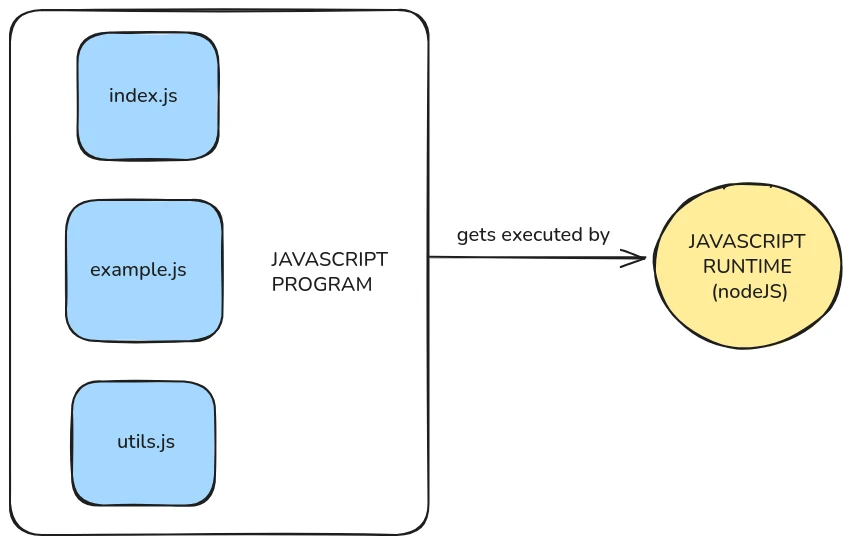
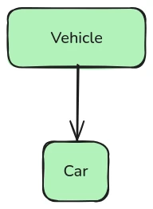
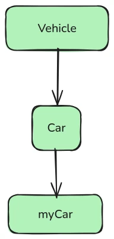
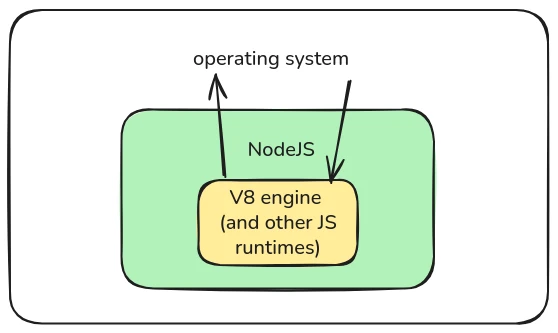

# Commencez votre parcours de développement


Bienvenue dans ce cours sur JavaScript et NodeJS.


JavaScript est le langage de programmation le plus populaire au monde : c'est le langage de script des navigateurs modernes, de sorte qu'il est pratiquement impossible de créer une application web moderne sans écrire *un peu* de JavaScript ; et avec le moteur d'exécution NodeJS, il peut également être utilisé en dehors des navigateurs, pour créer des scripts et des applications qui s'exécutent directement sur votre ordinateur.


Ce cours est conçu pour les personnes qui sont complètement novices en programmation, ou qui ont utilisé d'autres langages auparavant mais qui veulent comprendre comment fonctionne JavaScript, en particulier dans le contexte de NodeJS.


À la fin du cours, vous devriez être en mesure d'écrire vos propres programmes en JavaScript, d'utiliser la bibliothèque standard NodeJS et d'installer et d'utiliser des paquets tiers pour créer des outils utiles.


+++
# JavaScript de base

<partId>a617327c-e5a2-52ca-9380-c63f44623dd4</partId>


## Mise en place

<chapterId>ba05a290-1782-5268-87c9-62fd09590e05</chapterId>


Un programme JavaScript est simplement un ensemble de (un ou plusieurs) fichiers texte contenant des commandes à exécuter par un moteur d'exécution JavaScript.


Les noms de ces fichiers texte se terminent généralement par une extension de fichier `.js`, comme `mon_script.js`, `mon_programme.js`, etc.


Les commandes qu'ils contiennent sont écrites dans le langage de programmation JavaScript.


Un moteur d'exécution JavaScript est un programme spécial qui exécute ces fichiers.





### L'environnement d'exécution NodeJS


Le moteur d'exécution JavaScript le plus courant est NodeJS.


Votre IDE peut déjà l'inclure, ou vous devrez peut-être le télécharger depuis le [site officiel](https://nodejs.org/en/download).


La page de téléchargement vous fournira des instructions pour les trois principaux systèmes d'exploitation (OS) : Windows, Linux et MacOS. Elle suppose que vous sachiez comment ouvrir un terminal dans votre système d'exploitation.


Comme NodeJS est disponible pour les trois systèmes d'exploitation, les programmes que vous écrivez pourront être exécutés sur chacun d'entre eux (à l'exception de quelques cas particuliers).


Cela signifie que vous pouvez, par exemple, écrire un jeu vidéo simple en JavaScript sur votre PC Windows et le transmettre à votre ami pour qu'il l'exécute sur son Mac.


### Premier programme (hello world)


Traditionnellement, lorsqu'on étudie un langage de programmation, le premier programme que l'on écrit consiste à afficher "hello world !" sur la console.


Créez un répertoire appelé `my_js_code/`, avec à l'intérieur un fichier appelé `main.js` (ces noms sont arbitraires).


Ouvrez le répertoire avec votre éditeur de code.


Ecrivez ce code dans votre fichier :


```javascript
console.log("hello world!")
```


Ouvrez un terminal et exécutez cette commande pour lancer le programme :


```
node main.js
```


Le résultat devrait être


```
hello world!
```


### Ce qu'il s'est passé


En JavaScript, tout est un "objet".


`console` est un objet utilisé pour déboguer le programme.


`console.log` est la méthode la plus utilisée de la `console`. Elle affiche simplement les arguments que vous lui passez.


Vous passez des arguments à `console.log` en utilisant les parenthèses `()`.


Ainsi, par exemple, si vous voulez afficher le nombre `1000`, il vous suffit d'écrire :


```javascript
console.log(1000)
```


Exécutez-le ensuite en lançant


```
node main.js
```


dans votre terminal (à partir de maintenant, ce cours supposera que vous savez que c'est ainsi que vous exécutez un programme).


Cela devrait afficher 


```
1000
```


Vous pouvez passer plusieurs éléments en arguments, comme


```javascript
console.log(16, 8, 1993)
```


Ceci affichera


```
16 8 1993
```


## Variables et commentaires

<chapterId>23050ab7-343b-5edf-9d37-e4e782e27ce0</chapterId>


Les programmes exécutent généralement des opérations sur des données.


Les variables sont comme des boîtes nommées que nous utilisons pour stocker des données. Elles nous permettent d'associer un élément de données à un nom spécifique, de sorte que nous puissions le retrouver plus tard en utilisant ce nom.


### déclarations `let`


Pour déclarer une variable en JavaScript, on peut utiliser le mot-clé `let`.


Après avoir écrit `let`, nous écrivons le nom que nous voulons donner à la variable, puis un signe `=`, et enfin la valeur que nous voulons stocker.


Par exemple :


```javascript
let age = 25

console.log(age)
```


Le nom d'une variable (techniquement appelé "identifiant") peut généralement contenir des lettres, des tirets bas (`_`), le symbole dollar (`$`) et des chiffres, bien que le premier caractère ne puisse pas être un chiffre.


Dans le code ci-dessus, nous avons déclaré une variable appelée `age` et y avons stocké la valeur `25`.


Ensuite, nous avons affiché sa valeur en utilisant `console.log(age)`.


Si vous exécutez ce code avec `node main.js`, la sortie sera :


```
25
```


Les noms de variables sont sensibles à la casse, ce qui signifie que les minuscules et les majuscules sont considérés comme des caractères différents. Par exemple


```javascript
let age = 25

let Age = 20

console.log(age)
```


affichera 25, car il s'agit de deux variables complètement distinctes !


Vous pouvez également stocker des chaînes de caractères (texte) dans une variable :


```javascript
let message = "hello again"

console.log(message)
```


Ceci s'affichera :


```
hello again
```


Comme précédemment, nous avons utilisé `console.log()` pour afficher la valeur stockée dans la variable.


Maintenant, faisons les deux ensemble :


```javascript
let age = 25

let message = "hello again"

console.log(age)

console.log(message)
```


L'exécution de ce programme provoquera l'affichage de :


```
25
hello again
```

### Réaffectation


Les variables déclarées avec `let` peuvent être modifiées après leur création.


C'est ce qu'on appelle la réaffectation.


```javascript
let score = 10

console.log(score)

score = 15

console.log(score)
```


Tout d'abord, nous assignons `10` à `score`, puis nous l'affichons.


Ensuite, nous changeons la valeur de `score` en `15` et nous l'affichons à nouveau.


Le résultat sera le suivant :


```
10
15
```


C'est très utile lorsque la valeur change avec le temps, comme dans un jeu où le score augmente.


Ajoutons une autre variable au mélange :


```javascript
let score = 10
let player = "Alice"

console.log(score)
console.log(player)

score = 20
player = "Bob"

console.log(score)
console.log(player)
```


Ce message s'affichera :


```
10
Alice
20
Bob
```


Comme vous pouvez le voir, `score` et `player` ont été modifiés.


### déclarations `const`


La plupart du temps, nous ne voulons pas qu'une variable change après sa création. Pour cela, nous utilisons `const`.


`const` est l'abréviation de "constant". Une fois que vous avez assigné une valeur à une variable `const`, vous ne pouvez plus la modifier.


```javascript
const pi = 3.14
console.log(pi)
```


Cela affiche :


```
3.14
```


Mais si vous essayez de le faire :


```javascript
const pi = 3.14
console.log(pi)

pi = 99 // cette ligne provoquera une erreur
console.log(pi)
```


JavaScript vous renverra une erreur comme :


```
TypeError: Assignment to constant variable.
```


C'est parce que `pi` a été déclaré en utilisant `const`, et vous ne pouvez pas changer sa valeur après cela. Vous communiquez à l'interpréteur JavaScript que vous ne voulez pas que cette variable change.


C'est utile car cela réduit les risques de modification par erreur. Lorsque les programmes deviennent très volumineux, avec des milliers de lignes de code, il est impossible de suivre tout ce qu'il se passe en même temps (c'est la principale raison pour laquelle nous utilisons des ordinateurs, pour exécuter des processus complexes que nous ne pouvons pas calculer avec notre cerveau), il devient donc utile d'avoir des restrictions comme celle-ci, qui rendent le programme plus déterministe.


Il est considéré comme bonne pratique de toujours déclarer nos variables comme `const`, à moins que nous ne soyons sûrs de vouloir les modifier plus tard.


### Commentaires en JavaScript


Parfois, nous voulons écrire des notes dans notre code qui ne sont pas exécutées. C'est ce qu'on appelle des commentaires.


Les commentaires sont ignorés par le programme lorsqu'il s'exécute, mais ils sont utiles pour expliquer des choses à nous-mêmes ou à d'autres personnes.


Pour écrire un commentaire d'une seule ligne, utilisez `//`


```javascript
// Ceci est un commentaire
const x = 10 // Ceci est aussi un commentaire
console.log(x)
```


Cela affichera toujours :


```
10
```


Les commentaires sont simplement là pour que les humains puissent les lire.


Vous pouvez également écrire des commentaires sur plusieurs lignes en utilisant `/*` et `*/`


```javascript
/*
Ceci est un commentaire multiligne.
Il peut s'étendre sur plusieurs lignes.
*/
const y = 20
console.log(y)
```


Ceci affichera


```
20
```


Et le commentaire sera ignoré.


Vous pouvez utiliser les commentaires pour ajouter de petites annotations à votre code, afin de vous rappeler ce qu'il fait et pourquoi il est écrit d'une certaine manière. Cela peut également aider les autres programmeurs à le comprendre.


## Types de base : nombres, chaînes de caractères, booléens

<chapterId>cfdb04f6-21a8-5143-bbf9-7aaae04962f0</chapterId>


En JavaScript, un "type" indique le type de données d'une valeur.


Javascript a quelques types de base, et dans cette section nous allons explorer certains d'entre eux.


### Nombres et opérations arithmétiques


Le premier type que nous allons introduire est `number`.


Les nombres en JavaScript peuvent être des entiers (comme `5`) ou des décimaux (comme `3.14`).


Ils permettent de faire de l'arithmétique : addition, soustraction, multiplication et division.


Voici un exemple basique :


```javascript
const a = 10
const b = 5

const sum = a + b
const difference = a - b
const product = a * b
const quotient = a / b

console.log(sum)
console.log(difference)
console.log(product)
console.log(quotient)
```


Cela affichera :


```
15
5
50
2
```


Vous pouvez également utiliser des parenthèses `()` pour contrôler l'ordre des opérations :


```javascript
const result = (2 + 3) * 4
console.log(result)
```


Cela affiche :


```
20
```


Sans les parenthèses, ce serait `2 + 3 * 4`, c'est-à-dire :


```javascript
const result = 2 + 3 * 4
console.log(result)
```


Cela afficherait :


```
14
```


Parce qu'en mathématiques classiques, la multiplication se fait avant l'addition.


### Chaînes de caractères et interpolation


Le deuxième type JavaScript que nous allons introduire est `string`.


Les chaînes de caractères sont des morceaux de texte. Vous pouvez utiliser des guillemets simples `'...'` ou des guillemets doubles `"..."` pour les créer.


```javascript
const greeting = "hello"
const name = 'Bob'
console.log(greeting)
console.log(name)
```


Ceci affiche :


```
hello
Bob
```


Pour combiner des chaînes de caractères, vous pouvez utiliser l'opérateur `+` :


```javascript
const greeting = "hello"
const space = " "
const name = "Bob"

const fullGreeting = greeting + space + name
console.log(fullGreeting)
```


Ceci affichera :


```
hello Bob
```


Mais il existe une façon plus agréable de combiner des chaînes de caractères appelée **interpolation de chaînes**. Vous utilisez des accent graves pour déclarer la chaîne `` `...` `` et vous écrivez des variables en utilisant `${...}` à l'intérieur de la chaîne :


```javascript
const greeting = "hello"
const name = "Bob"

const fullGreeting = `${greeting} ${name}`
console.log(fullGreeting)
```


Ceci affiche également :


```
hello Bob
```


Vous pouvez inclure n'importe quelle expression à l'intérieur de `${...}` :


```javascript
const age = 30
console.log(`Next year, I will be ${age + 1} years old.`)
```


Ceci affiche :


```
Next year, I will be 31 years old.
```


L'interpolation est très courante dans le JavaScript moderne.


### Booléens, comparaisons et opérations logiques


Le troisième type que nous allons introduire est le type `boolean`. Il est nommé d'après le mathématicien George Boole, qui a inventé la logique booléenne.


Les booléens sont simples : seulement deux valeurs possibles, `vrai` et `faux`.


Vous pouvez les stocker dans des variables :


```javascript
const theSkyIsBlue = true
const thisCourseIsBad = false

console.log(theSkyIsBlue)
console.log(thisCourseIsBad)
```


Cela affiche :


```
true
false
```


Vous pouvez combiner des booléens à l'aide d'opérateurs logiques :


- `&&` signifie "et", et il retournera `vrai` seulement si **les deux** valeurs sont `vrai`, sinon il retournera `faux`
- `||` signifie "ou", et il retournera `vrai` si **au moins une** des valeurs est `vrai`, sinon (si elles sont toutes les deux fausses) il retournera `faux`
- `!` signifie "not", il est appliqué devant un booléen, et il l'inverse : si le booléen est `true`, il retournera `false`, et vice versa.


Exemples :


```javascript
const isSunny = true
const isWarm = true

console.log(isSunny && isWarm)  // true
console.log(isSunny || isWarm)  // true
console.log(!isSunny)           // false
```


Vous pouvez comparer des valeurs en JavaScript à l'aide d'opérateurs tels que `>`, `<`, `===` et `!==`. Le résultat de ces comparaisons est toujours un booléen.


```javascript
const first = 10
const second = 5

const firstIsGreater   = (a > b)
const secondIsGreater  = (a < b)
const theyAreEqual     = (a === b)
const theyAreDifferent = (a !== b)

console.log(firstIsGreater)   // true
console.log(secondIsGreater)   // false
console.log(theyAreEqual)  // false
console.log(theyAreDifferent)  // true
```


Javascript dispose également de `>=` pour signifier "plus grand ou égal" et de `<=` pour signifier "plus petit ou égal".


Les booléens, les opérateurs de comparaison et les opérateurs logiques sont souvent combinés dans les programmes pour déclarer des conditions complexes, par exemple pour s'assurer que "le courrier électronique est arrivé ET qu'il contient l'image dont j'ai besoin OU que la longueur du courrier électronique est supérieure à 10000 caractères". Vous verrez plus loin qu'il s'agit d'éléments essentiels pour construire la logique du programme.


## Tableaux, null, undefined

<chapterId>7bf18183-5eae-53ed-83d2-b04982145d81</chapterId>


Dans cette section, nous aborderons trois autres types très courants dans les programmes JavaScript :


- **Tableaux** : séquences de valeurs
- **undefined** : une valeur spéciale qui signifie "rien n'a été attribué"
- **null** : une autre valeur spéciale qui signifie "intentionnellement vide"


### Tableaux et accès aux index


Un **tableau** est un type qui peut contenir plusieurs valeurs dans une liste.


Vous créez un tableau en utilisant des crochets `[]` et en séparant les éléments par des virgules.


Voici un exemple basique :


```javascript
const numbers = [10, 2, 88]
console.log(numbers)
```


Cela affiche :


```
[ 10, 2, 88 ]
```


Vous pouvez stocker n'importe quoi dans un tableau, et pas seulement des nombres :


```javascript
const things = ["apple", 42, true]
console.log(things)
```


Cela affiche :


```
[ 'apple', 42, true ]
```


Pour accéder à un élément spécifique du tableau, nous utilisons un **index**. L'index est la position de l'élément, à partir de **0**.


Ainsi, dans ce tableau :


```javascript
const colors = ["red", "green", "blue"]
```


- `colors[0]` is `"red"`
- `colors[1]` is ``Green"`
- `colors[2]` est `"blue"`


Essayons :


```javascript
const colors = ["red", "green", "blue"]
console.log(colors[0])
console.log(colors[1])
console.log(colors[2])
```


Cela affichera :


```
red
green
blue
```


Vous pouvez assigner une valeur à un index spécifique d'un tableau


```javascript
const colors = ["red", "green", "blue"]

colors[1] = "yellow"

console.log(colors)
```


Ce message s'affichera :


```
[ 'red', 'yellow', 'blue' ]
```


Vous pouvez utiliser n'importe quel nombre naturel comme index, même s'il est stocké dans une variable


```javascript

const i = 1
const colors = ["red", "green", "blue"]
console.log(colors[i])
```


Ceci affichera :


```
green
```


Mais si vous essayez d'accéder à un index qui n'existe pas, vous obtiendrez `undefined` :


```javascript
const colors = ["red", "green", "blue"]
console.log(colors[3])
```


Ce message s'affiche :


```
undefined
```


Qu'est-ce que c'est ?


### `undefined`


La valeur spéciale `undefined` signifie qu'aucune valeur n'a été attribuée.


Si vous créez une variable mais que vous ne lui donnez pas de valeur, elle sera `indéfinie` :


```javascript
const name
console.log(name)
```


Ceci s'affiche :


```
undefined
```


Comme nous n'avons rien attribué à `name`, JavaScript lui attribue par défaut la valeur `undefined`.


Comme nous l'avons vu précédemment, vous pouvez également obtenir `undefined` lorsque vous accédez à un index de tableau qui n'existe pas :


```javascript
const fruits = ["banana", "apple"]
console.log(fruits[2]) // There is no index 2
```


Ceci s'affiche :


```
undefined
```


### `null` et comment le traiter


`null` est également une valeur spéciale. Elle signifie "il n'y a rien ici, et je l'ai fait exprès"


Contrairement à `undefined`, qui est automatique, `null` est quelque chose que vous définissez vous-même.


Par exemple :


```javascript
const currentUser = null
console.log(currentUser)
```


Affiche :


```
null
```


Pourquoi utiliser `null` ? Peut-être attendez-vous une valeur plus tard, mais elle n'est pas encore prête :


```javascript
let winner = null

// Later in the program:
winner = "Alice"

console.log(winner)
```


Ceci s'affiche :


```
Alice
```


Ainsi, `null` est utile lorsque vous voulez dire, par exemple, "Il devrait y avoir quelque chose ici plus tard, mais pour l'instant c'est vide"


## Blocs et flux de contrôle

<chapterId>be985168-2636-5b0d-a48f-ac1bbfbff8a7</chapterId>


Jusqu'à présent, nous avons surtout écrit des lignes de code qui s'exécutent l'une après l'autre.


Mais lorsque nous codons, nous pouvons contrôler l'ordre d'exécution.


C'est ce qu'on appelle le **flux de contrôle**.


Commençons par comprendre ce que sont les blocs et la portée.


### Le portée globale


Chaque variable que nous déclarons existe dans un **scope**, ou **portée**, c'est-à-dire la région du code où la variable est connue. 


Si vous déclarez une variable en dehors de tout bloc, elle existe dans le **scope globale**.


```javascript
const color = "blue"
console.log(color)
```


Cette variable `color` est dans la portée globale, elle est donc accessible depuis n'importe quel endroit du fichier.


Si vous ajoutez des lignes supplémentaires :


```javascript
const color = "blue"
console.log(color)

const size = "large"
console.log(color)
console.log(size)
```


Alors les variables `color` et `size` sont des variables globales. Elles sont disponibles partout dans le fichier.


Mais que se passe-t-il à l'intérieur d'un bloc ?


### Blocs et portée locale


Un **bloc** est un morceau de code entouré d'accolades `{}`.


Les variables déclarées avec `let` ou `const` à l'intérieur d'un bloc existent **uniquement** à l'intérieur de ce bloc.


```javascript
{
const message = "inside block"
console.log(message)
}
```


Ceci affiche :


```
inside block
```


Mais si vous essayez ceci :


```javascript
{
const message = "inside block"
}
console.log(message) // Error!
```


JavaScript vous donnera une erreur comme :


```
ReferenceError: message is not defined
```


C'est parce que `message` a été déclaré à l'intérieur du bloc et n'existe pas en dehors.


Cela signifie que nous pouvons utiliser des blocs pour isoler des parties de notre code et être sûrs que "ce qui se passe dans le bloc reste dans le bloc" (un peu comme à Las Vegas).


L'organisation de notre code en blocs nous permet également de structurer l'exécution du programme, avec des constructions de flux de contrôle comme `if`


### `if`, `else`


Parfois, nous voulons exécuter le code **uniquement si** quelque chose est vrai. C'est à cela que sert l'instruction `if`.


```javascript
const myAge = 20

console.log("Am I an adult?")

if (myAge >= 18) {
console.log("Yes I am!")
}
```


Cela affiche :


```
Am I an adult?
Yes I am!
```


Comme vous pouvez le voir, le code compare `myAge` et `18`.

Dans ce cas, l'opérateur `>=` renvoie `vrai`, donc le bloc est exécuté.

Si la condition n'est pas `vraie`, le bloc n'est pas exécuté.


```javascript
const myAge = 17

console.log("Am I an adult?")

if (myAge >= 18) {
console.log("Yes I am!")
}
```


Cela affiche :


```
Am I an adult?
```


Vous pouvez ajouter un bloc `else` pour gérer le cas contraire :


```javascript
const myAge = 17

console.log("Am I an adult?")

if (myAge >= 18) {
console.log("Yes I am!")
} else {
console.log("No, I am not.")
}
```


Cela affiche :


```
Am I an adult?
No, I am not.
```


Les blocs `if` et `else` sont toujours des blocs - les variables déclarées à l'intérieur n'existent donc pas à l'extérieur.


Si nous voulons être sûrs que quelque chose n'est **pas** vrai, que pouvons-nous faire ?


Comme nous l'avons vu précédemment, JavaScript dispose d'un opérateur "not", qui inverse les booléens. Nous pouvons donc faire


```javascript
const myAge = 17

const adult = myAge >= 18

console.log("Am I an adult?")

if (!adult) {
console.log("No, I am not.")
}
```

Cela affiche toujours :


```
Am I an adult?
No, I am not.
```

Parce que nous avons utilisé l'opérateur `!` pour inverser la variable `adult`.


`if (!adult) {...}` doit être lu comme "if not adult..."


En utilisant des blocs, des opérateurs logiques et des opérateurs de comparaison, nous pouvons structurer l'exécution du programme en définissant des variables qui doivent être "vraies" (ou "fausses") pour que quelque chose se produise.


### `while`, `break`, `continue`


Une boucle `while` répète le code *tant* qu'une condition est vraie.


```javascript
let count = 0

while (count < 3) {
console.log("Count is", count)
count = count + 1
}
console.log("the loop is over!")
```


Ceci affiche :


```
Count is 0
Count is 1
Count is 2
the loop is over!
```


Lorsque `count` devient égal à 3, la boucle s'arrête.


Vous pouvez arrêter une boucle plus tôt en utilisant `break` :


```javascript
let number = 1 // On commence avec number égale à 1

while (true) { // Cette condition est toujour vraie, donc cette boucle tourne indéfiniment, sauf si nous la stoppons
console.log(number) // Affiche la valeur actuelle de la variable number
if (number === 3) { // Si la variable vaut 3, termine la boucle avec le mot clé break
break
}
number = number + 1 // Ajoute 1 à la variable number
}
```


Ceci affiche :


```
0
1
2
```


En effet, lorsque la variable `number` devient égale à `3`, le bloc `if` est exécuté et la boucle s'arrête.


Vous pouvez sauter le reste d'une boucle en utilisant `continue` :


```javascript
let number = 0 // On commence avec number égale à 0

while (number < 5) { // On continue tant que number est inférieur à 5
number = number + 1 // Ajoute 1 à la variable number

if (number === 3) { // Si la variable number vaut 3
continue // Ignore le reste du bloc et retourne au début du while pour la prochaine itération
}

console.log(number) // Affiche la variable number
}
```


Ceci affiche :


```
1
2
4
5
```


Parce que lorsque `number` valait `3`, l'instruction `continue` a eu pour effet d'ignorer tout le reste du bloc, y compris la ligne qui affiche cette variable, et de recommencer une nouvelle itération.


### `for ... of ...`


Si vous avez un tableau et que vous voulez faire quelque chose à chacun de ses éléments, vous pouvez utiliser `for ... of ... {...}`.


```javascript
const fruits = ["apple", "banana", "cherry"]

for (const fruit of fruits) {
console.log(fruit)
}
```


Ceci affiche :


```
apple
banana
cherry
```

Le bloc sera exécuté une fois pour chaque élément du tableau.


`fruit` est une nouvelle variable qui prend la valeur de chaque élément du tableau, pour opérer sur lui à l'intérieur du bloc.


### `for ... in ...`


Vous pouvez utiliser `for ... in` pour itérer sur les clés (index) d'un tableau :


```javascript
const fruits = ["apple", "banana", "cherry"]

for (const index in fruits) {
console.log(index)
}
```


Ceci affiche :


```
0
1
2
```


Vous pouvez également utiliser l'index pour obtenir la valeur :


```javascript
const fruits = ["apple", "banana", "cherry"]

for (const index in fruits) {
console.log(fruits[index])
}
```


L'affichage est le même que celui de `for ... of` :


```
apple
banana
cherry
```


En pratique, pour les tableaux, vous devriez préférer utiliser `for ... of`, car c'est plus simple et plus propre.


### Boucles délimitées


Parfois, nous voulons itérer un nombre spécifique de fois, ou en général écrire un morceau de code qui répète un bloc tout en gardant la trace de quelque chose.

C'est à cela que sert une boucle "for" délimitée.

Une boucle délimitée prend généralement trois conditions, séparées par un point-virgule `;`, comme dans `(... ; ... ; ....)`.


```javascript
for (let i = 0; i < 3; i = i + 1) {
console.log(i)
}
```


Ceci affiche :


```
0
1
2
```


Expliquons-le :


- `let i = 0` : déclare une variable à utiliser dans le bloc (dans ce cas, il s'agit d'un compteur qui commence à 0)
- `i < 3` : déclare une condition qui doit être `vraie` pour que le bloc soit exécuté (dans ce cas, il s'agit de "répéter tant que `i` est inférieur à 3")
- `i = i + 1` : déclarer un code à exécuter après chaque exécution du bloc (dans ce cas "augmenter `i` de 1")


Comme vous pouvez le constater, la boucle délimitée permet de déclarer des conditions plus complexes pour l'exécution répétée d'un morceau de code, mais la plupart du temps, ce n'est pas nécessaire.


### Étiquettes de blocs


Si vous devez écrire un flux de contrôle plus complexe, JavaScript vous permet de nommer un bloc à l'aide d'un **label** qui peut être utilisé par `break` ou `continue` pour spécifier *où* revenir.


Exemple :


```javascript
outer: {
console.log("We're inside the outer scope.")

inner: {
console.log("We're inside the inner scope.")
break outer
}

console.log("This will not run")
}

console.log("Done")
```


Ceci affiche :


```
Inside outer block
Inside inner block
Done
```


Nous avons utilisé `break outer` pour sortir complètement du bloc `outer`.


Vous pouvez également étiqueter les boucles. Prenons cet exemple :


```javascript
// Déclare une variable pour compter le nombre total de jour dans une année
let totalDaysInOneYear = 0

// Déclare une variable pour chaque mois, valant le numéro du mois
const january = 1
const february = 2
const march = 3
const april = 4
const may = 5
const june = 6
const july = 7
const august = 8
const september = 9
const october = 10
const november = 11
const december = 12

// Déclare un tableau qui contient les mois ayant 30 jours
const monthsWith30Days = [
april, june, september, november
]

// Déclare des variables pour connaitre le jour et le mois actuels
let currentMonth = january
let currentDay = 1

monthsLoop: while (true) {  // Commence une boucle labellisée "monthsLoop" pour traiter chaque mois

daysLoop: while (true) {  // Commence une boucle labellisée "daysLoop" pour traiter chaque jour du mois
totalDaysInOneYear = totalDaysInOneYear + 1  // Augmente le nombre total de jours par 1

if (                                                                   // Nous voulons vérifier que nous sommes à la fin du mois.
currentDay === 31                                                  // Vérifie si le jour courant est le 31 (pour les mois de 31 jours)...
|| currentDay === 30 && (monthsWith30Days.includes(currentMonth))  // ...ou 30 s'il fait parti des mois à 30 jours...
|| currentDay === 28 && (currentMonth === february)                // ...ou 28 si c'est le mois de Février. S'il est l'un d'eux, alors :

){
currentMonth = currentMonth + 1  // On passe au mois suivant
currentDay = 1                   // Réinitialise le jour courant à 1 pour le nouveau mois
break daysLoop                   // Quite la boucle interne (laquel traite des jours) et retourne dans la boucle externe (qui traite les mois)
}
else { currentDay = currentDay + 1 }                                   // Sinon, nous ne sommes pas à la fin du mois, et nous continuons vers le prochain jour

}
if (currentMonth > 12) {  // Après avoir traité un mois, on vérifie si on est passé le mois de Décembre
break monthsLoop  // Si c'est le cas, on quitte la boucle externe et on arrête de compter les jours.
}
}

console.log(totalDaysInOneYear)  // Affiche le nombre totale de jour dans l'année (devrait être 365)
```

Cet exemple était très ennuyeux, mais j'espère qu'il a permis de clarifier le besoin (occasionnel) d'étiquettes.


## Présentation des fonctions

<chapterId>cc324715-09c2-5cf7-9e6f-47a6f16bc04d</chapterId>


Au fur et à mesure que vos programmes se développent, vous voudrez souvent **réutiliser** des morceaux de code.


C'est à cela que servent les **fonctions** : elles vous permettent de regrouper du code, de lui donner un nom et de l'exécuter quand vous le souhaitez.


### Déclaration de fonction


Pour déclarer une fonction, nous pouvons utiliser le mot-clé `function`. Ensuite, nous lui donnons un nom, une paire de parenthèses `()` avec les arguments qu'elle prend, et un bloc de code `{}` à exécuter. Commençons par une fonction qui ne prend aucun argument :


```javascript
function sayHello () {console.log(`Hello!`) }
```


Ce code **déclare** la fonction, mais ne l'exécute pas encore.


### Appels de fonction


Pour exécuter (ou "appeler") la fonction, vous écrivez son nom suivi de parenthèses :


```javascript
function sayHello () {console.log(`Hello!`) }
sayHello()
```


Ceci affiche :


```
Hello!
```


Vous pouvez appeler la fonction autant de fois que vous le souhaitez :


```javascript
function sayHello() {
console.log("Hello!")
}

sayHello()
sayHello()
```


Ceci affiche :


```
Hello!
Hello!
```


Le code contenu dans la fonction ne s'exécute que lorsque vous l'appelez.


### Arguments de fonction (entrée des fonctions)


Parfois, vous souhaitez qu'une fonction prenne des arguments en entrée. Vous pouvez le faire en ajoutant des **arguments** à l'intérieur des parenthèses.


Par exemple :


```javascript
function sayHelloTo (friend) {
console.log(`Hello ${friend}!`)
}
```


Cette fonction prend **un seul argument** appelé `friend`.


Lorsque vous appelez la fonction, vous pouvez lui transmettre une valeur :


```javascript
sayHelloTo("Tommy")
```


Ceci affiche :


```
Hello Tommy!
```


Vous pouvez appeler la fonction à nouveau avec un nom différent :


```javascript
sayHelloTo("Sam")
```


Ceci affiche :


```
Hello Sam!
```


La valeur que vous transmettez remplace la variable `friend` à l'intérieur de la fonction.


Vous pouvez également utiliser plus d'un argument :


```javascript
function greetTwoPeople(person1, person2) {
console.log(`Hello ${person1} and ${person2}!`)
}

greetTwoPeople("Lina", "Marco")
```


Ceci affiche :


```
Hello Lina and Marco!
```


### `return` (sortie des fonctions)


Les fonctions peuvent également **retourner** des valeurs. Cela signifie qu'elles renvoient une valeur à l'endroit où la fonction a été appelée.


Voici un exemple simple :


```javascript
function getNumber() {
return 42
}

const result = getNumber()
console.log(result)
```


Ceci affiche :


```
42
```


La fonction `getNumber()` renvoie `42`, et nous le stockons dans `result`, puis nous l'affichons.


Vous pouvez également renvoyer quelque chose que vous avez calculé :


```javascript
function add(a, b) {
return a + b
}

const result = add(2, 3)
console.log(result)
```


Ceci affiche :


```
5
```


Une fois qu'une valeur est retournée, la fonction s'arrête. Tout ce qui suit `return` dans ce bloc ne se produit pas.


```javascript
function saySomething() {

return "hi"

console.log("this never runs")

}

const message = saySomething()
console.log(message)
```


Uniquement ceci s'affiche :


```
hi
```


car seul `"hi"` est renvoyé. La ligne `console.log("this never runs")` est ignorée.


Vous pouvez considérer les fonctions comme de petits sous-programmes. Chaque fonction peut recevoir des données d'entrée, les traiter et renvoyer des données de sortie.


Que se passe-t-il si nous essayons d'utiliser la valeur de retour d'une fonction, alors que cette fonction n'a rien retourné ?


```javascript
function doesNothing () {}

const x = doesNothing()

console.log(x)
```

Cela imprimera `undefined`. La valeur de retour d'une fonction qui n'a rien retourné est `undefined`.


## Objets et classes

<chapterId>26689f25-8212-5057-8c21-3a05eee0ac75</chapterId>


JavaScript est souvent considéré comme un langage orienté objet.


Cela signifie qu'il vous aide à organiser votre code en regroupant les valeurs et les fonctions en **objets**.


### Qu'est-ce qu'un `objet` ?


Un objet peut contenir des données et des fonctions qui opèrent sur ces données. Lorsqu'une fonction est placée dans un objet, on dit qu'il s'agit d'une "méthode".


Le premier objet que nous avons vu est l'objet `console`. C'est un objet qui contient plusieurs méthodes pour imprimer des choses sur l'écran et déboguer nos programmes.


Il peut même s'imprimer lui-même ; vous pouvez faire


```javascript
console.log(console)
```


et il affichera la liste des méthodes qu'il contient. Par exemple, sur ma machine, il a imprimé


```javascript
Object [console] {
log: [Function: log],
warn: [Function: warn],
error: [Function: error],
dir: [Function: dir],
time: [Function: time],
timeEnd: [Function: timeEnd],
timeLog: [Function: timeLog],
trace: [Function: trace],
assert: [Function: assert],
clear: [Function: clear],
count: [Function: count],
countReset: [Function: countReset],
group: [Function: group],
groupEnd: [Function: groupEnd],
table: [Function: table],
debug: [Function: debug],
info: [Function: info],
dirxml: [Function: dirxml],
groupCollapsed: [Function: groupCollapsed],
Console: [Function: Console],
profile: [Function: profile],
profileEnd: [Function: profileEnd],
timeStamp: [Function: timeStamp],
context: [Function: context],
createTask: [Function: createTask]
}
```


Comme vous pouvez le voir, il possède de nombreuses méthodes que vous pouvez utiliser pour déboguer !


Javascript nous offre différents moyens de créer de nouveaux objets qui peuvent faire ce que nous voulons qu'ils fassent.


### Création d'un objet


La façon la plus simple de créer un objet est de regrouper des données et des fonctions à l'aide d'accolades **curly braces** `{}`.


Cela crée ce que nous appelons un **objet anonyme**


```javascript
const cat = {
name: "Whiskers",
age: 3
}
```


Cela crée un objet et le stocke dans une variable appelée `cat`.


L'objet possède deux **propriétés** :


- `name` avec la valeur `"Whiskers"`
- `age` avec la valeur `3`


Affichons-le :


```javascript
console.log(cat)
```


Ceci affiche :


```
{ name: 'Whiskers', age: 3 }
```


Vous pouvez accéder aux propriétés de l'objet en utilisant un point, comme dans `objectName.propertyName` :


```javascript
console.log(cat.name)  // affiche "Whiskers"
console.log(cat.age)   // affiche 3
```


Vous pouvez également **modifier** une propriété :


```javascript
cat.age = 4
console.log(cat.age)  // now it prints 4
```


Comme vous pouvez le constater, même si un objet est défini comme `const`, vous pouvez toujours modifier les données qu'il contient.


Dans le cas des objets, `const` vous empêchera seulement de surcharger l'objet entier :


```javascript
const cat = {
name: "Whiskers",
age: 3
}

cat.age = 5 // Ceci fonctionne

cat = 5 // Ceci renvoie une erreur, nous essayons de modifier l'objet entièrement

```


Comme indiqué précédemment, les objets peuvent également contenir des **fonctions**, et lorsqu'une fonction fait partie d'un objet, nous l'appelons **méthode**.


Voici un exemple :


```javascript
const cat = {
name: "Whiskers",
speak () {
console.log("Meow!")
}
}
```


Cet objet a :


- Une propriété `name` (nom)
- Une méthode `speak()


Appelons la méthode :


```javascript
cat.speak()
```


Elle affiche :


```
Meow!
```


Les méthodes peuvent utiliser les données que l'objet contient grâce au mot-clé `this`.

`this` fait référence à l'objet courant. Dans cet exemple, il sera utilisé pour imprimer le nom du chat :


```javascript
const cat = {
name: "Whiskers",
speak () {
console.log(`${this.name} says meow!`)
}
}

cat.speak()
```


Ceci affiche :


```
Whiskers says meow!
```


Le mot "this" signifie "cet objet"... dans ce cas, l'objet "chat".


Ces types d'objets sont parfaits lorsque vous voulez quelque chose de simple et rapide. Mais si vous avez besoin de créer **plusieurs objets** avec la même structure, il y a une meilleure façon de procéder, et c'est là que les **classes** entrent en jeu.


### Classes et constructeurs


Une **classe** est comme un plan de construction d'un batiment. Elle indique à JavaScript comment créer un certain type d'objet.


Vous définissez une classe en utilisant le mot-clé `class`, suivi du nom de la classe et d'un bloc d'accolades `{}`.


```javascript
class Dog {}
```


Par convention, les noms des classes commencent par une lettre majuscule.


Vous pouvez créer un nouvel objet, c'est à dire une instance d'une classe, en utilisant `new` :


```javascript
const hachiko = new Dog()
```


Essayez d'afficher l'objet :

```javascript
class Dog {}

const myDog = new Dog()

console.log(myDog)
```


Vous obtiendrez


```
Dog {}
```


Comme vous pouvez le voir, la classe Dog est vide, donc l'objet `myDog` est vide aussi.


Nous pouvons définir les propriétés que les objets Dog doivent contenir en ajoutant un `constructeur`.


Un constructeur est une fonction spéciale qui s'exécute lorsque vous créez (ou "construisez") un nouvel objet.


```javascript
class Dog {
constructor() { }
}
```


Nous voulons que chaque chien ait un nom, nous ajoutons donc un paramètre `name` à la fonction :


```javascript
class Dog {
constructor(name) { }
}
```


Ensuite, nous utilisons `this` pour indiquer que `name` est le `nom` de l'objet `Dog` que nous construisons


```javascript
class Dog {
constructor(name) {
this.name = name
}}
```


Essayons de l'utiliser maintenant :


```javascript
class Dog {
constructor(name) {
this.name = name
}
}

const myDog = new Dog("hachiko")

console.log(myDog)
```


Cela donne quelque chose comme :


```
Dog { name: 'hachiko' }
```


Comme vous pouvez le voir, la méthode `constructor` prend les arguments que vous passez à la classe quand vous faites `new Dog()`, et elle les utilise pour construire l'objet.


Voyons cela en détail :


- `class Dog` définit la classe Dog.
- `constructor(name)` met en place l'objet lors de sa création.
- `this.name = name` stocke la valeur dans le nouvel objet.
- `new Dog("hachiko")` crée un nouvel objet de la classe, avec la propriété `name` fixée à `"hachiko"`.


Ajoutons maintenant une méthode à notre classe :


```javascript
class Dog {
constructor(name) {
this.name = name
}
speak () {
console.log(`${this.name} says barf!`)
}

}

const myDog = new Dog("hachiko")

myDog.speak()
```


Ceci affichera


```javascript
hachiko says barf!
```


Si nous procédons de la même manière pour deux instances différentes de Dog


```javascript
class Dog {
constructor(name) {
this.name = name
}
speak () {
console.log(`${this.name} says barf!`)
}

}

const myDog = new Dog("hachiko")

myDog.speak()

const yourDog = new Dog("bobby")

yourDog.speak()
```


nous obtenons


```
hachiko says barf!
bobby says barf!
```


la méthode `speak()` utilise la propriété `name` du `Dog` sur lequel elle est appelée.


C'est la principale raison d'être des classes : elles nous permettent de définir un ensemble de méthodes qui opèrent sur les données, puis de créer de multiples objets qui partagent la même "forme" de données.


Lorsque nous appelons une méthode sur l'un de ces objets, elle opère sur les données détenues par *cet objet spécifique*.


### Modifier la forme d'un objet


Les objets en JavaScript sont assez flexibles. Même après en avoir créé un, vous pouvez encore ajouter de nouvelles propriétés ou en supprimer.


C'est autorisée, mais à utiliser avec précaution.


Commençons par notre classe simple `Dog` :


```javascript
class Dog {
constructor(name) {
this.name = name
}

speak() {
console.log(`${this.name} says barf!`)
}
}

const myDog = new Dog("Fido")
```


A ce stade, `myDog` n'a qu'une seule propriété : `name`. Nous pouvons encore ajouter de nouvelles propriétés après sa création :


```javascript
myDog.age = 5

console.log(myDog.age) // prints 5
```


Nous pouvons également ajouter une nouvelle méthode :


```javascript
myDog.jump = function () {
console.log(`${this.name} jumps!`)
}

myDog.jump() // Fido jumps!
```


Nous pouvons également supprimer des propriétés en utilisant le mot-clé `delete`.


```javascript
delete myDog.name

console.log(myDog.name) // affiche 'undefined'
```


Cela fonctionne, mais il y a quelque chose d'important à savoir : Les moteurs JavaScript comme le V8 (utilisé dans Node.js et dans le navigateur Chrome) fonctionnent plus rapidement lorsque vos objets conservent toujours les mêmes propriétés. Si vous ajoutez ou supprimez des propriétés après la création de l'objet, cela peut ralentir l'exécution du programme.


Dans les petits programmes, cela n'a pas beaucoup d'importance. Mais dans les projets plus importants (comme les jeux), il est préférable de lister toutes les propriétés dans le constructeur dès le départ, même si vous ne les utilisez pas tout de suite. Cela permet de maintenir la forme de l'objet stable et d'accélérer l'exécution du code.


Par exemple, à la place de ceci :


```javascript
class Dog {
constructor(name) {
this.name = name
}
}

const dog = new Dog("Rex")
dog.age = 4
dog.breed = "Labrador"
```


Vous pouvez faire :


```javascript
class Dog {
constructor(name, age, breed) {
this.name = name
this.age = age
this.breed = breed
}
}

const dog = new Dog("Rex", 4, "Labrador")
```


Les deux versions fonctionnent, mais la seconde est plus performante. Vous indiquez d'emblée au moteur les propriétés de chaque objet, ce qui lui permet d'optimiser en conséquence.


JavaScript vous permet de remodeler les objets librement, mais lorsque vous utilisez des classes, il est préférable de planifier la forme de votre objet à l'avance.


### Héritage avec `extends` et `super()`


Il arrive que l'on veuille créer une classe qui soit *presque* la même qu'une autre classe, mais avec quelques caractéristiques supplémentaires.


Au lieu de modifier la forme des objets (ce qui, comme indiqué précédemment, n'est pas optimal pour les performances), ou de réécrire une nouvelle classe à partir de zéro, JavaScript vous permet d'utiliser quelque chose appelé **héritage**.


L'héritage signifie qu'une classe peut en **étendre** une autre. La nouvelle classe bénéficie de toutes les propriétés et méthodes de l'ancienne, et vous pouvez ajouter ou modifier ce dont vous avez besoin.


Supposons que nous ayons une classe de base appelée `Véhicule` :


```javascript
class Vehicle {
constructor(brand) {
this.brand = brand
}

start() {
console.log(`${this.brand} vehicle is starting...`)
}
}
```


Maintenant, nous voulons créer une classe `Car`. Une voiture est une sorte de véhicule, mais nous pourrions vouloir qu'elle ait des caractéristiques supplémentaires ou un message différent lorsqu'elle démarre. Au lieu de tout réécrire, nous pouvons utiliser `extends` :


```javascript
class Car extends Vehicle {
start() {
console.log(`${this.brand} car is ready to drive!`)
}
}
```


La classe `Car` **hérite** maintenant de la classe `Vehicle`. Elle obtient la propriété `brand`, et nous avons remplacé la méthode `start()` par notre propre version.





Essayons-la :


```javascript
const myCar = new Car("Toyota")
myCar.start()
```


Ceci affiche :


```
Toyota car is ready to drive!
```


Même si `Car` n'a pas son propre constructeur, il utilise toujours celui de `Vehicle`. Mais si nous voulons écrire un constructeur personnalisé dans `Voiture`, nous pouvons le faire, nous devons juste inclure un appel au constructeur de son parent en utilisant `super()`.


Voici comment :


```javascript
class Vehicle {
constructor(brand) {
this.brand = brand
}

start() {
console.log(`${this.brand} vehicle is starting...`)
}

}

class Car extends Vehicle {
constructor(brand, model) {
super(brand) // call the parent constructor and passes the brand argument to it
this.model = model
}

start() {
console.log(`${this.brand} ${this.model} is ready to drive!`)
}
}

const myCar = new Car("Toyota", "Corolla")
myCar.start()
```





Ceci affiche :


```
Toyota Corolla is ready to drive!
```


En résumé


- `extends` signifie qu'une classe est basée sur une autre.
- `super()` est utilisé pour appeler le constructeur de la classe que vous étendez.
- La nouvelle classe bénéficie de toutes les propriétés et méthodes de la classe d'origine.
- Vous pouvez **override** (écraser) les méthodes (comme `start()`) pour leur faire faire quelque chose de différent.


Cette fonction est utile lorsque vous avez plusieurs objets similaires (comme des voitures, des camions et des vélos) et que vous souhaitez qu'ils partagent le même code tout en continuant à se comporter de manière distincte.


### `instanceof`


Le mot-clé `instanceof` vérifie si un objet a été créé à partir d'une certaine classe.


Supposons que nous ayons une classe appelée `User` :


```javascript
class User {
constructor(username) {
this.username = username
}
}

const regularUser = new User("julia123")

console.log(regularUser instanceof User)
```


Ceci affiche :


```
true
```


Confirmant que `regularUser` est un `User`. C'est parce que `regularUser` a été créé en utilisant la classe `User`.


Cela fonctionne également avec les classes **héritées**. Par exemple, voici une classe `Admin` qui étend `User` :


```javascript
class Admin extends User {}

const ourAdmin = new Admin("admin42")

console.log(ourAdmin instanceof Admin)   // true
console.log(ourAdmin instanceof User)    // true
```


Les deux lignes renvoient `true`. C'est parce que `Admin` est une sous-classe de `User`, donc `notreAdmin` est à la fois un `Admin` et un `User`


# JavaScript intermédiaire

<partId>243f63ab-4f34-5c30-80cb-84ef46f6761d</partId>


## Gestion des erreurs

<chapterId>d0206bc5-d386-5e7f-9917-5803f392448c</chapterId>


Au fur et à mesure que vous écrivez des programmes JavaScript plus complexes, vous rencontrerez des **erreurs**. Il s'agit de situations inattendues où quelque chose ne va pas. Peut-être qu'une variable est "indéfinie" mais que vous essayez de l'utiliser, ou qu'un code reçoit le mauvais type d'entrée.


Si nous ne gérons pas ces erreurs correctement, notre programme risque de se bloquer ou de se comporter de manière imprévisible. JavaScript fournit des outils pour détecter et gérer ces erreurs afin que nous puissions les traiter de manière plus élégante.


### Erreur commune : accès à une variable contenant `undefined`


Voici une situation courante qui provoque une erreur :


```javascript
const user = undefined
console.log(user.name)
```


Si vous exécutez ce code, vous obtiendrez une erreur qui ressemble à celle-ci :


```
TypeError: Cannot read properties of undefined (reading 'name')
```


C'est JavaScript qui vous dit : "Hé, vous avez essayé d'obtenir la propriété `name` à partir de quelque chose qui est `undefined`, et cela n'a pas de sens." Comme vous pouvez le constater, lorsque ce type d'erreur se produit, le programme s'arrête, à moins que vous n'ayez spécifiquement écrit du code pour la détecter et la gérer.


### Renvoyer une erreur


Parfois, vous voulez manuellement **faire remonter une erreur** dans votre code. Dans ce cas, vous utilisez le mot-clé `throw`.


```javascript
throw new Error("This is a custom error message")
```


Le programme s'arrête immédiatement et ceci s'affiche :


```
Uncaught Error: This is a custom error message
```


Vous pouvez utiliser `throw` pour assurer le respect de certaines règles dans votre programme.


```javascript
function divide(a, b) {
if (b === 0) {
throw new Error("You can't divide by zero")
}
return a / b
}

console.log(divide(10, 2))  // OK: prints 5
console.log(divide(10, 0))  // Error!
```


Le deuxième appel provoque une erreur car la division par zéro n'est pas autorisée dans cet exemple.


### Rattraper les erreurs avec `try...catch` (essayer...rattraper)


Si vous ne voulez pas que votre programme plante lorsqu'une erreur se produit, vous pouvez attraper l'erreur en utilisant un bloc `try...catch`. Ceci est utile lorsque vous voulez que votre programme **continue** même si quelque chose échoue.


```javascript
try {
const user = undefined
console.log(user.name)
console.log("End of the block") // this will never get printed
} catch (error) {
console.log("Oops! Something went wrong.")
}
```


Sortie :


```
Oops! Something went wrong.
```


Voici comment cela fonctionne :


- Le code à l'intérieur du bloc `try` est essayé en premier.
- En cas d'erreur, JavaScript **saute au bloc `catch`**, ignorant le reste du bloc `try`.
- Le bloc `catch` reçoit l'erreur, vous pouvez donc afficher une erreur ou la gérer d'une autre manière, comme par exemple


```javascript
try {
const user = undefined
console.log(user.name)
console.log("End of the block") // this will never get printed
} catch (error) {
console.log(`The message of the error was: "${error.message}"`)
}
```


Sortie :


```
The message of the error was: "Cannot read properties of undefined (reading 'name')"
```


### Le bloc `finally`


Vous pouvez également ajouter un bloc `finally`. Il s'agit d'un code qui s'exécute **toujours**, qu'il y ait eu une erreur ou non.


```javascript
try {
console.log("Trying something risky...")
throw new Error("Uh oh!")
} catch (error) {
console.log("Caught the error:", error.message)
} finally {
console.log("This will run no matter what.")
}
```


Sortie :


```
Trying something risky...
Caught the error: Uh oh!
This will run no matter what.
```


## Éviter les bugs

<chapterId>db12d9f6-5806-514c-998e-0ae24805104e</chapterId>


Ce chapitre présente quelques-uns des pièges les plus courants en JavaScript et explique comment les éviter.


### `var` et définition sans déclaration


Dans d'anciens programmes JavaScript, les variables étaient souvent déclarées à l'aide du mot-clé `var`. Contrairement à `let` et `const`, que vous avez déjà appris à connaître, `var` peut se comporter de manière déroutante.


Par exemple :


```javascript
{
var message = "hello"
}
console.log(message)
```


On pourrait s'attendre à ce que `message` n'existe qu'à l'intérieur du bloc, mais ce n'est pas le cas. `var` ignore la portée du bloc et rend la variable disponible dans l'ensemble de la fonction ou du fichier.


Cela peut conduire à des comportements inattendus, en particulier dans les programmes de grande taille. Pour cette raison, le code JavaScript moderne devrait toujours utiliser `let` ou `const` au lieu de `var`.


Pire encore, JavaScript vous permet d'attribuer des valeurs aux variables **sans les déclarer du tout** :


```javascript
function greet() {
user = "Alice"
}
greet()
console.log(user) // prints "Alice"
```


Cela crée une nouvelle variable globale `name` sans aucune déclaration. Cela peut se produire silencieusement et conduire à des bogues qui sont difficles à traquer, surtout s'il s'agit d'une simple erreur de frappe. Déclarez toujours les variables en utilisant `let` ou `const`.


### Typage faible


JavaScript est faiblement typé, ce qui signifie qu'il convertit automatiquement les valeurs d'un type à un autre si nécessaire. C'est ce qu'on appelle la coercition de type, et bien qu'elle puisse être pratique, elle conduit souvent à des résultats surprenant.


Par exemple :


```javascript
console.log("5" + 1)    // "51"
console.log("5" - 1)    // 4
console.log(true + 1)   // 2
console.log(null + 1)   // 1
```


Dans ces exemples, JavaScript essaie de deviner ce que vous vouliez dire. Il transforme parfois des chaînes de caractères en nombres, des booléens en nombres ou des chaînes de caractères en chaînes de caractères. Votre code peut alors se comporter de manière inattendue.


Il est important d'être conscient du système de typage faible de JavaScript. Lorsque les choses commencent à se comporter de manière étrange, cela peut être dû à une coercition de type inattendue.


### `"use strict"`


Vous pouvez activer un mode plus strict qui transforme certaines erreurs silencieuses en véritables erreurs et vous empêche d'utiliser certaines des fonctionnalités les plus dangereuses du langage.


Pour activer ce mode plus strict, ajoutez cette ligne au début de votre fichier ou de votre fonction :


```javascript
"use strict"
```


Par exemple :


```javascript
"use strict"
name = "Alice" // ReferenceError: name is not defined
```


Sans le mode strict, JavaScript créerait silencieusement une variable globale appelée `nom`. Mais avec le mode strict, cela devient une véritable erreur, ce qui vous permet de détecter les bogues plus tôt.


Le mode strict désactive également certaines fonctionnalités obsolètes de JavaScript et facilite l'optimisation et la maintenance de votre code.


## Valeur et référence

<chapterId>bb898425-dc2f-5e5c-864b-0cb7a4a9aea9</chapterId>


JavaScript traite les différents types de valeurs de différentes manières.


Certaines valeurs sont **copiées** lorsque vous les affectez à une variable.


D'autres sont **partagées** lorsque vous les affectez à une nouvelle variable, de sorte que si vous en modifiez une, l'autre change également.


### Passage par la valeur


Lorsqu'une valeur est transmise **par valeur**, JavaScript en fait une **copie**.


Ainsi, si vous changez l'une d'elle, cela n'affecte pas l'autre.


Cela se produit avec les types primitifs, comme :


- nombres 
- chaines de caractères
- les booléens (`true` et `false`)
- `null`
- `undefined`


Prenons un exemple :


```javascript
let a = 5
let b = a

b = 10

console.log(a) // 5
console.log(b) // 10
```


Nous avons donné à `b` la valeur de `a`, mais nous avons changé `b` en `10`.


Comme les nombres sont transmis par valeur, JavaScript a copié le `5` dans `b`. Le `5` dans `b` est indépendant du `5` original dans `a`, donc changer la valeur de `b` n'a aucun effet sur `a`.


Essayons avec une chaîne de caractères :


```javascript
let name1 = "Alice"
let name2 = name1

name2 = "Bob"

console.log(name1) // Alice
console.log(name2) // Bob
```


Encore une fois, changer `name2` n'a pas affecté `name1`, parce que les chaînes de caractères sont aussi passées par valeur.


La même chose se produit lorsque vous passez une variable de type primitif à une fonction : elle est copiée. La fonction ne peut donc pas modifier l'original.


```javascript
function plusOne(x) {
x = x + 1
}

let number = 5

plusOne(number)

console.log(number) // 5
```


Même si la fonction `1` a été ajoutée à `x`, le `nombre` original n'a pas changé.


C'est parce que seule une **copie** a été transmise à la fonction.


### Passer par référence


Les objets sont passés **par référence**.


Cela signifie qu'au lieu de les copier, JavaScript leur transmet simplement une **référence** vers l'objet, et si vous la modifiez, toutes les autres variables qui pointent vers ce même objet verront également le changement.


Par exemple :


```javascript
const person1 = { name: "Alice" }
const person2 = person1

person2.name = "Bob"

console.log(person1.name) // Bob
console.log(person2.name) // Bob
```


Les deux objets `pers1` et `pers2` pointent vers le même objet en mémoire.


Ainsi, lorsque nous avons modifié `person2.name`, nous avons également modifié `person1.name`, parce qu'ils regardent tous les deux la même chose.


Les tableaux sont des objets, alors essayons de faire la même chose avec un tableau :


```javascript
const list1 = [1, 2, 3]
const list2 = list1

list2.push(4)

console.log(list1) // [1, 2, 3, 4]
console.log(list2) // [1, 2, 3, 4]
```


Nous avons poussé `4` dans `list2`, mais `list1` a été affecté aussi, parce qu'ils font tous les deux référence au même tableau.


Voyons ce qui se passe lorsque nous passons un objet à une fonction :


```javascript
function rename(user) {
user.name = "Charlie"
}

const person = { name: "Dana" }

rename(person)

console.log(person.name) // Charlie
```


La fonction a changé l'objet ! C'est parce qu'elle a reçu une **référence** de l'objet `person` original.


Elle n'a pas obtenu de copie, elle a eu accès à l'objet original et a ainsi pu le modifier.


Il est important de se souvenir de cette distinction, car sinon notre code pourrait se comporter différemment de ce que à quoi nous nous attendons. Par exemple, nous pourrions écrire une fonction en pensant qu'elle ne modifiera pas les arguments qu'elle reçoit, et découvrir plus tard qu'elle les a en fait modifiés (parce qu'il s'agissait d'objets, donc passés par référence).


## Travailler avec des fonctions

<chapterId>e0d277a8-c642-5af7-9e53-dee27c811967</chapterId>


Vous avez déjà appris à déclarer et à utiliser des fonctions en JavaScript. Mais JavaScript permet d'utiliser les fonctions de manière encore plus efficace.


### Fonctions fléchées


Les fonctions fléchées sont une façon plus concise d'écrire des fonctions. Au lieu d'utiliser le mot-clé `fonction`, nous utilisons une flèche (`=>`).


Voici une fonction normale :


```javascript
function greet(name) {
return `Hello, ${name}!`
}
```


La version fléchée se présente comme suit :


```javascript
const greet = (name) => {
return `Hello, ${name}!`
}
```


Si la fonction n'a **qu'une seule ligne**, vous pouvez sauter les accolades et `return` :


```javascript
const greet = (name) => `Hello, ${name}!`
```


Si la fonction n'a **qu'un seul paramètre**, vous pouvez même sauter les parenthèses autour des paramètres :


```javascript
const greet = name => `Hello, ${name}!`
```


Les fonctions fléchées sont très répandues en JavaScript moderne, car elles permettent de définir les fonctions simples à l'aide d'une syntaxe plus légère. 


### Paramètres par défaut


Il arrive que l'on veuille qu'une fonction ait en argument une **valeur par défaut** si aucun argument n'est transmis.


Vous pouvez procéder comme suit :


```javascript
function sayHello(name = "friend") {
console.log(`Hello, ${name}!`)
}

sayHello("Alice") // Hello, Alice!
sayHello()        // Hello, friend!
```


La valeur par défaut `"friend"` est utilisée lorsque rien n'est transmis.


### Paramètres de diffusion (`...`)


Que se passe-t-il si votre fonction prend un nombre flexible d'arguments ?


Vous pouvez utiliser l'opérateur **spread** (`...`) pour les rassembler dans un tableau :


```javascript
function logAll(...items) {
console.log(items)
}

logAll(1, 2, 3) // [1, 2, 3]
logAll("a", "b") // ["a", "b"]
```


Vous pouvez ensuite utiliser une boucle pour traiter chaque élément :


```javascript
function logEach(...items) {
for (const item of items) {
console.log(item)
}
}
```


L'opérateur d'étalement est utile lorsque vous ne savez pas combien d'arguments seront transmis.


### Fonctions d'ordre supérieur


Une **fonction d'ordre supérieur** est une fonction qui :


- prend une autre fonction en entrée
- et/ou renvoie une fonction en sortie


Voici un exemple simple :


```javascript
function runTwice(action) {
action()
action()
}

function sayHello(name = "friend") {
console.log(`Hello, ${name}!`)
}

runTwice(sayHello)
```


Ceci affiche :


```
Hello, friend!
Hello, friend!
```


Nous pouvons lui passer une fonction fléchée :


```javascript
runTwice(
() => console.log("Hello!")
)
```


Ceci affiche :


```
Hello!
Hello!
```


Vous pouvez également écrire des fonctions qui **renvoient** d'autres fonctions :


```javascript
function makeGreeter(name) {
return () => console.log(`Hi, ${name}`)
}

const greetAlice = makeGreeter("Alice")
const greetBob = makeGreeter("Bob")

greetAlice() // Hi, Alice
greetBob() // Hi, Bob
```


La fonction `makeGreeter` est une fonction qui construit d'autres fonctions. Elle reçoit une chaîne de caractères et renvoie une nouvelle fonction qui utilise cette chaîne dans son appel à `console.log`.


Ce type de construction est très puissant, car il vous permet de laisser des "trous" dans vos fonctions que vous pouvez remplir plus tard de la manière dont vous avez besoin.


### `map()`, `filter()`, `reduce()`


JavaScript propose quelques méthodes fournis par le langage (**builtin functions**) pratiques lorsqu'on travaille avec les tableaux.


Ces méthodes prennent des fonctions comme arguments, et sont donc également des fonctions d'ordre supérieur.


`map()` transforme chaque élément d'un tableau en quelque chose d'autre.


Exemple :


```javascript
const numbers = [1, 2, 3]
const doubled = numbers.map(x => x * 2)

console.log(doubled) // [2, 4, 6]
```


Chaque nombre est doublé et le résultat est un nouveau tableau.


`filter()` supprime les éléments du tableau s'ils ne passent pas un test.


Exemple :


```javascript
const numbers = [1, 2, 3, 4, 5]
const numbersGreaterThanTwo = numbers.filter(x => x > 2)

console.log(numbersGreaterThanTwo) // [3, 4, 5]
```


Seules les entrées du tableau pour lesquelles la condition `x > 2` renvoie `vrai` sont conservées.


`reduce()` est utilisé pour combiner tous les éléments d'un tableau en une seule valeur.


Exemple :


```javascript
const numbers = [1, 2, 3, 4]
const total = numbers.reduce((current, next) => current + next)

console.log(total) // 10
```


`reduce` parcourt le tableau et, dans cet exemple, applique l'opérateur `+` entre `1` et `2`, puis entre le résultat `3` et `3`, puis entre le résultat `6` et `4`, jusqu'à ce qu'il obtienne la somme de toutes les entrées du tableau (qui est 10).


Vous pouvez utiliser `reduce()` pour de nombreuses choses comme les totaux, les moyennes, ou la construction de nouvelles valeurs étape par étape.


Ces méthodes (`map`, `filter`, `reduce`) sont des outils puissants pour traiter les données sans écrire de boucles manuellement.


Vous pouvez même les combiner dans une chaîne d'opérations, comme ceci :


```javascript
const numbers = [1, 2, 3, 4, 5]

const result = numbers
.map(n => n * 2)        // Double each entry, obtain [2, 4, 6, 8, 10]
.filter(n => n > 3) // Keep only the entries bigger than 3, so you get [4, 6, 8, 10]
.reduce((n1, n2) => n1 + n2) // Adds them: 4 + 6 + 8 + 10 = 28

console.log(result) // 28
```


## Travailler avec des objets

<chapterId>7842aada-f009-5518-b8e3-1104e166a035</chapterId>


Dans ce chapitre, nous allons découvrir quelques outils puissants et légèrement plus avancés pour travailler avec des objets en JavaScript.


### Propriétés privées


Parfois, nous voulons cacher une propriété d'un objet afin qu'elle ne puisse pas être modifiée ou être accessible depuis l'extérieur de l'objet. JavaScript nous donne un moyen de le faire en utilisant `#` avant le nom de la propriété. Cela crée une propriété **privée**, qui n'est accessible que depuis l'intérieur de la classe.


```javascript
class Person {
#age // this is a private property

constructor(name, age) {
this.name = name
this.#age = age
}

getAge() {
return this.#age
}
}

const alice = new Person("Alice", 30)
console.log(alice.name)      // Alice
console.log(alice.getAge())  // 30, la méthode peut accéder à la propriété privée
console.log(alice.#age)      // ❌ Erreur! Vous ne pouvez pas accéder directement à une propriété privée
```


Les propriétés privées sont utiles lorsque vous souhaitez éviter les modifications accidentelles.


### propriétés `statiques`


Parfois, vous voulez qu'une propriété appartienne à la classe elle-même, et non à chaque objet que vous créez à partir de cette classe. C'est la raison d'être de `static`. Une propriété `static` est contenue dans la classe et tous les objets de cette classe y feront référence.


```javascript
class User {
static counter = 0 // ce compteur est commun à toutes les instances de la class.

constructor() {
User.counter++ // change la propriété statique chaque fois qu'une instance de la classe (un objet) est créé.
}
}

const a = new User() // le constructeur va changer la valeur du compteur partagée de 0 à 1
const b = new User() // le constructeur va changer la valeur du compteur partagée de 1 à 2

console.log(User.counter) //  affiche 2
```


Le mot clé `static` est utile pour stocker des données et des méthodes partagées qui s'appliquent à l'ensemble du groupe d'objets, et non à un seul d'entre eux.


### `get` et `set`


En JavaScript, `get` et `set` vous permettent de créer des propriétés qui *semblent* être des variables normales, mais qui exécutent en fait un code spécial en arrière-plan.


Une méthode `get`ter' s'exécute lorsque vous essayez de *lire* une propriété. Elle est déclarée en écrivant `get` devant une méthode avec le nom de la propriété.


```javascript
class User {
constructor(firstName, lastName) {
this.firstName = firstName
this.lastName = lastName
}

get fullName() {
return `${this.firstName} ${this.lastName}`
}
}

const user = new User("Jane", "Doe")
console.log(user.fullName) // Jane Doe
```


Même si `fullName` n'est pas une propriété normale, nous pouvons l'utiliser comme telle, et lorsqu'accédée, elle exécute la fonction `get` pour construire le nom complet.


Une méthode `set`ter s'exécute lorsque vous *assignez* une valeur à une propriété. Elle vous permet de contrôler ce qui se passe lorsque quelqu'un essaie de changer cette valeur. Elle est déclarée en écrivant `set` devant une méthode avec le nom de la propriété.


```javascript
class User {
constructor() {
this.firstName = "John"
this.lastName = "Doe"
}

get fullName() {
return `${this.firstName} ${this.lastName}`
}

set fullName(input) {            // récupère le nom complet passé en entrée
const parts = input.split(" ") // sépare l'entrée en morceaux si séparés par des espaces
this.firstName = parts[0]      // utilise la première partie comme prénom
this.lastName = parts[1]       // utilise la seconde partie comme nom
}
}

const user = new User()
user.fullName = "John Smith"

console.log(user.firstName) // John
console.log(user.lastName)  // Smith
```


Lorsque nous faisons `user.fullName = "John Smith"`, la méthode `set` est exécutée et les valeurs `firstName` et `lastName` sont mises à jour.


Ainsi, même si nous avons l'impression de définir une simple variable, nous déclenchons en fait une logique qui met à jour d'autres propriétés.


## Clés et valeurs

<chapterId>01a397b8-c12a-5c39-82b3-6d9ebbb72a29</chapterId>


Chaque propriété d'un objet JavaScript possède une **clé** (également appelée nom de la propriété) et une **valeur**.


Par exemple :


```javascript
const user = {
name: "Alice",
age: 30
}
```


Dans cet objet, `"name"` et `"age"` sont les clés, et "Alice" et `30` sont leurs valeurs.


### Accès dynamique


Parfois, vous ne connaissez pas le nom d'une propriété à l'avance... peut-être que vous l'obtenez à partir d'une entrée utilisateur, ou que vous la lisez à partir d'une variable. Vous pouvez toujours y accéder en utilisant la notation **bracket**, comme `myObject["keyName"]`.


```javascript
const user = {
name: "Alice",
age: 30
}

console.log(user["name"]) // Alice
```


Nous avons passé la chaîne de caractères `name` à l'objet afin d'obtenir la valeur correspondante.


Nous pouvons enregistrer une clé dans une variable et l'utiliser pour accéder ultérieurement à la valeur correspondante, comme suit


```javascript
const user = {
name: "Alice",
age: 30
}

const key = "name"

console.log(user[key]) // Alice
```


### Affectation Dynamique


Vous pouvez également créer ou mettre à jour des propriétés d'objets en utilisant des variables en tant que clés.


```javascript
const settings = {}

const key = "theme"
settings[key] = "dark"

console.log(settings) // { theme: "dark" }
```


Cette fonction est utile lorsque vous souhaitez construire un objet étape par étape. Par exemple :


```javascript
const user = {}

user["username"] = "bananaFan123"
user["email"] = "banana@fruit.com"

console.log(user)
// { username: "bananaFan123", email: "banana@fruit.com" }
```


Vous pouvez même utiliser une clé dynamique *pendant la création* de l'objet en utilisant des crochets :


```javascript
const key = "language"
const config = {
[key]: "JavaScript"
}

console.log(config.language) // JavaScript
```


C'est ce qu'on appelle une **propriété calculée**. La valeur entre crochets est évaluée et le résultat est utilisé comme clé.


### Le type `Symbol` 


En plus des chaînes de caractères, JavaScript vous permet également d'utiliser un type spécial appelé `Symbol` comme clé d'objet.


Commençons par un exemple simple :


```javascript
const id = Symbol("userID")

const user = {
name: "Bob",
[id]: 12345
}

console.log(user[id]) // 12345
```


Dans cet exemple, `id` est un symbole. Ce n'est pas une chaîne de caractères, mais ça fonctionne toujours comme une clé. Si vous essayez d'afficher `user` dans la console, vous verrez ceci :


```javascript
console.log(user) // { name: 'Bob', [Symbol(userID)]: 12345 }
```


Autre point important : chaque symbole que vous créez est unique, même s'il est créé à partir de la même chaîne de caractères.


```javascript
const a = Symbol("label")
const b = Symbol("label")

console.log(a === b) // false
```


Les symboles vous permettent de définir des clés qui n'entreront pas en conflit avec les clés ordinaires. Par exemple, disons que vous avez un objet avec une propriété `name`, mais que l'objet sera personnalisable par un utilisateur dans le futur, d'une manière que vous ne pouvez pas prédire, et que cet utilisateur pourrait ajouter une propriété `name` également. Si la propriété `name` originale a été définie avec une chaîne de caractères, elle sera remplacée par la nouvelle, comme ceci :


```javascript
const obj = {
name: "John"
}

obj.name = "Jimmy"

console.log(obj) // { name: 'Jimmy' }
```


Si nous utilisons un symbole à la place :


```javascript
const name = Symbol("name")

const obj = {
[name]: "John"
}

obj.name = "Jimmy"

console.log(obj) // { name: 'Jimmy', [Symbol(name)]: 'John' }
```


Comme vous pouvez le voir, la propriété originale `name` est préservée de cette façon. Cela peut être utile dans certains cas.


## Objets utilitaires

<chapterId>516e74c8-2a11-545a-a4d1-c2cabb91a273</chapterId>


JavaScript fournis quelques objets intégrés au langage (**builtin objects**) utiles qui nous aident pour différentes choses comme le débogage ou les opérations mathématiques.


### Autres méthodes de la console


Vous avez déjà vu `console.log`, qui affiche des valeurs à l'écran.


Il existe d'autres méthodes utiles disponibles sur l'objet `console` qui peuvent vous aider à déboguer vos programmes.


#### `console.warn`


Affiche un message en jaune (ou avec une icône d'avertissement dans certains environnements) :


```javascript
console.warn("This is just a warning.")
```


#### `console.error`


Affiche un message en rouge, comme une erreur :


```javascript
console.error("Something went wrong!")
```


#### `console.table`


Affiche un tableau (**array** javascript) ou un objet sous forme d'un tableau :


```javascript
const users = [
{ name: "Alice", age: 25 },
{ name: "Bob", age: 30 }
]

console.table(users)
```


Cela permet d'afficher un tableau comme celui-ci :


```
┌─────────┬────────┬─────┐
│ (index) │  name  │ age │
├─────────┼────────┼─────┤
│    0    │ 'Alice'│  25 │
│    1    │ 'Bob'  │  30 │
└─────────┴────────┴─────┘
```


Cela peut être utile pour visualiser des données structurées.


#### `console.time` et `console.timeEnd`


Il est possible de mesurer la durée d'une action :


```javascript
console.time("timer")
for (let i = 0; i < 1000000; i++) {}
console.timeEnd("timer")
```


Cela donne quelque chose comme :


```
timer: 2.379ms
```


Utile pour des tests de performance simples.


### L'objet `Math` (mathématique)


JavaScript met à disposition un objet `Math` avec des méthodes utiles pour effectuer toutes sortes de calculs.


#### `Math.random()`


Renvoie un nombre aléatoire compris entre 0 (inclus) et 1 (exclus) :


```javascript
const r = Math.random()
console.log(r)
```


Exemple de sortie :


```
0.4387429859
```


#### `Math.floor()` et `Math.ceil()`


- `Math.floor(n)` arrondit **par valeur inférieur** à l'entier le plus proche
- `Math.ceil(n)` arrondit **à l'entier supérieur** le plus proche


```javascript
console.log(Math.floor(4.9)) // 4
console.log(Math.ceil(4.1))  // 5
```


#### `Math.round()`


Arrondit à l'entier le plus proche :


```javascript
console.log(Math.round(4.4)) // 4
console.log(Math.round(4.6)) // 5
```


#### `Math.max()` et `Math.min()`


Renvoie la plus grande ou la plus petite valeur d'une liste de nombres :


```javascript
console.log(Math.max(5, 9, 3)) // 9
console.log(Math.min(5, 9, 3)) // 3
```


#### `Math.pow()` et `Math.sqrt()`


- `Math.pow(a, b)` vous donne `a` à la puissance `b`
- `Math.sqrt(n)` vous donne la racine carrée de `n`


```javascript
console.log(Math.pow(2, 3))   // 8
console.log(Math.sqrt(16))    // 4
```


# JavaScript avancé

<partId>72c30671-ca20-5617-92a5-d5ba7aa38c93</partId>


## Autres collections

<chapterId>a9a70c6d-a343-5a46-a383-e288bc2700e3</chapterId>


JavaScript met à disposition des types de collection spéciaux qui vont au-delà des tableaux et des objets ordinaires. Il s'agit de `Map` (une table de hachage) et de `Set` (un ensemble). Ce sont deux structures de données classique en informatique.


Ces types vous aident à stocker et à gérer des groupes de valeurs, mais ils fonctionnent différemment de ce que vous avez vu jusqu'à présent.


Une `Map` est une collection de **paires clé-valeur**, tout comme un objet. Mais il y a des différences importantes :


- Les clés peuvent être **n'importe quelle valeur**, pas seulement des chaînes de caractères.
- L'ordre des éléments est conservé.
- Il dispose de méthodes intégrées qui facilitent son utilisation.


Vous créez une nouvelle table de hachage comme suit :


```javascript
const myMap = new Map()
```


Cela crée une Map vide. Pour y ajouter des entrées, utilisez `myMap.set(key, value)` :


```javascript
myMap.set("name", "Alice")
```


Ceci ajoute une clé `"name"` avec la valeur `"Alice"`.


Vous pouvez également utiliser un numéro comme clé :


```javascript
myMap.set(42, "The answer")
```


Et même un objet comme clé :


```javascript
const objKey = { id: 1 }
myMap.set(objKey, "Object as key")
```


Cela ne fonctionnerait pas avec des objets ordinaires, qui n'autorisent que des clés de type chaîne de caractères.


Pour **obtenir une valeur**, utilisez `myMap.get(key)` :


```javascript
console.log(myMap.get("name"))     // Alice
console.log(myMap.get(42))         // The answer
console.log(myMap.get(objKey))     // Object as key
```


Pour **vérifier si une clé existe**, utilisez `myMap.has(key)` :


```javascript
console.log(myMap.has("name")) // true
```


Pour **supprimer une clé**, utilisez `myMap.delete(key)` :


```javascript
myMap.delete("name")
```


Pour **effacer toute la Map**, utilisez `myMap.clear()` :


```javascript
myMap.clear()
```


Les Maps, ou tables de hachages, sont idéales pour gérer de grandes collections de valeurs, car l'accès aux valeurs sur une grande table est généralement beaucoup plus performant que sur un grand objet.


### `Set`


Un `Set` est une collection de **valeurs uniquement** (pas de clés), où chaque valeur doit être **unique**. En d'autres termes, un `Set` est une collection de **valeurs** (sans clé) :


- On ne peut pas avoir deux fois la même valeur
- Les valeurs sont stockées dans l'ordre dans lequel vous les ajoutez


Vous créez un set comme suit :


```javascript
const mySet = new Set()
```


Pour **ajouter des valeurs**, utilisez `mySet.add(value)` :


```javascript
mySet.add(1)
mySet.add(2)
mySet.add(2) // Les doublons seront ignorés
```


Même si nous avons essayé d'ajouter `2` deux fois, le set ne gardera qu'une seule copie.


Pour **vérifier si une valeur est dans le set**, utilisez `mySet.has(value)` :


```javascript
console.log(mySet.has(2)) // true
console.log(mySet.has(3)) // false
```


Pour **supprimer une valeur**, utilisez `mySet.delete(value)` :


```javascript
mySet.delete(2)
```


Pour **tout effacer**, utilisez `mySet.clear()` :


```javascript
mySet.clear()
```


Un `Set` est utile lorsque vous souhaitez conserver une collection de valeurs uniques sans avoir à vérifier manuellement les doublons :


```javascript
const numberArray = [1, 2, 2, 3, 4, 4, 4, 5]

const numberSet = new Set(numberArray)

console.log(numberSet) // Set(5) { 1, 2, 3, 4, 5 }
```


Le `Set` évite les doublons.


## Itérateurs

<chapterId>61d24e5e-b7e4-541a-8322-778f61f26a72</chapterId>


La plupart des éléments en JavaScript sur lesquels vous pouvez effectuer une boucle (comme les tableaux, les chaînes, les cartes, les ensembles) sont **itérables** : ils peuvent fournir des itérateurs pour leur contenu.


Un **itérateur** est un objet spécial en JavaScript qui vous aide à parcourir une liste d'éléments **un à par un**.


### itérateurs d'`Objet`


Contrairement aux tableaux ou aux maps, les objets ordinaires **ne sont pas itérables** avec `for...of`. Si vous essayez ceci :


```javascript
const user = {
name: "Alice",
age: 30
}

for (const value of user) {
console.log(value)
}
```


Vous obtiendrez une erreur :


```
TypeError: user is not iterable
```


En effet, les objets simples n'ont pas d'itérateur intégré. Mais JavaScript vous fournit d'autres outils pour effectuer des boucles sur ces objets.


#### `Object.keys()`


Vous pouvez utiliser `Object.keys(obj)` pour obtenir un tableau des **clés** de l'objet, et faire une boucle dessus :


```javascript
const user = {
name: "Alice",
age: 30
}

const keys = Object.keys(user)

for (const key of keys) {
console.log(key)
}
```


Ceci affiche :


```
name
age
```


#### `Object.values()`


Pour passer en boucle sur les **valeurs**, utilisez `Object.values()` :


```javascript
const user = {
name: "Alice",
age: 30
}

const values = Object.values(user)

for (const value of values) {
console.log(value)
}
```


Ceci affiche :


```
Alice
30
```


#### `Objet.entries()`


Si vous voulez **à la fois la clé et la valeur**, utilisez `Object.entries()` :


```javascript
const user = {
name: "Alice",
age: 30
}

const entries = Object.entries(user)

for (const [key, value] of entries) {
console.log(`${key} is ${value}`)
}
```


Ceci affiche :


```
name is Alice
age is 30
```


Même si les objets ne sont pas directement itérables, ces méthodes vous donnent un accès complet à leur contenu, de manière élégante, avec `for...of`.


Mais comment fonctionnent les itérateurs ?


### `Symbol.iterator`


Le secret de tous les itérables est un **symbole** spécial appelé `Symbol.iterator`.


Ce symbole est une clé **builtin** qui indique à JavaScript : "Cet objet peut être itéré"


Lorsque vous appelez `myIterable[Symbol.iterator]()`, JavaScript vous renvoie un **objet itérateur** disposant d'une méthode `.next()`.


Voyons ce que cela donne :


```javascript
const colors = ["red", "green", "blue"]

const iterator = colors[Symbol.iterator]()

console.log(iterator.next()) // { value: 'red', done: false }
```


Chaque appel à `.next()` vous donne la valeur suivante. Lorsqu'il a terminé, il retourne :


```javascript
{ value: undefined, done: true }
```


### `next()`


La méthode `.next()` est utilisée pour obtenir l'élément suivant de la séquence.


Chaque fois que vous appelez `.next()`, vous obtenez un objet avec deux clés :


- `valeur` : l'élément actuel
- `done` : un booléen qui indique si l'itération est terminée


Prenons un exemple complet :


```javascript
const names = ["Lina", "Tom", "Eva"]      // défini un tableau
const iterator = names[Symbol.iterator]() // utilise la fonction Symbol.iterator pour obtenir un itérateur du tableau

let result = iterator.next()              // recupère le premier élément du tableau

while (!result.done) {                    // recommence jusqu'à atteindre le dernier élément du tableau, qui est marqué avec { done: true}
console.log(result.value)               // affiche la valeur de chaque élément
result = iterator.next()                // récupère l'élément suivant du tableau
}
```


Ceci affiche :


```
Lina
Tom
Eva
```


C'est ainsi qu'une boucle `for...of` fonctionne sous le capot : elle utilise cette construction avec `.next()`.


Vous obtiendrez le même résultat avec


```javascript
const names = ["Lina", "Tom", "Eva"]

for (const result of names) {
console.log(result)
}
```


### Rendre une classe itérable


Vous pouvez également définir votre propre classe **itérable** en ajoutant une méthode `[Symbol.iterator]()`.


Imaginons que nous voulions une classe représentant une **gamme de nombres**, de 1 à 5.


```javascript
class Range {
constructor(start, end) {
this.start = start
this.end = end
}

[Symbol.iterator]() {
let current = this.start
const end = this.end

return {
next() {
if (current <= end) {
const result = { value: current, done: false }
current = current + 1
return result
} else {
return { done: true }
}
}
}
}
}

const myRange = new Range(1, 5)

for (const num of myRange) {
console.log(num)
}
```


Ceci affiche :


```
1
2
3
4
5
```


Voici ce qu'il se passe :


- Nous avons défini une classe `Range`
- Dans la classe, nous avons implémenté `[Symbol.iterator]()`, pour que JavaScript sache comment l'itérer
- La méthode `next()` renvoie chaque nombre un par un
- Lorsque nous atteignons la `fin`, il renvoie `{ done : true }`


Maintenant notre classe `Range` fonctionne comme un tableau, et nous pouvons l'utiliser dans n'importe quelle boucle qui attend un itérable.


### Fonctions génératrices et `yield`


Pour faciliter la création d'itérateurs, JavaScript propose des **fonctions génératrices**, utilisant le mot-clé `function*` (c'est `function` avec un `*` à la fin) et le mot-clé `yield`.


Essayons :


```javascript
function* numberGenerator() {
yield 1
yield 2
yield 3
}

const iterator = numberGenerator()

console.log(iterator.next()) // { value: 1, done: false }
console.log(iterator.next()) // { value: 2, done: false }
console.log(iterator.next()) // { value: 3, done: false }
console.log(iterator.next()) // { value: undefined, done: true }
```


Chaque `yield` renvoie une valeur, et **stoppe** la fonction jusqu'à ce que le prochain `.next()` soit appelé.


Vous pouvez également boucler sur un générateur avec `for...of` :


```javascript
for (const num of numberGenerator()) {
console.log(num)
}
```


Ceci affiche :


```
1
2
3
```


## Concurrence avec les fonctions de rappels (**callbacks**)

<chapterId>f3fc76ca-b3ef-54eb-a06e-501007002054</chapterId>


Jusqu'à présent, notre code était **synchrone** : il s'exécutait une ligne à la fois, dans l'ordre. Mais certaines choses dans le monde réel prennent du temps, et nous ne voulons pas que le programme entier se mette en pause si ce n'est pas nécessaire.


Dans ce chapitre, nous allons introduire un nouveau concept : **la concurrence**. La concurrence nous permet de manipuler l'ordre dans lequel les choses sont faites. C'est utile lorsqu'il s'agit de choses comme des minuteries, des entrées utilisateur ou la lecture de fichiers sur le disque. JavaScript propose différents outils pour gérer la simultanéité.


### `setTimeout`


La fonction `setTimeout` vous permet **d'exécuter une fonction plus tard**, après un  temps d'attente que vous fournissez.


Exemple :


```javascript
console.log("Start")

setTimeout(
() => console.log("Ceci s'exécute après 2 secondes d'attente"),
2000 // millisecondes
)

console.log("End")
```


Ceci affiche :


```
Start
End
This runs after 2 seconds
```


Même si `setTimeout` apparaît au milieu du code, il ne bloque pas le reste. Au lieu de cela, ce `setTimeout` programme la fonction pour qu'elle s'exécute **plus tard**, et passe immédiatement à autre chose.


### Fonction de rappels


Un **callback** est une fonction que l'on donne à une autre fonction pour qu'elle puisse être **appelée plus tard**.


Prenons un exemple concret avec des nombres. Imaginons que nous ayons une liste de nombres et que nous voulions doubler chacun d'entre eux, puis appliquer une fonction (le callback) au tableau "doublé" résultant, mais nous voulons le faire après un petit délai, comme si nous attendions quelque chose de lent (comme le chargement de données à partir d'Internet).


Voici une fonction qui fait cela en utilisant un **callback** :


```javascript
function doubleNumbers(numbersArray, callback) {
// Simulons une opération qui prend du temps à l'aide d'un setTimeout
setTimeout(() => {
// Utile une table de hachage pour créer un nouveau tableau dans lequel chaque entrée est le double du tableau d'origine
const doubled = numbersArray.map(n => n * 2)

// Une fois fini, nous utilisons la fonction de rappel avec le résultat 
callback(doubled)
}, 1000) // Attend une seconde avant d'exécuter le code contenu entre parenthèse
}
```


Essayons d'utiliser cette fonction :


```javascript
const input = [1, 2, 3]

doubleNumbers(input, function(result) {
console.log("Here is the doubled array:", result)
})
```


Au bout d'une seconde, le message s'affiche :


```
Here is the doubled array: [ 2, 4, 6 ]
```


**What's happening here?**


1. Nous passons `input` comme la liste des nombres que nous voulons doubler.

2. Nous passons également une **fonction de rappel** qui indique au programme ce qu'il doit faire *après* le doublement.

3. Dans `doubleNumbers`, nous simulons un délai en utilisant `setTimeout`, puis nous effectuons le doublement.

4. Une fois que c'est fait, nous appelons le callback sur le tableau "doublé" résultant.


Cette technique fonctionne, mais imaginez que vous vouliez faire **plus d'étapes** après cela, comme filtrer les petits nombres et les additionner. Vous devriez **imbriquer** plus de callback comme dans l'exemple ci-dessous :


```javascript
doubleNumbers(input, function(doubled) {
filterBigNumbers(doubled, function(filtered) {
sumNumbers(filtered, function(total) {
console.log("Final result:", total)
})
})
})
```


C'est difficile à lire et désordonné. Ce style est appelé **callback hell** (enfer du callback), et c'est exactement pour éviter ces complications que `Promise` a été créé.


## Concurrence avec des promesses (**Promises**)

<chapterId>30fddaca-729f-5c8d-bf86-8dfc7b3c9800</chapterId>


Une `Promise` est un objet JavaScript intégré au langage représentant une valeur qui sera **prête dans le futur**.


Nous pouvons créer une promesse comme suit :


```javascript
const promise = new Promise((resolve, reject) => {
// Faites quelques choses qui prend du temps ici...

resolve("It worked!") // Cela signifie que tout s'est bien passé
})
```


La partie `new Promise()` crée la promesse.


À l'intérieur des paranthèses, nous lui pasAsons une fonction qui prend deux paramètres, eux mêmes des fonctions:


- `resolve`, est une fonction que nous appelons lorsque tout s'est bien passé
- `reject`, est une fonction que nous appelons si quelque chose s'est mal passé


Dans l'exemple ci-dessus, nous le résolvons immédiatement avec le message `"It worked !"`.


### `.then()`


Pour faire quelque chose **après** que la promesse se soit réalisé, nous utilisons `.then()` :


```javascript
const promise = new Promise((resolve, reject) => {
// Faites quelque chose qui prend du temps ici...

resolve(100) // Cela signifie que tout s'est bien passé
})

promise.then(result => {
console.log("The result is:", result)
})
```


Ceci affiche :


```
The result is: 100
```


La valeur que nous avons passée en argument à `resolve()` est renvoyée à la fonction placé dans l'appel à `.then()` en tant que l'argument attendu `result`.


Simulons une tâche qui prend 2 secondes en utilisant `setTimeout` :


```javascript
const delayedPromise = new Promise(
(resolve, reject) => {
setTimeout(
() => resolve("Done waiting!"),
2000
)
})

delayedPromise.then(result => console.log(result))
```


Cette opération attendra 2 secondes, puis affichera :


```
Done waiting!
```


### `reject()`


Créons une promesse qui **échoue** :


```javascript
const failingPromise = new Promise((resolve, reject) => {
reject("Something went wrong")
})
```


Maintenant, si nous utilisons `.then()` pour cela, rien ne se passera, parce que `.then()` ne gère que le cas où tout se passe bien.


Pour gérer les erreurs, nous utilisons `.catch()` :


```javascript
const failingPromise = new Promise((resolve, reject) => {
reject("Something went wrong")
})

failingPromise
.then(
result => console.log("This will NOT run:", result) // Ceci ne s'exécutera pas
)
.catch(
error => console.log("Caught an error:", error) // Une erreur a été interceptée
)
```


Cela affiche uniquement


```
Caught an error: Something went wrong
```


La valeur passée à `reject()` est envoyée à la fonction `.catch()`.


Construisons une promesse qui **fonctionne parfois et échoue parfois**, en fonction de certaines conditions.


```javascript
function checkNumber(n) {
return new Promise((resolve, reject) => {
if (n > 0) {
resolve("Positive number")
} else {
reject("Not a positive number")
}
})
}
```


Nous pouvons maintenant l'appeler et traiter les deux cas :


```javascript
checkNumber(5)
.then(
msg => console.log("Success:", msg)
)
.catch(
err => console.log("Failure:", err)
)
```


Ceci affiche :


```
Success: Positive number
```


Et si nous essayons avec un autre numéro :


```javascript
checkNumber(-1)
.then(
msg => console.log("Success:", msg)
)
.catch(
err => console.log("Failure:", err)
)
```


Ceci affiche:


```
Failure: Not a positive number
```


### Chainage d'opérations à l'aide de `Promises`


Nous pouvons réécrire notre exemple précédent en utilisant `Promise`, et il sera beaucoup plus propre.


Commençons par écrire une nouvelle version de notre fonction de doublement, mais cette fois-ci, elle renvoie une **promesse** :


```javascript
function doubleNumbers(numbers) {
return new Promise(resolve => {
// Wait 1 second before doing the operation
setTimeout(() => {
const doubled = numbers.map(n => n * 2)
resolve(doubled) // Return the result using resolve
}, 1000)
})
}
```


Nous pouvons maintenant utiliser `.then()` pour indiquer à JavaScript ce qu'il doit faire avec le résultat :


```javascript
function doubleNumbers(numbers) {
return new Promise(resolve => {
// Wait 1 second before doing the operation
setTimeout(() => {
const doubled = numbers.map(n => n * 2)
resolve(doubled) // Return the result using resolve
}, 1000)
})
}

const input = [1, 2, 3]

doubleNumbers(input)
.then(
result => console.log("Doubled numbers:", result)
)
```


Ceci affiche :


```
Doubled numbers: [ 2, 4, 6 ]
```


Jusqu'à présent, le fonctionnement est identique à celui de la version avec callback, cependant le code est maintenant plus facile à lire et à compléter.


Supposons que nous voulions ajouter des étapes supplémentaires :


1. Tout d'abord, doublez tous les chiffres

2. Ensuite, retirez les nombres inférieurs à 4

3. Enfin, ajoutez-les tous ensemble


Nous pouvons écrire une fonction pour chaque étape, toutes utilisant des promesses :


```javascript
function doubleNumbers(numbers) {
return new Promise(resolve => {
// Wait 1 second before doing the operation
setTimeout(() => {
const doubled = numbers.map(n => n * 2)
resolve(doubled) // Return the result using resolve
}, 1000)
})
}

function filterBigNumbers(numbers) {
return new Promise(resolve => {
setTimeout(() => {
const filtered = numbers.filter(n => n > 3)
resolve(filtered)
}, 1000)
})
}

function sumNumbers(numbers) {
return new Promise(resolve => {
setTimeout(() => {
const total = numbers.reduce((acc, n) => acc + n, 0)
resolve(total)
}, 1000)
})
}
```


Nous pouvons maintenant les **chaîner** comme suit :


```javascript
const input = [1, 2, 3]

doubleNumbers(input)
.then(filterBigNumbers)
.then(sumNumbers)
.then(
result => console.log("Final result after all steps:", result)
)
```


Ceci affiche :


```
Final result after all steps: 10
```


Voyons ce que cela donne :


1. `doubleNumbers` double le tableau : `[2, 4, 6]`

2. `filterBigNumbers` supprime tout ce qui est ≤ 3 : `[4, 6]`

3. `sumNumbers` additionne les nombres restants : `4 + 6 = 10`

4. Enfin, nous affichons le résultat.


Chaque `.then()` attend que l'étape précédente se termine. Nous pouvons donc construire une **chaîne d'actions** sans boucle imbriquées ou autres constructions complexes. Cela rend le code plus lisible et plus facile à déboguer.


## Concurrence avec `async`/`await`

<chapterId>6e93d29f-c8bf-5fd1-a9c9-4e794ee6cbd0</chapterId>


Nous avons vu comment le chainage de `Promise` nous aide à éviter l'enfer du callback, mais elles peuvent rester un peu difficile à lire quand il y a beaucoup d'étapes.


C'est là que `async` et `await` entrent en jeu. Ces mots clés nous permettent d'écrire du code asynchrone **qui ressemble à du code synchrone**, ce qui le rend plus facile à comprendre.


### Qu'est-ce que `async` ?


Lorsque vous écrivez le mot-clé `async` devant une fonction, JavaScript enveloppe automatiquement la valeur de retour de la fonction dans une promesse.


Prenons un exemple simple :


```javascript
async function greet() {
return "hello"
}
```


Si vous appelez cette fonction :


```javascript
const result = greet()
console.log(result)
```


Vous verrez ceci :


```
Promise { 'hello' }
```


Même si vous venez de renvoyer une chaîne caractère, Javascript la transforme en promesse pour vous. Vous pouvez obtenir la valeur réelle en utilisant `.then()` comme ceci :


```javascript
greet().then( result => console.log(result) ) // prints "hello"
```


Ou vous pouvez utiliser `await`...


### Qu'est-ce que `await` ?


Le mot-clé `await` dit à JavaScript : "attend que cette promesse soit réalisée, et donne-moi le résultat"


Mais vous ne pouvez utiliser `await` qu'**à l'intérieur d'une fonction asynchrone**.


Réécrivons l'exemple en utilisant `await` :


```javascript
async function greet() {
return "hello"
}

async function greetAndLog() {
const result = await greet()
console.log(result)
}

greetAndLog() // prints "hello"
```


Nous pouvons maintenant utiliser le résultat comme s'il s'agissait d'une valeur normale.


Faisons quelque chose d'un peu plus utile maintenant.


### Simuler un délai avec `await`


Nous allons créer une simple fonction `wait` qui prend une quantité de millisecondes comme argument et qui termine son exécution après ce nombre de millisecondes, sans rien faire d'autre :


```javascript
function wait(ms) {
return new Promise(resolve => {
setTimeout(resolve, ms)
})
}
```


Essayons de l'utiliser :


```javascript
async function test() {
console.log("waiting 2 seconds...")
await wait(2000)
console.log("done waiting")
}

test()
```


Ceci affiche :


```
waiting 2 seconds...
done waiting
```


Vous pouvez considérer `await` comme un "fait une pause ici jusqu'à ce que la promesse soit réalisée, puis continue"


Cela vous permet d'écrire du code de manière **top-to-bottom** qui se comporte de manière asynchrone, sans enchaîner les appels `.then()`.


### Attendre des données


Reprenons notre exemple précédent, où nous doublons les nombres, puis les filtrons et les additionnons. Mais cette fois utilisons `async`/`await`.


Nous allons créer 3 fonctions qui simulent l'attente et renvoient des promesses :


```javascript
function doubleNumbers(numbers) {
return new Promise(resolve => {
setTimeout(() => {
const doubled = numbers.map(n => n * 2)
resolve(doubled)
}, 1000)
})
}

function filterBigNumbers(numbers) {
return new Promise(resolve => {
setTimeout(() => {
const filtered = numbers.filter(n => n > 3)
resolve(filtered)
}, 1000)
})
}

function sumNumbers(numbers) {
return new Promise(resolve => {
setTimeout(() => {
const total = numbers.reduce((acc, n) => acc + n, 0)
resolve(total)
}, 1000)
})
}
```


Maintenant, écrivons une fonction `async` pour les combiner :


```javascript
async function process(numbers) {
const doubled = await doubleNumbers(numbers)
const filtered = await filterBigNumbers(doubled)
const total = await sumNumbers(filtered)

console.log("Final result:", total)
}

const input = [1, 2, 3]
process(input)
```


Ceci affiche :


```
Final result: 10
```


C'est beaucoup plus facile à lire que d'enchaîner des `.then()` ou d'imbriquer des callbacks.


Ce code ressemble à un programme séquentiel tout à fait classique, mais il est en réalité asynchrone.


## Itérateurs asynchrones

<chapterId>438b037d-9931-56d7-9052-7b4470f3c75b</chapterId>


Vous avez déjà vu ce que sont les **itérateurs** et comment nous pouvons utiliser `for...of` pour boucler sur des tableaux et d'autres éléments itérables.


Mais que se passe-t-il si les données sur lesquelles nous voulons itérer mettent du temps à arriver ?


Parfois, nous voulons boucler sur des éléments qui arrivent de manière **asynchrone**, comme des messages provenant d'un chat, des lignes d'un fichier ou des nombres provenant d'une source lente.


Pour ce faire, JavaScript nous met à disposition des itérateurs **async**.


### Fonctions génératrices asynchrones


La façon la plus simple de créer un itérateur asynchrone est d'utiliser une **fonction génératrice asynchrone**.


Nous l'écrivons ainsi :


```javascript
async function* generateNumbers() {
yield 1
yield 2
yield 3
}
```


Cela ressemble à un générateur normal, mais avec `async` devant.


Nous pouvons maintenant utiliser `for await...of` pour consommer les valeurs :


```javascript
async function run() {
for await (const n of generateNumbers()) {
console.log("Got number:", n)
}

console.log("Done!")
}

run()
```


Ce message s'affichera :


```
Got number: 1
Got number: 2
Got number: 3
Done!
```


Quelle est donc la différence avec un générateur normal ?


La différence est que nous pouvons maintenant utiliser `await` à l'intérieur du générateur.


Construisons à nouveau un simulateur de délai :


```javascript
function wait(ms) {
return new Promise(resolve => setTimeout(resolve, ms))
}
```


Maintenant, nous allons produire des chiffres **lentement** :


```javascript
async function* generateSlowNumbers() {
await wait(1000)
yield 1

await wait(1000)
yield 2

await wait(1000)
yield 3
}
```


Essayez de l'utiliser :


```javascript
async function run() {
for await (const n of generateSlowNumbers()) {
console.log("Got number:", n)
}

console.log("Done!")
}

run()
```


### Pourquoi utiliser des itérateurs asynchrones ?


Les itérateurs asynchrones sont utiles dans les cas suivants :


- Les valeurs n'arrivent pas toutes en même temps.
- Vous voulez les traiter une par une, **au fur et à mesure** qu'elles arrivent.
- Vous travaillez avec des promesses et vous voulez faire des boucles propres.

Par exemple, si vous voulez charger un par un les messages d'un serveur de chat, ou télécharger un gros fichier par morceaux, les itérateurs asynchrones vous permettent d'écrire une boucle `for` qui fonctionne avec des données différées.


### `Symbol.asyncIterator` (symbole.asyncIterator)


Nous pouvons également utiliser des itérateurs asynchrones dans des classes personnalisées.


Voici un exemple qui produit des nombres avec un délai d'attente entre chaque:


```javascript
function wait(ms) {
return new Promise(resolve => setTimeout(resolve, ms))
}

class DelayedNumbers {
constructor(numbers) {
this.numbers = numbers
}

async *[Symbol.asyncIterator]() {
for (const n of this.numbers) {
await wait(1000)
yield n
}
}
}
```


Nous pouvons utiliser `for await...of` comme d'habitude :


```javascript
async function run() {
const source = new DelayedNumbers([10, 20, 30])

for await (const n of source) {
console.log("Received:", n)
}

console.log("All done!")
}

run()
```


Cela vous permet de créer des objets qui peuvent être parcourus de manière asynchrone.


## Sucre syntaxique pour l'affectation

<chapterId>8b1ba7d8-ecfd-5470-b86e-73cb84ccc8b7</chapterId>


Un "sucre syntaxique" consiste en l'écriture de quelque chose d'une manière plus courte ou plus facile, sans changer ce qu'il fait. Il s'agit simplement d'une manière plus agréable de dire la même chose.


JavaScript dispose d'un sucre syntaxique intégré qui nous permet de faire des déclarations plus propres et plus courtes. Dans ce chapitre, nous verrons comment affecter des valeurs en fonction d'une condition, mettre à jour des variables à l'aide de calculs mathématiques, extraire des valeurs de tableaux ou d'objets et les copier ou les combiner en utilisant une syntaxe plus simple.


### L'opérateur ternaire


En JavaScript, vous pouvez assigner une valeur basée sur une condition en utilisant l'opérateur **ternaire**, qui est une manière abrégée d'écrire `if...else`.


Au lieu de faire :


```javascript
let message

if (isMorning) {
message = "Good morning"
} else {
message = "Hello"
}
```


Vous pouvez écrire :


```javascript
const message = isMorning ? "Good morning" : "Hello"
```


Cela signifie que :


- Si `isMorning` est vrai, utiliser ``Bonjour``
- Sinon, utilisez `"Hello"`


La forme générale est la suivante :


```javascript
condition ? valueIfTrue : valueIfFalse
```


Vous pouvez également l'utiliser dans d'autres expressions :


```javascript
console.log(isSunny ? "Go outside" : "Stay in")
```


Veillez simplement à l'utiliser pour des cas **simples**. Si la logique est complexe, utilisez `if...else`.


### Autres opérateurs d'affectations


JavaScript dispose d'**opérateurs raccourcis** pour effectuer des affectations combinées à des opérations.


Examinons la méthode normale :


```javascript
let counter = 1
counter = counter + 1
```


On peut l'abréger ainsi :


```javascript
let counter = 1
counter += 1 // same as counter = counter + 1
```


Voici les doubles opérations les plus courantes :


| Operator | Meaning             |
| -------- | ------------------- |
| `+=`     | add and assign      |
| `-=`     | subtract and assign |
| `*=`     | multiply and assign |
| `/=`     | divide and assign   |

Exemples :


```javascript
let score = 10
score += 5  // now score is 15
score *= 2  // now score is 30
score -= 10 // now score is 20
```


Elles sont utiles lorsque vous souhaitez mettre à jour une variable en utilisant sa propre valeur.


### Déstructuration


**La déstructuration** vous permet d'extraire des valeurs de tableaux ou d'objets et de les stocker facilement dans des variables.


#### Tableaux


Supposons que vous ayez :


```javascript
const colors = ["red", "green", "blue"]
```


Au lieu de faire ceci :


```javascript
const first = colors[0]
const second = colors[1]
```


Vous pouvez faire :


```javascript
const [first, second] = colors
```


Ceci a pour effet d'affecter :


- à `premier` la valeur `"red"`
- à `seconde` la valeur `"Green"`


Vous pouvez également ignorer des valeurs :


```javascript
const [,, third] = colors
console.log(third) // blue
```


#### Objets


Vous pouvez également extraire des valeurs contenues dans des objets :


```javascript
const user = { name: "Alice", age: 30 }

const { name, age } = user
console.log(name) // Alice
console.log(age)  // 30
```


Si l'attribut porte un nom différent de la variable souhaitée, vous pouvez la renommer :


```javascript
const { name: username } = user
console.log(username) // Alice
```


La déstructuration rend votre code plus propre lorsque vous travaillez avec des objets et des tableaux.


### Syntaxe de diffusion


La syntaxe **spread** utilise `...` pour décompresser ou copier des valeurs.


#### Tableaux


Vous pouvez copier ou fusionner des tableaux :


```javascript
const a = [1, 2]
const b = [3, 4]

const both = [...a, ...b]
console.log(both) // [1, 2, 3, 4]
```


Vous pouvez également cloner un tableau :


```javascript
const original = [10, 20, 30]
const clone = [...original]
```


#### Objets


Vous pouvez faire de même avec les objets :


```javascript
const a = { x: 1 }
const b = { y: 2 }

const merged = { ...a, ...b }
console.log(merged) // { x: 1, y: 2 }
```


Vous pouvez également remplacer les valeurs :


```javascript
const user = { name: "Alice", age: 30 }
const updated = { ...user, age: 31 }

console.log(updated) // { name: "Alice", age: 31 }
```


Cette fonction est très utile pour mettre à jour des objets sans modifier l'original.


# NodeJS

<partId>42fe4d49-dace-5135-bb9e-b9d75034fb2a</partId>


## Comment en sommes-nous arrivés à Node ?

<chapterId>0da1d60c-06c9-54e6-a181-ae7dabf6e3b8</chapterId>


Dans ce chapitre, nous allons en apprendre un peu plus sur l'histoire de JavaScript et NodeJS.


Le contexte historique est très important dans le domaine des logiciels, car nous utilisons souvent des outils construits par d'autres personnes et nous sommes donc influencés par les décisions prises dans le passé par ces dernières.


Comprendre la raison de ces décisions et comment les outils que nous utilisons sont devenus ce qu'ils sont, nous aidera à nous sentir un peu moins confus dans ce que nous faisons.


### Origine de JavaScript


JavaScript a été pensé pour être un langage simple, conçu pour rendre les pages web interactives.


Dans les années 1990, les premiers navigateurs web tel que Netscape Navigator ont ajouté le support JavaScript afin que les développeurs puissent écrire un code qui s'exécute directement dans le-dit navigateur.


L'idée de départ était de faire de Java le langage de base pour la création de sites web (avec les "applets Java"), et d'utiliser JavaScript pour des petites features.


La conception de base a été réalisée par Brendan Eich, qui était à l'époque employé chez Netscape, en moins de deux semaines.


Mais la plupart des gens préféraient utiliser JavaScript plutôt que Java, et les applets Java posaient également des problèmes de sécurité à l'époque, si bien que Java a fini par être abandonné et que JavaScript est devenu la norme de facto pour le développement web.


### Le moteur V8


JavaScript est un langage interprété, par opposition aux langages compilés comme le C.


Le code écrit dans un langage compilé est transformé en binaire, et le binaire est transmis directement au processeur de l'ordinateur.


Les langages interprétés, en revanche, tendent à être plus conviviaux et sont plus proches de la façon dont les humains pensent ("haut niveau") que de la façon dont les machines fonctionnent ("bas niveau") ; c'est pourquoi ces langages interprétés disposent généralement d'une machine virtuelle pour exécuter leur code.


Une machine virtuelle est un programme spécial qui s'interpose entre le code que vous écrivez et le processeur, et qui exécute votre code (parce que le processeur ne peut pas le comprendre directement).


Cela vous permet de programmer sans trop connaître la machine sous-jacente, mais cela a aussi un coût en termes de performances, car l'ordinateur n'exécute pas seulement votre programme ; il exécute un programme (la machine virtuelle) qui exécute votre programme.


Les applications web devenant de plus en plus complexes, il était nécessaire d'améliorer les performances de JavaScript. Le moteur V8 est l'interpréteur qui alimente JavaScript dans Google Chrome. Il a été développé par Google et lancé en 2008.


Alors que les anciens moteurs JavaScript étaient principalement des machines virtuelles traditionnelles, le moteur V8 est un compilateur Just In Time (JIT), ou juste à temps en français.


Le code JavaScript est transmis au moteur V8, qui tente d'en compiler des parties sous forme de binaires natifs à la volée. Cela permet de bénéficier de l'expérience utilisateur d'un langage de haut niveau, avec des performances un peu plus proches de celles des langages de bas niveau. Cela a fait de JavaScript le langage de haut niveau le plus rapide au monde, un peu comme le meilleur des deux mondes.


### Le moteur d'exécution NodeJS


Bien qu'il soit facile à utiliser et assez rapide à exécuter, après la sortie du V8, JavaScript a conservé une énorme limitation : il ne pouvait fonctionner qu'à l'intérieur d'un navigateur.


En quoi cela pose-t-il un problème ?


Comme les navigateurs exécutent du code provenant de millions de sources différentes sur l'internet, ils peuvent facilement se transformer en logiciels malveillants, c'est pourquoi ils sont séparés du reste du système d'exploitation.


JavaScript ne pouvait pas accéder au système de fichiers et à d'autres ressources locales de votre ordinateur (du moins pas aussi facilement que d'autres langages), ce qui limitait considérablement le type d'applications que vous pouviez créer avec lui.


En 2009, Ryan Dahl a publié NodeJS, qui est un moteur d'exécution permettant d'utiliser le moteur V8 en dehors du navigateur, directement sur le système d'exploitation natif de votre ordinateur. Il ajoute également de nombreuses fonctionnalités utiles pour l'écriture de programmes côté serveur et en ligne de commande. Par exemple, vous pouvez utiliser NodeJS pour créer un serveur web, lire et écrire des fichiers ou créer des outils qui automatisent des tâches.





Dans ce cours, nous avons exploré les fonctionnalités JavaScript présentes à la fois dans le navigateur et dans NodeJS. Ces fonctionnalités nous ont permis de définir des données et de les manipuler de manière abstraite. Dans les prochaines leçons, nous explorerons les fonctionnalités spécifiques à NodeJS qui nous permettent d'interagir avec le système d'exploitation.


## Arguments de la ligne de commande

<chapterId>960d20f3-c424-5d51-a041-ef17d2e94b6d</chapterId>


NodeJS nous permet, entre autres, de construire des CLIs (Command Line Interfaces).


Pour cela, nous avons besoin d'un moyen de recevoir des arguments de ligne de commande, ce qui dans Node est fait en utilisant l'objet intégré `process`.


### `process`


NodeJS fournit un objet spécial appelé `process` qui représente le programme en cours d'exécution.


Vous pouvez l'utiliser pour inspecter l'environnement, le répertoire de travail actuel et même quitter le programme si nécessaire.


Par exemple :


```javascript
console.log(process.platform)
```


Ceci indique la plate-forme du système d'exploitation, comme `win32`, `linux`, ou `darwin` (Mac).


### `process.argv`


Lorsque vous exécutez un programme NodeJS depuis le terminal, vous pouvez passer des mots supplémentaires (arguments) après le nom du script. Ceux-ci sont stockés dans `process.argv`.


Par exemple, si vous exécutez la commande suivante


```
node my_script.js alpha beta
```


Vous pouvez afficher les arguments comme suit :


```javascript
console.log(process.argv)
```


Le résultat ressemblera à ceci :


```
[ '/path/to/node', '/path/to/my_script.js', 'alpha', 'beta' ]
```


Les deux premiers éléments sont toujours le chemin du programme Node et le chemin de votre script Javascript. Tous les mots supplémentaires que vous avez transmis au script viennent ensuite.


Le tableau `process.argv` peut être découpé comme n'importe quel autre tableau en utilisant la méthode `.slice()`, donc pour obtenir seulement les arguments qui ont été passés, vous pouvez faire


```javascript
const args = process.argv.slice(2)

console.log(args)
```


Il est essentiel d'avoir accès aux arguments que l'utilisateur transmet pour développer des applications en ligne de commande.


## Modules

<chapterId>4e1651a5-65fd-50bc-b22a-40313d5659ca</chapterId>


Les moteurs d'exécution JavaScript tels que NodeJS traitent généralement chaque fichier JavaScript comme un module distinct.


Pensez à un module comme à une boîte. La boîte possède son propre espace privé, de sorte que les variables et les fonctions que vous y déclarez n'interfèrent pas avec le code des autres boîtes. En fait, chaque module a sa propre portée.


Un module peut exporter une partie de son contenu pour le mettre à la disposition d'autres modules, et il peut importer le contenu que d'autres modules ont exporté. JavaScript vous permet d'exporter et d'importer du contenu entre modules, ainsi que de connecter différents fichiers.


Un programme JavaScript est souvent composé de plusieurs modules, qui sont reliés les uns aux autres.


Pourquoi utiliser des modules ? En divisant votre code en modules, vous pouvez organiser votre programme en parties plus petites, plus claires et réutilisables. Chaque module peut se concentrer sur un seul type de tâche, comme le traitement de calculs mathématiques, les actions sur des fichiers ou le formatage de texte.


### Modules CommonJS


En NodeJS, le système le plus courant pour gérer les modules est appelé **CommonJS**.


Dans ce système, vous pouvez partager (exporter) le code d'un module en utilisant `module.exports` et le charger (importer) dans un autre fichier en utilisant `require()`.


Pour rendre quelque chose disponible en dehors d'un module, vous l'assignez à `module.exports` :


```javascript
const greeting = "Hello!"

module.exports = greeting
```


Ici, c'est la chaîne `"Hello !"` qui est exportée par ce module.


Pour utiliser le code exporté par un fichier, il faut utiliser la fonction `require()` avec le chemin de ce fichier :


```javascript
const greeting = require("./greeting.js")

console.log(greeting)
```


Ceci affiche :


```
Hello!
```


Vous pouvez exporter plusieurs choses en les regroupant dans un objet anonyme, par exemple


```javascript
const greeting1 = "hello"

const greeting2 = "hi"

module.exports = {
greeting1, greeting2
}
```


CommonJS est le système de modules initialement adopté par NodeJS. Plus tard, des modules ES ont également été ajoutés.


### Modules ES


NodeJS supporte également un autre type de module appelé **ES Modules**, qui sont populaires dans le développement web. Ils utilisent les mots-clés `export` et `import`.


Les modules ES ont été développés pour le navigateur et n'ont été ajoutés que plus tard à Node. Si vous voulez les utiliser, vous devrez peut-être utiliser `.mjs` comme extension de fichier au lieu de `.js`, en fonction de la version de Node que vous utilisez.


Dans un fichier appelé `greeting.mjs` nous écrivons


```javascript
export const greeting = "Hello!"
```

Comme vous pouvez le voir, nous exportons la constante directement là où elle est définie


Nous l'importons dans un autre fichier appelé `index.mjs` :


```javascript
import { greeting } from "./greeting.mjs"

console.log(greeting)
```


Vous pouvez exporter différentes déclarations dans différentes parties du fichier, comme par exemple


```javascript
export const num = 10

export function double (x) {
return x*2
}
```


### La bibliothèque standard NodeJS


NodeJS comprend également de nombreux modules intégrés. Il s'agit de modules prêts à l'emploi fournis par NodeJS qui aident à réaliser des tâches courantes telles que la lecture de fichiers, l'utilisation du système d'exploitation ou la connexion au réseau.


Par exemple, le module `os` vous donne des informations sur votre système d'exploitation :


```javascript
const os = require("os")

console.log(os.platform())
```


Vous n'avez pas besoin d'installer ces modules intégrés, ils sont fournis avec NodeJS. Ils constituent la "bibliothèque standard" du moteur d'exécution et sont utilisés par la plupart des applications Node pour effectuer des opérations telles que la lecture de fichiers ou la communication via l'internet.


Les chapitres suivants vous donneront quelques exemples utiles.


## Le module `fs`

<chapterId>911e953a-35ae-5ee7-bd74-372501c32e81</chapterId>


Le module `fs` (abréviation de **file system**) fait partie de la bibliothèque standard de NodeJS. Il vous permet de travailler avec des fichiers et des répertoires sur votre ordinateur : vous pouvez lire des fichiers, écrire des fichiers, les supprimer, les renommer, et plus encore.


Pour l'utiliser, vous devez d'abord l'importer au début de votre fichier :


```javascript
const fs = require("fs")
```


### API de synchronisation


La façon la plus simple d'utiliser `fs` est avec ses méthodes **sync**.


Ces méthodes bloquent le programme jusqu'à ce qu'elles se terminent (la ligne de code suivante n'est donc pas exécutée tant que l'opération n'est pas terminée).


Voici un exemple de lecture synchrone d'un fichier :


```javascript
const fs = require("fs")

const data = fs.readFileSync("example.txt", "utf8")

console.log(data)
```


S'il y a un fichier appelé `example.txt` dans le même répertoire que votre script, ceci affichera son contenu.


Vous pouvez également écrire dans un fichier de manière synchrone :


```javascript
const fs = require("fs")

fs.writeFileSync("output.txt", "Hello from Node!")

console.log("File written!")
```


Cela crée (ou écrase) un fichier appelé `output.txt` avec le texte passé en argument.


Voici quelques opérations courantes que vous pouvez effectuer avec cette API :


```javascript
const fs = require("fs")

// Liste les fichiers et dossiers
const items = fs.readdirSync(".")
console.log("Items in current directory:", items)

// Créer un dossier
fs.mkdirSync("my_folder")
console.log("Folder created")

// Supprimer un dossier
fs.rmdirSync("my_folder")
console.log("Folder deleted")

// Créer et écrire dans un fichier
fs.writeFileSync("my_file.txt", "Hello world")
console.log("File created & written")

// Lire un fichier
const content = fs.readFileSync("my_file.txt", "utf8")
console.log("File content:", content)

// Supprimer un fichier
fs.unlinkSync("my_file.txt")
console.log("File deleted")
```


L'API Sync est simple et adaptée aux petits scripts, mais comme elle bloque le programme jusqu'à ce qu'il soit terminé, elle peut ralentir les choses si vous travaillez avec de gros fichiers ou un serveur.


### API asynchrone de callback


L'API **callback** est non bloquante : elle permet à NodeJS de continuer à faire d'autres choses pendant que l'opération sur un fichier se fait.


Au lieu de renvoyer directement le résultat, il prend une fonction (un **callback**) qui est appelée lorsque l'opération est terminée.


```javascript
const fs = require("fs")

fs.readFile("example.txt", "utf8", (err, data) => {
if (err) {
console.error("Error reading file:", err)
} else {
console.log(data)
}
})
```


Voici ce qu'il se passe :


- `fs.readFile` commence à lire `example.txt`.
- NodeJS n'attend pas, il passe à l'exécution d'un autre code que vous avez peut-être écrit.
- Lorsque la lecture du fichier est terminée, le callback s'exécute :


  - En cas d'erreur, `err` contient l'erreur.
  - Sinon, `data` contient le contenu.


Voici comment écrire dans un fichier :


```javascript
const fs = require("fs")

fs.writeFile("output.txt", "Hello async!", (err) => {
if (err) {
console.error("Error writing file:", err)
} else {
console.log("File written!")
}
})
```


Même idée : le programme ne s'arrête pas pendant l'écriture du fichier.


Quelques exemples de ce que vous pouvez faire avec cette API :


```javascript
const fs = require("fs")

// Lister les fichiers et dossier
fs.readdir(".", (err, items) => {
if (err) return console.error(err)
console.log("Items in current directory:", items)
})

// Créer un dossier
fs.mkdir("my_folder", (err) => {
if (err) return console.error(err)
console.log("Folder created")
})

// Supprimer un dossier
fs.rmdir("my_folder", (err) => {
if (err) return console.error(err)
console.log("Folder deleted")
})

// Créer et écrire dans un fichier
fs.writeFile("my_file.txt", "Hello world", (err) => {
if (err) return console.error(err)
console.log("File created & written")
})

// Lire un fichier
fs.readFile("my_file.txt", "utf8", (err, content) => {
if (err) return console.error(err)
console.log("File content:", content)
})

// Supprimer un fichier
fs.unlink("my_file.txt", (err) => {
if (err) return console.error(err)
console.log("File deleted")
})
```


L'API callback est meilleure pour les serveurs et les tâches importantes car elle ne bloque pas le programme, mais les callback imbriqués peuvent devenir gênants si vous enchaînez de nombreuses opérations. C'est pourquoi une API asynchrone basée sur des promesses a été ajoutée.


### API asynchrone basé sur les promesses


L'API basée sur les promesses est moderne et fonctionne très bien avec `.then()` et `async/await`. Elle est disponible sous la forme `fs.promises`.


Vous devez importer l'attribut `promesses` du module `fs` :


```javascript
const fs = require("fs").promises
```


Utilisation de `.then()` :


```javascript
const fs = require("fs").promises

fs.readFile("example.txt", "utf8")
.then(data => {
console.log(data)
})
.catch(err => {
console.error("Error reading file:", err)
})
```


Ou mieux encore, en utilisant `async/await` :


```javascript
const fs = require("fs").promises

async function readFile(fileName) {
try {
const data = await fs.readFile(fileName, "utf8")
console.log(data)
} catch (err) {
console.error("Error reading file:", err)
}
}

readFile("example.txt")
```


Écriture dans un fichier :


```javascript
const fs = require("fs").promises

async function writeFile(fileName, content) {
try {
await fs.writeFile(fileName, content)
console.log("File written!")
} catch (err) {
console.error("Error writing file:", err)
}
}

writeFile("output.txt", "Hello from promises!")
```


La liste habituelle des exemples pour l'API :


```javascript
const fs = require("fs").promises

// Utilise une fonction asynchrone pour attendre une action
async function main() {
// Liste les fichiers et dossiers
const items = await fs.readdir(".")
console.log("Items in current directory:", items)

// Crée un dossier
await fs.mkdir("my_folder")
console.log("Folder created")

// Supprime un dossier
await fs.rmdir("my_folder")
console.log("Folder deleted")

// Créer et écrire dans un fichier
await fs.writeFile("my_file.txt", "Hello world")
console.log("File created & written")

// Lire un fichier
const content = await fs.readFile("my_file.txt", "utf8")
console.log("File content:", content)

// Supprime un fichier
await fs.unlink("my_file.txt")
console.log("File deleted")
}

main().catch(err => console.error(err))
```


## NPM

<chapterId>a91d9a75-55cc-51a3-a48f-0c0be6fe6e72</chapterId>


Lorsque vous écrivez du code, vous devez souvent utiliser du code écrit par d'autres personnes ; par exemple, des bibliothèques pour vous aider à travailler avec des dates, des couleurs, des serveurs ou presque n'importe quoi d'autre.


Au lieu de télécharger et de copier les fichiers manuellement, vous pouvez utiliser un **gestionnaire de paquets**.


Un gestionnaire de paquets est un outil qui :


- télécharge des paquets
- garde la trace des paquets dont votre projet a besoin
- s'assure que tous les membres de l'équipe disposent des mêmes versions des paquets


### Qu'est-ce que NPM ?


Dans le monde NodeJS, le gestionnaire de paquets le plus populaire est **NPM**, qui signifie *Node Package Manager*.


Vous obtenez NPM automatiquement lorsque vous installez NodeJS.


Vous pouvez vérifier si vous avez NPM en lançant ceci dans votre terminal :


```
npm -v
```


Ceci affiche la version de NPM que vous avez, comme :


```
10.2.1
```


### Création d'un paquet


En NodeJS, un **package** est juste un répertoire contenant un fichier `package.json`.


Créons-en un, étape par étape.


1. Créez un nouveau dossier pour votre projet :


```
mkdir my_project
cd my_project
```


2. Exécutez cette commande :


```
npm init
```


Cela lance une configuration interactive, vous posant des questions telles que le nom de votre projet, la version, la description, etc.


Si vous ne voulez pas répondre à toutes les questions et accepter les valeurs par défaut, vous pouvez utiliser :


```
npm init -y
```


Après l'avoir lancé, vous verrez un nouveau fichier dans votre dossier appelé :


```
package.json
```


### `package.json`


Le fichier `package.json` est juste un fichier JSON qui stocke des métadonnées sur votre projet.


Voici un exemple :


```json
{
"name": "my_project",
"version": "1.0.0",
"description": "",
"main": "index.js",
"scripts": {
"test": "echo \"Error: no test specified\" && exit 1"
},
"keywords": [],
"author": "",
"license": "ISC",
"type": "commonjs"
}

```


Quelques champs importants :


- `name` : le nom de votre paquet
- `version` : la version actuelle
- `main` : le fichier d'entrée (comme `index.js`)
- `scripts` : commandes que vous pouvez exécuter (comme `npm start`)
- `dependencies` : liste tous les paquets dont votre projet dépend


### Installation d'un paquet


Supposons que vous vouliez utiliser un certain paquet appelé `picocolors` pour ajouter des couleurs à la sortie de votre terminal.


Vous pouvez l'installer en exécutant :


```
npm install picocolors
```


Vous pouvez maintenant l'utiliser dans votre projet. Créez un fichier `index.js` avec


```javascript
const pico = require('picocolors')

console.log(
pico.green("This text is green!")
)
```


et essayez de l'exécuter. Le terminal devrait afficher une version colorée du texte.


Qu'a fait NPM ?


- Il a téléchargé le paquet et l'a stocké dans un sous-dossier appelé `node_modules/`
- il a ajouté une entrée dans `dependencies` dans votre `package.json`
- il a mis à jour le fichier `package-lock.json`


Qu'est-ce que `package-lock.json` ?


### `package-lock.json`


Ce fichier est créé automatiquement par NPM.


Vous pourriez vous demander, si nous avons déjà `package.json`, pourquoi avons-nous besoin d'un autre fichier ?

En voici la raison :


- `package.json` indique simplement quelle **fourchette de version** d'un paquet est nécessaire à votre projet.

Exemple :


```json
"dependencies": {
"picocolors": "^1.1.0"
}
```


Le `^1.1.0` signifie "toute version compatible avec 1.1.x", donc flexible.


- `package-lock.json` **gèle** les versions exactes de chaque paquet et de leurs sous-dépendances, de sorte que tous ceux qui installent votre projet obtiennent exactement la même configuration de travail que vous.


Pourquoi est-ce important ?


Si vous travaillez en équipe, si vous déployez votre projet sur un serveur ou si vous y revenez à l'avenir, vous voulez vous assurer qu'il fonctionne toujours de la même manière.

Si les paquets ont été mis à jour et que vous réinstallez sans fichier de verrouillage (communément appelé un **lock**), vous pouvez obtenir une version légèrement différente qui se comporte différemment.


En conservant le `package-lock.json` dans votre projet, NPM installera toujours les versions exactes qui y sont listées, s'assurant que tout le monde a le même environnement.


`package-lock.json` verrouille tout à une version très spécifique, pour rendre le projet plus reproductible sur d'autres machines.


Mais si votre paquet doit être utilisé par de nombreuses personnes, vous pouvez choisir de ne pas fournir le `package-lock.json`, pour que NPM ne trouve que le fichier `package.json` et qu'il soit autorisé à installer automatiquement les dernières versions autorisées dans ce fichier.


Mais ce sont des choses dont vous devrez vous préoccuper plus tard, lorsque vous commencerez à publier votre propre code. Pour l'instant, nous avons présenté les bases de NPM pour vous permettre de trouver et d'utiliser les bibliothèques publiées par d'autres développeurs dans vos projets.


## La mise en réseau dans NodeJS

<chapterId>f2cabd8b-754b-5c97-8d6a-8412a9a184c7</chapterId>


NodeJS est souvent utilisé comme langage pour le backend : vous pouvez transformer votre script en serveur et l'utiliser pour envoyer des requêtes à d'autres serveurs.


Dans ce chapitre, nous allons présenter quelques fonctionnalités réseau de base qui vous permettront d'interagir avec un serveur.


### `fetch()`


Si vous voulez que votre programme télécharge des données à partir d'un site web ou d'une API, vous devez faire une **requête HTTP**.


Dans les versions modernes de NodeJS, vous pouvez utiliser la fonction intégrée `fetch()`.


Voici un exemple de demande GET à une API :


```javascript
const response = await fetch("https://jsonplaceholder.typicode.com/posts/1")
const data = await response.text()

console.log(data)
```


Lorsque vous exécutez ce programme, vous verrez quelque chose comme :


```
{
"userId": 1,
"id": 1,
"title": "...",
"body": "..."
}
```


Voici ce qu'il se passe :


1. `fetch()` prend une URL et fait une requête.

2. Elle renvoie une **Promesse** qui se résout en un objet `Response`.

3. `response.text()` lit le corps de la réponse sous forme de chaîne de caractères.


Mais la chaîne que vous obtenez en retour est en fait du JSON. Qu'est-ce que c'est ?


### JSON


Lorsque l'on travaille avec des API web, les données sont souvent envoyées et reçues sous forme de **JSON**, ce qui signifie JavaScript Object Notation.


JSON est un format de texte qui ressemble beaucoup aux objets JavaScript. Par exemple :


```json
{
"name": "Alice",
"age": 30,
"likes": ["apples", "bananas"]
}
```


L'objet `JSON` est un utilitaire intégré dans JavaScript qui peut être utilisé pour travailler avec ce format de données.


Vous pouvez convertir un objet JavaScript en une chaîne JSON en utilisant `JSON.stringify()` :


```javascript
const user = { name: "Alice", age: 30 }

const jsonString = JSON.stringify(user)

console.log(jsonString)
```


Ceci affiche :


```
{"name":"Alice","age":30}
```


Vous pouvez également convertir un texte JSON en un objet JavaScript en utilisant `JSON.parse()` :


```javascript
const jsonText = '{"name":"Bob","age":25}'

const obj = JSON.parse(jsonText)

console.log(obj)
```


Ceci affiche :


```
{ name: 'Bob', age: 25 }
```


Attention : `JSON.parse()` renverra une erreur si la chaîne n'est pas du JSON valide.


```javascript
JSON.parse("not json") // ❌ Error!
```


Assurez-vous donc que la chaîne est correctement formatée.


### serveur `http`


NodeJS permet de créer un serveur web sans rien installer d'autre.


Vous pouvez utiliser le module intégré `http` pour traiter les requêtes des clients et leur renvoyer des réponses.


Voici un exemple très simple :


```javascript
const http = require("http")

const server = http.createServer((req, res) => {
res.statusCode = 200
res.end("Hello from NodeJS server!")
})

server.listen(3000, () => {
console.log("Server running at http://localhost:3000/")
})
```


Lorsque vous exécutez ce script et que vous ouvrez `http://localhost:3000` dans votre navigateur, vous verrez :


```
Hello from NodeJS server!
```


Voici ce qui se passe dans le code :


1. Vous avez importé le serveur `http` de la bibliothèque standard de Node.

2. `http.createServer()` crée un serveur. Vous avez passé à `http.createServer()` un callback `(req, res) => {...}` qui sera exécuté à chaque fois que quelqu'un se connectera.

3. Vous avez attribué un code d'état 200 (qui indique une opération réussie) à la réponse. Vous pouvez vous renseigner sur les codes d'état http [ici](https://developer.mozilla.org/en-US/docs/Web/HTTP/Reference/Status)

3. `res.end()` envoie la réponse et met fin à la connexion.

4. `server.listen(3000)` démarre le serveur sur le port 3000.


Vous pouvez également vérifier `req.url` et `req.method` dans la requête pour gérer différents chemins ou types de requêtes.


Exemple avec routage :


```javascript
const server = http.createServer((req, res) => {
if (req.url === "/") { // gère les requêtes vers la racine du site web
res.statusCode = 200
res.end("Home page")
} else if (req.url === "/about") { // gère les requêts de la page **about** (à propos)
res.statusCode = 200
res.end("About page")
} else {
res.statusCode = 404 // nous renvoyons un code d'erreur 404 pour indiquer que la page demandé est introuvable
res.end("Not Found")
}
})
```


Il s'agit d'exemples très basiques. Pour construire des serveurs plus avancés, la plupart des développeurs téléchargeront probablement une bibliothèque de backend prête à l'emploi comme [express](https://www.npmjs.com/package/express).


## Traitement des données : tampons, événements, flux

<chapterId>8c9623f0-a604-51a4-8fe4-871c849d3e3b</chapterId>


Dans ce chapitre, nous présenterons principalement trois classes d'objets :


- `Buffer`, ou tampon, qui représente de petits morceaux de données binaires
- `EventEmitter`, qui peut être utilisé pour suivre une étape d'un processus asynchrone en émettant des signaux appelés "événements"
- `Stream`, qui nous permet de traiter de grandes portions de données, un `Buffer` à la fois, et qui suit le processus en émettant des événements


Ces éléments sont extrêmement courants dans le code NodeJS professionnel, donc même si vous ne les utilisez pas dans vos premiers projets, il est bon d'avoir des notions de base à leurs sujets pour savoir quand vous aurez besoin d'interagir avec eux.


### Tampons (buffers)


En NodeJS, un **buffer** est un type d'objet utilisé pour travailler avec des données binaires.


Vous pouvez considérer un buffer comme un conteneur de taille fixe pour les octets bruts.


Voici comment créer un buffer à partir d'une chaîne de caractères :


```javascript
const buf = Buffer.from("hello")
console.log(buf)
```


Cela donne quelque chose comme :


```
<Buffer 68 65 6c 6c 6f>
```


Ces nombres (`68`, `65`, `6c`, etc.) sont des représentations hexadécimales des lettres du mot `"hello"`.


Vous pouvez le reconvertir en chaîne de caractères comme suit :


```javascript
console.log(buf.toString())
```


Ceci affiche :


```
hello
```


Vous pouvez également créer un buffer d'une certaine taille rempli de zéros :


```javascript
const buf = Buffer.alloc(10)
console.log(buf)
```


Cela donne quelque chose comme :


```
<Buffer 00 00 00 00 00 00 00 00 00 00>
```


Vous pouvez écrire dans le buffer :


```javascript
buf.write("abc")
console.log(buf)
```


Et vous pouvez accéder à des octets individuels :


```javascript
console.log(buf[0]) // affiche le numero de caractère ASCII de la lettre 'a', qui est 97
```


Les buffers sont particulièrement utiles lorsque vous devez manipuler des données à un niveau très bas, c'est à dire des données compréhensibles par le processeur. 


### Evénements


En JavaScript, un **événement** est quelque chose qui se produit dans votre programme et auquel vous pouvez réagir.


Par exemple :


- le chargement d'un fichier se termine
- une minuterie se déclenche
- un utilisateur clique sur un bouton
- une requête réseau renvoie des données


Un **événement** est simplement un signal indiquant que quelque chose s'est produit, et vous pouvez écrire du code pour surveiller l'arrivé de ces événements et y réagir.


En NodeJS, de nombreux objets peuvent émettre des événements. Ces objets sont appelés **EventEmitters**.


Voici un exemple :


```javascript
const EventEmitter = require("events")

const emitter = new EventEmitter()

// Surveille l'arrivé d'un évènement
emitter.on("greet", () => {
console.log("Hello! An event happened.") // ceci s'affichera lorsqu'un évènement "greet" arrivera
})

// Emet l'évènement
emitter.emit("greet")
```


Ceci affiche :


```
Hello! An event happened.
```


Voici ce qu'il en est :


1. Nous créons un objet `EventEmitter`.

2. Nous lui demandons d'exécuter un callback à chaque fois que l'événement "greet" se produit, en utilisant `.on("greet")`.

3. Plus tard, nous déclenchons l'événement `"greet"` à l'aide de `.emit()`.

4. Notre callback est exécuté


Vous pouvez transmettre des données avec l'événement :


```javascript
emitter.on("greet",
(name) => console.log(`Hello, ${name}!`)
)

emitter.emit("greet", "Alice") // le premier argument est du type évènement, le second argument sont les données que nous voulons transmettre avec cet évènement
```


Ceci affiche :


```
Hello, Alice!
```


Vous pouvez également enregistrer des auditeurs pour d'autres événements :


```javascript
emitter.on("goodbye", () => {
console.log("Goodbye!")
})

emitter.emit("goodbye")
```


Vous pouvez attacher autant d'auditeurs que vous le souhaitez à un type d'événement, et vous pouvez déclencher plusieurs types d'événements différents à partir du même émetteur.


De nombreux objets en NodeJS émettent des événements pour informer le reste du programme que quelque chose est en train de se produire.


### Qu'est-ce qu'un flux (**stream**) ?


Les flux combinent des buffers et des événements pour nous aider à traiter les données.


Lorsque nous travaillons avec des fichiers, des données provenant du réseau ou même de longs texte, nous n'avons pas toujours besoin (ou envie) de tout charger en mémoire en une seule fois. Cela peut être lent, voire faire planter le programme si les données sont trop volumineuses.


Au lieu de cela, nous pouvons traiter les données **petit à petit**, au fur et à mesure qu'elles arrivent ou sont lues, un peu comme si nous buvions de l'eau avec une paille au lieu d'essayer de boire tout le verre d'un coup. C'est ce qu'on appelle un **flux**.


En NodeJS, un flux est un objet qui vous permet de lire des données à partir d'une source ou d'écrire des données vers une destination **un morceau à la fois**.


NodeJS dispose de quatre types principaux de flux :


- **Readable**, **Lisible** : flux dont vous pouvez lire les données (comme pour la lecture d'un fichier)
- **Writable**, **Inscriptible** : flux dans lesquels vous pouvez écrire des données (comme dans un fichier)
- **Duplex** : flux qui sont à la fois Readable et Writable
- **Transform** : comme les flux duplex, mais ils peuvent modifier (transformer) les données au fur et à mesure qu'elles circulent


### Readable streams


Imaginons que vous ayez un `gros fichier.txt` à traiter. Vous pouvez créer un flux lisible avec le module `fs` pour lire le fichier morceau par morceau.


```javascript
const fs = require("fs")

const readableStream = fs.createReadStream(
"bigfile.txt"
)

readableStream.on("data", (chunk) => {
console.log("Received chunk:", chunk)
})

readableStream.on("end", () => {
console.log("Finished reading file.")
})

readableStream.on("error", (err) => {
console.error("Error reading file:", err)
})
```


Que se passe-t-il ici ?


1. `fs.createReadStream()` crée un flux lisible.

2. Chaque fois qu'un morceau du fichier est prêt, le flux émet un événement `data` et nous donne un "morceau" de données (un `Buffer`). Nous affichons ce morceau.

3. Lorsque tout le fichier a été lu, l'événement `end` est déclenché.

4. En cas d'erreur (par exemple, si le fichier n'existe pas), l'événement `error` est déclenché.


De cette façon, vous pouvez lire des fichiers gigantesques sans les charger tous en même temps dans la mémoire.


Si nous voulons que les données arrivent sous une forme lisible par les développeurs et les utilisateurs (au lieu d'une forme binaire), nous pouvons spécifier l'encodage du flux :


```javascript
const fs = require("fs")

const readableStream = fs.createReadStream(
"bigfile.txt",
{ encoding: "utf8" } //  nous indiquons à NodeJS que ce fichier doit pouvoir être lu au format utf8
)

readableStream.on("data", (chunk) => {
console.log("Received chunk:", chunk)
})

readableStream.on("end", () => {
console.log("Finished reading file.")
})

readableStream.on("error", (err) => {
console.error("Error reading file:", err)
})
```


Le code affichera maintenant le fichier sous une forme lisible par un humain.


### Flux inscriptibles


Un flux inscriptible vous permet d'envoyer des données quelque part, morceau par morceau.


Voici un exemple d'écriture dans un fichier `target.txt` à l'aide d'un flux :


```javascript
const fs = require("fs")

const stream = fs.createWriteStream("target.txt")

stream.write("First line\n")
stream.write("Second line\n")
stream.end("Finished writing\n")

stream.on("finish", () => {
console.log("All data written.")
})

stream.on("error", err => {
console.error("Error:", err)
})
```


Voici ce qu'il se passe :


1. `fs.createWriteStream()` crée un flux inscriptible.

2. Nous y écrivons du texte en utilisant `.write()`.

3. Lorsque nous avons terminé, nous appelons `.end()` pour fermer le flux.

4. Lorsque toutes les données ont été écrites, l'événement `finish` est émis.

5. Si quelque chose ne va pas, l'événement `error` est déclenché.


Tout comme les flux lisibles, les flux inscriptibles sont adaptés aux données volumineuses car ils n'ont pas besoin de tout conserver en mémoire en même temps.


### Piping streams


L'un des aspects les plus intéressants des flux est qu'il est possible de les **emboiter** ensemble : connecter un flux lisible directement à un flux inscriptible.


```javascript
const fs = require("fs")

const readable = fs.createReadStream("bigfile.txt")
const writable = fs.createWriteStream("target.txt")

readable.pipe(writable)
```


Ici :


- Le flux lisible lit à partir de `bigfile.txt`.
- Le flux inscriptible écrit dans `copy.txt`.
- `.pipe()` envoie les données directement du flux lisible au flux inscriptible.


### Flux recto-verso (Duplex stream)


Un flux duplex est à la fois lisible et inscriptible. Un exemple est une prise réseau : vous pouvez lui envoyer des données et en recevoir d'elle.


Voici un exemple très simple utilisant le module `net` :


```javascript
const net = require("net")

const server = net.createServer((socket) => {
socket.write("Welcome!\n")

socket.on("data", (chunk) => {
console.log("Received:",
chunk.toString()  // nous convertissons le bloc de donnéee stocké dans un buffer en une chaine de caractères
)
})
})

server.listen(3000, () => {
console.log("Server listening on port 3000")
})
```


Dans cet exemple :


- L'objet `socket` est un flux duplex.
- Vous pouvez y `écrire()` et aussi écouter les événements `data` qu'il émet.


### Flux de transformation (Transform streams)


Un flux de transformation est un flux duplex qui modifie également les données qui le traversent.


Par exemple, vous pouvez utiliser le module intégré `zlib` pour compresser ou décompresser des données.


Voici comment compresser un fichier à l'aide d'un flux de transformation :


```javascript
const fs = require("fs")
const zlib = require("zlib")

const readable = fs.createReadStream("bigfile.txt")     // crée un flux lisible qui lit depuis un fichier
const zip = zlib.createGzip()                           // crée un flux de transformation qui compresse les données
const writable = fs.createWriteStream("bigfile.txt.gz") // crée un flux inscriptible qui écrit dans un fichier

readable          // prend le flux lisible
.pipe(zip)      // puis le relie au flux de transformation qui compresse les donnéess 
.pipe(writable) // puis le relie au flux inscriptible qui écrit dans un fichier zippé

writable.on("finish", () => {
console.log("File compressed.")
})
```


Et voici comment le décompresser :


```javascript
const readable = fs.createReadStream("bigfile.txt.gz")
const unzip = zlib.createGunzip()
const writable = fs.createWriteStream("bigfile.txt")

readable.pipe(unzip).pipe(writable)

writable.on("finish", () => {
console.log("File decompressed.")
})
```


Les flux de transformation sont très utiles pour des tâches telles que la compression, le chiffrement ou le changement de format de fichier pendant la diffusion.


### Contre-pression (Backpressure)


Il arrive qu'un flux inscriptible soit lent à traiter les données. Si nous continuons à envoyer des données à un flux inscriptible plus rapidement qu'il ne peut le faire, nous risquons de rencontrer des problèmes. C'est ce qu'on appelle la **contre-pression**.


Si vous appelez la méthode `.write()` sur un flux inscriptible, elle renvoie un booléen qui vous informe si le flux a besoin d'une pause ; vous devrez peut-être vérifier sa valeur de retour, comme ceci :


```javascript
const fs = require("fs")

const readable = fs.createReadStream("example.txt")
const writable = fs.createWriteStream("copy.txt")

readable.on("data", chunk => {               // chaque bloc de donnée que nous lisons depuis le flux lisible...

const canContinue = writable.write(chunk)  // ...nous l'envoyons vers le flux inscriptible, qui nous retourne un booléen pour indiquer si nous pouvons continuer ou pas

if (!canContinue) { readable.pause() }     // ...si nous ne pouvons pas, nous faisons une pause
})

writable.on("drain",                // le flux inscriptible émet un "drain" event, ou évènement "purge", lorsque la contre-pression a disparu

() => { readable.resume() }      // donc nous reprenons la lecture

)
```


Il s'agissait ci-dessus d'un exemple illustrant le transfert manuel de données d'un flux lisible vers un flux inscriptible et la gestion manuelle de la contre-pression.


Généralement, nous choisissons d'utiliser la méthode `.pipe()` qui gère automatiquement la contre-pression.


Vous n'avez donc à vous soucier de la contre-pression que lorsque, pour une raison quelconque, vous appelez manuellement `.write()`.


## Note finale

<chapterId>139e2ab8-df67-525a-85f0-5a2fa5e478f2</chapterId>


Voilà, si vous avez suivi les leçons, vous devriez maintenant être capable d'écrire quelques programmes simples en NodeJS.


C'est exactement ce que je vous conseille de faire : après avoir appris les bases, construire quelques projets personnels est le meilleur moyen de s'entraîner et de devenir un meilleur programmeur.


Ce que vous construisez n'a pas vraiment d'importance, ce qui compte c'est que vous vous mettiez au défi de résoudre des problèmes à l'aide du code.


Les langages de programmation modernes sont incroyablement puissants, et NodeJS est probablement la meilleure boîte à outils à utiliser dans cette phase de votre parcours.


Bonne chance !


# Section finale


<partId>322624d8-6fbc-11f0-a67a-5b145f10afc1</partId>


## Critiques et évaluations


<chapterId>3e93ac86-6fbc-11f0-8bae-9b2ed7914843</chapterId>

<isCourseReview>true</isCourseReview>

## Conclusion


<chapterId>49b3b9b2-6fbc-11f0-9870-5f5adcd3a0eb</chapterId>


<isCourseConclusion>true</isCourseConclusion>
