# Understand what's happening under the hood

Most programming courses treat the operating system, memory, and hardware as "someone else's problem". This course takes you into those layers, using Linux as a clear reference point to explore ideas that apply across all systems.

This course is designed for developers who want to understand how computers actually work at a practical level, whether you're debugging crashes, investigating performance issues, or simply curious about what happens beneath your code.

By the end of the course, you should have a solid mental model of binary representation, CPU and memory behavior, kernel internals, and userland concepts, giving you the tools to reason about system behavior instead of treating it as magic.

+++

# Introduction 

## Course overview 

This course is about getting comfortable with the parts of a computer that most programmers courses treat as "someone else’s problem". When people say "system programming", they usually refer to layers of software that stays close to the operating system and the machine. It’s the area where details matter.

We’ll use Linux as our main reference point, because by being open source it exposes these layers in a relatively direct way, and because a lot of the concepts and terminology in system programming are easiest to explain with a concrete operating system in mind. The goal isn’t to turn you into a Linux administrator, and it isn’t to teach "Linux tricks"; it’s to use Linux as a clear example of ideas that also show up elsewhere.

We’ll move through four broad layers:

- binary (how information is represented and manipulated as bits and bytes)
- hardware (the practical model of how CPUs and memory behave)
- kernel (the privileged core that controls resources and exposes system calls)
- userland (the programs, libraries, shells, and conventions that make a Linux system feel usable) 

You don’t need to be an expert in any of these to start; the course is structured so that each layer makes the next one less mysterious.

This is a theory-focused course. You won’t be asked to build projects, or set up a complicated development environment. Instead, the course aims to give you a mental model you can use: when you later see a crash, a weird performance problem, a permissions issue, or a confusing file format, you’ll have a way to reason about what could be happening and what questions to ask next. To make that possible, the explanations will spend time on definitions, on how conventions formed, and on the tradeoffs that led to the systems we use today.

This is a beginner course, but it is not a "no friction" course. Some parts will feel slower than typical programming material, because we’ll be careful about foundations. The payoff is that later topics that often feel like "magic" (where memory goes, what a file really is, why permissions matter, why performance changes) will start to feel like something logical rather than superstitious.

If you take it one section at a time, you’ll be surprised how quickly the "mysterious parts" of a computer begin to feel familiar. So open the next section, follow the thread, and give yourself permission to be confused sometimes: let's start!

# Binary level
<partId>b619d518-8ae9-468d-a23f-886250977462</partId>


## Basics
<chapterId>338f0a6e-f28d-4c09-8ea7-82a5d1a707ad</chapterId>

Modern software has an incredible variety of use cases. 

We use software to communicate from one country to another, to navigate roads, to play movies, to model the physical constraints of buildings and vehicles, to simulate virtual realities in videogames, etc.

Software engineers are often looking for _uniform interfaces_: ways to represent data in a format that all of these different programs can digest, allowing them to communicate and interoperate with each other. 

For example, when you navigate to a webpage as a user, you open it with your browser; but when you make your own website, you might want to edit your webpage with a text editor. So webpages are written as *html* documents, which your text editor can edit as regular text, but your browser can render as interactive web applications. This is an example of uniform interface that both the browser and the text editor can interact with.

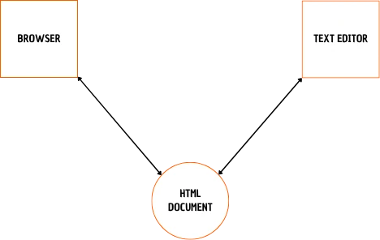

At the lowest level, basically all modern software relies on a single universal interface: binary code.

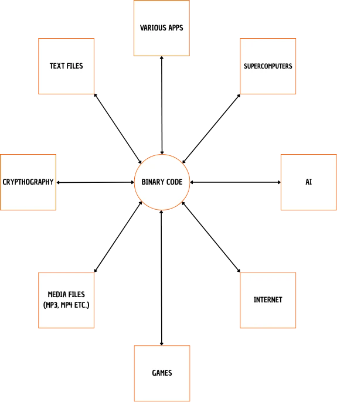

The smallest unit of binary code is the binary digit, aka **bit**. 

The goal of this unit is to hold **state**, to indicate one of multiple possibilities.

A bit has only two possible states, that can be represented as 0 and 1. It was chosen because it's easier to implement in hardware than a 3 (or 4, or 5...) states unit. But having only 2 possible states, it cannot hold that much information. You could represent a single binary value with a bit, for example:

```
yes = 1

no = 0
```

But that's not very useful. So we tend to group bits into bigger blocks, like **bytes**. There has been a lot of debate about how many bits a byte should contain, but modern tech has converged on it containing 8 bits.

Basically everything in your computer (text files, pictures, videos, executables, etc) is stored as binary code, as sequences of bytes.

If you think about it, this makes the binary in itself very hard to decypher. If I just give you a huge binary sequence, how would you know if it's a movie or a program? They're both represented as binary code!

That's why software employs various ways to tag binary sequences and give them context: at the OS (operating system) level, files usually have a certain file extension (like `.txt` ot `.exe`); programming languages usually have a **type system**, that allows the compiler to know "this is an integer", "that one is a pointer to a function", etc

Different data can be encoded in different ways. When you write a program, you can come up with your own way to encode data.

### Bitfields and bitflags

The simplest example of custom encoding are probably **bitfields**.

Let's say you are looking at apartments in your city, and you have a list of requirements for it:

- It comes already furnished
- It doesn't cost too much
- It's not too far from a bus station
- It has air conditioning
- It's in a safe area of the city
- It has wifi

You can use a byte for each apartment to record which of these conditions it satisfy, and a bit for each condition, using 1 to indicate that the feature is present in the apartment, and 0 to represent the feature is missing. For example, let's say you find an apartment that satisfies 5 of your requirements, but lacks air conditioning:

| requirement                         | Does this apartment satisfy it? | binary value |
|-------------------------------------|---------------------------------|--------------|
| It comes already furnished          | yes                             | 1            |
| It doesn't cost too much            | yes                             | 1            |
| It's not too far from a bus station | yes                             | 1            |
| It has air conditioning             | no                              | 0            |
| It's in a safe area of the city     | yes                             | 1            |
| It has wifi                         | yes                             | 1            |
|                                     |                                 | 0            |
|                                     |                                 | 0            |

Since you only have 6 requirements and a byte is 8 bits, the last two bits are left unused (we don't care whether they're 1 or 0). This structure as a whole is called a **bitfield** (which in this example was built with just one byte, but could include more bytes if needed). In this case we say the bitfield has 6 **bitflags**, one for each question.

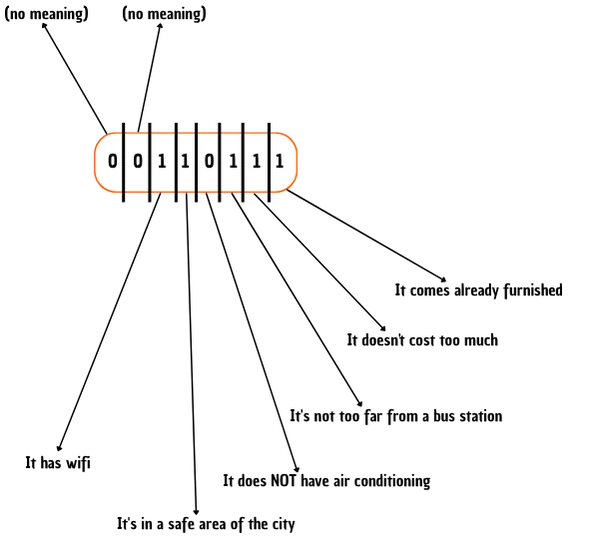

That's a lot of information packed into a single byte!

Bitfields are extremely useful to encode program-specific information in a very small amount of bits, but most of the times we want to encode types of information that are commonly used in many different programs, like numbers or text. For those we have a variety of standard encodings, as we will se in the next lessons.


## Encoding numbers and text
<chapterId>b7361f2e-7f34-49a6-86fd-cf5e5d47ec9a</chapterId>

### Integers

In decimal digits, each digit has 10 times the value of the next one, for example in the number `134725` (one hundred thirty-four thousand seven hundred twenty-five):
- the digit `1` by itself is the number _1_ but because of its position has its value multiplied by 100000 
- the digit `3` has its value multiplied by 10000
- the digit `4` has its value multiplied by 1000
- the digit `7` has its value multiplied by 100
- the digit `2` has its value multiplied by 10
- the digit `5` has its value multiplied by 1

```
1 * 100000 = 100000
3 * 10000  =  30000
4 * 1000   =   4000
7 * 100    =    700
2 * 10     =     20
5 * 1      =      5
-------------------
total      = 134725
```

The simplest way to represent positive integers in binary format is to follow the same pattern and assign to each bit a value that's 2 times the next one, like this:

|      |     |     |     |    |    |    |    |
|------|-----|-----|-----|----|----|----|----|
| *128 | *64 | *32 | *16 | *8 | *4 | *2 | *1 |

(As you can see, the value of each bits follows the same progression as the powers of 2)

For example, the number `0` would be represented like this:

| 0    	| 0   	| 0   	| 0   	| 0  	| 0  	| 0  	| 0  	| total 	|
|------	|-----	|-----	|-----	|----	|----	|----	|----	|-------	|
| *128 	| *64 	| *32 	| *16 	| *8 	| *4 	| *2 	| *1 	| 0     	|

The number `5` would be represented as 4+1:

| 0    	| 0   	| 0   	| 0   	| 0  	| 1  	| 0  	| 1  	| total 	|
|------	|-----	|-----	|-----	|----	|----	|----	|----	|-------	|
| *128 	| *64 	| *32 	| *16 	| *8 	| *4 	| *2 	| *1 	| 5     	|

`100` would be represented as 64+32+4:

| 0    	| 1   	| 1   	| 0   	| 0  	| 1  	| 0  	| 0  	| total 	|
|------	|-----	|-----	|-----	|----	|----	|----	|----	|-------	|
| *128 	| *64 	| *32 	| *16 	| *8 	| *4 	| *2 	| *1 	| 100   	|

With this system, the biggest number we can represent by switching all bits on a single byte (`11111111`) is 255. For bigger numbers, we would need to use more than one byte. Common sizes for numbers are 2 bytes (16 bits), 4 bytes (32 bits), and 8 bytes (64 bits). Each bit we add can hold twice the value of the previous one. 64 bits are enough to store the number 18 446 744 073 709 551 615!

In most cases, the bytes are ordered the same way the bits are, with the "most significant" one (the biggest) coming first, and the "least significant" (the smallest) coming last. This is called `big endianness`. 

Certain specific software systems though (like the TCP/IP internet protocols, the jpeg format,  or the Java bytecode) have `big endianness`, with the most significant byte coming last.

Let's take for example the number `512`. In little-endian notation, it could be represented with the binary string `00000010 00000000`, with the 7th bit of the first byte holding the value. That's because the bits in the first byte can hold bigger numbers than the bits of the second byte, just the first bits of a byte carry more value than the last ones.

But in big-endian notation, the bytes would be inverted, so you'd have `00000000 00000010`, with the last byte carrying the bit that holds the value. As mentioned, big-endian notation is not very common, so most of the time you can just think in little-endian.

What if we wanted to represent negative numbers? We could just dedicate the first bit of our binary sequence to indicate whether the number is negative. This is the distinction between "unsigned" and "signed" integers. When we talk about "unsigned integers", we're talking about a numeric encoding that can only represent positive numbers, as all of the bits are dedicated to hold the value of the number. Signed integers, on the other hand, allow us to also store negative numbers, by dedicating one bit to record whether the value is positive or negative. The tradeoff is that signed integers have one bit less to hold the value, so they can store smaller number; for example, the biggest number you can store in an unsigned byte is 255 (as mentioned before), so the range for an unsigned byte is 0 to 255; that's 256 possible states. By splitting those 256 states between positive and negative, a signed byte can store the numbers from -128 to 127.

Modern programing languages have many integer types you can use, for example in Rust you have `i8`, `i16`, `i32`, `i64`, `i128` (for storing signed integers using 8 bits, 16 bits, 32 bits etc), and their unsigned counterpart `u8`, `u16`, `u32`, `u64`, `u128`. 

### Hexadecimal form

When we start to work with encodings that require a lot of bytes, it becomes tedious to visualize them as long strings of 0 and 1. For example, this is an `u32` encoding for the number `3224443499`:

```
11000000 00110001 00011010 01101011
```
Kinda hard for humans to visualize. That's why programmers often write binary in **hexadecimal** format. We can group for bits into a single symbol, like this:

```
0000 -> 0
0001 -> 1
0010 -> 2
0011 -> 3
0100 -> 4
0101 -> 5
0110 -> 6
0111 -> 7
1000 -> 8
1001 -> 9
1010 -> a
1011 -> b
1100 -> c
1101 -> d
1110 -> e
1111 -> f
```

We are using 16 symbols (the numbers from `0` to `9` and the letters from `a` to `f`) to create a hexadecimal (from the greek work "hexadeca", which means sixteen) encoding.

So if we take the previous 32 bit string

```
11000000 00110001 00011010 01101011
```

and we break it into eight 4-bits segments

```
1100
0000
0011
0001 
0001
1010 
0110
1011
```

and we assign to each segment the corresponding hexadecimal symbol

```
1100 -> c
0000 -> 0
0011 -> 3
0001 -> 1
0001 -> 1
1010 -> a
0110 -> 6
1011 -> b
```

and the u32 encoding for the number `3224443499` can now be represented with the hexadecimal string `c031 1a6b`. This makes it much easier to compare with other numbers, for example, if we want to compare said number with the number `3214443499`, we would have this in binary form:

```
11000000 00110001 00011010 01101011
10111111 10011000 10000011 11101011
```

And this in hexadecimal form:

```
c031 1a6b
bf98 83eb
```

Hexadecimal is particularly useful when you need to take a quick look to huge binary sequences, like the ones used for files. There are a lot of programs that allow you to "hex dump" some binary data, aka print it in a hexadecimal form.

### Real numbers

So far we have seen how to encode positive and negative integers. But what about real numbers?

One simple way to encode them could be to dedicate the first 4 bits of a byte to store the integer part, and the last 4 bits to store the fractional part. We could assign to the bits a value like this:

|      |     |     |     |      |      |      |       |
|------|-----|-----|-----|------|------|------|-------|
| *8   | *4  | *2  | *1  | *1/2 | *1/4 | *1/8 | *1/16 |

So that if we wanted to represent the value 5.75, we would encode it as

|  0   |  1  |  0  |  1  |   1  |   1  |   0  |   0   |
|------|-----|-----|-----|------|------|------|-------|
| *8   | *4  | *2  | *1  | *1/2 | *1/4 | *1/8 | *1/16 |

```
(1 * 4) + (1 * 1) + (1 * 1/2) + (1 * 1/4) =
(4)     + (1)    +  (0.5)     + (0.25) = 
5.75
```
`01011100` = `5.75`

The decimal point would therefore be situated after the first 4 bits, you could think of `01011100` like it was `0101.1100`

This is called a **fixed point** representation. One problem with such a simple approach is that there's infinite real numbers between any two adjacent integers, and not only 8 bits would only be able to represent a small range between 0.0625 (with `00000001`) and 15.9375 (with `11111111`), but it would also skip a lot of very common ones, like for example 0.3, which cannot be represented using this method. Take a look, we can represent 0.25 with`00000100`

|  0   |  0  |  0  |  0  |   0  |   1  |   0  |   0   |
|------|-----|-----|-----|------|------|------|-------|
| *8   | *4  | *2  | *1  | *1/2 | *1/4 | *1/8 | *1/16 |

But if we flip the last bit to get to a slightly bigger number, we get

|  0   |  0  |  0  |  0  |   0  |   1  |   0  |   1   |
|------|-----|-----|-----|------|------|------|-------|
| *8   | *4  | *2  | *1  | *1/2 | *1/4 | *1/8 | *1/16 |

`00000101`, which has the value of 0.3125. Any real number between 0.25 and 0.3125, between `00000100` and `00000101`, cannot be represented using this 8-bit fixed point encoding. We would need to use a lot more bits to get to something useful. Also, what about negative real numbers? 

For this and other reasons, the technique that is most commonly used for encoding real numbers on modern computers is a different one. We use **floating point** numbers.

Are you familiar with *scientific notation*  for numbers? It's a way to express very big or very small numbers in a concise way, as simpler number multiplied by a power of 10. For example, the number 12 100 000 000 could be written as

`1.21 × 10¹⁰` (or simply `1.21e10` to avoid having to type special characters)

and the number 0.000 000 142 03 could be written as

`1.4203 × 10⁻⁷` (or `1.4203e-7`)

The first number in these expressions is called **mantissa** and the second one is called **exponent**.

|               	| mantissa 	| exponent 	|
|---------------	|----------	|----------	|
| 1.21 × 10¹⁰   	| 1.21     	| 10¹⁰     	|
| 1.4203 × 10⁻⁷ 	| 1.4203   	| 10⁻⁷     	|

Floating point numbers work in a similar way. 

Single-precision floating point numbers (sometimes called simply **floats**, or **f32**) are stored in 32 bits of memory and dedicate 1 bit to the sign, 8 bits to the exponent, and 23 bits to the mantissa.


Double-precision floating point numbers (also called **double** or **f64**) are stored in 32 bits of memory and dedicate 1 bit to the sign, 11 bits to the exponent, and 52 bits to the mantissa.

These formats allow us to encode a giant range of numbers, but it's important to remember that we're still trying to simulate something infinite (the range of real numbers, of which there's an infinite amount between each adjacent pair of integers) using a finite resource (a measly 4 byte or 8 byte binary string). That's why floating point numbers can behave in counter-intuitive ways.

For example, if you're using 32 bit floats and you try to calculate `251000.0 + 0.1`, you'd expect the result to be `251000.1`, but you'll actually get `251000.093750`, again because of the infinite gaps between integers being impossible to cover exhaustively; the encoding will just give you the closest approximation possible.

### Text

The first major text encoding standard was ASCII (American Standard Code for Information Interchange). It's a format in which text characters are stored using 7 bits, allowing for 128 (2^7) possible characters. For example, the capital letter `M` can be represented as `01001101`; the at symbol `@` is `01000000`, and so on. The first 32 of the 128 characters were special "control characters", like "End of Transmission", and the remaining 96 were printable characters like latin letters, numbers, and a few common symbols like `#` or `+`.

ASCII was developed during the 1960s, and almost everything about both hardware and software has changed since then. The text that is used in modern software includes characters from non-latin alphabets (like `Ж`) and emojis (like `😀`). ASCII has proven to be extremely limited in its range; for this reason, a more complex standard was developed: **Unicode**.

Unicode is more like a meta-encoding; it defines an abstract model of text, which can be implemented in different ways.
The abstract model is primarily a set of **graphemes** and **code points**. A grapheme is what we see as a single character on the screen, to which it can correspond one or more code points. For example, the grapheme `à` is formed by the combination of a code point for the letter "a" and a code point for the accent. Unicode has potential space for 1,114,112 code points, although the vast majority of them have not been assigned yet (the committee wanted to be sure to never run out of space this time).


This abstract model can be implemented in different encodings. The most common one is **UTF-8**, which is the one most web pages use. 

UTF-8 is optimized for saving space. It implements Unicode code points as binary strings of varying size, from 1 to 4 bytes. For example, the 128 characters of ASCII are stored exactly the same as in ASCII; and the first bit (the one ASCII doesn't use, remember it only used 7 bits and a byte has 8) is used to signal that the code point is not among the 128 ASCII ones. This means that if a UTF-8 file only uses ASCII-compatible characters, it will be able to be processed even by old software that predates the encoding.

The first bits of a UTF-8 code unit signals how many bytes it will use to represent that code point:

```
if it starts with 0 -> 1 byte, ASCII character
if it starts with 110 -> 2 bytes, covers most languages
if 1110 -> 3 bytes, covers East Asian languages like Chinese 
if 11110 -> 4 bytes, covers emojis and other stuff
```

UTF-8 is compact, retro-compatible, and it covers our modern necessities. It has its own problems though, deriving from having such a flexible length for its code points.

Since in ASCII each character had the same size, it was pretty intuitive in the way the characters map to the binary represenation. "hello" is 5 letters long, and in ASCII it requires 5 bytes to be represented. If I tell my code to give me its second character, it will just need to take the position in memory of the beginning character of the string, move to the next byte, and it will find "e". 

This doesn't work with modern UTF-8 strings. If you have a string `"hello 😀"` and you try to access its bytes in sequence in modern C, you'll get:

```
h
e
l
l
o

�
```
Why `�` ? You reached the first of the 4 bytes that form the emoji `😀`, and that have no grapheme to represent them by themselves. In fact, if you continue printing the string byte by byte, you'll get

```
h
e
l
l
o

�
�
�
�
```
Those `����` correspond to the 4 bytes that combine to form `😀`, but if you try to print them individually they have no way to be printed correctly. You're trying to print 1/4th of the emoji, that's why you get `�.

This can create confusion and more importantly, makes it harder to optimize the performance of text manipulation in programs, since you cannot just skip across strings as you please, you need to process them in the order they were written in.

An alternative encoding that tries to solve this issue is **UTF-32**, which stores every code point as a 32 bit integer. This takes up a lot of space, but allows programs to skip to the *n* character of a string like they did with ASCII, since each code point is always represented with a 32 bit integer...except that, as mentioned previously, a visible Unicode grapheme is not necessarily represented by a single code point. For example, the family emoji`👨‍👩‍👦` is a grapheme composed of 5 code points, and if you try to access them one by one you'll still get some weird surprises.

There are other ways to represent Unicode in memory, and many ways to access and manipulate its components. Different programming languages have opted for different solutions, but UTF-8 is by far the most common.


## Operating at the binary level
<chapterId>ecb07e5f-04d9-4573-abcf-36bf06c34f5c</chapterId>

### Bitwise operations

So far we have looked at how various types of data can be encoded in binary strings. Programming languages provide us with operators that can manipulate the data encoded in those binary strings, for example `+` to sum numbers. But what if we want to manipulate the binary code directly?

For example, the number `6` can be encoded in a byte as `00000110`. I can manipulate the number in C using `+`, `-`, `*`, `/`, `%`. But what if I want to manipulate the underlying `00000110` byte that represents it?

That's why many languages provide us with **bitwise operators**. Let's take a look at some of the ones available in C, using the 8-bit integer type `uint8_t` defined in `stdint.h` as the binary format of the operands:

### bitwise AND

The bitwise AND is represented with the `&` symbol.

It compares two numbers bit by bit and returns a new value that has set to `1` only the bits that were `1` in both of the original numbers. 

For example, if 6 is `00000110` and 4 is `00000100`, the only bit they both have set to 1 is the third one from the right, the one with the value 4. So `6 & 4 == 4`.

```c
#include <stdio.h>
#include <stdint.h>

int main() {
    uint8_t x = 6;     // encoded as 00000110
    uint8_t y = 4;     // encoded as 00000100
    uint8_t z = x & y; //     equals 00000100, which is 4

    printf("%u", z); // prints "4"
}
```

### bitwise OR

The bitwise OR is represented with the `|` symbol.

It compares two numbers bit by bit and returns a new value that has set to `1` all the bits that were `1` in either of the original numbers. 

For example, if 6 is `00000110` and 3 is `00000011`, you will get `00000111`, which has value 7. So `6 | 3 == 7`.

```c
#include <stdio.h>
#include <stdint.h>

int main() {
    uint8_t x = 6;     // encoded as 00000110
    uint8_t y = 3;     // encoded as 00000011
    uint8_t z = x | y; //     equals 00000111, which is 7

    printf("%u", z); // prints "7"
}
```

### bitwise XOR

The bitwise XOR is represented with the `^` symbol.

It compares two numbers bit by bit and returns a new value that has set to `1` the bits that had discording value in the original numbers. 

For example, if 3 is `00000011` and 1 is `00000001`, they are the same binary string, except for the second bit from the left, which is set to `1` only in one of them. So you will get `00000010`, which has value 2. So `3 ^ 1 == 2`.

```c
#include <stdio.h>
#include <stdint.h>

int main() {
    uint8_t x = 3;     // encoded as 00000011
    uint8_t y = 1;     // encoded as 00000001
    uint8_t z = x ^ y; //     equals 00000010, which is 2

    printf("%u", z); // prints "2"
}
```

### bitwise NOT

The bitwise NOT is represented with the `~` symbol.

It takes a numbers and inverts all of its bits.

For example, if 13 is `00001101`, its inversion will be `11110010`, which has value 242. So `~13 == 242`.

```c
#include <stdio.h>
#include <stdint.h>

int main() {
    uint8_t x = 13;     // encoded as 00001101
    uint8_t y = ~x;     //     equals 11110010, which is 242

    printf("%u", y);  // prints "242"
}
```

### Bitmasks

A **bitmask** a binary pattern that we use together with bitwise operators to manipulate specific bits in a bitfield.

Let’s revisit the apartment example we used earlier, setting the bits from right to left:

* first bit  = furnished
* second bit = cheap enough
* third bit  = near bus station
* fourth bit = air conditioning
* fifth bit  = safe area
* sixth bit  = wifi
* last two bits = unused

So, an apartment that satisfies all requirements would be represented by the bitfield `00111111`. A bitmask representing the concept of "it's near a bus station" would be `00000100`.

### Setting a bit (turning a feature **on**)

Suppose we start with `00000000` (no features), and we find out the apartment has wifi (sixth bit from the right).
We can **set** that bit by making a bitmask with only that bit set to 1 (`00100000`) and using **bitwise OR (`|`)** to combine it with the original bitfield of the apartment.

```c
#include <stdio.h>
#include <stdint.h>

int main() {
    uint8_t apartment = 0b00000000;  // no features
    uint8_t WIFI_MASK = 0b00100000;  // only sixth bit set

    apartment = apartment | WIFI_MASK;  // turn on wifi bit, obtain 00100000 which is 32

    printf("%u\n", apartment); // prints "32"
}
```

Now the apartment bitfield is `00100000`, meaning "has wifi".

### Clearing a bit (turning a feature **off**)

Suppose the apartment has wifi and AC, so its bitfield is `00101000`

but we realize the wifi doesn’t actually work, so we want to **turn off** the sixth bit.
We can do this by making a mask with all 1s except for that bit (`11011111`) and using **bitwise AND (`&`)** on the apartment bitfield to flip that bit, while mantaining the other bits to 1 if they had that value.

```c
#include <stdio.h>
#include <stdint.h>

int main() {
    uint8_t apartment = 0b00101000;  // wifi + AC
    uint8_t NO_AC_MASK = 0b11011111; // everything except sixth bit

    apartment = apartment & NO_AC_MASK;  // clear wifi bit, obtain 00001000 which is 8

    printf("%u\n", apartment); // prints "8"
}
```

Now the apartment bitfield is `00001000`, meaning "has air conditioning".

### Toggling a bit (flipping it)

If we want to **flip** a bit, regardless of its current value, we can use **XOR (`^`)** with a mask:

```c
#include <stdio.h>
#include <stdint.h>

int main() {
    uint8_t apartment = 0b00100000;   // wifi only
    uint8_t AC_MASK =   0b00001000;     // fourth bit, representing AC

    apartment = apartment ^ AC_MASK;  // flip the AC bit regardless of current value, get 00101000 which equals 40

    printf("%u\n", apartment); // prints "40"
}
```

Now the apartment bitfield is `00101000`, meaning "has wifi and AC".

If we run the same toggle again, AC will be removed:

```c
#include <stdio.h>
#include <stdint.h>

int main() {
    uint8_t apartment = 0b00100000;   // wifi only
    uint8_t AC_MASK =   0b00001000;     // fourth bit, representing AC

    apartment = apartment ^ AC_MASK;  // flip the AC bit regardless of current value, get 00101000 which equals 40

    printf("%u\n", apartment); // prints "40"

    apartment = apartment ^ AC_MASK;  // flip the AC bit back to 0, get 00100000 which equals 32

    printf("%u\n", apartment); // prints "32"
}
```

### Checking if a bit is set

To check if the apartment has wifi, we use **AND** with a mask, and test the result:

```c
#include <stdio.h>
#include <stdint.h>

int main() {
    uint8_t apartment = 0b00101000;  // wifi + AC
    uint8_t WIFI_MASK = 0b00100000;
    uint8_t has_wifi = apartment & WIFI_MASK;

    if (has_wifi) {
        printf("This apartment has wifi!\n");
    } else {
        printf("No wifi here.\n");
    }
}

```

If the wifi bit is set to 1 on the apartment, the `&` operator will return the wifi bitmask as it is, otherwise it will return `00000000` because there's no bit set to `1` in both integers. 

`00000000` is a false-y value in C, so we can use it in our if statement.

## Other types of encodings
<chapterId>dbbcfa24-0cd5-4b0a-946d-96426cf435dd</chapterId>

We have seen how numbers, text and custom data can be encoded in binary; in this chapter we're gonna briefly go through some examples of other forms of encodings.

### Media

Colors can be encoded in **pixels**. A common pixel encoding is **RGB**.

RGB stands for **Red Green Blue**, which are the three main colors that are combined to represent all others. 

Each one of them has an intensity, which can be stored in different ways based on the *bit depth* of the image; a common choice is to use one byte for each color, resulting in a pixel occupying 24 bits of memory: 8 for the intensity of red, 8 for green and 8 for blue. 

Pixels are often referred to in hexadecimal form; for example, in CSS `#ffffff` represents the purest color white, having red, green and blue all set to maximum intensity `ff` (256 in hexadecimal form); and `000000` is the darkest black (having all the three colors at intensity 0).


Theoretically speaking, an image can be encoded as a simple sequence of pixels; and a video can be encoded as a simple sequence of images.

Most of the times though, we *compress* media to save space. A simple example of compression is **RLE** (run-legth encoding). 

In RLE, you save space by representing repeating sequences of an element as (length + element). For example, if you have a sequence of 64 black pixels in an image, instead of using 192 bytes (3 bytes per pixel repeated 64 times) you can represent it with just 4 bytes as `40ffffff`, with `40` being 64 in hexadecimal form, and `ffffff` indicating the color black.

The most used modern formats for images and videos (`.webp`, `.webp`, `.mp4`, etc.) use much more advanced compression techniques.

### Computer instructions

How are programs encoded? The instructions for x86 processors are complex and hard to parse; the ones for ARM are easier, but still well beyond the scope of this course.

A simpler example would be Java bytecode.

Java code gets translated into a `.class` file, that gets fed to the Java Virtual Machine to be executed. 

The `.class` file usually starts with some bytes containing metadata: a 4-bytes "magic number" (which is the same in all Java class files), and 4 bytes that indicate the version of Java it was compiled for. 

Next comes a segment containing all of the constants used in the program, and since different programs can use wildly different amounts of constants, this segment doesn't have a fixed size and it begins with 2 bytes indicating how many constants it contains. The interfaces, fields, methods and attributes of the class are also stored in analogous variable-sized segments. 

If you zoom in on a specific method, the actual operations are encoded using **opcodes**. A Java opcode is an unsigned 8-bit integer, allowing for 256 possible opcodes, of which ~200 have been assigned a meaning as of the latest Java version. Each opcode expects a certain number of bytes as operands; for example, the opcode number 16 is `bipush` and it expects one byte as argument (that will push on the stack). 

So when parsing the instructions, the virtual machine is supposed to 

1. read an opcode
2. know how many bytes the opcode expects as arguments
3. read as many bytes
4. execute the opcode 
5. repeat

...until the end of the sequence of instructions. 

This is a much simpler structure than the one used by the machine code of modern CPUs, but it's enough to encode any Java program (which includes most Android apps).

The scripting language used on the Bitcoin blockchain is also composed of opcodes, that get combined to program transactions and smart contracts.

### Network protocols

The protocols that define how data is transferred on the net tend to have flexible binary formats, to accomodate a wide array of contents and situations.

The main protocol to transmit packets of  data on the internet is **ipv4**. This is how an ipv4 packet is structured:

| field                            	| size in bits 	|
|----------------------------------	|--------------	|
| version                          	|       4      	|
| header length                    	|       4      	|
| differentiated services          	|       6      	|
| explicit congestion notification 	|       2      	|
| total length of the packet       	|      16      	|
| identifier                       	|      16      	|
| flags                            	|       3      	|
| fragment offset                  	|      13      	|
| time to live                     	|       8      	|
| protocol                         	|       8      	|
| header checksum                  	|      16      	|
| source address                   	|      32      	|
| destination address              	|      32      	|
| options                          	|     0-320    	|
| payload                          	|   0-524120   	|

We're not gonna dive into every detail of the protocol, we'll just make a few observations.

The packet is divided into a *header* (metadata describing the packet and how to handle it) and a *payload* (the actual data being transmitted). All of the fields except the last one form the header. 

The header starts with a small *version* field, indicating the version of the protocol we're using. In ipv4 this field is always carrying the value `4`.

All of the fields in the header have a fixed size, that sum up to 20 bytes in total, except the *options* field, which can have a size ranging from 0 to 40 bytes (0 to 320 bits). Because of that, the header can have a size ranging from 20 to 60 bytes, and that's why it has a *header length* field, to communicate how big the header is. If you didn't know the exact length of the header, you might accidentally parse a piece of the payload as header, or viceversa.

The payload is also of variable size, that's why we also have a "total length of the packet" field, specifying how big the packet is in total (header + payload).

These are all things you'll find often when working with communication protocols. Data gets broken down into smaller packets with a minimum and maximum size; the packets get tagged with a header containing info about which version of the protocol we're using (leaving room for possible future revisions of the protocol, like ipv6 has improved over ipv4), various flags, specification of the length of the packet, and other types of metadata that the designers of the protocol considered useful.

Usually the expectations of the designers don't match exactly with how the protocol is actually used: for example, the *options* field in the ipv4 packets is almost never used in practice. This is a pattern we will see very often in the next sections of this course, as modern hardware and software are often constrained by decisions made decades ago, by people who had different expectations about what IT was going to be.

# Hardware level
<partId>43a03ee6-9d32-4070-8dfe-2780b2758cb4</partId>

## General hardware model
<chapterId>71ed9c5f-6a9d-4dfe-9483-d225aebf463c</chapterId>

So far we have described binary code as a (mostly) abstract model. 

You can use binary code to store and manipulate data in your mind, but we usually delegate those operations to machines (computers), to do those tasks for us. 

In order for the machines to be able to work on binary, we need to implement the abstract model into a physical form. This can be done in many ways: there's been some examples of *hydraulic* or *mechanical* computers; but the most efficient and scalable implementations we were able to produce so far are based on electricity and *transistors*.

You can think of a modern computer as a system through which many minuscule currents of electricity travel and intersect.


If a current has low voltage, we consider it as carrying a `0` value; if it has higher voltage, `1`.

A transistor is a small physical component (made of silicon and other materials) that can alter the voltage of a current flow *A* based on the value of a current flow *B*. 

There are two main types of transistors used for modern computers: *NMOS* transistors will let the value of current `A` be `1` if `B` is also `1`

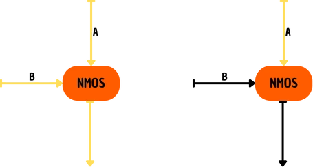

while *PMOS* transistors will make the value of `A` be `1` if `B` is `0`.

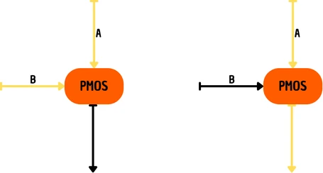

By combining transistors, it's possible to build small circuits called *logic gates*, which operate as logical operators. For example, the `AND` logic gate will take two current flows as inputs and output a current flow with value `1` only if both of them have a value of `1`.

By building larger congregations of transistors and logic gates, hardware manufacturers can build small hardware units that can carry more complex and particular operations on binary, like math operations (just like a software developer can combine the basic operations of a programming language to build more and more complex and particular functions for the various needs of a program). You can create a piece of hardware that is the physical manifestation of a program, and it's specialized to executed certain operations as fast as possible. GPUs for example were made as specialized processors for computing graphics (although nowadays a lot are used to run LLMs and mine Bitcoin).

In order to store data, certain transistors are put into *memory cells*, which are isolated. The electricity that you pass to these transistors gets stuck there unless you use another charge to overwrite it; it remains in the memory cell even when you turn off electricity from your computer. This is the most common way for hardware to store data.

SSDs use memory cells to store your data; but a lot of other hardware components have memory cells too, which are used to store *firmware*. Firmware is the most fundamental form of programming that a piece of hardware (for example, a GPU) can hold. It stands between hardware and regular software.

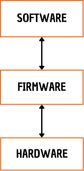

Firmware is the basic programming of a hardware component, and is usually distributed by the producer of the hardware. It allows it to be updated (to a degree), for example to fix security bugs by disallowing some functionalities that have been found out to be easily exploitable by attackers. Firmware makes modern hardware more flexible, because it decouples some of its functionality from its physical design: you can change some of the behavior of a piece of hardware without modifying the hardware itself, you just need to overwrite its firmware.

Most of the time firmware is written  in C or C++, and executed by a *microcontroller*. A microcontroller is like a miniature computer inside the hardware component and it controls its various functionalities. Your GPU, your SSD, your wifi and bluetooth adapters, your sound card etc...they usually all have a MCU (MicroController Unit) each, and a piece of firmware that was written specifically for it.

All these hardware components are orchestrated by the CPU (Central Processing Unit), which we will look more deeply into in the next chapter. For now just imagine it as the heart of the computer, exchanging signals to the microcontrollers of the various other hardware components. There is a lot of little details and exceptions about this model, but it's ok as a general idea of the hardware system.

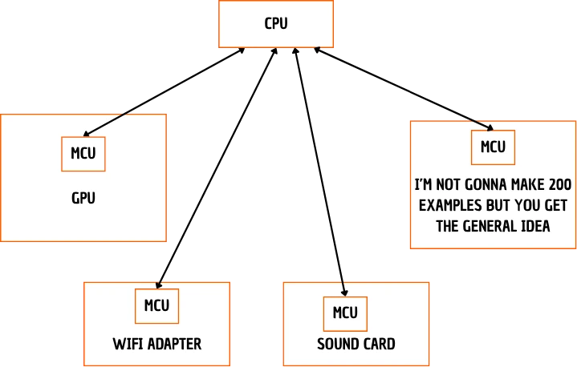

But how can all these components communicate with each other at a physical level? Well most of them are connected into a *motherboard*. A motherboard has slots to which you can plug in various pieces of hardware, and circuits to connect them all to the CPU (and in certain cases, to each other). This also allows you to substitute certain components of your PC (as long as they're compatible with your motherboard).

## Central Processing Unit
<chapterId>5058d002-b099-4234-a150-3d8020c53559</chapterId>

The CPU is connected to other components via *buses*, small lines that transmit data and signals back and forth.

The data that the CPU receives is temporarily stored into *registers*, which on modern 64-bit CPUs are mostly of 64 bits each (although they also have registers that are bigger or smaller than that, for particular operations). In the previous chapter we talked about memory cells: registers are the most performant memory cells available to your CPU. They're relatively expensive and small, but can be read and written to very fast.

The CPU has various specialized units to operate on the binary data in various ways: some for doing integer arithmetic, others for operating on floating point numbers, others yet for operating on vectors etc.

So the data arrives through buses, gets stored into registers, gets operated on by the units, and then sent out via buses again. This is the so called *datapath* of the CPU.

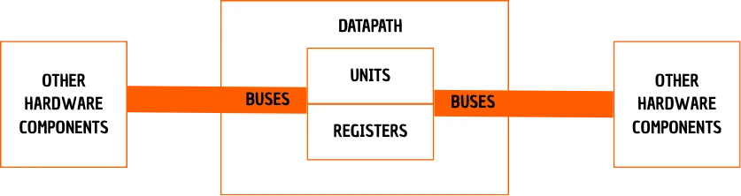

The CPU also has a *control unit*, which directs the sequence of operations, following a cycle like this:
- *fetch* phase: the control unit has a special register to store the *program counter* , aka the address in memory from which it's supposed to get the next instruction. During this phase it will go to that address and get the instruction (and also upload its counter to point to the next command in the program it's executing, for the next cycle)
- *decode* phase: the control unit converts the instruction into *microcode*, which is it's internal instruction format. Modern CPU manufacturers mantain this separation between a machine code format (that programmers can use to write programs using assemblers), and a microcode format (that is what the CPU will actually execute); this way they can mantain a certain degree of control over the processor, allowing them for example to patch the behavior of the CPU with updates; the manufacturer can in fact publish an update for the CPU, that will change the way your machine code gets translated into microcode (this can be done to improve the security and performance of the CPU, but some suspect it's also done to implement backdoors into our machines)
- *execute* phase: the CPU executes the microcode, trying to optimize and parallelize the execution as much as possible
- before starting a new cycle, the control unit checks on an *interrupt interface* if there's any *interrupts* coming from other hardware components. An interrupt is a signal that a piece of hardware can send to the CPU, to communicate that something happened or needs to happen. Without interrupts, the CPU would just execute a program top to bottom, without any possibility for external input. Interrupts allow us to have interactive programs, because the control unit will check for these signals at each cycle, check their priority level, and if necessary communicate to the OS that it needs to dispatch a certain function to handle the interrupt. For example, when you press a key `x` on your keyboard, the keyboard will send an interrupt to the CPU; the CPU will finish its current cycle, check the interrupts, and tell the operating system to launch the function that has been registered to handle that key (which in most cases will pass down the signal to the current program, for example a text editor, which will read the `x` and insert it into text).

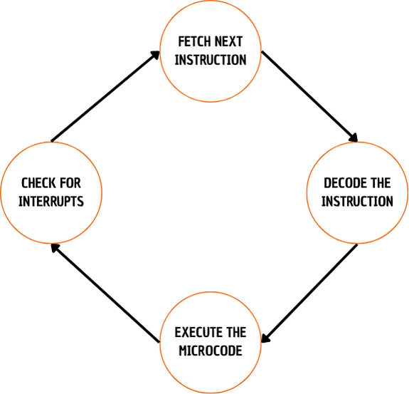

All the different components of a CPU are kept synchronized by a *high frequency clock*. The clock is like a drummer that keeps the rhytm of the execution, with modern CPUs executing billions of cycle per seconds (1 hertz = 1 cycle per second, 1 gigahertz = 1 billion cycles per second). At each tick of the clock, the control unit executes a new cycle, processing data on the datapath.

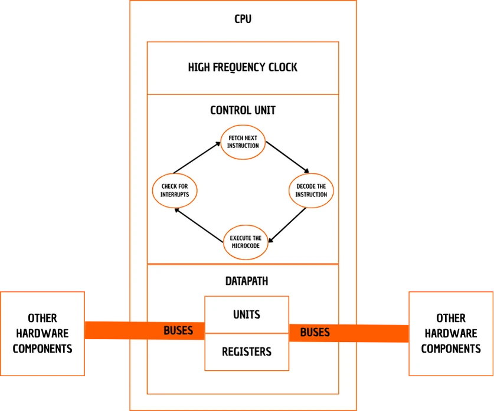

What we have described so far is the model of a single CPU *core*. A modern CPU has multiple cores (usually 4 to 8), which allows them to execute multiple tasks at the same time. Usually there's one core that's designated to boot the computer, and then it can use certain instructions to start up the other ones.

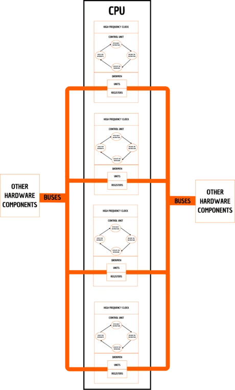

This is a very generic idea of how a modern CPU works. Different CPUs will vary a lot in their details, having different *architectures*.

The most common CPU architectures nowadays are *ARM* (which is used in Apple computers, smartphones, and a lot of embedded devices and hardware components) and *x86* (which is used in most Linux and Windows computers). 

ARM is a *RISC* architecture (Reduced Instruction Set Computer). It has a more limited set of instructions, which means developers must find ways to write their programs using only those instructions, making it sometimes harder to write and to optimize software. But it's also cheaper to produce and it consume less energy to run (that's how smartphones and embedded devices can have small batteries, and how certain Apple laptops can have very longlasting battery charge).

x86 is a *CISC* architecture (Complex Instruction Set Computer). It has a much larger set of instructions, which can make it easier to write code for, but also causes higher energy consumption.

There's a *lot* of less-known architectures, but these are the two most important ones. 

The most direct way to program a CPU is to use an *assembler*. An assembler allows you to write human-readable code (in what's called an *Assembly language*) and to have it translated into instructions for a certain CPU. For example, *FASM* is one of the most used assemblers for x86: it allows you to write code like this: 

```
include 'lib.inc'

elf64

data
  msg line "Hello World"

code 
  print msg
  exit 0
```

Which is not as bad as most people would expect Assembly to be, but it's not as simple `print("Hello World")` either, that's why most developers prefer to sacrifice the performance and control of Assembly in favor of higher level languages.

## Memory
<chapterId>86a77c8f-7d28-4c74-bf4f-d93a9d7e4a16</chapterId>

Modern computers have various types of memory they can store data in, the main ones being:

1. CPU registers 

    We already analyzed these in the previous chapter. They're tiny (from a few bytes to kilobytes) slots inside the CPU. They hold the values the CPU is using *right now* (like numbers for the current calculation). The access is basically instantaneous for the CPU.

2. CPU caches
    
    The CPU tries to infer which data is going to be accessed more often and then stores it temporarily in its cache. There are three common layers:
    - L1 cache: the smallest (16 to 128 kilobytes) and fastest cache, each CPU core has one.
    - L2 cache: a bit bigger (256 kilobytes to 8 megabytes) and slightly slower, often per core but sometimes shared among multiple cores.
    - L3 cache: the biggest (1 MB to 32 megabytes or even more) and slowest cache, usually shared across cores.

    When the CPU needs some data, it looks in L1 first (a "cache hit", which is great), then L2, then L3, and only if it’s not there does it fetch from RAM (a "cache miss", which is slower). If you access the same data multiple times in a row (temporal locality) or nearby data in memory (spatial locality), it’s more likely to stay in cache and your code runs faster.
    It’s generally a good idea to organize data access to take advantage of this. For example, if you’re doing many operations on the elements of an array, do as many operations as possible on the current element before moving on to the next, so it stays hot in cache. Jumping all over a data structure makes it harder for the CPU to predict what you’ll need next and causes more cache misses, forcing the CPU to fetch the data all the way from the RAM.

3. Random Access Memory (RAM)

    This is the main memory of a computer, where the kernel, the programs and their data live while they run. RAM is volatile memory (it loses its contents when power is off). On desktops/laptops you’ll usually see 8–64 GB; workstations/servers can have hundreds of GB or even TBs. It's much bigger than caches but slower. 

4. Storage units (SSD/HDD)

    Long-term storage. Nowadays it can store terabytes, but it's much slower than RAM. Used to keep files when the computer is off. 
    When you start a program, the OS loads pieces of it from storage into RAM, to make it faster for the CPU to read the instructions it's composed of.
    Solid State Drives (SSDs) are far quicker than Hard Disk Drives (HDDs), but both are orders of magnitude slower than RAM and caches.


These are listed in order from the fastest (and more expensive) one, aka CPU registers, to the slowest (and cheapest) one, aka HDDs (which are often absent from modern PCs, who tend to use SSDs for storage). This is called the *memory hierarchy*: ideally you want a program to work as much as possible on the fastest types of memory, and to use the SSD only for storing data long-term (reading and writing files from the SSD is often a cause of lag in unoptimized programs).

### Virtual memory, protection and I/O

CPUs usually define privilege levels to protect the system. For example, in ARM processors an instruction is either in "supervisor mode" or in "user mode", and in x86 processors there's multiple **protection rings**, from ring 0 to ring 3, with a higher number indicating a lower level of privilege.

Having diferent privilege levels allows the CPU to give a certain program, called **kernel**, control over the others. This is the basis of how modern OSs work.

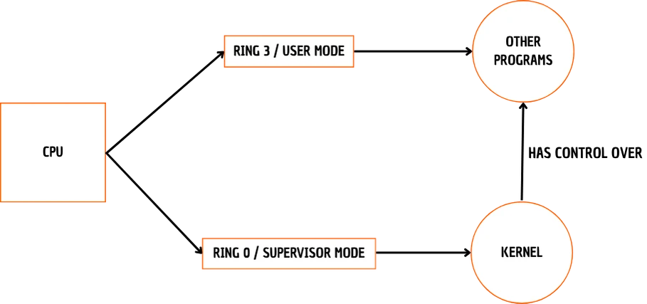

Modern kernels organize memory into fixed-size chunks called **pages** (commonly 4 KB, but other sizes exist), and provides a **page table** to each program.

Programs don't usually operate on raw, physical RAM addresses. Instead, each process runs in its own **virtual address space**, and a hardware unit called the **MMU** (Memory Management Unit) translates **virtual addresses** to **physical addresses** using **page tables** set up by the kernel for that process. 

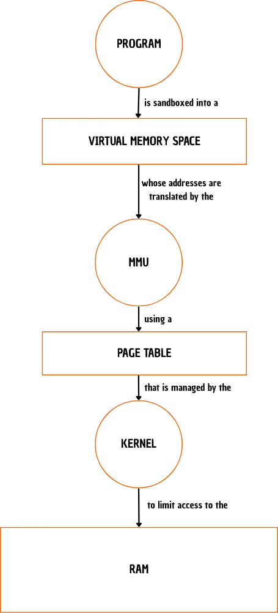

So when a program "accesses" address `00005555556aa3c4`, it’s really asking the MMU to translate that virtual address; the MMU consults the process’s page table and returns the corresponding RAM physical location. 

By managing those page tables, the kernel can give a program exclusive pages, share pages between processes (e.g., for shared libraries), or even deny access. If a program touches memory that isn’t mapped or isn’t allowed, the CPU raises an error (a **fault**) and the OS steps in (to load it, create it, or crash the program, depending on the case).

So, the CPU executes all instructions from all programs; but it executes the ones from the kernel of your OS with a higher level of authorization, giving the kernel direct control over the hardware, while all other programs are executed at a lower level of authorization, and must rely on the kernel to access the hardware. 

We've seen how access to the RAM is managed using virtual memory: but how does it work for other pieces of hardware? Well...using virtual memory. Some of the virtual addresses are not mapped to the RAM, but to other components. For example, a certain range of addresses will correspond to the GPU internal memory, and when the kernel must allow a program to communicate with the GPU, it will give access to those addresses; the program will treat these addresses pretty much as regular RAM addresses, but when it writes to them it will instead send instructions to the GPU. This technique is called **memory mapped I/O** (MMIO), and it allows the kernel to manage pretty much all hardware access just by managing which addresses a program can access.

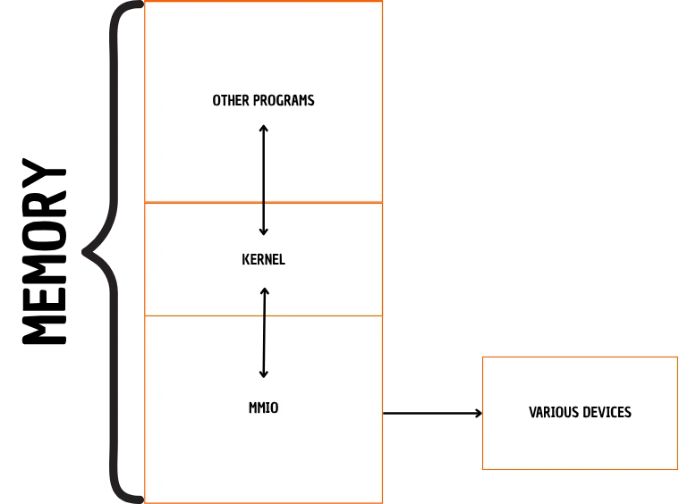

### Swap memory

So far we’ve talked about virtual memory mainly as a way to isolate processes and control what parts of RAM they can access. The same mechanism also helps with another problem: what to do when the system is running out of RAM.

**Swap** is a technique the operating system uses when the RAM is getting full. It reserves a part of the storage device (SSD/HDD) and uses it as extra space for memory, so the system can keep running even if there isn’t enough RAM for everything at once.

This keeps the system from immediately failing when memory is low, but it comes with a cost: reading and writing to storage is much slower than RAM. Light swap usage can help during short spikes, but if the system is constantly swapping, programs tend to feel slow and unresponsive.

Swap space is also commonly used for **hibernation**. When you hibernate a computer, the operating system saves the contents of RAM to storage so it can power off completely, and later restore the exact state you left (open programs, documents, and so on) by loading that saved memory back into RAM.

## Graphics Processing Unit
<chapterId>3f9bbc73-dea7-4bea-bcb9-0e6432655c0e</chapterId>

Images have millions of pixels. All these pixels can be computed with the same steps, at the same time. A GPU is a processor designed to do a lot of small, similar operations in parallel. Historically, that meant turning 3D triangles into pixels on your screen; today it also means physics, video encoding/decoding, and general number-crunching (LLMs, simulations, etc.). If a CPU is optimized to handle a few **very different tasks** with its few cores, a GPU is designed to run the **same task** across thousands or millions of data points. While CPUs have a few powerful cores, GPUs have thousands of small cores, that can only execute simple operations (like arithmetic). 

GPUs are used mostly to execute small programs called **shaders**. 

For example, in videogame graphics, *vertex shaders* are used to render the shapes of the environment, by taking all of the vertices of all of the items appearing on screen and calculating their next position using the GPU. Simple example, if the game is showing a simple triangle with vertices `a`, `b` and `c`, and you want to rotate it clockwise, you'll write a simple vertex shader like a function that takes the current positions of `a`, `b` and `c` as input and returns a new position (moved clockwise) for each of them. If you want the triangle to spin endlessly, you can write a shader that constantly returns new positions for the three vertexes.

*Pixel shaders* are used to render colors: you can write a pixel shader that takes the position of each pixel on the screen and returns a new color for it (in the RGB format we discussed in the chapter about encoding media).

As you can imagine, in a modern game these shaders are supposed to operate on a lot of vertices and pixels to render scenes, and they need to compute them all at once; simple mathematical operations, but executed in parallel over a lot of data points...that's why the GPU, with his thousands of small cores, comes in handy. 

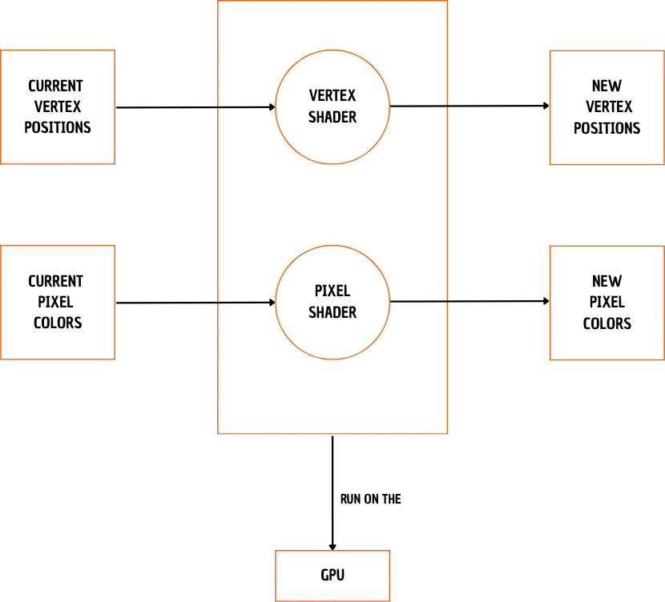

**Shader languages**, like *HLSL* or *GLSL* are special languages used primarily to write shaders. They're usually compiled and then fed to the *driver* of the graphics card. But what is a "driver"? We'll learn about that in the next section.

# Kernel level
<partId>e6c7100a-b5f3-409f-b745-fafe7000b241</partId>


## Basic input output system (BIOS) and boot process
<chapterId>b7bdbcea-06cf-4e09-ab78-d45cf0b49bce</chapterId>

Modern software can operate on two levels: kernel level or user level. 

Most of the applications you use exist in user level, and can only access the hardware by making requests to kernel-level software.

Kernel-level software has direct control over the hardware, which makes it more powerful and performant, but also harder and riskier to write. 

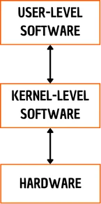

In this section we're gonna explore how the kernel works and how it interacts with other components. 
Booting a Linux system is a chain of small programs handing control to the next one, each preparing the machine a bit more until you end up in a full multi-user environment.

When you press the power button, the first code that runs is the firmware on the motherboard. On older machines this is usually the **BIOS** (Basic Input/Output System); on newer ones it is often **UEFI** firmware (Unified Extensible Firmware Interface).

This first program performs a test (a quick hardware check often called *POST*), initializes basic hardware such as the CPU, RAM and some buses, and then looks at its configuration to decide which device to try to boot from (an internal disk, a USB stick, or maybe the network).

From the chosen boot device, the firmware loads a small piece of code into memory and jumps to it. This piece of code is the **bootloader**.


On Linux systems, common bootloaders are **GRUB** or **systemd-boot**. The bootloader’s role is to present possible kernels and boot options, load the chosen Linux kernel image into memory, and then transfer control to the kernel. 
Once the bootloader jumps into it, the Linux kernel takes over. As mentioned before, the kernel is the privileged part of the operating system that talks directly to the hardware. 

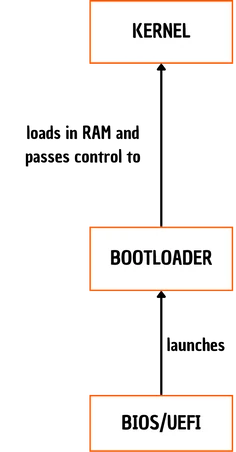

Once loaded, the kernel:
* Decompresses itself (most kernels are compressed on disk).
* Sets up low-level CPU state, interrupt handling, basic memory management, and core subsystems.
* Initializes built-in drivers so it can access RAM, CPU, and at least one storage or bus.

At this point everything is still happening entirely in kernel space; there is no user-space process yet. 
To move beyond this minimal environment, the kernel uses an initial RAM filesystem called **initramfs**.

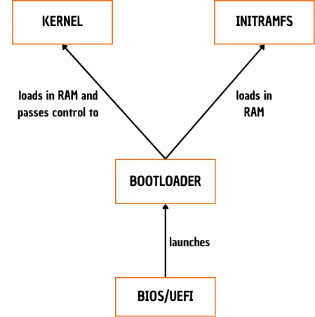

An initramfs (initial RAM filesystem) is a small, compressed archive that the bootloader loaded into memory alongside the kernel. The kernel unpacks this archive into RAM and treats it as a tiny, temporary filesystem. 


It usually contains a minimal user space: a few binaries, a basic shell, configuration files and sometimes extra kernel modules. Inside the `initramfs` there is also a small user-space program, usually located at `/init`, which orchestrates these early steps.

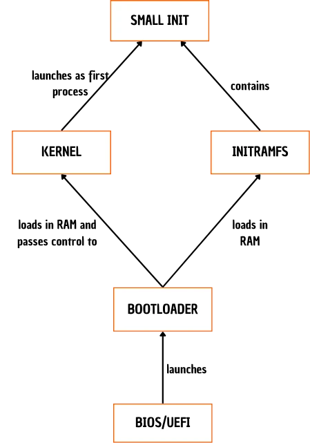

The job of this initramfs environment is to prepare the real root filesystem that the system will use for normal operation. That preparation can include loading additional drivers, scanning for disks, unlocking encrypted volumes etc.

In other words, the initramfs bridges the gap between the very generic kernel and whatever complex storage setup your system actually uses. Once the initramfs code has located the real root filesystem and mounted it somewhere, it performs a *root switch*. A root switch means telling the kernel that from now on "/" should refer to this real, persistent filesystem instead of the temporary one in RAM.

The "real" root filesystem is the main on-disk filesystem that Linux will use long-term. It might be an **ext4**, **XFS**, **Btrfs** or another supported filesystem type, living on a physical disk, SSD or even over the network. 

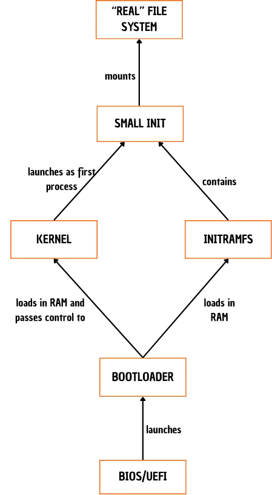


This filesystem  contains the normal Linux directory hierarchy: binaries, libraries, configuration files, and so on. Crucially, it also contains the system’s main init program, such as `/sbin/init` or `systemd`. After switching the root, the initramfs environment executes this real init program from the new root, and then its work is done.

From this point on, the boot process is handled by the init system. The init system is the first long-lived user-space process and is responsible for starting and supervising all other services. It mounts any remaining filesystems listed in configuration files, brings up networking, starts background services, and eventually spawns one or more login processes so that users can log in. 

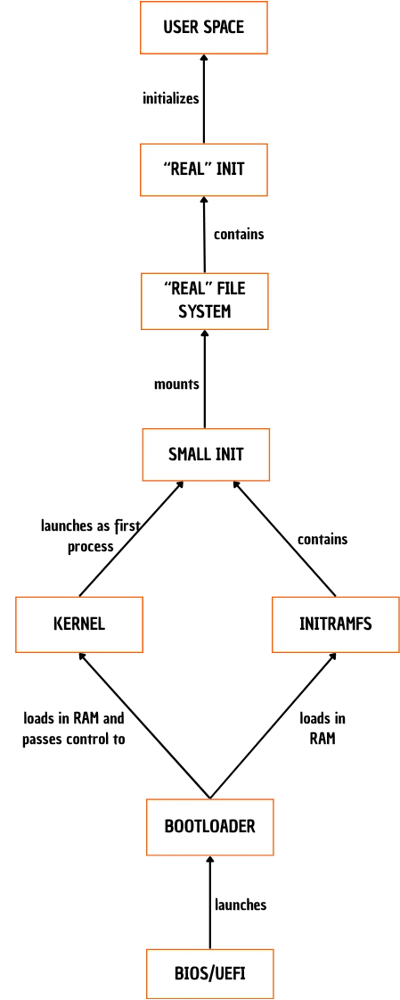

Once you reach a login prompt or graphical desktop, the chain that started with the firmware has completed: firmware handed control to the bootloader, the bootloader to the kernel, the kernel to the initramfs, the initramfs to the real root filesystem and init, and init to all the user-space processes that make up a running Linux system. 

At that point the boot process is considered complete and the system is running in its normal user-space environment.

## Kernel, syscalls and drivers
<chapterId>35deab48-8874-48aa-bee5-6c30965ffca4</chapterId>

The Linux kernel is the core of the operating system. It runs in a privileged mode of the CPU (often called kernel mode) and controls hardware, memory and processes. Everything else you think of as "Linux" lives in user space and talks to the kernel when it needs something privileged done. 

The kernel’s job is to provide a consistent API to user-space programs and to distribute the underlying hardware resources between them. 
It is useful to think of the kernel as a collection of cooperating subsystems. The core kernel subsystems in Linux are:

* The process scheduler
* The memory management subsystem
* The virtual file system
* The networking unit
* The inter-process communication unit

### The process scheduler

The *process scheduler* is the part of the kernel that decides which process gets to run on the CPU, and for how long. A process is just a running program with its own memory and resources. If you have many processes but only a few CPU cores, the scheduler decides which process runs on which core, and for how long. To do this, it divides CPU time into small slices and performs context switches: it saves the CPU state of the currently running process and restores the state of another one.

There are two conceptual styles of multitasking. In *cooperative multitasking*, each process is expected to voluntarily yield the CPU, for example by calling into the OS when it is idle; if a buggy program never yields, it can freeze the system. In *preemptive multitasking*, which Linux uses, the kernel sets up a timer and can forcibly stop a running process when its time slice is over, then run another one. That way no single user process can hog the CPU forever.

### The memory management subsystem

The memory management subsystem is the part of the kernel that manages address spaces and talks to the CPU’s hardware MMU. The hardware MMU’s job is simple but strict: given a virtual address requested by a program, it uses page tables to translate that into a physical address (a location in RAM), and it enforces access permissions on that page. The kernel maintains data structures called page tables that describe how these virtual addresses map to physical pages of RAM, and what permissions each page has (for example, readable, writable or executable). 

When the CPU needs to access memory, it goes through the hardware MMU, which consults these page tables that the kernel set up. By controlling those tables, the kernel can give each process its own isolated address space, and prevent processes from reading or writing each other’s memory.

Each process gets its own virtual address space. The kernel creates and switches between these address spaces by loading different page-table roots into the CPU’s MMU registers when it schedules a new process on a core. That way, when process A runs, its virtual address `0x400000` points at some physical memory; when process B runs, the *same* virtual address might point to a completely different physical page, or to nothing at all. This gives isolation: one process cannot normally read or overwrite another process’s memory, because the MMU will not map its virtual addresses to those physical pages.

On top of this basic translation, the kernel’s MMU subsystem implements higher-level policies and tricks. It can mark some pages as shared between processes (for example, shared libraries or explicit shared-memory regions), use copy-on-write so that a forked child initially shares pages with its parent until one of them writes, and move rarely used pages out to disk (swap) while keeping their virtual addresses valid. All of these features come from the kernel updating the page tables and related data structures; the hardware MMU then enforces whatever the kernel has decided.

### The virtual file system

The virtual file system, usually shortened to VFS, is the part of the kernel that implements the idea of "files and directories" that user programs see. Underneath the VFS, there can be many different concrete filesystems. A "concrete filesystem" here means a particular way of laying out files and directories on some storage, along with rules for how to read and write them. For example, ext4 and XFS are common on-disk filesystems for Linux. There are also network filesystems that store data on another machine, and "virtual" or "pseudo" filesystems like `procfs` and `sysfs` that do not store data on a disk at all but instead expose information from the kernel as if it were files.

The VFS sits between user programs and these various filesystem drivers. It defines a common set of operations such as "open this path", "read from this file", "write to this file" and "list the contents of this directory". When a program asks to open a path, the VFS figures out which filesystem that path belongs to and then calls into the right filesystem driver to actually fetch or update the data. Because of this indirection, user space does not have to care whether a file is on a local disk, on a network share or generated on the fly by the kernel. Everything is reached with the same simple model.

### The networking unit

The networking subsystem is the part of the kernel that lets programs send and receive data over networks. A network here can mean anything from a LAN to the entire Internet. Without this subsystem, each program would have to know how to drive network hardware and how to speak all the protocols itself, which would be impossible to maintain. Instead, the kernel provides a common networking service and hides the details.

On top of basic sending and receiving, the networking subsystem also enforces policies. It can filter packets according to rules (this is what a firewall does), keep network connection state so it knows which packets belong to which connection, and apply routing tables that describe where to send packets based on their destination addresses.

### The inter-process communication unit

The inter-process communication unit is the part of the kernel that deals with programs talking to each other. A process is just a running program, and many real systems are made of lots of processes that need to cooperate. They might need to send each other data ("here are the results I just computed") or simple signals ("I’m done, you can continue now"). 

Processes do not send data to each other directly. Instead, each one asks the kernel to do it on its behalf. The kernel offers a few basic kinds of communication channel: *pipes*, *signals*, *message queues* (we'll analyze them in another chapter); these are all locations where one process can put some information and another process can later pick it up. The kernel keeps track of who created each channel, who is allowed to use it, and what information is currently stored there.

A lot of the work in this unit is about *waiting*. Often a process cannot continue right away: it may be waiting for some data from another process, or waiting for permission to use a shared resource. In that case it tells the kernel "I am waiting for something to happen here" and the kernel takes it off the CPU so that other processes can run. Later, when another process sends data or finishes using the resource, it tells the kernel, and the kernel notices that someone was waiting. The waiting process is then put back into the pool of runnable processes so it can continue. In this way, the inter-process communication unit acts as a kind of traffic controller and message hub inside the kernel, making sure that information and "ready" signals move between processes in an orderly and safe way.

### Syscalls, drivers and modules

To use these kernel services, user programs do not call kernel functions directly. Instead they use *system calls*, often shortened to "syscalls". A system call is a controlled entry point into the kernel: a program asks the kernel to perform an operation it is not allowed to do by itself, such as opening a file, creating a process or configuring a network interface.

Hardware access itself is mostly handled by *device drivers*. A device driver is a piece of kernel code that knows how to talk to a particular piece of hardware: disks, network cards, USB controllers, graphics adapters etc. 
The driver translates generic kernel operations (such as "send this packet" or "read this block", which are supposed to work in the same way on all Linux machines) into the specific register writes, commands and protocols that the specific piece of hardware understands. 

Many drivers in Linux are built as *kernel modules*. A kernel module is a chunk of code that can be loaded into or removed from the running kernel at runtime. Unlike a user-space program, a module does not get its own process or memory space; once loaded it becomes part of the kernel and runs with full kernel privileges.  This modularity allows Linux to support a wide range of hardware without compiling everything directly into a single huge kernel image; it also allows administrators and developers to add, update or experiment with drivers without rebooting.

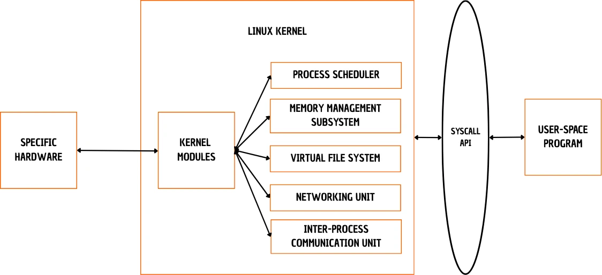

## File system
<chapterId>e8adf0e5-7b70-4e9b-8b85-4f01e705c2ca</chapterId>

Modern Linux systems organize persistent data in several layers, from the raw storage device up to the file system that user-space programs see. At a high level these layers are: 
* physical storage
* block devices
* partitions
* logical volume management
* file system drivers

### Physical storage

At the lowest level there is a physical storage device. This can be a spinning hard disk, a SATA SSD, an NVMe drive on a PCIe bus, or some other kind of non-volatile memory. The important property of this device is that it can keep its data when you power down the PC, and that it exposes a large range of addresses where data can be stored. 

Internally, the hardware groups data into fixed-size units often called *sectors* (commonly 512 bytes or 4096 bytes), but user space applications normally do not work directly with those details. The device is driven by a microcontroller and a kernel driver that know how to send commands to it and how to handle errors.

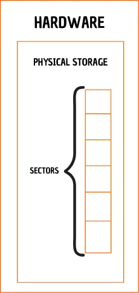

### Block devices

The Linux kernel wraps physical storage in a more generic abstraction called a *block device*. A block device is something you can read and write in fixed-size chunks called blocks. The block size is usually equal to, or a multiple of, the sector size that the hardware uses. From the kernel’s point of view, "block device" is a generic interface: the same kernel code can work with many different kinds of disks and SSDs, as long as there is a driver that presents them as block devices. In user space, these devices appear as special entries under `/dev` (for example `/dev/sda` or `/dev/nvme0n1`).

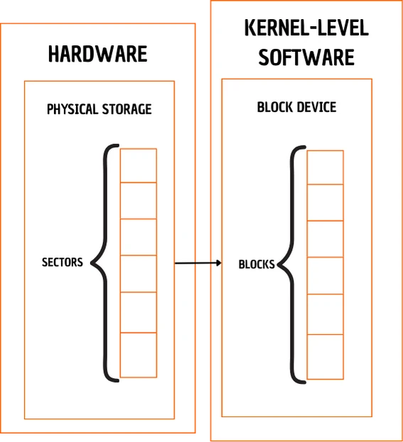

### Partitions

A single block device is often divided into multiple regions called *partitions*. A partition is just a contiguous range of blocks on a block device that has been marked for separate use. Information about how the disk is divided is stored in a partition table near the beginning of the disk. The partition table is a small data structure that lists where each partition starts, how large it is, and what type it is meant to hold. Common partition table formats are used in practice, but the important idea here is that each partition is treated by the kernel as if it were its own block device. For example, `/dev/sda1` and `/dev/sda2` are separate partitions on the same underlying disk `/dev/sda`. This allows different operating systems (or different parts of the same system) to live on different regions of the same physical device.

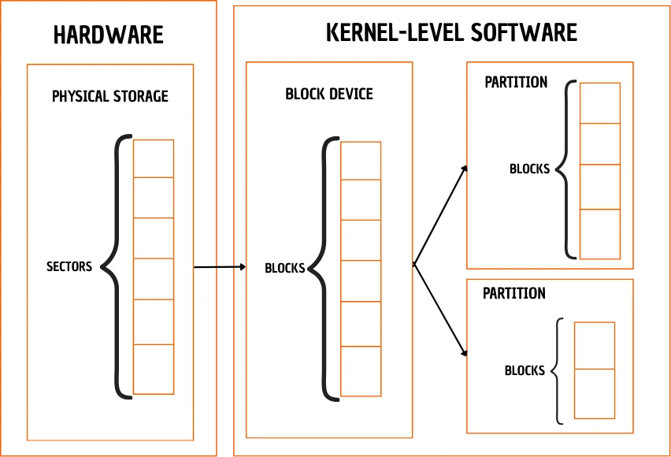

### Logical volumes

Plain partitions are fixed slices of a disk: once you choose their sizes and positions, changing them later is possible but risky and often requires downtime or careful manual work. 

Above plain partitions you can add another layer: *logical volume management*. Instead of putting file systems directly on partitions, you can group one or more physical devices into a pool and carve out logical volumes from that pool. A logical volume is a virtual block device created by a volume manager. The kernel and user-space see it as just another block device, but internally the volume manager can map it to multiple disks, move it around, resize it or keep snapshots. 

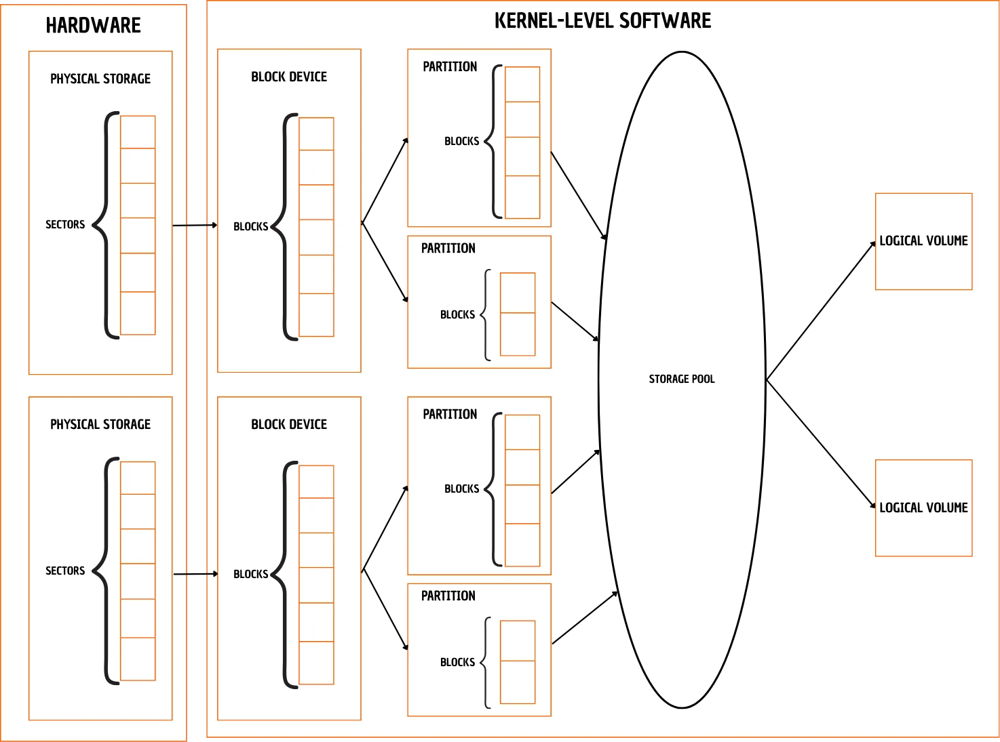

With logical volumes, the file system sits on top of a virtual block device that can grow, shrink, be moved to different physical disks or even be spread across several disks, while the file system itself and the applications using it do not need to know how the underlying storage changed.

On Linux, a common volume manager is LVM (Logical Volume Manager). Some modern file systems integrate volume management features directly. Btrfs is an example of this. Btrfs can take multiple devices, manage them as a single storage pool, and provide subvolumes and snapshots inside that pool. In that model, you do not necessarily need a separate tool like LVM, because the file system itself understands the idea of multiple devices and logical subdivisions. The underlying principle is the same: decouple the "logical volume" that the file system sees from the raw layout of blocks on the physical devices.

### File system driver

At the top of these storage layers sits what it's usually called the *file system*. In the kernel, a file system is implemented as a driver that knows how to use a block device to store and organize data. The driver does not care whether the underlying block device comes from a plain disk, a partition, or a logical volume. It just sees something that can read and write fixed-size blocks and builds its own layout on top.

Each file system type (for example ext4, XFS or Btrfs) defines its own *on-disk format*. The on-disk format is simply the specific way in which that file system arranges data and bookkeeping information across the blocks. The file system driver understands that format. When other parts of the kernel ask it to create, remove or update files, the driver translates those requests into sequences of block reads and writes on the underlying device.

In this way, the lower layers (physical storage, block devices, partitions and logical volumes) are responsible for providing a reliable range of blocks, and the file system driver is responsible for deciding how those blocks are used. The rest of the kernel does not need to know how the blocks are arranged internally; it just calls into the file system driver, which hides the details of the on-disk format and presents a consistent view of stored data as directories and files.

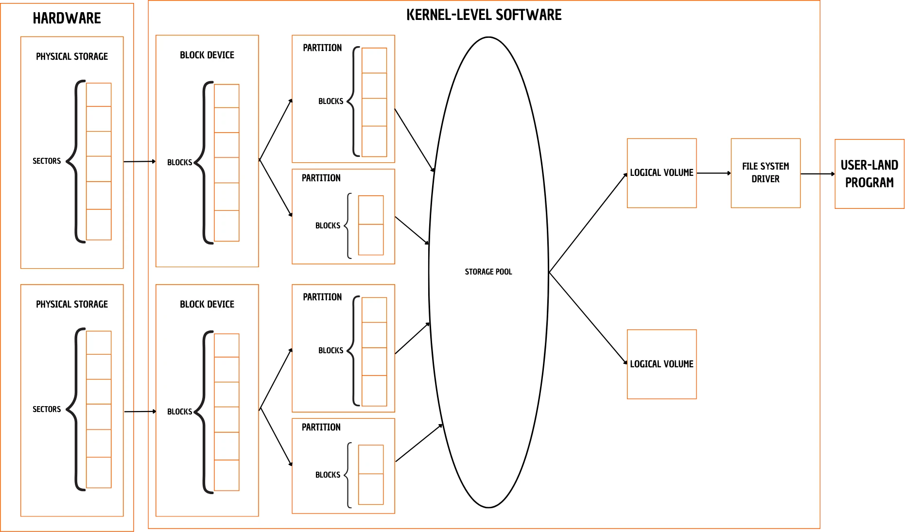

## System libraries
<chapterId>eca6b939-e2fb-4202-9b5d-868bae4ab485</chapterId>

### Static libraries

A library is just reusable code that many programs can use. Modern programming languages like Go or Rust are oriented towards producing *static libraries*. 

With a static library, the code a program needs from that library is bundled into the final executable. The build toolchain takes your program’s compiled code and the compiled code from the libraries it uses, and produces a single self-contained executable. 

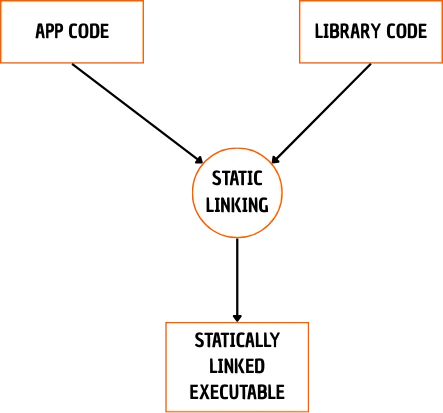

If everything needed by the program is statically linked, at run time the kernel only has to load that one file, because all the needed code is already inside the executable image.

### Dynamic libraries

*Dynamic libraries* work differently. The library code stays in separate files, and the executable only contains references to them. The executable says "when this runs, I expect the system to provide these libraries, with these interfaces". When the program starts, the OS uses a *linker*, which is a piece of software responsible for locating the right library files on the system, loading them into memory and connecting the program’s references to the code and data inside those libraries. If the expected libraries are missing or incompatible, the program cannot start correctly.

Dynamic linking was originally motivated by tight hardware constraints: early systems had very limited memory and storage, so sharing common code between many processes and many executables saved a lot of space. Instead of having a copy of the same library code inside every program, one copy could be stored on disk and mapped into multiple processes at run time. This is why dynamic linking is very common among Linux libraries and programs.

### ELF format

On Linux, that standard format for programs and libraries is called *ELF*, which stands for Executable and Linkable Format. 

An ELF file contains headers that describe its type and contents. These headers say whether the file is an executable or a library. They describe which parts of the file should be loaded into memory when the program starts, and where the entry point is. For dynamically linked executables, the ELF metadata also records which shared libraries are required, so that the linker can fetch them.

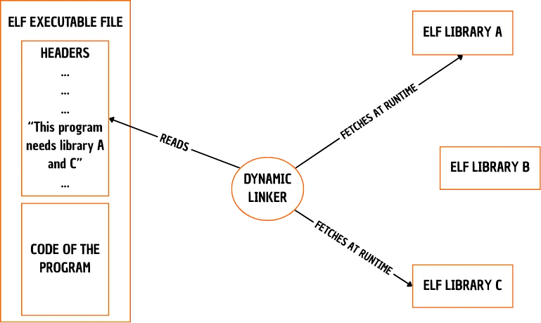

### glibc

Almost all user-space programs on a Linux system depend on its standard C library, commonly referred to as *glibc* (GNU C library). Glibc provides basic building blocks such as input and output functions, memory allocation and string handling. It also provides the thin user-space wrappers around system calls (which are usually written in assembly), so that calling a kernel service from C code looks like a normal C function call.

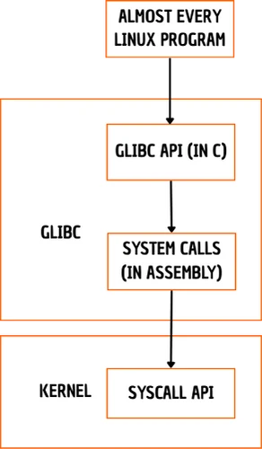

Glibc itself is stored as an ELF shared library file. That means it is handled like any other shared library: the dynamic linker loads glibc into memory when the program starts. Because almost all programs rely on glibc, it is usually one of the first shared libraries that gets loaded.

(Glibc is an almost 40 years old piece of software and it has a lot of issues. The fact that the majority of the Linux ecosystem depends on it has been widely critized, and that has prompted the development of alternatives like the **musl** standard library, which is used in major Linux-derived projects like Android and Alpine Linux.)

### C runtime

Within the C standard library there is a specific subset of code often referred to as the *C runtime*. The C runtime is the part that runs before and after the program’s main function. It sets up the initial process environment (arguments, environment variables and initial data areas), calls the `main` function of the program, and then handles the program’s termination and exit status.

The startup sequence of a program therefore involves several steps. 
1. The kernel loads the executable
2. The kernel examines its ELF headers and starts the dynamic linker. 
3. The dynamic linker (usually) loads the C standard library and any other required shared libraries. 
4. Control is passed into the C runtime entry point supplied by the standard library. 
5. Only after the C runtime has finished its setup does it call the program’s `main` function.

## Processes
<chapterId>a5c39183-758e-4599-b432-4af806177d69</chapterId>

A *process* is a running instance of a program. If you run the same program twice, you usually get two separate processes: they may start from the same executable file, but they don't share the same state. 

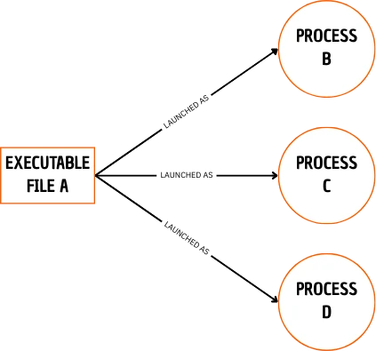

A process has an identity called a PID (process ID). A PID is just a number the kernel assigns so the process can be referred to precisely (by other programs and by the kernel itself).

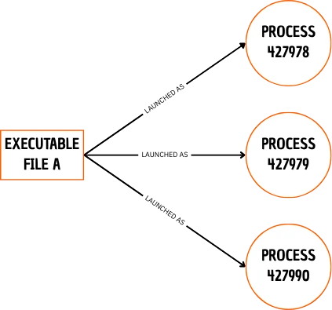

### Parents and children

Processes are organized as a tree.

When one process asks the kernel to create another process, the creator becomes the parent, and the new one becomes the child. The kernel remembers this relationship:

* each process has exactly one parent (except for **PID 1**, the root of the tree)
* each process can have zero or more children

This relationship is not just "nice to know": it is used for control and cleanup. For example, a parent can start multiple children to do work, and then wait until those children are done.

At the top of the tree there is a special process: *PID 1*. PID 1 is the first long-lived user-space process started during boot (we referred to it as the *init* program in the chapter about the operating system startup).

It is the root of the process tree, and it is always present as the "default parent" when needed.

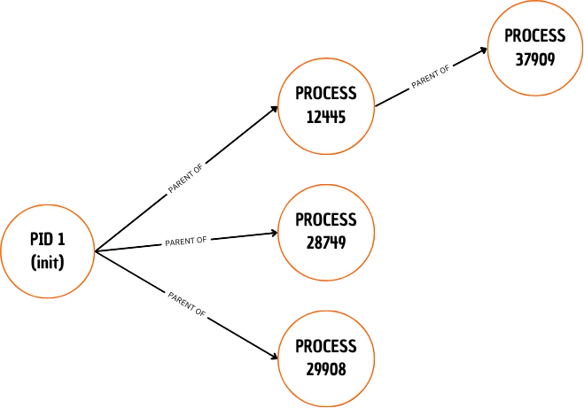


If a parent process exits while some of its children are still running, those children do not automatically stop. They keep running, but they become orphans (they no longer have their original parent). 

The kernel then "re-parents" them: it assigns them a new parent so the tree stays connected. The usual new parent is PID 1.

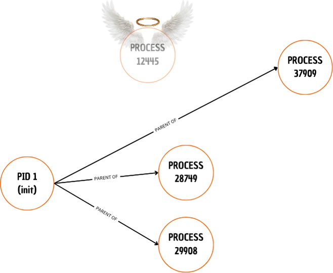

When a process exits, it produces an exit status (a small number that tells how it ended, for example success vs an error code). The kernel keeps that status so the parent can retrieve it.

This leads to us another couple of terms:

**Zombie**: an exited process that is no longer running, but still has a minimal record kept by the kernel so the exit status can be collected. A zombie does not keep executing and it does not keep its full memory around. It exists mainly as bookkeeping.

**Reaping**: the final cleanup step where the kernel removes that last bookkeeping record. This happens when some process collects the exit status of a zombie.

The process that collects the exit status is called the *reaper*. Normally the parent is the reaper: it asks the kernel "did my child exit, and what was the status?". Once that happens, the zombie can be fully removed.

If a parent is gone and cannot reap its children, this is where PID 1 matters again: orphaned children get re-parented, and PID 1 acts as the fallback reaper so zombies do not accumulate permanently. 


### Process scheduler and task structs

A computer usually has a small number of CPU cores, but it runs many processes. The part of the kernel that decides which process runs on which core, and for how long, is the *process scheduler*. 

A process can be running, ready to run, sleeping (waiting for something), or stopped. The exact names vary, but the idea is that the kernel must know whether a process can make progress right now or not.

Inside the kernel, a process is represented by a data structure called `task_struct`. In C terms, this is literally a struct: a block of fields that the kernel uses as its record for a running task. 

A `task_struct` contains, among other things:

* The process identifier (PID), which is the small integer you see in tools like ps or top.
* The current scheduling state (running, sleeping, stopped, etc) and the priority or scheduling parameters used by the scheduler.
* Links to the process’ memory description (what memory ranges exist, what they are used for, and how they map to actual physical memory).
* The table of open file descriptors (the kernel’s list of "this process currently has file X open as descriptor 3", etc).
* Credential and security information (user id, group id, capabilities), which is how the kernel knows what this process is allowed to do.
* Signal state (signals are asynchronous notifications like "terminate", "interrupt", "child exited").

The scheduler’s job is easier to understand if you separate processes into two broad categories:

**Runnable processes**: processes that could make progress right now if they were given CPU time.

**Waiting processes**: processes that cannot make progress right now because they are waiting for something (for example: data to arrive from disk, a packet to arrive from the network, a timer to expire, or a lock to be released).

The scheduler mainly chooses between runnable processes. Waiting processes are not competing for the CPU until whatever they are waiting for happens.

## Memory segments
<chapterId>8992c77a-83e0-4b13-b95c-3550a2cf8e95</chapterId>

A running program needs memory for different kinds of things: the instructions it will execute, the long-lived variables it keeps around, temporary values while it computes, and so on. Operating systems usually organize a process's memory into multiple regions, where each region has a different purpose and different access permissions (for example: readable, writable, executable). 

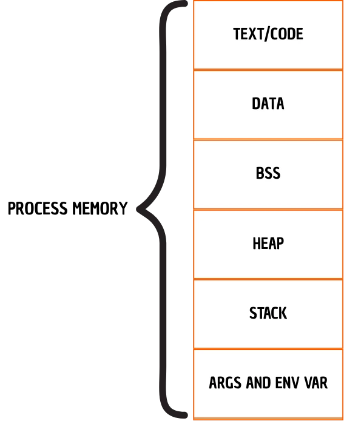

### Text / code 

This region contains the machine instructions of the program (and often the instructions of the libraries it uses). It is typically mapped as readable and executable, but not writable. "Not writable" matters because it prevents accidental or malicious overwriting of the instructions while the program is running.

This region is often shareable across processes: if two processes are running the same executable (or using the same shared library), the OS can map the same physical pages as code for both processes. Each process still sees that memory at its own virtual addresses, but the underlying RAM can be shared to save memory.

### Data

This is the region that contains long-lived program data that exists for the whole duration of the process: global variables and static variables. It is commonly split into sub-regions based on mutability (whether the bytes should be allowed to change) and on how the initial values are provided at program start.

### BSS (null-initialized)

Not all global/static variables need explicit bytes stored in the executable file. If a global/static variable is uninitialized, or initialized to zero, the program still expects it to start as all zero bits, but it would be wasteful to store a huge run of zeros in the binary.

That is what the BSS region is for: it represents "zero-initialized data". The executable typically records only the size of this region, and when the program is loaded the kernel/loader ensures that the corresponding memory starts out filled with zeros.

The name BSS is historical: it is often explained as "Block Started by Symbol", which comes from older toolchains and assembly conventions. The important practical point is that BSS affects how much memory the program uses when it runs, but it does not necessarily take the same amount of space inside the executable file.

### Heap

Sometimes you need memory that survives beyond the function that created it (for example, you build a data structure and return it to the caller). That kind of memory cannot live in a place that is automatically reclaimed when a function returns.

The heap is the part of the process memory used for these "manual lifetime" allocations. Your program asks for a block of N bytes (commonly via `malloc`), and later explicitly gives it back (via `free`) when it is no longer needed. In between, that block stays valid even if the function that allocated it already returned.

### Stack

The stack is the memory a program uses for short-lived data while running functions. When a function starts, it gets some stack space for its local variables and temporary values. When the function returns, that space is automatically reclaimed.

The stack has a fixed maximum size (a limit set by the system and/or runtime). If the program uses too much stack space (for example, a function calling itself too many times, or very large local variables), it can exceed that limit and crash with a *stack overflow*.


### Args and env var

When a process starts, it is given two sets of strings.

Arguments are the command line words you typed after the program name. They describe what this particular run should do (for example: which file to open).

Environment variables are part of the per-process "environment": a set of key/value strings that the OS attaches to a process when it starts. They are one of the main ways the shell passes context into every program you run: where to search for executables (`PATH`), what your home directory is (`HOME`), which locale to use (`LANG/LC_*`), what terminal you’re on (`TERM`), and a lot of desktop/session plumbing (`DISPLAY`, `XDG_*`). They are inherited by default: a process starts with a copy of its parent’s environment, and can add, remove, or change variables for its children.

## Memory safety and management
<chapterId>89188319-856b-4635-9c6b-ff550f2710b6</chapterId>

Programs treat memory as a place to store data and as a way to refer back to that data later. At runtime, programs constantly create, use, and discard data structures. Memory safety means: the program only reads and writes memory it actually owns, and only while that memory is valid. This section covers common failure modes, and then the memory allocation strategies that can make it easier to avoid them.

### Vulnerabilities 
Memory bugs are dangerous because they break a basic assumption: that a piece of code is only reading and writing the memory it intended to use. When that assumption fails, the best case is a clean crash. The worse case is silent corruption: the program keeps running, but with incorrect data, incorrect control flow, or unexpected exposure of sensitive information.

**Use after free** happens when code keeps a pointer to heap memory, frees it, and then later reads or writes through the old pointer anyway. Sometimes this crashes immediately (for example if the memory was unmapped). More dangerously, it often does not crash: the allocator may have already reused that block for a different purpose, so the stale pointer now aliases a different object. That can cause "impossible" behavior, data corruption, or security vulnerabilities, because the program is now accidentally reading or writing the wrong thing.

**Out of bounds write or read** happens when code reads or writes past the end of an array or buffer. This can crash if it crosses into an unmapped or protected page, but it can also silently read unrelated data or corrupt nearby objects. Out-of-bounds reads can leak secrets (because you end up reading bytes that were never meant to be exposed). Out-of-bounds writes can corrupt control data (function pointers, return addresses, allocator metadata) and can sometimes be used by an attacker to take control of the program.

**Null dereferencing** happens when code tries to read or write through a pointer that has an address value of zero. On most modern systems, address zero is intentionally left unmapped in user space, so this causes an immediate crash (often reported as a segmentation fault). In some low-level contexts, address zero may be treated specially, or a bug might accidentally make it accessible, which can turn "it crashes" into "it behaves strangely".

**Memory leaks** happen when the program allocates heap memory but never frees it, and also loses the last reference to it. That memory stays reserved for the process even though the program can no longer use it. It's not really a memory vulnerability, and in short-lived programs this may not matter much because the OS reclaims memory when the process exits. But in long-running programs, leaks accumulate: memory usage grows, performance can drop, swapping can occur, and the process can eventually be killed for using too much memory.

Not all bugs are "memory bugs", but many non-memory bugs can still lead to memory safety problems or memory exhaustion. The common pattern is that logic errors or resource-management errors cause the program to compute wrong sizes, skip checks, or get stuck holding resources indefinitely.

### Memory allocation

"Allocation" is how a program obtains memory for its data structures. Different parts of memory have different allocation rules and different performance characteristics. The more complicated your allocation strategy is, the more opportunities you create for using memory after it stopped being valid, or for simply losing track of it. A good default is to choose the simplest model that fits the data.

**Static memory** (the one used for global and `static` variables) exists for the entire lifetime of the program and it's the simplest to manage. It is there when the program starts and it is still there when the program ends. Because you do not repeatedly create and destroy it at runtime, there is no "did we free it too early" and no "did we forget to free it". The tradeoff is flexibility: you can’t easily size it based on runtime input.

**Stack memory** is a good fit for short-lived working data. When a function runs, it has space for local variables and temporaries, and when the function returns that space is reclaimed automatically. This makes lifetime rules clear and reduces cleanup mistakes. The tradeoff is its limited lifetime: stack memory is only valid while the function (or scope) that created it is active. When the function returns, that space can be reused immediately by later calls. The stack also has a size limit, so very deep call chains (or huge local buffers) can overflow it.

**Heap allocation** has more overhead than stack allocation because someone must track which heap blocks are in use, how big they are, and where free space exists.

A common interface for heap allocation is:
* `malloc(size)`: request a block of at least "size" bytes and get a pointer to it
* `free(ptr)`: return a previously allocated block back to the allocator

A lot of performance problems and bugs come from making many small allocations on the heap and trying to keep track of all of them. A common improvement is to group allocations so lifetimes become simpler and more structured. Instead of "allocate and free each object independently", if many objects are supposed to have the same lifetime, allocate them together and free them together. A common implementation of this is the *arena allocator*: you allocate many related objects from one big chunk, then release them all at once when you don't need them anymore. This reduces the number of individual frees, reduces fragmentation, and makes it harder to leak memory by forgetting to free a single object, because cleanup happens at the group level.

# User level
<partId>39c62001-e181-40b6-accd-bdb784fad162</partId>


## "Everything is a file"
<chapterId>b6744ba7-c256-47e9-9a66-b906c614fc27</chapterId>

Unix started in the early 1970s at Bell Labs, built by a small group of developers working on comparatively weak machines by today's standards. Memory and storage were scarce, and the system had to be simple enough that a small team could understand and maintain it. Instead of trying to design a huge operating system that solved every problem in one place, they focused on a small kernel and a collection of reusable programs that ran on top of it. Most interaction with the system happened through a text-based shell, where users typed commands and combined programs at the command line.

From that context came the basic Unix philosophy in userland: write small programs that each do one job well, make them read input and write output in simple formats (often plain text), and design them so they can be connected together. The shell and the process model make it easy to chain programs with pipes, redirect input and output, and treat files, devices and some communication channels in similar ways. Once you understand how programs use these generic abstractions, it becomes easier to reason about Unix systems as a whole, because higher-level behavior is mostly built by composing these pieces.

Unix kernels try to expose as many resources as possible through a single abstraction: the **file**. This is not just about documents or images stored on disk. The same interface is used for directories, hardware devices, communication channels between programs and even some views into the kernel itself. This idea is often summarized as "everything is a file", and it is one of the main reasons Unix systems feel simple and consistent even though the underlying hardware and software are very diverse.

A regular file is the simplest case. It is an ordered sequence of bytes plus some metadata. The metadata includes things like the file name, its size, who owns it and which permissions it has. The operating system does not care what those bytes "mean". A text editor will interpret them as characters, an image viewer will interpret them as pixels, a video player as frames and audio, and so on. From the kernel’s point of view, it just provides operations like "open this file", "read some bytes", "write some bytes" and "close the file".

Files are organized into **directories** (often called folders). A directory is itself a special kind of file that stores a list of names and the references associated with those names. Some of those names refer to regular files, some refer to other directories. By chaining names together with slashes you get a *path*, which is how you tell the system "start from this directory and walk through these names until you reach the file I care about". 

When you use a path like `/home/user/logs/app.log`, the kernel resolves it one component at a time by walking these tables: 
- The directory at the very top is conventionally called the *root* directory and written as "/". All other paths are somewhere under that root.
- then it looks up "home" in the root directory
- then "user" in the `/home` directory
- then "logs" in the `/home/user` directory
- then "app.log" in the `/home/user/logs` directory

Sometimes you want to have the same underlying file appear in multiple places in the directory tree without copying its contents. Symbolic links, often shortened to **symlinks**, exist for this purpose. A symbolic link is a tiny file whose contents are just another path. When you open a symlink, the kernel silently follows the path stored inside it and opens the target instead. This lets administrators and programs rearrange the tree (or provide convenient aliases) without moving the underlying data. 

The "everything is a file" idea becomes more interesting when you look at hardware devices. Under directories such as `/dev` you will find many entries that look like files but do not store ordinary data on disk. These are *device* files: small records the kernel uses to expose hardware through the same open/read/write/close interface. There are two main categories of device files: **character devices** and **block devices**.

Character devices represent things you typically interact with as a stream of bytes. Examples include serial ports, keyboards, mice or simple hardware sensors. You open the device file, then read bytes as they arrive or write bytes to send commands. There is no concept of "jump to byte 1000" inside the stream; you just consume the bytes in order as the device produces them. From the program’s perspective this looks a lot like reading from or writing to a regular file, but underneath the kernel is talking to the device driver instead of a disk.

Block devices represent hardware that naturally works in fixed-size chunks of data, such as disks, partitions or some kinds of non-volatile memory. Instead of treating them as endless streams, the kernel treats them as arrays of equally sized blocks. A filesystem is then layered on top of a block device to turn those blocks into directories and regular files. When a program opens a file from such a filesystem, it does not talk to the block device directly; it talks to the filesystem code, which in turn uses the block device file to read and write the right blocks at the right positions.

Processes also need ways to talk to each other and to the network, and Unix again reuses the file interface for this. **Sockets** are endpoints for communication. A network socket might represent a TCP connection to another machine; a Unix domain socket might represent a local connection between processes on the same system. In both cases, a program can get a handle to a socket and then use read and write operations to receive and send data. Unix domain sockets often appear in the filesystem as special entries under directories like `/run` or `/tmp`, which reinforces the idea that "you open a path and talk through it", even though the bytes are not being stored on disk.

Another simple communication mechanism is the named *pipe*, also called a **FIFO**. FIFO stands for "first in, first out": the data is read in the same order it was written. A named pipe appears in the filesystem with a path, just like a regular file. One process opens it for writing, another opens it for reading. The kernel then transports the bytes between them. Nothing is permanently stored on disk; the named pipe entry is just a rendezvous point so that the two processes can find each other. Once again, the programs simply open a path and use normal read/write calls, without needing to know how the kernel forwards the data.

All of these objects (regular files, directories, symlinks, device files, sockets and FIFOs) are not identical internally, but they all reuse the same small set of operations. Programs open them, read from them, write to them and close them using the same system calls. This uniform interface makes Unix systems easier to program against: tools that were originally designed to read from or write to regular files often work unchanged with device files, sockets or pipes.

This unification has trade-offs. Some resources do not naturally behave like byte streams, and forcing them into that shape can make interfaces harder to understand rather than simpler. Many devices and kernel features need operations that do not fit cleanly into read and write. The file metaphor can also hide important differences in performance and behavior. Treating a disk file, a terminal and a network socket as interchangeable "things you read and write" is convenient at first, but it can encourage code that ignores latency, blocking behavior or error modes that matter a lot for interactive or networked programs. In practice, Unix keeps the common subset of operations uniform, but still exposes many special cases and additional APIs to go beyond that subset.

## Permissions, processes and file descriptors
<chapterId>64bbd2a4-b20e-4ee4-8f09-7b35bd8241de</chapterId>

On early Unix machines, the operating system was designed for multiple people sharing the same hardware. A large computer would sit in a room, and several users would connect to it through terminals. Each person had their own login, their own running programs and their own files, but they were all using the same CPU, the same RAM and the same disks. From the beginning, Unix needed a way to keep those users separated enough that one person could not accidentally (or deliberately) destroy another person’s work. That is where users, groups, permissions and the process model come from: they are the basic tools the kernel uses to decide "who are you?" and "what are you allowed to do?". 

### Sessions and users

When you log in to a Unix system, the kernel creates a login **session** for you. A session is a group of processes that share some common context: a controlling terminal, a user identity and an environment. The program that handles the login verifies your password, then starts a shell or a desktop as your first process in that session. From there, every command you run becomes a child process of that shell. If you close the terminal or log out, the session ends; your terminal or graphical seat is freed for the next login.


The "who are you?" part is represented by **user** accounts. Each user has a username (such as "alice" or "root"), but internally the kernel uses a numeric user id, often abbreviated as *UID*. Every process has a UID attached to it, and the kernel uses that UID to decide what they can access. The *superuser* account, traditionally called `root`, has a special UID (usually 0) that bypasses most checks; this is why running programs as root is powerful but dangerous.

**Groups** are a second axis for permissions. A group is a named collection of users, again represented internally by numeric group ids (*GIDs*). A user can belong to several groups at once. This allows the system to express simple policies like "this directory is writable by anybody in the ‘developers’ group, but not by other users" without having to list every user individually.

### Permissions on files

The "what are you allowed to do?" part is represented by **permissions**. Permissions on files are usually represented as three small groups of flags: one group for the file's owner, one for the file's associated group, and one for everyone else. Each group can contain up to three basic permissions:

* `r` (read)
* `w` (write)
* `x` (execute)

For a regular file:

* *read* means the process may read the bytes of the file
* *write* means it may change those bytes
* *execute* means it may ask the kernel to load the file into memory as a program and run it

For a directory, the same letters have slightly different effects:

* *read* controls whether you can list the names of entries in the directory
* *write* controls whether you can create or remove entries in that directory
* *execute* controls whether you are allowed to "enter" the directory when the kernel walks through a path (for example, when opening /home/alice/file.txt it must "enter" /home and /home/alice)

If a permission is not granted, you see a dash instead of the letter:

* `-` means "this permission is not allowed here"

If you look at the long listing produced by a command such as `ls -l`, you might see something like:

```
-rwxr-x---
```

Those 10 characters can be read as:

* `-` : type of the object ("-" means regular file, "d" would mean directory)
* `rwx` : permissions for the owner of the file (read, write, execute)
* `r-x` : permissions for the group (read, no write, execute)
* `---` : permissions for others (no read, no write, no execute)

When you run a command such as `chmod` you are just asking the kernel to change these flags.

### File descriptors

Every running program is wrapped in a *process*, and the kernel keeps a fair amount of information with that process: which user and groups it belongs to, which terminal (if any) it is attached to, which current working directory it is using, and which files and communication channels it currently has open. Input and output are handled via **file descriptors**. 

A file descriptor is a small non-negative integer used by a process to refer to an open resource. 

By convention, every process starts with at least three file descriptors already open. 

Descriptor 0 is *standard input*, used for reading data in. 

Descriptor 1 is *standard output*, used for normal program output. 

Descriptor 2 is *standard error*, used for error messages and diagnostics. 

When a process opens a file or a socket, the kernel picks the lowest unused descriptor number (3, 4, 5, 6 and so on) and associates it with that resource. From then on, the process does not have to repeat the path or the socket details; it just says "read from descriptor 3" or "write to descriptor 5", and the kernel looks up the real thing. The "file" in "file descriptor" matches the broad Unix sense: the underlying object can be a regular file, a terminal, a pipe, a socket or a device.

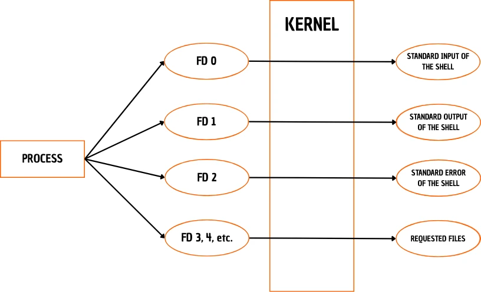

When you run a program from a shell, the shell passes its own descriptors into the child so that the program reads from your terminal and writes back to it. Shell redirection (`>`, `<`, `2>`, and so on) works by rearranging these numbers before the new program starts. 

For example, if you redirect output to a file, the shell opens the file first, gets a descriptor for it and then asks the kernel to make that descriptor become the child’s descriptor 1. The child itself just writes to descriptor 1 as usual; it does not need to know whether that goes to a terminal, a file or something else.

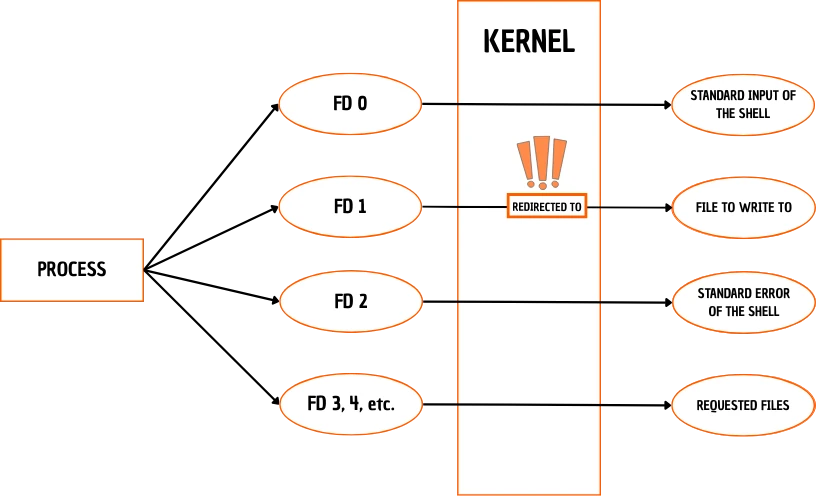

### Spawning new processes

New processes in Unix are created in a way that many people find unintuitive. Instead of a single call that says "start this program with these options", the traditional model is split in two separate steps: `fork` and `exec`. This design is powerful but also odd: a program first asks the kernel to create a child that is almost an exact copy of itself, and only afterwards does that child turn into the new program you actually wanted to run. 

Fork asks the kernel to make a copy of the current process. After a successful fork, there are two processes running: the original (the parent) and a new one (the child). They both continue execution from the same line of code, with the same memory contents, the same current directory and the same open file descriptors. The kernel gives the child a new process id, and the fork call returns different values in the two processes so that they can tell who is who. 

Exec, short for "execute", replaces the current process image with a new program loaded from an executable file. When a process calls exec, the kernel discards its current code and data segments and maps in the segments from the requested executable instead, keeping some things such as open file descriptors, user ids and (optionally) environment variables. 

The usual pattern in shells and many other programs is "fork, adjust some details in the child, then use exec to swap the child with a new program".

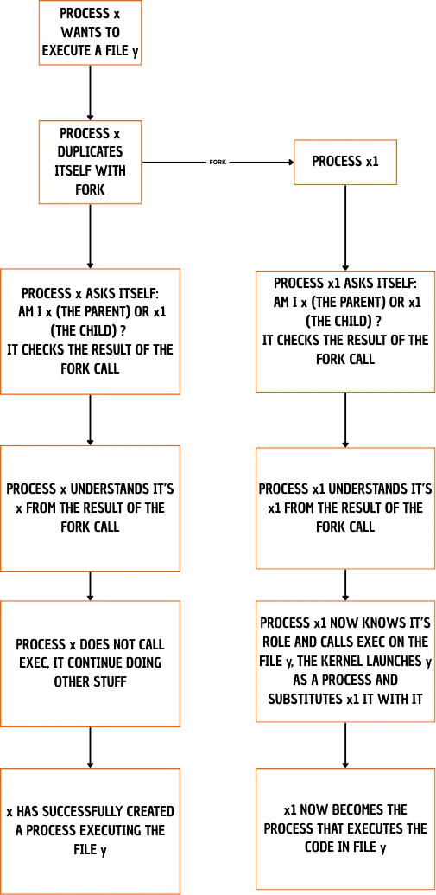

Historically, this two-step model comes from early Unix systems running on limited hardware. The kernel designers wanted a small, uniform set of system calls, and the ability to build more complex behaviour by combining them. At that time, processes were small, and copying them at fork time was not as expensive as it would be now. Fork also gave a convenient way to start child processes that inherit most of the parent’s state, which was useful for shells and servers that wanted to adjust just a few details before running a different program. Over time, copy-on-write techniques reduced the cost of making the copy, but the basic fork/exec interface stayed, largely because a lot of existing code relied on it.

The downside of this model is that it is easy to get details wrong. Because fork starts by duplicating almost everything, the child will inherit all open file descriptors by default. If the parent had a sensitive file open, or a network socket used to talk to a privileged service, and it forgets to close or mark those descriptors as "do not inherit", the new program will unexpectedly have access to them. That can become a security problem, especially when starting programs that run with different permissions or are less trusted. Environment variables and the current directory can also leak information or influence behaviour in ways the parent did not intend.

There are performance issues as well. Even with copy-on-write, creating a child with fork means setting up a new virtual memory mapping that initially mirrors the parent. For very large processes this can still be expensive, because the kernel has to duplicate page tables and other bookkeeping, even if the child is about to call exec and replace all of its memory with something else. In multi-threaded programs, fork has additional complications: only the thread that calls fork is preserved in the child, while others simply disappear, potentially leaving global data structures in inconsistent states. 

Because of these pitfalls, the POSIX standard later introduced `posix_spawn` as a higher-level way to start a new program. Instead of explicitly forking and then calling exec in the child, a program calls posix_spawn with a description of what it wants: which program to run, which arguments and environment to use, which file descriptors to pass through or close, and optionally which directory or credentials to adopt. The implementation can then create the child process in a more direct and controlled way, often without doing a full copy of the parent at all. This can be faster, avoids many of the accidental inheritance problems, and gives a clearer description of the new process’s initial state. From the outside, the result is the same as with fork and exec: a new child process appears, with its own process id, running the requested program.

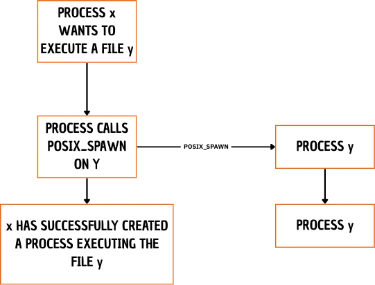

### Daemons and init systems

Not every program is started by a person typing a command. Many programs are meant to run in the background and provide a service, like managing network connections, logging messages, scheduling tasks etc.. These background service programs are commonly called **daemons**. A daemon usually starts during boot, keeps running for a long time, and does not have a terminal attached. 


Even though daemons run "in the background", they still start life like any other process, with the same idea of *standard input*, *standard output*, and *standard error*. The difference is that a daemon usually does not have a terminal for those to point to. For that reason, daemons typically make sure standard input goes to `/dev/null` (a special file that act as a black hole: data written to it gets discarded, and trying to read it will always return "end of file"), and standard output and standard error go somewhere sensible, like a log file or a central logging system. 

Modern systems often prefer supervising daemons: a manager starts the daemon, watches it, restarts it if it crashes, and keeps a clear record of whether it is running.

That manager is part of what we referred previously as the *init system*: the first user-space program (PID1) that starts during boot and then starts the rest of the system. The most common init system on modern Linux distirbutions is `systemd`, with `OpenRC` as a distant second. 

They have two different approaches to this job. Both can start services at boot, stop them at shutdown, and give you commands to manage services while the machine is running, but:

- Systemd uses a fairly uniform configuration format to describe services and their relationships, and it actively tracks them after they start. It can start many services in parallel, restart services when they fail, and provide a consistent interface across the system. The tradeoff is that it is a large, integrated set of components, so there is more complexity in one place, and programs built around it tend to follow its way of doing things, making them potentially harder to run on Linux installations that do not use systemd.

- OpenRC is more traditional and more script-focused. Services are commonly started and stopped using readable shell scripts, and it tries to stay closer to the traditional "small tools working together" Unix style. That can make it feel simpler to inspect and customize. The tradeoff is that you often rely on separate tools for features that systemd bundles tightly, and service behavior can vary more depending on how those scripts are written.

## Inter-process communication options
<chapterId>bd42135b-188d-4fe6-b8eb-35353e6ccd55</chapterId>

Most Unix systems end up running lots of small processes that cooperate. Sometimes that cooperation is explicit, like a shell running one program and feeding its output into another. Sometimes it is hidden, like a desktop application talking to a background service, or a web server handing work to worker processes. This is what **inter-process communication** is about: it's the family of kernel features that let one process send data to another process, or let one process tell another "something happened, react to it". 

A useful mental model is that processes do not "reach into" each other’s memory. By default they are isolated. When they need to coordinate, they ask the kernel to set up a communication channel. One process writes into that channel, another process reads from it, and the kernel takes care of buffering, permissions, and waking up readers and writers when the other side becomes ready.

### Pipes

The simplest channel is a **pipe**. A pipe is a one-way byte stream: one end is for writing, the other end is for reading. Pipes are most visible in shells, because the shell can connect programs like "A | B": program A writes bytes, program B reads those bytes as its input. Under the hood, the pipe is represented by file descriptors, so reading from a pipe uses the same read operation you would use for a file. Pipes are great for streaming data in order, but they do not preserve "message boundaries": if you write "hello" and then "world", the reader just sees a stream of bytes and may receive them in chunks that do not match your write calls.

### Named pipes (FIFO)

A **named pipe** (also called a *FIFO*) is the same idea, but with a name in the filesystem so unrelated processes can rendezvous. With a regular pipe, the two endpoints usually come from a parent process that creates the pipe and then starts children that inherit the file descriptors. With a FIFO, one process can open a path for reading and another can open the same path for writing, and the kernel connects them. The FIFO file itself is not a place where the data is stored long-term; it is a meeting point the kernel uses to attach the two processes. Like pipes, FIFOs are byte streams with ordering, not message packets.

### Signals

**Signals** are a different category: they are not a data stream, but rather a kind of notification. A signal is the kernel delivering an asynchronous "event" to a process, usually to request that it stops, pauses, continues, or handles some exceptional condition. For example, when you press Ctrl+C in a terminal, the terminal driver causes a signal to be sent to the foreground process group to request interruption. Signals are intentionally small and limited: the point is not to transfer bulk data, it is to interrupt the normal flow of execution so the program can react. Because they can arrive at almost any time, programs need to handle them carefully, and they are best used for simple control events rather than structured communication.

### Sockets

**Sockets** are the general-purpose communication endpoints used both for local IPC and for networking. Unlike pipes, sockets are typically two-way: each side can both read and write. There are two common families. *Unix domain sockets* are for communication between processes on the same machine; they often appear as special filesystem entries and are commonly used by services and daemons to offer a local API. *Network sockets* are for communication across machines, using internet protocols like *TCP* or *UDP*. TCP sockets behave like reliable byte streams (similar to a pipe, but across the network), while UDP sockets behave more like independent packets (each send corresponds to a datagram). Sockets are a bigger toolbox than pipes: they support client/server patterns (one process listens, others connect), can carry structured connection metadata, and, with Unix domain sockets, can even support advanced features like passing file descriptors between processes.

### Message queues

Instead of a continuous stream of bytes, a **message queue** is a kernel-managed mailbox that holds discrete messages. A sender posts a message; a receiver reads the next message. The kernel preserves message boundaries, so you can treat each message as a unit (often with optional priorities). This can make program structure simpler than a byte stream when you naturally think in "requests" and "responses". The tradeoff is that the kernel is doing more bookkeeping than it does for a plain pipe, and you are usually constrained by queue limits and message sizes.

### Shared memory and semaphores

**Shared memory** is the fastest way for processes to exchange large amounts of data, because it avoids copying through the kernel for each transfer. The idea is simple: the kernel maps the same physical memory pages into the virtual address space of two (or more) processes. After that, both processes can read and write the same bytes directly, like they were normal memory. The kernel’s role is mostly in creating the region, mapping it, and enforcing permissions. The hard part is coordination: if two processes can write the same memory at the same time, you need rules about who writes what, and when readers can trust the contents.

That is where **semaphores** come in. A semaphore is a synchronization primitive: a kernel-managed counter used to control access to a shared resource or to coordinate stages of work. One common use is mutual exclusion: treating the semaphore like a lock so only one process at a time enters a critical section that touches shared state. Another use is signaling: one process "posts" to indicate that data is ready, another "waits" until that happens. Semaphores show up most often alongside shared memory, because shared memory by itself gives you speed but not safety: you still need a way to prevent races and to express ordering.

## Unix shell, core utils and environment variables
<chapterId>c9419f4f-3409-445e-8b67-37b48eff78bf</chapterId>

Most of what people think of as "using Unix" happens in user space: you log in, you get a *shell*, and you start running small programs that read input and print output. The shell is the program that reads your command line, starts programs, and connects them. It's just another program, but it sits in a special position: it is usually the first thing you interact with after login, and it is responsible for starting most of the other programs you run. 

You’ll often see the word `tty`. It comes from **teletypewriter**. Early terminals were literally typewriter-like machines that printed output on paper. Later they became video terminals, but Unix kept the name.


One of the big ideas in Unix userland is *composability*: instead of a few huge programs that do everything, you have many small tools that each do one job, and you connect them. This works because tools tend to follow a simple contract: read bytes from standard input, write bytes to standard output, and write errors to standard error. If programs behave like that, you can chain them together without the programs needing to know about each other. And since in Unix (almost) "everything is a file", almost all data can be treated as a stream of text, flowing from one program to another, and being modified in the process. Text is the *universal interface* that Unix programs can use to interoperate with each other.

**Pipes** are the shell feature that makes this feel natural. A pipe connects the standard output of one program to the standard input of another. If you write `A | B`, the shell starts both programs and creates a pipe between them so that whatever A prints becomes what B reads. This does not require "special support" inside A or B: they just read from input and write to output like normal.

You can also redirect these data flows outside the terminal. Instead of sending output to the terminal, you can send it to a file with `>`, or append with `>>`. You can feed a file into a program with `<`. And because errors are usually separated from normal output, you can redirect standard error specifically (commonly with `2>`). All of this is just the shell rearranging the program’s standard file descriptors before it starts the program. 

### Core utils

The Unix **core utils** are the small everyday programs that make this style practical. Different systems package them differently, but the common theme is simple text-oriented tools you can combine. Common examples include:

* `ls` (list directory contents)
* `cp`, `mv`, `rm` (copy, move, remove files)
* `mkdir`, `rmdir` (create/remove directories)
* `cat` (print a file), `less` (view text page by page)
* `head`, `tail` (take the beginning/end of a stream)
* `grep` (search for lines that match a pattern)
* `find` (walk directories and select files)
* `sort`, `uniq` (reorder lines and remove duplicates)
* `wc` (count lines/words/bytes)
* `sed`, `awk` (stream text transforms, more programmable)
* `xargs` (turn input lines into command arguments)
* `tar` (pack/unpack archive files)
* `ps`, `top` (inspect running processes)
* `kill` (send a signal to a process)

On many Linux desktops and servers, these utilities come from the *GNU* project (GNU coreutils, GNU grep, GNU sed, and so on). They tend to be feature-rich and consistent across full Linux distributions. *BusyBox* is a different approach: it provides many of the same command names, but implemented in a single small executable, aimed at minimal systems.

### Environment variables

An **environment variable** is a variable that contains a string and is attached to a running process. The shell sets some of them for you, and you can set your own. When a process starts another process, the child usually inherits a copy of the parent’s environment. That makes environment variables a simple way to pass shared configuration around without rewriting every command line.

Some environment variables you’ll see often are:

* `HOME`: your home directory path
* `USER`: your username
* `SHELL`: the path of your login shell
* `PWD`: the current working directory (what you get when you run pwd)
* `LANG`: language/locale settings (text encoding, sorting rules, messages)
* `EDITOR`: which text editor a program should launch when it needs one
* `TMPDIR`: where temporary files should go (if set)
* `PATH`: where to search for executable commands  

`PATH` is a list of directories (separated by colons), that the shell searches when you type a command. If you type `ls`, the shell checks each directory in PATH, in order, until it finds one containing an executable file named "ls".

If the command is not a shell built-in, the shell searches the directories listed in `PATH`, in order, looking for an executable file with that name. The first match wins.For example, if `PATH` is something like:

```
/usr/local/bin:/usr/bin:/bin
```

and you type:

```
mytool
```

the shell will check:

```
/usr/local/bin/mytool
/usr/bin/mytool
/bin/mytool
```

and run the first one that exists and is executable. The order matters: if two different directories contain a program with the same name, the one that appears earlier in PATH is the one you’ll run.

If you type a command with a slash in it, `PATH` is not used. For example, `./script` means "run the file named script in the current directory". `/usr/bin/python` means "run exactly the file Python that you will find in /usr/bin".

## Common directories
<chapterId>cb905809-cf39-4609-973d-038c7ac900c7</chapterId>

Unix-like systems such as Linux expose a single directory tree that starts at the root directory, written as `/`. Everything else is placed somewhere under that root: programs, configuration, user files, devices, and even some kernel-provided views of the running system. 

Here are the directories you’ll see on most Linux systems:

* `/`:  The root of the whole filesystem tree.

* `/bin`: Essential command-line programs needed for basic use and recovery (things like `sh`, `ls`, `cp`). 

* `/boot`: Files used for booting, like the kernel image and bootloader configuration (common on many Linux installs).

* `/dev`: Device files: entries the kernel provides so programs can talk to hardware and pseudo-devices using file-like operations.

* `/etc`: System-wide configuration files. These are usually plain text files that control how services and programs behave on this specific machine.

* `/home`: Users’ personal directories. Each user typically gets `/home/<name>` for their files and per-user configuration.

* `/lib` (and `/lib64` on some systems): Shared libraries needed by essential programs. A library is reusable code that programs load and use at runtime.

* `/media`: Often used for removable media (USB drives, external disks) that the system mounts automatically.

* `/mnt`: A traditional place to temporarily mount (attach) another filesystem, like a separate disk, for manual use.

* `/opt`: Optional "third-party" or vendor software that doesn’t want to follow the normal `/usr` layout. You’ll often see large self-contained packages installed here.

* `/proc`: A virtual filesystem that exposes information about running processes and some kernel state. The files here are generated by the kernel; they’re not stored on disk.

* `/root`: The home directory of the `root` (administrator) user. It’s separate from `/home` on purpose.

* `/sbin`: Essential system administration programs (tools mainly meant for the administrator, like networking or disk utilities). Same note as `/bin`: sometimes it’s a link to `/usr/sbin`.

* `/srv` : Data that this machine serves to other computers (for example website files). Not all systems use it, but when they do, it’s meant to keep served content in one predictable place.

* `/tmp`: Temporary files. Programs may put short-lived scratch files here. It’s common for `/tmp` to be cleaned on reboot.

* `/usr`: Most "normal" installed programs and read-only data used by them. Think of it as the bulk of the operating system’s user-space software.

* `/usr/bin`, `/usr/sbin`: The main locations for installed commands (regular user commands in `/usr/bin`, admin-oriented commands in `/usr/sbin`).

* `/usr/lib`: Libraries for the programs installed under `/usr`.

* `/var`: "Variable" data: things that change while the system runs, like logs, caches, databases, and queues.

* `/var/log`: Log files: records of what services and the system have been doing.

* `/run`: Runtime state created since boot: small files that represent running services, process IDs, and other "this boot session" data. (Historically some of this lived in `/var/run`.)

* `/sys`: Another virtual filesystem that exposes hardware and driver information in a structured way. Also generated by the kernel.

That's the end of the course. If you followed it all the way through, well done: this is not the kind of material you "accidentally" finish.

The goal was never to turn these topics into a pile of facts to memorize, but to give you a clearer map of what belongs where, and what each layer is responsible for.

What matters is that you now have a better "sense of place". When something feels confusing, don’t treat it as a personal failure: treat it as "I don’t yet know which layer this belongs to". Go back, place it on the map, and it usually becomes much easier to reason about.

Good luck!

