# سفری به دنیای فردریک باستیا

این دوره، به رهبری دامیان تیلیه، شما را دعوت می‌کند تا به دنیای فردریک باستیا، اقتصاددان و فیلسوف فرانسوی که ایده‌هایش همچنان بر تفکر اقتصادی معاصر تأثیر می‌گذارد، وارد شوید. از طریق ۲۱ ویدئو، دامیان تیلیه به بررسی زندگی باستیا، تأثیرات فکری او، مخالفان ایدئولوژیکش و همچنین نظریه‌های اقتصادی او می‌پردازد.

دوره با مقدمه‌ای مفصل درباره زندگی و زمینه تاریخی بَستیَت آغاز می‌شود و سپس به بررسی متفکرانی می‌پردازد که بر اندیشه او تأثیر گذاشتند، از جمله آدام اسمیت، ژان-باپتیست سه، آنتوان دستوت دو تراسی، شارل کومت، شارل دونویِر و ریچارد کُبدن. سپس، دوره به مخالفان بَستیَت می‌پردازد، از جمله روسو، آموزش کلاسیک، حمایت‌گرایی، سوسیالیسم و پرودون.

بخشی مهم از دوره به سفسطه‌های اقتصادی که توسط بَستیَت افشا شده‌اند اختصاص دارد، مانند "آنچه دیده می‌شود و آنچه دیده نمی‌شود"، "دادخواست شمع‌سازان"، غارت از طریق مالیات، و تمایز بین دو اخلاق اقتصادی. دوره همچنین به هماهنگی‌های اقتصادی که بَستیَت از آن‌ها حمایت می‌کند، از جمله معجزه بازار، قدرت مسئولیت‌پذیری، و همبستگی واقعی می‌پردازد.

در نهایت، دوره با تأملی بر "قانون" به پایان می‌رسد و به مفاهیم کلیدی مانند حق مالکیت، غارت قانونی و نقش دولت می‌پردازد. نتیجه‌گیری دوره میراث فردریک باستیا و تأثیر پایدار او بر اقتصاد مدرن را بازبینی می‌کند.

به دامین تیلیر در این کاوش غنی از اندیشه‌های فردریک باستیا بپیوندید و کشف کنید که چگونه ایده‌های او می‌توانند به روشن شدن مباحث اقتصادی و سیاسی کنونی کمک کنند.

+++

# معرفی

<partId>e4a0cf13-2fc5-5ced-a528-ace3f9029f22</partId>

## بررسی کلی دوره

<chapterId>aa493f46-2d3a-4b76-ad79-ed44113a97f4</chapterId>

هدف این دوره این است که درک عمیقی از زندگی، تأثیرات فکری، مخالفان ایدئولوژیک و نظریه‌های اقتصادی فردریک باستیا به شما ارائه دهد. از طریق این سفر ساختارمند، شما کشف خواهید کرد که چگونه ایده‌های او تفکر اقتصادی را شکل داده و همچنان بر مباحث جاری تأثیر می‌گذارد.

**بخش 1: مقدمه**

ما با یک مرور کلی از فردریک باستیا، یک نابغه کم‌ارزش‌گذاری‌شده در اقتصاد، شروع خواهیم کرد. شما درباره زندگی او، سفر فکری‌اش و زمینه تاریخی که در آن تفکراتش را توسعه داد، خواهید آموخت. درک این زمینه برای فهم کامل دامنه نوشته‌ها و نظریات او ضروری است.

**بخش ۲: تأثیرات**

ما به تحلیل متفکرانی خواهیم پرداخت که تفکر اقتصادی فردریک باستیا را شکل دادند. شما خواهید آموخت که چگونه شخصیت‌های برجسته‌ای مانند آدام اسمیت، ژان-باپتیست سه، آنتوان دستوت دو تراسی، چارلز کومته، چارلز دونوییه و ریچارد کوبدن به توسعه فکری او کمک کردند و پایه‌های تأمل او در مورد تجارت آزاد و اقتصاد بازار را بنا نهادند.

**بخش ۳: مخالفان**

در ادامه، به بررسی انتقادات بَستیا از مخالفان ایدئولوژیک او خواهیم پرداخت. چه روسو، آموزش کلاسیک، حمایت‌گرایی، سوسیالیسم، یا پرودون باشد، شما خواهید فهمید که چرا بَستیا این دکترین‌ها را موانعی برای پیشرفت اقتصادی و اجتماعی می‌دانست و چگونه با منطق تیز به استدلال‌های آن‌ها پاسخ می‌داد.

**بخش ۴: مغالطات اقتصادی**

این بخش به مغالطات اقتصادی که توسط بَستیا افشا شده‌اند اختصاص دارد، از جمله آثار معروف "*آنچه دیده می‌شود و آنچه دیده نمی‌شود*" و "*دادخواست شمع‌سازان*". ما بررسی خواهیم کرد که چگونه او با مهارت، از طریق طنز و تحلیل دقیق، اشتباهات اقتصادی رایج زمان خود را که همچنان امروزه نیز مرتبط هستند، نشان داد.

**بخش ۵: هماهنگی‌های اقتصادی**

در اینجا، شما با دیدگاه مثبت باستیا از اقتصاد آشنا خواهید شد. ما مفاهیمی مانند معجزه بازار، قدرت مسئولیت فردی، و تمایز بین همبستگی واقعی و کاذب را بررسی خواهیم کرد. باستیا اقتصاد را به عنوان یک سیستم منسجم می‌دید که در آن منافع شخصی به خوبی درک شده به نفع خیر عمومی است. ما بررسی خواهیم کرد که چرا.

**بخش ۶: قانون**

برای نتیجه‌گیری این دوره، به بررسی اثر اصلی بَستیَت، "*قانون*" خواهیم پرداخت، جایی که او تأملات خود را در مورد حقوق مالکیت، غارت قانونی و نقش محدود دولت ارائه می‌دهد. شما خواهید فهمید چرا این مقاله به عنوان یکی از قانع‌کننده‌ترین بیانیه‌ها به نفع آزادی فردی و اقتصاد بازار در نظر گرفته می‌شود.

آیا آماده‌اید تا کشف کنید که چگونه ایده‌های فردریک باستیا هنوز هم امروز طنین‌انداز هستند؟ به ما بپیوندید در این سفر فکری که می‌تواند درک شما از اقتصاد را به چالش بکشد!

## باستیا: نابغه‌ای که نادیده گرفته شده است

<chapterId>7f21b617-9810-5484-ad1c-befc61432126</chapterId>

این دوره مقدمه‌ای است بر فردریک باستیا، نابغه‌ای ناشناخته و چراغی برای زمانه ما. در این مقدمه کوتاه، سعی خواهم کرد به شما کمک کنم تا بفهمید فردریک باستیا که بود و چه موضوعات اصلی‌ای را در طول این مجموعه پوشش خواهیم داد.

در واقع، فردریک باستیا، که در سال 1801 متولد شد و در نیمه اول قرن نوزدهم زندگی کرد، برای مدتی نویسنده‌ای مهم بود. و سپس، به تدریج، او ناپدید شد و امروز، هیچ‌کس درباره او چیزی نمی‌شنود، هیچ‌کس نمی‌داند او کیست. با این حال، به طور متناقضی، این نویسنده به بسیاری از زبان‌ها، از جمله ایتالیایی، روسی، اسپانیایی و انگلیسی ترجمه شده است.

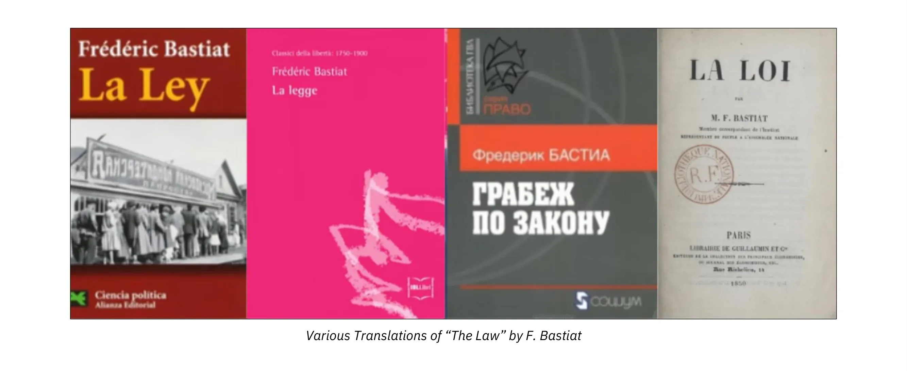

مشخص شد که پس از جنگ جهانی دوم، یکی از کتاب‌های او در ایالات متحده منتشر شد. این کتاب بسیار مشهور شد، تا جایی که خود رونالد ریگان گفت که این کتاب مورد علاقه‌اش است، و این کتاب کوچک "قانون" نام دارد. بنابراین، بَستیَت یکی از دو نویسنده مشهور فرانسوی در ایالات متحده است، که دیگری نیز در فرانسه به خوبی شناخته شده است، الکسی دو توکویل.

_(بازار در موگرون در لاند، شهر بَستیَت)_

بنابراین، یک نابغه ناشناخته اما همچنین نوری برای زمانه ما. در واقع، فردریک باستیا که در بایون متولد شد، ابتدا بخشی از زندگی خود را در لاند گذراند، جایی که یک ملک کشاورزی را که به ارث برده بود مدیریت می‌کرد و در نهایت به عنوان یک کارآفرین زندگی می‌کرد. و سپس، خیلی زود به اقتصاد علاقه‌مند شد، به انگلستان سفر کرد و با ریچارد کوبدن که رهبر جنبش تجارت آزاد بود، ملاقات کرد. باستیا شیفته این جنبش شد، او متقاعد شد که تجارت آزاد راه‌حلی برای فرانسه است و پس از آن تصمیم گرفت ایده‌های خود را در فرانسه گسترش دهد. او مقالاتی نوشت که بسیار موفق بودند و به پاریس نقل مکان کرد تا روزنامه‌ای به نام ژورنال دز اکونومیست را اداره کند.

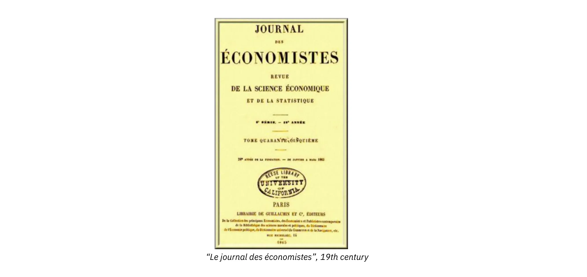

او همچنین فیلسوف و اندیشمندی درباره جامعه، نظم اجتماعی، عدالت، قانون و حقوق بود. و از این نظر، می‌توان گفت که بَستیَت نوری برای زمانه ماست. و من می‌خواهم با این نکته به پایان برسم. او کسی بود که سعی کرد کارکردهای بازار سیاسی را درک کند. البته، او همچنین مدافع اقتصاد بازار بود، که در نهایت برای او اقتصاد بازار بهترین راه برای ایجاد ثروت است. اما علاوه بر این، و اینجاست که او ناشناخته مانده، او مکانیسم‌های بازار سیاسی را درک کرد.

وقتی او به عنوان نماینده انتخاب شد، این در دوران جمهوری دوم بود و از آن نقطه به بعد، این مردم بودند که قوانین را وضع می‌کردند. در آن زمان، بَستیا شاهد نوعی تورم قوانین در همه جهات بود، از جمله ایجاد خدمات عمومی، حقوق اجتماعی، مالیات‌ها و غیره.

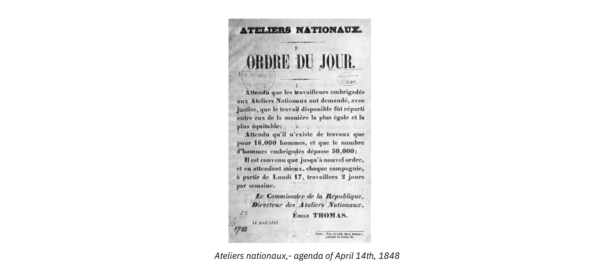

---

> **کارگاه‌های ملی**
> **دستور جلسه.**
> در حالی که کارگران ثبت‌نام‌شده در کارگاه‌های ملی به‌حق درخواست کرده‌اند که کار موجود به‌طور مساوی و عادلانه بین آن‌ها توزیع شود؛
> در حالی که کار فقط برای ۱۶,۰۰۰ مرد وجود دارد، و تعداد مردان ثبت‌نام‌شده بیش از ۵۰,۰۰۰ نفر است؛
> توافق شده است که، تا اطلاع ثانوی و در انتظار ترتیبات بهتر، هر شرکت دو روز در هفته کار کند که از دوشنبه 17ام شروع می‌شود.
> _کمیسر جمهوری، مدیر کارگاه‌های ملی,_
> **امیل توماس.**

---

و او متوجه شد که در اصل، هیچ چیز واقعاً تغییر نکرده است. مردم از طریق رأی‌گیری و قانون، اموال دیگران را تصرف می‌کردند، چیزی که او آن را غارت قانونی می‌نامید. این پدیده غارت قانونی در مرکز کار او قرار داشت، به‌ویژه در این متن کوتاه که در اواخر عمرش نوشت، "قانون"، جایی که غارت قانونی را با مالکیت، حق مالکیت مقایسه می‌کند. او نشان می‌دهد که در اصل، راه‌حل واقعی برای مشکل اجتماعی آزادی است، یعنی مالکیت، کنترل بر خود و ثمره کار خود.

در این دوره، ما با هم از طریق اندیشه فردریک باستیا سفر خواهیم کرد، از تأثیرات نویسندگانی که او را در اوایل جوانی‌اش شکل دادند شروع کرده، سپس به سفسطه‌های اقتصادی او خواهیم پرداخت، و در نهایت با این متن بزرگ، "قانون"، که ما را به تحلیل بازار سیاسی و تحلیل جامعه معرفی می‌کند، به پایان خواهیم رساند.

## زندگی و زمینه تاریخی

<chapterId>e9d92b63-83dd-552c-84e1-dd535608c109</chapterId>

در سال 1844، فردریک باستیا یک سفر کاری به اسپانیا انجام داد. پس از اقامت در مادرید، سویا، کادیز و لیسبون، تصمیم گرفت به ساوت‌همپتون سفر کند و از انگلستان بازدید کند. در لندن، او فرصت پیدا کرد تا در جلسات لیگ ضد قانون ذرت شرکت کند، کاری که از دور دنبال کرده بود. او با رهبران اصلی این انجمن، از جمله ریچارد کوبدن که بعدها دوستش شد، ملاقات کرد.

در آنجا بود که مسیر زندگی او به طور اساسی تغییر کرد. او خود نقل می‌کند که در همان لحظه تصمیم به انتخاب حرفه اقتصاددان گرفت. پس از بازگشت به فرانسه، تنها یک ایده در ذهن داشت: آگاه کردن فرانسه از جنبش لیبرالی که در انگلستان در حال شکل‌گیری بود.

فردریک باستیا در 30 ژوئن 1801 در بایون متولد شد. او در سن 9 سالگی یتیم شد و تحصیلات خود را در کالج کاتولیک سورز ادامه داد. او در زبان‌ها استعداد داشت و انگلیسی، اسپانیایی و حتی باسکی را یاد گرفت. با این حال، او انگیزه‌ای برای ادامه تحصیل نداشت و تصمیم گرفت به جای گرفتن مدرک لیسانس، در کسب و کار واردات و صادرات عمویش در بایون کار کند.

در سال ۱۸۲۵، او یک ملک کشاورزی را از پدربزرگش به ارث برد که به گفته خودش به عنوان یک "کشاورز-نجیب‌زاده" آن را مدیریت می‌کرد. در آن زمان بود که او به طور مستقیم با مشکلات ناشی از نبود تعریف واضحی از حقوق مالکیت مواجه شد. او تصمیم گرفت که در شهر خود، موگرون، در قلب لاند، که یک چهارراه تجاری و رودخانه‌ای بین بنادر بوردو و بایون است، به عنوان یک قاضی صلح فعالیت کند. بعدها، او به عنوان عضو شورای عمومی لاند انتخاب شد.

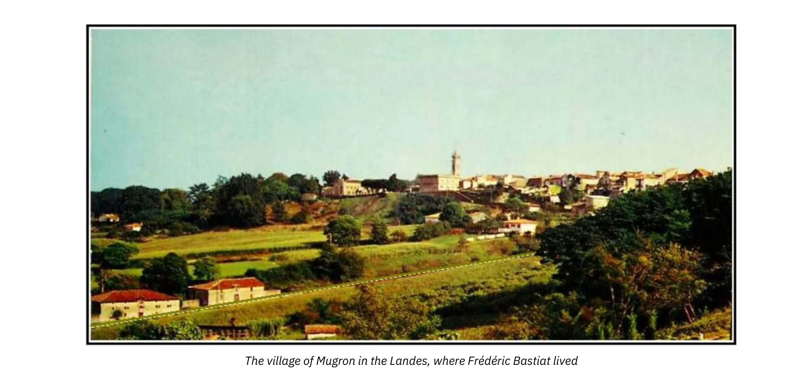

او به سرعت به اقتصاد سیاسی علاقه‌مند شد و آثار آدام اسمیت، ژان-باپتیست سه، دستوت دو تراسی، چارلز دونوییه و چارلز کنت را مطالعه کرد. او روزنامه‌های انگلیسی را می‌خواند و در آنجا بود که از وجود یک لیگ انگلیسی برای تجارت آزاد مطلع شد.

_(بگویید، کابدن، اسمیت، شوالیه، دونوییه، دستوت دو تراسی)_

پس از بازگشت از انگلستان، او مقاله‌ای با عنوان: "درباره تأثیر تعرفه‌های انگلیسی و فرانسوی بر آینده دو ملت" نوشت که آن را به ژورنال دز اکونومیست در پاریس فرستاد. مقاله در شماره اکتبر ۱۸۴۴ منتشر شد و کاملاً موفقیت‌آمیز بود. همه از استدلال قوی و نافذ او و سبک متین و شیک او تحسین کردند.

سپس ژورنال دز اکونومیست از او خواست مقالات بیشتری بنویسد و چندین عضو انجمن اقتصاد سیاسی، به ویژه هوراس سی، پسر ژان-باپتیست سی، و میشل شوالیه، استاد مشهور، به او تبریک گفتند و او را تشویق کردند که با آنها در کار انتشار حقایق اقتصادی ادامه دهد. این آغاز یک زندگی جدید در پاریس بود.

او ابتدا مجموعه اولیه "سفسطه‌های اقتصادی" را منتشر کرد، که در آن با جسارت و طعنه به محافظه‌کاران حمله کرد. در پاریس، او حتی یک دوره در اقتصاد سیاسی در یک اتاق خصوصی آغاز کرد که با اشتیاق توسط نخبگان دانشجویی حضور یافت.

سال بعد، او "انجمن تجارت آزاد" را در فرانسه تأسیس کرد و خود را به مبارزه علیه حمایت‌گرایی در فرانسه اختصاص داد. او بودجه جمع‌آوری کرد، یک نشریه هفتگی ایجاد کرد و در سراسر کشور سخنرانی‌هایی ارائه داد.

اولین جلسه در بوردو در تاریخ ۲۳ فوریه ۱۸۴۶ برگزار شد که در طی آن انجمن تجارت آزاد بوردو تأسیس شد. به زودی، این حرکت در سراسر فرانسه گسترش یافت. در پاریس، یک هسته اولیه در میان اعضای انجمن اقتصاددانان تشکیل شد که به آن نمایندگان، صنعتگران و بازرگانان پیوستند. گروه‌های مهمی نیز در مارسی، لیون و لو آور شکل گرفتند.

انقلاب فوریه 1848 سلطنت لوئی-فیلیپ، معروف به سلطنت ژوئیه (1830-1848)، را سرنگون کرد و شاهد ظهور جمهوری دوم بود. باستیا سپس به عنوان نماینده لاندز به عضویت مجلس قانون‌گذاری انتخاب شد. او در مرکز-چپ، با الکسی دو توکویل، بین سلطنت‌طلبان و سوسیالیست‌ها نشست. در آنجا، او تلاش کرد تا از آزادی‌های فردی مانند آزادی‌های مدنی دفاع کند و با تمام سیاست‌های محدودکننده، چه از راست و چه از چپ، مخالفت کرد. او به عنوان نایب‌رئیس کمیته مالی انتخاب شد و به طور مداوم تلاش کرد تا این حقیقت ساده را که اغلب در پارلمان‌ها فراموش می‌شود به همکاران نماینده خود یادآوری کند:

> نمی‌توان به برخی، طبق قانون، چیزی داد، بدون اینکه مجبور به گرفتن از دیگران توسط قانونی دیگر شد.

تقریباً تمام کتاب‌ها و مقالات او در شش سال آخر زندگی‌اش، از ۱۸۴۴ تا ۱۸۵۰ نوشته شده‌اند. در سال ۱۸۵۰، بَستیا دو اثر از معروف‌ترین آثار خود را نوشت: قانون و مجموعه‌ای از جزوات با عنوان آنچه دیده می‌شود و آنچه دیده نمی‌شود. قانون به بسیاری از زبان‌های خارجی از جمله انگلیسی، آلمانی، اسپانیایی، روسی و ایتالیایی ترجمه شده است.

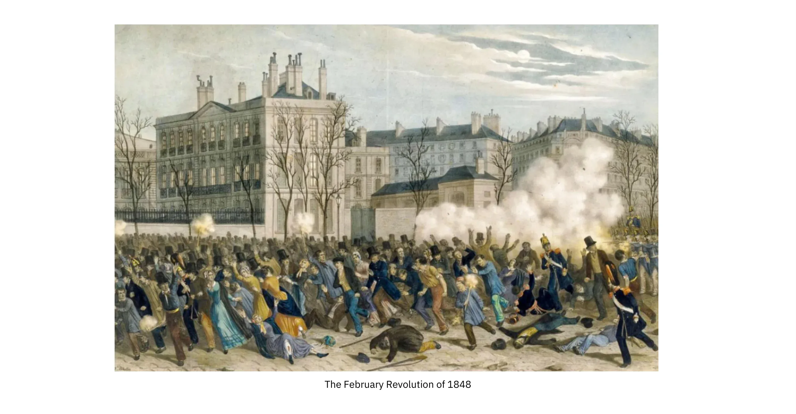

او در سال ۱۸۵۰ در رم، بر اثر سل درگذشت. او در کلیسای سن لویی دز فرانسه در رم به خاک سپرده شده است.

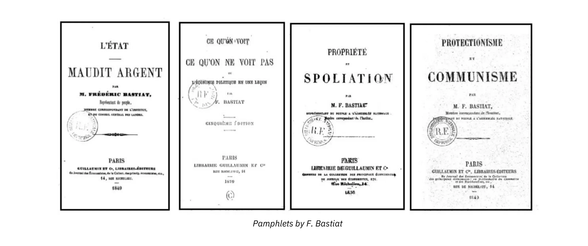

# تأثیرات

<partId>4d312b17-5740-5d33-8309-015e2b59b6dd</partId>

## آدام اسمیت و ژان-باپتیست سه

<chapterId>bcc7a12a-6cc4-5061-85e3-0e31fb1f0a49</chapterId>

در اقتصاد، بَستیات همیشه به بدهی خود به آدام اسمیت و ژان-باپتیست سه اعتراف می‌کرد. در سن ۲۶ سالگی، او به یکی از دوستانش نوشت: "من هرگز در این موضوعات چیزی جز این چهار اثر نخوانده‌ام: اسمیت، سه، دستوت و سانسور."

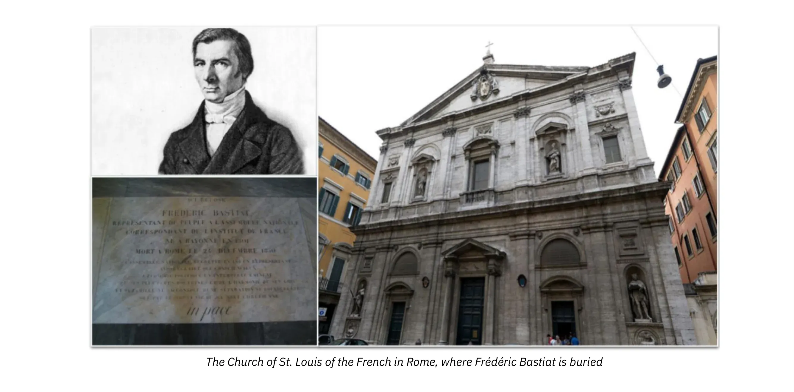

_(ژان-باپتیست سه و آدام اسمیت)_

اقتصاد سیاسی، همان‌طور که توسط آدام اسمیت و ژان-باپتیست سه درک شده است، در یک کلمه خلاصه می‌شود: آزادی. آزادی تجارت، آزادی فردی، تجارت آزاد و ابتکار آزاد. تجارت آزاد ابتدا توسط فیزیوکرات‌ها، مانند فرانسوا کنه و وینسنت دو گورنه، و سپس توسط آدام اسمیت که ایده‌های آن‌ها را با مشاهدات خود ترکیب کرد، دفاع شد. در نهایت، در اواخر قرن هجدهم، ژان-باپتیست سه برخی از نکات دکترین استاد خود آدام اسمیت را در رساله استادانه خود درباره اقتصاد سیاسی روشن و تصحیح کرد.

_(بگویید، دستوت دو تراسی، کنه، دو گورنی)_

آدام اسمیت به رفاه علاقه‌مند بود، نه به عنوان هدفی در خود، بلکه به عنوان وسیله‌ای برای ارتقاء اخلاقی افراد. برای او، ثروت ملل شامل ثروت افراد است. اگر می‌خواهید ملتی مرفه داشته باشید، آدام اسمیت می‌گوید، بگذارید افراد آزادانه عمل کنند. و بازار کار می‌کند زیرا به همه اجازه می‌دهد ترجیحات خود را بیان کنند و به دنبال منافع خود باشند.

تازگی بزرگ اقتصاددانان مدرن در آغاز قرن هجدهم این است که آن‌ها به هر فردی که اراده بازگرداندن ظرفیت عمل خود را دارد، علاقه‌مند هستند و در عین حال به چگونگی مهار احساسات و درگیری‌ها می‌اندیشند. انسان به طور طبیعی می‌خواهد وضعیت خود و عزیزانش را از طریق Exchange کالاها و خدمات بهبود بخشد.

آنچه آدام اسمیت نشان می‌دهد این است که فرد تنها با خدمت به منافع دیگران می‌تواند به منافع خود خدمت کند:

> آنچه را که نیاز دارم به من بدهید، و شما نیز آنچه را که نیاز دارید از من خواهید داشت. (...) این از روی خیرخواهی قصاب، آبجوساز یا نانوا نیست که ما انتظار شام خود را داریم، بلکه از توجه آنها به منافع خودشان است.

---

> "تلاش طبیعی هر فرد برای بهبود وضعیت خود... آنقدر قدرتمند است که به تنهایی و بدون هیچ کمکی، نه تنها قادر به پیشبرد جامعه به سوی ثروت و شکوفایی است، بلکه می‌تواند بر صد مانع بی‌مورد که حماقت قوانین انسانی اغلب عملیات آن را مختل می‌کند، غلبه کند."
> _ثروت ملل_
> _کتاب چهارم، فصل پنجم_

---

Exchange یک بازی با مجموع مثبت است. آنچه یکی به دست می‌آورد، دیگری نیز به دست می‌آورد. بنابراین، با توزیع مجدد سیاسی که همیشه یک برنده و یک بازنده دارد، متفاوت است. اگر به مکتب انگلیسی نگاه کنیم، برای اسمیت، برای ریکاردو و برای لاک قبل از آنها، ارزش به کار مرتبط است. برای مارکس نیز همین‌طور است.

_(مارکس، ریکاردو، اسمیت، لاک)_

از سوی دیگر، بَستیات با ژان-باپتیست سه موافقت خواهد کرد که سودمندی، پایه واقعی ارزش است. کار ارزش ایجاد نمی‌کند. کمبود هم همین‌طور. همه چیز از سودمندی ناشی می‌شود. در واقع، هیچ‌کس حاضر به پرداخت برای یک خدمت نیست مگر اینکه آن را مفید بداند. تنها چیزی که تولید می‌شود، سودمندی است.

اما بَستیا در این مورد نظر سای را نیز با دقت بیشتری بیان کرد. موضوع مربوط به سودمندی موجود در اشیا نیست، بلکه مربوط به سودمندی نسبی خدمات است. به گفته خودش، "ارزش نسبت دو خدمت مبادله شده است." بنابراین، ارزش ذهنی است و تنها راه برای درک ترجیحات افراد، مشاهده رفتار آنها در یک بازار آزاد است. بازار ترجیحات فردی را آشکار می‌کند و از طریق Exchange تنظیم‌کننده بزرگ جامعه است.

اقتصاد از تعدادی قوانین ساده که از رفتار انسانی مشتق شده‌اند، پیروی می‌کند. یکی از آن‌ها که به "قانون سی" معروف است، به شرح زیر است: "محصولات و خدمات با محصولات و خدمات مبادله می‌شوند." ایده او این است که ملت‌ها و افراد از افزایش سطح تولید بهره‌مند می‌شوند زیرا این امر فرصت‌های بیشتری برای مبادلات متقابل سودمند فراهم می‌کند.

در واقع، محصولات تنها با پیش‌بینی خدماتی که خریدار انتظار دارد خریداری می‌شوند: من یک دیسک را برای موسیقی‌ای که گوش خواهم داد می‌خرم، بلیط سینما را برای فیلمی که خواهم دید می‌خرم. و در یک Exchange، هر طرف تصمیم می‌گیرد زیرا قضاوت می‌کند که می‌تواند خدمات بیشتری از آنچه به دست می‌آورد نسبت به آنچه از دست می‌دهد، به دست آورد. در این زمینه، پول فقط یک کالای واسطه‌ای است، برای یک خدمت ارائه شده جبران می‌کند و خدمات دیگری را باز می‌کند.

برای باستیا، اقتصاد مبادلات، یعنی خدمات متقابل که به‌طور آزادانه ارائه و پذیرفته می‌شوند، چیزی است که صلح و شکوفایی را پایه‌ریزی می‌کند و به هماهنگی منافع اجازه می‌دهد.

اما از ژان-باپتیست سه، فردریک باستیا همچنین یک مفهوم کلیدی را به ارث می‌برد، و آن مفهوم غارت است. زیرا او می‌گوید، با تکرار کلمات سه:

> تنها دو راه برای به دست آوردن چیزهای ضروری برای حفظ، تزئین و بهبود زندگی وجود دارد: تولید و غارت.

تولیدکنندگان به اقناع، مذاکره و Contract متوسل می‌شوند، در حالی که غارتگران به زور و فریب متوسل می‌شوند. بنابراین، این وظیفه قانون است که غارت را سرکوب کند و کار و همچنین مالکیت را تأمین کند. همان‌طور که آدام اسمیت قبلاً بیان کرده بود، تضمین امنیت شهروندان مأموریت اصلی قدرت عمومی است و این همان چیزی است که اخذ مالیات را مشروعیت می‌بخشد.

## آنتوان دستوت دو تراسی

<chapterId>ddf64e9f-2ce0-5651-8eb8-bae578eb0b9b</chapterId>

کمتر کسی می‌داند، اما دستوت دو تراسی تأثیر قاطعی بر رئیس‌جمهور آینده ایالات متحده، توماس جفرسون، داشت، در حالی که او در دهه ۱۷۸۰ سفیر در پاریس بود.

> "برای هر مرد، اولین کشورش وطن اوست، و دومین فرانسه است" & "استبداد زمانی است که مردم از دولت خود می‌ترسند؛ آزادی زمانی است که دولت از مردم می‌ترسد."
>

> توماس جفرسون

در واقع، رساله او درباره اقتصاد سیاسی، حمایت‌گرایی و توسعه ناپلئونی را محکوم کرد. بنابراین، بناپارت آن را از انتشار در فرانسه ممنوع کرد. با این حال، این رساله به انگلیسی ترجمه شد و توسط خود جفرسون در ایالات متحده منتشر شد. او این متن را به عنوان اولین کتاب درسی اقتصاد سیاسی دانشگاه ویرجینیا، که به تازگی در شارلوتزویل تأسیس کرده بود، قرار داد. این رساله تا سال ۱۸۱۹ در فرانسه منتشر نشد!

دستوت دو تراسی، فیلسوف و اقتصاددان، رهبر مکتب به‌اصطلاح "ایدئولوگ‌ها" بود که شامل افرادی مانند کابانیس، کندورسه، کنستانت، دانو، سی و ژرمن دو استال می‌شد. آن‌ها وارثان فیزیوکرات‌ها و شاگردان مستقیم تورگو بودند.

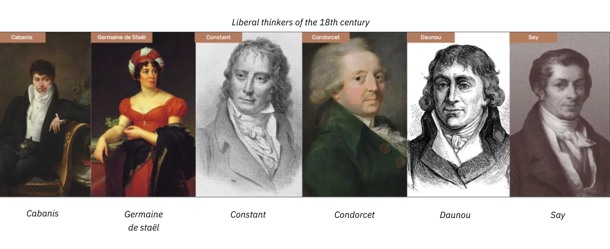

از نظر ایدئولوژی، تریسی به سادگی به معنای علمی بود که به مطالعه ایده‌ها، منشأ آن‌ها، قوانین آن‌ها، و رابطه‌شان با زبان می‌پردازد، یعنی به عبارت دیگر، معرفت‌شناسی. اصطلاح "ایدئولوژی" آن بار منفی را نداشت که مارکس بعدها برای بی‌اعتبار کردن اقتصاددانان "لِسه‌فِر" به آن داد. مجله جنبش ایدئولوگ‌ها La Décade philosophique et littéraire نام داشت.

در دوره انقلابی غالب بود و توسط ژان-باپتیست سی هدایت می‌شد. دستوت دو تراسی در سال ۱۸۰۸ به عضویت آکادمی فرانسه و در سال ۱۸۳۲ به عضویت آکادمی علوم اخلاقی و سیاسی انتخاب شد. دختر او در سال ۱۸۰۲ با ژرژ واشنگتن دو لا فایت (پسر اولین رئیس‌جمهور آمریکا) ازدواج کرد که نزدیکی زیادی که در آن زمان بین فرانسه و آمریکا جوان وجود داشت را نشان می‌دهد.

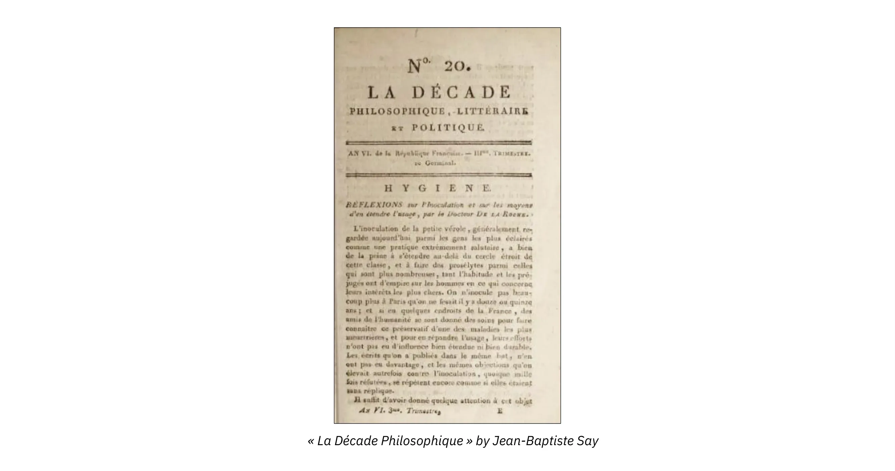

هدف رساله او در اقتصاد سیاسی این است که "بهترین راه استفاده از تمام توانایی‌های فیزیکی و فکری‌مان را برای برآورده کردن نیازهای مختلف‌مان بررسی کند." ایده او این است که تجارت منبع تمام خوبی‌های انسانی است؛ تجارت نیروی متمدن‌کننده، عقلانی‌کننده و صلح‌آمیز جهان است. او اصل بزرگ اقتصاد سیاسی را به این صورت فرموله می‌کند: "تجارت کل جامعه است، همان‌طور که کار کل ثروت است." در واقع، او جامعه را به عنوان "یک سری پیوسته از مبادلات می‌بیند که در آن هر دو طرف قرارداد همیشه سود می‌برند." بنابراین، بازار مخالف غارتگری است. بازار برخی را غنی می‌کند بدون اینکه دیگران را فقیر کند. همان‌طور که بعداً گفته خواهد شد، این یک "بازی با مجموع صفر" نیست، بلکه یک بازی با مجموع مثبت است.

نویسنده ما تا آنجا پیش نمی‌رود که اقتصاد سیاسی را به عنوان علم مبادلات تعریف کند. اما همین استدلال توسط باستیا مطرح و پیگیری خواهد شد. فروش یک Exchange اشیاء است، اجاره یک Exchange خدمات است و قرض دادن صرفاً یک Exchange به تعویق افتاده است. بنابراین اقتصاد سیاسی برای باستیا به "نظریه Exchange" تبدیل می‌شود.

به گفته دستوت دو تراسی، مالکیت لزوماً از طبیعت ما و از توانایی خواسته‌های ما ناشی می‌شود. اگر انسان هیچ چیزی نمی‌خواست، نه حقوقی داشت و نه وظایفی. برای برآوردن نیازهایش و انجام وظایفش، انسان باید از ابزارهایی استفاده کند که از طریق کار خود به دست می‌آورد. و شکل سازمان اجتماعی که با این هدف مطابقت دارد، مالکیت خصوصی است. به همین دلیل، تنها هدف دولت حفاظت از مالکیت و اجازه دادن به Exchange صلح‌آمیز است.

برای او، بهترین مالیات‌ها، معتدل‌ترین آن‌ها هستند و او آرزو دارد که هزینه‌های دولت تا حد ممکن محدود باشد. او غارت ثروت جامعه توسط دولت به شکل بدهی عمومی، مالیات‌ها، انحصارهای بانکی و هزینه‌ها را محکوم می‌کند. بار دیگر، قانون باید فقط برای حفاظت از آزادی خدمت کند؛ هرگز نباید غارت کند.

در نهایت، او این توصیه را اضافه می‌کند که همچنان اهمیت خود را حفظ کرده است:

> بگذارید دولت بدهی‌هایی ایجاد نکند و نتواند بدهی‌هایی ایجاد کند که نسل‌های آینده را متعهد کند و همیشه ایالت‌ها را به نابودی بکشاند.

در نتیجه، ایدئولوگ‌ها یک شهود عمیق داشتند، یعنی اینکه تولید و مبادلات راه‌حل واقعی برای مشکلات سیاسی و جایگزین واقعی برای جنگ‌ها هستند. جنگ‌ها همیشه غارتگرانه هستند، چه داخلی باشند، مانند دوران انقلاب، یا خارجی، مانند جنگ‌هایی که توسط پادشاهان باستان و ناپلئون انجام می‌شد.

## شارل کومته و شارل دونویور

<chapterId>80bc5c4e-ac07-52c8-9dd7-e224ac291bda</chapterId>

تاریخ تمام تمدن‌ها داستان مبارزه بین طبقات غارتگر و طبقات مولد است. این اعتقاد دو نویسنده‌ای است که قصد داریم درباره آن‌ها بحث کنیم. آن‌ها بنیان‌گذاران نظریه لیبرالی مبارزه طبقاتی هستند که به اندازه فردریک باستیا الهام‌بخش کارل مارکس بود، اگرچه دومی آن را تحریف کرد.

برای کنت و دونوییه، غارت، به معنای تمام اشکال خشونت اعمال‌شده در جامعه توسط قوی بر ضعیف، کلید بزرگ درک تاریخ بشر است. این در منشأ تمام پدیده‌های استثمار یک طبقه توسط طبقه دیگر قرار دارد.

اگر فردریک باستیا آموزش اقتصادی خود را مدیون اسمیت، دستوت دو تراسی و سی می‌داند، آموزش سیاسی خود را مدیون رهبران ژورنال لو سنسور، شارل کومت و شارل دونویور است.

این بررسی (1814-1819)، که پس از صد روز به Le Censeur européen تغییر نام داد، ایده‌های لیبرالی را منتشر کرد که در سال 1830 با قیام سه روز باشکوه و به قدرت رسیدن دوک اورلئان، لوئی-فیلیپ اول، به پیروزی رسیدند.

شارل کومته، پسرعموی آگوست کنت و داماد سی، بنیان‌گذار این نشریه است. او به زودی به شارل دونوییه، که مانند خودش حقوق‌دان بود، پیوست و سپس یک تاریخ‌نگار جوان، آگوستن تیری، که پیش‌تر منشی سن سیمون بود، به آن‌ها ملحق شد. شعار آن‌ها در صفحه اول هر شماره از نشریه "صلح و آزادی" بود.

هدف این بررسی چیست؟ عنوان خود گویای همه چیز است: سانسور دولت. مبارزه با خودسری قدرت از طریق آگاه‌سازی افکار عمومی، دفاع از آزادی مطبوعات.

_(بنجامین کنستانت)_

آن‌ها از بنجامین کنستانت تمایز بین باستانیان و مدرن‌ها را می‌پذیرند که از یک سو با جنگ و از سوی دیگر با تجارت و صنعت مشخص می‌شود. اما با سی اضافه می‌کنند که اقتصاد سیاسی بهترین توضیح برای پدیده‌های اجتماعی را ارائه می‌دهد. آن‌ها به‌ویژه درک می‌کنند که ملت‌ها زمانی به صلح و رفاه دست می‌یابند که حقوق مالکیت و تجارت آزاد محترم شمرده شوند. از این پس، برای آن‌ها، اقتصاد سیاسی پایه واقعی و تنها بنیاد سیاست است. به جای فلسفه، که خود را به نقد انتزاعی اشکال حکومت محدود می‌کند، باید نظریه‌ای مبتنی بر شناخت منافع اقتصادی جایگزین شود.

> اقتصاد سیاسی، با نشان دادن چگونگی پیشرفت و افول مردم، پایه‌های واقعی سیاست را بنا نهاده است.
>

> دونوییر

این نظریه اجتماعی جدید شامل یکی از Elements است که به سنگ بنای سوسیالیسم علمی مارکس و انگلس تبدیل خواهد شد: مبارزه طبقاتی. اما نظریه لیبرال مبارزه طبقاتی از چه چیزی تشکیل شده است و چگونه با مارکسیسم تفاوت دارد؟

این با فردی شروع می‌شود که برای برآورده کردن نیازها و خواسته‌های خود اقدام می‌کند. از لحظه‌ای که فرد خلق می‌کند، یعنی سودمندی چیزها را افزایش می‌دهد و ارزش آن‌ها را ارتقا می‌دهد، وارد صنعت می‌شود. در اینجا، یک صنعت‌گر به معنای مالک صنعت نیست، همان‌طور که زبان کنونی ممکن است پیشنهاد دهد، بلکه یک تولیدکننده است، صرف‌نظر از زمینه‌ای که در آن کار می‌کند. به همین دلیل نظریه آن‌ها صنعتی‌گرایی نامیده می‌شود. این نظریه بیان می‌کند که هدف جامعه ایجاد سودمندی به معنای گسترده است، یعنی کالاها و خدماتی که برای انسان‌ها مفید هستند.

در این مورد، افراد با دو گزینه اساسی روبرو هستند: می‌توانند ثروتی را که دیگران تولید کرده‌اند غارت کنند، یا می‌توانند خودشان برای تولید ثروت کار کنند. در هر جامعه‌ای، می‌توان به وضوح کسانی را که از غارت زندگی می‌کنند از کسانی که از تولید زندگی می‌کنند، تشخیص داد. تحت رژیم قدیم، اشراف به طور مستقیم به پرکارترین افراد حمله می‌کردند تا از یک شکل جدید از خراج، یعنی مالیات، زندگی کنند. اشراف حریص توسط انبوهی از بوروکرات‌ها که کمتر حریص نبودند، جایگزین شدند.

در حالی که برای مارکس، تضاد طبقاتی درون فعالیت تولیدی خود، بین کارمندان و کارفرمایان قرار دارد، برای کنت و دونوییه، طبقات متضاد از یک سو تولیدکنندگان جامعه هستند که مالیات می‌پردازند (شامل سرمایه‌داران، کارگران، دهقانان، دانشمندان و غیره) و از سوی دیگر، غیرتولیدکنندگانی که از اجاره‌هایی که توسط مالیات‌ها تأمین می‌شود زندگی می‌کنند، "طبقه بیکار و بلعنده" (بوروکرات‌ها، مقامات، سیاستمداران، ذی‌نفعان یارانه‌ها یا حمایت‌ها).

سپس، برخلاف مارکس، نویسندگان Censeur Européen از جنگ طبقاتی حمایت نمی‌کنند. در عوض، آنها برای صلح اجتماعی مبارزه می‌کنند. و این، به گفته آنها، تنها از طریق غیرسیاسی کردن جامعه قابل دستیابی است. برای این منظور، ابتدا کاهش اعتبار و مزایای مناصب عمومی مهم است. سپس مهم است که به تولیدکنندگان در بدنه سیاسی نفوذ داده شود.

در نهایت، تنها راه برای رهایی جهان از استثمار یک طبقه توسط طبقه دیگر، نابود کردن همان مکانیزمی است که این استثمار را ممکن می‌سازد: قدرت دولت در توزیع و کنترل مالکیت و تخصیص مزایای مرتبط با آن (یعنی "موقعیت‌ها").

ایده‌های آن‌ها، به‌طور عمیقی نوآورانه، برای همیشه فردریک باستیا را تحت تأثیر قرار می‌داد، کسی که خود به یک متفکر عمیق در بحران‌های سیاسی تبدیل می‌شد.

## کوبدن و لیگ

<chapterId>7181435c-5eae-56e4-8e55-02a24273fdd6</chapterId>

در سال ۱۸۳۸، در منچستر، تعداد کمی از مردان که تا آن زمان کمتر شناخته شده بودند، گرد هم آمدند تا راهی برای سرنگونی انحصار مالکان زمین‌های گندم از طریق قانونی پیدا کنند و به آنچه باستیا بعدها روایت خواهد کرد، دست یابند،

> بدون خونریزی، تنها با قدرت عقیده، انقلابی به عمق، شاید عمیق‌تر از آنچه پدران ما در سال ۱۷۸۹ انجام دادند.

از این جلسه، اتحادیه‌ای علیه قوانین ذرت، یا قوانین غلات، همان‌طور که باستیا آنها را می‌نامید، شکل می‌گرفت. اما به سرعت، این هدف به هدف لغو کامل و یک‌جانبه حمایت‌گرایی تبدیل می‌شد.

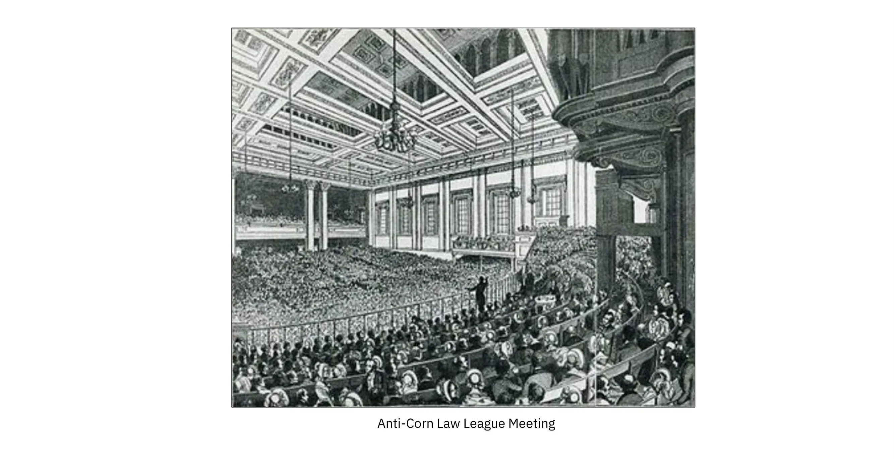

این نبرد اقتصادی برای تجارت آزاد تا سال ۱۸۴۶ تمام انگلستان را به خود مشغول کرد. در فرانسه، به جز تعداد کمی از مطلعین، وجود این جنبش گسترده کاملاً ناشناخته بود. فردریک باستیا با خواندن یک روزنامه انگلیسی که به طور تصادفی مشترک آن شده بود، در سال ۱۸۴۳ از وجود لیگ مطلع شد. او با اشتیاق سخنرانی‌های کبدن، فاکس و برایت را ترجمه کرد. سپس با کبدن مکاتبه کرد و سرانجام در سال ۱۸۴۵ به لندن رفت تا در جلسات عظیم لیگ شرکت کند.

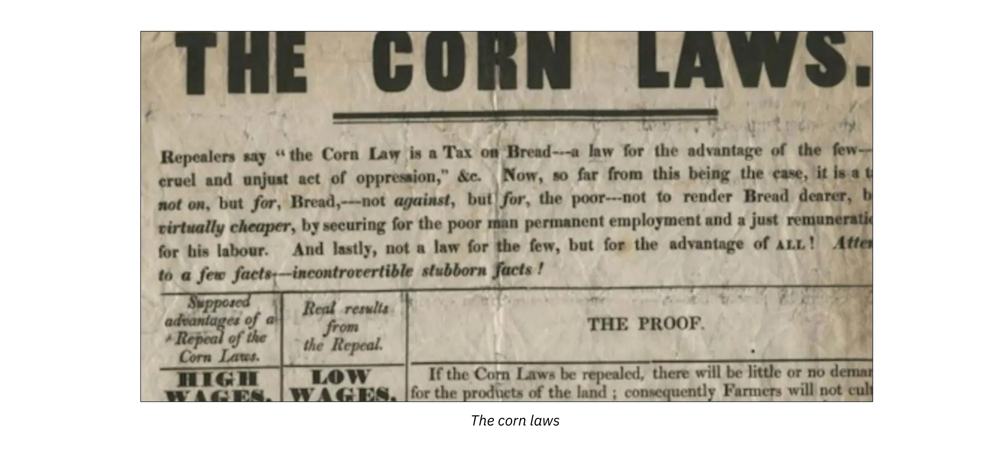

این کارزار تحریک برای تجارت آزاد، در سراسر پادشاهی، با ده‌ها هزار عضو، بود که قلم بَستیا را به آتش کشید و مسیر زندگی او را به طور ریشه‌ای و قطعی تغییر داد.

می‌توان لیگ را با یک دانشگاه سیار مقایسه کرد که به‌طور اقتصادی به کسانی که در جلسات آن در سراسر کشور شرکت می‌کردند آموزش می‌داد—مردم عادی، صنعتگران، کشاورزان و زارعانی که لیگ آن‌ها را تحت حمایت خود گرفته بود و منافعشان توسط قوانین غلات سرکوب می‌شد. ریچارد کوبدن روح این جنبش و یک تحریک‌کننده برجسته بود.

سخنران جذاب و قدرتمند، او دارای استعداد فوق‌العاده‌ای در ابداع عبارات جذاب و مختصر بود که از گفتمان‌های انتزاعی اقتصاددانان فاصله داشت.

> انحصار نان چیست؟ او با تعجب گفت. این کمبود نان است. شما از این که می‌فهمید قوانین این کشور در این مورد هیچ هدفی جز ایجاد بیشترین کمبود ممکن نان ندارد، شگفت‌زده می‌شوید. و با این حال چیزی جز این نیست. قانون‌گذاری تنها می‌تواند از طریق کمبود به هدف خود برسد.

در سال 1845، بَستیات کتاب خود به نام "کابدن و لیگ" را در پاریس منتشر کرد که شامل ترجمه‌های او همراه با نظرات بود. کتاب با مقدمه‌ای درباره وضعیت اقتصادی انگلستان و تاریخچه منشأ و پیشرفت لیگ آغاز می‌شود. از سال 1815، حمایت‌گرایی در انگلستان بسیار توسعه یافته بود. به‌ویژه قوانینی وجود داشت که واردات غلات را محدود می‌کرد و پیامدهای بسیار سختی برای مردم داشت. در واقع، گندم برای تهیه نان که کالایی حیاتی در آن زمان بود، ضروری بود. علاوه بر این، این سیستم به نفع اشرافیت، یعنی مالکان بزرگ زمین بود که از آن اجاره دریافت می‌کردند.

> باستیا نوشت، آنچه در انگلستان همزیستی دارد، تعداد کمی غارتگر و تعداد زیادی غارت‌شده است، و نیازی نیست که اقتصاددان بزرگی باشید تا به ثروت اولی و بدبختی دومی پی ببرید.

هدف لیگ بسیج افکار عمومی برای فشار به پارلمان جهت لغو قانون غلات بود. در بلندمدت، کبدن و دوستانش امیدوار بودند که:

- افزایش خروجی‌های صنعتی
- افزایش اشتغال
- قیمت نان را کاهش دهید
- کشاورزی و صنعت را از طریق رقابت کارآمدتر کنید
- ترویج صلح در میان ملل

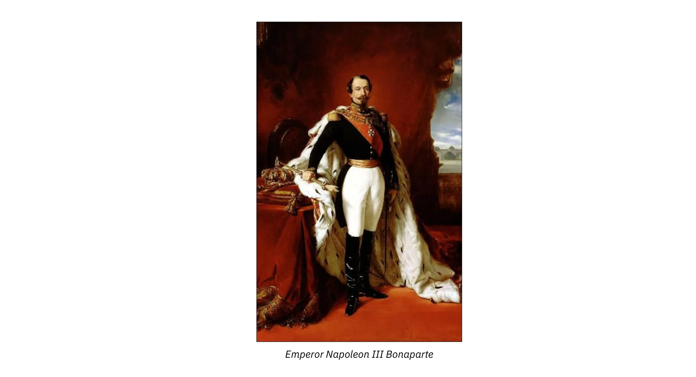

_(جرمی بنتام)_

شاگرد فایده‌گرایی بنتام، اعتقاد کابدن این بود که آزادی کار و تجارت به طور مستقیم به نفع پرشمارترین، فقیرترین و رنج‌کشیده‌ترین توده‌های جامعه است. برعکس، گمرکات به عنوان ابزاری برای ممنوعیت‌ها و امتیازات خودسرانه تنها می‌توانست به نفع برخی از قدرتمندترین صنایع باشد.

در انتخابات 1841، پنج عضو از لیگ، از جمله کبدن، به پارلمان انتخاب شدند. در 26 مه 1846، تجارت آزاد یک‌جانبه به قانون پادشاهی تبدیل شد. از آن زمان به بعد، بریتانیا دوره‌ای درخشان از آزادی و شکوفایی را تجربه کرد.

جالب اینجاست که بَستیَت بخشی از روش آن‌ها را به خود اختصاص داد؛ او زبان آن‌ها را جذب کرد و آن را به زمینه فرانسوی منتقل کرد. کتاب درباره کُبدِن و لیگ به سرعت موفق شد و بَستیَت به طور چشمگیری وارد دنیای اقتصاددانان شد. او در بوردو یک انجمن به نفع تجارت آزاد تأسیس کرد و سپس آن را به پاریس منتقل کرد. به او رهبری ژورنال دِز اِکونومیست‌ها پیشنهاد شد. این حرکت متولد شد و تا سال ۱۸۴۸ ادامه یافت.

تنها پس از مرگ باستیا در سال ۱۸۶۶ بود که ناپلئون سوم یک معاهده تجارت آزاد با انگلستان امضا کرد، نوعی پیروزی پس از مرگ برای مردی که شش سال آخر زندگی کوتاه خود را به این ایده بزرگ اختصاص داده بود.

_(میشل شوالیه)_

مسئله تجارت آزاد همچنان امروز نیز مطرح است. کتاب‌های جغرافیا در مدارس ادعا می‌کنند که جهانی‌سازی مقصر است و کشورهای فقیر برای گذران زندگی به کمک‌های غربی نیاز دارند. با این حال، فقر شدید در ۲۰ سال گذشته به نصف کاهش یافته است. با انتخاب باز بودن، کشورهایی مانند هند، چین یا تایوان توانسته‌اند از فقر فرار کنند، در حالی که رکود ویژگی کشورهای بسته‌ای مانند کره شمالی یا ونزوئلا است. بر اساس گزارش سازمان ملل، ۳۶٪ از بشریت در سال ۱۹۹۰ در فقر مطلق زندگی می‌کردند. اکنون در سال ۲۰۱۰ "تنها" ۱۸٪ هستند. فقر شدید همچنان یک چالش بزرگ است، اما در حال کاهش است.

# حریفان

<partId>f902ed30-269e-5e44-a76d-8efd1a4e4085</partId>

## روسو

<chapterId>c3926110-e0b2-503c-96d9-5d3a6a661484</chapterId>

فردریک باستیا، که در دهه ۱۸۴۰ نظرات خود را بیان کرد، وارث نسلی از فیلسوفان عصر روشنگری است که علیه سانسور و برای آزادی بحث مبارزه کردند. به مونتسکیو، دیدرو، ولتر، کندورسه، و همچنین روسو فکر کنید.

برای آنها، ایده ساده بود: هرچه ایده‌های بیشتری اجازه بیان پیدا کنند، حقیقت بیشتر پیشرفت می‌کند و اشتباهات راحت‌تر رد می‌شوند. علم همیشه به این روش پیشرفت می‌کند.

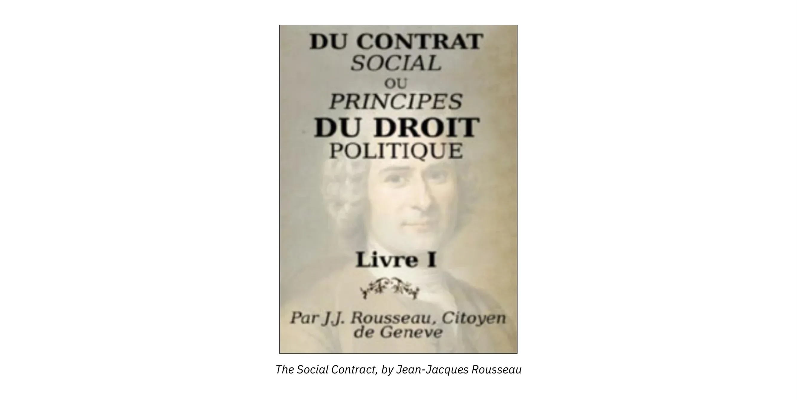

_(مونتسکیو، دیدرو، ولتر، کندورسه، روسو)_

برعکس، تعداد کمی متوجه شده‌اند که آنچه برای ایده‌ها صادق بود، برای کالاها و خدمات نیز صادق است. آزادی تجارت با دیگران واقعاً دو فضیلت دارد: کارآمد بودن و منجر شدن به توزیع عادلانه‌تر. نه تنها روسو این را درک نکرد، بلکه او نیز به نام یک ایده نادرست از قانون و حق، با این آزادی مبارزه کرد. یکی از منابع اصلی سوسیالیسم، به گفته باستیا، نظر روسو است که کل نظم اجتماعی از قانون ناشی می‌شود.

باستیا واقعاً روسو را پیشگام واقعی سوسیالیسم و جمع‌گرایی می‌داند. در نویسنده قرارداد اجتماعی Contract، عبارتی وجود دارد که فلسفه او را به خوبی خلاصه می‌کند: "ما تنها پس از آنکه شهروند شدیم، شروع به انسان شدن می‌کنیم."

در ابتدا، انسان صرفاً یک بورژوا است. اما بورژوا یک حسابگر است؛ او لذت فوری خود را می‌خواهد، او به حواس خود، به خواسته‌های خود، به منافع خاص خود وابسته است. به طور خلاصه، او عقلانی نیست، بنابراین آزاد نیست. او نیاز دارد که آموزش ببیند، تا بفهمد که منفعت واقعی او منفعت عمومی است. به همین دلیل است که روسو در The Social Contract نوشت:

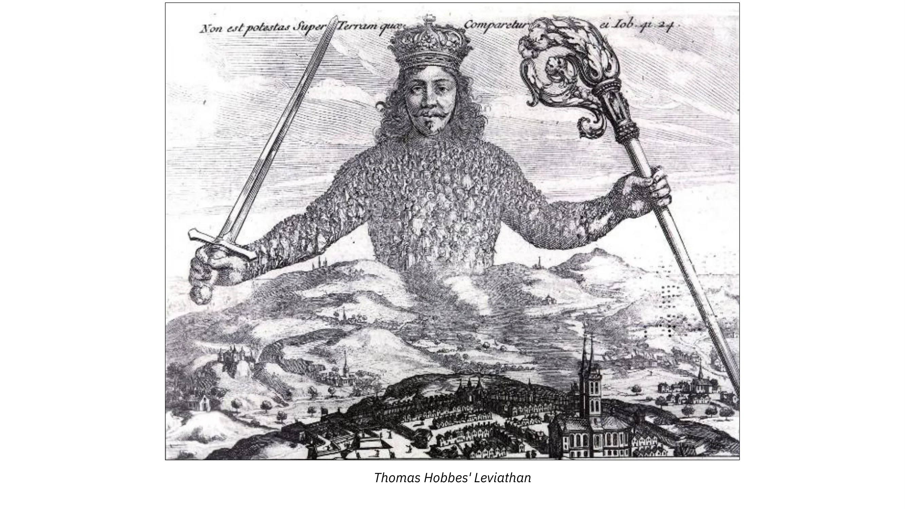

---

> هر کس از اراده عمومی سرپیچی کند، به وسیله کل جامعه مجبور به اطاعت خواهد شد: که به معنای چیزی جز این نیست که او مجبور به آزاد بودن خواهد شد.
> (ژان-ژاک روسو)

---

بر اساس این دکترین، انسان دو اراده در درون خود دارد: اراده‌ای که به سمت منافع شخصی گرایش دارد، یعنی اراده بورژوا، و اراده‌ای که به سمت منافع عمومی گرایش دارد، یعنی اراده شهروند. هدایت انسان‌ها، حتی با زور، به سمت خواستن یک هدف عقلانی، یعنی منافع عمومی، به معنای هدایت انسان‌ها به سمت آزادی است. آنچه که آن‌ها واقعاً می‌خواهند یک هدف عقلانی است، حتی اگر خودشان ندانند.

بنابراین، طبق نظر روسو، کاملاً مشروع است که مردان را به نام هدفی که خودشان، اگر روشن‌تر بودند، دنبال می‌کردند، اما به دلیل نابینایی، نادانی یا فساد دنبال نمی‌کنند، مجبور کنیم. جامعه برای این تأسیس شده است که آنها را وادار کند آنچه را که باید به طور خودجوش آرزو کنند، انجام دهند اگر روشن‌فکر بودند. و با انجام این کار، به آنها خشونت نمی‌شود زیرا آنها را به "آزادی" هدایت می‌کند، یعنی به انتخاب‌های درست، انتخاب‌هایی که با خود واقعی‌شان همخوانی دارد.

باورمند به اینکه جامعه خوب ساخته قانون است، روسو بدین ترتیب قدرت نامحدودی به قانون‌گذار اعطا می‌کند. این به عهده اوست که افراد را به انسان‌های کامل، به شهروندان تبدیل کند.

اما، ایجاد مالکیت نیز بر عهده قانون است. به گفته روسو، مالکیت تنها زمانی می‌تواند مشروع باشد که توسط قانون‌گذار تنظیم شود. در واقع، شر در نابرابری و بندگی نهفته است که هر دو از مالکیت ناشی می‌شوند. این اختراع قدرتمندان است که به جامعه بد، به جامعه بورژوازی، به روابط سلطه منجر شده است. او در رساله خود درباره منشأ و مبانی نابرابری، این بخش معروف را می‌نویسد:

> اولین کسی که با حصارکشی قطعه‌ای از زمین گفت: این مال من است، و افرادی را یافت که به اندازه کافی ساده‌لوح بودند تا او را باور کنند، بنیان‌گذار واقعی جامعه مدنی بود. چه تعداد جنایات، جنگ‌ها، قتل‌ها، چه میزان بدبختی و وحشت از نژاد بشر دور می‌شد اگر کسی که میخ‌ها را بیرون می‌کشید یا خندق را پر می‌کرد، به هم‌نوعانش فریاد می‌زد: "از گوش دادن به این فریبکار برحذر باشید؛ شما گمراه خواهید شد اگر فراموش کنید که میوه‌ها متعلق به همه هستند و زمین به هیچ‌کس تعلق ندارد!"

بنابراین، مالکیت طبیعی منبع شر است. و مارکس، که خواننده بزرگی از روسو بود، این را به یاد می‌آورد. چگونه می‌توان با این شر مبارزه کرد؟ از طریق Contract اجتماعی، روسو پاسخ می‌دهد. در واقع، جامعه خوب جامعه‌ای است که از یک Contract ناشی می‌شود که بیگانگی فرد با تمام حقوقش به جامعه را مقرر می‌کند. از آن پس، این بر عهده جامعه است که از طریق قانون به فرد حقوق اعطا کند.

برخلاف روسو، فردریک باستیا می‌گوید که "انسان به عنوان مالک متولد می‌شود." برای او، مالکیت نتیجه ضروری طبیعت انسان و ساختار اوست. او می‌نویسد که "انسان به عنوان مالک متولد می‌شود، زیرا با نیازهایی به دنیا می‌آید که برآورده کردن آن‌ها برای زندگی ضروری است، با اعضا و قابلیت‌هایی که استفاده از آن‌ها برای برآورده کردن این نیازها ضروری است." اما قابلیت‌ها تنها گسترش شخص هستند و مالکیت تنها گسترش قابلیت‌ها. به عبارت دیگر، استفاده از قابلیت‌های ما در کار است که مالکیت را مشروعیت می‌بخشد.

به گفته باستیا، جامعه، مردم و اموال قبل از قوانین وجود دارند و او این عبارت معروف را دارد: "این به خاطر وجود قوانین نیست که اموال وجود دارند، بلکه به خاطر وجود اموال است که قوانین وجود دارند". به همین دلیل قانون باید منفی باشد: باید از تجاوز به مردم و اموالشان جلوگیری کند. مالکیت دلیل وجودی قانون است و نه برعکس.

## آموزش کلاسیک

<chapterId>87d9a8c9-2352-5cb2-8b93-678118a8145c</chapterId>

در ۲۴ فوریه ۱۸۴۸، پس از سه روز شورش در پاریس، شاه لوئی فیلیپ اول از قدرت کناره‌گیری کرد. این رویداد به تولد جمهوری دوم منجر شد.

باستیا در پاریس بود و از نزدیک شاهد وقایع بود. بعدها او نوشت:

> در ۲۴ فوریه، من، مانند بسیاری دیگر، نگران بودم که کشور برای حکومت بر خود آماده نیست. باید اعتراف کنم که از تأثیر ایده‌های یونانی و رومی که توسط انحصار آکادمیک بر همه ما تحمیل می‌شود، بیم داشتم.

این بخش شگفت‌انگیز است. عتیقه‌های یونان و روم چه ارتباطی با آن دارند؟

باستیا به جمهوری افلاطون و نظریه فیلسوف-شاه او اشاره می‌کند، اما همچنین به اسپارتا که روسو بسیار تحسین می‌کرد، به امپراتوری روم که ناپلئون برای آن بسیار نوستالژیک بود. متأسفانه، به گفته باستیا، این ایده‌های یونانی و رومی بر یک فرض نادرست استوار هستند: ایده قدرت مطلق قانون‌گذار، حاکمیت مطلق قانون.

کافی است تقریباً هر کتابی در مورد فلسفه، سیاست یا تاریخ را به صورت تصادفی باز کنید تا با این ایده مواجه شوید که در فرهنگ ما ریشه دارد: انسانیت ماده‌ای بی‌حرکت است که زندگی، سازماندهی، اخلاق و رفاه را از قدرت سیاسی دریافت می‌کند. اگر به حال خود رها شود، انسانیت به سمت هرج و مرج گرایش پیدا می‌کند و تنها توسط دست مرموز و قادر مطلق قانون‌گذار از این فاجعه نجات می‌یابد. با این حال، باستیا می‌گوید، این ایده توسط قرن‌ها آموزش کلاسیک به خوبی پرورش یافته و آماده شده است.

اولاً، او می‌گوید، رومی‌ها مالکیت را به عنوان یک واقعیت صرفاً قراردادی می‌دانستند، به عنوان یک خلق مصنوعی قانون مکتوب. چرا؟ به سادگی، بَستیَت توضیح می‌دهد، زیرا آنها از برده‌داری و غارت زندگی می‌کردند. برای آنها، تمام مالکیت‌ها ثمره‌ی چپاول بود. بنابراین، آنها نمی‌توانستند ایده‌ی اینکه بنیان مالکیت مشروع کار است را وارد قانون‌گذاری کنند بدون اینکه بنیان‌های جامعه‌شان را نابود کنند.

آن‌ها واقعاً یک تعریف تجربی از مالکیت داشتند، "jus utendi et abutendi" (حق استفاده و سوءاستفاده). با این حال، این تعریف تنها به اثرات مربوط می‌شد و نه به علل، به عبارت دیگر، منشأ اخلاقی مالکیت. برای ایجاد صحیح مالکیت، باید به خود ساختار انسان بازگشت و رابطه و پیوند ضروری که بین نیازها، توانایی‌ها، کار و مالکیت وجود دارد را درک کرد. رومیان که برده‌دار بودند، آیا می‌توانستند ایده "هر انسانی مالک خود است و بنابراین کارش و در نتیجه محصول کارش" را تصور کنند؟ باستیا می‌پرسد.

> بنابراین، بگذارید تعجب نکنیم، باستیا نتیجه‌گیری می‌کند، که ایده رومی مبنی بر اینکه مالکیت یک واقعیت قراردادی و یک نهاد قانونی است، در قرن هجدهم دوباره ظهور کند؛ که، به جای اینکه قانون نتیجه‌ای از مالکیت باشد، این مالکیت است که نتیجه‌ای از قانون است.

در واقع، روسو این ایده حقوقی مشترک را که مالکیت بر اساس قانون است، به اشتراک می‌گذارد. روسو به قانون، و در نتیجه به مردم، قدرت مطلق بر افراد و اموال نسبت می‌دهد. و در این تصور، که از زمان انقلاب فرانسه ایده اصلی جمهوری را تشکیل می‌دهد، قانون‌گذار باید جامعه را سازماندهی کند، مانند یک معمار اجتماعی، مانند یک مکانیک که ماشینی را از ماده بی‌جان اختراع می‌کند، یا مانند یک سفالگر که گل را شکل می‌دهد. قانون‌گذار به این ترتیب خود را خارج از بشریت، بالاتر از آن قرار می‌دهد تا آن را به دلخواه، بر اساس طرح‌هایی که توسط هوش درخشان او تصور شده‌اند، ترتیب دهد.

برعکس، برای بَستیَت، حق مالکیت مقدم بر قانون است. این چیزی است که او آن را اصل اقتصاددانان می‌نامد، در مقابل اصل حقوقدانان. در حالی که "اصل حقوقدانان به طور ضمنی شامل برده‌داری است، بَستیَت می‌گوید، اصل اقتصاددانان شامل آزادی است.

آزادی چیست؟ آزادی مالکیت است، حق لذت بردن از ثمرات کار خود، حق کار کردن، توسعه یافتن، به کارگیری توانایی‌های خود به هر نحوی که فرد صلاح می‌داند، بدون اینکه دولت به جز از طریق اقدام حفاظتی خود مداخله کند.

اینکه فلسفه اجتماعی و سیاسی ما همچنان بر این ایده که راه‌حل تمام مشکلات ما باید از بالا، از قانون، از دولت بیاید، گیر کرده است، ناراحت‌کننده است. اما این قابل توضیح است. این ایده‌ها هر روز از طریق انحصار آموزش در مدارس و دانشگاه‌ها به جوانان القا می‌شود.

_نمونه‌ای از چنین عامل انحصاری می‌تواند یک نهاد دولتی باشد_

با این حال، همانطور که باستیا به ما یادآوری می‌کند، انحصار پیشرفت را مستثنی می‌کند.

## حمایت‌گرایی و سوسیالیسم

<chapterId>ce6cb8a8-7dc9-5ef7-939d-9a559b4d2c74</chapterId>

_(ریچارد کوبدن)_

همان‌طور که قبلاً دیده‌ایم، این مبارزه کابدن علیه حمایت‌گرایی با لیگ انگلیسی برای لغو قوانین ذرت بود که باستیا را به نوشتن مقالات و سپس کتاب‌ها سوق داد.

حمایت‌گرایی در واقع شکلی از ملی‌گرایی اقتصادی است. هدف آن حذف رقابت خارجی است در حالی که تظاهر به "دفاع از منافع ملی" می‌کند. سپس تلاش می‌کنند تا مقامات عمومی را وادار کنند مجموعه‌ای از نادرستی‌های صرفاً عوام‌فریبانه را که به عنوان فضیلت‌مند ارائه می‌شوند، بپذیرند: دفاع از مشاغل، رقابت‌پذیری و غیره. البته، مقامات منتخب به فشار تولیدکنندگان تن می‌دهند، زیرا این برای آن‌ها فرصتی طلایی است تا مشتریان خود را تقویت کرده و قدرت خود را گسترش دهند.

_نمونه‌ای از تبلیغات ترویجی یک مخلوط‌کن تولید شده در فرانسه_

---

> ملاقات ما با آرنو مونتبورگ
> ساخت فرانسه،
> او به آن باور دارد، ما آن را آزمایش کردیم

---

استدلال برای حفاظت از شغل چیزی است که بستیات آن را یک مغالطه می‌نامد. زیرا در واقع، این معادل یک مالیات است. این اثر را دارد که محصولات را گران‌تر می‌کند. بیایید مثالی را که خود بستیات ارائه داده است بررسی کنیم.

تصور کنید یک چاقوی انگلیسی که در کشور ما به قیمت ۲ یورو فروخته می‌شود، و یک چاقوی ساخت فرانسه ۳ یورو هزینه دارد. اگر به مصرف‌کننده اجازه دهیم آزادانه چاقویی را که می‌خواهد بخرد، او ۱ یورو صرفه‌جویی می‌کند که می‌تواند آن را در جای دیگری (در یک کتاب، یا یک مداد) سرمایه‌گذاری کند.

اگر محصول انگلیسی را ممنوع کنیم، مصرف‌کننده باید یک واحد بیشتر برای چاقوی خود بپردازد. حمایت‌گرایی در نتیجه به سود یک صنعت ملی و دو ضرر منجر می‌شود، یکی برای صنعت دیگر (مدادها) و دیگری برای مصرف‌کننده. برعکس، تجارت آزاد دو برنده خوشحال ایجاد می‌کند.

حمایت‌گرایی همچنین شکلی از مبارزه طبقاتی است. به گفته باستیا، این یک سیستم مبتنی بر خودخواهی و طمع تولیدکنندگان است. برای افزایش دستمزد خود، کشاورزان یا صنعتگران خواستار مالیات‌هایی می‌شوند تا بازار را به روی محصولات خارجی ببندند و بدین ترتیب مصرف‌کنندگان را مجبور به پرداخت بیشتر برای محصولات خود کنند.

باستیا قاطعانه در کنار مصرف‌کنندگان قرار می‌گیرد. در برابر منافع طبقاتی، او منافع عمومی را مطرح می‌کند که همان منافع مصرف‌کننده است، یعنی منافع همه. همواره باید از دیدگاه مصرف‌کننده باشد که دولت باید خود را هنگام عمل قرار دهد.

با انقلاب فوریه 1848 و سنگرهای آن، دشمنی قوی‌تر از حمایت‌گرایی ظهور کرد، دشمنی که با آن اشتراکات زیادی دارد: سوسیالیسم.

چیست؟ این یک جنبش سیاسی است که خواستار سازماندهی کار توسط قانون، ملی‌سازی صنایع و بانک‌ها، و توزیع مجدد ثروت از طریق مالیات است. بَستیا اکنون تمام انرژی، استعداد و نوشته‌های خود را علیه این دکترین جدید که تنها می‌تواند به رشد نمایی قدرت و مبارزه طبقاتی دائمی منجر شود، اختصاص می‌دهد. بنابراین، از روزهای اول انقلاب، او به یک روزنامه کوتاه‌مدت به نام "La République Française" کمک کرد که به سرعت به عنوان یک نشریه ضدانقلابی شناخته شد. این زمانی بود که او جزوات خود را درباره مالکیت، دولت، غارت و قانون نوشت.

در ۲۷ ژوئن ۱۸۴۸، روز پس از یک شورش خونین جدید در پاریس، در نامه‌ای طولانی به ریچارد کابدن، او به دلایلی پرداخت که می‌توانست به این وقایع منجر شده باشد.

- °1 اولین علت از این علل، ناآگاهی اقتصادی است. این همان چیزی است که ذهن‌ها را برای پذیرش آرمان‌شهرهای سوسیالیسم و جمهوری‌خواهی کاذب آماده می‌کند. به ویدیوی قبلی درباره گرایش‌های آموزش کلاسیک و دانشگاهی در این زمینه اشاره می‌کنم.

- °۲ ملت شیفته این ایده شد که برادری و همبستگی می‌تواند وارد قانون شود. یعنی، از دولت خواست که به طور مستقیم برای شهروندانش خوشبختی ایجاد کند. در اینجا باستیا شروع دولت رفاه را می‌بیند.

و او به تحلیل اثرات منحرف آن ادامه می‌داد. در اینجا یک مثال آورده شده است که در نامه به کابدن ذکر شده است:

> به واسطه تمایلات طبیعی قلب انسان، همه شروع به مطالبه از دولت کردند، برای خودشان، سهم بیشتری از رفاه. یعنی دولت یا خزانه عمومی به غارت گذاشته شد. همه طبقات از دولت، گویی به حق، وسایل زندگی را مطالبه کردند. تلاش‌هایی که در این جهت توسط دولت انجام شد تنها به مالیات‌ها و موانع و افزایش بدبختی منجر شد.

- ۳° باستیا اضافه می‌کند که به نظر او، حمایت‌گرایی اولین نمود این اختلال بود. سرمایه‌داران با درخواست مداخله قانون برای افزایش سهم خود از ثروت شروع کردند. به طور اجتناب‌ناپذیر، کارگران نیز خواستند همین کار را انجام دهند.

---

> موفق شدن
> به حزب سوسیالیست SFIO رأی دهید

---

در نتیجه، حمایت‌گرایان و سوسیالیست‌ها یک نقطه مشترک دارند، به گفته باستیا: آنچه که آنها از قانون می‌خواهند این نیست که به همه افراد امکان استفاده آزادانه از توانایی‌هایشان و پاداش عادلانه برای تلاش‌هایشان را بدهد، بلکه به دنبال این هستند که بهره‌برداری کم و بیش کامل یک طبقه از شهروندان توسط طبقه‌ای دیگر را تسهیل کنند. با حمایت‌گرایی، این اقلیت است که اکثریت را بهره‌برداری می‌کند. با سوسیالیسم، این اکثریت است که اقلیت را بهره‌برداری می‌کند. در هر دو حالت، عدالت نقض می‌شود و منافع عمومی به خطر می‌افتد. باستیا آنها را در مقابل یکدیگر قرار می‌دهد.

> دولت، افسانه بزرگی است که از طریق آن هر کس تلاش می‌کند به هزینه دیگران زندگی کند.

## پرودون

<chapterId>96902abd-6915-5b25-a187-a4790162b86c</chapterId>

پیر-ژوزف پرودون یکی از نمایندگان اصلی سوسیالیسم فرانسه در اواسط قرن نوزدهم است. او به ویژه به خاطر این جمله معروف است: «مالکیت دزدی است» در «مالکیت چیست؟» در سال ۱۸۴۰.

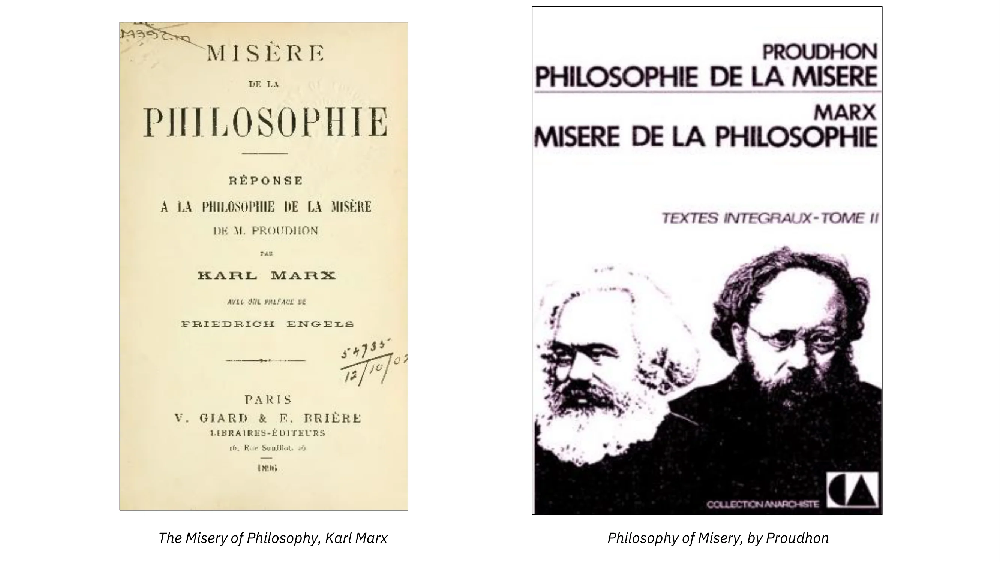

این ادعا از نظر منطقی مضحک است. زیرا اگر هیچ دارایی به‌طور قانونی به‌دست‌آمده وجود نداشت، منطقی نمی‌توانست عملی مانند دزدی وجود داشته باشد. به همین دلیل است که پرودون بعداً توضیح می‌دهد که توزیع واقعی دارایی را دزدی می‌داند، نه خود دارایی، که آن را به‌عنوان نیروی انقلابی بنیادی برای جامعه آنارشیستی توصیف می‌کند.

اما پرودون یک آنارشیست فردگرا است. او نه پرولتاریا و نه دولت را به عنوان منابع مشروع قدرت نمی‌بیند. او به شدت از کمونیسم انتقاد می‌کند و از همیاری کارگران حمایت می‌کند، شکلی از همبستگی تعاونی ساختاری که بر اساس تجمیع داوطلبانه منابع برای کمک متقابل استوار است. کمتر شناخته شده است اما بَستیا به هیچ وجه با این ایده در اصل مخالف نبود. او فقط نگران بود که دولت آن را به یک خدمت عمومی انحصاری بالفعل تبدیل کند. تاریخ ثابت کرد که او درست می‌گفت.

از سوی دیگر، به خوبی شناخته شده است که در "فقر فلسفه"، مارکس به شدت به پرودون و سوسیالیسم او که آن را "آرمان‌گرایانه" می‌نامید، حمله می‌کند و از سوسیالیسم به اصطلاح "علمی" حمایت می‌کند.

در ژوئن ۱۸۴۸، پرودون به همراه بَستیا به مجلس ملی انتخاب شد. آن‌ها با یکدیگر آشنا بودند و برای همدیگر احترام زیادی قائل بودند. با این حال، در سال ۱۸۴۹، در یک جنجال پر سر و صدا، بَستیا چهارده نامه با او در ستون‌های La Voix du Peuple مبادله کرد. در این Exchange پرشور، او موضع خود را در مورد مسائل پولی و بانکی روشن کرد. این اختلاف به این گزینه خلاصه شد: اعتبار آزاد یا آزادی اعتبار؟

پرودون بهره سرمایه را علت اولیه فقر و نابرابری شرایط می‌دانست. او از ایجاد پول نامحدود توسط یک بانک دولتی (بانک Exchange یا بانک مردم) حمایت می‌کرد و در "اعتبار آزاد" راه‌حل مشکل اجتماعی را می‌دید. از سوی دیگر، بَستیات طرفدار آزادی بانک‌ها بود، به معنای تنظیم گردش پول از طریق آزادی دسترسی به حرفه، همراه با مسئولیت لازم بر روی وجوه خود و آزادی رقابت.

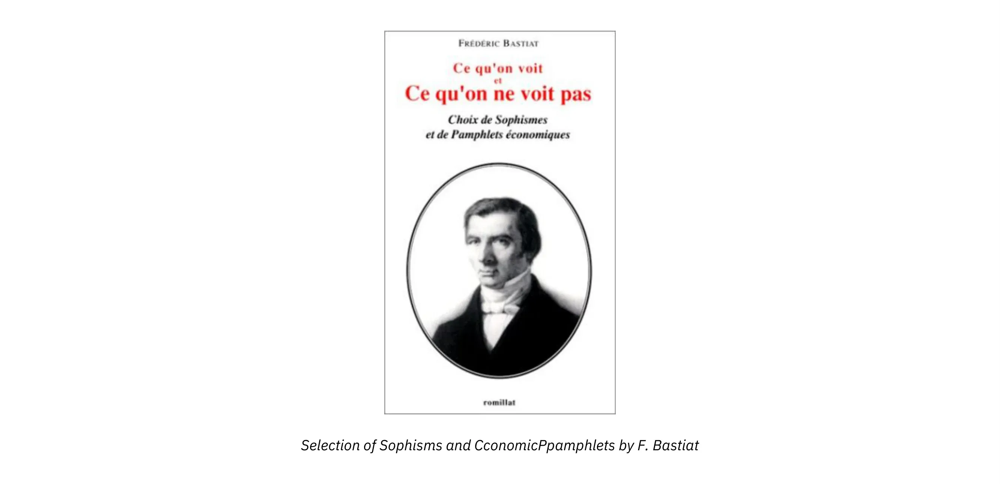

باستیا در چند مرحله به رد نظر مخالف خود پرداخت. ابتدا، او به تحلیل اثرات مخرب اعتبار رایگان و خلق پول پرداخت. چنین سیستمی تنها می‌تواند اقدامات پرخطر و بی‌پروای بانک‌ها و بازیگران خصوصی را تشویق کند زیرا آن‌ها می‌دانند که توسط دولت، یعنی با پول مالیات‌دهندگان، پوشش داده می‌شوند: "این مسئله‌ای جدی است که همه افراد را در وضعیتی قرار دهیم که بگویند: بیایید با دارایی دیگران شانس خود را امتحان کنیم؛ اگر موفق شوم، برای من بهتر است؛ اگر شکست بخورم، برای دیگران بد است." بیانی پیش‌بینانه که می‌تواند به دوران ما نیز اعمال شود.

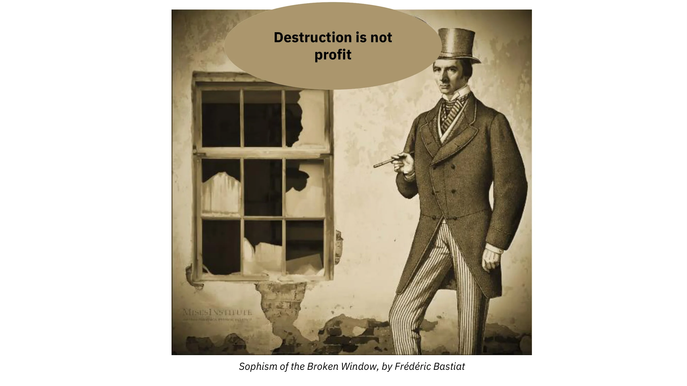

سیاست نرخ بهره پایین که توسط بانک‌های مرکزی اجرا می‌شود، روشی برای ایجاد مصنوعی پول است. و بحران‌های متوالی سیستم مالی در طول قرن گذشته، همراه با بدهی‌های دولت‌ها، پیامدهای مستقیم آن هستند.

سپس باستیا نشان می‌دهد که بهبود قدرت خرید طبقات کارگر ممکن است، اما از طریق روش‌های دیگر، عادلانه‌تر و مؤثرتر. برای او، کاهش نرخ بهره نیز هدف یک سیاست لیبرال است. اما این از طریق آزادسازی و انباشت سرمایه به دست می‌آید، نه با لغو بهره، یعنی اعتبار رایگان.

در واقع، به گفته باستیا، پیشرفت بشریت با تشکیل سرمایه همزمان است. در جزوه‌ای با عنوان سرمایه و اجاره، باستیا این موضوع را با رابینسون کروزو در جزیره‌اش به ما می‌فهماند.

بدون سرمایه یا مواد انباشته، رابینسون محکوم به مرگ بود. او سپس توضیح می‌دهد که سرمایه به دو روش کارگر را غنی می‌کند:

- این تولید را افزایش می‌دهد و در نتیجه قیمت کالاها برای مصرف کاهش می‌یابد؛
- که منجر به افزایش دستمزدها می‌شود.

در جامعه مدرن، سرمایه به عنوان یک نیروی تساوی‌بخش عمل می‌کند. در واقع، بَستیَت می‌گوید:

> وقتی سرمایه افزایش می‌یابد، با خودش رقابت می‌کند؛ پاداش آن کاهش می‌یابد، یا به عبارت دیگر، نرخ بهره کاهش می‌یابد.

در نتیجه، هم پرودون و هم بَستیَت اهمیت انباشت سرمایه و تمایل برخی افراد به استثمار دیگران را تشخیص دادند. با این حال، آنها به نتایج یکسانی نرسیدند. پرودون، مانند مارکس، پیش‌بینی کرد که توده‌ها در کشورهای سرمایه‌داری به طور فزاینده‌ای فقیر خواهند شد. بَستیَت معتقد بود که سرمایه‌داری به رفاه بی‌سابقه‌ای در تمام طبقات و توسعه یک طبقه متوسط به طور فزاینده‌ای مهم منجر خواهد شد. این واقعاً همان چیزی است که اتفاق افتاد.

# سفسطه‌های اقتصادی

<partId>59686d1d-58c6-59a8-9fc4-74a10d24cdbe</partId>

## چه چیزی دیده می‌شود و چه چیزی دیده نمی‌شود

<chapterId>25fb02a9-5d68-5c58-bd0f-d4b8e1fd91f9</chapterId>

در این فصل، من یک فناوری کاملاً جدید، یک فناوری انقلابی را فاش خواهم کرد. یک محقق یک جفت عینک بایونیک با یک دوربین مینی فوق‌العاده قدرتمند که در جلو تعبیه شده است، توسعه داده است. این فناوری امکان دیدن جزئیاتی را فراهم می‌کند که با چشم غیرمسلح دیدن آن‌ها غیرممکن است. در دسته‌ها، یک تراشه الکترونیکی وجود دارد که تصاویر را مستقیماً از طریق گوشی هوشمند من به فضای ابری منتقل می‌کند.

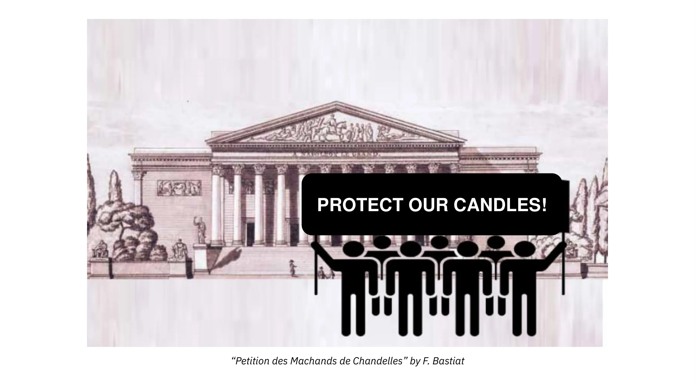

مخترع اولین نمونه این عینک‌ها فردریک باستیا در سال 1850 در یک جزوه معروف به نام: _Ce qu’on voit et ce qu’on ne voit pas_ بود. این عینک‌ها، عینک‌های اقتصاددان هستند. آن‌ها به ما امکان می‌دهند تا پیامدهای تصمیماتی که توسط مقامات بر زندگی ما گرفته می‌شود را اندازه‌گیری کنیم. این‌ها عینک‌هایی هستند که "به ما اجازه می‌دهند آنچه را که نمی‌بینیم ببینیم": تخریبی که توسط سیاست‌های مشتری‌مدار و نظریه‌های اقتصادی نادرست ایجاد می‌شود. اغلب قربانیان و بهره‌برداران آن‌ها را نمی‌بینیم، به طور خلاصه، اثرات واقعی آن‌ها در مقابل ادعاهایی که در سخنرانی‌های رسمی مطرح می‌شود، آنچه باستیا "سفسطه‌های اقتصادی" می‌نامد.

به گفته باستیا، اقتصاددان خوب باید اثرات تصمیمات سیاسی بر جامعه را توصیف کند. با این حال، آن‌ها باید به جای اثرات کوتاه‌مدت بر یک گروه خاص، به پیامدهای بلندمدت برای کل جامعه توجه کنند. قربانیان و بهره‌مندان این سیاست‌ها چه کسانی هستند؟ هزینه‌های پنهان یک قانون یا تصمیم سیاسی خاص چیست؟ مالیات‌دهندگان با پولی که از آن‌ها به عنوان مالیات گرفته شده، به جای دولت چه کاری انجام می‌دادند؟ این‌ها سوالاتی هستند که به گفته باستیا، اقتصاددان خوب مطرح می‌کند.

بنابراین، در آثار عمومی، باستیا می‌نویسد:

> دولت جاده‌ای را باز می‌کند، قصری می‌سازد، خیابانی را صاف می‌کند، کانالی حفر می‌کند؛ با این کار به برخی کارگران کار می‌دهد، این چیزی است که دیده می‌شود؛ اما کار را از برخی دیگر می‌گیرد، این چیزی است که دیده نمی‌شود.

یکی از مشهورترین سفسطه‌ها، مغالطه پنجره شکسته است. برخی ادعا می‌کنند که شکستن پنجره‌ای در یک خانه به اقتصاد آسیب نمی‌زند زیرا به نفع شیشه‌بر است. اما بَستیَت نشان خواهد داد که تخریب به نفع ما نیست زیرا ثروت ایجاد نمی‌کند. هزینه آن بیشتر از سود آن است. پسری که پنجره همسایه را می‌شکند به شیشه‌بر کار می‌دهد. اما دوستانش این‌گونه او را دلداری می‌دهند:

> هر ابری یک پوشش نقره‌ای دارد. چنین حوادثی صنعت را زنده نگه می‌دارند. همه باید زندگی کنند. اگر پنجره‌ها هرگز شکسته نمی‌شدند، چه بر سر شیشه‌بران می‌آمد؟

بنابراین، به گفته کینز، تخریب اموال با مجبور کردن به هزینه‌کردن، اقتصاد را تحریک کرده و با داشتن یک "اثر چندگانه" تولید و اشتغال را تقویت می‌کند. این تنها چیزی است که دیده می‌شود.

اما آنچه دیده نمی‌شود این است که صاحبخانه با آن پول چه چیزی می‌توانست بخرد، اما اکنون مجبور است بدون آن سر کند، با آنچه که باید برای تعمیر پنجره‌اش خرج کند. آنچه دیده نمی‌شود فرصت از دست رفته صاحب پنجره شکسته است. او می‌توانست مبلغی را که به شیشه‌بر داده شده به چیز دیگری اختصاص دهد. اگر مجبور نبود برای تعمیر پنجره هزینه کند، می‌توانست پول را برای مصرف شخصی خود خرج کند و به این ترتیب افراد را برای تولید به کار گیرد.

بنابراین، "تحریک" بیشتری در اقتصاد با شکستن پنجره نسبت به بدون آن وجود نخواهد داشت. با این حال، در حالت اول یک زیان خالص وجود خواهد داشت: ارزش پنجره.

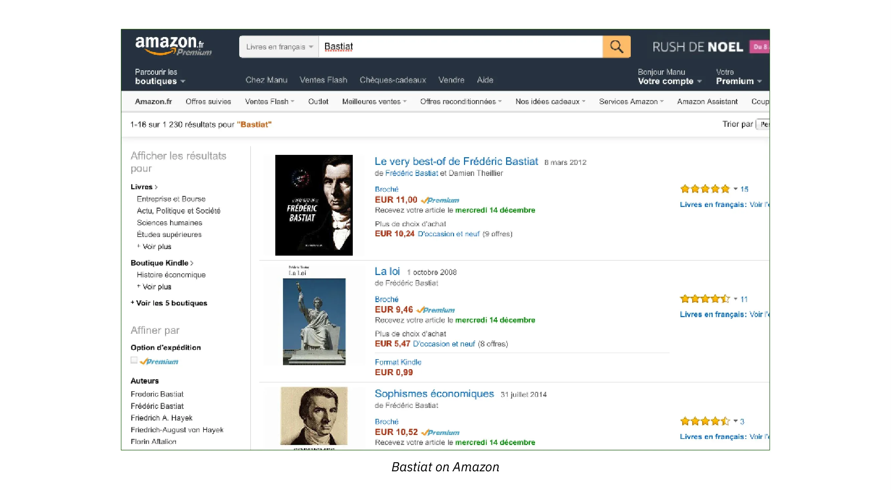

اولین درسی که باید آموخت این است که یک تصمیم "خوب" یا یک سیاست "خوب" آن است که برای جامعه کمتر از آنچه تخصیص دیگری از منابع می‌توانست هزینه داشته باشد، هزینه داشته باشد. اثربخشی یک سیاست باید نه تنها بر اساس اثرات آن، بلکه بر اساس گزینه‌های جایگزینی که می‌توانستند رخ دهند نیز قضاوت شود. این مفهوم "هزینه فرصت" است که برای بَستیا عزیز است.

درس دوم این است که تخریب، برخلاف نظر کینزی‌ها، اقتصاد را تحریک نمی‌کند بلکه به فقر منجر می‌شود. تخریب کالاهای مادی تأثیر مثبتی بر اقتصاد ندارد، برخلاف باور عمومی. به گفته‌های پایانی متن فردریک باستیا: «جامعه ارزش اشیای بی‌جهت تخریب‌شده را از دست می‌دهد.»

بیایید یک مثال فعلی را بررسی کنیم. به محض اینکه صنعت خودروسازی دچار مشکل می‌شود، سیاست‌گذاران طرح‌های اسقاط خودرو را برای "راه‌اندازی مجدد" آن تصور می‌کنند. آنچه می‌بینیم افزایش فروش رنو و پژو است. آنچه نمی‌بینیم، زیان برای سایر بخش‌های اقتصادی و نابودی خودروهایی است که در شرایط کاری عالی هستند.

اما راه‌های دیگری نیز برای تقویت اقتصاد وجود دارد. اگر دولت در پروژه‌های بزرگ مشارکت کند یا در بخش‌های صنعتی خاصی برای حمایت از اشتغال سرمایه‌گذاری کند، آیا این خبر خوبی برای رشد نیست؟ دیگر نه، باستیات پاسخ می‌دهد. زیرا هزینه‌های عمومی چگونه تأمین می‌شود؟ با افزایش مالیات یا بدهی، یعنی با هزینه‌های نامرئی اما بسیار واقعی که بر رشد تأثیر می‌گذارد. علاوه بر این، دولت چیزی تولید نمی‌کند؛ بلکه منابع را از استفاده خصوصی منحرف می‌کند. و آنچه نمی‌بینیم، بسیاری از چیزهایی است که می‌توانست تولید شود اگر سرمایه از بخش خصوصی برای تأمین مالی برنامه‌های دولتی خارج نمی‌شد.

سرانجام، نزدیک به یک قرن قبل از کینز، می‌توانیم بگوییم که بَستیَت سفسطه‌های کینزی را که ادعا می‌کنند بدهی دولت اقتصاد را تشویق می‌کند و هزینه‌های عمومی رشد ایجاد می‌کند، رد کرد.

درس بزرگ از این مجموعه متون این است که مداخله دولت اثرات معکوسی دارد که دیده نمی‌شوند. تنها یک اقتصاددان خوب قادر به پیش‌بینی آن‌هاست. سیاست چیزی است که ما می‌بینیم. اقتصاد چیزی است که ما نمی‌بینیم.

## دادخواست شمع‌سازان

<chapterId>f4e759ed-1cb2-55c7-885e-0a60244758a4</chapterId>

در سال 1840، مجلس نمایندگان به قانونی رأی داد که مالیات‌های وارداتی را برای حمایت از صنعت فرانسه افزایش می‌داد. این همان میهن‌پرستی اقتصادی معروف است که امروزه نیز با آن مواجه هستیم.

_بالا: مارین لو پن، یک سیاستمدار فرانسوی_

سپس بستیات یک متن طنز نوشت که بعدها به یکی از مشهورترین آثار او تبدیل شد: "دادخواست شمع‌سازان". این متن نشان می‌دهد که چگونه برخی گروه‌های فشار تولیدکننده که به خوبی سازماندهی شده‌اند، امتیازات ناعادلانه‌ای از دولت به ضرر شهروندان به دست می‌آورند. در عین حال، ماهیت مضحک و مخرب قوانین حمایت‌گرایانه را نشان می‌دهد.

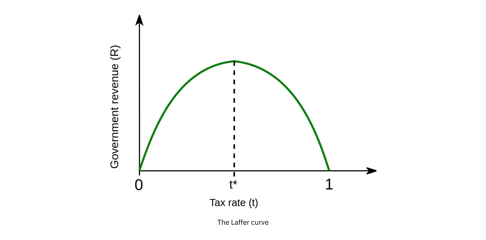

---

> از شمع‌های ما محافظت کنید!

---

در این دادخواست، شمع‌سازان از نمایندگان درخواست حمایت قانونی در برابر یک رقیب خطرناک می‌کنند:

> ما از رقابت غیرقابل تحمل یک رقیب خارجی رنج می‌بریم که به نظر می‌رسد در شرایطی بسیار برتر برای تولید نور قرار دارد و بازار ملی ما را با قیمتی به طرز شگفت‌انگیزی کاهش‌یافته اشباع می‌کند.

پس، این رقیب خارجی ناعادلانه کیست؟ او کسی نیست جز خورشید. تولیدکنندگان سپس به فرصت‌هایی اشاره می‌کنند که در صورت "اختصاص بازار ملی به نیروی کار ملی" وجود خواهد داشت، با صدور قانونی برای بستن "تمام پنجره‌ها، نورگیرها، سایه‌بان‌ها، کرکره‌ها، پرده‌ها، پنجره‌های بالای در، به عبارت دیگر تمام بازشوها، سوراخ‌ها، شکاف‌ها و ترک‌هایی که نور خورشید از طریق آن‌ها به خانه‌ها وارد می‌شود".

به عبارت دیگر، شمع‌سازان تلاش می‌کنند تا اثرات مضر یک "رقیب خارجی" (خورشید) بر اقتصاد فرانسه را نشان دهند. زیرا خورشید نه تنها می‌تواند همان "محصول" شمع‌ها را ارائه دهد، بلکه این کار را به صورت رایگان انجام می‌دهد. دویست سال بعد، این داستان همچنان به طرز شگفت‌انگیزی مرتبط است. به رانندگان تاکسی فکر کنید که خواستار قانون برای ممنوعیت VTCها و اوبر هستند. به کتابفروشی‌هایی فکر کنید که می‌خواهند آمازون را ممنوع کنند.

حریف واقعی باستیا در این داستان، حمایت‌گرایی سیاسی و انتخاباتی است که تنها بر طمع تولیدکنندگان و ساده‌لوحی مصرف‌کنندگان تکیه دارد. او تبانی بین سرمایه‌دار بد زمانه و دولت را فاش می‌کند. به جای نوآوری و تطبیق با بازار، سرمایه‌دار بد کسی است که به دنبال کسب مزیت سیاسی از طریق حمایت‌گرایی است. این همیشه به غارت مصرف‌کننده منجر می‌شود، یعنی یک بی‌عدالتی.

به طور خلاصه، حمایت‌گرایی یک سیاست عمدی به نفع تولیدکنندگان در برابر مصرف‌کنندگان است. با این حال، به گفته باستیا، نمایندگان واقعی منافع عمومی مصرف‌کنندگان هستند، زیرا همه ما مصرف‌کننده‌ایم.

حمایت‌گرایی همچنین بر اساس یک قیاس پنهان است که به یک مغالطه تبدیل می‌شود:

- هرچه بیشتر کار کنیم، ثروتمندتر می‌شویم؛
- هرچه مشکلات بیشتری برای غلبه بر آنها داشته باشیم، بیشتر کار می‌کنیم؛
- بنابراین، هرچه مشکلات بیشتری برای غلبه بر آنها داشته باشیم، ثروتمندتر هستیم.

بیایید این پوچی را با چند داستان کوتاه که توسط بَستیا روایت شده‌اند، نشان دهیم. در فصل سوم از سری دوم "سفسطه‌های اقتصادی"، او نجاری را تصور می‌کند که به وزیر نامه‌ای می‌نویسد و درخواست قانون‌گذاری حمایت‌گرایانه می‌کند. نجار درخواست خود را این‌گونه مطرح می‌کند: آقای وزیر، قانونی وضع کنید که مقرر کند "هیچ‌کس نمی‌تواند از چیزی جز تیرها و الوارهایی که با تبرهای کند تولید شده‌اند، استفاده کند." به عبارت دیگر، قانونی وضع کنید که استفاده از تبرهای تیز در فرانسه را ممنوع کند. بنابراین، جایی که معمولاً ۱۰۰ ضربه تبر داده می‌شود، لازم خواهد بود که ۳۰۰ ضربه داده شود. نجاران بسیار مورد نیاز خواهند بود و بنابراین بهتر پرداخت خواهند شد.

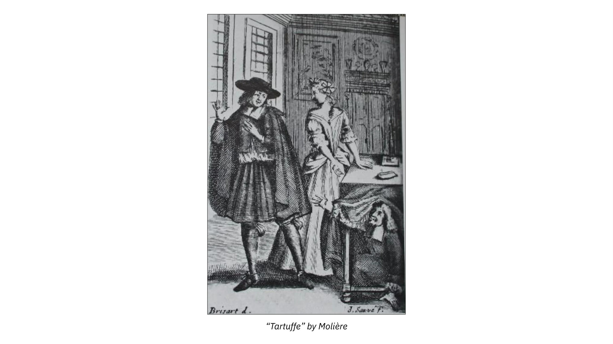

در فصل شانزدهم، متن بسیار کنایه‌آمیز دیگری با عنوان: دست راست و دست چپ وجود دارد. پس از یک تحقیق، فرستاده‌ای سلطنتی گزارشی تهیه می‌کند که در آن به پادشاه پیشنهاد می‌دهد تا تمام دست‌های راست کارگران را قطع کند یا حداقل ببندد. او ادامه می‌دهد که با این کار، کار و در نتیجه ثروت افزایش خواهد یافت. تولید بسیار دشوارتر خواهد شد که این امر نیاز به استخدام گسترده نیروی کار اضافی و افزایش دستمزدها را به همراه خواهد داشت. فقر از کشور ناپدید خواهد شد.

با پیروی از این منطق ایجاد شغل به هر قیمتی، چرا کامیون‌ها را با فرغون و بیل‌ها را با قاشق چای‌خوری جایگزین نکنیم؟ همه این سفسطه‌ها یک چیز مشترک دارند: آنها وسیله را با هدف اشتباه می‌گیرند. برای بَستیا، هدف اقتصاد حفظ مشاغل نیست. ما نباید سودمندی کار را با مدت و شدت آن قضاوت کنیم بلکه با نتایج آن: رضایت از نیازها، سودمندی.

این سردرگمی بین وسیله و هدف در شعار "پول ثروت است" یافت می‌شود.

این اصل، سیاست پولی اکثر کشورها را هدایت می‌کند. در واقع، افزایش مصنوعی مقدار پول به بانک‌ها اجازه می‌دهد تا به افراد و دولت‌ها وام دهند و دولت‌ها به راحتی بدهی‌های خود را بازپرداخت کنند، این چیزی است که "ما می‌بینیم". اما "چیزی که نمی‌بینیم" این است که این خلق پول، که بر اساس هیچ خلق ثروت واقعی نیست، به تورم و نابودی پس‌اندازکنندگان منجر خواهد شد.

ثروت واقعی، به گفته باستیا، مجموعه‌ای از چیزهای مفید است که ما از طریق کار برای برآوردن نیازهایمان تولید می‌کنیم. بنابراین پول تنها یک وسیله معمول برای Exchange است و فقط نقش واسطه را ایفا می‌کند.

## غارت از طریق مالیات

<chapterId>551fc499-2119-5a52-9114-412d29434c22</chapterId>

> وقتی ثروتمندان وزن کم می‌کنند، فقرا می‌میرند.

این نقل قول که به لائو تزو نسبت داده می‌شود، پیامد اجتناب‌ناپذیر یک سیستم مالیاتی را توصیف می‌کند که هدف آن ضربه زدن به ثروتمندان بیشتر از دیگران است.

با این حال، آیا تا به حال شنیده‌اید که گفته شود:

> مالیات بهترین سرمایه‌گذاری است: این یک شبنم بارورکننده است! ببینید چقدر خانواده‌ها را حمایت می‌کند و در ذهن، تأثیرات آن بر صنعت را دنبال کنید: این بی‌نهایت است، این زندگی است.

در فرانسه، جایی که هزینه‌های عمومی به عنوان یک مزیت در نظر گرفته می‌شود، مالیات‌ها بالاتر از سایر کشورها است. اما بَستیا بلافاصله به ما هشدار می‌دهد: "در هر هزینه عمومی، پشت ظاهر خوب، یک شر که تشخیص آن دشوارتر است، وجود دارد."

درباره چیست؟

اقتصاد تأثیرات خوب یا بد تصمیمات سیاسی بر زندگی ما را توصیف می‌کند. با این حال، به گفته باستیا، اقتصاددان باید نه تنها به تأثیرات کوتاه‌مدت بر یک گروه خاص، بلکه به پیامدهای بلندمدت برای جامعه به عنوان یک کل توجه کند.

> آنچه می‌بینیم کار و سودی است که توسط مشارکت اجتماعی مجاز شده است. آنچه نمی‌بینیم کارهایی است که توسط همین مشارکت ایجاد می‌شد اگر به مالیات‌دهندگان واگذار می‌شد. آنچه می‌بینیم کار و سودی است که توسط مشارکت اجتماعی مجاز شده است. آنچه نمی‌بینیم کارهایی است که توسط همین مشارکت ایجاد می‌شد اگر به مالیات‌دهندگان واگذار می‌شد.
>

> ف.باستیا

از همان ابتدا، او استدلال همچنان رایج را که هزینه‌های عمومی تأمین‌شده از طریق مالیات شغل ایجاد می‌کند، رد می‌کند. در واقع، مالیات‌ها چیزی ایجاد نمی‌کنند زیرا آنچه توسط دولت خرج می‌شود دیگر توسط مالیات‌دهندگان خرج نمی‌شود.

علاوه بر این، دولت بیشتر از افراد اسراف می‌کند. در واقع، او به ما یادآوری می‌کند که دولت هیچ چیزی را مالک نیست؛ هیچ ثروتی تولید نمی‌کند. هزینه‌های عمومی اغلب منبعی از اسراف هستند زیرا مبالغ عظیمی که از افراد مصادره می‌شود از مسئولیت صاحبانشان فرار کرده و به جای آنها توسط بوروکرات‌ها، که تحت فشار گروه‌های ذی‌نفع هستند، خرج می‌شود.

البته، به عنوان پرداخت برای یک خدمت عمومی معادل دریافت شده در Exchange، مالیات کاملاً قابل دفاع است. اما در فرانسه، دولت چندین نقش به مالیات‌ها اختصاص داده است.

در ابتدا، قرار بود هزینه‌های مشترک را پوشش دهد. سپس، مالیات‌ها نیز نقشی در تنظیم اقتصاد پیدا کردند. در این مورد، سیاستمداران و بوروکرات‌ها قدرتی دارند که تنها با حسن نیت آن‌ها محدود می‌شود. غرق در ساختارهای مصنوعی خود، آن‌ها اقتصاد را با مالیات‌گذاری و تنظیم بخش‌ها کم و بیش بر اساس خواسته‌های خود شکل می‌دهند تا آن‌ها را ترجیح یا تضعیف کنند.

سرانجام، نقش اجتماعی به مالیات‌ها اختصاص داده شد. آن‌ها به ابزاری برای عدالت اجتماعی تبدیل شدند. بنابراین، مالیات‌ها نباید به همه به یک شکل اعمال شوند. مالیات‌ها باید بازتوزیعی باشند، از کسانی که "بیشتر دارند" به کسانی که "کمتر دارند."

مشکل این است که مالیات‌ها، همان‌طور که تصور می‌شوند، تابع خودسری کسانی است که در قدرت هستند. آن‌ها به نفع یا ضرر دسته‌های اجتماعی خاصی عمل می‌کنند، بسته به اینکه قدرت انتظار رأی از آن‌ها دارد یا نه. علاوه بر این، نرخ‌های تصاعدی درآمد کمی برای خزانه عمومی دارند. با این حال، آن‌ها به اکثریت اجازه می‌دهند تا اقلیتی را مصادره کنند و به طور طبیعی به مصادره‌گری تبدیل می‌شوند.

به همین دلیل باستیا قبلاً منحنی لافر را درک کرده بود. آرتور لافر یک اقتصاددان آمریکایی است که به خاطر "منحنی" معروف خود (یک بیضی)، که در سال ۱۹۷۴ منتشر شد، شناخته می‌شود. این منحنی نشان می‌دهد که بازدهی مالیات‌ها با کاهش نرخ مالیات افزایش می‌یابد. این نظریه بازده نزولی مالیات‌گذاری بیش از حد است.

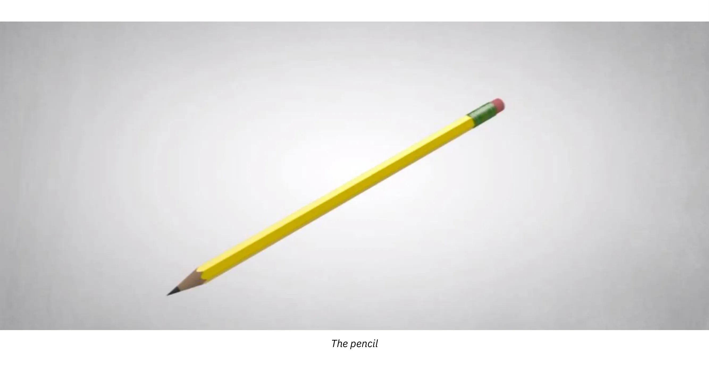

> مالیات بیش از حد، مالیات را از بین می‌برد.
>

> آرتور لافر

سیاستمداران به‌سادگی فرض می‌کنند که یک رابطه خودکار و ثابت بین نرخ‌های مالیاتی و درآمدهای مالیاتی وجود دارد. آن‌ها فکر می‌کنند با دو برابر کردن نرخ مالیات می‌توانند درآمدهای مالیاتی را دو برابر کنند. به گفته لافر، چنین رویکردی این واقعیت را نادیده می‌گیرد که ممکن است مالیات‌دهندگان در پاسخ به مشوق‌های جدید رفتار خود را تغییر دهند.

منحنی لافر نشان می‌دهد که دولت زمانی که نرخ‌های مالیاتی ۱۰۰٪ است، هیچ درآمدی جمع‌آوری نمی‌کند. برعکس، هر کاهش در مالیات‌ها به تحریک فعالیت اقتصادی و در نتیجه درآمدهای دولتی کمک می‌کند. در واقع، کاهش نرخ‌های مالیاتی حاشیه‌ای باعث تحریک سرمایه‌گذاری، کار، خلاقیت و در نتیجه ترویج رشد اقتصادی می‌شود. کاهش کافی می‌تواند محرک اقتصادی کافی برای افزایش درآمدهای عمومی با گسترش قابل توجه پایه مالیاتی ایجاد کند.

باستیا ممکن است اضافه کند که باید به کاهش هزینه‌های دولتی به همان اندازه اهمیت داد که به کاهش مالیات‌ها. با این حال، همان‌طور که مارگارت تاچر، یکی از شاگردان فردریک باستیا، به‌خوبی بیان کرد:

> هدف این نیست که ثروتمندان را فقیر کنیم، بلکه این است که فقرا را ثروتمند کنیم.

و او این را در حالی گفت که با سوسیالیست‌ها صحبت می‌کرد.

## دو اخلاقیات

<chapterId>c518e449-f638-553c-9a49-15da48023d41</chapterId>

بسیاری از مردم "تارتوف یا ریاکار"، کمدی مولیر را می‌شناسند که در آن یک فرد حیله‌گر سعی می‌کند المیر را فریب دهد و شوهرش اورگون را گول بزند. چگونه می‌توان خود را در برابر فریب‌های چنین ریاکاری که تظاهر به خیرخواهی می‌کند در حالی که علیه شما نقشه می‌کشد، محافظت کرد؟

بستیا اشاره می‌کند که دو راه برای پایان دادن به این نوع فریب وجود دارد: اصلاح تارتوف یا روشن کردن ارگون. البته، همیشه تارتوف‌ها وجود خواهند داشت، اما قدرت آن‌ها برای آسیب رساندن بسیار کاهش می‌یابد اگر ارگون‌های کمتری برای گوش دادن به آن‌ها وجود داشته باشد.

ضعف عقل انسان در ریشه سوء استفاده از آزادی قرار دارد. این اصلی‌ترین محدودیت انسان‌ها و علت بسیاری از شرور است. بنابراین، لازم است که وجدان‌ها را درباره ماهیت مفید یا مضر، و به این ترتیب عادلانه یا ناعادلانه اعمال انسانی، چه فردی و چه جمعی، روشن کنیم.

با این حال، دو روش مکمل برای روشن کردن قضاوت شهروندان وجود دارد، همان‌طور که بَستیا در فصلی از مجموعه دوم "سفسطه‌های اقتصادی" با عنوان "دو اخلاقیات" توضیح می‌دهد.

- اول، یک "اخلاق فلسفی یا دینی" وجود دارد که با تصفیه و اصلاح عمل انسانی (انسان به عنوان عامل) عمل می‌کند؛
- سپس، یک "اخلاق اقتصادی" وجود دارد که با نشان دادن "عواقب ضروری اعمالش" به انسان (انسان به عنوان بیمار) عمل می‌کند.

در واقع، این‌ها دو چارچوب اخلاقی کاملاً مکمل هستند.

1. اولی به قلب می‌پردازد و افراد را تشویق به انجام کارهای نیک می‌کند؛ این اخلاق دینی یا فلسفی است. این اخلاق شریف‌ترین است. در قلب انسان آگاهی به وظیفه‌اش را ریشه می‌دواند. به او می‌گوید:

> خودت را بهبود ببخش؛ خودت را پاک کن؛ از انجام کارهای بد دست بردار؛ کار خوب انجام بده، احساساتت را مهار کن؛ از منافع خود بگذر؛ به همسایه‌ات که وظیفه داری دوستش بداری و به او کمک کنی، ظلم نکن؛ ابتدا عادل باش و سپس خیّر.

به طور خلاصه، این فضیلت، عمل ایثارگرانه را آموزش می‌دهد. باستیا می‌گوید این اخلاقیات، برای همیشه زیباترین و تأثیرگذارترین خواهد بود، زیرا نشان‌دهنده بهترین ویژگی‌های انسان است.

2. دیگری به افشای و مبارزه با شر از طریق شناخت اثرات آن کمک می‌کند، این اخلاق اقتصادی است. این به عقل و نه به قلب می‌پردازد و هدف آن روشن کردن قربانی درباره اثرات منفی یک رفتار است. این درس‌های تجربه را تقویت می‌کند. این تلاش می‌کند تا عقل سلیم، دانش و بی‌اعتمادی را در میان توده‌های ستمدیده گسترش دهد و سرکوب را دشوارتر کند.

این اخلاق اقتصادی به همان نتیجه‌ای که اخلاق دینی می‌خواهد برسد، اما با شروع از اثرات اعمال انسانی، می‌پردازد. به ما می‌آموزد که در برابر اعمال ناعادلانه یا زیان‌آور واکنش نشان دهیم و از اعمالی که عادلانه یا مفید هستند دفاع کنیم.

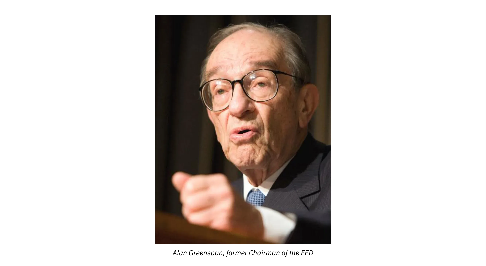

باستیا در اینجا نقش علم، و به‌ویژه علم اقتصاد را برجسته می‌کند. اگرچه نقش آن با اخلاق سنتی متفاوت است، اما همچنان برای مبارزه با غارت در همه اشکال آن ضروری است. اخلاق به نیت رذیلت حمله می‌کند و اراده را آموزش می‌دهد. از سوی دیگر، علم با درک اثرات رذیلت به آن حمله می‌کند و بدین ترتیب پیروزی فضیلت را تسهیل می‌کند.

به طور مشخص، علم اقتصاد که توسط باستیا به عنوان اخلاق دفاعی توصیف شده است، شامل رد سفسطه‌های اقتصادی به منظور بی‌اعتبار کردن کامل آن‌ها و در نتیجه سلب توجیه و قدرت از طبقه غارتگر است.

بنابراین، اقتصاد سیاسی دارای یک کاربرد عملی آشکار است. این علم، غارت را در هزینه‌های پنهان، موانع رقابت و همه اشکال حمایت‌گرایی آشکار می‌کند.

بار دیگر، اگر اورگون‌های کمتری برای گوش دادن به آن‌ها وجود داشت، تعداد تارتوف‌ها نیز کمتر می‌شد. اینجا چیزی است که بَستیا در این مورد می‌گوید:

> بنابراین بگذارید اخلاق دینی قلب‌های تارتوف‌ها را لمس کند اگر بتواند. وظیفه اقتصاد سیاسی این است که فریب‌خوردگان آن‌ها را روشن کند. از این دو رویکرد، کدام یک برای پیشرفت اجتماعی مؤثرتر عمل می‌کند؟ آیا باید گفت؟ من معتقدم که دومی است. من می‌ترسم که بشریت نتواند از ضرورت یادگیری اولیه اخلاق دفاعی فرار کند.

البته، اقتصاد سیاسی علم جهانی نیست؛ این علم رویکردهای فلسفی و مذهبی را مستثنی نمی‌کند. "اما چه کسی تاکنون چنین ادعای گزافی به نام آن مطرح کرده است؟" باستیا می‌پرسد.

یک چیز قطعی است، سیاست نیست که می‌تواند مسیر امور را تغییر دهد و انسان را کامل کند. برعکس، لازم است سیاست را محدود کرده و به نقش محدود آن که امنیت است، بسنده کنیم. بلکه در حوزه‌های فرهنگی، خانوادگی، دینی و انجمنی، از طریق کار بر روی ایده‌ها، از طریق آموزش و تعلیم، به طور خلاصه، از طریق جامعه مدنی است که مسئولیت‌پذیری و همبستگی می‌تواند تقویت شود.

# هارمونی‌های اقتصادی

<partId>db04dfa4-a53e-5d3e-a307-a68ebc36dc4f</partId>

## معجزه بازار

<chapterId>895ccd1d-7b52-5a8b-8b2c-6ec0056cf632</chapterId>

آیا یک جامعه هماهنگ می‌تواند بدون قوانین نوشته شده، قواعد، و اقدامات سرکوبگرانه وجود داشته باشد؟ اگر به انسان‌ها آزادی داده شود، آیا شاهد بی‌نظمی، هرج و مرج، و بی‌سازمانی نخواهیم بود؟ چگونه می‌توان از ایجاد صرفاً یک کنار هم‌گذاری از افراد که خارج از هرگونه هماهنگی عمل می‌کنند جلوگیری کرد، اگر نه از طریق قوانین و یک سازمان سیاسی متمرکز؟

این استدلالی است که اغلب توسط کسانی که خواستار تنظیم بازار هستند یا جامعه‌ای که به تنهایی قادر به هماهنگ کردن افراد به یک کل منسجم و هماهنگ است، مطرح می‌شود.

این دیدگاه بستیات نیست. به گفته او، سازوکار اجتماعی، مانند سازوکار آسمانی یا سازوکار بدن انسان، از قوانین کلی پیروی می‌کند. به عبارت دیگر، این یک کل هماهنگ و سازمان‌یافته است. و موتور این سازمان‌دهی، بازار آزاد است.

معجزه بازار آزاد، او به ما می‌گوید، این است که از دانشی استفاده می‌کند که هیچ فردی به تنهایی نمی‌تواند آن را داشته باشد و رضایتی فراهم می‌کند که بسیار برتر از هر چیزی است که یک سازمان مصنوعی می‌تواند انجام دهد.

باستیا چند مثال ارائه می‌دهد تا مزایای این بازار را نشان دهد. ما آنقدر به این پدیده عادت کرده‌ایم که دیگر به آن توجه نمی‌کنیم.

بیایید یک نجار در یک روستا را در نظر بگیریم، او می‌گوید، و تمام خدماتی که به جامعه ارائه می‌دهد و تمام خدماتی که دریافت می‌کند را مشاهده کنیم:

> هر روز، وقتی از خواب بیدار می‌شود، لباس می‌پوشد و هیچ‌کدام از لباس‌هایش را خودش ندوخته است. با این حال، برای اینکه این لباس‌ها در دسترس او باشند، مقدار زیادی کار، صنعت، حمل‌ونقل و اختراعات مبتکرانه در سراسر جهان باید انجام می‌شد.
>

> سپس او صبحانه می‌خورد. برای اینکه نانی که او می‌خورد هر صبح بر روی میز او قرار گیرد، زمین‌ها باید پاک‌سازی و شخم زده می‌شدند؛ آهن، فولاد، چوب، سنگ باید به ابزار کار تبدیل می‌شدند؛ همه چیزهایی که هر کدام، به‌طور جداگانه، حجم غیرقابل محاسبه‌ای از کار را به‌کار می‌گیرند، نه تنها در فضا بلکه در زمان.
>

> این مرد پسرش را به مدرسه خواهد فرستاد تا آموزشی دریافت کند که مستلزم تحقیق و سال‌ها مطالعه قبلی است.
> او به بیرون می‌رود: او یک خیابان سنگفرش و روشن پیدا می‌کند.
>

> ملک او مورد مناقشه است: او وکلایی پیدا خواهد کرد تا از حقوقش دفاع کنند، قضاتی برای حفظ آنها، مأموران عدالت برای اجرای حکم؛ همه چیزهایی که هنوز دانش کسب‌شده، از این رو روشنگری و وسایل زندگی را فرض می‌کنند.

باستیا بازار را به عنوان ابزاری غیرمتمرکز و نامرئی برای همکاری توصیف می‌کند. از طریق سیستم قیمت، اطلاعاتی درباره نیازها و مهارت‌های همه افراد منتقل می‌کند و افرادی را که می‌خواهند برای بهبود زندگی خود همکاری کنند، به هم متصل می‌کند.

باستیا نتیجه می‌گیرد که آنچه چشمگیر است، عدم تناسب عظیمی است که بین مزایایی که این مرد از جامعه می‌گیرد و آنچه که اگر به منابع خود محدود شود، برای خود فراهم می‌کند، وجود دارد. او در یک روز کالاهایی مصرف می‌کند که نمی‌تواند خودش تولید کند.

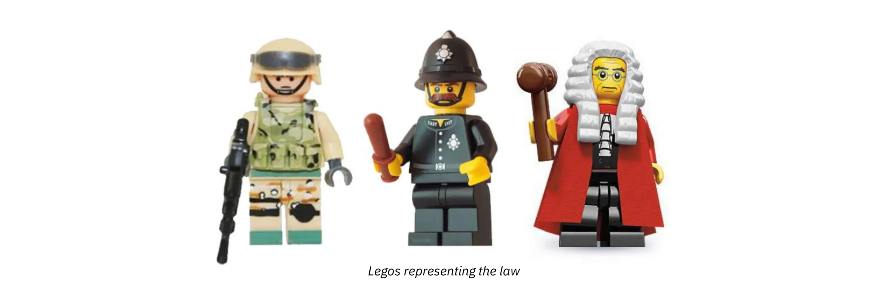

در سال 1958، نویسنده آمریکایی لئونارد رید (بنیاد آموزش اقتصادی) مقاله کوتاهی را در مجله The Freeman منتشر کرد که به سبک بَستیا نوشته شده بود و بسیار مشهور شد: "من، مداد". این متن استعاره‌ای برای آنچه بازار آزاد است می‌باشد. این‌گونه آغاز می‌شود:

> من یک مداد نوک‌سرب هستم، یک مداد چوبی معمولی که برای تمام پسران و دختران و بزرگسالانی که می‌توانند بخوانند و بنویسند آشناست. این یکی از ساده‌ترین اشیاء در تمدن بشری است. و با این حال، هیچ فردی روی این زمین نمی‌داند چگونه مرا تولید کند.

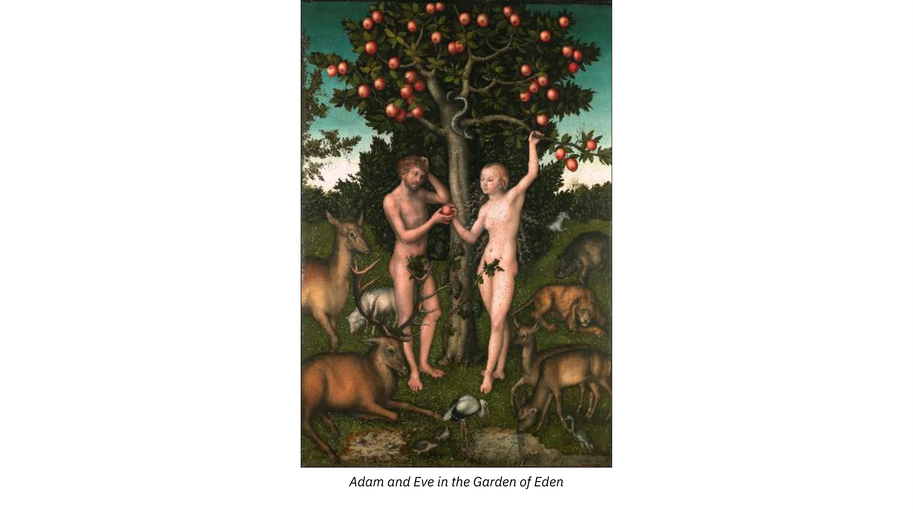

این ایده باستیا را بازبینی می‌کند که همکاری نامرئی میان میلیون‌ها فردی که یکدیگر را نمی‌شناسند، منجر به ساخت چیزی به سادگی یک مداد می‌شود. هیچ‌کس به تنهایی نمی‌داند چگونه یک مداد بسازد. با این حال، میلیون‌ها انسان به‌طور ناآگاهانه در خلق این مداد ساده مشارکت می‌کنند، دانش و مهارت‌های خود را در یک سیستم قیمتی مبادله و هماهنگ می‌کنند بدون اینکه هیچ مرجع برتری رفتار آن‌ها را دیکته کند. این داستان نشان می‌دهد که افراد آزاد که در پی منافع مشروع خود کار می‌کنند، بیشتر به نفع جامعه عمل می‌کنند تا هر استراتژی اقتصادی برنامه‌ریزی شده و متمرکز.

برنده جایزه نوبل اقتصاد در سال 1976، میلتون فریدمن، نیز این داستان مداد را بازگو کرد تا به عموم مردم توضیح دهد که اقتصاد بازار چگونه کار می‌کند.

در یکی از قسمت‌های مجموعه تلویزیونی او به نام Free to Choose، او اجزای مختلف چیزی به سادگی و پیش‌پاافتادگی یک مداد را تحلیل می‌کند و به معجزه نظم خودجوش که توسط هزاران تعامل اقتصادی در سراسر جهان ایجاد می‌شود، می‌پردازد. افرادی که یکدیگر را نمی‌شناسند و دین یا رسوم مشترکی ندارند، همچنان موفق به هماهنگی برای تولید این شیء می‌شوند. او نتیجه می‌گیرد که بازار آزاد برای تضمین نه تنها رفاه، بلکه هماهنگی و صلح نیز ضروری است.

فریدریش هایک در مقاله خود با عنوان "استفاده از دانش در جامعه" در سال 1945، قبلاً توضیح داده است که چرا اقتصاد بازار و تمرکززدایی از تصمیمات برای رفاه ضروری هستند. به گفته هایک، هیچ برنامه‌ریز مرکزی یا بوروکراتی نمی‌تواند دانش کافی برای هدایت موفقیت‌آمیز تمامی اقدامات اقتصادی داشته باشد. تنها سیستم قیمت در یک بازار آزاد به میلیون‌ها بازیگر مستقل اجازه می‌دهد تا خود تصمیم بگیرند که چگونه منابع را به طور کارآمد تخصیص دهند.

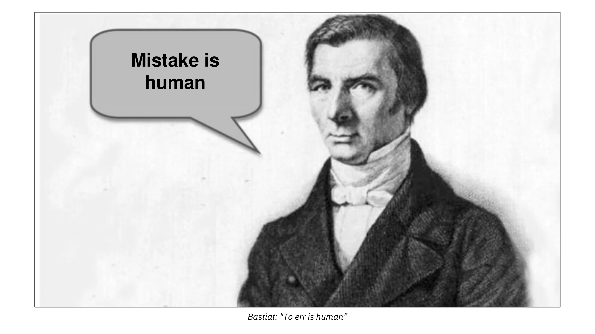

برنامه‌ریزی اقتصادی، که ادعا می‌کند بهتر از بازار عمل می‌کند، نه تنها به تخصیص نادرست منابع منجر می‌شود بلکه به هژمونی یک طبقه بر طبقه دیگر نیز می‌انجامد. به همین دلیل، سوسیالیسم نه تنها یک اشتباه فکری است بلکه اشتباهی است که در نهایت بی‌عدالتی عظیمی را به وجود می‌آورد.

## آزادی و مسئولیت کلید حل مشکل اجتماعی هستند

<chapterId>78baa7ef-2c80-5fc7-8881-c1be4662b96f</chapterId>

در نامه‌ای به آلفونس دو لامارتین در سال ۱۸۴۵، بستیات نوشت که تمام فلسفه او در یک اصل واحد خلاصه می‌شود:

> آزادی بهترین شکل سازمان اجتماعی است.

با این حال، او یک شرط اضافه می‌کند:

> که قانون نباید پیامدهای مثبت یا منفی اعمال هر فرد را حذف کند. این اصل تبعی مسئولیت است.

به عبارت دیگر، آزادی و مسئولیت نمی‌توانند از هم جدا شوند؛ آن‌ها جدایی‌ناپذیرند. برای او، لیبرالیسم با این باور که آزادی نمی‌تواند بدون مسئولیت وجود داشته باشد، از سوسیالیسم متمایز می‌شود. اما کلمات آزادی و مسئولیت دقیقاً چه واقعیت‌هایی را پوشش می‌دهند؟

آزادی اساساً به‌صورت منفی تعریف می‌شود: آزاد بودن به معنای عمل کردن بدون اجبار خارجی در استفاده از حقوق خود است. با این حال، این به معنای نبود تمام محدودیت‌ها نیست. زیرا آزادی نیازمند عمل متقابل است: همچنین ما را ملزم می‌کند که بدون تجاوز به حقوق دیگران عمل کنیم و در صورت لزوم، هرگونه آسیبی را جبران کنیم. این مسئولیت است.

بنابراین، مسئولیت به نوعی جنبه مثبت آزادی را نشان می‌دهد: تا جایی که فرد آزادانه عمل می‌کند، باید عواقب اعمال خود، چه خوب و چه بد، را بپذیرد.

مسئولیت فردی هم یک بردار اصلی خلاقیت است و هم انگیزه‌ای برای احتیاط و دوراندیشی.

وقتی کسی پول خود را خرج می‌کند، مراقب است که بیش از حد بدهکار نشود، کیفیت محصولات و قابلیت اطمینان تأمین‌کنندگان را بررسی کند، به خطر جریمه‌های سنگین. این قدرت مسئولیت است، که با آزادی متحد شده، موتور واقعی پیشرفت اجتماعی است.

اما پدیده بی‌مسئولیتی یا مسئولیت‌زدایی از کجا ناشی می‌شود؟ فردریک باستیا پاسخی به این پرسش می‌دهد، پاسخی سیاسی. او می‌گوید، نقل قول:

> مداخله دولت، حاکمیت بر خودمان را از ما می‌گیرد.

در واقع، دولت‌گرایی به طور مداوم ابتکار عمل خصوصی و انتخاب آزاد مردم را کاهش می‌دهد. این کار را برای آنها انجام می‌دهد، در حالی که خودشان می‌توانستند آن را بهتر انجام دهند. به این ترتیب، افراد را از پیامدهای اعمالشان جدا می‌کند. این مسئولیت‌پذیری را از بین می‌برد.

به گفته باستیا، هیپرتروفی قوانین و مداخله بیش از حد دولت منجر به مبارزه برای قدرت، غارت، امتیازات، انحصارات، جنگ‌ها، به طور خلاصه، هر چیزی که مانع پیشرفت تمدن می‌شود، می‌گردد.

خطر ترجیح بیش از حد مسیر قانون یا کنترل بوروکراتیک این است که با تحمیل سیلی از محدودیت‌ها، تمام انگیزه‌ها را دلسرد می‌کند و بدین ترتیب ما را از پیشرفت‌های متعددی که ابتکار خصوصی و انتخاب آزاد امکان‌پذیر می‌سازد، محروم می‌کند.

بیایید این مسئله را با چند موضوع مهم جاری توضیح دهیم. اولین مثال، بحران ۲۰۰۸.

_(آلن گرینسپن، رئیس فدرال رزرو، بانک مرکزی آمریکا، از ۱۹۸۷ تا ۲۰۰۶)_

برای سال‌ها، رهبران سیاست پولی توضیح دادند که اگر سودها در زمانی که همه چیز به خوبی پیش می‌رود خصوصی‌سازی شوند، زیان‌ها در صورت ورشکستگی مشترک خواهند شد (نجات مالی، طرح‌های نجات، دستکاری نرخ بهره، چاپ پول، و غیره). با انجام این کار، آنها یک خطر اخلاقی ایجاد کردند، ریسک‌پذیری غیرمنطقی را تسهیل کردند و دنیای مالی را به رفتار غیرمسئولانه تشویق کردند. به این ترتیب، آنها امور مالی را به بحرانی که تجربه کردیم سوق دادند.

و این پدیده به طور نامحدود تکرار خواهد شد تا زمانی که بانک‌ها تحت سلطه مقامات مرکزی باقی بمانند که قرار است با حذف تمام خودمختاری در تصمیم‌گیری و عملیات از آن‌ها محافظت کنند.

مثال دیگر: خدمات عمومی

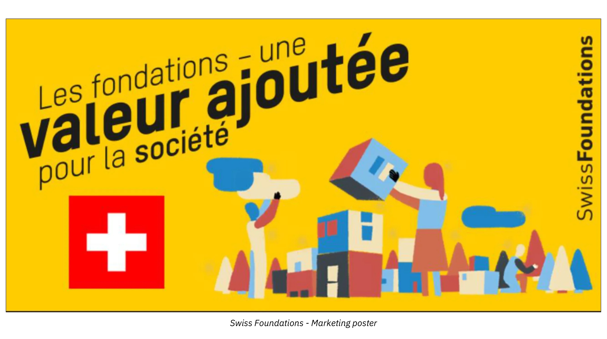

هر خدمت عمومی ترجیحات یک نخبگان بوروکراتیک را به ضرر انتخاب آزاد فردی تحمیل می‌کند. این امر به دو پیامد منجر می‌شود که به گفته باستیا: شهروند "کنترل آزاد بر رضایتمندی‌های خود را متوقف می‌کند و با از دست دادن مسئولیت، به طور طبیعی از داشتن هوش باز می‌ماند." دلیل آن ساده است: هر قانون نوشته شده‌ای اجباری است و برای همه یکسان است، و به وضعیت‌ها، نیازها و ترجیحات خاص شهروندان توجهی ندارد.

در نهایت، خدمات عمومی علت عدم تحرک است. در واقع، زمانی که خدمات خصوصی به خدمات عمومی تبدیل می‌شوند، از رقابت فرار می‌کنند. در نتیجه، بستیات می‌گوید، نقل قول: "کارمند رسمی از آن انگیزه‌ای که به سمت پیشرفت سوق می‌دهد، بی‌بهره است."

وقتی به خدمات عمومی آموزش ملی نگاه می‌کنیم، متوجه می‌شویم که باستیا چه می‌گوید. این سیستم بار آموزش فرزندان را از دوش اکثریت والدین برمی‌دارد و مدرسه را به یک مهدکودک تبدیل می‌کند. این سیستم معلمان را به نوآوری و ریسک‌پذیری تشویق نمی‌کند زیرا در چنین سیستمی آن‌ها صرفاً اجراکنندگان برنامه‌ای هستند که بدون دخالت آن‌ها، توسط بوروکرات‌ها طراحی شده است. در نهایت، این سیستم واقعیت نیازهای خاص هر فرد را نادیده می‌گیرد.

ما در یک دوره دیگر خواهیم دید که به گفته باستیا، تنها خدمات عمومی مشروع یک دولت سه‌گانه است: نظامی، پلیس و قضایی. اما برای نتیجه‌گیری در مورد مسئولیت، مشکل مداخله دولت این است که کسانی که تصمیم‌گیری می‌کنند، کسانی نیستند که عواقب آن را متحمل می‌شوند.

به عبارت دیگر، انتخاب‌های جمعی انتخاب‌های مسئولانه‌ای نیستند زیرا، از یک سو، برای تصمیم‌گیرندگان هیچ ریسک‌پذیری به همراه ندارند و از سوی دیگر، دیگران را مجبور به تحمل پیامدهای خاصی می‌کنند که به همان اندازه فاجعه‌بار و غیراخلاقی است.

## قدرت مسئولیت

<chapterId>0c078806-6c58-53f9-a720-5fb62386e56b</chapterId>

در دوره قبلی، دیدیم که چرا آزادی و مسئولیت کلید مشکل اجتماعی هستند. اکنون با نشان دادن اینکه چگونه فردریک باستیا به شروری که جوامع را مبتلا می‌کنند و راه‌حل آن‌ها می‌نگرد، به این موضوع عمیق‌تر خواهیم پرداخت.

لیبرال‌ها گاهی به خاطر نادیده گرفتن شر و ساختن آرمان‌شهر آزادی خالص و کامل در دنیای ایده‌آل مورد انتقاد قرار گرفته‌اند. این انتقاد در مورد نویسنده ما کاملاً بی‌اساس است.

هیچ‌کس نمی‌تواند شرارتی را که در تاریخ جوامع انسانی حکم‌فرماست نادیده بگیرد: بی‌عدالتی‌ها، جنگ‌ها و رنج‌ها. ما دوست داریم بتوانیم این شرارت‌ها را از بین ببریم. این، علاوه بر این، موضوع بخش بزرگی از فلسفه‌های مدرن است، از روسو تا هایدگر، از طریق هگل و مارکس.

شر نه تنها یک واقعیت قطعی است بلکه نقشی در تاریخ و در عمل انسانی دارد، می‌گوید فردریک باستیا. می‌توان آن را کاهش داد اما قطعاً نمی‌توان به طور کامل ریشه‌کن کرد زیرا این به معنای کشتن آزادی و مسئولیت است. پس شر از کجا می‌آید، نقش آن چیست و چگونه می‌توان از آن جلوگیری کرد؟

برای پاسخ به این سوالات، بَستیَت به تحلیل عمل انسانی خواهد پرداخت. این، در واقع، می‌تواند به هر دو خوبی و بدی منجر شود.

شر نخست از نقص ما ناشی می‌شود. انتخاب آزادانه به معنای پذیرش خطر انتخاب نادرست است، می‌گوید باستیا. در واقع، ما می‌توانیم به طرق مختلف فریب بخوریم، حتی در مورد نیازها و منافع خودمان. انسان جایزالخطاست، او مستعد اشتباه در درک بازی قوانین اقتصادی یا منحرف کردن آن‌ها از هدفشان است.

بنابراین، این نقص عقل است که محدودیت اصلی انسان‌هاست و در ریشه رنج‌های ما باقی می‌ماند.

اگر شر از ضعف انسانی نشأت می‌گیرد و نه از خود آزادی و نه از تجارت آزاد، درمان آن در سرکوب آزادی یا Exchange نیست بلکه در خود مسئولیت است، زیرا منبع تمام تجربه‌هاست. این اصل مسئولیت به شرح زیر است، من از بَستیَت نقل می‌کنم:

> هر مردی که عمل می‌کند، پاداش یا مجازات اعمال خود را دریافت می‌کند.

از طریق این تحریم طبیعی، انسان می‌آموزد، کشف می‌کند، خود را اصلاح می‌کند، پیشرفت می‌کند و بهبود می‌یابد. به عبارت دیگر، مسئولیت یک اصل کمال‌پذیری و پیشرفت است همان‌طور که در دوره قبلی دیده‌ایم.

اگر مردی پیامدهای خوب یا بد تصمیمات خود را تحمل کند، تمایل خواهد داشت که با یادگیری از تجربه بهبود یابد. بنابراین، مسئولیت فردی که به گفته باستیا، بزرگ‌ترین آموزگار ملت‌ها و اصل اساسی همه تنظیمات رفتارها و جوامع است، باید اجازه داده شود که عمل کند.

شر بدبختی ایجاد می‌کند، و بدبختی باعث می‌شود که ما خطا یا اشتباه را درک کنیم، و ما را به مسیر درست بازمی‌گرداند. این از طریق شناخت شر است که ما پیشرفت می‌کنیم.

این به این دلیل است که انسان ممکن است اشتباه کند یا به نادرستی عمل کند و عواقب آن را متحمل شود، که او تشویق می‌شود مسئولیت‌پذیر باشد. او سپس تلاش خواهد کرد تا خطراتی را که ممکن است به او ضربه بزند پیش‌بینی کند تا از خود محافظت کند.

---

> اشتباه کردن انسانی است.

---

بنابراین، واضح است که بَستیَت به هیچ وجه کور نیست. او وجود شر را انکار نمی‌کند. انسان ضعیف است، مستعد خطا و اشتباه. هیچ‌جا نخواهید دید که بَستیَت انکار کند که اعمال آزادی فردی با امکان خطا، امکان انتخاب غیرمنطقی یا بی‌معنی همراه است.

او به سادگی ادعا می‌کند که اگر منبع شر در نبود آزادی نهفته است، راه‌حل در خود آزادی است و به طور خاص در تمرین کامل و تمام عیار مسئولیت شخصی.

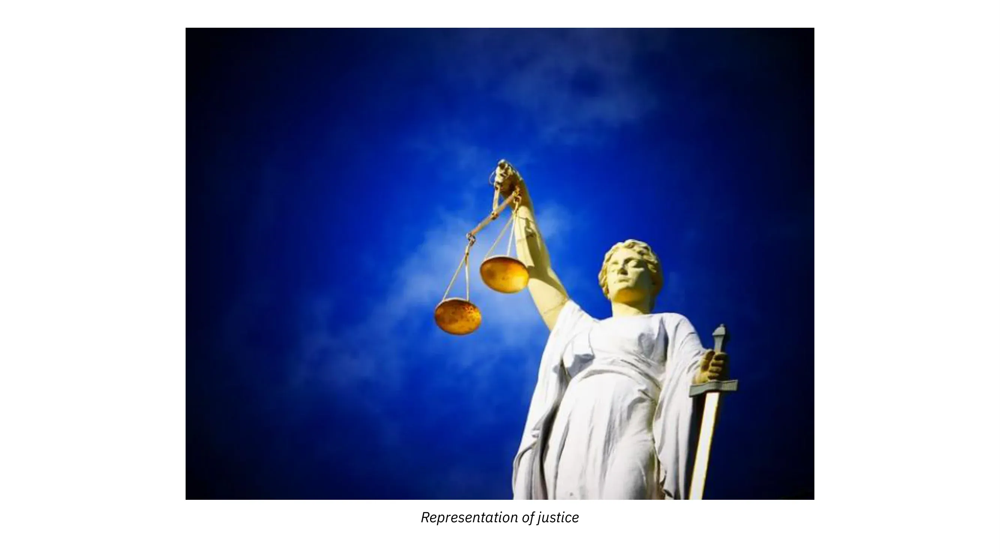

اما اگر سوء استفاده از آزادی منشأ بدبختی‌های ماست، استفاده صحیح از آن درمان است، یعنی تمرین کامل و تمام مسئولیت شخصی، بر اساس حق مالکیت. بنابراین، تنظیم اجتماعی از طریق مسئولیت انجام می‌شود، نه از طریق مداخله دولت در همه زمینه‌ها، که یکی از منابع بزرگ غارت و در نتیجه بدی‌هاست.

برخلاف روسو، که به دنبال ریشه‌کن کردن شر از طریق نهادهای جمعی است، فردریک باستیا از امکان وجود شر و خطا دفاع می‌کند، بدون آن آزادی یا مسئولیت فردی وجود ندارد. زیرا تنها این است که از طریق یک فرآیند کشف، پیشرفت و کاهش شرور اجتماعی را ممکن می‌سازد.

باید روشن شود که این توسعه پیشرفت از طریق مسئولیت به هیچ وجه خودکار نیست. به هیچ وجه، مانند هگل یا مارکس، نوعی جبر طبیعی یا تاریخی نیست که به طور معجزه‌آسا یا مکانیکی به هماهنگی و پیشرفت منجر شود. این موضوع به کاهش تدریجی و نامحدود شر مربوط می‌شود و هرگز به حذف قطعی آن مربوط نمی‌شود.

## همبستگی واقعی و کاذب

<chapterId>fa2172e9-22fa-5c01-a3c8-1e8316c064a4</chapterId>

فردریک باستیا، در جزوه معروف خود "قانون"، انحراف قانون را محکوم می‌کند که شامل قانونی کردن چیزی است که باید به‌راستی غارت نامیده شود، تحت عنوان "همبستگی". در واقع، تناقضی وجود دارد در اینکه بخواهیم برادری را از طریق قانون تحمیل کنیم، چیزی که امروزه آن را "عدالت اجتماعی" یا همبستگی می‌نامیم.

زیرا اخلاق به عنوان رفتار داوطلبانه تعریف می‌شود. هنگامی که فردی مجبور به دادن چیزی می‌شود که نمی‌خواهد بدهد، همیشه قربانی سرقت است.

در واقع، زمانی که یک اهدا به‌صورت قانونی اجباری می‌شود، دیگر یک نگرش اخلاقی نیست. نگرش اخلاقی بخشش با ادعای "حقوق" جایگزین می‌شود، که ادعاهایی بر کار دیگران هستند. همبستگی کاذب دعوت به زندگی به هزینه دیگران است.

این همان چیزی است که باستیا آن را "سفسطه برادری قانونی" می‌نامد. بیایید او را در این مورد نقل قول کنیم:

> برادری خودجوش است، یا نیست. فرمان دادن به آن، نابود کردن آن است.

و دوباره:

> دولت‌ها تنها اقداماتی را انجام می‌دهند که با زور تأیید شده باشد. اکنون، مجاز است که کسی را مجبور به عدالت کنیم، نه اینکه او را مجبور به خیریه کنیم. قانون، هنگامی که تلاش می‌کند با زور آنچه را که اخلاق از طریق ترغیب به دست می‌آورد انجام دهد، نه تنها به قلمرو خیریه نمی‌رسد، بلکه به حوزه غارت سقوط می‌کند.
> با این حال، این انحراف قانون نامی دارد، و آن سوسیالیسم است، یعنی ایدئولوژی توزیع اجباری ثروت توسط دولت. سوسیالیسم، به گفته باستیا، با ایدئولوژی غارت قانونی مشخص می‌شود. اما حیله‌گری این ایدئولوژی در این است که خشونت خود را زیر سوءاستفاده از زبان پنهان می‌کند: فراخوان به همبستگی یا برادری.

---

> کمک متقابل
> انجمن GUISY
> ۱۸۹۹

---

با این حال، به گفته باستیا، جایگزینی برای همبستگی اجباری دولتی وجود دارد: "جامعه کمک متقابل"، کمک متقابل و خودجوش انسان‌ها به یکدیگر از طریق جوامع کمک متقابل. اما او همچنین پیش‌بینی کرد که دولت در نهایت این جوامع را تصاحب خواهد کرد تا آنها را به یک نهاد منحصر به فرد و متمرکز تبدیل کند و هزینه‌ها و اتلاف منابع را تشویق کند.

در جزوه‌ای به نام "عدالت و برادری"، بَستیا همچنین به ایده یک سیستم مالیاتی ساده و عادلانه برای تأمین نیازهای جمعی (پلیس، عدالت، ارتش) می‌پردازد: درآمدها و سودها تحت یک نرخ مالیاتی واحد و متناسب قرار می‌گیرند. این چیزی است که امروزه به عنوان "مالیات ثابت" شناخته می‌شود.

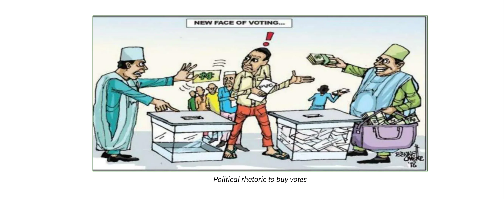

---

> بنیادها –
> **ارزش افزوده**
> برای **جامعه**
>

> سوئیس‌فوندیشنز

---

در واقع، همبستگی درون‌خانوادگی، همبستگی محلی، یا نیکوکاری سازمان‌یافته در کشورهایی که سیستم مالیاتی سبک و درجه آزادی اقتصادی نسبتاً بالایی دارند، مانند سوئیس و ایالات متحده، بسیار بیشتر توسعه یافته است، در حالی که در کشورهایی که دولت تا حد زیادی جایگزین مسئولیت فردی شده است، مانند فرانسه یا آلمان، تا حد زیادی خفه شده است.

اغلباً مد است که از "خودخواهی" که در جوامع لیبرال غالب می‌شود، شکایت کنیم. اما دقیقاً عکس این موضوع درست است. وقتی جامعه‌ای با مالیات‌ها سنگین می‌شود و افراد دیگر مالک اموال خود نیستند، تشویق به بخشش نمی‌شوند بلکه به انزوا در خود روی می‌آورند.

در واقع، یک جامعه مدنی آزاد بر اساس خودخواهی بنا نمی‌شود: اقتصاد بازار بر پایه خدمت به همسایه و عمل متقابل عمل می‌کند. فرد تنها می‌تواند با خدمت به منافع دیگری، منافع خود را تأمین کند، با ارائه یک معادل به دیگری که به Exchange متقابل سودمند منجر می‌شود. به عبارت دیگر، این Exchange داوطلبانه است که همبستگی واقعی را ایجاد می‌کند.

توزیع مجدد اجباری هیچ ارتباطی با همبستگی واقعی انسانی ندارد، که ماهیتی خصوصی یا داوطلبانه دارد و درون خانواده‌ها یا بین اعضای یک انجمن دیده می‌شود.

بنابراین، در مورد نقش قانون است که بَستیا در اینجا با سوسیالیست‌ها مخالفت می‌کند. او می‌نویسد:

قانون می‌تواند انسان را به عدالت وادار کند، اما نمی‌تواند او را به وفاداری مجبور کند. همبستگی کاذب سوسیالیست‌ها وفاداری را به نفع اجبار خالص دولتی حذف می‌کند، که پایه و اساس توتالیتاریسم را تشکیل می‌دهد.

# قانون

<partId>653cbe58-60e1-5401-8f91-4d9843ac6045</partId>

## حق مالکیت

<chapterId>a48a0616-2105-5520-8312-e21a0b6489c7</chapterId>

از نظر مالکیت، نباید زمین را در اینجا درک کنیم. این به معنای "حق کارگر بر ارزشی است که از طریق کار خود ایجاد کرده است." بَستیَت مشخص می‌کند:

> من معتقدم که حق مالکیت شامل آزادی در ابتدا برای تصرف در شخص خود، سپس در کار خود، و در نهایت در محصولات کار خود است - که علاوه بر این ثابت می‌کند که از یک دیدگاه خاص، آزادی و حق مالکیت نمی‌توانند از یکدیگر متمایز شوند.

با تأیید این نکته، برای درک بنیان اخلاقی مالکیت، بَستیات از یک اصل ساده انسان‌شناسی شروع می‌کند که از ابتدا، انسان باید برای زندگی کار کند و میوه کار او گسترشی از توانایی‌های او، یعنی از شخصیت اوست.

> شخصیت، آزادی، مالکیت، — این است انسان. از این سه چیز می‌توان گفت، بدون هیچ‌گونه ظرافت دموگرافیک، که آن‌ها مقدم بر و برتر از هر قانون‌گذاری انسانی هستند.

با این مفهوم، حق مالکیت جزو آن دسته از حقوقی است که از قانون مثبت ناشی نمی‌شود بلکه مقدم بر آن است و دلیل وجودی آن محسوب می‌شود. در واقع،

> قانون سازمان جمعی حق فردی دفاع مشروع است.
> قانون

ماموریت آن دفاع از شخص و اموال او است.

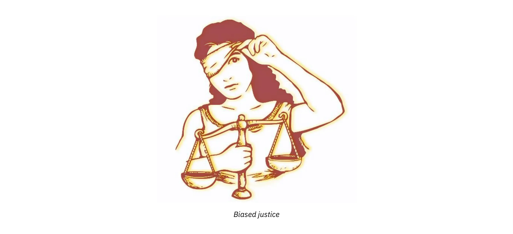

_(فرانسوا کنه، رهبر فیزیوکرات‌ها)_

بنابراین، حق همان قانون نیست. حق با کلام حاکم یکی نیست و به طور انحصاری به مشروعیت او وابسته نیست. این محصول یک سنت، یک نظم حقوقی پیش از قانون و برتر از آن است که به همان اندازه بر قانون‌گذار تحمیل می‌شود که بر هر یک از شهروندان عادی.

حق "ایجاد نشده است". از یک دیدگاه ایده‌آل از آنچه قوانین جامعه باید باشد اختراع نشده است؛ بلکه در طبیعت انسان و در قواعد تمدن، که توسط خرد رسوم منتقل شده‌اند، کشف می‌شود.

افراد دارای حقوق طبیعی هستند که پیش از قانون وجود دارند: مالکیت، آزادی، شخصیت. نقش قانون باید حفظ این حقوق طبیعی فرد باشد. در نتیجه، دولت باید محدود باشد. امروزه، می‌توان گفت که بستیات طرفدار دولت حداقلی است.

در سیستم روسو، که در یک دوره قبلی مورد بحث قرار دادیم، مأموریت قانون‌گذار این است که مالکیت را سازماندهی، تغییر دهد و حتی در صورت لزوم لغو کند. برای روسو، مالکیت طبیعی نیست بلکه قراردادی است، درست مانند خود جامعه. این ایده از حقوق روم نشأت می‌گیرد که روسو با آن به خوبی آشنا بود.

روبسپیر، به نوبه خود، اصل را مطرح می‌کند که "مالکیت حق هر شهروند است که از بخشی از کالاها که توسط قانون برای او تضمین شده است، بهره‌مند شود و درباره آن تصمیم‌گیری کند."

برای روسو، مالکیت مقدم بر قانون نیست؛ بلکه صرفاً یک قرارداد است که توسط اراده عمومی و در چارچوب محدودیت‌هایی که تعیین می‌کند، برقرار می‌شود. در نتیجه، هیچ آزادی یا حقی به‌طور مستقل از جامعه و حسن نیت قانون‌گذاران وجود ندارد. اما اگر حق مالکیت را جدا کنیم، به راحتی حقوق کاذبی را توجیه می‌کند که تنها با نقض حقوق دیگران به دست می‌آیند.

برای مثال: حق کار یا حق مسکن.

برای اینکه من چیزی را به صورت رایگان به دست آورم، کسی باید به جای من هزینه آن را بپردازد. و اگر دولت هزینه را بپردازد، از آنجا که ثروت تولید نمی‌کند، تنها می‌تواند با گرفتن خانه‌ای از کسی، یا معادل آن، آن را به من بدهد.

این ایده که حق مالکیت یک خلق قانون است، به گفته باستیا، منجر به باز کردن یک میدان نامحدود برای آرمان‌گرایانی می‌شود که می‌خواهند جامعه را بر اساس طرح‌های خود مدل‌سازی کنند.

در سیستم آزادی طبیعی، قانونی طبیعی وجود دارد که مستقل از خواسته‌های قانون‌گذاران است. این قانون برای همه انسان‌ها معتبر است و پیش از هر جامعه‌ای وجود داشته است. وظیفه دولت این است که حقوق طبیعی هر فرد را تضمین کند. یک جامعه عادلانه جامعه‌ای است که در آن حقوق مالکیت به طور کامل محترم شمرده می‌شود، به این معنا که در برابر هرگونه دخالت دیگران محافظت می‌شود.

در اینجا، بَستیات خود را با میراث فیزیوکرات‌ها و فراتر از آن، با سنت فلسفه حقوق سیسرو و ارسطو همسو می‌کند. قانون حقوق را ایجاد نمی‌کند. مأموریت آن دفاع از حقوق و به این ترتیب دفاع از مالکیت است، هم مالکیت شخصی، یعنی تمامیت فرد، و هم مالکیت ثمرات کار فرد.

_(سیسرو)_

## غارت قانونی: انحرافی از قانون

<chapterId>b4122847-e477-578e-ba34-d35844ac4715</chapterId>

ایده اصلی بستیات در "قانون"، جزوه معروف او که در سال 1850 منتشر شد، این است که نشان دهد چرا و چگونه قانون به غارتگری تبدیل شده است، یعنی به منبعی از امتیازات، اجاره‌های موقعیتی و خودسری مالیاتی.

ماهیت واقعی قانون چیست؟

باستیا با بیان مبانی طبیعی انسان‌شناسی قانون را آغاز می‌کند: زندگی، آزادی و مالکیت.

سیستم نهادی آزادی طبیعی سیستمی است که در آن جامعه، افراد و اموال پیش از قوانین وجود دارند. در این سیستم، بَستیَت اضافه می‌کند:

> این به این دلیل نیست که قوانین وجود دارند که اموال وجود دارند، بلکه به این دلیل است که اموال وجود دارند که قوانین وجود دارند.
> اموال و قانون

هر انسانی مجاز است از زندگی خود دفاع کند و از توانایی‌هایش استفاده کند. و قانون سازماندهی جمعی این دفاع مشروع است. قانون از عدالت دفاع می‌کند. نه یک عدالت مثبت که برادری و همبستگی را سازماندهی کند، بلکه یک عدالت منفی که خود را به جلوگیری از غصب حقوق یک نفر توسط دیگری محدود می‌کند.

با این حال، زمانی که قانون از حالت منفی خارج شده و به حالت مثبت تبدیل می‌شود، احساس نابرابری در جامعه افزایش می‌یابد و منجر به بروز درگیری‌ها می‌شود. اگر حوزه قانون، یعنی مسئولیت دولت را به طور نامحدود گسترش دهیم، در را به روی "یک سری بی‌پایان از شکایات، نفرت‌ها، آشفتگی‌ها و شورش‌ها" باز می‌کنیم، او می‌نویسد.

بنا به گفته باستیا، نوع‌دوستی کاذب یکی از دلایل اصلی انحراف قانون است. برخی افراد خود را برتر از بقیه انسان‌ها می‌دانند و معتقدند که قادر به اتخاذ تصمیمات بهتری نسبت به دیگران هستند.

آن‌ها بهتر می‌دانند چه چیزی برای دیگران خوب است و تصور خود از خوبی را به همه تحمیل خواهند کرد؛ این‌ها خیرخواهان هستند. آن‌ها حقوق کاذبی ایجاد کرده‌اند که امروزه حقوق اجتماعی نامیده می‌شوند. حقوق اجتماعی چیزی جز حقوق بر کار دیگران نیستند، حقوقی برای تصرف در دارایی فرد، ثمره کار او: حق مسکن، حق سلامت، حق آموزش، حق کار، حق حداقل دستمزد و غیره.

غارتگری چیست؟ بستیات به ما می‌گوید که این دقیقاً نقطه مقابل مالکیت است. غارتگری از لاتین _spoliare_ می‌آید که به معنای برهنه کردن است. ما دیده‌ایم که انسان تنها می‌تواند با تصاحب چیزها، با به‌کارگیری قابلیت‌های خود بر روی چیزها، یعنی با کار کردن زندگی کند. افسوس، او همچنین می‌تواند محصول قابلیت‌های هم‌نوع خود را تصاحب کند، یعنی او را غارت کند.

کل مأموریت قانون جلوگیری از این غارت غیرقانونی است، یعنی دفاع از مالکیت و آزادی، دو چیز جدایی‌ناپذیر.

به محض اینکه به‌طور اصولی پذیرفته شود که قانون می‌تواند از مأموریت واقعی خود منحرف شود و به جای تضمین اموال، آن‌ها را نقض کند، به‌طور ضروری یک مبارزه طبقاتی به دنبال خواهد داشت، یا برای دفاع در برابر غارت یا برای سازماندهی آن به نفع خود.

به جای دفاع از حقوق طبیعی، قانون به محافظت از منافع شرکتی و دسته‌بندی شده تبدیل می‌شود. غارت توسط قانون سازماندهی می‌شود، به نفع طبقاتی که آن را ایجاد می‌کنند و دوستان یا مشتریانشان. باستیا به این ترتیب پیش‌بینی می‌کند مکتب انتخاب عمومی در قرن بیستم را که برای آن قانون نتیجه یک "بازار سیاسی" است که در آن گروه‌هایی از افراد به دنبال ارضای منافع خود به هزینه دیگران هستند.

برای او، هدف قانون باید صرفاً "پایان دادن به تمام غارت‌ها" باشد. اگر دولت در زندگی خصوصی دخالت نکند، افراد به طور مؤثر مالک و مسئول زندگی خود هستند. آن‌ها خوشبختی خود را می‌سازند. آن‌ها پیامدهای خوب یا بد اعمال خود را تحمل می‌کنند.

آن‌ها مطمئن هستند که حقوق طبیعی‌شان تضمین شده و غیرقابل‌دسترس است. حقوق مالکیت امن به مردم این امکان را می‌دهد که برنامه‌های بلندمدت بسازند زیرا می‌دانند دارایی‌هایشان از غارت در امان است.

> نبود غارت، — این اصل عدالت، صلح، نظم، ثبات، آشتی، عقل سلیم است که با تمام قدرت، افسوس! ناکافی، از ریه‌هایم اعلام خواهم کرد، تا آخرین نفس خود.

باستیا این جمله را در کتاب قانون نوشت، مدتی قبل از مرگش.

یک قرن پس از مرگ فردریک باستیا، غارت قانونی به وضوح در اعلامیه جهانی حقوق بشر ۱۹۴۸ مشهود است، به ویژه در مواد ۲۲ ("هر کس حق برخورداری از تأمین اجتماعی دارد")، ۲۳ ("هر کس حق کار دارد")، ۲۴ ("هر کس حق استراحت و فراغت دارد")، ۲۵ ("هر کس حق داشتن سطح زندگی مناسب برای سلامت و رفاه دارد")، ۲۶ ("هر کس حق آموزش دارد").

## نقش قانون و دولت

<chapterId>52258229-7c7c-592b-aa27-203b03aa41c9</chapterId>

در سال 1848، بستیات یک نماینده بود. او به عنوان نایب‌رئیس کمیسیون مالی منصوب شد. بنابراین، او به‌ویژه در موقعیت خوبی قرار داشت تا به این سؤال پاسخ دهد: دولت چیست؟ ما به دولت روی می‌آوریم تا رفاه ما را تضمین کند. اما بستیات به ما یادآوری می‌کند که دولت نمی‌تواند چیزی به شهروندان بدهد که ابتدا از آن‌ها نگرفته باشد.

باستیا با برهم زدن یک معادله پذیرفته‌شده شروع می‌کند: این دولت است که ملت را نگه می‌دارد. با این حال، دولت نمی‌تواند شهروندان را نگه دارد زیرا ثروت تولید نمی‌کند؛ بلکه فقط آن را جابجا می‌کند و بازتوزیع می‌کند. برعکس، این شهروندان هستند که از طریق ایجاد ثروت، دولت را نگه می‌دارند.

علاوه بر این، خود دولت به‌تنهایی وجود ندارد؛ تنها مردمانی هستند که دولت را تشکیل می‌دهند، حکومت می‌کنند، اداره می‌کنند و به‌طور مستقیم یا غیرمستقیم از دولت زندگی می‌کنند. بنابراین، مردمانی که دولت را اداره می‌کنند مانند دیگران هستند؛ آن‌ها به دنبال ارضای منافع شخصی خود هستند.

و از آنجا که اقدام دولت صرفاً بازتوزیعی است، تحت فشار گروه‌های ذی‌نفع خاص قرار دارد. در واقع، برخی از گروه‌های ذی‌نفع خاص دریافته‌اند که از طریق مشارکت سیاسی، کسب درآمد آسان‌تر از رفتارهای تولیدی است. آنها به دنبال سرقت پول دیگران تحت پوشش دولت هستند و با افزایش قوانین، مالیات‌ها و محدودیت‌های بوروکراتیک، ظرفیت تولید بازار را تضعیف می‌کنند.

به عبارت دیگر، دولت تنها اهداف مشتری‌مدارانه را دنبال می‌کند و مفهوم منافع عمومی بی‌معنی است. هر سودی که برخی به دست می‌آورند به زیان دیگران است: این یک بازی با مجموع صفر نیست بلکه یک بازی با مجموع منفی است.

باستیا به این ترتیب، یک قرن پیش از ظهور تحلیل‌های مربوط به عملکرد بازار سیاسی که در اواخر دهه ۱۹۵۰ با مدرسه انتخاب عمومی جیمز بوکانان، برنده جایزه نوبل اقتصاد، و همکارش گوردون تالوک پدیدار شد، پیش‌بینی می‌کند.

علاوه بر این، بستیات ادعا می‌کند که دولت هیچ حقی ندارد که ابتدا در فرد وجود نداشته باشد. چرا دولت حق دارد که حتی با زور، مالکیت هر فرد را تضمین کند؟ به سادگی به این دلیل که این حق در فرد وجود دارد. نمی‌توان حق دفاع از خود، حق استفاده از زور در صورت لزوم برای دفع حملات علیه شخص، توانایی‌ها و اموالشان را از افراد سلب کرد. این حق طبیعی دفاع از خود که در همه شهروندان وجود دارد، می‌تواند به شکلی جمعی درآید و نیروی مشترک را مشروعیت بخشد.

بنابراین، برای دانستن اینکه آیا دولت به‌طور قانونی دارای حقی است، باید پرسید آیا این حق به‌واسطه سازماندهی فرد و در غیاب هرگونه حکومت در فرد وجود دارد یا خیر.

به همین دلیل است که دولت نمی‌تواند در هیچ موردی به حقوق طبیعی تجاوز کند؛ بلکه باید برعکس، آن‌ها را تضمین کند.

این امنیت، هم داخلی و هم خارجی، و عدالت را تضمین می‌کند. می‌تواند در حوزه خود قوی و مؤثر باشد. اما قانون نمی‌تواند از این نقش بسیار سخت‌گیرانه خارج شود زیرا در آن صورت به ابزاری برای غارت برخی به نفع دیگران تبدیل می‌شود. هنگامی که قانون منحرف می‌شود، به عنوان ابزاری برای بی‌عدالتی عمل می‌کند. انحراف قانون همیشه به غارت منجر می‌شود، همان‌طور که در دوره قبلی دیده‌ایم. این امر فوری، خودکار، اجتناب‌ناپذیر و قطعی است. خارج کردن قانون از حوزه خود تنها می‌تواند حقوق طبیعی را نقض کند. جامعه مدنی سپس از قدرت خود (نهادهای طبیعی، قراردادها، مبادلات، انجمن‌ها) به نفع مدیریت دولتی، یعنی تکنوکراتیک و بوروکراتیک، محروم می‌شود.

در نتیجه، تنها خدمات عمومی مشروع یک دولت به گفته باستیا سه مورد هستند: ارتش، پلیس و قوه قضائیه. به عبارت دیگر، دولت باید حفاظت داخلی و خارجی از افراد، آزادی و اموال آن‌ها را تضمین کند. بنابراین، طبیعی است که همه به این حفاظت کمک کنند. با این حال، فراتر از این وظایف مشروع، هرگونه کمک به خدمات دیگر ارائه شده توسط دولت نیاز به بررسی دارد. خارج از این دایره، باستیا می‌نویسد:

> دین، آموزش، انجمن، کار، مبادلات، همه به حوزه فعالیت خصوصی تعلق دارند، تحت نظر مقامات عمومی که باید تنها مأموریت نظارت و سرکوب را داشته باشند.

در مورد خدمات عمومی، او یک اصل ساده را بیان می‌کند:

اگر می‌خواهید یک تابع ایجاد کنید، سودمندی آن را اثبات کنید. نشان دهید که خدماتی که ارائه می‌دهد به اندازه هزینه‌ای که دارد ارزشمند است. بنابراین، او نتیجه می‌گیرد که منطقی است که به بخش عمومی تنها آنچه را که بخش خصوصی به هیچ وجه نمی‌تواند انجام دهد، واگذار کنیم.

به طور خلاصه، زمانی که یک دولت از مأموریت خود برای دفاع از مردم و اموال فراتر می‌رود، گروه‌های ذی‌نفع را تشویق می‌کند تا به دنبال امتیازات و تأثیرگذاری بر قدرت برای کسب منافع به هزینه مالیات‌دهندگان و مصرف‌کنندگان باشند.

> دولت، افسانه بزرگی است که از طریق آن هر کس تلاش می‌کند به هزینه دیگران زندگی کند.

فردریک باستیا در یک جزوه کوتاه با عنوان دولت نوشت.

## میراث فردریک باستیا

<chapterId>2a2a181a-e477-5be1-ba1f-af59490c364e</chapterId>

نفوذ باستیا در اواخر قرن نوزدهم شروع به کاهش کرد، با ظهور سوسیالیسم و به‌ویژه مارکسیسم در دانشگاه‌ها و مؤسسات تحقیقاتی که با پول عمومی تأمین مالی می‌شدند.

با قرن بیستم، دانش و محبوبیت بَستیا ناپدید شد. او دیگر در کتاب‌های درسی اقتصاد ذکر نمی‌شد. تا پایان جنگ جهانی دوم طول کشید تا علاقه‌ای دوباره به ایده‌های آزادی، که با روزولت و رژیم‌های توتالیتر در اروپا به وضوح فراموش شده بود، ظهور کند. یکی از معماران این احیا، اقتصاددان اتریشی لودویگ فون میزس بود، یکی از بسیاری از روشنفکران اروپایی که از طریق اسپانیا و پرتغال به آمریکا گریختند.

در سال 1943، میسز در نیویورک مستقر شد و سمینارهایی را سازماندهی کرد که ذهن‌های برجسته‌ای را جذب کرد: جورج استیگلر، میلتون فریدمن، هر دو برنده آینده جایزه نوبل، و موری راتبارد، که در آن زمان دانشجوی دانشگاه کلمبیا بود. در طول این سمینارها بود که او برای اولین بار از بَستیا به عنوان یکی از منابع اصلی لیبرالیسم کلاسیک صحبت کرد. او جزوه‌های بَستیا، "قانون" و "دولت"، که هنوز به انگلیسی ترجمه نشده بودند، را به شنوندگانش معرفی کرد. در سال 1953، یکی از شرکت‌کنندگان در سمینار، لئونارد رید، "قانون" بَستیا را به انگلیسی ترجمه کرد و وظیفه توزیع کتاب در سراسر کشور را از طریق بنیاد خود، بنیاد آموزش اقتصادی، بر عهده گرفت.

اما کسی که همچنین به ترویج نظریات فردریک باستیا پرداخت، ستون‌نویس اقتصادی نیویورک تایمز، هنری هزلیت بود، در کتاب کوچکی به نام: "اقتصاد در یک درس"، که در سال ۱۹۴۶ منتشر شد. او با الهام مستقیم از ایده‌های باستیا، قصد دارد نشان دهد که مشکل راه‌حل‌های اقتصادی دولتی، عدم توجه به پیامدهای فاجعه‌بار بلندمدت آنهاست.

هازلیت کتاب خود را با بازگویی داستان پنجره شکسته باستیا آغاز می‌کند. او داستان را درسی ساده و یگانه خلاصه می‌کند:

> هنر اقتصاد شامل نگاه کردن نه تنها به اثرات فوری بلکه به اثرات بلندمدت هر عمل یا سیاست است؛ شامل ردیابی پیامدهای آن سیاست نه تنها برای یک گروه بلکه برای همه گروه‌ها است.

هازلیت سپس این درس را به طیف گسترده‌ای از مشکلات اقتصادی اعمال می‌کند: کنترل اجاره، قوانین حداقل دستمزد، مزایای فرضی جنگ، کارهای عمومی و کسری بودجه، تورم پولی، تعرفه‌ها، و در نهایت پس‌اندازها.

باستیا یکی از اقتصاددانان مورد علاقه رونالد ریگان بود، مدت‌ها قبل از اینکه به ریاست‌جمهوری انتخاب شود. کمتر شناخته شده است، اما ریگان به مدت هشت سال برای شرکت جنرال الکتریک به عنوان مجری برنامه تلویزیونی آن در شبکه CBS و مسئول آموزش کارکنان شرکت کار کرد. برنامه آموزشی او بر اساس متون مقدماتی به اقتصاد بازار ساخته شده بود. آثار انتخاب شده متعلق به دو اتریشی، هایک و میزس، دو انگلیسی، کوبدن و برایت، و یک فرانسوی، فردریک باستیا بودند.

درسی که ریگان به کارمندانش آموخت، به پیروی از بَستیا، این است که هیچ افسانه‌ای بزرگ‌تر از تحریک رشد و اشتغال از طریق هزینه‌های عمومی وجود ندارد.

این جان مینارد کینز بود که به‌طور قابل‌توجهی پیشنهاد کرد که هزینه‌های عمومی تولید را به دلیل یک ضریب افزایش می‌دهد: اگر دولت پلی بسازد، کارگران آن پل قادر خواهند بود نان بخرند، سپس نانوا می‌تواند کفش بخرد و به همین ترتیب. اگر صنعت خصوصی در حال افول باشد، می‌توان آن را با کارهای بزرگ جبران کرد. اگر بیکاری وجود داشته باشد، دولت می‌تواند شغل‌های عمومی ایجاد کند.

اما همان‌طور که باستیا به‌خوبی نشان داد، مداخله دولت اثرات معکوسی دارد که دیده نمی‌شوند. تنها یک اقتصاددان خوب قادر به پیش‌بینی آن‌هاست. بیایید مثالی بزنیم: این یک توهم است که باور کنیم دولت می‌تواند "شغل ایجاد کند" زیرا به ازای هر شغل عمومی ایجاد شده، یک شغل در بازار از بین می‌رود. در واقع، مشاغل عمومی با مالیات پرداخت می‌شوند. مشاغل عمومی ایجاد نمی‌شوند؛ بلکه درک می‌شوند. هر پنی که دولت خرج می‌کند، لزوماً باید از طریق یک پنی مالیات یا بدهی به دست آید.

اگر از این زاویه به مسائل نگاه کنیم، ریگان به کارکنان GE توضیح داد، به‌اصطلاح معجزات هزینه‌های دولتی در نوری کاملاً متفاوت ظاهر می‌شوند. زیرا مالیات‌ها تولید را دلسرد می‌کنند و ثروتی که از طریق هزینه‌های عمومی ایجاد می‌شود نمی‌تواند به‌طور کامل جبران‌کننده آن‌هایی باشد که به دلیل مالیات‌های وضع‌شده برای پرداخت این هزینه‌ها از به‌وجود آمدن بازمانده‌اند.

به طور خلاصه، ریگان از بَستیَت چندین اصل کلیدی Elements از یک دیدگاه لیبرال نسبت به جامعه و انسان را اقتباس کرد: اولویت جامعه مدنی بر دولت، ارزش انتخاب و مسئولیت فردی، اهمیت کارآفرین در ایجاد ثروت، اهمیت یک چارچوب قانونی انعطاف‌پذیر و حداقلی که اعتماد و احترام به قراردادها را ممکن می‌سازد، قانون اساسی که ثروت باید قبل از توزیع ایجاد شود، تمایل به دادن فرصت به همه در بازارهای رقابتی...

# بخش نهایی

<partId>3b62de5c-5d4a-5182-ab14-f7ef13c97e28</partId>

## بررسی‌ها و رتبه‌بندی‌ها

<chapterId>db20170d-ceb6-56cd-b4e5-c690942f8b29</chapterId>

<isCourseReview>true</isCourseReview>

## امتحان نهایی

<chapterId>7e2285c9-d7f4-4e30-a1f5-f78aae06b7b3</chapterId>

<isCourseExam>true</isCourseExam>

## نتیجه‌گیری

<chapterId>a3e98f2f-a072-4696-9553-5d24c6d236c9</chapterId>

<isCourseConclusion>true</isCourseConclusion>