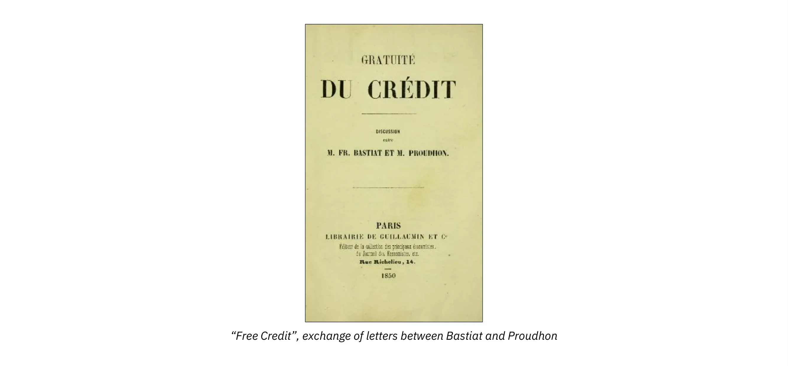
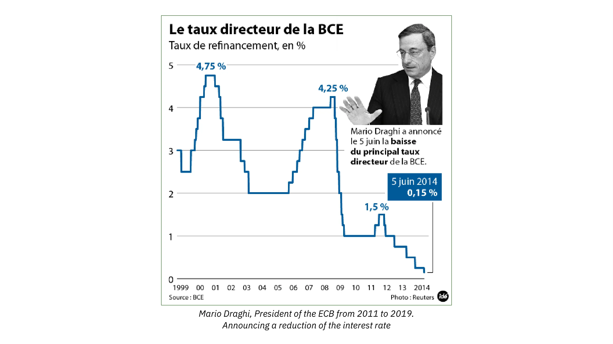
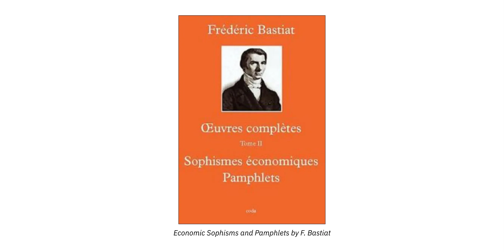
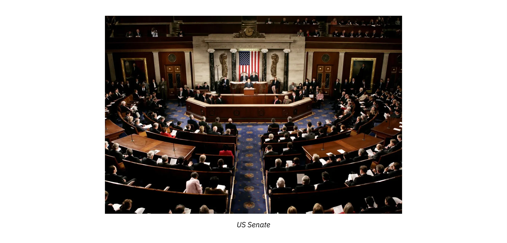
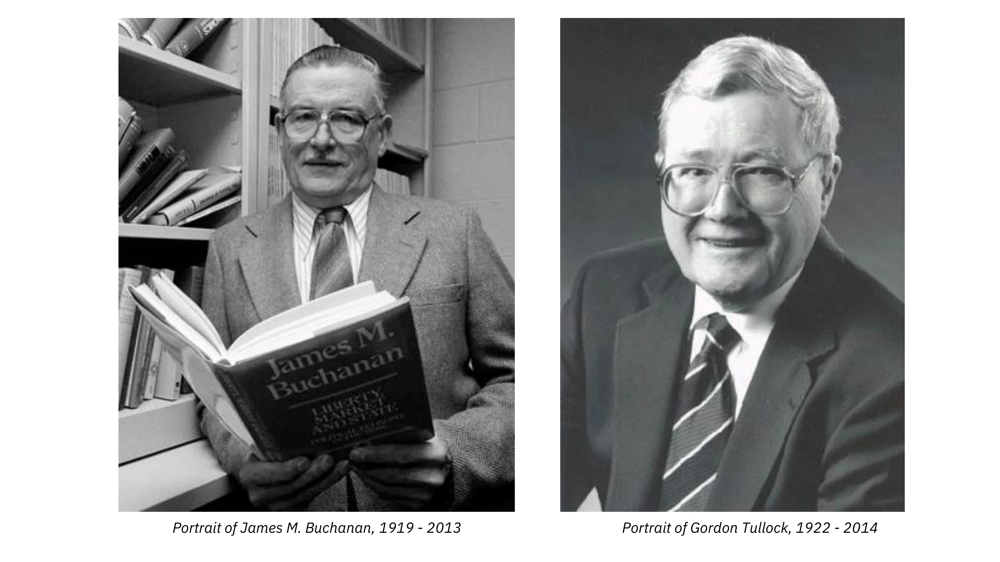

# Podróż do świata Frédérica Bastiata

Ten kurs, prowadzony przez Damiena Theilliera, zaprasza do zanurzenia się w świecie Frédérica Bastiata, francuskiego ekonomisty i filozofa, którego idee nadal wpływają na współczesną myśl ekonomiczną. Za pomocą 21 filmów Damien Theillier bada życie Bastiata, jego wpływy intelektualne, jego ideologicznych przeciwników, a także jego teorie ekonomiczne.

Kurs rozpoczyna się od szczegółowego wprowadzenia do życia Bastiata i kontekstu historycznego, a następnie analizuje myślicieli, którzy naznaczyli jego myśl, takich jak Adam Smith, Jean-Baptiste Say, Antoine Destutt de Tracy, Charles Comte, Charles Dunoyer i Richard Cobden. Następnie kurs przygląda się przeciwnikom Bastiata, w tym Rousseau, klasycznej edukacji, protekcjonizmowi, socjalizmowi i Proudhonowi.

Ważna część kursu poświęcona jest sofizmatom ekonomicznym potępionym przez Bastiata, takim jak "To, co widać i to, czego nie widać", "Petycja świeczników", grabież poprzez opodatkowanie oraz rozróżnienie między dwiema moralnością ekonomiczną. Kurs odnosi się również do harmonii ekonomicznej zalecanej przez Bastiata, w tym cudu rynku, siły odpowiedzialności i prawdziwej solidarności.

Wreszcie, kurs kończy się refleksją na temat "prawa", odnosząc się do kluczowych pojęć, takich jak prawo własności, legalna grabież i rola państwa. Na zakończenie kursu powracamy do spuścizny Frédérica Bastiata i jego trwałego wpływu na współczesną ekonomię.

Dołącz do Damiena Theilliera w tej wzbogacającej eksploracji myśli Frédérica Bastiata i odkryj, w jaki sposób jego idee mogą oświetlić obecne debaty gospodarcze i polityczne.

+++

# Wprowadzenie

<partId>e4a0cf13-2fc5-5ced-a528-ace3f9029f22</partId>

## Przegląd kursu

<chapterId>aa493f46-2d3a-4b76-ad79-ed44113a97f4</chapterId>

Celem tego kursu jest dogłębne zrozumienie życia, wpływów intelektualnych, ideologicznych przeciwników i teorii ekonomicznych Frédérica Bastiata. Dzięki tej zorganizowanej podróży odkryjesz, w jaki sposób jego idee ukształtowały myśl ekonomiczną i nadal wpływają na bieżące debaty.

**Sekcja 1: Wprowadzenie**

Zaczniemy od ogólnego przeglądu Frédérica Bastiata, niedocenianego geniusza ekonomii. Dowiesz się o jego życiu, podróży intelektualnej i kontekście historycznym, w którym rozwinął swoje myślenie. Zrozumienie tego kontekstu jest niezbędne, aby w pełni zrozumieć zakres jego pism i teorii.

**Sekcja 2: Wpływy**

Przeanalizujemy myślicieli, którzy ukształtowali myśl ekonomiczną Frédérica Bastiata. Dowiesz się, w jaki sposób główne postacie, takie jak Adam Smith, Jean-Baptiste Say, Antoine Destutt de Tracy, Charles Comte, Charles Dunoyer i Richard Cobden, przyczyniły się do jego rozwoju intelektualnego, kładąc podwaliny pod jego refleksję na temat wolnego handlu i ekonomii rynkowej.

**Sekcja 3: Przeciwnicy**

Następnie zbadamy krytykę Bastiata wobec jego ideologicznych przeciwników. Niezależnie od tego, czy chodzi o Rousseau, edukację klasyczną, protekcjonizm, socjalizm czy Proudhona, zrozumiesz, dlaczego Bastiat uważał te doktryny za przeszkody dla postępu gospodarczego i społecznego oraz w jaki sposób odpowiadał na ich argumenty za pomocą ostrej logiki.

**Sekcja 4: Błędy ekonomiczne**

Ta sekcja poświęcona jest błędom ekonomicznym ujawnionym przez Bastiata, w tym słynnym "*Co widać i czego nie widać*" i "*Petycji świeczników*". Zbadamy, w jaki sposób umiejętnie zademonstrował, poprzez satyrę i rygorystyczną analizę, powszechne błędy ekonomiczne swoich czasów, które pozostają aktualne do dziś.

**Sekcja 5: Harmonia gospodarcza**

Tutaj odkryjesz pozytywną wizję gospodarki Bastiata. Będziemy Address koncepcje takie jak cud rynku, siła indywidualnej odpowiedzialności i rozróżnienie między prawdziwą i fałszywą solidarnością. Bastiat postrzegał gospodarkę jako spójny system, w którym dobrze pojęty interes własny przynosi korzyści dobru wspólnemu. Zbadamy dlaczego.

**Sekcja 6: Prawo**

Na zakończenie tego kursu zagłębimy się w główne dzieło Bastiata, "*Prawo*", w którym przedstawia on swoje refleksje na temat praw własności, legalnej grabieży i ograniczonej roli państwa. Zrozumiesz, dlaczego ten esej jest uważany za jeden z najbardziej przekonujących manifestów na rzecz wolności jednostki i gospodarki rynkowej.

Gotowy, by odkryć, jak idee Frédérica Bastiata są aktualne do dziś? Dołącz do nas w tej intelektualnej podróży, która może rzucić wyzwanie Twojemu rozumieniu ekonomii!

## Bastiat: Niedoceniony geniusz

<chapterId>7f21b617-9810-5484-ad1c-befc61432126</chapterId>

Ten kurs jest wprowadzeniem do Frédérica Bastiata, nierozpoznanego geniusza i latarni morskiej naszych czasów. W tym krótkim wprowadzeniu postaram się pomóc ci odkryć, kim był Frédéric Bastiat i jakie są główne tematy, które omówimy podczas tej serii.

Rzeczywiście, Frédéric Bastiat, który urodził się w 1801 roku i żył w pierwszej połowie XIX wieku, przez pewien czas pozostawał ważnym autorem. A potem stopniowo zniknął i dziś nikt o nim nie słyszy, nikt nie wie, kim jest. A jednak, paradoksalnie, autor ten został przetłumaczony na wiele języków, w tym włoski, rosyjski, hiszpański i angielski.

Okazuje się, że po II wojnie światowej jedna z jego książek została opublikowana w Stanach Zjednoczonych. Stała się ona bardzo znana, do tego stopnia, że sam Ronald Reagan powiedział, że jest to jego ulubiona książka, a ta mała książka nazywa się "Prawo" Bastiat jest więc jednym z dwóch najbardziej znanych francuskich autorów w Stanach Zjednoczonych, drugim jest dobrze znany we Francji Alexis de Tocqueville.

(Rynek w Mugron w Landes, miasto Bastiat)_

Tak więc, nierozpoznany geniusz, ale także światło dla naszych czasów. Rzeczywiście, Frédéric Bastiat, który urodził się w Bayonne, najpierw mieszkał przez część swojego życia w Landes, gdzie zarządzał odziedziczoną posiadłością rolną i ostatecznie prowadził życie jako przedsiębiorca. A potem, bardzo wcześnie, zainteresował się ekonomią, podróżował do Anglii, spotkał Richarda Cobdena, który był liderem ruchu wolnego handlu. Bastiat był zafascynowany tym ruchem, był przekonany, że wolny handel jest rozwiązaniem dla Francji i postanowił spróbować rozpowszechnić swoje pomysły we Francji. Napisał artykuły, które odniosły duży sukces i przeniósł się do Paryża, aby prowadzić gazetę o nazwie Journal des économistes.

Był także filozofem i myślicielem o społeczeństwie, porządku społecznym, sprawiedliwości, prawie, myślicielem o prawach. Pod tym względem możemy powiedzieć, że Bastiat jest światłem dla naszych czasów. I na tym chciałbym zakończyć. Jest kimś, kto próbował zrozumieć działanie rynku politycznego. Oczywiście jest również obrońcą gospodarki rynkowej, dla którego ostatecznie gospodarka rynkowa jest najlepszym sposobem na tworzenie bogactwa. Ale poza tym, i to jest miejsce, w którym jest nierozpoznany, rozumiał mechanizmy rynku politycznego.

Kiedy został wybrany na deputowanego, było to w czasach Drugiej Republiki i od tego momentu to ludzie tworzyli prawa. W tym czasie Bastiat był świadkiem swego rodzaju inflacji praw we wszystkich kierunkach, w tym tworzenia usług publicznych, praw socjalnych, podatków itp.

---

>**WARSZTATY NARODOWE**  
>**PORZĄDEK DZIENNY.**
>Uwzględniając, że robotnicy wcieleni do Warsztatów Narodowych słusznie zażądali, aby dostępna praca została rozdzielona między nimi w sposób jak najbardziej równy i sprawiedliwy;  
>Uwzględniając, że istnieje praca tylko dla 16 000 mężczyzn, a liczba wcielonych przekracza 50 000;  
>Ustalono, że do odwołania i w oczekiwaniu na lepsze rozwiązanie każda kompania będzie pracowała dwa dni w tygodniu, począwszy od poniedziałku 17.  
>_Komisarz Republiki, Dyrektor Warsztatów Narodowych,_  
>**Émile THOMAS.**

---

Zdał sobie sprawę, że zasadniczo nic się nie zmieniło. Ludzie pozbywali się własności innych poprzez głosowanie i prawo, co nazwał legalną grabieżą. To zjawisko legalnej grabieży było w centrum jego pracy, zwłaszcza w krótkim tekście, który napisał pod koniec życia, "The Law", gdzie przeciwstawia legalną grabież własności, prawu do własności. Pokazuje, że zasadniczo prawdziwym rozwiązaniem problemu społecznego jest wolność, czyli własność, kontrola nad sobą i owocami swojej pracy.

W tym kursie będziemy wspólnie podróżować przez myśl Frédérica Bastiata, zaczynając od wpływów autorów, którzy ukształtowali go bardzo wcześnie w młodości, następnie przyjrzymy się jego sofizmatom ekonomicznym, a na koniec zakończymy wspaniałym tekstem "Prawo", który wprowadzi nas do analizy rynku politycznego, do analizy społeczeństwa.

## Życie i kontekst historyczny

<chapterId>e9d92b63-83dd-552c-84e1-dd535608c109</chapterId>

W 1844 roku Frédéric Bastiat odbył podróż służbową do Hiszpanii. Po pobycie w Madrycie, Sewilli, Kadyksie i Lizbonie zdecydował się wyruszyć do Southampton i odwiedzić Anglię. W Londynie miał okazję uczestniczyć w spotkaniach Anti-Corn Law League, której pracę śledził z daleka. Poznał głównych przywódców tego stowarzyszenia, w tym Richarda Cobdena, który stał się jego przyjacielem.

To właśnie tam bieg jego życia radykalnie się zmienił. Sam wspomina, że jego powołanie jako ekonomisty zostało rozstrzygnięte w tym momencie. Po powrocie do Francji miał tylko jeden pomysł: uświadomić Francję o liberalnym ruchu mieszającym się w Anglii.

Frédéric Bastiat urodził się w Bayonne 30 czerwca 1801 roku. Osierocony w wieku 9 lat, kontynuował naukę w katolickim kolegium w Sorèze. Był uzdolniony językowo, uczył się angielskiego, hiszpańskiego, a nawet baskijskiego. Nie miał jednak motywacji do nauki i zdecydował się nie zdawać matury, wybierając zamiast tego pracę w firmie importowo-eksportowej swojego wuja w Bayonne.

W 1825 r. odziedziczył majątek rolny po swoim dziadku, którym zarządzał jako "dżentelmen-rolnik". To właśnie wtedy zetknął się na własnej skórze z problemami wynikającymi z braku jasnej definicji praw własności. Postanowił zostać sędzią pokoju w swoim mieście Mugron, w sercu Landes, handlowym i żeglugowym skrzyżowaniu portów Bordeaux i Bayonne. Później został wybrany na członka Rady Generalnej Landów.

Szybko rozwinął pasję do ekonomii politycznej i studiował prace Adama Smitha, Jeana-Baptiste'a Saya, Destutta de Tracy, Charlesa Dunoyera i Charlesa Comte'a. Czytał angielskie gazety i to właśnie tam dowiedział się o istnieniu angielskiej ligi wolnego handlu.

(Say, Cobden, Smith, Chevalier, Dunoyer, Destutt de Tracy)_

Po powrocie z Anglii napisał artykuł zatytułowany "On the Influence of English and French Tariffs on the Future of the Two Peoples", który wysłał do Journal des Économistes w Paryżu. Artykuł ukazał się w numerze z października 1844 r. i odniósł pełny sukces. Wszyscy podziwiali jego mocną i wnikliwą argumentację, jego trzeźwy i elegancki styl.

Następnie Journal des Économistes poprosił go o więcej artykułów, a kilku członków Towarzystwa Ekonomii Politycznej, w szczególności Horace Say, syn Jean-Baptiste Say, i Michel Chevalier, znany profesor, pogratulowali mu, zachęcając go do kontynuowania z nimi pracy nad rozpowszechnianiem prawd ekonomicznych. Był to początek nowego życia w Paryżu.

Po raz pierwszy opublikował pierwszą serię Sofizmatów ekonomicznych, w których z odwagą i ironią atakował protekcjonistów. W Paryżu rozpoczął nawet kurs ekonomii politycznej w prywatnym pokoju, w którym chętnie uczestniczyła elita studencka.

W następnym roku założył "Stowarzyszenie na rzecz Wolnego Handlu" we Francji i rzucił się w wir walki z protekcjonizmem we Francji. Zebrał fundusze, stworzył cotygodniowy przegląd i wygłaszał wykłady w całym kraju.

Pierwsze spotkanie odbyło się w Bordeaux 23 lutego 1846 r., podczas którego utworzono Bordeaux Association for Free Trade. Wkrótce ruch rozprzestrzenił się na całą Francję. W Paryżu, wśród członków Towarzystwa Ekonomistów powstał początkowy trzon, do którego dołączyli deputowani, przemysłowcy i handlowcy. Znaczące grupy powstały również w Marsylii, Lyonie i Hawrze.

Rewolucja lutowa 1848 r. obaliła monarchię Ludwika Filipa, znaną jako monarchia lipcowa (1830-1848), i zapoczątkowała II Republikę. Bastiat został wówczas wybrany na członka Zgromadzenia Ustawodawczego jako deputowany Landes. Wraz z Alexisem de Tocqueville'em zasiadał w centrolewicy, między monarchistami a socjalistami. Starał się tam bronić indywidualnych wolności, takich jak swobody obywatelskie, i sprzeciwiał się wszelkim restrykcyjnym politykom, niezależnie od tego, czy pochodziły one z prawicy, czy z lewicy. Został wybrany na wiceprzewodniczącego Komisji Finansów i nieustannie starał się przypominać swoim kolegom posłom o tej prostej prawdzie, o której często zapomina się w parlamentach:

> Nie można dawać niektórym na mocy prawa, nie będąc zobowiązanym do odbierania innym na mocy innego prawa.

Prawie wszystkie jego książki i eseje zostały napisane w ciągu ostatnich sześciu lat jego życia, od 1844 do 1850 roku. W 1850 roku Bastiat napisał dwa ze swoich najbardziej znanych dzieł: The Law i serię pamfletów zatytułowanych What is Seen and What is Not Seen. Prawo zostało przetłumaczone na wiele języków obcych, w tym angielski, niemiecki, hiszpański, rosyjski i włoski.

Zmarł w Rzymie w 1850 roku na gruźlicę. Został pochowany w kościele Saint Louis des Français w Rzymie.

# Wpływy

<partId>4d312b17-5740-5d33-8309-015e2b59b6dd</partId>

## Adam Smith i Jean-Baptiste Say

<chapterId>bcc7a12a-6cc4-5061-85e3-0e31fb1f0a49</chapterId>

W dziedzinie ekonomii Bastiat zawsze uznawał swój dług wobec Adama Smitha i Jeana-Baptiste'a Saya. W wieku 26 lat napisał do jednego ze swoich przyjaciół: "Nigdy nie czytałem na te tematy, ale te cztery dzieła, Smith, Say, Destutt i Cenzor"

(Jean-Baptiste Say i Adam Smith)_

Ekonomia polityczna w rozumieniu Adama Smitha i J.-B. Say'a, zawiera się w jednym słowie: wolność. Wolność handlu, wolność jednostki, wolny handel i wolna inicjatywa. Wolny handel był najpierw broniony przez fizjokratów, takich jak François Quesnay i Vincent de Gournay, a następnie przez Adama Smitha, który zsyntetyzował ich pomysły z własnymi obserwacjami. Wreszcie, pod koniec XVIII wieku, Jean-Baptiste Say wyjaśnił i poprawił niektóre punkty doktryny swojego mistrza Adama Smitha w swoim mistrzowskim Traktacie o ekonomii politycznej.

(Say, Destutt de Tracy, Quesnay, de Gournay)_

Adam Smith był zainteresowany dobrobytem nie jako celem samym w sobie, ale jako środkiem do moralnego wyniesienia jednostek. Dla niego bogactwo narodów składa się z bogactwa jednostek. Według Adama Smitha, jeśli chcesz, by naród był zamożny, pozwól jednostkom działać swobodnie. A rynek działa, ponieważ pozwala każdemu wyrazić swoje preferencje i realizować swoje interesy.

Wielką nowością współczesnych ekonomistów u zarania XVIII wieku jest to, że interesują się każdą jednostką z chęcią przywrócenia jej zdolności do działania, jednocześnie zastanawiając się, jak powstrzymać namiętności i konflikty. Człowiek naturalnie chce poprawić los swój i swoich bliskich poprzez Exchange dóbr i usług.

Adam Smith pokazuje, że można służyć własnym interesom tylko poprzez służenie interesom innych:

> Daj mi to, czego potrzebuję, a będziesz miał ode mnie to, czego sam potrzebujesz. (...) To nie od życzliwości rzeźnika, piwowara czy piekarza oczekujemy naszego obiadu, ale od ich dbałości o własny interes.

---

>„Naturalne dążenie każdego człowieka do poprawy własnych warunków... jest tak silne, że samo, bez jakiejkolwiek pomocy, nie tylko potrafi doprowadzić społeczeństwo do bogactwa i dobrobytu, ale również przezwyciężyć setki niepotrzebnych przeszkód, którymi głupota ludzkich praw zbyt często utrudnia jego funkcjonowanie.”  
>_Bogactwo narodów_  
>_Księga IV, Rozdział V_

---

Exchange to gra o sumie dodatniej. Co jeden zyskuje, drugi również zyskuje. Różni się zatem od redystrybucji politycznej, w której zawsze jest zwycięzca i przegrany. Jeśli weźmiemy pod uwagę szkołę angielską, dla Smitha, Ricardo, a przed nimi Locke'a, wartość jest powiązana z pracą. Dla Marksa jest tak samo.

(Marks, Ricardo, Smith, Locke)_

Z drugiej strony Bastiat przyzna wraz z Jean-Baptiste Sayem, że użyteczność jest prawdziwą podstawą wartości. Praca nie tworzy wartości. Niedobór również nie. Wszystko wynika z użyteczności. Nikt nie zgodzi się zapłacić za usługę, jeśli nie uzna jej za użyteczną. Zawsze wytwarza się tylko użyteczność.

Ale Bastiat również zniuansował Say w tym punkcie. Nie chodzi o użyteczność rzeczy, ale o względną użyteczność usług. "Wartość jest stosunkiem dwóch wymienianych usług", zgodnie z jego własnymi słowami. Dlatego wartość jest subiektywna, a jedynym sposobem na zrozumienie preferencji jednostek jest obserwowanie ich zachowania na wolnym rynku. Rynek ujawnia indywidualne preferencje i jest wielkim regulatorem społeczeństwa poprzez Exchange.

Gospodarka podlega kilku prostym prawom wynikającym z ludzkiego zachowania. Jedno z nich, zwane "prawem Saya", brzmi następująco: "Produkty i usługi są wymieniane na produkty i usługi" Jego idea polega na tym, że narody i jednostki odnoszą korzyści ze wzrostu poziomu produkcji, ponieważ oferuje on zwiększone możliwości wzajemnie korzystnej wymiany.

---

>Wolność jednostki = Harmonia społeczna

---

W rzeczywistości produkty są kupowane tylko w oczekiwaniu na usługi, których oczekuje kupujący: Kupuję dysk dla muzyki, której będę słuchał, kupuję bilet do kina dla filmu, który zobaczę. W Exchange każda ze stron podejmuje decyzję, ponieważ ocenia, że może uzyskać więcej usług z tego, co nabywa, niż z tego, z czego rezygnuje. W tym kontekście pieniądz jest tylko towarem pośredniczącym, rekompensuje wyświadczoną usługę i otwiera dostęp do innych usług.

Dla Bastiata ekonomia wymiany, czyli wzajemnych usług swobodnie oferowanych i akceptowanych, jest tym, co leży u podstaw pokoju i dobrobytu, pozwalając na harmonię interesów.

Ale od Jeana-Baptiste'a Saya, Frédéric Bastiat odziedziczył również kluczową koncepcję, jaką jest grabież. Mówi on bowiem, powtarzając słowa Saya:

> Istnieją tylko dwa sposoby zdobywania rzeczy niezbędnych do zachowania, upiększania i ulepszania życia: produkcja i grabież.

Producenci uciekają się do perswazji, negocjacji i Contract, podczas gdy grabieżcy uciekają się do siły i oszustwa. Do prawa należy zatem stłumienie grabieży i zabezpieczenie zarówno pracy, jak i własności. Jak stwierdził już Adam Smith, zapewnienie bezpieczeństwa obywatelom jest główną misją władzy publicznej i to właśnie ona legitymizuje nakładanie podatków.

## Antoine Destutt de Tracy

<chapterId>ddf64e9f-2ce0-5651-8eb8-bae578eb0b9b</chapterId>

Jest to mało znane, ale Destutt de Tracy miał decydujący wpływ na przyszłego prezydenta Stanów Zjednoczonych, Thomasa Jeffersona, gdy ten był ambasadorem w Paryżu w latach osiemdziesiątych XVIII wieku.

> Dla każdego człowieka pierwszym krajem jest jego ojczyzna, a drugim Francja" & "Tyrania jest wtedy, gdy ludzie boją się swojego rządu; wolność jest wtedy, gdy rząd boi się ludzi.
>

> Thomas Jefferson

Rzeczywiście, jego Traktat o ekonomii politycznej potępiał protekcjonizm i ekspansję napoleońską. Z tego powodu Bonaparte zakazał jego publikacji we Francji. Został on jednak przetłumaczony na język angielski i opublikowany w Stanach Zjednoczonych przez samego Jeffersona. Uczynił on ten tekst pierwszym podręcznikiem ekonomii politycznej na Uniwersytecie Wirginii, który właśnie założył w Charlottesville. Traktat został opublikowany we Francji dopiero w 1819 roku!

Destutt de Tracy, filozof i ekonomista, był liderem tak zwanej szkoły "ideologów", do której należeli tacy ludzie jak Cabanis, Condorcet, Constant, Daunou, Say i Germaine de Staël. Są oni spadkobiercami fizjokratów i bezpośrednimi uczniami Turgota.

Przez ideologię Tracy rozumiał po prostu naukę zajmującą się badaniem idei, ich pochodzenia, ich praw, ich związku z językiem, czyli, mówiąc bardziej współcześnie, epistemologię. Termin "ideologia" nie miał pejoratywnej konotacji, którą Marks nadałby mu później, aby zdyskredytować ekonomistów "leseferyzmu". Czasopismo ruchu ideologów nosiło nazwę La Décade philosophique et littéraire.

Zdominował on okres rewolucji i był kierowany przez Jeana-Baptiste'a Saya. Destutt de Tracy został wybrany członkiem Akademii Francuskiej w 1808 roku i Akademii Nauk Moralnych i Politycznych w 1832 roku. Jego córka poślubiła Georges'a Washingtona de La Fayette (syna pierwszego amerykańskiego prezydenta) w 1802 roku, co pokazuje bliskość, jaka nadal istniała między Francją a młodą Ameryką w tym czasie.

Celem jego Traktatu o ekonomii politycznej jest "zbadanie najlepszego sposobu wykorzystania wszystkich naszych zdolności fizycznych i intelektualnych w celu zaspokojenia naszych różnych potrzeb" Jego ideą jest to, że handel jest źródłem wszelkiego ludzkiego dobra; jest cywilizującą, racjonalizującą i pacyfikującą siłą świata. Wielka maksyma ekonomii politycznej została przez niego sformułowana w następujący sposób: "handel jest całością społeczeństwa, tak jak praca jest całością bogactwa" Rzeczywiście, postrzega on społeczeństwo jako "ciągłą serię wymian, w których obaj kontrahenci zawsze zyskują" Dlatego rynek jest przeciwieństwem drapieżnictwa. Wzbogaca jednych, nie zubażając innych. Jak zostanie powiedziane później, nie jest to "gra o sumie zerowej", ale gra o sumie dodatniej.

Nasz autor nie posuwa się do definiowania ekonomii politycznej jako nauki o wymianie. Ale to samo rozumowanie zostanie podjęte i przeprowadzone przez Bastiata. Sprzedaż jest Exchange przedmiotów, wynajem jest Exchange usług, a pożyczanie jest jedynie odroczonym Exchange. Ekonomia polityczna staje się więc dla Bastiata "teorią Exchange"

Według Destutt de Tracy własność z konieczności wynika z naszej natury, z naszej zdolności do pożądania. Gdyby człowiek niczego nie pragnął, nie miałby ani praw, ani obowiązków. Aby zaspokoić swoje potrzeby i wypełnić obowiązki, człowiek musi użyć środków, które nabywa dzięki swojej pracy. Formą organizacji społecznej, która odpowiada temu celowi, jest własność prywatna. Dlatego jedynym celem rządu jest ochrona własności i umożliwienie pokojowego Exchange.

Dla niego najlepsze podatki to te najbardziej umiarkowane i chciałby, aby wydatki państwa były jak najbardziej ograniczone. Potępia grabież bogactwa społeczeństwa przez rząd w formie długu publicznego, podatków, monopoli bankowych i wydatków. Po raz kolejny, prawo powinno służyć jedynie ochronie wolności; nigdy nie powinno grabić.

Na koniec dodaje to zalecenie, które nie straciło na aktualności:

> Niech rząd nie zaciąga i nie może zaciągać długów, które zobowiązują przyszłe pokolenia i zawsze prowadzą państwa do ruiny.

Podsumowując, ideolodzy mieli głęboką intuicję, a mianowicie, że produkcja i wymiana są prawdziwym rozwiązaniem problemów politycznych i prawdziwą alternatywą dla wojen. Wojny są zawsze drapieżne, niezależnie od tego, czy są wewnętrzne, jak podczas rewolucji, czy zewnętrzne, jak te prowadzone przez starożytnych królów i Napoleona.

## Charles Comte i Charles Dunoyer

<chapterId>80bc5c4e-ac07-52c8-9dd7-e224ac291bda</chapterId>

Historia wszystkich cywilizacji jest historią walki między klasami grabieżczymi a klasami produkcyjnymi. Takie jest credo dwóch autorów, których będziemy omawiać. Są oni twórcami liberalnej teorii walki klas, która zainspirowała zarówno Fryderyka Bastiata, jak i Karola Marksa, choć ten ostatni ją zniekształcił.

Dla Comte'a i Dunoyera grabież, oznaczająca wszelkie formy przemocy stosowanej w społeczeństwie przez silnych wobec słabych, jest wielkim kluczem do zrozumienia ludzkiej historii. Jest źródłem wszystkich zjawisk wyzysku jednej klasy przez drugą.

Jeśli Frédéric Bastiat zawdzięcza swoją edukację ekonomiczną Smithowi, Destuttowi de Tracy i Sayowi, to swoją edukację polityczną zawdzięcza liderom czasopisma Le Censeur, Charlesowi Comte'owi i Charlesowi Dunoyerowi.

Przegląd ten (1814-1819), przemianowany po Stu Dniach na Le Censeur européen, rozpowszechniał liberalne idee, które zatriumfowały w 1830 r. wraz z powstaniem Trzech Chwalebnych Dni i dojściem do władzy księcia Orleanu Ludwika Filipa I.

Charles Comte, kuzyn Auguste'a Comte'a i zięć Saya, jest założycielem przeglądu. Wkrótce dołączył do niego Charles Dunoyer, prawnik taki jak on sam, a następnie młody historyk Augustin Thierry, były sekretarz Saint-Simona. Ich motto na pierwszej stronie każdego wydania przeglądu brzmiało "Pokój i wolność".

Jaki jest cel tego przeglądu? Tytuł mówi sam za siebie: cenzurować rząd. Walka z arbitralnością władzy poprzez oświecanie opinii publicznej, obrona wolności prasy.

(Benjamin Constant)_

Przyjmują oni od Benjamina Constanta rozróżnienie między starożytnymi i nowożytnymi, charakteryzującymi się z jednej strony wojną, a z drugiej handlem i przemysłem. Dodają jednak z Sayem, że ekonomia polityczna zapewnia najlepsze wyjaśnienie zjawisk społecznych. W szczególności rozumieją, że narody osiągają pokój i dobrobyt, gdy przestrzegane są prawa własności i wolny handel. Odtąd ekonomia polityczna jest dla nich prawdziwym i jedynym fundamentem polityki. Filozofia, która ogranicza się do abstrakcyjnej krytyki form rządów, musi zostać zastąpiona teorią opartą na wiedzy o interesach gospodarczych.

> Ekonomia polityczna, pokazując, jak narody prosperują i upadają, położyła prawdziwe fundamenty polityki.
>

> Dunoyer

Ta nowa teoria społeczna zawiera jedną z Elements, która stanie się kamieniem węgielnym naukowego socjalizmu Marksa i Engelsa: walkę klas. Ale z czego składa się liberalna teoria walki klas i czym różni się od marksizmu?

Zaczyna się od jednostki, która działa, aby zaspokoić swoje potrzeby i pragnienia. Od momentu, gdy ktoś tworzy, czyli zwiększa użyteczność rzeczy, podnosząc ich wartość, angażuje się w przemysł. W tym przypadku przemysłowiec nie jest właścicielem przemysłu, jak mógłby sugerować obecny język, ale producentem, niezależnie od dziedziny, w której pracuje. Właśnie dlatego ich teoria nazywa się industrializmem. Zakłada ona, że celem społeczeństwa jest tworzenie użyteczności w szerokim znaczeniu, czyli dóbr i usług przydatnych ludziom.

W tej kwestii jednostki stoją przed dwiema podstawowymi alternatywami: mogą grabić bogactwo wytworzone przez innych lub pracować, aby samemu je wytworzyć. W każdym społeczeństwie można wyraźnie odróżnić tych, którzy żyją z grabieży, od tych, którzy żyją z produkcji. W czasach ancien régime'u szlachta bezpośrednio atakowała najbardziej pracowitych, aby żyć z nowej formy daniny: podatków. Po pazernej szlachcie nastały hordy biurokratów, nie mniej pazernych.

Podczas gdy dla Marksa antagonizm klasowy jest umiejscowiony w samej działalności produkcyjnej, między pracownikami a pracodawcami, dla Comte'a i Dunoyera skonfliktowane klasy to z jednej strony producenci społeczeństwa, którzy płacą podatki (w tym kapitaliści, robotnicy, chłopi, uczeni itp.), A z drugiej strony nieproducenci, którzy żyją z czynszów finansowanych z podatków, "klasa próżniacza i pożerająca" (biurokraci, urzędnicy, politycy, beneficjenci dotacji lub ochrony).

W przeciwieństwie do Marksa, autorzy Censeur Européen nie opowiadają się za wojną klasową. Zamiast tego prowadzą kampanię na rzecz pokoju społecznego. A to, według nich, można osiągnąć jedynie poprzez odpolitycznienie społeczeństwa. W tym celu ważne jest, aby najpierw zmniejszyć prestiż i korzyści płynące z urzędów publicznych. Następnie ważne jest, aby dać producentom wpływ na ciało polityczne.

Wreszcie, jedynym sposobem na uwolnienie świata od wyzysku jednej klasy przez drugą jest zniszczenie samego mechanizmu, który umożliwia ten wyzysk: władzy państwa w zakresie dystrybucji i kontroli własności oraz alokacji związanych z nią korzyści ("pozycji").

Ich pomysły, głęboko innowacyjne, na zawsze naznaczyły Frédérica Bastiata, który sam stał się głębokim myślicielem na temat kryzysów politycznych.

## Cobden i Liga

<chapterId>7181435c-5eae-56e4-8e55-02a24273fdd6</chapterId>

Jest rok 1838, w Manchesterze, niewielka liczba ludzi, mało znanych do tego czasu, zbiera się, aby znaleźć sposób na obalenie monopolu właścicieli ziemskich pszenicy za pomocą środków prawnych i osiągnąć, jak później opowie Bastiat,

> Bez rozlewu krwi, wyłącznie dzięki sile opinii, rewolucja równie głęboka, a może nawet głębsza niż ta, którą nasi ojcowie przeprowadzili w 1789 roku.

Z tego spotkania wyłoniła się Liga przeciwko ustawom kukurydzianym lub zbożowym, jak nazwał je Bastiat. Ale bardzo szybko cel ten stał się celem całkowitego i jednostronnego zniesienia protekcjonizmu.

Ta ekonomiczna bitwa o wolny handel zajęła całą Anglię do 1846 roku. We Francji, poza niewielką liczbą wtajemniczonych, istnienie tego ogromnego ruchu było całkowicie nieznane. Frédéric Bastiat dowiedział się o istnieniu Ligi w 1843 r. dzięki lekturze angielskiej gazety, którą przypadkowo zaprenumerował. Zachwycony, przetłumaczył przemówienia Cobdena, Foxa i Brighta. Następnie korespondował z Cobdenem, a w końcu, w 1845 roku, udał się do Londynu, aby wziąć udział w gigantycznych spotkaniach Ligi.

To właśnie ta kampania agitacyjna na rzecz wolnego handlu, w całym królestwie, z dziesiątkami tysięcy członków, rozpaliła pióro Bastiata i radykalnie i ostatecznie zmieniła bieg jego życia.

Ligę można porównać do podróżującego uniwersytetu, kształcącego ekonomicznie tych, którzy uczestniczyli w jej spotkaniach w całym kraju - zwykłych ludzi, przemysłowców, hodowców i rolników, których Liga wzięła pod swoje skrzydła i których interesy uciskały ustawy zbożowe. Richard Cobden był duszą ruchu i wybitnym agitatorem.

Fascynujący i potężny mówca, miał niesamowity dar do wymyślania uderzających i zwięzłych zwrotów, dalekich od abstrakcyjnych dyskursów ekonomistów.

> Czym jest monopol chlebowy? wykrzyknął. To niedobór chleba. Zdziwiłbyś się, gdybyś dowiedział się, że ustawodawstwo tego kraju w tej kwestii nie ma innego celu, jak tylko doprowadzenie do jak największego niedoboru chleba. A jednak nie jest to nic innego. Ustawodawstwo może osiągnąć swój cel tylko poprzez niedobór.

W 1845 r. Bastiat opublikował w Paryżu swoją książkę Cobden and the League wraz z tłumaczeniami i komentarzami. Książkę otwiera wprowadzenie na temat sytuacji gospodarczej Anglii, historii powstania i rozwoju Ligi. Od 1815 r. protekcjonizm w Anglii był bardzo rozwinięty. Istniały w szczególności prawa ograniczające import zboża, które miały bardzo poważne konsekwencje dla ludzi. W rzeczywistości pszenica była niezbędna do produkcji chleba, który był wówczas ważnym towarem. Co więcej, system ten faworyzował arystokrację, czyli dużych właścicieli ziemskich, którzy czerpali z niego czynsze.

> To, co współistnieje w Anglii, pisał Bastiat, to niewielka liczba grabieżców i duża liczba plądrowanych, i nie trzeba być wielkim ekonomistą, aby stwierdzić bogactwo tych pierwszych i nędzę tych drugich.

Celem Ligi było zmobilizowanie opinii publicznej do wywarcia nacisku na parlament w celu uchylenia ustawy zbożowej. W dłuższej perspektywie Cobden i jego przyjaciele mieli nadzieję na:

- Zwiększenie liczby punktów sprzedaży przemysłowej
- Zwiększenie zatrudnienia
- Obniżenie ceny chleba
- Zwiększenie wydajności rolnictwa i przemysłu poprzez konkurencję
- Promowanie pokoju między narodami

(Jeremy Bentham)_

Cobden, uczeń utylitaryzmu Benthama, był przekonany, że wolność pracy i handlu bezpośrednio służy interesom najliczniejszych, najbiedniejszych i najbardziej cierpiących mas społecznych. Wręcz przeciwnie, cła jako instrument arbitralnych zakazów i przywilejów mogły przynieść korzyści tylko niektórym najpotężniejszym gałęziom przemysłu.

W wyborach w 1841 r. pięciu członków Ligi, w tym Cobden, zostało wybranych do parlamentu. 26 maja 1846 r. jednostronny wolny handel stał się prawem królestwa. Od tego momentu Wielka Brytania doświadczyła wspaniałego okresu wolności i dobrobytu.

Co ciekawe, Bastiat przywłaszczył sobie część ich metody; przyswoił sobie ich język i przetransponował go do francuskiego kontekstu. Książka o Cobdenie i Lidze szybko stała się sukcesem, a Bastiat dokonał sensacyjnego wejścia do świata ekonomistów. Założył w Bordeaux stowarzyszenie na rzecz wolnego handlu, a następnie przeniósł je do Paryża. Zaproponowano mu kierowanie Journal des Économistes. Ruch narodził się i trwał do 1848 roku.

Dopiero po śmierci Bastiata, w 1866 r., Napoleon III podpisał traktat o wolnym handlu z Anglią, co było swego rodzaju pośmiertnym zwycięstwem człowieka, który poświęcił tej wielkiej idei ostatnie sześć lat swojego krótkiego życia.

(Michel Chevalier)_

Kwestia wolnego handlu jest nadal aktualna. Podręczniki geografii w szkołach twierdzą, że winna jest globalizacja i że biedne kraje potrzebują zachodniej pomocy, aby przetrwać. Jednak skrajne ubóstwo zmniejszyło się o połowę w ciągu 20 lat. Wybierając otwartość, kraje takie jak Indie, Chiny czy Tajwan były w stanie uniknąć ubóstwa, podczas gdy stagnacja charakteryzuje kraje zamknięte, takie jak Korea Północna czy Wenezuela. Według ONZ, w 1990 roku 36% ludzkości żyło w całkowitej nędzy. Obecnie jest to "tylko" 18% w 2010 roku. Skrajne ubóstwo pozostaje poważnym wyzwaniem, ale ustępuje.

# Przeciwnicy

<partId>f902ed30-269e-5e44-a76d-8efd1a4e4085</partId>

## Rousseau

<chapterId>c3926110-e0b2-503c-96d9-5d3a6a661484</chapterId>

Frédéric Bastiat, który wypowiedział się w latach czterdziestych XIX wieku, jest spadkobiercą pokolenia oświeceniowych filozofów, którzy walczyli z cenzurą i o wolność debaty. Montesquieu, Diderot, Voltaire, Condorcet, ale także Rousseau.

Dla nich idea była prosta: im więcej idei można wyrazić, tym bardziej postępuje prawda i tym łatwiej obalić błędy. Nauka zawsze rozwija się w ten sposób.

(Montesquieu, Diderot, Voltaire, Condorcet, Rousseau)_

Wręcz przeciwnie, niewielu zrozumiało, że to, co było prawdą w przypadku idei, było również prawdą w przypadku towarów i usług. Wolność handlu z innymi ma dwie zalety: jest wydajna i prowadzi do bardziej sprawiedliwej dystrybucji. Rousseau nie tylko tego nie rozumiał, ale także walczył z tą wolnością w imię fałszywej idei prawa i słuszności. Bastiat zauważa, że jednym z głównych źródeł socjalizmu jest opinia Rousseau, że cały porządek społeczny wywodzi się z prawa.

Bastiat rzeczywiście uważa Rousseau za prawdziwego prekursora socjalizmu i kolektywizmu. W książce autora The Social Contract znajduje się zdanie, które dość dobrze podsumowuje jego filozofię: "zaczynamy stawać się ludźmi dopiero po byciu obywatelami"

Początkowo człowiek jest tylko burżujem. Ale burżuj jest kalkulatorem; chce natychmiastowej przyjemności, jest zniewolony przez swoje zmysły, pragnienia, partykularne interesy. Krótko mówiąc, nie jest racjonalny, a zatem nie jest wolny. Potrzebuje edukacji, by zrozumieć, że jego prawdziwym interesem jest interes ogólny. To dlatego Rousseau napisał w Contract:

---

>Każdy, kto odmówi posłuszeństwa woli ogólnej, zostanie do tego zmuszony przez całe ciało: co nie oznacza nic innego, jak tylko zmuszenie go do bycia wolnym.  
>(Jean-Jacques Rousseau)

---

Zgodnie z tą doktryną, człowiek ma w sobie dwie wole: wolę, która dąży do osobistego interesu, wolę burżuja, i wolę, która dąży do ogólnego interesu, wolę obywatela. Nakłanianie ludzi, nawet siłą, do dążenia do racjonalnego celu, jakim jest interes ogólny, prowadzi do tego, że ludzie stają się wolni. To, czego naprawdę chcą, jest racjonalnym celem, nawet jeśli o tym nie wiedzą.

Według Rousseau całkowicie uzasadnione jest zatem zmuszanie ludzi w imię celu, do którego sami by dążyli, gdyby byli bardziej oświeceni, ale do którego nie dążą, ponieważ są ślepi, nieświadomi lub zepsuci. Społeczeństwo zostało założone, aby zmusić ich do robienia tego, czego powinni spontanicznie pragnąć, gdyby byli oświeceni. Czyniąc to, nie czynimy im przemocy, ponieważ prowadzimy ich do bycia "wolnymi", to znaczy do dokonywania właściwych wyborów, wyborów zgodnych z ich prawdziwym ja.

Przekonany, że dobre społeczeństwo jest wytworem prawa, Rousseau przyznaje nieograniczoną władzę prawodawcy. To do niego należy przekształcenie jednostek w spełnionych ludzi, w obywateli.

Ale to również od prawa zależy istnienie własności. Według Rousseau własność może być legalna tylko wtedy, gdy jest regulowana przez prawodawcę. Rzeczywiście, zło tkwi w nierówności i poddaństwie, które wywodzą się z własności. Jest to wynalazek silnych, który doprowadził do złego społeczeństwa, do społeczeństwa burżuazyjnego, do stosunków dominacji. W swoim Dyskursie o pochodzeniu i podstawach nierówności pisze ten słynny fragment:

> Pierwsza osoba, która po ogrodzeniu kawałka ziemi powiedziała: To jest moje, i znalazł ludzi na tyle prostych, by mu uwierzyli, był prawdziwym założycielem społeczeństwa obywatelskiego. Ileż zbrodni, wojen, morderstw, ileż nieszczęść i horroru oszczędziłby ludzkości ten, kto wbijając paliki lub zasypując rów, zawołałby do swoich współbraci: "Strzeżcie się słuchać tego oszusta; jesteście zgubieni, jeśli zapomnicie, że owoce należą do wszystkich, a ziemia do nikogo!"

Dlatego własność naturalna jest źródłem zła. I Marks, wielki czytelnik Rousseau, pamiętałby o tym. Jak walczyć z tym złem? Poprzez społeczny Contract, odpowiada Rousseau. Rzeczywiście, dobre społeczeństwo to takie, które wynika z Contract, który przewiduje alienację jednostki ze wszystkimi jej prawami na rzecz społeczności. Od tego momentu to do społeczności należy przyznanie praw jednostce za pośrednictwem prawa.

W przeciwieństwie do Rousseau, Frédéric Bastiat twierdzi, że "człowiek rodzi się właścicielem własności" Dla niego własność jest konieczną konsekwencją natury człowieka, jego konstytucji. Pisze, że "człowiek rodzi się właścicielem własności, ponieważ rodzi się z potrzebami, których zaspokojenie jest niezbędne do życia, z organami i zdolnościami, których ćwiczenie jest niezbędne do zaspokojenia tych potrzeb". Ale zdolności są tylko przedłużeniem osoby, a własność jest tylko przedłużeniem zdolności. Innymi słowy, to wykorzystanie naszych zdolności w pracy legitymizuje własność.

Według Bastiata społeczeństwo, ludzie i własność istnieją przed prawem, a jego słynne zdanie brzmi: "To nie dlatego, że istnieją prawa, istnieją własności, ale dlatego, że istnieją własności, istnieją prawa". Dlatego prawo musi być negatywne: musi zapobiegać ingerencji w ludzi i ich dobra. Własność jest _raison d'être_ prawa, a nie odwrotnie.

## Edukacja klasyczna

<chapterId>87d9a8c9-2352-5cb2-8b93-678118a8145c</chapterId>

24 lutego 1848 roku, po trzech dniach zamieszek w Paryżu, król Ludwik Filip I abdykował. Oznaczało to narodziny Drugiej Republiki.

Bastiat był w Paryżu, będąc świadkiem wydarzeń z pierwszej ręki. Później napisał:

> 24 lutego, podobnie jak wielu innych, obawiałem się, że naród nie jest przygotowany do samodzielnego rządzenia. Muszę przyznać, że obawiałem się wpływu greckich i rzymskich idei, które są nam wszystkim narzucane przez monopol akademicki.

Ten fragment jest zaskakujący. Co ma z tym wspólnego starożytność grecka i rzymska?

Bastiat odnosi się do Republiki Platona i jego teorii króla-filozofa, ale także do Sparty, którą tak podziwiał Rousseau, do Imperium Rzymskiego, za którym tak nostalgicznie tęsknił Napoleon. Niestety, według Bastiata, te greckie i rzymskie idee opierają się na fałszywej przesłance: idei wszechmocy prawodawcy, absolutnej suwerenności prawa.

Wystarczy otworzyć niemal dowolną książkę na temat filozofii, polityki lub historii, aby znaleźć zakorzenioną w naszej kulturze ideę, że ludzkość jest bezwładną materią otrzymującą życie, organizację, moralność i dobrobyt od władzy politycznej. Pozostawiona sama sobie, ludzkość dążyłaby do anarchii i przed katastrofą uratowałaby ją jedynie tajemnicza i wszechmocna ręka Prawodawcy. Bastiat twierdzi jednak, że idea ta była długo dojrzewana i przygotowywana przez wieki klasycznej edukacji.

Po pierwsze, jak twierdzi, Rzymianie uważali własność za fakt czysto konwencjonalny, za sztuczny twór prawa pisanego. Dlaczego? Po prostu, wyjaśnia Bastiat, ponieważ żyli z niewolnictwa i grabieży. Dla nich wszelka własność była owocem grabieży. Dlatego nie mogli wprowadzić do prawodawstwa idei, że podstawą legalnej własności jest praca, bez niszczenia fundamentów ich społeczeństwa.

Rzeczywiście mieli empiryczną definicję własności, "jus utendi et abutendi" (prawo do używania i nadużywania). Jednak definicja ta dotyczyła jedynie skutków, a nie przyczyn, innymi słowy, etycznego pochodzenia własności. Aby prawidłowo ustanowić własność, należy cofnąć się do samej konstytucji człowieka i zrozumieć związek i niezbędne powiązania, które istnieją między potrzebami, zdolnościami, pracą i własnością. Czy Rzymianie, którzy byli właścicielami niewolników, mogli sobie wyobrazić, że "każdy człowiek jest właścicielem samego siebie, a zatem swojej pracy, a w konsekwencji produktu swojej pracy"? Bastiat zastanawia się.

> Dlatego nie bądźmy zaskoczeni, podsumowuje Bastiat, widząc rzymską ideę, że własność jest konwencjonalnym faktem i instytucją prawną, która pojawiła się ponownie w XVIII wieku; że daleko od prawa będącego następstwem własności, to własność jest następstwem prawa.

Rzeczywiście, Rousseau podziela tę powszechną ideę prawną oparcia własności na prawie. Rousseau przypisuje prawu, a w konsekwencji ludziom, absolutną władzę nad jednostkami i własnością. I w tej koncepcji, która stanowi samą ideę republiki od czasów Rewolucji Francuskiej, prawodawca musi zorganizować społeczeństwo, jak architekt społeczny, jak mechanik, który wymyśla maszynę z bezwładnej materii lub jak garncarz, który kształtuje glinę. W ten sposób prawodawca umieszcza się poza ludzkością, ponad nią, aby zorganizować ją według własnego uznania, zgodnie z planami wymyślonymi przez jego świetlistą inteligencję.

Wręcz przeciwnie, dla Bastiata prawo własności jest wcześniejsze od prawa. Nazywa to zasadą ekonomistów, w przeciwieństwie do zasady prawników. Podczas gdy "zasada prawników praktycznie zawiera niewolnictwo, mówi Bastiat, zasada ekonomistów zawiera wolność.

Czym zatem jest wolność? Jest to własność, prawo do korzystania z owoców własnej pracy, prawo do pracy, do rozwoju, do korzystania ze swoich zdolności, według własnego uznania, bez interwencji państwa w inny sposób niż poprzez jego działanie ochronne.

Smutno jest myśleć, że nasza filozofia społeczna i polityczna utknęła na idei, że rozwiązanie wszystkich naszych problemów musi pochodzić z góry, od prawa, od państwa. Jest to jednak wytłumaczalne. Te idee są wpajane młodzieży każdego dnia w szkołach i na uniwersytetach, poprzez monopol edukacji.

przykładem takiego monopolisty może być instytucja rządowa

Jednak, jak przypomina nam Bastiat, monopol wyklucza postęp.

## Protekcjonizm i socjalizm

<chapterId>ce6cb8a8-7dc9-5ef7-939d-9a559b4d2c74</chapterId>

(Richard Cobden)_

Jak już widzieliśmy, to przede wszystkim walka Cobdena przeciwko protekcjonizmowi z angielską ligą na rzecz zniesienia ustaw kukurydzianych skłoniła Bastiata do napisania artykułów, a następnie książek.

Protekcjonizm jest w rzeczywistości formą nacjonalizmu gospodarczego. Jego celem jest wyeliminowanie zagranicznej konkurencji przy jednoczesnym udawaniu "obrony interesów narodowych" Następnie próbują nakłonić władze publiczne do zaakceptowania zestawu czysto demagogicznych nieprawd, przedstawianych jako cnotliwe: obrona miejsc pracy, konkurencyjność itp. Oczywiście wybrani urzędnicy ulegają presji producentów, ponieważ jest to dla nich doskonała okazja do skonsolidowania swojej klienteli i rozszerzenia swojej władzy.

_przykład reklamy promocyjnej blendera wyprodukowanego we Francji_

---

>Nasze spotkanie z Arnaudem Montebourgiem  
>Made in France,  
>on w to wierzy, my to przetestowaliśmy

---

Argument za ochroną miejsc pracy jest tym, co Bastiat nazywa błędem. Ponieważ w rzeczywistości jest to równoznaczne z podatkiem. Jego skutkiem jest wzrost cen produktów. Weźmy przykład podany przez samego Bastiata.

Wyobraźmy sobie angielski nóż, który sprzedaje się w naszym kraju za 2 euro, a nóż wyprodukowany we Francji kosztuje 3 euro. Jeśli pozwolimy konsumentowi swobodnie kupić nóż, który chce, zaoszczędzi 1 euro, które może zainwestować gdzie indziej (w książkę lub ołówek).

Jeśli zakażemy angielskiego produktu, konsument zapłaci o jedną jednostkę więcej za swój nóż. Protekcjonizm skutkuje więc zyskiem dla krajowego przemysłu i dwiema stratami, jedną dla innego przemysłu (tego produkującego ołówki), a drugą dla konsumenta. Wręcz przeciwnie, wolny handel daje dwóch szczęśliwych zwycięzców.

Protekcjonizm jest również formą walki klasowej. Według Bastiata jest to system oparty na egoizmie i chciwości producentów. Aby zwiększyć swoje wynagrodzenie, rolnicy lub przemysłowcy żądają podatków, aby zamknąć rynek dla zagranicznych produktów, zmuszając tym samym konsumentów do płacenia więcej za ich produkty.

Bastiat zdecydowanie opowiada się po stronie konsumentów. Przeciwstawiając się interesom klasowym, stawia interes ogólny, który jest interesem konsumenta, czyli interesem wszystkich. Państwo powinno zawsze działać z punktu widzenia konsumenta.

Wraz z rewolucją lutową 1848 r. i jej barykadami pojawił się wróg groźniejszy niż protekcjonizm, z którym łączy go wiele podobieństw: socjalizm.

Co to jest? To ruch polityczny, który domaga się prawnej organizacji pracy, nacjonalizacji przemysłu i banków oraz redystrybucji bogactwa poprzez opodatkowanie. Bastiat poświęcił teraz całą swoją energię, talent i pisma przeciwko tej nowej doktrynie, która mogła prowadzić jedynie do wykładniczego wzrostu władzy i wiecznej walki klasowej. Dlatego od pierwszych dni rewolucji współtworzył krótkotrwałą gazetę o nazwie "La République Française", która szybko stała się znana jako czasopismo kontrrewolucyjne. Był to czas, kiedy pisał swoje pamflety na temat własności, państwa, grabieży i prawa.

27 czerwca 1848 r., dzień po krwawym powstaniu w Paryżu, w długim liście do Richarda Cobdena rozwodził się nad przyczynami, które mogły doprowadzić do tych wydarzeń.

- 1° Pierwszą z tych przyczyn jest ignorancja ekonomiczna. To ona przygotowuje umysły do przyjęcia utopii socjalizmu i fałszywego republikanizmu. Odsyłam do poprzedniego wideo na temat tendencji klasycznej i uniwersyteckiej edukacji w tej kwestii.

- 2° Naród zachwycił się ideą, że braterstwo i solidarność można wprowadzić do prawa. Oznacza to, że zażądał, aby państwo bezpośrednio tworzyło szczęście dla swoich obywateli. Tutaj Bastiat widzi początki państwa opiekuńczego.

Później nadal analizował jego przewrotne skutki. Oto jeden z przykładów, przytoczony w liście do Cobdena:

> Na mocy naturalnych skłonności ludzkiego serca, każdy zaczął domagać się od państwa, dla siebie, większego udziału w dobrobycie. Oznacza to, że państwo lub skarbiec publiczny został splądrowany. Wszystkie klasy domagały się od państwa, jakby na mocy prawa, środków do życia. Wysiłki podejmowane w tym kierunku przez państwo prowadziły jedynie do podatków i przeszkód oraz do wzrostu nędzy.

- 3° Bastiat dodaje, że jego zdaniem protekcjonizm był pierwszym przejawem tego zaburzenia. Kapitaliści zaczęli od prośby o interwencję prawa, aby zwiększyć swój udział w bogactwie. Nieuchronnie robotnicy chcieli zrobić to samo.

---

>ABY ODNIEŚĆ SUKCES  
>GŁOSUJ NA SOCJALISTYCZNĄ SFIO

---

Podsumowując, protekcjoniści i socjaliści mają wspólny punkt, według Bastiata: to, czego szukają w prawie, to nie zapewnienie wszystkim swobodnego korzystania z ich zdolności i sprawiedliwej nagrody za ich wysiłki, ale raczej faworyzowanie mniej lub bardziej całkowitego wyzysku jednej klasy obywateli przez inną. W przypadku protekcjonizmu to mniejszość wyzyskuje większość. W przypadku socjalizmu to większość wyzyskuje mniejszość. W obu przypadkach naruszana jest sprawiedliwość, a interes ogółu jest zagrożony. Bastiat przeciwstawia je sobie nawzajem.

> Państwo jest wielką fikcją, dzięki której każdy stara się żyć kosztem wszystkich innych.

## Proudhon

<chapterId>96902abd-6915-5b25-a187-a4790162b86c</chapterId>

Pierre-Joseph Proudhon jest jednym z głównych przedstawicieli francuskiego socjalizmu w połowie XIX wieku. Jest on szczególnie znany ze stwierdzenia: "Własność jest kradzieżą" w "What is Property?" z 1840 roku.

W twierdzeniu tym jest coś logicznie absurdalnego. Gdyby bowiem nie istniała legalnie nabyta własność, logicznie rzecz biorąc, nie mógłby istnieć czyn taki jak kradzież. Dlatego też Proudhon wyjaśni później, że za kradzież uważa faktyczną dystrybucję własności, a nie samą własność, którą opisuje jako rewolucyjną siłę leżącą u podstaw anarchistycznego społeczeństwa.

Proudhon jest jednak indywidualistycznym anarchistą. Nie postrzega proletariatu ani państwa jako prawowitych źródeł władzy. Ostro krytykuje komunizm i opowiada się za mutualizmem pracowniczym, formą zorganizowanej solidarności spółdzielczej, która opierałaby się na dobrowolnym łączeniu zasobów w celu wzajemnej pomocy. Jest to mniej znane, ale Bastiat wcale nie sprzeciwiał się tej idei co do zasady. Po prostu obawiał się, że państwo przekształci ją w de facto monopolistyczną usługę publiczną. Historia dowiodła, że miał rację.

Z drugiej strony dobrze wiadomo, że w "Nędzy filozofii" Marks gwałtownie zaatakował Proudhona i jego socjalizm, który nazwał "utopijnym", na rzecz tak zwanego socjalizmu "naukowego".

W czerwcu 1848 r. Proudhon został wybrany do Zgromadzenia Narodowego, obok Bastiata. Byli znajomymi i darzyli się wzajemnym szacunkiem. Jednak w 1849 r., w głośnej kontrowersji, Bastiat wymienił z nim czternaście listów na łamach La Voix du Peuple. W tym energicznym Exchange wyjaśnił swoje stanowisko w kwestiach monetarnych i bankowych. Spór sprowadzał się do następującej alternatywy: wolny kredyt czy wolność kredytu?

Proudhon postrzegał odsetki od kapitału jako pierwotną przyczynę pauperyzmu i nierówności warunków. Opowiadał się za nieograniczoną kreacją pieniądza przez bank państwowy (Bank Exchange lub Bank Ludowy) i widział w "wolnym kredycie" rozwiązanie problemu społecznego. Z drugiej strony Bastiat był zwolennikiem wolności banków, co oznaczało regulację obiegu pieniężnego poprzez swobodę dostępu do zawodu, połączoną z niezbędną odpowiedzialnością za własne fundusze i wolnością konkurencji.

Bastiat obalił swojego przeciwnika w kilku etapach. Po pierwsze, przeanalizował przewrotne skutki darmowego kredytu i kreacji pieniądza. Taki system może jedynie zachęcać banki i podmioty prywatne do najbardziej ryzykownych i lekkomyślnych działań, ponieważ wiedzą, że są one pokrywane przez państwo, czyli przez pieniądze podatników: "Poważną sprawą jest postawienie wszystkich ludzi w sytuacji, w której mówią: Spróbujmy szczęścia z cudzą własnością; jeśli mi się uda, tym lepiej dla mnie; jeśli mi się nie uda, szkoda dla innych" To trafne stwierdzenie, ponieważ może odnosić się do naszej epoki.

Polityka niskich stóp procentowych praktykowana przez banki centralne jest sposobem na sztuczną kreację pieniądza. A kolejne kryzysy systemu finansowego w ciągu ostatniego stulecia, wraz z zadłużeniem państw, są jej bezpośrednimi konsekwencjami.

Następnie Bastiat pokazuje, że możliwa jest poprawa siły nabywczej klas pracujących, ale za pomocą innych środków, bardziej sprawiedliwych i skutecznych. Dla niego redukcja stóp procentowych jest również celem liberalnej polityki. Ale osiąga się to poprzez wyzwolenie i akumulację kapitału, a nie poprzez zniesienie odsetek, czyli darmowego kredytu.

Rzeczywiście, według Bastiata, postęp ludzkości zbiega się z powstawaniem kapitału. W swojej broszurze zatytułowanej Kapitał i czynsz Bastiat pokazuje nam to na przykładzie Robinsona Crusoe na jego wyspie.

Bez zgromadzonego kapitału lub materiałów Robinson byłby skazany na śmierć. Następnie wyjaśnia, że kapitał wzbogaca pracownika na dwa sposoby:

- Zwiększa produkcję, a tym samym obniża cenę towarów konsumpcyjnych;
- co skutkuje wzrostem płac.

We współczesnym społeczeństwie kapitał działa jako siła wyrównująca. Rzeczywiście, Bastiat mówi:

> Kiedy kapitał wzrasta, konkuruje sam ze sobą; jego wynagrodzenie spada lub, innymi słowy, spada stopa procentowa.

Podsumowując, zarówno Proudhon, jak i Bastiat dostrzegali znaczenie akumulacji kapitału i tendencję niektórych ludzi do wyzyskiwania innych. Nie wyciągnęli jednak tych samych wniosków. Proudhon, podobnie jak Marks, przewidywał rosnące zubożenie mas w krajach kapitalistycznych. Bastiat wierzył, że kapitalizm doprowadzi do bezprecedensowego dobrobytu we wszystkich klasach i rozwoju coraz bardziej znaczącej klasy średniej. Tak też się stało.

# Sofizmaty ekonomiczne

<partId>59686d1d-58c6-59a8-9fc4-74a10d24cdbe</partId>

## Co widać, a czego nie widać

<chapterId>25fb02a9-5d68-5c58-bd0f-d4b8e1fd91f9</chapterId>

W tym rozdziale przedstawię zupełnie nową, rewolucyjną technologię. Pewien badacz opracował parę bionicznych okularów z ultramocną minikamerą wbudowaną z przodu. Technologia ta pozwala dostrzec szczegóły niemożliwe do zobaczenia gołym okiem. W ramionach znajduje się elektroniczny chip, który przesyła obrazy bezpośrednio do chmury za pośrednictwem mojego smartfona.

Wynalazcą pierwszego prototypu tych okularów był Frédéric Bastiat w 1850 roku w słynnej broszurze: _Ce qu'on voit et ce qu'on ne voit pas_. Są to okulary ekonomisty. Pozwalają mierzyć konsekwencje decyzji podejmowanych przez władze dla naszego życia. Są to okulary, które "pozwalają nam zobaczyć to, czego nie widzimy": zniszczenia spowodowane przez politykę klientelistyczną i fałszywe teorie ekonomiczne. Często nie widzimy ich ofiar ani beneficjentów, krótko mówiąc, ich rzeczywistych skutków w przeciwieństwie do twierdzeń zawartych w oficjalnych przemówieniach, co Bastiat nazywa "sofizmatami ekonomicznymi"

Dobry ekonomista, według Bastiata, musi opisywać wpływ decyzji politycznych na społeczeństwo. Musi jednak zwracać uwagę nie na ich krótkoterminowe skutki dla określonej grupy, ale raczej na ich długoterminowe konsekwencje dla społeczeństwa jako całości. Kim są ofiary, a kim beneficjenci tych polityk? Jakie są ukryte koszty danego prawa lub decyzji politycznej? Co podatnicy zrobiliby zamiast rządu z pieniędzmi, które zostały im odebrane w podatkach? Takie pytania stawia sobie dobry ekonomista według Bastiata.

Tak więc w Public Works Bastiat pisze:

> Państwo otwiera drogę, buduje pałac, prostuje ulicę, kopie kanał; w ten sposób daje pracę niektórym pracownikom, co jest widoczne; ale pozbawia pracy niektórych innych, czego nie widać.

Jednym z najbardziej znanych sofizmatów jest błąd rozbitego okna. Niektórzy twierdzą, że wybicie okna w domu nie szkodzi gospodarce, ponieważ przynosi korzyści szklarzowi. Bastiat pokaże jednak, że niszczenie nie leży w naszym interesie, ponieważ nie tworzy bogactwa. Kosztuje więcej niż daje. Młody chłopak, który rozbija okno sąsiada, daje pracę szklarzowi. Ale oto jak jego przyjaciele go pocieszają:

> Każda chmura ma swoją podszewkę. Takie wypadki sprawiają, że branża się rozwija. Każdy musi żyć. Co stałoby się ze szklarzami, gdyby okna nigdy nie były wybijane?

Tak więc, według Keynesa, zniszczenie własności, poprzez wymuszenie wydatków, stymulowałoby gospodarkę i miałoby "efekt mnożnikowy" ożywiający produkcję i zatrudnienie. To jest tylko to, co widać.

Ale to, czego nie widać, to to, co właściciel kupiłby za te pieniądze, ale bez czego teraz musi się obejść, za to, co musi wydać na naprawę okna. To, czego nie widać, to utracona szansa właściciela rozbitego okna. Mógł on przeznaczyć kwotę przekazaną szklarzowi na coś innego. Gdyby nie musiał wydawać pieniędzy na naprawę okna, mógłby przeznaczyć je na własną konsumpcję, zatrudniając w ten sposób ludzi do produkcji.

W związku z tym nie będzie większej "stymulacji" gospodarki po wybiciu okna niż bez niego. Jednak w pierwszym przypadku wystąpi strata netto: wartość okna.

Pierwszą lekcją, której należy się nauczyć, jest to, że "dobra" decyzja lub "dobra" polityka to taka, która kosztuje społeczeństwo mniej niż inna alokacja zasobów. Skuteczność polityki powinna być oceniana nie tylko na podstawie jej efektów, ale także na podstawie alternatyw, które mogłyby się pojawić. Jest to koncepcja "kosztu alternatywnego", droga Bastiatowi.

Drugą lekcją jest to, że destrukcja nie stymuluje gospodarki, jak sądzą keynesiści, ale prowadzi do zubożenia. Niszczenie dóbr materialnych nie ma pozytywnego wpływu na gospodarkę, wbrew powszechnemu przekonaniu. Używając końcowych słów tekstu Frédérica Bastiata: "społeczeństwo traci wartość niepotrzebnie zniszczonych przedmiotów"

Weźmy aktualny przykład. Gdy tylko przemysł motoryzacyjny boryka się z trudnościami, decydenci wymyślają programy złomowania, aby go "ożywić". To, co widzimy, to wzrost sprzedaży Renault i Peugeota. To, czego nie widzimy, to straty dla innych sektorów gospodarki i fakt, że samochody w idealnym stanie technicznym są niszczone.

Istnieją jednak inne sposoby na pobudzenie gospodarki. Jeśli państwo angażuje się w duże projekty lub inwestuje fundusze w określone sektory przemysłowe w celu wspierania zatrudnienia, czy nie jest to dobra wiadomość dla wzrostu? Bastiat odpowiedziałby, że już nie. Bo z czego miałyby być finansowane wydatki publiczne? Przez podniesienie podatków lub przez zadłużenie, czyli przez niewidzialne, ale bardzo realne koszty, które wpłyną na wzrost. Co więcej, rząd niczego nie produkuje; po prostu odwraca zasoby od ich prywatnego wykorzystania. A to, czego nie widzimy, to wiele rzeczy, które mogłyby zostać wyprodukowane, gdyby kapitał nie został wycofany z sektora prywatnego w celu sfinansowania programów rządowych.

Wreszcie, prawie sto lat przed Keynesem, możemy powiedzieć, że Bastiat obalił keynesowskie sofizmaty, które twierdzą, że zadłużenie państwa stymuluje gospodarkę, a wydatki publiczne powodują wzrost.

Wielką lekcją płynącą z tej serii tekstów jest to, że interwencja państwa ma przewrotne skutki, których nie widać. Tylko dobry ekonomista jest w stanie je przewidzieć. Polityka jest tym, co widzimy. Gospodarka jest tym, czego nie widzimy.

## Petycja producentów świec

<chapterId>f4e759ed-1cb2-55c7-885e-0a60244758a4</chapterId>

W 1840 r. Izba Deputowanych przegłosowała ustawę zwiększającą podatki importowe w celu ochrony francuskiego przemysłu. Jest to słynny patriotyzm gospodarczy, z którym spotykamy się do dziś.

_powyżej: Marine Le Pen, francuska polityk_

Bastiat skomponował wówczas satyryczny tekst, który później stał się jednym z jego najsłynniejszych dzieł: "Petycja producentów świec". Ilustruje on, w jaki sposób pewne dobrze zorganizowane grupy nacisku producentów uzyskują nienależne przywileje od państwa, ze szkodą dla obywateli. Jednocześnie pokazuje absurdalną i destrukcyjną naturę protekcjonistycznego prawodawstwa.

---

>CHROŃMY NASZE ŚWIECE!

---

W tej petycji producenci świec proszą posłów o ochronę prawną przed niebezpiecznym konkurentem:

> Cierpimy z powodu nieznośnej konkurencji zagranicznego konkurenta, który, jak się wydaje, ma tak doskonałe warunki do produkcji światła, że zalewa nasz krajowy rynek po bajecznie obniżonej cenie.

Kim więc jest ten nieuczciwy zagraniczny konkurent? To nikt inny jak słońce. Następnie producenci podkreślają możliwość zarezerwowania "krajowego rynku dla krajowej siły roboczej" poprzez nakazanie w drodze ustawy zamknięcia "wszystkich okien, świetlików, żaluzji, rolet, zasłon, naświetli, jednym słowem wszystkich otworów, dziur, szczelin i pęknięć, przez które światło słoneczne ma zwyczaj wpadać do domów".

Innymi słowy, producenci świec próbują wykazać szkodliwy wpływ "zagranicznego konkurenta" (słońca) na gospodarkę Francji. Słońce nie tylko może dostarczyć ten sam "produkt" co świece, ale robi to za darmo. Dwieście lat później historia ta pozostaje niezwykle aktualna. Weźmy pod uwagę taksówkarzy, którzy domagają się zakazania VTC i Ubera. Pomyśl o księgarniach, które chcą zakazać Amazon.

Prawdziwym przeciwnikiem Bastiata w tej fikcji jest polityczny i wyborczy protekcjonizm, który opiera się wyłącznie na chciwości producentów i naiwności konsumentów. Bastiat ujawnia zmowę między ówczesnymi złymi kapitalistami a państwem. Zamiast wprowadzać innowacje i dostosowywać się do rynku, zły kapitalista jest tym, który stara się uzyskać przewagę polityczną poprzez protekcjonizm. To zawsze skutkuje spolszczeniem dla konsumenta, czyli niesprawiedliwością.

Krótko mówiąc, protekcjonizm jest celową polityką na rzecz producentów przeciwko konsumentom. Jednak według Bastiata prawdziwymi przedstawicielami interesu ogólnego są konsumenci, ponieważ wszyscy jesteśmy konsumentami.

Protekcjonizm opiera się również na ukrytym sylogizmie, który okazuje się błędny:

- Im więcej pracujemy, tym jesteśmy bogatsi;
- Im więcej trudności mamy do pokonania, tym więcej pracujemy;
- Dlatego im więcej trudności musimy pokonać, tym jesteśmy bogatsi.

Zilustrujmy ten absurd kilkoma krótkimi historiami opowiedzianymi przez Bastiata. W rozdziale III drugiej serii Sofizmatów ekonomicznych wyobraża sobie stolarza, który pisze do ministra petycję z prośbą o protekcjonistyczne ustawodawstwo. Stolarz formułuje swoją prośbę następująco: Panie Ministrze, niech Pan ustanowi prawo, zgodnie z którym "nikt nie będzie mógł używać niczego poza belkami i legarami wyprodukowanymi z tępych siekier" Innymi słowy, należy ustanowić prawo zakazujące używania ostrych siekier we Francji. Tak więc tam, gdzie normalnie zadaje się 100 ciosów siekierą, trzeba będzie zadać 300. Stolarze będą bardzo poszukiwani, a przez to lepiej opłacani.

W rozdziale XVI znajduje się kolejny bardzo ironiczny tekst zatytułowany: Prawa i lewa ręka. Po przeprowadzeniu śledztwa królewski wysłannik sporządza raport, w którym proponuje królowi odcięcie lub przynajmniej związanie wszystkich prawych rąk robotników. W ten sposób, kontynuuje, praca i w konsekwencji bogactwo wzrosną. Produkcja stanie się znacznie trudniejsza, co będzie wymagało masowego zatrudniania dodatkowej siły roboczej i wzrostu płac. Pauperyzm zniknie z kraju.

Podążając za logiką tworzenia miejsc pracy za wszelką cenę, dlaczego nie zastąpić ciężarówek taczkami, a łopat łyżeczkami? Wszystkie te sofizmaty mają jedną wspólną cechę: mylą środki z celem. Dla Bastiata celem gospodarki nie jest utrzymanie miejsc pracy. Nie powinniśmy oceniać użyteczności pracy na podstawie czasu jej trwania i intensywności, ale na podstawie jej rezultatów: zaspokojenia potrzeb, użyteczności.

To pomieszanie środków i celów można znaleźć w sloganie "pieniądze to bogactwo"

Jest to aksjomat, który rządzi polityką pieniężną większości państw. Rzeczywiście, sztuczny wzrost ilości pieniądza pozwala bankom pożyczać pieniądze osobom fizycznym i państwom na łatwą spłatę ich zadłużenia, to jest "to, co widzimy". Ale "to, czego nie widzimy", to fakt, że ta kreacja pieniądza, nieoparta na żadnym realnym tworzeniu bogactwa, doprowadzi do inflacji i ruiny oszczędzających.

Prawdziwe bogactwo, według Bastiata, jest zatem zbiorem użytecznych rzeczy, które produkujemy poprzez pracę, aby zaspokoić nasze potrzeby. Pieniądze są zatem jedynie powszechnie używanym środkiem Exchange, odgrywają jedynie rolę pośrednika.

## Grabież poprzez opodatkowanie

<chapterId>551fc499-2119-5a52-9114-412d29434c22</chapterId>

> Kiedy bogaci tracą na wadze, biedni umierają.

Ten cytat, przypisywany Lao-Tzu, opisuje nieuniknioną konsekwencję systemu podatkowego, którego celem jest uderzenie w bogatych mocniej niż w innych.

Ale czy kiedykolwiek słyszałeś to powiedzenie?

> Podatki to najlepsza inwestycja: to zapładniająca rosa! Zobacz, ile rodzin wspiera, i śledź w myślach jego rykoszety w przemyśle: jest nieskończony, to życie.

We Francji, gdzie wydatki publiczne uważane są za korzyść, podatki są wyższe niż w innych krajach. Bastiat ostrzega nas jednak od razu: "W każdym wydatku publicznym za pozornym dobrem kryje się trudniejsze do dostrzeżenia zło"

O co chodzi?

Ekonomia opisuje dobry lub zły wpływ decyzji politycznych na nasze życie. Jednak według Bastiata ekonomista musi zwracać uwagę nie tylko na ich krótkoterminowe skutki dla określonej grupy, ale raczej na ich długoterminowe konsekwencje dla społeczeństwa jako całości.

> To, co widzimy, to praca i zysk, na które pozwala składka społeczna. To, czego nie widzimy, to prace, które zostałyby wygenerowane przez tę samą składkę, gdyby pozostawiono ją podatnikom. To, co widzimy, to praca i zysk, na które pozwala składka społeczna. To, czego nie widzimy, to dzieła, które zostałyby wygenerowane przez ten sam wkład, gdyby pozostawiono go podatnikom.
>

> F.Bastiat

Od samego początku obala on wciąż dominujący argument, że wydatki publiczne finansowane z podatków tworzą miejsca pracy. W rzeczywistości podatki nic nie tworzą, ponieważ to, co jest wydawane przez państwo, nie jest już wydawane przez podatników.

Co więcej, państwo jest bardziej rozrzutne niż jednostki. W istocie, przypomina nam, państwo nie jest właścicielem niczego; nie wytwarza bogactwa. Wydatki publiczne są często źródłem marnotrawstwa, ponieważ ogromne sumy skonfiskowane jednostkom wymykają się odpowiedzialności ich właścicieli i są wydawane w ich zastępstwie przez biurokratów, podlegających grupom nacisku.

Oczywiście, jako zapłata za równoważną usługę publiczną otrzymaną w Exchange, opodatkowanie jest całkowicie do obrony. Ale we Francji państwo przypisało podatkom kilka ról.

Początkowo miały one pokrywać wspólne wydatki. Następnie podatkom przypisano również rolę w regulowaniu gospodarki. W tym przypadku politycy i biurokraci mają władzę ograniczoną jedynie ich dobrą wolą. Pochłonięci swoimi sztucznymi konstrukcjami, kształtują gospodarkę, opodatkowując i regulując sektory mniej lub bardziej zgodnie ze swoimi zachciankami, aby je faworyzować lub defaworyzować.

Wreszcie, podatkom przypisano rolę społeczną. Stały się one narzędziem sprawiedliwości społecznej. Dlatego podatki nie powinny uderzać w każdego w ten sam sposób. Podatki muszą być redystrybucyjne, od tych "którzy mają więcej" do tych "którzy mają mniej"

Problem polega na tym, że podatki, jako takie, podlegają arbitralności rządzących. Faworyzują lub nie pewne kategorie społeczne w zależności od tego, czy władza oczekuje od nich głosów, czy nie. Co więcej, progresywne stawki niewiele wnoszą do skarbu państwa. Pozwalają jednak większości wywłaszczyć mniejszość i w naturalny sposób stają się konfiskatą.

Dlatego Bastiat już wcześniej zrozumiał krzywą Laffera. Arthur Laffer to amerykański ekonomista znany ze swojej słynnej "krzywej" (elipsy), opublikowanej w 1974 r., która pokazuje, że zysk z podatków rośnie wraz z obniżaniem stawki podatkowej. Jest to teoria malejącego zwrotu z nadmiernego opodatkowania.

---

>„Zbyt wysokie podatki zabijają wpływy podatkowe”  
>Arthur Laffer

---

Politycy naiwnie zakładają, że istnieje automatyczny i stały związek między stawkami podatkowymi a przychodami podatkowymi. Sądzą, że mogą podwoić wpływy podatkowe poprzez podwojenie stawki podatkowej. Według Laffera takie podejście pomija fakt, że podatnicy mogą zmienić swoje zachowanie w odpowiedzi na nowe zachęty.

Krzywa Laffera pokazuje, że rząd nie uzyskuje żadnych przychodów, gdy stawki podatkowe wynoszą 100%. I odwrotnie, każda obniżka podatków służy stymulowaniu aktywności gospodarczej, a tym samym przychodów państwa. Rzeczywiście, obniżenie krańcowych stawek podatkowych stymuluje inwestycje, pracę, kreatywność, a tym samym promuje wzrost gospodarczy. Wystarczająca obniżka może wytworzyć wystarczający bodziec gospodarczy, aby zwiększyć dochody publiczne poprzez znaczne poszerzenie bazy podatkowej.

Bastiat mógłby dodać, że równie dużą wagę należy przywiązywać do ograniczania wydatków państwa, co do obniżania podatków. Niemniej jednak, jak trafnie ujęła to Margaret Thatcher, uczennica Frédérica Bastiata:

> Celem nie jest uczynienie bogatych biednymi, ale uczynienie biednych bogatymi.

Powiedziała to, zwracając się do socjalistów.

## Dwie moralności

<chapterId>c518e449-f638-553c-9a49-15da48023d41</chapterId>

Wiele osób zna "Tartuffe'a albo oszusta", komedię Moliera, w której przebiegły wielbiciel próbuje uwieść Elmirę i oszukać jej męża Orgona. Jak uchronić się przed oszustwami takiego hipokryty, który udaje, że czyni dobro, a jednocześnie spiskuje przeciwko nam?

Bastiat zauważa, że istnieją dwa sposoby, aby położyć kres tego rodzaju oszustwom: poprawić Tartuffe'a lub oświecić Orgona. Oczywiście Tartuffe'owie zawsze będą istnieć, ale ich moc szkodzenia byłaby znacznie mniejsza, gdyby Orgony słuchały ich rzadziej.

Słabość ludzkiego rozumu leży u podstaw nadużywania wolności. Jest to główne ograniczenie ludzi i przyczyna wielu zła. Dlatego konieczne jest oświecenie sumień na temat pożytecznej lub szkodliwej, a tym samym sprawiedliwej lub niesprawiedliwej natury ludzkich czynów, zarówno indywidualnych, jak i zbiorowych.

Istnieją jednak dwa uzupełniające się sposoby oświecenia osądu obywateli, jak Bastiat przedstawia w rozdziale drugiej serii Sofizmatów ekonomicznych zatytułowanym "Dwie moralności".

- Po pierwsze, istnieje "moralność filozoficzna lub religijna", która działa poprzez oczyszczanie i korygowanie ludzkiego działania (człowieka jako podmiotu);
- istnieje zatem "moralność ekonomiczna", która działa poprzez ukazywanie człowiekowi "koniecznych konsekwencji jego czynów" (człowiek jako pacjent).

W rzeczywistości są to dwie doskonale uzupełniające się ramy moralne.

1. Pierwsza odnosi się do serca i zachęca jednostki do czynienia dobra; jest to moralność religijna lub filozoficzna. Jest ona najbardziej szlachetna. Zakorzenia w sercu człowieka świadomość jego obowiązku. Mówi mu:

> Poprawiaj się; oczyszczaj się; przestań czynić zło; czyń dobro, poskramiaj swoje namiętności; poświęcaj swoje interesy; nie uciskaj bliźniego, którego twoim obowiązkiem jest kochać i nieść mu ulgę; najpierw bądź sprawiedliwy, a potem miłosierny.

Krótko mówiąc, uczy cnoty, bezinteresownego działania. Ta moralność, mówi Bastiat, będzie wiecznie najpiękniejsza i najbardziej wzruszająca, ponieważ pokazuje, co jest najlepsze w człowieku.

2. Druga pomaga potępiać i zwalczać zło poprzez wiedzę o jego skutkach, jest to moralność ekonomiczna. Odnosi się do intelektu, a nie serca, mając na celu oświecenie ofiary o negatywnych skutkach danego zachowania. Wzmacnia lekcje płynące z doświadczenia. Dąży do szerzenia zdrowego rozsądku, wiedzy i nieufności wśród uciskanych mas, czyniąc ucisk trudniejszym.

Ta moralność ekonomiczna dąży do tego samego rezultatu, co moralność religijna, ale zaczyna od skutków ludzkich działań. Uczy nas reagować na niesprawiedliwe lub szkodliwe działania i bronić tych, które są sprawiedliwe lub pożyteczne.

Bastiat podkreśla tutaj rolę nauki, a w szczególności nauk ekonomicznych. Chociaż różni się od tradycyjnej moralności, jej rola jest jednak niezbędna do zwalczania spolszczenia we wszystkich jego formach. Moralność atakuje występek w jego intencji, kształci wolę. Z drugiej strony nauka atakuje występek poprzez zrozumienie jego skutków, ułatwiając w ten sposób triumf cnoty.

Konkretnie, nauka ekonomiczna, opisana przez Bastiata jako moralność obronna, polega na obalaniu sofizmatów ekonomicznych w celu ich całkowitego zdyskredytowania, a tym samym pozbawienia klasy grabieżczej jej uzasadnienia i władzy.

Ekonomia polityczna ma zatem oczywistą praktyczną użyteczność. Ujawnia ukryte koszty, przeszkody dla konkurencji i wszelkie formy protekcjonizmu.

Ponownie, byłoby mniej Tartuffów, gdyby było mniej Orgonów, którzy by ich słuchali. Oto, co Bastiat ma do powiedzenia na ten temat:

> Niech zatem moralność religijna dotknie serc Tartuffów, jeśli może. Zadaniem ekonomii politycznej jest oświecenie ich głupców. Które z tych dwóch podejść działa najskuteczniej na rzecz postępu społecznego? Czy trzeba to powiedzieć? Wierzę, że to drugie. Obawiam się, że ludzkość nie uniknie konieczności nauczenia się najpierw moralności defensywnej.

Oczywiście ekonomia polityczna nie jest nauką uniwersalną; nie wyklucza podejścia filozoficznego i religijnego. "Ale kto kiedykolwiek wysuwał tak wygórowane roszczenia w jej imieniu?" Zastanawia się Bastiat.

Jedno jest pewne, to nie polityka może zmienić bieg rzeczy i udoskonalić człowieka. Wręcz przeciwnie, konieczne jest ograniczenie polityki i ograniczenie się do jej ścisłej roli, jaką jest bezpieczeństwo. To raczej na polu kulturowym, rodzinnym, religijnym i stowarzyszeniowym, poprzez pracę nad ideami, poprzez edukację i nauczanie, krótko mówiąc, poprzez społeczeństwo obywatelskie, można wzmocnić odpowiedzialność i solidarność.

# Harmonia gospodarcza

<partId>db04dfa4-a53e-5d3e-a307-a68ebc36dc4f</partId>

## Cud rynku

<chapterId>895ccd1d-7b52-5a8b-8b2c-6ec0056cf632</chapterId>

Czy harmonijne społeczeństwo może obejść się bez spisanych praw, zasad i środków represji? Jeśli ludzie będą wolni, czy nie będziemy świadkami nieporządku, anarchii, dezorganizacji? Jak uniknąć tworzenia zwykłego zestawienia jednostek działających poza jakimkolwiek koncertem, jeśli nie poprzez prawa i scentralizowaną organizację polityczną?

Jest to argument często przywoływany przez tych, którzy domagają się regulacji rynku lub samego społeczeństwa zdolnego do koordynowania jednostek w spójną i harmonijną całość.

Nie jest to pogląd Bastiata. Według niego mechanizm społeczny, podobnie jak mechanizm niebiański lub mechanizm ludzkiego ciała, podlega ogólnym prawom. Innymi słowy, jest to już harmonijnie zorganizowana całość. A motorem tej organizacji jest wolny rynek.

Cud wolnego rynku polega na tym, że wykorzystuje on wiedzę, której żadna osoba nie jest w stanie posiąść samodzielnie, i że zapewnia satysfakcję znacznie przewyższającą wszystko, co mogłaby zrobić sztuczna organizacja.

Bastiat podaje kilka przykładów ilustrujących korzyści płynące z tego rynku. Tak bardzo przyzwyczailiśmy się do tego zjawiska, że nie zwracamy już na nie uwagi.

Rozważmy stolarza w wiosce, mówi, i obserwujmy wszystkie usługi, które świadczy społeczeństwu i wszystkie te, które otrzymuje:

> Każdego dnia po przebudzeniu ubiera się, a żadnego ze swoich ubrań nie wykonał osobiście. Jednak, aby te ubrania były dla niego dostępne, ogromna ilość pracy, przemysłu, transportu i genialnych wynalazków musiała zostać osiągnięta na całym świecie.
>

> Potem je śniadanie. Aby chleb, który spożywa, mógł trafić na jego stół każdego ranka, ziemia musiała zostać oczyszczona, zaorana; żelazo, stal, drewno, kamień musiały zostać przekształcone w narzędzia pracy; wszystkie rzeczy, z których każda, rozpatrywana osobno, zakłada nieobliczalną masę pracy włożonej w grę, nie tylko w przestrzeni, ale i w czasie.
>

> Ten człowiek wyśle swojego syna do szkoły, aby otrzymał wykształcenie, które zakłada badania, wiele lat wcześniejszych studiów.
> Wychodzi na zewnątrz: znajduje brukowaną i oświetloną ulicę.
>

> Jego własność jest kwestionowana: znajdzie prawników do obrony swoich praw, sędziów do ich utrzymania, funkcjonariuszy wymiaru sprawiedliwości do wykonania wyroku; wszystkie rzeczy, które wciąż zakładają zdobytą wiedzę, a więc oświecenie i środki egzystencji.

Bastiat opisuje rynek jako zdecentralizowane i niewidzialne narzędzie współpracy. Poprzez system cenowy przekazuje informacje o potrzebach i umiejętnościach każdego człowieka, łączy ludzi, którzy chcą współpracować w celu poprawy swojej egzystencji.

Bastiat konkluduje, że uderzająca jest ogromna dysproporcja między korzyściami, jakie ten człowiek czerpie ze społeczeństwa, a tymi, które zapewniłby sobie, gdyby był ograniczony do własnych zasobów. W ciągu jednego dnia konsumuje on dobra, których sam nie byłby w stanie wyprodukować.

W 1958 r. amerykański pisarz Leonard Read (Foundation for Economic Education) opublikował w magazynie The Freeman krótki esej napisany w stylu Bastiata, który stał się bardzo znany: "I, Pencil". Tekst ten jest metaforą tego, czym jest wolny rynek. Zaczyna się następująco:

> Jestem ołówkiem, zwykłym drewnianym ołówkiem znanym wszystkim chłopcom i dziewczętom oraz dorosłym, którzy potrafią czytać i pisać. Jest to jeden z najprostszych przedmiotów w ludzkiej cywilizacji. A jednak ani jedna osoba na tej ziemi nie wie, jak mnie wyprodukować.

Powraca do idei Bastiata o niewidzialnej współpracy między milionami jednostek, które nie znają się nawzajem, prowadzącej do zbudowania czegoś tak przyziemnego jak ołówek. Nikt nie wie, jak samemu zrobić ołówek. Jednak miliony ludzi nieświadomie uczestniczą w tworzeniu tego prostego ołówka, wymieniając się i koordynując swoją wiedzę i umiejętności w ramach systemu cenowego, bez żadnej nadrzędnej władzy dyktującej ich postępowanie. Ta historia pokazuje, że wolne jednostki działające w swoim uzasadnionym interesie działają na korzyść społeczeństwa bardziej niż jakakolwiek planowana i scentralizowana strategia gospodarcza.

Milton Friedman, laureat Nagrody Nobla w dziedzinie ekonomii w 1976 roku, również powrócił do tej historii z ołówkiem, aby wyjaśnić opinii publicznej, jak działa gospodarka rynkowa.

W jednym z odcinków swojego serialu telewizyjnego Free to Choose analizuje różne składniki czegoś tak przyziemnego i prostego jak ołówek i podkreśla cud spontanicznego porządku, generowanego przez tysiące interakcji gospodarczych na całym świecie. Ludzie, którzy się nie znają, którzy nie podzielają tej samej religii lub zwyczajów, wciąż potrafią skoordynować, aby wyprodukować ten przedmiot. Dochodzi do wniosku, że wolny rynek jest niezbędny do zapewnienia nie tylko dobrobytu, ale także harmonii i pokoju.

Friedrich Hayek w swoim eseju "Wykorzystanie wiedzy w społeczeństwie" z 1945 roku wyjaśnił już, dlaczego gospodarka rynkowa i decentralizacja decyzji są niezbędne dla dobrobytu. Według Hayeka, żaden centralny planista czy biurokrata nigdy nie posiadałby wystarczającej wiedzy, by skutecznie kierować całością działań gospodarczych. Tylko system cen na wolnym rynku pozwala milionom niezależnych podmiotów samodzielnie decydować o tym, jak efektywnie alokować zasoby.

Planowanie gospodarcze, które twierdzi, że radzi sobie lepiej niż rynek, prowadzi nie tylko do złej alokacji zasobów, ale także do hegemonii jednej klasy nad drugą. Dlatego socjalizm jest nie tylko intelektualnym błędem, ale także błędem, który ostatecznie generuje ogromną niesprawiedliwość.

## Wolność i odpowiedzialność kluczem do problemu społecznego

<chapterId>78baa7ef-2c80-5fc7-8881-c1be4662b96f</chapterId>

W liście do Alphonse'a de Lamartine'a z 1845 r. Bastiat napisał, że cała jego filozofia zawarta jest w jednej zasadzie:

> Wolność jest najlepszą formą organizacji społecznej.

Dodaje jednak pewien warunek:

> Prawo nie powinno eliminować konsekwencji, pozytywnych lub negatywnych, działań każdego człowieka. Jest to następcza zasada odpowiedzialności.

Innymi słowy, wolność i odpowiedzialność nie mogą być rozdzielone; są nierozłączne. Dla niego liberalizm różni się od socjalizmu przekonaniem, że wolność nie może istnieć bez odpowiedzialności. Ale jaką rzeczywistość dokładnie obejmują słowa wolność i odpowiedzialność?

Wolność jest zasadniczo definiowana w sposób negatywny: bycie wolnym oznacza działanie bez zewnętrznego przymusu w korzystaniu z własnych praw. Nie oznacza to jednak braku wszelkich ograniczeń. Ponieważ wolność wymaga wzajemności: nakłada również na nas obowiązek działania bez naruszania własności innych, a tym samym naprawienia wyrządzonej szkody, jeśli to konieczne. To jest odpowiedzialność.

Dlatego też odpowiedzialność stanowi w pewnym sensie pozytywny aspekt wolności: o ile ktoś działa w sposób wolny, musi ponosić konsekwencje własnych działań, dobrych lub złych.

Indywidualna odpowiedzialność jest zarówno głównym wektorem kreatywności, jak i zachętą do ostrożności i przezorności.

Kiedy ktoś wydaje własne pieniądze, uważa, by nie zadłużyć się za bardzo, sprawdza jakość produktów, wiarygodność dostawców, ryzykując, że zostanie srogo ukarany. Taka jest siła odpowiedzialności, która w połączeniu z wolnością jest prawdziwym motorem postępu społecznego.

Ale skąd bierze się zjawisko nieodpowiedzialności lub desponsibilizacji? Frédéric Bastiat daje nam odpowiedź na to pytanie, odpowiedź polityczną. Mówi on, cytuję:

> Interwencja państwa odbiera nam możliwość zarządzania sobą.

Rzeczywiście, etatyzm nieustannie ogranicza prywatną inicjatywę i wolny wybór ludzi. Robi za nich to, co sami mogliby zrobić lepiej. W ten sposób pozbawia jednostki konsekwencji ich czynów. Niszczy odpowiedzialność.

Według Bastiata, przerost praw i nadmierna interwencja państwa skutkują walką o władzę, splądrowaniem, przywilejami, monopolami, wojnami, krótko mówiąc, wszystkim, co utrudnia postęp cywilizacyjny.

Ryzyko nadmiernego faworyzowania ścieżki prawa lub biurokratycznej kontroli polega na tym, że zniechęca to do wszelkiej motywacji poprzez nakładanie zalewu ograniczeń, pozbawiając nas w ten sposób wielu postępów, na które pozwala prywatna inicjatywa i wolny wybór.

Zilustrujmy tę kwestię kilkoma ważnymi bieżącymi tematami. Pierwszy przykład to kryzys z 2008 roku.

(Alan Greenspan, prezes FED, amerykańskiego banku centralnego, w latach 1987-2006)_

Przez lata liderzy polityki monetarnej tłumaczyli, że jeśli zyski są prywatyzowane, gdy wszystko idzie dobrze, straty będą uwspólniane w przypadku bankructwa (bailouty, plany ratunkowe, manipulacje stopami procentowymi, drukowanie pieniędzy itp.) W ten sposób stworzyli pokusę nadużycia, ułatwili podejmowanie nieuzasadnionego ryzyka i zachęcili świat finansów do nieodpowiedzialnych zachowań. W ten sposób doprowadziły finanse do kryzysu, którego doświadczyliśmy.

Zjawisko to będzie się powtarzać w nieskończoność, dopóki banki pozostaną pod dominacją władz centralnych, które mają je chronić, odbierając im wszelką autonomię decyzji i działania.

Inny przykład: usługi publiczne

Każda usługa publiczna narzuca preferencje biurokratycznej elity, ze szkodą dla indywidualnego wolnego wyboru. Według Bastiata prowadzi to do dwóch konsekwencji: Obywatel "przestaje sprawować wolną kontrolę nad własnymi satysfakcjami, a nie mając już odpowiedzialności, naturalnie przestaje mieć inteligencję" Powód jest prosty: każde spisane prawo jest przymusowe i jest takie samo dla wszystkich, nie bierze pod uwagę konkretnych sytuacji, potrzeb i preferencji obywateli.

Wreszcie, usługi publiczne są przyczyną bezruchu. Rzeczywiście, kiedy usługi prywatne stają się publiczne, wymykają się konkurencji. W konsekwencji, mówi Bastiat, cytuję: "urzędnik jest pozbawiony tego bodźca, który popycha ku postępowi"

Kiedy obserwujemy publiczną służbę edukacji narodowej, rozumiemy, co Bastiat ma na myśli. Zwalnia on zdecydowaną większość rodziców z ciężaru edukacji ich dzieci, redukując szkołę do przedszkola. Nie zachęca nauczycieli do innowacji i podejmowania ryzyka, ponieważ w takim systemie są oni jedynie wykonawcami programu zaprojektowanego bez nich, przez biurokratów. Wreszcie, ignoruje rzeczywistość szczególnych potrzeb każdej osoby.

W innym kursie przekonamy się, że według Bastiata jedyne legalne służby publiczne państwa są trojakie: wojsko, policja i sądownictwo. Podsumowując kwestię odpowiedzialności, problem z interwencją państwa polega na tym, że ci, którzy podejmują decyzje, nie są tymi, którzy ponoszą ich konsekwencje.

Innymi słowy, kolektywne wybory nie są odpowiedzialnymi wyborami, ponieważ z jednej strony nie wiążą się z podejmowaniem ryzyka przez decydentów, a z drugiej strony zmuszają innych do ponoszenia pewnych konsekwencji, co jest równie katastrofalne, co niemoralne.

## Siła odpowiedzialności

<chapterId>0c078806-6c58-53f9-a720-5fb62386e56b</chapterId>

W poprzednim kursie zobaczyliśmy, dlaczego wolność i odpowiedzialność są kluczem do problemu społecznego. Teraz zagłębimy się w ten punkt, pokazując, w jaki sposób Frédéric Bastiat postrzega zło, które dotyka społeczeństwa i jego rozwiązanie.

Liberałowie są czasem krytykowani za ignorowanie zła i budowanie utopii czystej i doskonałej wolności w idealnym świecie. W przypadku naszego autora krytyka ta jest całkowicie bezpodstawna.

Nikt nie może ignorować zła, które panuje w historii ludzkich społeczeństw: niesprawiedliwości, wojen i cierpienia. Chcielibyśmy być w stanie wyeliminować to zło. Jest to zresztą celem dużej części współczesnych filozofii, od Rousseau do Heideggera, przez Hegla i Marksa.

Zło jest nie tylko ostateczną rzeczywistością, ale ma również do odegrania rolę w historii i ludzkim działaniu, mówi Frédéric Bastiat. Można je ograniczyć, ale z pewnością nie całkowicie wyeliminować, ponieważ oznaczałoby to zabicie wolności i odpowiedzialności. Skąd więc bierze się zło, jaka jest jego rola i jak można mu zapobiec?

Aby odpowiedzieć na te pytania, Bastiat przystąpi do analizy ludzkiego działania. To rzeczywiście może prowadzić zarówno do dobra, jak i zła.

Zło po pierwsze wynika z naszej niedoskonałości. Wolny wybór oznacza ryzyko dokonania złego wyboru, mówi Bastiat. Rzeczywiście, możemy zostać oszukani na wiele sposobów, nawet w kwestii naszych własnych potrzeb i interesów. Człowiek jest omylny, ma skłonność do popełniania błędów w rozumieniu gry praw ekonomicznych lub do odwracania ich uwagi od celu.

Dlatego to niedoskonałość rozumu jest głównym ograniczeniem ludzi i pozostaje źródłem naszych cierpień.

Jeśli zło wynika z ludzkiej słabości, a nie z samej wolności czy wolnego handlu, lekarstwem nie jest tłumienie wolności czy Exchange, ale sama odpowiedzialność, ponieważ to ona jest źródłem wszelkiego doświadczenia. Ta zasada odpowiedzialności jest następująca, cytuję Bastiata:

> Każdy człowiek, który działa, otrzymuje nagrodę lub karę za swoje czyny.

Dzięki tej naturalnej sankcji człowiek uczy się, odkrywa, koryguje siebie, czyni postępy i doskonali się. Innymi słowy, odpowiedzialność jest zasadą doskonałości i postępu, jak widzieliśmy w poprzednim kursie.

Jeśli człowiek ponosi konsekwencje, dobre lub złe, swoich decyzji, będzie miał tendencję do doskonalenia się poprzez uczenie się z doświadczenia. Dlatego indywidualna odpowiedzialność, która według Bastiata jest wielkim wychowawcą narodów, podstawową zasadą wszelkich regulacji zachowań i społeczeństw, musi mieć możliwość działania.

Zło rodzi cierpienie, a cierpienie pozwala nam zrozumieć błąd, sprowadza nas z powrotem na właściwą ścieżkę. To dzięki znajomości zła czynimy postępy.

To właśnie dlatego, że człowiek ryzykuje popełnienie błędu lub niewłaściwe działanie i poniesienie konsekwencji, jest on zachęcany do bycia odpowiedzialnym. Wówczas będzie starał się przewidywać zagrożenia, które mogą go spotkać, aby się chronić.

---

>Błądzić jest rzeczą ludzką.

---

Jest więc jasne, że Bastiat nie jest ślepy. Nie zaprzecza istnieniu zła. Człowiek jest słaby, podatny na błędy i winy. Bastiat nigdzie nie zaprzecza, że korzystanie z indywidualnej wolności wiąże się z możliwością popełnienia błędu, możliwością dokonania nierozsądnego lub bezsensownego wyboru.

Twierdzi on po prostu, że jeśli źródłem zła jest brak wolności, to lekarstwem na nie jest sama wolność, a dokładniej pełne i całkowite korzystanie z osobistej odpowiedzialności.

Ale jeśli niewłaściwe wykorzystanie wolności jest źródłem naszych nieszczęść, to jej właściwe wykorzystanie jest lekarstwem, to znaczy pełnym i całkowitym wykonywaniem osobistej odpowiedzialności, opartej na prawie własności. Regulacja społeczna przechodzi zatem przez odpowiedzialność, a nie przez interwencję państwa we wszystkich obszarach, co jest jednym z największych źródeł spolszczenia, a tym samym zła.

W przeciwieństwie do Rousseau, który dąży do wyeliminowania zła poprzez instytucje zbiorowe, Frédéric Bastiat broni możliwości zła i błędu, bez których nie ma wolności ani indywidualnej odpowiedzialności. Bo tylko ona pozwala, poprzez proces odkrywania, na postęp i redukcję zła społecznego.

Należy wyjaśnić, że rozwój postępu poprzez odpowiedzialność nie jest bynajmniej automatyczny. Nie jest to wcale, jak w przypadku Hegla czy Marksa, rodzaj naturalnego lub historycznego determinizmu, który w cudowny lub mechaniczny sposób prowadziłby do harmonii i postępu. Chodzi o stopniową i nieokreśloną redukcję zła, a nigdy o jego ostateczną eliminację.

## Prawdziwa i fałszywa solidarność

<chapterId>fa2172e9-22fa-5c01-a3c8-1e8316c064a4</chapterId>

Frédéric Bastiat, w swoim słynnym pamflecie "Prawo", potępia wypaczenie prawa, które polega na legalizacji, pod nazwą "solidarności", tego, co w rzeczywistości należy nazwać grabieżą. Rzeczywiście, istnieje sprzeczność w chęci narzucenia braterstwa poprzez prawo, co dziś nazwalibyśmy "sprawiedliwością społeczną" lub solidarnością.

Moralność jest bowiem definiowana jako dobrowolne zachowanie. Kiedy jednostka jest zmuszana do oddania czegoś, czego nie chce, zawsze pada ofiarą kradzieży.

W istocie, gdy darowizna staje się obowiązkowa na mocy prawa, nie jest już postawą moralną. Moralna postawa dawania zostaje zastąpiona roszczeniem "do praw", które są roszczeniami do pracy innych. Fałszywa solidarność jest wezwaniem do życia kosztem innych.

Bastiat nazywa to "sofizmatem prawniczego braterstwa" Zacytujmy go w tym miejscu:

> Braterstwo jest spontaniczne lub nie. Dekretowanie go oznacza jego zniszczenie.

I jeszcze raz:

> Rządy zawsze podejmują tylko takie działania, które są usankcjonowane siłą. Dopuszczalne jest zmuszanie kogoś do bycia sprawiedliwym, ale nie do bycia dobroczynnym. Prawo, gdy usiłuje dokonać siłą tego, co moralność osiąga poprzez perswazję, dalekie jest od wzniesienia się do sfery dobroczynności, spada do domeny grabieży.
> Ta perwersja prawa ma jednak swoją nazwę - jest nią socjalizm, czyli ideologia przymusowej redystrybucji bogactwa przez państwo. Socjalizm, według Bastiata, charakteryzuje się ideologią legalnej grabieży. Ale przebiegłość tej ideologii polega na tym, że maskuje ona swoją przemoc pod nadużyciem języka: wezwaniem do solidarności lub braterstwa.

---

>Stowarzyszenie  
>wzajemnej pomocy  
>w GUISY  
>1899

---

Jednak według Bastiata istnieje alternatywa dla obowiązkowej solidarności państwowej: "społeczeństwo wzajemnej pomocy", wzajemna i spontaniczna pomoc ludzi między sobą dzięki towarzystwom wzajemnej pomocy. Bastiat przewidział jednak, że państwo w końcu przejmie te towarzystwa, aby uczynić je wyjątkowym i scentralizowanym organem, zachęcając do wydatków i marnotrawstwa.

W broszurze zatytułowanej "Sprawiedliwość i braterstwo" Bastiat analizuje również ideę uproszczonego i sprawiedliwego systemu podatkowego w celu finansowania potrzeb zbiorowych (policja, wymiar sprawiedliwości, armia): dochody i zyski podlegałyby jednej i proporcjonalnej stawce podatkowej. Jest to rozwiązanie znane dziś jako "podatek liniowy".

---

>Fundacje –  
>**wartość dodana**  
>dla **społeczeństwa**  
>
>SwissFoundations

---

Rzeczywiście, solidarność wewnątrzrodzinna, solidarność lokalna lub zorganizowana filantropia są znacznie bardziej rozwinięte w krajach, które mają lekki system podatkowy i stosunkowo wysoki stopień wolności gospodarczej, takich jak Szwajcaria i Stany Zjednoczone, podczas gdy jest ona w dużej mierze stłumiona w krajach, w których państwo w dużej mierze zastąpiło indywidualną odpowiedzialność, takich jak Francja czy Niemcy.

Często modne jest ubolewanie nad "egoizmem", który zapanowałby w liberalnych społeczeństwach. Jest jednak dokładnie odwrotnie. Kiedy społeczeństwo jest obciążone podatkami, a jednostki nie są już właścicielami swojej własności, nie są zachęcane do dawania, ale raczej do zamykania się w sobie.

W rzeczywistości wolne społeczeństwo obywatelskie nie opiera się na egoizmie: gospodarka rynkowa działa na zasadzie służby bliźniemu i wzajemności. Można służyć własnemu interesowi tylko poprzez służenie interesowi drugiej osoby, oferując jej odpowiednik, który prowadzi do wzajemnie korzystnego Exchange. Innymi słowy, to dobrowolne Exchange tworzy prawdziwą solidarność.

Przymusowa redystrybucja nie ma nic wspólnego z autentyczną ludzką solidarnością, która ma charakter prywatny lub dobrowolny i która jest widoczna w rodzinach lub między członkami stowarzyszenia.

To właśnie w kwestii roli prawa Bastiat sprzeciwia się socjalistom. Pisze on:

Prawo może zmusić człowieka do bycia sprawiedliwym, ale nie może zmusić go do oddania. Fałszywa solidarność socjalistów eliminuje oddanie na rzecz czystego przymusu państwowego, który stanowi podstawę totalitaryzmu.

# Prawo

<partId>653cbe58-60e1-5401-8f91-4d9843ac6045</partId>

## Prawo własności

<chapterId>a48a0616-2105-5520-8312-e21a0b6489c7</chapterId>

Przez własność nie powinniśmy tutaj rozumieć ziemi. Oznacza ona "prawo pracownika do wartości, którą stworzył dzięki swojej pracy" Precyzuje Bastiat:

> Uważam, że prawo własności polega na wolności dysponowania najpierw własną osobą, następnie swoją pracą, a wreszcie produktami swojej pracy - co dowodzi ponadto, że z pewnego punktu widzenia wolności i prawa własności nie można od siebie odróżnić.

Po ustaleniu tego punktu, aby zrozumieć moralne podstawy własności, Bastiat wychodzi od prostej zasady antropologicznej, że od samego początku człowiek musi pracować, aby żyć, a owoc jego pracy jest przedłużeniem jego zdolności, czyli jego osoby.

> Osobowość, Wolność, Własność - to jest człowiek. To właśnie o tych trzech rzeczach można powiedzieć, bez żadnej demagogicznej subtelności, że są one wcześniejsze i wyższe od jakiegokolwiek ludzkiego prawodawstwa.

Rozumiane w tym sensie, prawo własności jest jednym z tych praw, które nie wynikają z prawa pozytywnego, ale poprzedzają je i są jego racją bytu. Rzeczywiście,

> Prawo jest zbiorową organizacją indywidualnego prawa do uzasadnionej obrony.
> Prawo

Jego misją jest obrona człowieka i jego własności.

(François Quesnay, przywódca fizjokratów)_

Dlatego prawo nie jest tym samym, co ustawa. Prawo nie jest utożsamiane ze słowem suwerena ani nie zależy wyłącznie od jego legitymacji. Jest wytworem tradycji, porządku prawnego wcześniejszego i wyższego od prawa, który narzuca się prawodawcy w takim samym stopniu, jak każdemu zwykłemu obywatelowi.

Prawo "nie jest stworzone". Nie jest wymyślone na podstawie idealnej wizji tego, jakie powinny być prawa społeczeństwa; jest odkrywane w naturze człowieka i w zasadach grzeczności, przekazywanych przez mądrość zwyczajów.

Jednostki mają prawa naturalne, które istnieją przed prawem: Własność, Wolność, Osobowość. Rolą prawa powinno być zachowanie tych naturalnych praw jednostki. W związku z tym państwo musi być ograniczone. Dziś powiedzielibyśmy, że Bastiat jest zwolennikiem państwa minimalnego.

W systemie Rousseau, który omówiliśmy w poprzednim kursie, misją prawodawcy jest organizowanie, modyfikowanie, a nawet znoszenie własności, jeśli uzna się to za stosowne. Dla Rousseau własność nie jest naturalna, ale konwencjonalna, podobnie jak samo społeczeństwo. Idea ta wywodzi się z prawa rzymskiego, z którym Rousseau był głęboko zaznajomiony.

Robespierre z kolei głosi zasadę, że "Własność jest prawem każdego obywatela do korzystania i dysponowania częścią dóbr zagwarantowanych mu przez prawo"

Dla Rousseau własność nie jest wcześniejsza od prawa; jest jedynie konwencją ustanowioną przez powszechną wolę i w granicach, o których ona decyduje. W rezultacie nie ma wolności ani prawa niezależnie od społeczeństwa i dobrej woli prawodawców. Jeśli jednak oddzieli się prawo do własności, łatwo uzasadnić fałszywe prawa, które nabywa się jedynie poprzez naruszanie praw innych.

Na przykład: prawo do pracy lub prawo do mieszkania.

Abym mógł nabyć coś za darmo, ktoś musi zapłacić w moim imieniu. A jeśli to państwo płaci, ponieważ nie wytwarza bogactwa, może to zrobić tylko poprzez zabranie komuś domu lub jego ekwiwalentu, aby mi go dać.

Pomysł, że prawo własności jest wytworem prawa, prowadzi zatem, według Bastiata, do otwarcia nieograniczonego pola dla utopistów, którzy chcą modelować społeczeństwo zgodnie ze swoimi planami.

W systemie naturalnej wolności istnieje prawo naturalne, niezależne od kaprysów prawodawców. Jest ono ważne dla wszystkich ludzi i poprzedza każde społeczeństwo. Obowiązkiem rządu jest zapewnienie praw naturalnych każdej jednostce. Sprawiedliwe społeczeństwo to takie, w którym prawa własności są w pełni szanowane, co oznacza ochronę przed jakąkolwiek ingerencją ze strony innych.

W tym miejscu Bastiat nawiązuje do spuścizny fizjokratów, a także do tradycji filozofii prawa Cycerona i Arystotelesa. Prawo nie tworzy praw. Jego misją jest ich obrona, a tym samym obrona własności, zarówno własności samego siebie, integralności osoby, jak i własności owoców swojej pracy.

_(Cyceron)_

## Legalna grabież: Wypaczenie prawa

<chapterId>b4122847-e477-578e-ba34-d35844ac4715</chapterId>

Główną ideą Bastiata w "Prawie", jego słynnym pamflecie z 1850 roku, jest pokazanie, dlaczego i w jaki sposób prawo stało się grabieżą, czyli źródłem przywilejów, czynszów sytuacyjnych i arbitralności podatkowej.

Jaka jest prawdziwa natura prawa?

Bastiat zaczyna od ustanowienia naturalnych antropologicznych podstaw prawa: życia, wolności i własności.

Instytucjonalny system naturalnej wolności to taki, w którym społeczeństwo, jednostki i własność istnieją przed prawem. W tym systemie Bastiat dodaje:

> To nie dlatego, że istnieją prawa, istnieją właściwości, ale dlatego, że istnieją właściwości, istnieją prawa.
> Własność i prawo

Każdy człowiek ma prawo bronić swojego życia i korzystać ze swoich zdolności. Prawo jest zbiorową organizacją tej uzasadnionej obrony. Prawo broni sprawiedliwości. Nie pozytywnej sprawiedliwości, która organizowałaby braterstwo i solidarność, ale negatywnej sprawiedliwości, która ogranicza się do zapobiegania uzurpowaniu sobie praw przez jedną osobę.

Jednakże, gdy prawo przestaje być negatywne i staje się pozytywne, poczucie nierówności wzrasta w społeczeństwie i generuje konflikty. Jeśli w nieskończoność rozszerzamy domenę prawa, czyli odpowiedzialność rządu, otwieramy drzwi do "niekończącej się serii skarg, nienawiści, niepokojów i buntów", pisze.

Fałszywa filantropia, twierdzi Bastiat, jest jedną z głównych przyczyn wypaczenia prawa. Niektórzy ludzie uważają się za lepszych od reszty ludzkości i zdolnych do dokonywania lepszych wyborów niż inni.

Wiedzą lepiej, co jest dobre dla innych i narzucają swoją koncepcję dobra wszystkim; to są filantropi. Stworzyli oni fałszywe prawa, które dziś nazywane są prawami socjalnymi. Prawa socjalne to nic innego jak prawa do pracy innych, prawa do dysponowania swoją własnością, owocami swojej pracy: prawo do mieszkania, prawo do zdrowia, do edukacji, do pracy, do płacy minimalnej itp.

Czym jest grabież? Bastiat mówi nam, że jest to dokładne przeciwieństwo własności. Plądrowanie pochodzi od łacińskiego _spoliare_, co oznacza rozbierać. Widzieliśmy, że człowiek może żyć tylko poprzez przywłaszczanie sobie rzeczy, poprzez stosowanie swoich zdolności do rzeczy, czyli poprzez pracę. Niestety, może on również przywłaszczyć sobie produkt zdolności swojego bliźniego, czyli go ograbić.

Cała misja prawa polega na zapobieganiu tej pozaprawnej grabieży, czyli na obronie własności i wolności, dwóch nierozłącznych rzeczy.

Gdy tylko zasadniczo przyznaje się, że prawo może zostać odwrócone od swojej prawdziwej misji, że może naruszać własność zamiast ją gwarantować, koniecznie następuje walka klasowa, albo w celu obrony przed grabieżą, albo w celu zorganizowania jej również na swoją korzyść.

Zamiast bronić praw naturalnych, prawo przekształca się w ochronę korporacyjnych i kategorycznych interesów. Grabież jest organizowana przez prawo, z korzyścią dla klas, które ją tworzą i ich przyjaciół lub klientów. Bastiat antycypuje w ten sposób dwudziestowieczną szkołę wyboru publicznego, dla której prawo jest wynikiem "rynku politycznego", na którym grupy jednostek starają się zaspokoić swoje interesy kosztem innych.

Dla niego celem prawa musi być po prostu "położenie kresu wszelkim grabieżom" Jeśli państwo nie interweniuje w życie prywatne, jednostki są faktycznie właścicielami i są odpowiedzialne za swoje życie. Same decydują o swoim szczęściu. Ponoszą dobre lub złe konsekwencje swoich działań.

Są pewni, że ich prawa naturalne są gwarantowane i nietykalne. Bezpieczne prawa własności dają ludziom możliwość tworzenia długoterminowych planów, ponieważ wiedzą, że ich aktywa są bezpieczne przed grabieżą.

> Brak grabieży - to zasada sprawiedliwości, pokoju, porządku, stabilności, pojednania, zdrowego rozsądku, którą będę głosił z całą siłą, niestety! niewystarczającą, moich płuc, aż do ostatniego tchu

Bastiat napisał powyższe zdanie w The Law, jakiś czas przed śmiercią.

Sto lat po śmierci Frédérica Bastiata, grabież prawna jest wyraźnie widoczna w Powszechnej Deklaracji Praw Człowieka z 1948 r., zwłaszcza w jej artykułach 22 ("każdy ma prawo do zabezpieczenia społecznego"), 23 ("każdy ma prawo do pracy"), 24 ("każdy ma prawo do wypoczynku i czasu wolnego"), 25 ("każdy ma prawo do stopy życiowej zapewniającej zdrowie i dobrobyt"), 26 ("każdy ma prawo do nauki").

## Rola prawa i państwa

<chapterId>52258229-7c7c-592b-aa27-203b03aa41c9</chapterId>

W 1848 r. Bastiat był deputowanym. Został mianowany wiceprzewodniczącym komisji finansowej. Był zatem szczególnie dobrze przygotowany do odpowiedzi na pytanie: czym jest państwo? Zwracamy się do państwa, aby zapewnić sobie dobrobyt. Bastiat przypomina nam jednak, że państwo nie może dać obywatelom niczego, czego wcześniej im nie odebrało.

Bastiat zaczyna od obalenia powszechnie akceptowanego równania: to państwo utrzymuje naród. Państwo nie może jednak utrzymywać obywateli, ponieważ nie wytwarza bogactwa, a jedynie je przenosi i redystrybuuje. Wręcz przeciwnie, to obywatele utrzymują państwo poprzez tworzenie bogactwa.

Co więcej, państwo samo w sobie nie istnieje; są tylko ludzie, którzy tworzą państwo, którzy rządzą, administrują, którzy żyją z państwa bezpośrednio lub pośrednio. Dlatego ludzie, którzy zarządzają państwem, są jak inni; starają się zaspokoić swoje osobiste interesy.

A ponieważ działania państwa mają charakter czysto redystrybucyjny, podlega ono presji grup interesu. Rzeczywiście, niektóre grupy interesu zrozumiały, że łatwiej jest zarabiać pieniądze poprzez zaangażowanie polityczne niż poprzez produktywne zachowania. Starają się kraść pieniądze innych pod przykrywką państwa, osłabiając zdolność produkcyjną rynku poprzez mnożenie przepisów, podatków i biurokratycznych ograniczeń.

Innymi słowy, państwo realizuje jedynie cele klientelistyczne, a pojęcie interesu ogólnego jest pozbawione znaczenia. Każdy zysk uzyskany przez niektórych odbywa się kosztem innych: nie jest to gra o sumie zerowej, ale o sumie ujemnej.

Bastiat antycypuje w ten sposób, ze stuletnim wyprzedzeniem, analizy funkcjonowania rynku politycznego, które pojawią się pod koniec lat 50. wraz z tak zwaną szkołą Public Choice Jamesa Buchanana, laureata Nagrody Nobla w dziedzinie ekonomii, i jego kolegi Gordona Tullocka.

Co więcej, Bastiat twierdzi, że państwo nie ma żadnych praw, które nie istniałyby wcześniej w jednostce. Dlaczego państwo ma prawo zagwarantować, nawet siłą, własność każdej jednostki? Po prostu dlatego, że to prawo istnieje wcześniej w jednostce. Nie można odmówić jednostkom prawa do samoobrony, prawa do użycia siły, jeśli jest to konieczne do odparcia ataków na ich osoby, zdolności i własność. To naturalne prawo do samoobrony, które przysługuje wszystkim obywatelom, może przybrać formę zbiorową i legitymizować wspólną siłę.

W związku z tym, aby wiedzieć, czy państwu słusznie przysługuje prawo, należy zapytać, czy prawo to przysługuje jednostce na mocy jej organizacji i pod nieobecność jakiegokolwiek rządu.

Dlatego też państwo nie może w żadnym wypadku naruszać praw naturalnych, a wręcz przeciwnie, musi je gwarantować.

Zapewnia bezpieczeństwo, zarówno wewnętrzne, jak i zewnętrzne, oraz sprawiedliwość. Może być silne i skuteczne w swojej dziedzinie. Ale prawo nie może wykraczać poza tę bardzo ścisłą rolę, ponieważ wtedy staje się narzędziem grabieży od jednych na rzecz innych. Kiedy prawo jest wypaczone, działa jako narzędzie niesprawiedliwości. Wypaczenie prawa zawsze prowadzi do grabieży, jak widzieliśmy w poprzednim kursie. Jest to natychmiastowe, automatyczne, nieuniknione i pewne. Wykraczanie prawa poza jego domenę może jedynie naruszać prawa naturalne. Społeczeństwo obywatelskie zostaje wówczas pozbawione swojej władzy (naturalnych instytucji, umów, wymiany, stowarzyszeń) na rzecz zarządzania państwowego, czyli technokratycznego i biurokratycznego.

W rezultacie, według Bastiata, jedynymi uzasadnionymi służbami publicznymi państwa są trzy: wojsko, policja i sądownictwo. Innymi słowy, państwo musi zapewnić wewnętrzną i zewnętrzną ochronę jednostek, ich wolności i własności. Jest zatem normalne, że każdy przyczynia się do tej ochrony. Jednak poza tymi uzasadnionymi funkcjami, każdy inny wkład w inną usługę świadczoną przez państwo podlega kontroli. Poza tym kręgiem, pisze Bastiat:

> Religia, edukacja, stowarzyszenia, praca, wymiana, wszystko należy do domeny działalności prywatnej, pod okiem władzy publicznej, która powinna mieć jedynie misję nadzoru i represji.

Jeśli chodzi o usługi publiczne, głosi on prostą zasadę:

Jeśli chcesz stworzyć funkcję, udowodnij jej użyteczność. Wykaż, że jest ona warta świadczonych przez nią usług, równoważnych jej kosztom. W związku z tym, konkluduje, rozsądne jest powierzanie sektorowi publicznemu tylko tego, czego sektor prywatny absolutnie nie może osiągnąć.

Podsumowując, gdy rząd wykracza poza swoją misję obrony ludzi i własności, zachęca grupy interesu do poszukiwania przywilejów i wpływania na władzę w celu uzyskania korzyści kosztem podatników i konsumentów.

> Państwo jest wielką fikcją, dzięki której każdy stara się żyć kosztem wszystkich innych.

Napisał Frédéric Bastiat w krótkim pamflecie zatytułowanym Państwo.

## Dziedzictwo Frédérica Bastiata

<chapterId>2a2a181a-e477-5be1-ba1f-af59490c364e</chapterId>

Wpływ Bastiata zaczął spadać pod koniec XIX wieku, wraz z rozwojem socjalizmu, a zwłaszcza marksizmu, na uniwersytetach i w instytutach badawczych, finansowanych z pieniędzy publicznych.

W XX wieku wiedza i popularność Bastiata zniknęły. Nie wspominano już o nim w podręcznikach ekonomii. Dopiero pod koniec II wojny światowej pojawiło się ponowne zainteresowanie ideami wolności, tak ewidentnie zapomnianymi przez Roosevelta i totalitarne reżimy w Europie. Jednym z architektów tego odrodzenia był austriacki ekonomista Ludwig von Mises, jeden z wielu europejskich intelektualistów, którzy uciekli z Europy przez Hiszpanię i Portugalię, aby dotrzeć do Ameryki.

Osiadłszy w Nowym Jorku w 1943 r., Mises zorganizował seminaria, które przyciągnęły niezwykłe umysły: George'a Stiglera, Miltona Friedmana, obu przyszłych laureatów Nagrody Nobla, oraz Murraya Rothbarda, wówczas studenta Columbii. To właśnie podczas tych seminariów po raz pierwszy mówił o Bastiacie jako o jednym z głównych źródeł klasycznego liberalizmu. Zaprezentował swoim słuchaczom pamflety Bastiata, The Law i The State, które nie zostały jeszcze przetłumaczone na język angielski. W 1953 r. jeden z uczestników seminarium, Leonard Read, przetłumaczył "Prawo" Bastiata na język angielski i podjął się zadania dystrybucji książki w całym kraju za pośrednictwem swojej fundacji: Foundation for Economic Education.

Ale tym, który również spopularyzował tezy Frédérica Bastiata, był ekonomiczny felietonista New York Timesa, Henry Hazlitt, w niewielkiej książce pt: "Ekonomia w jednej lekcji", opublikowanej w 1946 roku. Wyraźnie czerpiąc z idei Bastiata, stara się on wykazać, że problem z etatystycznymi rozwiązaniami ekonomicznymi polega na tym, że nie biorą one pod uwagę ich katastrofalnych długoterminowych konsekwencji.

Hazlitt rozpoczyna swoją książkę od opowiedzenia historii Bastiata o wybitym oknie. Podsumowuje tę historię prostą i wyjątkową lekcją:

> Sztuka ekonomii polega na patrzeniu nie tylko na bezpośrednie, ale także na dłuższe skutki każdego działania lub polityki; polega na śledzeniu konsekwencji tej polityki nie tylko dla jednej grupy, ale dla wszystkich grup.

Następnie Hazlitt stosuje tę lekcję do szerokiej gamy problemów gospodarczych: kontroli czynszów, przepisów o płacy minimalnej, domniemanych korzyści z wojny, robót publicznych i deficytu budżetowego, inflacji monetarnej, ceł i wreszcie oszczędności.

Bastiat był jednym z ulubionych ekonomistów Ronalda Reagana, na długo zanim został wybrany na prezydenta. Jest to mniej znane, ale przez osiem lat Reagan pracował dla firmy General Electric jako gospodarz jej programu telewizyjnego w CBS i był odpowiedzialny za szkolenie personelu firmy. Jego program szkoleniowy opierał się na tekstach wprowadzających do gospodarki rynkowej. Wybrano prace dwóch Austriaków, Hayeka i Misesa, dwóch Anglików, Cobdena i Brighta, oraz jednego Francuza, Frédérica Bastiata.

Lekcja, której Reagan nauczył swoich pracowników, podążając za Bastiatem, jest taka, że nie ma większego mitu niż ten o stymulowaniu wzrostu i zatrudnienia poprzez wydatki publiczne.

To właśnie John Maynard Keynes zasugerował, że wydatki publiczne zwiększają produkcję ze względu na mnożnik: jeśli rząd zbuduje most, pracownicy tego mostu będą mogli kupić chleb, a następnie piekarz będzie mógł kupić buty i tak dalej. Jeśli przemysł prywatny podupada, można temu zaradzić poprzez duże prace. Jeśli istnieje bezrobocie, państwo może stworzyć publiczne miejsca pracy.

Ale jak trafnie wykazał Bastiat, interwencja państwa ma przewrotne skutki, których nie widać. Tylko dobry ekonomista jest w stanie je przewidzieć. Weźmy przykład: Iluzją jest wierzyć, że rząd może "tworzyć miejsca pracy", ponieważ na każde stworzone publiczne miejsce pracy, niszczy jedno miejsce pracy na rynku. Rzeczywiście, publiczne miejsca pracy są opłacane z podatków. Publiczne miejsca pracy nie są tworzone; są postrzegane. Każdy grosz wydany przez państwo musi być koniecznie uzyskany z grosza podatku lub długu.

Jeśli spojrzymy na sprawy z tej perspektywy, wyjaśnił Reagan pracownikom GE, tak zwane cuda wydatków państwowych ukazują się w zupełnie innym świetle. Ponieważ podatki zniechęcają do produkcji, a bogactwo stworzone przez wydatki publiczne nie może w pełni zrekompensować tych, których narodziny uniemożliwiły podatki nałożone na pokrycie tych wydatków.

Zasadniczo Reagan przejął od Bastiata kilka kluczowych Elements liberalnej wizji społeczeństwa i człowieka: prymat społeczeństwa obywatelskiego nad państwem, wartość wyboru i indywidualnej odpowiedzialności, znaczenie przedsiębiorcy w tworzeniu bogactwa, znaczenie elastycznych i minimalnych ram prawnych, które pozwalają na zaufanie i poszanowanie umów, podstawowe prawo, że bogactwo musi zostać stworzone, zanim będzie można je rozdzielić, chęć dania każdemu szansy na konkurencyjnych rynkach..

# Sekcja końcowa

<partId>3b62de5c-5d4a-5182-ab14-f7ef13c97e28</partId>

## Recenzje i oceny

<chapterId>db20170d-ceb6-56cd-b4e5-c690942f8b29</chapterId>

<isCourseReview>true</isCourseReview>

## Egzamin końcowy

<chapterId>7e2285c9-d7f4-4e30-a1f5-f78aae06b7b3</chapterId>

<isCourseExam>true</isCourseExam>

## Wnioski

<chapterId>a3e98f2f-a072-4696-9553-5d24c6d236c9</chapterId>

<isCourseConclusion>true</isCourseConclusion>