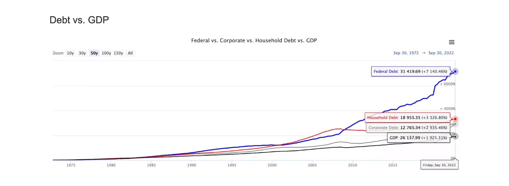
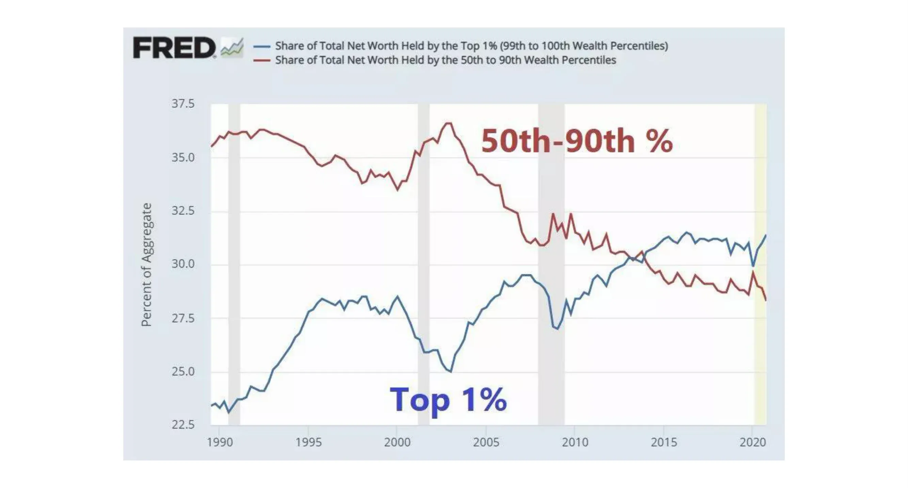
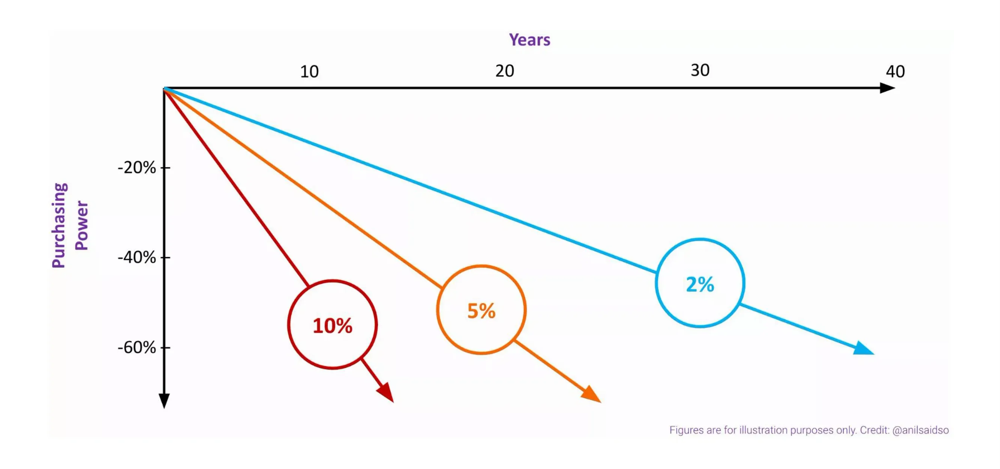

تا به حال فکر کرده‌اید:

چرا هزینه زندگی من همچنان در حال افزایش است؟

آیا تورم واقعاً برای من خوب است؟

چه گزینه‌هایی برای کمک به محافظت در برابر تورم در دسترس هستند؟

Bitcoin یا استیبل‌کوین‌ها چگونه در همه این‌ها جای می‌گیرند؟

اگر به هر یک از این سوالات پاسخ مثبت داده‌اید، در جای درستی هستید.

به "انتخاب تغییر" خوش آمدید، جایی که به بررسی عمیق سیستم‌های پولی خود می‌پردازیم و در عین حال به برخی از ابزارهای موجود برای ایجاد تغییرات مثبت نگاه می‌کنیم. در حالی که دنیای ما با تهدیدات فزاینده به آزادی‌ها و نقض فزاینده حقوق بشر دست و پنجه نرم می‌کند، این دوره تلاش می‌کند تا یک نور راهنما ارائه دهد—یک سیستم جایگزین که کنترل را به دست فرد بازمی‌گرداند.

اگر آنچه که به تازگی خوانده‌اید توجه شما را جلب کرده است، امیدواریم که در این سفر آموزشی به ما بپیوندید.

چه انتظاری باید داشت:

مناسب برای مبتدیان

تقریباً ۳ ساعت محتوای خودآموز

آزمون‌های تعاملی برای سنجش دانش شما

نوشته شده توسط متخصصان صنعت

نمونه‌هایی از سراسر جهان و از همه اقشار جامعه

الزامات: اشتیاق به یادگیری

این دوره توسط TETHER حمایت شده است

+++

# مقدمه

<partId>d44d9f32-c72e-58a4-9855-12e29f3e763c</partId>

## بررسی کلی دوره

<chapterId>2eaf5947-8180-540e-9418-c40bf04e07ce</chapterId>

به دوره ECO104 خوش آمدید!

**ما در دنیایی زندگی می‌کنیم که:**

● تنها [20٪](https://freedomhouse.org/sites/default/files/2022-02/FIW_2022_PDF_Booklet_Digital_Final_Web.pdf) از مردم در جوامعی زندگی می‌کنند که به عنوان "دموکراتیک و آزاد" شناخته می‌شوند. با این حال، حتی در این بخش ممتاز، نقض حقوق بشر به طور فزاینده‌ای رایج شده است— از حساب‌های بانکی مسدود شده تا سانسور. 80٪ باقی‌مانده با نفوذ حکومت‌های استبدادی دست و پنجه نرم می‌کنند. تنها دو دهه پیش، نزدیک به نیمی از جمعیت جهان از ابتدایی‌ترین آزادی‌ها برخوردار بودند.

● [1.4](https://www.worldbank.org/en/news/feature/2022/07/21/covid-19-boosted-the-adoption-of-digital-financial-services#:~:text=Globally%2C%20some%201.4%20billion%20adults,go%2C%20much%20more%20is%20needed.) میلیارد بزرگسال در سراسر جهان همچنان بدون بانک باقی مانده‌اند، در حالی که تعداد بی‌شماری دیگر به خدمات بانکی محدود دسترسی دارند.

● تا پایان [2022](https://Elements.visualcapitalist.com/mapped-countries-with-highest-inflation-rate/)، تقریباً نیمی از جهان با نرخ تورم دو رقمی مواجه بودند که ارزش پول Hard کسب‌شده را کاهش می‌داد. برای درک بهتر، با نرخ تورم 10% در طول یک دهه، شما 65% از قدرت خرید خود را از دست خواهید داد.

● و حتی بدون دوره‌های طولانی از چنین تورمی، دلار آمریکا، که به‌طور قابل‌بحثی قوی‌ترین ارز جهانی است، شاهد کاهش [96٪](https://www.visualcapitalist.com/purchasing-power-of-the-u-s-dollar-over-time/) قدرت خرید خود در طول قرن گذشته بوده است.

این‌ها برخی از حقایق تلخ محیط اقتصادی جهانی ما هستند. سیستم‌های مالی ما به طرز ناامیدکننده‌ای از برآورده کردن نیازهای اکثریت جمعیت ناتوان هستند. این سیستم‌ها نابرابری را تداوم می‌بخشند، بسیاری را کنار می‌گذارند و میلیاردها نفر را در سراسر جهان بی‌قدرت می‌کنند.

اگر خود را تحت فشارهای بی‌امان افزایش قیمت‌ها یا کمبود شمول مالی در سیستم فعلی ما می‌بینید، اگر تسلی‌بخش است، بدانید که تنها نیستید. این‌ها محصولات جانبی سیستم پولی امروزی ما هستند.

با وجود چشم‌انداز ظاهراً تیره و تار ما، تمرکز ما در این دوره بر روی چالش‌های شرایط فعلی‌مان نیست. در عوض، می‌خواهیم توجه خود را به سمت دستیابی به آزادی و توانمندسازی مالی معطوف کنیم.

با این حال، این دوره تنها برای کسانی که با تورم شدید یا دسترسی محدود به زیرساخت‌های مالی یا خدمات بانکی مواجه هستند، نیست. چه شما با این مسائل تا حدی آشنا باشید یا صرفاً مشتاق به گسترش دانش خود باشید، این دوره برای هر کسی که به دنبال بهبود درک خود و کسب ابزارهای لازم برای غلبه بر این موانع و بازیابی حاکمیت مالی است، طراحی شده است.

با در نظر گرفتن این موضوع، مأموریت ما این است که شما را به خط مقدم تغییر در چشم‌انداز مالی کنونی برسانیم، به چالش کشیدن هنجارهای موجود و ارائه راه‌حل‌های جایگزین. با بررسی تاریخچه پول، رمزگشایی Bitcoin، و کاوش در تتر و دنیای استیبل‌کوین‌ها، هدف ما این است که افراد را به بازاندیشی در آینده مالی خود ترغیب کنیم.

**چه انتظاری باید داشت:**

**ماژول 1: بهای پیشرفت - نگاهی دقیق‌تر به سیستم مالی ما**

ما کاوش خود را با نگاهی به پشت پرده‌های سیستم مالی کنونی‌مان آغاز می‌کنیم، جایی که سانسور مالی، نابرابری ثروت و تورم زندگی روزمره ما را به چالش می‌کشند. از طریق نگاهی کوتاه به تاریخچه پول، بررسی خواهیم کرد که چگونه به اینجا رسیده‌ایم و به برخی از نقاط درد اصلی که همه ما تجربه می‌کنیم، نور خواهیم انداخت.

**ماژول 2: رهایی مالی - مقدمه‌ای بر Bitcoin**

این ماژول Bitcoin را رمزگشایی می‌کند و از اصطلاحات تخصصی فراتر می‌رود تا به شما کمک کند بفهمید چه چیزی Bitcoin را از ارزهای فیات سنتی متمایز می‌کند. از نحوه کارکرد آن تا چگونگی استفاده از آن، ما شما را در عملکرد و روش‌های تعامل با Bitcoin راهنمایی می‌کنیم.

**ماژول 3: ثبات در میان آشوب - مقدمه‌ای بر تتر و دنیای استیبل‌کوین‌ها**

در این ماژول، نگاهی به زیرساخت‌های استیبل‌کوین پیشرو، تتر، می‌اندازیم و بررسی می‌کنیم که چگونه این ارز دیجیتال ارزش خود را حفظ می‌کند و پتانسیل این را دارد که به افرادی که با دولت‌های سرکوبگر، کمبود خدمات مالی یا تورم بی‌رویه مواجه هستند، آزادی ببخشد.

**ماژول ۴: غلبه بر تردیدها - رفع تصورات غلط رایج و موارد استفاده در دنیای واقعی**

در پایان، ما به چالش کشیدن تصورات غلط رایج پیرامون Bitcoin و استیبل‌کوین‌ها خواهیم پرداخت و موارد استفاده واقعی از افرادی که قبلاً این فناوری‌ها را پذیرفته و از آن‌ها بهره‌مند شده‌اند، ارائه خواهیم داد.

تا پایان این دوره، شما نه تنها دانش قدرتمند و ابزارهای ارزشمندی برای پیمایش در چشم‌انداز پیچیده مالی ما کسب خواهید کرد، بلکه درک بهتری از چگونگی توانمندسازی کاربران توسط Bitcoin و استیبل‌کوین‌ها، مانند تتر، با امکان انتخاب یک سیستم پولی جایگزین—سیستمی که فرد را در اولویت قرار می‌دهد و به هر کسی کنترل بیشتری بر وضعیت مالی خود می‌دهد—خواهید داشت. با این درک، شما بهتر مجهز خواهید شد تا به دنبال آزادی مالی، توانمندسازی شخصی و رهایی باشید.

ما از اینکه شما در این سفر به اعماق سیستم پولی ما به ما می‌پیوندید، هیجان‌زده‌ایم.

# بهای پیشرفت - نگاهی دقیق‌تر به سیستم مالی ما

<partId>25ed8242-1b5a-5b53-b833-824b0dd80bcc</partId>

## مقدمه‌ای بر پول

<chapterId>927ad49a-d8d6-5dd3-9250-cdcadcbf425e</chapterId>

پول بخش جذاب و ضروری از زندگی روزمره ماست. ما روزانه از آن برای خرید مواد غذایی، پرداخت قبوض و انجام معاملات بی‌شمار استفاده می‌کنیم. اما واقعاً پول چیست؟ در اصل، پول صرفاً یک واسطه Exchange است، ابزاری که به ما امکان می‌دهد کالاها و خدمات را با یکدیگر مبادله کنیم. این یک مفهوم انتزاعی است که همه ما آن را بدیهی می‌دانیم، اما برای سیستم اقتصادی ما اساسی است.

اما همه پول‌ها به یک شکل ایجاد نمی‌شوند. برخی از اشکال پول بهتر از دیگران هستند، بسته به توانایی آن‌ها در خدمت به عنوان ذخیره ارزش، واسطه Exchange، و واحد حساب. به عنوان مثال، طلا به دلیل دوام و کمیابی‌اش برای هزاران سال بسیار ارزشمند بوده است. از سوی دیگر، پول کاغذی تنها به اندازه اعتمادی که به نهادهای صادرکننده آن داریم، ارزشمند است.

در این ماژول، به بررسی عملکردها و ویژگی‌های مختلف پول و آنچه که پول خوب را می‌سازد، خواهیم پرداخت. چه شما یک فرد عادی، صاحب کسب‌وکار، سرمایه‌گذار یا صرفاً کنجکاو درباره دنیای مالی باشید، هدف ما این است که به شما در درک عمیق‌تر این مفهوم انتزاعی اما ضروری که بر زندگی همه ما تأثیر می‌گذارد، کمک کنیم. پس بیایید شروع کنیم...

### پول چیست؟

به ساده‌ترین شکل، پول را می‌توان به عنوان واسطه‌ای درک کرد که دو طرف با آن توافق می‌کنند تا یک Exchange از یک محصول، کالا یا خدمات را تسویه کنند.

پول به ما اجازه می‌دهد منابع یا خدمات خود را با یک ذخیره ارزش مبادله کنیم، بدون توجه به اینکه آیا فوراً به این ارزش ذخیره شده نیاز داریم یا خیر. این امر به تمدن ما اجازه داده است که بسیار کارآمدتر از آنچه که اگر به روش‌هایی مانند مبادله کالا به کالا متکی بودیم، گسترش و رشد کند.

برای فرد متوسط، پول ارزش خود را حفظ می‌کند زیرا تنها دو روش برای به دست آوردن پول وجود دارد:

1. ما باید زمان و انرژی را در ازای پول صرف کنیم (یعنی کار، کارگری، خدمات).

۲. ما باید کالاها یا منابع را در ازای پول مبادله کنیم.

مهم است که توجه داشته باشید در نکته دوم بالا، برای به دست آوردن این کالاها و منابع برای تجارت، کسی در مرحله‌ای باید زمان و انرژی صرف کرده باشد تا آن‌ها را ایجاد کند. بنابراین می‌توانیم نتیجه بگیریم که باید زمان و انرژی صرف کنیم تا پول به دست آوریم. بنابراین:

پول = زمان + انرژی

با دیدن پول به عنوان ذخیره‌ای از زمان و انرژی، به‌طور استعاری، می‌توانیم بهتر درک کنیم که پول اساساً یک باتری است - ذخیره‌ای از انرژی که می‌تواند در تاریخ بعدی استفاده شود. با در نظر گرفتن این قیاس، تکامل پول، به‌طور نظری، این جستجوی مداوم برای کارآمدترین باتری برای ذخیره زمان و انرژی است.

### چه چیزی پول زیادی به همراه دارد؟

همان‌طور که مقدمه را می‌خوانید، ممکن است متوجه سه اصطلاح مهم شده باشید: ذخیره ارزش، واسطه Exchange، و واحد حساب. اگر با این اصطلاحات آشنا نیستید، نگران نباشید. این سه عملکرد برای اینکه پول به دارنده خود ارزش ارائه دهد ضروری هستند و معمولاً به عنوان عملکردهای پول شناخته می‌شوند.

بیایید به هر کدام نگاهی بیندازیم:

1. **ذخیره ارزش:** پول به عنوان وسیله‌ای برای ذخیره ارزش برای استفاده در آینده عمل می‌کند و به دارنده آن امکان می‌دهد قدرت خرید خود را در طول زمان حفظ کند. با انجام این کار، به دارنده این امکان را می‌دهد که برای آینده پس‌انداز و برنامه‌ریزی کند. طلا به عنوان نمونه‌ای برجسته از چنین ذخیره ارزش عمل می‌کند، زیرا قرن‌هاست که با تنها یک اونس می‌توان یک دست کت و شلوار مناسب خریداری کرد.

2. **رسانه Exchange:** برای اینکه پول به عنوان یک رسانه قابل قبول Exchange برای کالاها و خدمات عمل کند، باید به راحتی قابل مبادله باشد. در حالی که از نظر فنی هر دارایی می‌تواند به عنوان پول استفاده شود، دارایی‌های بزرگ و غیرقابل جابجایی مانند خانه‌ها برای استفاده به عنوان رسانه Exchange عملی نیستند.

3. **واحد حساب:** در نهایت، پول باید به عنوان یک واحد استاندارد اندازه‌گیری برای قیمت کالاها و خدمات عمل کند. این بدان معناست که اقلام به لحاظ این پول قیمت‌گذاری و ارزش‌گذاری می‌شوند، که امکان مقایسه آسان ارزش نسبی محصولات و خدمات مختلف را فراهم می‌کند.

وقتی این سه عملکرد اساسی پول به طور کامل برآورده می‌شوند، چنین پولی توانایی برآورده کردن نیازهای سخت‌گیرانه تجارت را دارد. بدون این عملکردها، پول بسیار کمتر قابل اعتماد و اطمینان است و منجر به ناامنی و عدم قطعیت در تجارت می‌شود که می‌تواند اثرات مخربی هم در سطح شخصی و هم ملی داشته باشد.

با در نظر گرفتن این موضوع، زمانی که پولی که استفاده می‌کنیم به ما وسیله‌ای قابل اعتماد برای ذخیره ارزش، روشی مؤثر برای تسهیل معاملات و معیاری مشترک برای ارزش ارائه می‌دهد، به ما این امکان را می‌دهد که پس‌انداز کنیم و ثروت بسازیم، با اطمینان تجارت کنیم و به راحتی معامله کنیم. این عملکردها نه تنها به ما در توانایی تجارت و پس‌انداز کمک می‌کنند، بلکه پایه‌ای برای یک سیستم اقتصادی پایدار و کارآمد ایجاد می‌کنند و رشد اقتصادی بیشتر و رفاه را برای افراد و جوامع تقویت می‌کنند.

احتمالاً دارید فکر می‌کنید، "باشه، متوجه شدم که برای اینکه پول ارزش ارائه دهد، باید وظایف پول که در بالا ذکر شد را برآورده کند، اما چگونه این کار را انجام می‌دهد؟"

سؤال عالی...

مفهوم پول عالی ممکن است پیچیده به نظر برسد، اما در اصل، با ویژگی‌های اساسی خاصی تعریف می‌شود که به آن امکان می‌دهد به عنوان یک ذخیره ارزش قابل اعتماد و مؤثر، واسطه Exchange و واحد حساب عمل کند. این Elements به طور جمعی به عنوان ویژگی‌های پول شناخته می‌شوند. با درک ارتباطات بین ویژگی‌های پول و عملکردهای آن، می‌توانیم درک عمیق‌تری از این که چرا برخی پول‌ها نسبت به دیگران ترجیح داده می‌شوند، توسعه دهیم.

### ویژگی‌های پول

#### ذخیره ارزش

برای اینکه پول قدرت خرید خود را در طول زمان حفظ کند، باید:

**بادوام:** وقتی درباره پول به عنوان یک دارایی بادوام صحبت می‌کنیم، به توانایی آن در مقاومت در برابر فرسایش زمان و استفاده اشاره داریم. یک ذخیره ارزش بادوام به این معناست که پول ارزش خود را در طول زمان حفظ خواهد کرد، بدون توجه به هرگونه عوامل فیزیکی یا محیطی که ممکن است باعث تخریب آن شود. به عنوان مثال، اگر پول خود را به صورت طلا ذخیره کنید، ارزش و درخشندگی خود را حفظ خواهد کرد حتی اگر سکه‌هایی که نمایانگر آن هستند منسوخ شوند. پول بادوام مهم است زیرا به ما اجازه می‌دهد ثروت خود را در طول زمان بدون ترس از از دست دادن ارزش آن ذخیره کنیم.

**کمیاب:** وقتی پول کمیابی ارائه می‌دهد، منظور ما یک Supply محدود است. این برای ذخیره ارزش مهم است زیرا اگر از یک ارز خاص بیش از حد وجود داشته باشد، می‌تواند ارزش خود را از دست بدهد. یک ارز کمیاب احتمال بیشتری دارد که ارزش خود را در طول زمان حفظ کند و به یک ذخیره ثروت قابل اعتماد تبدیل شود. به آن مانند یک آیتم نسخه محدود فکر کنید - اگر فقط تعداد کمی از آنها وجود داشته باشد، ارزشمندتر و مورد توجه‌تر از زمانی هستند که یک Supply بی‌پایان وجود داشته باشد. به همین ترتیب، یک ارز کمیاب احتمال بیشتری دارد که ارزش خود را حفظ کند و قدرت خرید خود را نگه دارد، و آن را به گزینه بهتری برای ذخیره ثروت تبدیل می‌کند.

**تغییرناپذیر:** برای اینکه پول تغییرناپذیری ارائه دهد، باید پس از انجام یک تراکنش، در برابر برگشت یا تغییر مقاوم باشد. این یک ویژگی حیاتی برای یک ذخیره ارزش قابل اعتماد است زیرا اطمینان می‌دهد که ارزش پول در معرض تغییرات یا دستکاری‌های دلخواه قرار نمی‌گیرد. به عنوان مثال، اگر چیزی را با پول نقد خریداری کنید، نمی‌توانید بعداً نظر خود را تغییر داده و تراکنش را معکوس کنید. به طور مشابه، با [ارزهای دیجیتال](https://planb.academy/resources/glossary/cryptocurrency) مانند Bitcoin، زمانی که یک تراکنش در [Blockchain](https://planb.academy/resources/glossary/blockchain) ثبت شد، نمی‌توان آن را تغییر داد یا معکوس کرد. این تغییرناپذیری حس امنیت و اطمینان را برای خریداران و فروشندگان در معاملات مالی فراهم می‌کند.

#### متوسط Exchange

برای اینکه پول به عنوان واسطه‌ای مؤثر برای خرید و فروش کالاها و خدمات عمل کند، باید:

**قابل حمل:** وقتی درباره پول به عنوان "قابل حمل" صحبت می‌کنیم، منظورمان این است که به راحتی می‌توان آن را از یک مکان به مکان دیگر حمل و نقل کرد. این یک ویژگی مهم از یک واسطه Exchange است زیرا به ما امکان می‌دهد از پول برای خرید و فروش کالاها و خدمات در مکان‌های مختلف استفاده کنیم. به عنوان مثال، اگر بخواهید از یک کافه قهوه بخرید، می‌توانید از پول قابل حمل خود (مانند پول نقد یا کارت اعتباری) برای پرداخت استفاده کنید، مهم نیست کجا هستید. در مقابل، اگر مجبور بودید اشیاء بزرگ و سنگین را به عنوان وسیله‌ای برای Exchange حمل کنید، استفاده از آن‌ها در معاملات بسیار دشوارتر می‌شد.

**قابل تقسیم:** این یک ویژگی حیاتی از یک واسطه خوب Exchange است که به توانایی پول برای تقسیم شدن به واحدهای کوچکتر برای تسهیل معاملات با اندازه‌های مختلف اشاره دارد. به عنوان مثال، انجام خریدهای کوچک دشوار خواهد بود اگر فقط اسکناس‌های بزرگ داشتیم. قابلیت تقسیم به ما اجازه می‌دهد تا پرداخت‌های دقیق انجام دهیم، بدون توجه به اندازه معامله، که پول را در زندگی روزمره مفیدتر و عملی‌تر می‌کند. اساساً، هرچه یک ارز قابل تقسیم‌تر باشد، استفاده و معامله با آن برای افراد راحت‌تر است.

**پذیرفته شده:** وقتی درباره پذیرش صحبت می‌کنیم، منظور ما این است که آیا یک شکل خاص از پول به طور گسترده پذیرفته شده است یا خیر. این بدان معناست که مردم مایل به پذیرش و استفاده از این شکل پول به عنوان وسیله‌ای برای Exchange در قبال کالاها و خدمات هستند. اگر یک ارز به طور گسترده پذیرفته شود، تجارت برای مردم آسان‌تر می‌شود، زیرا یک ارز مشترک برای خرید و فروش کالاها و خدمات وجود دارد. هرچه یک ارز بیشتر پذیرفته شود، ارزش آن بیشتر می‌شود، زیرا افراد بیشتری مایل به استفاده از آن هستند. برعکس، اگر یک ارز به طور گسترده پذیرفته نشود، ارزش خود را از دست می‌دهد، زیرا مردم در پذیرش آن به عنوان وسیله‌ای برای Exchange تردید خواهند کرد.

#### واحد حساب

برای اینکه پول به عنوان معیار مشترک ارزش کالاها و خدمات استفاده شود، باید:

**[قابل تعویض](https://planb.academy/resources/glossary/fungibility):** وقتی گفته می‌شود پول قابل تعویض است، به این معناست که هر واحد پولی با هر واحد دیگری قابل جایگزینی است. به زبان ساده‌تر، این بدان معناست که پول یکنواخت و یکسان است، بدون توجه به اینکه از کجا آمده یا متعلق به چه کسی است. به عنوان مثال، اگر به کسی ۱۰ دلار بدهکار باشید و به او یک اسکناس ۱۰ دلاری بدهید، مهم نیست که اسکناس از Wallet شما یا Wallet شخص دیگری آمده است. تا زمانی که یک اسکناس ۱۰ دلاری واقعی باشد، به عنوان ارزش برابر در نظر گرفته می‌شود. مفهوم قابلیت تعویض مهم است زیرا به پول اجازه می‌دهد به عنوان یک واحد اندازه‌گیری مشترک به طور مؤثر عمل کند و معاملات را ساده‌تر و کارآمدتر کند.

نتیجه‌گیری

پول بخش مهم و جذابی از زندگی روزمره ماست. به عنوان واسطه‌ای عمل می‌کند که به ما امکان می‌دهد کالاها و خدمات را با یکدیگر مبادله کنیم. با این حال، همه پول‌ها به یک اندازه ایجاد نمی‌شوند. برخی از اشکال پول به عنوان ذخیره ارزش برتر هستند، مانند سکه‌های طلا، در حالی که برخی دیگر ممکن است به عنوان واسطه‌ای مانند دلار آمریکا مؤثرتر باشند. اما زمانی که این عملکردها به طور کامل برآورده شوند، به ما امکان می‌دهد با اطمینان و سهولت معامله کنیم، که نه تنها به ما به عنوان افراد کمک می‌کند بلکه رشد اقتصادی و رفاه بیشتری را برای اقتصاد ما به ارمغان می‌آورد.

در ماژول‌های پیش‌رو، به بررسی دو شکل محبوب پول: Bitcoin و [استیبل‌کوین‌ها](https://planb.academy/resources/glossary/stablecoin) خواهیم پرداخت. با بررسی آن‌ها از طریق محتوای مورد بحث در این بخش، خواهیم دید که چگونه آن‌ها وظایف مختلف ارز را انجام می‌دهند و چگونه می‌توانند به طور قابل توجهی به جامعه سود برسانند.

از مبادله کالا به کالا تا اختراع سکه‌ها و ارز کاغذی، پول دستخوش مجموعه‌ای از تحولات شده است تا با نیازهای همیشه در حال تغییر جامعه سازگار شود. همان‌طور که به فصل بعدی می‌رویم، بیایید مسیر را تغییر دهیم و توجه خود را به سمت تکامل پول معطوف کنیم.

## بررسی چگونگی رسیدن ما به اینجا

<chapterId>4c8ebb36-a6d5-5637-93ca-9a4a222a1c58</chapterId>

از روزهای مبادله کالا تا عصر مدرن ارزهای دیجیتال، پول دستخوش یک تحول شگفت‌انگیز شده است. نیاکان ما از صدف‌ها، مهره‌ها و حتی دام به عنوان واسطه‌ای برای Exchange استفاده می‌کردند. امروزه ما کیف‌پول‌های مجازی و پرداخت‌های بدون تماس داریم. این یک سفر قابل توجه است که شاهد بی‌شمار تکرار، مصالحه و سازگاری برای برآورده کردن نیازهای همیشه در حال تغییر جامعه بوده است.

اما چگونه پولی که استفاده می‌کنیم به بخش ضروری زندگی ما تبدیل شده است؟ در این بخش، به بررسی تکامل پول، از ابتدایی‌ترین اشکال آن تا ارزهای دیجیتال مدرن که امروزه استفاده می‌کنیم، خواهیم پرداخت. ما به هر تکرار عمده پول خواهیم پرداخت و بررسی خواهیم کرد که چگونه آنها به شکل‌گیری جامعه مدرن ما کمک کرده‌اند.

_**یک نکته سریع:** مهم است که تأکید کنیم این بخش لزوماً یک روایت زمانی از تکامل پول نیست. بلکه بیشتر یک سفر آموزشی در مورد ظهور و سقوط اشکال مختلف پول است. بسیاری از این واسطه‌های Exchange به‌طور همزمان وجود داشته‌اند و برخی هنوز هم به نوعی وجود دارند._

پس از خواندن این مقدمه، ممکن است از خود بپرسید: **چرا پول نیاز دارد که با گذشت زمان تکامل یابد و تغییر کند؟**

پاسخ ساده است: نیازها و خواسته‌های ما با پیشرفت جامعه و فناوری تغییر می‌کنند. و همان‌طور که نیازها و خواسته‌های ما تغییر می‌کنند، نحوه استفاده و ارزش‌گذاری ما از پول نیز تغییر می‌کند. به عنوان مثال، در زمان‌های باستان، مردم برای مبادله کالاها و خدمات به مبادله پایاپای متکی بودند، اما با پیچیده‌تر شدن جوامع، مشخص شد که یک شکل استاندارد و قابل حمل از ارز مورد نیاز است. این امر منجر به توسعه سکه‌ها شد که در نهایت با پول کاغذی و اخیراً ارزهای دیجیتال جایگزین شدند. هر تکرار پول دارای مزایا و معایب خاص خود است و با ادامه تکامل فناوری و جامعه، به احتمال زیاد شاهد تغییرات بیشتری در نحوه استفاده و ارزش‌گذاری پول خواهیم بود.

درک این مفهوم تکامل پولی مهم است زیرا به ما کمک می‌کند ببینیم چگونه پول در طول زمان تغییر کرده است و چگونه ممکن است در آینده به تغییر خود ادامه دهد.

با این اوصاف، بیایید نگاهی به اشکال اصلی Exchange بیندازیم که یا امروزه مورد استفاده قرار می‌گیرند یا در مقطعی از گذشته استفاده شده‌اند.

1. **معامله پایاپای:** Exchange کالاها یا خدمات به‌طور مستقیم بدون استفاده از پول.

2. **پول کالایی:** Exchange یک کالای توافق‌شده که ارزشمند تلقی می‌شود، مانند نمک یا صدف‌های دریایی.

3. **پول سکه‌ای:** استفاده از فلزات گرانبها، مانند طلا یا نقره، به شکل سکه به عنوان واسطه Exchange.

4. **پول کاغذی با پشتوانه فلزی:** پول کاغذی که توسط یک کالای فیزیکی مانند طلا یا نقره پشتیبانی می‌شود.

5. **[پول فیات](https://planb.academy/resources/glossary/fiat):** ارزی که پشتوانه کالای فیزیکی ندارد، بلکه به این دلیل ارزش دارد که دولت آن را به عنوان پول قانونی اعلام می‌کند.

6. **ارزهای دیجیتال:** توکن‌های دیجیتال یا مجازی که از [رمزنگاری](https://planb.academy/resources/glossary/cryptography) برای ایمن‌سازی تراکنش‌ها و کنترل ایجاد واحدهای جدید استفاده می‌کنند.

با در نظر گرفتن این موارد، بیایید هر یک را بررسی کنیم تا درک جامع‌تری از چگونگی رسیدن به وضعیت کنونی پیدا کنیم.

### معامله پایاپای

معامله پایاپای! این یک مفهوم ساده است: شما چیزی که دارید را با چیزی که می‌خواهید یا نیاز دارید مبادله می‌کنید.

اما آیا عملی است؟

مشکل مبادله کالا به کالا این است که پیدا کردن کسی که چیزی را که شما دارید بخواهد و چیزی را که شما می‌خواهید داشته باشد، می‌تواند چالش‌برانگیز باشد. به عنوان مثال، تصور کنید که شما یک کشاورز گندم هستید که به یک پیراهن جدید نیاز دارید. ممکن است مجبور شوید به جستجوی گسترده‌ای بپردازید تا یک پیراهن‌دوز پیدا کنید که مایل به مبادله پیراهن با گندم شما باشد. اما اگر پیراهن‌دوز گندم شما را نخواهد چه؟ این مشکل به عنوان هم‌زمانی دوگانه نیازها شناخته می‌شود. یک معامله موفق نیازمند هم‌زمانی دوگانه نیازها است، به این معنی که هر دو طرف باید چیزی داشته باشند که دیگری بخواهد مبادله کند.

مشکل دیگر با مبادله کالا به کالا این است که برای برخی اقلام می‌تواند غیرعملی باشد. چگونه می‌توانید یک گاو زنده را برای معامله با یک جفت کفش تقسیم کنید؟ و بدون یک واحد حساب استاندارد، مقایسه ارزش کالاها و خدمات دشوار است. آیا یک گاو بیشتر یا کمتر از ده کیسه گندم یا دو طاقه پارچه ارزش دارد؟

علاوه بر همه این‌ها، بسیاری از کالاها و خدمات فاسدشدنی هستند و با گذشت زمان ارزش خود را از دست می‌دهند. بنابراین، اگر به مبادله کالا به عنوان وسیله‌ای برای Exchange متکی هستید، باید به طور مداوم کالاها و خدمات خود را مبادله و مصرف کنید تا از کاهش ارزش جلوگیری کنید.

با وجود این چالش‌ها، مبادله کالا به کالا هنوز در برخی شرایط استفاده می‌شود. شما اغلب مبادله را در معاملات بازارهای آنلاین مشاهده خواهید کرد، یا در کشورهایی که ارز نتوانسته ارزش را حفظ کند، مردم به دنبال ذخیره ارزش در کالاها هستند. با این حال، به طور گسترده پذیرفته نشده است.

در مجموع، مبادله کالا به کالا ممکن است در زمان‌های باستان یک روش مؤثر و به‌طور گسترده‌ای مورد استفاده برای تجارت کالاها بوده باشد، اما یک نقص عمده داشت: "همزمانی خواسته‌ها". به عبارت دیگر، برای اینکه یک مبادله کالا به کالا Exchange موفقیت‌آمیز باشد، دو طرف باید چیزی داشته باشند که دیگری بخواهد. این می‌تواند یک دردسر واقعی باشد و به بسیاری از مذاکرات بی‌ثمر منجر شود. خوشبختانه، ما از مبادله کالا به کالا فراتر رفته‌ایم و روش‌های بهتری برای Exchange کالاها و خدمات توسعه داده‌ایم.

### کالاها

همان‌طور که مبادله کالا به کالا شروع به نشان دادن ضعف‌های خود در تجارت کرد، افراد و اقتصادها به شدت به یک جایگزین نیاز داشتند. خوشبختانه، با ظهور کالاها به عنوان یک واسطه Exchange، نیازهای ما... به طور موقت برآورده شد. با پیش‌تعریف کالایی که همه آن را به عنوان ارزشمند می‌شناختند، ما اولین شکل پول خود را داشتیم که به عنوان یک واسطه برای کاهش اصطکاک تجارت عمل می‌کرد.

نکته عالی در مورد انتخاب یک واسطه از پیش تعریف‌شده مانند Exchange این بود که جوامع می‌توانستند چیزی را انتخاب کنند که کمیاب بود و فاسد نمی‌شد، و این باعث می‌شد که به عنوان یک ذخیره ارزش پایدارتر باشد. چیزهایی مانند مهره‌های شیشه‌ای، نمک و صدف‌ها به سرعت مورد توجه قرار گرفتند زیرا قابل شمارش، نسبتاً بادوام و قابل حمل در کیسه‌ها بودند. نمک به‌ویژه محبوب بود زیرا کاربرد داشت - از جمله در نگهداری گوشت‌ها.

با این حال، با آسان‌تر شدن سفر، جهان شروع به باز شدن کرد و مردم متوجه شدند که منابع کمیاب در یک منطقه در مناطق دیگر فراوان هستند. این امر منجر به بهره‌برداری، رقیق‌سازی Supply و رویدادهایی مانند تجارت برده شد. به عنوان مثال، مهاجران اروپایی که آفریقا را کاوش می‌کردند، مشاهده کردند که جوامع محلی از مهره‌های شیشه‌ای به عنوان نوعی پول استفاده می‌کنند. متحیر از این موضوع، به دلیل سهولت تولید شیشه در اروپا، مهاجران مقادیر زیادی از این مهره‌ها را به آفریقا می‌آوردند و ارزش آنها را رقیق می‌کردند. برخی حتی استدلال می‌کنند که این رقیق‌سازی یکی از عوامل تحریک‌کننده‌ای بود که تجارت [برده](https://breedlove22.medium.com/masters-and-slaves-of-money-255ecc93404f) را شعله‌ور کرد و به فروپاشی اقتصاد آفریقا کمک کرد.

به طور کلی، پول کالایی نقش اساسی در توسعه تجارت و بازرگانی ایفا کرد، زیرا وسیله‌ای استاندارد برای Exchange فراهم می‌کرد که به طور گسترده پذیرفته شده بود. با این حال، با پیشرفت جوامع، اشکال دیگری از پول که راحت‌تر و قابل تقسیم‌تر بودند، شروع به ظهور کردند.

برای حل این مشکلات، مردم به جستجوی کالاهایی پرداختند که کمبود جهانی شناخته‌شده‌ای داشتند، که این امر منجر به استفاده از فلزات گران‌بها به عنوان واسطه‌ای برای Exchange شد.

### پول سکه‌ای

در حالی که هنوز از نظر فنی پول کالایی محسوب می‌شد، انسان‌ها در جستجوی خود برای یافتن پول برتر به یک قهرمان غیرمنتظره برخورد کردند: فلزات گرانبها. این فلزات نه تنها زیبا بودند و برای استفاده در جواهرات مورد توجه قرار می‌گرفتند، بلکه بسیاری از ویژگی‌های یک دارایی پولی عالی را نیز داشتند. کمبود جهانی آن‌ها در طبیعت و سرمایه‌گذاری قابل توجهی که برای استخراج، پالایش و ذخیره‌سازی این فلزات لازم بود، به آن‌ها برتری نسبت به سایر اشکال قبلی پول می‌داد.

علاوه بر این، فلزاتی مانند طلا یکی از بی‌اثرترین Elements در جدول تناوبی بودند که آنها را بسیار بادوام و مقاوم در برابر خوردگی می‌کرد.

با پیشرفت فناوری، طلا و نقره تحت یک فرآیند تحول‌آفرین قرار گرفتند، به صورت ذوب، شکل‌دهی و مهر زدن به سکه‌ها درآمدند که سهولت Exchange را افزایش داد. ارزش استاندارد و نشانه‌گذاری‌های روی این سکه‌ها به طور قابل توجهی هزینه‌های مرتبط با تأیید وزن و خلوص فلزات گران‌بها را کاهش داد. اما، همان‌طور که با اکثر چیزهای خوب اتفاق می‌افتد، همیشه کسی راهی برای سوءاستفاده پیدا می‌کند. بریدن سکه به شدت رایج شد، به طوری که هم افراد و هم دولت‌ها بخش‌هایی از سکه‌ها را می‌بریدند تا وزن فلز گران‌بها را کاهش دهند در حالی که سعی می‌کردند ارزش اسمی اصلی آن‌ها را حفظ کنند. این امر به اولین شکل کاهش ارزش ارز منجر شد که به [تورم](https://planb.academy/resources/glossary/inflation) انجامید.

برای بدتر کردن اوضاع، با جهانی‌تر شدن دنیا، طلا و نقره به طور فزاینده‌ای حمل و نقل و معامله با آن‌ها، به ویژه برای دریانوردان، دشوار شد.

### ارز کاغذی با پشتوانه فلزی

وارد شدن کاغذ با پشتوانه فلز، راه‌حلی برای هزینه‌های قابل توجه حمل و نقل و خطرات از دست دادن مرتبط با فلزات گرانبها. اما، همان‌طور که خواهیم دید، این راه‌حل چالش‌های خاص خود را برای غلبه بر آن‌ها داشت.

ما راه طولانی را از روزهای مبادله و تجارت کالاها پیموده‌ایم. با ظهور فلزات پولی، سرانجام به یک ذخیره ارزش پایدار دست یافتیم که می‌توانست به صورت جهانی استفاده شود. اما این معرفی ارز کاغذی با پشتوانه فلزی بود که واقعاً نحوه معاملات ما را متحول کرد.

به این فکر کنید: دیگر نیازی به حمل کیسه‌های سنگین طلا یا نگرانی از سرقت نیست. در عوض، افراد می‌توانستند طلای خود را در یک انبار سپرده‌گذاری کرده و رسیدی دریافت کنند که می‌توانستند آن را درست مانند طلای فیزیکی معامله کنند. این امر قابلیت تعویض‌پذیری، تقسیم‌پذیری و حمل‌پذیری پول را افزایش داد و تجارت جهانی را به‌طور قابل‌توجهی آسان‌تر کرد. این رسیدها می‌توانستند به‌راحتی در مسافت‌های طولانی حمل شوند و امکان انجام تجارت بین‌المللی بدون تحمل هزینه‌های قابل‌توجه حمل‌ونقل را فراهم کنند. اگرچه مدتی طول کشید تا کاغذهای پشتوانه فلزی به‌عنوان شکلی از پول رواج پیدا کنند، اما با گسترش امپراتوری بریتانیا، به‌سرعت به یک هنجار تبدیل شدند.

اما همانند هر فناوری جدید، مشکلاتی شروع به ظهور کردند.

ابتدا، انبارهای طلا، با درک اینکه مشتریانشان به ندرت برای برداشت طلایی که رسیدها ادعای مالکیت آن را داشتند بازمی‌گردند، شروع به صدور رسیدهای کاغذی بدون پشتوانه طلا کردند که منجر به ایجاد مخفیانه اولین سیستم [بانکداری ذخیره کسری](https://planb.academy/resources/glossary/fractional-reserves) شد (صادرکنندگان تنها بخشی از سپرده‌های مشتریان را به عنوان ذخایر نگه می‌دارند و بقیه را وام می‌دهند). و حتی زمانی که کشورها تلاش کردند ارزهای خود را با طلا پشتیبانی کنند، اغلب از سیستم سوءاستفاده کردند که منجر به آشفتگی اقتصادی شد.

دوم، پول کاغذی با پشتوانه فلزی نیز از جعل مصون نبود. حتی با وجود ویژگی‌های امنیتی، جاعلان همچنان می‌توانستند اسکناس‌های تقلبی ایجاد کنند که ممکن بود تشخیص آن‌ها دشوار باشد.

اگرچه ارز کاغذی با پشتوانه فلزی مشکلات خاص خود را داشت، اما قابلیت تعویض‌پذیری، تقسیم‌پذیری و حمل‌پذیری بهبود یافته آن راه را برای راحتی ارزهای فیات امروزی هموار کرد، جایی که عملی بودن اغلب بر کمیابی غلبه می‌کند.

### ارز فیات

ارزهای فیات برای دهه‌ها پایه و اساس سیستم پولی ما بوده‌اند. اصطلاح "فیات" در لاتین به معنای "بگذار انجام شود" است و به قدرت دولت برای اعلام یک ارز به عنوان پول قانونی اشاره دارد. برخلاف ارزهایی که زمانی با طلا یا سایر ارزش‌ها پشتیبانی می‌شدند، ارزش فیات از وعده دولت می‌آید که کسی آن را در Exchange برای کالاها و خدمات قبول خواهد کرد.

ارزهای فیات زمانی ظهور کردند که کشورها با ناامیدی از ارزهای کاغذی با پشتوانه فلز مواجه شدند – دولت‌ها مجبور بودند برای چاپ پول کاغذی بیشتر، طلای بیشتری به دست آورند. این یک مانع بود، بنابراین هر زمان که کشوری به سرمایه نیاز داشت، به طور موقت این پیوند را رها کرده و Supply پولی خود را گسترش می‌داد. این ارز جدید به جز اعتماد به دولت، که به دلیل قانونی بودن آن بود، پشتوانه‌ای نداشت. نه تنها این، بلکه این ارز جدید با افزایش Supply پول، ارزش ارز باقی‌مانده در گردش را کاهش داد و با وجود دلارهای بیشتر که به دنبال همان مقدار کالا بودند، قیمت‌ها افزایش یافت.

پایان ارز کاغذی با پشتوانه فلزی در اواخر جنگ جهانی دوم آغاز شد. با اعتماد زیادی به ایالات متحده، رهبران جهانی در برتون وودز، نیوهمپشایر ملاقات کردند و تصمیم گرفتند که ایالات متحده دلار خود را به طلا متصل کند و بقیه جهان ارز خود را به دلار متصل کنند. این بدان معنا بود که بیشتر طلای جهان برای نگهداری به ایالات متحده سرازیر شد و ذخایر طلای داخلی بسیاری از کشورها را کاهش داد.

به اواخر دهه '60 و اوایل دهه '70 که می‌رسیم، ایالات متحده، که احساس محدودیت به دلیل پشتیبانی از طلا می‌کرد، شروع به گسترش پول Supply برای تأمین مالی جنگ در ویتنام کرد. فرانسه از این وضعیت راضی نبود و خواستار بازگشت طلای خود شد. این امر باعث هجوم به سمت طلا شد و چون ایالات متحده به طور قابل توجهی بیشتر از طلای موجود دلار چاپ کرده بود، به سرعت این پیوند را به کلی کنار گذاشت. این رویداد که به شوک نیکسون معروف است، به این معنا بود که افراد و کشورها دیگر نمی‌توانستند دلارهای خود را برای طلا Redeem کنند. از این روز به بعد، شاهد گسترش ارزهای فیات بودیم - ارزی که تنها با بدهی و اعتماد ما به دولت پشتیبانی می‌شود.

با این حال، تکامل پولی در آنجا متوقف نشد. با پیشرفت‌های فناوری، ارز فیات به تکامل خود ادامه داده است. امروزه، تراکنش‌های دیجیتال به طور فزاینده‌ای رایج شده‌اند و سیستم‌های پرداخت دیجیتال مانند ویزا، مسترکارت، پی‌پال، اسکوئر و ونمو به یک هنجار تبدیل شده‌اند.

و در سال‌های اخیر، شاهد افزایش بحث‌ها پیرامون ارزهای دیجیتال بانک مرکزی (CBDCs) بوده‌ایم، که جدیدترین نسخه ارز فیات است و نسخه‌ای کاملاً متمرکز و قابل برنامه‌ریزی از ارزهای فیات سنتی ما ارائه می‌دهد.

ارزهای دیجیتال بانک مرکزی (CBDCs) با ارزهای فیات که ما به آن‌ها عادت داریم متفاوت هستند زیرا به صادرکننده امکان مشاهده کامل تمام تراکنش‌ها و توانایی تصمیم‌گیری در مورد اینکه چه کسی می‌تواند و نمی‌تواند از ارز استفاده کند را می‌دهند. دولت‌ها و بانک‌های مرکزی درباره اهداف خود برای معرفی CBDCs صریح بوده‌اند و به مزایایی مانند کنترل متمرکز، بهبود کارایی تراکنش‌ها و توانایی واریز سریع چک‌های محرک اشاره کرده‌اند.

در حالی که CBDCها مزایای زیادی ارائه می‌دهند، اما همچنین با برخی معایب بالقوه جدی همراه هستند. به عنوان مثال، دولت‌ها ممکن است بتوانند حساب‌های بانکی را به‌طور خودسرانه مسدود کنند، محدودیت زمانی برای پول نقد ما تعیین کنند تا مصرف را ترویج دهند و محدود کنند که با چه کسانی می‌توانیم و نمی‌توانیم معامله کنیم.

علاوه بر این، پتانسیل برای گذار به سمت هویت‌های دیجیتال در حال افزایش است، همان‌طور که در چین با ارز دیجیتال بانک مرکزی (CBDC) و معرفی امتیازات اعتباری اجتماعی مشاهده می‌شود، که آزادی را در سراسر کشور تحت تأثیر قرار داده است و دسترسی به مسکن، مؤسسات مالی و حقوق اولیه جابجایی را محدود کرده است.

از آنجا که CBDCها تا حد زیادی آزمایش نشده‌اند، نمی‌توانیم با اطمینان بگوییم که مزایا و معایب آنها چه خواهد بود. با این حال، می‌توانیم مطمئن باشیم که CBDCها به دولت‌ها و بانک‌ها کنترل عظیمی بر سیستم پولی ما می‌دهند.

ارزهای فیات قطعاً در زمان‌های اخیر تغییرات قابل توجهی را تجربه کرده‌اند که عمدتاً به دلیل رشد اقتصاد دیجیتال است. برای پاسخگویی به نیازهای در حال تغییر مصرف‌کنندگان، ارزهای فیات به طور متناسب سازگار شده‌اند. با این حال، با ظهور ارزهای دیجیتال بانک مرکزی (CBDC)، باید با وجود مزایای آنها از نظر سرعت و کارایی، نسبت به معایب احتمالی آنها محتاط باشیم.

با این اوصاف، افرادی که شاهد کاهش قدرت خرید و افزایش کنترل دولت به همراه گسترش ارزهای فیات بوده‌اند، شروع به بررسی گزینه‌های جایگزین کرده‌اند.

### ارزهای دیجیتال

تصور کنید دنیایی که در آن پول شما می‌تواند به صورت دیجیتالی ذخیره و مبادله شود بدون نیاز به واسطه‌ها یا طرف‌های ثالث مورد اعتماد. دنیایی که Supply پول غیرقابل دستکاری، کمیاب و در دست جامعه به جای دولت‌ها یا بانک‌ها باشد. این دنیایی است که ارز دیجیتال پیشرو، Bitcoin، از زمان پیدایش خود در سال 2009 ایجاد کرده است.

Bitcoin از تلاش یک رمزنگار برای ایجاد نسخه‌ای جدید و بهبود یافته از فلزات پولی محبوب ما متولد شد. آن‌ها به دنبال طلای دیجیتال بودند، یک دارایی پولی که می‌توانست ارزش را ذخیره کند، دوام داشته باشد و برای تراکنش‌های دیجیتال استفاده شود. و بدین ترتیب، Bitcoin به عنوان اولین دارایی پولی موفق، بومی دیجیتال و کمیاب ظهور کرد.

آنچه Bitcoin را واقعاً منحصر به فرد می‌کند این است که یک ابزار دیجیتال حامل است، به این معنی که نیازی به واسطه‌ها یا طرف‌های ثالث مورد اعتماد نیست. سیاست پولی توسط کسانی که در اکوسیستم شرکت می‌کنند کنترل می‌شود، و این امر باعث می‌شود که به همان روش‌هایی که در اشکال قبلی پول رایج بود، رقیق یا دستکاری نشود. و از آنجا که Bitcoin خارج از کنترل دولت‌ها و بانک‌های مرکزی وجود دارد، به سرعت به عنوان یک سیستم پولی جایگزین به طور گسترده پذیرفته می‌شود زیرا نمی‌توان آن را دستکاری کرد.

از زمان آغاز به کار، Bitcoin به رشد خود در پذیرش و استفاده به عنوان یک کالای پولی ادامه داده است. در واقع، در حال حاضر با نرخ [137%](https://www.benzinga.com/markets/cryptocurrency/22/03/26114752/raoul-pal-declares-crypto-is-growing-far-faster-than-the-internet-says-Bitcoin-could-reach) در سال رشد می‌کند، در مقایسه با 76% برای رشد اینترنت در همان سن. و در حالی که ارزهای دیجیتال دیگری در سال‌های اخیر معرفی شده‌اند، هیچ‌کدام نتوانسته‌اند جایگاه Bitcoin را به عنوان یک کالای پولی برتر به چالش بکشند.

برخی از مخالفان ادعا می‌کنند که Bitcoin کند است، هزینه‌های بالایی برای تراکنش دارد و انرژی را هدر می‌دهد، اما بیایید به این سرعت قضاوت نکنیم. اگر به شما بگوییم که Bitcoin نمایانگر یک تغییر پارادایم در نحوه تفکر ما درباره پول و ارزش است، چه می‌گویید؟

در ماژول‌های پیش رو، ما به بررسی Bitcoin از دیدگاهی متفاوت، با عینیت و جذابیت خواهیم پرداخت. پس با ما همراه باشید.

در همین حال، در حالی که ارزهای دیجیتال بانک مرکزی ممکن است به عنوان رقیب مستقیم Bitcoin در نظر گرفته شوند، بسیاری معتقدند که آن‌ها تفاوتی با سایر ارزهای فیات دیجیتال ندارند، به جز پیامدهای سیاسی و اجتماعی ترسناک.

همان‌طور که ما به حرکت به سوی دنیای پول برنامه‌پذیر ادامه می‌دهیم، Bitcoin همچنان در یک دسته‌بندی خاص خود باقی می‌ماند. Supply آن نمی‌تواند رقیق یا گسترش یابد، دارای بزرگترین اثرات شبکه‌ای و پایگاه کاربری است و پیشنهاد ارزش و امنیت آن با رشد شبکه همچنان تقویت خواهد شد. و در حالی که ممکن است جدیدترین ارز دیجیتال نباشد، چیزی بسیار ارزشمندتر ارائه می‌دهد: حاکمیت واقعی بر پول خود.

با این حال، اگرچه ارزهای دیجیتال نمایانگر مرزی جدید در تکامل پول هستند و درجه بالایی از امنیت، حریم خصوصی و راحتی را ارائه می‌دهند، اما با خطرات و چالش‌های خاص خود نیز همراه هستند که باید قبل از پذیرش آن‌ها به عنوان شکلی از پول به دقت مورد بررسی قرار گیرند.

پس از بررسی اشکال مختلف پول در طول تاریخ، این سوال مهم مطرح می‌شود:

### آیا ما در مسیر درستی حرکت می‌کنیم؟

در طول این سفر، ما به بررسی تکامل جذاب پول پرداخته‌ایم و تحول آن را از مبادله کالا به عصر دیجیتال کنونی دنبال کرده‌ایم. ما شاهد ظهور و سقوط ارزهای مختلف بوده‌ایم، از صدف‌ها و مهره‌ها تا فلزات گرانبها و پول فیات.

با این حال، همان‌طور که دیده‌ایم، مسیر تکامل پولی بدون چالش نبوده است. ظهور بریدن سکه و دستکاری ارز، حرکت به سمت تمرکز و دور شدن از یک واسطه عمومی پذیرفته شده مانند Exchange تنها چند نمونه از موانعی هستند که در این مسیر با آن‌ها مواجه شده‌ایم.

همان‌طور که به سوی آینده پیش می‌رویم، باید از خود بپرسیم، **دستکاری ارز چگونه به تأثیرگذاری بر رفاه مالی ما ادامه خواهد داد؟**

و، اگرچه مشخص است که ما در انتقال از مبادله کالا به کالا به کالاها و سپس به ارزهای دیجیتال، سهولت استفاده را در اولویت قرار داده‌ایم، **آیا باید دوباره به این فکر کنیم که چه ویژگی‌هایی را در شکل ایده‌آل پول بیشتر ارزش می‌دهیم؟**

این‌ها سوالات پیچیده‌ای هستند که نیاز به بررسی و تأمل دقیق دارند. با این حال، یک چیز روشن است - آینده پول در دستان ماست. ما قدرت شکل‌دهی به پول خود را داریم، به گونه‌ای که نیازهای جامعه را برآورده کند و نه صرفاً نیازهای صادرکننده یا دولت‌های ما.

همان‌طور که به کاوش خود در دنیای پول ادامه می‌دهیم، مهم است که تغییرات قابل توجهی را که از زمان ظهور ارزهای فیات رخ داده است، بپذیریم. در حالی که این ارزها سطحی از راحتی و ثبات را به ارمغان آورده‌اند، چالش‌های جدیدی مانند تورم، افزایش سطح بدهی و نابرابری ثروت را نیز به همراه داشته‌اند. در بخش بعدی، به بررسی عمیق‌تر این مسائل خواهیم پرداخت و در ماژول‌های بعدی، راه‌حل‌های بالقوه برای این مشکلات پیچیده را بررسی خواهیم کرد.

## نگاهی به جایی که هستیم و آنچه می‌توانیم در آینده انتظار داشته باشیم

<chapterId>0c38e8fd-c973-57a5-a673-abec706f6054</chapterId>

همانطور که در فصل قبلی بحث کردیم، به طور تاریخی، پول اغلب توسط کالایی مانند طلا پشتیبانی می‌شده است. مزایای این امر را نمی‌توان نادیده گرفت. این ارتباط نه تنها به این معنا بود که ارزش چنین پولی مستقیماً به ارزش کالا وابسته بود، بلکه به این معنا نیز بود که صادرکننده ارز، که معمولاً دولت بود، در میزان پولی که می‌توانست چاپ کند محدود بود زیرا باید طلای بیشتری به دست می‌آورد.

با این حال، همان‌طور که از استاندارد طلا فاصله گرفتیم، در طول ۱۰۰ سال گذشته، پول به طور فزاینده‌ای متمرکزتر شده است و بانک‌های مرکزی مانند فدرال رزرو و بانک مرکزی ایالات متحده کنترل بیشتری بر جهت‌گیری پول به دست آورده‌اند.

امروزه، بانک‌های مرکزی، همراه با خزانه‌داری، اساساً اختیار کامل بر جهت‌گیری پول و سیستم پولی دارند. آن‌ها توانایی افزایش Supply پول را هر زمان که لازم بدانند، دارند و همچنین می‌توانند نرخ‌های بهره را برای ترویج رشد اقتصادی تنظیم کنند و حتی به بانک‌ها و کسب‌وکارهای در حال شکست کمک مالی ارائه دهند.

...اما همانند هر نوع مداخله‌ای، ناهار رایگان وجود ندارد.

وقتی بانک‌های مرکزی تصمیم به مداخله می‌گیرند، اگرچه ممکن است بتوانند پول را از هیچ چاپ کنند، اما نمی‌توانند ارزش ایجاد کنند. برای اینکه این پول تازه چاپ شده ارزش داشته باشد، ارزش آن باید از دارندگان قبلی ارز بیاید.

**منظور ما چیست؟** پول Supply را به عنوان یک پیتزا در نظر بگیرید و تصور کنید که به چهار برش تقسیم شده است. دو برابر کردن پول Supply معادل دو برابر کردن مقدار پیتزا نخواهد بود. در عوض، معادل این است که آن چهار برش را به نصف برش دهید تا هشت برش ایجاد شود. ما پیتزای اضافی به دست نیاورده‌ایم. فقط برش‌های بیشتری داریم که هر کدام کوچکتر هستند.

وقتی پول بیشتری چاپ می‌کنیم، ارزش پولی که از قبل وجود دارد را کاهش می‌دهیم.

برای اینکه بانک‌های مرکزی بتوانند یک بخش از اقتصاد را نجات دهند، باید از بخش دیگری بگیرند. بنابراین، ناهار رایگانی وجود ندارد.

و با توجه به اینکه پول دیگر به کالایی مانند طلا وابسته نیست، کنترل‌ها و توازن‌های کمتری وجود دارد که دولت باید رعایت کند، و این به آنها قدرت بیشتری می‌دهد تا هر زمان که احساس کنند لازم است، مداخله کنند. به عنوان مثال، در دوران رکود اقتصادی مانند آنچه در سال‌های 2000، 2008 و 2020 با آن مواجه شدیم، بانک‌های مرکزی توانستند به سطوحی بی‌سابقه مداخله کنند. تزریق تریلیون‌ها دلار تازه به اقتصاد به منظور تثبیت بازارهای مالی.

این مداخله هزینه قابل توجهی برای کسب‌وکارهای کوچک، حقوق‌بگیران و ثبات بلندمدت اقتصاد داشته است، زیرا این افزایش مداخله منجر به افزایش بدهی ملی و تورم فزاینده شده است. این امر، همان‌طور که می‌توانید حدس بزنید، منجر به افزایش هزینه زندگی شده و برای افراد و خانواده‌ها دشوارتر کرده است تا نیازهای اساسی خود را تأمین کنند.

به طور کلی، ماهیت متمرکز پول امروزه به بانک‌های مرکزی قدرت بی‌نظیری برای مداخله در اقتصاد داده است. در حالی که این امر ممکن است در زمان‌های سختی اقتصادی مفید به نظر برسد، اما می‌تواند منجر به معایب قابل توجهی مانند افزایش بدهی و تورم نیز شود. با در نظر گرفتن این موضوع، بیایید نگاهی دقیق‌تر به این اصطلاحات به ظاهر بی‌ضرر، بدهی و تورم بیندازیم و برخی از محصولات جانبی آن‌ها را بررسی کنیم.

قبل از شروع، ممکن است متوجه شوید که در متن زیر به ایالات متحده اشاره می‌کنیم. با توجه به اینکه دلار آمریکا ارز ذخیره جهانی است، آنچه برای دلار اتفاق می‌افتد، تأثیرات گسترده‌ای بر تمام اقتصادها و ارزهای جهانی خواهد داشت. بنابراین، برخی از مشکلات درون سیستم ایالات متحده را برجسته می‌کنیم تا چالش‌های جهانی که با آن‌ها مواجه هستیم را نشان دهیم. اغلب، اگر به حوزه قضایی محلی خود نگاه کنید، ممکن است متوجه شوید که وضعیت امور در کشور خودتان احتمالاً وخیم‌تر است.

### تورم

تورم افزایش قیمت‌های مصرف‌کننده یا کاهش قدرت خرید پول به دلیل گسترش پولی است. و می‌توان آن را بهتر به عنوان تعداد زیادی دلار که به دنبال کالاهای ناکافی هستند، درک کرد که باعث افزایش قیمت‌ها می‌شود.

همان‌طور که قبلاً ذکر شد، یک قیاس مفید برای پول Supply یک پیتزا است. وقتی بانک‌های مرکزی پول تازه چاپ‌شده را به اقتصاد تزریق می‌کنند، در واقع پیتزای بیشتری ایجاد نمی‌کنند. در عوض، آن‌ها پیتزا را به قطعات کوچکتری تقسیم می‌کنند. این امر منجر به کاهش ارزش ارز ما می‌شود، به این معنی که ارزش هر قطعه—یا دلار—با گذشت زمان کاهش می‌یابد. با تزریق پول بیشتر به اقتصاد، تورم افزایش می‌یابد و قدرت خرید دلار کاهش می‌یابد، که منجر به افزایش قیمت کالاها و خدمات می‌شود.

برای اینکه به شما ایده‌ای از مقیاس چاپ پولی که درباره‌اش صحبت می‌کنیم بدهیم، تنها در دهه گذشته، مقدار دلارهای آمریکایی چاپ شده از کل مقدار دلارهای چاپ شده در طول تاریخ این ارز فراتر رفته است. درست است - در ده سال گذشته پول بیشتری نسبت به دو قرن گذشته به طور ترکیبی چاپ شده است! جای تعجب نیست که ارزش پول ما به نظر می‌رسد سریع‌تر از یک قطره آب در بیابان تبخیر می‌شود.

این می‌تواند Hard برای تجسم باشد، بنابراین بیایید به یک مثال فرضی نگاهی بیندازیم.

فرض کنیم حقوق ما ۳۰,۰۰۰ دلار در سال است و قصد داریم یک ماشین جدید بخریم که ۱۵,۰۰۰ دلار قیمت دارد. پس از انجام محاسبات، متوجه می‌شویم که می‌توانیم سالانه ۵,۰۰۰ دلار پس‌انداز کنیم. این بدان معناست که با فرض عدم وجود تورم، سه سال طول می‌کشد تا برای خرید ماشین پس‌انداز کنیم. منطقی به نظر می‌رسد...

با این حال، در چنین سناریویی، ما از در نظر گرفتن تورم غافل می‌شویم. وقتی تورم را در سناریوی فوق لحاظ می‌کنیم، با داستانی کاملاً متفاوت مواجه می‌شویم.

با فرض اینکه درآمد و پتانسیل پس‌انداز ما ثابت بماند، پس از سه سال تورم ۱۰٪، اکنون قیمت خودرو ۱۹,۹۶۵ دلار خواهد بود. اکنون ۴,۹۶۵ دلار کم داریم و تا زمانی که یک سال دیگر پس‌انداز کنیم و بالاخره ۱۹,۹۶۵ دلار داشته باشیم، قیمت آن به ۲۱,۹۶۱ دلار رسیده است. خودرو به سرعت از دسترس ما دورتر و دورتر می‌شود.

در مجموع، با توجه به تورم صفر، سه سال طول می‌کشد تا برای یک ماشین ۱۵,۰۰۰ دلاری پس‌انداز کنیم اگر بتوانیم سالی ۵,۰۰۰ دلار پس‌انداز کنیم. با این حال، با تورم ۱۰٪، اکنون باید ۴.۵ سال پس‌انداز کنیم. این ۵۰٪ زمان بیشتری است! ۱.۵ سال از زندگی‌مان که دیگر برنمی‌گردد.

اگر حقوق ما با تورم افزایش نیابد، با گذشت زمان پول کمتری به دست می‌آوریم. این به این دلیل است که هزینه‌های زندگی در حال افزایش است، اما حقوق ما ثابت مانده است. این امر منجر به کاهش قدرت خرید ما می‌شود و تأمین همان سطح زندگی قبلی را دشوارتر می‌کند.

### بدهی

به‌طور تاریخی، دولت‌ها در توانایی‌های خود برای تحریک رشد اقتصادی محدود بودند زیرا باید طلا بیشتری به‌دست می‌آوردند تا سرمایه لازم برای تحریک را فراهم کنند. این امر توانایی آن‌ها را برای رشد و گسترش بی‌پایان محدود می‌کرد، زیرا باید به قوانین فیزیک پایبند می‌بودند.

با این حال، پس از شوک نیکسون، زمانی که ایالات متحده استاندارد طلا را کنار گذاشت، دولت‌ها و بانک‌های مرکزی در سراسر جهان توانستند پول Supply را به دلخواه گسترش دهند، زیرا دیگر هیچ دارایی فیزیکی از ارز پشتیبانی نمی‌کرد. این تغییر در ابتدا به بانک مرکزی ایالات متحده این امکان را داد که در دوره‌های فشار اقتصادی به راحتی اقتصاد را تحریک کند. با این حال، آنچه که به عنوان یک اقدام برای تحریک رشد اقتصادی آغاز شد، به سرعت به یک هنجار تبدیل شد و به جای آن برای تحریک رشد مصنوعی استفاده شد.

با گذشت زمان، ایالات متحده و سایر دولت‌ها به یک اشتهای ناسالم برای بدهی دچار شدند که به وضعیت کنونی ما منجر شده است. ایالات متحده در ۲۰ سال از ۲۱ سال گذشته بیش از آنچه از طریق مالیات و سایر منابع درآمد کسب کرده، خرج کرده است. اگر این الگوی خرج کردن را به امور مالی شخصی خود اعمال کنیم، می‌دانیم که چقدر سریع به چالش‌های مالی منجر می‌شود.

بانک‌های مرکزی اکنون خود را در موقعیت دشواری می‌بینند. با توجه به بار بدهی، آنها گزینه‌های کمی جز سرکوب مصنوعی نرخ بهره برای کاهش بار بدهی ندارند - اگر نرخ بهره پایین‌تر باشد، پرداخت‌های خدمات بدهی نیز کمتر خواهد بود. اگر نرخ‌ها افزایش یابد، بسیاری از بخش‌های اقتصاد احتمالاً قادر به پرداخت بهره‌های خود نخواهند بود که به سرعت منجر به نکول می‌شود.

با این حال، این سرکوب نرخ‌های بهره هزینه‌ای دارد: سرمایه را به راحتی در دسترس قرار می‌دهد. در نتیجه، افراد، کسب‌وکارها و دولت‌ها بیشتر تمایل دارند بدهی بیشتری بپذیرند و بدین ترتیب بار کلی بدهی را تشدید می‌کنند. این امر برای بانک‌های مرکزی یک عمل متعادل‌کننده چالش‌برانگیز ایجاد می‌کند، زیرا باید نرخ‌های بهره را به اندازه کافی پایین نگه دارند تا بدهی‌های موجود را مدیریت کنند و در عین حال از انباشت بدهی‌های جدید که می‌تواند در بلندمدت به اقتصاد آسیب برساند، جلوگیری کنند.

این عمل تعادل به‌خوبی برنامه‌ریزی‌شده پیش نمی‌رود...

شکل [بدهی در مقابل تولید ناخالص داخلی](https://www.longtermtrends.net/us-debt-to-gdp/)

وقتی بدهی‌های فدرال، شرکتی و خانوار را با هم جمع می‌کنیم، رقم حاصل به طرز شگفت‌انگیزی ۶۳.۱۴ تریلیون دلار است، در مقابل تولید ناخالص داخلی (GDP) ایالات متحده که ۲۶.۱۳ تریلیون دلار است. این بدان معناست که ایالات متحده نسبت بدهی به تولید ناخالص داخلی ۲۴۱٪ دارد. به عبارت دیگر، به ازای هر ۱ دلار تولید ناخالص داخلی تولید شده، ۲.۴۱ دلار بدهی وجود دارد.

۶۳٫۱۴ تریلیون دلار / ۲۶٫۱۳ تریلیون دلار = ۲۴۱٪

بیایید محافظه‌کارانه فرض کنیم که میانگین بهره این بدهی ۳٪ است.

۳٪ \* ۲۴۱٪ = ۷.۲۳٪

مقیاس بار بدهی ایالات متحده به گونه‌ای است که حتی پرداخت بهره‌های این بدهی نیازمند نرخ رشد سالانه 7.23٪ است - نرخی که به‌طور قابل‌توجهی بالاتر از میانگین نرخ رشد تولید ناخالص داخلی [3.13٪](https://tradingeconomics.com/united-states/gdp-growth-annual.) در 70 سال گذشته است.

۷.۲۳٪ - ۳.۱۳٪ = ۴.۱٪

حتی در بهترین سناریو که ایالات متحده از کسری بودجه جلوگیری کند و موفق به تراز کردن حساب‌های خود شود، بدهی همچنان سالانه ۴.۱٪ افزایش خواهد یافت. این به این دلیل است که رشد تولید ناخالص داخلی کشور به طور کامل بهره بدهی را پوشش نمی‌دهد.

احتمالاً می‌توانید ببینید که این به کجا می‌رود. برای کاهش بار بدهی به Address، کسانی که در موقعیت‌های قدرت هستند مجبور به مداخله با تزریق پول بیشتر به اقتصاد، کاهش ارزش ارز و منجر شدن به تورم بالاتر می‌شوند. ما در یک مارپیچ بدهی بدون راه خروج واضحی قرار داریم.

در حالی که این رویکرد تسکین موقتی فراهم می‌کند، در نهایت، ما فقط مشکل اساسی بدهی بیش از حد را تشدید می‌کنیم. یافتن یک راه‌حل بلندمدت برای کاهش بدهی نیازمند انتخاب‌های دشوار و تمایل به اتخاذ تصمیمات سخت در کوتاه‌مدت است. اما این موضوع برای یک دوره کامل دیگر است. در همین حال، بیایید نگاهی بیندازیم به اینکه چرا بدهی و تورم به طور یکنواخت بر همه تأثیر نمی‌گذارد. این به طور نامتناسبی بر درآمد بگیران تأثیر می‌گذارد.

### نابرابری ثروت

وقتی پول وارد اقتصاد می‌شود، تمایل دارد در مناطق خاصی جمع شود: دارایی‌ها!

چرا؟ ممکن است بپرسید. زمانی که بانک‌های مرکزی با چاپ ارز جدید مقدار پول Supply را افزایش می‌دهند، ارزش هر واحد فردی ارز کاهش می‌یابد. این بدان معناست که قیمت کالاها و خدمات به مرور زمان افزایش می‌یابد و منجر به هزینه‌های بالاتر برای نیازهای اساسی مانند غذا، مسکن و مراقبت‌های بهداشتی می‌شود. این فشار تورمی بر قیمت‌ها قدرت خرید کسانی را که به دستمزدها و حقوق‌ها برای درآمد خود متکی هستند، کاهش می‌دهد.

با این اوصاف، آیا انگیزه‌ای برای ذخیره پس‌اندازهای به‌دست‌آمده از Hard در ارز دارید؟ البته که نه. اگر توانایی دارید، به خرید دارایی‌ها می‌پردازید. با توجه به تقاضای مصنوعی برای دارایی‌ها، ارزش آن‌ها افزایش می‌یابد. بنابراین، کسانی که دارایی‌هایی مانند سهام، اوراق قرضه و املاک و مستغلات دارند، تا حدی از تورم بهره‌مند می‌شوند زیرا ارزش این دارایی‌ها تمایل به افزایش با تورم دارد. در نتیجه، تورم نابرابری ثروت را تشدید می‌کند و شکافی بین کسانی که دارایی دارند و کسانی که به دستمزد و حقوق متکی هستند ایجاد می‌کند، که منجر به تمرکز ثروت در دست طبقه بالا می‌شود.

بیایید از درک جدید خود برای تحلیل املاک و مستغلات استفاده کنیم.

با هجوم مداوم رسانه‌های اجتماعی و پوشش خبری، احتمالاً متوجه مسئله افزایش ناآرامی‌های اجتماعی و نابرابری ثروت در مقیاس جهانی شده‌اید. یکی از علل اصلی این ناآرامی فزاینده، افزایش دشواری برای افراد عادی در خرید خانه است، همان‌طور که نسبت قیمت خانه به دستمزدها از کمی بالاتر از چهار در دهه ۱۹۸۰ به بالای هفت در حال حاضر افزایش یافته است. به عبارت دیگر، فرد عادی اکنون باید هفت برابر دستمزد سالانه خود را برای خرید یک خانه با قیمت متوسط هزینه کند.

**چرا خرید خانه بسیار سخت‌تر شده است؟** خرید ملک به دو دلیل به طور قابل توجهی سخت‌تر شده است.

1. تورم در حال کاهش ارزش قدرت خرید ارز ما است. با کاهش ارزش ارز، مردم دیگر انگیزه‌ای برای پس‌انداز ندارند. این امر افراد دارای ثروت را مجبور می‌کند منابع خود را به سمت دارایی‌های مالی هدایت کنند، در حالی که افراد بدون ثروت به سمت مصرف هدایت می‌شوند. از آنجا که مصرف پول را به سمت شرکت‌های متعلق به ثروتمندان هدایت می‌کند و پول هوشمند نقدینگی خود را به سمت دارایی‌ها هدایت می‌کند، شاهد اثر دومینویی افزایش قیمت دارایی‌ها به دلیل افزایش تقاضا هستیم. این در حالی است که تورم در حال ویران کردن قدرت خرید ارز است.

۲. به دلیل بار سنگین بدهی ما، دولت‌ها تشویق می‌شوند تا نرخ بهره را سرکوب کنند. با انجام این کار، مصرف بدهی جذاب‌تر می‌شود، به‌ویژه برای کسانی که ثروت دارند. وقتی هزینه سرمایه این‌قدر ارزان است، مردم بیش از توان خود قرض می‌گیرند و سرمایه بیشتری را به دارایی‌ها تزریق می‌کنند و قیمت‌ها را بالا می‌برند. این برای دارندگان دارایی عالی است؛ اما قیمت‌ها برای کسانی که سعی در ورود به بازار مسکن یا بازارهای مالی دارند، به‌طور فزاینده‌ای دست‌نیافتنی می‌شود. یک قاعده ساده این است که با کاهش نرخ بهره، قیمت دارایی‌ها افزایش می‌یابد زیرا سرمایه به‌طور آزادانه‌تری در دسترس است.

**چگونه این تورم نابرابری ثروت را تشدید می‌کند؟** با توجه به اینکه طبقه بالا دارایی‌ها را نگه می‌دارد و طبقه پایین تمایل به نگه‌داری ارز دارد، آنچه رخ می‌دهد نابرابری ثروت بیشتر و بیشتر است زیرا قدرت خرید ارز کاهش می‌یابد و هزینه دارایی‌ها به طور پیوسته افزایش می‌یابد و بیشتر و بیشتر دست‌نیافتنی می‌شود. این موضوع را می‌توان در "شکل X" زیر مشاهده کرد. شما تفاوت قابل توجهی در افزایش ارزش دارایی‌ها در مقایسه با دستمزدها خواهید دید.

**عملکرد بر اساس کلاس دارایی**

| Asset Class         | Total Growth (Jan 2010 - Jan 2021) | Annualized Growth (Jan 2010 - Jan 2021) |
| ------------------- | ---------------------------------- | --------------------------------------- |
| Stock Market        | 236.84%                            | 11.67%                                  |
| Real Estate         | 66.38%                             | 4.74%                                   |
| Gold                | 73.10%                             | 5.11%                                   |
| Average Hourly Wage | 33.37%                             | 2.65%                                   |

شکل: عملکرد بر اساس کلاس دارایی ([سهام](https://finance.yahoo.com/quote/%5EGSPC/history/)، [املاک و مستغلات](https://dqydj.com/historical-home-prices/)، [طلا](https://goldprice.org/)، [دستمزدها](https://tradingeconomics.com/united-states/wages.))

با این عقب‌ماندگی دستمزدها نسبت به قیمت دارایی‌ها، ما شاهد یکی از بزرگ‌ترین انتقال‌های ثروت از طبقه پایین به طبقه بالا در تاریخ معاصر بوده‌ایم.

شکل: سهم از کل [ارزش خالص](https://fred.stlouisfed.org/series/WFRBSN40188#0.)

### رونق و رکود

در یک چرخه کسب‌وکار طبیعی و بازار آزاد، گسترش و انقباض به الگوهای تکراری رشد و کاهش در یک اقتصاد که توسط نیروهای بازار هدایت می‌شود، اشاره دارد. در مرحله گسترش، کسب‌وکارها رشد را تجربه می‌کنند، هزینه‌های مصرف‌کننده افزایش می‌یابد و فعالیت اقتصادی کلی گسترش می‌یابد. این مرحله معمولاً با افزایش سرمایه‌گذاری، افزایش نرخ اشتغال و سودهای بالاتر مشخص می‌شود.

با این حال، گسترش‌های اقتصادی نیز بذرهای انقباض خود را در بر دارند. عواملی مانند افراط در سرمایه‌گذاری، افزایش سطح بدهی‌ها، یا تغییرات در احساسات بازار می‌توانند به کاهش فعالیت‌های اقتصادی منجر شوند. این مرحله انقباض که اغلب به عنوان رکود یا نزول اقتصادی شناخته می‌شود، با کاهش هزینه‌های مصرف‌کننده، کاهش سود کسب‌وکارها و احتمال از دست رفتن شغل‌ها مشخص می‌شود.

انقباضات اقتصادی، اگرچه چالش‌برانگیز هستند، به عنوان یک فرآیند پاکسازی ضروری عمل می‌کنند و رفتارهای غیرمسئولانه و کسانی که با بدهی سنگین مواجه هستند را برای اعمالشان پاسخگو می‌سازند. آنها فشارهای مالی ایجاد می‌کنند که افراد و کسب‌وکارها را تشویق می‌کند تا رفتار خود را اصلاح کنند یا با عواقب آن مواجه شوند. این جریان طبیعی گسترش و انقباض بازار، نوآوری و رشد را در دوران گسترش ترویج می‌کند و بی‌مسئولیتی مالی را در دوران انقباض پاکسازی می‌کند.

با این حال، این فرآیند تنها زمانی می‌تواند به‌طور مؤثر رخ دهد که نرخ‌های بهره بر اساس Supply و تقاضا به‌طور آزاد تنظیم شوند. ممکن است بپرسید چرا؟ نرخ‌های بهره به‌عنوان معیاری از ریسک اقتصادی عمل می‌کنند، زمانی که تقاضا برای بدهی از سرمایه موجود بیشتر است، افزایش می‌یابند و زمانی که سرمایه فراوان است اما تقاضا کم است، کاهش می‌یابند.

متأسفانه، سیستم فعلی ما از این ایده‌آل منحرف شده است. مداخلات بانک مرکزی که با هدف تثبیت اقتصاد انجام می‌شوند، اغلب پیامدهای ناخواسته‌ای دارند. دستکاری نرخ‌های بهره، سیگنال‌های طبیعی بازار را مختل کرده و عملکرد این چرخه‌ها را تحریف می‌کند. نرخ‌های بهره به‌طور مصنوعی پایین، باعث تشویق به وام‌گیری بیش از حد و حباب‌های سفته‌بازی می‌شود، در حالی که افزایش ناگهانی نرخ‌ها برای کنترل تورم منجر به بی‌ثباتی مالی و کندی اقتصادی می‌گردد.

در نتیجه دستکاری نرخ بهره، دوره‌های گسترش اقتصادی تمایل به طولانی شدن دارند که منجر به افزایش سطح بدهی و بی‌مسئولیتی مالی می‌شود. برعکس، دوره‌های انقباض اقتصادی شدیدتر می‌شوند و بی‌ثباتی و سختی را برای کسانی که در پایین‌ترین سطح نردبان اجتماعی قرار دارند، تشدید می‌کنند.

### **نتیجه‌گیری**

مسیر فعلی مداخله پولی ما پایدار نیست. بار بدهی فزاینده، همراه با تورم ناخوشایند و افزایش هزینه‌های زندگی، به نابرابری بیشتر ثروت و ناآرامی‌های اجتماعی منجر می‌شود. اگر به این مسیر ادامه دهیم، می‌توانیم انتظار داشته باشیم که این مشکلات بدتر شوند.

خوشبختانه، گزینه‌هایی برای ما وجود دارد. با ظهور Bitcoin، اکنون توانایی خروج از سیستم پولی سنتی فیات و ورود به یک سیستم جایگزین که کنترل را به دست جامعه بازمی‌گرداند، داریم. ماهیت غیرمتمرکز و شفاف Bitcoin یک سیستم مالی عادلانه‌تر و امن‌تر را ارائه می‌دهد که از کنترل بانک‌های مرکزی و دولت‌ها آزاد است. این امر به افراد و جوامع اجازه می‌دهد تا با آزادی و اطمینان بیشتری معامله کنند، بدون اینکه تحت فشارهای تورمی و نابرابری ثروت ایجاد شده توسط سیاست پولی سنتی قرار گیرند. و با استیبل‌کوین‌ها، کسانی که تحت فشارهای پولی بسیار بیشتری زندگی می‌کنند، می‌توانند به راحتی از ارز محلی خود خارج شده و به چیزی پایدارتر، یعنی دلار آمریکا، منتقل شوند.

همان‌طور که به جلو حرکت می‌کنیم، شما را تشویق می‌کنیم که با ذهنی باز و نگاهی انتقادی به این فناوری جدید نزدیک شوید و بررسی کنید که چگونه می‌تواند جایگزینی برای سیستم‌های مالی امروزی ما ارائه دهد. با انجام این کار، ما این پتانسیل را داریم که مشکلات نابرابری فزاینده و ناآرامی‌های اجتماعی را Address کنیم و در عین حال آینده‌ای اقتصادی پایدارتر و عادلانه‌تر بسازیم.

## امتحان

<chapterId>f25c229f-2af0-5324-bc40-e90f7668985a</chapterId>

اکنون که ماژول "بهای پیشرفت" را گذرانده‌اید، باید دانش تازه کسب‌شده خود را آزمایش کنید تا مطمئن شوید که بخش‌های آخر را درک کرده‌اید. ما با چند سوال باز شروع خواهیم کرد و سپس یک آزمون کوچک خواهیم داشت.

1. ظهور Bitcoin و استیبل‌کوین‌ها را به عنوان سیستم‌های جایگزین برای ارز فیات سنتی در نظر بگیرید. به نظر شما برخی از مزایا و معایب بالقوه چیست و چگونه ممکن است به آینده اقتصادی عادلانه‌تر کمک کنند؟

2. از نسبت بدهی به تولید ناخالص داخلی ایالات متحده چه اطلاعاتی می‌توانید به دست آورید؟ نسبت بدهی به تولید ناخالص داخلی کشور شما چقدر است؟

3. سرکوب نرخ‌های بهره چگونه بر بار کلی بدهی تأثیر می‌گذارد؟

4. سیستم پولی فعلی چگونه نابرابری ثروت را تشدید می‌کند؟

۵. با توجه به اطلاعات ارائه شده درباره بدهی و تورم، نظر شما درباره پایداری سیستم پولی فعلی چیست؟ آیا فکر می‌کنید سیستم فعلی ما در بلندمدت مفید است یا مضر؟

# رهایی مالی - مقدمه‌ای بر Bitcoin

<partId>c00843b2-bde3-57bb-ae2e-8ecad6631d71</partId>

## پیشگامان، نوآوران، و بنیان‌های Bitcoin

<chapterId>37d779ce-46b5-56d1-91d8-d04442236e35</chapterId>

به ماژول دو خوش آمدید، جایی که دنیای شگفت‌انگیز Bitcoin را بررسی خواهیم کرد. با تکیه بر درک ما از تاریخ پول، این ماژول موضوعات زیر را پوشش خواهد داد:

- پیشینه و خالق Bitcoin
- مزایای Bitcoin به عنوان یک ارز دیجیتال
- تفاوت بین Bitcoin به عنوان دارایی و Bitcoin به عنوان شبکه
- چگونه با Bitcoin و لایه‌های مختلف آن تعامل داشته باشیم

تا پایان این ماژول، شما درک جامعی از منشأ، ویژگی‌ها و کاربردهای بالقوه Bitcoin خواهید داشت. اما قبل از اینکه به جزئیات Bitcoin بپردازیم، بیایید ابتدا تاریخچه ارزهای دیجیتال را بررسی کنیم که راه را برای این فناوری که نحوه تفکر ما درباره پول را تغییر می‌دهد، هموار کرده است.

### این چیز به نام Bitcoin چیست؟

Bitcoin یک ارز دیجیتال غیرمتمرکز و بدون نیاز به مجوز است که شبیه به Trustless می‌باشد. این ممکن است گیج‌کننده به نظر برسد، پس اجازه دهید توضیح دهیم. از آنجا که هیچ دولت یا نهادی Bitcoin را کنترل نمی‌کند، نیازی به اعتماد به اشخاص ثالث یا دریافت مجوز برای استفاده از آن ندارید. در عوض، این ارز توسط شبکه‌ای از کاربران در سراسر جهان که [تراکنش‌ها](https://planb.academy/resources/glossary/transaction-tx) را بر روی چیزی به نام Blockchain اعتبارسنجی و پردازش می‌کنند، نگهداری می‌شود.

Blockchain را به عنوان یک [Ledger](https://planb.academy/resources/glossary/ledger) غول‌پیکر یا یک صفحه‌گسترده دیجیتال در نظر بگیرید که سوابق هر تراکنش انجام‌شده از طریق Bitcoin را نگه می‌دارد. از آنجا که هر کسی در سراسر جهان با اتصال به اینترنت می‌تواند تراکنش‌ها را نظارت، اعتبارسنجی یا پردازش کند، این امر تضمین می‌کند که ارز امن است و نمی‌توان آن را جعل کرد.

Bitcoin همچنین منحصر به فرد است زیرا دارای Supply محدودی است. تنها ۲۱ میلیون Bitcoin ایجاد خواهد شد که این امر به آن کمیابی می‌بخشد، مانند طلا و سایر فلزات گرانبها. این کمیابی بخشی از چیزی است که به Bitcoin ارزش می‌بخشد.

در نهایت، و شاید مهم‌تر از همه، با توجه به اینکه به‌طور مستقل از دولت‌ها یا بانک‌ها عمل می‌کند. Bitcoin به افراد این امکان را می‌دهد که به‌طور مستقیم با یکدیگر Exchange ارزش کنند، درست مانند معاملات نقدی. با این حال، برخلاف پول نقد، Bitcoin می‌تواند برای خرید کالاها و خدمات به‌صورت آنلاین استفاده شود، بدون اتکا به روش‌های پرداخت سنتی. این بدان معناست که با توجه به ماهیت دیجیتال غیرمتمرکز آن، Bitcoin نیاز به واسطه‌ها، اسکناس‌ها و سکه‌های فیزیکی را از بین می‌برد و معاملات را آسان‌تر، سریع‌تر و امن‌تر می‌کند.

برای اولین بار پس از مدت‌ها، Bitcoin نمایانگر یک روش جدید در تفکر درباره پول و ارزش است. به همین دلیل ما هیجان‌زده‌ایم که شما را با خود به دنیای عجایب ببریم.

### پیشگامان ارز دیجیتال

قبل از ایجاد Bitcoin، تعداد کمی از آینده‌نگران پایه‌های Bitcoin را بنا نهادند، زیرا آن‌ها دنیایی را تصور می‌کردند که در آن پول می‌تواند به صورت الکترونیکی و بدون واسطه منتقل شود. این افراد به‌طور ناخواسته نقش محوری در توسعه Bitcoin ایفا کردند، زیرا بدون مشارکت آن‌ها در رمزنگاری، امروز وجود نداشت. از برجسته‌ترین این پیشگامان می‌توان به موارد زیر اشاره کرد:

#### سایفرپانک‌ها

[سایفرپانک‌ها](https://planb.academy/resources/glossary/cypherpunks) گروهی از شورشیان فنی‌محور هستند که در دهه ۸۰ گرد هم آمدند تا با استفاده از یک ابزار قدرتمند: رمزنگاری، برای آزادی فردی و حقوق مدنی مبارزه کنند. آن‌ها معتقد بودند که توانایی رمزگذاری اطلاعات به مردم قدرت می‌دهد تا کنترل را از مقامات متمرکز بازپس گیرند. تصور کنید بتوانید ارتباطات آنلاین خود را از چشم‌های کنجکاو خصوصی و امن نگه دارید - این همان چیزی است که آن‌ها برایش می‌جنگیدند!

یکی از برجسته‌ترین نتایج سایفرپانک‌ها، لیست پستی سایفرپانک‌ها بود که در سال ۱۹۹۲ تأسیس شد. از طریق این لیست، افراد می‌توانستند ایده‌ها را به اشتراک بگذارند و درباره فناوری‌های رمزنگاری، مفاهیم ارز دیجیتال و ابتکارات متمرکز بر حریم خصوصی بحث کنند. این امر منجر به شکل‌گیری جامعه‌ای از افراد همفکر، از جمله توسعه‌دهندگان، فعالان و پژوهشگران شد.

امروز، ایده‌های پیشگامانه سایفرپانک‌ها همچنان به شکل‌گیری تکامل چشم‌انداز دیجیتال ما ادامه می‌دهند و به افراد قدرت بیشتری برای کنترل داده‌ها و ارتباطاتشان می‌بخشند. یکی از مهم‌ترین میراث‌های آن‌ها Bitcoin است، زیرا به شدت از [Hashcash](https://planb.academy/resources/glossary/hashcash) الهام گرفته است— فناوری‌ای که توسط Cypherpunk آدام بک در سال 1997 برای مقابله با هرزنامه‌های ایمیل توسعه یافت.

سایفرپانک‌های برجسته دیگر عبارتند از:

- **تیموتی می:** عضو بنیان‌گذار لیست پستی سایفرپانکس و نویسنده‌ای پرکار در زمینه رمزنگاری و حریم خصوصی در طول دهه ۹۰ و اوایل دهه ۲۰۰۰. نوشته‌های او پایه‌گذار بحث‌هایی درباره حریم خصوصی دیجیتال و سیستم‌های پول الکترونیکی بود.
- **اریک هیوز:** یکی دیگر از اعضای بنیان‌گذار سایفرپانک‌ها و هم‌نویسنده "مانیفست Cypherpunk"، که بر اهمیت حریم خصوصی و ناشناس بودن در عصر دیجیتال تأکید داشت.
- **ویتفیلد دیفی و مارتین هلمن:** مفهوم رمزنگاری [کلید عمومی](https://planb.academy/resources/glossary/public-key) را توسعه دادند و ارتباطات امن اینترنتی را متحول کردند.
- **جولیان آسانژ:** بنیان‌گذار ویکی‌لیکس، که اطلاعات طبقه‌بندی‌شده و حساس را برای ترویج شفافیت و پاسخگویی منتشر می‌کند.
- **برام کوهن:** بیت‌تورنت را ایجاد کرد، یک پروتکل اشتراک‌گذاری فایل [همتا به همتا](https://planb.academy/resources/glossary/peertopeer-p2p) که توزیع محتوا را غیرمتمرکز کرد و دانلودها را سریع‌تر کرد.
- **جان گیل‌مور:** یک کارآفرین و لیبرتارین که بنیاد مرز الکترونیک (EFF) را هم‌بنیان‌گذاری کرد و از حقوق دیجیتال و حریم خصوصی آنلاین حمایت کرد.

...و این فهرست ادامه دارد.

#### دیوید چام (پدر ارز دیجیتال)

در اوایل دهه ۱۹۸۰، دیوید چام با کار پیشگامانه خود بر روی "[امضاهای blinded](https://planb.academy/resources/glossary/blind-signature)" دنیای ارزهای دیجیتال را متحول کرد. این کار امکان امضای رمزنگاری‌شده یک پیام را بدون دانستن محتوای آن فراهم کرد و حریم خصوصی و امنیت در تراکنش‌های دیجیتال را تضمین نمود. در سال ۱۹۸۲، دیوید چام ایده [Ecash](https://planb.academy/resources/glossary/ecash-david-chaum)، یک سیستم پول الکترونیکی ناشناس که از رمزنگاری استفاده می‌کرد، را مطرح کرد که بعدها از طریق شرکت او به نام Digicash پیاده‌سازی شد.

اگرچه دیجی‌کش به عنوان یک سیستم پرداخت خرد در یک بانک آمریکایی از سال ۱۹۹۵ تا ۱۹۹۸ استفاده شد، اما در نهایت چام اعلام ورشکستگی کرد. با این حال، ایده‌های نوآورانه او دیگران را ترغیب کرد تا ارزهای دیجیتال را بررسی کنند و راه را برای توسعه ارزهای رمزنگاری مدرن، مانند Bitcoin، هموار کرد.

#### ای-گلد

در پی گام‌های چام، در سال ۱۹۹۶، دو نوآور، داگلاس جکسون و بری داونی، ای‌گلد را معرفی کردند، اولین ارز دیجیتال که به طور گسترده مورد استفاده قرار گرفت و به کاربران اجازه می‌داد تا طلا Ownership را به صورت الکترونیکی انتقال دهند. این مفهوم به سرعت محبوبیت پیدا کرد و میلیون‌ها کاربر را جذب کرد که به پتانسیل این شکل منحصر به فرد از پول پی بردند. با ای‌گلد، مردم می‌توانستند به راحتی و به سرعت وجوه را در سراسر مرزها انتقال دهند بدون اینکه با سیستم‌های بانکی سنتی کند و دست و پاگیر سر و کار داشته باشند.

با این حال، همانند هر فناوری جدید، ای‌گلد با چالش‌های نظارتی و مسائلی مانند پول‌شویی و تقلب مواجه شد. در نتیجه، این شرکت مجبور به تعطیلی عملیات خود شد که این امر ضربه‌ای قابل توجه به توسعه اولیه ارزهای دیجیتال وارد کرد.

با وجود شکست نهایی، E-gold گامی حیاتی در تکامل ارزهای دیجیتال بود. درس‌هایی که از تجربیات E-gold آموخته شد، نقشه راهی برای نوآوران آینده جهت مقابله با چالش‌های نظارتی Address و نگرانی‌های امنیتی فراهم کرد.

با توجه به صعود شهاب‌سنگی Bitcoin، بسیاری از مردم به اشتباه بر این باورند که این اولین ارز دیجیتال بوده که تا به حال وجود داشته است. با این حال، همان‌طور که امیدواریم اکنون مشخص باشد، این فرضیه بسیار دور از واقعیت است. ظهور Bitcoin نتیجه دهه‌ها تحقیق و آزمایش توسط پیشگامان در زمینه رمزنگاری بود. بدون مشارکت افراد فوق و بسیاری دیگر، Bitcoin ممکن بود هرگز ایجاد نشود. اگرچه این ارزهای دیجیتال اولیه در نهایت شکست خوردند، اما Bitcoin از اشتباهات آن‌ها درس گرفت و در نهایت به ارز دیجیتالی تبدیل شد که امروز می‌شناسیم.

با این حال، اگر یک فرد... یا گروه (ما مطمئن نیستیم) نبود، Bitcoin وجود نداشت. و آن فرد [Satoshi ناکاموتو](https://planb.academy/resources/glossary/nakamoto-satoshi) است. خالق مرموز.

#### Satoshi ناکاموتو

اگرچه Bitcoin با پتانسیل مخرب و فناوری منحصر به فرد خود ذهن میلیون‌ها نفر را مجذوب کرده است، اما با وجود محبوبیتش، منشأ اسرارآمیز آن همچنان مردم را مجذوب و متحیر می‌کند. Satoshi ناکاموتو، خالق Bitcoin، تا به امروز ناشناخته باقی مانده است، علیرغم تلاش‌های فراوان برای کشف هویت واقعی او. حتی با گذشت بیش از یک دهه از ظهور Bitcoin، ما هنوز به حل این سوال نزدیک نشده‌ایم: Satoshi ناکاموتو کیست؟ با این حال، با توجه به ماهیت غیرمتمرکز Bitcoin، آیا واقعاً مهم است؟

در هر صورت، بیایید نگاهی به افسانه و اسطوره بیندازیم.

Satoshi ناکاموتو در سال 2008 با ایده‌ای انقلابی در اینترنت ظاهر شد: پول الکترونیکی همتا به همتا. او دیدگاه خود را در یک [مقاله نه صفحه‌ای](https://Bitcoin.org/Bitcoin.pdf) با عنوان "Bitcoin: یک سیستم پول الکترونیکی همتا به همتا" با لیست پستی Cypherpunk به اشتراک گذاشت. با وجود بی‌علاقگی اولیه اکثر اعضای لیست پستی، این ایده کنجکاوی کافی را در یکی از اعضا، هال فینی، برانگیخت که در نهایت با Satoshi تماس گرفت. مشارکت هال در توسعه Bitcoin نقطه عطفی بود که منجر به حمایت بیشتر افراد شد.

با این حال، پس از دو سال کار بر روی پروژه، Satoshi بدون هیچ ردی ناپدید شد، با [آخرین ارتباط معتبر او](https://plan99.net/~mike/Satoshi-emails/thread5.html) در ۲۳ آوریل ۲۰۱۱، جایی که او اظهار داشت که "به کارهای دیگری پرداخته است."

ناپدید شدن مرموز Satoshi ناکاموتو منجر به نظریه‌های مختلفی درباره محل رفتن او شده است. برخی حدس می‌زنند که او احساس کرده به اهدافی که تعیین کرده بود دست یافته است، در حالی که دیگران معتقدند او با توجهی که Bitcoin به خود جلب کرده بود، احساس ناراحتی کرده است. در دسامبر [2010](https://www.forbes.com/sites/andygreenberg/2010/12/07/visa-mastercard-move-to-choke-wikileaks/?sh=614d78052cad)، زمانی که ویکی‌لیکس از استفاده از روش‌های پرداخت سنتی منع شد، به Bitcoin برای تأمین مالی روی آورد. نگرانی‌های Satoshi درباره توجه فزاینده به Bitcoin و پیامدهای قانونی احتمالی ایجاد ارزی که برای دخالت در منافع ژئوپلیتیکی ایالات متحده استفاده می‌شد، ممکن است او را به عقب‌نشینی واداشته باشد. به‌طور جایگزین، او ممکن است تمرکز خود را به پروژه‌های دیگر معطوف کرده باشد، ممکن است هنوز تحت نام‌های دیگر به Bitcoin کمک کند، یا حتی فوت کرده باشد.

اگرچه ممکن است ندانیم Satoshi کیست، اما تصویر واضح‌تری از نیات او پشت Bitcoin داریم. او Bitcoin را به عنوان پاسخی به بحران مالی جهانی 2008 و بی‌اعتمادی ناشی از آن به سیستم‌های بانکی سنتی و ارزهای تحت کنترل دولت ایجاد کرد.

در ارتباطات آنلاین خود، او نسبت به ماهیت متمرکز پول و بانکداری ابراز بدبینی کرد و به خطرات اعتماد به بانک‌های مرکزی برای کاهش ندادن ارزش ارز خود اشاره کرد. به عنوان مثال، در اولین بلوک Bitcoin نوشته شده است:

"تایمز 03/ژانویه/2009 صدراعظم در آستانه دومین کمک مالی برای بانک‌ها."

این یک ارجاع به [مقاله](https://www.thetimes.co.uk/article/chancellor-alistair-darling-on-brink-of-second-bailout-for-banks-n9l382mn62h) روزنامه تایمز است که نگرانی‌های او را منعکس می‌کند مبنی بر اینکه بانک‌ها در حال انجام رفتارهای پرخطر هستند، بدون پیامدهای جدی برای آن‌ها، و اینکه زیان‌ها بین دارندگان ارز تقسیم خواهد شد.

علاوه بر این، از پیام‌های اخیر او می‌دانیم که Satoshi با نحوه عملکرد سیستم پولی فعلی ما مخالف بود:

"مشکل اصلی با ارزهای متعارف این است که تمام اعتمادی که برای کارکرد آن لازم است. باید به بانک مرکزی اعتماد کرد که ارز را تضعیف نکند، اما تاریخ ارزهای فیات پر از نقض آن اعتماد است."

در حالی که معمای Satoshi به تاریخچه Bitcoin جذابیت می‌بخشد، یک نکته وجود دارد که نمی‌توانیم درباره آن بحث کنیم. تصمیم Satoshi برای ناشناس ماندن، اصول اصلی تمرکززدایی و آزادی فردی که در طراحی Bitcoin نهفته است را برجسته می‌کند. ناشناس بودن Satoshi تضمین می‌کند که تمرکز بر روی فناوری و تأثیر بالقوه آن باقی بماند و نه بر روی پرستش شخصیت.

**نتیجه‌گیری**

به طور خلاصه، Bitcoin نحوه تفکر ما درباره پول و ارزش را متحول کرده است. برای اولین بار در تاریخ، ما یک ارز دیجیتال داریم که:

- **همتا به همتا:** Bitcoin به افراد اجازه می‌دهد تا پرداخت‌ها را به‌طور مستقیم و بدون نیاز به واسطه‌هایی مانند بانک‌ها یا پردازشگرهای پرداخت ارسال و دریافت کنند.
- **غیرمتمرکز:** Bitcoin بر روی یک شبکه غیرمتمرکز عمل می‌کند، به این معنی که هیچ مرجع یا کنترل مرکزی بر روی این ارز وجود ندارد.
- **ایمن:** تراکنش‌های Bitcoin با استفاده از رمزنگاری ایمن می‌شوند، که جعل یا سکه‌های [Double-spending](https://planb.academy/resources/glossary/double-spending-attack) را دشوار می‌سازد.
- **محدود در Supply و قابل تقسیم:** Supply از Bitcoin محدود است - با تنها 21 میلیون سکه موجود - در حالی که همزمان به هشت رقم اعشار قابل تقسیم است و امکان انجام تراکنش‌ها به اندازه کسری از یک سنت را فراهم می‌کند. این کمبود به منظور ارزش دادن به ارز و جلوگیری از تورم طراحی شده است.
- **Psuedoanonymous:** در حالی که تراکنش‌های Bitcoin کاملاً ناشناس نیستند، سطحی از حریم خصوصی و نام مستعار را ارائه می‌دهند که روش‌های پرداخت سنتی ارائه نمی‌دهند.

این نکات به این معناست که Bitcoin به هر کسی حریم خصوصی مالی، امنیت و توانایی انجام تراکنش‌های جهانی با حداقل هزینه و اصطکاک را ارائه می‌دهد. در نهایت، Bitcoin ابزاری قدرتمند برای کسانی است که به دنبال آزادی و خودمختاری اقتصادی بیشتری هستند. این یک تغییر بزرگ برای کسانی است که به دنبال یک وسیله امن برای پس‌انداز هستند، چه برسد به زندگی تحت رژیم‌های استبدادی، تجربه تورم شدید، فرار از کشورهای جنگ‌زده، یا ارسال پول به عزیزان در خارج از کشور. از آنجا که Bitcoin یک جایگزین مقرون به صرفه برای روش‌های سنتی انتقال پول ارائه می‌دهد، این امر پول بیشتری را در دست کسانی که بیشترین نیاز را دارند باقی می‌گذارد. با Bitcoin، هر کسی می‌تواند بانک خود باشد و کنترل آینده مالی خود را به دست گیرد.

در پایان، صرف نظر از اینکه Satoshi Nakamoto چه کسی است، غیرقابل انکار است که اختراع Bitcoin یک روش جدید برای تفکر درباره انتقال ارزش را برانگیخته است.

## Bitcoin چگونه کار می‌کند؟ عملکرد داخلی این پول جادویی اینترنتی

<chapterId>b0f736fc-ed4d-5887-b22e-d958db9144d1</chapterId>

Bitcoin اغلباً به عنوان پول جادویی اینترنتی شناخته می‌شود... و دلیل خوبی هم دارد. به این فکر کنید – با Bitcoin، می‌توانید ارزش را به هر کسی، در هر جای دنیا ارسال کنید، بدون نیاز به واسطه‌ای مانند بانک یا دولت. این مانند داشتن کنترل بر بانک شخصی خودتان است، قدرت انتقال وجوه از مرزها تنها با چند کلیک دکمه.

با توجه به مزایای فراوانی که Bitcoin ارائه می‌دهد، از فراهم کردن روشی سریع، امن و کم‌هزینه برای انجام تراکنش‌ها تا امکان کنترل افراد بر آینده مالی خود بدون نیاز به یک مرجع متمرکز، علاوه بر چالش‌های پیچیده رمزنگاری که برای واقعی کردن ارز دیجیتال همتا به همتا حل کرده است، طبیعی است که احساس کنید عملکرد آن چیزی است که تنها تعداد کمی از افراد باید درک کنند. حتی ممکن است از ایده یک ارز دیجیتال غیرمتمرکز کمی احساس ترس کنید. اما حقیقت این است که Bitcoin در واقع بسیار ساده است وقتی که به درک درونیات آن برسید.

در این بخش، ما نگاهی دقیق‌تر به بازیگران کلیدی در اکوسیستم Bitcoin خواهیم داشت و بررسی خواهیم کرد که چگونه آن‌ها با هم کار می‌کنند تا این پول جادویی اینترنتی عمل کند.

بیایید شروع کنیم!

همان‌طور که در مقدمه این ماژول بحث شد، Bitcoin منحصر به فرد است زیرا برای اولین بار در تاریخ، یک ارز دیجیتال غیرمتمرکز همتا به همتای کاملاً کاربردی و به‌طور گسترده مورد استفاده داریم. این بدان معناست که به جای تکیه بر یک مرجع مرکزی مانند بانک یا دولت برای مدیریت تراکنش‌ها، این کار توسط شبکه‌ای از شرکت‌کنندگان که با هم کار می‌کنند، مدیریت می‌شود. این رویکرد نوآورانه به ما اجازه می‌دهد تا بدون نیاز به واسطه‌ها با یکدیگر معامله کنیم.

هنگامی که با سیستم‌های بانکی سنتی مقایسه می‌شود، در حالی که Bitcoin به‌طور عملکردی متفاوت عمل می‌کند، نقش‌هایی که باید ایفا کند تفاوتی ندارند. به عنوان مثال، هم بانک‌ها و هم Bitcoin باید:

۱. اعتبارسنجی و پردازش تراکنش‌ها،

۲. نظارت بر تراکنش‌ها برای اطمینان از عدم تقلب یا رفتار نادرست،

۳. اطمینان حاصل کنید که همه چیز به‌روز، به‌خوبی و با امنیت کامل کار می‌کند.

در حالی که بانک‌ها این نقش‌ها را به صورت داخلی انجام می‌دهند و کنترل کامل بر فرآیند دارند، Bitcoin نیاز به همکاری جامعه برای انجام این نقش‌ها دارد. به عبارت دیگر، برای اینکه Bitcoin این فرآیندها را در یک سیستم غیرمتمرکز تکرار کند، باید هر یک از این وظایف را برون‌سپاری کند تا اطمینان حاصل شود که هیچ فرد یا نهاد متمرکزی کنترل بیش از حد بر سیستم ندارد.

برای دستیابی به این دستاورد انقلابی، Bitcoin این وظایف را به سه نقش کلیدی تقسیم کرده است: [نودها](https://planb.academy/resources/glossary/node)، [ماینرها](https://planb.academy/resources/glossary/miner) و توسعه‌دهندگان. جایی که نودها تراکنش‌ها را تأیید کرده و قوانین را تنظیم و اجرا می‌کنند، ماینرها تراکنش‌ها را مرتب و تأیید می‌کنند و توسعه‌دهندگان شبکه را به‌روز نگه داشته و پیشنهادات ارتقاء را ارائه می‌دهند. با توزیع این وظایف بین این بازیگران کلیدی، Bitcoin سیستمی ایجاد کرده است که برای همه کاربران امن، شفاف و پاسخگو است.

بنابراین، بیایید نگاهی به هر یک از این نقش‌ها بیندازیم...

### نقش‌های Bitcoin

#### گره‌ها

گره‌ها برای یکپارچگی و امنیت شبکه Bitcoin ضروری هستند. آن‌ها به عنوان نگهبانان سیستم عمل می‌کنند و اطمینان حاصل می‌کنند که تراکنش‌ها به‌درستی و مطابق با قوانین پردازش می‌شوند. هر گره یک نسخه کامل از Blockchain را دانلود و به‌صورت محلی تأیید می‌کند، که اساساً یک Ledger دیجیتال است که هر تراکنشی که تاکنون در شبکه Bitcoin انجام شده را ثبت می‌کند. از طریق [اجماع](https://planb.academy/resources/glossary/consensus)، گره‌ها بر سر اعتبار هر تراکنش توافق می‌کنند و اطمینان حاصل می‌کنند که قوانین رعایت می‌شوند. این بدان معناست که اگر کسی سعی کند سیستم را فریب دهد، مثلاً با ارسال بیشتر از مقدار Bitcoin که واقعاً دارد یا تلاش برای خرج کردن دوباره همان Bitcoin، گره‌ها تراکنش را رد خواهند کرد.

برای توضیح بیشتر در مورد این ایده‌ی اجماع، زمانی که توسعه‌دهندگان تغییرات یا ارتقاءهایی را برای Bitcoin پیشنهاد می‌دهند، نودها نقشی در پذیرش یا رد این تغییرات ایفا می‌کنند. آن‌ها این کار را با ارتقاء نرم‌افزار خود به نسخه جدید یا ادامه اجرای نسخه قدیمی انجام می‌دهند. این فرآیند اغلب شامل بحث‌ها و مناظرات درون جامعه Bitcoin برای دستیابی به اجماع است. با این حال، اجماع Bitcoin به سادگی یک ماشین رأی‌گیری نیست. اکثریت لزوماً حکم‌فرما نیستند. اگر برخی افراد با تغییر مخالف باشند، می‌توانند یک token مشتق‌شده از Bitcoin جدید راه‌اندازی کنند. اکنون، Bitcoin اصلی بدون تغییر وجود دارد و یک نسخه جدید با تغییر. از طریق خرید و فروش، این به عهده جامعه است که نشان دهد کدام نسخه را ارزشمندتر می‌دانند. این مکانیزم اجماع تضمین می‌کند که هر تغییری که در پروتکل Bitcoin ایجاد می‌شود، توسط کل جامعه توافق شده است و این امر دستکاری سیستم برای منافع شخصی یا گروهی را دشوار می‌سازد.

همچنین مهم است که توجه داشته باشید که یک نود صرفاً یک نرم‌افزار است که هر کسی می‌تواند روی کامپیوتر خانگی خود اجرا کند. تنها نیازمندی، یک اتصال اینترنت و بسته به میزان Blockchain که می‌خواهید ذخیره کنید، بین 5 تا 500 گیگابایت فضای خالی است.

#### معدنچیان

از سوی دیگر، ماینرهای Bitcoin نقش حیاتی در ثبت سوابق ایفا می‌کنند، زیرا آن‌ها مسئولیت ترتیب‌دهی و تأیید تراکنش‌ها را بر عهده دارند. برای انجام این کار، ماینرها از کامپیوترهای تخصصی برای انجام عملکردی به نام [هشینگ](https://planb.academy/resources/glossary/hash-function) استفاده می‌کنند. بدون ورود به جزئیات پیچیده هشینگ، آن را به‌عنوان رقابت ماینرها برای افزودن تراکنش‌های جدید به Blockchain، Ledger عمومی تراکنش‌ها در نظر بگیرید. در Exchange برای کارشان، ماینرها با Bitcoin تازه ایجاد شده و [کارمزد تراکنش‌ها](https://planb.academy/resources/glossary/transaction-fees) برای هر تراکنش پردازش شده پاداش می‌گیرند. فرآیند [Mining](https://planb.academy/resources/glossary/mining) به‌گونه‌ای طراحی شده که دشوار، رقابتی و تصادفی باشد، با تنها تعداد محدودی از Bitcoin جدید که هر سال منتشر می‌شود، و این اطمینان را می‌دهد که Supply از Bitcoin محدود است و ارزش آن‌ها حفظ می‌شود. بدون ماینرها، تراکنش‌ها پردازش نمی‌شدند.

با توجه به اینکه ماینرها باید برای پردازش تراکنش‌ها با یکدیگر رقابت کنند و برای این کار پاداش دریافت می‌کنند، این رقابت احتمال اینکه هر Miner یا نهاد خاصی بتواند شبکه را کنترل کند را به حداقل می‌رساند و ماینرها را تشویق می‌کند که به صورت صادقانه عمل کرده و قوانین را رعایت کنند. اگر یک Miner سعی کند تقلب کند یا قوانین را بشکند، خطر از دست دادن پاداش خود را دارد، بنابراین انگیزه قوی برای رعایت قوانین وجود دارد.

#### توسعه‌دهندگان

توسعه‌دهندگان اعضای بسیار ماهر و محترم جامعه Bitcoin هستند که با همکاری یکدیگر اطمینان حاصل می‌کنند که شبکه امن، قابل اعتماد و به‌روز باقی می‌ماند. آنها نقش حیاتی در اکوسیستم Bitcoin ایفا می‌کنند با نگهداری و بهبود نرم‌افزاری که شبکه را قدرت می‌بخشد. آنها مسئول پیشنهاد و اجرای تغییرات در کدبیس Bitcoin، رفع اشکالات و بهبود عملکرد و امنیت هستند.

بدون توسعه‌دهندگان، شبکه Bitcoin قادر به تکامل و تطبیق با شرایط متغیر نخواهد بود. آن‌ها مسئول تضمین دوام طولانی‌مدت شبکه و اطمینان از باقی ماندن آن به عنوان یک سیستم پرداخت قابل اعتماد و غیرمتمرکز برای سال‌های آینده هستند. به طور خلاصه، توسعه‌دهندگان ستون فقرات اکوسیستم Bitcoin هستند که به طور مداوم برای بهبود فناوری زیربنایی شبکه و تضمین موفقیت مستمر آن کار می‌کنند.

در نهایت، یک نقش دیگر وجود دارد که می‌خواهیم به آن اشاره کنیم: جامعه، که به Bitcoin ارزش می‌بخشد. جامعه شامل همه کسانی است که از شبکه استفاده می‌کنند، تراکنش‌ها را انجام می‌دهند و به نودها، ماینرها و توسعه‌دهندگان انگیزه می‌دهند تا به کار بر روی Bitcoin ادامه دهند. با رشد جامعه، ارزش شبکه Bitcoin نیز افزایش می‌یابد.

_**توجه جانبی:** مهم است که تأکید کنیم که ماهیت غیرمتمرکز Bitcoin به هر کسی، بدون توجه به پیشینه یا وضعیتشان، اجازه می‌دهد تا در شبکه شرکت کرده و هر یک از نقش‌های لازم برای عملکرد آن را بر عهده بگیرد. این ویژگی Bitcoin را از ارزهای سنتی متمایز می‌کند، که اغلب تحت کنترل بانک‌های مرکزی یا دولت‌ها هستند. به عبارت دیگر، Bitcoin قدرت را به مردم بازمی‌گرداند و به آن‌ها امکان می‌دهد تا به جای مصرف‌کنندگان منفعل یک سیستم متمرکز، شرکت‌کنندگان فعال در شبکه باشند._

### تراکنش از ابتدا تا انتها

برای درک چگونگی همکاری همه این بازیکنان، بیایید یک تراکنش ساده Bitcoin بین دو نفر، Alice و Bob را تصور کنیم. Alice می‌خواهد یک هزارم از یک Bitcoin را به Bob ارسال کند، که در زمان نگارش حدود 29 دلار است.

#### آغاز تراکنش

هر تراکنش Bitcoin با آغاز آن شروع می‌شود، زمانی که فرستنده، در این مورد، Alice، تراکنشی ایجاد می‌کند که گیرنده، Bob، و مقدار، 0.00100000 Bitcoin را مشخص می‌کند. نودی که با [Wallet](https://planb.academy/resources/glossary/wallet) مربوط به Alice است، سپس تراکنش را به شبکه پخش می‌کند، جایی که نودها اعتبار آن را تأیید می‌کنند و برای تأیید به ماینرها ارسال می‌شود.

در این مرحله، تراکنش وارد چیزی می‌شود که به عنوان [Mempool](https://planb.academy/resources/glossary/mempool) شناخته می‌شود، اساساً یک اتاق انتظار برای تراکنش‌هایی که آماده اضافه شدن به Blockchain هستند. آن را به عنوان لیستی از تراکنش‌های در انتظار در نظر بگیرید، شبیه به آن‌هایی که در صورت‌حساب کارت اعتباری خود می‌بینید، که آغاز شده‌اند اما منتظر پردازش هستند. هنگامی که تراکنش آغاز شده و در Mempool قرار دارد، اکنون در دست ماینرها است.

#### تأیید تراکنش

اکنون ماینرها این تراکنش‌های در انتظار را می‌گیرند، آن‌ها را در یک بلوک جدید بسته‌بندی می‌کنند و برای انجام یک وظیفه خاص که توسط نرم‌افزار زیربنای Bitcoin تعیین شده است، با یکدیگر رقابت می‌کنند. برنده رقابت سپس بلوک خود و تراکنش‌های ضمیمه شده را به Blockchain اضافه می‌کند و این تراکنش‌ها را نهایی می‌کند. برنده همچنین با Bitcoin جدید صادر شده و کارمزدهای مربوط به تراکنش‌های پردازش شده پاداش می‌گیرد، که آن‌ها را تشویق به ادامه پردازش تراکنش‌ها می‌کند.

#### اعتبارسنجی تراکنش

به محض تأیید تراکنش، Bob اکنون باید بتواند 0.00100000 Bitcoin را در Wallet خود ببیند. اما این پایان کار نیست. سپس نودها تأیید می‌کنند که Miner کار خود را به درستی انجام داده و تراکنش‌های موجود در این بلاک جدید با قوانین توافق شده توسط نودها مطابقت دارند. اگر بلاک نتواند این کار را انجام دهد، بلاک جدید رد خواهد شد و Miner پاداش Mining خود را از دست خواهد داد.

_**واقعیت جالب:** حتی پس از تأیید یک تراکنش Bitcoin، امکان برگشت وجود دارد اگر نودها بلوک‌ها را رد کنند. با این حال، با اضافه شدن هر بلوک جدید به Blockchain پس از تراکنش، احتمال برگشت به صورت نمایی کاهش می‌یابد. برای افزایش امنیت، صرافی‌ها و کیف‌پول‌ها اغلب تا زمانی که چندین بلوک بعدی اضافه شوند—معمولاً سه تا شش—تراکنش Bitcoin شما را نگه می‌دارند. این کار از وجوه محافظت کرده و آرامش خاطر در تراکنش را تضمین می‌کند._

**نتیجه‌گیری**

همان‌طور که در این بخش توضیح داده شد، در حالی که Bitcoin ممکن است به‌عنوان یک سیستم رمزنگاری پیچیده در زیرساخت به نظر برسد، در واقع تنها یک تلاش مشترک بین سه نقش اساسی و جامعه است.

- گره‌ها، از طریق اعتبارسنجی تراکنش‌ها، با ایفای نقش به عنوان دروازه‌بان، یکپارچگی و امنیت شبکه را تضمین می‌کنند.
- ماینرها مسئولیت مرتب‌سازی و تأیید تراکنش‌ها را بر عهده دارند.
- توسعه‌دهندگان اعضای بسیار ماهر جامعه Bitcoin هستند که با هم کار می‌کنند تا نرم‌افزاری که شبکه را قدرت می‌بخشد، نگهداری و بهبود بخشند.
- جامعه، از طریق استفاده از Bitcoin، چیزی است که به آن ارزش می‌بخشد.

هر یک از این نقش‌ها برای عملکرد و موفقیت Bitcoin به عنوان یک ارز دیجیتال ضروری است. با سپردن این وظایف حیاتی به بازیگران کلیدی، Bitcoin می‌تواند به عنوان یک واسطه امن، شفاف و پاسخگو برای Exchange برای همه کاربران عمل کند و آن را به یک دستاورد مهم در تاریخ ارز تبدیل کند.

## چه چیزی Bitcoin را از فیات متمایز می‌کند؟

<chapterId>5ef55778-cbcf-5c7e-960d-a2fcdf1a4006</chapterId>

در بخش قبلی، به عملکرد منحصر به فرد Bitcoin پرداختیم که آن را از ارزهای سنتی متمایز می‌کند و چگونگی دستیابی Bitcoin به نشان مورد علاقه غیرمتمرکز بودن را بررسی کردیم. اکنون، بیایید تمرکز خود را تغییر دهیم و بررسی کنیم که چگونه Bitcoin از نظر ویژگی‌هایی که یک ارز را عالی می‌سازند، با ارزهای فیات تفاوت دارد. تنها با بررسی این ویژگی‌های کلیدی می‌توانیم درک عمیق‌تری از اینکه چرا Bitcoin منحصر به فرد است و در دنیای پول جایگاه خاص خود را دارد، به دست آوریم.

اگر از ماژول یک به یاد داشته باشید، ما نگاهی به هر دو عملکرد و ویژگی‌های پول انداختیم، که این‌ها عبارتند از:

**ذخیره ارزش:** قدرت خرید را در طول زمان حفظ می‌کند.

- _بادوام:_ مقاوم در برابر سایش و پارگی.
- _کمیاب:_ محدود در تعداد.
- _تغییرناپذیر:_ نمی‌توان آن را تغییر داد یا اصلاح کرد.

**رسانه Exchange:** به عنوان وسیله‌ای برای مبادله کالاها و خدمات استفاده می‌شود.

- _قابل حمل:_ به راحتی قابل حمل یا جابجایی.
- _قابل تقسیم:_ می‌تواند به واحدهای کوچکتر تقسیم شود.
- _پذیرفته شده:_ به طور گسترده به عنوان یک شکل پرداخت شناخته شده و پذیرفته شده است.

**واحد حساب:** برای اندازه‌گیری ارزش استفاده می‌شود.

- _قابل تعویض:_ قابل جایگزینی با واحدهای دیگر از همان نوع.

بیایید اکنون فیات و Bitcoin را از منظر این توابع و ویژگی‌ها تحلیل کنیم تا بهتر بفهمیم چگونه با یکدیگر تفاوت دارند.

#### ذخیره ارزش

در حالی که ارزهای فیات در معرض تورم قرار دارند و به دلیل سیاست‌های دولتی به‌طور تاریخی ارزش خود را در طول زمان از دست داده‌اند، ماهیت محدود Bitcoin و غیرمتمرکز بودن آن، آن را به یک ذخیره ارزش قوی تبدیل می‌کند که در معرض دستکاری توسط هیچ مرجع مرکزی نیست. آنچه Bitcoin را به یک ذخیره ارزش قدرتمند تبدیل می‌کند این است که:

- **با دوام:** Bitcoin دیجیتال است و بنابراین مانند ارزهای کاغذی یا فلزی در معرض آسیب فیزیکی یا زوال قرار نمی‌گیرد. علاوه بر این، ماهیت غیرمتمرکز آن تضمین می‌کند که هیچ نقطه شکست واحدی برای یک حمله ندارد.
- **کمیاب:** Supply از Bitcoin به‌طور دقیق به ۲۱ میلیون سکه محدود شده است، که آن را به‌طور ذاتی در مقایسه با ارزهای فیات که دولت‌ها می‌توانند به‌طور بی‌پایان چاپ کنند، کمیاب می‌سازد. این محدودیت Supply به این معناست که ارزش Bitcoin تحت تأثیر همان فشارهای تورمی ارزهای فیات قرار نمی‌گیرد.
- **تغییرناپذیر:** فناوری Blockchain در Bitcoin تضمین می‌کند که وقتی یک تراکنش در شبکه ثبت می‌شود، نمی‌توان آن را تغییر داد یا دستکاری کرد. این سطح از تغییرناپذیری با ارزهای فیات ممکن نیست، که در آن‌ها تقلب، جعل یا برگشت تراکنش‌ها بسیار بیشتر است.

#### رسانه Exchange

در حالی که Bitcoin هنوز به اندازه ارزهای فیات در سطح جهانی پذیرفته نشده است، ماهیت همتا به همتا، زمان‌های تراکنش سریع و کارمزدهای پایین آن را به یک واسطه جذاب‌تر برای Exchange تبدیل کرده است، به ویژه برای تراکنش‌های فرامرزی. این امر به دلیل این واقعیت ممکن شده است که:

- **قابل حمل:** Bitcoin، به دلیل دیجیتالی بودن، امکان انتقال بدون مرز و واسطه بین افراد را فراهم می‌کند و آن را به یک رسانه راحت و در دسترس برای Exchange تبدیل می‌کند. در حالی که برخی از ارزهای فیات نیز راه‌حل‌های دیجیتال ارائه می‌دهند، کسانی که در کشورهای در حال توسعه یا جنگ‌زده هستند ممکن است برای دسترسی به خدمات بانکی که این نیاز را برآورده می‌کنند، دچار مشکل شوند. ماهیت غیرمتمرکز Bitcoin آن را برای هر کسی که به اینترنت دسترسی دارد، قابل دسترس می‌کند و جایگزین مناسبی برای سیستم‌های بانکی سن
- **قابل تقسیم:** قابلیت تقسیم‌پذیری فوق‌العاده Bitcoin یکی از مزایای کلیدی آن به عنوان یک ارز است. هر Bitcoin تا هشت رقم اعشار قابل تقسیم است و کوچک‌ترین واحد آن، یک [Satoshi](https://planb.academy/resources/glossary/satoshi-sat)، تنها کسری از یک سنت ارزش دارد. بسته به روش معامله، یعنی Layer یک یا دو، این ویژگی Bitcoin را به شدت قابل تطبیق برای معاملات در هر اندازه‌ای می‌سازد، از خریدهای کوچک تا سرمایه‌گذاری‌های بزرگ.
- **پذیرفته‌شده:** در حالی که پذیرش Bitcoin هنوز جهانی نشده است، افزایش پذیرش آن توسط بازرگانان، مؤسسات و افراد در سراسر جهان نشان می‌دهد که این ارز به‌طور فزاینده‌ای به‌عنوان یک شکل قانونی پرداخت پذیرفته می‌شود.

### واحد حساب

همانطور که Bitcoin به عنوان یک واسطه Exchange شناخته شده است، به سرعت به عنوان یک واحد حساب قابل اعتماد برای کالاها و خدمات، مشابه ارزهای فیات، جایگاه خود را پیدا کرده است. با این حال، چیزی که Bitcoin را از فیات متمایز می‌کند، توانایی آن در ارائه یک روش امن، شفاف و غیرمتمرکز برای تراکنش است. عامل اصلی در افزایش پذیرش Bitcoin به عنوان یک واحد حساب این است که:

- **قابل تعویض:** هر Bitcoin از هر نظر با دیگری تفاوتی ندارد و به راحتی قابل مبادله است، که این امر همیشه در مورد ارزهای فیزیکی که ممکن است شناسه‌های منحصربه‌فرد داشته باشند یا از کیفیت‌های متفاوتی برخوردار باشند، صدق نمی‌کند.

### دارایی در مقابل شبکه

ممکن است متوجه شده باشید که Bitcoin نه تنها یک دارایی قدرتمند برای ذخیره ارزش است، بلکه ویژگی‌های منحصر به فرد آن نیز آن را به یک شبکه فوق‌العاده امن و کارآمد برای انجام تراکنش‌ها تبدیل می‌کند. این ممکن است کمی گیج‌کننده به نظر برسد، بنابراین اجازه دهید توضیح دهیم. Bitcoin، مانند ارز فیات، از دو جزء تشکیل شده است:

**دارایی (که به عنوان Bitcoin با "b" کوچک شناخته می‌شود)** – این همان چیزی است که ما خریداری می‌کنیم و از Wallet ما قابل دسترسی است. هنگامی که خارج از صرافی‌ها یا کیف‌پول‌های متمرکز ذخیره می‌شود، وابستگی ما به اعتماد به حداقل می‌رسد و عمدتاً بر امنیت سخت‌افزار ما متمرکز می‌شود. حتی در این صورت، می‌توانیم آن اعتماد را با پشتیبان‌گیری امن از عبارت seed یا استفاده از گزینه‌های حضانتی مانند چند امضایی به حداقل برسانیم. علاوه بر این، با توجه به اینکه هر تصمیمی که به منظور تغییر ویژگی‌های اساسی Bitcoin، مانند کل Supply، اتخاذ می‌شود و توسط جامعه تعیین و حفظ می‌شود، یک محافظ قوی در برابر اجرای تغییرات مضر که می‌تواند به کاربران آسیب برساند، وجود دارد، یعنی کاهش ارزش ارز از طریق گسترش Supply.

**شبکه (که به عنوان Bitcoin با حرف بزرگ "B" شناخته می‌شود)** – این‌ها ریل‌هایی هستند که تجارت Bitcoin-دارایی را تسهیل می‌کنند. شبکه به هر کسی اجازه می‌دهد تا تراکنش‌ها را ارسال، تأیید یا تصدیق کند. ماهیت غیرمتمرکز Bitcoin، که توسط تعداد زیادی از نودها، ماینرها و توسعه‌دهندگان پشتیبانی می‌شود، ساختاری توزیع‌شده را تضمین می‌کند که در آن هیچ موجودیت واحدی بر دیگری تسلط ندارد. این امر حس اطمینان‌بخشی از امنیت و قابلیت اطمینان در هنگام تراکنش را ارائه می‌دهد و نگرانی‌ها در مورد معکوس شدن، انکار، مسدود شدن یا سایر وقفه‌ها را از بین می‌برد.

وقتی به ارزهای فیات از دیدگاه "دارایی" و "شبکه" نگاه می‌کنیم، مشخص می‌شود که باید اعتماد و وابستگی بسیار بیشتری به اشخاص ثالث و واسطه‌ها داشته باشیم. به عنوان مثال:

#### **دارایی** - _ارزهای فیاتی که به عنوان ذخیره ارزش استفاده می‌کنیم (مثلاً دلار آمریکا، یورو، ین، فرانک، پوند استرلینگ، و غیره)._

**بانک‌های مرکزی نظارت بر سیاست پولی دارند** – سیاست پولی به اقداماتی اطلاق می‌شود که توسط یک بانک مرکزی برای مدیریت نرخ‌های بهره و کل Supply پول در گردش انجام می‌شود. هنگامی که بانک مرکزی نرخ‌های بهره را کاهش می‌دهد یا Supply پول را افزایش می‌دهد، پول جدیدی را به اقتصاد تزریق می‌کند و در نتیجه ارزش ارز موجود در گردش را کاهش می‌دهد. این امر منجر به کاهش قدرت خرید ارز و ایجاد تورم می‌شود.

**دولت‌ها سیاست مالی را نظارت می‌کنند** – سیاست مالی به اقدامات دولت در رابطه با مالیات و هزینه‌های دولتی مربوط می‌شود. به عنوان مثال، اگر دولت تصمیم بگیرد با کاهش مالیات‌ها و ارائه چک‌های محرک اقتصادی، اقتصاد را تحریک کند، درآمد قابل تصرف جمعیت افزایش می‌یابد که منجر به افزایش هزینه‌ها می‌شود. این افزایش هزینه‌ها می‌تواند قیمت‌ها را بالا ببرد، که منجر به تورم و کاهش قدرت خرید ما در طول زمان می‌شود.

به عنوان شهروندان، ما تابع تصمیماتی هستیم که توسط مسئولان سیاست‌های پولی و مالی اتخاذ می‌شود و باید به قضاوت آن‌ها اعتماد کنیم. ما به دولت خود و بانکداران مرکزی غیرمنتخب اعتماد می‌کنیم که به نفع ما عمل کنند، اما انتخاب‌های آن‌ها می‌تواند به طور قابل توجهی بر قدرت خرید ارز ما و در نتیجه بر استاندارد زندگی ما تأثیر بگذارد. و تاریخ بارها نشان داده است که این اعتماد نقض شده و منجر به کاهش ارزش پولی شده است.

#### **شبکه** - _ریل‌هایی که به ما اجازه می‌دهند با یکدیگر معامله کنیم._

**هنگام خرید قهوه با استفاده از کارت اعتباری ما، چهار یا بیشتر واسطه مختلف وجود دارد** - اول بانک است که کافی‌شاپ از آن استفاده می‌کند. دوم، شبکه‌های ارتباطی هستند که به بانک‌ها امکان انتقال وجوه بین یکدیگر را می‌دهند. بعد، انجمنی وجود دارد که تراکنش را پردازش می‌کند، مانند Visa، Mastercard یا Discover. و در نهایت، موسسه بانکی خودمان است که تراکنش را تأیید و ثبت می‌کند.

**هنگام ارسال حواله بانکی، با چهار یا بیشتر شخص ثالث در ارتباط هستیم** - برای شروع یک حواله بانکی، باید جزئیات بانکی گیرنده را به بانک خود ارائه دهیم. از آنجا که ممکن است بانک ما به طور مستقیم با بانک گیرنده ارتباط نداشته باشد، اطلاعات تراکنش از طریق شبکه SWIFT (جامعه ارتباطات مالی بین‌بانکی جهانی) با استفاده از یک بانک کارگزار یا واسطه ارسال می‌شود. سپس این بانک‌ها با بانک گیرنده تماس می‌گیرند تا انتقال را تکمیل کنند.

**نهادهای نظارتی بر بخش‌های مختلف زیرساخت‌های مالی که روزانه استفاده می‌کنیم نظارت دارند** - اگر دیدگاه‌های سیاسی ما با مقررات حاکم بر شبکه‌های پولی یا هر بخشی از فرآیند واسطه‌گری در تضاد باشد، ممکن است معاملات ما در معرض خطر مسدود شدن قرار گیرند و دارایی‌های ما مصادره شوند. در موارد شدید، حتی ممکن است با احتمال حذف کامل از سیستم مالی مواجه شویم.

آیا این ترسناک یا غیرمحتمل به نظر می‌رسد؟ در اوایل سال ۲۰۲۲، در جریان تجمع کامیون‌داران در کانادا، افرادی برای حمایت از این حرکت کمک مالی کردند. نخست‌وزیر ترودو به فرمان خود حساب‌های بانکی برخی از این افراد را مسدود کرد. صرف‌نظر از نظر شخصی در مورد این موضوع، این واقعیت که دارایی‌های مردم به دلیل دیدگاه‌های متفاوتشان توقیف شد، باید یک زنگ خطر باشد.

با در نظر گرفتن این موضوع، دسترسی به یک دارایی ارزشمند و کمیاب به همراه یک شبکه امن، کارآمد، Trustless، جهانی و با کارمزد پایین برای تبادل ارزش، مزایای زیادی دارد. و اینجاست که Bitcoin برتری دارد. همان‌طور که به‌طور مفصل بحث شد، ماهیت غیرمتمرکز و دیجیتال Bitcoin یک شبکه بی‌نظیر برای تراکنش‌های سریع، امن و مقرون‌به‌صرفه بدون نیاز به واسطه‌ها یا طرف‌های ثالث ایجاد می‌کند. در اینجا چند نمونه از کسانی که از دارایی و شبکه بی‌نظیر Bitcoin بهره‌مند می‌شوند آورده شده است:

#### تجارت

Bitcoin به بازرگانان کنترل بی‌سابقه‌ای بر معاملاتشان می‌دهد و به آن‌ها اجازه می‌دهد تا واسطه‌های مالی سنتی مانند بانک‌ها و شرکت‌های کارت اعتباری را دور بزنند. این بدان معناست که پول بیشتری در دست بازرگان باقی می‌ماند و به جای آنکه توسط هزینه‌های تراکنش گران‌قیمت و سایر هزینه‌ها از بین برود. با Bitcoin، بازرگانان همچنین می‌توانند پرداخت‌ها را از هر نقطه‌ای از جهان بدون نیاز به تبدیل ارز یا واسطه‌های دیگر بپذیرند، که این امر هزینه‌ها را بیشتر کاهش داده و حاشیه سود را افزایش می‌دهد. با دادن کنترل بیشتر به بازرگانان بر معاملاتشان، Bitcoin در حال تغییر نحوه تفکر ما درباره تجارت است و به کسب‌وکارهایی با هر اندازه قدرت می‌دهد تا در اقتصادی که به طور فزاینده‌ای جهانی شده است، رقابت کنند.

#### تورم

از اواخر سال ۲۰۲۲، تقریباً [نیمی از جهان](https://Elements.visualcapitalist.com/mapped-countries-with-highest-inflation-rate/#:~:text=Inflation%20is%20surging%20nearly%20everywhere,digit%20inflation%20rates%20or%20higher.) با تورم دو رقمی دست و پنجه نرم می‌کرد، که این مسئله را به یک نگرانی فوری تبدیل کرده است. اگر نرخ‌های تورم در این سطح برای دهه آینده باقی بمانند، منجر به کاهش ۶۵ درصدی قدرت خرید خواهد شد. با این حال، Bitcoin اکنون به هر کسی راهی برای خروج ارائه می‌دهد. به عنوان یک دارایی واقعاً کمیاب، ارزش آن نمی‌تواند از طریق گسترش Supply کاهش یابد و به ما امکان فرار از تأثیرات منفی کاهش ارزش ارزها را می‌دهد.

#### فرار از کشورهای جنگ‌زده یا ناپایدار

Bitcoin گزینه‌ای مناسب برای انتقال ارزش برای افرادی که از کشورهای جنگ‌زده یا ناپایدار فرار می‌کنند، فراهم می‌کند. در بسیاری از موارد، افراد در این شرایط به دلیل کمبود زیرساخت یا کنترل دولت بر سیستم‌های مالی قادر به دسترسی به خدمات بانکی سنتی نیستند. Bitcoin به این افراد اجازه می‌دهد تا بدون نیاز به واسطه‌ها یا دارایی‌های فیزیکی که ممکن است در معرض سرقت یا مصادره قرار گیرند، ارزش خود را به صورت غیرمتمرکز و امن ذخیره کنند. با Bitcoin، افراد می‌توانند ثروت خود را در ذهن خود، از مرزها عبور دهند و بدون هیچ ترسی از دست دادن دارایی‌هایشان به دلیل هرگونه آشوب فیزیکی یا سیاسی، حمل کنند. این سطحی از آزادی مالی و استقلال را فراهم می‌کند که در سیستم مالی سنتی بی‌نظیر است.

#### انتقال پول

ما این موضوع را با جزئیات بسیار بیشتری در ماژول بعدی مورد بحث قرار خواهیم داد، اما در حال حاضر می‌خواهیم ذکر کنیم که Bitcoin به افراد روشی کارآمد و مقرون‌به‌صرفه برای ارسال پول به عزیزانشان در خارج از کشور ارائه می‌دهد. برخلاف روش‌های سنتی حواله که اغلب شامل کارمزدهای بالای تراکنش و زمان‌های پردازش طولانی هستند، تراکنش‌های Bitcoin می‌توانند به سرعت و با کارمزدهای حداقلی انجام شوند.

با توجه به این موضوع، در حالی که Bitcoin، دارایی، ممکن است مزایای قابل توجهی برای کسانی که به دنبال فرار از تورم یا ذخیره ارزش در یک ارز امن‌تر هستند ارائه دهد، ما تشخیص می‌دهیم که بسیاری از افراد ممکن است نتوانند از این دارایی بهره‌مند شوند، به عنوان مثال، نوسانات Bitcoin به عنوان یک دارایی، ممکن است برای ذخیره ارزش کوتاه‌مدت یا کسانی که پس‌انداز محدودی دارند مناسب نباشد. خوشبختانه، شبکه Bitcoin در اینجا نقش حیاتی ایفا خواهد کرد، به ویژه برای افرادی که به بانک‌ها یا دارایی‌های مالی دسترسی ندارند، زیرا ریل‌های پرداخت شبکه تراکنش‌های مالی دیجیتال را برای هر کسی که دارای تلفن همراه و اتصال به اینترنت است تسهیل می‌کند.

Bitcoin همچنین به سرعت در حال تبدیل شدن به پروتکل انتقال ارزش زیربنایی اینترنت است. به دلیل قابلیت تراکنش کم‌هزینه، خدماتی مانند استریمینگ ارزش در حال گسترش هستند و خالقان محتوا را به طور مستقیم به مخاطبانشان متصل می‌کنند. به همین ترتیب، این قابلیت استریمینگ کم‌هزینه در خدمات پرداختی مانند اندازه‌گیری انرژی نیز پیشرفت‌هایی را مشاهده می‌کند، به طوری که کاربران می‌توانند برای تقاضای لحظه‌ای پرداخت کنند و Bitcoin را بر اساس هزینه استفاده استریم کنند. پیشنهادات پرداخت همتا به همتای بدون اصطکاک در حال انقلاب در نحوه تعامل مردم با کالاها و خدمات از طریق دنیای دیجیتال هستند.

**نتیجه‌گیری**

ویژگی‌های منحصر به فرد Bitcoin به عنوان ذخیره ارزش، واسطه Exchange، و واحد حساب، آن را به ارزی تبدیل کرده است که در کلاس خود قرار دارد. تمرکززدایی، کمیابی، دوام، تغییرناپذیری، قابلیت حمل، پذیرش، تقسیم‌پذیری و قابلیت تعویض آن با هم ترکیب می‌شوند تا یک شبکه قدرتمند و کارآمد ایجاد کنند که می‌تواند برای تراکنش‌ها با نهایی بودن، امنیت، کارایی و هزینه‌های پایین استفاده شود.

علاوه بر این، این ویژگی‌های ترکیبی نه تنها Bitcoin را به عنوان ابزاری قدرتمند برای ذخیره و ساخت ثروت در بلندمدت (Bitcoin به عنوان دارایی) قرار می‌دهد، بلکه مزایای زیادی برای کسانی که به دنبال استفاده از Bitcoin به عنوان یک واسطه تراکنشی هستند (Bitcoin به عنوان شبکه) ارائه می‌دهد. این به وضوح با ارزهای فیات که در هر دو سناریو نیاز به اعتماد و واسطه‌ها دارند، در تضاد است. این امر Bitcoin را به یک ارز جذاب برای افراد و کسب‌وکارها تبدیل می‌کند، صرف نظر از اینکه برای پس‌انداز یا تراکنش استفاده شود.

## تعامل با Bitcoin

<chapterId>050a95af-e9c2-5ec3-b9c8-55ec174d309c</chapterId>

Bitcoin سیستم پولی را متحول کرده و توجه کشورهای در حال توسعه، افراد آشنا به فناوری و سرمایه‌گذاران را به خود جلب کرده است. با این حال، با رشد سریع آن، بسیاری از مردم تعجب می‌کنند که چگونه این دارایی دیجیتال می‌تواند با روش‌های پرداخت سنتی مانند ویزا و مسترکارت رقابت کند. علاوه بر این، افراد کنجکاو هستند که چگونه می‌توانند به صورت شخصی با Bitcoin درگیر شوند.

در این بخش، ما به بررسی لایه‌های مختلف تراکنش، چه در فیات و چه در Bitcoin خواهیم پرداخت. همچنین به برخی از بهترین روش‌ها برای حفظ امنیت Bitcoin شما، از جمله اهمیت انتخاب Wallet مناسب، خواهیم پرداخت.

### لایه‌های Bitcoin

Bitcoin's Blockchain از بلوک‌ها تشکیل شده است، همان‌طور که از نامش پیداست. این بلوک‌ها دارای حداکثر اندازه نظری ۴ مگابایت هستند. _با این حال، اندازه متوسط بلوک در زمان نگارش حدود ۱.۵ مگابایت است._ به دلیل این محدودیت، محدودیتی در تعداد تراکنش‌هایی که Bitcoin می‌تواند در هر ثانیه پردازش کند وجود دارد، که بین هفت تا ده تراکنش در ثانیه (tps) است.

بنابراین، ممکن است بپرسید: چگونه Bitcoin’s Blockchain می‌تواند با شبکه‌هایی مانند Visa یا Mastercard که با سرعت [1,700 tps](https://towardsdatascience.com/the-Blockchain-scalability-problem-the-race-for-visa-like-transaction-speed-5cce48f9d44) تراکنش انجام می‌دهند، رقابت کند؟

پاسخ ساده است. رقابت نکردن با آنهاست.

مقایسه Bitcoin’s Blockchain با ویزا یا مسترکارت مانند مقایسه یک کشتی باری بین‌المللی با یک صندوق‌دار در فروشگاه سخت‌افزار محلی است. کشتی باری برای تراکنش‌های عمده و نادر طراحی شده است، در حالی که صندوق‌دار برای تراکنش‌های کوچک و پرتکرار ساخته شده است. اگرچه هر دو کالا را جابجا می‌کنند، اما مقایسه آن‌ها مانند مقایسه سیب با پرتقال است.

با در نظر گرفتن این موضوع، Bitcoin معاملات بدون نیاز به مجوز با تسویه نهایی را ارائه می‌دهد، در حالی که Visa و Mastercard راحتی و سهولت استفاده را فراهم می‌کنند. با این حال، این به این معنا نیست که Bitcoin’s Blockchain این موارد را ارائه نمی‌دهد. فقط سعی نمی‌کند آن‌ها را در زنجیره پایه یا Layer پایه که به طور معمول شناخته می‌شود، به دست آورد.

بیایید بررسی کنیم که این به چه معناست...

هنگام بررسی هر سیستم پولی، اغلب روش‌ها یا لایه‌های مختلفی برای انجام معاملات وجود دارد که هر روش مزایای مختلفی را به کاربر ارائه می‌دهد. لایه‌های انجام معاملات در سیستم پولی فعلی ما شامل:

**Layer One:** این تراکنش‌ها معمولاً شامل مبالغ زیادی پول هستند اما ظرفیت پردازش پایینی دارند، به این معنی که تنها تعداد محدودی از تراکنش‌ها می‌توانند در هر ثانیه پردازش شوند. مثال‌هایی از تراکنش‌های Layer one در سیستم پولی سنتی شامل انتقالات بانکی و انتقالات بین‌بانکی Fed Wire می‌باشند. این تراکنش‌ها برای تراکنش‌های با ارزش بالا استفاده می‌شوند، اما اغلب کند و گران‌قیمت هستند، با هزینه‌های انتقال بانکی که از ۱۰ تا ۵۰ دلار متغیر است و زمان پردازشی که ممکن است چندین روز طول بکشد. در حالی که تراکنش‌های Layer one امن و قابل اعتماد هستند، ممکن است بهترین انتخاب برای مصرف‌کنندگانی که نیاز به انجام تراکنش‌های کوچک به‌صورت سریع و مقرون‌به‌صرفه دارند، نباشند.

**Layer دو:** این Layer معمولاً شامل تراکنش‌های با ارزش کمتر و حجم بالا است که امکان پردازش تعداد زیادی تراکنش در هر ثانیه را فراهم می‌کند. این نوع تراکنش‌ها سریع‌تر و ارزان‌تر هستند و هزینه‌ها معمولاً حدود ۱-۳٪ از ارزش تراکنش است. مثال‌های رایج از تراکنش‌های Layer دو در سیستم پولی سنتی شامل پرداخت‌های کارت اعتباری و نقدی، خدمات پرداخت آنلاین و تراکنش‌های کارت هدیه می‌باشد.

**Bitcoin Blockchain در کجا در معاملات Layer یک و Layer دو قرار می‌گیرد؟**

Bitcoin Blockchain یک جایگزین عالی برای تراکنش‌های Layer یک است. در حالی که ممکن است نتواند با سرعت یک پرداخت Layer دو ویزا مطابقت داشته باشد، قادر است تراکنش‌های با ارزش بالا را با کسری از سرعت و هزینه روش‌های سنتی Layer یک پردازش کند. علاوه بر این، Bitcoin به صورت بدون نیاز به مجوز و به روش Trustless عمل می‌کند، به این معنی که تراکنش‌ها می‌توانند بدون واسطه انجام شوند.

با این حال، علیرغم مزایای آن به عنوان یک راه‌حل Layer، Bitcoin نیز می‌تواند با دو روش تراکنش Layer رقابت کند. فناوری‌هایی بر روی شبکه Bitcoin ساخته شده‌اند، مانند Lightning، که به کاربران امکان می‌دهند تقریباً به‌صورت آنی و با کسری از یک سنت تراکنش انجام دهند. این فناوری‌ها را می‌توان به عنوان راه‌حل‌های Layer دو برای شبکه Bitcoin در نظر گرفت. با این دیدگاه، درست مانند سیستم پولی سنتی ما که تراکنش‌های Layer یک و دو دارد، Bitcoin نیز همین‌طور است.

اگر به دنبال روشی نسبتاً سریع (اما نه فوری)، مقرون‌به‌صرفه و امن برای ارسال مقدار زیادی پول هستید، پس Bitcoin Layer بهترین گزینه شماست. در حالی که اگر به دنبال انجام تراکنش به صورت تقریباً فوری و با هزینه‌های بسیار کم هستید، باید توجه خود را به برخی از فناوری‌های ساخته شده بر روی Bitcoin معطوف کنید که شامل نوآوری‌هایی مانند [Lightning](https://lightning.network/) می‌شود.

Bitcoin Lightning Network یک راه‌حل مقیاس‌پذیری Layer دو است که بر روی Bitcoin Layer یک ساخته شده است. این امکان را برای تراکنش‌های تقریباً فوری با کارمزدهای حداقلی فراهم می‌کند و تراکنش‌های خرد و خریدهای کوچک را ممکن می‌سازد.

از زمانی که السالوادور Bitcoin را به عنوان پول قانونی پذیرفته است، بسیاری از مردم به جای استفاده از Layer استاندارد، از Lightning Network برای انجام معاملات Bitcoin استفاده می‌کنند به دلیل مزایای آن. با استفاده از Lightning Network، کاربران می‌توانند با پرداخت کسری از یک سنت، تراکنش‌های تقریباً فوری انجام دهند، که این امر آن را به گزینه‌ای مناسب برای بازرگانانی تبدیل می‌کند که می‌خواهند پرداخت‌های Bitcoin را بدون هزینه‌های بالاتر و زمان‌های تراکنش کندتر معاملات سنتی On-Chain Bitcoin بپذیرند. این امر استفاده از Bitcoin را برای السالوادوری‌ها در معاملات روزمره آسان‌تر و در دسترس‌تر کرده است و پتانسیل پذیرش Bitcoin به عنوان یک ارز جهانی را افزایش داده است.

بیایید اکنون تمرکز خود را بر روی کارهایی که باید انجام دهید پس از به دست آوردن مقداری Bitcoin یا تصمیم به خرید آن گرفته‌اید، معطوف کنیم.

### ایمن‌سازی ایمن Bitcoin شما

آنچه که Bitcoin را انقلابی می‌سازد این است که برای اولین بار در تاریخ، می‌توانیم [مالکیت شخصی](https://planb.academy/resources/glossary/selfcustody) یک دارایی دیجیتال را به دست بگیریم. این دستاورد را نمی‌توان بیش از حد توصیف کرد! درست مانند اینکه می‌توانیم پول نقد را زیر بالش خود ذخیره کنیم، می‌توانیم همین کار را با Bitcoin انجام دهیم، اما به صورت دیجیتال. با این حال، این سطح جدید از کنترل بر پول ما با مسئولیت‌های جدیدی همراه است. برای حفظ امنیت Bitcoin خود، باید یاد بگیریم که چگونه آن را به درستی ایمن کنیم. این به معنای انجام اقداماتی برای محافظت در برابر از دست دادن، سرقت و تلاش‌های هک است.

#### محل نگهداری Bitcoin شما کجاست؟

اولین گام در ایمن‌سازی Bitcoin شما، انتخاب Wallet مناسب است. بدون ورود به جزئیات زیاد، به طور کلی دو نوع کیف پول موجود است: حضانتی و غیرحضانتی.

**کیف پول‌های حضانتی**

این کیف‌پول‌ها جایی هستند که اگرچه می‌توانید به Wallet خود دسترسی پیدا کنید و وجوه را جابجا کنید، اما یک شخص ثالث Bitcoin شما را ذخیره و ایمن می‌کند.

یک مثال رایج از Wallet حضانتی، یک حساب Exchange است. هنگامی که شما Bitcoin را از طریق یک Exchange خریداری می‌کنید و Bitcoin خود را بر روی Exchange می‌گذارید، از یک Wallet حضانتی استفاده می‌کنید. Exchange حضانت Bitcoin شما را بر عهده دارد و مسئول ذخیره و ایمن‌سازی وجوه شما است.

همچنین تعداد بی‌شماری از راه‌حل‌های حضانتی Wallet برای دستگاه‌های همراه موجود است که دسترسی آسان به Bitcoin شما را فراهم می‌کنند. این کیف‌پول‌ها معمولاً کاربرپسند هستند و راهی ساده برای مدیریت Bitcoin شما ارائه می‌دهند، اما همچنان کلیدهای Bitcoin شما را نگه می‌دارند.

**کیف پول‌های غیرامانی (معروف به خودامانی)**

کیف پول‌های غیر حضانتی نوعی از Bitcoin Wallet هستند که در آن شما تنها نگهدارنده وجوه خود هستید، به این معنی که کنترل کامل بر [کلیدهای خصوصی](https://planb.academy/resources/glossary/private-key) خود دارید. کلیدهای خصوصی مانند یک رمز عبور برای Wallet شما هستند و برای امضا و تأیید تراکنش‌ها استفاده می‌شوند. بدون آنها، نمی‌توانید به Bitcoin خود دسترسی داشته باشید یا آن را انتقال دهید.

کیف‌پول‌های غیرامانی سطح بالاتری از امنیت و حریم خصوصی را نسبت به کیف‌پول‌های امانی ارائه می‌دهند زیرا شما تنها کسی هستید که مسئول امنیت دارایی‌های خود هستید. نمونه‌هایی از کیف‌پول‌های غیرامانی شامل [کیف‌پول‌های سخت‌افزاری](https://planb.academy/resources/glossary/hardware-wallet) مانند [Coldcard](https://store.coinkite.com/store/coldcard) و [Trezor](https://trezor.io/) هستند که دستگاه‌های فیزیکی هستند که کلیدهای خصوصی شما را به صورت آفلاین ذخیره می‌کنند و امنیت اضافی Layer را فراهم می‌کنند. دیگر کیف‌پول‌های غیرامانی محبوب، کیف‌پول‌های نرم‌افزاری مانند [Sparrow](https://sparrowwallet.com/)، [Electrum](https://electrum.org/#home)، و [Blockstream Green](https://blockstream.com/Green/) هستند که می‌توانند بر روی کامپیوتر یا دستگاه موبایل شما دانلود و نصب شوند.

\*_اگرچه نمی‌توانیم یک Wallet خاص را توصیه کنیم، به شدت توصیه می‌کنیم که کنترل Bitcoin خود را از طریق نگهداری شخصی یا نگهداری مشترک به دست بگیرید، که شامل انتخاب یک Wallet است که با نیازها و ترجیحات شما سازگار باشد. انجام تحقیقات کامل قبل از تصمیم‌گیری در مورد یک Wallet ضروری است تا اطمینان حاصل شود که با نیازهای امنیتی و قابلیت استفاده شما همخوانی دارد._*

در حالی که کیف‌پول‌های حضانتی ممکن است راحت به نظر برسند، اما با خطرات قابل توجهی همراه هستند. با واگذاری کلیدهای خصوصی خود به یک شخص ثالث، عملاً کنترل وجوه خود را به آن‌ها می‌دهید. اگر متولی ورشکسته شود، هک شود یا تعطیل شود، ممکن است دسترسی به Bitcoin خود را از دست بدهید. و این اتفاق بارها و بارها رخ داده است، با مثال‌های برجسته‌ای مانند هک‌های Mt. Gox و QuadrigaCX که منجر به از دست رفتن وجوه مشتریان شد، یا FTX، Voyager، BlockFi و Celsius که دچار ورشکستگی‌های فاجعه‌بار شدند و منجر به از دست رفتن وجوه مشتریانشان شدند. به‌ویژه برای پس‌اندازها، تمرین خودحفاظتی و مسئولیت‌پذیری در حفاظت از Bitcoin شما بسیار مهم است.

#### نکات ایمنی

هنگامی که تصمیم خود را برای یک Wallet گرفته‌اید، سرگرمی و بازی‌ها هنوز به پایان نرسیده‌اند. اکنون زمان آن است که خطر از دست دادن را به حداقل برسانید. برای محافظت از Bitcoin خود، پس از انتخاب Wallet این مراحل را در نظر بگیرید:

1. اول و مهم‌تر از همه، هنگام گرفتن حضانت شخصی، از Wallet خود نسخه پشتیبان تهیه کنید. کیف پول‌های سخت‌افزاری با یک [عبارت بازیابی](https://planb.academy/resources/glossary/recovery-phrase) seed ارائه می‌شوند، مجموعه‌ای از کلمات که می‌توانند برای بازیابی کلیدهای خصوصی شما در صورت گم شدن یا آسیب دیدن دستگاه شما استفاده شوند. یک نسخه فیزیکی، مانند یک صفحه فلزی seed، از این [عبارت seed](https://coincodex.com/article/23147/best-metal-crypto-wallets-for-seed-phrase-storage/) ایجاد کنید و آن را در مکانی امن نگهداری کنید. مهم است که این عبارت بازیابی seed را ایمن نگه دارید. هرگز آن را با کسی به اشتراک نگذارید.

۲. هنگامی که از مقدار قابل توجهی Bitcoin که از آستانه‌ای که نمی‌خواهید از دست بدهید فراتر می‌رود محافظت می‌کنید، مهم است که گزینه‌های برنامه‌ریزی املاک را برای رویداد غیرمنتظره فوت خود بررسی کنید. این کار تضمین می‌کند که خانواده و عزیزانتان می‌توانند به Bitcoin شما به‌طور مؤثر دسترسی داشته و آن را مدیریت کنند.

۳. در برابر تلاش‌های فیشینگ و سایر کلاهبرداری‌ها هوشیار باشید. کلاهبرداران اغلب سعی می‌کنند با تظاهر به یک شرکت یا فرد معتبر، شما را فریب دهند تا به آنها دسترسی به Bitcoin خود را بدهید. هیچ شرکت معتبری هرگز از شما کلیدهای خصوصی‌تان را نخواهد خواست، بنابراین هرگز کلیدهای خصوصی خود را با کسی به اشتراک نگذارید و همیشه قبل از ارسال Bitcoin، اصالت هر وب‌سایت یا فرد را تأیید کنید.

در حالی که نگهداری شخصی رویکرد پیشنهادی ما است، درک می‌کنیم که ممکن است برای همه مناسب نباشد. در اینجا چند دستورالعمل کلی برای کمک به کاهش ریسک آورده شده است:

- از صرافی‌ها برای خرید Bitcoin استفاده کنید، کیف پول‌های موبایلی برای تراکنش‌های روزمره و کیف پول‌های سخت‌افزاری برای ذخیره‌سازی پس‌اندازهای بلندمدت Bitcoin.
- مبادلات یا کیف‌پول‌های موبایل را مانند Wallet فیزیکی خود در نظر بگیرید و فقط به اندازه Bitcoin که در Wallet روزمره خود حمل می‌کنید، نگه دارید.
- Hardware Wallet خود را به عنوان حساب پس‌انداز خود در نظر بگیرید. این حساب برای دسترسی نادر طراحی شده و اولویت آن ایمنی و امنیت در بلندمدت است.

و اگر از Exchange استفاده می‌کنید:

۱. یک رمز عبور قوی و منحصر به فرد ایجاد کنید. از استفاده از عبارات رایج یا رمزهای عبور آسان برای حدس زدن خودداری کنید. استفاده از یک مدیر رمز عبور را در نظر بگیرید.

۲. هر زمان که ممکن است، احراز هویت دو مرحله‌ای (2FA) را فعال کنید. این کار با درخواست کدی از تلفن یا دستگاه سخت‌افزاری شما علاوه بر رمز عبورتان، یک لایه امنیتی اضافی Layer اضافه می‌کند.

اگر هنوز مطمئن نیستید، ما به شدت توصیه می‌کنیم که بن از [BTCsessions](https://www.youtube.com/c/BTCSessions) در یوتیوب را بررسی کنید.

به یاد داشته باشید، قدرت زیاد مسئولیت زیادی به همراه دارد و اختصاص زمان برای ایمن‌سازی صحیح Bitcoin شما برای حفاظت از آینده مالی‌تان ضروری است.

قبل از بستن این ماژول، می‌خواهم یک فکر نهایی را با شما در میان بگذارم...

### شیرجه عمیق‌تر

اگر به کاوش بیشتر در دنیای Bitcoin علاقه‌مند هستید، گزینه‌های زیادی در دسترس است. مانند:

1. **گره‌ها:** اجرای یک گره نقطه ورود عالی برای کسانی است که کنجکاو درباره Bitcoin فراتر از تراکنش‌های پایه هستند. این به شما اجازه می‌دهد نه تنها به شبکه Bitcoin با تأیید Blockchain کمک کنید و بر به‌روزرسانی‌ها یا تغییرات جدید تأثیر بگذارید، بلکه اعتماد را به حداقل می‌رساند و حریم خصوصی را با دادن توانایی تأیید تراکنش‌ها و موجودی‌های خودتان افزایش می‌دهد. با اجرای یک گره، شما بخشی از شبکه غیرمتمرکز می‌شوید و به تضمین امنیت و یکپارچگی آن کمک می‌کنید.

2. **Mining:** Mining راه دیگری برای مشارکت در شبکه Bitcoin و احتمالاً کسب Bitcoin است. در حالی که به منابع بیشتری نسبت به اجرای یک نود نیاز دارد و به اندازه گذشته سودآور نیست، Mining فعالیتی پاداش‌دهنده برای کسانی است که به جنبه‌های فنی شبکه علاقه‌مند هستند.

3. **توسعه:** اگر تجربه‌ای در توسعه نرم‌افزار دارید و علاقه‌مند به مشارکت در توسعه Bitcoin هستید، یک نقطه شروع عالی مخزن [GitHub](https://github.com/Bitcoin/Bitcoin) مربوط به Bitcoin است.

صرف‌نظر از علایق شما، منابع زیادی در دسترس هستند که به شما کمک می‌کنند تا بیشتر درباره Bitcoin بیاموزید و درگیر شوید.

### **نتیجه‌گیری**

اگرچه ما اغلب می‌شنویم که Bitcoin هرگز نمی‌تواند با Visa یا Mastercard رقابت کند، امیدواریم که این بخش ثابت کرده باشد که این تصور نادرست است. به جای رقابت مستقیم با این شرکت‌ها، پایه Layer از Bitcoin طراحی شده است تا تراکنش‌های با ارزش بالا را بسیار کارآمدتر از روش‌های سنتی پردازش کند. این امر آن را به یک جایگزین فوق‌العاده برای راه‌حل‌های سنتی Layer تبدیل می‌کند. علاوه بر این، فناوری‌هایی مانند Lightning Network که بر روی Bitcoin Layer ساخته شده‌اند، امکان تراکنش‌های تقریباً فوری را با هزینه‌ای ناچیز فراهم می‌کنند. بنابراین، Bitcoin همچنان می‌تواند با Visa و Mastercard رقابت کند و راه‌حل‌هایی را هم برای کسب‌وکارها و هم برای افراد ارائه دهد.

بزرگترین مزیت Bitcoin این است که به ما اجازه می‌دهد تا مالکیت شخصی یک دارایی دیجیتال را داشته باشیم، چیزی که قبلاً هرگز ممکن نبود. اگر پس از مرور این بخش احساس غرق شدن کردید، نگران نباشید. کنترل Bitcoin خودتان یک گام قدرتمند به سوی آزادی مالی است، اما همچنین با مسئولیت‌های جدیدی همراه است. با این حال، با کمی تحقیق و دقت لازم، این مسئولیت‌های جدید به سرعت برای شما به یک عادت تبدیل می‌شوند و احساس راحتی خواهید کرد که وظیفه ایمن‌سازی Bitcoin خود را بر عهده بگیرید.

## امتحان

<chapterId>1c7b8165-d67b-5f7c-a1cb-b83db58b77c7</chapterId>

اکنون که از ماژول "بررسی چگونگی رسیدن به اینجا" عبور کرده‌اید، باید دانش تازه کسب‌شده خود را آزمایش کنید تا مطمئن شوید که بخش‌های آخر را درک کرده‌اید. ما با چند سوال باز شروع خواهیم کرد و سپس یک آزمون کوچک خواهیم داشت.

1. نظر شما در مورد مفهوم Trustless و ارز دیجیتال غیرمتمرکز بدون نیاز به مجوز مانند Bitcoin چیست؟ فکر می‌کنید چگونه با اشکال سنتی ارز مقایسه می‌شود؟

2. آیا شما معتقدید که محدودیت Supply از Bitcoin، با تنها 21 میلیون سکه، به آن ارزش می‌بخشد و آن را مطلوب‌تر می‌کند؟ چرا یا چرا نه؟

3. بر اساس اطلاعات ارائه شده درباره Satoshi ناکاموتو، آیا فکر می‌کنید دانستن هویت واقعی خالق Bitcoin مهم است؟ چرا یا چرا نه؟

4. آیا با نگرانی‌های Satoshi Nakamoto درباره سیستم‌های بانکی متمرکز و اعتمادی که در ارزهای متعارف لازم است موافقید؟ چرا یا چرا نه؟

5. تصور کنید در کشوری زندگی می‌کنید که با تورم بالا مواجه است. چگونه Bitcoin می‌تواند راه‌حلی برای حفظ قدرت خرید شما ارائه دهد؟

6. سناریویی را در نظر بگیرید که نیاز دارید به یکی از اعضای خانواده در کشور دیگری پول ارسال کنید. چگونه می‌تواند ماهیت همتا به همتای Bitcoin و کارمزدهای پایین آن در این وضعیت به شما کمک کند؟

# ثبات در میان هرج و مرج - مقدمه‌ای بر تتر و دنیای استیبل‌کوین‌ها

<partId>60b1f3c4-e161-53fe-84ca-88d8cd62aa75</partId>

## مقدمه‌ای بر تتر و دنیای استیبل‌کوین‌ها

<chapterId>427a72b5-8af7-503e-bc45-bb8b95483993</chapterId>

همان‌طور که قبلاً بحث شد، پول برای هزاران سال بخش اساسی از بشریت بوده است. به ما کمک کرده است کالاها و خدمات را خریداری کنیم، امکان تجارت با یکدیگر را فراهم کرده و در ذخیره ثروت به ما یاری رسانده است.

اما با تکامل جامعه، رابطه ما با پول تغییر کرده است. از سکه‌ها به ارز کاغذی و حساب‌های بانکی دیجیتال تا Bitcoin، پول ما مجبور بوده است با زمانه هماهنگ شود.

در دهه‌های اخیر، اینترنت نحوه تعامل ما با یکدیگر را متحول کرده است و پول ما نیز باید همگام با آن تکامل یابد. ارزهای دیجیتال، مانند Bitcoin، ظهور کرده‌اند و در حالی که محبوبیت زیادی کسب کرده‌اند و به کسانی که از سیستم پولی امروزی ناامید شده‌اند وعده‌هایی ارائه داده‌اند، محدودیت‌های بانکداری سنتی را نیز برجسته کرده‌اند.

با توجه به ماهیت دیجیتال Bitcoin، این سیستم همیشه برای کسب و کار باز است و ۲۴ ساعت شبانه‌روز و ۳۶۵ روز سال فعال است و مردم هر ثانیه از هر روز در حال خرید و فروش هستند. در همین حال، افراد بی‌شماری در سراسر جهان وجود دارند که قادر به دسترسی به خدمات بانکی نیستند. گذشته از این، حتی زمانی که به اندازه کافی خوش‌شانس باشیم که "بانکی" باشیم، بانک‌های معمولی تنها برای بخشی از روز فعالیت می‌کنند و ما را عمدتاً به ساعات کاری آن‌ها وابسته می‌سازند.

این حقایق را به راحتی می‌توان نادیده گرفت تا زمانی که شروع به محاسبه اعداد کنید.

اول، [یک‌چهارم](https://www.worldbank.org/en/publication/globalfindex) افراد در سطح جهانی بدون بانک در نظر گرفته می‌شوند. این بدان معناست که بیش از یک میلیارد نفر وجود دارند که نمی‌توانند به صورت دیجیتالی معامله کنند، چه برسد به اینکه به صورت امن پس‌انداز کنند.

و دوم، با توجه به اینکه در سال ۸۷۶۰ ساعت وجود دارد و بانک‌های معمولی به طور متوسط فقط از ساعت ۱۰ صبح تا ۵ بعدازظهر از دوشنبه تا شنبه فعالیت می‌کنند و در روزهای یکشنبه و تعطیلات رسمی بسته هستند، بانک‌های معمولی به طور متوسط تنها ۲۱۰۰ ساعت در سال باز هستند. این تنها ۲۴٪ از زمان است!

بنابراین، خارج از میلیاردها نفری که قادر به دسترسی به خدمات بانکی و خدمات بانکی آنلاین نیستند که نیازی به کمک ندارند، دسترسی به پول به صورت کارآمد و به موقع همچنان برای بسیاری چالش‌برانگیز است.

برای بدتر کردن اوضاع، مگر اینکه به پول نقد متوسل شویم، تمام وجوه ما تحت محدودیت‌های بانکداری سنتی قرار می‌گیرد. این یک ریسک قابل توجه است اگر دولت ما اصلاحات بانکی سنگین را اعمال کند، همانطور که در زمان ورشکستگی دولت یونان در سال ۲۰۱۵ مشاهده شد.

در طول این بحران، بانک‌ها بسته شدند، برداشت‌های ATM به تنها ۶۷ دلار در روز محدود شد و پس از همه این‌ها، دولت همچنان بخش قابل توجهی از سپرده‌های بانکی افراد را برای تأمین مالی بی‌مسئولیتی مالی خود برداشت کرد.

در حالی که پول نقد ممکن است راه‌حلی برای چنین بحرانی ارائه دهد، تکیه بر ارز فیزیکی در دنیایی که تراکنش‌های دیجیتال ضروری هستند، یک راه‌حل بلندمدت قابل قبول نیست.

این سوال را مطرح می‌کند: با توجه به اصطکاک با بانکداری سنتی و اینکه نوسانات کوتاه‌مدت Bitcoin می‌تواند به عنوان مانعی برای کسانی که پس‌انداز کمی دارند دیده شود، چگونه می‌توانیم در عصر دیجیتال بدون مواجهه با این ریسک‌ها و محدودیت‌ها به صورت امن معامله کنیم؟

ما به یک ارز نیاز داریم که به چیزی با ارزش نسبی متصل باشد، به صورت دیجیتالی بومی باشد و هر زمان که به آن نیاز داریم، بدون توجه به زمان یا روز هفته در دسترس باشد.

و اینجاست که تتر وارد می‌شود.

#### تتر کیست؟

در چشم‌انداز همیشه در حال تحول ارزهای فیات، تتر به عنوان یک بازیگر محوری ظاهر شده است که با چشم‌اندازی برای Address نیازهای مالی دنیای مدرن هدایت می‌شود. در حالی که ارزهای سنتی به طور مداوم در تلاش هستند تا با تقاضاهای اقتصاد جهانی به سرعت در حال تغییر همگام شوند و نوسانات کوتاه‌مدت Bitcoin آن را برای کسانی که توانایی پس‌انداز ندارند چالش‌برانگیز می‌کند، بنیان‌گذاران تتر فرصتی را برای پل زدن این دنیاها شناسایی کردند.

تتر "یک مختل‌کننده برای سیستم مالی سنتی و پیشگام در استفاده دیجیتال از ارزهای سنتی" است. هدف اصلی آن‌ها افزایش پذیرش Bitcoin با پل زدن بین دنیای مالی سنتی و دنیای دیجیتال Bitcoin است. آن‌ها این هدف را از طریق ارائه انواع توکن‌های دیجیتال، که اغلب به عنوان "استیبل‌کوین" شناخته می‌شوند و به دلیل اتصال‌شان—بدون هیچ بازی با کلمات—به دارایی‌های دنیای فیزیکی ارزش دارند، محقق می‌کنند. تتر همچنین در Bitcoin Mining، آموزش Bitcoin، زیرساخت پرداخت Bitcoin و تحقیق و توسعه پیشرفته Bitcoin سرمایه‌گذاری می‌کند.

#### استیبل‌کوین چیست؟

استیبل‌کوین‌ها، همان‌طور که در بالا ذکر شد، توکن‌های دیجیتالی هستند که برای حفظ ارزش پایدار نسبت به چیزی که بازارهای کنونی آن را با ارزش می‌شناسند، مانند طلا یا ارزهای فیات گسترده مانند دلار آمریکا، طراحی شده‌اند. آن‌ها ترکیبی از هر دو جهان را ارائه می‌دهند - ویژگی‌های دیجیتال خودنگهداری Bitcoin، حداقل تا حدی، با ثبات نسبی قیمت کوتاه‌مدت ارزهای سنتی.

استیبل‌کوین‌های تتر، مانند USDt که با دلار آمریکا پشتیبانی می‌شود، یا XAUt که با طلا پشتیبانی می‌شود، مزیت ویژه‌ای نسبت به ارزهای سنتی دارند زیرا به صورت مستقل عمل می‌کنند و خارج از محدودیت‌های ساعات کاری و محدودیت‌های بانکی سنتی فعالیت می‌کنند. در نتیجه، آن‌ها به صورت ۲۴/۷ در دسترس هستند و به افراد کنترل و انعطاف‌پذیری بیشتری بر پول خود می‌دهند.

با در نظر گرفتن این موضوع، افراد می‌توانند بر اساس شرایط خود معامله کنند، بدون توجه به اینکه بانکشان باز است یا نه، و به سطحی از امنیت دسترسی دارند که سیستم‌های بانکی سنتی نمی‌توانند با آن برابری کنند. در صورت وقوع اصلاحات بانکی تحمیلی از سوی دولت، مانند آنچه در یونان در سال ۲۰۱۵ رخ داد، استیبل‌کوین‌ها می‌توانند راهی برای اجتناب از ریسک‌های مرتبط با نگهداری پول در سیستم‌های بانکی سنتی ارائه دهند. با استیبل‌کوین‌ها، افراد می‌توانند حتی در زمان‌های نامطمئن کنترل پول خود را حفظ کنند.

#### ارائه‌های استیبل‌کوین تتر چگونه با Bitcoin یا ارزهای فیات متفاوت است؟

برخلاف Bitcoin، که ارزش آن، به نفع یا ضرر دارنده، می‌تواند در کوتاه‌مدت به شدت نوسان کند، استیبل‌کوین‌های مختلف تتر، همان‌طور که از نامشان پیداست، تلاش می‌کنند تا ثبات کوتاه‌مدت در ارزش را فراهم کنند. این ویژگی آن‌ها را به گزینه‌ای ایده‌آل برای پل زدن بین دنیای سنتی ارزهای فیات و دنیای همیشه در حال تکامل Bitcoin تبدیل می‌کند، زیرا به کاربران این امکان را می‌دهد که بدون بازگشت به سیستم‌های بانکی سنتی، از Bitcoin خارج و وارد شوند، چیزی که قبل از تتر غیرممکن بود.

برای دستیابی به این ثبات، تتر اطمینان حاصل می‌کند که هر token دیجیتال با وثیقه (همراه با اعتبار آن) پشتیبانی می‌شود و تراکنش‌ها می‌توانند از طریق سیستم‌های همتا به همتا مختلف، از جمله بلاک‌چین‌های سایر ارزهای دیجیتال تسهیل شوند. این امر شفافیت را افزایش می‌دهد و نیاز به واسطه‌هایی مانند بانک‌ها را از بین می‌برد. این نه تنها به افرادی که به اینترنت دسترسی دارند خدمات بانکی ارائه می‌دهد، بلکه منجر به تراکنش‌های سریع و کم‌هزینه‌ای می‌شود که می‌توانند ۲۴/۷، ۳۶۵ روز در سال، بدون توجه به ساعات کاری یا تعطیلات بانک‌های سنتی انجام شوند.

با این حال، استیبل‌کوین‌های ارائه‌شده توسط تتر، مانند USDt، نیز با ارزهای فیات سنتی تفاوت دارند. در حالی که آن‌ها ارزش خود را به دارایی‌هایی مانند دلار آمریکا متصل می‌کنند، اما ارزهای صادرشده توسط دولت نیستند و به هیچ کشوری وابستگی ندارند. این ویژگی به آن‌ها یک مزیت منحصر به فرد می‌بخشد، به ویژه در کشورهایی که با تورم دست و پنجه نرم می‌کنند و دسترسی به ارزهای پایدارتر مانند دلار آمریکا می‌تواند چالش‌برانگیز باشد. برخلاف پول نقد فیزیکی، به دست آوردن USDt یا سایر استیبل‌کوین‌ها از طریق یک Exchange آنلاین تنها به یک اتصال اینترنتی نیاز دارد و دسترسی را بدون توجه به موقعیت جغرافیایی فرد تضمین می‌کند. بنابراین، تفاوت کلیدی بین فیات و استیبل‌کوین‌های مختلف تتر در بی‌تفاوتی قضایی نهفته است: این ارز به‌طور یکپارچه در مرزها عمل می‌کند و دسترسی جهانی به یک ارز دیجیتال پایدار را فراهم می‌سازد. علاوه بر این، استیبل‌کوین‌ها مزایایی مانند کاهش هزینه‌های تراکنش، تراکنش‌های سریع‌تر بین‌مرزی و افزایش شمول مالی را ارائه می‌دهند که آن‌ها را به یک جایگزین جذاب برای ارزهای فیات سنتی تبدیل می‌کند.

#### چند نوع مختلف از استیبل‌کوین‌ها وجود دارد؟

پس از ظهور تتر، بسیاری از شرکت‌ها و ابتکارات دیگر محصولات استیبل‌کوین مشابهی را راه‌اندازی کردند. این تلاش‌های متعدد را می‌توان به طور کلی به سه نوع اصلی دسته‌بندی کرد: استیبل‌کوین‌های پشتیبانی‌شده با فیات، پشتیبانی‌شده با کالا، و الگوریتمی.

- استیبل‌کوین‌های **پشتیبانی‌شده توسط فیات**، مانند USDt تتر، توسط ارزهای سنتی مانند دلار آمریکا یا یورو پشتیبانی می‌شوند و ارزش آن‌ها به‌طور مستقیم به ارزش ارز فیات زیربنایی وابسته است.
- **استیبل‌کوین‌های پشتیبانی‌شده با کالا** توسط کالاهایی مانند طلا یا نفت پشتیبانی می‌شوند، مانند استیبل‌کوین طلای تتر، XAUt،
- **استیبل‌کوین‌های الگوریتمی** به مجموعه‌ای از قوانین یا الگوریتم‌ها برای حفظ ارزش خود متکی هستند. با این حال، هنوز شاهد موفقیت یک استیبل‌کوین کاملاً الگوریتمی در بازار نبوده‌ایم.

در نتیجه، همان‌طور که جامعه ما به تکامل خود ادامه می‌دهد و فناوری پیشرفت می‌کند، رابطه ما با پول نیز تغییر می‌کند. از سکه‌ها تا ارزهای دیجیتال، شاهد تغییراتی در نحوه تعامل و تراکنش با پول بوده‌ایم. در حالی که سیستم‌های بانکی سنتی محدودیت‌های خود را دارند، تتر با انتخاب استیبل‌کوین‌های خود، راه‌حلی بالقوه برای این چالش‌ها ارائه می‌دهد. با ارائه ثبات نسبی کوتاه‌مدت ارزهای سنتی همراه با انعطاف‌پذیری و دسترسی ارزهای دیجیتال بومی، استیبل‌کوین‌های آن‌ها به کاربران کنترل بیشتری بر پول خود می‌دهند. چه به خدمات بانکی دسترسی نداشته باشید، چه با دخالت بیش از حد دولت مواجه شوید یا صرفاً نیاز به تراکنش خارج از ساعات بانکی سنتی داشته باشید، استیبل‌کوین‌هایی مانند USDt ممکن است جایگزینی قابل اعتماد ارائه دهند. در نتیجه، آن‌ها به سرعت به بخشی جدایی‌ناپذیر از سیستم مالی ما تبدیل می‌شوند.

_**توجه جانبی:** نگران نباشید اگر برخی از این اصطلاحات کاملاً منطقی به نظر نمی‌رسند. ما هر یک از این موضوعات را با جزئیات بیشتری در طول این ماژول بررسی خواهیم کرد._

## تاریخچه استیبل‌کوین‌ها

<chapterId>174e2cab-ef14-5e14-99c8-8457b6fc5fee</chapterId>

استیبل‌کوین‌ها به موضوعی محبوب در دنیای ارزهای دیجیتال تبدیل شده‌اند و در کوتاه‌مدت جایگزینی با نوسان کمتر نسبت به ارزهای دیجیتالی مانند Bitcoin ارائه می‌دهند. همان‌طور که در مقدمه این ماژول توضیح داده شده است، استیبل‌کوین‌ها دارایی‌های دیجیتالی هستند که به یک دارایی پایدار مانند ارز فیات یا فلزات گران‌بها متصل شده‌اند و برای حفظ ارزش پایدار طراحی شده‌اند. بنابراین، بیایید تاریخچه استیبل‌کوین‌ها را بررسی کنیم و نگاهی دقیق‌تر به برخی از اولین استیبل‌کوین‌ها، از جمله USDt تتر، که شناخته‌شده‌ترین و پرکاربردترین استیبل‌کوین است، بیندازیم.

_**حقیقت جالب:** در زمان نگارش، میانگین حجم معاملات روزانه تتر USDt به ۲۰ میلیارد دلار می‌رسد. این میزان از حجم معاملات روزانه اخیر Bitcoin که ۱۵ میلیارد دلار است، فراتر می‌رود. علاوه بر این، USDt در جایگاه سوم بزرگترین ارزش بازار پس از Bitcoin و اتریوم قرار دارد._

ایده استیبل‌کوین‌ها به روزهای اولیه ارزهای دیجیتال بازمی‌گردد، با این مفهوم که یک ارز دیجیتال با پشتوانه دارایی پایدار در سال ۲۰۱۲ توسط پروژه مسترکوین پیشنهاد شد. با این حال، تا چند سال بعد استیبل‌کوین‌ها شتاب نگرفتند، با پروژه‌هایی مانند بیت‌شیرز و نوبیتس که در سال ۲۰۱۴ راه‌اندازی شدند.

بیت‌شیرز اولین استیبل‌کوین به نام "بیت‌USD" را معرفی کرد که طراحی شده بود تا به دلار آمریکا متصل باشد، به طوری که ارزش یک بیت‌USD همیشه برابر با یک دلار آمریکا باشد. این به این معنا بود که بیت‌USD توسط دلارهای آمریکا که در ذخیره نگهداری می‌شدند، پشتیبانی می‌شد و اطمینان حاصل می‌کرد که ارزش آن در زمان نوسانات بازار پایدار باقی می‌ماند. از سوی دیگر، نو‌بیتز از مکانیک‌های Supply و تقاضا برای حفظ اتصال خود به دلار آمریکا استفاده می‌کرد. اما بیشتر در مورد آن در فصل بعدی.

علیرغم این تلاش‌های اولیه، تا زمانی که USDt تتر در سال ۲۰۱۴ راه‌اندازی شد، استیبل‌کوین‌ها توجه اصلی را به خود جلب نکردند. USDt، درست مانند bitUSD، یک استیبل‌کوین است که به گونه‌ای طراحی شده که به دلار آمریکا متصل باشد، به طوری که ارزش یک USDt برابر با یک دلار آمریکا است. USDt توسط شرکتی به نام Tether Limited ایجاد شد که شرکت مادر آن همچنین مالک ارز دیجیتال Exchange Bitfinex است.

در ابتدا، تتر عمدتاً توسط معامله‌گران برای انتقال وجوه بین صرافی‌ها بدون نیاز به تبدیل به ارز فیات استفاده می‌شد. با این حال، با افزایش تعداد افرادی که شروع به استفاده از تتر کردند، این ارز دیجیتال به خودی خود شتاب و محبوبیت پیدا کرد. امروزه، تتر پرکاربردترین استیبل‌کوین در سطح جهانی است و روزانه بیش از ۳۰ میلیارد دلار پردازش می‌کند. برای درک بهتر این عدد، [مسترکارت](https://www.cardrates.com/advice/number-of-credit-card-transactions-per-day-year/#:~:text=4%20billion%20transactions%20were%20processed,a%20Japanese%20credit%20card%20company)) و [ویزا](https://blog.unibulmerchantservices.com/processing-24000-visa-transactions-per-second-how-its-done/#:~:text=VisaNet%2C%20the%20card%20network's%20payment,24%2C000%20Visa%20transactions%20per%20second.) به طور [میانگین](https://www.statista.com/statistics/279249/purchase-transactions-on-general-purpose-cards-worldwide/) به ترتیب ۸.۱ میلیارد دلار و ۱۲ میلیارد دلار در روز پردازش می‌کنند. به طور کلی، ۵۰٪ بیشتر دلار آمریکا روزانه در USDt نسبت به ویزا و مسترکارت با هم معامله می‌شود.

علیرغم استفاده گسترده از آن، تتر از جنجال مصون نبوده است. در سال ۲۰۱۷، تتر و بیت‌فینکس، که هر دو متعلق به iFinex Inc هستند، به افزایش مصنوعی قیمت Bitcoin متهم شدند. این اتهامات مربوط به ادعایی بود که تتر و بیت‌فینکس بدون داشتن مقدار معادل دلار آمریکا برای پشتیبانی از آن‌ها، توکن‌های جدید USDt صادر می‌کردند. این امر باعث افزایش Supply USDt می‌شد که به نوبه خود به طور ادعایی برای افزایش مصنوعی قیمت Bitcoin استفاده می‌شد.

تتر همواره این اتهامات را رد کرده است. در واقع، یک حسابرسی مستقل که در سال ۲۰۱۷ انجام شد، هیچ مدرکی از تلاش برای دستکاری قیمت پیدا نکرد. علاوه بر این، به این نکته توجه کنید: اگر بیتفینکس قصد داشت به‌طور ظاهری از هیچ، دلار آمریکا ایجاد کند تا به‌طور مصنوعی ارزش Bitcoin را افزایش دهد و ارزش خود را بالا ببرد، آیا منطقی‌تر نبود که این کار را به‌صورت خصوصی و غیرقابل‌ردی در حساب‌های داخلی دلار آمریکا خود انجام دهد، که کشف آن دشوارتر باشد، در مقایسه با اجرای چنین اقداماتی در یک Ledger عمومی مانند USDt؟

با این حال، منتقدان همچنان این سوال را مطرح می‌کنند که آیا تتر به اندازه کافی دلار آمریکا برای پشتیبانی از تمام USDt در گردش دارد یا خیر. برای پاسخ به این نگرانی‌ها و افزایش شفافیت، تتر اکنون گزارش‌های فصلی ذخایر را که توسط شرکت حسابداری بین‌المللی BDO انجام می‌شود، منتشر می‌کند. این گزارش‌ها اطلاعات دقیقی درباره ذخایر تتر ارائه می‌دهند. در حالی که برخی هنوز به روش‌های ذخیره‌سازی تتر شک دارند، تلاش‌های شرکت برای بهبود شفافیت به ایجاد اعتماد با کاربران خود و جامعه گسترده‌تر ارزهای دیجیتال کمک کرده است.

با این اوصاف، در مواجهه با این جنجال‌ها و سوالات درباره ذخایر خود، USDt توانسته است از زمان تأسیس خود ثبات قیمت را حفظ کند. در نتیجه، همچنان محبوب‌ترین استیبل‌کوین در بازار باقی مانده است، حتی با وجود اینکه بسیاری دیگر ظهور کرده و برای سهم بازار رقابت کرده‌اند. امروزه، استیبل‌کوین‌های متعددی در دسترس هستند که هر کدام مکانیزم منحصر به فرد خود را برای حفظ ارزش پایدار دارند.

علاوه بر این، با رشد بازار استیبل‌کوین، تتر دامنه خود را گسترش داده است تا با تقاضا همگام شود. در ابتدا، تتر تنها USDt را بر روی Bitcoin Blockchain با استفاده از "متاپروتکل" Omni ارائه می‌داد، اما با رشد بازار و آشکارتر شدن مسائل مقیاس‌پذیری On-Chain، شروع به [ارائه](https://tether.to/en/transparency/) نمایندگی‌های USDt بر روی بلاکچین‌های دیگر ارزهای دیجیتال، از جمله اتریوم، ترون، الگوراند و دیگران کرد. امروزه، تحقیقات و توسعه فعال برای افزودن مجدد استیبل‌کوین‌های تتر بر روی Bitcoin، از طریق [RGB](https://www.rgbfaq.com/faq/what-is-RGB) و [Pear Credit](https://tether.to/en/tether-holepunch-and-synonym-launch-pear-credit-a-P2P-credit-system/) در حال انجام است. تتر همچنین محصولات استیبل‌کوین جدیدی را که به ارزهای فیات مختلف مانند یورو، ین و یوان چین متصل هستند، راه‌اندازی کرده است.

در نتیجه، استیبل‌کوین‌ها از زمان پیدایش خود راه طولانی‌ای را پیموده‌اند. از روزهای اولیه بیت‌USD و نو‌بیتس تا محبوبیت عمومی محصولات تتر و ظهور سایر استیبل‌کوین‌ها، بازار استیبل‌کوین به سرعت تکامل یافته است. در حالی که جنجال‌های پیرامون تتر نگرانی‌هایی درباره شفافیت و پاسخگویی صادرکنندگان استیبل‌کوین ایجاد کرده است، بازار استیبل‌کوین همچنان در حال رشد است و پلی جهانی و انعطاف‌پذیر به Bitcoin ارائه می‌دهد. با این حال، این راحتی به بهای افزایش تمرکز و وابستگی به اعتماد تمام می‌شود.

## ویژگی‌های استیبل‌کوین‌ها

<chapterId>21765df7-53fd-58af-9df6-7208027a0c3a</chapterId>

همان‌طور که اکنون باید مشخص باشد، استیبل‌کوین نوعی token دیجیتال است که برای حفظ ارزش پایدار بر اساس یک pegged asset زیربنایی طراحی شده است. این دارایی‌ها می‌توانند شامل ارز فیات، فلزات گران‌بها، کالاها یا ترکیبی از این‌ها باشند (مثلاً سبدی از ارزهای فیات).

هدف از ایجاد یک استیبل‌کوین، مانند USDt، ارائه یک ذخیره دیجیتال نسبتاً پایدار از ارزش است که در مقایسه با نوساناتی که نه تنها سایر ارزهای دیجیتال بلکه سایر ارزهای فیات مانند پزوی آرژانتین تجربه می‌کنند، پایدارتر باشد. پزوی آرژانتین بین سال‌های ۲۰۱۲ تا ۲۰۲۲ [۹۷٪](https://www.statista.com/statistics/316750/inflation-rate-in-argentina/) از قدرت خرید خود را از دست داده است.

اساساً، یک استیبل‌کوین به عنوان پلی بین دارایی‌های سنتی و Bitcoin عمل می‌کند و به کاربران امکان می‌دهد با اطمینان و پیش‌بینی‌پذیری بیشتری معامله کنند.

در مورد چگونگی حفظ این ثبات قیمت، بیایید نگاهی بیندازیم…

اکثریت استیبل‌کوین‌ها اغلب انتخاب می‌کنند که از یک ارز فیات به عنوان پشتوانه خود استفاده کنند، که دلار آمریکا یکی از محبوب‌ترین ارزهای فیات برای پشتوانه‌سازی است. به همین دلیل، ابتدا به استیبل‌کوین‌های با پشتوانه فیات می‌پردازیم. با این حال، انواع مختلفی از استیبل‌کوین‌ها وجود دارند، مانند استیبل‌کوین‌های با پشتوانه کالا و الگوریتمی، که به آن‌ها نیز خواهیم پرداخت.

### پشتیبانی‌شده با فیات

استیبل‌کوین‌ها به‌گونه‌ای طراحی شده‌اند که ارزش پایداری نسبت به pegged asset حفظ کنند. وقتی صحبت از استیبل‌کوین‌های پشتیبانی‌شده با ارز فیات، مانند USDt، می‌شود، ساده‌ترین راه برای حفظ ارزش token این است که صادرکننده token ارز مورد نظر را که token به آن متصل است، به نسبت 1:1 نگه دارد.

به نظر کمی گیج‌کننده می‌آید؟ نگران نباشید. در اینجا یک مثال آورده شده است:

فرض کنید ۵۰ دلار آمریکا دارید و می‌خواهید این پول را با استفاده از USDt به دوستان و خانواده خود ارسال کنید. برای شروع این فرآیند، وارد Exchange آنلاین خود می‌شوید و ۵۰ دلار آمریکا را با ۵۰ USDt مبادله می‌کنید. با این حال، این Exchange به سادگی ۵۰ دلار USDt جدید ایجاد نمی‌کند. بلکه، به صورت دوره‌ای، زمانی که ذخایر USDt در Exchange کم می‌شود، صادرکننده، در این سناریو، تتر، USDt جدیدی برای Exchange در ازای دلار آمریکا تولید می‌کند. دلار آمریکا پشتوانه این توکن‌های USDt تازه ایجاد شده است. این اطمینان را می‌دهد که هر ۱ دلار USDt در گردش با پول نقد یا معادل‌های نقدی معادل پشتیبانی می‌شود.

با این اوصاف، زمانی که USDt را به دست می‌آورید، این یک انتشار تازه ضرب شده نیست. بلکه، در نقطه‌ای قبلی، Exchange دلار آمریکا را با USDt مبادله کرده است که اکنون شما آن را از Exchange به دست می‌آورید. با گذشت زمان و خرید بیشتر کاربران از USDt، ذخایر Exchange کاهش می‌یابد در حالی که دارایی‌های دلاری آن افزایش می‌یابد. این امر Exchange را وادار می‌کند تا بار دیگر با Tether ارتباط برقرار کند تا generate USDt اضافی را در Exchange برای دلار آمریکا مبادله کند.

این سیستم "پشتیبانی" استیبل‌کوین‌ها با یک ذخیره از دارایی‌ها طراحی شده است تا ثبات و اطمینان را برای کاربران فراهم کند، زیرا اطمینان می‌دهد که ارزش استیبل‌کوین به یک دارایی ملموس متصل است. در صورتی که همه دارندگان USDt تصمیم بگیرند توکن‌های خود را به دلار آمریکا Exchange کنند، ذخایر نگهداری شده توسط تتر باید به اندازه کافی برای پوشش تقاضا و جلوگیری از کاهش ارزش USDt کافی باشد.

اکنون، شایان ذکر است که همه استیبل‌کوین‌ها به یک شکل ایجاد نمی‌شوند. برخی از نظر عملکردی به‌طور متفاوتی عمل می‌کنند، در حالی که برخی دیگر ممکن است سطوح مختلفی از وثیقه‌گذاری یا تمرکززدایی داشته باشند که می‌تواند بر ثبات و قابلیت اطمینان آن‌ها به عنوان یک ذخیره ارزش تأثیر بگذارد. با این حال، همه آن‌ها در تلاشند تا به یک نتیجه یکسان دست یابند: یک قیمت پایدار.

اگرچه اکثر این مؤسسات به شدت تحت نظارت و حسابرسی قرار می‌گیرند تا اطمینان حاصل شود که قابل اعتماد هستند، این رویکرد متمرکز می‌تواند یک ریسک بالقوه ایجاد کند.

به عنوان مثال، از آنجایی که این استیبل‌کوین‌ها نه تنها به یک صادرکننده متمرکز بلکه به مؤسسات مالی نیز برای مدیریت ارز نگهداری شده در ذخایر وابسته هستند، اگر هر یک از این نهادها شکست بخورند، این احتمال وجود دارد که ارزش استیبل‌کوین کاهش یابد و اعتماد عمومی به صادرکننده از بین برود.

USDC، دومین استیبل‌کوین محبوب پس از USDt را در نظر بگیرید. زمانی که بانک سیلیکون ولی در مارس 2023 [ورشکست شد](https://www.circle.com/blog/an-update-on-usdc-and-silicon-valley-bank)، USDC به طور موقت نسبت 1:1 خود با دلار آمریکا را از دست داد و به قیمت [0.88\$](https://www.coingecko.com/en/coins/usd-coin) معامله شد. این یک کاهش 12 درصدی در قدرت خرید در یک شب است که برای چیزی که قرار است قیمت آن پایدار باشد، نگران‌کننده است.

دلیل کاهش قیمت این بود که Circle، صادرکننده USDC، بخشی از ذخایر خود را در بانک Silicon Valley نگه داشته بود. در نتیجه، وقتی مردم متوجه شدند، شروع به فروش دارایی‌های USDC خود کردند، از ترس اینکه Circle نتواند به تمام درخواست‌های بازخرید پاسخ دهد. خوشبختانه برای Circle، فدرال رزرو و شرکت بیمه سپرده‌های فدرال (FDIC) مداخله کردند و تمام سپرده‌های بانک را تضمین کردند. این به معنای آن بود که Circle ذخایر خود را از دست نخواهد داد و USDC به سرعت به ۱ دلار بازگشت. با این حال، به راحتی می‌توانست به شکل دیگری پیش برود و USDC به یک یادگار از گذشته تبدیل شود. با این دیدگاه، مهم است که قبل از انتخاب برای سرمایه‌گذاری یا تجارت، تحقیقاتی درباره استیبل‌کوین‌های مختلف موجود انجام دهید.

با وجود این کاستی‌ها، اکثر استیبل‌کوین‌های مورد اعتماد با پشتوانه فیات هستند. توکن‌هایی مانند USDt تتر از این روش پشتیبانی استفاده می‌کنند و به طور منظم روزانه ۵ میلیارد دلار یا بیشتر جابجا می‌شوند.

بیایید اکنون نگاهی به نوع بعدی استیبل‌کوین بیندازیم…

### پشتیبانی‌شده با کالا

دقیقاً مانند استیبل‌کوین‌های پشتیبانی‌شده با فیات، استیبل‌کوین‌های پشتیبانی‌شده با کالا به دارایی‌های ملموسی که در دنیای فیزیکی ارزشمند تلقی می‌شوند، اجازه می‌دهند وارد دنیای دیجیتال شوند.

با این حال، برخلاف استیبل‌کوین‌های پشتیبانی‌شده با ارز فیات که به ارزهای صادر شده توسط دولت‌ها به عنوان پشتوانه خود متکی هستند، استیبل‌کوین‌های پشتیبانی‌شده با کالا از دارایی‌هایی مانند فلزات گران‌بها، سهام یا حتی املاک و مستغلات استفاده می‌کنند.

در مورد یک استیبل‌کوین با پشتوانه کالا، صادرکننده، معمولاً با همکاری یک مؤسسه مالی، دارایی‌های فیزیکی را به دست می‌آورد و آن‌ها را به عنوان ذخایر نگه می‌دارد در حالی که استیبل‌کوین‌هایی معادل با ارزش این دارایی‌ها صادر می‌کند. سپس مالک استیبل‌کوین می‌تواند توکن‌های خود را بدون نیاز به مدیریت دارایی فیزیکی زیرین معامله کند یا در برخی موارد، Exchange توکن‌های خود را برای کالای فیزیکی در صورت نیاز مبادله کند.

[Tether Gold](https://gold.tether.to/) (XAUt) نمونه‌ای از یک استیبل‌کوین با پشتوانه کالا است که در آن تتر به ازای هر token صادر شده، یک اونس تروا طلای خالص نگه می‌دارد. این امر تضمین می‌کند که قیمت آن همگام با قیمت کالای پایه، در این مورد... طلا، حرکت کند.

نکته جالب درباره XAUt این است که دارندگان token می‌توانند دارایی‌های طلای شرکت را برای اطمینان از شفافیت پیگیری کنند و هرگونه سوء رفتار را به حداقل برسانند. علاوه بر این، آنها می‌توانند توکن‌های خود را در هر زمان به طلا Redeem کنند که امنیت و انعطاف‌پذیری بیشتری را فراهم می‌کند.

با توجه به این موضوع، در Exchange برای افزایش ریسک طرف مقابل، XAUt چندین مزیت نسبت به طلای فیزیکی ارائه می‌دهد.

اولاً، XAUt راهی راحت‌تر و در دسترس‌تر برای سرمایه‌گذاری در طلا فراهم می‌کند، زیرا دیجیتال است و می‌تواند به‌راحتی در کیف‌پول‌های دیجیتال معامله و ذخیره شود. این امر نیاز به ذخیره‌سازی فیزیکی و هزینه‌های حمل‌ونقل مرتبط با طلای فیزیکی را از بین می‌برد.

دوم، این امکان را برای Ownership کسری فراهم می‌کند و خرید مقادیر کمتری از طلا را برای سرمایه‌گذاران آسان‌تر می‌سازد.

**چرا ممکن است کسی این را بخواهد؟** در دنیای فیزیکی، خرید یک اونس کامل طلا به قیمت ۱۹۰۰ دلار برای بسیاری دور از دسترس است. اما ۱/۱۰۰۰ اونس طلا اکنون از طریق تقسیم‌بندی توکن‌ها قابل دستیابی است. در دنیای دیجیتال، ادعای یک ذره طلا Dust قابل دستیابی است— چیزی که در دنیای فیزیکی غیرممکن است.

در نهایت، XAUt اغلب بیشتر Liquid از طلای فیزیکی است، به این معنی که می‌تواند به راحتی به فیات یا Bitcoin تبدیل شود و به سرمایه‌گذاران این امکان را می‌دهد تا در صورت نیاز به سرعت دارایی‌های خود را نقد کنند.

با این حال، درست مانند استیبل‌کوین‌های پشتیبانی‌شده توسط فیات، استیبل‌کوین‌های پشتیبانی‌شده توسط کالا نیز برای عملیات خود به یک نهاد متمرکز متکی هستند که آن‌ها را در معرض همان نقاط ضعف قرار می‌دهد. علاوه بر این، این استیبل‌کوین‌ها باید هزینه‌های ذخیره‌سازی را در نظر بگیرند زیرا کالاهای فیزیکی مانند طلا و املاک و مستغلات فضا اشغال می‌کنند. بنابراین، باید انتظار داشته باشید که هزینه کمی برای این خدمات بپردازید.

بیایید اکنون نگاهی به شکل سوم استیبل‌کوین بیندازیم...

### الگوریتمی

یک استیبل‌کوین الگوریتمی آخرین نوع استیبل‌کوینی است که به آن خواهیم پرداخت و درست مانند دیگران، برای حفظ یک ارزش پایدار طراحی شده است.

برخلاف سایر استیبل‌کوین‌هایی که توسط دارایی‌های فیزیکی پشتیبانی می‌شوند، استیبل‌کوین‌های الگوریتمی از فرمول‌های ریاضی یا الگوریتم‌ها—اغلب به همراه برخی دارایی‌ها—برای تنظیم Supply در رابطه با تقاضا به منظور حفظ ثبات قیمت استفاده می‌کنند.

برای کسانی که با اصطلاح الگوریتم آشنا نیستند، می‌توانید الگوریتم را به‌سادگی به‌عنوان مجموعه‌ای از قوانین برای پیروی در نظر بگیرید. این ممکن است گیج‌کننده به نظر برسد، بنابراین بیایید به یک نوع مکانیزم پایداری الگوریتمی، به نام روش بازبنیاد، به‌عنوان مثال نگاه کنیم.

فرض کنیم یک استیبل‌کوین الگوریتمی جدید به نام AlgoCoin منتشر کنیم که از روش بازبیس برای تضمین قیمت ۱ دلار استفاده می‌کند. در چنین سناریویی، AlgoCoin به‌طور خودکار Supply توکن‌ها را برای حفظ قیمت پایدار تنظیم می‌کند. این کار با افزایش یا کاهش Supply توکن‌ها بر اساس تغییر قیمت token انجام می‌شود.

اگر قیمت AlgoCoin بالای ۱ دلار بود، الگوریتم Supply توکن‌ها را افزایش می‌داد و به طور مؤثری قیمت هر token را کاهش می‌داد. برعکس، اگر قیمت AlgoCoin زیر ۱ دلار بود، پروتکل می‌توانست به نوعی Supply توکن‌ها را کاهش دهد تا قیمت هر token را افزایش دهد.

این روش اطمینان حاصل می‌کند که قیمت AlgoCoin در طول زمان پایدار باقی می‌ماند، در حالی که همچنان اجازه نوسانات در تقاضای بازار را می‌دهد.

اکنون، مهم است که توجه داشته باشید کاهش Supply در گردش یک token، به عنوان مثال، با خرید خودکار آن به قیمت بازار یا با از بین بردن مقداری Supply با هزینه‌ها یا هزینه‌های ذخیره‌سازی، همه بدون آسیب رساندن به کاربرد آن و در نتیجه تقاضای آن، به آن سادگی که ممکن است به نظر برسد نیست. هنگامی که استیبل‌کوین‌های الگوریتمی برای حفظ ثبات قیمت خود به مجموعه قوانین پیچیده‌ای متکی هستند، این امر آن‌ها را مستعد آسیب‌پذیری‌های فنی و مالی می‌کند. که اگر فضای مربوطه را دنبال کنید، به طور منظم از آن‌ها سوءاستفاده می‌شود.

در ماه مه ۲۰۲۲، برخی از معامله‌گران از یک آسیب‌پذیری در TerraUSD (UST)، یکی از استیبل‌کوین‌های الگوریتمی اصلی، سوءاستفاده کردند. در نتیجه، ارزش UST از ۱۸.۷ میلیارد دلار به کمتر از ۱۰۰ میلیون دلار در عرض یک ماه کاهش یافت که نشان‌دهنده کاهش چشمگیر [۹۹.۵٪](https://www.coingecko.com/en/coins/terraclassicusd) است.

با در نظر گرفتن این موضوع، در حالی که استیبل‌کوین‌های الگوریتمی به دلیل پتانسیل خود برای انقلاب در نحوه تفکر ما درباره ارزش پایدار در دنیای دیجیتال توجه زیادی را به خود جلب کرده‌اند، مهم است که توجه داشته باشیم که آن‌ها هنوز یک مفهوم نسبتاً جدید هستند و مستعد اشکالات و آسیب‌پذیری‌ها بوده‌اند. از آنجا که آن‌ها تنها به‌طور جزئی، یا در مواقعی، بدون پشتوانه دارایی‌های فیزیکی هستند و به شدت به توسعه‌دهندگان و کدنویسی، و همچنین به تلاش‌های حساس در مهندسی مالی متکی هستند، توصیه می‌کنیم قبل از استفاده از هرگونه استیبل‌کوین الگوریتمی با احتیاط عمل کرده و به‌طور کامل تحقیق کنید.

در نتیجه، استیبل‌کوین‌ها پلی بین دنیای سنتی و Bitcoin ارائه می‌دهند و امکان انتخاب‌های مختلف بین حاکمیت و عملی بودن را فراهم می‌کنند. در حالی که سه نوع اصلی از استیبل‌کوین‌ها وجود دارد—آن‌هایی که توسط ارز فیات، فلزات گران‌بها یا الگوریتم‌ها پشتیبانی می‌شوند—استیبل‌کوین‌های پشتیبانی‌شده توسط فیات به مراتب محبوب‌ترین هستند.

در حالی که استیبل‌کوین‌ها به دلیل ماهیت «پایدار» خود اغلب ایمن تلقی می‌شوند، مهم است به یاد داشته باشید که آن‌ها کاملاً بدون ریسک نیستند. از آنجا که استیبل‌کوین‌ها به صادرکنندگان متمرکز، مانند تتر، و مؤسسات مالی وابسته هستند، احتمال زیان وجود دارد. برای کاهش این ریسک‌ها، ضروری است که قبل از سرمایه‌گذاری، تحقیقات کاملی در مورد استیبل‌کوین‌های مختلف انجام دهید. با انجام این کار، می‌توانید تصمیمات آگاهانه بگیرید و احتمال زیان‌های غیرمنتظره را به حداقل برسانید.

## مزایای ارائه‌های استیبل‌کوین تتر

<chapterId>a6806b45-b92e-5791-8f5f-804098a522b2</chapterId>

با آدانّا آشنا شوید، یک زن جوان که در یک روستای آفریقایی زندگی می‌کند، جایی که فرانک CFA، که در طول ۷۰ سال گذشته [۹۹.۵٪](https://bitcoinmagazine.com/culture/Bitcoin-a-currency-of-decolonization) از قدرت خرید خود را از دست داده است، تنها ارز موجود است— که پس‌انداز کردن را غیرممکن می‌سازد.

آداننا همیشه به ایده کنترل بر پول خود علاقه‌مند بوده است، اما این یک رؤیای غیرممکن باقی مانده بود تا اخیراً. ارزی که او استفاده می‌کند توسط افرادی نظارت می‌شود که نشان داده‌اند منافع مردم خود را در نظر ندارند، و موقعیت روستایی او دسترسی‌اش به خدمات بانکی را محدود می‌کند. در نتیجه، آداننا چاره‌ای جز تکیه بر پول نقد فیزیکی ندارد، که او را علاوه بر کاهش قدرت خرید، در معرض سرقت و از دست دادن قرار می‌دهد.

اما این همه تغییر خواهد کرد.

روزی، دوستی او را با Bitcoin و USDt آشنا کرد، این ارزهای دیجیتال جدید که به‌طور مستقل از سیستم‌های بانکی سنتی عمل می‌کنند. در حالی که آداننا به مزایای Bitcoin پی برده است، نوسانات آن مانعی ایجاد می‌کند. با توجه به پس‌انداز محدود و چالش‌های مالی فوری‌اش، در حال حاضر گزینه‌ای عملی برای او نیست. با این حال، با USDt، او می‌آموزد که نه تنها می‌تواند با دلار آمریکا، ارزی بسیار پایدارتر، معامله کند، بلکه می‌تواند پول خود را به‌صورت شخصی نگهداری کند و با یک اتصال اینترنتی ساده، بدون نیاز به مراجعه به شعبه بانک، با هر کسی در هر جایی معامله کند.

این یک تغییر بزرگ برای آداننا است. با توانایی ذخیره‌سازی و دسترسی امن به وجوه خود، او دیگر نیازی به نگرانی درباره خطرات مرتبط با حمل پول نقد یا کاهش ارزش بیش از حد ارز ندارد. و مهم‌تر از همه، او اکنون می‌تواند خریدهای آنلاین انجام دهد و بدون مواجهه با مشکلات بانکداری سنتی، به اعضای خانواده‌اش در سایر نقاط آفریقا پول ارسال کند.

همان‌طور که آدانّا به کاوش در امکانات USDt ادامه می‌دهد، متوجه می‌شود که این فناوری می‌تواند زندگی افراد در شرایط مشابه را به‌طور بالقوه متحول کند. با USDt، همه به آزادی و امنیت مالی دسترسی دارند که عمدتاً برای بسیاری دور از دسترس بوده است.

این‌ها تنها دو مورد از مزایای بی‌شمار مرتبط با استیبل‌کوین‌ها، مانند USDt، هستند:

1. **انتخاب مالی:** استیبل‌کوین‌ها فرصت تغییر زندگی را برای افرادی مانند آداننا که در مناطق روستایی با دسترسی محدود به خدمات بانکی قابل‌اعتماد زندگی می‌کنند، فراهم می‌کنند. با یک اتصال اینترنتی ساده، افراد می‌توانند از استیبل‌کوین‌ها برای دسترسی به ارزهای مورد نظر خود، مانند دلار آمریکا، استفاده کنند و از ارز محلی که به سرعت در حال تضعیف است، فرار کنند. این بدان معناست که آن‌ها می‌توانند کنترل بیشتری بر پول خود داشته باشند بدون اینکه نگران ناپایداری ارز باشند.

2. **بانکداری برای افراد بدون بانک:** استیبل‌کوین‌ها راه‌حلی ضروری برای جمعیت بدون بانک ارائه می‌دهند، از جمله کسانی که در مناطق دورافتاده زندگی می‌کنند یا با مشکلاتی در افتتاح حساب‌های بانکی سنتی مواجه هستند. با فراهم کردن دسترسی به ارزهای دیجیتال، استیبل‌کوین‌ها راهی راحت و کارآمد برای انجام تراکنش‌های دیجیتال و جهانی ارائه می‌دهند و به افرادی که قبلاً از چنین فرصت‌هایی محروم بودند، قدرت می‌بخشند.

بنابراین، بیایید به برخی از فرصت‌های دیگر که از زمان ظهور استیبل‌کوین‌های تتر به ما اعطا شده‌اند، نگاهی بیندازیم.

#### حواله‌ها

تصور کنید که برای لحظه‌ای در تونگا به دنیا آمده و بزرگ شده‌اید. اما با وجود اینکه کشور خود را بسیار دوست دارید، در سنین پایین متوجه می‌شوید که فرصت‌های شغلی محدودی در جامعه محلی شما وجود دارد. بنابراین، به محض اینکه از خانه خارج می‌شوید، تصمیم می‌گیرید تونگا را ترک کرده و به کشوری با فرصت‌های شغلی بیشتر نقل مکان کنید. با انجام این کار، اکنون می‌توانید بهتر از خانواده خود حمایت کنید وقتی که بخشی از حقوق خود را به خانه می‌فرستید.

در حالی که این سناریو ممکن است غیرمحتمل به نظر برسد، در واقع برای میلیاردها نفر در سراسر جهان، به ویژه کسانی که در تونگا هستند، یک واقعیت است. از سال 2021، حواله‌ها—عمل ارسال پول به عزیزان برای حمایت—به طور شگفت‌انگیزی [45.5٪](https://www.theglobaleconomy.com/Tonga/remittances_percent_GDP/#:~:text=Remittances%20as%20percent%20of%20GDP&text=The%20average%20value%20for%20Tonga,171%20countries%20is%205.66%20percent.) از تولید ناخالص داخلی (GDP) تونگا را تشکیل می‌دادند.

احتمالاً دارید فکر می‌کنید: مشکل اینجا چیست؟

ارسال پول به خارج از کشور از طریق خدمات انتقال پول مانند وسترن یونیون رایگان نیست. این کار هزینه دارد، و نه فقط کمی، بلکه مقدار قابل توجهی.

ارسال 100 دلار آمریکا به تونگا هزینه‌ای معادل [12.61 دلار](https://www.westernunion.com/content/dam/wu/EU/EN/feeTableRetailEN-ES.PDF) به‌علاوه یک زیان اضافی 8.60 دلاری به دلیل نرخ نامطلوب Exchange دارد. این بدان معناست که بیش از 21٪ از کل مبلغ ارسال شده به وسترن یونیون، یک شرکت چندملیتی، می‌رسد. در نتیجه، مبلغ قابل توجهی که می‌توانست در دست خانواده‌های مستحق تونگایی باشد، به جیب ارائه‌دهنده خدمات انتقال پول می‌رود.

آیا می‌توانید مزایای اضافه شدن ۲۱٪ به درآمد خود را تصور کنید؟

علاوه بر این، با توجه به اینکه تولید ناخالص داخلی تونگا در سال 2021 [469\$](https://tradingeconomics.com/tonga/gdp) میلیون دلار بود و 45.5٪ از آن از حواله‌ها تأمین می‌شود، هزینه‌های گزافی که برای ارسال پول به خانه دریافت می‌شود به این معناست که تونگا از 45.2 میلیون دلار اضافی محروم می‌شود. این مبلغ به معنای افزایش 9.6٪ در تولید ناخالص داخلی خواهد بود اگر این هزینه‌ها وجود نداشت.

و اگر فکر می‌کردید که تونگا در این مورد تنهاست، دوباره فکر کنید.

در اینجا نمونه‌ای از میزان هزینه‌ای که وسترن یونیون برای ارسال 100 دلار آمریکا به برخی از کشورهای برجسته دیگر دریافت می‌کند، آمده است:

- **چین:** 21.21$ هزینه + 2.60$ زیان نرخ Exchange (23.81% زیان)
- **کانادا، ایالات متحده، مکزیک:** $16.86 هزینه + $1.20 زیان نرخ Exchange (18.06% زیان)
- **بریتانیا، آلبانی، بوسنی، صربستان، اسلوونی:** ۱۷.۹۲ دلار هزینه + ۳.۱۰ دلار زیان نرخ Exchange (۲۱.۰۲٪ زیان)
- **اقیانوسیه و آسیای جنوب شرقی:** $12.61 هزینه + $8.60 زیان نرخ Exchange (21.21% زیان)

این مبلغ هنگفتی از پول است که اکنون در دستان شرکت‌های بزرگ آمریکایی قرار دارد. و اینجاست که USDt وارد می‌شود، زیرا آن‌ها راه‌حلی برای مشکل هزینه‌های بالای حواله ارائه می‌دهند.

برخلاف خدمات سنتی انتقال پول، USDt یک ارز دیجیتال است که برای انجام تراکنش‌ها بر روی ریل‌های Blockchain حرکت می‌کند. از آنجا که به واسطه‌هایی مانند بانک‌ها یا خدمات انتقال پول نیازی ندارد، هزینه‌ها به طور قابل توجهی کمتر است. علاوه بر این، از آنجا که تراکنش‌ها بر روی یک Blockchain عمومی انجام می‌شوند، این امر شفافیت بیشتری را به همراه دارد و همچنین حریم خصوصی را تضمین می‌کند. این بدان معناست که افراد می‌توانند تقریباً به صورت فوری، امن و با هزینه‌ای بسیار کمتر پول را به عزیزان خود در کشورهای دیگر ارسال کنند.

به عنوان مثال، USDt که عمدتاً بر روی بلاکچین‌های اتریوم و ترون فعالیت می‌کند، به ترتیب به طور متوسط کارمزدهای تراکنش [1.02\$](https://ycharts.com/indicators/ethereum_average_transaction_fee#:~:text=Ethereum%20Average%20Transaction%20Fee%20is,20.90%25%20from%20one%20year%20ago.) و [0.000005\$](https://bitpowr.com/blog/how-to-send-fee-less-tron-transactions) را در سال گذشته داشته است، بدون توجه به مبلغ ارسال شده— کارمزد ثابت باقی می‌ماند، چه 5\$ ارسال کنید یا 10,000\$. و در حال حاضر، توسعه‌دهندگان در حال کار بر روی [استیبل‌کوین‌ها](https://www.coindesk.com/tech/2022/09/28/lightning-labs-releases-software-to-allow-Bitcoin-developers-to-mint-and-transfer-assets-on-the-Blockchain/) ساخته شده بر روی Bitcoin's Lightning Network هستند، که کارمزدهایی در حدود [0.0003\$](https://www.nasdaq.com/articles/the-state-of-lightning-network-adoption) خواهند داشت.

با USDt، تونگایی‌ها و همچنین همه کسانی که پول به خانواده‌هایشان می‌فرستند، می‌توانند بخش بیشتری از حواله‌های خود را دریافت کنند که می‌تواند به طور قابل توجهی کیفیت زندگی آن‌ها را بهبود بخشد و به توسعه اقتصادی کشورشان کمک کند.

بیایید ببینیم چگونه پیشنهادات استیبل‌کوین تتر به افرادی که در شرایط ناپایدار زندگی می‌کنند، ثبات ارائه می‌دهد.

#### ثبات

همان‌طور که داستان آدانّا نشان داد، تورم یک واقعیت دردناک برای بی‌شمار افراد در سراسر جهان است، به‌ویژه کسانی که در کشورهایی با اقتصاد ناپایدار زندگی می‌کنند. با این حال، در حالی که تورم شدید زمانی تنها مشکلی در کشورهای در حال توسعه بود، طی دو سال گذشته، نرخ تورم در [۳۷ از ۴۴](https://www.weforum.org/agenda/2022/06/inflation-stats-usa-and-world/) اقتصاد پیشرفته دو برابر شده است. این بدان معناست که تا اکتبر ۲۰۲۲، [۸۱](https://www.visualcapitalist.com/mapped-which-countries-have-the-highest-inflation/) کشور اکنون تورم دو رقمی را گزارش می‌دهند. این تقریباً نیمی از کشورهایی است که تورم را گزارش می‌کنند!

برای نشان دادن اثر تورم دو رقمی، نرخ تورم 10%، همان‌طور که اروپا در اکتبر 2022 تجربه کرد، به معنای از دست دادن 61.5% قدرت خرید در طول ده سال خواهد بود.

_**شکل:** تأثیر تورم بر قدرت [خرید](https://anilsaidso.gumroad.com/)_

تورم نه تنها میلیون‌ها نفر را در تلاش برای همگام شدن با افزایش هزینه‌های کالاها و خدمات روزمره به چالش می‌کشد، بلکه قدرت خرید آن‌ها را نیز کاهش می‌دهد و پس‌انداز پول برای آینده را به طور فزاینده‌ای دشوار می‌سازد. علاوه بر این، اغلب بیشترین ضربه را به آسیب‌پذیرترین افراد وارد می‌کند، از جمله خانواده‌های کم‌درآمد، بازنشستگان با درآمد ثابت و افرادی که دسترسی محدودی به خدمات مالی دارند.

بار دیگر، اینجاست که پیشنهادات استیبل‌کوین تتر می‌تواند تفاوت قابل‌توجهی ایجاد کند.

از آنجا که استیبل‌کوین‌های آن‌ها به ارزش یک دارایی پایه مانند دلار آمریکا یا طلا متصل هستند، قیمت آن‌ها نسبت به سایر ارزهایی که دچار تورم شدید هستند، نسبتاً پایدار است. در نتیجه، آن‌ها یک جایگزین مناسب برای افرادی که در کشورهایی با ارزهای ناپایدار زندگی می‌کنند، ارائه می‌دهند. آن‌ها به این افراد راهی برای انتقال پول خود به ارزی که تحت تأثیر نرخ‌های تورم مشابه ارز محلی‌شان نیست، فراهم می‌کنند. این می‌تواند به آن‌ها کمک کند تا ارزش پس‌اندازهای خود را حفظ کرده و از کاهش قدرت خرید ناشی از تورم محافظت کنند.

با این حال، این سوال را به وجود می‌آورد: وقتی ارزهایی مانند دلار آمریکا با تورم بالا مواجه هستند، چه می‌شود؟

علاوه بر USDt که به دلار آمریکا متصل است، تتر XAUt را ارائه می‌دهد که با طلا پشتیبانی می‌شود و یک جایگزین حتی قوی‌تر برای افرادی است که به دنبال فرار از نرخ‌های بالای تورم هستند.

طلا به دلیل کمیابی و ثبات قیمتی که دارد، قرن‌ها به عنوان یک ذخیره ارزش مورد اعتماد بوده است. با این حال، تا همین اواخر، امکان استفاده از طلا به عنوان یک روش پرداخت دیجیتال وجود نداشت. XAUt، که با طلا پشتیبانی می‌شود، این مشکل را با ارائه روشی برای معامله در طلا بدون نیاز به Ownership فیزیکی حل می‌کند. در نتیجه، افراد می‌توانند قدرت خرید خود را حفظ کنند، صرف نظر از اینکه آیا ارز آن‌ها یا دلار آمریکا دچار تورم بالا شده است یا خیر.

ممکن است بگویید: اما در مورد ای-گلد در دهه ۹۰ چه؟

اولاً، ساختارهای عملیاتی و ذخیره eGold به شدت متمرکز بودند و شفافیت استیبل‌کوین‌های مدرن مانند XAUt را نداشتند. در نتیجه، تردیدهایی در مورد پشتوانه واقعی طلا که از توکن‌های eGold پشتیبانی می‌کرد، به وجود آمد.

دوم، eGold در دوره‌ای معرفی شد که بازار ارزهای دیجیتال به‌طور قابل‌توجهی کمتر توسعه‌یافته بود. در نتیجه، با دستیابی به شناخت گسترده دست و پنجه نرم کرد. این چالش‌های ترکیبی منجر به مواجهه eGold با موانع نظارتی قابل‌توجه و پیچیدگی‌های قانونی شد که در نهایت به سقوط آن انجامید.

در مقابل، محصولاتی مانند XAUt از آن زمان بر این موانع غلبه کرده‌اند و از چارچوب‌های نظارتی بهبود یافته ارزهای دیجیتال، دانشی که از شکست‌های گذشته به دست آمده و Commitment برای شفافیت بیشتر بهره‌مند شده‌اند.

این امر باعث می‌شود استیبل‌کوین‌های پشتوانه طلا گزینه‌ای امن و قابل اعتماد برای کسانی باشد که به دنبال حفاظت از ثروت خود در برابر تورم یا در دوره‌های عدم اطمینان اقتصادی هستند.

در نهایت، استیبل‌کوین‌ها راه‌حل جذابی برای افرادی که در کشورهایی با بی‌ثباتی یا تورم بالا زندگی می‌کنند، ارائه می‌دهند. با فراهم کردن دسترسی به ارزهایی که پایدارتر هستند یا با امکان انجام تراکنش‌ها با طلا، استیبل‌کوین‌ها راهی برای محافظت از ارزش پس‌اندازها و فرار از اثرات منفی تورم ارائه می‌دهند. با آگاهی بیشتر مردم از مزایای استیبل‌کوین‌ها، احتمالاً محبوبیت آن‌ها به عنوان وسیله‌ای برای تأمین ثبات مالی در دنیای نامطمئن همچنان افزایش خواهد یافت.

#### بهبود قابلیت استفاده

با توجه به همه چیزهایی که تا کنون به آن پرداخته‌ایم، احساس می‌کنم که شما شروع به درک این موضوع کرده‌اید که چگونه استیبل‌کوین‌ها قابلیت استفاده بیشتری نسبت به ارزهای سنتی ارائه می‌دهند. اما برای اطمینان بیشتر، بیایید کمی بیشتر بر این موضوع تأکید کنیم.

ارائه‌های استیبل‌کوین تتر دنیای مالی را با ارائه سطحی از قابلیت استفاده که ارزهای فیات سنتی به سادگی نمی‌توانند با آن برابری کنند، متحول کرده‌اند.

منظور من افزایش قابلیت استفاده چیست؟ بیایید به برخی از مزایای اصلی بپردازیم و بررسی کنیم چرا استفاده از استیبل‌کوین‌ها به سرعت در حال رشد است.

اولاً، **خود حضانتی** به ما اجازه می‌دهد تا Ownership از پول خود را بدون تکیه بر خدمات بانکی متمرکز مدیریت کنیم. این بدان معناست که ما کنترل کامل بر وجوه خود داریم و می‌توانیم هر زمان که نیاز داشتیم به آن‌ها دسترسی پیدا کنیم، بدون نیاز به واسطه. دیگر نیازی به انتظار برای تأیید تراکنش توسط بانک یا نگرانی از مسدود شدن حسابمان بدون دلیل نیست— با استیبل‌کوین‌ها، ما مسئول هستیم. با این حال، با اتخاذ خود حضانتی، نظارت متمرکز را به‌طور کامل حذف نکرده‌ایم. بیشتر استیبل‌کوین‌ها، از جمله تتر، توسط شرکت‌های متمرکزی صادر می‌شوند که بر روی بلاک‌چین‌های متمرکزی مانند اتریوم و ترون ساخته شده‌اند. بنابراین، ما سطحی از اعتماد ذاتی را به این شرکت‌ها و سیستم‌ها می‌گذاریم.

ثانیاً، با توجه به اینکه استیبل‌کوین‌ها، مانند USDt و XAUt، **ماهیت دیجیتالی** دارند، ما می‌توانیم به صورت دیجیتالی و ۲۴/۷ تراکنش انجام دهیم. دیگر نیازی به نگرانی درباره ساعات کاری بانک‌ها یا تأخیرهای ناشی از مناطق زمانی مختلف نیست— با استیبل‌کوین‌ها، می‌توانیم هر زمان که برایمان مناسب است و از هر کجای دنیا که هستیم، تراکنش انجام دهیم.

کاهش کارمزدها، همان‌طور که در بالا بحث شد، یکی دیگر از مزایای عمده استیبل‌کوین‌های تتر است. برخلاف ارزهای فیات سنتی، USDt و همچنین هر یک از پیشنهادات دیگر آن‌ها، واسطه‌های کمتری در هر تراکنش دارند، که به این معنی است که ما بخش بیشتری از قدرت خرید خود را حفظ می‌کنیم— با استیبل‌کوین‌ها، ما می‌توانیم بخش بیشتری از درآمد خود را نگه داریم.

در نهایت، استیبل‌کوین‌ها **نظارت کمتری** ارائه می‌دهند، به این معنی که ما آزادی بیشتری داریم تا پول خود را به هر جایی که صلاح می‌دانیم هدایت کنیم. برخلاف ارزهای فیات سنتی که تحت انواع مقررات و محدودیت‌ها قرار دارند، استیبل‌کوین‌ها شبیه به پول نقد هستند، به این معنی که واسطه‌های بسیار کمتری در یک تراکنش دخیل هستند. این به ما آزادی بیشتری می‌دهد تا پول خود را به راحتی جابجا کنیم بدون اینکه نگران نظارت دولتی یا بوروکراسی باشیم.

به طور کلی، استیبل‌کوین‌های مختلف تتر سطحی از انعطاف‌پذیری و آزادی را ارائه می‌دهند که ارزهای فیات سنتی به سادگی نمی‌توانند با آن برابری کنند. با نگهداری شخصی، تراکنش‌های دیجیتال، کاهش هزینه‌ها و کاهش نظارت، جای تعجب نیست که افراد بیشتری به استیبل‌کوین‌های خود به عنوان روشی امن و قابل اعتماد برای انجام تراکنش و ذخیره ثروت روی می‌آورند.

#### افزایش پذیرش Bitcoin

در نهایت، تتر نقش حیاتی در افزایش پذیرش Bitcoin ایفا می‌کند و به عنوان پلی بین بانکداری سنتی و ریل‌های غیرمتمرکز، Trustless و بدون نیاز به مجوز Bitcoin عمل می‌کند.

قبل از ظهور استیبل‌کوین‌ها، مانند USDt، انجام تراکنش‌های ورودی و خروجی در Bitcoin فرآیندی پیچیده و پرخطر بود. ما باید یا کسی را پیدا می‌کردیم که مایل به مبادله Bitcoin خود با پول ما باشد یا یک بانک یا Exchange که با Bitcoin سازگار باشد را پیدا می‌کردیم. این امر خرید و فروش Bitcoin را چالش‌برانگیز می‌کرد، به‌ویژه اگر در حوزه قضایی زندگی می‌کردیم که نسبت به این پول جادویی اینترنتی خصومت داشت. و حتی اگر راهی برای انجام تراکنش‌های ورودی و خروجی پیدا می‌کردیم، مجبور بودیم به شدت به بخش بانکی سنتی تکیه کنیم و اعتماد کنیم که حساب ما را مسدود نمی‌کنند یا توانایی ما برای خرید یا فروش Bitcoin را مختل نمی‌کنند.

با افزایش استیبل‌کوین‌های مختلف تتر، وضعیت تغییر کرده است. USDt و XAUt اکنون یک واسطه دیجیتال قابل اعتماد از Exchange ارائه می‌دهند که ریل‌های بانکی سنتی را به ریل‌های غیرمتمرکز و Trustless از Bitcoin متصل می‌کند. با استفاده از این استیبل‌کوین‌ها، افراد اکنون می‌توانند به راحتی و بدون نیاز به بازگشت به ریل‌های بانکی سنتی، در Bitcoin تراکنش انجام دهند. این امر منجر به افزایش پذیرش Bitcoin شده است، زیرا افراد اکنون می‌توانند بدون نگرانی از موانع تحمیل شده توسط سیستم مالی سنتی، تراکنش انجام دهند.

به عنوان مثال، فرض کنید کاربری می‌خواهد Bitcoin بخرد. در این صورت، آن‌ها می‌توانند به سادگی USDt را بر روی یک Exchange خریداری کرده و سپس از استیبل‌کوین برای خرید مستقیم Bitcoin استفاده کنند، که نیاز به انتقال وجوه از طریق بانک را از بین می‌برد. به طور متناوب، اگر نیاز به فروش Bitcoin داشته باشند، می‌توانند آن را برای USDt بر روی Exchange مبادله کنند بدون اینکه نیاز به تبدیل آن به ارز محلی خود داشته باشند.

با در نظر گرفتن این موضوع، استیبل‌کوین‌ها در حال تغییر نحوه‌ی تراکنش ما با دارایی‌های حاکمیتی، مانند Bitcoin، هستند و پلی بدون درز و آسان برای استفاده بین بانکداری سنتی و دنیای دیجیتال غیرمتمرکز فراهم می‌کنند. با ادامه‌ی رشد پذیرش استیبل‌کوین‌ها، می‌توانیم انتظار داشته باشیم که پذیرش Bitcoin نیز افزایش یابد، زیرا افراد بیشتری متوجه می‌شوند که با توجه به قابلیت استفاده و ماهیت دیجیتال استیبل‌کوین‌ها، نیازی به بازگشت به دنیای بانکداری سنتی نیست.

در نتیجه، پیشنهادات استیبل‌کوین تتر به آزادی و امنیت مالی نه تنها برای افراد عادی بلکه برای کسانی که در مناطق دورافتاده یا ناپایدار با دسترسی محدود به خدمات بانکی قابل اعتماد زندگی می‌کنند، کمک می‌کند.

به عنوان مثال، داستان آدانّا را در نظر بگیرید که نشان می‌دهد چگونه USDt می‌تواند به افرادی مانند او کمک کند تا از ارز محلی که به سرعت در حال زوال است فرار کنند و کنترل بیشتری بر پول خود داشته باشند، بدون اینکه هرگز نگران بی‌ثباتی ارز باشند یا اینکه USDt راه‌حل حیاتی برای جمعیت بدون بانک ارائه می‌دهد و دسترسی به یک ارز دیجیتال را ممکن می‌سازد، که به افرادی که قبلاً از چنین فرصت‌هایی محروم بودند، قدرت می‌بخشد.

و اگر این کافی نبود، این استیبل‌کوین‌ها نه تنها قابلیت استفاده از ارزهای سنتی را افزایش می‌دهند، بلکه به کاهش هزینه‌های مربوط به حواله‌ها کمک می‌کنند و به افراد اجازه می‌دهند بدون متحمل شدن هزینه‌های بالا، پول را به عزیزانشان ارسال کنند.

به طور کلی، استیبل‌کوین‌ها، مانند USDt و XAUt، پتانسیل تغییر زندگی میلیاردها نفر را با ارائه دسترسی به خدمات مالی فراگیر و بسیار مورد نیاز دارند.

## آزمون

<chapterId>1294d874-6edb-5feb-b070-0ead1836bd0b</chapterId>

اکنون که ماژول "ثبات در میان آشوب" را گذرانده‌اید، باید دانش جدید کسب‌شده خود را آزمایش کنید تا مطمئن شوید که بخش‌های آخر را درک کرده‌اید. ما با چند سوال باز شروع خواهیم کرد و سپس یک آزمون کوچک خواهیم داشت.

1. مزایا و معایب استفاده از استیبل‌کوین‌های پشتیبانی‌شده توسط فیات در مقایسه با ارزهای فیات سنتی مانند دلار آمریکا چیست؟

2. به نظر شما، مزایای بالقوه USDt برای افرادی که به خدمات بانکی دسترسی ندارند چیست؟

3. به نظر شما، نقش استیبل‌کوین‌ها در محافظت از افراد در برابر اثرات منفی تورم چقدر مهم است؟ آیا استیبل‌کوین‌ها می‌توانند واقعاً ثبات مالی را در دنیای نامطمئن فراهم کنند؟

4. به نظر شما استیبل‌کوین‌ها چگونه می‌توانند به شمول مالی و توسعه اقتصادی در کشورهای در حال توسعه کمک کنند؟

۵. به نظر شما، صادرکنندگان استیبل‌کوین چه اقداماتی باید انجام دهند تا از ثبات و قابل‌اعتماد بودن استیبل‌کوین‌های خود اطمینان حاصل کنند؟ شفافیت صادرکنندگان استیبل‌کوین در مورد روش‌های ذخیره‌سازی و ارائه گزارش‌های منظم چقدر اهمیت دارد؟

# غلبه بر تردیدها - رفع تصورات غلط رایج و موارد استفاده در دنیای واقعی

<partId>246a7dc0-a203-5b2e-ae13-9c8f08e6bfad</partId>

## تصورات غلط

<chapterId>4da9319d-6306-500f-adbb-5fa31c673cd2</chapterId>

Bitcoin از زمان تولدش در سال 2009 با مقاومت، انتقاد و تصورات غلطی مواجه بوده است. با وجود رشد محبوبیت و پذیرش آن، بسیاری هنوز آن را به عنوان یک حباب در انتظار ترکیدن می‌دانند. به همین ترتیب، استیبل‌کوین‌ها نیز توجه و تردید مشابهی را به خود جلب کرده‌اند. ایده یک ارز که توسط یک دارایی پایدار پشتیبانی می‌شود امیدوارکننده به نظر می‌رسد، اما بسیاری از مردم نحوه کارکرد استیبل‌کوین‌ها و تأثیر بالقوه آن‌ها بر سیستم مالی را به درستی درک نمی‌کنند.

در این بخش، به بررسی برخی از رایج‌ترین تصورات غلط پیرامون Bitcoin و استیبل‌کوین‌ها خواهیم پرداخت. ما به حقیقت پشت این تصورات غلط خواهیم پرداخت و آن‌هایی را که بیشترین سردرگمی و شک و تردید را ایجاد کرده‌اند، رد خواهیم کرد. از باور به اینکه Bitcoin برای تبدیل شدن به یک ارز قابل قبول بیش از حد ناپایدار است تا نگرانی‌ها درباره مصرف انرژی آن، هر مسئله‌ای را بررسی خواهیم کرد تا بتوانید نظر خود را شکل دهید. تا پایان این فصل، درک بسیار بیشتری از این فناوری‌ها و اینکه آیا پشت این مخالفت‌ها مشروعیتی وجود دارد یا خیر، خواهید داشت.

Bitcoin تصورات غلط

اگرچه تصورات غلط زیادی پیرامون Bitcoin وجود دارد، بیایید به نه مورد از برجسته‌ترین آن‌ها بپردازیم:

۱. Bitcoin حبابی است که منتظر ترکیدن است

۲. Bitcoin برای اینکه ارزشی داشته باشد بیش از حد فرّار است.

۳. Bitcoin بی‌ارزش است زیرا پشتوانه‌ای ندارد.

۴. فناوری Bitcoin از قبل منسوخ شده است

۵. Bitcoin بسیار کند و گران است تا به عنوان یک واسطه مؤثر برای Exchange عمل کند.

۶. Bitcoin عمدتاً برای فعالیت‌های غیرقانونی استفاده می‌شود.

۷. هر کسی می‌تواند کد Bitcoin را کپی کند و آن را بی‌ارزش کند

۸. Bitcoin انرژی زیادی مصرف می‌کند

بیایید شیرجه بزنیم...

تصور اشتباه اول: Bitcoin یک حباب است که منتظر ترکیدن است

از زمان آغاز به کار، Bitcoin در رسانه‌های جریان اصلی [473](https://99bitcoins.com/Bitcoin-obituaries/) بار (تا مارس 2023) مرده اعلام شده است، اما همچنان به‌طور بی‌نقصی کار می‌کند.

این سوال را به وجود می‌آورد: چه چیزی در مورد Bitcoin باعث می‌شود مردم تصور کنند که این یک حباب آماده ترکیدن است؟

در طول تاریخ، زمانی که چیزی افزایش قیمت چشمگیری را تجربه کرده است، معمولاً با یک سقوط فاجعه‌بار نیز مواجه می‌شود، زیرا این قیمت ناپایدار است و اغلب توسط سفته‌بازی و طمع تحریک می‌شود. پس، چه چیزی Bitcoin را متفاوت می‌کند؟

اولاً، Bitcoin دارای Supply محدودی به تعداد ۲۱ میلیون سکه است، که به این معنی است که برخلاف ارزهای فیات سنتی، نمی‌تواند از طریق گسترش پولی کاهش ارزش یابد. این کمبود، همراه با پذیرش جهانی رو به افزایش Bitcoin، منجر به افزایش پایدار اما ناپایدار ارزش آن در طول زمان شده است. این برخلاف هر دارایی دیگری است که با افزایش قیمت‌ها، Supply نیز افزایش می‌یابد. این بدان معناست که Supply در نهایت تقاضا را تحت‌الشعاع قرار خواهد داد و قیمت‌ها مجبور به سقوط خواهند شد.

دوم، در کد Bitcoin ویژگی‌ای به نام Halving تعبیه شده است. تقریباً هر چهار سال یک‌بار، این رویداد پاداش Mining را به نصف کاهش می‌دهد و بر درآمد اسمی ماینرها تأثیر می‌گذارد. مگر اینکه قیمت Bitcoin دو برابر شود، ماینرها کاهش قابل توجهی در درآمد خود تجربه می‌کنند. این جنبه باعث شده است که Bitcoin به عنوان فناوری "number go up" شناخته شود، زیرا این ویژگی فشار صعودی بر قیمت وارد می‌کند تا هر چهار سال یک‌بار اطمینان حاصل شود که ماینرها برای تأمین امنیت Blockchain جبران کافی دریافت می‌کنند. در نتیجه، ما شاهد این نوسانات شدید قیمت تقریباً هر چهار سال یک‌بار هستیم.

_**توجه جانبی:** اگر در رشته مالی تحصیل کرده‌اید، ممکن است درباره "نظریه بازار کارا" شنیده باشید که بر اساس این ایده بنا شده است که بازارها به دلیل رفتار منطقی کاملاً کارا هستند. بنابراین، این نظریه بیان می‌کند که قیمت دارایی‌ها در بازارهای مالی تمامی اطلاعات موجود را منعکس می‌کند و تحلیل داده‌های تاریخی یا اطلاعات دیگر بازار را برای دستیابی مداوم به بازدهی بالاتر از میانگین غیرممکن می‌سازد._

_با این حال، این نظریه فراموش می‌کند که بازارها از افراد تشکیل شده‌اند و طبیعت انسانی ذاتاً غیرمنطقی و تحت تأثیر احساسات است. این غیرمنطقی بودن منجر به تعصبات، رفتار گله‌ای و خطاهای شناختی می‌شود که باعث می‌شود قیمت‌ها از ارزش واقعی خود منحرف شوند. به عنوان مثال، در زمینه رویدادهای Bitcoin و Halving، بازارهای منطقی باید کاهش آینده Supply را در قیمت فعلی Bitcoin پیش‌بینی و منعکس کنند. با این حال، افزایش‌های دوره‌ای قیمت نشان می‌دهد که شرکت‌کنندگان چنین اطلاعاتی را در نظر نگرفته‌اند. این غیرمنطقی بودن ثابت کرده است که پاداش‌های مالی قابل توجهی به دارندگان صبور و بلندمدت ارائه می‌دهد._

سوم، Bitcoin پتانسیل انقلاب در Exchange جهانی را دارد. برای اولین بار در تاریخ، ما روشی برای انجام معاملات به صورت Trustless، بدون نیاز به مجوز و به صورت غیرمتمرکز داریم. همان‌طور که قبلاً در این دوره بحث شد، این بی‌نظیر است و مزایای زیادی برای کشورهای توسعه‌یافته و در حال توسعه به همراه دارد.

در نهایت، ارزش کل بازار Bitcoin کمی کمتر از ۵۵۰ میلیارد دلار آمریکا است. این ممکن است به نظر یک مقدار نجومی بیاید تا زمانی که متوجه شوید که طلا، بسته به محاسبه فرد، بین ۱۰ تریلیون تا ۲۰ تریلیون دلار است. این بدان معناست که اگرچه Bitcoin بسیاری از مزایای مشابه طلا را ارائه می‌دهد، اما با ۱/۴۰ ارزش آن معامله می‌شود. و وقتی به سایر دارایی‌ها نگاه می‌کنیم، این اختلاف حتی بیشتر است.

- بازار سهام جهانی: [۱۲۴.۴ تریلیون دلار](https://www.sifma.org/resources/research/fact-book/)
- بازار درآمد ثابت/اوراق قرضه جهانی: ۱۲۶.۹ تریلیون دلار
- بازار املاک جهانی: [326.5 تریلیون دلار](https://www.savills.com/impacts/market-trends/the-total-value-of-global-real-estate.html)
- بازار جهانی مشتقات: برآورد شده به بیش از [۱ کوادریلیون دلار](https://www.investopedia.com/ask/answers/052715/how-big-derivatives-market.asp)

در مجموع، وقتی مردم Bitcoin را یک حباب می‌نامند، یا:

۱. آنها تحقیق لازم برای درک مزایا و موارد استفاده متعدد آن را انجام نداده‌اند.

۲. یا آن‌ها عملکرد Bitcoin و مقدار کل ارزش ذخیره‌شده در دارایی‌های فوق را که Bitcoin پتانسیل دارد به مرور زمان سهمی از آن بگیرد، اشتباه متوجه می‌شوند.

#### تصور غلط دوم: Bitcoin بیش از حد ناپایدار است که ارزشی داشته باشد

منتقدان اغلب اشاره می‌کنند که نوسانات Bitcoin آن را به گزینه‌ای نامناسب برای سرمایه‌گذاری تبدیل می‌کند، اما این استدلال چندین واقعیت مهم درباره دلیل تجربه چنین نوساناتی توسط Bitcoin را نادیده می‌گیرد.

ابتدا، نوسانات Bitcoin موضوع بحث Hot است و باعث شده برخی از این دارایی به دلیل نوسانات شدید قیمت آن انتقاد کنند. ما معتقدیم این دیدگاه محدودی از نوسانات است زیرا نوسانات حرکت قیمت یک دارایی را اندازه‌گیری می‌کند، نه فقط کاهش‌های آن را. کسانی که توانایی نگه‌داشتن Bitcoin را در طول نوسانات آن داشته‌اند، به خوبی پاداش گرفته‌اند. به عنوان مثال، دارایی‌های A و B را در نظر بگیرید. دارایی A به طور متوسط سالانه 10% افزایش می‌یابد با انحراف 15%، در حالی که دارایی B سالانه 5% حرکت می‌کند با انحراف 10%. اگرچه دارایی B نوسانات کمتری نسبت به دارایی A دارد، اما دارایی A در بلندمدت عملکرد بهتری نسبت به دارایی B دارد. شما باید آماده باشید تا نوسانات را تحمل کنید تا از حرکت‌های قیمتی Bitcoin بهره‌مند شوید. علاوه بر این، ممکن است USD روز به روز نوسانات کمتری داشته باشد. با این حال، اگر این ارز را در طول 100 سال گذشته نگه داشته‌اید، [96%](https://www.visualcapitalist.com/purchasing-power-of-the-u-s-dollar-over-time/) از قدرت خرید خود را از دست داده‌اید.

دوم، نوسان یک پدیده طبیعی در پذیرش فناوری است. وقتی یک فناوری جدید معرفی می‌شود، به طور حتم عدم قطعیت و گمانه‌زنی‌هایی درباره پتانسیل آن وجود دارد که منجر به نوسانات قیمتی می‌شود. هوش مصنوعی (AI) نمونه بارزی از یک بخش بسیار ناپایدار است. از [2021 تا 2022](https://www.precedenceresearch.com/artificial-intelligence-market#:~:text=The%20global%20artificial%20intelligence%20(AI,USD%2051%20billion%20in%202021.)، ارزش کل هوش مصنوعی از 51 میلیارد دلار به 119 میلیارد دلار افزایش یافت. با این حال، علیرغم نوسانات آن، نمی‌توان از مزایای سرمایه‌گذاری در هوش مصنوعی چشم‌پوشی کرد. از خودروهای خودران گرفته تا مراقبت‌های بهداشتی شخصی‌سازی‌شده، کاربردهای بالقوه هوش مصنوعی بسیار گسترده است. بنابراین، اگر به هوش مصنوعی علاقه‌مند هستید، به دلیل نوسانات آن نمی‌خواهید فرصت‌هایی که ارائه می‌دهد را از دست بدهید.

علاوه بر این، نوسانات Bitcoin منحصر به فرد نیست. بازارهای مالی سنتی نیز نوساناتی در قیمت دارایی‌ها تجربه می‌کنند، مانند بازار سهام، بازار کالاها و حتی ارزها. در واقع، نوسانات Bitcoin به‌طور قابل‌بحث کمتر از بسیاری از دارایی‌های دیگر است.

در نهایت، استدلالی که می‌گوید Bitcoin بیش از حد ناپایدار است، یک جنبه مهم را نادیده می‌گیرد: ارزش‌گذاری آن در حال حاضر به ارز فیات وابسته است. نوسانات مشاهده شده در ارزش Bitcoin عمدتاً ناشی از ناپایداری ذاتی واحد اندازه‌گیری پایه، مانند دلار یا سایر ارزها است. همان‌طور که لارنس وایت به‌خوبی در کتاب خود [پول بهتر](https://amzn.to/3NZnCTm) اشاره می‌کند، این نوسانات قیمتی عمدتاً نتیجه تلاش مردم برای یافتن پوششی در برابر تورم است. به عبارت دیگر، در سیستم ذخیره کسری ما که توسط بانک‌های مرکزی اداره می‌شود، کسانی که در موقعیت‌های قدرت هستند، توانایی تغییر Supply پول در گردش را دارند. در نتیجه، زمانی که آن‌ها سیاست‌های پولی مانند تسهیل کمی را اجرا می‌کنند، قیمت دارایی‌ها افزایش می‌یابد و زمانی که سیاست‌ها را سخت‌تر می‌کنند، قیمت‌ها کاهش می‌یابد. این اثر نوسانی محصول یک سیستم پولی متمرکز است که عدم قطعیت و ناپایداری در بازارهای مالی ایجاد می‌کند. بنابراین، ارزیابی نوسانات Bitcoin بر اساس رفتار آن تحت استاندارد فیات گمراه‌کننده است. در اصل، این فقط نوسانات ذاتی ارزهای فیات را برجسته می‌کند.

در مقابل، Bitcoin بر روی یک شبکه غیرمتمرکز عمل می‌کند، جایی که Supply ثابت است و نمی‌تواند توسط یک مرجع مرکزی دستکاری شود. در حالی که این به معنای نوسانات کوتاه‌مدت است، کمبود و قابلیت پیش‌بینی Supply در Bitcoin به احتمال زیاد نوسانات را کاهش داده و در بلندمدت ثبات را افزایش می‌دهد.

برای نشان دادن این:

۱. در سال ۲۰۱۸، دو مطالعه مستقل که توسط چارلز شواب و گری‌اسکیل اینوستمنتز انجام شد، نشان داد که نوسانات Bitcoin به طور قابل توجهی بین سال‌های ۲۰۱۱ و ۲۰۱۳ کاهش یافته است.

۲. گزارشی توسط Bitwise Asset Management در سال ۲۰۱۹ نشان داد که نوسانات Bitcoin از سال ۲۰۱۴ به طور قابل توجهی کاهش یافته و اکنون با سایر دارایی‌های سنتی مانند سهام قابل مقایسه است.

۳. مطالعه‌ای که توسط Coin Metrics در سال ۲۰۲۰ منتشر شد، نشان داد که نوسانات Bitcoin در دو سال گذشته به‌طور قابل‌توجهی کاهش یافته است.

با در نظر گرفتن این موضوع، مهم است که نوسانات Bitcoin را در چارچوب سیستم اقتصادی گسترده‌تر مشاهده کنیم و نه صرفاً به عنوان یک نقص آن را رد کنیم. پتانسیل Bitcoin به عنوان یک ذخیره ارزش و وسیله‌ای برای Exchange نباید بر اساس نوسانات کوتاه‌مدت قیمت نادیده گرفته شود.

#### سوءتفاهم سوم: Bitcoin بی‌ارزش است زیرا توسط هیچ چیزی پشتیبانی نمی‌شود

Bitcoin اغلباً به دلیل اینکه توسط چیزی با ارزش، مانند طلا یا ارز دولتی پشتیبانی نمی‌شود، نادیده گرفته می‌شود. این ایده که چون Bitcoin توسط چیزی ملموس پشتیبانی نمی‌شود، باید بی‌ارزش باشد، یک مغالطه است.

ارزش ذهنی است و در چشم بیننده قرار دارد. چیزی ارزشمند است زیرا مردم باور دارند که چنین است.

به عنوان مثال هنر را در نظر بگیرید. یک نقاشی فقط بوم و رنگ است، اما برخی از آثار میلیون‌ها دلار ارزش دارند. چرا؟ زیرا تعداد کافی از مردم به آن‌ها این‌قدر ارزش می‌دهند. صرف‌نظر از نظر دیگران، نقاشی‌ها برای مالک ارزش ارائه می‌دهند و به همین دلیل آن‌ها را خریداری کرده‌اند.

همین امر در مورد Bitcoin صدق می‌کند. مردم به آن ارزش می‌دهند زیرا یک ارز غیرمتمرکز است که توسط هیچ دولت یا بانکی کنترل نمی‌شود. این ارز کمیاب است، با Supply محدود، و به دلیل فناوری پشت آن امن است. برخی افراد ممکن است این ویژگی‌ها را به عنوان ارائه‌دهنده ارزش نبینند، و این اشکالی ندارد. اما این به این معنا نیست که بی‌ارزش است.

قیمت بازتابی از آنچه مردم مایل به پرداخت برای چیزی هستند، است. اگر Bitcoin واقعاً بی‌ارزش بود، زیرا توسط هیچ چیزی پشتیبانی نمی‌شد، آنگاه با قیمت \$0 معامله می‌شد، زیرا هیچ‌کس مایل نبود پول Hard-به‌دست‌آمده خود را برای آن Exchange کند.

علاوه بر این، این ایده که ارز باید توسط چیزی با ارزش پشتیبانی شود، نادرست است. ارزهای فیات، مانند دلار آمریکا، توسط طلا یا هر چیز ملموسی پشتیبانی نمی‌شوند. در عوض، ارزش آن‌ها بر اساس اعتماد به دولتی است که آن‌ها را صادر می‌کند و باور به اینکه می‌توان آن‌ها را با کالاها و خدمات مبادله کرد. در مورد Bitcoin، ارزش آن بر اساس اعتماد به فناوری است که آن را پشتیبانی می‌کند و باور به اینکه می‌توان از آن برای ذخیره ارزش یا کالاها و خدمات Exchange استفاده کرد.

در نهایت، این ایده که چیزی باید توسط چیز دیگری با ارزش پشتیبانی شود تا ارزشمند باشد، یک اشتباه است. ارزش، ذهنی است و بر اساس تجربیات و باورهای مردم استوار است. فقط به این دلیل که یک نفر چیزی را بی‌ارزش می‌داند، به این معنا نیست که همه همین نظر را دارند و بالعکس.

#### سوء تفاهم چهارم: فناوری Bitcoin از قبل منسوخ شده است

بیایید اکنون به استدلال مکرر که Bitcoin منسوخ است بپردازیم و بررسی کنیم چرا این موضوع نمی‌تواند از حقیقت دورتر باشد.

اولاً، در دنیای ارزهای دیجیتال، ایده‌ای به نام معضل سه‌گانه Blockchain وجود دارد. به طور کلی، سه ویژگی اصلی وجود دارد که ارزهای دیجیتال تمایل به تمرکز بر روی آن‌ها دارند:

1. مقیاس‌پذیری

۲. امنیت

۳. تمرکززدایی

بدون ورود به جزئیات، در حوزه ارزهای دیجیتال، سه‌گانه زمانی پدیدار می‌شود که یک ارز دیجیتال باید مسیر و ارزش‌های خود را تعیین کند. ارز دیجیتال تنها می‌تواند دو مورد از سه ویژگی مذکور را در اولویت قرار دهد، که این امر تصمیم‌گیری‌ها و مصالحه‌های دشواری را به همراه دارد.

Bitcoin تمرکز خود را بر تمرکززدایی و امنیت به جای مقیاس‌پذیری قرار می‌دهد. با این حال، این مقیاس‌پذیری همچنان به دست می‌آید. فقط از طریق روش‌های جایگزین انجام می‌شود (در سوءتفاهم بعدی مورد بحث قرار می‌گیرد). با این حال، سایر ارزهای دیجیتال اغلب مقیاس‌پذیری را در اولویت قرار می‌دهند، اما با انجام این کار، تمرکززدایی را قربانی می‌کنند و آن‌ها را در برابر حمله آسیب‌پذیر می‌سازند یا تفاوتی با ارز فیات یا یک اوراق بهادار ندارند.

ثانیاً، Bitcoin بر اساس اجماع ساخته شده است، به این معنی که مهم نیست شما چه کسی هستید یا در کجای جهان زندگی می‌کنید، با اجرای یک نرم‌افزار می‌توانید در جهت‌گیری Bitcoin نظر داشته باشید. این بدان معناست که با پیشرفت جهان، Bitcoin می‌تواند با محیط در حال تغییر خود سازگار شود. این موضوع با بسیاری از ارتقاءهایی که در طول سال‌ها به Bitcoin انجام شده است، نشان داده می‌شود، مانند SegWit که مقیاس‌پذیری آن را بهبود بخشید و Lightning Network که تراکنش‌های سریع‌تر و ارزان‌تر را امکان‌پذیر می‌سازد.

در نهایت، در حالی که هزاران ارز دیجیتال دیگر وجود دارند که مزایای مختلفی ارائه می‌دهند، Bitcoin تلاش نمی‌کند همه چیز برای همه افراد باشد. در عوض، تلاش می‌کند یک کار را به طرز فوق‌العاده‌ای انجام دهد: تبدیل شدن به یک ارز غیرمتمرکز، Trustless، و بدون نیاز به مجوز. و... این کار را بهتر از هر کس دیگری انجام می‌دهد، همان‌طور که ارزش بازار آن نشان می‌دهد که چندین برابر هر ارز دیجیتال دیگری است.

با این حال، باید توجه داشت که چشم‌انداز "رمزارز" اغلب مملو از کلمات پر زرق و برق است که بسیاری از آن‌ها ریشه در ایده‌هایی دارند که توسط رمزنگاران OG و توسعه‌دهندگان Bitcoin پیشنهاد، آزمایش و سپس رها شده‌اند. مجموعه‌ای از مثال‌ها این روند را برجسته می‌کند: فناوری اکنون پرطرفدار دانش صفر (ZK) در بحث‌های Genesis توسط خود Satoshi در سال 2010 و گریگوری مکسول در سال 2013 یافت شد. مفاهیمی مانند Confidential Transactions (CT) و bulletproof، که اکنون برای Monero و Grin اساسی هستند، بر روی دو زنجیره جانبی Bitcoin، Elements و Liquid ساخته و تحقق یافته‌اند. مفهوم "بافتن"—در هم تنیدن یا پیوند دادن چندین زنجیره Blockchain برای دستیابی به مزایا یا قابلیت‌های خاص—در اصل توسط توسعه‌دهندگان Bitcoin به عنوان یک راه‌حل بالقوه برای چالش‌های مقیاس‌پذیری و تعامل‌پذیری پیشنهاد شد و اکنون توسط Kaspa، Byteball، Nano و Hedera به کار گرفته می‌شود. منشأ بسیاری از نوآوری‌های "NFT" به تلاش‌های پیشگامانه Bitcoin در سال‌های 2013/14/15 برمی‌گردد. حتی "اثبات سهام" که به طور گسترده بازاریابی شده و از طریق Peercoin، Bitshares، NXT و Ethereum به شهرت رسید، یک مفهوم احیا شده است که از پروتکل دوم b-money وی دای، که در اصل در سال 1998 تصور شده بود، مشتق شده است—اگرچه Satoshi در نهایت آن را رد کرد و Proof of Work را ترجیح داد. در حالی که نیازی به بررسی هر جزئیات نیست، واضح است که "نوآوری" زیربنای بسیاری از سکه‌های جایگزین ریشه در تکامل خود Bitcoin دارد.

بنابراین، بار دیگر، استدلالی که Bitcoin منسوخ شده است بی‌اساس است. ممکن است برای همه ایده‌آل نباشد، اما همچنان در حال تکامل و بهبود است.

#### تصور اشتباه پنجم: Bitcoin بسیار کند و گران است تا به عنوان یک واسطه مؤثر برای Exchange عمل کند

اگر به یاد داشته باشید از ماژول دو بخش چهار، Bitcoin's Blockchain از بلوک‌هایی تشکیل شده است که هر کدام حداکثر اندازه‌ای در حدود 1 مگابایت دارند. به دلیل اندازه محدود بلوک، پایه Bitcoin's Layer دارای محدودیت بالایی در پردازش حدود هفت تراکنش در ثانیه (tps) است، که بسیار کمتر از شبکه‌هایی مانند Visa یا Mastercard است که با سرعت 1,700 tps تراکنش انجام می‌دهند. بنابراین اغلب گفته می‌شود که Bitcoin برای عملکرد به عنوان یک واسطه قابل قبول Exchange بسیار کند است.

با این حال، لازم است اشاره شود که Bitcoin سعی ندارد با Visa یا Mastercard رقابت کند. در عوض، بیشتر شبیه به Layer است، قادر به پردازش تراکنش‌های با ارزش بالا اما با کسری از سرعت و هزینه روش‌های سنتی Layer، در حالی که همچنین Trustless، بدون نیاز به مجوز و ارائه تراکنش‌ها با تسویه نهایی است.

اما Bitcoin همچنین با دو روش تراکنش Layer رقابت می‌کند، با فناوری‌هایی مانند Lightning که بر روی Layer ساخته شده است. Lightning امکان تراکنش‌های تقریباً فوری با کارمزدهای حداقلی را فراهم می‌کند و تراکنش‌های خرد و خریدهای کوچک را ممکن می‌سازد. از آنجا که السالوادور Bitcoin را به عنوان پول قانونی پذیرفته است، عموم مردم از Lightning برای تراکنش با Bitcoin استفاده می‌کنند به دلیل مزایای بی‌نظیر آن، مانند زمان‌های تراکنش تقریباً فوری و کارمزدهایی به اندازه کسری از یک سنت. این ویژگی‌ها آن را برای بازرگانان کوچک و افراد مناسب می‌سازد.

#### سوء تفاهم شش: Bitcoin عمدتاً برای فعالیت‌های غیرقانونی استفاده می‌شود

با وجود مطالعات متعددی که ادعاهای نادرست را رد می‌کنند، Bitcoin همچنان اغلب به عنوان ابزاری برای فعالیت‌های غیرقانونی مورد انتقاد قرار می‌گیرد. بار دیگر، این موضوع نمی‌تواند از حقیقت دورتر باشد.

یک [مطالعه](https://cryptoforinnovation.org/resources/Analysis_of_Bitcoin_in_Illicit_Finance.pdf) که توسط معاون سابق مدیر سیا انجام شده است، نشان داد که "تعمیم‌های گسترده درباره استفاده از Bitcoin در امور مالی غیرقانونی به طور قابل توجهی اغراق‌آمیز است." در واقع، از سال 2016، کمتر از 1% از حجم کل تراکنش‌های Bitcoin برای فعالیت‌های غیرقانونی استفاده شده است. در مقایسه، "برخی اقتصاد زیرزمینی را 11% تا 12% از تولید ناخالص [داخلی](https://www.investopedia.com/articles/markets/032916/how-big-underground-economy-america.asp) ایالات متحده می‌دانند"، که اکثریت آن با استفاده از دلار آمریکا تسهیل می‌شود.

و بر اساس گزارشی از Chainalysis در سال 2020، فعالیت‌های غیرقانونی تنها حدود [0.34%](https://www.europol.europa.eu/cms/sites/default/files/documents/Europol Spotlight - Cryptocurrencies - Tracing the evolution of criminal finances.pdf) از تمام تراکنش‌های Bitcoin را تشکیل می‌دهد.

با این حال، حتی با وجود این شواهد، اظهارات گمراه‌کننده همچنان توسط افراد در قدرت بیان می‌شود، مانند وزیر خزانه‌داری ایالات متحده، جنت یلن که [ادعا می‌کند](https://home.treasury.gov/news/press-releases/jy0023)، "ارزهای دیجیتال برای شستشوی سود قاچاقچیان مواد مخدر آنلاین استفاده شده‌اند؛ آنها ابزاری برای تأمین مالی تروریسم بوده‌اند."

اگرچه مطالعات بی‌شماری چنین ادعاهای نادرستی را رد می‌کنند، واضح است که برخی افراد دارای یک دستور کار هستند و مصمم به ساخت روایت‌های منفی و غیرواقعی در مورد Bitcoin هستند. واقعیت این است که Bitcoin پتانسیل ایجاد تغییرات مثبت قابل توجهی در جهان را دارد، از فراهم کردن دسترسی به خدمات مالی برای افراد بدون بانک گرفته تا کاهش هزینه‌های تراکنش و افزایش آزادی مالی.

با توجه به این موضوع، در حالی که نمی‌توان انکار کرد که فعالیت‌های غیرقانونی در دنیای Bitcoin رخ می‌دهد، شواهد نشان می‌دهد که باور به اینکه این فعالیت‌ها کاربرد اصلی آن است، اشتباه است. در واقع، درصد تراکنش‌های Bitcoin که برای مقاصد غیرقانونی استفاده می‌شود، به‌طور قابل‌توجهی کمتر از درصد آن در امور مالی سنتی است.

با این حال، مهم است که همه رفتارهای غیرقانونی را با یک قلم‌مو نقاشی نکنیم. برخی فعالیت‌هایی که در یک حوزه قضایی "غیرقانونی" تلقی می‌شوند، ممکن است در حوزه‌ای دیگر به عنوان یک حق اساسی دیده شوند. برای مثال:

- تمرین ادیان غیر اسلامی در عربستان سعودی،
- ازدواج همجنس‌گرایان در کشورهایی مانند روسیه و ایران،
- یا دسترسی به آموزش برای دختران در پاکستان

...در حوزه‌های قضایی مربوطه غیرقانونی تلقی می‌شوند. این نشان می‌دهد که آنچه غیرقانونی تلقی می‌شود، سیاه یا سفید نیست. رابطه پیچیده‌ای بین تعاریف قانونی و ارزش‌های متنوعی که در مناطق مختلف حفظ می‌شوند، وجود دارد.

#### تصور غلط هفت: هر کسی می‌تواند کد Bitcoin را کپی کند و آن را بی‌ارزش کند

این استدلال که کد Bitcoin به راحتی قابل کپی است و بنابراین بی‌ارزش است، جنبه مهمی از آنچه به Bitcoin ارزش می‌بخشد را نادیده می‌گیرد. در حالی که درست است که کد Bitcoin منبع باز است و می‌تواند کپی شود، ارزش Bitcoin تنها از کاربردی که ارائه می‌دهد ناشی نمی‌شود.

یکی از مهم‌ترین جنبه‌های Bitcoin شبکه آن است. Bitcoin از سال 2009 وجود داشته و در طول زمان یک پایگاه کاربری قابل توجهی ایجاد کرده است. این پایگاه کاربری شامل افراد، کسب‌وکارها و کشورهایی است که در Bitcoin سرمایه‌گذاری کرده‌اند و از آن به عنوان ذخیره ارزش یا وسیله‌ای برای Exchange استفاده می‌کنند.

این شبکه انگیزه قدرتمندی برای مردم ایجاد می‌کند تا به استفاده از Bitcoin ادامه دهند. حتی اگر یک token جدید با همان عملکرد Bitcoin ایجاد شود، سطح اعتماد و پذیرش یکسانی نخواهد داشت. این به این دلیل است که شبکه کاربران و تاریخچه تراکنش‌های ایجاد شده را نخواهد داشت.

به زبان ساده، همان‌طور که نمی‌توانید فردا یک فیس‌بوک جدید راه‌اندازی کنید و انتظار داشته باشید به اندازه فیس‌بوک اصلی ارزشمند باشد، یک token جدید نمی‌تواند به سادگی شبکه Bitcoin را یک‌شبه تکرار کند. ارزش Bitcoin فقط در کد آن نیست، بلکه در اعتماد و پذیرشی است که در طول زمان به دست آورده است.

به طور خلاصه، در حالی که کد Bitcoin ممکن است متن‌باز باشد و قابل کپی کردن، ارزش آن از شبکه کاربران و اعتمادی که در طول زمان ایجاد کرده است، ناشی می‌شود. یک token جدید با همان عملکرد Bitcoin سطح اعتماد و پذیرش مشابهی نخواهد داشت و بنابراین، جایگزین مناسبی برای Bitcoin نخواهد بود.

#### سوء تفاهم هشتم: Bitcoin انرژی زیادی مصرف می‌کند

Bitcoin اغلباً هدف کمپین‌های تخریبی قرار می‌گیرد که ادعا می‌کنند این فناوری بیشتر از کشورهای کوچک انرژی مصرف می‌کند یا اقیانوس‌ها را به جوش می‌آورد. با این حال، این منتقدان به‌طور راحتی نمونه‌های قابل مقایسه از دیگر فعالیت‌های پرمصرف انرژی را نادیده می‌گیرند تا مرجعی ارائه دهند.

همچنین شایان ذکر است که انتقادات مربوط به مصرف انرژی Bitcoin اغلب از سوی افرادی در جوامع مرفه و توسعه‌یافته مطرح می‌شود. این افراد معمولاً به امکانات بانکی دسترسی دارند، از خشک‌کن لباس استفاده می‌کنند، برای گرمایش یا سرمایش به تهویه مطبوع متکی هستند، خانه‌های خود را با چراغ‌های کریسمس تزئین می‌کنند و به طور مکرر در تعطیلات خارج از کشور یا مسافت‌های طولانی شرکت می‌کنند. همه این فعالیت‌ها انرژی مصرف می‌کنند.

با در نظر گرفتن این موضوع، می‌خواهیم سه نکته را مورد بحث قرار دهیم:

1. **ذهنیت ارزش:** چرا چیزی به نام "مصرف بیش از حد" انرژی وجود ندارد. میزان انرژی مصرف شده توسط یک فعالیت یا صنعت خاص نشان‌دهنده ارزشی است که مردم به آن نسبت می‌دهند. اگر چیزی برای کارکردن نیاز به انرژی دارد، به این دلیل است که تقاضا و منفعت درک شده‌ای با آن مرتبط است.

2. **پول‌سازی از انرژی جهت‌دار:** ما روشی برای پول‌سازی مستقیم از انرژی برای اولین بار در تاریخ داریم.

3. **مقایسه‌های منصفانه:** با مقایسه مصرف انرژی Bitcoin با سایر بخش‌ها، می‌توانیم دیدگاه متعادل‌تری به دست آوریم و اعتبار ادعاهای مطرح شده علیه آن را ارزیابی کنیم.

اما ابتدا، بیایید به سوال واضح پاسخ دهیم: **چرا Bitcoin انرژی مصرف می‌کند؟**

مشابه به نحوه مصرف انرژی در طلای فیزیکی Mining، ماینرهای Bitcoin نیز در تلاش برای به دست آوردن Bitcoin انرژی مصرف می‌کنند. این نیاز به انرژی دنیای واقعی، یک دارایی دیجیتال غیرقابل لمس را به دنیای فیزیکی متصل می‌کند. علاوه بر این، با شبکه وسیع ماینرها در سراسر جهان که انرژی را برای امنیت شبکه Bitcoin مصرف می‌کنند، مصرف انرژی برای به دست آوردن Bitcoin به عنوان یک مکانیزم دفاعی قدرتمند در برابر تمرکز و دستکاری ناعادلانه عمل می‌کند. به همین دلیل، برای نهادهای متمرکز بسیار دشوار است که شبکه را به نفع خود تصاحب یا قوانین را دستکاری کنند، زیرا باید با تعداد بی‌شماری از ماینرهای توزیع‌شده در سراسر جهان رقابت کنند.

با توجه به این موضوع، بیایید نگاهی به سه نکته بحث شده در بالا بیندازیم.

#### ذهنیت ارزش

در مقطعی، ممکن است با این استدلال مواجه شده باشید که Bitcoin هیچ ارزش ذاتی ندارد، که منجر به سوالاتی درباره این می‌شود که چرا باید اجازه داده شود انرژی مصرف کند.

همان‌طور که در سومین سوءتفاهم بحث شد، ارزش ذاتی موضوعی است و به شرایط و نیازهای فردی بستگی دارد. به عنوان مثال، خود را در یک بیابان سوزان تصور کنید و کسی به شما یک ژاکت ضخیم پَر پیشنهاد می‌دهد. این بی‌فایده خواهد بود. حالا تصور کنید که در سرمای قطب شمال Cold هستید. ناگهان، آن ژاکت بسیار ارزشمند می‌شود. این نشان می‌دهد که ارزش در یک شیء ذاتی نیست، بلکه توسط زمینه خاص، شرایط و سودمندی که شیء برای فرد در برآورده کردن نیازهایش فراهم می‌کند، تعیین می‌شود. با این حال، موضوعیت فقط به ارزش محدود نمی‌شود. به مصرف انرژی نیز گسترش می‌یابد. اگر چیزی برای کارکردن نیاز به انرژی دارد، به وضوح نشان می‌دهد که مردم در آن ارزش می‌بینند، زیرا مایلند زمان، منابع و انرژی خود را به آن اختصاص دهند.

هر روز، ما شاهد بی‌شمار مثال از مصرف انرژی هستیم که از ارزش درک‌شده افراد از فعالیت‌ها یا صنایع خاص ناشی می‌شود. مصرف انرژی به طور پیچیده‌ای با ایجاد ارزش مرتبط است، از استفاده از لوازم خانگی در خانه‌های ما تا Bitcoin Mining تا انرژی مورد نیاز برای تأمین زیرساخت‌های وسیعی که اقتصاد ما را به حرکت درمی‌آورد.

با توجه به پیشرفت‌های فناوری، حمل‌ونقل و سرگرمی که در طول زمان پدید آمده‌اند، این نوآوری‌ها اغلب به مقادیر قابل توجهی انرژی نیاز دارند، اما زندگی ما را به طور اساسی متحول کرده و ارزش زیادی به ارمغان آورده‌اند. Bitcoin نیز تفاوتی ندارد. چه راحتی حمل‌ونقل مدرن باشد، چه یک ارز دیجیتال همتا به همتا، یا لذتی که از اشکال مختلف سرگرمی به دست می‌آید، این تجربیات و مزایا با مصرف انرژی ممکن شده‌اند.

با در نظر گرفتن این موضوع، مهم است که تشخیص دهیم که درک ارزش در میان افراد و جوامع متفاوت است. چیزی که یک نفر ممکن است به عنوان استفاده ارزشمند از انرژی بداند، دیگری ممکن است آن را بیش از حد یا غیرضروری ببیند. با این حال، این ذهنیت نباید از شناخت این واقعیت بکاهد که مصرف انرژی به طور ذاتی با ارزشی که مردم به برخی تلاش‌ها نسبت می‌دهند، مرتبط است.

به عنوان مثال، بسیاری از افراد Bitcoin را به دلیل توانایی آن در ارائه یک روش غیرمتمرکز، Trustless، و بدون نیاز به مجوز برای انجام تراکنش‌ها بدون واسطه‌ها، استفاده‌ای ارزشمند از انرژی می‌دانند. در حالی که برخی افراد در کشورهای توسعه‌یافته ممکن است به طور کامل این پیشنهاد ارزش را درک نکنند، این موضوع برای کسانی که در کشورهایی با کنترل دولتی محدودکننده و تورم شدید زندگی می‌کنند، اهمیت زیادی دارد. در چنین شرایطی، ارزی مانند Bitcoin ارزش زیادی ارائه می‌دهد و باعث می‌شود افراد در این موقعیت‌ها مایل باشند انرژی و منابع خود را برای حمایت از عملکرد آن اختصاص دهند.

#### تبدیل مستقیم انرژی به پول

در گذشته، نیروگاه‌ها، مزارع خورشیدی، سدهای آبی و نهادهای مشابه برای کسب درآمد به فروش انرژی خود به شبکه انرژی، افراد یا کسب‌وکارها وابسته بودند. با این حال، این وابستگی به خریداران محلی اغلب منجر به هدررفت انرژی استفاده‌نشده می‌شد زمانی که خریداران کافی وجود نداشت. در نتیجه، این سناریو چیزی را ایجاد می‌کند که معمولاً به عنوان انرژی بلااستفاده شناخته می‌شود، جایی که انرژی تولید می‌شود اما هیچ هدف یا خریدار جایگزینی ندارد و در نهایت هدر می‌رود. ممکن است پیشنهاد شود که انرژی اضافی در باتری‌ها ذخیره شود، اما متأسفانه محدودیت‌های فناوری باتری این راه‌حل را غیرعملی می‌سازد.

و اینجاست که Bitcoin وارد می‌شود. برای اولین بار در تاریخ، Bitcoin امکان کسب درآمد مستقیم از انرژی را فراهم می‌کند.

تولیدکنندگان انرژی اکنون می‌توانند انرژی بلااستفاده را به سمت Bitcoin Mining هدایت کنند و از انرژی استفاده‌نشده، Bitcoin کسب کنند. این رویکرد نوآورانه نه تنها به طور قابل توجهی انرژی هدررفته را کاهش می‌دهد، بلکه یک منبع درآمد اضافی را که قبلاً دست‌نیافتنی بود، باز می‌کند. برعکس، این درآمد جدید به کاهش هزینه کلی انرژی برای دیگران کمک می‌کند، زیرا در بازار سنتی انرژی، قیمت انرژی شامل هزینه انرژی بلااستفاده هدررفته است. چرا؟ با استفاده از Bitcoin Mining برای کسب درآمد از این انرژی که قبلاً غیرقابل استفاده بود، تولیدکنندگان انرژی می‌توانند هزینه‌های خود را جبران کرده و مزایا را به مصرف‌کنندگان منتقل کنند و قیمت‌های انرژی را کاهش دهند.

با گسترش این مفهوم، شبکه انرژی ما به گونه‌ای طراحی شده است که با ظرفیت اضافی عمل کند و معمولاً تنها ۴۰-۶۰٪ از انرژی‌ای که می‌تواند در هر لحظه تولید کند را استفاده می‌کند. این اقدام احتیاطی به شبکه اجازه می‌دهد تا به سرعت افزایش‌های غیرمنتظره در تقاضای انرژی را در طول رویدادهایی مانند شرایط آب و هوایی شدید، مانند موج‌های گرما یا دوره‌های Cold، زمانی که مردم استفاده از سیستم‌های تهویه مطبوع یا گرمایشی را افزایش می‌دهند، تطبیق دهد. از آنجا که تولیدکنندگان انرژی نمی‌توانند به صورت آنی تولید خود را برای تطبیق با افزایش ناگهانی تقاضا افزایش دهند، تولید مازاد انرژی ضروری می‌شود که هزینه‌های سرمایه اضافی و پتانسیل هدررفت انرژی را معرفی می‌کند.

و این اتلاف به نظر نمی‌رسد که به این زودی‌ها بهبود یابد. با توجه به اینکه قدرت باد متغیر است و شدت خورشید با پوشش ابری کاهش می‌یابد، انرژی بادی در بهترین حالت حدود [۱۵-۳۰٪](http://anemoiservices.com/industry-news/how-much-electricity-does-a-wind-turbine-produce/#:~:text=When%20there%20are%20slow%20wind,at%20about%2015%E2%80%9330%25.) کارایی دارد، در حالی که انرژی خورشیدی تقریباً [۱۶-۲۴٪](https://www.cleanenergyreviews.info/blog/most-efficient-solar-panels) کارایی دارد. با توجه به برنامه‌های ما برای انتقال به سمت اتکای ۱۰۰٪ به منابع انرژی تجدیدپذیر، لازم است که ظرفیت انرژی حداقل سه برابر حداکثر تقاضای شبکه باشد. این ظرفیت اضافی برای اطمینان از پایداری شبکه در صورت وقوع اختلالات Supply ضروری است و تهدید خاموشی‌ها را به حداقل می‌رساند. با این حال، این همچنین به این معنی است که بخش بزرگی از تولید انرژی ما در هر زمانی بلااستفاده خواهد بود! این انرژی استفاده دیگری ندارد. هیچ‌کس مایل به خرید آن نیست.

با این حال، اکنون تولیدکنندگان انرژی راهی برای سرمایه‌گذاری بر روی این انرژی بلااستفاده که در غیر این صورت هدر می‌رفت، دارند. با کسب درآمد از انرژی مازاد از طریق Bitcoin Mining، تولیدکنندگان انرژی می‌توانند عملیات خود را بهینه‌سازی کنند، از نظر مالی بهره‌مند شوند و در نهایت هزینه‌ها را برای همه در شبکه کاهش دهند.

در نهایت، ماینرهای Bitcoin انگیزه دارند تا منابع انرژی ارزان‌قیمت را پیدا کنند زیرا سود آن‌ها به هزینه انرژی بستگی دارد. در نتیجه، آن‌ها به‌طور فعال به دنبال انرژی‌های بلااستفاده یا سایر اشکال انرژی هستند که در غیر این صورت استفاده نمی‌شدند. یک مثال قابل توجه، گاز فلر است که هنگام استخراج نفت توسط شرکت‌های نفتی از زمین آزاد می‌شود. گاز فلر یک محصول جانبی این فرآیند است و به دلیل هزینه بالای مرتبط با جمع‌آوری آن، معمولاً سوزانده می‌شود. این عمل که به عنوان فلرینگ شناخته می‌شود، نه تنها منجر به هدررفت انرژی می‌شود بلکه متان و گازهای مختلف دیگری را نیز به جو آزاد می‌کند.

_**شکل:** فلر [گاز](https://arstechnica.com/science/2022/09/oil-industry-flaring-less-effective-than-thought-study/)_

با این حال، با Bitcoin، مهندسان راهی برای استفاده از این گاز طبیعی که در غیر این صورت هدر می‌رفت، با تبدیل آن به انرژی برای تأمین برق ماینرهای Bitcoin ابداع کرده‌اند. این پیشرفت نه تنها یک منبع درآمد اضافی برای این شرکت‌ها فراهم می‌کند، بلکه مزایای زیست‌محیطی قابل توجهی نیز دارد. با استفاده از گاز فلر برای تولید برق generate برای Bitcoin Mining، این شرکت‌ها می‌توانند [انتشار گازهای گلخانه‌ای را کاهش دهند](https://batcoinz.com/quantifying-the-impact-of-using-stranded-methane-on-the-Bitcoin-network/) که در غیر این صورت هوای ما را آلوده می‌کند. در اصل، Bitcoin در این سناریو با ارائه راهی برای کاهش انتشار گازهای گلخانه‌ای و استفاده مفید از منابع انرژی که قبلاً دور ریخته می‌شدند، کربن منفی است.

در مجموع، با توجه به اینکه ماینرهای Bitcoin تشویق می‌شوند تا به دنبال منابع انرژی مقرون‌به‌صرفه باشند و اغلب انرژی‌های تجدیدپذیر را ترجیح می‌دهند، Bitcoin یکی از [پایدارترین](https://bitcoinminingcouncil.com/wp-content/uploads/2021/07/2021.07.01-BMC-Q2-2021-Materials.pdf) ترکیب‌های انرژی را در میان صنایع و حتی کشورها دارد. بنابراین، دفعه بعد که کسی نگرانی‌هایی درباره اثرات زیست‌محیطی Bitcoin مطرح کرد، می‌توانید با اطمینان این واقعیت را بیان کنید که Bitcoin در خط مقدم استفاده از انرژی‌های پایدار قرار دارد.

و در نهایت...

#### مقایسه‌های منصفانه

ما می‌خواهیم با گفتن این جمله شروع کنیم: **همه چیز انرژی مصرف می‌کند**، چه متوجه باشیم چه نباشیم. حتی یک عمل ساده، مانند دویدن با سگتان، نیازمند تأمین انرژی برای خودتان و همراه پشمالویتان است. هم شما و هم سگتان مصرف‌کنندگان انرژی هستید.

اکنون قصد ما این نیست که صنایع دیگر را به خاطر مصرف انرژی‌شان مورد انتقاد قرار دهیم زیرا، همان‌طور که در بالا بحث شد، استفاده از انرژی نشان‌دهنده ارزشی است که مردم در خدمات یا محصولات ارائه‌شده می‌یابند. با این حال، ضروری است که مصرف انرژی Bitcoin را در چشم‌انداز قرار دهیم. موارد زیر را در نظر بگیرید [مقایسه‌ها](https://bitcoinmagazine.com/business/Bitcoin-energy-use-compare-industry):

- ماشین‌های لباسشویی [۱۸٪](https://energypedia.info/wiki/The_Overall_Worldwide_Saving_Potential_from_Domestic_Washing_Machines#:~:text=Today%2C%20840%20million%20domestic%20washing,about%2019%20km3%20of%20water.) بیشتر از Bitcoin انرژی مصرف می‌کنند.
- تولید طلا Mining و جواهرات ده برابر بیشتر از Bitcoin انرژی مصرف می‌کند.
- حمل و نقل دریایی بیش از 51 برابر انرژی بیشتری نسبت به Bitcoin مصرف می‌کند.
- بخش مالی و بیمه ۶۲ برابر بیشتر از Bitcoin انرژی مصرف می‌کند.
- و به طرز چشمگیری، بخش ساختمان ۴۵۷ برابر بیشتر از Bitcoin انرژی مصرف می‌کند.

با بررسی این مثال‌های مقایسه‌ای، مشخص می‌شود که قبل از قضاوت درباره مصرف انرژی Bitcoin، باید مصرف انرژی سایر صنایع را نیز در نظر بگیریم. این دیدگاه به درک جامع‌تری از چشم‌انداز گسترده‌تر انرژی کمک می‌کند.

علاوه بر این، زمانی که مزایای گسترده‌ای که Bitcoin ارائه می‌دهد را در نظر می‌گیریم، از جمله:

- دسترسی بانکی برای جمعیت بدون بانک
- تراکنش‌های همتا به همتای جهانی بدون واسطه‌ها
- گزینه‌های مقرون‌به‌صرفه برای ارسال پول به خانواده‌ها توسط افراد
- سیستم ارز دیجیتال Trustless و بدون نیاز به مجوز
- راهی برای کسانی که تحت رژیم‌های استبدادی زندگی می‌کنند تا ارزش را به‌صورت امن ذخیره و منتقل کنند
- تبدیل مستقیم انرژی بلااستفاده به پول

ما درک عمیق‌تری از این که چرا مردم نه تنها ارزش زیادی در Bitcoin می‌بینند بلکه همچنین مایل به هدایت انرژی خود به سمت عملکرد آن هستند، پیدا می‌کنیم.

در پایان، امیدواریم این تصورات غلط درباره Bitcoin به شما درک عمیق‌تری از Bitcoin فراتر از انتقادات سطحی که اغلب دریافت می‌کند، داده باشد. با بررسی دقیق‌تر، اکنون باید واضح باشد که بسیاری از این انتقادات بی‌اساس هستند. با در نظر گرفتن این موضوع، زمان آن رسیده است که تمرکز را از نمایش‌های نادرست Bitcoin به سمت درک جامع‌تری از سیستم مالی گسترده‌تر تغییر دهیم. با انجام این کار، می‌توانیم به سمت ایجاد سیستمی عادلانه‌تر و منصفانه‌تر حرکت کنیم که به نفع همه باشد، نه فقط کسانی که در قدرت هستند.

بیایید اکنون توجه خود را به تصورات غلط رایج پیرامون استیبل‌کوین‌ها معطوف کنیم...

### تصورات غلط درباره استیبل‌کوین‌ها

۱. اکثر استیبل‌کوین‌ها به‌طور کامل توسط ذخایر پشتیبانی نمی‌شوند

۲. حتی پایدارترین استیبل‌کوین‌ها نیز از پیگ خارج می‌شوند

۳. با توجه به اینکه بیشتر استیبل‌کوین‌ها متمرکز هستند، صادرکننده می‌تواند وجوه شما را مسدود کند.

۴. اگر زنجیره‌ی زیرساختی از کار بیفتد، سرمایه‌تان را از دست خواهید داد

۵. هم Bitcoin و هم استیبل‌کوین‌ها به نفع ثروتمندان در کشورهای در حال توسعه هستند.

#### تصور اشتباه اول: اکثر استیبل‌کوین‌ها به‌طور کامل توسط ذخایر پشتیبانی نمی‌شوند

هنگام درک استیبل‌کوین‌ها، ضروری است که تشخیص دهیم هر استیبل‌کوین تحت اصول و چارچوب‌های منحصر به فردی عمل می‌کند. برخی از پروژه‌های استیبل‌کوین با ارائه اطلاعات دقیق درباره ذخایر خود و انتشار منظم گواهی‌هایی که آن‌ها را تأیید می‌کنند، دقت و شفافیت استثنایی از خود نشان می‌دهند.

به عنوان مثال، تتر به شدت از شفافیت حمایت می‌کند که از طریق گواهی‌های آن‌ها قابل مشاهده است و می‌توان برای کسب اطلاعات در مورد پشتوانه ذخایر آن‌ها به این گواهی‌ها دسترسی پیدا کرد. این گواهی‌ها به عنوان گواهی بر Commitment آن‌ها برای اولویت دادن به مشتری عمل می‌کنند.

با این حال، این موضوع برای همه استیبل‌کوین‌ها صدق نمی‌کند و بسیاری از آن‌ها همان سطح شفافیت را ارائه نمی‌دهند. بنابراین، نمی‌توانیم به اندازه کافی بر اهمیت انجام تحقیقات کامل قبل از سپردن ثروت قابل توجه به هر استیبل‌کوین خاص تأکید کنیم. علاوه بر این، سطحی از اعتماد وجود دارد که کاربر باید به صادرکننده استیبل‌کوین داشته باشد، صرف‌نظر از سطح شفافیت.

انتقاد رایج دیگر این است که استیبل‌کوین‌ها اغلب به‌طور کامل توسط پول نقد پشتیبانی نمی‌شوند، بلکه توسط "پول نقد و معادل‌های نقدی" پشتیبانی می‌شوند. _این اصطلاح فنی برای ذخایر نقدی و شبه‌نقدی است که به‌راحتی می‌توان آن‌ها را به پول نقد تبدیل کرد_. با این حال، مهم است که دو نکته را در نظر بگیریم:

اولاً، صادرکنندگان استیبل‌کوین اغلب به جای نگهداری پول نقد، در معادل‌های نقدی سرمایه‌گذاری می‌کنند، زیرا پول نقد می‌تواند به طور قابل توجهی بر ترازنامه صادرکننده استیبل‌کوین تأثیر بگذارد. با توجه به مقررات بانکی فعلی، هرگونه دارایی ترازنامه‌ای، مانند پول نقد، در صورت ورشکستگی در معرض خطر از دست رفتن قرار دارد و شرکت بیمه سپرده فدرال (FDIC) تنها تا سقف ۲۵۰,۰۰۰ دلار آمریکا پوشش بیمه ارائه می‌دهد و مبالغی که از این حد فراتر می‌روند در معرض خطر هستند. برای کاهش این خطر، استیبل‌کوین‌هایی که هدفشان حفاظت از کاربران در برابر رویدادهای غیرمنتظره است، اغلب در اوراق خزانه‌داری صادر شده توسط دولت سرمایه‌گذاری می‌کنند. با سرمایه‌گذاری در دارایی‌هایی مانند اوراق خزانه، نه تنها بازدهی generate به دست می‌آورند، بلکه این دارایی‌ها می‌توانند به عنوان اوراق بهادار خارج از ترازنامه تلقی شوند. در نتیجه، صادرکنندگان استیبل‌کوین می‌توانند در صورت ورشکستگی بانک، از وجوه خود محافظت کنند، زیرا این اوراق بهادار می‌توانند به مشتری بازگردانده شوند. یک نمونه جذاب از این موضوع در فوریه/مارس ۲۰۲۳ رخ داد که شامل بانک سیلیکون ولی (SVB) و شرکت Circle، که پشت استیبل‌کوین USDC است، می‌شد. در آن زمان، Circle مبلغ قابل توجهی [۳.۳ میلیارد دلار](https://www.coindesk.com/business/2023/03/11/circle-confirms-33b-of-usdcs-cash-reserves-stuck-at-failed-silicon-valley-bank/#:~:text=Stablecoin%20issuer%20Circle%20said%20late,reserves%20backing%20Circle's%20stablecoin%20USDC.) به صورت نقدی در SVB سپرده‌گذاری کرده بود. و سپس، SVB ورشکست شد. برای جلوگیری از یک فاجعه مالی، FDIC مداخله کرد تا Circle و سایر شرکت‌های تحت تأثیر را با پوشش وجوه مفقود شده نجات دهد. با این حال، این اقدام استاندارد نیست. این رویداد بی‌سابقه اولین بار در تاریخ بود که چنین وضعیتی رخ داده بود. بدون مداخله FDIC، Circle ممکن بود با ورشکستگی مواجه شود.

دوم، ما اغلب صادرکنندگان استیبل‌کوین را به خاطر سرمایه‌گذاری در دارایی‌های غیرنقدی مورد انتقاد قرار می‌دهیم، در حالی که سیستم بانکی موجود ما بر اساس ذخیره کسری عمل می‌کند. به زبان ساده، بانک‌ها ذخایر کافی برای پاسخگویی به تقاضای برداشت مشتریان خود ندارند. اگر بخش قابل توجهی از جمعیت ملی ما سپرده‌های خود را برداشت کنند، بخش بانکی به سرعت فرو می‌پاشد. در واقع، از سال 2020، الزامات ذخیره در ایالات متحده به [صفر](https://www.federalreserve.gov/monetarypolicy/reservereq.htm) تنظیم شده است، به این معنی که بانک‌ها موظف به نگهداری **هیچ‌گونه** سپرده مشتری نیستند.

ما می‌خواهیم واضح باشیم. این مشاهده به این معنا نیست که باید نگرانی‌ها درباره جایگزینی ذخایر نقدی با دارایی‌هایی که ممکن است ارزششان کاهش یابد و احتمالاً استیبل‌کوین را بی‌ثبات کنند، نادیده بگیریم. بلکه باید استانداردهای دوگانه بین مالی سنتی و مدرن رمزنگاری را بپذیریم.

در مجموع، در حالی که تصورات غلطی درباره استیبل‌کوین‌ها وجود دارد و در بسیاری از موارد به‌درستی، ضروری است که به این نکته توجه کنیم که هر استیبل‌کوین به‌طور منحصربه‌فرد عمل می‌کند و درجات مختلفی از شفافیت و دقت را دارد. با انجام تحقیقات کامل درباره هر استیبل‌کوینی که تصمیم به ذخیره ارزش در آن دارید، می‌توانید بسیاری از مشکلات رایج مرتبط با ارزهای دیجیتال را کاهش دهید.

#### سوء تفاهم دوم: حتی پایدارترین استیبل‌کوین‌ها نیز از پگ خارج می‌شوند

وقتی صحبت از این تصور غلط می‌شود که حتی پایدارترین استیبل‌کوین‌ها از پیوند خود جدا می‌شوند، مهم است که بین بازارهای اولیه و ثانویه تمایز قائل شویم.

بازار اولیه بین صادرکننده استیبل‌کوین، یعنی تتر، و صرافی‌های اولیه که توانایی Redeem دارایی پایه با ارزش، مانند USD، یا صدور استیبل‌کوین‌ها برای حفظ ثبات قیمت را دارند، وجود دارد. این معاملات بازار اولیه تضمین می‌کنند که استیبل‌کوین به ارزش مورد نظر خود نزدیک باقی بماند.

از سوی دیگر، بازار ثانویه بین مشتریان و صرافی‌ها است. اینجاست که افراد می‌توانند استیبل‌کوین‌ها را خرید و فروش کنند، چه برای تجارت، سرمایه‌گذاری یا هر چیز دیگری که دلشان می‌خواهد.

وقتی یک استیبل‌کوین دیگر ذخایر لازم برای پاسخگویی به تقاضای برداشت دارندگان خود را ندارد یا در صورت وقوع یک هک که استیبل‌کوین را به خطر می‌اندازد، یک دپیگ رخ می‌دهد. با این حال، مهم است که توجه داشته باشید که بیشتر نوسانات قیمت کوتاه‌مدت که توسط استیبل‌کوین‌ها تجربه می‌شود، نشان‌دهنده یک دپیگ نیست. بلکه اغلب نتیجه مشکلات نقدینگی است.

بگذارید توضیح دهیم. فرض کنید یک Exchange کوچکتر توانایی Redeem دارایی پایه با ارزش را ندارد و فشار فروش قوی از سوی افرادی که به دنبال برداشت دارایی پایه با ارزش پشتیبان استیبل‌کوین هستند وجود دارد. در این صورت، قیمت استیبل‌کوین ممکن است به طور موقت زیر قیمت ایده‌آل تثبیت شده خود بیفتد. این انحراف موقت از تثبیت یک رخداد کوتاه‌مدت است و باید زمانی که Exchange دارایی‌های پایه لازم برای برآورده کردن نیازهای مشتریان خود را به دست آورد، به حالت عادی بازگردد. این نوسان قیمت موقت لزوماً نشان‌دهنده این نیست که استیبل‌کوین شکست خورده و در حال فروپاشی است. بلکه، نشان‌دهنده سطوح پایین نقدینگی است که بر توانایی کاربران برای برداشت به موقع وجوه تأثیر می‌گذارد.

از سوی دیگر، ممکن است مشاهده شود که استیبل‌کوین‌ها بالاتر از قیمت تثبیت‌شده خود معامله می‌شوند. این وضعیت زمانی رخ می‌دهد که تقاضا برای استیبل‌کوین‌ها از ظرفیت Exchange برای پاسخگویی به نیازهای مشتریان فراتر رود. معمولاً این پدیده در صرافی‌های کوچکتری رخ می‌دهد که فاقد ارتباط مستقیم با استیبل‌کوین هستند و زمانی که دارایی پایه ارزش قابل توجهی دارد، افراد را ترغیب می‌کند تا برای به دست آوردن آن مبلغ بیشتری بپردازند. به عنوان مثال، سناریویی را در نظر بگیرید که افراد ساکن در یک کشور استبدادی که با تورم شدید مواجه است، به دنبال پناهگاهی در استیبل‌کوین‌هایی مانند USDt هستند. در چنین مواردی، ممکن است مردم مایل باشند برای به دست آوردن دلار به شکل USDt مبلغ بیشتری بپردازند. این تمایل ناشی از این درک است که عدم انجام این کار آن‌ها را در معرض کاهش بیشتر قدرت خرید ناشی از محیط تورمی قرار می‌دهد.

با توجه به این موضوع، نوسانات قیمت از کنترل صادرکنندگان استیبل‌کوین، مانند تتر، خارج است، زیرا آنها به‌طور مستقیم با مشتری Interface نمی‌کنند. در عوض، مشتریان USDt را از طریق صرافی‌ها به دست می‌آورند. بنابراین، آنها به Exchange وابسته هستند تا نقدینگی کافی استیبل‌کوین/دارایی زیربنایی را برای برآورده کردن نیازهای مشتریان خود حفظ کنند.

به طور خلاصه، دفعه بعد که یک استیبل‌کوین بالاتر یا پایین‌تر از قیمت مورد نظر خود معامله شد، به تفاوت بین نوسانات کوتاه‌مدت قیمت ناشی از مشکلات نقدینگی و یک رویداد واقعی از دست دادن پیوند توجه داشته باشید.

#### سوء تفاهم سوم: با توجه به اینکه اکثر استیبل‌کوین‌ها متمرکز هستند، صادرکننده می‌تواند وجوه شما را مسدود کند

در پرداختن به این تصور غلط که استیبل‌کوین‌ها می‌توانند به دلیل ماهیت متمرکز خود، وجوه شما را مسدود کنند، مهم است که به تفاوت بین نهادهای متمرکز و غیرمتمرکز تأکید کنیم، که هر کدام دارای مزایا و معایب خاص خود هستند. در حالی که ما به شدت از دارایی‌های غیرمتمرکز مانند Bitcoin حمایت می‌کنیم، این به معنای بی‌ارزش بودن یا عدم مزایای استیبل‌کوین‌های متمرکز نیست.

یکی از مزایای اصلی تمرکزگرایی، توانایی مداخله زمانی است که به نفع کاربران و ثبات کلی سیستم باشد. اگرچه درست است که صادرکنندگان استیبل‌کوین‌ها این پتانسیل را دارند که وجوه را مسدود کنند. در تقریباً تمام موارد، این به عنوان یک حمله مخرب به دارنده استیبل‌کوین استفاده نمی‌شود. بلکه این اقدام در همکاری با اجرای قانون برای حفاظت از مصرف‌کنندگان انجام می‌شود. یک مثال قابل توجه، مورد فروپاشی FTX Exchange است. در همکاری با اجرای قانون، تتر [46 میلیون دلار](https://www.coindesk.com/business/2022/11/10/tether-freezes-46m-of-usdt-following-law-enforcement-request/) از USDt را برای حفاظت از وجوه مصرف‌کنندگان مسدود کرد.

نمونه دیگری که مزایای مداخله متمرکز را نشان می‌دهد، پس از [هک KuCoin](https://cointelegraph.com/news/tether-freezes-150-million-in-usdt) در سپتامبر 2020 رخ داد. تتر حدود 35 میلیون دلار از USDt را مسدود کرد تا از سود بردن هکرها از فعالیت‌های غیرقانونی‌شان جلوگیری کند. این مثال‌ها نشان می‌دهند که چگونه استیبل‌کوین‌های متمرکز، در برخی سناریوها، می‌توانند به سرعت به بازیگران مخرب پاسخ دهند و منافع کاربران خود را حفظ کنند.

با در نظر گرفتن این موضوع، در حالی که ما Bitcoin را به دلیل عدم وجود واسطه‌ها یا افرادی که می‌توانند شبکه را تصاحب کنند برای صرفه‌جویی‌های بلندمدت اولویت می‌دهیم، استیبل‌کوین‌های متمرکز همچنان دارای چندین مزیت هستند، به عنوان مثال، در حالی که ماهیت متمرکز استیبل‌کوین‌ها امکان مسدود کردن وجوه را فراهم می‌کند، این ویژگی می‌تواند ابزاری ارزشمند در مبارزه با فعالیت‌های غیرقانونی و حفاظت از کاربران باشد.

#### تصور غلط چهارم: اگر زنجیره زیرساخت از کار بیفتد، سرمایه خود را از دست خواهید داد

یکی از تصورات غلط رایج درباره استیبل‌کوین‌ها این است که اگر زنجیره زیربنایی یک استیبل‌کوین از کار بیفتد، وجوه خود را از دست خواهید داد. بنابراین، احساس می‌کنیم که توضیح نحوه عملکرد استیبل‌کوین‌ها بر روی شبکه حمل‌ونقل Layer، مانند TRON، Ethereum و Algorand و دیگران، مهم است. در حالی که ممکن است در ابتدا از دست دادن دسترسی به استیبل‌کوین‌هایتان زمانی که زنجیره زیربنایی با مشکلاتی مواجه می‌شود نگران‌کننده به نظر برسد، خوشحال خواهید شد که بدانید تدابیری برای حفاظت از وجوه شما در نظر گرفته شده است.

به عنوان مثال، USDt را در نظر بگیرید. بسیاری به اشتباه فکر می‌کنند که پشتوانه USD برای USDt بر روی حمل و نقل Layer قرار دارد. در واقع، USD توسط Tether در ذخایر نگهداری می‌شود و نه به‌طور مستقیم توسط زنجیره زیرین. بنابراین، اگر زنجیره‌ای که USDt را بر روی آن نگه می‌دارید دچار اختلال شود، به این معنا نیست که ذخایر USD زیرین از دست رفته‌اند. در عوض، احتمالاً یکی از دو سناریو رخ خواهد داد:

۱. در بیشتر موارد، اختلالات در زنجیره‌ی زیرساختی موقتی هستند و زنجیره به زودی به عملکرد عادی خود بازمی‌گردد. این وقفه‌ها اغلب حل می‌شوند و به کاربران اجازه می‌دهند تا دوباره به استیبل‌کوین‌های خود دسترسی پیدا کنند.

۲. در موارد مهم‌تر، مانند یک هک بزرگ یا خرابی زنجیره، تتر می‌تواند اقدام اصلاحی انجام دهد. آن‌ها ممکن است یک وب‌سایت موقت برای دارندگان USDt زنجیره غیرعملیاتی ایجاد کنند. از طریق این وب‌سایت، کاربران می‌توانند Ownership توکن‌های USDt خود را با استفاده از کلیدهای خصوصی خود اثبات کنند. پس از تأیید Ownership، تتر می‌تواند توکن‌های USDt غیرعملیاتی که توسط کاربران نگهداری می‌شود را بسوزاند و آن‌ها را در یک زنجیره عملیاتی مجدداً صادر کند. این توکن‌های USDt مجدداً صادر شده سپس به کاربران ارسال می‌شوند و تداوم وجوه آن‌ها را تضمین می‌کنند.

با در نظر داشتن این موضوع، اقداماتی وجود دارد که حتی اگر زنجیره‌ی پایه یک استیبل‌کوین با مشکلاتی مواجه شود، صادرکنندگان استیبل‌کوین می‌توانند اقداماتی انجام دهند تا شما بتوانید وجوه خود را بازیابی کنید.

به طور خلاصه، در حالی که نگرانی در مورد از دست دادن دسترسی به وجوه خود در صورت از کار افتادن زنجیره اصلی یک استیبل‌کوین طبیعی است، مهم است که برنامه‌ها و فرآیندهای اضطراری که توسط صادرکنندگان استیبل‌کوین ایجاد شده‌اند را بشناسیم.

قبل از ادامه، می‌خواهیم بار دیگر تأکید کنیم که هر استیبل‌کوین به‌طور متفاوتی عمل می‌کند. بنابراین، ضروری است که هر استیبل‌کوینی که قصد استفاده از آن را دارید، تحقیق کنید تا با تدابیر ایمنی که برای حفاظت از وجوه مشتریان اجرا شده است، آشنا شوید.

**نتیجه‌گیری**

برای پایان... به یاد داشته باشید، Bitcoin و استیبل‌کوین‌ها ذاتاً ساختارهای قدرت مستقر و اقتدار دولت‌ها را به چالش می‌کشند، که به طور طبیعی مقاومت را دعوت می‌کند. بسیاری از این مقاومت‌ها اغلب از ترس از اختلال در سیستم مالی موجود و زیر سوال بردن کنترل دولت‌ها بر ارز و سیاست‌های پولی ناشی می‌شود. با این حال، همه این مقاومت‌ها بر اساس واقعیت نیست. بنابراین، ضروری است که با ذهنی انتقادی به این انتقادات نزدیک شویم.

با ارزیابی عینی هرگونه مخالفتی که با آن مواجه می‌شوید، می‌توانید بهتر در دریای انتقادات بی‌اساس حرکت کنید. ابتکار عمل را به دست بگیرید و خود را در مورد پیچیدگی‌های Bitcoin و استیبل‌کوین‌ها آموزش دهید، به فناوری زیربنایی آن‌ها بپردازید و پتانسیل آن‌ها برای نوآوری مالی و توانمندسازی را بیشتر بررسی کنید.

در نهایت، آینده‌ی امور مالی غیرمتمرکز به دست کسانی است که مایلند فراتر از محدودیت‌های سنتی حرکت کنند، تصورات پیش‌فرض را به چالش بکشند و اطلاعات را به‌طور عینی ارزیابی کنند. تلاش کنید تا بر اساس دانش دقیق و درک متوازن از قابلیت‌ها و محدودیت‌های Bitcoin و استیبل‌کوین‌ها، تصمیمات آگاهانه بگیرید.

## رویا محبوب

<chapterId>0b6f7ce6-69be-5735-b34c-b1822ff23356</chapterId>

در دنیای جهانی‌شده امروز، دسترسی به خدمات مالی یک جزء حیاتی از مشارکت اقتصادی و استقلال است. با وجود این، هنوز تعداد زیادی از افراد از سیستم بانکی سنتی محروم هستند و زنان اغلب بیشترین آسیب را از این محرومیت می‌بینند. به طرز شوکه‌کننده‌ای، اگرچه [یک‌چهارم](https://www.worldbank.org/en/publication/globalfindex) غیرضروری از جمعیت جهانی بدون بانک باقی مانده‌اند، در کشورهایی مانند عربستان سعودی، [36.5%](https://content.11fs.com/article/financial-exclusion-and-the-gender-gap-in-the-middle-east#:~:text=In%20the%20last%20few%20years,63.5%25%20%2D%20a%20huge%20shift.) از زنان به خدمات بانکی پایه دسترسی ندارند و این امر مانع از مشارکت کامل آنها در اقتصاد و جامعه کشورشان می‌شود.

در اینجا تنها چند نمونه از شرایطی که زنان در سراسر جهان هنوز هم امروز تحمل می‌کنند آورده شده است:

1. محدودیت‌ها در افتتاح حساب‌های بانکی: در [72](https://www3.weforum.org/docs/WEF_GGGR_2020.pdf) کشور در سراسر جهان، زنان اجازه ندارند حساب‌های بانکی به نام خود باز کنند. این به این معناست که آنها نمی‌توانند به خدمات مالی دسترسی داشته باشند، پول پس‌انداز کنند یا کنترل زندگی مالی خود را به دست گیرند.

۲. وابستگی به بستگان مرد: در بسیاری از جوامع پدرسالار، زنان برای حمایت مالی به بستگان مرد وابسته هستند. این بدان معناست که آنها قادر به تصمیم‌گیری مالی برای خود نیستند و اغلب تحت سلطه بستگان مرد خود قرار دارند. به عنوان مثال، در افغانستان، زنان اغلب باید برای کمک مالی به اعضای مرد خانواده تکیه کنند و ممکن است بدون اجازه سرپرست مرد نتوانند به خدمات مالی دسترسی پیدا کنند.

۳. محدودیت‌های اشتغال: در برخی کشورها، زنان اجازه کار در خارج از خانه را ندارند که این امر دستیابی به استقلال مالی را برای آن‌ها دشوار می‌سازد. به عنوان مثال، در سوریه، عراق، افغانستان، الجزایر، فلسطین، اردن و ایران، زنان تنها بین [۱۵ - ۱۸٪](https://www.worldatlas.com/articles/countries-where-women-are-least-likely-to-join-the-labor-force.html) از نیروی کار را تشکیل می‌دهند.

۴. فقدان حقوق مالکیت: هنوز در [۷۵](https://blogs.worldbank.org/opendata/where-world-do-women-still-face-legal-barriers-own-and-administer-assets) کشور در سراسر جهان، زنان حقوق مالکیت ندارند، به این معنی که توانایی آنها در مالکیت زمین یا دارایی‌های دیگر محدود است. این امر شروع کسب‌وکار یا دسترسی به اعتبار را برای آنها دشوار می‌سازد، زیرا آنها هیچ وثیقه‌ای برای ارائه ندارند. به عنوان مثال، در برخی از مناطق هند، زنان اجازه مالکیت دارایی ندارند و ممکن است نتوانند بدون اجازه یک خویشاوند مرد به اعتبار دسترسی پیدا کنند.

این‌ها تنها چند نمونه از انواع موانعی هستند که زنان در بسیاری از جوامع امروزی همچنان با آن‌ها مواجه‌اند وقتی صحبت از دسترسی به خدمات مالی و دستیابی به استقلال مالی می‌شود.

این عدم دسترسی به خدمات اساسی، دستیابی این زنان به استقلال اقتصادی و کنترل بر زندگی مالی‌شان را به شدت دشوار می‌سازد. با این حال، امیدی در افق دیده می‌شود. از زمان ظهور Bitcoin، این زنان اکنون راه‌حلی برای این مشکل دارند. از طریق یک اتصال ساده به اینترنت، آن‌ها اکنون به Trustless، یک واسطه بدون نیاز به مجوز و غیرمتمرکز Exchange دسترسی دارند که صنعت بانکداری سنتی نتوانسته ارائه دهد. Bitcoin در حال توانمندسازی زنانی است که توسط سیستم مالی سنتی نادیده گرفته شده‌اند.

بیایید به یک نمونه از چگونگی تغییر زندگی زنان توسط Bitcoin نگاهی بیندازیم...

افغانستان کشوری است که دهه‌ها درگیر جنگ بوده است و وضعیت زنان در این کشور به‌ویژه وخیم است. رژیم سرکوبگر طالبان که از سال ۱۹۹۶ تا ۲۰۰۱ حکومت می‌کرد، زنان را از حقوق اساسی‌شان، از جمله حق تحصیل و حق کار، محروم کرد. حتی پس از سقوط طالبان، زنان در افغانستان همچنان با چالش‌های قابل توجهی مواجه هستند، از جمله دسترسی محدود به فرصت‌های آموزشی و شغلی و عدم استقلال مالی.

با این حال، در سال‌های اخیر، Bitcoin به عنوان ابزاری قدرتمند برای توانمندسازی مالی ظاهر شده است، به ویژه برای زنانی که اغلب به حاشیه رانده می‌شوند. یکی از افرادی که از پتانسیل Bitcoin بهره‌برداری کرده است، [رویا محبوب](https://twitter.com/royamahboob)، کارآفرین افغان است که از این ارز دیجیتال برای کمک به زنان در کشورش برای دسترسی به خدمات مالی و بازیابی کرامت خود استفاده کرده است.

در حالی که جهان با وحشت نظاره‌گر تسلط طالبان بر افغانستان در [۱۹۹۶](https://bitcoinmagazine.com/culture/Bitcoin-financial-freedom-in-afghanistan#:~:text=She%20and%20the%20women%20liked,privacy%20and%20peace%20of%20mind.%E2%80%9D) بود، دختر جوانی به نام رویا در قلب این درگیری زندگی می‌کرد. او که تنها هفت سال داشت، خود را گرفتار در آشوب و عدم قطعیت جنگ یافت، زیرا زادگاهش توسط طالبان اشغال و تصرف شده بود. علیرغم خطر و سختی‌هایی که با آن مواجه بود، و علاوه بر این که نمی‌توانست به مدرسه برود، رویا از شکست خوردن امتناع کرد. در عوض، او به آموزش به عنوان راهی برای غلبه بر محدودیت‌هایی که شرایطش بر او تحمیل کرده بود، روی آورد.

**شکل:** [رویا محبوب](https://www.forbes.com/sites/emilydrewry/2017/08/31/seat-of-power-episode-4-roya-mahboob-on-using-Bitcoin-to-empower-women/?sh=df9cbbb59724)

رویا محبوب پیشگام در زمینه فناوری و کارآفرینی در افغانستان است. او نه تنها به عنوان یکی از [۱۰۰ فرد تأثیرگذار جهان](https://www.wto.org/english/thewto_e/acc_e/01_b_roya_mahboob_bio.pdf) توسط مجله TIME در سال ۲۰۱۳ انتخاب شد، پس از "ساخت کلاس‌های اینترنتی در دبیرستان‌های افغانستان." او همچنین شرکت نرم‌افزاری قلعه افغان را در سال ۲۰۱۰ تأسیس کرد که هدف آن "ایجاد شغل برای فارغ‌التحصیلان جدید دانشگاه - به ویژه زنان" است. و اگر این کافی نبود، او سپس صندوق شهروند دیجیتال را راه‌اندازی کرد. این سازمان غیرانتفاعی برای توانمندسازی زنان و کودکان در کشورهای در حال توسعه از طریق فناوری فعالیت می‌کند.

با این حال، در طول این سفر، رویا تنها نبود. Bitcoin به عنوان ابزاری بی‌نظیر در مأموریت او برای توانمندسازی زنان ثابت شده است. علیرغم مواجهه با موانع متعدد، از جمله موانع قانونی که مانع از کار کردن زنان و باز کردن حساب‌های بانکی می‌شد، رویا مصمم بود راهی برای پرداخت به زنانی که با او کار می‌کردند پیدا کند.

این جایی است که Bitcoin وارد می‌شود... زیرا نگه‌داری Bitcoin نیازی به داشتن حساب بانکی سنتی ندارد و هر کسی با اتصال به اینترنت می‌تواند از آن استفاده کند. این بدان معناست که زنانی در افغانستان که ممکن است به خدمات بانکی سنتی دسترسی نداشته باشند، همچنان می‌توانند از طریق Bitcoin به خدمات مالی دسترسی پیدا کنند.

بنابراین، با توجه به ویژگی‌های Trustless، بدون نیاز به مجوز و غیرمتمرکز بودن آن، این یک راه نجات برای زنانی بود که قبلاً از سیستم مالی سنتی محروم شده بودند.

رویا محبوب این پتانسیل را زود تشخیص داد و شروع به ادغام آن در کار خود با صندوق شهروند دیجیتال کرد. او دید که Bitcoin می‌تواند راهی برای زنان در افغانستان فراهم کند تا به خدمات مالی دسترسی پیدا کنند و کنترل زندگی مالی خود را به دست گیرند.

یکی از روش‌هایی که رویا محبوب از Bitcoin استفاده کرده است، از طریق برنامه‌ای به نام بنیاد زنان انکس است. بنیاد زنان انکس یک پلتفرم است که فرصت‌های آموزشی و شغلی را برای زنان در افغانستان فراهم می‌کند. این پلتفرم به زنان این امکان را می‌دهد که محتوایی مانند وبلاگ‌ها، ویدئوها و پست‌های شبکه‌های اجتماعی ایجاد کنند. سپس این محتوا در پلتفرم زنان انکس به اشتراک گذاشته می‌شود و به آن‌ها این امکان را می‌دهد که با یک مخاطب جهانی ارتباط برقرار کرده و برای کار خود به صورت Bitcoin در Exchange درآمد کسب کنند. این چیزی است که قبل از ظهور Bitcoin غیرممکن بود.

از زمان تأسیس، بنیاد Women's Annex موفقیت چشمگیری داشته است و به زنان بی‌شماری در افغانستان کمک کرده تا به استقلال مالی دست یابند و کنترل زندگی مالی خود را به دست گیرند. با کسب Bitcoin، این زنان می‌توانند از مؤسسات مالی سنتی عبور کرده و به خدمات مالی دسترسی پیدا کنند که در غیر این صورت برای آنها در دسترس نخواهد بود.

علاوه بر فراهم کردن استقلال مالی، Bitcoin همچنین کرامت زنان در افغانستان را بازگردانده است. به دلیل غیرمتمرکز بودن Bitcoin، این امکان را برای زنان فراهم کرده تا بدون نیاز به سرپرست مرد، کنترل زندگی مالی خود را به دست گیرند. این یک گام مهم به جلو در کشوری است که زنان اغلب به عنوان شهروندان درجه دوم تلقی می‌شوند.

علاوه بر این، با کمک محبوب و Bitcoin، این زنان در افغانستان اکنون می‌توانند با یک مخاطب جهانی ارتباط برقرار کنند. امیدواریم که در سال‌های آینده، این زنان به اشتراک‌گذاری داستان‌ها و دیدگاه‌های خود با جهان ادامه دهند و به شکستن موانعی که بین فرهنگ‌ها و جوامع مختلف وجود دارد، کمک کنند.

به طور کلی، Bitcoin ابزاری قدرتمند برای توانمندسازی مالی زنان بوده است.

## مرسدس

<chapterId>dfa10b75-19f6-578a-9d14-a0a541806076</chapterId>

مرسدس که در سال 1949 در مکزیک و در شرایط فقر به دنیا آمد، از سنین جوانی با نابرابری‌های شدید جامعه‌اش مواجه شد. در طول دوران کودکی‌اش، با چالش‌های متعددی روبرو شد، از جمله سرکوب دولتی جنبش‌های دانشجویی و مبارزات خاصی که زنان در فقر تجربه می‌کردند. علاوه بر این، فاصله عظیم بین ثروتمندان و فقرا، همراه با دسترسی محدود به آموزش با کیفیت، خانواده او و بی‌شمار خانواده‌های دیگر را در فقر گرفتار کرد. مرسدس که از این بی‌عدالتی‌ها ناامید شده بود، به سمت مارکسیسم (کمونیسم) گرایش پیدا کرد و به دفاع از تغییرات اجتماعی و اصلاحات اقتصادی پرداخت.

با وجود اعتقادات قوی مارکسیستی، مرسدس در نهایت به محدودیت‌های ذاتی این سیستم‌های سنتی در توزیع قدرت و ثروت پی برد. این آگاهی او را بر آن داشت تا به دنبال راه‌های دیگری بگردد، و در این زمان بود که با Bitcoin و پتانسیل آن برای به چالش کشیدن سیستم‌های مالی که مدت‌ها از آن‌ها انتقاد کرده بود، آشنا شد. مرسدس با انگیزه ایجاد آزادی مالی و توانمندسازی، انرژی خود را به سمت حمایت از پتانسیل تحول‌آفرین Bitcoin هدایت کرد.

در کشور زادگاهش مکزیک، جایی که خشونت‌های مرتبط با مواد مخدر و بی‌ثباتی اقتصادی به طور نامتناسبی بر زنان تأثیر می‌گذارد، مرسدس به طور خستگی‌ناپذیر کار می‌کند تا به این افراد دسترسی به Bitcoin را به عنوان یک روش امن و جایگزین برای مدیریت امور مالی‌شان فراهم کند. با آموزش نحوه راه‌اندازی و استفاده از کیف‌پول‌های دیجیتال به آن‌ها، او به آن‌ها امکان می‌دهد تا کنترل بیشتری بر پول خود داشته باشند و از چرخه‌های سنتی فقر و جرم رهایی یابند.

مرسدس معتقد است که توانمندسازی زنان کلید دستیابی به پتانسیل کامل Bitcoin است. با فراهم کردن دسترسی جهانی زنان به Bitcoin و ابزارهای لازم برای درک و استفاده از آن، او امیدوار است که آنها را قادر سازد تا از فقر و ستم رهایی یابند و آینده‌ای روشن‌تر برای خود و خانواده‌هایشان ایجاد کنند.

تجربیات او در کشورهایی مانند موزامبیک، مکزیک، ونزوئلا و آرژانتین نشان‌دهنده تعهد بی‌وقفه او به Commitment برای توانمندسازی زنان از طریق Bitcoin است. در موزامبیک، جایی که دسترسی به خدمات مالی برای زنان در مناطق روستایی محدود است، مرسدس به طور فعال به این زنان کمک می‌کند تا درباره Bitcoin و چگونگی استفاده از آن برای معاملات امن‌تر، پس‌انداز مطمئن و افزایش استقلال مالی بیاموزند.

در هر دو کشور ونزوئلا و آرژانتین، که با بی‌ثباتی اقتصادی و نرخ‌های بالای تورم مواجه هستند، مرسدس به طور فعال در ترویج پذیرش Bitcoin مشارکت داشته است. او با معرفی Bitcoin به عنوان یک ارز پایدارتر، به مقابله با ابر تورم فلج‌کننده در ونزوئلا که زنان بی‌شماری را در تأمین نیازهای خانواده‌هایشان دچار مشکل کرده، می‌پردازد و به آن‌ها قدرت می‌دهد تا پس‌اندازهای به‌دست‌آمده از Hard خود را محافظت کرده و دسترسی به کالاها و خدمات ضروری را تضمین کنند. در همین حال، در آرژانتین، مرسدس بر راهنمایی زنان کارآفرین در فرآیند راه‌اندازی کسب‌وکارهایشان برای پذیرش پرداخت‌های Bitcoin تمرکز دارد و فرصت‌های جدیدی برای رشد و استقلال مالی در یک فضای اقتصادی چالش‌برانگیز ایجاد می‌کند.

تعهد بی‌وقفه مرسدس به Commitment در برابر سختی‌های متمایزی که افراد در فقر تجربه می‌کنند، همراه با تلاش‌های پیشگامانه‌اش برای پر کردن شکاف بین فناوری و تأثیر واقعی، به عنوان گواهی بر تأثیر تحول‌آفرین عمیق Bitcoin و روحیه انسانیت ایستاده است. با تأمل در سفرش از مارکسیسم به علاقه‌مندی به Bitcoin، او دریافت که پول و قدرت به اندازه ارتباطات، همدلی و تأثیر مثبت در روابط انسانی و معنای واقعی زندگی مهم نیستند.

پر از امید و هیجان، مرسدس پتانسیل Bitcoin را برای تغییر جهان به سمت بهتر شدن می‌بیند، به شرطی که در دستان افرادی پرشور و متعهد باشد. با حضور زنان در خط مقدم این تغییر، او معتقد است که هیچ محدودیتی برای آنچه می‌توانند با هم به دست آورند وجود نخواهد داشت.

زندگی مرسدس سفری شگفت‌انگیز بوده است و تأثیر Bitcoin بر زندگی او واقعاً قابل توجه است. داستان او به عنوان چراغ امیدی برای Bitcoin عمل می‌کند تا تغییرات معناداری ایجاد کند و افراد از همه اقشار جامعه را توانمند سازد. به عنوان یک مدافع برابری مالی، او از دانش گسترده و تجربیات سفر خود برای آموزش و ارتقاء افرادی که توسط سیستم‌های مالی سنتی به حاشیه رانده شده‌اند، استفاده می‌کند. تلاش‌های مداوم او نشان می‌دهد که چگونه اشتیاق و عزم یک فرد می‌تواند الهام‌بخش تغییرات مثبت در جوامع سراسر جهان باشد.

## داستان‌های استیبل‌کوین

<chapterId>7b6d8d57-905d-5168-9be6-3df7c938de2a</chapterId>

همان‌طور که به پایان این دوره نزدیک می‌شویم، مایلیم مجموعه‌ای از داستان‌های الهام‌بخش درباره استیبل‌کوین‌ها را ارائه دهیم. این نظرات تجربیات واقعی از افراد، صاحبان کسب‌وکار و شرکت‌هایی را نشان می‌دهند که قدرت استیبل‌کوین‌ها را برای ارتقای زندگی خود به کار گرفته‌اند.

در مثال‌های زیر، شما روایت‌های دست اولی را خواهید شنید که چگونه استیبل‌کوین‌ها به این گروه متنوع از افراد کمک کرده‌اند تا با سهولت و کارایی بیشتری در پیچیدگی‌های چشم‌انداز مالی مدرن حرکت کنند. از تراکنش‌های بین‌المللی بدون درز و فرصت‌های تجاری گسترش‌یافته تا شمول مالی بهبود یافته و ذخیره ارزش پایدارتر، هر داستان تأثیر استیبل‌کوین‌ها بر سفرهای مربوطه‌شان را برجسته می‌کند.

Loc

صاحب یک کافه، ویتنام

"در کافه من در منطقه بین تان، ما به مشتریان جوان و گردشگران گاه‌به‌گاه خدمات ارائه می‌دهیم و انواع نوشیدنی‌ها از جمله قهوه، نوشیدنی‌های Soft و کوکتل‌ها را عرضه می‌کنیم. تتر به راه‌حل اصلی ما برای پردازش پرداخت‌ها از مشتریان خارجی که فاقد ارز محلی یا حساب بانکی هستند، تبدیل شده است. در حالی که فروش از طریق تتر ممکن است در حال حاضر کم باشد، اما راهی مناسب برای پر کردن شکاف ارزی و پذیرایی از مشتریان بین‌المللی ما فراهم می‌کند. مشتریان اغلب از باز بودن ما برای پذیرش پرداخت‌های ارز دیجیتال شگفت‌زده می‌شوند و این تجربه‌ای ماندگار برای آن‌ها به جا می‌گذارد."

پاروی‌نی راتچاپوکین‌پیتی

بازنشسته، تایلند

"USDt انتقالات پول بین‌المللی من را متحول کرد. به عنوان یک بازنشسته، قبلاً به حواله‌های بانکی کند متکی بودم. با تشکر از USDt، اکنون می‌توانم به راحتی از طریق دارایی دیجیتال Exchange پول ارسال کنم. ظرف 30 دقیقه، خواهرم وجوه را دریافت کرد. مزایای صرفه‌جویی در زمان بی‌قیمت هستند و معاملات سریع و بدون دردسر را تضمین می‌کنند."

جیمی ترن

معلم پیانو، ویتنام

"ارسال پول به بستگانم در خارج از کشور یک ضرورت مکرر بوده است، اما فرآیند تبدیل ارزها در صرافی‌های محلی هم زمان‌بر و هم پرهزینه بود. برای رفع این چالش‌ها، بستگانم را با راحتی استفاده از USDt آشنا کردم. این تغییر ساده به خانواده ما کمک کرده است تا در معاملات مالی خود زمان و هزینه قابل توجهی را صرفه‌جویی کنیم. با USDt، اکنون از انتقالات بین‌المللی ساده‌تری بهره‌مند می‌شویم که حمایت کارآمد و مقرون‌به‌صرفه‌ای برای عزیزانمان فراهم می‌کند."

رومی

مهاجر روسی ساکن ویتنام

«زندگی در ویتنام، من به طور مکرر تتر برای بستگان و پسرعموهایم در روسیه ارسال می‌کنم. انتقال پول به خارج از کشور با تتر بدون دردسر است در مقایسه با استفاده از روش‌های بانکی سنتی. نیازی به مراجعه به بانک، اسناد رسمی یا توضیحات نیست. بدون محدودیت در ارسال، هزینه‌های کم و تراکنش‌های سریع، وجوه در عرض چند دقیقه تحویل داده می‌شوند.»

لوئیس گراترول

سمعی و بصری، ونزوئلا

"نام من لوئیس گراترول است و تتر به من کمک کرد تا به روش دیگری پس‌اندازهایم را امن کنم. در ونزوئلا، ما به دلیل تورم بالا رنج می‌بریم و تتر کمک زیادی کرده است. استفاده از آن ساده است و در بسیاری از موارد می‌توانید بدون هیچ کارمزدی تراکنش انجام دهید. USDt زندگی من را آسان‌تر می‌کند! همچنین به من کمک می‌کند تا استفاده از آن را در رسانه‌های دیداری و شنیداری آموزش دهم و تشویق کنم؛ از زمانی که به سادگی آن پی بردم، پرداخت‌هایم را با USDt دریافت می‌کنم و از پول محلی خسته‌کننده که بسیاری از ما را تحت تأثیر قرار می‌دهد، صرفه‌جویی می‌کنم!"

دوبراسکا ویلانلوگا

مدیر عامل تو کاچاپا کاریوکو، کاراکاس، ونزوئلا

"من اهل ونزوئلا هستم و یک کسب‌وکار کوچک تحویل صبحانه را اداره می‌کنم. تتر USDt برای مشکل پول نقد فیزیکی برای من یک راه‌حل مناسب بوده است. USDt همچنین به من در پس‌انداز کمک کرده است زیرا اگر حساب‌های کسب‌وکارم را به بولیوار ونزوئلا نگه می‌داشتم، به دلیل کاهش ارزش مداوم نمی‌توانستم برای تهیه مواد غذایی برنامه‌ریزی کنم."

مارسلا رومرو

مدیر بازاریابی و روابط عمومی، گواناکاست، کاستاریکا

«چند سال پیش به کشور همسرم نقل مکان کردم. به دلیل همه‌گیری، با شرایط مهاجرتی منحصر به فردی مواجه شدم که منجر به انتظار طولانی برای اقامت یا شهروندی شد. نزدیک به سه سال، به حساب بانکی دسترسی نداشتم و نمی‌توانستم به‌طور قانونی در کشور کار کنم. با این حال، با استفاده از توانایی‌های کاری آنلاین خود و دریافت حقوقم به صورت USDt، به صورت دورکاری با شرکت‌های بین‌المللی به حرفه‌ام ادامه دادم. با تتر، می‌توانم بدون هزینه‌های بالا یا تأخیر، پول را به خانه ارسال کنم. تتر به من این امکان را داده است که اهداف حرفه‌ای خود را دنبال کنم و علی‌رغم محدودیت‌های دولتی، استقلال مالی خود را حفظ کنم.»

سیمونت گومز

مهندس تضمین کیفیت، ونزوئلا، ساکن آرژانتین

"سلام، نام من سیمونت گومز است. من اهل ونزوئلا هستم، اما در حال حاضر در بوئنوس آیرس زندگی می‌کنم، جایی که به عنوان تحلیل‌گر کیفیت نرم‌افزار کار می‌کنم. وقتی به آرژانتین آمدم، فاصله ۱۲ کیلومتری بین محل کارم و جایی که باید پول را برای ارسال به خانواده‌ام در ونزوئلا تبدیل می‌کردم، داشتم. بنابراین با USDt آشنا شدم و شروع به استفاده از آن کردم زیرا به جای اینکه برای ۵ یا ۱۰ دلار با اتوبوس آن مسیر را طی کنم، توانستم این کار را از پشت میزم در دو دقیقه حل کنم."

کارلوس کابایرو

روانشناس، آرژانتین

"تتر راه‌حلی بوده است که به من اجازه داده تا در طول سال‌های همه‌گیری به کار در حرفه‌ام ادامه دهم. این واقعیت که یک ارز به دلار متصل است، به آن اجازه می‌دهد تا یک ارزش مرجع بین‌المللی داشته باشد. و ثبات و امنیت آن در برابر نوسانات سایر ارزهای دیجیتال، دلیل اصلی انتخاب من بوده است."

هلوئیزا پاسوس

مدیر عامل Sp4ce Games، برزیل

"من حدود پنج سال است که به صورت دورکاری برای شرکت‌های بین‌المللی کار می‌کنم و در بیشتر این مدت، از نرخ‌های بهره بالای بانک‌های ملی رنج می‌بردم که برای هر حواله بین‌المللی درصد زیادی را دریافت می‌کنند، علاوه بر زمان انتظار برای تسویه پرداخت‌ها از طریق سیستم سوئیفت (حدود ۲۴ ساعت). وقتی شروع به دریافت حقوقم به صورت تتر کردم، متوجه شدم چقدر زمان و پول صرفه‌جویی می‌کنم فقط با دریافت حقوق به صورت USDt."

ساموئل

شرکت بازرگانی، نیجریه

"استفاده از USDt زمان زیادی را برای کسب‌وکار ما صرفه‌جویی کرده است زیرا به عنوان یک کسب‌وکار نیجریه‌ای، دریافت USD نیازمند مراجعه به بانک ما و صرف زمان ارزشمند برای پر کردن فرم‌ها و صف کشیدن برای ساعت‌ها جهت انجام برداشت یا انتقال است. اما با USDt، ما می‌توانیم Exchange آن را به ارز محلی در کمتر از ۵ دقیقه تبدیل کنیم و هر تراکنشی که ممکن است داشته باشیم را انجام دهیم."

جوشوا

دانشجو، نیجریه

"تتر به طرق مختلفی به من کمک کرده است. درآمدزایی با تتر به من کمک کرده تا از تنش ناشی از تورم فزاینده در کشور عبور کنم و همچنین به من کمک کرده تا از هزینه‌های بیهوده بکاهیم. همچنین، به پس‌اندازهای من کمک می‌کند تا ارزش خود را حفظ کنند زیرا من تحت تأثیر بد کاهش ارزش نایرا قرار نمی‌گیرم."

استر

آژانس منابع انسانی، نیجریه

"در صنعت منابع انسانی، ما افراد زیادی را در کشورهای مختلف برای پرداخت داریم. و ما به سادگی نمی‌توانیم به همه در ارز ملی‌شان پرداخت کنیم. با Tether USDt، می‌توانیم به همه پرداخت کنیم بدون توجه به ملیتشان و جایی که از آن کار می‌کنند، و آن‌ها می‌توانند هر زمان که بخواهند خودشان USDt را Exchange کنند."

### **نتیجه‌گیری**

امیدواریم این داستان‌ها برای شما الهام‌بخش بوده باشند. با این حال، باید روشن باشد که استیبل‌کوین‌ها، مانند USDt، نقش محوری در فراهم کردن دسترسی افراد به انتقالات بین‌المللی سریع و کارآمد، صدور و پرداخت فاکتورهای دلاری، دستمزدهای به دلار و مهم‌تر از همه، ذخیره ارزش نسبتاً پایدار در مقایسه با ارزهای بی‌ثبات بی‌شمار ایفا می‌کنند. بدون استیبل‌کوین‌ها، بسیاری از این افراد با موانع قابل توجهی در دسترسی به بازار جهانی، ارتباط با اعضای خانواده بین‌المللی یا دسترسی به مشتریان غیرقابل دسترس مواجه می‌شدند. استیبل‌کوین‌ها به طور غیرقابل انکاری اتصال مالی آن‌ها را بهبود بخشیده و ابزاری ارزشمند برای پیمایش در پیچیدگی‌های اقتصاد جهانی ما فراهم کرده‌اند.

## امتحان

<chapterId>3b23b0ae-41a7-53b0-bc48-7343a64f28bc</chapterId>

اکنون که ماژول "غلبه بر تردیدها" را گذرانده‌اید، باید دانش تازه کسب‌شده خود را آزمایش کنید تا مطمئن شوید که بخش‌های آخر را درک کرده‌اید. ما با چند سوال باز شروع خواهیم کرد و سپس یک آزمون کوچک خواهیم داشت.

1. چگونه مفهوم ارزش را در رابطه با Bitcoin می‌بینید؟ آیا فکر می‌کنید برای اینکه یک ارز ارزشمند باشد، لازم است که توسط چیزی ملموس پشتیبانی شود؟

2. با تأمل بر کارهای رویا محبوب با صندوق شهروند دیجیتال و بنیاد Women's Annex، به نظر شما مزایای کلیدی ادغام فناوری و Bitcoin در ابتکاراتی که هدفشان توانمندسازی زنان در کشورهای در حال توسعه است، چیست؟

3. استقلال مالی چقدر برای توانمندسازی زنان، به‌ویژه در کشورهایی که با اشکال مختلف تبعیض و فرصت‌های محدود مواجه هستند، اهمیت دارد؟ آیا می‌توانید به روش‌های دیگری غیر از Bitcoin فکر کنید که می‌تواند به زنان در دستیابی به استقلال مالی در چنین زمینه‌هایی کمک کند؟

4. با توجه به توانایی Bitcoin در ارائه امکان کسب درآمد مستقیم از انرژی به تولیدکنندگان انرژی، آیا فکر می‌کنید این موضوع مزایای قابل توجهی برای تولیدکنندگان انرژی و بازار کلی انرژی دارد؟

۵. با توجه به مقایسه‌های انجام‌شده بین مصرف انرژی Bitcoin و سایر صنایع، آیا منصفانه است که Bitcoin را به خاطر مصرف انرژی‌اش مورد انتقاد قرار دهیم؟ چرا یا چرا نه؟

## سخنان پایانی

<chapterId>2b27b4dd-10e1-56a7-978e-1e5085f9aaff</chapterId>

تبریک می‌گویم که به پایان دوره رسیدید! شما راه طولانی‌ای را پیموده‌اید. در طول این سفر، ما به مجموعه‌ای گسترده از موضوعات پرداخته‌ایم، از جمله:

- تاریخ جذاب پول.
- اختراع انقلابی که Bitcoin است.
- دنیای تتر و انواع مختلف استیبل‌کوین‌های آن.
- جدا کردن واقعیت از افسانه پیرامون بسیاری از تصورات غلط مرتبط با Bitcoin و استیبل‌کوین‌ها.
- نمونه‌های واقعی مختلفی که نشان می‌دهند چگونه این فناوری‌ها به‌طور فعال در دنیای پویا و همیشه در حال تغییر ما استفاده می‌شوند.

با این حال، اگر یک نکته اساسی از این دوره وجود داشته باشد، آن حول محور درک تفاوت بین Bitcoin و استیبل‌کوین‌ها با شناسایی پیشنهادات ارزش منحصر به فردی که هر یک از این فناوری‌ها به ارمغان می‌آورند، خواهد بود.

استیبل‌کوین‌های تتر راه‌حل ارزشمندی برای افرادی که با چالش‌های اقتصادی مواجه هستند، تحت رژیم‌های استبدادی زندگی می‌کنند یا به ارزهای پایدار یا سیستم‌های بانکی سنتی دسترسی ندارند، ارائه می‌دهند. آن‌ها به هر کسی امکان دسترسی به ارزهای پایدارتر، تسهیل پرداخت‌های دیجیتال و امکان جابجایی ثروت فرامرزی را می‌دهند. با این حال، ضروری است که به خطرات استیبل‌کوین‌ها نیز توجه شود. نه تنها ارزهای فیات در بلندمدت ارزش خود را از دست داده‌اند، بلکه اکثر استیبل‌کوین‌ها به صادرکنندگان ثالث وابسته هستند که نیازمند اعتماد ذاتی است. این موضوع نباید به سادگی نادیده گرفته شود. بنابراین، انجام بررسی‌های دقیق قبل از ذخیره ثروت در استیبل‌کوین‌ها از اهمیت بالایی برخوردار است.

از سوی دیگر، Bitcoin راه‌حلی برای مسائل تاریخی مرتبط با اکثر اشکال پول—متمرکز و مستعد کاهش ارزش—ارائه می‌دهد، با ارائه پتانسیل بلندمدت برای افزایش قدرت خرید از طریق یک پایه دیجیتال غیرمتمرکز Layer که حول کمیابی Supply ساخته شده است و حاکمیت را به دست کاربران می‌سپارد. در حالی که نوسانات کوتاه‌مدت Bitcoin ممکن است مانعی برای ورود افراد با سرمایه محدود باشد، برای کسانی که توانایی نگاه بلندمدت دارند، توانایی آن در تحول زندگی از طریق انباشت ثروت بلندمدت قابل توجه و بی‌رقیب است.

در طول سفرمان با هم، هدف ما دوگانه بوده است: ارائه درکی عمیق‌تر از چگونگی توانایی پول در شکل‌دهی به آینده و مهم‌تر از آن، توانمندسازی شما با دانشی که برای اتخاذ تصمیمات آگاهانه‌تر و مشارکت با اطمینان بیشتر در دنیای دیجیتال جهانی نیاز دارید. امیدواریم که به این اهداف دست یافته باشیم.

همانطور که این دوره را به پایان می‌رسانیم، امیدواریم که دانش کسب‌شده در اینجا را به کار ببرید و در پیگیری‌های شخصی یا حرفه‌ای خود به کار گیرید. چه در حال پیمایش چالش‌های مالی باشید، چه با کنجکاوی پیش بروید، چه به سرمایه‌گذاری بپردازید، یا به دنبال استفاده از این فناوری‌ها برای تلاش‌های تجاری باشید، امیدواریم که بینش‌های ارزشمندی که از این دوره به دست آورده‌اید، در سفر شما بی‌نهایت ارزشمند شوند.

باشد که این درک جدید شما را قادر سازد تا با اطمینان و هدف در دنیای در حال تحول مالی حرکت کنید. بهترین آرزوها برای مسیر رشد و کشف شما!

آینده روشن است!

# بخش نهایی

<partId>0d839c56-4b1e-4863-851f-4d508f3e0020</partId>

## بررسی‌ها و رتبه‌بندی‌ها

<chapterId>86e358bb-88f4-5d20-af53-93f0f3524590</chapterId>

<isCourseReview>true</isCourseReview>

## نتیجه‌گیری

<chapterId>189d80ac-f10e-4a0d-9db8-400523cad978</chapterId>

<isCourseConclusion>true</isCourseConclusion>