# سفر به اقتصاد اتریشی

آیا تا به حال فکر کرده‌اید که چرا برخی از اقتصاددانان درباره بازارها، آزادی و رفتار انسانی متفاوت فکر می‌کنند؟ اقتصاد اتریشی دیدگاهی تازه ارائه می‌دهد که شما را در قلب تفکر اقتصادی قرار می‌دهد. به جای ریاضیات سنگین و مدل‌های انتزاعی، این رویکرد بر منطق، انتخاب انسانی و نحوه تصمیم‌گیری افراد واقعی در زندگی روزمره‌شان تمرکز دارد. این اقتصاد از دریچه آزادی، عقلانیت و کنش شخصی است.

این مکتب فکری قرن‌هاست که بحث‌ها را شکل داده است، به لطف متفکران تأثیرگذاری مانند هایک، میزس و باستیا. در حالی که اقتصاد کینزی جریان اصلی امروز بر بحث‌های سیاستی تسلط دارد، سنت اتریشی سؤالات متفاوتی می‌پرسد: وقتی آزادی فردی را در اولویت قرار می‌دهیم چه اتفاقی می‌افتد؟ بازارهای آزاد واقعاً چگونه کار می‌کنند وقتی مردم آزاد هستند که انتخاب کنند؟ اگر کنجکاو راه‌های جایگزین تفکر درباره بازارها، جامعه و آزادی هستید، این فرصت شماست تا ایده‌هایی را کشف کنید که در کتاب‌های درسی استاندارد نخواهید یافت.
+++
# مقدمه

<partId>265aa8b0-dd89-5456-b72a-656e988013d5</partId>

## بررسی کلی دوره

<chapterId>eae3de7b-cce6-516d-83d9-28fbd582c0ca</chapterId>

به دوره ECO201 خوش آمدید!

در این دوره که توسط Théo Mogenet ارائه شده است، شما با مکتب فکری اقتصادی آشنا خواهید شد که به طور اساسی با دکترین کینزی غالب تفاوت دارد. تا کنون ممکن است به شما آموزش داده شده باشد که مدیریت پول و سیاست اقتصادی عمدتاً حوزه بانک‌های مرکزی است، با این ایده که چاپ پول و هزینه‌های عمومی رشد اقتصادی را تحریک می‌کند. با این حال، یک رویکرد جایگزین و منسجم‌تر وجود دارد: **اقتصاد اتریشی**.

با بیش از دو قرن تحقیق، تأمل فلسفی و نوشته‌های نویسندگان مشهوری مانند کارل منگر، لودویگ فون میزس و فریدریش هایک، این مکتب فکری دیدگاهی متفاوت اتخاذ می‌کند و دیدگاهی غیرمتمرکز از اقتصاد مبتنی بر فرد و عقلانیت انسانی را ترجیح می‌دهد.

اقتصاد در واقع یک حوزه عمیقاً اجتماعی و پیچیده است که از بازیگران مستقل متعددی تشکیل شده است که آزادانه تعامل می‌کنند تا یک کل منسجم را شکل دهند. برای درک این سیستم پویا، اقتصاد اتریشی تحلیل کیفی را ترجیح می‌دهد که بر اساس منطق انسانی، جامعه‌شناسی و مطالعه فرآیندهای بازار استوار است، نه معادلات ریاضی سخت و خشک.

در این دوره، اصول بنیادی این مکتب فکری را بررسی خواهید کرد. تئو موژنه، مدرس شما، یک حامی پرشور این رویکرد اقتصادی است و شما را از طریق مفاهیم کلیدی اقتصاد اتریشی راهنمایی خواهد کرد و نشان خواهد داد که چگونه این ایده‌ها به‌ویژه در دنیای Bitcoin کاربرد دارند.

**بخش 1: مقدمه‌ای بر اقتصاد**

ما با یک مقدمه کلی درباره اقتصاد اتریشی شروع خواهیم کرد و به بررسی ریشه‌های تاریخی و مبانی فکری آن خواهیم پرداخت. این بخش همچنین مفاهیم اساسی مانند پول، اعتبار، بانک‌ها و بانک‌های مرکزی را پوشش می‌دهد. شما خواهید فهمید که چرا این نهادها نقش مرکزی در تفکر اتریشی ایفا می‌کنند، به ویژه در انتقاد آنها از مداخلات پولی.

**بخش ۲: مبانی نظری**

این بخش به مفاهیم اساسی اقتصاد اتریشی می‌پردازد، مانند نظریه ارزش ذهنی که توضیح می‌دهد چرا ارزش یک کالا عینی نیست بلکه به سودمندی درک‌شده توسط هر فرد بستگی دارد. همچنین کشف خواهید کرد که چگونه پول به‌طور طبیعی به عنوان یک پدیده اجتماعی ظهور می‌کند، همراه با مفاهیم ترجیح زمانی، بهره و سرمایه که در قلب نظریه بازار آزاد اتریشی قرار دارند.

**بخش ۳: دیدگاه‌های اقتصادی اتریش**

در اینجا، ما به بررسی کاربردهای عملی نظریه اتریشی خواهیم پرداخت. شما به‌طور مفصل درباره نظریه چرخه کسب‌وکار اتریشی خواهید آموخت، که توضیح می‌دهد چگونه دستکاری‌های پولی باعث ایجاد رونق‌های مصنوعی و به دنبال آن رکود می‌شود. همچنین خواهیم دید چرا محاسبه اقتصادی در یک سیستم سوسیالیستی غیرممکن است و چگونه روش‌شناسی اتریشی، مبتنی بر پراکسیولوژی (مطالعه عمل انسانی)، رویکردی منحصر به فرد و منسجم برای درک پدیده‌های اقتصادی ارائه می‌دهد.

این دوره ترکیبی از اقتصاد و فلسفه است که با یک بحث آزاد بین تئو و من (روگزی) هدایت می‌شود. مایلم از تئو موژنه به خاطر ایجاد این دوره صمیمانه تشکر کنم. ما از توسعه این محتوا بسیار لذت بردیم، که به گونه‌ای طراحی شده است که برای همه قابل دسترسی باشد. این دوره به عنوان یک مقدمه ضروری عمل می‌کند و پایه‌ای برای ماژول‌های اقتصادی پیشرفته‌تر آینده ما خواهد بود.

و اگر کلید درک اقتصاد امروز در نظریه‌ای چند قرن پیش نهفته باشد؟ بیایید با هم آن را کشف کنیم!

## پول، اعتبار، بانک‌ها و بانک‌های مرکزی

<chapterId>29faebd9-9326-52de-8161-e4bb33033cd6</chapterId>

> "مشکل اصلی با ارزهای سنتی تمام اعتمادی است که برای کارکرد آن‌ها لازم است. باید به بانک مرکزی اعتماد کرد که ارز را تضعیف نکند، اما تاریخ ارزهای فیات پر از نقض این اعتماد است. باید به بانک‌ها اعتماد کرد که پول ما را نگه دارند و به صورت الکترونیکی انتقال دهند، اما آن‌ها آن را در موج‌های حباب اعتباری با کسری ناچیز در ذخیره وام می‌دهند. ما باید به آن‌ها در مورد حریم خصوصی‌مان اعتماد کنیم، اعتماد کنیم که اجازه ندهند سارقان هویت حساب‌های ما را خالی کنند."
>

> Satoshi ناکاموتو، مخترع با نام مستعار Bitcoin

### چگونه پول ایجاد می‌شود

در سیستم پولی امروزی ما، پول عمدتاً از طریق یک روش بانکی به نام "بانکداری ذخیره کسری" ایجاد می‌شود. این اصطلاح اساساً به این معناست که بانک‌ها ملزم نیستند به اندازه سپرده‌هایی که دریافت می‌کنند، ذخایر نگه دارند. در نتیجه، آن‌ها می‌توانند هنگام اعطای وام قدرت خرید جدید ایجاد کنند و برعکس، هنگام بازپرداخت وام‌ها توسط مشتریان، قدرت خرید را کاهش دهند.

به عنوان مثال، اگر شما به بانک محلی خود مراجعه کنید تا برای خرید خانه وام مسکن بگیرید، پولی که بانک به شما قرض می‌دهد به عنوان یک ورودی دفترداری به وجود می‌آید. در حسابداری، معمولاً ثروت خالص یک فرد را با یک ترازنامه نشان می‌دهیم که دو بخش دارد: بخش دارایی که شامل هرگونه ملک، قراردادهای مالی، موجودی یا سایر اشکال ثروت متعلق به فرد است، و بخش بدهی که منبع وجوه استفاده شده برای ایجاد سرمایه ذکر شده در بخش دارایی را نشان می‌دهد. تفاوت بین دارایی‌ها و بدهی‌ها به عنوان "حقوق صاحبان سهام" شناخته می‌شود و می‌توان آن را به عنوان ثروت خالص نهاد در نظر گرفت.

هنگامی که یک مؤسسه مالی دارای مجوز بانکی است، به این معناست که بدهی‌هایی که به عنوان "سپرده‌های مشتری" ثبت شده‌اند، به عنوان پول رسمی در یک کشور یا منطقه پولی خاص محسوب می‌شوند. بنابراین، زمانی که شما برای خرید خانه از بانک وام می‌خواهید، بانکدار از وجوه سپرده شده توسط مشتری دیگری وام نمی‌دهد. بلکه، بانک مبلغ وام گرفته شده را به حساب شما اعتبار می‌دهد و همزمان وام شما Contract را به عنوان دارایی بانک ثبت می‌کند. با بازپرداخت وام، پول به طور مؤثر از بین می‌رود و ارزش وام مربوطه Contract کاهش می‌یابد، و بانک تنها بهره وام را حفظ می‌کند.

پس از خرید خانه، به بانکدار خود دستور می‌دهید که پول را به حساب فروشنده منتقل کند. اگر حساب فروشنده در بانک دیگری باشد، بانکدار شما به بانکدار مربوطه در مؤسسه دیگر اطلاع می‌دهد تا اطمینان حاصل شود که حساب فروشنده به درستی اعتبار داده شده است، در حالی که حساب شما به میزان مربوطه بدهکار می‌شود.

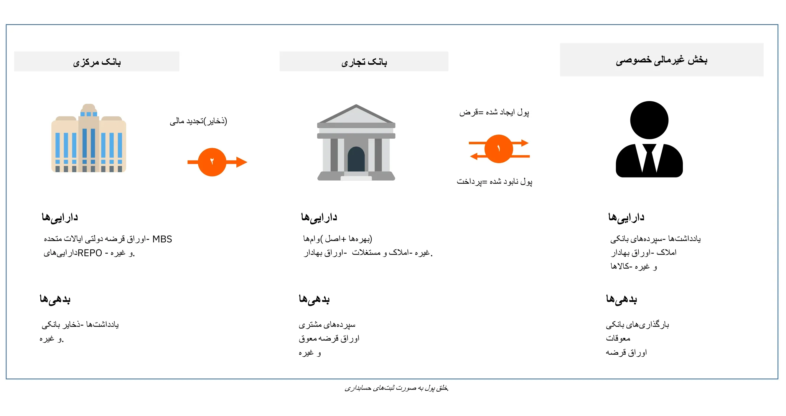

شکل 1: ایجاد پول به عنوان ورودی‌های دفترداری

> "به اندازه کافی خوب است که مردم کشور ما سیستم بانکی و پولی ما را درک نمی‌کنند، زیرا اگر این کار را می‌کردند، معتقدم که قبل از فردا صبح یک انقلاب رخ می‌داد."
>

> هنری فورد

این فرآیند به بانک‌ها اجازه می‌دهد تا تمامی تراکنش‌ها، از جمله انتقالات بانکی، خریدهای کارت اعتباری و چک‌ها را در یک دوره زمانی مشخص (معمولاً یک هفته یا یک ماه) ثبت کنند. سپس این تراکنش‌ها را با یکدیگر با استفاده از ذخایر بانکی تسویه می‌کنند، که نوع دیگری از ارز فیات است که هرگز توسط عموم استفاده نمی‌شود. ذخایر بانکی در بانک مرکزی در یک حساب ویژه نگهداری می‌شوند که فقط برای بانک‌ها و مؤسسات مالی دارای مجوز قابل دسترسی است.

### بی‌ثباتی بانکداری ذخیره کسری و وام‌دهنده آخرین راه چاره

مشکل اصلی این سیستم ذخیره کسری این است که برداشت‌های قابل توجه از یک بانک خاص می‌تواند به طور بالقوه منجر به ورشکستگی آن شود. از آنجا که بانک‌ها باید تقاضای مشتریان برای پول نقد را برآورده کنند در حالی که تنها یک ذخیره محدود از ذخایر بانکی را نگه می‌دارند، هجوم همزمان بسیاری از مشتریان برای برداشت وجوه می‌تواند بانک را ناتوان از برآورده کردن این تقاضاها کند و منجر به ورشکستگی شود. با توجه به اینکه بسیاری از افراد، شرکت‌ها و مؤسسات وجوه خود را در بانک‌ها سپرده‌گذاری کرده‌اند، اجازه دادن به ورشکستگی یک بانک می‌تواند پیامدهای اقتصادی شدیدی مانند رکود یا حتی افسردگی اقتصادی داشته باشد.

این معما منجر به ظهور بانک‌های مرکزی مدرن شد. در قرن ۱۹ در انگلستان، هجوم‌های مکرر به بانک‌ها ثبات مالی را تهدید می‌کرد، که منجر به تأسیس بانک انگلستان به عنوان "وام‌دهنده نهایی" شد. بانک انگلستان موظف شد در زمان بحران‌ها به بانک‌های مضطرب وام بدهد تا از اثر دومینویی که می‌تواند کل سیستم مالی را فلج کند، جلوگیری کند. این مفهوم از بانک‌های مرکزی به عنوان وام‌دهندگان نهایی از آن زمان به سراسر جهان گسترش یافته و به امری رایج تبدیل شده است.

علاوه بر حفظ ثبات مالی، بانک‌های مرکزی مسئول تعیین نرخ‌های کلیدی سیاستی هستند. این نرخ‌ها هزینه‌ای را تعیین می‌کنند که بانک‌های دارای مجوز می‌توانند از بانک مرکزی وام بگیرند، و به‌طور اساسی هزینه نقدینگی برای مؤسسات مالی که نقش حیاتی در وام‌دهی در اقتصادهای ما ایفا می‌کنند را تعریف می‌کنند. بنابراین، این نرخ‌ها به‌عنوان معیاری برای کل سیستم مالی عمل می‌کنند. به‌عنوان یک فرد، نرخ‌های بهره‌ای که بر روی وام مسکن خود می‌پردازید می‌تواند به نرخ سیاستی و حاشیه بانک تقسیم شود.

شکل2: ورشکستگی برادران لیمن (15/09/2008)

در طول بحران مالی بزرگ سال 2008، شرکت سرمایه‌گذاری بزرگ Lehman Brothers پس از تحمل زیان‌های قابل توجه در دارایی‌های اوراق بهادار رهنی خود و تجربه برداشت‌های گسترده از سوی مشتریان نگران، اعلام ورشکستگی کرد. در پاسخ به این آشفتگی مالی بی‌سابقه، بانکداران مرکزی در سراسر جهان مقادیر زیادی نقدینگی به بازارهای مالی تزریق کردند، بانک‌های سرمایه‌گذاری در حال مبارزه را با بانک‌های تجاری ادغام کردند و نرخ‌های سیاستی را به نزدیک صفر کاهش دادند تا از فروپاشی سیستماتیک جلوگیری کنند.

در حالی که این اقدامات از موج ورشکستگی‌های زنجیره‌ای جلوگیری کردند، اما تأثیر چندانی در کاهش رکود اقتصادی بعدی نداشتند. میلیون‌ها نفر شغل و خانه‌های خود را از دست دادند، هزینه‌های مصرف‌کننده کاهش یافت، کسب‌وکارها ورشکسته شدند و بانک‌ها متحمل زیان‌های قابل توجهی شدند. با وجود نرخ بهره تاریخی پایین، تعداد کمی تمایل به وام گرفتن داشتند که منجر به یک چرخه معیوب شد که کاهش اولیه در هزینه و سرمایه‌گذاری را تقویت می‌کرد. در نتیجه، بانکداران مرکزی با اجرای برنامه‌های تسهیل کمی (QE) اقدامات بیشتری انجام دادند. این برنامه‌ها شامل خرید اوراق قرضه دولتی و اوراق بهادار با پشتوانه وام مسکن توسط بانک‌های مرکزی از بانک‌های تجاری با ذخایر بانک مرکزی بود.

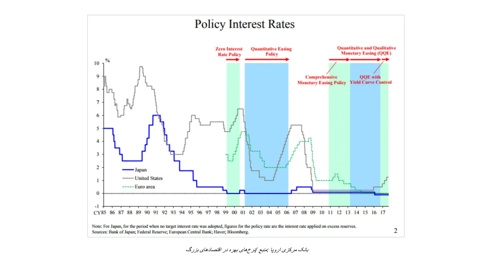

شکل3: نرخ‌های بهره در اقتصادهای بزرگ / منبع: ECB

برخلاف انتظارات بسیاری، برنامه‌های تسهیل کمی (QE) به طور قابل توجهی رشد اقتصادی را احیا نکردند، بلکه دارایی‌های مالی را به سطوح تاریخی افزایش دادند. این امر عمدتاً به نفع ثروتمندان و مؤسسات مالی بود، زیرا آنها قبلاً مقادیر قابل توجهی از چنین دارایی‌هایی را در اختیار داشتند و در نتیجه نابرابری‌های ثروت را افزایش دادند. با توجه به ساختار سیستم بانکی که قبلاً توضیح داده شد، این نتیجه نباید تعجب‌آور باشد. از آنجا که ذخایر بانکی نمی‌توانند به راحتی وارد اقتصاد واقعی شوند، برنامه‌های QE عمدتاً قیمت دارایی‌ها را افزایش دادند بدون اینکه به طور مؤثری وضعیت مالی افراد عادی را بهبود بخشند.

### اثر کانتیلون

با این وجود، یک اصل اقتصادی اساسی می‌تواند از این رویداد استخراج شود: زمانی که پول جدید ایجاد می‌شود، ابتدا به نفع کسانی است که به منبع پول نزدیک‌تر هستند، به هزینه کسانی که دورتر هستند. این بینش اقتصادی به قرن ۱۸ بازمی‌گردد، زمانی که ریچارد کانتیلون آن را در "مقاله‌ای درباره ماهیت تجارت به‌طور کلی" توضیح داد. اکنون به‌طور محاوره‌ای به عنوان "اثر کانتیلون" شناخته می‌شود.

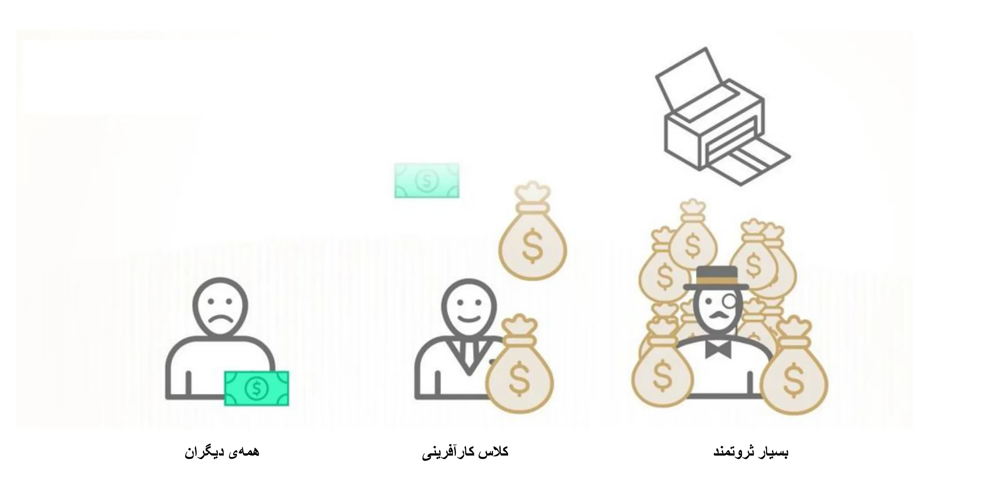

شکل ۴: اثر کانتیلون به‌طور خلاصه / منبع: River Financial

در این مورد، بانکداران، مدیران بانک، صاحبان سهام و اوراق قرضه، توسعه‌دهندگان املاک و مستغلات، وام‌دهندگان املاک و مستغلات، و هر کسی که دارایی‌های مالی یا املاک و مستغلات داشت، به سود مالی دست یافتند، در حالی که بار بر دوش دیگران افتاد. این وضعیت برای سال‌ها ادامه داشت و تا حد زیادی نابرابری فزاینده ثروت، احساس محرومیت در میان افراد سخت‌کوش و افزایش ظاهراً متوقف‌نشدنی قیمت دارایی‌ها را علی‌رغم رشد کند تولید ناخالص داخلی توضیح می‌دهد.

به طور کلی، سیستم به صورت ناعادلانه‌ای تنظیم شده است. بانک‌ها ذاتاً ناپایدار هستند، اما شکست آن‌ها می‌تواند کل اقتصاد را به خطر بیندازد. این خطر اخلاقی مدیران بانک را تشویق می‌کند تا برای حداکثر کردن درآمد بانک خود، ریسک‌های بیش از حدی را بپذیرند، زیرا می‌دانند که در نهایت بانک مرکزی آن‌ها را نجات خواهد داد و هزینه را به مالیات‌دهندگان منتقل می‌کند. در چنین شرایطی، بانکداران مرکزی شرایطی را ایجاد می‌کنند که قدرت خرید به طور گسترده‌ای از افراد سخت‌کوش و پس‌اندازکنندگان به صاحبان دارایی و افرادی که با سیستم مالی مرتبط هستند منتقل شود و به این ترتیب فرآیند ایجاد ثروت از انباشت ثروت جدا شود.

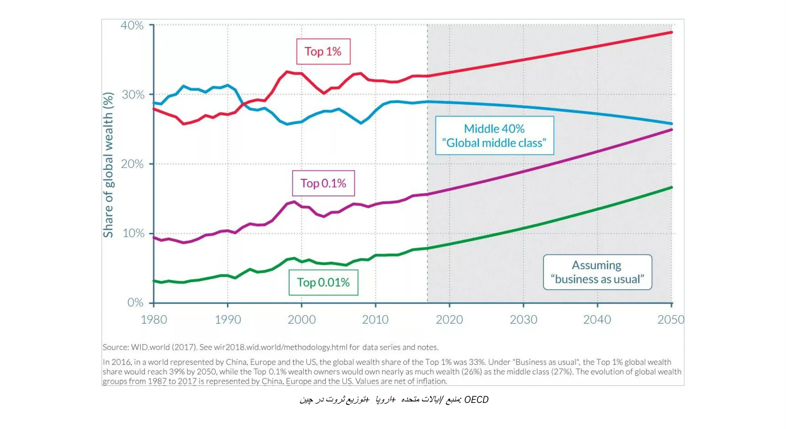

شکل5: توزیع ثروت در چین + اروپا + ایالات متحده / منبع: OECD

### پیامدهای سیاست‌های نرخ بهره صفر

در دوره‌های طولانی سیاست‌های نرخ بهره صفر (ZIRP)، بانک‌ها فرصت‌های محدودی برای بازسازی سرمایه خود دارند زیرا حاشیه‌های سود آنها کاهش می‌یابد. بانک‌ها معمولاً با قرض گرفتن با نرخ‌های کوتاه‌مدت و وام دادن با نرخ‌های بلندمدت درآمد کسب می‌کنند. با این حال، زمانی که بانک‌های مرکزی مقادیر زیادی اوراق قرضه خریداری می‌کنند و نرخ‌ها را به صفر می‌رسانند، بانک‌ها انگیزه کمی برای وام دادن دارند، به ویژه به کارآفرینان و دیگر ریسک‌پذیران. در عوض، آنها منابع خود را به اوراق‌بهادارسازی سرمایه موجود یا ارائه وام در برابر وثیقه اختصاص می‌دهند تا تقاضای کسانی که از اثر کانتیلون بهره‌مند می‌شوند را برآورده کنند.

یکی دیگر از پیامدهای ناخواسته ZIRP این است که دولت‌ها را تشویق به انجام هزینه‌های گسترده می‌کند. از آنجا که دولت‌ها با هزینه‌های استقراض مواجه نیستند و می‌توانند به بانک‌های مرکزی برای خرید اوراق قرضه‌شان از طریق برنامه‌های QE تکیه کنند، انگیزه طبیعی برای خرج کردن تا حد ممکن دارند، به ویژه در زمینه‌های دموکراتیک که هزینه‌کرد می‌تواند آرا را جلب کند. این تمایل اغلب پیامدهای بلندمدت چنین ولخرجی مالی را نادیده می‌گیرد و منجر به افزایش قابل توجهی در سطح بدهی عمومی در اقتصادهای توسعه‌یافته از زمان بحران مالی جهانی (GFC) شده است.

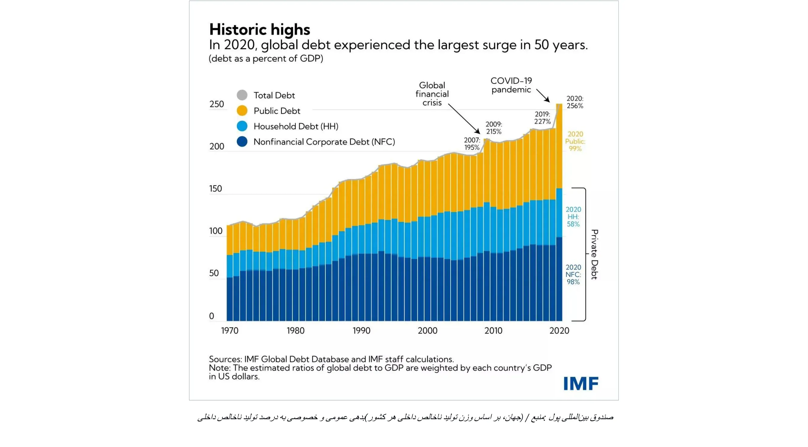

شکل 6: بدهی عمومی و خصوصی به عنوان درصدی از تولید ناخالص داخلی (جهان، وزن‌دهی شده بر اساس تولید ناخالص داخلی هر کشور) / منبع: IMF

با افزایش تورم به دلیل ایجاد پول قابل توجه در پاسخ به قرنطینه‌های مرتبط با کووید، بانک‌های مرکزی اکنون در تلاش برای مهار تورم، نرخ‌های سیاستی را افزایش می‌دهند. با این حال، این امر چالشی قابل توجه برای کل سیستم ایجاد می‌کند. بانک‌ها بیش از هر زمان دیگری اهرم‌دار هستند، دولت‌ها سطوح تاریخی بالایی از بدهی را حمل می‌کنند، رشد اقتصادی کند است، کسری‌ها در حال افزایش هستند و مصرف‌کنندگان که با افزایش قیمت کالاهای ضروری دست و پنجه نرم می‌کنند، برای گذران زندگی دچار مشکل شده‌اند. کنترل تورم مستلزم افزایش نرخ‌ها به سطحی است که می‌تواند دولت‌ها را ورشکسته کند، در حالی که بانک‌ها با خطر از دست دادن سپرده‌گذاران مواجه هستند زیرا افراد پس‌انداز خود را برای کالاهای ضروری که روز به روز گران‌تر می‌شوند خرج می‌کنند یا برای محافظت در برابر تورم به دارایی‌های Hard و صندوق‌های بازار پول پناه می‌برند.

### نتیجه‌گیری

> «به این وسیله (بانکداری ذخیره کسری)، دولت‌ها می‌توانند به طور مخفیانه و بدون مشاهده، ثروت مردم را مصادره کنند و از هر یک میلیون نفر، یک نفر هم متوجه این دزدی نخواهد شد.»
>

> جان مینارد کینز

به طور کلی، سیستم ما با چالش‌های قابل توجهی روبرو است و Bitcoin به عنوان تنها جایگزین معتبر ظاهر می‌شود. با این حال، Bitcoin به تنهایی نمی‌تواند مشکلات موجود در سیستم پولی ما را Address کند. مهم‌تر از همه، ما به افرادی نیاز داریم که اصول اقتصادی پایه را در میان علاقه‌مندان به Bitcoin درک کنند، تا آگاهی گسترده‌تر و عقل سلیم اقتصادی ما را از ساختن یک پایه مالی شکننده دیگر برای تمدن‌مان دور کند. هدف اصلی این دوره آموزش علاقه‌مندان جدید به Bitcoin در اصول اقتصادی صحیح است.

برای دستیابی به این هدف، ما اصول بنیادی "اقتصاد اتریشی" را توضیح خواهیم داد، یک مکتب فکری اقتصادی با سنت روش‌شناسی که به قرن 16 میلادی بازمی‌گردد و بینش‌هایی در مورد عمل انسانی تحت محدودیت‌های اقتصادی ارائه می‌دهد. با این مقدمه، اکنون شما اصول ایجاد پول و وضعیت فعلی سیستم مالی و پولی ما را درک می‌کنید.

در فصل آینده، ما به بررسی سنگ بنای اساسی هر مکتب اقتصادی خواهیم پرداخت: نظریه ارزش. فصل‌های بعدی به پول به عنوان یک نهاد اجتماعی، نظریه سرمایه و چرخه کسب و کار، چالش محاسبه اقتصادی، و مروری کوتاه بر تاریخ و روش‌شناسی مکتب اقتصاد اتریشی خواهند پرداخت.

# مبانی نظری

<partId>86012c1b-cdf2-586f-8fe7-263f8287e950</partId>

## نظریه ارزش ذهنی

<chapterId>eb1608d4-5d36-56a0-bcfc-ed8c03dfa906</chapterId>

> "ارزش تنها درون آگاهی انسانی وجود دارد"
>

> کارل منگر، اصول اقتصاد سیاسی

### انقلاب حاشیه‌ای

در ریشهٔ استدلال اقتصادی، پرسش ارزش نهفته است. چگونه ارزش چیزی را تعیین می‌کنیم؟ آیا ارزش یک ویژگی ذاتی اشیاء است؟ یا برعکس، یک پدیدهٔ ذهنی است؟ چگونه ارزش دو چیز را مقایسه می‌کنیم؟ ارزش از کجا می‌آید؟

چنین سؤالاتی قرن‌هاست که ذهن اقتصاددانان و فیلسوفان را به خود مشغول کرده و پاسخ‌های متعددی دریافت کرده‌اند. به بسیاری از جهات، تکامل معرفت‌شناسی اقتصاد با تکامل نظریه‌های ارزش همراه بوده است.

پس از نظریه ارزش زمین فیزیوکرات‌ها که ادعا می‌کرد تمام ارزش از زمین ناشی می‌شود و توسط نظریه ارزش کار اقتصاددانان کلاسیک که بیان می‌کرد ارزش یک کالا از میزان کاری که برای تولید آن صرف شده ناشی می‌شود، رد شد، نوبت به نظریه حاشیه‌ای ارزش رسید تا جایگزین دومی شود. در دهه ۱۸۷۰، پس از مارکس، آخرین اقتصاددان کلاسیک، سه مکتب جدید اندیشه اقتصادی تقریباً به طور همزمان حول نظریه حاشیه‌ای ارزش ظهور کردند: مکتب لوزان با لئون والراس، مکتب مدرن یا نئوکلاسیک با ویلیام استنلی جونز، و مکتب اتریشی با کارل منگر. این انقلاب در نظریه ارزش، تجدید قابل توجهی در اندیشه اقتصادی به شمار می‌رفت.

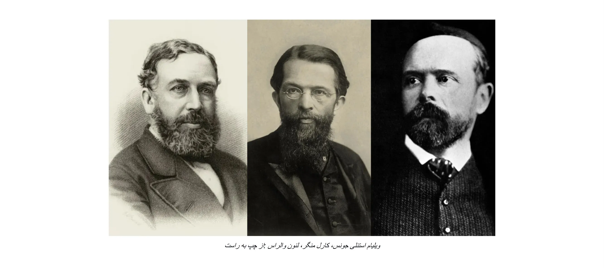

از چپ به راست: ویلیام استنلی جونز، کارل منگر، لئون والراس

نظریه حاشیه‌ای ارزش بر این باور است که ارزش اقتصادی با آنچه یک عامل اقتصادی به‌طور داوطلبانه برای واحد بعدی یک کالا یا خدمت می‌پردازد، مطابقت دارد. از آنجا که این نظریه بر این واقعیت تأکید دارد که قیمت‌ها در حاشیه، یعنی برای واحد بعدی یک کالای معین، شکل می‌گیرند، به آن "حاشیه‌گرایی" گفته می‌شود.

ارائه حاشیه‌گرایی این سه مکتب به‌عنوان مشابه امری رایج است. در واقع، والراس و جونس بسیار سازگار هستند، اما نظریه‌پردازی منگر به‌طور عمیقی از دیگران متفاوت است. در اثر او که اکنون به‌عنوان پایه‌ای برای نظریه اقتصادی اتریشی شناخته می‌شود و با عنوان "Grundsätze des Volkswirtschaftlehre" (اصول اقتصاد سیاسی) در سال ۱۸۷۴ منتشر شد، منگر توضیحی حاشیه‌ای، اما عمدتاً ذهنی از ارزش ارائه می‌دهد، برخلاف والراس و جونس که ارزش را پدیده‌ای عینی و قابل اندازه‌گیری می‌دانند.

### ارزش ذهنی

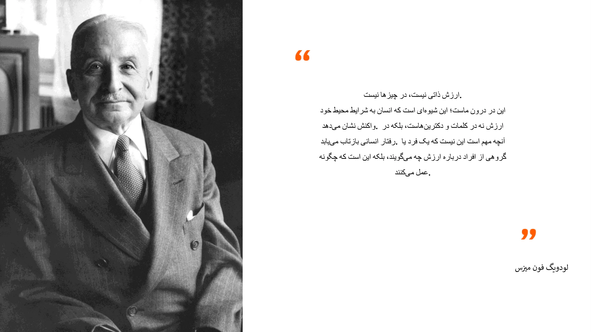

اقتصاددان اتریشی نظریه جانشینان آدام اسمیت را رد می‌کند و ایده‌ای را که ارزش یک کالا از میزان کار صرف شده در تولید آن ناشی می‌شود، کنار می‌گذارد و به جای آن به این مفهوم می‌پردازد که ارزش آن توسط فرد تعیین می‌شود، کسی که در هر زمینه‌ای، یک عمل ذهنی ارزیابی را در مورد مقدار خاصی از کالا یا خدمات انجام می‌دهد. این جهش فکری که توسط منگر انجام شده، به چالش کشیدن عینیت ارزش است: برای او، ارزش یک ویژگی عینی کالاها نیست؛ بلکه صرفاً نتیجه رابطه‌ای است که فرد با آن چیز دارد: "ارزش خارج از آگاهی انسانی وجود ندارد."

به عبارت دیگر، منگر ما را دعوت می‌کند تا در نظر بگیریم که ارزش تنها به عنوان یک پدیده روان‌شناختی ذهنی درون فرد وجود دارد، که ارزش یک ویژگی ذاتی کالاها نیست، بلکه از نظر فرد درباره سودمندی که می‌تواند از آن کالاها به دست آورد، ناشی می‌شود.

بر اساس این دیدگاه، یک لیتر آب آشامیدنی هیچ ارزش عینی ندارد. کسی که به یک سیستم مدرن آب آشامیدنی دسترسی دارد و در حال حاضر تشنه نیست، احتمالاً ارزش بسیار کمی به آن لیتر اضافی آب اختصاص می‌دهد، در حالی که فردی که در وسط بیابان تشنه است و آن را به عنوان تفاوت بین زندگی و مرگ می‌بیند، قطعاً مایل است تقریباً ارزش بی‌نهایتی به آن لیتر آب نسبت دهد.

به طور خلاصه، منگر متوجه شد که ارزش یک کالای اقتصادی چیزی جز ارزیابی ذهنی نیست که یک فرد به یک واحد اضافی از آن کالا یا خدمات اختصاص می‌دهد.

### داوطلبانه Exchange: یک بازی با مجموع مثبت

از این نقطه، منگر نتیجه می‌گیرد که Exchange داوطلبانه بین دو فرد صورت می‌گیرد زیرا هر طرف معتقد است که این کار سودمندی ذهنی آن‌ها را افزایش می‌دهد. برای او، Exchange پیش‌فرض هیچ‌گونه معادلتی از ارزش نیست، برخلاف آنچه اقتصاددانان کلاسیک باور داشتند. به گفته این متفکر اتریشی، اگر معادلتی از سودمندی بین کالاهای مبادله‌شده وجود داشت، هیچ دلیلی برای زحمت مبادله برای طرفین وجود نداشت. اگر Exchange وجود دارد، به این دلیل است که هر طرف آن را در منافع (ذهنی) خود می‌بیند و در نتیجه، هر Exchange داوطلبانه یک منفعت اجتماعی تولید می‌کند.

### ارزش‌گذاری به‌عنوان پدیده‌ای برای نظم‌دهی به خواسته‌های انسانی

با این حال، چنین یک منفعت اجتماعی، یا ارزش ذهنی منتسب به یک کالا، قابل اندازه‌گیری نیست. برای منگر، ارزش یک پدیده شناختی مقایسه‌ای (ترتیبی) است نه اندازه‌گیری (عددی). این ارزش، همان‌طور که اقتصاددانان نئوکلاسیک از زمان والراس و جونس تصور کرده‌اند، Assignment توسط فرد از یک ارزش عددی که بازتاب‌دهنده سودمندی است که از آن به دست می‌آورد، نیست، بلکه یک عمل مرتب‌سازی خواسته‌های انسانی است که فرد از طریق آن بیان می‌کند که به یک مقدار از کالای A بیشتر از یک مقدار از کالای B تمایل دارد.

هر عاملی می‌تواند بگوید که آیا ۲ موز را به یک دوره اقتصاد ترجیح می‌دهد یا خیر، اما هیچ‌کس نمی‌تواند به‌طور معقول بگوید که ارزش ۲ موز را ۳.۱۴۱۶ واحد و ارزش یک دوره اقتصاد را ۳ واحد می‌داند و بنابراین ترجیح می‌دهد موزها را داشته باشد. چنین توصیفی از ترجیحات انسانی، که بر اساس توابع پیوسته واقعی است، با واقعیت فرآیندهای شناختی که در زندگی روزمره تجربه می‌کنیم، مطابقت ندارد. یک فرد هرگز کالاهای ارائه‌شده به او را با مقایسه با یک استاندارد انتزاعی از مطلوبیت ارزیابی نمی‌کند. در عوض، او به‌طور ذهنی دوره‌های مختلف عمل را مقایسه می‌کند، که نمی‌تواند آن‌ها را به‌طور مطلق قضاوت کند، اما با این حال می‌تواند بر اساس مطلوبیت نسبی آن‌ها را رتبه‌بندی کند.

این برداشت ذهنی از ارزش، که به عنوان یک رابطه روان‌شناختی که فرد با اهداف خود و وسایل مرتبط برای دستیابی به آن‌ها برقرار می‌کند، درک می‌شود، همچنین به اقتصاددانان اتریشی اجازه می‌دهد تا پدیده تقسیم کار را توضیح دهند.

### تقسیم کار

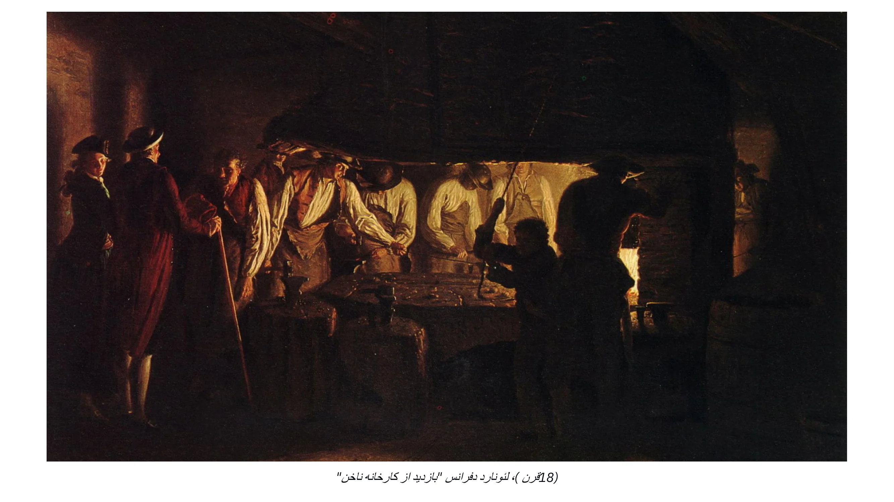

بازدید از کارخانه ناخن‌سازی، لئونارد دفرانس (قرن 18)

همه افراد منحصر به فرد هستند و شرایط شخصی خاصی دارند. بنابراین، هر فرد توانایی برتری در انجام برخی وظایف نسبت به همتایان خود (مزیت مطلق) یا توانایی برتری در انجام برخی وظایف نسبت به دیگران (مزیت نسبی) دارد. نمی‌تواند غیر از این باشد؛ انکار این واقعیت ابتدایی به معنای ادعای برابری همه انسان‌ها در همه جنبه‌ها است.

در صورتی که فردی در مقایسه با همتایان خود توانایی برتری در تولید کالای خاصی داشته باشد (مزیت مطلق)، علاقه‌مند به تخصص در تولید آن کالا و سپس مبادله مازاد به دست آمده برای کالاهایی است که تمایل دارد. با انجام این کار، او مطلوبیت ذهنی خود را به‌صرفه‌تر از زمانی که بخواهد در تولید تمام کالاهای مورد نظر خود شرکت کند، برآورده می‌کند.

اما ممکن است فرد در تولید هیچ کالایی مزیت مطلق نداشته باشد. در این صورت، همچنان انواعی از تولید وجود خواهند داشت که فرد در آن‌ها نسبت به دیگران بهتر است (مزیت نسبی)، و به همین دلیل، همچنان علاقه‌مند به تخصصی شدن خواهد بود.

مطمئناً، افرادی وجود دارند که می‌توانند آن کالا را با بهره‌وری بیشتری نسبت به او تولید کنند، اما از آنجا که این افراد احتمالاً در وظیفه دیگری نسبت به این یکی بهره‌ورتر هستند و چون نمی‌توانند هر دو وظیفه را به‌طور همزمان انجام دهند، برای آن‌ها غیرمولد است که روی این وظیفه کار کنند به‌جای وظیفه دیگری که در آن بهره‌ورتر هستند. با تخصص در وظیفه‌ای که در آن بیشترین بهره‌وری را دارند، مازادی بیشتر از زمانی که تخصص نداشتند به‌دست خواهند آورد و بنابراین، از طریق Exchange، می‌توانند مقدار بیشتری از آن کالاهای دیگر را به‌دست آورند، حتی اگر کالاهای به‌دست‌آمده توسط خودشان به‌طور کارآمدتری نسبت به تولیدکنندگانی که از آن‌ها کالاها را به‌دست آورده‌اند، تولید می‌شد.

به عنوان مثال یک پزشک را در نظر بگیرید. او ممکن است در نوشتن ایمیل‌ها و برنامه‌ریزی قرار ملاقات‌ها بهتر از منشی خود باشد (مزیت نسبی). اما هر زمانی که صرف انجام این وظایف می‌کند، زمانی است که به درمان بیماران اختصاص نمی‌دهد. بنابراین، از آنجا که او در درمان افراد بهره‌وری بیشتری دارد، به نفع اوست که وظایف اداری را به شخص دیگری واگذار کند، حتی اگر در این کارها بهتر از معاون خود باشد، زیرا این کار به او اجازه می‌دهد تا ارزش ایجاد شده برای دیگران را به حداکثر برساند و در نتیجه ثروت خود را افزایش دهد.

به طور کلی، تخصص مزیتی دارد، حتی برای افرادی که مزیت مطلق ندارند، زیرا زمان یک منبع کمیاب و رقابتی است: هر واحد زمانی که صرف فعالیتی غیر از فعالیتی که فرد در آن بیشترین بهره‌وری را دارد، می‌شود، هزینه‌ای را نشان می‌دهد که توسط تولید از دست رفته‌ای که از آن صرف‌نظر کرده‌اند، نمایان می‌شود (هزینه فرصت).

هنگامی که فرد در یک تولید خاص تخصص پیدا می‌کند، می‌تواند مقدار محصولاتی را که برای مصرف شخصی خود لازم می‌داند، ذخیره کند و Exchange مازاد را برای کالاهای دیگر مورد نظر اختصاص دهد. با انجام این کار، آن‌ها تمایل خود را برای کالاهایی که خود تولید می‌کنند، برآورده می‌کنند، به این معنی که واحدهای باقی‌مانده از تولیدشان برای آن‌ها ارزش کمی دارد. این همان چیزی است که اقتصاددانان آن را مطلوبیت نهایی کاهشی می‌نامند: هر واحد اضافی از یک کالا کمتر از واحد قبلی مورد تمایل است. برای دیگرانی که چنین کالاهایی ندارند، داستان متفاوت است: به دلایل مشابه، آن‌ها تمایل دارند کالاهایی را که تولید نمی‌کنند، بیشتر از کالاهایی که تولید می‌کنند، بخواهند. این منجر به وضعیتی می‌شود که در آن عدم تقارن قوی بین ارزیابی‌های ذهنی مختلف افراد وجود دارد، که بسیار به تبادلات کمک می‌کند: هر طرف علاقه‌مند به مبادله تولید مازاد خود است زیرا با این کار مطلوبیت ذهنی خود را افزایش می‌دهد.

نتیجه تحلیل قبلی این است که افراد همیشه زمانی که در کار خود تخصص پیدا می‌کنند و در مبادلات شرکت می‌کنند، وضعیت بهتری دارند. بنابراین، اقتصاددانان اتریشی، به ویژه لودویگ فون میزس، نتیجه می‌گیرند که مزیت تولیدی ناشی از تقسیم کار نیروی محرکه پشت فرآیند همکاری اجتماعی است. در اینجا، ممکن است مفید باشد که مستقیماً او را نقل قول کنیم:

"حقایق بنیادی که همکاری، جامعه و تمدن را به وجود آورد و انسان حیوانی را به یک انسان تبدیل کرد، این است که کار انجام شده تحت تقسیم کار، بهره‌وری بیشتری نسبت به کار انفرادی دارد و عقل انسان قادر به تشخیص این حقیقت است. […] مردم تحت تقسیم کار همکاری نمی‌کنند چون یکدیگر را دوست دارند یا باید دوست داشته باشند. آنها همکاری می‌کنند زیرا این بهترین خدمت به منافع خودشان است."

### نتیجه‌گیری

> "اگر مردی ببیند که می‌تواند راحت‌تر از چوبه دار آویزان شود تا اینکه پشت میز بنشیند، احمقانه عمل می‌کند اگر خود را حلق‌آویز نکند."
>

> باروخ اسپینوزا

۱۸۷۱-۱۸۷۴ سال‌های شگفت‌انگیز اقتصاد مدرن هستند: این دوره شاهد آثار سه متفکر مستقل بود که پایه‌های اقتصاد مدرن را بنا نهادند. با تأکید بر ارزش ترتیبی ذهنی، اقتصاددانان اتریشی یک بدنه کامل از تفکر اقتصادی را توسعه خواهند داد که آن‌ها را از همتایانشان متمایز می‌کند. کار اقتصاددانان اتریشی در زمینه استدلال درباره عمل انسانی در بستر کمبود، همواره در تضاد شدید با دکترین‌های اقتصادی آغاز شده توسط جونس و والراس خواهد بود که به شدت به ریاضیات متکی هستند و بر این ایده استوارند که ارزش می‌تواند به صورت عینی اندازه‌گیری و به عنوان یک تابع پیوسته استخراج شود.

با استفاده از بینش‌های ارزش ترتیبی ذهنی، منگر توضیح داد که چگونه تقسیم کار و Exchange داوطلبانه به وجود می‌آید. اما همان‌طور که در فصل بعد خواهیم دید، Exchange مستقیم استراتژی ضعیفی برای عوامل اقتصادی است که به دنبال حداکثر کردن مطلوبیت ذهنی خود هستند. پدر مکتب اتریش به این ترتیب استدلال خود را بیشتر توسعه داد تا توضیح دهد چرا پول به عنوان یک نهاد اجتماعی ظهور کرد.

فصول زیر به ظهور پول به عنوان یک نهاد اجتماعی، نظریه سرمایه و بهره که به عنوان پایه‌ای برای نظریه چرخه کسب و کار خدمت خواهد کرد، و در نهایت نقش قیمت‌ها در محاسبات اقتصادی اختصاص خواهد یافت.

## ظهور پول به عنوان یک پدیده اجتماعی

<chapterId>14ded794-0578-5478-ba5b-b2106c74f3ef</chapterId>

در حالی که افراد به تخصص و به حداکثر رساندن تقسیم کار علاقه مشترکی دارند، همچنان مشکلات هماهنگی وجود دارد که این گسترش را محدود می‌کند.

اولاً، مهم است که توجه داشته باشیم که از آنجا که فرآیندهای تولید ذاتاً محدود به زمان و اغلب غیرهمزمان (غیرهم‌زمان) هستند، معمولاً یک فاصله زمانی بین مشارکت اولیه فرد و دریافت متقابل وجود خواهد داشت. تعهد به یک وظیفه خاص در حال حاضر بدون داشتن اطمینان قبلی از اینکه دیگران نیازهای ما را در آینده برآورده خواهند کرد، می‌تواند خطرناک باشد.

در تقسیم کار، هر طرف از همکاری سود می‌برد، اما به صورت فردی، ممکن است وسوسه شود که از کار دیگران لذت ببرد بدون اینکه متقابلاً کاری انجام دهد، زیرا به این ترتیب، بدون متحمل شدن هیچ هزینه‌ای، چیزی ارزشمند به دست می‌آورد. چنین موقعیت‌هایی که در آن همکاری متقابل منجر به سود کمتر برای افراد اما حداکثر سود برای گروه می‌شود، در نظریه بازی‌ها به عنوان "معمای زندانی" توصیف می‌شوند.

### معمای زندانی

در ابتدا، معمای زندانی به صورت زیر فرموله شد: دو مظنون، Alice و Bob، که قادر به برقراری ارتباط نیستند، با خطر زندان مواجه هستند، با احکام احتمالی به شرح زیر:

- اگر Alice، Bob را متهم کند و Bob سکوت کند، Alice آزاد می‌شود و Bob به ۳ سال محکوم می‌شود.
- اگر هر دو Alice و Bob یکدیگر را متهم کنند، هر کدام ۲ سال دریافت می‌کنند.
- اگر هر دو سکوت کنند، هر کدام ۱ سال می‌گیرند.

این نتایج می‌توانند در یک ماتریس نمایش داده شوند (نتایج عددی نشان‌دهنده تعداد سال‌های حبس هستند):

| Alice / Bob       | Accuse | Remain Silent |
| ----------------- | ------ | ------------- |
| **Accuse**        | 2, 2   | 0, 3          |
| **Remain Silent** | 3, 0   | 1, 1          |

در این بازی، هیچ فرصتی برای هماهنگی (ارتباط غیرممکن است) برای دستیابی به بهترین نتیجه برای هر دو طرف وجود ندارد. در نتیجه، Alice و Bob انگیزه فردی برای متهم کردن یکدیگر دارند، حتی اگر این کار به نتیجه بهینه برای گروه منجر نشود. استراتژی بهینه برای هر دو این است که سکوت کنند و هر کدام یک سال حبس بگیرند.

این بازی مسئله‌ای را نشان می‌دهد که اغلب در زندگی واقعی با آن مواجه می‌شویم: در غیاب مکانیزم‌های هماهنگی، افراد تمایل دارند استراتژی‌هایی را انتخاب کنند که سود فردی آن‌ها را به حداکثر برساند، بدون توجه به استراتژی‌های انتخاب شده توسط دیگران (دزدی، تقلب، خیانت، خشونت، و غیره)، حتی زمانی که یک تعادل مطلوب‌تر از طریق هماهنگی/همکاری ممکن است.

### پول برای حل مشکلات هماهنگی

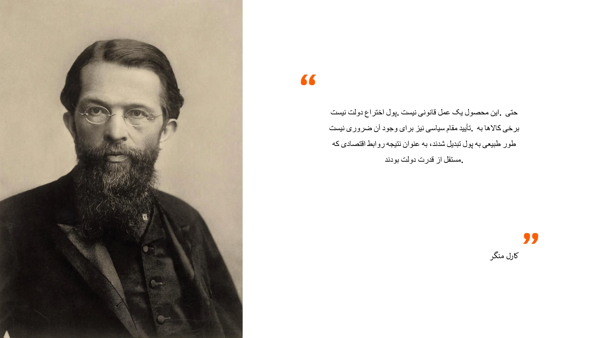

این مشکل در جوامع کوچک‌تر (مثلاً، خانواده، دایره‌های دوستان) تأثیر کمتری دارد زیرا در چنین مواردی، همه به‌طور مستقیم یکدیگر را می‌شناسند و این امکان وجود دارد که مشارکت‌های یکدیگر را به خاطر بسپارند. با فرض اینکه ترک جامعه (فرار) هزینه‌ای به همراه دارد، یک سیستم اعتبار بر اساس حافظه عوامل فردی معمولاً برای جلوگیری از مشکلات ناشی از معمای زندانی کافی است.

با این حال، هنگامی که با جوامع بزرگتری که به طور قابل توجهی از تقسیم کار بهره‌مند می‌شوند سر و کار داریم، مشکلات هماهنگی دوباره ظاهر می‌شوند. این به دو دلیل اصلی است:

اولاً، انسان‌ها توسط ظرفیت‌های شناختی خود محدود شده‌اند. برای یک فرد غیرممکن است که روابط اجتماعی پایدار با بیش از ۱۵۰ نفر را حفظ و به خاطر بسپارد، که این امر باعث می‌شود یک سیستم شهرت برای غلبه بر معضل زندانی در مقیاس بزرگ ناکافی باشد.

دوم، اندازه‌گیری ارزش مشارکت‌ها در Exchange (قابلیت مقایسه) یک مسئله غیرساده است. برای مثال، اگر فردی گوشت حاصل از شکار را ارائه دهد و در عوض مواد لازم برای پناهگاه درخواست کند، چگونه می‌توان مقدار گوشت ارائه‌شده را به‌صورت معادل با مواد درخواست‌شده ارزیابی کرد؟ همین مسئله برای کیفیت نیز صدق می‌کند - آیا گوشت گوزن بیشتر یا کمتر از چوب ارزش دارد؟

حتی اگر امکان‌پذیر باشد که نرخ Exchange رضایت‌بخشی برای هر جفت کالا تعیین شود، حفظ این اطلاعات به سرعت غیرعملی می‌شود. در یک سیستم مستقیم Exchange که شامل N کالا است، باید N(N-1)/2 نرخ Exchange را به خاطر سپرد. برای یک اقتصاد با 50 کالا، این به معنای به خاطر سپردن 50\*49/2، یا 1225 نرخ Exchange است، در مقابل فقط 50 در مبادلات غیرمستقیم. برای یک اقتصاد با 100 کالا، این عدد به 4950 افزایش می‌یابد. چنین رابطه‌ی درجه دومی محدودیت اضافی بر مقیاس‌پذیری Exchange مستقیم (مبادله کالا به کالا) اعمال می‌کند.

علاوه بر این، از آنجا که این مبادلات به صورت فوری رخ نمی‌دهند بلکه در طول زمان پراکنده می‌شوند، ارزیابی مشارکت‌ها در طول زمان ارزیابی نسبی مشارکت‌ها را پیچیده‌تر می‌کند. علاوه بر ارزیابی نسبت Exchange بین دو کالای حاضر، لازم می‌شود که ارزش یک مشارکت گذشته نسبت به یک همتای آینده ارزیابی شود.

امروز، با وجود غیرعملی بودن چنین سیستمی، می‌توانیم از نوشتن یا ذخیره‌سازی داده‌های دیجیتال برای به خاطر سپردن تمام این اطلاعات و ایجاد یک سیستم اعتباری استفاده کنیم (پیگیری مشارکت‌های گذشته، از جمله نرخ Exchange آن مشارکت‌ها، اساساً ایجاد یک سیستم اعتباری است).

در زمان‌های پیش از تمدن، این فناوری‌ها وجود نداشتند. بنابراین، نیاکان ما مجبور بودند راه‌حل‌های دیگری برای بهره‌مندی از مزایای تقسیم کار پیدا کنند، بدون اینکه خود را در معرض پیامدهای منفی معضل زندانی قرار دهند. راه‌حل این مشکل Exchange مستقیم، Exchange غیرمستقیم بود که با پول تسهیل می‌شد.

### Coincidence دوگانه خواسته‌ها و قابلیت فروش

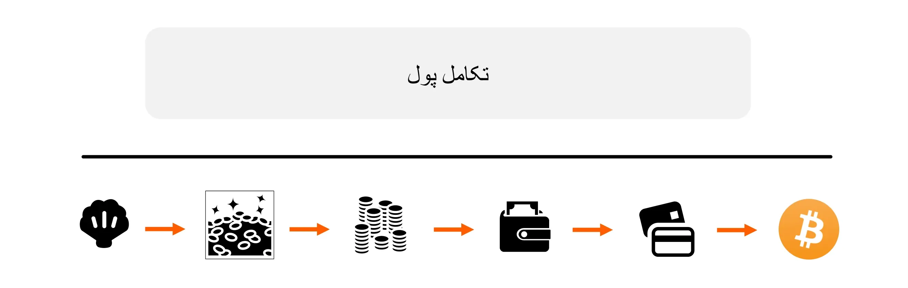

پول را می‌توان به‌عنوان راه‌حلی که نیاکان ما برای Address آنچه اقتصاددانان "مشکل تطابق دوگانه خواسته‌ها" می‌نامند، کشف کردند، در نظر گرفت. این مشکل سه بُعد دارد: فضایی، زمانی و بین‌فردی.

در یک Exchange مستقیم (معامله پایاپای) بین Alice و Bob، هر دو باید همزمان و در همان مکان چیزی را که دیگری می‌خواهد داشته باشند. با استفاده از Exchange غیرمستقیم، یعنی از طریق پول، Alice می‌تواند از Bob خرید کند و Bob می‌تواند آن واحد پولی را در جای دیگری، در زمان دیگری و با شخص دیگری استفاده کند (به شرطی که آن شخص دیگر آن شکل از پول را بپذیرد).

برای اینکه یک کالا به عنوان پول عمل کند، باید قابلیت فروش بالایی داشته باشد، به این معنا که باید در بیشتر مواقع توسط تعداد زیادی از مردم مورد تقاضا باشد. با استفاده از کالایی با قابلیت فروش بالا، مشکل تطابق دوگانه خواسته‌ها در ابعاد مکانی و بین‌فردی حل می‌شود: اگر کالایی که به عنوان پول استفاده می‌کنم در همه جا و توسط اکثر مردم مورد تقاضا باشد، می‌توانم به راحتی عمل فروش را از عمل خرید از نظر مکان و تعامل اجتماعی جدا کنم.

با این حال، مشکل فروش‌پذیری در طول زمان به دو دلیل چالش‌برانگیزتر است:

اول، آنتروپی (که معمولاً به عنوان "اثر زمان" شناخته می‌شود) به تدریج ویژگی‌های اکثر کالاها با کاربرد مستقیم را تغییر می‌دهد. بنابراین، حفظ قابلیت فروش یک کالا در طول زمان نیازمند آن است که کالا بسیار بادوام یا مقاوم در برابر آنتروپی باشد.

دوم، کمبود نسبی یک کالا در زمان "t" تضمینی برای کمبود نسبی آن در آینده نیست. با اختصاص منابع کافی به یک حوزه خاص از تولید، انسان‌ها می‌توانند Supply هر کالایی را افزایش دهند. تنها محدودیت در افزایش تولید یک کالا، هزینه فرصت مرتبط با آن است. بنابراین، کمبود نسبی فعلی یک کالا نمی‌تواند کمبود نسبی آینده آن را تضمین کند. تنها کالاهایی که تولید نهایی آن‌ها می‌تواند با هزینه‌های بسیار بالا افزایش یابد، می‌توانند به طور مداوم کمیاب باشند، به همین دلیل این ویژگی کالاهای پولی است که به طور آزادانه در طول تاریخ بشر ظهور کرده‌اند.

در زمان‌های پیش از تمدن، انواع مختلفی از کالاها مانند صدف‌های دریایی، جواهرات دست‌ساز، گردنبندها یا مهره‌ها به عنوان پول استفاده می‌شدند. این کالاها به راحتی قابل حمل بودند، هیچ کاربرد مستقیمی جز ارزش زینتی خود نداشتند، در برابر انتروپی مقاوم بودند (یعنی با گذشت زمان خراب نمی‌شدند)، به طور طبیعی کمیاب بودند و/یا تولید آن‌ها نیاز به مقدار زیادی کار تخصصی داشت. از آنجا که سطح تقسیم کار در آن زمان پایین بود و بنابراین هزینه فرصت مرتبط با تولید آثار زینتی بالا بود، این اقلام نمی‌توانستند به مقدار زیاد تولید شوند. بنابراین، کسانی که از این اقلام به عنوان پول استفاده می‌کردند، می‌توانستند از کمیابی نسبی آن‌ها در آینده مطمئن باشند.

این واقعیت که نیاکان شکارچی-گردآور ما به این وظایف پرمنبع مشغول بودند، حتی با وجود اینکه کالاهایی با سود مستقیم تولید نمی‌کردند، نشان‌دهنده‌ی دستاوردهای قابل‌توجهی است که از گسترش دامنه‌ی مکانی، اجتماعی و زمانی Exchange انتظار داشتند. اگر این‌گونه نبود و استفاده از این منابع در ساخت پناهگاه، شکار یا فعالیت‌های دیگر برای آن‌ها مفیدتر بود، به‌جای تولید کالاهای پولی، احتمالاً شواهد باستان‌شناسی کمتری از این فعالیت‌های هنری پیدا می‌کردیم. گروه‌های دیگر که منابع خود را به‌طور کارآمدتری استفاده می‌کردند، از توسعه بهتر و رفاه بیشتری برخوردار می‌شدند و این فعالیت‌های هنری به سرعت به نفع فعالیت‌هایی که کالاهایی با سود مستقیم تولید می‌کردند، ناپدید می‌شدند.

از این نظر، تولید کالاهای پولی، با ترویج گسترش تقسیم کار، نمایانگر استفاده‌ای سودآورتر از منابع (از نظر مطلوبیت ذهنی برای افراد) نسبت به تمام گزینه‌های دیگر (افزایش شکار، ماهیگیری، جمع‌آوری، تولید چوب، ساخت خانه، تولید ابزارهای بیشتر برای شکار و ماهیگیری، و غیره) بود.

### عدم قطعیت

برای نتیجه‌گیری از تحلیل خود درباره نهاد پولی، نیاز داریم تا مسئله اقدام اقتصادی را در زمینه عدم قطعیت اجتناب‌ناپذیر درباره آینده Address کنیم.

همان‌طور که اقتصاددانان اتریشی اشاره کرده‌اند، عمل انسانی وابسته به زمان است و همیشه به سوی آینده جهت‌گیری دارد. هنگامی که فردی عمل می‌کند، وضعیت فعلی خود را با امید به دستیابی به رضایت آینده تغییر می‌دهد. این پیش‌بینی ذهنی می‌تواند به آینده نزدیک یا دور معطوف باشد، اما برای اینکه فرد بتواند به بلندمدت فکر کند، ابتدا باید معیشت کوتاه‌مدت خود را تأمین کند، زیرا وضعیت او در آینده نزدیک به طور مستقیم بر وضعیت او در آینده دور تأثیر می‌گذارد.

این مستقیماً از عقلانیت انسانی ناشی می‌شود؛ هیچ‌کس نمی‌تواند ماهیت ترتیبی پدیده‌های زمانی و وابستگی زمانی که از آن ناشی می‌شود را نادیده بگیرد زیرا این یکی از محدودیت‌های اساسی زندگی انسانی است. بنابراین، از آنجا که آینده همیشه برای انسان‌ها نامشخص باقی می‌ماند، آن‌ها تنها زمانی به دنبال تضمین بقای بلندمدت خود خواهند بود که بقای کوتاه‌مدتشان تضمین شده باشد.

در این زمینه، پول با امکان ذخیره‌سازی ارزش در حال حاضر و انتقال آن به آینده خود، نقش حیاتی در هماهنگی بین‌زمانی اقدامات انسانی ایفا می‌کند. با ذخیره‌سازی پول، یعنی پس‌انداز، افراد در برابر عدم قطعیت‌های آینده محافظت می‌کنند و بدین ترتیب قادر می‌شوند اقدامات خود را به سمت افق‌های زمانی طولانی‌تر هدایت کنند. با این حال، آن‌ها تنها در صورتی می‌توانند به این هدف دست یابند که پول مورد استفاده به عنوان ذخیره ارزش عمل کند، به این معنا که قابلیت فروش در طول زمان را داشته باشد، که همان‌طور که قبلاً ذکر شد، ویژگی کالاهای بادوام و نسبتاً کمیاب است.

در فصل بعدی به مفهوم ترجیح زمانی خواهیم پرداخت و دیدگاه اتریشی درباره بهره و سرمایه را توضیح خواهیم داد، که به عنوان پایه‌ای برای فصل بعدی درباره نظریه چرخه کسب و کار عمل خواهد کرد.

## ترجیح زمانی، بهره، و سرمایه

<chapterId>37732a5c-4f66-5e2d-bc2c-cc8d29693af7</chapterId>

### ترجیح زمانی

ما فصل قبلی را با توضیح اینکه چگونه عوامل اقتصادی از کالای قابل فروش‌ترین، یعنی پول، برای مقابله با عدم قطعیت آینده استفاده می‌کنند، به پایان رساندیم. همچنین توضیح دادیم که ماهیت متوالی پدیده‌های زمانی ما را به تدریج به مبارزه با عدم قطعیت سوق می‌دهد: تنها زمانی که بدانیم بقای ما برای هفته آینده تضمین شده است، می‌توانیم بر اهداف دورتر در آینده تمرکز کنیم.

یا به عبارت دیگر: به عنوان انسان، ما ارزش کالاهای آینده را تخفیف می‌دهیم.

این ارزیابی ذهنی از ارزش کالاهای آینده در مقایسه با کالاهای حاضر به عنوان ترجیح زمانی شناخته می‌شود. با ثابت بودن سایر شرایط، کالاهای حاضر به طور ذاتی بر کالاهای آینده ترجیح داده می‌شوند. از آنجا که ما فانی هستیم و آینده همیشه نامشخص است، به طور طبیعی ترجیح می‌دهیم که اکنون به یک کالا دسترسی داشته باشیم تا در آینده. در حالی که ترجیح زمانی می‌تواند بین افراد متفاوت باشد، به دلیل عوامل متعددی مانند فرهنگ، ثروت، تحصیلات، فیزیولوژی و غیره، ترجیحات زمانی همیشه مثبت هستند، به این معنا که با ثابت بودن همه چیز، ما همیشه کالاهای حاضر را بیشتر از کالاهای آینده ارزش‌گذاری می‌کنیم.

این مفهوم ارزش‌گذاری نسبی کالاهای آینده نسبت به کالاهای حاضر در ریشه پدیده بهره قرار دارد. در واقع، در یک اقتصاد با بازارهای سرمایه غیر دستکاری‌شده، نرخ‌های بهره مرجع (که از نظر نکول بدون ریسک در نظر گرفته می‌شوند) در تقاطع سرمایه Supply و تقاضا تعیین می‌شوند. بنابراین، این نرخ‌ها نمایانگر وضعیت ترجیحات زمانی برای کل اقتصاد هستند: افزایش نرخ بهره ناشی از افزایش نسبی تقاضا برای سرمایه در مقایسه با Supply است که نشان‌دهنده ترجیحات زمانی بالاتر است. برعکس، کاهش نرخ بهره به دلیل افزایش در پس‌اندازها رخ می‌دهد که به معنای افزایش در Supply سرمایه است و نشان‌دهنده کاهش در ترجیحات زمانی است.

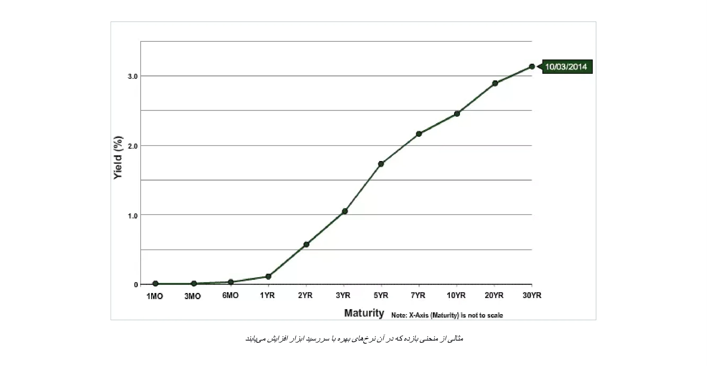

در اقتصادی که نرخ‌های بهره توسط بانک مرکزی دستکاری نمی‌شوند، ما تمایل داریم که یک منحنی بازدهی با شیب صعودی مشاهده کنیم: هرچه سررسید بدهی طولانی‌تر باشد، نرخ بهره بالاتر است. وضعیت مخالف نمی‌تواند رخ دهد زیرا این به معنای آن است که آینده از حال حاضر مطمئن‌تر است، که یک امر غیرممکن منطقی است.

مفهوم ترجیح زمانی و نحوه بیان ترجیح زمانی خود از طریق عمل مصرف و پس‌انداز، برای فرآیندهای تخصیص سرمایه و تولید اساسی است. بیایید به نظریه سرمایه دانشجوی منگر، اویگن فن بوم-باورک، بپردازیم تا دقیقاً بفهمیم چگونه ترجیح زمانی بر سازماندهی تولید تأثیر می‌گذارد.

### نظریه سرمایه

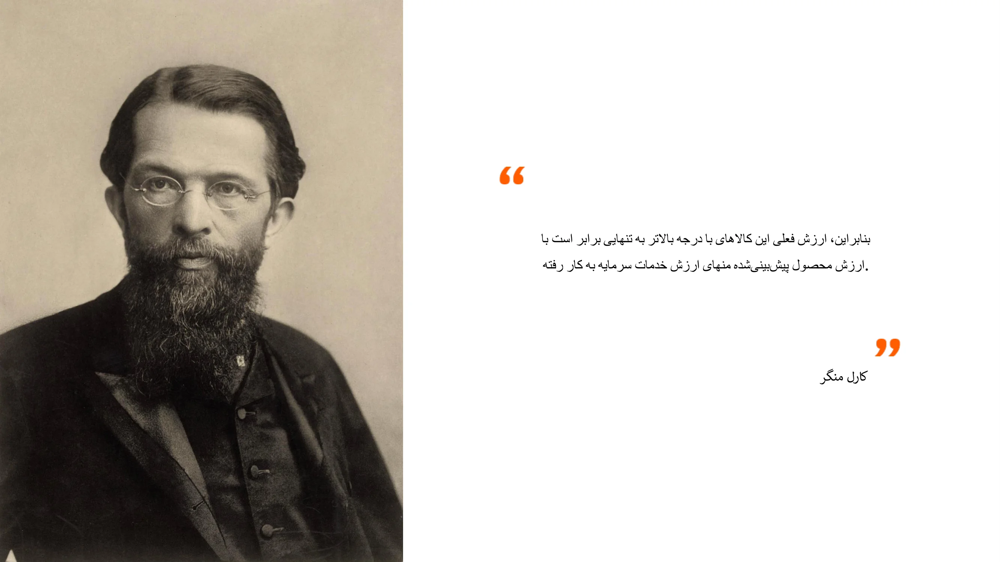

در ابتدای این دوره، دیدیم که برای کارل منگر، کالاها تنها زمانی به عنوان کالاهای اقتصادی (ارزش‌گذاری شده) در نظر گرفته می‌شوند که به عنوان وسیله‌ای برای اهداف انتخاب شده و ارزش‌گذاری شده توسط افراد عمل کنند. بر اساس این دیدگاه، تمام تحلیل‌های اقتصادی حول محور مصرف می‌چرخد زیرا در نهایت هدف انگیزشی پشت تمام فعالیت‌های اقتصادی است. بنابراین، برای منگر، نقطه شروع تحلیل اقتصادی کالاهای مصرفی یا کالاهای نهایی است، زیرا آن‌ها نمایانگر هدف نهایی فعالیت اقتصادی هستند. تمام کالاهای دیگر در اقتصاد، که می‌توانیم آن‌ها را "کالاهای واسطه‌ای" بنامیم، تنها به این دلیل ارزش دارند که به افراد امکان می‌دهند این کالاهای مصرفی را به دست آورند: آن‌ها کالاهایی هستند که در تولید کالاهای دیگر استفاده می‌شوند.

برای تولید کالاهای مصرفی، کارآفرینان این کالاهای واسطه‌ای مختلف را با عوامل تولید اصلی (کار، زمین و سرمایه) ترکیب می‌کنند طبق الگویی که تولید نهایی را به حداکثر می‌رساند. این ترتیب، که توسط کارآفرینان انجام می‌شود یا ساختار تولید، شامل مراحل مختلفی است که در طی آن کالاهای واسطه‌ای دچار تغییراتی می‌شوند تا در نهایت به کالاهای مصرفی تبدیل شوند.

بنابراین، مانند منگر، می‌توانیم کالاهای مصرفی را به عنوان کالاهای مرتبه اول تعریف کنیم، کالاهایی که در مرحله قبلی درگیر هستند به عنوان کالاهای مرتبه دوم، آن‌هایی که در مرحله قبل از آن هستند به عنوان کالاهای مرتبه سوم و به همین ترتیب، تا زمانی که به عوامل اولیه (زمین، کار، سرمایه) برسیم. تعداد مراحلی که در نظر می‌گیریم اساساً به ساختار تولیدی که توسط کارآفرینان اتخاذ می‌شود بستگی دارد و نباید به عنوان یک ویژگی عینی از ساختار تولید دیده شود. برعکس، مراحل تولید و کالاهای واسطه‌ای تنها در یک زمینه تله‌ولوژیک وجود دارند: بازیگر دنباله‌ای از اقدامات را تصور می‌کند که از طریق آن‌ها به هدف مطلوب خود خواهد رسید و ذهنی عمل خود را به مراحل متوالی تقسیم می‌کند.

این ویژگی پیش‌بینی ذهنی عمل در یک الگوی متوالی توسط ماهیت زمانی عمل انسانی تحمیل می‌شود. هر عملی که توسط انسان‌ها انجام می‌شود زمان می‌برد؛ عمل فوری غیرممکن است. بنابراین، فرد عمل‌کننده همیشه بین الگوهای عملی که زمان بیشتری یا کمتری می‌برند، انتخاب دارد.

از این پس، از آنجا که افراد به طور ضروری ترجیحات زمانی مثبت دارند، به این معنا که کالاهای حاضر را به کالاهای آینده ترجیح می‌دهند، تنها در صورتی مسیر طولانی‌تری را انتخاب می‌کنند که نتیجه به‌دست‌آمده برای آن‌ها ارزش ذهنی بیشتری داشته باشد نسبت به آنچه با انتخاب مسیر مستقیم به‌دست می‌آوردند. در غیر این صورت، هیچ‌کس روش‌های زمان‌برتر را اتخاذ نمی‌کند: تحت نتایج معادل، مسیر کوتاه‌تر همچنان انتخاب ترجیحی باقی می‌ماند.

به دلیل ماهیت متوالی عمل انسانی، این انتخاب‌های بین‌زمانی همیشه برای توالی عمل پیامدهایی دارند. به عبارت دیگر، اقدامات کوتاه‌مدتی که انجام می‌دهم تابع اهداف بلندمدتی هستند که تعیین کرده‌ام و اقدامات کوتاه‌مدت من بر آنچه که می‌توانم در آینده انجام دهم تأثیر خواهند گذاشت. پیامد این نکته واضح در مورد فعالیت‌های تولیدی این است که هر گونه انحراف تولید، یعنی هر گونه طولانی شدن ساختار تولید، نیازمند پس‌انداز قبلی است. اگر تصمیم بگیرم منابع بیشتری را در حال حاضر برای دستیابی به هدفی در آینده تخصیص دهم، ابتدا باید آنچه را که در طول زمان سرمایه‌گذاری‌ام مرا تأمین می‌کند، کنار بگذارم.

برای روشن کردن این نکته، بیایید به مثالی که بوم-باورک در اثر خود "سرمایه و بهره" ارائه داده است، بازگردیم:

اوژن فون بوهم-باورک (1851-1914)

### رابینسون کروزو و تولید انحرافی/چرخشی:

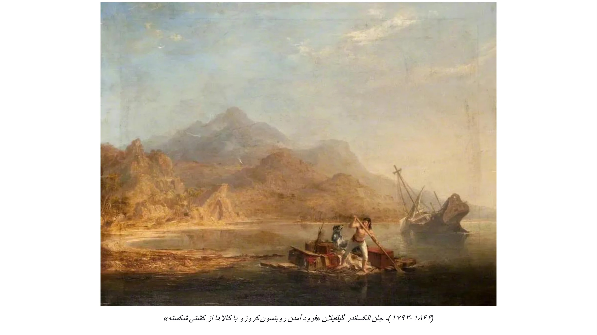

رابینسون کروزو تخلیه کالاها از کشتی شکسته، جان الکساندر گیلفیلان (1793-1864)

در کتاب خود، اقتصاددان اتریشی ما را دعوت می‌کند تا مبادلات بین‌زمانی ذاتی در انحرافات تولید را از طریق یک آزمایش فکری مبتنی بر رابینسون کروزو تنها در جزیره‌اش در نظر بگیریم.

رابینسون، مانند یک انسان اولیه، برای تأمین نیازهای خود به جمع‌آوری و شکار وابسته است. بیایید تصور کنیم که رابینسون می‌تواند در هشت ساعت به اندازه کافی توت جمع‌آوری کند تا خود را برای یک روز کامل تغذیه کند. در چنین شرایطی، او زمان کمی برای فعالیت‌های دیگر دارد. با این حال، رابینسون معتقد است که با ساختن یک چوب دستی، می‌تواند به راحتی توت‌ها را پایین بیاورد و غذای روزانه خود را تنها با چهار ساعت کار به دست آورد. علاوه بر این، او تخمین می‌زند که ساختن چوب دستی پنج روز طول می‌کشد و هر روز دو ساعت کار می‌کند. بنابراین، او نتیجه می‌گیرد که باید 1/5 از تولید توت خود را برای پنج روز ذخیره کند، یا به طور جایگزین، برای پنج روز روزانه 2 ساعت اضافی را صرف جمع‌آوری کند تا به اندازه کافی توت ذخیره کند تا در زمانی که صرف ساختن چوب دستی می‌کند، خود را تأمین کند.

اگر او این ذخیره‌سازی قبلی را انجام ندهد، رابینسون قادر به تکمیل قطب خود نخواهد بود و ممکن است در این بین بمیرد.

بنابراین، به مدت پنج روز، او دو ساعت از استراحت خود را فدا می‌کند تا توت‌های بیشتری جمع‌آوری کند. در پایان این دوره، او به اندازه کافی توت دارد و شروع به ساختن تیرک چوبی می‌کند و به مدت پنج روز، روزی دو ساعت کار می‌کند. وقتی کارش تمام می‌شود، می‌تواند به جای ۸ ساعت، در ۴ ساعت به اندازه کافی توت برای سهم روزانه‌اش به دست آورد و به او اجازه می‌دهد که ۴ ساعت باقی‌مانده روز را برای فعالیت‌های دیگر استفاده کند.

با این روش، رابینسون یک انحراف تولیدی انجام می‌دهد: به جای اینکه مستقیماً توت‌ها را جمع‌آوری کند، تلاش خود را صرف تولید یک کالای سرمایه‌ای می‌کند که در آینده او را بهره‌ورتر خواهد کرد. با این حال، او باید یک فداکاری کوتاه‌مدت انجام دهد، یعنی پس‌انداز کند، تا به این هدف برسد. اگر این کار را نکند، قادر به تکمیل کالای سرمایه‌ای خود نخواهد بود. اما این فداکاری کوتاه‌مدت به او یک مزیت قابل توجه می‌دهد زیرا وقتی که با تیرک خود مجهز می‌شود، ۴ ساعت در روز صرفه‌جویی می‌کند (تا زمانی که تیرک منسوخ شود). این ۴ ساعت اضافی در روز به او امکان می‌دهد تا کالاهای سرمایه‌ای بیشتری مانند ابزار شکار یا تورهای ماهیگیری ایجاد کند و به تدریج وضعیت خود را بهبود بخشد.

### نتیجه‌گیری

به عبارت دیگر، در اقتصاد یک‌نفره رابینسون کروزو، پس‌انداز از طریق فدا کردن رضایت فعلی همان چیزی است که سرمایه‌ای را انباشته می‌کند که بهره‌وری را افزایش می‌دهد. در این زمینه، پس‌انداز، یعنی به تعویق انداختن رضایت فعلی، بهایی است که باید برای افزایش رضایت آینده پرداخت شود. این بدان معناست که در این زمینه، پس‌انداز پیش‌نیاز و شرط لازم برای هر توسعه اقتصادی است.

این یک مفهوم وسوسه‌انگیز، هرچند ساده، است: هر گسترش ساختار تولید نیاز به پس‌انداز قبلی دارد (زیرا کالاهای مورد نیاز برای چنین تولیدی از آسمان نخواهند افتاد)، و بنابراین، هرچه بیشتر پس‌انداز کنیم، سرمایه بیشتری قادر خواهیم بود انباشته کنیم، که به نوبه خود به افزایش بهره‌وری منجر می‌شود و کالاهای بیشتری تولید می‌کند. بنابراین، اقتصاددانان اتریشی معتقدند که کاهش ترجیحات زمانی نقطه شروع یک چرخه فضیلت‌آمیز پس‌انداز –> کالاهای سرمایه‌ای بیشتر  بهره‌وری بیشتر  کالاهای بیشتر = استاندارد زندگی بالاتر –> ترجیح زمانی کمتر است.

اکنون، همان‌طور که در فصل اول اشاره شد، نرخ‌های بهره برای دهه‌ها توسط بانک‌های مرکزی دستکاری شده‌اند، در حالی که بانک‌های تجاری بدون ذخایر قبلی اعتبار اعطا کرده‌اند، به این معنی که نرخ‌های بهره نمایانگر ترجیحات زمانی ما نیستند و توهمی از پس‌انداز فراوان ایجاد می‌کنند.

این موضوع به‌خوبی توسط نمودار زیر نشان داده شده است: نرخ‌های بلندمدت پایین‌تر از نرخ‌های کوتاه‌مدت هستند. اولاً، این موضوع کاملاً بی‌معنی است، زیرا به این معناست که آینده از حال حاضر مطمئن‌تر است. ثانیاً، این موضوع نیازمند بررسی پیامدهای تخصیص سرمایه است: اگر همه تشویق شوند که به گونه‌ای عمل کنند که گویی پس‌اندازها فراوان هستند، در حالی که پس‌اندازکنندگان به دلیل عدم پاداش برای پس‌انداز، وجود ندارند، این موضوع چه پیامدهایی می‌تواند برای اقتصاد داشته باشد؟

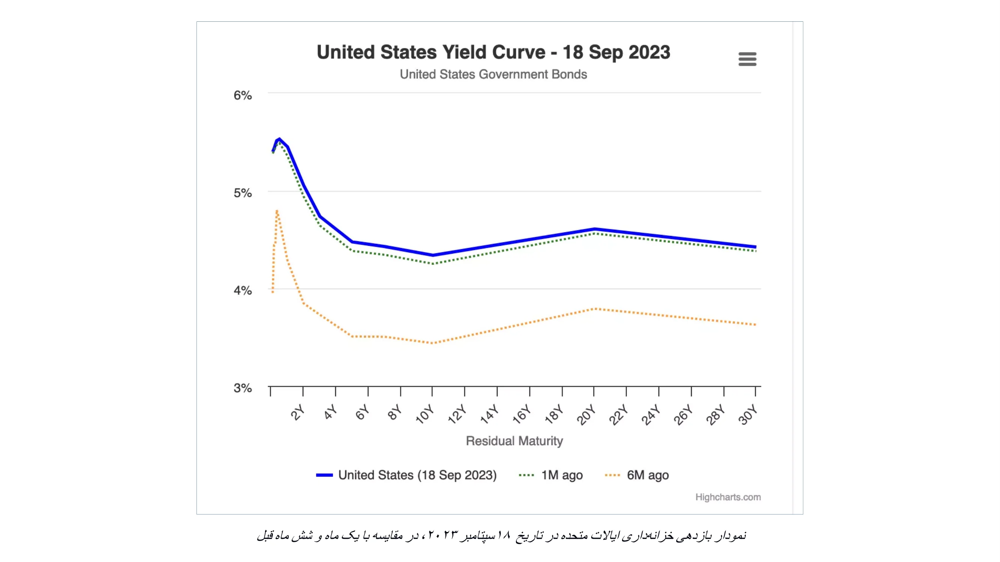

این چیزی است که در فصل بعدی که به نظریه چرخه کسب‌وکار اتریشی اختصاص دارد، خواهیم یافت!

# چشم‌اندازهای اقتصادی اتریش

<partId>ad0fce42-2556-56b8-a093-5b4fcacc7cf3</partId>

## نظریه اتریشی چرخه کسب‌وکار

<chapterId>718afaa8-ce78-58aa-9477-073eef0bd137</chapterId>

> "هرچه رونق اعتبار بانکی تورمی بیشتر ادامه یابد، دامنه سرمایه‌گذاری‌های نادرست در کالاهای سرمایه‌ای بیشتر می‌شود و نیاز به تصفیه این سرمایه‌گذاری‌های ناسالم بیشتر می‌شود. هنگامی که گسترش اعتبار متوقف، معکوس یا حتی به طور قابل توجهی کند می‌شود، سرمایه‌گذاری‌های نادرست آشکار می‌شوند"
>

> لودویگ فن میزس

لودویگ فون میزس، برجسته‌ترین شاگرد بوم-باورک و به احتمال زیاد مهم‌ترین اقتصاددان اتریشی قرن بیستم، بود که از استدلال‌های سرمایه‌ای بوم-باورک برای توضیح علل و پویایی‌های چرخه‌های اقتصادی استفاده کرد. فریدریش آ. هایک، شاگرد میزس، بعدها این استدلال را به نتایج منطقی خود در آثاری که به خاطر آن‌ها در سال ۱۹۷۴ جایزه نوبل اقتصاد را دریافت کرد، گسترش داد.

میزس و هایک تحلیل خود را با افزایش پس‌انداز به عنوان نقطه شروع آغاز کردند. همان‌طور که در فصل‌های قبلی دیدیم، هرگونه افزایش در پس‌انداز به‌طور ضروری کاهش مصرف و در نتیجه کاهش نسبی قیمت کالاهای مصرفی را به همراه دارد. این امر به دو اثر منجر می‌شود: اولاً، افزایش تقاضا برای کالاهای سرمایه‌ای که ناشی از افزایش دستمزدهای واقعی به دلیل کاهش نسبی قیمت کالاهای مصرفی است؛ و ثانیاً، افزایش سود کارآفرینی در مراحل تولیدی که از مصرف دورتر هستند (مراتب پایین‌تر). با افزایش دستمزدهای واقعی، کارآفرینان تشویق می‌شوند تا با استفاده از کالاهای سرمایه‌ای بیشتر، در مصرف نیروی کار صرفه‌جویی کنند که این امر تقاضای قوی‌تری برای کالاهای سرمایه‌ای و سود بالاتری برای کارآفرینانی که این کالاهای مراتب پایین‌تر را تولید می‌کنند، ایجاد می‌کند. بنابراین، در زمینه افزایش پس‌انداز، یعنی کاهش ترجیحات زمانی، نرخ بهره کاهش می‌یابد و توسعه مراحل اضافی تولید و افزایش بهره‌وری را ترویج می‌کند. این یک انحراف تولید کلاسیک به سبک بوم-باورک است و نتیجه‌ای بسیار مطلوب است.

با این حال، دو اقتصاددان اتریشی به این فکر کردند که چه اتفاقی می‌افتد اگر کاهش نرخ بهره، که به عنوان نقطه شروع این انحراف تولید عمل می‌کند، نه به دلیل افزایش پس‌انداز بلکه به دلیل گسترش اعتبار باشد.

در زمینه بانکداری ذخیره کسری، گسترش اعتبار نیازی به افزایش متناسب در پس‌اندازها ندارد. بنابراین، کارآفرینان می‌توانند سرمایه بیشتری جمع‌آوری کرده و به انحرافات تولیدی بپردازند حتی زمانی که ترجیحات زمانی بدون تغییر باقی می‌مانند، یعنی بدون هیچ‌گونه کاهش در مصرف. برای هایک و میزس، چنین وضعیتی باید به‌طور ضروری به مشکلات هماهنگی قابل‌توجهی در میان عوامل اقتصادی منجر شود. به دلیل نبود نرخ‌های بهره بازار آزاد، این مشکلات ممکن است بلافاصله مشهود نباشند، اما در بلندمدت تخصیص نادرست سرمایه‌های ناشی از آن باید پیامدهای ملموسی به بار آورد: رکود اقتصادی.

برای توصیف این پدیده ناهماهنگی زمانی و پیامدهای آن به واضح‌ترین شکل ممکن، ما به یک مدل از ساختار تولید تکیه خواهیم کرد و مشاهده خواهیم کرد که چگونه ابتدا با کاهش نرخ بهره ناشی از افزایش پس‌انداز و سپس با کاهش نرخ بهره ناشی از گسترش اعتبار تحت تأثیر قرار می‌گیرد.

### کاهش نرخ بهره به دلیل افزایش پس‌انداز:

برای تسهیل توضیح ما، به طبقه‌بندی کالاهای منگر بازخواهیم گشت و ساختار تولیدی را بر روی نموداری که شامل تعداد دلخواهی از مراحل است، نمایش خواهیم داد:

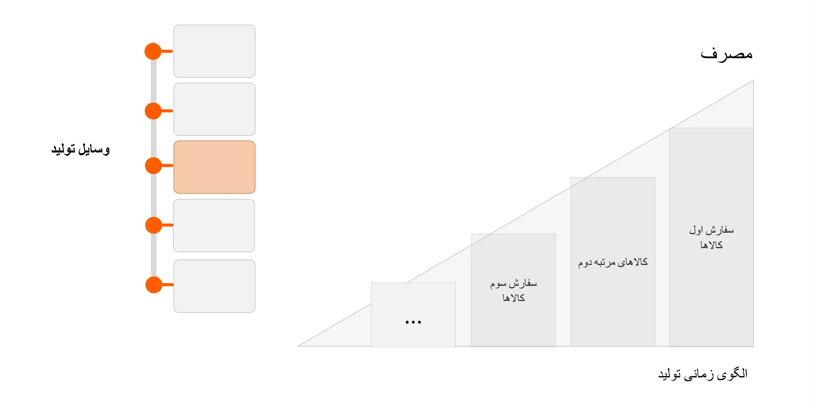

در نمودار بالا، منابع اولیه از مراحل مختلف تولید عبور می‌کنند و دگرگونی‌هایی را تجربه می‌کنند که آن‌ها را به حالت کالاهای نهایی مصرفی نزدیک‌تر می‌کند (از طریق تعامل با عوامل تولید اصلی: زمان، زمین، کار). ارتفاع سمت راست مثلث به صورت شماتیک تولید ناخالص داخلی (GDP) را نشان می‌دهد زیرا مجموع تمام کالاهای مصرفی فروخته شده در یک دوره را نشان می‌دهد. فاصله بین هر نوار نشان‌دهنده ارزش افزوده (به صورت پولی) تولید شده توسط هر مرحله از فرآیند است. این تفاوت همچنین می‌تواند به عنوان درآمد مرتبط با هر مرحله (درآمد - هزینه‌ها) دیده شود.

اگر در سطح کلان، عوامل اقتصادی پس‌انداز خود را افزایش دهند، مقدار کالاهای نهایی مصرف‌شده کاهش خواهد یافت - با ثابت ماندن سایر شرایط، پس‌انداز لزوماً شامل به تعویق انداختن بخشی از مصرف به تاریخ بعدی است. در نتیجه، نرخ بهره کاهش خواهد یافت - زیرا Supply سرمایه در حال افزایش است و به کارآفرینان اجازه می‌دهد از این جریان سرمایه برای ایجاد کالاهای سرمایه‌گذاری جدید استفاده کنند و بدین ترتیب ساختار تولید را طولانی‌تر کنند.

سپس ساختار تولید گسترده‌ای به دست خواهیم آورد، تغییری که می‌تواند به صورت کیفی توسط نمودار زیر نشان داده شود:

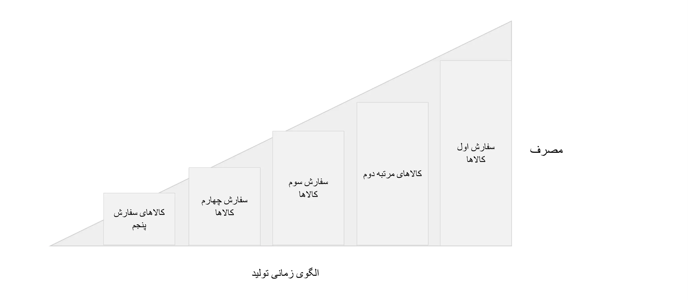

در اینجا، ارزش پولی کالاهای مصرفی مورد تقاضا کاهش یافته است و منابع برای ایجاد یک مرحله اضافی از تولید آزاد شده‌اند. در این سناریو که کاهش نرخ بهره نتیجه کاهش مصرف، یعنی افزایش پس‌انداز است، مساحت مثلث که نشان‌دهنده مقدار پول در گردش است، بدون تغییر باقی می‌ماند. تغییر ساختار تولید (طولانی‌تر شدن) صرفاً نتیجه انتقال قدرت خرید از یک بخش ساختار به بخش دیگر است.

همچنین قابل توجه است که کاهش تقاضا برای کالاهای مصرفی در میان‌مدت باعث کاهش قیمت‌های مصرف‌کننده خواهد شد، نه کاهش در مقدار کالاهای نهایی عرضه‌شده. این به این دلیل است که بخش نهایی ساختار تولید بلافاصله پس از کاهش تقاضا برای کالاهای مصرفی تنظیم نخواهد شد؛ کارآفرینان برای تغییر برنامه‌ها و سرمایه‌گذاری‌های خود به زمانی نیاز دارند. با داشتن موجودی‌ها، کاهش تقاضا آن‌ها را مجبور به فروش این موجودی‌ها با تخفیف خواهد کرد و در نتیجه، مازاد پس‌انداز در ابتدا منجر به کاهش قیمت‌های کالاهای مصرفی (یعنی افزایش دستمزدهای واقعی) خواهد شد.

برعکس، قیمت کالاهای سرمایه‌گذاری افزایش خواهد یافت زیرا انتقال قدرت خرید به کارآفرینان به آن‌ها امکان می‌دهد تا هزینه‌های سرمایه‌گذاری خود را افزایش دهند. زمانی که این پس‌انداز، که توسط پس‌اندازکنندگان به کارآفرینان منتقل شده است، توسط دومی خرج شود، نرخ بهره تمایل به افزایش دوباره خواهد داشت (به دلیل کاهش Supply سرمایه)، که به نوبه خود منجر به کاهش قیمت کالاهای سرمایه‌گذاری خواهد شد. در واقع، در پایان این انحراف تولید، قیمت‌های نسبی تقریباً به همان حالت قبلی باقی خواهند ماند. اما به طور کلی، عوامل اقتصادی بهره‌مند خواهند شد: افزایش بهره‌وری ناشی از طولانی شدن ساختار تولید به مصرف‌کنندگان محصولات بیشتری با قیمت‌های واحد پایین‌تر ارائه خواهد داد؛ قدرت خرید پس‌اندازکنندگان افزایش خواهد یافت، بخشی از طریق درآمد بهره و بخشی به دلیل کاهش قیمت‌های مصرف‌کننده؛ در همین حال، کارآفرینان، به عنوان یک کل، نه سود خواهند کرد و نه زیان. کسانی که در فعالیت‌های نزدیک به مصرف مشغول هستند، درآمد خود را از دست خواهند داد، در حالی که کسانی که در ایجاد مراحل جدید تولید دخیل هستند، به نسبت سود خواهند برد. در چنین وضعیتی، هیچ درآمد پولی جدیدی ایجاد نمی‌شود؛ این تولید است که افزایش می‌یابد و بنابراین ارزش واقعی درآمدها افزایش می‌یابد.

### کاهش نرخ بهره به دلیل افزایش اعتبار (بدون افزایش در پس‌انداز):

اکنون، اگر کاهش نرخ بهره را که ناشی از گسترش اعتبارات ارائه شده توسط بانک‌ها است در نظر بگیریم، به تصویری بسیار متفاوت از ساختار تولید دست می‌یابیم.

با نرخ‌های بهره پایین‌تر، کارآفرینان می‌توانند منابع بیشتری قرض بگیرند و در نتیجه مراحل تولید با ترتیب بالاتری ایجاد کنند. در این حالت، چنین گسترشی در ساختار تولید منجر به کاهش مصرف نخواهد شد زیرا هیچ تأخیری در مصرف فعلی توسط مصرف‌کننده وجود نداشته است. به عبارت دیگر، تولید ناخالص داخلی (GDP) رشد می‌کند. در نتیجه، مثلث ما طولانی‌تر خواهد شد در حالی که ارتفاع مشابهی را حفظ می‌کند، به این معنی که مساحت آن افزایش خواهد یافت.

توجه داشته باشید که این یک نتیجه کاملاً منطقی از گسترش اعتبار است. تا جایی که بانک‌ها با اعطای وام، رسانه‌های اعتباری تولید می‌کنند، باید به طور طبیعی انتظار داشت که قدرت خرید کلی افزایش یابد.

همانطور که اعتبار از طریق وام به کارآفرینان وارد اقتصاد می‌شود، باید شاهد افزایش سود در بخش‌های تولیدی دور از مصرف و کاهش سود نسبی در بخش‌های نزدیک به مصرف باشیم. این سودآوری بالاتر سپس از تخصیص مجدد سرمایه به سمت این مراحل جدید و سرمایه‌برتر (کشتی‌سازی، خودروسازی، ساخت‌وساز، فناوری‌های پیشرفته و غیره) و کاهش سرمایه‌گذاری در بخش‌های نزدیک به مصرف حمایت می‌کند.

اکنون، کارآفرینانی که در این مراحل بالاتر تولید درگیر هستند، درآمدهای پولی بالاتری کسب می‌کنند و با توجه به اینکه ترجیح زمانی ثابت مانده است، باید شاهد افزایش تقاضا برای محصولات مصرفی نیز باشیم. اما از آنجا که در طول این رونق، سودآوری نسبی سرمایه‌گذاری در بخش‌هایی که از مصرف دور هستند بیشتر بوده است، انتقال منابع از فعالیت‌های نزدیک به مصرف به فعالیت‌های دورتر صورت گرفته است. در نتیجه، کارآفرینان در مراحل پایین‌تر تولید منابع کافی برای پاسخگویی به تقاضای افزایش‌یافته را ندارند. این امر تنشی بین این دو بخش از ساختار تولید ایجاد می‌کند: هر یک سعی می‌کند سرمایه را به هزینه دیگری به دست آورد و از آنجا که تقاضا برای مصرف نیازهای فوری‌تری را نمایان می‌کند، در نهایت کارآفرینانی که در فعالیت‌های دور از مصرف مشغول هستند، منابع لازم برای تکمیل سرمایه‌گذاری‌های خود را از دست می‌دهند. نرخ سود در این بخش‌ها شروع به کاهش می‌کند، کسب‌وکارها ورشکسته می‌شوند و افزایش نسبی قیمت‌های مصرف‌کننده باعث می‌شود که سرمایه به سرعت به سمت تولید کالاهای با مرتبه پایین‌تر تخصیص یابد. هنگامی که این تخصیص ناگهانی منابع آشکار می‌شود، اقتصاد وارد رکود می‌شود: قیمت دارایی‌ها کاهش می‌یابد، دستمزدهای واقعی کاهش می‌یابد، قیمت‌های مصرف‌کننده کاهش می‌یابد و موجودی انبارها انباشته می‌شود.

برای فریدریش هایک و لودویگ فون میزس، رکود تجلی تخصیص نادرست سرمایه از مرحله گسترش است. با دستکاری قیمت‌های پس‌انداز و سرمایه، کارآفرینان پروژه‌هایی را توسعه دادند که به دلیل کمبود منابع نمی‌توانستند به پایان برسند، و/یا ظرفیت تولیدی را برای سطح مصرف آینده‌ای برنامه‌ریزی کردند که به دلیل کمبود پس‌انداز نمی‌توانست پایدار بماند.

فقط از طریق کاهش تورم، یعنی کاهش قیمت دارایی‌ها و قیمت دستمزدها، نرخ‌های بهره بالاتر، و تسویه پروژه‌های ناتمام، اقتصاد می‌تواند مجدداً تنظیم شود و به سمت یک مسیر پایدار توسعه یابد. بنابراین، رکود اقتصادی از بین رفتن این توهم رفاه است که یک فرآیند تنظیم مجدد شدید را به راه می‌اندازد.

به طور کلی، رکود اقتصادی توسط خود بخش بانکی ایجاد می‌شود. تا زمانی که اعتبار با سرعت فزاینده‌ای افزایش می‌یابد، قیمت‌ها به افزایش خود ادامه می‌دهند و کارآفرینان برای منابع تولیدی رقابت می‌کنند. با این حال، همان‌طور که هایمن مینسکی اشاره کرده است، نقطه‌ای می‌رسد که بخش بانکی تصمیم می‌گیرد ریسک خود را کاهش دهد و بنابراین جریان اعتبار را کاهش می‌دهد. در نتیجه، رکود اقتصادی منجر به ورشکستگی‌های متعدد، سخت‌گیری در اعطای اعتبار، کاهش قدرت خرید موجود و فروپاشی‌های مالی می‌شود.

چنین تعدیلی را می‌توان به‌عنوان دوره‌ای در نظر گرفت که در آن مصرف کمتر و سرمایه‌گذاری کمتر برای بازسازی پس‌اندازهای از دست رفته اعمال می‌شود. برای هایک، این مرحله افسردگی، اگرچه دردناک است، اما بسیار ضروری است زیرا به بازیابی فعالیت اقتصادی بر اساس ساختاری از قیمت‌های نسبی که منعکس‌کننده کمبود واقعی عوامل تولید است، اجازه می‌دهد. اگر این افسردگی قطع شود، اقتصاد نمی‌تواند به مسیر مطلوبی بازگردد زیرا در غیاب یک سیستم اطلاعاتی که به عوامل اقتصادی اجازه می‌دهد تصمیمات خود را عقلانی کنند، تخصیص نادرست منابع فقط ادامه خواهد یافت.

متأسفانه، این مکانیزم افسرده‌کننده اغلب توسط قدرت‌های سیاسی و بانک‌های مرکزی که به دنبال "تقویت" اقتصاد از طریق هزینه‌های کسری و سیاست پولی آسان هستند، مختل می‌شود.

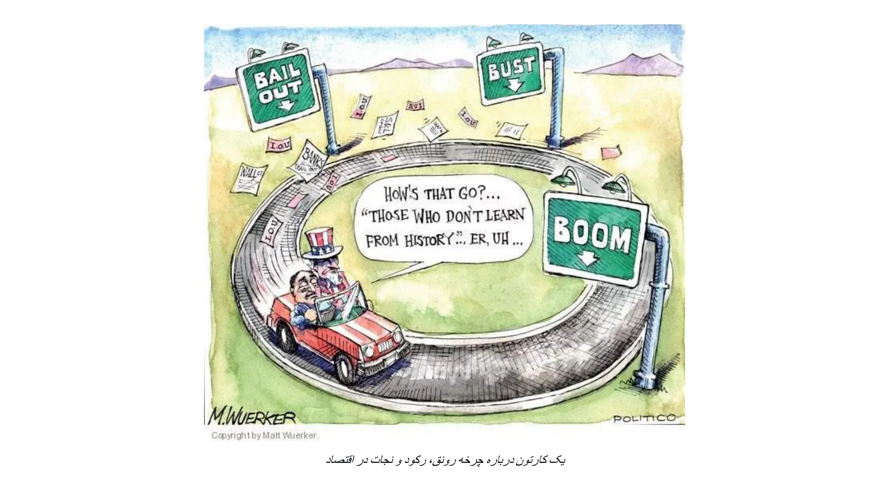

برای هر دو گروه پول‌گرایان و کینزی‌ها، علت رکود، تقاضای کل ناکافی است، بنابراین هیچ‌کدام به تکامل قیمت‌های نسبی توجه نمی‌کنند، که همان‌طور که دیده‌ایم، هسته اصلی مشکل است. بنابراین، آن‌ها معتقدند که ارائه انگیزه برای گسترش اعتبار (کاهش نرخ بهره) و استفاده از ظرفیت کسری دولت برای افزایش تقاضا، بهبودی را آغاز خواهد کرد. در کوتاه‌مدت، چنین اقداماتی ممکن است به نظر برسد که اثرات مطلوبی را تولید می‌کنند: کسری بودجه از هزینه‌ها حمایت می‌کند، در حالی که کاهش نرخ بهره منجر به افزایش قیمت دارایی‌ها می‌شود، که به نوبه خود، دارندگان دارایی را تشویق به افزایش هزینه‌هایشان می‌کند. با این حال، چنین تقویتی در نهایت کاهش می‌یابد، در حالی که مشکل ساختاری باقی می‌ماند یا حتی بدتر می‌شود زیرا تخصیص نادرست سرمایه به لطف نرخ‌های بهره مصنوعی پایین ادامه می‌یابد.

در عصر مدرن، بانک‌های مرکزی و دولت‌ها آن‌قدر در جلوگیری از بروز این فرآیند تعدیل مشتاق بوده‌اند که در نهایت با بیکاری ساختاری گسترده و انباشت بدهی دائمی مواجه می‌شویم. ژاپن در این زمینه به عنوان یک مثال عمل می‌کند. پس از ترکیدن حباب دارایی در سال‌های ۱۹۸۹-۹۰، بانک ژاپن (BoJ) و دولت‌های مختلف در قدرت از تمام روش‌های توصیف شده در اینجا استفاده کردند تا "اقتصاد ژاپن را دوباره راه‌اندازی کنند." به جز جهش‌های کوتاه‌مدت پس از برنامه‌های هزینه‌ای و کاهش نرخ بهره، ژاپن به مدت ۳۰ سال در وضعیت رشد نئوراستنیک و بدهی بیش از حد باقی مانده است.

### نتیجه‌گیری درباره نظریه چرخه کسب‌وکار:

با تأکید بر ماهیت متوالی عمل انسانی و توجه ویژه به تأثیر نوسانات نرخ بهره بر هماهنگی بین‌زمانی عوامل اقتصادی، لودویگ فون میزس و فریدریش هایک چرخه‌های اقتصادی را به عنوان پویایی‌های درونی سیستم بانکداری ذخیره کسری توضیح دادند. تفاوت بین تحلیل اتریشی و تحلیل پول‌گرایان و کینزی‌ها عمدتاً در این است که اولی به مراحل مختلف تولید و ساختار قیمت‌های نسبی توجه ویژه‌ای دارد، در حالی که دومی به متغیرهای تجمیعی مانند سطح اشتغال، تولید ناخالص داخلی یا شاخص قیمت مصرف‌کننده اکتفا می‌کند. در واقع، به دلیل فقدان نظریه سرمایه، اقتصاددانان جریان اصلی تمایل دارند علل رکود را به "روحیه حیوانی" یا "رویدادهای خارجی" نسبت دهند.

بیش از هر مکتب اقتصادی دیگر، مکتب اتریشی بر اهمیت قیمت‌های نسبی برای هماهنگی عوامل اقتصادی تأکید دارد. اعضای مکتب اتریشی بیش از یک قرن است که به بحث‌های مربوط به این موضوع کشیده شده‌اند، به ویژه از زمانی که میزس در سال 1919 اثر خود را درباره عدم امکان محاسبه اقتصادی در اقتصادهای سوسیالیستی منتشر کرد.

این موضوع فصل بعدی و آخرین فصل این دوره خواهد بود.

## امکان‌ناپذیری محاسبه اقتصادی تحت سوسیالیسم

<chapterId>2578a9d8-90e9-58dd-a8c5-6366948564c7</chapterId>

> "جایی که هیچ قیمت بازاری برای عوامل تولید وجود ندارد زیرا نه خریداری می‌شوند و نه فروخته می‌شوند، امکان استفاده از محاسبه در برنامه‌ریزی اقدامات آینده و تعیین نتیجه اقدامات گذشته وجود ندارد. مدیریت سوسیالیستی تولید به سادگی نمی‌داند که آیا آنچه برنامه‌ریزی و اجرا می‌کند مناسب‌ترین وسیله برای دستیابی به اهداف مورد نظر است یا خیر. به نوعی در تاریکی عمل خواهد کرد. عوامل کمیاب تولید، هم مادی و هم انسانی (کار)، را هدر خواهد داد. نتیجه اجتناب‌ناپذیر آن هرج و مرج و فقر برای همه خواهد بود."
>

> لودویگ فن میزس، هرج و مرج برنامه‌ریزی‌شده

### امکان‌ناپذیری محاسبه اقتصادی تحت سوسیالیسم

با وجود شکست‌های مکرر رژیم‌های مارکسیستی در قرن گذشته، بحث محاسبه اقتصادی به دو دلیل مهم همچنان مرتبط باقی مانده است:

۱. ایده‌های مشابه هنوز توسط ترقی‌خواهان و دیگر مداخله‌گران حمایت می‌شوند.

۲. تعیین قیمت، چه در بازارهای سرمایه از طریق اقدامات بانکداران مرکزی و چه در سایر بازارها از طریق شرکت‌های دولتی، احکام و مداخله کمیته‌های نظارتی، همچنان رایج است.

### مناظره محاسبه اقتصادی

این بحث در ابتدا توسط یکی از تأثیرگذارترین مقالات اقتصادی قرن بیستم، "محاسبه اقتصادی در یک جامعه سوسیالیستی"، نوشته لودویگ فون میزس و منتشر شده در سال 1920، شعله‌ور شد. در آن دوره، سوسیالیسم در حال رشد بود، با به قدرت رسیدن بلشویک‌ها در روسیه، سوسیالیست‌ها در جمهوری وایمار (آلمان) به قدرت رسیدند و احزاب سوسیالیست و کمونیست در سراسر اروپا به شهرت رسیدند.

پیش از مقاله میزس، مباحثات درباره سوسیالیسم و سرمایه‌داری عمدتاً حول محور استدلال‌های اخلاقی و مسئله انگیزه می‌چرخید. حتی اگر فرض می‌شد که جامعه‌ای که بر اساس اصل مارکسیستی "از هر کس به اندازه توانش، به هر کس به اندازه نیازش" سازمان یافته است از نظر اخلاقی برتر است، سوال عملی "چه کسی زباله‌ها را بیرون خواهد برد" همچنان نیاز به پاسخ داشت. پاسخ معمول این بود که سوسیالیسم افرادی را تولید خواهد کرد که فاقد غرایز سرمایه‌داری هستند و حتی در غیاب انگیزه‌های مالی، با میل و رغبت به هم‌نوعان خود خدمت خواهند کرد.

با مقاله‌اش، میزس بُعد جدیدی به بحث افزود. با کنار گذاشتن تصورات آرمان‌گرایانه درباره توانایی یک اقتصاد سیاسی در خلق "انسان جدید"، این اقتصاددان اتریشی اشاره کرد که سازماندهی اقتصادی عقلانی بدون قیمت‌گذاری برای عوامل واسطه تولید غیرممکن است. حتی امروز، استدلال او به‌خوبی توسط منتقدانش و حتی برخی اقتصاددانان لیبرال درک نشده است. بنابراین، ارزش دارد که آن را با جزئیات بیشتری توضیح دهیم.

### توضیح ناپایداری محاسبه اقتصادی

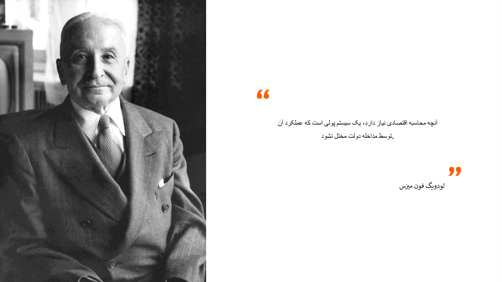

بیشتر تصورات غلط درباره استدلال‌های میزس از سوءتفاهم در مورد نقش‌هایی که طبقات مدیریتی و کارآفرینی در یک اقتصاد سرمایه‌داری ایفا می‌کنند، ناشی می‌شود. میزس هرگز توانایی مدیران در طراحی برنامه‌های تولید کارآمد در عملیات خودشان را نادیده نگرفت. بلکه او بر اهمیت کارآفرینان و سهامداران تأکید کرد، که به عنوان صاحبان وسایل تولید، سرمایه را در صنایع مختلف تخصیص می‌دهند و بدین ترتیب قیمت‌هایی را تشکیل می‌دهند که به عنوان ورودی در محاسبات اقتصادی مدیران عمل می‌کنند.

بدون بازارهای سرمایه و پول، عقلانی‌سازی استفاده از منابع در صنایع مختلف غیرممکن می‌شود. این بدان معناست که حتی اگر سازماندهی کامل در هر شرکت یا بخش از اقتصاد وجود داشته باشد، کل اقتصاد نمی‌تواند به طور کارآمد به تغییرات در دسترسی به منابع، شرایط تولید و ترجیحات مصرف‌کننده تطبیق یابد. به گفته میسز:

> "[...] خطای اساسی که در پیشنهادات [سوسیالیست‌های بازار] وجود دارد این است که آنها به مسئله اقتصادی از دیدگاه کارمند زیردست نگاه می‌کنند که افق فکری او فراتر از وظایف زیرمجموعه نمی‌رود. آنها ساختار تولید صنعتی و تخصیص سرمایه به شاخه‌ها و مجموعه‌های تولیدی مختلف را به‌عنوان امری ثابت در نظر می‌گیرند و ضرورت تغییر این ساختار برای تطبیق با تغییرات شرایط را در نظر نمی‌گیرند.... آنها نمی‌فهمند که عملیات افسران شرکت‌ها صرفاً در اجرای وفادارانه وظایفی است که توسط رؤسای آنها، یعنی سهامداران، به آنها محول شده است.... عملیات مدیران، خرید و فروش آنها، تنها بخش کوچکی از کلیت عملیات بازار است. بازار جامعه سرمایه‌داری همچنین آن عملیات‌هایی را انجام می‌دهد که کالاهای سرمایه‌ای را به شاخه‌های مختلف صنعت تخصیص می‌دهد. کارآفرینان و سرمایه‌داران شرکت‌ها و سایر شرکت‌ها را تأسیس می‌کنند، اندازه آنها را بزرگ یا کوچک می‌کنند، آنها را منحل می‌کنند یا با سایر شرکت‌ها ادغام می‌کنند؛ آنها سهام و اوراق قرضه شرکت‌های موجود و جدید را خرید و فروش می‌کنند؛ آنها اعتبار می‌دهند، پس می‌گیرند و بازپرداخت می‌کنند؛ به‌طور خلاصه، آنها تمام آن اعمالی را انجام می‌دهند که مجموع آنها بازار سرمایه و پول نامیده می‌شود. این معاملات مالی ترویج‌دهندگان و سفته‌بازان هستند که تولید را به آن کانال‌هایی هدایت می‌کنند که در بهترین شکل ممکن نیازهای فوری مصرف‌کنندگان را برآورده می‌سازند."
>

> میسز، کنش انسانی، صفحات 703-04

به طور خلاصه، میزس استدلال می‌کند که حقوق مالکیت، که صاحبان سرمایه را در زمینه سود و زیان قرار می‌دهد، آن‌ها را ترغیب می‌کند تا منابع خود را به صنایعی اختصاص دهند که در حال حاضر بیشترین نیاز به منابع برای برآورده کردن تقاضای مصرف‌کنندگان را دارند. وقتی موفق می‌شوند، سود می‌برند، اما وقتی شکست می‌خورند، متحمل زیان مالی می‌شوند. "پوست در بازی" آن‌ها را تشویق می‌کند تا درباره بهترین تخصیص سرمایه برای وضعیت فعلی اقتصاد گمانه‌زنی کنند. این امر یک پویایی مبتنی بر بازار ایجاد می‌کند که نتایج جمعی اقدامات آن‌ها اطلاعات حیاتی درباره کارآمدترین استفاده از منابع را تولید می‌کند.

فصول قبلی توضیح داده‌اند که ارزش‌ها ذهنی هستند، اقدامات اقتصادی هزینه‌های فرصت را آشکار می‌کنند و قیمت‌های مصرف‌کننده سلسله‌مراتب ترتیبی خواسته‌های مصرف‌کننده را بیان می‌کنند. کارآفرینان برای عوامل تولید رقابت می‌کنند تا ساختارهای تولیدی را بسازند که درآمدها را نسبت به هزینه‌ها به حداکثر برسانند و خواسته‌های مصرف‌کننده را مؤثرتر از گزینه‌های جایگزین برآورده کنند. بنابراین، قیمت‌های عوامل تولید از قیمت‌های مصرف‌کننده مشتق می‌شوند: اگر یک عامل تولید بتواند درآمد پولی بیشتری (با برآورده کردن بهتر خواسته‌های مصرف‌کننده) در صنعت دیگری یا تحت برنامه‌ای متفاوت ایجاد کند، کارآفرینان قیمت آن را به بهره‌وری نهایی‌اش افزایش خواهند داد و مالک فعلی آن را پشت سر خواهند گذاشت. این رقابت میان کارآفرینان برای عوامل تولید، که بالاترین بازده نهایی آن‌ها را تعیین می‌کند، فرآیندی است که اطلاعات مرتبط درباره تخصیص منابع را تولید می‌کند.

این فرآیند حیاتی است زیرا کارایی فعالیت‌های مختلف را تأیید یا رد می‌کند و اطمینان حاصل می‌کند که عوامل تولید به بهره‌ورترین استفاده‌های خود تخصیص داده می‌شوند. بازار این عملکرد را به عنوان یک فرآیند مداوم انجام می‌دهد. در دنیایی که به طور مداوم در حال تغییر است—جایی که ترجیحات مصرف‌کننده، شرایط تولید، فناوری، مقررات، جمعیت‌شناسی و موارد دیگر در حال تغییر هستند—قیمت‌های عوامل تولید واسطه‌ای به طور مداوم از طریق اقدامات کارآفرینان و سرمایه‌داران که با شرایط متغیر سازگار می‌شوند، تغییر می‌کنند. از آنجا که این تغییرات محلی هستند، اطلاعات باید به عوامل اقتصادی که نمی‌توانند دانش کاملی از کل جهان داشته باشند، منتقل شود. این نقش بازار است: به کارآفرینان اجازه می‌دهد تا بر اساس اطلاعات محلی، اغلب کیفی و پیچیده عمل کنند و ساختارهای تولید اقتصادی را پیشنهاد دهند که سپس توسط بازار تأیید یا رد می‌شوند. به این ترتیب، اطلاعات مرتبطی که توسط این فرآیند از پایین به بالا تولید می‌شود، از طریق سیستم قیمت در سراسر اقتصاد توزیع و متراکم می‌شود. این فرآیند تولید و توزیع اطلاعات برای تخصیص منابع ضروری است زیرا به عوامل اقتصادی که دانش محدودی از جهان دارند، اجازه می‌دهد تا با تکیه بر قیمت‌ها، محاسبات اقتصادی انجام دهند و برنامه‌های اقتصادی منسجمی تدوین کنند.

از این منظر، یک اقتصاد برنامه‌ریزی‌شده مرکزی به‌طور اجتناب‌ناپذیری با تخصیص نادرست سرمایه مواجه خواهد شد. در کوتاه‌مدت تا میان‌مدت، چنین تخصیص‌های نادرستی ممکن است نادیده گرفته شوند زیرا هیچ قیمت بازار یا ورشکستگی وجود ندارد که آن‌ها را آشکار کند. با این حال، به دلیل عدم وجود بازخورد (قیمت‌ها) و مکانیزم‌های تخصیص مجدد (ورشکستگی‌ها)، اشتباهات انباشته خواهند شد تا زمانی که اسراف از طریق کاهش قابل توجه در شرایط زندگی آشکار شود.

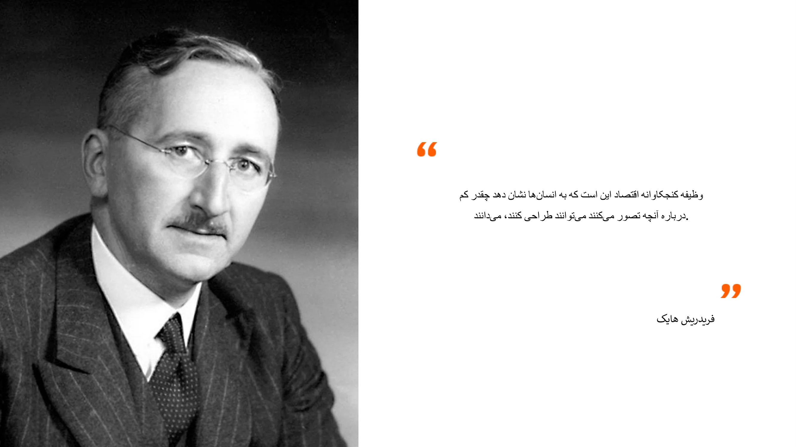

### دیدگاه اتریشی و ناکامی‌های دیگر مکاتب اقتصادی

می‌توان گفت که نقاشی چنین پانورامایی در نگاه به گذشته آسان است. به هر حال، همه ما از قفسه‌های خالی در اتحاد جماهیر شوروی، سختی‌های ونزوئلا و فاجعه انسانی در کامبوج آگاهیم. اما میزس این رویدادها را به‌زودی در سال ۱۹۲۰ پیش‌بینی کرده بود. با این حال، تا زمان فروپاشی اتحاد جماهیر شوروی در سال ۱۹۸۹، بسیاری از اقتصاددانان، از جمله تعداد زیادی از برندگان جایزه نوبل، معجزه اقتصادی شوروی را ستایش می‌کردند و پیش‌بینی می‌کردند که اقتصاد شوروی به زودی از اقتصاد ایالات متحده پیشی خواهد گرفت.

با وجود این پیش‌بینی‌های چشمگیر و نمایش‌های تجربی متعدد از غیرممکن بودن محاسبات اقتصادی تحت سوسیالیسم، رهبران سیاسی در سراسر جهان بیش از هر زمان دیگری مشتاق به تعیین قیمت‌ها، ملی‌سازی صنایع کامل و پیشنهاد برنامه‌های پنج‌ساله هستند، که اغلب توسط جمعیت‌های اقتصادی ناآگاه تشویق می‌شوند. پیامدهای چنین مداخله‌گری به شدت توسط مردم در کشورهای غربی که قبلاً مرفه بودند احساس می‌شود، که به آرامی شاهد کاهش استانداردهای زندگی خود هستند.

### نظریه چرخه تجاری اتریشی به عنوان یک مورد خاص از عدم امکان محاسبه اقتصادی تحت سوسیالیسم

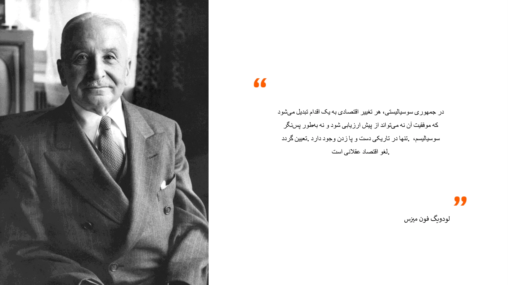

در یک فصل قبلی، ما به تشریح دینامیک‌های سرمایه‌گذاری بیش از حد و تخصیص نادرست سرمایه ناشی از دستکاری نرخ بهره توسط بانک‌های مرکزی پرداختیم. اساساً، آنچه توضیح دادیم می‌تواند به عنوان یک مورد خاص از عدم امکان محاسبه اقتصادی تحت سوسیالیسم، در حوزه بازارهای پولی در نظر گرفته شود. هنگامی که قیمت‌ها خارج از مقادیر بازار خود ثابت می‌شوند، کارآفرینان و تخصیص‌دهندگان سرمایه تشویق می‌شوند به سرمایه‌گذاری‌هایی بپردازند که به دلیل کمبود پس‌انداز در بلندمدت قابل حفظ نیستند. با دخالت در سیستم قیمت‌گذاری، برنامه‌ریزان مرکزی (در این مورد، بانکداران مرکزی) یک ناهماهنگی بین عوامل اقتصادی ایجاد می‌کنند. در این مورد، ناهماهنگی بین‌زمانی شامل سرمایه‌گذاری بیش از حد در کالاهای سرمایه‌گذاری مرتبه بالاتر و سرمایه‌گذاری ناکافی در کالاهای سرمایه‌گذاری مرتبه پایین‌تر است که نمایانگر تجلی خاصی از تخصیص نادرست سرمایه در صنایع مختلف است.

پیامدهای چنین تخصیص نادرستی شامل بحران‌های مالی و اقتصادی، کاهش فعالیت اقتصادی و کاهش تورم بدهی است. این اثرات کلان اقتصادی ناشی از عدم تعادل بین پس‌انداز و سرمایه‌گذاری‌ها است که از گسترش اعتبار ناشی می‌شود. در اتحاد جماهیر شوروی و دیگر رژیم‌های کمونیستی، تثبیت قیمت‌ها منجر به ناهماهنگی مشابهی شد که به کمبود برخی کالاها و تولید بیش از حد دیگر کالاها انجامید. در هر دو مورد، قیمت‌ها نتوانستند ترجیحات واقعی مصرف‌کنندگان را منعکس کنند، چه از نظر ترجیحات زمانی و چه از نظر ترجیحات مصرفی، که منجر به سرمایه‌گذاری کارآفرینان یا برنامه‌ریزان مرکزی مسئول تخصیص منابع در "صنایع نادرست" شد.

امروزه، بحث محاسبات اقتصادی عمدتاً در مباحث مربوط به انرژی دوباره مطرح می‌شود، جایی که سرمایه‌گذاری‌های نادرست ناشی از یک دستور کار Green به طور فزاینده‌ای مشهود است. این بحث همچنین در مباحث مربوط به بازارهای پولی نیز مطرح می‌شود، جایی که اقتصاددانان مکتب اتریشی اشاره می‌کنند که بحران 2008، که اقتصاددانان جریان اصلی نتوانستند پیش‌بینی کنند، یک چرخه کلاسیک رونق و رکود بود که با سرمایه‌گذاری بیش از حد در بازار مسکن به دلیل دوره‌های طولانی نرخ بهره پایین مشخص می‌شد. علاوه بر این، نئو مارکسیست‌ها و دیگر جناح‌های سوسیالیست این ایده را ترویج می‌کنند که ظهور هوش مصنوعی می‌تواند مشکل محاسبات اقتصادی را حل کند. با این حال، این دیدگاه از درک نادرست مسئله ناشی می‌شود؛ مشکل محاسبات اقتصادی مسئله‌ای مربوط به قدرت محاسباتی نیست بلکه مسئله‌ای مربوط به تولید و توزیع اطلاعات مرتبط با تولید و تخصیص منابع است. این اطلاعات تنها می‌تواند به صورت محلی توسط عوامل با دانش تخصصی و علاقه‌مند به نتیجه تولید شود. هوش مصنوعی نمی‌تواند این فرآیند از پایین به بالا را جایگزین کند و بنابراین نمی‌تواند به برنامه‌ریزان مرکزی در حل مشکل تخصیص منابع Address کمک کند. متأسفانه، به دلیل یک قرن سوءتفاهم، انتظار می‌رود که ادعاهایی مبنی بر اینکه هوش مصنوعی عصر جدیدی از رفاه اقتصادی را به رهبری برنامه‌ریزان مرکزی روشنفکر که با کمک هوش مصنوعی می‌توانند شکست‌های بازارهای آزاد را اصلاح کنند، به وجود آورد.

برای یک کاربرد مشخص از مسئله محاسبه اقتصادی در یک وضعیت معاصر، می‌توانید به این مقاله که به مشکل تخصیص منابع در چین مدرن می‌پردازد، مراجعه کنید.

> جاده به سوی سرکوب مالی: چین ببر کاغذی، تئو موژنت، https://open.substack.com/pub/theomogenet/p/the-road-to-financial-repression-181?r=ccpx8&utm_campaign=post&utm_medium=web

### نتیجه‌گیری

در این فصل نهایی، ما به بررسی عدم امکان محاسبه اقتصادی تحت سوسیالیسم پرداخته‌ایم، که یکی از اصول مرکزی مکتب اتریشی اقتصاد است. دیدگاه اتریشی ارائه شده در این دوره به این نتیجه‌گیری می‌انجامد و دلیلی قوی برای سیاست‌های عدم مداخله ارائه می‌دهد. در هسته خود، تمام تفکر اتریشی حول اهمیت قیمت‌ها در هماهنگی اقتصادی می‌چرخد. با تأکید بر اهمیت هزینه‌های فرصت و محاسبه اقتصادی برای استفاده منطقی از منابع، اقتصاددانان اتریشی پیچیدگی و ظرافت عمل انسانی در دنیای همیشه در حال تغییر را نشان می‌دهند.

اقتصاددانان جریان اصلی و برنامه‌ریزان مرکزی اغلب از اقتصاددانان اتریشی خوششان نمی‌آید زیرا آن‌ها به عدم قطعیت آینده، اشتباه بودن پیش‌بینی‌های کمی اقتصادی و اثرات زیان‌بار مداخله اقتصادی اشاره می‌کنند. به طور خلاصه، اقتصاد اتریشی بر بی‌اثری و پیامدهای مضر اقدامات مداخله‌گرانه تأکید دارد.

سنت اتریشی رویکردی فروتنانه به عمل انسانی دارد و از مفاهیم ارزش ذهنی، عدم قطعیت، اراده آزاد و پیچیدگی نتایج عمیقی می‌گیرد. این سنت توضیح می‌دهد که چگونه نظم بازار، با وجود اینکه محصول طراحی انسانی نیست، به عنوان نهاد مرکزی برای توسعه و رفاه ما ایستاده است. اگر یک نکته کلیدی از این دوره وجود داشته باشد، این است که سرمایه‌داری به دلیل توانایی‌اش در انطباق با تغییرات در دنیایی پویا و نامطمئن که توسط افراد آزاد پر شده است، به سیستم اقتصادی غالب تبدیل شد.

## روش‌شناسی اتریشی

<chapterId>419129c1-82ba-54e3-b385-95d4d89a447e</chapterId>

مکتب اقتصاد اتریشی خود را از دیگر مکاتب با روش‌شناسی قیاسی-اصل موضوعی متمایز می‌کند، که با رویکرد پوزیتیویستی که اغلب در علوم اجتماعی استفاده می‌شود، متفاوت است. رویکرد پوزیتیویستی بر اساس قوانینی است که از داده‌های تجربی به دست آمده‌اند و روشی مشابه با علوم فیزیکی را اتخاذ می‌کند. این رویکرد فرضیه‌هایی را از مشاهدات فرموله می‌کند که سپس توسط آزمایش‌های موقت تأیید یا رد می‌شوند. روش علمی شامل حفظ فرضیه‌ای است که بهترین توضیح را برای داده‌ها ارائه می‌دهد و ادامه کاوش در آن تا زمانی که فرضیه دقیق‌تری پیدا شود.

با این حال، در علوم اجتماعی، جدا کردن متغیرها مانند فیزیک دشوار است، زیرا هر لحظه در تاریخ منحصر به فرد است و عوامل متعددی وارد عمل می‌شوند. آزمایش‌های اقتصادی نمی‌توانند در یک آزمایشگاه بازتولید شوند و مهم است که توجه داشته باشیم مشاهده همبستگی بین دو متغیر اثبات‌کننده رابطه علّی بین آن‌ها نیست. اتریشی‌ها، به ویژه لودویگ فن میزس، روش جایگزینی به نام روش پیشینی یا قیاسی-استنتاجی را برای مطالعه علوم اجتماعی پیشنهاد کردند. این رویکرد بر اساس گزاره‌های بنیادی به نام اصول موضوعه استوار است، مشابه آنچه در ریاضیات استفاده می‌شود. به عنوان مثال، هندسه اقلیدسی نمونه‌ای از یک روش قیاسی-استنتاجی در زمینه ریاضیات است.

در اقتصاد اتریشی، اصول بنیادی شامل ترجیحات زمانی مثبت است که بر اساس انتخاب‌های فردی کالاها یا خدمات امروز به جای فردا، به دلیل عدم قطعیت درباره آینده، شکل می‌گیرد. این اصول مورد سوال قرار نمی‌گیرند، زیرا به عنوان بدیهی و سازگار با زندگی روزمره در نظر گرفته می‌شوند. با استفاده از این اصول پایه، اقتصاددانان اتریشی از قواعد منطق برای استخراج بیانیه‌هایی استفاده می‌کنند که اطلاعاتی درباره عملکرد پدیده‌های اقتصادی ارائه می‌دهند. به عنوان مثال، آنها توضیح می‌دهند که بحران‌های اقتصادی ناشی از عدم تعادل بین پس‌انداز و سرمایه‌گذاری است که منجر به دستکاری مصنوعی نرخ بهره می‌شود. افرادی با ترجیحات زمانی مثبت، تقاضای نرخ بهره مثبت برای جبران ریسک وام‌دهی دارند. اتریشی‌ها استدلال می‌کنند که روابط ارزشیابی ذهنی هستند، بنابراین نرخ‌های بهره می‌توانند بسته به افراد و شرایط متفاوت باشند.

قیمت‌ها نقش حیاتی در سازماندهی منطقی افراد با اطلاعات ناقص ایفا می‌کنند. نرخ بهره تعادل بین Supply و تقاضای سرمایه در بازار را برقرار می‌کند و بدین ترتیب اقتصاد را تقویت می‌کند. اقتصاددانان اتریشی تأکید می‌کنند که تعیین خودسرانه نرخ بهره می‌تواند به بحران‌های اقتصادی منجر شود و محاسبه را در یک رژیم سوسیالیستی غیرممکن سازد.

### اقتصاددانان اتریشی و تفاوت‌های روش‌شناختی

اقتصاددانان اتریشی اغلب هنگام بحث با دیگر مکاتب فکری با مشکلاتی مواجه می‌شوند، زیرا از روش‌های تحلیل یکسانی استفاده نمی‌کنند. در حالی که اقتصاددانان اتریشی از اصول بنیادی، مانند ذهنیت ارزش، برای استنتاج نتایج منطقی استفاده می‌کنند، اقتصاددانان کینزی یا پول‌گرایان تمایل دارند به داده‌های تجربی برای ایجاد قوانین کلی اقتصادی تکیه کنند.

یک نمونه از تفاوت روش‌شناختی، موضع طرفداران نظریه پولی مدرن (MMT) است که برای دستیابی به اهداف سیاسی از چاپ پول حمایت کرده‌اند و از عدم وجود تورم بین سال‌های ۲۰۰۸ تا ۲۰۱۹ به عنوان یک استدلال استفاده کرده‌اند. اقتصاددانان اتریشی و طرفداران MMT به یک زبان صحبت نمی‌کنند و بر سر معیارهای تعیین اعتبار یک قانون اقتصادی توافق ندارند. این امر باعث می‌شود که مباحثات بین این مکاتب مختلف دشوار و اغلب غیرمولد باشد.

توجه به این نکته مهم است که انتخاب گزینشی داده‌ها برای ایجاد روابط بین متغیرها، روشی غیرعلمی و غیر دقیق در اقتصاد است. به عنوان مثال، ایجاد پول لزوماً باعث تورم نمی‌شود و برای درک مکانیسم‌های پیچیده اقتصادی، نیاز به رویکردی دقیق‌تر است. اصول اولیه نقش مهمی در استدلال اقتصادی مکتب اتریشی ایفا می‌کنند. آن‌ها Elements بنیادی هستند که از آن‌ها می‌توان استنتاجات منطقی انجام داد. با این حال، باید توجه داشت که پیش‌بینی دقیق آینده در اقتصاد اغلب به دلیل پیچیدگی پدیده‌های اقتصادی و عدم قطعیت ذاتی دشوار است.

روش‌شناسی یک جنبه اساسی در اقتصاد و به طور کلی در علوم اجتماعی است. این امر بر نحوه طرح سوالات، فرمول‌بندی فرضیه‌ها و تفسیر داده‌ها تأثیر می‌گذارد. درک تفاوت‌های روش‌شناختی بین مکاتب فکری اقتصادی می‌تواند به ما کمک کند تا دیدگاه‌های متنوع را درک کنیم و نظرات خود را در مورد موضوعات مطرح شده در قسمت‌های قبلی توسعه دهیم.

# بخش نهایی

<partId>ae828713-d133-559f-93c2-101cb5245fca</partId>

## بررسی‌ها و رتبه‌بندی‌ها

<chapterId>29d4323c-e34e-5834-bf03-2f3ed10d751b</chapterId>

<isCourseReview>true</isCourseReview>

## امتحان نهایی

<chapterId>d58d188f-81fb-572a-a898-8b6f8aceba7a</chapterId>

<isCourseExam>true</isCourseExam>

## نتیجه‌گیری

<chapterId>d668fdf6-fb4c-4bbf-82e1-afcb95c122e0</chapterId>

<isCourseConclusion>true</isCourseConclusion>