# Een reis door de economie

Welkom bij de cursus van Théo Mogenet! Gepassioneerd door economie, geschiedenis, literatuur, politieke wetenschappen en technologie, heeft hij besloten om zijn kennis van de Oostenrijkse economie met jou te delen. Deze tak, die minder bekend is in de economie, is gebaseerd op de menselijke rationaliteit en het gedrag van vrije actoren. De wiskunde is minder intens, maar het is vooral een kwestie van logica en sociale studie.

Deze denkschool heeft al enkele eeuwen achter zich en heeft een heel panorama aan auteurs, gedachten en economen achter zich. Grote namen in de economie zoals Hayek, Rothbard, Mises, Bastiat of Menger hebben deze stroming lang verdedigd. In tegenstelling tot het alomtegenwoordige Keynesianisme van tegenwoordig, plaatst de Oostenrijkse school het individu weer centraal met een meer liberale, kapitalistische en zelfs anarchistische benadering.

+++

# Inleiding

<partId>265aa8b0-dd89-5456-b72a-656e988013d5</partId>

## Cursus Overzicht

<chapterId>eae3de7b-cce6-516d-83d9-28fbd582c0ca</chapterId>

Welkom bij de cursus ECO201!

In deze cursus van Théo Mogenet ontdek je een economische stroming die fundamenteel verschilt van de heersende Keynesiaanse doctrine. Tot nu toe heb je misschien geleerd dat geldbeheer en economisch beleid in de eerste plaats het domein zijn van centrale banken, met het idee dat het drukken van geld en overheidsuitgaven de economische groei stimuleren. Er bestaat echter een meer samenhangende alternatieve benadering: **Oostenrijkse Economie**.

Met meer dan twee eeuwen onderzoek, filosofische reflectie en geschriften van bekende auteurs als Carl Menger, Ludwig von Mises en Friedrich Hayek, neemt deze denkschool een ander perspectief in, met een voorkeur voor een gedecentraliseerde kijk op de economie gebaseerd op het individu en menselijke rationaliteit.

Economie is in werkelijkheid een uiterst sociaal en complex gebied, dat bestaat uit talloze onafhankelijke actoren die vrij op elkaar inwerken om een samenhangend geheel te vormen. Om dit dynamische systeem te begrijpen, geeft de Oostenrijkse economie de voorkeur aan kwalitatieve analyse, gebaseerd op menselijke logica, sociologie en de studie van marktprocessen in plaats van starre wiskundige vergelijkingen.

In deze cursus verken je de fundamentele principes van deze denkschool. Théo Mogenet, je docent, is een gepassioneerd voorstander van deze economische benadering en leidt je door de belangrijkste concepten van de Oostenrijkse economie, waarbij hij je laat zien hoe deze ideeën in het bijzonder van toepassing zijn op de wereld van de Bitcoin.

**Deel 1: Inleiding tot de ECON**

We beginnen met een algemene inleiding in de Oostenrijkse economie, waarin we de historische oorsprong en de grondslagen van het denken verkennen. Dit deel behandelt ook essentiële concepten zoals geld, krediet, banken en centrale banken. Je zult begrijpen waarom deze instellingen een centrale rol spelen in het Oostenrijkse gedachtegoed, met name in hun kritiek op monetaire interventies.

**Deel 2: Theoretische grondslagen**

In dit deel worden de fundamentele concepten van de Oostenrijkse economie behandeld, zoals de subjectieve waardetheorie, die uitlegt waarom de waarde van een goed niet objectief is, maar afhangt van het waargenomen nut van elk individu. Je zult ook ontdekken hoe geld van nature ontstaat als een sociaal fenomeen, samen met de concepten van tijdvoorkeur, rente en kapitaal die de kern vormen van de Oostenrijkse vrijemarkttheorie.

**Deel 3: Oostenrijkse economische perspectieven**

Hier verkennen we de praktische toepassingen van de Oostenrijkse theorie. Je zult in detail leren over de Oostenrijkse conjunctuurtheorie, die uitlegt hoe monetaire manipulaties kunstmatige hausses creëren, gevolgd door recessies. We zullen ook zien waarom economische berekening onmogelijk is in een socialistisch systeem en hoe de Oostenrijkse methodologie, gebaseerd op praxeologie (de studie van menselijk handelen), een unieke en coherente benadering biedt om economische fenomenen te begrijpen.

Deze cursus is een mix van economie en filosofie, geleid door een open discussie tussen Théo en mij (Rogzy). Ik wil Théo Mogenet hartelijk bedanken voor het maken van deze cursus. We hebben veel plezier beleefd aan het ontwikkelen van deze inhoud, die voor iedereen toegankelijk is. Deze cursus dient als een essentiële introductie en legt de basis voor onze toekomstige, meer geavanceerde economische modules.

En wat als de sleutel tot het begrijpen van de huidige economie in een eeuwenoude theorie ligt? Laten we het samen ontdekken!

## Geld, krediet, banken en centrale banken

<chapterId>29faebd9-9326-52de-8161-e4bb33033cd6</chapterId>

> "Het kernprobleem van conventionele valuta is het vertrouwen dat nodig is om het te laten werken. De centrale bank moet vertrouwd worden om de munt niet te devalueren, maar de geschiedenis van de fiatvaluta staat bol van de schendingen van dat vertrouwen. Banken moeten erop kunnen vertrouwen dat ze ons geld bewaren en het elektronisch overmaken, maar ze lenen het uit in golven van kredietbellen met nauwelijks een fractie in reserve. We moeten ze vertrouwen met onze privacy, erop vertrouwen dat ze onze rekeningen niet laten leeghalen door identiteitsdieven."
>

> Satoshi Nakamoto, pseudonieme uitvinder van Bitcoin

### Hoe geld wordt gecreëerd

In ons huidige monetaire systeem wordt geld voornamelijk gecreëerd door een bankpraktijk die bekend staat als "fractioneel reservebankieren" Deze term betekent in wezen dat banken niet verplicht zijn om evenveel reserves aan te houden als ze aan deposito's ontvangen. Bijgevolg kunnen ze nieuwe koopkracht creëren wanneer ze leningen verstrekken en, omgekeerd, koopkracht verminderen wanneer klanten hun leningen terugbetalen.

Als je bijvoorbeeld je plaatselijke bank benadert om een hypotheek af te sluiten voor de aankoop van een huis, dan ontstaat het geld dat de bank je leent als een boekhoudkundige boeking. In de boekhouding geven we het nettovermogen van een individu meestal weer met een balans, die twee kanten heeft: de activazijde, met alle bezittingen, financiële contracten, inventaris of andere vormen van rijkdom in bezit, en de passivazijde, die de bron van fondsen toont die zijn gebruikt om het kapitaal te creëren dat aan de activazijde staat. Het verschil tussen activa en passiva wordt "eigen vermogen" genoemd en kan worden gezien als het nettovermogen van de entiteit.

Wanneer een financiële instelling een banklicentie heeft, betekent dit in wezen dat de verplichtingen die zijn vastgelegd als "klantendeposito's" worden beschouwd als officieel geld binnen een specifiek land of monetaire zone. Als je dus een lening aanvraagt bij de bank om een huis te kopen, leent de bankier geen geld dat door een andere klant is gestort. In plaats daarvan schrijft de bank het geleende bedrag bij op jouw rekening en registreert tegelijkertijd jouw lening Contract als activa van de bank. Als jij je lening terugbetaalt, gaat het geld effectief verloren en neemt de waarde van de overeenkomstige lening Contract af, waarbij de bank alleen de rente op de lening behoudt.

Bij de aankoop van het huis geef je je bankier de opdracht om geld over te maken naar de rekening van de verkoper. Als de rekening van de verkoper bij een andere bank is, informeert je bankier de overeenkomstige bankier bij de andere instelling om ervoor te zorgen dat de rekening van de verkoper dienovereenkomstig wordt gecrediteerd, terwijl jouw rekening met het overeenkomstige bedrag wordt gedebiteerd.

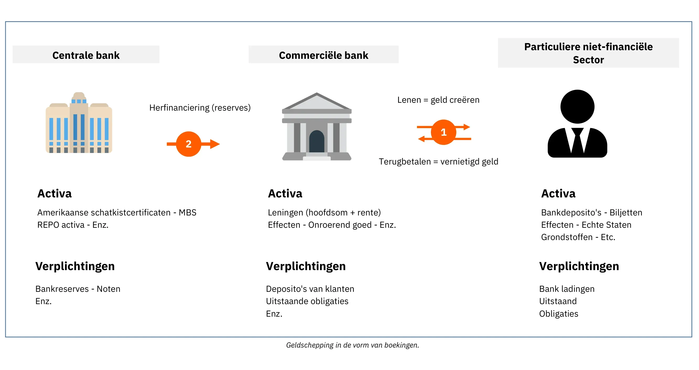

Figuur 1: Geldschepping als boekingen

> "Het is goed genoeg dat de mensen van onze natie ons bank- en monetaire systeem niet begrijpen, want als ze dat wel deden, geloof ik dat er voor morgenochtend een revolutie zou zijn."
>

> Henry Ford

Dit proces stelt banken in staat om alle transacties te registreren, inclusief overboekingen, creditcardaankopen en cheques, gedurende een bepaalde periode (meestal een week of een maand). Vervolgens verrekenen ze deze transacties met elkaar met behulp van bankreserves, een andere vorm van fiatvaluta die nooit door het publiek wordt gebruikt. Bankreserves worden aangehouden bij de centrale bank op een speciale rekening die alleen toegankelijk is voor banken en financiële instellingen met een vergunning.

### Instabiliteit van Fractional Reserve Banking en kredietverstrekker in laatste instantie

Het grootste probleem met dit systeem van fractionele reserves is dat grote geldopnames bij een bepaalde bank kunnen leiden tot het faillissement ervan. Omdat banken moeten voldoen aan de vraag van klanten naar contant geld terwijl ze slechts een beperkte buffer aan bankreserves aanhouden, kan een gelijktijdige stormloop van veel klanten om geld op te nemen ertoe leiden dat de bank niet meer aan deze vraag kan voldoen, met een faillissement als gevolg. Aangezien veel particulieren, bedrijven en instellingen hun geld bij banken hebben ondergebracht, kan het faillissement van een bank ernstige economische gevolgen hebben, zoals een recessie of zelfs een depressie.

Uit dit raadsel ontstonden de moderne centrale banken. In de 19e eeuw bedreigden herhaaldelijke bankruns in Engeland de financiële stabiliteit, wat leidde tot de oprichting van de Bank of England als "lender of last resort" De Bank of England kreeg de taak om geld te lenen aan noodlijdende banken tijdens crises om een domino-effect te voorkomen dat het hele financiële systeem zou kunnen verlammen. Dit concept van centrale banken als kredietverstrekkers in laatste instantie heeft zich sindsdien wereldwijd verspreid en is gemeengoed geworden.

Naast het handhaven van financiële stabiliteit zijn centrale banken verantwoordelijk voor het vaststellen van de belangrijkste beleidstarieven. Deze tarieven bepalen de kosten waartegen banken met een vergunning geld kunnen lenen van de centrale bank, en bepalen in wezen de kosten van liquiditeit voor de financiële instellingen die een cruciale rol spelen in de kredietverlening in onze economieën. Daarom dienen deze tarieven als benchmark voor het hele financiële systeem. Als individu kan de rente die je betaalt op je hypotheek worden opgesplitst in de beleidsrente en de marge van de bank.

Figuur2: Faillissement Lehman Brothers (15/09/2008)

Tijdens de grote financiële crisis van 2008 verklaarde Lehman Brothers, een grote investeringsbank, zich failliet nadat het aanzienlijke verliezen had geleden op zijn hypotheekeffecten en te maken had gekregen met massale terugtrekkingen van bezorgde klanten. Als reactie op deze ongekende financiële onrust injecteerden centrale bankiers over de hele wereld grote hoeveelheden liquiditeit in de financiële markten, fuseerden ze noodlijdende investeringsbanken met commerciële banken en verlaagden ze de beleidsrente tot bijna nul in een poging een systeeminstorting te voorkomen.

Deze maatregelen voorkwamen een golf van faillissementen, maar brachten weinig verlichting in de daaropvolgende economische vertraging. Miljoenen verloren hun baan en huis, de consumentenbestedingen kelderden, bedrijven gingen failliet en banken leden grote verliezen. Ondanks de historisch lage rente waren maar weinigen bereid om te lenen, wat resulteerde in een vicieuze cirkel waarbij de aanvankelijke daling in bestedingen en investeringen zichzelf versterkte. Centrale bankiers namen daarom verdere stappen door Quantitative Easing (QE) programma's te implementeren. Deze programma's hielden in dat centrale banken staatsobligaties en door hypotheek gedekte waardepapieren opkochten van commerciële banken met reserves van de centrale bank.

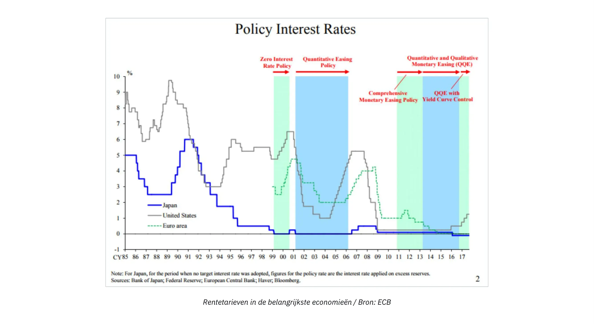

Figuur3 : Rentevoeten in de belangrijkste economieën / Bron: ECB

In tegenstelling tot wat velen verwachtten, hebben de QE-programma's de economische groei niet significant doen opleven, maar wel de financiële activa opgeblazen tot historische hoogten. Dit kwam vooral ten goede aan de rijken en de financiële instellingen, omdat zij al aanzienlijke hoeveelheden van dergelijke activa bezaten, waardoor de verschillen in rijkdom groter werden. Gezien de eerder uiteengezette structuur van het banksysteem zou deze uitkomst niet als een verrassing moeten komen. Aangezien bankreserves niet gemakkelijk kunnen doorstromen naar de reële economie, stimuleerden QE-programma's vooral de activaprijzen zonder de financiële situatie van de gemiddelde persoon effectief te verbeteren.

### Het Cantillon-effect

Niettemin kan uit deze episode een essentieel economisch principe worden afgeleid: wanneer nieuw geld wordt gecreëerd, komt dit in eerste instantie ten goede aan degenen die het dichtst bij de bron van het geld staan, ten koste van degenen die verder weg staan. Dit economische inzicht dateert al uit de 18e eeuw, toen Richard Cantillon het beschreef in zijn "Essay on the Nature of Commerce in General" Het wordt nu in de volksmond het "Cantillon-effect" genoemd.

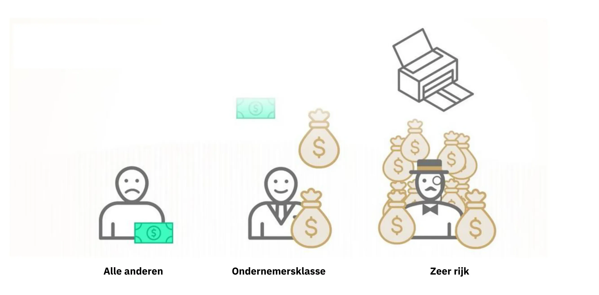

Figuur 4: Cantillon-effect in een notendop / Bron: River Financial

In dit geval ontvingen bankiers, bankdirecteuren, aandelen- en obligatiebezitters, vastgoedontwikkelaars, vastgoedleners en iedereen die financiële activa of vastgoed bezat een financiële meevaller, terwijl de lasten op alle anderen vielen. Deze situatie hield jarenlang aan en verklaart grotendeels de groeiende ongelijkheid in rijkdom, het gevoel van rechteloosheid onder hardwerkende individuen en de schijnbaar onstuitbare stijging van de activaprijzen ondanks een trage groei van het BBP.

In wezen is het systeem scheef. Banken zijn inherent instabiel, maar toch kan hun falen de hele economie in gevaar brengen. Dit moreel risico stimuleert bankdirecteuren om buitensporige risico's te nemen om de inkomsten van hun bank te maximaliseren, wetende dat de centrale bank hen uiteindelijk zal redden en de kosten zal doorschuiven naar de belastingbetaler. In dergelijke scenario's creëren centrale bankiers de voorwaarden voor een massale overdracht van koopkracht van hardwerkende individuen en spaarders naar vermogensbezitters en degenen die verbonden zijn aan het financiële systeem, waardoor het proces van welvaartscreatie wordt losgekoppeld van welvaartsaccumulatie.

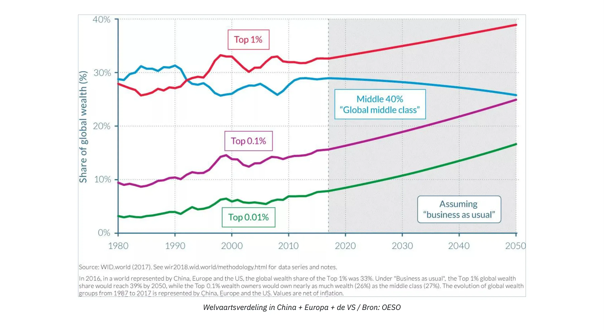

Figuur5: Vermogensverdeling in China + Europa + de VS / Bron: OESO

### Gevolgen van het nultariefbeleid

Tijdens lange periodes van een nulrentebeleid (ZIRP) hebben banken beperkte mogelijkheden om hun eigen vermogen weer op te bouwen omdat hun marges worden uitgehold. Banken verdienen doorgaans geld door te lenen tegen kortetermijnrente en te lenen tegen langetermijnrente. Wanneer centrale banken echter grote hoeveelheden obligaties opkopen en de rente op nul zetten, hebben banken weinig stimulans om leningen te verstrekken, vooral aan ondernemers en andere risiconemers. In plaats daarvan besteden ze hun middelen aan het securitiseren van bestaand kapitaal of het verstrekken van leningen tegen onderpand om te voldoen aan de vraag van degenen die profiteren van het Cantillon-effect.

Een ander onbedoeld gevolg van ZIRP is dat het overheden aanmoedigt om veel uit te geven. Omdat overheden geen financieringskosten hebben en kunnen vertrouwen op centrale banken om hun obligaties op te kopen door middel van QE-programma's, hebben ze een natuurlijke prikkel om zoveel mogelijk uit te geven, vooral in democratische contexten waar uitgaven stemmen kunnen opleveren. Deze neiging gaat vaak voorbij aan de langetermijngevolgen van dergelijke budgettaire spilzucht, wat heeft geleid tot een aanzienlijke stijging van de overheidsschuld in de ontwikkelde economieën sinds de wereldwijde financiële crisis.

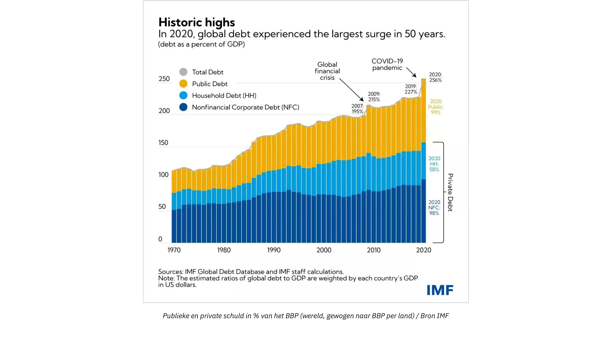

Figuur 6: Publieke en private schuld als % van het BBP (wereldwijd, gewogen naar BBP per land) / Bron IMF

Nu de inflatie toeneemt als gevolg van de aanzienlijke geldcreatie in reactie op de COVID-gerelateerde lockdowns, verhogen centrale bankiers de beleidsrente in een poging de inflatie te beteugelen. Dit vormt echter een grote uitdaging voor het hele systeem. Banken hebben meer schulden dan ooit, overheden hebben historisch hoge schuldniveaus, de economische groei is traag, tekorten lopen op en consumenten, die worstelen met stijgende prijzen voor essentiële goederen, hebben moeite om de eindjes aan elkaar te knopen. Om de inflatie onder controle te krijgen zouden de rentetarieven moeten worden verhoogd tot een niveau dat regeringen failliet zou kunnen laten gaan, terwijl banken het risico lopen spaarders te verliezen omdat particulieren hun spaargeld uitgeven aan steeds duurdere eerste levensbehoeften of hun heil zoeken in Hard activa en geldmarktfondsen om zich in te dekken tegen inflatie.

### Conclusie

> "Op deze manier (fractioneel reservebankieren) kunnen regeringen heimelijk en onopgemerkt de rijkdom van het volk confisqueren, en geen mens op een miljoen zou de diefstal ontdekken."
>

> John Maynard Keynes

In wezen staat ons systeem voor grote uitdagingen en Bitcoin komt naar voren als het enige geloofwaardige alternatief. Bitcoin alleen kan de problemen binnen ons monetaire systeem echter niet oplossen. Bovenal hebben we onder de Bitcoin enthousiastelingen mensen nodig die de economische basisprincipes begrijpen, zodat een breder bewustzijn en economisch gezond verstand ons wegleiden van het bouwen van nog een fragiel financieel fundament voor onze beschaving. Het primaire doel van deze cursus is om nieuwe Bitcoin enthousiastelingen te onderwijzen in gezonde economische principes.

Om dit doel te bereiken, zullen we de fundamentele principes van de "Oostenrijkse economie" uitleggen, een economische denkschool met een methodologische traditie die teruggaat tot de 16e eeuw, die inzichten verschaft in menselijk handelen onder economische beperkingen. Met deze inleiding begrijp je nu de essentie van geldschepping en de huidige staat van ons financiële en monetaire systeem.

In het volgende hoofdstuk verdiepen we ons in de hoeksteen van elke economische denkschool: de waardetheorie. In de daaropvolgende hoofdstukken gaan we dieper in op geld als sociale instelling, de theorie van kapitaal en de conjunctuurcyclus, de uitdaging van economische berekening en een kort overzicht van de geschiedenis en methodologie van de Oostenrijkse economische school.

# Theoretische grondslagen

<partId>86012c1b-cdf2-586f-8fe7-263f8287e950</partId>

## De subjectieve waardetheorie

<chapterId>eb1608d4-5d36-56a0-bcfc-ed8c03dfa906</chapterId>

> "Waarde bestaat alleen binnen het menselijk bewustzijn"
>

> Carl Menger, Principes van de politieke economie

### De marginale revolutie

Aan de basis van economisch redeneren ligt de vraag naar waarde. Hoe bepalen we de waarde van iets? Is waarde een inherente eigenschap van dingen? Of is het juist een subjectief fenomeen? Hoe vergelijken we de waarde van twee dingen? Waar komt waarde vandaan?

Dergelijke vragen houden economen en filosofen al vele eeuwen bezig en hebben talloze verschillende antwoorden gekregen. In veel opzichten is de epistemologische evolutie van de economie onderbroken door de evolutie van theorieën over waarde.

Nadat de landwaardetheorie van de fysiocraten, die stelden dat alle waarde afkomstig was van land, was weerlegd door de arbeidstheorie van de klassieke economen, die stelden dat de waarde van een goed voortkomt uit de hoeveelheid arbeid die in de productie ervan gaat zitten, was het de beurt aan de marginale waardetheorie om deze laatste te verdringen. Na Marx, de laatste van de klassieke economen, ontstonden in de jaren 1870 bijna gelijktijdig drie nieuwe economische stromingen rond een marginale waardetheorie: de school van Lausanne met Léon Walras, de moderne of neoklassieke school met William Stanley Jevons en de Oostenrijkse school met Carl Menger. Deze revolutie in de waardetheorie betekende een belangrijke vernieuwing in het economische denken.

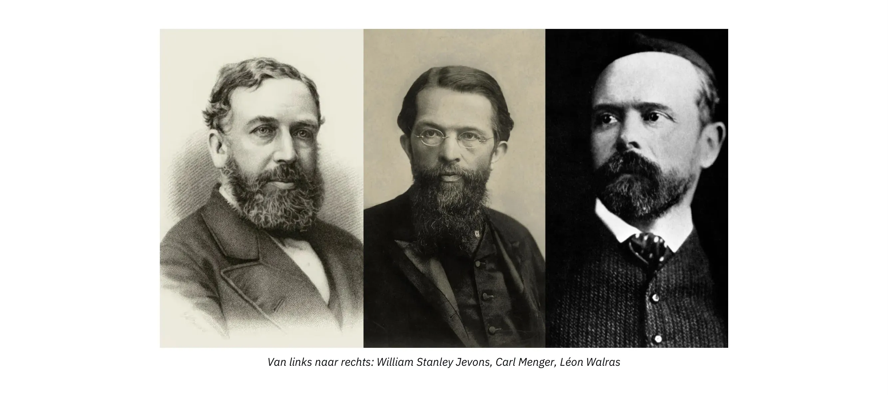

Van links naar rechts: William Stanley Jevons, Carl Menger, Léon Walras

De marginale waardetheorie stelt dat economische waarde overeenkomt met wat een economische agent bereid is te betalen voor de volgende eenheid van een goed of dienst. Omdat deze theorie de nadruk legt op het feit dat prijzen worden gevormd in de marge, d.w.z. voor de volgende eenheid van een bepaald goed, werd het "marginalisme" genoemd.

Het is gebruikelijk om het marginalisme van deze drie scholen als vergelijkbaar voor te stellen. Walras en Jevons zijn inderdaad zeer compatibel, maar de theorie van Menger wijkt op diepgaande manieren af van de anderen. In zijn werk "Grundsätze des Volkswirtschaftlehre" (Principes van de politieke economie) uit 1874, dat nu als fundamenteel voor de Oostenrijkse economische theorie wordt beschouwd, biedt Menger een marginale, maar voornamelijk subjectieve verklaring van waarde, in tegenstelling tot Walras en Jevons, die waarde als een objectief en meetbaar fenomeen beschouwen.

### Subjectieve waarde

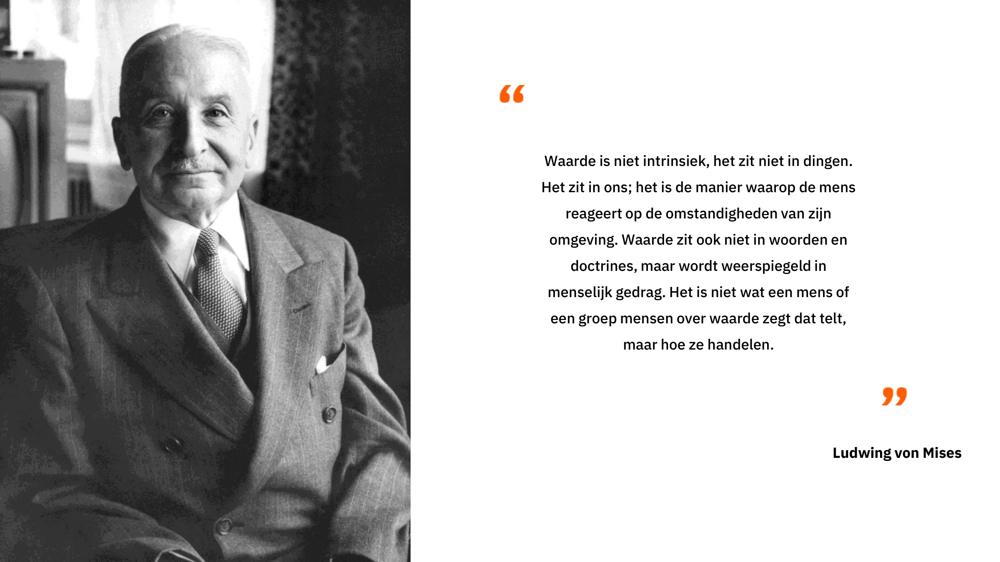

De Oostenrijkse econoom verwerpt de opvatting van de opvolgers van Adam Smith en verlaat het idee dat de waarde van een goed voortkomt uit de hoeveelheid arbeid die in de productie ervan is gebruikt, ten gunste van de opvatting dat de waarde ervan wordt bepaald door het individu, dat in elke context een mentale waarderingshandeling verricht met betrekking tot een specifieke hoeveelheid van een goed of dienst. Deze intellectuele sprong van Menger stelt de objectiviteit van waarde ter discussie: voor hem is waarde geen objectieve eigenschap van goederen; het is slechts het resultaat van de relatie die het individu heeft met dat ding: "waarde bestaat niet buiten het menselijk bewustzijn."

Met andere woorden, Menger nodigt ons uit om te overwegen dat waarde alleen bestaat als een subjectief psychologisch fenomeen binnen het individu, dat waarde geen inherente eigenschap van goederen is, maar eerder voortkomt uit de mening van het individu over het nut dat hij aan die goederen kan ontlenen.

Volgens deze opvatting heeft een liter drinkwater geen objectieve waarde. Iemand die toegang heeft tot een modern drinkwatersysteem en op dit moment geen dorst heeft, zou waarschijnlijk heel weinig waarde toekennen aan die extra liter water, terwijl iemand die midden in de woestijn dorst heeft en het ziet als het verschil tussen leven en dood, zeker bereid zou zijn om een bijna oneindige waarde toe te kennen aan die liter water.

Samengevat merkte Menger op dat de waarde van een economisch goed niets meer is dan de subjectieve waardering die een individu toekent aan een extra eenheid van dat goed of die dienst.

### Vrijwillige Exchange: een Positief-Somspel

Hieruit leidt Menger af dat vrijwillige Exchange tussen twee individuen plaatsvindt omdat elke partij gelooft dat het hun subjectieve nut zal vergroten. Voor hem veronderstelt Exchange geen gelijkwaardigheid van waarde, in tegenstelling tot wat de klassieke economen geloofden. Volgens de Oostenrijkse denker zou er, als er sprake was van gelijkwaardigheid van nut tussen de uitgewisselde goederen, geen reden zijn voor de partijen om überhaupt de moeite te nemen om te ruilen. Als er een Exchange is, dan is dat omdat elke partij het in hun (subjectieve) belang vindt, en bijgevolg levert elke vrijwillige Exchange een sociaal voordeel op.

### Waardering als een fenomeen van het ordenen van menselijke verlangens

Een dergelijk sociaal voordeel, of de subjectieve waarde die aan een goed wordt toegekend, kan echter niet worden gemeten. Voor Menger is waarde eerder een cognitief fenomeen van vergelijking (ordinaal) dan van meting (kardinaal). Het is niet, zoals de neoklassieke economen sinds Walras en Jevons denken, de Assignment door het individu van een numerieke waarde die het nut weergeeft dat ze eraan ontlenen, maar eerder een handeling van het ordenen van menselijke verlangens waarmee een individu uitdrukt dat hij een hoeveelheid van goed A intenser wenst dan een hoeveelheid van goed B.

Elke agent kan zeggen of hij liever 2 bananen heeft dan een cursus economie, maar niemand kan redelijkerwijs zeggen dat hij 2 bananen waardeert op 3,1416 utils, terwijl hij een cursus economie waardeert op 3 utils, en dat hij daarom liever de bananen heeft. Een dergelijke beschrijving van menselijke voorkeuren, gebaseerd op continue reële functies, komt niet overeen met de realiteit van de cognitieve processen die we in ons dagelijks leven ervaren. Een individu evalueert goederen die hem worden aangeboden nooit door ze te vergelijken met een abstracte standaard van nut. In plaats daarvan vergelijkt hij subjectief verschillende manieren van handelen, die hij niet in absolute termen kan beoordelen maar wel kan rangschikken op basis van hun relatieve wenselijkheid.

Deze subjectieve opvatting van waarde, opgevat als een psychologische relatie die het individu heeft met zijn doelen en de middelen die relevant zijn om deze doelen te bereiken, stelt Oostenrijkse economen ook in staat om het fenomeen van de arbeidsdeling te verklaren.

### De arbeidsverdeling

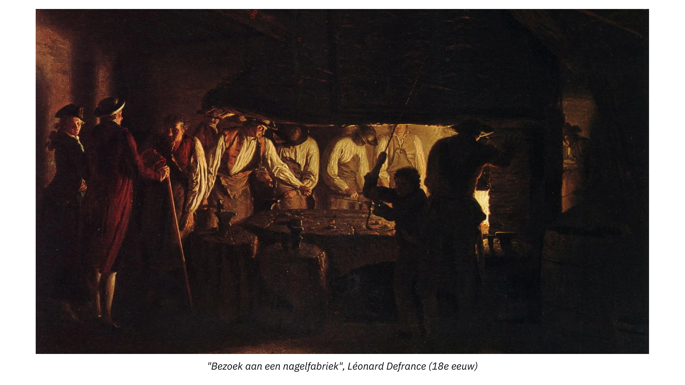

Bezoek aan een nagelfabriek, Léonard Defrance (18e eeuw)

Iedereen is uniek en heeft een bepaalde persoonlijke situatie. Daarom bezit iedereen een superieur vermogen om bepaalde taken uit te voeren dan zijn gelijken (absoluut voordeel) of een superieur vermogen om bepaalde taken uit te voeren dan andere (comparatief voordeel). Het kan niet anders; dit elementaire feit ontkennen zou zijn beweren dat alle mensen in alle opzichten gelijk zijn.

In het geval dat een individu een superieur vermogen heeft ten opzichte van zijn gelijken in de productie van een bepaald goed (absoluut voordeel), heeft hij er belang bij om zich te specialiseren in de productie van dat goed en vervolgens het verkregen overschot te ruilen voor de goederen die hij wenst. Door dit te doen, bevredigen ze hun subjectieve nut op een meer economische manier dan wanneer ze zich zouden toeleggen op de productie van alle goederen die ze wensen.

Maar het kan ook zo zijn dat het individu geen absoluut voordeel heeft bij de productie van welk goed dan ook. In dat geval zullen er nog steeds productietypes zijn waarin het individu beter is dan in andere (comparatief voordeel), en om die reden hebben ze er nog steeds belang bij om zich te specialiseren.

Zeker, er zijn individuen die dat bepaalde goed productiever zouden kunnen produceren dan hij, maar aangezien deze individuen waarschijnlijk productiever zijn in een andere taak dan in deze, en aangezien ze niet beide taken tegelijkertijd kunnen uitvoeren, is het onproductief voor hen om aan deze taak te werken in plaats van aan een andere waarvoor ze productiever zijn. Door zich te specialiseren in de taak waarvoor ze het meest productief zijn, zullen ze een surplus verkrijgen dat groter is dan wanneer ze zich niet hadden gespecialiseerd, en daarom zouden ze door Exchange een grotere hoeveelheid van die andere goederen kunnen verkrijgen, zelfs als de verkregen goederen door henzelf efficiënter zouden zijn geproduceerd dan door de producenten van wie ze die goederen hebben verkregen.

Neem het voorbeeld van een arts. Hij is misschien beter in het schrijven van e-mails en het plannen van afspraken dan zijn secretaresse (relatief voordeel). Maar alle tijd die hij aan deze taken besteedt, is tijd die hij niet besteedt aan het genezen van patiënten. Aangezien hij productiever is in het genezen van mensen, is het dus in zijn belang om administratieve taken aan iemand anders te delegeren, zelfs als hij beter is in die taak dan zijn plaatsvervanger, omdat het hem in staat stelt om de gegenereerde waarde voor anderen, en dus zijn eigen rijkdom, te maximaliseren.

In wezen is er een voordeel aan specialisatie, zelfs voor individuen die geen absolute voordelen hebben, omdat tijd een schaarse en rivaliserende hulpbron is: elke eenheid tijd die wordt besteed aan een andere activiteit dan die waarvoor een individu het meest productief is, brengt een kost met zich mee die wordt vertegenwoordigd door de gederfde productie waarvan ze afzien (opportuniteitskosten).

Zodra het individu gespecialiseerd is in een bepaalde productie, kan het de hoeveelheid producten die het nodig acht voor persoonlijke consumptie reserveren en het overschot Exchange gebruiken voor andere gewenste goederen. Door dit te doen, bevredigen ze hun verlangen naar de goederen die ze zelf produceren, wat betekent dat de resterende eenheden van hun productie weinig waarde voor hen hebben. Dit is wat economen afnemend marginaal nut noemen: elke extra eenheid van een goed is minder gewenst dan de vorige. Voor anderen die dergelijke goederen niet hebben, is het een ander verhaal: om dezelfde redenen hebben ze de neiging om intenser te verlangen naar de goederen die ze niet produceren dan naar de goederen die ze wel produceren. Dit leidt tot een situatie waarin er een sterke asymmetrie bestaat tussen de verschillende subjectieve waarderingen van individuen, wat zeer bevorderlijk is voor uitwisselingen: elke partij heeft er belang bij om zijn productieoverschot uit te wisselen omdat hij daarmee zijn subjectieve nut verhoogt.

Het resultaat van de voorgaande analyse is dat individuen altijd beter af zijn als ze zich specialiseren in hun werk en deelnemen aan uitwisselingen. Daarom concluderen Oostenrijkse economen, vooral Ludwig Von Mises, dat het productieve voordeel dat voortvloeit uit de arbeidsdeling de drijvende kracht is achter het proces van sociale samenwerking. Het kan nuttig zijn om hem hier rechtstreeks te citeren:

"De fundamentele feiten die samenwerking, maatschappij en beschaving tot stand brachten en de dierlijke mens in een menselijk wezen veranderden, zijn de feiten dat werk dat wordt uitgevoerd onder arbeidsverdeling productiever is dan geïsoleerd werk en dat de rede van de mens in staat is om deze waarheid te herkennen. [Mensen werken niet samen onder de arbeidsverdeling omdat ze van elkaar houden of zouden moeten houden. Ze werken samen omdat dit hun eigen belangen het beste dient."

### Conclusie

> "Als een man ziet dat hij comfortabeler kan leven als hij aan de galg hangt dan als hij aan tafel zit, zou hij wel gek zijn als hij zich niet zou verhangen."
>

> Baruch Spinoza

1871-1874 zijn de wonderbaarlijke jaren van de moderne economie: in deze periode werken drie onafhankelijke denkers aan de basis van de moderne economie. Met hun nadruk op subjectieve ordinale waarde ontwikkelen Oostenrijkse economen een heel economisch gedachtegoed dat hen onderscheidt van hun homologen. Het werk van Oostenrijkse economen die redeneren over menselijk handelen in de context van schaarste zal voor altijd in schril contrast staan met de economische doctrines die werden geïnitieerd door Jevons en Walras, die zwaar leunden op wiskunde en steunden op het idee dat waarde objectief kan worden gemeten en afgeleid als een continue functie.

Voortbouwend op de inzichten van subjectieve ordinale waarde verklaarde Menger het ontstaan van de arbeidsdeling en vrijwillige Exchange. Maar zoals we in het volgende hoofdstuk zullen zien, is directe Exchange een slechte strategie voor economische agenten die hun subjectieve nut willen maximaliseren. Maar zoals we in het volgende hoofdstuk zullen zien, is directe Exchange een slechte strategie voor economische agenten die hun subjectieve nut willen maximaliseren. De vader van de Oostenrijkse School heeft zijn redenering dus verder ontwikkeld om te verklaren waarom geld als sociale instelling is ontstaan.

De volgende hoofdstukken zijn gewijd aan het ontstaan van geld als sociale instelling, de theorie van kapitaal en rente, die als basis zal dienen voor de theorie van de conjunctuurcyclus, en tot slot de rol van prijzen voor economische berekeningen.

## De opkomst van geld als sociaal fenomeen

<chapterId>14ded794-0578-5478-ba5b-b2106c74f3ef</chapterId>

Hoewel individuen een gemeenschappelijk belang hebben bij specialisatie en het maximaliseren van de arbeidsverdeling, zijn er nog steeds coördinatieproblemen die deze uitbreiding beperken.

Ten eerste is het belangrijk op te merken dat aangezien productieprocessen inherent tijdsgebonden en vaak asynchroon (niet simultaan) zijn, er meestal een tijdsverschil zal zijn tussen de eerste bijdrage van een individu en de ontvangst van de tegenhanger. Je nu inzetten voor een specifieke taak zonder vooraf de zekerheid te hebben dat anderen in de toekomst aan onze behoeften zullen voldoen, kan riskant zijn.

In de arbeidsdeling profiteert elke partij van samenwerking, maar individueel zou iemand in de verleiding kunnen komen om te genieten van het werk van anderen zonder iets terug te doen, omdat hij op die manier iets waardevols wint zonder daarvoor kosten te maken. Dergelijke situaties, waarin onderlinge samenwerking resulteert in suboptimale voordelen voor individuen maar maximale voordelen voor de groep, worden in de speltheorie beschreven als het "dilemma van de gevangene"

### Het dilemma van de gevangene

Oorspronkelijk werd het dilemma van de gevangene als volgt geformuleerd: Twee verdachten, Alice en Bob, die niet in staat zijn om te communiceren, worden geconfronteerd met het risico van gevangenisstraf, met mogelijke straffen als volgt:

- Als Alice Bob beschuldigt en Bob zwijgt, gaat Alice vrijuit en krijgt Bob 3 jaar.
- Als Alice en Bob elkaar beschuldigen, krijgen ze elk 2 jaar.
- Als ze allebei zwijgen, krijgen ze elk 1 jaar.

Deze uitkomsten kunnen worden weergegeven in een matrix (numerieke resultaten geven het aantal jaren gevangenisstraf aan):

| Alice / Bob       | Accuse | Remain Silent |
| ----------------- | ------ | ------------- |
| **Accuse**        | 2, 2   | 0, 3          |
| **Remain Silent** | 3, 0   | 1, 1          |

In dit spel is er geen mogelijkheid tot coördinatie (communicatie is onmogelijk) om de beste uitkomst voor beide partijen te bereiken. Bijgevolg hebben Alice en Bob een individuele prikkel om elkaar te beschuldigen, ook al leidt dit niet tot de optimale uitkomst voor de groep. De optimale strategie voor beiden is zwijgen, waarbij ze elk een straf van 1 jaar krijgen.

Dit spel illustreert een probleem dat vaak voorkomt in het echte leven: bij gebrek aan coördinatiemechanismen hebben individuen de neiging om strategieën te kiezen die hun individuele winst maximaliseren, ongeacht de strategieën die anderen kiezen (diefstal, bedrog, verraad, geweld, enz.), zelfs wanneer een wenselijker evenwicht via coördinatie/samenwerking mogelijk is.

### Geld om coördinatieproblemen op te lossen

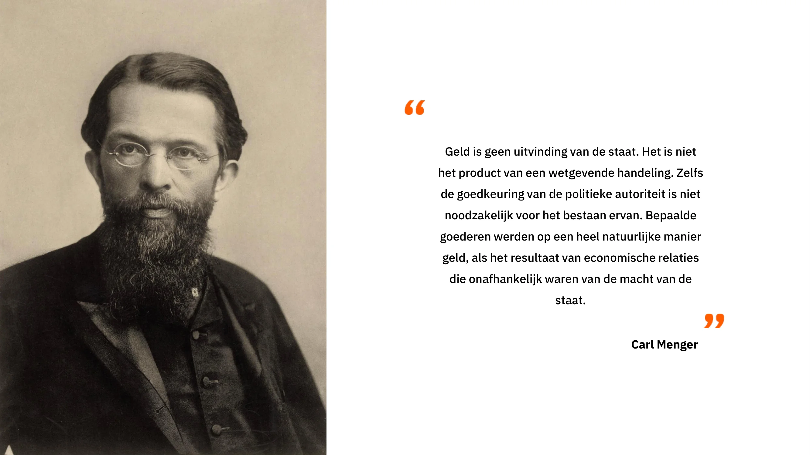

Dit probleem heeft minder impact in kleine gemeenschappen (bijv. familie, vriendenkringen) omdat in zulke gevallen iedereen elkaar direct kent, waardoor het mogelijk is om elkaars bijdragen te onthouden. Ervan uitgaande dat het verlaten van de gemeenschap (desertie) kosten met zich meebrengt, is een reputatiesysteem gebaseerd op het geheugen van individuele agenten meestal voldoende om de valkuilen van het prisoner's dilemma te vermijden.

Wanneer we echter te maken hebben met grotere gemeenschappen die veel voordeel halen uit de taakverdeling, duiken er opnieuw coördinatieproblemen op. Dit heeft twee belangrijke redenen:

Ten eerste zijn mensen beperkt door hun cognitieve capaciteiten. Het is onmogelijk voor een persoon om stabiele sociale relaties met meer dan 150 individuen te onderhouden en te onthouden, waardoor een reputatiesysteem onvoldoende is om het prisoner's dilemma op schaal te overwinnen.

Ten tweede is het sociaal aanvaard meten van de waarde van bijdragen in Exchange (commensurabiliteit) een niet-triviaal probleem. Als een individu bijvoorbeeld vlees van de jacht levert en in ruil daarvoor materialen voor onderdak vraagt, hoe kan de hoeveelheid vlees die wordt aangeboden dan worden geëvalueerd in termen die gelijkwaardig zijn aan de gevraagde materialen? Hetzelfde geldt voor kwaliteit - is hertenvlees meer of minder waard dan hout?

Zelfs als het mogelijk zou zijn om een bevredigend Exchange tarief vast te stellen voor elk paar goederen, wordt het onderhouden van deze informatie al snel onpraktisch. In een direct Exchange systeem met N goederen, zijn er N(N-1)/2 Exchange tarieven om te onthouden. Voor een economie van 50 goederen betekent dat 50\*49/2, of 1225 Exchange tarieven onthouden, in tegenstelling tot slechts 50 in indirecte uitwisselingen. Voor een economie van 100 goederen stijgt dit aantal tot 4950. Zo'n kwadratische relatie legt een extra limiet op de schaalbaarheid van directe Exchange (ruilhandel).

Aangezien deze uitwisselingen niet onmiddellijk plaatsvinden, maar in de tijd gespreid zijn, maakt het evalueren van bijdragen in de tijd de relatieve beoordeling van bijdragen nog ingewikkelder. Naast het beoordelen van de Exchange verhouding tussen twee huidige goederen, wordt het noodzakelijk om de waarde van een bijdrage uit het verleden ten opzichte van een toekomstige tegenhanger te beoordelen.

Vandaag de dag kunnen we, ondanks de onpraktische aard van zo'n systeem, schrijven of digitale gegevensopslag gebruiken om al deze informatie te onthouden en een kredietsysteem op te zetten (het bijhouden van bijdragen uit het verleden, inclusief het Exchange percentage van die bijdragen, is in wezen het opzetten van een kredietsysteem).

In de tijd vóór de beschaving bestonden deze technologieën niet. Onze voorouders moesten dus andere oplossingen vinden om te kunnen profiteren van de voordelen van arbeidsverdeling zonder zichzelf bloot te stellen aan de negatieve gevolgen van het gevangenendilemma. De oplossing voor dit probleem van directe Exchange was indirecte Exchange, vergemakkelijkt door geld.

### Dubbele coïncidentie van wensen en verkoopbaarheid

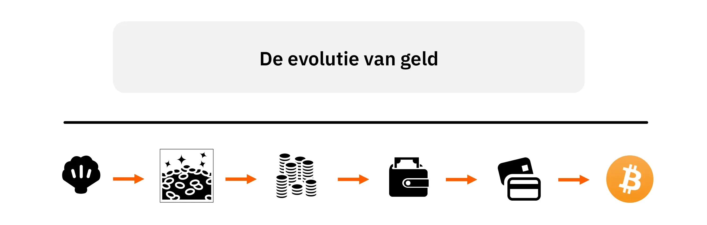

Geld kan gezien worden als de oplossing die onze voorouders ontdekten voor Address wat economen het probleem van de "dubbele samenloop van behoeften" noemen. Dit probleem heeft drie dimensies: ruimtelijk, temporeel en interpersoonlijk.

Bij een directe Exchange (ruil) tussen Alice en Bob moeten ze allebei iets bezitten wat de ander op hetzelfde moment en op dezelfde plaats wil hebben. Door gebruik te maken van indirecte Exchange, d.w.z. via geld, kan Alice iets kopen van Bob, en kan Bob die geldeenheid elders, op een ander moment, en bij iemand anders gebruiken (mits de ander die vorm van geld accepteert).

Om als geld te kunnen dienen, moet een goed een hoge verkoopbaarheid hebben, wat betekent dat het door zoveel mogelijk mensen gewenst moet zijn, het grootste deel van de tijd. Door een goed met een hoge verkoopbaarheid te gebruiken, wordt het probleem van het dubbel samenvallen van behoeften opgelost in termen van ruimtelijke en interpersoonlijke dimensies: als het goed dat ik als geld gebruik overal en door de meeste mensen begeerd wordt, kan ik de handeling van het verkopen gemakkelijk scheiden van de handeling van het kopen in termen van locatie en sociale interactie.

Het probleem van de verkoopbaarheid na verloop van tijd is echter om twee redenen moeilijker op te lossen:

Ten eerste verandert entropie (algemeen bekend als het "effect van tijd") geleidelijk de eigenschappen van de meeste goederen met direct nut. Om de verkoopbaarheid van een goed in de loop der tijd te behouden, moet het dus zeer duurzaam zijn of bestand tegen entropie.

Ten tweede garandeert de relatieve schaarste van een goed op tijdstip "t" niet de relatieve schaarste ervan in de toekomst. Door voldoende middelen te wijden aan een specifiek productiegebied kunnen mensen de Supply van elk goed verhogen. De enige beperking voor het verhogen van de productie van een goed zijn de bijbehorende opportuniteitskosten. Bijgevolg kan de huidige relatieve schaarste van een goed zijn toekomstige relatieve schaarste niet garanderen. Alleen goederen waarvan de marginale productie tegen zeer hoge kosten kan worden verhoogd, kunnen constant schaars zijn, wat een kenmerk is van vrij opkomende monetaire goederen door de menselijke geschiedenis heen.

In pre-beschavingstijd dienden verschillende goederen zoals zeeschelpen, bewerkte juwelen, halskettingen of kralen als geld. Deze goederen waren gemakkelijk te vervoeren, hadden naast hun sierwaarde geen direct nut, waren bestand tegen entropie (d.w.z. ze verslechterden niet na verloop van tijd), waren van nature schaars en/of vereisten een aanzienlijke hoeveelheid gespecialiseerde arbeid om te produceren. Omdat de arbeidsverdeling in die tijd laag was en de opportuniteitskosten voor de productie van siervoorwerpen hoog waren, konden deze voorwerpen niet in grote hoeveelheden worden geproduceerd. Degenen die deze voorwerpen als geld gebruikten, waren dus verzekerd van hun toekomstige relatieve schaarste.

Het feit dat onze jager-verzamelaars voorouders zich bezighielden met deze grondstof-intensieve taken, ook al leverden ze geen goederen met direct nut op, toont de aanzienlijke voordelen aan die ze verwachtten van het uitbreiden van de ruimtelijke, sociale en temporele reikwijdte van Exchange. Als dit niet het geval was, en het voor hen nuttiger was om deze hulpbronnen te gebruiken voor de bouw van schuilplaatsen, de jacht of andere activiteiten in plaats van de productie van monetaire goederen, dan zouden we waarschijnlijk niet zoveel archeologisch bewijs vinden van deze ambachtelijke activiteiten. Andere groepen die hun hulpbronnen efficiënter gebruikten, zouden een betere ontwikkeling en grotere welvaart hebben gekend en deze ambachtelijke activiteiten zouden snel zijn verdwenen ten gunste van activiteiten waarbij goederen met een direct nut werden geproduceerd.

In die zin vertegenwoordigde de productie van monetaire goederen, door de uitbreiding van de arbeidsdeling te bevorderen, een winstgevender gebruik van middelen (in termen van subjectief nut voor individuen) dan alle andere alternatieven (meer jagen, vissen, verzamelen, houtproductie, huizen bouwen, meer jacht- en visgereedschap produceren, etc.).

### Onzekerheid

Om onze analyse van de monetaire instelling af te ronden, moeten we de kwestie van economische actie Address in de context van de onvermijdelijke onzekerheid over de toekomst.

Zoals Oostenrijkse economen hebben opgemerkt, is menselijk handelen tijdsgebonden en altijd gericht op de toekomst. Wanneer een individu handelt, verandert hij zijn huidige toestand in de hoop op toekomstige voldoening. Deze mentale projectie kan gericht zijn op de nabije of verre toekomst, maar als een individu op de lange termijn wil projecteren, moet hij eerst zijn levensonderhoud op korte termijn veiligstellen omdat zijn toestand in de nabije toekomst een directe invloed heeft op zijn toestand in de verre toekomst.

Dit komt rechtstreeks voort uit de menselijke rationaliteit; niemand kan de sequentiële aard van temporele fenomenen en de daaruit voortvloeiende chronologische afhankelijkheid negeren omdat dit een van de essentiële beperkingen van het menselijk leven is. Omdat de toekomst voor mensen altijd onzeker blijft, zullen ze daarom hun overleving op lange termijn pas veilig willen stellen als hun overleving op korte termijn verzekerd is.

In dit opzicht speelt geld, doordat het de opslag van waarde in het heden en de overdracht ervan naar iemands toekomstige zelf mogelijk maakt, een cruciale rol in de intertemporele coördinatie van menselijk handelen. Door geld op te slaan, d.w.z. te sparen, wapenen individuen zich tegen toekomstige onzekerheid en stellen ze zichzelf zo in staat om hun acties op langere tijdshorizonten te richten. Ze kunnen dit echter alleen bereiken als het gebruikte geld waardevast is, wat betekent dat het in de loop der tijd verkoopbaar is, wat, zoals eerder vermeld, een kenmerk is van duurzame en relatief schaarse goederen.

In het volgende hoofdstuk verdiepen we ons in het concept van tijdvoorkeur en leggen we het Oostenrijkse perspectief op rente en kapitaal uit, dat als basis zal dienen voor het volgende hoofdstuk over de theorie van de conjunctuurcyclus.

## Tijdspreferentie, rente en kapitaal

<chapterId>37732a5c-4f66-5e2d-bc2c-cc8d29693af7</chapterId>

### Tijd voorkeur

We sloten het vorige hoofdstuk af met uit te leggen hoe economische agenten het meest verkoopbare goed, namelijk geld, gebruiken om toekomstige onzekerheid af te wenden. We legden ook uit dat de sequentiële aard van temporele fenomenen ons ertoe brengt om onzekerheid geleidelijk te bestrijden: pas als we weten dat ons levensonderhoud de komende week verzekerd is, kunnen we ons concentreren op doelen die verder in de toekomst liggen.

Of, om het anders te zeggen: als mensen houden we geen rekening met de waarde van toekomstige goederen.

Deze subjectieve evaluatie van de waarde van toekomstige goederen in vergelijking met huidige goederen wordt tijdsvoorkeur genoemd. Als al het andere gelijk blijft, hebben huidige goederen inherent de voorkeur boven toekomstige goederen. Omdat we sterfelijk zijn en de toekomst altijd onzeker is, hebben we natuurlijk liever nu dan later toegang tot een goed. Hoewel tijdsvoorkeur kan verschillen tussen individuen, door een groot aantal factoren zoals cultuur, rijkdom, opleiding, fysiologie, enz. is tijdsvoorkeur altijd positief, wat betekent dat we, als alles gelijk blijft, altijd meer waarde hechten aan huidige goederen dan aan toekomstige goederen.

Dit concept van relatieve waardering van toekomstige goederen ten opzichte van huidige goederen ligt aan de basis van het fenomeen rente. In een economie met ongemanipuleerde kapitaalmarkten worden referentierentevoeten (die worden beschouwd als risicovrij van wanbetaling) immers bepaald op het snijpunt van kapitaal Supply en vraag. Daarom vertegenwoordigen deze rentetarieven de tijdsvoorkeuren voor de hele economie: een stijging van de rentevoet resulteert in een relatieve stijging van de vraag naar kapitaal ten opzichte van Supply, wat duidt op hogere tijdsvoorkeuren. Omgekeerd is een daling van de rentetarieven het gevolg van een stijging van de besparingen, wat een stijging is van de Supply van kapitaal, wat wijst op een daling van de tijdsvoorkeuren.

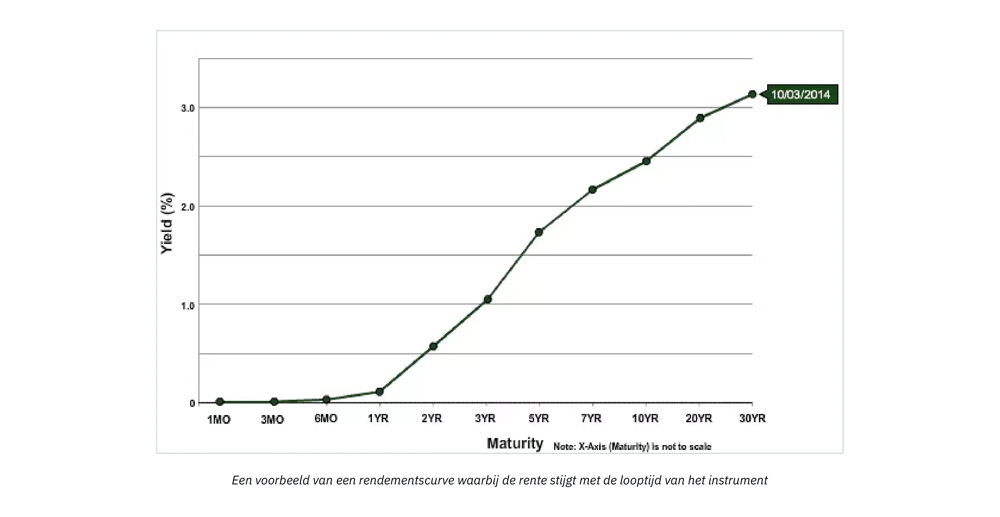

In een economie waar de rentetarieven niet gemanipuleerd worden door de centrale bank, zien we meestal een stijgende rentecurve: hoe langer de looptijd van de schuld, hoe hoger de rente. De omgekeerde situatie kan zich niet voordoen omdat dit zou betekenen dat de toekomst zekerder is dan het heden, wat een logische onmogelijkheid is.

Het concept van tijdvoorkeur en hoe we onze eigen tijdvoorkeur tot uitdrukking brengen door te consumeren en te sparen, is fundamenteel voor de processen van kapitaalallocatie en productie. Laten we ons wenden tot Mengers leerling, Eugen von Böhm-Bawerk, en zijn kapitaaltheorie om precies te begrijpen hoe tijdvoorkeur de organisatie van de productie beïnvloedt.

### Kapitaal Theorie

Aan het begin van deze cursus zagen we dat, voor Carl Menger, goederen alleen als economische goederen worden beschouwd (gewaardeerd) omdat ze dienen als middel om doelen te bereiken die door individuen worden gekozen en gewaardeerd. Volgens deze opvatting draait alle economische analyse om consumptie omdat dit uiteindelijk het motiverende doel is achter alle economische activiteit. Daarom zijn voor Menger consumptiegoederen, of eindgoederen, het uitgangspunt van economische analyse, omdat zij het uiteindelijke doel van economische activiteit vertegenwoordigen. Alle andere goederen in de economie, die we "intermediaire goederen" kunnen noemen, hebben alleen waarde omdat ze individuen in staat stellen deze consumptiegoederen te verkrijgen: het zijn goederen die worden gebruikt bij de productie van andere goederen.

Om consumptiegoederen te produceren, combineren ondernemers deze verschillende intermediaire goederen met de oorspronkelijke productiefactoren (arbeid, land en kapitaal) volgens een patroon dat de resulterende productie maximaliseert. Dit arrangement, gemaakt door ondernemers, of de productiestructuur, omvat verschillende stadia waarin intermediaire goederen transformaties ondergaan totdat ze uiteindelijk consumptiegoederen worden.

Zo kunnen we, net als Menger, consumptiegoederen definiëren als goederen van de eerste orde, goederen uit de vorige fase als goederen van de tweede orde, goederen uit de fase daarvoor als goederen van de derde orde, enzovoort, totdat we de oorspronkelijke factoren (land, arbeid, kapitaal) bereiken. Het aantal stadia dat we beschouwen hangt fundamenteel af van de productiestructuur die ondernemers hanteren en moet niet worden gezien als een objectief kenmerk van de productiestructuur. Integendeel, productiefasen en intermediaire goederen bestaan alleen binnen een teleologische context: de actor heeft een opeenvolging van acties voor ogen waarmee hij zijn gewenste doel zal bereiken, en hij verdeelt zijn actie mentaal in opeenvolgende fasen.

Dit kenmerk van mentale projectie van actie in een sequentieel patroon wordt opgelegd door de temporele aard van menselijke actie. Elke actie die mensen ondernemen kost tijd; onmiddellijke actie is onmogelijk. Daarom heeft de actor altijd de keuze tussen actiepatronen die meer of minder tijd kosten.

Aangezien individuen noodzakelijkerwijs positieve tijdsvoorkeuren hebben, wat betekent dat ze de voorkeur geven aan huidige goederen boven toekomstige goederen, zullen ze alleen een langere weg kiezen als het verkregen resultaat voor hen een grotere subjectieve waarde heeft dan wat ze zouden hebben bereikt door de directe weg te nemen. Anders zou niemand kiezen voor meer tijdrovende methoden: bij gelijkwaardige resultaten blijft de kortste weg de voorkeurskeuze.

Door de sequentiële aard van menselijk handelen hebben deze intertemporele keuzes altijd implicaties voor de volgorde van handelen. Met andere woorden, de kortetermijnacties die ik onderneem zijn ondergeschikt aan de langetermijndoelen die ik stel, en mijn kortetermijnacties zullen beïnvloeden wat ik in de toekomst kan doen. De implicatie van dit voor de hand liggende punt met betrekking tot productieactiviteiten is dat elke productieomweg, d.w.z. elke verlenging van de productiestructuur, voorafgaande besparingen vereist. Als ik besluit om in het heden meer middelen toe te wijzen om een toekomstig doel te bereiken, moet ik eerst opzij zetten wat me in leven zal houden gedurende de tijd die mijn investering in beslag neemt.

Laten we, om dit punt te illustreren, het voorbeeld van Böhm-Bawerk nog eens bekijken, in zijn werk "Kapitaal en rente":

Eugen von Böhm-Bawerk (1851-1914)

### Robinson Crusoe en Productie Detour/Roundabout:

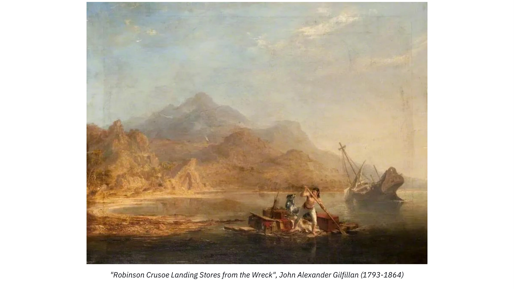

Robinson Crusoe Landing Stores van het wrak, John Alexander Gilfillan (1793-1864)

In zijn boek nodigt de Oostenrijkse econoom ons uit om na te denken over de intertemporele afwegingen die inherent zijn aan productieomwegen door middel van een gedachte-experiment gebaseerd op Robinson Crusoe alleen op zijn eiland.

Robinson is, net als een primitief mens, afhankelijk van foerageren en jagen voor zijn levensonderhoud. Laten we ons eens voorstellen dat Robinson in acht uur genoeg bessen kan verzamelen om zich een hele dag te voeden. In dergelijke omstandigheden heeft hij weinig tijd voor andere activiteiten. Robinson denkt echter dat hij door een houten paal te maken de bessen gemakkelijk kan plukken en in slechts vier uur werk aan zijn dagelijkse voedsel kan komen. Bovendien schat hij dat het hem vijf dagen kost om de paal te maken, waarbij hij elke dag twee uur werkt. Daarom concludeert hij dat hij 1/5de van zijn bessenproductie voor vijf dagen moet sparen, of anders 2 uur per dag extra moet besteden aan het verzamelen van bessen gedurende 5 dagen, om genoeg bessen te sparen om zichzelf te onderhouden gedurende de tijd die hij besteedt aan het maken van de paal.

Als hij deze voorafgaande besparing niet maakt, zal Robinson zijn paal niet kunnen voltooien en in de tussentijd misschien sterven.

Dus offert hij vijf dagen lang twee uur van zijn rust op om meer bessen te verzamelen. Aan het einde van deze periode heeft hij genoeg bessen en begint hij met het maken van de houten paal, waarbij hij vijf dagen lang twee uur per dag werkt. Als zijn werk klaar is, kan hij genoeg bessen verzamelen voor zijn dagelijkse portie in 4 uur in plaats van 8, waardoor hij de resterende 4 uur per dag kan gebruiken voor andere activiteiten.

Door op deze manier te handelen, neemt Robinson een productieomweg: in plaats van de bessen direct te plukken, investeert hij in de productie van een kapitaalgoed dat hem in de toekomst productiever zal maken. Om dit te bereiken moet hij echter op korte termijn iets opofferen, namelijk sparen. Als hij dat niet zou doen, zou hij zijn kapitaalgoed niet kunnen voltooien. Dit korte-termijn offer levert hem echter een aanzienlijk voordeel op, want eenmaal uitgerust met zijn paal, wint hij 4 uur per dag (totdat de paal verouderd raakt). Met deze 4 extra uren per dag kan hij meer kapitaalgoederen maken, zoals jachtgereedschap of visnetten, waardoor zijn situatie geleidelijk verbetert.

### Conclusie

Met andere woorden, in de eenpersoonseconomie van Robinson Crusoe is sparen door het opofferen van huidige bevrediging datgene wat het kapitaal opbouwt dat de productiviteit verhoogt. In deze context is sparen, d.w.z. het uitstellen van huidige bevrediging, de prijs die betaald moet worden voor meer toekomstige bevrediging. Dit betekent dat, in deze context, sparen de voorwaarde en noodzakelijke voorwaarde is voor elke economische ontwikkeling.

Dit is een prikkelend, zij het eenvoudig concept: elke uitbreiding van de productiestructuur vereist voorafgaande besparingen (omdat de goederen die nodig zijn voor dergelijke productie niet uit de lucht komen vallen), en dus, hoe meer we sparen, hoe meer kapitaal we zullen kunnen accumuleren, wat zich op zijn beurt zal vertalen in productiviteitswinst die meer goederen oplevert. Oostenrijkse economen zijn dus van mening dat de verlaging van de tijdsvoorkeur het startpunt is van een opwaartse spiraal van besparingen -> meer kapitaalgoederen  meer productiviteit  meer goederen = hogere levensstandaard -> lagere tijdsvoorkeur.

Zoals in het eerste hoofdstuk al werd gezegd, zijn rentetarieven decennialang gemanipuleerd door centrale banken, terwijl commerciële banken krediet verstrekten zonder voorafgaande reserves, wat betekent dat rentetarieven onze tijdsvoorkeur niet weergeven en een illusie geven van overvloedig sparen.

Dit wordt perfect geïllustreerd door de onderstaande grafiek: de lange rente is lager dan de korte rente. Ten eerste is dit absoluut onlogisch, omdat het zou betekenen dat de toekomst zekerder is dan het heden. Ten tweede rechtvaardigt het een onderzoek naar de gevolgen voor de allocatie van kapitaal: als iedereen gestimuleerd wordt om te doen alsof er spaargeld in overvloed is, terwijl spaarders nergens te vinden zijn omdat ze niet beloond worden voor sparen, wat voor gevolgen kan dit dan hebben voor de economie?

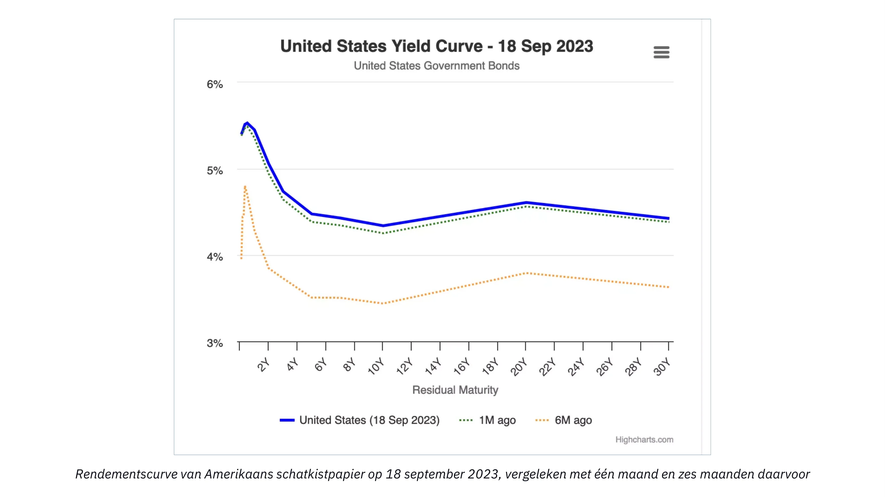

Dit zullen we ontdekken in het volgende hoofdstuk over de Oostenrijkse theorie van de conjunctuurcyclus!

# Oostenrijkse economische perspectieven

<partId>ad0fce42-2556-56b8-a093-5b4fcacc7cf3</partId>

## De Oostenrijkse theorie van de conjunctuurcyclus

<chapterId>718afaa8-ce78-58aa-9477-073eef0bd137</chapterId>

> "Hoe langer de hausse van inflatoir bankkrediet aanhoudt, hoe groter de omvang van de desinvesteringen in kapitaalgoederen en hoe groter de behoefte aan liquidatie van deze ondeugdelijke investeringen. Wanneer de kredietexpansie stopt, omkeert of zelfs aanzienlijk vertraagt, komen de desinvesteringen aan het licht"
>

> Ludwig von Mises

Het was Ludwig Von Mises, de meest succesvolle student van Böhm-Bawerk en waarschijnlijk de belangrijkste Oostenrijkse econoom van de 20e eeuw, die de kapitaalredenering van Böhm-Bawerk gebruikte om de oorzaken en dynamiek van economische cycli te verklaren. Friedrich A. Hayek, Mises' protegé, breidde deze redenering later uit tot de logische conclusies in werken waarvoor hij in 1974 de Nobelprijs voor Economie kreeg.

Mises en Hayek begonnen hun analyse met een toename van de besparingen als uitgangspunt. Zoals we in de vorige hoofdstukken hebben gezien, leidt elke toename van de besparingen noodzakelijkerwijs tot een overeenkomstige afname van de consumptie en dus tot lagere relatieve prijzen van consumptiegoederen. Dit leidt tot twee effecten: ten eerste een grotere vraag naar kapitaalgoederen door stijgende reële lonen als gevolg van de relatieve daling van de prijzen van consumptiegoederen; en ten tweede een stijging van de ondernemerswinsten in de productiefasen die het verst van de consumptie verwijderd zijn (lagere orde). Als de reële lonen stijgen, worden ondernemers gestimuleerd om arbeid te besparen door meer kapitaalgoederen te gebruiken, wat leidt tot een grotere vraag naar kapitaalgoederen en hogere winsten voor ondernemers die deze goederen van lagere orde produceren. In de context van toegenomen besparingen, d.w.z. een afname in tijdsvoorkeuren, dalen de rentetarieven dus, wat de ontwikkeling van extra productiefasen en een toegenomen productiviteit bevordert. Dit is een klassieke Böhm-Bawerkiaanse productieomweg, en het is een zeer wenselijke uitkomst.

De twee Oostenrijkse economen vroegen zich echter af wat er zou gebeuren als de daling van de rentevoet, die als uitgangspunt dient voor deze productieomweg, niet het gevolg zou zijn van een toename in besparingen, maar in plaats daarvan van een kredietexpansie.

In de context van fractioneel reservebankieren vereist een kredietexpansie geen overeenkomstige toename van de besparingen. Daarom kunnen ondernemers meer kapitaal aantrekken en productieomwegen nemen, zelfs als de tijdsvoorkeuren onveranderd blijven, d.w.z. zonder enige afname in consumptie. Voor Hayek en Mises zou een dergelijke situatie noodzakelijkerwijs moeten leiden tot aanzienlijke coördinatieproblemen tussen economische agenten. Door het ontbreken van een vrije marktrente zijn deze problemen misschien niet onmiddellijk zichtbaar, maar op de lange termijn zouden de resulterende verkeerde allocaties van kapitaal tastbare gevolgen moeten hebben: een recessie.

Om dit fenomeen van temporele miscoordinatie en de gevolgen ervan zo duidelijk mogelijk te beschrijven, zullen we ons baseren op een model van de productiestructuur en observeren hoe deze wordt beïnvloed, eerst door een daling van de rentetarieven als gevolg van een toename in besparingen, en vervolgens door een daling van de rentetarieven als gevolg van een kredietexpansie.

### Daling van de rentetarieven door een stijging van de spaartegoeden:

Om onze uitleg te vergemakkelijken, zullen we terugkeren naar Mengers classificatie van goederen en de productiestructuur weergeven in een diagram dat bestaat uit een willekeurig aantal stadia:

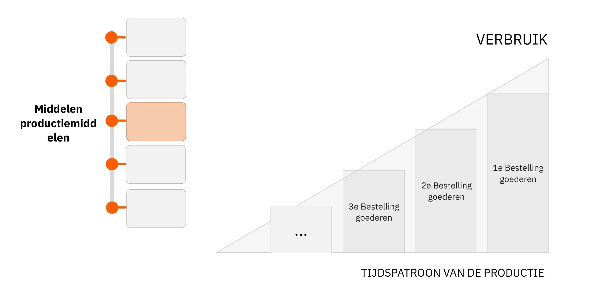

In het bovenstaande diagram doorlopen initiële middelen verschillende productiefasen, waarbij ze transformaties ondergaan die hen dichter bij de staat van uiteindelijke consumptiegoederen brengen (door interactie met oorspronkelijke productiefactoren: tijd, land, arbeid). De hoogte van de rechterkant van de driehoek stelt schematisch het BBP voor, aangezien het de som is van alle consumptiegoederen die in een periode zijn verkocht. Het verschil tussen elke staaf komt overeen met de toegevoegde waarde (in monetaire termen) die door elke fase van het proces wordt gegenereerd. Dit verschil kan ook worden gezien als het inkomen dat bij elke fase hoort (opbrengsten - kosten).

Als economische agenten op geaggregeerd niveau hun besparingen verhogen, zal de hoeveelheid geconsumeerde finale goederen afnemen - al het andere gelijk zijnde, houdt sparen noodzakelijkerwijs in dat een deel van de consumptie wordt uitgesteld naar een later tijdstip. Als gevolg daarvan zullen de rentetarieven dalen - omdat de Supply van kapitaal toeneemt, waardoor ondernemers deze instroom van kapitaal kunnen gebruiken om nieuwe investeringsgoederen te creëren en zo de productiestructuur kunnen verlengen.

We krijgen dan een uitgebreide productiestructuur, een verandering die kwalitatief kan worden weergegeven door het volgende diagram:

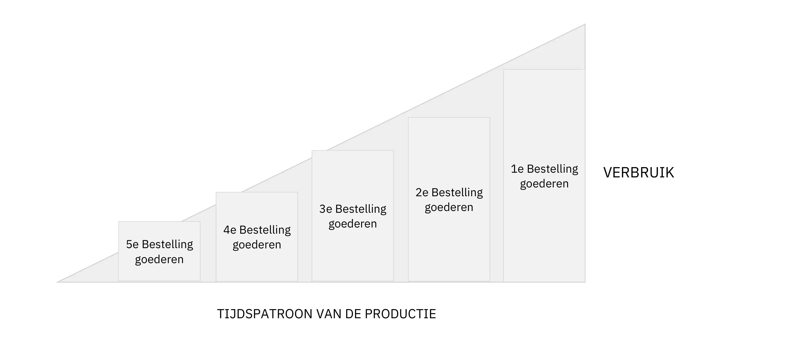

Hier is de monetaire waarde van de gevraagde consumptiegoederen gedaald, waardoor middelen vrijkomen voor het creëren van een extra productiefase. In dit scenario, waarin de daling van de rente een gevolg is van verminderde consumptie, d.w.z. toegenomen besparingen, blijft de oppervlakte van de driehoek, die de hoeveelheid geld in omloop weergeeft, ongewijzigd. De transformatie van de productiestructuur (verlenging) is simpelweg het gevolg van een overdracht van koopkracht van het ene deel van de structuur naar het andere.

Het is ook opmerkelijk dat de daling van de vraag naar consumptiegoederen op de middellange termijn eerder zal leiden tot een daling van de consumentenprijzen dan tot een daling van de hoeveelheid aangeboden eindgoederen. Dit komt omdat het laatste deel van de productiestructuur zich niet onmiddellijk zal aanpassen na de daling van de vraag naar consumptiegoederen; ondernemers zullen enige tijd nodig hebben om hun plannen en investeringen aan te passen. Aangezien ze voorraden aanhouden, zal de daling van de vraag hen dwingen om deze voorraden met korting te verkopen, en bijgevolg zal het overschot aan besparingen aanvankelijk resulteren in lagere prijzen voor consumptiegoederen (d.w.z. een stijging van de reële lonen).

Omgekeerd zullen de prijzen van investeringsgoederen stijgen omdat de overdracht van koopkracht naar ondernemers hen in staat stelt hun investeringsuitgaven te verhogen. Zodra dit spaargeld, dat door spaarders aan ondernemers is overgedragen, door laatstgenoemden is uitgegeven, zullen de rentetarieven weer gaan stijgen (vanwege een verminderde Supply van kapitaal), wat weer zal leiden tot lagere prijzen voor investeringsgoederen. Aan het einde van deze productieomweg zullen de relatieve prijzen in feite ongeveer hetzelfde blijven als voorheen. Maar de economische actoren profiteren over het geheel genomen: de toegenomen productiviteit als gevolg van de verlenging van de productiestructuur zal consumenten meer producten bieden tegen lagere eenheidsprijzen; de koopkracht van spaarders zal toenemen, deels door rentebaten en deels door lagere consumentenprijzen; ondertussen zullen ondernemers, als geheel, noch winst noch verlies ervaren. Degenen die zich bezighouden met activiteiten die het dichtst bij de consumptie liggen zullen inkomen verliezen, terwijl degenen die betrokken zijn bij het creëren van nieuwe productiefasen proportioneel zullen winnen. In een dergelijke situatie wordt er geen nieuw monetair inkomen gecreëerd; het is de productie die toeneemt en dus stijgt de reële waarde van inkomens.

### Daling van de rente door een stijging van het krediet (geen stijging van het spaargeld):

Als we nu kijken naar een daling van de rentetarieven als gevolg van een uitbreiding van het kredietaanbod van banken, krijgen we een heel ander beeld van de productiestructuur.

Met lagere rentetarieven kunnen ondernemers meer middelen lenen en dus productiestadia van een hogere orde creëren. In dit geval zal een dergelijke uitbreiding van de productiestructuur niet leiden tot een lagere consumptie omdat de consument zijn huidige consumptie niet heeft uitgesteld. Met andere woorden, het BBP groeit. Bijgevolg zal onze driehoek langer worden terwijl de hoogte gelijk blijft, wat betekent dat de oppervlakte toeneemt.

Merk op dat dit een volledig logisch gevolg is van de kredietexpansie. Voor zover banken fiduciaire media produceren door leningen te verstrekken, zou je natuurlijk moeten verwachten dat de totale koopkracht toeneemt.

Wanneer krediet de economie binnenkomt via leningen aan ondernemers, zouden we een stijging van de winsten in de productiesectoren die ver van consumptie afstaan moeten waarnemen, en een daling van de relatieve winsten in sectoren die dichter bij consumptie staan. Deze hogere winstgevendheid ondersteunt dan een herverdeling van kapitaal naar deze nieuwe, meer kapitaalintensieve stadia (scheepsbouw, auto-industrie, bouw, geavanceerde technologieën, enz.

Nu verdienen de ondernemers die betrokken zijn bij deze hogere productiefasen hogere geldelijke inkomens, en aangezien de tijdsvoorkeur gelijk is gebleven, zouden we ook een grotere vraag naar consumptieproducten moeten zien. Maar omdat tijdens deze hausse de relatieve winstgevendheid van geïnvesteerd kapitaal hoger is geweest in sectoren die ver van consumptie af liggen, is er een verschuiving geweest van middelen van activiteiten dichtbij consumptie naar activiteiten verder weg. Het gevolg is dat de ondernemers in de lagere productiefasen niet over de middelen beschikken om aan de toegenomen vraag te voldoen. Dit creëert spanning tussen deze twee delen van de productiestructuur: elk probeert kapitaal te verwerven ten koste van het andere, en aangezien de vraag naar consumptie meer dringende behoeften vertegenwoordigt, zullen ondernemers die zich bezighouden met activiteiten ver van consumptie op een bepaald moment een tekort hebben aan de middelen die nodig zijn om hun investeringen te voltooien. Het winstpercentage in deze sectoren begint dan te dalen, bedrijven gaan failliet en de relatieve stijging van de consumentenprijzen motiveert een snelle herverdeling van kapitaal naar de productie van goederen van lagere orde. Wanneer deze plotselinge herverdeling van middelen plaatsvindt, komt de economie in een recessie terecht: de activaprijzen dalen, de reële lonen dalen, de consumentenprijzen dalen en de voorraden stapelen zich op.

Voor Friedrich Hayek en Ludwig von Mises is de recessie de manifestatie van de verkeerde allocatie van kapitaal uit de expansiefase. Omdat de prijzen voor spaargeld en kapitaal werden gemanipuleerd, ontwikkelden ondernemers projecten die niet konden worden afgemaakt door een gebrek aan middelen, en/of bouwden ze productiecapaciteit op met het oog op een toekomstig consumptieniveau dat niet kon worden volgehouden door een gebrek aan besparingen.

Alleen door deflatie, d.w.z. een daling van de prijzen van activa en lonen, hogere rentetarieven en de liquidatie van onvoltooide projecten kan de economie zich opnieuw aanpassen en zich ontwikkelen in de richting van een duurzaam pad. De recessie is dus het verdwijnen van deze illusie van welvaart, wat een gewelddadig heraanpassingsproces op gang brengt.

Over het algemeen wordt de recessie uitgelokt door de banksector zelf. Zolang het krediet in versneld tempo toeneemt, blijven de prijzen stijgen en concurreren ondernemers om productieve middelen. Maar, zoals Hyman Minsky opmerkte, er komt een punt waarop de banksector besluit zijn risico te verminderen en dus de kredietstroom vermindert. De depressie resulteert daarom in veel faillissementen, kredietkrapte, een afname van de beschikbare koopkracht en financiële ineenstortingen.

Een dergelijke aanpassing kan worden gezien als een periode waarin onderconsumptie en onderinvestering worden afgedwongen om de ontbrekende besparingen weer op te bouwen. Voor Hayek is deze depressieve fase, hoewel pijnlijk, zeer noodzakelijk omdat het een herstel van economische activiteit mogelijk maakt op basis van een structuur van relatieve prijzen die de werkelijke schaarste van productiefactoren weerspiegelt. Als deze depressie wordt onderbroken, kan de economie niet terugkeren naar het gewenste pad omdat, bij gebrek aan een informatiesysteem dat economische agenten in staat stelt hun beslissingen te rationaliseren, de verkeerde allocatie van middelen alleen maar door zal gaan.

Helaas wordt dit depressieve mechanisme vaak onderbroken door politieke macht en centrale banken die de economie willen "stimuleren" door middel van tekorten en gemakkelijk monetair beleid.

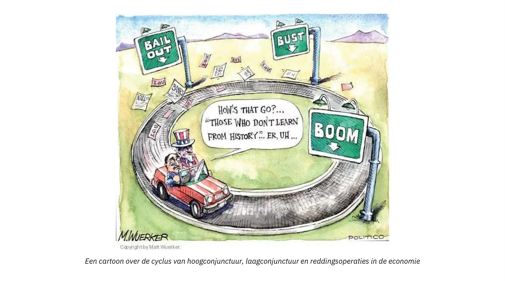

Voor zowel monetaristen als keynesianen is onvoldoende geaggregeerde vraag de oorzaak van de depressie, dus geen van beiden besteedt aandacht aan de ontwikkeling van relatieve prijzen, die, zoals we hebben gezien, de kern van het probleem vormt. Ze geloven dus dat het stimuleren van kredietexpansie (het verlagen van de rentetarieven) en het gebruiken van de tekortcapaciteit van de staat om de vraag te stimuleren een herstel op gang zullen brengen. Op korte termijn lijken dergelijke maatregelen het gewenste effect te hebben: het tekort ondersteunt de bestedingen, terwijl de verlaging van de rente leidt tot hogere activaprijzen, die op hun beurt activahouders aanmoedigen om meer uit te geven. Maar uiteindelijk verdwijnt zo'n stimulans, terwijl het structurele probleem blijft bestaan of zelfs verergert doordat de misallocatie van kapitaal doorgaat dankzij de kunstmatig lage rente.

In het moderne tijdperk zijn centrale banken en regeringen zo ijverig geweest in het voorkomen van de manifestatie van dit aanpassingsproces dat we eindigen met massale structurele werkloosheid en eeuwige schuldopbouw. Japan dient in dit opzicht als voorbeeld. Na het uiteenspatten van een activabubbel in 1989-90 gebruikten de Bank of Japan (BoJ) en de verschillende regeringen alle hier beschreven methoden om te proberen de Japanse economie "opnieuw op te starten" Afgezien van korte oplevingen na uitgavenprogramma's en renteverlagingen, is Japan 30 jaar lang in een staat van neurasthenische groei en overmatige schuldenlast gebleven.

### Conclusie over de conjunctuurcyclustheorie:

Door de sequentiële aard van menselijk handelen te benadrukken en bijzondere aandacht te besteden aan de invloed van renteschommelingen op de intertemporele coördinatie van economische agenten, verklaarden Ludwig Von Mises en Friedrich Hayek economische cycli als endogene dynamiek van het 'fractional reserve banking' systeem. Het verschil tussen de Oostenrijkse analyse en die van monetaristen en keynesianen ligt grotendeels in het feit dat de eerste bijzondere aandacht besteedt aan de verschillende productiefasen en de structuur van relatieve prijzen, terwijl de laatste zich beperkt tot geaggregeerde variabelen zoals werkgelegenheidsniveaus, BBP of de consumentenprijsindex. Bij gebrek aan een kapitaaltheorie hebben mainstream economen de neiging om de oorzaken van de recessie toe te schrijven aan "animal spirits" of "externe gebeurtenissen".

Meer dan enige andere economische school hamert de Oostenrijkse School op het belang van relatieve prijzen om economische agenten te coördineren. Leden van de Oostenrijkse School worden al meer dan een eeuw meegesleept in debatten over dit onderwerp, vooral sinds Mises in 1919 zijn werk publiceerde over de onmogelijkheid van economische berekening in socialistische economieën.

Dit is het onderwerp van het volgende en laatste hoofdstuk van deze cursus.

## De onmogelijkheid van economisch rekenen onder het socialisme

<chapterId>2578a9d8-90e9-58dd-a8c5-6366948564c7</chapterId>

> "Als er geen marktprijzen zijn voor de productiefactoren omdat ze noch gekocht noch verkocht worden, is het onmogelijk om berekeningen te gebruiken bij het plannen van toekomstige acties en bij het bepalen van het resultaat van acties in het verleden. Een socialistische productieleiding zou eenvoudigweg niet weten of wat ze plant en uitvoert al dan niet de meest geschikte middelen zijn om de beoogde doelen te bereiken. Het zal als het ware in het duister tasten. Het zal de schaarse productiefactoren verspillen, zowel materiële als menselijke (arbeid). Chaos en armoede voor iedereen zullen onvermijdelijk het gevolg zijn"
>

> Ludwig von Mises, Geplande chaos

### De onmogelijkheid van economisch rekenen onder het socialisme

Ondanks de herhaalde mislukkingen van marxistische regimes in de afgelopen eeuw, blijft het debat over economische berekening om twee belangrijke redenen relevant:

1. Vergelijkbare ideeën worden nog steeds bepleit door progressieven en andere interventionisten.

2. Prijsafspraken, hetzij op de kapitaalmarkten door toedoen van centrale bankiers, hetzij op andere markten door toedoen van staatsbedrijven, decreten en de tussenkomst van regelgevende comités, komen nog steeds veel voor.

### Het economische berekeningsdebat

Dit debat werd aanvankelijk aangezwengeld door een van de meest invloedrijke economische artikelen van de 20e eeuw, "Economic Calculation in a Socialist Commonwealth", geschreven door Ludwig von Mises en gepubliceerd in 1920. In die tijd was het socialisme in opkomst: de bolsjewieken grepen de macht in Rusland, socialisten namen het ambt over in de Weimarrepubliek (Duitsland) en socialistische en communistische partijen wonnen aan belang in heel Europa.

Vóór Mises' artikel draaiden debatten over socialisme en kapitalisme voornamelijk om morele argumenten en het stimuleringsprobleem. Zelfs als men aannam dat een samenleving georganiseerd rond het marxistische principe van "van ieder naar zijn vermogen, aan ieder naar zijn behoeften" moreel superieur was, dan nog moest de praktische vraag "wie zet het vuilnis buiten" beantwoord worden. Het algemene antwoord was dat het socialisme individuen zou voortbrengen die verstoken zijn van kapitalistische instincten en die bereid zijn om hun gelijken te dienen, zelfs als er geen geldelijke prikkels zijn.

Met zijn artikel introduceerde Mises een nieuwe dimensie in het debat. Afgezien van utopische ideeën over het vermogen van een politieke economie om een "nieuwe mens" te creëren, wees de Oostenrijkse econoom erop dat een rationele economische organisatie onmogelijk was zonder prijzen voor de intermediaire productiefactoren. Tot op de dag van vandaag wordt zijn argument slecht begrepen door zijn critici en zelfs door sommige liberale economen. Daarom is het de moeite waard om het in meer detail uit te leggen.

### De onmogelijkheid van economische berekening verklaren

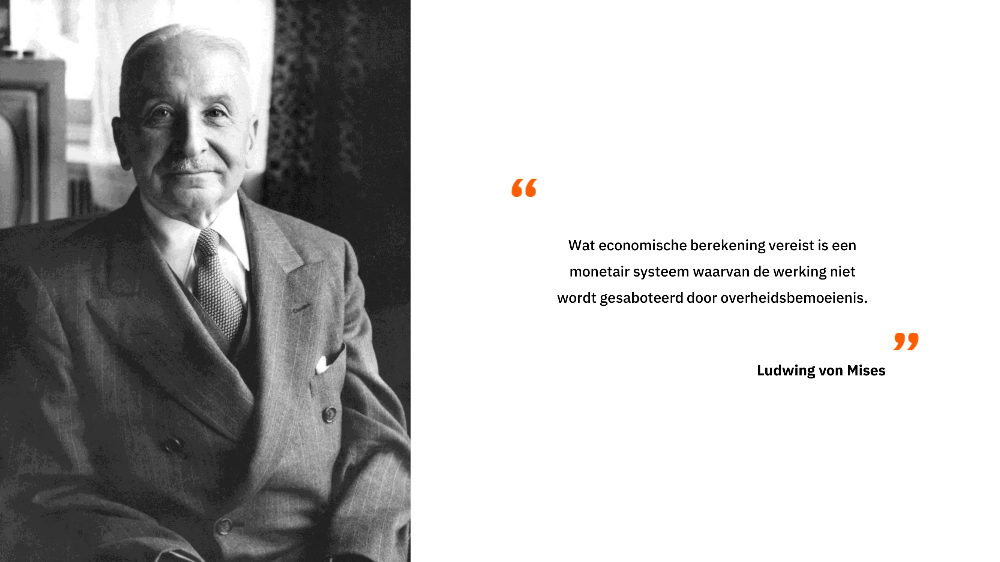

De meeste misvattingen over de argumenten van Mises komen voort uit een verkeerd begrip van de rol die managers en ondernemers spelen in een kapitalistische economie. Mises heeft nooit het vermogen van managers verworpen om efficiënte productieplannen te bedenken binnen hun eigen bedrijfsvoering. In plaats daarvan benadrukte hij het belang van ondernemers en aandeelhouders die, als eigenaars van de productiemiddelen, kapitaal toewijzen aan verschillende industrieën en daarbij prijzen vormen die dienen als input in de economische berekeningen van managers.

Zonder markten voor kapitaal en geld wordt het onmogelijk om het gebruik van middelen in verschillende bedrijfstakken te rationaliseren. Dit betekent dat zelfs als er een perfecte organisatie is binnen elk bedrijf of onderdeel van de economie, de hele economie zich niet efficiënt kan aanpassen aan veranderingen in de beschikbaarheid van middelen, productieomstandigheden en consumentenvoorkeuren. In de woorden van Mises:

> "[...] de kardinale denkfout in [socialistische markt]voorstellen is dat ze het economische probleem bekijken vanuit het perspectief van de ondergeschikte klerk wiens intellectuele horizon niet verder reikt dan ondergeschikte taken. Ze beschouwen de structuur van de industriële productie en de toewijzing van kapitaal aan de verschillende takken en productieaggregaten als star en houden geen rekening met de noodzaak om deze structuur aan te passen aan veranderingen in de omstandigheden..... Ze realiseren zich niet dat de activiteiten van bedrijfsfunctionarissen slechts bestaan uit het loyaal uitvoeren van de taken die hun door hun bazen, de aandeelhouders, zijn toevertrouwd.... De handelingen van managers, hun kopen en verkopen, zijn slechts een klein segment van de totaliteit van de markthandelingen. De markt van de kapitalistische maatschappij voert ook de operaties uit die de kapitaalgoederen toewijzen aan de verschillende takken van industrie. De ondernemers en kapitalisten richten bedrijven en andere ondernemingen op, vergroten of verkleinen hun omvang, ontbinden ze of fuseren ze met andere ondernemingen; ze kopen en verkopen de aandelen en obligaties van reeds bestaande en nieuwe bedrijven; ze verlenen kredieten, trekken ze in en vorderen ze terug; kortom, ze voeren al deze handelingen uit, waarvan het geheel de kapitaal- en geldmarkt wordt genoemd. Het zijn deze financiële transacties van promotors en speculanten die de productie leiden naar die kanalen waarin ze het best voldoet aan de meest dringende behoeften van de consumenten."
>

> Mises, Menselijke Actie, pp. 703-04

In essentie stelt Mises dat eigendomsrechten, die kapitaalbezitters in een context van winsten en verliezen plaatsen, hen motiveren om hun middelen toe te wijzen aan industrieën die op dat moment het meest behoefte hebben aan middelen om aan de vraag van consumenten te voldoen. Als ze slagen, maken ze winst, maar als ze falen, lijden ze financiële verliezen. Hun "skin in the game" moedigt hen aan om te speculeren over de beste allocatie van kapitaal voor de huidige staat van de economie. Dit creëert een marktgedreven dynamiek waarbij de collectieve resultaten van hun acties vitale informatie opleveren over het meest efficiënte gebruik van middelen.

In eerdere hoofdstukken is uitgelegd dat waarden subjectief zijn, dat economische acties opportuniteitskosten onthullen en dat consumentenprijzen een ordinale hiërarchie van consumentenwensen uitdrukken. Ondernemers concurreren om productiefactoren om productiestructuren op te zetten die de opbrengsten maximaliseren ten opzichte van de kosten, waardoor de wensen van consumenten effectiever worden bevredigd dan met alternatieve opties. Daarom zijn de prijzen van productiefactoren afgeleid van consumentenprijzen: als een productiefactor generate grotere geldelijke inkomsten kan genereren (beter voldoen aan de wensen van de consument) in een andere bedrijfstak of onder een ander plan, zullen ondernemers de huidige eigenaar overbieden en de prijs verhogen tot zijn marginale productiviteit. Deze concurrentie tussen ondernemers om productiefactoren, waarbij hun hoogste marginale opbrengst wordt bepaald, is een proces dat relevante informatie genereert over de toewijzing van middelen.

Dit proces is cruciaal omdat het de efficiëntie van verschillende activiteiten valideert of ontkracht en ervoor zorgt dat de productiefactoren op de meest productieve manier worden ingezet. De markt vervult deze functie als een continu proces. In een voortdurend veranderende wereld - waar consumentenvoorkeuren, productieomstandigheden, technologie, regelgeving, demografie en nog veel meer in beweging zijn - veranderen de prijzen voor intermediaire productiefactoren voortdurend door de acties van ondernemers en kapitalisten die zich aanpassen aan de veranderende omstandigheden. Omdat deze veranderingen gelokaliseerd zijn, moet informatie verspreid worden onder economische agenten die geen volledige kennis van de hele wereld kunnen bezitten. Dit is de rol van de markt: het stelt ondernemers in staat om te handelen op basis van gelokaliseerde, vaak kwalitatieve en complexe informatie door economische productiestructuren voor te stellen die vervolgens worden gevalideerd of ontkracht door de markt. Op deze manier wordt relevante informatie die door dit bottom-up proces wordt gegenereerd, gecondenseerd en via het prijssysteem door de hele economie verspreid. Dit proces van informatieproductie en -distributie is essentieel voor de toewijzing van middelen omdat het economische agenten, die beperkte kennis van de wereld hebben, in staat stelt economische berekeningen te maken en samenhangende economische plannen te bedenken door te vertrouwen op prijzen.

Vanuit dit perspectief zal een centraal geplande economie onvermijdelijk te maken krijgen met een verkeerde allocatie van kapitaal. Op de korte tot middellange termijn kunnen zulke misallocaties onopgemerkt blijven omdat er geen marktprijzen of faillissementen zijn om ze te onthullen. Door de afwezigheid van terugkoppeling (prijzen) en herverdelingsmechanismen (faillissementen) zullen fouten zich echter opstapelen totdat de verspilling duidelijk wordt door een aanzienlijke verslechtering van de levensomstandigheden.

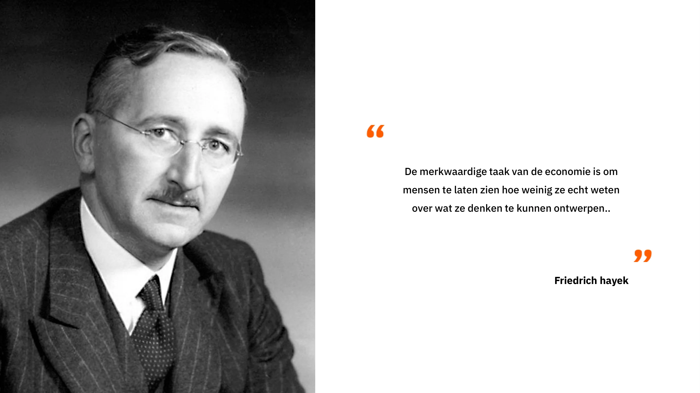

### Het Oostenrijkse perspectief en de tekortkomingen van andere economische scholen

Je zou kunnen zeggen dat het achteraf gezien gemakkelijk is om zo'n panorama te schetsen. We zijn ons tenslotte allemaal bewust van de lege schappen in de USSR, de ontberingen in Venezuela en de humanitaire catastrofe in Cambodja. Maar Mises voorzag deze gebeurtenissen al in 1920. Toch prezen veel economen, waaronder talrijke Nobelprijswinnaars, tot de ineenstorting van de USSR in 1989 het economische wonder van de Sovjet-Unie en voorspelden ze dat de economie van de Sovjet-Unie die van de VS spoedig zou overtreffen.

Ondanks deze indrukwekkende voorspellingen en talloze empirische bewijzen van de onmogelijkheid van economische berekening onder het socialisme, zijn politieke leiders wereldwijd gretiger dan ooit om prijzen vast te stellen, hele industrieën te nationaliseren en vijfjarenplannen voor te stellen, vaak toegejuicht door economisch ongeïnformeerde bevolkingen. De gevolgen van dit interventionisme worden acuut gevoeld door mensen in voorheen welvarende Westerse landen die langzaam getuige zijn van de achteruitgang van hun levensstandaard.

### De Oostenrijkse conjunctuurtheorie als specifiek geval van de onmogelijkheid van economisch rekenen onder het socialisme

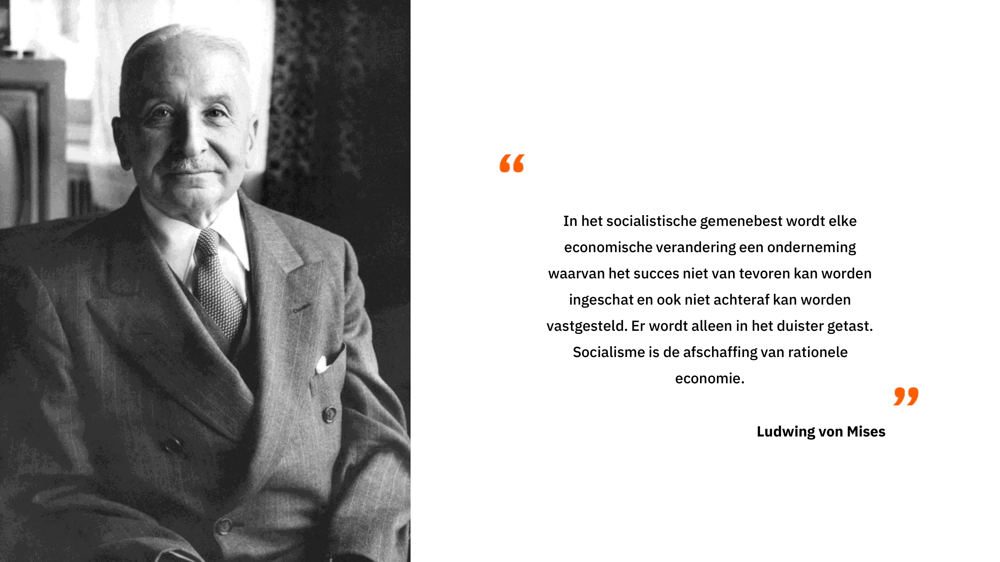

In een vorig hoofdstuk hebben we de dynamiek van overinvestering en kapitaalmisallocatie als gevolg van rentemanipulatie door centrale banken toegelicht. In wezen kan wat we hebben uitgelegd worden gezien als een specifiek geval van de onmogelijkheid van economische berekening onder socialisme, toegepast op het domein van de geldmarkten. Wanneer prijzen buiten hun marktwaarde worden vastgesteld, worden ondernemers en kapitaaltoewijzers gestimuleerd om investeringen te doen die op de lange termijn niet kunnen worden volgehouden door een gebrek aan besparingen. Door in te grijpen in het prijssysteem creëren centrale planners (in dit geval centrale bankiers) een miscoordinatie tussen economische agenten. In dit geval leidt de intertemporele miscoordinatie tot overinvesteringen in investeringsgoederen van een hogere orde en onderinvesteringen in investeringsgoederen van een lagere orde, wat een specifieke manifestatie is van een verkeerde allocatie van kapitaal tussen sectoren.

De gevolgen van een dergelijke verkeerde allocatie zijn onder andere financiële en economische crises, verminderde economische activiteit en schulddeflatie. Deze macro-economische effecten komen voort uit een onevenwicht tussen besparingen en investeringen als gevolg van kredietexpansie. In de USSR en andere communistische regimes leidden prijsafspraken tot een gelijkaardige miscoordinatie, wat resulteerde in tekorten aan sommige goederen en overproductie van andere. In beide gevallen weerspiegelen de prijzen niet de werkelijke voorkeuren van de consumenten, of het nu gaat om tijdsvoorkeuren of consumptievoorkeuren, waardoor ondernemers of centrale planners die verantwoordelijk zijn voor de toewijzing van middelen kapitaal investeren in de "verkeerde industrieën"

Vandaag de dag duikt het debat over economische berekeningen vooral weer op in discussies over energie, waar desinvesteringen gedreven door een Green agenda steeds duidelijker worden. Het komt ook naar voren in discussies over geldmarkten, waarbij Oostenrijkse economen erop wijzen dat de crisis van 2008, die mainstream economen niet konden voorspellen, een klassieke boom en bust cyclus was die gekenmerkt werd door overinvesteringen in de huizenmarkt als gevolg van langdurige periodes van lage rente. Verder propageren neomarxisten en andere socialistische groeperingen het idee dat de opkomst van AI het economische calculatieprobleem zou kunnen oplossen. Dit perspectief komt echter voort uit een verkeerd begrip van het probleem; het economische rekenprobleem is geen kwestie van rekenkracht maar eerder van het genereren en distribueren van informatie die gerelateerd is aan productie en het toewijzen van middelen. Deze informatie kan alleen lokaal worden gegenereerd door agenten met gespecialiseerde kennis en een gevestigd belang in de uitkomst. AI kan dit bottom-up proces niet vervangen en kan centrale planners daarom niet helpen bij het Address probleem van de toewijzing van middelen. Helaas verwachten we, door een eeuw van misverstanden, een proliferatie van beweringen dat AI een nieuw tijdperk van economische voorspoed zal inluiden, geleid door verlichte centrale planners die, met behulp van AI, het falen van vrije markten kunnen corrigeren.

Voor een concrete toepassing van het economische berekeningsprobleem op een hedendaagse situatie, kun je dit artikel raadplegen over het probleem van de toewijzing van middelen in het moderne China.

> De weg naar financiële repressie: China de papieren tijger, Theo Mogenet, https://open.substack.com/pub/theomogenet/p/the-road-to-financial-repression-181?r=ccpx8&utm_campaign=post&utm_medium=web

### Conclusie

In dit laatste hoofdstuk hebben we de onmogelijkheid van economische berekening onder socialisme onderzocht, een centraal principe van de Oostenrijkse economische school. Het Oostenrijkse perspectief dat in deze cursus werd gepresenteerd, culmineert in deze conclusie en biedt een sterk pleidooi voor een non-interventionistisch beleid. In de kern draait al het Oostenrijkse denken om het belang van prijzen in economische coördinatie. Door het belang van opportuniteitskosten en economische berekening voor rationeel gebruik van middelen te benadrukken, tonen Oostenrijkse economen de complexiteit en subtiliteit van menselijk handelen in een steeds veranderende wereld.

Mainstream economen en centrale planners hebben vaak een hekel aan Oostenrijkse economen omdat zij de onzekerheid van de toekomst, de denkfout van kwantitatieve economische voorspellingen en de schadelijke effecten van economische interventie benadrukken. Kortom, Oostenrijkse economen benadrukken de ineffectiviteit en schadelijke gevolgen van interventionistische acties.

De Oostenrijkse traditie belichaamt een nederige benadering van menselijk handelen en trekt diepgaande conclusies uit de concepten van subjectieve waarde, onzekerheid, vrije wil en complexiteit. Het verklaart hoe de marktorde, ondanks het feit dat het geen product is van menselijk ontwerp, de centrale instelling is voor onze ontwikkeling en welvaart. Als er één belangrijke les is die je uit deze cursus kunt trekken, dan is het wel dat het kapitalisme het dominante economische systeem is geworden door zijn vermogen om zich aan te passen aan veranderingen in een dynamische en onzekere wereld die bevolkt wordt door vrije individuen.

## De Oostenrijkse methode

<chapterId>419129c1-82ba-54e3-b385-95d4d89a447e</chapterId>

De Oostenrijkse economische school onderscheidt zich van andere scholen door haar axiomatisch-deductieve methodologie, die verschilt van de positivistische benadering die vaak gebruikt wordt in sociale wetenschappen. De positivistische benadering is gebaseerd op wetten die zijn vastgesteld op basis van empirische gegevens, waarbij een methode wordt gebruikt die lijkt op die van de natuurwetenschappen. Er worden hypotheses geformuleerd op basis van waarnemingen, die vervolgens worden bevestigd of weerlegd door tijdelijke experimenten. De wetenschappelijke methode bestaat uit het vasthouden van de hypothese die de gegevens het beste verklaart en deze verder te onderzoeken totdat een preciezere hypothese is gevonden.

In de sociale wetenschappen is het echter moeilijk om variabelen te isoleren zoals in de natuurkunde, omdat elk moment in de geschiedenis uniek is en er een veelheid aan factoren meespeelt. Economische experimenten kunnen niet gereproduceerd worden in een laboratorium en het is belangrijk om op te merken dat het waarnemen van een correlatie tussen twee variabelen geen oorzakelijk verband tussen hen bewijst. De Oostenrijkers, met name Ludwig von Mises, stelden een alternatieve methode voor, de zogenaamde a priori of axiomatisch-deductieve methode om sociale wetenschappen te bestuderen. Deze benadering is gebaseerd op fundamentele stellingen die axioma's worden genoemd, vergelijkbaar met die in de wiskunde. De Euclidische meetkunde is bijvoorbeeld een voorbeeld van een axiomatisch-deductieve methode in de wiskunde.

In de Oostenrijkse economie omvatten de fundamentele axioma's positieve tijdsvoorkeuren, die gebaseerd zijn op individuele keuzes voor goederen of diensten vandaag in plaats van morgen, vanwege de onzekerheid over de toekomst. Deze axioma's worden niet in twijfel getrokken, omdat ze als vanzelfsprekend en consistent met het dagelijks leven worden beschouwd. Met behulp van deze basisaxioma's gebruiken Oostenrijkse economen de regels van de logica om uitspraken af te leiden die informatie geven over de werking van economische fenomenen. Ze leggen bijvoorbeeld uit dat economische crises worden veroorzaakt door een onevenwicht tussen besparingen en investeringen, wat leidt tot kunstmatige manipulatie van rentetarieven. Individuen met positieve tijdsvoorkeuren eisen een positieve rentevoet om het risico van lenen te compenseren. Oostenrijkers stellen dat waarderingsrelaties subjectief zijn, dus rentetarieven kunnen variëren afhankelijk van individuen en omstandigheden.

Prijzen spelen een cruciale rol in de rationele organisatie van individuen met gedeeltelijke informatie. De rentevoet brengt de Supply en de vraag naar kapitaal op de markt in evenwicht en bevordert zo de economie. Oostenrijkse economen benadrukken dat het willekeurig vaststellen van de rentevoet kan leiden tot economische crises en het onmogelijk kan maken om te rekenen in een socialistisch regime.

### Oostenrijkse economen en methodologische verschillen

Oostenrijkse economen ondervinden vaak problemen wanneer ze debatteren met andere denkrichtingen, omdat ze niet dezelfde analysemethoden gebruiken. Terwijl Oostenrijkers redeneren vanuit fundamentele axioma's, zoals de subjectiviteit van waarde, om logische consequenties af te leiden, vertrouwen Keynesiaanse of monetaristische economen eerder op empirische gegevens om algemene economische wetten vast te stellen.

Een voorbeeld van methodologisch verschil is het standpunt van voorstanders van de Modern Monetary Theory (MMT) die pleiten voor het drukken van geld om politieke doelen te bereiken, waarbij ze de afwezigheid van inflatie tussen 2008 en 2019 als argument gebruiken. Oostenrijkse economen en MMT-aanhangers spreken niet dezelfde taal en zijn het niet eens over de criteria om de geldigheid van een economische wet te bepalen. Dit maakt debatten tussen deze verschillende scholen moeilijk en vaak onproductief.

Het is belangrijk om op te merken dat cherry picking, waarbij selectief gegevens worden gekozen om relaties tussen variabelen te leggen, een onwetenschappelijke en onbetrouwbare methode is in de economie. Monetaire creatie veroorzaakt bijvoorbeeld niet noodzakelijkerwijs inflatie, en een meer genuanceerde benadering is nodig om complexe economische mechanismen te begrijpen. Axioma's spelen een cruciale rol in de Oostenrijkse economische redenering. Het zijn fundamentele Elements waaruit logische gevolgtrekkingen kunnen worden gemaakt. Het is echter belangrijk om te erkennen dat precieze toekomstvoorspellingen in de economie vaak moeilijk zijn door de complexiteit van economische fenomenen en de inherente onzekerheid.

Methodologie is een essentieel aspect in de economie en in sociale wetenschappen in het algemeen. Het beïnvloedt hoe vragen worden gesteld, hypotheses worden geformuleerd en gegevens worden geïnterpreteerd. Inzicht in de methodologische verschillen tussen economische stromingen kan ons helpen om verschillende perspectieven te waarderen en onze eigen mening te ontwikkelen over de onderwerpen die in de vorige afleveringen zijn besproken.

# Laatste Sectie

<partId>ae828713-d133-559f-93c2-101cb5245fca</partId>

## Beoordelingen

<chapterId>29d4323c-e34e-5834-bf03-2f3ed10d751b</chapterId>

<isCourseReview>true</isCourseReview>

## Eindexamen

<chapterId>d58d188f-81fb-572a-a898-8b6f8aceba7a</chapterId>

<isCourseExam>true</isCourseExam>

## Conclusie

<chapterId>d668fdf6-fb4c-4bbf-82e1-afcb95c122e0</chapterId>

<isCourseConclusion>true</isCourseConclusion>