# Urugendo rwo mu Bukungu bw'Abasituriya

Wigeze wibaza impamvu bamwe mu bahanga mu bukungu batekereza mu buryo butandukanye ku masoko, umudendezo, n'imyitwarire y'abantu? Ubukungu bw'Abasituriya butanga icyerekezo gishya gishimishije gishyira wewe hagati y'ibitekerezo vy'ubukungu. Aho gukoresha imibare igoye n'ibigereranyo bidasanzwe, ubu buryo bushingira ku ntumbero, ku guhitamo kw'abantu, n'uko abantu nyakuri bafata ibyemezo mu buzima bwabo bwa buri munsi. Ni ubukungu bwibonwa binyuze mu mudendezo, ubwenge, n'ibikorwa vya buri muntu.

Iyi shure y'ibitekerezo yamaze ibinyejana vyinshi igira uruhare mu mpaka, kubera abatekereza bakomeye nka Hayek, Mises, na Bastiat. Mu gihe ubukungu bwa Keynesian bukomeye buganje mu biganiro vya politiki vy'uyu munsi, umuco w'Abasituriya ubaza ibibazo bitandukanye: Habaho iki iyo dushyize imbere umudendezo w'umuntu ku giti ciwe? Amasoko yigenga akora gute nyene iyo abantu bafise umudendezo wo guhitamo? Niba ushishikajwe n'inzira zindi zo gutekereza ku masoko, societe, n'umudendezo, iki ni ikibanza cawe co gukora ubushakashatsi ku bitekerezo utazosanga mu bitabo bisanzwe.
+++
# Intangamarara

<partId>265aa8b0-dd89-5456-b72a-656e988013d5</partId>

## Incamake y'icigwa

<chapterId>eae3de7b-cce6-516d-83d9-28fbd582c0ca</chapterId>

Kaze mucigwa ca ECO201!

Muri iki cigwa catanzwe na Théo Mogenet, uzosanga ishure ry’ivyiyumviro vy’ubutunzi ritandukanye cane n’inyigisho ya Keynes yamaze kuba yamamara, ushobora kuba warigishijwe yuko ugucungera amafaranga n’ingingo mfatirwako z’ubutunzi biri mu maboko y'amabanka makuru,aho n’iciyumviro c’uko gucapura amafaranga n’ugukoresha amafaranga ya Leta bituma ubutunzi butera imbere. Ariko rero, hari uburyo bw’inyongera, bworoshe kandi bwumvikana neza, ni ubutunzi bwabanya otirishe.

Inyuma y’ibinjana bibiri birenga vy'ubushakashatsi, ivyiyumviro vya filozofiya n’inyandiko z’abanditsi bazwi nka Carl Menger, Ludwig von Mises na Friedrich Hayek, iyi nyigisho y’ivy’ubutunzi ifata uburyo butandukanye.Irashira imbere iciyumviro c’ubutunzi budafashwe kuruhande rumwe(decentralized), ishingiye ku kwiyumvira neza kw’umuntu ku giti ciwe n’ubwenge bw’abantu.

Ubutunzi ni, mu vy’ukuri, igice c’imibano kandi kigoye cane, gifise abakozi benshi bigenga bakorana mu mwidegemvyo kugira ngo bagire ikintu kimwe bahuriyeko. Kugira ngo umuntu atahure iyo nzira ikora muburyo buhindagurika, ubutunzi bwa Otirishe burakunda isesenkara ry’uburyo, rishingiye ku gutahura kw’abantu, ku vyerekeye imibano, no ku kwiga ingene isoko rigenda, aho gushira imbere ibiharuro bikomeye.

Muri iki cigwa, uzokwihweza ingingo ngenderwako z’ishimikiro z’iryo shure ry’ivyiyumviro. Théo Mogenet, umwigisha wawe, ni uharanira w’iyi nzira y’ubutunzi kandi azobuyobora mu vyiyumviro nyamukuru vy’ubutunzi bwa Otirishe, akwereke ingene ivyo vyiyumviro bikora cane cane kw’isi ya Bitcoin.

**Igice ca 1: Intangamarara ku ubutunzi bwa otirishe**

Tuzotangura n’intangamarara rusangi y’Ubutunzi bwa Otirishiya, dutohoze inkomoko yayo y’amateka n’imishinge y’ivyiyumviro vyayo. Iki gice kandi kivuga ku vyiyumviro vy’gendegwako nk’amahera, ingurane, amabanki matomato, n’amabanki makurumakuru. Muzotahura igituma izo nzego zifise uruhara runini mu vyiyumviro vy’Abanyaotirishiya, Harimwo cane cane mu kunegura kwabo ibijanye no kwivanga mu bijanye n'ifaranga.

**Igice ca 2: Ishingiro ry'Ivyiyumviro**

Iki gice kizokwihweza cane ivyiyumviro nyamukuru vy’ubutunzi bwa Otirishiya, nk’inyigisho y’agaciro, isigura igituma agaciro k’ikintu katagira intumbero ahubwo bivana n’akamaro umuntu wese abona. Uzobona kandi ingene amahera asohoka mu buryo busanzwe nk’ikintu gisanzwe mu kibano, hamwe n’ivyiyumviro vy’uguhitamwo ico umuntu ashira imbere mu gihe, inyungu, n’umutahe kamere biri mu mutima w’inyigisho y’isoko ry’umwidegemvyo ryo muri Otirishe.

**Igice ca 3: Ivyiyumviro vyo kwitegereza ubutunzi bwa Otirishe**

Muri iki gice, tuzoraba ingene iyo nyigisho ikoreshwa mu buzima busanzwe.
Muzomenya neza inyigisho y’Abanya-Otirishe y’ukuzunguruka kw’ubutunzi, igasigura ukuntu ugukoresha nabi amafaranga (uguhindagura amafaranga) bituma habaho ugukomera kudasanzwe kw’ubutunzi (booms) bikurikirwa n’uguhungabana (récessions:n’ugusubira inyuma kw’ubutunzi). Turabona kandi igituma uguharura ubutunzi kudashoboka mu gihe c’ubutegetsi bw’abasosiyalisiti n’ingene uburyo bwo muri Otirishe bushingiye ku buhinga (praxeologie) (inyigisho y’ibikorwa vy’umuntu), butanga uburyo bwihariye kandi buhuye bwo gutahura ubutunzi mur rusangi.

Ico cigwa ni ihuriro ry’ubutunzi n’ubuhinga, ritunganywa biciye mu ikiganiro cuguruye hagati yanje na Théo (Rogzy). Ndashimira cane Théo Mogenet kubwo kurema iki ciyumviro. Twaranezerewe cane no kugitegura, vyateguwe kugira ngo umuntu wese ashobore kubibona bitamugoye . Ico cigwa n’intangamarara y’ingenzi kandi ni nk'umushinge w’ivyigwa vyacu vy’ubutunzi bizoza, biteye imbere cane.

None, ntibishoboka ko urufunguro rwo gutahura ubutunzi bw’iki gihe rwoba ruri mu nyigisho imaze ibinjana vyinshi?
Nimuze tubirabire hamwe!

## Amahera, Ingurane, Amabanki matomato, n’Amabanki makurumakuru

<chapterId>29faebd9-9326-52de-8161-e4bb33033cd6</chapterId>

> "Ikibazo nyamukuru c'amafaranga asanzwe ni ukwizigira kwose gukenewe kugira ngo akore. Banki nkuru itegerezwa kwizigirwa kugira ngo ntiyigere igabanya amafaranga, ariko amateka y'amafaranga yuzuyemwo ukurenga kuri ukwo kwizigirana. Amabanki ategerezwa kwizigirwa kugira ngo afate amafaranga yacu kandi ayarungike biciye mu buryo bw'ubuhinga bwa none,yamara ayo mabanki arayatanga mu ngwati nyinshi z’ivy’ubutunzi. dutegerezw kubizigira ku bijanye n'ubuzima bwacu bw’ibanga,ko batareka abasuma b’umwidondoro(identity thieves) ngo badutware amafaranga ku makonti yacu.”
>

> Satoshi Nakamoto, uzanye igikoresho citwa Bitcoin, yitwa izina ry’uruyeri.

### Uko amahera akorwa

Mu gisata c'amahera dukoresha ubu, amahera aremwa ahanini biciye mu migenzo ya banki izwi nka "banki y'ububiko bw'ibice(fractional reserve banking)." Iri jambo risobanura ahanini ko amabanki adasabwa kugira amafaranga menshi nk’ayo aronka mu kubitsa. Ku bw’ivyo, barashobora kurema ubushobozi bushasha bwo kugura igihe batanze ingurane, kandi, ku ruhande rumwe, bagagabanya ubushobozi bwo kugura igihe abakiriya bariha ingurane bahawe.

Nk’akarorero, iyo wegereye banki yo mu karere kawe kugira ngo ubone ingwati yo kuguracanke kubaka inzu, amahera iyo banki yakuguranye yobayeho nk’inyandiko mu gitabu c'ibaruramari. Mu vy’ubuhinga bw’ivy’ubuhinga, ubutunzi bw’umuntu bugaragazwa n’ibaruramari ry’umatungo rifise ibice bibiri:

Ibikoresho vy’umatungo (actif): birimwo amazu, amasezerano y’ubutunzi, ibigega, hamwe n’utundi tuntu vyose umuntu afise.

Amadeni (passif): asigura aho amafaranga yakoreshejwe aturuka. Itandukaniro hagati y'itunga n'imyenda ryitwa "uburinganire" kandi rishobora kwiyumvirwa nk'ubutunzi rusangi bw'ishirahamwe.
Itandukaniro riri hagati y’ibikoresho vy’umutungo n’amadeni ryitwa “capitaux propres”, rikaba rishobora gufatwa nk’ubutunzi nyakuri bw’ishirahamwe canke umuntu.

Iyo ikigo c’ivy’ubutunzi gifise uruhusha rwo gukora nka banki,, bisigura mu vy'ukuri ko imadeni yanditswe nk'"amahera y'abaguzi" afatwa nk'amahera yemewe mu gihugu canke mu karere k'amahera. Rero iyo urondera ingurane yo kugura inzu muri banki, iyo banki ntaguha amahera yashizwemwo n’uwundi mukiriya. Ahubwo, banki irashira amahera waguranye kuri konti yawe, icarimwe ikandika amasezerano y'ingurane yawe  nk’itunga rya banki. Uko wishura ingurane yawe, amahera arazima neza, kandi agaciro k’ingurane ihuye n’ayo masezerano karagabanuka, banki ikagumana inyungu gusa y’ingurane.

Uhejeje kugura iyo nzu, uhamagara umukozi wa banki ngo arungike amahera kuri konti y’uwugurisha. Iyo konti y’uwugurish iri muri banki itandukanye, umukozi wa banki amenyesha umukozi wa banki ihuye n’iyo banki kugira ngo abone ko konti y’uwugurisha ishobora gushirwako amahera nk’uko bibereye, mu gihe akuraho amahera kuri konti yawe amahera ahuye n’ayo.

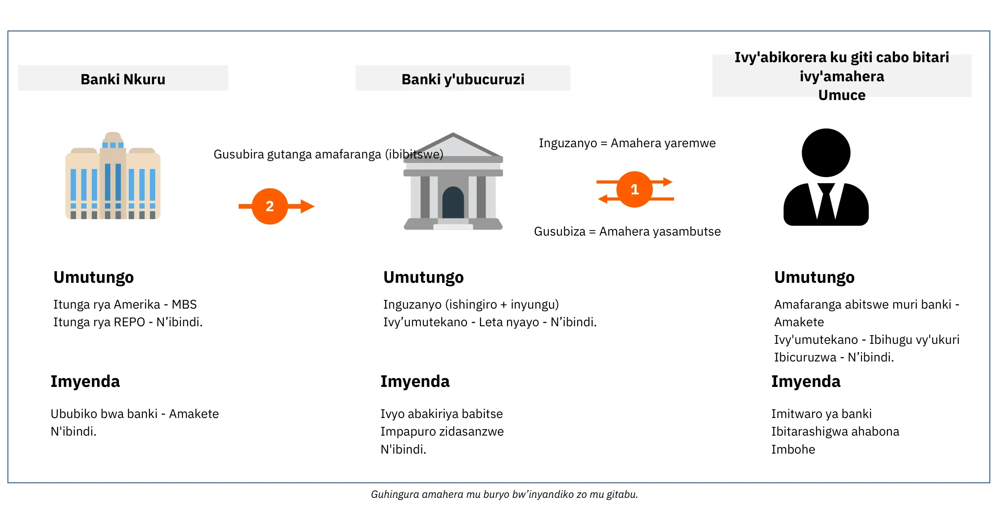

Igishusho ca 1: Guhingura amahera nk'Ivyinjira mu Bubiko bw'Ibitabo vy'ibaruramari

> « Ni vyiza ko abantu bo mu gihugu cacu badatahura ubuhinga bwacu bwo gukora amabanki n’amahera, kuko iyo babitahura, nizera ko hobayeho ihinduka imbere y’ejo mu gitondo »
>

> Henri Ford

Ubu buryo butuma amabanki abika amakuru yose y’ugucungarara kw’amafaranga, harimwo:

guhererekanya amafaranga (virements),

ibiguzi bikorwa hakoreshejwe amakarata y’inguzanyo canke ikatara yo muri banki (cartes de crédit),

amasheke (chèques),

mu kiringo runaka (akenshi indwi canke ukwezi).

Nyuma, ayo mabanki akemura ihererekana ry'mahera hagati yabo biciye mu gukoresha ingwati z’amabanki, ariyo yandi mafaranga yitwa fiduciaire ariko ntabwo akoreshwa n’abanyagihugu.

Izo ngwati z’amabanki zibikwa kuri banki nkuru ku makonte adasanzwe, aho ashobora kwinjirwamwo gusa n’amabanki n’ibigo vy’ivy’ubutunzi vyemewe.

### Ukudahagarara canke uguhungabana kw'amabanki y'ububiko bw'imice n'umuguzi w'uburyo bwa nyuma

Ikibazo nyamukuru kiri muri iyo nzira y’ububiko bw’amahera y’imice ni uko gukura amahera menshi muri banki kanaka bishobora gutuma ishobora guhomba. Kubera ko amabanki ategerezwa gusubiza abaziganije amafaranga yabo yose naho boba bafise amahera make cane mu bubiko bwabo, iyo abakiriya benshi bihutiye gukuramwo amahera icarimwe, birashobora gutuma iyo banki idashobora gushitsa ivyo basaba, ivyo bikaba bituma ishobora guhomba ikugara. Kubera ko abantu benshi, amashirahamwe menshi be n’ibigo vyinshi bifise amahera biyabika mu mabanki, kureka banki igasenyuka(igahomba) vyoshobora kugira ingaruka zikomeye ku vy’ubutunzi, nk’ugusubira inyuma kw’ubutunzi canke mbere ugucika intege.

Uku kwijijanya imitima nikwo kwatumye habaho amabanki makurumakuru y'iki gihe. Mu kinjana ca 19 mu Bwongereza,mu Bwongereza, ibihe vy’akajagari kenshi mu mabanki vyagiye bihungabanya ubutunzi, ivyo bikaba vyatumye hashingwa Banki y’Ubwongereza nk’uwutiza amafaranga “inguzanyo bwa nyuma.”Iyo Banki y’i Bwongereza yari ifise igikorwa co gutiza amafaranga amabanki yahuye n’ibibazo mu bihe vy’ubutunzi bwifashe nabi, kugira ngo ntihagire ikintu gishobora gutuma igisata c’ubutunzi cose gihagarara. Ico ciyumviro c’uko amabanki akomeye ari yo atanga inguzanyo mu buryo bwa nyuma, kuva ico gihe carakwiragiye kw’isi yose, kikaba ari ikintu gisanzwe.

Uretse kubungabunga ituze ry’ubutunzi, amabanki makuru niyo ajejwe gushinga ibiciro ngenderwako. Ivyo biciro ni vyo bigena igiciro amabanki afise uruhusha(yemewe) ashobora kugurana amafaranga muri banki nkuru, mu vy’ukuri bikaba bisobanura igiciro c’amahera y’ibigo vy’ubutunzi bifise uruhara runini mu gutanga ingurane mu butunzi bwacu. Ivyo bipimo rero birakora nk’ikigereranyo c’urutonde rw’ivy’ubutunzi rwose. Ku rwego rw’umuntu ku giti ciwe, inyungu utanga y'ngurane ku ngwati yawe ishobora kugaburwa hagati y’urwego rw'ibiciro ngenderwako hamwe n'inyungu y’inyongera ya banki.

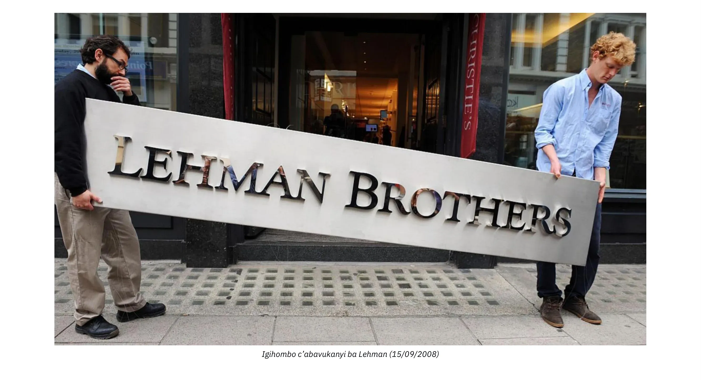

Igishusho ca 2: Iruhombo rwa LEHMAN BROTHERS (15/09/2008)

Mu gihe c’amagume akomeye y’ivy’ubutunzi yo mu 2008,  LEHMAN BROTHERS, banki nini yo gushora imari, yaratangaje ko yahagaritse ibikorwa vyayo inyuma y’aho ihomvye cane ku bijanye n’ivy’ingwati yari ifise, kandi abakiriya bayo bakaba bakuyemwo amafaranaga yabo yose. Mu kwishura kuri iyo ntambara y’ubutunzi itari bwigere ibaho, amabanki makuru akomeye kw’isi yose yarashize amahera menshi mu masoko y’ivy’ubutunzi, bafatanya amabanki y’ishoramari yari afitaniye ibibazo n’amabanki y’ubudandaji, bongera bagabanya ibiciro ngenderwako gushika hafi kubusa kugira ngo ntihagire sisiteme y'ubutunzi isenyuka.

Naho ayo mategeko yatumye bikunda kwirinda urukurikirane rw’amabanki yahomba, ntiyagabanyije cane uguhagarara kw’ubutunzi kwakurikiye inyuma. Imiliyoni z’abantu baratakaje imirimo yabo n’amazu yabo, ibidandazwa vyaracitse, amabanki yarahomba cane, kandi ibigo vy’ubutunzi vyarugaye. Ubudandaji buragabanuka, amabanki na yo aratakaza amahera menshi. 

Naho inyungu kuri izo ngurane zari hasi cane mu mateka, bake ni bo bari biteguriye guhabwa ingurane, ivyo bikaba vyatumye haba uruzitiro rubi aho ukugabanya kw’intango kw’amahera akoreshwa n’ishoramari kwari gukomeje. Ku bw’ivyo, abakozi bo mu mabanki makuru barateye intambwe zindi mu gushira mu ngiro porogarama zo kurungika amafaranga (assouplissement quantitatif, QE). Ayo ma porogarama yarimwo ko amabanki nkuru agura imigabane y’igihugu n’amasheki afise amasezerano y’inguzanyo z’ingwati ava mu mabanki y’ubudandaji afise ingwati(reserves) zayo.

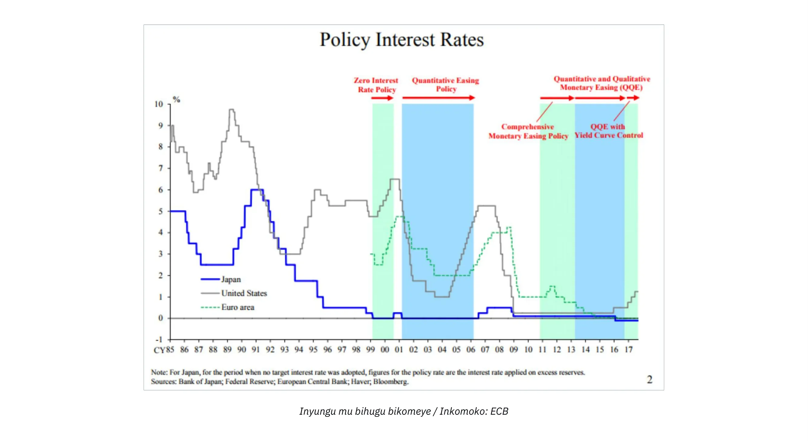

Igishusho ca 3 :Urwego rw’inyungu mu bihugu bikomeye / Inkomoko : BCE (Banki Nkuru y’Uburayi)

Naho vyari bitegekanijwe n’abantu benshi, porogarama zo korohereza amafaranga (assouplissement quantitatif, QE) ntizarongeye guteza imbere ubutunzi mu buryo bugaragara, ahubwo zatumye agaciro k’ibikoresho vy’ubutunzi (actifs financiers) kuduga cane mu mateka.
Ivyo vyagiriye akamaro canecane abatunzi n’ibigo vy’ivy'ubutunzi, kuko vyari bisanzwe bifise ivyo bintu(actifs) vyinshi cane, ivyo bikaba vyatuma habaho ubusumbane mu vy’ubutunzi burushirizaho. Turavye uko amabanki akora iya twasigiye imbere y’aha, ivyo ntibikwiye kudutangaza. Kubera ko amafaranga y’amabanki adashobora kwinjira mu butunzi nyakuri mu buryo bworoshe, porogarama za QE ahanini zatumye ibiciro vy’itunga vyiyongera ataco zihinduye ku bijanye n’ubutunzi bw’abantu basanzwe.

### Ingaruka za Cantillon

Naho biri ukwo, ingingo ngenderwako y’ubutunzi irashobora gukugwa muri iki gice: iyo amahera mashasha akoze, abanza gufasha cane abo bari hafi yayo, mu gihe abandi bari kure baronka akamaro gake canke ntarakabone. Ubwo bumenyi bw'ubutunzi bwatanguye mu kinjana ca 18 igihe Richard Cantillon yabuvuga mu gitabu ciwe "Essay on the Nature of Commerce in General.". ryitwa “Effet Cantillon”.

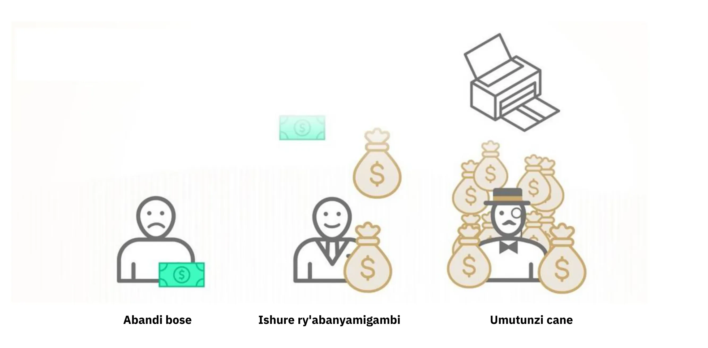

Igishusho ca 4: Ingaruka za Cantillon muri make / Inkomoko: Ivy'Imari y'Uruzi

Muri ico gihe, abakozi bo mu mabanki, abarongozi ba banki, abafise imitahe(imigabane), abahinga mu vy’amazu, abaguzi canke abashora imari mu mazu, n’umuntu wese afise itunga ry’amahera canke amazu, bararonka umuyaga(canke inyungu) w’amahera, mu gihe umutwaro wari ku bandi bose. Ivyo vyagumyeho imyaka myinshi kandi ahanini bisigura ukwiyongera kw’ubusumbane mu butunzi, ukwumva ko abakozi batakiriwe mu butunzi, hamwe n’ukuzamuka kudahagarara kw’ibiciro vy’ibikoresho vy’ubutunzi(actifs) n’aho Umwimbu rusangi w’igihugu(GFC) utariko uraduga cane.

Mu vy’ukuri, iyo nzira iragoramye. Amabanki ntaco akora, yamara iyo ananiwe, birashobora gutuma ubutunzi bwose buhungabana. Ico kibazo co mu vy’inyifato runtu gituma abarongozi ba banki bafata ingingo zirengeje urugero kugira ngo banki yabo ishobore kuronka amahera menshi, bazi ko amaherezo banki nkuru izobakiza, ivyo bikaba bizotuma ivyo bihembo bishika ku bariha imisoro. Muri ivyo bihe, abakozi ba banki nkuru bararema ivyangombwa vyo guhindura cane ububasha bwo kugura buva ku bantu bakora cane no ku bazigama buja ku bafise itunga n’abafitaniye isano n’ubuhinga bw’ivy’ubutunzi, gutyo bagaca inzira yo kurema ubutunzi n’ukwirundanira ubutunzi.

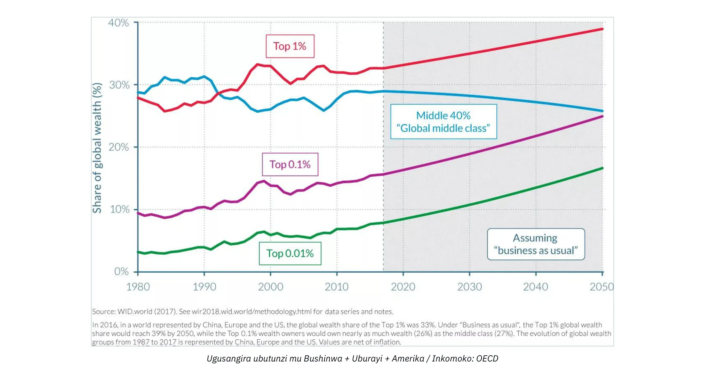

Igishusho ca 5: Ugusangira ubutunzi mu Bushinwa + Uburayi + Amerika / Inkomoko: OECD

### Inkurikizi z'ingingo ngenderwako z'inyungu zitagira inyungu

Mu bihe birebire vy’Itegeko ry’Inyungu Zitagira Inyungu (ZIRP), amabanki aragira amahirwe make yo gusubira kwubaka uburinganire(amafaranga) bwayo kubera bwite ko inyungu zayo zigenda zigabanuka. Amabanki akenshi aronka amahera mu gusaba ingurane ku bipimo vy’igihe gito no mu gutanaga ingurane ku bipimo vy’igihe kirekire. Ariko rero, iyo amabanki akomeye aguze imigabane myinshi cane, agashiraho ibiciro kubusa, amabanki ntaco agira ngo agurize, cane cane abacuruzi n’abandi bashobora kwiyemeza gufata iyo ngingo. Ahubwo, batanga ubutunzi bwabo kugira ngo bakingire amatungo ariho canke batange ingurane zijanye n’ingwati kugira ngo bashobore gushitsa ivyo abaronka inyungu ku ngaruka ya Cantillon basaba.

Iyindi ngaruka itategekanijwe ya ZIRP ni uko ugukangurira intwaro gukoresha amahera menshi. Kubera ko intwaro zitagira amafaranga yo kugurana kandi zishobora kwizigira amabanki makuru kugira ngo zigure imigabane yazo biciye mu migambi ya QE, zifise ikintu gisanzwe zituma zikoresha amahera menshi bishoboka, cane cane mu bihe vya demokarasi aho gukoresha amahera bishobora gutuma abantu babatora. Ivyo bikorwa
akenshi ntivyitaho ingaruka z’igihe kirekire z’ukwo gukoresha nabi amafaranga, bikaba bituma habaho ukwiyongera gukomeye kw’imyenda ya Leta mu bihugu vyateye imbere kuva mu gihe c’Ikibazo c’Ivy’ubutunzi kw’Isi Yose (GFC).

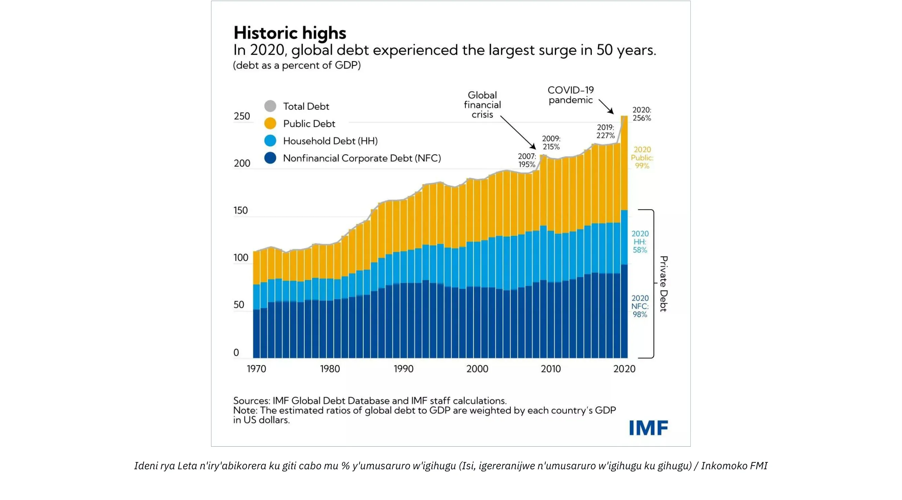

Ishusho ya 6 : Amadeni ya Leta n’ay’abantu ku giti cabo mu rugero rwa % vy’Umwimbu Rusangi w’Igihugu (isi yose, hakurikijwe umwimbu wa buri gihugu) / Inkomoko: FMI

Kubera ko ugutakaza agaciro kw'amafaranga kuriko kuraduga bivuye ku gukora amafranga menshi mu kwishura ku bikorwa vy'ugufunga bitewe na COVID, amabanki makuru ubu ariko araduza ibiciro vy'amategeko mu kugerageza guhagarika uko guta agaciro k'amahera. Ariko rero, ivyo biratera ingorane ikomeye kuri sisiteme y'ubutunzi muri rusangi. Amabanki afise amadeni menshi kurusha uko vyigeze kuba vyari bimeze kera, intwaro zifise amadeni menshi cane mu mateka, iterambere ry’ubutunzi riragenda buhoro, amadeni aragenda aragwira, kandi abaguzi, bariko barahangana n’ukuduga kw’ibiciro k’ibintu. bariko baragorwa no kuronka ivyo bakeneye. Kugenzura itakaza ry'agaciro k'amafaranga vyosaba ko ibiciro biduzwa ku rugero rushobora gutuma intwaro zihungabana, mu gihe amabanki ashobora gutakaza abaziganya kuko Abantu ku giti cabo bariko bakoresha amafaranga yabo biziganije mu vyo bakeneye vy’ihutirwa(bibagirira akamaro) biguma biduga ku giciro, canke bakayashira mu bintu bifadika vy’ubutunzi hamwe n’amakonti y’isoko ry’amafaranga kugira bikingire ubwabo mu guhomba kw’agaciro k’amafaranga.

### Iciyumviro

> “Biciye muri ubwo buryo (fractional reserve banking), intwaro zirashobora mu mpisho kandi zitabonetse, zigafata ubutunzi bw’abantu, kandi nta muntu n’umwe mu miliyoni yomenya ubusuma”
>

> John Maynard Keynes

Mu vy’ukuri, urutonde(sisiteme) rwacu ruriko rurashikirwa n’ingorane zikomeye, kandi Bitcoin iraseruka nk’ubundi buryo bwonyene bwo kwizigira. Ariko rero, Bitcoin yonyene ntishobora Address ibibazo biri muri sisiteme y’amahera yacu. Ikiruta vyose, turakeneye abantu batahura ingingo ngenderwako z’ishimikiro z’ubutunzi mu bakunzi ba Bitcoin, bikaba vyoshoboza ubumenyi bwagutse n’ubwenge busanzwe bw’ubutunzi kugira ngo bituyobore kure y’ukwubaka uwundi mushinge w’ubutunzi ugoyagoya w’iterambere ryacu. Intumbero y’intango y’iri shure ni ukwigisha abashasha bakunda Bitcoin nk'ingingo ngenderwako nziza z’ubutunzi.

Kugira ngo dushikire iyo ntumbero, tuzosigura ingingo ngenderwako z'ishimikiro z'"Ubutunzi bwa Otirishe", ishure ry'ivyiyumviro vy'ubutunzi rifise umugenzo w'uburyo bwo kwigisha ivyo bintu kuva mu kinjana ca 16, ritanga ubumenyi ku bikorwa vy'umuntu mu gihe afise ingorane z'ubutunzi. Ubu ukoresheje iyi ntangamarara, uratahura ivy’ingirakamaro vyo gukora amahera be n’ingene ubuhinga bwacu bw’ivy’ubutunzi n’ivy’amahera buri.

Mu gice(chapiter) kizoza, tuzokwihweza cane ibuye ry’imfuruka ry’ishure ryose ry’ivyiyumviro ry’ubutunzi: ni inyigisho y’agaciro. Ibice bikurikira bizoca irya n’ino amahera nk’ikigo c’imibano, inyigisho y’amatungo kamere n’ingendo y’ubudandaji, ingorane yo guharura ubutunzi, n’insiguro ngufi y’amateka n’uburyo bw'inyigisho bw’ishure ry’ubutunzi ryo muri Otirishe.

# Ishingiro ry'Ivyiyumviro

<partId>86012c1b-cdf2-586f-8fe7-263f8287e950</partId>

## Ivyiyumviro vy'agaciro

<chapterId>eb1608d4-5d36-56a0-bcfc-ed8c03dfa906</chapterId>

> “Agaciro kariho gusa mu mutima canke mu vyiyumviro vy’umuntu”
>

> Carl Menger, Ingingo ngenderwako z'ubutunzi bwa politike

### Impinduka yo ku ruhande

Ku muzi w’uguzirikana mu vy’ubutunzi hari ikibazo c’agaciro. None tumenya gute agaciro k’ikintu? Mbega agaciro ni amatungo y’ibintu uvukana? Canke, ahubwo, ni ikintu umuntu yiyumvira? None tugereranya gute agaciro k’ibintu bibiri? None agaciro kava hehe?

Ibi bibazo bikurikirwa cane n’abahinga mu vy’ubutunzi hamwe n’abahinga mu vy’inyigisho kuva kera, kandi vyarakemuye mu buryo butandukanye, ukuntu ubumenyi mu vy'ubutunzi bwagiye butera imbere bwarajanye n’ukuntu inyigisho z’agaciro zagiye zihinduka nukuvuga zitera imbere.

Inyuma y'aho inyigisho y'aba physiocrates yerekeye agaciro k'ubutaka, ivuga ko agaciro kose kava ku butaka, yari yarahakanwe n'inyigisho y'agaciro k'akazi k'abahinga mu vy'ubutunzi, bavuga ko agaciro k'ikintu kava ku rugero rw'igikorwa canke abakozi baja mu guhingura, ni ho inyigisho y'agaciro k'inyongera yasubiriye ivya kera. Mu myaka ya 1870, Inyuma ya Marx, uwa nyuma mu bahinga b'ubutunzi ba kera, amashure atatu mashasha y'ivyiyumviro vy'ubutunzi yaraserutse hafi icarimwe akikuje inyigisho y'agaciro: ishure rya Lausanne ryari kumwe na Léon Walras, ishure ry'ubu canke ry'ubuhinga bushasha ryari kumwe na William Stanley Jevons, n'ishure ryo muri Otirishe ryari kumwe na Carl Menger. Iryo hinduka mu vyiyumviro vy’agaciro ryatumye habaho gukomera gushasha kw’ivyiyumviro vy’ubutunzi.

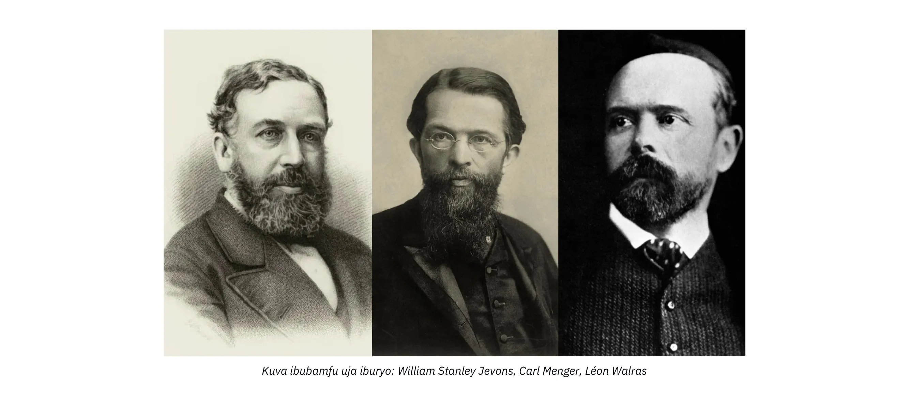

Kuva ibubamfu uja iburyo: William Stanley Jevons, Carl Menger, Léon Walras

Iciyumviro c’agaciro co ku ruhande kivuga ko agaciro k’ubutunzi gahuye n’ico umukozi w’ubutunzi yishura ku bushake ku gice gikurikira c’ikintu canke igikorwa. Nk’uko iyo nyigisho ishimika ku vy’uko ibiciro bishingwa ku ruhande, ni ukuvuga ku gice gikurikira c’ikintu kinaka, vyitwa “ugushira ku ruhande”.

Ni ibisanzwe gushikiriza ukuntu ayo mashure atatu ashirwa ku ruhande nk’aho asa. Nkako, Walras na Jevons barahuye cane, ariko ivyiyumviro vya Menger biratandukanye n’ibindi mu buryo bukomeye. Mu gitabu ciwe, ubu kibonwa ko ari co gishingiyeko inyigisho y'ubutunzi bwa Otirishiya, citwa "Grundsätze des Volkswirtschaftlehre" (Ingingo ngenderwako z'ubutunzi bwa politike), casohowe mu 1874, Menger, aratanga insobanuro y'agaciro, ariko ahanini ishingiye ku muntu, itandukanye n'ivyo Walras na Jev babona ko ari agaciro.

### Agaciro k'umuntu

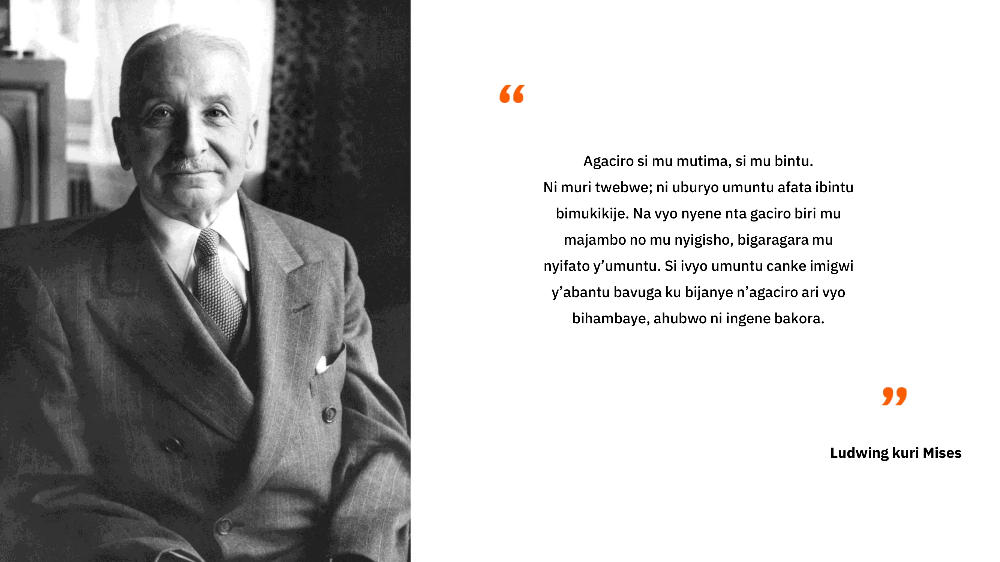

Umuhinga mu vy'ubutunzi wo muri Otirishi arahakana iciyumviro c'abakurikiye Adamu Smith maze aheba iciyumviro c'uko agaciro k'ikintu kava ku rugero rw'akazi kakozwe mu kugikora, ashigikira iciyumviro c'uko agaciro kaco kagenwa n'umuntu ku giti ciwe, uwo, muri buri gihe, akora igikorwa co mu vyiyumviro vyo gupima agaciro ku bijanye n'ingero yihariye y'ikintu. Iko gusimba k’ubwenge ryakozwe na Menger rirwanya intumbero y’agaciro: kuri we, agaciro si umutungo w’intumbero w’ibintu; ni ingaruka gusa y'ubucuti umuntu afise n'ico kintu: «agaciro ntikabaho hanze y'ubumenyi bw'umuntu».

Mu yandi majambo, Menger aradutumirira kwihweza ko agaciro kabaho gusa nk’ikintu kiba muvyiyumviro vy'umuntu, ko agaciro atari umutungo w’ibintu, ahubwo ko rikomoka ku ciyumviro c’umuntu ku bijanye n’akamaro ashobora kuronka muri ivyo bintu.

Nk’uko iyo ntumbero ibivuga, iritiro y’amazi yo kunywa nta agaciro k'ukuri ifise. Umuntu afise isoko w’amazi meza agezweho kandi atagira inyota y’amazi, ntashobora guha agaciro kanini ico litiro y’amazi, mu gihe umuntu afise inyota hagati mu bugaragwa, abona ko ari hagati y’ubuzima n’urupfu, yoba ata gukeka yiteguriye guha agaciro karekare cane iyo ritiro y'amazi.

Mu ncamake, Menger yabonye ko agaciro k’ikintu c’ubutunzi ata kindi atari agaciro umuntu ku giti ciwe atanga ku kindi gice c’ico kintu canke c’ico gikorwa.

### Kuguranura ku bushake : umukino wo kungukira hamwe

Uhereye kuri ivyo, Menger afata ingingo y’uko uguhanahana k’ubushake hagati y’abantu babiri iba kubera ko umwe wese mu bagize uruhande yizera ko izokwongerera akamaro kabo. Kuri we, guhanahana ntivyishura ko hariho ukungana kw’agaciro, bitandukanye n’ivyo abahinga mu vy’ubutunzi ba kera bemera. Nk’uko uwo munyabwenge w’Umunyaotirishi abivuga, iyo habaho ukungana kw’akamaro hagati y’ibintu vyahinduwe, nta mvo yotuma abo babiri bokwiruhira guhinduranya mu kibanza ca mbere. Iyo hariho uguhanahana, ni kubera ko buri ruhande rubona ko ari mu nyungu zabo (subjective), kandi kubera ivyo, guhanahana kose k’ubushake gutanga inyungu ku kibano.

### Gupima agaciro nk'ikintu co gutunganya ivyipfuzo vy'umuntu

Ariko rero, mwene iyo nyungu y'kibano, canke agaciro k'ukuri k’umuntu ku kintu ciza, ntibishobora gupimwa. Ku bwa Menger, agaciro ni ikintu c’ubumenyi co kugereranya (ordinal) aho kuba ingero (cardinal). Si nk’uko abahinga mu vy’ubutunzi b’abanyagihugu bavyiyumviriye kuva kuri Walras na Jevons, guha agaciro ikintu k’umuntu ku giti ciwe agaciro k’ibiharuro vyerekana akamaro bayikuramwo, ahubwo ni igikorwa co gutegeka ivyipfuzo vy’umuntu aho umuntu aserura ko yipfuza cane umubare w’ivyiza A kuruta umubare w’ivyiza B.

Umuntu wese arashobora kuvuga nimba akunda kurya ibitoke bibiri kurusha kwitaba isomo ry’ubutunzi, ariko nta n’umwe yokwemeza ku buryo bwumvikana ko aha agaciro ibitoke bibiri ku rugero rwa 3,1416 “utumero tw’akamaro (utils)”, mu gihe isomo ry’ubutunzi ariheza akarigenera 3 “utumero tw’akamaro”, kandi rero, agahitamwo bitoke. Mwene iyo ndondoro y’ivyo umuntu akunda, ishingiye ku bikorwa vy’ukuri bibandanya, ntihuye n’ukuri kw’imigenderanire y’ubumenyi tubona mu buzima bwacu bwa misi yose. Umuntu ntashira agaciro ku bintu ahawe abigereranya n’urugero rusanzwe rw’akamaro katagaragara (abstract). Ahubwo, agereranya mu buryo bw’ukwiyumvira ingendo zitandukanye z’ibikorwa, izo adashobora gucira urubanza mu buryo bushitse ariko naho ari ukwo ashobora kuzishira ku rutonde ashingiye ku kuntu zikenewe.

Ico ciyumviro c’agaciro, gitahurwa nk’ubucuti bwo mu vyiyumviro vy'umuntu afise n’imigambi yiwe be n’uburyo bubereye bwo kuzishitsa, na co nyene kiratuma abahinga mu vy’ubutunzi bo muri Otirishi basigura ikintu c’ukugabura ibikorwa.

### Ukugaburwa kw'akazi

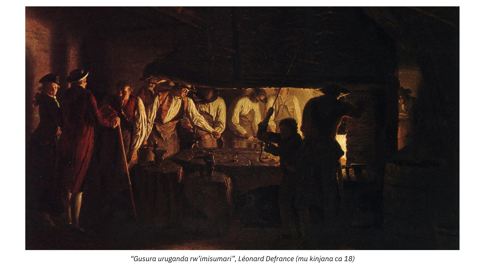

Kugendera uruganda rw’imisumari, Léonard Defrance (mu kinjana ca 18)

Buri muntu arihariye kandi aba mu buzima bwiwe bwite butandukanye. Ku bw’ivyo, umuntu wese afise ubushobozi bwisumbuye ku bw’abandi mu gukora ibikorwa bimwe ivyo twita inyungu ntangere  canke ubushobozi bwisumbuye ku bwa bamwe mu bikorwa bimwebimwe inyungu ngenderwako. Ntivyoshobora kuba ukundi; kubihakana vyosigura kuvuga yuko abantu bose bangana mu bintu vyose, kandi atariko biri.

Iyo umuntu afise ubushobozi burengeye ubw’abandi mu gukora ikintu kimwe runaka (ivyo twita inyungu ntangere), aba afise inyungu yo kukunonosora cane ku gukora ico kintu, hanyuma akagurana ivyo aronse birenze n’ibindi bintu aba yifuza. Ivyo bimufasha kurangura ivyifuzo vyiwe mu buryo bumworohereza kurusha iyo yogerageje gukora ibintu vyose yifuza wenyene.

Ariko kandi, birashobora kuba ari uko uwo muntu atagira akamaro gashitse mu guhingura ikintu ciza ico ari co cose. Muri ivyo, hazoba hakiriho ubwoko bw’ibikorwa umuntu ashobora gukora neza kurusha abandi (inyungu y’ukugereranya), kandi kubera iyo mvo, baracari n’inyungu yo kunonosora.

Nta nkeka ko hari abantu boshobora gutanga ico ciza bahawe mu buryo bumuha inyungu kuruta we, ariko kubera ko abo bantu kumbure bashobora gutanga inyungu mu kindi gikorwa kuruta muri iki, kandi ko badashobora gukora ivyo bikorwa vyose icarimwe, ntibibagirira inyungu gukora kuri ico gikorwa aho gukora ku kindi bashobora gukora cane canke gutanga umusaruro, Mu kunonosora igikorwa bafise umwimbu mwinshi, bazoronka inyungu nyinshi kuruta iyo batagira ivyo bakora, kandi rero, biciye ku guhanahana, ashobora kuronka ibindi bintu vyinshi kuruta ivyo yari kwikorerera wenyene, naho nyene yari kubikora neza cane kurusha abandi.

Fata akarorero k’umuganga. Ashobora kuba ari mwiza mu kwandika ama email no gutegura amasaha yo guhura n’abandi kuruta umunyamabanga wiwe (akarusho kagereranywa). Ariko umwanya wose yomara akora ivyo bikorwa ni umwanya adakoresha mu kuvura abarwayi. Ni co gituma, nk’uko ari we ashobora gukiza abantu, ni mu nyungu ziwe gushinga uwundi muntu ibikorwa bindi akenera naho yoba ari mwiza muri ico gikorwa kurusha umuvugizi wiwe, kuko bimufasha gushika ku rugero rwo hejuru agaciro kavuye ku bandi, gutyo n’ubutunzi bwiwe bwite.

Mu vy'ukuri, hariho inyungu yo kunonosora igikorwa canke icigwa, mbere no ku bantu badafise inyungu zishitse, kuko umwanya ari umutungo udasanzwe kandi uhanganye: igice cose c'igihe umuntu amara mu gikorwa kitari ico umuntu ashobora gutanga umwimbu ubereye cane gisobanura igiciro gitangwa n'igikorwa yari yarahevye (igiciro c'akaryo).

Uwo muntu amaze kunonosora cane igikorwa kinaka, arashobora rero kubika igitigiri c’ibintu abona ko ari ngombwa kugira ngo akoreshe we nyene, agakabisha umusesekara n'ibindi bintu bisigaye yipfuza. Mu kubigira, barahazwa n’icipfuzo cabo c’ibintu bo ubwabo bakora, ivyo bikaba bisobanura ko ibice bisigaye kumusaruro ataco umaze kuri bo. Ni co abahinga mu vy’ubutunzi bita ukugabanya akamaro k’inyuma: igice cose c’inyongera c’ikintu kirakenewe cane kuruta icabanje. Ku bandi babuze ivyo bintu, ni inkuru itandukanye: kubera izo mpamvu nyene, bakunda kwipfuza cane ivyo badakora kuruta ivyo bakora. Ivyo bituma habaho ukudahukana gukomeye hagati y’agaciro gatandukanye k’abantu ku giti cabo, ivyo bikaba bifasha cane mu guhinduranya: buri ruhande rufise inyungu yo guhinduranya umusaruro wabo kuko ivyo bituma bongera umwimbu wabo w’umuntu ku giti ciwe.

Iciyumviro c’isesengura ry’imbere ni uko abantu bama bamererwa neza iyo bize cane igikorwa cabo kandi bagakorana n’abandi. Ni co gituma abahinga mu vy’ubutunzi bo muri Otirishi, cane cane Ludwig Von Mises, bashika ku ciyumviro c’uko inyungu y’umwimbu iva mu kugabanganya ibikorwa ari yo ituma habaho inzira y’ugufashanya mu kibano. Aha, vyoshobora kuba vyiza tubidondaguye ata guca ku ruhande:

"Ibintu vy’ishimikiro vyatumye haba ugufashanya, ikibano, n’iterambere kandi bihindura umuntu w’igikoko akaba umuntu bituma habaho igikorwa gikorwa mu gihe kugabanganya ibikorwa gutanga inyungu kuruta igikorwa co kwitandukanya n’abandi kandi ko imvo y’umuntu ishobora kwemera uku kuri. Abantu ntibakorera hamwe mu gushira mu bikorwa igabura ry'ibikorwa kubera ko bakundana canke bokwiyumvirako bategerezwa gukundana. Bakorana kuko ivyo bibafasha kuronkeramwo inyungu zabo bwite mu buryo bwiza kuruta ibindi."

### Iciyumviro

> "Umuntu niyabona ko ashobora kubaho neza amanitse ku giti kuruta kwicara ku meza, yoba ariko akora nk'ikijuju kugira ngo ntiyimanike."
>

> Baruki Sipinoza

1871-1874 ni imyaka itangaje y’ubutunzi bwa none: ico kiringo carabonye ibikorwa vy’abanyabwenge batatu bigenga b’ishimikiro ry’ubutunzi bwa none. Mu gushimika ku gaciro k’ibintu, abahinga mu vy’ubutunzi bo muri Otirishi barateguye ivyiyumviro vyose vy’ubutunzi bibatandukanya n’abo basangiye ivyo bikorwa nkivyo. Ibikorwa vy’abahinga mu vy’ubutunzi bo muri Otirishiya bazirikana ku bikorwa vy’umuntu mu gihe c’ugukene bizoguma bitandukanye cane n’inyigisho z’ubutunzi zatangujwe na Jevons na Walras zishingiye cane ku biharuro kandi zihagaze k’iciyumviro c’uko agaciro gashobora gupimwa mu buryo butagiramwo uburyarya kandi kakavamwo nk’igikorwa kibandanya.

Yishimikije ubumenyi bw'agaciro k'urutonde rw'ibintu, Menger yasiguye ukuntu havutse ugusangira ibikorwa n'ubushake Exchange. Yamara nk’uko tuzobibona mu kigabane gikurikira, Guhanahana ni ubuhinga bubi ku bakozi b’ubutunzi barondera gutuma bashobora gukoresha neza akamaro kabo. Se w’Ishure ry’i Otirishi rero yararushirije gutera imbere mu vyiyumviro vyiwe kugira ngo asigure igituma amahera yaje nk’ikigo c’imibano.

Ibice bikurikira bizoba vyerekeye ukuntu amahera yaserutse nk’ikigo c’imibano, inyigisho y’umutahe n’inyungu, ivyo bikaba ari vyo bizoshingirako inyigisho y’izinguzingu(cycle) y’ubudandaji, n’ubwa nyuma uruhara rw’ibiciro mu kubara ubutunzi.

### Uguseruka kw'amahera nk'ikintu gikomeye mu kibano

<chapterId>14ded794-0578-5478-ba5b-b2106c74f3ef</chapterId>

Naho abantu bafise inyungu imwe yo kunonosora no gutuma ibikorwa bigabanywa cane, haracariho ingorane zo guhuza ibikorwa zigabanya uko gukwiragira.

Ica mbere, birahambaye kumenya ko kubera ko ibikorwa vyo guhingura ibintu bifise igihe kandi akenshi bitajanye n’igihe (bitajanye n’igihe kimwe), akenshi hazoba itandukaniro ry’igihe hagati y’intererano y’intango y’umuntu n’iyo uwo mugenziwe azoronka.Kwiyegereza gukora ikintu runaka ubu, utabanje kumenya ko abandi bazokwubahiriza ivyipfuzo vyacu mu gihe kizokurikira, bishobora kuba ingorane.

Mu kugabanganya ibikorwa, impande zose ziraheza zikaronka inyungu mu gukorana neza, ariko umuntu ku giti ciwe, yoshobora kugerageza kurya inguvu z'abandi ataco nawe atereye(gukorerwa), kuko muri ubwo buryo, bashobora kuronka ikintu c’agaciro ataco baciye. Mwene ivyo bihe, aho ugukorana bivamwo inyungu nke ku muntu ku giti ciwe ariko inyungu nyinshi ku mugwi, bivugwa mu vyiyumviro vy'inkino nk'"ukwijijanya imitima k'impfungwa."

### ukwijijanya imitima k'impfungwa

Mu ntango, umupfungwa yijijanya imitima uku: Abakekwako ivyaha babiri, Alice na Bob, badashobora kuvugana, bari mu kaga ko gufungwa, n’ibihano bishobora guhabwa nk’ibi:

- Iyo Alice areze Bob, Bob akaguma acereje, Alice ararekurwa, Bob akaronka imyaka 3.
- Iyo Alice na Bob bompi bareganya, umwe wese aronka imyaka 2.
- Iyo bompi bacereje, umwe wese aronka umwaka 1.

Ivyo bishobora kwerekanwa mu rutonde (inyishu z'ibiharuro zerekana imyaka umuntu azomara apfunzwe):

| Alice / Bob       | Accuse | Remain Silent |
| ----------------- | ------ | ------------- |
| **Accuse**        | 2, 2   | 0, 3          |
| **Remain Silent** | 3, 0   | 1, 1          |

Muri uwo mukino, nta karyo ko guhuza ibikorwa (uguhanahana amakuru ntibishoboka) kugira ngo haboneke inyishu nziza ku mpande zompi. Ku bw’ivyo, Alice na Bob barafise ikintu kimwekimwe cose kibatera intege zo kuregana, naho nyene bitajana ku ngaruka nziza kuri uwo mugwi. umugambi mwiza kuri bompi ni uguceceka, umwe wese akaronka igihano c’umwaka 1.

Uyu mukino ugaragaza ingorane abantu bahura na zo buzima busanzwe: iyo ata buryo bwo guhuza ibikorwa buhari, abantu bakunda guhitamwo uburyo zituma baronka inyungu nyinshi ku giti cabo, ataco bafatiye ku buryo abandi bahisemwo (ubusuma, ubupfungakiwani, ubuhemu, n’ibindi),n’iyo haba ubushobizi bwo kugera ku mwumvikano urushijeho kuba mwiza biciye mu guhuza no gukorera hamwe.

### Amahera yo gukemura ibibazo vy’uguhuza ibikorwa.

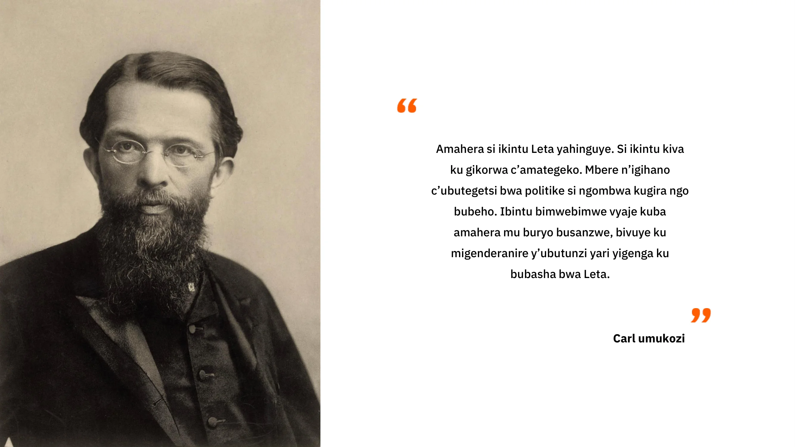

Ico kibazo gifise ingaruka nke mu kibano c'abantu bakeya (nk’akarorero, umuryango, canke abagenzi) kuko, muri ivyo bihe, umuntu wese aramenyana ubwonyene igituma yibuka umuganda umwe wese ategerezwa guterera canke bikaba bishoboka kwibuka intererano z’uwundi. Dufashe ko kuva mu kibano (guhunga) bifise ikiguzi, uburyo bwo kumenyekana bushingiye ku kwibuka kw’abakozi ku giti cabo akenshi burahagije kugira ngo umuntu yirinde imitego iterwa n’ukwijijanya imitima k’umufungwa.

Ariko rero, iyo umuntu ariko arakorana n’imiryango minini yungukira cane ku gusabikanya ibikorwa, ingorane zo guhuza ibikorwa zirasubira kuvyuka. Ivyo biva ku mpamvu zibiri nyamukuru:

Ica mbere, abantu barafise ubushobozi bwo gutahura ibintu buke. biragoye ko umuntu agumana yibuka ubucuti afitaniye n’abantu barenga 150, ivyo bikaba bituma uburyo bwo kumenyekana budahagije kugira ngo umuntu ashobore gutsinda ukwijijanya imitima kw'impfungwa ku rugero runini.

Ubwa kabiri, ingero yemewe n’abantu y’agaciro k’intererano muguhanahana(uburyo bwo gushobora kugereranya ibintu bitandukanye) ni ingorane idasanzwe. Nk’akarorero, iyo umuntu atanga inyama zivuye mu guhiga, agasaba bamukabire izo nyama nibikoresho vyo kubaka, ni gute inyama zitangwa zishobora gusuzumwa mu buryo bungana n’ibikoresho asavye? Ni ko biri no ku bijanye n’uburyo – mbega inyama z’impongo zifise agaciro kanini canke gato kuruta ibiti?

Naho vyoshoboka gushinga igipimo gishimishije ku bicuruzwa bibiri bibiri, kubungabunga ayo makuru buba ubudashoboka muburyo bunyaruka. Mu buryo butaziguye bwa guhanahana kujanye n’ibicuruzwa N, gufata ibiciro N(N-1)/2 gihanahana vyo kwibuka. Ku butunzi bw’ibicuruzwa 50, ivyo bisigura kwibuka ibiciro vya 50\*49/2, canke 1225 guhanahana, bitandukanye n’ibiciro 50 gusa mu guhinduranya ibicuruzwa bitaziguye. Ku butunzi bw’ibicuruzwa 100, uvyo biharuro biraduga bikaja kuri 4950. Mwene ukwo gufatanya kw’ibice bine gushiraho umurongo ntarengwa w’inyongera ku bijanye n’ugushobora gukoresha guhanahana vyihuse(gukabisha(barter)).

Ikindi kandi, kubera uko guhanahana ibidandazwa kutaba ubwo nyene ahubwo kikaba bigenda bitandukanwa n'umwanya kanaka, gusuzuma intererano mu gihe birarushiriza kugorana gusuzuma intererano. Uretse gusuzuma igipimo co guhanahana hagati y’ibintu bibiri biriho ubu, biraba ngombwa gusuzuma agaciro k’intererano ya kera ugereranije n’iyo muri kazoza.

Muri iki gihe, naho mwene ubwo buryo budakora, twoshobora gukoresha ubuhinga bwo kwandika canke bwo kubika amakuru mu buryo bwa none(digitale) kugira ngo twibuke ayo makuru yose maze dushireho uburyo bwo gutanga ingurane (gukurikirana intererano za kera, harimwo n’igipimo co guhanahana c’izo ntererano, ni ugushinga ahanini uburyo bwo gutanga ingurane).

Mu gihe c’imbere y’uko abantu bashinga imibano igezweho, izo nzira z’ikoranabuhanga ntizari zihari. Abasokuru bacu rero bagiye barondera ubundi buryo bwo kuronka inyungu zo kugabura imirimo batagomba kuvyura ingaruka mbi ziva ku ngorane y'umupfungwa. Umuti w’ico kibazo co guhanahana inyaruka yari yorohejwe n’amahera.

### Guhurirana kw'ivyo umuntu ashaka n'ivyo ashobora kugurisha

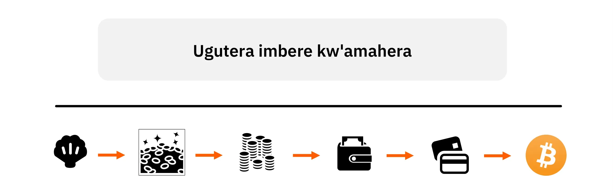

Amahera ashobora kubonwa nk'umuti wavumbuwe na ba sogokuruza bacu ku kibazo ca c'ubutunzi ico abahinga mu vy'ubutunzi bita "uguhurirana kw'ivyo umuntu yipfuza". Ico kibazo gifise ivyiyumviro bitatu: ibijanye n’ahantu, ivy’igihe n’ivy’abantu.

Mu kuvugana (barter) hagati ya Alice na Bob, umwe  kugira ikintu uwundi yipfuza mu gihe kimwe no mu kibanza kimwe. Mu gukoresha uguhanahana kutaziguye, ni ukuvuga, biciye ku mahera, Alice arashobora kugura kuri Bob, na Bob ashobora gukoresha iyo ngera y’amahera ahandi, mu kindi gihe, kandi n’uwundi muntu (igihe cose uwo wundi yemeye ubwo bwoko bw’amahera).

Kugira ngo ikintu gikore nk’amahera, gitegerezwa kuba gifise ubushobozi bwo kugurisha cane, bisobanura ko kiba gikwiye kwipfuzwa n’abantu benshi bishoboka, kenshi. Mu gukoresha ikintu kigurishwa cane, ingorane y’uguhurirana kw’ivyo umuntu yipfuza iratorerwa umuti mu bijanye n’ahantu n’imigenderanire hagati y’abantu: nimba ikintu nkoresha nk’amahera cipfuzwa ahantu hose kandi n’abantu benshi, ndashobora gutandukanya bitagoranye igikorwa co kugurisha n’igikorwa co kugura mu bijanye n’aho umuntu ari be n’imigenderanire y’abantu.

Ariko rero, ingorane y’ugucuruza bukebuke irarushiriza kugorana gutorera umuti kubera imvo zibiri:

Ica mbere, entropie (izwi cane kw'izina rya "ingaruka y'igihe") ihindura canke yonona buhoro buhoro kamere nziza ibintu vyinshi bifise akamaro kataziguye. Ku bw’ivyo, kugira ngo ikintu kigume kigurishwa mu gihe kirekire bisaba ko kigumaho cane canke gishobora kuramba cane kikanarinda ingaruka y'igihe(entropy).

Ubwa kabiri, ubukene bw'ikintu ku gihe "t" ntibushobora kwemeza ko kizoba kidahari muri kazoza. Mu gutanga ubutunzi buhagije ku kibanza kinaka c’uguhingura, abantu barashobora kwongerera umwimbu canke Itangwa ry’ibicuruzwa. Ico gusa cotuma umuntu yongera Itangwa ry’ibicuruzwa n'igiciro kijanye n’ico kintu. Ku bw’ivyo, ubukene bw’ibintu buriho ubu ntibushobora kwemeza ko buzoba buke cane muri kazoza. Ibintu vyonyene bishobora kwongereza umusaruro wavyo ku ruhande ku giciro kinini cane bishobora kuba bike cane, ni co gituma ico ari ikintu kiranga ibicuruzwa vy’amahera vyavutse mu mwidegemvyo mu mateka yose y’abantu.

Mu gihe c’imbere y’uko abantu bashinga imibano igezweho, ibintu bitandukanye n'ibidede biva mu bikoko vyo mumazi(seashells), ibidede kama, amabuye y’agaciro vyakoreshwa nk’amahera. Ivyo bintu vyari vyoroshe gutwara, ntivyari bifise akamaro kanini karenze agaciro kavyo k’ugushaza, vyari bihanganye n’ugusenyuka (ni ukuvuga ko bitagenda biratakaza agaciro uko igihe kigenda), vyari bike cane kandi vyasaba abakozi benshi cane kugira ngo bishobore gukorwa. Kubera ko urugero rw’ugusangira ibikorwa rwari ruto ico gihe, kandi rero, igiciro kijanye n’uguhingura ibintu vy’ugushaza cari kinini, ivyo bintu ntivyari gushobora gukorwa mu bwinshi. Gutyo, abakoresha ivyo bintu nk’amahera boshobora kwizigira ko muri kazoza bazoba bake cane.

Kuba ba sogokuruza bacu babeshejweho no guhiga no kwamura ivyamwa bariko barakora ivyo bikorwa bikoresha ubutunzi bwinshi, naho ata kintu na kimwe bashobora gutanga, vyerekana inyungu nyinshi bari biteze mu kwagura ikibanza, imibano n’igihe c'uguhanahana. Iyo ivyo bitaba uko, kandi bikaba ari ngirakamaro kuri bo gukoresha ivyo bintu mu kwubaka amazu, mu ruhigi canke mu bindi bikorwa, aho gukoresha mu guhingura ibintu vy’amahera, kumbure ntitworonka ibimenyetso vyinshi vy’ubucukuzi vy’ivyo bikorwa vy’ubuhinga kama. Ayandi mashirahamwe akoresha neza ubutunzi bwayo yari gutera imbere neza no guterimbere cane, kandi hejuru y'ubutunzi n'ivyo bikorwa vy’ubuhinga kama vyari guca bizimangana ningoga, bikuweho n'bikorwa vy’uguhingura ibintu bifise akamaro kataziguye.

Muri ubwo buryo, uguhingura ibintu bigugwa amahera, mu guteza imbere ugusangira ibikorwa, vyari bigereranya ugukoresha neza ubutunzi (mu bijanye n’akamaro k’abantu ku giti cabo) kuruta ubundi buryo bwose (kwongereza uruhigi, uburovyi, kwamura, uguhingura igiti, kwubaka inzu, guhingura ibikoresho vy'guhigi  n’ibindi).

### Ugukekeranya

Kugira ngo dusozere isesengura ryacu ry’ikigo c'ivy'amahera, turakeneye gufata muminwe ikibazo c’ibikorwa vy’ubutunzi mu gihe c’ugikekeranya ku bijanye n’ivyo muri kazoza.

Nk’uko abahinga mu vy’ubutunzi bo muri Otirishi bavyemeza, ibikorwa vy’umuntu vyama bihagaze kuri kazoza. Iyo umuntu akoze ikintu, arahindura uko ameze ubu afise icizere co kuronka ukunyurwa canke guterimbera muri kazoza. Ukwo kwiyumvira kuri kazoza ka hafi canke ka kure, ariko kugira ngo umuntu ashobore gutegura ivy’igihe kirekire, ategerezwa kubanza kuronka ivyo akeneye mu gihe gito kuko uko azoba ari muri kazoza ka hafi bigira ico bikoze ciza canke kibi kuri kazoza ka kure.

Ataguca kuruhande ivyo biva ku ntumbero y’umuntu; nta n’umwe ashobora kwirengagiza urutonde rw’ibintu vy’igihe n’ukuntu bikurikirana n'ingaruka bizana kuko ni kimwe mu bintu bibazo nyamukuru biza mu buzima bw’umuntu. Kubera rero ko kazoza k’abantu tudashobora kukamenya, bazorondera gukingira ubuzima bwabo bw’igihe kizoza ca kure igihe bazoronka ivyo bakeneye mu buzima bw'igihe ca hafi.

Muri ivyo, amahera, atwemerera kabikwa agaciro muri iki gihe no kugajana k'umuntu wo muri kazoza, arafise uruhara runini mu guhuza ibikorwa vy’umuntu ibihe n'ibihe. Mu kubika amahera, ni ukuvuga kuziganya abantu barinda ukudakeka muri kazoza, gutyo bagashobora kuyobora ibikorwa vyabo mu gihe kizoza ca kure. Ariko ivyo bashobora kubishikako gusa iyo amahera akoreshwa ari ububiko bw’agaciro, bisobanura ko afise ubushobozi bwo kugurishwa mu gihe bikenewe, ivyo bikaba nk’uko twari twabibonye, ​​ari ikintu kiranga ibintu bihoraho kandi bike cane(bikenye).

Mu kigabane gikurikira tuzokwihweza cane iciyumviro co guhitamwo umwanya no gusigura ukuntu abanya Otirishi babona inyungu n’umutahe, ivyo bikaba bizoba ishingiro ry’igice gikurikira kivuga ku ciyumviro c’ingendo y’ubudandaji.

## uguhitamwo igihe, Inyungu, n'umutahe

<chapterId>37732a5c-4f66-5e2d-bc2c-cc8d29693af7</chapterId>

### uguhitamwo igihe

Twarasozereye igice ca nyuma mu gusigura ingene abakozi bo mu vy'ubutunzi bakoresha ibintu(ibidandazwa) bigurishwa cane, ni ukuvuga amahera kugira ngo bakinge ukudakeka muri kazoza. Twarasiguye kandi ko ukuntu ibintu vy’igihe bikurikirana bituma turwanya ukudakeka buhorobuhoro: iyo tuzi ko uko tuzobaho mu ndwi ikurikira ni ho dushobora kwibanda ku migambi iri kure cane muri kazoza.

Canke, tubivuge mu buryo butandukanye: nk’abantu turasuzugura agaciro k’ibintu vyo muri kazoza.

Ukwo gusuzuma k'umuntu ku giti ciwe agaciro k’ibintu vyo muri kazoza ugereranyije n’ibintu vyo muri iki gihe vyitwa uguhitamwo igihe. Ibindi vyose bikaba bingana, ivy’ubu birakundwa cane kuruta ivy’imbere. Kubera ko turi abantu bapfa, kandi kazoza kacu tutaba tukazi, birasanzwe ko duhitamwo kuronka iciza ubu aho kuronka munyuma. Naho igihe umuntu akunda gishobora gutandukana bivanye n'umuntu, kubera ibintu vyinshi bitandukanye nk’umuco, ubutunzi, uko warezwe, umubiri, n’ibindi, igihe umuntu ahisemwo cama ari ciza, bisobanura ko ibintu vyose bingana, twama duha agaciro ivyiza vy’ubu kuruta ivyiza vyo muri kazoza.

Ico ciyumviro co gupima agaciro k’ibintu vyo muri kazoza ku bintu vyo muri iki gihe ni co gishingiyeko ikintu c’inyungu. Nkako, mu butunzi bufise amasoko y’itunga atakoreshwa, inyungu z’ishingiro (zibonwa ko zidafise ingorane zo kudatanga) zigenwa ku mahuriro y’itunga: Itangwa ry’ibicuruzwa, n’ivyipfuzo vy’abaguzi. Rero, ivyo bipimo bigereranya uko igihe umuntu akunda ku bukungu bwose kimeze: ukwiyongera kw’inyungu kuva ku kwiyongera kw’abasaba umutungo ugereranije na Supply, bikaba vyerekana ko umuntu akunda igihe kinini. Ku rundi ruhande, ukugabanya inyungu bishika kubera ukwiyongera kw’amahera aziganijwe, ivyo bikaba ari ukwiyongera kwa Itangwa ry’ibicuruzwa, bikaba vyerekana kugabanuka kw'igihe umunte akunda.

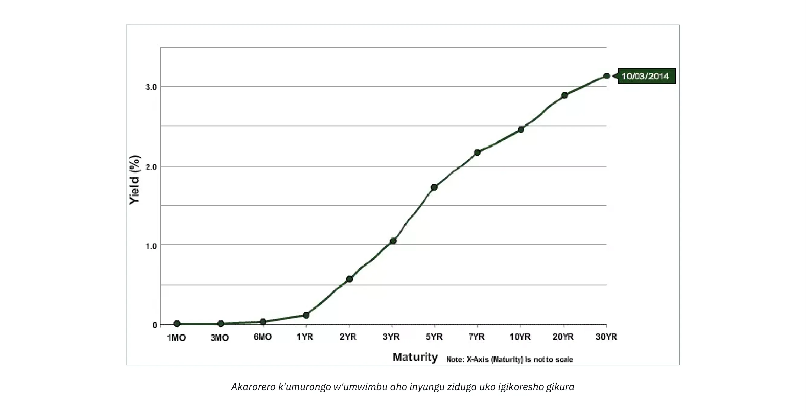

Mu bukungu canke mu butunzi aho inyungu zidakoreshwa na banki nkuru, dukunda kubona umurongo w’inyungu ugenda uraduga: uko umwenda umara igihe kirekire, ni ko inyungu igenda irakura. igihushane c'ivyo ntikibaho kuko vyotuma kazoza kazoba gatomoye kuruta ubu, ivyo bikaba ari ibintu bidashoboka.

Iciyumviro co guhitamwo umwanya n’ingene tuvuga umwanya wacu bwite dukunda biciye mu gikorwa co gukoresha no kuziganya ni ngirakamaro mu migenderanire yo gutanga umutahe n’uguhingura. Reka duhindukirire umunyeshure wa Menger, Eugen von Böhm-Bawerk, n’inyigisho yiwe y’ubutunzi kugira ngo dutahure neza ingene uguhitamwo umwanya bigira ico bikoze ku bijanye n’ugutunganya ibikorwa.

### Ivyiyumviro vy'umutungo

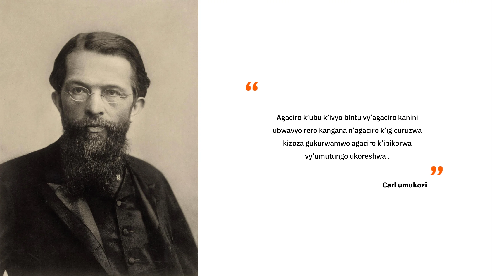

Mu ntango y’iki cigwa, twabonye ko, kuri Carl Menger, ibintu(ibodandazwa) bifatwa gusa nk’ibintu vy’ubutunzi (bifise agaciro) kuko bikora nk’uburyo bwo gushika ku ntumbero zatowe kandi zihabwa agaciro n’abantu ku giti cabo. Dushingiye kuri, isesengura ryose ry’ubutunzi rizunguruka ugukoresha kuko ari yo ntumbero yanyuma y'ibikorwa vyose vy’ubutunzi. Rero, kuri Menger, intango y’isesengura ry’ubutunzi ni ibicuruzwa vy’abaguzi, canke ibicuruzwa vya nyuma, kuko ari vyo bigereranya intumbero nyamukuru y’igikorwa c’ubutunzi. Ibindi bicuruzwa vyose vyo mu vy'ubutunzi, ivyo twokwita "ibicuruzwa vyo hagati", bifise agaciro gusa kuko bishoboza abantu ku giti cabo kuronka ivyo bicuruzwa canke tuvuge  akazi: ni ibicuruzwa bikoreshwa mu guhingura ibindi bicuruzwa.

Kugira ngo abacuruzi bashobore guhingura ibintu vy’ugukoresha, bafatanya ivyo bintu bitandukanye vyo hagati n’ibintu vy’intango vy’uguhingura (abakozi, ubutaka n’umutahe) hakurikijwe uburyo butuma umusaruro urushiriza kuba mwinshi. Iyo nteguro, ikorwa n’abanyamigambi, canke ubuhinga bwo guhingura, irimwo intambwe zitandukanye aho ibintu vyo hagati(intermediate goods) bihinduka gushika aho amaherezo bihinduka ibintu vy’abaguzi canke bishobora kugurwa canke gukoreshwa n'abaguzi.

Gutyo, nka Menger, turashobora gusobanura ibintu vy’abaguzi canke bishobora gukoreshwan'abaguzi nyene nk’ibintu vy’urutonde rwa mbere canke tuvuge biza kumwanya wambere, ibintu vyari mu ntambwe ya mbere nk’ibintu vy’urutonde rwa kabiri, ivyo mu ntambwe y’imbere nk’ibintu vy’urutonde rwa gatatu, n’ibindi, gushika dushitse ku bintu vy’intango (ubutaka, akazi, umutahe).igiyigiri c’intambwe dutegekanya ahanini kivana n'uko ubuhingabweemejwe n’abanyamigambi buteye kandi ntibikwiye gufatwa nk’ikintu kigaragaza intumbero y'uko ubuhinga buteye Ahubwo, intambwe z’uguhingura n’ibintu vyo hagati (intermediate goods) bibaho gusa mu gihe c’ubuhinga bwa teleoloji: uwubigenga yiyumvira urutonde rw’ibikorwa azocamwo kugira ngo ashike ku ntumbero yipfuza, maze mu bwenge bagaca bagabanganya igikorwa cabo mu ntambwe zikurikirana.

Ico kiranga ugucapura mu bwenge kw’ibikorwa mu buryo bukurikirana gitegekwa n’ingene igikorwa c’umuntu gifata igihe. Igikorwa kimwekimwe cose abantu bakora gifata umwanya; gukora ubwo nyene ntibishoboka. Ku bw’ivyo,Ku bw’ivyo, uwujejwe ivyo ibikorwa ahora afise amahitamwo hagati y’imigenderanire y’ibikorwa bigufi canke birebire. 

Kuva ubu, abantu bafise amahitamwo yabo mu bijanye n’igihe, bisobanura ko bakunda ivyiza vy’ubu kuruta ivyiza vyo muri kazoza, bazohitamwo gusa inzira ndende iyo nk'inyishu baronse ifise agaciro kanini kuri bo kuruta ivyo boba barashitseko mu gufata inzira itarangurura. Ahandi ho, nta n’umwe yofata uburyo butwara umwanya mwinshi: mu gihe c’ivyavuyemwo bingana, inzira ngufi kuruta izindi zose iguma ari yo iza imbere bivuze ko ariyo bama bahitamwo.

Kubera urutonde rw’ibikorwa vy’umuntu, ayo mahitamwo hagati y’ibihe yama afise ingaruka ku rutonde rw’ibikorwa. Mu yandi majambo, ibikorwa vy’igihe gito nkora biri munsi y’imigambi y’igihe kirekire nshizeho, kandi ibikorwa vyanje vy’igihe gito bizogira ico bikoze ku vyo nshobora gukora muri kazoza. Ico ciyumviro kigaragara kirabana n’ibikorwa vy’uguhingura kivuga ko kwiba canke gucisha kuruhande kwose umwimbu wavuye muguhingura, ni ukuvuga, ugukwagura kwose kw’imiterere y’uguhingura, bisaba kuziganya imbere y’igihe. Iyo mfashe ingingo yo gutanga amafaranga menshi muri iki gihe kugira ngo nshobore gushika ku ntumbero yanje ya kazoza, ntegerezwa kubanza gushiramwo ivyo bizotuma nkomeza mu kiringo ishoramari ryanje rizofata.

Kugira ngo tubone neza iyo ngingo, reka dusubire kuraba akarorero katanzwe na Böhm-Bawerk, mu gitabu ciwe "umutahe n'inyungu":

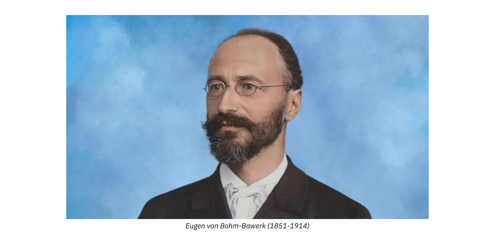

Eugen von Bohm-Bawerk (1851-1914)

### Robinson Crusoe n'Ibarabara ry'Ibikorwa:

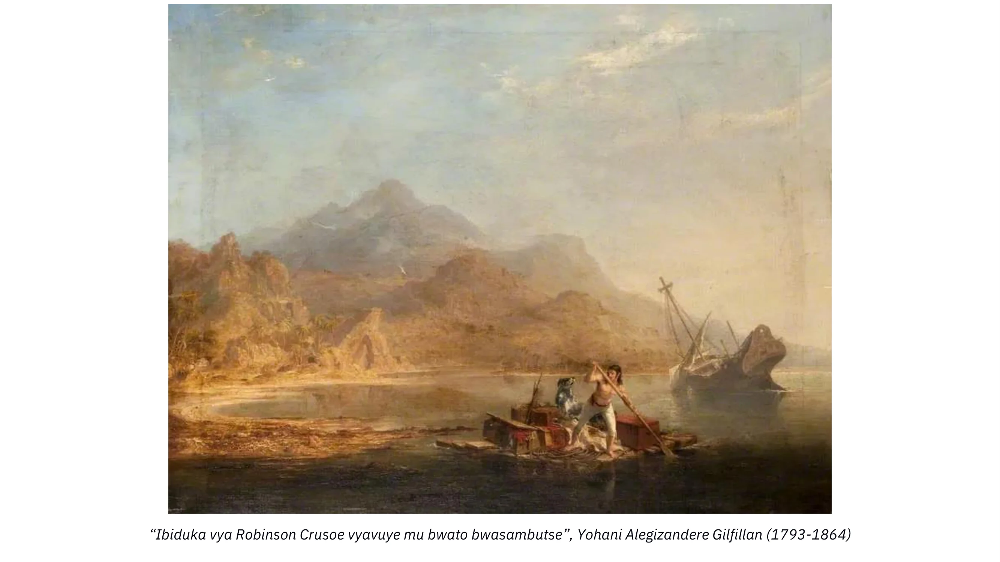

Amaduka ya Robinson Crusoe avuye mu bwato bwasambutse, Yohani Alegizandere Gilfillan (1793-1864)

Mu gitabu ciwe, uwo muhinga mu vy’ubutunzi wo muri Otirishi aradutumira kwihweza ivy’uguhuza ibintu hagati y’ibihe biva mu guhinduranya ibikorwa biciye mwi geragezwa y’ivyiyumviro ishingiye kuri Robinson Crusoe wenyene kw’izinga ryiwe.

Robinson, cokimwe n’umuntu wa kera, yizigiye kurondera ivyo kurya no guhiga kugira ngo abone ivyo afungura. Reka twiyumvire ko Robinson ashobora kwegeranya ibinyomoro(intori z'ikizungu) bihagije kugira ngo yigaburire umusi wose mu masaha umunani. Mu bihe nk’ivyo, nta mwanya agira wo gukora ibindi bikorwa. Ariko rero, Robinson yiyumvira yuko mu gukora agakeruzo, yoshobora kwamuza izo ntore, akaronka ivyo arya ku musi ku musi mu masaha ane gusa. Vyongeye, agereranya ko bizomutwara imisi itanu, kubera ko akora amasaha abiri ku musi, kugira ngo akore ako gakeruzo. Ni co gituma ashika ku ciyumviro c’uko akwiye kuzigama 1/5 c’intore aronka mu misi itanu, canke akamara amasaha 2 y’inyongera ku musi mu kwamura imisi 5, kugira ngo azigame intori zihagije kugira ngo abeho mu kiringo amara akora ako gakeruzo.

Iyo atakoze uko kuziganya kwiwe, Robinson ntazoshobora kurangiza ako gakeruzo kandi yoshobora kwicwa n'inzara muri ico gihe.

Rero, mu misi itanu, aratanga amasaha abiri y’ukuruhuka kugira ngo yegeranye(yamure) izindi ntore nyinshi. Ico kiringo kirangiye, araronka ivyamwa bihagije maze agatangura gukora igiti cive, akora amasaha abiri ku musi mu kiringo c’imisi itanu. Iyo akazi kiwe karangiye, arashobora kuronka intore zihagije z’ivyo arya ku musi mu masaha 4 aho kuronka amasaha 8, ivyo bikaba bimufasha gukoresha amasaha 4 asigaye ku musi mu bindi bikorwa.

Mu gukora gutyo, Robinson afata inzira y’uguhingura: mumwanya wo kwamura ubwonyene intore ziwe ,ashira inguvu mu guhingura igikoresho kizomufasha kugwiza umwimbu muri kazoza. Ariko rero, ategerezwa kwitanga  akaziganya vy'igihe gito, ni ukuvuga gukiza, kugira ngo ivyo abishikeko. Iyo atabikora, ntiyari gushobora kurangiza ico gikoresho ciwe. Ariko rero, ico kimazi c’igihe gito kiramuha akamaro kanini kuko iyo amaze gukoresha agakeruzo kiwe, aronka amasaha 4 ku musi (gushika ca gikeruzo ciwe gihere canke gisaze). Ayo masaha 4 y’inyongera ku musi aramushoboza kurema ibintu vyinshi vy’agaciro, nk’ibikoresho vyo guhiga canke insenga zo kuroba, buhoro buhoro bigatuma ivyiwe bigenda neza.

### Iciyumviro

Mu yandi majambo, mu butunzi bwitw bwa Robinson Crusoé, kuzigama biciye mu kwiyima no kwitanga bituma urema ikintu gishobora kuduza umusaruro. Muri ivyo, kuziganya, ni ukuvuga kwihangana ukiyima ivyo ukeneye muri kubu, ni co kiguzi co kwishura kugira ngo umuntu arushirize kunyurwa muri kazoza. Ivyo bisigura ko, muri ivyo, kuziganya ari co kintu gikenewe kandi gikenewe kugira ngo ubutunzi butere imbere.

Ico ni iciyumviro gitangaje, naho coroshe: ukwagura kwose kw’imiterere y’umwimbu bisaba ko umuntu aziganya imbere y’igihe (kuko ibintu bikenewe kugira ngo ivyo bihingurwe ntibizova mw’ijuru), kandi rero, uko tuzoziganya cane, ni ko tuzoshobora kwirundanira amatungo menshi, ivyo na vyo bikazotuma turonka inyungu k’umwimbu kandi izo nyungu zituma turonka ibintu vyinshi. Gutyo, abahinga mu vy’ubutunzi bo muri Otirishi babona ko ukugabanya igihe umuntu akunda(ahitamwo) ari intango y’umuzingi mwiza wo kuzigaya –> ibintu vyinshi  umusaruro mwinshi  ibintu vyinshi = urugero rwo kubaho ruteye imbere –> igihe gito.

Mugabo, nk’uko twabivuze mu kigabane ca mbere, inyungu zamaze imyaka mirongo zikoreshwa na banki nkuru mu gihe amabanki y’ubudandaji yatanga ingurane ata n’imwe yiziganije, bisobanura ko inyungu zerekana igihe dukunda canke duhitamwo kandi zitanga iciyumviro c’uko dushobora kuziganya amahera menshi.

Ivyo vyerekanywe neza n’ikigereranyo kiri aha hepfo: ibiciro vy’igihe kirekire biri hasi y’ibiciro vy’igihe gito. Ica mbere, ivyo ntabwo bisiguritse nagato, kuko vyotuma kazoza kazoba gatomoye kuruta ubu. Ubwa kabiri, birakenewe ko haba ukwiyumvira ku ngaruka zishobora guterwa n’ugutanga umutahe: iyo umuntu wese atera intege gukora nk’aho amafaranga yaziganije ari menshi, mu gihe abazigama ataho bari kubera ko badahembwa kubera baziganije, ivyo vyoshobora kugira ingaruka izihe ku butunzi?

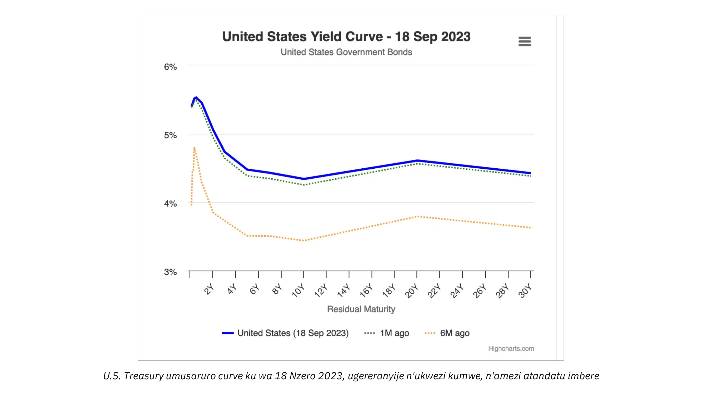

Ivyo ni vyo tuzobibona mu kigabane gikurikira kijanye n’Inyigisho y’Ubucuruzi y’abanya otirishi!

# Ivyiyumviro butunzi bwa Otirishi

<partId>ad0fce42-2556-56b8-a093-5b4fcacc7cf3</partId>

## Ivyiyumviro vy'Abanyaotirishi ku bijanye n'ingendo y'ubudandaji

<chapterId>718afaa8-ce78-58aa-9477-073eef0bd137</chapterId>

> "Uko ukwiyongera kw’inguzanyo z’amabanki zishingiye ku mpapuro zidafise agaciro, ni ko urugero rw'ishoramari ribi mu bicuruzwa vy'ubutunzi rugenda ruragwira, kandi ni ko bikenerwa cane gusesa canke kuvana n'izo nzira zitari nziza. Iyo ukwaguka kw'inguzanyo guhagaze, gusubira inyuma, canke mbere kugabanuka cane, ishoramari ribi rikagwira"
>
> Luduwiki voni Mises

Ludwig Von Mises, umunyeshure wa Böhm-Bawerk yari afise ubuhinga bwinshi kuruta abandi bose kandi ata gukeka ko ari we muhinga mu vy’ubutunzi wo muri Otirishiya ahambaye kuruta abandi bose mu kinjana ca 20, ni we yakoresheje ivyiyumviro vya Böhm-Bawerk kugira ngo asigure imvo n’imvano n’ingene ubutunzi bugenda. Friedrich A. Hayek, umwigishwa wa Mises, yaje gukoresha ico ciyumviro mu buryo buramvuye mu nyandiko ziwe, bikamuha agashimwe ka Nobel mu vy'ubutunzi mu 1974.

Mises na Hayek batanguye isesengura ryabo bahereye ku kwiyongera kw’amahera yo kuziganye. Nk’uko twabibonye mu vyigwa vyabanje, ukwongerekana kwose kw’amahera yo kuziganya gutuma n’ivyo umuntu akoresha bigabanuka, nkako bigatuma ibiciro vy'ibidandazwa bigabanuka. Ivyo bituma habaho ingaruka zibiri: iya mbere, abaguzi bibikoresho(ibidandazwa muri rusangi) bariyonera bitewe n’ugutera imbere kw’imishahara bigaca bituma haba kw'ibiciro kw'ibiciro vy’ibintu bikoreshwa(ibidandazwa); n’ica kabiri, ukwiyongera kw’inyungu z’imigambi ku ntambwe z’ubuhinga ziri kure cane y’ugukoresha (urutonde rwo hasi). Uko umushahara nyawo ugenda uraduga, abanyamigambi bahimirizwa kuziganya abakozi mu gukoresha ibintu vyinshi vy’agaciro(Capital goods), ivyo bikaba bituma habaho ugushaka gukomeye kw’ibintu vy’agaciro n’inyungu nyinshi ku biyungunganya bakora ivyo bikoresho vyo ku rwego rwo hasi. kubwivyo, mu gihe hiyongeye ukuziganya, ni ukuvuga ukugabanya igihe umuntu ahitamwo, inyungu ziragabanuka, bigatuma habaho uguteza imbere izindi inzira zongeyeko z’umwimbu n’ukwiyongera kw’umwimbu. Ivyo ni inzira y’ubuhinga bwa kera ya Böhm-Bawerkian, kandi ni ingaruka nziza cane.

Ariko rero, abo bahinga babiri b’ubutunzi bo muri Otirishi bariyumviriye ivyoshobora kuba habaye ukugabanya inyungu, arivyo biba nk'intango y’ugukevya umwimbu, kutava ku kwiyongera kw’amahera aziganywa, ahubwo kuva ku kwagura ingurane.

Mu bijanye n’amabanki y’ububiko bw’ibice, kuduza ingurane ntibisaba ko amafaranga aziganywa yongerekana bihuye n’ingurane. Nkako, abanyamitahe barashobora kuronka imitahe myinshi no kwifatanya n’abandi mu bikorwa vy’ugucisha kuruhande ibintu naho nyene igihe bahitamwo coba kidahindutse, ni ukuvuga ata kugabanuka kw’ivyo bakoresha. Ku bwa Hayek na Mises, ivyo bintu vyoshobora gutuma haba ingorane zikomeye zo guhuza ibikorwa hagati y’abakozi bo muvy'ubutunzi. Kubera ko ata nyungu z’isoko ry’igenga zihari, izo ngorane zishobora kutaboneka ubwo nyene, ariko mu gihe kirekire, ivyo biva ku gutanga nabi umutungo bishobora gutuma habaho ingaruka zigaragara: ugusubira inyuma kw’ubutunzi.

Kugira dusigure neza iri hindagurika ry’igihe n’ingaruka zaryo, twisunga akarorero k’imiterere y’ibikorwa maze twihweze ingene bigira ingaruka, ubwa mbere n’ukugabanya inyungu biva ku kwiyongera kw’amahera aziganywa, hanyuma n’ukugabanya inyungu biva ku kwaguka kw’ingurane.

### Igabanuka ry’inyungu bitewe n’ukwiyongera kw’amahera aziganijwe:

Kugira ngo tworohereze insiguro yacu, tuzosubira ku rutonde rwa Menger rw’ibintu maze tugaragaze imiterere y’umwimbu ku kigereranyo gifise ibiharuro w’intambwe zidasanzwe:

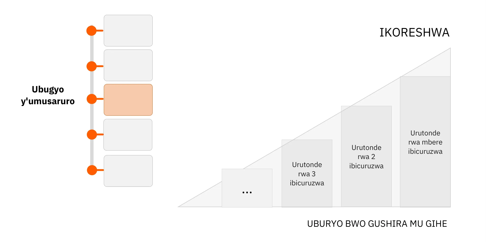

Muri iki kigereranyo kiri hejuru, inyigisho z'intango zica mu ntambwe zitandukanye z’uguhingura, bikagira amahinduka bituma yegerenye uko ibintu bikoreshwa biheze guhingura (biciye mu gukorana n’ibintu vy’intango vy’uguhingura: igihe, ubutaka, abakozi). Uburebure bw’uruhande rw’iburyo inyabutatu igereranya mu buryo bw’igishushanyo umusaruro w’igihugu kuko ugaragaza ibiharuro vy’ibintu vyose bigurishwa mu kiringo kinaka. Ico kinogo kiri hagati y’umurongo umwe gihuye n’agaciro kongereweko (mu mafaranga) kava ku ntambwe yose y’urugendo. Iryo tandukaniro rishobora kandi kubonwa nk’inyungu ijana n’intambwe imwe imwe (inyungu - umutahe).

Iyo, ku rugero rwose, abakozi b’ubutunzi bongera ivyo baziganya, igitigiri c’ibintu vya nyuma bikoreshwa kizogabanuka - ibindi vyose bikaba bingana, kuzigama birimwo vy’ukuri gusubiramwo igice c’ivyo umuntu akoresha ku musi ukurikira. Ivyo bizotuma inyungu zigabanuka - kuko ugutanga umutahe kuriko kuragwira, bikaba bituma abanyamitahe bakoresha iyo nzira y’imitahe kugira ngo bareme ibintu bishasha vyo gushora imari mu bikorwa, kandi bagatuma urutonde rw’ibikorwa ruramba.

Tuzoheza turonke urutonde rw’ibikorwa rwagutse, ihinduka rishobora guserurwa mu buryo bw’uburyo n’iki kigereranyo gikurikira:

Aha, agaciro k’amahera k’ibicuruzwa abaguzi basaba karagabanutse, bituma habaho uburyo bwo kurema intambwe yiyingeyeko y’uguhingura. Muri iki gihe aho ukugabanya inyungu ari ingaruka y’ukugabanya ugukoresha, ni ukuvuga, ukwongerekana kw’amahera aziganywa, uburinganire bw’inyabutatu, bugereranya ubwinshi bw’amahera ariko arakoreshwa(ari mubantu), ntibuhinduka. Ihinduka ry’imiterere y’ibikorwa (ugukuza) riva gusa ku kwimurira ububasha bwo kugura buva ku gice kimwe c’imiterere bukaja mu kindi.

Biragaragara kandi ko ukugabanya ivyipfuzo vy’ibicuruzwa bizotuma, mu kiringo giciye hagati, ibiciro vy’ibicuruzwa bigabanuka aho kugabanya igitigiri c’ibicuruzwa vya nyuma bitangwa. Ivyo ni kubera ko igice ca nyuma c’imiterere y’ubuhinga kitazoca gihinduka ubwo nyene inyuma y’aho ukugabanuka kw’abasaba ibicuruzwa vy’abaguzi kubaye; abanyamitahe bazofata umwanya wo guhindura imigambi yabo n'imitahe yabo. Uko bazoba bafise ububiko, ukugabanya ivyo basaba bizobahatira kugurisha ivyo bubiko ku giciro gitoyi, kandi, kubera ivyo, amusesekara w’amahera baziganije uzotuma mu ntango ibiciro vy’ibicuruzwa vy’abaguzi bigabanuka (ni ukuvuga, ukwongerekana kw’imishahara nyayo).

Ku rundi ruhande, ibicuruzwa vy’ugushiramw'imitahe bizobona ibiciro vyavyo biduga kuko guha abanyamitahe ububasha bwo kugura bibashoboza kwongerera amahera bakoresha mu gushora imitahe mu bikorwa. Ivyo baziganije, birungikwa n’abaziganya ku bacuruzi, bimaze gukoreshwa n’abo ba nyuma, inyungu zizosubira kuduga (bivuye ku kugabanya itangwa ry'imitahe), ivyo na vyo bikazotuma ibiciro vy’ibintu vyo gushora imitahe bigabanutse. Nkako, ku mpera y’iyi nzira y’uguhinduranya, ibiciro bizoguma nk’uko vyari kera. Ariko abakozi b’ubutunzi muri rusangi barahungukiye: ukwongerekana kw’umwimbu biva ku kuramba kw’imiterere y’umwimbu bizotuma abaguzi bashobora kuronka ibintu vyinshi ku biciro bitobito; ubushobozi bwo kugura bw’abaziganya buzokwongerekana, bimwe bivuye ku nyungu zizoronka, ibindi bivuye ku biciro vy’abaguzi bigabanutse; mu gihe abanyamitahe, iyo bafashwe muri rusangi, ntibazoronka inyungu canke ngo bahombe. Abakora ibikorwa vyegereye cane ugukoresha bazotakaza inyungu, mu gihe abakora mu kurema inzira nshasha z’uguhingura bazoronka inyungu zihuye n’ivyo bazoronka. Mu gihe nk’ico, nta n’inyungu nshasha y’amahera iremwa; ni umusaruro wiyongera, gutyo agaciro nyakuri k’amahera yinjira kakaduga.

### Igabanuka ry’inyungu bitewe n’ukwiyongera kw’ingurane (Ata kwiyongera kw’amahera aziganywa):

Ubu, iyo twihweje ukugabanya inyungu biva ku kwagura ingurane zitangwa n’amabanki, turaronka ishusho itandukanye cane y’imiterere y’ibikorwa.

Kubera ko inyungu ziri hasi, abashoramare barashobora kugurana ubutunzi bwinshi, gutyo bagatuma habaho inzira z’uguhingura zifise urutonde rwo hejuru. Muri ivyo, ukwo kwagura imiterere y’ubuhinga ntikuzotuma ugukoreshwa kugabanuka kuko ata gusubiramwo kw’abaguzi kw’ugukoresha ubu. Mu yandi majambo, umusaruro w'igihugu(GDP) urakura. Ku bw’ivyo, inyabutatu yacu mu gihe izoguma ifise uburebure nk’ubwo, bisobanura ko uburebure bwayo buzokwongerekana.

Zirikana ko ivyo ari ingaruka zihuye n’ubwenge rwose z’ukwaguka kw’ingurane. Kubera ko amabanki atanga ibinyamakuru vy’ubudandaji mu gutanga ingurane, umuntu akwiye kwitega ko ubushobozi bwo kugura muri rusangi buzokwongerekana.

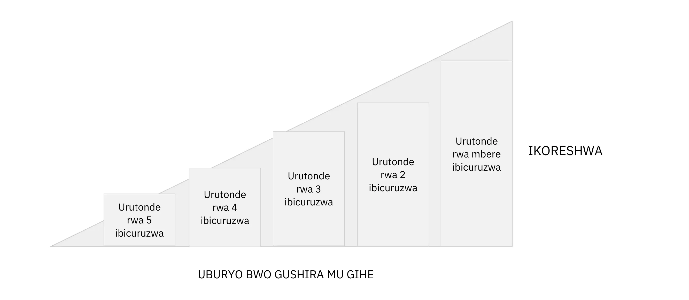

Uko ingurane zija mu butunzi biciye mu ngurane zihabwa abanyamitahe, dukwiye kubona ko inyungu zigenda zirushirizaho mu nzego z’ubuhinga ziri kure y’ugukoresha, n’inyungu zigereranywa zigabanuka mu nzego ziri hafi y’ugukoresha. uko kunguka kwose rero kurashigikira ugusubira gutanga umutahe uja muri izo ntambwe nshasha, zikoresha umutungo mwinshi (ubwubatsi bw’ubwato, imodoka, ubwubatsi, ubuhinga buteye imbere, n’ibindi), no kugabanya gushira imitahe mu nzego ziri hafi y’ugukoresha.

Ubu, abacuruzi bari muri izo ntambwe zihambaye z’ubuhinga bararonka amahera menshi, kandi, uko igihe co guhitamwo caguma ari co kimwe, dukwiye kandi kubona ko hariho ugushaka kw’ibintu vy’abaguzi. Ariko nk’uko, muri iki gihe c’iterambere, inyungu y’umutahe ushizwemwo yari nyinshi mu mice iri kure y’ugukoresha, habayeho ukwimurira umutahe mu bikorwa biri hafi y’ugukoresha ukaja mu bikorwa biri kure cane. Ku bw’ivyo, abanyamitahe bari mu bice vyo hasi vy’umwimbu ntibagira uburyo bwo guhabwa ivyo basaba vyiyongereye. Ivyo bituma haba uguhuzagurika hagati y’ivyo bice bibiri vy’imiterere y’umwimbu: kimwe cose kigerageza kuronka umutungo ku giciro c’ikindi, kandi kubera ko ugusaba ugukoresha bigereranya ivya nkenerwa vyihutirwa cane, mu gihe kanaka, abashoramare bakora ibikorwa biri kure y’ugukoresha bazobura ubutunzi bukenewe kugira ngo barangize ishoramari ryabo. Igitigiri c’inyungu muri izo nzego rero gica gitangura kugabanuka, ubudandaji burasenyuka, kandi ukwiyongera kw’ibiciro vy’abaguzi bituma habaho ugusubira gutanga umutahe vyihuse kugira ngo hakorwe ibintu vy’agaciro gatoyi. Iyo iyo nzira yo gusubira gutanga ubutunzi mu buryo butunguranye igaragaye, ubutunzi buraca buja mu bihe vy’ugusubira inyuma: ibiciro vy’itunga biragabanuka, umushahara nyawo uragabanuka, ibiciro vy’abaguzi biragabanuka, kandi ibikoresho vy’ububiko birarundanywa.

Ku bwa Friedrich Hayek na Ludwig von Mises, ugusubira inyuma kw’ubutunzi ni ikimenyetso c’ugutanga nabi umutahe kuva mu gihe c’ukwagura. Uko ibiciro vy’amahera yaziganijwe n’amahera yakoreshwa nabi, abanyamitahe barateguye imigambi idashobora kurangira kubera ukubura ubutunzi, no/canke kwubaka igenamigambi ry’ubushobozi bwo gutanga umusaruro ku rugero rw’ugukoresha rwo muri kazoza rudashobora gukomeza kubera ukubura amahera yaziganijwe.

Biciye mu gusenyuka kw’ubutunzi, ni ukuvuga kugabanya ibiciro vy’itunga(actifs) n’imishahara, inyungu nyinshi, no guheba imigambi itarangiye, ni ho gusa ubutunzi bushobora gusubira gutunganya no gutera imbere buja mu nzira iramba. Rero, ugusubira inyuma kw’ubutunzi ni ugukwiragira kw’ivyo vyiyumviro vy’uguterimbere bitera inzira y’uguhindura ibintu mu buryo bw’inguvu(imishwano).

Muri rusangi, iyo nzira y’ugusubira inyuma kw’ubutunzi iterwa n’urwego rw’amabanki ubwarwo. Igihe cose ingurane zizoba ziriko ziraduga ku rugero rwihuta, ibiciro birabandanya kwiyongera, kandi abacuruzi barahiganwa kugira ngo baronke ubutunzi bushobora gutuma umuntu agira ico akora canke ashikako. Ariko nk’uko vyavuzwe na Hyman Minsky, harashika aho urwego rw’amabanki rufata ingingo yo kugabanya ingorane zarwo, bigatuma rero rugabanya uruja n’uruza rw’ingurane. Ku bw’ivyo, iyo ntambara ituma abantu benshi bacika intege, inguraneo zigakomera, ubushobozi bwo kugura buriho bukagabanuka, n’amahera agahungabana.

Mwene ukwo guhindura gushobora gufatwa nk’igihe aho ugukoresha nabi, n’ugushiramwo amahera make bishirwa mu ngiro kugira ngo umuntu asubire kwubaka amahera yaziganijwe abuze. Ku bwa Hayek, iyo ntambwe y’agahinda(ukwihebura), naho ibabaje, irakenewe cane kuko ituma ibikorwa vy’ubutunzi bisubira gutangura bishingiye ku miterere y’ibiciro bihuye vyerekana ubukene nyakuri bw’ibintu bifasha mu guhingura. Mugihe iyo ntambara ihagaze, ubutunzi ntibushobora gusubira mu nzira yipfuzwa kuko, iyo ata nzira y’amakuru ishobora gutuma abakozi b’ubutunzi bashobora kwishingira ingingo zabo, ugutanga nabi ubutunzi ntakindi kuzokora atari kuzobandanya.

Ikibabaje ni uko ubwo buryo bwo gutera agahinda kenshi buhagarikwa n’ububasha bwa politike be n’amabanki akomeye arondera “guteza imbere” ubutunzi biciye mu Ubutunzi biciye mu mafaranga y’amadeni hamwe n’ingingo y’ubutunzi yoroshe.

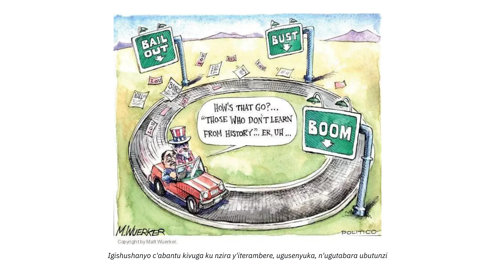

Ku bakunda amahera no ku bakunda ivyiyumviro vya Keynes, imvo y’ugucika intege ni ukubura kw’abasaba vyose hamwe, rero nta n’umwe muri bo yitwararika iterambere ry’ibiciro bihuye, nk’uko twabibonye, ​​ari ryo shingiro ry’ingorane. Gutyo, bemera ko gutanga insiguro y’ukwagura ingurane(kugabanya inyungu) no gukoresha ubushobozi bwa Leta bwo gutanga amadeni kugira ngo yongere ivyifuzo bizotuma habaho ugusubirana. Mu gihe gito, izo ngingo zishobora gusa n’izitanga ingaruka zikenewe: atari ivyo gifasha mu gukoresha amahera, mu gihe ukugabanya inyungu bituma ibiciro vy’itunga biduga, ivyo na vyo bikaba bituma abafise itunga bongera amahera bakoresha. Ariko rero, mwene ukwo gutera imbere kuraheza kugabanuka, mu gihe ingorane y’imibumbe igumaho, canke mbere igakomera cane uko ugutanga nabi kw’itunga kubandanya bivuye ku nyungu ziri hasi cane.

Mu bihe vya none, amabanki makuru n’intwaro vyaragize umwete mwinshi mu kubuza ko iyo nzira yo guhindura ibintu igaragara ku buryo duheza tukagira ubushomeri bwinshi bushingiye ku mibumbe n’ukwirundanira imyenda idahera. Ubuyapani buratanga akarorero muri ivyo. Inyuma y'aho ubutunzi buteye imbere mu 1989-90, Banki y'Ubuyapani (BoJ) n'intwaro zitandukanye zari ku butegetsi zakoresheje uburyo bwose buvugwa aha kugira ngo zigerageze "gusubira gutanguza ubutunzi bw'Ubuyapani." Uretse ugutera imbere gutoyi kwakurikiye porogarama zo gukoresha amahera n’ukugabanya inyungu, Ubuyapani bwagumye mu gihe c’iterambere ry’ubwonko n’imyenda myinshi cane mu myaka 30.

### Gusozera ku ciyumviro c’ingendo y’ubudandaji:

Mu gushimikira ku rutonde rw’ibikorwa vy’umuntu no kwitwararika canecane ingaruka z’uguhinduka kw’inyungu ku guhuza ibikorwa vy’ubutunzi hagati y’ibihe, Ludwig Von Mises na Friedrich Hayek basiguye inzinguzingu z’ubutunzi nk’inguvu z’imbere mu gihugu z’uburyo bw’amabanki y’ububiko bw’ibice. Itandukaniro hagati y’isesengura ry’abanya Otirishi n’iry’abakunda amafaranga n’abanya Keynes ahanini riri mu kuba uwa mbere yitwararika canecane intambwe zitandukanye z’umwimbu n’imiterere y’ibiciro, mu gihe uwa kabiri ahagarara ku bintu bihinduka vyose nk’ingero z’akazi, umusaruro w’igihugu, canke urutonde rw’ibiciro vy’abaguzi. Nkako, kuko babuze inyigisho y’ubutunzi, abahinga mu vy’ubutunzi bakuru bakunda gushingira intahe imvo z’ugusubira inyuma kw’ubutunzi ku “mpwemu z’ibikoko” canke “ibintu vyo hanze”.

Kuruta ayandi mashure yose y’ubutunzi, Ishure ryo muri Otirishi rishimika ku kamaro k’ibiciro bihuye kugira ngo abakozi bo mu gisata c'ubutunzi bashobore guhuzwa. Abagize ishure ry’i Otirishi baramaze imyaka irenga ijana bakwegwakwegwa bavuge ku bijanye n’ico kibazo, cane cane kuva Mises asohora igitabu ciwe ku bijanye n’ukuntu ubutunzi budashoboka mu butunzi bw’abasosiyalisiti mu 1919.

Ivyo ni vyo bizokwigwa mu kigabane gikurikira kandi ca nyuma c’iri shure.

## Ukudashobora gukora ibiharuro vy’ubutunzi mu butunzi bwa gisosiyalisime

<chapterId>2578a9d8-90e9-58dd-a8c5-6366948564c7</chapterId>

> “Iyo ata giciro c’isoko gihari ku bintu bikenewe mu mahinguriro kuko bidahingurwa ngo bigurishwe canke bigurwe, ntibishoboka gukoresha ibiharuro vy’ubutunzi kugira hategurwe ibikorwa vyo muri kazoza canke kugira hamenyekane ico ibikorwa vyaherahejeje vyashitseko. Ubuyobozi bwa gisosiyalisime mu mahinguriro ntibushobora kumenya neza nimba ivyo butegura kandi bukarangura ari inzira ibereye kurusha izindi mu gushikira ivyipfuzo. Buzokora mu mwijima, ukoresheje imvugo. Ivyo bizovamwo akajagari n’ubukene kuri bose ata gukeka.” 
>
> Ludwig von Mises, akajagari kategekanijwe

### Ubudashoboka bwo kubara ubutunzi mu gihe c'ubusosiyalisimu

Naho intwaro za Marxiste zasubiyemwo ukunanirwa mu kinjana giheze, impari zijanye n’uguharura ubutunzi ziracari ngirakamaro kubera imvo zibiri zihambaye:

1. Ivyiyumviro bigereranywa biracariko birashigikirwa n’abaterambere n’abandi bashaka gufashwe.

2. Gushinga ibiciro, haba mu masoko y’ubutunzi biciye mu bikorwa vy’abakozi mu mabanki makuru canke mu yandi masoko biciye mu bigo vya Leta, amategeko, n’ugufasha kwa komite zigenzura, birabandanya kuba vyinshi.

### Impari z'uguharura Ubutunzi

Izo mpari zatangujwe n’imwe mu mpapuro zivuga ubutunzi zari zifise uruhara runini mu kinjana ca 20, “Uguharura ubutunzi mu gihugu c’abasosiyalisiti,” ryanditswe na Ludwig von Mises, risohoka mu 1920. Icogihe sosiyalisime yari yageze kubutezetsi bwa Weimer(Ubudage), n’imigambwe y’abasosiyalisiti n’abakomunisiti iriko iratera imbere cane i Buraya.

Imbere yiyo ngingo ya Mises, impari zijanye n’ubusosiyalisimu n’ubu kapitalizimu zazunguruka canecane kumvo z’inyifato runtu be n’ingorane yo guhitishwamwo. Naho umuntu yokwiyumvira ko ikibano gitunganije nk'uko ingingo y’abamarxiste y’uko « kuva kuri umwe wese nivyo ashoboye, kuri umwe wese bivanye nivyo akeneye » ari co gisumba ibindi mu vy’inyifato runtu, ikibazo ngirakamaro c’uko « ni nde asohora imyanda » cari gikeneye gutorerwa umuti. Inyishu rusangi yari iyo ko ubusosiyalisimu bwovyara abantu batagira kamere y’ubu kapitalizimu, bagakorera bagenzi babo n’umutima ukunze mbere n’aho ata mahera yobatera intege.

Mises akoresheje ingingo yiwe, yarashizeho urugero rushasha muri izo mpari, Ashize ku ruhande ivyiyumviro vy’ubuhinga bwa none vyerekeye ubushobozi bw’ubutunzi bwa politike bwo kurema “umuntu mushasha”, uwo muhinga w'umunya otirishi yerekanye ko gutunganya ubutunzi mu buryo bubereye bidashoboka ata biciro vy’ibintu vyo hagati mu guhingura.N’ubu, ingingo yiwe iracari itahurwa neza n’abo batavuga rumwe, eka mbere n’abahinga bamwebamwe mu vy’ubutunzi. Ni vyiza rero ko tubisigura mu buryo bwirambuye kuruta.

### Gusigura ukuntu uguharura ubutunzi kudashoboka

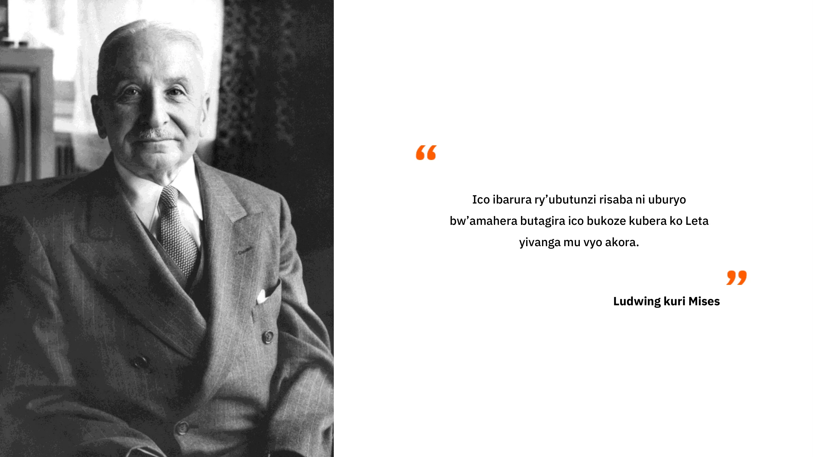

Ivyiyumviro vyinshi bitarivyo ku bijanye n’imvo za Mises biva ku gutahura nabi uruhara rw’imigwi y’abarongozi n’abanyamigambi mu butunzo bw’abanyagihugu. Mises ntiyigeze yirengagiza ubushobozi bw’abarongozi bwo gutegura imigambi myiza y’uguhingura mu bikorwa vyabo bwite. Ahubwo yashimikiye akamaro k’abanyamigambi n’abanyamitabe, abo, nk’abafise uburyo bwo gukora, bagatanga imitahe mu nganda zitandukanye, gutyo bagatuma haba ibiciro bikora nk’ibikoresho mu biharuro vy’ubutunzi vy'abagenduzi.

Iyo ata masoko y’imitahe n’amahera, biba ibidashoboka k'umuntu akoresha neza ikoreshwa ry’ubutunzi hagati y'ibisata bisata. Ivyo bisigura ko naho hoba hariho ugutunganya neza mu bigo(entreprise) vyose canke mu gice c’ubutunzi, ubutunzi bwose ntibushobora guhura neza n’ihinduka ry’ukuntu ibikoresho biboneka, uko ibintu bigenda, n’ivyo abaguzi bakunda. Nkuko amajambo ya Mises abivuga:

> "[...] ikosa rikomeye rihishijwe mu vyiyumviro [vy'abasosiyalisiti b'isoko] ni uko baraba ingorane z'ubutunzi bafatiye kuruhande rw'umunyamabanga wo mu rwego rwo hasi afise ubwenge butarengeye ibikorwa vy'ubuhinga bwigikorwa. Bafata uko igikorwa c'uguhingura mu nganda n'ugutanga umutahe ku mashami atandukanye y'ubuhinga nk'uko bimeze guhindura iyo mibumbe kugira ngo ihuze n’ihinduka ry’ibintu.... Bananirwa gutahura ko ibikorwa vy’abarongozi b’amashirahamwe bishingiye gusa ku gushitsa ata buryarya ibikorwa bajejwe n’abakuru babo, abafise imigabane.... Ibikorwa vy’abarongozi, ukugura n’ugucuruza kwabo, ni igice gitoyi gusa c’ibikorwa vy’isoko ryose. gutanga ibicuruzwa vy’ubutunzi ku mashami atandukanye y’amahinguriro.Abanyamitahe n’abanyamigabane bashinga amashirahamwe n’ayandi mashirahamwe, bakayagura canke bakayagabanya ubunini bwayo, bakayasesa, canke bakayafatanya n’ayandi mashirahamwe bagura kandi bagurisha imigabane n’amabondi y’amashirahamwe asanzwe ariho n’ayandi mashirahamwe mashasha, bagatanga inguzanyo yose; ivyo vyose vyitwa isoko ry'umutungo n'amahera. Ni ivyo bikorwa vy'ubutunzi n'abacuruzi birongoye umusaruro muri iyo nzira aho vyishura kuvyipfuzo vyihutirwa vy'abaguzi mu buryo bwiza bushoboka."
>

> Mises, Ibikorwa vy’umuntu, urupapuro rwa 703-04.

Mu vy’ukuri, Mises avuga ko uburenganzira bw'amatungo, bushira abafise imitahe mu kibanza c’inyungu n’uruhombo, bubahimiriza gutanga ubutunzi bwabo ku nganda ubu zikeneye cane ubutunzi kugira ngo zikwize ivyo abaguzi basaba. Iyo baroraniwe, bararonka inyungu, ariko iyo bananiwe, barahomba amahera. "kwinjira mu rukino" rubatera intege zo gutekereza ku bijanye n'ugutanga umutahe mwiza(wambere) ku bijanye n'ingene ubutunzi buriko buragenda. Ivyo bituma habaho uguhinduka gushingiye ku isoko aho ingaruka rusangi z’ibikorwa vyabo zitanga amakuru ahambaye ku bijanye n’ugukoresha neza ubutunzi.

Ivyigwa vy’imbere vyasiguye ko agaciro gashingiye ku muntu, ibikorwa vy’ubutunzi vyerekana ibiciro bivanya n'igihe canke ahantu canke abantu bagura, kandi ibiciro vy’abaguzi bigaragaza urutonde rw’ivyo abaguzi bashaka. Abanyamigambi barahigirwa ku bijanye n’ibintu bifasha mu guhingura kugira ngo bubake imibumbe y’uguhingura ituma inyungu zirushirizaho kuboneka(amafaranga menshi), zikuzuza ivyipfuzo vy’abaguzi neza kuruta ubundi buryo bwose. Rero, ibiciro vy’ibintu bihingurwa biva ku biciro vy’abaguzi: iyo ikintu c'ugukora umwimbu gishobora kuzana inyungu nyinshi z’amahera (gukwiza neza ivyo abaguzi bipfuza) mu zindi nganda canke mu mugambi utandukanye, abanyamitahe bazorusha nyen’ico kintu ubu, bagatuma igiciro caco kaduzwa ku rugero rw’umwimbu waco wo ku ruhande. Ukwo guhiganwa hagati y’abanyamigambi ku bintu vy’umguhingura, bigaragaza umwimbu wabo munini cane, ni inzira itanga amakuru akwiriye yerekeye ugutanga umutahe.

Uwo murongo ni uwuhambaye cane kuko wemeza canke ugakuraho ubushobozi bw’ibikorwa bitandukanye, ugatuma ibintu vy’uguhingura bitanga umwimbu mwinshi. Isoko rikora ico gikorwa nk’igikorwa kibandanya. Mw'isi iguma ihinduka aho ivyo abaguzi bakunda, ivy’uguhingura, ubuhinga, amabwirizwa, igitigiri c’abantu n’ibindi biguma bihinduka ibiciro vy’ibintu vyo hagati mu gukenerwa mu guhingura biguma bihinduka biciye ku bikorwa vy’abanyamigambi n’abanyagihugu bihuza n’ibintu bihinduka. Kubera ko ayo mahinduka aba mu karere, amakuru ategerezwa gukwiragizwa ku bakozi b’ubutunzi badashobora kugira ubumenyi bushitse kw'isi yose. Ico nico gikorwa c’isoko: gituma abanyamitahe bakora ku makuru yo mu karere, akenshi ari kamere k'ikidandazwa, kandi agoranye mu gutanga ivyiyumviro vy’uko ubutunzi buteye, ivyo bikaba bica vyemezwa canke bikurwaho n’isoko. Muri ubwo buryo, amakuru akwiriye akomoka kuri iyo nzira iva hasi ija hejuru arahurizwa hamwe maze agakwiragizwa mu gisata c'ubutunzi cose biciye ku nzira y’ibiciro. Uwo murongo wo gutanga amakuru no kuyakwiragiza ni ngombwa cane mu gutanga imitahe kuko ushoboza abakozi b’ubutunzi, bafise ubumenyi buke kukuntu isi iteye, gukora ibiharuro vy’ubutunzi no gutegura imigambi y’ubutunzi ihuye bisunze ibiciro.

Urabiye kuri iyonzira, ubutunzi butegekanijwe hagati(bucungerewe) buzoshikirwa ata kabuza n’ugutanga nabi imitahe. Mu gihe gito canke kiri hagati, mwene ukwo gutanga nabi vyoshobora kutamenyekana kubera ko ata biciro vy’isoko canke gusenyuka kw’amahera bishobora kubivuga. Ariko rero, kubera ko ata n’inyishu (ibiciro) n’uburyo bwo gusubira gutanga (ugusenyuka), amakosa azokwirundanira gushika aho ubusazi bugaragaye biciye mu kugabanya cane ubuzima.

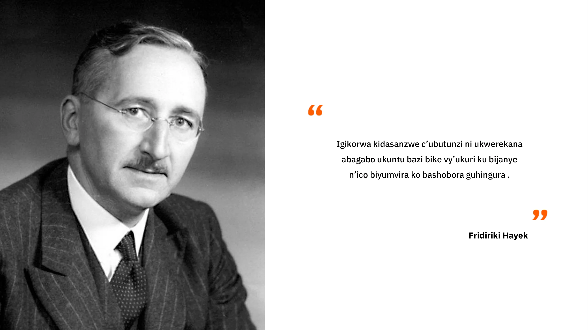

### Ivyo Otirishi ibona n’ivyo ayandi mashure y’ubutunzi yananiwe

Umuntu yoshobora kuvuga yuko gushushanya mwene iyo nkuru nziza ari ikintu coroshe. Nakare, twese turazi ama etageri ari gusa muri URSS, ingorane za Venezuela, n’ivyago vya kiremwa muntu muri Cambodge. Ariko Mises yari yarabonye(yariteguriye) ivyo bintu kuva mu 1920. Yamara, gushika URSS isenyutse mu 1989, abahinga mu vy’ubutunzi benshi, harimwo n’abantu benshi baronse agashimwe ka Nobel, bariko barashima igitangaza c’ubutunzi c’aba soviyetike, kandi bakavuga yuko ubutunzi bw’ana soviyeti buzoca burengera ubwa Leta Zunze Ubumwe za Amerika.

Naho ivyo bimenyetso bitangaje be n’ibimenyetso vyinshi vyerekana ko ubutunzi budashoboka mu gihe c’ubusosiyalisimu, abarongozi ba politike kw’isi yose bashaka birenze kuruta uko vyari bimeze kera gushinga ibiciro, guhindura amahinguriro yose ngo abe ay’igihugu, no gutanga imigambi y’imyaka itanu, akenshi ishimwa cane n’abantu batazi ivy’ubutunzi. Inkurikizi z’ukwo kwivanga mu bikorwa zirumvikana cane ku bantu bo mu bihugu vy’Uburengero vyahora biteye imbere, bakaba bariko barabona buhorobuhoro ukuntu ubuzima bwabo buriko burasubira hasi.

### Ivyiyumviro vy'ingendo y'ubudandaji vyo muri Otirishi nk'ikibazo kidasanzwe c'ukudashoboka kw'uguharura ubutunzi mu gihe c'ubusosiyalisimu

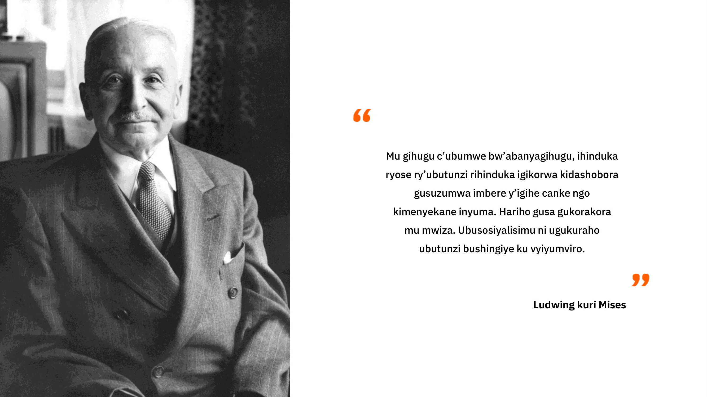

Mu gice c’imbere, twasobanuye neza ingene ugushora imitahe kurenze urugero n’ugutanga nabi imitahe biva ku gukoresha nabi inyungu n’amabanki makuru. Mu vy’ukuri, ivyo twasiguye birashobora gufatwa nk’ikibazo kidasanzwe c’ukudashoboka kw’uguharura ubutunzi mu gihe c’ubusosiyalisimu, bikoreshwa mu bijanye n’amasoko y’amahera. Iyo ibiciro bishizwe hanze y’agaciro kavyo kw’isoko, abanyamitahe n’abatanga uimitahe baraterwa intege zo kwinjira mu bikorwa vy’ugushora imitahe bidashobora kugumaho mu kiringo kirekire kubera ukubura amahera baziganije. Mu kwivanga mu nzira y’ibiciro, abategura imigambi mikuru (muri iki gihe, abakozi bo mu mabanki makuru) baratuma haba uguhuza nabi hagati y’abakozi bo mu vy’ubutunzi. Muri iki gihe, ukudahuza neza hagati y’ibihe bijana n’ugushiramwo amahera menshi mu bicuruzwa vy’ugushora imitahe k'urugero rwo hejuru n’ugushiramwo amahera make mu bicuruzwa vy’ishora imitahe k'urugero rwo hasi, ivyo bikaba bigaragaza ikimenyetso kidasanzwe c’ugutanga nabi imitahe mu nganda zose.

Inkurikizi z’ukwo gutanga nabi ni nk’ingorane z’ivy’ubutunzi, ukugabanya ibikorwa vy’ubutunzi, n’ugutakaza amadeni. Izo ngaruka z’ubutunzi buhambaye(bwagutse) zikomoka ku kutangana hagati y’amahera aziganijwe n’amahera ashirwa mubukorwa biva ku kwagura ingurane. Mu ntwaro ya URSS no mu zindi ntwaro z’abakomunisita, gushinga ibiciro vyatuma haba uguhuza nabi nk’ukwo nyene, ivyo bikaba vyatuma ibintu bimwebimwe bibura, ibindi na vyo bikaba bihingurwa birenze urugero. Muri ivyo bihe vyose, ibiciro ntivyerekana ivyo abaguzi bakunda vy'ukuri, haba mu bijanye n'igihe bakunda canke ivyo bakunda, abanyamitahe bakuru canke abategura imigambi bajejwe gutanga amafaranga kugira ngo bashore imitahe mu "nganda zitari zo."

Ubu, impari z’uguharura ubutunzi zisubira kuvyuka ahanini mu biganiro vyerekeye amasoko ntanga inguvu, aho gushira imitahe nabi birongowe n’umugambi wa Green(ibidukikije) ririko rirushiriza kugaragara. Bizuka kandi mu biganiro vyerekeye amasoko y’amahera, aho abahinga mu vy’ubutunzi bo muri Otirishibbagaragaza ko ingorane zo mu 2008, izo abahinga mu vy’ubutunzi bakuru bananiwe kuvuga, zari ingorane za kera z’iterambere n’ugusenyuka zirangwa n’ugushiramwo amahera menshi mw’isoko ry’amazu kubera ibihe birebire vy’inyungu nto. Ikindi kandi, aba neo-marxiste n’iyindi migwi y’abasosiyalisiti barakwiragiza iciyumviro c’uko ukuza kw’ubuhinga bwa none kwoshobora gutorera umuti ingorane y’uguharura ubutunzi. Ariko rero, iyo nzira y’ukubona ibintu iva ku gutahura nabi ikibazo; ingorane y’uguharura ubutunzi si ikibazo c’ububasha bwo guharura ahubwo ni ikibazo co gutanga no gukwiragiza amakuru ajanye n’uguhingura n’ugutanga ubutunzi. Aya makuru ashobora gushikirizwa gusa mu karere n’abakozi bafise ubumenyi bwihariye kandi bafise inyungu mu vyo bazovamwo. AI ntishobora gusubirira iyo nzira iva hasi ija hejuru kandi, rero, ntishobora gufasha abategura imigambi yo hagati; ingorane yo gutanga ubutunzi. Ikibabaje, kubera imyaka ijana y’ukutumvikana, turiteze ukwiyongera kw’ibivugwa ko AI izozana ikiringo gishasha c’uguterimbere mu vy’ubutunzi kirongowe n’abategura ivy’ubuhinga bwa none bafise umuco, bafashijwe na AI, bashobora gukosora ukunanirwa kw’amasoko yidegemvya.

Ku bijanye n’ikoreshwa rifatika ry’ingorane y’ibaruramibare ry’ubutunzi mu bihe vya none, urashobora kwifashisha iyi nkuru ivuga ku isaranganywa ry’ibikoresho mu Bushinwa bwa none: *[The Road to Financial Repression: China the Paper Tiger](https://open.substack.com/pub/theomogenet/p/the-road-to-financial-repression-181?r=ccpx8&utm_campaign=post&utm_medium=web)*, ya Théo Mogenet.

### Ico tugezeko muri rusangi

Muri iki gice ca nyuma, twabonye ukuntu uguharura ubutunzi kudashoboka mu gihe c’ubusosiyalisimu, ari ryo nshimikiro ry’ishure ry’ubutunzi ryo muri Otirishi. Iciyumviro c’abanya otirishi cashikirijwe muri iki cigwa kirashika ku ntumbero y'iyo ngingo kandi kiratanga imvo ikomeye y’ingingo ngenderwako zitagira ico zikora. Hagati mu ciyumviro vyose vy’abanya otirishi bizunguruka akamaro k’ibiciro mu guhuza ubutunzi. Mu gushimika ku kamaro k’ibiciro vy’amahirwe n’uguharura ubutunzi kugira ngo umuntu akoreshe neza ubutunzi, abahinga mu vy’ubutunzi bo muri Otirishiya berekana ukuntu ibikorwa vy’umuntu bitoroshe kandi biteye ubwoba mw’isi iguma ihinduka itera imbere.

Abahinga mu vy’ubutunzi n’abahinga mu vy’ubutunzi bo hagati akenshi ntibakunda abahinga mu vy’ubutunzi bo muri Otirishiya kubera ko bagaragaza ukuntu kazoza katamenyekana, ukuntu ubuhanuzi bw’ubutunzi bushingiye ku rugero butari bwo, be n’ingaruka mbi z’ugufasha mu vy’ubutunzi. Muri make, ubutunzi bwa Otirishiya burashimika ku kutagira akamaro n’ingaruka mbi z’ibikorwa vy’abanyagihugu.

Umugenzo w’Abanyaotirishi urimwo uburyo bwo kwicisha bugufi ku bikorwa vy’umuntu, ugakuramwo insiguro zikomeye ku vyiyumviro vy’agaciro k’umuntu, ukudakeka, uburenganzira bwo kwihitiramwo, n’ugusobanuka. Irasigura ingene urutonde rw’isoko, naho rutari igihimba c’umugambi w’umuntu, ruhagaze nk’inzego nyamukuru y’iterambere n’uguterimbere kwacu. Nimba hari ikintu kimwe gihambaye co gukura muri iri shure, ni uko ubu kapitalizimu bwacitse ubutunzi buhambaye kubera ubushobozi bwabwo bwo kumenyera amahinduka mw'isi ihinduka kandi idatekanye ituwe n'abantu bidegemvya.

## Uburyo bwa Otirishi

<chapterId>419129c1-82ba-54e3-b385-95d4d89a447e</chapterId>

Ishure ry’ubutunzi ryo muri Otirishiya ryitandukaniye n’ayandi mashure kubera uburyo bwaryo bwo kwigisha bushingiye ku vyiyumviro (axiomatic-deductive), butandukanye n’uburyo bwo kwigisha ivyiza bukoreshwa kenshi mu vy’imibano. Uburyo bw’abanyabwenge bushingiye ku mategeko ashizweho ashingiye ku makuru y’ivyashikiye abantu, bugakoresha uburyo busa n’ubw’ivyigwa vya fizike. Irahingura ivyiyumviro bivuye ku vyo umuntu abona, hanyuma bikemezwa canke bikahakanwa n’ivyageragejwe vy’igihe gito. Uburyo bwa siyansi bushingiye ku kugumya iciyumviro gisobanura neza amakuru no kubandanya kuyitohoza gushika habonetse iciyumviro gitomoye kuruta.

Ariko rero, mu vy’imibano, biragoye gutandukanya ibintu bihinduka nk’uko biri mu vy’ubuhinga bwa fizike, kuko umwanya wose muri kahise ni uwudasanzwe kandi hari ibintu vyinshi biza kugira ico bihinduye. Igerageza ry’ubutunzi ntirishobora gusubirwamwo mu laboratwari, kandi birahambaye kumenya ko kwihweza isano hagati y’ibintu bibiri bihinduka bitagaragaza isano ry’inkomoko hagati yavyo. Abanya Otirishi, cane cane Ludwig von Mises, barateye imbere uburyo bundi bwitwa uburyo bwa a priori canke uburyo bwa axiomatic-deductive bwo kwiga ivy’imibano. Ubwo buryo bushingiye ku vyiyumviro vy’ishimikiro vyitwa axiomes, bisa n’ivyo bikoreshwa mu biharuro. Nk'akarorero, ubuhinga bwa Euclide ni akarorero k'uburyo bw'ubuhinga bw'ubuhinga bw'ubuhinga bw'ubuhinga bw'imibare.

Mu bukungu bwa Otirishi, ivyiyumviro vy’ishimikiro birimwo uguhitamwo umwanya mwiza, ivyo bikaba bishingiye ku mahitamwo y’umuntu ku giti ciwe y’ibintu canke ibikorwa uno musi aho guhitamwo ejo, kubera ukudakeka ku bijanye n’ivyo azokora muri kazoza. Ivyo vyiyumviro vy’ukuri ntibishirwako ibibazo, kuko bibonwa ko bigaragara kandi bihuye n’ubuzima bwa misi yose. Bakoresheje izo nyigisho z’ishimikiro, abahinga mu vy’ubutunzi bo muri Otirishi barakoresha amategeko y’ubwenge kugira ngo bashobore kuronka amajambo atanga amakuru yerekeye ingene ibintu vy’ubutunzi bikora. Nk’akarorero, basigura yuko ingorane z’ubutunzi ziterwa n’ubusumbasumbane hagati y’amahera aziganywa n’ayo umuntu ashora(akoresha mu migambi), ivyo bikaba bituma abantu bakoresha nabi inyungu mu buryo bw’ubuhinga. Abantu bafise umwanya mwiza bakunda basaba inyungu nziza kugira ngo bashobore kwishura ingorane zo kuguriza. Abanya Otirishi bavuga ko imigenderanire yo gupima agaciro ishingiye ku muntu, rero inyungu zishobora guhinduka bivanye n’umuntu ku giti ciwe be n’ivyo abayemwo.

Ibiciro birafise uruhara runini mu gutunganya abantu mu buryo bubereye bafise amakuru amwamwe. Inyungu zituma habaho ukungana hagati y'ugutanga n’ugusaba umutungo mw’isoko, ivyo bigatuma ubutunzi butera imbere. Abahinga mu vy’ubutunzi bo muri Otirishi barashimika ku vy’uko gushinga inyungu ataco bimaze bishobora gutuma haba ingorane mu vy’ubutunzi kandi bikaba bituma umuntu adashobora guharura mu butegetsi bw’abasosiyalisiti.

### Abahinga mu vy'ubutunzi bo muri Otirishiya n'uburyo butandukanye

Abahinga mu vy’ubutunzi bo muri Otirishi barahura n’ingorane iyo bariko baraganira n’ayandi mashure y’ivyiyumviro, kuko badakoresha uburyo bumwe bwo kwihweza. Naho Abanya-Otirishi bafata ingingo zishingiye ku vyiyumviro vy’ishimikiro, nk’uko agaciro k’ibintu gashingira ku muntu, kugira ngo bashobore gutahura ingaruka zijanye n’ubwenge n’ivyiyumviro, abahinga mu vy’ubutunzi bakingiye ku nyigisho za Keynes canke abahinga b’amahera, bakunda kwizigira amakuru ava mu bikorwa vy’abantu kugira ngo bashireho amategeko rusangi y’ubutunzi.

Akarorero k’itandukaniro ry’uburyo bwo kwigisha ni aho abaharanira inyigisho y’“amahera y’ubu” (Modern Monetary Theory, MMT) bashigikira gucapura amahera kugira ngo umuntu ashikire intumbero za poritike. Berekanye nk’akarorero ko hagati y’umwaka wa 2008 n’uwa 2019 ata ntambwe y’iterambere yabonetse. Ariko rero, abahinga mu vy’ubutunzi bo mu mashure y’i Otirishi n’abaharanira MMT ntibavuga  rumwe, kandi ntibemeranya ku ngingo ngenderwako zerekana ko amategeko y’ubutunzi afise agaciro. Ivyo bituma impaka hagati y’ayo mashure atandukanye ziba zigoranye, kandi kenshi ntizishikana kungingo igaragara.

Ni ngombwa gutahura ko gutoranura ivyiyumviro, harimwo guhitamwo amakuru kugira ngo haboneke isano hagati y’ibintu bihindagurika, atari uburyo bw’ubuhinga bwihariye kandi budafise uburindutsi mu bijanye n’ubutunzi. Nk’akarorero, kwongera amahera mu gihugu ntibisigurako bica bituma ibiciro vyiyongera, kandi uburyo bwiza bwo gukoresha ivy’imbere burakenewe kugira umuntu ashobore gutahura uko ubutunzi bukorwa mu buryo bugoye. Ivyiyumviro vy’ukuri bifise uruhara runini mu kwiyumvira ku bijanye n’ubutunzi bw’i Otirishi. Ivyo ni ibibanza vy’inkingi umuntu ashobora gukuramwo ivyiyumviro bijanye n’ubwenge. Ariko rero, birakenewe kwemera ko kuvuga ibizoba mu vy’ubutunzi imbere y’igihe bitagorana cane kubera ukuntu ibintu vy’ubutunzi bikomakomeye, be n’uko hari ugukekeranya kudasanzwe

Uburyo ni ikintu gihambaye cane mu vy’ubutunzi no mu vy’imibano muri rusangi. Bigira ico bikoze ku kuntu ibibazo bibazwa, ku kuntu ivyiyumviro vyubakwa no ku kuntu amakuru asobanurwamwo. Gutahura uburyo butandukanye hagati y’amashure y’ivyiyumviro vy’ubutunzi birashobora kudufasha gutahura uburyo butandukanye bwo kubona ibintu no gutegura ivyiyumviro vyacu bwite ku bijanye n’ingingo zavuzwe mu bice vyabanje.

# aho igice gihereye

<partId>ae828713-d133-559f-93c2-101cb5245fca</partId>

## Iciyumviro cawe ni ikihe? n'amanota

<chapterId>29d4323c-e34e-5834-bf03-2f3ed10d751b</chapterId>
<isCourseReview>true</isCourseReview>

## Ikibazo canyuma
<chapterId>d58d188f-81fb-572a-a898-8b6f8aceba7a</chapterId>

<isCourseExam>true</isCourseExam>

## Ico tugezeko muri rusangi
<chapterId>d668fdf6-fb4c-4bbf-82e1-afcb95c122e0</chapterId>

<isCourseConclusion>true</isCourseConclusion>
