# Putovanje u austrijsku ekonomiju

Da li ste se ikada zapitali zašto neki ekonomisti razmišljaju drugačije o tržištima, slobodi i ljudskom ponašanju? Austrijska ekonomija nudi osvežavajuću perspektivu koja vas stavlja u centar ekonomskog razmišljanja. Umesto teške matematike i apstraktnih modela, ovaj pristup se fokusira na logiku, ljudski izbor i način na koji pravi ljudi donose odluke u svom svakodnevnom životu. To je ekonomija kroz prizmu slobode, racionalnosti i ličnog delovanja.

Ova škola mišljenja je oblikovala debate vekovima, zahvaljujući uticajnim misliocima poput Hajeka, Mizesa i Bastijata. Dok kejnzijanska ekonomija dominira današnjim političkim diskusijama, austrijska tradicija postavlja drugačija pitanja: Šta se dešava kada dajemo prioritet individualnoj slobodi? Kako slobodna tržišta zapravo funkcionišu kada ljudi imaju slobodu izbora? Ako ste radoznali o alternativnim načinima razmišljanja o tržištima, društvu i slobodi, ovo je vaša prilika da istražite ideje koje nećete naći u standardnim udžbenicima.
+++
# Uvod

<partId>265aa8b0-dd89-5456-b72a-656e988013d5</partId>

## Pregled kursa

<chapterId>eae3de7b-cce6-516d-83d9-28fbd582c0ca</chapterId>

Dobrodošli na kurs ECO201!

Na ovom kursu koji nudi Théo Mogenet, otkrićete školu ekonomske misli koja se suštinski razlikuje od preovlađujuće kejnzijanske doktrine. Do sada ste možda učili da su upravljanje novcem i ekonomska politika prvenstveno domen centralnih banaka, sa idejom da štampanje novca i javna potrošnja podstiču ekonomski rast. Međutim, postoji koherentniji alternativni pristup: **Austrijska ekonomija**.

Sa više od dva veka istraživanja, filozofske refleksije i spisa renomiranih autora kao što su Karl Menger, Ludvig fon Mizes i Fridrih Hajek, ova škola mišljenja zauzima drugačiju perspektivu, favorizujući decentralizovani pogled na ekonomiju zasnovan na pojedincu i ljudskoj racionalnosti.

Ekonomija je, u stvarnosti, duboko društvena i složena oblast, sastavljena od brojnih nezavisnih aktera koji slobodno deluju kako bi formirali koherentnu celinu. Da bi se razumeo ovaj dinamički sistem, Austrijska ekonomija favorizuje kvalitativnu analizu, zasnovanu na ljudskoj logici, sociologiji i proučavanju tržišnih procesa, umesto na rigidnim matematičkim jednačinama.

U ovom kursu istražićete osnovne principe ove škole mišljenja. Théo Mogenet, vaš instruktor, je strastveni zagovornik ovog ekonomskog pristupa i vodiće vas kroz ključne koncepte Austrijske ekonomije, pokazujući vam kako se ove ideje posebno primenjuju na svet Bitkoina.

**Sekcija 1: Uvod u ECON**

Počećemo sa opštim uvodom u austrijsku ekonomiju, istražujući njeno istorijsko poreklo i osnove njenog mišljenja. Ovaj deo takođe pokriva osnovne pojmove kao što su novac, kredit, banke i centralne banke. Razumećete zašto ove institucije igraju centralnu ulogu u austrijskom mišljenju, posebno u njihovoj kritici monetarnih intervencija.

**Sekcija 2: Teorijske Osnove**

Ovaj deo će se upustiti u osnovne pojmove austrijske ekonomije, kao što je subjektivna teorija vrednosti, koja objašnjava zašto vrednost dobra nije objektivna već zavisi od percipirane korisnosti od strane svakog pojedinca. Takođe ćete otkriti kako novac prirodno nastaje kao društveni fenomen, zajedno sa konceptima vremenske preferencije, kamate i kapitala koji su u srcu austrijske teorije slobodnog tržišta.

**Sekcija 3: Austrijske ekonomske perspektive**

Ovde ćemo istražiti praktične primene austrijske teorije. Detaljno ćete naučiti o austrijskoj teoriji poslovnog ciklusa, koja objašnjava kako monetarne manipulacije stvaraju veštačke procvate praćene recesijama. Takođe ćemo videti zašto je ekonomska kalkulacija nemoguća u socijalističkom sistemu i kako austrijska metodologija, zasnovana na prakseologiji (proučavanju ljudske akcije), pruža jedinstven i koherentan pristup razumevanju ekonomskih fenomena.

Ovaj kurs je spoj ekonomije i filozofije, vođen otvorenom diskusijom između Théa i mene (Rogzy). Želeo bih da se toplo zahvalim Théo-u Mogenetu na kreiranju ovog kursa. Uživali smo u razvoju ovog sadržaja, koji je dizajniran da bude dostupan svima. Ovaj kurs služi kao osnovni uvod i postaviće temelje za naše buduće, naprednije ekonomske module.

A šta ako ključ za razumevanje današnje ekonomije leži u teoriji staroj nekoliko vekova? Hajde da to otkrijemo zajedno!

## Novac, Kredit, Banke i Centralne Banke

<chapterId>29faebd9-9326-52de-8161-e4bb33033cd6</chapterId>

> „Osnovni problem sa konvencionalnom valutom je svo to poverenje koje je potrebno da bi funkcionisala. Centralnoj banci se mora verovati da neće obezvrediti valutu, ali istorija fiat valuta je puna kršenja tog poverenja. Bankama se mora verovati da će čuvati naš novac i prenositi ga elektronski, ali ga pozajmljuju u talasima kreditnih balona sa jedva delićem u rezervi. Moramo im verovati sa našom privatnošću, verovati im da neće dozvoliti kradljivcima identiteta da isprazne naše račune.“
>

> Satoshi Nakamoto, pseudonimni pronalazač Bitkoina

### Kako se Stvara Novac

U našem današnjem monetarnom sistemu, novac se prvenstveno stvara kroz bankarsku praksu poznatu kao "[frakcionalno rezervno bankarstvo](https://planb.academy/resources/glossary/fractional-reserves)." Ovaj termin u suštini znači da banke nisu obavezne da drže onoliko rezervi koliko primaju u depozitima. Shodno tome, one mogu stvoriti novu kupovnu moć kada odobravaju kredite i, obrnuto, smanjiti kupovnu moć kada klijenti otplaćuju svoje kredite.

Na primer, ako biste se obratili svojoj lokalnoj banci da obezbedite hipoteku za kupovinu kuće, novac koji vam banka pozajmljuje bi nastao kao knjigovodstveni unos. U računovodstvu, obično predstavljamo neto bogatstvo pojedinca bilansom stanja, koji ima dve strane: stranu aktive, koja uključuje svu imovinu, finansijske ugovore, zalihe ili druge oblike bogatstva u vlasništvu, i stranu pasive, koja pokazuje izvor sredstava korišćenih za stvaranje kapitala navedenog na strani aktive. Razlika između aktive i pasive naziva se "kapital" i može se smatrati neto bogatstvom entiteta.

Kada finansijska institucija poseduje bankarsku licencu, to u suštini znači da se obaveze zabeležene kao "depoziti klijenata" smatraju zvaničnim novcem unutar određene zemlje ili monetarne zone. Dakle, kada tražite kredit za kupovinu kuće od banke, bankar ne pozajmljuje sredstva deponovana od strane drugog klijenta. Umesto toga, banka pripisuje pozajmljeni iznos vašem računu i istovremeno beleži vaš ugovor o kreditu kao aktivu banke. Kako otplaćujete svoj kredit, novac se efektivno gasi, a vrednost odgovarajućeg ugovora o kreditu se smanjuje, pri čemu banka zadržava samo kamatu na kredit.

Po kupovini kuće, vi dajete instrukcije svom bankaru da prebaci novac na račun prodavca. Ako je račun prodavca u drugoj banci, vaš bankar obaveštava odgovarajućeg bankara u drugoj instituciji kako bi se osiguralo da je račun prodavca pravilno kreditiran, dok se vaš račun zadužuje za odgovarajući iznos.

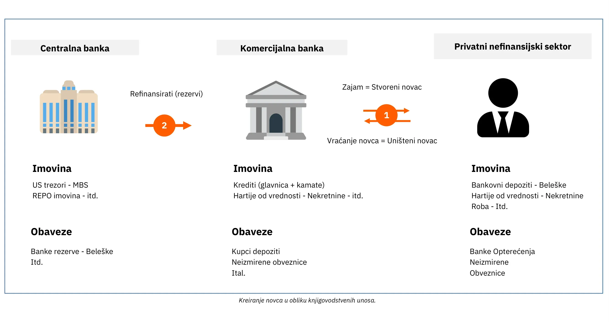

Slika 1: Kreiranje novca kao knjigovodstvenog unosa

> „Dovoljno je dobro što ljudi naše nacije ne razumeju naš bankarski i monetarni sistem, jer ako bi ga razumeli, verujem da bi došlo do revolucije pre sutrašnjeg jutra“
>

> Henry Ford

Ovaj proces omogućava bankama da evidentiraju sve transakcije, uključujući elektronske prenose, kupovine kreditnim karticama i čekove, tokom određenog perioda (obično nedelju ili mesec). Zatim međusobno poravnavaju ove transakcije koristeći bankarske rezerve, koje su drugi oblik [fiat valute](https://planb.academy/resources/glossary/fiat) koju javnost nikada ne koristi. Bankarske rezerve se drže u centralnoj banci na posebnom računu dostupnom samo licenciranim bankama i finansijskim institucijama.

### Nestabilnost frakcionalnih rezervi u bankarstvu i zajmodavac poslednjeg utočišta

Glavni problem sa ovim sistemom frakcionalnih rezervi je taj što značajna povlačenja iz određene banke mogu potencijalno dovesti do njenog bankrota. Pošto banke moraju ispuniti zahteve klijenata za gotovinom dok drže samo ograničeni rezervni fond, istovremeni nalet mnogih klijenata da povuku sredstva može učiniti da banka ne bude u mogućnosti da zadovolji te zahteve, što rezultira bankrotom. S obzirom na to da mnogi pojedinci, firme i institucije imaju svoja sredstva deponovana u bankama, dozvoljavanje da banka propadne moglo bi imati ozbiljne ekonomske posledice, kao što su recesija ili čak depresija.

Ova dilema dovela je do nastanka modernih centralnih banaka. U 19. veku u Engleskoj, ponovljeni bankarski slomovi ugrožavali su finansijsku stabilnost, što je dovelo do osnivanja Banke Engleske kao "zajmodavca poslednjeg utočišta." Banci Engleske je povereno da pozajmljuje sredstva ugroženim bankama tokom kriza kako bi se sprečio domino efekat koji bi mogao paralizovati ceo finansijski sistem. Ovaj koncept centralnih banaka kao zajmodavca poslednjeg utočišta od tada se proširio širom sveta i postao uobičajen.

Pored održavanja finansijske stabilnosti, centralne banke su odgovorne za postavljanje ključnih kamatnih stopa. Ove stope određuju cenu po kojoj licencirane banke mogu pozajmljivati sredstva od centralne banke, suštinski definišući cenu likvidnosti za finansijske institucije koje igraju ključnu ulogu u kreditiranju u našim ekonomijama. Dakle, ove stope služe kao referentna tačka za ceo finansijski sistem. Kao pojedinac, kamatne stope koje plaćate na svoju hipoteku mogu se razložiti na referentnu kamatnustopu i maržu banke.

Slika 2: Bankrotstvo Lehman Brothers (15/09/2008)

Tokom velike finansijske krize 2008. godine, Lehman Brothers, velika investiciona banka, proglasila je bankrot nakon što je pretrpela značajne gubitke na svojim hipotekarnim hartijama od vrednosti i suočila se sa masovnim povlačenjem sredstava od strane zabrinutih klijenata. Kao odgovor na ovaj neviđeni finansijski preokret, centralne banke širom sveta ubrizgale su velike količine likvidnosti u finansijska tržišta, spojile posrnule investicione banke sa komercijalnim bankama i smanjile kamatne stope gotovo na nulu u pokušaju da spreče sistemski kolaps.

Iako su ove mere sprečile talas bankrota, malo su učinile da ublaže kasniji ekonomski pad. Milioni su izgubili poslove i domove, potrošnja potrošača je naglo opala, preduzeća su propala, a banke su pretrpele značajne gubitke. Uprkos istorijski niskim kamatnim stopama, malo ko je bio spreman da pozajmljuje, što je rezultiralo začaranim krugom gde se početno smanjenje potrošnje i investicija samo pojačavalo. Kao posledica toga, centralni bankari su preduzeli dodatne korake implementacijom programa Kvantitativnog Popuštanja (QE-Quantitative Easing). Ovi programi su uključivali kupovinu državnih obveznica i hipotekarnih hartija od vrednosti od strane komercijalnih banaka sa rezervama centralne banke.

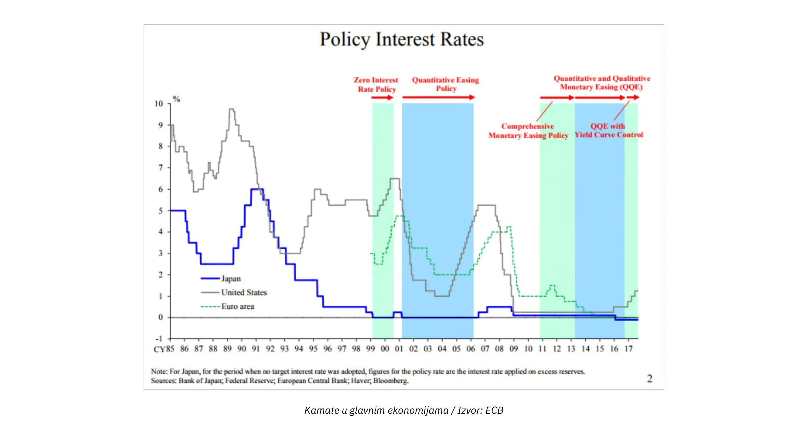

Slika3 : Kamatne stope u glavnim ekonomijama / Izvor: ECB

Suprotno mnogim očekivanjima, QE programi nisu značajno oživeli ekonomski rast, već su naduvali finansijske aktive do istorijskih nivoa. Ovo je prvenstveno koristilo bogatima i finansijskim institucijama, jer su oni već posedovali značajne količine takvih aktiva, čime su se produbile razlike u bogatstvu. S obzirom na strukturu bankarskog sistema objašnjenu ranije, ovaj ishod ne bi trebalo da bude iznenađenje. Pošto bankarske rezerve ne mogu lako da se preliju u realnu ekonomiju, QE programi su uglavnom podstakli cene aktiva bez efikasnog poboljšanja finansijske situacije prosečnih pojedinaca.

### Kantilonov efekat

Ipak, iz ovog događaja se može izvući jedan važan ekonomski princip: kada se stvara novi novac, on u početku koristi onima koji su najbliži izvoru novca, na štetu onih koji su dalje. Ovaj ekonomski uvid datira iz 18. veka kada ga je Ričard Kantilon izložio u svom "Eseju o prirodi trgovine uopšte." Sada se kolokvijalno naziva "Kantilonov efekat".

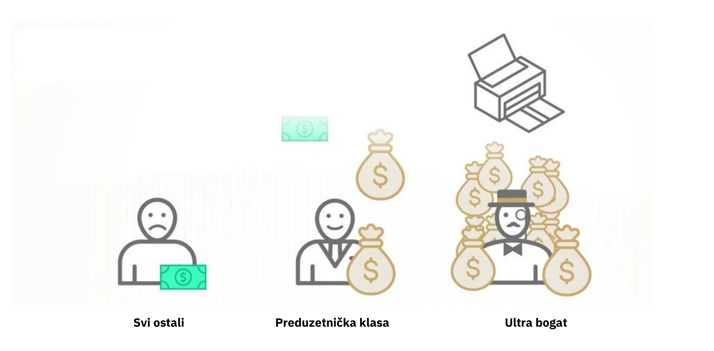

Slika4: Kantilonov Efekat u Kratkim Crtama / Izvor: River Financial

U ovom slučaju, bankari, rukovodioci banaka, vlasnici akcija i obveznica, razvijači nekretnina, zajmodavci nekretnina i svi koji poseduju finansijsku imovinu ili nekretnine dobili su finansijski dobitak, dok je teret pao na sve ostale. Ova situacija je trajala godinama i u velikoj meri objašnjava rastuću nejednakost u bogatstvu, osećaj obespravljenosti među vrednim pojedincima i naizgled nezaustavljiv rast cena imovine uprkos sporom rastu BDP-a.

U suštini, sistem je iskrivljen. Banke su inherentno nestabilne, ali njihov neuspeh može ugroziti celu ekonomiju. Ovaj moralni hazard podstiče izvršne direktore banaka da preuzimaju prekomerne rizike kako bi maksimizirali prihod svoje banke, znajući da će ih centralna banka na kraju spasiti, prebacujući trošak na poreske obveznike. U takvim scenarijima, centralni bankari stvaraju uslove za masivan transfer kupovne moći od vrednih pojedinaca i štediša ka vlasnicima imovine i onima povezanim sa finansijskim sistemom, čime se proces stvaranja bogatstva odvaja od akumulacije bogatstva.

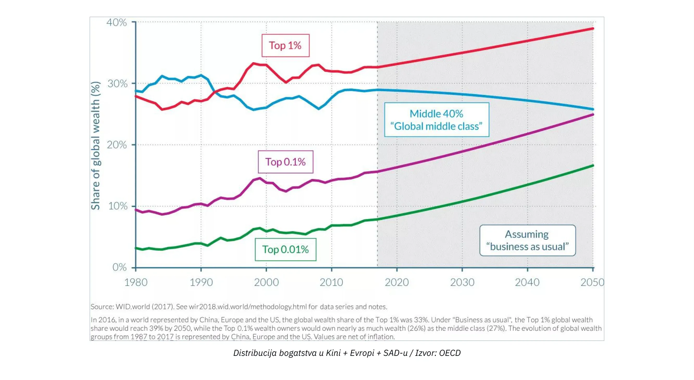

Slika 5: Distribucija bogatstva u Kini + Evropi + SAD / Izvor: OECD

### Posledice politika nulte kamatne stope

Tokom produženih perioda politike nulte kamatne stope (ZIRP-Zero Interest Rate Policies), banke imaju ograničene mogućnosti da obnove svoj kapital jer su im marže smanjene. Banke obično zarađuju novac pozajmljujući po kratkoročnim stopama i pozajmljujući po dugoročnim stopama. Međutim, kada centralne banke kupuju velike količine obveznica i postavljaju stope na nulu, banke imaju malo podsticaja da pozajmljuju, posebno preduzetnicima i drugim rizičnim korisnicima. Umesto toga, one alociraju svoje resurse na sekjuritizaciju postojećeg kapitala ili davanje zajmova uz kolateral kako bi zadovoljile potražnju onih koji imaju koristi od Kantilonovog efekta.

Još jedna nenamerna posledica ZIRP-a je da podstiče vlade da se upuste u obimno trošenje. Pošto vlade nemaju troškove zaduživanja i mogu se osloniti na centralne banke da otkupe njihove obveznice kroz QE programe, imaju prirodni podsticaj da troše što je više moguće, posebno u demokratskim kontekstima gde trošenje može doneti glasove. Ova tendencija često zanemaruje dugoročne posledice takve fiskalne rasipnosti, što dovodi do značajnog povećanja nivoa javnog duga u razvijenim ekonomijama od Globalne finansijske krize (GFC-Global Financial Crisis).

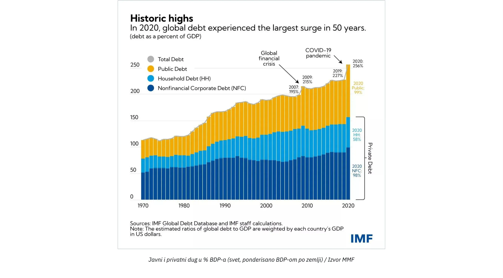

Slika 6: Javni i privatni dug kao % BDP-a (Svet, ponderisano prema BDP-u po zemlji) / Izvor MMF

Sa [inflacijom](https://planb.academy/resources/glossary/inflation) koja raste zbog značajnog stvaranja novca kao odgovora na zatvaranja povezana sa COVID-om, centralni bankari sada podižu kamatne stope u pokušaju da obuzdaju inflaciju. Međutim, ovo predstavlja značajan izazov za ceo sistem. Banke su više zadužene nego ikada, vlade nose istorijski visoke nivoe duga, ekonomski rast je spor, deficiti rastu, a potrošači, koji se bore sa rastućim cenama osnovnih dobara, teško sastavljaju kraj s krajem. Kontrolisanje inflacije bi zahtevalo podizanje stopa na nivo koji bi mogao da dovede vlade do bankrota, dok banke rizikuju da izgube deponente jer pojedinci troše svoje uštede na sve skuplje osnovne potrepštine ili traže utočište u čvrstoj imovini i fondovima novčanog tržišta kako bi se zaštitili od inflacije.

### Zaključak

> „Na ovaj način (frakcionalno rezerve banaka), vlade mogu tajno i neprimećeno konfiskovati bogatstvo naroda, a da nijedan čovek u milion ne bi otkrio krađu“
>

> John Maynard Keynes

U suštini, naš sistem se suočava sa značajnim izazovima, i Bitkoin se pojavljuje kao jedina kredibilna alternativa. Međutim, Bitkoin sam po sebi ne može rešiti probleme unutar našeg monetarnog sistema. Iznad svega, potrebni su nam pojedinci koji razumeju osnovne ekonomske principe među Bitkoin entuzijastima, omogućavajući širu svest i ekonomski zdrav razum da nas vodi dalje od izgradnje još jedne krhke finansijske osnove za našu civilizaciju. Primarni cilj ovog kursa je edukacija novih Bitkoin entuzijasta u zdravim ekonomskim principima.

Da bismo postigli ovaj cilj, objasnićemo osnovne principe "[Austrijske ekonomije](https://planb.academy/resources/glossary/austrian-school)," ekonomske škole mišljenja sa metodološkom tradicijom koja datira iz 16. veka, pružajući uvide u ljudsko delovanje pod ekonomskim ograničenjima. Sa ovim uvodom, sada razumete osnove kreiranja novca i trenutno stanje našeg finansijskog i monetarnog sistema.

U narednom poglavlju, istražićemo kamen temeljac svake ekonomske škole mišljenja: teoriju vrednosti. Sledeća poglavlja će istražiti novac kao društvenu instituciju, teoriju kapitala i poslovni ciklus, izazov ekonomske kalkulacije, i kratak pregled istorije i metodologije Austrijske škole ekonomije.

# Teorijske Osnove

<partId>86012c1b-cdf2-586f-8fe7-263f8287e950</partId>

## Subjektivna teorija vrednosti

<chapterId>eb1608d4-5d36-56a0-bcfc-ed8c03dfa906</chapterId>

> „Vrednost postoji samo unutar ljudske svesti“
>

> Carl Menger, Principi političke ekonomije

### Marginalna revolucija

U korenu ekonomskog razmišljanja leži pitanje vrednosti. Kako određujemo vrednost nečega? Da li je vrednost inherentno svojstvo stvari? Ili je, naprotiv, subjektivni fenomen? Kako upoređujemo vrednost dve stvari? Odakle dolazi vrednost?

Takva pitanja su zaokupljala ekonomiste i filozofe vekovima i dobila su brojne različite odgovore. Na mnogo načina, epistemološka evolucija ekonomije bila je obeležena evolucijom teorija vrednosti.

Nakon što je teorija fiziokrata o vrednosti zemlje, koja je tvrdila da sva vrednost dolazi od zemlje, bila opovrgnuta teorijom vrednosti rada klasičnih ekonomista, koja je postavljala da vrednost dobra potiče od količine rada uloženog u njegovu proizvodnju, došao je red na marginalnu teoriju vrednosti da zameni poslednju. U 1870-im, nakon Marksa, poslednjeg od klasičnih ekonomista, tri nove škole ekonomske misli pojavile su se gotovo istovremeno oko marginalne teorije vrednosti: Lozanska škola sa Léonom Walrasom, moderna ili neoklasična škola sa Williamom Stanleyjem Jevonsom, i Austrijska škola sa Carlom Mengerom. Ova revolucija u teoriji vrednosti predstavljala je značajnu obnovu ekonomske misli.

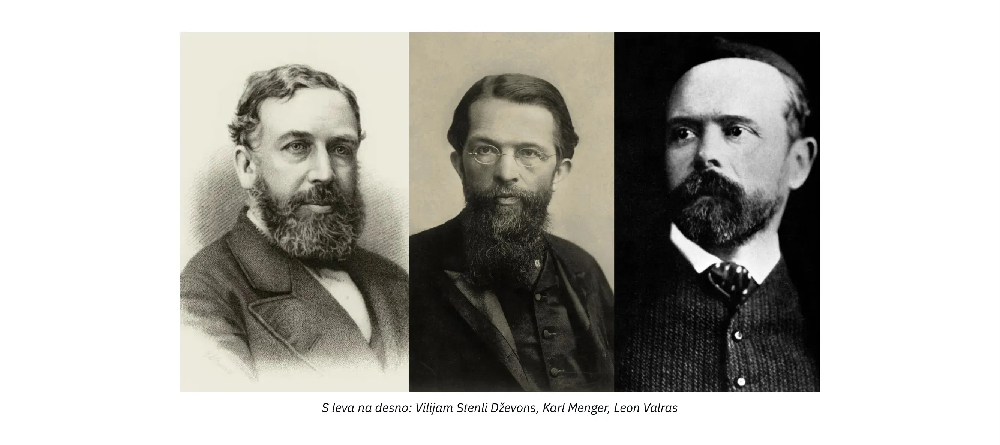

Sleva na desno: William Stanley Jevons, Carl Menger, Léon Walras

Marginalna teorija vrednosti drži da ekonomska vrednost odgovara onome što ekonomski agent dobrovoljno plaća za sledeću jedinicu dobra ili usluge. Kako ova teorija naglašava činjenicu da se cene formiraju na margini, tj. za sledeću jedinicu datog dobra, nazvana je "marginalizam".

Uobičajeno je predstaviti marginalizam ovih triju škola kao sličan. Zaista, Walras i Jevons su veoma kompatibilni, ali Mengerova teorija se u dubokim aspektima razlikuje od ostalih. U svom delu, koje se sada smatra temeljem austrijske ekonomske teorije, pod nazivom "Grundsätze des Volkswirtschaftlehre" (Principi političke ekonomije), objavljenom 1874. godine, Menger nudi marginalno, ali prvenstveno subjektivno objašnjenje vrednosti, za razliku od Walrasa i Jevonsa, koji vrednost smatraju objektivnim i merljivim fenomenom.

### Subjektivna Vrednost

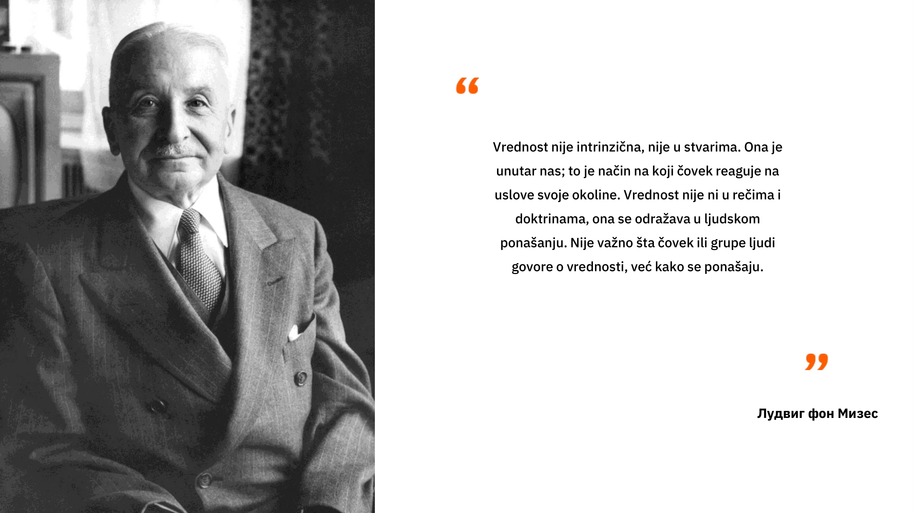

Austrijski ekonomista opovrgava shvatanje sledbenika Adama Smita i napušta ideju da vrednost dobra dolazi iz količine rada utrošenog u njegovu proizvodnju, u korist shvatanja da njegovu vrednost određuje pojedinac, koji u svakom kontekstu vrši mentalni čin vrednovanja u vezi sa određenom količinom dobra ili usluge. Ovaj intelektualni skok koji je napravio Menger osporava objektivnost vrednosti: za njega, vrednost nije objektivno svojstvo dobara; ona je samo rezultat odnosa koji pojedinac ima prema toj stvari: "vrednost ne postoji izvan ljudske svesti."

Drugim rečima, Menger nas poziva da razmotrimo da vrednost postoji samo kao subjektivni psihološki fenomen unutar pojedinca, da vrednost nije inherentno svojstvo dobara, već proizlazi iz mišljenja pojedinca o korisnosti koju može izvući iz tih dobara.

Prema ovom gledištu, litar pijaće vode nema objektivnu vrednost. Osoba koja ima pristup modernom sistemu pijaće vode i trenutno nije žedna verovatno bi dodelila vrlo malu vrednost tom dodatnom litru vode, dok bi pojedinac koji je žedan usred pustinje, videći ga kao razliku između života i smrti, sigurno bio spreman da pripiše gotovo beskonačnu vrednost tom litru vode.

Ukratko, Menger je primetio da je vrednost ekonomskog dobra ništa drugo do subjektivna procena koju pojedinac dodeljuje dodatnoj jedinici tog dobra ili usluge.

### Dobrovoljna Razmena: Igra sa pozitivnim ishodom

Od ove tačke, Menger zaključuje da se dobrovoljna razmena između dve individue dešava zato što svaka strana veruje da će to povećati njihovu subjektivnu korisnost. Za njega, razmena ne pretpostavlja nikakvu ekvivalenciju vrednosti, suprotno onome što su klasični ekonomisti verovali. Prema austrijskom misliocu, ako bi postojala ekvivalencija korisnosti između razmenjenih dobara, ne bi bilo razloga da se strane uopšte trude da razmenjuju. Ako postoji Exchange, to je zato što svaka strana nalazi da je to u njihovom (subjektivnom) interesu, i kao posledica toga, svaka dobrovoljna razmena proizvodi društvenu korist.

### Vrednovanje kao fenomen rangiranja ljudskih želja

Međutim, takva društvena korist, ili subjektivna vrednost pripisana nekoj robi, ne može se meriti. Za Mengera, vrednost je kognitivni fenomen poređenja (ordinalni) pre nego merenja (kardinalni). Nije, kao što su neoklasični ekonomisti mislili od Valrasa i Dževonsa, dodeljivanje numeričke vrednosti od strane pojedinca koja odražava korisnost koju izvlači iz toga, već čin uređivanja ljudskih želja kojim pojedinac izražava da želi količinu dobra A intenzivnije nego količinu dobra B.

Svaki agent može reći da li više voli 2 banane u odnosu na kurs ekonomije, ali niko ne može razumno reći da vrednuje 2 banane na 3.1416 utila, dok kurs ekonomije vrednuje na 3 utila, i stoga, više voli da ima banane. Takav opis ljudskih preferencija, zasnovan na kontinuiranim realnim funkcijama, ne odgovara stvarnosti kognitivnih procesa koje doživljavamo u našem svakodnevnom životu. Pojedinac nikada ne procenjuje dobra koja su mu predstavljena poredeći ih sa apstraktnim standardom korisnosti. Umesto toga, on subjektivno poredi različite tokove akcije, koje ne može oceniti u apsolutnim terminima, ali ih ipak može rangirati na osnovu njihove relativne poželjnosti.

Ova subjektivna koncepcija vrednosti, shvaćena kao psihološki odnos koji pojedinac održava sa svojim ciljevima i sredstvima relevantnim za njihovo postizanje, takođe omogućava austrijskim ekonomistima da objasne fenomen podele rada.

### Podela rada

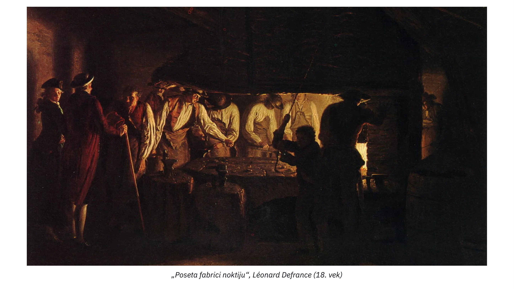

Poseta fabrici eksera, Léonard Defrance (18. vek)

Svi su jedinstveni i imaju određenu ličnu situaciju. Stoga, svako poseduje superiornu sposobnost da obavlja određene zadatke bolje od svojih vršnjaka (apsolutna prednost) ili superiornu sposobnost da obavlja određene zadatke bolje od drugih (komparativna prednost). Ne može biti drugačije; negirati ovu elementarnu činjenicu značilo bi tvrditi da su svi ljudi jednaki u svim aspektima.

U slučaju kada pojedinac ima superiornu sposobnost u poređenju sa svojim vršnjacima u proizvodnji određenog dobra (apsolutna prednost), ima interes da se specijalizuje u proizvodnji tog dobra i zatim razmeni višak koji dobije za dobra koja želi. Na taj način, zadovoljava svoju subjektivnu korisnost ekonomičnije nego da se upusti u proizvodnju svih dobara koja želi.

Ali može se desiti i slučaj da pojedinac nema apsolutnu prednost u proizvodnji bilo kog dobra. U tom slučaju, i dalje će postojati vrste proizvodnje u kojima je pojedinac bolji nego u drugim (komparativna prednost), i zbog toga i dalje ima interes da se specijalizuje.

Svakako, postoje pojedinci koji bi mogli proizvoditi taj određeni proizvod produktivnije od njega, ali pošto su ti pojedinci verovatno produktivniji u nekom drugom zadatku nego u ovom, i pošto ne mogu obavljati oba zadatka istovremeno, neproduktivno je da rade na ovom zadatku umesto na drugom za koji su produktivniji. Specijalizacijom u zadatku za koji su najproduktivniji, oni će dobiti veći višak nego da se nisu specijalizovali, i stoga, kroz razmenu, mogli bi dobiti povećanu količinu tih drugih dobara, čak i ako bi dobra koja su dobili bila efikasnije proizvedena od strane njih samih nego od strane proizvođača od kojih su ih dobili.

Uzmimo primer lekara. On bi mogao biti bolji u pisanju mejlova i zakazivanju sastanaka od svoje sekretarice (relativna prednost). Ali svako vreme provedeno na obavljanju tih zadataka je vreme koje ne koristi za lečenje pacijenata. Dakle, kako je produktivniji u lečenju ljudi, u njegovom je interesu da delegira administrativne dužnosti drugoj osobi čak i ako je bolji u tom zadatku od svog zamenika, jer mu to omogućava da maksimizuje vrednost stvorenu za druge, a samim tim i svoje bogatstvo.

U suštini, postoji korist od specijalizacije, čak i za pojedince koji nemaju apsolutne prednosti, jer je vreme oskudan i suparnički resurs: svaka jedinica vremena provedena na aktivnosti koja nije ona u kojoj je pojedinac najproduktivniji podrazumeva trošak predstavljen propuštenom proizvodnjom koje su se odrekli (oportunitetni trošak).

Jednom kada se pojedinac specijalizuje u određenoj proizvodnji, može zatim rezervisati količinu proizvoda koju smatra potrebnom za ličnu potrošnju i razmeniti višak za druge željene robe. Na taj način zadovoljavaju svoju želju za robama koje sami proizvode, što znači da preostale jedinice njihove proizvodnje imaju malu vrednost za njih. To je ono što ekonomisti nazivaju opadajućom marginalnom korisnošću: svaka dodatna jedinica robe je manje željena od prethodne. Za druge kojima takve robe nedostaju, situacija je drugačija: iz istih razloga, oni teže da intenzivnije žele robe koje ne proizvode nego one koje proizvode. Ovo dovodi do situacije gde postoji jaka asimetrija između različitih subjektivnih procena pojedinaca, što je veoma pogodno za razmenu: svaka strana ima interes da razmeni svoj višak proizvodnje jer time povećava svoju subjektivnu korisnost.

Rezultat prethodne analize je da su pojedinci uvek u boljoj poziciji kada se specijalizuju u svom radu i učestvuju u razmeni. Stoga, austrijski ekonomisti, posebno Ludwig Von Mises, zaključuju da je produktivna prednost koja proizlazi iz podele rada pokretačka snaga iza procesa društvene saradnje. Ovde može biti korisno citirati ga direktno:

"Osnovne činjenice koje su dovele do saradnje, društva i civilizacije i transformisale životinju čoveka u ljudsko biće su činjenice da je rad obavljen pod podelom rada produktivniji od izolovanog rada i da je ljudski razum sposoban da prepozna ovu istinu. […] Ljudi ne sarađuju pod podelom rada zato što se vole ili bi trebalo da se vole. Oni sarađuju zato što to najbolje služi njihovim sopstvenim interesima."

### Zaključak

> "Ako čovek vidi da može živeti udobnije viseći sa vešala nego sedeći za stolom, ponašao bi se kao budala ako se ne bi obesio."
>

> Baruch Spinoza

1871-1874 su divne godine moderne ekonomije: ovaj period je svedočio radovima tri nezavisna mislioca koji su temeljni za modernu ekonomiju. Sa svojim naglaskom na subjektivnu ordinalnu vrednost, austrijski ekonomisti će razviti čitavo telo ekonomske misli koje ih izdvaja od njihovih homologa. Rad austrijskih ekonomista koji razmišljaju o ljudskoj akciji u kontekstu oskudice zauvek će stajati u oštrom kontrastu sa ekonomskim doktrinama koje su inicirali Jevons i Walras, a koje se u velikoj meri oslanjaju na matematiku, i ideju da se vrednost može objektivno meriti i izvesti kao kontinuirana funkcija.

Oslanjajući se na uvide o subjektivnoj ordinalnoj vrednosti, Menger je objasnio nastanak podele rada i dobrovoljnu razmenu. Ipak, kao što ćemo videti u narednom poglavlju, direktna razmena je loša strategija za ekonomske agente koji žele da maksimiziraju svoju subjektivnu korisnost. Otac Austrijske škole je tako dalje razvio svoje razmišljanje kako bi objasnio zašto je novac nastao kao društvena institucija.

Naredna poglavlja biće posvećena pojavi novca kao društvene institucije, teoriji kapitala i kamate, koja će služiti kao osnova za Teoriju poslovnog ciklusa, i na kraju ulozi cena u ekonomskoj kalkulaciji.

## Pojava novca kao društvenog fenomena

<chapterId>14ded794-0578-5478-ba5b-b2106c74f3ef</chapterId>

Iako pojedinci imaju zajednički interes u specijalizaciji i maksimizaciji podele rada, i dalje postoje problemi koordinacije koji ograničavaju ovo širenje.

Prvo, važno je napomenuti da, pošto su proizvodni procesi inherentno vremenski ograničeni i često asinhroni (neistovremeni), obično će postojati vremenski jaz između početnog doprinosa pojedinca i prijema protivvrednosti. Posvećivanje određenom zadatku sada, bez prethodnog uverenja da će drugi zadovoljiti naše potrebe u budućnosti, može biti rizično.

U podeli rada, svaka strana ima koristi od saradnje, ali pojedinačno, neko bi mogao biti u iskušenju da uživa u radu drugih bez uzvraćanja, jer na taj način dobija nešto vredno bez ikakvih troškova. Takve situacije, gde međusobna saradnja rezultira suboptimalnim dobicima za pojedince, ali maksimalnim dobicima za grupu, u teoriji igara se opisuju kao "zatvorenikova dilema."

### Zatvorenikova dilema

Prvobitno, zatvorenikova dilema je formulisana na sledeći način: Dvoje osumnjičenih, Alis i Bob, koji ne mogu da komuniciraju, suočavaju se sa rizikom zatvora, sa potencijalnim kaznama kako sledi:

- Ako Alisa optuži Boba, a Bob ne prizna, Alice je slobodna, a Bob dobija 3 godine.
- Ako se i Alice i Bob međusobno optuže, oboje dobijaju po 2 godine.
- Ako oboje ne priznaju, oboje dobijaju po 1 godinu.

Ovi ishodi mogu biti predstavljeni u matrici (numerički rezultati označavaju broj godina zatvora):

| Alice / Bob       | Optužiti | Ne priznati |
| ----------------- | ------ | ------------- |
| **Optužiti**      | 2, 2   | 0, 3          |
| **Ne priznati**   | 3, 0   | 1, 1          |

U ovoj igri, ne postoji mogućnost koordinacije (komunikacija je nemoguća) kako bi se postigao najbolji ishod za obe strane. Posledično, Alice i Bob imaju individualni podsticaj da optuže jedno drugo, iako to ne vodi do optimalnog ishoda za grupu. Optimalna strategija za oboje je da ne priznaju, pri čemu svaki dobija kaznu od 1 godine.

Ova igra ilustruje problem koji se često sreće u stvarnom životu: u odsustvu mehanizama koordinacije, pojedinci teže da biraju strategije koje maksimizuju njihov individualni dobitak, bez obzira na strategije koje biraju drugi (krađa, varanje, izdaja, nasilje, itd.), čak i kada je moguće postići poželjniju ravnotežu kroz koordinaciju/saradnju.

### Novac za rešavanje problema koordinacije

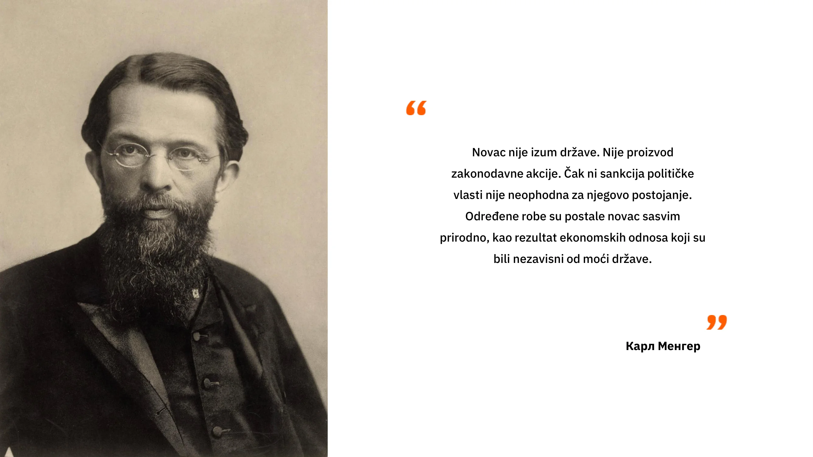

Ovaj problem ima manji uticaj u malim zajednicama (npr. porodica, krug prijatelja) jer, u takvim slučajevima, svi se međusobno poznaju direktno, što omogućava da se zapamte doprinosi svakog pojedinca. Pod pretpostavkom da napuštanje zajednice (dezertiranje) nosi određeni trošak, sistem reputacije zasnovan na memoriji pojedinačnih agenata obično je dovoljan da se izbegnu zamke koje postavlja dilema zatvorenika.

Međutim, kada se radi o većim zajednicama koje značajno profitiraju od podele rada, problemi koordinacije ponovo se javljaju. To je zbog dva glavna razloga:

Prvo, ljudi su ograničeni svojim kognitivnim kapacitetima. Nemoguće je da osoba održava i pamti stabilne društvene odnose sa više od 150 pojedinaca, što čini sistem reputacije nedovoljnim za prevazilaženje zatvorenikove dileme u velikim razmerama.

Drugo, društveno prihvaćeno merenje vrednosti doprinosa u razmeni (uporedivost) je složen problem. Na primer, ako pojedinac obezbedi meso iz lova i zauzvrat zatraži materijale za sklonište, kako se može proceniti količina ponuđenog mesa u ekvivalentnim terminima traženih materijala? Isto važi i za kvalitet – da li je meso jelena vrednije ili manje vredno od drveta?

Čak i kada bi bilo moguće uspostaviti zadovoljavajući kurs razmene za svaki par dobara, održavanje ovih informacija brzo postaje nepraktično. U sistemu direktne razmene koji uključuje N dobara, postoji N(N-1)/2 kurseva razmene koje treba zapamtiti. Za ekonomiju od 50 dobara, to znači zapamtiti 50\*49/2, ili 1225 kurseva razmene, za razliku od samo 50 u indirektnim razmenama. Za ekonomiju od 100 dobara, ovaj broj se povećava na 4950. Takav kvadratni odnos postavlja dodatno ograničenje na skalabilnost direktne razmene (trampe).

Štaviše, pošto se ove razmene ne dešavaju trenutno, već su raspoređene tokom vremena, procena doprinosa tokom vremena dodatno komplikuje relativnu procenu doprinosa. Pored procene kursa razmene između dva sadašnja dobra, postaje neophodno proceniti vrednost prošlog doprinosa u odnosu na buduću protivvrednost.

Danas, uprkos nepraktičnosti takvog sistema, mogli bismo koristiti pisanje ili digitalno skladištenje podataka da zapamtimo sve ove informacije i uspostavimo kreditni sistem (praćenje prošlih doprinosa, uključujući kurs razmene tih doprinosa, suštinski je postavljanje kreditnog sistema).

U predcivilizacijskim vremenima, ove tehnologije nisu postojale. Tako su naši preci morali pronaći druga rešenja kako bi uživali u prednostima podele rada, a da se ne izlože negativnim posledicama zatvorenikove dileme. Rešenje ovog problema direktne razmene bila je indirektna razmena olakšana novcem.

### Dvostruka podudarnost želja i mogućnosti prodaje

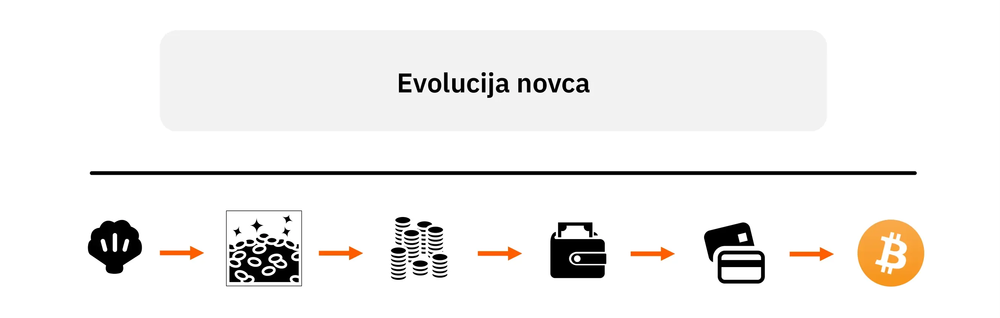

Novac se može smatrati rešenjem koje su naši preci otkrili kako bi rešili problem koji ekonomisti nazivaju "dvostruka podudarnost želja". Ovaj problem ima tri dimenzije: prostornu, vremensku i međuljudsku.

U direktnom razmeni (trampi) između Alice i Boba, oboje moraju posedovati nešto što onaj drugi želi u isto vreme i na istom mestu. Korišćenjem indirektne razmene, tj. kroz novac, Alice može kupiti od Boba, a Bob može koristiti tu novčanu jedinicu negde drugde, u drugo vreme, i sa nekim drugim (pod uslovom da ta osoba prihvata taj oblik novca).

Da bi neko dobro služilo kao novac, mora imati visoku prodajnost, što znači da bi trebalo da bude željeno od strane što većeg broja ljudi, većinu vremena. Korišćenjem visoko prodajnog dobra, problem dvostrukog podudaranja želja se rešava u smislu prostorne i međuljudske dimenzije: ako je dobro koje koristim kao novac poželjno svuda i od strane većine ljudi, mogu lako odvojiti čin prodaje od čina kupovine u smislu lokacije i društvene interakcije.

Međutim, problem prodajnosti tokom vremena je teže rešiti iz dva razloga:

Prvo, entropija (obično poznata kao "efekat vremena") postepeno menja osobine većine dobara sa direktnom korisnošću. Stoga, očuvanje prodajnosti dobra tokom vremena zahteva da ono bude veoma izdržljivo ili otporno na entropiju.

Drugo, relativna oskudica dobra u trenutku "t" ne garantuje njegovu relativnu oskudicu u budućnosti. Posvećivanjem dovoljno resursa određenoj oblasti proizvodnje, ljudi mogu povećati ponudu bilo kog dobra. Jedino ograničenje za povećanje proizvodnje dobra je povezani oportunitetni trošak. Shodno tome, trenutna relativna oskudica dobra ne može garantovati njegovu buduću relativnu oskudicu. Samo dobra čija se marginalna proizvodnja može povećati po veoma visokim troškovima mogu biti dosledno oskudna, zbog čega je ovo karakteristika slobodno nastalih monetarnih dobara kroz ljudsku istoriju.

U predcivilizacijskim vremenima, razne robe poput školjki, ručno izrađenog nakita, ogrlica ili perli služile su kao novac. Ove robe su bile lako prenosive, nisu imale direktnu korisnost osim svoje ukrasne vrednosti, odolevale su entropiji (tj. nisu se vremenom pogoršavale), bile su prirodno oskudne i/ili su zahtevale značajnu količinu specijalizovanog rada za proizvodnju. Pošto je nivo podele rada tada bio nizak, a samim tim i oportunitetni trošak povezan sa proizvodnjom ukrasnih artefakata bio visok, ovi predmeti nisu mogli biti proizvedeni u velikim količinama. Tako su oni koji su koristili ove predmete kao novac mogli biti sigurni u njihovu buduću relativnu oskudnost.

Činjenica da su naši preci lovci-sakupljači učestvovali u ovim resursno intenzivnim zadacima, iako nisu generisali dobra sa direktnom korisnošću, pokazuje značajne dobitke koje su očekivali od širenja prostornog, socijalnog i vremenskog obima razmene. Da to nije bio slučaj, i da im je bilo korisnije da ove resurse koriste za izgradnju skloništa, lov ili druge aktivnosti, umesto za proizvodnju monetarnih dobara, verovatno ne bismo pronašli toliko arheoloških dokaza o ovim zanatskim aktivnostima. Druge grupe koje su efikasnije koristile svoje resurse uživale bi bolji razvoj i veći prosperitet, a ove zanatske aktivnosti bi brzo nestale u korist aktivnosti koje proizvode dobra sa direktnom korisnošću.

U tom smislu, proizvodnja monetarnih dobara, promovišući širenje podele rada, predstavljala je isplativiju upotrebu resursa (u smislu subjektivne korisnosti za pojedince) nego sve druge alternative (povećanje lova, ribolova, sakupljanja, proizvodnje drveta, izgradnje kuća, proizvodnje više alata za lov i ribolov, itd.).

### Neizvesnost

Da bismo zaključili našu analizu monetarne institucije, potrebno je da se pozabavimo pitanjem ekonomskog delovanja u kontekstu neizbežne neizvesnosti o budućnosti.

Kao što su austrijski ekonomisti istakli, ljudska akcija je vremenski ograničena i uvek usmerena ka budućnosti. Kada pojedinac deluje, menja svoje trenutno stanje u nadi da će postići buduće zadovoljstvo. Ova mentalna projekcija može biti usmerena ka bliskoj ili dalekoj budućnosti, ali da bi pojedinac projektovao na duži rok, prvo mora obezbediti svoju kratkoročnu egzistenciju jer njegovo stanje u bliskoj budućnosti direktno utiče na njegovo stanje u dalekoj budućnosti.

Ovo direktno proizilazi iz ljudske racionalnosti; niko ne može ignorisati sekvencijalnu prirodu vremenskih fenomena i hronološku zavisnost koja iz toga proizilazi jer je to jedno od suštinskih ograničenja ljudskog života. Stoga, pošto budućnost uvek ostaje neizvesna za ljude, oni će nastojati da obezbede svoj dugoročni opstanak tek kada im je kratkoročni opstanak osiguran.

U tom pogledu, novac, omogućavajući skladištenje vrednosti u sadašnjosti i njeno prenošenje budućem sebi, igra ključnu ulogu u intertemporalnoj koordinaciji ljudske akcije. Skladištenjem novca, tj. štednjom, pojedinci se štite od buduće neizvesnosti i tako omogućavaju sebi da usmere svoje akcije ka dužim vremenskim horizontima. Međutim, to mogu postići samo ako novac koji koriste predstavlja čuvara vrednosti, što znači da ima prodajnost tokom vremena, što je, kao što je ranije pomenuto, karakteristika trajnih i relativno oskudnih dobara.

U narednom poglavlju ćemo se upustiti u koncept vremenske preferencije i objasniti austrijsku perspektivu o kamati i kapitalu, što će poslužiti kao osnova za sledeće poglavlje o Teoriji poslovnog ciklusa.

## Vremenska preferencija, kamata i kapital

<chapterId>37732a5c-4f66-5e2d-bc2c-cc8d29693af7</chapterId>

### Vremenska preferencija

Zaključili smo poslednje poglavlje objašnjavajući kako ekonomski agenti koriste najprodavanije dobro, tj. novac, da bi se zaštitili od buduće neizvesnosti. Takođe smo objasnili da nas sekvencijalna priroda vremenskih fenomena vodi ka postepenoj borbi protiv neizvesnosti: tek kada znamo da će naša egzistencija biti osigurana za narednu nedelju, možemo se koncentrisati na ciljeve koji su dalje u budućnosti.

Ili, da to kažemo drugačije: kao ljudska bića diskontujemo (umanjujemo) vrednost budućih dobara.

Ova subjektivna procena vrednosti budućih dobara u poređenju sa sadašnjim dobrima naziva se vremenska preferencija. Sve ostalo jednako, sadašnja dobra su inherentno preferirana u odnosu na buduća dobra. Pošto smo smrtni, a budućnost je uvek neizvesna, prirodno preferiramo da imamo pristup dobru sada, a ne kasnije. Iako vremenska preferencija može da se razlikuje među pojedincima, zbog mnoštva faktora kao što su kultura, bogatstvo, obrazovanje, fiziologija, itd., vremenske preferencije su uvek pozitivne, što znači da, sve ostalo jednako, uvek više cenimo sadašnja dobra nego buduća dobra.

Ovaj koncept relativne vrednosti budućih dobara u odnosu na sadašnja dobra je u osnovi fenomena kamate. Zaista, u ekonomiji sa nemanipulisanim tržištima kapitala, referentne kamatne stope (koje se smatraju bez rizika od neizvršenja obaveza) određuju se na preseku ponude i potražnje kapitala. Stoga, ove stope predstavljaju stanje vremenskih preferencija za celu ekonomiju: povećanje kamatne stope rezultat je relativnog povećanja potražnje za kapitalom u poređenju sa ponudom, što ukazuje na veće vremenske preferencije. Suprotno tome, smanjenje kamatnih stopa nastaje zbog povećanja štednje, što je povećanje ponude kapitala, što ukazuje na smanjenje vremenskih preferencija.

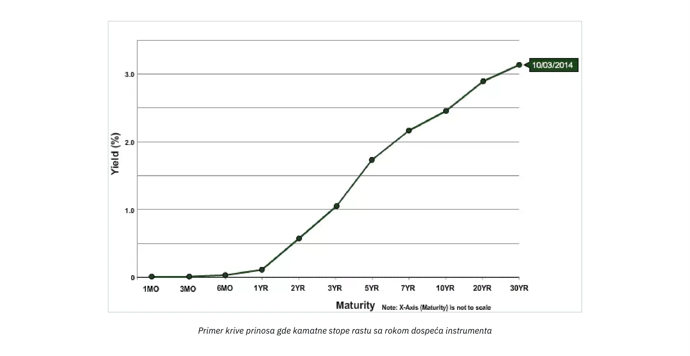

U ekonomiji gde centralna banka ne manipuliše kamatnim stopama, obično posmatramo krivu prinosa koja raste: što je duži rok dospeća duga, to je viša kamatna stopa. Suprotna situacija ne može da se dogodi jer bi to značilo da je budućnost izvesnija od sadašnjosti, što je logički nemoguće.

Koncept vremenske preferencije i način na koji izražavamo sopstvenu vremensku preferenciju kroz čin potrošnje i štednje su fundamentalni za procese alokacije kapitala i proizvodnje. Okrenimo se Mengerovom učeniku, Eugenu fon Böm-Baverk-u, i njegovoj teoriji kapitala kako bismo razumeli tačno kako vremenska preferencija utiče na organizaciju proizvodnje.

### Teorija kapitala

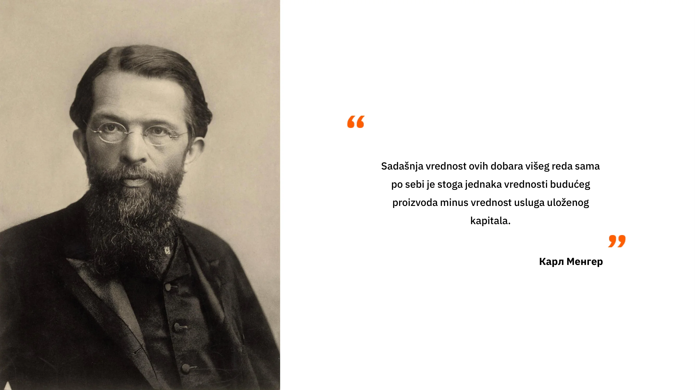

Na početku ovog kursa, videli smo da su, za Karla Mengera, dobra smatrana ekonomskim dobrima (vrednovana) samo zato što služe kao sredstva za ciljeve koje pojedinci biraju i vrednuju. Prema ovom gledištu, cela ekonomska analiza se vrti oko potrošnje jer je ona u krajnjoj liniji motivacioni cilj iza sve ekonomske aktivnosti. Dakle, za Mengera, početna tačka ekonomske analize su potrošačka dobra, ili finalna dobra, jer predstavljaju krajnji cilj ekonomske aktivnosti. Sva ostala dobra u ekonomiji, koja možemo nazvati "srednja dobra," imaju vrednost samo zato što omogućavaju pojedincima da dobiju ova potrošačka dobra: to su dobra koja se koriste u proizvodnji drugih dobara.

Da bi proizveli potrošačku robu, preduzetnici kombinuju ove različite međuproizvode (srednja dobra) sa originalnim faktorima proizvodnje (rad, zemlja i kapital) prema obrascu koji maksimizira rezultujuću proizvodnju. Ova aranžman, koji prave preduzetnici, ili struktura proizvodnje, uključuje različite faze tokom kojih međuproizvodi prolaze kroz transformacije dok na kraju ne postanu potrošačka roba.

Dakle, kao i Menger, možemo definisati potrošačka dobra kao dobra prvog reda, dobra uključena u prethodnu fazu kao dobra drugog reda, ona u fazi pre toga kao dobra trećeg reda, i tako dalje, sve dok ne dođemo do originalnih faktora (zemlja, rad, kapital). Broj faza koje razmatramo u osnovi zavisi od strukture proizvodnje koju usvajaju preduzetnici i ne treba ga posmatrati kao objektivnu karakteristiku strukture proizvodnje. Naprotiv, faze proizvodnje i međuproizvodi postoje samo u teleološkom kontekstu: akter zamišlja niz akcija kroz koje će postići željeni cilj i mentalno deli svoju akciju na sukcesivne faze.

Ova karakteristika mentalne projekcije akcije u sekvencijalnom obrascu je nametnuta vremenskom prirodom ljudske akcije. Svaka akcija koju preduzmu ljudi zahteva vreme; trenutna akcija je nemoguća. Stoga, akter uvek ima izbor među obrascima akcije koji traju više ili manje vremena.

Stoga, pošto pojedinci nužno imaju pozitivne vremenske preferencije, što znači da preferiraju sadašnja dobra u odnosu na buduća dobra, oni će izabrati duži put samo ako rezultat koji dobiju ima veću subjektivnu vrednost za njih nego ono što bi postigli direktnim putem. U suprotnom, niko ne bi usvojio metode koje oduzimaju više vremena: pod ekvivalentnim rezultatima, najkraći put ostaje preferirani izbor.

Zbog sekvencijalne prirode ljudskih akcija, ovi međuvremenski izbori uvek imaju implikacije na sekvencu akcija. Drugim rečima, kratkoročne akcije koje preduzimam su podređene dugoročnim ciljevima koje postavljam, i moje kratkoročne akcije će uticati na ono što mogu da radim u budućnosti. Implikacija ove očigledne tačke u vezi sa proizvodnim aktivnostima je da bilo kakvo zaobilaženje u proizvodnji, tj. bilo kakvo produžavanje strukture proizvodnje, zahteva prethodnu štednju. Ako odlučim da alociram više resursa u sadašnjosti kako bih postigao budući cilj, prvo moram odvojiti ono što će me održati tokom vremena koje je potrebno za moju investiciju.

Da bismo ilustrovali ovu tačku, hajde da se vratimo na primer koji je dao Böhm-Bawerk, u svom delu "Kapital i kamata":

Eugen von Böhm-Bawerk (1851-1914)

### Robinson Crusoe i obilazni put proizvodnje:

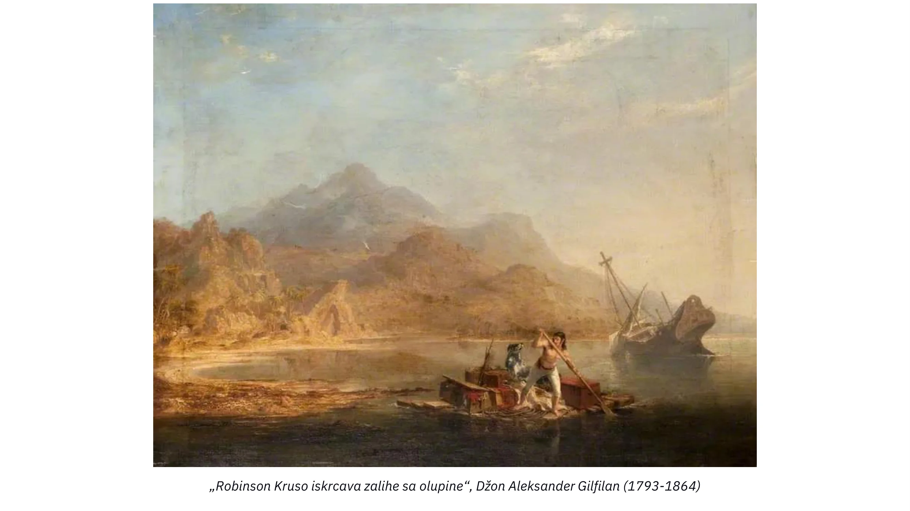

Robinson Crusoe iskrcava zalihe sa olupine, John Alexander Gilfillan (1793-1864)

U svojoj knjizi, austrijski ekonomista nas poziva da razmotrimo međuvremenske kompromise svojstvene zaobilaznim putevima proizvodnje kroz misaoni eksperiment zasnovan na Robinson Kruso-u koji je sam na svom ostrvu.

Robinson, kao primitivni čovek, zavisi od sakupljanja i lova za svoju ishranu. Zamislimo da Robinson može sakupiti dovoljno bobica da se nahrani za ceo dan za osam sati. U takvim uslovima, ima malo vremena za druge aktivnosti. Međutim, Robinson veruje da bi pravljenjem drvenog štapa mogao lako oboriti bobice i obezbediti svoju dnevnu hranu za samo četiri sata rada. Štaviše, procenjuje da će mu trebati pet dana, radeći po dva sata dnevno, da napravi štap. Stoga zaključuje da treba da uštedi 1/5 svoje proizvodnje bobica tokom pet dana, ili alternativno provede dodatna 2 sata dnevno u sakupljanju tokom 5 dana, kako bi uštedeo dovoljno bobica da se izdržava tokom vremena koje provodi praveći štap.

Ako ne izvrši ovu prethodnu uštedu, Robinson neće moći da završi svoj štap i mogao bi da umre u međuvremenu.

Dakle, pet dana žrtvuje dva sata svog odmora kako bi sakupio više bobica. Na kraju ovog perioda, ima dovoljno bobica i počinje izrađivati drveni štap, radeći dva sata dnevno tokom pet dana. Kada završi svoj rad, može sakupiti dovoljno bobica za svoju dnevnu porciju za 4 sata umesto 8, što mu omogućava da preostalih 4 sata dnevno koristi za druge aktivnosti.

Postupajući na ovaj način, Robinson pravi proizvodni zaokret: umesto da direktno sakuplja bobice, ulaže napor u proizvodnju kapitalnog dobra koje će ga učiniti produktivnijim u budućnosti. Međutim, mora napraviti kratkoročnu žrtvu, tj. štedeti, da bi to postigao. Ako to ne bi učinio, ne bi bio u stanju da završi svoje kapitalno dobro. Ova kratkoročna žrtva, međutim, pruža mu značajnu prednost jer, kada je opremljen svojim štapom, dobija 4 sata dnevno (dok štap ne postane zastareo). Ova 4 dodatna sata dnevno omogućavaju mu da stvori više kapitalnih dobara, kao što su alati za lov ili ribarske mreže, postepeno poboljšavajući svoju situaciju.

### Zaključak

Drugim rečima, u ekonomiji jednog čoveka Robinzona Krusoa, štednja kroz žrtvovanje trenutnog zadovoljstva je ono što akumulira kapital koji povećava produktivnost. U ovom kontekstu, štednja, tj. odlaganje trenutnog zadovoljstva, je cena koju treba platiti za povećano buduće zadovoljstvo. To znači da je, u ovom kontekstu, štednja preduslov i neophodan uslov za bilo kakav ekonomski razvoj.

Ovo je primamljiv, iako jednostavan, koncept: svako proširenje proizvodne strukture zahteva prethodnu štednju (jer dobra potrebna za takvu proizvodnju neće pasti s neba), i stoga, što više štedimo, više kapitala ćemo moći akumulirati, što će zauzvrat rezultirati povećanjem produktivnosti koja donosi više dobara. Tako austrijski ekonomisti smatraju da je smanjenje vremenskih preferencija početna tačka za vrli ciklus štednje –> više kapitalnih dobara  veća produktivnost  više dobara = viši životni standard –> niža vremenska preferencija.

Sada, kao što je nagovešteno u prvom poglavlju, centralne banke manipulišu kamatnim stopama decenijama, dok komercijalne banke odobravaju kredite bez prethodnih rezervi, što znači da kamatne stope ne predstavljaju našu vremensku preferenciju i daju iluziju obilnih ušteda.

Ovo je savršeno ilustrovano grafikonom ispod: dugoročne stope su niže od kratkoročnih. Prvo, ovo apsolutno nema smisla, jer bi to značilo da je budućnost sigurnija od sadašnjosti. Drugo, to zahteva istragu o posledicama za alokaciju kapitala: ako su svi podstaknuti da se ponašaju kao da je štednja obilna, dok štediša nema jer nisu nagrađeni za štednju, kakve posledice bi to moglo imati za ekonomiju?

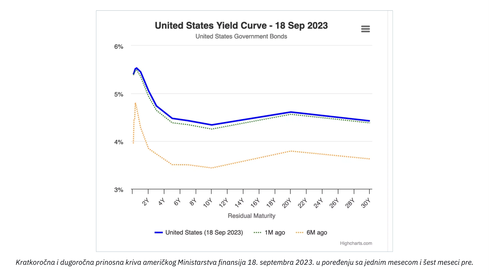

Ovo ćemo saznati u sledećem poglavlju posvećenom Austrijskoj teoriji poslovnog ciklusa!

# Austrijski ekonomski pogledi

<partId>ad0fce42-2556-56b8-a093-5b4fcacc7cf3</partId>

## Austrijska teorija poslovnog ciklusa

<chapterId>718afaa8-ce78-58aa-9477-073eef0bd137</chapterId>

> „Što duže traje bum inflatornog bankarskog kredita, to je veći obim pogrešnih investicija u kapitalna dobra, i veća je potreba za likvidacijom ovih neodrživih investicija. Kada se ekspanzija kredita zaustavi, preokrene ili čak značajno uspori, pogrešne investicije se otkrivaju“
>

> Ludwig von Mises

Bio je to Ludwig Von Mises, najuspešniji učenik Böhm-Bawerka i verovatno najvažniji austrijski ekonomista 20. veka, koji je koristio Böhm-Bawerkovo rezonovanje o kapitalu da objasni uzroke i dinamiku ekonomskih ciklusa. Friedrich A. Hayek, Misesov štićenik, kasnije je proširio ovo rezonovanje do njegovih logičkih zaključaka u radovima za koje je 1974. godine dobio Nobelovu nagradu za ekonomiju.

Mises i Hayek su započeli svoju analizu sa povećanjem štednje kao početnom tačkom. Kao što smo videli u prethodnim poglavljima, svako povećanje štednje nužno podrazumeva odgovarajuće smanjenje potrošnje i time niže relativne cene potrošačkih dobara. To dovodi do dva efekta: prvo, povećana potražnja za kapitalnim dobrima uzrokovana rastom realnih plata kao rezultat relativnog smanjenja cena potrošačkih dobara; i drugo, povećanje preduzetničkih profita u fazama proizvodnje najudaljenijim od potrošnje (nižeg reda). Kako realne plate rastu, preduzetnici su motivisani da štede rad koristeći više kapitalnih dobara, što stvara jaču potražnju za kapitalnim dobrima i veće profite za preduzetnike koji proizvode ova dobra nižeg reda. Dakle, u kontekstu povećane štednje, tj. smanjenja vremenskih preferencija, kamatne stope padaju, podstičući razvoj dodatnih faza proizvodnje i povećanu produktivnost. Ovo je klasičan Böhm-Bawerkov proizvodni zaobilazni put i to je veoma poželjan ishod.

Međutim, dvojica austrijskih ekonomista su razmatrala šta bi se desilo ako smanjenje kamatne stope, koje služi kao početna tačka za ovo skretanje u proizvodnji, ne bi bilo rezultat povećanja štednje već umesto toga ekspanzije kredita.

U kontekstu frakcionalnog bankarstva, ekspanzija kredita ne zahteva odgovarajuće povećanje štednje. Stoga, preduzetnici mogu prikupiti više kapitala i upustiti se u zaobilazne puteve proizvodnje čak i kada vremenske preferencije ostanu nepromenjene, tj. bez smanjenja potrošnje. Za Hayeka i Mizesa, takva situacija nužno bi trebala dovesti do značajnih problema koordinacije među ekonomskim agentima. Zbog nedostatka kamatnih stopa slobodnog tržišta, ovi problemi možda neće biti odmah očigledni, ali na duži rok, rezultirajuće pogrešne alokacije kapitala trebale bi proizvesti opipljive posledice: recesiju.

Da bismo što jasnije opisali ovaj fenomen vremenske nekoordinacije i njegove posledice, oslanjaćemo se na model strukture proizvodnje i posmatrati kako je ona pogođena, prvo smanjenjem kamatnih stopa koje proizilazi iz povećanja štednje, a zatim smanjenjem kamatnih stopa uzrokovanim ekspanzijom kredita.

### Smanjenje kamatnih stopa zbog povećanja štednje:

Da bismo olakšali naše objašnjenje, vratićemo se Mengerovoj klasifikaciji dobara i predstaviti proizvodnu strukturu na dijagramu koji se sastoji od proizvoljnog broja faza:

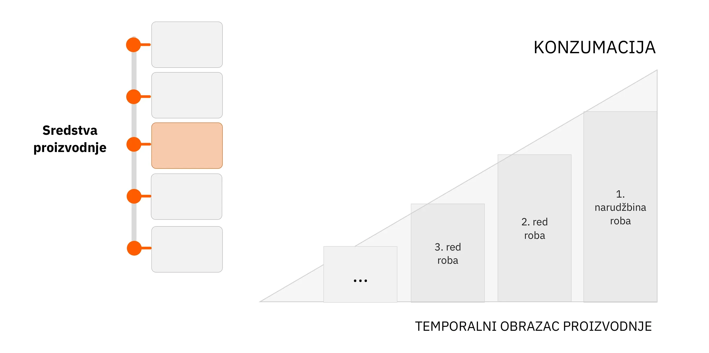

Na gornjem dijagramu, početni resursi prolaze kroz različite faze proizvodnje, prolazeći transformacije koje ih približavaju stanju finalnih potrošačkih dobara (kroz interakciju sa originalnim faktorima proizvodnje: vreme, zemlja, rad). Visina desne strane trougla shematski predstavlja BDP jer označava zbir svih potrošačkih dobara prodatih u jednom periodu. Razmak između svake trake odgovara dodatoj vrednosti (u monetarnim terminima) generisanoj svakom fazom procesa. Ova razlika se takođe može posmatrati kao prihod povezan sa svakom fazom (prihodi - troškovi).

Ako, na agregatnom nivou, ekonomski agenti povećaju svoju štednju, količina konačnih dobara koja se konzumiraju će se smanjiti - sve ostalo ostaje jednako, štednja nužno podrazumeva odlaganje dela potrošnje za kasniji datum. Kao rezultat, kamatne stope će pasti - jer ponuda kapitala raste, omogućavajući preduzetnicima da iskoriste ovaj priliv kapitala za stvaranje novih investicionih dobara i tako produže strukturu proizvodnje.

Zatim ćemo dobiti proširenu proizvodnu strukturu, promenu koja se može kvalitativno predstaviti sledećim dijagramom:

Ovde je monetarna vrednost tražene robe široke potrošnje opala, oslobađajući resurse za stvaranje dodatne faze proizvodnje. U ovom scenariju gde je smanjenje kamatnih stopa posledica smanjenja potrošnje, tj. povećane štednje, površina trougla, koja predstavlja količinu novca u opticaju, ostaje nepromenjena. Transformacija strukture proizvodnje (produžavanje) jednostavno je rezultat prenosa kupovne moći iz jednog dela strukture u drugi.

Takođe je vredno napomenuti da će smanjenje potražnje za potrošačkom robom uzrokovati, na srednji rok, smanjenje cena potrošačkih proizvoda, a ne smanjenje količine ponuđene finalne robe. To je zato što se završni deo proizvodne strukture neće odmah prilagoditi nakon što dođe do pada potražnje za potrošačkom robom; preduzetnicima će biti potrebno neko vreme da promene svoje planove i investicije. Kako drže zalihe, smanjenje potražnje će ih primorati da te zalihe prodaju uz popust, i, kao posledica toga, višak štednje će u početku rezultirati nižim cenama potrošačkih proizvoda (tj. povećanjem realnih plata).

Suprotno tome, cene investicione robe će porasti jer prenos kupovne moći na preduzetnike omogućava im da povećaju svoje investicione troškove. Kada ovu štednju, koju štediše prenesu na preduzetnike, potroše ovi drugi, kamatne stope će ponovo težiti rastu (zbog smanjenja ponude  kapitala), što će zauzvrat dovesti do nižih cena investicionih dobara. Zapravo, na kraju ovog proizvodnog zaobilaznog puta, relativne cene će ostati otprilike iste kao pre. Ali ekonomski subjekti u celini su imali koristi: povećana produktivnost koja proizlazi iz produženja proizvodne strukture ponudiće potrošačima više proizvoda po nižim jediničnim cenama; kupovna moć štediša će se povećati, delimično kroz kamatne prihode, a delimično zbog nižih cena potrošačkih proizvoda; u međuvremenu, preduzetnici, posmatrani kao celina, neće doživeti ni dobitke ni gubitke. Oni koji su angažovani u aktivnostima najbližim potrošnji izgubiće prihod, dok će oni koji su uključeni u stvaranje novih faza proizvodnje proporcionalno dobiti. U takvoj situaciji, ne stvara se novi monetarni prihod; povećava se proizvodnja, i tako realna vrednost prihoda raste.

### Smanjenje Kamata Zbog Povećanja Kredita (Bez Povećanja Štednje):

Sada, ako uzmemo u obzir smanjenje kamatnih stopa koje proizlazi iz proširenja kredita koje nude banke, dobijamo sasvim drugačiju sliku strukture proizvodnje.

Sa nižim kamatnim stopama, preduzetnici mogu pozajmiti više resursa i tako stvoriti proizvodne faze višeg reda. U ovom slučaju, takvo proširenje proizvodne strukture neće rezultirati smanjenom potrošnjom jer nije došlo do odlaganja trenutne potrošnje od strane potrošača. Drugim rečima, BDP raste. Posledično, naš trougao će se produžiti dok će zadržati sličnu visinu, što znači da će se njegova površina povećati.

Imajte na umu da je ovo potpuno logična posledica kreditne ekspanzije. U meri u kojoj banke proizvode fiducijarna sredstva odobravanjem kredita, prirodno bi trebalo očekivati povećanje ukupne kupovne moći.

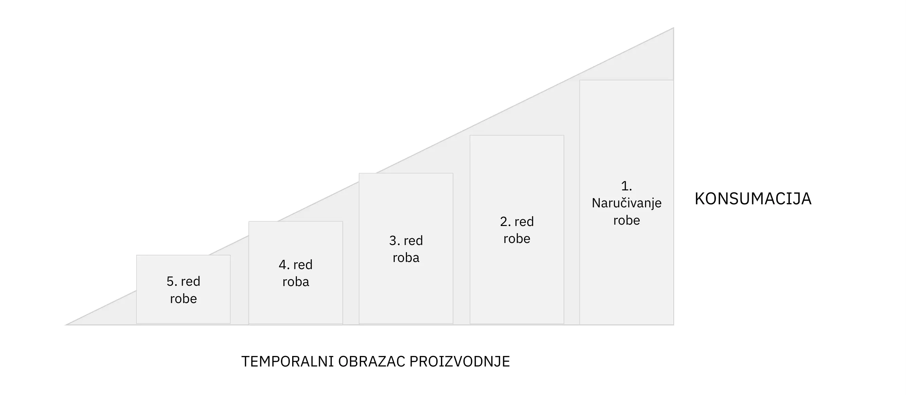

Kako kredit ulazi u ekonomiju kroz zajmove preduzetnicima, trebalo bi da primetimo povećanje profita u proizvodnim sektorima udaljenim od potrošnje, i smanjenje relativnih profita u sektorima bližim potrošnji. Ova veća profitabilnost zatim podržava realokaciju kapitala ka ovim novim, kapitalno intenzivnijim fazama (brodogradnja, automobilska industrija, građevinarstvo, napredne tehnologije, itd.), i smanjenje investicija u sektorima bližim potrošnji.

Sada, preduzetnici uključeni u ove više faze proizvodnje ostvaruju veće monetarne prihode, i, kako je vremenska preferencija ostala ista, trebalo bi da vidimo i povećanu potražnju za potrošačkim proizvodima. Ali kako je, tokom ovog buma, relativna profitabilnost uloženog kapitala bila veća u sektorima daleko od potrošnje, došlo je do prenosa resursa iz aktivnosti bliskih potrošnji ka udaljenijim aktivnostima. Posledično, preduzetnici u nižim fazama proizvodnje nemaju resurse da zadovolje povećanu potražnju. Ovo stvara tenziju između ova dva dela strukture proizvodnje: svaki pokušava da dobije kapital na račun drugog, i pošto tražnja za potrošnjom predstavlja hitnije potrebe, u nekom trenutku, preduzetnici angažovani u aktivnostima udaljenim od potrošnje će ostati bez resursa potrebnih za završetak svojih investicija. Tada stopa profita u ovim sektorima počinje da opada, preduzeća bankrotiraju, a relativno povećanje cena potrošača motiviše brzu realokaciju kapitala ka proizvodnji dobara nižeg reda. Kada se ova iznenadna realokacija resursa manifestuje, ekonomija ulazi u recesiju: cene imovine padaju, realne plate opadaju, cene potrošačkih proizvoda padaju, a zalihe se gomilaju.

Za Friedricha Hayeka i Ludviga fon Mizesa, recesija je manifestacija pogrešne alokacije kapitala iz faze ekspanzije. Kako su cene štednje i kapitala bile manipulirane, preduzetnici su razvijali projekte koji nisu mogli biti završeni zbog nedostatka resursa, i/ili su gradili proizvodne kapacitete planirajući za budući nivo potrošnje koji nije mogao biti održiv zbog nedostatka štednje.

Samo kroz deflaciju, tj. pad cena imovine i cena rada, više kamatne stope i likvidaciju nezavršenih projekata, ekonomija može da se prilagodi i razvija ka održivom putu. Dakle, recesija je raspršivanje ove iluzije prosperiteta koja pokreće nasilni proces prilagođavanja.

Generalno, recesiju pokreće sam bankarski sektor. Sve dok krediti rastu ubrzanim tempom, cene nastavljaju da rastu, a preduzetnici se takmiče za proizvodne resurse. Međutim, kako je primetio Hyman Minsky, dolazi trenutak kada bankarski sektor odluči da smanji svoj rizik, te smanjuje tok kredita. Depresija, dakle, rezultira mnogim bankrotstvima, stezanjem kredita, smanjenjem dostupne kupovne moći i finansijskim kolapsima.

TTakvo prilagođavanje se može posmatrati kao period tokom kojeg se nameću nedovoljna potrošnja i nedovoljna investicija kako bi se obnovila nedostajuća štednja. Za Hayeka, ova depresivna faza, iako bolna, je veoma neophodna jer omogućava oporavak ekonomske aktivnosti zasnovan na strukturi relativnih cena koje odražavaju stvarnu oskudicu proizvodnih faktora. Ako se ova depresija prekine, ekonomija ne može da se vrati na poželjnu putanju jer, u odsustvu informacionog sistema koji omogućava ekonomskim agentima da racionalizuju svoje odluke, pogrešna alokacija resursa će se samo nastaviti.

Nažalost, ovaj depresivni mehanizam često prekidaju politička moć i centralne banke koje nastoje da “podstaknu” ekonomiju kroz deficitarnu potrošnju i laku monetarnu politiku.

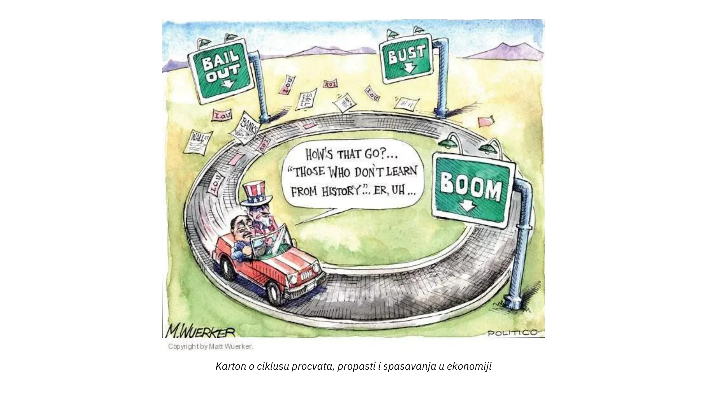

I za monetariste i za kejnzijance, uzrok depresije je nedovoljna agregatna tražnja, pa ni jedni ni drugi ne obraćaju pažnju na evoluciju relativnih cena, što je, kao što smo videli, srž problema. Stoga veruju da će podsticanje kreditne ekspanzije (snižavanjem kamatnih stopa) i korišćenje kapaciteta državnog deficita za povećanje tražnje pokrenuti oporavak. Na kratke staze, takve mere mogu izgledati kao da proizvode željene efekte: deficit podržava potrošnju, dok smanjenje kamatnih stopa dovodi do viših cena imovine, što zauzvrat podstiče vlasnike imovine da povećaju svoju potrošnju. Međutim, takav podsticaj na kraju slabi, dok strukturni problem ostaje, ili se čak pogoršava jer se pogrešna alokacija kapitala nastavlja zahvaljujući veštački niskim kamatnim stopama.

U modernoj eri, centralne banke i vlade su bile toliko revnosne u sprečavanju manifestacije ovog procesa prilagođavanja da smo završili sa masovnom strukturnom nezaposlenošću i stalnim nagomilavanjem duga. Japan služi kao primer u tom pogledu. Nakon pucanja balona imovine 1989-90, Banka Japana (BoJ) i razne vlade na vlasti koristile su sve ovde opisane metode kako bi pokušale da "ponovo pokrenu japansku ekonomiju." Osim kratkih skokova nakon programa potrošnje i smanjenja kamatnih stopa, Japan je ostao u stanju neurasteničnog rasta i prekomerne zaduženosti već 30 godina.

### Zaključak o teoriji poslovnog ciklusa:

Ističući sekvencijalnu prirodu ljudske akcije i posvećujući posebnu pažnju uticaju fluktuacija kamatnih stopa na intertemporalnu koordinaciju ekonomskih agenata, Ludwig Von Mises i Friedrich Hayek su objasnili ekonomske cikluse kao endogene dinamike sistema bankarstva sa frakcionalnog rezervama. Razlika između austrijske analize i ove druge- monetarista i kejnzijanaca uglavnom leži u činjenici da prvi posvećuju posebnu pažnju različitim fazama proizvodnje i strukturi relativnih cena, dok se drugi zaustavljaju na agregiranim varijablama kao što su nivoi zaposlenosti, BDP ili indeks potrošačkih cena. Zaista, kako im nedostaje teorija kapitala, mejnstrim ekonomisti imaju tendenciju da uzroke recesije pripisuju "životinjskim duhovima" ili "spoljnim događajima".

Više nego bilo koja druga škola ekonomije, Austrijska škola insistira na važnosti relativnih cena za koordinaciju ekonomskih agenata. Članovi Austrijske škole su uvučeni u debate o ovoj temi više od jednog veka, posebno od kada je Mises objavio svoje delo o nemogućnosti ekonomske kalkulacije u socijalističkim ekonomijama 1919. godine.

Ovo će biti tema sledećeg i poslednjeg poglavlja ovog kursa.

## Nemogućnost ekonomske kalkulacije pod socijalizmom

<chapterId>2578a9d8-90e9-58dd-a8c5-6366948564c7</chapterId>

> „Gde ne postoje tržišne cene za faktore proizvodnje jer se oni ni ne kupuju ni prodaju, nemoguće je pribegavati kalkulaciji u planiranju budućih akcija i u određivanju rezultata prošlih akcija. Socijalističko upravljanje proizvodnjom jednostavno ne bi znalo da li je ono što planira i sprovodi najprikladnije sredstvo za postizanje željenih ciljeva. Ono će, takoreći, operisati u mraku. Rasipaće oskudne faktore proizvodnje, kako materijalne tako i ljudske (rad). Haos i siromaštvo za sve će neizbežno uslediti.“
>

> Ludwig von Mises, Planirani Haos

### Nemogućnost ekonomske kalkulacije pod socijalizmom

Uprkos ponovljenim neuspesima marksističkih režima tokom prošlog veka, debata o ekonomskoj kalkulaciji ostaje relevantna iz dva značajna razloga:

1. Uporedive ideje i dalje zagovaraju progresivci i drugi intervencionisti.

2. Fiksiranje cena, bilo na tržištima kapitala kroz akcije centralnih bankara ili na drugim tržištima putem državnih preduzeća, dekreta i intervencije regulatornih komiteta, i dalje je rasprostranjeno.

### Debata o ekonomskoj kalkulaciji

Ova debata je prvobitno pokrenuta jednim od najuticajnijih ekonomskih radova 20. veka, "Ekonomska kalkulacija u socijalističkoj zajednici," čiji je autor Ludwig fon Mises, a objavljen je 1920. godine. Tokom tog perioda, socijalizam je bio u usponu, sa boljševicima koji su preuzeli vlast u Rusiji, socijalistima koji su zauzeli položaje u Vajmarskoj Republici (Nemačka), i socijalističkim i komunističkim partijama koje su sticale značaj širom Evrope.

Pre Misesovog članka, debate o socijalizmu i kapitalizmu su se prvenstveno vrtele oko moralnih argumenata i problema podsticaja. Čak i ako bi se pretpostavilo da je društvo organizovano oko marksističkog principa "od svakog prema njegovim sposobnostima, svakome prema njegovim potrebama" moralno superiorno, praktično pitanje "ko će izneti smeće" i dalje je trebalo rešiti. Uobičajen odgovor je bio da će socijalizam proizvesti pojedince lišene kapitalističkih instinkta, koji će dobrovoljno služiti svojim bližnjima čak i u odsustvu novčanih podsticaja.

Svojim člankom, Mises je uveo novu dimenziju u debatu. Ostavivši po strani utopijske ideje o sposobnosti političke ekonomije da stvori "novog čoveka", austrijski ekonomista je istakao da je racionalna ekonomska organizacija nemoguća bez cena za međufaktore proizvodnje. Čak i danas, njegov argument ostaje slabo shvaćen od strane njegovih kritičara, pa čak i nekih liberalnih ekonomista. Stoga, vredi ga objasniti detaljnije.

### Objašnjenje nemogućnosti ekonomske kalkulacije

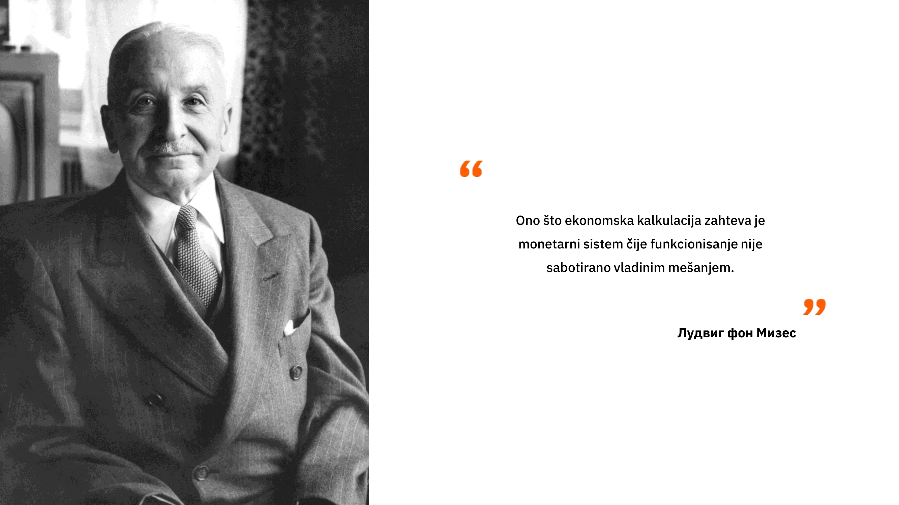

Većina zabluda o Mises-ovim argumentima proizlazi iz pogrešnog shvatanja uloga koje igraju menadžerske i preduzetničke klase u kapitalističkoj ekonomiji. Mises nikada nije odbacio sposobnost menadžera da osmisle efikasne planove proizvodnje unutar svojih operacija. Umesto toga, naglašavao je značaj preduzetnika i akcionara, koji, kao vlasnici sredstava za proizvodnju, raspoređuju kapital kroz različite industrije, čime formiraju cene koje služe kao ulazi u ekonomske kalkulacije menadžera.

Bez tržišta kapitala i novca, postaje nemoguće racionalizovati upotrebu resursa kroz industrije. To znači da čak i ako postoji savršena organizacija unutar svake firme ili dela ekonomije, cela ekonomija ne može efikasno da se prilagodi promenama u dostupnosti resursa, uslovima proizvodnje i preferencijama potrošača. Rečima Misesa:

> "[...] osnovna zabluda implicirana u [socijalističkim tržišnim] predlozima je da oni posmatraju ekonomski problem iz perspektive podređenog činovnika čiji intelektualni horizont ne prelazi granice podređenih zadataka. Oni smatraju strukturu industrijske proizvodnje i alokaciju kapitala u različite grane i proizvodne agregate kao rigidne i ne uzimaju u obzir neophodnost promene ove strukture kako bi se prilagodila promenama uslova.... Ne shvataju da se operacije korporativnih službenika sastoje samo u lojalnom izvršavanju zadataka poverenih od strane njihovih šefova, akcionara.... Operacije menadžera, njihova kupovina i prodaja, samo su mali segment ukupnosti tržišnih operacija. Tržište kapitalističkog društva takođe obavlja one operacije koje alociraju kapitalna dobra u razne grane industrije. Preduzetnici i kapitalisti osnivaju korporacije i druge firme, povećavaju ili smanjuju njihovu veličinu, raspuštaju ih ili spajaju sa drugim preduzećima; kupuju i prodaju akcije i obveznice već postojećih i novih korporacija; odobravaju, povlače i naplaćuju kredite; ukratko, obavljaju sve one radnje, čija se ukupnost naziva tržište kapitala i novca. Upravo te finansijske transakcije promotera i špekulanata usmeravaju proizvodnju u one kanale u kojima ona na najbolji mogući način zadovoljava najhitnije potrebe potrošača."
>

> Mises, Human Action, str. 703-04

U suštini, Mises tvrdi da vlasnička prava, koja postavljaju vlasnike kapitala u kontekst profita i gubitaka, motivišu ih da alociraju svoje resurse u industrije koje trenutno najviše trebaju resurse kako bi zadovoljile potražnju potrošača. Kada uspeju, ostvaruju profit, ali kada ne uspeju, trpe finansijske gubitke. Njihova "koža u igri" ih podstiče da spekulišu o najboljoj alokaciji kapitala za trenutno stanje ekonomije. Ovo stvara tržišno vođenu dinamiku gde kolektivni ishodi njihovih akcija proizvode vitalne informacije o najefikasnijem korišćenju resursa.

Prethodna poglavlja su objasnila da su vrednosti subjektivne, ekonomske akcije otkrivaju oportunitetne troškove, a potrošačke cene izražavaju ordinalnu hijerarhiju potrošačkih želja. Preduzetnici se takmiče za faktore proizvodnje kako bi konstruisali proizvodne strukture koje maksimiziraju prihode u odnosu na troškove, zadovoljavajući potrošačke želje efikasnije od alternativnih opcija. Stoga, cene faktora proizvodnje proizilaze iz potrošačkih cena: ako faktor proizvodnje može generisati veći monetarni prihod (bolje zadovoljavajući potrošačke želje) u drugoj industriji ili pod drugačijim planom, preduzetnici će nadmašiti trenutnog vlasnika, podižući njegovu cenu do njegove marginalne produktivnosti. Ovo takmičenje među preduzetnicima za faktore proizvodnje, određujući njihov najveći marginalni prinos, je proces koji generiše relevantne informacije o alokaciji resursa.

Ovaj proces je ključan jer potvrđuje ili opovrgava efikasnost različitih aktivnosti, osiguravajući da su faktori proizvodnje raspoređeni na najproduktivnije načine. Tržište obavlja ovu funkciju kao kontinuirani proces. U svetu koji se stalno menja—gde su potrošačke preferencije, uslovi proizvodnje, tehnologija, regulative, demografija i još mnogo toga u stalnom toku—cene za posredne faktore proizvodnje neprestano se menjaju kroz akcije preduzetnika i kapitalista koji se prilagođavaju promenljivim uslovima. Pošto su ove promene lokalizovane, informacije moraju biti distribuirane ekonomskim agentima koji ne mogu imati potpuno znanje o celom svetu. Ovo je uloga tržišta: omogućava preduzetnicima da deluju na osnovu lokalizovanih, često kvalitativnih i složenih informacija predlažući ekonomske strukture proizvodnje koje tržište zatim potvrđuje ili opovrgava. Na ovaj način, relevantne informacije generisane ovim procesom odozdo nagore kondenzuju se i distribuiraju kroz celu ekonomiju putem sistema cena. Ovaj proces proizvodnje i distribucije informacija je suštinski za alokaciju resursa jer omogućava ekonomskim agentima, koji imaju ograničeno znanje o svetu, da vrše ekonomske kalkulacije i osmišljavaju koherentne ekonomske planove oslanjajući se na cene.

Iz ove perspektive, centralno planirana ekonomija će neizbežno iskusiti pogrešnu alokaciju kapitala. U kratkom do srednjem roku, takve pogrešne alokacije mogu proći neprimećeno jer ne postoje tržišne cene ili bankroti koji bi ih otkrili. Međutim, zbog odsustva povratnih informacija (cena) i mehanizama preraspodele (bankrota), greške će se akumulirati dok rasipništvo ne postane očigledno kroz značajan pad životnog standarda.

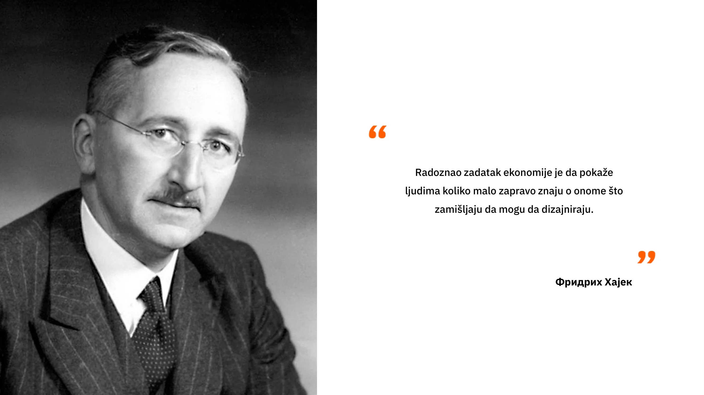

### Austrijska perspektiva i neuspesi drugih ekonomskih škola 

Moglo bi se tvrditi da je lako slikati takvu panoramu unazad. Uostalom, svi smo svesni praznih polica u SSSR-u, teškoća u Venecueli i humanitarne katastrofe u Kambodži. Ali Mises je predvideo ove događaje još 1920. godine. Ipak, sve do kolapsa SSSR-a 1989. godine, mnogi ekonomisti, uključujući brojne dobitnike Nobelove nagrade, hvalili su sovjetsko ekonomsko čudo i predviđali da će sovjetska ekonomija uskoro nadmašiti ekonomiju SAD-a.

Uprkos ovom impresivnom predviđanju i brojnim empirijskim demonstracijama nemogućnosti ekonomske kalkulacije pod socijalizmom, politički lideri širom sveta su više nego ikada spremni da određuju cene, nacionalizuju čitave industrije i predlažu petogodišnje planove, često uz aplauz ekonomski neinformisanih populacija. Posledice takvog intervencionizma oštro osećaju ljudi u nekada prosperitetnim zapadnim zemljama koji polako svedoče opadanju svog životnog standarda.

### Austrijska teorija privrednog ciklusa kao specifičan slučaj nemogućnosti ekonomskog obračuna pod socijalizmom

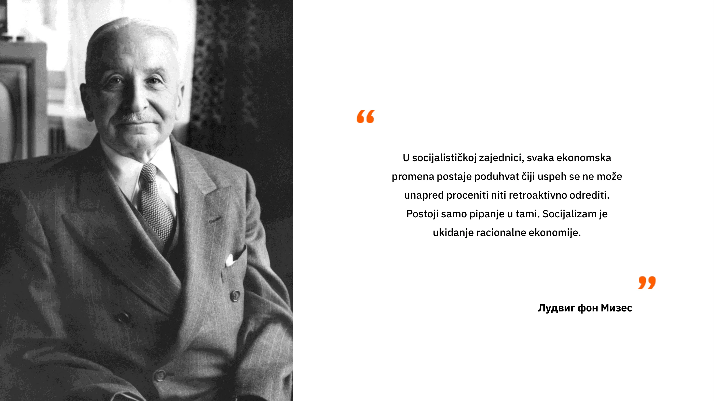

U prethodnom poglavlju, objasnili smo dinamiku prekomernog ulaganja i pogrešne alokacije kapitala koja proizlazi iz manipulacije kamatnim stopama od strane centralnih banaka. U suštini, ono što smo objasnili može se posmatrati kao specifičan slučaj nemogućnosti ekonomske kalkulacije pod socijalizmom, primenjen na tržište novca. Kada su cene fiksirane izvan njihovih tržišnih vrednosti, preduzetnici i alokatori kapitala su podstaknuti da se upuste u investicije koje ne mogu biti održive na duži rok zbog nedostatka štednje. Mešanjem u sistem cena, centralni planeri (u ovom slučaju, centralni bankari) stvaraju nekoordinaciju između ekonomskih agenata. U ovom slučaju, međuvremenska nekoordinacija podrazumeva prekomerno ulaganje u investiciona dobra višeg reda i nedovoljno ulaganje u investiciona dobra nižeg reda, što predstavlja specifičnu manifestaciju pogrešne alokacije kapitala kroz industrije.

Posledice takve pogrešne alokacije uključuju finansijske i ekonomske krize, smanjenu ekonomsku aktivnost i deflaciju duga. Ovi makroekonomski efekti proizlaze iz neravnoteže između štednje i investicija koja je rezultat ekspanzije kredita. U SSSR-u i drugim komunističkim režimima, fiksiranje cena dovelo je do slične nekoordinacije, što je rezultiralo nestašicama nekih dobara i prekomernom proizvodnjom drugih. U oba slučaja, cene ne odražavaju stvarne preferencije potrošača, bilo u smislu vremenskih preferencija ili potrošačkih preferencija, što dovodi preduzetnike ili centralne planere odgovorne za alokaciju resursa da investiraju kapital u "pogrešne industrije."

Danas se debata o ekonomskoj kalkulaciji ponovo pojavljuje prvenstveno u diskusijama o energiji, gde su pogrešne investicije vođene zelenom agendom sve očiglednije. Takođe se javlja u diskusijama o tržištima novca, gde austrijski ekonomisti ističu da je kriza iz 2008. godine, koju glavni ekonomisti nisu uspeli da predvide, bila klasičan ciklus buma i kraha karakterisan prekomernim ulaganjima u tržište nekretnina zbog dugih perioda niskih kamatnih stopa. Štaviše, neo-marksisti i druge socijalističke frakcije šire ideju da bi pojava veštačke inteligencije mogla rešiti problem ekonomske kalkulacije. Međutim, ova perspektiva proizlazi iz pogrešnog razumevanja problema; problem ekonomske kalkulacije nije pitanje računarske snage već pitanje generisanja i distribucije informacija vezanih za proizvodnju i alokaciju resursa. Ove informacije mogu biti generisane samo lokalno od strane agenata sa specijalizovanim znanjem i ličnim interesom u ishodu. Veštačka inteligencija ne može zameniti ovaj proces odozdo prema gore i stoga ne može pomoći centralnim planerima da reše problem alokacije resursa. Nažalost, zbog jednog veka nerazumevanja, očekujemo proliferaciju tvrdnji da će veštačka inteligencija doneti novu eru ekonomske prosperiteta vođenu prosvetljenim centralnim planerima koji, uz pomoć veštačke inteligencije, mogu ispraviti neuspehe slobodnih tržišta.

Za konkretnu primenu problema ekonomske kalkulacije na savremenu situaciju, možete se pozvati na ovaj članak koji se bavi alokacijom resursa u modernoj Kini: *[The Road to Financial Repression: China the Paper Tiger](https://open.substack.com/pub/theomogenet/p/the-road-to-financial-repression-181?r=ccpx8&utm_campaign=post&utm_medium=web)*, autora Théa Mogeneta.

### Zaključak

U ovom završnom poglavlju istražili smo nemogućnost ekonomske kalkulacije pod socijalizmom, što je centralni princip austrijske ekonomske škole. Austrijska perspektiva predstavljena u ovom kursu kulminira ovim zaključkom i pruža snažan argument za politike neintervencionizma. U svojoj srži, sva austrijska razmišljanja se vrte oko važnosti cena u ekonomskoj koordinaciji. Naglašavajući značaj oportunitetnih troškova i ekonomske kalkulacije za racionalno korišćenje resursa, austrijski ekonomisti pokazuju složenost i suptilnost ljudskog delovanja u svetu koji se neprestano menja.

Glavni ekonomisti i centralni planeri često ne vole austrijske ekonomiste jer oni ističu neizvesnost budućnosti, zabludu kvantitativnog ekonomskog predviđanja i štetne efekte ekonomske intervencije. Ukratko, austrijska ekonomija naglašava neefikasnost i štetne posledice intervencionističkih akcija.

Austrijska tradicija oličava skroman pristup ljudskom delovanju, izvlačeći duboke implikacije iz pojmova subjektivne vrednosti, neizvesnosti, slobodne volje i složenosti. Objašnjava kako tržišni poredak, iako nije proizvod ljudskog dizajna, stoji kao centralna institucija za naš razvoj i prosperitet. Ako postoji jedna ključna pouka iz ovog kursa, to je da je kapitalizam postao dominantni ekonomski sistem zbog svoje sposobnosti da se prilagodi promenama u dinamičnom i neizvesnom svetu naseljenom slobodnim pojedincima.

## Austrijska metodologija

<chapterId>419129c1-82ba-54e3-b385-95d4d89a447e</chapterId>

Austrijska škola ekonomije razlikuje se od drugih škola po svojoj aksiomatsko-deduktivnoj metodologiji, koja se razlikuje od pozitivističkog pristupa često korišćenog u društvenim naukama. Pozitivistički pristup zasniva se na zakonima uspostavljenim iz empirijskih podataka, usvajajući metodu sličnu onoj u fizičkim naukama. Formuliše hipoteze iz posmatranja, koje se zatim potvrđuju ili opovrgavaju privremenim eksperimentima. Naučni metod se sastoji od zadržavanja hipoteze koja najbolje objašnjava podatke i nastavak njenog istraživanja dok se ne pronađe preciznija hipoteza.

Međutim, u društvenim naukama je teško izolovati varijable kao u fizici, jer je svaki trenutak u istoriji jedinstven i mnoštvo faktora dolazi u igru. Ekonomski eksperimenti ne mogu se reprodukovati u laboratoriji, i važno je napomenuti da posmatranje korelacije između dve varijable ne dokazuje uzročnu vezu između njih. Austrijanci, posebno Ludwig von Mises, predložili su alternativnu metodu nazvanu apriorna ili aksiomatsko-deduktivna metoda za proučavanje društvenih nauka. Ovaj pristup zasniva se na fundamentalnim tvrdnjama nazvanim aksiomi, sličnim onima koji se koriste u matematici. Na primer, Euklidova geometrija je primer aksiomatsko-deduktivne metode u oblasti matematike.

U austrijskoj ekonomiji, fundamentalni aksiomi uključuju pozitivne vremenske preferencije, koje se zasnivaju na individualnim izborima dobara ili usluga danas, a ne sutra, zbog neizvesnosti o budućnosti. Ovi aksiomi se ne dovode u pitanje, jer se smatraju očiglednim i konzistentnim sa svakodnevnim životom. Koristeći ove osnovne aksiome, austrijski ekonomisti koriste pravila logike da izvedu izjave koje pružaju informacije o funkcionisanju ekonomskih fenomena. Na primer, oni objašnjavaju da su ekonomske krize uzrokovane neravnotežom između štednje i investicija, što dovodi do veštačke manipulacije kamatnim stopama. Pojedinci sa pozitivnim vremenskim preferencijama zahtevaju pozitivnu kamatnu stopu kao kompenzaciju za rizik pozajmljivanja. Austrijanci tvrde da su odnosi vrednovanja subjektivni, pa kamatne stope mogu varirati u zavisnosti od pojedinaca i okolnosti.

Cene igraju ključnu ulogu u racionalnoj organizaciji pojedinaca sa delimičnim informacijama. Kamatna stopa balansira ponudu i potražnju kapitala na tržištu, čime se podstiče ekonomija. Austrijski ekonomisti naglašavaju da proizvoljno postavljanje kamatne stope može dovesti do ekonomskih kriza i učiniti kalkulaciju nemogućom u socijalističkom režimu.

### Austrijski ekonomisti i metodološke razlike

Austrijski ekonomisti često nailaze na poteškoće prilikom rasprave sa drugim školama mišljenja, jer ne koriste iste metode analize. Dok Austrijanci zaključuju iz osnovnih aksioma, kao što je subjektivnost vrednosti, kako bi izveli logične posledice, kejnzijanski ili monetaristički ekonomisti obično se oslanjaju na empirijske podatke kako bi uspostavili opšte ekonomske zakone.

Primer metodološke razlike je stav zagovornika Moderne monetarne teorije (MMT) koji su se zalagali za štampanje novca kako bi postigli političke ciljeve, koristeći odsustvo inflacije između 2008. i 2019. kao argument. Austrijski ekonomisti i zagovornici MMT-a ne govore istim jezikom i ne slažu se oko kriterijuma za određivanje validnosti ekonomskog zakona. Ovo čini debate između ovih različitih škola teškim i često neproduktivnim.

Važno je napomenuti da biranje podataka, koje podrazumeva selektivno odabiranje podataka za uspostavljanje odnosa između varijabli, predstavlja nenaučnu i nerigoroznu metodu u ekonomiji. Kreiranje novca, na primer, ne uzrokuje nužno inflaciju, i potreban je nijansiraniji pristup za razumevanje složenih ekonomskih mehanizama. Aksiomi igraju ključnu ulogu u austrijskom ekonomskom razmišljanju. Oni su fundamentalni elementi iz kojih se mogu izvesti logički zaključci. Međutim, važno je prepoznati da je precizno predviđanje budućnosti u ekonomiji često teško zbog složenosti ekonomskih fenomena i inherentne neizvesnosti.

Metodologija je suštinski aspekt u ekonomiji i u društvenim naukama uopšte. Ona utiče na to kako se postavljaju pitanja, kako se formulišu hipoteze i kako se tumače podaci. Razumevanje metodoloških razlika između ekonomskih škola mišljenja može nam pomoći da cenimo različite perspektive i razvijemo sopstvena mišljenja o temama koje su diskutovane u prethodnim epizodama.

# Finalni deo

<partId>ae828713-d133-559f-93c2-101cb5245fca</partId>

## Recenzije i Ocene

<chapterId>29d4323c-e34e-5834-bf03-2f3ed10d751b</chapterId>

<isCourseReview>true</isCourseReview>

## Završni Ispit

<chapterId>d58d188f-81fb-572a-a898-8b6f8aceba7a</chapterId>

<isCourseExam>true</isCourseExam>

## Zaključak

<chapterId>d668fdf6-fb4c-4bbf-82e1-afcb95c122e0</chapterId>

<isCourseConclusion>true</isCourseConclusion>
