# En resa in i ekonomin

Välkommen till Théo Mogenets kurs! Han har en passion för ekonomi, historia, litteratur, statsvetenskap och teknik och har bestämt sig för att dela med sig av sina kunskaper om österrikisk ekonomi. Denna gren, som är mindre känd inom nationalekonomin, bygger på mänsklig rationalitet och fria aktörers beteende. Mindre intensiv i matematik, det är en fråga om logik och sociala studier framför allt.

Denna tankeskola har redan flera århundraden på nacken och har ett helt panorama av författare, tankar och ekonomer bakom sig. Stora namn inom nationalekonomin som Hayek, Rothbard, Mises, Bastiat eller Menger har länge försvarat denna rörelse. I motsats till dagens allestädes närvarande keynesianism sätter den österrikiska skolan individen tillbaka i centrum för ekvationen med ett mer liberalt, kapitalistiskt och till och med anarkistiskt synsätt.

+++

# Inledning

<partId>265aa8b0-dd89-5456-b72a-656e988013d5</partId>

## Kursöversikt

<chapterId>eae3de7b-cce6-516d-83d9-28fbd582c0ca</chapterId>

Välkommen till ECO201-kursen!

I den här kursen som ges av Théo Mogenet kommer du att upptäcka en ekonomisk tankeskola som i grunden skiljer sig från den rådande keynesianska doktrinen. Hittills har du kanske fått lära dig att penninghantering och ekonomisk politik i första hand är centralbankernas domän, med tanken att penningtryckning och offentliga utgifter stimulerar ekonomisk tillväxt. Det finns dock ett mer sammanhängande alternativt tillvägagångssätt: **Österrikisk ekonomi**.

Med över två århundraden av forskning, filosofisk reflektion och skrifter av kända författare som Carl Menger, Ludwig von Mises och Friedrich Hayek, har denna tankeskola ett annorlunda perspektiv och förespråkar en decentraliserad syn på ekonomin som bygger på individen och mänsklig rationalitet.

Ekonomi är i själva verket ett djupt socialt och komplext område, som består av många oberoende aktörer som interagerar fritt för att bilda en sammanhängande helhet. För att förstå detta dynamiska system föredrar Austrian Economics kvalitativ analys, baserad på mänsklig logik, sociologi och studiet av marknadsprocesser, snarare än rigida matematiska ekvationer.

I den här kursen kommer du att utforska de grundläggande principerna för denna tankeskola. Théo Mogenet, din instruktör, är en passionerad förespråkare för detta ekonomiska synsätt och kommer att guida dig genom de viktigaste begreppen inom österrikisk ekonomi och visa dig hur dessa idéer särskilt gäller för Bitcoin-världen.

**Avsnitt 1: Introduktion till ECON**

Vi börjar med en allmän introduktion till österrikisk ekonomi, där vi utforskar dess historiska ursprung och grunderna för dess tänkande. I detta avsnitt behandlas också viktiga begrepp som pengar, krediter, banker och centralbanker. Du kommer att förstå varför dessa institutioner spelar en central roll i det österrikiska tänkandet, särskilt i kritiken mot monetära interventioner.

**Avsnitt 2: Teoretiska grunder**

I detta avsnitt fördjupar vi oss i de grundläggande begreppen inom österrikisk ekonomi, till exempel den subjektiva värdeteorin, som förklarar varför värdet på en vara inte är objektivt utan beror på den upplevda nyttan för varje individ. Du kommer också att upptäcka hur pengar naturligt uppstår som ett socialt fenomen, tillsammans med begreppen tidspreferens, ränta och kapital som är kärnan i den österrikiska frimarknadsteorin.

**Avsnitt 3: Österrikiska ekonomiska perspektiv**

Här kommer vi att utforska de praktiska tillämpningarna av den österrikiska teorin. Du kommer att lära dig i detalj om den österrikiska konjunkturcykelteorin, som förklarar hur penningmanipulationer skapar artificiella högkonjunkturer som följs av lågkonjunkturer. Vi kommer också att se varför ekonomisk kalkylering är omöjlig i ett socialistiskt system och hur den österrikiska metodiken, baserad på praxeologi (studiet av mänsklig handling), ger ett unikt och sammanhängande sätt att förstå ekonomiska fenomen.

Kursen är en blandning av ekonomi och filosofi som leds av en öppen diskussion mellan Théo och mig (Rogzy). Jag vill rikta ett varmt tack till Théo Mogenet för att han har skapat den här kursen. Vi har haft stor glädje av att utveckla detta innehåll, som är utformat för att vara tillgängligt för alla. Kursen fungerar som en viktig introduktion och kommer att lägga grunden för våra framtida, mer avancerade ekonomiska moduler.

Och tänk om nyckeln till att förstå dagens ekonomi ligger i en teori som är flera hundra år gammal? Låt oss upptäcka det tillsammans!

## Pengar, krediter, banker och centralbanker

<chapterId>29faebd9-9326-52de-8161-e4bb33033cd6</chapterId>

> "Grundproblemet med konventionell valuta är allt det förtroende som krävs för att få den att fungera. Man måste lita på att centralbanken inte förfalskar valutan, men fiatvalutornas historia är full av brott mot det förtroendet. Bankerna måste vara betrodda att hålla våra pengar och överföra dem elektroniskt, men de lånar ut dem i vågor av kreditbubblor med knappt en bråkdel i reserv. Vi måste lita på dem när det gäller vår integritet, lita på att de inte låter identitetstjuvar tömma våra konton."
>

> Satoshi Nakamoto, pseudonym uppfinnare av Bitcoin

### Hur pengar skapas

I vårt nuvarande monetära system skapas pengar främst genom en bankpraxis som kallas "fractional reserve banking" Begreppet innebär i korthet att bankerna inte behöver hålla lika mycket reserver som de får in i inlåning. Därmed kan de skapa ny köpkraft när de beviljar lån och omvänt minska köpkraften när kunderna betalar tillbaka sina lån.

Om du till exempel vänder dig till din lokala bank för att få ett lån till ett husköp, kommer de pengar som banken lånar ut till dig att bli en bokföringspost. Inom redovisningen brukar en persons nettoförmögenhet presenteras i en balansräkning, som har två sidor: tillgångssidan, som omfattar all egendom, finansiella kontrakt, lager eller andra former av förmögenhet som ägs, och skuldsidan, som visar varifrån de medel kommer som använts för att skapa det kapital som anges på tillgångssidan. Skillnaden mellan tillgångar och skulder benämns "eget kapital" och kan ses som företagets nettoförmögenhet.

När ett finansinstitut har en banklicens innebär det i princip att de skulder som redovisas som "kundinlåning" betraktas som officiella pengar inom ett visst land eller en viss monetär zon. När du ansöker om ett lån för att köpa ett hus från banken lånar banken därför inte ut medel som deponerats av en annan kund. Istället krediterar banken det lånade beloppet till ditt konto och registrerar samtidigt ditt lån Contract som en tillgång i banken. När du återbetalar ditt lån försvinner pengarna i praktiken och värdet på det motsvarande lånet Contract minskar, och banken behåller endast räntan på lånet.

När du köper huset ger du din bankman i uppdrag att överföra pengar till säljarens konto. Om säljarens konto finns i en annan bank meddelar din bankman motsvarande bankman i det andra institutet så att säljarens konto krediteras i enlighet med detta, samtidigt som ditt konto debiteras med motsvarande belopp.

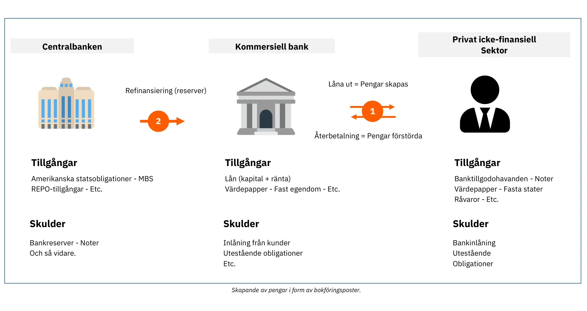

Figur 1: Penningskapande som bokföringsposter

> "Det är gott nog att folk i vår nation inte förstår vårt bank- och penningsystem, för om de gjorde det tror jag att det skulle bli revolution före morgondagen"
>

> Henry Ford

Denna process gör det möjligt för banker att registrera alla transaktioner, inklusive banköverföringar, kreditkortsköp och checkar, under en viss period (vanligtvis en vecka eller en månad). De reglerar sedan dessa transaktioner med varandra med hjälp av bankreserver, som är en annan form av fiatvaluta som aldrig används av allmänheten. Bankreserver hålls i centralbanken på ett särskilt konto som endast är tillgängligt för licensierade banker och finansinstitut.

### Instabilitet i Fractional Reserve Banking och Lender of Last Resort

Huvudproblemet med detta fraktionella reservsystem är att betydande uttag från en viss bank potentiellt kan leda till att den går i konkurs. Eftersom bankerna måste tillgodose kundernas behov av kontanter samtidigt som de bara har en begränsad buffert av bankreserver, kan en samtidig rusning från många kunder att ta ut pengar göra att banken inte kan tillgodose dessa behov, vilket leder till konkurs. Med tanke på att många privatpersoner, företag och institutioner har sina medel insatta i banker kan det få allvarliga ekonomiska konsekvenser om en bank går omkull, t.ex. en recession eller till och med en depression.

Denna gåta gav upphov till de moderna centralbankerna. Under 1800-talet hotades den finansiella stabiliteten i England av upprepade uttagsanstormningar, vilket ledde till att Bank of England inrättades som "lender of last resort" Bank of England fick i uppdrag att låna ut pengar till krisdrabbade banker under kriser för att förhindra en dominoeffekt som skulle kunna lamslå hela det finansiella systemet. Detta koncept med centralbanker som "lenders of last resort" har sedan dess spridits över världen och blivit vardagsmat.

Förutom att upprätthålla finansiell stabilitet ansvarar centralbankerna för att fastställa de viktigaste styrräntorna. Dessa räntor avgör till vilken kostnad banker med tillstånd kan låna pengar från centralbanken, vilket i princip definierar likviditetskostnaden för de finansinstitut som spelar en avgörande roll för utlåningen i våra ekonomier. Därför fungerar dessa räntor som ett riktmärke för hela det finansiella systemet. Som privatperson kan de räntor som du betalar på ditt bolån delas upp i styrräntan och bankens marginal.

Figur 2: Lehman Brothers konkurs (2008-09-15)

Under den stora finanskrisen 2008 gick den stora investmentbanken Lehman Brothers i konkurs efter att ha gjort stora förluster på sina innehav av bolånepapper och drabbats av massiva uttag från oroliga kunder. Som svar på denna finansiella turbulens utan motstycke injicerade centralbanker runt om i världen stora mängder likviditet i finansmarknaderna, fusionerade krisdrabbade investmentbanker med affärsbanker och sänkte styrräntorna till nära noll i ett försök att förhindra en systemkollaps.

Även om dessa åtgärder förhindrade en våg av konkurser gjorde de inte mycket för att lindra den efterföljande ekonomiska avmattningen. Miljontals människor förlorade sina jobb och hem, konsumtionen sjönk kraftigt, företag gick omkull och bankerna gjorde stora förluster. Trots historiskt låga räntor var det få som var villiga att låna, vilket resulterade i en ond cirkel där den initiala minskningen av konsumtion och investeringar förstärktes. Centralbankerna tog därför ytterligare steg genom att införa kvantitativa lättnader (QE). Dessa program innebar att centralbankerna köpte statsobligationer och värdepapper med säkerhet i bostadslån från affärsbanker med centralbankens reserver.

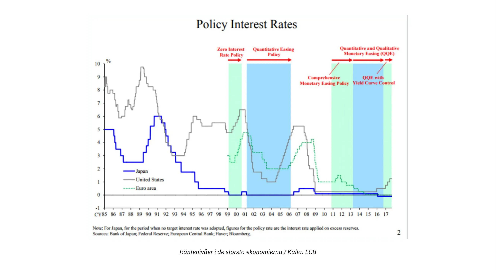

Figur 3: Räntenivåer i de största ekonomierna / Källa: ECB

I motsats till vad många förväntade sig ledde QE-programmen inte till någon betydande återhämtning i den ekonomiska tillväxten, men de ledde till att de finansiella tillgångarna ökade till historiska nivåer. Detta gynnade främst de rika och finansinstituten, eftersom de redan hade stora mängder av sådana tillgångar, och ökade därmed förmögenhetsskillnaderna. Med tanke på banksystemets struktur, som förklarats tidigare, borde detta resultat inte komma som en överraskning. Eftersom bankreserver inte lätt kan flöda in i den reala ekonomin ledde QE-programmen främst till att tillgångspriserna steg utan att den genomsnittliga individens ekonomiska situation förbättrades på något effektivt sätt.

### Cantillon-effekten

Icke desto mindre kan en viktig ekonomisk princip dras från denna episod: när nya pengar skapas gynnar det till en början de som är närmast källan till pengarna, på bekostnad av de som är längre bort. Denna ekonomiska insikt går tillbaka till 1700-talet då Richard Cantillon beskrev den i sin "Essay on the Nature of Commerce in General" Den kallas numera i dagligt tal för "Cantillon-effekten".

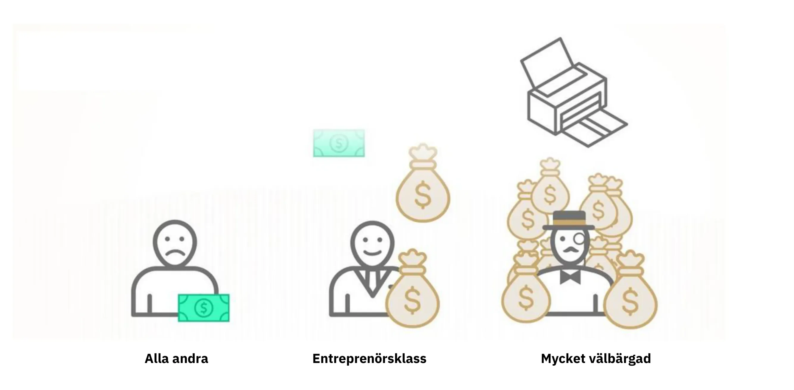

Figur 4: Cantilloneffekten i ett nötskal / Källa: River Financial

I det här fallet fick bankirer, bankdirektörer, aktie- och obligationsägare, fastighetsutvecklare, fastighetslångivare och alla som hade finansiella tillgångar eller fastigheter en ekonomisk vinst, medan bördan föll på alla andra. Denna situation höll i sig i flera år och förklarar till stor del den växande förmögenhetsojämlikheten, känslan av rättslöshet bland hårt arbetande individer och den till synes ostoppbara ökningen av tillgångspriserna trots en trög BNP-tillväxt.

I grund och botten är systemet skevt. Banker är i sig instabila, men om de går omkull kan det äventyra hela ekonomin. Denna moraliska risk gör att bankdirektörer tar överdrivna risker för att maximera bankens intäkter, i vetskap om att centralbanken i slutändan kommer att rädda dem och skjuta över kostnaden på skattebetalarna. I sådana scenarier skapar centralbankerna förutsättningar för en massiv överföring av köpkraft från hårt arbetande individer och sparare till tillgångsägare och personer med koppling till det finansiella systemet, vilket innebär att processen för att skapa välstånd kopplas bort från ackumulering av välstånd.

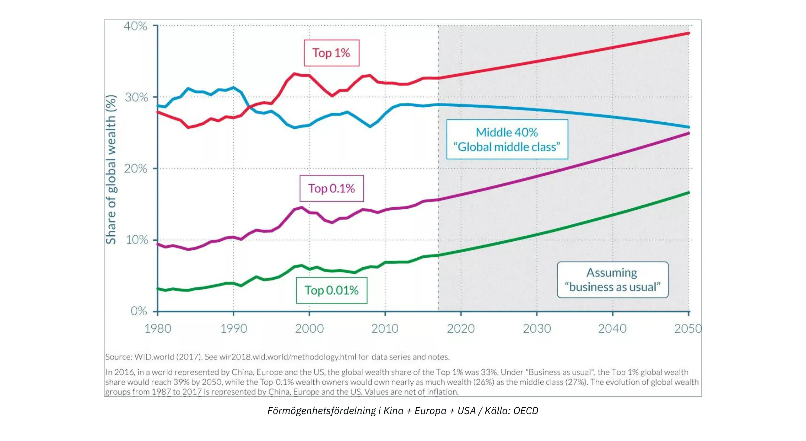

Figur 5: Förmögenhetsfördelning i Kina + Europa + USA / Källa: OECD

### Konsekvenser av nollräntepolitik

Under långa perioder med nollräntepolitik (ZIRP) har bankerna begränsade möjligheter att bygga upp sitt eget kapital eftersom deras marginaler urholkas. Banker tjänar vanligtvis pengar genom att låna upp till korta räntor och låna ut till längre räntor. Men när centralbanker köper stora mängder obligationer och sätter räntorna till noll har bankerna få incitament att låna ut, särskilt till entreprenörer och andra risktagare. I stället använder de sina resurser till att värdepapperisera befintligt kapital eller ge lån mot säkerhet för att tillgodose efterfrågan från dem som gynnas av Cantilloneffekten.

En annan oavsiktlig konsekvens av ZIRP är att den uppmuntrar regeringar att spendera stora summor. Eftersom regeringar inte har några lånekostnader och kan förlita sig på att centralbankerna köper deras obligationer genom QE-program har de ett naturligt incitament att spendera så mycket som möjligt, särskilt i demokratiska sammanhang där utgifter kan ge röster. Denna tendens bortser ofta från de långsiktiga konsekvenserna av en sådan finanspolitisk slösaktighet, vilket har lett till en betydande ökning av de offentliga skuldnivåerna i de utvecklade ekonomierna sedan den globala finanskrisen (GFC).

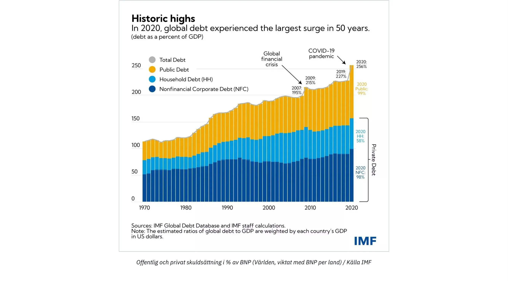

Figur 6: Offentlig och privat skuldsättning i % av BNP (Världen, viktat med BNP per land) / Källa IMF

Med en stigande inflation till följd av ett omfattande penningskapande som svar på covid-19-relaterade nedstängningar höjer centralbankerna nu styrräntorna i ett försök att dämpa inflationen. Detta innebär dock en betydande utmaning för hela systemet. Bankerna är mer belånade än någonsin, regeringarna har historiskt höga skuldnivåer, den ekonomiska tillväxten är trög, underskotten ökar och konsumenterna kämpar med stigande priser på viktiga varor och har svårt att få ekonomin att gå ihop. För att kontrollera inflationen skulle det krävas att räntorna höjdes till en nivå som skulle kunna försätta stater i konkurs, samtidigt som bankerna riskerar att förlora insättare när privatpersoner spenderar sina besparingar på allt dyrare nödvändigheter eller söker skydd i Hard-tillgångar och penningmarknadsfonder för att skydda sig mot inflationen.

### Slutsats

> "På detta sätt (fraktionell reservbank) kan regeringar i hemlighet och obevakat konfiskera folkets rikedom, och ingen människa på en miljon skulle upptäcka stölden"
>

> John Maynard Keynes

I grund och botten står vårt system inför stora utmaningar och Bitcoin framstår som det enda trovärdiga alternativet. Bitcoin kan dock inte ensamt lösa problemen inom vårt monetära system. Framför allt behöver vi individer som förstår grundläggande ekonomiska principer bland Bitcoin-entusiaster, vilket möjliggör en bredare medvetenhet och ekonomiskt sunt förnuft för att vägleda oss bort från att bygga en annan bräcklig ekonomisk grund för vår civilisation. Det primära målet med denna kurs är att utbilda nya Bitcoin-entusiaster i sunda ekonomiska principer.

För att uppnå detta mål kommer vi att förklara de grundläggande principerna för "österrikisk ekonomi", en ekonomisk tankeskola med en metodologisk tradition som går tillbaka till 1500-talet och som ger insikter i mänskligt handlande under ekonomiska begränsningar. Med denna introduktion förstår du nu grunderna i penningskapande och det nuvarande tillståndet i vårt finansiella och monetära system.

I det kommande kapitlet kommer vi att fördjupa oss i den grundläggande hörnstenen i alla ekonomiska tankeskolor: värdeteorin. De följande kapitlen handlar om pengar som social institution, teorin om kapital och konjunkturcykeln, utmaningen med ekonomisk kalkylering samt en kort översikt över den österrikiska ekonomiska skolans historia och metodik.

# Teoretiska grunder

<partId>86012c1b-cdf2-586f-8fe7-263f8287e950</partId>

## Den subjektiva värdeteorin

<chapterId>eb1608d4-5d36-56a0-bcfc-ed8c03dfa906</chapterId>

> "Värde existerar bara i det mänskliga medvetandet"
>

> Carl Menger, Principer för politisk ekonomi

### Den marginella revolutionen

I grunden för alla ekonomiska resonemang ligger frågan om värde. Hur bestämmer vi värdet på något? Är värdet en inneboende egenskap hos tingen? Eller är det tvärtom en subjektiv företeelse? Hur jämför vi värdet av två saker? Varifrån kommer värdet?

Sådana frågor har sysselsatt ekonomer och filosofer i många århundraden och har fått många olika svar. På många sätt har den epistemologiska utvecklingen inom nationalekonomin präglats av utvecklingen av värdeteorier.

Efter att fysiokraternas teori om markvärdet, som hävdade att allt värde kom från marken, hade motbevisats av de klassiska ekonomernas arbetsvärdeteori, som hävdade att värdet på en vara härrörde från mängden arbete som lades ned på dess produktion, var det marginalvärdeteorins tur att ersätta den senare. Under 1870-talet, efter Marx, den siste av de klassiska ekonomerna, uppstod nästan samtidigt tre nya ekonomiska skolor kring marginalvärdeteorin: Lausanne-skolan med Léon Walras, den moderna eller neoklassiska skolan med William Stanley Jevons och den österrikiska skolan med Carl Menger. Denna revolution inom värdeteorin innebar en betydande förnyelse av det ekonomiska tänkandet.

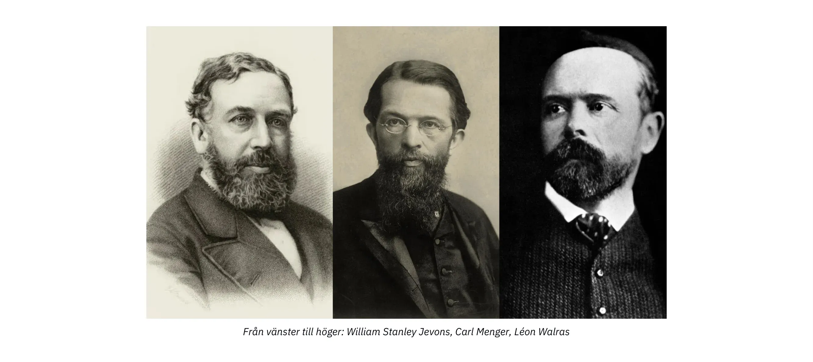

Från vänster till höger: William Stanley Jevons, Carl Menger, Léon Walras

Enligt marginalvärdeteorin motsvarar det ekonomiska värdet vad en ekonomisk aktör är villig att betala för nästa enhet av en vara eller tjänst. Eftersom denna teori betonar det faktum att priser bildas på marginalen, dvs för nästa enhet av en viss vara, kallades den "marginalism".

Det är vanligt att framställa dessa tre skolors marginalism som likartad. Walras och Jevons är förvisso mycket kompatibla, men Mengers teoribildning skiljer sig från de andras på ett djupgående sätt. I sitt verk "Grundsätze des Volkswirtschaftlehre" (Principles of Political Economy), som publicerades 1874 och som idag anses vara grundläggande för österrikisk ekonomisk teori, ger Menger en marginell, men främst subjektiv, förklaring av värde, till skillnad från Walras och Jevons, som anser att värde är ett objektivt och mätbart fenomen.

### Subjektivt värde

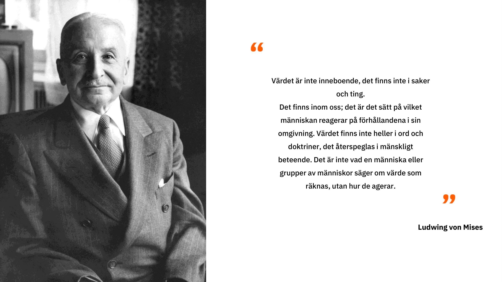

Den österrikiske ekonomen tillbakavisar Adam Smiths efterföljares uppfattning och överger tanken att värdet på en vara kommer från den mängd arbete som används i produktionen, till förmån för uppfattningen att dess värde bestäms av individen, som i varje sammanhang utför en mental värderingshandling avseende en specifik mängd av en vara eller tjänst. Detta intellektuella språng som Menger gör utmanar objektiviteten i värdet: för honom är värdet inte en objektiv egenskap hos varor, utan bara resultatet av den relation som individen har till varan: "värdet existerar inte utanför det mänskliga medvetandet"

Med andra ord uppmanar Menger oss att överväga att värde endast existerar som ett subjektivt psykologiskt fenomen inom individen, att värde inte är en inneboende egenskap hos varor, utan snarare härrör från individens åsikt om den nytta de kan få av dessa varor.

Enligt detta synsätt har en liter dricksvatten inget objektivt värde. En person som har tillgång till ett modernt system för dricksvatten och som inte är törstig för tillfället skulle förmodligen tillskriva den extra litern vatten ett mycket litet värde, medan en person som är törstig mitt i öknen och ser det som skillnaden mellan liv och död säkert skulle vara villig att tillskriva den litern vatten ett nästan oändligt värde.

Sammanfattningsvis konstaterade Menger att värdet på en ekonomisk vara inte är något annat än den subjektiva värdering som en individ tilldelar en ytterligare enhet av varan eller tjänsten.

### Frivillig Exchange: Ett spel med positivt utfall

Från denna punkt drar Menger slutsatsen att frivillig Exchange mellan två individer äger rum eftersom varje part tror att det kommer att öka deras subjektiva nytta. För honom förutsätter Exchange inte någon värdeekvivalens, tvärtemot vad de klassiska ekonomerna trodde. Enligt den österrikiska tänkaren skulle det inte finnas någon anledning för parterna att överhuvudtaget utbyta varor om det fanns en likvärdig nytta mellan de varor som utbyts. Om det finns en Exchange beror det på att varje part anser att det ligger i deras (subjektiva) intresse, och följaktligen ger varje frivillig Exchange upphov till en samhällsnytta.

### Värdering som ett fenomen för att ordna mänskliga önskningar

En sådan samhällsnytta, eller det subjektiva värde som tillskrivs en vara, kan dock inte mätas. För Menger är värde ett kognitivt fenomen som handlar om jämförelse (ordinal) snarare än mätning (kardinal). Det är inte, som de neoklassiska ekonomerna har trott sedan Walras och Jevons, individens Assignment av ett numeriskt värde som återspeglar den nytta de får av det, utan snarare en handling för att ordna mänskliga önskningar genom vilken en individ uttrycker att de önskar en kvantitet av vara A mer intensivt än en kvantitet av vara B.

Alla aktörer kan säga om de föredrar 2 bananer framför en ekonomikurs, men ingen kan rimligen säga att de värderar 2 bananer till 3,1416 utils, samtidigt som de värderar en ekonomikurs till 3 utils, och att de därför föredrar att ha bananerna. En sådan beskrivning av mänskliga preferenser, baserad på kontinuerliga reella funktioner, motsvarar inte verkligheten i de kognitiva processer som vi upplever i våra dagliga liv. En individ utvärderar aldrig varor som presenteras för honom genom att jämföra dem med en abstrakt nyttostandard. Istället jämför han subjektivt olika handlingsalternativ, som han inte kan bedöma i absoluta termer, men som han ändå kan rangordna utifrån deras relativa önskvärdhet.

Denna subjektiva uppfattning om värde, som förstås som en psykologisk relation som individen har till sina mål och de medel som är relevanta för att uppnå dem, gör det också möjligt för österrikiska ekonomer att förklara fenomenet arbetsdelning.

### Fördelningen av arbete

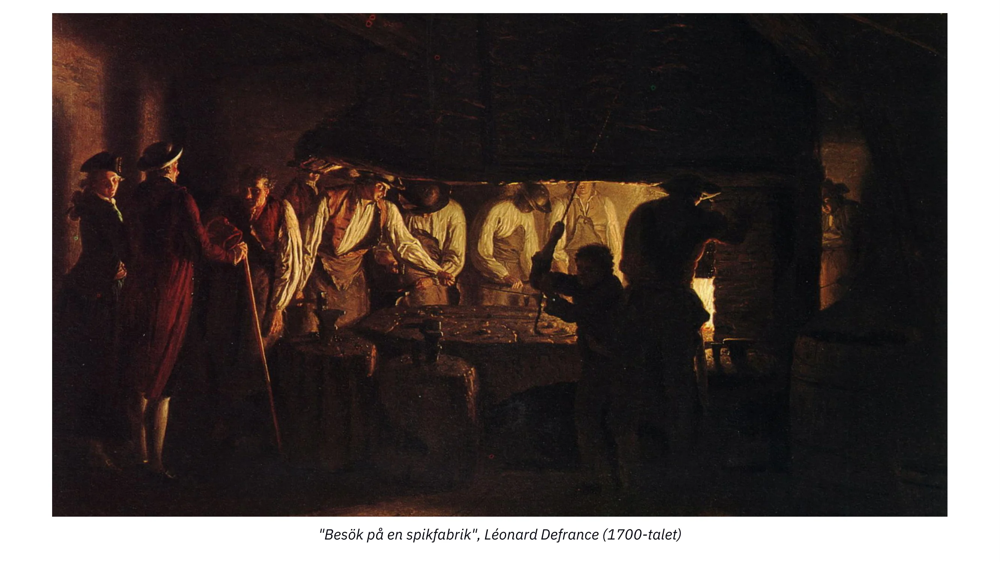

Besök på en nagelfabrik, Léonard Defrance (1700-talet)

Alla människor är unika och har en särskild personlig situation. Därför har alla en överlägsen förmåga att utföra vissa uppgifter jämfört med sina kamrater (absolut fördel) eller en överlägsen förmåga att utföra vissa uppgifter jämfört med andra (komparativ fördel). Det kan inte vara på något annat sätt; att förneka detta elementära faktum vore att påstå att alla människor är lika i alla avseenden.

Om en individ har en överlägsen förmåga jämfört med sina medmänniskor att producera en viss vara (absolut fördel), har denne ett intresse av att specialisera sig på att producera denna vara och sedan byta det överskott som erhålls mot de varor som denne önskar. Genom att göra detta tillfredsställer de sin subjektiva nytta mer ekonomiskt än om de skulle ägna sig åt produktion av alla de varor de önskar.

Men det kan också vara så att individen inte har en absolut fördel i produktionen av någon vara. I detta fall kommer det fortfarande att finnas typer av produktion där individen är bättre än i andra (komparativ fördel), och av denna anledning har de fortfarande ett intresse av att specialisera sig.

Visst finns det individer som skulle kunna producera den givna varan mer produktivt än han, men eftersom dessa individer förmodligen är mer produktiva i en annan uppgift än i denna, och eftersom de inte kan utföra båda uppgifterna samtidigt, är det improduktivt för dem att arbeta med denna uppgift snarare än en annan som de är mer produktiva för. Genom att specialisera sig på den uppgift där de är mest produktiva kommer de att få ett överskott som är större än om de inte hade specialiserat sig, och därför kan de genom Exchange få en ökad mängd av de andra varorna, även om de varor som erhålls skulle ha producerats mer effektivt av dem själva än av de producenter från vilka de fick dem.

Ta en läkare som exempel. Han kanske är bättre på att skriva e-post och boka möten än sin sekreterare (relativ fördel). Men all tid som går åt till dessa uppgifter är tid som han inte använder till att behandla patienter. Eftersom han är mer produktiv när han botar människor ligger det därför i hans intresse att delegera administrativa uppgifter till en annan person, även om han är bättre på dessa uppgifter än sin ställföreträdare, eftersom det gör det möjligt för honom att maximera det värde som genereras för andra och därmed sin egen rikedom.

I grund och botten finns det en fördel med specialisering, även för individer som inte har absoluta fördelar, eftersom tid är en knapp och rivaliserande resurs: varje tidsenhet som läggs på en annan aktivitet än den som en individ är mest produktiv för innebär en kostnad som representeras av den uteblivna produktionen som de avstod från (alternativkostnad).

När individen väl har specialiserat sig på en viss produktion kan han eller hon reservera den mängd produkter som han eller hon anser vara nödvändig för sin egen konsumtion och Exchange överskottet för andra önskade varor. På så sätt tillfredsställer de sin önskan om de varor de själva producerar, vilket innebär att de återstående enheterna av deras produktion har litet värde för dem. Det är vad ekonomer kallar minskande marginalnytta: varje ytterligare enhet av en vara är mindre önskad än den föregående. För andra som saknar sådana varor är det en annan historia: av samma skäl tenderar de att önska de varor de inte producerar mer intensivt än de som de producerar. Detta leder till en situation där det finns en stark asymmetri mellan individernas olika subjektiva värderingar, vilket är mycket gynnsamt för utbyten: varje part har ett intresse av att byta ut sin överskottsproduktion eftersom de därigenom ökar sin subjektiva nytta.

Resultatet av den föregående analysen är att individer alltid får det bättre när de specialiserar sig på sitt arbete och deltar i utbyten. Därför drar österrikiska ekonomer, särskilt Ludwig von Mises, slutsatsen att den produktiva fördelen som uppstår genom arbetsfördelningen är drivkraften bakom processen för socialt samarbete. Här kan det vara bra att citera honom direkt:

"De grundläggande fakta som ledde till samarbete, samhälle och civilisation och som förvandlade djurmänniskan till människa är att arbete som utförs under arbetsdelning är mer produktivt än isolerat arbete och att människans förnuft är kapabelt att inse denna sanning. [...] Människor samarbetar inte under arbetsfördelning för att de älskar eller borde älska varandra. De samarbetar för att det bäst tjänar deras egna intressen."

### Slutsats

> "Om en man ser att han kan leva bekvämare hängande i galgen än sittande vid bordet, skulle han bete sig som en dåre om han inte hängde sig själv."
>

> Baruch Spinoza

1871-1874 är den moderna ekonomins underbara år: under denna period skapades tre oberoende tänkare som lade grunden för den moderna ekonomin. Med sin betoning på subjektivt ordinärt värde kommer de österrikiska ekonomerna att utveckla ett helt ekonomiskt tänkande som skiljer dem från sina motsvarigheter. De österrikiska ekonomernas resonemang om mänskligt handlande i en kontext av knapphet kommer för alltid att stå i skarp kontrast till de ekonomiska doktriner som initierades av Jevons och Walras och som i hög grad förlitade sig på matematik utifrån idén att värde kan mätas objektivt och härledas som en kontinuerlig funktion.

Genom att bygga vidare på insikterna om subjektivt ordinärt värde förklarade Menger uppkomsten av arbetsdelning och frivillig Exchange. Men som vi kommer att se i nästa kapitel är direkt Exchange en dålig strategi för ekonomiska aktörer som vill maximera sin subjektiva nytta. Den österrikiska skolans fader har således vidareutvecklat sitt resonemang för att förklara varför pengar uppstod som en social institution.

De följande kapitlen ägnas åt pengarnas framväxt som samhällsinstitution, kapital- och ränteteorin, som ligger till grund för konjunkturcykelteorin, och slutligen prisernas roll för ekonomisk kalkylering.

## Uppkomsten av pengar som ett socialt fenomen

<chapterId>14ded794-0578-5478-ba5b-b2106c74f3ef</chapterId>

Även om individer har ett gemensamt intresse av att specialisera sig och maximera arbetsfördelningen finns det fortfarande samordningsproblem som begränsar denna expansion.

För det första är det viktigt att notera att eftersom produktionsprocesser till sin natur är tidsbundna och ofta asynkrona (icke-simultana), kommer det vanligtvis att finnas ett tidsglapp mellan en individs första bidrag och mottagandet av motprestationen. Det kan vara riskabelt att åta sig en specifik uppgift nu utan att i förväg ha försäkrats om att andra kommer att uppfylla våra behov i framtiden.

Vid arbetsfördelning gynnas alla parter av samarbete, men som individ kan man frestas att njuta av andras arbete utan att ge tillbaka, eftersom man på så sätt får något värdefullt utan att det kostar något. Sådana situationer, där ömsesidigt samarbete leder till suboptimala vinster för individen men maximala vinster för gruppen, beskrivs inom spelteorin som "fångens dilemma"

### Fångens dilemma

Ursprungligen formulerades fångens dilemma på följande sätt: Två misstänkta, Alice och Bob, som inte kan kommunicera, ställs inför risken att fängslas, med följande potentiella straff:

- Om Alice anklagar Bob och Bob förblir tyst, går Alice fri och Bob får 3 år.
- Om både Alice och Bob anklagar varandra får de 2 år vardera.
- Om båda förblir tysta får de 1 år vardera.

Dessa resultat kan presenteras i en matris (numeriska resultat anger antalet år i fängelse):

| Alice / Bob       | Accuse | Remain Silent |
| ----------------- | ------ | ------------- |
| **Accuse**        | 2, 2   | 0, 3          |
| **Remain Silent** | 3, 0   | 1, 1          |

I detta spel finns det ingen möjlighet till samordning (kommunikation är omöjlig) för att uppnå det bästa resultatet för båda parter. Följaktligen har Alice och Bob ett individuellt incitament att anklaga varandra, även om det inte leder till det optimala resultatet för gruppen. Den optimala strategin för båda är att förbli tysta och var och en får en dom på 1 år.

Detta spel illustrerar ett problem som ofta uppstår i verkligheten: i avsaknad av samordningsmekanismer tenderar individer att välja strategier som maximerar deras individuella vinst, oavsett vilka strategier som andra väljer (stöld, fusk, svek, våld etc.), även om en mer önskvärd jämvikt genom samordning/samarbete är möjlig.

### Pengar för att lösa samordningsproblem

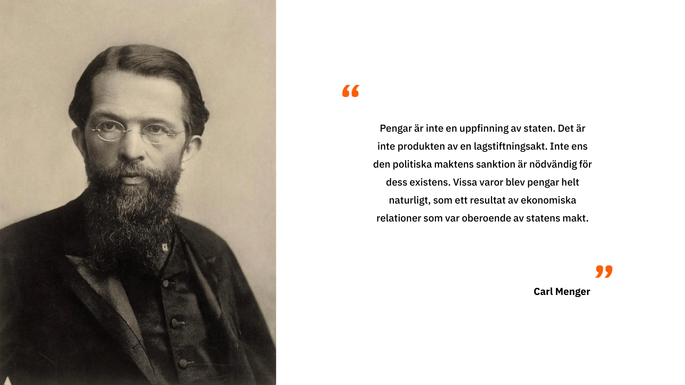

Detta problem har mindre inverkan i små gemenskaper (t.ex. familj, vänkretsar) eftersom alla i sådana fall känner varandra direkt, vilket gör det möjligt att komma ihåg varandras bidrag. Om man antar att det kostar att lämna gemenskapen (desertering) är ett ryktessystem som bygger på enskilda agenters minne oftast tillräckligt för att undvika de fallgropar som fångarnas dilemma innebär.

När det handlar om större samhällen som drar stor nytta av arbetsfördelningen uppstår dock samordningsproblem igen. Detta beror på två huvudsakliga skäl:

För det första är människan begränsad av sin kognitiva kapacitet. Det är omöjligt för en person att upprätthålla och komma ihåg stabila sociala relationer med mer än 150 individer, vilket gör att ett ryktessystem inte räcker för att övervinna fångarnas dilemma i stor skala.

För det andra är en socialt accepterad mätning av värdet av bidrag i Exchange (kommensurabilitet) ett icke-trivialt problem. Om en individ till exempel tillhandahåller kött från jakt och begär material för skydd i gengäld, hur kan mängden kött som erbjuds utvärderas i termer som motsvarar de begärda materialen? Detsamma gäller för kvalitet - är hjortkött mer eller mindre värt än trä?

Även om det vore möjligt att fastställa en tillfredsställande Exchange-ränta för varje varupar blir det snabbt opraktiskt att upprätthålla denna information. I ett direkt Exchange-system med N varor finns det N(N-1)/2 Exchange-priser att komma ihåg. För en ekonomi med 50 varor innebär det att man måste komma ihåg 50\*49/2, eller 1225 Exchange-kurser, jämfört med bara 50 i indirekta utbyten. För en ekonomi med 100 varor ökar denna siffra till 4950. Ett sådant kvadratiskt förhållande sätter en ytterligare gräns för skalbarheten hos direkt Exchange (byteshandel).

Eftersom dessa utbyten inte sker omedelbart utan är utspridda över tiden kompliceras dessutom den relativa bedömningen av bidrag ytterligare av att bidragen utvärderas över tiden. Förutom att bedöma Exchange -förhållandet mellan två nutida varor blir det nödvändigt att bedöma värdet av ett tidigare bidrag i förhållande till en framtida motsvarighet.

Trots att ett sådant system är opraktiskt skulle vi idag kunna använda skrift eller digital datalagring för att komma ihåg all denna information och upprätta ett kreditsystem (att hålla reda på tidigare bidrag, inklusive Exchange-satsen för dessa bidrag, är i huvudsak att upprätta ett kreditsystem).

Under den förciviliserade tiden fanns inte dessa tekniker. Våra förfäder var därför tvungna att hitta andra lösningar för att kunna dra nytta av fördelarna med arbetsfördelningen utan att utsätta sig för de negativa konsekvenserna av fångarnas dilemma. Lösningen på detta problem med direkt Exchange var indirekt Exchange som underlättades av pengar.

### Dubbelt sammanträffande av önskemål och säljbarhet

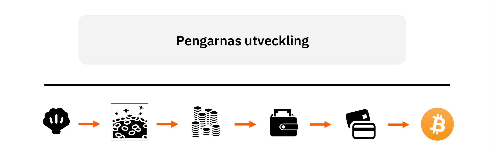

Pengar kan ses som den lösning som våra förfäder upptäckte för att lösa det som ekonomer kallar problemet med "dubbel samstämmighet av behov". Detta problem har tre dimensioner: rumslig, tidsmässig och mellanmänsklig.

I en direkt Exchange (byteshandel) mellan Alice och Bob måste de båda ha något som den andra vill ha vid samma tidpunkt och på samma plats. Genom att använda indirekt Exchange, dvs. genom pengar, kan Alice köpa från Bob, och Bob kan använda den monetära enheten någon annanstans, vid en annan tidpunkt och med någon annan (förutsatt att den andra personen accepterar den formen av pengar).

För att en vara ska kunna fungera som pengar måste den ha en hög säljbarhet, vilket innebär att den ska vara önskad av så många människor som möjligt, för det mesta. Genom att använda en vara med hög säljbarhet löses problemet med dubbla önskemål i termer av rumsliga och interpersonella dimensioner: om den vara jag använder som pengar önskas överallt och av de flesta människor, kan jag enkelt skilja mellan att sälja och att köpa när det gäller plats och social interaktion.

Problemet med säljbarhet över tid är dock svårare att lösa av två skäl:

För det första förändrar entropi (allmänt känt som "tidens gång") gradvis egenskaperna hos de flesta varor med direkt nytta. För att bevara en varas säljbarhet över tiden krävs därför att den är mycket hållbar eller motståndskraftig mot entropi.

För det andra garanterar inte den relativa knappheten på en vara vid tidpunkten "t" dess relativa knapphet i framtiden. Genom att avsätta tillräckligt med resurser till ett specifikt produktionsområde kan människor öka Supply för vilken vara som helst. Den enda begränsningen för att öka produktionen av en vara är den tillhörande alternativkostnaden. Följaktligen kan den nuvarande relativa knappheten på en vara inte garantera dess framtida relativa knapphet. Endast varor vars marginalproduktion kan ökas till mycket höga kostnader kan vara konstant knappa, vilket är anledningen till att detta är ett kännetecken för fritt framväxande monetära varor genom hela mänsklighetens historia.

Under förcivilisatorisk tid fungerade en mängd olika varor som snäckskal, hantverksmässiga smycken, halsband eller pärlor som pengar. Dessa varor var lätta att transportera, hade ingen direkt nytta utöver sitt prydnadsvärde, motstod entropi (dvs. de försämrades inte med tiden), var naturligt knappa och/eller krävde en betydande mängd specialiserat arbete för att produceras. Eftersom arbetsdelningen var låg på den tiden och alternativkostnaden för att producera prydnadsföremål därför var hög, kunde dessa föremål inte produceras i stora mängder. De som använde dessa föremål som pengar kunde därför vara säkra på att de skulle bli relativt sällsynta i framtiden.

Det faktum att våra förfäder som var jägare och samlare ägnade sig åt dessa resurskrävande uppgifter, trots att de inte genererade några varor med direkt nytta, visar på de betydande vinster de förväntade sig av att utöka den rumsliga, sociala och tidsmässiga omfattningen av Exchange. Om detta inte vore fallet, och det vore mer användbart för dem att använda dessa resurser till att bygga skydd, jaga eller andra aktiviteter, snarare än att producera monetära varor, skulle vi förmodligen inte hitta lika många arkeologiska bevis på dessa hantverksmässiga aktiviteter. Andra grupper som använde sina resurser mer effektivt skulle ha haft en bättre utveckling och ett större välstånd, och dessa hantverksmässiga aktiviteter skulle snabbt ha försvunnit till förmån för aktiviteter som producerar varor med direkt nytta.

På så sätt utgjorde produktionen av monetära varor, genom att främja en ökad arbetsdelning, en mer lönsam användning av resurser (i termer av subjektiv nytta för individer) än alla andra alternativ (ökad jakt, fiske, samlande, vedproduktion, husbygge, tillverkning av fler jakt- och fiskeredskap etc.).

### Osäkerhet

För att avsluta vår analys av den monetära institutionen behöver vi Address frågan om ekonomiska åtgärder mot bakgrund av den oundvikliga osäkerheten om framtiden.

Som österrikiska ekonomer har påpekat är mänsklig handling tidsbunden och alltid inriktad på framtiden. När en individ agerar förändrar hon sitt nuvarande tillstånd i hopp om att uppnå tillfredsställelse i framtiden. Denna mentala projektion kan vara inriktad på en nära eller avlägsen framtid, men för att en individ ska kunna projicera på lång sikt måste han eller hon först säkra sin kortsiktiga försörjning eftersom hans eller hennes tillstånd i den nära framtiden direkt påverkar hans eller hennes tillstånd i den avlägsna framtiden.

Detta härrör direkt från människans rationalitet; ingen kan ignorera tidsfenomenens sekventiella natur och det kronologiska beroende som följer av detta eftersom det är en av de väsentliga begränsningarna i människans liv. Eftersom framtiden alltid är osäker för människan kommer hon därför att försöka säkra sin långsiktiga överlevnad först när hennes kortsiktiga överlevnad är tryggad.

I detta avseende spelar pengar, genom att de gör det möjligt att lagra värde i nuet och överföra det till ett framtida jag, en avgörande roll för den intertemporala samordningen av mänskligt handlande. Genom att lagra pengar, dvs. spara, skyddar sig individer mot framtida osäkerhet och gör det därmed möjligt för sig själva att rikta sina handlingar mot längre tidshorisonter. Detta kan dock endast uppnås om de pengar som används utgör en värdebevarare, dvs. är säljbara över tid, vilket som tidigare nämnts är en egenskap som kännetecknar varaktiga och relativt knappa varor.

I nästa kapitel ska vi fördjupa oss i begreppet tidspreferens och förklara det österrikiska perspektivet på ränta och kapital, vilket kommer att ligga till grund för nästa kapitel om konjunkturcykelteorin.

## Tidspreferens, ränta och kapital

<chapterId>37732a5c-4f66-5e2d-bc2c-cc8d29693af7</chapterId>

### Tidspreferens

Vi avslutade det förra kapitlet med att förklara hur ekonomiska aktörer använder den mest säljbara varan, dvs. pengar, för att motverka framtida osäkerhet. Vi förklarade också att tidsfenomenens sekventiella natur gör att vi måste bekämpa osäkerheten gradvis: först när vi vet att vår försörjning kommer att vara tryggad under nästa vecka kan vi koncentrera oss på mål som ligger längre fram i tiden.

Eller annorlunda uttryckt: som människor diskonterar vi värdet av framtida varor.

Denna subjektiva bedömning av värdet av framtida varor jämfört med nutida varor kallas tidspreferens. Allt annat lika är nutida varor av naturen att föredra framför framtida varor. Eftersom vi är dödliga och framtiden alltid är osäker föredrar vi naturligtvis att ha tillgång till en vara nu snarare än senare. Även om tidspreferensen kan skilja sig åt mellan individer på grund av en mängd faktorer som kultur, rikedom, utbildning, fysiologi etc. är tidspreferensen alltid positiv, vilket innebär att vi, allt annat lika, alltid värderar nutida varor högre än framtida varor.

Detta koncept med relativ värdering av framtida varor i förhållande till nuvarande varor är roten till fenomenet ränta. I en ekonomi med omanipulerade kapitalmarknader bestäms referensräntorna (som anses vara riskfria från fallissemang) i skärningspunkten mellan kapitalets Supply och efterfrågan. Dessa räntor representerar därför hela ekonomins tidspreferenser: en ökning av räntan beror på en relativ ökning av efterfrågan på kapital jämfört med Supply, vilket tyder på högre tidspreferenser. Omvänt beror en sänkning av räntorna på en ökning av sparandet, vilket är en ökning av kapitalets Supply, vilket indikerar en minskning av tidspreferenserna.

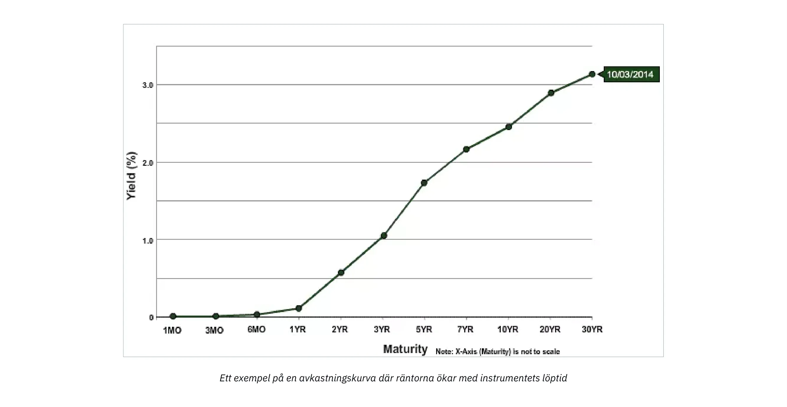

I en ekonomi där räntorna inte manipuleras av centralbanken tenderar vi att se en uppåtlutande avkastningskurva: ju längre löptid på skulden, desto högre ränta. Den motsatta situationen kan inte uppstå eftersom det skulle innebära att framtiden är säkrare än nutiden, vilket är en logisk omöjlighet.

Begreppet tidspreferens och hur vi uttrycker vår egen tidspreferens genom konsumtion och sparande är grundläggande för kapitalallokerings- och produktionsprocesserna. Låt oss vända oss till Mengers elev, Eugen von Böhm-Bawerk, och hans kapitalteori för att förstå exakt hur tidspreferens påverkar produktionsorganisationen.

### Kapitalteori

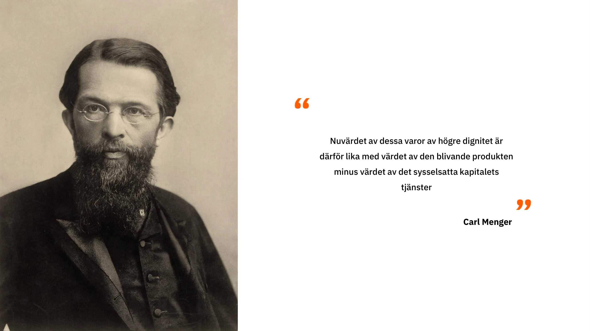

I början av den här kursen såg vi att varor enligt Carl Menger endast betraktas som ekonomiska varor (värderade) eftersom de fungerar som medel för att uppnå mål som individer väljer och värdesätter. Enligt detta synsätt kretsar all ekonomisk analys kring konsumtion eftersom det i slutändan är det motiverande målet bakom all ekonomisk aktivitet. För Menger är därför utgångspunkten för den ekonomiska analysen konsumtionsvaror, eller slutprodukter, eftersom de utgör det yttersta syftet med ekonomisk aktivitet. Alla andra varor i ekonomin, som vi kan kalla "insatsvaror", har bara ett värde eftersom de gör det möjligt för individer att skaffa dessa konsumtionsvaror: de är varor som används i produktionen av andra varor.

För att producera konsumtionsvaror kombinerar företagare dessa olika insatsvaror med ursprungliga produktionsfaktorer (arbete, mark och kapital) enligt ett mönster som maximerar den resulterande produktionen. Detta arrangemang, som görs av entreprenörer, eller produktionsstrukturen, innehåller olika steg under vilka mellanprodukter genomgår omvandlingar tills de slutligen blir konsumtionsvaror.

På samma sätt som Menger kan vi alltså definiera konsumtionsvaror som varor av första ordningen, varor som ingår i föregående steg som varor av andra ordningen, varor i steget före det som varor av tredje ordningen och så vidare tills vi når de ursprungliga faktorerna (mark, arbete, kapital). Antalet steg som vi beaktar beror i grunden på den produktionsstruktur som entreprenörerna använder sig av och bör inte ses som en objektiv egenskap hos produktionsstrukturen. Tvärtom existerar produktionssteg och mellanliggande varor endast i ett teleologiskt sammanhang: aktören föreställer sig en sekvens av handlingar genom vilka han eller hon kommer att uppnå sitt önskade mål, och han eller hon delar mentalt upp sina handlingar i successiva steg.

Denna egenskap att mentalt projicera handlingar i ett sekventiellt mönster är en följd av att mänskliga handlingar är temporära till sin natur. Varje handling som utförs av människor tar tid; omedelbar handling är omöjlig. Därför har aktören alltid ett val mellan handlingsmönster som tar mer eller mindre tid.

Eftersom individer nödvändigtvis har positiva tidspreferenser, vilket innebär att de föredrar nutida varor framför framtida varor, kommer de bara att välja en längre väg om det resultat som uppnås har ett större subjektivt värde för dem än vad de skulle ha uppnått genom att ta den direkta vägen. I annat fall skulle ingen använda sig av mer tidskrävande metoder: vid likvärdiga resultat är den kortaste vägen fortfarande det bästa valet.

På grund av att mänskligt handlande är sekventiellt får dessa intertemporala val alltid konsekvenser för handlingssekvensen. Med andra ord är de kortsiktiga åtgärder jag vidtar underordnade de långsiktiga mål jag sätter upp, och mina kortsiktiga åtgärder kommer att påverka vad jag kan göra i framtiden. Innebörden av denna självklara poäng när det gäller produktionsaktiviteter är att varje produktionsomväg, dvs. varje förlängning av produktionsstrukturen, kräver en besparing i förväg. Om jag bestämmer mig för att avsätta mer resurser i nuet för att uppnå ett framtida mål, måste jag först avsätta det som ska försörja mig under den tid som min investering tar.

För att illustrera denna punkt, låt oss återgå till det exempel som Böhm-Bawerk ger i sitt verk "Kapital och ränta":

Eugen von Böhm-Bawerk (1851-1914)

### Robinson Crusoe och Production Detour/Roundabout:

Robinson Crusoe Landgångsförråd från vraket, John Alexander Gilfillan (1793-1864)

I sin bok uppmanar den österrikiske ekonomen oss att överväga de intertemporala avvägningar som är inneboende i produktionsomvägar genom ett tankeexperiment baserat på Robinson Crusoe ensam på sin ö.

Robinson är, precis som en primitiv människa, beroende av att samla och jaga för sin försörjning. Låt oss föreställa oss att Robinson kan samla tillräckligt med bär för att äta sig mätt för en hel dag på åtta timmar. Under sådana förhållanden har han inte mycket tid över för andra aktiviteter. Robinson tror dock att han genom att tillverka en trästolpe enkelt kan slå ner bären och få sin dagliga mat på bara fyra timmars arbete. Dessutom beräknar han att det kommer att ta honom fem dagar, med två timmars arbete varje dag, att tillverka stången. Därför drar han slutsatsen att han måste spara 1/5 av sin bärproduktion i fem dagar, eller alternativt lägga ytterligare 2 timmar per dag på bärplockning i 5 dagar, för att spara tillräckligt med bär för att försörja sig under den tid han ägnar åt att tillverka stången.

Om han inte gör detta tidigare sparande kommer Robinson inte att kunna slutföra sin pol och kan dö under tiden.

Så under fem dagar offrar han två timmar av sin vila för att samla mer bär. I slutet av denna period har han tillräckligt med bär och börjar tillverka trästången, och arbetar två timmar om dagen i fem dagar. När arbetet är klart kan han få tillräckligt med bär för sin dagliga portion på 4 timmar i stället för 8, vilket gör att han kan använda de återstående 4 timmarna per dag till andra aktiviteter.

Genom att agera på detta sätt tar Robinson en produktionsomväg: istället för att direkt plocka bären investerar han kraft i att producera en kapitalvara som kommer att göra honom mer produktiv i framtiden. Han måste dock göra en kortsiktig uppoffring, dvs. spara, för att uppnå detta. Om han inte gjorde det skulle han inte kunna färdigställa sin kapitalvara. Denna kortsiktiga uppoffring ger honom dock en betydande fördel eftersom han, när han väl har utrustats med sin stav, vinner 4 timmar per dag (tills staven blir föråldrad). Dessa 4 extra timmar per dag gör det möjligt för honom att skapa fler kapitalvaror, t.ex. jaktverktyg eller fiskenät, vilket gradvis förbättrar hans situation.

### Slutsats

I Robinson Crusoes enmansekonomi är det med andra ord sparande genom uppoffring av tillfredsställelse i nuet som ackumulerar det kapital som ökar produktiviteten. I detta sammanhang är sparande, dvs. att skjuta upp tillfredsställelse i nuet, det pris man får betala för ökad tillfredsställelse i framtiden. Detta innebär att sparande i detta sammanhang är en förutsättning och ett nödvändigt villkor för all ekonomisk utveckling.

Detta är ett lockande, om än enkelt, koncept: varje utvidgning av produktionsstrukturen kräver tidigare sparande (eftersom de varor som behövs för sådan produktion inte kommer att falla från himlen), och därmed, ju mer vi sparar, desto mer kapital kommer vi att kunna ackumulera, vilket i sin tur kommer att översättas till produktivitetsvinster som ger fler varor. De österrikiska ekonomerna anser alltså att en sänkning av tidspreferenserna är startpunkten för en positiv spiral av sparande -> mer kapitalvaror  mer produktivitet  mer varor = högre levnadsstandard -> lägre tidspreferens.

Som nämndes i det första kapitlet har centralbankerna manipulerat räntorna i årtionden, samtidigt som affärsbankerna beviljade krediter utan föregående reserver, vilket innebär att räntorna inte representerar vår tidspreferens och ger en illusion av ett stort sparande.

Detta illustreras perfekt av diagrammet nedan: långa räntor är lägre än korta räntor. För det första är detta helt ologiskt, eftersom det skulle innebära att framtiden är säkrare än nutiden. För det andra är det motiverat att fråga sig vilka konsekvenser det får för kapitalallokeringen: om alla har incitament att agera som om det fanns gott om sparande, medan spararna inte finns någonstans eftersom de inte belönas för sitt sparande, vilka konsekvenser kan detta få för ekonomin?

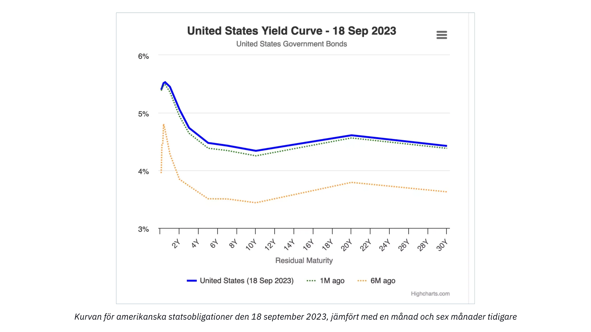

Detta är vad vi kommer att ta reda på i nästa kapitel som ägnas åt den österrikiska teorin om konjunkturcykeln!

# Österrikiska ekonomiska perspektiv

<partId>ad0fce42-2556-56b8-a093-5b4fcacc7cf3</partId>

## Den österrikiska teorin om konjunkturcykeln

<chapterId>718afaa8-ce78-58aa-9477-073eef0bd137</chapterId>

> "Ju längre boomen av inflationsdrivande bankkrediter fortsätter, desto större blir omfattningen av felinvesteringar i kapitalvaror och desto större blir behovet av att avveckla dessa osunda investeringar. När kreditexpansionen stannar av, vänder eller till och med bromsar in betydligt avslöjas felinvesteringarna."
>

> Ludwig von Mises

Det var Ludwig von Mises, Böhm-Bawerks mest framstående elev och förmodligen den viktigaste österrikiska ekonomen under 1900-talet, som använde Böhm-Bawerks kapitalresonemang för att förklara orsakerna till och dynamiken i ekonomiska cykler. Friedrich A. Hayek, Mises skyddsling, utvecklade senare detta resonemang till dess logiska slutsatser i arbeten för vilka han tilldelades Nobelpriset i ekonomi 1974.

Mises och Hayek inledde sin analys med en ökning av sparandet som utgångspunkt. Som vi har sett i de tidigare kapitlen innebär en ökning av sparandet med nödvändighet en motsvarande minskning av konsumtionen och därmed lägre relativpriser på konsumtionsvaror. Detta leder till två effekter: för det första en ökad efterfrågan på kapitalvaror till följd av stigande reallöner till följd av det relativa prisfallet på konsumtionsvaror; och för det andra en ökning av entreprenörernas vinster i de produktionsled som ligger längst bort från konsumtionen (lägre ordning). När reallönerna stiger får företagarna incitament att spara arbetskraft genom att använda mer kapitalvaror, vilket skapar en starkare efterfrågan på kapitalvaror och högre vinster för företagare som producerar dessa varor av lägre kvalitet. I samband med ökat sparande, dvs. minskade tidspreferenser, sjunker således räntorna, vilket främjar utvecklingen av ytterligare produktionssteg och ökad produktivitet. Detta är en klassisk Böhm-Bawerkiansk produktionsomväg, och det är ett mycket önskvärt resultat.

De två österrikiska ekonomerna funderade dock på vad som skulle hända om räntesänkningen, som är utgångspunkten för denna produktionsomväg, inte berodde på ökat sparande utan på kreditexpansion.

I en bank med fraktionella reserver kräver en kreditexpansion inte någon motsvarande ökning av sparandet. Därför kan företagare skaffa mer kapital och ta omvägar i produktionen även om tidspreferenserna förblir oförändrade, dvs. utan att konsumtionen minskar. För Hayek och Mises borde en sådan situation med nödvändighet leda till betydande samordningsproblem mellan ekonomiska aktörer. På grund av avsaknaden av marknadsräntor kanske dessa problem inte är omedelbart uppenbara, men på lång sikt bör de resulterande felallokeringarna av kapital ge påtagliga konsekvenser: en recession.

För att så tydligt som möjligt beskriva detta fenomen med felkoordinering i tiden och dess konsekvenser utgår vi från en modell av produktionsstrukturen och observerar hur den påverkas, först av en räntesänkning till följd av ökat sparande och sedan av en räntesänkning till följd av kreditexpansion.

### Minskning av räntesatserna på grund av en ökning av sparandet:

För att underlätta vår förklaring återgår vi till Mengers varuklassificering och representerar produktionsstrukturen i ett diagram som består av ett godtyckligt antal steg:

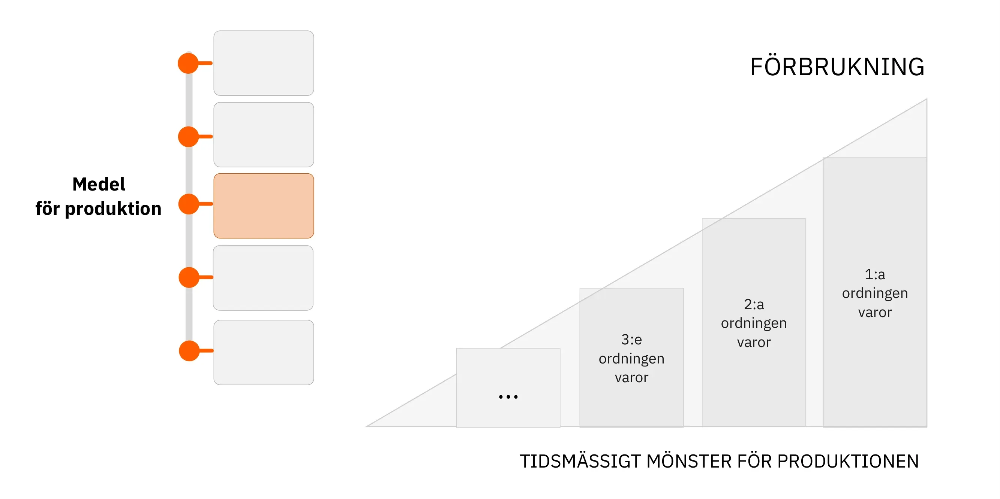

I ovanstående diagram passerar de ursprungliga resurserna genom olika produktionssteg och genomgår omvandlingar som för dem närmare de slutliga konsumtionsvarorna (genom interaktion med de ursprungliga produktionsfaktorerna: tid, mark, arbete). Höjden på triangelns högra sida representerar schematiskt BNP eftersom den anger summan av alla konsumtionsvaror som säljs under en period. Gapet mellan varje stapel motsvarar det mervärde (i monetära termer) som genereras av varje steg i processen. Denna skillnad kan också ses som den inkomst som är förknippad med varje steg (intäkter - kostnader).

Om de ekonomiska aktörerna på aggregerad nivå ökar sitt sparande kommer mängden konsumerade slutprodukter att minska - allt annat lika innebär sparande nödvändigtvis att man skjuter upp en del av sin konsumtion till ett senare datum. Som en följd av detta kommer räntorna att sjunka - eftersom Supply för kapital ökar, vilket gör det möjligt för entreprenörer att använda detta inflöde av kapital för att skapa nya investeringsvaror och därmed förlänga produktionsstrukturen.

Vi får då en utökad produktionsstruktur, en förändring som kvalitativt kan beskrivas med följande diagram:

Här har det monetära värdet på efterfrågade konsumtionsvaror minskat, vilket frigör resurser för att skapa ytterligare ett produktionssteg. I detta scenario där räntesänkningen är en följd av minskad konsumtion, dvs. ökat sparande, förblir triangelns area, som representerar mängden pengar i omlopp, oförändrad. Förändringen av produktionsstrukturen (förlängningen) är helt enkelt resultatet av en överföring av köpkraft från en del av strukturen till en annan.

Det är också värt att notera att den minskade efterfrågan på konsumtionsvaror på medellång sikt kommer att leda till en sänkning av konsumentpriserna snarare än en minskning av den kvantitet slutprodukter som erbjuds. Detta beror på att den sista delen av produktionsstrukturen inte kommer att anpassas omedelbart efter det att efterfrågan på konsumtionsvaror har minskat, utan det kommer att ta tid för företagarna att ändra sina planer och investeringar. Eftersom de håller lager kommer den minskade efterfrågan att tvinga dem att sälja dessa lager med rabatt, och följaktligen kommer sparandeöverskottet inledningsvis att resultera i lägre priser på konsumtionsvaror (dvs. en ökning av reallönerna).

Omvänt kommer priserna på investeringsvaror att stiga eftersom överföringen av köpkraft till företagare gör det möjligt för dem att öka sina investeringsutgifter. När detta sparande, som överförts från sparare till företagare, spenderas av de senare kommer räntorna att tendera att stiga igen (på grund av en minskad Supply för kapital), vilket i sin tur kommer att leda till lägre priser på investeringsvaror. I själva verket kommer relativpriserna att vara ungefär desamma som tidigare i slutet av denna produktionsomväg. Men de ekonomiska aktörerna gynnas överlag: ökad produktivitet till följd av att produktionsstrukturen förlängs kommer att erbjuda konsumenterna fler produkter till lägre enhetspriser; spararnas köpkraft kommer att öka, delvis genom ränteintäkter och delvis på grund av lägre konsumentpriser; samtidigt kommer entreprenörerna, betraktade som en helhet, varken att uppleva vinster eller förluster. De som är engagerade i aktiviteter som ligger närmast konsumtionen kommer att förlora inkomst, medan de som är engagerade i att skapa nya produktionssteg kommer att vinna proportionellt. I en sådan situation skapas ingen ny monetär inkomst, utan det är produktionen som ökar och därmed stiger inkomsternas realvärde.

### Minskning av räntesatserna på grund av en ökning av krediterna (ingen ökning av sparandet):

Om vi nu tänker oss en räntesänkning till följd av att bankerna utökar sitt kreditutbud får vi en helt annan bild av produktionsstrukturen.

Med lägre räntor kan entreprenörer låna mer resurser och därmed skapa produktionssteg med högre order. I det här fallet kommer en sådan utökning av produktionsstrukturen inte att leda till minskad konsumtion eftersom konsumenterna inte har skjutit upp sin nuvarande konsumtion. BNP växer med andra ord. Följaktligen kommer vår triangel att bli längre med bibehållen höjd, vilket innebär att dess area kommer att öka.

Observera att detta är en helt logisk följd av kreditexpansionen. I den mån bankerna producerar fiduciary media genom att bevilja lån bör man naturligtvis förvänta sig att den totala köpkraften ökar.

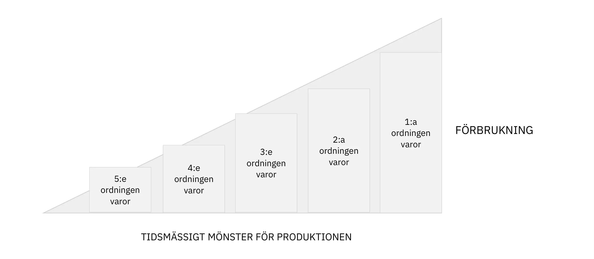

När krediter kommer in i ekonomin genom lån till entreprenörer bör vi se en ökning av vinsterna i produktionssektorer som ligger långt från konsumtionen och en minskning av de relativa vinsterna i sektorer som ligger närmare konsumtionen. Den högre lönsamheten leder sedan till en omfördelning av kapital till dessa nya, mer kapitalintensiva faser (varvsindustri, fordonsindustri, byggnadsindustri, avancerad teknik etc.) och till minskade investeringar i sektorer som ligger närmare konsumtionen.

Nu tjänar de entreprenörer som är involverade i dessa högre produktionsled högre penninginkomster, och eftersom tidspreferensen förblivit densamma borde vi också se en ökad efterfrågan på konsumentprodukter. Men eftersom den relativa lönsamheten för investerat kapital under denna högkonjunktur har varit högre i sektorer som ligger långt från konsumtionen, har det skett en överföring av resurser från konsumtionsnära aktiviteter till mer avlägsna aktiviteter. Följaktligen saknar entreprenörerna i de lägre produktionsleden resurser för att möta den ökade efterfrågan. Detta skapar en spänning mellan dessa två delar av produktionsstrukturen: var och en försöker skaffa kapital på den andras bekostnad, och eftersom konsumtionsefterfrågan representerar mer akuta behov kommer företagare som är engagerade i aktiviteter långt från konsumtionen vid någon tidpunkt att sakna de resurser som krävs för att slutföra sina investeringar. Vinstnivån i dessa sektorer börjar då sjunka, företag går i konkurs och den relativa ökningen av konsumentpriserna motiverar en snabb omallokering av kapital till produktion av varor av lägre kvalitet. När denna plötsliga resursomfördelning manifesteras går ekonomin in i en recession: tillgångspriserna faller, reallönerna sjunker, konsumentpriserna sjunker och lagren hopar sig.

För Friedrich Hayek och Ludwig von Mises är recessionen ett uttryck för felallokering av kapital från expansionsfasen. Eftersom priserna på sparande och kapital manipulerades utvecklade entreprenörer projekt som inte kunde slutföras på grund av brist på resurser, och/eller byggde upp produktionskapacitet som planerade för en framtida konsumtionsnivå som inte kunde upprätthållas på grund av brist på sparande.

Endast genom deflation, dvs. fallande tillgångspriser och lönepriser, högre räntor och avveckling av oavslutade projekt, kan ekonomin återanpassas och utvecklas i en hållbar riktning. Lågkonjunkturen är alltså upplösningen av denna illusion av välstånd som utlöser en våldsam omställningsprocess.

I allmänhet är det banksektorn själv som utlöser recessionen. Så länge kreditgivningen ökar i allt snabbare takt fortsätter priserna att stiga och företagarna konkurrerar om produktionsresurserna. Som Hyman Minsky påpekat kommer det dock en punkt då banksektorn beslutar sig för att minska sin risk och därför minskar kreditflödet. Depressionen resulterar därför i många konkurser, kreditåtstramningar, minskad tillgänglig köpkraft och finansiella härdsmältor.

En sådan anpassning kan ses som en period under vilken underkonsumtion och underinvesteringar tvingas fram för att återskapa de saknade besparingarna. För Hayek är detta depressiva skede, även om det är smärtsamt, högst nödvändigt eftersom det möjliggör en återhämtning av den ekonomiska aktiviteten baserad på en struktur av relativa priser som återspeglar den faktiska bristen på produktionsfaktorer. Om depressionen avbryts kan ekonomin inte återgå till en önskvärd utveckling, eftersom felallokeringen av resurser bara kommer att fortsätta i avsaknad av ett informationssystem som gör det möjligt för de ekonomiska aktörerna att rationalisera sina beslut.

Tyvärr avbryts denna depressiva mekanism ofta av den politiska makten och centralbanker som försöker "stimulera" ekonomin genom underskott och lätt penningpolitik.

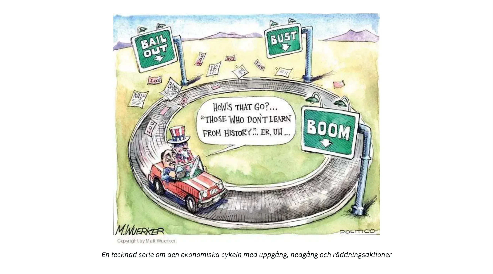

För både monetarister och keynesianer är orsaken till depressionen otillräcklig aggregerad efterfrågan, så ingen av dem uppmärksammar utvecklingen av relativpriserna, vilket, som vi har sett, är kärnan i problemet. De tror därför att en återhämtning kommer att ske genom att man stimulerar kreditexpansion (sänker räntorna) och använder statens underskottskapacitet för att öka efterfrågan. På kort sikt kan sådana åtgärder tyckas ge de önskade effekterna: underskottet stöder utgifterna, medan räntesänkningen leder till högre tillgångspriser, vilket i sin tur uppmuntrar tillgångsinnehavarna att öka sina utgifter. Denna stimulans avtar dock så småningom, medan det strukturella problemet kvarstår eller till och med förvärras när felallokeringen av kapital fortsätter tack vare artificiellt låga räntor.

I modern tid har centralbanker och regeringar varit så nitiska med att förhindra att denna anpassningsprocess kommer till uttryck att vi till slut får en strukturell massarbetslöshet och en ständig skulduppbyggnad. Japan tjänar som exempel i detta avseende. Efter att en tillgångsbubbla hade spruckit 1989-90 använde Bank of Japan (BoJ) och de olika regeringarna alla de metoder som beskrivs här för att försöka "starta om den japanska ekonomin" Bortsett från korta uppgångar till följd av utgiftsprogram och räntesänkningar har Japan under 30 års tid befunnit sig i ett tillstånd av neurastenisk tillväxt och överskuldsättning.

### Slutsats om konjunkturcykelteorin:

Genom att betona det mänskliga handlandets sekventiella natur och ägna särskild uppmärksamhet åt räntefluktuationernas inverkan på de ekonomiska aktörernas intertemporala samordning förklarade Ludwig von Mises och Friedrich Hayek konjunkturcykler som endogen dynamik i banksystemet med fraktionella reserver. Skillnaden mellan den österrikiska analysen och monetaristernas och keynesianernas ligger till stor del i att den förra ägnar särskild uppmärksamhet åt de olika produktionsstegen och relativprisernas struktur, medan den senare stannar vid aggregerade variabler som sysselsättningsnivåer, BNP eller konsumentprisindex. Eftersom mainstreamekonomer saknar en kapitalteori tenderar de att hänföra orsakerna till recessionen till "animal spirits" eller "externa händelser".

Mer än någon annan ekonomisk skola insisterar den österrikiska skolan på vikten av relativa priser för att samordna ekonomiska aktörer. Medlemmar av den österrikiska skolan har dragits in i debatter i frågan i mer än ett århundrade, särskilt sedan Mises publicerade sitt arbete om omöjligheten av ekonomisk beräkning i socialistiska ekonomier 1919.

Detta kommer att vara ämnet för nästa och sista kapitel i denna kurs.

## Omöjligheten av ekonomisk kalkylering under socialismen

<chapterId>2578a9d8-90e9-58dd-a8c5-6366948564c7</chapterId>

> "Där det inte finns några marknadspriser för produktionsfaktorerna, eftersom de varken köps eller säljs, är det omöjligt att använda sig av kalkyler för att planera framtida åtgärder och för att fastställa resultatet av tidigare åtgärder. En socialistisk produktionsledning skulle helt enkelt inte veta om det den planerar och genomför är det lämpligaste medlet för att uppnå de eftersträvade målen eller inte. Den kommer så att säga att agera i mörkret. Den kommer att slösa bort de knappa produktionsfaktorerna, både materiella och mänskliga (arbetskraft). Kaos och fattigdom för alla kommer oundvikligen att bli resultatet."
>

> Ludwig von Mises, Planerat kaos

### Omöjligheten av ekonomisk kalkylering under socialismen

Trots de marxistiska regimernas upprepade misslyckanden under det senaste århundradet är debatten om ekonomiska kalkyler fortfarande aktuell av två viktiga skäl:

1. Liknande idéer förespråkas fortfarande av progressiva och andra interventionister.

2. Prisfixering, oavsett om det sker på kapitalmarknaderna genom centralbankers agerande eller på andra marknader genom statligt ägda företag, dekret och ingripanden från tillsynskommittéer, fortsätter att vara vanligt förekommande.

### Debatten om ekonomiska kalkyler

Debatten tog sin början i en av 1900-talets mest inflytelserika ekonomiska skrifter, "Economic Calculation in a Socialist Commonwealth", författad av Ludwig von Mises och publicerad 1920. Under denna tid var socialismen på frammarsch, med bolsjevikernas maktövertagande i Ryssland, socialister som tog över makten i Weimarrepubliken (Tyskland) och socialistiska och kommunistiska partier som blev allt mer framträdande runt om i Europa.

Före Mises artikel kretsade debatterna om socialism och kapitalism främst kring moraliska argument och incitamentsproblemet. Även om man antog att ett samhälle organiserat enligt den marxistiska principen "från var och en efter förmåga, till var och en efter behov" var moraliskt överlägset, behövde man fortfarande ta ställning till den praktiska frågan "vem ska ta ut soporna". Det vanliga svaret var att socialismen skulle skapa individer som saknar kapitalistiska instinkter och som villigt ställer upp för sina medmänniskor även om det inte finns några ekonomiska incitament.

Med sin artikel introducerade Mises en ny dimension i debatten. Med bortseende från utopiska föreställningar om den politiska ekonomins förmåga att skapa en "ny människa" påpekade den österrikiske ekonomen att en rationell ekonomisk organisation var omöjlig utan priser på de mellanliggande produktionsfaktorerna. Än idag är hans argument dåligt förstått av hans kritiker och till och med av vissa liberala ekonomer. Därför är det värt att förklara det mer i detalj.

### Förklaring till omöjligheten med ekonomisk kalkylering

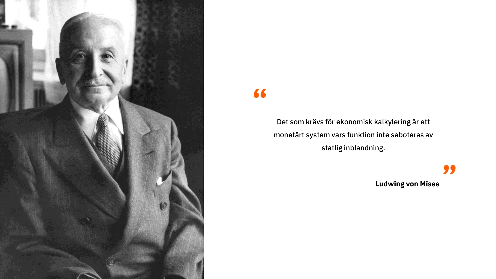

De flesta missuppfattningar om Mises argument härrör från en missuppfattning av de roller som ledar- och entreprenörsklasserna spelar i en kapitalistisk ekonomi. Mises avfärdade aldrig chefers förmåga att utforma effektiva produktionsplaner inom sina egna verksamheter. Istället betonade han betydelsen av entreprenörer och aktieägare, som i egenskap av ägare av produktionsmedlen fördelar kapital mellan olika branscher och därigenom skapar priser som fungerar som input i chefernas ekonomiska kalkyler.

Utan marknader för kapital och pengar blir det omöjligt att rationalisera resursanvändningen mellan olika branscher. Detta innebär att även om det finns en perfekt organisation inom varje företag eller del av ekonomin, så kan inte hela ekonomin effektivt anpassa sig till förändringar i resurstillgång, produktionsförhållanden och konsumenternas preferenser. Med Mises ord:

> "[...] det kardinala felslut som [marknadssocialistiska] förslag innebär är att de betraktar det ekonomiska problemet ur den underordnade tjänstemannens perspektiv, vars intellektuella horisont inte sträcker sig längre än till underordnade uppgifter. De betraktar den industriella produktionens struktur och fördelningen av kapital till olika branscher och produktionsaggregat som stelbenta och tar inte hänsyn till nödvändigheten av att förändra denna struktur för att anpassa den till förändrade villkor.... De inser inte att företagstjänstemännens verksamhet endast består i att lojalt utföra de uppgifter som anförtrotts dem av deras chefer, aktieägarna.... Chefernas verksamhet, deras köp och försäljning, är bara en liten del av den totala marknadsverksamheten. Marknaden i det kapitalistiska samhället utför också de operationer som fördelar kapitalvarorna till de olika industrigrenarna. Entreprenörerna och kapitalisterna grundar bolag och andra företag, förstorar eller förminskar deras storlek, upplöser dem eller slår samman dem med andra företag; de köper och säljer aktier och obligationer i redan existerande och nya bolag; de beviljar, drar tillbaka och återvinner krediter; kort sagt, de utför alla dessa handlingar, som i sin helhet kallas kapital- och penningmarknaden. Det är dessa finansiella transaktioner som genomförs av marknadsförare och spekulanter som styr produktionen till de kanaler där den på bästa möjliga sätt tillfredsställer konsumenternas mest angelägna behov."
>

> Mises, Human Action, s. 703-04

Mises hävdar i huvudsak att äganderätten, som placerar kapitalägare i ett sammanhang av vinster och förluster, motiverar dem att fördela sina resurser till industrier som för närvarande är i störst behov av resurser för att tillgodose konsumenternas efterfrågan. När de lyckas gör de vinst, men när de misslyckas gör de ekonomiska förluster. Deras "skin in the game" uppmuntrar dem att spekulera i den bästa allokeringen av kapital för det aktuella läget i ekonomin. Detta skapar en marknadsdriven dynamik där det samlade resultatet av deras agerande ger viktig information om den mest effektiva resursanvändningen.

Tidigare kapitel har förklarat att värden är subjektiva, att ekonomiska åtgärder avslöjar alternativkostnader och att konsumentpriser uttrycker en ordinär hierarki av konsumenternas önskemål. Entreprenörer konkurrerar om produktionsfaktorer för att bygga produktionsstrukturer som maximerar intäkterna över kostnaderna och tillfredsställer konsumenternas önskemål mer effektivt än alternativa alternativ. Därför härleds priserna på produktionsfaktorer från konsumentpriserna: om en produktionsfaktor kan ge generate större monetära intäkter (bättre tillfredsställa konsumenternas önskemål) i en annan bransch eller enligt en annan plan, kommer entreprenörerna att bjuda över den nuvarande ägaren och höja priset till dess marginalproduktivitet. Denna konkurrens mellan entreprenörer om produktionsfaktorer, som bestämmer deras högsta marginalavkastning, är en process som genererar relevant information om resursfördelning.

Denna process är avgörande eftersom den bekräftar eller underkänner effektiviteten i olika aktiviteter och säkerställer att produktionsfaktorerna används på det mest produktiva sättet. Marknaden utför denna funktion som en kontinuerlig process. I en ständigt föränderlig värld - där konsumenternas preferenser, produktionsförhållanden, teknik, regleringar, demografi med mera är i ständig förändring - förändras priserna på produktionsfaktorerna kontinuerligt genom att entreprenörer och kapitalister anpassar sig till de nya förhållandena. Eftersom dessa förändringar är lokala måste information spridas till ekonomiska aktörer som inte kan ha fullständig kunskap om hela världen. Detta är marknadens roll: den gör det möjligt för entreprenörer att agera på lokaliserad, ofta kvalitativ och komplex information genom att föreslå ekonomiska produktionsstrukturer som sedan valideras eller ogiltigförklaras av marknaden. På detta sätt kondenseras och distribueras relevant information som genereras av denna bottom-up-process genom hela ekonomin via prissystemet. Denna process för produktion och distribution av information är avgörande för resursfördelningen eftersom den gör det möjligt för ekonomiska aktörer, som har begränsad kunskap om världen, att göra ekonomiska beräkningar och utforma sammanhängande ekonomiska planer genom att förlita sig på priserna.

Ur detta perspektiv kommer en centralplanerad ekonomi oundvikligen att drabbas av felallokering av kapital. På kort till medellång sikt kan sådana felallokeringar gå obemärkta förbi eftersom det inte finns några marknadspriser eller konkurser som avslöjar dem. Men på grund av avsaknaden av återkoppling (priser) och omfördelningsmekanismer (konkurser) kommer felen att ackumuleras tills slöseriet blir uppenbart genom en betydande försämring av levnadsvillkoren.

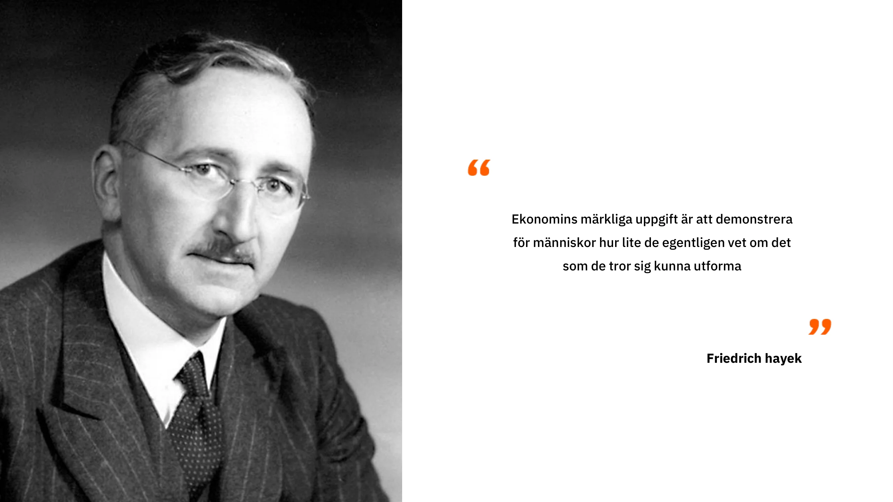

### Det österrikiska perspektivet och andra ekonomiska skolors misslyckanden

Man skulle kunna hävda att det är lätt att måla upp ett sådant panorama i efterhand. Vi är trots allt alla medvetna om de tomma hyllorna i Sovjetunionen, Venezuelas svårigheter och den humanitära katastrofen i Kambodja. Men Mises förutsåg dessa händelser så tidigt som 1920. Ändå, fram till Sovjetunionens kollaps 1989, hyllade många ekonomer, däribland flera nobelpristagare, det sovjetiska ekonomiska miraklet och förutspådde att den sovjetiska ekonomin snart skulle överträffa USA:s.

Trots dessa imponerande prognoser och många empiriska bevis på att det är omöjligt att göra ekonomiska beräkningar under socialismen, är politiska ledare världen över mer angelägna än någonsin att sätta priser, nationalisera hela industrier och föreslå femårsplaner, ofta applåderade av ekonomiskt oinformerade befolkningar. Konsekvenserna av en sådan interventionism är mycket kännbara för människor i tidigare välmående västländer som långsamt bevittnar hur deras levnadsstandard sjunker.

### Den österrikiska konjunkturcykelteorin som ett specifikt fall av omöjligheten att göra ekonomiska beräkningar under socialismen

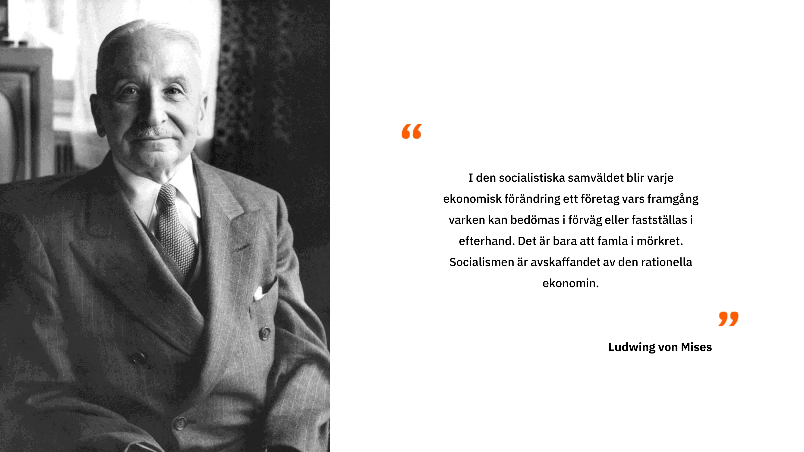

I ett tidigare kapitel belyste vi dynamiken i överinvesteringar och felallokering av kapital till följd av centralbankernas räntemanipulation. I grund och botten kan det vi förklarade ses som ett specifikt fall av omöjligheten att göra ekonomiska beräkningar under socialismen, tillämpat på penningmarknaderna. När priserna fastställs utanför sina marknadsvärden uppmuntras entreprenörer och kapitalfördelare att göra investeringar som inte kan upprätthållas på lång sikt på grund av brist på besparingar. Genom att ingripa i prissystemet skapar centrala planerare (i det här fallet centralbanker) en felaktig samordning mellan ekonomiska aktörer. I det här fallet innebär den intertemporala felkoordineringen överinvesteringar i investeringsvaror av högre rang och underinvesteringar i investeringsvaror av lägre rang, vilket är ett specifikt uttryck för felallokering av kapital mellan olika branscher.

Konsekvenserna av en sådan felallokering är bland annat finansiella och ekonomiska kriser, minskad ekonomisk aktivitet och skulddeflation. Dessa makroekonomiska effekter härrör från en obalans mellan sparande och investeringar till följd av kreditexpansion. I Sovjetunionen och andra kommunistiska regimer ledde prisöverenskommelser till liknande felkoordinering, vilket resulterade i brist på vissa varor och överproduktion av andra. I båda fallen återspeglar priserna inte konsumenternas verkliga preferenser, vare sig i termer av tidspreferenser eller konsumtionspreferenser, vilket leder till att entreprenörer eller centralplanerare som ansvarar för resursallokeringen investerar kapital i "fel branscher"

Idag dyker debatten om ekonomiska kalkyler upp igen, främst i diskussioner om energi, där felinvesteringar som drivs av en Green-agenda blir alltmer uppenbara. Den dyker också upp i diskussioner om penningmarknaderna, där österrikiska ekonomer påpekar att krisen 2008, som de etablerade ekonomerna inte lyckades förutse, var en klassisk boom and bust-cykel som kännetecknades av överinvesteringar på bostadsmarknaden på grund av långa perioder med låga räntor. Vidare sprider neomarxister och andra socialistiska falanger uppfattningen att framväxten av AI skulle kunna lösa det ekonomiska beräkningsproblemet. Detta perspektiv bottnar dock i en felaktig förståelse av frågan; det ekonomiska beräkningsproblemet är inte en fråga om datorkraft utan snarare en fråga om att generera och distribuera information relaterad till produktion och resursallokering. Denna information kan bara genereras lokalt av aktörer med specialkunskaper och ett egenintresse av resultatet. AI kan inte ersätta denna bottom-up-process och kan därför inte hjälpa centrala planerare att Address resursallokeringsproblemet. På grund av ett århundrade av missförstånd förväntar vi oss tyvärr en spridning av påståenden om att AI kommer att inleda en ny era av ekonomiskt välstånd som leds av upplysta centralplanerare som med hjälp av AI kan korrigera de fria marknadernas misslyckanden.

För en konkret tillämpning av det ekonomiska kalkylproblemet på en aktuell situation kan du läsa denna artikel som behandlar problemet med resursfördelning i det moderna Kina.

> Vägen till finansiell repression: China the Paper Tiger, Theo Mogenet, https://open.substack.com/pub/theomogenet/p/the-road-to-financial-repression-181?r=ccpx8&utm_campaign=post&utm_medium=web

### Slutsats

I detta sista kapitel har vi utforskat omöjligheten av ekonomisk kalkylering under socialismen, en central grundsats i den österrikiska skolan inom nationalekonomin. Det österrikiska perspektiv som presenterats i denna kurs kulminerar i denna slutsats och utgör ett starkt argument för en icke-interventionistisk politik. I grunden kretsar allt österrikiskt tänkande kring prisernas betydelse för den ekonomiska samordningen. Genom att betona betydelsen av alternativkostnader och ekonomisk beräkning för rationellt resursutnyttjande visar österrikiska ekonomer komplexiteten och subtiliteten i mänskligt handlande i en ständigt föränderlig värld.

Vanliga ekonomer och centralplanerare ogillar ofta österrikiska ekonomer eftersom de lyfter fram framtidens osäkerhet, det felaktiga i kvantitativa ekonomiska förutsägelser och de skadliga effekterna av ekonomiska ingripanden. Kort sagt, österrikisk ekonomi understryker ineffektiviteten och de skadliga konsekvenserna av interventionistiska åtgärder.

Den österrikiska traditionen präglas av ett ödmjukt förhållningssätt till mänskligt handlande och drar djupa slutsatser av begreppen subjektivt värde, osäkerhet, fri vilja och komplexitet. Den förklarar hur marknadsordningen, trots att den inte är en produkt av mänsklig design, står som den centrala institutionen för vår utveckling och vårt välstånd. Om det finns en viktig lärdom från kursen så är det att kapitalismen blev det dominerande ekonomiska systemet tack vare dess förmåga att anpassa sig till förändringar i en dynamisk och osäker värld befolkad av fria individer.

## Den österrikiska metodiken

<chapterId>419129c1-82ba-54e3-b385-95d4d89a447e</chapterId>

Den österrikiska ekonomiska skolan skiljer sig från andra skolor genom sin axiomatisk-deduktiva metodik, som skiljer sig från det positivistiska synsätt som ofta används inom samhällsvetenskaperna. Det positivistiska synsättet bygger på lagar som etableras utifrån empiriska data, med en metod som liknar den inom naturvetenskapen. Utifrån observationer formuleras hypoteser, som sedan bekräftas eller vederläggs genom tillfälliga experiment. Den vetenskapliga metoden innebär att man behåller den hypotes som bäst förklarar data och fortsätter att utforska den tills man hittar en mer exakt hypotes.

Inom samhällsvetenskapen är det dock svårt att isolera variabler på samma sätt som inom fysiken, eftersom varje ögonblick i historien är unikt och en mängd faktorer spelar in. Ekonomiska experiment kan inte reproduceras i ett laboratorium, och det är viktigt att notera att en korrelation mellan två variabler inte bevisar att det finns ett orsakssamband mellan dem. Österrikarna, i synnerhet Ludwig von Mises, föreslog en alternativ metod som kallas a priori eller axiomatisk-deduktiv metod för att studera samhällsvetenskaper. Denna metod bygger på grundläggande påståenden, s.k. axiom, liknande dem som används inom matematiken. Euklidisk geometri är till exempel ett exempel på en axiomatisk-deduktiv metod inom matematiken.

Inom österrikisk ekonomi inkluderar de grundläggande axiomen positiva tidspreferenser, som baseras på individuella val av varor eller tjänster idag snarare än imorgon, på grund av osäkerhet om framtiden. Dessa axiom ifrågasätts inte, eftersom de anses vara självklara och förenliga med vardagslivet. Med hjälp av dessa grundläggande axiom använder österrikiska ekonomer logikens regler för att härleda påståenden som ger information om hur ekonomiska fenomen fungerar. De förklarar t.ex. att ekonomiska kriser orsakas av en obalans mellan sparande och investeringar, vilket leder till artificiell manipulation av räntorna. Individer med positiva tidspreferenser kräver en positiv ränta för att kompensera för risken med att låna ut. Österrikarna menar att värderingsrelationer är subjektiva och att räntor därför kan variera beroende på individer och omständigheter.

Priserna spelar en avgörande roll för att individer med partiell information ska kunna organisera sig på ett rationellt sätt. Räntan balanserar Supply och efterfrågan på kapital på marknaden och främjar därmed ekonomin. Österrikiska ekonomer betonar att godtycklig räntesättning kan leda till ekonomiska kriser och omöjliggöra kalkylering i en socialistisk regim.

### Österrikiska ekonomer och metodologiska skillnader

Österrikiska ekonomer stöter ofta på svårigheter när de debatterar med andra tankeskolor, eftersom de inte använder samma analysmetoder. Medan österrikare resonerar utifrån grundläggande axiom, som t.ex. att värde är subjektivt, för att dra logiska slutsatser, tenderar keynesianska eller monetaristiska ekonomer att förlita sig på empiriska data för att fastställa allmänna ekonomiska lagar.

Ett exempel på metodologiska skillnader är Modern Monetary Theory (MMT)-förespråkare som har förespråkat pengatryckning för att uppnå politiska mål och använt avsaknaden av inflation mellan 2008 och 2019 som ett argument. Österrikiska ekonomer och MMT-förespråkare talar inte samma språk och är inte överens om kriterierna för att fastställa giltigheten av en ekonomisk lag. Detta gör debatterna mellan dessa olika skolor svåra och ofta improduktiva.

Det är viktigt att notera att cherry-picking, som innebär att man selektivt väljer ut data för att fastställa samband mellan variabler, är en ovetenskaplig och ohederlig metod inom nationalekonomin. Monetärt skapande behöver t.ex. inte nödvändigtvis leda till inflation och det krävs ett mer nyanserat synsätt för att förstå komplexa ekonomiska mekanismer. Axiom spelar en avgörande roll i österrikiska ekonomiska resonemang. De är grundläggande Elements från vilka logiska slutsatser kan dras. Det är dock viktigt att inse att det ofta är svårt att göra exakta prognoser om framtiden inom ekonomin på grund av de ekonomiska fenomenens komplexitet och den inneboende osäkerheten.

Metodik är en viktig aspekt inom nationalekonomi och samhällsvetenskap i allmänhet. Den påverkar hur frågor ställs, hypoteser formuleras och data tolkas. Att förstå de metodologiska skillnaderna mellan olika ekonomiska skolor kan hjälpa oss att uppskatta olika perspektiv och utveckla våra egna åsikter om de ämnen som diskuterats i tidigare avsnitt.

# Sista avsnittet

<partId>ae828713-d133-559f-93c2-101cb5245fca</partId>

## Recensioner & betyg

<chapterId>29d4323c-e34e-5834-bf03-2f3ed10d751b</chapterId>

<isCourseReview>true</isCourseReview>

## Slutlig tentamen

<chapterId>d58d188f-81fb-572a-a898-8b6f8aceba7a</chapterId>

<isCourseExam>true</isCourseExam>

## Slutsats

<chapterId>d668fdf6-fb4c-4bbf-82e1-afcb95c122e0</chapterId>

<isCourseConclusion>true</isCourseConclusion>