# การเดินทางสู่เศรษฐศาสตร์ออสเตรีย

เคยสงสัยไหมว่าทำไมบางนักเศรษฐศาสตร์ถึงมีมุมมองที่แตกต่างเกี่ยวกับตลาด, เสรีภาพ, และพฤติกรรมมนุษย์? เศรษฐศาสตร์แบบออสเตรียนำเสนอแนวคิดที่สดใหม่ที่ทำให้คุณเป็นศูนย์กลางของการคิดทางเศรษฐศาสตร์ แทนที่จะใช้คณิตศาสตร์หนักและแบบจำลองที่เป็นนามธรรม แนวทางนี้มุ่งเน้นที่ตรรกะ, การเลือกของมนุษย์, และวิธีที่คนจริงๆ ตัดสินใจในชีวิตประจำวันของพวกเขา มันคือเศรษฐศาสตร์ผ่านเลนส์ของเสรีภาพ, ความมีเหตุผล, และการกระทำส่วนบุคคล

แนวคิดนี้ได้หล่อหลอมการถกเถียงมานานหลายศตวรรษ ต้องขอบคุณนักคิดที่มีอิทธิพลอย่าง Hayek, Mises, และ Bastiat แม้ว่าเศรษฐศาสตร์กระแสหลักแบบเคนส์จะครอบงำการอภิปรายเชิงนโยบายในปัจจุบัน แต่ประเพณีออสเตรียกลับตั้งคำถามที่แตกต่างออกไป: จะเกิดอะไรขึ้นเมื่อเราให้ความสำคัญกับเสรีภาพส่วนบุคคล? ตลาดเสรีทำงานอย่างไรเมื่อผู้คนมีอิสระในการเลือก? หากคุณอยากรู้เกี่ยวกับวิธีคิดทางเลือกเกี่ยวกับตลาด สังคม และเสรีภาพ นี่คือโอกาสของคุณที่จะสำรวจแนวคิดที่คุณจะไม่พบในตำราเรียนมาตรฐาน

+++
# บทนำ

<partId>265aa8b0-dd89-5456-b72a-656e988013d5</partId>

## ภาพรวมของหลักสูตร

<chapterId>eae3de7b-cce6-516d-83d9-28fbd582c0ca</chapterId>

ยินดีต้อนรับสู่หลักสูตร ECO201!

ในหลักสูตรนี้ที่นำเสนอโดย Théo Mogenet คุณจะได้ค้นพบสำนักความคิดทางเศรษฐศาสตร์ที่แตกต่างอย่างสิ้นเชิงจากหลักคำสอนของเคนส์ที่แพร่หลาย จนถึงตอนนี้ คุณอาจได้รับการสอนว่าการจัดการเงินและนโยบายเศรษฐกิจเป็นหน้าที่หลักของธนาคารกลาง โดยมีแนวคิดว่าการพิมพ์เงินและการใช้จ่ายสาธารณะกระตุ้นการเติบโตทางเศรษฐกิจ อย่างไรก็ตาม ยังมีแนวทางทางเลือกที่สอดคล้องกันมากกว่า: **เศรษฐศาสตร์ออสเตรีย**

ด้วยการวิจัยมากว่าสองศตวรรษ การสะท้อนทางปรัชญา และงานเขียนโดยนักเขียนที่มีชื่อเสียงเช่น Carl Menger, Ludwig von Mises และ Friedrich Hayek สำนักความคิดนี้มีมุมมองที่แตกต่าง โดยสนับสนุนมุมมองเศรษฐกิจแบบกระจายอำนาจที่ยึดตามบุคคลและความมีเหตุผลของมนุษย์

เศรษฐศาสตร์ในความเป็นจริงเป็นสาขาที่มีความซับซ้อนและเกี่ยวข้องกับสังคมอย่างลึกซึ้ง ประกอบด้วยผู้กระทำอิสระจำนวนมากที่มีปฏิสัมพันธ์กันอย่างเสรีเพื่อสร้างความเป็นหนึ่งเดียวกัน เพื่อทำความเข้าใจระบบที่มีพลวัตนี้ เศรษฐศาสตร์ออสเตรียนิยมการวิเคราะห์เชิงคุณภาพ ซึ่งอิงตามตรรกะของมนุษย์ สังคมวิทยา และการศึกษากระบวนการตลาด มากกว่าการใช้สมการทางคณิตศาสตร์ที่เข้มงวด

ในหลักสูตรนี้ คุณจะได้สำรวจหลักการพื้นฐานของสำนักความคิดนี้ Théo Mogenet ผู้สอนของคุณ เป็นผู้สนับสนุนที่กระตือรือร้นของแนวทางเศรษฐศาสตร์นี้และจะนำคุณผ่านแนวคิดสำคัญของเศรษฐศาสตร์ออสเตรีย โดยแสดงให้คุณเห็นว่าแนวคิดเหล่านี้มีการประยุกต์ใช้กับโลกของ Bitcoin อย่างไร

**ส่วนที่ 1: บทนำสู่ ECON**

เราจะเริ่มต้นด้วยการแนะนำทั่วไปเกี่ยวกับเศรษฐศาสตร์ออสเตรีย โดยสำรวจต้นกำเนิดทางประวัติศาสตร์และรากฐานของแนวคิดของมัน ส่วนนี้ยังครอบคลุมถึงแนวคิดที่สำคัญ เช่น เงิน เครดิต ธนาคาร และธนาคารกลาง คุณจะเข้าใจว่าทำไมสถาบันเหล่านี้จึงมีบทบาทสำคัญในแนวคิดของออสเตรีย โดยเฉพาะในการวิพากษ์วิจารณ์การแทรกแซงทางการเงิน

**Section 2: พื้นฐานทางทฤษฎี**

ส่วนนี้จะเจาะลึกถึงแนวคิดพื้นฐานของเศรษฐศาสตร์ออสเตรีย เช่น ทฤษฎีมูลค่าเชิงอัตวิสัย ซึ่งอธิบายว่าทำไมมูลค่าของสินค้าจึงไม่เป็นวัตถุวิสัยแต่ขึ้นอยู่กับประโยชน์ที่แต่ละบุคคลรับรู้ คุณจะได้ค้นพบด้วยว่าเงินเกิดขึ้นตามธรรมชาติในฐานะปรากฏการณ์ทางสังคม พร้อมกับแนวคิดเรื่องการให้ความสำคัญกับเวลา ดอกเบี้ย และทุน ซึ่งเป็นหัวใจของทฤษฎีตลาดเสรีของออสเตรีย

**Section 3: มุมมองทางเศรษฐกิจของออสเตรีย**

ที่นี่ เราจะสำรวจการประยุกต์ใช้ทฤษฎีออสเตรียในทางปฏิบัติ คุณจะได้เรียนรู้รายละเอียดเกี่ยวกับทฤษฎีวัฏจักรธุรกิจออสเตรีย ซึ่งอธิบายว่าการจัดการทางการเงินสร้างความเฟื่องฟูเทียมตามด้วยภาวะถดถอยได้อย่างไร นอกจากนี้เรายังจะเห็นว่าทำไมการคำนวณทางเศรษฐกิจจึงเป็นไปไม่ได้ภายใต้ระบบสังคมนิยม และวิธีที่ระเบียบวิธีออสเตรีย ซึ่งอิงตาม praxeology (การศึกษาการกระทำของมนุษย์) ให้แนวทางที่เป็นเอกลักษณ์และสอดคล้องในการทำความเข้าใจปรากฏการณ์ทางเศรษฐกิจ

หลักสูตรนี้เป็นการผสมผสานระหว่างเศรษฐศาสตร์และปรัชญา โดยมีการอภิปรายเปิดระหว่าง Théo และฉัน (Rogzy) ฉันขอขอบคุณ Théo Mogenet อย่างอบอุ่นสำหรับการสร้างหลักสูตรนี้ เรามีความสุขมากในการพัฒนาสาระนี้ ซึ่งออกแบบมาให้ทุกคนเข้าถึงได้ หลักสูตรนี้ทำหน้าที่เป็นการแนะนำที่สำคัญและจะวางรากฐานสำหรับโมดูลเศรษฐศาสตร์ขั้นสูงของเราในอนาคต

แล้วถ้ากุญแจสำคัญในการทำความเข้าใจเศรษฐกิจในปัจจุบันอยู่ในทฤษฎีที่มีอายุนับหลายศตวรรษล่ะ? มาค้นพบไปด้วยกันเถอะ!

## เงิน, เครดิต, ธนาคาร, และธนาคารกลาง

<chapterId>29faebd9-9326-52de-8161-e4bb33033cd6</chapterId>

> “ปัญหารากฐานของสกุลเงินแบบดั้งเดิมคือความไว้วางใจทั้งหมดที่จำเป็นในการทำให้มันทำงานได้ ธนาคารกลางต้องได้รับความไว้วางใจว่าจะไม่ลดค่าเงิน แต่ประวัติศาสตร์ของสกุลเงินเฟียตเต็มไปด้วยการละเมิดความไว้วางใจนั้น ธนาคารต้องได้รับความไว้วางใจในการเก็บเงินของเราและโอนเงินทางอิเล็กทรอนิกส์ แต่พวกเขาปล่อยกู้ในคลื่นของฟองสบู่เครดิตโดยมีเงินสำรองเพียงเศษเสี้ยว เราต้องไว้วางใจพวกเขาในเรื่องความเป็นส่วนตัว ไว้วางใจพวกเขาว่าจะไม่ปล่อยให้โจรขโมยข้อมูลระบุตัวตนระบายบัญชีของเรา”
>

> Satoshi Nakamoto, นักประดิษฐ์นามแฝงของ Bitcoin

### วิธีการสร้างเงิน

ในระบบการเงินปัจจุบันของเรา เงินถูกสร้างขึ้นเป็นหลักผ่านการปฏิบัติทางธนาคารที่เรียกว่า "การธนาคารสำรองบางส่วน" คำนี้หมายความว่าโดยพื้นฐานแล้วธนาคารไม่จำเป็นต้องถือเงินสำรองเท่ากับจำนวนเงินฝากที่ได้รับ ดังนั้นพวกเขาจึงสามารถสร้างอำนาจการซื้อใหม่เมื่อให้กู้ยืมเงินและในทางกลับกัน ลดอำนาจการซื้อเมื่อผู้ชำระคืนเงินกู้

ตัวอย่างเช่น หากคุณไปที่ธนาคารท้องถิ่นเพื่อขอสินเชื่อที่อยู่อาศัยสำหรับการซื้อบ้าน เงินที่ธนาคารให้ยืมคุณจะเกิดขึ้นในรูปแบบของการบันทึกบัญชี ในการบัญชี เรามักจะแสดงความมั่งคั่งสุทธิของบุคคลด้วยงบดุล ซึ่งมีสองด้าน: ด้านสินทรัพย์ รวมถึงทรัพย์สิน สัญญาทางการเงิน สินค้าคงคลัง หรือรูปแบบอื่น ๆ ของความมั่งคั่งที่เป็นเจ้าของ และด้านหนี้สิน แสดงแหล่งที่มาของเงินทุนที่ใช้ในการสร้างทุนที่ระบุไว้ในด้านสินทรัพย์ ความแตกต่างระหว่างสินทรัพย์และหนี้สินเรียกว่า "ส่วนของผู้ถือหุ้น" และสามารถคิดได้ว่าเป็นความมั่งคั่งสุทธิของหน่วยงานนั้น ๆ

เมื่อสถาบันการเงินถือใบอนุญาตธนาคาร นั่นหมายความว่าหนี้สินที่บันทึกเป็น "เงินฝากลูกค้า" ถือเป็นเงินอย่างเป็นทางการภายในประเทศหรือเขตการเงินที่เฉพาะเจาะจง ดังนั้นเมื่อคุณขอกู้เงินเพื่อซื้อบ้านจากธนาคาร นายธนาคารไม่ได้ให้ยืมเงินที่ฝากโดยลูกค้ารายอื่น แต่ธนาคารจะเครดิตจำนวนเงินที่ยืมไปยังบัญชีของคุณและบันทึกสัญญาเงินกู้ของคุณเป็นสินทรัพย์ของธนาคาร เมื่อคุณชำระคืนเงินกู้ เงินจะถูกทำลายอย่างมีประสิทธิภาพ และมูลค่าของสัญญาเงินกู้ที่สอดคล้องกันจะลดลง โดยธนาคารจะเก็บเฉพาะดอกเบี้ยจากเงินกู้เท่านั้น

เมื่อตัดสินใจซื้อบ้าน คุณสั่งให้ธนาคารของคุณโอนเงินไปยังบัญชีของผู้ขาย หากบัญชีของผู้ขายอยู่กับธนาคารอื่น ธนาคารของคุณจะแจ้งให้ธนาคารที่เกี่ยวข้องที่สถาบันอื่นทราบเพื่อให้แน่ใจว่าบัญชีของผู้ขายได้รับเครดิตตามที่กำหนด ในขณะที่หักบัญชีของคุณด้วยจำนวนเงินที่สอดคล้องกัน

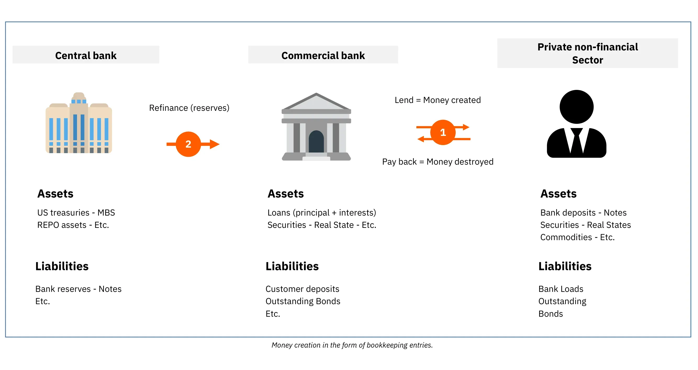

รูปที่ 1: การสร้างเงินในรูปแบบของการบันทึกบัญชี

> “มันก็ดีเพียงพอที่ประชาชนของประเทศเราไม่เข้าใจระบบธนาคารและการเงินของเรา เพราะถ้าพวกเขาเข้าใจ ฉันเชื่อว่าจะมีการปฏิวัติก่อนพรุ่งนี้เช้า”
>

> เฮนรี ฟอร์ด

กระบวนการนี้ช่วยให้ธนาคารสามารถบันทึกธุรกรรมทั้งหมด รวมถึงการโอนเงินผ่านธนาคาร การซื้อด้วยบัตรเครดิต และเช็ค ในช่วงเวลาที่กำหนด (โดยปกติจะเป็นสัปดาห์หรือเดือน) จากนั้นพวกเขาจะชำระธุรกรรมเหล่านี้ระหว่างกันโดยใช้เงินสำรองของธนาคาร ซึ่งเป็นรูปแบบหนึ่งของเงินตราที่ไม่เคยถูกใช้โดยสาธารณะ เงินสำรองของธนาคารถูกเก็บไว้ที่ธนาคารกลางในบัญชีพิเศษที่สามารถเข้าถึงได้เฉพาะธนาคารที่ได้รับใบอนุญาตและสถาบันการเงินเท่านั้น

### ความไม่มั่นคงของการธนาคารสำรองเศษส่วนและผู้ให้กู้ในยามฉุกเฉิน

ปัญหาหลักของระบบสำรองเศษส่วนนี้คือการถอนเงินจำนวนมากจากธนาคารใดธนาคารหนึ่งอาจนำไปสู่การล้มละลายได้ เนื่องจากธนาคารต้องตอบสนองความต้องการเงินสดของลูกค้าในขณะที่ถือเงินสำรองของธนาคารเพียงเล็กน้อย การเร่งรีบพร้อมกันของลูกค้าจำนวนมากในการถอนเงินสามารถทำให้ธนาคารไม่สามารถตอบสนองความต้องการเหล่านี้ได้ ส่งผลให้เกิดการล้มละลาย เนื่องจากบุคคล บริษัท และสถาบันหลายแห่งมีเงินฝากอยู่ในธนาคาร การปล่อยให้ธนาคารล้มเหลวอาจส่งผลกระทบทางเศรษฐกิจอย่างรุนแรง เช่น ภาวะถดถอยหรือแม้กระทั่งภาวะเศรษฐกิจตกต่ำ

ปริศนานี้ทำให้เกิดธนาคารกลางสมัยใหม่ ในศตวรรษที่ 19 ในอังกฤษ การวิ่งถอนเงินจากธนาคารซ้ำๆ ได้คุกคามเสถียรภาพทางการเงิน นำไปสู่การก่อตั้งธนาคารแห่งประเทศอังกฤษในฐานะ "ผู้ให้กู้ในยามสุดท้าย" ธนาคารแห่งประเทศอังกฤษได้รับมอบหมายให้ให้กู้ยืมเงินแก่ธนาคารที่ประสบปัญหาในช่วงวิกฤตเพื่อป้องกันผลกระทบโดมิโนที่อาจทำให้ระบบการเงินทั้งหมดเป็นอัมพาต แนวคิดของธนาคารกลางในฐานะผู้ให้กู้ในยามสุดท้ายนี้ได้แพร่กระจายไปทั่วโลกและกลายเป็นเรื่องปกติทั่วไป

นอกเหนือจากการรักษาเสถียรภาพทางการเงินแล้ว ธนาคารกลางยังมีหน้าที่ในการกำหนดอัตราดอกเบี้ยนโยบายหลักอีกด้วย อัตราเหล่านี้กำหนดต้นทุนที่ธนาคารที่ได้รับใบอนุญาตสามารถกู้ยืมเงินจากธนาคารกลางได้ ซึ่งโดยพื้นฐานแล้วจะกำหนดต้นทุนของสภาพคล่องสำหรับสถาบันการเงินที่มีบทบาทสำคัญในการให้กู้ยืมในเศรษฐกิจของเรา ดังนั้น อัตราเหล่านี้จึงทำหน้าที่เป็นเกณฑ์มาตรฐานสำหรับระบบการเงินทั้งหมด ในฐานะบุคคล อัตราดอกเบี้ยที่คุณจ่ายสำหรับการจำนองของคุณสามารถแบ่งออกเป็นอัตราดอกเบี้ยนโยบายและส่วนต่างของธนาคาร

รูปที่ 2: การล้มละลายของ Lehman Brothers (15/09/2008)

ในช่วงวิกฤตการเงินครั้งใหญ่ของปี 2008 Lehman Brothers ซึ่งเป็นธนาคารการลงทุนขนาดใหญ่ได้ประกาศล้มละลายหลังจากประสบกับการสูญเสียอย่างมากในสินทรัพย์หลักทรัพย์จำนองและการถอนเงินจำนวนมากจากลูกค้าที่กังวลใจ เพื่อตอบสนองต่อความวุ่นวายทางการเงินที่ไม่เคยเกิดขึ้นมาก่อนนี้ ธนาคารกลางทั่วโลกได้ฉีดสภาพคล่องจำนวนมากเข้าสู่ตลาดการเงิน รวมธนาคารการลงทุนที่กำลังประสบปัญหากับธนาคารพาณิชย์ และลดอัตราดอกเบี้ยนโยบายลงใกล้ศูนย์เพื่อป้องกันการล่มสลายของระบบ

แม้ว่ามาตรการเหล่านี้จะป้องกันการล้มละลายเป็นลูกโซ่ได้ แต่ก็ทำได้น้อยมากในการบรรเทาการชะลอตัวทางเศรษฐกิจที่ตามมา ผู้คนนับล้านสูญเสียงานและบ้าน การใช้จ่ายของผู้บริโภคลดลง ธุรกิจล้มละลาย และธนาคารประสบกับการสูญเสียอย่างมาก แม้อัตราดอกเบี้ยจะต่ำเป็นประวัติการณ์ แต่ก็มีเพียงไม่กี่คนที่เต็มใจที่จะกู้ยืม ส่งผลให้เกิดวงจรอุบาทว์ที่การลดลงของการใช้จ่ายและการลงทุนในขั้นต้นเสริมสร้างตัวเอง ดังนั้น ธนาคารกลางจึงดำเนินการเพิ่มเติมโดยการใช้โปรแกรมการผ่อนคลายเชิงปริมาณ (QE) โปรแกรมเหล่านี้เกี่ยวข้องกับการที่ธนาคารกลางซื้อพันธบัตรรัฐบาลและหลักทรัพย์ที่มีการจำนองค้ำประกันจากธนาคารพาณิชย์ด้วยทุนสำรองของธนาคารกลาง

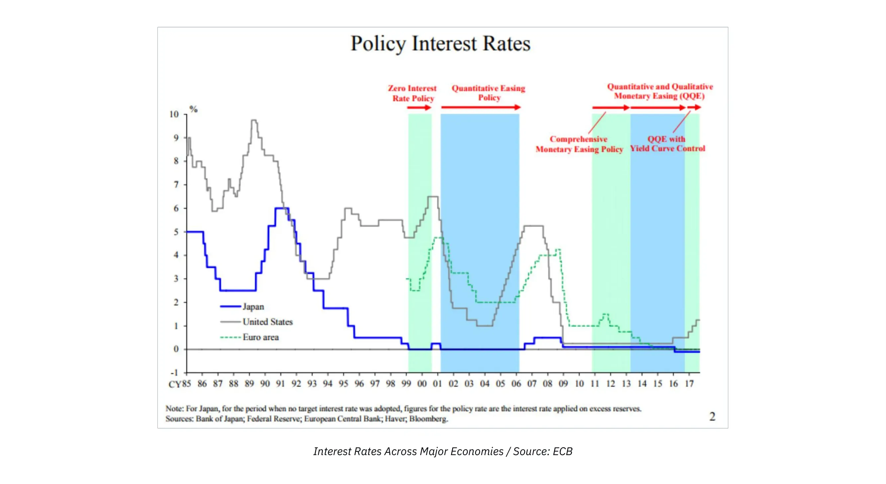

รูปที่ 3: อัตราดอกเบี้ยในเศรษฐกิจหลัก / แหล่งที่มา: ECB

ตรงกันข้ามกับความคาดหวังของหลาย ๆ คน โปรแกรม QE ไม่ได้ฟื้นฟูการเติบโตทางเศรษฐกิจอย่างมีนัยสำคัญ แต่กลับทำให้สินทรัพย์ทางการเงินพุ่งสูงขึ้นถึงระดับประวัติศาสตร์ สิ่งนี้เป็นประโยชน์ต่อคนรวยและสถาบันการเงินเป็นหลัก เนื่องจากพวกเขาถือครองสินทรัพย์ดังกล่าวในปริมาณมากอยู่แล้ว จึงทำให้ความเหลื่อมล้ำทางความมั่งคั่งกว้างขึ้น เมื่อพิจารณาจากโครงสร้างของระบบธนาคารที่อธิบายไว้ก่อนหน้านี้ ผลลัพธ์นี้ไม่ควรเป็นเรื่องน่าประหลาดใจ เนื่องจากทุนสำรองของธนาคารไม่สามารถไหลเข้าสู่เศรษฐกิจจริงได้ง่าย ๆ โปรแกรม QE จึงส่งผลให้ราคาสินทรัพย์เพิ่มขึ้นโดยไม่ได้ปรับปรุงสถานการณ์ทางการเงินของบุคคลทั่วไปอย่างมีประสิทธิภาพ

### ผลกระทบแคนทิลลอน

ถึงกระนั้น หลักการทางเศรษฐกิจที่สำคัญสามารถสรุปได้จากเหตุการณ์นี้: เมื่อมีการสร้างเงินใหม่ขึ้นมา ผู้ที่อยู่ใกล้แหล่งที่มาของเงินจะได้รับประโยชน์ในขั้นต้น โดยเป็นค่าใช้จ่ายของผู้ที่อยู่ไกลออกไป ข้อมูลเชิงลึกทางเศรษฐกิจนี้มีมาตั้งแต่ศตวรรษที่ 18 เมื่อริชาร์ด แคนทิลลอน ได้อธิบายไว้ใน "Essay on the Nature of Commerce in General" ปัจจุบันนี้เรียกกันทั่วไปว่า "ผลกระทบแคนทิลลอน"

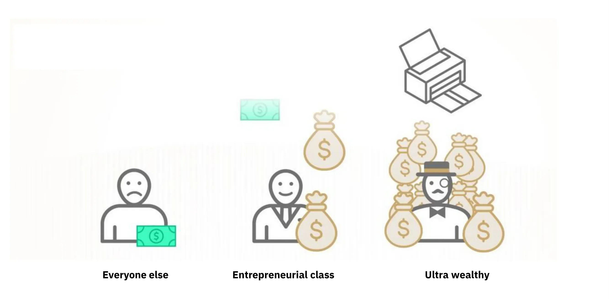

รูปที่ 4: ผลของแคนทิลลอนโดยสรุป / แหล่งที่มา: River Financial

ในกรณีนี้ นักการธนาคาร ผู้บริหารธนาคาร เจ้าของหุ้นและพันธบัตร นักพัฒนาอสังหาริมทรัพย์ ผู้ให้กู้ด้านอสังหาริมทรัพย์ และใครก็ตามที่ถือสินทรัพย์ทางการเงินหรืออสังหาริมทรัพย์ได้รับโชคลาภทางการเงิน ในขณะที่ภาระตกอยู่กับคนอื่น ๆ สถานการณ์นี้ดำเนินต่อไปเป็นเวลาหลายปีและอธิบายถึงความไม่เท่าเทียมกันทางความมั่งคั่งที่เพิ่มขึ้น ความรู้สึกของการถูกกีดกันในหมู่บุคคลที่ทำงานหนัก และการเพิ่มขึ้นของราคาสินทรัพย์ที่ดูเหมือนจะหยุดไม่ได้แม้ว่า GDP จะเติบโตอย่างเชื่องช้า

โดยสรุปแล้ว ระบบมีความเอนเอียง ธนาคารมีความไม่มั่นคงโดยธรรมชาติ แต่การล้มเหลวของพวกเขาสามารถทำให้เศรษฐกิจทั้งหมดตกอยู่ในอันตรายได้ ความเสี่ยงทางศีลธรรมนี้กระตุ้นให้ผู้บริหารธนาคารรับความเสี่ยงเกินควรเพื่อเพิ่มรายได้ของธนาคาร โดยรู้ว่าธนาคารกลางจะช่วยเหลือในที่สุด ทำให้ต้นทุนตกไปอยู่ที่ผู้เสียภาษี ในสถานการณ์เช่นนี้ ธนาคารกลางสร้างเงื่อนไขสำหรับการถ่ายโอนอำนาจการซื้อจำนวนมากจากบุคคลที่ทำงานหนักและผู้ที่ออมเงินไปยังเจ้าของสินทรัพย์และผู้ที่เชื่อมโยงกับระบบการเงิน ทำให้กระบวนการสร้างความมั่งคั่งแยกออกจากการสะสมความมั่งคั่ง

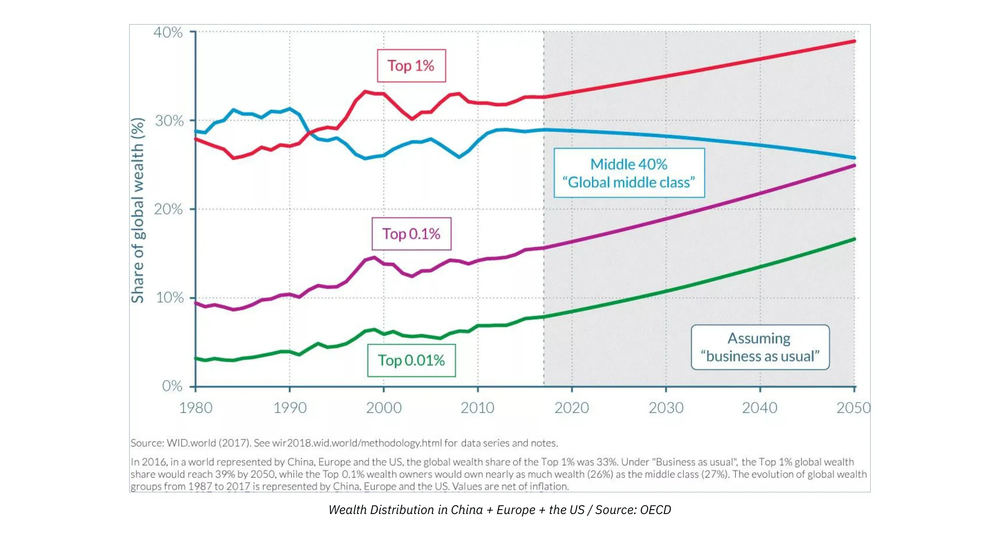

รูปที่ 5: การกระจายความมั่งคั่งในจีน + ยุโรป + สหรัฐอเมริกา / แหล่งที่มา: OECD

### ผลกระทบของนโยบายอัตราดอกเบี้ยศูนย์

ในช่วงเวลาที่ยาวนานของนโยบายอัตราดอกเบี้ยศูนย์ (ZIRP) ธนาคารมีโอกาสจำกัดในการสร้างทุนใหม่เพราะกำไรของพวกเขาถูกกัดกร่อน ธนาคารมักจะทำเงินโดยการกู้ยืมในอัตราระยะสั้นและปล่อยกู้ในอัตราระยะยาว อย่างไรก็ตาม เมื่อธนาคารกลางซื้อพันธบัตรในปริมาณมากและกำหนดอัตราดอกเบี้ยที่ศูนย์ ธนาคารมีแรงจูงใจน้อยในการปล่อยกู้ โดยเฉพาะกับผู้ประกอบการและผู้ที่ยอมรับความเสี่ยงอื่น ๆ แทนที่จะเป็นเช่นนั้น พวกเขาจัดสรรทรัพยากรของตนเพื่อแปลงสินทรัพย์ที่มีอยู่เป็นหลักทรัพย์หรือให้กู้ยืมโดยใช้หลักประกันเพื่อตอบสนองความต้องการของผู้ที่ได้รับประโยชน์จากผลกระทบของแคนทิลลอน

ผลที่ไม่ได้ตั้งใจอีกประการหนึ่งของ ZIRP คือการที่มันกระตุ้นให้รัฐบาลมีการใช้จ่ายอย่างกว้างขวาง เนื่องจากรัฐบาลไม่มีต้นทุนการกู้ยืมและสามารถพึ่งพาธนาคารกลางในการซื้อพันธบัตรของพวกเขาผ่านโปรแกรม QE พวกเขาจึงมีแรงจูงใจตามธรรมชาติที่จะใช้จ่ายให้มากที่สุดเท่าที่จะเป็นไปได้ โดยเฉพาะในบริบทของประชาธิปไตยที่การใช้จ่ายสามารถดึงดูดคะแนนเสียงได้ แนวโน้มนี้มักจะไม่คำนึงถึงผลที่ตามมาในระยะยาวของความฟุ่มเฟือยทางการคลังดังกล่าว นำไปสู่การเพิ่มขึ้นอย่างมีนัยสำคัญในระดับหนี้สาธารณะในเศรษฐกิจที่พัฒนาแล้วตั้งแต่วิกฤตการเงินโลก (GFC)

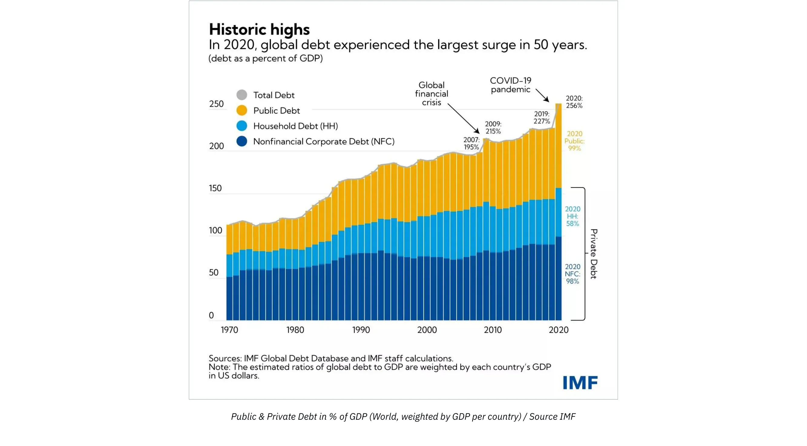

รูปที่ 6: หนี้สาธารณะและหนี้ภาคเอกชนเป็น % ของ GDP (ทั่วโลก, ถ่วงน้ำหนักตาม GDP ต่อประเทศ) / ที่มา IMF

ด้วยอัตราเงินเฟ้อที่เพิ่มขึ้นเนื่องจากการสร้างเงินจำนวนมากเพื่อตอบสนองต่อการล็อกดาวน์ที่เกี่ยวข้องกับ COVID ธนาคารกลางกำลังเพิ่มอัตราดอกเบี้ยนโยบายเพื่อพยายามควบคุมเงินเฟ้อ อย่างไรก็ตาม นี่เป็นความท้าทายที่สำคัญสำหรับทั้งระบบ ธนาคารมีการใช้เงินกู้มากกว่าที่เคย รัฐบาลมีระดับหนี้ที่สูงเป็นประวัติการณ์ การเติบโตทางเศรษฐกิจชะลอตัว การขาดดุลเพิ่มขึ้น และผู้บริโภคที่ต้องเผชิญกับราคาสินค้าจำเป็นที่สูงขึ้น กำลังดิ้นรนเพื่อให้เพียงพอต่อการดำรงชีวิต การควบคุมเงินเฟ้อจะต้องเพิ่มอัตราดอกเบี้ยไปสู่ระดับที่อาจทำให้รัฐบาลล้มละลายได้ ขณะที่ธนาคารเสี่ยงต่อการสูญเสียผู้ฝากเงินเมื่อบุคคลใช้เงินออมของตนกับสินค้าจำเป็นที่มีราคาแพงขึ้นหรือหาที่หลบภัยในสินทรัพย์ที่มั่นคงและกองทุนตลาดเงินเพื่อป้องกันความเสี่ยงจากเงินเฟ้อ

### บทสรุป

> “ด้วยวิธีการนี้ (การธนาคารสำรองเศษส่วน) รัฐบาลอาจยึดทรัพย์สินของประชาชนอย่างลับๆ และไม่มีใครในล้านคนจะตรวจพบการโจรกรรม”
>

> จอห์น เมย์นาร์ด เคนส์

โดยสรุปแล้ว ระบบของเรากำลังเผชิญกับความท้าทายอย่างมาก และ Bitcoin ปรากฏเป็นทางเลือกเดียวที่น่าเชื่อถือ อย่างไรก็ตาม Bitcoin เพียงอย่างเดียวไม่สามารถแก้ไขปัญหาภายในระบบการเงินของเราได้ เหนือสิ่งอื่นใด เราต้องการบุคคลที่เข้าใจหลักการทางเศรษฐศาสตร์พื้นฐานในหมู่ผู้ที่ชื่นชอบ Bitcoin เพื่อให้เกิดความตระหนักรู้ที่กว้างขึ้นและสามัญสำนึกทางเศรษฐกิจที่จะนำทางเราออกจากการสร้างรากฐานทางการเงินที่เปราะบางอีกครั้งสำหรับอารยธรรมของเรา วัตถุประสงค์หลักของหลักสูตรนี้คือการให้ความรู้แก่ผู้ที่ชื่นชอบ Bitcoin ใหม่ในหลักการทางเศรษฐศาสตร์ที่มั่นคง

เพื่อบรรลุเป้าหมายนี้ เราจะอธิบายหลักการพื้นฐานของ "เศรษฐศาสตร์ออสเตรีย" ซึ่งเป็นสำนักคิดทางเศรษฐศาสตร์ที่มีประเพณีทางวิธีวิทยาย้อนหลังไปถึงศตวรรษที่ 16 โดยให้ข้อมูลเชิงลึกเกี่ยวกับการกระทำของมนุษย์ภายใต้ข้อจำกัดทางเศรษฐกิจ ด้วยการแนะนำนี้ คุณจะเข้าใจพื้นฐานของการสร้างเงินและสถานะปัจจุบันของระบบการเงินและการเงินของเรา

ในบทต่อไป เราจะเจาะลึกถึงรากฐานสำคัญของสำนักเศรษฐศาสตร์ใดๆ: ทฤษฎีมูลค่า บทต่อๆ ไปจะสำรวจเรื่องเงินในฐานะสถาบันทางสังคม ทฤษฎีทุนและวัฏจักรธุรกิจ ความท้าทายของการคำนวณทางเศรษฐกิจ และภาพรวมสั้นๆ ของประวัติศาสตร์และระเบียบวิธีของสำนักเศรษฐศาสตร์ออสเตรียน

# รากฐานทางทฤษฎี

<partId>86012c1b-cdf2-586f-8fe7-263f8287e950</partId>

## ทฤษฎีมูลค่าตามอัตวิสัย

<chapterId>eb1608d4-5d36-56a0-bcfc-ed8c03dfa906</chapterId>

> “คุณค่าเกิดขึ้นได้เฉพาะในจิตสำนึกของมนุษย์”
>

> คาร์ล เมงเกอร์, หลักเศรษฐศาสตร์การเมือง

### การปฏิวัติชายขอบ

ที่รากฐานของการให้เหตุผลทางเศรษฐศาสตร์คือคำถามเกี่ยวกับมูลค่า เราจะกำหนดมูลค่าของบางสิ่งได้อย่างไร? มูลค่าเป็นคุณสมบัติเฉพาะของสิ่งต่าง ๆ หรือไม่? หรือในทางตรงกันข้าม มันเป็นปรากฏการณ์เชิงอัตวิสัย? เราจะเปรียบเทียบมูลค่าของสองสิ่งได้อย่างไร? มูลค่ามาจากไหน?

คำถามเช่นนี้ได้ครอบครองความสนใจของนักเศรษฐศาสตร์และนักปรัชญามาหลายศตวรรษและได้รับคำตอบที่หลากหลายแตกต่างกันไป ในหลาย ๆ ด้าน การพัฒนาทางญาณวิทยาของเศรษฐศาสตร์ได้ถูกเน้นด้วยการพัฒนาทฤษฎีของมูลค่า

หลังจากทฤษฎีมูลค่าที่ดินของนักเศรษฐศาสตร์ฟิสิโอแครต ซึ่งเสนอว่ามูลค่าทั้งหมดมาจากที่ดิน ถูกหักล้างโดยทฤษฎีมูลค่าจากแรงงานของนักเศรษฐศาสตร์คลาสสิก ซึ่งเสนอว่ามูลค่าของสินค้ามาจากปริมาณแรงงานที่ใช้ในการผลิต ต่อมาก็เป็นคราวของทฤษฎีมูลค่าชายขอบที่จะเข้ามาแทนที่ ในช่วงทศวรรษที่ 1870 หลังจากมาร์กซ์ นักเศรษฐศาสตร์คลาสสิกคนสุดท้าย มีโรงเรียนเศรษฐศาสตร์ใหม่สามแห่งเกิดขึ้นเกือบพร้อมกันรอบทฤษฎีมูลค่าชายขอบ: โรงเรียนโลซานน์กับเลออง วาลราส, โรงเรียนสมัยใหม่หรือสำนักนีโอคลาสสิกกับวิลเลียม สแตนลีย์ เจวอนส์, และโรงเรียนออสเตรียกับคาร์ล เมงเกอร์ การปฏิวัติในทฤษฎีมูลค่านี้ถือเป็นการฟื้นฟูความคิดทางเศรษฐศาสตร์อย่างมีนัยสำคัญ

จากซ้ายไปขวา: วิลเลียม สแตนลีย์ เจวอนส์, คาร์ล เมงเกอร์, เลออง วาลราส

ทฤษฎีมูลค่าชายขอบถือว่ามูลค่าทางเศรษฐกิจสอดคล้องกับสิ่งที่ตัวแทนทางเศรษฐกิจยินดีจ่ายสำหรับหน่วยถัดไปของสินค้าหรือบริการ เนื่องจากทฤษฎีนี้เน้นถึงข้อเท็จจริงที่ว่าราคาถูกกำหนดที่ชายขอบ กล่าวคือ สำหรับหน่วยถัดไปของสินค้าที่กำหนด จึงถูกเรียกว่า "ทฤษฎีชายขอบ"

เป็นเรื่องปกติที่จะนำเสนอแนวคิดมาร์จินัลของทั้งสามสำนักนี้ว่าเหมือนกัน แท้จริงแล้ว Walras และ Jevons มีความเข้ากันได้สูง แต่การทฤษฎีของ Menger แตกต่างจากคนอื่นในหลายๆ ด้าน ในงานของเขาที่ปัจจุบันถือว่าเป็นพื้นฐานของทฤษฎีเศรษฐศาสตร์ออสเตรีย ชื่อ "Grundsätze des Volkswirtschaftlehre" (Principles of Political Economy) ที่ตีพิมพ์ในปี 1874 Menger เสนอคำอธิบายเกี่ยวกับมูลค่าที่เป็นมาร์จินัล แต่ส่วนใหญ่เป็นแบบอัตวิสัย ซึ่งแตกต่างจาก Walras และ Jevons ที่มองว่ามูลค่าเป็นปรากฏการณ์ที่เป็นวัตถุและสามารถวัดได้

### มูลค่าเชิงอัตวิสัย

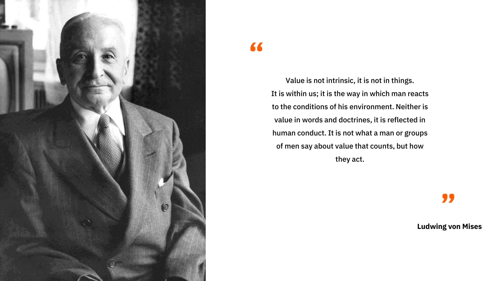

นักเศรษฐศาสตร์ชาวออสเตรียปฏิเสธแนวคิดของผู้สืบทอดของอดัม สมิธ และละทิ้งแนวคิดที่ว่ามูลค่าของสินค้ามาจากปริมาณแรงงานที่ใช้ในการผลิต โดยสนับสนุนแนวคิดที่ว่ามูลค่าถูกกำหนดโดยบุคคล ซึ่งในแต่ละบริบทจะทำการประเมินค่าในใจเกี่ยวกับปริมาณเฉพาะของสินค้าหรือบริการ การก้าวกระโดดทางปัญญานี้ที่เมงเกอร์ทำ ท้าทายความเป็นวัตถุวิสัยของมูลค่า: สำหรับเขา มูลค่าไม่ใช่คุณสมบัติวัตถุของสินค้า แต่มันเป็นเพียงผลลัพธ์ของความสัมพันธ์ที่บุคคลมีต่อสิ่งนั้น: "มูลค่าไม่มีอยู่ภายนอกจิตสำนึกของมนุษย์"

กล่าวอีกนัยหนึ่ง เมงเกอร์เชิญชวนให้เราพิจารณาว่ามูลค่าเกิดขึ้นเฉพาะในฐานะปรากฏการณ์ทางจิตวิทยาเชิงอัตวิสัยภายในบุคคลเท่านั้น มูลค่าไม่ใช่คุณสมบัติเฉพาะของสินค้า แต่เกิดจากความคิดเห็นของบุคคลเกี่ยวกับประโยชน์ที่พวกเขาสามารถได้รับจากสินค้านั้นๆ

ตามมุมมองนี้ น้ำดื่มหนึ่งลิตรไม่มีมูลค่าวัตถุประสงค์ ผู้ที่มีระบบน้ำดื่มที่ทันสมัยและไม่กระหายน้ำในขณะนั้นอาจจะให้ค่าน้อยมากกับน้ำหนึ่งลิตรเพิ่มเติมนั้น ในขณะที่บุคคลที่กระหายน้ำกลางทะเลทราย เห็นว่าน้ำนี้เป็นความแตกต่างระหว่างชีวิตและความตาย จะยอมให้ค่าน้ำหนึ่งลิตรนั้นเกือบจะไม่มีที่สิ้นสุดอย่างแน่นอน

โดยสรุป เมงเกอร์สังเกตว่ามูลค่าของสินค้าทางเศรษฐกิจไม่ใช่อะไรอื่นนอกจากการประเมินค่าเชิงอัตวิสัยที่บุคคลกำหนดให้กับหน่วยเพิ่มเติมของสินค้าหรือบริการนั้น

### Exchange โดยสมัครใจ: เกมผลรวมบวก

จากจุดนี้ เมงเกอร์สรุปว่าการแลกเปลี่ยนโดยสมัครใจระหว่างบุคคลสองคนเกิดขึ้นเพราะแต่ละฝ่ายเชื่อว่าจะเพิ่มประโยชน์เชิงอัตวิสัยของตน สำหรับเขา การแลกเปลี่ยนไม่ได้ตั้งอยู่บนสมมติฐานของความเท่าเทียมกันของมูลค่า ซึ่งตรงข้ามกับสิ่งที่นักเศรษฐศาสตร์คลาสสิกเชื่อ ตามความคิดของนักคิดชาวออสเตรีย หากมีความเท่าเทียมกันของประโยชน์ระหว่างสินค้าที่แลกเปลี่ยน ก็จะไม่มีเหตุผลให้ฝ่ายต่าง ๆ ต้องลำบากในการแลกเปลี่ยนตั้งแต่แรก หากมีการแลกเปลี่ยน นั่นเป็นเพราะแต่ละฝ่ายพบว่ามันเป็นประโยชน์ (เชิงอัตวิสัย) ของตน และผลที่ตามมาคือ การแลกเปลี่ยนโดยสมัครใจแต่ละครั้งจะก่อให้เกิดประโยชน์ทางสังคม

### การประเมินค่าในฐานะปรากฏการณ์ของการจัดระเบียบความปรารถนาของมนุษย์

อย่างไรก็ตาม ประโยชน์ทางสังคมเช่นนี้ หรือคุณค่าที่เป็นอัตวิสัยที่มอบให้กับสินค้านั้น ไม่สามารถวัดได้ สำหรับเมงเกอร์ คุณค่าเป็นปรากฏการณ์ทางปัญญาของการเปรียบเทียบ (เชิงลำดับ) มากกว่าการวัด (เชิงปริมาณ) มันไม่ใช่การกำหนดค่าตัวเลขโดยบุคคลที่สะท้อนถึงประโยชน์ที่พวกเขาได้รับจากมัน ดังที่นักเศรษฐศาสตร์นีโอคลาสสิกคิดตั้งแต่วาลราสและเจวอนส์ แต่เป็นการกระทำของการจัดลำดับความปรารถนาของมนุษย์ที่บุคคลแสดงออกว่าพวกเขาปรารถนาสินค้า A มากกว่าสินค้า B อย่างเข้มข้นกว่า

ตัวแทนใด ๆ สามารถบอกได้ว่าพวกเขาชอบกล้วย 2 ลูกมากกว่าคอร์สเศรษฐศาสตร์ แต่ไม่มีใครสามารถบอกได้อย่างมีเหตุผลว่าพวกเขาให้ค่ากล้วย 2 ลูกที่ 3.1416 ยูทิล ในขณะที่ให้ค่าคอร์สเศรษฐศาสตร์ที่ 3 ยูทิล และดังนั้นพวกเขาจึงชอบกล้วยมากกว่า คำอธิบายของความชอบของมนุษย์เช่นนี้ ซึ่งอิงตามฟังก์ชันจริงต่อเนื่อง ไม่สอดคล้องกับความเป็นจริงของกระบวนการทางปัญญาที่เราประสบในชีวิตประจำวันของเรา บุคคลไม่เคยประเมินสินค้าที่นำเสนอให้พวกเขาโดยเปรียบเทียบกับมาตรฐานนามธรรมของยูทิล แต่เขาเปรียบเทียบทางเลือกต่าง ๆ อย่างมีอัตวิสัย ซึ่งเขาไม่สามารถตัดสินในเชิงสัมบูรณ์ได้ แต่ยังคงสามารถจัดอันดับตามความพึงพอใจสัมพัทธ์ของพวกเขาได้

แนวคิดเรื่องคุณค่าในเชิงอัตวิสัยนี้ ซึ่งเข้าใจว่าเป็นความสัมพันธ์ทางจิตวิทยาที่บุคคลมีต่อเป้าหมายของตนและวิธีการที่เกี่ยวข้องในการบรรลุเป้าหมายเหล่านั้น ยังช่วยให้นักเศรษฐศาสตร์ชาวออสเตรียสามารถอธิบายปรากฏการณ์ของการแบ่งงานกันทำได้อีกด้วย

### การแบ่งงาน

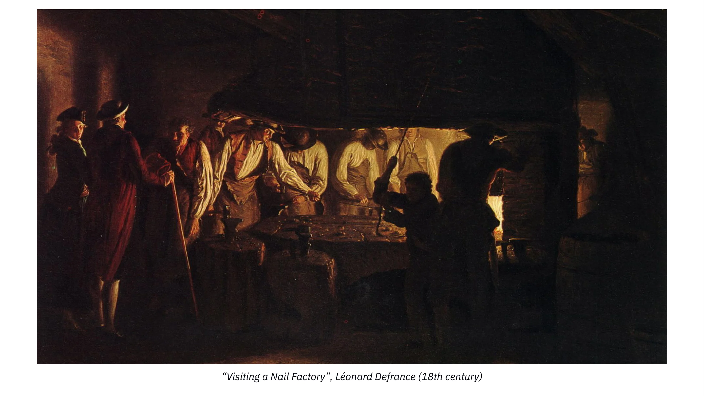

เยี่ยมชมโรงงานทำเล็บ, Léonard Defrance (ศตวรรษที่ 18)

ทุกคนมีความเป็นเอกลักษณ์และมีสถานการณ์ส่วนตัวที่เฉพาะเจาะจง ดังนั้น ทุกคนจึงมีความสามารถที่เหนือกว่าในการทำงานบางอย่างมากกว่าเพื่อนร่วมงาน (ความได้เปรียบโดยสมบูรณ์) หรือมีความสามารถที่เหนือกว่าในการทำงานบางอย่างมากกว่าคนอื่น ๆ (ความได้เปรียบเชิงเปรียบเทียบ) มันไม่สามารถเป็นอย่างอื่นได้; การปฏิเสธข้อเท็จจริงพื้นฐานนี้จะเป็นการอ้างว่ามนุษย์ทุกคนเท่าเทียมกันในทุกด้าน

ในกรณีที่บุคคลมีความสามารถเหนือกว่าคนรอบข้างในการผลิตสินค้าชนิดหนึ่ง (ความได้เปรียบโดยสมบูรณ์) พวกเขามีความสนใจที่จะเชี่ยวชาญในการผลิตสินค้านั้นและแลกเปลี่ยนส่วนเกินที่ได้มากับสินค้าที่พวกเขาต้องการ ด้วยวิธีนี้ พวกเขาสามารถตอบสนองอรรถประโยชน์ส่วนตัวได้อย่างประหยัดมากกว่าการผลิตสินค้าทุกชนิดที่พวกเขาต้องการเอง

แต่อาจเป็นไปได้เช่นกันว่าบุคคลนั้นไม่มีความได้เปรียบโดยสมบูรณ์ในการผลิตสินค้าชนิดใดเลย ในกรณีนี้ จะยังคงมีประเภทของการผลิตที่บุคคลนั้นทำได้ดีกว่าประเภทอื่น ๆ (ความได้เปรียบเชิงเปรียบเทียบ) และด้วยเหตุนี้ พวกเขายังคงมีความสนใจในการเชี่ยวชาญเฉพาะด้าน

แน่นอนว่ามีบุคคลที่สามารถผลิตสินค้านั้นได้อย่างมีประสิทธิภาพมากกว่าเขา แต่เนื่องจากบุคคลเหล่านี้อาจมีประสิทธิภาพมากกว่าในงานอื่นมากกว่างานนี้ และเนื่องจากพวกเขาไม่สามารถทำทั้งสองงานพร้อมกันได้ การให้พวกเขาทำงานนี้แทนที่จะเป็นงานอื่นที่พวกเขามีประสิทธิภาพมากกว่านั้นจึงไม่เกิดประโยชน์ โดยการเชี่ยวชาญในงานที่พวกเขามีประสิทธิภาพมากที่สุด พวกเขาจะได้รับส่วนเกินมากกว่าถ้าพวกเขาไม่ได้เชี่ยวชาญ และดังนั้น ผ่านการแลกเปลี่ยน พวกเขาสามารถได้รับปริมาณสินค้าประเภทอื่นเพิ่มขึ้น แม้ว่าสินค้าที่ได้รับจะถูกผลิตได้อย่างมีประสิทธิภาพมากกว่าด้วยตัวพวกเขาเองมากกว่าผู้ผลิตที่พวกเขาได้รับสินค้ามาจากก็ตาม

ยกตัวอย่างเช่นแพทย์ เขาอาจจะเก่งในการเขียนอีเมลและจัดตารางนัดหมายมากกว่าผู้ช่วยของเขา (ข้อได้เปรียบเชิงสัมพัทธ์) แต่เวลาที่ใช้ในการทำงานเหล่านั้นคือเวลาที่เขาไม่ได้ใช้ในการรักษาผู้ป่วย ดังนั้น เนื่องจากเขามีประสิทธิภาพมากกว่าในการรักษาผู้คน จึงเป็นประโยชน์ของเขาที่จะมอบหมายงานด้านการบริหารให้กับผู้อื่น แม้ว่าเขาจะเก่งในงานดังกล่าวมากกว่าผู้ช่วยของเขา เพราะมันทำให้เขาสามารถเพิ่มมูลค่าที่สร้างให้กับผู้อื่นได้สูงสุด และด้วยเหตุนี้จึงเพิ่มความมั่งคั่งของเขาเอง

โดยสรุปแล้ว การมีความเชี่ยวชาญเฉพาะด้านมีประโยชน์ แม้กระทั่งสำหรับบุคคลที่ไม่มีข้อได้เปรียบที่ชัดเจน เพราะเวลาคือทรัพยากรที่มีจำกัดและมีการแข่งขัน: ทุกหน่วยของเวลาที่ใช้ไปกับกิจกรรมอื่นที่ไม่ใช่กิจกรรมที่บุคคลนั้นมีประสิทธิผลมากที่สุด หมายถึงต้นทุนที่แสดงโดยการผลิตที่พวกเขาสละไป (ต้นทุนค่าเสียโอกาส)

เมื่อบุคคลมีความเชี่ยวชาญในกระบวนการผลิตเฉพาะทางแล้ว พวกเขาสามารถสำรองปริมาณสินค้าที่พิจารณาว่าจำเป็นสำหรับการบริโภคส่วนตัวและแลกเปลี่ยนส่วนเกินกับสินค้าที่ต้องการอื่น ๆ ในการทำเช่นนี้ พวกเขาจะตอบสนองความต้องการในสินค้าที่พวกเขาผลิตเอง ซึ่งหมายความว่าสินค้าที่เหลือจากการผลิตของพวกเขามีค่าน้อยลงสำหรับพวกเขา นี่คือสิ่งที่นักเศรษฐศาสตร์เรียกว่าประโยชน์เชิงส่วนเพิ่มที่ลดลง: หน่วยเพิ่มเติมของสินค้ามีความต้องการน้อยกว่าหน่วยก่อนหน้า สำหรับผู้อื่นที่ขาดสินค้าดังกล่าว เรื่องราวจะแตกต่างออกไป: ด้วยเหตุผลเดียวกัน พวกเขามักจะต้องการสินค้าที่พวกเขาไม่ได้ผลิตมากกว่าสินค้าที่พวกเขาผลิตเองอย่างเข้มข้น สิ่งนี้นำไปสู่สถานการณ์ที่มีความไม่สมดุลอย่างมากระหว่างการประเมินค่าเชิงอัตวิสัยของบุคคลต่าง ๆ ซึ่งเอื้อต่อการแลกเปลี่ยนอย่างมาก: แต่ละฝ่ายมีความสนใจในการแลกเปลี่ยนการผลิตส่วนเกินของตนเพราะพวกเขาเพิ่มประโยชน์เชิงอัตวิสัยของตนเอง

ผลลัพธ์ของการวิเคราะห์ก่อนหน้านี้คือบุคคลจะมีความเป็นอยู่ที่ดีขึ้นเสมอเมื่อพวกเขาเชี่ยวชาญในงานของตนและมีส่วนร่วมในการแลกเปลี่ยน ดังนั้น นักเศรษฐศาสตร์ชาวออสเตรีย โดยเฉพาะอย่างยิ่ง Ludwig Von Mises สรุปว่าความได้เปรียบในการผลิตที่เกิดจากการแบ่งงานคือแรงผลักดันเบื้องหลังกระบวนการความร่วมมือทางสังคม ที่นี่อาจเป็นประโยชน์ที่จะอ้างถึงเขาโดยตรง:

"ข้อเท็จจริงพื้นฐานที่นำไปสู่ความร่วมมือ สังคม และอารยธรรม และเปลี่ยนแปลงมนุษย์จากสัตว์ให้กลายเป็นมนุษย์ คือข้อเท็จจริงที่ว่างานที่ดำเนินการภายใต้การแบ่งงานกันทำมีประสิทธิผลมากกว่างานที่ทำโดยลำพัง และเหตุผลของมนุษย์สามารถรับรู้ความจริงนี้ได้ […] ผู้คนไม่ได้ร่วมมือกันภายใต้การแบ่งงานกันทำเพราะพวกเขารักหรือควรรักกัน พวกเขาร่วมมือกันเพราะสิ่งนี้ให้ประโยชน์สูงสุดแก่ผลประโยชน์ของตนเอง"

### บทสรุป

> "ถ้าชายคนหนึ่งเห็นว่าเขาสามารถอยู่ได้อย่างสบายมากขึ้นโดยการแขวนคอตัวเองมากกว่านั่งที่โต๊ะ เขาก็จะทำตัวเหมือนคนโง่ถ้าไม่แขวนคอตัวเอง"
>

> บารุค สปิโนซา

พ.ศ. 2414-2417 เป็นปีที่ยอดเยี่ยมของเศรษฐศาสตร์สมัยใหม่: ช่วงเวลานี้ได้เห็นผลงานของนักคิดอิสระสามคนที่เป็นรากฐานของเศรษฐศาสตร์สมัยใหม่ ด้วยการเน้นที่คุณค่าเชิงลำดับอัตวิสัย นักเศรษฐศาสตร์ออสเตรียจะพัฒนาระบบความคิดทางเศรษฐศาสตร์ทั้งหมดที่แยกพวกเขาออกจากกลุ่มที่คล้ายคลึงกัน ผลงานของนักเศรษฐศาสตร์ออสเตรียที่ให้เหตุผลเกี่ยวกับการกระทำของมนุษย์ในบริบทของความขาดแคลนจะยืนหยัดในความแตกต่างอย่างชัดเจนกับหลักคำสอนทางเศรษฐศาสตร์ที่ริเริ่มโดย Jevons และ Walras ซึ่งพึ่งพาคณิตศาสตร์อย่างหนักโดยยืนอยู่บนแนวคิดที่ว่าคุณค่าสามารถวัดได้อย่างเป็นวัตถุและได้มาซึ่งฟังก์ชันต่อเนื่อง

จากการสร้างบนข้อมูลเชิงลึกของค่าเชิงลำดับแบบอัตวิสัย เมงเกอร์ได้อธิบายถึงการเกิดขึ้นของการแบ่งงานและการแลกเปลี่ยนโดยสมัครใจ อย่างไรก็ตาม ตามที่เราจะเห็นในบทถัดไป การแลกเปลี่ยนโดยตรงเป็นกลยุทธ์ที่ไม่ดีสำหรับตัวแทนทางเศรษฐกิจที่ต้องการเพิ่มประโยชน์ใช้สอยเชิงอัตวิสัยของตน บิดาแห่งสำนักออสเตรียจึงได้พัฒนาการให้เหตุผลของเขาต่อไปเพื่ออธิบายว่าทำไมเงินจึงเกิดขึ้นในฐานะสถาบันทางสังคม

บทต่อไปนี้จะอุทิศให้กับการเกิดขึ้นของเงินในฐานะสถาบันทางสังคม ทฤษฎีของทุนและดอกเบี้ย ซึ่งจะเป็นพื้นฐานสำหรับทฤษฎีวัฏจักรธุรกิจ และสุดท้ายบทบาทของราคาในการคำนวณทางเศรษฐกิจ

## การเกิดขึ้นของเงินในฐานะปรากฏการณ์ทางสังคม

<chapterId>14ded794-0578-5478-ba5b-b2106c74f3ef</chapterId>

ในขณะที่บุคคลมีความสนใจร่วมกันในการเชี่ยวชาญและเพิ่มการแบ่งงานให้สูงสุด ยังมีปัญหาการประสานงานที่จำกัดการขยายตัวนี้อยู่

ประการแรก สิ่งสำคัญคือต้องทราบว่ากระบวนการผลิตนั้นมีข้อจำกัดด้านเวลาโดยธรรมชาติและมักจะไม่พร้อมกัน (ไม่เกิดขึ้นพร้อมกัน) ดังนั้นจึงมักจะมีช่องว่างของเวลาระหว่างการมีส่วนร่วมครั้งแรกของบุคคลและการได้รับสิ่งตอบแทน การมอบหมายงานเฉพาะในขณะนี้โดยไม่มีการรับประกันล่วงหน้าว่าผู้อื่นจะตอบสนองความต้องการของเราในอนาคตอาจมีความเสี่ยง

ในการแบ่งงานกันทำ แต่ละฝ่ายได้รับประโยชน์จากความร่วมมือ แต่ในระดับบุคคล อาจมีความล่อลวงที่จะเพลิดเพลินกับงานของผู้อื่นโดยไม่ตอบแทน เพราะวิธีนี้พวกเขาจะได้รับสิ่งที่มีค่าโดยไม่ต้องเสียค่าใช้จ่ายใด ๆ สถานการณ์เช่นนี้ ซึ่งความร่วมมือกันส่งผลให้เกิดผลประโยชน์ที่ไม่สูงสุดสำหรับบุคคล แต่เป็นผลประโยชน์สูงสุดสำหรับกลุ่ม ถูกอธิบายในทฤษฎีเกมว่าเป็น "ภาวะที่กลืนไม่เข้าคายไม่ออกของนักโทษ"

### ภาวะกลืนไม่เข้าคายไม่ออกของนักโทษ

เดิมที ภาวะที่กลืนไม่เข้าคายไม่ออกของนักโทษถูกกำหนดขึ้นดังนี้: ผู้ต้องสงสัยสองคน, Alice และ Bob, ไม่สามารถสื่อสารกันได้, ต้องเผชิญกับความเสี่ยงของการถูกจำคุก, โดยมีโทษที่เป็นไปได้ดังนี้:

- หาก Alice กล่าวหา Bob และ Bob ยังคงเงียบ Alice จะเป็นอิสระ และ Bob จะได้รับโทษ 3 ปี
- หากทั้ง Alice และ Bob กล่าวหากันและกัน พวกเขาจะได้รับโทษคนละ 2 ปี
- หากทั้งสองยังคงเงียบ พวกเขาจะได้รับโทษคนละ 1 ปี

ผลลัพธ์เหล่านี้สามารถแสดงในรูปแบบเมทริกซ์ (ผลลัพธ์เชิงตัวเลขระบุจำนวนปีของการจำคุก):

| Alice / Bob       | Accuse | Remain Silent |
| ----------------- | ------ | ------------- |
| **Accuse**        | 2, 2   | 0, 3          |
| **Remain Silent** | 3, 0   | 1, 1          |

ในเกมนี้ ไม่มีโอกาสในการประสานงาน (การสื่อสารเป็นไปไม่ได้) เพื่อให้ได้ผลลัพธ์ที่ดีที่สุดสำหรับทั้งสองฝ่าย ดังนั้น Alice และ Bob จึงมีแรงจูงใจส่วนบุคคลที่จะกล่าวหากันและกัน แม้ว่ามันจะไม่ได้นำไปสู่ผลลัพธ์ที่ดีที่สุดสำหรับกลุ่ม กลยุทธ์ที่ดีที่สุดสำหรับทั้งสองคือการเงียบ ซึ่งแต่ละคนจะได้รับโทษจำคุก 1 ปี

เกมนี้แสดงให้เห็นถึงปัญหาที่มักพบในชีวิตจริง: ในกรณีที่ไม่มีกลไกการประสานงาน บุคคลมักจะเลือกกลยุทธ์ที่เพิ่มผลประโยชน์ส่วนตัวสูงสุด โดยไม่คำนึงถึงกลยุทธ์ที่ผู้อื่นเลือก (การขโมย การโกง การทรยศ ความรุนแรง ฯลฯ) แม้ว่าอาจมีสมดุลที่น่าพึงพอใจมากกว่าผ่านการประสานงาน/ความร่วมมือก็ตาม

### เงินเพื่อแก้ปัญหาการประสานงาน

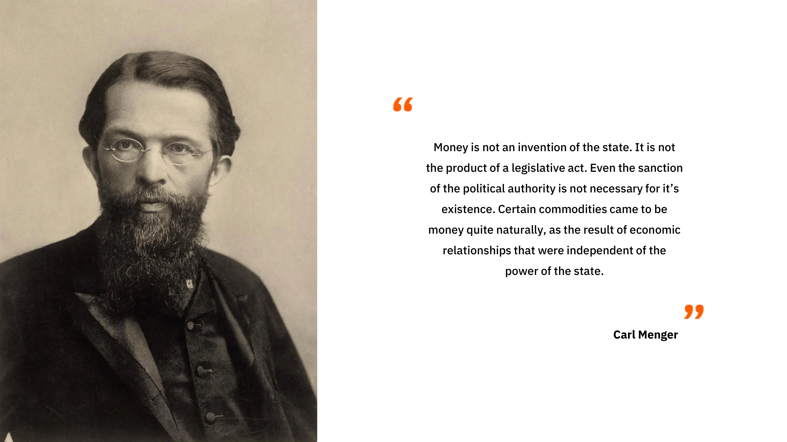

ปัญหานี้มีผลกระทบน้อยกว่าในชุมชนขนาดเล็ก (เช่น ครอบครัว วงเพื่อน) เพราะในกรณีดังกล่าว ทุกคนรู้จักกันโดยตรง ทำให้สามารถจดจำการมีส่วนร่วมของกันและกันได้ โดยสมมติว่าการออกจากชุมชน (การละทิ้ง) มีค่าใช้จ่าย ระบบชื่อเสียงที่อิงตามความทรงจำของตัวแทนแต่ละคนมักจะเพียงพอที่จะหลีกเลี่ยงข้อผิดพลาดที่เกิดจากภาวะที่กลืนไม่เข้าคายไม่ออกของนักโทษ

อย่างไรก็ตาม เมื่อจัดการกับชุมชนขนาดใหญ่ที่ได้รับประโยชน์อย่างมากจากการแบ่งงาน ปัญหาการประสานงานจะกลับมาอีกครั้ง นี่เป็นเพราะสองเหตุผลหลัก:

ประการแรก มนุษย์ถูกจำกัดด้วยความสามารถทางปัญญาของพวกเขา เป็นไปไม่ได้ที่บุคคลจะรักษาและจดจำความสัมพันธ์ทางสังคมที่มั่นคงกับบุคคลมากกว่า 150 คน ทำให้ระบบชื่อเสียงไม่เพียงพอที่จะเอาชนะภาวะที่กลืนไม่เข้าคายไม่ออกของนักโทษในระดับใหญ่

ประการที่สอง การวัดมูลค่าของการมีส่วนร่วมในการแลกเปลี่ยนที่ได้รับการยอมรับในสังคม (ความสามารถในการเปรียบเทียบ) เป็นปัญหาที่ไม่ง่าย ตัวอย่างเช่น หากบุคคลหนึ่งจัดหาเนื้อจากการล่าสัตว์และขอวัสดุสำหรับที่พักอาศัยเป็นการตอบแทน จะสามารถประเมินปริมาณเนื้อที่เสนอได้อย่างไรในแง่ที่เทียบเท่ากับวัสดุที่ร้องขอ? เช่นเดียวกันกับคุณภาพ – เนื้อกวางมีมูลค่ามากกว่าหรือน้อยกว่าไม้?

แม้ว่าจะสามารถกำหนดอัตราแลกเปลี่ยนที่น่าพอใจสำหรับสินค้าทุกคู่ได้ แต่การรักษาข้อมูลนี้ไว้ก็จะกลายเป็นเรื่องที่ไม่สามารถทำได้อย่างรวดเร็ว ในระบบแลกเปลี่ยนโดยตรงที่เกี่ยวข้องกับสินค้า N ชนิด จะมีอัตราแลกเปลี่ยน N(N-1)/2 ที่ต้องจำ สำหรับเศรษฐกิจที่มีสินค้า 50 ชนิด นั่นหมายถึงการจำอัตราแลกเปลี่ยน 50\*49/2 หรือ 1225 อัตรา เมื่อเทียบกับเพียง 50 ในการแลกเปลี่ยนทางอ้อม สำหรับเศรษฐกิจที่มีสินค้า 100 ชนิด จำนวนนี้จะเพิ่มขึ้นเป็น 4950 ความสัมพันธ์เชิงกำลังสองเช่นนี้เป็นข้อจำกัดเพิ่มเติมต่อความสามารถในการขยายตัวของการแลกเปลี่ยนโดยตรง (การแลกเปลี่ยนสินค้า)

ยิ่งไปกว่านั้น เนื่องจากการแลกเปลี่ยนเหล่านี้ไม่ได้เกิดขึ้นทันทีแต่เกิดขึ้นในช่วงเวลาที่ห่างกัน การประเมินผลงานในช่วงเวลาต่างๆ ยิ่งทำให้การประเมินผลงานสัมพัทธ์ซับซ้อนขึ้น นอกจากการประเมินอัตราการแลกเปลี่ยนระหว่างสินค้าปัจจุบันสองรายการแล้ว ยังจำเป็นต้องประเมินมูลค่าของผลงานในอดีตเมื่อเทียบกับผลงานในอนาคตด้วย

วันนี้ แม้จะไม่สามารถใช้งานระบบดังกล่าวได้จริง เราก็สามารถใช้การเขียนหรือการจัดเก็บข้อมูลดิจิทัลเพื่อจดจำข้อมูลทั้งหมดนี้และสร้างระบบเครดิต (การติดตามการมีส่วนร่วมในอดีต รวมถึงอัตราแลกเปลี่ยนของการมีส่วนร่วมนั้น ๆ ก็คือการตั้งระบบเครดิต)

ในยุคก่อนอารยธรรม เทคโนโลยีเหล่านี้ยังไม่มีอยู่ ดังนั้น บรรพบุรุษของเราจึงต้องหาวิธีอื่นเพื่อเพลิดเพลินกับประโยชน์ของการแบ่งงานโดยไม่ต้องเผชิญกับผลกระทบด้านลบของภาวะที่กลืนไม่เข้าคายไม่ออกของนักโทษ วิธีแก้ปัญหาการแลกเปลี่ยนโดยตรงนี้คือการแลกเปลี่ยนทางอ้อมที่อำนวยความสะดวกโดยเงิน

### ความบังเอิญสองเท่าของความต้องการและความสามารถในการขาย

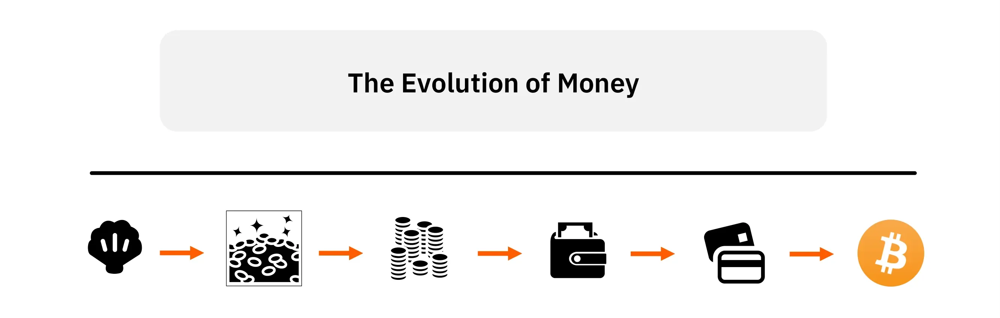

เงินสามารถถูกมองว่าเป็นทางออกที่บรรพบุรุษของเราค้นพบเพื่อแก้ไขปัญหาที่นักเศรษฐศาสตร์เรียกว่า "ปัญหาความต้องการตรงกันสองฝ่าย" ปัญหานี้มีสามมิติ: ด้านพื้นที่, ด้านเวลา, และด้านระหว่างบุคคล

ในการแลกเปลี่ยนโดยตรง (การแลกเปลี่ยนสินค้า) ระหว่าง Alice และ Bob ทั้งคู่จำเป็นต้องมีสิ่งที่อีกฝ่ายต้องการในเวลาและสถานที่เดียวกัน โดยการใช้การแลกเปลี่ยนทางอ้อม เช่น ผ่านเงิน Alice สามารถซื้อจาก Bob และ Bob สามารถใช้หน่วยเงินนั้นที่อื่น ในเวลาอื่น และกับคนอื่น (โดยมีเงื่อนไขว่าบุคคลอื่นยอมรับรูปแบบเงินนั้น)

สำหรับสินค้าที่จะทำหน้าที่เป็นเงินได้ จะต้องมีความสามารถในการขายสูง หมายความว่าควรจะเป็นที่ต้องการของคนจำนวนมากที่สุดเท่าที่จะเป็นไปได้ ในเวลาส่วนใหญ่ โดยการใช้สินค้าที่มีความสามารถในการขายสูง ปัญหาของความต้องการที่ตรงกันสองเท่าจะได้รับการแก้ไขในแง่มุมของมิติทางพื้นที่และระหว่างบุคคล: หากสินค้าที่ฉันใช้เป็นเงินเป็นที่ต้องการทุกที่และโดยคนส่วนใหญ่ ฉันสามารถแยกการกระทำของการขายออกจากการกระทำของการซื้อได้อย่างง่ายดายในแง่ของสถานที่และการปฏิสัมพันธ์ทางสังคม

อย่างไรก็ตาม ปัญหาความสามารถในการขายเมื่อเวลาผ่านไปนั้นยากที่จะแก้ไขด้วยสองเหตุผล:

ประการแรก เอนโทรปี (ที่รู้จักกันทั่วไปว่าเป็น "ผลของเวลา") ค่อยๆ เปลี่ยนแปลงคุณสมบัติของสินค้าส่วนใหญ่ที่มีประโยชน์โดยตรง ดังนั้น การรักษาความสามารถในการขายของสินค้าเมื่อเวลาผ่านไปจำเป็นต้องให้สินค้ามีความทนทานสูงหรือทนต่อเอนโทรปี

ประการที่สอง ความขาดแคลนสัมพัทธ์ของสินค้าที่เวลา "t" ไม่ได้เป็นการรับประกันความขาดแคลนสัมพัทธ์ในอนาคต โดยการทุ่มเททรัพยากรเพียงพอไปยังพื้นที่การผลิตเฉพาะ มนุษย์สามารถเพิ่มอุปทานของสินค้าใด ๆ ได้ ข้อจำกัดเพียงอย่างเดียวในการเพิ่มการผลิตสินค้าคือค่าเสียโอกาสที่เกี่ยวข้อง ดังนั้น ความขาดแคลนสัมพัทธ์ในปัจจุบันของสินค้าไม่สามารถรับประกันความขาดแคลนสัมพัทธ์ในอนาคตได้ สินค้าเพียงอย่างเดียวที่การผลิตส่วนเพิ่มสามารถเพิ่มขึ้นได้ด้วยต้นทุนที่สูงมากเท่านั้นที่สามารถขาดแคลนได้อย่างต่อเนื่อง ซึ่งเป็นเหตุผลว่าทำไมสิ่งนี้จึงเป็นลักษณะของสินค้าที่เป็นเงินที่เกิดขึ้นอย่างเสรีตลอดประวัติศาสตร์ของมนุษย์

ในยุคก่อนอารยธรรม สินค้าหลากหลายชนิด เช่น เปลือกหอย เครื่องประดับที่ทำขึ้นเอง สร้อยคอ หรือ ลูกปัด ถูกใช้เป็นเงิน สินค้าเหล่านี้สามารถพกพาได้ง่าย ไม่มีประโยชน์โดยตรงนอกจากคุณค่าทางการประดับตบแต่ง ทนทานต่อการเสื่อมสภาพ (เช่น ไม่เสื่อมสภาพตามกาลเวลา) มีความหายากตามธรรมชาติและ/หรือ ต้องใช้แรงงานเฉพาะทางจำนวนมากในการผลิต เนื่องจากระดับการแบ่งงานกันทำในขณะนั้นยังต่ำ และดังนั้น ต้นทุนโอกาสที่เกี่ยวข้องกับการผลิตสิ่งประดับตกแต่งจึงสูง สินค้าเหล่านี้จึงไม่สามารถผลิตได้ในปริมาณมาก ดังนั้น ผู้ที่ใช้สินค้าเหล่านี้เป็นเงินจึงมั่นใจได้ถึงความหายากในอนาคตของสินค้าเหล่านี้

ข้อเท็จจริงที่ว่าบรรพบุรุษของเราที่เป็นนักล่า-เก็บของมีส่วนร่วมในงานที่ใช้ทรัพยากรมากเหล่านี้ แม้ว่าพวกเขาจะไม่ได้สร้างสินค้าที่มีประโยชน์โดยตรง แสดงให้เห็นถึงผลประโยชน์ที่สำคัญที่พวกเขาคาดหวังจากการขยายขอบเขตของการแลกเปลี่ยนในด้านพื้นที่ สังคม และเวลา หากไม่เป็นเช่นนั้น และการใช้ทรัพยากรเหล่านี้ในการสร้างที่พักพิง การล่าสัตว์ หรือกิจกรรมอื่น ๆ มีประโยชน์มากกว่า แทนที่จะผลิตสินค้าที่เป็นเงินตรา เราอาจจะไม่พบหลักฐานทางโบราณคดีของกิจกรรมช่างฝีมือเหล่านี้มากนัก กลุ่มอื่น ๆ ที่ใช้ทรัพยากรของพวกเขาอย่างมีประสิทธิภาพมากกว่าจะมีการพัฒนาที่ดีกว่าและความเจริญรุ่งเรืองมากขึ้น และกิจกรรมช่างฝีมือเหล่านี้จะหายไปอย่างรวดเร็วเพื่อสนับสนุนกิจกรรมที่ผลิตสินค้าที่มีประโยชน์โดยตรง

ในแง่นี้ การผลิตสินค้าทางการเงิน โดยส่งเสริมการขยายตัวของการแบ่งงานกันทำ แสดงถึงการใช้ทรัพยากรที่ให้ผลกำไรมากกว่า (ในแง่ของอรรถประโยชน์เชิงอัตวิสัยต่อบุคคล) มากกว่าทางเลือกอื่นทั้งหมด (การเพิ่มการล่าสัตว์ การตกปลา การเก็บของป่า การผลิตไม้ การก่อสร้างบ้าน การผลิตเครื่องมือสำหรับล่าสัตว์และตกปลาเพิ่มเติม ฯลฯ)

### ความไม่แน่นอน

ในการสรุปการวิเคราะห์สถาบันการเงินของเรา เราจำเป็นต้องพิจารณาประเด็นของการดำเนินการทางเศรษฐกิจในบริบทของความไม่แน่นอนที่หลีกเลี่ยงไม่ได้เกี่ยวกับอนาคต

ตามที่นักเศรษฐศาสตร์ออสเตรียได้ชี้ให้เห็น การกระทำของมนุษย์นั้นถูกจำกัดด้วยเวลาและมุ่งเน้นไปที่อนาคตเสมอ เมื่อบุคคลหนึ่งกระทำการ พวกเขาจะเปลี่ยนแปลงสภาพปัจจุบันของตนเองด้วยความหวังที่จะได้รับความพึงพอใจในอนาคต การคาดการณ์ทางจิตนี้สามารถมุ่งเน้นไปที่อนาคตอันใกล้หรือไกล แต่สำหรับบุคคลที่จะคาดการณ์ในระยะยาว พวกเขาต้องมั่นใจในความอยู่รอดในระยะสั้นก่อน เพราะสภาพของพวกเขาในอนาคตอันใกล้มีผลโดยตรงต่อสภาพของพวกเขาในอนาคตอันไกล

สิ่งนี้เกิดจากเหตุผลของมนุษย์โดยตรง; ไม่มีใครสามารถเพิกเฉยต่อธรรมชาติที่เป็นลำดับของปรากฏการณ์ทางเวลาและการพึ่งพาอาศัยกันตามลำดับเวลาอันเกิดจากมันได้ เพราะมันเป็นหนึ่งในข้อจำกัดที่สำคัญของชีวิตมนุษย์ ดังนั้น เนื่องจากอนาคตยังคงไม่แน่นอนสำหรับมนุษย์ พวกเขาจะพยายามรักษาการอยู่รอดในระยะยาวของตนเองก็ต่อเมื่อการอยู่รอดในระยะสั้นของพวกเขาได้รับการประกันแล้วเท่านั้น

ในเรื่องนี้ เงิน โดยการอนุญาตให้เก็บรักษามูลค่าในปัจจุบันและโอนย้ายไปยังตัวตนในอนาคต มีบทบาทสำคัญในการประสานงานระหว่างช่วงเวลาของการกระทำของมนุษย์ โดยการเก็บเงิน หรือการออม บุคคลสามารถป้องกันความไม่แน่นอนในอนาคตและทำให้ตนเองสามารถมุ่งเน้นการกระทำไปยังช่วงเวลาที่ยาวนานขึ้นได้ อย่างไรก็ตาม พวกเขาสามารถบรรลุสิ่งนี้ได้ก็ต่อเมื่อเงินที่ใช้เป็นแหล่งเก็บรักษามูลค่า หมายความว่ามันมีความสามารถในการขายได้ตามกาลเวลา ซึ่งตามที่กล่าวไว้ก่อนหน้านี้ เป็นลักษณะของสินค้าที่ทนทานและค่อนข้างหายาก

ในบทถัดไป เราจะเจาะลึกถึงแนวคิดเรื่องการให้ความสำคัญกับเวลาและอธิบายมุมมองของออสเตรียเกี่ยวกับดอกเบี้ยและทุน ซึ่งจะเป็นพื้นฐานสำหรับบทถัดไปเกี่ยวกับทฤษฎีวัฏจักรธุรกิจ

## เวลาในการเลือก, ดอกเบี้ย, และทุน

<chapterId>37732a5c-4f66-5e2d-bc2c-cc8d29693af7</chapterId>

### การให้ความสำคัญกับเวลา

เราได้สรุปบทสุดท้ายโดยอธิบายว่า ตัวแทนทางเศรษฐกิจใช้สินค้าที่ขายได้มากที่สุด นั่นคือ เงิน เพื่อป้องกันความไม่แน่นอนในอนาคตอย่างไร นอกจากนี้เรายังอธิบายว่าลักษณะตามลำดับของปรากฏการณ์ทางเวลา ทำให้เราต่อสู้กับความไม่แน่นอนอย่างค่อยเป็นค่อยไป: เราจะสามารถมุ่งเน้นไปที่เป้าหมายที่อยู่ไกลออกไปในอนาคตได้ก็ต่อเมื่อเรารู้ว่าการดำรงชีวิตของเราจะได้รับการประกันในสัปดาห์ถัดไป

หรือจะพูดอีกอย่างหนึ่ง: ในฐานะมนุษย์เรามักลดคุณค่าของสินค้าที่จะได้รับในอนาคต

การประเมินเชิงอัตวิสัยเกี่ยวกับมูลค่าของสินค้าที่จะได้รับในอนาคตเมื่อเทียบกับสินค้าที่มีอยู่ในปัจจุบันเรียกว่า การให้ความสำคัญกับเวลา (time preference) โดยทั่วไปแล้ว สินค้าที่มีอยู่ในปัจจุบันจะได้รับความนิยมมากกว่าสินค้าที่จะได้รับในอนาคต เนื่องจากเรามีชีวิตที่จำกัดและอนาคตมักไม่แน่นอน เราจึงมีแนวโน้มที่จะต้องการเข้าถึงสินค้าตอนนี้มากกว่าภายหลัง แม้ว่าการให้ความสำคัญกับเวลาอาจแตกต่างกันไปในแต่ละบุคคล เนื่องจากปัจจัยหลายประการ เช่น วัฒนธรรม ความมั่งคั่ง การศึกษา สรีรวิทยา เป็นต้น แต่การให้ความสำคัญกับเวลามักจะเป็นบวกเสมอ หมายความว่าเมื่อทุกอย่างเท่ากัน เรามักจะให้คุณค่ากับสินค้าที่มีอยู่ในปัจจุบันมากกว่าสินค้าที่จะได้รับในอนาคต

แนวคิดเรื่องการประเมินมูลค่าสินค้าในอนาคตเมื่อเทียบกับสินค้าในปัจจุบันเป็นรากฐานของปรากฏการณ์ของดอกเบี้ย ในความเป็นจริง ในเศรษฐกิจที่ตลาดทุนไม่ได้ถูกแทรกแซง อัตราดอกเบี้ยอ้างอิง (ที่ถือว่าไม่มีความเสี่ยงจากการผิดนัด) จะถูกกำหนดที่จุดตัดของอุปสงค์และอุปทานของทุน ดังนั้น อัตราดอกเบี้ยเหล่านี้จึงแสดงถึงสถานะของความชอบในเรื่องเวลาในเศรษฐกิจทั้งหมด: การเพิ่มขึ้นของอัตราดอกเบี้ยเกิดจากการเพิ่มขึ้นของอุปสงค์สำหรับทุนเมื่อเทียบกับอุปทาน ซึ่งบ่งชี้ถึงความชอบในเรื่องเวลาที่สูงขึ้น ในทางกลับกัน การลดลงของอัตราดอกเบี้ยเกิดจากการเพิ่มขึ้นของการออม ซึ่งเป็นการเพิ่มขึ้นของอุปทานของทุน บ่งชี้ถึงการลดลงของความชอบในเรื่องเวลา

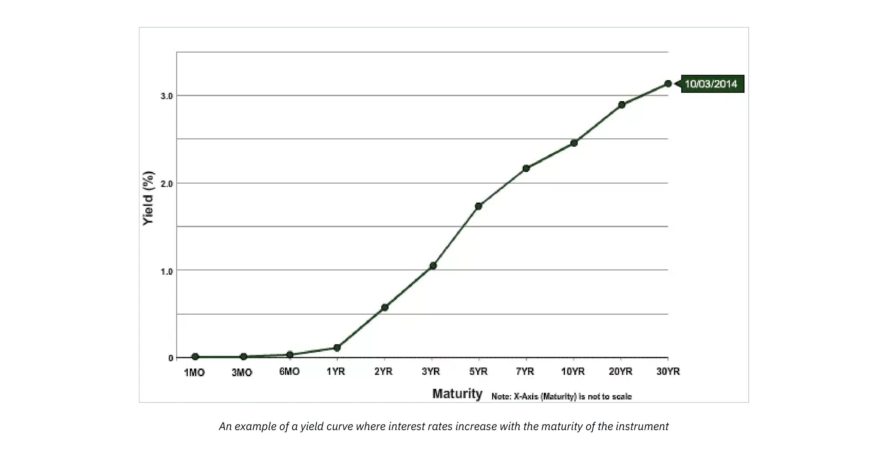

ในระบบเศรษฐกิจที่อัตราดอกเบี้ยไม่ได้ถูกควบคุมโดยธนาคารกลาง เรามักจะสังเกตเห็นเส้นอัตราผลตอบแทนที่มีแนวโน้มสูงขึ้น: ยิ่งระยะเวลาครบกำหนดของหนี้นานเท่าไร อัตราดอกเบี้ยก็จะยิ่งสูงขึ้น สถานการณ์ตรงกันข้ามไม่สามารถเกิดขึ้นได้เพราะจะหมายความว่าอนาคตมีความแน่นอนมากกว่าปัจจุบัน ซึ่งเป็นไปไม่ได้ในเชิงตรรกะ

แนวคิดเรื่องการให้ความสำคัญกับเวลาและวิธีที่เราแสดงความสำคัญของเวลาของเราเองผ่านการบริโภคและการออมเป็นพื้นฐานสำคัญต่อกระบวนการจัดสรรทุนและการผลิต ลองหันไปดูที่นักเรียนของ Menger, Eugen von Böhm-Bawerk และทฤษฎีทุนของเขาเพื่อทำความเข้าใจว่าแนวคิดเรื่องการให้ความสำคัญกับเวลา ส่งผลต่อการจัดระเบียบการผลิตอย่างไร

### ทฤษฎีทุน

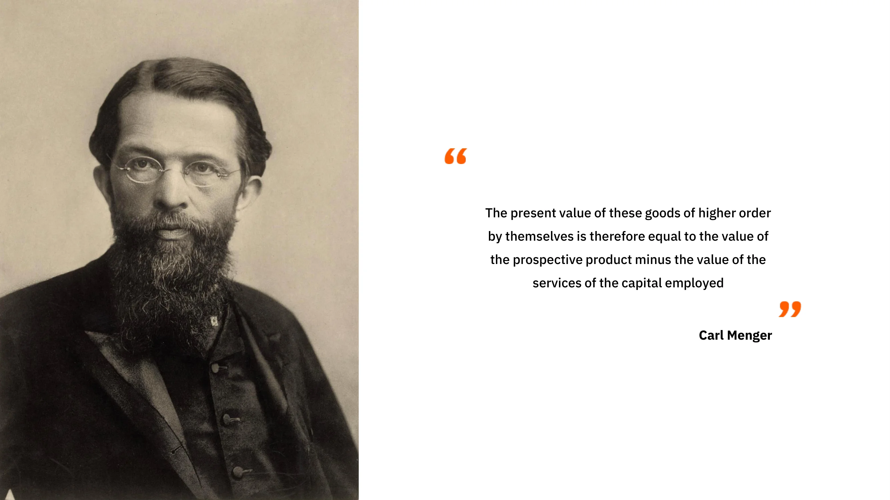

เมื่อต้นของหลักสูตรนี้ เราได้เห็นว่า สำหรับ Carl Menger สินค้าจะถือว่าเป็นสินค้าทางเศรษฐกิจ (มีมูลค่า) ก็ต่อเมื่อมันทำหน้าที่เป็นวิธีการไปสู่จุดหมายที่บุคคลเลือกและให้คุณค่า ตามมุมมองนี้ การวิเคราะห์ทางเศรษฐกิจทั้งหมดหมุนรอบการบริโภคเพราะมันเป็นวัตถุประสงค์ที่กระตุ้นเบื้องหลังทุกกิจกรรมทางเศรษฐกิจ ดังนั้น สำหรับ Menger จุดเริ่มต้นของการวิเคราะห์ทางเศรษฐกิจคือสินค้าผู้บริโภค หรือสินค้าสุดท้าย เนื่องจากมันเป็นวัตถุประสงค์สูงสุดของกิจกรรมทางเศรษฐกิจ สินค้าอื่น ๆ ทั้งหมดในเศรษฐกิจ ซึ่งเราอาจเรียกว่า "สินค้ากลาง" มีมูลค่าเพียงเพราะมันช่วยให้บุคคลสามารถได้รับสินค้าผู้บริโภคเหล่านี้: มันคือสินค้าที่ใช้ในการผลิตสินค้าอื่น ๆ

ในการผลิตสินค้าอุปโภคบริโภค ผู้ประกอบการจะรวมสินค้าขั้นกลางต่างๆ เหล่านี้เข้ากับปัจจัยการผลิตดั้งเดิม (แรงงาน ที่ดิน และทุน) ตามรูปแบบที่เพิ่มผลผลิตสูงสุด การจัดการนี้ซึ่งทำโดยผู้ประกอบการ หรือโครงสร้างการผลิต ประกอบด้วยหลายขั้นตอนที่สินค้าขั้นกลางจะ undergo การเปลี่ยนแปลงจนกระทั่งกลายเป็นสินค้าอุปโภคบริโภคในที่สุด

ดังนั้น เช่นเดียวกับเมงเกอร์ เราสามารถกำหนดสินค้าผู้บริโภคเป็นสินค้าลำดับแรก สินค้าที่เกี่ยวข้องในขั้นตอนก่อนหน้าเป็นสินค้าลำดับที่สอง สินค้าในขั้นตอนก่อนหน้านั้นเป็นสินค้าลำดับที่สาม และต่อไปเรื่อย ๆ จนกว่าเราจะถึงปัจจัยดั้งเดิม (ที่ดิน แรงงาน ทุน) จำนวนขั้นตอนที่เราพิจารณาขึ้นอยู่กับโครงสร้างการผลิตที่ผู้ประกอบการนำมาใช้โดยพื้นฐาน และไม่ควรมองว่าเป็นลักษณะเชิงวัตถุของโครงสร้างการผลิต ในทางตรงกันข้าม ขั้นตอนการผลิตและสินค้ากลางมีอยู่เฉพาะในบริบทเชิงจุดมุ่งหมาย: ผู้กระทำการมองเห็นลำดับของการกระทำที่พวกเขาจะบรรลุวัตถุประสงค์ที่ต้องการ และพวกเขาแบ่งการกระทำของตนออกเป็นขั้นตอนต่อเนื่องในใจ

ลักษณะเฉพาะนี้ของการฉายภาพทางจิตของการกระทำในรูปแบบลำดับถูกกำหนดโดยธรรมชาติของการกระทำของมนุษย์ที่เกี่ยวข้องกับเวลา การกระทำแต่ละอย่างที่มนุษย์ดำเนินการต้องใช้เวลา; การกระทำทันทีเป็นไปไม่ได้ ดังนั้น ผู้กระทำจึงมีทางเลือกเสมอในบรรดารูปแบบการกระทำที่ใช้เวลามากหรือน้อยกว่า

ตั้งแต่นี้เป็นต้นไป เนื่องจากบุคคลมีความชอบในเวลาเชิงบวกโดยธรรมชาติ หมายความว่าพวกเขาชอบสินค้าปัจจุบันมากกว่าสินค้าในอนาคต พวกเขาจะเลือกเส้นทางที่ยาวกว่าเฉพาะเมื่อผลลัพธ์ที่ได้รับมีมูลค่าตามอัตวิสัยมากกว่าที่พวกเขาจะได้รับจากการใช้เส้นทางตรง มิฉะนั้น จะไม่มีใครใช้วิธีการที่ใช้เวลามากขึ้น: ภายใต้ผลลัพธ์ที่เทียบเท่ากัน เส้นทางที่สั้นกว่าจะยังคงเป็นตัวเลือกที่ต้องการ

เนื่องจากลักษณะตามลำดับของการกระทำของมนุษย์ การเลือกข้ามเวลาเหล่านี้จึงมีผลต่อการลำดับการกระทำ กล่าวอีกนัยหนึ่ง การกระทำระยะสั้นที่ฉันทำจะอยู่ภายใต้เป้าหมายระยะยาวที่ฉันตั้งไว้ และการกระทำระยะสั้นของฉันจะมีผลต่อสิ่งที่ฉันสามารถทำได้ในอนาคต ผลกระทบของจุดที่ชัดเจนนี้เกี่ยวกับกิจกรรมการผลิตคือการเบี่ยงเบนการผลิตใด ๆ หรือการยืดโครงสร้างการผลิตใด ๆ จำเป็นต้องมีการออมล่วงหน้า หากฉันตัดสินใจที่จะจัดสรรทรัพยากรมากขึ้นในปัจจุบันเพื่อบรรลุเป้าหมายในอนาคต ฉันต้องจัดสรรสิ่งที่จะยังชีพฉันในช่วงเวลาที่การลงทุนของฉันใช้เวลาก่อน

เพื่อแสดงให้เห็นถึงประเด็นนี้ ลองกลับไปดูตัวอย่างที่ Böhm-Bawerk ได้ให้ไว้ในงานของเขา "Capital and Interest":

ยูจีน ฟอน เบิม-บาแวร์ก (1851-1914)

### โรบินสัน ครูโซ และการผลิตทางอ้อม/ทางอ้อม:

Robinson Crusoe ลงจอดสินค้าจากซากเรือ, John Alexander Gilfillan (1793-1864)

ในหนังสือของเขา นักเศรษฐศาสตร์ชาวออสเตรียเชิญชวนให้เราพิจารณาการแลกเปลี่ยนระหว่างเวลาในตัวเลือกการผลิตผ่านการทดลองทางความคิดที่อิงจากโรบินสัน ครูโซเพียงลำพังบนเกาะของเขา

โรบินสัน, เหมือนมนุษย์ยุคดึกดำบรรพ์, พึ่งพาการหาอาหารและการล่าสัตว์เพื่อความอยู่รอดของเขา ลองจินตนาการว่าโรบินสันสามารถเก็บเบอร์รี่ได้เพียงพอที่จะเลี้ยงตัวเองได้ตลอดทั้งวันในเวลาแปดชั่วโมง ในสภาพเช่นนี้ เขามีเวลาน้อยสำหรับกิจกรรมอื่น ๆ อย่างไรก็ตาม โรบินสันเชื่อว่าด้วยการทำเสาไม้ เขาสามารถเคาะเบอร์รี่ลงมาได้ง่าย ๆ และได้อาหารประจำวันของเขาในเวลาเพียงสี่ชั่วโมงของการทำงาน นอกจากนี้ เขาประเมินว่าจะใช้เวลาเขาห้าวัน โดยทำงานวันละสองชั่วโมง เพื่อทำเสา ดังนั้น เขาจึงสรุปว่าเขาจำเป็นต้องเก็บ 1/5 ของการผลิตเบอร์รี่ของเขาเป็นเวลาห้าวัน หรืออีกทางเลือกหนึ่งคือใช้เวลาเพิ่มอีก 2 ชั่วโมงต่อวันในการเก็บเบอร์รี่เป็นเวลา 5 วัน เพื่อเก็บเบอร์รี่ให้เพียงพอสำหรับการยังชีพในช่วงเวลาที่เขาใช้ในการทำเสา

หากเขาไม่ทำการบันทึกนี้ล่วงหน้า โรบินสันจะไม่สามารถทำเสาให้เสร็จได้และอาจเสียชีวิตในระหว่างนี้

ดังนั้น เป็นเวลาห้าวัน เขาสละเวลาพักผ่อนสองชั่วโมงเพื่อเก็บผลเบอร์รี่มากขึ้น เมื่อสิ้นสุดช่วงเวลานี้ เขามีผลเบอร์รี่เพียงพอและเริ่มทำเสาไม้ โดยทำงานวันละสองชั่วโมงเป็นเวลาห้าวัน เมื่อเขาทำงานเสร็จ เขาสามารถเก็บผลเบอร์รี่เพียงพอสำหรับส่วนประจำวันของเขาในเวลา 4 ชั่วโมงแทนที่จะเป็น 8 ชั่วโมง ทำให้เขามีเวลาเหลืออีก 4 ชั่วโมงต่อวันสำหรับกิจกรรมอื่น ๆ

ด้วยการกระทำเช่นนี้ โรบินสันจึงเลือกเส้นทางการผลิตที่อ้อม: แทนที่จะเก็บผลเบอร์รี่โดยตรง เขาลงทุนความพยายามในการผลิตสินค้าทุนที่จะทำให้เขามีประสิทธิภาพมากขึ้นในอนาคต อย่างไรก็ตาม เขาต้องทำการเสียสละในระยะสั้น คือ การออม เพื่อให้บรรลุเป้าหมายนี้ หากเขาไม่ทำ เขาจะไม่สามารถสร้างสินค้าทุนของเขาได้ การเสียสละในระยะสั้นนี้กลับให้ข้อได้เปรียบที่สำคัญแก่เขา เพราะเมื่อเขามีไม้ยาว เขาจะได้เวลาเพิ่มขึ้น 4 ชั่วโมงต่อวัน (จนกว่าไม้ยาวจะล้าสมัย) 4 ชั่วโมงพิเศษต่อวันนี้ทำให้เขาสามารถสร้างสินค้าทุนเพิ่มเติม เช่น เครื่องมือการล่าสัตว์หรือแหจับปลา ซึ่งจะค่อยๆ ปรับปรุงสถานการณ์ของเขาให้ดีขึ้น

### บทสรุป

กล่าวอีกนัยหนึ่ง ในระบบเศรษฐกิจของโรบินสัน ครูโซ ที่มีเพียงคนเดียว การออมผ่านการเสียสละความพึงพอใจในปัจจุบันคือสิ่งที่สะสมทุนซึ่งเพิ่มผลผลิต ในบริบทนี้ การออม หรือการเลื่อนความพึงพอใจในปัจจุบันออกไป คือราคาที่ต้องจ่ายเพื่อความพึงพอใจในอนาคตที่เพิ่มขึ้น ซึ่งหมายความว่า ในบริบทนี้ การออมเป็นเงื่อนไขเบื้องต้นและจำเป็นสำหรับการพัฒนาเศรษฐกิจใดๆ

นี่เป็นแนวคิดที่น่าดึงดูดใจ แม้ว่าจะเรียบง่าย: การขยายโครงสร้างการผลิตใด ๆ จำเป็นต้องมีการออมล่วงหน้า (เนื่องจากสินค้าที่จำเป็นสำหรับการผลิตดังกล่าวจะไม่ตกลงมาจากฟ้า) ดังนั้น ยิ่งเราประหยัดมากเท่าไหร่ เราก็จะสามารถสะสมทุนได้มากขึ้น ซึ่งจะนำไปสู่การเพิ่มผลผลิตที่ให้สินค้ามากขึ้น ดังนั้น นักเศรษฐศาสตร์ชาวออสเตรียจึงพิจารณาว่าการลดความพึงพอใจในเวลาคือจุดเริ่มต้นของวงจรคุณธรรมของการออม –> สินค้าทุนมากขึ้น  ผลผลิตมากขึ้น  สินค้ามากขึ้น = มาตรฐานการครองชีพที่สูงขึ้น –> ความพึงพอใจในเวลาที่ต่ำลง

ตอนนี้ ตามที่กล่าวถึงในบทแรก อัตราดอกเบี้ยถูกควบคุมมานานหลายทศวรรษโดยธนาคารกลาง ในขณะที่ธนาคารพาณิชย์ขยายเครดิตโดยไม่ต้องมีเงินสำรองล่วงหน้า ซึ่งหมายความว่าอัตราดอกเบี้ยไม่ได้สะท้อนถึงความชอบของเราในเรื่องเวลาและให้ภาพลวงตาของการออมที่มีอยู่อย่างมากมาย

สิ่งนี้แสดงให้เห็นอย่างชัดเจนโดยแผนภูมิด้านล่าง: อัตราดอกเบี้ยระยะยาวต่ำกว่าอัตราดอกเบี้ยระยะสั้น ประการแรก สิ่งนี้ไม่มีเหตุผลเลย เพราะมันจะหมายความว่าอนาคตมีความแน่นอนมากกว่าปัจจุบัน ประการที่สอง มันเรียกร้องให้มีการสอบถามเกี่ยวกับผลกระทบต่อการจัดสรรทุน: หากทุกคนได้รับแรงจูงใจให้กระทำราวกับว่าการออมมีมากมาย ในขณะที่ผู้ที่ออมเงินไม่มีอยู่จริงเพราะพวกเขาไม่ได้รับรางวัลสำหรับการออม ผลกระทบนี้จะส่งผลอย่างไรต่อเศรษฐกิจ?

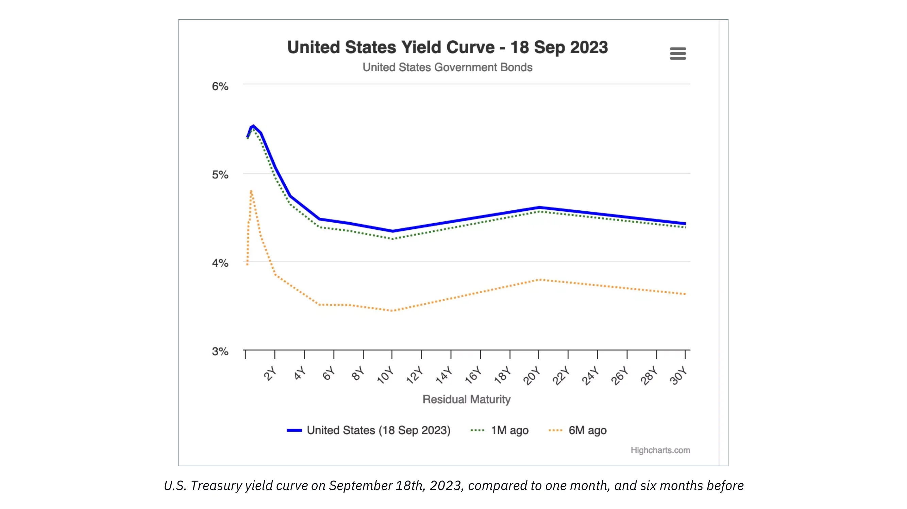

นี่คือสิ่งที่เราจะค้นพบในบทถัดไปที่อุทิศให้กับทฤษฎีวัฏจักรธุรกิจของออสเตรีย!

# มุมมองทางเศรษฐกิจของออสเตรีย

<partId>ad0fce42-2556-56b8-a093-5b4fcacc7cf3</partId>

## ทฤษฎีวัฏจักรธุรกิจของออสเตรีย

<chapterId>718afaa8-ce78-58aa-9477-073eef0bd137</chapterId>

> “ยิ่งการขยายตัวของเครดิตธนาคารที่ก่อให้เกิดเงินเฟ้อดำเนินต่อไปนานเท่าใด ขอบเขตของการลงทุนที่ผิดพลาดในสินค้าทุนก็ยิ่งมากขึ้นเท่านั้น และความจำเป็นในการชำระล้างการลงทุนที่ไม่มั่นคงเหล่านี้ก็ยิ่งมากขึ้น เมื่อการขยายตัวของเครดิตหยุดลง กลับทิศทาง หรือแม้แต่ชะลอตัวลงอย่างมาก การลงทุนที่ผิดพลาดก็จะถูกเปิดเผย”
>

> ลุดวิก ฟอน มีเซส

มันคือ ลุดวิก ฟอน มีเซส นักเรียนที่ประสบความสำเร็จมากที่สุดของเบิม-บาเวิร์ก และอาจจะเป็นนักเศรษฐศาสตร์ชาวออสเตรียที่สำคัญที่สุดในศตวรรษที่ 20 ผู้ซึ่งใช้เหตุผลเกี่ยวกับทุนของเบิม-บาเวิร์กในการอธิบายสาเหตุและพลวัตของวัฏจักรเศรษฐกิจ ฟรีดริช เอ. ฮาเย็ค ผู้เป็นศิษย์ของมีเซส ได้ขยายเหตุผลนี้ไปสู่ข้อสรุปเชิงตรรกะในผลงานที่เขาได้รับรางวัลโนเบลสาขาเศรษฐศาสตร์ในปี 1974

Mises และ Hayek เริ่มต้นการวิเคราะห์ของพวกเขาด้วยการเพิ่มขึ้นของการออมเป็นจุดเริ่มต้น ดังที่เราได้เห็นในบทก่อนหน้า การเพิ่มขึ้นของการออมจำเป็นต้องมีการลดลงของการบริโภคที่สอดคล้องกันและทำให้ราคาสินค้าบริโภคลดลงตามลำดับ ซึ่งนำไปสู่ผลกระทบสองประการ: ประการแรก ความต้องการที่เพิ่มขึ้นสำหรับสินค้าทุนที่เกิดจากการเพิ่มขึ้นของค่าจ้างจริงอันเนื่องมาจากการลดลงของราคาสินค้าบริโภคตามลำดับ; และประการที่สอง การเพิ่มขึ้นของกำไรของผู้ประกอบการในขั้นตอนการผลิตที่ห่างไกลจากการบริโภค (ลำดับต่ำกว่า) เมื่อค่าจ้างจริงเพิ่มขึ้น ผู้ประกอบการมีแรงจูงใจในการประหยัดแรงงานโดยการใช้สินค้าทุนมากขึ้น ซึ่งสร้างความต้องการที่แข็งแกร่งขึ้นสำหรับสินค้าทุนและกำไรที่สูงขึ้นสำหรับผู้ประกอบการที่ผลิตสินค้าลำดับต่ำกว่าเหล่านี้ ดังนั้น ในบริบทของการเพิ่มขึ้นของการออม กล่าวคือ การลดลงของความพึงพอใจในเวลา อัตราดอกเบี้ยลดลง ส่งเสริมการพัฒนาขั้นตอนการผลิตเพิ่มเติมและเพิ่มผลผลิต นี่คือการเบี่ยงเบนการผลิตแบบ Böhm-Bawerkian แบบคลาสสิก และเป็นผลลัพธ์ที่พึงประสงค์อย่างยิ่ง

อย่างไรก็ตาม นักเศรษฐศาสตร์ชาวออสเตรียสองคนได้พิจารณาว่าจะเกิดอะไรขึ้นหากการลดลงของอัตราดอกเบี้ย ซึ่งเป็นจุดเริ่มต้นของการเบี่ยงเบนการผลิตนี้ ไม่ได้เกิดจากการเพิ่มขึ้นของการออม แต่เกิดจากการขยายตัวของสินเชื่อแทน

ในบริบทของการธนาคารสำรองเศษส่วน การขยายเครดิตไม่จำเป็นต้องมีการเพิ่มขึ้นของการออมที่สอดคล้องกัน ดังนั้น ผู้ประกอบการสามารถระดมทุนได้มากขึ้นและมีส่วนร่วมในเส้นทางการผลิตที่ยาวนานขึ้น แม้ว่าความชอบของเวลาจะยังคงไม่เปลี่ยนแปลง กล่าวคือ โดยไม่ต้องลดการบริโภค สำหรับ Hayek และ Mises สถานการณ์เช่นนี้ควรนำไปสู่ปัญหาการประสานงานที่สำคัญในหมู่ตัวแทนทางเศรษฐกิจ เนื่องจากการขาดอัตราดอกเบี้ยตลาดเสรี ปัญหาเหล่านี้อาจไม่ปรากฏชัดในทันที แต่ในระยะยาว การจัดสรรทุนที่ผิดพลาดที่เกิดขึ้นควรส่งผลให้เกิดผลที่จับต้องได้: ภาวะถดถอย

เพื่ออธิบายปรากฏการณ์ของการประสานงานที่ผิดพลาดทางเวลาและผลที่ตามมาให้ชัดเจนที่สุดเท่าที่จะเป็นไปได้ เราจะพึ่งพารูปแบบของโครงสร้างการผลิตและสังเกตว่ามันได้รับผลกระทบอย่างไร เริ่มจากการลดลงของอัตราดอกเบี้ยที่เกิดจากการเพิ่มขึ้นของการออม และต่อมาจากการลดลงของอัตราดอกเบี้ยที่เกิดจากการขยายตัวของเครดิต

### การลดลงของอัตราดอกเบี้ยเนื่องจากการเพิ่มขึ้นของการออม:

เพื่ออำนวยความสะดวกในการอธิบายของเรา เราจะกลับไปที่การจัดประเภทสินค้าของ Menger และแสดงโครงสร้างการผลิตบนแผนภาพที่ประกอบด้วยจำนวนขั้นตอนตามอำเภอใจ:

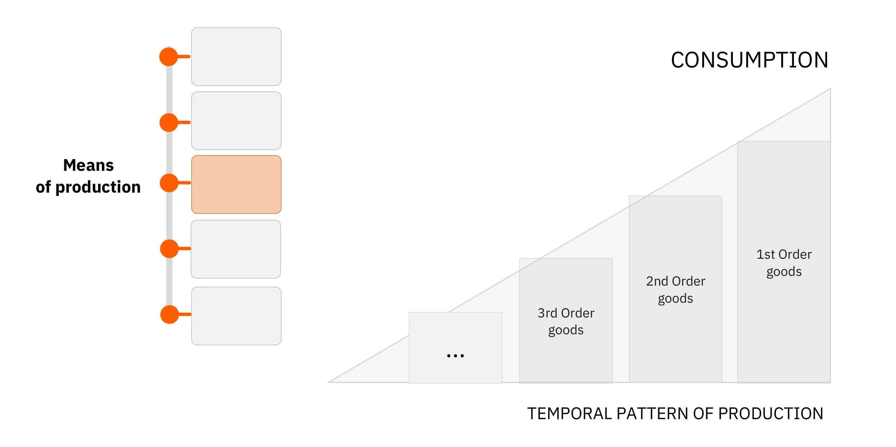

ในแผนภาพด้านบน ทรัพยากรเริ่มต้นผ่านขั้นตอนต่าง ๆ ของการผลิต โดยมีการเปลี่ยนแปลงที่ทำให้เข้าใกล้สถานะของสินค้าสำเร็จรูปสำหรับผู้บริโภคมากขึ้น (ผ่านการโต้ตอบกับปัจจัยการผลิตดั้งเดิม: เวลา, ที่ดิน, แรงงาน) ความสูงของด้านขวาของสามเหลี่ยมแสดงถึง GDP ในเชิงสัญลักษณ์ เนื่องจากแสดงถึงผลรวมของสินค้าผู้บริโภคทั้งหมดที่ขายในช่วงเวลา ช่องว่างระหว่างแต่ละแท่งสอดคล้องกับมูลค่าเพิ่ม (ในแง่ของเงิน) ที่เกิดขึ้นจากแต่ละขั้นตอนของกระบวนการ ความแตกต่างนี้ยังสามารถมองได้ว่าเป็นรายได้ที่เกี่ยวข้องกับแต่ละขั้นตอน (รายได้ - ต้นทุน)

หากในระดับรวม ตัวแทนทางเศรษฐกิจเพิ่มการออมของพวกเขา ปริมาณของสินค้าสุดท้ายที่บริโภคจะลดลง - โดยที่ปัจจัยอื่น ๆ ยังคงเท่าเดิม การออมจำเป็นต้องเกี่ยวข้องกับการเลื่อนการบริโภคบางส่วนไปยังวันที่ภายหลัง เป็นผลให้ อัตราดอกเบี้ยจะลดลง - เนื่องจากอุปทานของทุนเพิ่มขึ้น ทำให้ผู้ประกอบการสามารถใช้การไหลเข้าของทุนนี้เพื่อสร้างสินค้าการลงทุนใหม่และยืดโครงสร้างการผลิตออกไป

จากนั้นเราจะได้โครงสร้างการผลิตที่ขยายออกไป ซึ่งเป็นการเปลี่ยนแปลงที่สามารถแสดงเชิงคุณภาพได้ด้วยแผนภาพต่อไปนี้:

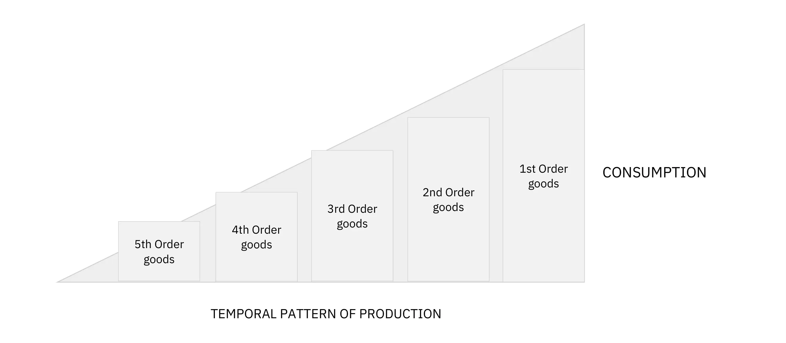

ที่นี่ มูลค่าเงินของสินค้าผู้บริโภคที่ต้องการได้ลดลง ทำให้มีทรัพยากรเพียงพอสำหรับการสร้างขั้นตอนการผลิตเพิ่มเติม ในสถานการณ์นี้ที่การลดลงของอัตราดอกเบี้ยเป็นผลมาจากการบริโภคที่ลดลง หรือก็คือการออมที่เพิ่มขึ้น พื้นที่ของสามเหลี่ยมซึ่งแทนปริมาณเงินที่หมุนเวียนอยู่ยังคงไม่เปลี่ยนแปลง การเปลี่ยนแปลงโครงสร้างการผลิต (การยืดออก) เป็นเพียงผลจากการโอนอำนาจการซื้อจากส่วนหนึ่งของโครงสร้างไปยังอีกส่วนหนึ่งเท่านั้น

นอกจากนี้ยังควรสังเกตว่าการลดลงของความต้องการสินค้าบริโภคจะทำให้ในระยะกลางเกิดการลดลงของราคาสินค้าบริโภคมากกว่าการลดลงของปริมาณสินค้าสำเร็จรูปที่เสนอขาย นี่เป็นเพราะส่วนสุดท้ายของโครงสร้างการผลิตจะไม่ปรับตัวทันทีหลังจากที่ความต้องการสินค้าบริโภคลดลง ผู้ประกอบการจะใช้เวลาสักระยะในการเปลี่ยนแปลงแผนและการลงทุนของพวกเขา เมื่อพวกเขามีสินค้าคงคลัง การลดลงของความต้องการจะบังคับให้พวกเขาขายสินค้าคงคลังเหล่านี้ในราคาลด และผลที่ตามมาคือส่วนเกินของการออมจะส่งผลให้ราคาสินค้าบริโภคลดลงในเบื้องต้น (เช่น การเพิ่มขึ้นของค่าจ้างจริง)

ในทางกลับกัน สินค้าการลงทุนจะมีราคาสูงขึ้นเนื่องจากการโอนอำนาจการซื้อไปยังผู้ประกอบการทำให้พวกเขาสามารถเพิ่มการใช้จ่ายในการลงทุนได้ เมื่อการออมนี้ถูกโอนจากผู้ประหยัดไปยังผู้ประกอบการและถูกใช้จ่ายโดยผู้ประกอบการ อัตราดอกเบี้ยจะมีแนวโน้มเพิ่มขึ้นอีกครั้ง (เนื่องจากอุปทานทุนลดลง) ซึ่งจะนำไปสู่ราคาที่ต่ำลงสำหรับสินค้าการลงทุน ในความเป็นจริง เมื่อสิ้นสุดการเบี่ยงเบนการผลิตนี้ ราคาสัมพัทธ์จะยังคงอยู่ในระดับเดิมโดยประมาณ แต่ตัวแทนทางเศรษฐกิจโดยรวมได้รับประโยชน์: ผลิตภาพที่เพิ่มขึ้นจากการขยายโครงสร้างการผลิตจะเสนอผลิตภัณฑ์ให้ผู้บริโภคมากขึ้นในราคาต่อหน่วยที่ต่ำลง; อำนาจการซื้อของผู้ประหยัดจะเพิ่มขึ้น ส่วนหนึ่งผ่านรายได้จากดอกเบี้ยและส่วนหนึ่งเนื่องจากราคาผู้บริโภคที่ต่ำลง; ในขณะเดียวกัน ผู้ประกอบการโดยรวมจะไม่ประสบกับกำไรหรือขาดทุน ผู้ที่มีส่วนร่วมในกิจกรรมที่ใกล้เคียงกับการบริโภคจะสูญเสียรายได้ ในขณะที่ผู้ที่มีส่วนร่วมในการสร้างขั้นตอนการผลิตใหม่จะได้รับผลประโยชน์ตามสัดส่วน ในสถานการณ์เช่นนี้ ไม่มีรายได้ทางการเงินใหม่ถูกสร้างขึ้น; เป็นการผลิตที่เพิ่มขึ้น และดังนั้นมูลค่าที่แท้จริงของรายได้จึงเพิ่มขึ้น

### การลดลงของอัตราดอกเบี้ยเนื่องจากการเพิ่มขึ้นของเครดิต (ไม่มีการเพิ่มขึ้นของการออม):

ตอนนี้ หากเราพิจารณาการลดลงของอัตราดอกเบี้ยที่เกิดจากการขยายตัวของเครดิตที่เสนอโดยธนาคาร เราจะได้ภาพโครงสร้างการผลิตที่แตกต่างออกไปอย่างมาก

ด้วยอัตราดอกเบี้ยที่ต่ำลง ผู้ประกอบการสามารถกู้ยืมทรัพยากรได้มากขึ้นและสร้างขั้นตอนการผลิตที่สูงขึ้น ในกรณีนี้ การขยายโครงสร้างการผลิตดังกล่าวจะไม่ส่งผลให้การบริโภคลดลงเพราะไม่มีการเลื่อนการบริโภคในปัจจุบันของผู้บริโภค กล่าวอีกนัยหนึ่ง GDP จะเติบโตขึ้น ดังนั้น สามเหลี่ยมของเราจะยาวขึ้นในขณะที่รักษาความสูงที่คล้ายกัน ซึ่งหมายความว่าพื้นที่ของมันจะเพิ่มขึ้น

โปรดทราบว่านี่เป็นผลลัพธ์ที่สมเหตุสมผลอย่างสมบูรณ์ของการขยายเครดิต ตราบใดที่ธนาคารผลิตสื่อที่เชื่อถือได้โดยการให้สินเชื่อ ควรคาดหวังว่ากำลังซื้อโดยรวมจะเพิ่มขึ้นอย่างเป็นธรรมชาติ

เมื่อเครดิตเข้าสู่เศรษฐกิจผ่านการให้กู้ยืมแก่ผู้ประกอบการ เราควรสังเกตเห็นการเพิ่มขึ้นของกำไรในภาคการผลิตที่ห่างไกลจากการบริโภค และการลดลงของกำไรสัมพัทธ์ในภาคที่ใกล้กับการบริโภค กำไรที่สูงขึ้นนี้จะสนับสนุนการจัดสรรทุนใหม่ไปยังขั้นตอนที่ใช้ทุนมากขึ้น (การต่อเรือ, ยานยนต์, การก่อสร้าง, เทคโนโลยีขั้นสูง ฯลฯ) และการลดการลงทุนในภาคที่ใกล้กับการบริโภค

ปัจจุบัน ผู้ประกอบการที่เกี่ยวข้องในขั้นตอนการผลิตที่สูงขึ้นเหล่านี้มีรายได้ทางการเงินที่สูงขึ้น และเนื่องจากความชอบในการใช้จ่ายยังคงเหมือนเดิม เราควรเห็นความต้องการที่เพิ่มขึ้นสำหรับผลิตภัณฑ์สำหรับผู้บริโภค แต่เนื่องจากในช่วงที่เศรษฐกิจเฟื่องฟูนี้ ความสามารถในการทำกำไรของเงินทุนที่ลงทุนมีสูงกว่าในภาคส่วนที่ห่างไกลจากการบริโภค จึงมีการโอนย้ายทรัพยากรจากกิจกรรมที่ใกล้กับการบริโภคไปยังกิจกรรมที่ห่างไกลกว่า ดังนั้น ผู้ประกอบการในขั้นตอนการผลิตที่ต่ำกว่าจึงขาดทรัพยากรในการตอบสนองความต้องการที่เพิ่มขึ้น ซึ่งสร้างความตึงเครียดระหว่างสองส่วนนี้ของโครงสร้างการผลิต: แต่ละฝ่ายพยายามที่จะได้รับทุนโดยเสียค่าใช้จ่ายของอีกฝ่าย และเนื่องจากความต้องการในการบริโภคแสดงถึงความต้องการที่เร่งด่วนกว่า ในบางจุด ผู้ประกอบการที่มีส่วนร่วมในกิจกรรมที่ห่างไกลจากการบริโภคจะขาดทรัพยากรที่จำเป็นในการทำการลงทุนให้เสร็จสมบูรณ์ อัตรากำไรในภาคส่วนเหล่านี้จึงเริ่มลดลง ธุรกิจล้มละลาย และการเพิ่มขึ้นของราคาผู้บริโภคอย่างสัมพัทธ์กระตุ้นให้มีการจัดสรรทุนใหม่อย่างรวดเร็วไปสู่การผลิตสินค้าลำดับต่ำกว่า เมื่อการจัดสรรทรัพยากรอย่างกะทันหันนี้ปรากฏขึ้น เศรษฐกิจเข้าสู่ภาวะถดถอย: ราคาสินทรัพย์ลดลง ค่าจ้างจริงลดลง ราคาผู้บริโภคลดลง และสินค้าคงคลังสะสมมากขึ้น

สำหรับฟรีดริช ฮาเย็ค และลุดวิก ฟอน มีเซส ภาวะถดถอยเป็นการแสดงออกถึงการจัดสรรทุนที่ผิดพลาดจากช่วงขยายตัว เมื่อราคาสำหรับการออมและทุนถูกบิดเบือน ผู้ประกอบการได้พัฒนาโครงการที่ไม่สามารถเสร็จสิ้นได้เนื่องจากขาดทรัพยากร และ/หรือสร้างแผนการผลิตสำหรับระดับการบริโภคในอนาคตซึ่งไม่สามารถรักษาไว้ได้เนื่องจากขาดการออม

เฉพาะผ่านการลดเงินเฟ้อ, กล่าวคือ การลดลงของราคาสินทรัพย์และราคาค่าแรง, อัตราดอกเบี้ยที่สูงขึ้น, และการชำระบัญชีของโครงการที่ยังไม่เสร็จสิ้น เศรษฐกิจจึงจะสามารถปรับตัวและพัฒนาไปสู่เส้นทางที่ยั่งยืนได้ ดังนั้น ภาวะเศรษฐกิจถดถอยคือการสลายตัวของภาพลวงตาของความมั่งคั่งที่กระตุ้นกระบวนการปรับตัวอย่างรุนแรง

โดยทั่วไป ภาวะถดถอยถูกกระตุ้นโดยภาคธนาคารเอง ตราบใดที่เครดิตเพิ่มขึ้นในอัตราที่เร่งตัวขึ้น ราคาก็จะยังคงเพิ่มขึ้น และผู้ประกอบการจะแข่งขันกันเพื่อแย่งชิงทรัพยากรการผลิต อย่างไรก็ตาม ตามที่ Hyman Minsky ได้กล่าวไว้ มีจุดหนึ่งที่ภาคธนาคารตัดสินใจลดความเสี่ยง จึงลดการไหลของเครดิต ภาวะซึมเศร้าจึงส่งผลให้เกิดการล้มละลายจำนวนมาก การเข้มงวดด้านเครดิต การลดลงของอำนาจการซื้อที่มีอยู่ และการล่มสลายทางการเงิน

การปรับตัวเช่นนี้สามารถมองว่าเป็นช่วงเวลาที่มีการบังคับให้เกิดการบริโภคและการลงทุนต่ำกว่าปกติเพื่อสร้างเงินออมที่ขาดหายไปใหม่ สำหรับฮาเย็ค ระยะซึมเศร้าแม้ว่าจะเจ็บปวด แต่ก็มีความจำเป็นอย่างยิ่งเพราะมันช่วยให้กิจกรรมทางเศรษฐกิจฟื้นตัวขึ้นบนโครงสร้างของราคาสัมพัทธ์ที่สะท้อนถึงความขาดแคลนที่แท้จริงของปัจจัยการผลิต หากภาวะซึมเศร้านี้ถูกขัดจังหวะ เศรษฐกิจก็ไม่สามารถกลับไปสู่เส้นทางที่พึงประสงค์ได้ เพราะในกรณีที่ไม่มีระบบข้อมูลที่ช่วยให้ตัวแทนทางเศรษฐกิจสามารถตัดสินใจได้อย่างมีเหตุผล การจัดสรรทรัพยากรที่ผิดพลาดก็จะยังคงดำเนินต่อไปเท่านั้น

น่าเสียดายที่กลไกซึมเศร้านี้มักถูกขัดจังหวะโดยอำนาจทางการเมืองและธนาคารกลางที่พยายาม "กระตุ้น" เศรษฐกิจผ่านการใช้จ่ายเกินดุลและนโยบายการเงินที่ผ่อนคลาย

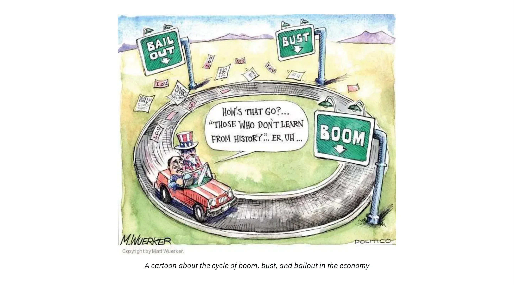

สำหรับทั้งนักเศรษฐศาสตร์แนวการเงินและเคนส์ สาเหตุของภาวะเศรษฐกิจตกต่ำคือความต้องการรวมที่ไม่เพียงพอ ดังนั้นทั้งสองจึงไม่ให้ความสนใจกับการเปลี่ยนแปลงของราคาสัมพัทธ์ ซึ่งตามที่เราได้เห็นแล้วคือแก่นของปัญหา ดังนั้นพวกเขาจึงเชื่อว่าการให้แรงจูงใจในการขยายสินเชื่อ (การลดอัตราดอกเบี้ย) และการใช้ความสามารถในการขาดดุลของรัฐเพื่อกระตุ้นความต้องการจะช่วยเริ่มต้นการฟื้นตัว ในระยะสั้น มาตรการดังกล่าวอาจดูเหมือนจะสร้างผลลัพธ์ที่ต้องการ: การขาดดุลสนับสนุนการใช้จ่าย ในขณะที่การลดอัตราดอกเบี้ยนำไปสู่ราคาสินทรัพย์ที่สูงขึ้น ซึ่งจะกระตุ้นให้ผู้ถือสินทรัพย์เพิ่มการใช้จ่ายของพวกเขา อย่างไรก็ตาม การกระตุ้นดังกล่าวจะค่อยๆ ลดลง ในขณะที่ปัญหาเชิงโครงสร้างยังคงอยู่ หรืออาจแย่ลงเนื่องจากการจัดสรรทุนที่ผิดพลาดยังคงดำเนินต่อไปเนื่องจากอัตราดอกเบี้ยที่ต่ำอย่างไม่เป็นธรรมชาติ

ในยุคปัจจุบัน ธนาคารกลางและรัฐบาลต่างกระตือรือร้นอย่างมากในการป้องกันการปรากฏของกระบวนการปรับตัวนี้ จนเราต้องเผชิญกับการว่างงานเชิงโครงสร้างในวงกว้างและการสะสมหนี้ที่ต่อเนื่อง ญี่ปุ่นเป็นตัวอย่างในเรื่องนี้ หลังจากการแตกของฟองสบู่สินทรัพย์ในปี 1989-90 ธนาคารแห่งประเทศญี่ปุ่น (BoJ) และรัฐบาลต่างๆ ที่ดำรงตำแหน่งได้ใช้วิธีการทั้งหมดที่กล่าวถึงที่นี่เพื่อพยายาม "เริ่มต้นเศรษฐกิจญี่ปุ่นใหม่" นอกเหนือจากการเพิ่มขึ้นชั่วคราวหลังจากโปรแกรมการใช้จ่ายและการลดอัตราดอกเบี้ย ญี่ปุ่นยังคงอยู่ในสภาวะการเติบโตที่อ่อนแอและมีหนี้สินเกินตัวเป็นเวลา 30 ปี

### บทสรุปเกี่ยวกับทฤษฎีวัฏจักรธุรกิจ:

โดยการเน้นถึงลักษณะตามลำดับของการกระทำของมนุษย์และให้ความสนใจเป็นพิเศษต่อผลกระทบของความผันผวนของอัตราดอกเบี้ยต่อการประสานงานระหว่างช่วงเวลาของตัวแทนทางเศรษฐกิจ, Ludwig Von Mises และ Friedrich Hayek อธิบายวัฏจักรเศรษฐกิจว่าเป็นพลวัตภายในของระบบธนาคารสำรองบางส่วน ความแตกต่างระหว่างการวิเคราะห์ของออสเตรียและของนักเศรษฐศาสตร์การเงินและเคนเซียนส่วนใหญ่คือการที่ฝ่ายแรกให้ความสนใจเป็นพิเศษต่อขั้นตอนต่างๆ ของการผลิตและโครงสร้างของราคาสัมพัทธ์ ในขณะที่ฝ่ายหลังหยุดที่ตัวแปรรวมเช่นระดับการจ้างงาน, GDP, หรือดัชนีราคาผู้บริโภค อันที่จริง เนื่องจากพวกเขาขาดทฤษฎีทุน นักเศรษฐศาสตร์กระแสหลักมักจะระบุสาเหตุของภาวะถดถอยว่าเป็น "จิตวิญญาณของสัตว์" หรือ "เหตุการณ์ภายนอก"

มากกว่าสำนักเศรษฐศาสตร์อื่นใด สำนักออสเตรียเน้นย้ำถึงความสำคัญของราคาสัมพัทธ์ในการประสานงานตัวแทนทางเศรษฐกิจ สมาชิกของสำนักออสเตรียถูกดึงเข้าสู่การถกเถียงในเรื่องนี้มานานกว่าศตวรรษ โดยเฉพาะอย่างยิ่งตั้งแต่ Mises ตีพิมพ์ผลงานของเขาเกี่ยวกับความเป็นไปไม่ได้ของการคำนวณทางเศรษฐกิจในระบบเศรษฐกิจสังคมนิยมในปี 1919

นี่จะเป็นหัวข้อของบทถัดไปและบทสุดท้ายของหลักสูตรนี้

## ความเป็นไปไม่ได้ของการคำนวณทางเศรษฐกิจภายใต้สังคมนิยม

<chapterId>2578a9d8-90e9-58dd-a8c5-6366948564c7</chapterId>

> "เมื่อไม่มีราคาตลาดสำหรับปัจจัยการผลิตเพราะไม่ได้ถูกซื้อหรือขาย การคำนวณในการวางแผนการดำเนินการในอนาคตและการกำหนดผลลัพธ์ของการกระทำที่ผ่านมาเป็นไปไม่ได้ การจัดการการผลิตแบบสังคมนิยมจะไม่รู้ว่าการวางแผนและการดำเนินการนั้นเป็นวิธีที่เหมาะสมที่สุดในการบรรลุเป้าหมายที่ต้องการหรือไม่ มันจะดำเนินการในความมืด กล่าวคือ มันจะสิ้นเปลืองปัจจัยการผลิตที่หายากทั้งทางวัตถุและมนุษย์ (แรงงาน) ความโกลาหลและความยากจนสำหรับทุกคนจะเกิดขึ้นอย่างหลีกเลี่ยงไม่ได้"
>

> ลุดวิก ฟอน มีเซส, ความโกลาหลที่วางแผนไว้

### ความเป็นไปไม่ได้ของการคำนวณทางเศรษฐกิจภายใต้สังคมนิยม

แม้จะมีความล้มเหลวซ้ำแล้วซ้ำเล่าของระบอบมาร์กซิสต์ในศตวรรษที่ผ่านมา การถกเถียงเรื่องการคำนวณทางเศรษฐกิจยังคงมีความสำคัญด้วยเหตุผลสองประการที่สำคัญ:

1. แนวคิดที่เปรียบเทียบได้ยังคงได้รับการสนับสนุนจากกลุ่มก้าวหน้าและกลุ่มแทรกแซงอื่น ๆ

2. การกำหนดราคา ไม่ว่าจะในตลาดทุนผ่านการกระทำของธนาคารกลางหรือในตลาดอื่น ๆ ผ่านรัฐวิสาหกิจ กฤษฎีกา และการแทรกแซงของคณะกรรมการกำกับดูแล ยังคงมีอยู่ทั่วไป

### การถกเถียงเรื่องการคำนวณทางเศรษฐกิจ

การอภิปรายนี้เริ่มต้นขึ้นจากหนึ่งในเอกสารทางเศรษฐศาสตร์ที่มีอิทธิพลมากที่สุดในศตวรรษที่ 20 "Economic Calculation in a Socialist Commonwealth" เขียนโดย Ludwig von Mises และตีพิมพ์ในปี 1920 ในยุคนั้น สังคมนิยมกำลังเติบโต โดยมีพวกบอลเชวิคยึดอำนาจในรัสเซีย นักสังคมนิยมเข้ารับตำแหน่งในสาธารณรัฐไวมาร์ (เยอรมนี) และพรรคสังคมนิยมและคอมมิวนิสต์ได้รับความสำคัญทั่วทั้งยุโรป

ก่อนบทความของ Mises การถกเถียงเกี่ยวกับสังคมนิยมและทุนนิยมส่วนใหญ่หมุนรอบข้อโต้แย้งทางศีลธรรมและปัญหาแรงจูงใจ แม้ว่าจะสมมติว่าสังคมที่จัดระเบียบตามหลักการของมาร์กซิสต์ "จากแต่ละคนตามความสามารถของเขา ถึงแต่ละคนตามความต้องการของเขา" นั้นเหนือกว่าทางศีลธรรม คำถามในทางปฏิบัติว่า "ใครจะเอาขยะออก" ยังคงต้องได้รับการแก้ไข คำตอบทั่วไปคือสังคมนิยมจะสร้างบุคคลที่ปราศจากสัญชาตญาณทุนนิยม ซึ่งยินดีรับใช้เพื่อนร่วมงานแม้จะไม่มีแรงจูงใจทางการเงินก็ตาม

ด้วยบทความของเขา Mises ได้แนะนำมิติใหม่ให้กับการอภิปราย โดยละทิ้งแนวคิดยูโทเปียเกี่ยวกับความสามารถของเศรษฐกิจการเมืองในการสร้าง "มนุษย์ใหม่" นักเศรษฐศาสตร์ชาวออสเตรียชี้ให้เห็นว่าการจัดระเบียบเศรษฐกิจอย่างมีเหตุผลนั้นเป็นไปไม่ได้หากไม่มีราคาสำหรับปัจจัยการผลิตขั้นกลาง แม้แต่ในปัจจุบัน ข้อโต้แย้งของเขายังคงถูกเข้าใจผิดโดยนักวิจารณ์ของเขา และแม้กระทั่งโดยนักเศรษฐศาสตร์เสรีบางคน ดังนั้นจึงควรอธิบายให้ละเอียดมากขึ้น

### การอธิบายความเป็นไปไม่ได้ของการคำนวณทางเศรษฐกิจ

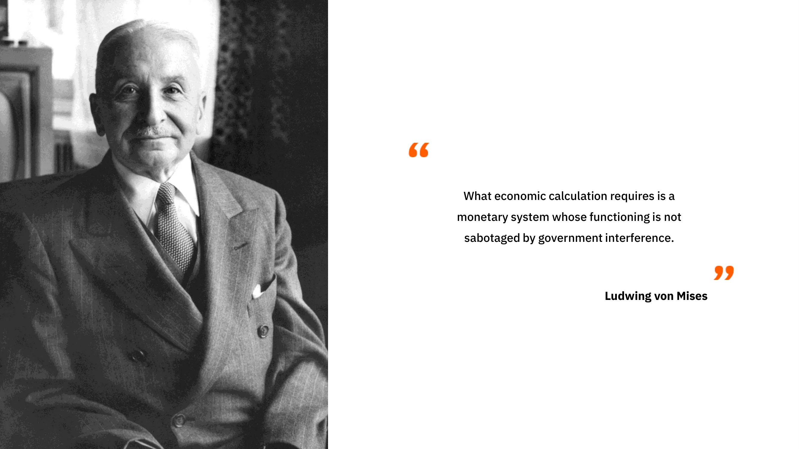

ความเข้าใจผิดส่วนใหญ่เกี่ยวกับข้อโต้แย้งของ Mises เกิดจากความเข้าใจผิดเกี่ยวกับบทบาทของชนชั้นผู้จัดการและผู้ประกอบการในระบบเศรษฐกิจทุนนิยม Mises ไม่เคยปฏิเสธความสามารถของผู้จัดการในการวางแผนการผลิตที่มีประสิทธิภาพภายในการดำเนินงานของตนเอง แต่เขาเน้นย้ำถึงความสำคัญของผู้ประกอบการและผู้ถือหุ้น ซึ่งในฐานะเจ้าของปัจจัยการผลิต จัดสรรทุนในอุตสาหกรรมต่าง ๆ ซึ่งก่อให้เกิดราคาที่เป็นปัจจัยนำเข้าในการคำนวณทางเศรษฐกิจของผู้จัดการ

หากไม่มีตลาดสำหรับทุนและเงิน จะเป็นไปไม่ได้ที่จะทำให้การใช้ทรัพยากรในอุตสาหกรรมต่าง ๆ เป็นไปอย่างมีเหตุผล ซึ่งหมายความว่า แม้ว่าจะมีการจัดการที่สมบูรณ์แบบภายในแต่ละบริษัทหรือส่วนย่อยของเศรษฐกิจ แต่เศรษฐกิจทั้งหมดก็ไม่สามารถปรับตัวได้อย่างมีประสิทธิภาพต่อการเปลี่ยนแปลงในความพร้อมของทรัพยากร สภาพการผลิต และความต้องการของผู้บริโภค ในคำพูดของ Mises:

> "[...] ความผิดพลาดหลักที่แฝงอยู่ใน [ข้อเสนอของสังคมนิยมตลาด] คือพวกเขามองปัญหาเศรษฐกิจจากมุมมองของเสมียนผู้ใต้บังคับบัญชาที่ขอบเขตทางปัญญาไม่ขยายเกินกว่าหน้าที่รอง พวกเขาพิจารณาโครงสร้างของการผลิตอุตสาหกรรมและการจัดสรรทุนให้กับสาขาต่าง ๆ และกลุ่มการผลิตเป็นสิ่งที่แข็งตัวและไม่คำนึงถึงความจำเป็นในการเปลี่ยนแปลงโครงสร้างนี้เพื่อปรับให้เข้ากับการเปลี่ยนแปลงของสภาพการณ์.... พวกเขาไม่ตระหนักว่าการดำเนินงานของเจ้าหน้าที่บริษัทประกอบด้วยเพียงการปฏิบัติหน้าที่ที่ได้รับมอบหมายจากเจ้านายของพวกเขาอย่างซื่อสัตย์ ผู้ถือหุ้น.... การดำเนินงานของผู้จัดการ การซื้อและขายของพวกเขา เป็นเพียงส่วนเล็ก ๆ ของการดำเนินงานทั้งหมดของตลาด ตลาดของสังคมทุนนิยมยังดำเนินการเหล่านั้นที่จัดสรรสินค้าทุนให้กับสาขาอุตสาหกรรมต่าง ๆ ผู้ประกอบการและนายทุนก่อตั้งบริษัทและบริษัทอื่น ๆ ขยายหรือลดขนาดของพวกเขา ยุบหรือรวมเข้ากับกิจการอื่น ๆ พวกเขาซื้อและขายหุ้นและพันธบัตรของบริษัทที่มีอยู่แล้วและใหม่ พวกเขาให้ ถอน และกู้คืนเครดิต กล่าวโดยย่อ พวกเขาดำเนินการทั้งหมดเหล่านั้น ซึ่งรวมเรียกว่าตลาดทุนและเงิน มันคือการทำธุรกรรมทางการเงินเหล่านี้ของผู้ส่งเสริมและนักเก็งกำไรที่นำการผลิตเข้าสู่ช่องทางที่ตอบสนองความต้องการเร่งด่วนที่สุดของผู้บริโภคในวิธีที่ดีที่สุด"
>

> Mises, Human Action, pp. 703-04

โดยสรุป Mises โต้แย้งว่าสิทธิในทรัพย์สินซึ่งทำให้เจ้าของทุนอยู่ในบริบทของกำไรและขาดทุน กระตุ้นให้พวกเขาจัดสรรทรัพยากรไปยังอุตสาหกรรมที่กำลังต้องการทรัพยากรเพื่อสนองความต้องการของผู้บริโภค เมื่อพวกเขาประสบความสำเร็จ พวกเขาจะได้กำไร แต่เมื่อพวกเขาล้มเหลว พวกเขาจะประสบกับการขาดทุนทางการเงิน การมี "ส่วนได้ส่วนเสีย" ของพวกเขาส่งเสริมให้พวกเขาคาดการณ์เกี่ยวกับการจัดสรรทุนที่ดีที่สุดสำหรับสภาวะเศรษฐกิจในปัจจุบัน สิ่งนี้สร้างพลวัตที่ขับเคลื่อนด้วยตลาดซึ่งผลลัพธ์รวมของการกระทำของพวกเขาผลิตข้อมูลสำคัญเกี่ยวกับการใช้ทรัพยากรอย่างมีประสิทธิภาพที่สุด

บทก่อนหน้านี้ได้อธิบายว่า ค่ามีความเป็นอัตวิสัย การกระทำทางเศรษฐกิจเผยให้เห็นต้นทุนค่าเสียโอกาส และราคาผู้บริโภคแสดงลำดับชั้นของความต้องการของผู้บริโภค ผู้ประกอบการแข่งขันกันเพื่อปัจจัยการผลิตเพื่อสร้างโครงสร้างการผลิตที่เพิ่มรายได้สูงสุดเหนือค่าใช้จ่าย ตอบสนองความต้องการของผู้บริโภคได้อย่างมีประสิทธิภาพมากกว่าทางเลือกอื่น ๆ ดังนั้น ราคาของปัจจัยการผลิตจึงได้มาจากราคาผู้บริโภค: หากปัจจัยการผลิตสามารถสร้างรายได้ทางการเงินที่มากกว่า (ตอบสนองความต้องการของผู้บริโภคได้ดีกว่า) ในอุตสาหกรรมอื่นหรือภายใต้แผนอื่น ผู้ประกอบการจะเสนอราคาสูงกว่าของเจ้าของปัจจุบัน เพิ่มราคาของมันไปยังผลิตภาพส่วนเพิ่ม การแข่งขันนี้ระหว่างผู้ประกอบการเพื่อปัจจัยการผลิต กำหนดผลตอบแทนส่วนเพิ่มสูงสุดของพวกเขา เป็นกระบวนการที่สร้างข้อมูลที่เกี่ยวข้องเกี่ยวกับการจัดสรรทรัพยากร

กระบวนการนี้มีความสำคัญเนื่องจากเป็นการตรวจสอบหรือไม่ตรวจสอบประสิทธิภาพของกิจกรรมต่าง ๆ เพื่อให้แน่ใจว่าปัจจัยการผลิตถูกจัดสรรไปยังการใช้งานที่มีประสิทธิผลสูงสุด ตลาดทำหน้าที่นี้ในฐานะกระบวนการต่อเนื่อง ในโลกที่เปลี่ยนแปลงตลอดเวลา—ที่ซึ่งความชอบของผู้บริโภค สภาพการผลิต เทคโนโลยี กฎระเบียบ ประชากร และอื่น ๆ กำลังเปลี่ยนแปลง—ราคาของปัจจัยการผลิตขั้นกลางเปลี่ยนแปลงอย่างต่อเนื่องผ่านการกระทำของผู้ประกอบการและนักลงทุนที่ปรับตัวให้เข้ากับสภาพที่เปลี่ยนแปลง เนื่องจากการเปลี่ยนแปลงเหล่านี้เป็นแบบท้องถิ่น ข้อมูลจึงต้องถูกเผยแพร่ไปยังตัวแทนทางเศรษฐกิจที่ไม่สามารถมีความรู้ครบถ้วนเกี่ยวกับโลกทั้งใบได้ นี่คือบทบาทของตลาด: มันช่วยให้ผู้ประกอบการสามารถดำเนินการตามข้อมูลที่เป็นท้องถิ่น มักเป็นเชิงคุณภาพ และซับซ้อน โดยการเสนอโครงสร้างการผลิตทางเศรษฐกิจที่ตลาดจะตรวจสอบหรือไม่ตรวจสอบ ในลักษณะนี้ ข้อมูลที่เกี่ยวข้องซึ่งเกิดจากกระบวนการจากล่างขึ้นบนนี้จะถูกย่อและแจกจ่ายไปทั่วทั้งเศรษฐกิจผ่านระบบราคา กระบวนการผลิตและแจกจ่ายข้อมูลนี้มีความสำคัญต่อการจัดสรรทรัพยากรเพราะมันช่วยให้ตัวแทนทางเศรษฐกิจที่มีความรู้จำกัดเกี่ยวกับโลกสามารถทำการคำนวณทางเศรษฐกิจและวางแผนทางเศรษฐกิจที่สอดคล้องกันโดยอาศัยราคา

จากมุมมองนี้ เศรษฐกิจที่วางแผนจากศูนย์กลางจะประสบกับการจัดสรรทุนที่ผิดพลาดอย่างหลีกเลี่ยงไม่ได้ ในระยะสั้นถึงระยะกลาง การจัดสรรที่ผิดพลาดดังกล่าวอาจไม่ถูกสังเกตเห็นเพราะไม่มีราคาตลาดหรือการล้มละลายที่จะเปิดเผย อย่างไรก็ตาม เนื่องจากการขาดแคลนข้อเสนอแนะ (ราคา) และกลไกการจัดสรรใหม่ (การล้มละลาย) ข้อผิดพลาดจะสะสมจนกระทั่งความสิ้นเปลืองปรากฏชัดผ่านการลดลงอย่างมีนัยสำคัญในสภาพความเป็นอยู่

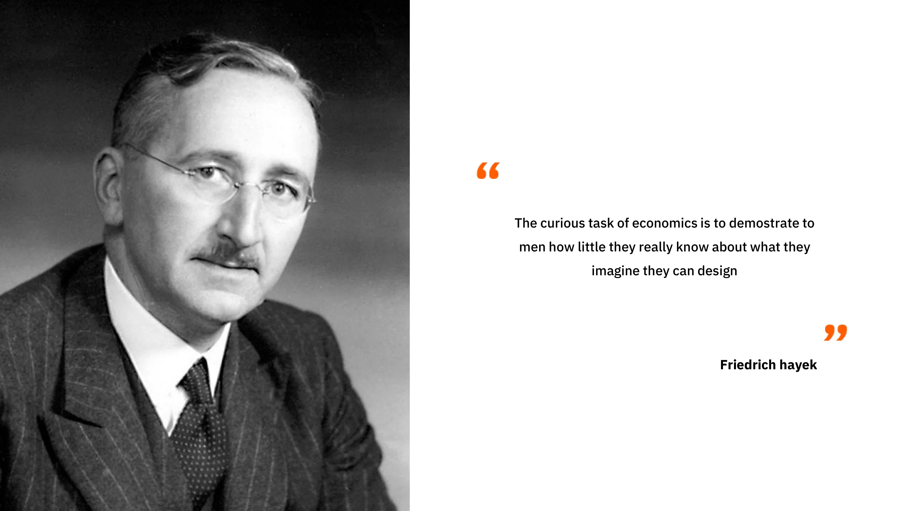

### มุมมองของออสเตรียและความล้มเหลวของสำนักเศรษฐศาสตร์อื่น ๆ

อาจมีคนโต้แย้งว่าการวาดภาพพาโนรามาเช่นนี้ในมุมมองย้อนหลังเป็นเรื่องง่าย ท้ายที่สุด เราทุกคนต่างทราบถึงชั้นวางสินค้าที่ว่างเปล่าในสหภาพโซเวียต ความยากลำบากของเวเนซุเอลา และหายนะด้านมนุษยธรรมในกัมพูชา แต่ Mises ได้คาดการณ์เหตุการณ์เหล่านี้ตั้งแต่ปี 1920 อย่างไรก็ตาม จนกระทั่งการล่มสลายของสหภาพโซเวียตในปี 1989 นักเศรษฐศาสตร์หลายคน รวมถึงผู้ได้รับรางวัลโนเบลจำนวนมาก ยังคงยกย่องปาฏิหาริย์ทางเศรษฐกิจของโซเวียตและทำนายว่าเศรษฐกิจของโซเวียตจะเหนือกว่าเศรษฐกิจของสหรัฐอเมริกาในไม่ช้า

แม้จะมีการพยากรณ์ที่น่าประทับใจและการสาธิตเชิงประจักษ์มากมายเกี่ยวกับความเป็นไปไม่ได้ของการคำนวณทางเศรษฐกิจภายใต้ระบบสังคมนิยม ผู้นำทางการเมืองทั่วโลกกลับกระตือรือร้นมากขึ้นกว่าเดิมในการกำหนดราคา แปรรูปอุตสาหกรรมทั้งหมด และเสนอแผนห้าปี ซึ่งมักได้รับการปรบมือจากประชากรที่ขาดความรู้ทางเศรษฐกิจ ผลที่ตามมาของการแทรกแซงเช่นนี้รู้สึกได้อย่างชัดเจนโดยผู้คนในประเทศตะวันตกที่เคยรุ่งเรืองซึ่งกำลังค่อยๆ เห็นการลดลงของมาตรฐานการครองชีพของพวกเขา

### ทฤษฎีวัฏจักรธุรกิจของออสเตรียในฐานะกรณีเฉพาะของความเป็นไปไม่ได้ในการคำนวณทางเศรษฐกิจภายใต้สังคมนิยม

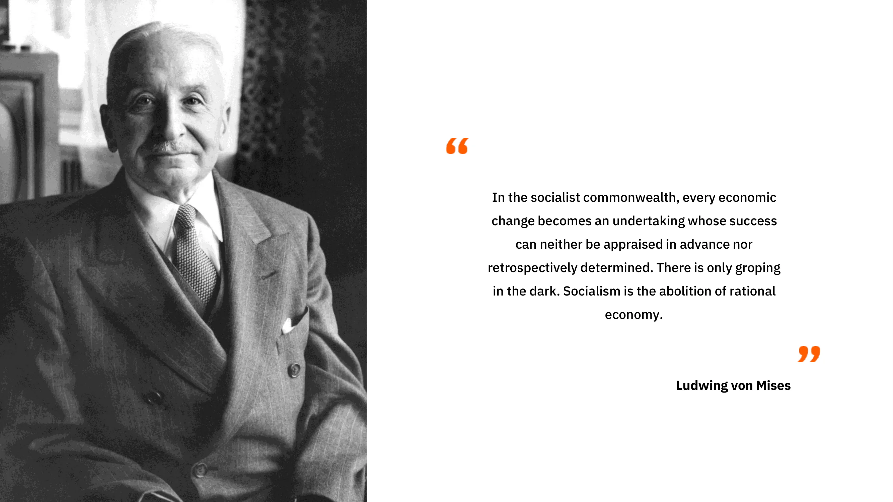

ในบทก่อนหน้า เราได้อธิบายถึงพลวัตของการลงทุนเกินและการจัดสรรทุนที่ผิดพลาดอันเนื่องมาจากการปรับอัตราดอกเบี้ยโดยธนาคารกลาง โดยพื้นฐานแล้ว สิ่งที่เราอธิบายสามารถมองได้ว่าเป็นกรณีเฉพาะของความเป็นไปไม่ได้ในการคำนวณทางเศรษฐกิจภายใต้ระบบสังคมนิยม ซึ่งนำมาใช้ในตลาดเงิน เมื่อราคาถูกกำหนดนอกเหนือจากมูลค่าตลาด ผู้ประกอบการและผู้จัดสรรทุนจะได้รับแรงจูงใจให้มีส่วนร่วมในการลงทุนที่ไม่สามารถยั่งยืนได้ในระยะยาวเนื่องจากขาดการออม โดยการแทรกแซงระบบราคา ผู้วางแผนส่วนกลาง (ในกรณีนี้คือธนาคารกลาง) สร้างความไม่สอดคล้องกันระหว่างตัวแทนทางเศรษฐกิจ ในกรณีนี้ ความไม่สอดคล้องกันระหว่างช่วงเวลานำไปสู่การลงทุนเกินในสินค้าการลงทุนระดับสูงและการลงทุนต่ำในสินค้าการลงทุนระดับต่ำ ซึ่งแสดงถึงการจัดสรรทุนที่ผิดพลาดในอุตสาหกรรมต่างๆ

ผลกระทบจากการจัดสรรที่ผิดพลาดดังกล่าวรวมถึงวิกฤตการเงินและเศรษฐกิจ กิจกรรมทางเศรษฐกิจที่ลดลง และการลดลงของหนี้สิน ผลกระทบทางเศรษฐกิจมหภาคเหล่านี้เกิดจากความไม่สมดุลระหว่างการออมและการลงทุนที่เกิดจากการขยายตัวของเครดิต ในสหภาพโซเวียตและระบอบคอมมิวนิสต์อื่น ๆ การกำหนดราคาทำให้เกิดการประสานงานที่ผิดพลาดเช่นเดียวกัน ส่งผลให้เกิดการขาดแคลนสินค้าบางประเภทและการผลิตเกินของสินค้าอื่น ๆ ในทั้งสองกรณี ราคาล้มเหลวในการสะท้อนความต้องการที่แท้จริงของผู้บริโภค ไม่ว่าจะเป็นในแง่ของความต้องการด้านเวลา หรือความต้องการในการบริโภค ทำให้ผู้ประกอบการหรือผู้วางแผนกลางที่รับผิดชอบการจัดสรรทรัพยากรลงทุนทุนใน "อุตสาหกรรมที่ผิดพลาด"

วันนี้ การถกเถียงเรื่องการคำนวณทางเศรษฐกิจกลับมาอีกครั้ง โดยเฉพาะในประเด็นเกี่ยวกับพลังงาน ซึ่งการลงทุนที่ผิดพลาดที่ขับเคลื่อนโดยวาระสีเขียวกำลังปรากฏให้เห็นมากขึ้น นอกจากนี้ยังเกิดขึ้นในประเด็นเกี่ยวกับตลาดเงิน โดยนักเศรษฐศาสตร์ออสเตรียชี้ให้เห็นว่าภาวะวิกฤตในปี 2008 ซึ่งนักเศรษฐศาสตร์กระแสหลักไม่สามารถคาดการณ์ได้ เป็นวงจรบูมและบัสต์แบบคลาสสิกที่มีการลงทุนเกินในตลาดที่อยู่อาศัยเนื่องจากอัตราดอกเบี้ยต่ำเป็นเวลานาน ยิ่งไปกว่านั้น นักมาร์กซิสต์ใหม่และกลุ่มสังคมนิยมอื่น ๆ เผยแพร่แนวคิดว่าการเกิดขึ้นของ AI อาจแก้ปัญหาการคำนวณทางเศรษฐกิจได้ อย่างไรก็ตาม มุมมองนี้เกิดจากความเข้าใจผิดในประเด็นนี้; ปัญหาการคำนวณทางเศรษฐกิจไม่ใช่เรื่องของพลังการคำนวณ แต่เป็นเรื่องของการสร้างและแจกจ่ายข้อมูลที่เกี่ยวข้องกับการผลิตและการจัดสรรทรัพยากร ข้อมูลนี้สามารถสร้างได้เฉพาะในท้องถิ่นโดยตัวแทนที่มีความรู้เฉพาะทางและมีส่วนได้ส่วนเสียในผลลัพธ์ AI ไม่สามารถแทนที่กระบวนการจากล่างขึ้นบนนี้ได้ และดังนั้นจึงไม่สามารถช่วยผู้วางแผนส่วนกลางในการแก้ปัญหาการจัดสรรทรัพยากรได้ น่าเสียดายที่เนื่องจากความเข้าใจผิดที่มีมานานกว่าศตวรรษ เราคาดว่าจะมีการแพร่หลายของการอ้างว่า AI จะนำไปสู่ยุคใหม่ของความเจริญรุ่งเรืองทางเศรษฐกิจที่นำโดยผู้วางแผนส่วนกลางที่มีความรู้แจ้งซึ่งด้วยความช่วยเหลือของ AI สามารถแก้ไขความล้มเหลวของตลาดเสรีได้

สำหรับการประยุกต์ใช้ปัญหาการคำนวณทางเศรษฐกิจกับสถานการณ์ร่วมสมัยอย่างเป็นรูปธรรม คุณสามารถอ้างอิงบทความนี้ซึ่งกล่าวถึงการจัดสรรทรัพยากรในจีนยุคใหม่: *[The Road to Financial Repression: China the Paper Tiger](https://open.substack.com/pub/theomogenet/p/the-road-to-financial-repression-181?r=ccpx8&utm_campaign=post&utm_medium=web)* โดย Théo Mogenet

### บทสรุป

ในบทสุดท้ายนี้ เราได้สำรวจถึงความเป็นไปไม่ได้ของการคำนวณทางเศรษฐกิจภายใต้ระบบสังคมนิยม ซึ่งเป็นหลักการสำคัญของสำนักเศรษฐศาสตร์ออสเตรีย มุมมองของออสเตรียที่นำเสนอในหลักสูตรนี้สรุปลงในข้อสรุปนี้และให้เหตุผลที่แข็งแกร่งสำหรับนโยบายที่ไม่แทรกแซง แก่นแท้ของความคิดออสเตรียทั้งหมดหมุนรอบความสำคัญของราคาต่อการประสานงานทางเศรษฐกิจ โดยการเน้นย้ำถึงความสำคัญของต้นทุนค่าเสียโอกาสและการคำนวณทางเศรษฐกิจเพื่อการใช้ทรัพยากรอย่างมีเหตุผล นักเศรษฐศาสตร์ออสเตรียแสดงให้เห็นถึงความซับซ้อนและความละเอียดอ่อนของการกระทำของมนุษย์ในโลกที่เปลี่ยนแปลงตลอดเวลา

นักเศรษฐศาสตร์กระแสหลักและผู้วางแผนเศรษฐกิจส่วนกลางมักไม่ชอบนักเศรษฐศาสตร์ออสเตรียเนื่องจากพวกเขาเน้นย้ำถึงความไม่แน่นอนของอนาคต ความผิดพลาดของการทำนายทางเศรษฐกิจเชิงปริมาณ และผลกระทบที่เป็นอันตรายของการแทรกแซงทางเศรษฐกิจ กล่าวโดยย่อ เศรษฐศาสตร์ออสเตรียเน้นถึงความไร้ประสิทธิภาพและผลกระทบที่เป็นอันตรายของการกระทำที่แทรกแซง

ประเพณีออสเตรียแสดงถึงแนวทางที่ถ่อมตนต่อการกระทำของมนุษย์ โดยดึงเอานัยสำคัญลึกซึ้งจากแนวคิดเรื่องคุณค่าเชิงอัตวิสัย ความไม่แน่นอน เจตจำนงเสรี และความซับซ้อน อธิบายว่าเหตุใดระเบียบตลาด แม้จะไม่ได้เป็นผลผลิตจากการออกแบบของมนุษย์ แต่กลับยืนหยัดเป็นสถาบันหลักสำหรับการพัฒนาและความเจริญรุ่งเรืองของเรา หากมีสิ่งหนึ่งที่ควรจดจำจากหลักสูตรนี้ ก็คือทุนนิยมกลายเป็นระบบเศรษฐกิจที่ครอบงำเพราะความสามารถในการปรับตัวต่อการเปลี่ยนแปลงในโลกที่มีความเคลื่อนไหวและไม่แน่นอนซึ่งเต็มไปด้วยบุคคลที่มีเสรีภาพ

## วิธีวิทยาแบบออสเตรีย

<chapterId>419129c1-82ba-54e3-b385-95d4d89a447e</chapterId>

โรงเรียนเศรษฐศาสตร์ออสเตรียแยกตัวเองออกจากโรงเรียนอื่น ๆ โดยวิธีการแบบสัจพจน์-นิรนัย ซึ่งแตกต่างจากวิธีการแบบบวกนิยมที่มักใช้ในสังคมศาสตร์ วิธีการแบบบวกนิยมอิงตามกฎหมายที่จัดตั้งขึ้นจากข้อมูลเชิงประจักษ์ โดยใช้วิธีการที่คล้ายคลึงกับวิทยาศาสตร์กายภาพ มันสร้างสมมติฐานจากการสังเกต ซึ่งจากนั้นจะได้รับการยืนยันหรือปฏิเสธโดยการทดลองชั่วคราว วิธีการทางวิทยาศาสตร์ประกอบด้วยการรักษาสมมติฐานที่อธิบายข้อมูลได้ดีที่สุดและสำรวจต่อไปจนกว่าจะพบสมมติฐานที่แม่นยำยิ่งขึ้น

อย่างไรก็ตาม ในสังคมศาสตร์ การแยกตัวแปรออกจากกันเหมือนในฟิสิกส์นั้นเป็นเรื่องยาก เพราะแต่ละช่วงเวลาในประวัติศาสตร์มีความเป็นเอกลักษณ์และมีปัจจัยหลายอย่างเข้ามาเกี่ยวข้อง การทดลองทางเศรษฐศาสตร์ไม่สามารถทำซ้ำในห้องปฏิบัติการได้ และสิ่งสำคัญคือต้องสังเกตว่าการพบความสัมพันธ์ระหว่างตัวแปรสองตัวไม่ได้พิสูจน์ถึงความสัมพันธ์เชิงสาเหตุระหว่างกัน ชาวออสเตรีย โดยเฉพาะอย่างยิ่ง Ludwig von Mises ได้เสนอวิธีการทางเลือกที่เรียกว่าวิธีการแบบอุปนัยหรือแบบนิรนัย-อุปนัยเพื่อศึกษาสังคมศาสตร์ วิธีการนี้อิงตามข้อเสนอพื้นฐานที่เรียกว่า สัจพจน์ ซึ่งคล้ายกับที่ใช้ในคณิตศาสตร์ ตัวอย่างเช่น เรขาคณิตแบบยุคลิดเป็นตัวอย่างของวิธีการแบบนิรนัย-อุปนัยในสาขาคณิตศาสตร์

ในเศรษฐศาสตร์แบบออสเตรีย, สัจพจน์พื้นฐานรวมถึงความชอบเวลาบวก ซึ่งอิงจากการเลือกของบุคคลเกี่ยวกับสินค้าหรือบริการในวันนี้แทนที่จะเป็นพรุ่งนี้ เนื่องจากความไม่แน่นอนเกี่ยวกับอนาคต สัจพจน์เหล่านี้ไม่ได้ถูกตั้งคำถาม เนื่องจากถือว่าเป็นที่ประจักษ์และสอดคล้องกับชีวิตประจำวัน โดยใช้สัจพจน์พื้นฐานเหล่านี้ นักเศรษฐศาสตร์ออสเตรียใช้กฎของตรรกะในการสรุปข้อความที่ให้ข้อมูลเกี่ยวกับการทำงานของปรากฏการณ์ทางเศรษฐกิจ ตัวอย่างเช่น พวกเขาอธิบายว่าวิกฤตเศรษฐกิจเกิดจากความไม่สมดุลระหว่างการออมและการลงทุน ซึ่งนำไปสู่การบิดเบือนอัตราดอกเบี้ยอย่างเทียม ผู้ที่มีความชอบเวลาบวกต้องการอัตราดอกเบี้ยบวกเพื่อชดเชยความเสี่ยงในการให้กู้ยืม ชาวออสเตรียโต้แย้งว่าความสัมพันธ์ในการประเมินค่าเป็นเรื่องส่วนบุคคล ดังนั้นอัตราดอกเบี้ยสามารถเปลี่ยนแปลงได้ขึ้นอยู่กับบุคคลและสถานการณ์

ราคามีบทบาทสำคัญในการจัดระเบียบอย่างมีเหตุผลของบุคคลที่มีข้อมูลบางส่วน อัตราดอกเบี้ยช่วยปรับสมดุลระหว่างอุปทานและอุปสงค์ของทุนในตลาด ซึ่งส่งเสริมเศรษฐกิจ นักเศรษฐศาสตร์ออสเตรียเน้นว่าการกำหนดอัตราดอกเบี้ยโดยพลการสามารถนำไปสู่วิกฤตเศรษฐกิจและทำให้การคำนวณเป็นไปไม่ได้ในระบอบสังคมนิยม

### นักเศรษฐศาสตร์ออสเตรียและความแตกต่างทางระเบียบวิธี

นักเศรษฐศาสตร์ออสเตรียมักพบกับความยากลำบากเมื่อถกเถียงกับสำนักคิดอื่น ๆ เนื่องจากพวกเขาไม่ได้ใช้วิธีการวิเคราะห์แบบเดียวกัน ในขณะที่นักเศรษฐศาสตร์ออสเตรียใช้เหตุผลจากสัจพจน์พื้นฐาน เช่น ความเป็นอัตวิสัยของมูลค่า เพื่ออนุมานผลลัพธ์เชิงตรรกะ นักเศรษฐศาสตร์เคนส์หรือมอนิทาริสต์มักพึ่งพาข้อมูลเชิงประจักษ์ในการสร้างกฎเศรษฐกิจทั่วไป

ตัวอย่างหนึ่งของความแตกต่างทางระเบียบวิธีคือจุดยืนของผู้สนับสนุนทฤษฎีการเงินสมัยใหม่ (MMT) ที่ได้สนับสนุนการพิมพ์เงินเพื่อบรรลุเป้าหมายทางการเมือง โดยใช้การขาดเงินเฟ้อระหว่างปี 2008 ถึง 2019 เป็นข้อโต้แย้ง นักเศรษฐศาสตร์ออสเตรียและผู้สนับสนุน MMT ไม่ได้พูดภาษาเดียวกันและไม่เห็นด้วยกับเกณฑ์ในการกำหนดความถูกต้องของกฎหมายเศรษฐกิจ ทำให้การอภิปรายระหว่างโรงเรียนที่แตกต่างกันเหล่านี้เป็นเรื่องยากและมักไม่มีประสิทธิผล

สิ่งสำคัญที่ควรทราบคือการเลือกข้อมูลเฉพาะเจาะจงเพื่อสร้างความสัมพันธ์ระหว่างตัวแปรต่าง ๆ หรือที่เรียกว่า cherry-picking นั้นเป็นวิธีการที่ไม่เป็นวิทยาศาสตร์และไม่เข้มงวดในทางเศรษฐศาสตร์ การสร้างเงินตรา เช่น ไม่จำเป็นต้องทำให้เกิดเงินเฟ้อเสมอไป และจำเป็นต้องมีวิธีการที่ละเอียดอ่อนมากขึ้นเพื่อทำความเข้าใจกลไกทางเศรษฐกิจที่ซับซ้อน สัจพจน์มีบทบาทสำคัญในเหตุผลทางเศรษฐศาสตร์แบบออสเตรีย พวกมันเป็นองค์ประกอบพื้นฐานที่สามารถนำไปสู่การอนุมานเชิงตรรกะได้ อย่างไรก็ตาม สิ่งสำคัญคือต้องยอมรับว่าการทำนายอนาคตอย่างแม่นยำในทางเศรษฐศาสตร์มักเป็นเรื่องยากเนื่องจากความซับซ้อนของปรากฏการณ์ทางเศรษฐกิจและความไม่แน่นอนที่มีอยู่ในตัว

ระเบียบวิธีวิจัยเป็นส่วนสำคัญในเศรษฐศาสตร์และในสังคมศาสตร์โดยทั่วไป มันมีอิทธิพลต่อวิธีการตั้งคำถาม การสร้างสมมติฐาน และการตีความข้อมูล การเข้าใจความแตกต่างทางระเบียบวิธีวิจัยระหว่างสำนักคิดทางเศรษฐศาสตร์สามารถช่วยให้เราเห็นคุณค่าของมุมมองที่หลากหลายและพัฒนาความคิดเห็นของเราเองในหัวข้อที่ได้พูดคุยในตอนก่อนหน้า

# ส่วนสุดท้าย

<partId>ae828713-d133-559f-93c2-101cb5245fca</partId>

## รีวิวและการให้คะแนน

<chapterId>29d4323c-e34e-5834-bf03-2f3ed10d751b</chapterId>

<isCourseReview>true</isCourseReview>

## การสอบปลายภาค

<chapterId>d58d188f-81fb-572a-a898-8b6f8aceba7a</chapterId>

<isCourseExam>true</isCourseExam>

## บทสรุป

<chapterId>d668fdf6-fb4c-4bbf-82e1-afcb95c122e0</chapterId>

<isCourseConclusion>true</isCourseConclusion>