# Avusturya Ekonomisine Yolculuk

Hiç bazı ekonomistlerin piyasalar, özgürlük ve insan davranışı hakkında neden farklı düşündüğünü merak ettiniz mi? Avusturya ekonomisi, sizi ekonomik düşüncenin merkezine yerleştiren ferahlatıcı bir bakış açısı sunar. Ağır matematik ve soyut modeller yerine, bu yaklaşım mantığa, insan seçimine ve gerçek insanların günlük yaşamlarında nasıl karar verdiklerine odaklanır. Özgürlük, rasyonellik ve kişisel eylem merceğinden ekonomidir.

Bu düşünce okulu, Hayek, Mises ve Bastiat gibi etkili düşünürler sayesinde yüzyıllardır tartışmaları şekillendirmiştir. Ana akım Keynesyen ekonomi bugünün politika tartışmalarına hâkim olsa da, Avusturya geleneği farklı sorular sorar: Bireysel özgürlüğe öncelik verdiğimizde ne olur? İnsanlar seçme özgürlüğüne sahip olduğunda serbest piyasalar gerçekte nasıl çalışır? Piyasalar, toplum ve özgürlük hakkında düşünmenin alternatif yollarını merak ediyorsanız, standart ders kitaplarında bulamayacağınız fikirleri keşfetmek için bu sizin şansınız.
+++
# Giriş

<partId>265aa8b0-dd89-5456-b72a-656e988013d5</partId>

## Kursa Genel Bakış

<chapterId>eae3de7b-cce6-516d-83d9-28fbd582c0ca</chapterId>

ECO201 kursuna hoş geldiniz!

Théo Mogenet tarafından sunulan bu kursta, hakim Keynesyen doktrinden temelde farklı olan bir ekonomik düşünce ekolünü keşfedeceksiniz. Şimdiye kadar size para yönetimi ve ekonomi politikasının öncelikle merkez bankalarının işi olduğu, para basmanın ve kamu harcamalarının ekonomik büyümeyi teşvik ettiği fikri öğretilmiş olabilir. Ancak, daha tutarlı bir alternatif yaklaşım mevcuttur: **Avusturya Ekonomisi**.

Carl Menger, Ludwig von Mises ve Friedrich Hayek gibi ünlü yazarların iki yüzyılı aşkın araştırmaları, felsefi düşünceleri ve yazıları ile bu düşünce okulu, bireye ve insan rasyonalitesine dayalı merkezi olmayan bir ekonomi görüşünü tercih ederek farklı bir bakış açısına sahiptir.

Ekonomi, gerçekte, tutarlı bir bütün oluşturmak için serbestçe etkileşime giren çok sayıda bağımsız aktörden oluşan son derece sosyal ve karmaşık bir alandır. Bu dinamik sistemi anlamak için Avusturya Ekonomisi, katı matematiksel denklemler yerine insan mantığına, sosyolojiye ve piyasa süreçlerinin incelenmesine dayanan niteliksel analizi tercih eder.

Bu kursta, bu düşünce okulunun temel ilkelerini keşfedeceksiniz. Eğitmeniniz Théo Mogenet, bu ekonomik yaklaşımın tutkulu bir savunucusudur ve size Avusturya Ekonomisinin temel kavramları konusunda rehberlik ederek bu fikirlerin özellikle Bitcoin dünyasına nasıl uygulandığını gösterecektir.

**Bölüm 1: EKONOMİYE GİRİŞ**

Avusturya Ekonomisi'ne genel bir giriş yaparak, tarihsel kökenlerini ve düşüncesinin temellerini keşfederek başlayacağız. Bu bölüm ayrıca para, kredi, bankalar ve merkez bankaları gibi temel kavramları da kapsamaktadır. Bu kurumların Avusturya düşüncesinde, özellikle de parasal müdahalelere yönelik eleştirilerinde neden merkezi bir rol oynadığını anlayacaksınız.

**Bölüm 2: Teorik Temeller**

Bu bölümde, bir malın değerinin neden nesnel olmayıp her bireyin algıladığı faydaya bağlı olduğunu açıklayan öznel değer teorisi gibi Avusturya Ekonomisinin temel kavramlarını inceleyeceksiniz. Ayrıca, Avusturya serbest piyasa teorisinin merkezinde yer alan zaman tercihi, faiz ve sermaye kavramları ile birlikte paranın doğal olarak nasıl sosyal bir olgu olarak ortaya çıktığını keşfedeceksiniz.

**Bölüm 3: Avusturya Ekonomik Perspektifleri**

Burada, Avusturya teorisinin pratik uygulamalarını keşfedeceğiz. Parasal manipülasyonların nasıl yapay patlamalar ve ardından durgunluklar yarattığını açıklayan Avusturya İş Döngüsü Teorisi hakkında ayrıntılı bilgi edineceksiniz. Ayrıca, sosyalist bir sistemde ekonomik hesaplamanın neden imkansız olduğunu ve prakseolojiye (insan eyleminin incelenmesi) dayanan Avusturya metodolojisinin ekonomik olguları anlamak için nasıl benzersiz ve tutarlı bir yaklaşım sağladığını göreceğiz.

Bu kurs, Théo ve benim (Rogzy) yürüttüğümüz açık bir tartışma ile ekonomi ve felsefenin bir karışımıdır. Théo Mogenet'e bu kursu oluşturduğu için içtenlikle teşekkür etmek isterim. Herkesin erişimine açık olacak şekilde tasarlanan bu içeriği geliştirmekten büyük keyif aldık. Bu kurs temel bir giriş niteliğindedir ve gelecekteki daha gelişmiş ekonomi modüllerimiz için zemin hazırlayacaktır.

Peki ya günümüz ekonomisini anlamanın anahtarı birkaç yüzyıllık bir teoride yatıyorsa? Gelin bunu birlikte keşfedelim!

## Para, Kredi, Bankalar ve Merkez Bankaları

<chapterId>29faebd9-9326-52de-8161-e4bb33033cd6</chapterId>

> "Geleneksel para biriminin temel sorunu, işlemesi için gereken güven unsurudur. Merkez bankasına paranın değerini düşürmeyeceği konusunda güvenilmelidir, ancak itibari para birimlerinin tarihi bu güvenin ihlal edilmesiyle doludur. Bankalara paramızı tutacakları ve elektronik olarak transfer edecekleri konusunda güvenilmelidir, ancak onlar paranın çok az bir kısmını yedekte tutarak kredi balonu dalgaları halinde ödünç vermektedirler. Onlara mahremiyetimiz konusunda güvenmeliyiz, kimlik hırsızlarının hesaplarımızı boşaltmasına izin vermemeleri konusunda güvenmeliyiz."
>

> Satoshi Nakamoto, Bitcoin'nin takma isimli mucidi

### Para Nasıl Yaratılır

Günümüz para sisteminde para, esas olarak "kısmi rezerv bankacılığı" olarak bilinen bir bankacılık uygulaması yoluyla yaratılmaktadır Bu terim esasen bankaların mevduat olarak aldıkları kadar rezerv tutmak zorunda olmadıkları anlamına gelir. Sonuç olarak, kredi verirken yeni satın alma gücü yaratabilir ve tersine, müşteriler kredilerini geri ödediğinde satın alma gücünü azaltabilirler.

Örneğin, bir ev satın almak için ipotek almak üzere yerel bankanıza başvurursanız, banka tarafından size ödünç verilen para bir defter tutma girişi olarak ortaya çıkar. Muhasebede, genellikle bir bireyin net servetini iki tarafı olan bir bilanço ile temsil ederiz: herhangi bir mülk, finansal sözleşme, envanter veya sahip olunan diğer servet biçimlerini içeren varlık tarafı ve varlık tarafında listelenen sermayeyi oluşturmak için kullanılan fonların kaynağını gösteren yükümlülük tarafı. Varlıklar ve yükümlülükler arasındaki fark "özkaynak" olarak adlandırılır ve işletmenin net serveti olarak düşünülebilir.

Bir finans kuruluşunun bankacılık lisansına sahip olması, esasen "müşteri mevduatı" olarak kaydedilen yükümlülüklerin belirli bir ülke veya para bölgesi içinde resmi para olarak kabul edildiği anlamına gelir. Bu nedenle, bankadan bir ev satın almak için kredi istediğinizde, bankacı başka bir müşteri tarafından yatırılan fonları ödünç vermez. Bunun yerine, banka ödünç alınan tutarı hesabınıza yatırır ve aynı anda Contract kredinizi bankanın bir varlığı olarak kaydeder. Kredinizi geri ödediğinizde, para etkin bir şekilde söndürülür ve ilgili kredi Contract'ün değeri azalır, banka yalnızca kredinin faizini elinde tutar.

Evi satın aldıktan sonra, bankacınıza satıcının hesabına para aktarması talimatını verirsiniz. Satıcının hesabı farklı bir bankadaysa, bankacınız diğer kurumdaki ilgili bankacıya bildirimde bulunarak satıcının hesabının uygun şekilde alacaklandırılmasını ve sizin hesabınızın da ilgili tutar kadar borçlandırılmasını sağlar.

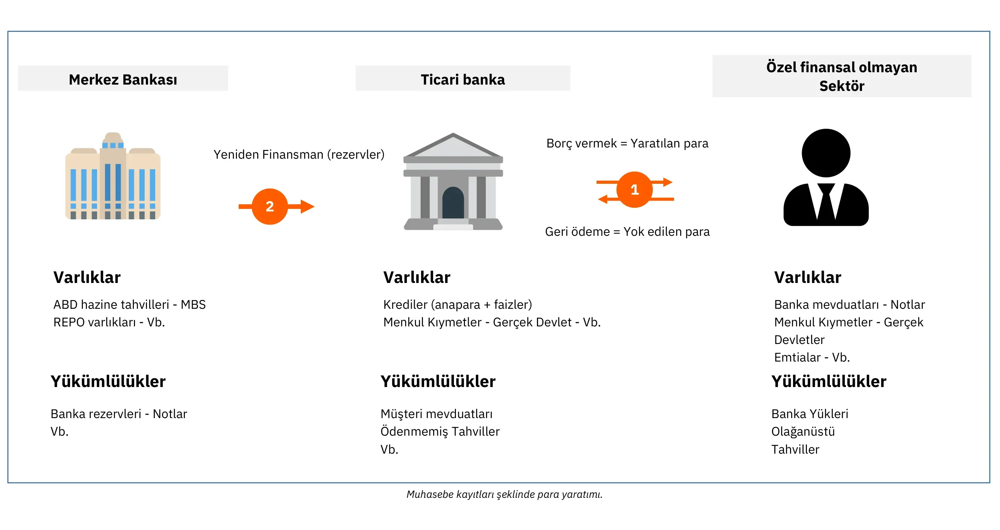

Şekil 1: Defter Tutma Girişleri Olarak Para Yaratımı

> "Ulusumuzun insanlarının bankacılık ve para sistemimizi anlamaması yeterince iyi, çünkü anlasalardı, inanıyorum ki yarın sabah olmadan bir devrim olurdu"
>

> Henry Ford

Bu süreç, bankaların belirli bir süre boyunca (genellikle bir hafta veya bir ay) banka havaleleri, kredi kartı alımları ve çekler de dahil olmak üzere tüm işlemleri kaydetmelerine olanak tanır. Daha sonra bu işlemleri, halk tarafından asla kullanılmayan başka bir fiat para birimi olan banka rezervlerini kullanarak birbirleriyle kapatırlar. Banka rezervleri merkez bankasında sadece lisanslı banka ve finans kuruluşlarının erişebildiği özel bir hesapta tutulur.

### Kısmi Rezerv Bankacılığının İstikrarsızlığı ve Son Kredi Mercii

Bu kısmi rezerv sistemiyle ilgili temel sorun, belirli bir bankadan önemli miktarda para çekilmesinin potansiyel olarak bankanın iflasına yol açabilmesidir. Bankalar, müşterilerin nakit taleplerini karşılamakla birlikte, ellerinde sadece sınırlı bir banka rezervi bulundurmak zorunda olduklarından, çok sayıda müşterinin aynı anda para çekmek için acele etmesi, bankayı bu talepleri karşılayamaz hale getirerek iflasına yol açabilir. Birçok kişi, firma ve kurumun fonlarını bankalara yatırdığı düşünüldüğünde, bir bankanın batmasına izin vermek durgunluk ve hatta depresyon gibi ciddi ekonomik sonuçlar doğurabilir.

Bu muamma modern merkez bankalarının doğmasına neden olmuştur. 19. yüzyılda İngiltere'de tekrarlanan banka iflasları finansal istikrarı tehdit etmiş ve "son çare mercii" olarak İngiltere Merkez Bankası'nın kurulmasına yol açmıştır İngiltere Merkez Bankası, tüm finansal sistemi felç edebilecek bir domino etkisini önlemek için krizler sırasında sıkıntılı bankalara borç vermekle görevlendirildi. Son çare mercii olarak merkez bankaları kavramı o zamandan bu yana dünya çapında yayıldı ve yaygınlaştı.

Merkez bankaları, finansal istikrarı korumanın yanı sıra temel politika faiz oranlarını belirlemekten de sorumludur. Bu oranlar, lisanslı bankaların merkez bankasından borç alabilecekleri maliyeti belirler ve esasen ekonomilerimizde borç vermede çok önemli bir rol oynayan finansal kurumlar için likidite maliyetini tanımlar. Dolayısıyla bu oranlar tüm finansal sistem için bir ölçüt görevi görür. Bir birey olarak, konut krediniz için ödediğiniz faiz oranları, politika faizi ve bankanın marjı olarak ayrıştırılabilir.

Şekil2: Lehman Brothers'ın İflası (15/09/2008)

2008'deki büyük mali kriz sırasında, büyük bir yatırım bankası olan Lehman Brothers, elindeki ipotekli menkul kıymetlerde önemli kayıplar yaşadıktan ve ilgili müşterilerden büyük miktarda para çekmeye maruz kaldıktan sonra iflasını ilan etti. Bu benzeri görülmemiş finansal çalkantıya yanıt olarak, dünyanın dört bir yanındaki merkez bankacıları finansal piyasalara büyük miktarlarda likidite enjekte etti, zor durumdaki yatırım bankalarını ticari bankalarla birleştirdi ve sistemik bir çöküşü önlemek amacıyla politika faizlerini sıfıra yakın seviyelere indirdi.

Bu önlemler iflasların artmasını önlese de, ardından gelen ekonomik yavaşlamayı hafifletmek için çok az şey yaptı. Milyonlarca kişi işini ve evini kaybetti, tüketici harcamaları düştü, işletmeler battı ve bankalar önemli zararlara uğradı. Tarihsel olarak düşük faiz oranlarına rağmen, çok az kişi borç almaya istekli oldu ve bu da harcama ve yatırımlardaki ilk düşüşün kendini pekiştirdiği bir kısır döngüye neden oldu. Sonuç olarak, merkez bankacıları Niceliksel Gevşeme (QE) programlarını uygulayarak daha ileri adımlar attılar. Bu programlar, merkez bankalarının merkez bankası rezervleriyle ticari bankalardan devlet tahvilleri ve ipoteğe dayalı menkul kıymetler satın almasını içeriyordu.

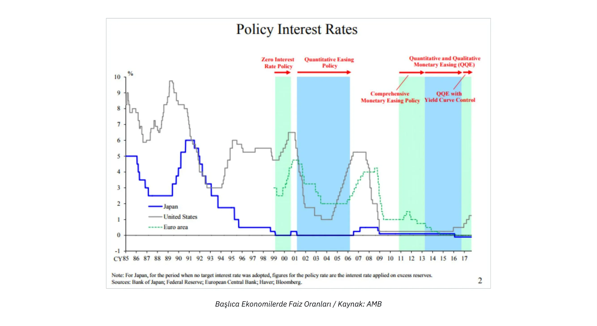

Şekil3 : Başlıca Ekonomilerde Faiz Oranları / Kaynak: AMB

Birçok beklentinin aksine, QE programları ekonomik büyümeyi önemli ölçüde canlandırmadı ancak finansal varlıkları tarihi seviyelere şişirdi. Bu durumdan öncelikle zenginler ve finansal kurumlar yararlandı, zira bu tür varlıkları zaten önemli miktarlarda ellerinde tutuyorlardı ve böylece servet eşitsizlikleri daha da arttı. Bankacılık sisteminin daha önce açıklanan yapısı göz önüne alındığında, bu sonuç sürpriz olmamalıdır. Banka rezervleri reel ekonomiye kolayca akamadığından, QE programları ortalama bireylerin mali durumlarını etkili bir şekilde iyileştirmeden esas olarak varlık fiyatlarını artırmıştır.

### Cantillon Etkisi

Bununla birlikte, bu olaydan temel bir ekonomik ilke çıkarılabilir: yeni para yaratıldığında, başlangıçta paranın kaynağına en yakın olanlara fayda sağlarken, daha uzaktakilerin zararına olur. Bu ekonomik kavrayış, Richard Cantillon'un "Genel Olarak Ticaretin Doğası Üzerine Deneme" adlı eserinde ana hatlarıyla ortaya koyduğu 18. yüzyıla kadar uzanmaktadır Günümüzde halk arasında "Cantillon Etkisi" olarak anılmaktadır.

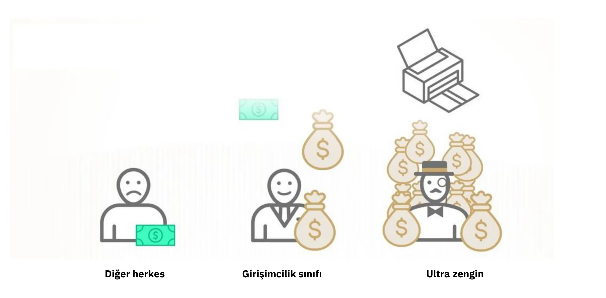

Şekil4: Özetle Cantillon Etkisi / Kaynak: River Financial

Bu durumda bankacılar, banka yöneticileri, hisse senedi ve tahvil sahipleri, emlak geliştiricileri, emlak kredisi verenler ve finansal varlıkları veya gayrimenkulleri olan herkes finansal bir talih kuşu elde ederken, yük diğer herkesin sırtına bindi. Bu durum yıllarca devam etti ve büyük ölçüde artan servet eşitsizliğini, çalışkan bireyler arasındaki hak mahrumiyeti duygusunu ve yavaş GSYH büyümesine rağmen varlık fiyatlarındaki durdurulamaz görünen yükselişi açıklıyor.

Özünde, sistem çarpıktır. Bankalar doğaları gereği istikrarsızdır, ancak başarısızlıkları tüm ekonomiyi tehlikeye atabilir. Bu ahlaki tehlike, banka yöneticilerini, merkez bankasının eninde sonunda onları kurtaracağını ve maliyeti vergi mükelleflerine yükleyeceğini bilerek, bankalarının gelirini en üst düzeye çıkarmak için aşırı risk almaya teşvik eder. Bu tür senaryolarda merkez bankacıları, satın alma gücünün çalışkan bireylerden ve tasarruf sahiplerinden varlık sahiplerine ve finansal sistemle bağlantılı olanlara büyük ölçüde aktarılması için koşullar yaratır ve böylece servet yaratma sürecini servet birikiminden ayırır.

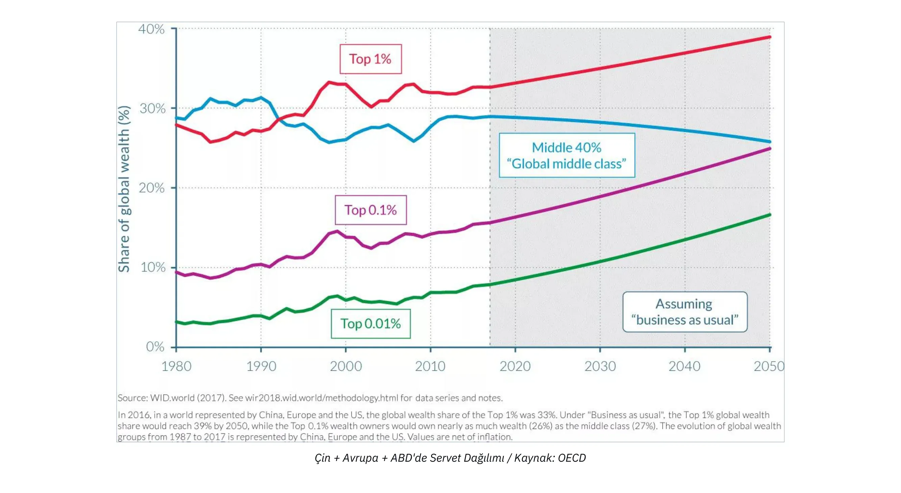

Şekil5: Çin + Avrupa + ABD'de Servet Dağılımı / Kaynak: OECD

### Sıfır Faiz Oranı Politikalarının Sonuçları

Uzun süreli Sıfır Faiz Oranı Politikaları (ZIRP) sırasında bankaların özkaynaklarını yeniden inşa etme fırsatları sınırlıdır çünkü marjları aşınmıştır. Bankalar genellikle kısa vadeli oranlardan borç alıp uzun vadeli oranlardan borç vererek para kazanırlar. Ancak merkez bankaları büyük miktarlarda tahvil satın alıp faiz oranlarını sıfır olarak belirlediğinde, bankaların özellikle girişimcilere ve diğer risk alanlara borç vermek için çok az teşviki olur. Bunun yerine kaynaklarını mevcut sermayeyi menkul kıymetleştirmeye ya da Cantillon etkisinden yararlananların talebini karşılamak için teminat karşılığı kredi sağlamaya tahsis ederler.

ZIRP'ın bir başka istenmeyen sonucu da hükümetleri kapsamlı harcamalar yapmaya teşvik etmesidir. Hükümetler borçlanma maliyetleriyle karşılaşmadıkları ve QE programları aracılığıyla tahvillerini satın almak için merkez bankalarına güvenebildikleri için, özellikle harcamaların oy getirebileceği demokratik ortamlarda, mümkün olduğunca çok harcama yapmak için doğal bir teşvike sahiptirler. Bu eğilim genellikle bu tür mali savurganlığın uzun vadeli sonuçlarını göz ardı etmekte ve Küresel Finansal Kriz'den (KFK) bu yana gelişmiş ekonomilerde kamu borç seviyelerinde önemli bir artışa yol açmaktadır.

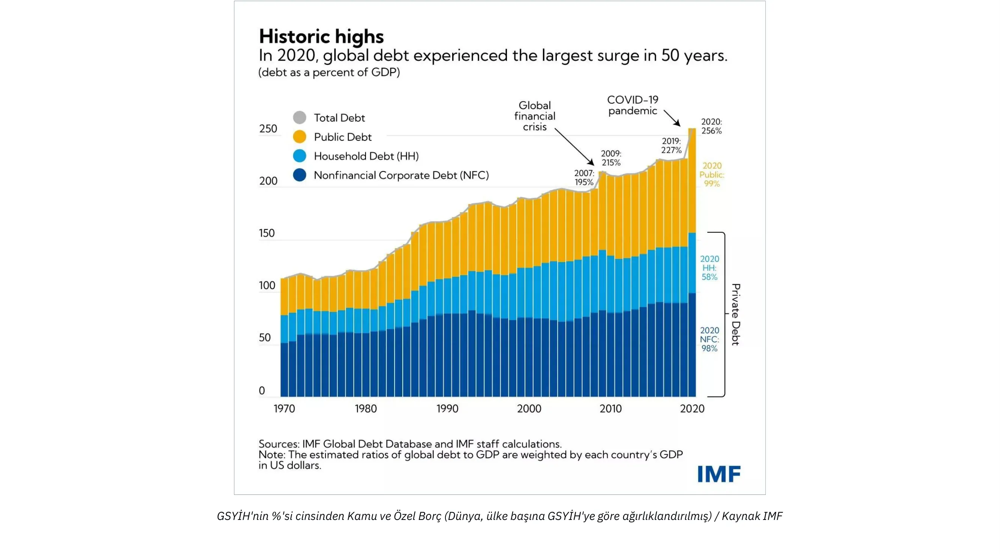

Şekil 6: GSYİH'nin Yüzdesi Olarak Kamu ve Özel Borçlar (Dünya, ülke başına GSYİH'ye göre ağırlıklandırılmış) / Kaynak IMF

COVID ile ilgili kilitlenmelere yanıt olarak önemli miktarda para yaratılması nedeniyle enflasyon yükselirken, merkez bankacıları şimdi enflasyonu kontrol altına almak amacıyla politika faizlerini yükseltiyor. Ancak bu durum tüm sistem için önemli bir zorluk teşkil ediyor. Bankalar her zamankinden daha fazla kaldıraçlı, hükümetler tarihsel olarak yüksek düzeyde borç taşıyor, ekonomik büyüme durgun, açıklar artıyor ve temel mallar için artan fiyatlarla boğuşan tüketiciler ay sonunu getirmekte zorlanıyor. Enflasyonun kontrol altına alınması için faiz oranlarının hükümetleri iflas ettirebilecek bir seviyeye yükseltilmesi gerekirken, bireyler tasarruflarını giderek pahalılaşan temel ihtiyaçlara harcadıkça ya da enflasyona karşı korunmak için Hard varlıklarına ve para piyasası fonlarına sığındıkça bankalar mevduat sahiplerini kaybetme riskiyle karşı karşıya kalmaktadır.

### Sonuç

> "Bu yolla (kısmi rezerv bankacılığı), hükümetler gizlice ve gözlemlenmeden halkın servetine el koyabilir ve milyonda bir kişi bile bu hırsızlığı fark edemez."
>

> John Maynard Keynes

Özünde, sistemimiz önemli zorluklarla karşı karşıyadır ve KİS-7 tek güvenilir alternatif olarak ortaya çıkmaktadır. Ancak, KİS-7 tek başına parasal sistemimizdeki sorunları çözemez. Her şeyden önce, Bitcoin meraklıları arasında temel ekonomik ilkeleri anlayan bireylere ihtiyacımız var, bu da medeniyetimiz için başka bir kırılgan finansal temel inşa etmekten bizi uzaklaştıracak daha geniş bir farkındalık ve ekonomik sağduyu sağlar. Bu kursun öncelikli amacı yeni Bitcoin meraklılarını sağlam ekonomik ilkeler konusunda eğitmektir.

Bu amaca ulaşmak için, metodolojik geleneği 16. yüzyıla kadar uzanan ve ekonomik kısıtlamalar altında insan eylemlerine ilişkin içgörüler sağlayan bir ekonomik düşünce okulu olan "Avusturya Ekonomisi "nin temel ilkelerini açıklayacağız. Bu girişle birlikte, artık para yaratmanın temellerini ve finansal ve parasal sistemimizin mevcut durumunu kavrayabilirsiniz.

Bir sonraki bölümde, tüm ekonomik düşünce okullarının temel taşı olan değer teorisini inceleyeceğiz. Sonraki bölümlerde sosyal bir kurum olarak para, sermaye teorisi ve iş döngüsü, ekonomik hesaplama zorluğu ve Avusturya Ekonomi Okulu'nun tarihi ve metodolojisine kısa bir genel bakış ele alınacaktır.

# Teorik Temeller

<partId>86012c1b-cdf2-586f-8fe7-263f8287e950</partId>

## Öznel Değer Teorisi

<chapterId>eb1608d4-5d36-56a0-bcfc-ed8c03dfa906</chapterId>

> "Değer yalnızca insan bilincinde var olur"
>

> Carl Menger, Ekonomi Politiğin İlkeleri

### Marjinal Devrim

Ekonomik muhakemenin temelinde değer sorusu yatar. Bir şeyin değerini nasıl belirleriz? Değer şeylerin doğasında var olan bir özellik midir? Yoksa tam tersine öznel bir olgu mudur? İki şeyin değerini nasıl karşılaştırırız? Değer nereden gelir?

Bu tür sorular yüzyıllar boyunca ekonomistleri ve filozofları meşgul etmiş ve çok sayıda farklı yanıt almıştır. Birçok yönden, ekonominin epistemolojik evrimi, değer teorilerinin evrimi ile noktalanmıştır.

Fizyokratların tüm değerin topraktan geldiğini öne süren toprak değeri teorisi, klasik iktisatçıların bir malın değerinin üretimine harcanan emek miktarından kaynaklandığını öne süren emek değeri teorisi tarafından çürütüldükten sonra, sıra marjinal değer teorisinin yerini almaya geldi. 1870'lerde, klasik iktisatçıların sonuncusu olan Marx'ın ardından, marjinal değer teorisi etrafında neredeyse eş zamanlı olarak üç yeni iktisadi düşünce okulu ortaya çıktı: Léon Walras ile Lozan okulu, William Stanley Jevons ile modern veya neoklasik okul ve Carl Menger ile Avusturya okulu. Değer teorisindeki bu devrim, ekonomik düşüncede önemli bir yenilenme oluşturmuştur.

Soldan Sağa: William Stanley Jevons, Carl Menger, Léon Walras

Marjinal değer teorisi, ekonomik değerin, bir ekonomik aktörün bir mal veya hizmetin bir sonraki birimi için isteyerek ödeyeceği miktara karşılık geldiğini savunur. Bu teori, fiyatların marjda, yani belirli bir malın bir sonraki birimi için oluştuğu gerçeğini vurguladığı için "marjinalizm" olarak adlandırılmıştır.

Bu üç okulun marjinalizmini benzer olarak sunmak yaygındır. Gerçekten de Walras ve Jevons son derece uyumludur, ancak Menger'in teorizasyonu diğerlerinden derin şekillerde ayrılır. Menger, 1874'te yayımlanan ve günümüzde Avusturya iktisat teorisinin temeli olarak kabul edilen "Grundsätze des Volkswirtschaftlehre" (Ekonomi Politiğin İlkeleri) başlıklı çalışmasında, değeri nesnel ve ölçülebilir bir olgu olarak gören Walras ve Jevons'ın aksine, değere ilişkin marjinal ama öncelikle öznel bir açıklama sunar.

### Öznel Değer

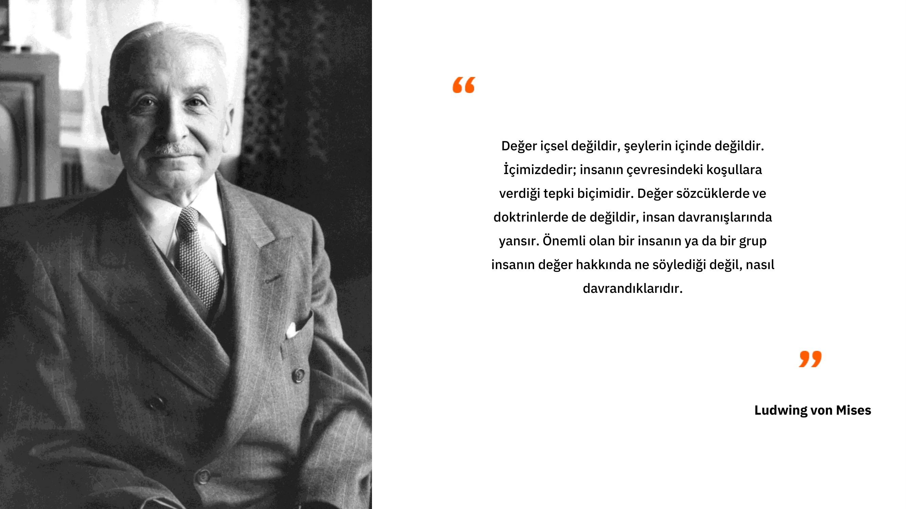

Avusturyalı iktisatçı, Adam Smith'in haleflerinin anlayışını reddederek, bir malın değerinin üretiminde kullanılan emek miktarından kaynaklandığı fikrini terk eder ve değerinin, her bağlamda, bir mal veya hizmetin belirli bir miktarına ilişkin zihinsel bir değer biçme eylemi gerçekleştiren birey tarafından belirlendiği fikrini tercih eder. Menger tarafından yapılan bu entelektüel sıçrama, değerin nesnelliğine meydan okumaktadır: ona göre değer, malların nesnel bir özelliği değildir; yalnızca bireyin o şeyle kurduğu ilişkinin bir sonucudur: "değer, insan bilincinin dışında var olmaz."

Başka bir deyişle, Menger bizi değerin yalnızca bireyin içinde öznel bir psikolojik olgu olarak var olduğunu, değerin malların doğasında var olan bir özellik olmadığını, daha ziyade bireyin bu mallardan elde edebileceği fayda hakkındaki görüşünden kaynaklandığını düşünmeye davet eder.

Bu görüşe göre, bir litre içme suyunun nesnel bir değeri yoktur. Modern bir içme suyu sistemine erişimi olan ve şu anda susuzluk çekmeyen biri, muhtemelen bu ilave litre suya çok az değer atfedecektir; oysa çölün ortasında susuzluk çeken ve bunu yaşamla ölüm arasındaki fark olarak gören bir birey, kesinlikle bu litre suya neredeyse sonsuz değer atfetmeye istekli olacaktır.

Özetle Menger, bir ekonomik malın değerinin, bir bireyin o mal veya hizmetin ek bir birimine atadığı öznel değerden başka bir şey olmadığını fark etmiştir.

### Gönüllü Exchange: Pozitif Toplamlı Bir Oyun

Bu noktadan hareketle Menger, iki birey arasındaki gönüllü KA-9'un her iki tarafın da kendi öznel faydasını artıracağına inandığı için gerçekleştiği sonucuna varır. Ona göre Exchange, klasik iktisatçıların inandığının aksine, herhangi bir değer eşdeğerliğini varsaymaz. Avusturyalı düşünüre göre, eğer mübadele edilen mallar arasında fayda denkliği olsaydı, tarafların en başta mübadele etme zahmetine girmeleri için hiçbir neden olmazdı. Eğer bir Exchange varsa, bunun nedeni her bir tarafın bunu kendi (öznel) çıkarına bulması ve sonuç olarak her bir gönüllü Exchange'un bir sosyal fayda üretmesidir.

### İnsan Arzularını Düzenleyen Bir Fenomen Olarak Değerleme

Ancak, böyle bir sosyal fayda ya da bir mala atfedilen öznel değer ölçülemez. Menger'e göre değer, ölçümden (kardinal) ziyade bilişsel bir karşılaştırma (ordinal) olgusudur. Walras ve Jevons'tan bu yana neoklasik iktisatçıların düşündüğü gibi, bireyin bir maldan elde ettiği faydayı yansıtan sayısal bir değere Assignment atfetmesi değil, bireyin bir miktar A malını bir miktar B malından daha yoğun bir şekilde arzuladığını ifade ettiği, insan arzularını düzenleyen bir eylemdir.

Herhangi bir ajan 2 muzu bir ekonomi kursuna tercih edip etmediğini söyleyebilir, ancak hiç kimse 2 muza 3.1416 util değer verirken bir ekonomi kursuna 3 util değer verdiğini ve bu nedenle muza sahip olmayı tercih ettiğini makul bir şekilde söyleyemez. İnsan tercihlerinin sürekli gerçek fonksiyonlara dayanan böyle bir tanımı, günlük hayatımızda deneyimlediğimiz bilişsel süreçlerin gerçekliğine karşılık gelmez. Bir birey kendisine sunulan malları asla soyut bir fayda standardıyla karşılaştırarak değerlendirmez. Bunun yerine, mutlak terimlerle yargılayamayacağı ancak yine de göreceli arzu edilebilirliklerine göre sıralayabileceği farklı eylem yollarını öznel olarak karşılaştırır.

Bireyin hedefleri ve bu hedeflere ulaşmak için kullandığı araçlarla kurduğu psikolojik bir ilişki olarak anlaşılan bu öznel değer anlayışı, Avusturyalı iktisatçıların işbölümü olgusunu açıklamalarına da olanak tanımaktadır.

### İş Bölümü

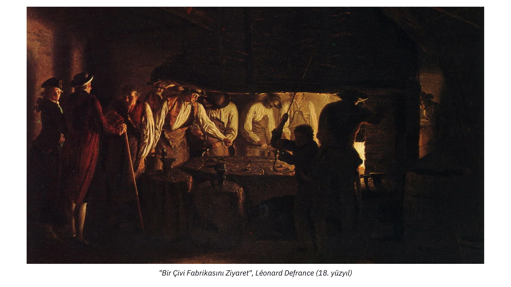

Bir Çivi Fabrikasını Ziyaret, Léonard Defrance (18. yüzyıl)

Herkes benzersizdir ve özel bir kişisel duruma sahiptir. Bu nedenle, herkes belirli görevleri yerine getirmede akranlarından daha üstün bir yeteneğe (mutlak avantaj) veya belirli görevleri yerine getirmede diğerlerinden daha üstün bir yeteneğe (karşılaştırmalı avantaj) sahiptir. Başka türlü olamaz; bu temel gerçeği inkar etmek, tüm insanların her açıdan eşit olduğunu iddia etmek olur.

Bir bireyin belirli bir malın üretiminde akranlarına kıyasla üstün bir yeteneğe sahip olduğu durumda (mutlak avantaj), bu malın üretiminde uzmanlaşmak ve daha sonra elde edilen artığı arzu ettikleri mallarla takas etmek konusunda bir çıkarı vardır. Bunu yaparak, öznel faydalarını, arzu ettikleri tüm malların üretimine katılmalarından daha ekonomik bir şekilde tatmin ederler.

Ancak bireyin herhangi bir malın üretiminde mutlak bir avantaja sahip olmadığı durumlar da söz konusu olabilir. Bu durumda, bireyin diğerlerine göre daha iyi olduğu üretim türleri olacaktır (karşılaştırmalı üstünlük) ve bu nedenle uzmanlaşmada hala bir çıkarı vardır.

Kuşkusuz, söz konusu malı ondan daha verimli bir şekilde üretebilecek bireyler vardır, ancak bu bireyler muhtemelen başka bir görevde bu görevden daha verimli olduklarından ve her iki görevi de aynı anda yerine getiremeyeceklerinden, daha verimli oldukları başka bir görev yerine bu görev üzerinde çalışmaları verimsizdir. En üretken oldukları görevde uzmanlaşarak, uzmanlaşmamış olmalarından daha büyük bir artı elde edecekler ve bu nedenle, Exchange yoluyla, elde edilen mallar kendileri tarafından elde ettikleri üreticilerden daha verimli bir şekilde üretilmiş olsa bile, bu diğer mallardan daha fazla miktarda elde edebileceklerdir.

Bir doktor örneğini ele alalım. E-posta yazmakta ve randevuları planlamakta sekreterinden daha iyi olabilir (göreceli avantaj). Ancak bu işleri yapmak için harcadığı zaman, hastaları tedavi etmek için kullanmadığı zamandır. Dolayısıyla, insanları tedavi ederken daha üretken olduğu için, bu tür görevlerde yardımcısından daha iyi olsa bile idari görevleri başka bir kişiye devretmek onun yararınadır, çünkü bu başkaları için üretilen değeri ve dolayısıyla kendi zenginliğini en üst düzeye çıkarmasına olanak tanır.

Özünde, mutlak avantajlara sahip olmayan bireyler için bile uzmanlaşmanın bir faydası vardır, çünkü zaman kıt ve rakip bir kaynaktır: bir bireyin en üretken olduğu faaliyet dışında bir faaliyet için harcadığı her bir birim zaman, vazgeçtiği üretimle temsil edilen bir maliyet anlamına gelir (fırsat maliyeti).

Birey belirli bir üretimde uzmanlaştığında, kişisel tüketimi için gerekli olduğunu düşündüğü ürün miktarını ayırabilir ve fazlasını istediği diğer mallar için Exchange'ye aktarabilir. Bunu yaparken, kendi ürettikleri mallara olan arzularını tatmin ederler, bu da üretimlerinin geri kalan birimlerinin onlar için çok az değere sahip olduğu anlamına gelir. Ekonomistlerin azalan marjinal fayda dedikleri şey budur: bir malın her ilave birimi bir öncekinden daha az arzulanır. Bu tür mallardan yoksun olan diğerleri için ise durum farklıdır: aynı nedenlerle, üretmedikleri malları ürettiklerinden daha yoğun bir şekilde arzulama eğilimindedirler. Bu durum, bireylerin çeşitli öznel değerlemeleri arasında güçlü bir asimetrinin olduğu bir duruma yol açar ki bu da mübadeleye son derece elverişlidir: her bir tarafın üretim fazlasını mübadele etmekte çıkarı vardır çünkü böylece öznel faydalarını artırırlar.

Yukarıdaki analizin sonucu, bireylerin işlerinde uzmanlaştıklarında ve değiş tokuş yaptıklarında her zaman daha iyi durumda olduklarıdır. Bu nedenle, başta Ludwig Von Mises olmak üzere Avusturyalı iktisatçılar, işbölümünden kaynaklanan üretken avantajın sosyal işbirliği sürecinin arkasındaki itici güç olduğu sonucuna varmaktadır. Burada kendisinden doğrudan alıntı yapmak faydalı olabilir:

"İşbirliğini, toplumu ve uygarlığı ortaya çıkaran ve hayvan insanı insana dönüştüren temel gerçekler, işbölümü altında yapılan çalışmanın tek başına yapılan çalışmadan daha verimli olduğu ve insan aklının bu gerçeği fark edebileceği gerçeğidir. [İnsanlar iş bölümü altında birbirlerini sevdikleri ya da sevmeleri gerektiği için işbirliği yapmazlar. İşbirliği yaparlar çünkü bu kendi çıkarlarına en iyi şekilde hizmet eder."

### Sonuç

> "Bir adam darağacında asılmanın, masada oturmaktan daha rahat yaşayabileceğini görürse, kendini asmamak için aptal gibi davranmış olur."
>

> Baruch Spinoza

1871-1874 yılları modern iktisadın harika yıllarıdır: bu dönem modern iktisadın temelini oluşturan üç bağımsız düşünürün çalışmalarına tanıklık etmiştir. Avusturyalı iktisatçılar, öznel sıra değerine yaptıkları vurguyla, kendilerini benzerlerinden ayıran bir iktisadi düşünce bütünü geliştireceklerdir. Avusturyalı iktisatçıların kıtlık bağlamında insan eylemleri hakkında akıl yürütme çalışmaları, Jevons ve Walras tarafından başlatılan ve değerin nesnel olarak ölçülebileceği ve sürekli bir fonksiyon olarak türetilebileceği fikrinin arkasında duran matematiğe dayanan ekonomik doktrinlerle sonsuza dek tam bir tezat oluşturacaktır.

Menger, öznel sıralı değer anlayışına dayanarak işbölümünün ve gönüllü KD-13'ün ortaya çıkışını açıklamıştır. Ancak bir sonraki bölümde göreceğimiz üzere, doğrudan KD-13, öznel faydalarını maksimize etmek isteyen ekonomik aktörler için zayıf bir stratejidir. Avusturya Okulu'nun babası böylece paranın neden sosyal bir kurum olarak ortaya çıktığını açıklamak için mantığını daha da geliştirmiştir.

Takip eden bölümler, paranın sosyal bir kurum olarak ortaya çıkışına, İş Döngüsü Teorisi'ne temel teşkil edecek olan sermaye ve faiz teorisine ve son olarak da fiyatların ekonomik hesaplamalardaki rolüne ayrılacaktır.

## Paranın Sosyal Bir Fenomen Olarak Ortaya Çıkışı

<chapterId>14ded794-0578-5478-ba5b-b2106c74f3ef</chapterId>

Bireyler uzmanlaşma ve iş bölümünü en üst düzeye çıkarma konusunda ortak bir çıkara sahip olsalar da, bu genişlemeyi sınırlayan koordinasyon sorunları hala mevcuttur.

İlk olarak, üretim süreçleri doğası gereği zamana bağlı ve genellikle eşzamansız (eşzamanlı olmayan) olduğundan, bir bireyin ilk katkısı ile karşı tarafın teslim alması arasında genellikle bir zaman boşluğu olacağını belirtmek önemlidir. Diğerlerinin gelecekte ihtiyaçlarımızı karşılayacağına dair önceden güvence almadan belirli bir görevi şimdi üstlenmek riskli olabilir.

İşbölümünde her iki taraf da işbirliğinden fayda sağlar, ancak bireysel olarak, karşılık vermeden diğerlerinin çalışmasından faydalanmak cazip gelebilir, çünkü bu şekilde herhangi bir maliyete katlanmadan değerli bir şey kazanmış olurlar. Karşılıklı işbirliğinin bireyler için suboptimal, grup için ise maksimum kazançla sonuçlandığı bu tür durumlar oyun teorisinde "mahkum ikilemi" olarak tanımlanır

### Mahkumun İkilemi

Başlangıçta, mahkumun ikilemi şu şekilde formüle edilmiştir: İletişim kuramayan iki şüpheli, Alice ve Bob, aşağıdaki gibi olası cezalarla hapis cezası riski ile karşı karşıyadır:

- Alice, Bob'yi suçlar ve Bob sessiz kalırsa, Alice serbest kalır ve Bob 3 yıl ceza alır.
- Eğer Alice ve Bob birbirlerini suçlarlarsa, her ikisi de 2 yıl ceza alırlar.
- Eğer ikisi de sessiz kalırsa, her biri 1 yıl ceza alır.

Bu sonuçlar bir matriste gösterilebilir (sayısal sonuçlar hapis cezasının kaç yıl olduğunu gösterir):

| Alice / Bob       | Accuse | Remain Silent |
| ----------------- | ------ | ------------- |
| **Accuse**        | 2, 2   | 0, 3          |
| **Remain Silent** | 3, 0   | 1, 1          |

Bu oyunda, her iki taraf için de en iyi sonucu elde etmek için koordinasyon fırsatı yoktur (iletişim imkansızdır). Sonuç olarak, Alice ve Bob, grup için en iyi sonuca yol açmasa bile, birbirlerini suçlamak için bireysel bir teşvike sahiptir. Her ikisi için de en uygun strateji sessiz kalmak ve her birinin 1 yıl hapis cezası almasıdır.

Bu oyun, gerçek hayatta sıklıkla karşılaşılan bir sorunu örneklemektedir: koordinasyon mekanizmalarının yokluğunda bireyler, koordinasyon/işbirliği yoluyla daha arzu edilir bir denge mümkün olsa bile, başkalarının seçtiği stratejileri (hırsızlık, hile, ihanet, şiddet, vb.) dikkate almaksızın bireysel kazançlarını maksimize eden stratejileri seçme eğilimindedir.

### Koordinasyon Sorunlarını Çözmek için Para

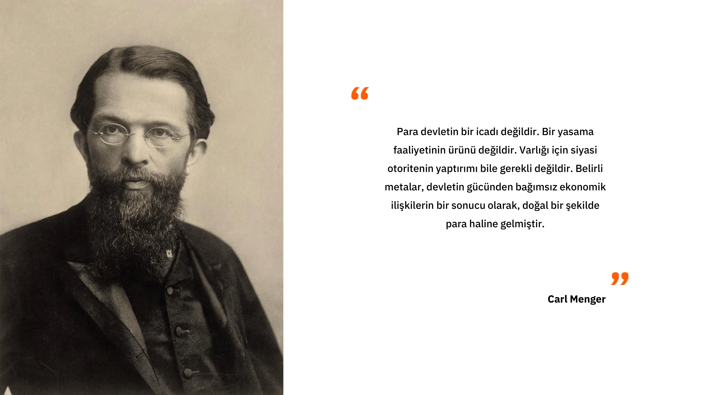

Bu sorun küçük topluluklarda (örneğin aile, arkadaş çevreleri) daha az etkiye sahiptir çünkü bu gibi durumlarda herkes birbirini doğrudan tanır ve bu da birbirlerinin katkılarını hatırlamayı mümkün kılar. Topluluktan ayrılmanın (firar etmenin) bir maliyeti olduğunu varsayarsak, bireysel ajanların hafızasına dayalı bir itibar sistemi genellikle mahkum ikileminin yarattığı tuzaklardan kaçınmak için yeterlidir.

Ancak, iş bölümünden önemli ölçüde yararlanan daha büyük topluluklar söz konusu olduğunda, koordinasyon sorunları yeniden ortaya çıkmaktadır. Bunun iki ana nedeni vardır:

İlk olarak, insanlar bilişsel kapasiteleri ile sınırlıdır. Bir insanın 150'den fazla kişiyle istikrarlı sosyal ilişkiler sürdürmesi ve hatırlaması imkansızdır, bu da itibar sistemini mahkum ikileminin üstesinden gelmek için yetersiz kılar.

İkinci olarak, Exchange'deki katkıların değerinin sosyal olarak kabul edilen ölçümü (orantılanabilirlik) önemsiz olmayan bir sorundur. Örneğin, eğer bir birey avcılıktan elde ettiği eti sunar ve karşılığında barınak için malzeme talep ederse, sunulan et miktarı talep edilen malzemeye eşdeğer olarak nasıl değerlendirilebilir? Aynı şey kalite için de geçerlidir - geyik eti odundan daha mı fazla yoksa daha mı az değerlidir?

Her bir mal çifti için tatmin edici bir Exchange oranı belirlemek mümkün olsa bile, bu bilgiyi muhafaza etmek hızla pratik olmaktan çıkar. N mal içeren doğrudan bir Exchange sisteminde, hatırlanması gereken N(N-1)/2 Exchange oranı vardır. Bu, 50 maldan oluşan bir ekonomi için, dolaylı takaslarda sadece 50'ye karşılık 50\*49/2 veya 1225 Exchange oranını hatırlamak anlamına gelir. 100 maldan oluşan bir ekonomi için bu sayı 4950'ye çıkar. Böyle bir ikinci dereceden ilişki, doğrudan Exchange'ün (takas) ölçeklenebilirliğine ek bir sınır getirmektedir.

Dahası, bu alışverişler anında gerçekleşmeyip zamana yayıldığından, katkıların zaman içinde değerlendirilmesi, katkıların göreceli olarak değerlendirilmesini daha da karmaşık hale getirmektedir. İki mevcut mal arasındaki Exchange oranını değerlendirmenin yanı sıra, geçmişteki bir katkının değerini gelecekteki bir muadiline göre değerlendirmek de gerekli hale gelmektedir.

Bugün, böyle bir sistemin pratik olmamasına rağmen, tüm bu bilgileri hatırlamak ve bir kredi sistemi kurmak için yazı veya dijital veri depolama kullanabiliriz (bu katkıların Exchange oranı da dahil olmak üzere geçmiş katkıların kaydını tutmak, esasen bir kredi sistemi kurmaktır).

Medeniyet öncesi dönemlerde bu teknolojiler mevcut değildi. Dolayısıyla, atalarımız kendilerini mahkûmun ikileminin olumsuz sonuçlarına maruz bırakmadan işbölümünün faydalarından yararlanmak için başka çözümler bulmak zorundaydı. Bu doğrudan Exchange sorununa bulunan çözüm, para ile kolaylaştırılan dolaylı Exchange idi.

### İstekler ve Satılabilirliğin Çifte Tesadüfü

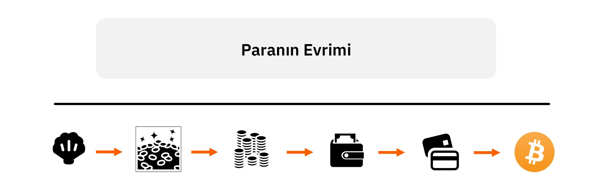

Para, atalarımızın Address için keşfettiği, ekonomistlerin "isteklerin çifte çakışması" sorunu olarak adlandırdığı bir çözüm olarak görülebilir. Bu sorunun üç boyutu vardır: mekânsal, zamansal ve kişiler arası.

Alice ve Bob arasındaki doğrudan Exchange'de (takas), her ikisinin de aynı zamanda ve yerde diğerinin arzu ettiği bir şeye sahip olması gerekir. Dolaylı Exchange kullanarak, yani para yoluyla, Alice Bob'dan satın alabilir ve Bob bu para birimini başka bir yerde, başka bir zamanda ve başka biriyle kullanabilir (diğer kişinin bu para biçimini kabul etmesi koşuluyla).

Bir malın para olarak kullanılabilmesi için satılabilirliğinin yüksek olması, yani çoğu zaman mümkün olduğunca çok kişi tarafından arzulanması gerekir. Satılabilirliği yüksek bir mal kullanarak, isteklerin çifte çakışması sorunu mekânsal ve kişilerarası boyutlar açısından çözülmüş olur: para olarak kullandığım mal her yerde ve çoğu insan tarafından isteniyorsa, satma eylemini satın alma eyleminden mekân ve sosyal etkileşim açısından kolayca ayırabilirim.

Ancak, zaman içinde satılabilirlik sorununu çözmek iki nedenden dolayı daha zordur:

İlk olarak, entropi (genellikle "zamanın etkisi" olarak bilinir) doğrudan faydası olan çoğu malın niteliklerini kademeli olarak değiştirir. Bu nedenle, bir malın zaman içinde satılabilirliğini korumak, o malın son derece dayanıklı veya entropiye karşı dirençli olmasını gerektirir.

İkinci olarak, bir malın "t" zamanındaki göreli kıtlığı, gelecekteki göreli kıtlığını garanti etmez. İnsanlar, belirli bir üretim alanına yeterli kaynak ayırarak herhangi bir malın GSYH-31'ini artırabilir. Bir malın üretimini artırmanın önündeki tek sınırlama, ilgili fırsat maliyetidir. Sonuç olarak, bir malın mevcut nispi kıtlığı, gelecekteki nispi kıtlığını garanti edemez. Yalnızca marjinal üretimi çok yüksek maliyetlerle artırılabilen mallar sürekli olarak kıt olabilir, bu nedenle bu, insanlık tarihi boyunca serbestçe ortaya çıkan parasal malların bir özelliğidir.

Medeniyet öncesi dönemlerde deniz kabukları, işlenmiş mücevherler, kolyeler veya boncuklar gibi çeşitli mallar para işlevi görüyordu. Bu mallar kolayca taşınabilir, süs değerlerinin ötesinde doğrudan bir faydası olmayan, entropiye dirençli (yani zamanla bozulmayan), doğal olarak az bulunan ve/veya üretmek için önemli miktarda uzmanlaşmış emek gerektiren mallardı. O dönemde iş bölümü seviyesi düşük olduğundan ve dolayısıyla süs eşyası üretmenin fırsat maliyeti yüksek olduğundan, bu eşyalar büyük miktarlarda üretilememiştir. Böylece, bu eşyaları para olarak kullananlar gelecekte görece kıt olacaklarından emin olabiliyorlardı.

Avcı-toplayıcı atalarımızın, doğrudan faydası olan hiçbir mal üretmemelerine rağmen bu kaynak yoğun işlerle uğraşmaları, Exchange'nin mekânsal, sosyal ve zamansal kapsamını genişletmekten bekledikleri önemli kazanımları göstermektedir. Eğer durum böyle olmasaydı ve bu kaynakları parasal malların üretimi yerine barınak yapımı, avcılık veya diğer faaliyetlerde kullanmak onlar için daha faydalı olsaydı, muhtemelen bu zanaat faaliyetlerine dair bu kadar çok arkeolojik kanıt bulamazdık. Kaynaklarını daha verimli kullanan diğer gruplar daha iyi bir gelişim ve daha fazla refah elde edecek ve bu zanaatkârlık faaliyetleri doğrudan faydası olan mallar üreten faaliyetler lehine hızla ortadan kalkacaktı.

Bu anlamda, parasal malların üretimi, işbölümünün genişlemesini teşvik ederek, kaynakların (bireyler için öznel fayda açısından) diğer tüm alternatiflerden (avcılık, balıkçılık, toplayıcılık, odun üretimi, ev yapımı, daha fazla avcılık ve balıkçılık aleti üretimi vb.)

### Belirsizlik

Para kurumuna ilişkin analizimizi sonuçlandırmak için, geleceğe ilişkin kaçınılmaz belirsizlik bağlamında ekonomik eylem konusunu Address'e bağlamamız gerekmektedir.

Avusturyalı ekonomistlerin de belirttiği gibi, insan eylemleri zamana bağlıdır ve daima geleceğe yöneliktir. Bir birey harekete geçtiğinde, gelecekteki tatmini elde etme umuduyla mevcut durumunu değiştirir. Bu zihinsel projeksiyon yakın veya uzak geleceğe yönelik olabilir, ancak bir bireyin uzun vadeye yönelik projeksiyon yapabilmesi için öncelikle kısa vadeli geçimini güvence altına alması gerekir, çünkü yakın gelecekteki durumu uzak gelecekteki durumunu doğrudan etkiler.

Bu doğrudan insan rasyonalitesinden kaynaklanmaktadır; hiç kimse zamansal olguların ardışık doğasını ve bundan kaynaklanan kronolojik bağımlılığı görmezden gelemez çünkü bu insan yaşamının temel kısıtlamalarından biridir. Dolayısıyla, gelecek insanlar için her zaman belirsizliğini koruduğundan, ancak kısa vadeli hayatta kalmaları garanti altına alındığında uzun vadeli hayatta kalmalarını güvence altına almaya çalışacaklardır.

Bu bağlamda para, değerin şimdiki zamanda depolanmasına ve kişinin gelecekteki benliğine aktarılmasına olanak tanıyarak, insan eylemlerinin zamanlararası koordinasyonunda önemli bir rol oynar. Bireyler para depolayarak, yani tasarruf ederek, gelecekteki belirsizliğe karşı kendilerini korur ve böylece eylemlerini daha uzun zaman ufuklarına doğru yönlendirebilirler. Ancak bunu ancak kullanılan para bir değer deposu ise, yani zaman içinde satılabilirliği varsa başarabilirler ki bu da daha önce belirtildiği gibi dayanıklı ve nispeten kıt malların bir özelliğidir.

Bir sonraki bölümde zaman tercihi kavramını inceleyeceğiz ve İş Döngüsü Teorisi ile ilgili bir sonraki bölüme temel teşkil edecek olan faiz ve sermaye konusundaki Avusturyalı bakış açısını açıklayacağız.

## Zaman Tercihi, Faiz ve Sermaye

<chapterId>37732a5c-4f66-5e2d-bc2c-cc8d29693af7</chapterId>

### Zaman Tercihi

Son bölümü, ekonomik aktörlerin gelecekteki belirsizliği bertaraf etmek için en satılabilir malı, yani parayı nasıl kullandıklarını açıklayarak bitirmiştik. Ayrıca zamansal olguların ardışık doğasının belirsizlikle kademeli olarak mücadele etmemize yol açtığını da açıkladık: ancak önümüzdeki hafta geçimimizin güvence altında olacağını bildiğimizde daha uzak gelecekteki hedeflere odaklanabiliriz.

Ya da başka bir deyişle, insanlar olarak gelecekteki malların değerini iskonto ediyoruz.

Gelecekteki malların şimdiki mallara kıyasla değerine ilişkin bu öznel değerlendirme zaman tercihi olarak adlandırılır. Diğer her şey eşit olduğunda, şimdiki mallar doğal olarak gelecekteki mallara tercih edilir. Ölümlü olduğumuzdan ve gelecek her zaman belirsiz olduğundan, doğal olarak bir mala daha sonra erişmektense şimdi erişmeyi tercih ederiz. Zaman tercihi, kültür, zenginlik, eğitim, fizyoloji gibi sayısız faktör nedeniyle bireyler arasında farklılık gösterse de, zaman tercihleri her zaman pozitiftir, yani her şey eşit olduğunda, şimdiki mallara her zaman gelecekteki mallardan daha fazla değer veririz.

Gelecekteki malların şimdiki mallara göre göreceli olarak değerlenmesi kavramı, faiz olgusunun temelinde yatmaktadır. Gerçekten de, manipüle edilmemiş sermaye piyasalarına sahip bir ekonomide, referans faiz oranları (temerrüt riskinden arındırılmış olarak kabul edilir) sermaye Supply ve talebin kesiştiği noktada belirlenir. Bu nedenle, bu oranlar tüm ekonomi için zaman tercihlerinin durumunu temsil eder: faiz oranındaki bir artış, Supply'e kıyasla sermaye talebindeki nispi bir artıştan kaynaklanır ve daha yüksek zaman tercihlerini gösterir. Tersine, faiz oranlarındaki bir düşüş tasarruflardaki bir artıştan kaynaklanır ki bu da sermayenin Supply'ündeki bir artış olup zaman tercihlerinde bir azalmaya işaret eder.

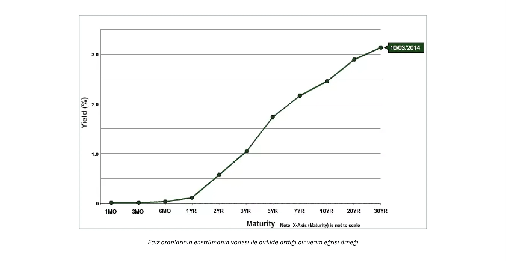

Faiz oranlarının merkez bankası tarafından manipüle edilmediği bir ekonomide, yukarı doğru eğimli bir getiri eğrisi gözlemleme eğiliminde oluruz: borcun vadesi uzadıkça faiz oranı da artar. Bunun tersi bir durum söz konusu olamaz çünkü bu, geleceğin bugünden daha kesin olmasını gerektirir ki bu da mantıksal olarak imkansızdır.

Zaman tercihi kavramı ve kendi zaman tercihimizi tüketim ve tasarruf eylemleriyle nasıl ifade ettiğimiz, sermaye tahsisi ve üretim süreçleri için temeldir. Zaman tercihinin üretim organizasyonunu tam olarak nasıl etkilediğini anlamak için Menger'in öğrencisi Eugen von Böhm-Bawerk'e ve onun sermaye teorisine dönelim.

### Sermaye Teorisi

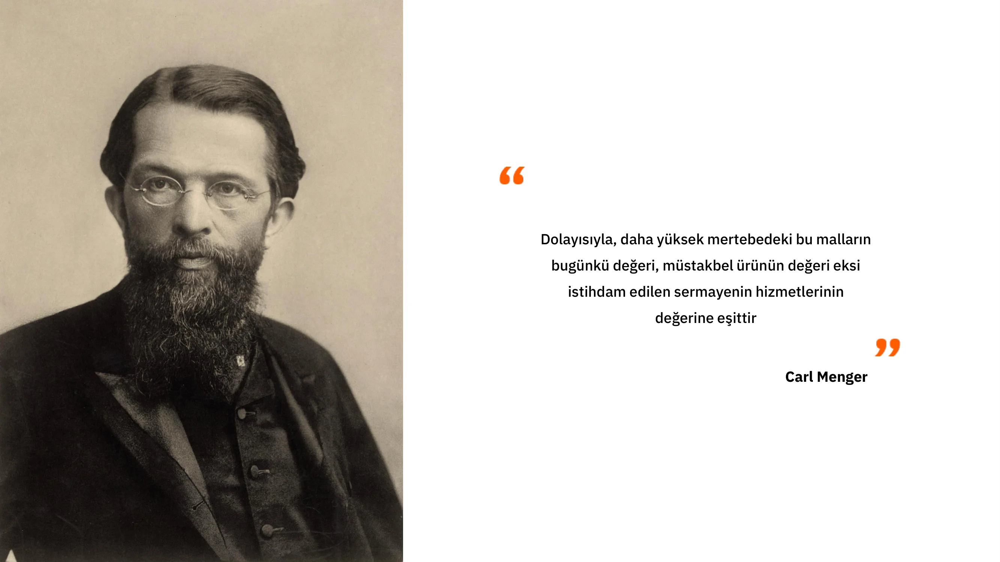

Bu dersin başında, Carl Menger'e göre malların yalnızca bireyler tarafından seçilen ve değer verilen amaçlara hizmet ettikleri için ekonomik mallar (değerli) olarak kabul edildiğini gördük. Bu görüşe göre, tüm ekonomik analizler tüketim etrafında döner, çünkü tüketim nihayetinde tüm ekonomik faaliyetlerin arkasındaki motive edici amaçtır. Dolayısıyla Menger için ekonomik analizin başlangıç noktası, ekonomik faaliyetin nihai amacını temsil ettikleri için tüketim malları ya da nihai mallardır. Ekonomideki "ara mallar" olarak adlandırabileceğimiz diğer tüm mallar, yalnızca bireylerin bu tüketim mallarını elde etmelerini sağladıkları için bir değere sahiptir: bunlar diğer malların üretiminde kullanılan mallardır.

Tüketim malları üretmek için girişimciler bu çeşitli ara malları orijinal üretim faktörleriyle (emek, toprak ve sermaye) sonuçta ortaya çıkan üretimi maksimize eden bir düzene göre birleştirirler. Girişimciler tarafından yapılan bu düzenleme veya üretim yapısı, ara malların nihayetinde tüketim malları haline gelene kadar dönüşüm geçirdiği çeşitli aşamaları içerir.

Dolayısıyla, Menger gibi, tüketim mallarını birinci dereceden mallar, bir önceki aşamada yer alan malları ikinci dereceden mallar, ondan önceki aşamadakileri üçüncü dereceden mallar olarak tanımlayabiliriz ve bu şekilde orijinal faktörlere (toprak, emek, sermaye) ulaşana kadar devam edebiliriz. Dikkate aldığımız aşamaların sayısı temelde girişimciler tarafından benimsenen üretim yapısına bağlıdır ve üretim yapısının nesnel bir özelliği olarak görülmemelidir. Aksine, üretim aşamaları ve ara mallar yalnızca teleolojik bir bağlamda var olur: aktör, arzuladığı hedefe ulaşacağı bir dizi eylem öngörür ve eylemlerini zihinsel olarak birbirini izleyen aşamalara böler.

Eylemin ardışık bir düzende zihinsel olarak yansıtılmasının bu özelliği, insan eyleminin zamansal doğası tarafından dayatılmaktadır. İnsanlar tarafından üstlenilen her eylem zaman alır; anında eylem imkansızdır. Bu nedenle, aktörün her zaman daha fazla veya daha az zaman alan eylem kalıpları arasında bir seçimi vardır.

Bundan böyle, bireyler zorunlu olarak pozitif zaman tercihlerine sahip olduklarından, yani şimdiki malları gelecekteki mallara tercih ettiklerinden, yalnızca elde edilen sonuç kendileri için doğrudan yolu izleyerek elde edeceklerinden daha büyük bir öznel değere sahipse daha uzun bir yolu seçeceklerdir. Aksi takdirde, hiç kimse daha fazla zaman alan yöntemleri benimsemeyecektir: eşdeğer sonuçlar altında, en kısa yol tercih edilen seçenek olmaya devam edecektir.

İnsan eylemlerinin ardışık doğası nedeniyle, bu zamanlar arası seçimlerin her zaman eylem sırası üzerinde etkileri vardır. Başka bir deyişle, kısa vadeli eylemlerim belirlediğim uzun vadeli hedeflere bağlıdır ve kısa vadeli eylemlerim gelecekte yapabileceklerimi etkileyecektir. Üretim faaliyetlerine ilişkin bu açık noktanın anlamı, herhangi bir üretim sapmasının, yani üretim yapısındaki herhangi bir uzamanın, önceden tasarruf gerektirdiğidir. Gelecekteki bir hedefe ulaşmak için şimdiki zamanda daha fazla kaynak ayırmaya karar verirsem, öncelikle yatırımımın sürdüğü süre boyunca beni ayakta tutacak kaynakları bir kenara ayırmam gerekir.

Bu noktayı açıklamak için Böhm-Bawerk'in "Sermaye ve Faiz" adlı çalışmasında verdiği örneği tekrar hatırlayalım:

Eugen von Böhm-Bawerk (1851-1914)

### Robinson Crusoe ve Production Detour/Roundabout:

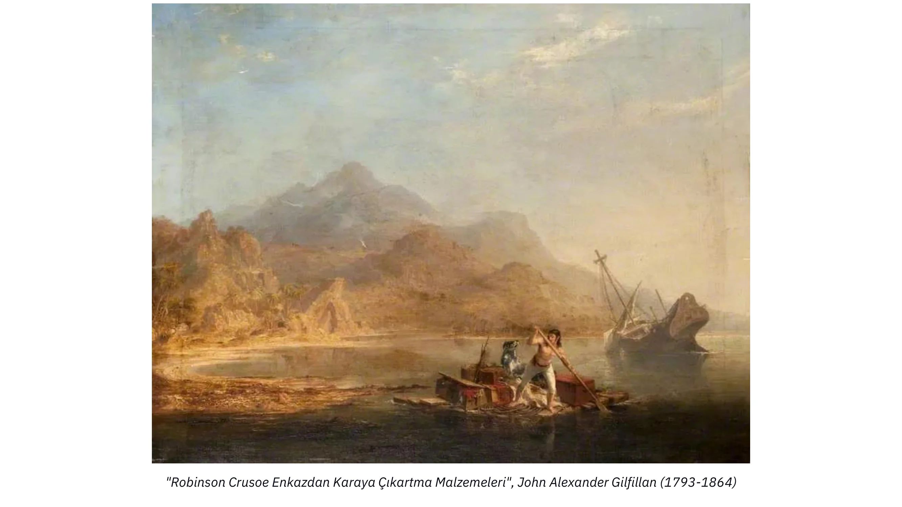

Robinson Crusoe Enkazından Çıkarma Malzemeleri, John Alexander Gilfillan (1793-1864)

Avusturyalı ekonomist kitabında, Robinson Crusoe'nun adasında tek başına kalmasına dayanan bir düşünce deneyi aracılığıyla bizi üretim sapmalarının doğasında bulunan zamanlar arası ödünleşimleri düşünmeye davet ediyor.

Robinson, ilkel bir insan gibi, beslenmek için yiyecek aramaya ve avlanmaya bağımlıdır. Robinson'un sekiz saat içinde bütün bir gün karnını doyurmaya yetecek kadar böğürtlen toplayabildiğini düşünelim. Bu koşullarda, diğer faaliyetler için çok az zamanı vardır. Ancak Robinson, tahta bir sırık yaparak böğürtlenleri kolayca devirebileceğine ve günlük yiyeceğini sadece dört saatlik bir çalışmayla elde edebileceğine inanıyor. Dahası, direği yapmanın her gün iki saat çalışarak beş gününü alacağını tahmin etmektedir. Bu nedenle, direği yapmak için harcadığı süre boyunca geçimini sağlamaya yetecek kadar çilek biriktirmek için beş gün boyunca çilek üretiminin 1/5'ini biriktirmesi ya da alternatif olarak 5 gün boyunca günde 2 saat daha çilek toplamaya harcaması gerektiği sonucuna varıyor.

Bu ön tasarrufu yapmazsa, Robinson direğini tamamlayamaz ve bu sırada ölebilir.

Böylece, beş gün boyunca, daha fazla böğürtlen toplamak için dinlenmesinin iki saatini feda eder. Bu sürenin sonunda yeterli böğürtlene sahip olur ve beş gün boyunca günde iki saat çalışarak ahşap direği yapmaya başlar. İşi bittiğinde, günlük payı için yeterli böğürtleni 8 yerine 4 saatte elde edebilir ve böylece günde kalan 4 saatini başka faaliyetler için kullanabilir.

Robinson bu şekilde hareket ederek bir üretim sapması gerçekleştirir: doğrudan çilek toplamak yerine, gelecekte kendisini daha üretken kılacak bir sermaye malı üretmek için çaba harcar. Ancak, bunu başarmak için kısa vadeli bir fedakarlık yapması, yani tasarruf etmesi gerekir. Eğer yapmasaydı, sermaye malını tamamlayamayacaktı. Ancak bu kısa vadeli fedakarlık ona önemli bir avantaj sağlar, çünkü bir kez sırığı ile donatıldığında günde 4 saat kazanır (sırık kullanılmaz hale gelene kadar). Günde fazladan 4 saat, avlanma aletleri veya balık ağı gibi daha fazla sermaye malı üretmesini sağlayarak durumunu kademeli olarak iyileştirir.

### Sonuç

Başka bir deyişle, Robinson Crusoe'nun tek kişilik ekonomisinde, üretkenliği artıran sermayeyi biriktiren şey, mevcut tatminin feda edilmesi yoluyla yapılan tasarruftur. Bu bağlamda tasarruf, yani şimdiki tatminin ertelenmesi, gelecekteki tatminin artması için ödenmesi gereken bedeldir. Yani, bu bağlamda, tasarruf her türlü ekonomik gelişmenin önkoşulu ve gerekli koşuludur.

Bu basit de olsa cezbedici bir kavramdır: üretim yapısındaki herhangi bir genişleme önceden tasarruf gerektirir (çünkü bu tür bir üretim için gereken mallar gökten düşmeyecektir) ve dolayısıyla ne kadar çok tasarruf edersek o kadar çok sermaye biriktirebiliriz, bu da daha fazla mal sağlayan verimlilik artışlarına dönüşecektir. Dolayısıyla Avusturyalı ekonomistler, zaman tercihlerinin düşürülmesinin, tasarruflar -> daha fazla sermaye malı  daha fazla verimlilik  daha fazla mal = daha yüksek yaşam standardı -> daha düşük zaman tercihi gibi erdemli bir döngünün başlangıç noktası olduğunu düşünmektedir.

Şimdi, ilk bölümde de belirtildiği gibi, ticari bankalar önceden rezerv olmadan kredi verirken, faiz oranları on yıllardır merkez bankaları tarafından manipüle edilmektedir, bu da faiz oranlarının zaman tercihimizi temsil etmediği ve bol miktarda tasarruf yanılsaması yarattığı anlamına gelmektedir.

Bu durum aşağıdaki grafikte mükemmel bir şekilde gösterilmektedir: uzun oranlar kısa oranlardan daha düşüktür. Birincisi, bu kesinlikle mantıklı değildir, çünkü geleceğin bugünden daha kesin olmasını gerektirir. İkinci olarak, bu durum sermaye tahsisine ilişkin sonuçların sorgulanmasını gerektirmektedir: eğer herkes tasarruf bolmuş gibi davranmaya teşvik edilirken, tasarruf sahipleri tasarruf ettikleri için ödüllendirilmedikleri için hiçbir yerde bulunamazlarsa, bu durum ekonomi için ne gibi sonuçlar doğurabilir?

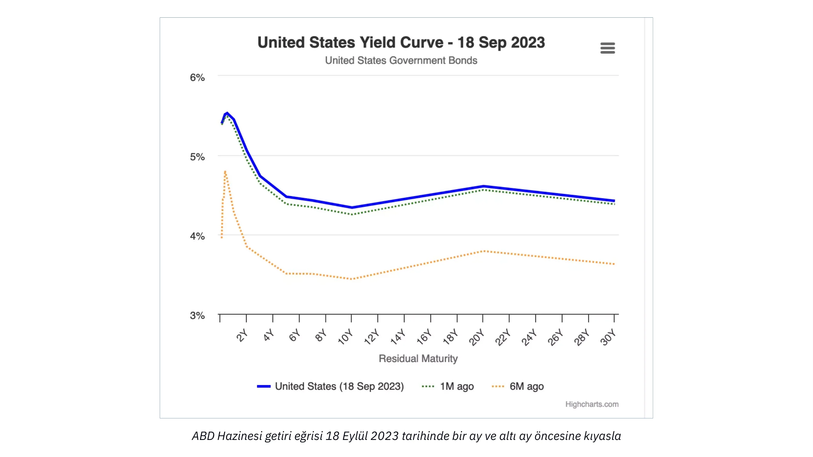

Avusturya İş Döngüsü Teorisi'ne ayrılmış bir sonraki bölümde öğreneceğimiz şey budur!

# Avusturya Ekonomik Perspektifleri

<partId>ad0fce42-2556-56b8-a093-5b4fcacc7cf3</partId>

## İş Döngüsünün Avusturyacı Teorisi

<chapterId>718afaa8-ce78-58aa-9477-073eef0bd137</chapterId>

> "Enflasyonist banka kredisi patlaması ne kadar uzun sürerse, sermaye mallarındaki yanlış yatırımların kapsamı o kadar büyük olur ve bu sağlam olmayan yatırımların tasfiye edilmesi ihtiyacı da o kadar artar. Kredi genişlemesi durduğunda, tersine döndüğünde veya hatta önemli ölçüde yavaşladığında, yanlış yatırımlar ortaya çıkar."
>

> Ludwig von Mises

Böhm-Bawerk'in en başarılı öğrencisi ve 20. yüzyılın tartışmasız en önemli Avusturyalı iktisatçısı olan Ludwig Von Mises, Böhm-Bawerk'in sermaye muhakemesini ekonomik döngülerin nedenlerini ve dinamiklerini açıklamak için kullanmıştır. Mises'in öğrencisi Friedrich A. Hayek, daha sonra 1974 yılında Nobel Ekonomi Ödülü'ne layık görüldüğü çalışmalarında bu akıl yürütmeyi mantıksal sonuçlarına kadar genişletmiştir.

Mises ve Hayek analizlerine baĢlangıç noktası olarak tasarruflardaki artıĢla baĢlamıĢlardır. Önceki bölümlerde gördüğümüz gibi, tasarruflardaki herhangi bir artıĢ zorunlu olarak tüketimde karĢılık gelen bir azalmayı ve dolayısıyla tüketim mallarının göreli fiyatlarının düĢmesini gerektirir. Bu durum iki etkiye yol açar: birincisi, tüketim mallarının fiyatlarındaki nispi düşüşten kaynaklanan reel ücret artışının sermaye mallarına olan talebi artırması; ikincisi ise, tüketimden en uzak üretim aşamalarında (alt sıra) girişimci karlarının artması. Reel ücretler yükseldikçe, girişimciler daha fazla sermaye malı kullanarak işgücünden tasarruf etmeye teşvik edilir, bu da sermaye mallarına daha güçlü bir talep ve bu alt sipariş malları üreten girişimciler için daha yüksek karlar yaratır. Böylece, tasarrufların artması, yani zaman tercihlerinin azalması bağlamında, faiz oranları düşerek ek üretim aşamalarının gelişmesini ve verimliliğin artmasını teşvik eder. Bu klasik bir Böhm-Bawerkian üretim sapmasıdır ve oldukça arzu edilen bir sonuçtur.

Ancak iki Avusturyalı iktisatçı, bu üretim sapmasının başlangıç noktası olan faiz oranındaki düşüşün tasarruf artışından değil de kredi genişlemesinden kaynaklanması durumunda ne olacağı üzerine kafa yormuşlardır.

Kısmi rezerv bankacılığı bağlamında, kredi genişlemesi tasarruflarda buna karşılık gelen bir artış gerektirmez. Bu nedenle, girişimciler zaman tercihleri değişmeden, yani tüketimde herhangi bir azalma olmadan bile daha fazla sermaye artırabilir ve üretim sapmalarına girebilirler. Hayek ve Mises'e göre böyle bir durum, ekonomik aktörler arasında önemli koordinasyon sorunlarına yol açmalıdır. Serbest piyasa faiz oranlarının olmaması nedeniyle bu sorunlar hemen ortaya çıkmayabilir, ancak uzun vadede, ortaya çıkan yanlış sermaye tahsisi somut sonuçlar doğurmalıdır: durgunluk.

Bu zamansal koordinasyon bozukluğu olgusunu ve sonuçlarını olabildiğince açık bir şekilde tanımlamak için, bir üretim yapısı modeline dayanacağız ve önce tasarruflardaki artıştan kaynaklanan faiz oranlarındaki düşüşten, ardından da kredi genişlemesinin neden olduğu faiz oranlarındaki düşüşten nasıl etkilendiğini gözlemleyeceğiz.

### Tasarruflardaki Artış Nedeniyle Faiz Oranlarında Düşüş:

Açıklamamızı kolaylaştırmak için, Menger'in mal sınıflandırmasına geri döneceğiz ve üretken yapıyı keyfi sayıda aşamadan oluşan bir diyagram üzerinde temsil edeceğiz:

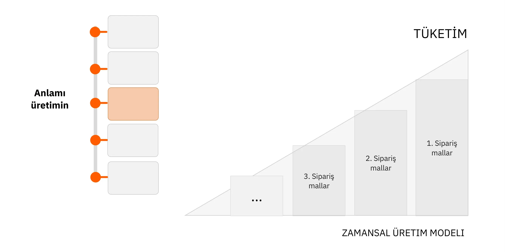

Yukarıdaki diyagramda, başlangıçtaki kaynaklar üretimin çeşitli aşamalarından geçerek onları nihai tüketim malları durumuna yaklaştıran dönüşümlerden geçer (orijinal üretim faktörleriyle etkileşim yoluyla: zaman, toprak, emek). Üçgenin sağ tarafının yüksekliği, bir dönemde satılan tüm tüketim mallarının toplamını ifade ettiği için şematik olarak GSYH'yi temsil etmektedir. Her bir çubuk arasındaki fark, sürecin her bir aşaması tarafından yaratılan katma değere (parasal olarak) karşılık gelir. Bu fark aynı zamanda her bir aşama ile ilişkili gelir olarak da görülebilir (gelirler - maliyetler).

Eğer toplam düzeyde ekonomik aktörler tasarruflarını arttırırlarsa, tüketilen nihai malların miktarı azalacaktır - diğer her şey eşit olduğunda, tasarruf zorunlu olarak tüketimin bir kısmının daha sonraki bir tarihe ertelenmesini içerir. Sonuç olarak, faiz oranları düşecektir - çünkü sermayenin Supply'i artmakta, girişimcilerin bu sermaye akışını yeni yatırım malları yaratmak için kullanmalarına ve böylece üretim yapısını uzatmalarına izin vermektedir.

Bu durumda, aşağıdaki diyagramla niteliksel olarak temsil edilebilecek bir değişiklik olan genişletilmiş bir üretim yapısı elde edeceğiz:

Burada, talep edilen tüketim mallarının parasal değeri azalmış ve ek bir üretim aşamasının yaratılması için kaynaklar serbest kalmıştır. Faiz oranlarındaki düşüşün azalan tüketimin, yani artan tasarrufların bir sonucu olduğu bu senaryoda, dolaşımdaki para miktarını temsil eden üçgenin alanı değişmeden kalır. Üretim yapısındaki dönüşüm (uzama) basitçe satın alma gücünün yapının bir bölümünden diğerine aktarılmasından kaynaklanmaktadır.

Tüketim mallarına olan talepteki azalmanın, orta vadede, sunulan nihai malların miktarında bir düşüşten ziyade tüketici fiyatlarında bir düşüşe neden olacağı da dikkate değerdir. Bunun nedeni, üretim yapısının nihai kısmının tüketim mallarına olan talepteki düşüşün hemen ardından uyum sağlamayacak olmasıdır; girişimcilerin planlarını ve yatırımlarını değiştirmeleri biraz zaman alacaktır. Stok tuttukları için, talepteki düşüş onları bu stokları iskontolu satmaya zorlayacak ve sonuç olarak, tasarruf fazlası başlangıçta tüketim malları için daha düşük fiyatlarla (yani reel ücretlerde bir artışla) sonuçlanacaktır.

Tersine, yatırım mallarının fiyatları yükselecektir çünkü satın alma gücünün girişimcilere aktarılması onların yatırım harcamalarını artırmalarını sağlayacaktır. Tasarruf sahipleri tarafından girişimcilere aktarılan bu tasarruflar girişimciler tarafından harcandığında, faiz oranları tekrar yükselme eğilimine girecek (sermayenin Supply'sının azalması nedeniyle) ve bu da yatırım mallarının fiyatlarının düşmesine yol açacaktır. Aslında, bu üretim sapmasının sonunda, göreli fiyatlar kabaca eskisi gibi kalacaktır. Ancak ekonomik aktörler genel olarak fayda sağlayacaktır: üretim yapısının uzamasından kaynaklanan verimlilik artışı, tüketicilere daha düşük birim fiyatlarla daha fazla ürün sunacaktır; tasarruf sahiplerinin satın alma gücü, kısmen faiz kazançları ve kısmen de düşük tüketici fiyatları nedeniyle artacaktır; bu arada, bir bütün olarak ele alındığında girişimciler ne kazanç ne de kayıp yaşayacaktır. Tüketime en yakın faaliyetlerde bulunanlar gelir kaybedecek, yeni üretim aşamaları yaratanlar ise orantılı olarak kazanacaktır. Böyle bir durumda yeni bir parasal gelir yaratılmaz; artan üretimdir ve dolayısıyla gelirlerin gerçek değeri yükselir.

### Kredi Artışı Nedeniyle Faiz Oranlarında Düşüş (Tasarruflarda Artış Yok):

Şimdi, bankalar tarafından sunulan kredilerin genişlemesinden kaynaklanan faiz oranlarındaki bir düşüşü göz önüne alırsak, üretim yapısının çok farklı bir resmini elde ederiz.

Daha düşük faiz oranları ile girişimciler daha fazla kaynak borçlanabilir ve böylece daha üst düzey üretim aşamaları yaratabilirler. Bu durumda, üretim yapısının bu şekilde genişlemesi tüketimin azalmasına yol açmayacaktır, çünkü tüketicinin mevcut tüketimini ertelemesi söz konusu değildir. Başka bir deyişle, GSYİH büyür. Sonuç olarak, üçgenimiz benzer bir yüksekliği korurken uzayacak, yani alanı artacaktır.

Bunun kredi genişlemesinin tamamen mantıklı bir sonucu olduğuna dikkat ediniz. Bankalar kredi vererek güvene dayalı medya ürettikleri ölçüde, doğal olarak toplam satın alma gücünün artması beklenmelidir.

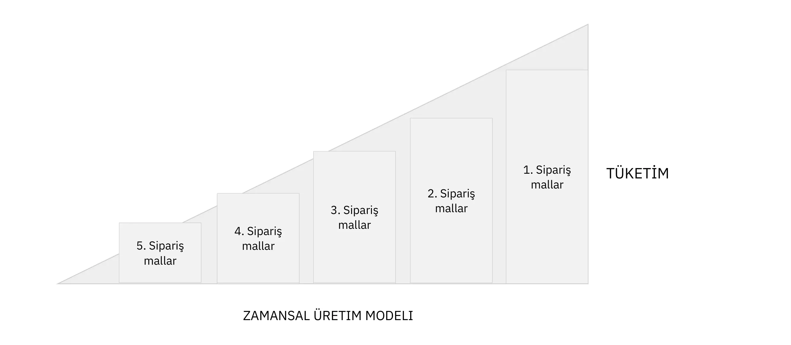

Kredi, girişimcilere verilen krediler yoluyla ekonomiye girdikçe, tüketimden uzak üretim sektörlerindeki karlarda bir artış ve tüketime yakın sektörlerdeki göreli karlarda bir düşüş gözlemlemeliyiz. Bu yüksek karlılık daha sonra sermayenin bu yeni, daha sermaye yoğun aşamalara (gemi yapımı, otomotiv, inşaat, ileri teknolojiler, vb.) doğru yeniden tahsis edilmesini ve tüketime daha yakın sektörlerdeki yatırımların azalmasını destekler.

Şimdi, üretimin bu yüksek aşamalarında yer alan girişimciler daha yüksek parasal gelirler elde etmektedir ve zaman tercihi aynı kaldığı için, tüketim ürünlerine olan talebin de arttığını görmemiz gerekir. Ancak bu patlama sırasında, yatırılan sermayenin göreceli karlılığı tüketimden uzak sektörlerde daha yüksek olduğundan, tüketime yakın faaliyetlerden daha uzak faaliyetlere bir kaynak transferi olmuştur. Sonuç olarak, üretimin alt aşamalarındaki girişimciler artan talebi karşılayacak kaynaklardan yoksun kalmıştır. Bu durum üretim yapısının bu iki parçası arasında gerilim yaratır: her biri diğerinin zararına sermaye elde etmeye çalışır ve tüketim talebi daha acil ihtiyaçları temsil ettiğinden, bir noktada, tüketimden uzak faaliyetlerde bulunan girişimciler yatırımlarını tamamlamak için gereken kaynaklara sahip olamazlar. Bu durumda bu sektörlerdeki kar oranı düşmeye başlar, işletmeler iflas eder ve tüketici fiyatlarındaki göreli artış, sermayenin daha düşük dereceli malların üretimine doğru hızlı bir şekilde yeniden tahsis edilmesini motive eder. Bu ani kaynak aktarımı ortaya çıktığında, ekonomi durgunluğa girer: varlık fiyatları düşer, reel ücretler azalır, tüketici fiyatları düşer ve stoklar yığılır.

Friedrich Hayek ve Ludwig von Mises'e göre durgunluk, sermayenin genişleme aşamasındaki yanlış tahsisinin bir tezahürüdür. Tasarruf ve sermaye fiyatları manipüle edildikçe, girişimciler kaynak yetersizliği nedeniyle tamamlanamayan projeler geliştirmiş ve/veya tasarruf yetersizliği nedeniyle sürdürülemeyen gelecekteki tüketim seviyesini planlayarak üretken kapasite inşa etmişlerdir.

Ancak deflasyon, yani varlık fiyatlarında ve ücret fiyatlarında düşüş, daha yüksek faiz oranları ve tamamlanmamış projelerin tasfiyesi yoluyla ekonomi yeniden düzenlenebilir ve sürdürülebilir bir yola doğru gelişebilir. Dolayısıyla durgunluk, şiddetli bir yeniden ayarlama sürecini tetikleyen bu refah yanılsamasının dağılmasıdır.

Genel olarak durgunluk bankacılık sektörünün kendisi tarafından tetiklenir. Krediler hızlanarak arttığı sürece fiyatlar yükselmeye devam eder ve girişimciler üretken kaynaklar için rekabet eder. Ancak Hyman Minsky'nin de belirttiği gibi, bankacılık sektörünün riskini azaltmaya karar verdiği ve dolayısıyla kredi akışını azalttığı bir nokta gelir. Dolayısıyla depresyon, çok sayıda iflas, kredi daralması, mevcut satın alma gücünde azalma ve finansal erimeyle sonuçlanır.

Böyle bir ayarlama, eksik tasarrufları yeniden inşa etmek için eksik tüketim ve eksik yatırımın uygulandığı bir dönem olarak görülebilir. Hayek'e göre, bu depresif aşama, acı verici olsa da, üretim faktörlerinin gerçek kıtlığını yansıtan nispi fiyat yapısına dayalı ekonomik faaliyetin toparlanmasına izin verdiği için son derece gereklidir. Bu depresyon kesintiye uğrarsa, ekonomi arzu edilen bir yola geri dönemez çünkü ekonomik aktörlerin kararlarını rasyonalize etmelerini sağlayan bir bilgi sisteminin yokluğunda, kaynakların yanlış tahsisi devam edecektir.

Ne yazık ki bu depresif mekanizma, açık harcamalar ve kolay para politikası yoluyla ekonomiyi "canlandırmaya" çalışan siyasi iktidar ve merkez bankaları tarafından sık sık kesintiye uğratılmaktadır.

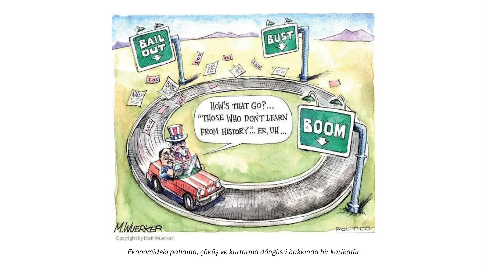

Hem monetaristler hem de Keynesyenler için depresyonun nedeni yetersiz toplam taleptir, bu nedenle her ikisi de, gördüğümüz gibi, sorunun özü olan göreli fiyatların gelişimine dikkat etmemektedir. Bu nedenle, kredi genişlemesi için teşvik sağlamanın (faiz oranlarını düşürmek) ve talebi artırmak için devletin açık kapasitesini kullanmanın toparlanmayı başlatacağına inanıyorlar. Kısa vadede, bu tür önlemler istenen etkileri yaratıyor gibi görünebilir: açık harcamaları desteklerken, faiz oranlarındaki düşüş daha yüksek varlık fiyatlarına yol açar ve bu da varlık sahiplerini harcamalarını artırmaya teşvik eder. Ancak, yapısal sorun devam ederken ve hatta yapay olarak düşük faiz oranları sayesinde sermayenin yanlış tahsisi devam ederken, bu destek eninde sonunda azalır, hatta daha da kötüleşir.

Modern çağda, merkez bankaları ve hükümetler bu uyum sürecinin ortaya çıkmasını engelleme konusunda o kadar gayretli davranmışlardır ki, sonuçta kitlesel yapısal işsizlik ve sürekli borç birikimi ortaya çıkmıştır. Japonya bu konuda bir örnek teşkil etmektedir. 1989-90'da varlık balonunun patlamasından sonra, Japonya Merkez Bankası (BoJ) ve görevdeki çeşitli hükümetler "Japon ekonomisini yeniden başlatmak" için burada açıklanan tüm yöntemleri kullandılar Harcama programları ve faiz indirimlerini takip eden kısa süreli dalgalanmalar dışında, Japonya 30 yıl boyunca nevrastenik bir büyüme ve aşırı borçlanma durumunda kalmıştır.

### İş Döngüsü Teorisi Üzerine Sonuç:

Ludwig Von Mises ve Friedrich Hayek, insan eylemlerinin ardışık doğasını vurgulayarak ve faiz oranı dalgalanmalarının ekonomik aktörlerin zamanlararası koordinasyonu üzerindeki etkisine özellikle dikkat ederek, ekonomik döngüleri kısmi rezerv bankacılık sisteminin içsel dinamikleri olarak açıklamışlardır. Avusturyacı analiz ile monetarist ve Keynesyenlerin analizi arasındaki fark büyük ölçüde, birincisinin üretimin çeşitli aşamalarına ve göreli fiyatların yapısına özel önem vermesi, ikincisinin ise istihdam seviyeleri, GSYİH veya tüketici fiyat endeksi gibi toplu değişkenlerde durması gerçeğinde yatmaktadır. Gerçekten de, bir sermaye teorisinden yoksun oldukları için, ana akım iktisatçılar durgunluğun nedenlerini "hayvan ruhlarına" ya da "dışsal olaylara" bağlama eğilimindedirler.

Avusturya Okulu, ekonomik aktörleri koordine etmek için göreli fiyatların önemi konusunda diğer tüm iktisat okullarından daha fazla ısrarcıdır. Avusturya Okulu üyeleri, özellikle Mises'in 1919'da sosyalist ekonomilerde ekonomik hesaplamanın imkansızlığı üzerine yaptığı çalışmayı yayınlamasından bu yana, yüzyılı aşkın bir süredir bu konudaki tartışmalara sürüklenmektedir.

Bu, bu kursun bir sonraki ve son bölümünün konusu olacaktır.

## Sosyalizmde Ekonomik Hesaplamanın İmkansızlığı

<chapterId>2578a9d8-90e9-58dd-a8c5-6366948564c7</chapterId>

> "Üretim faktörlerinin ne alınıp ne de satıldıkları için piyasa fiyatlarının olmadığı bir yerde, gelecekteki eylemlerin planlanmasında ve geçmiş eylemlerin sonuçlarının belirlenmesinde hesaplamaya başvurmak imkansızdır. Sosyalist bir üretim yönetimi, planladığı ve uyguladığı şeyin hedeflenen amaçlara ulaşmak için en uygun araç olup olmadığını bilemez. Olduğu gibi karanlıkta çalışacaktır. Hem maddi hem de insani (emek) kıt üretim faktörlerini israf edecektir. Herkes için kaos ve yoksulluk kaçınılmaz olarak ortaya çıkacaktır."
>

> Ludwig von Mises, Planlı Kaos

### Sosyalizmde Ekonomik Hesaplamanın İmkansızlığı

Marksist rejimlerin son yüzyılda tekrarlanan başarısızlıklarına rağmen, ekonomik hesaplama tartışması iki önemli nedenden dolayı geçerliliğini korumaktadır:

1. Benzer fikirler ilericiler ve diğer müdahaleciler tarafından hala savunulmaktadır.

2. İster merkez bankacılarının eylemleri yoluyla sermaye piyasalarında, ister kamu iktisadi teşebbüsleri, kararnameler ve düzenleyici kurulların müdahalesi yoluyla diğer piyasalarda olsun, fiyat sabitleme yaygın olmaya devam etmektedir.

### Ekonomik Hesaplama Tartışması

Bu tartışma ilk olarak 20. yüzyılın en etkili ekonomik makalelerinden biri olan Ludwig von Mises tarafından yazılan ve 1920'de yayınlanan "Sosyalist Bir Devlette Ekonomik Hesaplama" ile alevlenmiştir. O dönemde, Bolşeviklerin Rusya'da iktidarı ele geçirmesi, sosyalistlerin Weimar Cumhuriyeti'nde (Almanya) göreve gelmesi ve sosyalist ve komünist partilerin Avrupa çapında önem kazanmasıyla sosyalizm yükselişteydi.

Mises'in makalesinden önce, sosyalizm ve kapitalizm tartışmaları esas olarak ahlaki argümanlar ve teşvik sorunu etrafında dönüyordu. Marksist "herkesten yeteneğine göre, herkese ihtiyacına göre" ilkesi etrafında örgütlenmiş bir toplumun ahlaki açıdan daha üstün olduğu varsayılsa bile, "çöpü kimin çıkaracağı" pratik sorusunun hala ele alınması gerekiyordu. Ortak yanıt, sosyalizmin kapitalist içgüdülerden yoksun, parasal teşviklerin yokluğunda bile akranlarına isteyerek hizmet eden bireyler üreteceği yönündeydi.

Mises makalesi ile tartışmaya yeni bir boyut getirmiştir. Ekonomi politiğin "yeni insan" yaratma kabiliyetine ilişkin ütopik düşünceleri bir kenara bırakan Avusturyalı iktisatçı, ara üretim faktörlerinin fiyatları olmadan rasyonel ekonomik örgütlenmenin mümkün olamayacağına işaret etmiştir. Argümanı bugün bile kendisini eleştirenler ve hatta bazı liberal iktisatçılar tarafından yeterince anlaşılamamıştır. Bu nedenle, daha ayrıntılı olarak açıklamakta fayda var.

### Ekonomik Hesaplamanın İmkansızlığını Açıklamak

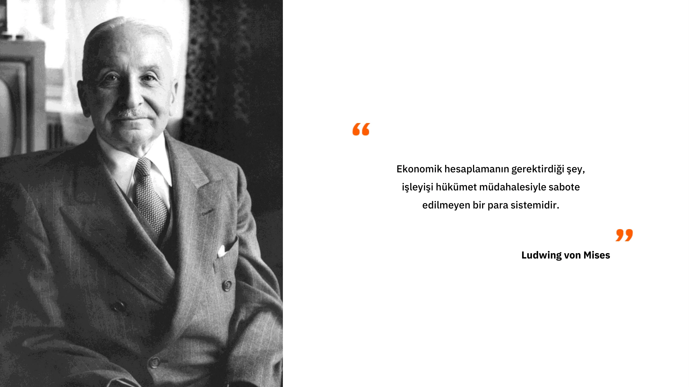

Mises'in argümanları hakkındaki yanlıĢ anlamaların çoğu, kapitalist bir ekonomide yönetici ve giriĢimci sınıfların oynadığı rollerin yanlıĢ anlaĢılmasından kaynaklanmaktadır. Mises, yöneticilerin kendi operasyonları içinde verimli üretim planları tasarlama yeteneklerini asla reddetmemiştir. Bunun yerine, üretim araçlarının sahipleri olarak sermayeyi farklı endüstrilere tahsis eden ve böylece yöneticilerin ekonomik hesaplamalarında girdi olarak hizmet eden fiyatları oluşturan girişimcilerin ve hissedarların önemini vurgulamıştır.

Sermaye ve para piyasaları olmadan, endüstriler arasında kaynak kullanımını rasyonalize etmek imkansız hale gelir. Bu, ekonominin her bir firması veya alt bölümü içinde mükemmel bir organizasyon olsa bile, tüm ekonominin kaynak mevcudiyeti, üretim koşulları ve tüketici tercihlerindeki değişikliklere etkin bir şekilde uyum sağlayamayacağı anlamına gelir. Mises'in sözleriyle:

> "[...] [piyasa sosyalisti] önerilerde ima edilen temel yanılgı, ekonomik soruna, entelektüel ufku ikincil görevlerin ötesine uzanmayan madun memurun perspektifinden bakmalarıdır. Endüstriyel üretimin yapısını ve sermayenin çeşitli dallara ve üretim kümelerine tahsisini katı olarak görürler ve bu yapıyı koşullardaki değişikliklere uyarlamak için değiştirme gerekliliğini dikkate almazlar.... Şirket görevlilerinin faaliyetlerinin yalnızca patronları olan hissedarlar tarafından kendilerine verilen görevleri sadakatle yerine getirmekten ibaret olduğunu fark edemezler.... Yöneticilerin faaliyetleri, alım ve satımları, piyasa faaliyetlerinin bütününün sadece küçük bir bölümüdür. Kapitalist toplumun piyasası aynı zamanda sermaye mallarını sanayinin çeĢitli dallarına tahsis eden iĢlemleri de gerçekleĢtirir. GiriĢimciler ve kapitalistler Ģirketler ve diğer firmalar kurar, bunları büyütür ya da küçültür, fesheder ya da baĢka Ģirketlerle birleĢtirir; mevcut ve yeni Ģirketlerin hisse senetlerini ve tahvillerini alır ve satar; kredi verir, geri çeker ve geri alır; kısacası, toplamı sermaye ve para piyasası olarak adlandırılan tüm bu iĢlemleri gerçekleĢtirirler. Üretimi, tüketicilerin en acil isteklerini mümkün olan en iyi şekilde karşılayacağı kanallara yönlendiren, teşvikçilerin ve spekülatörlerin bu mali işlemleridir."
>

> Mises, İnsan Eylemi, s. 703-04

Özünde Mises, sermaye sahiplerini kar ve zarar bağlamına yerleştiren mülkiyet haklarının, onları kaynaklarını tüketici taleplerini karşılamak için şu anda kaynaklara en çok ihtiyaç duyan endüstrilere tahsis etmeye motive ettiğini savunmaktadır. Başarılı olduklarında kâr ederler, ancak başarısız olduklarında mali kayıplara uğrarlar. "Oyundaki payları" onları ekonominin mevcut durumu için en iyi sermaye tahsisi konusunda spekülasyon yapmaya teşvik eder. Bu, eylemlerinin kolektif sonuçlarının kaynakların en verimli kullanımı hakkında hayati bilgiler ürettiği piyasa güdümlü bir dinamik yaratır.

Önceki bölümlerde değerlerin öznel olduğu, ekonomik eylemlerin fırsat maliyetlerini ortaya çıkardığı ve tüketici fiyatlarının tüketici isteklerinin sıralı bir hiyerarşisini ifade ettiği açıklanmıştır. Girişimciler, tüketici isteklerini alternatif seçeneklerden daha etkin bir şekilde karşılayan, gelirleri maliyetlere göre maksimize eden üretim yapıları inşa etmek için üretim faktörleri için rekabet ederler. Bu nedenle, üretim faktörlerinin fiyatları tüketici fiyatlarından türetilir: eğer bir üretim faktörü başka bir sektörde ya da farklı bir plan altında daha fazla parasal gelir elde edebiliyorsa (tüketici isteklerini daha iyi tatmin ediyorsa), girişimciler mevcut sahibinden daha fazla teklif vererek fiyatını marjinal verimliliğine yükseltirler. Girişimciler arasında üretim faktörleri için en yüksek marjinal verimi belirleyen bu rekabet, kaynak tahsisi hakkında ilgili bilgileri üreten bir süreçtir.

Bu süreç, üretim faktörlerinin en verimli kullanımlarına tahsis edilmesini sağlayarak çeşitli faaliyetlerin verimliliğini doğruladığı veya geçersiz kıldığı için çok önemlidir. Piyasa bu işlevi sürekli bir süreç olarak yerine getirir. Tüketici tercihlerinin, üretim koşullarının, teknolojinin, düzenlemelerin, demografinin ve daha fazlasının değişken olduğu sürekli değişen bir dünyada, ara üretim faktörlerinin fiyatları, değişen koşullara uyum sağlayan girişimcilerin ve kapitalistlerin eylemleriyle sürekli olarak değişir. Bu değişiklikler yerel olduğundan, bilginin tüm dünya hakkında tam bilgiye sahip olamayan ekonomik aktörlere yayılması gerekir. Piyasanın rolü budur: girişimcilerin, daha sonra piyasa tarafından onaylanan veya geçersiz kılınan ekonomik üretim yapıları önererek yerelleştirilmiş, genellikle niteliksel ve karmaşık bilgilerle hareket etmelerini sağlar. Bu şekilde, aşağıdan yukarıya doğru işleyen bu süreç tarafından üretilen ilgili bilgiler yoğunlaştırılır ve fiyat sistemi aracılığıyla tüm ekonomiye dağıtılır. Bu bilgi üretimi ve dağıtımı süreci kaynak tahsisi için elzemdir çünkü dünya hakkında sınırlı bilgiye sahip olan ekonomik aktörlerin fiyatlara dayanarak ekonomik hesaplamalar yapmasını ve tutarlı ekonomik planlar tasarlamasını sağlar.

Bu açıdan bakıldığında, merkezi olarak planlanan bir ekonomi kaçınılmaz olarak sermayenin yanlış tahsisini tecrübe edecektir. Kısa ve orta vadede, bu tür yanlış tahsisler fark edilmeyebilir çünkü bunları ortaya çıkaracak piyasa fiyatları veya iflaslar yoktur. Ancak, geri besleme (fiyatlar) ve yeniden tahsis mekanizmalarının (iflaslar) yokluğu nedeniyle, israf yaşam koşullarında önemli bir düşüşle belirgin hale gelene kadar hatalar birikecektir.

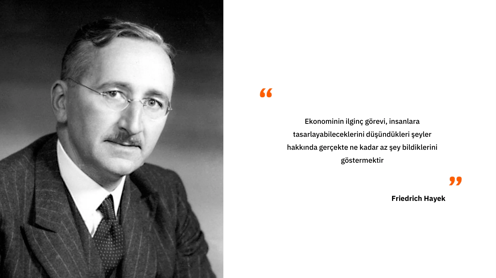

### Avusturya Perspektifi ve Diğer Ekonomi Okullarının Başarısızlıkları

Geriye dönüp bakıldığında böyle bir panorama çizmenin kolay olduğu iddia edilebilir. Ne de olsa hepimiz SSCB'deki boş rafların, Venezuela'daki zorlukların ve Kamboçya'daki insani felaketin farkındayız. Ancak Mises bu olayları 1920 gibi erken bir tarihte öngörmüştü. Yine de, 1989'da SSCB'nin çöküşüne kadar, aralarında çok sayıda Nobel ödüllü iktisatçının da bulunduğu pek çok iktisatçı Sovyet ekonomik mucizesini övüyor ve Sovyet ekonomisinin yakında ABD ekonomisini geçeceğini öngörüyordu.

Bu etkileyici öngörülere ve sosyalizm altında ekonomik hesaplamanın imkansızlığına dair sayısız ampirik kanıtlara rağmen, dünya çapındaki siyasi liderler fiyatları belirlemek, tüm endüstrileri kamulaştırmak ve genellikle ekonomik açıdan bilgisiz halklar tarafından alkışlanan beş yıllık planlar önermek için her zamankinden daha heveslidir. Bu müdahaleciliğin sonuçları, eskiden müreffeh olan Batı ülkelerindeki yaşam standartlarının yavaş yavaş düşüşüne tanık olan insanlar tarafından şiddetle hissedilmektedir.

### Sosyalizmde Ekonomik Hesaplamanın İmkansızlığının Özel Bir Örneği Olarak Avusturya İş Çevrimi Teorisi

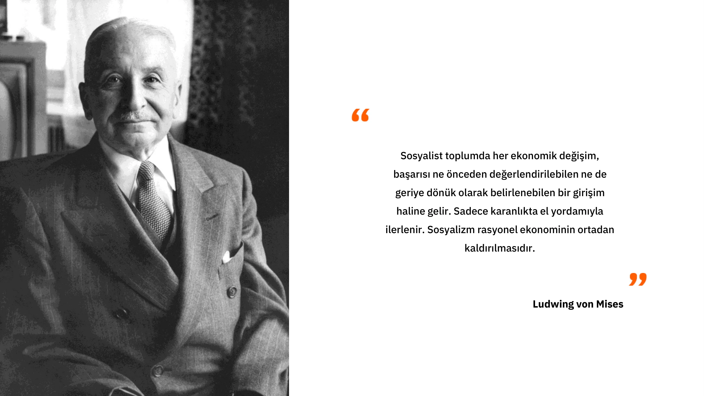

Bir önceki bölümde, merkez bankalarının faiz oranı manipülasyonundan kaynaklanan aşırı yatırım ve sermayenin yanlış tahsisi dinamiklerine açıklık getirmiştik. Esasen, açıkladığımız şey, sosyalizm altında ekonomik hesaplamanın imkansızlığının para piyasaları alanına uygulanmış özel bir durumu olarak görülebilir. Fiyatlar piyasa değerlerinin dışında sabitlendiğinde, girişimciler ve sermaye tahsis edenler, tasarruf eksikliği nedeniyle uzun vadede sürdürülemeyecek yatırımlara girişmeye teşvik edilirler. Merkezi planlamacılar (bu durumda merkez bankacıları) fiyat sistemine müdahale ederek ekonomik aktörler arasında bir koordinasyonsuzluk yaratırlar. Bu örnekte, zamanlararası yanlış koordinasyon, daha yüksek dereceli yatırım mallarına aşırı yatırım yapılmasını ve daha düşük dereceli yatırım mallarına yetersiz yatırım yapılmasını gerektirir ki bu da endüstriler arasında sermaye yanlış dağılımının özel bir tezahürünü temsil eder.

Bu yanlış tahsisin sonuçları arasında finansal ve ekonomik krizler, ekonomik faaliyetlerin azalması ve borç deflasyonu yer almaktadır. Bu makroekonomik etkiler, kredi genişlemesinden kaynaklanan tasarruflar ve yatırımlar arasındaki dengesizlikten kaynaklanmaktadır. SSCB ve diğer komünist rejimlerde fiyat sabitleme benzer bir koordinasyonsuzluğa yol açarak bazı malların kıtlığına ve diğerlerinin aşırı üretimine neden olmuştur. Her iki durumda da fiyatlar, ister zaman tercihleri ister tüketim tercihleri açısından olsun, tüketicilerin gerçek tercihlerini yansıtmamakta, girişimcileri ya da kaynak tahsisinden sorumlu merkezi planlamacıları "yanlış sektörlere" sermaye yatırmaya yöneltmektedir

Günümüzde ekonomik hesaplama tartışması, öncelikle Green gündemi tarafından yönlendirilen yanlış yatırımların giderek daha belirgin hale geldiği enerji tartışmalarında yeniden ortaya çıkmaktadır. Avusturyalı iktisatçılar, ana akım iktisatçıların öngöremediği 2008 krizinin, uzun süreli düşük faiz oranları nedeniyle konut piyasasına aşırı yatırım yapılmasıyla karakterize edilen klasik bir patlama ve çöküş döngüsü olduğuna işaret ederek, para piyasalarıyla ilgili tartışmalarda da ortaya çıkmaktadır. Dahası, neo-Marksistler ve diğer sosyalist gruplar, yapay zekanın ortaya çıkışının ekonomik hesaplama sorununu çözebileceği fikrini yaymaktadır. Ancak bu bakış açısı, konunun hatalı bir şekilde anlaşılmasından kaynaklanmaktadır; ekonomik hesaplama sorunu bir hesaplama gücü meselesi değil, üretim ve kaynak tahsisi ile ilgili bilgi üretme ve dağıtma meselesidir. Bu bilgi yalnızca uzmanlaşmış bilgiye sahip ve sonuçtan çıkar sağlayan aracılar tarafından yerel olarak üretilebilir. Yapay zeka bu aşağıdan yukarıya sürecin yerini alamaz ve bu nedenle merkezi planlamacılara kaynak tahsisi sorununda yardımcı olamaz. Ne yazık ki, yüzyıllık bir yanlış anlama nedeniyle, YZ'nin serbest piyasaların başarısızlıklarını düzeltebilecek aydınlanmış merkezi planlamacılar tarafından yönetilen yeni bir ekonomik refah çağını başlatacağına dair iddiaların çoğalmasını bekliyoruz.

Ekonomik hesaplama sorununu çağdaş bir duruma somut biçimde uygulamak için, modern Çin’de kaynak tahsisini ele alan bu makaleye başvurabilirsiniz: *[The Road to Financial Repression: China the Paper Tiger](https://open.substack.com/pub/theomogenet/p/the-road-to-financial-repression-181?r=ccpx8&utm_campaign=post&utm_medium=web)*, Théo Mogenet tarafından.

### Sonuç

Bu son bölümde, Avusturya iktisat okulunun temel ilkelerinden biri olan sosyalizm altında ekonomik hesaplamanın imkânsızlığını inceledik. Bu derste sunulan Avusturya perspektifi, bu sonuçla doruğa ulaşmakta ve müdahaleci olmayan politikalar için güçlü bir gerekçe sunmaktadır. Özünde, tüm Avusturya düşüncesi ekonomik koordinasyonda fiyatların önemi etrafında döner. Avusturyalı ekonomistler, rasyonel kaynak kullanımı için fırsat maliyetlerinin ve ekonomik hesaplamanın önemini vurgulayarak, sürekli değişen bir dünyada insan eylemlerinin karmaşıklığını ve inceliğini göstermektedir.

Ana akım ekonomistler ve merkezi planlamacılar, geleceğin belirsizliğini, niceliksel ekonomik tahminlerin yanlışlığını ve ekonomik müdahalenin zararlı etkilerini vurguladıkları için Avusturyalı ekonomistlerden genellikle hoşlanmazlar. Kısacası, Avusturya ekonomisi müdahaleci eylemlerin etkisizliğinin ve zararlı sonuçlarının altını çizmektedir.

Avusturya geleneği, öznel değer, belirsizlik, özgür irade ve karmaşıklık kavramlarından derin çıkarımlar yaparak insan eylemine mütevazı bir yaklaşım getirmektedir. Piyasa düzeninin, insan tasarımının bir ürünü olmamasına rağmen, gelişimimiz ve refahımız için nasıl merkezi bir kurum olarak durduğunu açıklar. Bu dersten çıkarılacak önemli bir sonuç varsa, o da kapitalizmin, özgür bireylerin yaşadığı dinamik ve belirsiz bir dünyada değişime uyum sağlama yeteneği sayesinde egemen ekonomik sistem haline geldiğidir.

## Avusturya Metodolojisi

<chapterId>419129c1-82ba-54e3-b385-95d4d89a447e</chapterId>

Avusturya iktisat okulu, sosyal bilimlerde sıklıkla kullanılan pozitivist yaklaşımdan farklı olan aksiyomatik-tümdengelim metodolojisi ile diğer okullardan ayrılır. Pozitivist yaklaşım, fiziksel bilimlerdekine benzer bir yöntem benimseyerek ampirik verilerden oluşturulan yasalara dayanır. Gözlemlerden yola çıkarak hipotezler formüle eder ve bunlar daha sonra geçici deneylerle doğrulanır ya da çürütülür. Bilimsel yöntem, verileri en iyi açıklayan hipotezin korunması ve daha kesin bir hipotez bulunana kadar araştırmaya devam edilmesinden oluşur.

Ancak, sosyal bilimlerde değişkenleri fizikteki gibi izole etmek zordur, çünkü tarihin her anı benzersizdir ve çok sayıda faktör devreye girer. Ekonomik deneyler bir laboratuvarda yeniden üretilemez ve iki değişken arasında bir korelasyon gözlemlemenin aralarında nedensel bir ilişki olduğunu kanıtlamadığını unutmamak önemlidir. Avusturyalılar, özellikle de Ludwig von Mises, sosyal bilimleri incelemek için a priori veya aksiyomatik-tümdengelim yöntemi adı verilen alternatif bir yöntem önermiştir. Bu yaklaşım, matematikte kullanılanlara benzer şekilde aksiyom adı verilen temel önermelere dayanmaktadır. Örneğin, Öklid geometrisi matematik alanındaki aksiyomatik-tümdengelim yöntemine bir örnektir.

Avusturya ekonomisinde temel aksiyomlar arasında, geleceğe ilişkin belirsizlik nedeniyle mal veya hizmetlerin yarın yerine bugün tercih edilmesine dayanan pozitif zaman tercihleri yer almaktadır. Bu aksiyomlar, günlük yaşamla tutarlı ve açık olarak kabul edildikleri için sorgulanmazlar. Bu temel aksiyomları kullanan Avusturyalı ekonomistler, ekonomik olguların işleyişi hakkında bilgi sağlayan ifadeler türetmek için mantık kurallarını kullanırlar. Örneğin, ekonomik krizlerin tasarruf ve yatırım arasındaki dengesizlikten kaynaklandığını ve bunun da faiz oranlarının yapay olarak manipüle edilmesine yol açtığını açıklarlar. Pozitif zaman tercihleri olan bireyler, borç verme riskini telafi etmek için pozitif bir faiz oranı talep ederler. Avusturyalılar değerleme ilişkilerinin öznel olduğunu, bu nedenle faiz oranlarının bireylere ve koşullara bağlı olarak değişebileceğini savunurlar.

Fiyatlar, kısmi bilgiye sahip bireylerin rasyonel organizasyonunda çok önemli bir rol oynar. Faiz oranı, piyasadaki sermayenin Supply ve talebini dengeler ve böylece ekonomiyi teşvik eder. Avusturyalı ekonomistler, faiz oranının keyfi olarak belirlenmesinin ekonomik krizlere yol açabileceğini ve sosyalist bir rejimde hesaplamayı imkansız hale getirebileceğini vurgulamaktadır.

### Avusturyalı Ekonomistler ve Metodolojik Farklılıklar

Avusturyalı ekonomistler, aynı analiz yöntemlerini kullanmadıkları için diğer düşünce okullarıyla tartışırken sıklıkla zorluklarla karşılaşırlar. Avusturyalılar değerin öznelliği gibi temel aksiyomlardan yola çıkarak mantıksal sonuçlar çıkarırken, Keynesyen veya monetarist iktisatçılar genel ekonomik yasalar oluşturmak için ampirik verilere dayanma eğilimindedir.

Metodolojik farklılığın bir örneği, 2008-2019 yılları arasında enflasyonun olmamasını bir argüman olarak kullanarak siyasi hedeflere ulaşmak için para basılmasını savunan Modern Para Teorisi (MMT) savunucularının pozisyonudur. Avusturyalı ekonomistler ve MMT savunucuları aynı dili konuşmuyor ve bir ekonomik yasanın geçerliliğini belirleme kriterleri konusunda hemfikir değiller. Bu durum, bu farklı ekoller arasındaki tartışmaları zorlaştırmakta ve çoğu zaman verimsiz hale getirmektedir.

Değişkenler arasında ilişki kurmak için seçici bir şekilde veri seçmeyi içeren kiraz toplama yönteminin, ekonomi biliminde bilimsel ve titiz olmayan bir yöntem olduğunu belirtmek önemlidir. Örneğin, parasal yaratım mutlaka enflasyona neden olmaz ve karmaşık ekonomik mekanizmaları anlamak için daha nüanslı bir yaklaşım gereklidir. Aksiyomlar, Avusturyacı ekonomik muhakemede çok önemli bir rol oynamaktadır. Bunlar, mantıksal çıkarımların yapılabileceği temel Elements'dir. Ancak, ekonomik olguların karmaşıklığı ve doğasında var olan belirsizlik nedeniyle ekonomide geleceğin kesin olarak tahmin edilmesinin genellikle zor olduğunu kabul etmek önemlidir.

Metodoloji, ekonomide ve genel olarak sosyal bilimlerde önemli bir unsurdur. Soruların nasıl sorulduğunu, hipotezlerin nasıl formüle edildiğini ve verilerin nasıl yorumlandığını etkiler. İktisadi düşünce okulları arasındaki metodolojik farklılıkları anlamak, farklı bakış açılarını takdir etmemize ve önceki bölümlerde tartışılan konular hakkında kendi fikirlerimizi geliştirmemize yardımcı olabilir.

# Son Bölüm

<partId>ae828713-d133-559f-93c2-101cb5245fca</partId>

## Yorumlar & Derecelendirmeler

<chapterId>29d4323c-e34e-5834-bf03-2f3ed10d751b</chapterId>

<isCourseReview>true</isCourseReview>

## Final Sınavı

<chapterId>d58d188f-81fb-572a-a898-8b6f8aceba7a</chapterId>

<isCourseExam>true</isCourseExam>

## Sonuç

<chapterId>d668fdf6-fb4c-4bbf-82e1-afcb95c122e0</chapterId>

<isCourseConclusion>true</isCourseConclusion>