# 經濟學之旅

歡迎來到 Théo Mogenet 的課程！熱愛經濟、歷史、文學、政治科學和科技的他，決定與您分享他對奧地利經濟學的知識。這個在經濟學中較不知名的分支，以人類的理性和自由行動者的行為為基礎。在數學上較不密集，首先是邏輯和社會研究的問題。

這個思想流派背後已經有幾個世紀的歷史，背後有一整套的作者、思想和經濟學家。哈耶克 (Hayek)、羅斯巴德 (Rothbard)、米塞斯 (Mises)、巴斯提亞 (Bastiat) 或門格 (Menger) 等經濟學界的大師們長期以來都在維護這個運動。相較於當今無所不在的凱恩斯主義，奧地利學派以更自由、資本主義甚至無政府主義的方式，將個人放回方程式的中心。

+++
# 經濟學簡介

<partId>265aa8b0-dd89-5456-b72a-656e988013d5</partId>

## 簡介

<chapterId>eae3de7b-cce6-516d-83d9-28fbd582c0ca</chapterId>

大家好，歡迎來到 Econ 201：奧地利經濟學簡介。

在 Théo Mogenet 提供的這門課程中，您將發現這個與凱恩斯學說大相逕庭的經濟學分支。到目前為止，您可能已經了解到，貨幣的生產和管理是中央銀行的責任，其理念是印鈔和花錢可以促進經濟成長。然而，還有另一個經濟學派：奧地利經濟學。經過 200 多年的研究與發展、哲學思考以及知名作家的著作，這種方法強調以更清醒的眼光看待經濟成長與人類的理性。

實際上，經濟學是一個極為社會化和複雜的領域，由無數相互關聯的小行為者組成，他們共同構成了一個連貫的整體。我們必須從人類邏輯和社會學的角度來理解這門學科，而不是透過數學方程式來處理。在本課程中，我們將探討奧地利經濟學的基本概念。您的導師 Théo Mogenet 是一位熱情且能幹的奧地利經濟學教授。

首先，我們為您提供一個額外的視訊，解釋我們目前的金融體系是如何運作的。您將發現商業銀行和中央銀行如何互動並推動經濟。我們將 Address 我們金融世界中的主要參與者，以及這種權力集中在某些經濟機構中會如何導致濫用和金融危機。

在本課程的第二部分，我們將探討凱恩斯主義與奧地利經濟學之間的差異，探索他們各自的思想流派、思考方法，以及他們用來建立經濟真理的工具。我們也將研究經濟危機的形成。這是因為人類的無能、市場的操縱還是人們的集體亢奮？我們將探討我們的成長、衰退、衰退、黃金時期的週期是如何由人類的情感所造成的。

本課程將結合經濟學和哲學，由 Théo 和我本人進行開放式討論。如果您在課程中有任何問題，請不要猶豫，直接在我們的 Discord 中提出，您可以在課程描述中找到相關連結。

我熱烈感謝 Théo 製作本課程，希望他能成為您的優秀老師。我們在創作這些內容時非常愉快。這門課程對每個人來說都是平易近人的，而且我認為這門課程對於我們未來更深入的經濟學課程也是不可或缺的。本課程將奠定必要的基礎，以便更詳細地探討某些經濟理論，而我們在此僅會簡略介紹這些理論。

如果您已經準備好開始這場冒險，我邀請您點擊以下視訊，並從關於我們目前金融體系的獎勵視訊開始。現在請 Théo 發言。感謝他與 Descoupes Bitcoin 合作完成這段影片。我們很快會再見面。再見

## 貨幣、信貸、銀行和中央銀行

<chapterId>29faebd9-9326-52de-8161-e4bb33033cd6</chapterId>

> "傳統貨幣的根本問題在於它需要信任才能運作。我們必須信任中央銀行不會貶值貨幣，但法定貨幣的歷史充滿了背信棄義。我們必須信任銀行會持有我們的錢並透過電子方式轉移，但他們卻在一波波的信貸泡沫中把錢借出去，而且幾乎沒有任何儲備。"我們必須相信他們會保護我們的隱私，相信他們不會讓身份盜賊掏空我們的帳戶。
>

> Satoshi Nakamoto，Bitcoin 的假名發明者
### 金錢是如何產生的

在我們現今的貨幣體系中，貨幣主要是通過銀行的 「部分儲備金制度 」來創造的。這個詞的基本意思是，銀行不需要持有與他們收到的存款一樣多的儲備金。因此，銀行可以在發放貸款時創造新的購買力，反之，也可以在客戶償還貸款時降低購買力。

舉例來說，如果您向當地銀行申請房屋抵押貸款，銀行借給您的錢就會以簿記分錄的形式出現。在會計中，我們通常用資產負債表來表示個人的淨財富，資產負債表有兩面：資產面，包括任何財產、金融合約、存貨或其他形式的財富；負債面，顯示用於創造資產面所列資本的資金來源。資產與負債之間的差額稱為「權益」，可視為實體的淨財富。

當一家金融機構持有銀行牌照時，基本上意味著記錄為「客戶存款」的負債被視為特定國家或貨幣區內的官方貨幣。因此，當您向銀行申請貸款購買房屋時，銀行家不會借出其他客戶存入的資金。相反，銀行會將貸款額存入您的帳戶，同時將您的貸款 Contract 記錄為銀行資產。當您償還貸款時，金錢實際上已經消滅，相對應的貸款 Contract 的價值也會減少，銀行只保留貸款利息。

購買房屋後，您指示銀行將款項轉入賣方帳戶。如果賣方的帳戶在不同的銀行，您的銀行家會通知其他銀行的對應銀行家，以確保賣方的帳戶得到相應的貸記，同時從您的帳戶中扣除相應的金額。

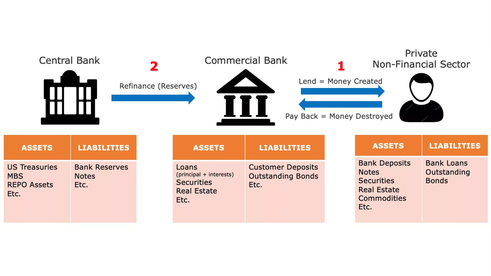

圖 1： 貨幣創造為簿記分錄

> 「我們國家的人民不瞭解我們的銀行和貨幣體系已經很好了，因為如果他們瞭解了，我相信明天早上之前就會有一場革命」
>

> 亨利福特
此程序可讓銀行記錄特定期間 (通常是一週或一個月) 內的所有交易，包括電匯、信用卡購物和支票。然後，銀行使用銀行儲備相互結算這些交易，銀行儲備是另一種形式的法定貨幣，從來不為大眾使用。銀行儲備金存放在中央銀行的特別帳戶中，只有持牌銀行和金融機構才能使用。

### 部分儲備金制度的不穩定性與最後貸款人

這種部分儲備金制度的主要問題是，特定銀行的大量提款有可能導致其破產。由於銀行必須滿足客戶對現金的需求，同時只持有有限的緩衝銀行儲備，如果許多客戶同時急於提取資金，可能導致銀行無法滿足這些需求，進而導致破產。由於許多個人、企業和機構都將資金存放在銀行，因此允許銀行倒閉可能會造成嚴重的經濟後果，例如經濟衰退甚至蕭條。

這個難題催生了現代中央銀行。在 19 世紀的英國，銀行一再擠提威脅到金融穩定，因此英格蘭銀行 (Bank of England) 成為「最後貸款人」。英格蘭銀行的任務是在危機期間向陷入困境的銀行貸款，以防止多米諾骨牌效應導致整個金融體系癱瘓。中央銀行作為最後貸款人的概念自此傳遍全球，成為普遍現象。

除了維持金融穩定之外，中央銀行還負責設定主要政策利率。這些利率決定了持牌銀行從中央銀行借貸資金的成本，基本上界定了在我們的經濟體系中扮演重要借貸角色的金融機構的流動資金成本。因此，這些利率是整個金融體系的基準。作為個人，您支付的房貸利率可以細分為政策利率和銀行的利差。

圖2：雷曼兄弟破產 (15/09/2008)

在 2008 年的重大金融危機中，大型投資銀行雷曼兄弟 (Lehman Brothers) 因持有的房貸證券蒙受重大虧損，並遭遇相關客戶大量提款而宣告破產。為了應對這場史無前例的金融風暴，全球央行官員向金融市場注入大量流動資金，將陷入困境的投資銀行與商業銀行合併，並將政策利率降至接近零，以防止系統性崩潰。

儘管這些措施避免了一連串的破產潮，但對於紓緩隨後的經濟放緩卻無甚幫助。數百萬人失去工作和家園，消費者支出暴跌，企業倒閉，銀行蒙受巨額虧損。儘管利率處於歷史低點，但很少人願意借貸，結果造成惡性循環，最初的消費與投資減少又自我加劇。因此，央行官員採取進一步措施，實施量化寬鬆計畫 (QE)。這些計劃包括中央銀行以中央銀行儲備向商業銀行購買政府債券及抵押貸款支持證券。

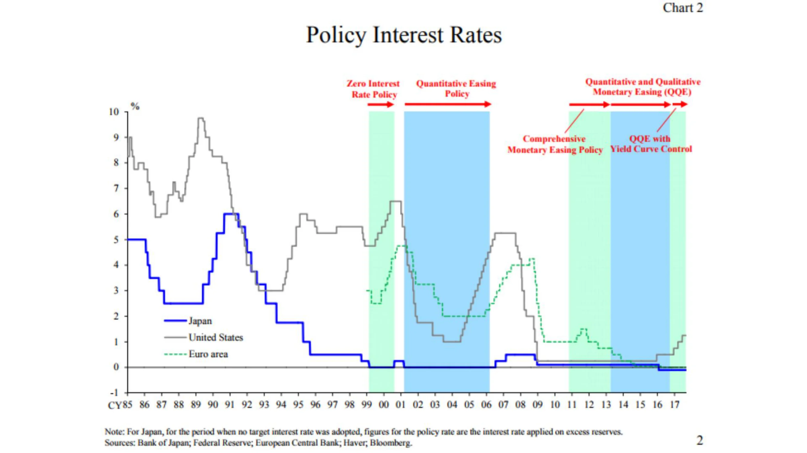

圖3：主要經濟體的利率 / 資料來源：ECB：歐洲央行

與許多人的預期相反，量化寬鬆計劃並未顯著恢復經濟增長，但卻使金融資產膨脹至歷史性水平。這主要使富人和金融機構受惠，因為他們已經持有大量的此類資產，從而擴大了貧富懸殊。考慮到前面解釋過的銀行體系結構，這個結果並不令人意外。由於銀行儲備無法輕易流入實體經濟，因此量化寬鬆計劃主要是提振資產價格，卻無法有效改善一般人的財務狀況。

### 康泰隆效應

儘管如此，我們還是可以從這個事件中得出一個基本的經濟原則：當新錢被創造出來的時候，它最初會讓那些最接近錢的來源的人受益，而讓那些離錢較遠的人受損。這一經濟觀點可以追溯到18世紀，當時理查德-康泰隆（Richard Cantillon）在他的 「一般商業性質論文」（Essay on the Nature of Commerce in General）中概述了這一觀點。它現在被俗稱為 「Cantillon 效應」。

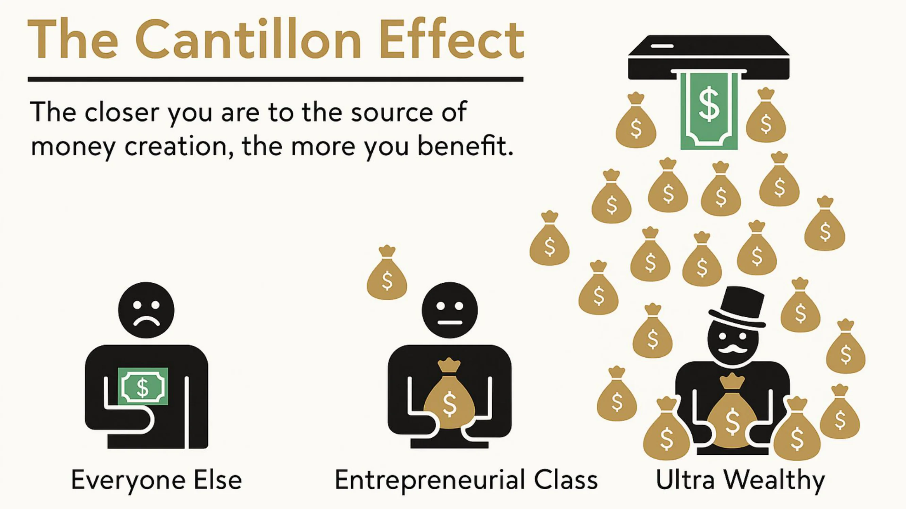

圖 4：簡要的康泰隆效應 / 資料來源：River Financial：大河金融

在這種情況下，銀行家、銀行高管、股票和債券持有者、房地產開發商、房地產貸款人以及任何持有金融資產或房地產的人都獲得了一筆財政意外之財，而負擔卻落在了其他人身上。這種情況持續多年，在很大程度上解釋了為何貧富不均日益嚴重、辛勤工作的個人感到權利被剝奪，以及儘管 GDP 增長乏力，但資產價格的上升似乎無法阻擋。

實質上，這個系統是歪曲的。銀行本質上就不穩定，但它們的倒閉會危及整個經濟。這種道德風險誘使銀行主管冒著過度的風險，使銀行的收入最大化，因為他們知道中央銀行最終會拯救他們，將成本轉嫁給納稅人。在這種情況下，中央銀行家創造條件，將購買力從辛勤工作的個人和儲蓄者大規模地轉移到資產所有者和與金融體系有關的人身上，從而使財富創造的過程與財富累積的過程脫節。

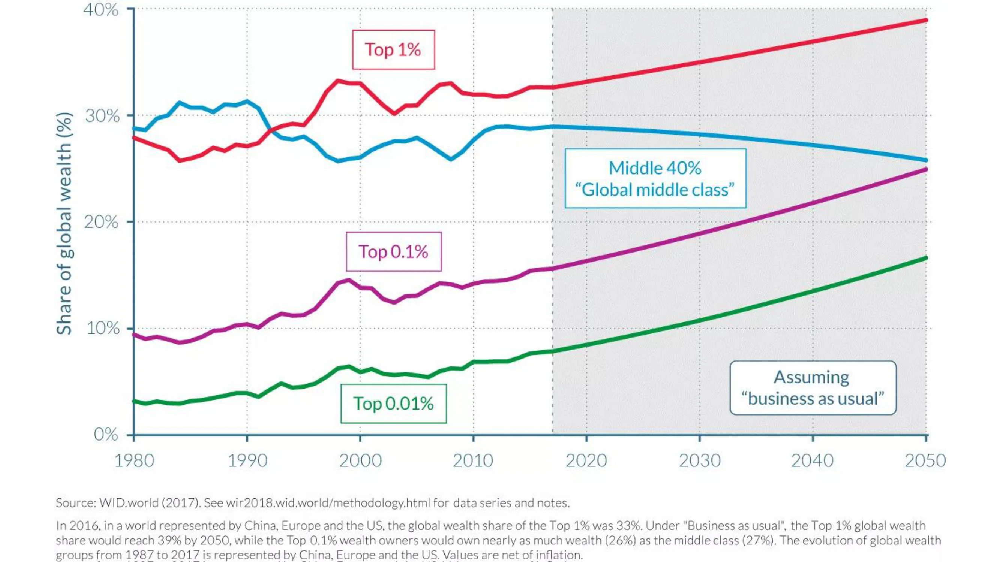

圖 5：中國 + 歐洲 + 美國的財富分佈 / 資料來源：OECD：經合組織

### 零利率政策的後果

在長期的零利率政策 (ZIRP) 期間，銀行重建股本的機會有限，因為他們的利潤被侵蝕了。銀行通常透過短期利率借貸和長期利率貸款來賺錢。然而，當中央銀行大量購買債券並將利率設定為零時，銀行就沒有什麼動力去放款，尤其是放款給企業家和其他風險承受者。相反，它們會分配資源，將現有資本證券化，或以抵押品提供貸款，以滿足那些受惠於康泰隆效應的人的需求。

ZIRP 的另一個意外後果是鼓勵政府大灑金錢。由於政府不需負擔借貸成本，並可仰賴中央銀行透過量化寬鬆計畫購買其債券，因此政府自然有誘因盡可能多花錢，尤其是在民主環境下，因為花錢可以贏得選票。這種趨勢往往忽略了這種財政揮霍的長期後果，導致自全球金融危機 (GFC) 以來，已開發經濟體的公共債務水準大幅增加。

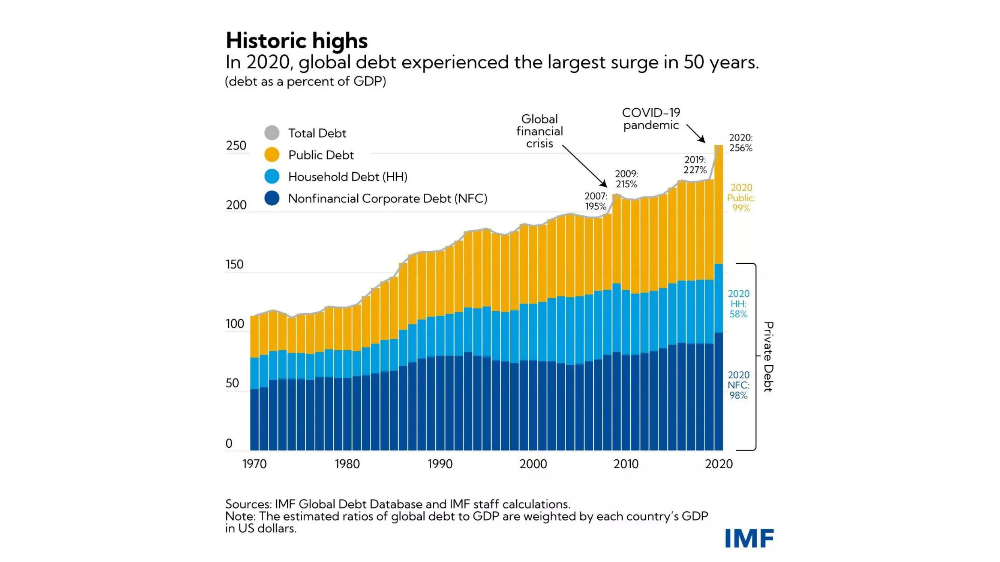

圖 6：公共與私人債務佔 GDP 的百分比（全球，以每個國家的 GDP 加權）/ 資料來源：IMF

由於 COVID 相關的鎖定措施造成大量貨幣創造，導致通貨膨脹上升，中央銀行家目前正提高政策利率，試圖抑制通貨膨脹。然而，這對整個體系構成重大挑戰。銀行的槓桿比以往任何時候都高，政府背負著史上最高的債務，經濟成長乏力，赤字不斷增加，而消費者面對生活必需品價格不斷上漲，生活艱難。控制通貨膨脹需要將利率提高到可能使政府破產的水準，而銀行則有可能因個人將儲蓄用於日益昂貴的生活必需品或尋求 Hard 資產和貨幣市場基金避險以對沖通貨膨脹而失去存款人。

### 總結

> "透過這種手段（部分儲備金制度），政府可以秘密地、不受監察地沒收人民的財富，而且萬無一失。
>

> 凱恩斯
本質上，我們的體系正面臨重大挑戰，而 Bitcoin 是唯一可信的替代方案。然而，單靠 Bitcoin 並不能解決我們貨幣體系內的問題。最重要的是，我們需要一些了解基本經濟原則的人加入 Bitcoin 的愛好者行列，讓我們有更廣泛的意識和經濟常識，引導我們遠離為我們的文明建構另一個脆弱的金融基礎。本課程的主要目的是教育新的 Bitcoin 發燒友正確的經濟原則。

為了達成這個目標，我們將解釋「奧地利經濟學」的基本原則，這個經濟學派的方法論傳統可追溯至 16 世紀，提供了在經濟限制下人類行動的洞察力。透過上述介紹，您現在已經掌握了貨幣創造的要點，以及我們的金融和貨幣體系的現況。

在接下來的章節中，我們將深入探討任何經濟學派的基礎基石：價值理論。接下來的章節將探討作為社會制度的貨幣、資本理論與商業週期、經濟計算的挑戰，以及奧地利經濟學派的歷史與方法論。

# 理論基礎

<partId>86012c1b-cdf2-586f-8fe7-263f8287e950</partId>

## 主觀價值觀

<chapterId>eb1608d4-5d36-56a0-bcfc-ed8c03dfa906</chapterId>

> "價值只存在於人類意識中
>

> Carl Menger，《政治經濟學原理
### 邊緣革命

經濟推理的根源在於價值問題。我們如何判斷事物的價值？價值是事物的固有屬性嗎？還是相反，它是一種主觀現象？我們如何比較兩種事物的價值？價值從何而來？

這些問題已經困擾了經濟學家和哲學家許多個世紀，也獲得了許多不同的答案。在許多方面，經濟學的認知論演進都是由價值理論的演進所帶動的。

古典經濟學家的勞動價值理論認為商品的價值來自於生產過程中的勞動量，在古典經濟學家的勞動價值理論反駁了理論家的土地價值理論（即所有價值都來自於土地）之後，輪到邊際價值理論取代後者。19 世紀 70 年代，在最後一位古典經濟學家馬克思之後，圍繞著邊際價值理論幾乎同時出現了三個新的經濟思想流派：以 Léon Walras 為代表的洛桑學派、以 William Stanley Jevons 為代表的現代或新古典學派，以及以 Carl Menger 為代表的奧地利學派。這場價值理論的革命構成了經濟思想的重大革新。

從左至右William Stanley Jevons、Carl Menger、Léon Walras

邊際價值理論認為，經濟價值與經濟代理人願意為下一個單位的商品或服務所支付的費用相符。由於此理論強調價格是在邊際形成的，也就是為了特定物品的下一個單位，因此被稱為「邊際主義」。

通常會把這三個學派的邊緣主義說成是相似的。的確，Walras 與 Jevons 高度一致，但 Menger 的理論卻與其他學派有著深刻的差異。在他於 1874 年出版、現在被視為奧地利經濟理論基礎的著作「Grundsätze des Volkswirtschaftlehre」(政治經濟學原理)中，門格對價值提出了邊緣主義的解釋，但主要是主觀的解釋，不像瓦爾拉斯與濟文斯認為價值是客觀且可量度的現象。

### 主觀價值

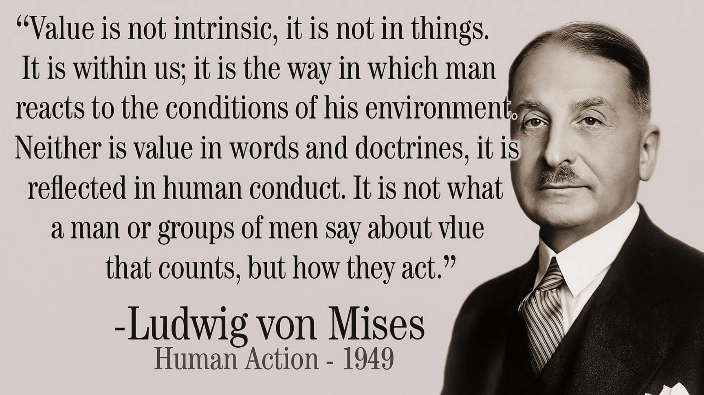

這位奧地利經濟學家駁斥了亞當‧斯密後繼者的觀念，放棄了商品的價值來自於生產過程中所使用的勞動量的觀念，轉而認為商品的價值是由個人決定的，而個人在每種情況下，都會對商品或服務的特定數量進行心理上的估價行為。門格所做的這個思想躍進挑戰了價值的客觀性：對他來說，價值不是商品的客觀屬性；它只是個人與該事物關係的結果：「價值並不存在於人類意識之外」。

換句話說，門格請我們考慮，價值只存在於個人的主觀心理現象中，價值不是商品的固有屬性，而是源自於個人對於他們可以從這些商品中獲得的效用的看法。

根據這種觀點，一公升的飲用水並無客觀價值。一個可以使用現代飲水系統，而且目前並不口渴的人，很可能只會賦予那額外一公升的水極少的價值，而一個在沙漠中口渴的人，視它為生與死之間的差別，肯定會願意賦予那一公升的水幾乎無限的價值。

總而言之，門格注意到經濟物品的價值不外乎是個人對該物品或服務的額外單位所給予的主觀估價。

### 自願性 Exchange：正和博弈

從這一點，門格推論出兩個人之間的自願 Exchange 之所以會發生，是因為雙方都相信這會增加他們的主觀效用。對他來說，Exchange 並不預設任何等價，這與古典經濟學家的看法相反。根據奧地利思想家的觀點，如果交換的物品之間有等值的效用，雙方一開始就沒有理由費心去交換。如果存在 Exchange，那是因為每一方都認為這符合他們的 (主觀) 利益，因此，每個自願的 Exchange 都會產生社會利益。

### 估值是人類慾望排序的現象

然而，這樣的社會利益，或是歸因於物品的主觀價值，是無法量度的。對門格來說，價值是一種比較（ordinal）而非量度（cardinal）的認知現象。它並不是如 Walras 和 Jevons 以來的新古典經濟學家所認為的，是個人對反映他們從中獲得的效用的數值的 Assignment ，而是一種人類欲望的排序行為，個人藉此表達他們對某一數量的 A 商品比某一數量的 B 商品有更強烈的慾望。

任何代理人都可以說他們是否比一門經濟學課程更喜歡 2 條香蕉，但沒有人可以合理地說，他們對 2 條香蕉的價值是 3.1416 utils，而對一門經濟學課程的價值是 3 utils，因此，他們更喜歡香蕉。這種以連續實數函數為基礎的人類偏好描述，並不符合我們日常生活中的認知過程現實。個人從來不會透過與抽象的效用標準比較，來評估呈現在他們面前的物品。相反地，他會主觀地比較不同的行動方案，雖然他無法以絕對的方式判斷這些方案，但卻可以根據這些方案的相對可取性來排序。

這種主觀的價值觀，被理解為個人與他的目標以及達成目標的相關手段之間的心理關係，也讓奧地利經濟學家得以解釋分工的現象。

### 分工

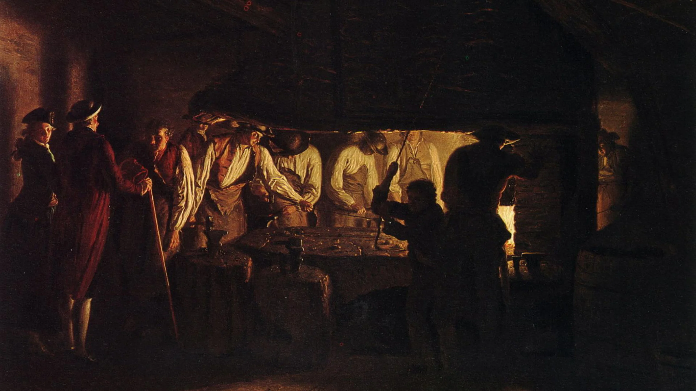

參觀釘子工廠，Léonard Defrance (十八世紀)

每個人都是獨一無二的，都有特定的個人情況。因此，每個人都擁有比他的同儕優勝的能力（絕對優勢），或是比其他同儕優勝的能力（比較優勢）。不可能不是這樣；否認這個基本事實就等於聲稱所有人在所有方面都是平等的。

如果一個人在生產某種商品的能力上比其他同業優勝（絕對優勢），他們就有興趣專門生產這種商品，然後用所得的盈餘來交換他們想要的商品。與生產所有他們想要的商品相比，他們這樣做能更經濟地滿足他們的主觀效用。

但也有可能個人在任何物品的生產上都沒有絕對優勢。在這種情況下，仍會有一些生產類型是個人比其他人優勝的（比較優勢），因此，他們仍有專精的興趣。

當然，有些人可以比他更有生產力地生產該特定商品，但由於這些人在另一項任務上的生產力可能比在這項任務上的生產力更高，而且由於他們無法同時執行兩項任務，因此對他們來說，從事這項任務而非他們生產力更高的另一項任務，是沒有生產力的。通过专门从事他们生产率最高的工作，他们将获得比不专门从事这项工作时更多的剩余，因此，通过Exchange，他们可以获得更多数量的那些其他商品，即使所获得的商品由他们自己生产会比从他们那里获得商品的生产者生产更有效率。

以醫師為例。他可能比他的秘書更擅長寫電子郵件和安排約會（相對優勢）。但是，花在這些工作上的時間都是他不能用來治療病人的時間。因此，由於他治病的生產力較高，即使他比副手更擅長這些工作，將行政職務委派給他人也符合他的利益，因為這樣可以讓他為他人創造最大的價值，進而創造自己的財富。

實質上，即使對於沒有絕對優勢的個人來說，專業化也是有好處的，因為時間是一種稀少的競爭資源：每花一個單位的時間在個人最有生產力的活動以外的活動上，就意味著一種成本，代表他們放棄的生產（機會成本）。

一旦個人專精於某種特定的生產，他們就可以保留他們認為個人消費所需的產品數量，並將剩餘的產品Exchange，以換取其他所需的商品。這樣一來，他們就滿足了對自己生產的商品的慾望，也就是說，剩餘的生產單位對他們來說就沒有什麼價值了。這就是經濟學家所說的邊際效用遞減：每增加一個單位的商品，其價值就比前一個單位低。對於缺乏這些物品的其他人來說，情況就不同了：基於相同的原因，他們傾向於對自己不生產的物品比生產的物品有更強烈的慾望。這就導致了個人的各種主觀價值之間存在強烈的不對稱性，而這種不對稱性非常有利於交換：每一方都有交換其剩餘生產的興趣，因為他們因此增加了自己的主觀效用。

前述分析的結果是，當個人專門從事其工作並參與交換時，其經濟狀況總是較好。因此，奧地利經濟學家，尤其是路德維希‧馮‧米塞斯（Ludwig Von Mises）的結論是：分工所產生的生產優勢，是社會合作過程的動力。在此，我們不妨直接引用他的話：

"帶來合作、社會和文明，並將動物人轉化為人類的基本事實是，在分工下進行的工作比獨立的工作更具生產力，而且人類的理性能夠認識到這一真理。[......」人們在分工下合作，不是因為他們彼此相愛，或是應該彼此相愛。他們合作是因為這樣最符合他們自己的利益"。

### 總結

> 「如果一個人看到自己被吊在絞架上 比坐在桌邊活得更舒適 他不上吊就像個傻瓜」
>

> 斯賓諾莎
1871-1874 年是現代經濟學的輝煌歲月：這段時期見證了三位對現代經濟學具有奠基性意義的獨立思想家的作品。奧地利經濟學家強調主觀順序價值，並發展出一套完整的經濟學思想，使他們有別於同類學者。奧地利經濟學家在稀缺性背景下推理人類行為的工作，將永遠與傑文斯 (Jevons) 和瓦爾拉斯 (Walras) 開創的經濟學說形成強烈對比，後者嚴重依賴數學，認為價值可以客觀測量並作為連續函數推導出來。

門格以主觀順序價值的洞察力為基礎，解釋了分工和自願 Exchange 的出現。然而，正如我們將在下一章所看到的，對於追求主觀效用最大化的經濟代理人來說，直接的Exchange是一個很差的策略。奧地利學派之父因此進一步發展了他的推理，以解釋為什麼貨幣會成為一種社會制度。

接下來的章節將介紹貨幣作為一種社會制度的出現、作為商業循環理論基礎的資本和利息理論，以及價格在經濟計算中的作用。

## 貨幣作為一種社會現象的出現

<chapterId>14ded794-0578-5478-ba5b-b2106c74f3ef</chapterId>

儘管個人對於專業化和最大化分工有著共同的興趣，但仍有一些協調問題限制了這種擴展。

首先，必須注意的是，由於製作過程本質上是有時間限制的，而且通常是非同步的 (非同時)，因此在個人的初始貢獻與收到對應品之間通常會有時間差距。在沒有事先保證其他人將來會滿足我們需求的情況下，現在就承諾執行特定任務可能會有風險。

在分工合作中，每一方都能從合作中獲益，但就個人而言，一個人可能會受到誘惑，享受他人的工作而不做出回報，因為這樣一來，他們就能獲得一些有價值的東西，而不需要付出任何代價。在博弈理論中，這樣的情況被稱為 「囚徒困境」，即相互合作的結果是個人獲得次佳收益，但團體獲得最大收益。

### 囚徒困境

最初，囚徒困境的表述如下：兩個無法溝通的嫌疑犯 Alice 和 Bob 面臨入獄的風險，可能的刑罰如下：

- 如果 Alice 指控 Bob，而 Bob 保持緘默，則 Alice 逍遙法外，Bob 則被判 3 年。
- 如果 Alice 和 Bob 都指控對方，他們各自被判 2 年。
- 如果兩人都保持沉默，則每人可被判 1 年。

這些結果可以用矩陣表示（數字結果表示監禁年數）：

| Alice / Bob | Accuse | Remain Silent | 保持沉默

| ----------------- | ------ | ------------- |

| **Accuse** | 2, 2 | 0, 3 |

| **保持沉默** | 3, 0 | 1, 1 |

在這個博弈中，沒有機會進行協調（溝通是不可能的）以達到雙方的最佳結果。因此，Alice 和 Bob 有個人動機指控對方，儘管這樣做並不能達到團體的最佳結果。兩人的最佳策略是保持沉默，各自被判 1 年徒刑。

這個遊戲說明了現實生活中經常遇到的一個問題：在沒有協調機制的情況下，個人傾向於選擇能使個人收益最大化的策略，而不考慮其他人選擇的策略（偷竊、欺騙、背叛、暴力等），即使有可能透過協調/合作達到更理想的平衡。

### 解決協調問題的資金

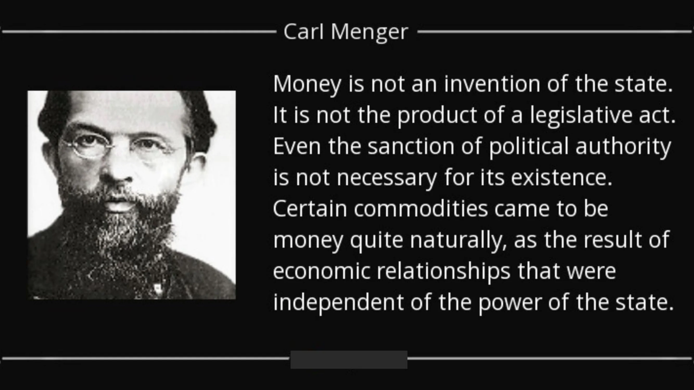

這個問題在小社群 (例如家庭、朋友圈) 中影響較小，因為在這種情況下，每個人都直接認識對方，因此有可能記住對方的貢獻。假設離開社群 (離棄) 會產生成本，則基於個別代理人記憶的信譽系統通常足以避免囚徒困境所造成的陷阱。

然而，當面對從分工中獲益良多的大型社區時，協調問題就會重新出現。這主要有兩個原因：

首先，人類的認知能力有限。一個人不可能與超過 150 個人維繫並記住穩定的社會關係，這使得聲譽系統不足以克服大規模的囚徒困境。

其次，在 Exchange 中，社會所接受的貢獻價值衡量（可稱性）是一個非小問題。舉例來說，如果一個人提供狩獵所得的肉類，並要求回報遮蔽用的材料，如何以等同於所要求材料的條件來評估所提供肉類的數量？質量也是一樣 - 鹿肉的價值是高於還是低於木材？

即使有可能為每對貨物建立令人滿意的 Exchange 比率，但維護這些資訊很快就會變得不切實際。在涉及 N 種貨品的直接 Exchange 系統中，需要記住 N(N-1)/2 個 Exchange 比率。對於有 50 種貨品的經濟體系，這意味著要記住 50/*49/2，或 1225 個 Exchange 比率，而間接交換只需記住 50 個。對於 100 種商品的經濟體，這個數字會增加到 4950。這樣的二次方關係對直接 Exchange (以物易物) 的可擴展性造成了額外的限制。

此外，由於這些交換並非即時發生，而是隨著時間而間隔，因此評估貢獻的時間會使貢獻的相對評估更加複雜。除了評估兩種現有商品之間的 Exchange 比率之外，還必須評估過去貢獻相對於未來貢獻的價值。

今天，儘管這樣的系統不切實際，但我們可以使用書寫或數位資料儲存來記住所有這些資訊，並建立一個信用系統（記錄過去的貢獻，包括這些貢獻的 Exchange 比率，基本上就是建立一個信用系統）。

在前文明時代，這些技術並不存在。因此，我們的祖先必須找到其他的解決方案，才能享受分工所帶來的好處，同時又不會讓自己陷入囚徒困境的負面後果。解決這個直接Exchange問題的方法就是由金錢促成的間接Exchange。

### 需求與可銷售性的雙重巧合

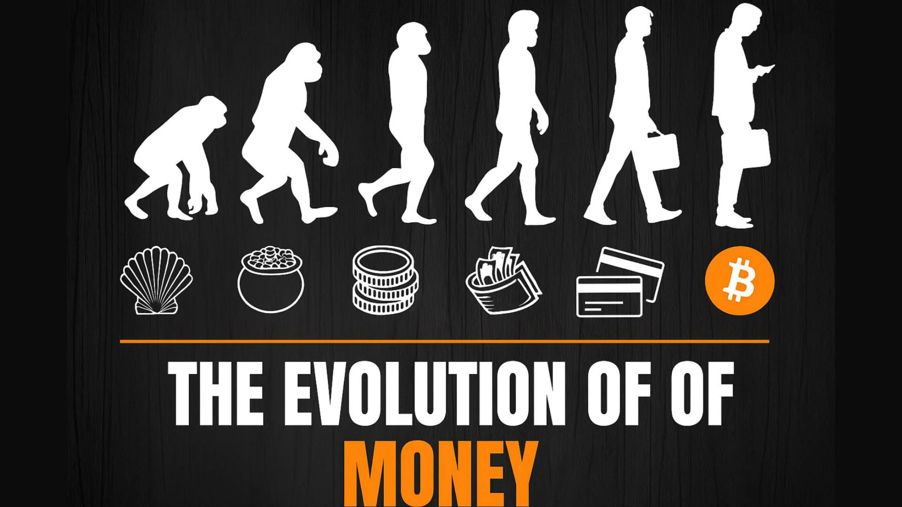

貨幣可以被視為我們的祖先為了解決 Address 經濟學家所謂的「欲望的雙重重合」問題而發現的解決方案。這個問題有三個層面：空間、時間和人際。

在 Alice 和 Bob 之間的直接 Exchange (以物易物) 中，他們都需要在同一時間和地點擁有對方想要的東西。使用間接 Exchange，也就是透過貨幣，Alice 可以向 Bob 購買，而 Bob 可以在其他地方、其他時間、和其他人使用該貨幣單位 (只要對方接受該形式的貨幣)。

為了讓物品能夠充當貨幣，它必須具有高銷售性，也就是說，它應該在大多數的時間裡，被盡可能多的人所渴求。使用高銷售性的物品，就可以從空間和人際層面解決需求雙重重合的問題：如果我用來當錢的物品在任何地方都被大多數人所需要，我就可以很容易地從地點和社會互動的角度來區分賣的行為和買的行為。

然而，基於兩個原因，長時間的可銷售性問題在解決上更具挑戰性：

首先，熵（通常稱為「時間效應」）會逐漸改變大部分具有直接效用的商品品質。因此，要維持商品的長期銷售能力，就必須具有高度的耐久性或對熵的抵抗力。

第二，物品在「t」時間的相對稀缺性並不保證其在未來的相對稀缺性。只要將足夠的資源用於特定的生產領域，人類就可以增加任何物品的 Supply。增加物品生產的唯一限制就是相關的機會成本。因此，物品目前的相對稀缺性無法保證其未來的相對稀缺性。只有邊際產量可以以非常高的成本增加的物品，才可能持續稀缺，這也是為什麼在人類歷史上自由出現的貨幣物品都有這個特性。

在前文明時代，各種物品如貝殼、工藝首飾、項鍊或珠子都可以當作貨幣。這些物品易於運輸、除了觀賞價值外沒有直接效用、抗熵（即不會隨著時間退化）、天然稀缺和/或需要大量的專門勞動力來生產。由於當時的分工程度很低，因此生產裝飾性藝術品的機會成本很高，這些物品無法大量生產。因此，那些使用這些物品作為金錢的人可以確保它們在未來的相對稀缺性。

我們狩獵-採集的祖先從事這些資源密集的工作，儘管這些工作並沒有產生直接有用的物品，這顯示出他們期望從擴大Exchange的空間、社會和時間範圍中獲得顯著的收益。如果情況並非如此，對他們來說，將這些資源用於建造住所、狩獵或其他活動比用於生產貨幣商品更有用，我們可能就不會發現這麼多有關這些手工藝活動的考古證據。其他更有效率地運用資源的族群會享有更好的發展和更大的繁榮，而這些手工藝活動很快就會消失，轉而生產直接有用的物品。

在這個意義上，貨幣商品的生產促進了勞動分工的擴展，代表了比所有其他替代方案（增加狩獵、捕魚、採集、木材生產、房屋建造、生產更多的狩獵和捕魚工具等）更有利可圖的資源運用（就個人的主觀效用而言）。

### 不確定性

為了結束我們對貨幣機構的分析，我們需要在未來不可避免的不確定性背景下，Address經濟行動的問題。

正如奧地利經濟學家所指出的，人類的行為是有時間限制的，而且總是面向未來。當個人採取行動時，他們會改變目前的狀況，希望獲得未來的滿足。這種心理投射可以朝向近期或遠期的未來，但個人若要投射到長期，就必須先確保短期的生活，因為他們近期的狀況會直接影響他們遠期的狀況。

這直接源於人類的理性；沒有人可以忽視時間現象的順序性，以及由此產生的時序依賴性，因為這是人類生活的基本限制之一。因此，由於未來對人類來說始終是不確定的，所以只有在短期生存得到保證之後，人類才會尋求長期生存的保障。

在這方面，貨幣允許在當前儲存價值，並將其轉移給未來的自己，在人類行動的跨時空協調中扮演著重要的角色。透過儲存金錢，也就是儲蓄，個人可以預防未來的不確定性，從而使自己的行動朝向更長的時間範圍。然而，只有當所使用的貨幣構成一種價值儲存時，他們才能達到這個目的，也就是說，貨幣具有長時間的可銷售性，如前所述，這是耐久且相對稀少的商品的特徵。

在下一章中，我們將深入探討時間偏好的概念，並解釋奧地利對利息和資本的看法，這將成為下一章有關商業週期理論的基礎。

## 時間偏好、利息和資本

<chapterId>37732a5c-4f66-5e2d-bc2c-cc8d29693af7</chapterId>

### 時間偏好

在上一章的結尾，我們解釋了經濟代理人如何利用最容易銷售的物品，也就是金錢，來避免未來的不確定性。我們還解釋了時間現象的連續性會讓我們逐漸與不確定性作鬥爭：只有當我們知道下個星期的生活有保障時，我們才能專注於更遠的未來目標。

或者換句話說：作為人類，我們會對未來商品的價值打折扣。

這種主觀評估未來貨品與現在貨品的價值，稱為時間偏好。在其他條件相同的情況下，現在的物品比未來的物品更受歡迎。因為我們都是凡人，而未來總是不確定的，所以我們很自然地會偏好現在就能獲得某種物品，而不是稍後。雖然由於文化、財富、教育、生理等多種因素，個人的時間偏好可能會有所不同，但時間偏好總是正向的，這意味著在其他條件相同的情況下，我們總是更看重現在的物品而非未來的物品。

這種未來商品相對於現在商品的相對估值概念，是利息現象的根源。事實上，在一個資本市場未受操控的經濟體系中，參考利率（被認為是無違約風險的）是在資本 Supply 與需求的交叉點上決定的。因此，這些利率代表整個經濟體的時間偏好狀態：利率上升的結果是資本需求相對於 Supply 的增加，表示時間偏好較高。相反，利率的降低是由於儲蓄的增加，也就是資本 Supply 的增加，表示時間偏好的降低。

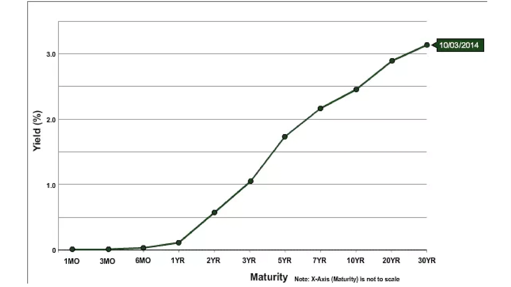

在利率不受中央銀行操控的經濟體系中，我們往往會觀察到向上傾斜的收益率曲線：債務期限越長，利率越高。相反的情況不可能發生，因為這意味著未來比現在更確定，而這在邏輯上是不可能的。

時間偏好的概念，以及我們如何透過消費和儲蓄來表達自己的時間偏好，是資本分配和生產過程的基礎。讓我們從 Menger 的學生 Eugen von Böhm-Bawerk 及其資本理論來瞭解時間偏好如何影響生產組織。

### 資本理論

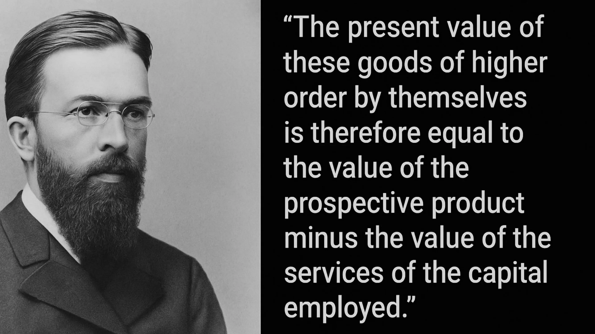

在本課程的開頭，我們看到，對 Carl Menger 來說，貨品之所以被視為經濟貨品 (有價值的)，只是因為它們是達到個人所選擇和重視的目的的手段。根據這個觀點，所有的經濟分析都圍繞著消費，因為消費最終是所有經濟活動背後的動機目標。因此，對門格來說，經濟分析的起點是消費品或最終商品，因為它們代表了經濟活動的最終目的。經濟體系中的所有其他商品，我們可以稱之為「中間商品」，它們之所以有價值，只是因為它們能讓個人獲得這些消費品：它們是用來生產其他商品的商品。

為了生產消費品，企業家將這些不同的中間產品與原始生產要素 (勞動力、土地和資本) 依據一個模式結合，使結果產量最大化。這種由企業家所做的安排，或稱為生產結構，包含了各種不同的階段，在這些階段中，中間產品會經歷各種轉變，直到最終成為消費品。

因此，我們可以像門格（Menger）一樣，將消費品定義為一階商品，將前一階段所涉及的商品定義為二階商品，將前一階段所涉及的商品定義為三階商品，如此類推，直到達到原始要素（土地、勞動、資本）。我們所考慮的階段數目根本上取決於企業家所採用的生產結構，而不應被視為生產結構的客觀特徵。相反，生產階段和中間產品只存在於目的論的背景下：行為者預見了一連串的行動，透過這些行動，他們將達到預期的目標，他們在心裡將自己的行動分成連續的階段。

人類行動的時間性強加了這種依序模式進行行動的心智投射特徵。人類所採取的每個行動都需要時間；立即行動是不可能的。因此，行動者總是要在需要較多或較少時間的行動模式中做出選擇。

因此，由於個人必然有正的時間偏好，也就是說，相較於未來的物品，他們更偏好現在的物品，因此，只有當所獲得的結果對他們來說，比走直接路徑所能獲得的主觀價值更高時，他們才會選擇較長的路徑。否則，沒有人會採用更耗時的方法：在同等結果下，最短的路徑仍然是首選。

由於人類行動的順序性質，這些跨時空的選擇總會對行動順序產生影響。換句話說，我所採取的短期行動從屬於我所設定的長期目標，我的短期行動會影響我未來能做的事。這個關於生產活動的顯而易見的觀點的含意是，任何生產迂迴，也就是生產結構的任何延長，都需要事先節省。如果我決定在當前分配更多的資源以達成未來的目標，我必須先預留在我的投資所需時間內可以維持我的生活的資源。

為了說明這一點，讓我們重溫一下 Böhm-Bawerk 在其著作《資本與利息》中所舉的例子：

Eugen von Böhm-Bawerk (1851-1914)

### Robinson Crusoe 和 Production Detour/Roundabout：

羅賓遜漂流記》殘骸中的登陸物品，John Alexander Gilfillan (1793-1864)

在書中，這位奧地利經濟學家透過一個以孤島上的魯賓遜漂流記（Robinson Crusoe）為基礎的思想實驗，邀請我們思考生產迂迴中固有的跨時期權衡問題。

羅賓遜就像原始人一樣，靠覓食和狩獵來維持生計。讓我們想像一下，魯賓遜可以在八小時內採集到足夠自己一整天食用的漿果。在這樣的條件下，他幾乎沒有時間進行其他活動。然而，羅賓遜相信只要製作一根木桿，他就可以輕鬆地敲下漿果，只需要四小時的工作就可以獲得他一天的食物。此外，他估計製作這根木柱需要五天的時間，每天工作兩小時。因此，他的結論是，他需要將五天的漿果產量的 1/5 儲存起來，或者每天多花兩小時採集五天的漿果，才能儲存足夠的漿果，讓自己在製作木柱的時間內維持生計。

如果他沒有事先儲蓄，Robinson 將無法完成他的竿子，可能會在此期間死亡。

因此，在這五天裡，他犧牲了兩小時的休息時間來收集更多的漿果。這段時間結束後，他有足夠的漿果，就開始製作木柱，每天工作兩小時，一連工作五天。工作完成後，他可以在 4 小時內獲得足夠的漿果，而不是 8 小時，讓他可以利用每天剩餘的 4 小時進行其他活動。

這樣一來，羅賓遜就走了生產的彎路：他沒有直接採集漿果，而是投入精力生產一種資本物品，使他未來的生產力更高。然而，他必須做出短期的犧牲，也就是儲蓄，才能達到這個目的。否則，他就無法完成他的資本物品。然而，這種短期的犧牲為他提供了顯著的優勢，因為一旦裝備了他的竿子，他每天就能增加 4 個小時（直到竿子過時為止）。每天多出的這 4 個小時讓他可以製造更多資本商品，例如狩獵工具或漁網，逐漸改善他的處境。

### 總結

換句話說，在《魯賓遜漂流記》的一人經濟中，透過犧牲現在的滿足來儲蓄，才能累積增加生產力的資本。在這種情況下，儲蓄，也就是延遲現在的滿足感，就是為了增加未來的滿足感所付出的代價。這意味著，在這種情況下，儲蓄是任何經濟發展的前提和必要條件。

這是一個誘人的概念，雖然很簡單：生產結構的任何擴展都需要事先儲蓄（因為這種生產所需的商品不會從天上掉下來），因此，我們儲蓄越多，就能累積越多的資本，進而轉化為生產力的提升，產生更多的商品。因此，奧地利經濟學家認為，降低時間偏好是儲蓄 -> 更多的資本商品  更高的生產力  更多的商品 = 更高的生活水準 -> 降低時間偏好的良性循環的起點。

現在，正如第一章所提到的，利率已經被中央銀行操縱了數十年，而商業銀行則在沒有預先準備金的情況下提供信貸，這意味著利率並不代表我們的時間偏好，也造成了儲蓄豐裕的假象。

下圖完美地說明了這一點：長期利率低於短期利率。首先，這完全說不通，因為這意味著未來比現在更確定。其次，這需要探討資本分配的後果：如果每個人都被激勵去做儲蓄，就好像儲蓄是充裕的一樣，而儲蓄者卻因為儲蓄沒有獎勵而不知所蹤，這會對經濟產生什麼後果？

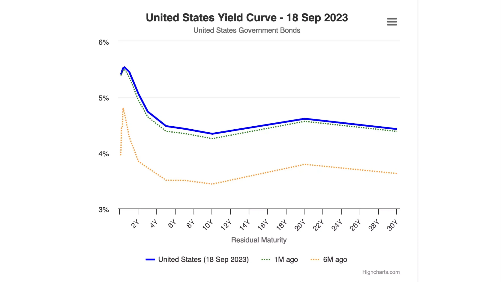

這是我們在下一章專門討論奧地利商業週期理論時會發現的！

# 奧地利經濟觀點

<partId>ad0fce42-2556-56b8-a093-5b4fcacc7cf3</partId>

## 奧地利商業週期理論

<chapterId>718afaa8-ce78-58aa-9477-073eef0bd137</chapterId>

> "通貨膨脹的銀行信貸膨脹持續的時間越長，資本貨物的不良投資範圍就越大，清算這些不健全投資的需求也就越大。當信貸擴張停止、逆轉，甚至顯著減緩時，不良投資就會顯現出來"。
>

> 路德維希-馮-米塞斯
Ludwig Von Mises 是 Böhm-Bawerk 最有成就的學生，也可說是 20 世紀最重要的奧地利經濟學家，他使用 Böhm-Bawerk 的資本推理來解釋經濟週期的成因與動力。米塞斯的門徒哈耶克 (Friedrich A. Hayek) 後來將這個推理延伸至其邏輯結論，並因此在 1974 年獲得諾貝爾經濟學獎。

米塞斯和哈耶克以儲蓄的增加作為分析的起點。正如我們在前面幾章所看到的，任何儲蓄的增加都必然導致消費的相應減少，從而降低消費品的相對價格。這會產生兩種效果：第一，由於消費品價格相對下降，實際工資上升，導致資本商品需求增加；第二，在最遠離消費的生產階段（低階段），企業利潤增加。當實際工資上升時，企業家會被激勵使用更多的資本貨品來節省勞動力，這就會對資本貨品產生更強的需求，生產這些低階貨品的企業家也會獲得更高的利潤。因此，在儲蓄增加（即時間偏好下降）的情況下，利率下降，促進了更多生產階段的發展，提高了生產力。這是典型的 Böhm-Bawerkian 生產迂迴，也是非常理想的結果。

然而，這兩位奧地利經濟學家思考的是，如果作為生產迂迴路線起點的利率下降不是由於儲蓄增加，而是由於信貸擴張，那會發生什麼？

在部分儲備金制度下，信貸擴張不需要儲蓄的相應增加。因此，企業家可以募集更多的資金，從事迂迴的生產，即使時間偏好維持不變，也就是消費不會減少。對哈耶克和米塞斯來說，這種情況必然會導致經濟代理人之間出現重大的協調問題。由於缺乏自由市場利率，這些問題可能不會立即顯現，但長期而言，資本的錯誤配置應該會產生實質的後果：經濟衰退。

為了儘可能清楚地描述這種時空錯配的現象及其後果，我們將依賴一個生產結構的模型，觀察它如何受到影響，首先是儲蓄增加所導致的利率下降，然後是信貸擴張所導致的利率下降。

### 儲蓄增加導致利率下降：

為了方便說明，我們將回歸 Menger 的商品分類，並在一個由任意數量階段組成的圖表上表示生產結構：

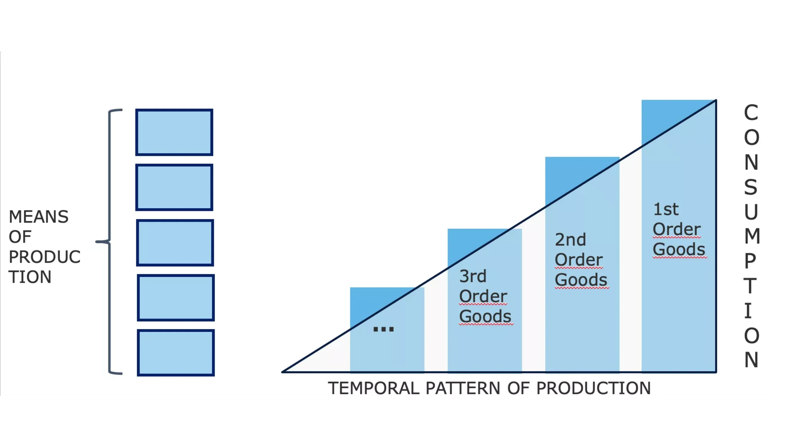

在上圖中，初始資源經過不同的生產階段，經歷轉換，使其更接近最終消費品的狀態 (透過與原始生產要素的互動：時間、土地、勞動力)。三角形右邊的高度示意性地代表 GDP，因為它表示一個時期內所有銷售的消費品總和。每條柱子之間的差距對應於流程中每個階段所產生的附加價值（以貨幣計算）。此差額也可視為與每個階段相關的收入 (收入 - 成本)。

如果在總體層面，經濟代理人增加他們的儲蓄，最終消費品的數量就會減少 - 在其他條件相同的情況下，儲蓄必然涉及將個人的部分消費推遲到較後的日期。因此，利率將會下降 - 因為資本的 Supply 正在增加，讓企業家可以利用這些流入的資本來創造新的投資品，進而延長生產結構。

這樣我們就會得到一個擴展的生產結構，這個變化可以用下面的圖表來定性表示：

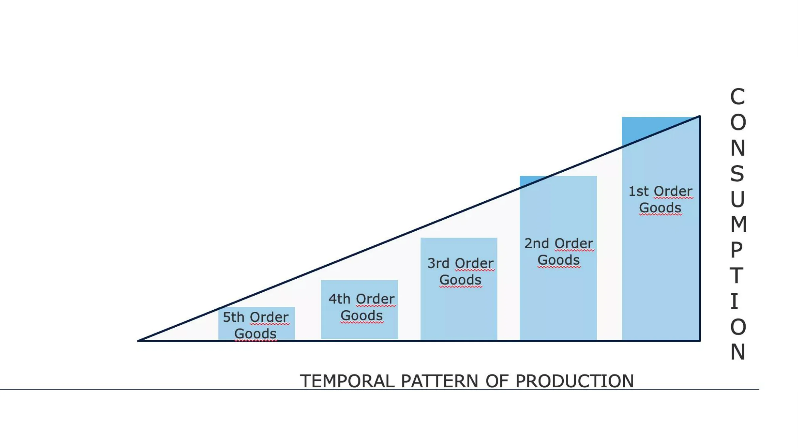

在這種情況下，所需的消費品的貨幣價值下降，騰出資源來創造更多的生產階段。在這種情況下，利率的下降是消費減少（即儲蓄增加）的結果，代表流通中的貨幣數量的三角形面積保持不變。生產結構的轉變 (加長) 只是購買力從結構的一部分轉移到另一部分的結果。

此外，值得注意的是，消費品需求的減少在中期內會造成消費品價格的下降，而非最終產品數量的減少。這是因為消費品需求下降後，生產結構的最後部分不會立即調整；企業家需要一些時間來改變他們的計劃和投資。由於他們持有存貨，需求下降將迫使他們以折扣價出售這些存貨，因此，儲蓄盈餘最初會導致消費品價格下降（即實際工資增加）。

相反地，投資商品的價格會上升，因為購買力轉移給企業家，使他們能夠增加投資支出。一旦這些由儲蓄者轉移給企業家的儲蓄被企業家花掉，利率就會再次上升（因為資本的 Supply 減少），進而導致投資品的價格降低。事實上，在這段生產迂迴結束時，相對價格將與之前大致相同。但整體而言，經濟參與者都會受惠：生產結構加長所帶來的生產力提升，會以較低的單位價格提供消費者更多產品；儲蓄者的購買力會提升，部分來自利息收入，部分則因為消費價格降低；與此同時，企業家整體來看，既不會獲利，也不會虧損。從事最接近消費活動的企業家會損失收入，而創造新的生產階段的企業家則會按比例獲利。在這種情況下，不會創造新的貨幣收入；增加的是生產，因此收入的實際價值也會增加。

### 因信貸增加而導致利率下降（儲蓄不增加）：

現在，如果我們考慮到銀行提供的信貸擴張所導致的利率下降，我們會得到一個非常不同的生產結構圖景。

隨著利率降低，企業家可以借到更多資源，從而創造更高階的生產階段。在這種情況下，生產結構的擴展不會導致消費減少，因為消費者沒有延遲目前的消費。換句話說，GDP 會成長。因此，我們的三角形將會加長，而高度則維持不變，這表示三角形的面積將會增加。

請注意，這是信貸擴張完全符合邏輯的結果。只要銀行藉由提供貸款來產生信託媒體，我們就應該很自然地預期整體購買力會增加。

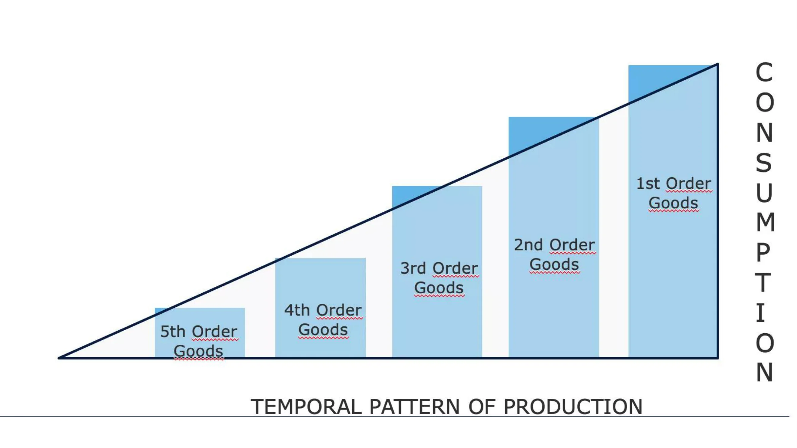

當信貸透過向企業家提供貸款而進入經濟體系，我們應該可以觀察到遠離消費的生產部門的利潤會增加，而較接近消費的部門的相對利潤則會減少。較高的利潤會支持資本重新分配到這些新的、資本密集的階段 (造船、汽車、建築、先進技術等)，而較接近消費的部門的投資則會減少。

現在，參與這些較高階段生產的企業家賺取更高的貨幣收入，而且，由於時間偏好維持不變，我們也應該看到消費產品的需求增加。但由於在這段景氣期間，遠離消費的部門的投資資本相對利潤較高，因此資源從接近消費的活動轉移到較遠的活動。因此，生產階段較低的企業家缺乏資源來滿足增加的需求。由於消費需求代表更迫切的需求，在某個時候，從事遠離消費活動的企業家會缺乏完成投資所需的資源。這些部門的利潤率開始下降，企業破產，消費價格的相對上升促使資本迅速重新分配，轉向生產低階商品。當這種突然的資源重新分配表現出來時，經濟就會進入衰退：資產價格下跌、實際工資下降、消費者價格下跌、存貨囤積。

對 Friedrich Hayek 和 Ludwig von Mises 來說，經濟衰退是擴張階段資本錯配的表現。由於儲蓄與資本的價格被操控，企業家發展了因缺乏資源而無法完成的專案，及/或建立生產力規劃未來的消費水準，但因缺乏儲蓄而無法維持。

唯有透過通縮，也就是資產價格與工資價格的下降、利率的提高，以及未完成專案的清算，才能讓經濟重新調整，朝向永續的道路發展。因此，經濟衰退就是這種繁榮假象的消散，並引發激烈的重新調整過程。

一般而言，經濟衰退是由銀行業本身引發的。只要信貸加速增加，價格就會持續上漲，企業家就會爭奪生產資源。然而，正如 Hyman Minsky 所指出的，銀行業會在某個時候決定降低風險，因此減少信貸流量。因此，蕭條導致許多人破產、信貸緊縮、可用購買力下降以及金融崩潰。

這樣的調整可以被視為一段期間，在這段期間，消費不足與投資不足被強制執行，以重建缺失的儲蓄。在哈耶克看來，這個蕭條階段雖然痛苦，但卻是非常必要的，因為它可以讓經濟活動在相對價格結構的基礎上復甦，反映出生產要素的實際稀缺性。如果這個蕭條階段被中斷，經濟就無法回到理想的路徑，因為在缺乏資訊系統讓經濟活動主 體能夠合理化他們的決策的情況下，資源的錯誤配置只會持續下去。

不幸的是，這種蕭條機制經常會被政治權力和中央銀行透過赤字支出和寬鬆貨幣政策尋求「提振」經濟的做法所干擾。

對於貨幣主義者和凱恩斯主義者來說，造成蕭條的原因是總需求不足，因此兩者都不注意相對價格的演變，而我們已經看到，相對價格的演變才是問題的核心。因此，他們認為提供信貸擴張的誘因（降低利率），並利用國家的赤字能力來刺激需求，就能啟動復甦。短期而言，這些措施似乎能產生預期的效果：赤字支持支出，而利率降低則導致資產價格上升，進而鼓勵資產持有者增加支出。然而，這種刺激作用最終會逐漸減弱，而結構性問題仍然存在，甚至會因為人為的低利率導致資金配置失當而惡化。

在現代社會中，中央銀行和政府一直熱衷於阻止這種調整過程的顯現，結果導致了大規模的結構性失業和永久性的債務累積。日本就是一個例子。在 1989-90 年資產泡沫爆破之後，日本央行 (BoJ) 和各屆政府使用了本文所描述的所有方法，試圖「重新啟動日本經濟」。除了在支出計畫和減息之後的短暫飆升之外，日本 30 年來一直處於神經衰弱的成長和負債過重的狀態。

### 商業週期理論的結論：

路德維希‧馮‧米塞斯 (Ludwig Von Mises) 和弗里德里希‧哈耶克 (Friedrich Hayek) 強調人類行動的連續性，並特別注意利率波動對經濟代理人跨期協調的影響，他們將經濟週期解釋為部分儲備金制度的內生動力。奧地利的分析與貨幣主義者及凱恩斯主義者的分析之間的差異，主要在於前者特別注意生產的各個階段及相對價格的結構，而後者則止於總體變數，如就業水平、國內生產總值或消費者物價指數。事實上，由於缺乏資本理論，主流經濟學家傾向於將經濟衰退的原因歸咎於「動物精神」或「外部事件」。

與其他經濟學派相比，奧地利學派更堅持相對價格對於協調經濟代理人的重要性。一個多世紀以來，奧地利學派的成員一直被拖進有關這個問題的爭論中，尤其是自從米塞斯在 1919 年發表了他的著作，指出在社會主義經濟體系中，經濟計算是不可能的。

這將是本課程下一章，也是最後一章的主題。

## 社會主義下經濟計算的不可能性

<chapterId>2578a9d8-90e9-58dd-a8c5-6366948564c7</chapterId>

> "在生產要素沒有市場價格（因為它們既不買也不賣）的情況下，在計劃未來的行動和確定過去行動的結果時，不可能求助于計算。社會主義的生產管理根本不知道它所規劃和執行的，是否是達成目標的最適當方法。它會在黑暗中運作。它會浪費稀少的物質和人力（勞動力）生產要素。結果必然是混亂與貧窮。
>

> Ludwig von Mises，《計畫混亂》（Planned Chaos
### 社會主義下經濟計算的不可能性

儘管馬克思主義政體在上個世紀一再失敗，經濟計算的爭論仍然具有相關性，原因有二：

1.進步主義者和其他干預主義者仍在鼓吹類似的想法。

2.無論是在資本市場上透過中央銀行家的行動，或是在其他市場上透過國有企業、法令、監管委員會的干預來操縱價格的情況，都持續盛行。

### 經濟計算辯論

這場爭論最初是由 20 世紀最有影響力的經濟論文之一，由路德維希‧馮‧米塞斯 (Ludwig von Mises) 於 1920 年發表的「社會主義聯邦的經濟計算」(Economic Calculation in a Socialist Commonwealth)所引發。在那個時代，社會主義正在崛起，布爾什維克在俄羅斯奪取了政權，社會主義者在魏瑪共和國（德國）上台，社會主義和共產黨在歐洲各地逐漸崛起。

在米塞斯的文章發表之前，社會主義與資本主義的爭論主要圍繞道德爭論與激勵問題。即使我們假設一個依據馬克思主義「各盡其能、各取所需」原則組織的社會在道德上是優越的，但「誰來倒垃圾」這個實際問題仍然需要解決。普遍的回應是，社會主義會培養出沒有資本主義本能的個人，即使在沒有金錢獎勵的情況下，也會心甘情願地為同伴服務。

米塞斯在他的文章中為這場辯論引入了一個新的層面。這位奧地利經濟學家撇開政治經濟創造「新人」能力的烏托邦觀念，指出沒有中間生產要素的價格，就不可能有合理的經濟組織。即使到了今天，他的批評者，甚至一些自由經濟學家，對他的論點仍然理解不深。因此，我們值得更詳細地解釋。

### 解釋經濟計算的不可能性

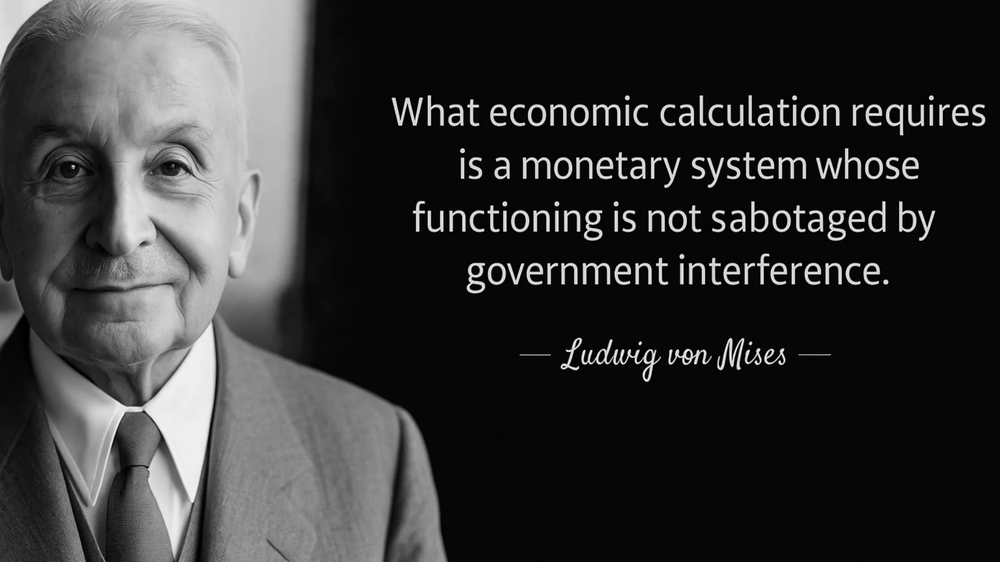

大部份對米塞斯論點的誤解，都來自於對資本主義經濟中管理階層和企業家所扮演角色的誤解。米塞斯從未否定管理階層在其營運中設計有效生產計劃的能力。相反地，他強調企業家和股東的重要性，他們身為生產工具的所有者，在不同產業間分配資本，進而形成價格，作為管理者經濟計算的投入。

如果沒有資本與貨幣市場，就不可能在各產業間合理使用資源。這意味著，即使每個公司或經濟體的子部分都有完美的組織，整個經濟體也無法有效率地因應資源可用性、生產條件和消費者偏好的改變而調整。用米塞斯的話來說：

> "[...][市场社会主义]建议中隐含的主要谬误是，它们从次要职员的角度来看待经济问题，而次要职员的知识视野并没有超越从属任务。他們認為工業生產的結構，以及資本在各行業和生產總體的分配是僵化的，沒有考慮到改變這個結構以適應條件變化的必要性....。他們沒有意識到，公司管理人員的工作僅僅是忠誠地執行他們的老闆--股東--交託給他們的任務....。經理人的運作、他們的買賣，只是整個市場運作的一小部分。資本主義社會的市場還進行那些把資本貨物分配到各個產業部門的運作。企業家和資本家成立公司和其他企業，擴大或縮小公司規模，解散公司，或與其他企業合併；他們買賣已有公司和新公司的股票和債券；他們授出、收回和收回信貸；簡而言之，他們執行所有這些行為，這些行為的總體稱為資本和貨幣市場。正是這些發起人和投機者的金融交易，將生產引導到那些以最佳方式滿足消費者最迫切需求的渠道"。
>

> Mises, Human Action, pp.
基本上，米塞斯認為，財產權將資本所有者置於利潤與虧損的環境中，促使他們將資源分配到目前最需要資源的產業，以滿足消費者的需求。當他們成功時，他們會獲利；但當他們失敗時，他們會蒙受財務損失。他們在遊戲中的「利益」鼓勵他們為當前的經濟狀況推測最佳的資金配置。這創造了一種市場驅動的動力，在這種動力下，他們行動的集體結果產生了關於資源最有效運用的重要資訊。

之前的章節已經解釋過，價值是主觀的，經濟行為揭示了機會成本，而消費價格表達了消費者需求的順序層次。企業家在競爭生產要素時，必須建構能使收益最大化、成本最小化的生產結構，才能比其他選擇更有效地滿足消費者的需求。因此，生產要素的價格來自於消費者價格：如果某生產要素在其他產業或不同的計畫下可以獲得更高的貨幣收入 (更能滿足消費者的需求)，企業家就會出價擊敗目前的所有者，將其價格提高到邊際生產力。企業家之間對生產要素的這種競爭，決定了其最高的邊際產量，是一個產生資源分配相關資訊的過程。

這個過程非常重要，因為它可以驗證或否定各種活動的效率，確保生產要素被分配到最具生產力的用途上。市場是一個持續不斷的過程。在一個不斷變化的世界中，消費者偏好、生產條件、技術、法規、人口結構等等都在不斷變化，而中間生產要素的價格也會隨著企業家和資本家適應環境變化的行動而不斷改變。由於這些變化是局部性的，因此必須將資訊傳播給不可能完全掌握整個世界的經濟代理人。這就是市場的作用：它允許企業家根據局部的、通常是定性的、複雜的資訊，提出經濟生產結構的建議，然後由市場確認或否定這些建議。如此一來，由這個由下而上的過程所產生的相關資訊，透過價格系統被濃縮並分佈到整個經濟體系。這個資訊製造與分發的過程對於資源分配是非常重要的，因為它能讓對世界所知有限的經濟代理人，依賴價格來進行經濟計算，並制定連貫的經濟計畫。

從這個角度來看，中央計畫經濟體必然會發生資本配置失當的情況。在中短期內，由於沒有市場價格或破產來揭露這些錯誤配置，因此可能不會被察覺。然而，由於缺乏回饋（價格）和再分配機制（破產），錯誤將會累積，直到生活條件大幅下降，浪費才會顯現出來。

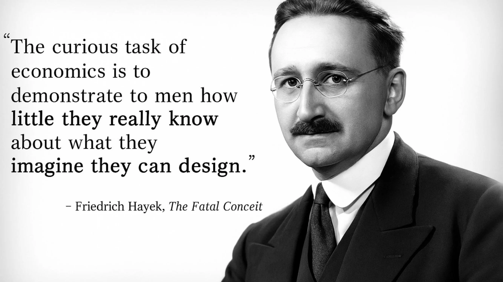

### 奧地利觀點與其他經濟學派的失敗

有人會說，在事後看來描繪這樣一幅全景圖很容易。畢竟，我們都知道蘇聯的空貨架、委內瑞拉的艱難、柬埔寨的人道災難。但是米塞斯早在1920年就預見了這些事件。然而，直到1989年蘇聯解體之前，許多經濟學家，包括無數諾貝爾獎得主，都在讚美蘇聯的經濟奇蹟，並預言蘇聯的經濟很快就會超越美國。

儘管這種預測令人印象深刻，也有許多實證證明在社會主義下，經濟計算是不可能的，但全世界的政治領袖卻比以往更熱衷於訂定價格、將整個產業國有化，以及提出五年計畫，而這些計畫往往獲得不懂經濟的民眾的喝采。這種干預主義的後果，讓昔日繁榮的西方國家人民深切感受到，他們的生活水準正在慢慢下降。

### 奧地利商業週期理論作為社會主義下經濟計算不可能性的具體案例

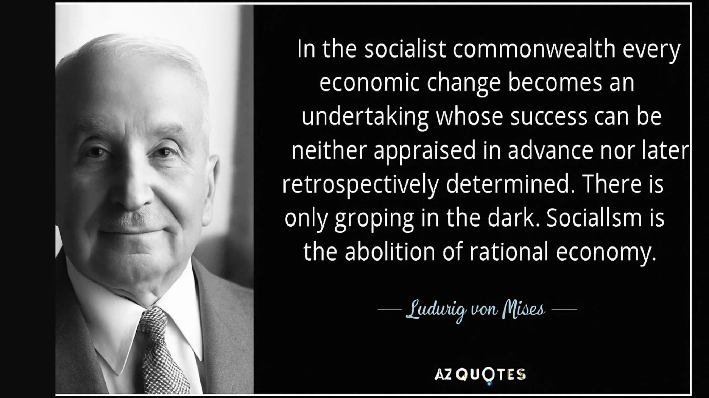

在前一章中，我們闡明了中央銀行操控利率所導致的過度投資和資本錯配的動態。基本上，我們所解釋的可以被視為社會主義下經濟計算不可能性的一個特定案例，並應用在貨幣市場領域。當價格被固定在其市場價值之外時，企業家和資本分配者就會被激勵去做一些因為缺乏儲蓄而無法長期維持的投資。透過干擾價格系統，中央計畫者（在此為中央銀行家）在經濟主體之間製造了錯誤協調。在這個例子中，時際錯配導致高階投資品投資過多，而低階投資品投資不足，也就是產業間資本錯配的具體表現。

這種錯誤配置的後果包括金融和經濟危機、經濟活動減少和債務通縮。這些宏觀經濟效應源自於信貸擴張導致的儲蓄與投資失衡。在蘇聯和其他共產主義體系，價格固定也導致類似的協調失當，造成某些商品短缺，另一些商品生產過剩。在這兩種情況下，無論是在時間偏好或消費偏好方面，價格都無法反映消費者的真正偏好，導致負責資源分配的企業家或中央計畫者將資本投資在「錯誤的產業」。

今天，經濟計算的爭論主要在能源的討論中再次出现，Green 議程驅使的惡性投資日益明顯。奧地利經濟學家指出，主流經濟學家未能預測的 2008 年危機，是典型的盛衰循環，其特點在於房地產市場因長期低利率而出現過度投資。此外，新馬克思主義者和其他社會主義派別宣揚人工智能的出現可以解決經濟計算問題的觀點。然而，這種觀點源自於對問題的錯誤理解；經濟計算問題並非計算能力的問題，而是與生產和資源分配相關的資訊的產生與分配問題。這些資訊只能由擁有專門知識且對結果有既得利益的代理人在本地產生。人工智能無法取代這個由下而上的過程，因此也無法幫助中央規劃者解決資源分配的問題。不幸的是，由於一個世紀以來的誤解，我們預期人工智能將帶來一個新的經濟繁榮時代，由開明的中央規劃者領導，在人工智能的協助下，糾正自由市場的失敗。

若要將經濟計算問題具體應用於現代情況，您可以參考這篇文章，以解決現代中國的資源分配問題。

> 金融鎮壓之路：紙老虎中國》，Theo Mogenet，https://open.substack.com/pub/theomogenet/p/the-road-to-financial-repression-181?r=ccpx8&utm_campaign=post&utm_medium=web
### 總結

在最後一章，我們探討了社會主義下經濟計算的不可能性，這是奧地利經濟學派的核心信條。本課程所提出的奧地利觀點將此結論推向高潮，並為不干預政策提供了有力的論據。奧地利思想的核心，都是圍繞價格在經濟協調中的重要性。奧地利經濟學家透過強調機會成本和經濟計算對合理利用資源的重要性，展現出人類在不斷變化的世界中行動的複雜性和微妙性。

主流經濟學家和中央計畫者通常不喜歡奧地利經濟學家，因為他們強調未來的不確定性、量化經濟預測的謬誤，以及經濟干預行動的有害影響。簡而言之，奧地利經濟學強調干預主義行動的無效性與有害後果。

奧地利傳統體現了對人類行動的謙遜態度，從主觀價值、不確定性、自由意志和複雜性等概念中汲取了深刻的意義。它解釋了市場秩序儘管不是人類設計的產物，卻如何成為我們發展和繁榮的核心制度。如果要從本課程中得到一個關鍵的啟示，那就是資本主義之所以能夠成為主導的經濟體系，是因為它能夠適應由自由個體所構成的充滿動態與不確定性的世界中的變化。

## 奧地利方法論

<chapterId>419129c1-82ba-54e3-b385-95d4d89a447e</chapterId>

奧地利經濟學派與其他學派的區別在於其公理演繹的方法，有別於社會科學常用的實證主義方法。實證主義方法以經驗數據建立的定律為基礎，採用類似物理科學的方法。它從觀察中提出假設，然後透過臨時實驗加以證實或反駁。科學方法包括保留最能解釋資料的假設，並繼續探索，直到找到更精確的假設為止。

然而，在社會科學中，我們很難像物理學一樣隔離變數，因為歷史上的每個時刻都是獨一無二的，有許多因素在起作用。經濟實驗無法在實驗室中重現，而且必須注意的是，觀察到兩個變數之間的相關性，並不能證明它們之間的因果關係。奧地利人，特別是路德維希‧馮‧米塞斯 (Ludwig von Mises) 提出了另一種方法，稱為先驗或公理演繹法 (a priori or axiomatic-deductive method) 來研究社會科學。這種方法是基於稱為公理的基本命題，類似於數學中使用的公理。例如，歐幾里得幾何就是數學領域中公理演繹法的一個例子。

在奧地利經濟學中，基本公理包括正向時間偏好，即基於對未來的不確定性，個人選擇今天而非明天的商品或服務。這些公理不會受到質疑，因為它們被認為是顯而易見且符合日常生活的。使用這些基本公理，奧地利經濟學家利用邏輯規則推導出提供經濟現象運作資訊的陳述。舉例來說，他們解釋經濟危機是由於儲蓄與投資的不平衡所造成，這導致了利率的人為操控。具有正時間偏好的個人要求正利率以補償借貸的風險。奧地利人認為，估值關係是主觀的，因此利率會因個人和環境而異。

價格在擁有部分資訊的個人合理組織中扮演著重要的角色。利率平衡市場上資金的Supply與需求，進而促進經濟。奧地利經濟學家強調，任意設定利率會導致經濟危機，並使計算在社會主義制度中變得不可能。

### 奧地利經濟學家與方法論的差異

奧地利經濟學家在與其他學派辯論時經常遇到困難，因為他們使用的分析方法並不相同。奧地利經濟學家從基本公理 (例如價值的主觀性) 來推理邏輯結果，而凱恩斯或貨幣主義經濟學家則傾向於依賴經驗數據來建立一般經濟規律。

方法論分歧的一個例子是現代貨幣理論 (MMT) 鼓吹者的立場，他們以 2008 年到 2019 年之間沒有通貨膨脹作為論據，鼓吹印鈔票以達到政治目的。奧地利經濟學家與 MMT 主張者的語言並不相同，在判斷經濟法是否有效的標準上也不一致。這使得這些不同學派之間的辯論變得困難，而且往往毫無成果。

必須注意的是，櫻桃挑選（cherry-picking）是指選擇性地選擇數據來建立變數間的關係，在經濟學上是一種不科學且不嚴謹的方法。舉例來說，貨幣創造不一定會導致通貨膨脹，要了解複雜的經濟機制，必須採用更仔細的方法。公理在奧地利經濟推理中扮演著重要的角色。它們是基本的 Elements，可從中進行邏輯推論。然而，我們必須意識到，由於經濟現象的複雜性和固有的不確定性，在經濟學中對未來的精確預測往往是困難的。

方法論是經濟學和一般社會科學的重要一環。它會影響問題的提出、假設的提出以及資料的詮釋。瞭解各經濟學派在方法上的差異，有助於我們欣賞不同的觀點，並就前面討論的主題形成自己的觀點。

# 總結

<partId>ae828713-d133-559f-93c2-101cb5245fca</partId>

## 評論與評分

<chapterId>29d4323c-e34e-5834-bf03-2f3ed10d751b</chapterId>

<isCourseReview>true</isCourseReview>
## 期末考試

<chapterId>d58d188f-81fb-572a-a898-8b6f8aceba7a</chapterId>

<isCourseExam>true</isCourseExam>
## 總結

<chapterId>d668fdf6-fb4c-4bbf-82e1-afcb95c122e0</chapterId>

<isCourseConclusion>true</isCourseConclusion>