# Пътуване през икономическата визия на Бастиа

Какво бихте направили, ако един френски мислител от XIX век ви помогне да се ориентирате в днешните икономически дебати? Този курс ще ви отведе в света на Фредерик Бастиа, чиито остри прозрения за пазарите, управлението и човешката природа са актуални и днес. Ще се запознаете с живота на Бастиа, с мислителите, които са го формирали, и с най-силните му идеи като "това, което се вижда, и това, което не се вижда" (what is seen and what is not seen). Покрай това ще откриете защо критиките му срещу протекционизма, социализма и прекомерната власт са изненадващо модерни.

Ще започнете с мислителите, които са му оказали влияние, като Адам Смит и Ричард Кобдън, след което ще се потопите в най-острите му аргументи. Бастиа е имал дарбата да показва къде се пропуква икономическата логика, особено по отношение на данъците и търговията. Но той също така обрисува и по-широка картина: как всъщност работят пазарите, защо отговорността е важна и как изглежда истинската солидарност отвъд държавните програми. Ако сте любопитни защо тези дебати са важни и днес, този курс може да промени представата ви за тях.

+++
# Въведение

<partId>e4a0cf13-2fc5-5ced-a528-ace3f9029f22</partId>

## Преглед на курса

<chapterId>aa493f46-2d3a-4b76-ad79-ed44113a97f4</chapterId>

Целта на този курс е да се запознаете с живота, интелектуалните влияния, идеологическите опоненти и икономическите теории на Фредерик Бастиа. Чрез това структурирано пътешествие ще откриете как идеите му са оформили икономическата мисъл и продължават да влияят на настоящите дебати.

**Раздел 1: Въведение**

Ще започнем с общ преглед на Фредерик Бастиа - един недооценен гений на икономиката. Ще се запознаете с живота му, интелектуалния му път и историческия контекст, в който развива мисленето си. Разбирането на този контекст е от съществено значение за пълното разбиране на обхвата на неговите трудове и теории.

**Раздел 2: Влияния**

Ще продължим с анализ на мислителите, които са формирали икономическата мисъл на Фредерик Бастиа. Ще научите как основни фигури като Адам Смит, Жан-Батист Сей, Антоан Дестют дьо Траси, Шарл Конт, Шарл Дюноар и Ричард Кобдън са допринесли за интелектуалното му развитие, полагайки основите на разсъжденията му за свободната търговия и пазарната икономика.

**Раздел 3: Противниците**

След това ще разгледаме критиките на Бастиа към неговите идеологически опоненти. Независимо дали става дума за Жан-Жак Русо, класическото образование, протекционизма, социализма или Пиер-Жозеф Прудон, ще разберете защо Бастиа е смятал тези доктрини за пречки пред икономическия и социалния прогрес и как е отговарял на техните аргументи с остра логика.

**Раздел 4: Икономически заблуди**

Този раздел е посветен на икономическите заблуди, разкрити от Бастиа, включително известните "*Това, което се вижда и това, което не се вижда*" и "*Петиция на производителите на свещи*". Ще разгледаме как той умело демонстрира чрез сатира и строг анализ често срещаните икономически грешки на своето време, които са актуални и днес.

**Раздел 5: Икономически хармонии**

Тук ще откриете положителната визия на Бастиа за икономиката. Ще разгледаме понятия като чудото на пазара, силата на индивидуалната отговорност и разликата между истинската и фалшивата солидарност. Бастиа разглежда икономиката като съгласувана система, в която добре разбраният личен интерес е от полза за общото благо. Ще проучим защо.

**Раздел 6: Законът**

В края на този курс ще се запознаем с основното произведение на Бастиа - "Законът", в което той излага разсъжденията си за правата на собственост, законния грабеж и ограничената роля на държавата. Ще разберете защо това есе се смята за един от най-убедителните манифести в полза на индивидуалната свобода и пазарната икономика.

Готови ли сте да откриете как идеите на Фредерик Бастиа продължават да звучат и днес? Присъединете се към нас на това интелектуално пътешествие, което може да предизвика вашето разбиране за икономиката!

## Бастиа: Подценяван гений

<chapterId>7f21b617-9810-5484-ad1c-befc61432126</chapterId>

:::video id=0f388c57-8767-49a7-942c-01af703598b3:::

Този курс е въведение в живота на Фредерик Бастиа - един непризнат гений и фар за нашето време. В това кратко въведение имам за цел да ви помогна да откриете кой е Фредерик Бастиа и основните теми, които ще разгледаме по време на този цикъл.

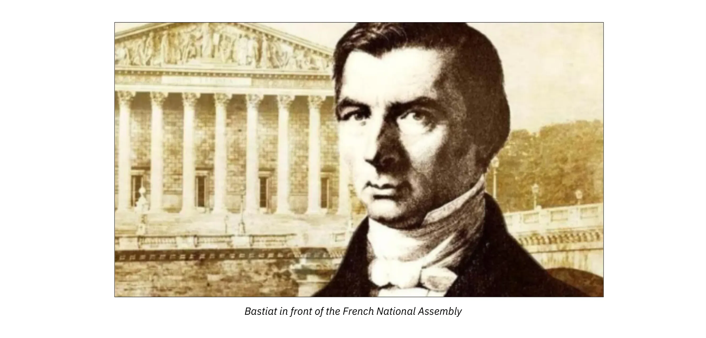

Всъщност Фредерик Бастиа, роден през 1801 г. и активен през първата половина на XIX в., остава известен автор за известно време. А след това постепенно изчезва и днес никой не чува за него, никой не знае кой е той. И все пак, парадоксално, този автор е преведен на много езици, включително италиански, руски, испански и английски.

Оказва се, че след Втората световна война една от книгите му е публикувана в САЩ. Тя става много известна, дотолкова, че самият Роналд Рейгън казва, че това е любимата му книга, и тази малка книжка се нарича "Законът". По този начин Бастиа е един от двамата най-известни френски автори в Съединените щати, като другият е добре познат и във Франция - Алексис дьо Токвил.

И така, един непризнат гений, който обаче е фар за нашето време. Всъщност Фредерик Бастиа, роден в Байон, прекарва част от живота си в Ланд, където управлява наследено от него земеделско имение и в крайна сметка води живот на предприемач. И тогава, много рано, той започва да се интересува от икономика. Пътува до Англия и се запознава с Ричард Кобдън, лидер на движението за свободна търговия. Бастиа е очарован от това движение; той е убеден, че свободната търговия е решение за Франция, и впоследствие решава да разпространи идеите си в цялата страна. Той пише статии, които имат голям успех, и се премества в Париж, където ръководи вестник, наречен по онова време Journal des économistes.

Той също така е философ и мислител по въпросите на обществото, социалния ред, справедливостта, правото и правата на човека. И в това отношение можем да кажем, че Бастиа е светлина за нашето време. И бих искал да завърша с това. Той е човек, който се е опитал да разбере функционирането на политическия пазар. Разбира се, той е и защитник на пазарната икономика, за когото в крайна сметка пазарната икономика е най-добрият начин за създаване на богатство. Но освен това, и именно тук той остава непризнат, той разбира механизмите на политическия пазар.

Когато е избран за депутат, това е по време на Втората република, а оттогава нататък законите се създават от народа. По това време Бастиа става свидетел на разрастването на законите във всички посоки, включително създаването на обществени услуги, социални права и данъци.

---

> **НАЦИОНАЛНИ СЕМИНАРИ**
> **Дневен ред.**
> Като има предвид, че работниците, включени в националните работилници, основателно поискаха наличната работа да бъде разпределена между тях възможно най-равностойно и справедливо;
> Като се има предвид, че работа има само за 16 000 мъже, а броят на записаните мъже надхвърля 50 000;
> Договорено е, че до второ нареждане и в очакване на по-добри договорености, всяка компания ще работи по два дни седмично, считано от понеделник, 17-ти.
> _Комисарят на републиката, директор на националните работилници,_
> **Émile THOMAS.**

---

И той осъзна, че в основата си нищо не се е променило. Хората се разпореждаха с чуждата собственост чрез гласуване и закон, което той наричаше законен грабеж. Този феномен на законния грабеж е в центъра на работата му, особено в краткия текст, който пише в края на живота си, "Законът", където противопоставя законния грабеж на собствеността, правото на собственост. Той показва, че в основата си истинското решение на социалния проблем е свободата, а именно собствеността; контролът върху себе си и плодовете на своя труд.

В този курс ще пътуваме заедно през мисълта на Фредерик Бастиа, като започнем от влиянието на авторите, които са го формирали още в ранната му младост, после ще разгледаме икономическите му софизми и накрая ще завършим с великия текст "Законът", който ще ни въведе в анализа на политическия пазар, в анализа на обществото.

## Животът и историческият контекст

<chapterId>e9d92b63-83dd-552c-84e1-dd535608c109</chapterId>

:::video id=29e42254-63d4-4a23-94a7-284e70f20515:::

През 1844 г. Фредерик Бастиа пътува по работа до Испания. След като престоява в Мадрид, Севиля, Кадис и Лисабон, той решава да замине за Саутхемптън и да посети Англия. В Лондон има възможност да присъства на събранията на Anti-Corn Law League, чиято дейност следи отдалеч. Запознава се с основните лидери на това сдружение, сред които е и Ричард Кобдън, който ще стане негов приятел.

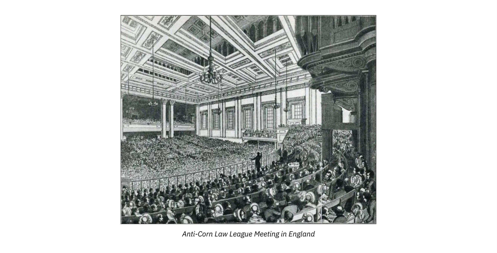

Там животът му претърпява радикална промяна. Самият той разказва, че призванието му на икономист е било решено в този момент. След като се завръща във Франция, той има само една идея: да запознае Франция с либералното движение, което раздвижва Англия.

Фредерик Бастиа е роден в Байон на 30 юни 1801 г. Осиротява на 9-годишна възраст и продължава образованието си в католическия колеж в Сорез. Той е талантлив в областта на езиците, като научава английски, испански и дори баски. Въпреки това не е мотивиран от обучението си и решава да не вземе бакалавърска степен, като вместо това избира да работи в бизнеса за внос и износ на чичо си в Байон.

През 1825 г. наследява земеделско имение от дядо си, което управлява като "джентълмен-фермер", както сам казва. Именно тогава той се сблъсква отблизо с проблемите, породени от липсата на ясно определение на правата на собственост. Той решава да стане мирови съдия в своя град Мюгрон, в сърцето на Ланд, търговски и речен кръстопът между пристанищата Бордо и Байон. По-късно е избран за член на Генералния съвет на Ландес.

Бързо се увлича по политическата икономия и изучава трудовете на Адам Смит, Жан-Батист Сей, Дестют дьо Траси, Шарл Дюноар и Шарл Конт. Чете английски вестници и там научава за съществуването на английска лига за свободна търговия.

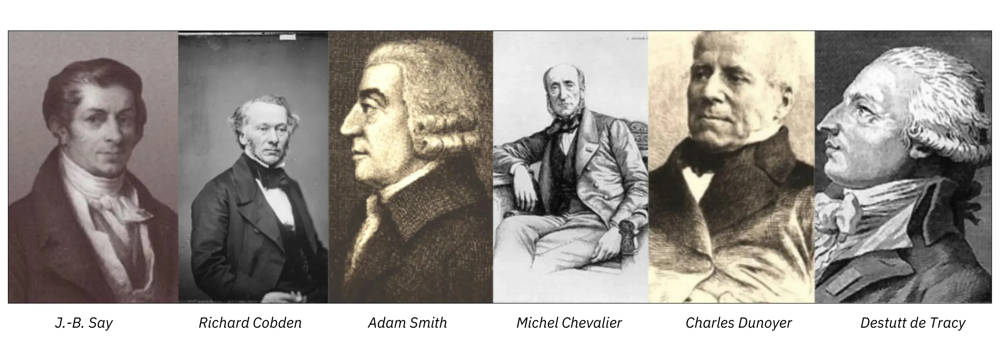

След завръщането си от Англия той пише статия, озаглавена "За влиянието на английските и френските мита върху бъдещето на двата народа", която изпраща на Journal des Économistes в Париж. Статията се появява в броя от октомври 1844 г. и има пълен успех. Всички се възхищават на силната му и ярка аргументация, както и на трезвия му и елегантен стил.

След това Journal des Économistes го моли за още статии, а няколко членове на Обществото по политическа икономия, по-специално Хорас Сей, син на Жан-Батист Сей, и Мишел Шевалие, известен професор, го поздравяват и го насърчават да продължи да работи с тях за разпространение на икономическите истини. Това поставя началото на нов живот в Париж.

За първи път той публикува първата поредица "Икономически софизми", в която смело и с ирония атакува протекционистите. В Париж той дори започва курс по политическа икономия в частна стая, който се посещава с желание от студентския елит.

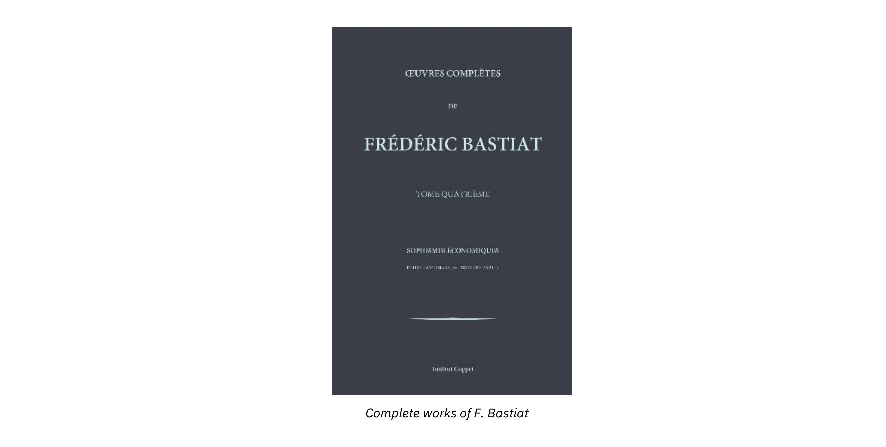

През следващата година основава "Асоциация за свободна търговия" във Франция и се хвърля в борбата срещу протекционизма във Франция. Събира средства, създава седмичен преглед и изнася лекции в цялата страна.

Първата среща се провежда в Бордо на 23 февруари 1846 г. и на нея е създадена Бордоската асоциация за свободна търговия. Скоро движението се разпространява в цяла Франция. В Париж сред членовете на Дружеството на икономистите се оформя първоначално ядро, към което се присъединяват депутати, индустриалци и търговци. Значителни групи се формират и в Марсилия, Лион и Хавър.

Февруарската революция от 1848 г. сваля монархията на Луи-Филип, известна като Юлска монархия (1830-1848 г.), и поставя началото на Втората република. Тогава Бастиа е избран за член на законодателното събрание като депутат от департамента Ланд. Заедно с Алексис дьо Токвил той се нарежда в лявоцентристката партия между монархистите и социалистите. Там той се стреми да защитава индивидуалните свободи, като например гражданските свободи, и се противопоставя на всички рестриктивни политики, независимо дали идват отдясно или отляво. Избран е за заместник-председател на Финансовата комисия и постоянно се стреми да напомня на колегите си депутати тази проста истина, често забравяна в парламентите:

> Човек не може да дава на едни по закон, без да е длъжен да взема от други по друг закон.

Почти всички негови книги и есета са написани през последните шест години от живота му, от 1844 до 1850 г. През 1850 г. Бастиа пише две от най-известните си произведения: "Законът" и поредица от памфлети, озаглавена "Това, което се вижда и това, което не се вижда". "Законът" е преведен на много чужди езици, включително английски, немски, испански, руски и италиански.

Умира в Рим през 1850 г. от туберкулоза. Погребан е в църквата "Свети Луи дез Франсез" в Рим.

# Влияния

<partId>4d312b17-5740-5d33-8309-015e2b59b6dd</partId>

## Адам Смит и Жан-Батист Сей

<chapterId>bcc7a12a-6cc4-5061-85e3-0e31fb1f0a49</chapterId>

:::video id=db69aa73-75a9-44af-a77b-eceb3bc185f3:::

В областта на икономиката Бастиа винаги е признавал дълга си към Адам Смит и Жан-Батист Сей. На 26-годишна възраст той пише на един от приятелите си: "Никога не съм чел по тези въпроси, освен тези четири произведения: "Смит", "Сей", "Дестут" и "Цензор".

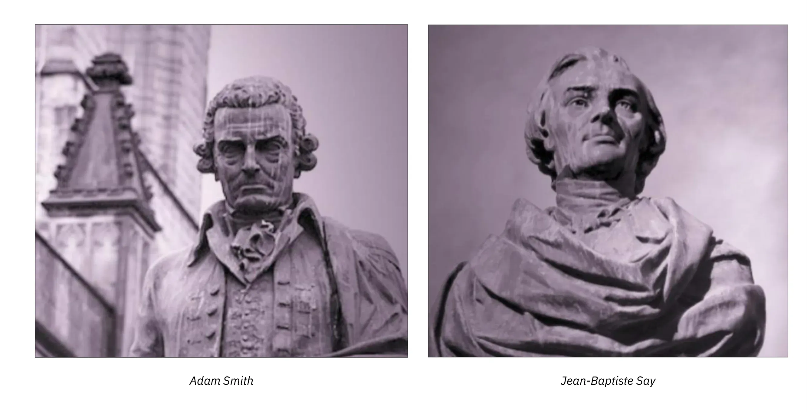

Политическата икономия, така както е замислена от Адам Смит и Жан-Батист Сей, се заключава в една-единствена дума: свобода. Свобода на търговията, индивидуална свобода, свободна търговия и свободна инициатива. Свободната търговия е защитавана първо от физиократите, като Франсоа Кене и Винсент дьо Гурне, а след това от Адам Смит, който синтезира техните идеи със собствените си наблюдения. И накрая, в края на XVIII в., Жан-Батист Сей изяснява и коригира някои моменти в учението на своя учител Адам Смит в майсторския си Трактат по политическа икономия.

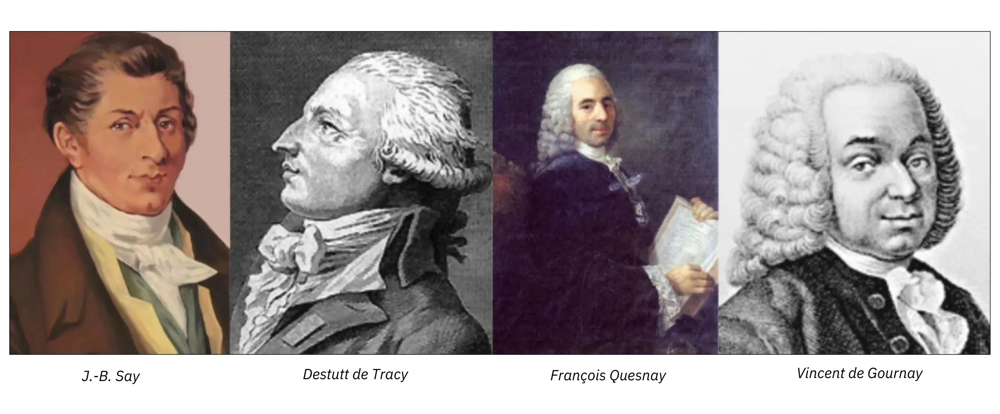

Адам Смит се интересува от просперитета не като от самоцел, а като от средство за морално издигане на хората. За него богатството на нациите се състои от богатството на индивидите. Ако искате просперираща нация, казва Адам Смит, позволете на индивидите да действат свободно. А пазарът работи, защото позволява на всеки да изрази предпочитанията си и да преследва интереса си.

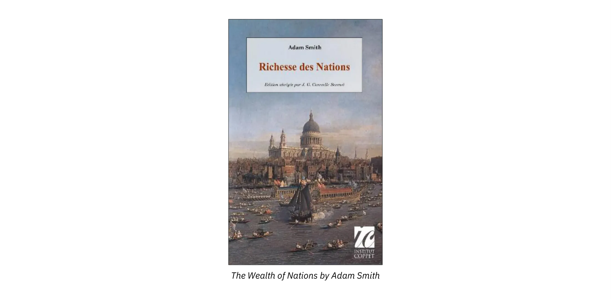

Голямата новост на съвременните икономисти в зората на XVIII век е, че те се интересуват от всеки индивид с желание да възстанови способността си за действие, като същевременно мислят как да овладеят страстите и конфликтите. Хората естествено искат да подобрят своята съдба и тази на близките си чрез размяна на стоки и услуги.

Това, което Адам Смит показва, е, че човек може да обслужва собствения си интерес само като служи на интересите на другите:

> Дайте ми това, от което се нуждая, и вие ще получите от мен това, от което се нуждаете сами... Не от добронамереността на месаря, пивоваря или хлебаря очакваме вечерята си, а от грижата им за собствения си интерес.

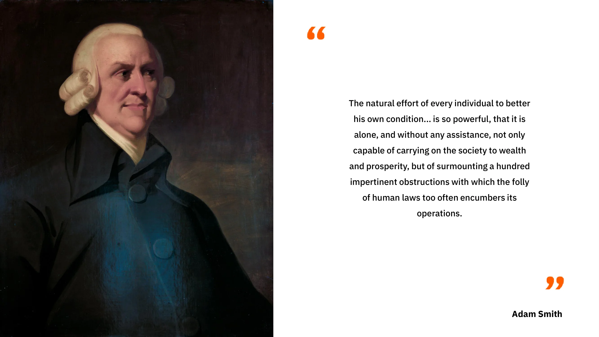

---

> "Естественото усилие на всеки индивид да подобри собственото си положение... е толкова мощно, че само по себе си и без никаква помощ е способно не само да поведе обществото към богатство и просперитет, но и да преодолее стотиците дръзки препятствия, с които глупостта на човешките закони твърде често затруднява дейността му."
> _Богатството на народите_
> _Книга IV, Глава V_

---

Търговията е игра с положителен резултат. Това, което печели единият, печели и другият. По този начин тя се различава от политическото преразпределение, при което винаги има победител и губещ. Ако разгледаме английската школа, включваща Смит, Рикардо и Лок, стойността е свързана с труда. За Маркс тя е същата.

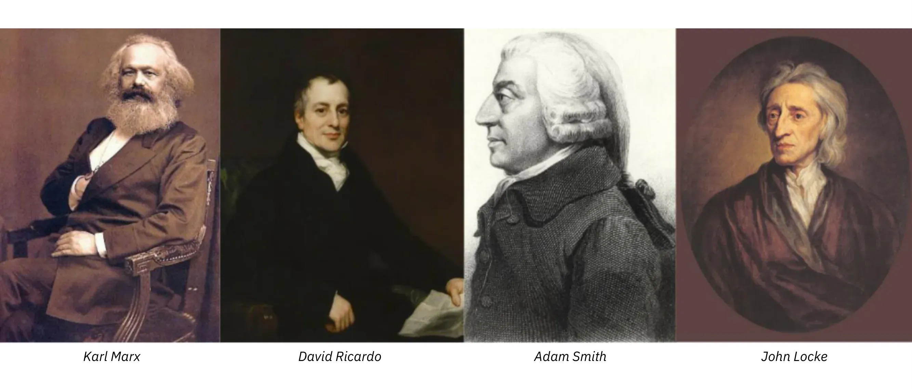

От друга страна, Бастиа ще признае заедно с Жан-Батист Сей, че полезността е истинската основа на стойността. Трудът не създава стойност. Недостигът също не създава. Всичко произтича от полезността. Всъщност никой не се съгласява да плати за дадена услуга, ако не я смята за полезна. Човек винаги произвежда само полезност.

Но Бастиа също така нюансира Сей по този въпрос. Не става въпрос за полезността на нещата, а за относителната полезност на услугите. "Стойността е съотношението на две разменяни услуги", според собствените му думи. Следователно стойността е субективна и единственият начин да се схванат предпочитанията на индивидите е да се наблюдава тяхното поведение на свободния пазар. Пазарът разкрива индивидуалните предпочитания и е велик регулатор на обществото чрез размяната.

Икономиката се подчинява на редица прости закони, произтичащи от човешкото поведение. Един от тях, известен като "закон на Сей", гласи: "Продуктите и услугите се разменят срещу продукти и услуги." Неговата идея е, че държавите и отделните хора имат полза от повишаването на равнището на производство, защото то предлага по-големи възможности за взаимноизгоден обмен.

Всъщност продуктите се купуват само в очакване на услугите, които купувачът очаква: Купувам диск за музиката, която ще слушам, купувам билет за кино за филма, който ще гледам. И при размяната всяка страна взема решение, защото преценява, че може да получи повече услуги от това, което придобива, отколкото от това, от което се отказва. В този контекст парите служат като посредническа стока, която компенсира извършената услуга и улеснява достъпа до други услуги.

За Бастиа икономиката на размяната, т.е. на свободно предлаганите и приеманите взаимни услуги, е в основата на мира и просперитета, като позволява да се постигне хармония на интересите.

Но от Жан-Батист Сей Фредерик Бастиа наследява и едно ключово понятие - това за грабежа. Защото, казва той, повтаряйки думите на Сей:

> Има само два начина за придобиване на нещата, необходими за запазването, украсяването и подобряването на живота: производство и грабеж.

Производителите прибягват до убеждаване, преговори и договори, а грабителите - до сила и измама. Затова законът е този, който трябва да потиска грабежа и да осигурява както труда, така и собствеността. Както е заявил още Адам Смит, осигуряването на сигурността на гражданите е основната мисия на публичната власт и именно тя легитимира налагането на данъци.

## Антоан Дестю дьо Траси

<chapterId>ddf64e9f-2ce0-5651-8eb8-bae578eb0b9b</chapterId>

:::video id=727e10b7-9255-4f63-8b57-be59d2501f23:::

Малко известно е, че Дестют дьо Траси оказва решаващо влияние върху бъдещия президент на Съединените щати Томас Джеферсън, докато той е посланик в Париж през 80-те години на XIX век.

> Първата страна на всеки човек е родината му, а втората - Франция. Тирания е, когато народът се страхува от своето правителство; свобода е, когато правителството се страхува от народа.
>

> Томас Джеферсън

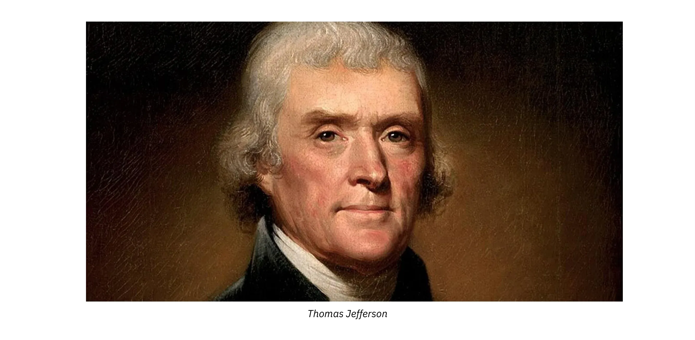

Всъщност неговият "Трактат по политическа икономия" осъжда протекционизма и разширяването на империята на Наполеон. Поради това Бонапарт забранява публикуването му във Франция. Той обаче е преведен на английски език и публикуван в Съединените щати от самия Джеферсън. Той е автор на този текст - първият учебник по политическа икономия в току-що основания от него Вирджински университет в Шарлотсвил. Трактатът е публикуван във Франция едва през 1819 г.!

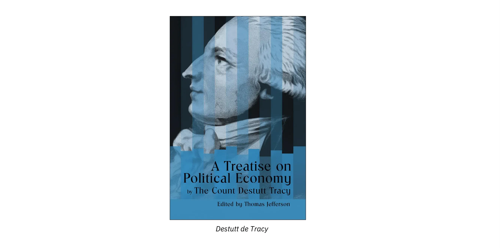

Дестют дьо Траси, философ и икономист, е лидер на така наречената школа на "идеолозите", в която влизат забележителни личности като Кабанис, Кондорсе, Констан, Дьоно, Саи и Жермен дьо Стаел. Те са наследници на физиократите и преки ученици на Турго.

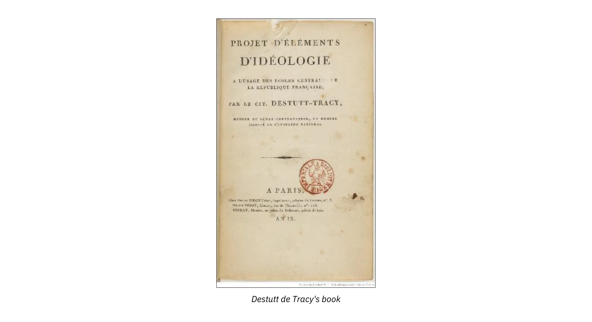

Под идеология Трейси разбираше просто науката, която се занимава с изучаването на идеите, техния произход, законите им и връзката им с езика; това е, казано с по-съвременни термини, епистемология. Терминът "идеология" не носи пейоративната конотация, която Маркс по-късно ще припише, за да дискредитира икономистите, застъпващи се зад "laissez-faire" доктрината. Списанието на движението на идеолозите се е наричало La Décade philosophique et littéraire.

Филмът доминира в революционния период и е режисиран от Жан-Батист Сей. През 1808 г. Дестют дьо Траси е избран за член на Френската академия, а през 1832 г. - за член на Академията за морални и политически науки. Дъщеря му се омъжва за Жорж Вашингтон дьо Ла Файет (син на първия американски президент) през 1802 г., което показва близостта, която все още съществува между Франция и младата Америка по това време.

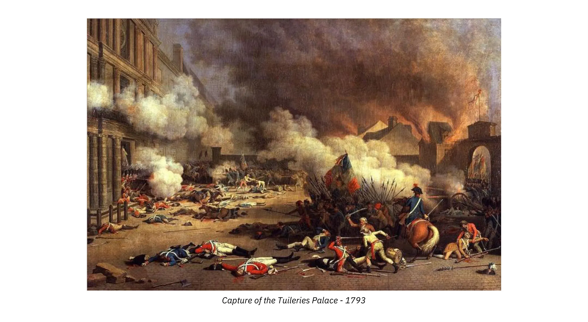

Целта на неговия "Трактат по политическа икономия" е да "изследва най-добрия начин за използване на всички наши физически и интелектуални способности за задоволяване на различните ни нужди". Идеята му е, че търговията е източник на всички човешки блага; тя е цивилизационната, рационализиращата и умиротворяващата сила на света. Голямата максима на политическата икономия е формулирана от него по следния начин: "Търговията е цялото общество, както трудът е цялото богатство." Всъщност той разглежда обществото като "непрекъсната поредица от размяна, при която и двамата контрагенти винаги печелят". Следователно пазарът е противоположен на хищничеството. Той обогатява едни, без да обеднява други. Както ще бъде казано по-късно, той не е "игра с нулев резултат", а с положителен такъв.

Нашият автор не стига дотам да определи политическата икономия като наука за размяната. Но същите разсъждения ще бъдат възприети и продължени от Бастиа. Продажбата е размяна на предмети, отдаването под наем е размяна на услуги, а кредитирането е просто размяна с отложено плащане. Така политическата икономия се превръща за Бастиа в "теория на размяната".

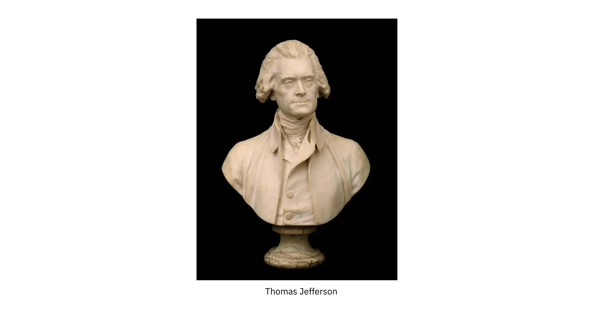

Според Дестют дьо Траси собствеността по необходимост произтича от нашата природа, от способността ни да желаем. Ако човек не искаше нищо, той нямаше да има нито права, нито задължения. За да посрещне нуждите си и да изпълни задълженията си, човек трябва да използва средства, които придобива чрез труда си. А формата на обществена организация, която съответства на тази цел, е частната собственост. Ето защо единствената цел на правителството е да защитава собствеността и да позволява мирна размяна.

За него най-добрите данъци са най-умерените и желае разходите на държавата да бъдат възможно най-ограничени. Той осъжда разграбването на общественото богатство от страна на държавата под формата на държавен дълг, данъци, банкови монополи и разходи. Още веднъж повтаря, че законът трябва да служи само за защита на свободата; той никога не трябва да се използва за потискане или експлоатация.

Накрая той добавя тази препоръка, която не е загубила своята актуалност:

> Нека правителството да не прави и да не може да прави дългове, които обвързват бъдещите поколения и винаги водят държавите към гибел.

В заключение, идеолозите са имали дълбока интуиция, а именно, че производството и размяната са истинското решение на политическите проблеми и истинската алтернатива на войните. Войните винаги са хищнически, независимо дали са вътрешни, както по време на Революцията, или външни, като тези, водени от древните царе и Наполеон.

## Шарл Конт и Шарл Дюноар

<chapterId>80bc5c4e-ac07-52c8-9dd7-e224ac291bda</chapterId>

:::video id=6f8e4713-5b9e-49bb-85b1-e9e8a44cd75e:::

Историята на всички цивилизации е история на борбата между грабителските и производителните класи. Това е веруюто на двамата автори, които ще разгледаме. Те са създатели на либералната теория за класовата борба, която вдъхновява Фредерик Бастиа също толкова, колкото и Карл Маркс, въпреки че последният я изопачава.

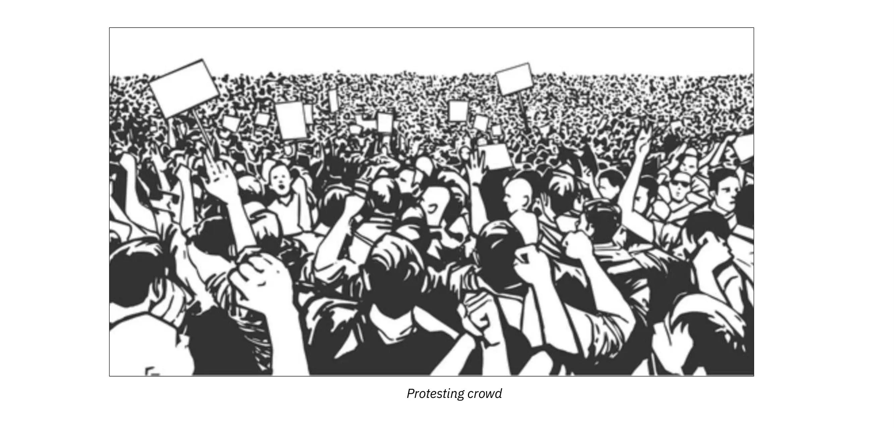

За Конт и Дюноар грабежът, т.е. всички форми на насилие, упражнявани в обществото от силните над слабите, е големият ключ към разбирането на човешката история. Той е в основата на всички явления на експлоатация на една класа от друга.

Ако Фредерик Бастиа дължи икономическото си образование на Смит, Дестют дьо Траси и Сей, то политическото си образование той дължи на ръководителите на списание Le Censeur Шарл Конт и Шарл Дюноайе.

Този преглед (1814-1819 г.), преименуван на Le Censeur européen след Стоте дни, разпространява либералните идеи, които триумфират през 1830 г. с въстанието от Трите славни дни и идването на власт на Орлеанския херцог Луи-Филип I.

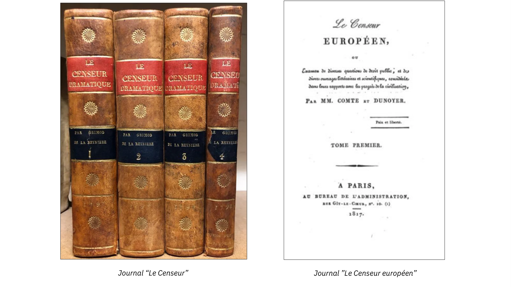

Шарл Конт, братовчед на Огюст Конт и зет на Сей, е основател на рецензията. Скоро към него се присъединява Шарл Дюноар, юрист като него, а след това и младият историк Огюстен Тиери, бивш секретар на Сен Симон. Тяхното мото, изписано на първата страница на всеки брой на ревюто, е "Мир и свобода".

Каква е целта на прегледа? Заглавието говори само по себе си: да се цензурира правителството. Да се борим срещу произвола на властта, като просвещаваме общественото мнение, да защитаваме свободата на печата.

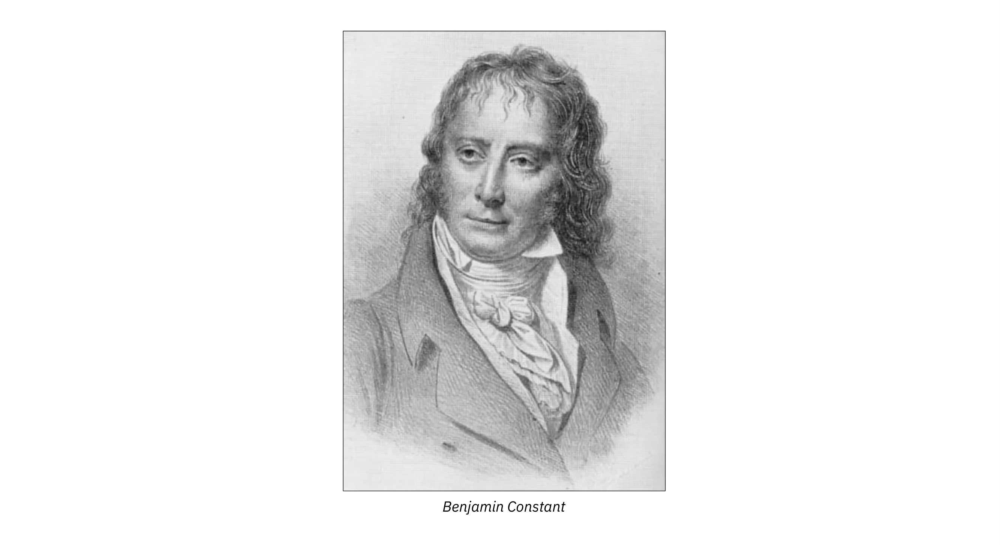

_(Бенджамин Констант)_

Те възприемат от Бенджамин Констант разграничението между Древните и Модерните, които се характеризират, от една страна, с война, а от друга - с търговия и индустрия. Въпреки това те твърдят, че политическата икономия дава най-доброто обяснение на социалните явления. Те разбират по-специално, че нациите постигат мир и просперитет, когато се зачитат правата на собственост и свободната търговия. Оттук нататък за тях политическата икономия е истинската и единствена основа на политиката. На мястото на философията, която се ограничава до абстрактна критика на формите на управление, трябва да се постави теория, основана на познаването на икономическите интереси.

> Политическата икономия, която показва как хората процъфтяват и западат, е поставила истинските основи на политиката.
>

> Dunoyer

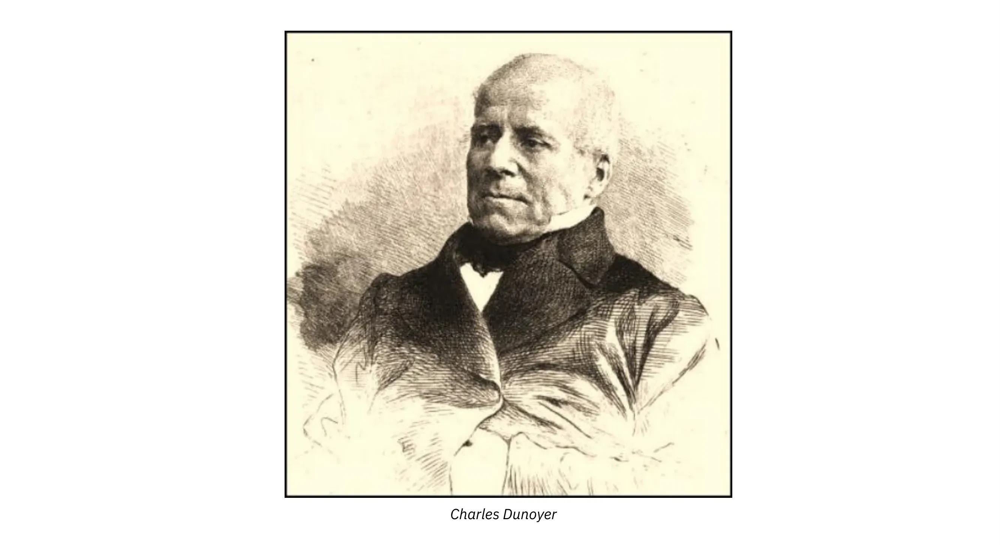

Тази нова социална теория съдържа един от елементите, които ще се превърнат в крайъгълен камък на научния социализъм на Маркс и Енгелс: концепцията за класовата борба. Но в какво се състои либералната теория за класовата борба и по какво се различава от марксизма?

Тя започва с отделния човек, който действа, за да удовлетвори своите нужди и желания. От момента, в който човек създава, т.е. увеличава полезността на нещата и повишава тяхната стойност, той се занимава с индустрия. Тук индустриалецът не е собственик на индустрия, както би могло да се предположи на сегашния език, а производител, независимо от областта, в която работи. Ето защо тяхната теория се нарича индустриализъм. Тя постановява, че целта на обществото е създаването на полезност в широкия смисъл на думата, а именно на стоки и услуги, които са полезни за хората.

По този въпрос индивидите са изправени пред две основни алтернативи: те могат да заграбят богатството, произведено от другите, или да работят, за да произвеждат сами богатство. Във всяко общество може ясно да се разграничат тези, които живеят от грабеж, от тези, които живеят от производство. По време на Ancien Régime благородниците директно атакуват най-работливите, за да живеят от нова форма на данък: данъците. Грабителското благородничество е наследено от орди бюрократи, които са не по-малко грабителски.

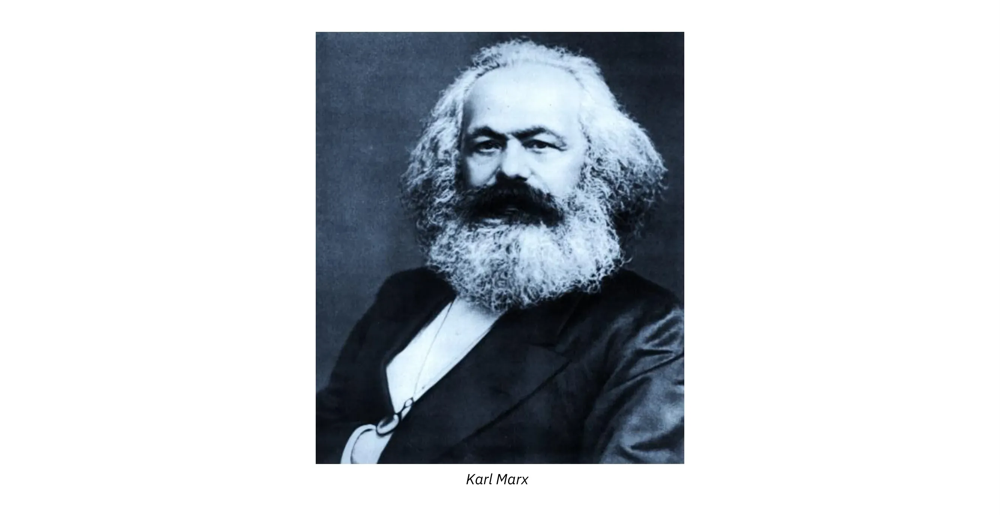

Докато за Маркс класовият антагонизъм е разположен в рамките на самата производствена дейност, между работниците и работодателите, за Конт и Дюноар конфликтните класи са, от една страна, производителите на обществото, които плащат данъци (включително капиталисти, работници, селяни, учени и т.н.), а от друга - непроизводителите, които живеят от ренти, финансирани от данъците, "бездействащата и поглъщаща класа" (бюрократи, чиновници, политици, бенефициенти на субсидии или протекции).

За разлика от Маркс, авторите на Censeur Européen не се обявяват за класова война. Вместо това те се обявяват за социален мир. А това, според тях, може да бъде постигнато единствено чрез деполитизация на обществото. За тази цел е необходимо първо да се намалят престижът и облагите, свързани с публичните длъжности. След това е важно да се даде влияние в политическото тяло на производителите.

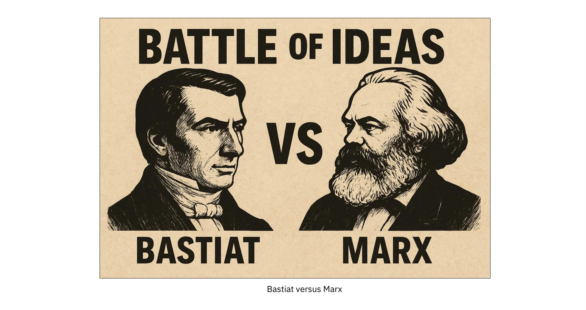

И накрая, единственият начин да се избавим от експлоатацията на една класа от друга е да унищожим самия механизъм, който прави тази експлоатация възможна: властта на държавата да разпределя и контролира собствеността и разпределянето на свързаните с нея блага ("позициите").

Техните идеи, дълбоко новаторски, завинаги бележат Фредерик Бастиа, който сам става задълбочен мислител в областта на политическите кризи.

## Кобдън и Лигата

<chapterId>7181435c-5eae-56e4-8e55-02a24273fdd6</chapterId>

:::video id=633e542a-7217-4e63-bb6f-4a716fde3023:::

През 1838 г. в Манчестър малък брой хора, малко известни дотогава, се събират, за да намерят начин да свалят монопола на собствениците на пшеница със законни средства и да постигнат, както по-късно ще разкаже Бастиа.

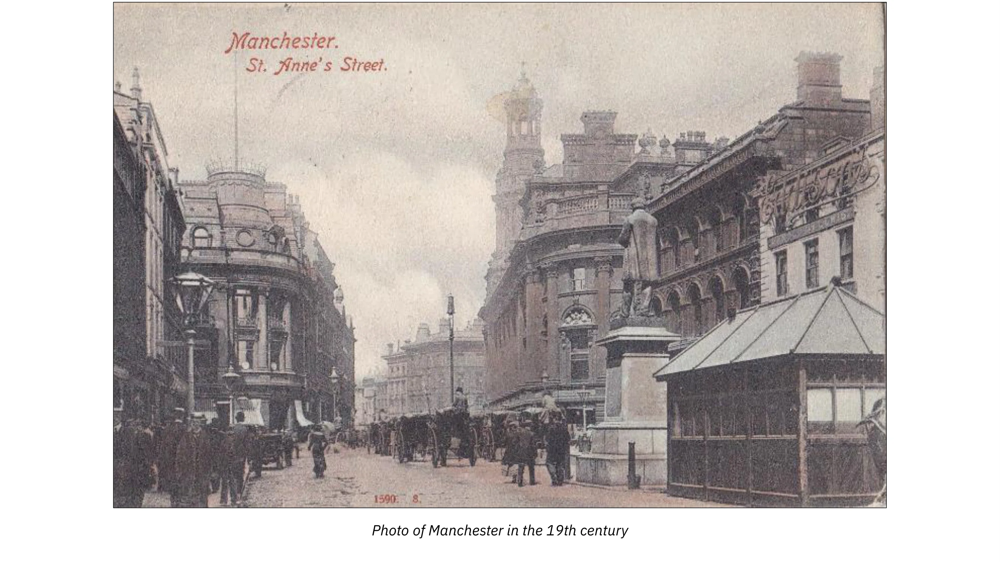

> Без кръвопролития, само със силата на мнението, революция, толкова дълбока, а може би и по-дълбока от тази, която нашите бащи извършиха през 1789 г.

От тази среща се ражда Лигата срещу законите за царевицата или срещу законите за зърното, както ги нарича Бастиа. Скоро обаче тази цел ще се превърне в пълно и едностранно премахване на протекционизма.

Тази икономическа битка за свободна търговия ще занимава цяла Англия до 1846 г. Във Франция, с изключение на малък брой посветени, съществуването на това мащабно движение е напълно неизвестно. Фредерик Бастиа научава за съществуването на Лигата през 1843 г., когато прочита английски вестник, за който се абонира случайно. Въодушевен, той превежда речите на Кобдън, Фокс и Брайт. След това си кореспондира с Кобдън и накрая, през 1845 г., отива в Лондон, за да присъства на гигантските събрания на Лигата.

Именно тази кампания за агитация за свободна търговия в цялото кралство с десетки хиляди членове запалва перото на Бастиа и променя коренно и окончателно хода на живота му.

Лигата може да бъде сравнена с пътуващ университет, който обучаваше икономически онези, които посещаваха срещите му в цялата страна - обикновени хора, индустриалци, обработватели и фермери, всички, които Лигата беше взела под крилото си и чиито интереси потискаха законите за зърното. Ричард Кобдън е движещата сила на движението и изключителен агитатор.

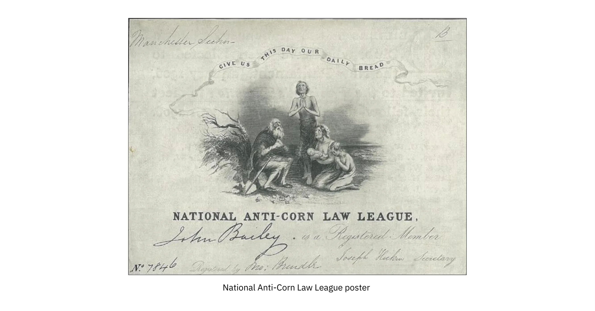

Увлекателен и забележителен оратор, той притежаваше невероятна дарба да измисля въздействащи и кратки фрази, далеч от абстрактните разсъждения на икономистите.

> Какво представлява монополът върху хляба? - възкликна той. Това е недостигът на хляб. Изненадате се да научите, че законодателството на тази страна по този въпрос няма друга цел, освен да предизвика възможно най-голям недостиг на хляб. И все пак то не е нищо друго. Законодателството може да постигне целта си единствено чрез недостиг.

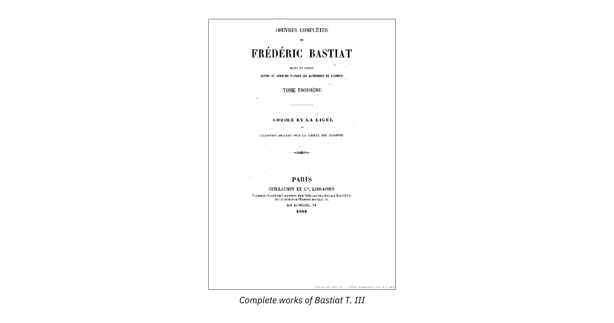

През 1845 г. Бастиа публикува в Париж книгата си "Кобдън и Лигата", придружена от негови преводи с коментари. Книгата започва с въведение в икономическата ситуация в Англия, както и с историята на възникването и развитието на Лигата. От 1815 г. насам протекционизмът е добре развит в Англия. Съществували са по-специално закони, ограничаващи вноса на зърно, които са имали много тежки последици за хората. Всъщност пшеницата е била необходима за производството на хляб - жизнено важна стока по онова време. Освен това тази система облагодетелствала аристокрацията, т.е. едрите земевладелци, които получавали ренти от нея.

> Това, което съжителства в Англия, пише Бастиа, е малък брой грабители и голям брой ограбени и не е нужно да си голям икономист, за да заключиш за богатството на първите и мизерията на вторите.

Целта на Лигата е да мобилизира общественото мнение, за да окаже натиск върху парламента да отмени закона за зърното. В дългосрочен план Кобдън и неговите приятели се надяват:

- Увеличаване на промишлените пазари
- Увеличаване на заетостта
- Намаляване на цената на хляба
- Повишаване на ефективността на селското стопанство и промишлеността чрез конкуренция
- Насърчаване на мира между народите

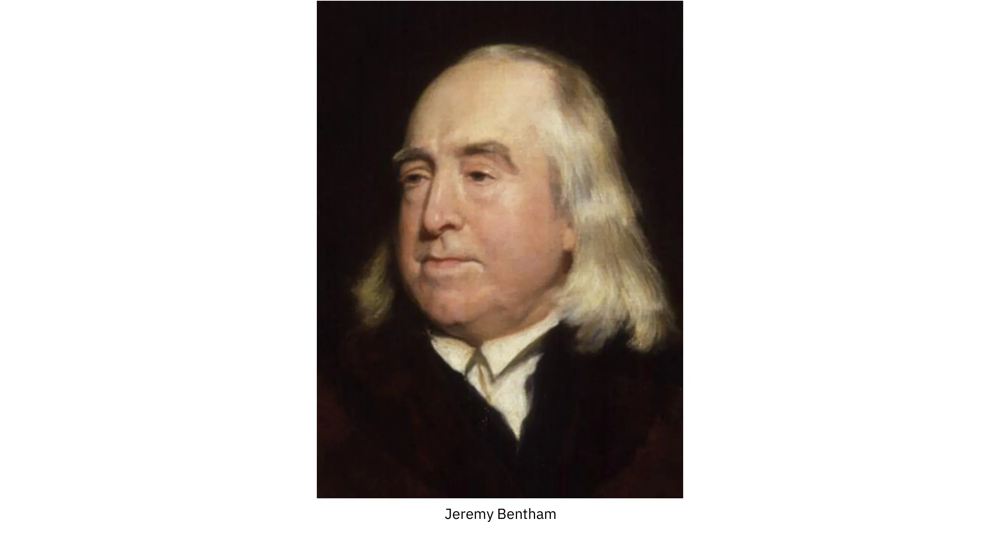

_(Джеръми Бентъм)_

Ученик на Бентъмовия утилитаризъм, Кобдън е убеден, че свободата на труда и търговията пряко обслужва интересите на най-многобройните, най-бедните и най-страдащите маси от обществото. Напротив, митата, като инструмент за произволни забрани и привилегии, могат да бъдат от полза само за най-мощните отрасли.

На изборите през 1841 г. петима членове на Лигата, сред които и Кобдън, са избрани за депутати. На 26 май 1846 г. едностранната свободна търговия става закон на кралството. От този момент нататък Обединеното кралство преживява блестящ период на свобода и просперитет.

Интересното е, че Бастиа си присвоява част от техния метод; той усвоява техния език и го пренася във френския контекст. Книгата за Кобдън и Лигата бързо се превръща в успех и Бастиа влиза сензационно в света на икономистите. Той основава асоциация в Бордо в полза на свободната търговия, а след това я премества в Париж. Предложено му е ръководството на Journal des Économistes. Възниква движение, което продължава до 1848 г.

Едва след смъртта на Бастиа, през 1866 г., Наполеон III подписва договор за свободна търговия с Англия - своеобразна посмъртна победа за човека, посветил последните шест години от краткия си живот на тази велика идея.

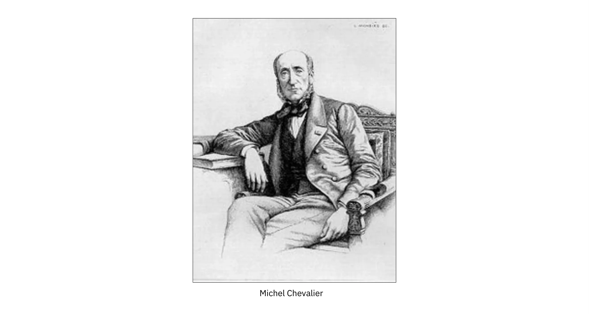

_(Мишел Шевалие)_

Въпросът за свободната търговия е актуален и днес. В учебниците по география в училищата се твърди, че глобализацията е виновна и че бедните страни се нуждаят от западна помощ, за да оцелеят. Въпреки това за 20 години крайната бедност е намаляла наполовина. Избирайки отвореността, страни като Индия, Китай и Тайван успяха да се измъкнат от бедността, докато стагнацията е характерна за затворени страни като Северна Корея и Венецуела. По данни на ООН през 1990 г. 36% от човечеството е живяло в пълна мизерия. През 2010 г. те вече са "само" 18%. Крайната бедност продължава да бъде голямо предизвикателство, но тя отстъпва.

# Противниците

<partId>f902ed30-269e-5e44-a76d-8efd1a4e4085</partId>

## Жан-Жак Русо

<chapterId>c3926110-e0b2-503c-96d9-5d3a6a661484</chapterId>

:::video id=499239ae-df43-489e-8d1f-bf3ea01e4e6b:::

Фредерик Бастиа, който се изразява през 40-те години на XIX в., е наследник на поколение философи от Просвещението, които се борят срещу цензурата и за свободата на дебатите. Спомнете си за Монтескьо, Дидро, Волтер, Кондорсе, но също и за Русо.

За тях идеята е проста: колкото повече идеи се изразяват, толкова повече истината се развива и толкова по-лесно се опровергават грешките. Науката винаги напредва по този начин.

_(Монтескьо, Дидро, Волтер, Кондорсе, Русо)_

Напротив, малцина са разбрали, че това, което е вярно за идеите, е вярно и за стоките и услугите. Свободата да търгуваш с другите наистина има две предимства: тя е ефективна и води до по-справедливо разпределение. Русо не само не е разбрал това, но и се е противопоставил на тази свобода в името на една погрешна представа за закон и право. Един от основните източници на социализма, отбелязва Бастиа, е мнението на Русо, че целият социален ред произтича от закона.

Бастиа наистина смята Русо за истинския предшественик на социализма и колективизма. В книгата на Русо "Обществения договор" има една фраза, която доста добре обобщава неговата философия: "ние започваме да ставаме хора едва след като сме били граждани".

Първоначално човекът е просто буржоа. Но буржоата е калкулатор; той иска да получи незабавно удоволствие, поробен е от сетивата си, от желанията си, от конкретния си интерес. Накратко, той не е рационален, следователно не е свободен. Той трябва да бъде образован, за да разбере, че истинският му интерес е общият интерес. Ето защо Русо пише в "Обществения договор":

---

> Който откаже да се подчини на общата воля, ще бъде принуден да го направи от цялото тяло, което не означава нищо друго, освен че ще бъде принуден да бъде свободен.
> (Жан-Жак Русо)

---

Според тази доктрина човекът има в себе си две воли: воля, насочена към личния интерес, тази на буржоата, и воля, насочена към общия интерес, тази на гражданина. Да накараш хората, дори и насила, да искат една рационална цел, общия интерес, означава да ги накараш да станат свободни. Това, което те наистина искат, е рационален резултат, дори и да не го осъзнават.

Затова според Русо е напълно законно да се принуждават хората в името на цел, която те самите, ако бяха по-просветени, биха преследвали, но която не преследват, защото са слепи, невежи или покварени. Обществото е създадено, за да ги принуждава да правят това, което те биха желали спонтанно, ако бяха просветени. И като прави това, човек не извършва насилие над тях, тъй като ги кара да бъдат "свободни", т.е. да направят правилния избор; избор, който е в съответствие с тяхната истинска същност.

Убеден, че доброто общество е творение на закона, Русо предоставя неограничена власт на законодателя. От него зависи да превърне индивидите в завършени хора, в граждани.

Въпреки това установяването на собствеността също е в правомощията на закона. Според Русо собствеността може да бъде легитимна само ако е регламентирана от законодателя. Всъщност злото се крие в неравенството и робството, които произтичат от собствеността. Това е изобретение на силния, което е довело до лошото общество, до буржоазното общество, до отношенията на господство. В своята "Дискусия за произхода и основите на неравенството" той пише този известен пасаж:

> Първият човек, който, оградил парче земя, казва: И е намерил достатъчно прости хора, които да му повярват, е бил истинският основател на гражданското общество. Колко много престъпления, войни, убийства, колко много нещастия и ужаси щяха да бъдат спестени на човешкия род, ако човекът, който, издигайки коловете или запълвайки канавката, беше извикал на своите събратя: "Пазете се да не слушате този самозванец; вие сте загубени, ако забравите, че плодовете принадлежат на всички и земята не принадлежи на никого!"

Следователно естествената собственост е източник на злото. И Маркс, който е голям читател на Русо, би запомнил това. Как да се преборим с това зло? Чрез обществения договор - отговаря Русо. Всъщност доброто общество е това, което е резултат от договор, предвиждащ отчуждаване на правата на индивида в полза на общността. Оттук нататък от общността зависи да предостави права на индивида чрез закона.

Противно на Русо, Фредерик Бастиа казва, че "човек се ражда със собственост". За него собствеността е необходимо следствие от природата на човека, от неговата конституция. Той пише, че "човек се ражда собственик, защото се ражда с потребности, чието задоволяване е необходимо за живота, с органи и способности, чието упражняване е необходимо за задоволяването на тези потребности". Но способностите са само продължение на личността, а собствеността е само продължение на способностите. С други думи, именно използването на нашите способности в работата узаконява собствеността.

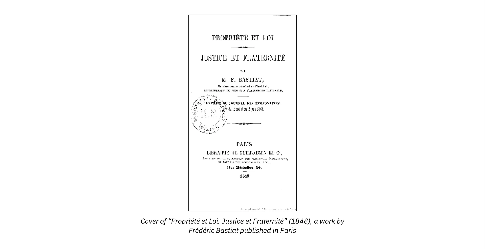

Според Бастиа обществото, хората и свойствата съществуват преди законите и той има една известна фраза: "Не защото има закони, има и свойства, а защото има свойства, има и закони." Ето защо законът трябва да бъде негативен: той трябва да предотвратява посегателствата върху хората и техните блага. Собствеността е _raison d'être_ на закона, а не обратното.

## Класическо образование

<chapterId>87d9a8c9-2352-5cb2-8b93-678118a8145c</chapterId>

:::video id=4b24a6e8-969f-4058-a409-8942913fca4b:::

На 24 февруари 1848 г., след тридневни бунтове в Париж, крал Луи-Филип I се отказва от властта си. Това поставя началото на Втората република.

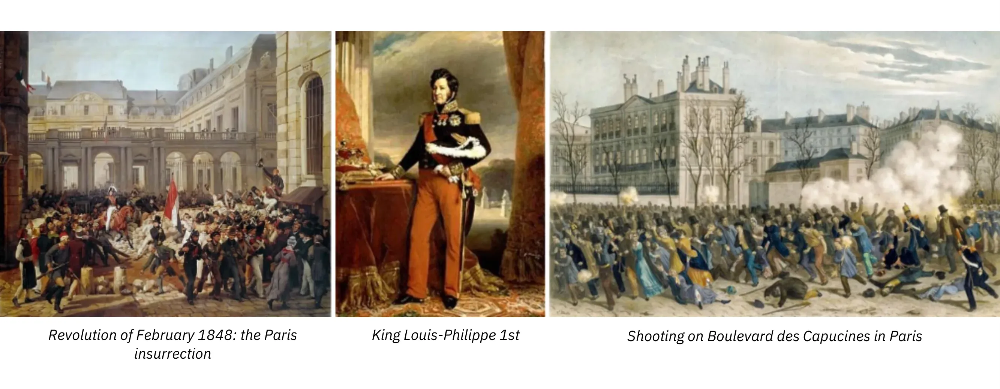

Бастиа е в Париж и става пряк свидетел на събитията. По-късно той ще напише:

> На 24 февруари аз, както и много други, се опасявах, че нацията не е готова да се управлява сама. Трябва да призная, че се страхувах от влиянието на гръцките и римските идеи, които се налагат на всички нас от академичния монопол.

Този пасаж е изненадващ. Какво общо имат гръцката и римската древност с него?

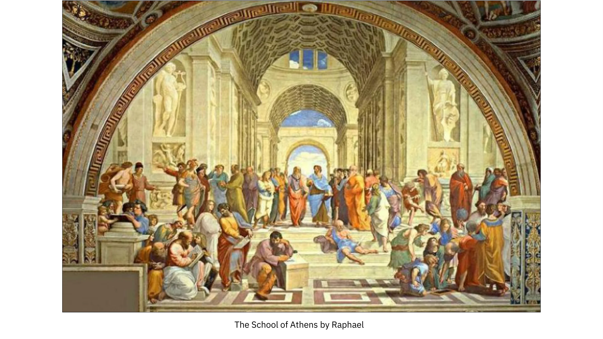

Бастиа се позовава на "Републиката" на Платон и неговата теория за царя-философ, както и на Спарта, на която Русо се възхищава, и на Римската империя, към която Наполеон изпитва носталгия. За съжаление, според Бастиа тези гръцки и римски идеи се основават на една фалшива предпоставка: идеята за всемогъществото на законодателя, за абсолютната власт на закона.

Достатъчно е да отворим произволно почти всяка книга по философия, политика или история, за да открием тази вкоренена в нашата култура идея, че човечеството е инертна материя, която получава живот, организация, морал и просперитет от политическата власт. Оставено само на себе си, човечеството би клоняло към анархия и би било спасено от тази катастрофа единствено от тайнствената и всемогъща ръка на Законодателя. Въпреки това, казва Бастиа, тази идея отдавна е узряла и е била подготвена от векове на класическо образование.

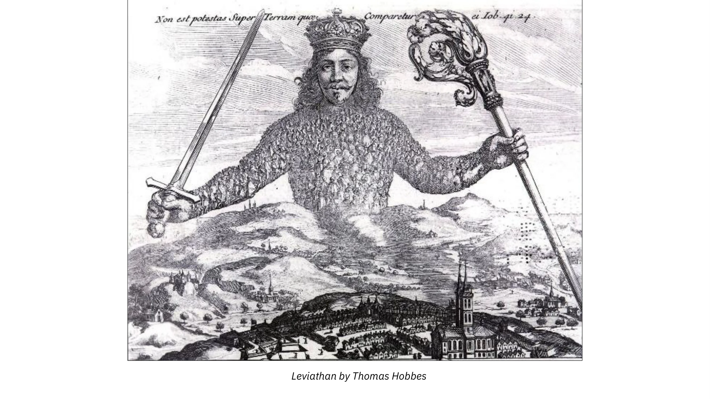

На първо място, казва той, римляните са смятали собствеността за чисто конвенционален факт, за изкуствено творение на писаното право. Защо? Просто, обяснява Бастиа, защото са живели от робство и грабеж. За тях всяка собственост е плод на грабеж. Ето защо те не са могли да въведат в законодателството идеята, че основата на законната собственост е трудът, без да разрушат основите на своето общество.

Те наистина са имали емпирично определение на собствеността - "jus utendi et abutendi" (право на ползване и злоупотреба). Това определение обаче се отнасяше само до последиците, а не до причините, с други думи, до етичния произход на собствеността. За да се установи правилно собствеността, трябва да се върнем към самата конституция на човека и да разберем отношението и необходимата връзка, която съществува между потребностите, способностите, труда и собствеността. Римляните, които са били собственици на роби, дали са могли да възприемат идеята, че "всеки човек притежава себе си, следователно и труда си, и съответно продукта на своя труд"? Бастиа се чуди.

> Ето защо не бива да се учудваме, заключава Бастиа, че римската идея, че собствеността е конвенционален факт и правен институт, се появява отново през XVIII в.; че законът далеч не е следствие от собствеността, а собствеността е следствие от закона.

Всъщност Русо споделя тази обща правна идея за основаване на собствеността върху закона. Русо приписва на закона, а следователно и на народа, абсолютна власт над индивидите и собствеността. И в тази концепция, която съставлява самата идея за републиката от времето на Френската революция, законодателят трябва да организира обществото, подобно на социален архитект, на механик, който изобретява машина от инертна материя, или на грънчар, който оформя глината. По този начин законодателят се поставя извън човечеството, над него, за да го организира по свое усмотрение, според плановете, замислени от неговия светъл интелект.

Точно обратното, за Бастиа правото на собственост предхожда закона. Това той нарича принцип на икономистите, за разлика от принципа на юристите. Докато принципът на юристите на практика съдържа робството, казва Бастиа, този на икономистите съдържа свободата.

Какво тогава е свободата? Това е собствеността, правото да се ползваш от плодовете на своя труд, правото да работиш, да се развиваш, да упражняваш способностите си, както намериш за добре, без държавата да се намесва по друг начин, освен чрез своите защитни действия.

Разочароващо е да се мисли, че нашата социална и политическа философия е останала вкоренена в схващането, че решението на всички наши проблеми трябва да дойде отгоре, от закона или от държавата. Но това е обяснимо. Тези идеи се внушават на младите хора всеки ден в училищата и университетите чрез монопола на образованието.

_пример за такъв монополистичен агент може да бъде държавна институция_

Въпреки това, както ни напомня Бастиа, монополът изключва прогреса.

## Протекционизъм и социализъм

<chapterId>ce6cb8a8-7dc9-5ef7-939d-9a559b4d2c74</chapterId>

:::video id=4ef9f07f-aeb1-4626-b9ee-91060fd75803:::

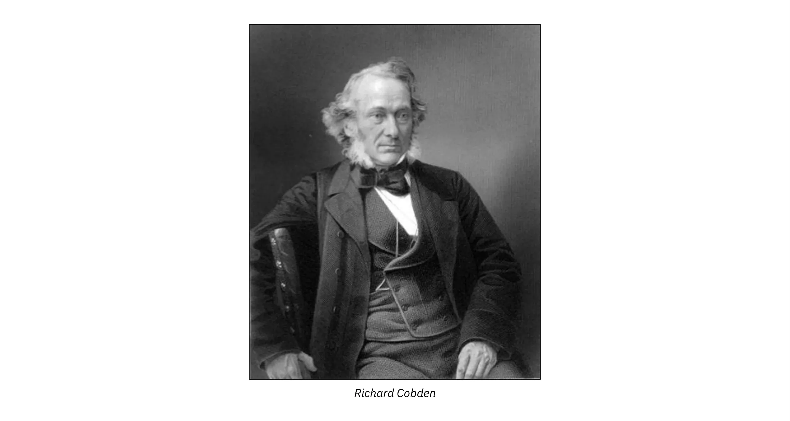

_(Ричард Кобдън)_

Както вече видяхме, най-напред борбата на Кобдън срещу протекционизма в рамките на Английската лига за отмяна на царевичните закони подтиква Бастиа да пише статии, а след това и книги.

Протекционизмът всъщност е форма на икономически национализъм. Той има за цел да елиминира чуждестранната конкуренция, като в същото време се преструва, че "защитава националните интереси". След това те се опитват да накарат публичните власти да приемат набор от чисто демагогски неистини, представяни като добродетелни: защита на работните места, конкурентоспособност и т.н. Разбира се, избраните длъжностни лица се поддават на натиска на производителите, защото това е златна възможност за тях да консолидират клиентелата си и да разширят властта си.

_пример за промоционална реклама на блендер, произведен във Франция_

---

> Нашата среща с Арно Монтебур
> Произведено във Франция,
> той вярва в нея, ние я тествахме

---

Аргументът за защита на работните места е това, което Бастиа нарича заблуда. Защото в действителност тя е равносилна на данък. Той води до оскъпяване на продуктите. Нека вземем примера, даден от самия Бастиа.

Представете си английски нож, който се продава в нашата страна за 2 евро, а нож, произведен във Франция, струва 3 евро. Ако позволим на потребителя свободно да си купи желания нож, той спестява 1 евро, което може да инвестира другаде (в книга или молив).

Ако забраним английския продукт, потребителят ще плати една единица повече за своя нож. По този начин протекционизмът води до печалба за националната индустрия, но до две загуби: едната за друга индустрия (в този случай за индустрията на моливите), а другата - за потребителя. Напротив, свободната търговия води до двама щастливи печеливши.

Протекционизмът също е форма на класова борба. Според Бастиа той е система, основана на егоизма и алчността на производителите. За да увеличат възнаграждението си, фермерите или индустриалците изискват данъци, за да затворят пазара за чуждестранни продукти, като по този начин принуждават потребителите да плащат повече за техните продукти.

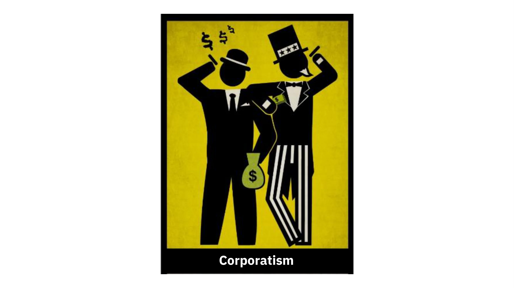

Бастиа е твърдо на страната на потребителите. Срещу класовия интерес той издига общия интерес, който е интересът на потребителя, т.е. интересът на всички. Държавата винаги трябва да се позиционира от гледна точка на потребителя, когато действа.

С Февруарската революция от 1848 г. и нейните барикади се появява по-страшен враг от протекционизма, с когото той има много общи черти: социализмът.

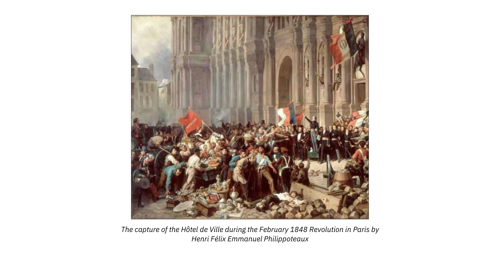

Какво е то? Това е политическо движение, което се застъпва за законова организация на труда, национализация на ключови отрасли и банки и преразпределение на богатството чрез данъчно облагане. Сега Бастиа ще посвети цялата си енергия, талант и трудове срещу тази нова доктрина, която може да доведе единствено до експоненциален растеж на властта и вечна класова борба. Така още от първите дни на революцията той сътрудничи на краткотрайния вестник "La République Française", който бързо става известен като контрареволюционно списание. По това време той пише своите памфлети за собствеността, държавата, грабежа и закона.

На 27 юни 1848 г., ден след кървавото ново въстание в Париж, в дълго писмо до Ричард Кобдън той се спира на причините, които биха могли да доведат до тези събития.

- 1° Първата от тези причини е икономическото невежество. Именно то подготвя умовете да приемат утопиите на социализма и фалшивия републиканизъм. По този въпрос се позовавам на предишното видео за тенденциите в класическото и университетското образование.

- 2° Нацията се влюби в идеята, че братството и солидарността могат да бъдат въведени в закона. Това означава, че тя поиска държавата директно да създаде щастие за своите граждани. Тук Бастиа вижда началото на социалната държава.

И след това ще продължи да анализира порочните ѝ ефекти. Ето един пример, цитиран в писмото до Кобдън:

> По силата на естествените наклонности на човешкото сърце всеки започна да изисква от държавата за себе си по-голям дял от благосъстоянието. Това означава, че държавната или обществената хазна била подложена на разграбване. Всички класи поискаха от държавата, сякаш по право, средствата за съществуване. Усилията, които държавата полагаше в тази насока, водеха единствено до увеличаване на данъците и пречките и до нарастване на мизерията.

- 3° Бастиа добавя, че според него протекционизмът е първата проява на това разстройство. Капиталистите започнаха с искане за намеса на закона, за да увеличат своя дял в богатството. Неизбежно работниците искаха да направят същото.

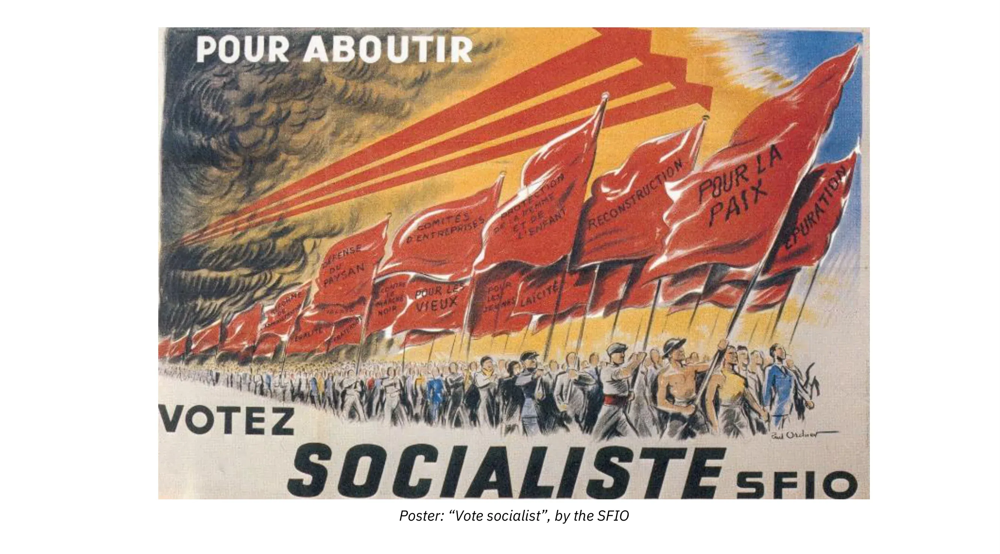

---

> ЗА ДА ПОСТИГНЕТЕ УСПЕХ
> ГЛАСУВАЙТЕ ЗА СОЦИАЛИСТИТЕ SFIO

---

В заключение, според Бастиа протекционистите и социалистите имат обща гледна точка: това, което те търсят от закона, не е да осигури на всеки свободно упражняване на способностите му и справедливо възнаграждение за усилията му, а да благоприятства повече или по-малко пълната експлоатация на една класа граждани от друга. При протекционизма малцинството е това, което експлоатира мнозинството. При социализма мнозинството е това, което експлоатира малцинството. И в двата случая се нарушава справедливостта и се застрашава общият интерес. Бастиа ги противопоставя един на друг.

> Държавата е голямата фикция, чрез която всеки се опитва да живее за сметка на всички останали.

## Прудон

<chapterId>96902abd-6915-5b25-a187-a4790162b86c</chapterId>

:::video id=6ede1de0-b034-4c48-845d-a2c415de6af2:::

Пиер-Жозеф Прудон е един от основните представители на френския социализъм в средата на XIX век. Особено известен е с твърдението си "Собствеността е кражба", представено в "Какво е собственост?" през 1840 г.

В това твърдение има нещо логически абсурдно. Защото, ако нямаше законно придобита собственост, логично не би могло да има и деяние като кражбата. Ето защо по-късно Прудон ще поясни, че за кражба той смята фактическото разпределение на собствеността, а не самата собственост. Вместо това той описва собствеността като революционна сила, основополагаща за анархисткото общество.

Но Прудон е анархист-индивидуалист. Той не смята нито пролетариата, нито държавата за легитимни източници на власт. Той остро критикува комунизма и се застъпва за работническия мутуализъм - форма на структурирана кооперативна солидарност, която разчита на доброволното обединяване на ресурси за взаимопомощ. Тя е по-малко известна, но Бастиа не се е противопоставял на тази идея по принцип. Той просто се е опасявал, че държавата ще я превърне във фактическа монополна обществена услуга. Историята ще докаже, че е бил прав.

От друга страна, добре известно е, че в "Бедността на философията" Маркс яростно напада Прудон и неговия социализъм, който нарича "утопичен", в полза на така наречения "научен" социализъм.

През юни 1848 г. Прудон е избран за член на Националното събрание заедно с Бастиа. Двамата се познават и се ценят високо. През 1849 г. обаче, в гръмко противоречие, Бастиа си разменя с него четиринадесет писма в колоните на La Voix du Peuple. В тази оживена размяна той изяснява позицията си по парични и банкови въпроси. Спорът се свежда до следната алтернатива: свободен кредит или свобода на кредита?

Прудон смята, че лихвата върху капитала е основната причина за нищетата и социалното неравенство. Той се застъпва за неограничено създаване на парични средства от държавна банка (Exchange Bank или Народна банка) и вижда в "свободния кредит" решение на социалния проблем. От друга страна, Бастиа е привърженик на свободата на банките, което означава регулиране на паричното обращение чрез свободен достъп до професията, съчетан с необходимата отговорност за собствените средства, и свобода на конкуренцията.

Бастиа опровергава опонента си на няколко етапа. Първо, той анализира порочните ефекти от свободното кредитиране и създаването на парични средства. Подобна система би могла само да насърчи най-рисковите и безразсъдни действия на банките и частните субекти, защото те знаят, че са покрити от държавата, т.е. от парите на данъкоплатците: "Сериозно е всички хора да бъдат поставени в ситуация, в която да казват: Ако успея, толкова по-добре за мен; ако не успея, толкова по-зле за другите." Прозорливо изказване, което може да се приложи и в нашата епоха.

Политиката на ниски лихвени проценти, практикувана от централните банки, е начин за изкуствено създаване на пари. А последователните кризи на финансовата система през последното столетие, заедно със задлъжняването на държавите, са нейни преки последици.

Тогава Бастиа показва, че е възможно да се подобри покупателната способност на работническата класа, но с други средства, по-справедливи и по-ефективни. За него намаляването на лихвените проценти също е основна цел на либералната политика. Но това се постига чрез освобождаване и натрупване на капитал, а не чрез премахване на лихвата, т.е. на свободния кредит.

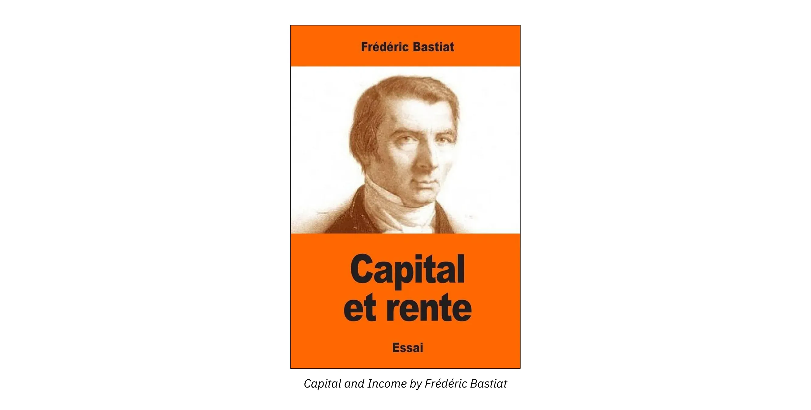

Всъщност според Бастиа напредъкът на човечеството съвпада с формирането на капитала. В своя памфлет, озаглавен "Капитал и рента", Бастиа илюстрира тази концепция с Робинзон Крузо на неговия остров.

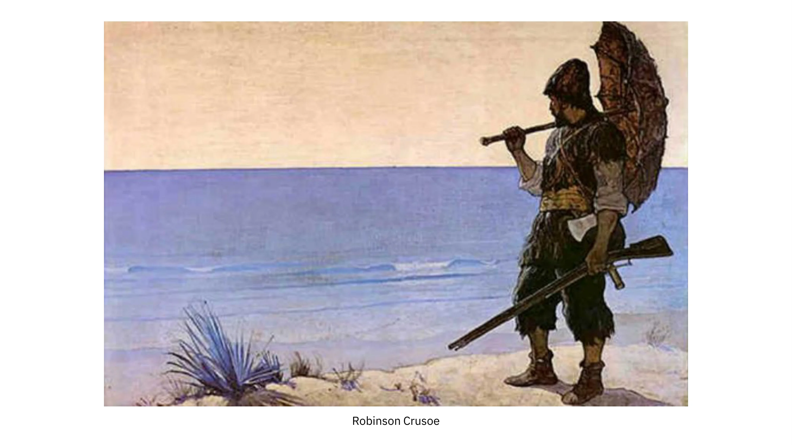

Без натрупан капитал или материали Робинзон би бил обречен на смърт. След това той обяснява, че капиталът обогатява работника по два начина:

- Той увеличава производството, като по този начин намалява цената на стоките за потребление;
- което води до увеличаване на заплатите.

В съвременното общество капиталът служи като сила, която изравнява възможностите. Всъщност Бастиа казва:

> Когато капиталът се увеличава, той се конкурира сам със себе си; възнаграждението му намалява или, с други думи, лихвеният процент спада.

В заключение, както Прудон, така и Бастиа признават значението на натрупването на капитал и тенденцията едни хора да експлоатират други. Въпреки това те не правят едни и същи изводи. Прудон, подобно на Маркс, предвижда все по-голямо обедняване на масите в капиталистическите страни. Бастиа вярваше, че капитализмът ще доведе до безпрецедентно благоденствие на всички класи и до развитието на все по-значителна средна класа. Това наистина се случи.

# Икономически софизми

<partId>59686d1d-58c6-59a8-9fc4-74a10d24cdbe</partId>

## Това, което се вижда и това, което не се вижда

<chapterId>25fb02a9-5d68-5c58-bd0f-d4b8e1fd91f9</chapterId>

:::video id=aff28a5b-3cf4-414b-9a6a-b70ffb1bf20c:::

В тази глава ще ви разкрия една съвсем нова технология - революционна иновация. Един изследовател е разработил чифт бионични очила с вградена в предната им част свръхмощна миникамера. Тази технология позволява да се визуализират детайли, които са невидими за невъоръженото око. В очилата има електронен чип, който предава изображенията директно в облака чрез смартфона ми.

Изобретателят на първия прототип на тези очила е Фредерик Бастиа през 1850 г. в известен памфлет: _Ce qu'on voit et ce qu'on ne voit pas_. Тези очила са очилата на икономиста. Те позволяват да се измерят последиците от решенията, взети от властите, върху нашия живот. Те са очилата, които "ни позволяват да видим това, което не виждаме": разрушенията, причинени от клиентелистки политики и фалшиви икономически теории. Често не виждаме нито жертвите им, нито бенефициентите им; накратко, не виждаме реалните им последици, за разлика от твърденията в официалните речи, които Бастиа нарича "икономически софизми".

Добрият икономист, според Бастиа, трябва да опише последиците от политическите решения върху обществото. Той обаче трябва да обръща внимание не на краткосрочните им ефекти върху определена група, а на дългосрочните им последици за обществото като цяло. Кои са жертвите и кои са бенефициентите на тези политики? Какви са скритите разходи, свързани с определен закон или политическо решение? Какво биха направили данъкоплатците вместо правителството с парите, които са им били взети под формата на данъци? Това са въпросите, които поставя добрият икономист, според Бастиа.

Така в "Обществени работи" Бастиа пише:

> Държавата открива път, построява дворец, изправя улица, прокопава канал; по този начин тя дава работа на определени работници - това се вижда; но лишава от работа други работници - това не се вижда.

Един от най-известните софизми е заблудата на счупения прозорец. Някои твърдят, че счупването на прозорец в къща не вреди на икономиката, тъй като носи полза на стъкларя. Бастиа обаче ще докаже, че разрушаването не е в наш интерес, тъй като то не създава богатство. То струва повече, отколкото носи. Младото момче, което счупва прозореца на съседа, дава работа на стъкларя. Но ето как приятелите му го утешават:

> Всеки облак има сребърна страна. Такива инциденти поддържат индустрията в движение. Всеки трябва да живее. Какво щеше да стане със стъкларите, ако прозорците никога не се чупеха?

Така според Кейнс унищожаването на собственост, принуждавайки към разходи, би стимулирало икономиката и би имало "мултиплициращ ефект", стимулирайки производството и заетостта. Това е само това, което се вижда.

Не се вижда обаче какво собственикът би си купил с тези пари, без които сега трябва да се лиши, тъй като трябва да ги похарчи за ремонт на прозореца си. Това, което не се вижда, е пропуснатата възможност на собственика на счупения прозорец. Той е можел да отдели сумата, дадена на стъкларя, за нещо друго. Ако не му се налагаше да харчи пари за поправка на прозореца, той би могъл да ги похарчи за собственото си потребление, като по този начин наеме хора за производство.

Така че "стимулирането" на икономиката със счупването на прозореца няма да е по-голямо, отколкото без него. В първия случай обаче ще има нетна загуба: стойността на прозореца.

Първият урок, който трябва да научим, е, че "добро" решение или "добра" политика е тази, която струва на обществото по-малко от това, което би струвало друго разпределение на ресурсите. Ефективността на дадена политика следва да се оценява не само въз основа на нейните последици, но и въз основа на алтернативите, които биха могли да възникнат. Това е концепцията за "алтернативните разходи", скъпа на Бастиа.

Вторият урок е, че разрушаването не стимулира икономиката, както смятат кейнсианците, а води до обедняване. Противно на общоприетото схващане, унищожаването на материални блага няма положителен ефект върху икономиката. Ако използваме заключителните думи от текста на Фредерик Бастиа: "обществото губи стойността на ненужно унищожените предмети".

Нека вземем един актуален пример. Когато автомобилната индустрия изпитва затруднения, политиците измислят схеми за бракуване, за да я "възобновят". Това, което виждаме, е увеличението на продажбите на Рено и Пежо. Това, което не виждаме, е загубата за други икономически сектори и това, че се унищожават напълно изправни автомобили.

Но има и други начини за стимулиране на икономиката. Ако държавата се ангажира с големи проекти или инвестира средства в определени промишлени сектори, за да подкрепи заетостта, това не е ли добра новина за растежа? Не повече, би отговорил Бастиа. Защото с какво ще се финансират публичните разходи? С повишаване на данъците или с дълг, т.е. с невидими, но съвсем реални разходи, които ще се отразят на растежа. Освен това правителството не произвежда нищо; то просто отклонява ресурси от частното им използване. И това, което не виждаме, са многото неща, които биха могли да бъдат произведени, ако капиталът не беше изтеглен от частния сектор, за да се финансират правителствените програми.

И накрая, почти век преди Кейнс, можем да кажем, че Бастиа опровергава кейнсианските софизми, според които държавната задлъжнялост насърчава икономическия растеж и че публичните разходи водят до икономически растеж.

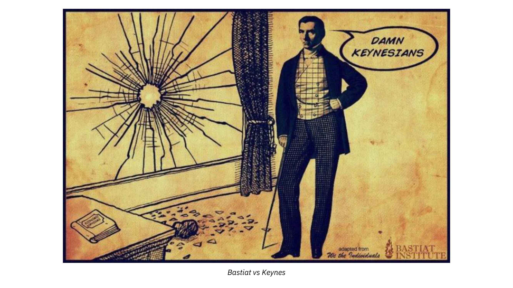

Основният извод от тази поредица от текстове е, че държавната намеса често има непредвидени, обратни ефекти, които невинаги са очевидни. Само добрият икономист е способен да ги предвиди. Политиката е това, което виждаме. Икономиката е това, което не виждаме.

## Петицията на производителите на свещи

<chapterId>f4e759ed-1cb2-55c7-885e-0a60244758a4</chapterId>

:::video id=b1856cde-9156-4a16-99fa-a0e45edcc905:::

През 1840 г. Камарата на депутатите приема закон за увеличаване на данъците върху вноса, за да защити френската индустрия. Това е прочутият икономически патриотизъм, с който се сблъскваме и днес.

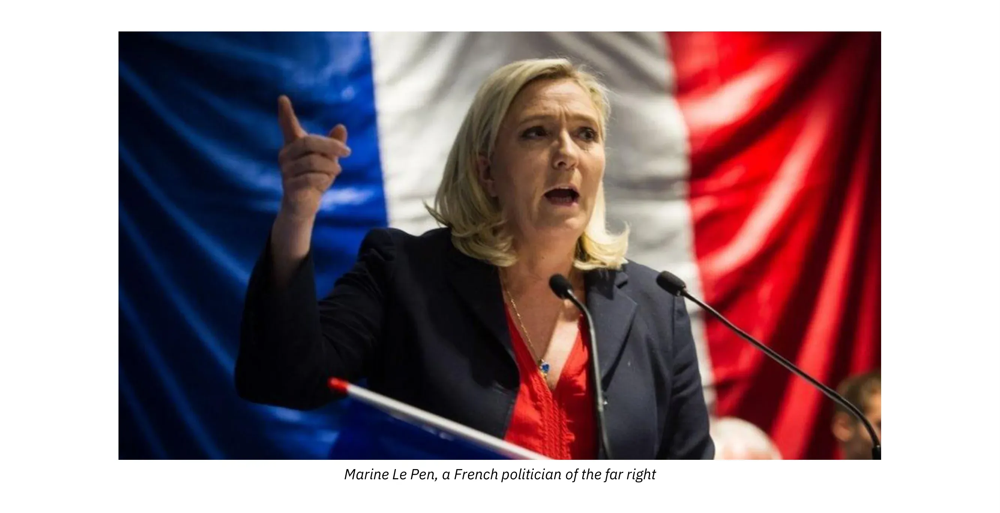

_горе: Марин Льо Пен, френски политик_

След това Бастиа съставя сатиричен текст, който по-късно се превръща в едно от най-известните му произведения: "Петицията на производителите на свещи". В него се илюстрира как определени добре организирани групи производители, оказващи натиск, получават неоправдани привилегии от държавата в ущърб на гражданите. Същевременно тя показва абсурдния и разрушителен характер на протекционисткото законодателство.

---

> ЗАЩИТАВАЙТЕ НАШИТЕ СВЕЩИ!

---

В тази петиция производителите на свещи искат от депутатите правна защита срещу опасен конкурент:

> Страдаме от непоносимата конкуренция на чуждестранен съперник, който, изглежда, е в толкова добри условия за производство на светлина, че залива националния ни пазар на баснословно ниска цена.

И така, кой е този нелоялен чуждестранен конкурент? Това не е никой друг, а слънцето. След това производителите изтъкват възможността, която би се открила в запазването на "националния пазар за националния труд", като се разпореди чрез закон да се затворят "всички прозорци, покривни прозорци, сенници, щори, щори, завеси, ветрила, с една дума всички отвори, дупки, процепи и пукнатини, през които слънчевата светлина е свикнала да влиза в къщите".

С други думи, производителите на свещи се опитват да докажат вредното въздействие на "чуждестранен конкурент" (слънцето) върху икономиката на Франция. Защото слънцето не само може да осигури същия "продукт" като свещите, но и го прави безплатно. Двеста години по-късно тази история остава изключително актуална. Помислете за таксиметровите шофьори, които искат със закон да се забранят VTC и Uber. Помислете за книжарниците, които искат да забранят Amazon.

Истинският противник на Бастиа в тази фикция е политическият и електорален протекционизъм, който разчита единствено на алчността на производителите и наивността на потребителите. Той разкрива заговора между лошите капиталисти от онова време и държавата. Вместо да прави нововъведения и да се адаптира към пазара, лошият капиталист е този, който се стреми да получи политическо предимство чрез протекционизъм. Това винаги води до разхищение за потребителя, т.е. до несправедливост.

Накратко, протекционизмът е целенасочена политика, която дава предимство на производителите пред потребителите. Според Бастиа обаче истинските представители на общия интерес са потребителите, защото всички ние сме потребители.

Протекционизмът също се основава на скрит силогизъм, който се оказва погрешен:

- Колкото повече работим, толкова по-богати сме;
- Колкото повече трудности трябва да преодолеем, толкова повече работим;
- Следователно колкото повече трудности трябва да преодолеем, толкова по-богати сме.

Нека илюстрираме този абсурд с няколко кратки истории, разказани от Бастиа. В глава III от втората поредица на "Икономически софизми" той представя дърводелец, който пише до министъра петиция с искане за протекционистично законодателство. Дърводелецът формулира искането си по следния начин: "Г-н министър, приемете закон, който предвижда, че никой няма да може да използва нищо друго освен греди и греди, произведени от тъпи брадви". С други думи, приемете закон, който забранява използването на остри брадви във Франция. По този начин там, където обикновено се нанасят 100 удара с брадва, ще е необходимо да се нанесат 300. Дърводелците ще бъдат много търсени и следователно по-добре платени.

В глава XVI има друг ироничен текст, озаглавен "Дясната и лявата ръка". След проведено разследване кралски пратеник изготвя доклад, в който предлага на краля ръцете на всички работници да бъдат отрязани или най-малкото вързани. По този начин, продължава той, работата и съответно богатството ще се увеличат. Производството ще стане значително по-трудно, което ще наложи наемането на допълнителна работна ръка и увеличаване на заплатите. Пауперизмът ще изчезне от страната.

Следвайки тази логика за създаване на работни места на всяка цена, защо да не заменим камионите с колички, а лопатите с чаени лъжички? Всички тези софизми имат една обща черта: те бъркат средствата с целта. За Бастиа целта на икономиката не е запазването на работните места, а по-скоро запазването на богатството. Не трябва да съдим за полезността на работата по нейната продължителност и интензивност, а по резултатите от нея: задоволяването на потребностите и полезността.

Това объркване на средства и цели се среща в лозунга "парите са богатство".

Това е аксиомата, която ръководи паричната политика на повечето държави. Всъщност изкуственото увеличаване на количеството на парите позволява на банките да отпускат заеми на отделни лица и на държавите лесно да изплащат дълговете си; това е "това, което виждаме". Но "това, което не виждаме", е, че това създаване на пари, което не се основава на реално създаване на богатство, ще доведе до инфлация и до разорение на спестителите.

Следователно истинското богатство, според Бастиа, е съвкупността от полезни неща, които произвеждаме чрез работа, за да задоволим нуждите си. Следователно парите са само често използвано средство за размяна; те служат само като посредник.

## Грабеж чрез данъчно облагане

<chapterId>551fc499-2119-5a52-9114-412d29434c22</chapterId>

:::video id=a5fe6417-cd81-4c72-a7c7-59aabf9e1547:::

> Когато богатите отслабват, бедните умират.

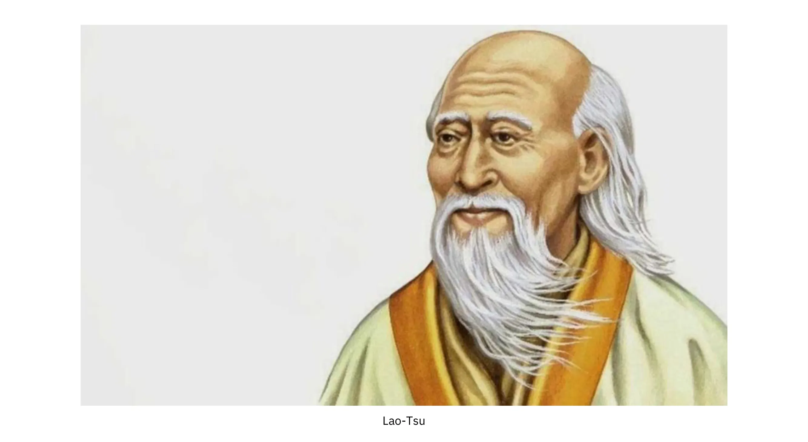

Този цитат, приписван на Лао Дзъ, описва неизбежното последствие от данъчна система, която цели да обложи богатите с повече данъци от останалите.

Но чували ли сте някога да се казва:

> Данъчното облагане е най-добрата инвестиция: то е оплождаща роса! Вижте колко семейства поддържа и проследете в мислите си рикошетите му върху индустрията: то е безкрайно, то е живот.

Във Франция, където публичните разходи се считат за предимство, данъците са по-високи, отколкото в други страни. Но Бастиа ни предупреждава веднага: "Във всеки публичен разход зад привидното добро се крие по-трудно забележимо зло."

За какво става дума?

Икономиката се отнася до положителните или отрицателните последици от политическите решения върху нашия живот. Според Бастиа обаче икономистът трябва да внимава не само за краткосрочните им ефекти върху определена група, но и за дългосрочните им последици за обществото като цяло.

> Това, което виждаме, е трудът и печалбата, позволени от социалните вноски. Това, което не виждаме, са работите, които биха били генерирани от същата тази вноска, ако тя беше оставена на данъкоплатците. Това, което виждаме, са трудът и печалбата, позволени от социалната вноска. Това, което не виждаме, са произведенията, които биха били създадени от същия този принос, ако той бъде оставен на данъкоплатците.
>

> Ф. Бастиа

Още в самото начало той опровергава все още широко разпространения аргумент, че публичните разходи, финансирани с данъци, създават работни места. Всъщност данъците не създават нищо, тъй като това, което се харчи от държавата, вече не се харчи от данъкоплатците.

Освен това държавата е по-разточителна от хората. Всъщност, напомня той, държавата не притежава нищо и не произвежда богатство. Публичните разходи често са източник на разхищение, защото огромните суми, конфискувани от индивидите, често избягват отговорността на собствениците си и се харчат вместо тях от бюрократи, които са подвластни на групи за натиск.

Разбира се, данъчното облагане е напълно оправдано като заплащане за еквивалентна обществена услуга, получена в замяна. Но във Франция държавата е определила няколко роли на данъците.

Първоначално тя трябваше да покрива общите разходи. След това данъците получиха роля и в регулирането на икономиката. В този случай политиците и бюрократите имат власт, която е ограничена само от тяхната добра воля. Увлечени в своите изкуствени конструкции, те оформят икономиката, като облагат с данъци и регулират секторите в по-голяма или по-малка степен според прищевките си, за да ги облагодетелстват или онеправдаят.

И накрая, на данъците се приписва социална роля. Те се превърнаха в инструмент на социалната справедливост. Следователно данъците не трябва да засягат всички еднакво. Данъците трябва да бъдат преразпределителни, от тези, "които имат повече", към тези, "които имат по-малко".

Проблемът е, че данъците, така както са замислени, са обект на произвола на властимащите. Те облагодетелстват или ощетяват определени социални категории в зависимост от това дали властта очаква гласове от тях или не. Освен това прогресивните ставки носят малко приходи на държавната хазна. Те обаче позволяват на мнозинството да експроприира малцинството и естествено се превръщат в конфискационни.

Ето защо Бастиа още тогава е разбрал кривата на Лафер. Артър Лафер е американски икономист, известен с известната си "крива" (елипса), публикувана през 1974 г., която показва, че доходът от данъци се увеличава с намаляването на данъчната ставка. Това е теорията за намаляващата възвръщаемост, дължаща се на прекомерно данъчно облагане.

> Твърде големият данък убива данъка.
>

> Артър Лафер

Политиците наивно приемат, че съществува автоматична и постоянна връзка между данъчните ставки и данъчните приходи. Те смятат, че могат да удвоят данъчните приходи, като удвоят данъчната ставка. Според Лафер подобен подход пренебрегва факта, че данъкоплатците могат да променят поведението си в отговор на нови стимули.

Кривата на Лафер показва, че правителството не събира никакви приходи, когато данъчните ставки достигнат 100%. Обратно, всяко намаление на данъците стимулира икономическата активност, а оттам и държавните приходи. Намаляването на пределните данъчни ставки стимулира инвестициите, работата и творчеството, като по този начин насърчава икономическия растеж. Едно достатъчно намаление би могло да доведе до достатъчно икономически стимули, за да се разшири значително данъчната основа и да се увеличат държавните приходи.

Бастиа би добавил, че намаляването на държавните разходи трябва да бъде толкова важно, колкото и намаляването на данъците. Въпреки това, както сполучливо се изрази Маргарет Тачър, ученичка на Фредерик Бастиа:

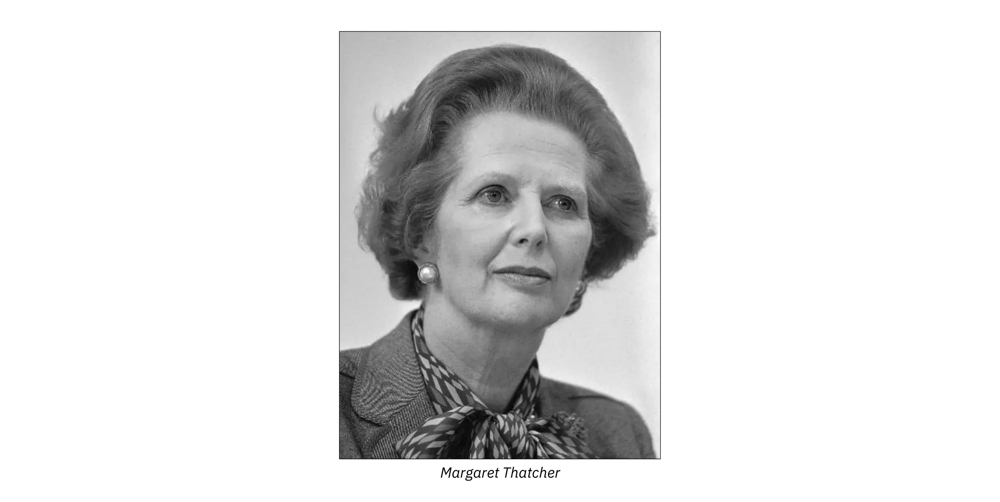

> Целта не е да направим богатите бедни, а да направим бедните богати.

И тя каза това по адрес на социалистите.

## Двата морала

<chapterId>c518e449-f638-553c-9a49-15da48023d41</chapterId>

:::video id=e2037025-a4db-4980-91e7-a04da99514de:::

Много хора познават "Тартюф или Измамникът" - комедията на Молиер, в която хитър поклонник се опитва да съблазни Елмира и да измами съпруга ѝ Оргон. Как човек може да се предпази от измамите на такъв лицемер, който се преструва, че ви прави добро, а в същото време крои заговори срещу вас?

Бастиа отбелязва, че има два начина да се сложи край на този вид измама: да се поправи Тартюф или да се просветли Оргон. Разбира се, винаги ще има Тартюфи, но силата им да вредят би била много по-малка, ако има по-малко Оргони, които да ги слушат.

Слабостта на човешкия разум е в основата на злоупотребата със свободата. Тя е основното ограничение на хората и първопричина за много злини. Ето защо е необходимо да се просвещават съвестите за полезния или вредния, а оттам и за справедливия или несправедливия характер на човешките действия, независимо дали са индивидуални или колективни.

Съществуват обаче два допълващи се начина за просветляване на преценката на гражданите, както Бастиа изтъква в глава от втората серия на "Икономически софизми", озаглавена "Двата морала".

- Първо, съществува "философски или религиозен морал", който действа, като пречиства и коригира човешките действия (човека като агент);
- тогава съществува "икономически морал", който действа, като показва на човека "необходимите последици от неговите действия" (човекът като пациент).

Всъщност това са две напълно допълващи се морални рамки.

1. Първият е насочен към сърцето и насърчава хората да правят добро; това е религиозният или философският морал. Той е най-благородният. Той вкоренява в сърцето на човека съзнанието за неговия дълг. Той му казва:

> Усъвършенствай се; пречиствай се; престани да вършиш зло; върши добро, укроти страстите си; жертвай интересите си; не потискай ближния си, когото е твое задължение да обичаш и да облекчаваш; бъди първо справедлив, а после милосърден.

Накратко, тя учи на добродетел, която е безкористна постъпка. Този морал, казва Бастиа, ще бъде вечно най-красив и трогателен, защото показва най-доброто в човека.

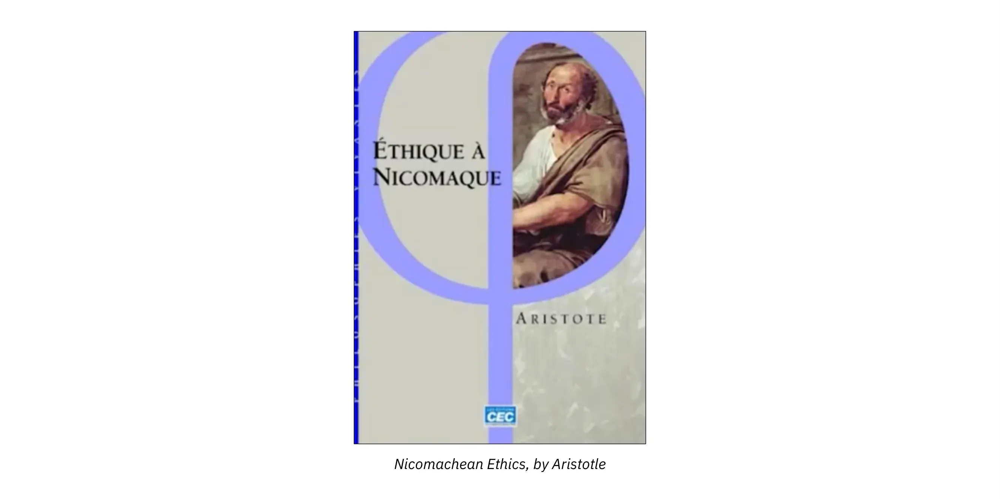

2. Другата помага да се осъди и пребори злото чрез познаване на последиците от него - това е икономическият морал. Той е насочен по-скоро към интелекта, отколкото към сърцето, като има за цел да осведоми жертвата за отрицателните последици от дадено поведение. Той укрепва поуките от опита. Стреми се да разпространи здравия разум, знанието и недоверието сред потиснатите маси, като по този начин затруднява потисничеството.

Икономическият морал се стреми към същия резултат като религиозния морал, но започва с последиците от човешките действия. Той ни учи да реагираме срещу несправедливите или вредни действия и да защитаваме тези, които са справедливи или полезни.

Тук Бастиа изтъква ролята на науката, особено на икономическата. Макар и различна от тази на традиционния морал, нейната роля е необходима за борба с разхищението във всичките му форми. Моралът атакува порока в неговото намерение; той възпитава волята. От друга страна, науката атакува порока чрез разбиране на неговите последици, като по този начин улеснява триумфа на добродетелта.

Конкретно икономическата наука, описана от Бастиа като отбранителен морал, се състои в опровергаване на икономическите софизми, за да бъдат те напълно дискредитирани и по този начин да се лиши грабителската класа от нейното оправдание и власт.

Следователно политическата икономия има очевидна практическа полза. Тя разкрива разхищението на скритите разходи, пречките пред конкуренцията и всички форми на протекционизъм.

Отново щеше да има по-малко тартюфи, ако имаше по-малко оргони, които да ги слушат. Ето какво казва Бастиа по този въпрос:

> Затова нека религиозният морал да докосне сърцата на тартуфите, ако може. Задачата на политическата икономия е да просвети техните дупетати. Кой от тези два подхода работи най-ефективно за социалния прогрес? Трябва ли да се каже? Смятам, че това е вторият. Опасявам се, че човечеството не може да избяга от необходимостта първо да се научи на отбранителен морал.

Разбира се, политическата икономия не е универсална наука; тя не изключва философските и религиозните подходи. "Но кой някога е проявявал такива прекомерни претенции в нейно име?" Бастиа се пита.

Едно е сигурно: не политиката е тази, която може да промени хода на нещата или да усъвършенства човечеството. Напротив, необходимо е да се ограничи политиката и да се ограничи до нейната строга роля, която е безопасност. Отговорността и солидарността могат да бъдат укрепени по-скоро в културната, семейната, религиозната и асоциативната област, чрез работа върху идеи, чрез образование и обучение, накратко, чрез гражданското общество.

# Икономически хармонии

<partId>db04dfa4-a53e-5d3e-a307-a68ebc36dc4f</partId>

## Чудото на пазара

<chapterId>895ccd1d-7b52-5a8b-8b2c-6ec0056cf632</chapterId>

:::video id=ed6dc15c-b5e9-465c-9966-16c6737c0a68:::

Може ли едно хармонично общество да се справи без писани закони, правила и репресивни мерки? Ако хората бъдат оставени свободни, няма ли да станем свидетели на безредие, анархия, дезорганизация? Как да избегнем създаването на обикновена съвкупност от индивиди, действащи извън всякаква съгласуваност, ако не чрез закони и централизирана политическа организация?

Това е аргументът, на който често се позовават онези, които изискват регулиране на пазара или смятат, че обществото само е способно да координира индивидите в едно съгласувано и хармонично цяло.

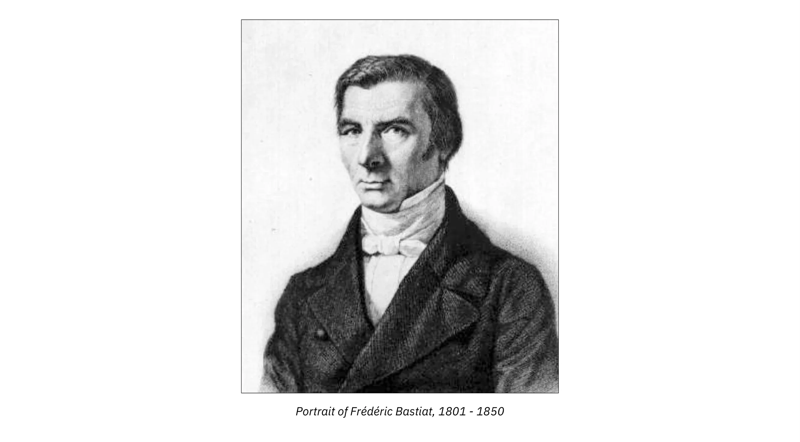

Това не е мнението на Бастиа. Според него социалните механизми, като например небесният механизъм или механизмите на човешкото тяло, се подчиняват на общи закони. С други думи, той вече представлява хармонично организирано цяло. А двигателят на тази организация е свободният пазар.

Чудото на свободния пазар, казва той, се състои в това, че той използва знания, които никой не може да притежава сам, и че осигурява удовлетворение, което е много по-добро от всичко, което би могла да направи една изкуствена организация.

Бастиа дава няколко примера, за да илюстрира ползите от този пазар. Толкова сме свикнали с това явление, че вече не го забелязваме.

Нека разгледаме един дърводелец в едно село - казва той - и да наблюдаваме всички услуги, които той предоставя на обществото, и всички услуги, които получава:

> Всеки ден, след като се събуди, той се облича и не е направил лично нито една от дрехите си. И все пак, за да бъдат тези дрехи достъпни за него, е трябвало да бъде извършена огромна работа, индустрия, транспорт и гениални изобретения по целия свят.
>

> След това закусва. За да може хлябът, който той яде, да се появи на масата му всяка сутрин, земята е трябвало да бъде разчистена, разорана; желязото, стоманата, дървото, камъкът е трябвало да бъдат превърнати в работни инструменти; всички тези неща, всяко от които, взето поотделно, предполагат неизчислима маса работа, вложена не само в пространството, но и във времето.
>

> Този човек ще изпрати сина си на училище, за да получи образование, което предполага изследвания, многогодишно предварително обучение.
> Излиза навън: открива павирана и осветена улица.
>

> Собствеността му е оспорвана: той ще намери адвокати, които да защитават правата му, съдии, които да ги поддържат, служители на правосъдието, които да изпълняват присъдата; все неща, които все още предполагат придобито знание, следователно просвещение и средства за съществуване.

Бастиа описва пазара като децентрализиран и невидим инструмент за сътрудничество. Чрез ценовата система се предава информация за нуждите и уменията на всеки и тя свързва хората, които искат да си сътрудничат, за да подобрят живота си.

Това, което е поразително, заключава Бастиа, е огромната диспропорция, която съществува между ползите, които този човек получава от обществото, и тези, които той би си осигурил, ако се ограничаваше до собствените си ресурси. В рамките на един ден той консумира блага, които не би могъл да произведе сам.

През 1958 г. американският писател Леонард Рийд (Foundation for Economic Education) публикува в списание The Freeman кратко есе, написано в стила на Бастиа, което става много известно: "Аз, моливът". Този текст е метафора за това какво представлява свободният пазар. Започва по следния начин:

> Аз съм оловен молив, обикновен дървен молив, познат на всички момчета и момичета, както и на възрастните, които могат да четат и пишат. Той е един от най-простите предмети в човешката цивилизация. И все пак нито един човек на тази земя не знае как да ме произведе.

В него се връщаме към идеята на Бастиа за невидимото сътрудничество между милиони хора, които не се познават помежду си, водещо до създаването на нещо толкова елементарно като молив. Никой не знае как да направи молив сам. И все пак милиони човешки същества несъзнателно участват в създаването на този прост молив, като обменят и координират своите знания и умения в рамките на една ценова система, без да има висш орган, който да диктува поведението им. Тази история показва, че свободните индивиди, работещи в преследване на законния си интерес, действат в по-голяма степен в полза на обществото, отколкото всяка планирана и централизирана икономическа стратегия.

Носителят на Нобелова награда за икономика за 1976 г. Милтън Фридман също се връща към историята с молива, за да обясни на широката общественост как работи пазарната икономика.

:::video id=db48376a-64c9-48b8-a8fb-2640c9b5bf73:::

В епизод от телевизионната си поредица "Free to Choose" той анализира различните компоненти на нещо толкова делнично и просто като молив, подчертавайки чудото на спонтанния ред, породен от хиляди икономически взаимодействия по света. Хора, които не се познават, които не споделят една и съща религия или обичаи, все пак успяват да се координират, за да произведат този предмет. Той стига до заключението, че свободният пазар е от съществено значение не само за осигуряване на просперитет, но и за насърчаване на хармонията и мира.

Още Фридрих Хайек в есето си "Използване на знанието в обществото" през 1945 г. обяснява защо пазарната икономика и децентрализацията на решенията са жизненоважни за просперитета. Според Хайек никой централен плановик или бюрократ не би могъл да притежава достатъчно знания, за да ръководи успешно всички икономически действия. Единствено ценовата система на свободния пазар позволява на милиони независими участници сами да решават как да разпределят ефективно ресурсите.

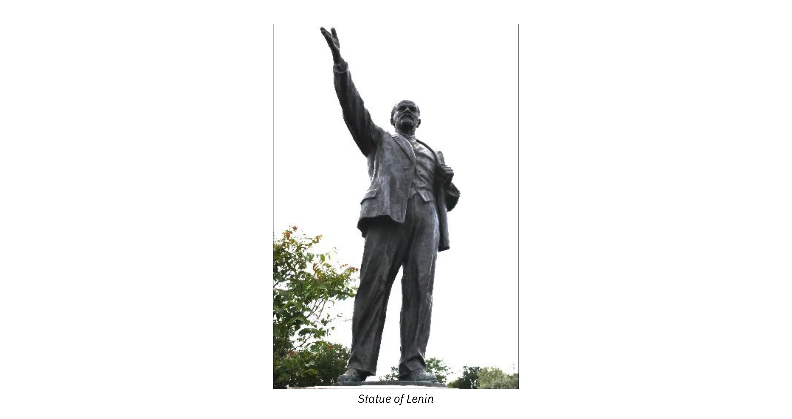

Икономическото планиране, което претендира да надмине пазара, води не само до лошо разпределение на ресурсите, но и до хегемония на една класа над друга. Ето защо социализмът е не само интелектуална грешка, но и грешка, която в крайна сметка поражда огромна несправедливост.

## Свободата и отговорността са ключът към социалния проблем

<chapterId>78baa7ef-2c80-5fc7-8881-c1be4662b96f</chapterId>

:::video id=a7e94133-d79a-47cf-b098-d1b15741235e:::

В писмо до Алфонс дьо Ламартин от 1845 г. Бастиа пише, че цялата му философия се съдържа в един-единствен принцип:

> Свободата е най-добрата форма на социална организация.

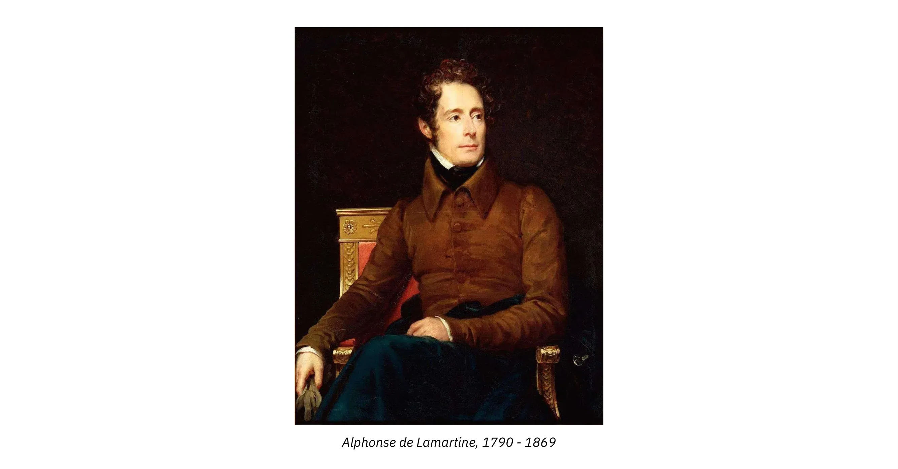

Той обаче добавя условие:

> Законът не трябва да премахва последиците, положителни или отрицателни, от действията на всеки. Това е последващият принцип на отговорността.

С други думи, свободата и отговорността са неразривно свързани и не могат да бъдат отделени една от друга. За него либерализмът се различава от социализма по убеждението, че свободата не може да съществува без отговорност. Но какви реалности точно обхващат думите свобода и отговорност?

Свободата се определя по принцип по негативен начин: да бъдеш свободен означава да действаш без външна принуда при упражняването на собствените си права. Това обаче не означава отсъствие на всякакви ограничения. Тъй като свободата изисква реципрочност, тя ни налага и отговорността да действаме, без да накърняваме собствеността на другите, и ако е необходимо, да поправим нанесените вреди. Това е отговорност.

Следователно отговорността представлява в известен смисъл положителният аспект на свободата: доколкото човек действа свободно, той трябва да понесе последствията от своите действия, добри или лоши.

Индивидуалната отговорност е едновременно основен двигател на творчеството и стимул за предпазливост и предвидливост.

Когато човек харчи собствените си пари, той внимава да не се задлъжнява прекалено, да проверява качеството на продуктите и надеждността на доставчиците, рискувайки да бъде сериозно санкциониран. Такава е силата на отговорността, съчетана със свободата, че тя е истинският двигател на социалния прогрес.

Но откъде идва феноменът безотговорност или деспотизация? Фредерик Бастиа дава отговор на този въпрос - политически отговор. Той казва, цитирам:

> Намесата на държавата ни отнема управлението на самите нас.

Всъщност етатизмът непрекъснато ограничава частната инициатива и свободния избор на хората. Той прави вместо тях това, което те биха могли да направят сами и по-добре. По този начин той отнема на индивидите последствията от техните действия. Той унищожава отговорността.

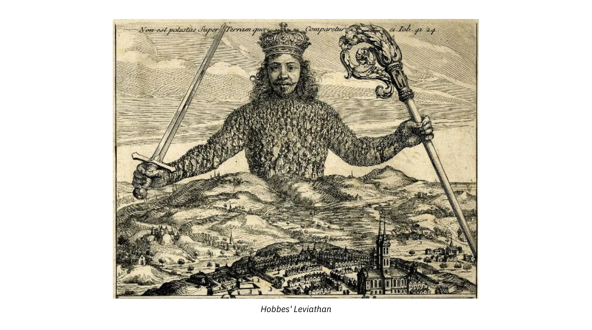

Според Бастиа хипертрофията на законите и прекомерната намеса на държавата водят до борба за власт, разхищение, привилегии, монополи, войни, накратко, до всичко, което пречи на прогреса на цивилизацията.

Рискът от прекомерното предпочитане на пътя на закона или бюрократичния контрол е, че той обезкуражава всякаква мотивация, като налага множество ограничения и по този начин ни лишава от многобройните постижения, които позволяват частната инициатива и свободният избор.

Нека илюстрираме този въпрос с няколко основни актуални теми. Първият пример е кризата от 2008 г.

_(Алън Грийнспан, председател на ФЕД, американската централна банка, от 1987 до 2006 г.)_

Години наред ръководителите на паричната политика обясняваха, че ако печалбите се приватизират, когато всичко върви добре, то загубите ще бъдат взаимствани в случай на фалит (спасителни програми, планове за оздравяване, манипулиране на лихвените проценти, печатане на пари и т.н.). По този начин те създадоха морален риск, улесниха поемането на неразумен риск и насърчиха финансовия свят да се държи безотговорно. По този начин те ускориха финансовата криза, която преживяхме.

И това явление ще се повтаря безкрайно дълго, докато банките остават под господството на централните власти, които трябва да ги защитават, като им отнемат всякаква автономия на решенията и дейността.

Друг пример: обществени услуги

Всяка обществена услуга налага предпочитанията на бюрократичния елит в ущърб на свободния избор на индивида. Това води до две последствия според Бастиа: Гражданинът "престава да упражнява свободен контрол върху собствените си удовлетворения и, след като вече не носи отговорност, естествено престава да има и интелигентност". Причината е проста: всеки писан закон е принудителен и се прилага еднакво за всички; той не взема предвид конкретните ситуации, нужди или предпочитания на гражданите.

И накрая, държавната служба е причина за обездвижване. Всъщност, когато частните услуги станат публични, те избягват конкурентния пазар. Следователно, казва Бастиа, цитирам: "длъжностното лице е лишено от онзи стимул, който тласка към прогрес".

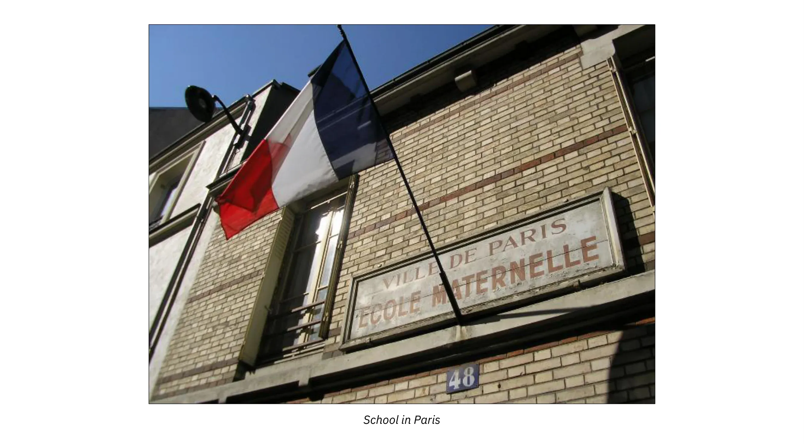

Когато наблюдаваме обществената услуга на националното образование, разбираме какво има предвид Бастиа. То освобождава огромното мнозинство от родителите от бремето да образоват децата си, като свежда училището до детска градина. Тя не насърчава учителите да въвеждат иновации и да поемат рискове, защото в такава система те са просто изпълнители на програма, разработена без тях от бюрократи. В крайна сметка тя не отчита уникалните нужди на всеки човек.

Според Бастиа, който предлага единствените легитимни публични служби на една държава да са три: армията, полицията и съдебната система, ще разгледаме този въпрос в друг курс. Все пак, за да приключим с въпроса за отговорността, проблемът с държавната намеса е, че тези, които вземат решенията, не са тези, които понасят последствията.

С други думи, колективният избор не е отговорен избор, тъй като не води до поемане на риск от страна на вземащите решения, а от друга страна, принуждава другите да понесат определени последици, което е колкото катастрофално, толкова и неморално.

## Силата на отговорността

<chapterId>0c078806-6c58-53f9-a720-5fb62386e56b</chapterId>

:::video id=0b2bc259-52c5-46c9-a904-254746d6972f:::

В предишния курс изследвахме защо свободата и отговорността са от решаващо значение за справяне със социалните проблеми. Сега ще се задълбочим в този въпрос, като покажем как Фредерик Бастиа вижда злините, които поразяват обществата, и тяхното решение.

Понякога либералите са критикувани, че пренебрегват злото и изграждат утопията за чиста и съвършена свобода в един идеален свят. Тази критика е абсолютно неоснователна по отношение на нашия автор.

Никой не може да пренебрегне злото, което цари в историята на човешките общества: несправедливост, войни и страдание. Бихме искали да премахнем тези злини. Впрочем това е целта на голяма част от съвременните философии - от Русо до Хайдегер, през Хегел и Маркс.

Злото е не само окончателна реалност, но и роля, която играе в историята и в човешките действия, казва Фредерик Бастиа. То може да бъде намалено, но със сигурност не и напълно изкоренено, защото това би означавало да се убият свободата и отговорността. И така, откъде идва злото, каква е неговата роля и как може да бъде предотвратено?

За да отговори на тези въпроси, Бастиа ще пристъпи към анализ на човешките действия. То наистина може да доведе както до добро, така и до зло.

Злото първо произтича от нашето несъвършенство. Да избираш свободно, означава да рискуваш да направиш лош избор - казва Бастиа. Всъщност можем да бъдем измамени по много начини, дори по отношение на собствените си нужди и интереси. Човекът е безпогрешен; той е склонен да греши в разбирането на играта на икономическите закони или да ги отклонява от целта им.

Следователно несъвършенството на разума е основното ограничение на хората и е в основата на нашите страдания.

Ако злото произлиза от човешката слабост, а не от самата свобода или от свободната търговия, то лечението не е в потискането на свободата или размяната, а в самата отговорност, тъй като тя е източникът на целия опит. Този принцип на отговорността е следният: Цитирам Бастиа:

> Всеки човек, който действа, получава наградата или наказанието за своите действия.

Чрез тази природна санкция човек се учи, открива, коригира, напредва и се усъвършенства. С други думи, отговорността е принцип на усъвършенстването и прогреса, както видяхме в предишния курс.

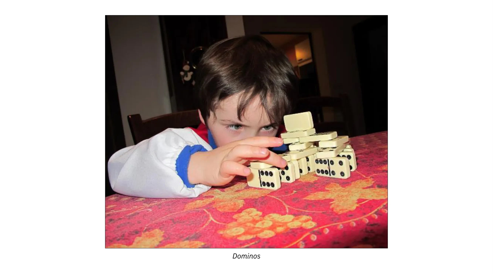

Ако човек понася последствията, добри или лоши, от своите решения, той ще се стреми да се усъвършенства, като се учи от опита си. Следователно индивидуалната отговорност, която според Бастиа е големият възпитател на хората, е основният принцип, залегнал в основата на регулирането на поведението и обществата, и трябва да бъде оставена да действа.

Злото поражда страдание, а страданието ни подтиква да осъзнаем грешките си и да се върнем в правия път. Познаването на злото е начинът, по който напредваме.

Именно защото хората рискуват да направят грешки или да постъпят неправилно и да понесат последствията, те са насърчавани да бъдат отговорни. Тогава той ще се стреми да предвиди опасностите, които могат да го сполетят, за да се предпази.

---

> Да се греши е човешко.

---

Така става ясно, че Бастиа далеч не е сляп. Той не отрича съществуването на злото. Човекът е слаб, податлив на грешки и недостатъци. Никъде няма да открием Бастиа да отрича факта, че упражняването на индивидуалната свобода е свързано с възможността за грешка, включително възможността за неразумен или безсмислен избор.

Той просто твърди, че ако източникът на злото се крие в липсата на свобода, то лечението е в самата свобода, и по-точно в пълното и цялостно упражняване на личната отговорност.

Но ако злоупотребата със свободата е в основата на нашите беди, то правилното ѝ използване е лекът, а именно пълното и цялостно упражняване на личната отговорност, основана на правото на собственост. Следователно социалното регулиране минава през отговорността, а не през намесата на държавата във всички области, която е един от големите източници на разхищение, а оттам и на злини.

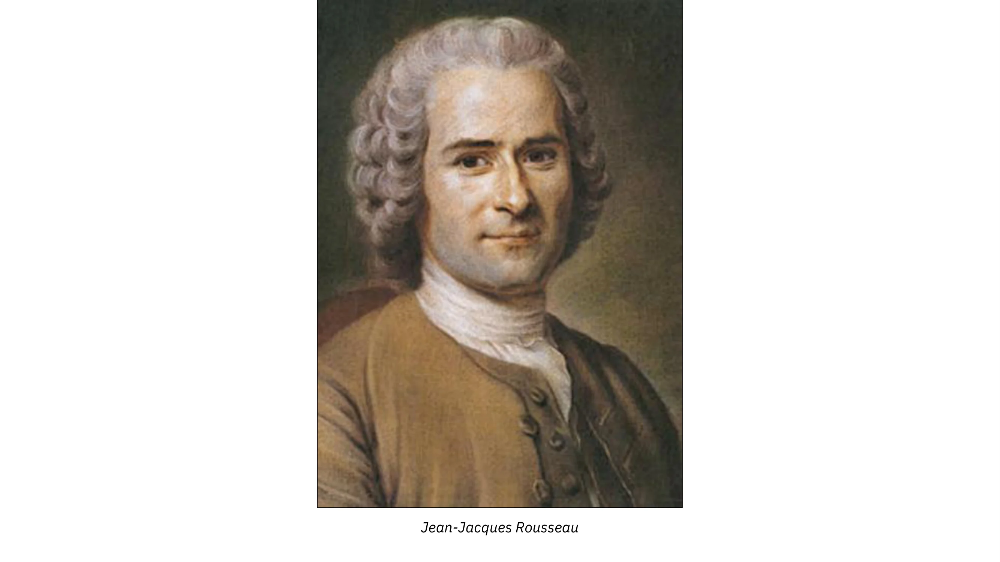

За разлика от Русо, който се опитва да изкорени злото чрез колективни институции, Фредерик Бастиа защитава възможността за зло и грешка, без които няма свобода и индивидуална отговорност. Защото само тя позволява чрез процеса на откриването да се постигне напредък и да се намалят социалните злини.

Трябва да се уточни, че това развитие на прогреса чрез отговорност в никакъв случай не е автоматично. То съвсем не е, както при Хегел или Маркс, някакъв вид природен или исторически детерминизъм, който по чудодеен или механичен начин би довел до хармония и прогрес. Става дума за постепенно и неопределено намаляване на злото, а не за окончателното му премахване.

## Истинска и фалшива солидарност

<chapterId>fa2172e9-22fa-5c01-a3c8-1e8316c064a4</chapterId>

:::video id=28c7b1d0-e32f-48dc-95ee-8459667b42ab:::

В известния си памфлет "Правото" Фредерик Бастиа осъжда извращението на правото, което се състои в това, че под името "солидарност" се узаконява нещо, което наистина трябва да се нарече грабеж. Всъщност има противоречие в желанието да се наложи братство чрез закон, което днес бихме нарекли "социална справедливост" или солидарност.

Моралът се определя като доброволно поведение. Когато човек е принуден да даде нещо, което не иска, той винаги е жертва на кражба.

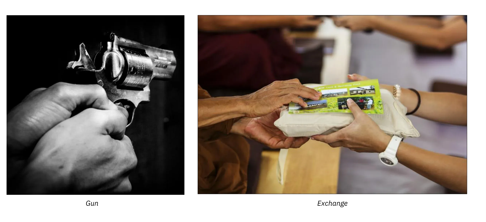

Всъщност, когато дарението е задължително по закон, то вече не е въпрос на морален избор. Моралната нагласа за даряване се заменя с претенцията "за права", които са претенции към труда на другите. Фалшивата солидарност е призив да се живее за сметка на другите.

Това е това, което Бастиа нарича "софизъм на юридическото братство" Нека да го цитираме по този въпрос:

> Братството е спонтанно или не е. Да го разпоредиш, означава да го унищожиш.

И отново:

> Правителствата винаги извършват само действия, които са санкционирани от силата. Сега е допустимо да принудите някого да бъде справедлив, но не и да го принудите да бъде милосърден. Законът, когато се опитва да направи със сила това, което моралът постига чрез убеждаване, далеч не се издига до сферата на Благотворителността, а попада в областта на Грабежа.
> И все пак това извращение на правото си има име - социализъм, т.е. идеология на насилственото преразпределение на богатството от държавата. Социализмът, според Бастиа, се характеризира с идеологията на законния грабеж. Хитростта на тази идеология обаче се крие в способността ѝ да прикрива насилието си чрез злоупотреба с езика, по-специално под формата на призиви за солидарност или братство.

---

> Взаимна помощ
> Общество на GUISY
> 1899

---

Според Бастиа обаче има алтернатива на задължителната държавна солидарност: "общество на взаимопомощта", взаимната и спонтанна помощ на хората помежду им, благодарение на дружествата за взаимопомощ. Въпреки това той предвижда, че държавата в крайна сметка ще изземе тези взаимоспомагателни дружества, за да създаде уникален и централизиран орган, като по този начин ще насърчи харченето и разхищението.

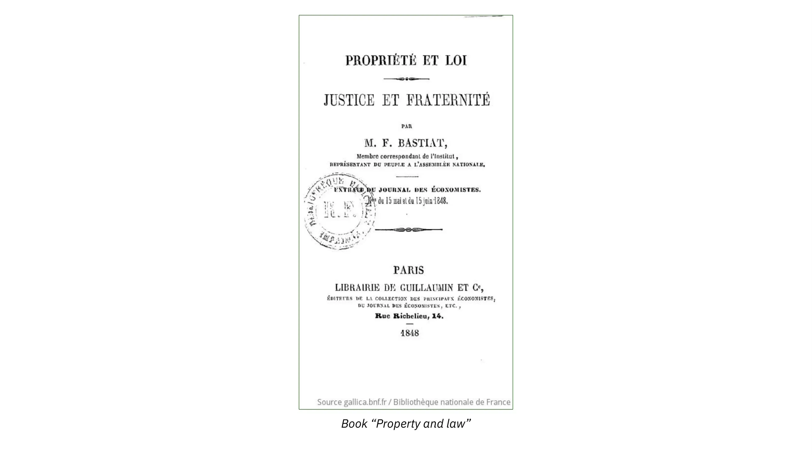

В памфлет, озаглавен "Справедливост и братство", Бастиа също така разглежда идеята за опростена и справедлива данъчна система за финансиране на колективните нужди (полиция, правосъдие, армия): доходите и печалбите ще се облагат с единна и пропорционална данъчна ставка. Днес това е известно като "плосък данък".

---

> Основи -
> **добавена стойност**
> за **обществото**
>

> SwissFoundations

---

Всъщност вътрешносемейната солидарност, местната солидарност или организираната филантропия са много по-развити в страни с облекчена данъчна система и относително висока степен на икономическа свобода, като Швейцария и САЩ, докато те са до голяма степен задушени в страни, в които държавата до голяма степен е заменила индивидуалната отговорност, като Франция и Германия.

Често е модерно да се оплакваме от "егоизма", който би преобладавал в либералните общества. Но точно обратното е вярно. Когато едно общество е обременено с данъци и хората вече не притежават собствеността си, те не са насърчавани да дават, а по-скоро да се затварят в себе си.

В действителност свободното гражданско общество не се основава на егоизма: пазарната икономика функционира на основата на служба на ближния и взаимност. Човек може да обслужва собствения си интерес само като обслужва интереса на другия, като му предлага контрагент, който води до взаимноизгодна размяна. С други думи, доброволната размяна е тази, която създава истинска солидарност.

Принудителното преразпределение няма нищо общо с автентичната човешка солидарност, която има частен или доброволен характер и се проявява в семействата или между членовете на сдружения.

Ето защо Бастиа се противопоставя на социалистите именно по отношение на ролята на правото. Той пише:

Законът може да принуди човека да бъде справедлив, но не може да го принуди да бъде предан. Фалшивата солидарност на социалистите елиминира предаността в полза на чистата държавна принуда, която е в основата на тоталитаризма.

# Законът

<partId>653cbe58-60e1-5401-8f91-4d9843ac6045</partId>

## Правото на собственост

<chapterId>a48a0616-2105-5520-8312-e21a0b6489c7</chapterId>

:::video id=823bbc82-dfe6-4ed4-bb36-e5557dc5341a:::

В този контекст под собственост не трябва да разбираме земя. Тя означава "правото на работника върху стойността, която той е създал чрез своя труд" Бастиа уточнява:

> Считам, че правото на собственост се състои в свободата да се разпореждаш първо със собствената си личност, след това с труда си и накрая с продуктите на труда си, което доказва освен това, че от определена гледна точка свободата и правото на собственост не могат да бъдат разграничени една от друга.

След като установява това, за да разбере моралната основа на собствеността, Бастиа започва с един прост антропологичен принцип: от самото начало човек трябва да работи, за да живее, а плодовете на неговия труд са продължение на неговите способности, т.е. продължение на неговата личност.

> Личност, свобода, собственост - това е човекът. Именно за тези три неща може да се каже, без демагогска изтънченост, че те са преди и над всяко човешко законодателство.

Разбрано в този смисъл, правото на собственост е сред онези права, които не произтичат от позитивното право, а го предхождат и са смисълът на неговото съществуване.

> Законът е колективната организация на индивидуалното право на законна защита.
> Законът

Неговата мисия е да защитава човека и неговото имущество.

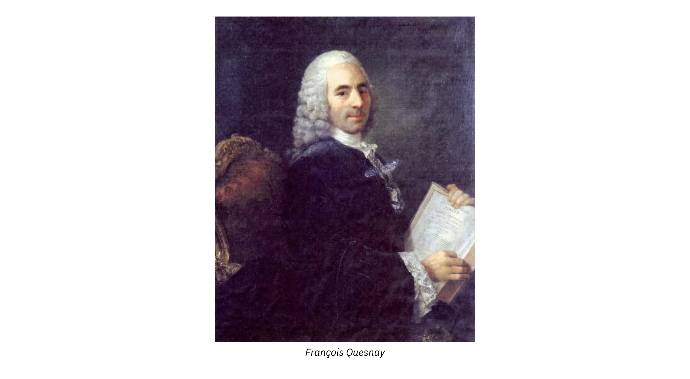

Следователно правото не е същото като закона. Правото не се отъждествява с думата на суверена, нито пък зависи единствено от неговата легитимност. То е продукт на една традиция, на един правен ред, предхождащ и превъзхождащ закона, който се налага на законодателя толкова, колкото и на всеки от обикновените граждани.

Правото "не се създава". То не е измислено от идеална визия за това какви трябва да бъдат законите на обществото; то е открито в природата на човека и в правилата на цивилизованост, предадени от мъдростта на обичаите.

Лицата имат естествени права, които съществуват преди закона: Собственост, Свобода, Личност. Ролята на закона трябва да бъде да защитава тези естествени права на индивида. Следователно държавата трябва да бъде ограничена. Днес бихме казали, че Бастиа е привърженик на минималната държава.

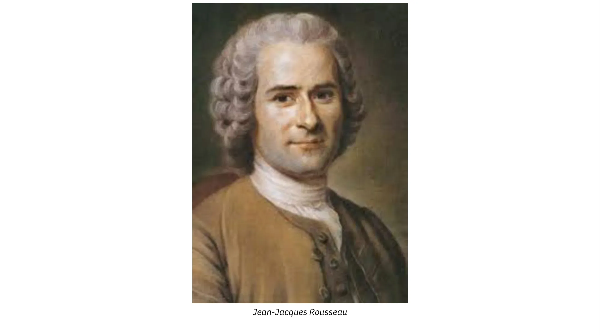

В системата на Русо, която разгледахме в предишния курс, мисията на законодателя е да организира, променя или дори да премахне собствеността, ако сметне това за необходимо. За Русо собствеността не е естествена, а конвенционална, точно както и самото общество. Тази идея произлиза от римското право, с което Русо е бил добре запознат.

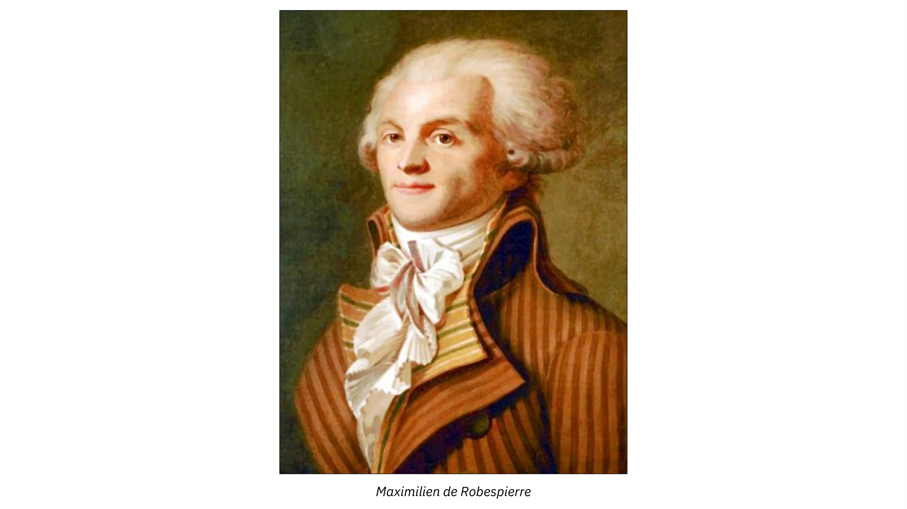

На свой ред Робеспиер издига принципа, че "собствеността е правото на всеки гражданин да се ползва и да се разпорежда с частта от благата, гарантирана му от закона".

За Русо собствеността не предхожда правото; тя е просто конвенция, установена от общата воля и в границите, които тя решава. В резултат на това не съществува свобода или право, които да съществуват независимо от обществото и добрата воля на законодателите. Но ако се отдели правото на собственост, лесно се оправдават фалшиви права, които се придобиват само чрез нарушаване на правата на другите.

Например правото на труд или правото на жилище.

За да мога да придобия нещо безплатно, някой трябва да плати от мое име. И ако плаща държавата, тъй като тя не произвежда богатство, тя може да го направи само като отнеме от някого жилището или неговия еквивалент, за да ми го даде.

Така идеята, че правото на собственост е творение на закона, според Бастиа води до отваряне на неограничено поле за действие на утопистите, които искат да моделират обществото според своите планове.

В системата на естествената свобода съществува естествен закон, независим от прищевките на законодателите. Той е валиден за всички хора и съществува преди всяко общество. И задължение на правителството е да гарантира естествените права на всеки индивид. Справедливото общество е това, в което правото на собственост се зачита напълно, което означава, че е защитено от всякаква намеса от страна на други лица.

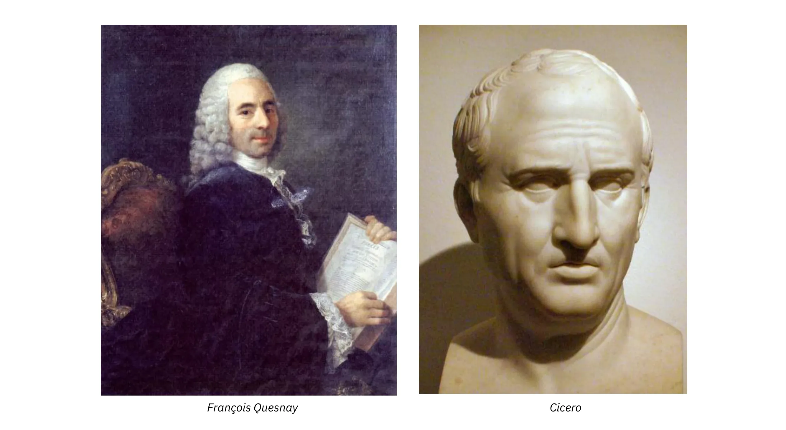

Тук Бастиа се присъединява към наследството на физиократите и, освен това, към традицията на философията на правото на Цицерон и Аристотел. Законът не създава права. Неговата мисия е да ги защитава и по този начин да защитава собствеността - както собствеността на самия човек, така и неприкосновеността на личността и собствеността на плодовете на неговия труд.

## Правен грабеж: Извращение на закона

<chapterId>b4122847-e477-578e-ba34-d35844ac4715</chapterId>

:::video id=24b1ca72-c52a-4ff3-b6db-01e3807c5d8e:::

Основната идея на Бастиа в "Законът", неговия известен памфлет от 1850 г., е да покаже защо и как законът се е превърнал в източник на грабеж, т.е. в средство за създаване на привилегии, ситуационни ренти и данъчен произвол.

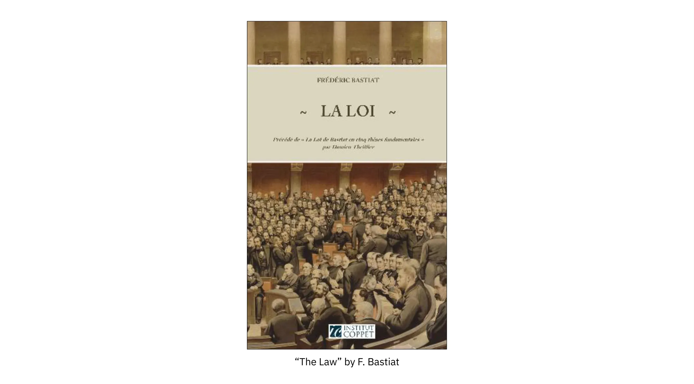

Каква е истинската същност на закона?

Бастиа започва с поставянето на естествените антропологични основи на правото: живот, свобода и собственост.

Институционалната система на естествената свобода е тази, в която обществото, индивидите и собствеността съществуват преди установяването на закони и разпоредби. В тази система Бастиа добавя:

> Не защото има закони, а защото има свойства, има и закони.
> Собственост и право

Всеки човек има право да защитава живота си и да използва способностите си. А правото е колективната организация на тази законна защита. Законът защитава справедливостта. Не позитивната справедливост, която би организирала братство и солидарност, а негативната справедливост, която се ограничава до това да предотврати узурпирането на правата на един човек от друг.

Когато обаче законът престане да бъде негативен и стане позитивен, усещането за неравенство в обществото се засилва и поражда конфликти. Ако безкрайно разширяваме сферата на действие на закона, т.е. отговорността на правителството, отваряме вратата за "безкрайна поредица от оплаквания, омрази, безредици и бунтове", пише той.

Фалшивата филантропия, казва Бастиа, е една от основните причини за изкривяването на закона. Някои хора смятат, че стоят над останалата част от човечеството и са способни да правят по-добри избори от другите.

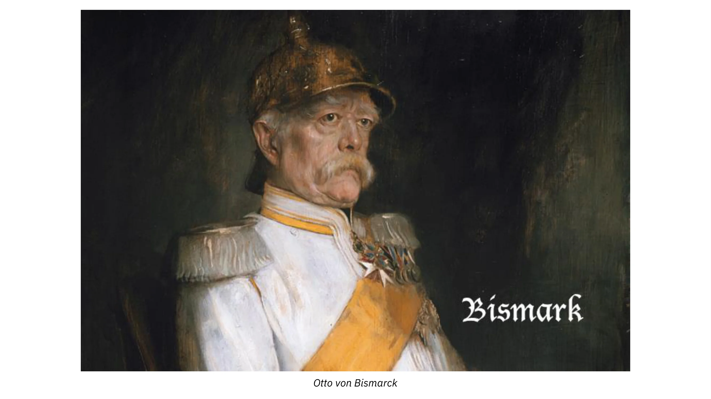

Те знаят по-добре какво е добро за другите и ще наложат своята представа за доброто на всички; това са филантропите. Те са създали фалшиви права, които сега се наричат социални права. Социалните права по същество са права върху труда на другите, права за разпореждане със собствеността и плодовете на труда, включително правото на жилище, здравеопазване, образование, работа и минимална работна заплата.

Какво е грабеж? То е точно обратното на собствеността, казва Бастиа. Грабежът идва от латинското _spoliare_, което означава събличане. Видяхме, че човек може да живее само като си присвоява нещата, като прилага способностите си към тях, т.е. като работи. Уви, той може да си присвои и продукта на способностите на своя ближен, т.е. да го ограби.

Цялата мисия на правото е да предотвратява този извънзаконен грабеж, т.е. да защитава собствеността и свободата - две неразделни неща.

Щом се допусне по принцип, че законът може да бъде отклонен от истинската си мисия, че може да нарушава собствеността, вместо да я гарантира, задължително следва класова борба - или за защита от грабеж, или за организирането му в своя полза.

Вместо да защитава естествените права, законът се превръща в средство за защита на корпоративни и категорични интереси. Грабежът се организира от закона в полза на класите, които го правят, и на техните приятели или клиенти. По този начин Бастиа изпреварва школата на публичния избор през XX в., за която правото е резултат от "политически пазар", чрез който групи от индивиди се стремят да задоволят интересите си за сметка на другите.

За него целта на Закона трябва да бъде просто да "сложи край на всяко грабене". Ако държавата не се намесва в частния живот, индивидите на практика са собственици и носят отговорност за живота си. Те сами създават своето щастие. Те носят добрите или лошите последици от своите действия.

Те са сигурни, че естествените им права са гарантирани и неприкосновени. Сигурните права на собственост дават на хората възможност да правят дългосрочни планове, защото знаят, че активите им са защитени от разграбване.

> Отсъствие на грабеж - това е принципът на справедливостта, мира, реда, стабилността, помирението, здравия разум, който ще провъзгласявам с цялата сила, уви, недостатъчна, на дробовете си до последния си дъх

Бастиа пише горното изречение в "Законът" известно време преди смъртта си.

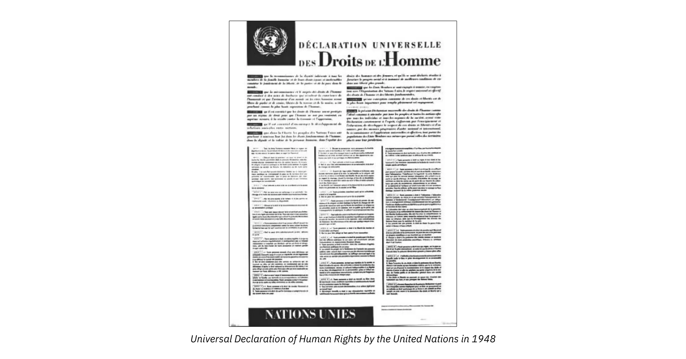

Век след смъртта на Фредерик Бастиа, правният грабеж е ясно видим във Всеобщата декларация за правата на човека от 1948 г., по-специално в нейните членове 22 ("всеки има право на социална сигурност"), 23 ("всеки има право на труд"), 24 ("всеки има право на почивка и свободно време"), 25 ("всеки има право на жизнен стандарт, който да е достатъчен за здравето и благосъстоянието му"), 26 ("всеки има право на образование").

## Ролята на правото и държавата

<chapterId>52258229-7c7c-592b-aa27-203b03aa41c9</chapterId>

:::video id=43c0db1d-1063-45d7-bce3-4d9d18382a2d:::

През 1848 г. Бастиа е депутат. Назначен е за заместник-председател на финансовата комисия. Следователно той е бил особено подходящ да отговори на въпроса: какво е държавата? Ние се обръщаме към държавата, за да осигурим благосъстоянието си. Но Бастиа ни напомня, че държавата не може да даде на гражданите нищо, което първо не е взела от тях.

Бастиа започва с преобръщането на едно общоприето уравнение: държавата е тази, която поддържа нацията. Държавата обаче не може да издържа своите граждани, защото тя не произвежда богатство, а само го преразпределя. Напротив, гражданите са тези, които поддържат държавата чрез създаването на богатство.

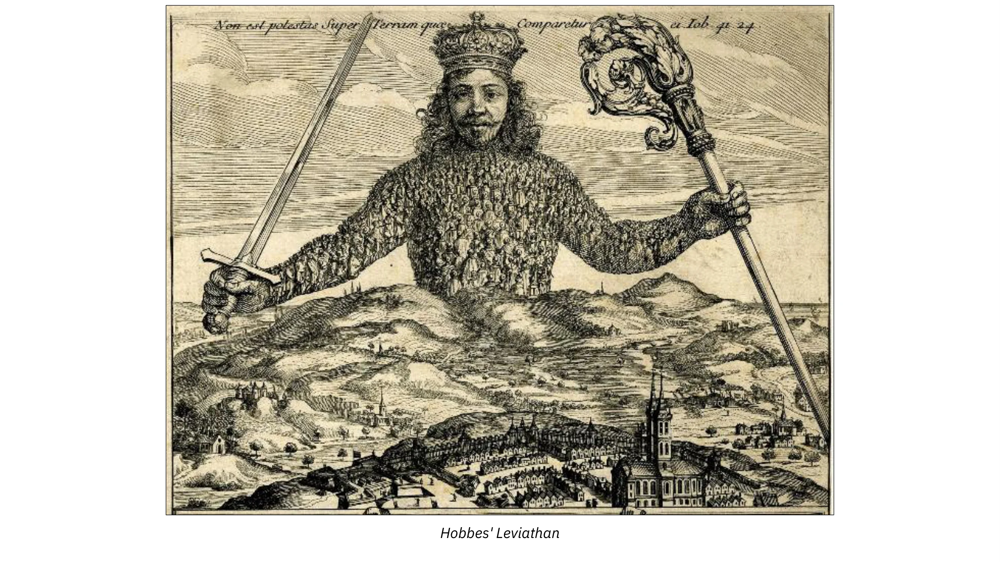

Освен това държавата сама по себе си не съществува; има само хора, които я създават, които я управляват, администрират и които пряко или косвено живеят от нея. Следователно хората, които управляват държавата, са като другите; те се стремят да задоволят личните си интереси.

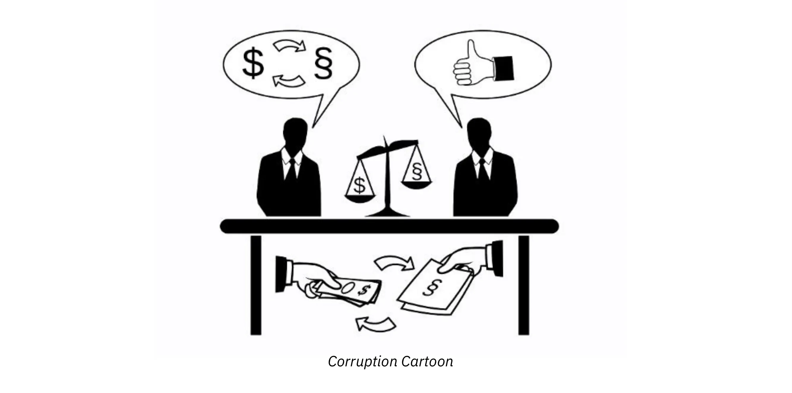

И тъй като действията на държавата са чисто преразпределителни, тя е подложена на натиска на групи със специални интереси. Всъщност някои групи със специални интереси са осъзнали, че е по-лесно да се генерират печалби чрез политическа ангажираност, отколкото чрез продуктивно поведение. Те се стремят да откраднат парите на другите под прикритието на държавата, като подкопават производствения капацитет на пазара чрез умножаване на законите, данъците и бюрократичните ограничения.

С други думи, държавата преследва само клиентелистки цели, а понятието за общ интерес се обезсмисля. Всяка печалба, получена от едни, е за сметка на други: това не е игра с нулев резултат, а игра с отрицателен такъв.

По този начин Бастиа изпреварва с един век анализите на функционирането на политическия пазар, които ще се появят в края на 50-те години на ХХ в. с т.нар. школа на обществения избор, ръководена от Джеймс Бюканън, носител на Нобелова награда за икономика, и неговия колега Гордън Тълок.

Нещо повече, Бастиа твърди, че държавата няма права, които да не съществуват преди това в индивида. Защо държавата има право да гарантира, дори със сила, собствеността на всеки индивид? Просто защото това право съществува предварително в индивида. Не може да се отрече на индивидите правото на самозащита, правото да използват сила, ако е необходимо, за да отблъснат нападенията срещу тяхната личност, способности и собственост. Това естествено право на самозащита, което се съдържа във всички граждани, може да приеме колективна форма и да узакони обща сила.

Ето защо, за да се разбере дали държавата е легитимно натоварена с дадено право, трябва да се попита дали това право не принадлежи на индивида по силата на неговата организация и в отсъствието на каквото и да е правителство.

Ето защо държавата в никакъв случай не може да посяга на естествените права, а напротив - трябва да ги гарантира.

Тя осигурява вътрешна и външна сигурност и правосъдие. Тя може да бъде силна и ефективна в своята област. Законът обаче не може да излиза извън тази много строга роля, тъй като тогава се превръща в инструмент за ограбване на едни в полза на други. Когато Законът е извратен, той действа като инструмент на несправедливостта. Изкривяването на закона винаги води до грабеж, както видяхме в предишния курс. То е непосредствено, автоматично, неизбежно и сигурно. Извеждането на закона извън неговата сфера може да доведе единствено до нарушаване на естествените права. Тогава гражданското общество се лишава от своята власт (естествените институции, договорите, размяната и сдруженията) в полза на държавното управление, което се характеризира с технократски и бюрократични подходи.

В резултат на това, според Бастиа, единствените легитимни обществени служби в една държава са три: армията, полицията и съдебната власт. С други думи, държавата трябва да осигурява вътрешна и външна защита на индивидите, тяхната свобода и собственост. Следователно е нормално всеки да допринася за тази защита. Извън тези законни функции обаче всеки друг принос към друга услуга, предоставяна от държавата, подлежи на контрол. Извън този кръг, пише Бастиа:

> Религията, образованието, сдружаването, трудът, обменът - всичко принадлежи към сферата на частната дейност, под погледа на публичната власт, която би трябвало да има единствено мисията на надзор и репресия.

По отношение на обществените услуги той излага един прост принцип:

Ако искате да създадете функция, докажете нейната полезност. Докажете, че услугите, които тя предоставя, си заслужават разходите. Следователно, заключава той, разумно е да се възложи на публичния сектор само това, което частният сектор абсолютно не може да извърши.

В обобщение, когато едно правителство пренебрегва мисията си да защитава хората и собствеността, то насърчава групите по интереси да търсят привилегии и да влияят върху властта, за да получат облаги за сметка на данъкоплатците и потребителите.

> Държавата е голямата фикция, чрез която всеки се опитва да живее за сметка на всички останали.

Пише Фредерик Бастиа в кратък памфлет, озаглавен "Държавата".

## Наследството на Фредерик Бастиа

<chapterId>2a2a181a-e477-5be1-ba1f-af59490c364e</chapterId>

:::video id=de892e2c-14a5-45cc-848f-ec934eaba615:::

Влиянието на Бастиа започва да намалява към края на XIX век с възхода на социализма, особено на марксизма, в университетите и изследователските институти, които все повече се финансират с публични средства.

През XX век познаването и популярността на Бастиа изчезват. Той вече не се споменава в учебниците по икономика. Едва в края на Втората световна война се появява нов интерес към идеите на свободата, така очевидно забравени с Рузвелт и тоталитарните режими в Европа. Един от архитектите на това възраждане е австрийският икономист Лудвиг фон Мизес, един от многото европейски интелектуалци, които бягат от Европа през Испания и Португалия, за да стигнат до Америка.

Установявайки се в Ню Йорк през 1943 г., Мизес организира семинари, които привличат забележителни умове: Джордж Стиглър, Милтън Фридман, бъдещи носители на Нобелова награда, и Мъри Ротбард, тогава студент в Колумбийския университет. По време на тези семинари той за пръв път споменава Бастиа като един от основните ориентири за класическия либерализъм. Той представя на слушателите си памфлетите на Бастиа "Законът" и "Държавата", които все още не са преведени на английски език. През 1953 г. един от участниците в семинара, Леонард Рийд, превежда "Законът" на Бастиа на английски език и се заема със задачата да разпространи книгата в цялата страна чрез своята фондация - Foundation for Economic Education.

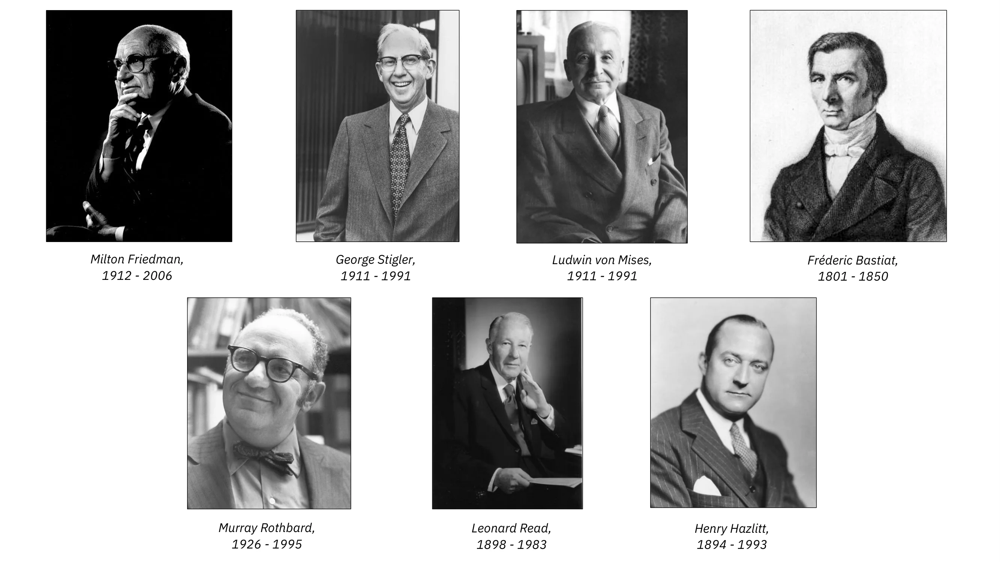

Но човекът, който популяризира тезите на Фредерик Бастиа, е икономическият колумнист на "Ню Йорк Таймс" Хенри Хазлит в малката си книга "Икономика в един урок", публикувана през 1946 г. Изрично опирайки се на идеите на Бастиа, той има за цел да покаже, че проблемът на етатистките икономически решения е в това, че те не отчитат катастрофалните си дългосрочни последици.

Хазлит започва книгата си, като разказва историята на Бастиа за счупения прозорец. Той обобщава историята в една проста и единствена поука:

> Изкуството на икономиката се състои в това да се разглеждат не само непосредствените, но и дългосрочните последици от всяко действие или политика; то се състои в това да се проследят последиците от тази политика не само за една група, но и за всички групи.

След това Хазлит прилага този урок към голямо разнообразие от икономически проблеми, включително контрол на наемите, закони за минималната работна заплата, предполагаемите ползи от войната, обществените работи, бюджетния дефицит, паричната инфлация, тарифите и накрая - спестяванията.

Бастиа е един от любимите икономисти на Роналд Рейгън много преди да бъде избран за президент. Това е по-малко известно, но в продължение на осем години Рейгън работи за компанията General Electric като водещ на нейно телевизионно предаване по CBS и отговаря за обучението на персонала на компанията. Неговата програма за обучение беше изградена върху въвеждащи текстове за пазарната икономика. Избрани бяха трудовете на двама австрийци - Хайек и Мизес, двама англичани - Кобдън и Брайт, и един французин - Фредерик Бастиа.

Урокът, който Рейгън даде на своите служители, следвайки Бастиа, е, че няма по-голям мит от представата, че публичните разходи стимулират растежа и заетостта.

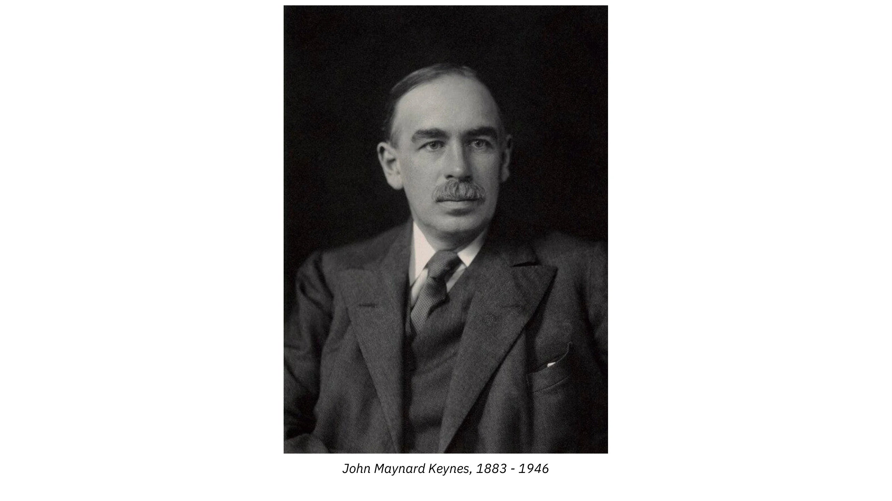

Именно Джон Мейнард Кейнс изказа предположението, че публичните разходи увеличават производството чрез мултиплициращ ефект: ако правителството построи мост, работниците на този мост ще могат да си купят хляб, след това хлебарят ще може да си купи обувки и т.н. Ако частната индустрия е в упадък, той може да бъде поправен чрез големи строителни работи. Ако има безработица, държавата може да създаде обществени работни места.

Въпреки това, както Бастиа е доказал, държавната намеса има непреднамерени, порочни ефекти, които често се пренебрегват. Само добрият икономист е способен да ги предвиди. Нека вземем един пример: Илюзия е да се вярва, че държавата може да "създава работни места", защото за всяко създадено държавно работно място тя унищожава едно работно място на пазара. Всъщност публичните работни места се заплащат с данъци. Публичните работни места не се създават; те се възприемат. Всяко пени, похарчено от държавата, задължително трябва да бъде получено чрез пени от данъци или дълг.

Ако погледнем на нещата от този ъгъл, обяснява Рейгън на служителите на GE, т.нар. чудеса на държавните разходи ще изглеждат в съвсем друга светлина. Тъй като данъците обезкуражават производството, богатството, създадено от държавните разходи, не може напълно да компенсира тези, които са били възпрепятствани да се родят от данъците, събрани за покриване на тези разходи.

По същество Рейгън възприема от Бастиа няколко ключови елемента на либералната визия за обществото и човека: върховенството на гражданското общество над държавата, ценността на избора и индивидуалната отговорност, значението на предприемача за създаването на богатство, значението на гъвкавата и минимална правна рамка, която позволява доверие и спазване на договорите, основния закон, че богатството трябва да бъде създадено, преди да бъде разпределено, желанието да се даде шанс на всеки в конкурентните пазари.

# Последен раздел

<partId>3b62de5c-5d4a-5182-ab14-f7ef13c97e28</partId>

## Отзиви и оценки

<chapterId>db20170d-ceb6-56cd-b4e5-c690942f8b29</chapterId>

<isCourseReview>true</isCourseReview>

## Финален изпит

<chapterId>7e2285c9-d7f4-4e30-a1f5-f78aae06b7b3</chapterId>

<isCourseExam>true</isCourseExam>

## Заключение

<chapterId>a3e98f2f-a072-4696-9553-5d24c6d236c9</chapterId>

<isCourseConclusion>true</isCourseConclusion>
