# Пътуване през икономическия колапс

Как изглеждат парите, когато губят значението си?

Този курс ще ви запознае с очарователния и същевременно отрезвяващ свят на хиперинфлацията. Ще откриете исторически епизоди и съвременни случаи, в които валутите са се сринали и икономиките са се променили за една нощ. Ще разкриете закономерностите, причините и реалното въздействие върху обикновените хора, като придобиете представа за едно от най-драматичните явления в икономиката.

По пътя си ще откриете и как отделни хора и общности са се справили с тези бурни периоди. Научете стратегиите, които са помогнали за защита на богатството по време на валутни кризи, и изградете по-дълбоко разбиране за финансовата устойчивост. Ако сте любопитни за икономическите сили, които оформят нашия свят, това пътешествие предлага както знания, така и практическа перспектива.

+++
# Въведение

<partId>6fe4d15d-f6e6-54be-9e04-0a75ac98df8b</partId>

## Преглед на курса

<chapterId>9d1aba8d-0485-5020-9863-5de37e6db8e0</chapterId>

Добре дошли в курса ECO204!

Целта на този курс е да ви помогне да разберете първопричините, механизмите и последиците от хиперинфлацията в контекста на фиатна парична система. Чрез конкретни примери и исторически анализ ще се научите да разпознавате повтарящите се модели, които предшестват периоди на хиперинфлация, и да определяте лостовете за действие, за да се предпазите.

**Раздел 2: Какво представлява инфлацията?**

Преди да навлезем в същността на темата, ще се върнем към основните въпроси: какво е инфлация? В този раздел ще представим нейния паричен произход, различните видове инфлация и как те се вписват в по-широката икономическа динамика. Това е важна стъпка за разбирането на това как обикновената инфлация може да прерасне в хиперинфлация.

**Раздел 3: Какво представлява хиперинфлацията?**

В този раздел ще се запознаете с точните дефиниции на хиперинфлацията и ще разгледате няколко основни исторически епизода, включително тези във Ваймарска Германия и Зимбабве. Ще анализираме техните общи черти, различия и съвременни паралели. Ще откриете и по-малко известни случаи, като например последователните реденоминации в Латинска Америка, както и стратегиите за излизане от кризата, наблюдавани в някои държави.

**Раздел 4: Как стигнахме дотук?**

Целта на тази част е да се разберат структурните механизми, които дават възможност за хиперинфлация, по-специално чрез развитието на паричния "втори слой" и ролята на централните банки. За по-нататъшно проучване ще бъдат предоставени допълнителни ресурси и предложения за четене.

Какво би станало, ако паричната история се повтаря пред очите ни? Вие ще прецените в следващите глави!

# Какво представлява инфлацията?

<partId>2b4f456c-3649-5cf9-b9b0-a5bffe92d962</partId>

## Паричен феномен

<chapterId>b2cbc915-c4ec-52b5-860c-0958f58c91e4</chapterId>

### Определения за инфлация

Инфлацията е понятие, което често се разбира погрешно поради многобройните му определения и тълкувания. Възприемането на инфлацията варира сред различни групи, като например биткойнъри и традиционни икономисти. Нека първо да изясним определенията, преди да обсъдим хиперинфлацията:

- Определение от речника Le Robert: Инфлацията е прекомерно увеличение на платежните инструменти (банкноти, капитал), което води до повишаване на цените и обезценяване на валутата.

- Определение от енциклопедия Larousse: Инфлацията е явление, което се характеризира с общо и непрекъснато повишаване на равнището на цените. Тук думата "обобщено" е от решаващо значение.

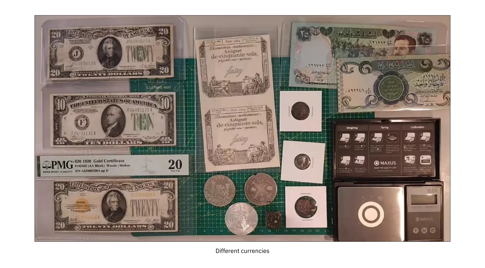

В светлината на тези дефиниции е важно да се разбере, че за Le Robert инфлацията се отнася главно до увеличаването на паричното предлагане. От друга страна, Ларуш се фокусира върху последиците от това разширяване, а именно върху общото повишаване на цените.

В нашето изследване на хиперинфлацията ще приемем второто определение, а именно това за генерализирано покачване на цените, тъй като то е по-подходящо и ясно за нашата тема. От съществено значение е обаче да се помни, че това покачване на цените обикновено е резултат от разширяването на паричното предлагане.

Известният икономист Милтън Фридман заяви:

> "Инфлацията винаги и навсякъде е парично явление."

Това твърдение подчертава неразривната връзка между паричната експанзия и инфлацията. В следващите раздели ще разгледаме връзката между инфлацията и икономическия растеж, като се опираме на тези основни определения.

### Разбиране на паричния феномен

Когато говорим за паричния феномен, имаме предвид начина, по който се влияе върху паричното предлагане в дадена икономика. Милтън Фридман по същество го разглежда като увеличаване на това предлагане. В исторически план са съществували два основни метода за увеличаване на паричното предлагане:

1. Паричен печат:

В традиционните парични системи увеличаването на паричното предлагане се постигаше чрез физическо отпечатване на нови банкноти. Макар че в днешно време, когато преобладават цифровите пари, това печатане е предимно електронно (чрез базите данни на централните банки и други финансови институции), историята ни показва периоди, в които буквалното печатане на банкноти е довело до хиперинфлация.

2. Намаляване на металното съдържание:

Друг метод беше да се намали количеството на благородния метал във валутите, основани на метали като сребро или злато. Ярък пример за това е Римската империя, където съдържанието на сребро в денарите, първоначално съставени почти изцяло от сребро, с течение на времето драстично намалява. Това е равносилно на форма на инфлация, но не непременно на хиперинфлация.

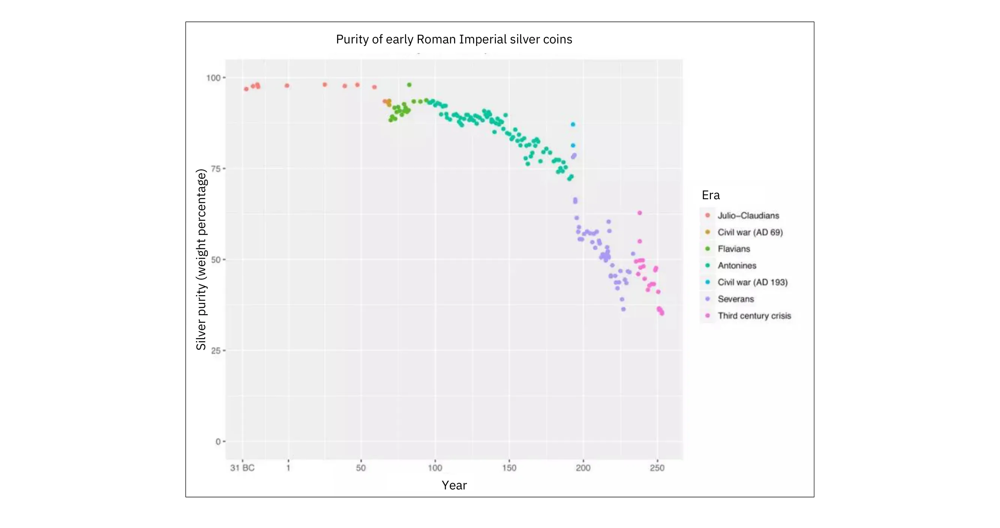

Изключително важно е да се подчертае, че хиперинфлация се наблюдава предимно при фиатни валути, които не са обезпечени с базови активи, като например благородни метали. В исторически план, когато валутата е била базирана на такива активи, са се случвали епизоди на инфлация (например чрез обезценяване на металното съдържание), но тези епизоди никога не са достигали екстремните нива на хиперинфлацията. В следващите раздели ще разгледаме подробно периодите на парична девалвация и последиците от тези различни парични системи върху инфлацията.

### Проучване на периодите на парична девалвация

В историята различни цивилизации са преживявали периоди на парична девалвация. Някои от тези периоди съвпадат с големи събития или войни, които са оказвали натиск върху икономиката.

#### 1. Пелопонеската война и Втората пуническа война:

Пелопонеската война, конфликт между Атина и Спарта, и Втората пуническа война между Римската република и Картаген са най-ранните примери за обезценяване на валута, открити в архивите. За да финансират тези войни, тези цивилизации обезценяват валутите си, като намаляват съдържанието на сребро и влагат други метали, като същевременно увеличават броя на произвежданите монети.

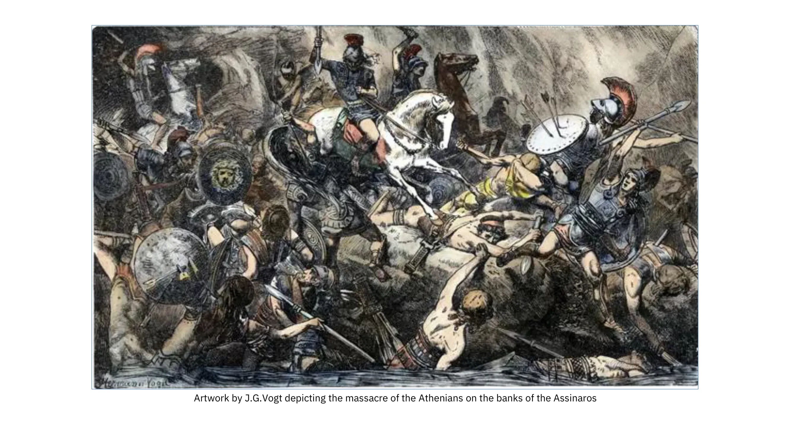

Гравюра, изобразяваща клането на атиняните на брега на Асинарос.

#### 2. Древен Рим по време на империята:

След епохата на Римската република, по време на Империята, през III и IV в. се наблюдава значителна девалвация на валутата. Това се илюстрира от намаляването на сребърното съдържание на монетите, както се вижда на предишната графика. Едно проучване разкрива, че цената на пшеницата в Египет, измерена в драхми, се е увеличила един милион пъти за период от приблизително 400 години - от 40 г. пр. н. е. до 360 г. от н. е. За този период това представлява средногодишна инфлация от около 4.4%. Тази инфлация обаче не е била равномерно разпределена. Тя наистина започва около 238 г. след Христа. Между 250 г. и 293 г. от н.е. инфлацията е била приблизително 3.65%, а между 293 г. и 301 г. от н.е. тя се е увеличила до 22.28%.

Въпреки че през тези периоди се наблюдава значителна инфлация, тя не достига нивата на хиперинфлация, наблюдавани в някои съвременни ситуации. Причината за това е, че макар валутата да е била обезценена, тя все още е била обезпечена с благородни метали. Тази солидна основа е осигурявала известна защита срещу екстремни нива на инфлация. В следващите раздели ще разгледаме по-подробно същността и последиците от хиперинфлацията.

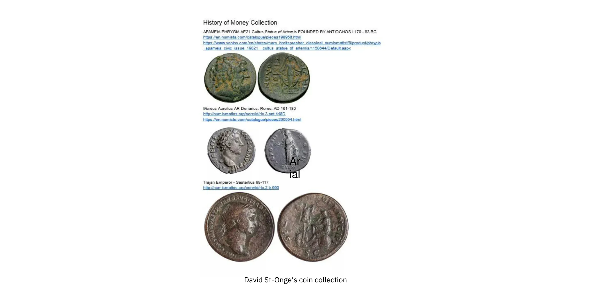

- Денар на Марк Аврелий (160 г.):

Една от най-емблематичните монети на Древен Рим е сребърната монета денарий. Притежавам конкретна монета от Марк Аврелий, датираща от 160 г., преди голямата девалвация. Въпреки че фотоапаратът трудно може да улови фините детайли, с просто око се вижда, че монетата е красива и отразява сравнително високо съдържание на сребро.

- Антониниан (края на III в. сл. Хр.):

С девалвацията на парите се появява нова валута - антонинианус. Тази валута трябвало да струва два денария, но съдържала много по-малко сребро. На моята монета Антонинианус ясно се вижда, че съдържанието на сребро е било значително намалено. Тя е украсена с корона, типична за римските монети от този период, наречена "радиати". Като се сравнят цветът и качеството, може да се види, че антонинианусът далеч не е монета от чисто сребро.

Когато сравнявате двете монети една до друга, разликата е поразителна. Денарият от 160 г. от н.е. има ясно изразен сребърен вид, докато антонинианусът от края на III в. от н.е. е много по-тъмен, което показва значително намаляване на сребърното съдържание. Това визуално сравнение дава ясна илюстрация на паричната девалвация, която древният Рим претърпява в продължение на няколко века.

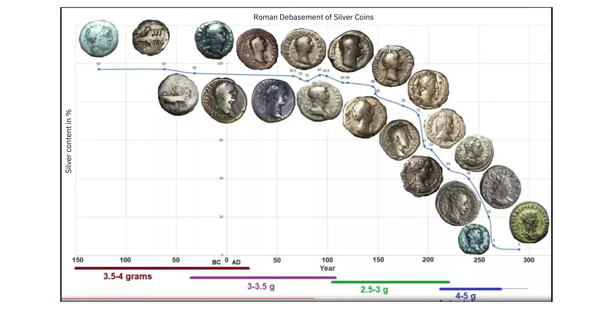

За да завършите тази демонстрация, би било идеално да представите графика, илюстрираща обезценяването на тези монети с течение на времето. Въпреки че е трудно да се визуализира чрез тази платформа, представете си графика, показваща стойността на денария, последвана от спада му към края на II век, когато е заменен от антонинианус, за който се предполага, че струва два денария, но е със значително по-ниско съдържание на сребро. Тези артефакти са безмълвни свидетели на икономическите колебания на миналите цивилизации.

#### 3. Испанските мараведи: свидетелство за целенасочена девалвация

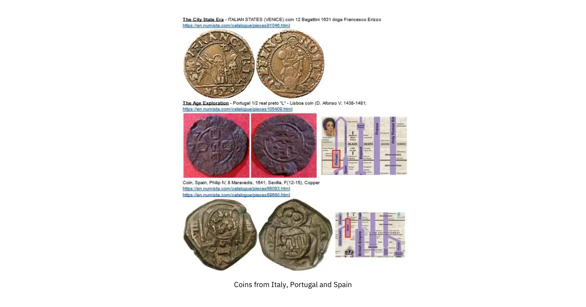

Мараведи, като медна монета, заема специално място в историята на испанските парични знаци. Както бе споменато по-рано, испанският долар първоначално е бил международен стандарт, основна резервна валута за Испания. Въпреки това, изправена пред определени икономически предизвикателства, Испания е трябвало да прибегне до умни парични стратегии.

Монетарната девалвация е инструмент, който често се използва от държавите за финансиране на техните разходи или за стимулиране на икономиката. Испания обаче се оказа в деликатна ситуация. Обезценяването на испанския долар би компрометирало позициите ѝ в международната търговия. За да преодолее тази дилема, Испания се обърна към мараведи.

За разлика от скъпоценния испански сребърен долар, мараведи е медна валута, използвана главно от местното население. Тази валута е била обект на девалвация. Когато една монета от мараведи първоначално струвала два мараведи, държавата я изземвала, препечатвала я с нова стойност, например "четири", и връщала на собственика само една монета. Монетата, маркирана с печат "осем", е доказателство за този процес, тъй като е преминала през няколко цикъла на обезценяване.

Тази стратегия позволява на държавата ефективно да обезцени валутата, като по този начин създава инфлация и косвено финансира държавата, като същевременно запазва целостта на испанския долар на международната сцена. Тази целенасочена девалвация обаче имаше последици за местното население, което видя, че стойността на общата му валута се размива.

Случаят с Мараведи показва как една държава може избирателно да девалвира местната валута, за да посрещне вътрешните си икономически нужди, като същевременно запази стойността на резервната валута в световен мащаб. Той е ярък пример за сложността и финеса на паричната политика в историята.

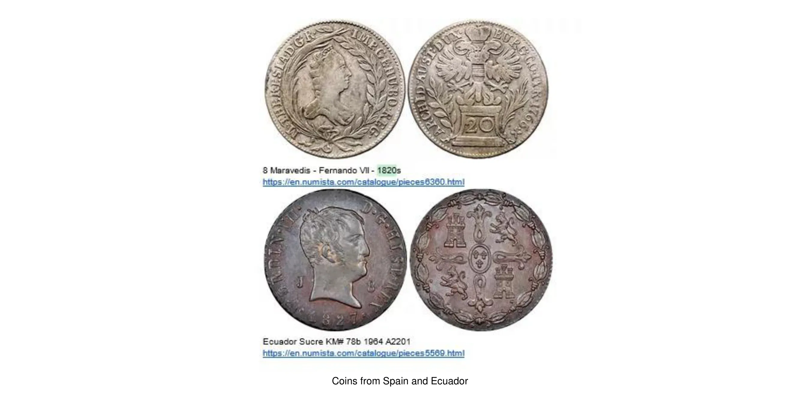

Искате ли да научите повече? -> [Връзка](https://docs.google.com/document/d/1aZa7gvz1nt8ZHDCoWKQdS9RGGjBHdipH1ApC8dW1xpM/edit?usp=sharing)

#### 4. Революция на цените от XV до XVII век

Между XV и XVII в. Европа става свидетел на забележителен икономически феномен, често наричан "ценова революция". Този период на инфлация до голяма степен е предизвикан от масовия приток на благородни метали, по-специално злато и сребро, от Америка. Тъй като по това време европейската икономика се основава предимно на металния стандарт, допълнителното предлагане на метали увеличава паричната маса. В резултат на това се появява инфлация от около 1 до 2% годишно. На пръв поглед тази инфлация може да изглежда скромна. По онова време обаче подобни ценови колебания са били достатъчно необичайни, за да се смятат за "революция". Това показва как промените в паричните резерви могат да повлияят на цялата икономическа система.

#### 5. Джон Лоу и "асигнатите"

През XVIII в. френската икономическа история е белязана от две важни събития, свързани с валутата. Първо, Джон Лоу, шотландски икономист и финансист, убеждава френското правителство да приеме парична система, основана на книжни пари. Макар първоначално да се смята за новаторско решение на финансовите проблеми на страната, тази инициатива бързо довежда до необуздана инфлация. Малко след това, по време на сътресенията на Френската революция, правителството въвежда "асигнатите".

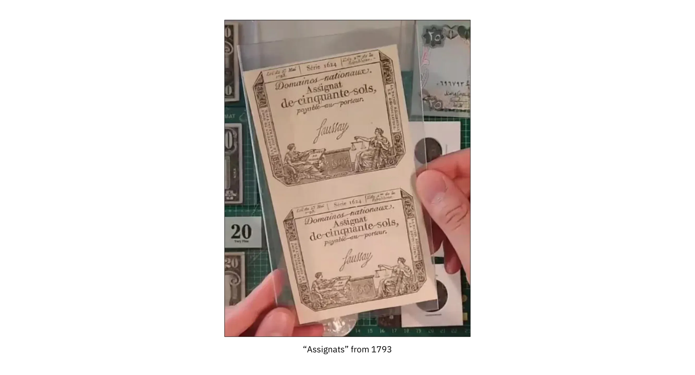

асигнати от 1793 г.

Тези банкноти са живо свидетелство за първия голям период на хиперинфлация в историята. Първоначално създадени в отговор на последователни финансови кризи, цесиите бързо се превръщат в символ на паричната нестабилност. Правителството, разчитащо прекомерно на тази хартиена валута, за да финансира разходите си, предизвиква безпрецедентна икономическа криза и води до голям период на хиперинфлация във Франция след революцията.

#### 6. Изпълнителна заповед 6102 и девалвацията на долара

Изпълнителна заповед 6102 и девалвацията на долара

В началото на 30-те години на ХХ в. в Съединените щати настъпва значителна промяна в паричната политика. Тук е представен подробен преглед на тази трансформация:

- 20-доларовата банкнота от 1928 г.

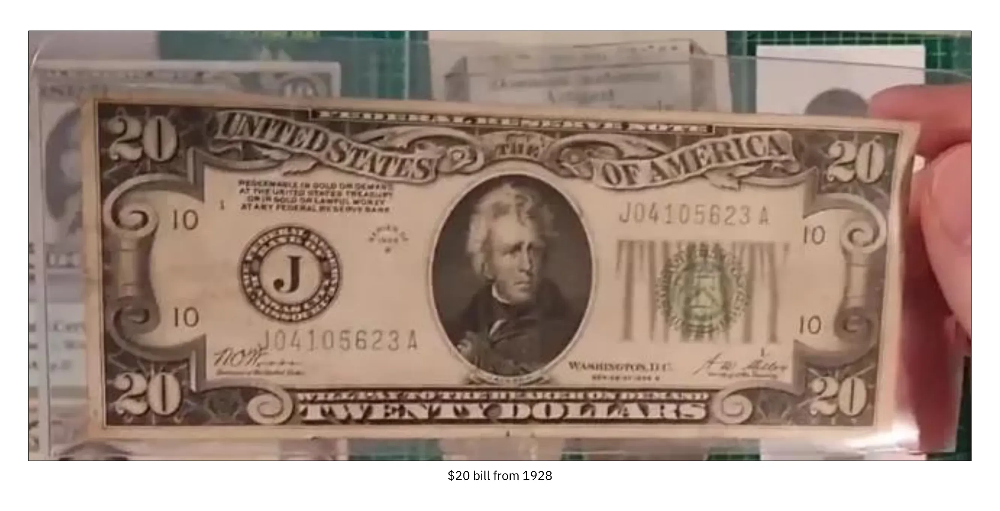

През 1928 г. на банкнотата от 20 долара в САЩ е написано: "в злато при поискване". Това означава, че всяка банкнота е била буквално конвертируема в злато. По-конкретно, банкнота от 20.67 долара се равняваше на една унция злато.

- Изпълнителна заповед 6102

През 1933 г. с издаването на Заповед №6102 на президента на САЩ настъпва голямо сътресение. С този указ се забранява на гражданите да притежават злато под формата на кюлчета, монети или сертификати.

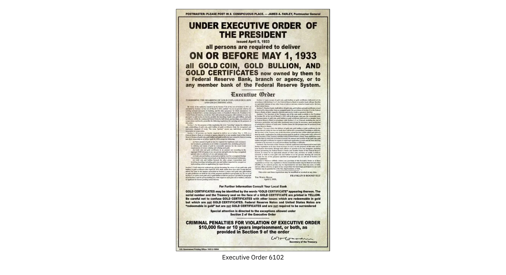

Златният сертификат е добър пример за това. На него е отбелязано: "В златни монети, платими на приносителя при поискване". Притежаването на такъв сертификат става незаконно и остава такова до 1964 г.

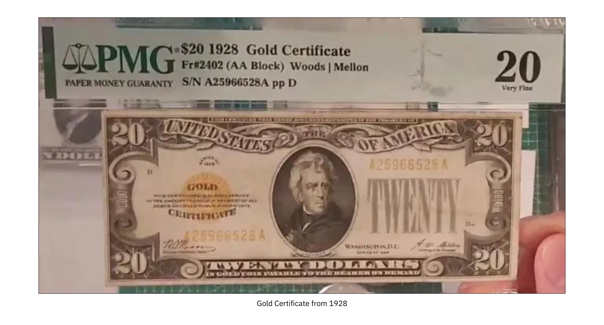

- Въвеждане на нови банкноти

След конфискуването на златото през 1934 г. в обращение е пусната нова серия банкноти.

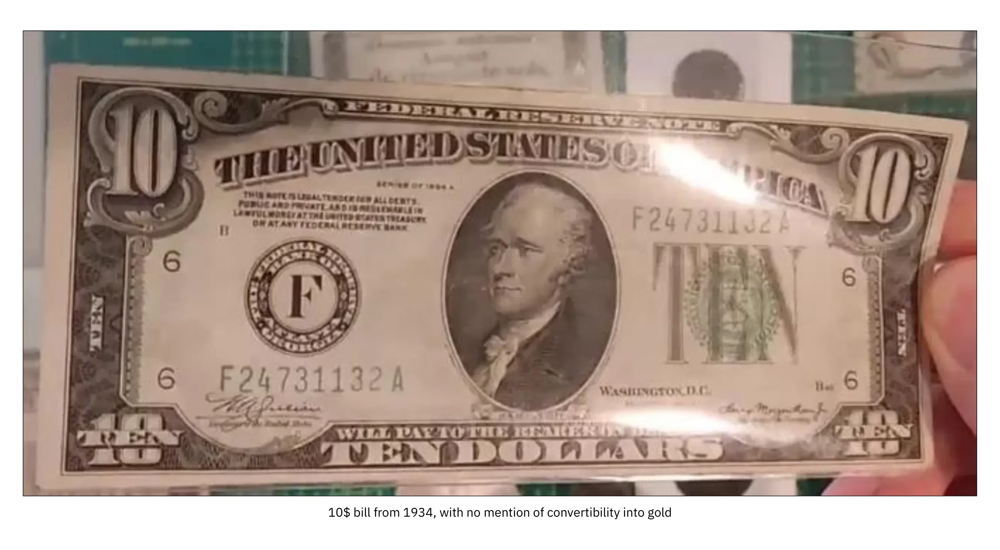

Споменаването на тяхната конвертируемост в злато е премахнато и заменено с "Тази банкнота е законно платежно средство за всички дългове" (Ce billet est une monnaie légale pour toutes dettes).

- Преоценка на златото

Това, което е очарователно за този преход, е стратегията на правителството. През 1934 г. цената на златото е преоценена на 35 долара за унция, вместо на 20.67 долара. По същество правителството обезцени долара, който хората притежаваха. Като изкупува злато от населението на цена 20.67 долара за унция през 1933 г. и след това преоценява цената на златото през 1934 г., правителството генерира значителна печалба, като същевременно обезценява спестяванията на своите граждани.

В обобщение, в рамките на една година правителството ефективно конфискува златото на гражданите, след което променя правилата на играта, като преоценява стойността на златото в полза на държавната хазна и в ущърб на онези, които първоначално са обменили златото си за банкноти.

### САЩ променят историята.

Съединените щати направиха исторически обрат, като първи девалвираха световната резервна валута - щатския долар, в разрез с досегашните практики на малките търговски държави.

Преди това, по време на Ренесанса, италианският флорин, емитиран от Флоренция през XIII в., е бил международна резервна валута и през периода на използването му не е регистрирана девалвация, което отразява значението на паричната стабилност за международната търговия.

В същия дух Испания и Нидерландия, като притежатели на световната резервна валута поради процъфтяващата си международна търговия, поддържат целостта на валутите си, за да запазят доверието и статуквото в международния обмен. В Нидерландия дори е създадена първата централна банка - важен етап в световната еволюция на паричните системи.

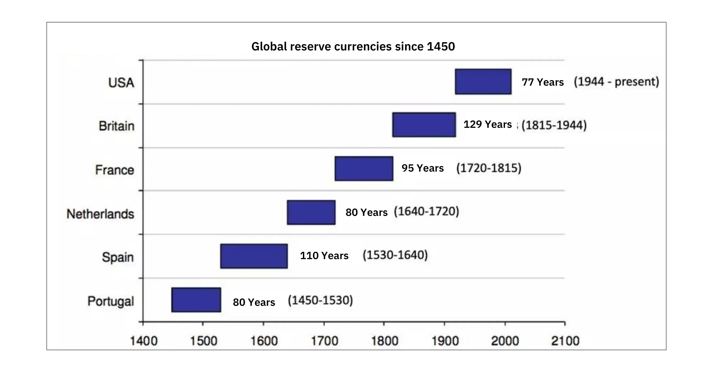

Ситуацията обаче се променя с възхода на САЩ като доминираща икономическа сила. Те решиха да девалвират резервната си валута, като по този начин използваха инфлацията в своя полза. Това решение често се обяснява с променената динамика, при която изборът на резервна валута вече не беше толкова свободен, колкото преди. Американската хегемония утвърди долара като световна резервна валута, което позволи манипулиране на стойността му. Тази промяна разкрива потенциалното въздействие на паричните политики върху международната търговия в условията на глобализирана икономика, като бележи значителен преход в управлението на световните резервни валути.

### Последен пример за пътя: швейцарският динар

Швейцарският динар илюстрира още един интересен аспект на паричната девалвация, този път в контекста за Ирак преди войната в Персийския залив. Наречена така заради забележителното качество на банкнотите си, тази валута е емитирана от Централната банка на Ирак и се ползва с репутацията на стабилна в региона на Близкия изток. Това доверие се дължеше главно на качеството на отпечатване на банкнотите, което се извършваше в Англия, което предполагаше известна устойчивост срещу девалвация.

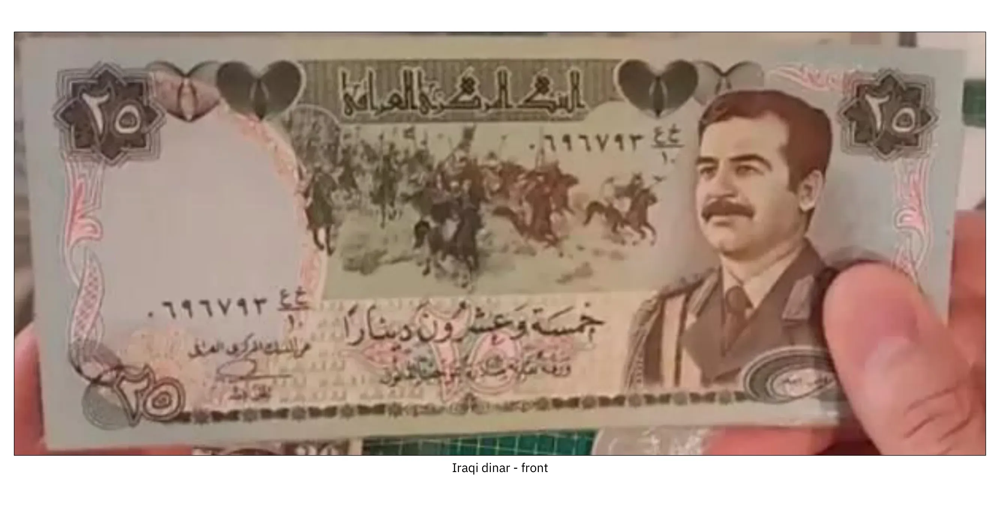

Войните в Персийския залив обаче бележат повратна точка в историята на швейцарския динар. Ирак, който вече не можеше да разчита на английския си доставчик за печатане на банкноти, се обърна за помощ към Китай. Този преход доведе до явна разлика в качеството на банкнотите, като китайската версия се възприемаше като по-лоша. Това схващане не беше неоснователно; китайските банкноти бяха по-лесно фалшифицируеми и податливи на препечатване от страна на правителството, което застрашаваше стойността им.

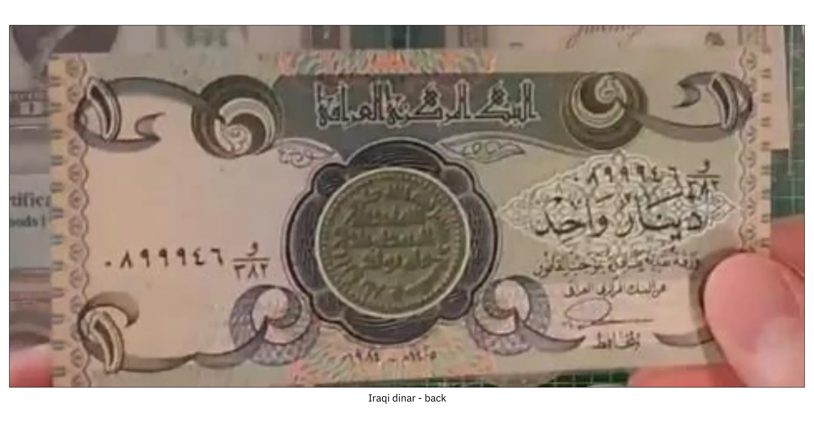

В иракската икономика след войната в Залива се появи един характерен феномен - двойната система на ценообразуване. Търговците предлагаха различни цени в зависимост от вида на банкнотата, с която се плащаше, като предпочитаха оригиналния швейцарски динар пред китайската банкнота. Тази система отразяваше запазеното доверие в по-качествените банкноти, които бяха по-малко податливи на обезценяване, дори в условия, когато стойността се налагаше предимно от държавата. Този епизод подчертава значението на вътрешните характеристики на валутата и как дори в режим на фиатни валути възприеманото качество на валутата може да повлияе на нейната относителна стойност и съответно на доверието на икономическите субекти.

#### Да, ние действително претеглихме монетите!

Общоприетото схващане често свързва валутата с държавно творение, при което нейното емитиране и стойност се регулират от държавата. Тази концепция се корени в древни цивилизации като Рим, където монетите са били стандартизирани и подпечатвани от империята, като по този начин са придавали официална стойност на валутата. При по-задълбочено проучване обаче се оказва, че вътрешната стойност на валутата се дължи главно на съдържанието на благородни метали в нея.

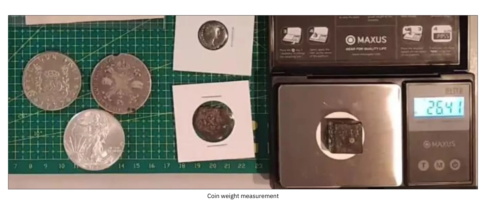

Пример за това е изследването на парична маса, равняваща се на осем испански реала или един испански долар. Тази тежест, маркирана с римска цифра, указваща стойността ѝ, е използвана от обменителите на валута, за да оценяват стойността на монетите въз основа на теглото им, а не само на тяхното отпечатване. Чрез претеглянето на монетите обменниците можеха да установят дали те са били променени или повредени, което би могло да намали стойността им. Тази практика подчертава, че въпреки че стандартизираното отпечатване от държавата придава определена номинална стойност на валутата, истинската стойност се крие в теглото на съдържащия се в нея благороден метал.

Този анализ показва, че доверието във валутата, а оттам и в нейната стойност, се крепи на нейната материална същност, а не само на твърденията на държавата. Той подчертава двойствеността между номиналната стойност, наложена от държавата, и вътрешната стойност, продиктувана от съдържанието на благородния метал. По този начин валутата излиза извън рамките на обикновения държавен инструмент, като основната ѝ стойност е неразривно свързана с осезаеми и измерими елементи.

#### Заключение

В заключение, това изследване на паричната девалвация дава възможност за по-задълбочено разбиране на механизмите на инфлацията, които ще бъдат разгледани в следващите видеоклипове. Ще обсъдим различните видове инфлация и прага, при който те преминават във висока или хиперинфлация. Тази солидна основа ще ни позволи да разгледаме сложността на инфлацията в предстоящите сесии. Благодарим ви за вниманието. Очакваме с нетърпение да продължим това изследване на паричната динамика в следващото видео.

## Видове инфлация

<chapterId>b438fe09-375e-5bb2-9196-7dd687b9f98c</chapterId>

### Инфлацията не е многофакторно явление

В този раздел ще разгледаме различните аспекти на инфлацията - явление, което често се разбира погрешно. Макар че в медиите и в ежедневните дискусии инфлацията често се възприема като многофакторно явление, от решаващо значение е да се помни, че в основата си тя е паричен феномен.

Тук е представена разбивка на темата в няколко основни точки:

- Разграничение между увеличение на цените и инфлация:

Повишаването на цените може да бъде специфично за сектора и предизвикано от различни фактори, като например намаляване на производството на петрол в ОПЕК или неблагоприятни климатични условия, засягащи производството на пшеница.

Инфлацията, от друга страна, се определя от общо увеличение на цените на редица стоки и услуги, а не само на определен сектор.

- Паричната същност на инфлацията:

При фиксирано парично предлагане повишаването на цените в един сектор би довело до намаляване на цените в други сектори, тъй като количеството пари, което може да се похарчи другаде, би намаляло. Инфлацията е тясно свързана с увеличаването на паричното предлагане, което позволява едновременното повишаване на цените във всички сектори.

- Влияние на паричната маса върху инфлацията и дефлацията:

При система с фиксирано парично предлагане увеличаването на производството теоретично би трябвало да доведе до дефлация, т.е. до намаляване на цените, тъй като ще има повече стоки и услуги.

В настоящата фиатна парична система увеличаването на паричното предлагане неутрализира потенциалната дефлация, причинена от увеличаването на производството.

- Отрицателни ефекти от корекцията на паричното предлагане:

Увеличаването на паричното предлагане без съответно увеличаване на производството води до инфлация, тъй като за същото количество стоки и услуги има повече пари в обращение.

Макар че увеличаването на производството би трябвало да доведе до дефлация, едновременното нарастване на паричното предлагане обезсилва този ефект и вместо това води до инфлация.

- Инфлация, дефлация и парично предлагане - Комуникационни съдове:

Инфлацията и дефлацията са като комуникационни съдове в една икономика. Увеличаването на производството може да доведе до дефлация, но ако едновременно с това се увеличи паричното предлагане, дефлационният ефект се неутрализира и се стига до инфлация.

Тази дискусия подчертава значението на разбирането на основните механизми на инфлацията и дефлацията, както и на огромното влияние, което промяната на паричното предлагане може да окаже върху икономиката. Вероятно ще се върнем отново към тези понятия по-късно, за да разберем по-дълбоко тяхната взаимосвързаност и влиянието, което оказват върху световната икономика.

### Защо печатането на пари не винаги води до инфлация?

#### Инфлация ≠ Индекс на потребителските цени

Инфлацията, макар и често да се свързва с увеличаване на паричното предлагане, невинаги има пряка връзка с печатането на пари, както показва периодът след финансовата криза от 2008 г. Въпреки значителното печатане на пари за спасяване на банките през следващото десетилетие не се наблюдава висока инфлация, която е средно между 0 и 2% годишно. Тази ситуация повдига въпроса: Защо масовото печатане на пари не доведе до пропорционална инфлация? Отговорът се крие в няколко нюанса, свързани с измерването на инфлацията и индекса на потребителските цени (ИПЦ).

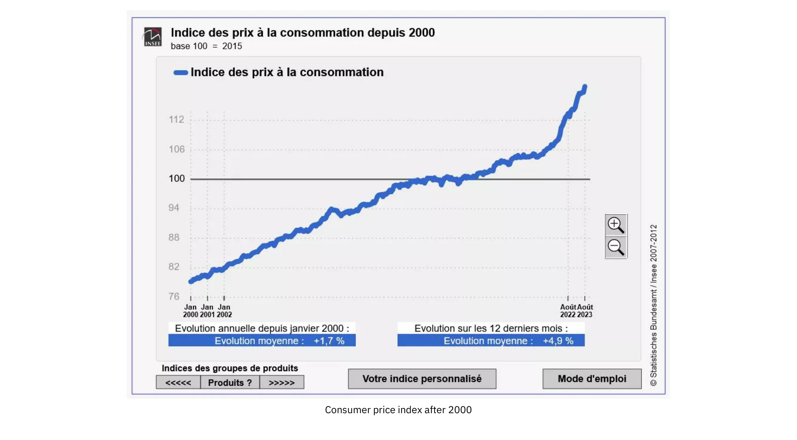

Първото обяснение се крие в начина, по който се измерва инфлацията. Индексът на потребителските цени (ИПЦ), който служи като основен показател за инфлацията, има определени ограничения. Например той не отчита изчерпателно динамиката на цените на недвижимите имоти. Въпреки че ИПЦ включва компонент, свързан с наемите, значителното поскъпване на цените на жилищата не е напълно отразено в индекса. В резултат на това може да настъпи значително нарастване на разходите за жилища, без то да бъде напълно отразено от ИПЦ, което може да доведе до подценяване на действителната инфлация.

Освен това при изчисляването на индекса на потребителските цени се използват определени методики, които могат да компенсират или прикрият действителните увеличения на цените. Например качествените подобрения в продуктите могат да се използват за коригиране на индекса. Ако цената на даден продукт се повиши, но качеството или характеристиките му също се подобрят, ИПЦ може да сметне, че реалната стойност за потребителя не се е променила, и следователно да не отразява инфлацията. Показателен е случаят, при който въпреки увеличението на цените на говеждото месо и компютрите вследствие на паричната инжекция, подобрението на характеристиките на компютрите се използва, за да компенсира това увеличение. Ако компютърът струва два пъти повече, но е четири пъти по-мощен, ИПЦ може да тълкува това като намаление на цените, като по този начин прикрива увеличението на цените на говеждото месо.

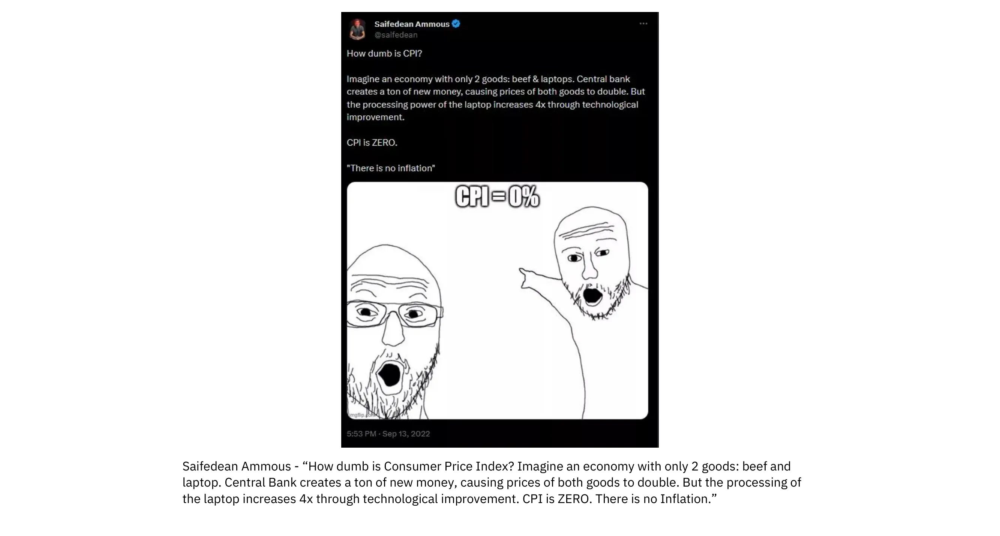

Тези нюанси в измерването на инфлацията чрез индекса на потребителските цени подчертават сложността на връзката между паричното печатане и инфлацията. Те също така подсказват, че действителната инфлация може да е по-висока от отчетената, ако всички увеличения на цените, особено в ключови сектори като недвижимите имоти, се отчитат по-обстойно. Този анализ подчертава значението на разбирането на основните механизми на инфлацията и ограниченията на конвенционалните индекси, използвани за нейното измерване, като по този начин се улеснява по-задълбоченото разбиране на икономическите последици от паричната политика.

#### Аргументи на MMT

Модерната парична теория (ММТ) предлага различен поглед върху създаването на пари и инфлацията. Според ММТ парите произхождат предимно от правителството, което може да печата значителни количества, за да финансира своите нужди, без да предизвиква инфлация, стига секторите, към които са насочени тези средства, да не са пренаситени. Този подход се отклонява от традиционните парични теории, като подчертава значението на абсорбционния капацитет на отделните сектори за инфлационната динамика.

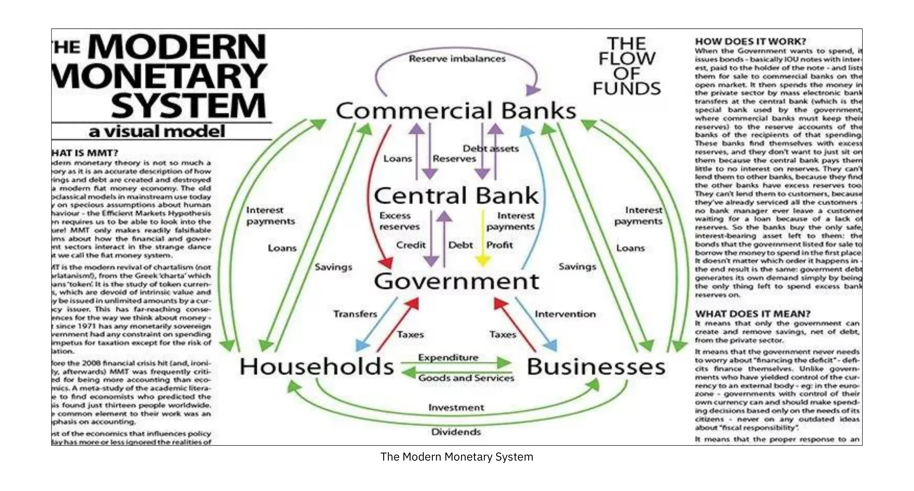

Показателен пример за ММТ е американският военнопромишлен комплекс. Според ММТ стотици милиарди долари могат да бъдат отделени за този сектор, без да предизвикат инфлация, благодарение на способността му да усвоява средствата. За разлика от това, ако значителни средства се инжектират в пътното строителство в САЩ, където има ограничен брой компании и работна ръка, може да възникне инфлация поради недостиг на ресурси и повишени разходи, изисквани от доставчиците.

Поддръжниците на ММТ често посочват Япония като друг пример за липса на инфлация въпреки значителното парично печатане. Ситуацията в Япония обаче подчертава и ограниченията на традиционните измерители на инфлацията, като например индекса на потребителските цени (ИПЦ). В Япония значителна част от напечатаните пари се спестяват или се инвестират в недвижими имоти или на фондовия пазар, а не се изразходват за текущо потребление. Тъй като ИПЦ не отразява напълно тази динамика, той може да подцени действителната инфлация.

[Анализът на Япония](https://ideas.repec.org/p/ces/ceswps/_9821.html) също така подчертава, че поведението на икономическите агенти, като например спестяване или инвестиране в активи, които не са включени в индекса на потребителските цени, може да прикрие инфлационното въздействие на паричното печатане. Освен това способността на различните сектори да абсорбират инжектираната ликвидност играе решаваща роля при определянето на това, дали ще настъпи инфлация.

#### Баланси на търговски и централни банки

Третият пример за това, че паричното печатане не би предизвикало инфлация, е, че връзката между паричното печатане и инфлацията се регулира от начина, по който новосъздадените пари се въвеждат в икономиката. Ако тези пари останат в балансите на търговските банки, без да бъдат отпуснати на икономическите субекти, те няма да окажат пряко въздействие върху реалната икономика и следователно няма да доведат до инфлация.

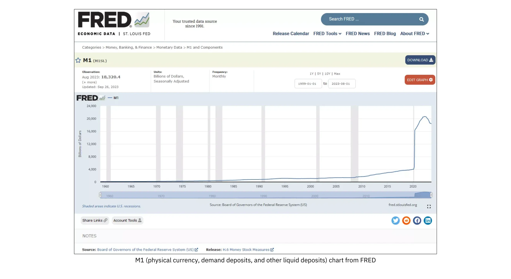

Монетарното печатане може да се разглежда като Дамоклев меч, надвиснал над икономиката. Създадените пари могат да останат латентни за определен период от време без видим инфлационен ефект, стига да не се инжектират в икономиката чрез банкови заеми или други механизми. Когато обаче тези латентни пари най-накрая бъдат пуснати в обращение, тогава могат да се проявят инфлационни ефекти. Именно това се наблюдава през 2020 г., когато създадените преди това пари навлизат в икономиката, което води до инфлация.

Този сценарий подчертава значението на паричните трансмисионни механизми за повлияване на инфлационните ефекти от печатането на пари. Създаването на пари от централната банка е само една част от пъзела. Поведението на частните банки, които вземат решение за обема на отпусканите кредити, и поведението на кредитополучателите, които решават как да изразходват заетите пари, също са решаващи елементи в тази динамика.

#### Инфлацията е социална!

Примерът с Ваймарската република илюстрира друг важен аспект на връзката между печатането на пари и инфлацията: ролята на очакванията и поведението на икономическите агенти. Когато Централната банка на Ваймарската република започва да печата голямо количество пари, икономическата несигурност кара хората да трупат, т.е. да съхраняват пари, вместо да ги харчат. Тази реакция временно забави инфлационните ефекти от печатането на пари.

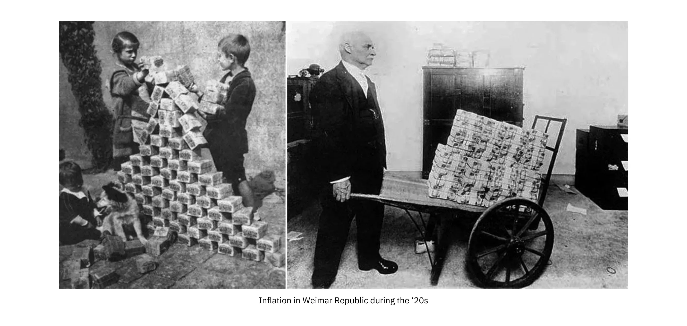

Въпреки това, когато икономическата ситуация започна леко да се подобрява, доверието постепенно се възстанови. Тогава хората извадиха спестяванията си от скривалищата и започнаха масово да харчат в икономиката. Тази внезапна промяна в поведението, съчетана с вече високото парично предлагане, доведе до експлозия в търсенето. С повече пари в обращение и повишено търсене цените започнаха бързо да растат, което доведе до забележима инфлация.

Този пример подчертава значението на времето и поведението на агентите за появата на инфлация. Инфлацията възниква не само в отговор на увеличаването на паричното предлагане, но зависи и от това как и кога тези пари се изразходват в икономиката. Икономическата несигурност и очакванията на икономическите агенти играят решаваща роля в тази динамика и могат да ускорят или забавят инфлационните ефекти от печатането на пари.

#### Обобщение:

- Индекс на потребителските цени (CPI): Индексът на потребителските цени е структуриран по начин, който подценява инфлацията, което може да даде изкривена представа за реалната инфлация.

- Секторно усвояване: Вливането на парични средства в сектори, способни да ги абсорбират, не винаги води до инфлация. Забележителен пример е военнопромишленият комплекс на САЩ, който може да поглъща големи суми пари, без да предизвиква инфлация.

- Случаят с Япония: Въпреки значителното печатане на пари, инфлацията в Япония остава ниска, тъй като средствата често се спестяват или инвестират в недвижими имоти или фондови пазари. Тези сектори абсорбират напечатаните пари и индексът на потребителските цени не отразява непременно нарастването на цените в тези области.
- Връзка между паричното обращение и пазарите. Наблюдава се, че кривите на пазарите на недвижими имоти и акции често следват паричното печатане, което показва накъде са насочени напечатаните пари.
- Парични резерви на банките: Когато напечатаните пари остават в балансите на банките и не циркулират в икономиката, те не предизвикват инфлация. Това се илюстрира с примера от 2008 г., когато напечатаните пари до голяма степен остават в балансите на банките, забавяйки инфлационното въздействие.

- Ваймарската република: Този исторически период показва как икономическата несигурност води до натрупване на пари, което забавя инфлацията. След като обаче доверието е възстановено и парите са похарчени, инфлацията избухва.

Тези примери могат да се използват в дискусиите, за да се обясни защо инфлацията невинаги е непосредствена последица от печатането на парични знаци и как икономическият контекст и поведението на агентите влияят върху инфлацията.

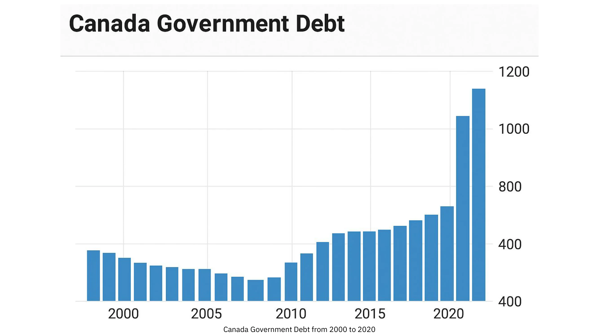

Защото, както показва тази [тема](https://twitter.com/saifedean/status/1673639779433590786): Инфлацията е всичко друго, но не и вина на централните банки.

- Икономистите обвиняват инфлацията в изменението на климата

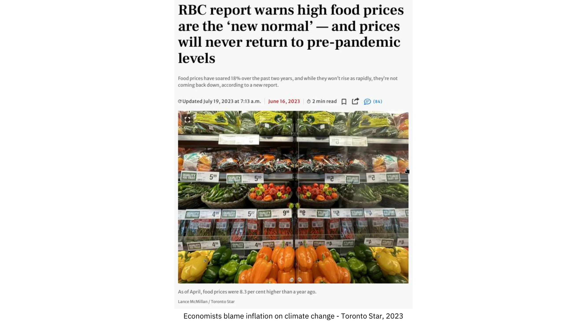

- Пример за Швеция, която обвинява Бионсе за инфлацията през определен месец.

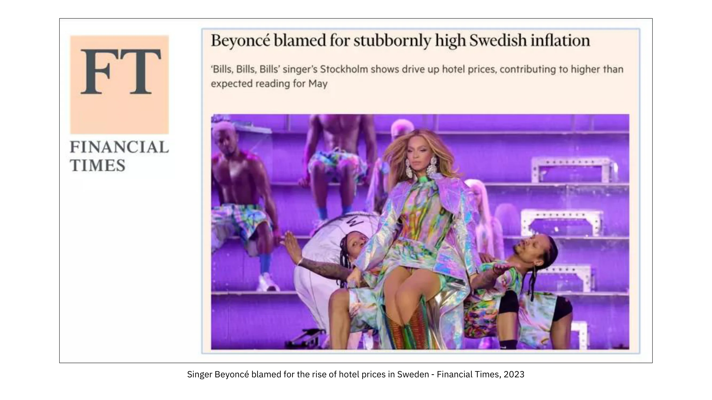

- Централната банка на Полша обяснява инфлацията с руската агресия в Украйна и пандемията

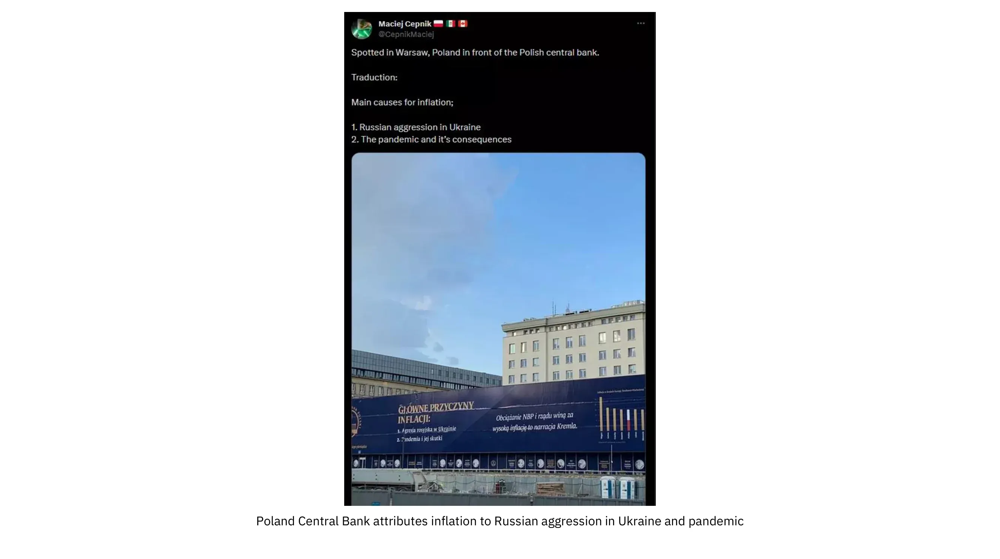

- Brexit е виновен за инфлацията в Обединеното кралство.

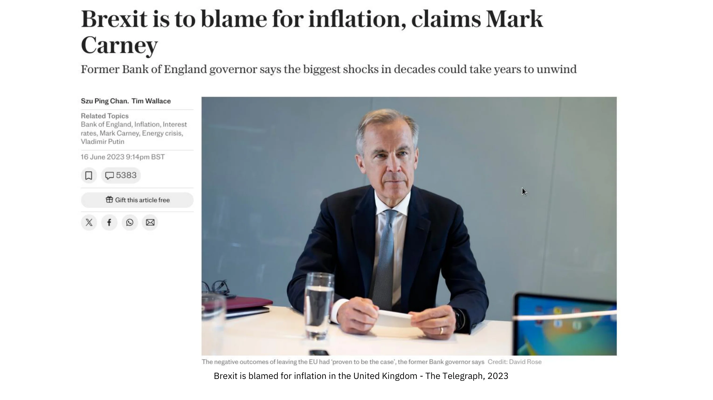

- Пускането на играта "Зелда" е свързано с инфлационен шок.

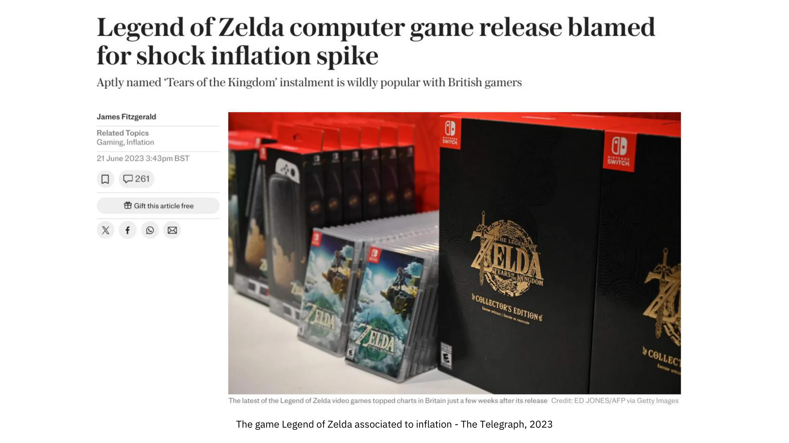

- Тейлър Суифт уж предизвиква инфлация.

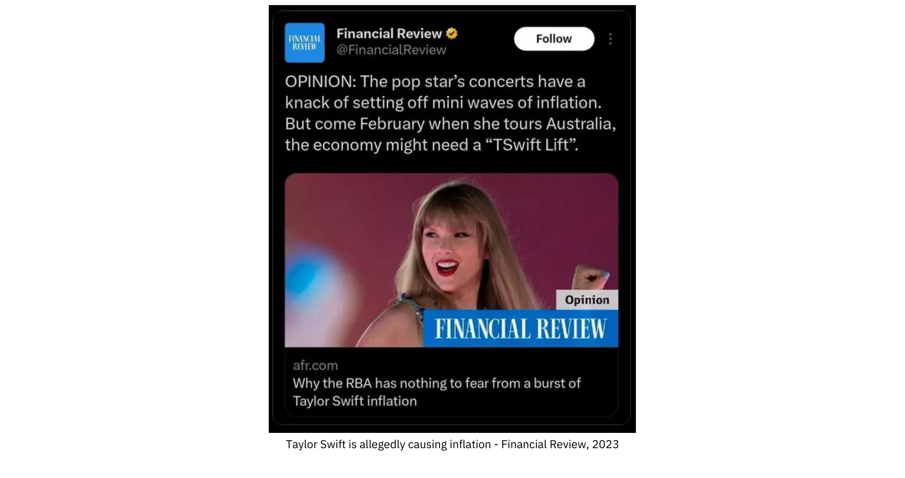

Кажете ми, как Бионсе или Тейлър Суифт биха могли да причинят повсеместното покачване на цените? Виждате ли, това няма никакъв смисъл. Накратко:

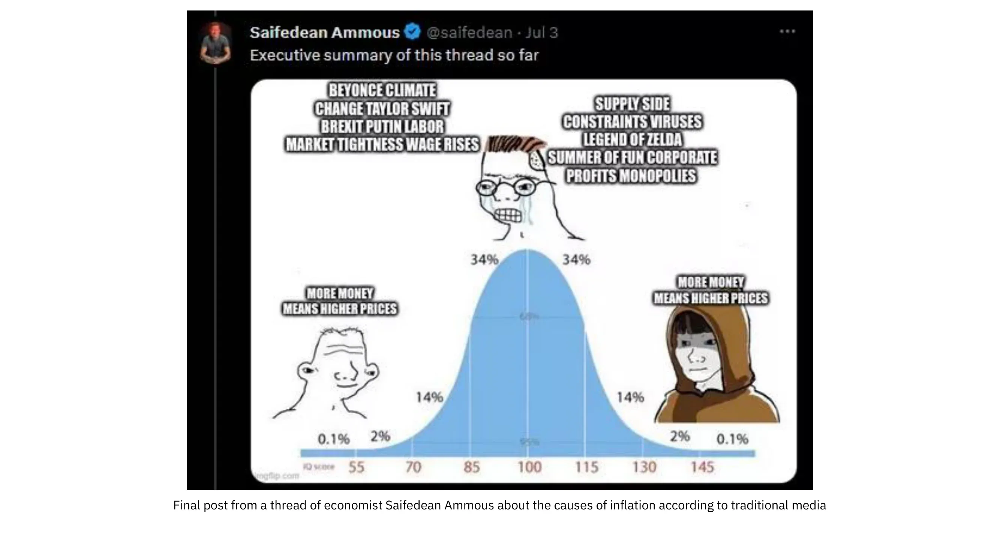

### Проучване на видовете инфлация

Изключително важно е да се разбере разграничението между различните видове инфлация, което ни позволява да разберем разнообразните проявления на това икономическо явление. Ето обяснение на тези различни видове:

- Пълзяща инфлация: Това е видът инфлация, към който централните банки обикновено се стремят и който е около 2% годишно. Тази цел е възприета от 90-те години на ХХ в. и има за цел да поддържа стабилен икономически растеж без прегряване или дефлация.
- Умерена инфлация: Тази форма на инфлация се проявява, когато инфлацията надхвърля целевата стойност от 2%. Тя често се свързва с прегряване на икономиката - състояние, при което прекомерното парично предлагане стимулира общо повишаване на цените. Този сценарий разкрива границите на паричната политика и понякога разкрива противоречия в икономическите дискусии.
- Галопираща инфлация: Галопираща инфлация, често наричана двуцифрена инфлация, се наблюдава, когато годишният темп на инфлация надхвърля 10%. Това е значителен скок на цените, който може да застраши икономическата стабилност.

- Хиперинфлация: Хиперинфлация е екстремно явление, при което инфлацията надхвърля 50% на месец, което поради експоненциалния характер на инфлацията е равносилно на годишна инфлация от над 13 000%. Това ниво на инфлация сериозно дестабилизира икономиката, като прави валутата почти безполезна и подкопава доверието в паричната система.

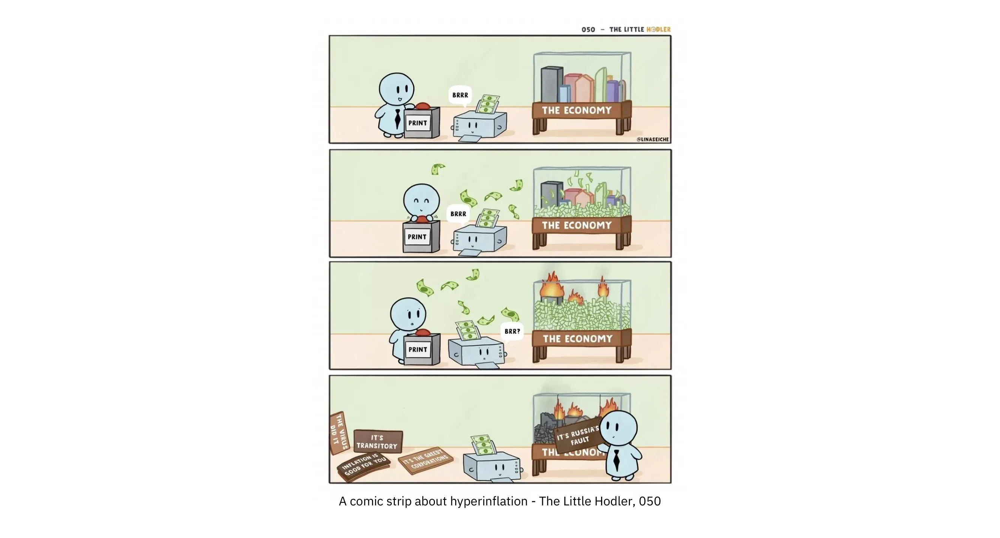

Когато се разглеждат видовете инфлация, в образователните ресурси често се срещат термини като "Demand Pull" и "Cost Push". Тези понятия, макар и валидни, обикновено обясняват по-скоро повишаването на цените, отколкото инфлацията като парично явление. Ето един по-задълбочен анализ:

- Изтегляне на търсенето:

Инфлацията, предизвикана от търсенето, често се описва като сценарий, при който търсенето в икономиката превишава наличния производствен капацитет. Без съответно увеличение на паричното предлагане обаче тази ситуация просто ще доведе до преразпределение на разходите. Потребителите могат да харчат повече за стоки от първа необходимост и по-малко за стоки, които не са от първа необходимост, като по този начин неутрализират общия инфлационен ефект.

- Натискане на разходите:

От друга страна, инфлацията на основата на разходите се дължи на увеличаването на производствените разходи, като например тези за природни ресурси или труд. Отново, без да се увеличи паричното предлагане, увеличаването на разходите в един сектор може просто да намали разходите в други, без да предизвика широко разпространена инфлация.

Тези традиционни обяснения често свързват повишаването на цените с инфлацията, което може да доведе до объркване и неразбиране. В действителност, за да възникне широко разпространена инфлация, е необходимо увеличаване на паричното предлагане. В този контекст концепциите за търсенето (Demand Pull) и разходите (Cost Push) могат да обяснят секторните ценови колебания, но те не отразяват паричния характер на инфлацията. Това подчертава значението на разграничаването на секторните ценови увеличения от широко разпространената инфлация и потвърждава необходимостта от увеличаване на паричното предлагане, за да се предотврати проявата на инфлация в цялата икономика. Този анализ дава по-нюансирана и точна перспектива за действителните причини за инфлацията, като демистифицира общите интерпретации, които могат да замъглят основната парична динамика.

### Класификация на инфлацията според Бернхолц

Бернхолц предлага опростена, но точна класификация на инфлацията в три категории, което позволява по-добро разбиране на това сложно парично явление:

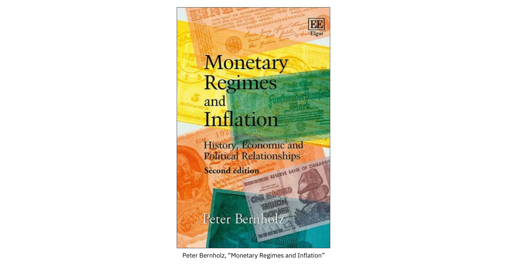

- Умерена инфлация:

Умерената инфлация е налице, когато равнището на паричното предлагане е по-високо от нормалното, но без държавата да прибягва до големи дефицити, финансирани чрез създаване на пари. Макар че терминът "умерена" може да изглежда незначителен, тази форма на инфлация може да предизвика значителни проблеми, въпреки че не се класифицира като висока инфлация.

- Висока инфлация:

Висока инфлация е налице, когато реалната стойност на паричната маса намалява въпреки увеличението й в номинално изражение. Тази парадоксална ситуация възниква в резултат на паричната субституция, при която хората губят доверие в националната валута и се стремят да я обменят за стоки, услуги или чуждестранни валути. Този процес допълнително намалява реалната стойност на валутата, което засилва инфлацията.

- Хиперинфлация:

Хиперинфлацията е крайна форма на висока инфлация, която се характеризира с големи бюджетни дефицити, финансирани чрез създаване на пари. В исторически план не е наблюдаван случай на хиперинфлация без съществено финансиране на дефицита чрез печатане на пари. Хиперинфлацията създава порочен кръг: инфлацията намалява стойността на валутата толкова бързо, че данъчните приходи се обезценяват, преди държавата да успее да ги събере, което принуждава държавата да печата още повече пари, за да се финансира. Този самоподсилващ се цикъл води до астрономически темпове на инфлация, които често надхвърлят 50% на месец.

Тази класификация на Бернхолц подчертава опасния преход от умерена инфлация към хиперинфлация, като подчертава жизненоважното значение на паричния и фискалния контрол за предотвратяване на разрушителни инфлационни спирали. Тя също така показва, че вредните последици за държавното финансиране могат да настъпят много преди достигането на етапа на хиперинфлация, като предоставя нюансирана перспектива за последиците от инфлацията при различните ѝ степени.

### Заключение: Обобщение на видовете инфлация

В заключение разгледахме редица видове инфлация, като започнахме с често срещани термини като "пълзяща инфлация", "вървяща инфлация" и "галопираща инфлация", всеки от които обозначава различни нива на процентна инфлация в дадена икономика. За нашето задълбочено изследване на хиперинфлацията обаче категориите умерена инфлация, висока инфлация и хиперинфлация, описани от Бернхолц, се оказват решаващи ориентири.

- Умерена инфлация:

Той показва равнище на паричното предлагане над нормалното, въпреки че това равнище може да се поддържа без значително финансиране на дефицита от страна на държавата.

- Висока инфлация:

Тя се появява, когато реалната стойност на паричната маса намалява, често поради парична субституция, при която хората се стремят да обменят своята валута срещу стоки, услуги или други форми на валута.

- Хиперинфлация:

Тя представлява екстремен вариант на висока инфлация, при който прекомерното създаване на пари за финансиране на големи бюджетни дефицити води до бързо намаляване на реалната стойност на валутата.

Това, което става ясно от нашето изследване, е, че хиперинфлацията е сложно и противоречащо на интуицията явление. Макар че може да се предположи, че хиперинфлацията е резултат от огромно увеличение на паричното предлагане, в действителност тя е резултат от намаляване на реалната стойност на това предлагане. Този нюанс е от решаващо значение за разбирането на причините, поради които някои държави трудно излизат от хиперинфлацията, дори с подкрепата на международни институции като Световната банка или МВФ. Неправилното определяне на вида на инфлацията може да доведе до прилагането на неподходящи средства за защита, които да задълбочат икономическите проблеми, вместо да ги решат.

В бъдещите ни дискусии ще се задълбочим в хиперинфлацията, като разгледаме нейните дефиниции и проявления в различни икономически контексти. Целта ни е да разкрием основните механизми на хиперинфлацията и да проучим потенциалните решения за справяне с този проблем. Това нюансирано разбиране ще ни позволи да разберем по-добре свързаните с нея предизвикателства и да предложим информирани стратегии за управление на инфлацията.

Благодарим ви за вниманието. Следващата сесия ще бъде изцяло посветена на дефинирането и демистифицирането на хиперинфлацията, като ще бъдат разгледани различни академични и практически перспективи. Очакваме с нетърпение да продължим това изследване заедно с вас на следващата ни среща.

# Какво представлява хиперинфлацията?

<partId>3f541663-1e2f-5410-8ee0-f61c5d009fa5</partId>

## Определения за хиперинфлация

<chapterId>d2a71a2e-5f36-58d9-993c-d431f4aa07fd</chapterId>

### Определения за хиперинфлация

В този раздел разглеждаме различните дефиниции на хиперинфлацията - ключов термин в изследването на екстремните парични явления. Най-разпознаваемото определение идва от Филип Кейгън, който в своя труд от 1956 г. "Паричната динамика на хиперинфлацията" предлага количествено разбиране за хиперинфлацията. Според Кейгън:

- Начало и край на хиперинфлацията:
  - Хиперинфлацията започва, когато месечната инфлация надхвърли 50%.
  - Тя се прекратява, когато процентът на инфлацията спадне под 50% на месец в продължение на поне една година.

Ако инфлацията спадне до 40% през юли и не се повиши над 50% до юли следващата година, тогава се счита, че периодът на хиперинфлация е приключил през юли на годината, предхождаща годината, в която тя е наблюдавана за първи път. Това определение позволява точно характеризиране на епизодите на хиперинфлация, което улеснява структурния анализ.

Тази дефиниция е възприета в таблицата на Ханке-Крус, в която са документирани 56 епизода на хиперинфлация. В таблицата обаче не са обхванати всички епизоди, като този във Венецуела през 2016 г., с което общият брой на епизодите достига 57.

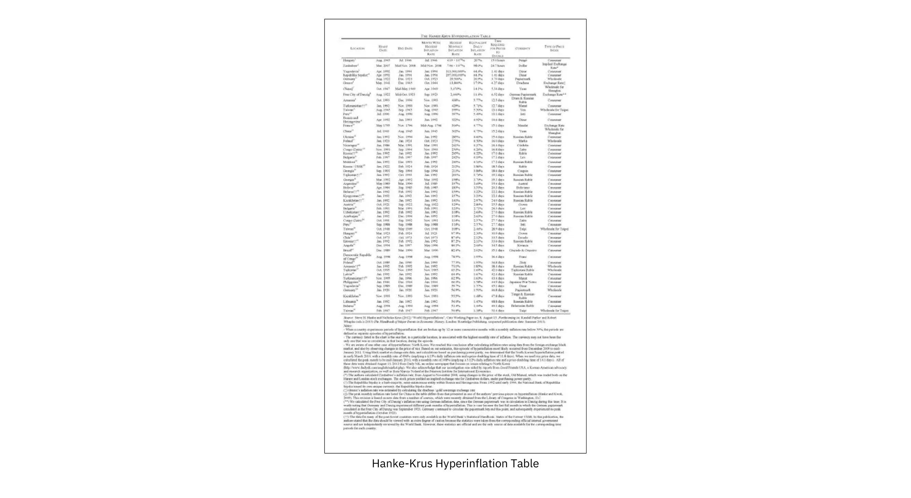

увеличение

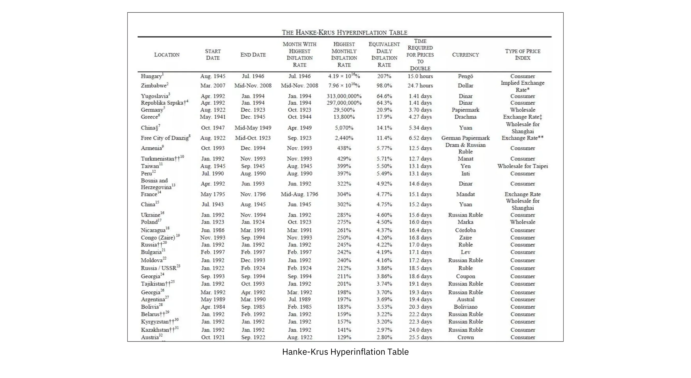

Трябва да се отбележи, че макар и прецизно, това определение може да изключи някои епизоди на хиперинфлация поради строгостта на прага от 50%. Съществува възможност за разширяване на това определение, за да се включат други епизоди, които, макар и да не отговарят стриктно на критериите на Кейгън, все пак представляват периоди на изключително висока инфлация. Това наблюдение отваря вратата към по-широко изследване на явлението хиперинфлация, позволявайки по-нюансирано разбиране на причините и последиците от него. В следващите дискусии ще разгледаме възможността за преразглеждане на това определение и за разглеждане на епизоди на хиперинфлация, които не попадат в обхвата на строгите критерии на Кейгън.

### Определение за хиперинфлация от Кейгън

Филип Кейгън може би е поставил произволен крайъгълен камък с прага от 50% месечна инфлация при определянето на хиперинфлацията. Самият той признава, че тази дефиниция е произволна и обслужва предимно неговия анализ, основан на седем епизода на хиперинфлация. Разглеждането на данните на Кейгън разкрива, че трите епизода на хиперинфлация с най-ниски месечни темпове на инфлация са около 47%, 46% и 57%. Изглежда, че прагът от 50% е избран, за да обхване тези случаи в неговото изследване.

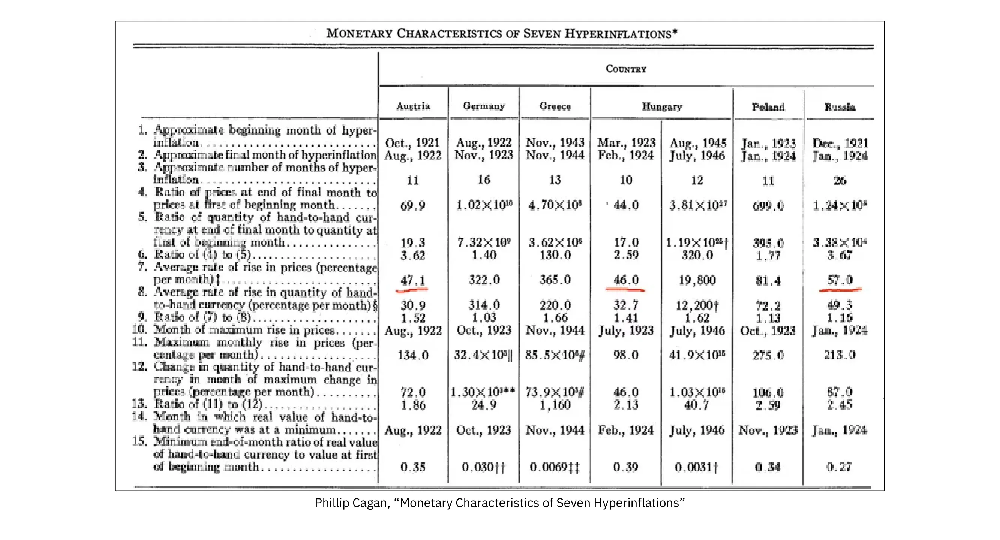

- Исторически контекст:

Определението на Кейгън датира от 1956 г. и се основава на ограничен брой хиперинфлационни епизоди, налични по това време.

- Наблюдения на Кейгън:

Според Кейгън нито един епизод не е достигнал този праг от около 50%, без да се стигне до по-тежка хиперинфлация, което би могло да оправдае избора на този праг.

- Критика на определението на Кейгън:

Други икономисти, като Бернхолц, автор на книгата "Паричен режим и инфлация", също определят прага от 50% като произволен.

Бернхолц отбелязва, че има епизоди на висока инфлация със същите качествени характеристики като епизодите на хиперинфлация, без да се достига прагът от 50%.

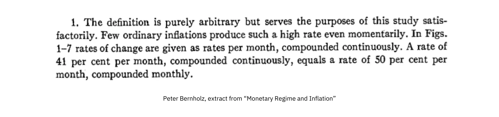

Този размисъл ни кара да поставим под въпрос твърдостта на традиционното определение за хиперинфлация и подчертава необходимостта от преразглеждане на този праг чрез включване на повече епизоди и исторически данни. Определението за хиперинфлация може да се нуждае от гъвкавост, за да обхване различните прояви на екстремна инфлация в различни икономически и исторически контексти.

### Определение за хиперинфлация според Съвета по международни счетоводни стандарти (СМСС)

СМСС предлага уникална гледна точка към хиперинфлацията, като се фокусира върху счетоводните практики през периоди на хиперинфлация. Този подход е от решаващо значение за счетоводителите и предприятията, работещи в хиперинфлационна среда, където паричната стойност се колебае бързо. В насоките на СМСС се посочват различни показатели за хиперинфлация:

- **Предпочитания за непарични активи:**

Поради бързото обезценяване на паричната стойност хората предпочитат да държат стойността си в стоки, а не във валута.

- **Оценяване на стоки и услуги:**

Жителите не изчисляват стойността на стоките и услугите в местна валута, което отразява загубата на доверие в местната валута.

- **Обезщетение за загуба на парична стойност:**

Цените включват компенсация за загубата на парична стойност при покупки на кредит, което показва влиянието на инфлацията върху ежедневните транзакции.

- **Индексиране на цените, заплатите и лихвите:**

Цените, заплатите и лихвите се коригират въз основа на индекс, за да се компенсира инфлацията.

- **Кумулативна инфлация за три години:**

Кумулативната инфлация за три години се доближава до 100% (около 24% годишно), което е в контраст с определението на Кейгън за 50% месечна инфлация.

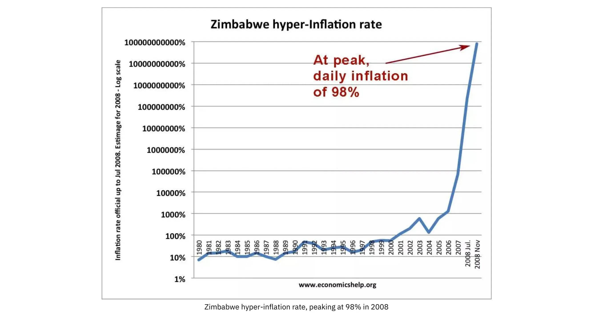

Според критериите на СМСС няколко държави, сред които Аржентина, Етиопия, Хаити, Иран, Ливан, Судан, Южен Судан, Суринам, Сирия, Турция, Венецуела, Йемен и Зимбабве, понастоящем изпитват хиперинфлация.

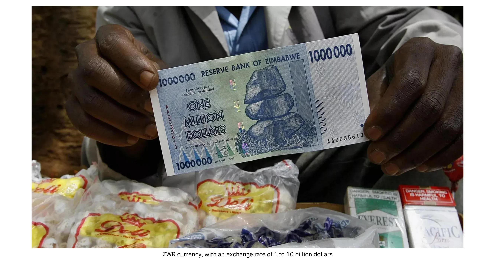

Тази дефиниция, предоставена от СМСС, се отдалечава от строгия количествен праг на Кейгън, като включва качествен анализ на икономическото поведение и практическите корекции в условията на хиперинфлация. То показва, че хиперинфлацията е сложно явление, което изисква многоизмерно разбиране, за да се разберат реалните му последици, особено в областта на счетоводството, което е от решаващо значение за стабилността и финансовата прозрачност на предприятията и пазарите.

### И така, колко хиперинфлации има общо?

Общоприетите дефиниции на хиперинфлацията, като например тази, предложена от Кейгън, която предвижда месечна инфлация от 50%, понякога могат да бъдат объркващи или твърде опростени. Например две държави, в които годишната инфлация е съответно 1000% и 3000%, могат да бъдат възприемани по различен начин въз основа на месечното разпределение на тази инфлация. Ако нито един месец не надхвърля прага от 50%, според определението на Кейгън тези държави не биха били класифицирани като намиращи се в състояние на хиперинфлация. Така този подход може да доведе до аномалии при класифицирането на хиперинфлацията, особено когато се сравняват кумулативните инфлации през годината.

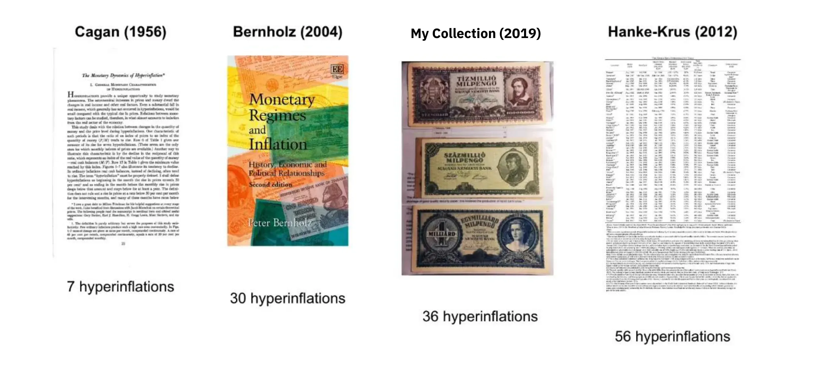

- Трудът на Кейгън "Парична динамика на хиперинфлацията" съдържа фундаментален анализ на хиперинфлацията.
- В книгата на Бернхолц, която изследва 30 различни периода на хиперинфлация, се разширява обхватът на анализа.
- Личната колекция на Дейвид Сент-Онж (автор на този курс) от банкноти от 36 периода на хиперинфлация, която дава възможност за осезаемо и историческо разбиране.
- Таблицата на Hanky Cross (версия от 2012 г., актуализирана през 2016 г. с Венецуела), в която са изброени 57 периода на хиперинфлация по определението на Кейгън.

Струва си да се отбележи, че някои исторически периоди на висока инфлация не са включени в класическите таблици за хиперинфлация, често поради строги критерии за класификация. Например по време на Американската война за независимост през ноември 1779 г. и по време на Гражданската война в САЩ през март 1864 г. месечните равнища на инфлация са съответно 47.4% и 40%. Тези темпове, макар и високи, не надхвърлят прага от 50%, определен от Кейгън, което изключва възможността тези периоди да бъдат класифицирани като случаи на хиперинфлация. Този пропуск подчертава ограниченията на строгите дефиниции и подчертава необходимостта от по-нюансирано разбиране на хиперинфлацията в цялата ѝ сложност.

## Сходство между Ваймар и Зимбабве

<chapterId>11eef458-aab8-5c63-8523-264d0ba69f5d</chapterId>

### Две епохи, две катастрофи

В тази глава ще разгледаме последиците от хиперинфлацията, като се спрем на опита на Зимбабве и Ваймарската република. По време на изследването си дадох приоритет на проучването на преки свидетелства от лица, преживели тези периоди на хиперинфлация, вместо да възприемам чисто икономически или статистически подход.

Няколко книги бяха особено информативни:

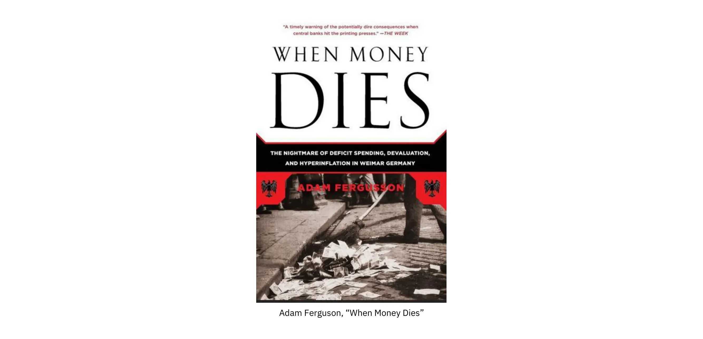

- "When Money Dies" на Адам Фъргюсън проследява хиперинфлацията след Първата световна война в Германия, както и в Австрия и Унгария.
- Две книги за хиперинфлацията в Зимбабве, съответно "Zimbabwe Warm Heart Ugly Face" и "Hard Boiled Egg Index" от Жером Гарднър и Кудзай Джоузеф Гоу Мин-Ю, предлагат прочувствени свидетелства от изпълнителен директор на верига магазини за дрехи и земеделски банкер за преживяванията им през този бурен период.

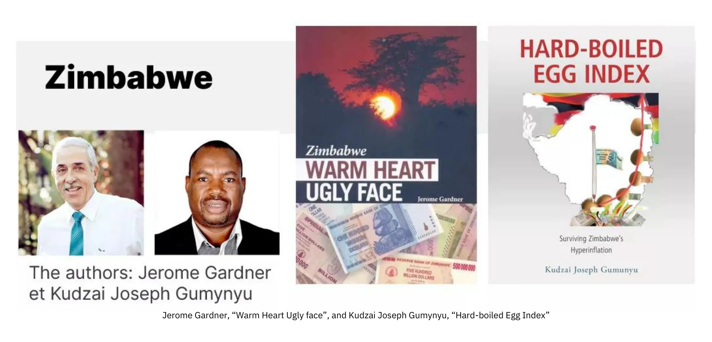

Докато обобщавах бележките си, забелязах многобройни прилики между преживяванията на хиперинфлацията в Зимбабве и Ваймарската република, въпреки 90-годишната разлика между тях. Открих около 17 прилики, като 13 от тях илюстрират своеобразен напредък към икономическата катастрофа, описана в тези свидетелства. Тези завладяващи паралели показват повтарящия се и опустошителен характер на хиперинфлацията във времето и границите. Днес ще разгледаме тези прилики и как те изобразяват тревожната траектория през периодите на хиперинфлация.

### Сравнителен анализ: Зимбабве и Ваймарската република

Играта с 14 разлики!

#### 1. Недостиг на пари

Когато валутата се обезценява с главозамайваща скорост, дори най-амбициозните опити да се наводни пазарът с нови банкноти могат да се окажат недостатъчни. Непрекъснатото търсене на осезаема валута може далеч да надхвърли капацитета на централните банки да произвеждат банкноти, създавайки безпрецедентни кризи на ликвидността.

> Ваймар: "През този месец той ще бъде увеличен до почти 4 милиарда хартиени марки - цифра, с която се надяваме, че недостигът на валута ще бъде окончателно преодолян."

> Зимбабве: "От 2002 г. до януари 2009 г. имаше няколко критични случая на недостиг на ликвидност. Просто нямаше достатъчно отпечатани банкноти или банкноти в обращение, за да се справи с главоломно нарастващата инфлация."

#### 2. "А това е тор!"

Скоростта, с която валутата може да загуби стойността си в определени икономически ситуации, е поразителна. Астрономически количества банкноти могат да бъдат емитирани за рекордно кратко време, което мигновено превръща някога значителни суми в нещо толкова незначително като тор.

> Ваймар: "Общият размер на настоящата емисия възлиза на 63 000 милиарда евро. Следователно след няколко дни ще можем да емитираме две трети от общия тираж за един ден."

> Зимбабве: "На 17 септември 2006 г. гуверньорът на RBZ Гидеон Гоно заяви: "10 трилиона са все още там и са се превърнали в тор."

#### 3. Стойността на банкнотите е по-малка от стойността на хартията, върху която са отпечатани

При определени икономически обстоятелства вътрешната стойност на банкнотата може да стане по-ниска от стойността на хартията, върху която е отпечатана. Това драстично обезценяване превръща банкнотите, които обикновено са символи на стойност и покупателна способност, в обикновени парчета хартия без стойност.

> Ваймар: "Цели деноминации от банкноти бяха почти безполезни, веднага щом излязоха от печатницата."

> Зимбабве: "Централната банка прахоса пари, като отпечата банкнота, която не струваше колкото хартията, на която беше отпечатана. С други думи, стойността ѝ беше по-ниска от тази на тоалетната хартия. Колкото и абсурдно да звучи, беше по-евтино да се използва банкнотата от 100 трилиона ZWD като тоалетна хартия, отколкото да се купи истинска тоалетна хартия."

#### 4. Броене на пари

Когато валутата бързо губи стойността си, дори най-простите транзакции могат да се превърнат в трудна задача. Изчисляването на цената на даден артикул или просто преброяването на банкнотите, необходими за плащане, може да отнеме няколко минути, което усложнява ежедневните взаимоотношения.

> Ваймар: "Най-обикновената покупка в магазин изискваше три-четири минути изчисление, а след като цената беше определена, обикновено бяха нужни още няколко минути, за да се преброят банкнотите."

> Зимбабве: "Управителите на магазините също така имаха право да наемат временен работник, който да замени служителя, който по цял ден брои парите. Разбира се, броенето на пари в магазина за целите на администрацията и банковия депозит беше едно, но целият процес трябваше да се повтори в банката по време на депозита."

:::video id=910231d7-af90-4ab8-b74c-bfb81caebfb2:::

Узбекска техника за броене на пари

#### 5. Плащания с чек

В икономиките с прекъсвания традиционните методи за плащане като чековете могат бързо да загубят своята ефективност. Банките, претоварени от нарастващото търсене на валута поради хиперинфлация, могат да ограничат или забавят осребряването на чековете, като по този начин намаляват реалната им стойност. Тази нестабилност често води до приоритизиране на методите на плащане, при което цените могат да варират в зависимост от избрания метод на плащане.

> Ваймар: "Повишаването на цените засили търсенето на пари както от държавата, така и от други работодатели. Частните банки изобщо не можеха да посрещнат търсенето и трябваше да ограничат осребряването на чековете, така че безналичните чекове оставаха замразени, а покупателната им способност намаляваше."
> Зимбабве: "Стойността на парите във времето създаде три цени на стоките и услугите, а именно: цена в брой, цена на брутния сетълмент в реално време и цена на чека. В крайна сметка никой не приемаше чекове, чието изчистване отнемаше пет дни."

#### 6. "Burner-preneurs"

С намаляването на стойността на валутата се появяват нови икономически възможности, които се възползват от изкривяванията на пазара. Тези предприемачи, често наричани "Burner-preneurs", могат да процъфтяват, като заемат обезценена валута, за да инвестират в материални активи, а след това изплащат дълговете си с още по-обезценена валута.

Ваймар: "Спекулациите с инфлацията включваха заемане на хартиени марки, превръщането им в стоки и фабрики, а след това изплащане на кредиторите с обезценена хартия."

Зимбабве: "Burner-preneurs"

#### 7. Честността и трудолюбието губят своята привлекателност

В нестабилна икономическа обстановка традиционните ценности на трудолюбието, пестеливостта и почтеността могат да бъдат засенчени от съблазънта на бързото забогатяване. Спекулациите и търговията с валута често предлагат значително по-високи възнаграждения от редовната работа, което води до нарушаване на обществените приоритети.

Ваймар: "Тъй като старите добродетели на пестеливостта, честността и трудолюбието губят своята привлекателност, всеки се стреми да забогатее бързо, особено след като спекулациите с валута или акции очевидно могат да донесат много повече, отколкото работата."

Зимбабве: "Тези практики, макар и да обогатяват няколко души, обедняват градската работническа класа и селското население. Образованието загуби своята стойност, тъй като тази търговия се движеше от хора, които не се нуждаеха от образование или упорит труд, за да я оправдаят. Единственото, от което се нуждаеха, бяха връзки и първоначален капитал, за да започнат бизнеса си с лесни пари"

#### 8. "Банките на света"

В ситуации на хиперинфлация или парична криза често възникват паралелни и нерегулирани пазари на чуждестранни валути. Тези неофициални "банки", често наричани с чувство за хумор "световни банки" или с други местни имена, предоставят убежище на онези, които искат да защитят активите си от обезценяване. Въпреки че тези пазари могат да осигурят необходимо икономическо спасение, те често подчертават широко разпространеното недоверие към официалните финансови институции и правителствените политики.

Ваймар: "Транзакциите им се извършваха главно чрез така наречените "винкелбанкер" - уличните оператори, които се появиха с инфлацията и които, процъфтявайки в условията на болна икономика, живееха изцяло, като се възползваха от разликата между покупните и продажните цени на чуждестранните валути."

Зимбабве: "Те също така са обменяли валута. Действаха безнаказано между 2-ро и 6-то авеню и улица Форт в Булавайо благодарение на хитрите си бизнес практики, които често включваха корупция и други незаконни дейности. Този район на града беше известен като "Световната банка"."

Аржентина: "Затова отидох там, където ходят всички аржентинци: в пещерите, които се намират в квартал Флорида в сърцето на Буенос Айрес." - TheBigWhale

#### 9. Обменът на чуждестранна валута е незаконен

В стремежа си да стабилизират собствената си валута и да контролират движението на капитали, правителствата могат да обявят тези транзакции в чуждестранна валута за незаконни. Тези репресивни мерки, въпреки че имат за цел да защитят националната икономика, често могат да имат обратен ефект, като задълбочават общественото недоверие и насърчават черния пазар.

Ваймар: "Хората прибягват до размяна и постепенно се обръщат към чуждестранните валути като единственото надеждно средство за размяна. Бяха въведени нови декрети относно закупуването на чуждестранни менителници и използването на чуждестранни валути за вътрешни плащания. В допълнение към лишаването от свобода вече можеха да се налагат и глоби до десет пъти размера на незаконната сделка."

Зимбабве: "Набезите в предприятия доведоха до лишаването от свобода на няколко бизнесмени от Булавайо за уикенда и до глоби, равняващи се на двойния размер на възстановената чуждестранна валута, след което тази смелост отшумя."

#### 10. Капиталов контрол

Когато дадена страна е изправена пред парична или икономическа криза, една от обичайните реакции на правителствата е да упражняват строг контрол върху движението и формите на капитала. Дали чрез заповеди, налагащи приемането на обезценени национални валути, или чрез строги санкции срещу онези, които отхвърлят определени методи на плащане, тези мерки често целят да овладеят паниката и да възстановят доверието. Ефективността им обаче е различна и понякога тези мерки могат да се окажат контрапродуктивни или откъснати от реалността, която гражданите преживяват.

Ваймар: "Неотдавна с нов указ търговците бяха принудени да приемат държавните банкноти, но тъй като той позволяваше и по-нататъшното използване на чуждестранна валута за всички покупки, търговците обикновено намираха оправдание да не приемат почти нищо друго."

Зимбабве: "На 12 декември 2008 г. правителството въведе SI 175/2008 относно плащането с чекове. В него се посочва: "Наказанието за отказ на плащане чрез чек/банкова карта или друг електронен метод за плащане, опосредстван от банката, е глоба от 8-мо ниво или лишаване от свобода за срок от шест месеца, или и двете Очевидно ние пренебрегнахме SI 175/2008, защото той беше напълно несъответстващ на действителността".

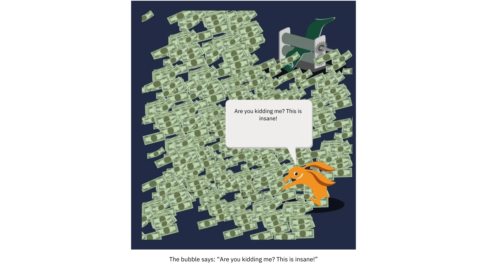

#### 11. Принудени да държат магазините си отворени

Когато икономиката се срине и валутата загуби стойността си, правителствата могат да прибягнат до драстични мерки, за да запазят привидността на нормалността.

Ваймар: "Търговците, които продължават дейността си, са обект на нова наредба, приета на 22 октомври, която ги задължава да държат магазините си отворени и да предлагат стоки в замяна на хартиени марки."

Зимбабве: "Останали са само празни стоманени рафтове и хладилници, фризери и фризери. Трагедията беше, че магазинът все още беше отворен, защото не смееха да затворят поради политическото напрежение и страха от арестуване на лидерите от правителствените сили за контрол на цените. Дори работниците не бяха уволнени, защото всички смятаха, че ще има бързо решение"

#### 12. Всеки е престъпник

В условията на сриваща се икономика и повсеместни регулации границата между оцеляването и престъпността се размива.

Ваймар: "Всички престъпления срещу държавата, всяко едно от тях, в различна степен, се превръщат във въпрос на оцеляване за индивидите."

> Зимбабве: "Всеки жител на Зимбабве е престъпник. Колкото и грубо да звучи, това беше вярно. С безбройните малки закони, които регулираха всеки аспект от живота, беше неизбежно всеки да нарушава по някой закон всеки ден. Притежаването на чуждестранна валута беше незаконно. Наличието на няколко банкови сметки, за да се заобиколи дневният лимит за теглене на пари, беше незаконно. Да нямаш подходящи регистрационни табели на колата си, лиценз за автомобилно радио или разрешително за генератор - това бяха все закони, които някой, някъде, нарушаваше."

#### 13. Купуване на чуждестранна валута на всяка цена

Трескавото закупуване на чуждестранна валута често е било критичен момент в девалвацията на валутата, което е задълбочавало спада на вътрешната й стойност.

> Ваймар: "През август 1921 г. Фриц Манхаймер, по указание на своя шеф, излиза навън и започва да купува чуждестранни валути на всяка цена - "защото Германия има безкрайно много хартиени марки, но няма чуждестранни валути". Това е първият признак за абсолютния срив в стойността на марката."

> Зимбабве: Твърди се, че са им били давани ежедневни цели, които да изпълняват, тъй като някои от нуждите от валутни резерви са били спешни и те са купували на всяка цена, за да натрупат валутни резерви, за да спазят крайния срок. Тази предполагаема практика беше обвинена, че подклажда огъня на девалвацията, тъй като стойността на зимбабвийския долар продължава да спада рязко."

### Обобщение на процеса

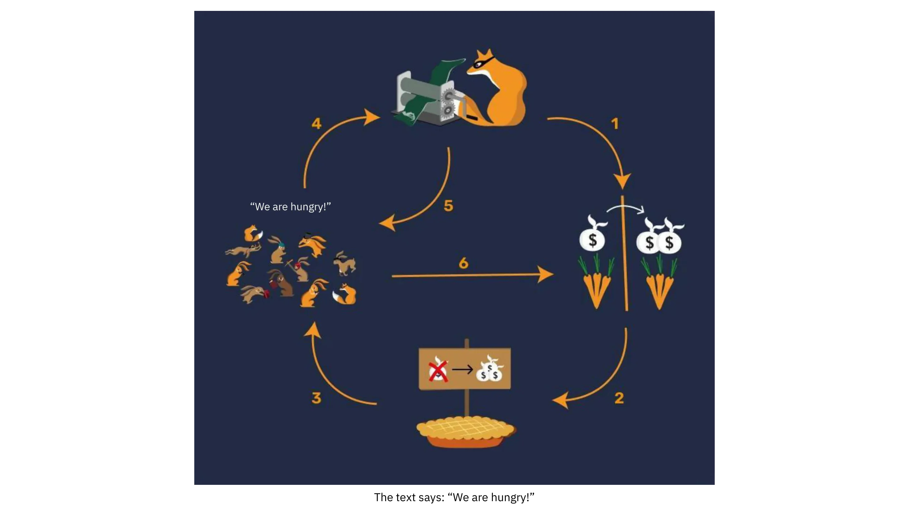

При анализа на икономическата траектория се вижда, че при достигане на висока инфлация стойността на паричната маса се влошава. Това обезценяване води до редица усложнения, включително до недостиг на банкноти. В този контекст възникват възможности за арбитраж, особено в отговор на колебанията на обменните курсове. В резултат на това много лица се насочват към този арбитраж, инвестирайки в значителна степен в материални активи в очакване на бъдеща девалвация на валутата, която би им позволила да изплатят дълговете си с отслабена валута. Тази икономическа обстановка подкопава привлекателността на традиционните работни места и съответно ерозира социалното сближаване.

В отговор на тази ситуация правителството налага драконовски регулации, включително капиталов контрол. Освен това то задължава търговците да приемат националната валута и чекове. С течение на времето се приемат нови закони, които разширяват определението за престъпно поведение. В крайна сметка обменният курс се покачва експоненциално, тъй като правителството е готово да обмени своята валута, отпечатана на по-ниска цена, за по-стабилни чуждестранни валути.

### 4 Сходства в последиците от хиперинфлацията

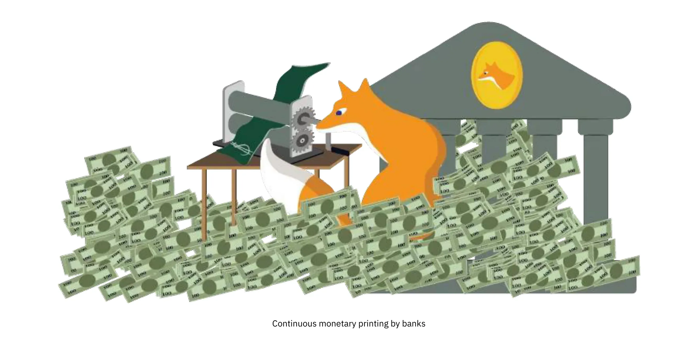

#### 1. Нефт и метали

По време на Ваймарския период в Германия кражбите на ценни материали са толкова широко разпространени, че оловото от покривите често се краде. В Зимбабве отчаянието карало някои да прекъсват електрическата мрежа, за да извличат масло от трансформаторите и да го използват в автомобилите си.

Ваймар: "Металните табели на националните паметници трябваше да бъдат премахнати за съхранение. От вратите на британското посолство в Берлин бяха откраднати месингови плочки на звънците."

Зимбабве: "За да се влошат още повече нещата, поради липсата на чуждестранна валута имаше недостиг на смазочно масло за автомобилите, а трансформаторите станаха лесна мишена за крадци, които при прекъсване на електрозахранването източваха охлаждащото масло."

#### 2. Влакове

Девалвацията на валутата може да накара гражданите да предприемат действия за оцеляване, включително вандализъм. Изправена пред срив на икономиката, скъпоструващата обществена инфраструктура, като например транспортните системи, може да бъде компрометирана, което да доведе до катастрофални обществени последици.

> Ваймар: "В Берлин трамвайната система спира да функционира поради липса на средства."

> Зимбабве: "Един от най-обезпокоителните и тъжни сценарии беше, когато беше открадната почти цялата електрическа медна линия, свързваща Хараре с Дабука (над 280 км). При завършването си тя беше гордостта на Зимбабве, като по този маршрут се движеха бързи електрически пътнически и товарни влакове."

#### 3. "Mealie Meal"

В условията на оскъдни заплати и нестабилна икономика предприятията бяха принудени да осигуряват храна на служителите си, за да поддържат производителността и ефективността на работата. Тази инициатива беше не само начин да се компенсират недостигът и високите разходи за храна, но и стратегия за задържане на персонала в трудна икономическа среда.

> Ваймар: "В Берлин служителите в офиси, които представляват много важна класа в столицата, получават напълно недостатъчни заплати от 12 000 до 20 000 евро на месец (което се равнява на 12-19 паунда годишно), които постоянно намаляват; но повечето от тях все още могат да получават обяд срещу символична сума, осигурена от офисите им, така че тялото и душата едва се крепят."

> Зимбабве: "На този етап осигурявахме безплатен обяд на всички наши служители. Царевичното брашно беше от съществено значение за по-нататъшното функциониране на нашата компания, тъй като в много случаи това беше единствената храна, която персоналът ни получаваше всеки ден."

#### 4. Купони за бензин

Населението търсеше стабилни алтернативи за транзакции. Във Ваймар продукти като месинг и гориво служат като средства за размяна поради постоянната си вътрешна стойност. В Зимбабве, изправени пред бързото обезценяване на зимбабвийския долар, купоните за бензин, които представляват фиксирано количество от основен продукт, се превръщат във фактическа валута. Тези ситуации подчертават как обществата се адаптират към екстремни икономически условия, разработвайки иновативни решения за поддържане на търговията и икономиката.

Ваймар: "Бартерът вече е бил обичайна форма на размяна, но сега стоки като месинг и гориво стават обща валута за покупка и плащане."

Зимбабве: "С тези ваучери сега плащаме наеми на наемодатели, общински данъци, телефонни сметки - всъщност почти всичко, защото всички са спрели да приемат плащания в зимбабвийски долари и чекове."

#### Заключение

С това завършва това видео за сходствата в преживяванията по време на хиперинфлацията в Зимбабве и Ваймарската република. В следващото видео ще обсъдим разликите и съвременните паралели. Благодаря ви.

## Ваймар срещу Зимбабве: Разлики и съвременни паралели

<chapterId>643f279c-d89f-5600-a2e2-b1bbbba0ab69</chapterId>

В тази глава ще разгледаме различията и съвременните паралели между миналите и настоящите периоди на хиперинфлация, като ще представим анекдоти и подходящи сравнения за днешния ден.

### Разлики между Ваймарската република и Зимбабве

#### 1. Вината е в долара!

В Германия населението често обясняваше инфлацията с поскъпването на долара, а не с вътрешното обезценяване на собствената си валута. Мнозина смятаха, че наблюдаваното явление се дължи на поскъпването на долара. Това схващане отхвърляше всякакво признаване на връзката между икономическите им затруднения и паричната девалвация, предизвикана главно от прекомерното създаване на пари. Книгата "When money dies" ясно илюстрира тази липса на разбиране сред германското население. За разлика от тях в Зимбабве ситуацията е различна: гражданите са напълно наясно с основната причина за хиперинфлацията, която преживяват.

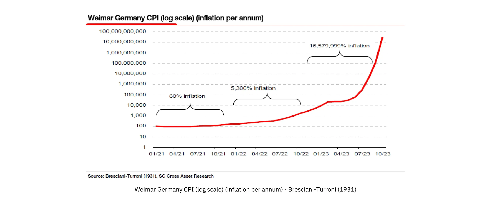

#### 2. Пари за спешни случаи (Notgeld)

В условията на парична и икономическа криза Германия прибягва до "Notgeld" (спешни пари). Тези банкноти, отпечатани от градове или определени компании, бяха предназначени за справяне с недостига на обща валута.

Интересно е, че Франция също прибягва до Notgeld, особено през 20-те години на миналия век. Тази инициатива е не само пряка последица от хиперинфлацията, но и се корени в смущенията, причинени от Първата световна война. войната не само дестабилизира икономиката, но и увеличава цената на металите. В резултат на това вътрешната стойност на металните монети често превишаваше номиналната им стойност, което подтикна хората да ги трупат. При липсата на монети някои институции, като например Лионската търговска камара, печатали свои собствени Notgeld.

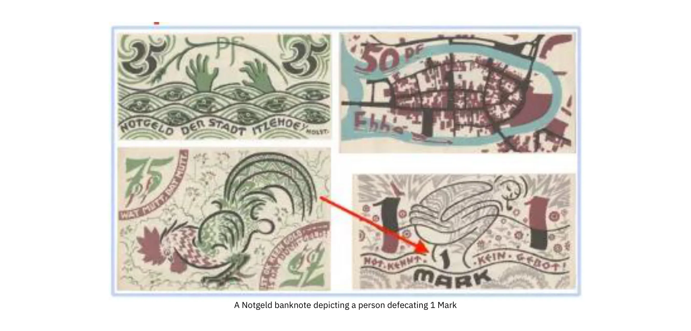

> "Това, което трябва да се направи, трябва да се направи." - местна поговорка

Сред банкнотите Notgeld се откроява една особена банкнота. На нея е изобразена трогателна илюстрация: в центъра е изобразен човек, който дефекира марка. На обратната страна е представена таблица с цените от 1913 г. до 1921 г., която илюстрира нарастването на инфлацията през този период.

Художникът, който стои зад този Notgeld, изглежда отправя иронична критика към властите, отговорни за кризата с хиперинфлацията. На банкнотата е изписан надписът "Необходимостта не познава закони". Друг израз, характерен за населеното място, откъдето произхожда нотгелдът, е: "Това, което трябва да се направи, трябва да се направи".

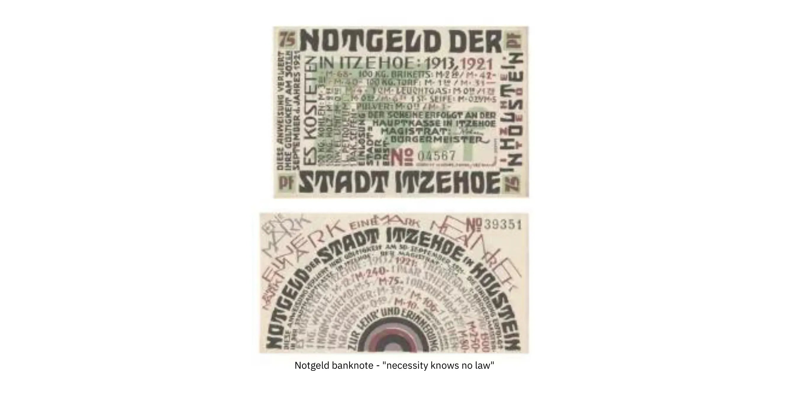

> "Необходимостта не познава закони"

> Първият Shitcoin: Ако погледнем централната илюстрация на банкнотата, където валутата е буквално обезценена от действията на индивида, тя може да се нарече първият "shitcoin".

#### 3. Облигации и ипотеки

Във Ваймар някои дългове бяха преоценени, за да се компенсира въздействието на инфлацията. Тази мярка не е приета в Зимбабве.

> Ваймар: "Решението за преоценка на държавните заеми става закон през 1925 г., в резултат на което акционерите получават 2,5% от първоначалната си инвестиция, при условие че са изплатени всички репарации."

> Зимбабве: "През юли 2007 г. (три години по-късно) можех да извадя от джоба си девалвирана банкнота от 500 000 ZDW, която сега струваше 1.67 USD по курса на паралелния пазар, и да изплатя ипотечния заем, който трябваше да се изплаща в продължение на двадесет години. Освен това тази банкнота представляваше само 0.49% от месечната ми заплата за същия месец"

За да научите повече за управлението на кризата в Германия, тази книга също е от съществено значение.

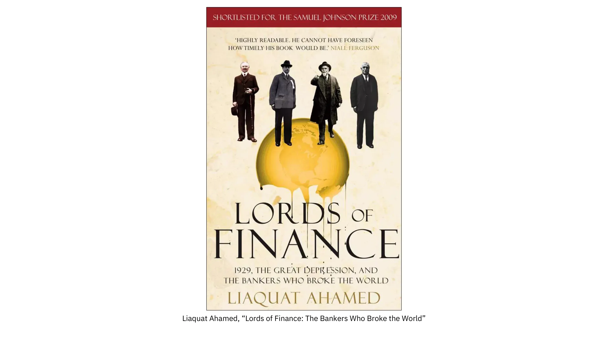

### Съвременни паралели

#### 1. Манипулиране на паричната политика с цел контрол на икономиката.

В историята на Ваймарската република е видно, че индустриалците не са искали да видят как се повишава стойността на марката. Възможността им да вземат заеми и да изплащат дълговете си със силно обезценена валута им даваше значително предимство. Този механизъм улесни изграждането на огромни промишлени комплекси почти без никакви разходи. Тези индустриалци се страхуваха от поскъпването на марката, тъй като то възпрепятстваше дейността им. Някои от тях дори разглеждаха бурната инфлация като положително развитие, вярвайки, че тя ще гарантира заетост на населението. Те обаче не осъзнавали пагубното въздействие на тази инфлация върху спестяванията и икономиката като цяло. За тези икономически субекти паричното печатане беше благословия.

> Ваймар: "Ето защо поскъпването на марката беше силно опасявано и дори няколкото седмици на "стабилност" след Генуа доведоха до застой в бизнеса."

> Ваймар: "Индустриалните кръгове бяха изправени пред опасността парите в брой да станат по-ценни от стоките и да настъпи срив, когато всички се опитат да превърнат активите си в пари в брой."

Съвременен паралел може да се направи с изявленията на Кристин Лагард, която предлага на гражданите да дадат приоритет на перспективата за заетост пред защитата на спестяванията си. Подобно на индустриалците от Ваймар, тя изглежда се застъпва за паричното печатане като инструмент за стимулиране на заетостта за сметка на стойността на спестяванията.

> Кристин Лагард: "Трябва да сме по-щастливи, че имаме работа, отколкото че спестяванията ни са защитени."

#### 2. Частната собственост по време на конфликт

Историята на Ваймарската република показва, че през този период са конфискувани активи и капитали, държани в чужбина. Тази мярка напомня на по-скорошни събития в Русия, особено в началото на конфликт. Тези ситуации подчертават една тревожна реалност: по време на криза зачитането на частната собственост може да бъде компрометирано. Това е исторически и съвременен паралел, който подчертава потенциалните последици от кризите върху индивидуалните права.

> Ваймар: "Целият германски капитал, държан в чужбина, е конфискуван."

> [20minutes.fr](https://www.20minutes.fr/monde/3286947-20220513-guerre-ukraine-geler-avoirs-russes-vol-non-redistribuer-kiev-poserait-lourdes-questions): "Приблизително 300 млрд. долара от руските резерви, държани в чужбина, действително са замразени като част от западните санкции, от общо 640 млрд. долара резерви, държани от Руската централна банка."

#### 3. Понятието за пазарна цена

По време на Ваймарската република фермерите изразяват недоволството си от "Umlage", който ги принуждава да доставят първите два милиона тона произведена пшеница всяка година. В резултат на тази регулация половината от общото предлагане на хляб се предлага на пазара на субсидирани цени. От август нататък на тези фермери трябваше да се плаща цената на световния пазар, защото въпреки че бяха принудени да предадат пшеницата си на намалени цени, те все още трябваше да купуват торове на цени на световния пазар.

Тази ситуация повдига основен въпрос, свързан с понятието за пазарна цена по време на хиперинфлация. В контекста на тогавашната ситуация в Германия земеделските производители са принудени да продават пшеницата си на цена, по-ниска от нейната стойност, като същевременно трябва да се снабдяват с торове на цени от световния пазар. Подобно икономическо несъответствие подчертава предизвикателствата, които поставят цените на храните днес. Селскостопанските производители, изправени пред нарастващи производствени разходи поради инфлацията, прехвърлят тези разходи върху крайните продукти. Критикуването им за това увеличение е равносилно на пренебрегване на динамиката на пазарното ценообразуване и на икономическия натиск, пред който са изправени. Продажбата на изкуствено занижени цени при високи разходи е неустойчива за всеки бизнес.

> Ваймар: "Селскостопанските интереси са недоволни от "Umlage" - принудителната доставка на първите два милиона тона пшеница, произвеждани всяка година, което позволява половината от общото количество хляб да се продава на ниски цени. От август нататък на земеделските производители трябваше да се заплаща цената на световния пазар, тъй като, макар да бяха задължени да продават пшеницата на ниски цени, те винаги трябваше да плащат цената на световния пазар за торовете."

#### 4. Отричане на връзката между паричната маса-5 и инфлацията

> Ваймар: "Той остава твърдо привързан към възгледа си, че паричното предлагане не е свързано нито с равнището на цените, нито с валутните курсове."

В днешно време тази тенденция се запазва, както се вижда от примера в предишната глава със списъка на обясненията, представени от различни икономисти и икономически институти, за да оправдаят инфлацията. Тези причини са различни и варират от културни събития и знаменитости като Тейлър Суифт, Зелда или Бионсе до глобални фактори като войната и пандемията. Всички тези причини, макар и потенциално да допринасят за краткосрочни икономически колебания, отклоняват вниманието от истинската основна причина: разширяването на паричното предлагане.

#### 5. Зомби компании

> Ваймар: "Стабилизацията сложи край на периода, в който предприемачите можеха да заемат колкото си искат за сметка на всички останали. Много голям брой предприятия, създадени или разширени по време на паричното изобилие, бързо станаха непродуктивни, след като капиталът стана оскъден."

"Зомби компания" е предприятие, което при нормални пазарни условия би било неплатежоспособно или близо до фалит, но продължава да функционира главно благодарение на евтини заеми. Тези фирми печелят достатъчно, за да покрият дълговете си, но не са в състояние да се развиват значително.

Понятието "зомби компании" не е ново. Всъщност то е съществувало още по времето на Ваймарската република. По онова време много компании изглеждаха процъфтяващи, до голяма степен благодарение на достъпа до безплатни кредити. Те вземаха значителни суми назаем с очакването да ги изплатят по-късно с обезценена валута поради необузданата инфлация. Когато обаче инфлацията спря и германската марка възвърна стойността си, тези предприятия, които не бяха истински жизнеспособни нито в оперативно, нито във финансово отношение, станаха нерентабилни и трябваше да бъдат закрити.

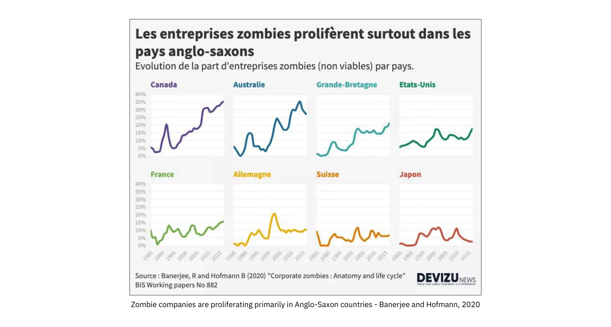

Феноменът на "зомби" компаниите не се ограничава само до следвоенна Германия. Дори и днес много големи корпорации продължават да процъфтяват благодарение на привилегирования си достъп до кредити при изключително ниски лихвени проценти. Ако те трябваше да вземат заеми при по-конвенционални лихвени проценти, много от тях щяха да престанат да бъдат печеливши. Това е особено актуално през 2023 г., след продължителен период на почти нулеви лихвени проценти, тъй като сега лихвените проценти са започнали да се повишават. Тази неотдавнашна промяна във финансовия пейзаж несъмнено ще бъде решаващо изпитание за тези компании, някога наричани "зомбита".

#### 6. Стани богат бързо!

Историята разкрива случаи, в които хората са се опитвали бързо да натрупат богатство, както е било във Ваймар и Зимбабве, чрез арбитраж. Днес подобна тенденция може да се наблюдава при възхода на някои криптовалути. Хората се изкушават от бързи печалби, като поемат рискове с надеждата за експоненциално увеличение на инвестициите си. Този подход напомня на подхода, наблюдаван през периодите на хиперинфлация, когато арбитражът се е използвал за получаване на бързи печалби, често за сметка на други.

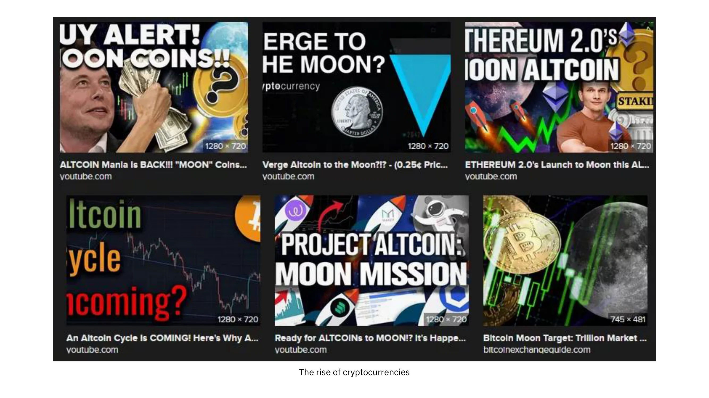

#### 7. Спестяванията - средство срещу несигурността

> Всепроникващото и разрушително влияние на постоянната ерозия на стойността на капитала и доходите, както и несигурността за бъдещето.

Струва си да се подчертае един цитат, който подчертава разрушителното въздействие на ерозията на стойността на капитала върху социалното сближаване, както и несигурността, която тя поражда. Той гласи: "всепроникващото и разрушително влияние на постоянната ерозия на стойността на капитала и доходите, както и несигурността за бъдещето".

Представете си сценарий, в който имате семейство или близки, които искате да защитите. Работите усилено и спестявате, за да предвидите бъдещите несигурности. Ако всичко беше предвидимо, спестяванията биха били безполезни. При непредвидени обстоятелства обаче, като например счупен автомобил, спестяванията се превръщат в спасителен пояс. Те намаляват несигурността на света. По време на хиперинфлация обаче спестяването се превръща в предизвикателство. Парите бързо губят стойността си, което затруднява дългосрочното планиране. Тази финансова нестабилност може да доведе до стрес и безпокойство.

Днес, когато спестовната способност намалява, инвестициите заемат нейното място. Този подход обаче крие своите рискове. Спестяването винаги е било средство за защита от несигурността. Наличието на финансови резерви за справяне с непредвидени ситуации допринася за душевното спокойствие и укрепва социалното сближаване. В заключение, опазването на спестовната ни способност е от съществено значение за поддържане на социалната и индивидуалната стабилност.

## Реденоминации в Латинска Америка

<chapterId>918eafd7-409d-5205-ad52-a52e63b23a64</chapterId>

Сега ще разгледаме различни периоди на реденоминация в страните от Латинска Америка.

### Обяснение на графиките

На слайда, вляво, са посочени годините на реденоминация, името на новата валута и обменният курс спрямо старата валута. Ако вземем за пример Аржентина, националното песо (peso moneda nacional) е конвертирано в съотношение 25 към 1 спрямо предишната валута - песо реал (peso reàl). В този контекст ще разгледаме еволюцията на аржентинската валута във времето. Освен това ще посочим първоначалните и окончателните деноминации на банкнотите за всеки период.

В дясната част на слайда е показана графика на инфлацията. Червените стрелки показват годините на хиперинфлация, както е определено по критерия на Кейгън, който е инфлация от 50% на месец. Този критерий понякога може да доведе до двусмислени тълкувания, тъй като годините с високи темпове на инфлация може да не отговарят на строгото определение за хиперинфлация.

Струва си да се отбележи, че реденоминацията, често предприемана от правителствата в периоди на инфлация, е забележително явление. Това обаче не решава основния проблем на инфлацията или хиперинфлацията. Това е само начин да се преименува валутата и да се премахнат нулите, без да се обърне истинско внимание на първопричината за хиперинфлацията: разширяването на паричното предлагане. В следващо видео ще обсъдим истинските решения за справяне и разрешаване на проблема с хиперинфлацията. В тази поредица ще подчертаем последиците от обикновената реденоминация без адекватни реформи: инфлацията се запазва.

След Аржентина нашето проучване ще обхване Бразилия, Боливия, Перу, Никарагуа и Венецуела. Ще разгледаме извършените в тези страни реденоминации.

### Аржентина

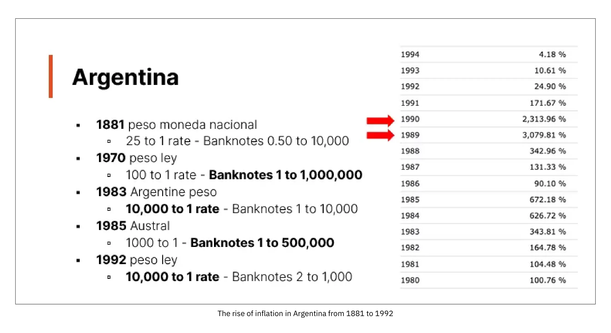

Преди 1826 г. Аржентина използва испанския долар. След обявяването на независимостта си през 1816 г. тя въвежда своя собствена валута, базирана на испанския реал, което води до създаването на подобна валута. Таблицата започва от 1881 г. - годината на въвеждане на "peso moneda nacional", с налични банкноти до 10 000. След това се появява "peso ley", което се обменя по курс 100 към 1 и разполага с банкноти до един милион. След това се появява "аржентинското песо" с обменен курс 10 000 към 1 (еквивалентен на премахването на четири нули) и банкноти до 10 000. През 1985 г. е въведен "australes", който се обменя при курс 1000 към 1 и има банкноти до 500 000. През 1992 г. е въведено сегашното "песо лей" с курс 10 000 към 1, като отново са премахнати четирите нули. Само през 1989 и 1990 г. се наблюдава хиперинфлация.

### Бразилия

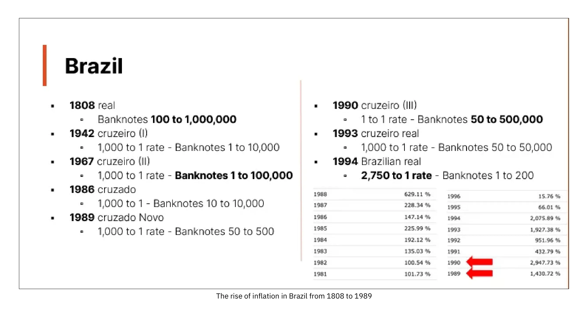

Бразилия е забележителен пример за реденоминация на паричната единица, както показва историята на промените в нейната валута. Преди да получи независимост, Бразилия използва португалския реал като своя валута. Въпреки това още през 1747 г. страната започва да използва свой собствен "бразилски реал", много преди обявяването на независимостта ѝ през 1822 г. Таблицата започва от 1818 г., с което се отбелязва началото на емитирането на бразилски банкноти. Преди това валутата е била предимно под формата на монети. Тези банкноти достигат стойности до един милион реала.

От 1942 г. Бразилия започва поредица от реденоминации. В повечето случаи (1942 г., 1967 г., 1986 г., 1989 г., 1993 г.) обменният курс е 1:1000. През 1990 г. е извършена промяна на името без конвертиране. Последователността на тези валути е следната:

- Réals (стара версия) до 1942 г.
- Cruzeiros през 1942 г.
- Cruzeiros (нова версия) през 1967 г.
- Cruzados през 1986 г.
- Cruzados Novos през 1989 г.
- Завръщане в Cruzeiros през 1990 г.
- Cruzeiros Reais през 1993 г.
- Накрая, бразилският реал през 1994 г.

Банкнотата с най-висок номинал достига 500 000, а последната реденоминация през 1994 г. е извършена в съотношение 2750 към 1. 1989 г. и 1990 г. са белязани от хиперинфлация, докато през 1993-1994 г. се наблюдава висок темп на инфлация, който не достига прага на хиперинфлацията (50% на месец). След този бурен период Бразилия отново реденоминира валутата си, като премахва няколко нули.

### Боливия

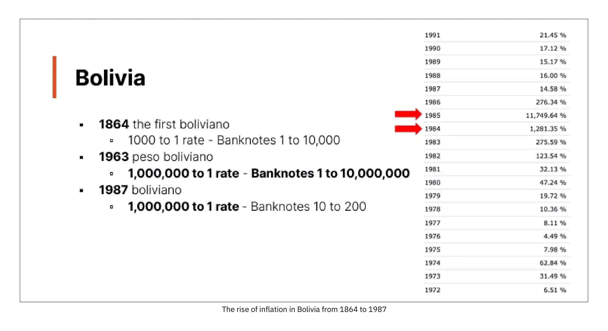

Боливия е друг пример за страна, която е преживяла периоди на остра инфлация, което е наложило реденоминация на валутата. Ето резюме на нейната парична история:

Преди обявяването на независимостта си през 1825 г. Боливия използва за своя валута испанския долар. След обявяването на независимостта, между 1827 и 1864 г. в страната е въведен боливийският сол, който замества испанския долар. Все пак следва да се отбележи, че първите банкноти в Боливия са въведени едва през 1864 г.

През 1864 г. е въведено първото "боливиано" с обменен курс 1000 към 1 спрямо боливийския сол. Тази валута остава в обращение, докато достигне номинал от 10 000 боливиано.

Впоследствие Боливия променя валутата си на "боливийско песо", което претърпява тежка хиперинфлация, като в крайна сметка достига деноминация от 10 милиона. Този епизод на инфлация достига своя връх през 1984-1985 г., като месечните темпове на инфлация често се доближават до прага на хиперинфлация от 50%. В перспектива постоянна месечна инфлация от 50% за цяла година води до годишна инфлация от приблизително 12 800%. През 1985 г. годишният темп на инфлация в Боливия достигна 11 749%, което показва, че инфлацията е била близо до или надхвърляла прага от 50% почти всеки месец.

В отговор на тази парична криза през 1987 г. Боливия въвежда нова валута, наречена просто "боливиано", с обменен курс от 1 милион боливийски песо за 1 боливиано. Тази версия на боливара е в обращение и до днес.

Това е преглед на бурната парична история на Боливия, белязана от периоди на хиперинфлация и реденоминация.

### Перу

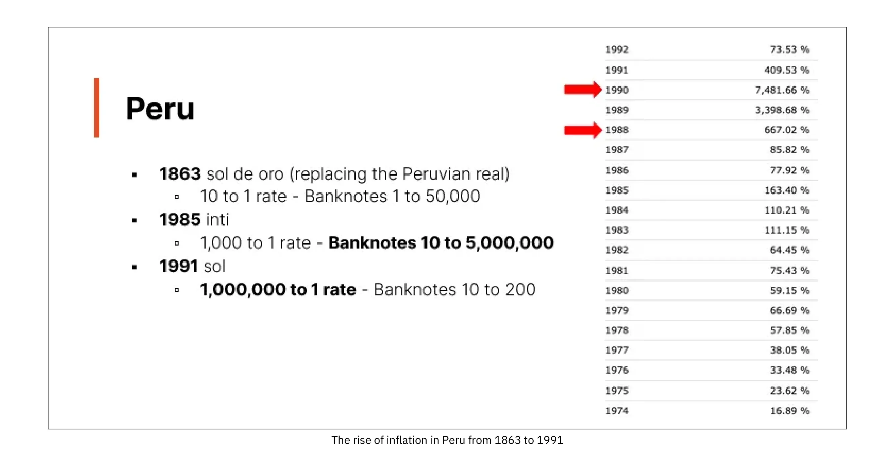

Перу представлява интересен случай по отношение на последиците от произволното правило за 50%. Започвайки с паричната си история, Перу използва испанско злато до XIX в., когато през 1821 г. обявява своята независимост. Перуанският долар се използва от 1822 до 1863 г. През 1863 г. перуанският реал е заменен от солди оро в съотношение 10 към 1, като достига максимална стойност от 50 000. През 1985 г. е въведена валутата "инти" с обменен курс 1000 към 1, като максималната ѝ стойност е 5 млн. През 1991 г. е въведена валутата "СОЛ" с обменен курс 1 млн. към 1, като банкнотите варират от 10 до 200.

При разглеждане на периодите на реденоминация 1988 г. се счита за година на хиперинфлация, особено през септември. През юли-август 1990 г. също има период на хиперинфлация. През 1988 г. годишният темп на инфлация е 667%, с пик от 50% през септември. За разлика от нея през 1989 г. се наблюдава инфлация от 3000%, без нито един месец да надхвърли 50%, така че тя не е класифицирана като хиперинфлация. През 1990 г. инфлацията достига своя връх от 7481%. Ясно е, че правилото за 50% може да бъде произволно, тъй като 1988 г. се счита за година на хиперинфлация, за разлика от 1989 г. Ако това правило бъде преразгледано, може би ще бъде разумно да се намали прагът, за да се включат периоди като преживения от Перу през 1989 г.

> Разбиране на случващото се
>

> Основното нещо, което трябва да се разбере за реденоминацията на валутата, е, че когато стойността на валутата достигне астрономически стойности, например 5 или 10 милиона, тя се реденоминира. Този процес може да се повтори многократно, като включва смяна на валутата. Резултатът е, че спестяванията на физическите лица могат да бъдат сериозно засегнати, дори при липса на хиперинфлация. Например, ако някой спести 1000 долара през една година и успее да задели 100 долара, през следващата година банкнотата с най-нисък номинал може да бъде 1000 долара, което прави безполезни спестените преди това 100 долара. Подобна ерозия на спестяванията не изисква очевидна хиперинфлация. Дори ако човек е спестил 10 000 долара през последните десет години, тази сума може да се окаже на нищожна стойност, без да може да си купи обикновена бутилка вода. Тази реалност е очевидна в много държави, които са преживели реденоминация, дори ако само няколко месеца са били класифицирани като хиперинфлационни. За разлика от тях някои държави, като Никарагуа, са преживели последователни години на хиперинфлация.

### Никарагуа

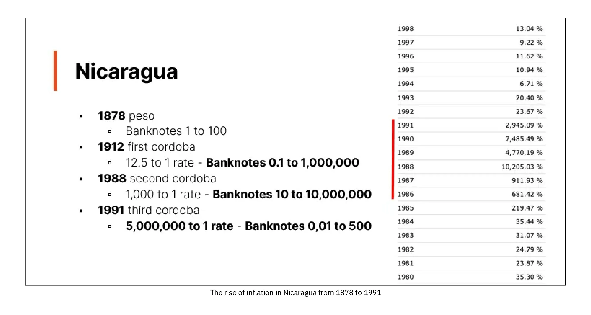

В Никарагуа, която преди това е била под испанско управление, първоначално се използва испанският долар, както в много други колонизирани от Испания страни. След като е включена в Испанската империя, Мексиканската империя, а след това и във Федералната република Централна Америка, Никарагуа обявява своята независимост. От 1878 г. песото става официална валута на страната, като стойността му варира между 1 и 100. През 1912 г. в страната е въведена първата валута "Кордоба", последвана от втората през 1988 г. и третата през 1991 г., която се използва и до днес. Първата Кордоба достига стойност от 1 милион, а втората - 10 милиона. Реденоминацията през 1991 г. е извършена след няколко години на хиперинфлация.

### Венецуела

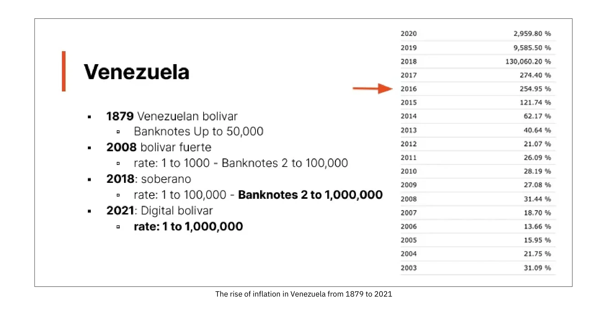

Венецуела е последната държава, спомената в това видео. С течение на времето страната е претърпяла четири реденоминации на валутата. В началото на своето съществуване Венецуела използва испанския долар, преди да обяви независимост през 1811 г. През 1879 г. тя въвежда боливара като официална валута, която остава в сила до 1983 г., когато правителството избира системата на плаващ обменен курс, използвайки долара.

Забележителен факт за Венецуела е членството ѝ в Латинския валутен съюз. Този съюз включва монети като 5 песети от Испания, 5 драхми от Гърция, 5 боливара от Венецуела, 5 лири от Италия, 5 белгийски франка и 5 френски франка.

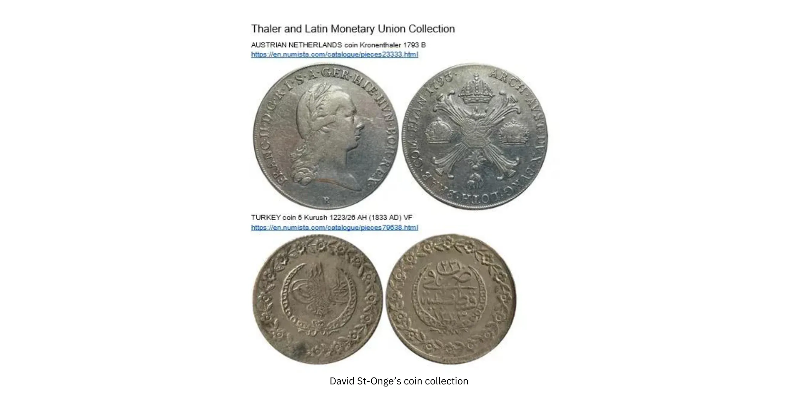

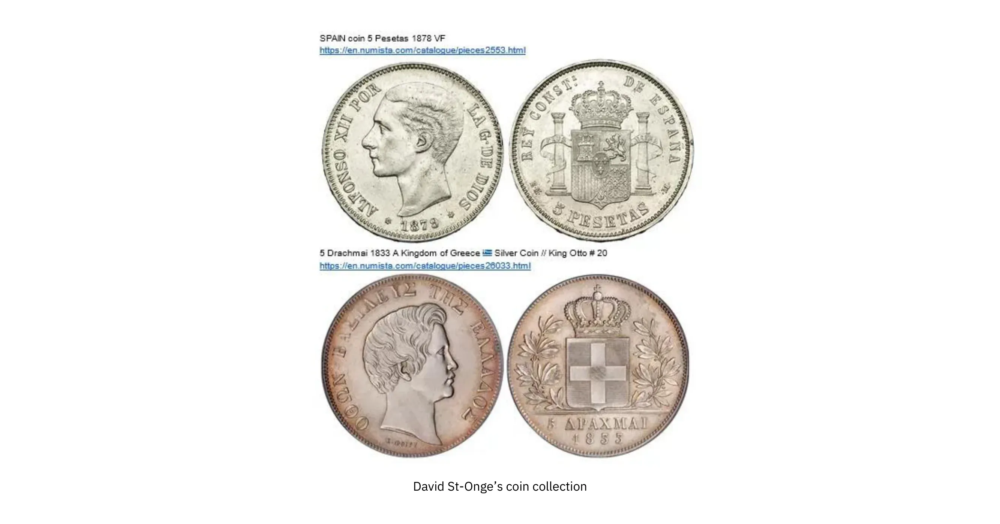

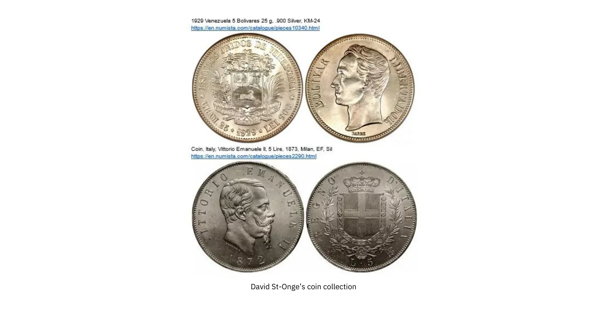

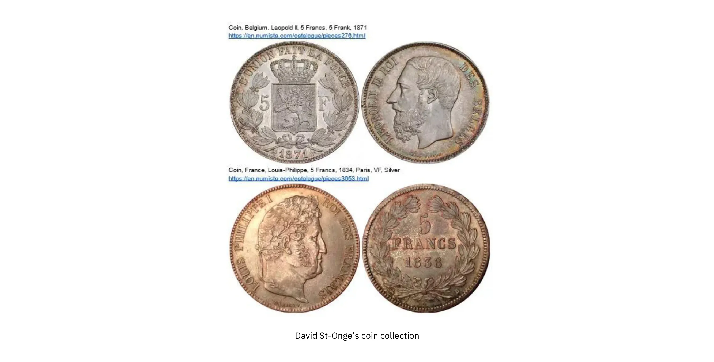

През този период венецуелската монета от 5 боливара има същото тегло като монетите на страните членки на Съюза, включително Италия, Испания, Белгия и Франция. Тези боливари са изработени от сребро, като конкретна монета от 1929 г. тежи 25 грама и има чистота 900, или 90% чисто сребро. При сегашната цена на среброто тази монета струва приблизително 17-18 долара (щатски долари).

След приемането на плаващ валутен курс през 1983 г. последваха няколко реденоминации:

- През 2008 г. е въведен боливарът фуерте, или "силният боливар", който достига до 100 000 преди реденоминация от хиляда към едно.
- През 2018 г. е въведена системата Soberano, като сметките достигат 1 милион. През 2021 г. той е заменен от дигиталния боливар, който също достига 1 милион, преди нова реденоминация от 1 милион към 1. Днес банкнотата от 10 или 20 лева е еквивалентна на 10 милиона или 20 милиона в Soberano.

Сметките от този период, датиращи от 2018 г. насам, се разпространяват на различни конференции на Bitcoin в Биариц, Торонто и Маями. Тези банкноти на Соберано достигат максимална стойност от 1 млн. След това е извършена реденоминация, която намалява стойността на един милион до около 3 цента. Понастоящем 10 банкноти от 1 милион съответстват на една банкнота от 10 евро. От 2016 г. насам Венецуела преживява хиперинфлация, която представлява 57-ия период в конкретната таблица.

В следващото видео ще бъде представена колекция от банкноти за хиперинфлация с акцент върху Венецуела и други изброени държави. Тази колекция съдържа почти всички венецуелски банкноти. Проучването ще се съсредоточи върху различните реденоминации за всяка от посочените държави. Освен това ще има изследване на реденоминациите в Зимбабве - тема, която представлява значителен интерес.

### Заключение

Видяхме, че хиперинфлацията не е единственият показател за икономическа катастрофа. Многократното превалутиране, премахването на нулите или промяната на името на валутата имат преки последици за населението - от загуба на помощи до проблеми с прехраната. Въпреки че хиперинфлацията е обезпокоителна, броят на реденоминациите, наблюдавани в Бразилия, показва по-сложна реалност.

Въз основа на критерия за 50% месечна инфлация няколко периода могат да бъдат класифицирани като хиперинфлация. Това е особено вярно, когато се разглеждат критериите на Международната счетоводна организация, която взема предвид характеристики като бързо изоставяне на валутата от населението, индексиране на заплатите и заеми с високи лихвени проценти за компенсиране на инфлацията.

В заключение, хиперинфлацията е само един от аспектите на икономическите предизвикателства. Само високата инфлация може да бъде също толкова вредна. В следващия раздел ще бъдат разгледани възможните решения за преодоляване на хиперинфлацията.

## Как да преодолеем хиперинфлацията

<chapterId>e3484a31-a851-5f92-8af5-00eddae67db1</chapterId>

### Как да се сложи край на умерената и високата инфлация

Посочените изводи са взети от книгата "Monetary Regime and Inflation" на Петер Бернхолц. Според Бернхолц единственият метод за прекратяване на инфлацията е провеждането на парична реформа и налагането на фискални ограничения на правителството. Тези ограничения включват създаването на институция, например централна банка, която да действа независимо от политическите решения на правителството. Високата и хиперинфлацията често са резултат от финансирането на бюджетни дефицити чрез създаване на пари. За да се справим с умерената инфлация, от съществено значение е да намалим нарастването на паричното предлагане. Бернхолц също така предлага този паричен растеж да бъде относителен спрямо съседните държави. Изненадващ е фактът, че в периоди на висока или хиперинфлация общата стойност на паричната маса всъщност може да намалее. Ярък пример за тази ситуация е Зимбабве.

### Контраинтуитивни решения

При проучването на Зимбабве беше забелязано, че 10 трилиона парични единици от паричната маса са загубили цялата си стойност. Във Ваймар за един ден е било възможно да се отпечатат две трети от общата номинална стойност на 65 млрд. единици от паричната маса. Това показва как паричната маса може да бъде обезценена. За да се поправи тази ситуация, е необходимо значително да се увеличи паричното предлагане, за да се достигне подходящо равнище. Тогава е наложително да се проведе парична реформа. В ситуация на висока инфлация тази реформа е неизбежна, но тя трябва да гарантира наличието на достатъчно пари в обращение. След тази стъпка могат да се наложат ограничения на правителството.

Според наблюденията на Бернхолц, когато се занимават с проблемите на инфлацията, институции като МВФ и Световната банка невинаги приемат най-ефективните стратегии. В някои случаи, когато дадена страна трябва да увеличи паричното си предлагане, тези институции се стремят да го намалят. Ключът е да се достигне адекватно парично равнище и след това да се наложат ограничения за неговото нарастване, като по този начин се избегне финансирането на държавните разходи чрез създаване на пари.

Интересен аспект, повдигнат от Бернхолц, е, че успехът на паричната реформа зависи не само от нейната техническа целесъобразност, но и от доверието на населението в нея. Някои добре замислени реформи могат да се провалят, защото населението не им се доверява, докато други, лошо замислени, могат да успеят, защото населението им се доверява. Следователно възприемането и общественото доверие са съществени елементи за успеха или неуспеха на една парична реформа.

- В Зимбабве решението за борба с инфлацията е доларизацията, което означава, че се приема щатският долар или други валути от съседни държави. Този подход не позволява на правителството да печата пари по свое усмотрение.
- В Германия решението е да се създаде нова валута - рентна марка. Тази валута беше обезпечена с териториалните активи на Райха и тази стратегия се оказа ефективна.

### Случаят със Зимбабве

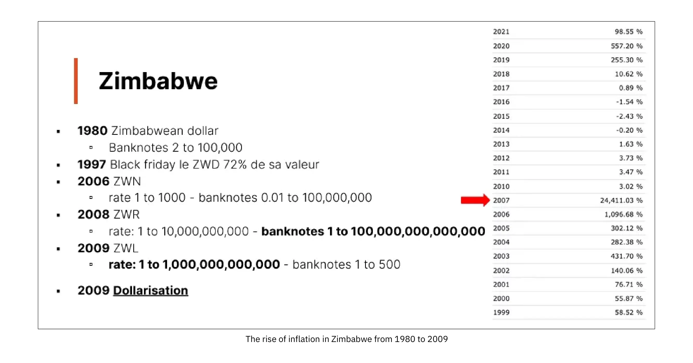

Зимбабве получава независимост през 1980 г. и въвежда собствена валута - зимбабвийския долар. Първоначално два зимбабвийски долара са на стойност около 1.60 щатски долара. През 1997 г. обаче, вследствие на социални мерки в полза на ветераните от войната, валутата се обезценява със 72% за един ден по време на Черния петък. След това, в началото на 2000 г., страната стартира програма за преразпределение на земята, която включва отнемане на земя от белите собственици и разпределянето ѝ между местното население. Това решение навреди на износа, тъй като новите собственици често нямаха необходимия опит за управление на големи стопанства. В резултат на това, докато през 1999 г. Зимбабве е нетен износител, през 2003 г. тя става нетен вносител.

През 2006 г. страната въвежда нова версия на валутата си - ZWN, с обменен курс 1 към 1000. През 2008 г. е въведена друга деноминация - ZWR, с обменен курс 1 към 10 млрд. Това доведе до създаването на емблематичните банкноти с номинал 100 трилиона.

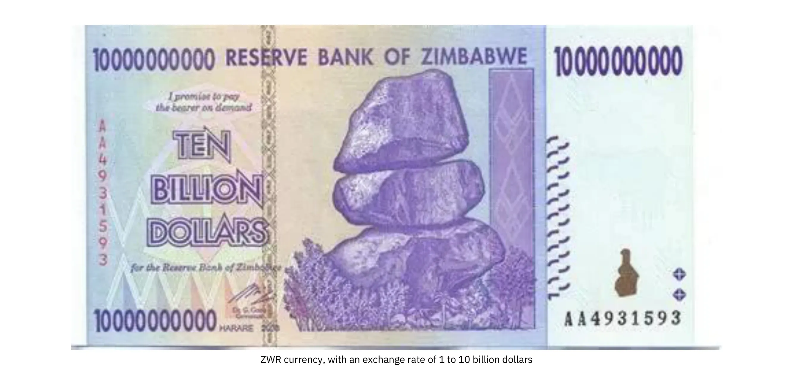

#### Доларизация и разрешаване на кризи

Ето защо след 2009 г., изправена пред постоянна парична криза и ширеща се хиперинфлация, Зимбабве се отказва от националната си валута и разрешава използването на чуждестранни валути, главно щатски долар. Това решение, макар и радикално, сложи край на хиперинфлацията. Основният урок, който трябва да се извлече, е, че спирането на прекомерното емитиране на пари и прекратяването на финансирането на бюджетния дефицит от страна на централната банка може да помогне за предотвратяване на хиперинфлацията.

Доларизацията обаче не е чудодейно решение. Въпреки че може да сложи край на хиперинфлацията, тя поставя други икономически предизвикателства. Едно от последствията е загубата на автономна парична политика. Без собствена валута дадена държава не може да коригира паричната си политика в отговор на вътрешноикономически шокове.

През 2007 г. инфлацията в Зимбабве достига прага от 50% на месец, което официално определя страната като хиперинфлационна. След доларизацията през 2009 г. хиперинфлацията е прекратена, но страната продължава да се сблъсква с други икономически предизвикателства.

Тревожно е да се отбележи, че оттогава Зимбабве се опитва да въведе отново собствената си валута и отново се появиха признаци на висока инфлация. Според някои международни организации страната може би вече отново отговаря на критериите за хиперинфлация, дори и тя все още да не е достигнала официалния праг от 50% на месец. Това служи като напомняне за опасностите от прекомерното емитиране на пари и финансирането на дефицита от централната банка.

### Заключение

В книгата си, озаглавена "Everything About Bitcoin", посветих цяла глава на хиперинфлацията в Зимбабве. Подробно описвам важните събития, като давам различни примери, които илюстрират как страната в крайна сметка сложи край на хиперинфлацията.

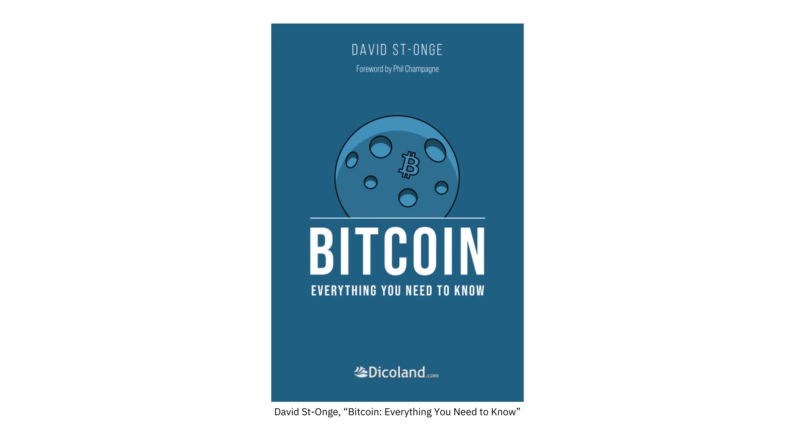

За тези, които се интересуват от германския опит след Първата световна война, горещо препоръчвам комикса "The Reich's Banker". В него се разказва как Германия успява да преодолее хиперинфлацията, по-специално чрез създаването на рентната марка.

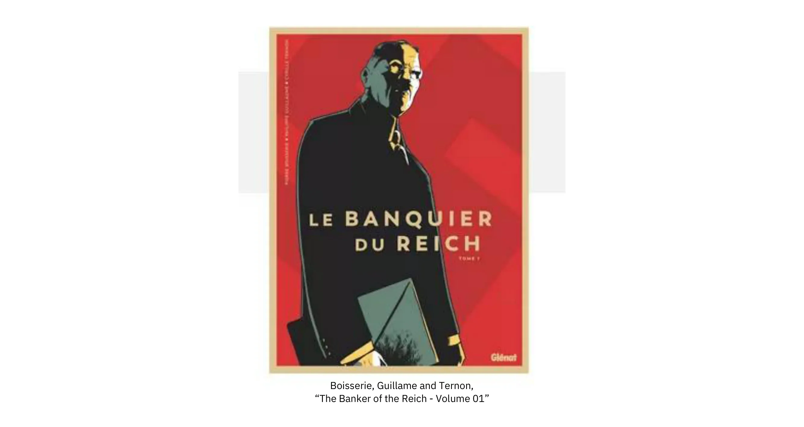

Основният извод е, че съществуват няколко стратегии за преодоляване на хиперинфлацията. Може да се избере доларизация или въвеждане на нова валута. Тези решения ще проработят само ако населението има доверие в тях. Изключително важно е да се наложат строги ограничения. От съществено значение е наличието на наистина независима централна банка. Тя не трябва да раздува паричната маса, за да покрива държавните дефицити. В случай на слаба инфлация ограничаването на растежа на паричното предлагане би трябвало да е достатъчно. При хиперинфлация обаче е от решаващо значение първо да има подходящо парично предлагане спрямо размера на икономиката. След това е наложително да се наложат строги ограничения на правителството, за да се стабилизира ситуацията.

## Представяне на колекцията банкноти от хиперинфлацията

<chapterId>f3ffbb47-3aeb-54bd-80a9-adccb0f419e2</chapterId>

[Открийте сканираната колекция в *Bitcoin Educational Toolkit* (достъпен и от раздела *Resources* на платформата Plan ₿ Academy.](https://penpot.planb.network/#/view?page-id=c157057b-fd28-8042-8004-4f081b21defc&file-id=c157057b-fd28-8042-8004-4f081b21defb&section=interactions&index=0&share-id=7154756b-3ebd-8040-8004-6475c2af5889&interactions-mode=show-on-click)

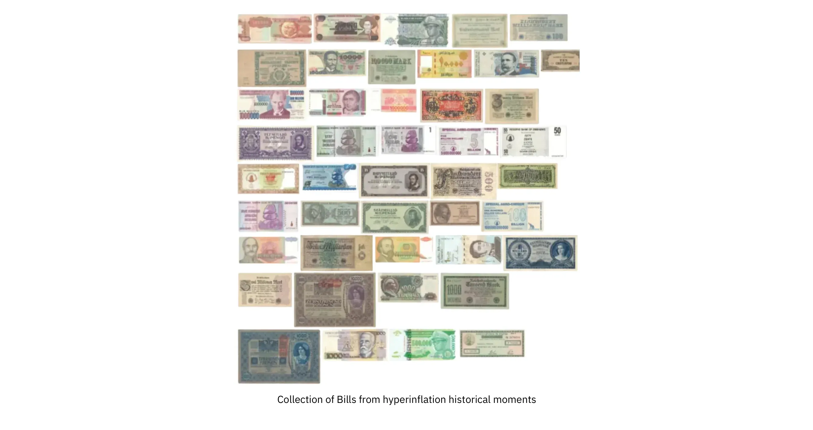

# Как стигнахме дотук?

<partId>f66ca17e-be9e-5d30-a098-f7affd8962a1</partId>

## Появата на втория слой на парите и централните банки

<chapterId>0455ffe3-9d45-5a67-ac96-3f815dc507a1</chapterId>

Транскрипция:

Появата на втория слой пари и на първите централни банки е интересна тема. Тази тема е подробно разгледана в книгата на Ник Батиа "Layered Money". Горещо я препоръчвам на тези, които се интересуват от еволюцията и тънкостите на нашите парични системи. Целта на този раздел е да се разбере произходът на създаването на парите и как то може да доведе до хиперинфлация.

### Парични пирамиди и централни банки

#### Флорин

Историята на парите датира от XIII век в Италия, по-специално в град Флоренция. По това време флорините и менителниците са широко разпространени. Забележителен пример за това е флоринът, украсен с фигурата на Свети Йоан Кръстител.

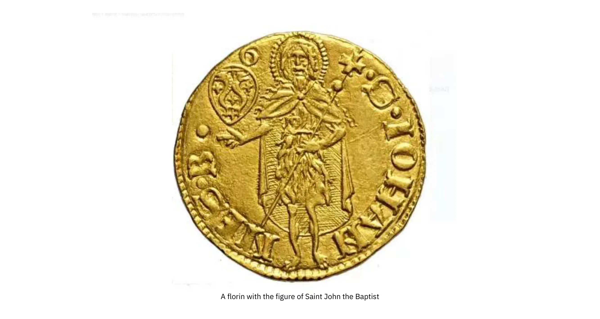

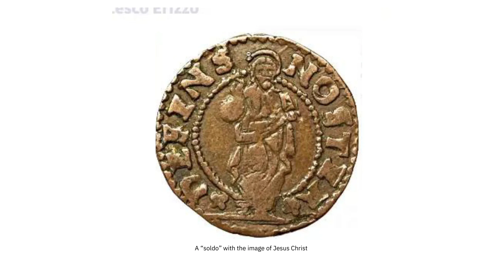

Макар че днес притежаването на истински флорин е скъпо, съществуват репродукции. Съществуват и други валути от онова време, като например солдо от италианските държави през XVII в., на който е изобразен Христос.

#### Разменни банкноти (XIII век)

Обичайната практика по това време е следната: златарите издават разменни банкноти в замяна на депозирани флорини. Тези флорини са били грижливо съхранявани в техните трезори. По този начин истинското злато, представено от флорина, образувало първия слой пари, а менителниците - втория слой. Ликвидността на тази система обаче била ограничена. Ако някой искаше да откупи златото си в замяна на своята банкнота, транзакцията беше проста. Размяната на тези банкноти между отделните лица обаче не беше обичайна практика.

#### Антверпенската фондова борса (16-ти век)

Антверпенската борса бележи ключов етап в развитието на книжните пари. Там е въведена практиката на дисконтиране на менителници. Тези менителници били хартиени инструменти, представляващи парична стойност, но уникалността им се състояла в това, че носели имена и дати на падеж. Това затруднявало размяната им преди датата на падежа.

Революцията, предизвикана от Антверпенската фондова борса, се състоеше във възможността за сконтиране на тези облигации преди датата на падежа им. Например, ако една менителница е била с падеж след един месец, е било възможно да се закупи на по-ниска цена, за да се отчете времето преди датата на падежа. Това нововъведение не само направи хартиената валута по-ликвидна, но и въведе концепцията за стойността на парите във времето.

Тази концепция, въпреки че се свързва с Ник Бел чрез неговия псевдоним в Twitter "time value of BTC", не е негово изобретение. Въпреки това той я обсъжда подробно в работата си. Основната идея е, че времето има стойност. Така, ако някой реши да плати менителница на стойност 100 USD един месец предварително, той може да я получи например за 98 USD и да получи 100 USD на датата на падежа. Това парично нововъведение възниква в Антверпенската фондова борса.

#### VOC и фондовата борса в Амстердам (17 век)

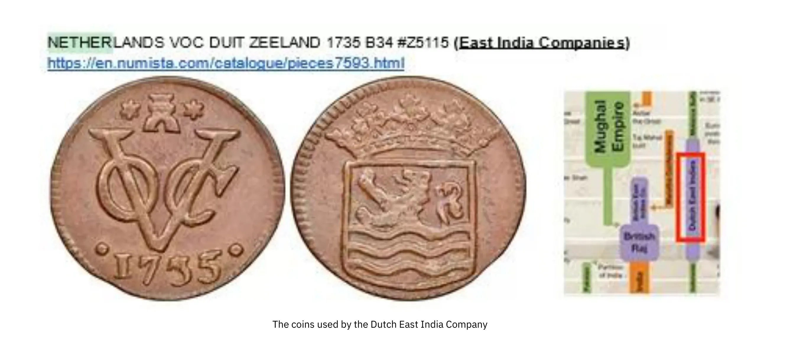

След създаването на Антверпенската фондова борса важен етап е основаването на VOC - Нидерландската източноиндийска компания. Тази компания, базирана в Нидерландия, дори емитира собствена валута. След създаването на ВОК в Амстердам е създадена първата фондова борса, с което се поставя началото на борсовите операции на компанията. Интересно е да се отбележи как нидерландците успяват да сложат край на господството на Антверпен като международен икономически център. Те просто блокират достъпа до река Шелда. Тази стратегия е част от едно по-голямо историческо движение - бунта на просяците. Решаващо събитие в европейската история.

#### Намесата на Банката на Амстердам

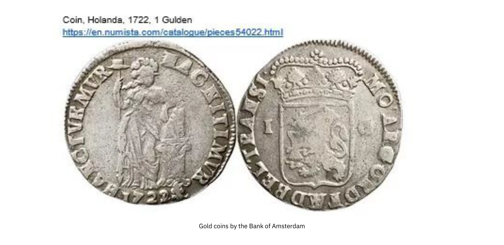

След създаването на VOC друго важно събитие в паричната история е въвеждането на златни монети от Банката на Амстердам. Тези монети, датиращи от 1722 г., са били изработени от сребро. Истинската революция в областта на финансите по това време обаче е не толкова самата монета, колкото сметките, свързани с тази валута в Банката на Амстердам. Тези сметки се превърнаха в основно средство за международен обмен. Сделките просто се записвали в регистри или счетоводни книги. Благодарение на тази система Амстердам се превръща в световен икономически център. С течение на времето Банката на Амстердам решава да наложи използването на тези сметки. Независимите обменители на пари бяха задължени ежедневно да обменят монетите си срещу депозити в банката.

#### Създаване на Английската централна банка за финансиране на войната

Създаването на Английската банка е продиктувано от необходимостта да се финансира войната в края на XVII век. Подобно на Банката на Амстердам, тя налага депозити с декрет. Особеността на Банката на Англия се състои в това, че тя изтласква частните банки на второстепенно място в паричната система, като по този начин създава нещо, което може да се нарече "трето ниво" на валутата.

Първоначално първият паричен слой е представляван от злато. Депозитите в частните банки формираха втория слой. Когато обаче тези депозити вече не можеха да бъдат конвертирани в злато, се появи трети валутен слой. От този момент нататък банкнотите, издавани от частните банки, вече не бяха конвертируеми в злато, а в хартиена валута от Английската централна банка, която сама по себе си беше конвертируема в злато. Тази еволюция води до усложняване на паричната система с добавянето на допълнителни слоеве.

#### Паниката от 1796 г

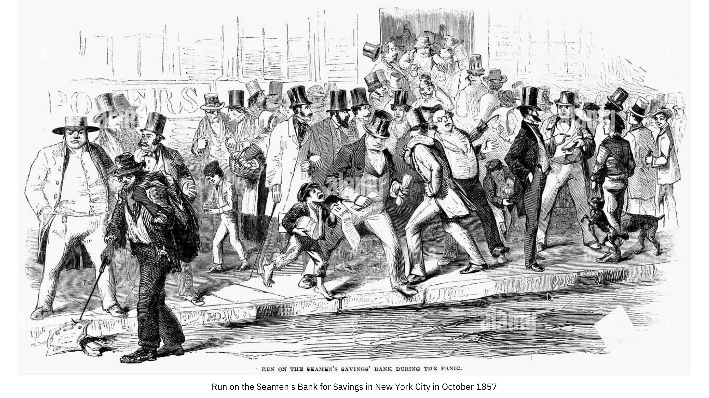

Банкова паника в Seamen's Savings Bank по време на паниката от 1857 г.

След банковата паника от 1796 г. се наблюдава феномен, при който всеки се опитва да се изкачи нагоре по "паричната пирамида" Хората искаха да обменят своята валута от третото ниво за валута от второто ниво и накрая за валута от първото ниво, което беше златото. Изправена пред този масов наплив, Английската централна банка беше принудена да предприеме действия за стабилизиране на ситуацията. За да предотврати потенциална дефлация на златните резерви, тя реши да преустанови конвертируемостта на своите банкноти в злато. Това преустановяване, първоначално замислено като временна мярка, продължава приблизително две десетилетия.

### Заключение:

Централните банки се превърнаха в кредитори от последна инстанция, като преустановиха конвертируемостта на валутата си в злато. Въпреки че първоначално това действие е било замислено като временно решение, в крайна сметка то става постоянно, отбелязвайки появата на концепцията за кредитор от последна инстанция. Тази трансформация оформя централните банки във вида, в който са известни днес. В по-нестабилните икономики обаче тази възможност за печатане на пари по желание може да доведе до нежелани последици, като например хиперинфлация, ако се използва безотговорно.

## Книги и ресурси

<chapterId>c44e4519-0741-527b-b3b0-3f513e87147d</chapterId>

Хиперинфлацията е интересна тема, която се изучава в различни исторически събития. Ако желаете да навлезете по-дълбоко в тази тема, ето списък с 10 основни източника, които да прочетете и проучите:

- "When Money Dies: Кошмарът на дефицитното харчене, девалвацията и хиперинфлацията във Ваймарска Германия" от Адам Фъргюсън. В тази книга подробно се описва кризата с хиперинфлацията в Германия след Първата световна война.

- "The Economics of Inflation - изследване на обезценяването на валутата в следвоенна Германия" от Костантино Брешиани-Турони. Задълбочен анализ на германската хиперинфлация през 20-те години на ХХ век.

- "This Time Is Different: Райнхарт и Кенет С. Рогоф. Въпреки че книгата обхваща различни видове финансови кризи, в нея се прави задълбочено обсъждане на хиперинфлацията в историята.

- "Zimbabwe's Hyperinflation, Analysis and Lessons Learned" от Стив Ханке. Проучване на зимбабвийската хиперинфлация в началото на 2000-те години.

- "Monetary Regimes and Inflation: History, Economic and Political Relationships" от Петер Бернхолц. В книгата се разглеждат исторически случаи на хиперинфлация и се търси разбиране на факторите, които ги обуславят.

- "The Hyperinflation Survival Guide: Strategies for American Businesses" от Джералд Суонсън. Практическо ръководство за това как предприятията могат да се ориентират в условията на хиперинфлация.

- "Dying of Money: Lessons of the Great German and American Inflations" от Йенс О. Сравнителен анализ на инфлационните кризи в Германия и Съединените щати.

- "The Downfall of Money: Germany’s Hyperinflation and the Destruction of the Middle Class" от Фредерик Тейлър. Повествователно изследване на социалното и икономическото въздействие на хиперинфлацията върху германското общество.

- "Currency Boards for Developing Countries: A Handbook" от Стив Ханке и Курт Шулер. Въпреки че фокусът е върху валутните бордове, тази книга предлага и гледна точка за това как да се избегнат ситуации на хиперинфлация.

# Последен раздел

<partId>cb1f4a4b-556a-4e47-a5cc-136be35a1f9a</partId>

## Отзиви и оценки

<chapterId>1a37317e-372a-5241-b478-8316d44f9283</chapterId>

<isCourseReview>true</isCourseReview>

## Финален изпит

<chapterId>d01831c3-6c4d-59e3-95bc-03e97a05c142</chapterId>

<isCourseExam>true</isCourseExam>

## Заключение

<chapterId>45d410b0-71ed-4502-8d8d-8b6df761db23</chapterId>

<isCourseConclusion>true</isCourseConclusion>
