# Cesta do ekonomiky

Cílem tohoto programu je poskytnout hluboké porozumění vzniku hyperinflací ve světě, kde dominuje Fiat měna, a prozkoumat jejich významné důsledky. Účastníci se budou podrobně zabývat cykly hyperinflace, zkoumat její příčiny, spouštěče a uvádět historické i současné příklady. Budou také zkoumat hmatatelný dopad hyperinflace na ekonomiku a každodenní život, studovat dopady na hodnotu měny, kupní sílu a individuální i kolektivní úspory.

Upozorníme zde na trendy a společné vzorce v epizodách hyperinflace v historii a zároveň poskytneme účinné a konkrétní strategie, jak se v období hyperinflace chránit. Účastníci budou mít příležitost prozkoumat různé investiční možnosti a finanční obranné mechanismy a získají praktické nástroje a nezbytné znalosti pro klidnou orientaci v nestabilním ekonomickém klimatu.

+++

# Úvod

<partId>6fe4d15d-f6e6-54be-9e04-0a75ac98df8b</partId>

## Přehled kurzů

<chapterId>9d1aba8d-0485-5020-9863-5de37e6db8e0</chapterId>

Vítejte v kurzu ECO204!

Cílem tohoto kurzu je pomoci vám pochopit základní příčiny, mechanismy a důsledky hyperinflace v kontextu fiat měnového systému. Prostřednictvím konkrétních příkladů a historické analýzy se naučíte rozpoznat opakující se vzorce, které předcházejí obdobím hyperinflace, a identifikovat akční páky, jak se chránit.

**Odddíl 2: Co je inflace?**

Než se ponoříme do jádra tématu, zopakujeme si základní informace: co je to inflace? V této části představíme její měnový původ, různé typy inflace a jejich začlenění do širší ekonomické dynamiky. To je nezbytný krok k pochopení toho, jak se běžná inflace může vyvinout v hyperinflaci.

**Část 3: Co je hyperinflace?**

V této části se seznámíte s přesnými definicemi hyperinflace a prozkoumáte několik významných historických epizod, včetně případů výmarského Německa a Zimbabwe. Budeme analyzovat jejich společné rysy, rozdíly a současné paralely. Objevíte také méně známé případy, jako jsou postupné redenominace v Latinské Americe, a také strategie odchodu z krize pozorované v některých zemích.

**Část 4: Jak jsme se sem dostali?**

Cílem této části je pochopit strukturální mechanismy, které umožňují hyperinflaci, zejména prostřednictvím vývoje měnové "druhé Layer" a úlohy centrálních bank. Pro další zkoumání budou poskytnuty další zdroje a návrhy na četbu.

Co kdyby se měnová historie opakovala před našima očima? Posuďte sami v následujících kapitolách!

# Co je to inflace?

<partId>2b4f456c-3649-5cf9-b9b0-a5bffe92d962</partId>

## Měnový fenomén

<chapterId>b2cbc915-c4ec-52b5-860c-0958f58c91e4</chapterId>

### Definice inflace

Inflace je pojem, který bývá často nesprávně chápán, protože má mnoho definic a výkladů. Vnímání inflace se liší mezi různými skupinami, například mezi bitcoinisty a tradičními ekonomy. Než začneme diskutovat o hyperinflaci, objasněme si nejprve definice:

- Definice ze slovníku Le Robert: Inflace je nadměrný nárůst platebních prostředků (bankovek, kapitálu), který způsobuje růst cen a znehodnocení měny.

- Definice z encyklopedie Larousse: Inflace je jev, který se vyznačuje všeobecným a trvalým růstem cen. Slovo "všeobecný" je zde klíčové.

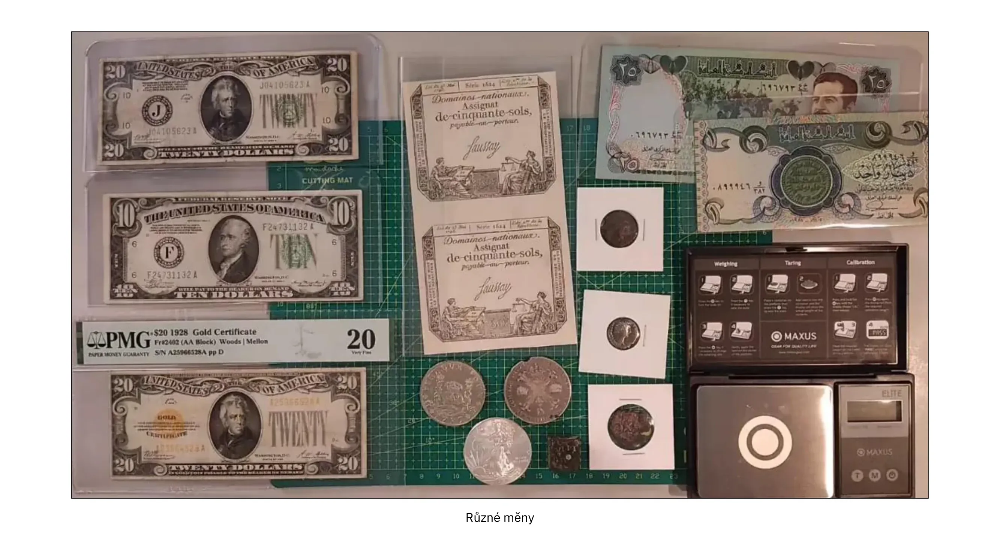

Ve světle těchto definic je nezbytné si uvědomit, že pro Roberta se inflace týká především růstu peněz Supply. Naproti tomu Larousse se zaměřuje na důsledky této expanze, a to na všeobecný růst cen.

V naší studii o hyperinflaci přijmeme druhou definici, tedy definici všeobecného růstu cen, protože je pro naše téma relevantnější a jasnější. Je však nezbytné si uvědomit, že tento růst cen je obecně důsledkem expanze peněz Supply.

Známý ekonom Milton Friedman prohlásil:

> "Inflace je vždy a všude měnovým jevem."

Toto tvrzení zdůrazňuje vnitřní vztah mezi měnovou expanzí a inflací. V následujících částech se budeme zabývat vztahem mezi inflací a hospodářským růstem, přičemž budeme vycházet z těchto základních definic.

### Pochopení měnového fenoménu

Když mluvíme o měnovém fenoménu, máme na mysli způsob, jakým jsou ovlivňovány peníze Supply ekonomiky. Milton Friedman to v podstatě viděl jako zvýšení tohoto Supply. Historicky existovaly dva hlavní způsoby zvyšování peněžního Supply:

1. Tisk peněz:

V tradičních měnových systémech se zvýšení objemu peněz Supply dosahovalo fyzickým tiskem nových bankovek. Ačkoli v dnešní době, kdy převažují digitální měny, je tento tisk převážně elektronický (prostřednictvím databází centrálních bank a dalších finančních institucí), historie nám ukazuje období, kdy doslovný tisk bankovek vedl k hyperinflaci.

2. Snížení obsahu kovů:

Další metodou bylo snížení množství drahých kovů v měnách založených na kovech, jako je stříbro nebo zlato. Názorný příklad lze nalézt v Římské říši, kde se u denáru, původně složeného téměř výhradně ze stříbra, obsah stříbra postupem času drasticky snížil. Jednalo se o určitou formu inflace, nikoli však nutně o hyperinflaci.

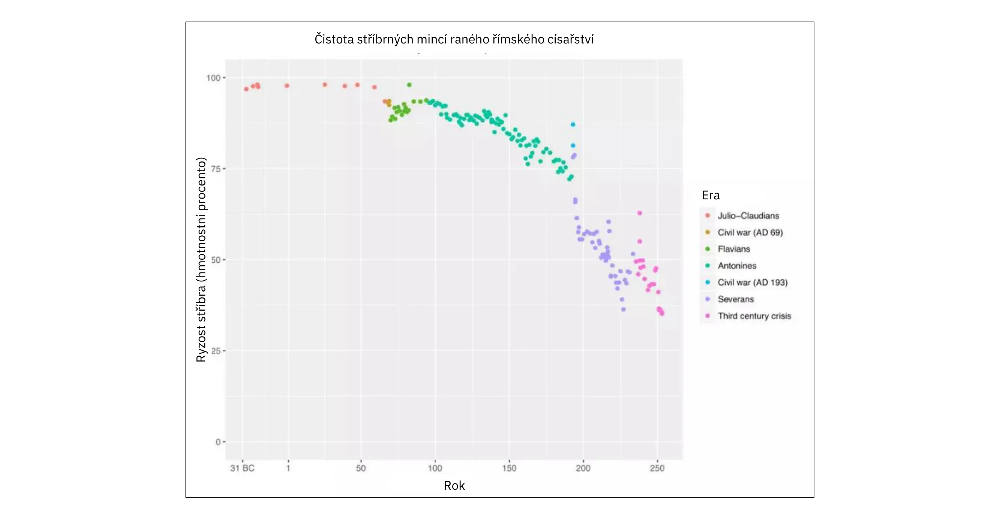

Je důležité zdůraznit, že hyperinflace se projevuje především u fiat měn, které nejsou kryty podkladovými aktivy, jako jsou například drahé kovy. V minulosti, kdy byla měna založena na takovýchto aktivech, docházelo k epizodám inflace (např. znehodnocením obsahu kovů), ale tyto epizody nikdy nedosáhly extrémních úrovní hyperinflace. V následujících částech se budeme podrobně zabývat obdobími znehodnocování měny a důsledky těchto různých měnových systémů na inflaci.

### Studie období měnové devalvace

V průběhu historie zažily různé civilizace období devalvace měny. Některá z těchto období se shodují s významnými událostmi nebo válkami, které vyvíjely tlak na ekonomiku.

#### 1. Peloponéská válka a druhá punská válka:

Peloponéská válka, konflikt mezi Athénami a Spartou, a druhá punská válka mezi Římskou republikou a Kartágem jsou nejstaršími příklady devalvace měny, které byly nalezeny v archivech. Aby mohly tyto války financovat, znehodnotily tyto civilizace své měny snížením obsahu stříbra a začleněním jiných kovů, přičemž zvýšily počet vyrobených mincí.

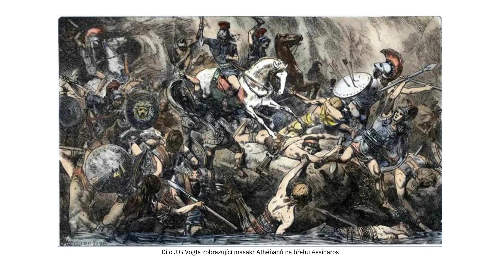

Rytina zobrazující masakr Athéňanů na břehu řeky Assinaros.

#### 2. Starověký Řím v době císařství:

Po éře římské republiky došlo v období císařství, ve 3. a 4. století, k výraznému znehodnocení měny. To dokládá pokles obsahu stříbra v mincích, jak je vidět na předchozím grafu. Studie ukazuje, že cena pšenice v Egyptě, měřená v drachmách, vzrostla během přibližně 400 let, od roku 40 př. n. l. do roku 360 n. l., milionkrát. Za toto období to představuje průměrnou roční inflaci přibližně 4,4 %. Tato inflace však nebyla rozložena rovnoměrně. Skutečně začala kolem roku 238 n. l. V letech 250 až 293 n. l. činila inflace přibližně 3,65 % a v letech 293 až 301 n. l. se zvýšila na 22,28 %.

Ačkoli v těchto obdobích docházelo k výrazné inflaci, nedosahovala takového stupně hyperinflace jako v některých moderních situacích. Důvodem je skutečnost, že ačkoli byla měna devalvována, stále byla kryta drahými kovy. Tento pevný základ poskytoval určitou ochranu před extrémní úrovní inflace. V následujících kapitolách se budeme podrobněji zabývat povahou a důsledky hyperinflace.

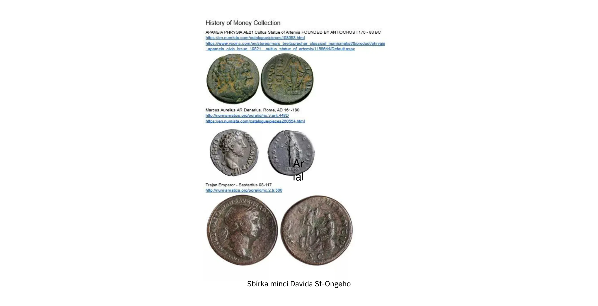

- Denár Marka Aurelia (160 n. l.):

Jednou z nejznámějších mincí starověkého Říma je denár, stříbrná mince Coin. Vlastním konkrétní denáry Coin od Marka Aurelia z roku 160 n. l., tedy z doby před velkou devalvací. Ačkoli fotoaparát může mít problém zachytit jemné detaily, pouhým okem je patrné, že Coin je krásný a odráží poměrně vysoký obsah stříbra.

- Antoninianus (konec 3. století n. l.):

S devalvací měny se objevila nová měna, antoninianus. Tato měna měla mít hodnotu dvou denárů, ale obsahovala mnohem méně stříbra. Na mém antoniniánu Coin je jasně vidět, že obsah stříbra byl výrazně snížen. Je zdoben korunkou, typickou pro římské mince tohoto období, tzv. radiátem. Porovnáním barvy a kvality je vidět, že antoninianus Coin zdaleka není z ryzího stříbra.

Při porovnání obou mincí vedle sebe je rozdíl markantní. Denáry z roku 160 n. l. mají výrazný stříbrný vzhled, zatímco antoninianus z konce 3. století n. l. je mnohem matnější, což svědčí o výrazném poklesu obsahu stříbra. Toto vizuální srovnání poskytuje jasnou ilustraci znehodnocení měny, kterým starověký Řím během několika století prošel.

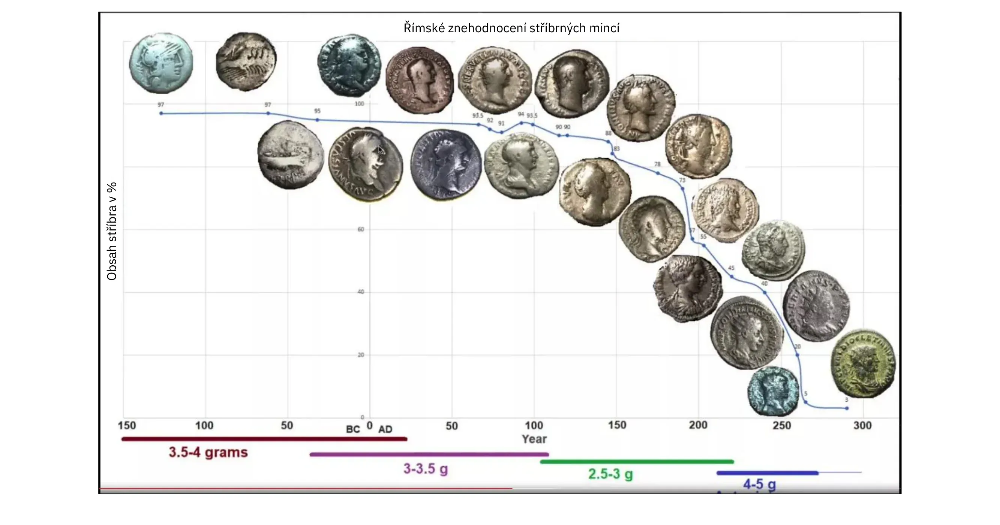

Pro doplnění této ukázky by byl ideální graf znázorňující znehodnocení těchto mincí v čase. Ačkoli je to obtížné vizualizovat prostřednictvím této platformy, představte si graf znázorňující hodnotu denáru, po němž následoval jeho pokles ke konci 2. století, kdy byl nahrazen mincí Antoninianus, údajně v hodnotě dvou denárů, ale s výrazně nižším obsahem stříbra. Tyto artefakty jsou němými svědky ekonomických výkyvů minulých civilizací.

#### 3. Španělské maravedi: svědectví cílené devalvace

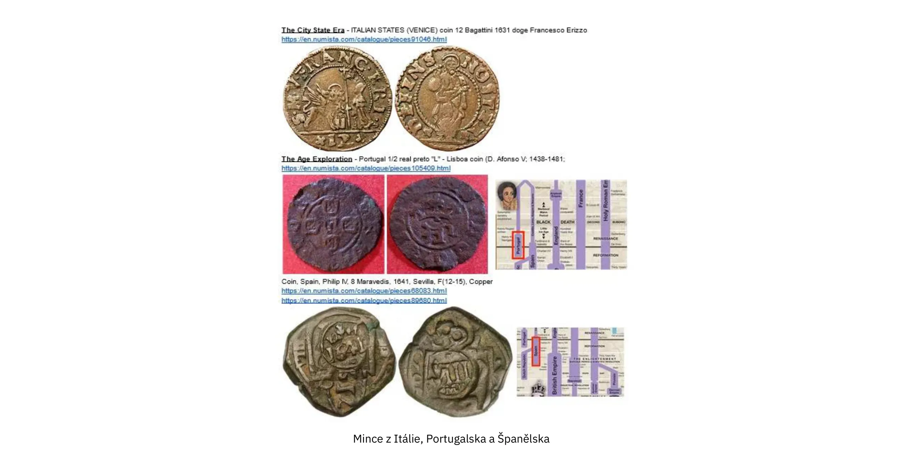

Maravedi jako měděná měna zaujímá v historii španělské měny zvláštní místo. Jak již bylo zmíněno, španělský dolar byl původně mezinárodním standardem, pro Španělsko zásadní rezervní měnou. Tváří v tvář určitým ekonomickým výzvám se však Španělsko muselo uchýlit k chytrým měnovým strategiím.

Devalvace měny je nástroj, který státy často používají k financování svých výdajů nebo ke stimulaci ekonomiky. Španělsko se však ocitlo ve svízelné situaci. Oslabení španělského dolaru by ohrozilo jeho postavení v mezinárodním obchodě. Aby toto dilema překonalo, obrátilo se Španělsko na maravedi.

Na rozdíl od drahého španělského stříbrného dolaru bylo maravedi měděnou měnou používanou především mezi místním obyvatelstvem. Tato měna byla cílem devalvace. Když měl maravedi Coin původně hodnotu dvou maravedi, stát jej odebíral, znovu razítkoval novou hodnotou, například "čtyři", a majiteli vracel pouze jeden maravedi Coin. Dokladem tohoto procesu je Coin označená razítkem "osm", která prošla několika cykly devalvace.

Tato strategie umožnila státu účinně devalvovat měnu, což vedlo k inflaci a nepřímému financování státu, a zároveň zachovat integritu španělského dolaru na mezinárodní scéně. Tato cílená devalvace však měla důsledky pro místní obyvatelstvo, které vidělo, jak se hodnota jeho společné měny rozmělňuje.

Případ Maravedis ilustruje, jak může stát selektivně devalvovat místní měnu, aby uspokojil své vnitřní ekonomické potřeby, a zároveň zachovat hodnotu rezervní měny na globální scéně. Je to pozoruhodný příklad složitosti a rafinovanosti měnové politiky v historii.

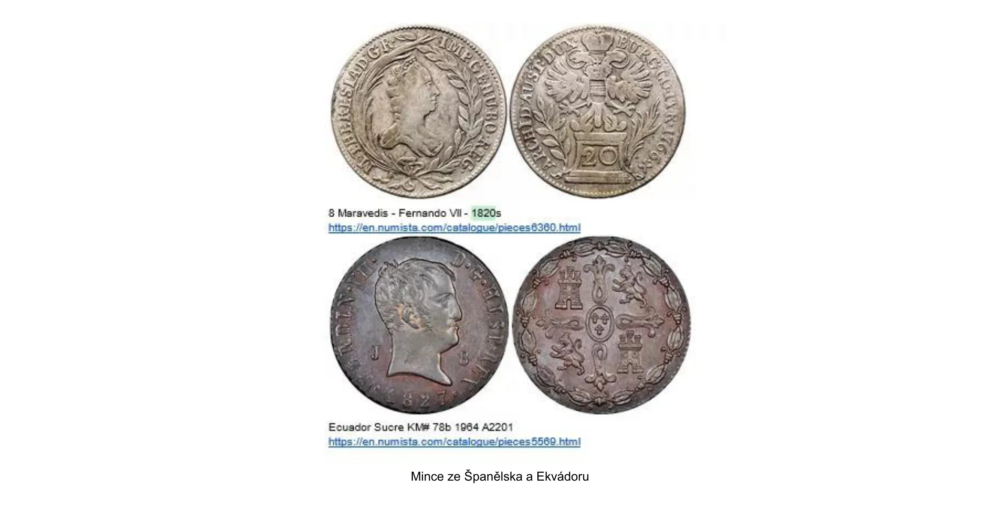

Chcete se dozvědět více? -> [Odkaz](https://docs.google.com/document/d/1aZa7gvz1nt8ZHDCoWKQdS9RGGjBHdipH1ApC8dW1xpM/edit?usp=sharing)

#### 4. Cenová revoluce od 15. do 17. století

V 15. až 17. století byla Evropa svědkem pozoruhodného ekonomického jevu, který se často označuje jako "cenová revoluce" Toto období inflace bylo z velké části vyvoláno masivním přílivem drahých kovů, zejména zlata a stříbra, z Ameriky. Vzhledem k tomu, že evropská ekonomika byla v té době z velké části založena na kovovém standardu, zvýšil tento dodatečný Supply kovů peněžní Supply. V důsledku toho se objevila inflace ve výši přibližně 1 až 2 % ročně. Na první pohled se tato inflace může zdát mírná. V té době však byly takové cenové výkyvy natolik neobvyklé, že je bylo možné považovat za "revoluci" To poukazuje na to, jak mohou změny měnových rezerv ovlivnit celý ekonomický systém.

#### 5. John Law a Assignats

V 18. století se francouzské hospodářské dějiny vyznačovaly dvěma významnými událostmi souvisejícími s měnou. Nejprve John Law, skotský ekonom a finančník, přesvědčil francouzskou vládu, aby přijala měnový systém založený na papírových penězích. Ačkoli byla tato iniciativa zpočátku považována za inovativní řešení finančních problémů země, rychle vedla k prudké inflaci. Krátce poté, během zmatků Francouzské revoluce, vláda zavedla "asignáty".

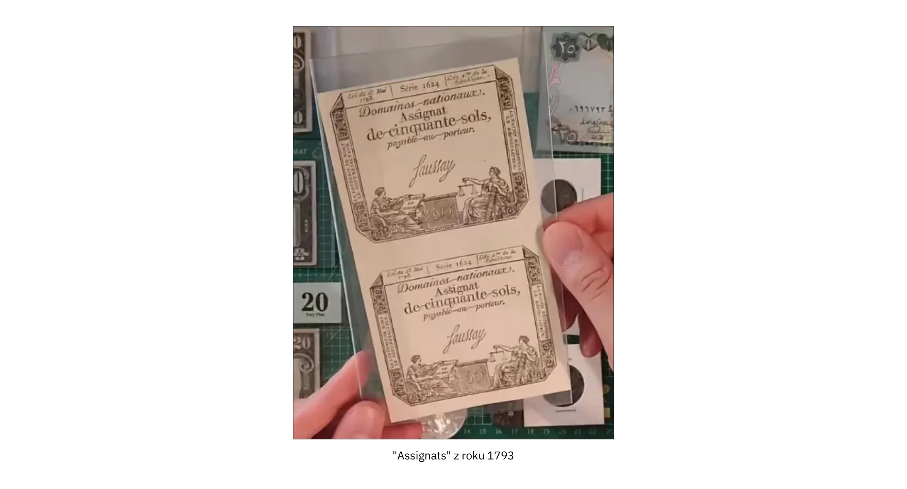

Assignats z roku 1793

Tyto bankovky jsou živým svědectvím prvního významného období hyperinflace v historii. Asignáty, které byly původně navrženy jako reakce na postupné finanční krize, se rychle staly symbolem měnové nestability. Vláda, která se při financování svých výdajů nadměrně spoléhala na tuto papírovou měnu, způsobila bezprecedentní hospodářskou krizi a vedla k velkému období hyperinflace ve Francii po revoluci.

#### 6. Nařízení 6102 a devalvace dolaru

Nařízení 6102 a devalvace dolaru

Na počátku 30. let 20. století došlo ve Spojených státech k zásadní změně měnové politiky. Zde je podrobný přehled této transformace:

- 20dolarová bankovka z roku 1928

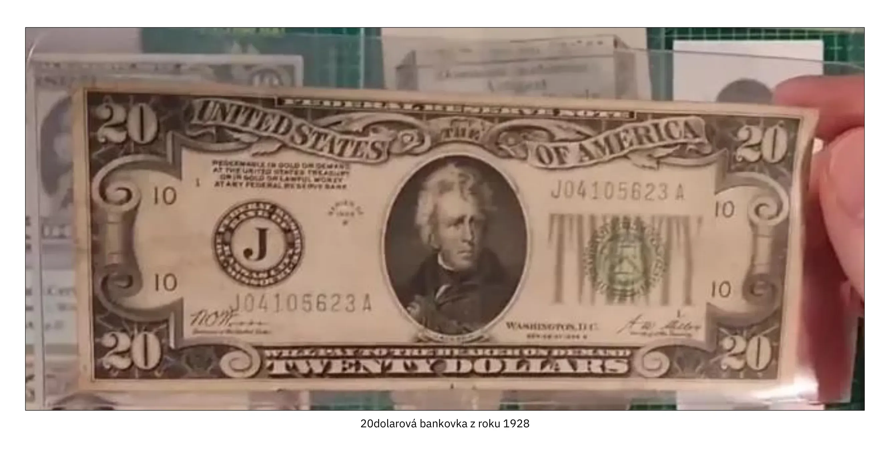

V roce 1928 bylo na dvacetidolarové bankovce ve Spojených státech uvedeno: "vyměnitelné ve zlatě na požádání" To znamená, že každá bankovka byla doslova směnitelná za zlato. Konkrétně bankovka v hodnotě 20,67 dolaru odpovídala jedné unci zlata.

- Výkonný příkaz 6102

V roce 1933 došlo k velkému převratu vydáním nařízení 6102. Toto nařízení zakazovalo občanům vlastnit zlato, ať už ve formě prutů, mincí nebo certifikátů.

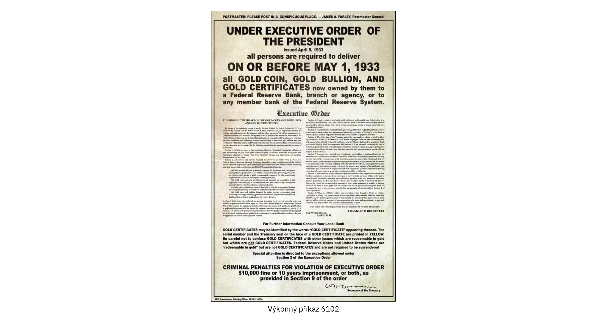

Dobrým příkladem je zlatý certifikát. Byl označen: "Ve zlatě Coin splatný na doručitele na požádání" Držení takového certifikátu se stalo nezákonným a zůstalo jím až do roku 1964.

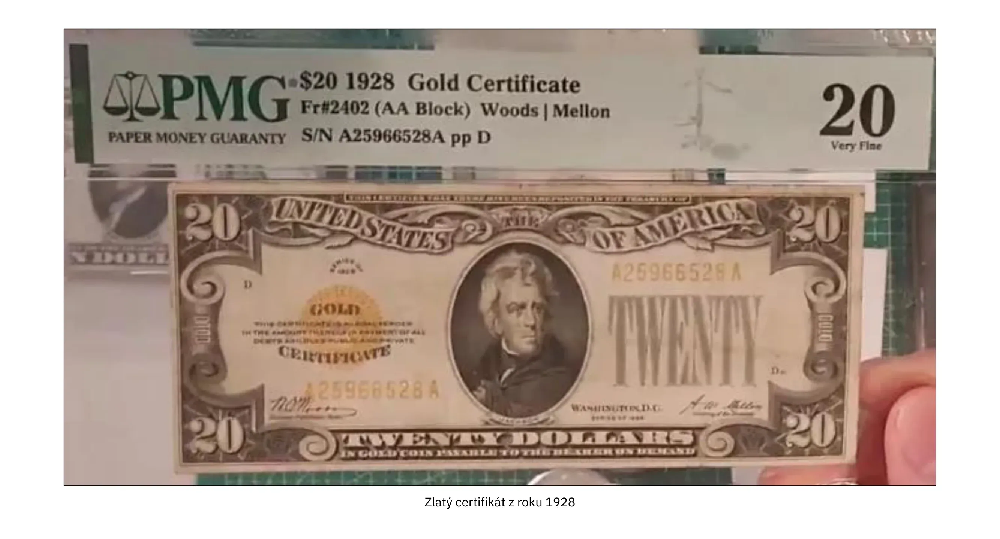

- Zavedení nových bankovek

Po zabavení zlata v roce 1934 byla do oběhu uvedena nová série bankovek.

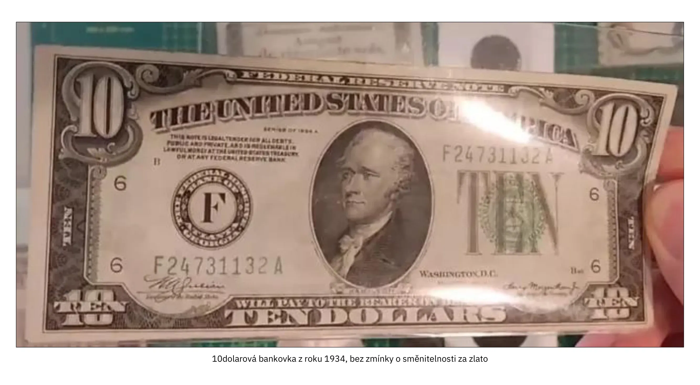

Zmínka o jejich směnitelnosti za zlato byla odstraněna a nahrazena textem "Tato bankovka je zákonným platidlem pro všechny dluhy" (Ce billet est une monnaie légale pour toutes dettes).

- Zhodnocení zlata

Fascinující na tomto přechodu je vládní strategie. V roce 1934 byla cena zlata revalvována na 35 dolarů za unci místo dosavadních 20,67 dolaru. Vláda v podstatě znehodnotila dolar, který lidé vlastnili. Tím, že vláda v roce 1933 nakoupila zlato od obyvatelstva za 20,67 dolaru za unci a poté v roce 1934 cenu zlata revalvovala, dosáhla značného zisku a zároveň znehodnotila úspory svých občanů.

Stručně řečeno, během jednoho roku vláda fakticky zabavila zlato občanů a poté změnila pravidla hry tím, že přehodnotila hodnotu zlata ve prospěch státní pokladny a v neprospěch těch, kteří původně vyměnili své zlato za bankovky.

### USA mění dějiny.

Spojené státy učinily historický zlom, když jako první devalvovaly světovou rezervní měnu, americký dolar, v rozporu s předchozí praxí pozorovanou v malých obchodních zemích.

Dříve, v období renesance, byl italský florin vydaný Florencií ve 13. století mezinárodní rezervní měnou a během jeho používání nebyla zaznamenána žádná devalvace, což odráželo význam měnové stability pro mezinárodní obchod.

Ve stejném duchu udržovaly Španělsko a Nizozemsko jako držitelé světové rezervní měny díky svému prosperujícímu mezinárodnímu obchodu integritu svých měn, aby zachovaly důvěru a status quo v mezinárodní směně. Nizozemsko bylo dokonce svědkem vzniku první centrální banky, což byl významný milník v celosvětovém vývoji měnových systémů.

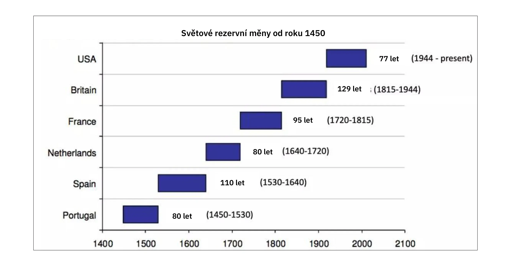

Situace se však změnila s nástupem Spojených států jako dominantní ekonomické mocnosti. Ty se rozhodly devalvovat svou rezervní měnu, čímž využily inflaci ve svůj prospěch. Toto rozhodnutí se často připisuje změněné dynamice, kdy volba rezervní měny již nebyla tak svobodná jako dříve. Americká hegemonie ustanovila dolar jako světovou rezervní měnu, což umožnilo manipulaci s jeho hodnotou. Tato změna odhaluje potenciální dopad měnové politiky na mezinárodní obchod v globalizované ekonomice a znamená významnou změnu v řízení světových rezervních měn.

### Poslední příklad na cestu: švýcarský dinár

Švýcarský dinár ilustruje další fascinující aspekt měnové devalvace, tentokrát ukotvený v iráckém kontextu před válkou v Zálivu. Tato měna, pojmenovaná podle pozoruhodné kvality svých bankovek, byla emitována iráckou centrální bankou a těšila se v regionu Blízkého východu pověsti stabilní měny. Tato důvěra byla dána především kvalitou tisku bankovek, který byl prováděn v Anglii, což znamenalo určitou odolnost vůči devalvaci.

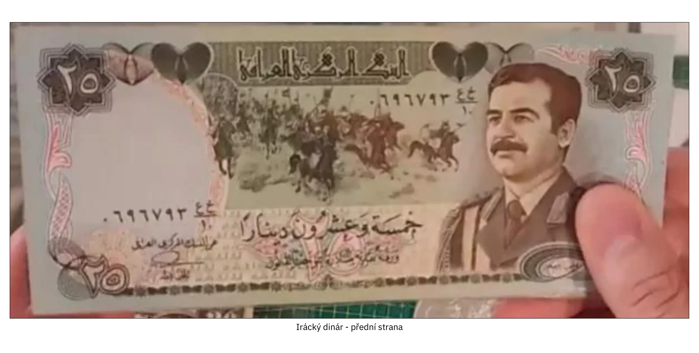

Války v Perském zálivu však znamenaly zlom v historii švýcarského dináru. Irák, který se již nemohl spolehnout na svého anglického dodavatele bankovek, se obrátil s žádostí o pomoc na Čínu. Tento přechod měl za následek zřetelný rozdíl v kvalitě bankovek, přičemž čínská verze byla vnímána jako horší. Toto vnímání nebylo neopodstatněné; čínské bankovky byly snadněji padělatelné a náchylnější k přetiskování vládou, což ohrožovalo jejich hodnotu.

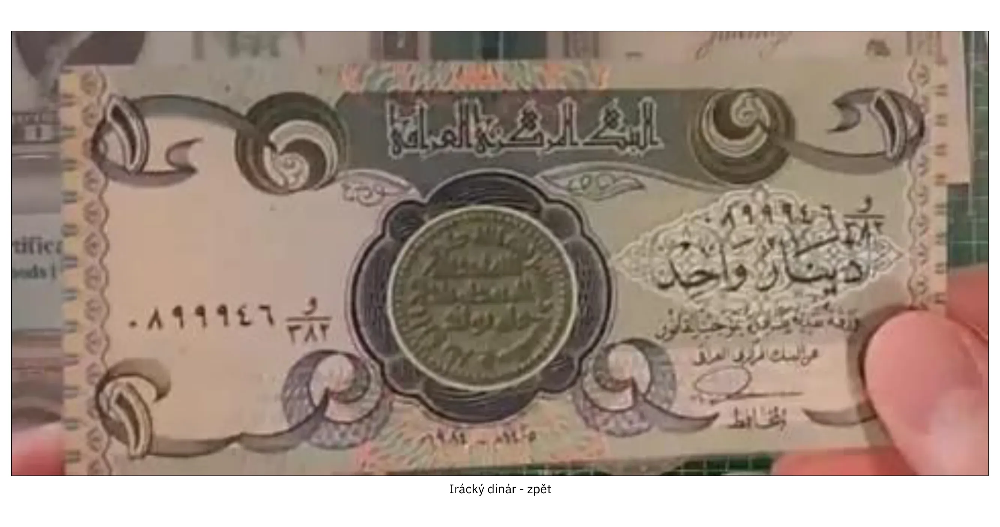

V irácké ekonomice po válce v Zálivu se objevil zvláštní fenomén: dvojí systém cen. Obchodníci nabízeli různé ceny v závislosti na typu bankovky, kterou platili, přičemž upřednostňovali původní švýcarský dinár před čínskou bankovkou. Tento systém odrážel udržovanou důvěru v bankovky vyšší kvality, které byly méně náchylné k devalvaci, a to i v situaci, kdy hodnotu určoval především stát. Tato epizoda poukazuje na význam vnitřních charakteristik měny a na to, jak i v režimu fiat měny může vnímaná kvalita měny ovlivnit její relativní hodnotu, a tím i důvěru ekonomických subjektů.

#### Ano, mince jsme skutečně zvážili!

V běžném povědomí je měna často spojována se státním útvarem, kdy její vydávání a hodnota jsou regulovány státem. Toto pojetí má kořeny ve starověkých civilizacích, například v Římě, kde byly mince standardizovány a raženy císařstvím, čímž byla měně propůjčena oficiální hodnota. Při hlubším zkoumání však zjistíme, že vnitřní hodnota měny byla odvozena především od obsahu drahých kovů.

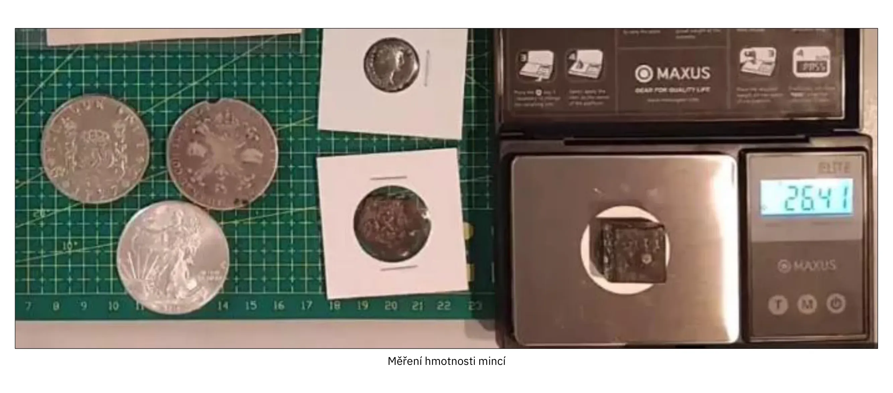

Příkladem je zkoumání peněžní váhy odpovídající osmi španělským realům nebo jednomu španělskému dolaru. Toto závaží, označené římskou číslicí udávající jeho hodnotu, používali směnárníci k ocenění hodnoty mincí na základě jejich hmotnosti, a nikoli pouze na základě jejich ražby. Zvážením mincí mohli směnárníci zjistit, zda nebyly pozměněny nebo poškozeny, což mohlo snížit jejich hodnotu. Tato praxe zdůrazňuje, že ačkoli standardizované ražení státem propůjčovalo měně určitou nominální hodnotu, skutečná hodnota spočívala v hmotnosti drahého kovu, který obsahovala.

Tato analýza ukazuje, že důvěra v měnu, a tím i její hodnota, byla zakotvena spíše v její hmotné podstatě než v pouhém tvrzení státu. Zdůrazňuje dualitu mezi nominální hodnotou stanovenou státem a vnitřní hodnotou diktovanou obsahem drahého kovu. Měna tak přesahuje rámec pouhého státního nástroje, přičemž její základní hodnota je neodmyslitelně spjata s hmatatelným a měřitelným Elements.

#### Závěr

Závěrem lze říci, že tato studie o měnové devalvaci poskytuje hlubší pochopení mechanismů inflace, které budou zkoumány v následujících videích. Probereme různé typy inflace a hranici, při které přecházejí ve vysokou nebo hyperinflaci. Tento pevný základ nám umožní Address složitosti inflace v nadcházejících sezeních. Děkujeme vám za pozornost. Těšíme se na pokračování zkoumání měnové dynamiky v příštím videu.

## Typy inflace

<chapterId>b438fe09-375e-5bb2-9196-7dd687b9f98c</chapterId>

### Inflace není multifaktorový jev

V této části se budeme zabývat různými aspekty inflace, jevu, který je často nesprávně chápán. Ačkoli je inflace v médiích a v každodenních diskusích často vnímána jako multifaktoriální jev, je nezbytné si uvědomit, že se v zásadě jedná o měnový jev.

Zde je rozdělení tématu do několika klíčových bodů:

- Rozdíl mezi růstem cen a inflací:

Růst cen může být specifický pro dané odvětví a vyvolaný různými faktory, jako je pokles produkce ropy OPEC nebo nepříznivé povětrnostní podmínky ovlivňující produkci pšenice.

Inflace je naproti tomu definována všeobecným růstem cen v celé škále zboží a služeb, nikoli pouze v určitém odvětví.

- Měnová podstata inflace:

Při pevném peněžním objemu Supply by zvýšení cen v jednom odvětví vedlo ke snížení cen v ostatních odvětvích, protože by se snížil objem peněz, které lze utratit jinde. Inflace úzce souvisí s růstem peněžního Supply, který umožňuje současný růst cen ve všech odvětvích.

- Vliv Supply na inflaci a deflaci:

V systému pevných peněz Supply by zvýšení výroby mělo teoreticky vést k deflaci, tj. poklesu cen, protože by bylo k dispozici více zboží a služeb.

V současném fiat měnovém systému zvýšení peněz Supply ruší potenciální deflaci způsobenou zvýšením výroby.

- Negativní účinky úpravy peněz Supply:

Zvýšení objemu peněz Supply bez odpovídajícího zvýšení výroby vede k inflaci, protože je v oběhu více peněz za stejné množství zboží a služeb.

Ačkoli zvýšení výroby mělo vést k deflaci, současné zvýšení peněz Supply tento efekt zmařilo a místo toho vedlo k inflaci.

- Inflace, deflace a peníze Supply - Komunikační nádoby:

Inflace a deflace jsou v ekonomice jako komunikační nádoby. Zvýšení výroby může vést k deflaci, ale pokud se současně zvýší objem peněz Supply, deflační efekt se vyruší a výsledkem je inflace.

Tato diskuse zdůrazňuje význam pochopení základních mechanismů inflace a deflace, jakož i hluboký vliv, který může mít změna peněz Supply na ekonomiku. K těmto pojmům se pravděpodobně vrátíme později, abychom hlouběji pochopili jejich vzájemnou provázanost a dopad, který mají na globální ekonomiku.

### Proč tisk peněz nezpůsobuje vždy inflaci?

#### Inflace ≠ CPI

Inflace, ačkoli je často spojována s růstem peněz Supply, nemá vždy přímou souvislost s tiskem peněz, jak ukazuje období po finanční krizi v roce 2008. Navzdory značnému tištění peněz na záchranu bank se v následujícím desetiletí nevyskytovala vysoká inflace, která se v průměru pohybovala mezi 0 a 2 % ročně. Tato situace vyvolává otázku: Proč masivní tisk peněz nevedl k úměrné inflaci? Odpověď spočívá v několika nuancích souvisejících s měřením inflace a indexem spotřebitelských cen (CPI).

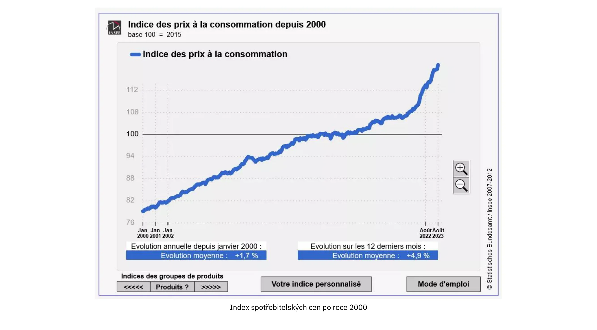

První vysvětlení spočívá ve způsobu měření inflace. Index spotřebitelských cen (CPI), který slouží jako hlavní ukazatel inflace, má určitá omezení. Například nezohledňuje komplexně vývoj cen nemovitostí. Ačkoli index CPI zahrnuje složku týkající se nájemného, podstatné zhodnocení cen nemovitostí se v něm plně neprojevuje. V důsledku toho může dojít k výraznému zvýšení nákladů na bydlení, aniž by je index CPI plně zachytil, což může vést k podhodnocení skutečné inflace.

Kromě toho se při výpočtu indexu spotřebitelských cen používají určité metodiky, které mohou kompenzovat nebo maskovat skutečný růst cen. K úpravě indexu lze například použít kvalitativní zlepšení výrobků. Pokud se cena výrobku zvýší, ale zároveň se zlepší jeho kvalita nebo vlastnosti, může se CPI domnívat, že se skutečná hodnota pro spotřebitele nezměnila, a tudíž neodráží inflaci. Ilustrativním případem je situace, kdy navzdory zvýšení cen hovězího masa a počítačů v důsledku měnové injekce se ke kompenzaci tohoto zvýšení použije zlepšení výkonnosti počítačů. Pokud počítač stojí dvakrát tolik, ale je čtyřikrát výkonnější, může to index CPI interpretovat jako snížení cen, a tím zakrýt zvýšení cen hovězího masa.

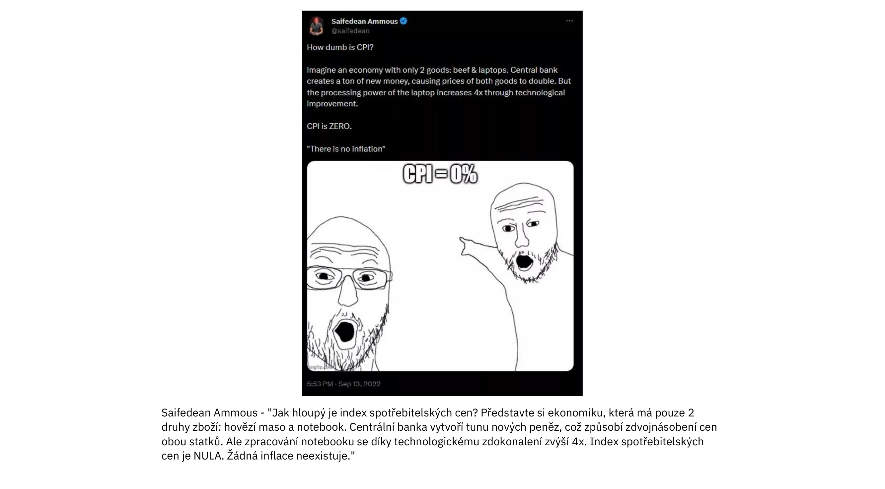

Tyto nuance při měření inflace pomocí indexu spotřebitelských cen zdůrazňují složitost vztahu mezi měnovým tiskem a inflací. Naznačují také, že skutečná inflace může být vyšší, než se uvádí, pokud by se komplexněji zohlednil veškerý růst cen, zejména v klíčových odvětvích, jako jsou nemovitosti. Tato analýza zdůrazňuje význam pochopení základních mechanismů inflace a omezení konvenčních indexů používaných k jejímu měření, což usnadňuje hlubší pochopení ekonomických důsledků měnové politiky.

#### Argumenty MMT

Moderní měnová teorie (MMT) nabízí odlišný pohled na tvorbu peněz a inflaci. Podle MMT peníze primárně pocházejí od vlády, která může tisknout značné množství peněz pro financování svých potřeb, aniž by způsobila inflaci, pokud nejsou sektory, na které jsou tyto prostředky určeny, nasyceny. Tento přístup se odchyluje od tradičních měnových teorií a zdůrazňuje význam absorpční kapacity jednotlivých sektorů pro inflační dynamiku.

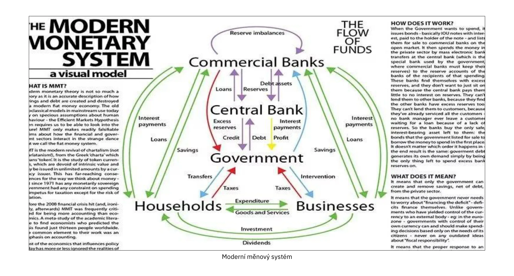

Názorným příkladem MMT je americký vojensko-průmyslový komplex. Podle MMT lze do tohoto odvětví alokovat stovky miliard dolarů, aniž by to způsobilo inflaci, a to díky jeho schopnosti absorbovat finanční prostředky. Naproti tomu, pokud se do výstavby silnic ve Spojených státech, kde je omezený počet firem a pracovních sil, vloží značné prostředky, může dojít k inflaci v důsledku nedostatku zdrojů a zvýšených nákladů požadovaných dodavateli.

Zastánci MMT často uvádějí Japonsko jako další příklad absence inflace navzdory výraznému měnovému tisku. Situace v Japonsku však také poukazuje na omezení tradičních měřítek inflace, jako je index spotřebitelských cen (CPI). V Japonsku je značná část natištěných peněz buď uložena, nebo investována do nemovitostí či akciového trhu, nikoliv utracena na běžnou spotřebu. Protože index spotřebitelských cen tuto dynamiku plně nezachycuje, může skutečnou inflaci podhodnocovat.

Analýza Japonska (https://ideas.repec.org/p/ces/ceswps/_9821.html) také zdůrazňuje, že chování ekonomických subjektů, jako jsou úspory nebo investice do aktiv nezahrnutých do indexu spotřebitelských cen, může maskovat inflační dopad měnového tisku. Navíc schopnost různých sektorů absorbovat napumpovanou likviditu hraje zásadní roli při určování toho, zda dojde k inflaci.

#### Rozvahy bank a centrálních bank

Třetím příkladem, proč by tisk peněz neměl způsobit inflaci, je skutečnost, že vztah mezi tiskem peněz a inflací je modulován způsobem, jakým jsou nově vytvořené peníze zaváděny do ekonomiky. Pokud tyto peníze zůstanou v rozvahách soukromých bank, aniž by byly půjčovány ekonomickým subjektům, nebudou mít přímý dopad na reálnou ekonomiku, a tudíž nepovedou k inflaci.

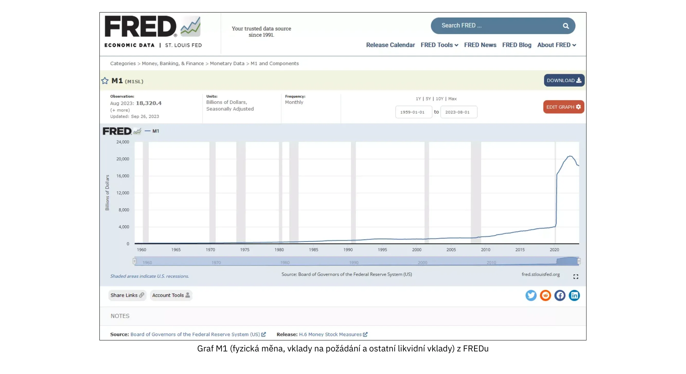

Tisk peněz lze vnímat jako Damoklův meč visící nad ekonomikou. Vytvořené peníze mohou po určitou dobu zůstat latentní, aniž by se projevil jejich inflační efekt, pokud nejsou do ekonomiky vpuštěny prostřednictvím bankovních úvěrů nebo jiných mechanismů. Když se však tyto latentní peníze nakonec dostanou do oběhu, mohou se pak projevit inflační účinky. Právě to bylo pozorováno v roce 2020, kdy se dříve vytvořené peníze dostaly do ekonomiky a vedly k inflaci.

Tento scénář zdůrazňuje význam měnových transmisních mechanismů při ovlivňování inflačních účinků tisku peněz. Tvorba peněz centrálními bankami je pouze jedním dílem skládačky. Chování soukromých bank, které rozhodují o objemu poskytnutých úvěrů, a chování dlužníků, kteří rozhodují o tom, jak vypůjčené peníze utratí, jsou v této dynamice také zásadními Elements.

#### Inflace je sociální!

Příklad Výmarské republiky ilustruje další zásadní aspekt vztahu mezi tiskem peněz a inflací: roli očekávání a chování ekonomických subjektů. Když Centrální banka Výmarské republiky začala tisknout velké množství peněz, vedla ekonomická nejistota jednotlivce k tomu, že peníze spíše hromadili, tj. skladovali, než utráceli. Tato reakce dočasně oddálila inflační účinky tištění peněz.

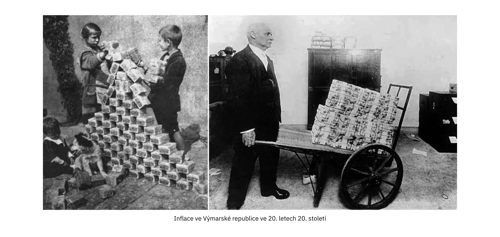

Když se však hospodářská situace začala mírně zlepšovat, důvěra se postupně obnovila. Jednotlivci pak vybírali své úspory z úkrytů a začali v ekonomice masivně utrácet. Tato náhlá změna chování v kombinaci s již tak vysokým objemem peněz Supply vedla k explozi poptávky. S větším množstvím peněz v oběhu a zvýšenou poptávkou začaly ceny rychle růst, což vedlo ke znatelné inflaci.

Tento příklad podtrhuje význam načasování a chování agenta při vzniku inflace. Inflace nevzniká pouze jako reakce na zvýšení peněz Supply, ale závisí také na tom, jak a kdy jsou tyto peníze v ekonomice utraceny. Ekonomická nejistota a očekávání ekonomických subjektů hrají v této dynamice zásadní roli a mohou inflační účinky tisku peněz buď urychlit, nebo oddálit.

#### Rekapitulace:

- Index spotřebitelských cen (CPI): Index spotřebitelských cen je strukturován tak, že podhodnocuje inflaci, což může poskytovat zkreslený obraz o inflační realitě.

- Odvětvová absorpce: Peněžní injekce do odvětví, která jsou schopna ji absorbovat, nevede vždy k inflaci. Významným příkladem je americký vojensko-průmyslový komplex, který dokáže absorbovat velké množství peněz, aniž by vyvolal inflaci.

- Případ Japonska: V Japonsku zůstává inflace navzdory značnému tištění peněz nízká, protože finanční prostředky jsou často spořeny nebo investovány do nemovitostí či akciových trhů. Tato odvětví absorbují natištěné peníze a index spotřebitelských cen nemusí nutně odrážet růst cen v těchto oblastech.
- Korelace mezi měnovým tiskem a trhy. Je patrné, že křivky realitních a akciových trhů často sledují měnový tisk, což ukazuje, kam natištěné peníze směřují.
- Měnové rezervy bank: Pokud vytištěné peníze zůstávají v rozvahách bank a neobíhají v ekonomice, nezpůsobují inflaci. To ilustruje příklad z roku 2008, kdy natištěné peníze z velké části zůstaly v rozvahách bank, což oddálilo inflační dopad.

- Výmarská republika: Toto historické období ukazuje, jak hospodářská nejistota vedla k hromadění peněz, což oddálilo inflaci. Jakmile však byla důvěra obnovena a peníze byly utraceny, inflace explodovala.

Na těchto příkladech lze v diskusích vysvětlit, proč inflace není vždy bezprostředním důsledkem měnového tisku a jak ekonomické souvislosti a chování subjektů ovlivňují inflaci.

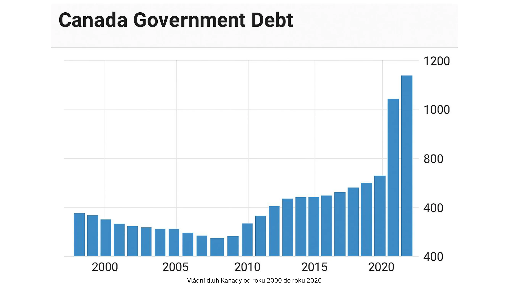

Protože, jak ukazuje toto [vlákno](https://twitter.com/saifedean/status/1673639779433590786): Inflace je všechno, jen ne vina centrálních bank.

- Ekonomové viní inflaci ze změny klimatu

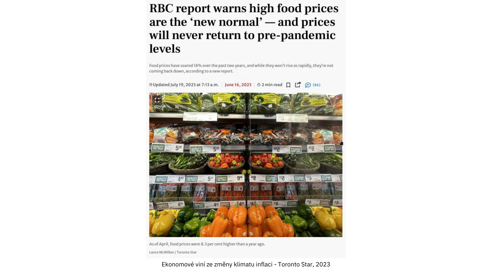

- Příklad Švédska, které obviňuje Beyoncé z inflace v určitém měsíci.

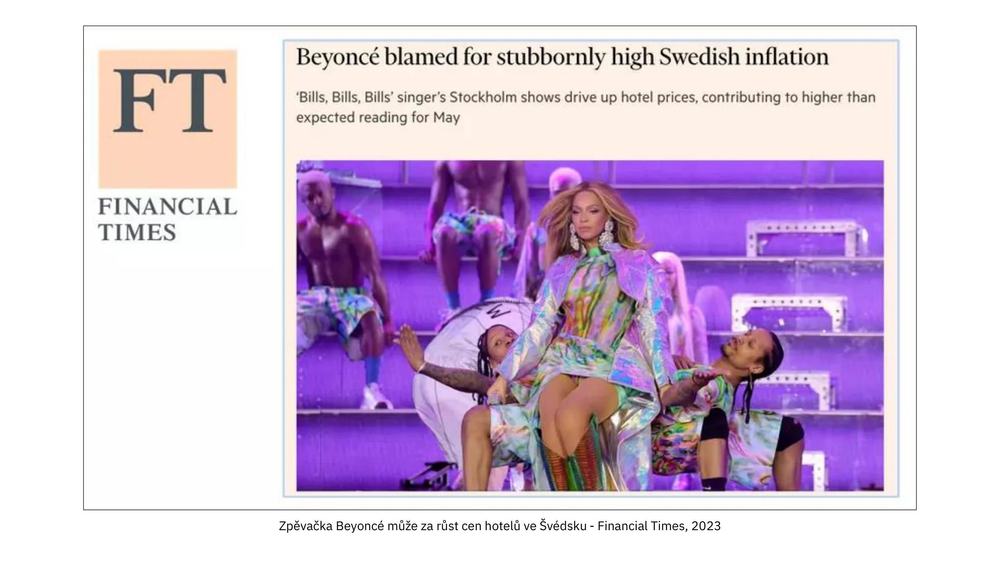

- Centrální banka v Polsku přičítá inflaci ruské agresi na Ukrajině a pandemii

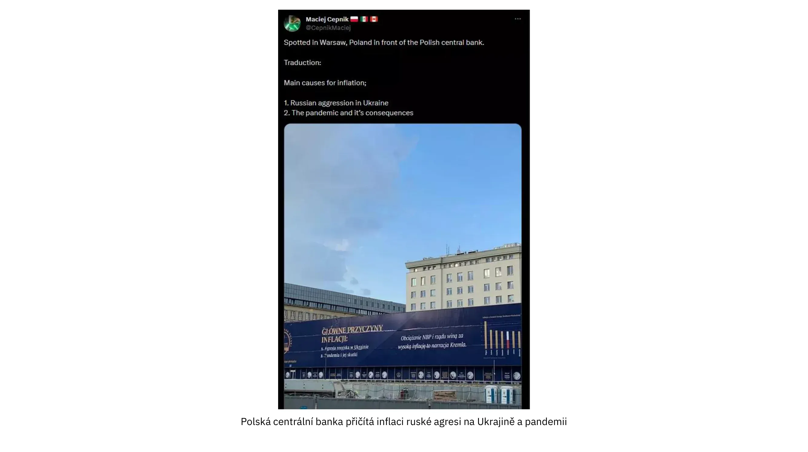

- Za inflaci ve Spojeném království může brexit.

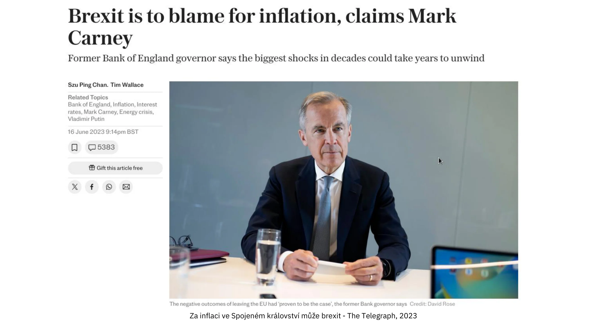

- Vydání hry Zelda spojené s inflačním šokem.

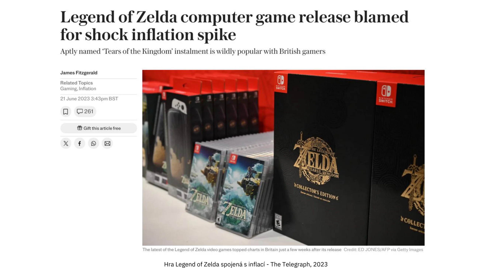

- Taylor Swift údajně způsobuje inflaci.

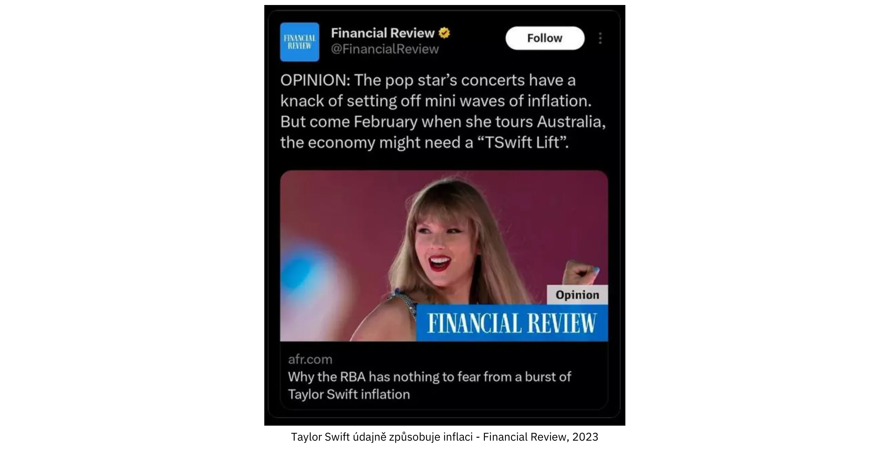

Řekněte mi, jak mohla Beyoncé nebo Taylor Swift způsobit tak rozsáhlý nárůst cen? Víte, nedává to žádný smysl. Stručně řečeno:

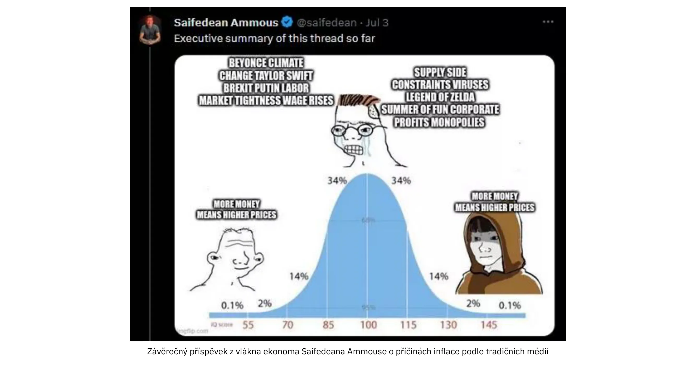

### Zkoumání typů inflace

Zásadní je pochopit rozdíl mezi různými typy inflace, což nám umožní pochopit rozmanité projevy tohoto ekonomického jevu. Zde je vysvětlení těchto různých typů:

- Plíživá inflace: Jedná se o typ inflace, o který se centrální banky obvykle snaží a který se pohybuje kolem 2 % ročně. Tento cíl je přijímán od 90. let 20. století a jeho cílem je udržet stabilní hospodářský růst bez přehřátí nebo deflace.
- Mírná inflace: Tato forma inflace nastává, když inflace překročí 2% cíl. Často je spojována s přehřátím ekonomiky, tedy se stavem, kdy nadměrný objem peněz Supply stimuluje všeobecný růst cen. Tento scénář odhaluje limity měnové politiky a někdy odhaluje rozpory v ekonomickém diskurzu.
- Cválající inflace: V případě, že roční míra inflace přesáhne 10 %, dochází k tzv. galopující inflaci, často označované jako dvouciferná inflace. Znamená výrazný cenový skok, který může ohrozit ekonomickou stabilitu.

- Hyperinflace: Hyperinflace je extrémní jev, kdy míra inflace přesahuje 50 % měsíčně, což vzhledem k exponenciálnímu charakteru inflace odpovídá roční míře inflace přesahující 13 000 %. Tato úroveň inflace vážně destabilizuje ekonomiku, činí měnu téměř bezcennou a podkopává důvěru v měnový systém.

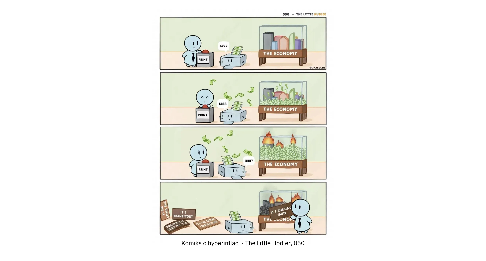

Při zkoumání typů inflace se ve vzdělávacích zdrojích běžně setkáváme s pojmy jako "Demand Pull" a "Cost Push". Tyto pojmy jsou sice platné, ale spíše vysvětlují růst cen než inflaci jako měnový jev. Zde je podrobnější analýza:

- Poptávkový tah:

Poptávková inflace je často popisována jako scénář, kdy poptávka v ekonomice převyšuje dostupné výrobní kapacity. Bez odpovídajícího zvýšení peněz Supply však tato situace povede pouze k přerozdělení výdajů. Spotřebitelé mohou utrácet více za nezbytné zboží a méně za nepotřebné položky, čímž se celkový inflační efekt neutralizuje.

- Tlak na náklady:

Na druhé straně nákladová inflace je způsobena růstem výrobních nákladů, například nákladů na přírodní zdroje nebo pracovní sílu. Opět platí, že bez zvýšení peněz Supply může zvýšení nákladů v jednom odvětví jednoduše snížit výdaje v ostatních, aniž by způsobilo rozsáhlou inflaci.

Tato tradiční vysvětlení často spojují růst cen s inflací, což může vést k nedorozumění a nepochopení. Ve skutečnosti je pro vznik rozsáhlé inflace nutné zvýšení peněz Supply. V tomto kontextu mohou koncepty Demand Pull a Cost Push vysvětlit sektorové cenové rozdíly, ale nevystihují peněžní podstatu inflace. To zdůrazňuje důležitost rozlišování mezi sektorovým růstem cen a rozsáhlou inflací a potvrzuje potřebu zvýšení peněžního Supply, aby se inflace neprojevila v celé ekonomice. Tato analýza poskytuje diferencovanější a přesnější pohled na skutečné příčiny inflace a demystifikuje běžné interpretace, které mohou zastírat základní měnovou dynamiku.

### Klasifikace inflace podle Bernholze

Bernholz navrhuje zjednodušenou, ale přesnou klasifikaci inflace do tří kategorií, což umožňuje lépe pochopit tento složitý měnový jev:

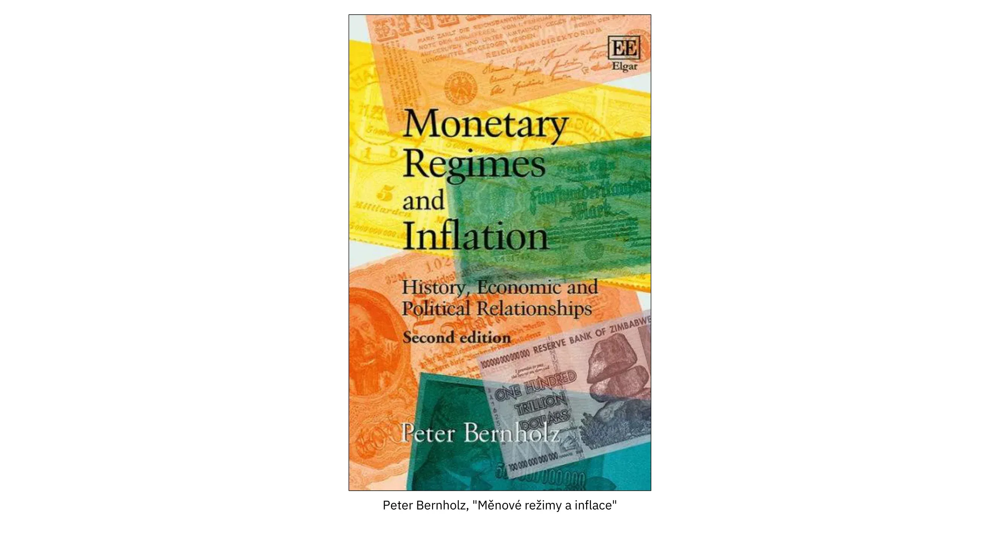

- Mírná inflace:

Mírná inflace nastává, když je úroveň peněz Supply vyšší než obvykle, ale stát se neuchyluje k velkým deficitům financovaným tvorbou peněz. Ačkoli se termín "mírná" může zdát nevýznamný, tato forma inflace může způsobit značné problémy, ačkoli není klasifikována jako vysoká inflace.

- Vysoká inflace:

Vysoká inflace nastává, když reálná hodnota peněz Supply klesá navzdory růstu nominální hodnoty. Tato paradoxní situace vzniká v důsledku peněžní substituce, kdy jednotlivci ztrácejí důvěru v národní měnu a snaží se ji Exchange vyměnit za zboží, služby nebo zahraniční měny. Tento proces dále snižuje reálnou hodnotu měny, což prohlubuje inflaci.

- Hyperinflace:

Hyperinflace je extrémní forma vysoké inflace, která se vyznačuje velkými rozpočtovými deficity, jež jsou financovány tvorbou peněz. Historicky nebyl zaznamenán žádný případ hyperinflace, který by se obešel bez výrazného financování deficitu tiskem peněz. Hyperinflace vytváří začarovaný kruh: inflace snižuje hodnotu měny tak rychle, že daňové příjmy se znehodnotí dříve, než je stát vůbec stihne vybrat, a stát je tak nucen tisknout ještě více peněz, aby se mohl financovat. Tento sebeposilující se cyklus vede k astronomické míře inflace, která často přesahuje 50 % měsíčně.

Tato Bernholzova klasifikace poukazuje na nebezpečný vývoj od mírné inflace k hyperinflaci a zdůrazňuje zásadní význam měnové a fiskální kontroly pro prevenci destruktivních inflačních spirál. Ukazuje také, že škodlivé důsledky pro financování státu se mohou projevit mnohem dříve, než dojde k hyperinflaci, a poskytuje tak diferencovaný pohled na důsledky různých stupňů inflace.

### Závěr: Shrnutí typů inflace

Na závěr jsme prozkoumali řadu typů inflace, počínaje běžně používanými termíny jako "plíživá inflace", "kráčející inflace" a "cválající inflace", z nichž každý označuje různé úrovně procentní míry inflace v ekonomice. Pro naši hloubkovou studii o hyperinflaci se však jako rozhodující měřítka ukazují kategorie mírné inflace, vysoké inflace a hyperinflace, jak je popsal Bernholz.

- Mírná inflace:

Ukazuje na nadstandardní úroveň peněz Supply, ačkoli tuto úroveň lze udržet bez výrazného deficitního financování ze strany státu.

- Vysoká inflace:

Dochází k němu, když reálná hodnota peněz Supply klesá, často v důsledku peněžní substituce, kdy se jednotlivci snaží Exchange svou měnu vyměnit za zboží, služby nebo jiné formy měny.

- Hyperinflace:

Představuje extrémní variantu vysoké inflace, kdy nadměrná tvorba peněz za účelem financování vysokých rozpočtových deficitů vede k rychlému poklesu reálné hodnoty měny.

Z našeho zkoumání vyplývá, že hyperinflace je složitý a neintuitivní jev. Ačkoli bychom se mohli domnívat, že hyperinflace je důsledkem masivního nárůstu peněz Supply, ve skutečnosti je důsledkem poklesu reálné hodnoty těchto peněz Supply. Tato nuance je klíčová pro pochopení toho, proč se některé země z hyperinflace těžko dostávají, a to i s podporou mezinárodních institucí, jako je Světová banka nebo MMF. Nesprávná charakteristika typu inflace může vést k použití nevhodných nápravných opatření, která ekonomické problémy prohlubují, místo aby je řešila.

V našich dalších diskusích se budeme hyperinflací zabývat hlouběji a prozkoumáme její definice a projevy v různých ekonomických kontextech. Naším cílem je odhalit základní mechanismy hyperinflace a prozkoumat možná řešení tohoto problému Address. Toto diferencované porozumění nám umožní lépe pochopit související problémy a navrhnout informované strategie pro řízení inflace.

Děkujeme vám za pozornost. Příští zasedání bude zcela věnováno definici a demystifikaci hyperinflace, přičemž budou zohledněny různé akademické a praktické perspektivy. Těšíme se, že v tomto zkoumání s vámi budeme moci pokračovat na našem příštím setkání.

# Co je hyperinflace?

<partId>3f541663-1e2f-5410-8ee0-f61c5d009fa5</partId>

## Definice hyperinflace

<chapterId>d2a71a2e-5f36-58d9-993c-d431f4aa07fd</chapterId>

### Definice hyperinflace

V této části se budeme zabývat různými definicemi hyperinflace, která je klíčovým pojmem při studiu extrémních měnových jevů. Nejuznávanější definice pochází od Philipa Cagana, který ve své práci "The Monetary Dynamics of Hyperinflation" z roku 1956 navrhuje kvantitativní chápání hyperinflace. Podle Cagana

- Začátek a konec hyperinflace:
  - Hyperinflace začíná, když měsíční inflace překročí 50 %.
  - Končí, když míra inflace klesne pod 50 % měsíčně po dobu nejméně jednoho roku.

Pro ilustraci, pokud inflace v červenci klesne na 40 % a nad 50 % se zvýší až v červenci následujícího roku, pak se má za to, že období hyperinflace skončilo v červenci roku předcházejícího roku, v němž byla poprvé zaznamenána. Tato definice umožňuje přesnou charakteristiku epizod hyperinflace, což usnadňuje strukturovanou analýzu.

Tato definice byla převzata do Hanke-Krusovy tabulky, která dokumentuje 56 případů hyperinflace. Tabulka však nezahrnuje všechny epizody, jako například tu ve Venezuele v roce 2016, čímž se celkový počet zvýšil na 57.

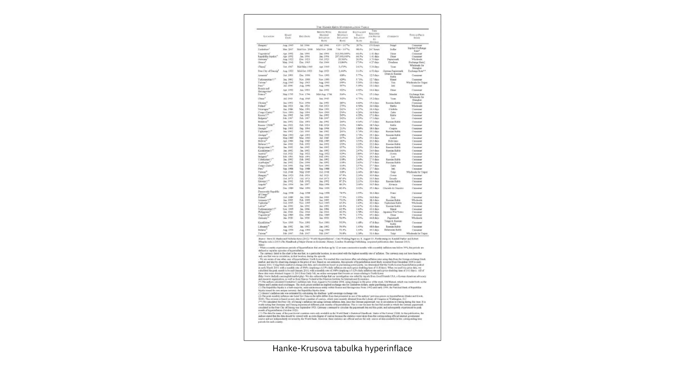

zoom

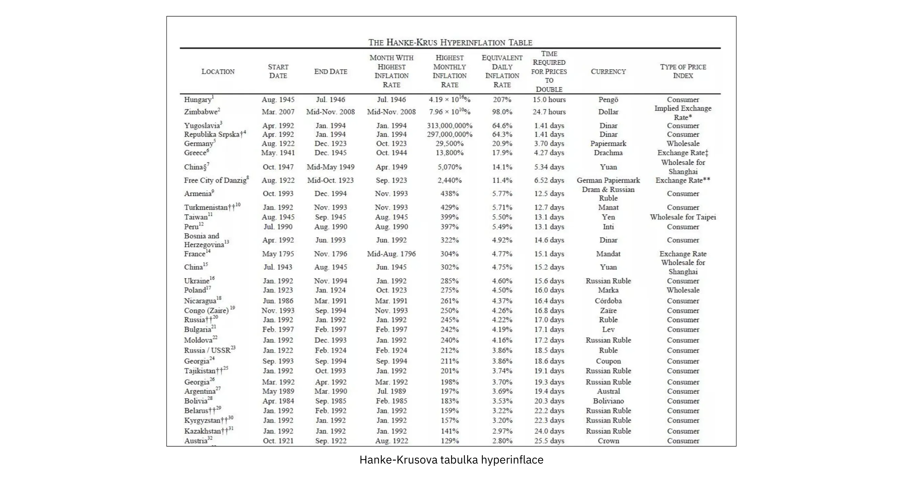

Je třeba poznamenat, že tato definice, ačkoli je přesná, by mohla vyloučit některé epizody hyperinflace vzhledem k přísnosti 50% hranice. Existuje možnost rozšířit tuto definici o další epizody, které sice striktně nesplňují Caganova kritéria, nicméně představují období extrémně vysoké inflace. Toto pozorování otevírá dveře k širšímu zkoumání fenoménu hyperinflace, což umožňuje diferencovanější pochopení jejích příčin a důsledků. V následujících diskusích zvážíme, zda se k této definici vrátit a prozkoumat epizody hyperinflace, na které se nevztahují Caganova přísná kritéria.

### Definice hyperinflace podle Cagana

Philip Cagan možná stanovil při definování hyperinflace hranici 50 % měsíční inflace jako svévolný mezník. Sám přiznává, že tato definice je arbitrární a slouží především jeho analýze založené na sedmi epizodách hyperinflace. Zkoumání Caganových údajů ukazuje, že tři epizody hyperinflace s nejnižší měsíční mírou inflace se pohybovaly kolem 47 %, 46 % a 57 %. Zdá se, že hranice 50 % byla zvolena tak, aby tyto případy zahrnula do jeho studie.

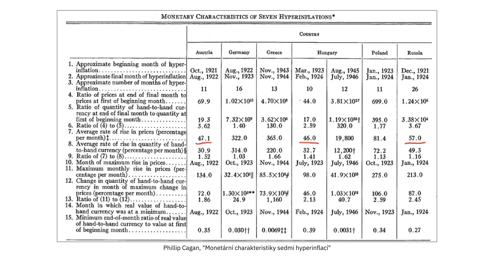

- Historické souvislosti:

Caganova definice pochází z roku 1956 a je založena na omezeném počtu tehdy dostupných případů hyperinflace.

- Caganovy poznámky:

Podle Cagana žádná epizoda nedosáhla této hranice kolem 50 %, aniž by se rozvinula do silnější hyperinflace, což by mohlo ospravedlnit volbu této hranice.

- Kritika Caganovy definice:

Také další ekonomové, jako například Bernholz, autor knihy Monetary Regime and Inflation, označují 50% hranici za arbitrární.

Bernholz poznamenává, že existují epizody vysoké inflace se stejnými kvalitativními charakteristikami jako epizody hyperinflace, aniž by dosáhly 50% hranice.

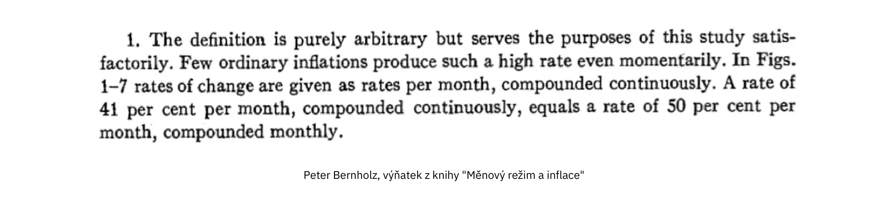

Tato úvaha nás vede ke zpochybnění rigidnosti tradiční definice hyperinflace a zdůrazňuje potřebu možná přehodnotit tuto hranici zahrnutím více epizod a historických dat. Definice hyperinflace může vyžadovat flexibilitu, aby zahrnovala různé projevy extrémní inflace v různých ekonomických a historických kontextech.

### Definice hyperinflace podle Rady pro mezinárodní účetní standardy (IASB)

IASB nabízí jedinečný pohled na hyperinflaci a zaměřuje se na účetní postupy v období hyperinflace. Tento přístup je klíčový pro účetní a podniky působící v hyperinflačním prostředí, kde hodnota peněz rychle kolísá. Pokyny IASB identifikují různé ukazatele hyperinflace:

- Preference pro nepeněžní aktiva:**

Jednotlivci dávají přednost držení hodnoty ve zboží před držením hodnoty v měně z důvodu rychlého znehodnocování peněžní hodnoty.

- Oceňování zboží a služeb:**

Obyvatelé nepočítají hodnotu zboží a služeb v místní měně, což odráží ztrátu důvěry v místní měnu.

- Náhrada za ztrátu peněžní hodnoty:**

Ceny zahrnují kompenzaci ztráty peněžní hodnoty při nákupu na úvěr, což ilustruje dopad inflace na denní transakce.

- Indexace cen, mezd a úroků:**

Ceny, mzdy a úroky se upravují na základě indexu, který kompenzuje inflaci.

- Kumulativní inflace za tři roky:**

Kumulativní inflace za tři roky se blíží 100 % (zhruba 24 % ročně), což kontrastuje s Caganovou definicí 50 % měsíční inflace.

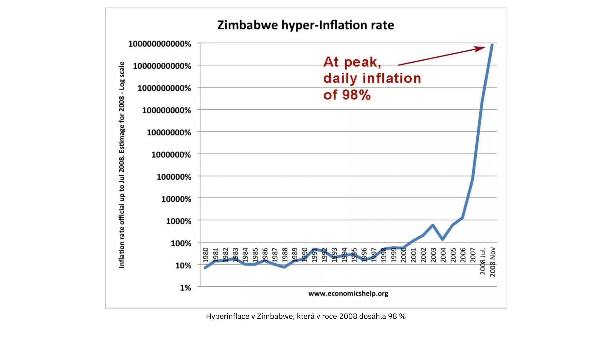

Podle kritérií IASB zažívá v současné době hyperinflaci několik zemí, včetně Argentiny, Etiopie, Haiti, Íránu, Libanonu, Súdánu, Jižního Súdánu, Surinamu, Sýrie, Turecka, Venezuely, Jemenu a Zimbabwe.

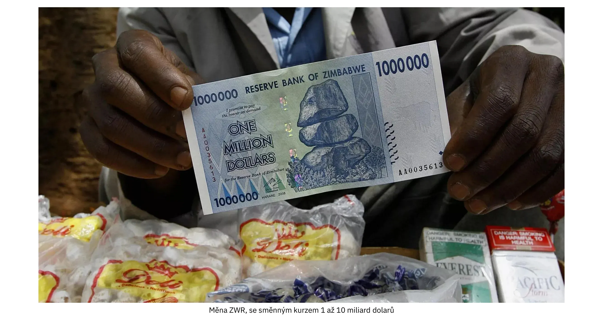

Tato definice předložená IASB se odklání od Caganova přísného kvantitativního prahu a zahrnuje kvalitativní analýzu ekonomického chování a praktických úprav tváří v tvář hyperinflaci. Ukazuje, že hyperinflace je komplexní jev, který vyžaduje vícerozměrné chápání, aby bylo možné pochopit jeho skutečné důsledky, zejména v oblasti účetnictví, které má zásadní význam pro stabilitu a finanční transparentnost podniků a trhů.

### Kolik je tedy celkem hyperinflací?

Běžné definice hyperinflace, jako je ta, kterou navrhl Cagan a která stanovuje měsíční míru inflace ve výši 50 %, mohou být někdy matoucí nebo příliš zjednodušující. Například dvě země s roční mírou inflace 1 000 % a 3 000 % mohou být vnímány odlišně na základě měsíčního rozložení této inflace. Pokud žádný měsíc nepřekročí 50% hranici, nebudou tyto země podle Caganovy definice klasifikovány jako země ve stavu hyperinflace. Tento přístup tak může vést k anomáliím při klasifikaci hyperinflace, zejména při porovnávání kumulativní inflace v průběhu roku.

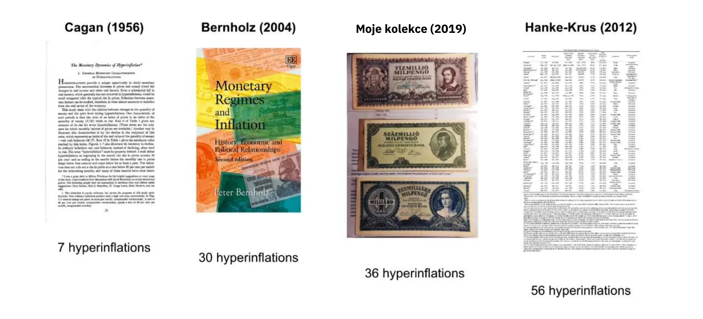

- Caganova práce "Monetary Dynamics of Hyperinflation" obsahuje základní analýzu hyperinflace.
- Bernholzova kniha, která zkoumá 30 různých období hyperinflace, čímž rozšiřuje rozsah analýzy.
- David St-Onge (autor tohoto kurzu) má osobní sbírku bankovek z 36 období hyperinflace, která umožňuje hmatatelné a historické pochopení.
- Tabulka Hanky Crossové (verze z roku 2012, aktualizovaná v roce 2016 o Venezuelu), která uvádí 57 období hyperinflace na základě Caganovy definice.

Je třeba poznamenat, že některá historická období vysoké inflace nejsou v klasických tabulkách hyperinflace zahrnuta, často kvůli přísným klasifikačním kritériím. Například během americké války za nezávislost v listopadu 1779 a během americké občanské války v březnu 1864 činila měsíční míra inflace 47,4 %, resp. 40 %. Tyto míry, ačkoli jsou vysoké, nepřekračují Caganem stanovenou hranici 50 %, což vylučuje, aby tato období byla klasifikována jako případy hyperinflace. Toto opomenutí poukazuje na omezení rigidních definic a zdůrazňuje potřebu diferencovanějšího chápání hyperinflace v celé její komplexnosti.

## Podobnosti mezi Výmarskou republikou a Zimbabwe

<chapterId>11eef458-aab8-5c63-8523-264d0ba69f5d</chapterId>

### Dvě éry, dvě katastrofy

V této kapitole se budeme zabývat důsledky hyperinflace se zaměřením na zkušenosti Zimbabwe a Výmarské republiky. V celém svém výzkumu jsem upřednostňoval zkoumání přímých svědectví jednotlivců, kteří tato období hyperinflace prožili, před čistě ekonomickým nebo statistickým přístupem.

Několik knih bylo obzvláště poučných:

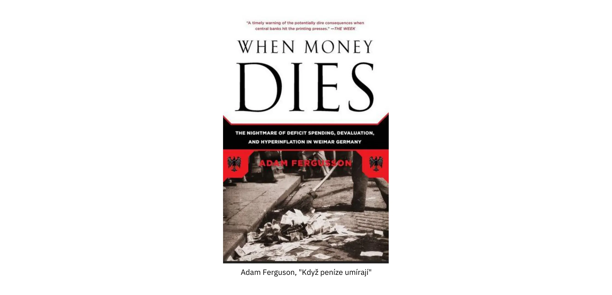

- kniha Adama Fergusona "Když peníze umírají" sleduje hyperinflaci po první světové válce v Německu, ale i v Rakousku a Maďarsku.
- Dvě knihy o hyperinflaci v Zimbabwe, "Zimbabwe Warm Heart Ugly Face" a "Hard Boiled Egg Index" od Jérôma Gardnera a Kudzai Josepha Gou Min-Yu, přinášejí dojemná svědectví generálního ředitele sítě obchodů s oblečením a zemědělského bankéře o jejich zkušenostech z tohoto bouřlivého období.

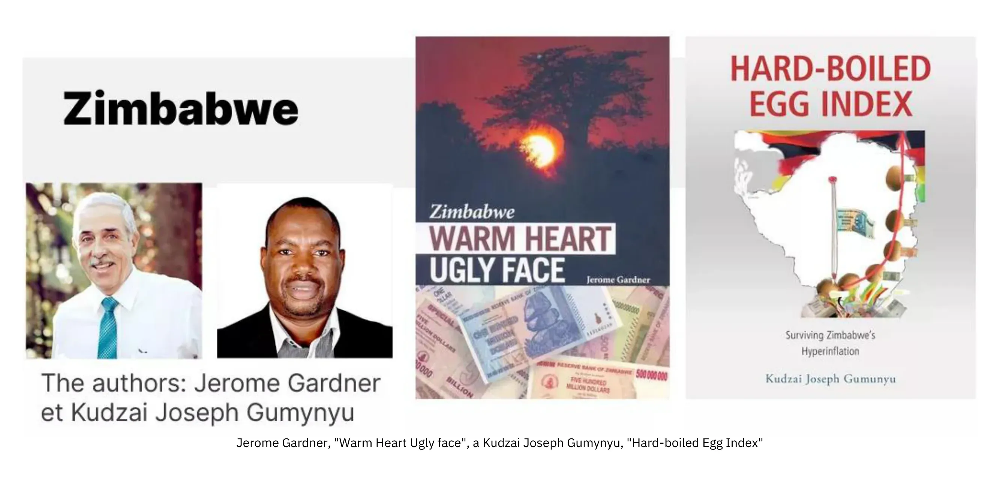

Při konsolidaci svých poznámek jsem si všiml mnoha podobností mezi zkušenostmi s hyperinflací v Zimbabwe a Výmarské republice, přestože je dělí 90 let. Identifikoval jsem asi 17 podobností, přičemž 13 z nich ilustruje jakýsi vývoj směrem k ekonomické katastrofě, která je v těchto svědectvích zobrazena. Tyto fascinující paralely ukazují opakující se a ničivou povahu hyperinflace napříč časem a hranicemi. Dnes se budeme zabývat těmito podobnostmi a tím, jak zobrazují znepokojivou trajektorii v období hyperinflace.

### Srovnávací analýza: Zimbabwe a Výmarská republika

Hra se 14 rozdíly!

#### 1. Nedostatek peněz

Když se měna znehodnocuje závratnou rychlostí, mohou se i ty nejambicióznější pokusy o zaplavení trhu novými bankovkami ukázat jako nedostatečné. Neustálá poptávka po hmatatelné měně může značně převýšit kapacitu centrálních bank vyrábět bankovky a vyvolat bezprecedentní krizi likvidity.

> Výmar: "Během tohoto měsíce bude navýšen na téměř 4 miliardy papírových marek, což je částka, s níž se počítá, že bude definitivně překonán nedostatek měny."

> Zimbabwe: "Od roku 2002 do ledna 2009 došlo k několika kritickým nedostatkům likvidity. Jednoduše se netisklo dost bankovek a nebylo jich v oběhu tolik, aby dokázaly udržet krok s prudce rostoucí inflací."

#### 2. "A to je hnůj!"

Rychlost, s jakou může měna v určitých ekonomických situacích ztratit svou hodnotu, je ohromující. V rekordně krátkém čase lze vydat astronomické množství bankovek, které kdysi značné částky okamžitě promění v něco tak bezvýznamného, jako je hnůj.

> Výmar: "Současná celková emise činí 63 000 mld. Za několik dní tedy budeme schopni vydat dvě třetiny celkového oběživa za jeden den."

> Zimbabwe: "17. září 2006 prohlásil guvernér RBZ Gideon Gono: "10 bilionů je stále někde venku a stal se z nich hnůj.""

#### 3. Bankovky mají nižší hodnotu než papír, na kterém jsou vytištěny

Za určitých ekonomických okolností může být vnitřní hodnota bankovky nižší než hodnota papíru, na kterém je vytištěna. Toto drastické znehodnocení mění bankovky, které jsou za normálních okolností symbolem hodnoty a kupní síly, v pouhé kusy bezcenného papíru.

> Výmar: "Celé nominální hodnoty bankovek byly téměř bezcenné, jakmile vyšly z tiskárny."

> Zimbabwe: "Centrální banka plýtvala penězi tím, že vytiskla bankovku, která neměla hodnotu papíru, na němž byla vytištěna. Jinými slovy, její hodnota byla nižší než hodnota toaletního papíru. Ačkoli to může znít absurdně, bylo levnější použít bankovku v hodnotě 100 bilionů ZWD jako toaletní papír než koupit skutečný toaletní papír."

#### 4. Počítání peněz

Když měna rychle ztrácí svou hodnotu, mohou se i ty nejjednodušší transakce stát pracnými úkoly. Výpočet ceny zboží nebo pouhé spočítání bankovek potřebných k zaplacení může trvat několik minut, což každodenní interakce ještě více zkomplikuje.

> Výmar: "Nejobyčejnější nákup v obchodě vyžadoval tři až čtyři minuty počítání, a jakmile byla cena stanovena, bylo obvykle potřeba ještě několik minut na přepočítání bankovek."

> Zimbabwe: "Vedoucí obchodů si také mohli najmout dočasného pracovníka, který by nahradil zaměstnance, jenž celý den počítal peníze. Samozřejmě, že počítání peněz v obchodě pro administrativu a bankovní vklad byla jedna věc, ale celý proces se musel opakovat v bance při vkladu."

:::video id=910231d7-af90-4ab8-b74c-bfb81caebfb2:::

Uzbecká technika počítání peněz

#### 5. Platby šekem

V narušených ekonomikách mohou tradiční platební metody, jako jsou šeky, rychle ztratit svou účinnost. Banky, zahlcené rostoucí poptávkou po měně v důsledku hyperinflace, mohou omezit nebo pozdržet proplácení šeků, a tím snížit jejich reálnou hodnotu. Tato nestabilita často vede k upřednostňování platebních metod, kdy se ceny mohou lišit v závislosti na zvolené platební metodě.

> Výmar: "Růst cen zesílil poptávku po penězích, a to jak ze strany státu, tak i ostatních zaměstnavatelů. Soukromé banky nemohly poptávku vůbec uspokojit a musely proplácení šeků omezit, takže nevyplacené šeky zůstávaly zmrazené, zatímco jejich kupní síla klesala."
> Zimbabwe: "Časová hodnota peněz vytvořila tři ceny zboží a služeb, a to cenu v hotovosti, cenu v reálném čase a šekovou cenu. Nakonec nikdo nepřijímal šeky, jejichž zúčtování trvalo pět dní."

#### 6. "Podnikatelé v oblasti spalování"

S klesající hodnotou měny se objevují nové ekonomické příležitosti, které využívají narušení trhu. Tito podnikatelé, často označovaní jako "Burner-podnikatelé", mohou prosperovat díky tomu, že si půjčují znehodnocenou měnu na investice do hmotných aktiv a své dluhy pak splácejí ještě více znehodnocenou měnou.

Výmar: "Spekulace na inflaci spočívala v tom, že si stát půjčoval papírové marky, přeměňoval je na zboží a továrny a pak splácel věřitelům znehodnocenými papíry."

Zimbabwe: "Podnikatelé v oblasti spalování"

#### 7. Poctivost a práce Hard ztrácejí na atraktivitě

V nestabilních ekonomických podmínkách mohou být tradiční hodnoty, jako je práce, šetrnost a poctivost, zastíněny lákadlem rychlého zbohatnutí. Spekulace a obchodování s měnami často nabízejí výrazně vyšší odměny než běžná práce, což vede k narušení společenských priorit.

Výmar: "Protože staré ctnosti jako spořivost, poctivost a práce ztratily svou přitažlivost, každý se snažil rychle zbohatnout, zejména proto, že spekulace s měnou nebo akciemi zjevně přinášely mnohem více než práce."

Zimbabwe: "Tyto praktiky sice obohatily několik jednotlivců, ale ochudily městskou dělnickou třídu a venkovské obyvatelstvo. Vzdělání ztratilo svou hodnotu, protože tímto obchodem se zabývali lidé, kteří k jeho ospravedlnění nepotřebovali vzdělání ani práci Hard . Stačily jim konexe a počáteční kapitál, aby mohli začít podnikat za snadné peníze."

#### 8. "Banky světa"

V situacích hyperinflace nebo měnové krize často vznikají paralelní a neregulované trhy s cizími měnami. Tyto neformální "banky", často vtipně označované jako "světové banky" nebo jinými místními názvy, poskytují útočiště těm, kteří se snaží ochránit svůj majetek před znehodnocením. Přestože tyto trhy mohou poskytovat nezbytné ekonomické záchranné lano, často zdůrazňují rozšířenou nedůvěru v oficiální finanční instituce a vládní politiku.

Výmar: "Jejich transakce se uskutečňovaly především prostřednictvím takzvaných Winkelbankiers, pouličních obchodníků, kteří se objevili s inflací a kteří v nemocné ekonomice prosperovali výhradně z toho, že využívali rozdílu mezi nákupními a prodejními cenami zahraničních měn."

Zimbabwe: "Byli to také směnárníci. Díky svým mazaným obchodním praktikám, které často zahrnovaly korupci a další nezákonné činnosti, působili beztrestně mezi 2. a 6. avenue a Fort Street v Bulawayu. Tato část města byla známá jako 'Světová banka'."

Argentina: "Tak jsem se vydal tam, kam chodí všichni Argentinci: do cuevas, "jeskyní", které se nacházejí ve čtvrti Florida v centru Buenos Aires." - TheBigWhale

#### 9. Směny cizích měn byly nezákonné

Vlády ve snaze stabilizovat vlastní měnu a kontrolovat tok kapitálu mohou tyto devizové transakce zakázat. Tato represivní opatření, ačkoli mají chránit národní ekonomiku, mohou mít často opačný účinek, neboť prohlubují nedůvěru veřejnosti a podporují černý trh.

Výmar: "Lidé se uchýlili ke směnnému obchodu a postupně se obrátili k zahraničním měnám jako k jedinému spolehlivému prostředku Exchange. Byla zavedena nová nařízení týkající se nákupu zahraničních směnek a používání zahraničních měn pro domácí platby. Kromě trestu odnětí svobody mohly být nyní ukládány pokuty až do výše desetinásobku nelegální transakce."

Zimbabwe: "Zátahy na podniky vedly k uvěznění několika podnikatelů z Bulawaya na víkend a k pokutám ve výši dvojnásobku vymožené cizí měny, poté tato odvaha opadla."

#### 10. Kapitálové kontroly

Když země čelí měnové nebo hospodářské krizi, je jednou z běžných reakcí vlád přísná kontrola pohybu a forem kapitálu. Ať už prostřednictvím příkazů, které nutí přijímat devalvované národní měny, nebo přísných sankcí vůči těm, kdo odmítají určité platební metody, jsou tato opatření často zaměřena na omezení paniky a obnovení důvěry. Jejich účinnost je však různá a někdy se tato opatření mohou ukázat jako kontraproduktivní nebo odtržená od reality, kterou občané zažívají.

Výmar: "Obchodníci byli nedávno novým výnosem donuceni přijímat státní bankovky, ale protože výnos zároveň umožňoval nadále používat cizí měny pro všechny nákupy, obchodníci si většinou našli výmluvu, proč nepřijímat téměř nic jiného."

Zimbabwe: "Vláda zavedla dne 12. prosince 2008 normu SI 175/2008 týkající se plateb šekem. V něm se uvádí: "Sankcí za odmítnutí platby šekem/bankovní kartou nebo jakoukoli jinou elektronickou platební metodou zprostředkovanou bankou je pokuta 8. stupně nebo trest odnětí svobody v délce šesti měsíců nebo obojí." SI jsme samozřejmě ignorovali, protože byl zcela mimo realitu."

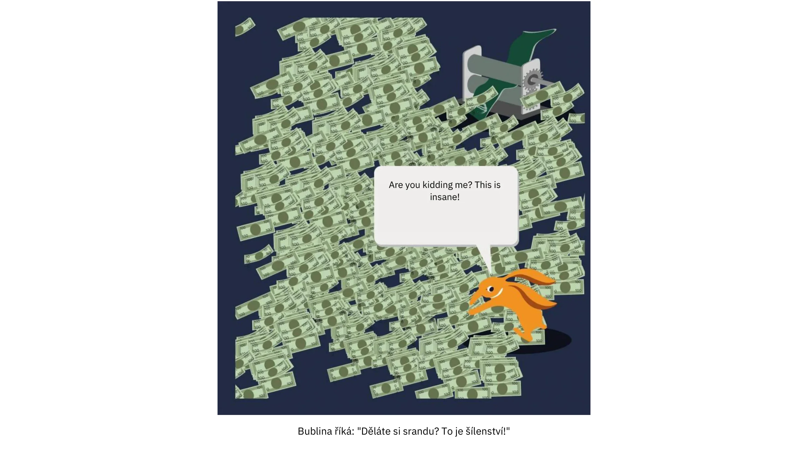

#### 11. Nuceni nechat své obchody otevřené

Když se ekonomika zhroutí a měna ztratí svou hodnotu, mohou se vlády uchýlit k drastickým opatřením, aby udržely zdání normálnosti.

Výmar: "Na obchodníky, kteří pokračovali ve své činnosti, se vztahovalo nové nařízení z 22. října, podle něhož museli mít své obchody otevřené a nabízet zboží v Exchange za papírové marky."

Zimbabwe: "Zůstaly jen prázdné ocelové regály a chladničky, mrazničky a mrazáky. Tragédií bylo, že obchod byl stále otevřený, protože se neodvážili zavřít kvůli politickému napětí a strachu ze zatčení vedoucích pracovníků vládní jednotkou pro kontrolu cen. Dokonce ani zaměstnanci nebyli propuštěni, protože si všichni mysleli, že se najde rychlé řešení."

#### 12. Každý je zločinec

Tváří v tvář kolabující ekonomice a všudypřítomným regulacím se hranice mezi přežitím a zločinem stírá.

Výmar: "Všechny zločiny proti státu, každý z nich se v různé míře stal pro jednotlivce otázkou přežití."

> Zimbabwe: "Každý obyvatel Zimbabwe byl zločinec. Ač to může znít krutě, byla to pravda. S nesčetným množstvím drobných zákonů, které upravovaly každý aspekt života, bylo nevyhnutelné, že každý den nějaký zákon porušil. Držení cizí měny bylo podle SI zveřejněného v roce 2004 nezákonné. Mít více bankovních účtů, aby se obešel denní limit pro výběr peněz, bylo nezákonné. Nemít na autě správné poznávací značky, licenci na autorádio nebo povolení ke generátoru, to všechno byly zákony, které někdo, někde, porušoval."

#### 13. Nákup cizí měny za každou cenu

Zběsilý nákup zahraničních měn často znamenal kritický bod obratu v devalvaci měny a prohloubil pokles její vnitřní hodnoty.

> Výmar: "Fritz Mannheimer se na pokyn svého šéfa vydal v srpnu 1921 ven a začal nakupovat zahraniční měny za každou cenu - "protože Německo mělo nekonečné množství papírových marek, ale žádné zahraniční měny" To byl první příznak absolutního zhroucení hodnoty marky."

> Zimbabwe: Údajně dostávali denní cíle, které měli splnit, protože některé požadavky na forex byly naléhavé a nakupovali za každou cenu, aby nashromáždili forex a splnili termín. Tato údajná praxe byla obviněna z toho, že podněcuje požár devalvace, protože hodnota zimbabwského dolaru nadále prudce klesá."

### Shrnutí procesu

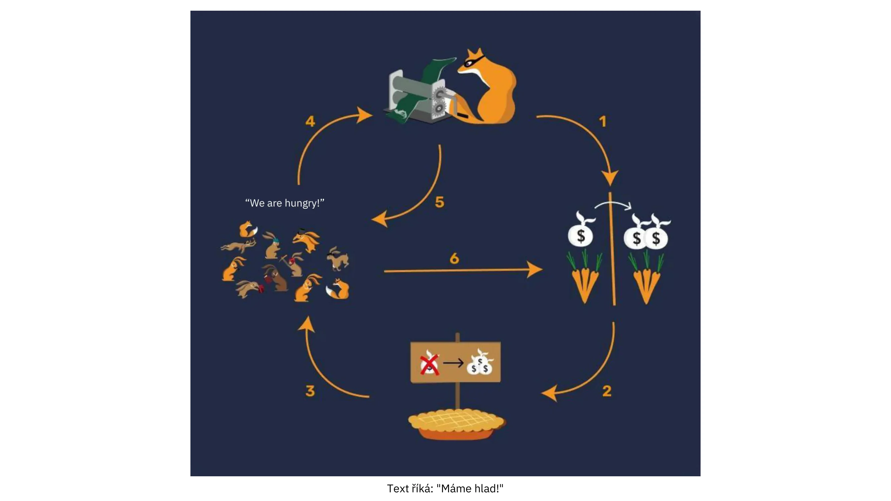

Při analýze ekonomické trajektorie je zřejmé, že při dosažení vysoké inflace se hodnota peněžní masy zhoršuje. Toto znehodnocení vede k řadě komplikací, včetně nedostatku bankovek. V této souvislosti vznikají arbitrážní příležitosti, zejména v reakci na výkyvy sazeb Exchange. V důsledku toho se k této arbitráži obrací mnoho jednotlivců, kteří ve velkém investují do hmotných aktiv v očekávání budoucí devalvace měny, která by jim umožnila splácet dluhy oslabenou měnou. Toto ekonomické prostředí podkopává atraktivitu tradičních pracovních míst a v důsledku toho narušuje sociální soudržnost.

V reakci na tuto situaci vláda zavádí drakonické regulace, včetně kontroly kapitálu. Nařizuje také obchodníkům přijímat národní měnu a šeky. Postupem času jsou přijímány nové zákony, které rozšiřují definici trestného jednání. Nakonec kurz Exchange exponenciálně stoupá, protože vláda je ochotna Exchange svou měnu, vytištěnou za nižší cenu, vyměnit za silnější zahraniční měny.

### 4 Podobnosti v důsledcích hyperinflace

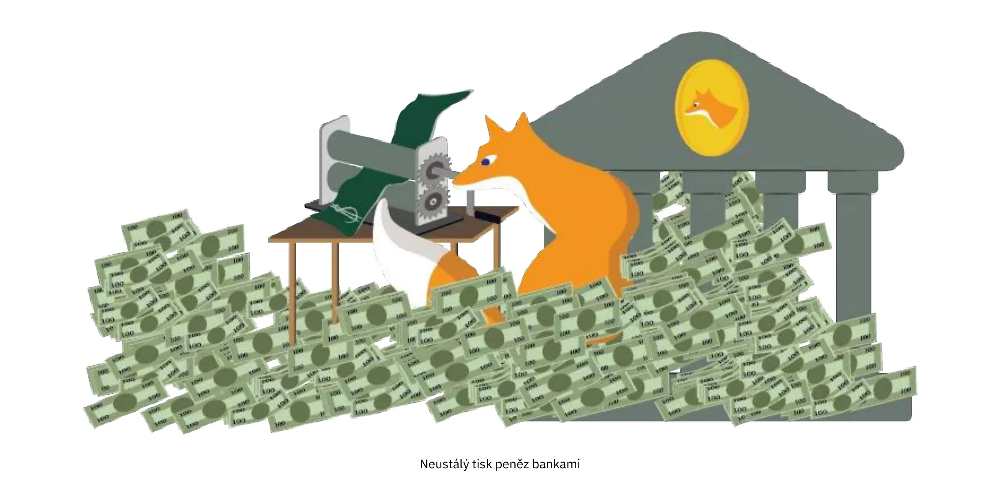

#### 1. Ropa a kovy

Ve výmarském období byly v Německu krádeže cenných materiálů tak rozšířené, že se často kradlo olovo ze střech. V Zimbabwe vedlo zoufalství některé lidi k tomu, že narušili elektrickou síť, aby z transformátorů získali olej a použili ho ve svých vozidlech.

Výmar: "Kovové desky národních památek musely být pro jistotu odstraněny. Ze dveří britského velvyslanectví v Berlíně byly ukradeny mosazné zvonkové desky."

Zimbabwe: "Aby toho nebylo málo, kvůli nedostatku zahraniční měny byl nedostatek mazacího oleje pro automobily a transformátory se staly snadným cílem zlodějů, kteří při výpadcích proudu odčerpávali chladicí olej."

#### 2. Vlaky

Devalvace měny může občany přimět k chování, které vede k přežití, včetně vandalismu. Tváří v tvář kolabující ekonomice může být ohrožena nákladná veřejná infrastruktura, například dopravní systémy, což může mít katastrofální společenské důsledky.

> Výmar: "V Berlíně přestaly jezdit tramvaje kvůli nedostatku financí."

> Zimbabwe: "Jedním z nejznepokojivějších a nejsmutnějších scénářů byla krádež téměř celého elektrického měděného vedení spojujícího Harare s Dabukou (více než 280 kilometrů). V době svého dokončení to byla chlouba Zimbabwe, po této trase jezdily rychlé elektrické osobní i nákladní vlaky."

#### 3. "Mealie Meal"

V kontextu nízkých mezd a nestabilní ekonomiky byly podniky nuceny poskytovat svým zaměstnancům potraviny, aby si udržely produktivitu a efektivitu provozu. Tato iniciativa byla nejen způsobem, jak kompenzovat nedostatek a vysoké náklady na potraviny, ale také strategií, jak si udržet zaměstnance v obtížném ekonomickém prostředí.

> Výmar: "V Berlíně měli kancelářští zaměstnanci, kteří tvořili v hlavním městě velmi důležitou třídu, naprosto nedostatečné platy v rozmezí 12 000 až 20 000 měsíčně (což odpovídá 12 až 19 librám ročně), které se neustále snižovaly; většina z nich však mohla ještě za symbolickou částku dostávat obědy, které jim poskytovaly úřady, takže tělo a duše mohly jen stěží zůstat pohromadě."

> Zimbabwe: "V této fázi jsme všem zaměstnancům poskytovali obědy zdarma. Kukuřičné jídlo bylo pro další fungování naší společnosti nezbytné, protože v mnoha případech to bylo jediné jídlo, které naši zaměstnanci denně dostávali."

#### 4. Kupóny na benzín

Obyvatelstvo hledalo stabilní alternativy pro transakce. Ve Výmaru sloužily výrobky jako mosaz a palivo díky své stálé vnitřní hodnotě jako médium Exchange. V Zimbabwe, které čelilo rychlé devalvaci zimbabwského dolaru, se de facto měnou staly kupony na benzín, které představovaly pevné množství základního produktu. Tyto situace poukazují na to, jak se společnosti přizpůsobují extrémním ekonomickým podmínkám a vymýšlejí inovativní řešení, aby udržely obchod a ekonomiku.

Výmar: "Barterový obchod byl již dříve obvyklou formou Exchange, ale nyní se běžným platidlem stalo zboží jako mosaz a palivo."

Zimbabwe: "Tyto poukázky jsme nyní používali k placení nájemného majitelům bytů, obecních poplatků, telefonních účtů - vlastně téměř všeho - protože všichni přestali přijímat platby v zimbabwských dolarech a šeky."

#### Závěr

Tímto končí toto video o podobnostech zkušeností z období hyperinflace v Zimbabwe a Výmarské republice. V příštím videu se budeme zabývat rozdíly a současnými paralelami. Děkujeme.

## Výmar vs. Zimbabwe: Rozdíly a současné paralely

<chapterId>643f279c-d89f-5600-a2e2-b1bbbba0ab69</chapterId>

V této kapitole se budeme zabývat rozdíly a současnými paralelami mezi minulými a současnými obdobími hyperinflace a uvedeme anekdoty a relevantní srovnání pro současnost.

### Rozdíly mezi Výmarskou republikou a Zimbabwe

#### 1. Může za to dolar!

V Německu bylo běžné, že obyvatelstvo přisuzovalo inflaci spíše růstu kurzu dolaru než vlastnímu znehodnocení vlastní měny. Mnozí se domnívali, že pozorovaný jev byl způsoben zhodnocením dolaru. Toto vnímání odmítalo jakékoli uznání souvislosti mezi jejich hospodářskými potížemi a znehodnocením měny, vyvolaným především nadměrnou tvorbou peněz. Kniha "Když peníze umírají" jasně ilustruje toto nepochopení mezi německým obyvatelstvem. Naproti tomu v Zimbabwe byla situace jiná: občané si plně uvědomovali základní příčinu hyperinflace, kterou zažívali.

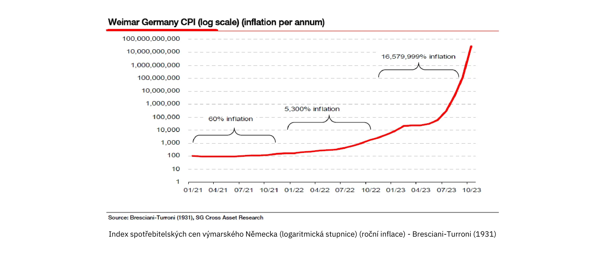

#### 2. Nouzové peníze (Notgeld)

V době měnové a hospodářské krize se Německo uchýlilo k "Notgeld" (nouzovým penězům). Tyto bankovky, tištěné městy nebo některými společnostmi, byly určeny pro Address při nedostatku běžné měny.

Zajímavé je, že k notgeldu se uchýlila i Francie, zejména ve 20. letech 20. století. Tato iniciativa nebyla jen přímým důsledkem hyperinflace, ale měla také kořeny v rozvratu způsobeném první světovou válkou. Válka nejen destabilizovala hospodářství, ale také zvýšila cenu kovů. V důsledku toho vnitřní hodnota kovových mincí často převyšovala jejich nominální hodnotu, což přimělo lidi k jejich hromadění. Při nedostatku mincí si některé instituce, jako například Lyonská obchodní komora, tiskly vlastní notgeld.

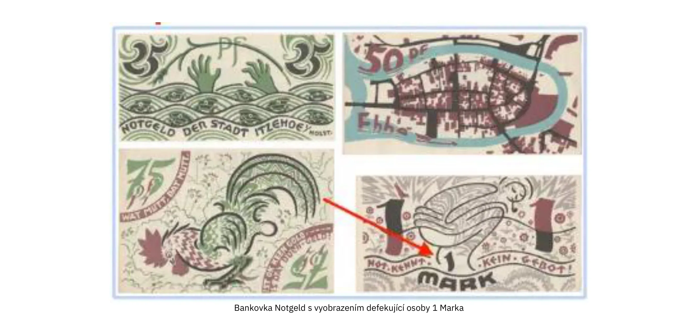

> "Co je třeba udělat, to se musí udělat." - místní přísloví

Mezi bankovkami Notgeld vyniká jedna konkrétní. Je na ní dojemná ilustrace: uprostřed je vyobrazen člověk, který vyprazdňuje marku. Na rubové straně je tabulka cen z let 1913 až 1921, která ilustruje nárůst inflace v tomto období.

Zdá se, že autor tohoto Notgeldu ironicky kritizuje úřady odpovědné za hyperinflační krizi. Bankovka nese nápis "Nutnost nezná zákon". Další výraz specifický pro lokalitu vzniku notgeldu zní: "Co se musí udělat, to se musí udělat."

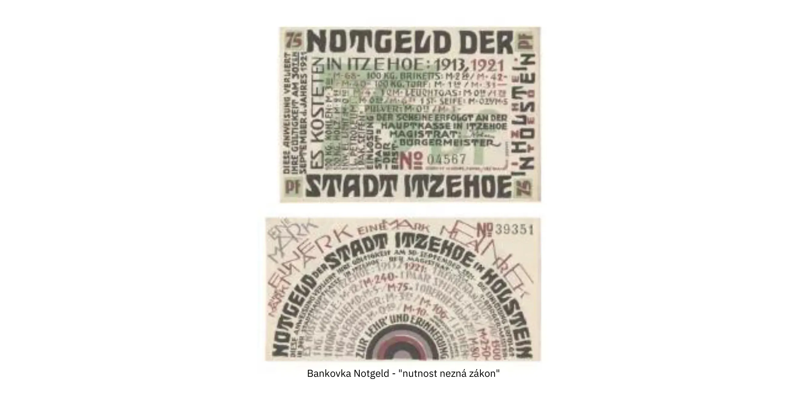

> "nutnost nezná zákon"

> První shitcoin: Při pohledu na ústřední ilustraci bankovky, kde je měna doslova znehodnocena jednáním jednotlivce, by se dalo říci, že se jedná o první "shitcoin"

#### 3. Dluhopisy a hypotéky

Ve Výmaru byly některé dluhy přeceněny, aby se kompenzoval dopad inflace. Toto opatření nebylo v Zimbabwe přijato.

> Výmar: "V roce 1925 bylo uzákoněno rozhodnutí o přecenění státem vlastněných půjček, na základě kterého akcionáři obdrželi 2,5 % své původní investice za předpokladu, že byly zaplaceny všechny reparace."

> Zimbabwe: "V červenci 2007 (o tři roky později) jsem mohl z kapsy vytáhnout znehodnocenou bankovku v hodnotě 500 000 ZDW (bt "000"), která má nyní podle kurzu paralelního trhu hodnotu 1,67 USD, a splatit hypoteční úvěr, který měl být splácen dvacet let. Navíc tato bankovka představovala pouze 0,49 procenta mého měsíčního platu za tentýž měsíc."

Chcete-li se dozvědět více o zvládání německé krize, je tato kniha rovněž nezbytná.

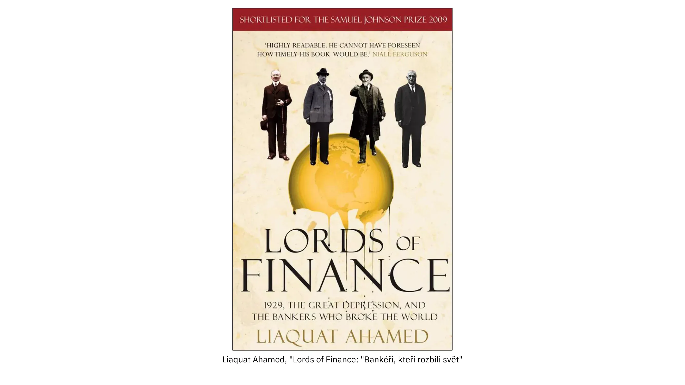

### Současné paralely

#### 1. Manipulace s měnovou politikou za účelem řízení ekonomiky.

Z dějin Výmarské republiky je zřejmé, že průmyslníci nechtěli, aby se hodnota marky zhodnotila. Jejich schopnost půjčovat si a splácet dluhy silně znehodnocenou měnou jim poskytovala značnou výhodu. Tento mechanismus usnadnil výstavbu obrovských průmyslových komplexů téměř bez nákladů. Tito průmyslníci se obávali zhodnocení marky, protože to bránilo jejich činnosti. Někteří dokonce považovali prudkou inflaci za pozitivní jev, protože se domnívali, že zaručí zaměstnanost obyvatelstva. Neuvědomovali si však škodlivý dopad této inflace na úspory a hospodářství jako celek. Pro tyto ekonomické subjekty byl měnový tisk požehnáním.

> Výmar: "Proto panovaly velké obavy z posílení marky, a dokonce i několik týdnů "stability" po Janově způsobilo stagnaci obchodu."

> Výmar: "Průmyslové kruhy čelily nebezpečí, že se hotovost stane cennější než zboží a dojde ke kolapsu, když se všichni budou snažit přeměnit svůj majetek na hotovost."

Současnou paralelu lze najít ve výrocích Christine Lagardeové, která navrhuje, aby občané upřednostnili vyhlídky na zaměstnání před ochranou svých úspor. Stejně jako výmarští průmyslníci zřejmě obhajuje tisk peněz jako nástroj stimulace zaměstnanosti na úkor hodnoty úspor.

> Christine Lagardeová: "Měli bychom být šťastnější, že máme práci, než že jsou naše úspory chráněny."

#### 2. Soukromý majetek v době konfliktu

Z historie Výmarské republiky vyplývá, že v tomto období byl zabavován majetek a kapitál držený v zahraničí. Toto opatření připomíná nedávné události v Rusku, zejména na začátku konfliktu. Tyto situace poukazují na znepokojivou skutečnost: v době krize může být ohrožena úcta k soukromému vlastnictví. Jedná se o historickou a současnou paralelu, která zdůrazňuje potenciální dopady krizí na práva jednotlivce.

> Výmar: "Veškerý německý kapitál držený v zahraničí byl zkonfiskován."

> [20minutes.fr](https://www.20minutes.fr/monde/3286947-20220513-guerre-ukraine-geler-avoirs-russes-vol-non-redistribuer-kiev-poserait-lourdes-questions): "V rámci západních sankcí bylo skutečně zmrazeno přibližně 300 miliard dolarů ruských rezerv držených v zahraničí z celkového objemu 640 miliard dolarů rezerv držených ruskou centrální bankou."

#### 3. Pojem tržní ceny

Za Výmarské republiky vyjadřovali zemědělci nespokojenost s "Umlage", která je nutila odevzdávat první dva miliony tun vyprodukované pšenice ročně. Toto nařízení vedlo k tomu, že polovina celkového množství chleba Supply byla uváděna na trh za dotované ceny. Od srpna měli tito zemědělci dostávat zaplaceno za cenu na světovém trhu, protože i když byli nuceni odevzdávat pšenici za snížené ceny, museli stále nakupovat hnojiva za ceny na světovém trhu.

Tato situace vyvolává zásadní otázku související s pojmem tržní ceny během hyperinflace. V tehdejším německém kontextu byli zemědělci nuceni prodávat svou pšenici za cenu nižší, než byla její hodnota, a zároveň museli nakupovat hnojiva za ceny na světovém trhu. Takový ekonomický nesoulad poukazuje na problémy, které dnes představují ceny potravin. Zemědělští výrobci, kteří čelí rostoucím nákladům na vstupy v důsledku inflace, přenášejí tyto náklady na konečné produkty. Kritizovat je za tento nárůst znamená ignorovat dynamiku tržních cen a ekonomické tlaky, kterým čelí. Prodej za uměle nízké ceny při vysokých nákladech je pro jakýkoli podnik neudržitelný.

> Výmar: "Zemědělské zájmy byly nespokojeny s "Umlage", nucenou dodávkou prvních dvou milionů tun pšenice, která umožňovala prodávat polovinu celkového množství chleba Supply za nízké ceny. Od srpna měli zemědělci dostávat cenu na světovém trhu, protože zatímco byli povinni prodávat pšenici za nízké ceny, za hnojiva museli vždy platit cenu na světovém trhu."

#### 4. Popírání souvislosti mezi penězi Supply a inflací

> Výmar: "Zůstal pevně stát na svém názoru, že peníze Supply nesouvisí ani s cenovou hladinou, ani se sazbami Exchange."

V moderní době tento trend přetrvává, jak je vidět na příkladu z předchozí kapitoly, kde je uveden seznam vysvětlení, která předkládají různí ekonomové a ekonomické instituty k ospravedlnění inflace. Tyto důvody jsou různé, od kulturních událostí a celebrit, jako jsou Taylor Swift, Zelda nebo Beyoncé, až po globální faktory, jako je válka a pandemie. Všechny tyto důvody, ačkoli potenciálně přispívají ke krátkodobým ekonomickým výkyvům, odvádějí pozornost od skutečné příčiny: expanze peněz Supply.

#### 5. Zombie společnosti

> Výmar: "Stabilizace ukončila období, kdy si podnikatelé mohli půjčovat, kolik chtěli, na úkor všech ostatních. Velmi mnoho podniků, které vznikly nebo se rozšířily v době peněžní hojnosti, se rychle stalo neproduktivními, jakmile se kapitál stal nedostatkovým."

Zombie společnost je podnik, který by za normálních tržních podmínek byl v platební neschopnosti nebo na pokraji úpadku, ale pokračuje ve své činnosti především díky levným půjčkám. Tyto podniky vydělávají jen tolik, aby pokryly své dluhy, ale nejsou schopny významně růst.

Pojem zombie společnosti není nový. Ve skutečnosti existoval již za Výmarské republiky. V té době se zdálo, že mnoho podniků prosperuje a do značné míry těží z přístupu k volným úvěrům. Půjčovaly si značné částky s očekáváním, že je později splatí znehodnocenou měnou v důsledku zběsilé inflace. Když však inflace ustala a německá marka znovu získala hodnotu, staly se tyto podniky, které nebyly skutečně provozně ani finančně životaschopné, ztrátovými a musely ukončit činnost.

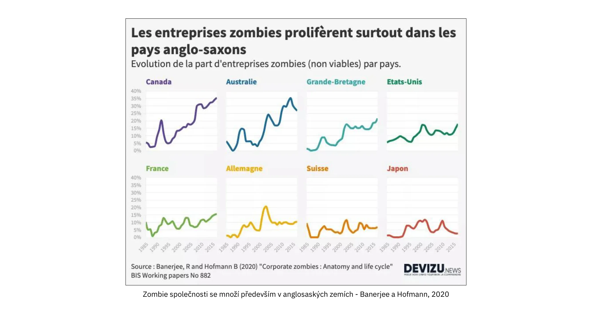

Fenomén zombie společností se neomezuje pouze na poválečné Německo. I v současnosti mnoho velkých podniků nadále prosperuje díky svému privilegovanému přístupu k úvěrům za extrémně nízké úrokové sazby. Kdyby si musely půjčovat za běžnější sazby, mnohé z nich by přestaly být ziskové. To je zvláště důležité v roce 2023, po dlouhém období téměř nulových úrokových sazeb, protože sazby nyní začaly růst. Tento nedávný posun ve finančním prostředí bude pro tyto společnosti, kdysi označované za "zombie", nepochybně rozhodující zkouškou

#### 6. Rychle zbohatněte!

Historie zná případy, kdy se jednotlivci snažili rychle nahromadit bohatství, jako tomu bylo ve Výmaru a Zimbabwe prostřednictvím arbitráže. Dnes lze podobný trend pozorovat při vzestupu některých kryptoměn. Lidé se nechávají zlákat rychlým ziskem a podstupují riziko v naději na exponenciální nárůst své investice. Tento přístup připomíná přístup pozorovaný v obdobích hyperinflace, kdy se k získání rychlých zisků využívala arbitráž, často na úkor ostatních.

#### 7. Úspory, prostředek proti nejistotě

> Všudypřítomný a destruktivní vliv neustálého snižování hodnoty kapitálu a příjmů, jakož i nejistota ohledně budoucnosti.

Za pozornost stojí citát, který zdůrazňuje destruktivní vliv eroze kapitálové hodnoty na sociální soudržnost a nejistotu, kterou vyvolává. Uvádí se v něm: "všudypřítomný a destruktivní vliv neustálé eroze hodnoty kapitálu a příjmů, stejně jako nejistota ohledně budoucnosti"

Představte si situaci, kdy máte rodinu nebo blízké, které chcete chránit. Pracujete podle Hard a spoříte, abyste předvídali budoucí nejistoty. Kdyby bylo vše předvídatelné, bylo by spoření zbytečné. Tváří v tvář nepředvídatelným okolnostem, jako je například porouchané auto, se však úspory stávají záchranným lanem. Snižují nejistotu světa. Během hyperinflace se však spoření stává výzvou. Peníze rychle ztrácejí svou hodnotu, což ztěžuje dlouhodobé plánování. Tato finanční nestabilita může vyvolat generate stres a úzkost.

Dnes, kdy klesá síla úspor, přebírají její místo investice. Tento přístup však s sebou nese svá rizika. Spoření bylo vždy lékem proti nejistotě. Mít finanční rezervy pro případ nepředvídaných situací přispívá ke klidu a posiluje sociální soudržnost. Závěrem lze říci, že ochrana naší úsporné síly je nezbytná pro udržení sociální i individuální stability.

## Redenominace v Latinské Americe

<chapterId>918eafd7-409d-5205-ad52-a52e63b23a64</chapterId>

Nyní se podíváme na různá období redenominace v zemích Latinské Ameriky.

### Vysvětlení grafů

Na snímku vlevo jsou roky redenominace, název nové měny a kurz Exchange vůči staré měně. Na příkladu Argentiny bylo peso moneda nacional přepočteno kurzem 25:1 z předchozí měny peso reàl. V této souvislosti budeme zkoumat vývoj argentinské měny v čase. Kromě toho uvedeme počáteční a konečné nominální hodnoty bankovek v jednotlivých obdobích.

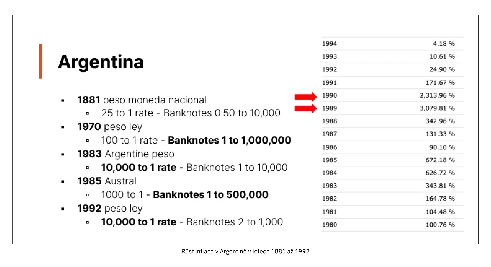

Na pravé straně snímku je zobrazen graf inflace. Červené šipky znázorňují roky hyperinflace, jak je definována podle Caganova kritéria, což je míra inflace 50 % měsíčně. Toto kritérium může někdy vést k nejednoznačnému výkladu, protože roky s vysokou mírou inflace nemusí splňovat striktní definici hyperinflace.

Za zmínku stojí redenominace, která je běžným opatřením vlád v období inflace. To však neřeší základní problém inflace nebo hyperinflace. Je to pouze způsob, jak přejmenovat měnu a odstranit nuly, aniž by se skutečně řešila hlavní příčina hyperinflace: expanze peněz Supply. V některém z pozdějších videí se budeme zabývat skutečným řešením Address a vyřešením problému hyperinflace. V této sérii upozorníme na důsledky prosté redenominace bez odpovídajících reforem: inflace přetrvává.

Po Argentině se naše studie bude týkat Brazílie, Bolívie, Peru, Nikaraguy a Venezuely. Budeme zkoumat redenominace, které v těchto zemích proběhly.

### Argentina

Před rokem 1826 používala Argentina španělský dolar. Po získání nezávislosti v roce 1816 zavedla vlastní měnu založenou na španělském reálu, což vedlo k vytvoření podobné měny. Tabulka začíná rokem 1881, kdy bylo zavedeno "peso moneda nacional" s bankovkami v hodnotě do 10 000 EUR. Následovalo "peso ley", které se směňovalo v kurzu 100:1 a obsahovalo bankovky až do výše jednoho milionu. Poté se objevilo "argentinské peso" s kurzem 10 000 ku 1 (což odpovídá odstranění čtyř nul) a bankovkami do 10 000. V roce 2006 se objevilo "argentinské peso" s kurzem 10 000 ku 1 (což odpovídá odstranění čtyř nul). V roce 1985 byly zavedeny "australes", které se směňovaly v kurzu 1 000 ku 1 a byly k dispozici bankovky do 500 000 kusů. V roce 1992 bylo zavedeno současné "peso ley" v kurzu 10 000 ku 1, přičemž byly opět odstraněny čtyři nuly. Pouze v letech 1989 a 1990 došlo k hyperinflaci.

### Brazílie

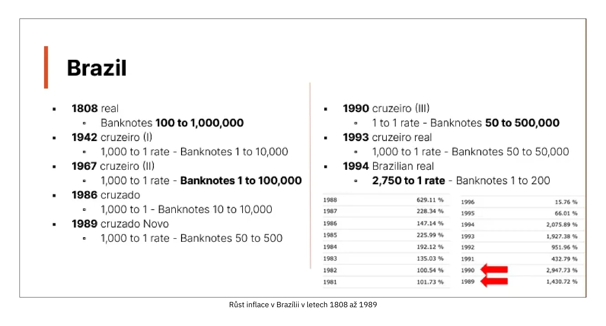

Brazílie je pozoruhodným příkladem měnové redenominace, což dokládá historie změn měny. Před získáním nezávislosti používala Brazílie jako svou měnu portugalský reál. Již v roce 1747 však země začala používat vlastní "brazilský reàl", a to dlouho před vyhlášením nezávislosti v roce 1822. Tabulka začíná rokem 1818, který označuje počátek vydávání brazilských bankovek. Předtím měla měna především podobu mincí. Tyto bankovky dosahovaly hodnoty až jednoho milionu reálů.

Od roku 1942 zahájila Brazílie sérii redenominací. Ve většině případů (1942, 1967, 1986, 1989, 1993) byl směnný kurz 1:1000. V roce 1990 došlo ke změně názvu bez konverze. Pořadí těchto měn je následující:

- Réals (stará verze) do roku 1942.
- Cruzeiros v roce 1942.
- Cruzeiros (nová verze) v roce 1967.
- Cruzados v roce 1986.
- Cruzados Novos v roce 1989.
- Návrat do Cruzeirosu v roce 1990.
- Cruzeiros Reais v roce 1993.
- Nakonec brazilský reàl v roce 1994.

Nejvyšší nominální hodnota bankovky dosáhla 500 000 a poslední redenominace v roce 1994 byla provedena v poměru 2 750 ku 1. Roky 1989 a 1990 byly poznamenány hyperinflací, zatímco v letech 1993-1994 byla zaznamenána vysoká míra inflace, která nedosáhla hranice hyperinflace (50 % měsíčně). Po tomto bouřlivém období Brazílie opět redenominovala svou měnu odstraněním několika nul.

### Bolívie

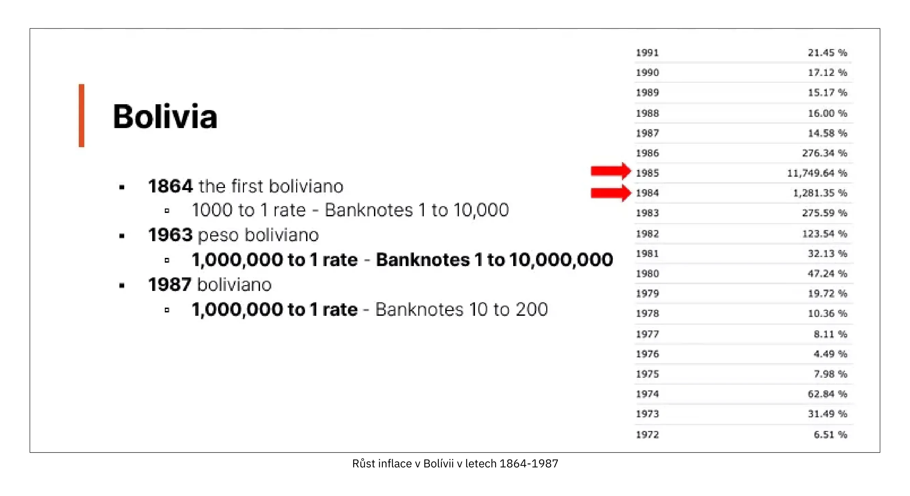

Bolívie je dalším příkladem země, která zažila období akutní inflace, jež si vyžádala redenominaci měny. Zde je shrnutí její měnové historie:

Před získáním nezávislosti v roce 1825 používala Bolívie jako svou měnu španělský dolar. Po získání nezávislosti byl v letech 1827-1864 zaveden bolívijský sol, který nahradil španělský dolar. Za zmínku však stojí, že první bankovky byly v Bolívii zavedeny až v roce 1864.

V roce 1864 byla zavedena první měna "Boliviano", jejíž kurz Exchange byl 1 000 ku 1 v porovnání s měnou Bolivian Sol. Tato měna zůstala v oběhu, dokud nedosáhla nominální hodnoty 10 000 bolivijských solů.

Následně Bolívie změnila svou měnu na "bolivijské peso", které zažilo silnou hyperinflaci a nakonec dosáhlo nominální hodnoty až 10 milionů. Tato epizoda inflace vyvrcholila v letech 1984-1985, kdy se měsíční míra inflace často blížila hranici hyperinflace 50 %. Pro představu, konstantní měsíční míra inflace ve výši 50 % za celý rok znamená roční míru inflace přibližně 12 800 %. V roce 1985 dosáhla roční míra inflace v Bolívii 11 749 %, což znamená, že inflace se téměř každý měsíc blížila hranici 50 % nebo ji překračovala.

V reakci na tuto měnovou krizi zavedla Bolívie v roce 1987 novou měnu nazvanou jednoduše "bolívano" s kurzem 1 milion bolívijských pesos za 1 bolívano. Tato verze bolívia je v oběhu dodnes.

To je přehled bouřlivé měnové historie Bolívie, která se vyznačovala obdobími hyperinflace a redenominace.

### Peru

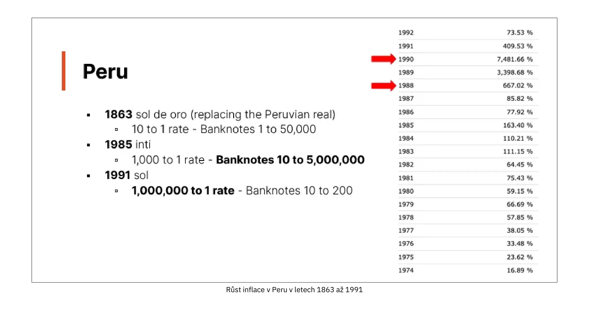

Peru představuje zajímavý případ, pokud jde o účinky svévolného pravidla 50 %. Počínaje historií měny Peru používalo španělské zlato až do 19. století, kdy v roce 1821 vyhlásilo nezávislost. Peruánský dolar se používal od roku 1822 do roku 1863. V roce 1863 byl peruánský reàl nahrazen měnou soldi oro v poměru 10:1, přičemž jeho maximální hodnota dosáhla 50 000. V roce 1863 byl peruánský reàl nahrazen měnou soldi oro. V roce 1985 byla zavedena měna "inti" s přepočítacím kurzem 1000 ku 1, s maximální hodnotou 5 milionů. V roce 1991 byla zavedena měna "SOL" s kurzem Exchange 1 milion ku 1, s bankovkami v hodnotě od 10 do 200. V roce 1991 byla zavedena měna "SOL" s kurzem 1 milion ku 1.

Při zkoumání období redenominace je rok 1988 považován za rok hyperinflace, zejména v září. Období hyperinflace bylo zaznamenáno také v červenci až srpnu 1990. V roce 1988 činila roční míra inflace 667 %, přičemž v září dosáhla maxima 50 %. Naproti tomu v roce 1989 dosáhla míra inflace 3000 %, aniž by některý měsíc přesáhla 50 %, takže nebyla klasifikována jako hyperinflace. V roce 1990 dosáhla inflace vrcholu 7481 %. Je zřejmé, že pravidlo 50 % může být arbitrární, protože rok 1988 byl na rozdíl od roku 1989 považován za rok hyperinflace. Pokud by se toto pravidlo přehodnotilo, bylo by možná rozumné snížit tuto hranici tak, aby zahrnovala i období, jaké zažilo Peru v roce 1989.

> Pochopení toho, co se děje
>

> Klíčové je pochopit, že když hodnota měny dosáhne astronomických hodnot, například 5 nebo 10 milionů, dochází k její redenominaci. Tento proces se může opakovat vícekrát a zahrnuje změnu měny. Výsledkem je, že úspory jednotlivců mohou být vážně postiženy, a to i v případě, že nedochází k hyperinflaci. Například pokud někdo v jednom roce ušetří 1 000 USD a podaří se mu odložit 100 USD, v následujícím roce může mít bankovka nejnižší nominální hodnoty hodnotu 1 000 USD, čímž se dříve ušetřených 100 USD stane bezcennými. Taková eroze úspor nevyžaduje zjevnou hyperinflaci. I když člověk za posledních deset let našetřil 10 000 dolarů, může se stát, že tato částka bude mít nakonec zanedbatelnou hodnotu a nebude si za ni moci koupit ani obyčejnou láhev vody. Tato realita je patrná v mnoha zemích, které zažily redenominaci, i když jen několik měsíců byly klasifikovány jako hyperinflační. Naproti tomu některé země, jako například Nikaragua, zažily několik po sobě jdoucích let hyperinflace.

### Nikaragua

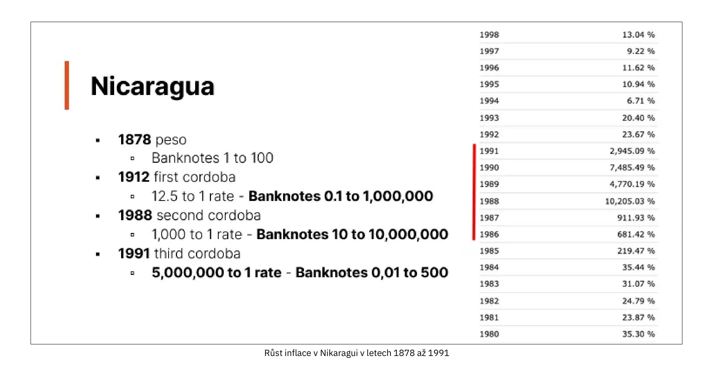

Nikaragua, která byla dříve pod španělskou nadvládou, zpočátku používala španělský dolar, stejně jako mnoho dalších zemí kolonizovaných Španělskem. Poté, co byla Nikaragua začleněna do Španělského impéria, Mexického impéria a následně do Federativní republiky Střední Amerika, vyhlásila nezávislost. Od roku 1878 se oficiální měnou v zemi stalo peso, jehož hodnota se pohybovala mezi 1 a 100. V roce 1878 byla zavedena měna peso. V roce 1912 byla v zemi zavedena první měna cordoba, v roce 1988 následovala druhá a v roce 1991 třetí, která se používá dodnes. První cordoba dosáhla hodnoty 1 milionu a druhá 10 milionů. Redenominace v roce 1991 následovala po několika letech hyperinflace.

### Venezuela

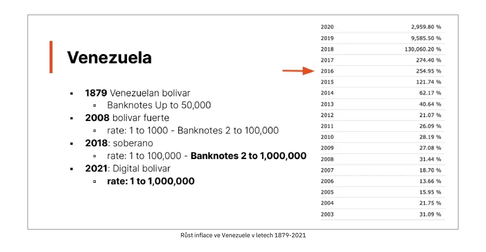

Venezuela je poslední zemí zmíněnou v tomto videu. Tato země prošla v průběhu času čtyřmi redenominacemi měny. Na počátku své existence používala Venezuela španělský dolar, než v roce 1811 vyhlásila nezávislost. V roce 1879 zavedla jako oficiální měnu bolívar, který platil až do roku 1983, kdy se vláda rozhodla pro systém plovoucího kurzu Exchange s použitím dolaru.

Pozoruhodnou skutečností o Venezuele je její členství v Latinské měnové unii. Tato unie zahrnovala mince, jako je 5 peset ze Španělska, 5 drachem z Řecka, 5 bolivarů z Venezuely, 5 lir z Itálie, 5 belgických franků a 5 francouzských franků.

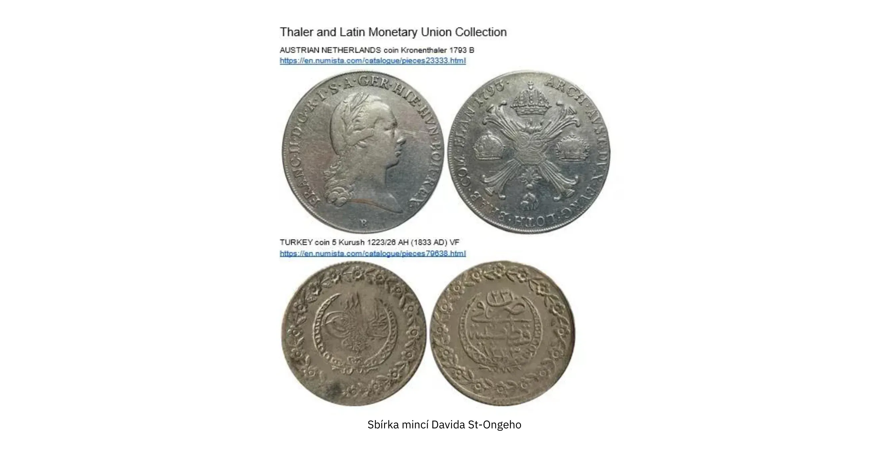

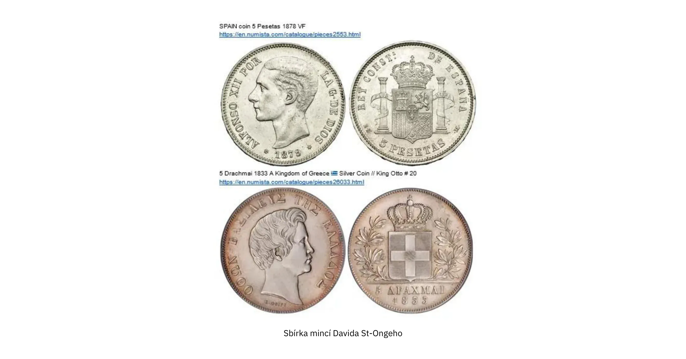

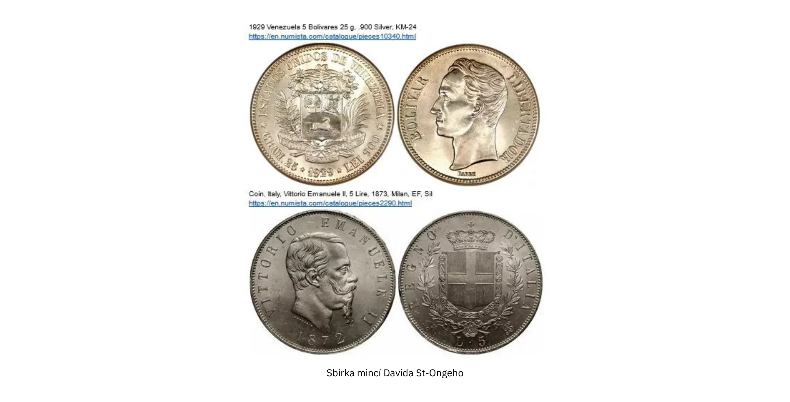

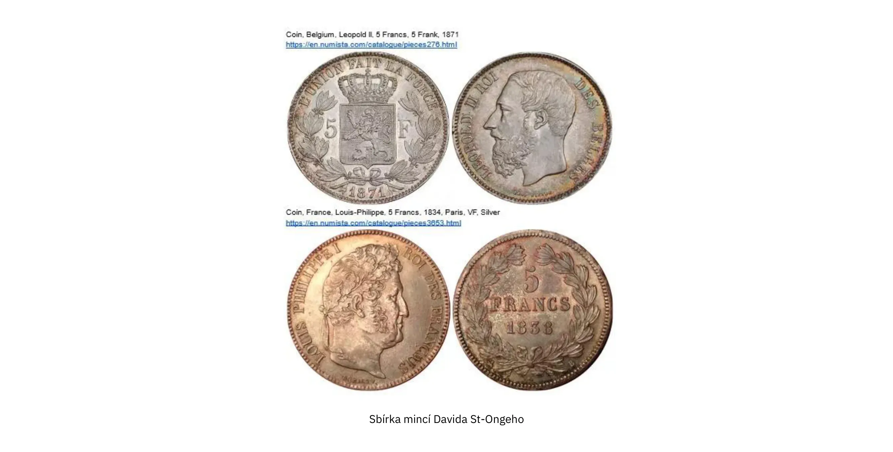

V tomto období měl 5 bolívarů Coin z Venezuely stejnou váhu jako bankovky členských zemí Unie, včetně Itálie, Španělska, Belgie a Francie. Tyto bolivary byly vyrobeny ze stříbra, přičemž konkrétní Coin z roku 1929 vážil 25 gramů a měl ryzost 900, tedy 90 % ryzího stříbra. Při současné ceně stříbra má tento Coin hodnotu přibližně 17 až 18 dolarů (v amerických dolarech).

Po přijetí plovoucího kurzu Exchange v roce 1983 následovalo několik redenominací:

- V roce 2008 byl zaveden bolívar fuerte neboli "silný bolívar", který před redenominací na tisíc ku jedné dosáhl hodnoty až 100 000.
- V roce 2018 byl zaveden systém Soberano, jehož účty dosáhly 1 milionu. V roce 2021 byl nahrazen digitálním bolivarem, který rovněž dosáhl jednoho milionu, než došlo k nové redenominaci v poměru jeden milion ku jedné. V současné době odpovídá bankovka v hodnotě 10 nebo 20 milionů 10 nebo 20 milionům v Soberano.

Účty z tohoto období, které sahají až do roku 2018, jsou distribuovány na různých konferencích Bitcoin v Biarritzu, Torontu a Miami. Tyto soberanské bankovky dosáhly maximální hodnoty 1 mil. Poté proběhla redenominace, která snížila hodnotu jednoho milionu na přibližně 3 centy. V současné době odpovídá 10 bankovek v hodnotě 1 milionu jedné bankovce v hodnotě 10. Od roku 2016 zažívá Venezuela hyperinflaci, která představuje 57. období v konkrétní tabulce.

V dalším videu bude představena sbírka hyperinflačních účtů se zaměřením na Venezuelu a další uvedené země. Tato kolekce obsahuje téměř všechny venezuelské bankovky. Studie se zaměří na různé redenominace pro každou z uvedených zemí. Kromě toho bude proveden průzkum redenominací v Zimbabwe, což je téma, které se těší značnému zájmu.

### Závěr

Viděli jsme, že hyperinflace není jediným ukazatelem ekonomické katastrofy. Vícenásobná redominalizace, odstranění nul nebo změna názvu měny má přímé dopady na obyvatelstvo, od ztráty pomoci až po problémy s potravinami. Ačkoli hyperinflace je znepokojující, počet redenominací, jak byl pozorován v Brazílii, ukazuje složitější realitu.

Na základě kritéria 50% měsíční inflace bylo možné několik období klasifikovat jako hyperinflaci. To platí zejména při zkoumání kritérií mezinárodní účetní organizace, která zohledňuje takové charakteristiky, jako je rychlé opuštění měny obyvatelstvem, indexace mezd a půjčky s vysokými úrokovými sazbami na kompenzaci inflace.

Závěrem lze říci, že hyperinflace je pouze jedním z aspektů ekonomických problémů. Stejně škodlivá může být i samotná vysoká inflace. V další části se budeme zabývat možnými řešeními, jak hyperinflaci překonat.

## Jak překonat hyperinflaci

<chapterId>e3484a31-a851-5f92-8af5-00eddae67db1</chapterId>

### Jak ukončit mírnou a vysokou inflaci

Uvedené závěry jsou převzaty z knihy "Monetary Regime and Inflation" od Petera Bernholze. Podle Bernholze je jedinou metodou, jak ukončit inflaci, provedení měnové reformy a zavedení fiskálních restrikcí pro vládu. Tato omezení zahrnují zřízení instituce, například centrální banky, která by fungovala nezávisle na politických rozhodnutích vlády. Vysoká a hyperinflace jsou často důsledkem financování rozpočtových deficitů prostřednictvím tvorby peněz. Pro zmírnění Address inflace je nezbytné snížit růst peněz Supply. Bernholz také navrhuje, aby tento růst peněz byl relativní vůči sousedním zemím. Překvapivé je, že v období vysoké nebo hyperinflace může celková hodnota peněz Supply ve skutečnosti klesat. Výrazným příkladem této situace je Zimbabwe.

### Kontraintuitivní řešení

Při studiu Zimbabwe bylo zjištěno, že 10 bilionů peněžních jednotek Supply ztratilo veškerou svou hodnotu. Ve Výmaru bylo možné vytisknout dvě třetiny celkové nominální hodnoty 65 miliard jednotek peněz Supply za jediný den. To ukazuje, jak lze peníze Supply znehodnotit. K nápravě této situace je nutné výrazně zvýšit hodnotu peněz Supply, aby dosáhla odpovídající úrovně. Pak je nezbytná měnová reforma. V situaci vysoké inflace je tato reforma nevyhnutelná, musí však zajistit dostatek peněz v oběhu. Po tomto kroku mohou být vládě uložena omezení.

Podle Bernholzových pozorování nepřijímají instituce jako MMF a Světová banka při řešení problémů s inflací vždy ty nejúčinnější strategie. V některých případech, kdy země potřebuje zvýšit objem peněz Supply, se tyto instituce snaží o jeho snížení. Klíčové je dosáhnout přiměřené úrovně měny a poté stanovit omezení jejího růstu, čímž se zabrání financování vládních výdajů prostřednictvím měnové tvorby.

Zajímavým aspektem, na který Bernholz upozorňuje, je skutečnost, že úspěch měnové reformy závisí nejen na její technické relevanci, ale také na důvěře, kterou v ni obyvatelstvo vkládá. Některé dobře navržené reformy mohou selhat, protože jim veřejnost nedůvěřuje, zatímco jiné, špatně navržené, mohou uspět, protože jim obyvatelstvo důvěřuje. Vnímání a důvěra veřejnosti jsou tedy zásadními Elements pro úspěch či neúspěch měnové reformy.

- V Zimbabwe se proti inflaci bojovalo dolarizací, tedy přijetím amerického dolaru nebo jiných měn sousedních zemí. Tento přístup brání vládě tisknout peníze podle libosti.
- V Německu bylo řešením vytvoření nové měny, rentenmarky. Tato měna byla kryta územním majetkem Říše a tato strategie se ukázala jako účinná.

### Případ Zimbabwe

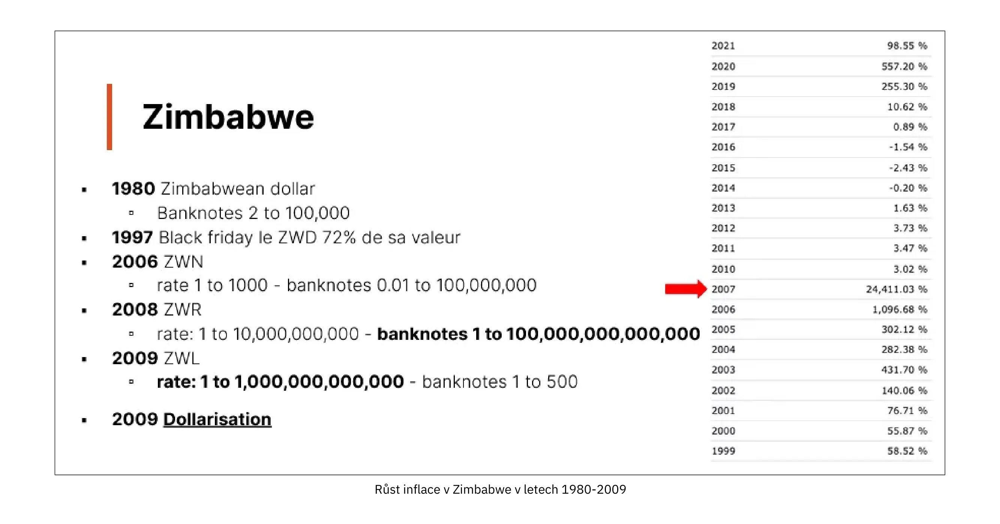

Zimbabwe získalo nezávislost v roce 1980 a zavedlo vlastní měnu, zimbabwský dolar. Zpočátku měly dva zimbabwské dolary hodnotu přibližně 1,60 amerického dolaru. V roce 1997 však v důsledku sociálních opatření ve prospěch válečných veteránů došlo během Černého pátku k devalvaci měny o 72 % během jediného dne. Na počátku roku 2000 pak země zahájila program přerozdělování půdy, který spočíval v odebírání půdy bílým vlastníkům a jejím rozdělování místnímu obyvatelstvu. Toto rozhodnutí poškodilo export, protože noví vlastníci často neměli potřebné odborné znalosti pro řízení velkých zemědělských podniků. Výsledkem bylo, že zatímco v roce 1999 byla Zimbabwe čistým vývozcem, v roce 2003 se stala čistým dovozcem.

V roce 2006 země zavedla novou verzi své měny, ZWN, s kurzem Exchange 1:1 000. V roce 2008 byla zavedena další měna, ZWR, s kurzem Exchange v poměru 1 : 10 miliardám. To vedlo k vytvoření ikonických bankovek v hodnotě 100 bilionů.

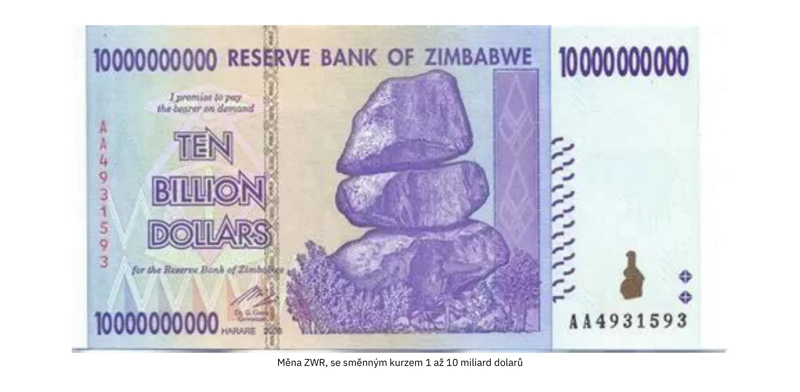

#### Dolarizace a řešení krizí

Proto Zimbabwe po roce 2009, kdy čelilo přetrvávající měnové krizi a rozbujelé hyperinflaci, opustilo svou národní měnu a povolilo používání zahraničních měn, především amerického dolaru. Toto rozhodnutí, ačkoli bylo radikální, ukončilo hyperinflaci. Klíčovým poučením je, že zastavení nadměrné emise peněz a ukončení financování rozpočtového deficitu centrální bankou může pomoci zabránit hyperinflaci.

Dolarizace však není zázračným řešením. I když může ukončit hyperinflaci, představuje další ekonomické problémy. Jedním z důsledků je ztráta autonomní měnové politiky. Bez vlastní měny nemůže země upravovat svou měnovou politiku tak, aby reagovala na vnitřní ekonomické šoky.

V roce 2007 dosáhla míra inflace v Zimbabwe hranice 50 % měsíčně, což zemi oficiálně označilo za hyperinflaci. Po dolarizaci v roce 2009 hyperinflace ustala, země však nadále čelila dalším hospodářským problémům.

Je znepokojující, že Zimbabwe se od té doby pokusilo znovu zavést vlastní měnu a objevily se známky vysoké inflace. Podle některých mezinárodních organizací již země možná opět splňuje kritéria hyperinflace, i když zatím nedosáhla oficiální hranice 50 % měsíčně. To slouží jako připomínka nebezpečí nadměrné emise peněz a financování deficitu centrální bankou.

### Závěr

Ve své knize nazvané "Vše o Bitcoin" jsem věnoval celou kapitolu hyperinflaci v Zimbabwe. Podrobně popisuji významné události a uvádím různé příklady, které ilustrují, jak země nakonec hyperinflaci ukončila.

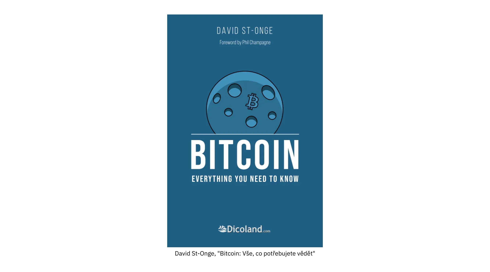

Těm, které zajímá německá zkušenost po první světové válce, vřele doporučuji komiks "Říšský bankéř" Vypráví o tom, jak se Německu podařilo překonat hyperinflaci, zejména díky vytvoření rentenmarky.

Klíčovým poznatkem je, že existuje několik strategií, jak překonat hyperinflaci. Lze zvolit dolarizaci nebo zavést novou měnu. Tato řešení budou fungovat pouze v případě, že k nim bude mít obyvatelstvo důvěru. Zásadní je zavést přísná omezení. Zásadní je skutečně nezávislá centrální banka. Nesmí nafukovat peníze Supply, aby pokryla vládní deficity. V případě mírné inflace by mělo stačit omezit růst peněz Supply. V případě hyperinflace je však nezbytné mít nejprve přiměřený objem peněz Supply ve vztahu k velikosti ekonomiky. Poté je nezbytné uvalit na vládu přísná omezení, aby se situace stabilizovala.

## Prezentace sbírky hyperinflačních bankovek

<chapterId>f3ffbb47-3aeb-54bd-80a9-adccb0f419e2</chapterId>

[Objevte naskenovanou kolekci v *Bitcoin Educational Toolkit* (také přístupné z části *Zdroje* na platformě Plan ₿ Academy.](https://penpot.planb.network/#/view?page-id=c157057b-fd28-8042-8004-4f081b21defc&file-id=c157057b-fd28-8042-8004-4f081b21defb&section=interactions&index=0&share-id=7154756b-3ebd-8040-8004-6475c2af5889&interactions-mode=show-on-click)

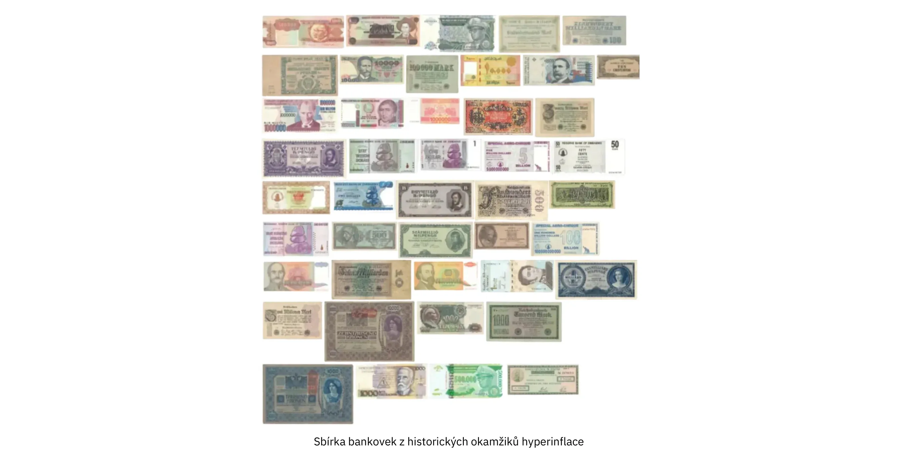

# Jak jsme se sem dostali?

<partId>f66ca17e-be9e-5d30-a098-f7affd8962a1</partId>

## Vznik druhé Layer peněz a centrálních bank

<chapterId>0455ffe3-9d45-5a67-ac96-3f815dc507a1</chapterId>

Přepis:

Vznik druhého Layer peněz a prvních centrálních bank je fascinující téma. Toto téma je obsáhle rozebráno v knize Nicka Battii "Vrstvené peníze". Vřele ji doporučuji těm, kteří se zajímají o vývoj a složitosti našich peněžních systémů. Cílem této části je pochopit původ tvorby peněz a to, jak mohla vést k hyperinflaci.

### Pyramidové peníze a centrální banky

#### Florin

Historie peněz sahá až do 13. století v Itálii, konkrétně ve Florencii. V té době byly běžné florény a bankovky Exchange. Pozoruhodným příkladem je florin, který zdobí postava svatého Jana Křtitele.

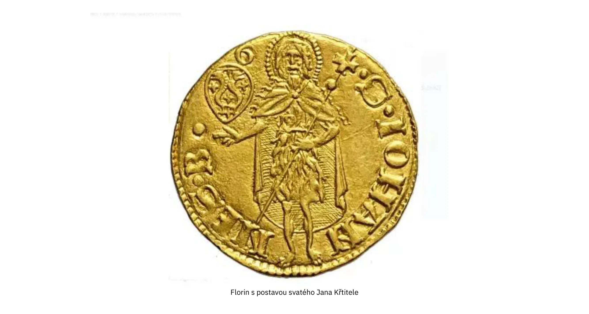

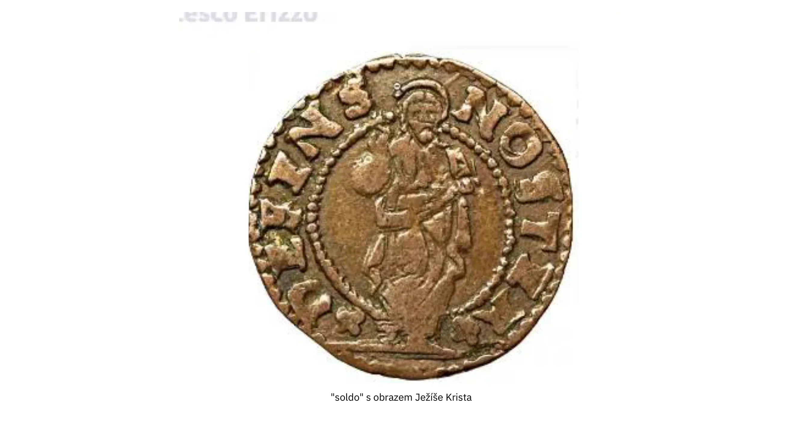

I když je dnes vlastnictví pravého florénu drahé, jsou k dispozici jeho reprodukce. Existují i další měny z té doby, například soldo z italských států 17. století, na němž je vyobrazen Kristus.

#### Účty Exchange (13. století)

Běžná praxe v té době byla následující: zlatníci vydávali směnky Exchange v Exchange za složené florény. Tyto florény pečlivě uchovávali ve svých trezorech. Skutečné zlato, představované florénem, tak tvořilo první Layer peněz, zatímco směnky Exchange tvořily druhý Layer. V tomto případě se jednalo o zlaté peníze. Likvidita tohoto systému však byla omezená. Pokud chtěl někdo vyměnit své zlato Redeem za směnku Exchange, byla transakce jednoduchá. Výměna těchto bankovek mezi jednotlivci však nebyla běžnou praxí.

#### Antverpská zásoba Exchange (16. století)

Antverpská burza Exchange znamenala klíčový milník ve vývoji papírových peněz. Právě tam byla zavedena praxe diskontování směnek. Tyto směnky byly papírovými nástroji představujícími peněžní hodnotu, ale jejich jedinečnost spočívala v tom, že byly opatřeny jménem a datem splatnosti. Díky tomu bylo obtížné je Exchange před datem splatnosti.

Revoluce, kterou přinesla antverpská burza Exchange, spočívala v možnosti diskontovat tyto směnky před datem jejich splatnosti. Například pokud byla směnka splatná za měsíc, bylo možné ji koupit za diskontovanou cenu, aby se zohlednila doba před datem splatnosti. Tato inovace nejenže zvýšila hodnotu papírové měny Liquid, ale také zavedla pojem časové hodnoty peněz.

Tento koncept, ačkoli je spojován s Nickem Bellem prostřednictvím jeho twitterového pseudonymu "time value of BTC", není jeho vynálezem. Přesto se jím ve své práci podrobně zabývá. Hlavní myšlenkou je, že čas má hodnotu. Pokud se tedy někdo rozhodne zaplatit směnku v hodnotě 100 dolarů na měsíc dopředu, může ji získat například za 98 dolarů a v den splatnosti obdržet 100 dolarů. Tato peněžní inovace vznikla na antverpské burze Exchange.

#### VOC a amsterdamská burza (17. století)

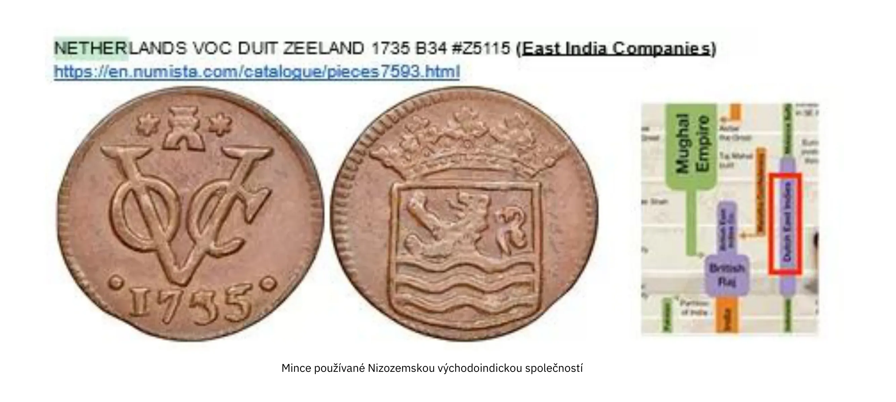

Po založení antverpské burzy Exchange bylo významným mezníkem založení VOC, Nizozemské východoindické společnosti. Tato společnost se sídlem v Nizozemsku dokonce vydávala vlastní měnu. Po vzniku VOC byla v Amsterdamu založena první burza, která znamenala počátek burzovních operací společnosti. Zajímavé je, jak se Nizozemcům podařilo ukončit nadvládu Antverp jako mezinárodního hospodářského centra. Jednoduše zablokovali přístup k řece Šeldě. Tato strategie byla součástí většího historického hnutí, vzpoury žebráků. Zásadní událost evropských dějin.

#### Zásah Bank of Amsterdam

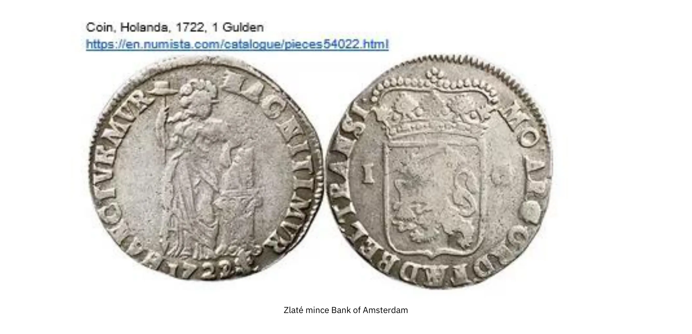

Po založení VOC se další významnou událostí v měnové historii stalo zavedení zlatých mincí amsterodamskou bankou. Tyto mince z roku 1722 byly vyrobeny ze stříbra. Skutečnou revoluci v tehdejším finančnictví však nepředstavovala ani tak samotná Coin, ale účty spojené s touto měnou v amsterodamské bance. Tyto účty se staly hlavním prostředkem mezinárodního platebního styku Exchange. Transakce se jednoduše zaznamenávaly do registrů nebo účetních knih. Díky tomuto systému se Amsterdam stal světovým ekonomickým centrem. Postupem času se amsterodamská banka rozhodla používání těchto účtů prosadit. Nezávislí směnárníci museli denně Exchange své mince ukládat do banky.

#### Vytvoření Bank of England k financování války

Vznik Anglické banky byl motivován potřebou financovat válku na konci 17. století. Stejně jako Amsterdamská banka zaváděla vklady na základě dekretu. Zvláštností Bank of England bylo odsunutí soukromých bank do druhořadého postavení v měnovém systému, čímž vzniklo něco, co by se dalo nazvat "třetí Layer" měny.

Zpočátku představovalo první měnu Layer zlato. Vklady v soukromých bankách tvořily druhý Layer. Když však tyto vklady již nemohly být převedeny na zlato, objevil se třetí Layer měny. Od té doby již bankovky vydané soukromými bankami nebyly směnitelné za zlato, ale za papírovou měnu Bank of England, která sama byla směnitelná za zlato. Tento vývoj vedl ke zkomplikování měnového systému přidáním dalších vrstev.

#### Panika v roce 1796

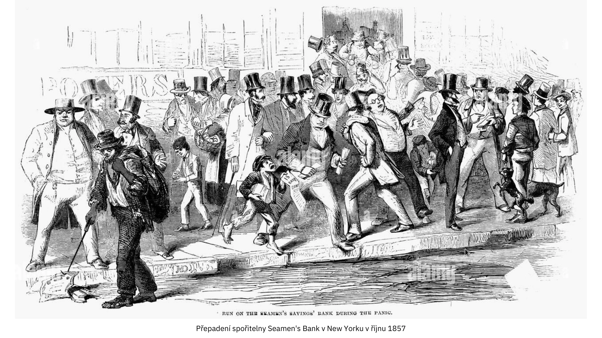

Bankovní panika v Seamen's Savings Bank během paniky v roce 1857.

Po bankovní panice v roce 1796 došlo k fenoménu, kdy se všichni snažili dostat na vyšší úroveň "peněžní pyramidy" Lidé chtěli vyměnit svou měnu Exchange třetího řádu za měnu druhého řádu a nakonec za měnu prvního řádu, což bylo zlato. Tváří v tvář tomuto masivnímu návalu byla Bank of England nucena přijmout opatření ke stabilizaci situace. Aby zabránila možné deflaci zlatých rezerv, rozhodla se pozastavit směnitelnost svých bankovek za zlato. Toto pozastavení, původně zamýšlené jako dočasné opatření, trvalo přibližně dvě desetiletí.

### Závěr:

Centrální banky se staly věřiteli poslední instance a pozastavily směnitelnost své měny za zlato. Ačkoli toto opatření bylo původně zamýšleno jako dočasné řešení, nakonec se stalo trvalým a znamenalo nástup konceptu věřitele poslední instance. Tato transformace formovala centrální banky tak, jak je známe dnes. V křehčích ekonomikách však může tato možnost tisknout peníze podle libosti vést při nezodpovědném používání k nežádoucím důsledkům, jako je hyperinflace.

## Knihy a zdroje

<chapterId>c44e4519-0741-527b-b3b0-3f513e87147d</chapterId>

Hyperinflace je fascinující téma, které bylo zkoumáno v různých historických událostech. Pokud se chcete do tohoto tématu ponořit hlouběji, přinášíme vám seznam 10 základních zdrojů, které je třeba přečíst a prostudovat:

- "Když peníze umírají: Noční můra deficitních výdajů, devalvace a hyperinflace ve výmarském Německu" od Adama Fergussona. Tato kniha podrobně popisuje hyperinflační krizi v Německu po první světové válce.

- "The Economics of Inflation - A Study of Currency Depreciation in Post-War Germany" (Ekonomie inflace - studie znehodnocování měny v poválečném Německu), Costantino Bresciani-Turroni. Podrobná analýza německé hyperinflace ve 20. letech 20. století.

- "Tentokrát je to jiné: Reinhartové a Kennetha S. Rogoffa. Přestože se kniha zabývá různými typy finančních krizí, podrobně se věnuje hyperinflaci v průběhu historie.

- "Hyperinflace v Zimbabwe, analýza a poučení" Steve Hanke. Studie o zimbabwské hyperinflaci na počátku roku 2000.

- "Měnové režimy a inflace: Bernholz: "Historie, ekonomické a politické vztahy". Kniha zkoumá historické případy hyperinflace a snaží se pochopit základní faktory.

- "Průvodce přežitím hyperinflace: Strategie pro americké podniky" od Geralda Swansona. Praktický průvodce, jak mohou podniky projít hyperinflačním prostředím.

- "Umírání kvůli penězům: Jens O. Parsson: "Poučení z velkých německých a amerických inflací". Srovnávací analýza inflačních krizí v Německu a Spojených státech.

- "Pád peněz: Frederick Taylor: "Pád peněz: hyperinflace v Německu a zničení střední třídy". Vyprávění o sociálním a ekonomickém dopadu hyperinflace na německou společnost.

- "Měnové rady pro rozvojové země: A Handbook" autorů Steva Hankeho a Kurta Schulera. Přestože se kniha zaměřuje na měnové rady, nabízí pohled na to, jak se vyhnout hyperinflačním situacím.

# Závěrečná část

<partId>cb1f4a4b-556a-4e47-a5cc-136be35a1f9a</partId>

## Recenze a hodnocení

<chapterId>1a37317e-372a-5241-b478-8316d44f9283</chapterId>

<isCourseReview>true</isCourseReview>

## Závěrečná zkouška

<chapterId>d01831c3-6c4d-59e3-95bc-03e97a05c142</chapterId>

<isCourseExam>true</isCourseExam>

## Závěr

<chapterId>45d410b0-71ed-4502-8d8d-8b6df761db23</chapterId>

<isCourseConclusion>true</isCourseConclusion>