# Eine Reise durch den wirtschaftlichen Zusammenbruch

Wie sieht es aus, wenn Geld seine Bedeutung verliert?
Dieser Kurs führt Sie durch die faszinierende und zugleich ernüchternde Welt der Hyperinflation. Sie werden historische Episoden und moderne Fälle entdecken, in denen Währungen zusammenbrachen und sich Volkswirtschaften über Nacht verwandelten. Sie werden die Muster, Ursachen und realen Auswirkungen auf das Leben gewöhnlicher Menschen aufdecken und Einblick in eines der dramatischsten Phänomene der Wirtschaft gewinnen.

Auf dem Weg werden Sie auch entdecken, wie Einzelpersonen und Gemeinschaften diese turbulenten Zeiten gemeistert haben. Lernen Sie die Strategien kennen, die geholfen haben, Vermögen während Währungskrisen zu schützen, und entwickeln Sie ein tieferes Verständnis für finanzielle Widerstandsfähigkeit. Wenn Sie neugierig auf die wirtschaftlichen Kräfte sind, die unsere Welt prägen, bietet diese Reise sowohl Wissen als auch praktische Perspektiven.
+++
# Einführung

<partId>6fe4d15d-f6e6-54be-9e04-0a75ac98df8b</partId>

## Kursübersicht

<chapterId>9d1aba8d-0485-5020-9863-5de37e6db8e0</chapterId>

Willkommen im Kurs ECO204!

Ziel dieses Kurses ist es, Ihnen ein Verständnis für die tieferliegenden Ursachen, Mechanismen und Folgen von Hyperinflationen im Kontext eines Fiat-Währungssystems zu vermitteln. Anhand konkreter Beispiele und historischer Analysen lernen Sie, wiederkehrende Muster zu erkennen, die Hyperinflationsphasen vorausgehen, und geeignete Maßnahmen zum Schutz davor zu identifizieren.

**Abschnitt 2: Was ist Inflation?**  
Bevor wir in das Kernthema einsteigen, kehren wir zu den Grundlagen zurück: Was ist Inflation? In diesem Abschnitt werden ihre monetären Ursprünge, die verschiedenen Arten von Inflation und deren Einbettung in breitere wirtschaftliche Zusammenhänge vorgestellt. Dies ist ein unverzichtbarer Schritt, um zu verstehen, wie gewöhnliche Inflation in Hyperinflation übergehen kann.

**Abschnitt 3: Was ist Hyperinflation?**  
In diesem Abschnitt untersuchen Sie die genauen Definitionen von Hyperinflation sowie mehrere bedeutende historische Episoden, darunter das Weimarer Deutschland und Simbabwe. Wir analysieren Gemeinsamkeiten, Unterschiede und moderne Parallelen. Sie entdecken auch weniger bekannte Fälle, wie wiederholte Währungsumstellungen in Lateinamerika, sowie Auswege, die einige Länder gefunden haben.

**Abschnitt 4: Wie sind wir hierher gekommen?**  
In diesem Teil geht es um die strukturellen Mechanismen, die Hyperinflation ermöglichen, insbesondere durch die Entwicklung der „zweiten Geldschicht“ und die Rolle der Zentralbanken. Ergänzende Ressourcen und weiterführende Literaturvorschläge werden bereitgestellt.

Wiederholt sich die Geldgeschichte gerade vor unseren Augen? Urteilen Sie selbst in den folgenden Kapiteln!

# Was ist Inflation?

<partId>2b4f456c-3649-5cf9-b9b0-a5bffe92d962</partId>

## Ein monetäres Phänomen

<chapterId>b2cbc915-c4ec-52b5-860c-0958f58c91e4</chapterId>

### Definitionen von Inflation

Inflation ist ein oft missverstandenes Konzept aufgrund der vielfältigen Definitionen, die damit verbunden sind. Die Wahrnehmung von Inflation variiert zwischen verschiedenen Gruppen wie Bitcoinern und traditionellen Ökonomen. Lassen Sie uns zuerst die Definitionen klären, bevor wir uns mit Hyperinflation befassen:

- Definition des Robert: Inflation ist eine übermäßige Zunahme der Zahlungsinstrumente (Banknoten, Kapital), die zu einem Anstieg der Preise und einer Abwertung der Währung führt.

- Definition des Larousse: Inflation ist ein Phänomen, das durch eine allgemeine und kontinuierliche Erhöhung des Preisniveaus gekennzeichnet ist. Hier ist das Wort "allgemein" entscheidend.

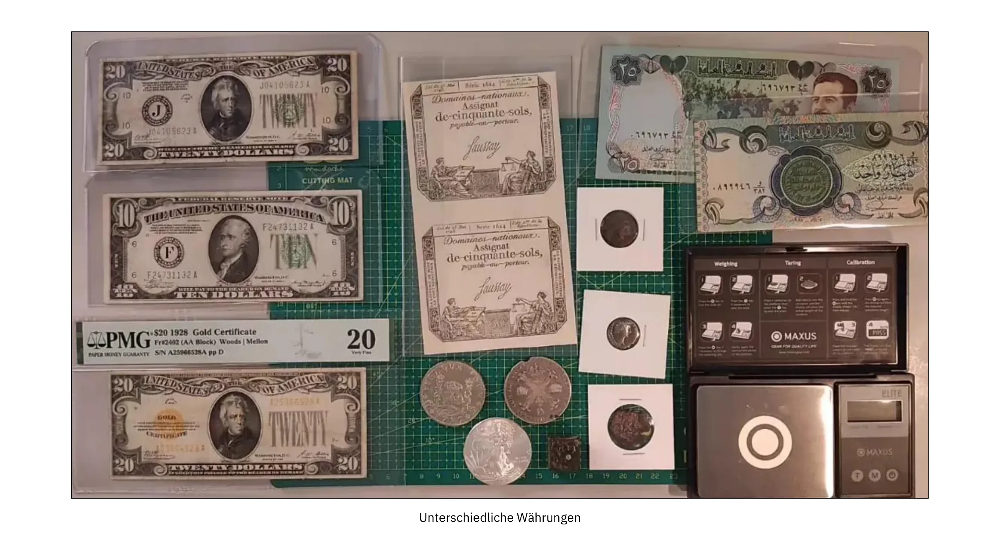

Im Lichte dieser Definitionen ist es wichtig zu verstehen, dass Inflation nach Robert hauptsächlich die Zunahme der Geldmenge betrifft. Das Larousse hingegen konzentriert sich auf die Auswirkungen dieser Expansion, nämlich die allgemeine Preiserhöhung.

In unserer Untersuchung zur Hyperinflation werden wir uns auf die zweite Definition konzentrieren, die allgemeine Preiserhöhung, da sie für unser Thema relevanter und klarer ist. Es ist jedoch wichtig, sich daran zu erinnern, dass diese Preiserhöhung in der Regel das Ergebnis der Ausweitung der Geldmenge ist.
Der renommierte Ökonom Milton Friedman hat berühmt gesagt:

> "Inflation ist immer und überall ein monetäres Phänomen."

Diese Aussage betont die intrinsische Beziehung zwischen Geldmengenwachstum und Inflation. In den nächsten Abschnitten werden wir die Wechselwirkungen zwischen Inflation und wirtschaftlichem Wachstum untersuchen und uns auf diese grundlegenden Definitionen stützen.

### Das monetäre Phänomen verstehen

Wenn vom monetären Phänomen die Rede ist, bezieht man sich auf die Art und Weise, wie die Geldmenge einer Volkswirtschaft beeinflusst wird. Milton Friedman sah darin im Wesentlichen eine Zunahme dieser Geldmenge. Historisch betrachtet gibt es zwei Hauptmethoden, um die Geldmenge zu erhöhen:

1. Geld drucken:
   In traditionellen Währungssystemen wurde die Erhöhung der Geldmenge durch physisches Drucken neuer Banknoten erreicht. Obwohl heutzutage, mit der Dominanz digitaler Währungen, dieser Druck hauptsächlich elektronisch erfolgt (über Datenbanken von Zentralbanken und anderen Finanzinstituten), zeigt uns die Geschichte Zeiten, in denen das wörtliche Drucken von Banknoten zu Hyperinflation führte.

2. Reduzierung des Metallgehalts:
   Eine andere Methode bestand darin, die Menge an Edelmetall in Währungen zu reduzieren, die auf Metallen wie Silber oder Gold basieren. Ein markantes Beispiel findet sich im Römischen Reich, wo der Denar, der ursprünglich fast ausschließlich aus Silber bestand, im Laufe der Zeit drastisch an Silbergehalt verlor. Dies entsprach einer Form von Inflation, aber nicht unbedingt einer Hyperinflation.

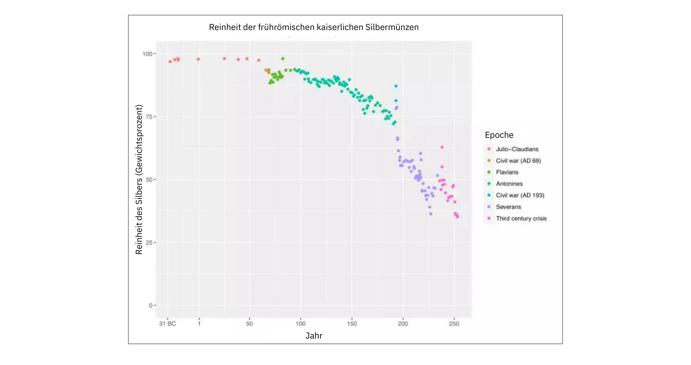

Es ist wichtig zu betonen, dass Hyperinflation hauptsächlich bei Fiat-Währungen beobachtet werden kann, die von ihren zugrunde liegenden Vermögenswerten wie Edelmetallen entkoppelt sind. Historisch gesehen gab es bei Währungen, die auf solchen Vermögenswerten basierten, Episoden von Inflation (z.B. durch Abwertung des Metallgehalts), aber diese Episoden erreichten nie die extremen Niveaus der Hyperinflation. In den folgenden Abschnitten werden wir uns eingehend mit den Epochen der Währungsbewertung und den Auswirkungen dieser verschiedenen Währungssysteme auf die Inflation befassen.

### Untersuchung von Epochen der Währungsabwertung

Im Laufe der Geschichte haben verschiedene Zivilisationen Phasen der Währungsabwertung erlebt. Einige dieser Phasen fallen mit bedeutenden Ereignissen oder Kriegen zusammen, die einen Druck auf die Wirtschaft ausübten.

#### 1. Peloponnesischer Krieg und Zweiter Punischer Krieg:

Der Peloponnesische Krieg, ein Konflikt zwischen Athen und Sparta, und der Zweite Punische Krieg, bei dem die Römische Republik gegen Karthago kämpfte, sind die ersten Beispiele für Währungsabwertungen, die in den Archiven zu finden sind. Um diese Kriege zu finanzieren, entwerteten diese Zivilisationen ihre Währungen durch den Einsatz von Edelmetallen. Sie nahmen Münzen, die hauptsächlich aus Silber bestanden, und fügten ihnen andere Metalle hinzu, um den Silbergehalt zu verringern, während sie die Anzahl der produzierten Münzen erhöhten.
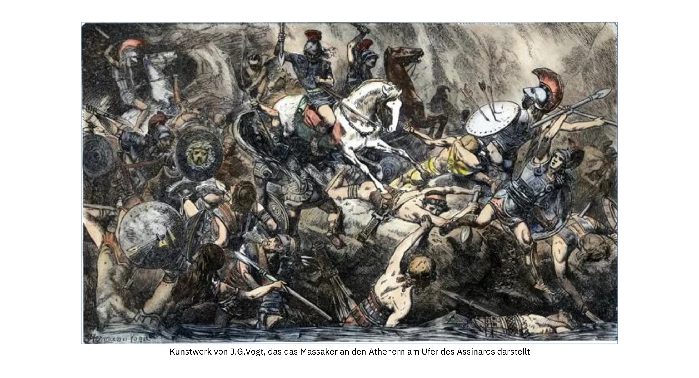

Gravur, die das Massaker der Athener an den Ufern des Assinaros darstellt.

#### 2. Das antike Rom während des Kaiserreichs:

Nach der Zeit der Römischen Republik gab es während des Kaiserreichs im 3. und 4. Jahrhundert eine deutliche Währungsabwertung. Dies wird durch die Abnahme des Silbergehalts der Münzen, wie im vorherigen Diagramm gezeigt, veranschaulicht. Eine Studie zeigt, dass der Preis für Weizen in Ägypten, gemessen in Drachmen, über einen Zeitraum von etwa 400 Jahren um den Faktor einer Million gestiegen ist, von 40 vor Christus bis 360 nach Christus. Über diesen Zeitraum hinweg entspricht dies einer durchschnittlichen jährlichen Inflation von etwa 4,4%. Diese Inflation war jedoch nicht gleichmäßig verteilt. Sie begann tatsächlich um 238 nach Christus. Von 250 bis 293 nach Christus betrug die Inflationsrate etwa 3,65% und stieg zwischen 293 und 301 nach Christus auf 22,28%.

Obwohl diese Zeiträume eine signifikante Inflation erlebten, erreichten sie nicht das Niveau der Hyperinflation, wie wir sie in einigen modernen Situationen beobachten können. Der Grund dafür ist, dass die Währung trotz der Abwertung immer noch auf Edelmetallen basierte. Diese solide Basis bot einen gewissen Schutz vor extremen Inflationsniveaus. In den folgenden Abschnitten werden wir die Natur und die Auswirkungen der Hyperinflation genauer untersuchen.

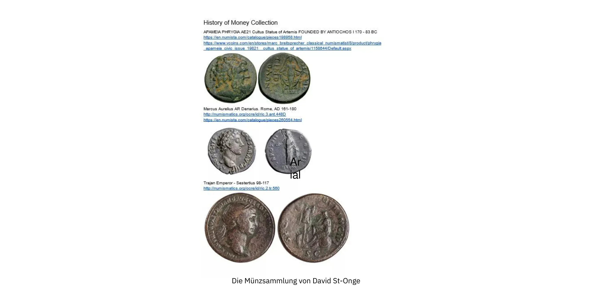

- Der Denar von Mark Aurel (160 nach Christus):
  Eine der ikonischsten Münzen des antiken Rom ist der Denar, eine Silbermünze. Ich besitze eine spezifische Münze von Mark Aurel aus dem Jahr 160 nach Christus, vor der großen Abwertung. Obwohl die Kamera möglicherweise Schwierigkeiten hat, die feinen Details einzufangen, kann man mit bloßem Auge erkennen, dass es sich um eine schöne Silbermünze handelt, die einen relativ hohen Silbergehalt widerspiegelt.

- Der Antoninianus (Ende des 3. Jahrhunderts nach Christus):
  Mit der Währungsabwertung tauchte eine neue Währung namens Antoninianus auf. Diese Währung sollte zwei Denare wert sein, enthielt aber viel weniger Silber. Meine Antoninianus-Münze zeigt deutlich, dass der Silbergehalt erheblich reduziert wurde. Sie ist mit einer Krone verziert, typisch für römische Münzen dieser Zeit, genannt "radiates". Beim Vergleich von Farbe und Qualität sieht man, dass der Antoninianus weit entfernt von einer reinen Silbermünze ist.
  Beim direkten Vergleich der beiden Münzen ist der Unterschied offensichtlich. Der Denar von 160 nach Christus hat ein deutlich silbernes Aussehen, während der Antoninianus vom späten 3. Jahrhundert nach Christus viel matter ist und auf eine signifikante Reduzierung des Silbergehalts hinweist. Dieser visuelle Vergleich veranschaulicht deutlich die Währungsabwertung, die das antike Rom in wenigen Jahrhunderten erlebte.

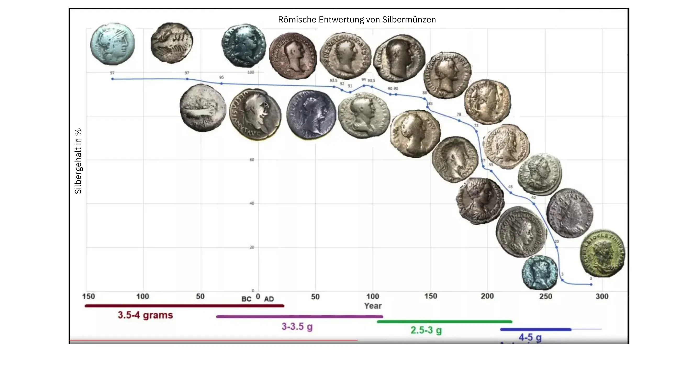

Um diese Demonstration abzurunden, wäre eine Grafik, die die Abwertung dieser Münzen im Laufe der Zeit zeigt, ideal. Obwohl dies auf dieser Plattform schwer vorstellbar ist, stellen Sie sich ein Diagramm vor, das den Wert des Denars zeigt und dann seinen Rückgang gegen Ende des 2. Jahrhunderts, als er durch den Antoninianus ersetzt wurde, der angeblich zwei Denare wert war, aber einen viel geringeren Silbergehalt hatte. Diese Artefakte sind stille Zeugen für die wirtschaftlichen Schwankungen vergangener Zivilisationen.

#### 3. Der spanische Maravedí: Zeuge einer gezielten Abwertung

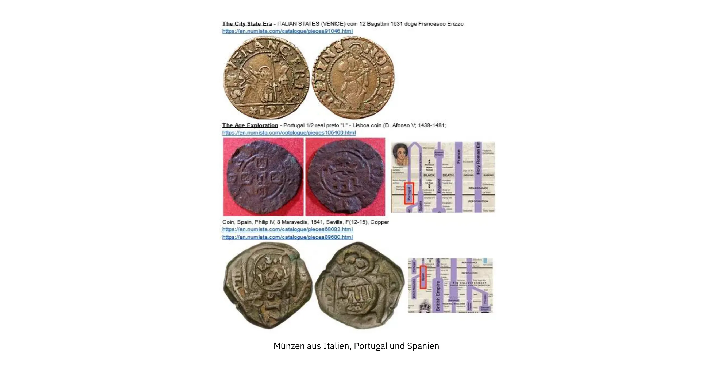

Der Maravedí, als Kupfermünze, nimmt einen besonderen Platz in der Geschichte des spanischen Geldes ein. Wie bereits erwähnt, war der spanische Dollar ursprünglich die internationale Leitwährung, eine wesentliche Reservewährung für Spanien. Angesichts einiger wirtschaftlicher Herausforderungen musste Spanien jedoch auf clevere Geldstrategien zurückgreifen.

Die Währungsabwertung ist ein oft von Staaten genutztes Instrument, um ihre Ausgaben zu finanzieren oder die Wirtschaft anzukurbeln. Spanien befand sich jedoch in einer schwierigen Situation. Die Verwässerung des spanischen Dollars hätte seine Position im internationalen Handel gefährdet. Um dieses Dilemma zu überwinden, wandte sich Spanien dem Maravedí zu.
Im Gegensatz zum wertvollen spanischen Silberdollar war der Maravédis eine Kupfermünze, die hauptsächlich von der lokalen Bevölkerung verwendet wurde. Diese Währung wurde zur Abwertung ausgewählt. Wenn eine Maravédis-Münze ursprünglich zwei Maravedis wert war, wurde sie vom Staat eingezogen, mit einem neuen Wert, zum Beispiel "vier", neu gestempelt und nur eine Münze an den Besitzer zurückgegeben. Die Münze mit dem Stempel "acht" ist ein Zeugnis dieses Prozesses, der mehrere Abwertungszyklen durchlaufen hat.

Diese Strategie ermöglichte es dem Staat, eine Währung effektiv abzuwerten, Inflation zu erzeugen und sich indirekt zu finanzieren, während die Integrität des spanischen Silberdollars auf der internationalen Bühne erhalten blieb. Diese gezielte Abwertung hatte jedoch Auswirkungen auf die lokale Bevölkerung, die den Wert ihrer gängigen Währung verwässert sah.

Der Fall des Maravédis verdeutlicht, wie ein Staat eine lokale Währung selektiv abwerten kann, um seinen internen wirtschaftlichen Bedürfnissen gerecht zu werden, während der Wert einer Reservewährung auf der globalen Bühne erhalten bleibt. Dies ist ein anschauliches Beispiel für die Komplexität und Feinheit der Geldpolitik in der Geschichte.

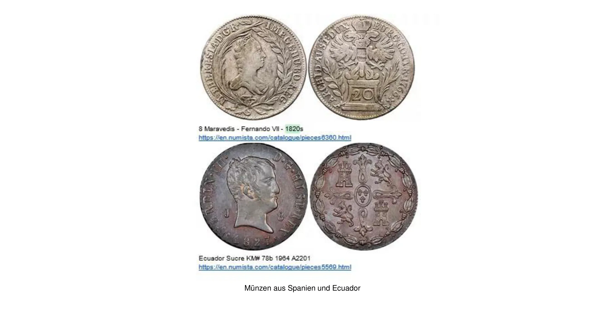

Mehr dazu -> https://docs.google.com/document/d/1aZa7gvz1nt8ZHDCoWKQdS9RGGjBHdipH1ApC8dW1xpM/edit?usp=sharing

#### 4. Preisrevolution vom 15. bis zum 17. Jahrhundert

Zwischen dem 15. und 17. Jahrhundert erlebte Europa ein bemerkenswertes wirtschaftliches Phänomen, das oft als "Preisrevolution" bezeichnet wird. Diese Zeit der Inflation wurde weitgehend durch einen massiven Zustrom von Edelmetallen, insbesondere Gold und Silber, aus Amerika ausgelöst. Da die europäische Wirtschaft damals weitgehend auf dem Metallstandard basierte, erhöhte dieser zusätzliche Zustrom von Metallen die Geldmenge. Infolgedessen manifestierte sich eine Inflation von etwa 1 bis 2 % pro Jahr. Auf den ersten Blick mag diese Inflation moderat erscheinen. Zu dieser Zeit war jedoch eine solche Preisschwankung ungewöhnlich genug, um als "Revolution" betrachtet zu werden. Dies verdeutlicht, wie sehr Veränderungen in den Geldreserven das gesamte Wirtschaftssystem beeinflussen können.

#### 5. John Law und die Assignaten

Im 18. Jahrhundert wurde die französische Wirtschaftsgeschichte von zwei bedeutenden Ereignissen im Zusammenhang mit der Währung geprägt. Zunächst überzeugte der schottische Ökonom und Finanzier John Law die französische Regierung, ein auf Papiergeld basierendes Währungssystem einzuführen. Obwohl dies anfangs als innovative Lösung für die finanziellen Probleme des Landes angesehen wurde, führte diese Initiative schnell zu einer galoppierenden Inflation. Kurz darauf, während der Unruhen der Französischen Revolution, führte die Regierung die "Assignats" ein.

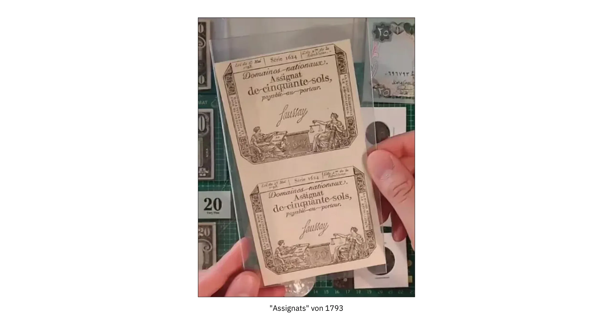

Diese Banknoten sind ein lebendiges Zeugnis für die erste große Hyperinflationsperiode in der Geschichte. Ursprünglich als Antwort auf aufeinanderfolgende Finanzkrisen konzipiert, wurden die Assignats schnell zum Symbol für monetäre Instabilität. Die Regierung verließ sich übermäßig auf dieses Papiergeld, um ihre Ausgaben zu finanzieren, was zu einer beispiellosen Wirtschaftskrise und einer großen Hyperinflationsperiode in Frankreich nach der Revolution führte.

#### 6. Der Executive Order 6102 und die Abwertung des Dollars

In den Vereinigten Staaten gab es in den frühen 1930er Jahren eine bedeutende Veränderung in der Geldpolitik. Hier ist eine detaillierte Übersicht über diese Transformation:

- Die 20-Dollar-Note von 1928

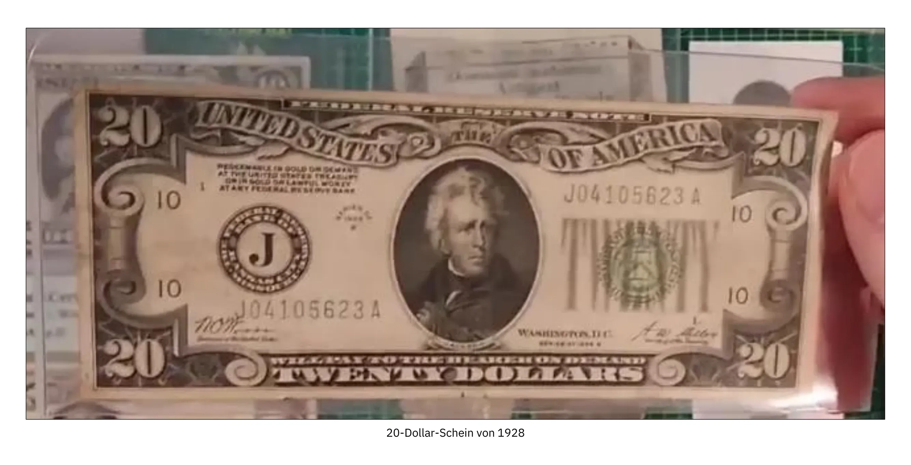

Im Jahr 1928 trug ein 20-Dollar-Schein den Vermerk "auf Verlangen in Gold einlösbar". Das bedeutet, dass jeder Schein buchstäblich in Gold umtauschbar war. Genauer gesagt entsprach ein 20,67-Dollar-Schein einer Unze Gold.

- Executive Order 6102

Im Jahr 1933 kam es zu einer bedeutenden Umwälzung mit der Ausgabe der Executive Order 6102. Diese Verordnung machte den Besitz von Gold für Bürger illegal, egal ob es sich um Barren, Münzen oder Zertifikate handelte.

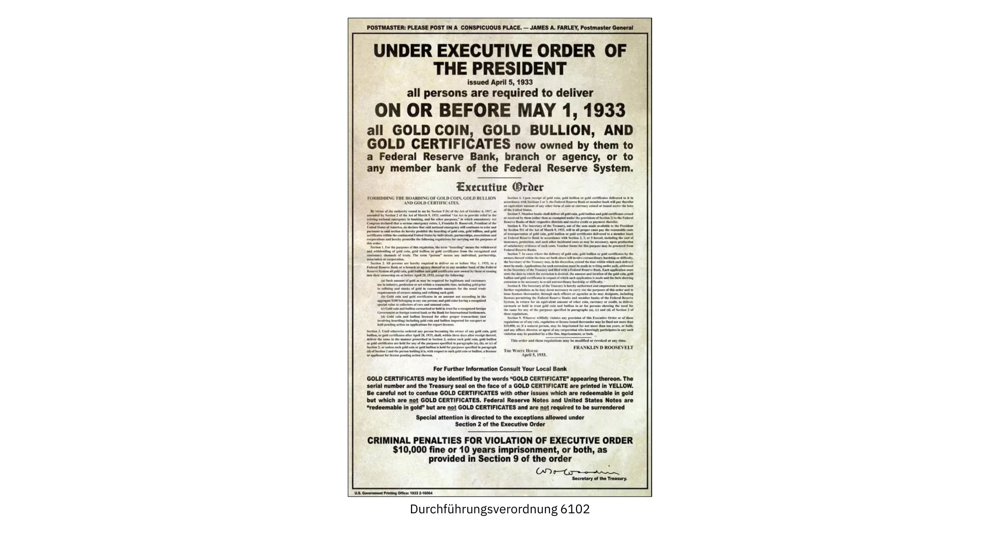

Das Goldzertifikat ist ein gutes Beispiel. Es war mit der Aufschrift versehen: "In Goldmünzen zahlbar an den Inhaber auf Verlangen". Den Besitz eines solchen Zertifikats zu haben, wurde illegal und blieb dies bis 1964.

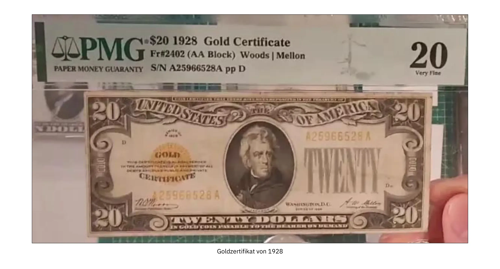

- Einführung neuer Banknoten

Nach der Beschlagnahme des Goldes wurde 1934 eine neue Serie von Banknoten in Umlauf gebracht.

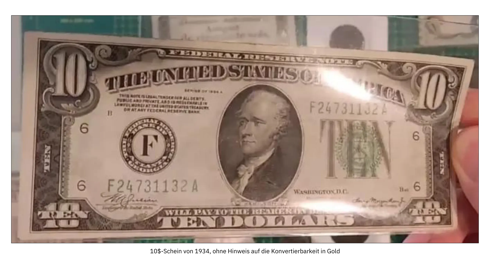

Die Erwähnung ihrer Umwandlung in Gold wurde entfernt und durch "This note is legal tender for all debt" (Dieser Schein ist gesetzliches Zahlungsmittel für alle Schulden) ersetzt.

- Neubewertung von Gold

Was an diesem Übergang faszinierend ist, ist die Strategie der Regierung. Im Jahr 1934 wurde der Goldpreis von 20,67 Dollar pro Unze auf 35 Dollar pro Unze neu bewertet. Im Wesentlichen hat die Regierung den Dollar, den die Menschen besaßen, abgewertet. Indem sie 1933 Gold von der Bevölkerung für 20,67 Dollar pro Unze gekauft und dann den Goldpreis 1934 neu bewertet hat, hat die Regierung einen erheblichen Gewinn erzielt, während sie die Ersparnisse ihrer Bürger abgewertet hat.

Zusammenfassend hat die Regierung innerhalb eines Jahres effektiv das Gold der Bürger beschlagnahmt und dann die Regeln geändert, indem sie den Wert des Goldes neu bewertet hat, um dem Staatsschatz zu nutzen und diejenigen zu benachteiligen, die ihr Gold ursprünglich gegen Scheine eingetauscht hatten.

### Die USA verändern die Geschichte.

Die Vereinigten Staaten haben einen historischen Wendepunkt erreicht, indem sie als erste die weltweite Reservewährung, den US-Dollar, abgewertet haben, im Gegensatz zu den früheren Praktiken kleiner Handelsnationen.

Früher, während der Renaissance, war der von Florenz im 13. Jahrhundert ausgegebene italienische Florin die internationale Reservewährung, und während seiner Nutzungsdauer wurde keine Abwertung verzeichnet, was die Bedeutung der Währungsstabilität für den internationalen Handel widerspiegelte.

In ähnlicher Weise bewahrten Spanien und die Niederlande als Inhaber der weltweiten Reservewährung aufgrund ihres blühenden internationalen Handels die Integrität ihrer Währung, um das Vertrauen und den Status quo im internationalen Handel zu erhalten. Die Niederlande waren sogar der Ort, an dem die erste Zentralbank gegründet wurde, ein entscheidender Meilenstein in der globalen Währungsentwicklung.

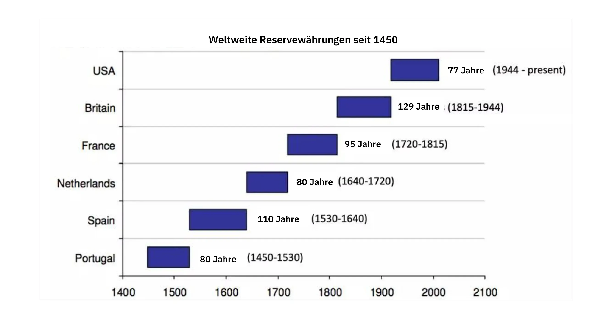

Jedoch hat sich die Situation mit dem Aufstieg der USA als dominierende Wirtschaftsmacht verändert. Sie entschieden sich, ihre Reservewährung abzuwerten und damit die Inflation zu ihrem Vorteil zu nutzen. Diese Entscheidung wird oft auf die veränderte Dynamik zurückgeführt, bei der die Wahl der Reservewährung nicht mehr so frei war wie zuvor. Die amerikanische Hegemonie etablierte den Dollar als weltweite Reservewährung und ermöglichte somit eine Manipulation seines Wertes. Diese Kursänderung zeigt das potenzielle Ausmaß der Geldpolitik auf den internationalen Handel in einer globalisierten Wirtschaft und markiert einen bedeutenden Übergang in der Verwaltung der weltweiten Reservewährungen.

### Ein letztes Beispiel für den Weg: das Swiss Dinner

Der Swiss Dinar zeigt eine weitere faszinierende Facette der Währungsabwertung, diesmal im Kontext des Irak vor den Golfkriegen. Diese Währung, benannt nach der bemerkenswerten Qualität ihrer Banknoten, wurde von der irakischen Zentralbank ausgegeben und genoss einen Ruf der Stabilität in der Nahostregion. Dieses Vertrauen beruhte insbesondere auf der Qualität des Drucks der Banknoten, der in England durchgeführt wurde und eine gewisse Robustheit gegenüber Abwertungen suggerierte.
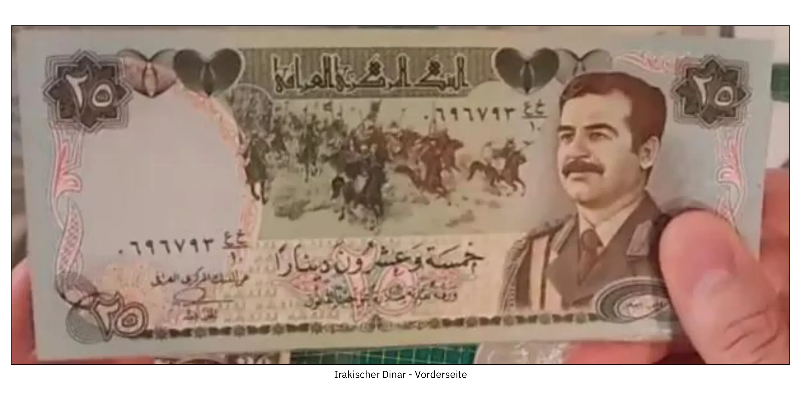

Die Golfkriege markierten jedoch eine Wende in der Geschichte des Swiss Dinar. Da der Irak nicht mehr auf seinen englischen Lieferanten für den Druck seiner Banknoten zurückgreifen konnte, wandte er sich an China. Dieser Übergang führte zu einem deutlichen Qualitätsunterschied bei den Banknoten, wobei die chinesische Version als minderwertig angesehen wurde. Diese Wahrnehmung war nicht unbegründet; die chinesischen Banknoten waren leichter fälschbar und anfällig für Überdruck durch die Regierung, was ihren Wert bedrohte.

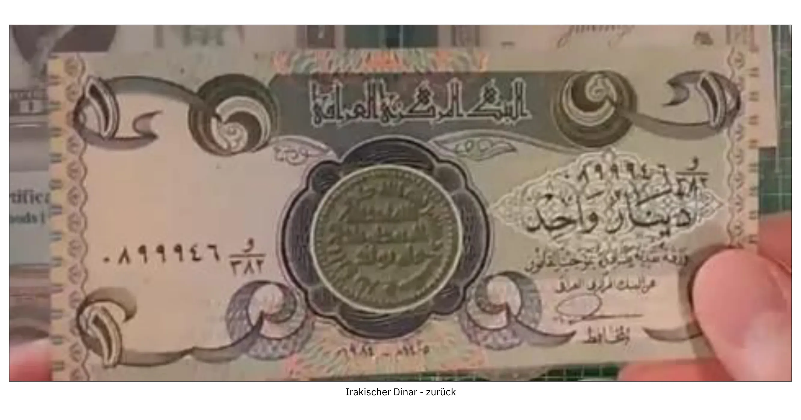

Ein charakteristisches Phänomen trat in der irakischen Wirtschaft nach den Golfkriegen auf: das System der doppelten Preise. Händler boten unterschiedliche Preise je nach Art der verwendeten Banknote an, wobei der ursprüngliche Swiss Dinar gegenüber der chinesischen Banknote bevorzugt wurde. Dieses System spiegelte das weiterhin bestehende Vertrauen in Banknoten von besserer Qualität wider, die weniger anfällig für Abwertungen waren, selbst in einem Kontext, in dem der Wert hauptsächlich vom Staat festgelegt wurde. Diese Episode zeigt die Bedeutung der intrinsischen Merkmale einer Währung und wie selbst in einem Fiat-Währungssystem die wahrgenommene Qualität einer Währung ihren relativen Wert und damit das Vertrauen der Wirtschaftsteilnehmer beeinflussen kann.

#### Ja, wir haben die Münzen wirklich gewogen!

Die gängige Vorstellung verbindet Währung oft mit staatlicher Schöpfung, wobei ihre Ausgabe und ihr Wert vom Staat reguliert werden. Dieses Konzept hat seine Wurzeln in antiken Zivilisationen wie Rom, wo Münzen standardisiert und vom Reich gestempelt wurden, was den Münzen einen offiziellen Wert verlieh. Eine eingehendere Untersuchung zeigt jedoch, dass der intrinsische Wert der Währung hauptsächlich von ihrem Gehalt an Edelmetallen abgeleitet wurde.

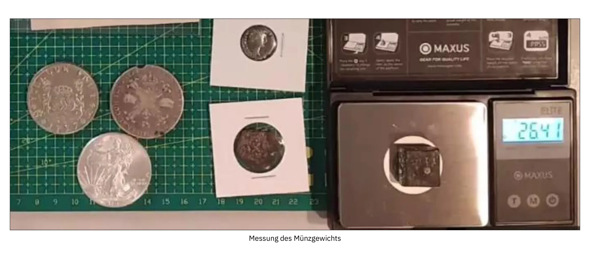
Ein konkretes Beispiel wird durch die Untersuchung eines Münzgewichts veranschaulicht, das dem Wert von acht spanischen Reales oder einem spanischen Dollar entspricht. Dieses Gewicht, das mit einer römischen Ziffer markiert ist, um seinen Wert anzuzeigen, wurde von Geldwechslern verwendet, um den Wert von Münzen basierend auf ihrem Gewicht und nicht nur auf ihrer Prägung zu bewerten. Durch das Wiegen der Münzen konnten die Geldwechsler feststellen, ob sie verändert oder beschädigt worden waren, was ihren Wert hätte mindern können. Diese Praxis verdeutlicht, dass obwohl die standardisierte Prägung durch den Staat der Währung einen bestimmten Nennwert verlieh, der eigentliche Wert im Gewicht des enthaltenen Edelmetalls lag.

Diese Analyse zeigt, dass das Vertrauen in die Währung und damit auch ihr Wert auf ihrer greifbaren Substanz beruhte und nicht nur auf der Behauptung des Staates. Sie betont die Dualität zwischen dem vom Staat auferlegten Nennwert und dem vom Edelmetallgehalt diktierten inneren Wert. Somit geht die Währung über ein einfaches staatliches Instrument hinaus, ihr grundlegender Wert ist intrinsisch mit greifbaren und messbaren Elementen verbunden.

#### Schlussfolgerung

Zusammenfassend ermöglicht diese Studie zur Währungsabwertung ein tieferes Verständnis der Mechanismen der Inflation, die in den folgenden Videos untersucht werden. Wir werden über die verschiedenen Arten von Inflation und den Schwellenwert diskutieren, bei dem sie zu hoher oder Hyperinflation führen. Diese solide Grundlage wird es uns ermöglichen, die Komplexitäten der Inflation in den kommenden Sitzungen anzugehen. Vielen Dank für Ihre Aufmerksamkeit und bis zum nächsten Video, um diese Erkundung der monetären Dynamiken fortzusetzen.

## Die Arten von Inflation

<chapterId>b438fe09-375e-5bb2-9196-7dd687b9f98c</chapterId>

### Inflation ist kein multifaktorielles Phänomen

In diesem Abschnitt werden wir die verschiedenen Dimensionen der Inflation untersuchen, ein oft missverstandenes Phänomen. Obwohl Inflation in den Medien und in alltäglichen Diskussionen oft als multifaktorielles Phänomen wahrgenommen wird, ist es wichtig zu betonen, dass es letztendlich ein monetäres Phänomen ist.

Hier ist eine Aufschlüsselung des Themas in mehrere Schlüsselpunkte:

- Unterscheidung zwischen Preiserhöhung und Inflation:

  Eine Preiserhöhung kann sektoriell sein und durch verschiedene Faktoren wie einen Rückgang der OPEC-Produktion für Öl oder ungünstige Wetterbedingungen für Weizen verursacht werden.
  Inflation hingegen wird durch eine weit verbreitete Preiserhöhung für eine Reihe von Gütern und Dienstleistungen definiert, nicht nur in einem bestimmten Sektor.

- Die monetäre Natur der Inflation:
  Bei einer festen Geldmenge würde eine Preiserhöhung in einem Sektor zu einer Preissenkung in anderen Sektoren führen, da die verfügbare Geldmenge für andere Ausgaben reduziert würde. Inflation ist eng mit einer Erhöhung der Geldmenge verbunden, die eine gleichzeitige Preiserhöhung in allen Sektoren ermöglicht.

- Auswirkungen der Geldmenge auf Inflation und Deflation:

In einem System mit fester Geldmenge sollte eine theoretische Steigerung der Produktion zu einer Deflation führen, d.h. zu einer Preissenkung, da mehr Güter und Dienstleistungen verfügbar wären. Im aktuellen Fiat-Geldsystem hebt die Erhöhung der Geldmenge die potenziell durch die Produktionssteigerung verursachte Deflation auf.

- Negative Auswirkungen der Anpassung der Geldmenge:

Eine Erhöhung der Geldmenge ohne entsprechende Steigerung der Produktion führt zu Inflation, da mehr Geld im Umlauf ist, aber die gleiche Menge an Gütern und Dienstleistungen vorhanden ist. Während eine Produktionssteigerung zu einer Deflation hätte führen sollen, hat die gleichzeitige Erhöhung der Geldmenge diesen Effekt aufgehoben und stattdessen Inflation verursacht.

- Inflation, Deflation und Geldmenge: Kommunizierende Röhren:

Inflation und Deflation sind wie kommunizierende Röhren in einer Wirtschaft. Eine Produktionssteigerung kann zu Deflation führen, aber wenn gleichzeitig die Geldmenge erhöht wird, wird der Deflationseffekt aufgehoben und es entsteht Inflation.

Diese Diskussion unterstreicht die Bedeutung des Verständnisses der zugrunde liegenden Mechanismen von Inflation und Deflation und wie die Manipulation der Geldmenge tiefgreifende Auswirkungen auf die Wirtschaft haben kann. Wahrscheinlich werden wir diese Konzepte später erneut besprechen, um ein tieferes Verständnis ihrer Verbindung und ihrer Auswirkungen auf die Gesamtwirtschaft zu erlangen.

### Warum führt Geldschöpfung nicht immer zu Inflation?

#### Inflation ≠ Verbraucherpreisindex (VPI)

Inflation, obwohl oft mit der Erhöhung der Geldmenge in Verbindung gebracht, weist nicht immer eine direkte Korrelation zur Geldschöpfung auf, wie dies in der Zeit nach der Finanzkrise von 2008 deutlich wurde. Trotz einer erheblichen Geldschöpfung zur Rettung der Banken gab es in den folgenden zehn Jahren keine hohe Inflation, sondern im Durchschnitt zwischen 0 und 2% pro Jahr. Dies wirft die Frage auf: Warum führte die massive Geldschöpfung nicht zu einer proportionalen Inflation? Die Antwort liegt in verschiedenen Nuancen, die mit der Messung der Inflation und dem Verbraucherpreisindex (VPI) zusammenhängen.

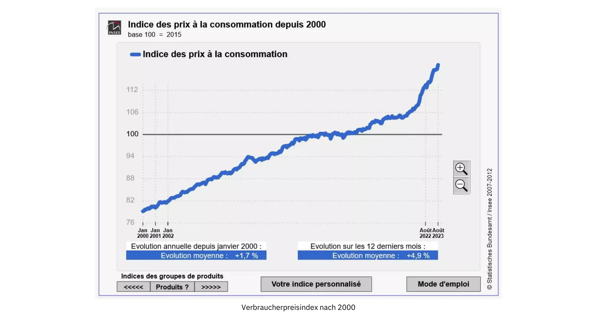
Die erste Erklärung liegt in der Art und Weise, wie die Inflation gemessen wird. Der Verbraucherpreisindex, der als Hauptindikator für die Inflation verwendet wird, weist bestimmte Mängel auf. Zum Beispiel berücksichtigt er nicht umfassend die Entwicklung der Immobilienpreise. Obwohl der Verbraucherpreisindex eine Komponente für Mieten enthält, spiegelt er nicht vollständig die erhebliche Wertsteigerung von Häusern wider. Daher können erhebliche Kostensteigerungen für Wohnraum auftreten, ohne dass sie vollständig vom Verbraucherpreisindex erfasst werden, was die tatsächliche Inflation potenziell unterschätzt.

Darüber hinaus beinhaltet die Berechnung des Verbraucherpreisindex bestimmte Methoden, die tatsächliche Preiserhöhungen ausgleichen oder verdecken können. Zum Beispiel können qualitative Verbesserungen von Produkten verwendet werden, um den Index anzupassen. Wenn der Preis eines Produkts steigt, aber auch seine Qualität oder Merkmale verbessert werden, kann der Verbraucherpreisindex davon ausgehen, dass der tatsächliche Wert für den Verbraucher unverändert ist und daher keine Inflation widerspiegeln. Ein anschauliches Beispiel ist, wenn trotz der Geldinjektion die Preise für Rindfleisch und Computer steigen, die Verbesserung der Computerleistung jedoch verwendet wird, um diesen Anstieg auszugleichen. Wenn ein Computer doppelt so teuer ist, aber viermal so leistungsstark, kann der Verbraucherpreisindex dies als Preissenkung interpretieren und damit den Preisanstieg von Rindfleisch verdecken.

Diese Nuancen bei der Messung der Inflation durch den Verbraucherpreisindex verdeutlichen die Komplexität des Zusammenhangs zwischen Geldschöpfung und Inflation. Sie legen auch nahe, dass die tatsächliche Inflation höher sein kann als die gemeldete, wenn alle Preiserhöhungen umfassender berücksichtigt würden, insbesondere in Schlüsselbereichen wie dem Immobilienmarkt. Diese Analyse verdeutlicht die Bedeutung des Verständnisses der zugrunde liegenden Mechanismen der Inflation und der Einschränkungen der herkömmlichen Indizes, die zu ihrer Messung verwendet werden, um die wirtschaftlichen Auswirkungen der Geldpolitik besser zu verstehen.

#### Die Argumente der MMT

Die Modern Monetary Theory (MMT) bietet eine andere Perspektive auf die Geldschöpfung und Inflation. Nach der MMT stammt Geld hauptsächlich von der Regierung, die in der Lage ist, erhebliche Beträge zu drucken, um ihre Bedürfnisse zu finanzieren, ohne Inflation zu verursachen, solange die von diesen Mitteln betroffenen Sektoren nicht gesättigt sind. Dies ist ein Ansatz, der sich von traditionellen monetären Theorien unterscheidet und die Bedeutung sektorieller Absorptionskapazitäten für die Inflationsdynamik betont.

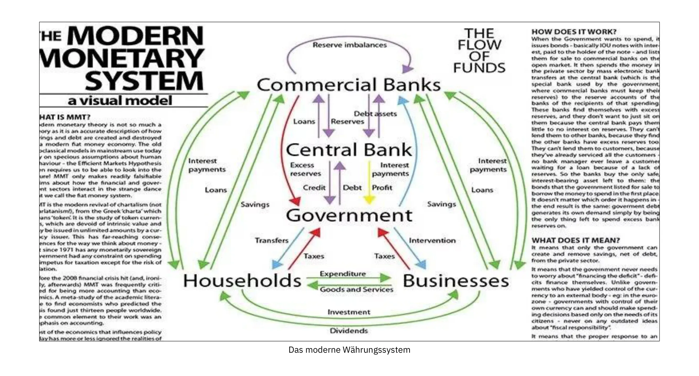

Ein anschauliches Beispiel für die MMT ist der amerikanische militärisch-industrielle Komplex. Gemäß der MMT können Hunderte von Milliarden Dollar in diesen Sektor allokiert werden, ohne Inflation zu verursachen, dank seiner Absorptionsfähigkeit. Im Gegensatz dazu könnte bei erheblichen Mittelzuflüssen in den Straßenbau in den USA, wo es nur wenige Unternehmen und Arbeitskräfte gibt, eine Inflation auftreten aufgrund der Knappheit von Ressourcen und der steigenden Kosten, die von den Lieferanten verlangt werden.

Der Fall Japans wird von den Befürwortern der MMT oft als ein weiteres Beispiel für das Fehlen von Inflation trotz einer erheblichen Geldschöpfung angeführt. Allerdings verdeutlicht die Situation in Japan auch die Grenzen herkömmlicher Inflationsmaßnahmen wie dem Verbraucherpreisindex (VPI). In Japan wird ein großer Teil des gedruckten Geldes entweder gespart, in Immobilien oder Aktienmärkte investiert und nicht in die alltägliche Konsumwirtschaft ausgegeben. Der VPI erfasst diese Dynamiken nicht vollständig und kann die tatsächliche Inflation unterschätzen.

Die Analyse Japans (https://ideas.repec.org/p/ces/ceswps/_9821.html) zeigt auch, dass das Verhalten der Wirtschaftsteilnehmer, wie Sparen oder Investitionen in nicht im VPI enthaltene Vermögenswerte, die inflatorische Wirkung der Geldschöpfung verdecken kann. Darüber hinaus spielt die Fähigkeit verschiedener Sektoren, die injizierten Liquiditäten aufzunehmen, eine entscheidende Rolle bei der Manifestation von Inflation.

#### Die Bilanz der Banken und der Zentralbank

Ein drittes Beispiel dafür, warum Geldschöpfung keine Inflation verursachen würde, ist die Beziehung zwischen Geldschöpfung und Inflation, die durch die Art und Weise, wie das neu geschaffene Geld in die Wirtschaft eingeführt wird, moduliert wird. Wenn dieses Geld auf den Bilanzen der Privatbanken bleibt, ohne an Wirtschaftsteilnehmer verliehen zu werden, wird es die reale Wirtschaft nicht direkt beeinflussen und daher keine Inflation verursachen.

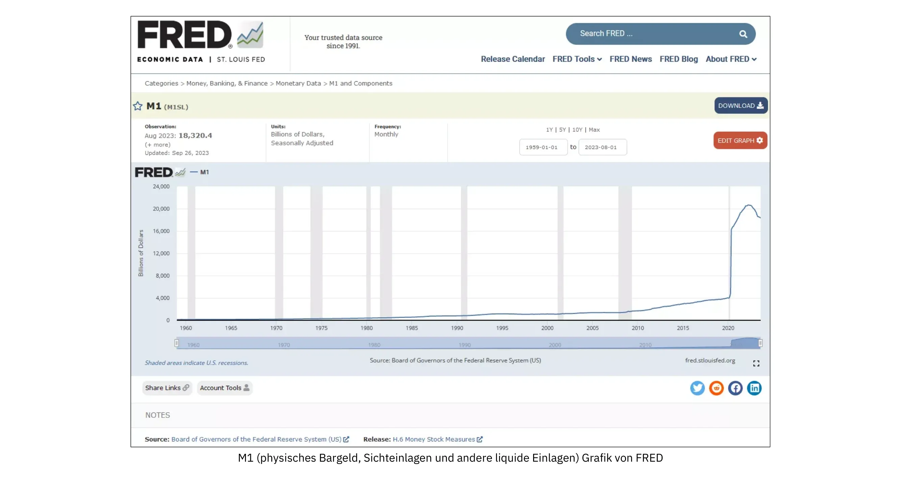

Geldschöpfung kann als Damoklesschwert über der Wirtschaft betrachtet werden. Das geschaffene Geld kann eine gewisse Zeit lang latent bleiben, ohne sichtbare inflatorische Auswirkungen, solange es nicht über Bankkredite oder andere Mechanismen in die Wirtschaft eingespeist wird. Wenn dieses latente Geld schließlich in Umlauf gebracht wird, können sich die inflatorischen Effekte manifestieren. Dies wurde in den 2020er Jahren beobachtet, als das zuvor geschaffene Geld seinen Weg in die Wirtschaft fand und zu einer Inflation führte.
Dieses Szenario betont die Bedeutung der Mechanismen der Geldübertragung bei der Bestimmung der inflatorischen Auswirkungen der Geldschöpfung. Die Geldschöpfung durch die Zentralbank ist nur ein Puzzlestück. Das Verhalten der Privatbanken, die über das Volumen der zu gewährenden Kredite entscheiden, und das Verhalten der Kreditnehmer, die darüber entscheiden, wie sie das geliehene Geld ausgeben werden, sind ebenfalls entscheidende Elemente in dieser Dynamik.

#### Inflation ist sozial!

Das Beispiel der Weimarer Republik illustriert einen weiteren entscheidenden Aspekt der Beziehung zwischen Geldschöpfung und Inflation: die Rolle von Erwartungen und dem Verhalten der Wirtschaftsteilnehmer. Als die Zentralbank der Weimarer Republik begann, eine große Menge Geld zu drucken, führte die wirtschaftliche Unsicherheit dazu, dass die Menschen das Geld horteten, anstatt es auszugeben. Diese Reaktion verzögerte vorübergehend die inflatorischen Auswirkungen der Geldschöpfung.

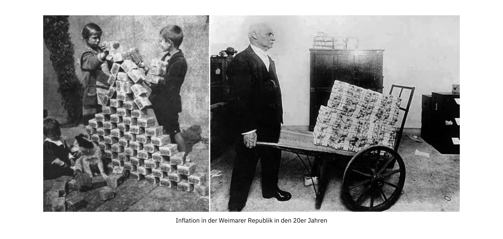

Als sich die wirtschaftliche Situation jedoch leicht verbesserte, wurde das Vertrauen allmählich wiederhergestellt. Die Menschen holten dann ihre Ersparnisse aus ihren Verstecken und begannen massiv in die Wirtschaft zu investieren. Diese plötzliche Verhaltensänderung, kombiniert mit einer bereits hohen Geldmenge, führte zu einer Explosion der Nachfrage. Mit mehr Geld im Umlauf und einer erhöhten Nachfrage begannen die Preise schnell zu steigen, was zu einer spürbaren Inflation führte.

Dieses Beispiel verdeutlicht die Bedeutung des Timings und des Verhaltens der Wirtschaftsteilnehmer bei der Manifestation von Inflation. Inflation tritt nicht nur als Reaktion auf die Erhöhung der Geldmenge auf, sondern auch abhängig von der Art und dem Zeitpunkt, zu dem dieses Geld in die Wirtschaft investiert wird. Wirtschaftliche Unsicherheiten und die Erwartungen der Wirtschaftsteilnehmer spielen eine entscheidende Rolle in dieser Dynamik und können entweder die inflatorischen Auswirkungen der Geldschöpfung beschleunigen oder verzögern.

#### Zusammenfassung:

- Verbraucherpreisindex (VPI): Der VPI ist so strukturiert, dass er die Inflation unterschätzt, was zu einem verzerrten Bild der inflatorischen Realität führen kann.

- Sektorale Absorption: Die Geldinjektion in Sektoren, die in der Lage sind, sie zu absorbieren, führt nicht immer zu Inflation. Das Hauptbeispiel ist der amerikanische militärisch-industrielle Komplex, der große Geldsummen absorbieren kann, ohne Inflation zu verursachen.

- Fall Japan: Trotz erheblicher Geldschöpfung bleibt die Inflation in Japan gering, da die Gelder oft gespart oder in Immobilien oder Aktienmärkte investiert werden. Diese Sektoren absorbieren das gedruckte Geld, und der VPI spiegelt nicht unbedingt Preiserhöhungen in diesen Bereichen wider.
- Zusammenhang zwischen Geldschöpfung und Märkten: Es wird beobachtet, dass die Kurven für Immobilien und Aktienmärkte oft der Geldschöpfung folgen und anzeigen, wohin das gedruckte Geld fließt.
- Geldreserven der Banken: Wenn das gedruckte Geld in den Bilanzen der Banken bleibt und nicht in die Wirtschaft fließt, verursacht es keine Inflation. Dies wird am Beispiel von 2008 veranschaulicht, als das gedruckte Geld größtenteils in den Bilanzen der Banken verblieb und die inflationären Auswirkungen verzögerte.

- Weimarer Republik: Diese historische Periode zeigt, wie wirtschaftliche Unsicherheit zu Geldhortung und Verzögerung der Inflation führte. Sobald jedoch das Vertrauen wiederhergestellt und das Geld ausgegeben wurde, explodierte die Inflation.

Diese Beispiele können in Diskussionen verwendet werden, um zu erklären, warum Inflation nicht immer eine unmittelbare Folge der Geldschöpfung ist und wie wirtschaftliche Kontexte und das Verhalten der Akteure die Inflation beeinflussen.

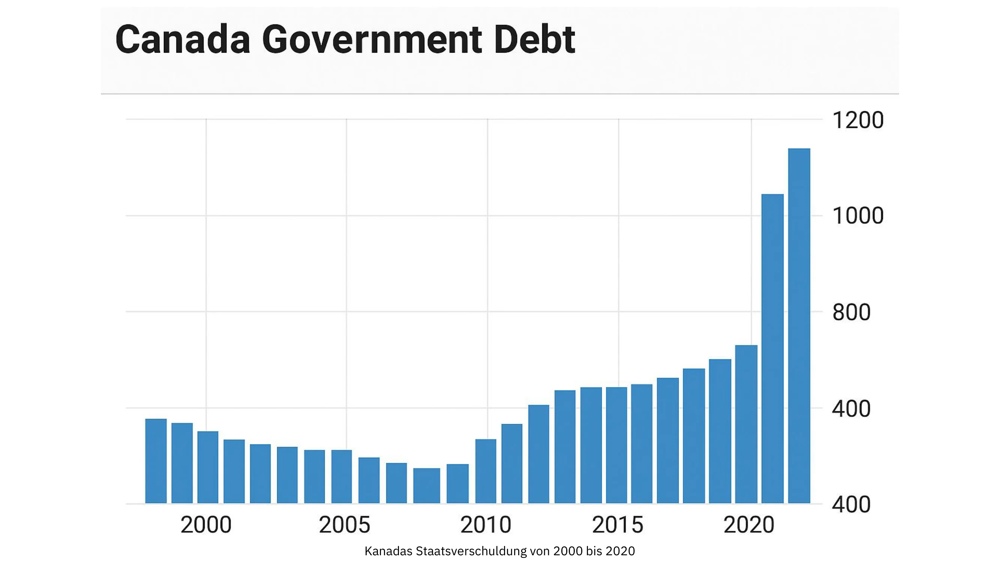

Wie dieser [Thread](https://twitter.com/saifedean/status/1673639779433590786) zeigt: Inflation ist alles, außer die Schuld der Zentralbanken.

- Ökonomen, die die Inflation dem Klimawandel zuschreiben

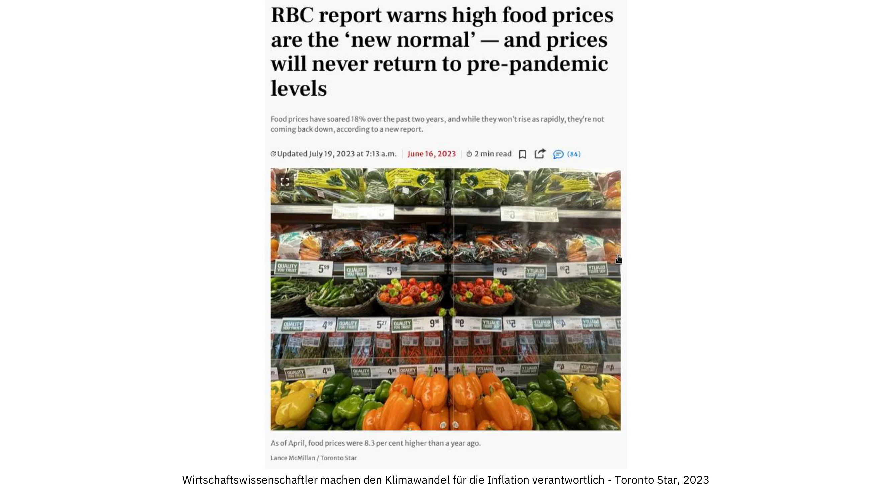

- Beispiel Schweden, das Beyoncé für die Inflation in einem bestimmten Monat verantwortlich macht.

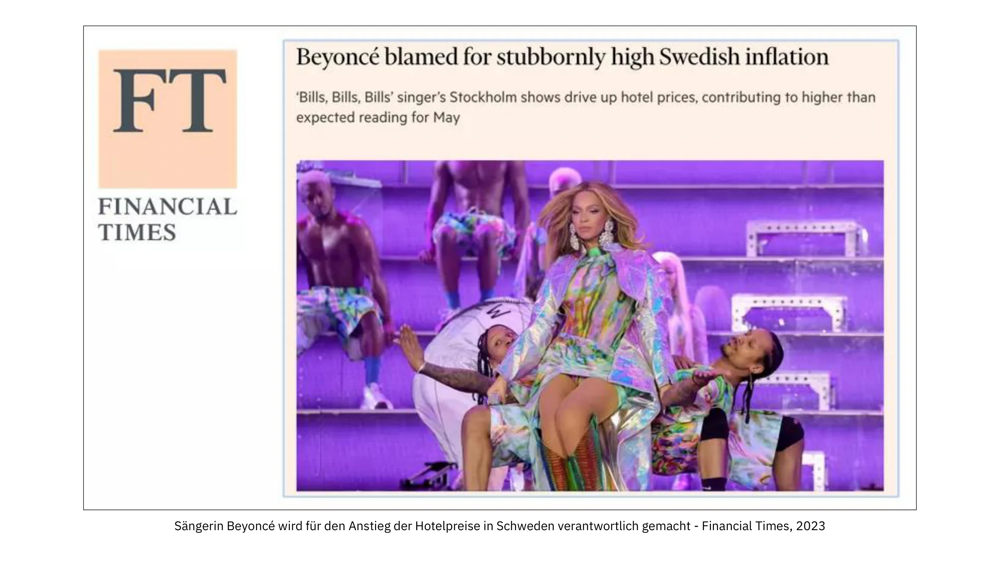

- Zentralbank in Polen, die die Inflation der russischen Aggression in der Ukraine und der Pandemie zuschreibt

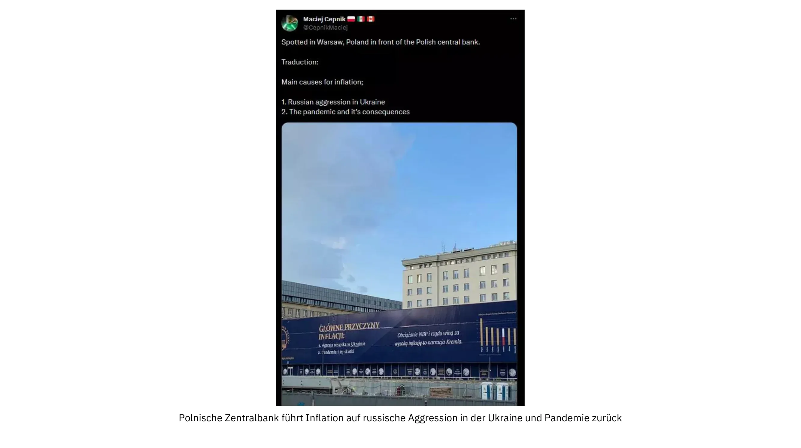

- Brexit wird für die Inflation im Vereinigten Königreich verantwortlich gemacht.

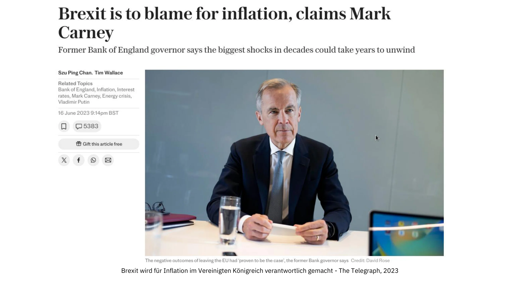

- Veröffentlichung des Spiels Zelda in Verbindung mit einem inflationären Schock.

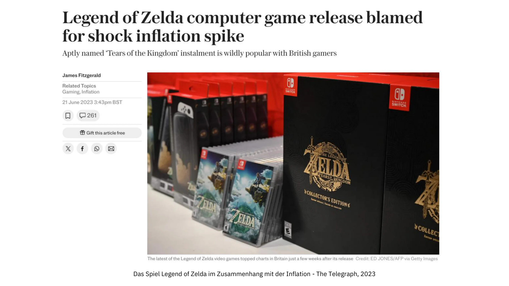

- Taylor Swift angeblich verursacht Inflation.

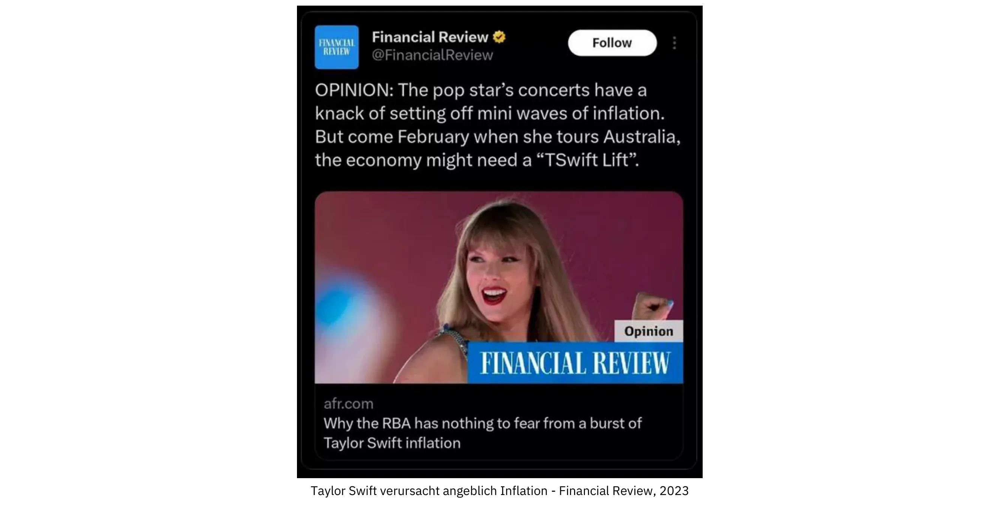

Wie können Beyoncé oder Taylor Swift, sagen Sie mir, eine weit verbreitete Preiserhöhung erklären? Sie sehen, dass das keinen Sinn ergibt. Im Grunde genommen:

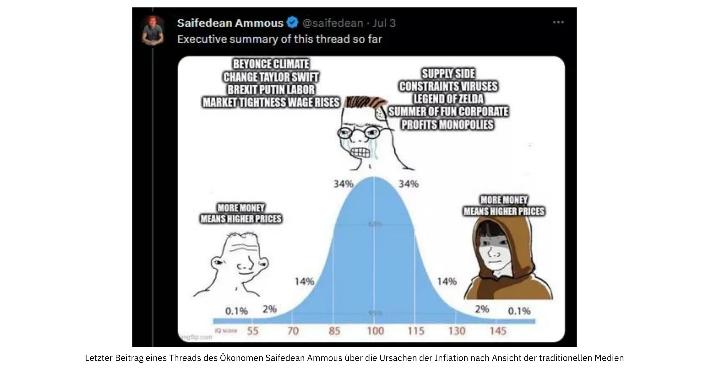

### Erkundung der Arten von Inflation

Es ist wichtig, den Unterschied zwischen den verschiedenen Arten von Inflation zu verstehen, um die vielfältigen Erscheinungsformen dieses wirtschaftlichen Phänomens zu erfassen. Hier ist eine Erläuterung zu diesen verschiedenen Arten:

- Schleichende Inflation: Dies ist die Art von Inflation, die Zentralbanken in der Regel anstreben und die jährlich bei etwa 2% liegt. Dieses Ziel wurde seit den 90er Jahren übernommen und zielt darauf ab, ein stabiles Wirtschaftswachstum ohne Überhitzung oder Deflation aufrechtzuerhalten.
- Moderate Inflation (Walking Inflation): Diese Form der Inflation tritt auf, wenn die Inflation die Zielmarke von 2% überschreitet. Sie wird oft mit einer überhitzten Wirtschaft in Verbindung gebracht, einem Zustand, in dem die übermäßige Geldmenge zu einem allgemeinen Preisanstieg führt. Dieses Szenario zeigt die Grenzen der Geldpolitik auf und enthüllt manchmal Widersprüche in wirtschaftlichen Diskursen.
- Galloping Inflation: Galoppierende Inflation, oft als zweistellige Inflation bezeichnet, tritt auf, wenn die jährliche Inflationsrate 10% übersteigt. Sie kennzeichnet eine signifikante Preissteigerung, die die wirtschaftliche Stabilität gefährden kann.

- Hyperinflation: Hyperinflation ist ein extrem starkes Phänomen, bei dem die Inflationsrate 50% pro Monat übersteigt, was aufgrund der exponentiellen Natur der Inflation einer jährlichen Inflation von über 13.000% entspricht. Diese Inflationsrate destabilisiert die Wirtschaft schwerwiegend, macht die Währung nahezu wertlos und führt zu einem Vertrauensverlust in das Währungssystem.

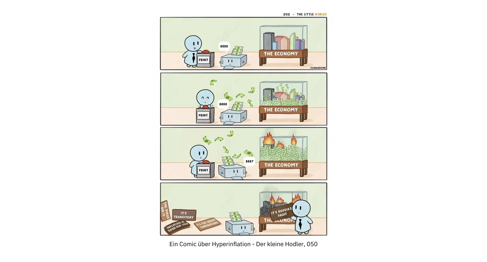

Bei der Untersuchung der Arten von Inflation stößt man oft auf Begriffe wie "Demand Pull" und "Cost Push" in Bildungsmaterialien. Diese Konzepte erklären jedoch eher Preiserhöhungen als die Inflation als monetäres Phänomen. Hier ist eine detailliertere Analyse:

- Demand Pull:
  Die Demand Pull-Inflation wird oft als Situation erklärt, in der die Nachfrage in der Wirtschaft das verfügbare Angebot übersteigt. Ohne eine entsprechende Erhöhung der Geldmenge führt diese Situation jedoch nur zu einer Umverteilung der Ausgaben. Verbraucher könnten mehr für lebensnotwendige Güter ausgeben und weniger für andere, was den Gesamteffekt der Inflation neutralisiert.

- Cost Push:
  Auf der anderen Seite wird die Cost Push-Inflation mit steigenden Produktionskosten, wie zum Beispiel natürlichen Ressourcen oder Arbeitskräften, in Verbindung gebracht. Auch hier könnten ohne eine Erhöhung der Geldmenge Kostensteigerungen in einem Sektor einfach zu Ausgabenkürzungen in anderen Bereichen führen, ohne eine allgemeine Inflation auszulösen.
  Diese traditionellen Erklärungen verbinden Preiserhöhungen oft mit Inflation, was zu Verwirrung führen kann. Tatsächlich ist für eine weit verbreitete Inflation eine Erhöhung der Geldmenge erforderlich. In diesem Zusammenhang können die Konzepte von Demand Pull und Cost Push die sektoralen Preisänderungen erklären, erfassen jedoch nicht die monetäre Natur der Inflation. Dies unterstreicht die Bedeutung der Unterscheidung zwischen sektoralen Preiserhöhungen und weit verbreiteter Inflation und bekräftigt die Notwendigkeit einer Erhöhung der Geldmenge, damit sich Inflation in der Wirtschaft manifestiert. Diese Analyse bietet eine nuanciertere und präzisere Perspektive auf die tatsächlichen Ursachen der Inflation und entmystifiziert gängige Interpretationen, die die zugrunde liegende monetäre Dynamik verbergen können.

### Klassifizierung der Inflation nach Bernholz

Bernholz schlägt eine vereinfachte, aber präzise Klassifizierung der Inflation in drei Kategorien vor, um dieses komplexe monetäre Phänomen besser zu verstehen:

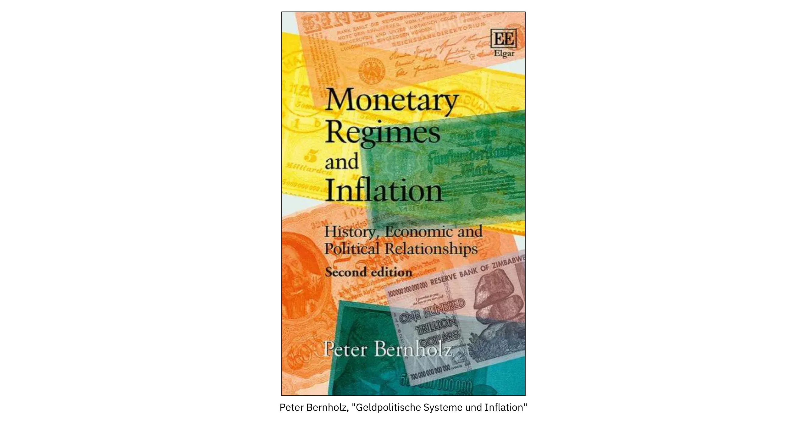

- Moderate Inflation:
  Moderate Inflation tritt auf, wenn das Niveau der Geldmenge über dem Normalwert liegt, aber der Staat keine großen Defizite finanziert durch Geldschöpfung aufweist. Obwohl der Begriff "moderat" unbedeutend erscheinen mag, kann diese Form der Inflation erhebliche Probleme verursachen, auch wenn sie nicht als hohe Inflation eingestuft wird.

- Hohe Inflation:
  Hohe Inflation tritt auf, wenn der reale Wert der Geldmenge trotz einer nominalen Zunahme abnimmt. Diese paradoxale Situation ergibt sich aus der Geldsubstitution, bei der Individuen das Vertrauen in die nationale Währung verlieren und versuchen, sie gegen Waren, Dienstleistungen oder ausländische Währungen einzutauschen. Dieser Prozess verringert den realen Wert des Geldes noch weiter und verschärft die Inflation.

- Hyperinflation:
  Hyperinflation ist eine Erweiterung der hohen Inflation und wird durch große Haushaltsdefizite finanziert durch Geldschöpfung gekennzeichnet. Historisch gesehen wurde kein Fall von Hyperinflation beobachtet, ohne dass eine erhebliche defizitäre Finanzierung durch Geldschöpfung erfolgte. Hyperinflation führt zu einem Teufelskreis: Die Inflation erodiert den Wert des Geldes so schnell, dass die Steuereinnahmen bereits vor der Erhebung durch den Staat an Wert verlieren, was den Staat dazu zwingt, noch mehr Geld zu drucken, um sich zu finanzieren. Dieser sich selbst verstärkende Zyklus führt zu astronomischen Inflationsraten, die oft 50% pro Monat überschreiten.
  Diese Bernholz-Klassifikation verdeutlicht den gefährlichen Übergang von moderater Inflation zur Hyperinflation und betont die entscheidende Bedeutung der monetären und haushaltspolitischen Kontrolle zur Verhinderung zerstörerischer Inflationsspiralen. Sie zeigt auch, dass die negativen Auswirkungen auf die staatliche Finanzierung weit vor dem Stadium der Hyperinflation auftreten können und bietet somit eine differenzierte Perspektive auf die Auswirkungen von Inflation in verschiedenen Ausprägungen.

### Fazit: Zusammenfassung der Inflationstypen

Zusammenfassend haben wir eine Vielzahl von Inflationstypen untersucht, angefangen bei Begriffen wie "creeping inflation", "walking inflation" und "galloping inflation", die jeweils unterschiedliche Inflationsraten in einer Volkswirtschaft kennzeichnen. Für unsere eingehende Untersuchung der Hyperinflation erweisen sich jedoch die Kategorien moderierte Inflation, hohe Inflation und Hyperinflation, wie von Bernholz beschrieben, als entscheidende Referenzpunkte.

- Moderierte Inflation:
  Sie signalisiert ein überdurchschnittliches Maß an Geldmenge, das jedoch ohne signifikante staatliche Defizitfinanzierung aufrechterhalten werden kann.

- Hohe Inflation:
  Sie tritt auf, wenn der reale Wert der Geldmenge abnimmt, oft aufgrund von Währungssubstitution, bei der Individuen versuchen, ihre Währung gegen Waren, Dienstleistungen oder andere Währungen einzutauschen.

- Hyperinflation:
  Sie stellt eine extreme Form der hohen Inflation dar, bei der eine übermäßige Geldschöpfung zur Finanzierung großer Haushaltsdefizite zu einem schnellen Wertverlust der Währung führt.

Was aus unserer Untersuchung hervorgeht, ist, dass Hyperinflation ein komplexes und gegenintuitives Phänomen ist. Obwohl man annehmen könnte, dass Hyperinflation das Ergebnis einer massiven Zunahme der Geldmenge ist, resultiert sie tatsächlich aus einem Rückgang des realen Wertes dieser Geldmenge. Diese Nuance ist entscheidend, um zu verstehen, warum einige Länder Schwierigkeiten haben, aus der Hyperinflation herauszukommen, selbst mit Unterstützung internationaler Institutionen wie der Weltbank oder dem IWF. Eine falsche Charakterisierung des Inflationstyps kann zu unangemessenen Maßnahmen führen und die wirtschaftlichen Probleme verschlimmern anstatt sie zu lösen.

In zukünftigen Diskussionen werden wir uns eingehender mit der Hyperinflation befassen und ihre Definitionen und Erscheinungsformen in verschiedenen wirtschaftlichen Kontexten untersuchen. Unser Ziel wird es sein, die zugrunde liegenden Mechanismen der Hyperinflation aufzudecken und potenzielle Lösungsansätze zu erforschen. Dieses differenzierte Verständnis wird es uns ermöglichen, die damit verbundenen Herausforderungen besser zu verstehen und fundierte Strategien zur Inflationsbekämpfung vorzuschlagen.
Vielen Dank für Ihre Aufmerksamkeit. Die nächste Sitzung wird sich vollständig der Definition und Entmystifizierung der Hyperinflation widmen, unter Berücksichtigung verschiedener akademischer und praktischer Perspektiven. Wir freuen uns darauf, diese Erkundung bei unserem nächsten Treffen mit Ihnen fortzusetzen.

# Was ist Hyperinflation?

<partId>3f541663-1e2f-5410-8ee0-f61c5d009fa5</partId>

## Definitionen der Hyperinflation

<chapterId>d2a71a2e-5f36-58d9-993c-d431f4aa07fd</chapterId>

### Definitionen der Hyperinflation

In diesem Abschnitt untersuchen wir die verschiedenen Definitionen der Hyperinflation, ein entscheidender Begriff in der Erforschung extrem monetärer Phänomene. Die bekannteste Definition stammt von Philip Cagan, der in seinem Werk von 1956, "The Monetary Dynamics of Hyperinflation", ein quantitatives Verständnis der Hyperinflation vorschlägt. Laut Cagan:

- Beginn und Ende der Hyperinflation:
  - Die Hyperinflation beginnt, wenn die monatliche Inflation 50% übersteigt.
  - Sie endet, wenn die Inflationsrate für mindestens ein Jahr unter 50% pro Monat fällt.

Um dies zu veranschaulichen, wenn die Inflation im Juli auf 40% fällt und bis zum Juli des nächsten Jahres nicht über 50% steigt, wird der Zeitraum der Hyperinflation als im Juli des vorherigen Jahres beendet betrachtet. Diese Definition ermöglicht eine präzise Charakterisierung von Hyperinflationsphasen und ermöglicht eine strukturierte Analyse.

Diese Definition wurde in der Hanke-Krus-Tabelle übernommen, die 56 Hyperinflationsphasen dokumentiert. Die Tabelle deckt jedoch nicht alle Phasen ab, wie die des Venezuela im Jahr 2016, was die Gesamtzahl auf 57 erhöht.

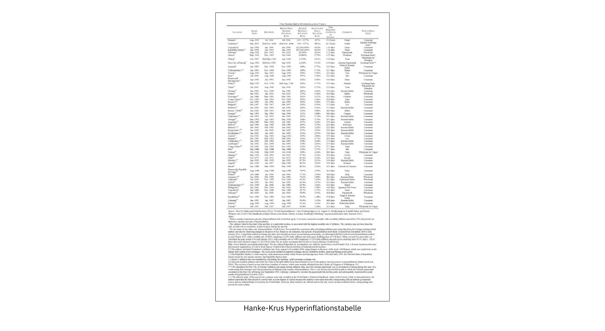

Vergrößern

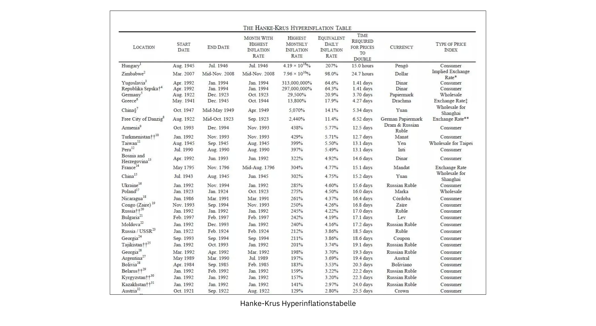
Es ist zu beachten, dass diese Definition, obwohl präzise, möglicherweise aufgrund der Strenge der 50%-Schwelle bestimmte Episoden von Hyperinflation ausschließt. Es besteht die Möglichkeit, diese Definition zu erweitern, um andere Episoden einzuschließen, die zwar nicht streng dem Kriterium von Cagan entsprechen, aber dennoch Zeiträume mit extrem hoher Inflation darstellen. Diese Beobachtung eröffnet die Tür zu einer umfassenderen Erforschung von Hyperinflationsphänomenen, die ein nuancierteres Verständnis ihrer Ursachen und Auswirkungen ermöglicht. In weiteren Diskussionen werden wir erwägen, diese Definition zu überarbeiten und Episoden von Hyperinflation zu untersuchen, die nicht durch das strenge Kriterium von Cagan abgedeckt sind.

### Die Definition von Hyperinflation nach Cagan

Philip Cagan hat möglicherweise mit der Schwelle von 50% monatlicher Inflation einen willkürlichen Meilenstein gesetzt, um Hyperinflation zu definieren. Er gibt selbst zu, dass diese Definition willkürlich ist und hauptsächlich seiner Analyse basierend auf sieben Episoden von Hyperinflation diente. Die Untersuchung von Cagans Daten zeigt, dass die drei Episoden von Hyperinflation mit den niedrigsten monatlichen Inflationsraten bei etwa 47%, 46% und 57% lagen. Es scheint, dass die Schwelle von 50% gewählt wurde, um diese Fälle in seine Studie einzubeziehen.

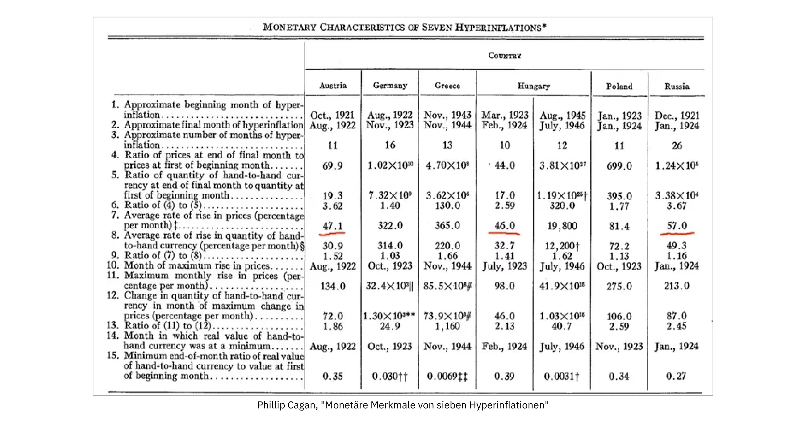

- Historischer Kontext:
  Cagans Definition stammt aus dem Jahr 1956 und basiert auf einer begrenzten Anzahl von verfügbaren Hyperinflationsepisoden zu dieser Zeit.

- Cagans Beobachtungen:
  Laut Cagan hat keine Episode diese Schwelle von etwa 50% erreicht, ohne sich zu einer schwerwiegenderen Hyperinflation zu entwickeln, was die Wahl dieser Schwelle rechtfertigen könnte.

- Kritik an Cagans Definition:
  Andere Ökonomen wie Bernholz, der Autor von "Monetary Regime and Inflation", haben die Schwelle von 50% ebenfalls als willkürlich bezeichnet.
  Bernholz stellt fest, dass es Episoden hoher Inflation gibt, die die gleichen qualitativen Merkmale wie Hyperinflationsepisoden aufweisen, aber die Schwelle von 50% nicht erreichen.

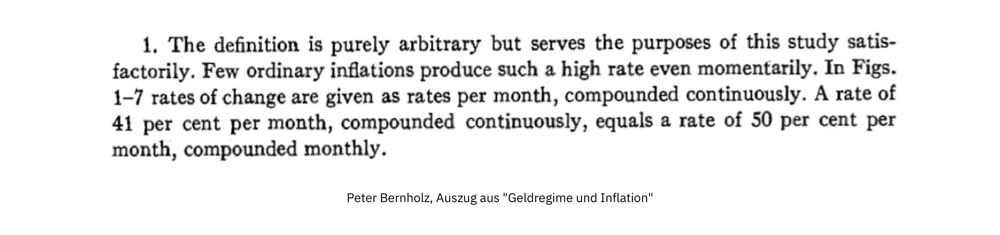
Diese Überlegung führt uns dazu, die Starrheit der traditionellen Definition von Hyperinflation zu hinterfragen und betont die Notwendigkeit, möglicherweise diesen Schwellenwert zu überdenken, indem mehr Ereignisse und historische Daten einbezogen werden. Die Definition von Hyperinflation könnte eine Flexibilität erfordern, um verschiedene Erscheinungsformen extremer Inflation in unterschiedlichen wirtschaftlichen und historischen Kontexten zu umfassen.

### Die Definition von Hyperinflation gemäß dem International Accounting Standards Board (IASB)

Das IASB bietet eine einzigartige Perspektive auf Hyperinflation, die auf den Rechnungslegungspraktiken in Zeiten von Hyperinflation basiert. Dieser Ansatz ist entscheidend für Buchhalter und Unternehmen, die in hyperinflationären Umgebungen tätig sind, in denen der monetäre Wert schnell schwankt. Die Richtlinien des IASB identifizieren verschiedene Indikatoren für Hyperinflation:

- **Präferenz für Nicht-Monetäre Vermögenswerte:**  
  Individuen ziehen es vor, Wert in Gütern anstatt in Währung zu halten, aufgrund der rapide sinkenden monetären Wertigkeit.

- **Bewertung von Gütern und Dienstleistungen:**  
  Die Bewohner berechnen den Wert von Gütern und Dienstleistungen nicht in lokaler Währung, was das verlorene Vertrauen in die lokale Währung widerspiegelt.

- **Entschädigung für den Verlust monetärer Werte:**  
  Die Preise incorporieren eine Entschädigung für den Verlust monetärer Werte bei Kreditkäufen, was die Auswirkungen der Inflation auf alltägliche Transaktionen veranschaulicht.

- **Indexierung von Preisen, Löhnen und Zinsen:**  
  Preise, Löhne und Zinsen werden basierend auf einem Index angepasst, um die Inflation zu kompensieren.

- **Kumulative Inflation über drei Jahre:**  
  Die kumulative Inflation über drei Jahre, die sich 100% nähert (also etwa 24% pro Jahr), steht im Gegensatz zu Cagans Definition von 50% monatlicher Inflation.

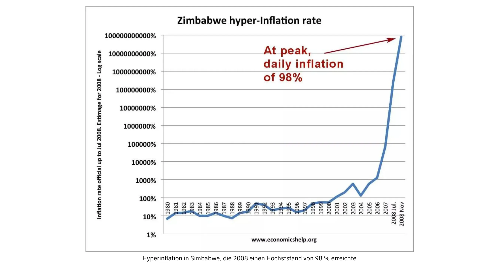

Nach den Kriterien des IASB befinden sich mehrere Länder, darunter Argentinien, Äthiopien, Haiti, der Iran, der Libanon, der Sudan, Südsudan, Suriname, Syrien, die Türkei, Venezuela, Jemen und Zimbabwe, derzeit in einer Phase der Hyperinflation.

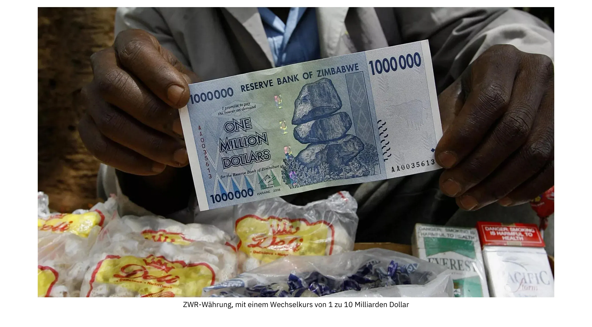

Diese vom IASB bereitgestellte Definition weicht von dem strengen quantitativen Schwellenwert ab, der von Cagan vorgeschlagen wurde, und integriert eine qualitative Analyse wirtschaftlicher Verhaltensweisen und praktischer Anpassungen im Angesicht von Hyperinflation. Sie zeigt, dass Hyperinflation ein komplexes Phänomen ist, das ein multidimensionales Verständnis erfordert, um die realen Implikationen zu begreifen, insbesondere im Bereich der Rechnungslegung, der entscheidend für die Stabilität und Transparenz der Finanzen von Unternehmen und Märkten ist.

### Also, wie viel Hyperinflation gibt es insgesamt?

Die gängigen Definitionen von Hyperinflation, wie die von Cagan vorgeschlagene, die eine monatliche Inflation von 50% angibt, können manchmal verwirrend oder vereinfachend sein. Zum Beispiel können zwei Länder mit jährlichen Inflationsraten von jeweils 1.000% und 3.000% unterschiedlich wahrgenommen werden, je nach monatlicher Verteilung dieser Inflation. Wenn kein Monat die Schwelle von 50% überschreitet, wären diese Länder laut Cagans Definition nicht in einem Zustand der Hyperinflation. Dieser Ansatz kann daher zu Anomalien in der Klassifizierung von Hyperinflation führen, insbesondere wenn man kumulierte Inflationen über das Jahr vergleicht.

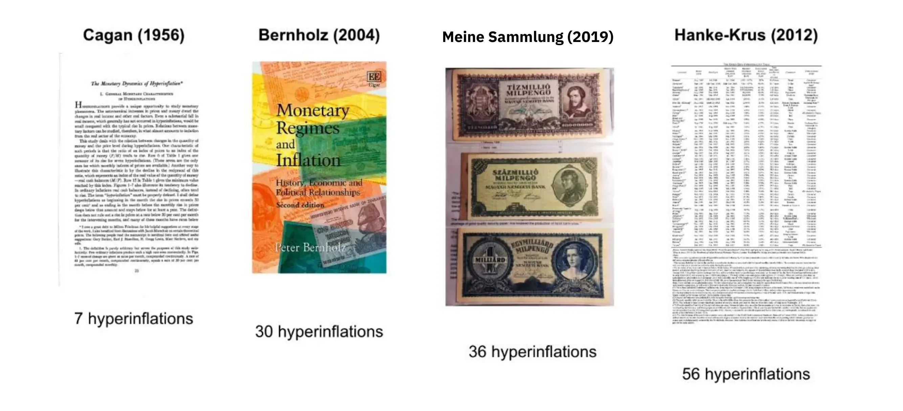

- Das Werk von Cagan, "Monetary Dynamics of Hyperinflation", das eine grundlegende Analyse der Hyperinflation darstellt.
- Das Buch von Bernholz, das 30 verschiedene Perioden der Hyperinflation untersucht und somit den Analysebereich erweitert.
- David's persönliche Sammlung von Banknoten aus 36 Perioden der Hyperinflation, die ein greifbares und historisches Verständnis ermöglicht.
- Die Hanky Cross-Tabelle (Version 2012, aktualisiert 2016 mit Venezuela), die 57 Perioden der Hyperinflation basierend auf Cagan's Definition auflistet.

Es ist zu beachten, dass einige historische Zeiträume mit hoher Inflation nicht in den klassischen Tabellen der Hyperinflation enthalten sind, oft aufgrund strenger Klassifizierungskriterien. Zum Beispiel betrugen die monatlichen Inflationsraten während des amerikanischen Unabhängigkeitskrieges im November 1779 und während des amerikanischen Bürgerkrieges im März 1864 jeweils 47,4% und 40%. Diese Raten, obwohl hoch, überschreiten nicht die von Cagan festgelegte Schwelle von 50% und schließen diese Perioden daher von den als Hyperinflation eingestuften Fällen aus. Diese Auslassung verdeutlicht die Grenzen starrer Definitionen und unterstreicht die Notwendigkeit eines nuancierteren Ansatzes, um die Hyperinflation in ihrer ganzen Komplexität zu erfassen.

## Ähnlichkeiten zwischen Weimar und Simbabwe

<chapterId>11eef458-aab8-5c63-8523-264d0ba69f5d</chapterId>

### Zwei Epochen, zwei Katastrophen

In diesem Kapitel werden wir uns mit den Auswirkungen der Hyperinflation befassen und uns auf die Fälle von Simbabwe und der Weimarer Republik konzentrieren. Im Laufe meiner Recherchen habe ich mich darauf konzentriert, direkte Zeugnisse von Personen zu erforschen, die diese Hyperinflationsperioden erlebt haben, im Gegensatz zu einem rein wirtschaftlichen oder statistischen Ansatz.

Mehrere Bücher waren besonders aufschlussreich:

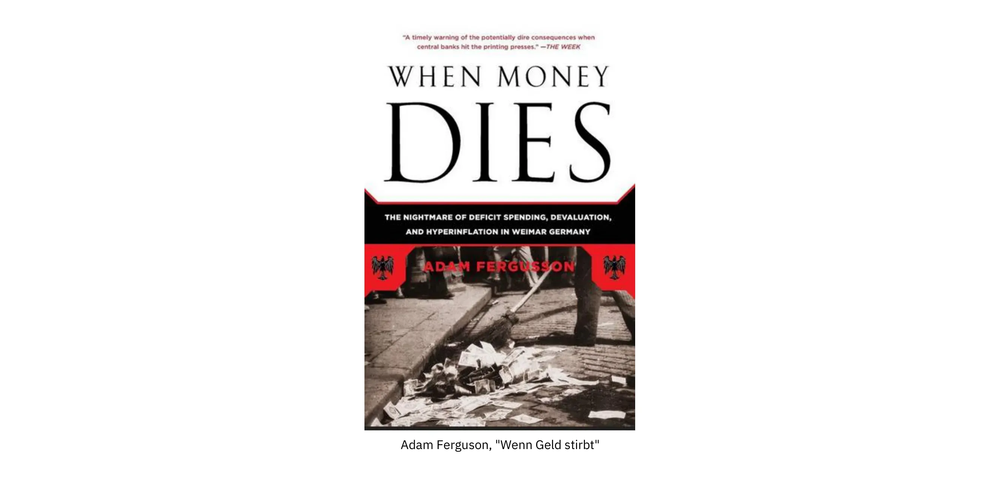

- "When Money Dies" von Adam Ferguson, das die Hyperinflation nach dem Ersten Weltkrieg in Deutschland sowie in Österreich und Ungarn nachzeichnet.
- Zwei Bücher über die Hyperinflation in Simbabwe, "Zimbabwe Warm Heart Ugly Face" und "Hard Boiled Egg Index" von Jérôme Gardner und Kudzai Joseph Gou Min-Yu, bieten bewegende Zeugnisse eines CEO einer Bekleidungsgeschäftskette und eines landwirtschaftlichen Bankiers über ihre Erfahrungen während dieser turbulenten Zeit.

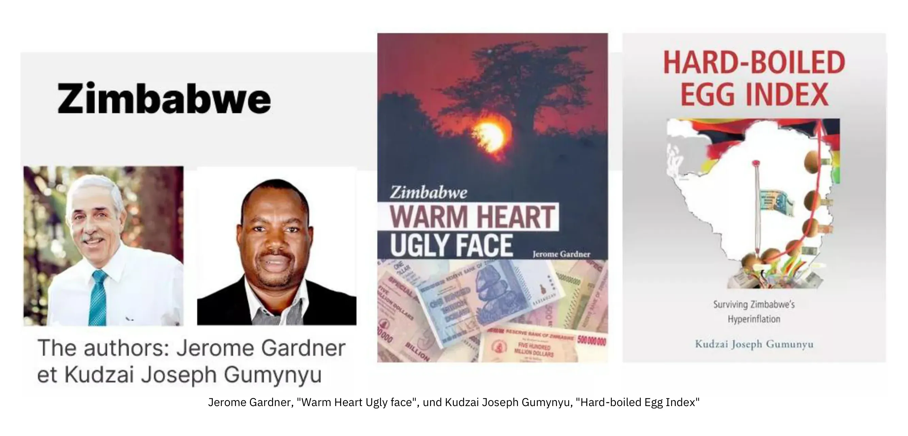

Beim Konsolidieren meiner Notizen habe ich eine Vielzahl von Ähnlichkeiten zwischen den Erfahrungen der Hyperinflation in Simbabwe und der Weimarer Republik festgestellt, obwohl 90 Jahre zwischen ihnen liegen. Ich habe etwa 17 Ähnlichkeiten identifiziert, von denen 13 eine Art Fortschritt hin zur wirtschaftlichen Katastrophe darstellen, die in diesen Zeugnissen beschrieben wird. Diese faszinierenden Parallelen zeigen die wiederholende und verheerende Natur der Hyperinflation über Zeiten und Grenzen hinweg. Heute werden wir uns diese Ähnlichkeiten und die Art und Weise, wie sie eine besorgniserregende Entwicklung während Hyperinflationsperioden darstellen, genauer ansehen.

### Vergleichsanalyse: Simbabwe und Weimarer Republik

Das Spiel der 14 Unterschiede!

#### 1. Geldknappheit

Wenn die Währung in atemberaubender Geschwindigkeit an Wert verliert, können selbst die ehrgeizigsten Versuche, den Markt mit neuen Banknoten zu überschwemmen, unzureichend sein. Die ständige Nachfrage nach greifbarem Geld kann die Fähigkeit der Zentralbanken, Banknoten zu produzieren, bei weitem übersteigen und beispiellose Liquiditätskrisen verursachen.

> Weimarer Republik: "Im Laufe dieses Monats wird sie auf fast 4 Milliarden Papiermark erhöht, eine Zahl, mit der man hofft, dass die Geldknappheit endgültig überwunden wird."

> Simbabwe: "Von 2002 bis Januar 2009 gab es mehrere kritische Liquiditätsengpässe. Es gab einfach nicht genug gedruckte oder im Umlauf befindliche Banknoten, um mit der galoppierenden Inflation Schritt zu halten."

#### 2. "Und das ist Mist!"

Die Geschwindigkeit, mit der die Währung in bestimmten wirtschaftlichen Situationen an Wert verlieren kann, ist erstaunlich. Astronomische Mengen an Banknoten können in kürzester Zeit ausgegeben werden und verwandeln einst beträchtliche Summen fast augenblicklich in etwas so bedeutungsloses wie Mist.

> Weimarer Republik: "Die aktuelle Gesamtausgabe beläuft sich auf 63 Billionen. In ein paar Tagen werden wir also in der Lage sein, zwei Drittel des gesamten Umlaufs an einem Tag auszugeben."

> Simbabwe: "Am 17. September 2006 erklärte der Gouverneur der RBZ, Gideon Gono: '10 Billionen sind immer noch da und es ist zu Mist geworden.'"

#### 3. Die Geldscheine sind weniger wert als das Papier, auf dem sie gedruckt sind
   In bestimmten wirtschaftlichen Umständen kann der intrinsische Wert eines Geldscheins geringer sein als der Wert des Papiers, auf dem er gedruckt ist. Diese drastische Abwertung verwandelt Banknoten, die normalerweise Symbole für Wert und Kaufkraft sind, in wertlose Stücke Papier.
   > Weimar: "Ganze Geldscheine in Mark waren praktisch wertlos, sobald sie die Druckerei verließen."

> Simbabwe: "Die Zentralbank hatte Geld verschwendet, indem sie einen Geldschein gedruckt hatte, der nicht den Wert des Papiers hatte, auf dem er gedruckt war. Mit anderen Worten, sein Wert war geringer als der von Toilettenpapier. So absurd es auch klingen mag, es war damals billiger, den ZWD 100 Billionen Geldschein als Toilettenpapier zu verwenden, als echtes Toilettenpapier zu kaufen."

#### 4. Geldzählen

Wenn eine Währung schnell an Wert verliert, können selbst einfache Transaktionen zu mühsamen Aufgaben werden. Das Berechnen des Preises eines Artikels oder das einfache Zählen der benötigten Banknoten für eine Zahlung kann mehrere Minuten dauern und eine zusätzliche Ebene der Komplexität in den täglichen Interaktionen hinzufügen.

> Weimar: "Der gewöhnlichste Einkauf im Laden erforderte drei oder vier Minuten Berechnung, und nachdem der Preis festgelegt war, waren in der Regel noch mehrere Minuten erforderlich, um die Banknoten zu zählen."

> Simbabwe: "Die Ladenbesitzer durften auch eine Aushilfskraft einstellen, um das Personal zu ersetzen, das den ganzen Tag Geld zählte. Natürlich war das Zählen des Geldes im Laden für die Verwaltung und die Einzahlung auf die Bank eine Sache, aber der gesamte Prozess musste bei der Einzahlung in der Bank wiederholt werden."

:::video id=910231d7-af90-4ab8-b74c-bfb81caebfb2:::

Usbekische Technik des Geldzählens

#### 5. Zahlungen per Scheck

In gestörten Volkswirtschaften können traditionelle Zahlungsmethoden wie Schecks schnell an Effizienz verlieren. Banken, die mit der steigenden Nachfrage nach Geld aufgrund der Hyperinflation überfordert sind, können Schecks rationieren oder deren Einlösung verzögern, wodurch ihr tatsächlicher Wert reduziert wird. Diese Instabilität führt oft zu einer Hierarchisierung der Zahlungsmethoden, bei der die Preise je nach gewählter Zahlungsweise variieren können.

> Weimar: "Der Preisanstieg hat die Nachfrage nach Geld sowohl vom Staat als auch von anderen Arbeitgebern verstärkt. Die Privatbanken konnten der Nachfrage überhaupt nicht gerecht werden und mussten die Einlösung von Schecks rationieren, sodass nicht eingelöste Schecks eingefroren blieben, während ihre Kaufkraft schwand."
> Simbabwe: „Der Zeitwert des Geldes führte zu drei Preisen für Waren und Dienstleistungen; nämlich einen Barpreis, einen Preis bei Echtzeit-Bruttoabwicklung und einen Preis per Scheck. Schließlich akzeptierte niemand mehr Schecks, deren Einlösung fünf Tage dauerte.“

#### 6. Die "Burner-preneure"

Mit dem Verfall des Geldwertes entstehen neue wirtschaftliche Möglichkeiten, die Marktverzerrungen ausnutzen. Diese Unternehmer, oft mit kreativen Namen wie "Burner-preneurs" bezeichnet, können gedeihen, indem sie abgewertetes Geld leihen, um in greifbare Güter zu investieren und dann ihre Schulden mit noch stärker abgewertetem Geld zurückzuzahlen.

Weimar: "Die Spekulation auf Inflation bestand darin, Papiermark zu leihen, sie in Waren und Fabriken umzuwandeln und dann die Kreditgeber mit entwertetem Papier zurückzuzahlen."

Zimbabwe: Die "Burner-preneurs"

#### 7. Ehrlichkeit und harte Arbeit verlieren ihre Anziehungskraft

In wirtschaftlich instabilen Kontexten können traditionelle Werte wie harte Arbeit, Sparsamkeit und Integrität von der Attraktivität des schnellen Reichtums überschattet werden. Spekulation und Devisenhandel bieten oft weit höhere Belohnungen als reguläre Arbeit und führen zu einer Verschiebung der gesellschaftlichen Prioritäten.

Weimar: "Während die alten Tugenden von Sparsamkeit, Ehrlichkeit und harter Arbeit an Attraktivität verloren, strebte jeder nach schnellem Reichtum, insbesondere weil die Spekulation mit Währungen oder Aktien offensichtlich viel mehr einbringen konnte als Arbeit."

Zimbabwe: "Diese Praktiken haben zwar einige Menschen bereichert, aber die städtische Arbeiterklasse und die ländliche Bevölkerung verarmt. Bildung hat an Wert verloren, da dieses Geschäft von Menschen betrieben wurde, die weder Bildung noch harte Arbeit benötigten, um es zu rechtfertigen. Alles, was sie brauchten, waren Beziehungen und anfängliches Kapital, um ihr Geschäft mit leichtem Geld zu starten."

#### 8. Die "Banken der Welt"

In Zeiten von Hyperinflation oder Währungskrisen neigen parallele und unregulierte Märkte für ausländische Währungen dazu, sich zu verbreiten. Diese informellen "Banken", oft humorvoll als "Weltbanken" oder mit anderen lokalen Namen bezeichnet, bieten einen Schutz für diejenigen, die ihre Vermögenswerte vor Abwertung schützen möchten. Obwohl diese Märkte eine notwendige wirtschaftliche Rettungsleine bieten können, verdeutlichen sie oft das weit verbreitete Misstrauen gegenüber offiziellen Finanzinstitutionen und Regierungspolitiken.
Weimar: "Ihre Transaktionen wurden hauptsächlich über die sogenannten Winkelbankiers abgewickelt, die Straßenhändler, die mit der Inflation aufgetaucht waren und in einer kranken Wirtschaft gediehen, indem sie vollständig von der Differenz zwischen den An- und Verkaufspreisen ausländischer Währungen profitierten."
Zimbabwe: "Sie waren auch Geldwechsler. Sie operierten straffrei zwischen der 2. und der 6. Avenue und der Fort Street in Bulawayo, dank ihrer geschickten Geschäftsfähigkeiten, die Korruption und andere Praktiken beinhalteten. Dieser Teil der Stadt war als 'Weltbank' bekannt."
Argentinien: "Also ging ich dorthin, wo alle Argentinier hingehen: zu den 'cuevas', den 'Höhlen', die man im Stadtteil Florida im Herzen von Buenos Aires findet." - TheBigWhale

#### 9. Der Handel mit Fremdwährungen war illegal

Regierungen können in dem Bestreben, ihre eigene Währung zu stabilisieren und den Kapitalfluss zu kontrollieren, den Devisenhandel illegal machen. Diese repressiven Maßnahmen, die dazu dienen sollen, die nationale Wirtschaft zu schützen, können oft das Gegenteil bewirken, indem sie das Misstrauen der Öffentlichkeit verstärken und den Schwarzmarkt fördern.

Weimar: "Die Menschen begannen mit dem Tauschhandel und wandten sich allmählich ausländischen Währungen als einzig zuverlässigem Zahlungsmittel zu. Es wurden neue Verordnungen eingeführt, die den Kauf ausländischer Wechsel und die Verwendung ausländischer Währungen zur Abwicklung von Inlandszahlungen betrafen. Neben Gefängnisstrafen konnten nun Geldstrafen in Höhe von bis zu zehnmal dem Betrag einer illegalen Transaktion verhängt werden."
Zimbabwe: "Razzien in Unternehmen führten zur Inhaftierung mehrerer Geschäftsleute aus Bulawayo über das Wochenende und zu Geldstrafen in Höhe des doppelten Betrags der beschlagnahmten Devisen, danach ließ der Mut nach."

#### 10. Kapitalverkehrskontrollen

Wenn ein Land mit einer Währungs- oder Wirtschaftskrise konfrontiert ist, ist eine häufige Reaktion der Regierungen, eine strenge Kontrolle über die Bewegungen und Formen des Kapitals auszuüben. Ob durch Verordnungen, die die Annahme abgewerteter nationaler Währungen erzwingen, oder durch strenge Strafen gegen diejenigen, die bestimmte Zahlungsmethoden ablehnen, zielen diese Maßnahmen oft darauf ab, Panik einzudämmen und das Vertrauen wiederherzustellen. Die Effektivität variiert jedoch, und manchmal können sich diese Maßnahmen als kontraproduktiv oder von der Realität der Bürger abgekoppelt erweisen.
Weimar: "Die Händler waren kürzlich durch eine neue Verordnung gezwungen, die Banknoten des Staates anzunehmen; da sie jedoch weiterhin ausländische Währungen für alle Einkäufe akzeptierten, fanden die Händler in der Regel Ausreden, um fast nichts anderes anzunehmen."

Simbabwe: "Die Regierung führte am 12. Dezember 2008 die SI 175/2008 ein, die sich mit der Zahlung per Scheck befasste. Es hieß: 'Die Strafe für die Ablehnung einer Zahlung per Scheck/Kreditkarte oder einer anderen elektronischen Zahlungsmethode, die von einer Bank vermittelt wird, beträgt eine Geldstrafe der Stufe 8 oder eine Freiheitsstrafe von sechs Monaten oder beides.' Natürlich haben wir das SI ignoriert, da es völlig realitätsfern war."

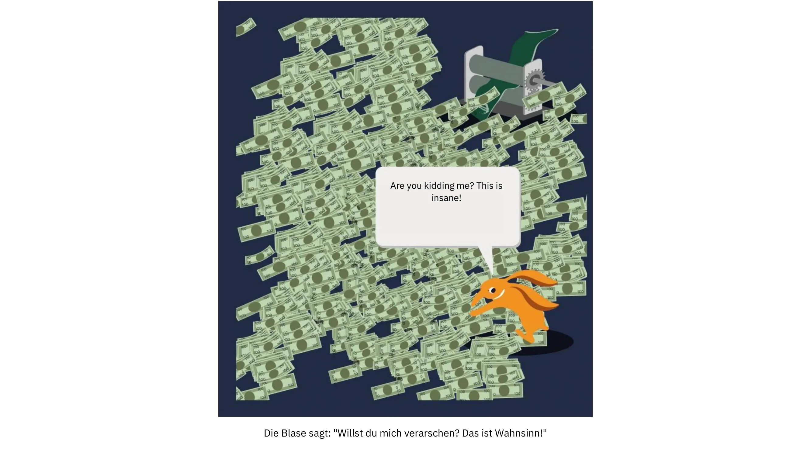

#### 11. Gezwungen, ihre Geschäfte offen zu halten

Wenn die Wirtschaft zusammenbricht und die Währung an Wert verliert, können Regierungen drastische Maßnahmen ergreifen, um den Anschein von Normalität aufrechtzuerhalten.

Weimar: "Die Händler, die ihre Geschäfte weiterführten, waren einer neuen Verordnung unterworfen, die am 22. Oktober erlassen wurde und sie zwang, ihre Geschäfte offen zu halten und Waren gegen Papiermark anzubieten."

Simbabwe: "Es gab nur noch leere Stahlschränke und leere Kühlschränke, Kühlboxen und Gefrierschränke. Die Tragödie war, dass der Laden immer noch geöffnet war, weil sie sich aufgrund politischer Spannungen und der Angst der Führungskräfte vor Verhaftungen durch die Preisüberwachungsbehörde der Regierung nicht trauten, ihn zu schließen. Selbst die Arbeiter wurden nicht entlassen, da jeder dachte, es würde eine schnelle Lösung geben."

#### 12. Jeder ist ein Krimineller

Angesichts einer zusammenbrechenden Wirtschaft und allgegenwärtiger Vorschriften verschwimmt die Grenze zwischen Überleben und Kriminalität.

Weimar: "Alle Verbrechen gegen den Staat, jedes einzelne von ihnen, wurden für die Menschen zu einer Frage des Überlebens."

> Simbabwe: „Jeder Einwohner Simbabwes war ein Verbrecher. So hart es auch klingen mag, es war wahr. Mit der Vielzahl kleiner Gesetze, die jeden Aspekt des Lebens regelten, war es unvermeidlich, dass jeder täglich ein Gesetz brach. Der Besitz von Fremdwährungen war illegal, gemäß einem 2004 veröffentlichten SI. Mehrere Bankkonten zu führen, um das tägliche Auszahlungslimit zu umgehen, war illegal. Falsche Kfz-Kennzeichen, keine Autoradiolizenz oder keine Generatorlizenz – all das waren Gesetze, die jemand, irgendwo, brach.“

#### 13. Fremdwährungen um jeden Preis kaufen

Der frenetische Kauf von ausländischen Währungen hat oft einen kritischen Wendepunkt in der Währungsabwertung markiert und die Abwertung verstärkt.

> Weimar: "Mannheimer ging im August 1921 auf Anweisung seines Chefs aus und begann, ausländische Währungen zu jedem Preis zu kaufen - 'weil Deutschland unendlich viele Papiermark hatte, aber keine ausländischen Währungen.' Dies war das erste Anzeichen für den absoluten Zusammenbruch des Marktwerts."

> Simbabwe: Es wurde behauptet, dass ihnen tägliche Ziele gesetzt wurden, da einige der Devisenanforderungen dringend waren und sie zu jedem Kurs kaufen würden, um Devisen anzusammeln, um die Frist einzuhalten. Diese angebliche Praxis wurde beschuldigt, die Abwertung weiter anzufachen, während der Wert des simbabwischen Dollars weiterhin stark fiel."

### Zusammenfassung des Ablaufs

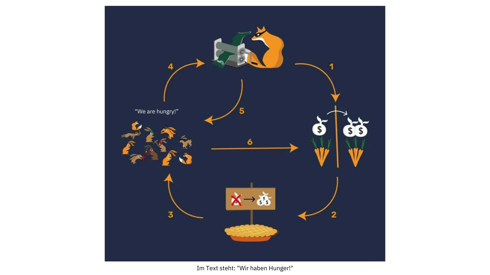

Bei der Analyse des wirtschaftlichen Verlaufs wird deutlich, dass bei hoher Inflation der Wert der Geldmenge abnimmt. Diese Abwertung führt zu mehreren Komplikationen, insbesondere zu Geldknappheit. In diesem Zusammenhang ergeben sich Arbitragemöglichkeiten, insbesondere durch Wechselkursschwankungen. Aus diesem Grund wenden sich viele Menschen dieser Arbitrage zu und investieren massiv in greifbare Vermögenswerte in Erwartung einer zukünftigen Währungsabwertung, die es ihnen ermöglichen würde, ihre Schulden mit einer geschwächten Währung zurückzuzahlen. Diese wirtschaftliche Umgebung beeinträchtigt die Attraktivität traditioneller Arbeitsplätze und erodiert daher den sozialen Zusammenhalt.

Angesichts dieser Situation erlässt der Staat drakonische Vorschriften, einschließlich Kapitalkontrollen. Er verpflichtet auch Händler, die nationale Währung und Schecks zu akzeptieren. Im Laufe der Zeit werden neue Gesetze erlassen, die die Definition von kriminellem Verhalten erweitern. Letztendlich steigt der Wechselkurs exponentiell an, da der Staat bereit ist, seine kostengünstig gedruckte Währung gegen robustere ausländische Währungen einzutauschen.

### 4 Ähnlichkeiten der Auswirkungen von Hyperinflation

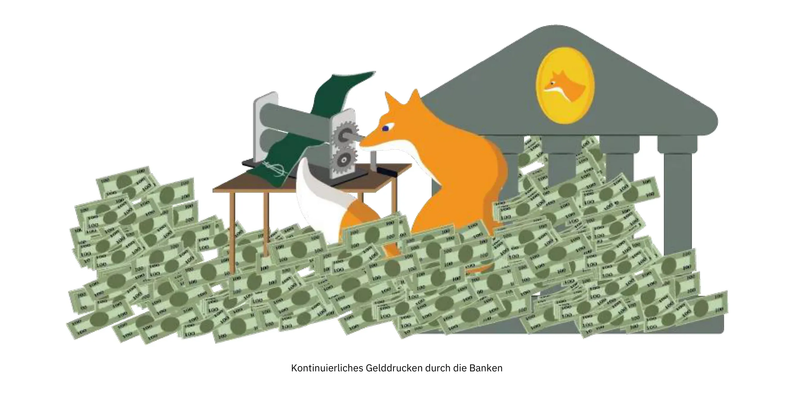

#### 1. Öl und Metalle

In Deutschland während der Weimarer Zeit war der Diebstahl von wertvollen Materialien so verbreitet, dass Blei von den Dächern häufig gestohlen wurde. In Simbabwe trieb die Verzweiflung einige Menschen dazu, das Stromnetz zu unterbrechen, um Öl aus Transformatoren zu gewinnen und es in ihren Fahrzeugen zu verwenden.

Weimar: „Die Metallplatten von Nationaldenkmälern mussten entfernt und in Sicherheit gebracht werden. Messingklingelschilder wurden von den Türen der britischen Botschaft in Berlin gestohlen.“

Simbabwe: „Um die Situation noch zu verschlimmern, gab es aufgrund des Mangels an Devisen einen Mangel an Schmieröl für Autos, und die Transformatoren waren ein leichtes Ziel für Diebe, die während der Stromausfälle das Kühlöl abzapften.“

#### 2. Züge

Die Abwertung der Währung kann Bürger zu Überlebensverhalten treiben, das auf Vandalismus basiert. Angesichts einer zusammenbrechenden Wirtschaft kann teure öffentliche Infrastruktur wie Transportsysteme beeinträchtigt werden, was zu katastrophalen gesellschaftlichen Folgen führt.

> Weimar: „In Berlin stellte das Straßenbahnsystem wegen Geldmangels den Betrieb ein.“

> Simbabwe: „Eines der beunruhigendsten und traurigsten Szenarien war, als fast die gesamte elektrische Kupferleitung zwischen Harare und Dabuka (mehr als 280 Kilometer) gestohlen wurde. Bei ihrer Fertigstellung war sie der Stolz Simbabwes gewesen, mit schnellen elektrischen Personen- und Güterzügen, die diese Strecke befuhren.“

#### 3. „Mealie Meal“

Vor dem Hintergrund lächerlich niedriger Löhne und einer instabilen Wirtschaft sahen sich Unternehmen gezwungen, ihren Angestellten Lebensmittel zur Verfügung zu stellen, um sie produktiv und arbeitsfähig zu halten. Diese Initiative war nicht nur ein Mittel, um Knappheit und hohe Lebensmittelpreise auszugleichen, sondern auch eine Strategie, um Personal in einem schwierigen wirtschaftlichen Umfeld zu halten.

> Weimar: „In Berlin hatten Büroangestellte, die eine sehr wichtige Klasse in der Hauptstadt darstellten, völlig unzureichende Gehälter zwischen 12.000 und 20.000 pro Monat (also zwischen 12 und 19 Pfund pro Jahr), die ständig sanken; aber die meisten konnten immer noch ein Mittagessen für eine symbolische Summe erhalten, das von ihren Büros bereitgestellt wurde, sodass Körper und Seele gerade so zusammengehalten werden konnten.“

> Simbabwe: „Zu diesem Zeitpunkt stellten wir all unseren Mitarbeitern ein kostenloses Mittagessen zur Verfügung. Maismehl war für den kontinuierlichen Betrieb unseres Unternehmens unerlässlich, da es in vielen Fällen die einzige Mahlzeit war, die unsere Mitarbeiter jeden Tag erhielten.“

#### 4. Benzingutscheine

Die Menschen suchten nach stabilen Alternativen für Transaktionen. In Weimar dienten Produkte wie Messing und Treibstoff als Tauschmittel aufgrund ihres konstanten inneren Wertes. In Simbabwe, angesichts der raschen Abwertung des Simbabwe-Dollars, wurden Benzingutscheine, die eine feste Menge eines lebenswichtigen Produkts darstellten, zu einer de-facto-Währung. Diese Situationen verdeutlichen, wie Gesellschaften sich an extreme wirtschaftliche Bedingungen anpassen und innovative Lösungen finden, um Handel und Wirtschaft am Laufen zu halten.

Weimar: „Tauschhandel war bereits eine übliche Form des Austauschs; doch nun wurden Waren wie Messing und Treibstoff zur gängigen Währung für Kauf und Zahlung.“

Simbabwe: „Diese Gutscheine nutzten wir nun, um Mieten an Vermieter zu zahlen, Gemeindesteuern, Telefonrechnungen – praktisch alles, da niemand mehr Zahlungen in Simbabwe-Dollars oder Schecks akzeptierte.“

#### Fazit

Damit endet dieses Video über die Gemeinsamkeiten der Erfahrungen während der Hyperinflation in Simbabwe und in der Weimarer Republik. Im nächsten Video werden wir über die Unterschiede und zeitgenössische Parallelen sprechen. Vielen Dank.

## Unterschiede zwischen Weimar und Simbabwe und zeitgenössische Parallelen

<chapterId>643f279c-d89f-5600-a2e2-b1bbbba0ab69</chapterId>

In diesem Kapitel werden wir die Unterschiede und Parallelen zwischen vergangenen und zeitgenössischen Hyperinflationsperioden erkunden, ergänzt durch Anekdoten und relevante Vergleiche für heute.

### Unterschiede zwischen der Weimarer Republik und Simbabwe

#### 1. Es ist die Schuld des Dollars!

In Deutschland war es üblich, dass die Bevölkerung die Inflation auf den Anstieg des Dollars zurückführte, anstatt auf die intrinsische Abwertung ihrer eigenen Währung. Viele waren überzeugt, dass das beobachtete Phänomen auf eine Aufwertung des Dollars zurückzuführen war. Diese Wahrnehmung ließ jede Anerkennung des Zusammenhangs zwischen ihrer wirtschaftlichen Schwierigkeit und der Währungsabwertung, die hauptsächlich durch übermäßige Geldschöpfung verursacht wurde, vermissen. Das Buch "When Money Dies" illustriert diese Unkenntnis deutlich unter der deutschen Bevölkerung. Im Gegensatz dazu war die Situation in Simbabwe anders: Die Bürger waren sich vollständig der zugrunde liegenden Ursache der Hyperinflation bewusst, der sie ausgesetzt waren.

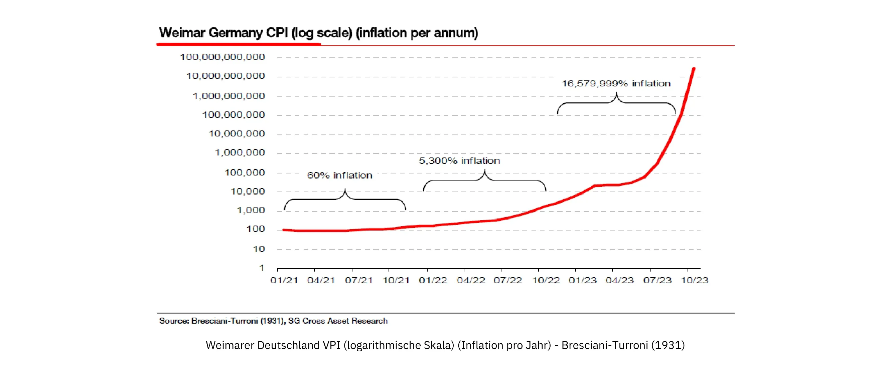

#### 2. Das Notgeld (Notgeld)

Angesichts der Währungs- und Wirtschaftskrise griff Deutschland auf "Notgeld" zurück. Diese von Städten oder bestimmten Unternehmen gedruckten Banknoten wurden entwickelt, um den Mangel an gängigem Geld zu beheben.
Interessanterweise griff auch Frankreich in den 1920er Jahren auf Notgeld zurück. Diese Initiative war nicht nur eine direkte Folge der Hyperinflation, sondern hatte auch ihre Wurzeln in den Störungen, die der Erste Weltkrieg verursacht hatte. Der Krieg destabilisierte nicht nur die Wirtschaft, sondern erhöhte auch die Kosten für Metalle. Daher überstieg der intrinsische Wert von Metallmünzen oft ihren Nennwert, was die Menschen dazu veranlasste, sie zu horten. In Abwesenheit von Münzen druckten einige Institutionen wie die Handelskammer von Lyon ihr eigenes Notgeld.
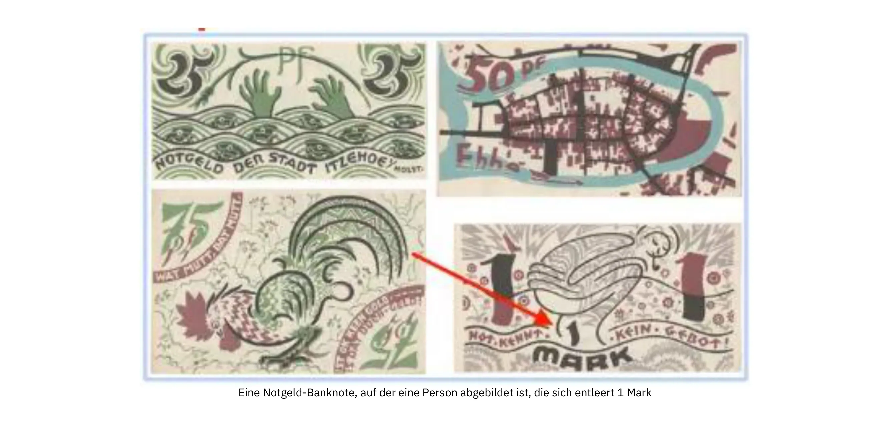

> "Was getan werden muss, muss getan werden." - ein lokales Sprichwort

Unter den Notgeld fällt ein bestimmter Schein auf. Er zeigt eine eindringliche Illustration: In der Mitte ist eine Person dargestellt, die einen Mark entleert. Auf der Rückseite zeigt eine Preisliste von 1913 bis 1921 den Anstieg der Inflation in diesem Zeitraum.

Der Künstler hinter diesem Notgeld scheint eine ironische Kritik an die Autoritäten zu richten, die für die Hyperinflationskrise verantwortlich waren. Der Schein trägt die Inschrift "Necessity knows no law", was "Not kennt kein Gesetz" bedeutet. Ein weiterer Ausdruck, spezifisch für den Ursprungsort des Notgelds, lautet: "Was getan werden muss, muss getan werden".

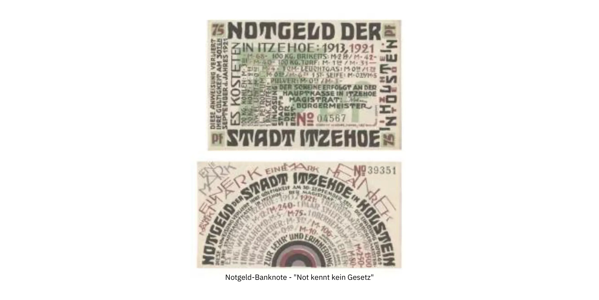

> "Not kennt kein Gesetz"

> Die erste Shitcoin: Anekdotisch betrachtet könnte der Schein aufgrund der zentralen Illustration, bei der die Währung buchstäblich durch die Handlung der Person entwertet wird, als erste "Shitcoin" bezeichnet werden.

#### 3. Schuldverschreibungen und Hypotheken

In Weimar wurden einige Schulden neu bewertet, um die Auswirkungen der Inflation auszugleichen. Diese Maßnahme wurde im Simbabwe nicht übernommen.

> Weimar: "Eine Entscheidung zur Neubewertung der eigenen Regierungsschulden wurde 1925 Gesetz, was dazu führte, dass die Aktionäre 2,5 Prozent ihrer ursprünglichen Investition erhielten, vorausgesetzt, dass alle Reparationen bezahlt wurden."

> Simbabwe: "Im Juli 2007 (drei Jahre später) konnte ich einen abgewerteten Schein von ZDW 500.000 (bt "000") aus meiner Tasche ziehen, der jetzt einen Wert von 1,67 Dollar zum parallelen Marktkurs hatte, und damit das Hypothekendarlehen zurückzahlen, das in zwanzig Jahren zurückgezahlt werden sollte. Außerdem entsprach dieser Schein nur 0,49 Prozent meines monatlichen Gehalts im selben Monat."

Um mehr über das Management der deutschen Krise zu erfahren, ist dieses Buch ebenfalls von grundlegender Bedeutung.

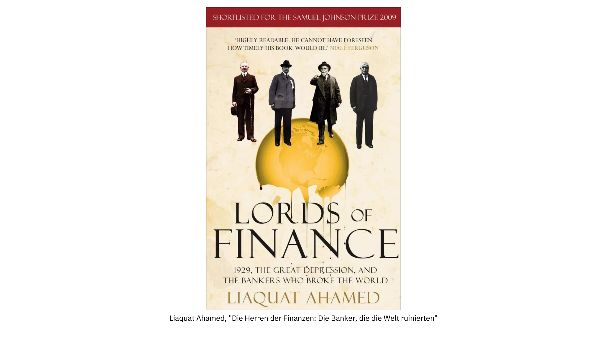

### Zeitgenössische Parallelen

#### 1. Manipulation der Geldpolitik zur Steuerung der Wirtschaft.
   In der Geschichte der Weimarer Republik ist offensichtlich, dass die Industriellen gegenüber einer Aufwertung der Mark zögerten. Ihre Fähigkeit, mit einer stark abgewerteten Währung zu leihen und ihre Schulden zurückzuzahlen, verschaffte ihnen einen erheblichen Vorteil. Dieser Mechanismus ermöglichte den Bau riesiger Industriekomplexe zu nahezu keinen Kosten. Diese Industriellen fürchteten eine Aufwertung der Mark, da sie ihre Aktivitäten behinderte. Einige betrachteten sogar die galoppierende Inflation als positiv, da sie für Beschäftigung in der Bevölkerung sorgte. Sie erkannten jedoch nicht die schädlichen Auswirkungen dieser Inflation auf Ersparnisse und die Wirtschaft im Allgemeinen. Für diese Wirtschaftsakteure war die Geldschöpfung ein Glücksfall.

> Weimar: "Aus diesem Grund wurde eine Aufwertung der Mark stark gefürchtet, und selbst die wenigen Wochen der 'Stabilität' nach Genua führten zu einer Stagnation der Geschäfte."

> Weimar: "Die Industriekreise waren mit der Gefahr konfrontiert, dass Bargeld wertvoller wird als Waren und dass alles zusammenbricht, wenn jeder versucht, ihre Vermögenswerte in Bargeld umzuwandeln."

Ein zeitgenössischer Vergleich kann mit den Aussagen von Christine Lagarde gezogen werden, die darauf hinweist, dass die Bürger die Aussicht auf Beschäftigung gegenüber dem Schutz ihrer Ersparnisse bevorzugen sollten. Ähnlich wie die Industriellen in Weimar scheint sie die Geldschöpfung als ein Werkzeug zur Stimulierung der Beschäftigung zu befürworten, auf Kosten des Wertes der Ersparnisse.

> Christine Lagarde: "Wir sollten glücklicher sein, einen Job zu haben, als unsere Ersparnisse geschützt zu sehen."

#### 2. Privateigentum in Zeiten von Konflikten

Die Geschichte der Weimarer Republik zeigt, dass während dieser Zeit Vermögenswerte und Kapital im Ausland beschlagnahmt wurden. Diese Maßnahme erinnert an jüngere Ereignisse in Russland, insbesondere zu Beginn eines Konflikts. Diese Situationen verdeutlichen eine besorgniserregende Realität: In Krisenzeiten kann der Respekt vor dem Privateigentum gefährdet sein. Dies ist eine historische und zeitgenössische Parallele, die die potenziellen Auswirkungen von Krisen auf individuelle Rechte aufzeigt.

> Weimar: "Alle deutschen Kapitalien im Ausland wurden beschlagnahmt."

> [20minutes.fr](https://www.20minutes.fr/monde/3286947-20220513-guerre-ukraine-geler-avoirs-russes-vol-non-redistribuer-kiev-poserait-lourdes-questions) : "Etwa 300 Milliarden Dollar der russischen Reserven im Ausland wurden im Rahmen der westlichen Sanktionen eingefroren, von den insgesamt 640 Milliarden Dollar an Reserven der russischen Zentralbank."

#### 3. Der Begriff des Marktpreises

Während der Weimarer Republik äußerten Landwirte ihre Unzufriedenheit über die „Umlage“, die sie verpflichtete, die ersten zwei Millionen Tonnen jährlich produzierten Weizens abzuliefern. Diese Regelung hatte zur Folge, dass die Hälfte der gesamten Brotversorgung zu subventionierten Preisen auf den Markt gelangte. Ab August sollten diese Landwirte zum Weltmarktpreis entlohnt werden, da sie zwar gezwungen waren, ihren Weizen zu reduzierten Preisen abzugeben, aber gleichzeitig Dünger zu Weltmarktpreisen erwerben mussten.

Diese Situation wirft ein zentrales Problem im Zusammenhang mit dem Begriff des Marktpreises während einer Hyperinflation auf. Im damaligen deutschen Kontext waren die Bauern gezwungen, ihren Weizen unter Wert zu verkaufen, während sie Dünger zu Weltmarktpreisen einkaufen mussten. Eine solche wirtschaftliche Diskrepanz verdeutlicht die Herausforderungen, die die Nahrungsmittelpreise heute darstellen. Landwirtschaftliche Produzenten, die mit steigenden Kosten für Betriebsmittel infolge der Inflation konfrontiert sind, geben diese Kosten an die Endprodukte weiter. Sie für diese Preiserhöhungen zu kritisieren bedeutet, die Dynamik des Marktpreises und den ökonomischen Druck, dem sie ausgesetzt sind, zu ignorieren. Zu künstlich niedrigen Preisen zu verkaufen und gleichzeitig hohe Kosten zu tragen, ist für jedes Unternehmen untragbar.

> Weimar: „Die landwirtschaftlichen Interessen waren mit der ‚Umlage‘ unzufrieden, der Zwangsablieferung der ersten zwei Millionen Tonnen jährlich produzierten Weizens, die es erlaubte, die Hälfte der gesamten Brotversorgung zu niedrigen Preisen zu verkaufen. Ab August sollten die Landwirte zum Weltmarktpreis bezahlt werden, denn während sie gezwungen waren, Weizen billig zu verkaufen, mussten sie stets den Weltmarktpreis für Dünger bezahlen.“

#### 4. Die Leugnung des Zusammenhangs zwischen Geldmenge und Inflation

> Weimar: „Er hielt hartnäckig an seiner Auffassung fest, dass das Geldangebot weder mit dem Preisniveau noch mit den Wechselkursen zusammenhing;“

In der Gegenwart hält dieser Trend an, wie das Beispiel aus dem vorherigen Kapitel zeigt, in dem verschiedene Ökonomen und Wirtschaftsinstitute eine Liste von Erklärungen anführen, um die Inflation zu rechtfertigen. Diese Gründe reichen von kulturellen Ereignissen und Berühmtheiten wie Taylor Swift, Zelda oder Beyoncé bis hin zu globalen Faktoren wie Krieg und Pandemie. All diese Gründe, die zwar kurzfristig zu wirtschaftlichen Schwankungen beitragen können, lenken jedoch von der eigentlichen Ursache ab, nämlich der Ausweitung der Geldmenge.

#### 5. Die Zombie-Unternehmen

> Weimar: „Die Stabilisierung hatte der Zeit ein Ende gesetzt, in der Unternehmer auf Kosten aller anderen so viel leihen konnten, wie sie wollten. Eine sehr große Zahl von Unternehmen, die während des monetären Überflusses gegründet oder ausgebaut worden waren, wurden schnell unproduktiv, als Kapital knapp wurde.“

Ein Zombie-Unternehmen ist ein Betrieb, der unter normalen Marktbedingungen insolvent oder nahe der Pleite wäre, aber weiterbesteht, hauptsächlich dank billiger Kredite. Diese Unternehmen erwirtschaften gerade genug, um ihre Schulden zu decken, sind jedoch nicht in der Lage, signifikant zu wachsen.

Das Konzept der Zombie-Unternehmen ist nicht neu. Es war bereits in der Weimarer Republik präsent. Damals schienen viele Unternehmen auf den ersten Blick zu florieren, da sie stark vom Zugang zu kostenlosem Kredit profitierten. Sie liehen sich beträchtliche Summen mit der Aussicht, später mit einer durch Hyperinflation entwerteten Währung zurückzuzahlen. Als die Inflation jedoch endete und die deutsche Mark wieder an Wert gewann, wurden diese Unternehmen, die operativ und finanziell nicht wirklich lebensfähig waren, unrentabel und mussten schließen.

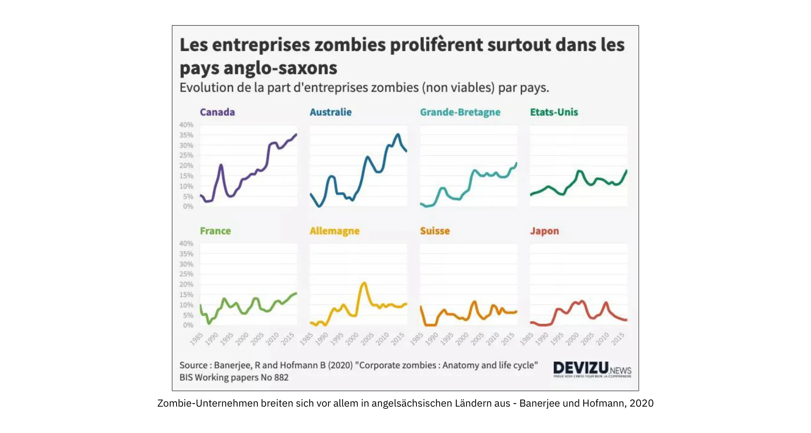

Das Phänomen der Zombie-Unternehmen beschränkt sich nicht auf die Nachkriegsgeschichte Deutschlands. Auch heute überleben viele große Unternehmen dank eines privilegierten Zugangs zu Krediten mit sehr niedrigen Zinssätzen. Müssten sie zu konventionelleren Zinssätzen leihen, würden viele von ihnen unrentabel werden. Dies ist umso relevanter, als wir uns im Jahr 2023 befinden und nach einer langen Phase nahezu null Zinsen diese nun zu steigen begonnen haben. Diese jüngste Entwicklung der Finanzlandschaft wird zweifellos ein entscheidender Test für diese einst als „Zombies“ bezeichneten Unternehmen sein.

#### 6. Schnell reich werden!

In der Geschichte lassen sich Momente beobachten, in denen Menschen versuchten, schnell reich zu werden, wie es in Weimar und in Simbabwe durch Arbitrage der Fall war. Heute zeigt sich eine ähnliche Tendenz mit dem Aufkommen bestimmter Kryptowährungen. Menschen werden durch schnelle Gewinne verlockt, gehen Risiken ein und hoffen auf eine exponentielle Vervielfachung ihrer Investition. Dieser Ansatz erinnert an Zeiten der Hyperinflation, in denen Arbitrage genutzt wurde, um schnelle Gewinne zu erzielen, oft auf Kosten anderer.

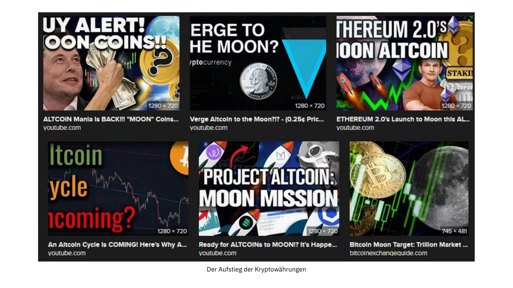

#### 7. Das Sparen, das Heilmittel gegen Unsicherheit

> Der allgegenwärtige und zerstörerische Einfluss der ständigen Erosion des Wertes von Kapital und Einkommen sowie die Unsicherheit in Bezug auf die Zukunft.

Es ist interessant, ein Zitat hervorzuheben, das die zerstörerische Wirkung der Erosion des Kapitalwertes auf den sozialen Zusammenhalt sowie die Unsicherheit, die sie hervorruft, betont. Es lautet: „der allgegenwärtige und zerstörerische Einfluss der ständigen Erosion des Wertes von Kapital und Einkommen sowie die Unsicherheit in Bezug auf die Zukunft.“

Stellen Sie sich ein Szenario vor, in dem Sie eine Familie oder Angehörige haben, die Sie schützen möchten. Sie arbeiten hart, sparen, um zukünftige Unsicherheiten abzufangen. Wäre alles vorhersehbar, wäre das Sparen nutzlos. Angesichts des Unvorhersehbaren, etwa eines Autodefekts, wird das Sparen jedoch zu einem Rettungsanker. Es reduziert die Unsicherheit der Welt. Während einer Hyperinflation wird das Sparen jedoch zur Herausforderung. Geld verliert schnell an Wert, was eine langfristige Planung erschwert. Diese finanzielle Instabilität kann Stress und Angst hervorrufen.

Heute, da die Sparfähigkeit sinkt, tritt die Investition an ihre Stelle. Dieser Ansatz birgt jedoch eigene Risiken. Das Sparen war stets ein Heilmittel gegen Unsicherheit. Finanzielle Rücklagen für unvorhergesehene Situationen tragen zu innerer Ruhe bei und stärken den sozialen Zusammenhalt. Zusammenfassend lässt sich sagen, dass der Schutz unserer Sparfähigkeit entscheidend ist, um soziale und individuelle Stabilität zu bewahren.

## Währungsumstellungen in Lateinamerika

<chapterId>918eafd7-409d-5205-ad52-a52e63b23a64</chapterId>

Wir werden uns gemeinsam verschiedene Phasen der Währungsumstellung in lateinamerikanischen Ländern ansehen.

### Erklärung der Diagramme

Auf der Folie links sind die Jahre der Währungsumstellung, der Name der neuen Währung und der Wechselkurs zur alten Währung angegeben. Nehmen wir das Beispiel Argentiniens: Der Peso Moneda Nacional wurde zum Wechselkurs von 25 zu 1 gegenüber der vorherigen Währung, dem Peso Real, umgestellt. In diesem Zusammenhang werden wir die Entwicklung der argentinischen Währung im Laufe der Zeit betrachten. Außerdem werden wir die anfänglichen und endgültigen Bezeichnungen der Banknoten für jeden Zeitraum angeben.

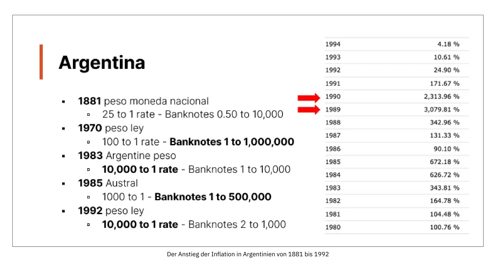

Auf der rechten Seite der Folie befindet sich ein Inflationsdiagramm. Die roten Pfeile repräsentieren die Jahre der Hyperinflation, definiert nach dem Kriterium von Cagan als eine Inflation von 50 % pro Monat. Dieses Kriterium kann manchmal zu mehrdeutigen Interpretationen führen, bei denen Jahre mit hohen Inflationsraten, die jedoch nicht der strengen Definition von Hyperinflation entsprechen, enthalten sind.
Es ist zu beachten, dass die Währungsumstellung während einer Inflationsperiode eine gängige Maßnahme der Regierungen ist. Allerdings löst dies nicht das zugrunde liegende Problem der Inflation oder Hyperinflation. Es handelt sich lediglich um eine Umbenennung der Währung und das Entfernen von Nullen, ohne die eigentliche Ursache der Hyperinflation, nämlich die Ausweitung der Geldmenge, wirklich anzugehen. In einem späteren Video werden wir über wirkliche Lösungen zur Bewältigung und Lösung des Problems der Hyperinflation diskutieren. In dieser Serie werden wir die Auswirkungen einer einfachen Währungsumstellung ohne angemessene Reformen beleuchten: Die Inflation bleibt bestehen.
Nach Argentinien werden wir uns mit Brasilien, Bolivien, Peru, Nicaragua und Venezuela befassen. Wir werden uns die Währungsumstellungen in diesen Ländern genauer ansehen.

### Argentinien

Vor 1826 verwendete Argentinien den spanischen Dollar. Nach der Unabhängigkeit im Jahr 1816 führte es seine eigene Währung auf Basis des spanischen Real ein, was zur Schaffung einer ähnlichen Währung führte. Die Tabelle beginnt im Jahr 1881, als der "peso moneda nacional" eingeführt wurde, mit Banknoten bis zu 10.000. Dieser wurde vom "peso ley" abgelöst, der im Verhältnis 100 zu 1 umgetauscht wurde und Banknoten bis zu einer Million hatte. Dann kam der "argentine peso" mit einem Wechselkurs von 10.000 zu 1 (was der Entfernung von vier Nullen entspricht) und Banknoten bis zu 10.000. Im Jahr 1985 wurde der "australes" eingeführt und im Verhältnis 1000 zu 1 umgetauscht, mit Banknoten bis zu 500.000. Im Jahr 1992 wurde der aktuelle "peso ley" mit einem Wechselkurs von 10.000 zu 1 eingeführt, wodurch erneut vier Nullen entfernt wurden. Nur die Jahre 1989 und 1990 waren von Hyperinflation betroffen.

### Brasilien

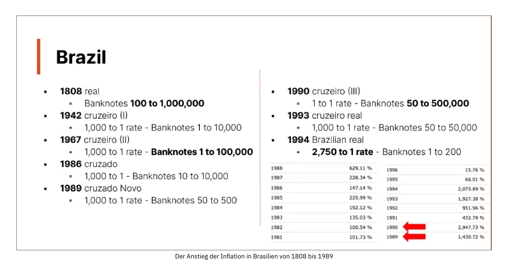

Brasilien ist ein herausragendes Beispiel für Währungsumstellungen, wie sie in seiner wechselvollen Geschichte häufig vorkommen. Vor der Unabhängigkeit verwendete Brasilien den portugiesischen Real. Bereits ab 1747 begann das Land jedoch, seinen eigenen "brasilianischen Real" zu verwenden, lange vor der Unabhängigkeitserklärung im Jahr 1822. Die Tabelle beginnt im Jahr 1818 und markiert den Beginn der Ausgabe brasilianischer Banknoten. Davor war die Währung hauptsächlich in Form von Münzen vorhanden. Diese Banknoten erreichten Werte von bis zu einer Million Reais.
Ab 1942 begann Brasilien eine Reihe von Währungsreformen. In den meisten Fällen (1942, 1967, 1986, 1989, 1993) betrug der Umrechnungskurs 1.000 zu 1. Im Jahr 1990 fand eine Namensänderung ohne Umrechnung statt. Die Abfolge dieser Währungen ist wie folgt:

- Réals (alte Version) bis 1942.
- Cruzeiros im Jahr 1942.
- Cruzeiros (neue Version) im Jahr 1967.
- Cruzados im Jahr 1986.
- Cruzados Novo im Jahr 1989.
- Rückkehr zu Cruzeiros im Jahr 1990.
- Cruzeiros Reais im Jahr 1993.
- Schließlich der brasilianische Real im Jahr 1994.

Die höchste Banknote erreichte 500.000, und die letzte Währungsreform im Jahr 1994 erfolgte zu einem Kurs von 2.750 zu 1. Die Jahre 1989 und 1990 waren von Hyperinflation geprägt, während 1993-1994 hohe Inflationsraten verzeichneten, ohne jedoch die Schwelle der Hyperinflation (50% pro Monat) zu erreichen. Nach dieser turbulenten Zeit hat Brasilien seine Währung erneut reformiert, indem es mehrere Nullen gestrichen hat.

### Bolivien

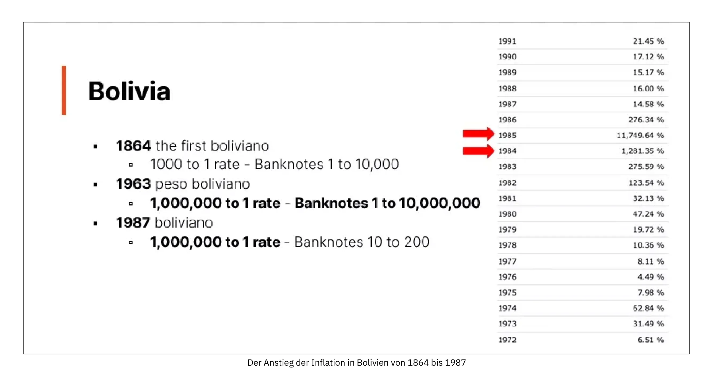

Bolivien ist ein weiteres Beispiel für ein Land, das Phasen hoher Inflation durchlaufen hat und Währungsreformen erforderlich gemacht hat. Hier ist eine Zusammenfassung seiner Währungsgeschichte:

Vor seiner Unabhängigkeit im Jahr 1825 verwendete Bolivien den spanischen Dollar als Währung. Nach seiner Unabhängigkeit führte das Land den Bolivianischen Sol zwischen 1827 und 1864 ein und ersetzte damit den spanischen Dollar. Es ist jedoch zu beachten, dass die ersten Banknoten in Bolivien erst 1864 eingeführt wurden.

Im Jahr 1864 wurde der erste "Boliviano" eingeführt, mit einem Wechselkurs von 1000 zu 1 gegenüber dem Bolivianischen Sol. Diese Währung blieb im Umlauf, bis sie eine Denomination von 10.000 Bolivianos erreichte.
Später änderte Bolivien seine Währung in den "Peso Boliviano", der eine so starke Hyperinflation erlebte, dass er schließlich Nennwerte von bis zu 10 Millionen erreichte. Diese Inflationsphase erreichte in den Jahren 1984-1985 ihren Höhepunkt, mit monatlichen Inflationsraten, die oft nahe an der Schwelle zur Hyperinflation von 50 % lagen. Um eine Perspektive zu geben, führt eine konstante Inflation von 50 % pro Monat über ein ganzes Jahr zu einer jährlichen Inflation von etwa 12.800 %. Im Jahr 1985 erreichte die jährliche Inflationsrate in Bolivien 11.749 %, was bedeutet, dass fast jeden Monat die Inflation nahe oder über der Schwelle von 50 % lag.
Angesichts dieser Währungskrise führte Bolivien im Jahr 1987 eine neue Währung ein, die einfach "Boliviano" genannt wurde, mit einem Wechselkurs von 1 Million Pesos Bolivianos für 1 Boliviano. Diese Version des Boliviano ist bis heute im Umlauf.

Dies ist ein Überblick über die turbulente Währungsgeschichte Boliviens, geprägt von Phasen der Hyperinflation und Währungsreformen.

### Peru

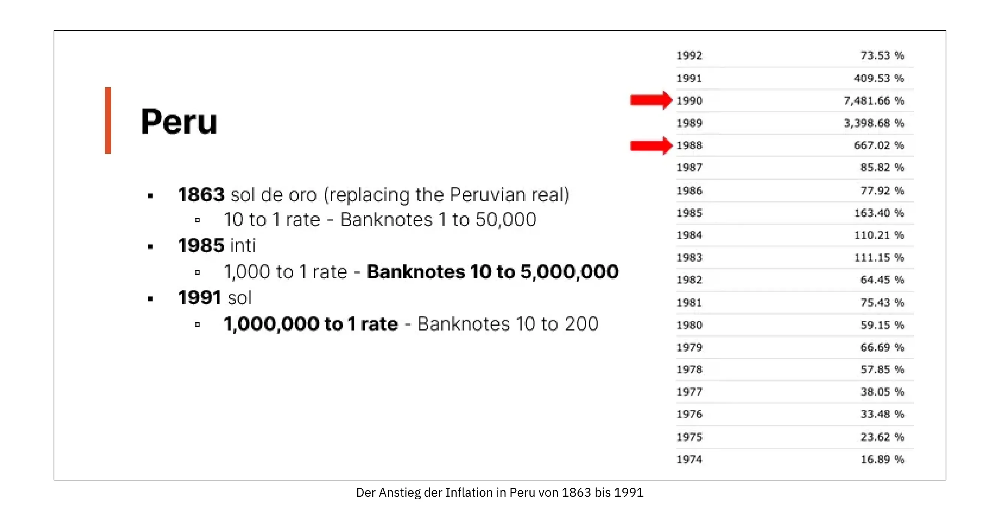

Peru bietet einen interessanten Fall in Bezug auf die Auswirkungen der willkürlichen 50 %-Regel. Beginnen wir mit seiner Währungsgeschichte: Peru verwendete bis zum 19. Jahrhundert das spanische Gold und erklärte seine Unabhängigkeit im Jahr 1821. Der peruanische Dollar war von 1822 bis 1863 in Gebrauch. Im Jahr 1863 wurde der peruanische Real durch den Soldi Oro ersetzt, mit einem Wechselkurs von 10 zu 1, der einen Höchstwert von 50.000 erreichte. Im Jahr 1985 wurde die Währung "Inti" mit einem Wechselkurs von 1000 zu 1 eingeführt, der auf 5 Millionen stieg. Im Jahr 1991 wurde der "SOL" mit einem Wechselkurs von 1 Million zu 1 eingeführt, mit Banknoten im Wert von 10 bis 200.
Bei der Untersuchung der Umtauschperioden wird das Jahr 1988 als ein Jahr der Hyperinflation angesehen, insbesondere im September. Juli-August 1990 war ebenfalls von einer Hyperinflationsperiode geprägt. Im Jahr 1988 betrug die jährliche Inflation 667%, mit einem Höhepunkt von 50% im September. Im Gegensatz dazu betrug die Inflation im Jahr 1989 3000%, ohne dass ein Monat die 50% überschritt, weshalb es nicht als Hyperinflation eingestuft wurde. Im Jahr 1990 erreichte die Inflation 7481%. Es ist klar, dass die 50%-Regel willkürlich sein kann, da 1988 als Jahr der Hyperinflation angesehen wurde, im Gegensatz zu 1989. Wenn diese Regel überdacht würde, wäre es vielleicht sinnvoll, die Schwelle zu senken, um Perioden wie diejenige, die Peru 1989 erlebt hat, einzuschließen.

> Das Geschehen verstehen
>
> Das Wichtigste, was man über Währungsumstellungen verstehen muss, ist, dass wenn der Wert der Währung astronomische Zahlen erreicht, wie z.B. 5 oder 10 Millionen, sie umgestellt wird. Dieser Prozess kann sich mehrmals wiederholen und eine Währungsänderung beinhalten. Das Ergebnis ist, dass die Ersparnisse der Einzelpersonen schwerwiegend beeinträchtigt werden können, selbst ohne Hyperinflation. Zum Beispiel, wenn jemand in einem Jahr 1.000 Dollar spart und es schafft, 100 Dollar beiseite zu legen, könnte im nächsten Jahr der niedrigste Geldschein 1.000 Dollar sein, wodurch die zuvor gesparten 100 Dollar wertlos werden. Eine solche Erosion der Ersparnisse erfordert keine offensichtliche Hyperinflation. Selbst wenn eine Person in den letzten zehn Jahren 10.000 Dollar gespart hat, könnte dieser Betrag letztendlich den Wert eines vernachlässigbaren Betrags haben, der nicht einmal eine einfache Wasserflasche kaufen kann. Diese Realität zeigt sich in vielen Ländern, die Währungsumstellungen erlebt haben, auch wenn nur wenige Monate als hyperinflationär eingestuft wurden. Im Gegensatz dazu haben einige Länder wie Nicaragua viele aufeinanderfolgende Jahre der Hyperinflation erlebt.

### Nicaragua

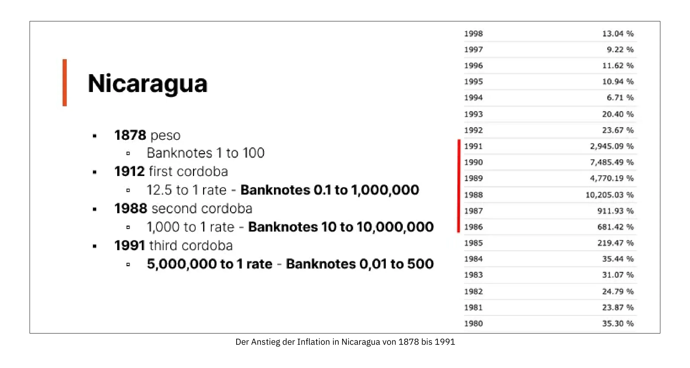
Der Nicaragua, einst unter spanischer Herrschaft, verwendete ursprünglich den spanischen Dollar, wie viele andere von Spanien kolonisierte Länder. Nachdem es in das spanische Reich, das mexikanische Reich und schließlich die Föderative Republik Zentralamerika integriert worden war, erklärte Nicaragua seine Unabhängigkeit. Ab 1878 wurde der Peso zur offiziellen Währung des Landes, mit Werten zwischen 1 und 100. Im Jahr 1912 führte das Land den ersten Cordoba ein, gefolgt vom zweiten im Jahr 1988 und dem dritten im Jahr 1991, der bis heute in Gebrauch ist. Der erste Cordoba erreichte einen Wert von 1 Million, der zweite 10 Millionen. Die Währungsumstellung im Jahr 1991 folgte mehreren Jahren der Hyperinflation.

### Venezuela

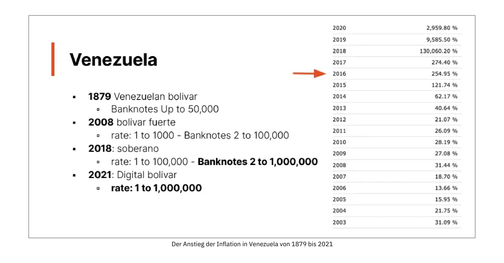

Venezuela ist das letzte Land, das in diesem Video erwähnt wird. Das Land hat im Laufe der Zeit vier Währungsumstellungen erlebt. Zu Beginn verwendete Venezuela den spanischen Dollar, bevor es 1811 seine Unabhängigkeit erklärte. Im Jahr 1879 führte es den Bolivar als offizielle Währung ein, der bis 1983 in Kraft blieb, als die Regierung sich für einen schwankenden Dollar entschied.

Eine bemerkenswerte Tatsache über Venezuela ist seine Mitgliedschaft in der Lateinischen Münzunion. Diese Union umfasste Münzen wie die 5 Peseten aus Spanien, die 5 Drachmen aus Griechenland, die 5 Bolivares aus Venezuela, die 5 Lire aus Italien, die 5 Belgische Franken und die 5 Französischen Franken.

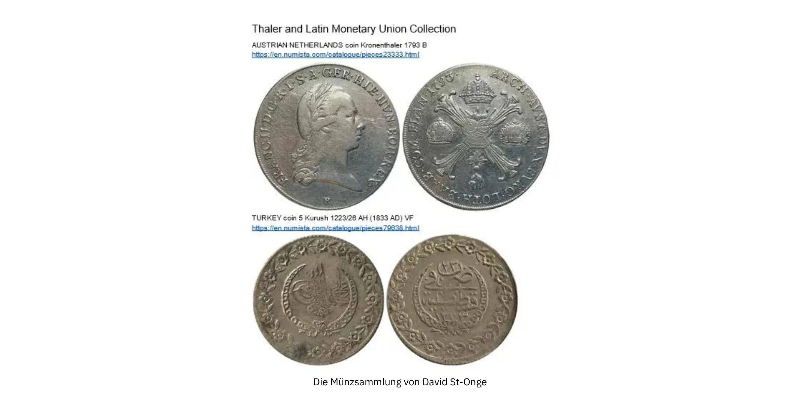

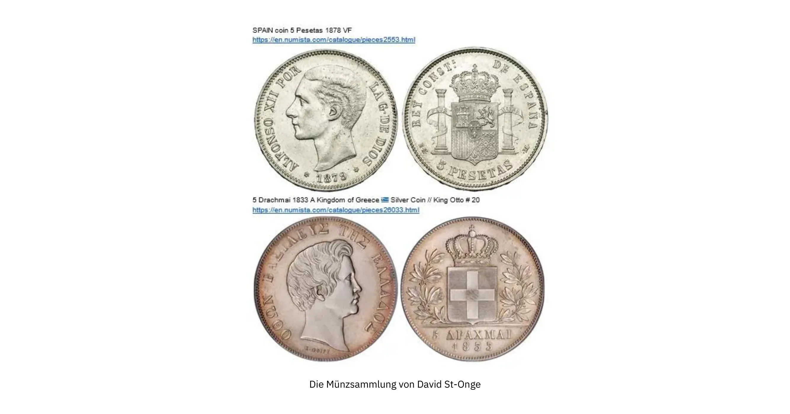

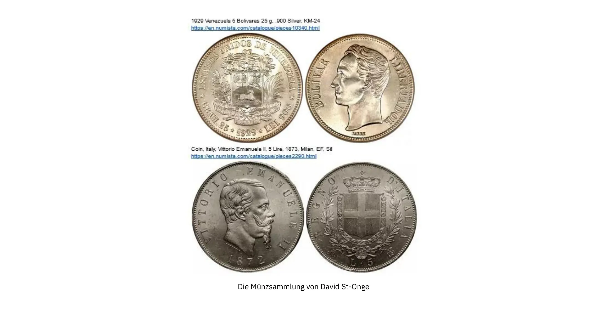

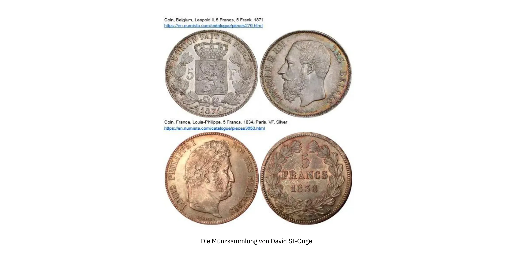

Während dieser Zeit hatte die 5-Bolivar-Münze aus Venezuela das gleiche Gewicht wie die Münzen der Mitgliedsländer der Union, insbesondere Italien, Spanien, Belgien und Frankreich. Diese Bolivares bestanden aus Silber, wobei eine spezielle Münze von 1929 ein Gewicht von 25 Gramm hatte und eine Reinheit von 900 aufwies, was 90 % reinem Silber entspricht. Bei den aktuellen Silberpreisen hat diese Münze einen Wert von etwa 17 bis 18 US-Dollar.

Nach der Einführung eines schwankenden Wechselkurses im Jahr 1983 folgten mehrere Währungsumstellungen:

- Im Jahr 2008 wurde der Bolivar fuerte, oder "starker Bolivar", eingeführt, der bis zu 100.000 erreichte, bevor er in einem Verhältnis von tausend zu eins umgestellt wurde.
- Im Jahr 2018 wurde der Soberano mit Banknoten im Wert von 1 Million eingeführt. Im Jahr 2021 wurde er durch den digitalen Bolivar ersetzt, der ebenfalls eine Million erreichte, bevor er erneut um eine Million auf einen umgestellt wurde. Heute entspricht eine 10- oder 20-Banknote 10 Millionen oder 20 Millionen Soberano.
  Banknoten aus dieser Zeit, die aus dem Jahr 2018 stammen, werden bei verschiedenen Bitcoin-Konferenzen in Biarritz, Toronto und Miami verteilt. Diese Soberano-Banknoten erreichten einen Höchstwert von 1 Million. Anschließend fand eine Redenomination statt, bei der der Wert von einer Million auf etwa 3 Cent reduziert wurde. Derzeit entsprechen 10 Banknoten im Wert von 1 Million einer Banknote im Wert von 10. Seit 2016 leidet Venezuela unter Hyperinflation, was die 57. Periode einer spezifischen Tabelle darstellt.

Im nächsten Video wird eine Sammlung von Banknoten mit Hyperinflation vorgestellt, wobei der Schwerpunkt auf Venezuela und anderen aufgeführten Ländern liegt. Diese Sammlung enthält nahezu alle venezolanischen Banknoten. Die Untersuchung wird sich auf die verschiedenen Redenominationen für jedes genannte Land konzentrieren. Darüber hinaus wird es eine Erkundung der Redenominationen in Simbabwe geben, einem bemerkenswerten Interessengebiet.

### Fazit

Es wurde also festgestellt, dass Hyperinflation nicht das einzige Anzeichen für eine katastrophale wirtschaftliche Situation ist. Mehrfache Redenominationen, das Entfernen von Nullen oder die Änderung des Namen der Währung haben direkte Auswirkungen auf die Bevölkerung, angefangen von dem Verlust von Hilfen bis hin zu Ernährungsproblemen. Obwohl Hyperinflation besorgniserregend ist, zeigt die Anzahl der Redenominationen, wie sie in Brasilien beobachtet wurden, eine komplexere Realität.

Basierend auf dem Kriterium von 50% Inflation pro Monat hätten mehrere Perioden als Hyperinflation klassifiziert werden können. Dies gilt insbesondere, wenn man die Kriterien der Internationalen Rechnungslegungsstandards betrachtet, die unter anderem Merkmale wie die schnelle Aufgabe der Währung durch die Bevölkerung, die Indexierung der Löhne und Kredite mit hohen Zinssätzen zur Kompensation der Inflation berücksichtigen.

Zusammenfassend ist Hyperinflation nur ein Aspekt der wirtschaftlichen Herausforderungen. Hohe Inflation allein kann ebenso schädlich sein. Der nächste Abschnitt wird mögliche Lösungen zur Überwindung der Hyperinflation untersuchen.

## Wie man Hyperinflation überwindet

<chapterId>e3484a31-a851-5f92-8af5-00eddae67db1</chapterId>

### Wie man moderate Inflation und hohe Inflation beendet

Die genannten Schlussfolgerungen stammen aus dem Buch "Monetary Regime and Inflation" von Bernholz. Laut Bernholz ist die einzige Methode, um die Inflation zu beenden, eine Währungsreform durchzuführen und Regierungsbeschränkungen einzuführen. Diese Beschränkungen beinhalten die Einrichtung einer Institution wie einer Zentralbank, die unabhängig von den politischen Entscheidungen der Regierung agiert. Hohe und Hyperinflation sind oft das Ergebnis der Finanzierung von Haushaltsdefiziten durch die Geldschöpfung. Um die moderate Inflation zu bekämpfen, ist es entscheidend, das Wachstum der Geldmenge zu verringern. Bernholz schlägt auch vor, dass dieses Geldmengenwachstum im Vergleich zu den Nachbarländern erfolgen sollte. Eine überraschende Feststellung ist, dass während Phasen hoher oder Hyperinflation der Gesamtwert der Geldmenge tatsächlich abnehmen kann. Ein markantes Beispiel für diese Situation ist Simbabwe.

### Gegenintuitive Lösungen

Bei der Untersuchung Simbabwes wurde festgestellt, dass 10 Billionen Geldmenge ihren Wert verloren hatten. In Weimar war es möglich, zwei Drittel der nominellen Gesamtgeldmenge von 65 Milliarden an einem einzigen Tag zu drucken. Dies zeigt, wie stark die Geldmenge abgewertet werden kann. Um diese Situation zu beheben, ist es notwendig, die Geldmenge signifikant zu erhöhen, um ein angemessenes Niveau zu erreichen. Anschließend ist eine Währungsreform unerlässlich. In Zeiten hoher Inflation ist diese Reform unumgänglich, aber es muss sichergestellt werden, dass ausreichend Geld im Umlauf ist. Nach diesem Schritt können Beschränkungen für die Regierung eingeführt werden.

Laut Bernholzs Beobachtungen wählen Institutionen wie der IWF und die Weltbank nicht immer die richtige Strategie, um Inflationsprobleme zu lösen. In einigen Fällen, wenn ein Land seine Geldmenge erhöhen muss, versuchen diese Institutionen, sie zu reduzieren. Das Wichtigste ist, ein angemessenes Geldniveau zu erreichen und dann das Wachstum zu begrenzen, um Regierungsausgaben nicht durch Geldschöpfung zu finanzieren.

Ein interessanter Aspekt, den Bernholz anspricht, ist, dass der Erfolg einer Währungsreform nicht nur von ihrer technischen Relevanz abhängt, sondern auch vom Vertrauen der Bevölkerung. Einige gut konzipierte Reformen können scheitern, weil die Öffentlichkeit ihnen nicht vertraut, während andere schlecht konzipierte Reformen erfolgreich sein können, weil die Bevölkerung ihnen vertraut. Die Wahrnehmung und das Vertrauen der Bevölkerung sind daher entscheidende Faktoren für den Erfolg oder Misserfolg einer Währungsreform.

- In Simbabwe wurde die Lösung zur Bekämpfung der Inflation die Dollarisierung, was bedeutet, dass sie den US-Dollar oder andere Währungen der Nachbarländer übernommen haben. Dieser Ansatz verhindert, dass die Regierung nach Belieben Geld druckt.
- In Deutschland wurde die Lösung gefunden, eine neue Währung, die Rentenmark, einzuführen. Diese Währung war durch die territorialen Vermögenswerte des Reiches gedeckt, und diese Strategie erwies sich als wirksam.

### Der Fall von Simbabwe

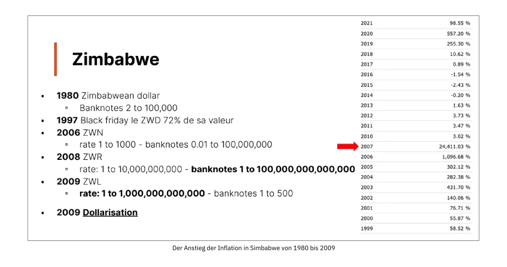

Simbabwe erlangte 1980 die Unabhängigkeit und führte den simbabwischen Dollar ein. Anfangs entsprachen zwei simbabwische Dollar etwa 1,60 US-Dollar. Im Jahr 1997 jedoch, infolge von sozialen Maßnahmen zugunsten der Kriegsveteranen, wurde die Währung am Schwarzen Freitag um 72% abgewertet. Anfang der 2000er Jahre startete das Land ein Landumverteilungsprogramm, bei dem Land von weißen Eigentümern genommen und an die lokale Bevölkerung übergeben wurde. Diese Entscheidung schadete den Exporten, da die neuen Eigentümer oft nicht über die erforderliche Expertise zur Bewirtschaftung großer landwirtschaftlicher Betriebe verfügten. Tatsächlich wurde Simbabwe, das im Jahr 1999 ein Nettoexporteur war, im Jahr 2003 zum Nettoimporteur.

Im Jahr 2006 führte das Land eine neue Version seiner Währung, den ZWN, mit einem Wechselkurs von 1 zu 1.000 ein. Im Jahr 2008 wurde eine weitere Währung, der ZWR, mit einem Wechselkurs von 1 zu 10 Milliarden eingeführt. Dies führte zur Einführung der ikonischen 100-Billionen-Dollar-Noten.

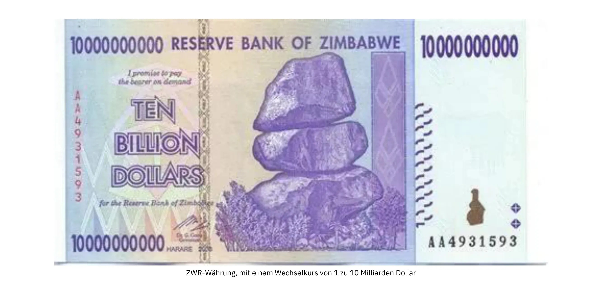

#### Die Dollarisierung & die Lösung der Krise

Nach 2009, angesichts der anhaltenden Währungskrise und der galoppierenden Hyperinflation, gab Simbabwe seine nationale Währung auf und erlaubte die Verwendung ausländischer Währungen, hauptsächlich des US-Dollars. Diese Entscheidung beendete die Hyperinflation, obwohl sie radikal war. Eine wichtige Lektion ist, dass das Beenden der übermäßigen Geldausgabe und die Beendigung der Finanzierung des Haushaltsdefizits durch die Zentralbank die Hyperinflation beenden können.

Jedoch ist die Dollarisierung keine Wunderlösung. Obwohl sie die Hyperinflation beenden kann, bringt sie andere wirtschaftliche Herausforderungen mit sich. Eine der Konsequenzen ist der Verlust einer eigenständigen Geldpolitik. Ohne eigene Währung kann ein Land seine Geldpolitik nicht anpassen, um auf interne wirtschaftliche Schocks zu reagieren.

Im Jahr 2007 erreichte die Inflationsrate in Simbabwe die Marke von 50% pro Monat und markierte offiziell das Land als von Hyperinflation betroffen. Nach der Dollarisierung im Jahr 2009 hörte die Hyperinflation auf, aber das Land stand vor anderen wirtschaftlichen Herausforderungen.
Es ist besorgniserregend festzustellen, dass Simbabwe versucht hat, seine eigene Währung wieder einzuführen und Anzeichen einer erneuten hohen Inflation aufgetreten sind. Nach Angaben einiger internationaler Organisationen könnte das Land bereits wieder die Kriterien für Hyperinflation erfüllen, auch wenn es noch nicht die offizielle Schwelle von 50 % pro Monat erreicht hat. Dies erinnert daran, wie gefährlich übermäßige Geldausgabe und die Finanzierung von Defiziten durch die Zentralbank sein können.

### Schlussfolgerung

In meinem Buch "Alles über Bitcoin" habe ich ein ganzes Kapitel der Hyperinflation in Simbabwe gewidmet. Dort erläutere ich die wichtigsten Ereignisse und gebe verschiedene Beispiele, wie das Land schließlich die Hyperinflation beendet hat.

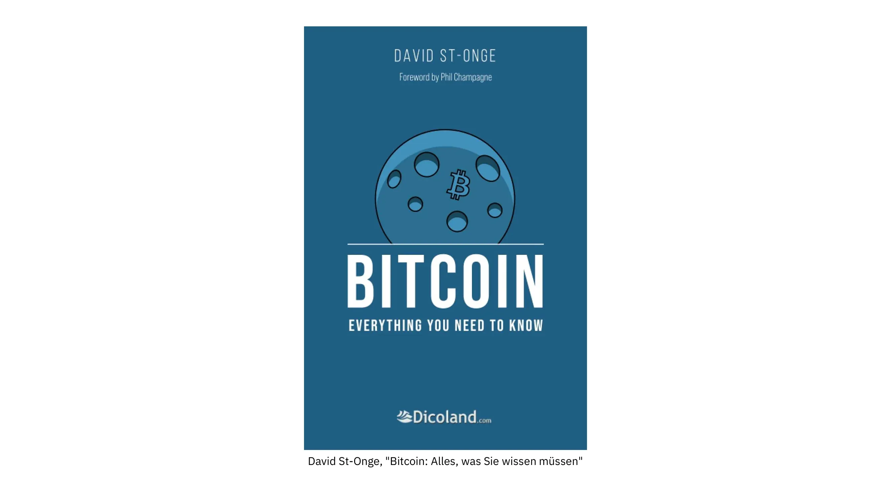

Für diejenigen, die an der deutschen Erfahrung nach dem Ersten Weltkrieg interessiert sind, empfehle ich dringend den Comic "Der Reichsbankier". Er erzählt, wie Deutschland es geschafft hat, die Hyperinflation zu überwinden, insbesondere durch die Einführung der Rentenmark.

Das Wichtigste ist, dass es verschiedene Strategien gibt, um aus der Hyperinflation herauszukommen. Man kann sich für die Dollarisierung entscheiden oder eine neue Währung einführen. Diese Lösungen funktionieren jedoch nur, wenn die Bevölkerung Vertrauen in sie hat. Es ist entscheidend, strenge Einschränkungen zu setzen. Eine wirklich unabhängige Zentralbank ist unerlässlich. Sie darf die Geldmenge nicht erhöhen, um Haushaltsdefizite auszugleichen. Bei leichter Inflation sollte es ausreichen, das Wachstum der Geldmenge zu begrenzen. Wenn man jedoch mit Hyperinflation konfrontiert ist, ist es zunächst wichtig, eine angemessene Geldmenge für die Größe der betreffenden Wirtschaft zu haben. Danach ist es unerlässlich, strenge Einschränkungen für die Regierung zu setzen, um die Situation zu stabilisieren.

## Vorstellung der Sammlung von Hyperinflationsbanknoten

<chapterId>f3ffbb47-3aeb-54bd-80a9-adccb0f419e2</chapterId>

[Entdecken Sie die gescannte Sammlung im *Bitcoin Educational Toolkit* (auch über den Abschnitt *Ressourcen* auf der Plan ₿ Academy Plattform zugänglich.](https://penpot.planb.network/#/view?page-id=c157057b-fd28-8042-8004-4f081b21defc&file-id=c157057b-fd28-8042-8004-4f081b21defb&section=interactions&index=0&share-id=7154756b-3ebd-8040-8004-6475c2af5889&interactions-mode=show-on-click)

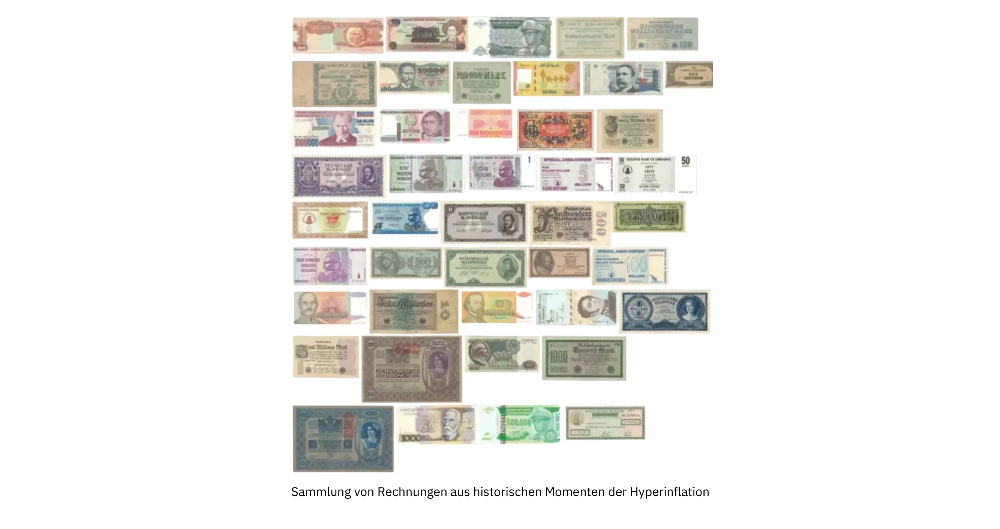
# Wie sind wir hierher gekommen?

<partId>f66ca17e-be9e-5d30-a098-f7affd8962a1</partId>

## Das Aufkommen der zweiten Geldschicht und der Zentralbanken

<chapterId>0455ffe3-9d45-5a67-ac96-3f815dc507a1</chapterId>

Transkript:

Das Aufkommen der zweiten Geldschicht und der ersten Zentralbanken ist ein faszinierendes Thema. Dieses Thema wird ausführlich in dem Buch "Layered Money" von Nick Battia behandelt. Ich empfehle es allen, die sich für die Entwicklung und Feinheiten unserer Geldsysteme interessieren. Das Ziel dieses Abschnitts ist es, den Ursprung der Geldschöpfung zu verstehen und wie dies zur Hyperinflation führen konnte.

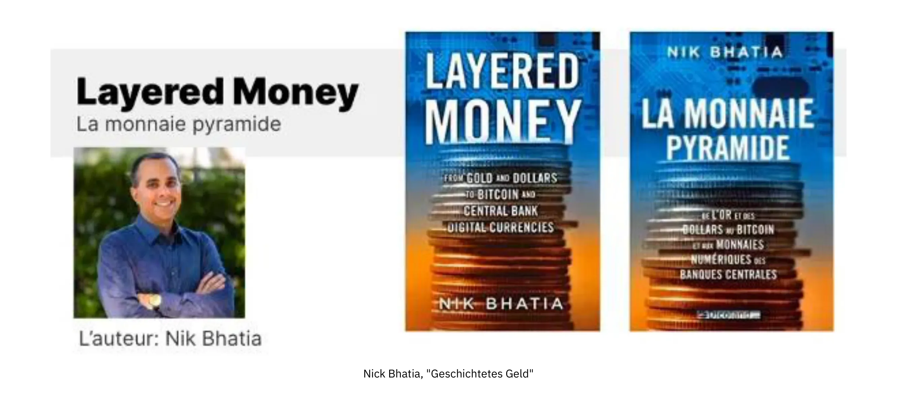

### Geldpyramide und Zentralbanken

#### Der Florin

Die Geschichte des Geldes reicht bis ins 13. Jahrhundert nach Italien, genauer gesagt nach Florenz. Zu dieser Zeit waren der Florin und Wechselbriefe üblich. Ein bemerkenswertes Beispiel ist der Florin, verziert mit der Figur des Johannes des Täufers.

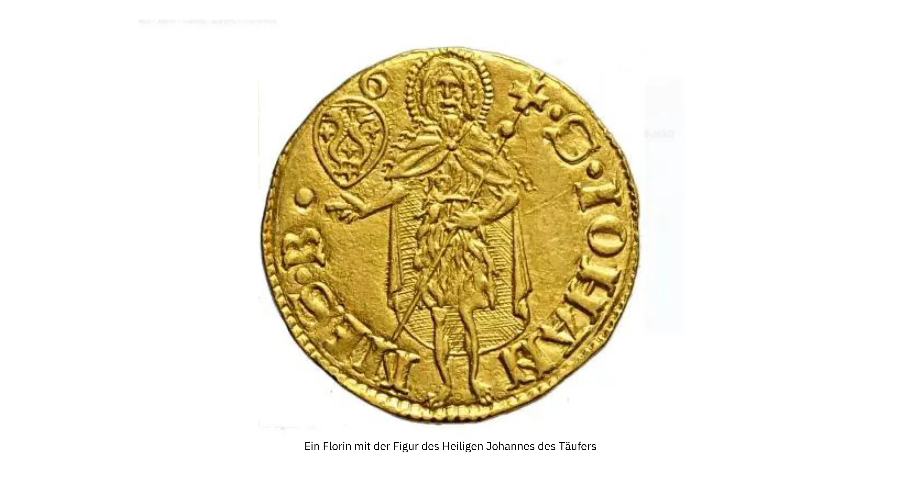

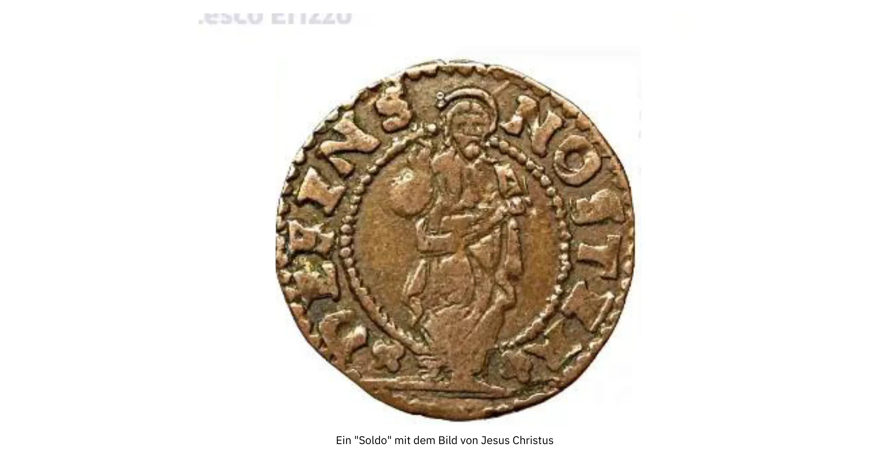

Obwohl es heute teuer ist, einen echten Florin zu besitzen, gibt es Reproduktionen davon. Es gab auch andere Währungen aus dieser Zeit, wie den Soldo der italienischen Staaten des 17. Jahrhunderts, der ein Bild von Christus zeigt.

#### Wechselbriefe (13. Jahrhundert)

Die gängige Praxis war damals folgende: Goldschmiede gaben Wechselbriefe aus, im Austausch gegen bei ihnen hinterlegte Florins. Diese Florins wurden sorgfältig in ihren Tresoren aufbewahrt. So bildete das echte Gold, repräsentiert durch den Florin, die erste Geldschicht, während die Wechselbriefe eine zweite Schicht bildeten. Die Liquidität dieses Systems war jedoch begrenzt. Wenn jemand sein Gold gegen seinen Wechselbrief eintauschen wollte, war die Transaktion einfach. Aber der Austausch dieser Briefe zwischen Einzelpersonen war nicht üblich.

#### Die Börse von Antwerpen (16. Jahrhundert)

Die Börse von Antwerpen markierte einen wichtigen Schritt in der Entwicklung des Papiergeldes. Dort wurde die Praxis des Diskonts von Wechseln eingeführt. Diese Wechsel waren Papiere, die einen Geldwert repräsentierten, aber die Besonderheit war, dass sie Namen und Fälligkeitsdaten trugen. Dadurch waren sie schwer vor dem Fälligkeitsdatum zu handeln.
Die Revolution, die von der Börse in Antwerpen eingeführt wurde, bestand in der Möglichkeit, diese Wechsel vor ihrem Fälligkeitsdatum zu diskontieren. Zum Beispiel war es möglich, einen Wechsel mit einer Fälligkeit von einem Monat zu einem reduzierten Preis zu kaufen, um die Zeit bis zur Fälligkeit zu berücksichtigen. Diese Innovation hat nicht nur das Papiergeld liquider gemacht, sondern auch das Konzept des Zeitwerts des Geldes eingeführt.
Dieses Konzept, obwohl mit Nick Bell und seinem Twitter-Pseudonym "time value of BTC" verbunden, ist nicht seine Erfindung. Dennoch spricht er in seinem Werk ausführlich darüber. Die Hauptidee ist, dass Zeit einen Wert hat. Wenn also jemand beschließt, einen Wechsel im Wert von 100 Dollar einen Monat im Voraus zu bezahlen, kann er ihn zum Beispiel für 98 Dollar erhalten und erhält die 100 Dollar zum Fälligkeitsdatum. Diese monetäre Innovation entstand an der Börse in Antwerpen.

#### Die VOC und der Aktienmarkt in Amsterdam (17. Jahrhundert)

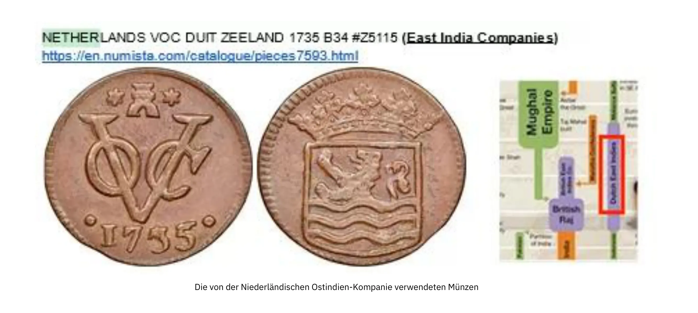

Nach der Börse in Antwerpen war ein weiterer Meilenstein die Gründung der VOC, der Ostindien-Kompanie. Dieses Unternehmen mit Sitz in den Niederlanden gab sogar seine eigene Währung heraus. Nach der Gründung der VOC entstand die erste Börse in Amsterdam und wurde zum ersten Aktienmarkt für dieses Unternehmen. Was interessant ist, ist die Art und Weise, wie die Niederländer die Vorherrschaft von Antwerpen als internationales Wirtschaftszentrum beendet haben. Sie haben einfach den Zugang zur Schelde blockiert. Diese Strategie war Teil einer größeren historischen Bewegung, dem Aufstand der Geusen. Ein entscheidendes Ereignis in der europäischen Geschichte.

#### Die Bank von Amsterdam greift ein

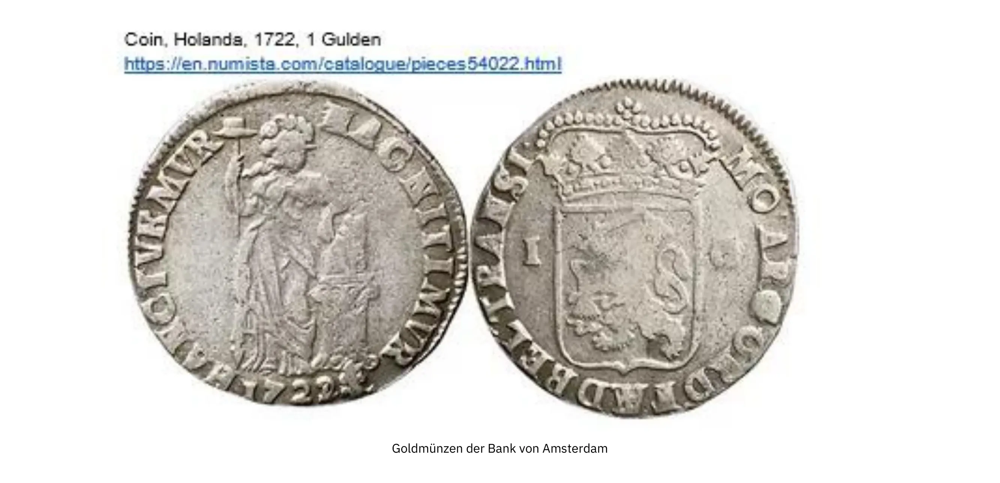

Nach der Gründung der VOC war eine weitere bedeutende Entwicklung in der Geldgeschichte die Einführung der Gulden durch die Bank von Amsterdam. Diese Münzen, die insbesondere aus dem Jahr 1722 stammen, waren aus Silber. Was jedoch die Finanzwelt zu dieser Zeit wirklich revolutionierte, war nicht so sehr die Münze selbst, sondern die mit dieser Währung verbundenen Konten bei der Bank von Amsterdam. Diese Konten wurden zum Hauptmittel des internationalen Handels. Die Transaktionen wurden einfach in Registern oder "Ledgern" aufgezeichnet. Dank dieses Systems wurde Amsterdam zum weltweiten Wirtschaftszentrum. Im Laufe der Zeit beschloss die Bank von Amsterdam, die Verwendung dieser Konten vorzuschreiben. Unabhängige Wechselstuben waren gezwungen, ihre Münzen täglich gegen Einlagen bei der Bank einzutauschen.

#### Gründung der Bank of England zur Finanzierung des Krieges

Die Gründung der Bank of England wurde durch die Notwendigkeit motiviert, den Krieg am Ende des 17. Jahrhunderts zu finanzieren. Ähnlich wie die Bank von Amsterdam erzwang sie Einlagen per Dekret. Das Besondere an der Bank of England war, dass sie die privaten Banken in eine sekundäre Position im Geldsystem drängte und damit eine Art "dritte Schicht" von Geld schuf.
Ursprünglich wurde die erste Schicht des Geldes durch Gold repräsentiert. Die Einlagen bei den privaten Banken bildeten die zweite Schicht. Als diese Einlagen jedoch nicht mehr in Gold umgewandelt werden konnten, entstand eine dritte Schicht von Geld. Die von den privaten Banken ausgegebenen Banknoten waren nun nicht mehr in Gold, sondern in Papiergeld der Bank of England umtauschbar, das selbst in Gold umtauschbar war. Diese Entwicklung führte zu einer Komplexität des Geldsystems durch die Hinzufügung weiterer Schichten.

#### Die Panik von 1796

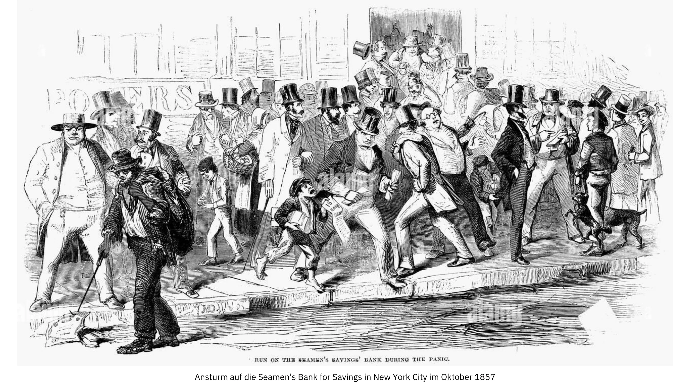
Bankpanik bei der Seamen's Savings Bank während der Panik von 1857.

Nach der Bankpanik von 1796 trat ein Phänomen auf, bei dem jeder versuchte, die "Geldpyramide" nach oben zu klettern. Die Menschen wollten ihre Gelder der dritten Schicht gegen die der zweiten Schicht und schließlich gegen das Geld der ersten Schicht, das Gold, eintauschen. Angesichts dieses massiven Ansturms war die Bank of England gezwungen, Maßnahmen zu ergreifen, um die Situation zu stabilisieren. Um eine mögliche Deflation der Goldreserven zu vermeiden, beschloss sie, die Umtauschbarkeit ihrer Banknoten in Gold auszusetzen. Diese Aussetzung, die ursprünglich als temporäre Maßnahme geplant war, dauerte zwei Jahrzehnte lang an.

### Fazit:

Zentralbanken haben sich zu Kreditgebern letzter Instanz entwickelt, indem sie die Umtauschbarkeit ihrer Währung in Gold ausgesetzt haben. Obwohl diese Maßnahme ursprünglich als temporäre Lösung gedacht war, wurde sie schließlich dauerhaft und markierte somit die Einführung des Konzepts des Kreditgebers letzter Instanz. Diese Transformation hat die Zentralbanken geprägt, wie wir sie heute kennen. In schwächeren Volkswirtschaften kann diese Fähigkeit, Geld nach Belieben zu drucken, jedoch unerwünschte Folgen wie Hyperinflation haben, wenn sie unverantwortlich eingesetzt wird.

## Bücher und Ressourcen

<chapterId>c44e4519-0741-527b-b3b0-3f513e87147d</chapterId>

Hyperinflation ist ein faszinierendes Thema, das durch verschiedene historische Ereignisse untersucht wurde. Wenn Sie dieses Thema vertiefen möchten, finden Sie hier eine Liste von 10 wesentlichen Ressourcen zum Lesen und Studieren:

- "Als das Geld starb: Der Alptraum des Defizit-Spendens, der Abwertung und der Hyperinflation im Weimar-Deutschland" von Adam Fergusson. Dieses Buch beschreibt die hyperinflationäre Krise in Deutschland nach dem Ersten Weltkrieg.

- "Die Ökonomie der Inflation - Eine Studie zur Währungsabwertung im Nachkriegsdeutschland" von Costantino Bresciani-Turroni. Eine gründliche Analyse der deutschen Hyperinflation in den 1920er Jahren.

- "Dieses Mal ist es anders: Acht Jahrhunderte finanzieller Torheit" von Carmen M. Reinhart und Kenneth S. Rogoff. Obwohl das Buch viele Arten von Finanzkrisen behandelt, geht es ausführlich auf Hyperinflationen in der Geschichte ein.

- "Zimbabwes Hyperinflation, Analyse und Lehren" von Steve Hanke. Eine Studie über den Fall der Hyperinflation in Simbabwe zu Beginn der 2000er Jahre.

- "Währungsregime und Inflation: Geschichte, wirtschaftliche und politische Beziehungen" von Peter Bernholz. Das Buch untersucht Fälle von Hyperinflation in der Geschichte und versucht, die zugrunde liegenden Faktoren zu verstehen.

- "Der Hyperinflationsüberlebensführer: Strategien für amerikanische Unternehmen" von Gerald Swanson. Ein praktischer Leitfaden, wie Unternehmen in einer hyperinflationären Umgebung navigieren können.

- "Sterben des Geldes: Lehren aus den großen deutschen und amerikanischen Inflationen" von Jens O. Parsson. Eine vergleichende Analyse der Inflationskrisen in Deutschland und den Vereinigten Staaten.

- "Der Untergang des Geldes: Deutschlands Hyperinflation und die Zerstörung der Mittelschicht" von Frederick Taylor. Eine erzählerische Erkundung der sozialen und wirtschaftlichen Auswirkungen der Hyperinflation auf die deutsche Gesellschaft.

- "Währungsbretter für Entwicklungsländer: Ein Handbuch" von Steve Hanke und Kurt Schuler. Obwohl der Schwerpunkt auf Währungsbrettern liegt, bietet dieses Buch eine Perspektive, wie man Hyperinflationssituationen vermeiden kann.

# Abschluss

<partId>cb1f4a4b-556a-4e47-a5cc-136be35a1f9a</partId>

## Bewertungen & Noten

<chapterId>1a37317e-372a-5241-b478-8316d44f9283</chapterId>
<isCourseReview>true</isCourseReview>

## Abschlussprüfung

<chapterId>d01831c3-6c4d-59e3-95bc-03e97a05c142</chapterId>
<isCourseExam>true</isCourseExam>

## Abschluss

<chapterId>45d410b0-71ed-4502-8d8d-8b6df761db23</chapterId>
<isCourseConclusion>true</isCourseConclusion>
