# Un viaje a la economía

Este programa pretende ofrecer una comprensión profunda de la aparición de las hiperinflaciones en un mundo dominado por la moneda fiduciaria y examinar sus importantes consecuencias. Los participantes profundizarán en los ciclos de hiperinflación, examinando las causas, los factores desencadenantes y ofreciendo ejemplos históricos y contemporáneos. También examinarán el impacto tangible de la hiperinflación en la economía y la vida cotidiana, estudiando las repercusiones en el valor de la moneda, el poder adquisitivo y el ahorro individual y colectivo.

Aquí destacaremos las tendencias y los patrones comunes en los episodios de hiperinflación a lo largo de la historia, al tiempo que ofreceremos estrategias eficaces y concretas para protegerse durante los periodos de hiperinflación. Los participantes tendrán la oportunidad de explorar diversas opciones de inversión y mecanismos de defensa financiera, adquiriendo herramientas prácticas y conocimientos esenciales para navegar con calma en un clima económico inestable.

+++

# Introducción

<partId>6fe4d15d-f6e6-54be-9e04-0a75ac98df8b</partId>

## Resumen del curso

<chapterId>9d1aba8d-0485-5020-9863-5de37e6db8e0</chapterId>

¡Bienvenido al curso ECO204!

El objetivo de este curso es ayudarle a comprender las causas fundamentales, los mecanismos y las consecuencias de la hiperinflación en el contexto de un sistema monetario fiduciario. Mediante ejemplos concretos y análisis históricos, aprenderá a reconocer los patrones recurrentes que preceden a los periodos de hiperinflación y a identificar palancas de actuación para protegerse.

**Sección 2: ¿Qué es la inflación?

Antes de adentrarnos en el meollo del tema, volveremos sobre lo básico: ¿qué es la inflación? Esta sección presentará sus orígenes monetarios, los diferentes tipos de inflación y cómo encajan en una dinámica económica más amplia. Este es un paso esencial para comprender cómo la inflación regular puede evolucionar hacia la hiperinflación.

**Sección 3: ¿Qué es la hiperinflación?

En esta sección, estudiaremos definiciones precisas de hiperinflación y examinaremos varios episodios históricos importantes, incluidos los de la Alemania de Weimar y Zimbabue. Analizaremos sus puntos en común, sus diferencias y sus paralelismos contemporáneos. También descubrirá casos menos conocidos, como las sucesivas redenominaciones en América Latina, así como las estrategias de salida observadas en determinados países.

**Sección 4: ¿Cómo hemos llegado hasta aquí?**

Esta parte pretende comprender los mecanismos estructurales que permiten la hiperinflación, en particular a través del desarrollo del "segundo Layer" monetario y el papel de los bancos centrales. Se ofrecerán recursos adicionales y sugerencias de lectura para profundizar en el tema.

¿Y si la historia monetaria se repitiera ante nuestros ojos? Juzgue usted mismo en los capítulos siguientes

# ¿Qué es la inflación?

<partId>2b4f456c-3649-5cf9-b9b0-a5bffe92d962</partId>

## Un fenómeno monetario

<chapterId>b2cbc915-c4ec-52b5-860c-0958f58c91e4</chapterId>

### Definiciones de inflación

La inflación es un concepto que a menudo se malinterpreta debido a sus múltiples definiciones e interpretaciones. La percepción de la inflación varía entre distintos grupos, como los bitcoiners y los economistas tradicionales. Aclaremos primero las definiciones antes de hablar de la hiperinflación:

- Definición del diccionario Le Robert: La inflación es un aumento excesivo de los instrumentos de pago (billetes, capital), que provoca una subida de los precios y una depreciación de la moneda.

- Definición de la enciclopedia Larousse: La inflación es un fenómeno caracterizado por una subida generalizada y continua del nivel de los precios. Aquí, la palabra "generalizado" es crucial.

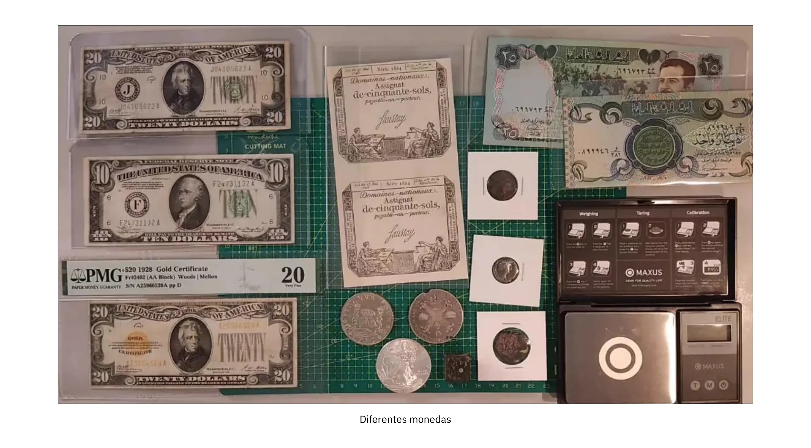

A la luz de estas definiciones, es esencial comprender que, para Robert, la inflación se refiere principalmente al aumento del Supply monetario. En cambio, Larousse se centra en las consecuencias de esta expansión, a saber, la subida generalizada de los precios.

En nuestro estudio sobre la hiperinflación, adoptaremos la segunda definición, que es la de una subida generalizada de los precios, por ser más pertinente y clara para nuestro tema. Sin embargo, es fundamental recordar que esta subida de precios es generalmente el resultado de la expansión del dinero Supply.

El famoso economista Milton Friedman afirmó:

> "La inflación es siempre y en todas partes un fenómeno monetario"

Esta afirmación pone de relieve la relación intrínseca entre expansión monetaria e inflación. En las secciones siguientes examinaremos la relación entre inflación y crecimiento económico, basándonos en estas definiciones fundamentales.

### Comprender el fenómeno monetario

Cuando nos referimos al fenómeno monetario, nos referimos a cómo influye la Supply monetaria de una economía. Milton Friedman lo veía esencialmente como un aumento de esta Supply. Históricamente, ha habido dos métodos principales para aumentar la Supply monetaria:

1. Impresión monetaria:

En los sistemas monetarios tradicionales, el aumento del Supply monetario se conseguía imprimiendo físicamente nuevos billetes. Aunque hoy en día, con el predominio de la moneda digital, esta impresión es principalmente electrónica (a través de las bases de datos de los bancos centrales y otras instituciones financieras), la historia nos muestra periodos en los que la impresión literal de billetes condujo a la hiperinflación.

2. Reducción del contenido de metal:

Otro método consistía en reducir la cantidad de metal precioso en las monedas basadas en metales como la plata o el oro. Un ejemplo llamativo lo encontramos en el Imperio Romano, donde el denario, inicialmente compuesto casi en su totalidad de plata, vio reducido drásticamente su contenido de plata con el paso del tiempo. Esto supuso una forma de inflación, pero no necesariamente de hiperinflación.

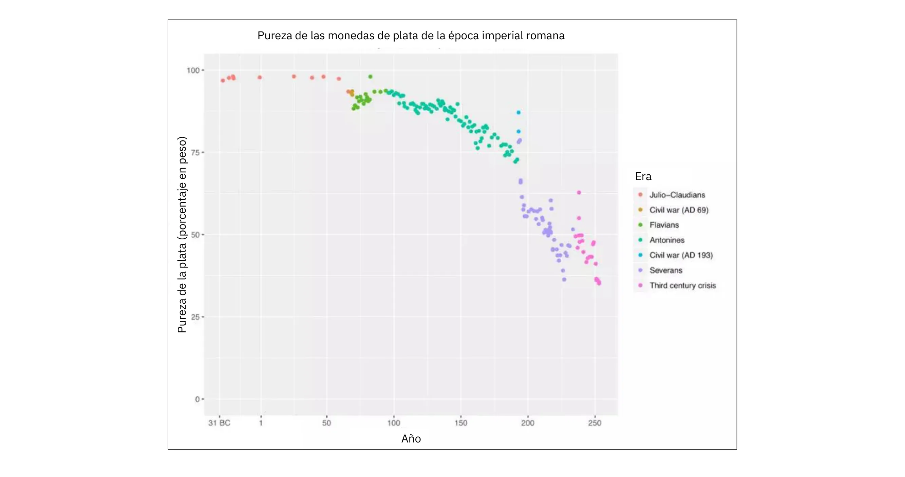

Es crucial subrayar que la hiperinflación se observa principalmente con monedas fiduciarias que no están respaldadas por sus activos subyacentes, como los metales preciosos. Históricamente, cuando una moneda se basaba en tales activos, se producían episodios de inflación (por ejemplo, a través de la devaluación del contenido metálico), pero estos episodios nunca alcanzaron los niveles extremos de la hiperinflación. En las siguientes secciones, estudiaremos en detalle los periodos de devaluación monetaria y las implicaciones de estos diferentes sistemas monetarios sobre la inflación.

### Estudio de los periodos de devaluación monetaria

A lo largo de la historia, diversas civilizaciones han experimentado periodos de devaluación monetaria. Algunos de estos periodos coinciden con grandes acontecimientos o guerras que han ejercido presión sobre la economía.

#### 1. Guerra del Peloponeso y Segunda Guerra Púnica:

La Guerra del Peloponeso, un conflicto entre Atenas y Esparta, y la Segunda Guerra Púnica, entre la República Romana y Cartago, son los primeros ejemplos de devaluación de la moneda que se encuentran en los archivos. Para financiar estas guerras, estas civilizaciones devaluaron sus monedas reduciendo el contenido de plata e incorporando otros metales, al tiempo que aumentaban el número de monedas producidas.

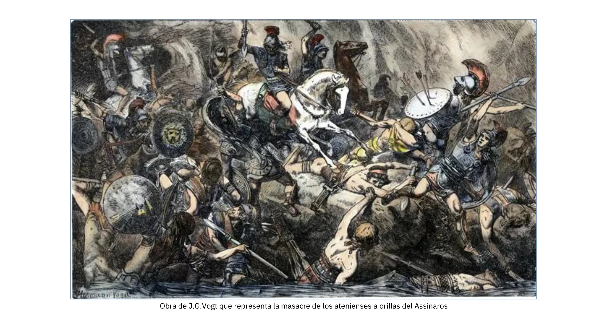

Grabado que representa la masacre de los atenienses a orillas del Assinaros.

#### 2. La antigua Roma durante el Imperio:

Tras la época de la República romana, durante el Imperio, los siglos III y IV experimentaron una importante devaluación de la moneda. Así lo ilustra la disminución del contenido de plata de las monedas, como se ve en el gráfico anterior. Un estudio revela que el precio del trigo en Egipto, medido en dracmas, se multiplicó por un millón en un periodo de aproximadamente 400 años, del 40 a.C. al 360 d.C.. A lo largo de este periodo, representa una inflación media anual de aproximadamente el 4,4%. Sin embargo, esta inflación no se distribuyó uniformemente. Comenzó realmente en torno al 238 d.C. Entre 250 y 293 d.C., la tasa de inflación fue de aproximadamente el 3,65%, y aumentó hasta el 22,28% entre 293 y 301 d.C..

Aunque estos periodos experimentaron una inflación significativa, no alcanzaron los niveles de hiperinflación observados en algunas situaciones modernas. La razón es que, aunque la moneda se devaluó, seguía estando respaldada por metales preciosos. Esta sólida base proporcionaba cierta protección contra niveles de inflación extremos. En las secciones siguientes examinaremos con más detalle la naturaleza y las consecuencias de la hiperinflación.

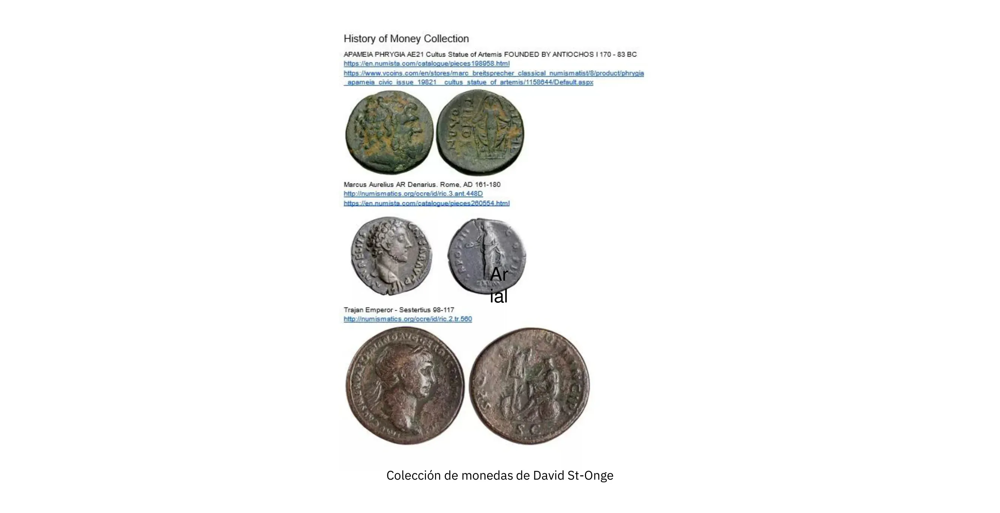

- Denario de Marco Aurelio (160 d.C.):

Una de las monedas más emblemáticas de la antigua Roma es el denario, una Coin de plata. Poseo un Coin específico de Marco Aurelio que data del año 160 d.C., antes de la gran devaluación. Aunque a la cámara le cueste captar los detalles más finos, a simple vista es evidente que el Coin es hermoso y refleja un contenido de plata relativamente alto.

- El Antoniniano (finales del siglo III d.C.):

Con la devaluación monetaria, apareció una nueva moneda, el Antoninianus. Esta moneda debía valer dos denarios, pero contenía mucha menos plata. Mi Antoninianus Coin muestra claramente que el contenido de plata se ha reducido considerablemente. Está adornado con una corona, típica de las monedas romanas de este periodo, llamada "radiada". Comparando el color y la calidad, puede verse que el Antoninianus dista mucho de ser un Coin de plata pura.

Al comparar las dos monedas, la diferencia es notable. El denario de 160 d.C. tiene un marcado aspecto plateado, mientras que el antoniniano de finales del siglo III d.C. es mucho más apagado, lo que indica una importante disminución del contenido de plata. Esta comparación visual ilustra claramente la devaluación monetaria que sufrió la antigua Roma a lo largo de varios siglos.

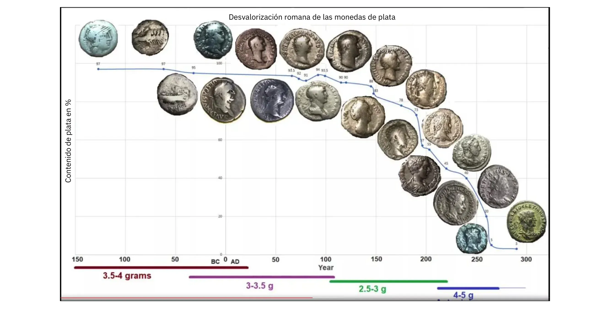

Para completar esta demostración, sería ideal un gráfico que ilustrase la devaluación de estas monedas a lo largo del tiempo. Aunque es difícil de visualizar a través de esta plataforma, imaginemos un gráfico que muestre el valor del denario, seguido de su declive hacia finales del siglo II, cuando fue sustituido por el Antoninianus, supuestamente de dos denarios pero con un contenido en plata significativamente inferior. Estos artefactos son testigos mudos de las fluctuaciones económicas de civilizaciones pasadas.

#### 3. El Maravedí español: testigo de la devaluación selectiva

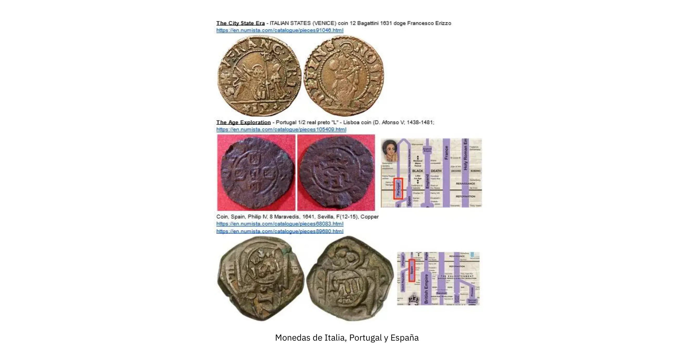

El Maravedí, como moneda de cobre, ocupa un lugar especial en la historia de la moneda española. Como ya se ha mencionado, el dólar español fue originalmente el patrón internacional, una moneda de reserva esencial para España. Sin embargo, ante ciertos retos económicos, España tuvo que recurrir a ingeniosas estrategias monetarias.

La devaluación monetaria es una herramienta utilizada a menudo por los Estados para financiar sus gastos o estimular la economía. Sin embargo, España se encontraba en una situación delicada. Diluir el dólar español habría comprometido su posición en el comercio internacional. Para superar este dilema, España recurrió al Maravedí.

A diferencia del preciado dólar de plata español, el Maravedí era una moneda de cobre utilizada principalmente entre la población local. Esta moneda fue objeto de devaluación. Cuando un Coin maravedí valía inicialmente dos maravedises, el Estado lo recuperaba, lo volvía a sellar con un nuevo valor, por ejemplo, "cuatro", y sólo devolvía un Coin al propietario. La Coin, marcada con el sello "ocho", es una prueba de este proceso, ya que ha sufrido varios ciclos de devaluación.

Esta estrategia permitió al Estado devaluar eficazmente una moneda, creando inflación y financiando indirectamente al Estado, al tiempo que preservaba la integridad del dólar español en la escena internacional. Sin embargo, esta devaluación selectiva tuvo consecuencias para la población local, que vio cómo se diluía el valor de su moneda común.

El caso de los maravedíes ilustra cómo un Estado puede devaluar selectivamente una moneda local para satisfacer sus necesidades económicas internas, preservando al mismo tiempo el valor de una moneda de reserva en el escenario mundial. Es un ejemplo sorprendente de la complejidad y delicadeza de la política monetaria en la historia.

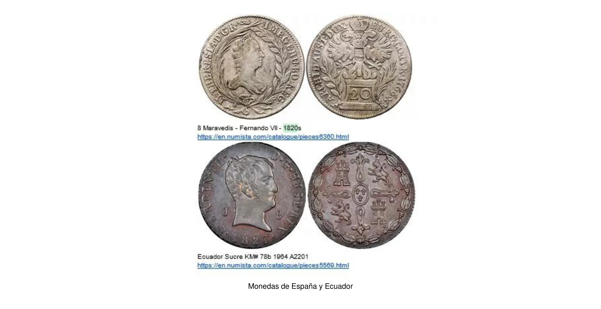

¿Quieres saber más? -> [Enlace](https://docs.google.com/document/d/1aZa7gvz1nt8ZHDCoWKQdS9RGGjBHdipH1ApC8dW1xpM/edit?usp=sharing)

#### 4. Revolución de los precios del siglo XV al XVII

Entre los siglos XV y XVII, Europa fue testigo de un notable fenómeno económico, a menudo denominado "revolución de los precios" Este periodo de inflación fue desencadenado en gran medida por una afluencia masiva de metales preciosos, en particular oro y plata, procedentes de América. Con la economía europea basada en gran medida en el patrón metálico de la época, este Supply adicional de metales aumentó el Supply monetario. Como resultado, surgió una tasa de inflación de alrededor del 1 al 2% anual. A primera vista, esta inflación puede parecer modesta. Sin embargo, en aquella época, tales fluctuaciones de precios eran lo bastante inusuales como para ser consideradas una "revolución" Esto pone de relieve cómo los cambios en las reservas monetarias pueden influir en todo el sistema económico.

#### 5. John Law y los Assignat

En el siglo XVIII, la historia económica francesa estuvo marcada por dos acontecimientos significativos relacionados con la moneda. En primer lugar, John Law, economista y financiero escocés, convenció al gobierno francés para que adoptara un sistema monetario basado en el papel moneda. Aunque en un principio se consideró una solución innovadora a los problemas financieros del país, esta iniciativa desembocó rápidamente en una inflación galopante. Poco después, durante la agitación de la Revolución Francesa, el gobierno introdujo los "assignats".

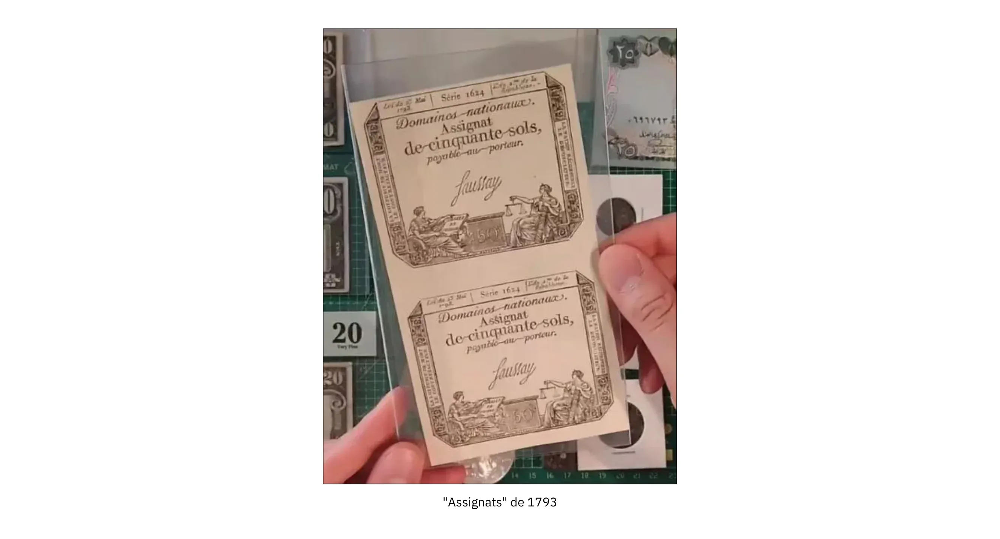

Assignats de 1793

Estos billetes son un testimonio vivo del primer gran periodo de hiperinflación de la historia. Concebidos inicialmente como respuesta a sucesivas crisis financieras, los assignats se convirtieron rápidamente en un símbolo de inestabilidad monetaria. El gobierno, al depender excesivamente de este papel moneda para financiar sus gastos, provocó una crisis económica sin precedentes y condujo a un importante periodo de hiperinflación en Francia tras la revolución.

#### 6. La Orden Ejecutiva 6102 y la devaluación del dólar

La Orden Ejecutiva 6102 y la devaluación del dólar

En Estados Unidos, a principios de la década de 1930 se produjo un importante cambio en la política monetaria. He aquí una visión detallada de esta transformación:

- El billete de 20 dólares de 1928

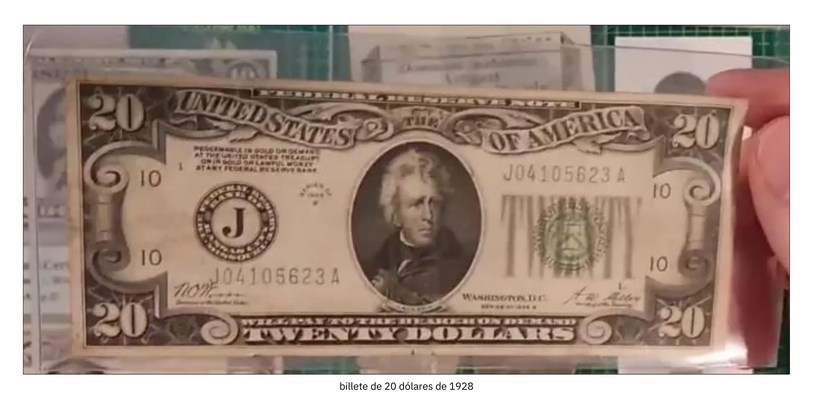

En 1928, un billete de 20 dólares en Estados Unidos decía: "canjeable en oro a la vista" Esto significa que cada billete era literalmente convertible en oro. Concretamente, un billete de 20,67 dólares equivalía a una onza de oro.

- Decreto 6102

En 1933, se produjo un gran revuelo con la promulgación del Decreto 6102. Este decreto ilegalizaba la posesión de oro por parte de los ciudadanos, ya fuera en forma de lingotes, monedas o certificados.

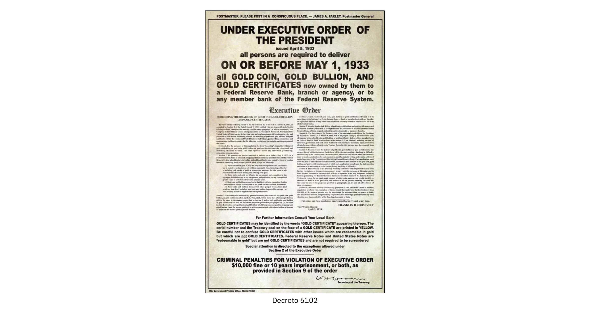

El Certificado de Oro es un buen ejemplo. Estaba marcado: "En oro Coin pagadero al portador a la vista" Poseer un certificado de este tipo pasó a ser ilegal y así permaneció hasta 1964.

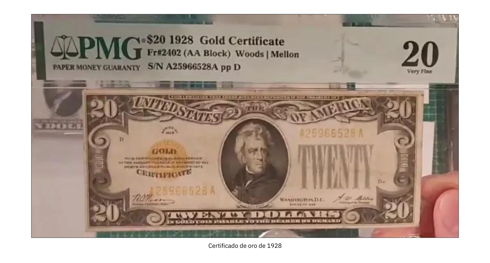

- Introducción de nuevos billetes

Tras la incautación del oro en 1934, se puso en circulación una nueva serie de billetes.

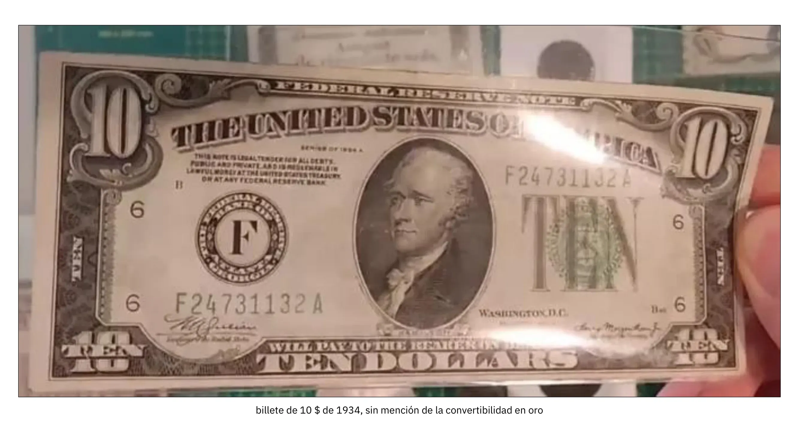

Se ha suprimido la mención que indicaba su convertibilidad en oro y se ha sustituido por "Este billete es de curso legal para todas las deudas" (Ce billet est une monnaie légale pour toutes dettes).

- Revalorización del oro

Lo fascinante de esta transición es la estrategia del gobierno. En 1934, el precio del oro se revalorizó a 35 dólares la onza, en lugar de 20,67 dólares. Esencialmente, el gobierno devaluó el dólar que la gente poseía. Al comprar oro a la población a 20,67 dólares la onza en 1933 y luego revalorizar el precio del oro en 1934, el gobierno generó un beneficio sustancial al tiempo que devaluaba los ahorros de sus ciudadanos.

En resumen, en el plazo de un año, el gobierno se apoderó efectivamente del oro de los ciudadanos y, a continuación, cambió las reglas del juego reevaluando el valor del oro en beneficio del Tesoro y en perjuicio de quienes habían canjeado inicialmente su oro por billetes.

### Estados Unidos cambia la historia.

Estados Unidos dio un giro histórico al convertirse en el primero en devaluar la moneda de reserva mundial, el dólar estadounidense, contrariamente a las prácticas anteriores observadas en pequeñas naciones comerciales.

Anteriormente, durante el Renacimiento, el florín italiano emitido por Florencia en el siglo XIII era la moneda de reserva internacional, y no se había registrado ninguna devaluación durante su periodo de uso, lo que refleja la importancia de la estabilidad monetaria para el comercio internacional.

Con el mismo espíritu, España y los Países Bajos, como poseedores de la moneda de reserva mundial debido a su floreciente comercio internacional, mantuvieron la integridad de sus monedas para preservar la confianza y el statu quo en los intercambios internacionales. Los Países Bajos fueron incluso testigos de la creación del primer banco central, un hito significativo en la evolución mundial de los sistemas monetarios.

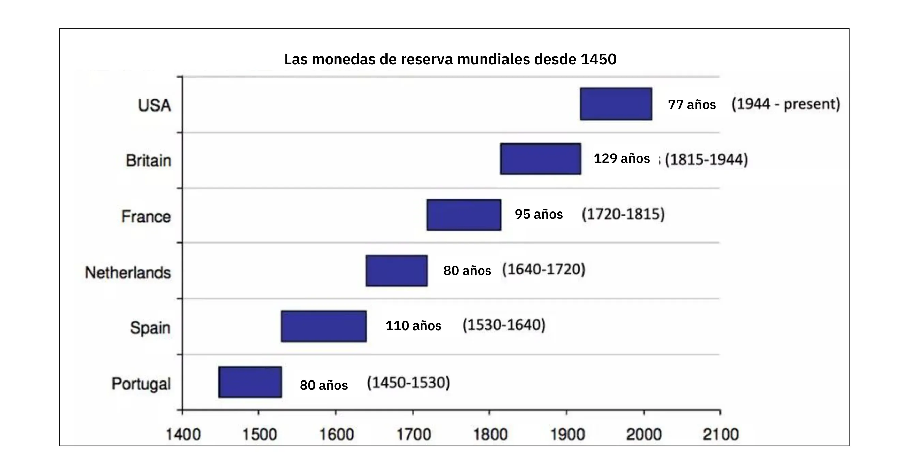

Sin embargo, la situación cambió con el ascenso de Estados Unidos como potencia económica dominante. Optaron por devaluar su moneda de reserva, aprovechando así la inflación en su beneficio. Esta decisión suele atribuirse al cambio de dinámica, en el que la elección de la moneda de reserva ya no era tan libre como antes. La hegemonía estadounidense estableció el dólar como moneda de reserva mundial, permitiendo la manipulación de su valor. Este cambio revela el impacto potencial de las políticas monetarias sobre el comercio internacional en una economía globalizada, marcando una transición significativa en la gestión de las monedas de reserva mundiales.

### Último ejemplo para el camino: el dinar suizo

El dinar suizo ilustra otro aspecto fascinante de la devaluación monetaria, esta vez anclado en el contexto iraquí anterior a la Guerra del Golfo. Llamada así por la notable calidad de sus billetes, esta moneda fue emitida por el Banco Central de Irak y gozaba de una reputación de estabilidad en la región de Oriente Medio. Esta confianza se debía principalmente a la calidad de la impresión de los billetes, que se realizaba en Inglaterra, lo que implicaba una cierta solidez frente a la devaluación.

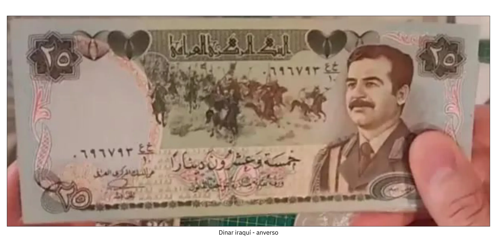

Sin embargo, las Guerras del Golfo marcaron un punto de inflexión en la historia del dinar suizo. Irak, que ya no podía confiar en su proveedor inglés para la impresión de billetes, recurrió a China en busca de ayuda. Esta transición dio lugar a una clara diferencia en la calidad de los billetes, percibiéndose la versión china como inferior. Esta percepción no era infundada; los billetes chinos eran más fácilmente falsificables y susceptibles de ser sobreimpresos por el gobierno, lo que ponía en peligro su valor.

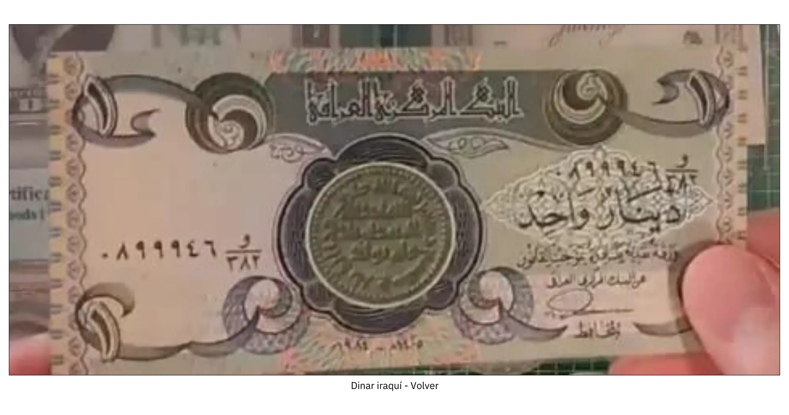

En la economía iraquí posterior a la guerra del Golfo surgió un fenómeno característico: el sistema dual de precios. Los comerciantes ofrecían precios diferentes según el tipo de billete utilizado para el pago, favoreciendo el dinar suizo original frente al billete chino. Este sistema reflejaba la confianza que se mantenía en los billetes de mayor calidad, menos propensos a la devaluación, incluso en un contexto en el que el valor lo imponía principalmente el Estado. Este episodio pone de relieve la importancia de las características intrínsecas de la moneda y cómo, incluso en un régimen de moneda fiduciaria, la calidad percibida de una moneda puede influir en su valor relativo y, por extensión, en la confianza de los agentes económicos.

#### Sí, ¡hemos pesado las monedas!

La percepción común suele asociar la moneda con la creación estatal, donde su emisión y valor están regulados por el Estado. Este concepto tiene sus raíces en civilizaciones antiguas, como Roma, donde las monedas eran estandarizadas y selladas por el Imperio, confiriendo así valor oficial a la moneda. Sin embargo, una exploración más profunda revela que el valor intrínseco de la moneda se derivaba principalmente de su contenido en metales preciosos.

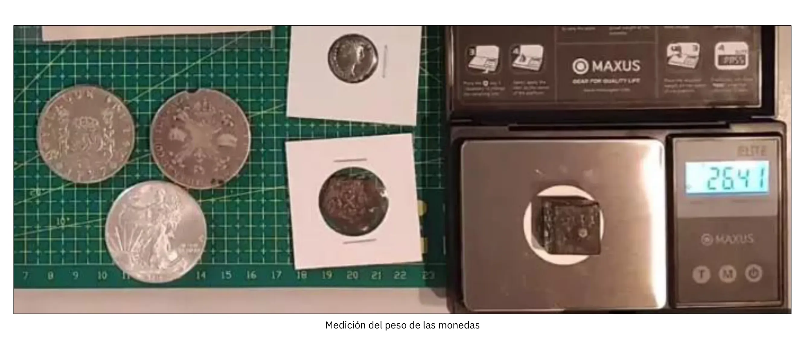

Un ejemplo de ello es el examen de un peso monetario equivalente a ocho reales españoles, o un dólar español. Este peso, marcado con un número romano que indicaba su valor, era utilizado por los cambistas para evaluar el valor de las monedas basándose en su peso, en lugar de sólo en su estampación. Al pesar las monedas, los cambistas podían determinar si habían sido alteradas o dañadas, lo que podría haber reducido su valor. Esta práctica pone de relieve que, aunque el cuño estandarizado por el Estado confería cierto valor nominal a la moneda, el verdadero valor residía en el peso del metal precioso que contenía.

Este análisis demuestra que la confianza en la moneda, y por extensión en su valor, estaba anclada en su sustancia tangible y no en la mera afirmación del Estado. Subraya la dualidad entre el valor nominal impuesto por el Estado y el valor intrínseco dictado por el contenido del metal precioso. Así pues, la moneda va más allá de ser un mero instrumento estatal, ya que su valor fundamental está intrínsecamente ligado a Elements tangible y mensurable.

#### Conclusión

En conclusión, este estudio sobre la devaluación monetaria proporciona una comprensión más profunda de los mecanismos de la inflación, que se explorarán en los siguientes vídeos. Discutiremos los diferentes tipos de inflación y el umbral en el que pasan a ser alta o hiperinflación. Esta sólida base nos permitirá Address las complejidades de la inflación en las próximas sesiones. Gracias por su atención. Esperamos continuar esta exploración de la dinámica monetaria en el próximo vídeo.

## Tipos de inflación

<chapterId>b438fe09-375e-5bb2-9196-7dd687b9f98c</chapterId>

### La inflación no es un fenómeno multifactorial

En esta sección examinaremos los diversos aspectos de la inflación, un fenómeno que a menudo se malinterpreta. Aunque en los medios de comunicación y en los debates cotidianos la inflación se percibe con frecuencia como un fenómeno multifactorial, es crucial recordar que se trata fundamentalmente de un fenómeno monetario.

A continuación se desglosa el tema en varios puntos clave:

- Distinción entre aumento de precios e inflación:

Un aumento de los precios puede ser específico de un sector e inducido por diversos factores, como una disminución de la producción de petróleo de la OPEP o unas condiciones meteorológicas desfavorables que afecten a la producción de trigo.

La inflación, en cambio, se define por un aumento generalizado de los precios en toda una gama de bienes y servicios, no sólo en un sector concreto.

- La esencia monetaria de la inflación:

Con una Supply monetaria fija, un aumento de los precios en un sector provocaría una disminución de los precios en otros sectores, ya que se reduciría la cantidad de dinero disponible para gastar en otros sectores. La inflación está estrechamente relacionada con un aumento del Supply monetario, que permite una subida simultánea de los precios en todos los sectores.

- Impacto de la Supply monetaria en la inflación y la deflación:

En un sistema de dinero fijo Supply, un aumento de la producción debería conducir teóricamente a la deflación, es decir, a una disminución de los precios, ya que habría más bienes y servicios disponibles.

En el sistema monetario fiduciario actual, un aumento del Supply monetario anula la deflación potencial causada por un aumento de la producción.

- Efectos negativos del ajuste monetario Supply:

Un aumento del Supply monetario, sin un aumento correspondiente de la producción, provoca inflación, ya que hay más dinero en circulación para la misma cantidad de bienes y servicios.

Aunque el aumento de la producción debería haber provocado una deflación, el aumento simultáneo del Supply anuló este efecto, provocando en su lugar una inflación.

- Inflación, deflación y dinero Supply - Vasos comunicantes:

La inflación y la deflación son como vasos comunicantes en una economía. Un aumento de la producción puede conducir a la deflación, pero si simultáneamente aumenta el Supply monetario, el efecto deflacionista se anula, dando lugar a la inflación.

Este debate subraya la importancia de comprender los mecanismos subyacentes de la inflación y la deflación, así como la profunda influencia que puede tener en la economía la alteración del Supply monetario. Probablemente volveremos sobre estos conceptos más adelante para comprender mejor su interconexión y el impacto que tienen en la economía mundial.

### ¿Por qué la impresión de dinero no siempre provoca inflación?

#### Inflación ≠ IPC

La inflación, aunque a menudo se asocia con un aumento del Supply monetario, no siempre tiene una correlación directa con la impresión de dinero, como ilustra el periodo posterior a la crisis financiera de 2008. A pesar de la importante impresión de dinero para salvar a los bancos, la década siguiente no experimentó una inflación elevada, con una media de entre el 0 y el 2% anual. Esta situación plantea la pregunta: ¿Por qué la impresión masiva de dinero no se tradujo en una inflación proporcional? La respuesta radica en varios matices relacionados con la medición de la inflación y el Índice de Precios de Consumo (IPC).

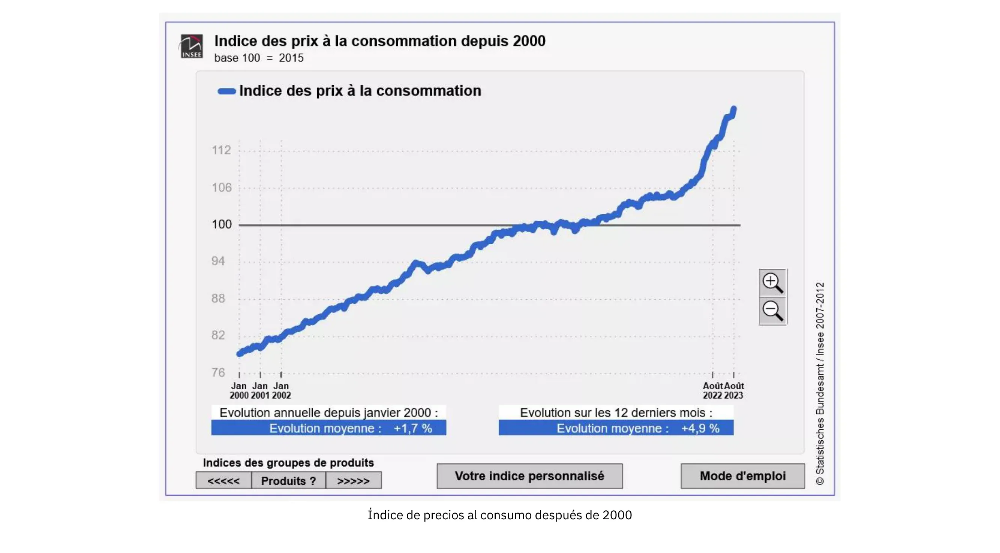

La primera explicación reside en la forma de medir la inflación. El Índice de Precios de Consumo (IPC), que sirve de principal indicador de la inflación, tiene ciertas limitaciones. Por ejemplo, no tiene en cuenta de forma exhaustiva la evolución de los precios inmobiliarios. Aunque el IPC incluye un componente relacionado con los alquileres, la sustancial revalorización de los precios de la vivienda no se refleja plenamente en el índice. En consecuencia, pueden producirse aumentos significativos de los costes de la vivienda sin que el IPC los recoja en su totalidad, lo que podría subestimar la inflación real.

Además, el cálculo del IPC emplea ciertas metodologías que pueden contrarrestar o enmascarar los aumentos reales de los precios. Por ejemplo, las mejoras cualitativas de los productos pueden utilizarse para ajustar el índice. Si el precio de un producto aumenta, pero su calidad o características también mejoran, el IPC puede considerar que el valor real para el consumidor no ha cambiado y, por tanto, no reflejar la inflación. Un caso ilustrativo es aquel en el que, a pesar de un aumento de los precios de la carne de vacuno y de los ordenadores debido a la inyección monetaria, la mejora de las prestaciones de los ordenadores sirve para compensar este aumento. Si un ordenador cuesta el doble pero es cuatro veces más potente, el IPC puede interpretarlo como una disminución de los precios, enmascarando así el aumento de los precios de la carne de vacuno.

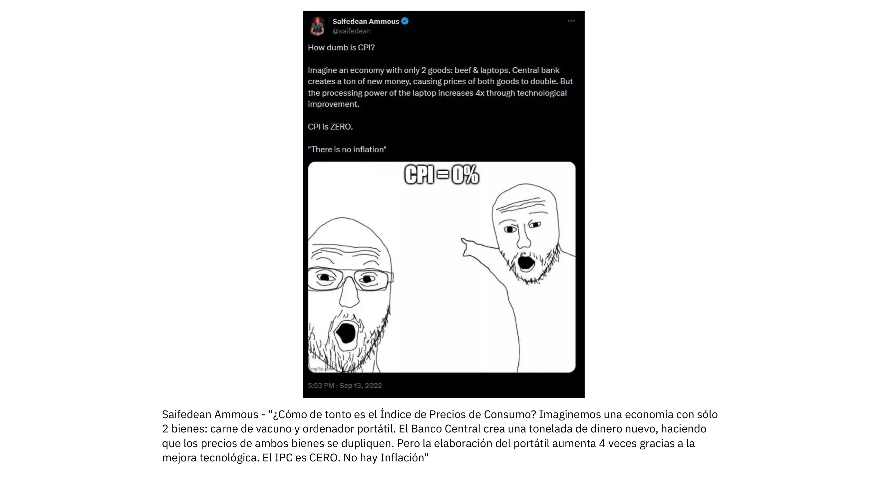

Estos matices en la medición de la inflación por el IPC ponen de relieve la complejidad de la relación entre la impresión monetaria y la inflación. También sugieren que la inflación real puede ser superior a la declarada si se tuvieran más en cuenta todos los aumentos de precios, especialmente en sectores clave como el inmobiliario. Este análisis subraya la importancia de comprender los mecanismos subyacentes de la inflación y las limitaciones de los índices convencionales utilizados para medirla, facilitando así una comprensión más profunda de las implicaciones económicas de las políticas monetarias.

#### Argumentos del MMT

La Teoría Monetaria Moderna (TMM) ofrece una perspectiva distinta sobre la creación de dinero y la inflación. Según la TMM, el dinero procede principalmente del gobierno, que puede imprimir cantidades sustanciales para financiar sus necesidades sin provocar inflación siempre que los sectores a los que se destinan estos fondos no estén saturados. Este planteamiento se aparta de las teorías monetarias tradicionales, al subrayar la importancia de las capacidades de absorción sectoriales en la dinámica inflacionista.

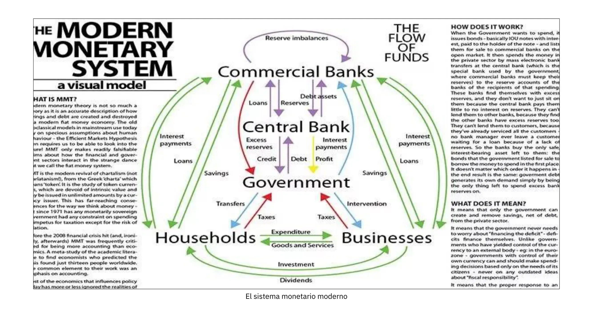

Un ejemplo ilustrativo de la MMT es el complejo militar-industrial estadounidense. Según el MMT, pueden destinarse cientos de miles de millones de dólares a este sector sin provocar inflación, gracias a su capacidad para absorber los fondos. En cambio, si se inyectan cuantiosos fondos en la construcción de carreteras en Estados Unidos, donde hay un número limitado de empresas y mano de obra, podría producirse inflación debido a la escasez de recursos y al aumento de los costes exigidos por los proveedores.

Los partidarios de la TMM suelen citar a Japón como otro ejemplo de ausencia de inflación a pesar de una importante impresión monetaria. Sin embargo, la situación en Japón también pone de manifiesto las limitaciones de las medidas tradicionales de la inflación, como el Índice de Precios al Consumo (IPC). En Japón, una parte significativa del dinero impreso se ahorra o se invierte en bienes inmuebles o en el mercado de valores, en lugar de gastarse en consumo corriente. El IPC, al no captar plenamente esta dinámica, puede subestimar la inflación real.

El análisis de Japón (https://ideas.repec.org/p/ces/ceswps/_9821.html) también pone de relieve que el comportamiento de los agentes económicos, como ahorrar o invertir en activos no incluidos en el IPC, puede enmascarar el impacto inflacionista de la impresión monetaria. Además, la capacidad de los distintos sectores para absorber la liquidez inyectada desempeña un papel crucial a la hora de determinar si se produce inflación.

#### Balances de bancos y bancos centrales

El tercer ejemplo de por qué la impresión monetaria no causaría inflación es que la relación entre la impresión monetaria y la inflación está modulada por cómo se introduce en la economía el dinero recién creado. Si este dinero permanece en los balances de los bancos privados sin ser prestado a los agentes económicos, no repercutirá directamente en la economía real y, por tanto, no provocará inflación.

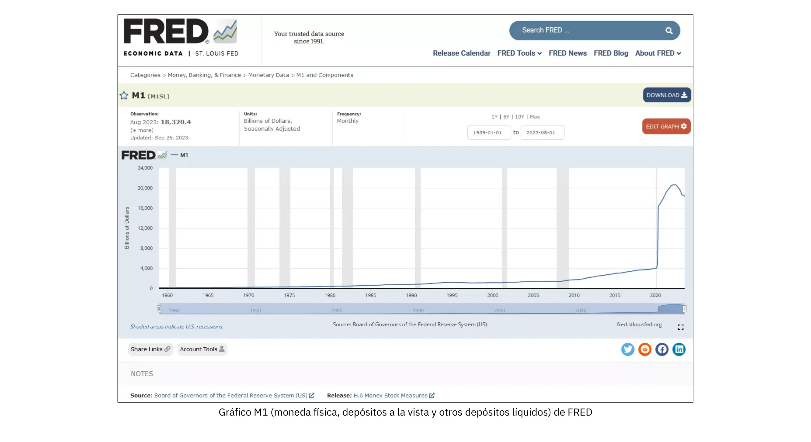

La impresión monetaria puede considerarse como una espada de Damocles que pende sobre la economía. El dinero creado puede permanecer latente durante cierto tiempo, sin ningún efecto inflacionista visible, mientras no se inyecte en la economía a través de préstamos bancarios u otros mecanismos. Sin embargo, cuando este dinero latente se pone finalmente en circulación, pueden manifestarse entonces efectos inflacionistas. Esto es lo que se ha observado en la década de 2020, en la que el dinero creado previamente ha entrado en la economía, provocando inflación.

Este escenario pone de relieve la importancia de los mecanismos de transmisión monetaria para influir en los efectos inflacionistas de la impresión de dinero. La creación de dinero por el banco central es sólo una pieza del rompecabezas. El comportamiento de los bancos privados, que deciden el volumen de préstamos a conceder, y el de los prestatarios, que deciden cómo gastar el dinero prestado, son también Elements cruciales en esta dinámica.

#### La inflación es social

El ejemplo de la República de Weimar ilustra otro aspecto crucial de la relación entre la impresión de dinero y la inflación: el papel de las expectativas y el comportamiento de los agentes económicos. Cuando el Banco Central de la República de Weimar comenzó a imprimir una gran cantidad de dinero, la incertidumbre económica llevó a los individuos a atesorar, es decir, a almacenar dinero en lugar de gastarlo. Esta reacción retrasó temporalmente los efectos inflacionistas de la impresión de dinero.

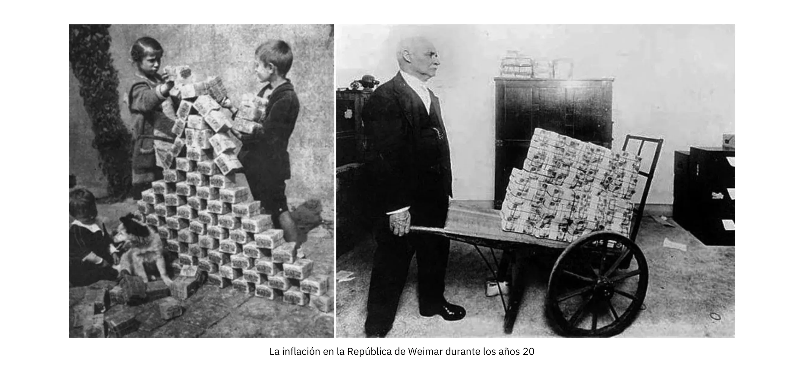

Sin embargo, cuando la situación económica empezó a mejorar ligeramente, se restableció gradualmente la confianza. Los particulares sacaron entonces sus ahorros de sus escondites y empezaron a gastar masivamente en la economía. Este repentino cambio de comportamiento, combinado con una Supply monetaria ya de por sí elevada, provocó una explosión de la demanda. Con más dinero en circulación y una mayor demanda, los precios empezaron a subir rápidamente, provocando una notable inflación.

Este ejemplo subraya la importancia del momento y del comportamiento de los agentes en la aparición de la inflación. La inflación no sólo se produce en respuesta a un aumento del Supply monetario, sino que también depende de cómo y cuándo se gasta ese dinero en la economía. Las incertidumbres económicas y las expectativas de los agentes económicos desempeñan un papel crucial en esta dinámica y pueden acelerar o retrasar los efectos inflacionistas de la impresión de dinero.

#### Recapitulemos:

- Índice de Precios de Consumo (IPC): El IPC está estructurado de forma que subestima la inflación, lo que puede dar una imagen distorsionada de la realidad inflacionista.

- Absorción sectorial: La inyección monetaria en sectores capaces de absorberla no siempre provoca inflación. Un ejemplo notable es el complejo militar-industrial estadounidense, que puede absorber grandes sumas de dinero sin provocar inflación.

- El caso de Japón: A pesar de la importante impresión de dinero, la inflación sigue siendo baja en Japón porque los fondos suelen ahorrarse o invertirse en el sector inmobiliario o bursátil. Estos sectores absorben el dinero impreso, y el IPC no refleja necesariamente las subidas de precios en estos ámbitos.
- Correlación entre la impresión monetaria y los mercados. Se observa que las curvas de los mercados inmobiliario y bursátil suelen seguir a la impresión monetaria, indicando hacia dónde se dirige el dinero impreso.
- Reservas monetarias de los bancos: Cuando el dinero impreso permanece en los balances de los bancos y no circula en la economía, no causa inflación. Esto se ilustra con el ejemplo de 2008, donde el dinero impreso permaneció en gran medida en los balances de los bancos, retrasando el impacto inflacionista.

- República de Weimar: Este periodo histórico muestra cómo la incertidumbre económica llevó a atesorar dinero, retrasando la inflación. Sin embargo, una vez restablecida la confianza y gastado el dinero, la inflación estalló.

Estos ejemplos pueden utilizarse en los debates para explicar por qué la inflación no es siempre una consecuencia inmediata de la impresión monetaria, y cómo influyen en la inflación los contextos económicos y los comportamientos de los agentes.

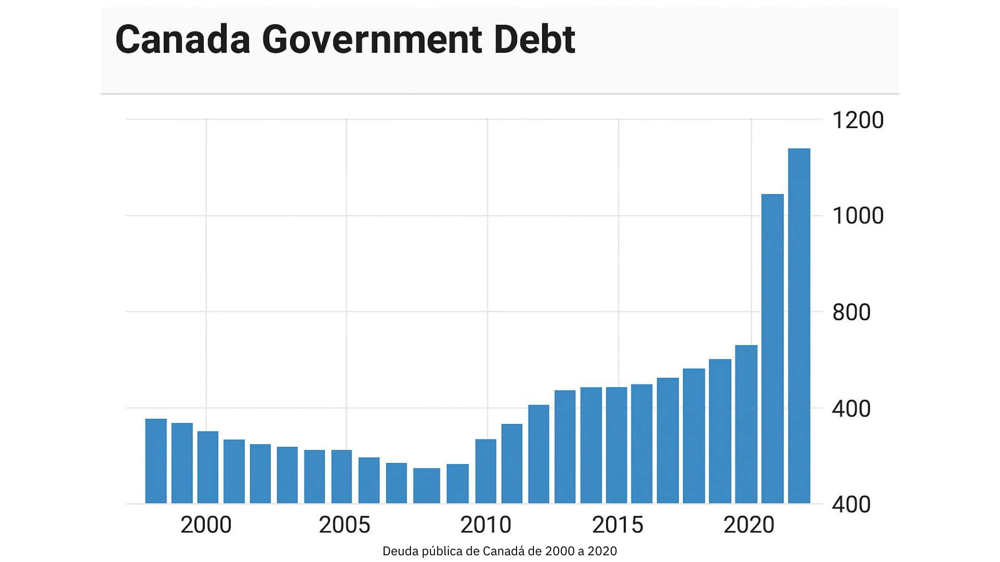

Porque, como muestra este [hilo](https://twitter.com/saifedean/status/1673639779433590786): La inflación es todo menos culpa de los bancos centrales.

- Los economistas achacan la inflación al cambio climático

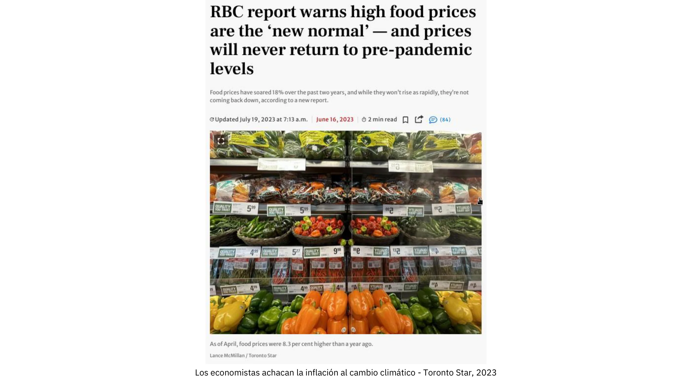

- Ejemplo de Suecia culpando a Beyoncé de la inflación durante un mes concreto.

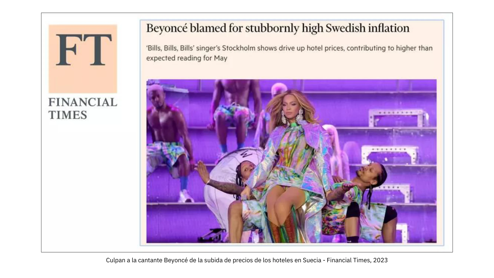

- El banco central de Polonia atribuye la inflación a la agresión rusa en Ucrania y a la pandemia

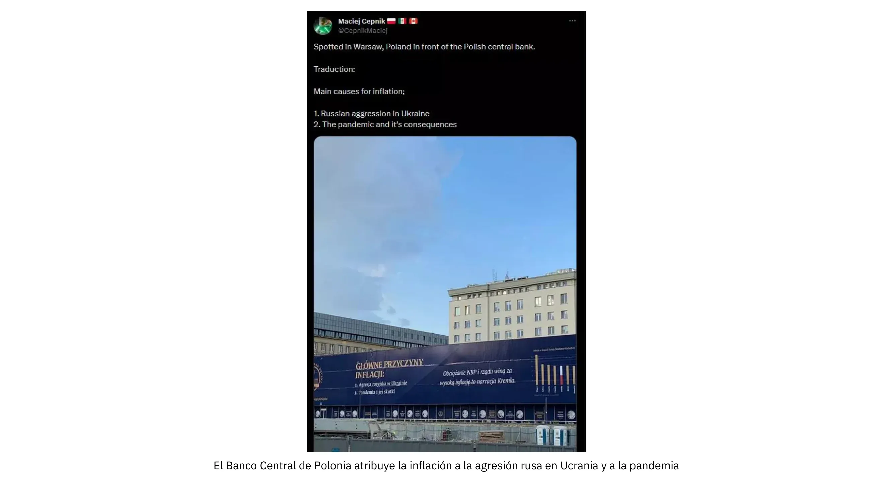

- Se culpa al Brexit de la inflación en el Reino Unido.

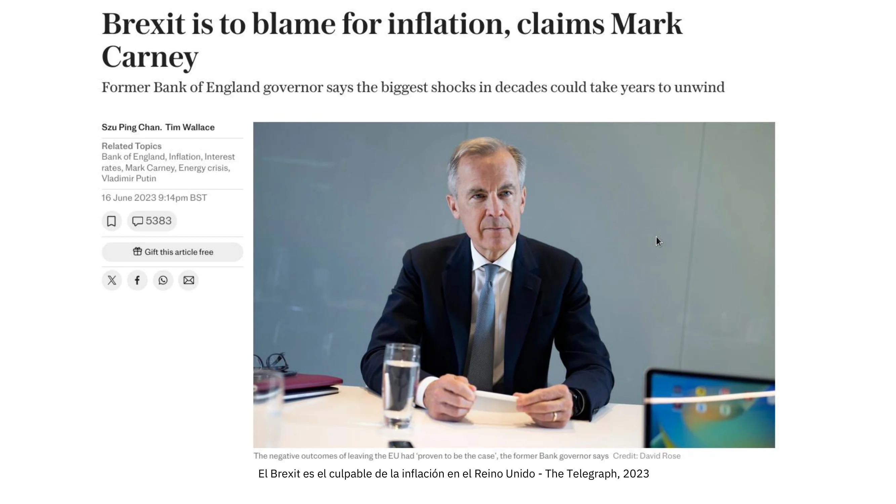

- Lanzamiento del juego Zelda asociado a un choque inflacionista.

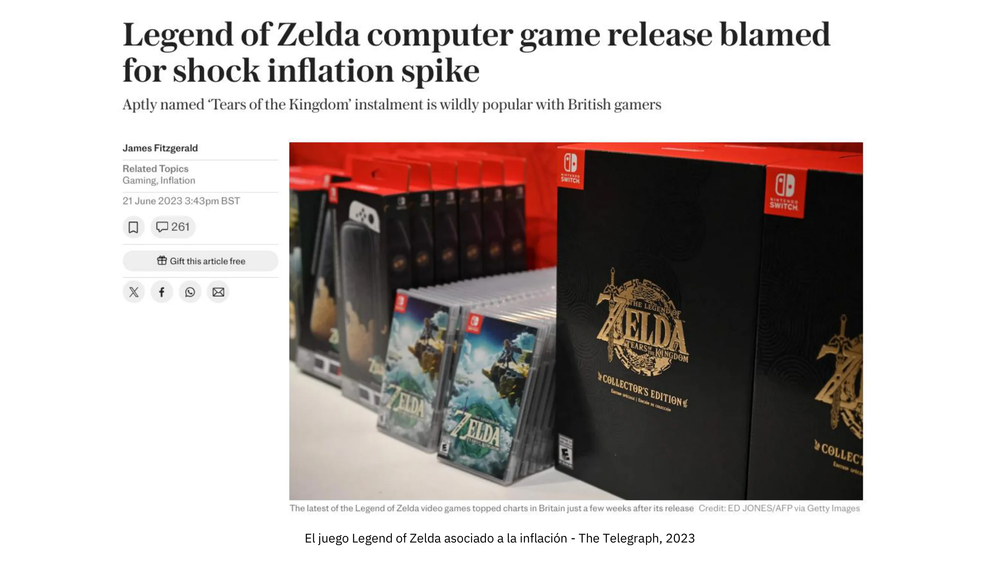

- Taylor Swift está causando supuestamente la inflación.

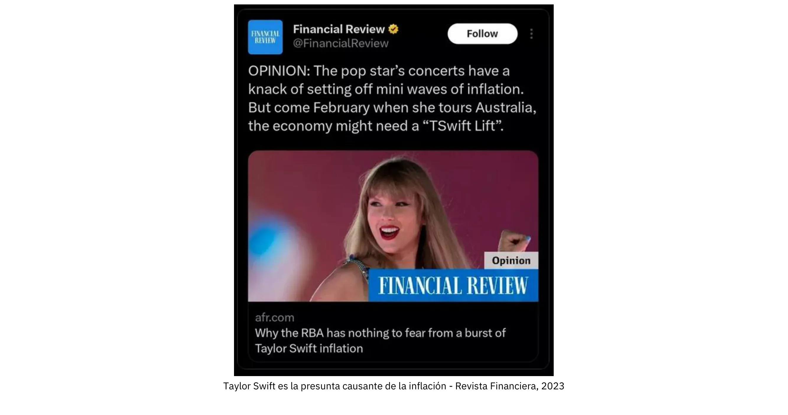

Dígame, ¿cómo podrían Beyoncé o Taylor Swift provocar la subida generalizada de los precios? No tiene ningún sentido. Resumiendo:

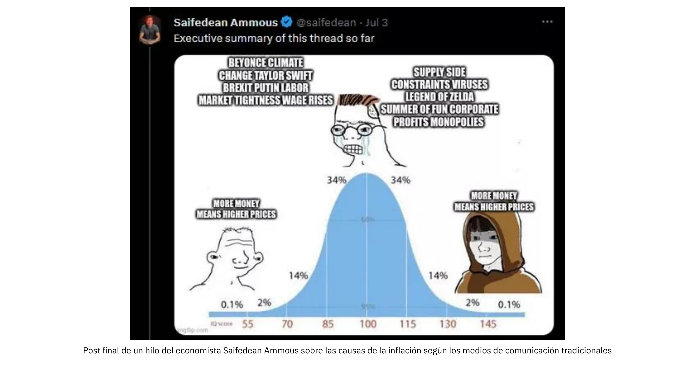

### Exploración de los tipos de inflación

Es fundamental entender la distinción entre los distintos tipos de inflación, lo que nos permite comprender las variadas manifestaciones de este fenómeno económico. He aquí una explicación de estos distintos tipos:

- Inflación progresiva: Es el tipo de inflación que suelen perseguir los bancos centrales, fijado en torno al 2% anual. Este objetivo se viene adoptando desde la década de 1990 y pretende mantener un crecimiento económico estable sin sobrecalentamiento ni deflación.
- Inflación moderada: Esta forma de inflación se produce cuando la inflación supera el objetivo del 2%. Suele asociarse a un recalentamiento de la economía, un estado en el que un exceso de dinero Supply estimula un aumento general de los precios. Este escenario expone los límites de las políticas monetarias y a veces revela contradicciones en el discurso económico.
- Inflación galopante: La inflación galopante, a menudo denominada inflación de dos dígitos, se produce cuando la tasa de inflación anual supera el 10%. Supone una importante subida de precios que puede comprometer la estabilidad económica.

- Hiperinflación: La hiperinflación es un fenómeno extremo en el que la tasa de inflación supera el 50% mensual, lo que, debido a la naturaleza exponencial de la inflación, equivale a una tasa de inflación anual superior al 13.000%. Este nivel de inflación desestabiliza gravemente la economía, dejando la moneda casi sin valor y erosionando la confianza en el sistema monetario.

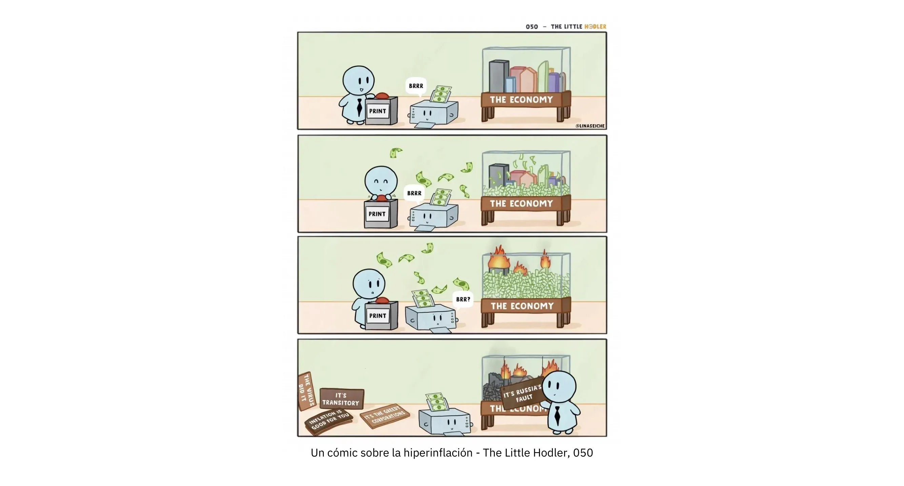

Al estudiar los tipos de inflación, es frecuente encontrar en los recursos educativos términos como "tirón de la demanda" y "empuje de los costes". Estos conceptos, aunque válidos, tienden a explicar el aumento de los precios más que la inflación como fenómeno monetario. He aquí un análisis más profundo:

- Tirón de la demanda:

La inflación inducida por la demanda suele describirse como un escenario en el que la demanda de la economía supera la capacidad de producción disponible. Sin embargo, sin un aumento correspondiente del Supply monetario, esta situación conducirá simplemente a una redistribución del gasto. Los consumidores pueden gastar más en bienes esenciales y menos en artículos no esenciales, neutralizando así el efecto inflacionista global.

- Empuje de costes:

Por otra parte, la inflación impulsada por los costes se atribuye al aumento de los costes de producción, como los de los recursos naturales o la mano de obra. De nuevo, sin un aumento del Supply monetario, el incremento de los costes en un sector puede simplemente reducir el gasto en otros, sin provocar una inflación generalizada.

Estas explicaciones tradicionales suelen asociar el aumento de los precios con la inflación, lo que puede dar lugar a confusión y malentendidos. En realidad, para que se produzca una inflación generalizada es necesario un aumento del Supply monetario. En este contexto, los conceptos de Demand Pull y Cost Push pueden explicar las variaciones de precios sectoriales, pero no captan la naturaleza monetaria de la inflación. Esto pone de relieve la importancia de distinguir entre los aumentos de precios sectoriales y la inflación generalizada, y reafirma la necesidad de un aumento del Supply monetario para evitar que la inflación se manifieste en toda la economía. Este análisis ofrece una perspectiva más matizada y precisa de las causas reales de la inflación, desmitificando interpretaciones comunes que pueden ocultar la dinámica monetaria subyacente.

### Clasificación de la inflación según Bernholz

Bernholz propone una clasificación simplificada pero precisa de la inflación en tres categorías, lo que permite comprender mejor este complejo fenómeno monetario:

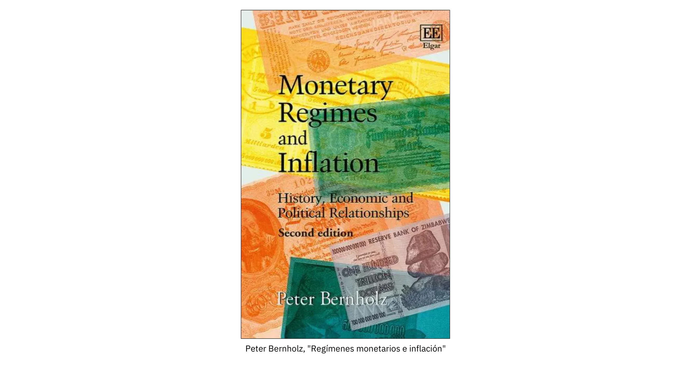

- Inflación moderada:

La inflación moderada se produce cuando el nivel de dinero Supply es superior al normal, pero sin que el Estado recurra a grandes déficits financiados con la creación de dinero. Aunque el término "moderada" pueda parecer insignificante, esta forma de inflación puede causar problemas sustanciales, aunque no está clasificada como inflación alta.

- Inflación elevada:

La inflación elevada se produce cuando el valor real del dinero Supply disminuye a pesar de un aumento en términos nominales. Esta situación paradójica surge de la sustitución monetaria, en la que los individuos pierden la confianza en la moneda nacional y tratan de Exchange cambiarla por bienes, servicios o divisas. Este proceso reduce aún más el valor real de la moneda, exacerbando la inflación.

- Hiperinflación:

La hiperinflación es una forma extrema de inflación elevada, caracterizada por grandes déficits presupuestarios que se financian mediante la creación de dinero. Históricamente, no se ha observado ningún caso de hiperinflación sin una financiación sustancial del déficit mediante la impresión de dinero. La hiperinflación crea un círculo vicioso: la inflación erosiona el valor de la moneda tan rápidamente que los ingresos fiscales se deprecian antes incluso de que el Estado pueda recaudarlos, lo que obliga al Estado a imprimir aún más dinero para financiarse. Este ciclo que se refuerza a sí mismo conduce a tasas de inflación astronómicas, que a menudo superan el 50% mensual.

Esta clasificación de Bernholz pone de relieve la peligrosa progresión de la inflación moderada a la hiperinflación, subrayando la importancia vital del control monetario y fiscal para evitar espirales inflacionistas destructivas. También demuestra que las consecuencias perjudiciales para la financiación del Estado pueden producirse mucho antes de alcanzar la fase de hiperinflación, proporcionando una perspectiva matizada sobre las implicaciones de la inflación en diversos grados.

### Conclusiones: Resumen de los tipos de inflación

En conclusión, hemos explorado una serie de tipos de inflación, empezando por términos comúnmente escuchados como "inflación sigilosa", "inflación andante" e "inflación galopante", cada uno de los cuales denota diferentes niveles de porcentajes de inflación dentro de una economía. Sin embargo, para nuestro estudio en profundidad de la hiperinflación, las categorías de inflación moderada, inflación alta e hiperinflación, descritas por Bernholz, resultan ser puntos de referencia cruciales.

- Inflación moderada:

Indica un nivel de dinero Supply por encima de lo normal, aunque este nivel puede mantenerse sin una importante financiación deficitaria por parte del Estado.

- Inflación elevada:

Se produce cuando el valor real del dinero Supply disminuye, a menudo debido a la sustitución monetaria, en la que los individuos buscan Exchange su moneda por bienes, servicios u otras formas de moneda.

- Hiperinflación:

Representa una versión extrema de la alta inflación, en la que la creación excesiva de dinero para financiar grandes déficits presupuestarios conduce a una rápida erosión del valor real de la moneda.

Lo que se desprende de nuestra exploración es que la hiperinflación es un fenómeno complejo y contraintuitivo. Aunque se podría suponer que la hiperinflación es el resultado de un aumento masivo del Supply monetario, en realidad se deriva de una disminución del valor real de ese Supply monetario. Este matiz es crucial para entender por qué algunos países luchan por salir de la hiperinflación, incluso con el apoyo de instituciones internacionales como el Banco Mundial o el FMI. Caracterizar erróneamente el tipo de inflación puede llevar a aplicar remedios inadecuados, agravando los problemas económicos en lugar de resolverlos.

En nuestros futuros debates profundizaremos en la hiperinflación, explorando sus definiciones y manifestaciones en diversos contextos económicos. Nuestro objetivo es descubrir los mecanismos subyacentes de la hiperinflación y explorar posibles soluciones para Address este problema. Esta comprensión matizada nos permitirá comprender mejor los retos asociados y proponer estrategias informadas para gestionar la inflación.

Gracias por su atención. La próxima sesión estará enteramente dedicada a definir y desmitificar la hiperinflación, considerando diversas perspectivas académicas y prácticas. Esperamos continuar esta exploración con ustedes en nuestra próxima reunión.

# ¿Qué es la hiperinflación?

<partId>3f541663-1e2f-5410-8ee0-f61c5d009fa5</partId>

## Definiciones de hiperinflación

<chapterId>d2a71a2e-5f36-58d9-993c-d431f4aa07fd</chapterId>

### Definiciones de hiperinflación

En esta sección, exploramos las diversas definiciones de hiperinflación, un término crucial en el estudio de los fenómenos monetarios extremos. La definición más reconocida procede de Philip Cagan, quien, en su obra de 1956, "The Monetary Dynamics of Hyperinflation", propone una comprensión cuantitativa de la hiperinflación. Según Cagan

- Principio y fin de la hiperinflación:
  - La hiperinflación comienza cuando la inflación mensual supera el 50%.
  - Finaliza cuando la tasa de inflación cae por debajo del 50% mensual durante al menos un año.

A modo de ejemplo, si la inflación cae al 40% en julio y no supera el 50% hasta julio del año siguiente, se considera que el periodo de hiperinflación ha finalizado en julio del año anterior al año en que se observó por primera vez. Esta definición permite una caracterización precisa de los episodios de hiperinflación, facilitando un análisis estructurado.

Esta definición se ha adoptado en la tabla Hanke-Krus, que documenta 56 episodios de hiperinflación. Sin embargo, la tabla no cubre todos los episodios, como el de Venezuela en 2016, que eleva el total a 57.

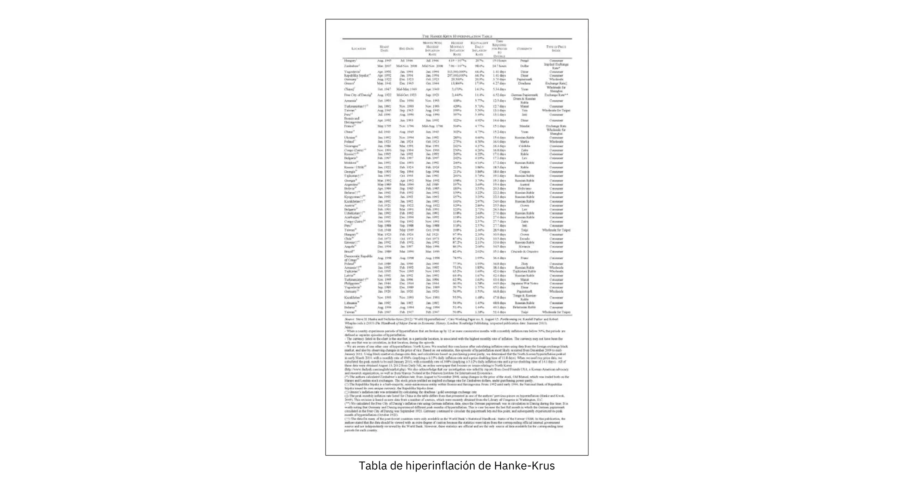

zoom

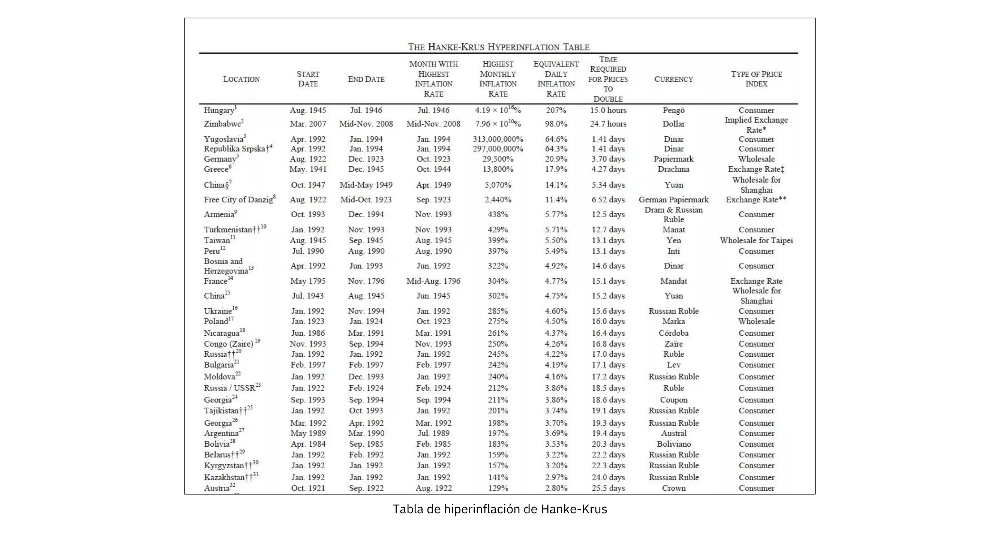

Cabe señalar que esta definición, aunque precisa, podría excluir algunos episodios de hiperinflación debido a la rigurosidad del umbral del 50%. Existe la posibilidad de ampliar esta definición para incluir otros episodios que, aunque no cumplan estrictamente los criterios de Cagan, representen no obstante periodos de inflación extremadamente elevada. Esta observación abre la puerta a una exploración más amplia de los fenómenos de hiperinflación, permitiendo una comprensión más matizada de sus causas y efectos. En discusiones posteriores, consideraremos la posibilidad de revisar esta definición y examinar episodios de hiperinflación no cubiertos por los estrictos criterios de Cagan.

### La definición de hiperinflación por Cagan

Es posible que Philip Cagan haya establecido un hito arbitrario con el umbral de inflación mensual del 50% al definir la hiperinflación. Él mismo admite que esta definición es arbitraria y sirve principalmente para su análisis basado en siete episodios de hiperinflación. El examen de los datos de Cagan revela que los tres episodios de hiperinflación con las tasas de inflación mensual más bajas se situaron en torno al 47%, 46% y 57%. Parece que el umbral del 50% se eligió para abarcar estos casos en su estudio.

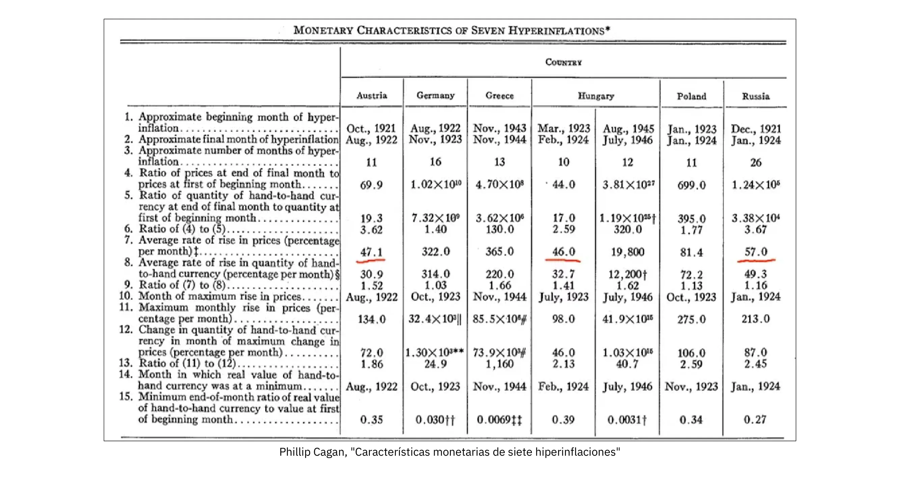

- Contexto histórico:

La definición de Cagan data de 1956 y se basa en un número limitado de episodios de hiperinflación disponibles en aquel momento.

- Observaciones de Cagan:

Según Cagan, ningún episodio alcanzó este umbral de alrededor del 50% sin progresar hacia una hiperinflación más grave, lo que podría justificar la elección de este umbral.

- Crítica a la definición de Cagan:

Otros economistas, como Bernholz, autor de Régimen monetario e inflación, también han calificado de arbitrario el umbral del 50%.

Bernholz señala que existen episodios de alta inflación con las mismas características cualitativas que los episodios de hiperinflación, sin alcanzar el umbral del 50%.

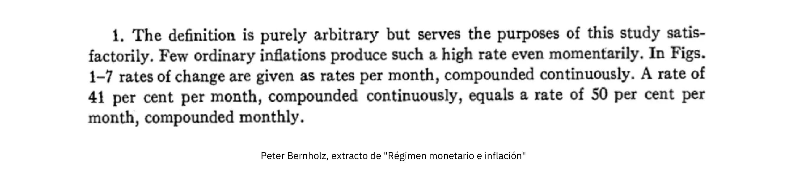

Esta reflexión nos lleva a cuestionar la rigidez de la definición tradicional de hiperinflación y pone de relieve la necesidad de revisar quizá este umbral incorporando más episodios y datos históricos. La definición de hiperinflación puede requerir flexibilidad para abarcar diversas manifestaciones de inflación extrema en diferentes contextos económicos e históricos.

### La definición de hiperinflación según el Consejo de Normas Internacionales de Contabilidad (CNIC)

El IASB ofrece una perspectiva única sobre la hiperinflación, centrándose en las prácticas contables durante periodos de hiperinflación. Este enfoque es crucial para los contables y las empresas que operan en entornos hiperinflacionarios, donde el valor monetario fluctúa rápidamente. Las directrices del IASB identifican varios indicadores de hiperinflación:

- Preferencia por activos no monetarios:**

Debido a la rápida depreciación del valor monetario, los particulares prefieren mantener el valor en bienes y no en moneda.

- Valoración de bienes y servicios:**

Los residentes no calculan el valor de los bienes y servicios en moneda local, lo que refleja una pérdida de confianza en la moneda local.

- Indemnización por pérdida de valor monetario:**

Los precios incorporan una compensación por la pérdida de valor monetario durante las compras a crédito, lo que ilustra el impacto de la inflación en las transacciones diarias.

- Indexación de precios, salarios e intereses:**

Los precios, salarios e intereses se ajustan en función de un índice para compensar la inflación.

- Inflación acumulada en tres años:**

La inflación acumulada durante tres años se acerca al 100% (aproximadamente un 24% anual), lo que contrasta con la definición de Cagan de una inflación mensual del 50%.

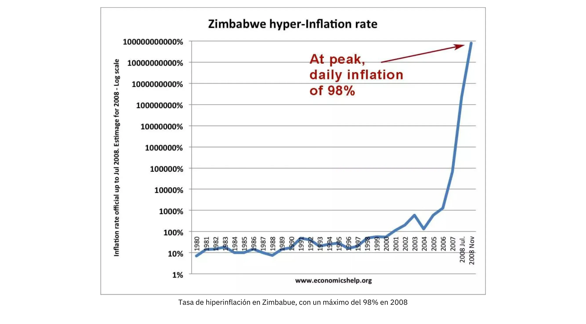

Según los criterios del IASB, varios países, como Argentina, Etiopía, Haití, Irán, Líbano, Sudán, Sudán del Sur, Surinam, Siria, Turquía, Venezuela, Yemen y Zimbabue, sufren actualmente hiperinflación.

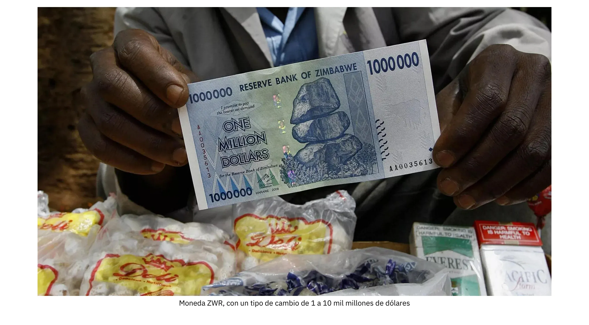

Esta definición proporcionada por el IASB se aleja del estricto umbral cuantitativo de Cagan al incorporar un análisis cualitativo de los comportamientos económicos y los ajustes prácticos ante la hiperinflación. Demuestra que la hiperinflación es un fenómeno complejo que requiere una comprensión multidimensional para captar sus implicaciones reales, en particular en el ámbito de la contabilidad, crucial para la estabilidad y la transparencia financiera de las empresas y los mercados.

### ¿Cuántas hiperinflaciones hay en total?

Las definiciones comunes de hiperinflación, como la propuesta por Cagan, que estipula una tasa de inflación mensual del 50%, pueden resultar a veces confusas o excesivamente simplistas. Por ejemplo, dos países que experimentan tasas de inflación anuales del 1.000% y el 3.000% respectivamente pueden percibirse de forma diferente en función de la distribución mensual de esa inflación. Si ningún mes supera el umbral del 50%, según la definición de Cagan, esos países no se clasificarían como en estado de hiperinflación. Así pues, este planteamiento puede dar lugar a anomalías en la clasificación de la hiperinflación, especialmente cuando se comparan las inflaciones acumuladas a lo largo del año.

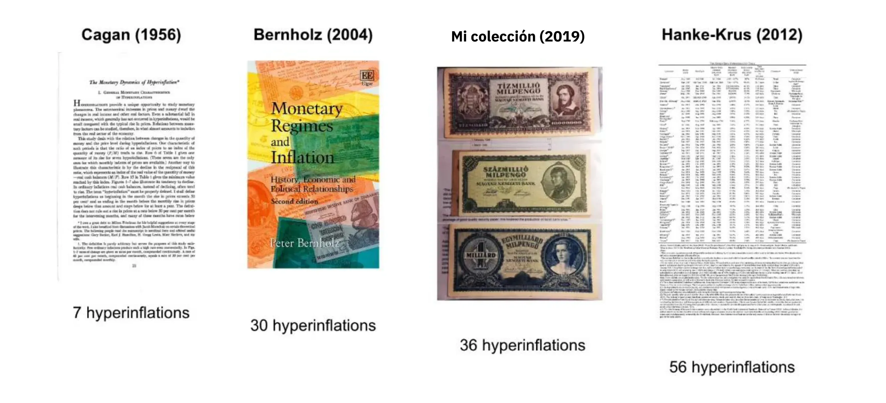

- La obra de Cagan, "Dinámica monetaria de la hiperinflación", ofrece un análisis fundamental de la hiperinflación.
- El libro de Bernholz, que estudia 30 periodos distintos de hiperinflación, amplía así el alcance del análisis.
- La colección personal de David St-Onge (autor de este curso) de billetes de 36 periodos de hiperinflación permite una comprensión tangible e histórica.
- La tabla Hanky Cross (versión de 2012, actualizada en 2016 con Venezuela), que enumera 57 periodos de hiperinflación según la definición de Cagan.

Cabe señalar que ciertos periodos históricos de alta inflación no se incluyen en las tablas clásicas de hiperinflación, a menudo debido a estrictos criterios de clasificación. Por ejemplo, durante la Guerra de Independencia estadounidense, en noviembre de 1779, y durante la Guerra Civil estadounidense, en marzo de 1864, las tasas mensuales de inflación fueron del 47,4% y el 40% respectivamente. Estas tasas, aunque elevadas, no superan el umbral del 50% estipulado por Cagan, por lo que estos periodos quedan excluidos de la clasificación de casos de hiperinflación. Esta omisión pone de manifiesto las limitaciones de las definiciones rígidas y subraya la necesidad de una comprensión más matizada de la hiperinflación en toda su complejidad.

## Semejanzas entre Weimar y Zimbabue

<chapterId>11eef458-aab8-5c63-8523-264d0ba69f5d</chapterId>

### Dos épocas, dos catástrofes

En este capítulo examinaremos los efectos de la hiperinflación, centrándonos en las experiencias de Zimbabue y la República de Weimar. A lo largo de mi investigación, he dado prioridad a la exploración de testimonios directos de individuos que vivieron estos periodos de hiperinflación, en lugar de adoptar un enfoque puramente económico o estadístico.

Varios libros han sido especialmente informativos:

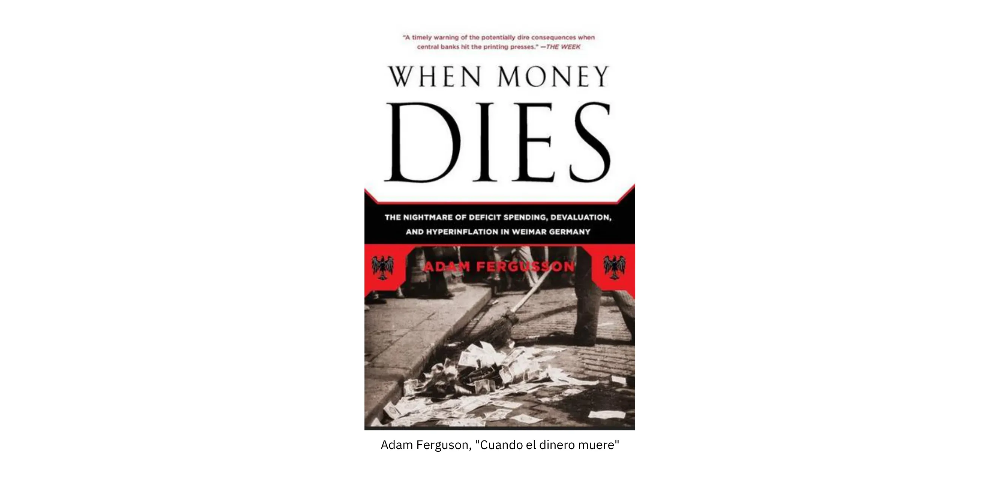

- "Cuando el dinero muere", de Adam Ferguson, describe la hiperinflación posterior a la Primera Guerra Mundial en Alemania, Austria y Hungría.
- Dos libros sobre la hiperinflación en Zimbabue, "Zimbabwe Warm Heart Ugly Face" y "Hard Boiled Egg Index", de Jérôme Gardner y Kudzai Joseph Gou Min-Yu, respectivamente, ofrecen conmovedores testimonios de un director general de una cadena de tiendas de ropa y un banquero agrícola sobre sus experiencias durante este tumultuoso periodo.

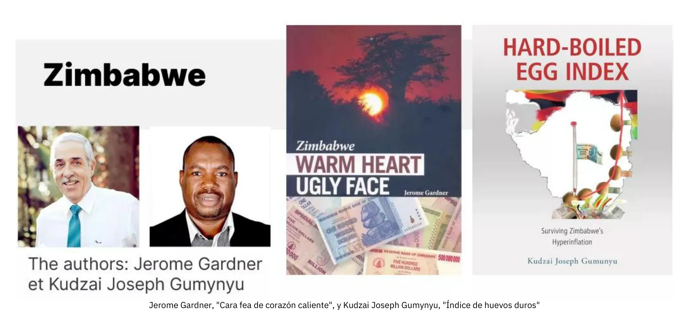

Mientras consolidaba mis notas, observé numerosas similitudes entre las experiencias de hiperinflación en Zimbabue y la República de Weimar, a pesar de los 90 años de diferencia entre ambas. Identifiqué unas 17 similitudes, de las cuales 13 ilustraban una especie de progresión hacia el desastre económico descrito en estos testimonios. Estos fascinantes paralelismos demuestran la naturaleza repetitiva y devastadora de la hiperinflación a través del tiempo y de las fronteras. Hoy examinaremos estas similitudes y cómo describen una trayectoria preocupante durante los periodos de hiperinflación.

### Análisis comparativo: Zimbabue y la República de Weimar

El juego de las 14 diferencias

#### 1. Escasez de dinero

Cuando la moneda se deprecia a una velocidad vertiginosa, incluso los intentos más ambiciosos de inundar el mercado con nuevos billetes pueden resultar insuficientes. La incesante demanda de moneda tangible puede superar con creces la capacidad de los bancos centrales para producir billetes, creando crisis de liquidez sin precedentes.

> Weimar: "Durante este mes se aumentará a casi 4.000 millones de marcos, cifra con la que se espera superar definitivamente la escasez de moneda."

> Zimbabue: "De 2002 a enero de 2009, hubo varios déficits críticos de liquidez. Simplemente no había suficientes billetes impresos o en circulación para mantener el ritmo de la inflación disparada."

#### 2. "¡Y eso es estiércol!"

La velocidad a la que la moneda puede perder su valor en determinadas situaciones económicas es asombrosa. Pueden emitirse cantidades astronómicas de billetes en un tiempo récord, transformando instantáneamente sumas antaño considerables en algo tan insignificante como el estiércol.

> Weimar: "La emisión total actual asciende a 63.000 billones. Dentro de unos días, por tanto, podremos emitir dos tercios de la circulación total en un solo día."

> Zimbabue: "El 17 de septiembre de 2006, el gobernador del RBZ, Gideon Gono, declaró: '10 billones siguen ahí fuera, y se han convertido en estiércol'"

#### 3. Los billetes valen menos que el papel en el que están impresos

En determinadas circunstancias económicas, el valor intrínseco de un billete puede llegar a ser inferior al valor del papel en el que está impreso. Esta drástica depreciación convierte los billetes, que normalmente son símbolos de valor y poder adquisitivo, en meros trozos de papel sin valor.

> Weimar: "Denominaciones enteras de billetes de marcos casi carecían de valor en cuanto salían de la imprenta"

> Zimbabue: "El banco central derrochó dinero imprimiendo un billete que no valía ni el papel en el que estaba impreso. En otras palabras, su valor era inferior al del papel higiénico. Por absurdo que parezca, era más barato utilizar el billete de 100 billones de ZWD como papel higiénico que comprar papel higiénico de verdad"

#### 4. Contar dinero

Cuando la moneda pierde rápidamente su valor, incluso las transacciones más sencillas pueden convertirse en tareas laboriosas. Calcular el precio de un artículo o simplemente contar los billetes necesarios para el pago puede llevar varios minutos, lo que añade un Layer de complejidad a las interacciones cotidianas.

> Weimar: "La compra más ordinaria en una tienda requería tres o cuatro minutos de cálculo, y una vez determinado el precio, solían necesitarse varios minutos más para contar los billetes."

> Zimbabue: "A los directores de tienda también se les permitía contratar a un trabajador temporal para sustituir al empleado que contaba dinero todo el día. Por supuesto, contar dinero en la tienda para la administración y el ingreso en el banco era una cosa, pero había que repetir todo el proceso en el banco durante el ingreso."

:::video id=910231d7-af90-4ab8-b74c-bfb81caebfb2:::

Técnica uzbeka para contar dinero

#### 5. Pagos por cheque

En las economías perturbadas, los métodos de pago tradicionales, como los cheques, pueden perder rápidamente su eficacia. Los bancos, abrumados por la creciente demanda de divisas debida a la hiperinflación, pueden racionar o retrasar el cobro de cheques, reduciendo así su valor real. Esta inestabilidad conduce a menudo a una priorización de los métodos de pago, donde los precios pueden variar en función del método de pago elegido.

> Weimar: "El aumento de los precios intensificó la demanda de dinero, tanto por parte del Estado como de otros empresarios. Los bancos privados no podían satisfacer la demanda en absoluto y tuvieron que racionar el cobro de cheques, por lo que los cheques no cobrados permanecieron congelados mientras disminuía su poder adquisitivo."
> Zimbabue: "El valor temporal del dinero creó tres precios para los bienes y servicios: un precio en efectivo, un precio de liquidación bruta en tiempo real y un precio en cheque. Al final, nadie aceptaba cheques, que tardaban cinco días en cobrarse"

#### 6. Los "quemadores-empresarios"

A medida que el valor de la moneda se erosiona, surgen nuevas oportunidades económicas que explotan las distorsiones del mercado. Estos empresarios, a menudo denominados "Burner-preneurs", pueden prosperar tomando prestada moneda devaluada para invertir en activos tangibles y luego devolver sus deudas con moneda aún más devaluada.

Weimar: "La especulación con la inflación consistía en pedir prestados marcos de papel, convertirlos en bienes y fábricas, y luego devolver el dinero a los prestamistas con papel depreciado."

Zimbabue: Los "quemadores-empresarios"

#### 7. La honestidad y el trabajo de Hard pierden atractivo

En contextos económicos inestables, los valores tradicionales de trabajo, ahorro e integridad pueden verse eclipsados por el atractivo de la riqueza rápida. La especulación y el comercio de divisas suelen ofrecer recompensas mucho mayores que el trabajo normal, lo que altera las prioridades de la sociedad.

Weimar: "A medida que las viejas virtudes del ahorro, la honradez y el trabajo Hard perdían su atractivo, todo el mundo buscaba enriquecerse rápidamente, sobre todo porque la especulación monetaria o bursátil podía aparentemente rendir mucho más que el trabajo."

Zimbabue: "Estas prácticas, al tiempo que enriquecían a unos pocos individuos, empobrecían a la clase trabajadora urbana y a la población rural. La educación perdió su valor, ya que este comercio estaba dirigido por personas que no necesitaban educación ni trabajo Hard para justificarlo. Todo lo que necesitaban eran contactos y un capital inicial para empezar su negocio de dinero fácil"

#### 8. Los "bancos del mundo

En situaciones de hiperinflación o crisis monetaria, suelen surgir mercados paralelos y no regulados de divisas. Estos "bancos" informales, a menudo denominados con humor "bancos mundiales" o con otros nombres locales, sirven de refugio a quienes buscan proteger sus activos de la devaluación. Aunque estos mercados pueden proporcionar un salvavidas económico necesario, a menudo ponen de manifiesto la desconfianza generalizada en las instituciones financieras oficiales y las políticas gubernamentales.

Weimar: "Sus transacciones se realizaban principalmente a través de los llamados Winkelbankiers, los operadores callejeros que habían surgido con la inflación y que, prosperando en una economía enferma, vivían enteramente de aprovecharse de la diferencia entre los precios de compra y de venta de las divisas."

Zimbabue: "También eran cambistas de moneda. Operaban impunemente entre la 2ª y la 6ª Avenida y la calle Fort de Bulawayo, gracias a sus astutas prácticas comerciales, que a menudo implicaban corrupción y otras actividades ilícitas. Esta zona de la ciudad era conocida como el 'Banco Mundial'"

Argentina: "Así que fui a donde van todos los argentinos: las cuevas, que se encuentran en el barrio de Florida, en el corazón de Buenos Aires." - TheBigWhale

#### 9. Los cambios de divisas eran ilegales

Los gobiernos, en un esfuerzo por estabilizar su propia moneda y controlar el flujo de capitales, pueden declarar ilegales estas transacciones de divisas. Estas medidas represivas, aunque pretenden proteger la economía nacional, a menudo pueden tener el efecto contrario, exacerbando la desconfianza pública y fomentando el mercado negro.

Weimar: "La gente recurre al trueque y gradualmente pasa a utilizar divisas extranjeras como único medio fiable de Exchange. Se introducen nuevos decretos relativos a la compra de letras extranjeras y al uso de divisas para pagos nacionales. Se introdujeron nuevos decretos sobre la compra de letras extranjeras y el uso de divisas para pagos nacionales. Además de penas de prisión, ahora se podían imponer multas de hasta diez veces el importe de una transacción ilegal."

Zimbabue: "Las redadas en los comercios llevaron al encarcelamiento de varios empresarios de Bulawayo durante el fin de semana y a multas equivalentes al doble del importe de las divisas recuperadas, esta valentía luego remitió"

#### 10. Control de capitales

Cuando un país se enfrenta a una crisis monetaria o económica, una respuesta habitual de los gobiernos es ejercer un estricto control sobre los movimientos y las formas de capital. Ya sea mediante órdenes que obligan a aceptar monedas nacionales devaluadas o mediante severas sanciones contra quienes rechazan determinados métodos de pago, estas medidas suelen tener por objeto contener el pánico y restablecer la confianza. Sin embargo, su eficacia varía, y a veces estas medidas pueden resultar contraproducentes o estar desconectadas de la realidad que viven los ciudadanos.

Weimar: "Recientemente, un nuevo decreto había obligado a los comerciantes a aceptar billetes del Estado; pero como también permitía seguir utilizando monedas extranjeras para todas las compras, los comerciantes en general encontraban excusas para no aceptar casi nada más."

Zimbabue: "El gobierno introdujo el SI 175/2008 el 12 de diciembre de 2008, relativo al pago con cheques. Decía: 'La sanción por negarse a pagar con cheque/tarjeta bancaria o cualquier otro método de pago electrónico mediado por un banco será una multa de nivel 8 o una pena de prisión de seis meses o ambas' Obviamente, ignoramos la IS porque estaba completamente fuera de la realidad"

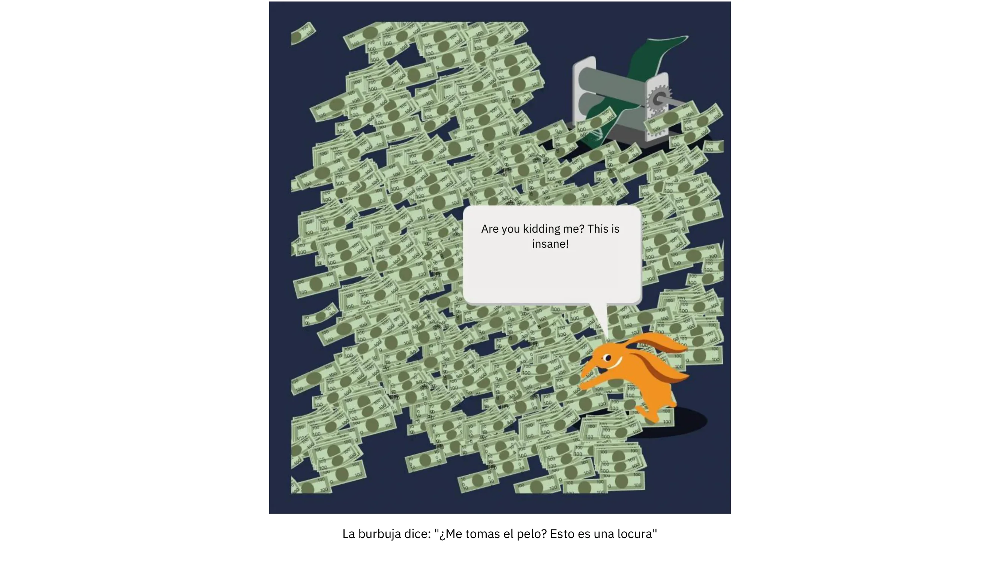

#### 11. Obligados a mantener abiertas sus tiendas

Cuando la economía se hunde y la moneda pierde su valor, los gobiernos pueden recurrir a medidas drásticas para mantener una apariencia de normalidad.

Weimar: "Los comerciantes que continuaban con sus actividades estaban sujetos a una nueva ordenanza, promulgada el 22 de octubre, que les obligaba a mantener abiertas sus tiendas y ofrecer mercancías en Exchange a cambio de marcos de papel."

Zimbabue: "Sólo quedaban estanterías de acero vacías y frigoríficos, neveras y congeladores. Lo trágico era que la tienda seguía abierta porque no se atrevían a cerrar debido a las tensiones políticas y al miedo de los dirigentes a ser detenidos por la fuerza de control de precios del gobierno. Ni siquiera se despidió a los trabajadores porque todos pensaban que habría una solución rápida"

#### 12. Todo el mundo es un delincuente

Ante una economía que se hunde y una normativa omnipresente, la línea que separa la supervivencia de la delincuencia se difumina.

Weimar: "Todos los crímenes contra el Estado, todos y cada uno de ellos, en mayor o menor grado, se convirtieron en una cuestión de supervivencia para los individuos."

> Zimbabue: "Todos los residentes en Zimbabue eran delincuentes. Por duro que pueda sonar, era cierto. Con la miríada de pequeñas leyes que rigen todos los aspectos de la vida, era inevitable que todo el mundo infringiera una ley cada día. Poseer moneda extranjera era ilegal, según un SI publicado en 2004. Tener varias cuentas bancarias para saltarse el límite de reintegro diario era ilegal. No tener las matrículas adecuadas en el coche, o una licencia de radio de coche, o un permiso de generador, eran todas leyes que alguien, en algún lugar, infringía"

#### 13. Comprar divisas a cualquier precio

La compra frenética de divisas ha marcado a menudo un punto de inflexión crítico en la devaluación de la moneda, exacerbando la caída de su valor intrínseco.

> Weimar: "Fritz Mannheimer, siguiendo instrucciones de su jefe, salió en agosto de 1921 y empezó a comprar divisas extranjeras a cualquier precio - 'porque Alemania tenía una cantidad infinita de marcos de papel pero no de divisas extranjeras' Esta fue la primera señal del hundimiento absoluto del valor del marco."

> Zimbabue: Se ha denunciado que se les fijaban objetivos diarios que debían cumplir, ya que algunas de las necesidades de divisas eran urgentes y compraban a cualquier precio para acumular divisas y cumplir el plazo. Se acusó a esta supuesta práctica de avivar el fuego de la devaluación, ya que el valor del dólar zimbabuense seguía bajando vertiginosamente."

### Resumen del proceso

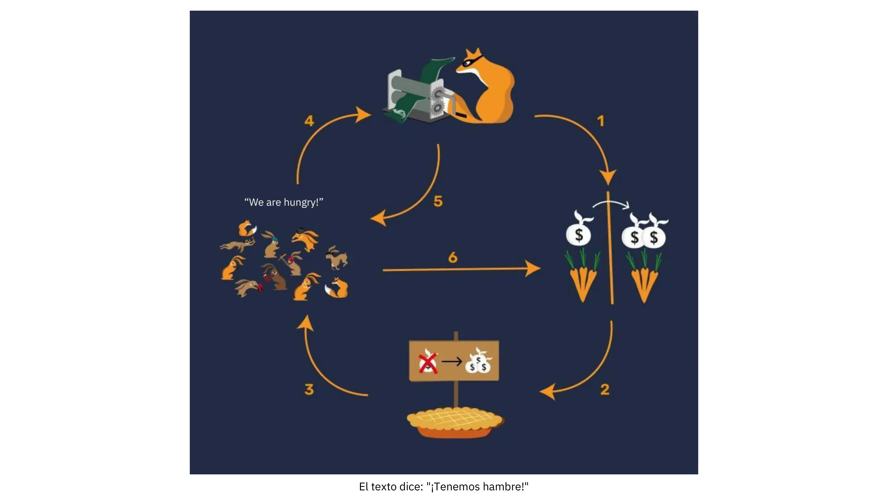

Al analizar la trayectoria económica, se observa que cuando se alcanza una inflación elevada, el valor de la masa monetaria se deteriora. Esta devaluación provoca varias complicaciones, entre ellas la escasez de billetes. En este contexto, surgen oportunidades de arbitraje, sobre todo en respuesta a las fluctuaciones de los tipos Exchange. Como consecuencia, muchos particulares recurren a este arbitraje, invirtiendo fuertemente en activos tangibles en previsión de una futura devaluación de la moneda que les permitiría pagar sus deudas con una moneda debilitada. Este entorno económico socava el atractivo de los empleos tradicionales y, en consecuencia, erosiona la cohesión social.

En respuesta a esta situación, el gobierno impone normativas draconianas, incluido el control de capitales. También obliga a los comerciantes a aceptar la moneda nacional y cheques. Con el tiempo, se promulgan nuevas leyes que amplían la definición de conducta delictiva. En última instancia, la tasa de Exchange sube exponencialmente, ya que el gobierno está dispuesto a Exchange su moneda, impresa a menor coste, por divisas extranjeras más robustas.

### 4 Similitudes en las consecuencias de la hiperinflación

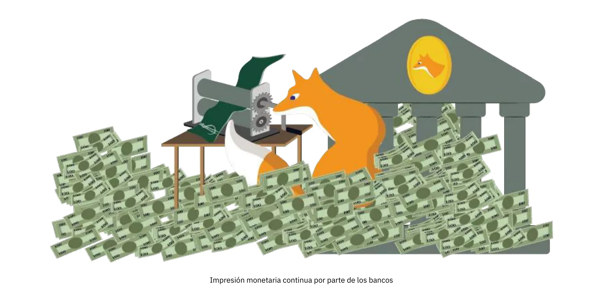

#### 1. Petróleo y metales

Durante el periodo de Weimar en Alemania, el robo de materiales valiosos estaba tan extendido que era frecuente sustraer el plomo de los tejados. En Zimbabue, la desesperación llevó a algunos a interrumpir la red eléctrica para extraer aceite de los transformadores y utilizarlo en sus vehículos.

Weimar: "Las placas metálicas de los monumentos nacionales tuvieron que ser retiradas para su custodia. Se robaron placas de timbre de latón de las puertas de la embajada británica en Berlín"

Zimbabue: "Para empeorar las cosas, debido a la falta de divisas, hubo escasez de aceite lubricante para coches, y los transformadores se convirtieron en un blanco fácil para los ladrones que desviaban el aceite refrigerante durante los cortes de electricidad"

#### 2. Trenes

La devaluación de la moneda puede empujar a los ciudadanos a adoptar comportamientos de supervivencia, incluido el vandalismo. Ante el colapso de la economía, las costosas infraestructuras públicas, como los sistemas de transporte, pueden verse comprometidas, con consecuencias sociales desastrosas.

> Weimar: "En Berlín, el sistema de tranvías dejó de funcionar por falta de fondos"

> Zimbabue: "Uno de los escenarios más preocupantes y tristes fue cuando se robó casi toda la línea eléctrica de cobre que unía Harare con Dabuka (más de 280 kilómetros). Cuando se terminó, había sido el orgullo de Zimbabue, con rápidos trenes eléctricos de pasajeros y mercancías circulando por esta ruta."

#### 3. "Mealie Meal"

En un contexto de salarios exiguos y economía inestable, las empresas se vieron obligadas a proporcionar alimentos a sus empleados para mantener la productividad y la eficiencia operativa. Esta iniciativa no era sólo una forma de compensar la escasez y los elevados costes de los alimentos, sino también una estrategia para retener al personal en un entorno económico difícil.

> Weimar: "En Berlín, los empleados de oficina, que formaban una clase muy importante en la capital, tenían sueldos totalmente insuficientes que oscilaban entre 12.000 y 20.000 al mes (equivalentes a entre 12 y 19 libras al año), y que disminuían constantemente; pero la mayoría aún podía obtener sus almuerzos por una cantidad simbólica, proporcionada por sus oficinas, de modo que el cuerpo y el alma apenas podían mantenerse juntos."

> Zimbabue: "En esta etapa, proporcionábamos a todo nuestro personal un almuerzo gratuito. La harina de maíz era esencial para que nuestra empresa siguiera funcionando, ya que en muchos casos era la única comida que nuestro personal recibía cada día."

#### 4. Cupones de gasolina

Las poblaciones buscaban alternativas estables para las transacciones. En Weimar, productos como el latón y el combustible sirvieron como medios de Exchange debido a su constante valor intrínseco. En Zimbabue, ante la rápida devaluación del dólar zimbabuense, los cupones de gasolina, que representaban una cantidad fija de un producto esencial, se convirtieron en una moneda de facto. Estas situaciones ponen de relieve cómo las sociedades se adaptan a condiciones económicas extremas, ideando soluciones innovadoras para mantener el comercio y la economía.

Weimar: "El trueque ya era una forma habitual de Exchange; pero ahora, bienes como el latón y el combustible se convirtieron en la moneda común de compra y pago"

Zimbabue: "Estos vales los utilizamos ahora para pagar el alquiler a los caseros, los impuestos municipales, las facturas de teléfono -de hecho, casi todo-, porque todo el mundo había dejado de aceptar pagos en dólares zimbabuenses y cheques"

#### Conclusión

Con esto concluye este vídeo sobre las similitudes de las experiencias durante los periodos de hiperinflación en Zimbabue y la República de Weimar. En el próximo vídeo hablaremos de las diferencias y los paralelismos contemporáneos. Gracias.

## Weimar vs Zimbabue: Diferencias y paralelismos contemporáneos

<chapterId>643f279c-d89f-5600-a2e2-b1bbbba0ab69</chapterId>

En este capítulo, exploraremos las diferencias y los paralelismos contemporáneos entre los periodos de hiperinflación pasados y presentes, con anécdotas y comparaciones relevantes para la actualidad.

### Diferencias entre la República de Weimar y Zimbabue

#### 1. ¡Es culpa del dólar!

En Alemania, era habitual que la población atribuyera la inflación a la subida del dólar y no a la devaluación intrínseca de su propia moneda. Muchos creían que el fenómeno observado se debía a una apreciación del dólar. Esta percepción descartaba cualquier reconocimiento del vínculo entre sus dificultades económicas y la devaluación monetaria, inducida principalmente por una creación excesiva de dinero. El libro "When Money Dies" ilustra claramente esta falta de comprensión entre la población alemana. En cambio, en Zimbabue la situación era diferente: los ciudadanos eran plenamente conscientes de la causa subyacente de la hiperinflación que estaban sufriendo.

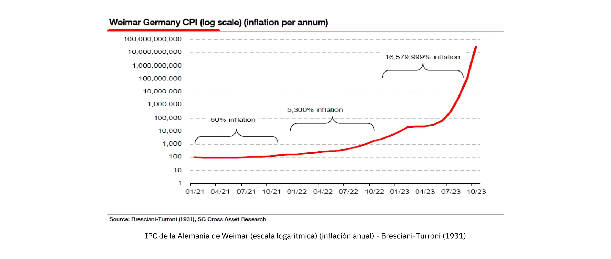

#### 2. Dinero de emergencia (Notgeld)

Ante la crisis monetaria y económica, Alemania recurrió al "Notgeld" (dinero de emergencia). Estos billetes, impresos por las ciudades o determinadas empresas, estaban concebidos para Address una escasez de moneda común.

Curiosamente, Francia también recurrió al Notgeld, sobre todo en los años veinte. Esta iniciativa no sólo fue consecuencia directa de la hiperinflación, sino que también tuvo su origen en los trastornos causados por la Primera Guerra Mundial. La guerra no sólo desestabilizó la economía, sino que también incrementó el coste de los metales. Como consecuencia, el valor intrínseco de las monedas metálicas superaba a menudo su valor nominal, lo que incitaba a la gente a atesorarlas. A falta de monedas, algunas instituciones, como la Cámara de Comercio de Lyon, imprimieron su propio Notgeld.

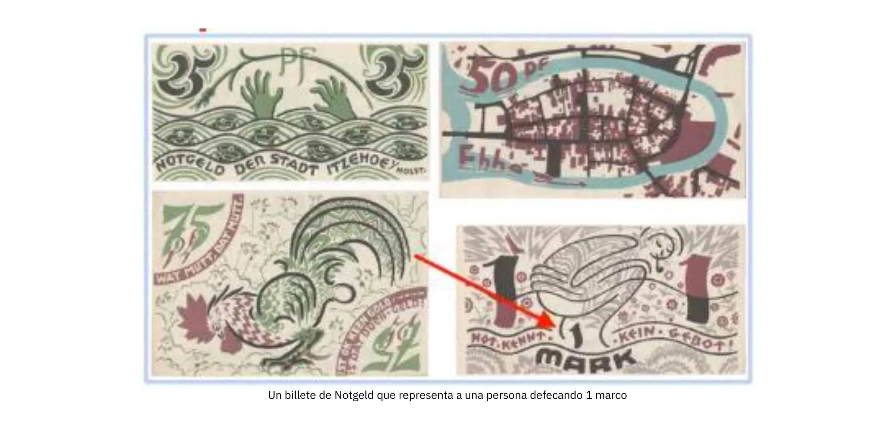

> "Lo que hay que hacer, se hace" - un dicho local

Entre los Notgeld, destaca un billete en particular. Presenta una ilustración conmovedora: en el centro, se representa a un individuo defecando un marco. En el reverso, una tabla de precios de 1913 a 1921 ilustra el aumento de la inflación durante este periodo.

El artista que está detrás de este Notgeld parece hacer una crítica irónica a las autoridades responsables de la crisis de hiperinflación. El billete lleva la inscripción "La necesidad no conoce ley". Otra expresión propia de la localidad de origen del Notgeld es: "Lo que hay que hacer, hay que hacerlo"

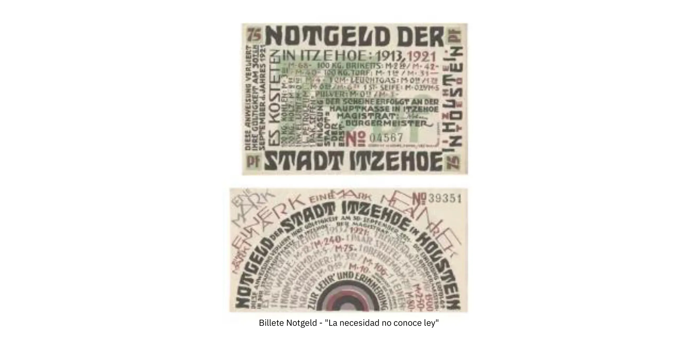

> "la necesidad no conoce ley"

> La primera "shitcoin": Anecdóticamente, viendo la ilustración central del billete, donde la moneda se devalúa literalmente por la acción del individuo, podría llamarse la primera "shitcoin"

#### 3. Obligaciones e hipotecas

En Weimar, algunas deudas se revalorizaron para compensar el impacto de la inflación. Esta medida no se adoptó en Zimbabue.

> Weimar: "La decisión de revalorizar los préstamos estatales se convirtió en ley en 1925, por lo que los accionistas recibían el 2,5% de su inversión inicial siempre que se hubieran pagado todas las reparaciones"

> Zimbabue: "En julio de 2007 (tres años después), podía sacar de mi bolsillo un devaluado pagaré de 500.000 ZDW (bt "000"), que ahora valía 1,67 dólares al tipo del mercado paralelo, y devolver el préstamo hipotecario, que se suponía que debía reembolsarse en veinte años. Además, este pagaré representaba sólo el 0,49% de mi salario mensual del mismo mes"

Para saber más sobre la gestión de la crisis alemana, este libro también es esencial.

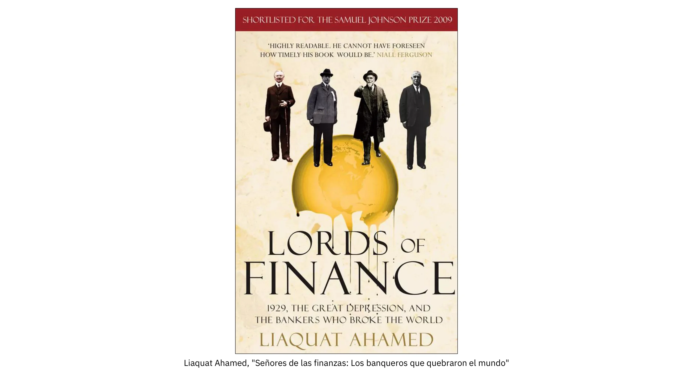

### Paralelismos contemporáneos

#### 1. Manipulación de la política monetaria para controlar la economía.

En la historia de la República de Weimar es evidente que los industriales eran reacios a la apreciación del valor del marco. Su capacidad para obtener préstamos y reembolsar sus deudas con una moneda muy depreciada les proporcionaba una ventaja considerable. Este mecanismo facilitó la construcción de enormes complejos industriales casi sin coste alguno. Estos industriales temían una apreciación del marco, ya que obstaculizaba sus actividades. Algunos incluso veían la inflación galopante como un hecho positivo, creyendo que garantizaría empleo a la población. Sin embargo, no se dieron cuenta del impacto perjudicial de esta inflación sobre el ahorro y la economía en su conjunto. Para estos agentes económicos, la impresión monetaria era una bendición.

> Weimar: "Por eso se temía mucho una apreciación del marco, e incluso las pocas semanas de "estabilidad" después de Génova provocaron un estancamiento del negocio."

> Weimar: "Los círculos industriales se enfrentaban al peligro de que el dinero en efectivo se volviera más valioso que los bienes y se produjera un colapso cuando todo el mundo intentara convertir sus activos en dinero en efectivo."

Se puede establecer un paralelismo contemporáneo con las declaraciones de Christine Lagarde, sugiriendo que los ciudadanos deberían priorizar la perspectiva del empleo sobre la protección de sus ahorros. Al igual que los industriales de Weimar, parece abogar por la impresión monetaria como herramienta para estimular el empleo, a expensas del valor de los ahorros.

> Christine Lagarde: "Deberíamos alegrarnos más de tener trabajo que de ver protegidos nuestros ahorros"

#### 2. La propiedad privada en tiempos de conflicto

La historia de la República de Weimar revela que durante este periodo se confiscaron los bienes y capitales poseídos en el extranjero. Esta medida recuerda acontecimientos más recientes en Rusia, especialmente al inicio de un conflicto. Estas situaciones ponen de manifiesto una realidad preocupante: en tiempos de crisis, el respeto de la propiedad privada puede verse comprometido. Se trata de un paralelismo histórico y contemporáneo que subraya las posibles repercusiones de las crisis en los derechos individuales.

> Weimar: "Todo el capital alemán en el extranjero había sido confiscado"

> [20minutes.fr](https://www.20minutes.fr/monde/3286947-20220513-guerre-ukraine-geler-avoirs-russes-vol-non-redistribuer-kiev-poserait-lourdes-questions): "Aproximadamente 300.000 millones de dólares de reservas rusas en el extranjero han sido efectivamente congelados en el marco de las sanciones occidentales, de los 640.000 millones de dólares de reservas en poder del Banco Central ruso."

#### 3. La noción de precio de mercado

Durante la República de Weimar, los agricultores expresaron su descontento con el "Umlage", que les obligaba a entregar los dos primeros millones de toneladas de trigo producidas cada año. Esta reglamentación hizo que la mitad del total del pan Supply se comercializara a precios subvencionados. A partir de agosto, se suponía que a estos agricultores se les pagaba el precio del mercado mundial, porque aunque se les obligaba a entregar su trigo a precios reducidos, aún tenían que comprar fertilizantes a los precios del mercado mundial.

Esta situación plantea una cuestión central relacionada con la noción de precio de mercado durante la hiperinflación. En el contexto alemán de la época, los agricultores se veían obligados a vender su trigo a un precio inferior a su valor, mientras que tenían que adquirir fertilizantes a precios del mercado mundial. Semejante discrepancia económica pone de relieve los retos que plantean hoy los precios de los alimentos. Los productores agrícolas, enfrentados al aumento de los costes de los insumos debido a la inflación, repercuten estos costes en los productos finales. Criticarles por este aumento equivale a ignorar la dinámica de los precios de mercado y las presiones económicas a las que se enfrentan. Vender a precios artificialmente bajos mientras se incurre en costes elevados es insostenible para cualquier empresa.

> Weimar: "Los intereses agrarios estaban descontentos con el 'Umlage', la entrega forzosa de los dos primeros millones de toneladas de trigo producidas cada año, que permitía vender a bajo precio la mitad del total de Supply para pan. A partir de agosto, los agricultores debían cobrar el precio del mercado mundial porque, aunque estaban obligados a vender trigo a bajo precio, siempre tenían que pagar el precio del mercado mundial por los fertilizantes."

#### 4. Negación de la relación entre el dinero Supply y la inflación

> Weimar: "Siguió firmemente aferrado a su opinión de que el dinero Supply no estaba relacionado ni con los niveles de precios ni con los tipos Exchange;"

En los tiempos modernos, esta tendencia persiste, como se ve en el ejemplo del capítulo anterior de una lista de explicaciones presentadas por diversos economistas e institutos económicos para justificar la inflación. Estas razones varían, desde acontecimientos culturales y celebridades como Taylor Swift, Zelda o Beyoncé, hasta factores globales como la guerra y la pandemia. Todas estas razones, aunque pueden contribuir a las fluctuaciones económicas a corto plazo, desvían la atención de la verdadera causa subyacente: la expansión del dinero Supply.

#### 5. Empresas zombis

> Weimar: "La estabilización había puesto fin al periodo en que los empresarios podían endeudarse cuanto quisieran a costa de todos los demás. Un gran número de empresas, creadas o expandidas durante la abundancia monetaria, se volvieron rápidamente improductivas una vez que el capital empezó a escasear."

Una empresa zombi es una empresa que, en condiciones normales de mercado, sería insolvente o estaría al borde de la quiebra, pero sigue funcionando gracias principalmente a préstamos a bajo coste. Estas empresas ganan lo justo para cubrir sus deudas, pero son incapaces de crecer de forma significativa.

La noción de empresa zombi no es nueva. De hecho, ya existía durante la República de Weimar. En aquella época, muchas empresas parecían florecer, beneficiándose en gran medida del acceso al crédito gratuito. Pidieron prestadas sumas considerables con la expectativa de devolverlas más tarde con una moneda depreciada debido a la inflación galopante. Sin embargo, cuando la inflación cesó y el marco alemán recuperó su valor, estas empresas, que no eran realmente viables ni desde el punto de vista operativo ni financiero, dejaron de ser rentables y tuvieron que cerrar.

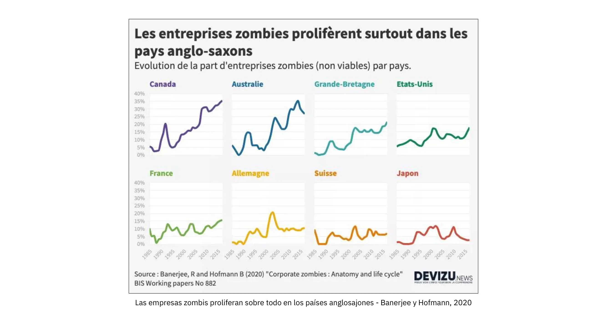

El fenómeno de las empresas zombis no se limita a la Alemania de posguerra. Incluso hoy en día, muchas grandes empresas siguen prosperando gracias a su acceso privilegiado al crédito a tipos de interés extremadamente bajos. Si tuvieran que endeudarse a tipos más convencionales, muchas de ellas dejarían de ser rentables. Esto es especialmente relevante en 2023, tras un prolongado periodo de tipos de interés cercanos a cero, ya que ahora los tipos han empezado a subir. Este reciente cambio en el panorama financiero será sin duda una prueba decisiva para estas empresas, antes tachadas de "zombis"

#### 6. ¡Hágase rico rápidamente!

La historia revela casos en los que los individuos trataron de acumular riqueza rápidamente, como ocurrió en Weimar y Zimbabue mediante el arbitraje. Hoy se observa una tendencia similar con el auge de ciertas criptodivisas. La gente se siente tentada por las ganancias rápidas, asumiendo riesgos con la esperanza de un aumento exponencial de su inversión. Este enfoque recuerda al observado durante los periodos de hiperinflación, en los que se recurría al arbitraje para obtener beneficios rápidos, a menudo a expensas de los demás.

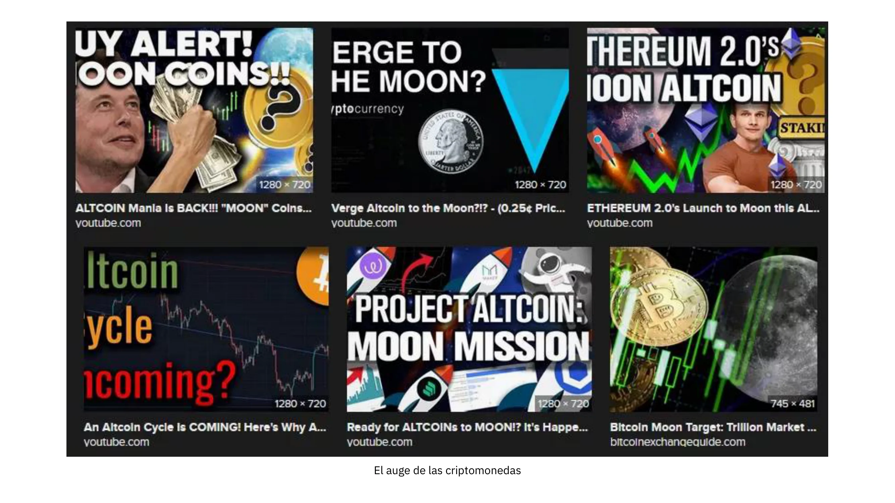

#### 7. El ahorro, remedio contra la incertidumbre

> La influencia omnipresente y destructiva de la erosión constante del valor del capital y de la renta, así como la incertidumbre sobre el futuro.

Merece la pena destacar una cita que subraya el efecto destructivo de la erosión del valor del capital sobre la cohesión social, así como la incertidumbre que genera. En ella se afirma: "la influencia omnipresente y destructiva de la erosión constante del valor del capital y de la renta, así como la incertidumbre sobre el futuro"

Imagine una situación en la que tiene una familia o unos seres queridos a los que desea proteger. Trabajas Hard y ahorras para anticiparte a las incertidumbres futuras. Si todo fuera previsible, ahorrar sería inútil. Sin embargo, ante circunstancias imprevistas, como la avería de un coche, los ahorros se convierten en un salvavidas. Reducen la incertidumbre del mundo. Sin embargo, durante la hiperinflación, ahorrar se convierte en un reto. El dinero pierde rápidamente su valor, lo que dificulta la planificación a largo plazo. Esta inestabilidad financiera puede generate estrés y ansiedad.

Hoy en día, con la disminución del poder de ahorro, la inversión ha ocupado su lugar. Sin embargo, este enfoque conlleva sus propios riesgos. El ahorro siempre ha sido un remedio contra la incertidumbre. Disponer de reservas financieras para hacer frente a situaciones imprevistas contribuye a la tranquilidad y refuerza la cohesión social. En conclusión, proteger nuestro poder de ahorro es esencial para mantener la estabilidad tanto social como individual.

## Redenominaciones en América Latina

<chapterId>918eafd7-409d-5205-ad52-a52e63b23a64</chapterId>

A continuación examinaremos los distintos periodos de redenominación en los países latinoamericanos.

### Explicación de los gráficos

En la diapositiva, a la izquierda, figuran los años de redenominación, el nombre de la nueva moneda y el tipo Exchange con la antigua moneda. Tomando el ejemplo de Argentina, el peso moneda nacional se convirtió a un tipo de 25 a 1 con respecto a la moneda anterior, el peso reàl. En este contexto, examinaremos la evolución de la moneda argentina a lo largo del tiempo. Además, indicaremos las denominaciones iniciales y finales de los billetes para cada periodo.

A la derecha de la diapositiva aparece un gráfico de la inflación. Las flechas rojas representan años de hiperinflación, según el criterio de Cagan, que es una tasa de inflación del 50% mensual. Este criterio puede a veces dar lugar a interpretaciones ambiguas, ya que años con altas tasas de inflación pueden no ajustarse a la definición estricta de hiperinflación.

Cabe destacar la redenominación, una medida común adoptada por los gobiernos en periodos de inflación. Sin embargo, esto no resuelve el problema subyacente de la inflación o la hiperinflación. Es sólo una forma de cambiar el nombre de la moneda y eliminar ceros, sin abordar verdaderamente la causa fundamental de la hiperinflación: la expansión del dinero Supply. En un vídeo posterior, hablaremos de las verdaderas soluciones a la Address y resolveremos el problema de la hiperinflación. En esta serie, pondremos de relieve las consecuencias de una simple redenominación sin las reformas adecuadas: la inflación persiste.

Después de Argentina, nuestro estudio abarcará Brasil, Bolivia, Perú, Nicaragua y Venezuela. Examinaremos las redenominaciones que han tenido lugar en estos países.

### Argentina

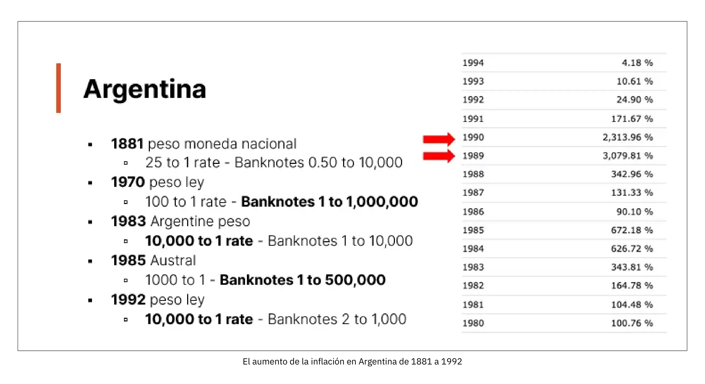

Antes de 1826, Argentina utilizaba el dólar español. Tras su independencia en 1816, introdujo su propia moneda basada en el reàl español, lo que dio lugar a la creación de una moneda similar. La tabla comienza en 1881, año de la introducción del "peso moneda nacional", con billetes de hasta 10.000 unidades. Le siguió el "peso ley", que se cambiaba a razón de 100 por 1 y tenía billetes de hasta un millón. A continuación, llegó el "peso argentino", con un tipo de cambio de 10.000 a 1 (equivalente a quitar cuatro ceros) y billetes de hasta 10.000. En 1985, se introdujeron los "australes", que se cambiaban a un tipo de 1.000 a 1, con billetes disponibles de hasta 500.000. En 1992, se estableció el actual "peso ley" a un tipo de cambio de 10.000 a 1, eliminando de nuevo cuatro ceros. Sólo los años 1989 y 1990 experimentaron hiperinflación.

### Brasil

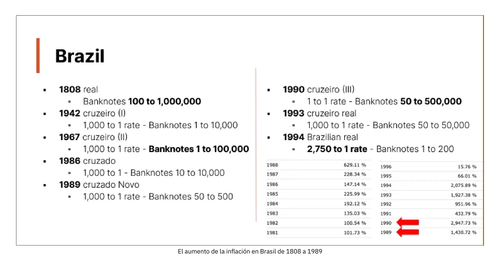

Brasil es un ejemplo notable de redenominación monetaria, como ilustra su historia de cambios de moneda. Antes de su independencia, Brasil utilizaba el reàl portugués como moneda. Sin embargo, ya en 1747, el país comenzó a utilizar su propio "reàl brasileño", mucho antes de su declaración de independencia en 1822. La tabla comienza en 1818, marcando el inicio de la emisión de billetes brasileños. Anteriormente, la moneda era principalmente en forma de monedas. Estos billetes alcanzaban valores de hasta un millón de reales.

A partir de 1942, Brasil inició una serie de redenominaciones. En la mayoría de los casos (1942, 1967, 1986, 1989, 1993), el tipo de conversión fue de 1:1.000. En 1990, se produjo un cambio de nombre sin conversión. En 1990, se produjo un cambio de nombre sin conversión. La secuencia de estas monedas es la siguiente:

- Réals (versión antigua) hasta 1942.
- Cruzeiros en 1942.
- Cruzeiros (nueva versión) en 1967.
- Cruzados en 1986.
- Cruzados Novos en 1989.
- Regreso a Cruzeiros en 1990.
- Cruzeiros Reais en 1993.
- Finalmente, la reàl brasileña en 1994.

El billete de mayor denominación alcanzó los 500.000, y la última redenominación en 1994 se hizo a un tipo de 2.750 a 1. Los años 1989 y 1990 estuvieron marcados por la hiperinflación, mientras que en 1993-1994 se registraron altas tasas de inflación que no alcanzaron el umbral de la hiperinflación (50% mensual). Tras este tumultuoso periodo, Brasil volvió a redenominar su moneda eliminando varios ceros.

### Bolivia

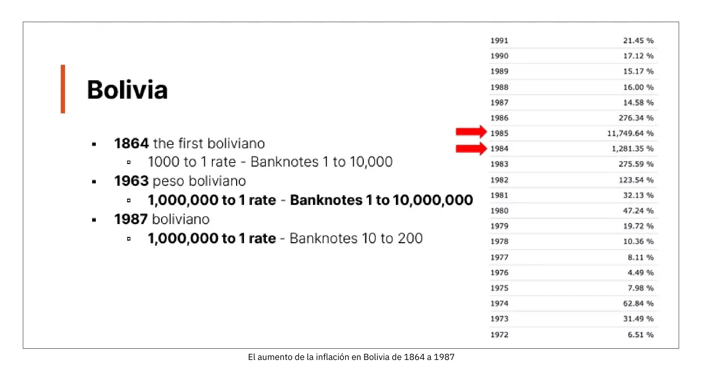

Bolivia es otro ejemplo de país que ha experimentado periodos de inflación aguda que han obligado a redenominar la moneda. He aquí un resumen de su historia monetaria:

Antes de su independencia en 1825, Bolivia utilizaba el dólar español como moneda. Tras la independencia, el país introdujo el Sol boliviano entre 1827 y 1864, sustituyendo al dólar español. Sin embargo, cabe señalar que los primeros billetes en Bolivia no se introdujeron hasta 1864.

En 1864 se introdujo el primer "boliviano", con una cotización de 1.000 a 1 respecto al sol boliviano. Esta moneda permaneció en circulación hasta alcanzar una denominación de 10.000 bolivianos.

Posteriormente, Bolivia cambió su moneda por el "peso boliviano", que experimentó una grave hiperinflación, llegando a alcanzar denominaciones de hasta 10 millones. Este episodio de inflación alcanzó su punto álgido en los años 1984-1985, con tasas de inflación mensuales que a menudo se acercaban al umbral de hiperinflación del 50%. Para tener una cierta perspectiva, una tasa de inflación constante del 50% mensual a lo largo de todo un año da como resultado una tasa de inflación anual de aproximadamente el 12.800%. En 1985, la tasa de inflación anual de Bolivia alcanzó el 11.749%, lo que indica que la inflación se acercó o superó el umbral del 50% casi todos los meses.

En respuesta a esta crisis monetaria, en 1987 Bolivia introdujo una nueva moneda, llamada simplemente "Boliviano", con un tipo de cambio Exchange de 1 millón de pesos bolivianos por 1 boliviano. Esta versión del Boliviano sigue en circulación hoy en día.

Este es un resumen de la tumultuosa historia monetaria de Bolivia, marcada por periodos de hiperinflación y redenominaciones.

### Perú

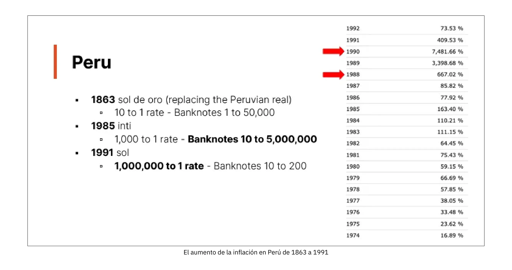

Perú presenta un caso interesante en cuanto a los efectos de la regla arbitraria del 50%. Empezando por su historia monetaria, Perú utilizó el oro español hasta el siglo XIX, cuando declaró su independencia en 1821. El dólar peruano se utilizó de 1822 a 1863. En 1863, el reàl peruano fue sustituido por el soldi oro, a razón de 10 a 1, alcanzando un valor máximo de 50.000. En 1985, se introdujo la moneda "Inti", con un tipo de conversión de 1.000 a 1, alcanzando un valor máximo de 5 millones. En 1991, se lanzó el "SOL" con un tipo de Exchange de 1 millón a 1, con billetes de 10 a 200.

Examinando los periodos de redenominación, 1988 se considera un año de hiperinflación, especialmente en septiembre. Julio-agosto de 1990 también fue un periodo de hiperinflación. En 1988, la tasa de inflación anual fue del 667%, con un pico del 50% en septiembre. En cambio, 1989 experimentó una tasa de inflación del 3000% sin que ningún mes superara el 50%, por lo que no se clasificó como hiperinflación. En 1990, la inflación alcanzó un máximo del 7481%. Está claro que la regla del 50% puede ser arbitraria, ya que 1988 se consideró un año de hiperinflación, a diferencia de 1989. Si se reconsiderara esta regla, sería prudente bajar el umbral para incluir periodos como el que vivió Perú en 1989.

> Entender lo que ocurre
>

> Lo que hay que entender sobre las redenominaciones de divisas es que cuando el valor de la moneda alcanza cifras astronómicas, como 5 o 10 millones, se redenomina. Este proceso puede repetirse varias veces, lo que implica un cambio de moneda. El resultado es que los ahorros de los particulares pueden verse gravemente afectados, incluso en ausencia de hiperinflación. Por ejemplo, si alguien ahorra 1.000 dólares en un año y consigue apartar 100 dólares, al año siguiente, el billete de menor denominación podría ser de 1.000 dólares, dejando sin valor los 100 dólares ahorrados anteriormente. Tal erosión de los ahorros no requiere una hiperinflación evidente. Incluso si una persona ha ahorrado 10.000 dólares en los últimos diez años, esa cantidad podría acabar valiendo una cantidad insignificante, incapaz de comprar una simple botella de agua. Esta realidad es evidente en muchos países que han experimentado redenominaciones, aunque sólo fueran de unos pocos meses fueron calificados de hiperinflacionarios. Por el contrario, algunos países, como Nicaragua, han experimentado años consecutivos de hiperinflación.

### Nicaragua

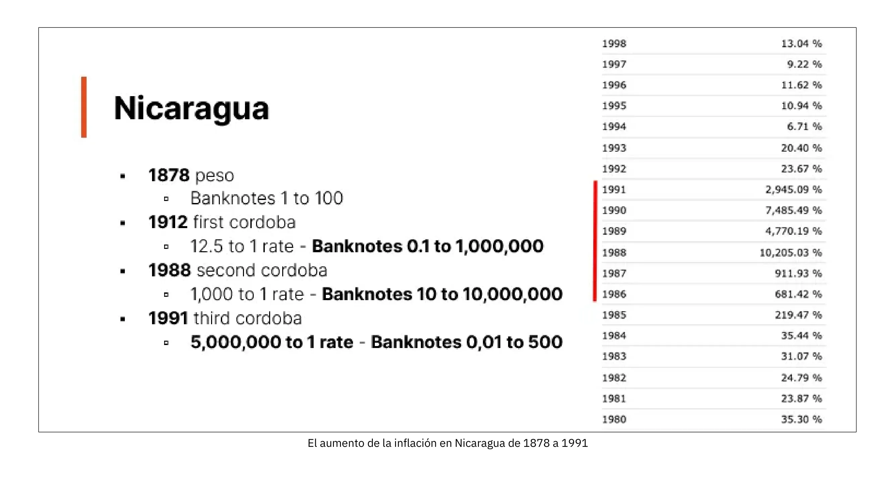

Nicaragua, anteriormente bajo dominio español, utilizó inicialmente el dólar español, como muchos otros países colonizados por España. Tras integrarse en el Imperio Español, el Imperio Mexicano y luego en la República Federal de Centroamérica, Nicaragua declaró su independencia. A partir de 1878, el peso se convirtió en la moneda oficial del país, con valores que fluctuaban entre 1 y 100. En 1912, el país introdujo el euro. En 1912, el país introdujo el primer córdoba, al que siguieron el segundo en 1988 y el tercero en 1991, que sigue en uso hoy en día. El primer Córdoba alcanzó un valor de 1 millón, y el segundo de 10 millones. La redenominación de 1991 se produjo tras varios años de hiperinflación.

### Venezuela

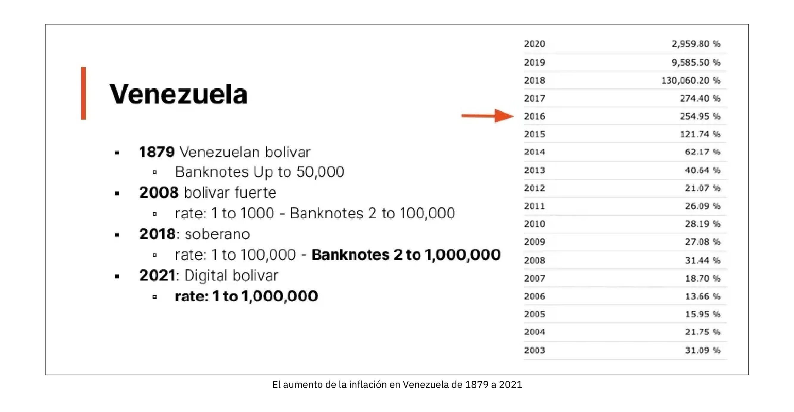

Venezuela es el último país mencionado en este vídeo. El país ha sufrido cuatro redenominaciones de moneda a lo largo del tiempo. En sus inicios, Venezuela utilizó el dólar español antes de declarar su independencia en 1811. En 1879, introdujo el bolívar como moneda oficial, que estuvo en vigor hasta 1983, cuando el gobierno optó por un sistema de tipo Exchange flotante utilizando el dólar.

Un hecho destacable de Venezuela es su pertenencia a la Unión Monetaria Latina. Esta unión incluía monedas como las 5 pesetas de España, los 5 dracmas de Grecia, los 5 bolívares de Venezuela, las 5 liras de Italia, los 5 francos belgas y los 5 francos franceses.

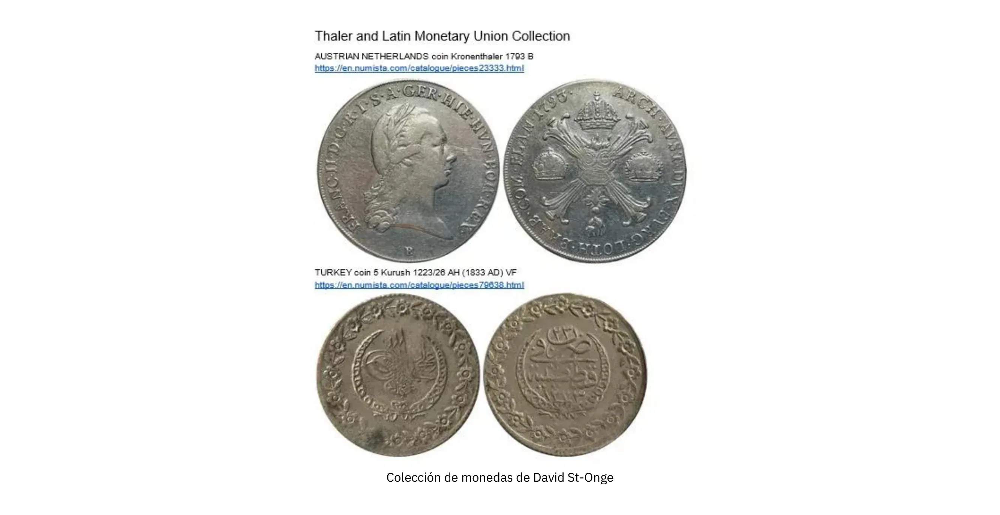

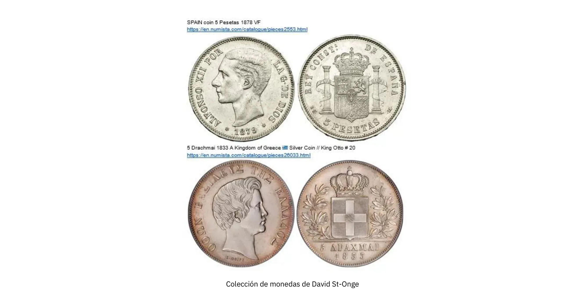

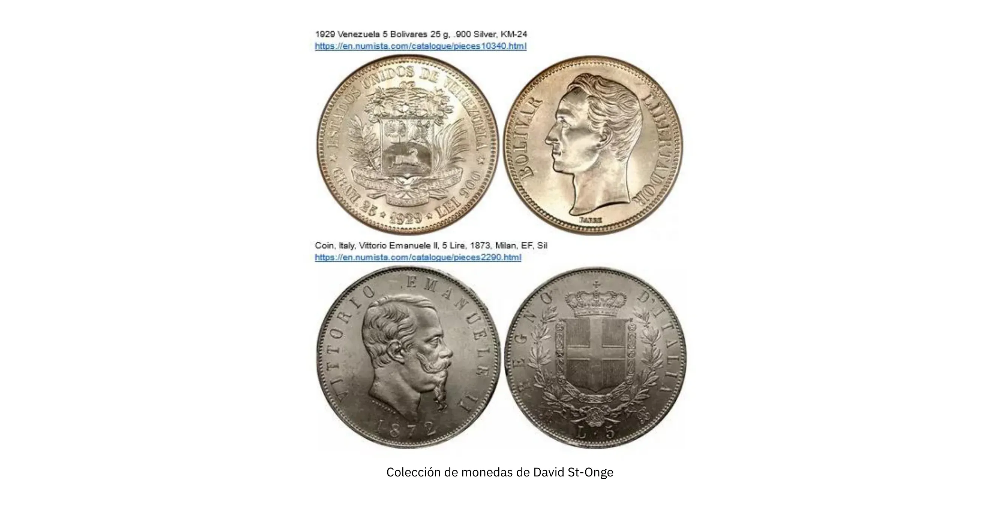

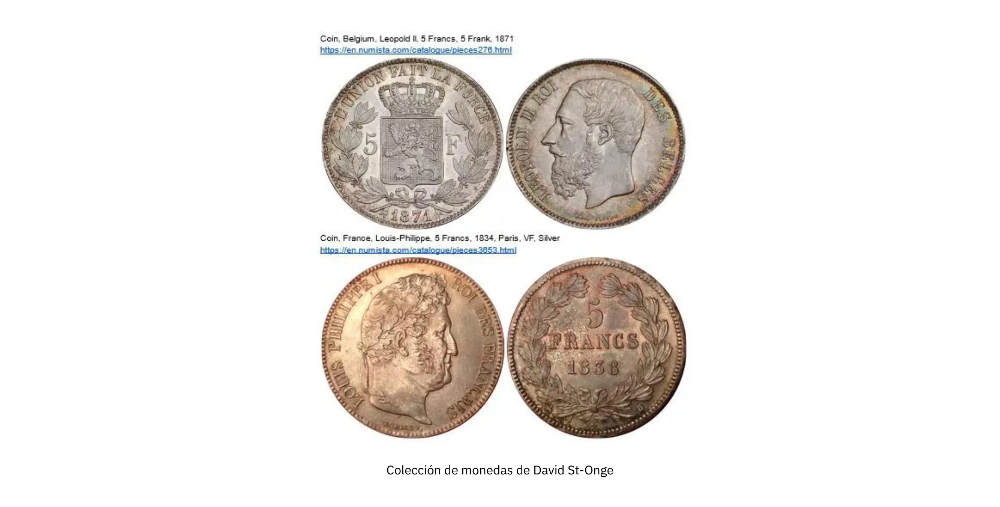

Durante este periodo, el Coin de 5 bolívares de Venezuela tenía el mismo peso que los de los países miembros de la Unión, entre ellos Italia, España, Bélgica y Francia. Estos bolívares eran de plata, y un Coin específico de 1929 pesaba 25 gramos y tenía una pureza de 900, es decir, un 90% de plata pura. Con el precio actual de la plata, este Coin vale aproximadamente entre 17 y 18 dólares estadounidenses.

Tras la adopción de un tipo flotante Exchange en 1983, se produjeron varias redenominaciones:

- En 2008 se introdujo el bolívar fuerte, que llegó a alcanzar los 100.000 antes de una redenominación de mil a uno.
- En 2018, se introdujo el Soberano, cuyos billetes alcanzaron el millón. En 2021, fue sustituido por el bolívar digital, que también alcanzó el millón, antes de una nueva redenominación de un millón a uno. Hoy, el billete de 10 o 20 equivale a 10 millones o 20 millones en Soberano.

Los billetes de este periodo, que datan de 2018, se distribuyen en varias conferencias de Bitcoin en Biarritz, Toronto y Miami. Estos billetes de Soberano alcanzaron un valor máximo de 1 millón. Entonces se produjo una redenominación que redujo el valor de 1 millón a unos 3 céntimos. Actualmente, 10 billetes de 1 millón corresponden a un billete de 10. Desde 2016, Venezuela sufre hiperinflación, lo que representa el 57º periodo en una tabla específica.

En el siguiente vídeo, se presentará una colección de billetes de la hiperinflación, centrada en Venezuela y otros países de la lista. Esta colección contiene casi todos los billetes venezolanos. El estudio se centrará en las diferentes redenominaciones de cada uno de los países mencionados. Además, se estudiarán las redenominaciones en Zimbabue, un tema de gran interés.

### Conclusión

Hemos visto que la hiperinflación no es el único indicador de una catástrofe económica. Redenominar varias veces, quitar ceros o cambiar el nombre de la moneda tiene repercusiones directas en la población, que van desde la pérdida de ayudas hasta problemas alimentarios. Aunque la hiperinflación es preocupante, el número de redenominaciones, como las observadas en Brasil, muestra una realidad más compleja.

Basándose en el criterio del 50% de inflación mensual, varios periodos podrían haberse clasificado como hiperinflación. Esto es especialmente cierto cuando se examinan los criterios de la organización internacional de contabilidad, que tiene en cuenta características como el rápido abandono de la moneda por parte de la población, la indexación salarial y los préstamos con elevados tipos de interés para compensar la inflación.

En conclusión, la hiperinflación es sólo un aspecto de los retos económicos. Una inflación elevada por sí sola puede ser igualmente perjudicial. La próxima sección explorará posibles soluciones para superar la hiperinflación.

## Cómo superar la hiperinflación

<chapterId>e3484a31-a851-5f92-8af5-00eddae67db1</chapterId>

### Cómo acabar con la inflación moderada y alta

Las conclusiones mencionadas proceden del libro "Régimen monetario e inflación" de Peter Bernholz. Según Bernholz, el único método para acabar con la inflación es aplicar una reforma monetaria e imponer restricciones fiscales al gobierno. Estas restricciones implican la creación de una institución, como un banco central, que funcione con independencia de las decisiones políticas del gobierno. La inflación alta y la hiperinflación suelen ser el resultado de la financiación de déficits presupuestarios mediante la creación de dinero. Para Address moderar la inflación, es esencial disminuir el crecimiento del Supply dinero. Bernholz también sugiere que este crecimiento monetario sea relativo al de los países vecinos. Un punto sorprendente es que, durante periodos de alta o hiperinflación, el valor total del dinero Supply puede de hecho disminuir. Un ejemplo sorprendente de esta situación es Zimbabue.

### Soluciones contraintuitivas

Al estudiar Zimbabue, se observó que 10 billones de unidades del dinero Supply habían perdido todo su valor. En Weimar, fue posible imprimir dos tercios del valor nominal total de 65 billones de unidades del dinero Supply en un solo día. Esto demuestra cómo puede devaluarse el dinero Supply. Para remediar esta situación, es necesario aumentar significativamente el dinero Supply hasta alcanzar un nivel adecuado. Entonces, es indispensable una reforma monetaria. En una situación de inflación elevada, esta reforma es inevitable, pero debe garantizar que haya suficiente dinero en circulación. Tras este paso, se pueden imponer restricciones al gobierno.

Según las observaciones de Bernholz, al abordar los problemas de inflación, instituciones como el FMI y el Banco Mundial no siempre adoptan las estrategias más eficaces. En algunos casos, cuando un país necesita aumentar su Supply monetario, estas instituciones tratan de reducirlo. La clave está en alcanzar un nivel monetario adecuado y luego imponer límites a su crecimiento, evitando así financiar los gastos del gobierno mediante la creación monetaria.

Un aspecto interesante planteado por Bernholz es que el éxito de una reforma monetaria depende no sólo de su pertinencia técnica, sino también de la confianza que la población deposite en ella. Algunas reformas bien diseñadas pueden fracasar porque el público no confía en ellas, mientras que otras, mal diseñadas, pueden tener éxito porque la población confía en ellas. La percepción y la confianza de la población son, por tanto, Elements esenciales en el éxito o el fracaso de una reforma monetaria.

- En Zimbabue, la solución adoptada para contrarrestar la inflación fue la dolarización, lo que significa que adoptaron el dólar estadounidense u otras monedas de países vecinos. Este planteamiento impide al gobierno imprimir dinero a discreción.
- En Alemania, la solución fue crear una nueva moneda, el Rentenmark. Esta moneda estaba respaldada por los activos territoriales del Reich, y esta estrategia resultó eficaz.

### El caso de Zimbabue

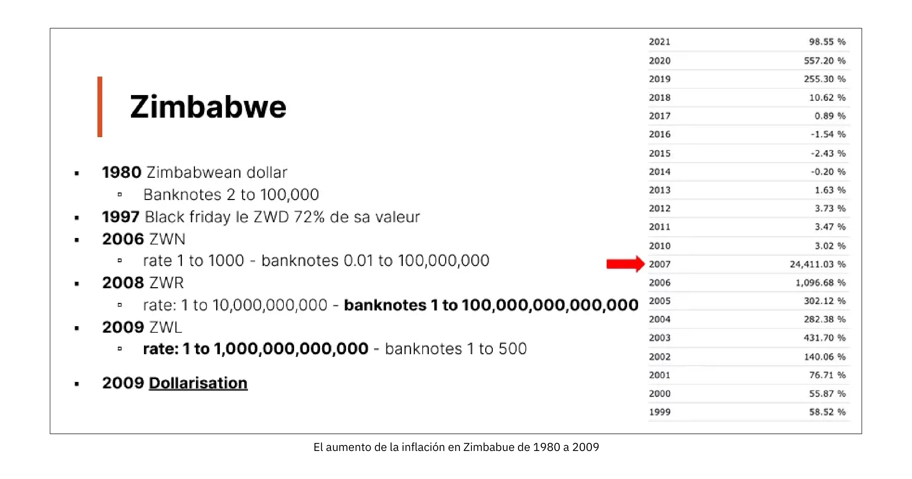

Zimbabue obtuvo la independencia en 1980 e introdujo su propia moneda, el dólar zimbabuense. Inicialmente, dos dólares zimbabuenses valían alrededor de 1,60 dólares estadounidenses. Sin embargo, en 1997, a raíz de unas medidas sociales en favor de los veteranos de guerra, la moneda se devaluó un 72% en un solo día, durante el Viernes Negro. Después, a principios de la década de 2000, el país lanzó un programa de redistribución de tierras, que consistía en quitar tierras a los propietarios blancos y distribuirlas entre la población local. Esta decisión perjudicó a las exportaciones porque los nuevos propietarios carecían a menudo de los conocimientos necesarios para gestionar explotaciones a gran escala. Como resultado, mientras que Zimbabue era exportador neto en 1999, se convirtió en importador neto en 2003.

En 2006, el país introdujo una nueva versión de su moneda, el ZWN, con un tipo Exchange de 1 a 1.000. En 2008 se introdujo otra denominación, el ZWR, con un tipo Exchange de 1 a 10.000 millones. En 2008, se introdujo otra denominación, el ZWR, con una Exchange de 1 a 10 billones. Esto llevó a la creación de los emblemáticos billetes de 100 billones.

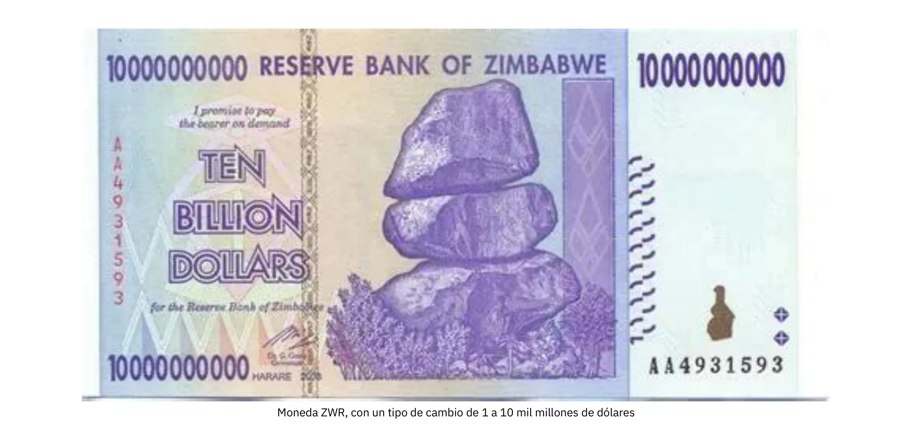

#### Dolarización y resolución de crisis

Por ello, a partir de 2009, ante una crisis monetaria persistente y una hiperinflación galopante, Zimbabue abandonó su moneda nacional y permitió el uso de divisas extranjeras, principalmente el dólar estadounidense. Esta decisión, aunque radical, puso fin a la hiperinflación. Una lección clave que hay que aprender es que detener la emisión excesiva de dinero y poner fin a la financiación del déficit presupuestario por parte del banco central puede ayudar a prevenir la hiperinflación.

Sin embargo, la dolarización no es una solución milagrosa. Aunque puede acabar con la hiperinflación, presenta otros retos económicos. Una de sus consecuencias es la pérdida de autonomía de la política monetaria. Sin su propia moneda, un país no puede ajustar su política monetaria para responder a las perturbaciones económicas internas.

En 2007, la tasa de inflación de Zimbabue alcanzó el umbral del 50% mensual, marcando oficialmente al país como en estado de hiperinflación. Tras la dolarización en 2009, la hiperinflación cesó; sin embargo, el país siguió enfrentándose a otros retos económicos.

Es preocupante observar que Zimbabue ha intentado desde entonces reintroducir su propia moneda, y han reaparecido signos de alta inflación. Según algunas organizaciones internacionales, el país podría cumplir ya de nuevo los criterios de hiperinflación, aunque todavía no haya alcanzado el umbral oficial del 50% mensual. Esto sirve de recordatorio de los peligros de la emisión excesiva de dinero y la financiación del déficit por el banco central.

### Conclusión

En mi libro titulado "Todo sobre la Bitcoin", dediqué un capítulo entero a la hiperinflación en Zimbabue. En él detallo los acontecimientos más significativos, proporcionando varios ejemplos que ilustran cómo el país acabó finalmente con la hiperinflación.

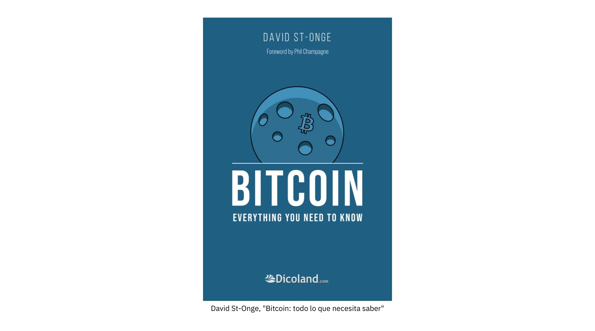

Para los curiosos sobre la experiencia alemana tras la Primera Guerra Mundial, recomiendo encarecidamente el cómic "El banquero del Reich" Narra cómo Alemania logró superar la hiperinflación, en particular mediante la creación del Rentenmark.

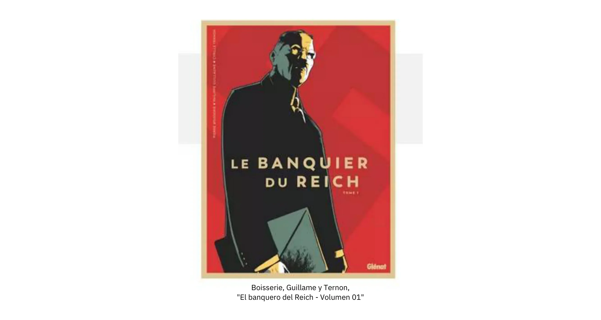

La clave es que existen varias estrategias para superar la hiperinflación. Se puede optar por la dolarización o introducir una nueva moneda. Estas soluciones sólo funcionarán si la población confía en ellas. Es crucial imponer restricciones estrictas. Un banco central verdaderamente independiente es esencial. No debe inflar el dinero Supply para cubrir los déficits públicos. En caso de inflación leve, debería bastar con limitar el crecimiento del Supply monetario. Sin embargo, cuando nos enfrentamos a una hiperinflación, es crucial contar primero con una Supply monetaria adecuada en relación con el tamaño de la economía. Después, es imperativo imponer restricciones estrictas al gobierno para estabilizar la situación.

## Presentación de la colección de billetes de la hiperinflación

<chapterId>f3ffbb47-3aeb-54bd-80a9-adccb0f419e2</chapterId>

[Descubra la colección escaneada en el *Bitcoin Educational Toolkit* (también accesible desde la sección *Resources* de la plataforma Plan ₿ Network.](https://penpot.planb.network/#/view?page-id=c157057b-fd28-8042-8004-4f081b21defc&file-id=c157057b-fd28-8042-8004-4f081b21defb&section=interactions&index=0&share-id=7154756b-3ebd-8040-8004-6475c2af5889&interactions-mode=show-on-click)

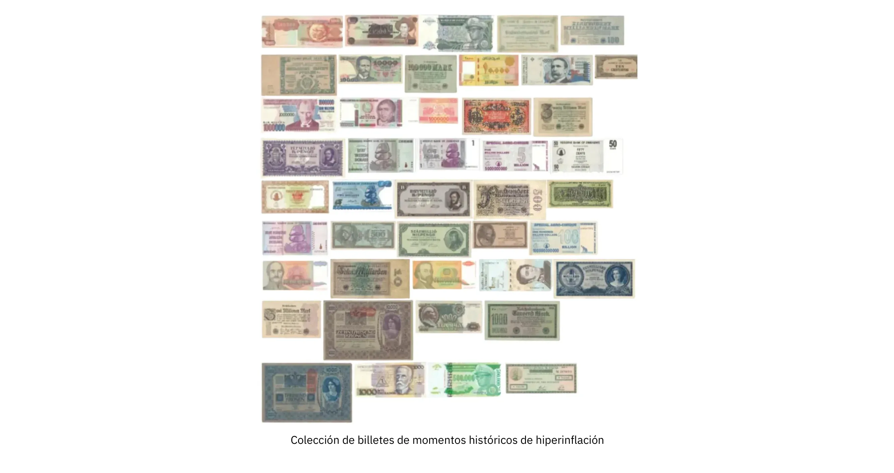

# ¿Cómo hemos llegado hasta aquí?

<partId>f66ca17e-be9e-5d30-a098-f7affd8962a1</partId>

## La aparición del segundo Layer del dinero y los bancos centrales

<chapterId>0455ffe3-9d45-5a67-ac96-3f815dc507a1</chapterId>

Transcripción:

La aparición de la segunda Layer del dinero y de los primeros bancos centrales es un tema fascinante. Este tema se trata ampliamente en el libro "Layered Money" de Nick Battia. Lo recomiendo encarecidamente a quienes estén interesados en la evolución y los entresijos de nuestros sistemas monetarios. El objetivo de esta sección es comprender el origen de la creación de dinero y cómo podría conducir a la hiperinflación.

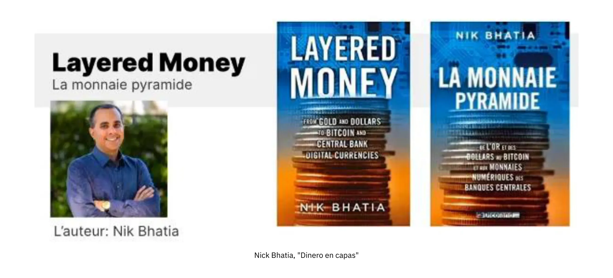

### Dinero piramidal y bancos centrales

#### El Florín

La historia del dinero se remonta al siglo XIII en Italia, concretamente en la ciudad de Florencia. En aquella época, el florín y los billetes de Exchange eran comunes. Un ejemplo notable es el florín, adornado con la figura de San Juan Bautista.

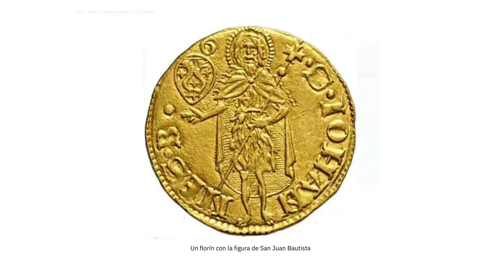

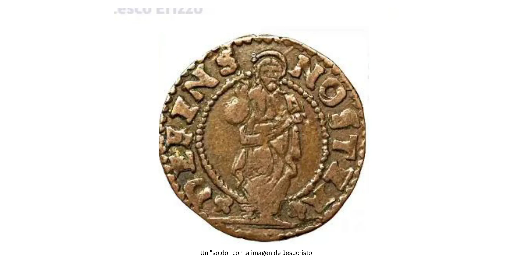

Aunque poseer un florín auténtico es caro hoy en día, existen reproducciones. También existen otras monedas de la época, como el soldo de los estados italianos del siglo XVII, que presenta una imagen de Cristo.

#### Facturas de Exchange (siglo XIII)

La práctica habitual en aquella época era la siguiente: los orfebres emitían billetes de Exchange en Exchange por los florines depositados. Estos florines se guardaban cuidadosamente en sus cámaras acorazadas. De este modo, el oro real, representado por el florín, formaba el primer Layer de dinero, mientras que los billetes de Exchange formaban un segundo Layer. Sin embargo, la liquidez de este sistema era limitada. Si alguien quería Redeem su oro en Exchange por su billete, la transacción era sencilla. Sin embargo, el intercambio de estos billetes entre particulares no era una práctica habitual.

#### La Exchange de Amberes (siglo XVI)

El Exchange de Amberes marcó un hito clave en la evolución del papel moneda. Fue allí donde se introdujo la práctica del descuento de pagarés. Estos pagarés eran instrumentos de papel que representaban un valor monetario, pero su singularidad radicaba en que llevaban nombre y fecha de vencimiento. Esto dificultaba su Exchange antes de la fecha de vencimiento.

La revolución que supuso la Exchange de Amberes consistió en la posibilidad de descontar estos pagarés antes de su vencimiento. Por ejemplo, si un pagaré vencía dentro de un mes, era posible comprarlo con descuento para tener en cuenta el tiempo que faltaba hasta la fecha de vencimiento. Esta innovación no sólo hizo que el papel moneda fuera más Liquid, sino que también introdujo el concepto del valor temporal del dinero.

Este concepto, aunque asociado a Nick Bell a través de su seudónimo en Twitter "valor temporal de BTC", no es una invención suya. Sin embargo, lo discute en detalle en su obra. La idea principal es que el tiempo tiene valor. Así, si alguien decide pagar un pagaré por valor de 100 dólares con un mes de antelación, puede obtenerlo por, por ejemplo, 98 dólares y recibir los 100 dólares en la fecha de vencimiento. Esta innovación monetaria se originó en la Bolsa de Amberes Exchange.

#### El VOC y la Bolsa de Ámsterdam (siglo XVII)

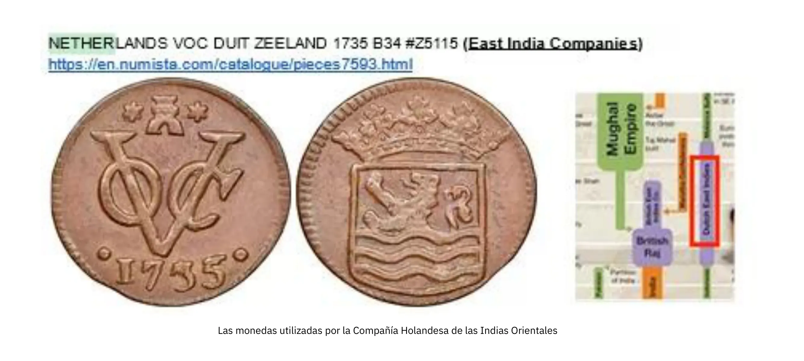

Tras la creación de la Bolsa de Amberes Exchange, un hito importante fue la fundación de la VOC, la Compañía Holandesa de las Indias Orientales. Esta compañía, con sede en los Países Bajos, llegó a emitir su propia moneda. Tras la creación de la VOC, se estableció el primer mercado de valores en Ámsterdam, lo que marcó el inicio de las operaciones bursátiles de la compañía. Lo interesante es saber cómo consiguieron los holandeses acabar con la supremacía de Amberes como centro económico internacional. Simplemente bloquearon el acceso al río Escalda. Esta estrategia formaba parte de un movimiento histórico mayor, la revuelta de los mendigos. Un acontecimiento crucial en la historia europea.

#### La intervención del Banco de Amsterdam

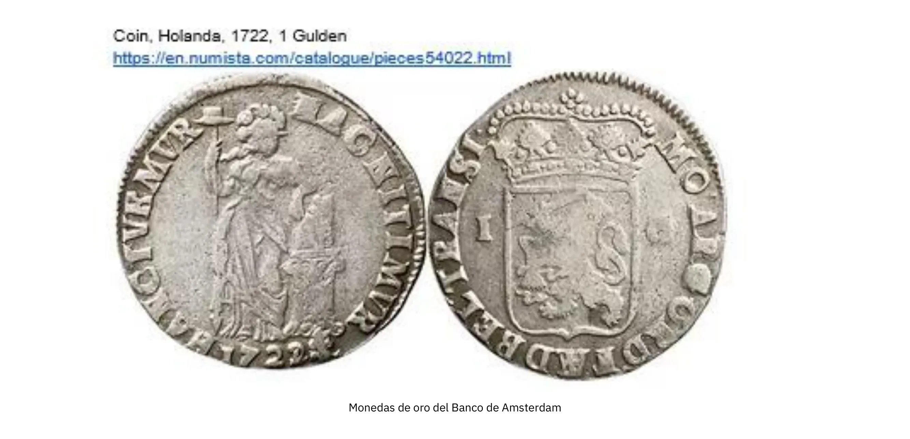

Tras la creación de la VOC, otro acontecimiento importante en la historia monetaria fue la introducción de monedas de oro por el Banco de Ámsterdam. Estas monedas, que datan de 1722, eran de plata. Sin embargo, lo que realmente revolucionó las finanzas en aquella época no fue tanto el Coin en sí, sino las cuentas asociadas a esta moneda en el Banco de Amsterdam. Estas cuentas se convirtieron en el principal medio de Exchange internacional. Las transacciones se anotaban simplemente en registros o libros de contabilidad. Gracias a este sistema, Ámsterdam se convirtió en el centro económico mundial. Con el tiempo, el Banco de Amsterdam decidió imponer el uso de estas cuentas. Se exigió a los cambistas independientes que Exchange depositaran diariamente sus monedas en el banco.

#### Creación del Banco de Inglaterra para financiar la guerra

La creación del Banco de Inglaterra estuvo motivada por la necesidad de financiar la guerra de finales del siglo XVII. Al igual que el Banco de Amsterdam, impuso los depósitos por decreto. La particularidad del Banco de Inglaterra consistió en relegar a los bancos privados a una posición secundaria en el sistema monetario, creando así lo que podría denominarse una "tercera Layer" de la moneda.

Inicialmente, la primera Layer de moneda estaba representada por el oro. Los depósitos realizados en bancos privados formaban la segunda Layer. Sin embargo, cuando estos depósitos ya no pudieron convertirse en oro, apareció una tercera Layer de moneda. A partir de entonces, los billetes emitidos por los bancos privados ya no eran convertibles en oro, sino en papel moneda del Banco de Inglaterra, que a su vez era convertible en oro. Esta evolución condujo a una complejización del sistema monetario con la adición de capas adicionales.

#### El pánico de 1796

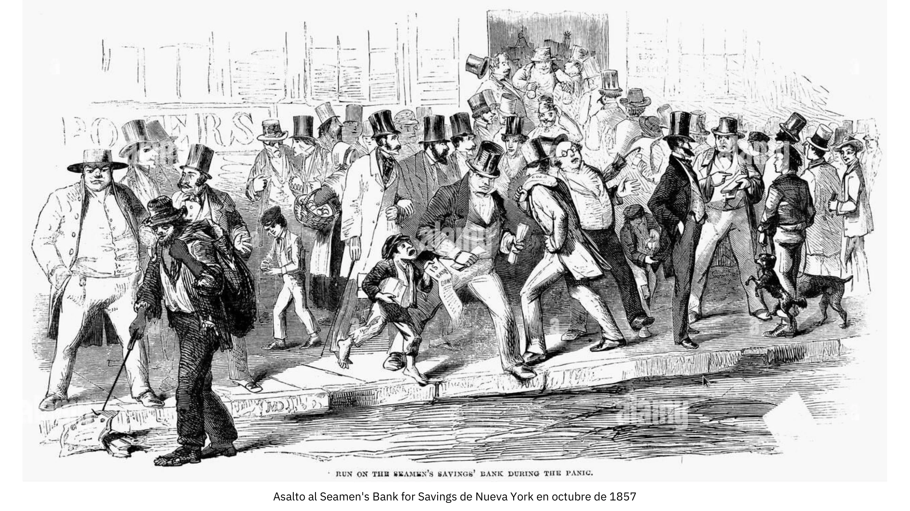

Pánico bancario en la Seamen's Savings Bank durante el Pánico de 1857.

Tras el pánico bancario de 1796, se produjo un fenómeno en el que todo el mundo intentó ascender en la "pirámide monetaria" La gente quería Exchange su moneda de tercera Layer por moneda de segunda Layer y, en última instancia, por moneda de primera Layer, que era el oro. Ante esta avalancha masiva, el Banco de Inglaterra se vio obligado a tomar medidas para estabilizar la situación. Para evitar una posible deflación de las reservas de oro, decidió suspender la convertibilidad de sus billetes en oro. Esta suspensión, prevista inicialmente como una medida temporal, duró aproximadamente dos décadas.

### Conclusión:

Los bancos centrales han evolucionado hasta convertirse en prestamistas de última instancia, suspendiendo la convertibilidad de su moneda en oro. Aunque en un principio esta medida se concibió como una solución temporal, finalmente se convirtió en permanente, marcando el advenimiento del concepto de prestamista de última instancia. Esta transformación ha dado forma a los bancos centrales tal y como se conocen hoy en día. Sin embargo, en las economías más frágiles, esta capacidad de imprimir dinero a voluntad puede acarrear consecuencias indeseables, como la hiperinflación, si se utiliza de forma irresponsable.

## Libros y recursos

<chapterId>c44e4519-0741-527b-b3b0-3f513e87147d</chapterId>

La hiperinflación es un tema fascinante que se ha estudiado a través de diversos acontecimientos históricos. Si desea profundizar en este tema, aquí tiene una lista de 10 recursos esenciales para leer y estudiar:

- "Cuando el dinero muere: La pesadilla del gasto deficitario, la devaluación y la hiperinflación en la Alemania de Weimar", de Adam Fergusson. Este libro detalla la crisis de hiperinflación en Alemania tras la Primera Guerra Mundial.

- "The Economics of Inflation - A Study of Currency Depreciation in Post-War Germany", de Costantino Bresciani-Turroni. Un análisis en profundidad de la hiperinflación alemana en la década de 1920.

- "Esta vez es diferente: Eight Centuries of Financial Folly", de Carmen M. Reinhart y Kenneth S. Rogoff. Aunque el libro abarca varios tipos de crisis financieras, analiza en profundidad la hiperinflación a lo largo de la historia.

- "La hiperinflación de Zimbabue, análisis y lecciones aprendidas", por Steve Hanke. Estudio de la hiperinflación de Zimbabue a principios de la década de 2000.

- "Regímenes monetarios e inflación: Historia, relaciones económicas y políticas", de Peter Bernholz. El libro examina casos históricos de hiperinflación y trata de comprender los factores subyacentes.

- "La guía de supervivencia a la hiperinflación: Estrategias para las empresas estadounidenses", de Gerald Swanson. Una guía práctica sobre cómo las empresas pueden navegar en un entorno hiperinflacionista.

- "Morir de dinero: Lecciones de las grandes inflaciones alemana y estadounidense", de Jens O. Parsson. Un análisis comparativo de las crisis de inflación en Alemania y Estados Unidos.

- "La caída del dinero: La hiperinflación alemana y la destrucción de la clase media", de Frederick Taylor. Una exploración narrativa del impacto social y económico de la hiperinflación en la sociedad alemana.

- "Cajas de conversión para países en desarrollo: A Handbook", de Steve Hanke y Kurt Schuler. Aunque se centra en las cajas de conversión, este libro ofrece una perspectiva sobre cómo evitar situaciones de hiperinflación.

# Sección final

<partId>cb1f4a4b-556a-4e47-a5cc-136be35a1f9a</partId>

## Opiniones y valoraciones

<chapterId>1a37317e-372a-5241-b478-8316d44f9283</chapterId>

<isCourseReview>true</isCourseReview>

## Examen final

<chapterId>d01831c3-6c4d-59e3-95bc-03e97a05c142</chapterId>

<isCourseExam>true</isCourseExam>

## Conclusión

<chapterId>45d410b0-71ed-4502-8d8d-8b6df761db23</chapterId>

<isCourseConclusion>true</isCourseConclusion>