# سفری در میان فروپاشی اقتصادی

وقتی پول معنای خود را از دست می‌دهد، چه اتفاقی می‌افتد؟
این دوره شما را در دنیای شگفت‌انگیز اما هشداردهنده تورم افسارگسیخته راهنمایی می‌کند. شما دوره‌های تاریخی و موارد مدرنی را کشف خواهید کرد که در آن‌ها ارزها فروپاشیدند و اقتصادها یک‌شبه دگرگون شدند. الگوها، علل و تأثیر واقعی بر زندگی روزمره مردم را کشف خواهید کرد و بینشی نسبت به یکی از چشمگیرترین پدیده‌های اقتصادی به دست خواهید آورد.

در طول مسیر، همچنین کشف خواهید کرد که چگونه افراد و جوامع این دوره‌های پرتلاطم را پشت سر گذاشته‌اند. استراتژی‌هایی را بیاموزید که به حفاظت از ثروت در طول بحران‌های ارزی کمک کرده‌اند و درک عمیق‌تری از انعطاف‌پذیری مالی بسازید. اگر نسبت به نیروهای اقتصادی که جهان ما را شکل می‌دهند کنجکاو هستید، این سفر هم دانش و هم دیدگاه عملی ارائه می‌دهد.
+++
# مقدمه

<partId>6fe4d15d-f6e6-54be-9e04-0a75ac98df8b</partId>

## بررسی کلی دوره

<chapterId>9d1aba8d-0485-5020-9863-5de37e6db8e0</chapterId>

به دوره ECO204 خوش آمدید!

هدف این دوره کمک به شما در درک علل ریشه‌ای، مکانیسم‌ها و پیامدهای ابر تورم در چارچوب یک سیستم پولی فیات است. از طریق مثال‌های ملموس و تحلیل تاریخی، شما یاد خواهید گرفت که الگوهای تکراری که پیش از دوره‌های ابر تورم رخ می‌دهند را شناسایی کرده و اهرم‌های عملیاتی برای محافظت از خود را تشخیص دهید.

**بخش ۲: تورم چیست؟**

قبل از پرداختن به اصل موضوع، به اصول اولیه بازخواهیم گشت: تورم چیست؟ این بخش به منشأ پولی آن، انواع مختلف تورم و چگونگی جایگیری آن‌ها در یک پویایی اقتصادی گسترده‌تر می‌پردازد. این یک گام اساسی در درک چگونگی تکامل تورم عادی به ابر تورم است.

**بخش ۳: ابر تورم چیست؟**

در این بخش، شما به مطالعه تعاریف دقیق ابر تورم خواهید پرداخت و چندین دوره تاریخی مهم، از جمله آلمان وایمار و زیمبابوه را بررسی خواهید کرد. ما به تحلیل اشتراکات، تفاوت‌ها و شباهت‌های معاصر آن‌ها خواهیم پرداخت. همچنین، شما با موارد کمتر شناخته‌شده‌ای مانند تغییر واحد پولی متوالی در آمریکای لاتین و استراتژی‌های خروج مشاهده‌شده در برخی کشورها آشنا خواهید شد.

**بخش ۴: چگونه به اینجا رسیدیم؟**

این بخش به دنبال درک مکانیسم‌های ساختاری است که امکان ابر تورم را فراهم می‌کنند، به‌ویژه از طریق توسعه "Layer دوم" پولی و نقش بانک‌های مرکزی. منابع اضافی و پیشنهادات خواندنی برای بررسی بیشتر ارائه خواهد شد.

اگر تاریخ پولی در برابر چشمان ما در حال تکرار باشد چه؟ شما در فصل‌های بعدی قضاوت کنید!

# تورم چیست؟

<partId>2b4f456c-3649-5cf9-b9b0-a5bffe92d962</partId>

## یک پدیده پولی

<chapterId>b2cbc915-c4ec-52b5-860c-0958f58c91e4</chapterId>

### تعاریف تورم

[تورم](https://planb.academy/resources/glossary/inflation) مفهومی است که اغلب به دلیل تعاریف و تفسیرهای متعدد آن به اشتباه درک می‌شود. درک تورم در میان گروه‌های مختلف، مانند بیت‌کوینرها و اقتصاددانان سنتی، متفاوت است. بیایید ابتدا تعاریف را روشن کنیم قبل از اینکه درباره ابر تورم صحبت کنیم:

- تعریف از فرهنگ لغت لو روبر: تورم افزایش بیش از حد ابزارهای پرداخت (اسکناس‌ها، سرمایه) است که باعث افزایش قیمت‌ها و کاهش ارزش پول می‌شود.

- تعریف از دایرةالمعارف لاروس: تورم پدیده‌ای است که با افزایش عمومی و مداوم سطح قیمت‌ها مشخص می‌شود. در اینجا، کلمه "عمومی" بسیار مهم است.

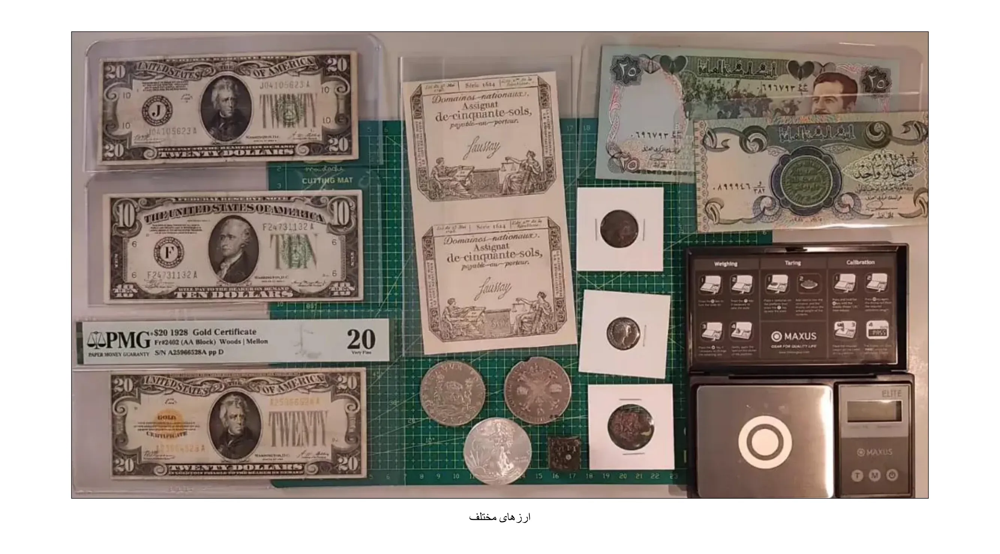

با توجه به این تعاریف، ضروری است که درک کنیم که برای رابرت، تورم عمدتاً به افزایش پول Supply مربوط می‌شود. از سوی دیگر، لاروس بر پیامدهای این گسترش، یعنی افزایش عمومی قیمت‌ها تمرکز دارد.

در مطالعه ما درباره ابر تورم، تعریف دوم را که افزایش عمومی قیمت‌ها است، اتخاذ خواهیم کرد، زیرا برای موضوع ما مرتبط‌تر و واضح‌تر است. با این حال، مهم است به یاد داشته باشیم که این افزایش قیمت‌ها عموماً نتیجه گسترش پول Supply است.

اقتصاددان مشهور میلتون فریدمن به‌طور معروف اظهار داشت:

> "تورم همیشه و همه جا یک پدیده پولی است."

این بیانیه به رابطه ذاتی بین گسترش پولی و تورم اشاره دارد. در بخش‌های بعدی، رابطه بین تورم و رشد اقتصادی را بررسی خواهیم کرد و از این تعاریف بنیادی بهره خواهیم گرفت.

### درک پدیده پولی

هنگامی که به پدیده پولی اشاره می‌کنیم، به چگونگی تأثیرگذاری پول Supply در یک اقتصاد اشاره داریم. میلتون فریدمن اساساً آن را به عنوان افزایش در این Supply می‌دید. به طور تاریخی، دو روش اصلی برای افزایش پول Supply وجود داشته است:

1. چاپ پول:

در سیستم‌های پولی سنتی، افزایش پول Supply با چاپ فیزیکی اسکناس‌های جدید به دست می‌آمد. اگرچه امروزه با غلبه ارز دیجیتال، این چاپ عمدتاً به صورت الکترونیکی (از طریق پایگاه‌های داده بانک‌های مرکزی و سایر مؤسسات مالی) انجام می‌شود، تاریخ به ما دوره‌هایی را نشان می‌دهد که چاپ واقعی اسکناس‌ها به ابر تورم منجر شد.

۲. کاهش محتوای فلز:

روش دیگر کاهش میزان فلزات گرانبها در ارزهایی بود که بر اساس فلزاتی مانند نقره یا طلا بودند. یک مثال برجسته را می‌توان در امپراتوری روم یافت، جایی که دناریوس، که در ابتدا تقریباً به‌طور کامل از نقره تشکیل شده بود، محتوای نقره‌اش به‌طور چشمگیری در طول زمان کاهش یافت. این به نوعی تورم بود، اما لزوماً ابر تورم نبود.

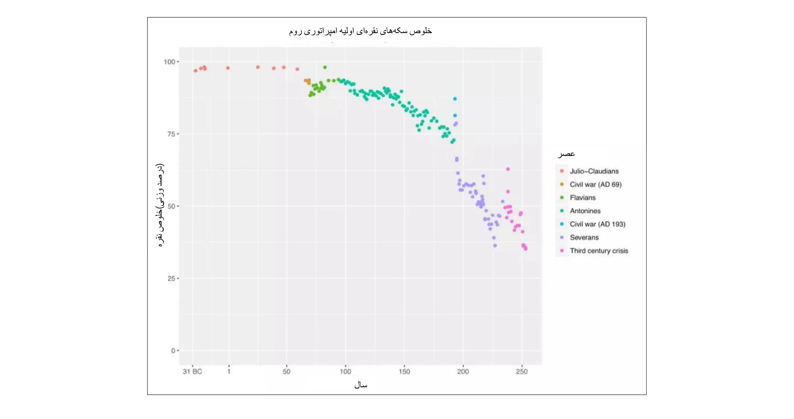

تأکید بر این نکته مهم است که ابر تورم عمدتاً در [ارزهای فیات](https://planb.academy/resources/glossary/fiat) مشاهده می‌شود که توسط دارایی‌های زیربنایی خود، مانند فلزات گران‌بها، پشتیبانی نمی‌شوند. به‌طور تاریخی، زمانی که یک ارز بر اساس چنین دارایی‌هایی بود، دوره‌های تورم (مثلاً از طریق کاهش ارزش محتوای فلزی) رخ می‌داد، اما این دوره‌ها هرگز به سطوح شدید ابر تورم نمی‌رسیدند. در بخش‌های بعدی، دوره‌های کاهش ارزش پول و تأثیرات این سیستم‌های پولی مختلف بر تورم را به‌طور مفصل بررسی خواهیم کرد.

### مطالعه دوره‌های کاهش ارزش پولی

در طول تاریخ، تمدن‌های مختلف دوره‌هایی از کاهش ارزش پول را تجربه کرده‌اند. برخی از این دوره‌ها با رویدادهای بزرگ یا جنگ‌هایی که به اقتصاد فشار آورده‌اند، همزمان شده‌اند.

#### 1. جنگ پلوپونزی و جنگ دوم پونیک:

جنگ پلوپونزی، یک درگیری بین آتن و اسپارتا، و جنگ دوم پونیک، بین جمهوری روم و کارتاژ، از اولین نمونه‌های کاهش ارزش ارز هستند که در آرشیوها یافت می‌شوند. برای تأمین مالی این جنگ‌ها، این تمدن‌ها با کاهش محتوای نقره و افزودن فلزات دیگر، ارزش ارزهای خود را کاهش دادند و در عین حال تعداد سکه‌های تولید شده را افزایش دادند.

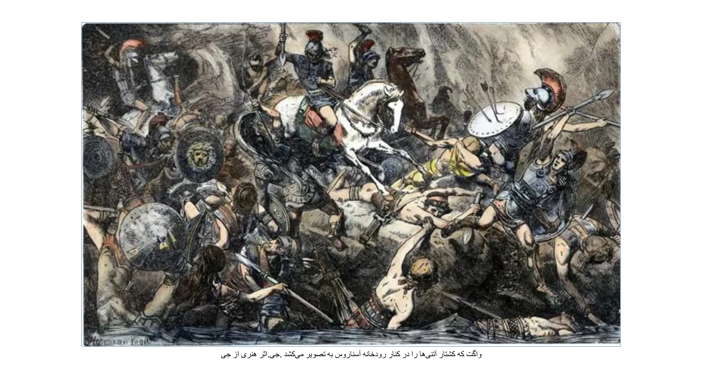

تصویری از حکاکی که قتل‌عام آتنی‌ها در سواحل آسیناروس را نشان می‌دهد.

#### ۲. روم باستان در دوران امپراتوری:

پس از دوران جمهوری روم، در دوران امپراتوری، قرن‌های سوم و چهارم شاهد کاهش قابل توجه ارزش ارز بودند. این امر با کاهش محتوای نقره سکه‌ها، همان‌طور که در نمودار قبلی دیده می‌شود، نشان داده شده است. یک مطالعه نشان می‌دهد که قیمت گندم در مصر، که با دراخما اندازه‌گیری می‌شد، در طی حدود ۴۰۰ سال، از ۴۰ قبل از میلاد تا ۳۶۰ میلادی، به میزان یک میلیون برابر افزایش یافت. در طول این دوره، این امر نشان‌دهنده تورم سالانه متوسط حدود ۴.۴٪ است. با این حال، این تورم به طور یکنواخت توزیع نشده بود. این تورم واقعاً از حدود ۲۳۸ میلادی آغاز شد. بین سال‌های ۲۵۰ و ۲۹۳ میلادی، نرخ تورم حدود ۳.۶۵٪ بود و بین سال‌های ۲۹۳ و ۳۰۱ میلادی به ۲۲.۲۸٪ افزایش یافت.

اگرچه این دوره‌ها تورم قابل توجهی را تجربه کردند، اما به سطح ابر تورم مشاهده شده در برخی شرایط مدرن نرسیدند. دلیل این امر این است که، اگرچه ارز کاهش ارزش پیدا کرد، اما همچنان توسط فلزات گرانبها پشتیبانی می‌شد. این پایه محکم مقداری محافظت در برابر سطوح تورم شدید فراهم کرد. در بخش‌های بعدی، به بررسی ماهیت و پیامدهای ابر تورم با جزئیات بیشتری خواهیم پرداخت.

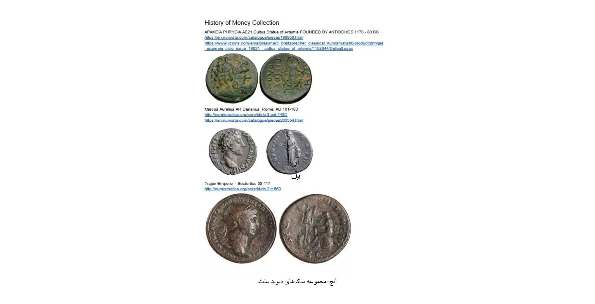

- دناریوس مارکوس آئورلیوس (160 میلادی):

یکی از نمادین‌ترین سکه‌های روم باستان، دیناریوس است، یک سکه نقره‌ای Coin. من یک Coin خاص از مارکوس اورلیوس دارم که به سال 160 میلادی برمی‌گردد، قبل از کاهش ارزش عمده. اگرچه دوربین ممکن است در ثبت جزئیات دقیق مشکل داشته باشد، اما با چشم غیرمسلح، واضح است که Coin زیبا است و محتوای نقره‌ای نسبتاً بالایی را منعکس می‌کند.

- آنتونینیانوس (اواخر قرن ۳ میلادی):

با کاهش ارزش پول، یک ارز جدید به نام آنتونینیانوس ظاهر شد. این ارز قرار بود به اندازه دو دناری ارزش داشته باشد، اما حاوی نقره بسیار کمتری بود. آنتونینیانوس Coin من به وضوح نشان می‌دهد که محتوای نقره به طور قابل توجهی کاهش یافته است. این سکه با تاجی که برای سکه‌های رومی این دوره معمول است، به نام "رادیات" تزئین شده است. با مقایسه رنگ و کیفیت، می‌توان دید که آنتونینیانوس به هیچ وجه یک نقره خالص Coin نیست.

هنگام مقایسه دو سکه در کنار هم، تفاوت چشمگیر است. دیناریوس از سال 160 میلادی دارای ظاهری نقره‌ای و متمایز است، در حالی که آنتونینیانوس از اواخر قرن سوم میلادی بسیار کدرتر است که نشان‌دهنده کاهش قابل توجه محتوای نقره است. این مقایسه بصری، تصویر روشنی از کاهش ارزش پولی که روم باستان طی چند قرن تجربه کرد، ارائه می‌دهد.

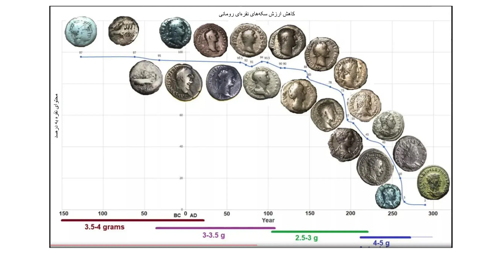

برای تکمیل این نمایش، یک نمودار که کاهش ارزش این سکه‌ها را در طول زمان نشان دهد ایده‌آل خواهد بود. اگرچه تصور آن از طریق این پلتفرم دشوار است، تصور کنید نموداری که ارزش دیناریوس را نشان می‌دهد، و سپس کاهش آن را تا اواخر قرن دوم، زمانی که با آنتونینیانوس جایگزین شد، که به‌طور فرضی ارزش دو دیناریوس را داشت اما با محتوای نقره‌ای به‌طور قابل‌توجهی کمتر. این آثار شاهدان خاموش نوسانات اقتصادی تمدن‌های گذشته هستند.

#### ۳. مراودی اسپانیایی: شاهد کاهش ارزش هدفمند

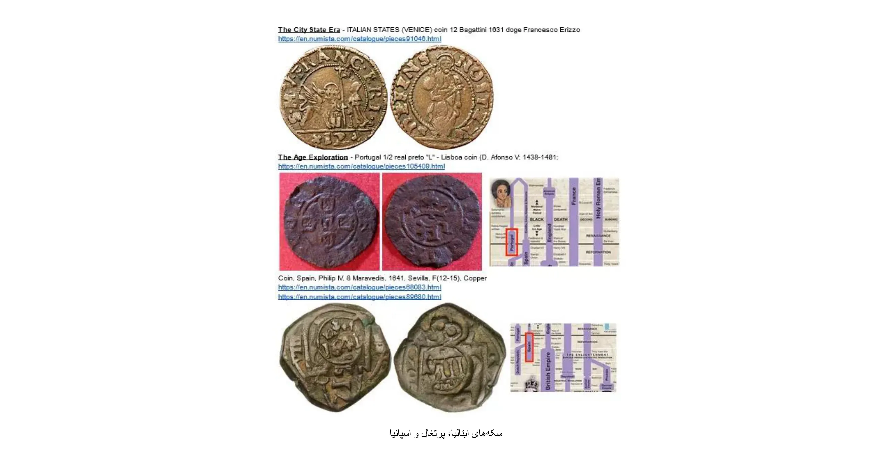

ماراودی، به عنوان یک ارز مسی، جایگاه ویژه‌ای در تاریخ ارز اسپانیا دارد. همان‌طور که قبلاً ذکر شد، دلار اسپانیایی در ابتدا استاندارد بین‌المللی بود، یک ارز ذخیره ضروری برای اسپانیا. با این حال، در مواجهه با چالش‌های اقتصادی خاص، اسپانیا مجبور شد به استراتژی‌های پولی هوشمندانه متوسل شود.

کاهش ارزش پول ابزاری است که اغلب توسط دولت‌ها برای تأمین هزینه‌های خود یا تحریک اقتصاد استفاده می‌شود. با این حال، اسپانیا خود را در موقعیتی حساس یافت. کاهش ارزش دلار اسپانیا می‌توانست موقعیت آن را در تجارت بین‌المللی به خطر بیندازد. برای غلبه بر این معضل، اسپانیا به ماراودی روی آورد.

برخلاف دلار نقره‌ای ارزشمند اسپانیایی، ماراویدی یک ارز مسی بود که عمدتاً در میان جمعیت محلی استفاده می‌شد. این ارز هدف کاهش ارزش قرار گرفت. زمانی که یک ماراویدی Coin در ابتدا به ارزش دو ماراویدی بود، دولت آن را بازپس می‌گرفت، با ارزش جدیدی مثلاً "چهار" دوباره مهر می‌زد و تنها یک Coin به صاحبش بازمی‌گرداند. Coin که با مهر "هشت" علامت‌گذاری شده است، شاهدی بر این فرآیند است که چندین چرخه کاهش ارزش را پشت سر گذاشته است.

این استراتژی به دولت اجازه داد تا به طور مؤثر یک ارز را کاهش ارزش دهد، تورم ایجاد کند و به طور غیرمستقیم دولت را تأمین مالی کند، در حالی که یکپارچگی دلار اسپانیایی را در صحنه بین‌المللی حفظ می‌کرد. با این حال، این کاهش ارزش هدفمند پیامدهایی برای جمعیت محلی داشت که شاهد کاهش ارزش ارز رایج خود بودند.

مورد ماراویدیس نشان می‌دهد که چگونه یک دولت می‌تواند به‌طور انتخابی ارزش یک ارز محلی را کاهش دهد تا نیازهای اقتصادی داخلی خود را برآورده کند، در حالی که ارزش یک ارز ذخیره را در صحنه جهانی حفظ می‌کند. این یک مثال برجسته از پیچیدگی و ظرافت سیاست پولی در تاریخ است.

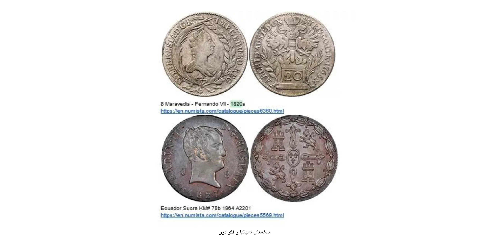

آیا می‌خواهید بیشتر بدانید؟ -> [لینک](https://docs.google.com/document/d/1aZa7gvz1nt8ZHDCoWKQdS9RGGjBHdipH1ApC8dW1xpM/edit?usp=sharing)

#### ۴. انقلاب قیمت از قرن ۱۵ تا قرن ۱۷

بین قرون ۱۵ تا ۱۷، اروپا شاهد پدیده اقتصادی قابل توجهی بود که اغلب به عنوان "انقلاب قیمت‌ها" شناخته می‌شود. این دوره تورم عمدتاً به دلیل ورود گسترده فلزات گرانبها، به ویژه طلا و نقره، از قاره آمریکا آغاز شد. با توجه به اینکه اقتصاد اروپا در آن زمان عمدتاً بر پایه استاندارد فلزی بود، این افزایش Supply فلزات باعث افزایش پول Supply شد. در نتیجه، نرخ تورمی حدود ۱ تا ۲ درصد در سال به وجود آمد. در نگاه اول، این تورم ممکن است ناچیز به نظر برسد. با این حال، در آن زمان، چنین نوسانات قیمتی به اندازه‌ای غیرمعمول بود که به عنوان یک "انقلاب" در نظر گرفته شود. این موضوع نشان می‌دهد که چگونه تغییرات در ذخایر پولی می‌تواند بر کل سیستم اقتصادی تأثیر بگذارد.

#### ۵. جان لا و آسینات‌ها

در قرن هجدهم، تاریخ اقتصادی فرانسه با دو رویداد مهم مرتبط با ارز مشخص شد. اول، جان لا، اقتصاددان و سرمایه‌دار اسکاتلندی، دولت فرانسه را متقاعد کرد تا یک سیستم پولی مبتنی بر پول کاغذی را بپذیرد. اگرچه در ابتدا به عنوان یک راه‌حل نوآورانه برای مشکلات مالی کشور در نظر گرفته شد، این ابتکار به سرعت به تورم شدید منجر شد. سپس، کمی بعد، در جریان آشفتگی‌های انقلاب فرانسه، دولت "آسینیا" را معرفی کرد.

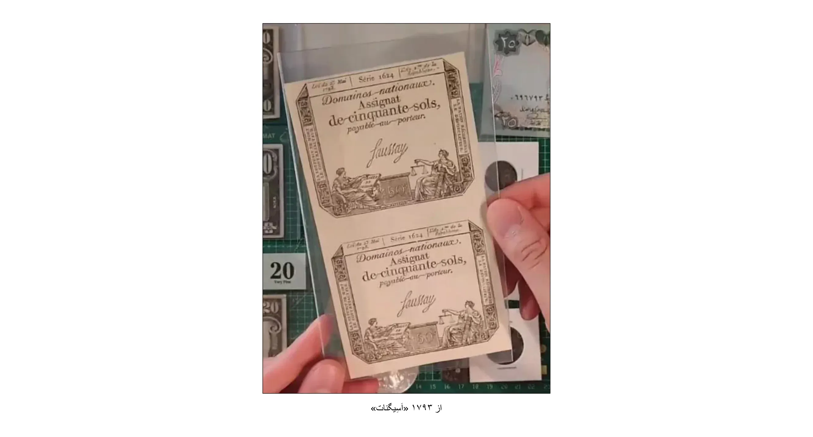

Assignats از سال 1793

این اسکناس‌ها به عنوان گواه زنده‌ای بر اولین دوره بزرگ ابر تورم در تاریخ عمل می‌کنند. در ابتدا به عنوان پاسخی به بحران‌های مالی پی‌در‌پی طراحی شده بودند، آسینات‌ها به سرعت به نمادی از بی‌ثباتی پولی تبدیل شدند. دولت، با اتکای بیش از حد به این ارز کاغذی برای تأمین هزینه‌های خود، بحران اقتصادی بی‌سابقه‌ای را ایجاد کرد و به دوره بزرگی از ابر تورم در فرانسه پس از انقلاب منجر شد.

#### ۶. فرمان اجرایی ۶۱۰۲ و کاهش ارزش دلار

فرمان اجرایی ۶۱۰۲ و کاهش ارزش دلار

در ایالات متحده، اوایل دهه ۱۹۳۰ شاهد تغییر عمده‌ای در سیاست پولی بود. در اینجا یک مرور جامع از این تحول ارائه شده است:

- اسکناس ۲۰ دلاری ۱۹۲۸

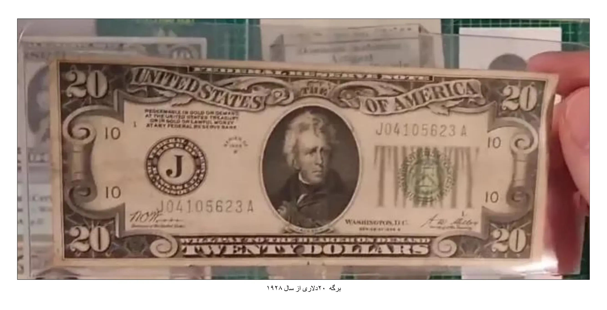

در سال ۱۹۲۸، یک اسکناس ۲۰ دلاری در ایالات متحده عبارت "قابل بازخرید با طلا به محض درخواست" را داشت. این به این معنا بود که هر اسکناس به‌طور واقعی قابل تبدیل به طلا بود. به‌طور خاص، یک اسکناس ۲۰.۶۷ دلاری معادل یک اونس طلا بود.

- فرمان اجرایی ۶۱۰۲

در سال ۱۹۳۳، یک تحول بزرگ با صدور فرمان اجرایی ۶۱۰۲ رخ داد. این فرمان نگهداری طلا به صورت شمش، سکه یا گواهی‌نامه را برای شهروندان غیرقانونی کرد.

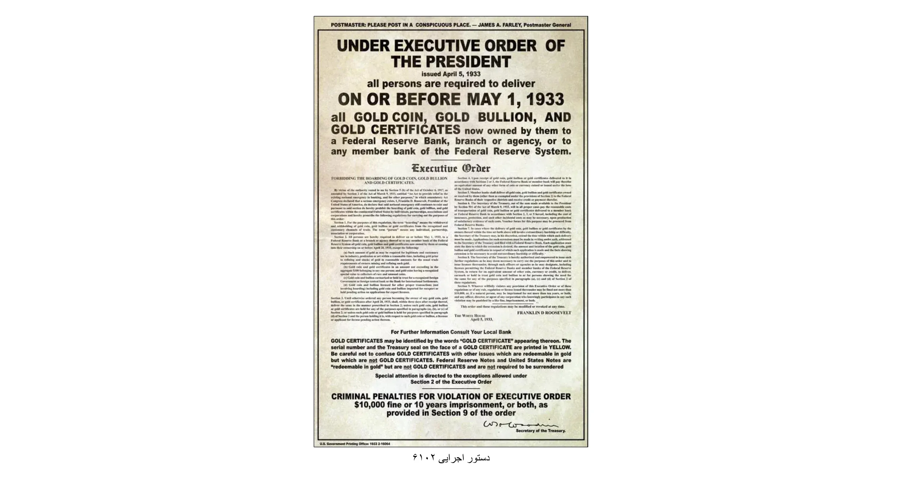

گواهی طلایی نمونه خوبی است. بر روی آن نوشته شده بود: "به طلا Coin قابل پرداخت به حامل در صورت درخواست." داشتن چنین گواهی‌ای غیرقانونی شد و تا سال ۱۹۶۴ به همین صورت باقی ماند.

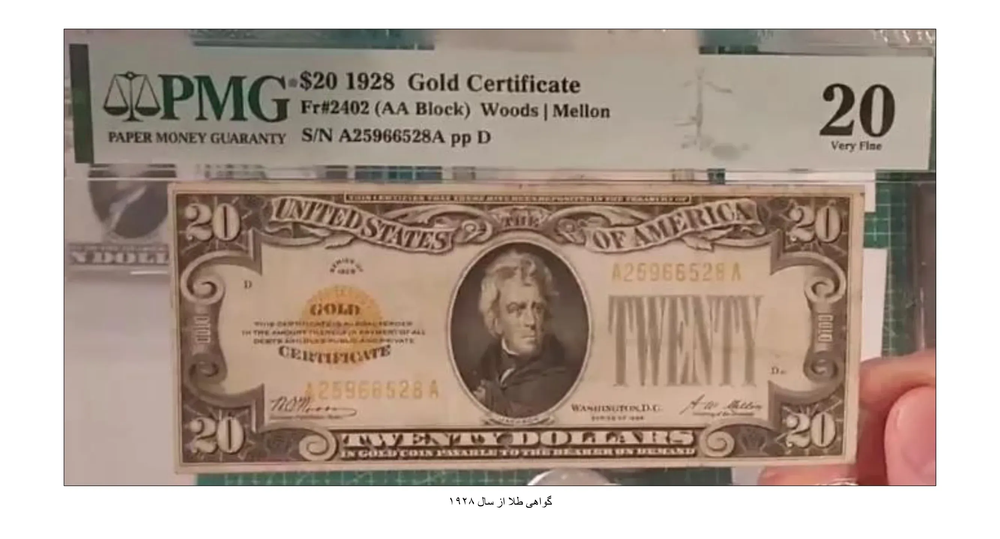

- معرفی اسکناس‌های جدید

پس از توقیف طلا در سال ۱۹۳۴، سری جدیدی از اسکناس‌ها به گردش درآمد.

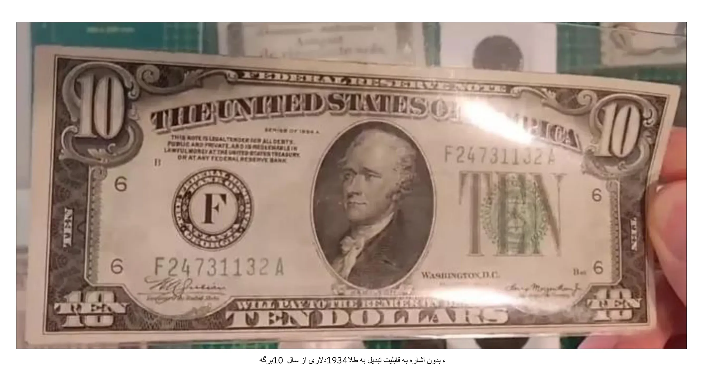

ذکر قابلیت تبدیل آنها به طلا حذف شده و با "این اسکناس برای تمامی بدهی‌ها پول قانونی است" (Ce billet est une monnaie légale pour toutes dettes) جایگزین شده است.

- ارزیابی مجدد طلا

آنچه در مورد این انتقال جذاب است، استراتژی دولت است. در سال ۱۹۳۴، قیمت طلا به ۳۵ دلار در هر اونس بازنگری شد، به جای ۲۰.۶۷ دلار. اساساً، دولت ارزش دلارهایی که مردم داشتند را کاهش داد. با خرید طلا از مردم به قیمت ۲۰.۶۷ دلار در هر اونس در سال ۱۹۳۳ و سپس بازنگری قیمت طلا در سال ۱۹۳۴، دولت سود قابل توجهی به دست آورد در حالی که پس‌انداز شهروندان خود را کاهش داد.

به طور خلاصه، در عرض یک سال، دولت به طور مؤثر طلای شهروندان را مصادره کرد، سپس قوانین بازی را با ارزیابی مجدد ارزش طلا به نفع خزانه و به ضرر کسانی که ابتدا طلای خود را با اسکناس مبادله کرده بودند، تغییر داد.

### ایالات متحده تاریخ را تغییر می‌دهد.

ایالات متحده با کاهش ارزش ارز ذخیره جهانی، دلار آمریکا، برخلاف رویه‌های قبلی مشاهده شده در کشورهای کوچک تجاری، نقطه عطف تاریخی را رقم زد.

قبلاً، در دوره رنسانس، فلورین ایتالیایی که توسط فلورانس در قرن سیزدهم صادر شده بود، به عنوان ارز ذخیره بین‌المللی شناخته می‌شد و هیچ کاهش ارزشی در طول دوره استفاده از آن ثبت نشده بود که این امر اهمیت ثبات پولی برای تجارت بین‌المللی را نشان می‌دهد.

به همین ترتیب، اسپانیا و هلند، به عنوان دارندگان ارز ذخیره جهانی به دلیل تجارت بین‌المللی پررونق خود، یکپارچگی ارزهای خود را حفظ کردند تا اعتماد و وضعیت موجود در مبادلات بین‌المللی را حفظ کنند. هلند حتی شاهد ایجاد اولین بانک مرکزی بود، که یک نقطه عطف مهم در تکامل جهانی سیستم‌های پولی محسوب می‌شود.

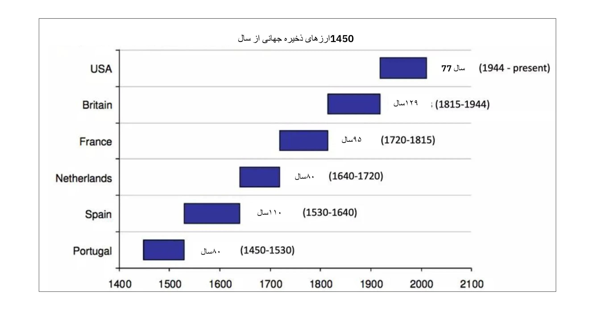

با این حال، وضعیت با ظهور ایالات متحده به عنوان قدرت اقتصادی غالب تغییر کرد. آنها تصمیم گرفتند ارز ذخیره خود را کاهش دهند و از این طریق از تورم به نفع خود بهره‌برداری کنند. این تصمیم اغلب به تغییر دینامیک‌ها نسبت داده می‌شود، جایی که انتخاب ارز ذخیره دیگر به اندازه قبل آزاد نبود. هژمونی آمریکایی دلار را به عنوان ارز ذخیره جهانی تثبیت کرد و امکان دستکاری در ارزش آن را فراهم ساخت. این تغییر تأثیر بالقوه سیاست‌های پولی بر تجارت بین‌المللی در یک اقتصاد جهانی‌شده را نشان می‌دهد و یک انتقال مهم در مدیریت ارزهای ذخیره جهانی را نشان می‌دهد.

### آخرین مثال برای راه: دینار سوئیس

دینار سوئیسی جنبه جذاب دیگری از کاهش ارزش پول را نشان می‌دهد که این بار در زمینه پیش از جنگ خلیج فارس عراق قرار دارد. این ارز که به دلیل کیفیت قابل توجه اسکناس‌هایش نامگذاری شده بود، توسط بانک مرکزی عراق صادر شد و در منطقه خاورمیانه به دلیل ثباتش شهرت داشت. این اعتماد عمدتاً به دلیل کیفیت چاپ اسکناس بود که در انگلستان انجام می‌شد و نشان‌دهنده مقاومت خاصی در برابر کاهش ارزش بود.

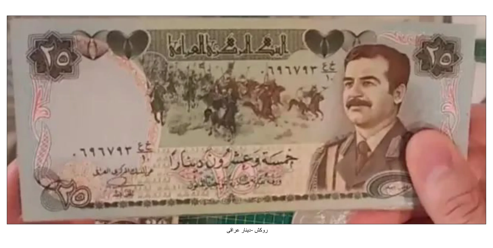

با این حال، جنگ‌های خلیج فارس نقطه عطفی در تاریخ دینار سوئیس بود. عراق که دیگر نمی‌توانست برای چاپ اسکناس به تأمین‌کننده انگلیسی خود تکیه کند، به چین برای کمک روی آورد. این انتقال منجر به تفاوت آشکاری در کیفیت اسکناس‌ها شد، به طوری که نسخه چینی به عنوان نسخه‌ای با کیفیت پایین‌تر تلقی می‌شد. این تصور بی‌اساس نبود؛ اسکناس‌های چینی به راحتی قابل جعل بودند و در معرض چاپ بیش از حد توسط دولت قرار داشتند، که این امر ارزش آن‌ها را تهدید می‌کرد.

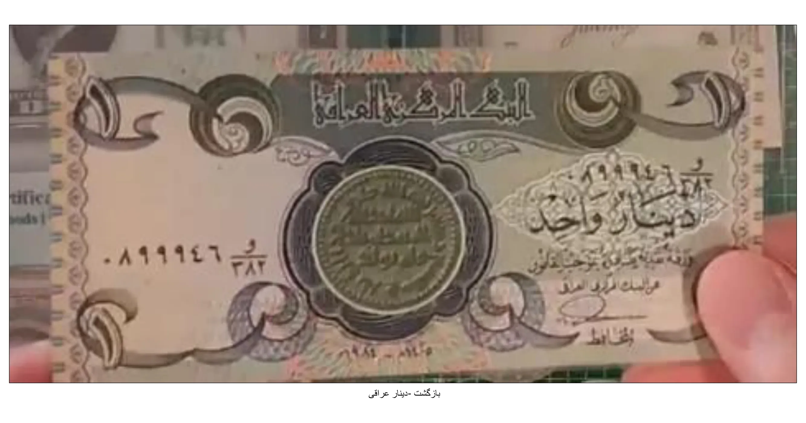

پدیده‌ای متمایز در اقتصاد عراق پس از جنگ خلیج فارس پدیدار شد: سیستم قیمت‌گذاری دوگانه. بازرگانان قیمت‌های متفاوتی را بسته به نوع اسکناس مورد استفاده برای پرداخت ارائه می‌دادند و دینار سوئیسی اصلی را بر اسکناس چینی ترجیح می‌دادند. این سیستم نشان‌دهنده اعتماد حفظ‌شده به اسکناس‌های با کیفیت بالاتر بود که کمتر در معرض کاهش ارزش قرار داشتند، حتی در شرایطی که ارزش عمدتاً توسط دولت تحمیل می‌شد. این رویداد بر اهمیت ویژگی‌های ذاتی ارز تأکید می‌کند و نشان می‌دهد که حتی در یک رژیم ارز فیات، کیفیت درک‌شده یک ارز می‌تواند بر ارزش نسبی آن و به تبع آن بر اعتماد بازیگران اقتصادی تأثیر بگذارد.

#### بله، ما واقعاً سکه‌ها را وزن کردیم!

تصور رایج اغلب ارز را با ایجاد دولت مرتبط می‌داند، جایی که انتشار و ارزش آن توسط دولت تنظیم می‌شود. این مفهوم ریشه در تمدن‌های باستانی، مانند روم دارد، جایی که سکه‌ها توسط امپراتوری استاندارد و مهر می‌شدند و بدین ترتیب ارزش رسمی به ارز اعطا می‌شد. با این حال، بررسی عمیق‌تر نشان می‌دهد که ارزش ذاتی ارز عمدتاً از محتوای فلزات گرانبهای آن ناشی می‌شد.

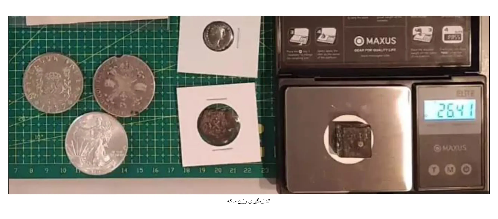

نمونه‌ای از این موضوع از طریق بررسی وزنی معادل هشت رئال اسپانیایی یا یک دلار اسپانیایی نشان داده شده است. این وزن که با یک عدد رومی نشان‌دهنده ارزش آن علامت‌گذاری شده بود، توسط صرافان برای ارزیابی ارزش سکه‌ها بر اساس وزن آن‌ها، و نه فقط بر اساس ضرب آن‌ها، استفاده می‌شد. با وزن کردن سکه‌ها، صرافان می‌توانستند تعیین کنند که آیا سکه‌ها تغییر یافته یا آسیب دیده‌اند، که می‌توانست ارزش آن‌ها را کاهش دهد. این عمل نشان می‌دهد که اگرچه ضرب استاندارد شده توسط دولت ارزش اسمی خاصی به ارز می‌داد، اما ارزش واقعی در وزن فلز گرانبهایی بود که در آن وجود داشت.

این تحلیل نشان می‌دهد که اعتماد به ارز، و به تبع آن ارزش آن، بر اساس ماهیت ملموس آن استوار بوده است نه صرفاً ادعای دولت. این تحلیل بر دوگانگی بین ارزش اسمی تحمیل شده توسط دولت و ارزش ذاتی تعیین شده توسط محتوای فلزات گرانبها تأکید می‌کند. بنابراین، ارز فراتر از یک ابزار صرف دولتی است، با ارزش بنیادی آن که به طور ذاتی به Elements ملموس و قابل اندازه‌گیری مرتبط است.

#### نتیجه‌گیری

در نتیجه، این مطالعه در مورد کاهش ارزش پول، درک عمیق‌تری از مکانیزم‌های تورم ارائه می‌دهد که در ویدیوهای بعدی بررسی خواهد شد. ما به بحث در مورد انواع مختلف تورم و آستانه‌ای که در آن به تورم بالا یا ابر تورم تبدیل می‌شوند، خواهیم پرداخت. این پایه محکم به ما اجازه می‌دهد تا در جلسات آینده به پیچیدگی‌های تورم Address بپردازیم. از توجه شما سپاسگزاریم. مشتاقانه منتظر ادامه این بررسی از پویایی‌های پولی در ویدیوی بعدی هستیم.

## انواع تورم

<chapterId>b438fe09-375e-5bb2-9196-7dd687b9f98c</chapterId>

### تورم یک پدیده چندعاملی نیست

در این بخش، ما به بررسی جنبه‌های مختلف تورم، پدیده‌ای که اغلب به اشتباه درک می‌شود، خواهیم پرداخت. اگرچه تورم در رسانه‌ها و بحث‌های روزمره به عنوان یک پدیده چندعاملی تلقی می‌شود، اما مهم است که به یاد داشته باشیم که اساساً یک پدیده پولی است.

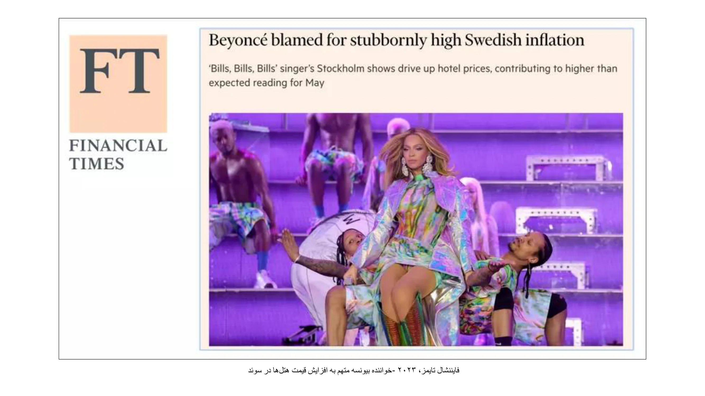

در اینجا تجزیه و تحلیل موضوع به چند نکته کلیدی آمده است:

- تفاوت بین افزایش قیمت و تورم:

افزایش قیمت می‌تواند به‌صورت خاص به یک بخش مربوط باشد و توسط عوامل مختلفی ایجاد شود، مانند کاهش تولید نفت اوپک یا شرایط نامساعد جوی که بر تولید گندم تأثیر می‌گذارد.

از سوی دیگر، تورم به عنوان افزایش عمومی قیمت‌ها در طیف گسترده‌ای از کالاها و خدمات تعریف می‌شود، نه فقط در یک بخش خاص.

- ماهیت پولی تورم:

با یک پول ثابت Supply، افزایش قیمت‌ها در یک بخش منجر به کاهش قیمت‌ها در بخش‌های دیگر می‌شود، زیرا مقدار پول موجود برای خرج کردن در جاهای دیگر کاهش می‌یابد. تورم به شدت با افزایش پول Supply مرتبط است که امکان افزایش همزمان قیمت‌ها در تمام بخش‌ها را فراهم می‌کند.

- تأثیر پول Supply بر تورم و کاهش قیمت:

در یک سیستم پولی ثابت Supply، افزایش تولید به‌طور نظری باید به کاهش تورم منجر شود، یعنی کاهش قیمت‌ها، زیرا کالاها و خدمات بیشتری در دسترس خواهد بود.

در سیستم پولی فیات فعلی، افزایش پول Supply کاهش تورم احتمالی ناشی از افزایش تولید را خنثی می‌کند.

- اثرات منفی تنظیم Supply پول:

افزایش پول Supply، بدون افزایش متناسب در تولید، منجر به تورم می‌شود، زیرا پول بیشتری در گردش برای همان مقدار کالاها و خدمات وجود دارد.

در حالی که افزایش تولید باید به کاهش قیمت‌ها منجر می‌شد، افزایش همزمان پول Supply این اثر را خنثی کرد و در نتیجه به تورم انجامید.

- تورم، کاهش قیمت، و پول Supply - ظروف مرتبطه:

تورم و کاهش قیمت مانند ظروف مرتبط در یک اقتصاد هستند. افزایش تولید می‌تواند به کاهش قیمت منجر شود، اما اگر پول Supply به طور همزمان افزایش یابد، اثر کاهش قیمت خنثی شده و منجر به تورم می‌شود.

این بحث بر اهمیت درک مکانیسم‌های اساسی تورم و کاهش تورم، و همچنین تأثیر عمیقی که تغییر Supply پول می‌تواند بر اقتصاد داشته باشد، تأکید می‌کند. احتمالاً در آینده به این مفاهیم بازخواهیم گشت تا درک عمیق‌تری از ارتباطات آن‌ها و تأثیری که بر اقتصاد جهانی دارند، پیدا کنیم.

### چرا چاپ پول همیشه باعث تورم نمی‌شود؟

#### تورم ≠ CPI

تورم، اگرچه اغلب با افزایش در Supply پول مرتبط است، اما همیشه با چاپ پول ارتباط مستقیم ندارد، همان‌طور که در دوره پس از بحران مالی 2008 نشان داده شده است. با وجود چاپ پول قابل توجه برای نجات بانک‌ها، دهه بعدی تورم بالایی را تجربه نکرد و به طور متوسط بین 0 تا 2 درصد در سال بود. این وضعیت این سوال را مطرح می‌کند: چرا چاپ پول گسترده منجر به تورم متناسب نشد؟ پاسخ در چندین نکته مرتبط با اندازه‌گیری تورم و شاخص قیمت مصرف‌کننده (CPI) نهفته است.

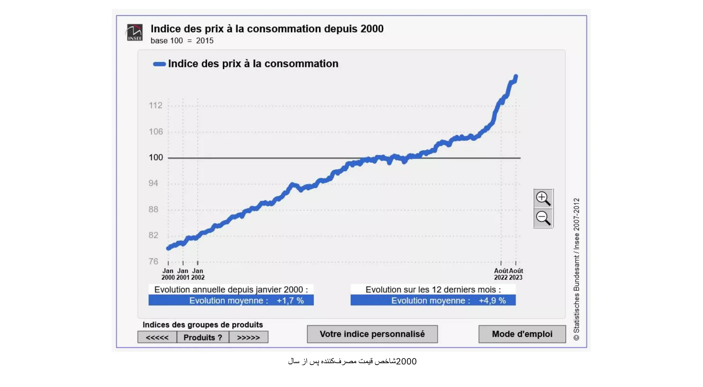

اولین توضیح در نحوه اندازه‌گیری تورم نهفته است. شاخص قیمت مصرف‌کننده (CPI)، که به عنوان شاخص اصلی تورم عمل می‌کند، دارای محدودیت‌هایی است. به عنوان مثال، این شاخص به طور جامع تغییرات قیمت املاک و مستغلات را در نظر نمی‌گیرد. اگرچه CPI شامل یک جزء مرتبط با اجاره‌ها است، افزایش قابل توجه قیمت خانه‌ها به طور کامل در این شاخص منعکس نمی‌شود. در نتیجه، افزایش‌های قابل توجه در هزینه‌های مسکن می‌تواند بدون اینکه به طور کامل توسط CPI ثبت شود، رخ دهد و این ممکن است تورم واقعی را کمتر از حد نشان دهد.

علاوه بر این، محاسبه شاخص قیمت مصرف‌کننده (CPI) از روش‌های خاصی استفاده می‌کند که می‌تواند افزایش واقعی قیمت‌ها را جبران یا پنهان کند. به عنوان مثال، بهبودهای کیفی در محصولات می‌تواند برای تنظیم شاخص استفاده شود. اگر قیمت یک محصول افزایش یابد، اما کیفیت یا ویژگی‌های آن نیز بهبود یابد، CPI ممکن است در نظر بگیرد که ارزش واقعی برای مصرف‌کننده تغییر نکرده است و بنابراین، تورم را منعکس نکند. یک مورد نمونه این است که، علیرغم افزایش قیمت گوشت و کامپیوتر به دلیل تزریق پولی، بهبود عملکرد کامپیوتر برای جبران این افزایش استفاده می‌شود. اگر یک کامپیوتر دو برابر بیشتر هزینه داشته باشد اما چهار برابر قدرتمندتر باشد، CPI ممکن است این را به عنوان کاهش قیمت‌ها تفسیر کند و در نتیجه افزایش قیمت گوشت را پنهان کند.

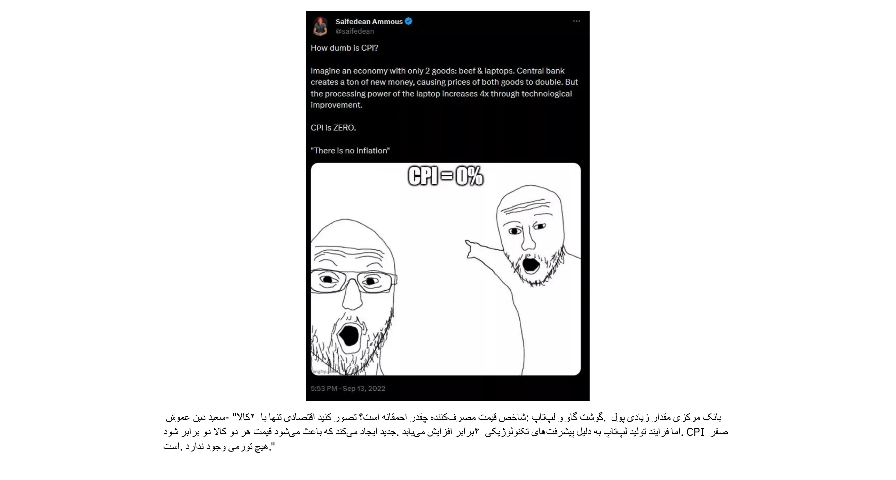

این تفاوت‌ها در اندازه‌گیری تورم توسط شاخص قیمت مصرف‌کننده (CPI) پیچیدگی رابطه بین چاپ پول و تورم را برجسته می‌کند. آن‌ها همچنین نشان می‌دهند که تورم واقعی ممکن است بالاتر از گزارش شده باشد اگر تمام افزایش قیمت‌ها، به ویژه در بخش‌های کلیدی مانند املاک و مستغلات، به طور جامع‌تری در نظر گرفته شوند. این تحلیل اهمیت درک مکانیسم‌های زیرین تورم و محدودیت‌های شاخص‌های متعارف مورد استفاده برای اندازه‌گیری آن را تأکید می‌کند و بدین ترتیب درک عمیق‌تری از پیامدهای اقتصادی سیاست‌های پولی را تسهیل می‌کند.

#### استدلال‌های MMT

نظریه پولی مدرن (MMT) دیدگاه متمایزی در مورد ایجاد پول و تورم ارائه می‌دهد. بر اساس MMT، پول عمدتاً از دولت نشأت می‌گیرد که می‌تواند مقادیر زیادی را برای تأمین نیازهای خود چاپ کند بدون اینکه باعث تورم شود، تا زمانی که بخش‌هایی که این وجوه به آنها اختصاص می‌یابد اشباع نشده باشند. این رویکرد از نظریه‌های پولی سنتی منحرف می‌شود و بر اهمیت ظرفیت‌های جذب بخشی در پویایی‌های تورمی تأکید می‌کند.

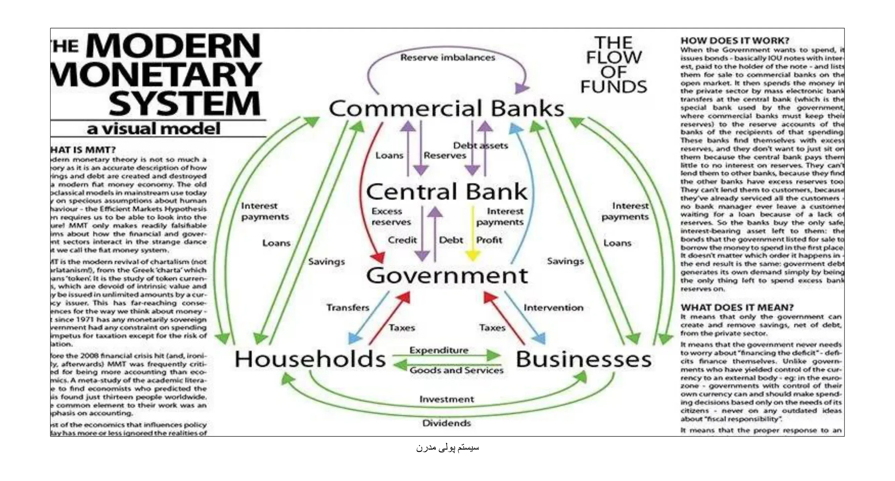

یک مثال تصویری از MMT، مجتمع نظامی-صنعتی آمریکا است. بر اساس MMT، صدها میلیارد دلار می‌تواند به این بخش اختصاص یابد بدون اینکه باعث تورم شود، به لطف توانایی آن در جذب بودجه. در مقابل، اگر مبالغ قابل توجهی به ساخت جاده در ایالات متحده تزریق شود، جایی که تعداد محدودی شرکت و نیروی کار وجود دارد، تورم می‌تواند به دلیل کمبود منابع و افزایش هزینه‌های مورد تقاضای تأمین‌کنندگان رخ دهد.

طرفداران نظریه پولی مدرن (MMT) اغلب به ژاپن به عنوان نمونه‌ای دیگر از عدم وجود تورم علیرغم چاپ قابل توجه پول اشاره می‌کنند. با این حال، وضعیت در ژاپن همچنین محدودیت‌های معیارهای سنتی تورم، مانند شاخص قیمت مصرف‌کننده (CPI)، را برجسته می‌کند. در ژاپن، بخش قابل توجهی از پول چاپ شده یا پس‌انداز می‌شود یا در املاک و مستغلات یا بازار سهام سرمایه‌گذاری می‌شود، به جای اینکه برای مصرف جاری خرج شود. شاخص CPI با عدم ثبت کامل این دینامیک‌ها، ممکن است تورم واقعی را کمتر از حد برآورد کند.

[تحلیل ژاپن](https://ideas.repec.org/p/ces/ceswps/_9821.html) همچنین نشان می‌دهد که رفتار عوامل اقتصادی، مانند پس‌انداز یا سرمایه‌گذاری در دارایی‌هایی که در شاخص قیمت مصرف‌کننده لحاظ نشده‌اند، می‌تواند اثر تورمی چاپ پول را پنهان کند. افزون بر این، توانایی بخش‌های مختلف در جذب نقدینگی تزریق‌شده نقش تعیین‌کننده‌ای در بروز یا عدم بروز تورم ایفا می‌کند.

#### ترازنامه‌های بانک و بانک مرکزی

سومین مثال از اینکه چرا چاپ پول باعث تورم نمی‌شود این است که رابطه بین چاپ پول و تورم توسط نحوه ورود پول تازه ایجاد شده به اقتصاد تنظیم می‌شود. اگر این پول در ترازنامه‌های بانک‌های خصوصی باقی بماند و به بازیگران اقتصادی وام داده نشود، به طور مستقیم بر اقتصاد واقعی تأثیر نخواهد گذاشت و بنابراین منجر به تورم نخواهد شد.

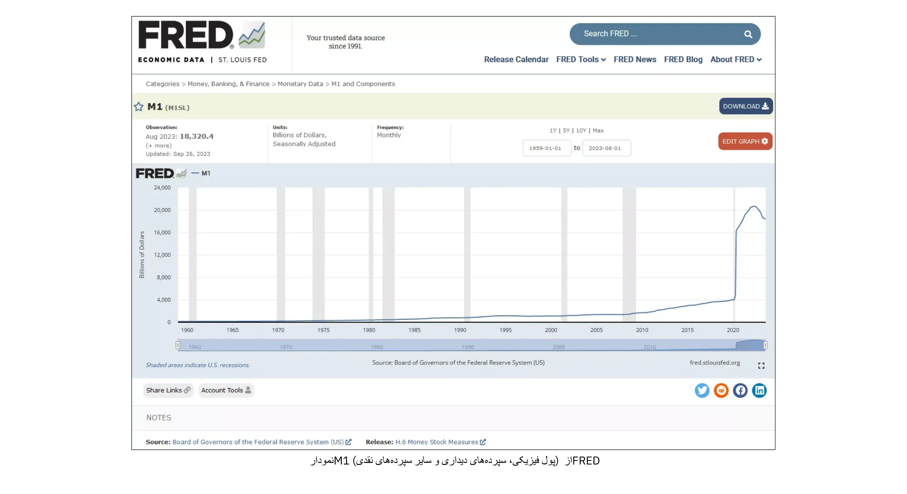

چاپ پول می‌تواند به عنوان شمشیر داموکلس بر فراز اقتصاد دیده شود. پول ایجاد شده می‌تواند برای مدتی بدون هیچ اثر تورمی قابل مشاهده‌ای نهفته بماند، تا زمانی که از طریق وام‌های بانکی یا مکانیزم‌های دیگر به اقتصاد تزریق نشود. با این حال، زمانی که این پول نهفته سرانجام به گردش درآید، اثرات تورمی می‌توانند ظاهر شوند. این همان چیزی است که در دهه ۲۰۲۰ مشاهده شده است، جایی که پول‌های قبلاً ایجاد شده وارد اقتصاد شده و منجر به تورم شده‌اند.

این سناریو اهمیت مکانیسم‌های انتقال پولی را در تأثیرگذاری بر اثرات تورمی چاپ پول برجسته می‌کند. ایجاد پول توسط بانک مرکزی تنها یک قطعه از این پازل است. رفتار بانک‌های خصوصی، که در مورد حجم وام‌های اعطایی تصمیم‌گیری می‌کنند، و رفتار وام‌گیرندگان، که تصمیم می‌گیرند چگونه پول وام‌گرفته‌شده را خرج کنند، نیز در این پویایی Elements حیاتی هستند.

#### تورم اجتماعی است!

نمونه جمهوری وایمار جنبه مهم دیگری از رابطه بین چاپ پول و تورم را نشان می‌دهد: نقش انتظارات و رفتار عوامل اقتصادی. زمانی که بانک مرکزی جمهوری وایمار شروع به چاپ مقدار زیادی پول کرد، عدم اطمینان اقتصادی باعث شد افراد پول را ذخیره کنند، یعنی به جای خرج کردن، آن را نگه دارند. این واکنش به طور موقت اثرات تورمی چاپ پول را به تأخیر انداخت.

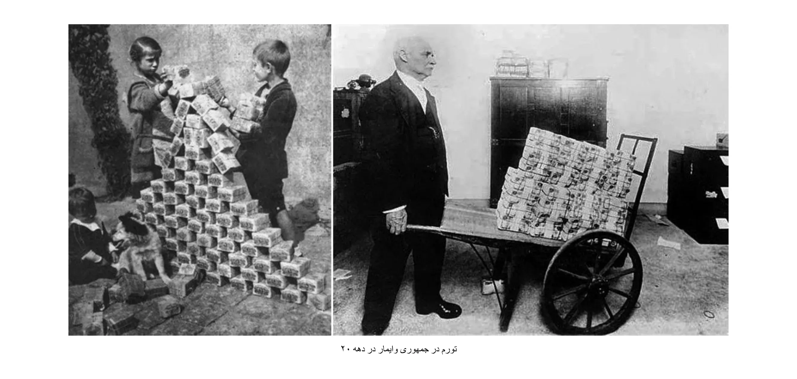

با این حال، زمانی که وضعیت اقتصادی کمی بهبود یافت، اعتماد به تدریج بازسازی شد. سپس افراد پس‌اندازهای خود را از مخفیگاه‌هایشان بیرون کشیدند و شروع به خرج کردن گسترده در اقتصاد کردند. این تغییر ناگهانی در رفتار، همراه با پول Supply که از قبل بالا بود، منجر به انفجار در تقاضا شد. با پول بیشتر در گردش و افزایش تقاضا، قیمت‌ها به سرعت شروع به افزایش کردند و منجر به تورم قابل توجهی شدند.

این مثال بر اهمیت زمان‌بندی و رفتار عاملان در ظهور تورم تأکید می‌کند. تورم تنها در پاسخ به افزایش پول Supply رخ نمی‌دهد، بلکه به چگونگی و زمان خرج شدن آن پول در اقتصاد نیز بستگی دارد. عدم قطعیت‌های اقتصادی و انتظارات عاملان اقتصادی نقش مهمی در این پویایی ایفا می‌کنند و می‌توانند اثرات تورمی چاپ پول را تسریع یا به تأخیر بیندازند.

#### خلاصه:

- شاخص قیمت مصرف‌کننده (CPI): CPI به گونه‌ای ساختار یافته است که تورم را کمتر از واقعیت نشان می‌دهد، که می‌تواند تصویری تحریف‌شده از واقعیت تورمی ارائه دهد.

- جذب بخشی: تزریق پول به بخش‌هایی که قادر به جذب آن هستند، همیشه منجر به تورم نمی‌شود. یک مثال قابل توجه، مجتمع نظامی-صنعتی ایالات متحده است که می‌تواند مبالغ زیادی پول را بدون ایجاد تورم جذب کند.

- مورد ژاپن: علیرغم چاپ پول قابل توجه، تورم در ژاپن پایین باقی مانده است زیرا وجوه اغلب پس‌انداز یا در بازارهای املاک و مستغلات یا سهام سرمایه‌گذاری می‌شوند. این بخش‌ها پول چاپ شده را جذب می‌کنند و شاخص قیمت مصرف‌کننده (CPI) لزوماً افزایش قیمت‌ها در این حوزه‌ها را منعکس نمی‌کند.
- همبستگی بین چاپ پول و بازارها. مشاهده شده است که منحنی‌های بازار املاک و مستغلات و بازار سهام اغلب از چاپ پول پیروی می‌کنند، که نشان‌دهنده جهت‌گیری پول چاپ شده است.
- ذخایر پولی بانک‌ها: زمانی که پول چاپ‌شده در ترازنامه‌های بانک‌ها باقی می‌ماند و در اقتصاد گردش نمی‌کند، باعث تورم نمی‌شود. این موضوع با مثال سال ۲۰۰۸ نشان داده می‌شود، جایی که پول چاپ‌شده عمدتاً در ترازنامه‌های بانک‌ها باقی ماند و تأثیر تورمی را به تأخیر انداخت.

- جمهوری وایمار: این دوره تاریخی نشان می‌دهد که چگونه عدم اطمینان اقتصادی منجر به احتکار پول شد و تورم را به تأخیر انداخت. با این حال، زمانی که اعتماد بازگشت و پول خرج شد، تورم به شدت افزایش یافت.

این مثال‌ها می‌توانند در بحث‌ها برای توضیح این که چرا تورم همیشه نتیجه فوری چاپ پول نیست، و چگونه زمینه‌های اقتصادی و رفتارهای عاملان بر تورم تأثیر می‌گذارند، استفاده شوند.

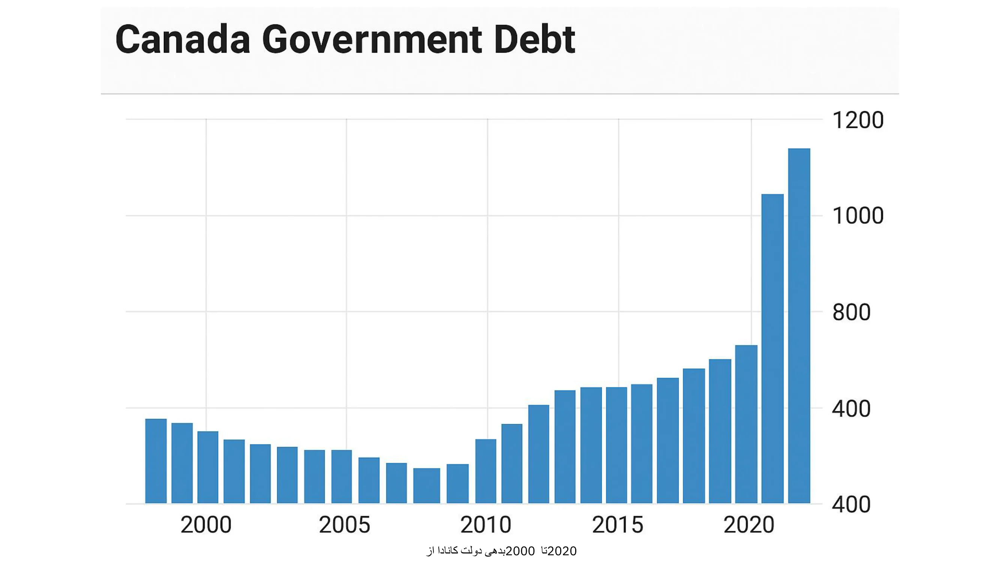

زیرا، همانطور که این [رشته](https://twitter.com/saifedean/status/1673639779433590786) نشان می‌دهد: تورم همه چیز است به جز تقصیر بانک‌های مرکزی.

- اقتصاددانان تورم را به تغییرات اقلیمی نسبت می‌دهند

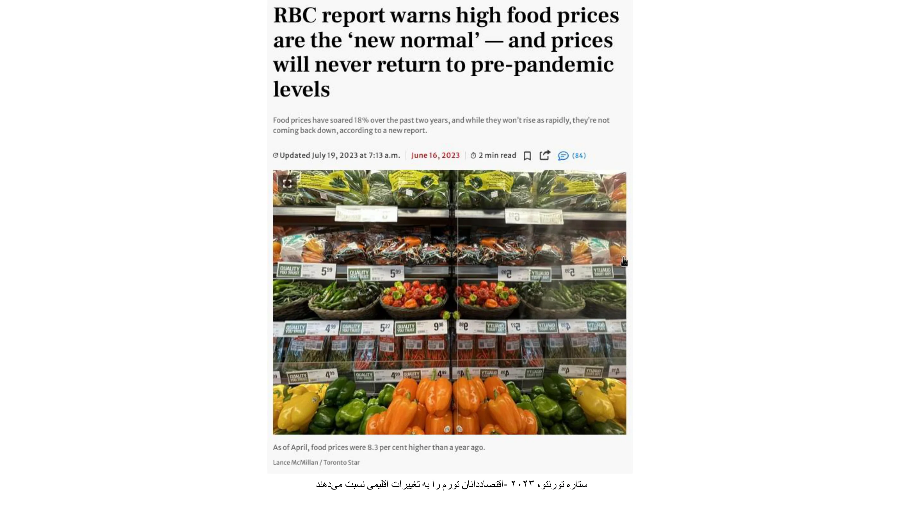

- مثالی از اینکه سوئد بیانسه را برای تورم در یک ماه خاص مقصر می‌داند.

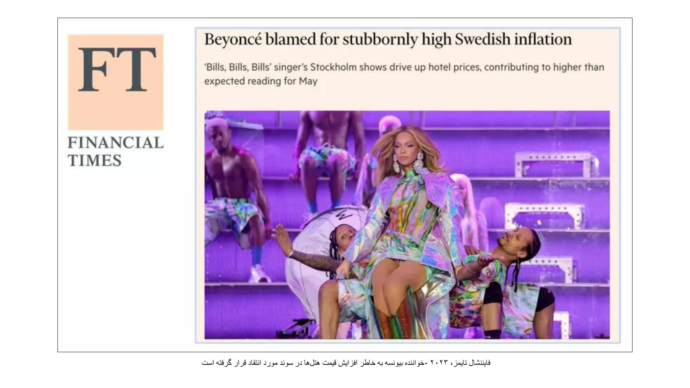

- بانک مرکزی در لهستان تورم را به تجاوز روسیه در اوکراین و همه‌گیری نسبت می‌دهد.

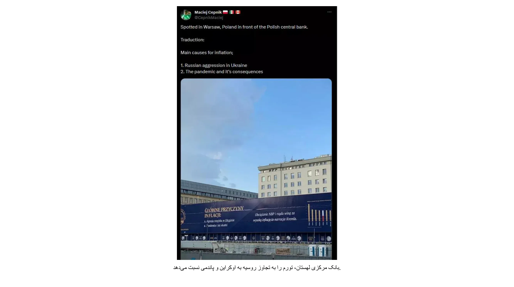

- برگزیت به عنوان عامل تورم در بریتانیا شناخته می‌شود.

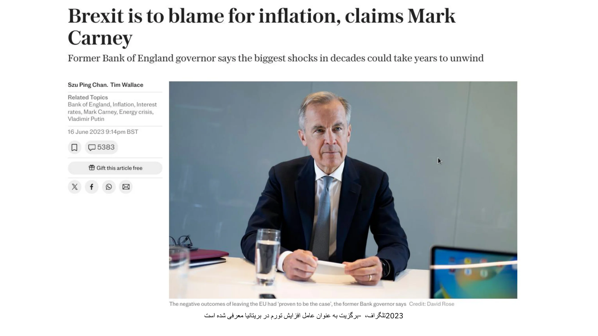

- انتشار بازی زلدا با یک شوک تورمی همراه است.

- تیلور سوئیفت ظاهراً باعث تورم می‌شود.

بگویید، چگونه می‌توانند بیانسه یا تیلور سوئیفت باعث افزایش گسترده قیمت‌ها شوند؟ می‌بینید، این اصلاً منطقی نیست. به طور خلاصه:

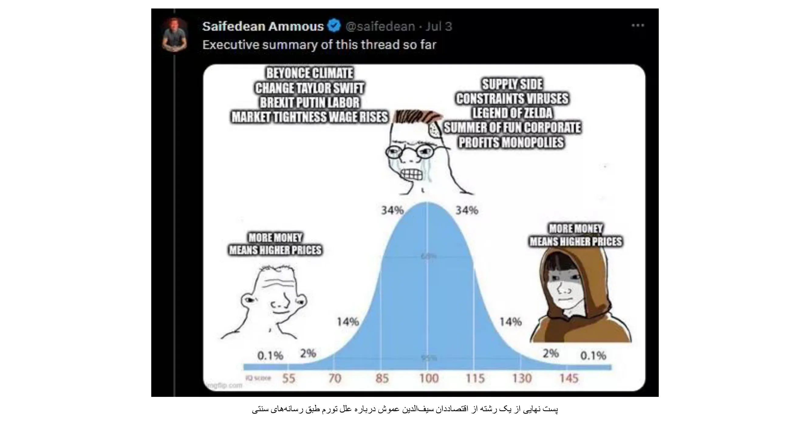

### کاوش در انواع تورم

درک تفاوت بین انواع مختلف تورم بسیار مهم است، زیرا به ما امکان می‌دهد تا جلوه‌های متنوع این پدیده اقتصادی را درک کنیم. در اینجا توضیحی از این انواع مختلف ارائه شده است:

- خزش تورمی: این نوع تورم است که بانک‌های مرکزی معمولاً به دنبال آن هستند و حدود 2% سالانه تعیین شده است. این هدف از دهه 1990 به تصویب رسیده و هدف آن حفظ رشد اقتصادی پایدار بدون داغ شدن بیش از حد یا کاهش قیمت‌ها است.
- تورم متوسط: این شکل از تورم زمانی رخ می‌دهد که تورم از هدف ۲٪ فراتر رود. اغلب با یک اقتصاد بیش از حد گرم همراه است، وضعیتی که در آن پول بیش از حد Supply باعث افزایش عمومی قیمت‌ها می‌شود. این سناریو محدودیت‌های سیاست‌های پولی را آشکار می‌کند و گاهی اوقات تناقضات در گفتمان اقتصادی را نشان می‌دهد.
- تورم جهشی: تورم جهشی، که اغلب به عنوان تورم دو رقمی شناخته می‌شود، زمانی رخ می‌دهد که نرخ تورم سالانه از 10% فراتر رود. این وضعیت نشان‌دهنده افزایش قابل توجه قیمت‌ها است که می‌تواند ثبات اقتصادی را به خطر بیندازد.

- اَبَرتورم: اَبَرتورم پدیده‌ای شدید است که در آن نرخ تورم از 50% در ماه فراتر می‌رود، که به دلیل ماهیت نمایی تورم، معادل نرخ تورم سالانه بیش از 13,000% است. این سطح از تورم به شدت اقتصاد را بی‌ثبات می‌کند، ارز را تقریباً بی‌ارزش می‌سازد و اعتماد به سیستم پولی را از بین می‌برد.

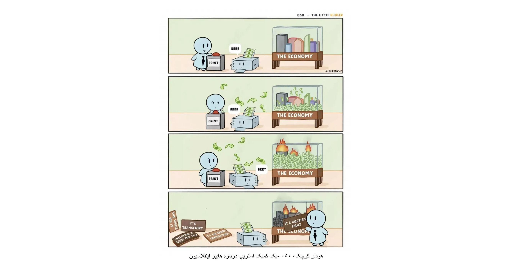

هنگام بررسی انواع تورم، معمولاً با اصطلاحاتی مانند "کشش تقاضا" و "فشار هزینه" در منابع آموزشی مواجه می‌شویم. این مفاهیم، اگرچه معتبر هستند، تمایل دارند افزایش قیمت‌ها را به جای تورم به عنوان یک پدیده پولی توضیح دهند. در اینجا یک تحلیل عمیق‌تر ارائه شده است:

- تقاضای کششی:

تورم ناشی از تقاضا اغلب به‌عنوان وضعیتی توصیف می‌شود که در آن تقاضا در اقتصاد از ظرفیت تولید موجود فراتر می‌رود. با این حال، بدون افزایش متناسب در پول Supply، این وضعیت به سادگی منجر به توزیع مجدد هزینه‌ها خواهد شد. مصرف‌کنندگان ممکن است بیشتر برای کالاهای ضروری هزینه کنند و کمتر برای اقلام غیرضروری، و بدین ترتیب اثر کلی تورمی را خنثی کنند.

- فشار هزینه:

از سوی دیگر، تورم ناشی از فشار هزینه به افزایش هزینه‌های تولید، مانند هزینه‌های منابع طبیعی یا نیروی کار نسبت داده می‌شود. باز هم، بدون افزایش در پول Supply، افزایش هزینه‌ها در یک بخش ممکن است به سادگی باعث کاهش هزینه‌ها در بخش‌های دیگر شود، بدون اینکه تورم گسترده‌ای ایجاد کند.

این توضیحات سنتی اغلب افزایش قیمت‌ها را با تورم مرتبط می‌دانند که می‌تواند منجر به سردرگمی و سوءتفاهم شود. در واقعیت، برای وقوع تورم گسترده، افزایش در پول Supply ضروری است. در این زمینه، مفاهیم تقاضای کششی و فشار هزینه می‌توانند تغییرات قیمتی بخشی را توضیح دهند، اما ماهیت پولی تورم را به تصویر نمی‌کشند. این موضوع اهمیت تمایز بین افزایش قیمت‌های بخشی و تورم گسترده را برجسته می‌کند و نیاز به افزایش در پول Supply را برای جلوگیری از بروز تورم در سراسر اقتصاد تأیید می‌کند. این تحلیل دیدگاهی دقیق‌تر و پیچیده‌تر از علل واقعی تورم ارائه می‌دهد و تفسیرهای رایج را که ممکن است پویایی‌های پولی زیربنایی را پنهان کنند، روشن می‌سازد.

### طبقه‌بندی تورم بر اساس برنهولز

برنهولز یک طبقه‌بندی ساده اما دقیق از تورم را به سه دسته پیشنهاد می‌کند که امکان درک بهتر این پدیده پیچیده پولی را فراهم می‌سازد:

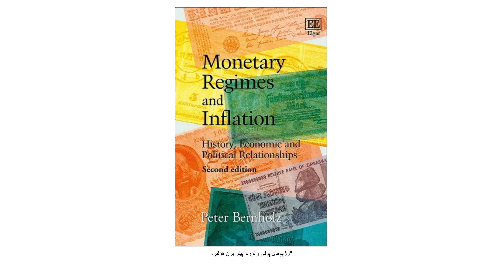

- تورم متوسط:

تورم متوسط زمانی رخ می‌دهد که سطح پول Supply بالاتر از حد معمول باشد، اما بدون اینکه دولت به کسری‌های بزرگ که از طریق ایجاد پول تأمین مالی می‌شوند، متوسل شود. اگرچه اصطلاح "متوسط" ممکن است بی‌اهمیت به نظر برسد، این شکل از تورم می‌تواند مشکلات قابل توجهی ایجاد کند، هرچند که به عنوان تورم بالا طبقه‌بندی نمی‌شود.

- تورم بالا:

تورم بالا زمانی رخ می‌دهد که ارزش واقعی پول Supply کاهش می‌یابد، علیرغم افزایش در اصطلاحات اسمی. این وضعیت پارادوکسیکال از جایگزینی پولی ناشی می‌شود، جایی که افراد اعتماد خود را به ارز ملی از دست می‌دهند و به دنبال Exchange آن برای کالاها، خدمات یا ارزهای خارجی هستند. این فرآیند ارزش واقعی ارز را بیشتر کاهش می‌دهد و تورم را تشدید می‌کند.

- اَبَرتورم:

اَبَرتورم شکلی شدید از تورم بالا است که با کسری بودجه‌های بزرگ که از طریق ایجاد پول تأمین می‌شود، مشخص می‌گردد. به‌طور تاریخی، هیچ موردی از ابرتورم مشاهده نشده است که بدون تأمین مالی کسری‌های قابل توجه از طریق چاپ پول باشد. ابرتورم یک چرخه معیوب ایجاد می‌کند: تورم به سرعت ارزش ارز را کاهش می‌دهد به‌طوری که درآمدهای مالیاتی قبل از اینکه دولت بتواند آن‌ها را جمع‌آوری کند، کاهش می‌یابند و این امر دولت را مجبور می‌کند تا برای تأمین مالی خود پول بیشتری چاپ کند. این چرخه خودتقویت‌کننده منجر به نرخ‌های تورم نجومی می‌شود که اغلب بیش از ۵۰٪ در ماه است.

این طبقه‌بندی توسط برنهولتز به پیشرفت خطرناک از تورم متوسط به ابر تورم اشاره می‌کند و بر اهمیت حیاتی کنترل پولی و مالی در جلوگیری از مارپیچ‌های تورمی مخرب تأکید دارد. همچنین نشان می‌دهد که پیامدهای زیان‌بار بر تأمین مالی دولت می‌تواند قبل از رسیدن به مرحله ابر تورم رخ دهد و دیدگاه دقیقی از پیامدهای تورم در درجات مختلف ارائه می‌دهد.

### نتیجه‌گیری: خلاصه‌ای از انواع تورم

در نتیجه، ما انواع مختلفی از تورم را بررسی کرده‌ایم، از اصطلاحات رایج مانند "تورم خزنده"، "تورم پیاده‌روی" و "تورم جهشی"، که هر کدام نشان‌دهنده سطوح مختلف درصد تورم در یک اقتصاد هستند، شروع کردیم. با این حال، برای مطالعه عمیق ما در مورد ابر تورم، دسته‌بندی‌های تورم معتدل، تورم بالا و ابر تورم، همان‌طور که توسط برنهولز توصیف شده است، به عنوان معیارهای مهمی اثبات می‌شوند.

- تورم متوسط:

این نشان‌دهنده سطحی از پول Supply بالاتر از حد معمول است، اگرچه این سطح می‌تواند بدون تأمین مالی کسری قابل‌توجه توسط دولت حفظ شود.

- تورم بالا:

این اتفاق زمانی رخ می‌دهد که ارزش واقعی پول Supply کاهش می‌یابد، اغلب به دلیل جایگزینی پولی، جایی که افراد به دنبال Exchange ارز خود با کالاها، خدمات یا اشکال دیگر ارز هستند.

- اَبَرتورم:

این یک نسخه افراطی از تورم بالا را نشان می‌دهد، جایی که ایجاد بیش از حد پول برای تأمین مالی کسری بودجه بزرگ منجر به فرسایش سریع ارزش واقعی ارز می‌شود.

آنچه از کاوش ما پدیدار می‌شود این است که ابر تورم پدیده‌ای پیچیده و خلاف‌مستقیم است. در حالی که ممکن است فرض شود که ابر تورم نتیجه افزایش عظیم در پول Supply است، در واقعیت، این امر ناشی از کاهش در ارزش واقعی آن پول Supply است. این نکته برای درک اینکه چرا برخی کشورها حتی با حمایت نهادهای بین‌المللی مانند بانک جهانی یا صندوق بین‌المللی پول در خروج از ابر تورم دچار مشکل می‌شوند، حیاتی است. اشتباه در توصیف نوع تورم می‌تواند به کاربرد درمان‌های نامناسب منجر شود و مشکلات اقتصادی را به جای حل کردن، تشدید کند.

در بحث‌های آینده‌مان، به بررسی عمیق‌تر ابرتورم خواهیم پرداخت و تعاریف و نمودهای آن را در زمینه‌های اقتصادی مختلف بررسی خواهیم کرد. هدف ما کشف سازوکارهای زیربنایی ابرتورم و بررسی راه‌حل‌های احتمالی برای Address این مسئله است. این درک دقیق‌تر به ما امکان می‌دهد تا چالش‌های مرتبط را بهتر درک کرده و استراتژی‌های آگاهانه‌ای برای مدیریت تورم پیشنهاد دهیم.

از توجه شما سپاسگزاریم. جلسه بعدی به طور کامل به تعریف و رفع ابهام از ابر تورم اختصاص خواهد یافت و دیدگاه‌های مختلف علمی و عملی را در نظر خواهد گرفت. مشتاقانه منتظر ادامه این بررسی با شما در جلسه بعدی هستیم.

# ابر تورم چیست؟

<partId>3f541663-1e2f-5410-8ee0-f61c5d009fa5</partId>

## تعاریف ابر تورم

<chapterId>d2a71a2e-5f36-58d9-993c-d431f4aa07fd</chapterId>

### تعاریف ابر تورم

در این بخش، به بررسی تعاریف مختلف ابر تورم، یک اصطلاح مهم در مطالعه پدیده‌های پولی شدید می‌پردازیم. شناخته‌شده‌ترین تعریف از فیلیپ کاگان می‌آید که در اثر خود در سال ۱۹۵۶، "پویایی‌های پولی ابر تورم"، یک درک کمی از ابر تورم را پیشنهاد می‌کند. به گفته کاگان:

- آغاز و پایان ابر تورم:
  - تورم حاد زمانی آغاز می‌شود که تورم ماهانه از ۵۰٪ فراتر رود.
  - این زمانی پایان می‌یابد که نرخ تورم به زیر 50% در ماه برای حداقل یک سال برسد.

برای مثال، اگر تورم در ماه ژوئیه به ۴۰٪ کاهش یابد و تا ژوئیه سال بعد از ۵۰٪ بالاتر نرود، در این صورت دوره ابر تورم در ژوئیه سال قبل از سالی که برای اولین بار مشاهده شد، به پایان رسیده تلقی می‌شود. این تعریف امکان توصیف دقیق دوره‌های ابر تورم را فراهم می‌کند و تحلیل ساختاریافته را تسهیل می‌نماید.

این تعریف در جدول هنکه-کروس پذیرفته شده است، که 56 دوره ابر تورم را مستند می‌کند. با این حال، جدول همه دوره‌ها را پوشش نمی‌دهد، مانند دوره ونزوئلا در سال 2016، که مجموع را به 57 می‌رساند.

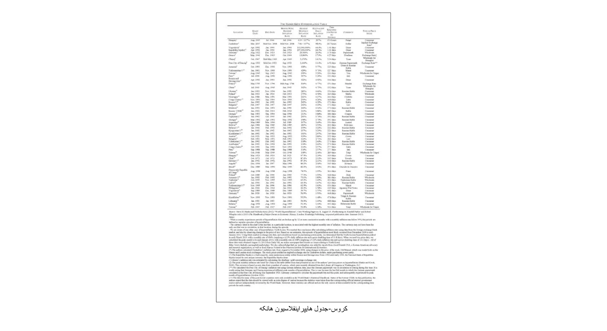

بزرگ‌نمایی

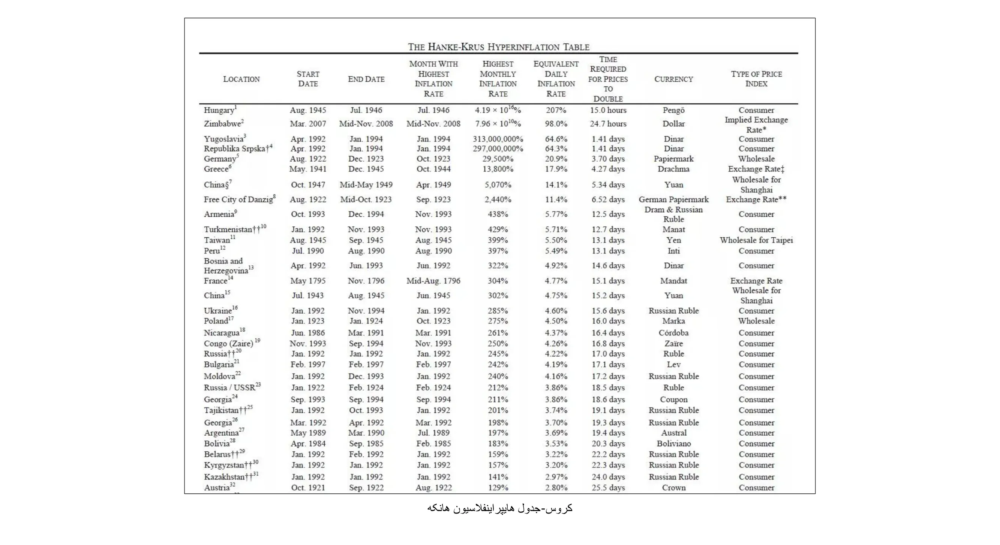

شایان ذکر است که این تعریف، اگرچه دقیق است، ممکن است به دلیل سخت‌گیری آستانه ۵۰٪، برخی از دوره‌های ابر تورم را مستثنی کند. این امکان وجود دارد که این تعریف گسترش یابد تا دوره‌های دیگری را که اگرچه به‌طور دقیق معیارهای کاگان را برآورده نمی‌کنند، اما همچنان نشان‌دهنده دوره‌های تورم بسیار بالا هستند، شامل شود. این مشاهده در را به روی بررسی گسترده‌تر پدیده‌های ابر تورم باز می‌کند و امکان درک دقیق‌تری از علل و اثرات آن را فراهم می‌سازد. در بحث‌های بعدی، بازنگری این تعریف و بررسی دوره‌های ابر تورم که تحت معیارهای سخت‌گیرانه کاگان قرار نمی‌گیرند، مورد توجه قرار خواهد گرفت.

### تعریف ابر تورم توسط کاگان

فیلیپ کاگان ممکن است با تعیین آستانه تورم ماهانه 50% به عنوان معیاری دلخواه برای تعریف ابر تورم، یک نقطه عطف دلخواه تعیین کرده باشد. او خود اذعان دارد که این تعریف دلخواه است و عمدتاً به تحلیل او بر اساس هفت دوره ابر تورم خدمت می‌کند. بررسی داده‌های کاگان نشان می‌دهد که سه دوره ابر تورم با کمترین نرخ تورم ماهانه حدود 47%، 46% و 57% بوده‌اند. به نظر می‌رسد که آستانه 50% برای شامل کردن این موارد در مطالعه او انتخاب شده است.

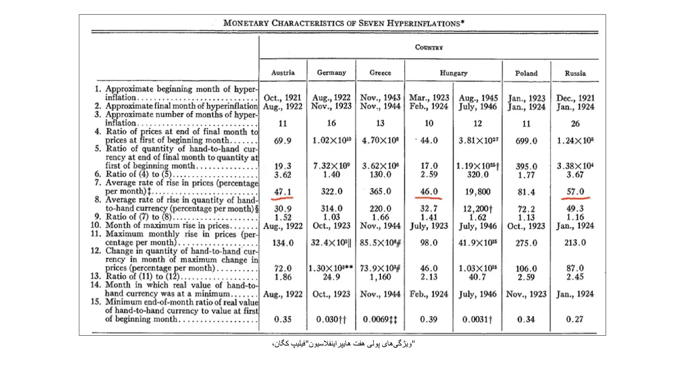

- زمینه تاریخی:

تعریف کاگان به سال 1956 بازمی‌گردد و بر اساس تعداد محدودی از دوره‌های ابرتورم موجود در آن زمان است.

- مشاهدات کاگان:

به گفته کاگان، هیچ اپیزودی به این آستانه حدود 50٪ نرسید بدون اینکه به یک ابر تورم شدیدتر پیشرفت کند، که می‌تواند انتخاب این آستانه را توجیه کند.

- نقد تعریف کاگان:

اقتصاددانان دیگر، مانند برنهولز، نویسنده کتاب "نظام پولی و تورم"، نیز آستانه ۵۰٪ را به عنوان یک معیار دلخواه توصیف کرده‌اند.

برنهولز اشاره می‌کند که دوره‌هایی از تورم بالا وجود دارد که دارای ویژگی‌های کیفی مشابه با دوره‌های ابر تورم هستند، بدون اینکه به آستانه ۵۰٪ برسند.

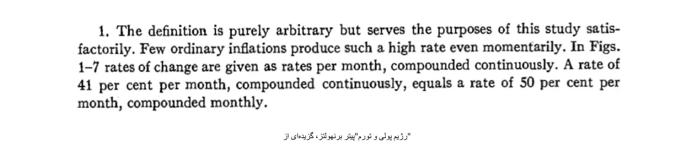

این تأمل ما را به پرسش درباره سخت‌گیری تعریف سنتی ابر تورم سوق می‌دهد و نیاز به بازنگری در این آستانه را با در نظر گرفتن اپیزودها و داده‌های تاریخی بیشتر برجسته می‌کند. تعریف ابر تورم ممکن است نیاز به انعطاف‌پذیری داشته باشد تا بتواند جلوه‌های مختلف تورم شدید را در زمینه‌های اقتصادی و تاریخی متفاوت در بر گیرد.

### تعریف ابر تورم طبق استانداردهای بین‌المللی حسابداری (IASB)

هیئت استانداردهای حسابداری بین‌المللی (IASB) دیدگاه منحصربه‌فردی در مورد ابر تورم ارائه می‌دهد و بر روی شیوه‌های حسابداری در دوره‌های ابر تورم تمرکز دارد. این رویکرد برای حسابداران و کسب‌وکارهایی که در محیط‌های ابر تورمی فعالیت می‌کنند، جایی که ارزش پول به سرعت نوسان می‌کند، بسیار حیاتی است. دستورالعمل‌های IASB شاخص‌های مختلفی از ابر تورم را شناسایی می‌کنند:

- ترجیح به دارایی‌های غیر پولی:**

افراد ترجیح می‌دهند ارزش را در کالاها نگه دارند تا در ارز، به دلیل کاهش سریع ارزش پولی.

- ارزیابی کالاها و خدمات:**

ساکنان ارزش کالاها و خدمات را به ارز محلی محاسبه نمی‌کنند، که نشان‌دهنده‌ی از دست دادن اعتماد به ارز محلی است.

- جبران خسارت ارزش پولی:**

قیمت‌ها جبران کاهش ارزش پولی در خریدهای اعتباری را شامل می‌شوند و تأثیر تورم بر معاملات روزانه را نشان می‌دهند.

- قیمت، دستمزد، و شاخص‌بندی بهره:**

قیمت‌ها، دستمزدها و بهره‌ها بر اساس یک شاخص تنظیم می‌شوند تا برای تورم جبران کنند.

- تورم تجمعی طی سه سال:**

تورم تجمعی طی سه سال به حدود 100% نزدیک می‌شود (تقریباً 24% در سال)، که با تعریف کاگان از تورم 50% ماهانه در تضاد است.

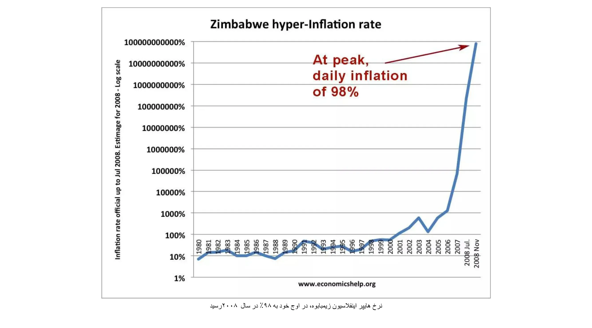

بر اساس معیارهای IASB، چندین کشور از جمله آرژانتین، اتیوپی، هائیتی، ایران، لبنان، سودان، سودان جنوبی، سورینام، سوریه، ترکیه، ونزوئلا، یمن و زیمبابوه در حال حاضر با ابر تورم مواجه هستند.

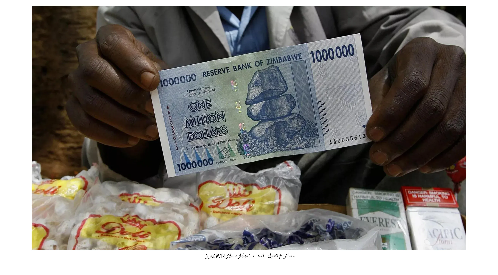

این تعریف ارائه شده توسط IASB از آستانه کمی سخت‌گیرانه کگان فاصله می‌گیرد و با گنجاندن تحلیل کیفی رفتارهای اقتصادی و تنظیمات عملی در مواجهه با ابر تورم، نشان می‌دهد که ابر تورم یک پدیده پیچیده است که نیاز به درک چندبعدی برای فهم واقعی پیامدهای آن دارد، به ویژه در حوزه حسابداری که برای ثبات و شفافیت مالی کسب‌وکارها و بازارها حیاتی است.

### بنابراین، در مجموع چند ابر تورم وجود دارد؟

تعاریف رایج از ابر تورم، مانند تعریفی که توسط کاگان پیشنهاد شده و نرخ تورم ماهانه 50٪ را تعیین می‌کند، گاهی می‌تواند گیج‌کننده یا بیش از حد ساده‌انگارانه باشد. به عنوان مثال، دو کشوری که به ترتیب نرخ تورم سالانه 1,000٪ و 3,000٪ را تجربه می‌کنند، ممکن است بر اساس توزیع ماهانه آن تورم به‌طور متفاوتی درک شوند. اگر هیچ ماهی از آستانه 50٪ فراتر نرود، طبق تعریف کاگان، آن کشورها به عنوان در حالت ابر تورم طبقه‌بندی نمی‌شوند. این رویکرد می‌تواند منجر به ناهنجاری‌هایی در طبقه‌بندی ابر تورم شود، به ویژه هنگام مقایسه تورم‌های تجمعی در طول سال.

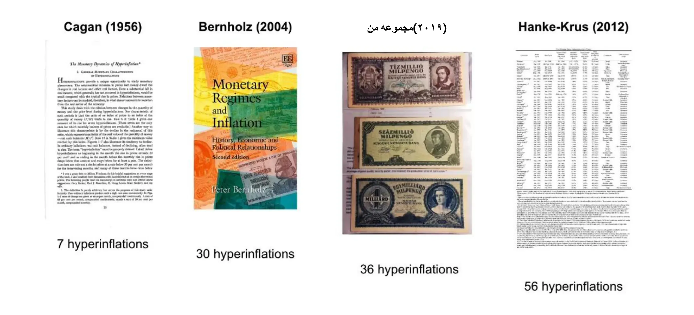

- کار کگان، "پویایی‌های پولی ابر تورم"، تحلیل بنیادی از ابر تورم ارائه می‌دهد.
- کتاب برنهولز، که 30 دوره متمایز از ابر تورم را مطالعه می‌کند و بدین ترتیب دامنه تحلیل را گسترش می‌دهد.
- مجموعه شخصی دیوید سنت-اونژ (نویسنده این دوره) از اسکناس‌ها از ۳۶ دوره ابر تورم، که امکان درک ملموس و تاریخی را فراهم می‌کند.
- جدول Hanky Cross (نسخه ۲۰۱۲، به‌روزرسانی شده در ۲۰۱۶ با ونزوئلا)، شامل ۵۷ دوره ابر تورم بر اساس تعریف Cagan.

شایان ذکر است که برخی از دوره‌های تاریخی با تورم بالا در جداول کلاسیک ابرتورم گنجانده نشده‌اند، اغلب به دلیل معیارهای طبقه‌بندی سختگیرانه. به عنوان مثال، در طول جنگ استقلال آمریکا در نوامبر 1779 و در طول جنگ داخلی آمریکا در مارس 1864، نرخ‌های تورم ماهانه به ترتیب 47.4% و 40% بودند. این نرخ‌ها، اگرچه بالا هستند، اما از آستانه 50% که توسط کاگان تعیین شده است، فراتر نمی‌روند و بنابراین این دوره‌ها از طبقه‌بندی به عنوان موارد ابرتورم مستثنی می‌شوند. این حذف محدودیت‌های تعاریف سختگیرانه را برجسته می‌کند و نیاز به درک دقیق‌تری از ابرتورم در پیچیدگی کامل آن را نشان می‌دهد.

## وایمار در مقابل زیمبابوه شباهت‌ها

<chapterId>11eef458-aab8-5c63-8523-264d0ba69f5d</chapterId>

### دو دوران، دو فاجعه

در این فصل، ما به بررسی اثرات ابر تورم خواهیم پرداخت، با تمرکز بر تجربیات زیمبابوه و جمهوری وایمار. در طول تحقیقاتم، اولویت را به کاوش در شهادت‌های مستقیم افرادی که این دوره‌های ابر تورم را تجربه کرده‌اند داده‌ام، به جای اتخاذ رویکردی صرفاً اقتصادی یا آماری.

چندین کتاب به‌ویژه آموزنده بوده‌اند:

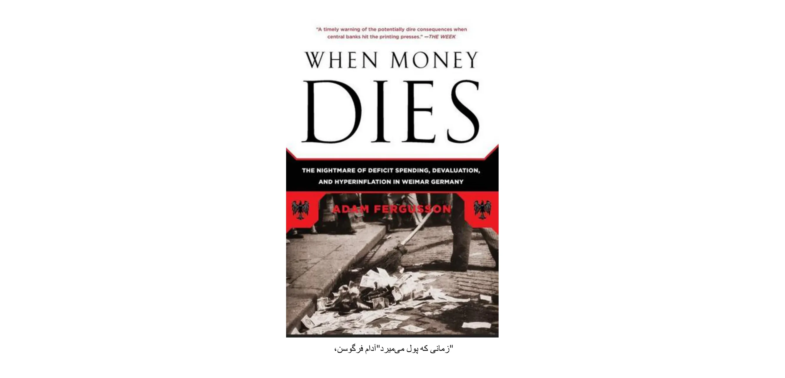

- "وقتی پول می‌میرد" نوشته آدام فرگوسن به بررسی ابر تورم پس از جنگ جهانی اول در آلمان، و همچنین در اتریش و مجارستان می‌پردازد.
- دو کتاب درباره ابر تورم در زیمبابوه، "زیمبابوه قلب گرم چهره زشت" و "شاخص تخم‌مرغ آب‌پز Hard" نوشته ژروم گاردنر و کودزای جوزف گو مین-یو، به ترتیب، شهادت‌های تأثیرگذاری از یک مدیرعامل زنجیره فروشگاه‌های پوشاک و یک بانکدار کشاورزی درباره تجربیاتشان در این دوره پرتلاطم ارائه می‌دهند.

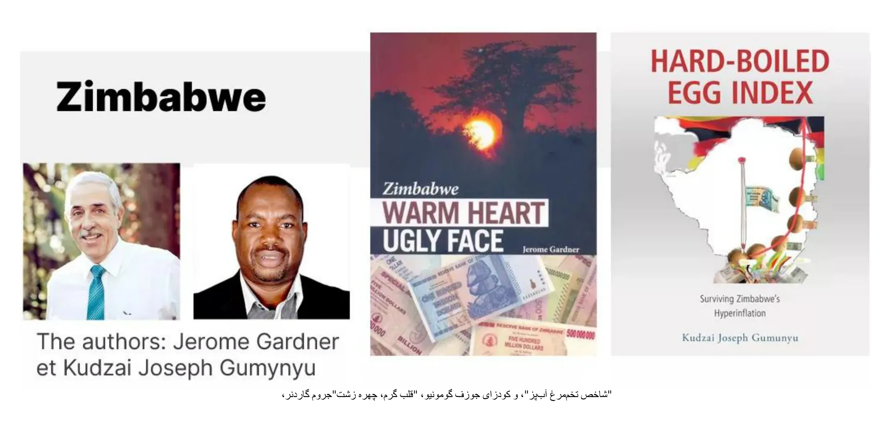

در حین جمع‌آوری یادداشت‌هایم، متوجه شباهت‌های زیادی بین تجربیات ابر تورم در زیمبابوه و جمهوری وایمار شدم، با وجود فاصله ۹۰ ساله بین آن‌ها. من حدود ۱۷ شباهت شناسایی کردم که ۱۳ مورد از آن‌ها نوعی پیشرفت به سمت فاجعه اقتصادی را که در این شهادت‌ها به تصویر کشیده شده، نشان می‌دهند. این شباهت‌های جالب، ماهیت تکراری و ویرانگر ابر تورم را در طول زمان و مرزها نشان می‌دهند. امروز، ما این شباهت‌ها و چگونگی نمایش یک مسیر نگران‌کننده در دوره‌های ابر تورم را بررسی خواهیم کرد.

### تحلیل مقایسه‌ای: زیمبابوه و جمهوری وایمار

بازی 14 تفاوت!

#### ۱. کمبود پول

وقتی که ارزش ارز با سرعت سرسام‌آوری کاهش می‌یابد، حتی بلندپروازانه‌ترین تلاش‌ها برای اشباع بازار با اسکناس‌های جدید می‌تواند ناکافی باشد. تقاضای بی‌وقفه برای ارز ملموس می‌تواند به‌مراتب از ظرفیت بانک‌های مرکزی برای تولید اسکناس فراتر رود و بحران‌های نقدینگی بی‌سابقه‌ای ایجاد کند.

> وایمار: "در طول این ماه، به تقریباً ۴ میلیارد مارک کاغذی افزایش خواهد یافت، رقمی که با آن امید می‌رود کمبود ارز به طور قطعی برطرف شود."

> زیمبابوه: "از سال 2002 تا ژانویه 2009، کمبودهای بحرانی نقدینگی متعددی وجود داشت. به سادگی اسکناس‌های کافی چاپ یا در گردش نبودند تا با تورم سرسام‌آور همگام شوند."

#### ۲. "و این کود است!"

سرعتی که در آن ارز می‌تواند در شرایط اقتصادی خاص ارزش خود را از دست بدهد، شگفت‌انگیز است. مقادیر نجومی اسکناس می‌تواند در زمان رکورد صادر شود و به سرعت مبالغی که زمانی قابل توجه بودند را به چیزی به اندازه کود بی‌ارزش تبدیل کند.

> وایمار: "مجموع کل انتشار فعلی به ۶۳,۰۰۰ میلیارد می‌رسد. بنابراین، در چند روز آینده قادر خواهیم بود دو سوم کل گردش را در یک روز منتشر کنیم."

> زیمبابوه: "در ۱۷ سپتامبر ۲۰۰۶، فرماندار بانک مرکزی زیمبابوه، گیدئون گونو، اعلام کرد: '۱۰ تریلیون هنوز در گردش است و به کود تبدیل شده است.'"

#### ۳. اسکناس‌ها کمتر از کاغذی که روی آن چاپ شده‌اند ارزش دارند

در شرایط اقتصادی خاص، ارزش ذاتی یک اسکناس می‌تواند کمتر از ارزش کاغذی شود که روی آن چاپ شده است. این کاهش شدید ارزش، اسکناس‌ها را که معمولاً نماد ارزش و قدرت خرید هستند، به تکه‌های کاغذ بی‌ارزش تبدیل می‌کند.

> وایمار: "تمامی اسکناس‌های مارک به محض خروج از چاپخانه تقریباً بی‌ارزش بودند."

> زیمبابوه: "بانک مرکزی با چاپ اسکناسی که ارزشش کمتر از کاغذی بود که روی آن چاپ شده بود، پول را هدر داد. به عبارت دیگر، ارزش آن کمتر از کاغذ توالت بود. به نظر چقدر هم که مضحک بیاید، استفاده از اسکناس ۱۰۰ تریلیون دلاری زیمبابوه به عنوان کاغذ توالت ارزان‌تر از خرید کاغذ توالت واقعی بود."

#### ۴. شمردن پول

وقتی که ارزش ارز به سرعت کاهش می‌یابد، حتی ساده‌ترین معاملات می‌توانند به وظایف دشواری تبدیل شوند. محاسبه قیمت یک کالا یا صرفاً شمردن اسکناس‌های مورد نیاز برای پرداخت می‌تواند چندین دقیقه طول بکشد و یک Layer پیچیدگی به تعاملات روزمره اضافه کند.

> وایمار: "عادی‌ترین خرید در یک فروشگاه نیاز به سه یا چهار دقیقه محاسبه داشت، و پس از تعیین قیمت، معمولاً چند دقیقه دیگر برای شمردن اسکناس‌ها لازم بود."

> زیمبابوه: "به مدیران فروشگاه‌ها اجازه داده شد تا یک کارگر موقت را برای جایگزینی کارمندانی که تمام روز پول می‌شمردند، استخدام کنند. البته، شمارش پول در فروشگاه برای امور اداری و واریز به بانک یک چیز بود، اما کل فرآیند باید در هنگام واریز در بانک تکرار می‌شد."

:::video id=910231d7-af90-4ab8-b74c-bfb81caebfb2:::

تکنیک ازبکی شمارش پول

#### ۵. پرداخت‌ها با چک

در اقتصادهای مختل، روش‌های پرداخت سنتی مانند چک‌ها می‌توانند به سرعت اثربخشی خود را از دست بدهند. بانک‌ها که به دلیل ابر تورم با افزایش تقاضا برای ارز مواجه هستند، ممکن است نقد کردن چک‌ها را جیره‌بندی یا به تأخیر بیندازند و بدین ترتیب ارزش واقعی آن‌ها را کاهش دهند. این بی‌ثباتی اغلب به اولویت‌بندی روش‌های پرداخت منجر می‌شود، جایی که قیمت‌ها می‌توانند بسته به روش پرداخت انتخابی متفاوت باشند.

> وایمار: "افزایش قیمت‌ها تقاضا برای پول را هم از سوی دولت و هم از سوی سایر کارفرمایان تشدید کرد. بانک‌های خصوصی به هیچ وجه نتوانستند این تقاضا را برآورده کنند و مجبور شدند نقد کردن چک‌ها را جیره‌بندی کنند، بنابراین چک‌های نقد نشده منجمد باقی ماندند در حالی که قدرت خرید آن‌ها کاهش یافت."
> زیمبابوه: "ارزش زمانی پول سه قیمت برای کالاها و خدمات ایجاد کرد؛ یعنی، یک قیمت نقدی، یک قیمت تسویه ناخالص آنی، و یک قیمت چک. در نهایت، هیچ‌کس چک‌ها را قبول نمی‌کرد، زیرا پنج روز طول می‌کشید تا وصول شوند."

#### ۶. "کارآفرینان اجاقی"

با کاهش ارزش ارز، فرصت‌های اقتصادی جدیدی پدیدار می‌شوند که از اعوجاجات بازار بهره‌برداری می‌کنند. این کارآفرینان که اغلب به عنوان "کارآفرینان سوختی" شناخته می‌شوند، می‌توانند با قرض گرفتن ارز کاهش‌یافته برای سرمایه‌گذاری در دارایی‌های ملموس و سپس بازپرداخت بدهی‌های خود با ارزی که حتی بیشتر کاهش یافته است، موفق شوند.

وایمار: "سفته‌بازی بر روی تورم شامل قرض گرفتن مارک‌های کاغذی، تبدیل آن‌ها به کالاها و کارخانه‌ها، و سپس بازپرداخت وام‌دهندگان با مارک‌های کاغذی کاهش‌یافته بود."

زیمبابوه: "کارآفرینان سوزان"

#### ۷. صداقت و کار Hard جذابیت خود را از دست می‌دهند

در شرایط اقتصادی ناپایدار، ارزش‌های سنتی کار Hard، صرفه‌جویی و صداقت می‌توانند تحت‌الشعاع جذابیت ثروت سریع قرار گیرند. سفته‌بازی و تجارت ارز اغلب پاداش‌های به‌مراتب بالاتری نسبت به کار عادی ارائه می‌دهند که منجر به اختلال در اولویت‌های اجتماعی می‌شود.

وایمار: "همان‌طور که فضایل قدیمی صرفه‌جویی، صداقت، و کار Hard جذابیت خود را از دست دادند، همه به دنبال ثروتمند شدن سریع بودند، به‌ویژه از آنجا که به نظر می‌رسید سفته‌بازی ارز یا سهام می‌تواند بسیار بیشتر از کار سودآور باشد."

زیمبابوه: "این روش‌ها، در حالی که تعداد کمی از افراد را ثروتمند می‌کرد، طبقه کارگر شهری و جمعیت روستایی را فقیر کرد. آموزش ارزش خود را از دست داد، زیرا این تجارت توسط افرادی هدایت می‌شد که نیازی به آموزش یا کار Hard برای توجیه آن نداشتند. تنها چیزی که نیاز داشتند، ارتباطات و سرمایه اولیه برای شروع کسب‌وکار پول آسانشان بود."

#### ۸. "بانک‌های جهان"

در شرایط ابر تورم یا بحران پولی، بازارهای موازی و غیرقانونی برای ارزهای خارجی اغلب پدیدار می‌شوند. این "بانک‌ها"ی غیررسمی که اغلب به‌طور طنزآمیز به عنوان "بانک‌های جهانی" یا با نام‌های محلی دیگر شناخته می‌شوند، پناهگاهی برای کسانی فراهم می‌کنند که به دنبال حفاظت از دارایی‌های خود در برابر کاهش ارزش هستند. اگرچه این بازارها می‌توانند یک راه نجات اقتصادی ضروری فراهم کنند، اما اغلب بی‌اعتمادی گسترده به نهادهای مالی رسمی و سیاست‌های دولتی را برجسته می‌کنند.

وایمار: "معاملات آن‌ها عمدتاً از طریق به‌اصطلاح وینکل‌بانکیه‌ها، اپراتورهای خیابانی که با تورم ظهور کرده بودند و در یک اقتصاد بیمار رونق می‌گرفتند، انجام می‌شد و کاملاً با بهره‌گیری از تفاوت بین قیمت خرید و فروش ارزهای خارجی زندگی می‌کردند."

زیمبابوه: "آن‌ها همچنین صراف بودند. آن‌ها با مصونیت بین خیابان‌های دوم و ششم و خیابان فورت در بولاوایو فعالیت می‌کردند، به لطف روش‌های تجاری زیرکانه‌شان که اغلب شامل فساد و دیگر فعالیت‌های غیرقانونی بود. این منطقه از شهر به عنوان 'بانک جهانی' شناخته می‌شد."

آرژانتین: "بنابراین به جایی رفتم که همه آرژانتینی‌ها می‌روند: cuevas، 'غارها'، که در محله فلوریدا در قلب بوئنوس آیرس یافت می‌شوند." - TheBigWhale

#### ۹. مبادلات ارز خارجی غیرقانونی بودند

دولت‌ها، در تلاشی برای تثبیت ارز خود و کنترل جریان سرمایه، ممکن است این معاملات ارز خارجی را غیرقانونی کنند. این اقدامات سرکوبگرانه، اگرچه با هدف حفاظت از اقتصاد ملی انجام می‌شوند، اما اغلب می‌توانند اثر معکوس داشته باشند، بی‌اعتمادی عمومی را تشدید کرده و بازار سیاه را تشویق کنند.

وایمار: "مردم به مبادله کالا به کالا روی آوردند و به تدریج به ارزهای خارجی به عنوان تنها وسیله قابل اعتماد Exchange روی آوردند. احکام جدیدی در مورد خرید حواله‌های خارجی و استفاده از ارزهای خارجی برای پرداخت‌های داخلی معرفی شد. علاوه بر حبس، جریمه‌ها اکنون می‌توانستند تا ده برابر مبلغ یک معامله غیرقانونی اعمال شوند."

زیمبابوه: "یورش به کسب‌وکارها منجر به زندانی شدن چندین تاجر از بولاوایو برای آخر هفته و جریمه‌هایی معادل دو برابر مبلغ ارز خارجی بازیابی‌شده شد، سپس این شجاعت فروکش کرد."

#### ۱۰. کنترل‌های سرمایه

هنگامی که یک کشور با بحران پولی یا اقتصادی مواجه می‌شود، یکی از واکنش‌های رایج دولت‌ها اعمال کنترل شدید بر حرکت و اشکال سرمایه است. چه از طریق دستوراتی که پذیرش ارزهای ملی کاهش‌یافته را اجباری می‌کنند و چه از طریق تحریم‌های شدید علیه کسانی که روش‌های پرداخت خاصی را رد می‌کنند، این اقدامات اغلب با هدف مهار وحشت و بازگرداندن اعتماد انجام می‌شوند. با این حال، اثربخشی آنها متفاوت است و گاهی اوقات این اقدامات می‌توانند نتیجه معکوس داشته باشند یا از واقعیت تجربه شده توسط شهروندان جدا باشند.

وایمار: "تاجران اخیراً با یک فرمان جدید مجبور شده بودند که اسکناس‌های دولتی را بپذیرند؛ اما از آنجا که این فرمان همچنین استفاده از ارزهای خارجی برای تمامی خریدها را مجاز می‌دانست، تاجران عموماً بهانه‌هایی پیدا می‌کردند تا تقریباً هیچ چیز دیگری را نپذیرند."

زیمبابوه: "دولت SI 175/2008 را در تاریخ ۱۲ دسامبر ۲۰۰۸ در مورد پرداخت با چک معرفی کرد. در آن آمده بود، 'مجازات برای رد پرداخت با چک/کارت بانکی یا هر روش پرداخت الکترونیکی دیگر که از طریق بانک انجام می‌شود، جریمه سطح ۸ یا حبس شش ماهه یا هر دو خواهد بود.' بدیهی است که ما SI را نادیده گرفتیم زیرا کاملاً با واقعیت بیگانه بود."

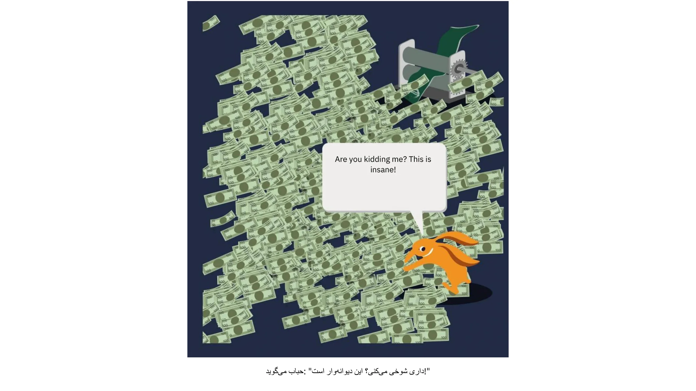

#### ۱۱. مجبور به باز نگه داشتن مغازه‌هایشان

وقتی اقتصاد فرو می‌پاشد و ارزش ارز کاهش می‌یابد، دولت‌ها می‌توانند به اقدامات شدید متوسل شوند تا ظاهری از عادی بودن را حفظ کنند.

وایمار: "بازرگانانی که به فعالیت‌های خود ادامه دادند، مشمول یک فرمان جدید شدند که در ۲۲ اکتبر به تصویب رسید و از آن‌ها خواسته شد تا مغازه‌های خود را باز نگه دارند و کالاها را در Exchange برای مارک‌های کاغذی عرضه کنند."

زیمبابوه: "فقط قفسه‌های خالی فولادی و یخچال‌ها، کولرها و فریزرها باقی مانده بودند. تراژدی این بود که فروشگاه هنوز باز بود زیرا جرأت نمی‌کردند به دلیل تنش‌های سیاسی و ترس از دستگیری رهبران توسط نیروی کنترل قیمت دولت، آن را ببندند. حتی کارگران نیز اخراج نشدند زیرا همه فکر می‌کردند که به زودی راه‌حلی پیدا خواهد شد."

#### ۱۲. همه مجرم هستند

در مواجهه با اقتصادی فروپاشیده و مقررات فراگیر، مرز بین بقا و جنایت مبهم می‌شود.

وایمار: "همه جرایم علیه دولت، هر یک از آن‌ها، به درجات مختلف، به مسئله بقا برای افراد تبدیل شدند."

> زیمبابوه: "هر ساکن زیمبابوه یک مجرم بود. هرچند که ممکن است سخت به نظر برسد، اما حقیقت داشت. با وجود انبوهی از قوانین کوچک که هر جنبه‌ای از زندگی را تحت پوشش قرار می‌دادند، اجتناب‌ناپذیر بود که هر روز هر کسی یک قانون را نقض کند. داشتن ارز خارجی غیرقانونی بود، طبق یک آیین‌نامه‌ای که در سال ۲۰۰۴ منتشر شد. داشتن چندین حساب بانکی برای دور زدن محدودیت برداشت روزانه غیرقانونی بود. نداشتن پلاک‌های مناسب روی ماشین، یا مجوز رادیوی ماشین، یا مجوز ژنراتور، همگی قوانینی بودند که کسی، جایی، آنها را نقض می‌کرد."

#### 13. خرید ارز خارجی به هر قیمتی

خرید شتاب‌زده ارزهای خارجی اغلب نقطه عطف بحرانی در کاهش ارزش ارز را نشان داده و سقوط ارزش ذاتی را تشدید کرده است.

> وایمار: "فریتز مانهایم، به دستور رئیسش، در آگوست 1921 بیرون رفت و شروع به خرید ارزهای خارجی به هر قیمتی کرد - 'زیرا آلمان مقدار بی‌نهایتی مارک کاغذی داشت اما هیچ ارز خارجی نداشت.' این اولین نشانه از فروپاشی کامل ارزش مارک بود."

> زیمبابوه: ادعا شده است که به آن‌ها اهداف روزانه‌ای داده شده بود تا برآورده کنند، زیرا برخی از نیازهای ارز خارجی فوری بودند و آن‌ها با هر نرخی خرید می‌کردند تا ارز خارجی را برای رسیدن به مهلت مقرر جمع‌آوری کنند. این عمل ادعایی متهم به دامن زدن به آتش کاهش ارزش بود زیرا ارزش دلار زیمبابوه به کاهش شدید خود ادامه داد.

### خلاصه‌ای از فرآیند

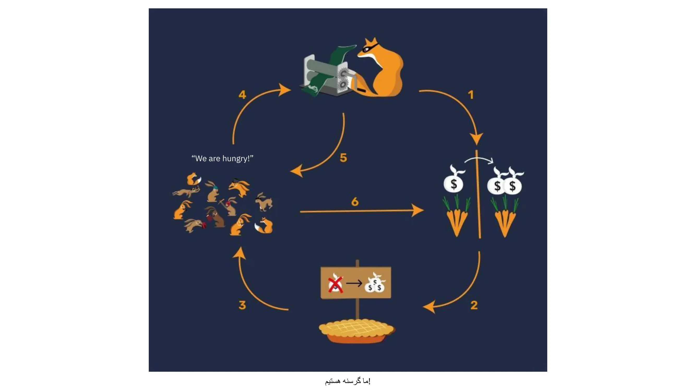

هنگام تحلیل مسیر اقتصادی، مشخص است که وقتی تورم بالا می‌رود، ارزش توده پولی کاهش می‌یابد. این کاهش ارزش منجر به چندین مشکل می‌شود، از جمله کمبود اسکناس. در این زمینه، فرصت‌های آربیتراژ به‌ویژه در پاسخ به نوسانات نرخ‌های Exchange به وجود می‌آید. در نتیجه، بسیاری از افراد به این آربیتراژ روی می‌آورند و به شدت در دارایی‌های ملموس سرمایه‌گذاری می‌کنند به امید کاهش ارزش آینده ارز که به آن‌ها اجازه می‌دهد بدهی‌های خود را با ارزی ضعیف‌تر پرداخت کنند. این محیط اقتصادی جذابیت مشاغل سنتی را تضعیف کرده و در نتیجه انسجام اجتماعی را تضعیف می‌کند.

در پاسخ به این وضعیت، دولت مقررات سختگیرانه‌ای از جمله کنترل‌های سرمایه را اعمال می‌کند. همچنین الزام می‌کند که بازرگانان ارز ملی و چک‌ها را بپذیرند. با گذشت زمان، قوانین جدیدی وضع می‌شود که تعریف رفتار مجرمانه را گسترش می‌دهد. در نهایت، نرخ Exchange به صورت تصاعدی افزایش می‌یابد زیرا دولت مایل است ارز خود را که با هزینه کمتری چاپ می‌شود، با ارزهای خارجی قوی‌تر مبادله کند.

### ۴ شباهت در پیامدهای ابر تورم

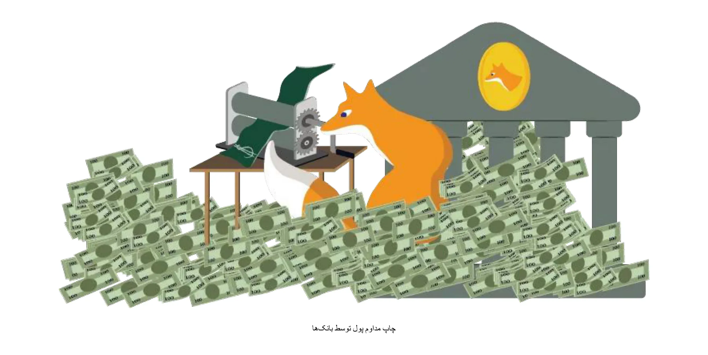

#### ۱. نفت و فلزات

در دوره وایمار در آلمان، سرقت مواد با ارزش به قدری گسترده بود که سرب از سقف‌ها به طور مکرر دزدیده می‌شد. در زیمبابوه، ناامیدی برخی را وادار کرد تا شبکه برق را مختل کنند تا روغن را از ترانسفورماتورها استخراج کرده و در وسایل نقلیه خود استفاده کنند.

وایمار: «پلاک‌های فلزی بناهای ملی باید برای حفظ و نگهداری برداشته می‌شدند. پلاک‌های برنجی زنگ در از درهای سفارت بریتانیا در برلین دزدیده شدند.»

زیمبابوه: "برای بدتر کردن اوضاع، به دلیل کمبود ارز خارجی، کمبود روغن روان‌کننده برای خودروها وجود داشت و ترانسفورماتورها به هدف آسانی برای دزدان تبدیل شدند که در طول قطعی برق، روغن خنک‌کننده را تخلیه می‌کردند."

#### ۲. قطارها

کاهش ارزش ارز می‌تواند شهروندان را به اتخاذ رفتارهای بقا، از جمله خرابکاری، سوق دهد. در مواجهه با یک اقتصاد در حال فروپاشی، زیرساخت‌های عمومی پرهزینه، مانند سیستم‌های حمل و نقل، می‌توانند به خطر بیفتند و به پیامدهای فاجعه‌بار اجتماعی منجر شوند.

> وایمار: "در برلین، سیستم تراموا به دلیل کمبود بودجه متوقف شد."

> زیمبابوه: "یکی از نگران‌کننده‌ترین و غم‌انگیزترین سناریوها زمانی بود که تقریباً تمام خط مسی برقی که هاراره را به دابوکا (بیش از 280 کیلومتر) متصل می‌کرد، به سرقت رفت. در زمان تکمیل، این خط افتخار زیمبابوه بود و قطارهای سریع‌السیر مسافری و باری در این مسیر حرکت می‌کردند."

#### ۳. "آرد ذرت"

در زمینه دستمزدهای ناچیز و اقتصادی ناپایدار، کسب‌وکارها مجبور شدند برای حفظ بهره‌وری و کارایی عملیاتی به کارکنان خود غذا ارائه دهند. این ابتکار نه تنها راهی برای جبران کمبودها و هزینه‌های بالای غذا بود، بلکه استراتژی‌ای برای حفظ کارکنان در یک محیط اقتصادی دشوار نیز محسوب می‌شد.

> وایمار: "در برلین، کارمندان اداری که طبقه‌ای بسیار مهم در پایتخت بودند، حقوقی کاملاً ناکافی بین ۱۲,۰۰۰ تا ۲۰,۰۰۰ در ماه (معادل بین ۱۲ تا ۱۹ پوند در سال) داشتند که به طور مداوم کاهش می‌یافت؛ اما اکثر آن‌ها هنوز می‌توانستند ناهار خود را با مبلغی نمادین که توسط دفاترشان تأمین می‌شد، تهیه کنند، به طوری که جسم و روح به سختی می‌توانستند با هم نگه داشته شوند."

> زیمبابوه: "در این مرحله، ما به تمام کارکنان خود ناهار رایگان ارائه می‌دادیم. آرد ذرت برای ادامه فعالیت شرکت ما ضروری بود، زیرا در بسیاری از موارد تنها وعده غذایی بود که کارکنان ما هر روز دریافت می‌کردند."

#### ۴. کوپن‌های بنزین

جمعیت‌ها به دنبال جایگزین‌های پایدار برای معاملات بودند. در وایمار، محصولاتی مانند برنج و سوخت به عنوان واسطه‌های Exchange به دلیل ارزش ذاتی ثابت خود عمل می‌کردند. در زیمبابوه، با مواجهه با کاهش سریع ارزش دلار زیمبابوه، کوپن‌های بنزین که نمایانگر مقدار ثابتی از یک محصول ضروری بودند، به یک ارز دوفاکتو تبدیل شدند. این وضعیت‌ها نشان می‌دهند که چگونه جوامع به شرایط اقتصادی شدید واکنش نشان می‌دهند و راه‌حل‌های نوآورانه‌ای برای حفظ تجارت و اقتصاد ابداع می‌کنند.

وایمار: «مبادله کالا به کالا قبلاً یک شکل مرسوم از Exchange بود؛ اما اکنون، کالاهایی مانند برنج و سوخت به ارز رایج خرید و پرداخت تبدیل شده‌اند.»

زیمبابوه: "ما اکنون از این ووچرها برای پرداخت اجاره به صاحب‌خانه‌ها، مالیات‌های شهری، قبوض تلفن – در واقع تقریباً برای همه چیز – استفاده می‌کنیم، زیرا همه از پذیرش پرداخت‌ها با دلار زیمبابوه و چک‌ها دست کشیده بودند."

#### نتیجه‌گیری

این ویدیو درباره شباهت‌های تجربیات در دوره‌های ابر تورم در زیمبابوه و جمهوری وایمار به پایان می‌رسد. در ویدیو بعدی، به تفاوت‌ها و موازی‌های معاصر خواهیم پرداخت. متشکرم.

## وایمار در مقابل زیمبابوه: تفاوت‌ها و شباهت‌های معاصر

<chapterId>643f279c-d89f-5600-a2e2-b1bbbba0ab69</chapterId>

در این فصل، تفاوت‌ها و شباهت‌های معاصر بین دوره‌های ابر تورم گذشته و حال را بررسی خواهیم کرد، با حکایات و مقایسه‌های مرتبط برای امروز.

### تفاوت‌های بین جمهوری وایمار و زیمبابوه

#### ۱. تقصیر دلار است!

در آلمان، معمول بود که جمعیت تورم را به افزایش دلار نسبت دهند تا کاهش ارزش ذاتی ارز خودشان. بسیاری معتقد بودند که پدیده مشاهده شده به دلیل افزایش ارزش دلار است. این دیدگاه هرگونه شناخت از ارتباط بین دشواری اقتصادی آن‌ها و کاهش ارزش پولی، که عمدتاً ناشی از ایجاد بیش از حد پول بود، را نادیده می‌گرفت. کتاب "وقتی پول می‌میرد" به وضوح این عدم درک در میان جمعیت آلمان را نشان می‌دهد. در مقابل، در زیمبابوه، وضعیت متفاوت بود: شهروندان به طور کامل از علت اصلی ابر تورمی که تجربه می‌کردند آگاه بودند.

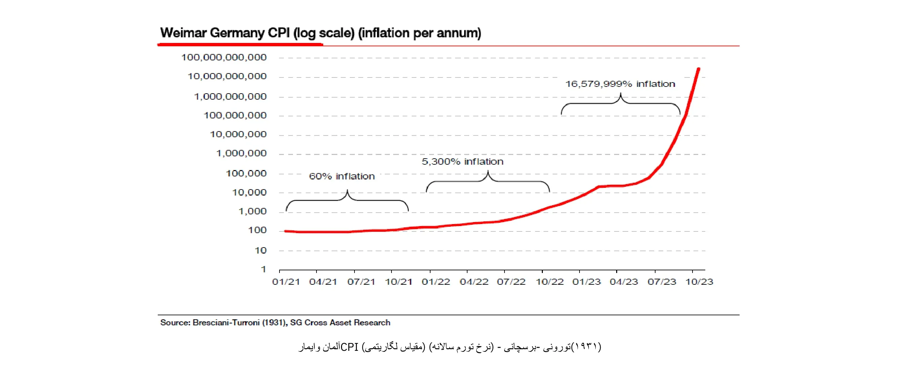

#### ۲. پول اضطراری (نوت‌گلد)

در مواجهه با بحران پولی و اقتصادی، آلمان به "نوت‌گلد" (پول اضطراری) متوسل شد. این اسکناس‌ها که توسط شهرها یا شرکت‌های خاصی چاپ می‌شدند، برای Address کمبود ارز رایج طراحی شده بودند.

جالب است که فرانسه نیز به نوت‌گلد متوسل شد، به‌ویژه در دهه ۱۹۲۰. این ابتکار نه تنها نتیجه مستقیم ابر تورم بود، بلکه ریشه در اختلالات ناشی از جنگ جهانی اول داشت. جنگ نه تنها اقتصاد را بی‌ثبات کرد، بلکه هزینه فلزات را نیز افزایش داد. در نتیجه، ارزش ذاتی سکه‌های فلزی اغلب از ارزش اسمی آن‌ها بیشتر بود و مردم را وادار به احتکار آن‌ها می‌کرد. در غیاب سکه‌ها، برخی مؤسسات مانند اتاق بازرگانی لیون، نوت‌گلد خود را چاپ کردند.

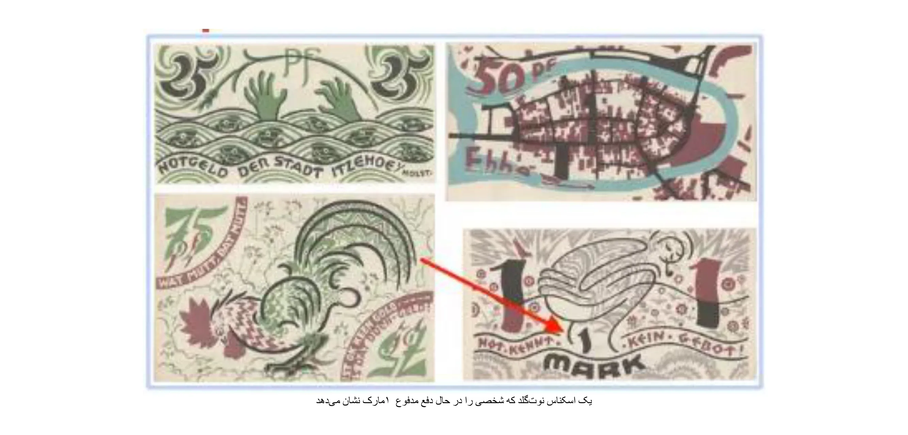

> "کاری که باید انجام شود، باید انجام شود." - یک ضرب‌المثل محلی

در میان نوت‌گلد، یک اسکناس خاص برجسته است. این اسکناس دارای یک تصویر تأثیرگذار است: در مرکز، فردی در حال دفع یک مارک به تصویر کشیده شده است. در طرف دیگر، یک جدول قیمت از سال ۱۹۱۳ تا ۱۹۲۱ افزایش تورم در این دوره را نشان می‌دهد.

هنرمند پشت این نوت‌گلد به نظر می‌رسد که نقدی کنایه‌آمیز از مقامات مسئول بحران ابرتورم ارائه می‌دهد. اسکناس دارای نوشته‌ای با عنوان "ضرورت قانون نمی‌شناسد" است. عبارت دیگری که به محل صدور نوت‌گلد خاص است: "کاری که باید انجام شود، باید انجام شود."

> "ضرورت قانون نمی‌شناسد"

> اولین شیت‌کوین: به‌طور حکایتی، با نگاه به تصویر مرکزی اسکناس، جایی که ارز به‌طور واقعی با عمل فرد کاهش ارزش پیدا می‌کند، می‌توان آن را اولین "شیت‌کوین" نامید.

#### ۳. اوراق قرضه و وام‌های رهنی

در وایمار، برخی بدهی‌ها برای جبران تأثیر تورم مجدداً ارزیابی شدند. این اقدام در زیمبابوه اتخاذ نشد.

> وایمار: "تصمیم به بازنگری وام‌های دولتی در سال ۱۹۲۵ به قانون تبدیل شد و در نتیجه سهامداران ۲.۵ درصد از سرمایه‌گذاری اولیه خود را دریافت کردند، به شرطی که تمام غرامت‌ها پرداخت شده باشد."

> زیمبابوه: "در ژوئیه 2007 (سه سال بعد)، می‌توانستم یک اسکناس 500,000 دلار زیمبابوه‌ای (bt "000") که ارزش آن در بازار موازی 1.67 دلار بود را از جیبم بیرون بیاورم و وام مسکن را که قرار بود طی بیست سال بازپرداخت شود، تسویه کنم. علاوه بر این، این اسکناس تنها 0.49 درصد از حقوق ماهانه‌ام در همان ماه را نشان می‌داد."

برای کسب اطلاعات بیشتر در مورد مدیریت بحران آلمان، این کتاب نیز ضروری است.

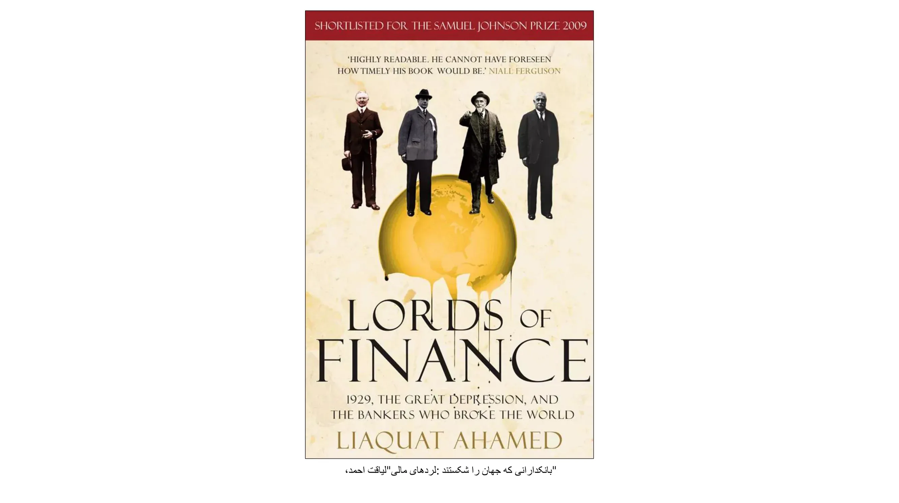

### موازی‌های معاصر

#### ۱. دستکاری سیاست پولی برای کنترل اقتصاد.

در تاریخ جمهوری وایمار، مشخص است که صنعتگران تمایلی به افزایش ارزش مارک نداشتند. توانایی آن‌ها در قرض گرفتن و بازپرداخت بدهی‌هایشان با ارزی به شدت کاهش‌یافته، به آن‌ها مزیت قابل‌توجهی می‌داد. این مکانیزم ساخت مجتمع‌های صنعتی عظیم را با تقریباً هیچ هزینه‌ای تسهیل می‌کرد. این صنعتگران از افزایش ارزش مارک می‌ترسیدند زیرا فعالیت‌های آن‌ها را مختل می‌کرد. برخی حتی تورم شدید را به عنوان یک توسعه مثبت می‌دیدند و معتقد بودند که این امر اشتغال جمعیت را تضمین می‌کند. با این حال، آن‌ها تأثیرات مخرب این تورم بر پس‌اندازها و اقتصاد به طور کلی را درک نمی‌کردند. برای این بازیگران اقتصادی، چاپ پول یک نعمت بود.

> وایمار: "به همین دلیل، افزایش ارزش مارک به شدت مورد ترس بود و حتی چند هفته 'ثبات' پس از جنوا باعث رکود در تجارت شد."

> وایمار: "محافل صنعتی با خطر مواجه شدند که پول نقد ارزشمندتر از کالاها شود و فروپاشی رخ دهد زمانی که همه تلاش کنند دارایی‌های خود را به پول نقد تبدیل کنند."

می‌توان یک مقایسه معاصر با اظهارات کریستین لاگارد انجام داد که پیشنهاد می‌کند شهروندان باید چشم‌انداز اشتغال را بر حفاظت از پس‌اندازهای خود اولویت دهند. درست مانند صنعتگران وایمار، او به نظر می‌رسد چاپ پول را به عنوان ابزاری برای تحریک اشتغال، به قیمت ارزش پس‌اندازها، توصیه می‌کند.

> کریستین لاگارد: "ما باید خوشحال‌تر باشیم که شغلی داریم تا اینکه ببینیم پس‌اندازمان محافظت می‌شود."

#### ۲. مالکیت خصوصی در زمان‌های درگیری

تاریخ جمهوری وایمار نشان می‌دهد که در این دوره، دارایی‌ها و سرمایه‌های نگهداری شده در خارج مصادره شدند. این اقدام یادآور رویدادهای اخیر در روسیه است، به‌ویژه در آغاز یک درگیری. این وضعیت‌ها واقعیت نگران‌کننده‌ای را برجسته می‌کنند: در زمان‌های بحران، احترام به مالکیت خصوصی می‌تواند به خطر بیفتد. این یک موازی تاریخی و معاصر است که پیامدهای بالقوه بحران‌ها بر حقوق فردی را نشان می‌دهد.

> وایمار: "تمام سرمایه آلمان که در خارج نگهداری می‌شد، مصادره شده بود."

> [20minutes.fr](https://www.20minutes.fr/monde/3286947-20220513-guerre-ukraine-geler-avoirs-russes-vol-non-redistribuer-kiev-poserait-lourdes-questions): "تقریباً ۳۰۰ میلیارد دلار از ذخایر روسیه که در خارج نگهداری می‌شدند، واقعاً به عنوان بخشی از تحریم‌های غربی مسدود شده‌اند، از مجموع ۶۴۰ میلیارد دلار ذخایری که توسط بانک مرکزی روسیه نگهداری می‌شود."

#### ۳. مفهوم قیمت بازار

در دوران جمهوری وایمار، کشاورزان نارضایتی خود را از "اوملاگه" ابراز کردند، که آن‌ها را مجبور می‌کرد هر سال دو میلیون تن اول گندم تولیدی خود را تحویل دهند. این مقررات منجر به این شد که نیمی از کل نان Supply با قیمت‌های یارانه‌ای به بازار عرضه شود. از ماه اوت به بعد، قرار بود به این کشاورزان قیمت بازار جهانی پرداخت شود، زیرا اگرچه مجبور بودند گندم خود را با قیمت‌های کاهش‌یافته تحویل دهند، اما همچنان باید کودها را با نرخ‌های بازار جهانی خریداری می‌کردند.

این وضعیت یک مسئله مرکزی مرتبط با مفهوم قیمت بازار در دوران ابر تورم را مطرح می‌کند. در زمینه آلمان آن زمان، کشاورزان مجبور بودند گندم خود را به قیمتی پایین‌تر از ارزش آن بفروشند، در حالی که باید کودها را به قیمت‌های بازار جهانی تهیه می‌کردند. چنین اختلاف اقتصادی چالش‌های ناشی از قیمت‌های مواد غذایی امروز را برجسته می‌کند. تولیدکنندگان کشاورزی، با افزایش هزینه‌های ورودی به دلیل تورم مواجه هستند و این هزینه‌ها را به محصولات نهایی منتقل می‌کنند. انتقاد از آنها برای این افزایش به معنای نادیده گرفتن پویایی‌های قیمت‌گذاری بازار و فشارهای اقتصادی است که با آن مواجه هستند. فروش به قیمت‌های مصنوعی پایین در حالی که هزینه‌های بالا را متحمل می‌شوند، برای هیچ کسب‌وکاری پایدار نیست.

> وایمار: "منافع کشاورزی از 'اوملاگه' ناراضی بودند، تحویل اجباری اولین دو میلیون تن گندم تولید شده هر سال، که اجازه می‌داد نیمی از کل نان Supply به قیمت‌های پایین فروخته شود. از ماه اوت، به کشاورزان قیمت بازار جهانی پرداخت می‌شد زیرا در حالی که مجبور بودند گندم را به قیمت‌های پایین بفروشند، همیشه باید قیمت بازار جهانی را برای کودها پرداخت می‌کردند."

#### ۴. انکار ارتباط بین پول Supply و تورم

> وایمار: "او به دیدگاه خود که پول Supply نه به سطح قیمت‌ها و نه به نرخ‌های Exchange مربوط می‌شود، محکم پایبند ماند;"

در زمان‌های مدرن، این روند همچنان ادامه دارد، همان‌طور که در مثال فصل قبلی از فهرست توضیحاتی که توسط اقتصاددانان و مؤسسات اقتصادی مختلف برای توجیه تورم ارائه شده است، مشاهده می‌شود. این دلایل متنوع هستند و از رویدادهای فرهنگی و سلبریتی‌هایی مانند تیلور سوئیفت، زلدا، یا بیانسه، تا عوامل جهانی مانند جنگ و همه‌گیری را شامل می‌شوند. همه این دلایل، اگرچه ممکن است به نوسانات اقتصادی کوتاه‌مدت کمک کنند، اما توجه را از علت واقعی و اساسی منحرف می‌کنند: گسترش پول Supply.

#### ۵. شرکت‌های زامبی

> وایمار: "تثبیت به دوره‌ای پایان داد که کارآفرینان می‌توانستند به هر میزان که می‌خواستند به هزینه دیگران وام بگیرند. تعداد بسیار زیادی از شرکت‌ها که در دوران فراوانی پول ایجاد یا گسترش یافته بودند، به محض کمیاب شدن سرمایه به سرعت غیرمولد شدند."

یک شرکت زامبی کسب‌وکاری است که در شرایط عادی بازار، ورشکسته یا نزدیک به ورشکستگی خواهد بود، اما عمدتاً به لطف وام‌گیری با هزینه کم به فعالیت خود ادامه می‌دهد. این شرکت‌ها فقط به اندازه‌ای درآمد دارند که بتوانند بدهی‌های خود را پوشش دهند اما قادر به رشد قابل توجهی نیستند.

مفهوم شرکت‌های زامبی جدید نیست. در واقع، این مفهوم در دوران جمهوری وایمار وجود داشت. در آن زمان، بسیاری از شرکت‌ها به نظر می‌رسید که در حال شکوفایی هستند و عمدتاً از دسترسی به اعتبار رایگان بهره‌مند می‌شدند. آن‌ها مبالغ قابل توجهی را با این انتظار که بعداً با ارزی که به دلیل تورم شدید کاهش یافته بود بازپرداخت کنند، قرض می‌گرفتند. اما زمانی که تورم متوقف شد و ارزش مارک آلمان دوباره افزایش یافت، این شرکت‌ها که از نظر عملیاتی یا مالی واقعاً قابل دوام نبودند، غیرسودآور شدند و مجبور به تعطیلی شدند.

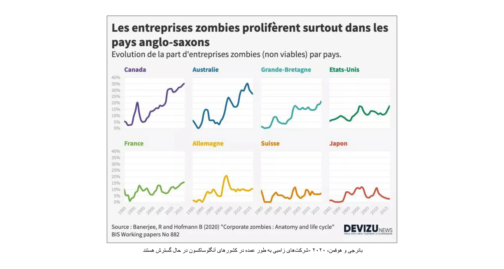

پدیده شرکت‌های زامبی محدود به آلمان پس از جنگ نیست. حتی امروز، بسیاری از شرکت‌های بزرگ به دلیل دسترسی ویژه به اعتبار با نرخ بهره بسیار پایین به رشد خود ادامه می‌دهند. اگر مجبور بودند با نرخ‌های متعارف‌تر وام بگیرند، بسیاری از آن‌ها دیگر سودآور نبودند. این موضوع به ویژه در سال ۲۰۲۳، پس از یک دوره طولانی از نرخ‌های بهره نزدیک به صفر، که اکنون نرخ‌ها شروع به افزایش کرده‌اند، مرتبط است. این تغییر اخیر در چشم‌انداز مالی بدون شک آزمونی تعیین‌کننده برای این شرکت‌ها خواهد بود که زمانی به عنوان "زامبی" شناخته می‌شدند.

#### 6. سریع ثروتمند شوید!

تاریخ نشان می‌دهد که در مواردی افراد به دنبال انباشت سریع ثروت بودند، همان‌طور که در وایمار و زیمبابوه از طریق آربیتراژ این کار را انجام دادند. امروزه، روند مشابهی با ظهور برخی [ارزهای دیجیتال](https://planb.academy/resources/glossary/cryptocurrency) مشاهده می‌شود. مردم با وسوسه سودهای سریع، ریسک می‌کنند به امید افزایش نمایی سرمایه‌گذاری خود. این رویکرد یادآور دوره‌های ابر تورم است، جایی که از آربیتراژ برای کسب سود سریع استفاده می‌شد، اغلب به بهای دیگران.

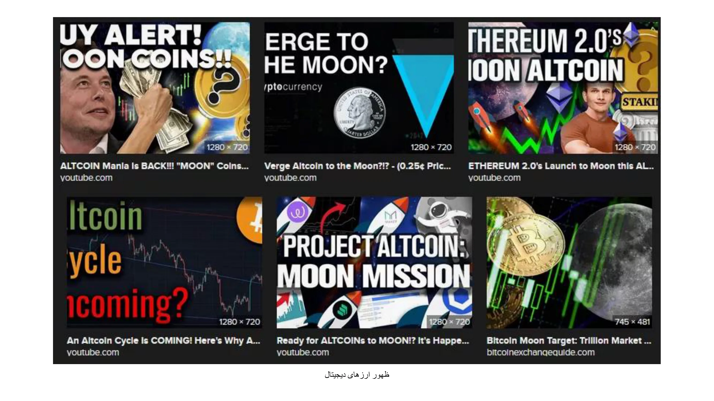

#### ۷. پس‌انداز، راه‌حلی برای مقابله با عدم‌قطعیت

> تأثیر فراگیر و مخرب فرسایش مداوم ارزش سرمایه و درآمد، و همچنین عدم اطمینان نسبت به آینده.

شایسته است به نقل قولی اشاره کنیم که تأثیر مخرب فرسایش ارزش سرمایه بر همبستگی اجتماعی و همچنین عدم قطعیتی که ایجاد می‌کند را برجسته می‌کند. این نقل قول بیان می‌کند: "تأثیر فراگیر و مخرب فرسایش مداوم ارزش سرمایه و درآمد، و همچنین عدم قطعیت درباره آینده."

تصور کنید سناریویی که در آن خانواده یا عزیزانی دارید که می‌خواهید از آن‌ها محافظت کنید. شما Hard کار می‌کنید و پس‌انداز می‌کنید تا برای عدم قطعیت‌های آینده آماده باشید. اگر همه چیز قابل پیش‌بینی بود، پس‌انداز بی‌فایده می‌شد. اما در مواجهه با شرایط غیرمنتظره، مانند خرابی ماشین، پس‌انداز به یک نجات‌دهنده تبدیل می‌شود. آن‌ها عدم قطعیت جهان را کاهش می‌دهند. با این حال، در دوران ابر تورم، پس‌انداز کردن به یک چالش تبدیل می‌شود. پول به سرعت ارزش خود را از دست می‌دهد و برنامه‌ریزی بلندمدت را دشوار می‌کند. این بی‌ثباتی مالی می‌تواند generate استرس و اضطراب ایجاد کند.

امروز، با کاهش قدرت پس‌انداز، سرمایه‌گذاری جایگزین آن شده است. با این حال، این رویکرد خطرات خاص خود را دارد. پس‌انداز همیشه راه‌حلی در برابر عدم قطعیت بوده است. داشتن ذخایر مالی برای مقابله با شرایط غیرمنتظره به آرامش ذهن کمک می‌کند و انسجام اجتماعی را تقویت می‌کند. در نتیجه، حفظ قدرت پس‌انداز ما برای حفظ ثبات اجتماعی و فردی ضروری است.

## تغییر واحد پول در آمریکای لاتین

<chapterId>918eafd7-409d-5205-ad52-a52e63b23a64</chapterId>

اکنون به دوره‌های مختلف تغییر واحد پول در کشورهای آمریکای لاتین خواهیم پرداخت.

### توضیح نمودارها

در اسلاید، در سمت چپ، سال‌های تغییر واحد پول، نام ارز جدید و نرخ Exchange با ارز قدیمی آمده است. با در نظر گرفتن مثال آرژانتین، پزو موندای ناسیونال با نرخ 25 به 1 از ارز قبلی، پزو رئال، تبدیل شد. در این زمینه، ما به بررسی تکامل ارز آرژانتین در طول زمان خواهیم پرداخت. علاوه بر این، ما نام‌گذاری اولیه و نهایی اسکناس‌ها را برای هر دوره مشخص خواهیم کرد.

در سمت راست اسلاید، نموداری از تورم نمایش داده شده است. پیکان‌های قرمز سال‌های ابر تورم را نشان می‌دهند، طبق معیار کاگان که نرخ تورم ۵۰٪ در ماه است. این معیار گاهی می‌تواند به تفسیرهای مبهم منجر شود، زیرا سال‌هایی با نرخ تورم بالا ممکن است تعریف دقیق ابر تورم را برآورده نکنند.

شایان ذکر است که تغییر واحد پول، که یک اقدام معمول توسط دولت‌ها در دوره‌های تورم است، یک رخداد قابل توجه است. با این حال، این اقدام مشکل اساسی تورم یا ابر تورم را حل نمی‌کند. این فقط روشی برای تغییر نام ارز و حذف صفرها است، بدون اینکه واقعاً به علت اصلی ابر تورم، یعنی گسترش پول Supply، بپردازد. در یک ویدئوی بعدی، راه‌حل‌های واقعی برای Address را بررسی خواهیم کرد و مشکل ابر تورم را حل خواهیم کرد. در این مجموعه، پیامدهای تغییر واحد پول ساده بدون اصلاحات کافی را برجسته خواهیم کرد: تورم ادامه دارد.

پس از آرژانتین، مطالعه ما برزیل، بولیوی، پرو، نیکاراگوئه و ونزوئلا را پوشش خواهد داد. ما به بررسی تغییرات واحد پولی که در این کشورها رخ داده است، خواهیم پرداخت.

### آرژانتین

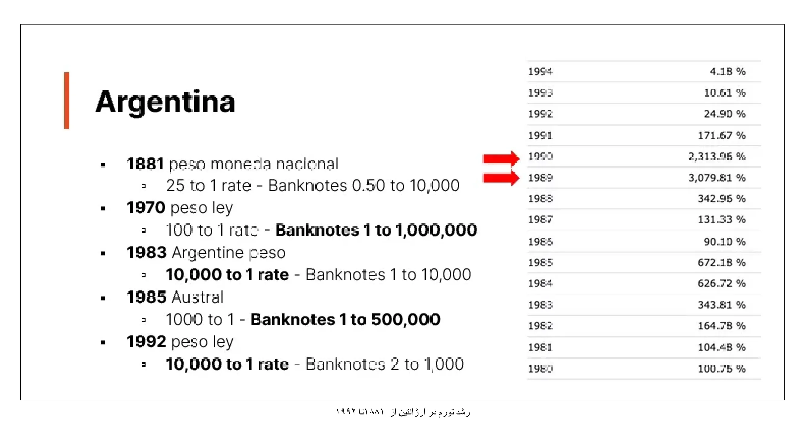

قبل از سال 1826، آرژانتین از دلار اسپانیایی استفاده می‌کرد. پس از استقلال در سال 1816، ارز خود را بر اساس رئال اسپانیایی معرفی کرد که منجر به ایجاد ارزی مشابه شد. جدول از سال 1881 آغاز می‌شود، سال معرفی "پزو مونه‌دا ناسیونال"، با اسکناس‌هایی تا 10,000. پس از آن "پزو لی" معرفی شد که با نرخ 100 به 1 مبادله می‌شد و اسکناس‌هایی تا یک میلیون داشت. سپس "پزو آرژانتینی" با نرخ Exchange به میزان 10,000 به 1 (معادل حذف چهار صفر) آمد و اسکناس‌هایی تا 10,000 داشت. در سال 1985، "استرال" معرفی شد و با نرخ 1,000 به 1 مبادله شد، با اسکناس‌هایی تا 500,000. در سال 1992، "پزو لی" فعلی با نرخ 10,000 به 1 تأسیس شد و بار دیگر چهار صفر حذف شد. تنها سال‌های 1989 و 1990 دچار ابر تورم شدند.

### برزیل

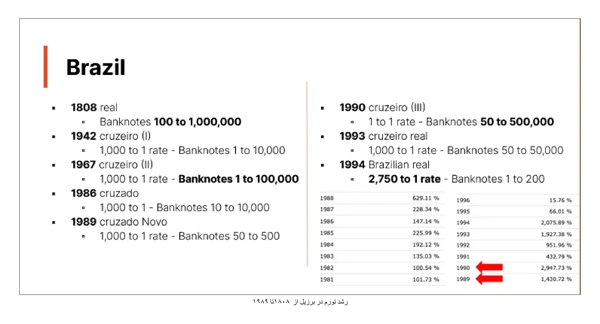

برزیل نمونه قابل توجهی از تغییر واحد پولی است، همانطور که تاریخچه تغییرات ارز آن نشان می‌دهد. قبل از استقلال، برزیل از رئال پرتغالی به عنوان ارز خود استفاده می‌کرد. با این حال، از سال 1747، این کشور شروع به استفاده از "رئال برزیلی" خود کرد، مدت‌ها قبل از اعلام استقلال در سال 1822. جدول از سال 1818 شروع می‌شود و آغاز صدور اسکناس‌های برزیلی را نشان می‌دهد. پیش از این، ارز عمدتاً به صورت سکه بود. این اسکناس‌ها به ارزش‌هایی تا یک میلیون رئال می‌رسیدند.

از سال 1942، برزیل یک سری تغییرات در واحد پول خود را آغاز کرد. در بیشتر موارد (1942، 1967، 1986، 1989، 1993)، نرخ تبدیل 1:1,000 بود. در سال 1990، تغییر نام بدون تبدیل رخ داد. توالی این ارزها به شرح زیر است:

- رئال‌ها (نسخه قدیمی) تا سال 1942.
- کروزئیروس در سال 1942.
- کروزئیروس (نسخه جدید) در سال ۱۹۶۷.
- کروزادوس در سال 1986.
- کروزادوس نووس در سال 1989.
- بازگشت به کروزرو در سال 1990.
- کروزریوس رئال در سال 1993.
- سرانجام، رئال برزیل در سال 1994.

بالاترین اسکناس به 500,000 رسید و آخرین تغییر واحد پول در سال 1994 با نرخ 2,750 به 1 انجام شد. سال‌های 1989 و 1990 با ابر تورم مشخص شدند، در حالی که در سال‌های 1993-1994 نرخ‌های بالای تورم وجود داشت که به آستانه ابر تورم (50% در ماه) نرسید. پس از این دوره پرتلاطم، برزیل بار دیگر با حذف چند صفر واحد پول خود را تغییر داد.

### بولیوی

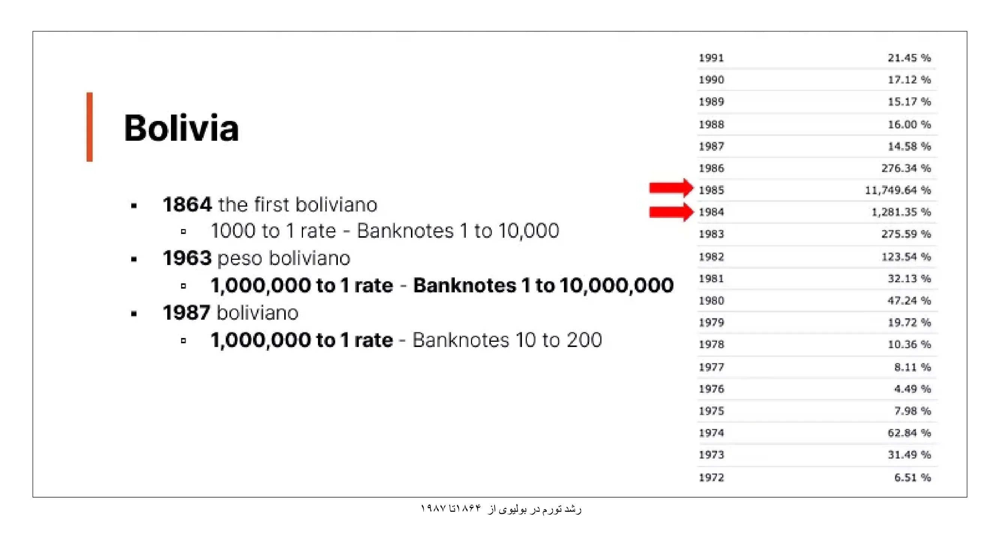

بولیوی نمونه دیگری از کشوری است که دوره‌های تورم شدید را تجربه کرده و نیاز به تغییر واحد پولی داشته است. در اینجا خلاصه‌ای از تاریخچه پولی آن آمده است:

پیش از استقلال خود در سال 1825، بولیوی از دلار اسپانیایی به عنوان ارز خود استفاده می‌کرد. پس از استقلال، این کشور بین سال‌های 1827 و 1864 بولیویان سول را معرفی کرد که جایگزین دلار اسپانیایی شد. با این حال، شایان ذکر است که اولین اسکناس‌ها در بولیوی تنها در سال 1864 معرفی شدند.

در سال 1864، اولین "بولیویانو" معرفی شد، با نرخ Exchange برابر با 1,000 به 1 در مقایسه با سول بولیوی. این ارز در گردش باقی ماند تا زمانی که به یک واحد پولی 10,000 بولیویانو رسید.

سپس، بولیوی ارز خود را به "پزوی بولیوی" تغییر داد که دچار ابر تورم شدیدی شد و در نهایت به ارزش‌هایی تا ۱۰ میلیون رسید. این دوره از تورم در سال‌های ۱۹۸۴-۱۹۸۵ به اوج خود رسید و نرخ‌های تورم ماهانه اغلب به آستانه ابر تورم ۵۰٪ نزدیک می‌شد. برای ارائه یک دیدگاه، یک نرخ تورم ثابت ۵۰٪ در ماه در طول یک سال کامل منجر به نرخ تورم سالانه‌ای در حدود ۱۲,۸۰۰٪ می‌شود. در سال ۱۹۸۵، نرخ تورم سالانه بولیوی به ۱۱,۷۴۹٪ رسید که نشان می‌دهد تورم تقریباً هر ماه به آستانه ۵۰٪ نزدیک یا از آن فراتر رفته بود.

در پاسخ به این بحران پولی، بولیوی در سال ۱۹۸۷ یک واحد پولی جدید به نام "بولیویانو" معرفی کرد، با نرخ Exchange معادل ۱ میلیون پزوی بولیوی برای ۱ بولیویانو. این نسخه از بولیویانو همچنان در گردش است.

این یک مرور کلی از تاریخ پولی پر تلاطم بولیوی است که با دوره‌های ابر تورم و تغییر واحد پولی مشخص می‌شود.

### پرو

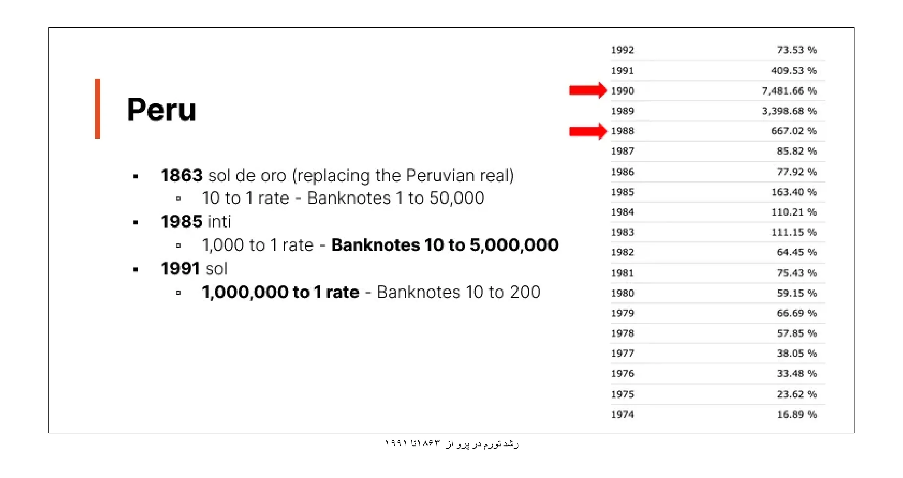

پرو یک مورد جالب در مورد اثرات قانون دلخواه 50٪ ارائه می‌دهد. با شروع از تاریخچه پولی آن، پرو تا قرن 19 از طلای اسپانیایی استفاده می‌کرد، زمانی که در سال 1821 استقلال خود را اعلام کرد. دلار پرویی از 1822 تا 1863 در استفاده بود. در سال 1863، رئال پرویی با سُلدی اورو جایگزین شد، با نرخ 10 به 1، که به حداکثر ارزش 50,000 رسید. در سال 1985، ارز "اینتی" با نرخ تبدیل 1000 به 1 معرفی شد و به 5 میلیون رسید. در سال 1991، "SOL" با نرخ Exchange از 1 میلیون به 1 راه‌اندازی شد، با اسکناس‌هایی از 10 تا 200.

بررسی دوره‌های تغییر واحد پول، سال 1988 به‌عنوان سالی با ابر تورم در نظر گرفته می‌شود، به‌ویژه در ماه سپتامبر. دوره‌ای از ابر تورم نیز در ماه‌های جولای-آگوست 1990 مشاهده شد. در سال 1988، نرخ تورم سالانه 667% بود و در ماه سپتامبر به اوج 50% رسید. در مقابل، سال 1989 نرخ تورم 3000% را تجربه کرد بدون اینکه هیچ ماهی بیش از 50% باشد، بنابراین به‌عنوان ابر تورم طبقه‌بندی نشد. در سال 1990، تورم به اوج 7481% رسید. واضح است که قانون 50% می‌تواند دلخواه باشد، زیرا سال 1988 به‌عنوان سالی با ابر تورم در نظر گرفته شد، برخلاف سال 1989. اگر این قانون بازنگری شود، ممکن است عاقلانه باشد که آستانه را کاهش دهیم تا دوره‌هایی مانند آنچه پرو در سال 1989 تجربه کرد را شامل شود.

> درک آنچه در حال وقوع است
>

> نکته کلیدی درک درباره بازتعیین ارزش ارز این است که وقتی ارزش ارز به ارقام نجومی، مانند ۵ یا ۱۰ میلیون می‌رسد، بازتعیین می‌شود. این فرآیند می‌تواند چندین بار تکرار شود و شامل تغییر در ارز باشد. نتیجه این است که پس‌انداز افراد می‌تواند به شدت تحت تأثیر قرار گیرد، حتی در غیاب ابر تورم. به عنوان مثال، اگر کسی در یک سال ۱,۰۰۰ دلار پس‌انداز کند و موفق شود ۱۰۰ دلار کنار بگذارد، در سال بعد، کمترین اسکناس ممکن است ۱,۰۰۰ دلار باشد و ۱۰۰ دلار پس‌انداز شده قبلی بی‌ارزش شود. چنین فرسایش پس‌انداز نیازی به ابر تورم آشکار ندارد. حتی اگر فردی طی ده سال گذشته ۱۰,۰۰۰ دلار پس‌انداز کرده باشد، آن مبلغ می‌تواند به مقداری ناچیز تبدیل شود که قادر به خرید یک بطری آب ساده نباشد. این واقعیت در بسیاری از کشورهایی که بازتعیین ارزش ارز را تجربه کرده‌اند، مشهود است، حتی اگر تنها چند ماه به عنوان ابر تورمی طبقه‌بندی شده باشند. در مقابل، برخی کشورها مانند نیکاراگوئه سال‌های متوالی ابر تورم را تجربه کرده‌اند.

### نیکاراگوئه

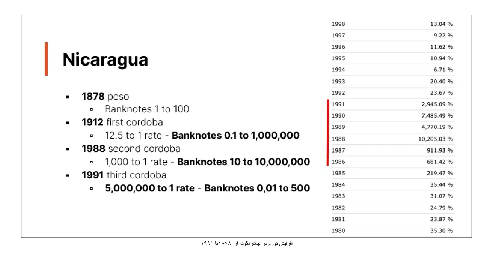

نیکاراگوئه، که قبلاً تحت سلطه اسپانیا بود، در ابتدا از دلار اسپانیایی استفاده می‌کرد، مانند بسیاری از کشورهای دیگر که توسط اسپانیا مستعمره شده بودند. پس از ادغام در امپراتوری اسپانیا، امپراتوری مکزیک و سپس جمهوری فدرال آمریکای مرکزی، نیکاراگوئه استقلال خود را اعلام کرد. از سال ۱۸۷۸، پزو به عنوان ارز رسمی کشور معرفی شد و ارزش آن بین ۱ تا ۱۰۰ نوسان داشت. در سال ۱۹۱۲، کشور اولین کوردوبا را معرفی کرد، که پس از آن دومین در سال ۱۹۸۸ و سومین در سال ۱۹۹۱ معرفی شد که همچنان در حال استفاده است. اولین کوردوبا به ارزش ۱ میلیون و دومین به ۱۰ میلیون رسید. تغییر واحد پول در سال ۱۹۹۱ پس از چندین سال ابر تورم انجام شد.

### ونزوئلا

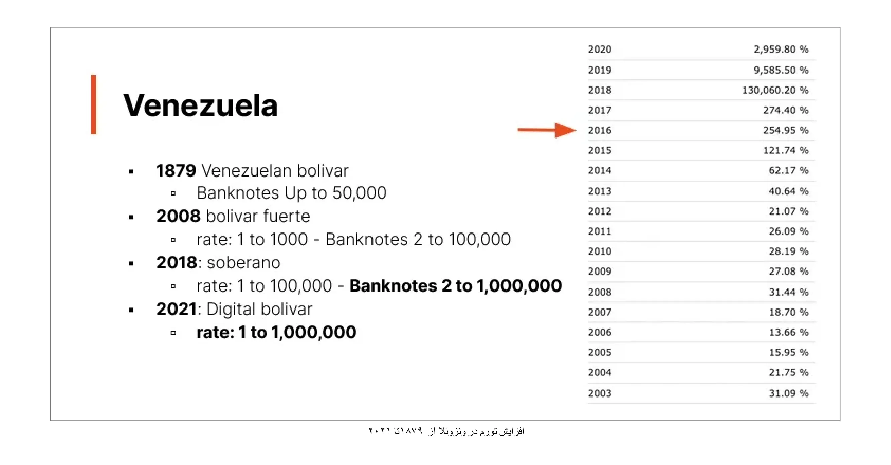

ونزوئلا آخرین کشوری است که در این ویدئو ذکر شده است. این کشور در طول زمان چهار بار تغییر واحد پولی را تجربه کرده است. در روزهای اولیه، ونزوئلا از دلار اسپانیایی استفاده می‌کرد تا اینکه در سال 1811 استقلال خود را اعلام کرد. در سال 1879، بولیوار را به عنوان واحد پول رسمی معرفی کرد که تا سال 1983 در جریان بود، زمانی که دولت سیستم نرخ شناور Exchange را با استفاده از دلار انتخاب کرد.

یک واقعیت قابل توجه درباره ونزوئلا عضویت آن در اتحادیه پولی لاتین است. این اتحادیه شامل سکه‌هایی مانند ۵ پزتا از اسپانیا، ۵ دراخما از یونان، ۵ بولیوار از ونزوئلا، ۵ لیره از ایتالیا، ۵ فرانک بلژیک و ۵ فرانک فرانسه بود.

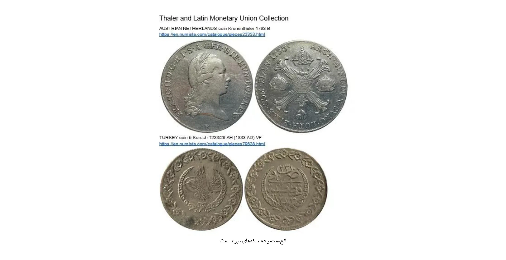

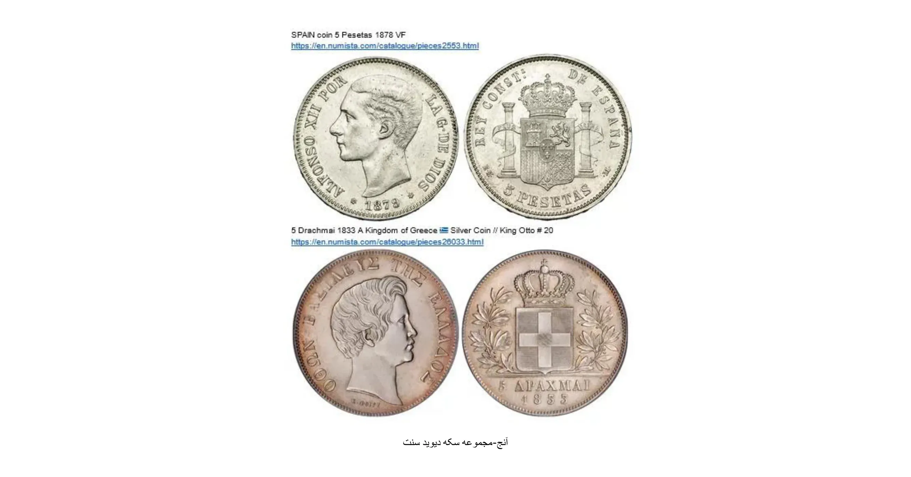

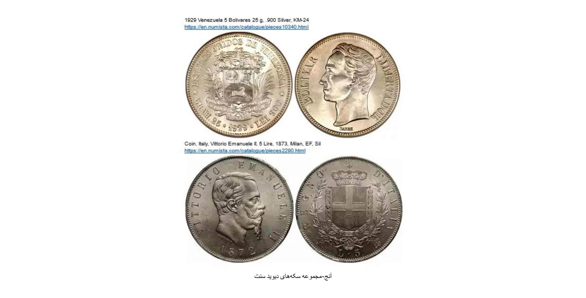

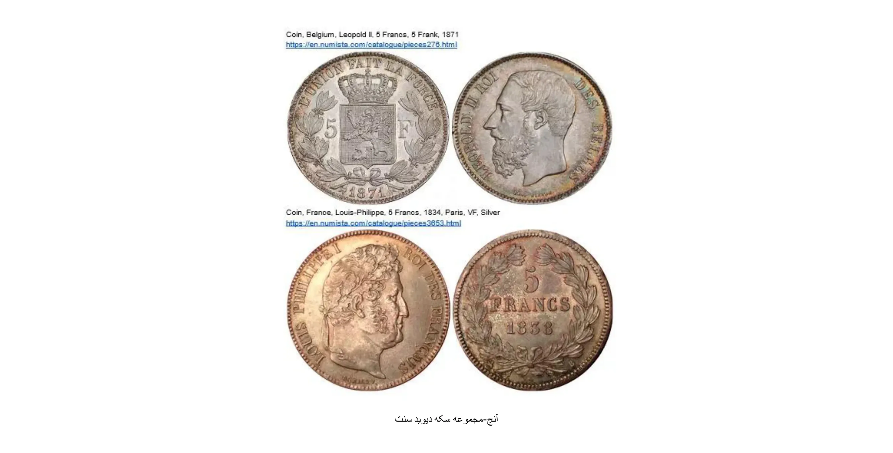

در این دوره، بولیوار 5 Coin از ونزوئلا همان وزن کشورهای عضو اتحادیه، از جمله ایتالیا، اسپانیا، بلژیک و فرانسه را داشت. این بولیوارها از نقره ساخته شده بودند، با یک Coin خاص از سال 1929 که 25 گرم وزن داشت و خلوص آن 900 یا 90٪ نقره خالص بود. با قیمت فعلی نقره، این Coin تقریباً 17 تا 18 دلار (دلار آمریکا) ارزش دارد.

پس از پذیرش نرخ شناور Exchange در سال 1983، چندین بازارزش‌گذاری انجام شد:

- در سال 2008، بولیوار فوئرته، یا "بولیوار قوی"، معرفی شد و به 100,000 رسید قبل از اینکه یک بازارگانی از هزار به یک انجام شود.
- در سال ۲۰۱۸، سوبرانو معرفی شد و اسکناس‌ها به ۱ میلیون رسیدند. در سال ۲۰۲۱، با بولیوار دیجیتال جایگزین شد که آن هم به ۱ میلیون رسید، قبل از یک نام‌گذاری مجدد از یک میلیون به یک. امروز، اسکناس ۱۰ یا ۲۰ معادل ۱۰ میلیون یا ۲۰ میلیون در سوبرانو است.

قبضی‌های این دوره، که به سال ۲۰۱۸ بازمی‌گردند، در کنفرانس‌های مختلف Bitcoin در بیاریتز، تورنتو و میامی توزیع شده‌اند. این قبضی‌های سوبرانو به حداکثر ارزش ۱ میلیون رسیدند. سپس یک بازارزش‌گذاری انجام شد که ارزش یک میلیون را به حدود ۳ سنت کاهش داد. در حال حاضر، ۱۰ قبضی ۱ میلیون معادل یک قبضی ۱۰ است. از سال ۲۰۱۶، ونزوئلا با ابر تورم مواجه بوده است که نمایانگر دوره ۵۷ام در یک جدول خاص است.

در ویدیوی بعدی، مجموعه‌ای از اسکناس‌های ابر تورمی ارائه خواهد شد که بر ونزوئلا و سایر کشورهای فهرست شده تمرکز دارد. این مجموعه تقریباً شامل تمام اسکناس‌های ونزوئلا است. مطالعه بر روی تغییر واحد پولی مختلف برای هر یک از کشورهای ذکر شده تمرکز خواهد کرد. علاوه بر این، به بررسی تغییر واحد پولی در زیمبابوه پرداخته خواهد شد، موضوعی که بسیار مورد توجه است.

### نتیجه‌گیری

ما دیده‌ایم که ابر تورم تنها شاخص یک فاجعه اقتصادی نیست. تغییر واحد پول چندین بار، حذف صفرها، یا تغییر نام ارز تأثیرات مستقیمی بر جمعیت دارد، از دست دادن کمک‌ها تا مشکلات غذایی. اگرچه ابر تورم نگران‌کننده است، تعداد تغییر واحد پول، همان‌طور که در برزیل مشاهده شده، واقعیت پیچیده‌تری را نشان می‌دهد.

بر اساس معیار تورم 50٪ در ماه، چندین دوره می‌توانستند به عنوان ابر تورم طبقه‌بندی شوند. این به ویژه زمانی صادق است که معیارهای سازمان بین‌المللی حسابداری را بررسی کنیم، که ویژگی‌هایی مانند ترک سریع ارز توسط جمعیت، شاخص‌بندی دستمزدها و وام‌های با نرخ بهره بالا برای جبران تورم را در نظر می‌گیرد.

در نتیجه، ابر تورم تنها یک جنبه از چالش‌های اقتصادی است. تورم بالا به تنهایی می‌تواند به همان اندازه مخرب باشد. بخش بعدی به بررسی راه‌حل‌های ممکن برای غلبه بر ابر تورم خواهد پرداخت.

## چگونه بر ابر تورم غلبه کنیم

<chapterId>e3484a31-a851-5f92-8af5-00eddae67db1</chapterId>

### چگونه به تورم متوسط و بالا پایان دهیم

نتیجه‌گیری‌های ذکر شده از کتاب "نظام پولی و تورم" نوشته پیتر برنهولتز استخراج شده‌اند. به گفته برنهولتز، تنها روش برای پایان دادن به تورم، اجرای اصلاحات پولی و اعمال محدودیت‌های مالی بر دولت است. این محدودیت‌ها شامل ایجاد نهادی مانند بانک مرکزی است که به‌طور مستقل از تصمیمات سیاسی دولت عمل می‌کند. تورم بالا و ابر تورم اغلب نتیجه تأمین مالی کسری بودجه از طریق ایجاد پول است. برای کاهش تورم Address، ضروری است که رشد پول Supply کاهش یابد. برنهولتز همچنین پیشنهاد می‌کند که این رشد پولی باید نسبت به کشورهای همسایه باشد. نکته شگفت‌انگیز این است که در دوره‌های تورم بالا یا ابر تورم، ارزش کل پول Supply می‌تواند واقعاً کاهش یابد. یک مثال برجسته از این وضعیت زیمبابوه است.

### راه‌حل‌های خلاف‌مستقیم

هنگام مطالعه زیمبابوه، مشاهده شد که ۱۰ تریلیون واحد از پول Supply تمام ارزش خود را از دست داده‌اند. در وایمار، امکان چاپ دو سوم از کل ارزش اسمی ۶۵ میلیارد واحد از پول Supply در یک روز وجود داشت. این نشان می‌دهد که چگونه پول Supply می‌تواند کاهش ارزش یابد. برای رفع این وضعیت، لازم است که پول Supply به طور قابل توجهی افزایش یابد تا به سطح مناسبی برسد. سپس، اصلاحات پولی ضروری است. در شرایط تورم بالا، این اصلاح اجتناب‌ناپذیر است، اما باید اطمینان حاصل شود که پول کافی در گردش وجود دارد. پس از این مرحله، می‌توان محدودیت‌هایی بر دولت اعمال کرد.

بر اساس مشاهدات برنهولز، هنگام پرداختن به مشکلات تورم، نهادهایی مانند صندوق بین‌المللی پول و بانک جهانی همیشه مؤثرترین استراتژی‌ها را اتخاذ نمی‌کنند. در برخی موارد، زمانی که یک کشور نیاز به افزایش پول Supply خود دارد، این نهادها به دنبال کاهش آن هستند. کلید کار رسیدن به سطح پولی مناسب و سپس اعمال محدودیت‌هایی بر رشد آن است، به این ترتیب از تأمین مالی هزینه‌های دولتی از طریق ایجاد پول جلوگیری می‌شود.

جنبه جالبی که برنهولز مطرح می‌کند این است که موفقیت یک اصلاح پولی نه تنها به ارتباط فنی آن بستگی دارد بلکه به اعتمادی که مردم به آن دارند نیز وابسته است. برخی اصلاحات به خوبی طراحی شده ممکن است شکست بخورند زیرا عموم به آن‌ها اعتماد ندارند، در حالی که برخی دیگر، که به خوبی طراحی نشده‌اند، ممکن است موفق شوند زیرا مردم به آن‌ها اعتماد دارند. بنابراین، ادراک و اعتماد عمومی برای موفقیت یا شکست یک اصلاح پولی ضروری است Elements.

- در زیمبابوه، راه‌حلی که برای مقابله با تورم اتخاذ شد، دلاریزاسیون بود، به این معنا که آن‌ها دلار آمریکا یا ارزهای دیگر از کشورهای همسایه را پذیرفتند. این رویکرد مانع از چاپ پول توسط دولت به‌صورت دلخواه می‌شود.
- در آلمان، راه‌حل ایجاد یک ارز جدید به نام رنتن‌مارک بود. این ارز توسط دارایی‌های سرزمینی رایش پشتیبانی می‌شد و این استراتژی مؤثر واقع شد.

### مورد زیمبابوه

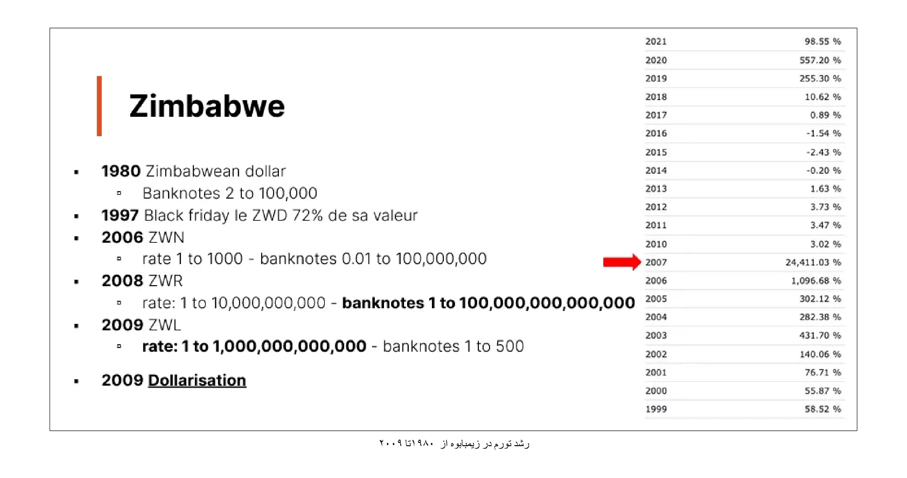

زیمبابوه در سال 1980 به استقلال رسید و ارز خود، دلار زیمبابوه، را معرفی کرد. در ابتدا، دو دلار زیمبابوه حدود 1.60 دلار آمریکا ارزش داشت. با این حال، در سال 1997، پس از اجرای تدابیر اجتماعی به نفع کهنه‌سربازان جنگ، ارز در روز جمعه سیاه 72% کاهش ارزش پیدا کرد. سپس، در اوایل دهه 2000، کشور برنامه‌ای برای بازتوزیع زمین آغاز کرد که شامل گرفتن زمین از مالکان سفیدپوست و توزیع آن به جمعیت محلی بود. این تصمیم به صادرات آسیب رساند زیرا مالکان جدید اغلب فاقد تخصص لازم برای مدیریت مزارع بزرگ‌مقیاس بودند. در نتیجه، در حالی که زیمبابوه در سال 1999 صادرکننده خالص بود، در سال 2003 به واردکننده خالص تبدیل شد.

در سال 2006، کشور نسخه جدیدی از ارز خود، ZWN، را با نرخ Exchange برابر 1 به 1,000 معرفی کرد. در سال 2008، یک واحد پولی دیگر، ZWR، با نرخ Exchange برابر 1 به 10 میلیارد معرفی شد. این امر منجر به ایجاد اسکناس‌های نمادین 100 تریلیون شد.

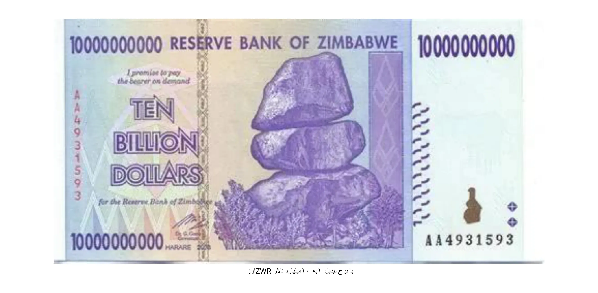

#### دلاریزاسیون و حل بحران

بنابراین، پس از سال 2009، با مواجهه با بحران پولی مداوم و ابرتورم گسترده، زیمبابوه ارز ملی خود را کنار گذاشت و استفاده از ارزهای خارجی، عمدتاً دلار آمریکا، را مجاز دانست. این تصمیم، اگرچه رادیکال بود، اما به ابرتورم پایان داد. یک درس کلیدی که باید آموخت این است که توقف انتشار بیش از حد پول و پایان دادن به تأمین مالی کسری بودجه توسط بانک مرکزی می‌تواند به جلوگیری از ابرتورم کمک کند.

با این حال، دلاریزاسیون یک راه‌حل معجزه‌آسا نیست. اگرچه می‌تواند به ابر تورم پایان دهد، اما چالش‌های اقتصادی دیگری را به همراه دارد. یکی از پیامدها از دست دادن سیاست پولی مستقل است. بدون داشتن ارز خود، یک کشور نمی‌تواند سیاست پولی خود را برای پاسخ به شوک‌های اقتصادی داخلی تنظیم کند.

در سال 2007، نرخ تورم زیمبابوه به آستانه 50% در ماه رسید و به طور رسمی کشور را در وضعیت ابر تورم قرار داد. پس از دلاریزاسیون در سال 2009، ابر تورم متوقف شد؛ با این حال، کشور همچنان با چالش‌های اقتصادی دیگری مواجه بود.

قابل توجه است که زیمبابوه از آن زمان تلاش کرده است تا ارز خود را مجدداً معرفی کند و نشانه‌های تورم بالا دوباره ظاهر شده‌اند. بر اساس گزارش برخی از سازمان‌های بین‌المللی، ممکن است این کشور دوباره معیارهای ابر تورم را برآورده کند، حتی اگر هنوز به آستانه رسمی ۵۰٪ در ماه نرسیده باشد. این موضوع به عنوان یادآوری خطرات انتشار بیش از حد پول و تأمین مالی کسری بانک مرکزی عمل می‌کند.

### نتیجه‌گیری

در کتاب من با عنوان "همه چیز درباره Bitcoin"، یک فصل کامل را به ابر تورم در زیمبابوه اختصاص داده‌ام. من رویدادهای مهم را با جزئیات شرح داده و مثال‌های مختلفی ارائه می‌دهم که نشان می‌دهند چگونه این کشور در نهایت به ابر تورم پایان داد.

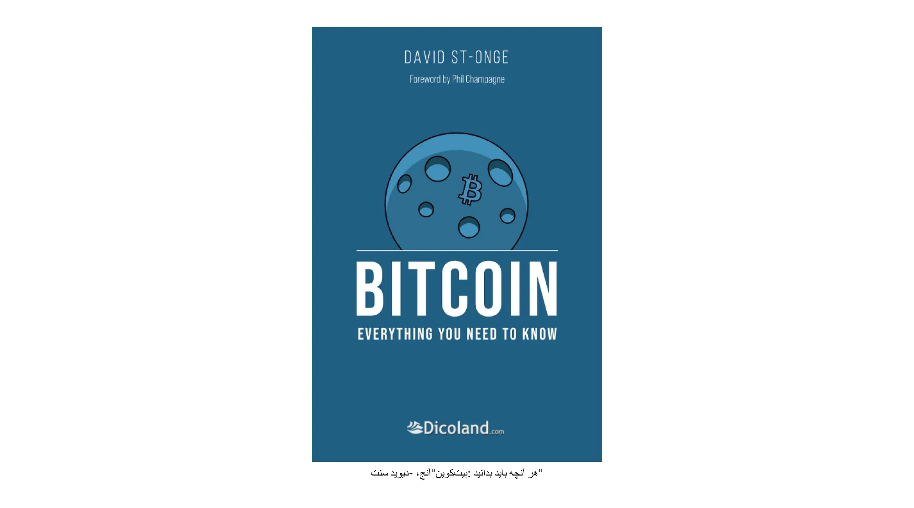

برای کسانی که به تجربه آلمان پس از جنگ جهانی اول کنجکاو هستند، به شدت کتاب کمیک "بانکدار رایش" را توصیه می‌کنم. این کتاب روایت می‌کند که چگونه آلمان موفق شد بر ابر تورم غلبه کند، به ویژه از طریق ایجاد رنتن‌مارک.

نکته کلیدی این است که چندین استراتژی برای غلبه بر ابر تورم وجود دارد. می‌توان به دلاریزاسیون روی آورد یا یک ارز جدید معرفی کرد. این راه‌حل‌ها تنها در صورتی کار خواهند کرد که جمعیت به آن‌ها اعتماد داشته باشد. اعمال محدودیت‌های سخت‌گیرانه بسیار مهم است. یک بانک مرکزی واقعاً مستقل ضروری است. نباید پول Supply را برای پوشش کسری‌های دولتی افزایش دهد. در مورد تورم ملایم، محدود کردن رشد پول Supply باید کافی باشد. با این حال، در مواجهه با ابر تورم، ابتدا داشتن یک پول Supply مناسب نسبت به اندازه اقتصاد بسیار مهم است. سپس، اعمال محدودیت‌های سخت‌گیرانه بر دولت برای تثبیت وضعیت ضروری است.

## ارائه مجموعه اسکناس‌های ابر تورم

<chapterId>f3ffbb47-3aeb-54bd-80a9-adccb0f419e2</chapterId>

[مجموعه اسکن‌شده را در *Bitcoin Educational Toolkit* کشف کنید (همچنین از بخش *منابع* پلتفرم Plan ₿ Academy در دسترس است.](https://penpot.planb.network/#/view?page-id=c157057b-fd28-8042-8004-4f081b21defc&file-id=c157057b-fd28-8042-8004-4f081b21defb&section=interactions&index=0&share-id=7154756b-3ebd-8040-8004-6475c2af5889&interactions-mode=show-on-click)

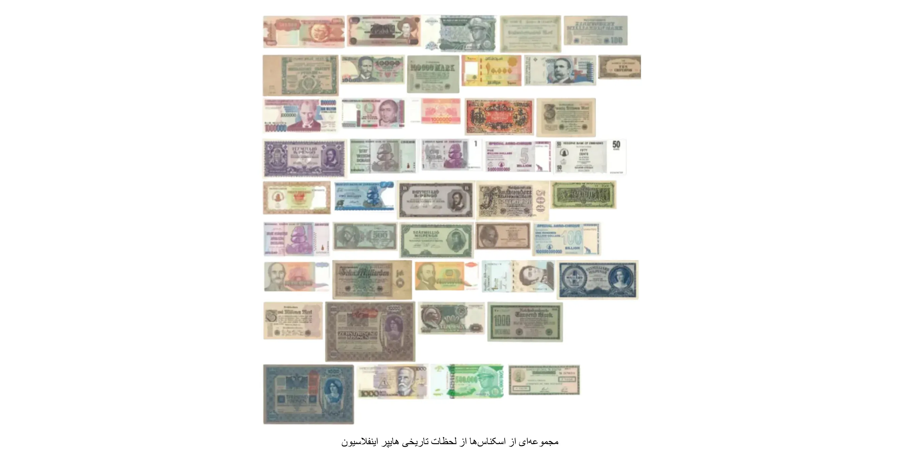

# چطور به اینجا رسیدیم؟

<partId>f66ca17e-be9e-5d30-a098-f7affd8962a1</partId>

## ظهور دومین Layer پول و بانک‌های مرکزی

<chapterId>0455ffe3-9d45-5a67-ac96-3f815dc507a1</chapterId>

رونویس:

ظهور دومین Layer پول و اولین بانک‌های مرکزی موضوعی جذاب است. این موضوع به طور گسترده در کتاب "Layered Money" نوشته نیک باتیا مورد بحث قرار گرفته است. من این کتاب را به کسانی که به تکامل و پیچیدگی‌های سیستم‌های پولی ما علاقه‌مند هستند، به شدت توصیه می‌کنم. هدف این بخش درک منشأ ایجاد پول و چگونگی منجر شدن آن به ابر تورم است.

### پول هرمی و بانک‌های مرکزی

#### فلورین

تاریخچه پول به قرن سیزدهم در ایتالیا بازمی‌گردد، به‌ویژه در شهر فلورانس. در آن زمان، فلورین و اسکناس‌های Exchange رایج بودند. یک نمونه قابل توجه فلورین است که با تصویر سنت جان باپتیست تزئین شده بود.

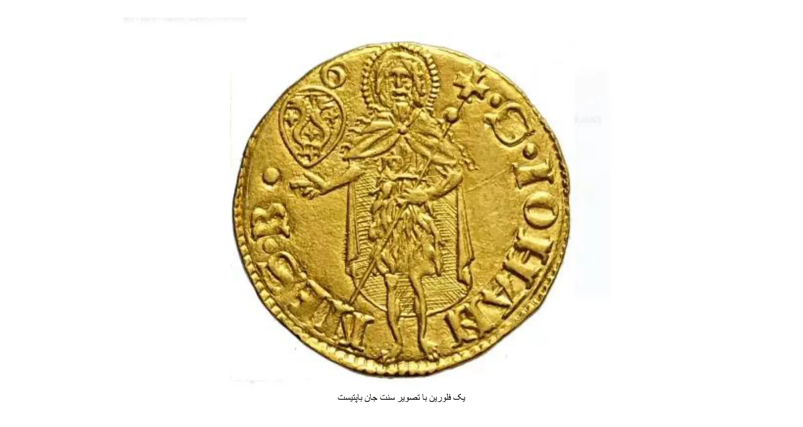

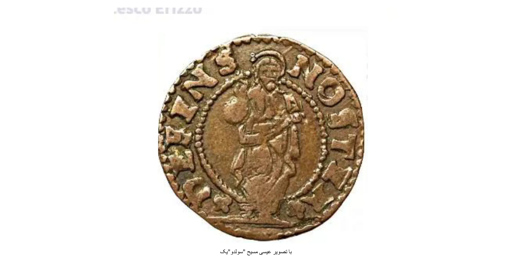

در حالی که داشتن یک فلورین اصل امروزه گران است، نسخه‌های بازتولید شده در دسترس هستند. همچنین ارزهای دیگری از آن زمان وجود دارند، مانند سولدو از ایالت‌های ایتالیایی در قرن هفدهم که تصویری از مسیح را نشان می‌دهد.

#### اسناد Exchange (قرن 13)

در آن زمان، روش معمول به شرح زیر بود: زرگران برای فلورین‌های سپرده‌شده، اسکناس‌های Exchange در Exchange صادر می‌کردند. این فلورین‌ها با دقت در خزانه‌هایشان نگهداری می‌شدند. بنابراین، طلای واقعی که توسط فلورین نمایندگی می‌شد، اولین Layer پول را تشکیل می‌داد، در حالی که اسکناس‌های Exchange دومین Layer را تشکیل می‌دادند. با این حال، نقدینگی این سیستم محدود بود. اگر کسی می‌خواست طلای خود را در Exchange برای اسکناس خود Redeem کند، معامله ساده بود. اما، مبادله این اسکناس‌ها بین افراد یک عمل معمول نبود.

#### بورس آنتورپ Exchange (قرن 16)

سهام آنتورپ Exchange یک نقطه عطف کلیدی در تکامل پول کاغذی بود. در آنجا بود که عمل تنزیل سفته‌ها معرفی شد. این سفته‌ها ابزارهای کاغذی بودند که ارزش پولی را نشان می‌دادند، اما ویژگی منحصر به فرد آن‌ها در این بود که نام‌ها و تاریخ‌های سررسید را داشتند. این امر آن‌ها را قبل از تاریخ سررسید برای Exchange دشوار می‌کرد.

انقلابی که توسط بورس آنتورپ Exchange به وجود آمد، در امکان تنزیل این اسناد قبل از تاریخ سررسید آن‌ها بود. به عنوان مثال، اگر یک سفته در یک ماه سررسید می‌شد، امکان خرید آن با قیمتی تنزیل شده برای جبران زمان قبل از تاریخ سررسید وجود داشت. این نوآوری نه تنها ارز کاغذی را بیشتر Liquid کرد، بلکه مفهوم ارزش زمانی پول را نیز معرفی کرد.

این مفهوم، اگرچه از طریق نام مستعار توییتر "ارزش زمانی BTC" با نیک بل مرتبط است، اما اختراع او نیست. با این حال، او این موضوع را به تفصیل در کارهایش مورد بحث قرار می‌دهد. ایده اصلی این است که زمان ارزش دارد. بنابراین، اگر کسی تصمیم بگیرد یک سفته به ارزش ۱۰۰ دلار را یک ماه زودتر پرداخت کند، می‌تواند آن را به عنوان مثال به قیمت ۹۸ دلار دریافت کند و در تاریخ سررسید ۱۰۰ دلار دریافت کند. این نوآوری پولی در بورس آنتورپ Exchange به وجود آمد.

#### VOC و بازار سهام آمستردام (قرن هفدهم)

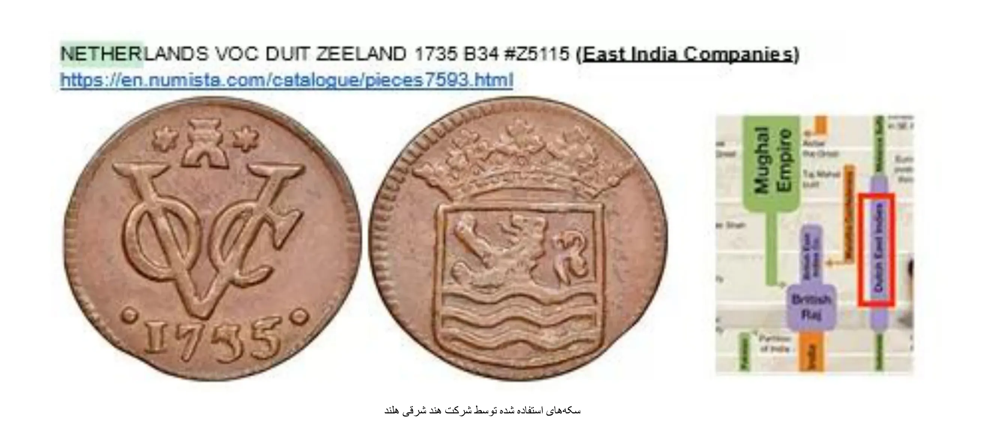

پس از تأسیس بورس آنتورپ Exchange، یک نقطه عطف مهم تأسیس VOC، شرکت هند شرقی هلند بود. این شرکت که در هلند مستقر بود، حتی ارز خود را نیز صادر کرد. پس از ایجاد VOC، اولین بازار بورس در آمستردام تأسیس شد که آغاز عملیات بازار بورس این شرکت را نشان می‌داد. نکته جالب توجه این است که چگونه هلندی‌ها توانستند به برتری آنتورپ به عنوان یک مرکز اقتصادی بین‌المللی پایان دهند. آنها به سادگی دسترسی به رودخانه شلده را مسدود کردند. این استراتژی بخشی از یک حرکت تاریخی بزرگتر، شورش گدایان بود. یک رویداد مهم در تاریخ اروپا.

#### مداخله بانک آمستردام

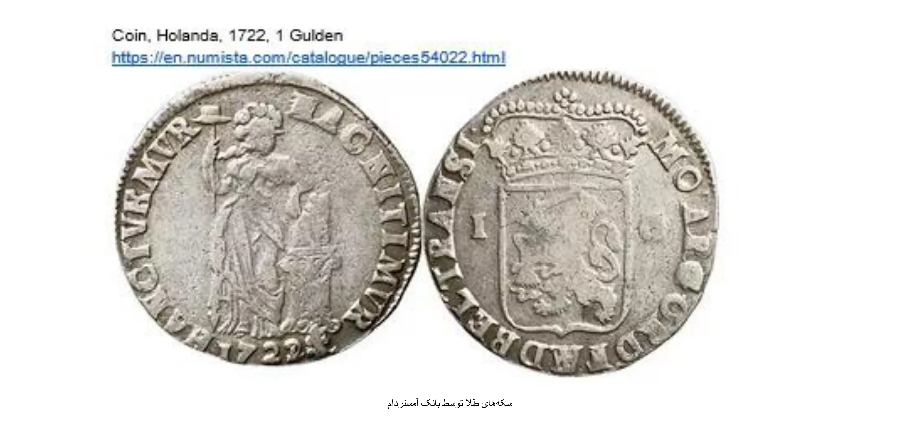

پس از تأسیس VOC، یکی دیگر از تحولات مهم در تاریخ پولی، معرفی سکه‌های طلا توسط بانک آمستردام بود. این سکه‌ها که به سال 1722 بازمی‌گردند، از نقره ساخته شده بودند. با این حال، آنچه واقعاً در آن زمان امور مالی را متحول کرد، نه خود Coin، بلکه حساب‌های مرتبط با این ارز در بانک آمستردام بود. این حساب‌ها به وسیله اصلی Exchange بین‌المللی تبدیل شدند. تراکنش‌ها به سادگی در دفاتر یا دفتر کل ثبت می‌شدند. به لطف این سیستم، آمستردام به مرکز اقتصادی جهانی تبدیل شد. با گذشت زمان، بانک آمستردام تصمیم گرفت استفاده از این حساب‌ها را تحمیل کند. صرافان مستقل موظف بودند سکه‌های خود را به صورت روزانه برای سپرده‌گذاری در بانک Exchange کنند.

#### ایجاد بانک انگلستان برای تأمین مالی جنگ

ایجاد بانک انگلستان با انگیزه تأمین مالی جنگ در پایان قرن هفدهم صورت گرفت. مانند بانک آمستردام، این بانک نیز سپرده‌ها را با فرمان تحمیل کرد. ویژگی خاص بانک انگلستان این بود که بانک‌های خصوصی را به موقعیتی ثانویه در سیستم پولی تنزل داد و بدین ترتیب چیزی را ایجاد کرد که می‌توان آن را "Layer سوم" ارز نامید.

در ابتدا، اولین Layer ارز توسط طلا نمایندگی می‌شد. سپرده‌های انجام شده در بانک‌های خصوصی دومین Layer را تشکیل دادند. با این حال، زمانی که این سپرده‌ها دیگر قابل تبدیل به طلا نبودند، سومین Layer ارز ظاهر شد. از آن زمان به بعد، اسکناس‌های صادر شده توسط بانک‌های خصوصی دیگر قابل تبدیل به طلا نبودند بلکه به ارز کاغذی از بانک انگلستان تبدیل می‌شدند که خود قابل تبدیل به طلا بود. این تحول منجر به پیچیدگی سیستم پولی با افزودن لایه‌های اضافی شد.

#### وحشت ۱۷۹۶

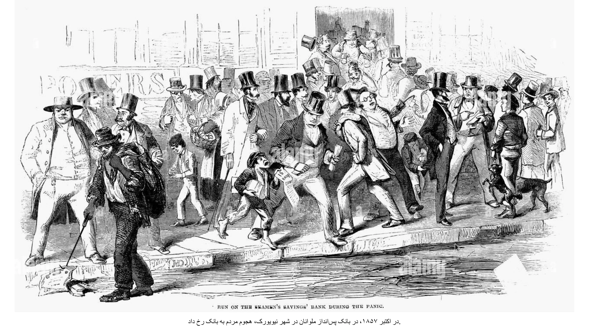

وحشت بانکی در بانک پس‌انداز ملوانان در طول وحشت سال ۱۸۵۷.

پس از وحشت بانکی سال 1796، پدیده‌ای رخ داد که در آن همه سعی کردند در "هرم پول" بالا بروند. مردم می‌خواستند ارز سوم-Layer خود را به ارز دوم-Layer و در نهایت به ارز اول-Layer که طلا بود، تبدیل کنند. با این هجوم گسترده، بانک انگلستان مجبور شد اقداماتی برای تثبیت وضعیت انجام دهد. برای جلوگیری از کاهش احتمالی ذخایر طلا، تصمیم گرفت تبدیل‌پذیری اسکناس‌های خود به طلا را به حالت تعلیق درآورد. این تعلیق که در ابتدا به عنوان یک اقدام موقت در نظر گرفته شده بود، تقریباً دو دهه به طول انجامید.

### نتیجه‌گیری:

بانک‌های مرکزی به عنوان وام‌دهندگان نهایی تکامل یافته‌اند و تبدیل‌پذیری ارز خود به طلا را به حالت تعلیق درآورده‌اند. اگرچه این اقدام در ابتدا به عنوان یک راه‌حل موقت در نظر گرفته شده بود، اما در نهایت دائمی شد و مفهوم وام‌دهنده نهایی را معرفی کرد. این تحول بانک‌های مرکزی را به شکلی که امروزه شناخته می‌شوند، شکل داده است. با این حال، در اقتصادهای شکننده‌تر، این توانایی چاپ پول به دلخواه می‌تواند در صورت استفاده غیرمسئولانه به پیامدهای نامطلوبی مانند ابر تورم منجر شود.

## کتاب‌ها و منابع

<chapterId>c44e4519-0741-527b-b3b0-3f513e87147d</chapterId>

اَبَرتورم موضوعی جذاب است که از طریق رویدادهای تاریخی مختلف مورد مطالعه قرار گرفته است. اگر می‌خواهید به طور عمیق‌تری به این موضوع بپردازید، در اینجا فهرستی از ۱۰ منبع ضروری برای خواندن و مطالعه آمده است:

- "وقتی پول می‌میرد: کابوس هزینه‌های کسری، کاهش ارزش و ابر تورم در آلمان وایمار" نوشته آدام فرگوسن. این کتاب به بحران ابر تورم در آلمان پس از جنگ جهانی اول می‌پردازد.

- "اقتصاد تورم - مطالعه‌ای بر کاهش ارزش پول در آلمان پس از جنگ" نوشتهٔ کوستانتینو برسچیانی-تورونی. تحلیلی عمیق از ابر تورم آلمان در دهه ۱۹۲۰.

- "این بار متفاوت است: هشت قرن حماقت مالی" نوشته کارمن ام. رینهارت و کنت اس. روگف. اگرچه کتاب انواع مختلف بحران‌های مالی را پوشش می‌دهد، اما بحث عمیقی درباره ابر تورم در طول تاریخ ارائه می‌دهد.

- "ابر تورم زیمبابوه، تحلیل و درس‌های آموخته شده" نوشته استیو هنک. مطالعه‌ای بر ابر تورم زیمبابوه در اوایل دهه 2000.

- "نظام‌های پولی و تورم: تاریخچه، روابط اقتصادی و سیاسی" نوشته پیتر برنهولتز. این کتاب به بررسی موارد تاریخی ابر تورم می‌پردازد و به دنبال درک عوامل زیربنایی آن است.

- "راهنمای بقا در ابر تورم: استراتژی‌هایی برای کسب‌وکارهای آمریکایی" نوشته جرالد سوانسون. یک راهنمای عملی درباره چگونگی هدایت کسب‌وکارها در محیط ابر تورمی.

- "مرگ پول: درس‌هایی از تورم بزرگ آلمان و آمریکا" نوشته ینس او. پارسون. تحلیلی تطبیقی از بحران‌های تورمی در آلمان و ایالات متحده.

- "سقوط پول: ابر تورم آلمان و نابودی طبقه متوسط" نوشته فردریک تیلور. یک بررسی روایتی از تأثیرات اجتماعی و اقتصادی ابر تورم بر جامعه آلمان.

- "هیئت‌های ارزی برای کشورهای در حال توسعه: یک راهنما" نوشته استیو هنک و کورت شولر. اگرچه تمرکز بر هیئت‌های ارزی است، این کتاب دیدگاهی در مورد چگونگی اجتناب از وضعیت‌های ابر تورم ارائه می‌دهد.

# بخش نهایی

<partId>cb1f4a4b-556a-4e47-a5cc-136be35a1f9a</partId>

## بررسی‌ها و رتبه‌بندی‌ها

<chapterId>1a37317e-372a-5241-b478-8316d44f9283</chapterId>

<isCourseReview>true</isCourseReview>

## امتحان نهایی

<chapterId>d01831c3-6c4d-59e3-95bc-03e97a05c142</chapterId>

<isCourseExam>true</isCourseExam>

## نتیجه‌گیری

<chapterId>45d410b0-71ed-4502-8d8d-8b6df761db23</chapterId>

<isCourseConclusion>true</isCourseConclusion>