# Matka taloudellisen romahduksen läpi

Miltä näyttää, kun raha menettää merkityksensä?
Tämä kurssi opastaa sinut hyperinflaation kiehtovan mutta vakavan maailman läpi. Tulet löytämään historiallisia jaksoja ja nykyaikaisia tapauksia, joissa valuutat romahtivat ja taloudet muuttuivat yhdessä yössä. Paljastaat mallit, syyt ja tosielämän vaikutukset tavallisiin ihmisiin, saaden näkemystä yhteen taloustieteen dramaattisimmista ilmiöistä.

Matkan varrella tulet myös löytämään, kuinka yksilöt ja yhteisöt ovat navigoineet näiden myrskyisten ajanjaksojen läpi. Opi strategioita, jotka ovat auttaneet suojaamaan varallisuutta valuuttakriisien aikana ja rakenna syvempää ymmärrystä taloudellisesta kestävyydestä. Jos olet utelias taloudellisista voimista, jotka muokkaavat maailmaamme, tämä matka tarjoaa sekä tietoa että käytännöllistä näkökulmaa.
+++
# Johdanto

<partId>6fe4d15d-f6e6-54be-9e04-0a75ac98df8b</partId>

## Kurssin yleiskatsaus

<chapterId>9d1aba8d-0485-5020-9863-5de37e6db8e0</chapterId>

Tervetuloa ECO204-kurssille!

Tämän kurssin tavoitteena on auttaa sinua ymmärtämään hyperinflaation perimmäisiä syitä, mekanismeja ja seurauksia fiat-rahajärjestelmässä. Konkreettisten esimerkkien ja historiallisen analyysin avulla opit tunnistamaan hyperinflaatiojaksoja edeltäviä toistuvia malleja ja tunnistamaan toimintavipuja, joilla voit suojautua.

**Luku 2: Mitä inflaatio on?**

Ennen kuin sukellamme aiheen ytimeen, palaamme perusasioihin: mitä inflaatio on? Tässä jaksossa esitellään inflaation rahapoliittiset juuret, inflaation eri tyypit ja niiden liittyminen laajempaan taloudelliseen dynamiikkaan. Tämä on olennainen askel sen ymmärtämiseksi, miten tavanomainen inflaatio voi kehittyä hyperinflaatioksi.

**Jakso 3: Mikä on hyperinflaatio?**

Tässä jaksossa tarkastellaan hyperinflaation täsmällisiä määritelmiä ja useita merkittäviä historiallisia tapauksia, kuten Weimarin Saksan ja Zimbabwen tapauksia. Analysoimme niiden yhtäläisyyksiä, eroja ja nykypäivän rinnakkaisuuksia. Tutustut myös vähemmän tunnettuihin tapauksiin, kuten Latinalaisen Amerikan peräkkäisiin uudelleenvaluuttoihin, sekä tietyissä maissa havaittuihin irtautumisstrategioihin.

**Jakso 4: Miten pääsimme tänne?**

Tässä osassa pyritään ymmärtämään rakenteellisia mekanismeja, jotka mahdollistavat hyperinflaation, erityisesti rahapoliittisen "toisen Layer:n" kehityksen ja keskuspankkien roolin kautta. Osassa annetaan lisälähteitä ja lukuvinkkejä jatkotutkimusta varten.

Entä jos rahahistoria toistuisikin silmiemme edessä? Tuomitse itse seuraavissa luvuissa!

# Mitä inflaatio on?

<partId>2b4f456c-3649-5cf9-b9b0-a5bffe92d962</partId>

## Rahapoliittinen ilmiö

<chapterId>b2cbc915-c4ec-52b5-860c-0958f58c91e4</chapterId>

### Inflaation määritelmät

Inflaatio on käsite, joka ymmärretään usein väärin sen moninaisten määritelmien ja tulkintojen vuoksi. Käsitys inflaatiosta vaihtelee eri ryhmien, kuten bitcoin-asiantuntijoiden ja perinteisten taloustieteilijöiden, välillä. Selvitetään ensin määritelmät ennen kuin keskustellaan hyperinflaatiosta:

- Määritelmä Le Robert -sanakirjasta: Inflaatio on maksuvälineiden (setelit, pääoma) liiallista kasvua, joka aiheuttaa hintojen nousua ja valuutan arvon alenemista.

- Määritelmä Larousse-tietosanakirjasta: Inflaatio on ilmiö, jolle on ominaista yleinen ja jatkuva hintatason nousu. Tässä sana "yleistynyt" on ratkaiseva.

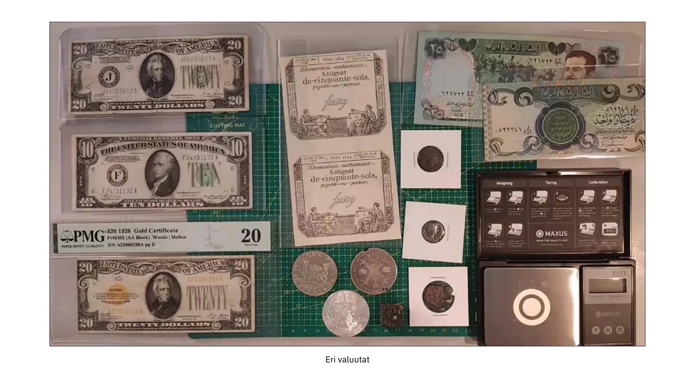

Näiden määritelmien valossa on olennaista ymmärtää, että Robertin mukaan inflaatio koskee pääasiassa rahan määrän kasvua Supply. Toisaalta Larousse keskittyy tämän kasvun seurauksiin eli hintojen yleiseen nousuun.

Hyperinflaatiota koskevassa tutkimuksessamme käytämme toista määritelmää, joka on yleinen hintojen nousu, koska se on aiheemme kannalta olennaisempi ja selkeämpi. On kuitenkin tärkeää muistaa, että tämä hintojen nousu on yleensä seurausta rahan Supply laajenemisesta.

Tunnettu taloustieteilijä Milton Friedman totesi tunnetusti:

> "Inflaatio on aina ja kaikkialla rahapoliittinen ilmiö."

Tämä lausuma korostaa rahapolitiikan laajentamisen ja inflaation välistä luontaista yhteyttä. Seuraavissa jaksoissa tarkastelemme inflaation ja talouskasvun välistä suhdetta näiden perusmääritelmien pohjalta.

### Rahapoliittisen ilmiön ymmärtäminen

Kun puhutaan raha-ilmiöstä, tarkoitetaan sitä, miten talouden rahapoliittiseen Supply:een vaikutetaan. Milton Friedman näki sen lähinnä tämän Supply:n kasvuna. Rahan Supply:n kasvattamiseen on historiallisesti ollut kaksi päämenetelmää:

1. Rahapainatus:

Perinteisissä rahajärjestelmissä rahamäärän kasvattaminen Supply toteutettiin painamalla fyysisesti uusia seteleitä. Vaikka nykyään, kun digitaalinen raha on yleistynyt, tämä rahan painaminen tapahtuu pääasiassa sähköisesti (keskuspankkien ja muiden rahoituslaitosten tietokantojen kautta), historiassa on nähtävissä ajanjaksoja, jolloin seteleiden kirjaimellinen painaminen johti hyperinflaatioon.

2. Metallipitoisuuden vähentäminen:

Toinen tapa oli vähentää jalometallin määrää hopean tai kullan kaltaisiin metalleihin perustuvissa valuutoissa. Tästä on hyvä esimerkki Rooman valtakunnassa, jossa alun perin lähes kokonaan hopeasta koostuneen denaarin hopeapitoisuutta vähennettiin ajan mittaan huomattavasti. Tämä oli eräänlaista inflaatiota, mutta ei välttämättä hyperinflaatiota.

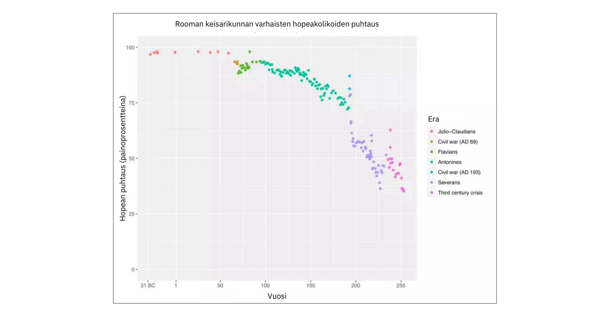

On tärkeää korostaa, että hyperinflaatiota havaitaan ensisijaisesti fiat-valuutoissa, joiden vakuutena ei ole niiden taustalla olevia varoja, kuten jalometalleja. Historiallisesti, kun valuutta perustui tällaiseen omaisuuteen, on esiintynyt inflaatiota (esim. metallipitoisuuden devalvoitumisen kautta), mutta nämä jaksot eivät koskaan saavuttaneet hyperinflaation äärimmäisiä tasoja. Seuraavissa jaksoissa tarkastelemme yksityiskohtaisesti rahan devalvaatiojaksoja ja näiden erilaisten rahajärjestelmien vaikutuksia inflaatioon.

### Tutkimus rahapoliittisen devalvaation ajanjaksoista

Eri sivilisaatiot ovat historian saatossa kokeneet rahan devalvoitumisen kausia. Jotkut näistä ajanjaksoista ovat ajoittuneet samaan aikaan suurten tapahtumien tai sotien kanssa, jotka ovat aiheuttaneet paineita talouteen.

#### 1. Peloponnesoksen sota ja toinen Puninen sota:

Ateenan ja Spartan välinen Peloponnesoksen sota ja Rooman tasavallan ja Karthagon välinen toinen Puninen sota ovat varhaisimpia arkistoista löytyviä esimerkkejä valuutan devalvaatiosta. Näiden sotien rahoittamiseksi nämä sivilisaatiot devalvoivat valuuttojaan vähentämällä hopeapitoisuutta ja ottamalla mukaan muita metalleja ja lisäämällä samalla tuotettujen kolikoiden määrää.

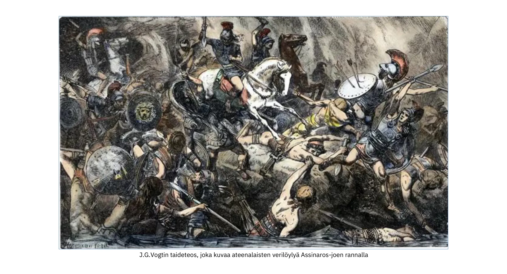

Kaiverrus, joka kuvaa ateenalaisten verilöylyä Assinaros-joen rannalla.

#### 2. Muinainen Rooma keisarikunnan aikana:

Rooman tasavallan aikakauden jälkeen, keisarikunnan aikana, 3. ja 4. vuosisadalla valuutan devalvoituminen oli merkittävää. Tästä on osoituksena kolikoiden hopeapitoisuuden lasku, kuten edellisestä kuviosta näkyy. Tutkimus osoittaa, että Egyptissä vehnän hinta drakmoissa mitattuna nousi miljoonakertaiseksi noin 400 vuoden aikana, vuodesta 40 eKr. vuoteen 360 jKr. Tänä aikana se vastaa noin 4,4 prosentin keskimääräistä vuotuista inflaatiota. Tämä inflaatio ei kuitenkaan jakautunut tasaisesti. Se alkoi todella noin vuonna 238 jKr. Vuosien 250 ja 293 jKr. välillä inflaatio oli noin 3,65 prosenttia, ja se nousi 22,28 prosenttiin vuosien 293 ja 301 jKr. välillä.

Vaikka näinä aikoina inflaatio oli huomattavaa, se ei kuitenkaan yltänyt joissakin nykyajan tilanteissa havaitun hyperinflaation tasolle. Syynä tähän on se, että vaikka valuuttaa devalvoitiin, se oli edelleen jalometallien tukema. Tämä vankka perusta tarjosi jonkinlaisen suojan äärimmäisiä inflaatiotasoja vastaan. Seuraavissa jaksoissa tarkastelemme tarkemmin hyperinflaation luonnetta ja seurauksia.

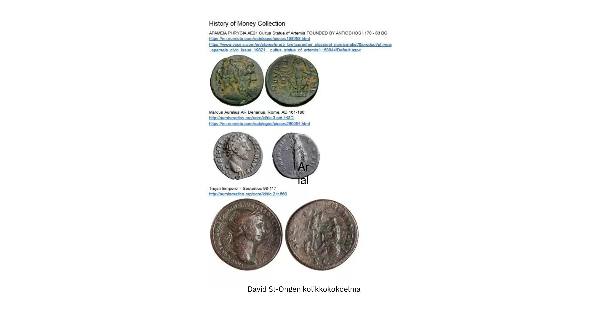

- Marcus Aureliuksen denari (160 jKr.):

Yksi antiikin Rooman ikonisimmista kolikoista on denari, hopeinen Coin. Omistan Marcus Aureliuksen Coin:n, joka on peräisin vuodelta 160 jKr. eli ennen suurta devalvaatiota. Vaikka kameralla voi olla vaikeuksia tallentaa hienoja yksityiskohtia, paljain silmin on selvää, että Coin on kaunis ja että sen hopeapitoisuus on suhteellisen korkea.

- Antoninianus (3. vuosisadan loppupuoli jKr.):

Rahan devalvoitumisen myötä syntyi uusi valuutta, Antoninianus. Tämän valuutan piti olla kahden denarin arvoinen, mutta se sisälsi paljon vähemmän hopeaa. Antoninianukseni Coin:ssa näkyy selvästi, että hopeapitoisuutta on vähennetty huomattavasti. Sitä koristaa tämän ajan roomalaisille kolikoille tyypillinen kruunu, jota kutsutaan "radiateiksi". Väriä ja laatua vertailemalla voidaan todeta, että Antoninianus on kaukana puhtaasta hopeasta Coin.

Kun näitä kahta kolikkoa verrataan vierekkäin, ero on silmiinpistävä. Denari vuodelta 160 jKr. näyttää selvästi hopealta, kun taas 3. vuosisadan loppupuolelta jKr. peräisin oleva antoninianus on paljon himmeämpi, mikä viittaa hopeapitoisuuden merkittävään vähenemiseen. Tämä visuaalinen vertailu havainnollistaa selvästi rahan arvon alenemisen, jonka antiikin Rooma koki muutaman vuosisadan aikana.

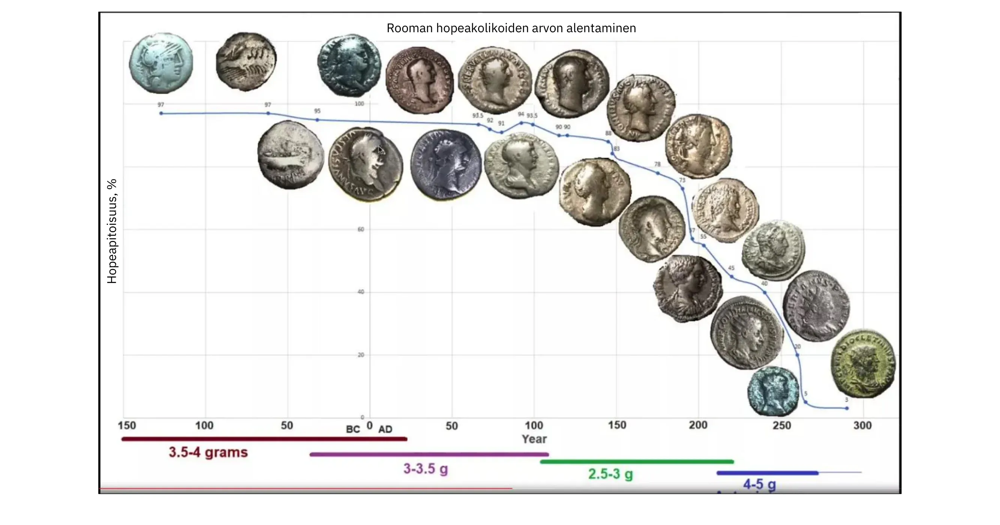

Tämän esityksen täydentämiseksi olisi ihanteellista esittää kuvaaja, joka havainnollistaisi näiden kolikoiden arvon alenemista ajan myötä. Vaikka sitä on vaikea havainnollistaa tällä alustalla, kuvittele kuvaaja, jossa näkyy denaarin arvo ja sen lasku 2. vuosisadan loppupuolella, jolloin se korvattiin antoninianuksella, jonka arvoksi oletettiin kaksi denaria mutta jonka hopeapitoisuus oli huomattavasti pienempi. Nämä artefaktit ovat hiljaisia todistajia menneiden sivilisaatioiden taloudellisista vaihteluista.

#### 3. Espanjan Maravedi: todistaja kohdennetusta devalvaatiosta

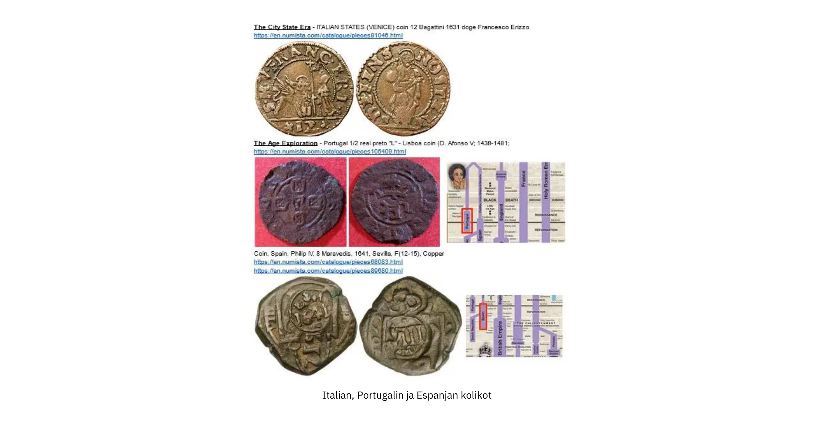

Maravedi on kuparivaluuttana erityisasemassa Espanjan rahan historiassa. Kuten aiemmin mainittiin, Espanjan dollari oli alun perin kansainvälinen standardi, joka oli Espanjalle tärkeä varantovaluutta. Tiettyjen taloudellisten haasteiden edessä Espanjan oli kuitenkin turvauduttava fiksuihin rahapoliittisiin strategioihin.

Rahan devalvaatio on väline, jota valtiot käyttävät usein rahoittaakseen menojaan tai elvyttääkseen talouttaan. Espanja joutui kuitenkin herkkään tilanteeseen. Espanjan dollarin heikentäminen olisi vaarantanut sen aseman kansainvälisessä kaupassa. Selvitäkseen tästä pulmasta Espanja kääntyi Maraveden puoleen.

Toisin kuin arvokas espanjalainen hopeadollari, maravedi oli kuparivaluutta, jota käytettiin pääasiassa paikallisen väestön keskuudessa. Tämä valuutta joutui devalvoitavaksi. Kun Maravedin Coin oli alun perin kahden maravedin arvoinen, valtio otti sen takaisin, leimasi siihen uuden arvon, esimerkiksi "neljä", ja palautti omistajalleen vain yhden Coin:n. Leimalla "kahdeksan" merkitty Coin on todiste tästä prosessista, sillä se on käynyt läpi useita devalvaatiokierroksia.

Tämän strategian avulla valtio saattoi tehokkaasti devalvoida valuuttaa, luoda inflaatiota ja rahoittaa epäsuorasti valtiota samalla kun Espanjan dollarin koskemattomuus säilytettiin kansainvälisellä näyttämöllä. Tällä kohdennetulla devalvaatiolla oli kuitenkin seurauksia paikallisväestölle, joka näki yhteisen valuuttansa arvon heikentyneen.

Maravedisin tapaus osoittaa, miten valtio voi valikoivasti devalvoida paikallista valuuttaa sisäisten taloudellisten tarpeidensa tyydyttämiseksi ja samalla säilyttää varantovaluutan arvon maailmanlaajuisesti. Se on vaikuttava esimerkki rahapolitiikan monimutkaisuudesta ja hienovaraisuudesta historiassa.

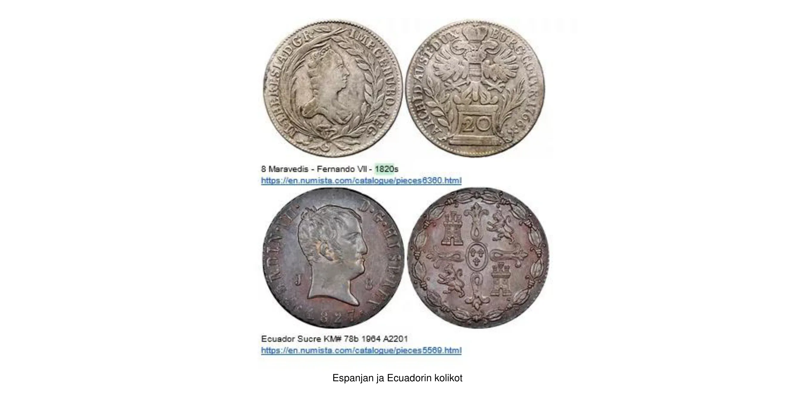

Haluatko tietää lisää? -> [Linkki](https://docs.google.com/document/d/1aZa7gvz1nt8ZHDCoWKQdS9RGGjBHdipH1ApC8dW1xpM/edit?usp=sharing)

#### 4. Hintavallankumous 15.-17. vuosisadalla

Euroopassa koettiin 1400- ja 1600-luvuilla merkittävä taloudellinen ilmiö, jota kutsutaan usein "hintamyllerrykseksi" Tämä inflaatiokausi sai alkunsa suurelta osin jalometallien, erityisesti kullan ja hopean, massiivisesta tulvasta Amerikasta. Koska Euroopan talous perustui tuolloin suurelta osin metallistandardiin, tämä metallien Supply-lisäys kasvatti rahan Supply-arvoa. Tämän seurauksena inflaatio oli noin 1-2 prosenttia vuodessa. Ensi silmäyksellä tämä inflaatio saattaa vaikuttaa vaatimattomalta. Tuohon aikaan tällaiset hintavaihtelut olivat kuitenkin niin epätavallisia, että niitä voitiin pitää "vallankumouksena" Tämä korostaa sitä, miten rahavarantojen muutokset voivat vaikuttaa koko talousjärjestelmään.

#### 5. John Law ja Assignats

Ranskan taloushistoriaa leimasi 1700-luvulla kaksi merkittävää valuuttaan liittyvää tapahtumaa. Ensinnäkin skotlantilainen taloustieteilijä ja rahoittaja John Law sai Ranskan hallituksen omaksumaan paperirahaan perustuvan rahajärjestelmän. Vaikka tätä aloitetta pidettiin aluksi innovatiivisena ratkaisuna maan rahoitusongelmiin, se johti nopeasti hillittömään inflaatioon. Pian Ranskan vallankumouksen myllerryksessä hallitus otti käyttöön "assignatteja".

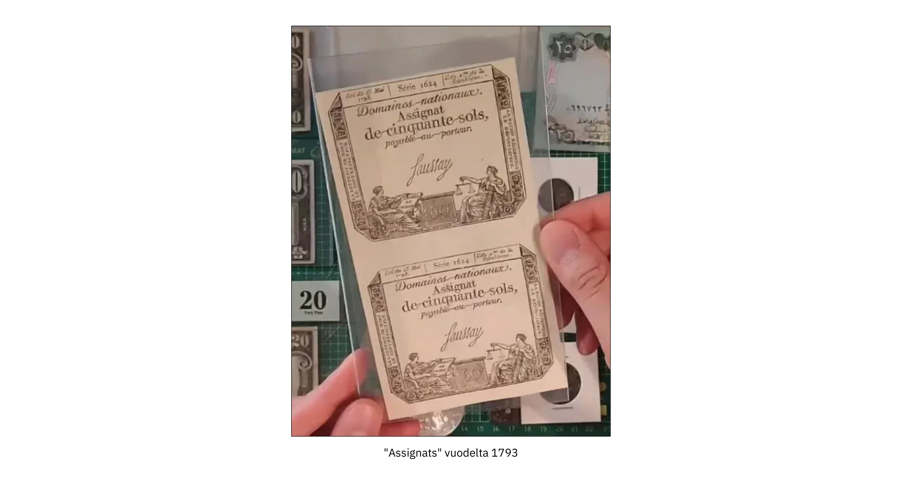

Assignat vuodelta 1793

Nämä setelit ovat elävä todiste historian ensimmäisestä suuresta hyperinflaatiokaudesta. Alun perin vastaukseksi peräkkäisiin rahoituskriiseihin suunnitelluista assignateista tuli nopeasti rahapoliittisen epävakauden symboli. Hallitus, joka luotti liikaa tähän paperivaluuttaan rahoittaakseen menonsa, aiheutti ennennäkemättömän talouskriisin ja johti vallankumouksen jälkeiseen suureen hyperinflaatiokauteen Ranskassa.

#### 6. Executive Order 6102 ja dollarin devalvoituminen

Executive Order 6102 ja dollarin devalvoituminen

Yhdysvalloissa 1930-luvun alussa rahapolitiikassa tapahtui merkittävä muutos. Seuraavassa on yksityiskohtainen katsaus tähän muutokseen:

- Vuoden 1928 20 dollarin seteli

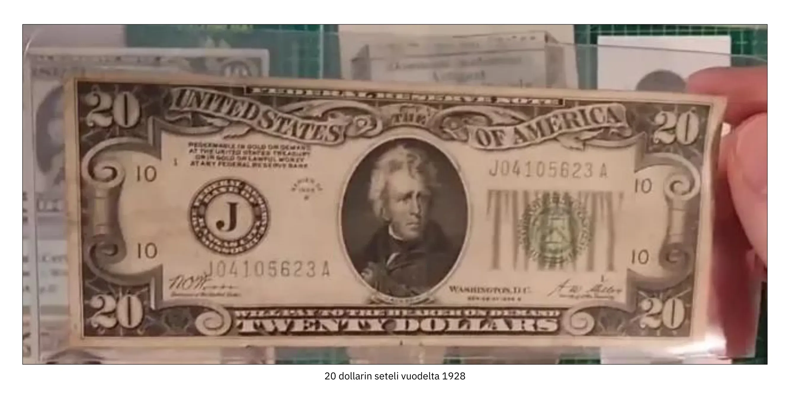

Vuonna 1928 Yhdysvaltojen 20 dollarin setelissä luki: "lunastettavissa kullaksi vaadittaessa" Tämä tarkoittaa, että jokainen seteli oli kirjaimellisesti vaihdettavissa kultaan. Tarkemmin sanottuna 20,67 dollarin seteli vastasi yhtä unssia kultaa.

- Täytäntöönpanomääräys 6102

Vuonna 1933 tapahtui suuri mullistus, kun Executive Order 6102 annettiin. Tämän määräyksen mukaan kansalaisten oli kiellettyä pitää hallussaan kultaa, olipa se sitten harkkojen, kolikoiden tai sertifikaattien muodossa.

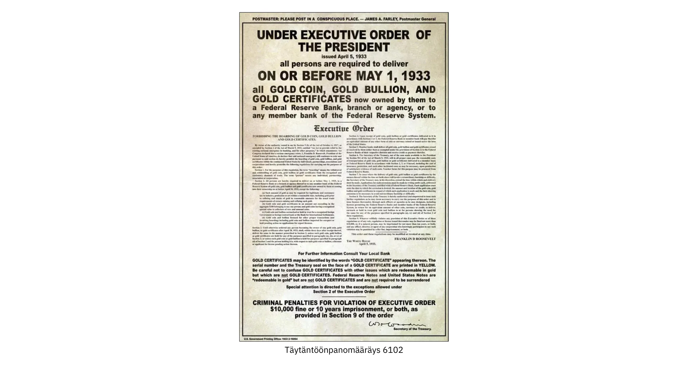

Kultainen sertifikaatti on hyvä esimerkki. Se oli merkitty: "Kulta Coin, maksetaan haltijalle vaadittaessa." Tällaisen todistuksen hallussapidosta tuli laitonta, ja se pysyi laittomana vuoteen 1964 asti.

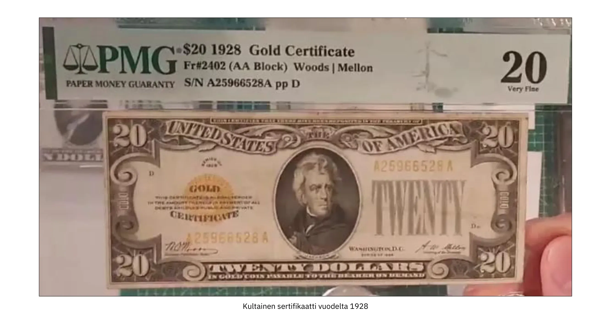

- Uusien seteleiden käyttöönotto

Kullan takavarikoinnin jälkeen vuonna 1934 otettiin käyttöön uusi setelisarja.

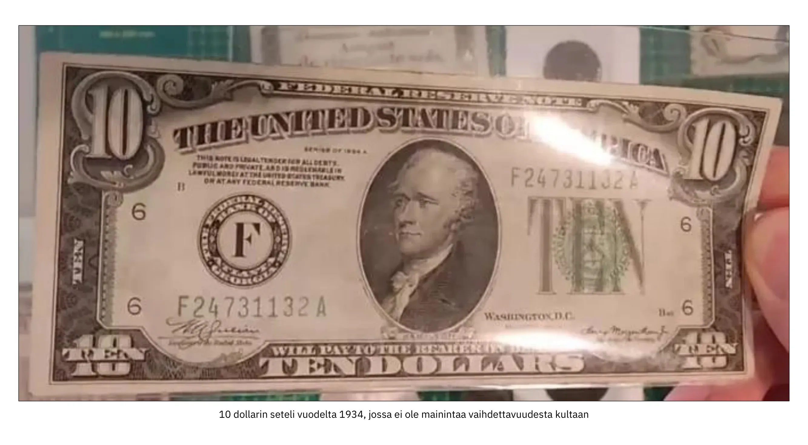

Maininta niiden vaihdettavuudesta kultaan on poistettu ja korvattu sanoilla "Tämä seteli on laillinen maksuväline kaikkiin velkoihin" (Ce billet est une monnaie légale pour toutes dettes).

- Kullan revalvaatio

Kiehtovaa tässä siirtymässä on hallituksen strategia. Vuonna 1934 kullan hinta korotettiin 20,67 dollarin sijasta 35 dollariin unssilta. Käytännössä hallitus devalvoi ihmisten omistaman dollarin. Ostamalla kultaa väestöltä 20,67 dollarilla unssilta vuonna 1933 ja nostamalla sitten kullan hintaa vuonna 1934 hallitus sai huomattavaa voittoa samalla kun se devalvoi kansalaistensa säästöjä.

Yhteenvetona voidaan todeta, että vuoden kuluessa hallitus takavarikoi kansalaisten kullan ja muutti sitten pelisääntöjä arvostamalla kullan arvon uudelleen niin, että se hyödytti valtiokonttoria ja haittasi niitä, jotka olivat alun perin vaihtaneet kullan seteleihin.

### Yhdysvallat muuttaa historiaa.

Yhdysvallat teki historiallisen käännekohdan devalvoidessaan ensimmäisenä maailman varantovaluutan, Yhdysvaltain dollarin, toisin kuin pienissä kauppamaissa aiemmin oli tehty.

Aikaisemmin, renessanssin aikana, Firenzen 1200-luvulla liikkeeseen laskema Italian floriini oli kansainvälinen varavaluutta, eikä sen käyttöaikana ollut havaittu devalvaatiota, mikä kuvastaa rahan vakauden merkitystä kansainväliselle kaupalle.

Samassa hengessä Espanja ja Alankomaat, jotka kukoistavan kansainvälisen kaupankäyntinsä ansiosta olivat maailman varantovaluutan haltijoita, säilyttivät valuuttojensa koskemattomuuden säilyttääkseen luottamuksen ja status quo:n kansainvälisessä vaihdannassa. Alankomaissa perustettiin jopa ensimmäinen keskuspankki, mikä on merkittävä virstanpylväs rahajärjestelmien maailmanlaajuisessa kehityksessä.

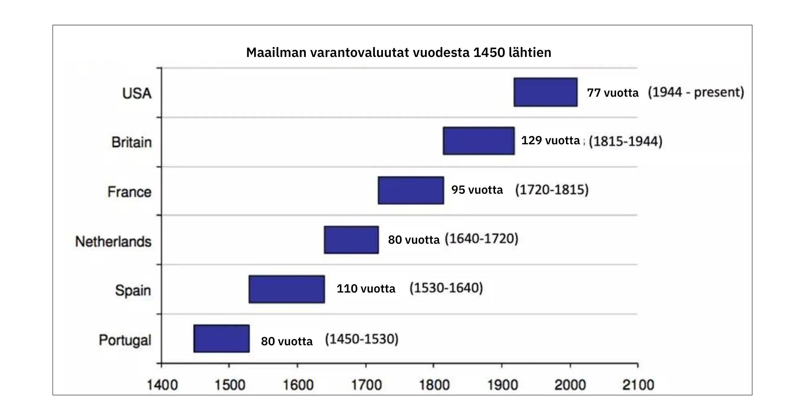

Tilanne kuitenkin muuttui Yhdysvaltojen noustua hallitsevaksi talousmahdiksi. Ne päättivät devalvoida varantovaluuttaansa ja käyttää inflaatiota hyväkseen. Tämä päätös johtuu usein muuttuneesta dynamiikasta, jossa varavaluutan valinta ei ollut enää yhtä vapaata kuin aiemmin. Yhdysvaltain hegemonia vakiinnutti dollarin maailman varantovaluutaksi, mikä mahdollisti sen arvon manipuloinnin. Tämä muutos paljastaa rahapolitiikan mahdollisen vaikutuksen kansainväliseen kauppaan globalisoituneessa taloudessa ja merkitsee merkittävää muutosta maailman varantovaluuttojen hallinnassa.

### Viimeinen esimerkki tien varrelta: Sveitsin dinaari

Sveitsin dinaari kuvaa toista kiehtovaa näkökulmaa rahan devalvaatioon, tällä kertaa Persianlahden sotaa edeltävässä Irakin tilanteessa. Irakin keskuspankki laski liikkeelle tätä valuuttaa, joka sai nimensä seteliensä huomattavan laadukkaan laadun perusteella ja joka oli Lähi-idän alueella tunnettu vakaudesta. Tämä luottamus johtui pääasiassa setelipainon laadusta, joka oli tehty Englannissa, mikä merkitsi tiettyä kestävyyttä devalvaatiota vastaan.

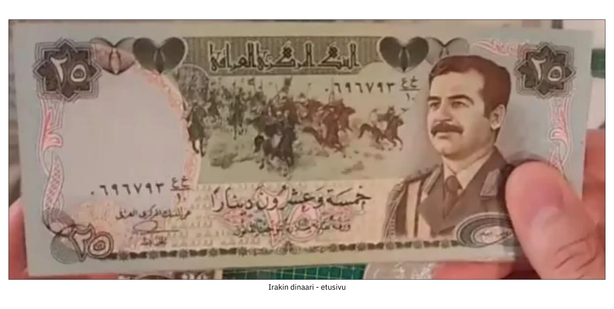

Persianlahden sodat merkitsivät kuitenkin käännekohtaa Sveitsin dinaarin historiassa. Irak, joka ei enää voinut luottaa setelien painamisessa englantilaiseen toimittajaansa, kääntyi Kiinan puoleen. Tämä muutos johti selvään eroon seteleiden laadussa, ja kiinalaista versiota pidettiin huonompana. Tämä käsitys ei ollut perusteeton; kiinalaiset setelit olivat helpommin väärennettävissä ja alttiimpia hallituksen ylipainatukselle, mikä uhkasi niiden arvoa.

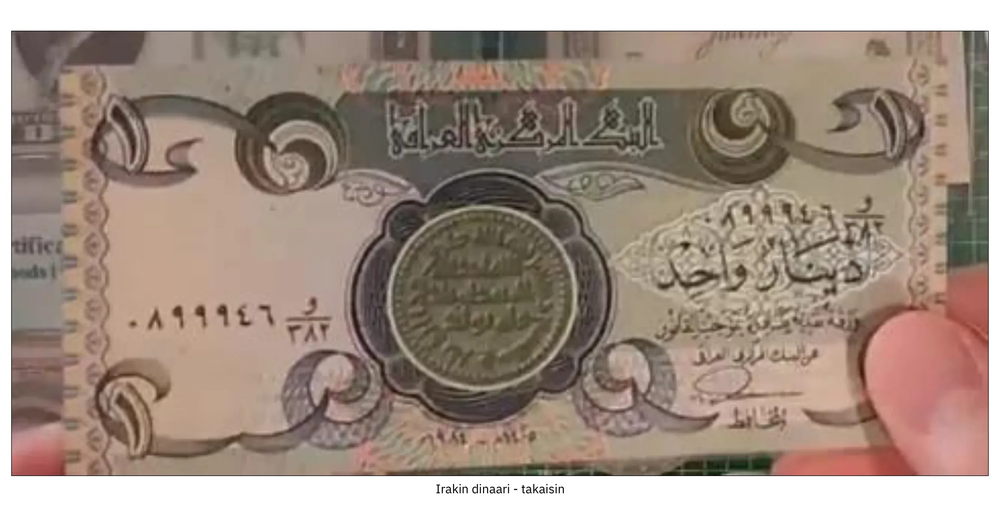

Persianlahden sodan jälkeisessä Irakin taloudessa ilmeni eräs erityinen ilmiö: kaksoishinnoittelujärjestelmä. Kauppiaat tarjosivat erilaisia hintoja riippuen siitä, minkälaista seteliä käytettiin maksuvälineenä, ja suosivat alkuperäistä Sveitsin dinaaria kiinalaisen setelin sijaan. Tämä järjestelmä heijasti luottamusta laadukkaampiin seteleihin, jotka olivat vähemmän alttiita devalvoitumiselle, jopa tilanteessa, jossa valtio määräsi arvon ensisijaisesti. Tämä episodi korostaa valuutan luontaisten ominaisuuksien merkitystä ja sitä, miten jopa fiat-valuuttajärjestelmässä valuutan koettu laatu voi vaikuttaa sen suhteelliseen arvoon ja sitä kautta talouden toimijoiden luottamukseen.

#### Kyllä, me todellakin punnitsimme kolikot!

Yleinen käsitys yhdistää valuutan usein valtion luomiseen, jolloin valtio säätelee sen liikkeeseenlaskua ja arvoa. Tämä käsite juontaa juurensa antiikin sivilisaatioihin, kuten Roomaan, jossa valtakunta standardoi ja leimasi kolikot ja antoi näin valuutalle virallisen arvon. Syvällisempi tarkastelu paljastaa kuitenkin, että valuutan itseisarvo johtui pääasiassa sen jalometallipitoisuudesta.

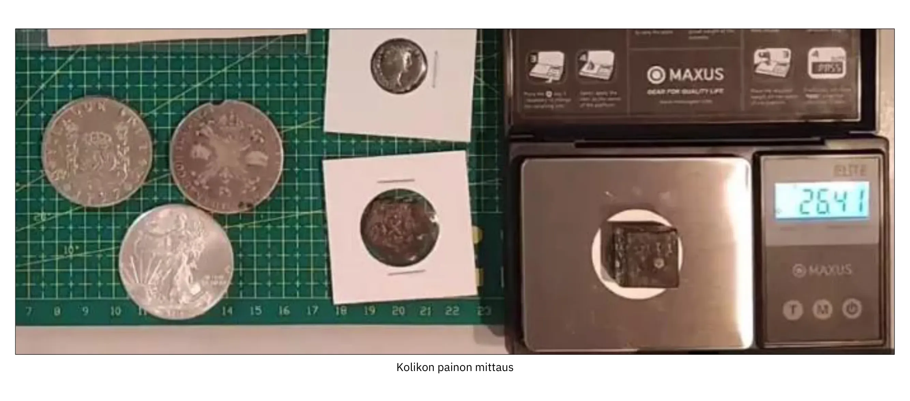

Esimerkkinä voidaan käyttää kahdeksan Espanjan reaita eli yhtä Espanjan dollaria vastaavaa rahapainoa. Valuutanvaihtajat käyttivät tätä painoa, joka oli merkitty arvoa osoittavalla roomalaisella numerolla, arvioidessaan kolikoiden arvoa niiden painon eikä pelkästään niiden leimauksen perusteella. Punnitsemalla kolikot valuutanvaihtajat pystyivät määrittämään, oliko kolikoita muutettu tai vahingoitettu, mikä olisi voinut alentaa niiden arvoa. Tämä käytäntö osoittaa, että vaikka valtion standardoitu leimaaminen antoi valuutalle tietyn nimellisarvon, todellinen arvo perustui sen sisältämän jalometallin painoon.

Tämä analyysi osoittaa, että luottamus valuuttaan ja sitä kautta sen arvoon perustui pikemminkin sen konkreettiseen substanssiin kuin pelkkään valtion vakuutteluun. Se korostaa valtion määräämän nimellisarvon ja jalometallin sisällön saneleman itseisarvon välistä kaksinaisuutta. Valuutta on siis muutakin kuin pelkkä valtiollinen väline, sillä sen perusarvo liittyy olennaisesti konkreettiseen ja mitattavissa olevaan Elements:een.

#### Päätelmä

Yhteenvetona voidaan todeta, että tämä rahapolitiikan devalvaatiota koskeva tutkimus antaa syvällisemmän käsityksen inflaatiomekanismeista, joita tarkastellaan seuraavissa videoissa. Keskustelemme erityyppisistä inflaatiotyypeistä ja kynnysarvosta, jolla ne siirtyvät korkeaan inflaatioon tai hyperinflaatioon. Tämän vankan perustan ansiosta voimme tulevissa istunnoissa käsitellä inflaation monimutkaisuutta Address:ssä. Kiitos huomiostanne. Odotamme innolla, että pääsemme jatkamaan tätä rahadynamiikan tutkimista seuraavassa videossa.

## Inflaatiotyypit

<chapterId>b438fe09-375e-5bb2-9196-7dd687b9f98c</chapterId>

### Inflaatio ei ole monitekijäinen ilmiö

Tässä jaksossa tarkastelemme inflaation eri näkökohtia, sillä inflaatio on ilmiö, joka ymmärretään usein väärin. Vaikka inflaatio mielletään tiedotusvälineissä ja arkikeskusteluissa usein monitekijäiseksi ilmiöksi, on tärkeää muistaa, että se on pohjimmiltaan rahapoliittinen ilmiö.

Seuraavassa on jaettu aihe useisiin keskeisiin kohtiin:

- Hinnankorotuksen ja inflaation erottaminen toisistaan:

Hintojen nousu voi olla alakohtaista ja johtua eri tekijöistä, kuten OPEC:n öljyntuotannon vähenemisestä tai vehnän tuotantoon vaikuttavista epäsuotuisista sääolosuhteista.

Toisaalta inflaatio määritellään yleisenä hintojen nousuna useiden tavaroiden ja palveluiden, ei vain tietyn sektorin, osalta.

- Inflaation rahapoliittinen ydin:

Kun rahan määrä on kiinteä Supply, hintojen nousu yhdellä sektorilla johtaisi hintojen laskuun muilla sektoreilla, koska muualla käytettävän rahan määrä vähenisi. Inflaatio liittyy läheisesti rahan Supply:n kasvuun, joka mahdollistaa hintojen samanaikaisen nousun kaikilla sektoreilla.

- Rahan Supply vaikutus inflaatioon ja deflaatioon:

Kiinteän rahan Supply -järjestelmässä tuotannon kasvun pitäisi teoriassa johtaa deflaatioon eli hintojen laskuun, koska tavaroita ja palveluja olisi enemmän saatavilla.

Nykyisessä fiat-rahajärjestelmässä rahamäärän kasvu Supply kumoaa tuotannon kasvun mahdollisesti aiheuttaman deflaation.

- Rahan Supply-sopeutuksen kielteiset vaikutukset:

Rahamäärän kasvu Supply ilman vastaavaa tuotannon kasvua johtaa inflaatioon, koska liikkeessä on enemmän rahaa samaa määrää tavaroita ja palveluja vastaan.

Vaikka tuotannon kasvun olisi pitänyt johtaa deflaatioon, samanaikainen rahan määrän kasvu Supply teki tämän vaikutuksen tyhjäksi ja johti inflaatioon.

- Inflaatio, deflaatio ja raha Supply - Viestintäalukset:

Inflaatio ja deflaatio ovat kuin talouden yhteysaluksia. Tuotannon lisääntyminen voi johtaa deflaatioon, mutta jos rahamäärää Supply lisätään samanaikaisesti, deflatorinen vaikutus kumoutuu, jolloin syntyy inflaatio.

Tämä keskustelu korostaa, että on tärkeää ymmärtää inflaation ja deflaation taustalla olevia mekanismeja sekä sitä, miten suuri vaikutus rahan Supply:n muuttamisella voi olla talouteen. Käymme todennäköisesti myöhemmin uudelleen läpi näitä käsitteitä saadaksemme syvällisemmän käsityksen niiden yhteydestä toisiinsa ja niiden vaikutuksesta maailmantalouteen.

### Miksi rahan painaminen ei aina aiheuta inflaatiota?

#### Inflaatio ≠ Kuluttajahintaindeksi

Vaikka inflaatio liittyy usein rahan määrän kasvuun, se ei aina ole suorassa yhteydessä rahan painamiseen, kuten vuoden 2008 finanssikriisin jälkeinen aika osoittaa. Huolimatta merkittävästä rahan painamisesta pankkien pelastamiseksi seuraavalla vuosikymmenellä inflaatio ei ollut korkea, vaan se oli keskimäärin 0-2 prosenttia vuodessa. Tämä tilanne herättää kysymyksen: Miksi massiivinen rahan painaminen ei johtanut suhteelliseen inflaatioon? Vastaus löytyy useista inflaation ja kuluttajahintaindeksin (CPI) mittaamiseen liittyvistä vivahteista.

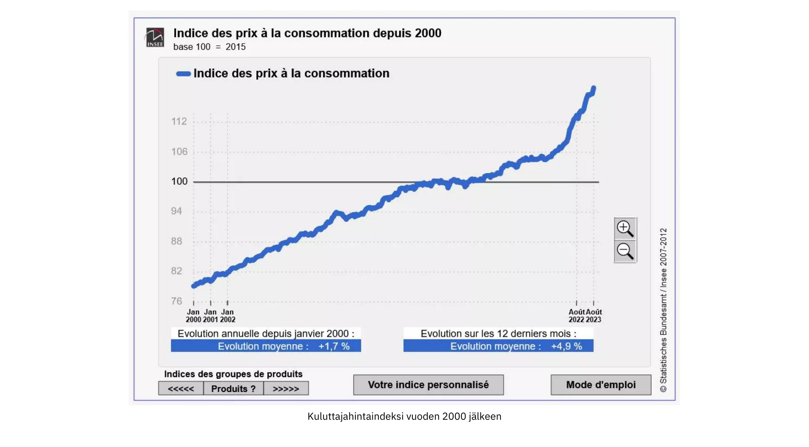

Ensimmäinen selitys liittyy tapaan, jolla inflaatiota mitataan. Kuluttajahintaindeksillä (CPI), jota käytetään ensisijaisena inflaation indikaattorina, on tiettyjä rajoituksia. Se ei esimerkiksi ota kattavasti huomioon kiinteistöjen hintakehitystä. Vaikka kuluttajahintaindeksi sisältää vuokriin liittyvän komponentin, asuntojen hintojen huomattava nousu ei näy indeksissä täysimääräisesti. Tämän vuoksi asumiskustannukset voivat nousta merkittävästi, mutta kuluttajahintaindeksi ei täysin kata niitä, mikä saattaa aliarvioida todellista inflaatiota.

Lisäksi kuluttajahintaindeksin laskennassa käytetään tiettyjä menetelmiä, jotka voivat kumota tai peittää todelliset hinnankorotukset. Esimerkiksi tuotteiden laadullisia parannuksia voidaan käyttää indeksin mukauttamiseen. Jos tuotteen hinta nousee, mutta myös sen laatu tai ominaisuudet paranevat, kuluttajahintaindeksissä saatetaan katsoa, että tuotteen todellinen arvo kuluttajan kannalta ei ole muuttunut, eikä se näin ollen heijasta inflaatiota. Havainnollistava tapaus on sellainen, jossa vaikka naudanlihan ja tietokoneiden hinnat ovat nousseet raharuiskeen vuoksi, tietokoneiden suorituskyvyn parantumista käytetään kompensoimaan tätä nousua. Jos tietokone maksaa kaksi kertaa enemmän mutta on neljä kertaa tehokkaampi, kuluttajahintaindeksi voi tulkita tämän hintojen laskuksi ja peittää siten naudanlihan hinnannousun.

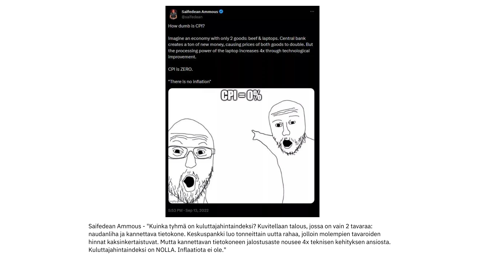

Nämä vivahteet inflaation mittaamisessa kuluttajahintaindeksillä korostavat rahapainon ja inflaation välisen suhteen monimutkaisuutta. Ne viittaavat myös siihen, että todellinen inflaatio saattaa olla ilmoitettua suurempi, jos kaikki hinnankorotukset, erityisesti keskeisillä aloilla, kuten kiinteistöalalla, otettaisiin kattavammin huomioon. Tämä analyysi korostaa, että on tärkeää ymmärtää inflaation taustalla olevia mekanismeja ja inflaation mittaamiseen käytettävien perinteisten indeksien rajoituksia, mikä helpottaa rahapolitiikan taloudellisten vaikutusten syvällisempää ymmärtämistä.

#### MMT:n argumentit

Nykyaikainen rahateoria (MMT) tarjoaa erillisen näkökulman rahan luomiseen ja inflaatioon. MMT:n mukaan raha on ensisijaisesti peräisin hallitukselta, joka voi painaa huomattavia määriä rahoittaakseen tarpeensa aiheuttamatta inflaatiota, kunhan näiden varojen kohteena olevat alat eivät ole kylläisiä. Tämä lähestymistapa poikkeaa perinteisistä rahateorioista, sillä siinä korostetaan alakohtaisen vastaanottokyvyn merkitystä inflaatiodynamiikassa.

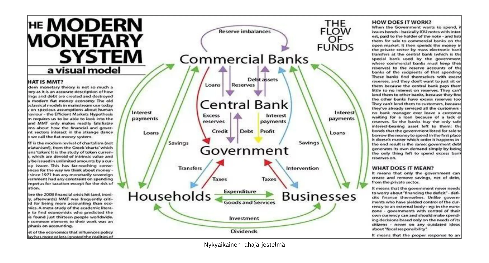

Havainnollistava esimerkki MMT:stä on Yhdysvaltain sotateollisuuskompleksi. MMT:n mukaan tälle sektorille voidaan osoittaa satoja miljardeja dollareita ilman, että se aiheuttaa inflaatiota, koska se kykenee ottamaan varat vastaan. Sitä vastoin, jos huomattavia varoja suunnataan tienrakennukseen Yhdysvalloissa, jossa yritysten ja työvoiman määrä on rajallinen, inflaatio voi syntyä resurssien niukkuuden ja tavarantoimittajien vaatimien kustannusten nousun vuoksi.

MMT:n kannattajat mainitsevat usein Japanin toisena esimerkkinä siitä, että siellä ei ole inflaatiota merkittävästä rahapainamisesta huolimatta. Japanin tilanne korostaa kuitenkin myös perinteisten inflaatiomittareiden, kuten kuluttajahintaindeksin (CPI), rajoituksia. Japanissa merkittävä osa painetusta rahasta joko säästetään tai sijoitetaan kiinteistöihin tai osakemarkkinoille sen sijaan, että se käytettäisiin juoksevaan kulutukseen. Koska kuluttajahintaindeksi ei täysin kuvaa tätä dynamiikkaa, se saattaa aliarvioida todellista inflaatiota.

Japanin analyysissä (https://ideas.repec.org/p/ces/ceswps/_9821.html) korostetaan myös, että talouden toimijoiden käyttäytyminen, kuten säästäminen tai sijoittaminen varoihin, jotka eivät sisälly kuluttajahintaindeksiin, voi peittää rahapainamisen inflaatiovaikutuksen. Lisäksi eri sektoreiden kyky ottaa vastaan lisää likviditeettiä on ratkaisevassa asemassa määriteltäessä, syntyykö inflaatiota.

#### Pankkien ja keskuspankkien taseet

Kolmas esimerkki siitä, miksi rahan painaminen ei aiheuttaisi inflaatiota, on se, että rahan painamisen ja inflaation välistä suhdetta säätelee se, miten vasta luotu raha tuodaan talouteen. Jos tämä raha pysyy yksityisten pankkien taseissa lainaamatta sitä talouden toimijoille, se ei vaikuta suoraan reaalitalouteen eikä näin ollen johda inflaatioon.

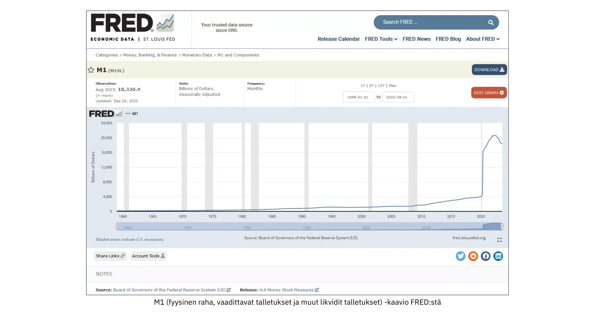

Rahan painaminen voidaan nähdä talouden yllä roikkuvana Damokleen miekkana. Luotu raha voi pysyä tietyn ajan piilevänä ilman näkyvää inflaatiovaikutusta, kunhan sitä ei pistetä talouteen pankkilainojen tai muiden mekanismien kautta. Kun tämä piilevä raha kuitenkin lopulta lasketaan liikkeeseen, inflaatiovaikutukset voivat ilmetä. Tämä on havaittu 2020-luvulla, jolloin aiemmin luotu raha on tullut talouteen ja johtanut inflaatioon.

Tämä skenaario korostaa rahapolitiikan välittymismekanismien merkitystä rahan painamisen inflaatiovaikutuksiin vaikuttamisessa. Keskuspankkien rahanluonti on vain yksi palapelin osa. Yksityisten pankkien käyttäytyminen, jotka päättävät myönnettävien lainojen määrästä, ja lainanottajien käyttäytyminen, jotka päättävät, miten lainattu raha käytetään, ovat myös ratkaisevia tekijöitä Elements tässä dynamiikassa.

#### Inflaatio on sosiaalista!

Weimarin tasavallan esimerkki havainnollistaa toista ratkaisevaa näkökohtaa rahan painamisen ja inflaation välisestä suhteesta: odotusten ja talouden toimijoiden käyttäytymisen merkitystä. Kun Weimarin tasavallan keskuspankki alkoi painaa suuria rahamääriä, taloudellinen epävarmuus sai ihmiset hamstraamaan eli varastoimaan rahaa sen sijaan, että he olisivat käyttäneet sitä. Tämä reaktio viivästytti tilapäisesti rahan painamisen inflaatiovaikutuksia.

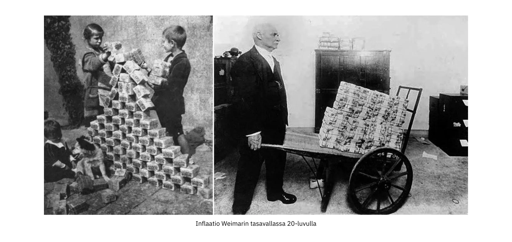

Kun taloudellinen tilanne alkoi kuitenkin hieman parantua, luottamus palautui vähitellen. Yksityishenkilöt vetivät sitten säästönsä piilopaikoistaan ja alkoivat kuluttaa massiivisesti rahaa talouteen. Tämä äkillinen muutos käyttäytymisessä yhdistettynä jo ennestään suureen rahamäärään Supply johti kysynnän räjähdysmäiseen kasvuun. Kun liikkeessä oli enemmän rahaa ja kysyntä kasvoi, hinnat alkoivat nousta nopeasti, mikä johti tuntuvaan inflaatioon.

Tämä esimerkki korostaa ajoituksen ja agenttien käyttäytymisen merkitystä inflaation syntymisessä. Inflaatio ei synny ainoastaan rahan Supply:n kasvun seurauksena, vaan se riippuu myös siitä, miten ja milloin raha käytetään taloudessa. Taloudelliset epävarmuustekijät ja talouden toimijoiden odotukset ovat ratkaisevassa asemassa tässä dynamiikassa ja voivat joko nopeuttaa tai viivästyttää rahan painamisen inflaatiovaikutuksia.

#### Yhteenveto:

- Kuluttajahintaindeksi (CPI): Kuluttajahintaindeksi: Kuluttajahintaindeksi on rakenteeltaan sellainen, että se aliarvioi inflaatiota, mikä voi antaa vääristyneen kuvan inflaation todellisuudesta.

- Alakohtainen absorptio: Rahan lisääminen aloille, jotka pystyvät ottamaan sitä vastaan, ei aina johda inflaatioon. Huomattava esimerkki on Yhdysvaltojen sotateollisuuskompleksi, joka voi absorboida suuria rahasummia käynnistämättä inflaatiota.

- Japanin tapaus: Japanissa inflaatio pysyy alhaisena huomattavasta rahan painamisesta huolimatta, koska varat usein säästetään tai sijoitetaan kiinteistöihin tai osakemarkkinoille. Nämä alat imevät painetun rahan, eikä kuluttajahintaindeksi välttämättä heijasta näiden alojen hintojen nousua.
- Rahapainon ja markkinoiden välinen korrelaatio. On havaittu, että kiinteistö- ja osakemarkkinoiden käyrät seuraavat usein rahan painamista, mikä osoittaa, mihin painettu raha on suunnattu.
- Pankkien valuuttavarannot: Kun painettu raha jää pankkien taseisiin eikä kierrä taloudessa, se ei aiheuta inflaatiota. Tätä kuvaa esimerkki vuodelta 2008, jolloin painettu raha jäi suurelta osin pankkien taseisiin, mikä viivästytti inflaatiovaikutusta.

- Weimarin tasavalta: Tämä historiallinen ajanjakso osoittaa, miten taloudellinen epävarmuus johti rahan hamstraamiseen, mikä viivästytti inflaatiota. Kun luottamus kuitenkin palautui ja rahaa käytettiin, inflaatio räjähti.

Näitä esimerkkejä voidaan käyttää keskusteluissa selittämään, miksi inflaatio ei aina ole rahan painamisen välitön seuraus ja miten taloudelliset olosuhteet ja toimijoiden käyttäytyminen vaikuttavat inflaatioon.

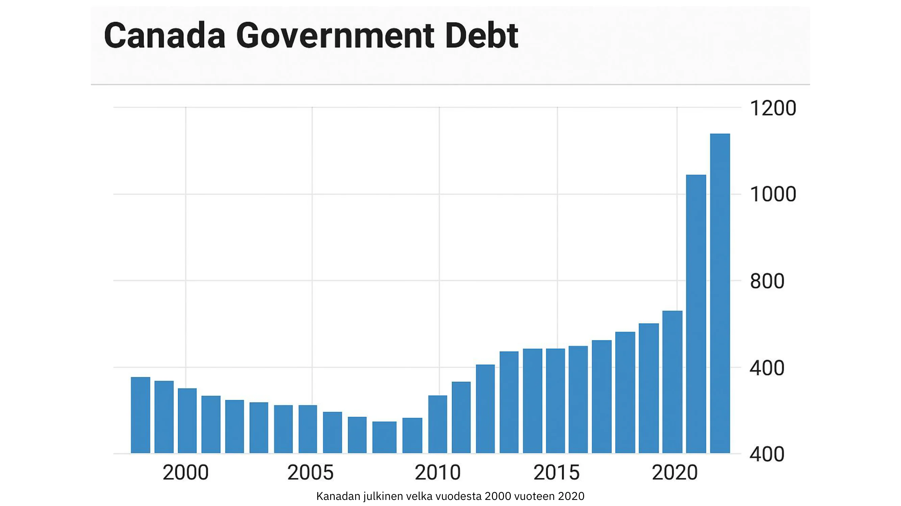

Kuten tämä [viestiketju](https://twitter.com/saifedean/status/1673639779433590786) osoittaa: Inflaatio on kaikkea muuta paitsi keskuspankkien vika.

- Taloustieteilijät syyttävät ilmastonmuutosta inflaatiosta

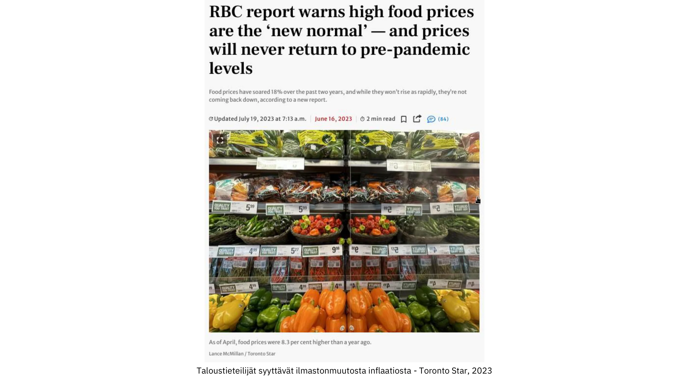

- Esimerkki siitä, että Ruotsi syyttää Beyoncéa inflaatiosta tietyn kuukauden aikana.

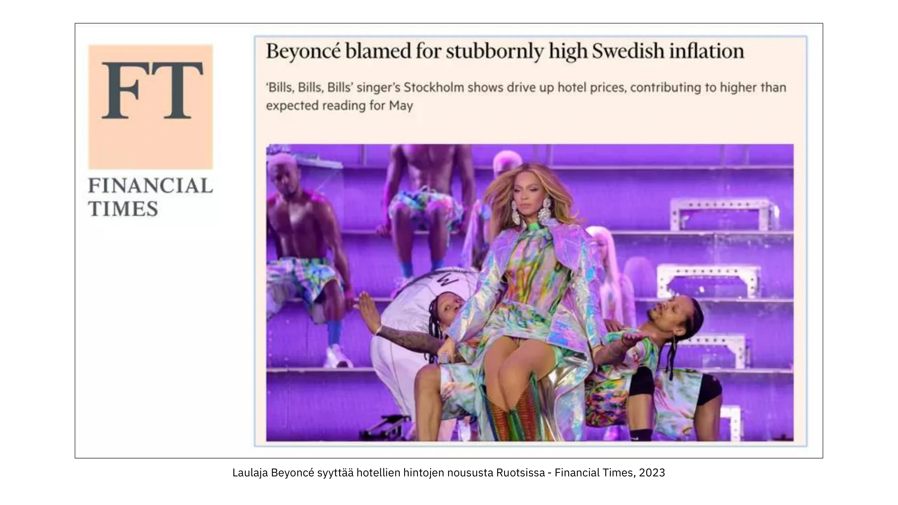

- Puolan keskuspankki selittää inflaation Venäjän hyökkäyksellä Ukrainassa ja pandemialla

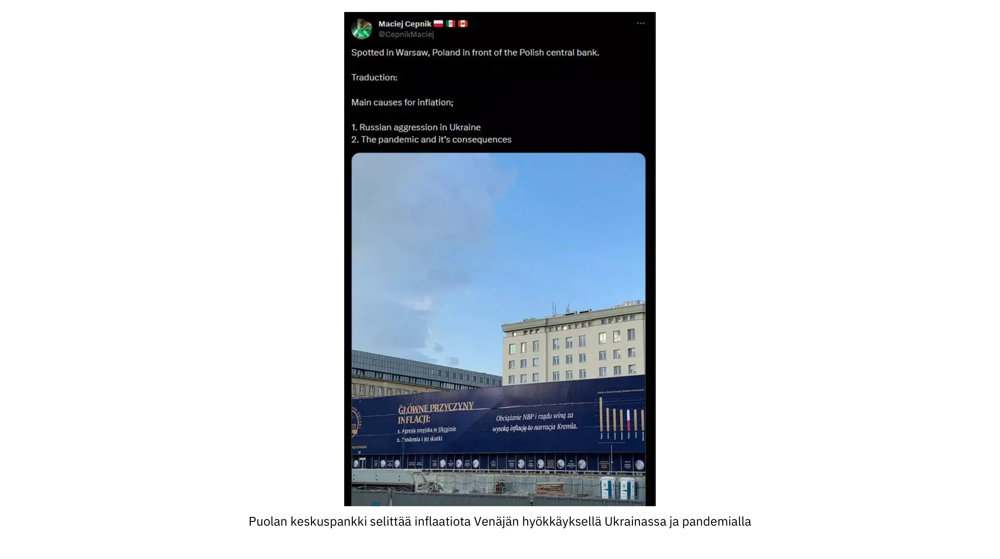

- Brexitiä syytetään inflaatiosta Yhdistyneessä kuningaskunnassa.

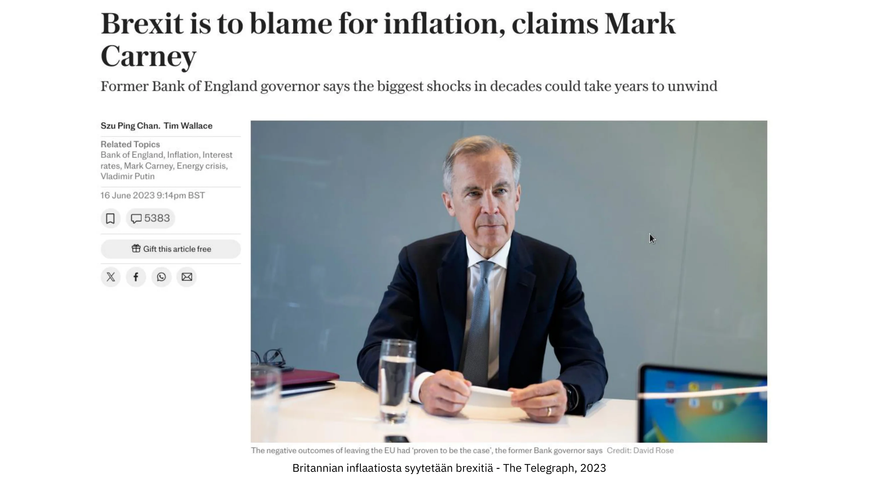

- Zelda-pelin julkaisuun liittyy inflaatiohäiriö.

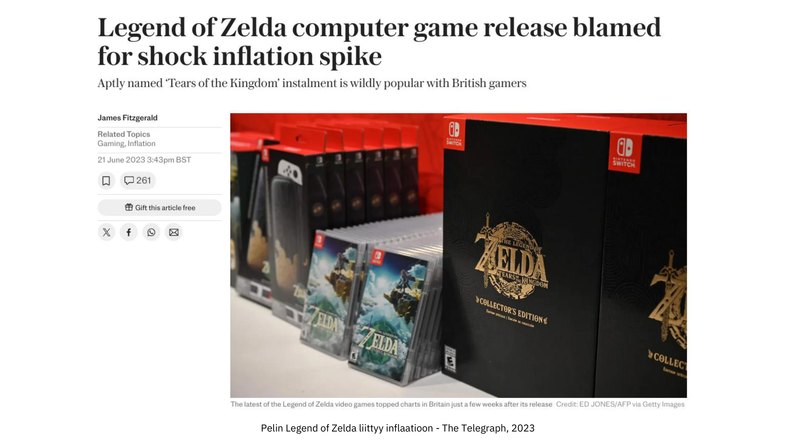

- Taylor Swiftin väitetään aiheuttavan inflaatiota.

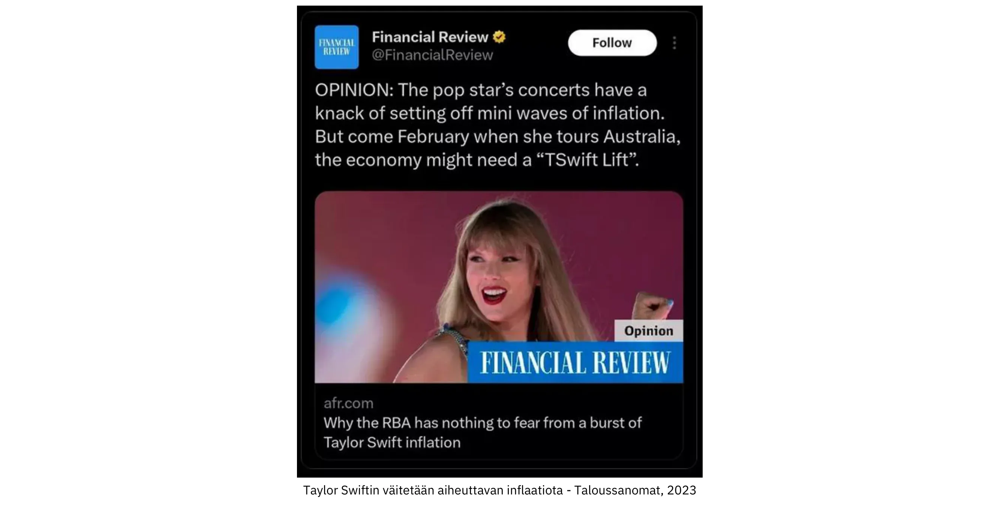

Kerro minulle, miten Beyoncé tai Taylor Swift voisivat aiheuttaa hintojen laajamittaisen nousun? Siinä ei näet ole mitään järkeä. Lyhyesti sanottuna:

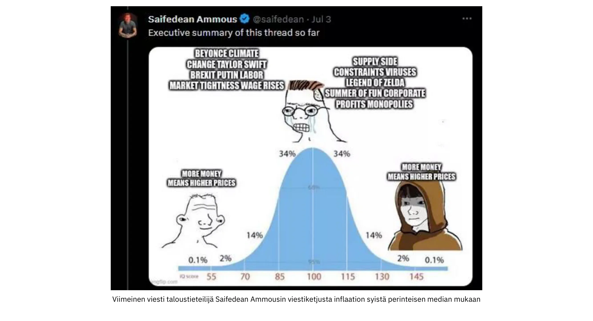

### Inflaatiotyyppien tutkiminen

On ratkaisevan tärkeää ymmärtää erilaisten inflaatiotyyppien välinen ero, jotta voimme ymmärtää tämän taloudellisen ilmiön eri ilmenemismuotoja. Seuraavassa selitetään nämä eri tyypit:

- Hiipivä inflaatio: Inflaatio on inflaatiotyyppi, johon keskuspankit yleensä pyrkivät ja joka on noin 2 prosenttia vuodessa. Tämä tavoite on ollut käytössä 1990-luvulta lähtien, ja sillä pyritään ylläpitämään vakaata talouskasvua ilman ylikuumenemista tai deflaatiota.
- Maltillinen inflaatio: Tämä inflaatiomuoto syntyy, kun inflaatio ylittää 2 prosentin tavoitteen. Se liittyy usein talouden ylikuumenemiseen eli tilaan, jossa liiallinen rahamäärä Supply edistää yleistä hintojen nousua. Tämä skenaario paljastaa rahapolitiikan rajat ja toisinaan talouskeskustelun ristiriitaisuudet.
- Galppiva inflaatio: Inflaatiovauhti, jota kutsutaan usein kaksinumeroiseksi inflaatioksi, tapahtuu, kun vuotuinen inflaatiovauhti on yli 10 prosenttia. Se merkitsee merkittävää hinnannousua, joka voi vaarantaa talouden vakauden.

- Hyperinflaatio: Inflaatio on äärimmäinen ilmiö, jossa inflaatio on yli 50 prosenttia kuukaudessa, mikä inflaation eksponentiaalisen luonteen vuoksi vastaa yli 13 000 prosentin vuotuista inflaatiota. Tällainen inflaatio horjuttaa vakavasti taloutta, tekee valuutasta lähes arvottoman ja murentaa luottamusta rahajärjestelmään.

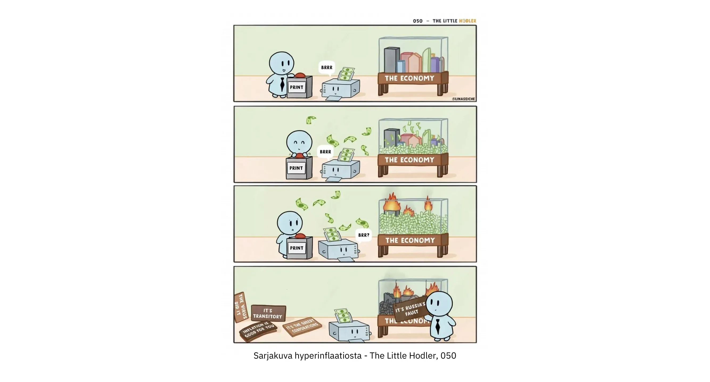

Inflaatiotyyppejä tutkittaessa törmää usein sellaisiin termeihin kuin "Demand Pull" ja "Cost Push". Vaikka nämä käsitteet ovatkin päteviä, niillä selitetään pikemminkin hintojen nousua kuin inflaatiota rahapoliittisena ilmiönä. Tässä on syvällisempi analyysi:

- Demand Pull:

Kysynnän aiheuttamaa inflaatiota kuvataan usein skenaarioksi, jossa talouden kysyntä ylittää käytettävissä olevan tuotantokapasiteetin. Ilman vastaavaa rahan määrän kasvua Supply johtaa tämä tilanne kuitenkin yksinkertaisesti menojen uudelleenjakoon. Kuluttajat saattavat käyttää enemmän välttämättömiin tavaroihin ja vähemmän muihin kuin välttämättömiin tavaroihin, mikä neutralisoi inflaation kokonaisvaikutusta.

- Kustannuspaine:

Toisaalta kustannusinflaatio johtuu tuotantokustannusten, kuten luonnonvarojen tai työvoimakustannusten, noususta. Ilman rahamäärän Supply kasvua kustannusten nousu jollakin sektorilla voi yksinkertaisesti vähentää muiden sektorien menoja aiheuttamatta laajaa inflaatiota.

Näissä perinteisissä selityksissä hinnankorotukset liitetään usein inflaatioon, mikä voi johtaa sekaannukseen ja väärinkäsityksiin. Todellisuudessa laajamittaisen inflaation syntyminen edellyttää rahan määrän kasvua Supply. Tässä yhteydessä kysynnän vetovoiman ja kustannuspaineen käsitteet voivat selittää alakohtaiset hintavaihtelut, mutta ne eivät kuvaa inflaation rahamääräistä luonnetta. Tämä korostaa, että on tärkeää erottaa toisistaan alakohtaiset hinnankorotukset ja laajalle levinnyt inflaatio, ja vahvistaa uudelleen, että rahan Supply:n korottaminen on tarpeen, jotta inflaatio ei pääse leviämään koko talouteen. Tämä analyysi tarjoaa vivahteikkaamman ja tarkemman näkökulman inflaation todellisiin syihin, ja se purkaa yleisiä tulkintoja, jotka saattavat peittää alleen taustalla olevan rahapoliittisen dynamiikan.

### Inflaation luokittelu Bernholzin mukaan

Bernholz ehdottaa inflaation yksinkertaistettua mutta täsmällistä luokittelua kolmeen luokkaan, mikä mahdollistaa tämän monimutkaisen rahapoliittisen ilmiön paremman ymmärtämisen:

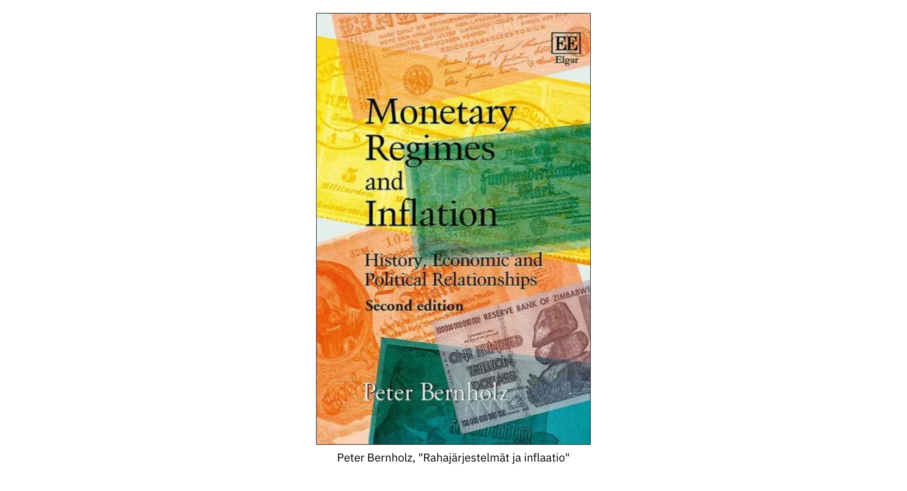

- Maltillinen inflaatio:

Maltillinen inflaatio syntyy, kun rahan määrä Supply on normaalia korkeampi, mutta valtio ei turvaudu suuriin alijäämiin, jotka rahoitetaan rahanluonnilla. Vaikka termi "kohtalainen" saattaa vaikuttaa merkityksettömältä, tämä inflaation muoto voi aiheuttaa huomattavia ongelmia, vaikka sitä ei luokitella korkeaksi inflaatioksi.

- Korkea inflaatio:

Korkeasta inflaatiosta puhutaan, kun rahan reaaliarvo Supply laskee nimellisarvon kasvusta huolimatta. Tämä paradoksaalinen tilanne johtuu rahan korvaamisesta, kun yksilöt menettävät luottamuksensa kansalliseen valuuttaan ja pyrkivät Exchange vaihtamaan sen tavaroihin, palveluihin tai ulkomaisiin valuuttoihin. Tämä prosessi vähentää valuutan reaaliarvoa entisestään, mikä pahentaa inflaatiota.

- Hyperinflaatio:

Hyperinflaatio on korkean inflaation äärimmäinen muoto, jolle on ominaista suuret budjettivajeet, jotka rahoitetaan luomalla rahaa. Historiallisesti hyperinflaatiota ei ole havaittu ilman, että alijäämää olisi rahoitettu merkittävästi rahaa painamalla. Hyperinflaatio luo noidankehän: inflaatio heikentää valuutan arvoa niin nopeasti, että verotulot heikkenevät ennen kuin valtio ehtii edes kerätä niitä, mikä pakottaa valtion painamaan vielä enemmän rahaa rahoittaakseen itsensä. Tämä itseään vahvistava sykli johtaa tähtitieteellisiin inflaatiolukuihin, jotka ovat usein yli 50 prosenttia kuukaudessa.

Tämä Bernholzin luokittelu korostaa vaarallista kehitystä maltillisesta inflaatiosta hyperinflaatioon ja korostaa raha- ja finanssipoliittisen valvonnan elintärkeää merkitystä tuhoisan inflaatiokierteen estämisessä. Se osoittaa myös, että haitalliset seuraukset valtiontaloudelle voivat ilmetä jo paljon ennen hyperinflaation vaihetta, ja tarjoaa näin vivahteikkaan näkökulman eriasteisen inflaation vaikutuksiin.

### Johtopäätökset: Yhteenveto inflaatiotyypeistä

Lopuksi olemme tarkastelleet erilaisia inflaatiotyyppejä alkaen yleisesti kuulluista termeistä, kuten "hiipivä inflaatio", "kävelevä inflaatio" ja "ryöppyävä inflaatio", joista kukin tarkoittaa eritasoista inflaatioprosenttia taloudessa. Bernholzin kuvaamat kohtalaisen inflaation, korkean inflaation ja hyperinflaation luokat osoittautuvat kuitenkin ratkaiseviksi vertailukohteiksi hyperinflaatiota koskevassa perusteellisessa tutkimuksessamme.

- Maltillinen inflaatio:

Se osoittaa, että rahan määrä Supply on normaalia korkeampi, vaikka tämä taso voidaan pitää yllä ilman valtion merkittävää alijäämärahoitusta.

- Korkea inflaatio:

Se tapahtuu, kun rahan reaaliarvo Supply laskee, usein rahan korvaamisen vuoksi, jolloin yksilöt pyrkivät vaihtamaan rahansa Exchange tavaroihin, palveluihin tai muihin rahamuotoihin.

- Hyperinflaatio:

Se edustaa korkean inflaation äärimmäistä versiota, jossa liiallinen rahanluonti suurten budjettivajeiden rahoittamiseksi johtaa valuutan reaaliarvon nopeaan heikkenemiseen.

Tutkimuksemme tuloksena käy ilmi, että hyperinflaatio on monimutkainen ja intuition vastainen ilmiö. Vaikka voisi olettaa, että hyperinflaatio on seurausta rahan Supply massiivisesta kasvusta, todellisuudessa se johtuu rahan Supply reaaliarvon laskusta. Tämä vivahde on ratkaisevan tärkeä sen ymmärtämiseksi, miksi jotkut maat kamppailevat hyperinflaatiosta selviytymisen kanssa, vaikka ne saisivat tukea kansainvälisiltä instituutioilta, kuten Maailmanpankilta tai IMF:ltä. Inflaation tyypin vääränlainen määrittely voi johtaa epätarkoituksenmukaisten korjaustoimenpiteiden soveltamiseen, mikä pahentaa taloudellisia ongelmia niiden ratkaisemisen sijaan.

Tulevissa keskusteluissamme syvennymme hyperinflaatioon ja tarkastelemme sen määritelmiä ja ilmenemismuotoja eri taloudellisissa yhteyksissä. Tavoitteenamme on paljastaa hyperinflaation taustalla olevat mekanismit ja tutkia mahdollisia ratkaisuja Address:n ongelman ratkaisemiseksi. Tämän vivahteikkaan ymmärryksen avulla voimme ymmärtää paremmin siihen liittyviä haasteita ja ehdottaa tietoon perustuvia strategioita inflaation hallitsemiseksi.

Kiitos huomiostanne. Seuraava istunto on kokonaan omistettu hyperinflaation määrittelylle ja demystifioinnille, ja siinä tarkastellaan erilaisia akateemisia ja käytännön näkökulmia. Odotamme innolla, että pääsemme jatkamaan tätä pohdintaa kanssanne seuraavassa kokouksessamme.

# Mikä on hyperinflaatio?

<partId>3f541663-1e2f-5410-8ee0-f61c5d009fa5</partId>

## Hyperinflaation määritelmät

<chapterId>d2a71a2e-5f36-58d9-993c-d431f4aa07fd</chapterId>

### Hyperinflaation määritelmät

Tässä jaksossa tarkastelemme hyperinflaation eri määritelmiä. Hyperinflaatio on keskeinen termi, kun tutkitaan äärimmäisiä rahapoliittisia ilmiöitä. Tunnetuin määritelmä on peräisin Philip Caganilta, joka ehdotti vuonna 1956 julkaistussa teoksessaan "The Monetary Dynamics of Hyperinflation" hyperinflaation määrällistä ymmärtämistä. Caganin mukaan:

- Hyperinflaation alku ja loppu:
  - Hyperinflaatio alkaa, kun kuukausittainen inflaatio ylittää 50 prosenttia.
  - Se päättyy, kun inflaatio laskee alle 50 prosenttiin kuukaudessa vähintään yhden vuoden ajan.

Jos inflaatio laskee 40 prosenttiin heinäkuussa ja nousee yli 50 prosentin vasta seuraavan vuoden heinäkuussa, hyperinflaation katsotaan päättyneen sitä vuotta edeltävän vuoden heinäkuussa, jona se havaittiin ensimmäisen kerran. Tämä määritelmä mahdollistaa hyperinflaatiojaksojen tarkan luonnehdinnan, mikä helpottaa jäsenneltyä analyysia.

Tämä määritelmä on otettu käyttöön Hanke-Krusin taulukossa, jossa on dokumentoitu 56 hyperinflaatiojaksoa. Taulukko ei kuitenkaan kata kaikkia tapauksia, kuten Venezuelassa vuonna 2016 tapahtunutta, jolloin tapauksia oli yhteensä 57 kappaletta.

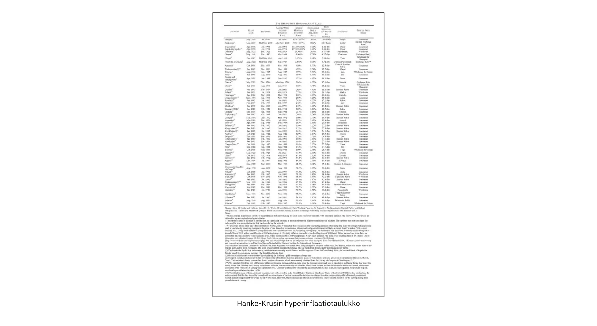

zoom

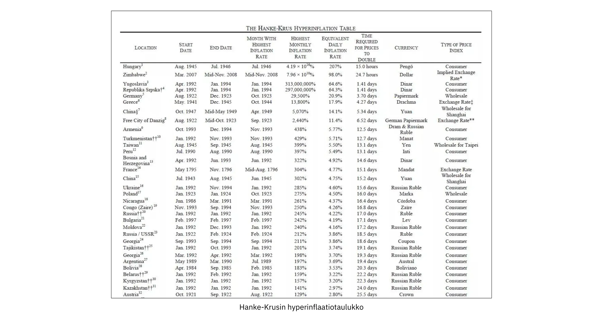

On syytä huomata, että vaikka tämä määritelmä on tarkka, se voi mahdollisesti sulkea pois tietyt hyperinflaatiojaksot, koska 50 prosentin kynnysarvo on tiukka. Määritelmää on mahdollista laajentaa siten, että se sisältää myös muita jaksoja, jotka eivät tarkkaan ottaen täytä Caganin kriteerejä, mutta jotka kuitenkin edustavat erittäin korkean inflaation jaksoja. Tämä havainto avaa oven hyperinflaatioilmiöiden laajemmalle tutkimiselle, mikä mahdollistaa vivahteikkaamman ymmärryksen hyperinflaation syistä ja vaikutuksista. Myöhemmissä keskusteluissa harkitsemme tämän määritelmän tarkistamista ja sellaisten hyperinflaatiojaksojen tarkastelua, jotka eivät kuulu Caganin tiukkojen kriteerien piiriin.

### Caganin hyperinflaation määritelmä

Philip Cagan on saattanut asettaa mielivaltaisen virstanpylvään 50 prosentin kuukausittaisella inflaatiokynnyksellä määritellessään hyperinflaatiota. Hän myöntää itsekin, että määritelmä on mielivaltainen ja että se palvelee ensisijaisesti hänen analyysiaan, joka perustuu seitsemään hyperinflaatiojaksoon. Caganin tietoja tarkasteltaessa käy ilmi, että kolme hyperinflaatiojaksoa, joissa kuukausittainen inflaatio oli alhaisin, olivat noin 47 prosenttia, 46 prosenttia ja 57 prosenttia. Vaikuttaa siltä, että 50 prosentin kynnysarvo valittiin, jotta nämä tapaukset voitaisiin sisällyttää hänen tutkimukseensa.

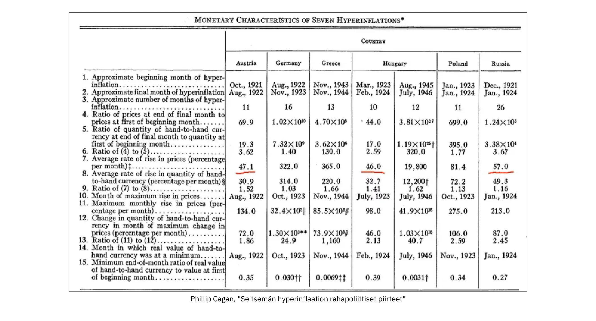

- Historiallinen konteksti:

Caganin määritelmä on peräisin vuodelta 1956, ja se perustuu siihen aikaan käytettävissä olleisiin rajalliseen määrään hyperinflaatiojaksoja.

- Caganin huomautukset:

Caganin mukaan yksikään episodi ei saavuttanut tätä noin 50 prosentin kynnystä ilman, että se olisi edennyt vakavampaan hyperinflaatioon, mikä voisi olla peruste tämän kynnyksen valinnalle.

- Caganin määritelmän kritiikki:

Myös muut taloustieteilijät, kuten Monetary Regime and Inflation -teoksen kirjoittanut Bernholz, ovat pitäneet 50 prosentin rajaa mielivaltaisena.

Bernholz huomauttaa, että on olemassa korkean inflaation jaksoja, joilla on samat laadulliset ominaisuudet kuin hyperinflaatiolla, mutta jotka eivät saavuta 50 prosentin kynnysarvoa.

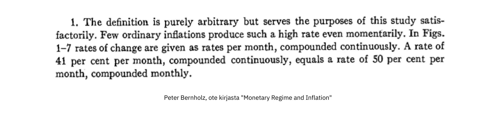

Tämä pohdinta saa meidät kyseenalaistamaan hyperinflaation perinteisen määritelmän jäykkyyden ja korostamaan tarvetta ehkä tarkistaa tätä kynnysarvoa ottamalla mukaan lisää jaksoja ja historiallisia tietoja. Hyperinflaation määritelmä saattaa vaatia joustavuutta, jotta se kattaa erilaiset äärimmäisen inflaation ilmenemismuodot erilaisissa taloudellisissa ja historiallisissa yhteyksissä.

### Hyperinflaation määritelmä kansainvälisen tilinpäätösstandardilautakunnan (IASB) mukaan

IASB tarjoaa ainutlaatuisen näkökulman hyperinflaatioon keskittymällä hyperinflaation aikaisiin kirjanpitokäytäntöihin. Tämä lähestymistapa on ratkaisevan tärkeä kirjanpitäjille ja yrityksille, jotka toimivat hyperinflaatioympäristöissä, joissa rahan arvo vaihtelee nopeasti. IASB:n ohjeissa yksilöidään erilaisia hyperinflaation indikaattoreita:

- Muiden kuin rahamääräisten varojen suosiminen:**

Yksilöt pitävät arvoa mieluummin tavaroina kuin valuuttana, koska rahan arvo heikkenee nopeasti.

- Tavaroiden ja palvelujen arvostus:**

Asukkaat eivät laske tavaroiden ja palvelujen arvoa paikallisessa valuutassa, mikä kertoo luottamuksen menettämisestä paikalliseen valuuttaan.

- Korvaus rahallisen arvon menetyksestä:**

Hintoihin sisältyy korvaus luotto-ostojen yhteydessä tapahtuvasta rahallisen arvon menetyksestä, mikä kuvaa inflaation vaikutusta päivittäisiin liiketoimiin.

- Hintojen, palkkojen ja korkojen indeksointi:**

Hintoja, palkkoja ja korkoja tarkistetaan indeksin perusteella inflaation tasaamiseksi.

- Kumulatiivinen inflaatio kolmen vuoden aikana:**

Kumulatiivinen inflaatio kolmen vuoden aikana lähestyy 100 prosenttia (noin 24 prosenttia vuodessa), mikä on ristiriidassa Caganin määrittelemän 50 prosentin kuukausittaisen inflaation kanssa.

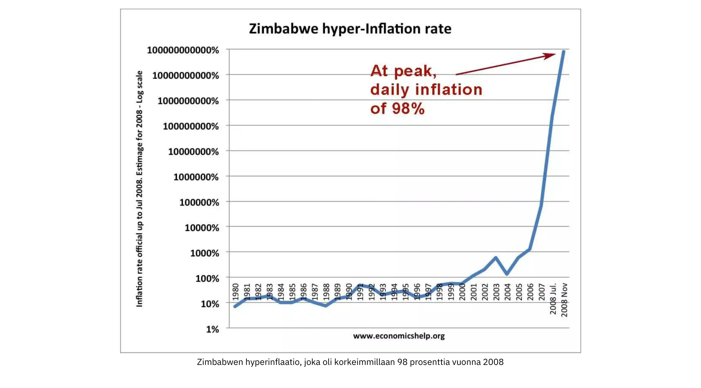

IASB:n kriteerien mukaan useat maat, kuten Argentiina, Etiopia, Haiti, Iran, Libanon, Sudan, Etelä-Sudan, Suriname, Syyria, Turkki, Venezuela, Jemen ja Zimbabwe, kärsivät tällä hetkellä hyperinflaatiosta.

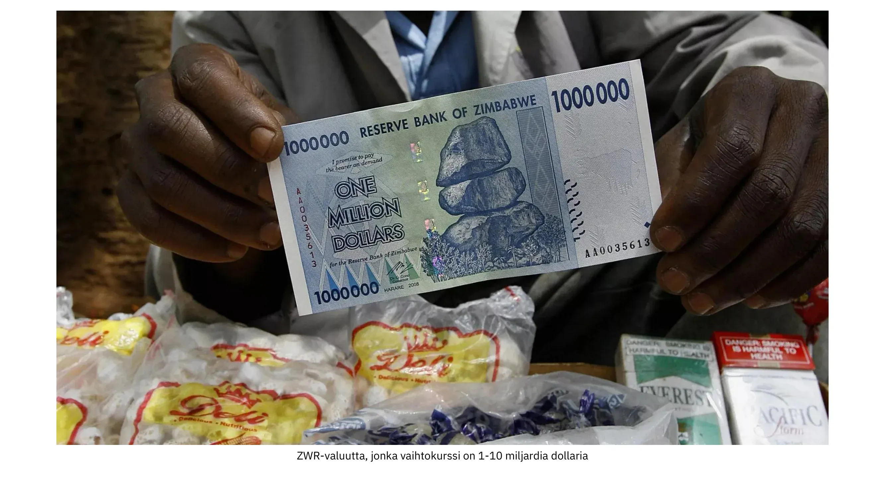

Tämä IASB:n esittämä määritelmä poikkeaa Caganin tiukasta kvantitatiivisesta raja-arvosta ja sisältää laadullisen analyysin taloudellisesta käyttäytymisestä ja hyperinflaation aiheuttamista käytännön mukautuksista. Se osoittaa, että hyperinflaatio on monimutkainen ilmiö, joka vaatii moniulotteista ymmärrystä, jotta sen todelliset vaikutukset voidaan ymmärtää, erityisesti kirjanpidon alalla, joka on ratkaisevan tärkeä yritysten ja markkinoiden vakauden ja taloudellisen avoimuuden kannalta.

### Kuinka monta hyperinflaatiota on yhteensä?

Hyperinflaation yleiset määritelmät, kuten Caganin esittämä määritelmä, jonka mukaan kuukausittainen inflaatiovauhti on 50 prosenttia, voivat joskus olla hämmentäviä tai liian yksinkertaistettuja. Esimerkiksi kaksi maata, joissa vuotuinen inflaatio on 1 000 prosenttia ja 3 000 prosenttia, voidaan hahmottaa eri tavalla inflaation kuukausittaisen jakauman perusteella. Jos yksikään kuukausi ei ylitä 50 prosentin kynnysarvoa Caganin määritelmän mukaan, näitä maita ei luokitella hyperinflaatioksi. Tämä lähestymistapa voi siis johtaa poikkeamiin hyperinflaation luokittelussa, erityisesti kun verrataan kumulatiivista inflaatiota vuoden aikana.

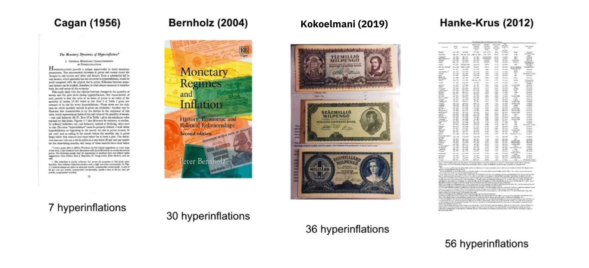

- Caganin teoksessa "Monetary Dynamics of Hyperinflation" esitetään perusanalyysi hyperinflaatiosta.
- Bernholzin kirjassa, jossa tutkitaan 30 erillistä hyperinflaatiokautta ja laajennetaan näin analyysin soveltamisalaa.
- David St-Ongen (tämän kurssin kirjoittaja) henkilökohtainen kokoelma seteleitä 36 hyperinflaatiokaudelta, mikä mahdollistaa konkreettisen ja historiallisen ymmärryksen.
- Hanky Cross -taulukko (vuoden 2012 versio, päivitetty vuonna 2016 Venezuelalla), jossa luetellaan 57 hyperinflaatiojaksoa Caganin määritelmän mukaan.

On syytä huomata, että tietyt historialliset korkean inflaation kaudet eivät sisälly hyperinflaatiota koskeviin klassisiin taulukoihin, mikä johtuu usein tiukoista luokittelukriteereistä. Esimerkiksi Yhdysvaltain itsenäisyyssodan aikana marraskuussa 1779 ja Yhdysvaltain sisällissodan aikana maaliskuussa 1864 kuukausittainen inflaatio oli 47,4 prosenttia ja 40 prosenttia. Vaikka nämä luvut ovatkin korkeita, ne eivät ylitä Caganin määrittelemää 50 prosentin kynnysarvoa, joten näitä ajanjaksoja ei voida luokitella hyperinflaatiotapauksiksi. Tämä poisjättäminen korostaa jäykkien määritelmien rajallisuutta ja korostaa tarvetta ymmärtää hyperinflaatiota sen koko monimutkaisuudessaan vivahteikkaammin.

## Weimarin ja Zimbabwen yhtäläisyydet

<chapterId>11eef458-aab8-5c63-8523-264d0ba69f5d</chapterId>

### Kaksi aikakautta, kaksi katastrofia

Tässä luvussa tarkastelemme hyperinflaation vaikutuksia keskittyen Zimbabwen ja Weimarin tasavallan kokemuksiin. Koko tutkimukseni ajan olen asettanut etusijalle näiden hyperinflaatiojaksojen aikana eläneiden henkilöiden suorien todistusten tutkimisen sen sijaan, että olisin käyttänyt puhtaasti taloudellista tai tilastollista lähestymistapaa.

Useat kirjat ovat olleet erityisen opettavaisia:

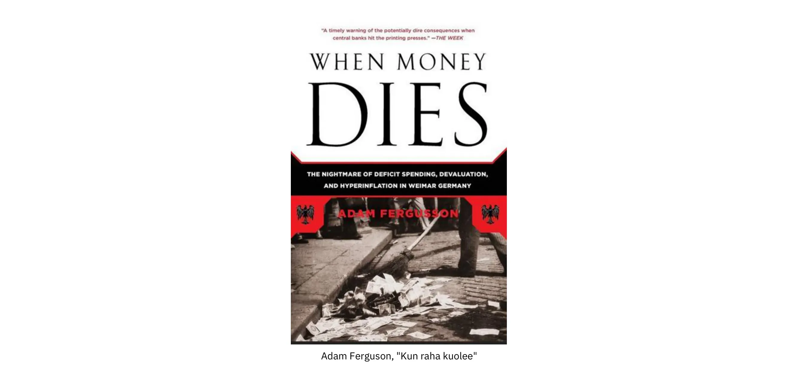

- adam Fergusonin kirjassa "When Money Dies" kuvataan ensimmäisen maailmansodan jälkeistä hyperinflaatiota Saksassa sekä Itävallassa ja Unkarissa.
- Kaksi kirjaa Zimbabwen hyperinflaatiosta, "Zimbabwe Warm Heart Ugly Face" (Zimbabwen lämmin sydän, rumat kasvot) ja "Hard Boiled Egg Index" (Hard Boiled Egg Index), ovat Jérôme Gardnerin ja Kudzai Joseph Gou Min-Yun kirjoittamia, ja niissä vaatekauppaketjun toimitusjohtajan ja maatalouspankkiirin kirjoittamat koskettavat todistukset heidän kokemuksistaan tämän myrskyisän ajanjakson aikana.

Muistiinpanojani kootessani huomasin lukuisia yhtäläisyyksiä Zimbabwen ja Weimarin tasavallan hyperinflaatiokokemusten välillä, vaikka niiden välillä on 90 vuoden ikäero. Havaitsin noin 17 yhtäläisyyttä, joista 13 kuvastaa eräänlaista etenemistä kohti näissä kertomuksissa kuvattua taloudellista katastrofia. Nämä kiehtovat yhtäläisyydet osoittavat hyperinflaation toistuvan ja tuhoisan luonteen yli aikojen ja rajojen. Tänään tarkastelemme näitä yhtäläisyyksiä ja sitä, miten ne kuvaavat huolestuttavaa kehityskulkua hyperinflaation aikana.

### Vertaileva analyysi: Zimbabwe ja Weimarin tasavalta

14 eron peli!

#### 1. Rahapula

Kun valuutan arvo laskee huimaa vauhtia, kunnianhimoisimmatkin yritykset tulvia markkinoille uusilla seteleillä voivat osoittautua riittämättömiksi. Käsiteltävän rahan jatkuva kysyntä voi ylittää reilusti keskuspankkien kyvyn tuottaa seteleitä, mikä aiheuttaa ennennäkemättömiä likviditeettikriisejä.

> Weimar: "Tämän kuun aikana se nostetaan lähes 4 miljardiin paperimarkkaan, ja tämän luvun avulla toivotaan, että rahapula saadaan lopullisesti ratkaistua."

> Zimbabwe: "Vuodesta 2002 tammikuuhun 2009 oli useita kriittisiä likviditeettipulmia. Seteleitä ei yksinkertaisesti painettu tai niitä ei ollut liikkeessä tarpeeksi, jotta ne olisivat pysyneet mukana räjähdysmäisesti kasvaneessa inflaatiossa."

#### 2. "Ja se on lantaa!"

On hämmästyttävää, miten nopeasti valuutta voi menettää arvonsa tietyissä taloudellisissa tilanteissa. Seteleitä voidaan laskea liikkeelle ennätysajassa tähtitieteellisiä määriä, jolloin aikoinaan huomattavat summat muuttuvat hetkessä niinkin mitättömiksi kuin lannaksi.

> Weimar: "Tämänhetkinen kokonaismäärä on 63 000 miljardia. Muutaman päivän kuluttua voimme siis laskea liikkeeseen kaksi kolmasosaa koko liikkeeseenlaskusta yhdessä päivässä."

> Zimbabwe: "17. syyskuuta 2006 RBZ:n pääjohtaja Gideon Gono julisti: '10 biljoonaa on yhä ulkona, ja siitä on tullut lantaa'."

#### 3. Seteleiden arvo on pienempi kuin niiden painettu paperi

Tietyissä taloudellisissa olosuhteissa setelin itseisarvo voi alittaa sen paperin arvon, jolle se on painettu. Tämä jyrkkä arvon aleneminen tekee seteleistä, jotka ovat tavallisesti arvon ja ostovoiman symboleja, pelkkiä arvottomia paperinpalasia.

> Weimar: "Kokonaiset markkamääräiset setelit olivat lähes arvottomia heti, kun ne tulivat painokoneesta."

> Zimbabwe: "Keskuspankki tuhlasi rahaa painattamalla setelin, joka ei ollut painetun paperin arvoinen. Toisin sanoen sen arvo oli pienempi kuin vessapaperin. Niin absurdilta kuin se kuulostaakin, oli halvempaa käyttää 100 biljoonan ZWD:n seteliä vessapaperina kuin ostaa varsinaista vessapaperia."

#### 4. Rahan laskeminen

Kun valuutta menettää nopeasti arvoaan, yksinkertaisimmistakin liiketoimista voi tulla työläitä. Tavaran hinnan laskeminen tai pelkkä maksamiseen tarvittavien seteleiden laskeminen voi viedä useita minuutteja, mikä lisää Layer:n monimutkaisuutta päivittäiseen kanssakäymiseen.

> Weimar: "Tavallisin ostos kaupassa vaati kolme tai neljä minuuttia laskemista, ja kun hinta oli selvillä, seteleiden laskemiseen kului yleensä vielä useita minuutteja."

> Zimbabwe: "Myymäläpäälliköt saivat myös palkata tilapäisen työntekijän korvaamaan koko päivän rahaa laskeneen työntekijän. Rahan laskeminen myymälässä hallintoa ja pankkitalletusta varten oli tietysti yksi asia, mutta koko prosessi piti toistaa pankissa talletuksen aikana."

:::video id=910231d7-af90-4ab8-b74c-bfb81caebfb2:::

Uzbekistanin tekniikka rahan laskemisessa

#### 5. Maksut shekillä

Häiriintyneissä talouksissa perinteiset maksutavat, kuten shekit, voivat menettää nopeasti tehonsa. Pankit, joita hyperinflaatiosta johtuva valuutan kasvava kysyntä ahdistaa, saattavat säännöstellä tai viivyttää shekkien lunastamista, mikä vähentää niiden todellista arvoa. Tämä epävakaus johtaa usein maksutapojen priorisointiin, jolloin hinnat voivat vaihdella valitun maksutavan mukaan.

> Weimar: "Hintojen nousu lisäsi sekä valtion että muiden työnantajien rahan kysyntää. Yksityiset pankit eivät pystyneet lainkaan vastaamaan kysyntään ja joutuivat säännöstelemään sekkien lunastamista, joten lunastamattomat sekit jäivät jäädytetyksi niiden ostovoiman vähetessä."
> Zimbabwe: "Rahan aika-arvo loi tavaroille ja palveluille kolme hintaa: käteishinnan, reaaliaikaisen bruttomaksun ja shekkihinnan. Lopulta kukaan ei hyväksynyt sekkejä, joiden selvittäminen kesti viisi päivää."

#### 6. "Burner-yrittäjät"

Kun valuutan arvo laskee, syntyy uusia taloudellisia mahdollisuuksia, joissa hyödynnetään markkinoiden vääristymiä. Nämä yrittäjät, joita kutsutaan usein "Burner-yrittäjiksi", voivat menestyä lainaamalla devalvoitunutta valuuttaa investoidakseen aineelliseen omaisuuteen ja maksamalla velkansa takaisin vielä devalvoituneemmalla valuutalla.

Weimar: "Inflaatiokeinotteluun kuului paperimarkkojen lainaaminen, niiden muuntaminen tavaroiksi ja tehtaiksi ja sitten lainanantajien maksaminen takaisin devalvoituneella paperilla."

Zimbabwe: "Burner-yrittäjät" (polttajayrittäjät)

#### 7. Rehellisyys ja Hard-työ menettävät vetovoimansa

Epävakaassa taloudellisessa tilanteessa nopean vaurastumisen houkutus voi jättää varjoonsa perinteiset arvot, kuten Hard työnteon, säästäväisyyden ja rehellisyyden. Keinottelu ja valuuttakauppa tarjoavat usein huomattavasti suurempia palkkioita kuin tavallinen työ, mikä johtaa yhteiskunnallisten prioriteettien muuttumiseen.

Weimar: "Kun vanhat säästäväisyyden, rehellisyyden ja Hard-työn hyveet menettivät vetovoimansa, kaikki pyrkivät rikastumaan nopeasti, varsinkin kun raha- tai pörssikeinottelulla saattoi ilmeisesti saada paljon enemmän kuin työllä."

Zimbabwe: "Nämä käytännöt rikastuttivat muutamia yksilöitä, mutta köyhdyttivät kaupunkien työväenluokkaa ja maaseutuväestöä. Koulutus menetti arvonsa, koska tätä kauppaa harjoittivat ihmiset, jotka eivät tarvinneet koulutusta tai Hard-työtä sen perustelemiseksi. He tarvitsivat vain suhteita ja alkupääomaa helpon rahan bisneksensä aloittamiseen."

#### 8. "Maailman pankit"

Hyperinflaation tai valuuttakriisin aikana syntyy usein rinnakkaisia ja sääntelemättömiä valuuttamarkkinoita. Nämä epäviralliset "pankit", joita kutsutaan usein humoristisesti "maailmanpankeiksi" tai muilla paikallisilla nimillä, tarjoavat turvapaikan niille, jotka haluavat suojella varojaan devalvaatiolta. Vaikka nämä markkinat voivat tarjota välttämättömän taloudellisen pelastusrenkaan, ne tuovat usein esiin laajalle levinneen epäluottamuksen virallisia rahoituslaitoksia ja hallituksen politiikkaa kohtaan.

Weimar: "Heidän liiketoimensa hoidettiin pääasiassa niin sanottujen Winkelbankiersin kautta, eli inflaation myötä esiin tulleiden katu-operaattoreiden kautta, jotka sairaassa taloudessa menestyessään elivät täysin hyödyntämällä ulkomaanvaluuttojen osto- ja myyntihintojen välistä eroa."

Zimbabwe: "He olivat myös valuutanvaihtajia. He toimivat rangaistuksetta Bulawayon 2nd ja 6th Avenuen ja Fort Streetin välillä ovelien liiketoimintatapojensa ansiosta, joihin usein liittyi korruptiota ja muuta laitonta toimintaa. Tämä kaupunginosa tunnettiin nimellä 'Maailmanpankki'."

Argentiina: "Niinpä menin sinne, minne kaikki argentiinalaiset menevät: cuevasiin, 'luoliin', jotka sijaitsevat Floridan kaupunginosassa Buenos Airesin sydämessä." - TheBigWhale

#### 9. Valuutanvaihto oli laitonta

Pyrkiessään vakauttamaan omaa valuuttaansa ja valvomaan pääomavirtoja hallitukset saattavat tehdä näistä valuuttakaupoista laittomia. Vaikka näillä tukahduttavilla toimenpiteillä pyritäänkin suojelemaan kansantaloutta, niillä voi usein olla päinvastainen vaikutus, sillä ne lisäävät kansalaisten epäluottamusta ja rohkaisevat mustan pörssin toimintaa.

Weimar: "Ihmiset turvautuivat vaihtokauppaan ja siirtyivät vähitellen ulkomaanvaluuttoihin ainoana luotettavana keinona Exchange:n hankkimiseen". Ulkomaisten vekseleiden ostamisesta ja ulkomaanvaluutan käytöstä kotimaan maksuissa annettiin uusia asetuksia. Vankeusrangaistuksen lisäksi voitiin nyt määrätä sakkoja, jotka olivat jopa kymmenkertaisia laittoman liiketoimen määrään nähden."

Zimbabwe: "Yrityksiin tehdyt ratsiat johtivat useiden Bulawayon liikemiesten vangitsemiseen viikonlopuksi ja sakkoihin, jotka vastasivat kaksinkertaista määrää takaisin saatuun valuuttaan nähden, mutta sitten tämä rohkeus laantui."

#### 10. Pääomavalvonta

Kun maa joutuu raha- tai talouskriisiin, hallitukset reagoivat usein siten, että ne valvovat tiukasti pääoman liikkumista ja muotoja. Näillä toimenpiteillä pyritään usein hillitsemään paniikkia ja palauttamaan luottamus, olipa kyse sitten määräyksistä, joilla pakotetaan hyväksymään devalvoituneet kansalliset valuutat, tai ankarista seuraamuksista tiettyjä maksutapoja hylkääviä kohtaan. Niiden tehokkuus kuitenkin vaihtelee, ja joskus nämä toimenpiteet voivat osoittautua haitallisiksi tai olla irrallaan kansalaisten kokemasta todellisuudesta.

Weimar: "Kauppiaat oli hiljattain pakotettu uudella asetuksella hyväksymään valtion seteleitä; mutta koska se salli myös ulkomaisten valuuttojen käytön kaikissa ostoissa, kauppiaat löysivät yleensä tekosyitä hyväksyä melkein mitään muuta."

Zimbabwe: "Hallitus otti 12. joulukuuta 2008 käyttöön SI 175/2008, joka koskee shekkimaksuja. Siinä todettiin: "Rangaistus maksun epäämisestä sekillä/pankkikortilla tai muulla pankin välittämällä sähköisellä maksutavalla on 8. tason sakko tai kuuden kuukauden vankeusrangaistus tai molemmat Ilmeisesti jätimme SI:n huomiotta, koska se oli täysin irti todellisuudesta.""

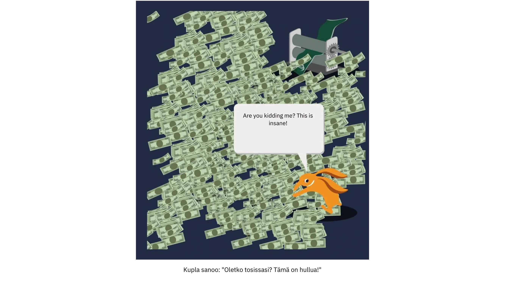

#### 11. Pakko pitää kaupat auki

Kun talous romahtaa ja valuutta menettää arvonsa, hallitukset voivat turvautua jyrkkiin toimenpiteisiin säilyttääkseen näennäisen normaaliuden.

Weimar: "Kauppiaita, jotka jatkoivat toimintaansa, koski 22. lokakuuta voimaan tullut uusi asetus, jossa heitä vaadittiin pitämään liikkeensä auki ja tarjoamaan tavaroita Exchange:ssä paperimarkkoja vastaan."

Zimbabwe: "Jäljellä oli vain tyhjiä teräshyllyjä sekä jääkaappeja, kylmiöitä ja pakastimia. Traagista oli, että kauppa oli yhä auki, koska sitä ei uskallettu sulkea poliittisten jännitteiden ja hallituksen hintasäännöstelyjoukkojen johtajien pidätysten pelon vuoksi. Työntekijöitäkään ei irtisanottu, koska kaikki luulivat, että asiaan löytyisi nopea ratkaisu."

#### 12. Kaikki ovat rikollisia

Romahtavan talouden ja kaikkialle ulottuvan sääntelyn edessä raja selviytymisen ja rikollisuuden välillä hämärtyy.

Weimar: "Kaikista rikoksista valtiota vastaan, jokaisesta niistä, vaihtelevassa määrin, tuli yksilöille selviytymiskysymys."

> Zimbabwe: "Jokainen Zimbabwen asukas oli rikollinen. Niin karulta kuin se saattaakin kuulostaa, se oli totta. Kun elämän jokaista osa-aluetta säätelivät lukemattomat pienet lait, oli väistämätöntä, että jokainen rikkoi lakia joka päivä. Ulkomaisen valuutan hallussapito oli laitonta vuonna 2004 julkaistun SI:n mukaan. Useiden pankkitilien pitäminen päivittäisen nostorajan kiertämiseksi oli laitonta. Jos autossa ei ollut asianmukaisia rekisterikilpiä, autoradiolupaa tai generaattorilupaa, joku jossain rikkoi lakia."

#### 13. Osta valuuttaa hinnalla millä hyvänsä

Ulkomaanvaluutan hurja ostaminen on usein ollut kriittinen käännekohta valuutan devalvoitumisessa, mikä on pahentanut valuutan sisäisen arvon laskua.

> Weimar: "Fritz Mannheimer lähti elokuussa 1921 pomonsa ohjeiden mukaan ostamaan ulkomaista valuuttaa hinnalla millä hyvänsä - 'koska Saksalla oli äärettömän paljon paperimarkkoja mutta ei ulkomaista valuuttaa' Tämä oli ensimmäinen merkki markan arvon täydellisestä romahduksesta.""

> Zimbabwe: On väitetty, että heille annettiin päivittäiset tavoitteet, jotka heidän oli täytettävä, koska osa valuuttatarpeista oli kiireellisiä, ja he ostivat mitä tahansa kerätäkseen valuuttoja määräaikaan mennessä. Tätä väitettyä käytäntöä syytettiin devalvaation lietsomisesta, kun Zimbabwen dollarin arvo jatkoi jyrkkää laskuaan."

### Yhteenveto prosessista

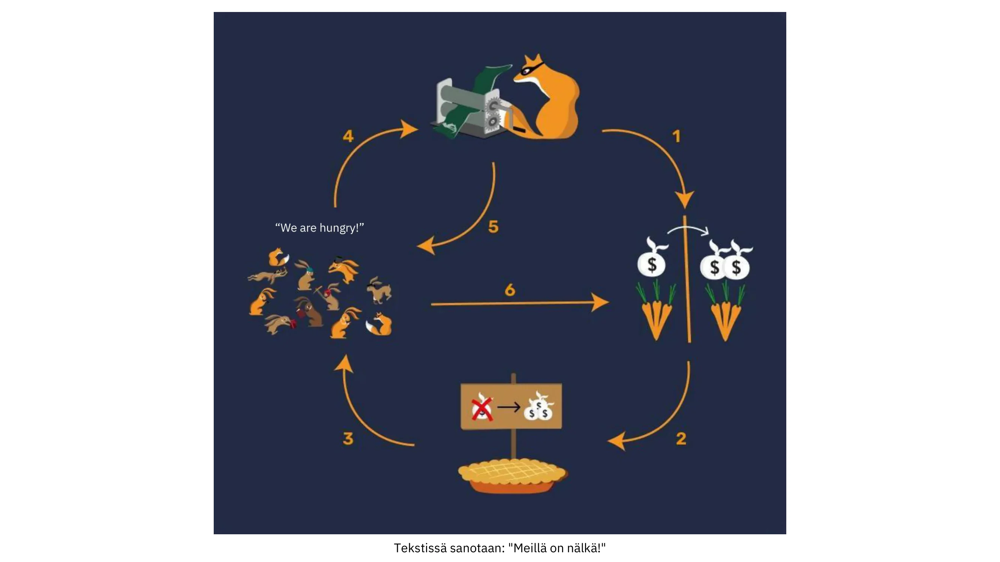

Taloudellista kehitystä analysoitaessa on ilmeistä, että kun inflaatio on korkea, rahamassan arvo heikkenee. Tämä devalvaatio johtaa useisiin komplikaatioihin, kuten setelipulaan. Tässä yhteydessä syntyy arbitraasimahdollisuuksia, erityisesti Exchange-korkojen vaihteluiden seurauksena. Tämän seurauksena monet yksityishenkilöt turvautuvat arbitraasiin ja sijoittavat paljon aineelliseen omaisuuteen odottaessaan tulevaa valuutan devalvaatiota, jonka ansiosta he voisivat maksaa velkansa takaisin heikentyneellä valuutalla. Tämä taloudellinen ympäristö heikentää perinteisten työpaikkojen houkuttelevuutta ja heikentää näin ollen sosiaalista yhteenkuuluvuutta.

Vastauksena tähän tilanteeseen hallitus antaa ankaraa sääntelyä, mukaan lukien pääomavalvonta. Se myös määrää, että kauppiaiden on hyväksyttävä kansallinen valuutta ja shekit. Ajan mittaan säädetään uusia lakeja, jotka laajentavat rikollisen käyttäytymisen määritelmää. Lopulta Exchange-kurssi nousee räjähdysmäisesti, koska hallitus on halukas vaihtamaan Exchange:n halvemmalla painetun valuutan vahvempiin ulkomaisiin valuuttoihin.

### 4 Hyperinflaation seurausten samankaltaisuudet

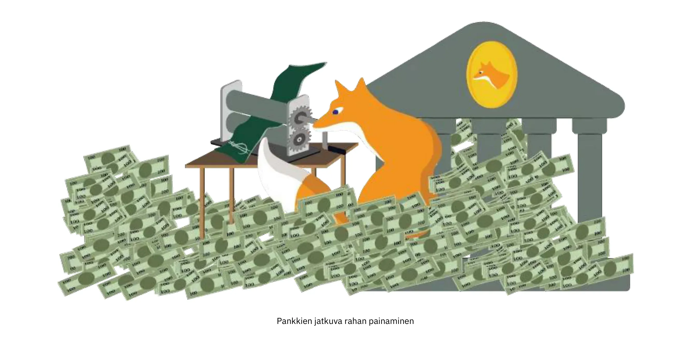

#### 1. Öljy ja metallit

Weimarin kaudella Saksassa arvokkaiden materiaalien varastaminen oli niin yleistä, että lyijyä varastettiin usein katoilta. Zimbabwessa epätoivo sai jotkut häiritsemään sähköverkkoa, jotta he saivat öljyä muuntajista ja käyttivät sitä ajoneuvoissaan.

Weimar: "Kansallisten muistomerkkien metallilaatat oli poistettava säilytystä varten. Berliinin Britannian suurlähetystön ovista varastettiin messinkiset ovikellokilvet."

Zimbabwe: "Kaiken kukkuraksi ulkomaanvaluutan puutteen vuoksi autojen voiteluöljystä oli pulaa, ja muuntajista tuli helppo kohde varkaille, jotka veivät jäähdytysöljyä sähkökatkojen aikana."

#### 2. Junat

Valuutan devalvoituminen voi saada kansalaiset omaksumaan selviytymiskäyttäytymistä, kuten vandalismia. Talouden romahtaessa kalliit julkiset infrastruktuurit, kuten liikennejärjestelmät, voivat vaarantua, mikä johtaa katastrofaalisiin yhteiskunnallisiin seurauksiin.

> Weimar: "Berliinissä raitiovaunujärjestelmä lopetti toimintansa varojen puutteen vuoksi."

> Zimbabwe: "Yksi huolestuttavimmista ja surullisimmista tilanteista oli se, että lähes koko Hararen ja Dabukan välinen sähköinen kuparijohto (yli 280 kilometriä) varastettiin. Valmistuessaan se oli ollut Zimbabwen ylpeydenaihe, sillä nopeat sähköllä kulkevat matkustaja- ja tavarajunat kulkivat tätä reittiä pitkin."

#### 3. "Mealie Meal"

Niukkojen palkkojen ja epävakaan talouden vuoksi yritysten oli pakko tarjota työntekijöilleen ruokaa, jotta tuottavuus ja toiminnan tehokkuus säilyisivät. Tämä aloite ei ollut vain keino kompensoida elintarvikepulaa ja korkeita elintarvikekustannuksia, vaan myös strategia henkilöstön pitämiseksi vaikeassa taloudellisessa ympäristössä.

> Weimar: "Berliinissä toimistotyöntekijöillä, jotka muodostivat pääkaupungissa hyvin tärkeän luokan, oli täysin riittämätön palkka, joka vaihteli 12 000:sta 20 000:een kuukaudessa (vastaa 12-19 puntaa vuodessa), ja se pieneni jatkuvasti; mutta useimmat saivat silti lounaansa symbolisella summalla, jonka heidän toimistonsa tarjosivat, joten ruumis ja sielu saattoivat juuri ja juuri pysyä yhdessä."

> Zimbabwe: "Tässä vaiheessa tarjosimme koko henkilöstölle ilmaisen lounaan. Maissijauho oli välttämätön yrityksemme toiminnan jatkumisen kannalta, sillä monissa tapauksissa se oli ainoa ateria, jonka henkilökuntamme sai päivittäin."

#### 4. Bensiini kuponkeja

Väestö etsi vakaita vaihtoehtoja liiketoimille. Weimarissa messingin ja polttoaineen kaltaiset tuotteet toimivat Exchange:n välineinä niiden pysyvän itseisarvon vuoksi. Zimbabwessa, jossa Zimbabwen dollari devalvoitui nopeasti, bensiinikuponkeista, jotka edustivat kiinteää määrää välttämättömiä tuotteita, tuli tosiasiallinen valuutta. Nämä tilanteet korostavat, miten yhteiskunnat sopeutuvat äärimmäisiin taloudellisiin olosuhteisiin ja keksivät innovatiivisia ratkaisuja kaupan ja talouden ylläpitämiseksi.

Weimar: "Vaihtokauppa oli jo tavanomainen Exchange:n muoto, mutta nyt messingin ja polttoaineen kaltaisista tavaroista tuli ostojen ja maksujen yhteinen valuutta."

Zimbabwe: "Näillä tositteilla maksamme nyt vuokran vuokranantajille, kunnallisverot, puhelinlaskut - itse asiassa melkein kaiken - koska kaikki olivat lakanneet hyväksymästä maksuja Zimbabwen dollareina ja shekkeinä."

#### Päätelmä

Tämä päättää tämän videon, joka käsittelee Zimbabwen ja Weimarin tasavallan hyperinflaatioaikojen kokemusten samankaltaisuutta. Seuraavassa videossa keskustelemme eroista ja nykyajan rinnastuksista. Kiitos.

## Weimar vs. Zimbabwe: Zimbabwe: Erot ja nykyajan rinnakkaisuudet

<chapterId>643f279c-d89f-5600-a2e2-b1bbbba0ab69</chapterId>

Tässä luvussa tarkastelemme aiempien ja nykyisten hyperinflaatiojaksojen välisiä eroja ja nykyisiä yhtäläisyyksiä, ja esitämme anekdootteja ja nykypäivän kannalta merkityksellisiä vertailuja.

### Weimarin tasavallan ja Zimbabwen väliset erot

#### 1. Se on dollarin vika!

Saksassa oli yleistä, että väestö katsoi inflaation johtuvan pikemminkin dollarin noususta kuin oman valuutan devalvoitumisesta. Monet uskoivat, että havaittu ilmiö johtui dollarin vahvistumisesta. Tämän käsityksen perusteella ei tunnustettu minkäänlaista yhteyttä taloudellisten vaikeuksien ja rahan devalvoitumisen välillä, joka johtui pääasiassa liiallisesta rahanluonnista. Kirja "When Money Dies" kuvaa selvästi tätä Saksan väestön ymmärtämättömyyttä. Sen sijaan Zimbabwessa tilanne oli toinen: kansalaiset olivat täysin tietoisia kokemansa hyperinflaation perimmäisestä syystä.

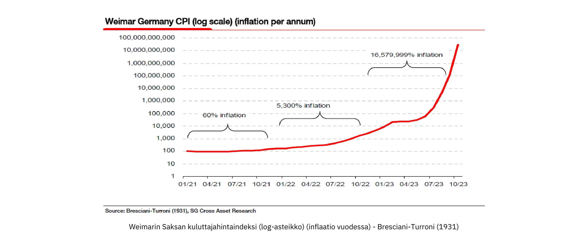

#### 2. Hätäraha (Notgeld)

Raha- ja talouskriisin vuoksi Saksa turvautui "Notgeldiin" (hätärahaan). Nämä setelit, joita kaupungit tai tietyt yritykset painoivat, oli tarkoitettu Address:n käyttöön yhteisen valuutan puutteessa.

Mielenkiintoista on, että myös Ranska turvautui Notgeldiin erityisesti 1920-luvulla. Tämä aloite ei ollut vain suora seuraus hyperinflaatiosta, vaan sen juuret olivat myös ensimmäisen maailmansodan aiheuttamissa häiriöissä. Sota ei ainoastaan horjuttanut taloutta, vaan myös lisäsi metallien hintaa. Tämän seurauksena metallikolikoiden itseisarvo ylitti usein niiden nimellisarvon, mikä sai ihmiset hamstraamaan niitä. Kolikoiden puuttuessa eräät instituutiot, kuten Lyonin kauppakamari, painattivat omia Notgeld-rahojaan.

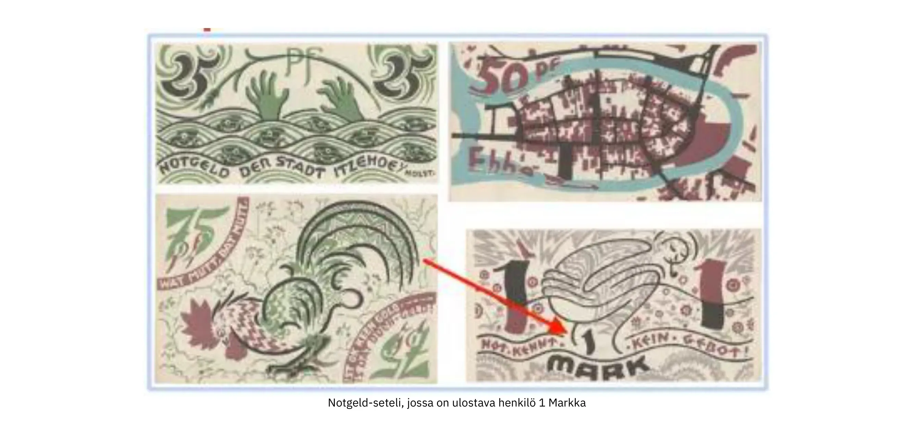

> "Mitä on tehtävä, se on tehtävä." - paikallinen sanonta

Notgeldin joukosta erottuu yksi erityinen seteli. Siinä on koskettava kuvitus: keskellä on kuvattu henkilö, joka ulostaa markan. Kääntöpuolella on hintataulukko vuosilta 1913-1921, joka havainnollistaa inflaation nousua kyseisenä aikana.

Taiteilija, joka on tämän Notgeldin takana, näyttää kritisoivan ironisesti hyperinflaatiokriisistä vastuussa olevia viranomaisia. Setelissä on teksti "Tarpeellisuus ei tunne lakia". Toinen setelin alkuperäpaikkakunnalle ominainen ilmaisu on: "Se, mitä on tehtävä, on tehtävä"

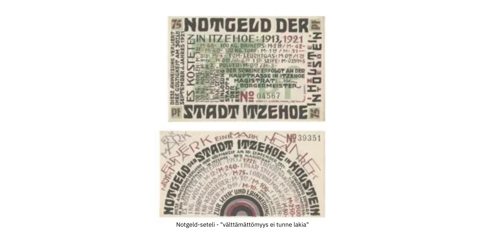

> "välttämättömyys ei tunne lakia"

> Ensimmäinen paskakolikko: Kun tarkastellaan setelin keskeistä kuvitusta, jossa valuutta kirjaimellisesti devalvoituu yksilön toimesta, sitä voitaisiin kutsua ensimmäiseksi "paskakolikoksi"

#### 3. Joukkovelkakirjalainat ja kiinnitykset

Weimarissa osa veloista arvostettiin uudelleen inflaation vaikutuksen kompensoimiseksi. Zimbabwessa tätä toimenpidettä ei toteutettu.

> Weimar: "Vuonna 1925 tuli voimaan päätös valtion omistamien lainojen uudelleenarvostamisesta, jonka seurauksena osakkeenomistajat saivat 2,5 prosenttia alkuperäisestä sijoituksestaan edellyttäen, että kaikki korvaukset oli maksettu."

> Zimbabwe: "Heinäkuussa 2007 (kolme vuotta myöhemmin) pystyin ottamaan taskustani 500 000 ZDW:n (000 bt) arvoisen devalvoituneen velkakirjan, jonka arvo oli nyt 1,67 dollaria rinnakkaismarkkinakurssin mukaan, ja maksamaan takaisin asuntolainan, joka oli tarkoitus maksaa takaisin 20 vuoden kuluessa. Lisäksi tämä velkakirja vastasi vain 0,49 prosenttia saman kuukauden kuukausipalkastani.""

Tämä kirja on myös välttämätön, jos haluat oppia lisää Saksan kriisin hallinnasta.

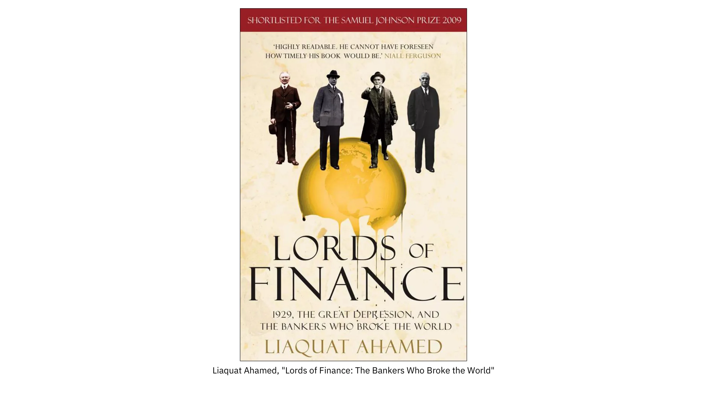

### Nykyajan rinnakkaisuudet

#### 1. Rahapolitiikan manipulointi talouden hallitsemiseksi.

Weimarin tasavallan historiasta käy ilmi, että teollisuusmiehet eivät halunneet nähdä markan arvon nousevan. Heidän mahdollisuutensa ottaa lainaa ja maksaa velkansa takaisin voimakkaasti heikentyneellä valuutalla antoi heille huomattavan edun. Tämä mekanismi mahdollisti valtavien teollisuuskompleksien rakentamisen lähes ilmaiseksi. Nämä teollisuusyrittäjät pelkäsivät markan vahvistumista, koska se haittasi heidän toimintaansa. Jotkut jopa pitivät hillitöntä inflaatiota myönteisenä kehityksenä, koska uskoivat sen takaavan työllisyyden väestölle. He eivät kuitenkaan ymmärtäneet inflaation haitallisia vaikutuksia säästöihin ja koko talouteen. Näille talouden toimijoille rahan painaminen oli siunaus.

> Weimar: "Tämän vuoksi markan vahvistumista pelättiin suuresti, ja jopa Genovan jälkeiset muutamat "vakaat" viikot aiheuttivat liiketoiminnan pysähtymisen."

> Weimar: "Teollisuuspiirejä uhkasi vaara, että käteisrahasta tulisi arvokkaampaa kuin tavaroista ja että romahdus tapahtuisi, kun kaikki yrittäisivät muuttaa omaisuutensa käteiseksi."

Nykyaikainen rinnastus voidaan vetää Christine Lagarden lausuntoihin, joissa hän ehdottaa, että kansalaisten olisi asetettava työllistymismahdollisuudet säästöjensä suojelun edelle. Aivan kuten Weimarin teollisuusjohtajat, hän näyttää kannattavan rahan painamista välineenä työllisyyden edistämiseksi säästöjen arvon kustannuksella.

> Christine Lagarde: "Meidän pitäisi olla tyytyväisempiä työpaikkaan kuin siihen, että säästömme on suojattu."

#### 2. Yksityisomaisuus konfliktien aikana

Weimarin tasavallan historiasta käy ilmi, että tänä aikana ulkomailla olevat varat ja pääomat takavarikoitiin. Tämä toimenpide muistuttaa Venäjän uudempia tapahtumia, erityisesti konfliktin alussa. Nämä tilanteet korostavat huolestuttavaa todellisuutta: kriisiaikoina yksityisomaisuuden kunnioittaminen voi vaarantua. Tämä on historiallinen ja nykyaikainen rinnakkaisuus, joka korostaa kriisien mahdollisia vaikutuksia yksilön oikeuksiin.

> Weimar: "Kaikki Saksan ulkomailla hallussaan pitämä pääoma oli takavarikoitu."

> [20minutes.fr](https://www.20minutes.fr/monde/3286947-20220513-guerre-ukraine-geler-avoirs-russes-vol-non-redistribuer-kiev-poserait-lourdes-questions): "Venäjän keskuspankin hallussa olevista 640 miljardin dollarin varannoista noin 300 miljardia dollaria on todellakin jäädytetty osana länsimaiden pakotteita."

#### 3. Markkinahinnan käsite

Weimarin tasavallan aikana maanviljelijät ilmaisivat tyytymättömyytensä "Umlage"-järjestelmään, jonka mukaan heidän oli toimitettava vuosittain kaksi miljoonaa tonnia tuotettua vehnää. Tämä asetus johti siihen, että puolet Supply-leivän kokonaismäärästä saatettiin markkinoille tuettuun hintaan. Elokuusta lähtien näille viljelijöille oli tarkoitus maksaa maailmanmarkkinahinta, sillä vaikka heidän oli pakko luovuttaa vehnänsä alennettuun hintaan, heidän oli silti ostettava lannoitteita maailmanmarkkinahintaan.

Tämä tilanne nostaa esiin keskeisen kysymyksen, joka liittyy markkinahinnan käsitteeseen hyperinflaation aikana. Saksassa viljelijöiden oli pakko myydä vehnänsä arvoa halvemmalla ja hankkia lannoitteet maailmanmarkkinahintaan. Tällainen taloudellinen ristiriita korostaa elintarvikkeiden hintojen aiheuttamia haasteita nykyään. Maataloustuottajat, joiden tuotantopanoskustannukset nousevat inflaation vuoksi, siirtävät nämä kustannukset lopputuotteisiin. Jos heitä arvostellaan tästä noususta, jätetään huomiotta markkinahinnoittelun dynamiikka ja niihin kohdistuvat taloudelliset paineet. Keinotekoisen alhaisilla hinnoilla myyminen ja samalla korkeat kustannukset ovat kestämättömiä millekään yritykselle.

> Weimar: "Maataloudelliset intressit olivat tyytymättömiä 'Umlage'-järjestelmään, joka koski vuosittain tuotetun kahden miljoonan ensimmäisen vehnätonnin pakkotoimitusta, jonka ansiosta puolet koko Supply-leivästä voitiin myydä alhaisin hinnoin. Elokuusta alkaen maanviljelijöille oli maksettava maailmanmarkkinahinta, sillä vaikka heidän oli pakko myydä vehnää alhaisin hinnoin, heidän oli aina maksettava lannoitteista maailmanmarkkinahinta."

#### 4. Rahan Supply ja inflaation välisen yhteyden kieltäminen

> Weimar: "Hän pysyi tiukasti kiinni näkemyksessään, jonka mukaan raha Supply ei ollut yhteydessä hintatasoon eikä Exchange korkoihin."

Nykyaikana tämä suuntaus jatkuu, kuten edellisessä luvussa esitettiin esimerkkinä luettelo eri taloustieteilijöiden ja talousinstituuttien esittämistä selityksistä inflaation perustelemiseksi. Nämä syyt vaihtelevat kulttuuritapahtumista ja julkkiksista, kuten Taylor Swift, Zelda tai Beyoncé, maailmanlaajuisiin tekijöihin, kuten sotaan ja pandemiaan. Kaikki nämä syyt, vaikka ne mahdollisesti vaikuttavatkin lyhytaikaisiin talouden vaihteluihin, vievät huomion pois todellisesta perimmäisestä syystä: rahan Supply:n laajenemisesta.

#### 5. Zombie-yhtiöt

> Weimar: "Vakauttaminen oli päättänyt ajanjakson, jolloin yrittäjät saattoivat lainata niin paljon kuin halusivat kaikkien muiden kustannuksella. Hyvin monet yritykset, jotka oli perustettu tai laajennettu rahan yltäkylläisyyden aikana, muuttuivat nopeasti tuottamattomiksi, kun pääomasta tuli niukkaa."

Zombie-yritys on yritys, joka tavanomaisissa markkinaolosuhteissa olisi maksukyvytön tai lähellä konkurssia, mutta joka jatkaa toimintaansa pääasiassa edullisen lainanoton ansiosta. Nämä yritykset ansaitsevat juuri ja juuri sen verran, että ne pystyvät kattamaan velkansa, mutta ne eivät pysty kasvamaan merkittävästi.

Zombieyritykset eivät ole uusi asia. Itse asiassa se oli olemassa jo Weimarin tasavallan aikana. Tuolloin monet yritykset näyttivät kukoistavan ja hyötyivät suurelta osin ilmaisen luoton saannista. Ne lainasivat huomattavia summia ja odottivat maksavansa ne myöhemmin takaisin inflaation vuoksi heikentyneellä valuutalla. Kun inflaatio kuitenkin lakkasi ja Saksan markan arvo nousi, näistä yrityksistä, jotka eivät olleet toiminnallisesti tai taloudellisesti elinkelpoisia, tuli kannattamattomia, ja niiden oli lopetettava toimintansa.

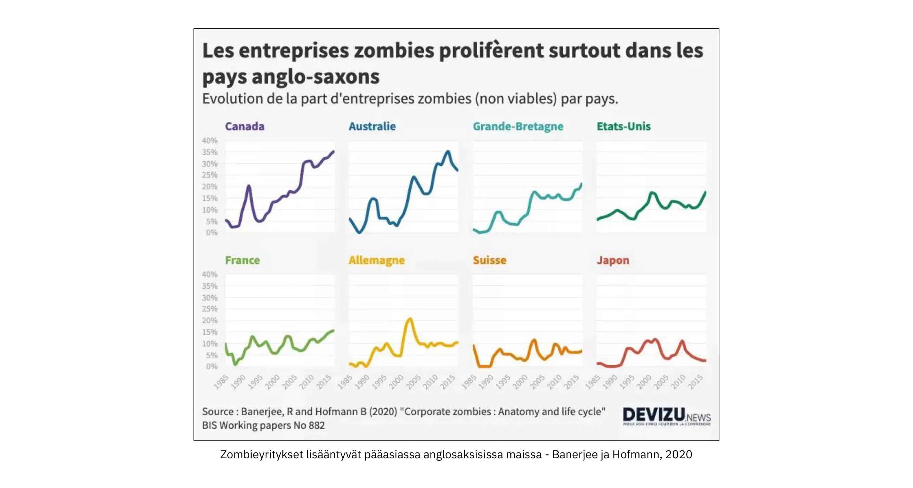

Zombie-yritysten ilmiö ei rajoitu pelkästään sodanjälkeiseen Saksaan. Vielä nykyäänkin monet suuryritykset menestyvät, koska niillä on etuoikeutettu mahdollisuus saada luottoa erittäin alhaisilla koroilla. Jos ne joutuisivat ottamaan lainaa tavanomaisemmilla koroilla, monet niistä lakkaisivat olemasta kannattavia. Tämä on erityisen tärkeää vuonna 2023, kun korkotaso on nyt alkanut nousta pitkän lähes nollakorkoisen jakson jälkeen. Tämä viimeaikainen muutos rahoitusympäristössä on epäilemättä ratkaiseva testi näille yrityksille, jotka on aikoinaan leimattu "zombeiksi"

#### 6. Rikastu nopeasti!

Historiasta on löydettävissä tapauksia, joissa yksilöt pyrkivät kartuttamaan varallisuutta nopeasti, kuten Weimarissa ja Zimbabwessa arbitraasin avulla. Nykyään samanlainen suuntaus on havaittavissa tiettyjen kryptovaluuttojen nousussa. Nopeat voitot houkuttelevat ihmisiä, ja he ottavat riskejä sijoituksensa eksponentiaalisen kasvun toivossa. Tämä lähestymistapa muistuttaa hyperinflaation aikoja, jolloin arbitraasia käytettiin nopeiden voittojen saamiseksi, usein muiden kustannuksella.

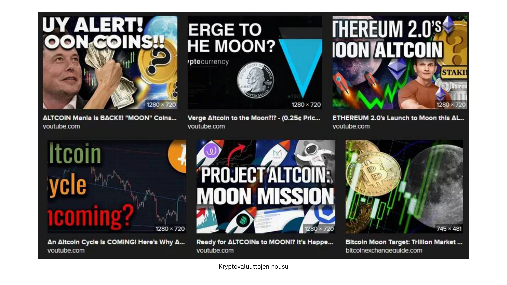

#### 7. Säästöt, lääke epävarmuutta vastaan

> Pääoman ja tulojen arvon jatkuvan heikkenemisen sekä tulevaisuutta koskevan epävarmuuden läpitunkeva ja tuhoisa vaikutus.

On syytä tuoda esiin sitaatti, jossa korostetaan pääoman arvon heikkenemisen tuhoisaa vaikutusta sosiaaliseen yhteenkuuluvuuteen sekä sen aiheuttamaa epävarmuutta. Siinä todetaan: "pääoman ja tulojen arvon jatkuvan heikkenemisen sekä tulevaisuutta koskevan epävarmuuden läpitunkeva ja tuhoisa vaikutus"

Kuvittele skenaario, jossa sinulla on perhe tai läheisiä, joita haluat suojella. Teet Hard-työtä ja säästät ennakoidaksesi tulevia epävarmuustekijöitä. Jos kaikki olisi ennustettavissa, säästäminen olisi hyödytöntä. Kuitenkin odottamattomissa tilanteissa, kuten auton rikkoutuessa, säästöistä tulee pelastusrengas. Ne vähentävät maailman epävarmuutta. Hyperinflaation aikana säästämisestä tulee kuitenkin haaste. Raha menettää nopeasti arvonsa, mikä vaikeuttaa pitkän aikavälin suunnittelua. Tämä taloudellinen epävakaus voi generate stressiä ja ahdistusta.

Nykyään, kun säästökyky on vähentynyt, investoinnit ovat ottaneet sen paikan. Tähän lähestymistapaan liittyy kuitenkin omat riskinsä. Säästäminen on aina ollut keino torjua epävarmuutta. Taloudelliset varannot ennakoimattomien tilanteiden varalta lisäävät mielenrauhaa ja vahvistavat sosiaalista yhteenkuuluvuutta. Yhteenvetona voidaan todeta, että säästökyvyn suojeleminen on olennaisen tärkeää sekä yhteiskunnallisen että yksilöllisen vakauden säilyttämiseksi.

## Uudelleen nimeäminen Latinalaisessa Amerikassa

<chapterId>918eafd7-409d-5205-ad52-a52e63b23a64</chapterId>

Seuraavaksi tarkastelemme Latinalaisen Amerikan maiden eri valuuttakurssien uudelleenmäärittämiskausia.

### Kuvaajien selitys

Vasemmalla diassa ovat uudelleenluokitteluvuodet, uuden valuutan nimi ja Exchange-kurssi vanhaan valuuttaan nähden. Esimerkiksi Argentiinan peso moneda nacional muunnettiin 25:1 suhteessa aiempaan valuuttaan, peso reàliin. Tässä yhteydessä tarkastelemme Argentiinan valuutan kehitystä ajan mittaan. Lisäksi ilmoitamme seteleiden alkuperäiset ja lopulliset nimellisarvot kullakin ajanjaksolla.

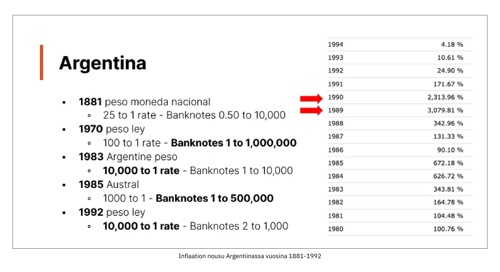

Dian oikealla puolella näkyy inflaatiokäyrä. Punaiset nuolet kuvaavat hyperinflaatiovuosia, jotka on määritelty Caganin kriteerin mukaan, joka on 50 prosentin inflaatio kuukaudessa. Tämä kriteeri voi joskus johtaa epäselviin tulkintoihin, sillä korkean inflaation vuodet eivät välttämättä täytä hyperinflaation tiukkaa määritelmää.

Huomionarvoista on, että valuuttojen uudelleen noteeraaminen, joka on yleinen toimenpide, johon hallitukset ryhtyvät inflaation aikana, on huomattava ilmiö. Tämä ei kuitenkaan ratkaise inflaation tai hyperinflaation perusongelmaa. Se on vain keino nimetä valuutta uudelleen ja poistaa nollat, mutta ei käsitellä hyperinflaation perimmäistä syytä: rahan laajentamista Supply. Myöhemmässä videossa keskustelemme Address:n todellisista ratkaisuista ja hyperinflaatio-ongelman ratkaisemisesta. Tässä sarjassa tuomme esiin seuraukset, joita pelkkä uudelleen nimeäminen ilman riittäviä uudistuksia aiheuttaa: inflaatio jatkuu.

Argentiinan jälkeen tutkimuksemme kattaa Brasilian, Bolivian, Perun, Nicaraguan ja Venezuelan. Tarkastelemme näissä maissa tapahtuneita uudelleen nimityksiä.

### Argentiina

Ennen vuotta 1826 Argentiinassa käytettiin Espanjan dollaria. Itsenäistyttyään vuonna 1816 Argentiina otti käyttöön oman rahan, joka perustui espanjalaiseen reàliin. Taulukko alkaa vuodesta 1881, jolloin otettiin käyttöön "peso moneda nacional", jonka seteleitä oli saatavilla 10 000:een asti. Sitä seurasi "peso ley", jonka vaihtokurssi oli 100:1 ja jonka setelit olivat miljoonaan asti. Sitten tuli "Argentiinan peso", jonka Exchange-kurssi oli 10 000:1 (mikä vastaa neljän nollan poistamista) ja jonka setelit olivat enintään 10 000. Vuonna 1985 otettiin käyttöön "australes", jonka vaihtokurssi oli 1 000:1 ja jonka seteleitä oli saatavilla 500 000:een asti. Vuonna 1992 otettiin käyttöön nykyinen "peso ley", jonka kurssi on 10 000:1, ja siitä poistettiin jälleen neljä nollaa. Ainoastaan vuosina 1989 ja 1990 esiintyi hyperinflaatiota.

### Brasilia

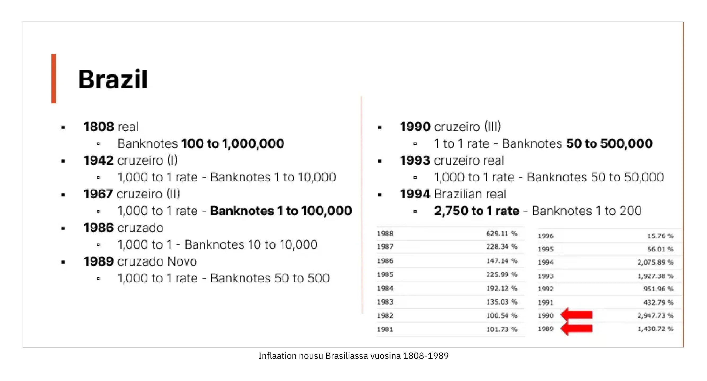

Brasilia on merkittävä esimerkki rahan uudelleenmäärittämisestä, kuten sen valuutanvaihtohistoria osoittaa. Ennen itsenäistymistään Brasilia käytti valuuttanaan portugalilaista reàlia. Jo vuonna 1747 Brasilia alkoi kuitenkin käyttää omaa "Brasilian reàlia" jo kauan ennen itsenäisyysjulistusta vuonna 1822. Taulukko alkaa vuodesta 1818, jolloin Brasilian setelien liikkeeseenlasku alkoi. Sitä ennen valuutta oli pääasiassa kolikoiden muodossa. Näiden seteleiden arvo oli jopa miljoona reaista.

Vuodesta 1942 alkaen Brasiliassa aloitettiin useita uudelleenmäärityksiä. Useimmissa tapauksissa (1942, 1967, 1986, 1989, 1993) muuntokurssi oli 1:1 000. Vuonna 1990 nimi vaihtui ilman muuntamista. Näiden valuuttojen järjestys on seuraava:

- Réals (vanha versio) vuoteen 1942 asti.
- Cruzeiros vuonna 1942.
- Cruzeiros (uusi versio) vuonna 1967.
- Cruzados vuonna 1986.
- Cruzados Novos vuonna 1989.
- Paluu Cruzeirosiin vuonna 1990.
- Cruzeiros Reais vuonna 1993.
- Lopuksi Brasilian reàl vuonna 1994.

Korkein seteli oli 500 000, ja viimeisimmän uudelleenvaluutan määrä vuonna 1994 oli 2 750:1. Vuosina 1989 ja 1990 vallitsi hyperinflaatio, kun taas vuosina 1993-1994 inflaatio oli korkeaa, mutta se ei saavuttanut hyperinflaation kynnystä (50 prosenttia kuukaudessa). Tämän myrskyisän ajanjakson jälkeen Brasilia muutti jälleen kerran valuuttansa nimellisarvoa poistamalla useita nollia.

### Bolivia

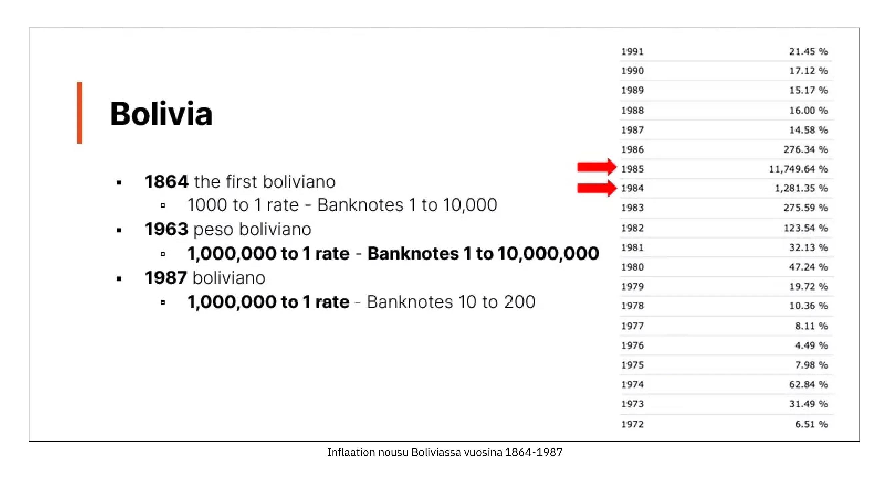

Bolivia on toinen esimerkki maasta, joka on kokenut akuutin inflaation, joka on edellyttänyt valuutan uudelleen nimeämistä. Seuraavassa on yhteenveto Bolivian rahahistoriasta:

Ennen itsenäistymistään vuonna 1825 Bolivia käytti valuuttanaan Espanjan dollaria. Itsenäistymisen jälkeen maa otti käyttöön Bolivian Solin vuosina 1827-1864, joka korvasi Espanjan dollarin. On kuitenkin syytä huomata, että Bolivian ensimmäiset setelit otettiin käyttöön vasta vuonna 1864.

Vuonna 1864 otettiin käyttöön ensimmäinen "Boliviano", jonka Exchange-kurssi oli 1 000:1 verrattuna Bolivian Soliin. Tämä valuutta pysyi liikkeessä, kunnes sen nimellisarvo oli 10 000 Bolivianoa.

Tämän jälkeen Bolivia muutti valuuttansa Bolivian pesoksi, joka koki vakavan hyperinflaation ja jonka nimellisarvo nousi lopulta jopa 10 miljoonaan. Inflaatio oli suurimmillaan vuosina 1984-1985, jolloin kuukausittaiset inflaatioluvut lähestyivät usein 50 prosentin hyperinflaatiokynnystä. Jos inflaatio on 50 prosenttia kuukaudessa koko vuoden ajan, vuotuinen inflaatio on noin 12 800 prosenttia. Vuonna 1985 Bolivian vuotuinen inflaatiovauhti oli 11 749 prosenttia, mikä osoittaa, että inflaatio oli lähes joka kuukausi lähellä 50 prosentin rajaa tai ylitti sen.

Vastauksena tähän rahakriisiin Bolivia otti vuonna 1987 käyttöön uuden valuutan, jota kutsuttiin yksinkertaisesti "Bolivianoksi" ja jonka Exchange-kurssi oli 1 miljoona Bolivian Pesoa 1 Bolivianoa kohden. Tämä Boliviano on edelleen käytössä.

Tämä on yleiskatsaus Bolivian myrskyisään rahahistoriaan, jota leimaavat hyperinflaatio ja uudelleenvaluutat.

### Peru

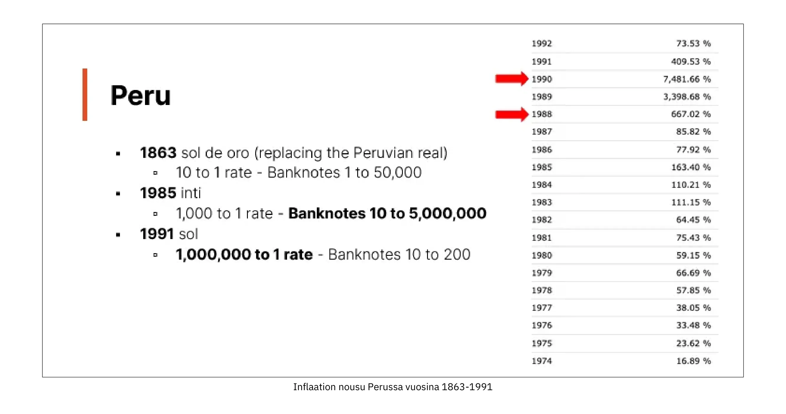

Peru on mielenkiintoinen tapaus mielivaltaisen 50 prosentin säännön vaikutusten osalta. Perun rahahistoriassa käytettiin espanjalaista kultaa aina 1800-luvulle asti, jolloin se julistautui itsenäiseksi vuonna 1821. Perun dollari oli käytössä vuosina 1822-1863. Vuonna 1863 Perun reàl korvattiin soldi orolla 10:1, ja sen enimmäisarvo oli 50 000 dollaria. Vuonna 1985 otettiin käyttöön Inti-valuutta, jonka muuntokurssi oli 1000:1 ja jonka enimmäisarvo oli 5 miljoonaa. Vuonna 1991 lanseerattiin "SOL", jonka Exchange-kurssi oli 1 miljoona 1:een ja jonka setelit vaihtelivat 10:stä 200:aan.

Kun tarkastellaan denominaatiojaksoja, vuotta 1988 pidetään hyperinflaation vuotena, erityisesti syyskuussa. Myös heinä-elokuussa 1990 oli hyperinflaatiojakso. Vuonna 1988 vuotuinen inflaatiovauhti oli 667 prosenttia, ja syyskuussa inflaatiopiikki oli 50 prosenttia. Sen sijaan vuonna 1989 inflaatio oli 3000 prosenttia, eikä yksikään kuukausi ylittänyt 50 prosenttia, joten sitä ei luokiteltu hyperinflaatioksi. Vuonna 1990 inflaatio oli korkeimmillaan 7481 prosenttia. On selvää, että 50 prosentin sääntö voi olla mielivaltainen, sillä vuotta 1988 pidettiin hyperinflaation vuotena, toisin kuin vuotta 1989. Jos tätä sääntöä harkittaisiin uudelleen, voisi olla viisasta alentaa kynnystä, jotta siihen voitaisiin sisällyttää Perun vuonna 1989 kokeman kaltaiset ajanjaksot.

> Ymmärrys siitä, mitä tapahtuu
>

> Tärkeintä on ymmärtää, että kun valuutan arvo nousee tähtitieteellisiin lukemiin, kuten 5 tai 10 miljoonaan, se nimitetään uudelleen. Tämä prosessi voidaan toistaa useita kertoja, jolloin valuuttaa vaihdetaan. Tämän seurauksena yksityishenkilöiden säästöt voivat kärsiä vakavasti, vaikka hyperinflaatiota ei olisikaan. Jos esimerkiksi joku säästää jonain vuonna 1 000 dollaria ja onnistuu säästämään 100 dollaria, seuraavana vuonna pienimmän setelin arvo voi olla 1 000 dollaria, jolloin aiemmin säästetyt 100 dollaria ovat arvottomia. Tällainen säästöjen rapautuminen ei edellytä ilmeistä hyperinflaatiota. Vaikka henkilö olisi säästänyt 10 000 dollaria viimeisten kymmenen vuoden aikana, tämä summa voi lopulta olla mitättömän pieni, eikä sillä pysty ostamaan pelkkää vesipulloa. Tämä todellisuus on ilmeinen monissa maissa, jotka ovat kokeneet valuuttakurssien muuttamisen, vaikka vain muutama kuukausi olisi luokiteltu hyperinflaatioksi. Sitä vastoin joissakin maissa, kuten Nicaraguassa, hyperinflaatio on jatkunut peräkkäisinä vuosina.

### Nicaragua

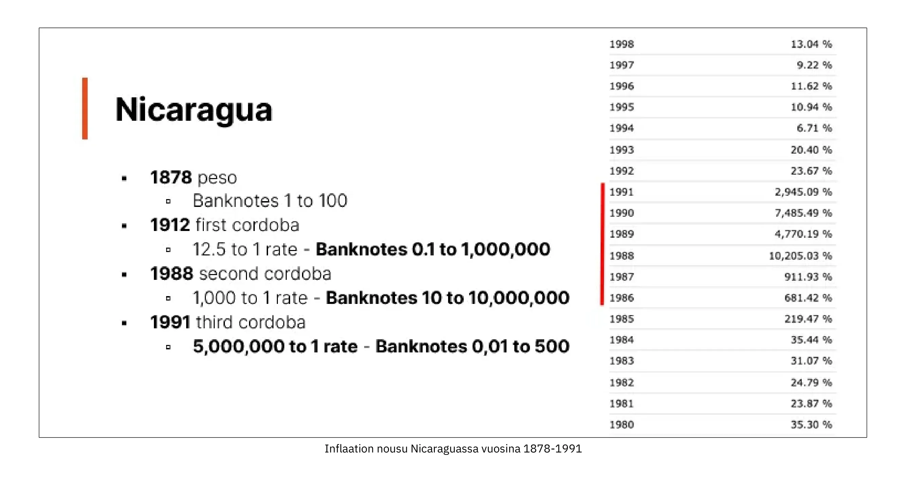

Nicaragua, joka oli aiemmin Espanjan vallan alla, käytti aluksi Espanjan dollaria, kuten monet muutkin Espanjan siirtomaavaltiot. Sen jälkeen kun Nicaragua oli liittynyt Espanjan valtakuntaan, Meksikon valtakuntaan ja Keski-Amerikan liittotasavaltaan, se julistautui itsenäiseksi. Vuodesta 1878 alkaen maan viralliseksi valuutaksi tuli peso, jonka arvo vaihteli välillä 1-100. Vuonna 1912 maa otti käyttöön ensimmäisen Cordoban, jota seurasi toinen vuonna 1988 ja kolmas vuonna 1991, ja se on edelleen käytössä. Ensimmäinen Cordoba saavutti miljoonan ja toinen 10 miljoonan arvon. Vuonna 1991 toteutettu redenominaatio seurasi useita vuosia kestänyttä hyperinflaatiota.

### Venezuela

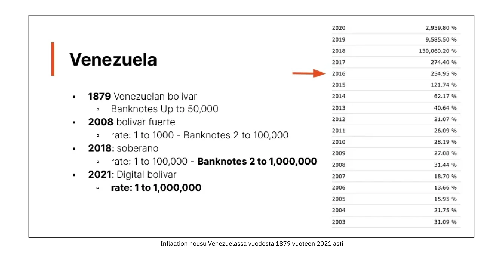

Venezuela on viimeinen maa, joka mainitaan tällä videolla. Maa on kokenut neljä valuutan uudelleenmääritystä ajan mittaan. Alkuaikoina Venezuela käytti Espanjan dollaria, ennen kuin se julistautui itsenäiseksi vuonna 1811. Vuonna 1879 se otti käyttöön bolivarin virallisena valuuttana, joka oli voimassa vuoteen 1983 asti, jolloin hallitus valitsi kelluvan Exchange-kurssijärjestelmän, jossa käytettiin dollaria.

Venezuelaa koskeva merkittävä seikka on sen jäsenyys Latinalaisessa rahaliitossa. Tähän liittoon kuuluivat muun muassa seuraavat kolikot: Espanjan 5 pesetaa, Kreikan 5 drakmaa, Venezuelan 5 bolivaria, Italian 5 liiraa, Belgian 5 frangia ja Ranskan 5 frangia.

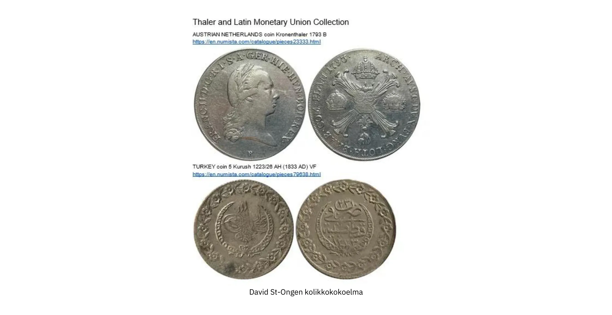

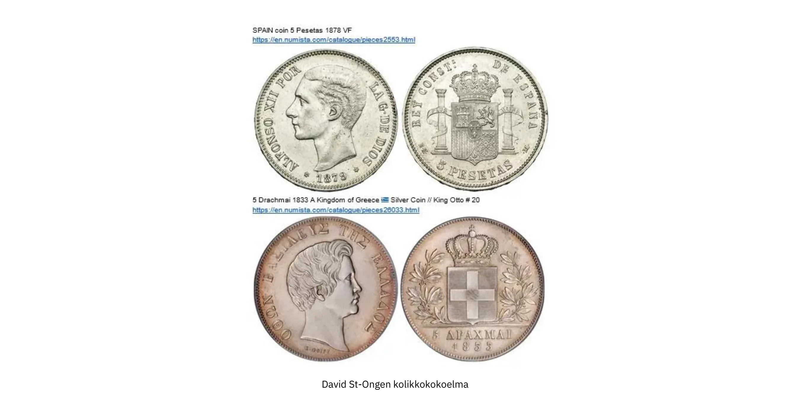

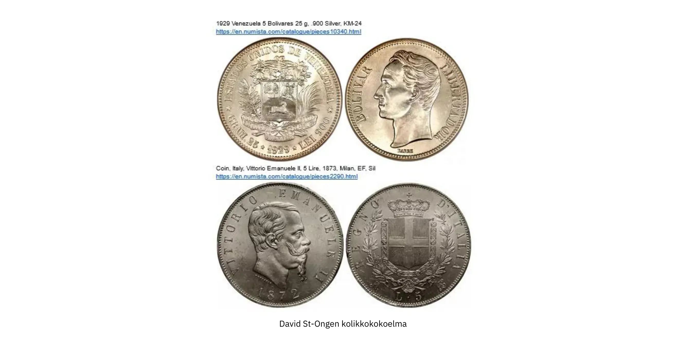

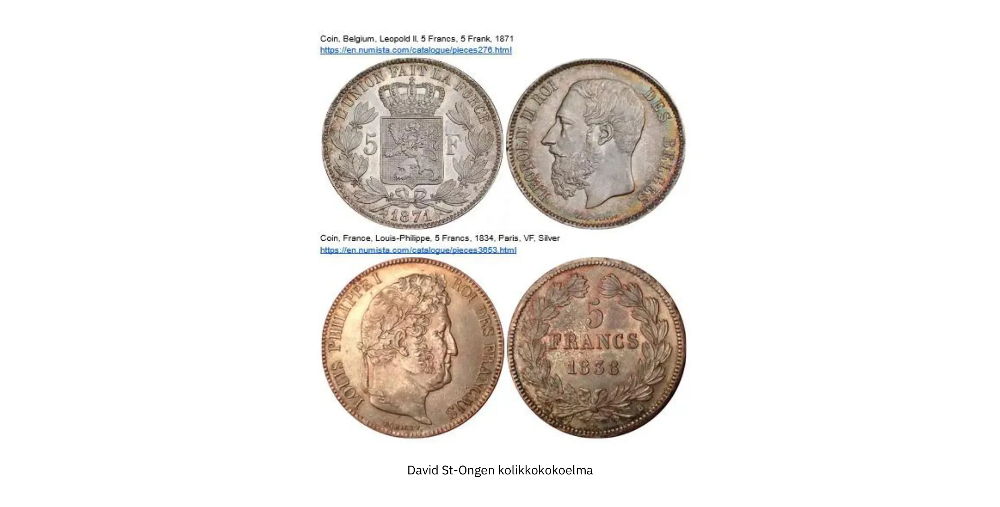

Tänä aikana Venezuelan 5-bolivarinen Coin oli yhtä painava kuin unionin jäsenvaltioiden, kuten Italian, Espanjan, Belgian ja Ranskan, kolikot. Nämä bolivarit valmistettiin hopeasta, ja tietty Coin vuodelta 1929 painoi 25 grammaa ja sen puhtausaste oli 900 eli 90 prosenttia puhdasta hopeaa. Nykyisellä hopean hinnalla tämä Coin on arvoltaan noin 17-18 Yhdysvaltain dollaria (Yhdysvaltain dollareita).

Sen jälkeen, kun vuonna 1983 otettiin käyttöön kelluva Exchange-kurssi, tehtiin useita valuuttojen uudelleenmäärityksiä:

- Vuonna 2008 otettiin käyttöön bolivar fuerte eli "vahva bolivar", jonka arvo nousi 100 000:een ennen kuin se vaihdettiin tuhanteen yhteen.
- Vuonna 2018 otettiin käyttöön Soberano, jonka laskut ylsivät 1 miljoonaan. Vuonna 2021 se korvattiin digitaalisella bolivarilla, joka myös saavutti miljoonan, ennen kuin uusi nimellisarvo oli miljoona yhdestä yhteen. Nykyään 10 tai 20 seteli vastaa 10 miljoonaa tai 20 miljoonaa Soberanossa.

Tältä ajanjaksolta, vuodesta 2018 lähtien, on jaettu eri Bitcoin-konferensseissa Biarritzissa, Torontossa ja Miamissa. Näiden Soberano-seteleiden arvo oli enimmillään 1 miljoona. Sen jälkeen tapahtui uudelleenarvoistaminen, jolloin miljoonan arvo laski noin 3 senttiin. Tällä hetkellä 10 miljoonan seteliä vastaa yhtä 10 seteliä. Vuodesta 2016 lähtien Venezuelassa on ollut hyperinflaatio, joka edustaa 57. ajanjaksoa tietyssä taulukossa.

Seuraavalla videolla esitellään kokoelma hyperinflaatiolaskuja, joissa keskitytään Venezuelaan ja muihin lueteltuihin maihin. Tämä kokoelma sisältää lähes kaikki Venezuelan setelit. Tutkimuksessa keskitytään kunkin mainitun maan eri nimellisarvoihin. Lisäksi tutkitaan Zimbabwen uudelleenmäärityksiä, mikä on erittäin kiinnostava aihe.

### Päätelmä

Olemme nähneet, että hyperinflaatio ei ole ainoa taloudellisen katastrofin indikaattori. Valuutan moninkertainen uudelleen noteeraus, nollien poistaminen tai valuutan nimen muuttaminen vaikuttaa suoraan väestöön, ja vaikutukset vaihtelevat avun menetyksestä elintarvikeongelmiin. Vaikka hyperinflaatio on huolestuttava ilmiö, Brasiliassa havaittu valuuttojen uudelleen nimeämisen määrä osoittaa, että todellisuus on monimutkaisempi.

Kun inflaatiokriteerinä käytetään 50 prosentin inflaatiota kuukaudessa, useat ajanjaksot olisi voitu luokitella hyperinflaatioksi. Tämä pätee erityisesti, kun tarkastellaan kansainvälisen kirjanpitojärjestön kriteerejä, joissa otetaan huomioon sellaiset piirteet kuin väestön nopea luopuminen valuutasta, palkkojen indeksointi ja korkeakorkoiset lainat inflaation kompensoimiseksi.

Johtopäätöksenä voidaan todeta, että hyperinflaatio on vain yksi osa taloudellisia haasteita. Korkea inflaatio yksinään voi olla yhtä vahingollinen. Seuraavassa jaksossa tarkastellaan mahdollisia ratkaisuja hyperinflaation voittamiseksi.

## Miten voittaa hyperinflaatio

<chapterId>e3484a31-a851-5f92-8af5-00eddae67db1</chapterId>

### Miten lopettaa kohtalainen ja korkea inflaatio

Mainitut johtopäätökset ovat peräisin Peter Bernholzin kirjasta "Monetary Regime and Inflation". Bernholzin mukaan ainoa keino inflaation lopettamiseksi on toteuttaa rahapoliittinen uudistus ja asettaa hallitukselle finanssipoliittisia rajoituksia. Näihin rajoituksiin liittyy sellaisen instituution, kuten keskuspankin, perustaminen, joka toimii riippumattomasti hallituksen poliittisista päätöksistä. Korkea ja hyperinflaatio ovat usein seurausta siitä, että budjettialijäämät rahoitetaan luomalla rahaa. Address inflaation hillitsemiseksi on tärkeää vähentää rahan Supply. kasvua. Bernholz ehdottaa myös, että tämän rahan kasvun tulisi olla suhteellista naapurimaihin nähden. Yllättävää on, että korkean inflaation tai hyperinflaation aikana rahan Supply kokonaisarvo voi itse asiassa laskea. Räikeä esimerkki tästä tilanteesta on Zimbabwe.

### Vastakkaisia ratkaisuja

Zimbabwea tutkittaessa huomattiin, että 10 biljoonaa Supply-rahayksikköä oli menettänyt kaiken arvonsa. Weimarissa oli mahdollista painaa kaksi kolmasosaa 65 miljardin Supply-rahayksikön nimellisarvosta yhdessä päivässä. Tämä osoittaa, miten raha Supply voidaan devalvoida. Tilanteen korjaamiseksi on tarpeen lisätä merkittävästi rahaa Supply, jotta se saavuttaisi asianmukaisen tason. Silloin rahapolitiikan uudistus on välttämätön. Korkean inflaation vallitessa tämä uudistus on väistämätön, mutta sillä on varmistettava, että liikkeessä on riittävästi rahaa. Tämän vaiheen jälkeen hallitukselle voidaan asettaa rajoituksia.

Bernholzin havaintojen mukaan IMF:n ja Maailmanpankin kaltaiset instituutiot eivät aina valitse tehokkaimpia strategioita inflaatio-ongelmiin puuttuessaan. Joissakin tapauksissa, kun maan on lisättävä rahamääräänsä Supply, nämä laitokset pyrkivät vähentämään sitä. Keskeistä on saavuttaa riittävä rahan määrä ja asettaa sen jälkeen rajoituksia sen kasvulle, jolloin vältetään valtion menojen rahoittaminen rahan luomisella.

Bernholzin esiin nostama mielenkiintoinen näkökohta on se, että rahapoliittisen uudistuksen onnistuminen ei riipu ainoastaan sen teknisestä merkityksestä vaan myös väestön siihen kohdistamasta luottamuksesta. Jotkin hyvin suunnitellut uudistukset voivat epäonnistua, koska kansalaiset eivät luota niihin, kun taas toiset, huonosti suunnitellut uudistukset voivat onnistua, koska kansalaiset luottavat niihin. Käsitys ja yleinen luottamus ovat näin ollen olennaisia tekijöitä, jotka vaikuttavat rahauudistuksen onnistumiseen tai epäonnistumiseen.

- Zimbabwessa ratkaisuna inflaation torjumiseksi oli dollarisaatio, mikä tarkoittaa, että Zimbabwessa otettiin käyttöön Yhdysvaltain dollari tai muita naapurimaiden valuuttoja. Tämä lähestymistapa estää hallitusta painamasta rahaa mielin määrin.
- Saksassa ratkaisu oli luoda uusi valuutta, Rentenmark. Tämän valuutan vakuutena oli valtakunnan alueellinen omaisuus, ja tämä strategia osoittautui tehokkaaksi.

### Zimbabwen tapaus

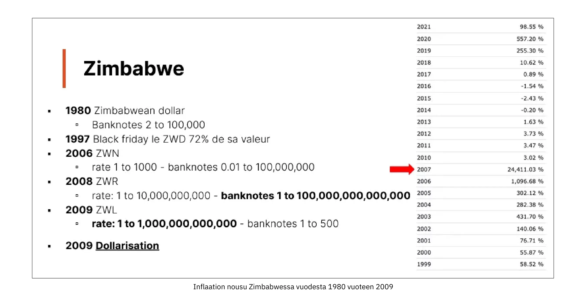

Zimbabwe itsenäistyi vuonna 1980 ja otti käyttöön oman valuuttansa, Zimbabwen dollarin. Aluksi kahden Zimbabwen dollarin arvo oli noin 1,60 Yhdysvaltain dollaria. Vuonna 1997 sotaveteraanien hyväksi toteutettujen sosiaalisten toimenpiteiden seurauksena valuutta kuitenkin devalvoitui 72 prosenttia yhdessä päivässä mustan perjantain aikana. Sitten 2000-luvun alussa maa käynnisti maan uudelleenjako-ohjelman, jossa valkoisilta omistajilta otettiin maata ja jaettiin sitä paikalliselle väestölle. Tämä päätös haittasi vientiä, koska uusilta omistajilta puuttui usein tarvittava asiantuntemus suurtilojen hallinnointiin. Tämän seurauksena Zimbabwe oli nettoviejä vuonna 1999, mutta vuonna 2003 siitä tuli nettotuoja.

Vuonna 2006 maa otti käyttöön uuden valuutan, ZWN:n, jonka Exchange-kurssi on 1:1 000. Vuonna 2008 otettiin käyttöön toinen nimellisarvo, ZWR, jonka Exchange-kurssi on 1:10 miljardia. Tämä johti ikonisten 100 biljoonan seteleiden luomiseen.

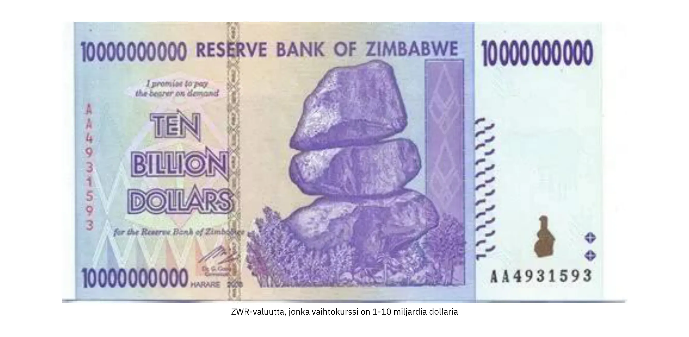

#### Dollarisaatio ja kriisinratkaisu

Sen vuoksi Zimbabwe luopui vuoden 2009 jälkeen jatkuvasta valuuttakriisistä ja rajusta hyperinflaatiosta, ja se luopui kansallisesta valuutastaan ja salli ulkomaanvaluutan, lähinnä Yhdysvaltain dollarin, käytön. Vaikka tämä päätös oli radikaali, se lopetti hyperinflaation. Keskeinen opetus on, että liiallisen rahan liikkeeseenlaskun lopettaminen ja budjettialijäämän rahoittamisen lopettaminen keskuspankista voi auttaa estämään hyperinflaation.

Dollarisaatio ei kuitenkaan ole mikään ihmeellinen ratkaisu. Vaikka se voi lopettaa hyperinflaation, se tuo mukanaan muita taloudellisia haasteita. Yksi seurauksista on autonomisen rahapolitiikan menettäminen. Ilman omaa valuuttaa maa ei voi sopeuttaa rahapolitiikkaansa vastaamaan sisäisiin taloudellisiin häiriöihin.

Vuonna 2007 Zimbabwen inflaatiovauhti saavutti 50 prosentin kuukausittaisen rajan, mikä merkitsi virallisesti sitä, että maassa vallitsee hyperinflaatio. Vuonna 2009 tapahtuneen dollarisaation jälkeen hyperinflaatio lakkasi, mutta maassa oli edelleen muita taloudellisia haasteita.

On huolestuttavaa huomata, että Zimbabwe on sittemmin yrittänyt ottaa uudelleen käyttöön oman valuuttansa, ja merkkejä korkeasta inflaatiosta on tullut uudelleen esiin. Eräiden kansainvälisten järjestöjen mukaan maa saattaa jo täyttää jälleen hyperinflaation kriteerit, vaikka se ei ole vielä saavuttanut virallista 50 prosentin kuukausittaista raja-arvoa. Tämä muistuttaa liiallisen rahan liikkeeseenlaskun ja keskuspankin alijäämärahoituksen vaaroista.

### Päätelmä

Kirjassani "Everything About Bitcoin" omistin kokonaisen luvun Zimbabwen hyperinflaatiolle. Esittelen yksityiskohtaisesti merkittävät tapahtumat ja annan erilaisia esimerkkejä siitä, miten maa lopulta lopetti hyperinflaation.

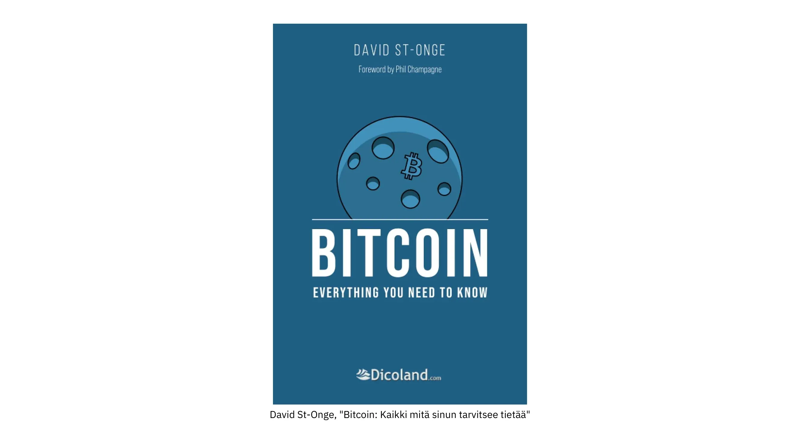

Niille, jotka ovat kiinnostuneita Saksan kokemuksista ensimmäisen maailmansodan jälkeen, suosittelen lämpimästi sarjakuvaa "Valtakunnan pankkiiri" Siinä kerrotaan, miten Saksa onnistui voittamaan hyperinflaation, erityisesti luomalla Rentenmarkin.

Keskeistä on, että hyperinflaation voittamiseksi on olemassa useita strategioita. Voidaan valita dollarisaatio tai ottaa käyttöön uusi valuutta. Nämä ratkaisut toimivat vain, jos väestö luottaa niihin. On ratkaisevan tärkeää asettaa tiukkoja rajoituksia. Todella riippumaton keskuspankki on välttämätön. Se ei saa paisuttaa rahamäärää Supply valtion alijäämien kattamiseksi. Lievän inflaation tapauksessa rahan Supply kasvun rajoittamisen pitäisi riittää. Hyperinflaation uhatessa on kuitenkin ratkaisevan tärkeää, että rahan Supply-arvo on ensin sopiva suhteessa talouden kokoon. Sen jälkeen on välttämätöntä asettaa hallitukselle tiukkoja rajoituksia tilanteen vakauttamiseksi.

## Hyperinflaatiopankkien setelikokoelman esittäminen

<chapterId>f3ffbb47-3aeb-54bd-80a9-adccb0f419e2</chapterId>

[Tutustu skannattuun kokoelmaan *Bitcoin Educational Toolkit*-issa (saatavilla myös Plan ₿ Academy -alustan *Resurssit*-osiosta.](https://penpot.planb.network/#/view?page-id=c157057b-fd28-8042-8004-4f081b21defc&file-id=c157057b-fd28-8042-8004-4f081b21defb&section=interactions&index=0&share-id=7154756b-3ebd-8040-8004-6475c2af5889&interactions-mode=show-on-click)

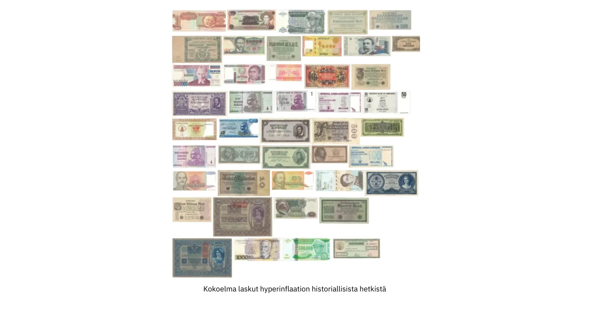

# Miten pääsimme tänne?

<partId>f66ca17e-be9e-5d30-a098-f7affd8962a1</partId>

## Rahan ja keskuspankkien toisen Layer:n syntyminen

<chapterId>0455ffe3-9d45-5a67-ac96-3f815dc507a1</chapterId>

Transkriptio:

Rahan toisen Layer:n ja ensimmäisten keskuspankkien synty on kiehtova aihe. Tätä aihetta käsitellään laajasti Nick Battia kirjassa "Layered Money". Suosittelen sitä lämpimästi niille, jotka ovat kiinnostuneita rahajärjestelmiemme kehityksestä ja monimutkaisuudesta. Tämän jakson tavoitteena on ymmärtää rahan luomisen alkuperää ja sitä, miten se voi johtaa hyperinflaatioon.

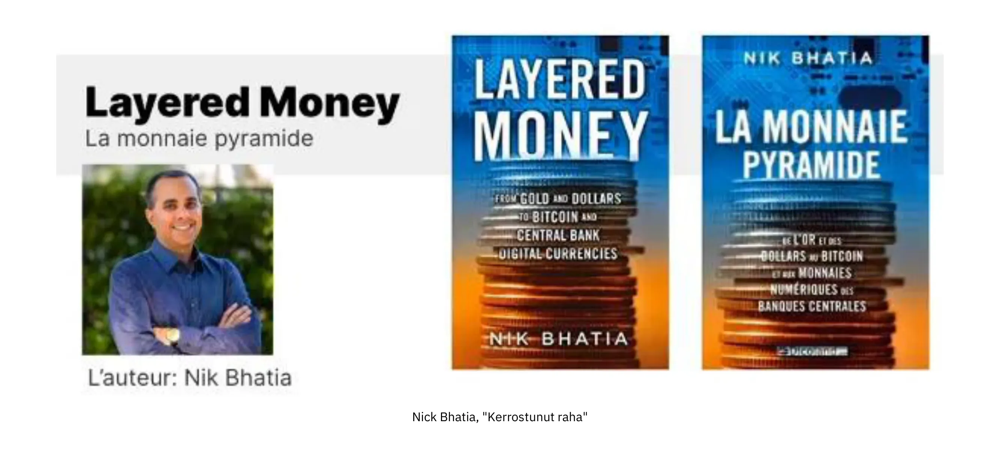

### Pyramidiraha ja keskuspankit

#### Florin

Rahan historia juontaa juurensa 1200-luvulle Italiassa, erityisesti Firenzen kaupungissa. Siihen aikaan florin ja Exchange-setelit olivat yleisiä. Huomattava esimerkki on florin, jota koristaa Johannes Kastajan hahmo.

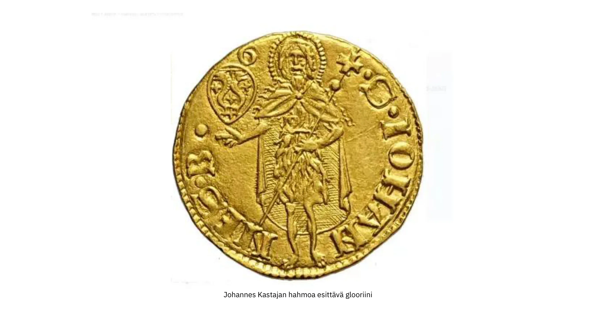

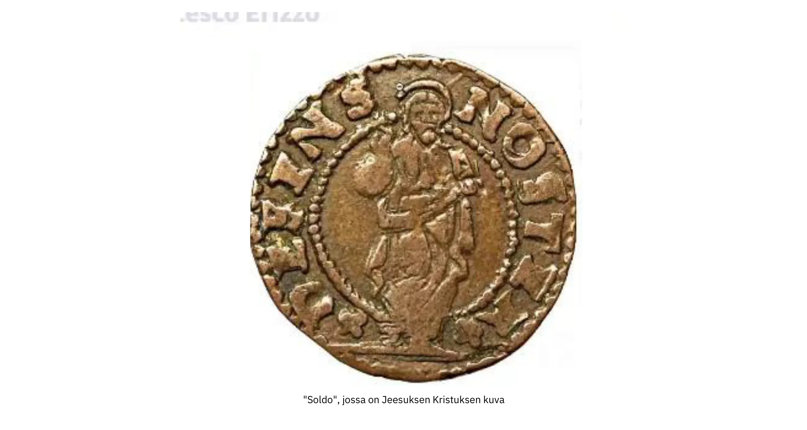

Vaikka aidon florinin omistaminen on nykyään kallista, jäljennöksiä on saatavilla. Myös muita tuon ajan valuuttoja on olemassa, kuten 1600-luvun Italian valtioista peräisin oleva soldo, jossa on Kristuksen kuva.

#### Exchange:n laskut (13. vuosisata)

Tuolloin yleinen käytäntö oli seuraava: kultasepät antoivat Exchange:n vekseleitä Exchange:n arvosta talletettuja florineja vastaan. Nämä floriinit säilytettiin huolellisesti holveissa. Näin ollen todellinen kulta, jota floriini edusti, muodosti rahan ensimmäisen Layer:n, kun taas Exchange:n setelit muodostivat toisen Layer:n. Tämän järjestelmän likviditeetti oli kuitenkin rajallinen. Jos joku halusi vaihtaa kullan Redeem:n Exchange:n seteliinsä Exchange:n arvosta, kauppa oli yksinkertainen. Näiden seteleiden vaihtaminen yksityishenkilöiden välillä ei kuitenkaan ollut yleinen käytäntö.

#### Antwerpenin osasto Exchange (1500-luku)

Antwerpenin osake Exchange oli tärkeä virstanpylväs paperirahan kehityksessä. Siellä otettiin käyttöön velkakirjojen diskonttauskäytäntö. Nämä vekselit olivat raha-arvoa edustavia paperisia välineitä, mutta niiden ainutlaatuisuus oli siinä, että niissä oli nimi ja eräpäivä. Tämän vuoksi niitä oli vaikea saada Exchange:aan ennen eräpäivää.

Antwerpenin osakeyhtiön Exchange:n aikaansaama vallankumous perustui mahdollisuuteen diskontata nämä velkakirjat ennen niiden eräpäivää. Jos esimerkiksi velkakirja erääntyi kuukauden kuluttua, se voitiin ostaa alennettuun hintaan, jotta eräpäivää edeltävä aika voitiin ottaa huomioon. Tämä innovaatio teki paperivaluutasta Liquid:n arvoisempaa, mutta se myös otti käyttöön rahan aika-arvon käsitteen.

Vaikka tämä käsite liittyy Nick Belliin hänen Twitterissä käyttämänsä salanimen "time value of BTC" kautta, se ei ole hänen keksintönsä. Hän kuitenkin käsittelee sitä yksityiskohtaisesti teoksessaan. Pääajatuksena on, että ajalla on arvo. Jos siis joku päättää maksaa 100 dollarin arvoisen velkakirjan kuukautta etukäteen, hän voi hankkia sen esimerkiksi 98 dollarilla ja saada 100 dollaria eräpäivänä. Tämä rahapoliittinen innovaatio sai alkunsa Antwerpenin pörssissä Exchange.

#### VOC ja Amsterdamin pörssi (1600-luku)

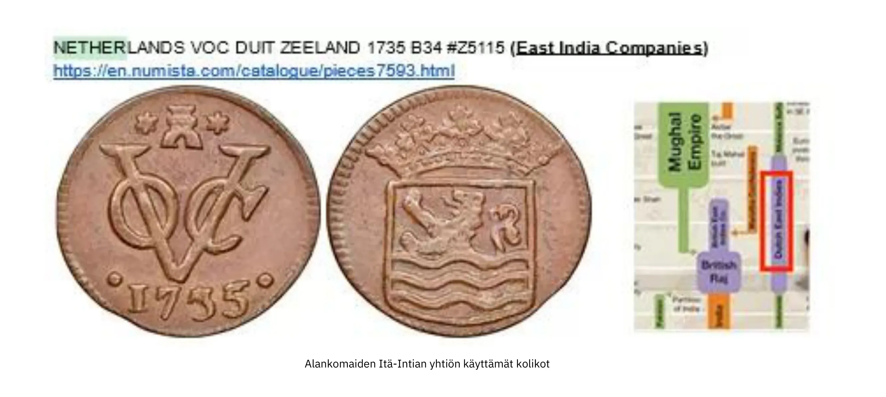

Antwerpenin pörssin Exchange perustamisen jälkeen merkittävä virstanpylväs oli VOC:n eli Alankomaiden Itä-Intian yhtiön perustaminen. Tämä Alankomaihin sijoittautunut yhtiö laski liikkeelle jopa oman valuutan. VOC:n perustamisen jälkeen Amsterdamissa perustettiin ensimmäinen pörssi, mikä merkitsi yhtiön pörssitoiminnan alkua. Mielenkiintoista on huomata, miten hollantilaiset onnistuivat lopettamaan Antwerpenin ylivallan kansainvälisenä talouskeskuksena. He yksinkertaisesti estivät pääsyn Schelde-joelle. Tämä strategia oli osa laajempaa historiallista liikettä, kerjäläisten kapinaa. Se oli ratkaiseva tapahtuma Euroopan historiassa.

#### Amsterdamin keskuspankin väliintulo

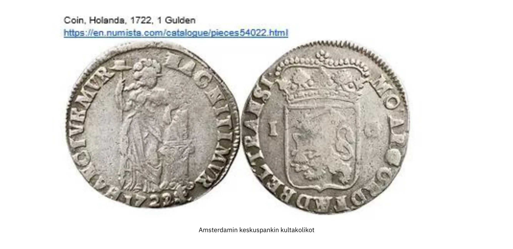

VOC:n perustamisen jälkeen toinen merkittävä kehitysaskel rahahistoriassa oli Amsterdamin pankin kultakolikoiden käyttöönotto. Nämä vuodelta 1722 peräisin olevat kolikot valmistettiin hopeasta. Se, mikä todella mullisti rahoituksen tuolloin, ei kuitenkaan ollut niinkään itse Coin, vaan Amsterdamin pankin tähän rahaan liittyvät tilit. Näistä tileistä tuli kansainvälisen Exchange:n ensisijainen käyttöväline. Tapahtumat kirjattiin yksinkertaisesti rekistereihin tai pääkirjoihin. Tämän järjestelmän ansiosta Amsterdamista tuli maailmanlaajuinen talouskeskus. Ajan mittaan Amsterdamin pankki päätti määrätä näiden tilien käytöstä. Riippumattomien rahanvaihtajien edellytettiin Exchange tallettavan kolikkonsa pankkiin päivittäin.

#### Englannin pankin perustaminen sodan rahoittamiseksi

Englannin keskuspankin perustamisen taustalla oli tarve rahoittaa sota 1600-luvun lopulla. Amsterdamin pankin tavoin se määräsi talletukset asetuksella. Englannin keskuspankin erityispiirteenä oli yksityisten pankkien syrjäyttäminen toissijaiseen asemaan rahajärjestelmässä, mikä loi niin sanotun "kolmannen Layer:n" valuutan.

Aluksi ensimmäinen Layer-valuutta oli kultaa. Yksityisiin pankkeihin tehdyt talletukset muodostivat toisen Layer:n. Kun näitä talletuksia ei kuitenkaan enää voitu muuttaa kullaksi, syntyi kolmas Layer-valuutta. Siitä lähtien yksityisten pankkien liikkeeseen laskemat setelit eivät enää olleet vaihdettavissa kultaan vaan Englannin keskuspankin paperivaluuttaan, joka puolestaan oli vaihdettavissa kultaan. Tämä kehitys johti rahajärjestelmän monimutkaistumiseen ja uusien kerrosten lisäämiseen.

#### Vuoden 1796 paniikki

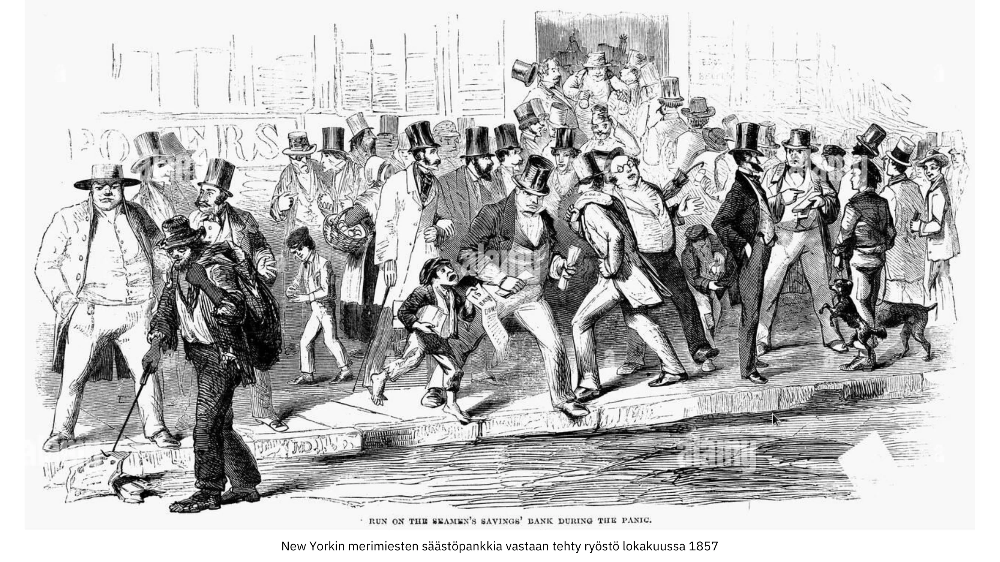

Pankkipaniikki Seamen's Savings Bankissa vuoden 1857 paniikin aikana.

Vuoden 1796 pankkipaniikin jälkeen syntyi ilmiö, jossa kaikki yrittivät nousta "rahapyramidissa" Ihmiset halusivat vaihtaa kolmannen Layer:n valuutan toisen Layer:n ja lopulta ensimmäisen Layer:n valuutan, eli kullan, valuutaksi. Tämän massiivisen ryntäyksen edessä Englannin keskuspankin oli pakko ryhtyä toimiin tilanteen vakauttamiseksi. Estääkseen kultavarantojen mahdollisen deflaation se päätti keskeyttää seteliensä vaihdettavuuden kultaan. Tämä alun perin väliaikaiseksi tarkoitettu keskeytys kesti noin kaksi vuosikymmentä.

### Johtopäätökset:

Keskuspankit ovat kehittyneet viime kädessä lainanantajiksi ja keskeyttäneet valuuttansa vaihdettavuuden kultaan. Vaikka tämä toimi oli alun perin tarkoitettu väliaikaiseksi ratkaisuksi, siitä tuli lopulta pysyvä, mikä merkitsi viime käden lainanantajan käsitteen syntymistä. Tämä muutos on muokannut keskuspankkeja sellaisina kuin ne nykyään tunnetaan. Hauraammissa talouksissa kyky painaa rahaa mielensä mukaan voi kuitenkin johtaa vastuuttomasti käytettynä ei-toivottuihin seurauksiin, kuten hyperinflaatioon.

## Kirjat ja resurssit

<chapterId>c44e4519-0741-527b-b3b0-3f513e87147d</chapterId>

Hyperinflaatio on kiehtova aihe, jota on tutkittu useiden historiallisten tapahtumien kautta. Jos haluat syventyä aiheeseen, tässä on luettelo 10 keskeisestä lähteestä, joita kannattaa lukea ja tutkia:

- "Kun raha kuolee: Adam Fergusson: "The Nightmare of Deficit Spending, Devaluation, and Hyperinflation in Weimar Germany". Kirjassa kerrotaan yksityiskohtaisesti ensimmäisen maailmansodan jälkeisestä hyperinflaatiokriisistä Saksassa.

- costantino Bresciani-Turroni: "The Economics of Inflation - A Study of Currency Depreciation in Post-War Germany". Syvällinen analyysi Saksan hyperinflaatiosta 1920-luvulla.

- "Tämä kerta on erilainen: Reinhart ja Kenneth S. Rogoff. Vaikka kirjassa käsitellään erityyppisiä rahoituskriisejä, siinä käsitellään syvällisesti hyperinflaatiota kautta historian.

- steve Hanke: "Zimbabwen hyperinflaatio, analyysi ja opit". Tutkimus Zimbabwen hyperinflaatiosta 2000-luvun alussa.

- "Rahajärjestelmät ja inflaatio: Peter Bernholz: Historia, taloudelliset ja poliittiset suhteet. Kirjassa tarkastellaan historiallisia hyperinflaatiotapauksia ja pyritään ymmärtämään niiden taustalla olevia tekijöitä.

- "Hyperinflaation selviytymisopas: Strategies for American Businesses", kirjoittanut Gerald Swanson. Käytännön opas siitä, miten yritykset voivat selviytyä hyperinflaatioympäristössä.

- "Kuoleminen rahasta: Jens O. Parsson: "Saksan ja Amerikan suurten inflaatioiden opetukset". Vertaileva analyysi Saksan ja Yhdysvaltojen inflaatiokriiseistä.

- "Rahan tuhoutuminen: Frederick Taylor: Saksan hyperinflaatio ja keskiluokan tuho". Kerronnallinen tutkimus hyperinflaation sosiaalisista ja taloudellisista vaikutuksista Saksan yhteiskuntaan.

- "Kehitysmaiden valuuttajärjestelmät: A Handbook", kirjoittaneet Steve Hanke ja Kurt Schuler. Vaikka kirjassa keskitytään valuuttakeskuksiin, se tarjoaa näkökulman siihen, miten hyperinflaatiotilanteita voidaan välttää.

# Viimeinen jakso

<partId>cb1f4a4b-556a-4e47-a5cc-136be35a1f9a</partId>

## Arvostelut & arvostelut

<chapterId>1a37317e-372a-5241-b478-8316d44f9283</chapterId>

<isCourseReview>true</isCourseReview>

## Loppukoe

<chapterId>d01831c3-6c4d-59e3-95bc-03e97a05c142</chapterId>

<isCourseExam>true</isCourseExam>

## Päätelmä

<chapterId>45d410b0-71ed-4502-8d8d-8b6df761db23</chapterId>

<isCourseConclusion>true</isCourseConclusion>