# आर्थिक पतन के माध्यम से एक यात्रा

जब पैसा अपना अर्थ खो देता है तो यह कैसा दिखता है?
यह पाठ्यक्रम आपको अति मुद्रास्फीति की आकर्षक लेकिन गंभीर दुनिया के माध्यम से मार्गदर्शन करता है। आप ऐतिहासिक घटनाओं और आधुनिक मामलों की खोज करेंगे जहां मुद्राएं ध्वस्त हो गईं और अर्थव्यवस्थाएं रातोंरात बदल गईं। आप पैटर्न, कारणों और रोजमर्रा के लोगों पर वास्तविक दुनिया के प्रभाव को उजागर करेंगे, अर्थशास्त्र की सबसे नाटकीय घटनाओं में से एक में अंतर्दृष्टि प्राप्त करेंगे।

रास्ते में, आप यह भी खोजेंगे कि व्यक्तियों और समुदायों ने इन अशांत अवधियों को कैसे नेविगेट किया है। उन रणनीतियों को सीखें जिन्होंने मुद्रा संकट के दौरान धन की रक्षा करने में मदद की है और वित्तीय लचीलेपन की गहरी समझ विकसित करें। यदि आप उन आर्थिक शक्तियों के बारे में उत्सुक हैं जो हमारी दुनिया को आकार देती हैं, तो यह यात्रा ज्ञान और व्यावहारिक दृष्टिकोण दोनों प्रदान करती है।
+++
# परिचय

<partId>6fe4d15d-f6e6-54be-9e04-0a75ac98df8b</partId>

## पाठ्यक्रम अवलोकन

<chapterId>9d1aba8d-0485-5020-9863-5de37e6db8e0</chapterId>

ECO204 पाठ्यक्रम में आपका स्वागत है!

इस पाठ्यक्रम का लक्ष्य आपको एक वैधानिक मौद्रिक प्रणाली के संदर्भ में अतिमुद्रास्फीति के मूल कारणों, तंत्रों और परिणामों को समझने में मदद करना है। ठोस उदाहरणों और ऐतिहासिक विश्लेषण के माध्यम से, आप अतिमुद्रास्फीति की अवधि से पहले होने वाले आवर्ती पैटर्न को पहचानना और अपनी सुरक्षा के लिए कार्रवाई के उपायों की पहचान करना सीखेंगे।

**अनुभाग 2: मुद्रास्फीति क्या है?**

विषय के मूल में जाने से पहले, हम मूल बातों पर फिर से विचार करेंगे: मुद्रास्फीति क्या है? इस खंड में इसकी मौद्रिक उत्पत्ति, मुद्रास्फीति के विभिन्न प्रकार और व्यापक आर्थिक गतिशीलता में उनकी उपयुक्तता पर चर्चा की जाएगी। यह समझने के लिए एक महत्वपूर्ण कदम है कि सामान्य मुद्रास्फीति कैसे अति मुद्रास्फीति में बदल सकती है।

**अनुभाग 3: हाइपरइन्फ्लेशन क्या है?**

इस खंड में, आप अतिमुद्रास्फीति की सटीक परिभाषाओं का अध्ययन करेंगे और कई प्रमुख ऐतिहासिक घटनाओं का विश्लेषण करेंगे, जिनमें वाइमर जर्मनी और ज़िम्बाब्वे की घटनाएँ भी शामिल हैं। हम उनकी समानताओं, अंतरों और समकालीन समानताओं का विश्लेषण करेंगे। आप कम ज्ञात मामलों, जैसे लैटिन अमेरिका में क्रमिक पुनर्नामकरण, और कुछ देशों में अपनाई गई निकास रणनीतियों, के बारे में भी जानेंगे।

**अनुभाग 4: हम यहां कैसे पहुंचे?**

इस भाग का उद्देश्य अतिमुद्रास्फीति को बढ़ावा देने वाले संरचनात्मक तंत्रों को समझना है, विशेष रूप से मौद्रिक "द्वितीय Layer" के विकास और केंद्रीय बैंकों की भूमिका के माध्यम से। आगे की खोज के लिए अतिरिक्त संसाधन और पठन सुझाव प्रदान किए जाएँगे।

क्या होगा अगर मौद्रिक इतिहास हमारी आँखों के सामने खुद को दोहराए? आगे आने वाले अध्यायों में आप ही इसका फ़ैसला करें!

# मुद्रास्फीति क्या है?

<partId>2b4f456c-3649-5cf9-b9b0-a5bffe92d962</partId>

## एक मौद्रिक घटना

<chapterId>b2cbc915-c4ec-52b5-860c-0958f58c91e4</chapterId>

### मुद्रास्फीति की परिभाषाएँ

मुद्रास्फीति एक ऐसी अवधारणा है जिसे अक्सर इसकी अनेक परिभाषाओं और व्याख्याओं के कारण गलत समझा जाता है। बिटकॉइन समर्थकों और पारंपरिक अर्थशास्त्रियों जैसे विभिन्न समूहों में मुद्रास्फीति की धारणा अलग-अलग होती है। आइए, अतिमुद्रास्फीति पर चर्चा करने से पहले इसकी परिभाषाओं को स्पष्ट करें:

- ले रॉबर्ट शब्दकोष से परिभाषा: मुद्रास्फीति भुगतान साधनों (बैंक नोट, पूंजी) में अत्यधिक वृद्धि है, जिसके कारण कीमतों में वृद्धि और मुद्रा का अवमूल्यन होता है।

- लारूस विश्वकोश से परिभाषा: मुद्रास्फीति एक ऐसी घटना है जिसकी विशेषता कीमतों के स्तर में सामान्यीकृत और निरंतर वृद्धि है। यहाँ, "सामान्यीकृत" शब्द महत्वपूर्ण है।

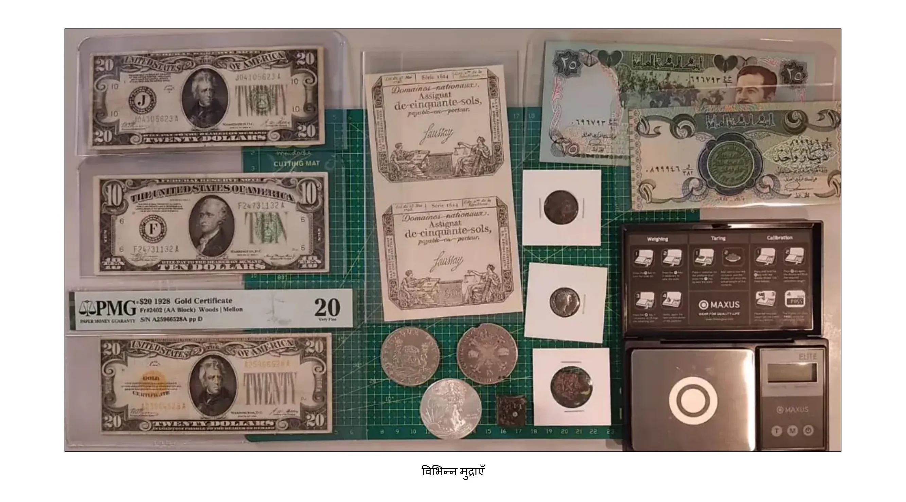

इन परिभाषाओं के आलोक में, यह समझना ज़रूरी है कि रॉबर्ट के लिए, मुद्रास्फीति मुख्य रूप से मुद्रा Supply में वृद्धि से संबंधित है। दूसरी ओर, लारूस इस विस्तार के परिणामों, यानी कीमतों में सामान्य वृद्धि पर ध्यान केंद्रित करते हैं।

अतिमुद्रास्फीति पर अपने अध्ययन में, हम दूसरी परिभाषा को अपनाएँगे, जो कीमतों में सामान्यीकृत वृद्धि है, क्योंकि यह हमारे विषय के लिए अधिक प्रासंगिक और स्पष्ट है। हालाँकि, यह याद रखना ज़रूरी है कि कीमतों में यह वृद्धि आमतौर पर मुद्रा Supply के विस्तार का परिणाम होती है।

प्रसिद्ध अर्थशास्त्री मिल्टन फ्रीडमैन ने कहा था:

> "मुद्रास्फीति हमेशा और हर जगह एक मौद्रिक घटना है।"

यह कथन मौद्रिक विस्तार और मुद्रास्फीति के बीच अंतर्निहित संबंध को उजागर करता है। आगे के खंडों में, हम इन मूलभूत परिभाषाओं के आधार पर मुद्रास्फीति और आर्थिक विकास के बीच संबंधों की जाँच करेंगे।

### मौद्रिक परिघटना को समझना

मौद्रिक परिघटना की बात करें तो, हम यह बता रहे हैं कि किसी अर्थव्यवस्था का मौद्रिक Supply कैसे प्रभावित होता है। मिल्टन फ्रीडमैन ने इसे मूलतः इसी Supply में वृद्धि के रूप में देखा था। ऐतिहासिक रूप से, मौद्रिक Supply को बढ़ाने के दो मुख्य तरीके रहे हैं:

1. मौद्रिक मुद्रण:

पारंपरिक मौद्रिक प्रणालियों में, Supply मुद्रा में वृद्धि नए बैंक नोटों की भौतिक छपाई द्वारा प्राप्त की जाती थी। हालाँकि आजकल, डिजिटल मुद्रा के प्रचलन के साथ, यह मुद्रण मुख्यतः इलेक्ट्रॉनिक (केंद्रीय बैंकों और अन्य वित्तीय संस्थानों के डेटाबेस के माध्यम से) होता है, इतिहास हमें ऐसे दौर दिखाता है जब बैंक नोटों की शाब्दिक छपाई से अति मुद्रास्फीति हुई।

2. धातु सामग्री में कमी:

एक और तरीका था चाँदी या सोने जैसी धातुओं पर आधारित मुद्राओं में कीमती धातुओं की मात्रा कम करना। इसका एक उल्लेखनीय उदाहरण रोमन साम्राज्य में मिलता है, जहाँ शुरुआत में लगभग पूरी तरह चाँदी से बना दीनार, समय के साथ अपनी चाँदी की मात्रा में भारी कमी करता गया। यह एक तरह की मुद्रास्फीति थी, लेकिन ज़रूरी नहीं कि यह अति मुद्रास्फीति ही हो।

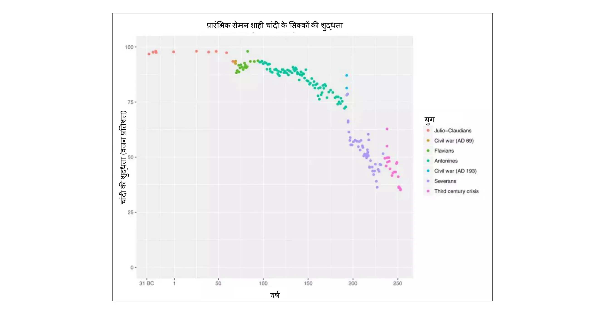

इस बात पर ज़ोर देना ज़रूरी है कि अतिमुद्रास्फीति मुख्य रूप से उन फ़िएट मुद्राओं में देखी जाती है जो अपनी अंतर्निहित परिसंपत्तियों, जैसे कीमती धातुओं, द्वारा समर्थित नहीं होती हैं। ऐतिहासिक रूप से, जब कोई मुद्रा ऐसी परिसंपत्तियों पर आधारित होती थी, तो मुद्रास्फीति की घटनाएँ (जैसे, धातु सामग्री के अवमूल्यन के माध्यम से) होती थीं, लेकिन ये घटनाएँ कभी भी अतिमुद्रास्फीति के चरम स्तर तक नहीं पहुँचीं। निम्नलिखित अनुभागों में, हम मौद्रिक अवमूल्यन की अवधियों और मुद्रास्फीति पर इन विभिन्न मौद्रिक प्रणालियों के प्रभावों का विस्तार से अध्ययन करेंगे।

### मौद्रिक अवमूल्यन की अवधि का अध्ययन

इतिहास में, विभिन्न सभ्यताओं ने मौद्रिक अवमूल्यन के दौर देखे हैं। इनमें से कुछ दौर ऐसी बड़ी घटनाओं या युद्धों के साथ मेल खाते हैं जिन्होंने अर्थव्यवस्था पर दबाव डाला है।

#### 1. पेलोपोनेसियन युद्ध और दूसरा प्यूनिक युद्ध:

एथेंस और स्पार्टा के बीच संघर्ष, पेलोपोनेसियन युद्ध, और रोमन गणराज्य और कार्थेज के बीच द्वितीय प्यूनिक युद्ध, अभिलेखों में पाए गए मुद्रा अवमूल्यन के सबसे शुरुआती उदाहरण हैं। इन युद्धों के वित्तपोषण के लिए, इन सभ्यताओं ने अपनी मुद्राओं में चाँदी की मात्रा कम करके और अन्य धातुओं को शामिल करके, साथ ही सिक्कों की संख्या बढ़ाकर, उनका अवमूल्यन किया।

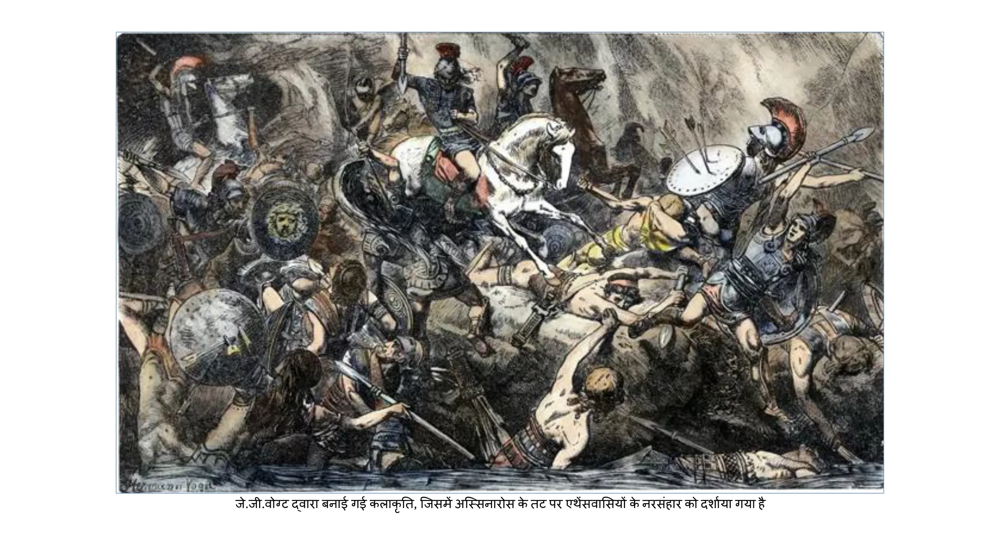

असिनरोस के तट पर एथेनियाई लोगों के नरसंहार को दर्शाती उत्कीर्णन।

#### 2. प्राचीन रोम साम्राज्य के दौरान:

रोमन गणराज्य के युग के बाद, साम्राज्य के दौरान, तीसरी और चौथी शताब्दियों में मुद्रा का महत्वपूर्ण अवमूल्यन हुआ। जैसा कि पिछले ग्राफ़ में देखा जा सकता है, यह सिक्कों में चाँदी की मात्रा में कमी से स्पष्ट होता है। एक अध्ययन से पता चलता है कि मिस्र में गेहूँ की कीमत, जिसे द्राख्मा में मापा जाता था, लगभग 400 वर्षों की अवधि में, 40 ईसा पूर्व से 360 ईस्वी तक, दस लाख गुना बढ़ गई। इस अवधि में, यह लगभग 4.4% की औसत वार्षिक मुद्रास्फीति को दर्शाता है। हालाँकि, यह मुद्रास्फीति समान रूप से वितरित नहीं थी। यह वास्तव में 238 ईस्वी के आसपास शुरू हुई थी। 250 और 293 ईस्वी के बीच, मुद्रास्फीति दर लगभग 3.65% थी, और 293 और 301 ईस्वी के बीच यह बढ़कर 22.28% हो गई।

हालाँकि इन अवधियों में उल्लेखनीय मुद्रास्फीति देखी गई, लेकिन वे कुछ आधुनिक परिस्थितियों में देखी गई अतिमुद्रास्फीति के स्तर तक नहीं पहुँच पाईं। इसका कारण यह है कि, हालाँकि मुद्रा का अवमूल्यन हुआ था, फिर भी वह कीमती धातुओं द्वारा समर्थित थी। इस ठोस आधार ने अत्यधिक मुद्रास्फीति के स्तर से कुछ सुरक्षा प्रदान की। निम्नलिखित अनुभागों में, हम अतिमुद्रास्फीति की प्रकृति और परिणामों की अधिक विस्तार से जाँच करेंगे।

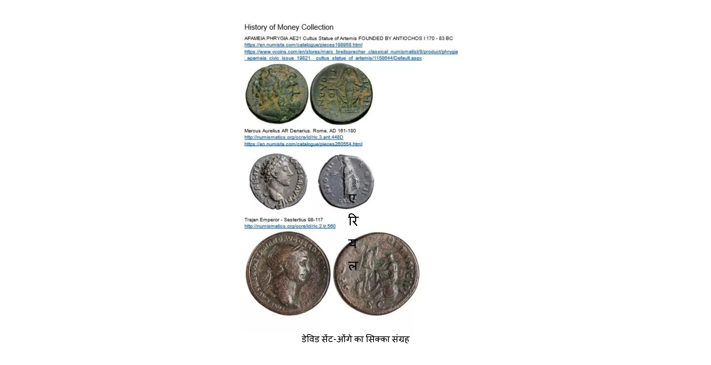

- मार्कस ऑरेलियस का डेनारियस (160 ई.):

प्राचीन रोम के सबसे प्रतिष्ठित सिक्कों में से एक है दीनार, जो एक चांदी का Coin सिक्का है। मेरे पास मार्कस ऑरेलियस का एक खास Coin सिक्का है, जो 160 ईस्वी पूर्व का है, बड़े अवमूल्यन से पहले का। हालाँकि कैमरा बारीक विवरणों को कैद करने में थोड़ा संघर्ष कर सकता है, लेकिन नंगी आँखों से यह स्पष्ट है कि Coin सिक्का सुंदर है और इसमें अपेक्षाकृत उच्च मात्रा में चांदी की मात्रा है।

- एंटोनिनियस (तीसरी शताब्दी के उत्तरार्ध में):

मौद्रिक अवमूल्यन के साथ, एक नई मुद्रा, एंटोनिनियनस, का उदय हुआ। इस मुद्रा की कीमत दो दीनार होनी चाहिए थी, लेकिन इसमें चाँदी की मात्रा बहुत कम थी। मेरे एंटोनिनियनस Coin से स्पष्ट रूप से पता चलता है कि इसमें चाँदी की मात्रा काफी कम हो गई है। यह उस काल के रोमन सिक्कों की खासियत, "रेडिएट्स" नामक एक मुकुट से सुसज्जित है। रंग और गुणवत्ता की तुलना करने पर, यह देखा जा सकता है कि एंटोनिनियनस शुद्ध चाँदी का Coin नहीं है।

दोनों सिक्कों की तुलना करने पर, अंतर स्पष्ट दिखाई देता है। 160 ईस्वी के दीनार में चाँदी की एक विशिष्ट झलक है, जबकि तीसरी शताब्दी के उत्तरार्ध के एंटोनिनियस का रंग काफ़ी फीका है, जो चाँदी की मात्रा में उल्लेखनीय कमी दर्शाता है। यह दृश्य तुलना प्राचीन रोम में कुछ शताब्दियों में हुए मौद्रिक अवमूल्यन का स्पष्ट चित्रण प्रस्तुत करती है।

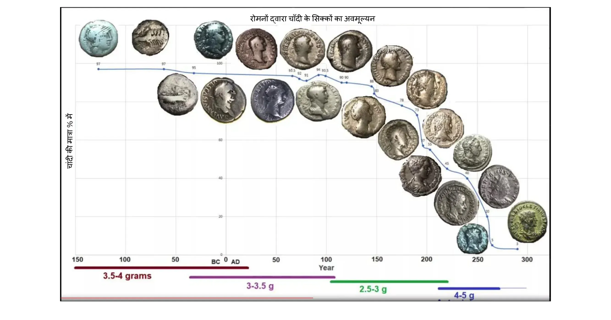

इस प्रदर्शन को पूरा करने के लिए, समय के साथ इन सिक्कों के अवमूल्यन को दर्शाने वाला एक ग्राफ़ आदर्श होगा। हालाँकि इस मंच के माध्यम से इसकी कल्पना करना कठिन है, लेकिन एक ऐसे ग्राफ़ की कल्पना कीजिए जो दीनार के मूल्य को दर्शाता हो, और उसके बाद दूसरी शताब्दी के अंत में इसकी गिरावट, जब इसकी जगह एंटोनिनियस ने ले ली, जिसकी कीमत दो दीनार मानी जाती थी, लेकिन इसमें चाँदी की मात्रा काफ़ी कम थी। ये कलाकृतियाँ पिछली सभ्यताओं के आर्थिक उतार-चढ़ाव की मूक गवाह हैं।

#### 3. स्पेनिश मारावेदी: लक्षित अवमूल्यन का गवाह

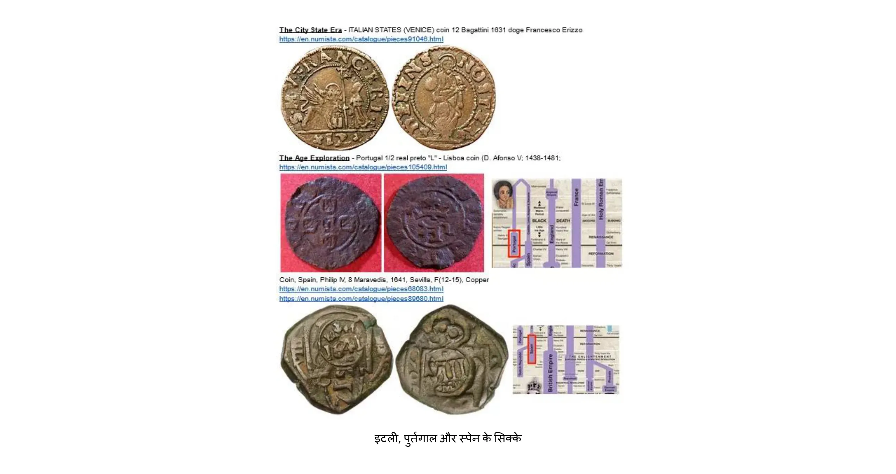

तांबे की मुद्रा के रूप में मारावेदी, स्पेनिश मुद्रा के इतिहास में एक विशेष स्थान रखती है। जैसा कि पहले उल्लेख किया गया है, स्पेनिश डॉलर मूल रूप से अंतर्राष्ट्रीय मानक था, स्पेन के लिए एक आवश्यक आरक्षित मुद्रा। हालाँकि, कुछ आर्थिक चुनौतियों का सामना करते हुए, स्पेन को चतुर मौद्रिक रणनीतियों का सहारा लेना पड़ा।

मौद्रिक अवमूल्यन एक ऐसा साधन है जिसका इस्तेमाल अक्सर राज्य अपने खर्चों को पूरा करने या अर्थव्यवस्था को प्रोत्साहित करने के लिए करते हैं। हालाँकि, स्पेन खुद को एक नाज़ुक स्थिति में पा रहा था। स्पेनिश डॉलर के मूल्य में गिरावट से अंतर्राष्ट्रीय व्यापार में उसकी स्थिति को खतरा हो सकता था। इस दुविधा से निपटने के लिए, स्पेन ने मारावेदी का सहारा लिया।

कीमती स्पेनिश चाँदी के डॉलर के विपरीत, मारावेदी एक तांबे की मुद्रा थी जिसका इस्तेमाल मुख्यतः स्थानीय आबादी के बीच होता था। इस मुद्रा का अवमूल्यन किया जाना तय था। जब एक मारावेदी Coin की कीमत शुरू में दो मारावेदी होती थी, तो राज्य उसे वापस ले लेता था, उस पर एक नया मूल्य, उदाहरण के लिए, "चार" अंकित करता था, और मालिक को केवल एक Coin लौटाता था। "आठ" अंकित Coin, इस प्रक्रिया का प्रमाण है, जो अवमूल्यन के कई चक्रों से गुज़रा है।

इस रणनीति ने राज्य को मुद्रा का प्रभावी अवमूल्यन करने, मुद्रास्फीति पैदा करने और अप्रत्यक्ष रूप से राज्य को वित्तपोषित करने की अनुमति दी, जबकि अंतर्राष्ट्रीय मंच पर स्पेनिश डॉलर की अखंडता को बनाए रखा। हालाँकि, इस लक्षित अवमूल्यन के स्थानीय लोगों पर दुष्परिणाम हुए, जिन्होंने अपनी साझा मुद्रा के मूल्य को कम होते देखा।

मारावेदी का मामला यह दर्शाता है कि कैसे एक राज्य अपनी आंतरिक आर्थिक ज़रूरतों को पूरा करने के लिए स्थानीय मुद्रा का चुनिंदा अवमूल्यन कर सकता है, जबकि वैश्विक स्तर पर एक आरक्षित मुद्रा का मूल्य बरकरार रख सकता है। यह इतिहास में मौद्रिक नीति की जटिलता और कुशलता का एक अद्भुत उदाहरण है।

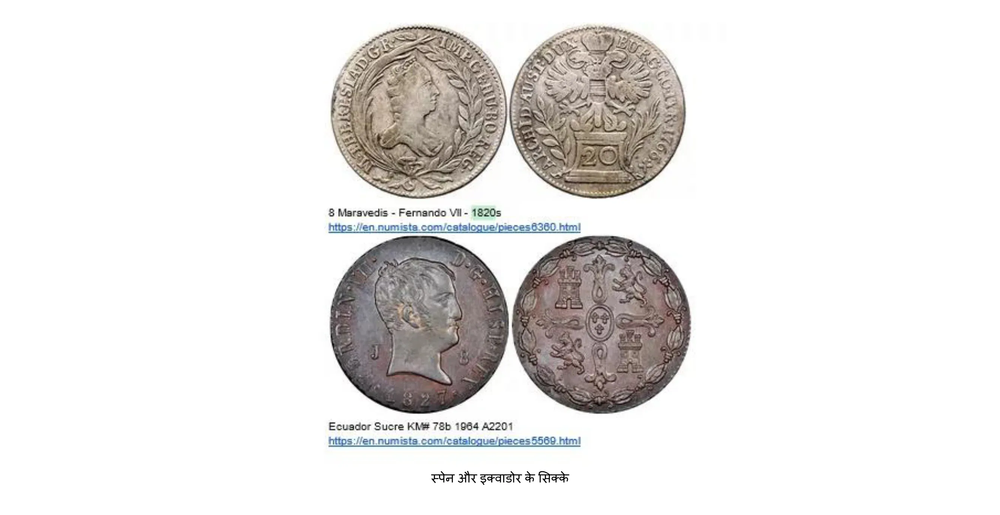

क्या आप और जानना चाहते हैं? -> [लिंक](https://docs.google.com/document/d/1aZa7gvz1nt8ZHDCoWKQdS9RGGjBHdipH1ApC8dW1xpM/edit?usp=sharing)

#### 4. 15वीं से 17वीं शताब्दी तक मूल्य क्रांति

15वीं और 17वीं शताब्दी के बीच, यूरोप ने एक उल्लेखनीय आर्थिक घटना देखी, जिसे अक्सर "मूल्य क्रांति" कहा जाता है। मुद्रास्फीति का यह दौर मुख्यतः अमेरिका से कीमती धातुओं, विशेष रूप से सोने और चाँदी के भारी प्रवाह के कारण शुरू हुआ था। उस समय यूरोपीय अर्थव्यवस्था मुख्यतः धातु मानक पर आधारित थी, इसलिए धातुओं के इस अतिरिक्त Supply ने मुद्रा Supply में वृद्धि की। परिणामस्वरूप, लगभग 1 से 2% प्रति वर्ष की मुद्रास्फीति दर उभरी। पहली नज़र में, यह मुद्रास्फीति मामूली लग सकती है। हालाँकि, उस समय, इस तरह के मूल्य उतार-चढ़ाव इतने असामान्य थे कि उन्हें "क्रांति" माना जा सकता था। यह इस बात पर प्रकाश डालता है कि मौद्रिक भंडार में परिवर्तन पूरी आर्थिक व्यवस्था को कैसे प्रभावित कर सकते हैं।

#### 5. जॉन लॉ और असाइनैट्स

अठारहवीं शताब्दी में, फ्रांसीसी आर्थिक इतिहास मुद्रा से जुड़ी दो महत्वपूर्ण घटनाओं से चिह्नित था। पहली, स्कॉटिश अर्थशास्त्री और वित्तदाता जॉन लॉ ने फ्रांसीसी सरकार को कागजी मुद्रा पर आधारित मौद्रिक प्रणाली अपनाने के लिए राजी किया। हालाँकि शुरुआत में इसे देश की वित्तीय समस्याओं का एक अभिनव समाधान माना गया, लेकिन इस पहल ने जल्द ही बेकाबू मुद्रास्फीति को जन्म दिया। फिर, कुछ ही समय बाद, फ्रांसीसी क्रांति की उथल-पुथल के दौरान, सरकार ने "असाइनेट्स" की शुरुआत की।

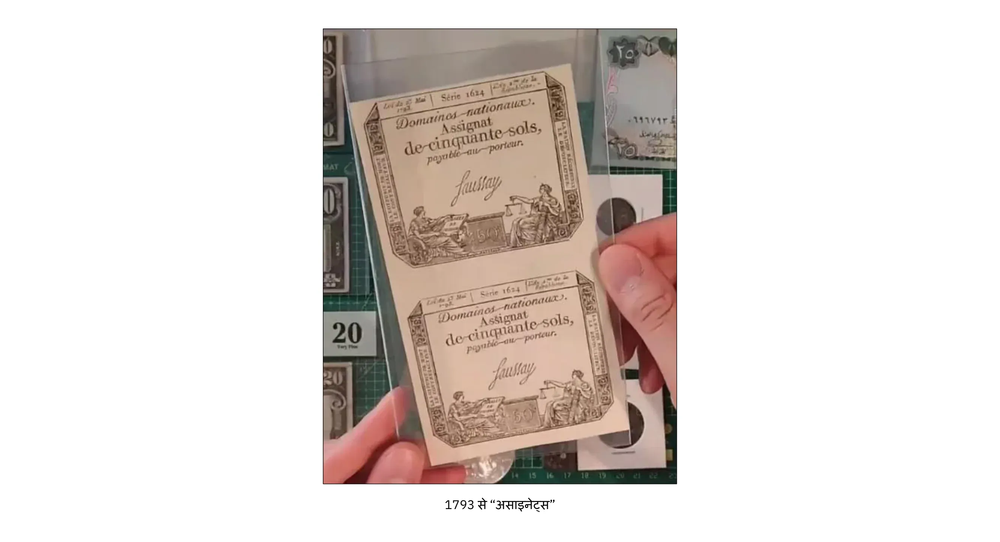

1793 से असाइनेट्स

ये बैंकनोट इतिहास में अतिमुद्रास्फीति के पहले बड़े दौर के जीवंत प्रमाण हैं। शुरुआत में लगातार वित्तीय संकटों की प्रतिक्रिया के रूप में डिज़ाइन किए गए, असाइनैट जल्द ही मौद्रिक अस्थिरता का प्रतीक बन गए। सरकार ने अपने खर्चों के लिए इस कागजी मुद्रा पर अत्यधिक निर्भरता के कारण एक अभूतपूर्व आर्थिक संकट पैदा किया और क्रांति के बाद फ्रांस में अतिमुद्रास्फीति का एक बड़ा दौर शुरू हुआ।

#### 6. कार्यकारी आदेश 6102 और डॉलर का अवमूल्यन

कार्यकारी आदेश 6102 और डॉलर का अवमूल्यन

संयुक्त राज्य अमेरिका में, 1930 के दशक के आरंभ में मौद्रिक नीति में एक बड़ा बदलाव देखा गया। इस परिवर्तन का विस्तृत विवरण इस प्रकार है:

- 1928 का 20 डॉलर का नोट

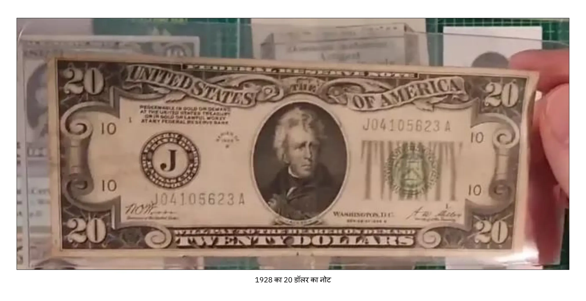

1928 में, संयुक्त राज्य अमेरिका में 20 डॉलर के नोट पर लिखा होता था: "मांगने पर सोने में भुनाया जा सकता है।" इसका मतलब था कि हर नोट सचमुच सोने में बदला जा सकता था। खास तौर पर, 20.67 डॉलर का नोट एक औंस सोने के बराबर था।

- कार्यकारी आदेश 6102

1933 में, कार्यकारी आदेश 6102 के जारी होने के साथ एक बड़ी उथल-पुथल मच गई। इस आदेश ने नागरिकों के लिए सोना रखना अवैध बना दिया, चाहे वह बार, सिक्के या प्रमाण पत्र के रूप में हो।

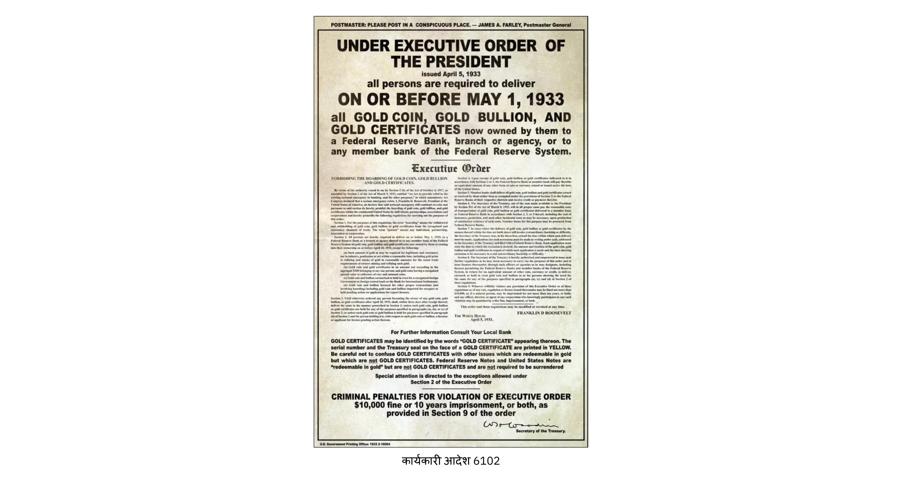

स्वर्ण प्रमाणपत्र इसका एक अच्छा उदाहरण है। इस पर लिखा होता था: "स्वर्ण में Coin, धारक को माँगने पर देय।" ऐसा प्रमाणपत्र रखना गैरकानूनी हो गया और 1964 तक ऐसा ही रहा।

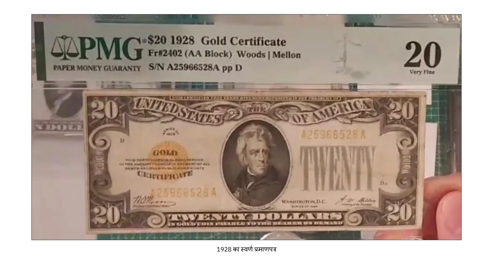

- नए बैंक नोटों का प्रचलन

1934 में सोने की जब्ती के बाद, बैंक नोटों की एक नई श्रृंखला प्रचलन में लायी गयी।

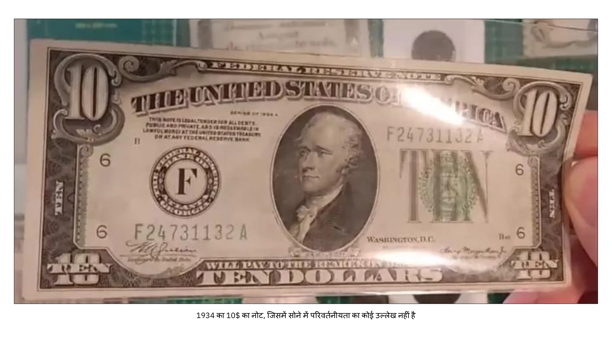

सोने में उनकी परिवर्तनीयता का संकेत देने वाला उल्लेख हटा दिया गया है और उसकी जगह "यह नोट सभी ऋणों के लिए कानूनी निविदा है" (सीई बिलेट इस्ट उने मोनाई लीगल पोर टाउट्स डेट्स) रख दिया गया है।

- सोने का पुनर्मूल्यांकन

इस बदलाव की सबसे दिलचस्प बात सरकार की रणनीति है। 1934 में, सोने की कीमत 20.67 डॉलर प्रति औंस के बजाय 35 डॉलर प्रति औंस कर दी गई। दरअसल, सरकार ने लोगों के पास मौजूद डॉलर का अवमूल्यन कर दिया। 1933 में जनता से 20.67 डॉलर प्रति औंस पर सोना खरीदकर और फिर 1934 में सोने की कीमत का पुनर्मूल्यांकन करके, सरकार ने अपने नागरिकों की बचत का अवमूल्यन करते हुए अच्छा-खासा मुनाफ़ा कमाया।

संक्षेप में, एक वर्ष के भीतर ही सरकार ने प्रभावी रूप से नागरिकों का सोना जब्त कर लिया, फिर सोने के मूल्य का पुनर्मूल्यांकन करके खेल के नियमों को बदल दिया, जिससे राजकोष को लाभ हुआ और उन लोगों को नुकसान हुआ, जिन्होंने शुरू में अपने सोने को नोटों के लिए बदल दिया था।

### अमेरिका इतिहास बदल रहा है।

संयुक्त राज्य अमेरिका ने विश्व की आरक्षित मुद्रा, अमेरिकी डॉलर का अवमूल्यन करने वाला पहला देश बनकर ऐतिहासिक मोड़ ले लिया, जो कि छोटे व्यापारिक देशों में पहले अपनाई गई प्रथाओं के विपरीत था।

इससे पहले, पुनर्जागरण के दौरान, 13वीं शताब्दी में फ्लोरेंस द्वारा जारी इतालवी फ्लोरिन अंतर्राष्ट्रीय आरक्षित मुद्रा थी, और इसके उपयोग की अवधि के दौरान कोई अवमूल्यन दर्ज नहीं किया गया था, जो अंतर्राष्ट्रीय व्यापार के लिए मौद्रिक स्थिरता के महत्व को दर्शाता है।

इसी भावना को ध्यान में रखते हुए, स्पेन और नीदरलैंड, अपने फलते-फूलते अंतर्राष्ट्रीय व्यापार के कारण विश्व आरक्षित मुद्रा के धारक होने के नाते, अंतर्राष्ट्रीय विनिमय में विश्वास और यथास्थिति बनाए रखने के लिए अपनी मुद्राओं की अखंडता बनाए रखते रहे। नीदरलैंड ने पहले केंद्रीय बैंक के निर्माण को भी देखा, जो मौद्रिक प्रणालियों के वैश्विक विकास में एक महत्वपूर्ण मील का पत्थर था।

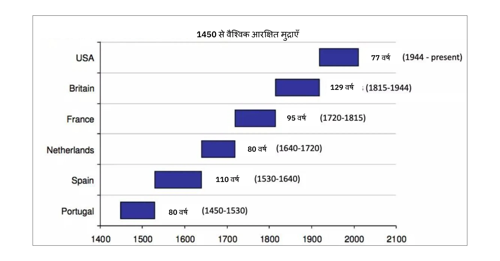

हालाँकि, संयुक्त राज्य अमेरिका के एक प्रमुख आर्थिक शक्ति के रूप में उभरने के साथ स्थिति बदल गई। उन्होंने अपनी आरक्षित मुद्रा का अवमूल्यन करने का विकल्प चुना, जिससे मुद्रास्फीति का अपने लाभ के लिए दोहन हुआ। इस निर्णय को अक्सर बदलती गतिशीलता के लिए जिम्मेदार ठहराया जाता है, जहाँ आरक्षित मुद्रा का चुनाव अब पहले जितना स्वतंत्र नहीं रहा। अमेरिकी आधिपत्य ने डॉलर को विश्व आरक्षित मुद्रा के रूप में स्थापित कर दिया, जिससे इसके मूल्य में हेरफेर की अनुमति मिल गई। यह बदलाव एक वैश्वीकृत अर्थव्यवस्था में अंतर्राष्ट्रीय व्यापार पर मौद्रिक नीतियों के संभावित प्रभाव को दर्शाता है, जो वैश्विक आरक्षित मुद्राओं के प्रबंधन में एक महत्वपूर्ण बदलाव का संकेत देता है।

### सड़क के लिए अंतिम उदाहरण: स्विस दीनार

स्विस दीनार मौद्रिक अवमूल्यन के एक और दिलचस्प पहलू को दर्शाता है, जो इस बार खाड़ी युद्ध-पूर्व इराकी संदर्भ में निहित है। अपने बैंकनोटों की उल्लेखनीय गुणवत्ता के कारण, इस मुद्रा का नाम इराक के केंद्रीय बैंक द्वारा जारी किया गया था और मध्य पूर्व क्षेत्र में इसकी स्थिरता की प्रतिष्ठा थी। यह विश्वास मुख्यतः बैंकनोट मुद्रण की गुणवत्ता के कारण था, जो इंग्लैंड में किया जाता था, जो अवमूल्यन के विरुद्ध एक निश्चित मजबूती का संकेत देता है।

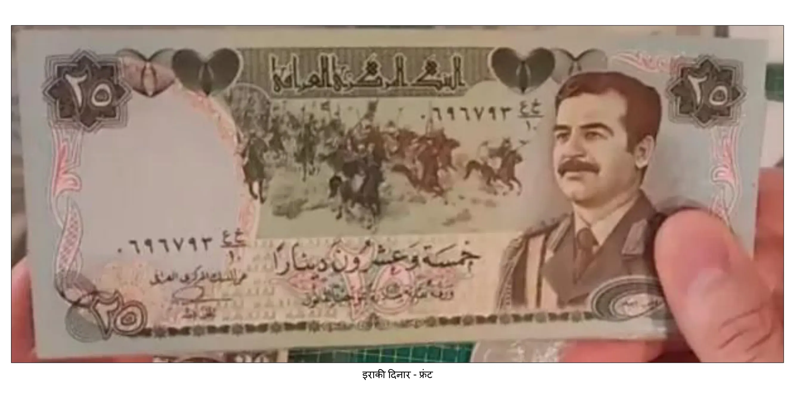

हालाँकि, खाड़ी युद्धों ने स्विस दीनार के इतिहास में एक महत्वपूर्ण मोड़ ला दिया। इराक, अब बैंकनोट छपाई के लिए अपने अंग्रेजी आपूर्तिकर्ता पर निर्भर नहीं रह सका, इसलिए उसने सहायता के लिए चीन का रुख किया। इस परिवर्तन के परिणामस्वरूप बैंकनोटों की गुणवत्ता में स्पष्ट अंतर आया, और चीनी संस्करण को घटिया माना जाने लगा। यह धारणा निराधार नहीं थी; चीनी बैंकनोटों की जालसाजी ज़्यादा आसानी से हो जाती थी और सरकार द्वारा उनकी अधिक छपाई की संभावना भी बढ़ जाती थी, जिससे उनके मूल्य पर खतरा मंडरा रहा था।

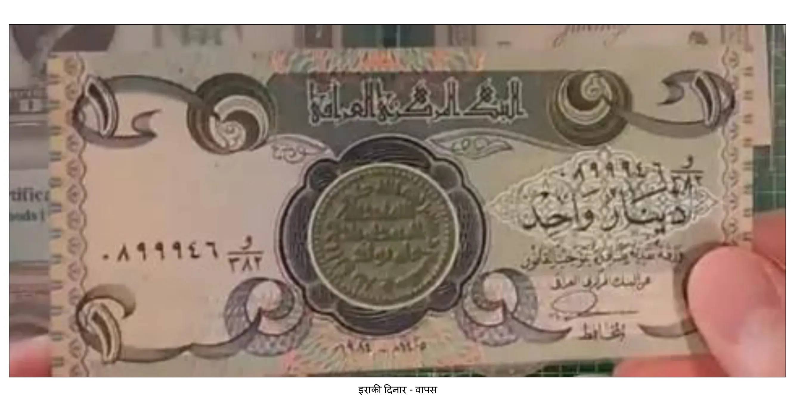

खाड़ी युद्ध के बाद इराकी अर्थव्यवस्था में एक विशिष्ट घटना उभरी: दोहरी मूल्य निर्धारण प्रणाली। व्यापारी भुगतान के लिए इस्तेमाल किए जाने वाले बैंक नोट के प्रकार के आधार पर अलग-अलग कीमतें देते थे, और चीनी बैंक नोट की तुलना में मूल स्विस दीनार को प्राथमिकता देते थे। यह प्रणाली उच्च-गुणवत्ता वाले बैंक नोटों में विश्वास को दर्शाती थी, जिनका अवमूल्यन कम होता था, यहाँ तक कि ऐसे संदर्भ में भी जहाँ मूल्य मुख्य रूप से राज्य द्वारा लगाया जाता था। यह प्रकरण मुद्रा की आंतरिक विशेषताओं के महत्व को उजागर करता है और यह भी कि कैसे, एक फिएट मुद्रा व्यवस्था में भी, किसी मुद्रा की कथित गुणवत्ता उसके सापेक्ष मूल्य और, विस्तार से, आर्थिक कर्ताओं के विश्वास को प्रभावित कर सकती है।

#### हाँ, हमने वास्तव में सिक्कों का वजन किया!

आम धारणा अक्सर मुद्रा को राज्य निर्माण से जोड़ती है, जहाँ इसके जारीकरण और मूल्य का नियमन राज्य द्वारा किया जाता है। इस अवधारणा की जड़ें रोम जैसी प्राचीन सभ्यताओं में हैं, जहाँ साम्राज्य द्वारा सिक्कों का मानकीकरण और मुहर लगाई जाती थी, जिससे मुद्रा को आधिकारिक मूल्य प्राप्त होता था। हालाँकि, गहन अन्वेषण से पता चलता है कि मुद्रा का आंतरिक मूल्य मुख्य रूप से उसमें मौजूद बहुमूल्य धातुओं से निर्धारित होता था।

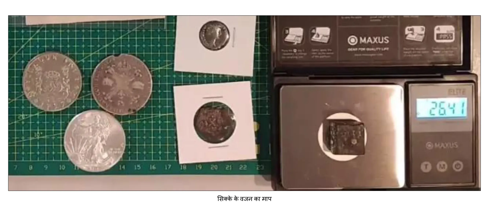

आठ स्पेनिश रियाल या एक स्पेनिश डॉलर के बराबर मुद्रा भार की जाँच के माध्यम से एक उदाहरण प्रस्तुत किया गया है। यह भार, जिस पर रोमन अंक अंकित होता है और जो इसके मूल्य को दर्शाता है, मुद्रा विनिमयकर्ताओं द्वारा सिक्कों का मूल्य केवल उन पर अंकित मुद्रांकन के बजाय, उनके भार के आधार पर निर्धारित करने के लिए उपयोग किया जाता था। सिक्कों का वजन करके, विनिमयकर्ता यह निर्धारित कर सकते थे कि उनमें कोई परिवर्तन हुआ है या वे क्षतिग्रस्त हुए हैं, जिससे उनका मूल्य कम हो सकता था। यह प्रथा इस बात पर प्रकाश डालती है कि, यद्यपि राज्य द्वारा मानकीकृत मुद्रांकन मुद्रा को एक निश्चित नाममात्र मूल्य प्रदान करता था, वास्तविक मूल्य उसमें निहित बहुमूल्य धातु के भार में निहित होता था।

यह विश्लेषण दर्शाता है कि मुद्रा में विश्वास, और विस्तार से इसके मूल्य में, राज्य के मात्र दावे के बजाय, इसके मूर्त स्वरूप पर आधारित था। यह राज्य द्वारा लगाए गए नाममात्र मूल्य और कीमती धातु की मात्रा द्वारा निर्धारित आंतरिक मूल्य के बीच के द्वंद्व को रेखांकित करता है। इस प्रकार, मुद्रा केवल एक राज्य उपकरण होने से कहीं आगे जाती है, और इसका मूल मूल्य मूर्त और मापनीय Elements से आंतरिक रूप से जुड़ा होता है।

#### निष्कर्ष

अंत में, मौद्रिक अवमूल्यन पर यह अध्ययन मुद्रास्फीति तंत्र की गहरी समझ प्रदान करता है, जिसकी चर्चा निम्नलिखित वीडियो में की जाएगी। हम विभिन्न प्रकार की मुद्रास्फीति और उस सीमा पर चर्चा करेंगे जिस पर वे उच्च या अति मुद्रास्फीति में परिवर्तित हो जाती हैं। यह ठोस आधार हमें आगामी सत्रों में मुद्रास्फीति की जटिलताओं को समझने में मदद करेगा। आपके ध्यान के लिए धन्यवाद। हम अगले वीडियो में मौद्रिक गतिशीलता के इस अन्वेषण को जारी रखने के लिए उत्सुक हैं।

## मुद्रास्फीति के प्रकार

<chapterId>b438fe09-375e-5bb2-9196-7dd687b9f98c</chapterId>

### मुद्रास्फीति कोई बहुकारकीय घटना नहीं है

इस खंड में, हम मुद्रास्फीति के विभिन्न पहलुओं की जाँच करेंगे, एक ऐसी घटना जिसे अक्सर गलत समझा जाता है। हालाँकि मीडिया और रोज़मर्रा की चर्चाओं में मुद्रास्फीति को अक्सर एक बहु-कारकीय घटना के रूप में देखा जाता है, यह याद रखना ज़रूरी है कि यह मूलतः एक मौद्रिक घटना है।

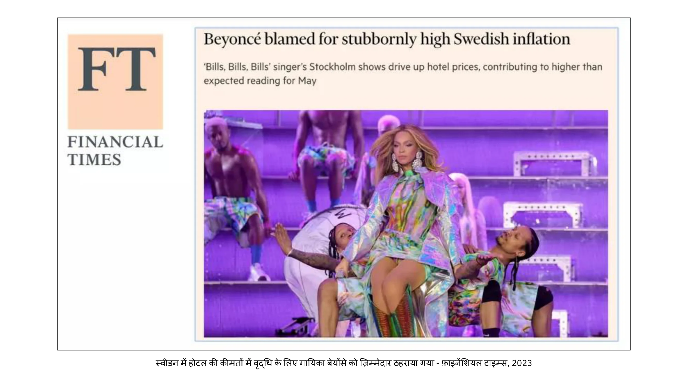

इस विषय को कई प्रमुख बिंदुओं में विभाजित किया गया है:

- मूल्य वृद्धि और मुद्रास्फीति के बीच अंतर:

मूल्य वृद्धि क्षेत्र-विशिष्ट हो सकती है तथा विभिन्न कारकों से प्रेरित हो सकती है, जैसे ओपेक तेल उत्पादन में कमी या गेहूं उत्पादन को प्रभावित करने वाली प्रतिकूल मौसम की स्थिति।

दूसरी ओर, मुद्रास्फीति को किसी विशिष्ट क्षेत्र में ही नहीं, बल्कि विभिन्न प्रकार की वस्तुओं और सेवाओं की कीमतों में सामान्यीकृत वृद्धि के रूप में परिभाषित किया जाता है।

- मुद्रास्फीति का मौद्रिक सार:

एक निश्चित मुद्रा Supply के साथ, एक क्षेत्र में कीमतों में वृद्धि से अन्य क्षेत्रों में कीमतों में कमी आएगी, क्योंकि अन्यत्र खर्च करने के लिए उपलब्ध धन की मात्रा कम हो जाएगी। मुद्रास्फीति का मुद्रा Supply में वृद्धि से गहरा संबंध है, जो सभी क्षेत्रों में कीमतों में एक साथ वृद्धि को संभव बनाता है।

- मुद्रा Supply का मुद्रास्फीति और अपस्फीति पर प्रभाव:

स्थिर मुद्रा Supply प्रणाली में, उत्पादन में वृद्धि से सैद्धांतिक रूप से अपस्फीति, अर्थात् कीमतों में कमी आनी चाहिए, क्योंकि अधिक वस्तुएं और सेवाएं उपलब्ध होंगी।

वर्तमान फिएट मौद्रिक प्रणाली में, मुद्रा Supply में वृद्धि, उत्पादन में वृद्धि के कारण होने वाली संभावित अपस्फीति को रद्द कर देती है।

- धन के नकारात्मक प्रभाव Supply समायोजन:

उत्पादन में वृद्धि के बिना मुद्रा Supply में वृद्धि से मुद्रास्फीति होती है, क्योंकि समान मात्रा में वस्तुओं और सेवाओं के लिए अधिक मुद्रा प्रचलन में होती है।

जबकि उत्पादन में वृद्धि से अपस्फीति होनी चाहिए थी, लेकिन Supply में मुद्रा में एक साथ हुई वृद्धि ने इस प्रभाव को निष्प्रभावी कर दिया, जिसके परिणामस्वरूप मुद्रास्फीति हो गई।

- मुद्रास्फीति, अपस्फीति और धन Supply - संचार पोत:

मुद्रास्फीति और अपस्फीति अर्थव्यवस्था में संचार वाहिकाओं की तरह हैं। उत्पादन में वृद्धि से अपस्फीति हो सकती है, लेकिन अगर Supply मुद्रा में भी वृद्धि की जाए, तो अपस्फीतिकारी प्रभाव समाप्त हो जाता है, जिसके परिणामस्वरूप मुद्रास्फीति होती है।

यह चर्चा मुद्रास्फीति और अपस्फीति के अंतर्निहित तंत्रों को समझने के महत्व पर ज़ोर देती है, साथ ही Supply मुद्रा में बदलाव से अर्थव्यवस्था पर पड़ने वाले गहरे प्रभाव पर भी। हम संभवतः बाद में इन अवधारणाओं पर फिर से विचार करेंगे ताकि इनके अंतर्संबंधों और वैश्विक अर्थव्यवस्था पर इनके प्रभाव को और गहराई से समझा जा सके।

### मुद्रा मुद्रण से हमेशा मुद्रास्फीति क्यों नहीं होती?

#### मुद्रास्फीति ≠ सीपीआई

मुद्रास्फीति, हालांकि अक्सर Supply मुद्रा में वृद्धि से जुड़ी होती है, हमेशा मुद्रा मुद्रण से सीधा संबंध नहीं रखती, जैसा कि 2008 के वित्तीय संकट के बाद के दौर से स्पष्ट है। बैंकों को बचाने के लिए बड़े पैमाने पर मुद्रा मुद्रण के बावजूद, अगले दशक में उच्च मुद्रास्फीति नहीं देखी गई, औसतन 0 से 2% प्रति वर्ष। यह स्थिति यह प्रश्न उठाती है: बड़े पैमाने पर मुद्रा मुद्रण के परिणामस्वरूप आनुपातिक मुद्रास्फीति क्यों नहीं हुई? इसका उत्तर मुद्रास्फीति और उपभोक्ता मूल्य सूचकांक (CPI) को मापने से जुड़ी कई बारीकियों में निहित है।

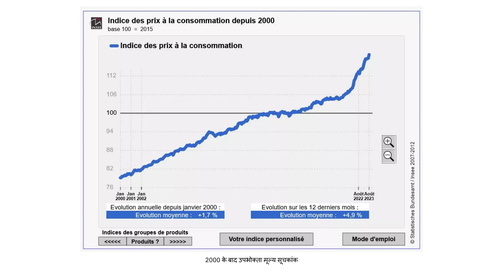

पहली व्याख्या मुद्रास्फीति को मापने के तरीके में निहित है। उपभोक्ता मूल्य सूचकांक (CPI), जो मुद्रास्फीति का प्राथमिक संकेतक है, की कुछ सीमाएँ हैं। उदाहरण के लिए, यह अचल संपत्ति की कीमतों में होने वाले उतार-चढ़ाव को व्यापक रूप से नहीं दर्शाता है। हालाँकि CPI में किराए से संबंधित एक घटक शामिल है, लेकिन घरों की कीमतों में हुई भारी वृद्धि सूचकांक में पूरी तरह से परिलक्षित नहीं होती है। परिणामस्वरूप, आवास की लागत में उल्लेखनीय वृद्धि CPI द्वारा पूरी तरह से दर्शाए बिना हो सकती है, जिससे वास्तविक मुद्रास्फीति का संभावित रूप से कम आकलन हो सकता है।

इसके अतिरिक्त, सीपीआई की गणना में कुछ ऐसी पद्धतियों का प्रयोग किया जाता है जो वास्तविक मूल्य वृद्धि को संतुलित या छिपा सकती हैं। उदाहरण के लिए, सूचकांक को समायोजित करने के लिए उत्पादों में गुणात्मक सुधार का उपयोग किया जा सकता है। यदि किसी उत्पाद की कीमत बढ़ती है, लेकिन उसकी गुणवत्ता या विशेषताओं में भी सुधार होता है, तो सीपीआई यह मान सकता है कि उपभोक्ता के लिए वास्तविक मूल्य में कोई बदलाव नहीं आया है, और इसलिए, यह मुद्रास्फीति को प्रतिबिंबित नहीं करता है। एक उदाहरणात्मक मामला वह है जहाँ, मौद्रिक इंजेक्शन के कारण गोमांस और कंप्यूटर की कीमतों में वृद्धि के बावजूद, कंप्यूटर के प्रदर्शन में सुधार का उपयोग इस वृद्धि को संतुलित करने के लिए किया जाता है। यदि किसी कंप्यूटर की कीमत दोगुनी है लेकिन वह चार गुना अधिक शक्तिशाली है, तो सीपीआई इसे कीमतों में कमी के रूप में व्याख्यायित कर सकता है, इस प्रकार गोमांस की कीमतों में वृद्धि को छिपा सकता है।

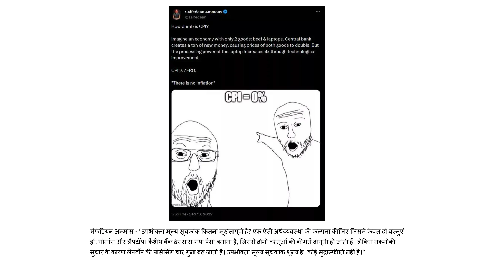

सीपीआई द्वारा मुद्रास्फीति मापने की ये बारीकियाँ, मुद्रा मुद्रण और मुद्रास्फीति के बीच के संबंध की जटिलता को उजागर करती हैं। ये यह भी संकेत देते हैं कि यदि सभी मूल्य वृद्धि, विशेष रूप से रियल एस्टेट जैसे प्रमुख क्षेत्रों में, को अधिक व्यापक रूप से ध्यान में रखा जाए, तो वास्तविक मुद्रास्फीति, बताई गई मुद्रास्फीति से अधिक हो सकती है। यह विश्लेषण मुद्रास्फीति के अंतर्निहित तंत्र और इसे मापने के लिए प्रयुक्त पारंपरिक सूचकांकों की सीमाओं को समझने के महत्व को रेखांकित करता है, जिससे मौद्रिक नीतियों के आर्थिक निहितार्थों की गहरी समझ प्राप्त होती है।

#### एमएमटी के तर्क

आधुनिक मौद्रिक सिद्धांत (एमएमटी) मुद्रा सृजन और मुद्रास्फीति पर एक विशिष्ट दृष्टिकोण प्रस्तुत करता है। एमएमटी के अनुसार, मुद्रा मुख्य रूप से सरकार से उत्पन्न होती है, जो अपनी आवश्यकताओं की पूर्ति के लिए बिना मुद्रास्फीति उत्पन्न किए पर्याप्त मात्रा में मुद्रा छाप सकती है, बशर्ते कि इन निधियों द्वारा लक्षित क्षेत्र संतृप्त न हों। यह दृष्टिकोण पारंपरिक मौद्रिक सिद्धांतों से अलग है और मुद्रास्फीति की गतिशीलता में क्षेत्रीय अवशोषण क्षमताओं के महत्व पर बल देता है।

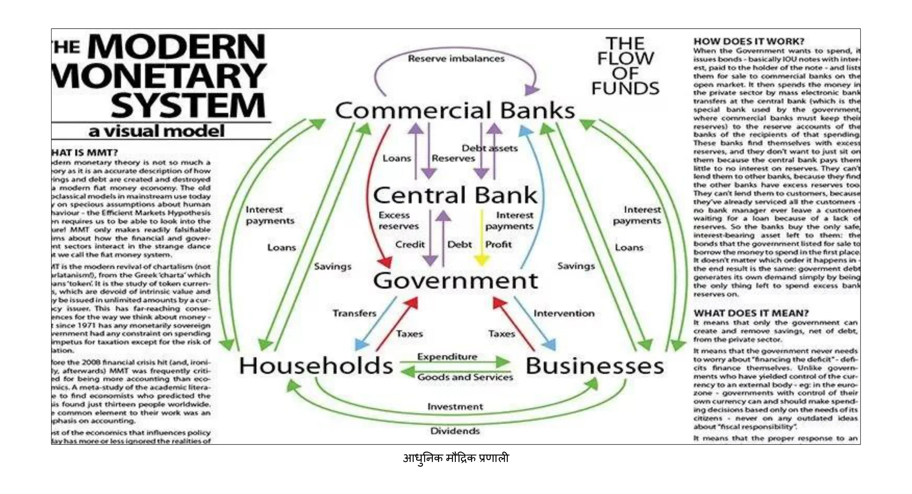

एमएमटी का एक उदाहरण अमेरिकी सैन्य-औद्योगिक परिसर है। एमएमटी के अनुसार, इस क्षेत्र को बिना मुद्रास्फीति पैदा किए सैकड़ों अरब डॉलर आवंटित किए जा सकते हैं, क्योंकि यह धन को अवशोषित करने में सक्षम है। इसके विपरीत, यदि संयुक्त राज्य अमेरिका में, जहाँ कंपनियों और श्रमिकों की संख्या सीमित है, सड़क निर्माण में पर्याप्त धनराशि लगाई जाती है, तो संसाधनों की कमी और आपूर्तिकर्ताओं द्वारा माँगी गई बढ़ी हुई लागत के कारण मुद्रास्फीति हो सकती है।

एमएमटी समर्थक अक्सर जापान को एक और उदाहरण के रूप में उद्धृत करते हैं जहाँ मुद्रा की महत्वपूर्ण छपाई के बावजूद मुद्रास्फीति नहीं होती। हालाँकि, जापान की स्थिति उपभोक्ता मूल्य सूचकांक (सीपीआई) जैसे पारंपरिक मुद्रास्फीति मापकों की सीमाओं को भी उजागर करती है। जापान में, मुद्रित मुद्रा का एक बड़ा हिस्सा वर्तमान उपभोग पर खर्च करने के बजाय या तो बचा लिया जाता है या अचल संपत्ति या शेयर बाजार में निवेश कर दिया जाता है। सीपीआई, इन गतिशीलताओं को पूरी तरह से न दर्शाकर, वास्तविक मुद्रास्फीति को कम करके आंक सकता है।

[जापान का विश्लेषण](https://ideas.repec.org/p/ces/ceswps/_9821.html) यह भी उजागर करता है कि आर्थिक एजेंटों का व्यवहार, जैसे बचत या उन परिसंपत्तियों में निवेश जो उपभोक्ता मूल्य सूचकांक में शामिल नहीं हैं, मुद्रा छपाई के मुद्रास्फीति प्रभाव को छिपा सकता है। इसके अतिरिक्त, विभिन्न क्षेत्रों की प्रवाहित तरलता को अवशोषित करने की क्षमता मुद्रास्फीति के प्रकट होने या न होने में निर्णायक भूमिका निभाती है।

#### बैंक और केंद्रीय बैंक बैलेंस शीट

मुद्रा मुद्रण से मुद्रास्फीति क्यों नहीं होगी, इसका तीसरा उदाहरण यह है कि मुद्रा मुद्रण और मुद्रास्फीति के बीच का संबंध इस बात से प्रभावित होता है कि अर्थव्यवस्था में नवनिर्मित मुद्रा कैसे प्रवेश करती है। यदि यह धन आर्थिक कर्ताओं को उधार दिए बिना निजी बैंकों की बैलेंस शीट पर रहता है, तो इसका वास्तविक अर्थव्यवस्था पर सीधा प्रभाव नहीं पड़ेगा और इसलिए, मुद्रास्फीति नहीं होगी।

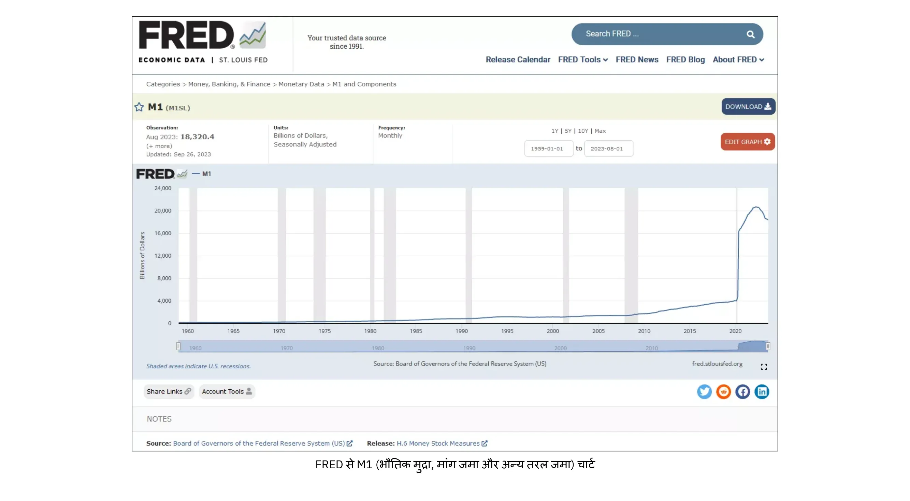

मुद्रा मुद्रण को अर्थव्यवस्था पर लटकी डैमोकल्स की तलवार के रूप में देखा जा सकता है। निर्मित मुद्रा एक निश्चित अवधि तक बिना किसी प्रत्यक्ष मुद्रास्फीति प्रभाव के निष्क्रिय रह सकती है, जब तक कि इसे बैंक ऋण या अन्य माध्यमों से अर्थव्यवस्था में नहीं डाला जाता। हालाँकि, जब यह निष्क्रिय मुद्रा अंततः प्रचलन में आती है, तो मुद्रास्फीति के प्रभाव प्रकट हो सकते हैं। 2020 के दशक में यही देखा गया है, जहाँ पहले से निर्मित मुद्रा अर्थव्यवस्था में प्रवेश कर गई है, जिससे मुद्रास्फीति बढ़ गई है।

यह परिदृश्य मुद्रा मुद्रण के मुद्रास्फीतिकारी प्रभावों को प्रभावित करने में मौद्रिक संचरण तंत्र के महत्व को उजागर करता है। केंद्रीय बैंक द्वारा मुद्रा सृजन इस पहेली का केवल एक पहलू है। निजी बैंकों का व्यवहार, जो दिए जाने वाले ऋणों की मात्रा तय करते हैं, और उधारकर्ताओं का व्यवहार, जो यह तय करते हैं कि उधार ली गई धनराशि को कैसे खर्च किया जाए, इस गतिशीलता में भी महत्वपूर्ण हैं।

#### मुद्रास्फीति सामाजिक है!

वाइमर गणराज्य का उदाहरण मुद्रा मुद्रण और मुद्रास्फीति के बीच संबंध के एक और महत्वपूर्ण पहलू को दर्शाता है: अपेक्षाओं की भूमिका और आर्थिक एजेंटों का व्यवहार। जब वाइमर गणराज्य के केंद्रीय बैंक ने बड़ी मात्रा में मुद्रा छापना शुरू किया, तो आर्थिक अनिश्चितता के कारण लोगों ने धन संचय करना शुरू कर दिया, यानी उसे खर्च करने के बजाय जमा करना शुरू कर दिया। इस प्रतिक्रिया ने मुद्रा मुद्रण के मुद्रास्फीतिकारी प्रभावों को अस्थायी रूप से विलंबित कर दिया।

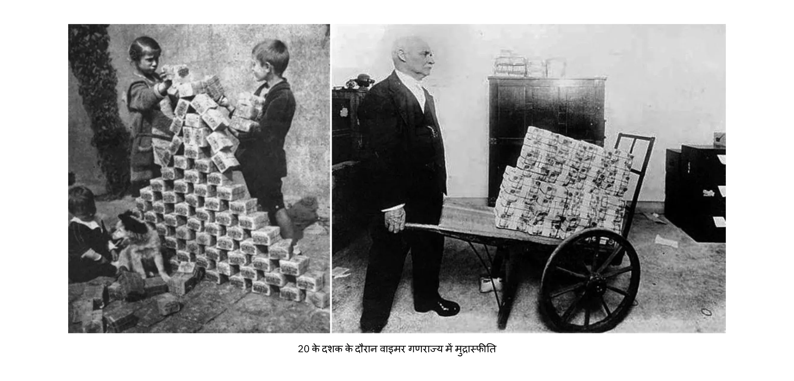

हालाँकि, जब आर्थिक स्थिति में थोड़ा सुधार होने लगा, तो धीरे-धीरे आत्मविश्वास बहाल हुआ। फिर लोगों ने अपनी बचत को अपने गुप्त स्थानों से निकालकर अर्थव्यवस्था में बड़े पैमाने पर खर्च करना शुरू कर दिया। व्यवहार में इस अचानक बदलाव ने, पहले से ही उच्च मुद्रा Supply के साथ मिलकर, माँग में भारी वृद्धि की। अधिक मुद्रा प्रचलन और बढ़ती माँग के साथ, कीमतें तेज़ी से बढ़ने लगीं, जिससे मुद्रास्फीति में उल्लेखनीय वृद्धि हुई।

यह उदाहरण मुद्रास्फीति के उद्भव में समय और एजेंट के व्यवहार के महत्व को रेखांकित करता है। मुद्रास्फीति केवल मुद्रा Supply में वृद्धि के कारण ही नहीं होती, बल्कि इस बात पर भी निर्भर करती है कि वह मुद्रा अर्थव्यवस्था में कैसे और कब खर्च की जाती है। आर्थिक अनिश्चितताएँ और आर्थिक एजेंटों की अपेक्षाएँ इस गतिशीलता में महत्वपूर्ण भूमिका निभाती हैं और मुद्रा मुद्रण के मुद्रास्फीतिकारी प्रभावों को या तो तेज़ कर सकती हैं या विलंबित कर सकती हैं।

#### पुनरावलोकन:

- उपभोक्ता मूल्य सूचकांक (सीपीआई): सीपीआई को इस तरह से संरचित किया गया है कि यह मुद्रास्फीति को कम करके आंकता है, जिससे मुद्रास्फीति की वास्तविकता का विकृत चित्र सामने आ सकता है।

- क्षेत्रीय अवशोषण: इसे अवशोषित करने में सक्षम क्षेत्रों में मौद्रिक निवेश हमेशा मुद्रास्फीति की ओर नहीं ले जाता। इसका एक उल्लेखनीय उदाहरण अमेरिकी सैन्य-औद्योगिक परिसर है, जो मुद्रास्फीति को बढ़ाए बिना बड़ी मात्रा में धन अवशोषित कर सकता है।

- जापान का मामला: बड़े पैमाने पर मुद्रा मुद्रण के बावजूद, जापान में मुद्रास्फीति कम बनी हुई है क्योंकि धन अक्सर बचाया जाता है या अचल संपत्ति या शेयर बाजारों में निवेश किया जाता है। ये क्षेत्र मुद्रित मुद्रा को अवशोषित करते हैं, और उपभोक्ता मूल्य सूचकांक (CPI) अनिवार्य रूप से इन क्षेत्रों में मूल्य वृद्धि को प्रतिबिंबित नहीं करता है।
- मौद्रिक मुद्रण और बाज़ारों के बीच सहसंबंध। यह देखा गया है कि अचल संपत्ति और शेयर बाज़ारों के वक्र अक्सर मौद्रिक मुद्रण का अनुसरण करते हैं, जो यह दर्शाता है कि मुद्रित मुद्रा किस ओर निर्देशित है।
- बैंकों का मौद्रिक भंडार: जब मुद्रित मुद्रा बैंकों की बैलेंस शीट पर रहती है और अर्थव्यवस्था में प्रचलन में नहीं रहती, तो इससे मुद्रास्फीति नहीं होती। 2008 के उदाहरण से यह स्पष्ट होता है, जहाँ मुद्रित मुद्रा अधिकांशतः बैंकों की बैलेंस शीट पर ही रही, जिससे मुद्रास्फीति का प्रभाव कम हुआ।

- वाइमर गणराज्य: यह ऐतिहासिक काल दर्शाता है कि कैसे आर्थिक अनिश्चितता ने धन की जमाखोरी को बढ़ावा दिया, जिससे मुद्रास्फीति में देरी हुई। हालाँकि, जैसे ही विश्वास बहाल हुआ और धन खर्च हुआ, मुद्रास्फीति में विस्फोट हो गया।

इन उदाहरणों का उपयोग चर्चाओं में यह समझाने के लिए किया जा सकता है कि मुद्रास्फीति हमेशा मौद्रिक मुद्रण का तत्काल परिणाम क्यों नहीं होती है, तथा आर्थिक संदर्भ और एजेंट व्यवहार मुद्रास्फीति को कैसे प्रभावित करते हैं।

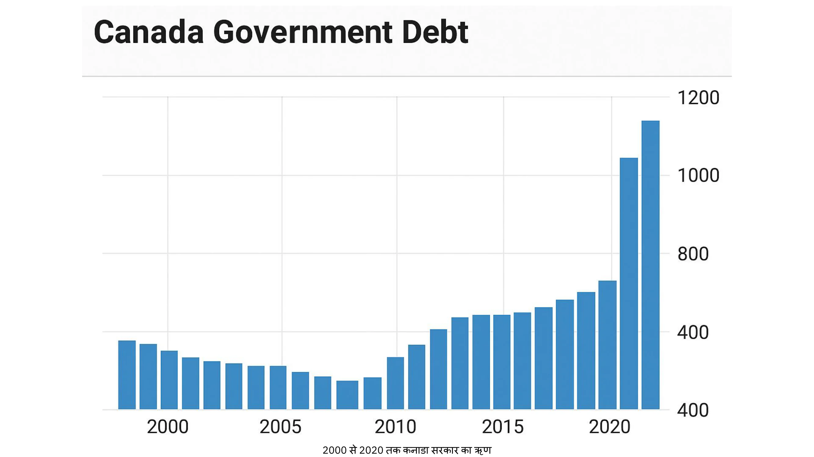

क्योंकि, जैसा कि यह [थ्रेड](https://twitter.com/saifedean/status/1673639779433590786) दिखाता है: मुद्रास्फीति केंद्रीय बैंकों की गलती के अलावा सब कुछ है।

- अर्थशास्त्री मुद्रास्फीति के लिए जलवायु परिवर्तन को ज़िम्मेदार ठहराते हैं

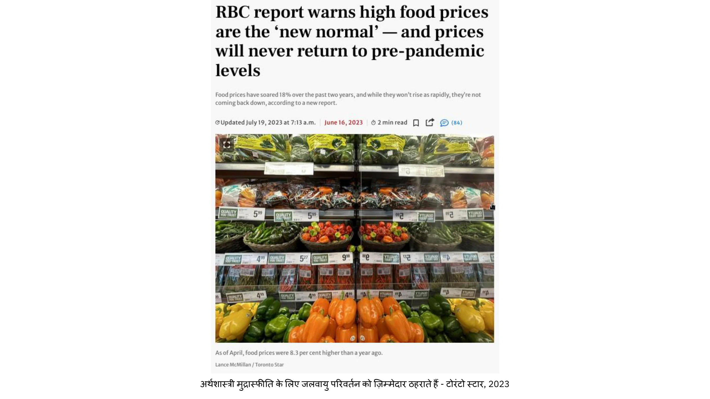

- स्वीडन द्वारा किसी विशिष्ट माह में मुद्रास्फीति के लिए बेयोंसे को दोषी ठहराने का उदाहरण।

- पोलैंड के केंद्रीय बैंक ने मुद्रास्फीति के लिए यूक्रेन में रूसी आक्रामकता और महामारी को जिम्मेदार ठहराया है

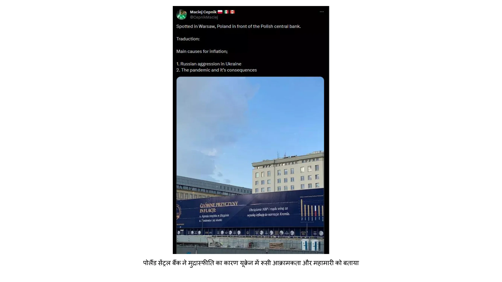

- यूनाइटेड किंगडम में मुद्रास्फीति के लिए ब्रेक्सिट को दोषी ठहराया जाता है।

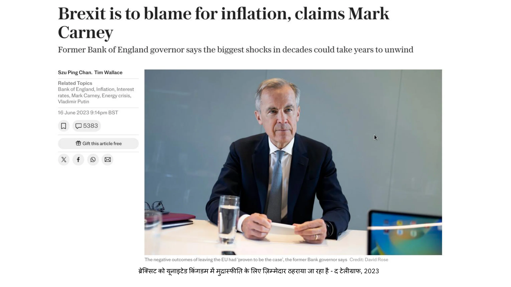

- ज़ेल्डा गेम का रिलीज़ होना मुद्रास्फीति के झटके से जुड़ा हुआ है।

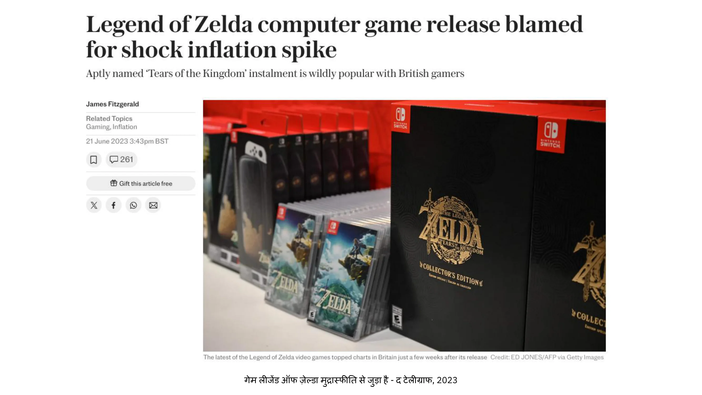

- टेलर स्विफ्ट कथित तौर पर मुद्रास्फीति का कारण बन रही हैं।

बताइए, बेयोंसे या टेलर स्विफ्ट की वजह से कीमतों में इतनी ज़्यादा बढ़ोतरी कैसे हो सकती है? देखिए, इसका कोई मतलब नहीं है। संक्षेप में:

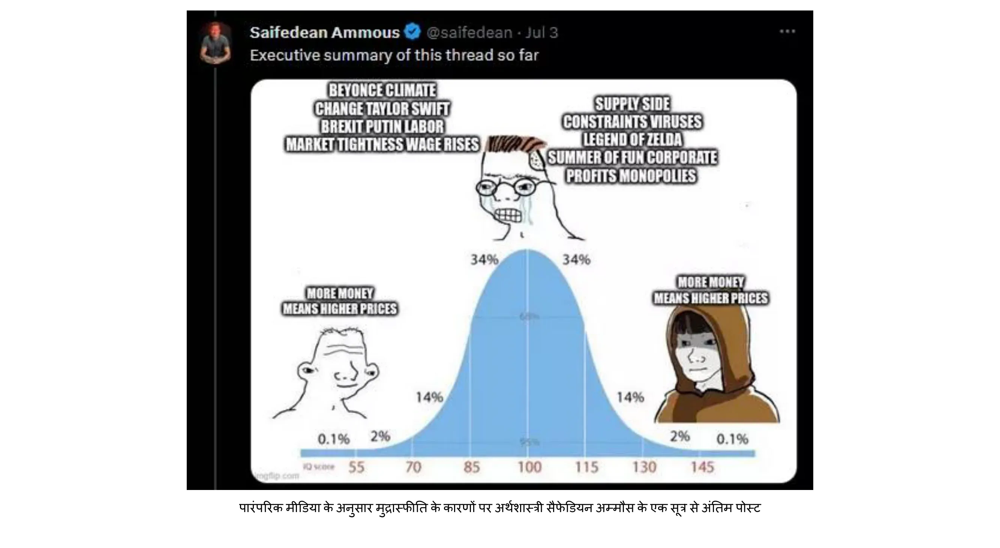

### मुद्रास्फीति के प्रकारों की खोज

मुद्रास्फीति के विभिन्न प्रकारों के बीच अंतर को समझना बेहद ज़रूरी है, जिससे हम इस आर्थिक घटना की विभिन्न अभिव्यक्तियों को समझ सकें। इन विभिन्न प्रकारों की व्याख्या इस प्रकार है:

- रेंगती हुई मुद्रास्फीति: यह मुद्रास्फीति का वह प्रकार है जिसका लक्ष्य केंद्रीय बैंक आमतौर पर रखते हैं, और इसे सालाना लगभग 2% निर्धारित करते हैं। यह लक्ष्य 1990 के दशक से अपनाया जा रहा है और इसका उद्देश्य अत्यधिक गर्मी या अपस्फीति के बिना स्थिर आर्थिक विकास बनाए रखना है।
- मध्यम मुद्रास्फीति: मुद्रास्फीति का यह रूप तब होता है जब मुद्रास्फीति 2% के लक्ष्य से अधिक हो जाती है। यह अक्सर अत्यधिक अर्थव्यवस्था से जुड़ा होता है, एक ऐसी स्थिति जिसमें अत्यधिक मुद्रा Supply कीमतों में सामान्य वृद्धि को प्रेरित करती है। यह परिदृश्य मौद्रिक नीतियों की सीमाओं को उजागर करता है और कभी-कभी आर्थिक विमर्श में विरोधाभासों को भी उजागर करता है।
- तेज़ी से बढ़ती मुद्रास्फीति: तेज़ी से बढ़ती मुद्रास्फीति, जिसे अक्सर दोहरे अंकों की मुद्रास्फीति कहा जाता है, तब होती है जब वार्षिक मुद्रास्फीति दर 10% से अधिक हो जाती है। यह कीमतों में उल्लेखनीय वृद्धि का संकेत है जो आर्थिक स्थिरता को खतरे में डाल सकती है।

- अति मुद्रास्फीति: अति मुद्रास्फीति एक चरम घटना है जहाँ मुद्रास्फीति की दर प्रति माह 50% से अधिक हो जाती है, जो मुद्रास्फीति की घातीय प्रकृति के कारण, 13,000% से अधिक की वार्षिक मुद्रास्फीति दर के बराबर होती है। मुद्रास्फीति का यह स्तर अर्थव्यवस्था को गंभीर रूप से अस्थिर कर देता है, मुद्रा को लगभग बेकार बना देता है और मौद्रिक प्रणाली में विश्वास को कम करता है।

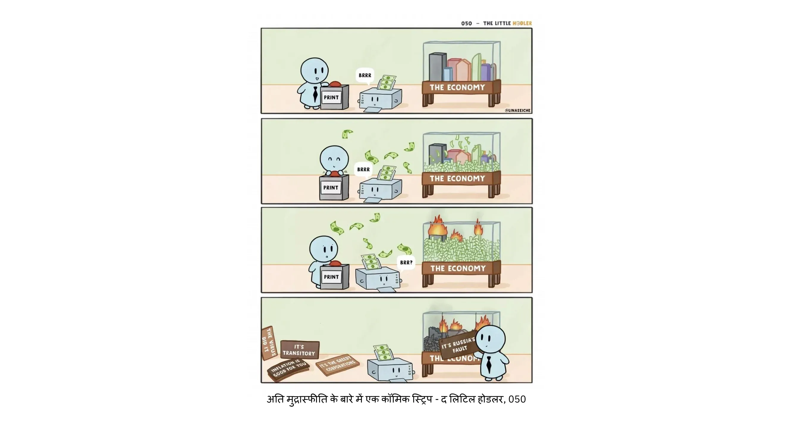

मुद्रास्फीति के प्रकारों की खोज करते समय, शैक्षिक संसाधनों में "मांग-कर्षण" और "लागत-प्रवर्धन" जैसे शब्दों का आना आम बात है। ये अवधारणाएँ, हालाँकि मान्य हैं, मुद्रास्फीति को एक मौद्रिक घटना के रूप में नहीं, बल्कि मूल्य वृद्धि की व्याख्या करती हैं। यहाँ एक अधिक गहन विश्लेषण दिया गया है:

- मांग खींचो:

मांग-प्रेरित मुद्रास्फीति को अक्सर एक ऐसी स्थिति के रूप में वर्णित किया जाता है जहाँ अर्थव्यवस्था में मांग उपलब्ध उत्पादन क्षमता से अधिक हो जाती है। हालाँकि, मुद्रा Supply में इसी अनुपात में वृद्धि के बिना, यह स्थिति केवल खर्च के पुनर्वितरण को जन्म देगी। उपभोक्ता आवश्यक वस्तुओं पर अधिक और गैर-आवश्यक वस्तुओं पर कम खर्च कर सकते हैं, जिससे समग्र मुद्रास्फीति प्रभाव बेअसर हो जाता है।

- लागत बढ़ाना:

दूसरी ओर, लागत-प्रेरित मुद्रास्फीति उत्पादन लागत में वृद्धि के कारण होती है, जैसे कि प्राकृतिक संसाधनों या श्रम की लागत। पुनः, मौद्रिक Supply में वृद्धि के बिना, एक क्षेत्र में लागत वृद्धि व्यापक मुद्रास्फीति पैदा किए बिना, अन्य क्षेत्रों में खर्च को कम कर सकती है।

ये पारंपरिक व्याख्याएँ अक्सर मूल्य वृद्धि को मुद्रास्फीति से जोड़ती हैं, जिससे भ्रम और गलतफहमी पैदा हो सकती है। वास्तव में, व्यापक मुद्रास्फीति के लिए, मुद्रा Supply में वृद्धि आवश्यक है। इस संदर्भ में, माँग-आकर्षण और लागत-आकर्षण की अवधारणाएँ क्षेत्रीय मूल्य परिवर्तनों की व्याख्या कर सकती हैं, लेकिन वे मुद्रास्फीति की मौद्रिक प्रकृति को नहीं समझ पातीं। यह क्षेत्रीय मूल्य वृद्धि और व्यापक मुद्रास्फीति के बीच अंतर करने के महत्व पर प्रकाश डालता है, और संपूर्ण अर्थव्यवस्था में मुद्रास्फीति को प्रकट होने से रोकने के लिए मुद्रा Supply में वृद्धि की आवश्यकता की पुष्टि करता है। यह विश्लेषण मुद्रास्फीति के वास्तविक कारणों पर एक अधिक सूक्ष्म और सटीक परिप्रेक्ष्य प्रदान करता है, और उन सामान्य व्याख्याओं को स्पष्ट करता है जो अंतर्निहित मौद्रिक गतिशीलता को अस्पष्ट कर सकती हैं।

### बर्नहोल्ज़ के अनुसार मुद्रास्फीति का वर्गीकरण

बर्नहोल्ज़ ने मुद्रास्फीति का तीन श्रेणियों में सरलीकृत लेकिन सटीक वर्गीकरण प्रस्तावित किया है, जिससे इस जटिल मौद्रिक घटना को बेहतर ढंग से समझा जा सके:

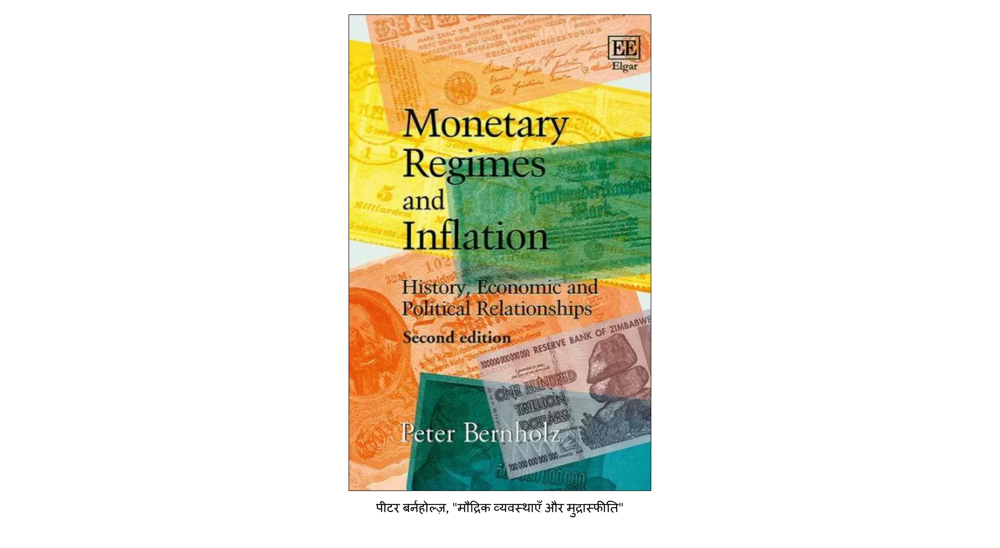

- मध्यम मुद्रास्फीति:

मध्यम मुद्रास्फीति तब होती है जब मुद्रा Supply का स्तर सामान्य से अधिक होता है, लेकिन राज्य द्वारा मुद्रा सृजन द्वारा वित्तपोषित बड़े घाटे का सहारा नहीं लिया जाता। हालाँकि "मध्यम" शब्द महत्वहीन लग सकता है, लेकिन मुद्रास्फीति का यह रूप गंभीर समस्याएँ पैदा कर सकता है, हालाँकि इसे उच्च मुद्रास्फीति की श्रेणी में नहीं रखा जाता है।

- उच्च मुद्रास्फीति:

उच्च मुद्रास्फीति तब होती है जब नाममात्र मूल्य में वृद्धि के बावजूद मुद्रा का वास्तविक मूल्य Supply घट जाता है। यह विरोधाभासी स्थिति मौद्रिक प्रतिस्थापन से उत्पन्न होती है, जहाँ लोग राष्ट्रीय मुद्रा में विश्वास खो देते हैं और उसे वस्तुओं, सेवाओं या विदेशी मुद्राओं के लिए Exchange बदलने की कोशिश करते हैं। यह प्रक्रिया मुद्रा के वास्तविक मूल्य को और कम कर देती है, जिससे मुद्रास्फीति और बढ़ जाती है।

- अति मुद्रास्फीति:

अतिमुद्रास्फीति, उच्च मुद्रास्फीति का एक चरम रूप है, जिसकी विशेषता बड़े बजट घाटे हैं जिनका वित्तपोषण मुद्रा सृजन के माध्यम से किया जाता है। ऐतिहासिक रूप से, मुद्रा मुद्रण के माध्यम से पर्याप्त घाटे के वित्तपोषण के बिना अतिमुद्रास्फीति का कोई भी मामला नहीं देखा गया है। अतिमुद्रास्फीति एक दुष्चक्र का निर्माण करती है: मुद्रास्फीति मुद्रा के मूल्य को इतनी तेज़ी से कम करती है कि राज्य द्वारा कर राजस्व एकत्र करने से पहले ही उसका मूल्यह्रास हो जाता है, जिससे राज्य को अपने वित्तपोषण के लिए और भी अधिक मुद्रा छापने के लिए मजबूर होना पड़ता है। यह आत्म-प्रबलित चक्र खगोलीय मुद्रास्फीति दरों की ओर ले जाता है, जो अक्सर प्रति माह 50% से अधिक होती है।

बर्नहोल्ज़ द्वारा किया गया यह वर्गीकरण मध्यम मुद्रास्फीति से अति मुद्रास्फीति की ओर खतरनाक प्रगति को उजागर करता है, और विनाशकारी मुद्रास्फीति के चक्र को रोकने में मौद्रिक और राजकोषीय नियंत्रण के महत्वपूर्ण महत्व को रेखांकित करता है। यह यह भी दर्शाता है कि राज्य के वित्तपोषण पर हानिकारक परिणाम अति मुद्रास्फीति के चरण तक पहुँचने से बहुत पहले ही हो सकते हैं, जो विभिन्न स्तरों पर मुद्रास्फीति के प्रभावों पर एक सूक्ष्म दृष्टिकोण प्रदान करता है।

### निष्कर्ष: मुद्रास्फीति के प्रकारों का सारांश

निष्कर्षतः, हमने मुद्रास्फीति के विभिन्न प्रकारों का अध्ययन किया है, जिसकी शुरुआत "रेंगती मुद्रास्फीति", "चलती मुद्रास्फीति" और "तेज़ गति से बढ़ती मुद्रास्फीति" जैसे आम तौर पर सुने जाने वाले शब्दों से होती है, जो किसी अर्थव्यवस्था में मुद्रास्फीति के प्रतिशत के विभिन्न स्तरों को दर्शाते हैं। हालाँकि, अति मुद्रास्फीति पर हमारे गहन अध्ययन के लिए, बर्नहोल्ज़ द्वारा वर्णित मध्यम मुद्रास्फीति, उच्च मुद्रास्फीति और अति मुद्रास्फीति की श्रेणियाँ महत्वपूर्ण मानक साबित होती हैं।

- मध्यम मुद्रास्फीति:

यह सामान्य से ऊपर Supply धन के स्तर को इंगित करता है, हालांकि राज्य द्वारा महत्वपूर्ण घाटे के वित्तपोषण के बिना भी इस स्तर को बनाए रखा जा सकता है।

- उच्च मुद्रास्फीति:

यह तब होता है जब धन का वास्तविक मूल्य (Supply) कम हो जाता है, अक्सर मौद्रिक प्रतिस्थापन के कारण, जहां व्यक्ति अपनी मुद्रा को वस्तुओं, सेवाओं या मुद्रा के अन्य रूपों के लिए Exchange करना चाहते हैं।

- अति मुद्रास्फीति:

यह उच्च मुद्रास्फीति के चरम रूप को दर्शाता है, जहां बड़े बजट घाटे को वित्तपोषित करने के लिए अत्यधिक धन सृजन से मुद्रा के वास्तविक मूल्य में तेजी से गिरावट आती है।

हमारे अन्वेषण से यह बात सामने आई है कि अतिमुद्रास्फीति एक जटिल और सहज ज्ञान के विपरीत घटना है। हालाँकि कोई यह मान सकता है कि अतिमुद्रास्फीति Supply मुद्रा में भारी वृद्धि का परिणाम है, लेकिन वास्तव में, यह उस Supply मुद्रा के वास्तविक मूल्य में कमी से उत्पन्न होती है। यह सूक्ष्मता यह समझने के लिए महत्वपूर्ण है कि कुछ देश विश्व बैंक या अंतर्राष्ट्रीय मुद्रा कोष जैसी अंतर्राष्ट्रीय संस्थाओं के समर्थन के बावजूद, अतिमुद्रास्फीति से उबरने के लिए संघर्ष क्यों करते हैं। मुद्रास्फीति के प्रकार को गलत तरीके से परिभाषित करने से अनुचित उपाय अपनाए जा सकते हैं, जिससे आर्थिक समस्याएँ हल होने के बजाय और बढ़ सकती हैं।

हमारी आगामी चर्चाओं में, हम अतिमुद्रास्फीति पर गहराई से विचार करेंगे और विभिन्न आर्थिक संदर्भों में इसकी परिभाषाओं और अभिव्यक्तियों का अन्वेषण करेंगे। हमारा लक्ष्य अतिमुद्रास्फीति के अंतर्निहित तंत्रों को उजागर करना और इस समस्या के Address के संभावित समाधानों की खोज करना है। यह सूक्ष्म समझ हमें इससे जुड़ी चुनौतियों को बेहतर ढंग से समझने और मुद्रास्फीति के प्रबंधन के लिए सूचित रणनीतियाँ प्रस्तावित करने में सक्षम बनाएगी।

आपके ध्यान के लिए धन्यवाद। अगला सत्र पूरी तरह से अतिमुद्रास्फीति को परिभाषित करने और उसके रहस्य को उजागर करने पर केंद्रित होगा, जिसमें विभिन्न शैक्षणिक और व्यावहारिक दृष्टिकोणों पर विचार किया जाएगा। हम अपनी अगली बैठक में आपके साथ इस अन्वेषण को जारी रखने के लिए उत्सुक हैं।

# अति मुद्रास्फीति क्या है?

<partId>3f541663-1e2f-5410-8ee0-f61c5d009fa5</partId>

## अति मुद्रास्फीति की परिभाषाएँ

<chapterId>d2a71a2e-5f36-58d9-993c-d431f4aa07fd</chapterId>

### अति मुद्रास्फीति की परिभाषाएँ

इस खंड में, हम अतिमुद्रास्फीति की विभिन्न परिभाषाओं का अन्वेषण करेंगे, जो चरम मौद्रिक परिघटनाओं के अध्ययन में एक महत्वपूर्ण शब्द है। सबसे अधिक मान्यता प्राप्त परिभाषा फिलिप कैगन की है, जिन्होंने 1956 में अपनी कृति, "अतिमुद्रास्फीति की मौद्रिक गतिशीलता" में अतिमुद्रास्फीति की मात्रात्मक समझ का प्रस्ताव रखा था। कैगन के अनुसार:

- अति मुद्रास्फीति की शुरुआत और अंत:
  - अति मुद्रास्फीति तब शुरू होती है जब मासिक मुद्रास्फीति 50% से अधिक हो जाती है।
  - यह तब समाप्त होता है जब मुद्रास्फीति की दर कम से कम एक वर्ष तक प्रति माह 50% से नीचे आ जाती है।

उदाहरण के लिए, यदि मुद्रास्फीति जुलाई में 40% तक गिर जाती है और अगले वर्ष की जुलाई तक 50% से ऊपर नहीं बढ़ती है, तो अतिमुद्रास्फीति की अवधि उस वर्ष से पहले के वर्ष की जुलाई में समाप्त मानी जाती है जिसमें यह पहली बार देखी गई थी। यह परिभाषा अतिमुद्रास्फीति की घटनाओं का सटीक लक्षण-निर्धारण करने में सक्षम बनाती है, जिससे संरचित विश्लेषण में सुविधा होती है।

इस परिभाषा को हान्के-क्रस तालिका में अपनाया गया है, जिसमें अतिमुद्रास्फीति की 56 घटनाओं का उल्लेख है। हालाँकि, यह तालिका सभी घटनाओं को शामिल नहीं करती है, जैसे कि 2016 में वेनेजुएला में हुई घटना, जिससे कुल संख्या 57 हो जाती है।

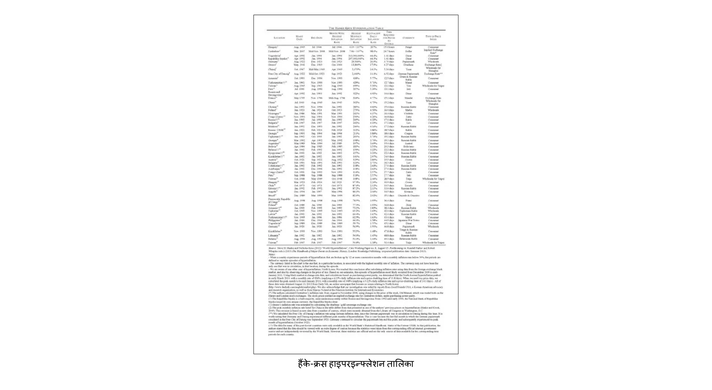

ज़ूम

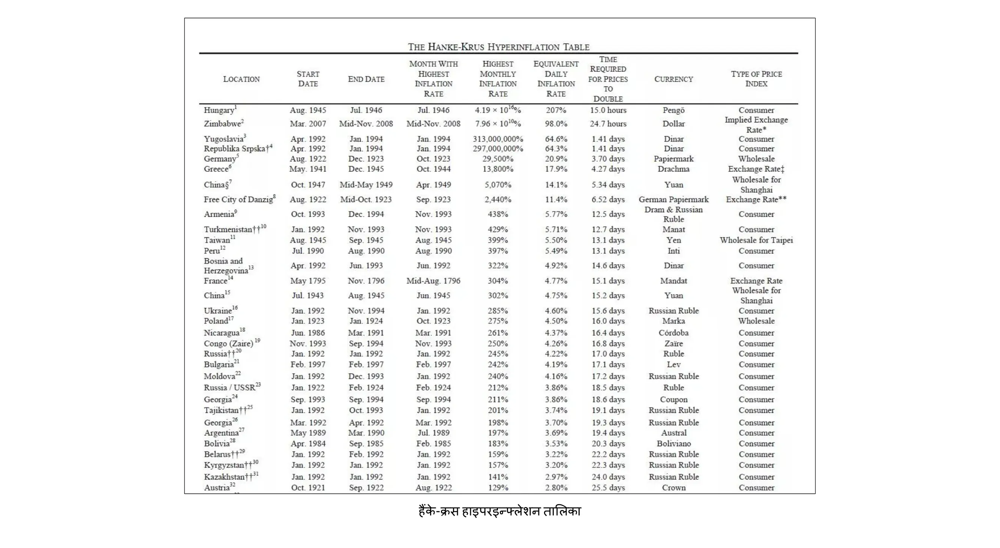

यह ध्यान दिया जाना चाहिए कि यह परिभाषा, यद्यपि सटीक है, 50% सीमा की कठोरता के कारण अतिमुद्रास्फीति के कुछ प्रकरणों को संभवतः बाहर कर सकती है। इस परिभाषा का विस्तार करके अन्य प्रकरणों को भी शामिल किया जा सकता है, जो यद्यपि कैगन के मानदंडों को पूरी तरह से पूरा नहीं करते, फिर भी अत्यधिक उच्च मुद्रास्फीति की अवधियों का प्रतिनिधित्व करते हैं। यह अवलोकन अतिमुद्रास्फीति की घटनाओं की व्यापक खोज का द्वार खोलता है, जिससे इसके कारणों और प्रभावों की अधिक सूक्ष्म समझ प्राप्त होती है। आगे की चर्चाओं में, हम इस परिभाषा पर पुनर्विचार करने और अतिमुद्रास्फीति के उन प्रकरणों की जाँच करने पर विचार करेंगे जो कैगन के कठोर मानदंडों के अंतर्गत नहीं आते हैं।

### कैगन द्वारा हाइपरइन्फ्लेशन की परिभाषा

फिलिप कैगन ने अतिमुद्रास्फीति को परिभाषित करते समय 50% मासिक मुद्रास्फीति सीमा के साथ एक मनमाना मील का पत्थर निर्धारित किया हो सकता है। वह स्वयं स्वीकार करते हैं कि यह परिभाषा मनमाना है और मुख्यतः अतिमुद्रास्फीति के सात प्रकरणों पर आधारित उनके विश्लेषण को पुष्ट करती है। कैगन के आँकड़ों के परीक्षण से पता चलता है कि अतिमुद्रास्फीति के तीन प्रकरणों में सबसे कम मासिक मुद्रास्फीति दर लगभग 47%, 46% और 57% थी। ऐसा प्रतीत होता है कि उनके अध्ययन में इन मामलों को शामिल करने के लिए 50% सीमा का चयन किया गया था।

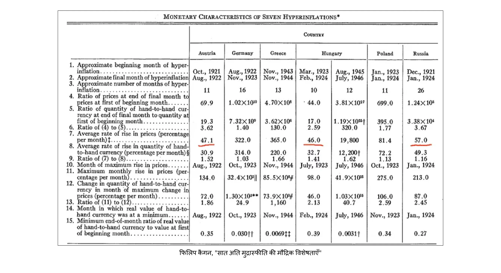

- ऐतिहासिक संदर्भ:

कैगन की परिभाषा 1956 की है और यह उस समय उपलब्ध हाइपरइन्फ्लेशन प्रकरणों की सीमित संख्या पर आधारित है।

- कैगन के अवलोकन:

कैगन के अनुसार, कोई भी प्रकरण अधिक गंभीर अति मुद्रास्फीति की ओर बढ़े बिना 50% की इस सीमा तक नहीं पहुंचा, जो इस सीमा के चयन को उचित ठहरा सकता है।

- कैगन की परिभाषा की आलोचना:

अन्य अर्थशास्त्रियों, जैसे कि मौद्रिक व्यवस्था और मुद्रास्फीति के लेखक बर्नहोल्ज़ ने भी 50% की सीमा को मनमाना बताया है।

बर्नहोल्ज़ ने नोट किया कि उच्च मुद्रास्फीति के प्रकरण भी होते हैं, जिनमें गुणात्मक विशेषताएं अति मुद्रास्फीति के प्रकरणों के समान ही होती हैं, तथा जो 50% सीमा तक नहीं पहुंचते।

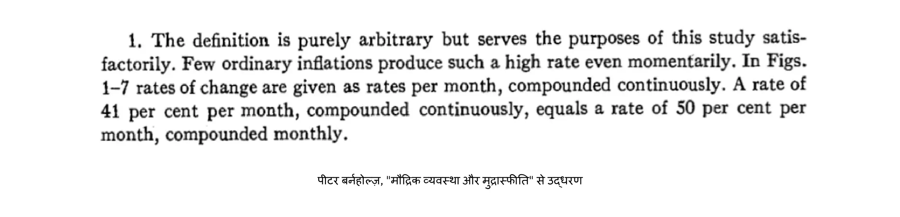

यह चिंतन हमें अतिमुद्रास्फीति की पारंपरिक परिभाषा की कठोरता पर प्रश्नचिह्न लगाने के लिए प्रेरित करता है और इस सीमा पर पुनर्विचार करने की आवश्यकता पर प्रकाश डालता है, जिसमें और अधिक घटनाओं और ऐतिहासिक आंकड़ों को शामिल किया जा सकता है। अतिमुद्रास्फीति की परिभाषा में विभिन्न आर्थिक और ऐतिहासिक संदर्भों में अत्यधिक मुद्रास्फीति की विभिन्न अभिव्यक्तियों को शामिल करने के लिए लचीलेपन की आवश्यकता हो सकती है।

### अंतर्राष्ट्रीय लेखा मानक बोर्ड (IASB) के अनुसार अति मुद्रास्फीति की परिभाषा

आईएएसबी अतिमुद्रास्फीति पर एक अनूठा दृष्टिकोण प्रस्तुत करता है, जो अतिमुद्रास्फीति की अवधि के दौरान लेखांकन प्रथाओं पर केंद्रित है। यह दृष्टिकोण उन लेखाकारों और व्यवसायों के लिए अत्यंत महत्वपूर्ण है जो अतिमुद्रास्फीति वाले वातावरण में काम करते हैं, जहाँ मौद्रिक मूल्य में तेज़ी से उतार-चढ़ाव होता है। आईएएसबी दिशानिर्देश अतिमुद्रास्फीति के विभिन्न संकेतकों की पहचान करते हैं:

- गैर-मौद्रिक परिसंपत्तियों के लिए वरीयता:**

मौद्रिक मूल्य में तेजी से गिरावट के कारण लोग मुद्रा के बजाय वस्तुओं में मूल्य रखना पसंद करते हैं।

- वस्तुओं और सेवाओं का मूल्यांकन:**

निवासी स्थानीय मुद्रा में वस्तुओं और सेवाओं के मूल्य की गणना नहीं करते हैं, जो स्थानीय मुद्रा में विश्वास की कमी को दर्शाता है।

- मौद्रिक मूल्य हानि के लिए मुआवजा:**

कीमतों में ऋण खरीद के दौरान मौद्रिक मूल्य की हानि के लिए क्षतिपूर्ति शामिल होती है, जो दैनिक लेनदेन पर मुद्रास्फीति के प्रभाव को दर्शाती है।

- मूल्य, मजदूरी और ब्याज सूचकांकीकरण:**

मुद्रास्फीति की क्षतिपूर्ति के लिए कीमतों, मजदूरी और ब्याज को एक सूचकांक के आधार पर समायोजित किया जाता है।

- तीन वर्षों में संचयी मुद्रास्फीति:**

तीन वर्षों में संचयी मुद्रास्फीति 100% (लगभग 24% प्रति वर्ष) के करीब पहुंच रही है, जो कैगन की 50% मासिक मुद्रास्फीति की परिभाषा के विपरीत है।

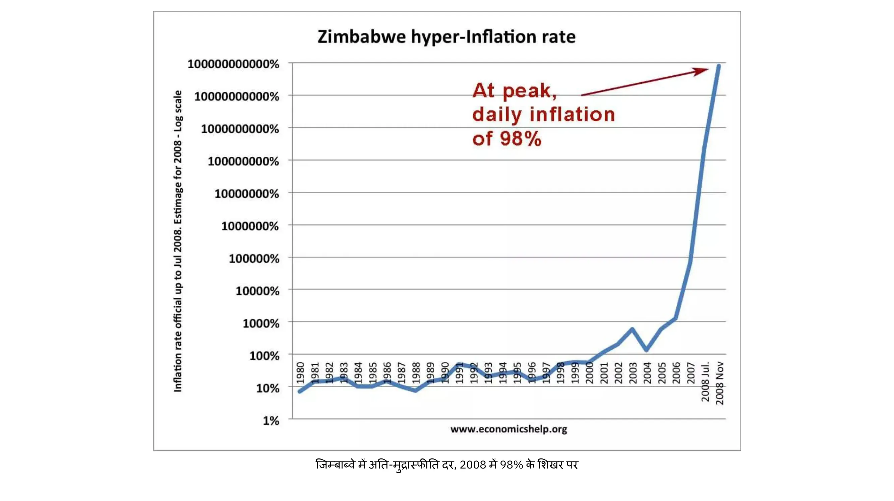

आईएएसबी मानदंडों के अनुसार, अर्जेंटीना, इथियोपिया, हैती, ईरान, लेबनान, सूडान, दक्षिण सूडान, सूरीनाम, सीरिया, तुर्की, वेनेजुएला, यमन और जिम्बाब्वे सहित कई देश वर्तमान में अति मुद्रास्फीति का अनुभव कर रहे हैं।

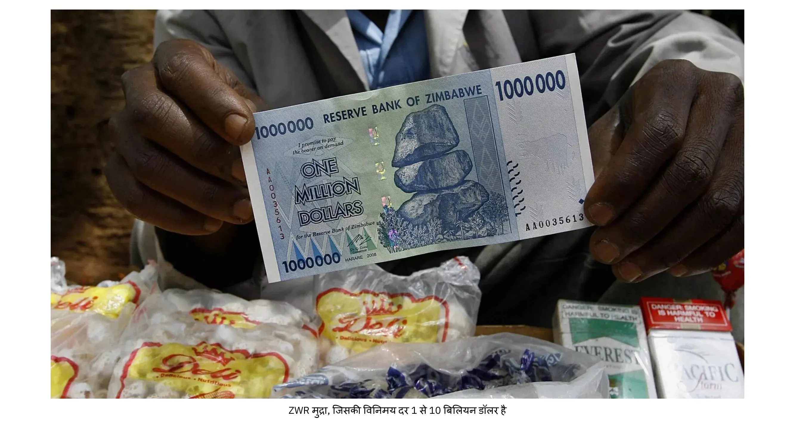

आईएएसबी द्वारा दी गई यह परिभाषा, अतिमुद्रास्फीति की स्थिति में आर्थिक व्यवहारों और व्यावहारिक समायोजनों के गुणात्मक विश्लेषण को शामिल करके, कैगन की कठोर मात्रात्मक सीमा से हटकर है। यह दर्शाता है कि अतिमुद्रास्फीति एक जटिल परिघटना है जिसके वास्तविक निहितार्थों को समझने के लिए बहुआयामी समझ की आवश्यकता होती है, विशेष रूप से लेखांकन के क्षेत्र में, जो व्यवसायों और बाज़ारों की स्थिरता और वित्तीय पारदर्शिता के लिए अत्यंत महत्वपूर्ण है।

### तो, कुल कितनी अति मुद्रास्फीति हैं?

अतिमुद्रास्फीति की सामान्य परिभाषाएँ, जैसे कि कैगन द्वारा प्रस्तावित, जिसमें मासिक मुद्रास्फीति दर 50% निर्धारित की गई है, कभी-कभी भ्रामक या अत्यधिक सरल हो सकती हैं। उदाहरण के लिए, क्रमशः 1,000% और 3,000% की वार्षिक मुद्रास्फीति दर का अनुभव करने वाले दो देशों को उस मुद्रास्फीति के मासिक वितरण के आधार पर अलग-अलग माना जा सकता है। कैगन की परिभाषा के अनुसार, यदि कोई भी महीना 50% की सीमा से अधिक नहीं होता है, तो उन देशों को अतिमुद्रास्फीति की स्थिति में वर्गीकृत नहीं किया जाएगा। इस प्रकार, यह दृष्टिकोण अतिमुद्रास्फीति के वर्गीकरण में विसंगतियों को जन्म दे सकता है, खासकर जब वर्ष भर की संचयी मुद्रास्फीति की तुलना की जाती है।

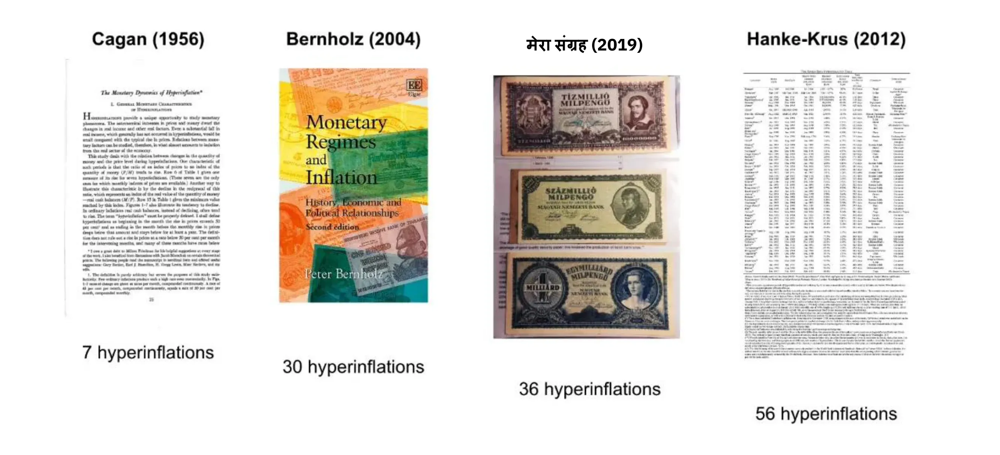

- कैगन का कार्य, "हाइपरइन्फ्लेशन की मौद्रिक गतिशीलता", हाइपरइन्फ्लेशन का मौलिक विश्लेषण प्रदान करता है।
- बर्नहोल्ज़ की पुस्तक में अति मुद्रास्फीति की 30 अलग-अलग अवधियों का अध्ययन किया गया है, जिससे विश्लेषण का दायरा बढ़ गया है।
- डेविड सेंट-ओंगे (इस पाठ्यक्रम के लेखक) द्वारा अति मुद्रास्फीति की 36 अवधियों के बैंक नोटों का व्यक्तिगत संग्रह, एक ठोस और ऐतिहासिक समझ प्रदान करता है।
- हैंकी क्रॉस तालिका (2012 संस्करण, वेनेजुएला के साथ 2016 में अद्यतन), कैगन की परिभाषा के आधार पर अति मुद्रास्फीति की 57 अवधियों को सूचीबद्ध करती है।

यह ध्यान देने योग्य है कि उच्च मुद्रास्फीति की कुछ ऐतिहासिक अवधियाँ अक्सर सख्त वर्गीकरण मानदंडों के कारण अतिमुद्रास्फीति की पारंपरिक तालिकाओं में शामिल नहीं की जाती हैं। उदाहरण के लिए, नवंबर 1779 में अमेरिकी स्वतंत्रता संग्राम के दौरान और मार्च 1864 में अमेरिकी गृहयुद्ध के दौरान, मासिक मुद्रास्फीति दर क्रमशः 47.4% और 40% थी। ये दरें, हालाँकि ऊँची हैं, कैगन द्वारा निर्धारित 50% सीमा से अधिक नहीं हैं, इस प्रकार इन अवधियों को अतिमुद्रास्फीति के मामलों के रूप में वर्गीकृत करने से बाहर रखा गया है। यह चूक कठोर परिभाषाओं की सीमाओं को उजागर करती है और अतिमुद्रास्फीति की पूरी जटिलता को और अधिक सूक्ष्मता से समझने की आवश्यकता को रेखांकित करती है।

## वाइमर बनाम ज़िम्बाब्वे समानताएँ

<chapterId>11eef458-aab8-5c63-8523-264d0ba69f5d</chapterId>

### दो युग, दो आपदाएँ

इस अध्याय में, हम ज़िम्बाब्वे और वीमर गणराज्य के अनुभवों पर ध्यान केंद्रित करते हुए, अतिमुद्रास्फीति के प्रभावों की जाँच करेंगे। अपने पूरे शोध में, मैंने विशुद्ध रूप से आर्थिक या सांख्यिकीय दृष्टिकोण अपनाने के बजाय, अतिमुद्रास्फीति के इन दौरों से गुज़रे व्यक्तियों के प्रत्यक्ष साक्ष्यों के अन्वेषण को प्राथमिकता दी है।

कई पुस्तकें विशेष रूप से जानकारीपूर्ण रही हैं:

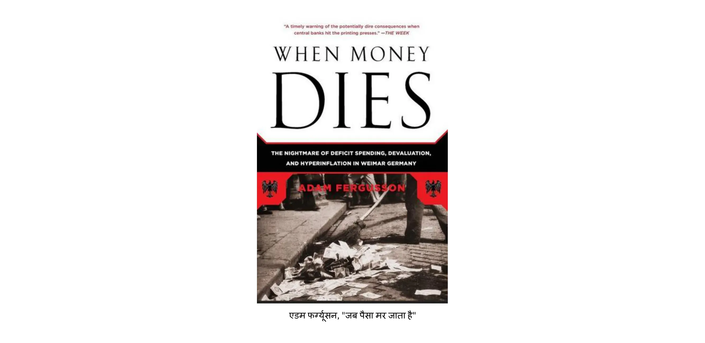

- एडम फर्ग्यूसन द्वारा लिखित पुस्तक "व्हेन मनी डाइस" में प्रथम विश्व युद्ध के बाद जर्मनी के साथ-साथ ऑस्ट्रिया और हंगरी में भी अति मुद्रास्फीति का वर्णन किया गया है।
- जिम्बाब्वे में अति मुद्रास्फीति पर दो पुस्तकें, "जिम्बाब्वे वार्म हार्ट अग्ली फेस" और "जीडब्ल्यू-38 बॉइल्ड एग इंडेक्स", जो क्रमशः जेरोम गार्डनर और कुदजई जोसेफ गौ मिन-यू द्वारा लिखी गई हैं, इस उथल-पुथल भरे दौर के दौरान एक कपड़ा स्टोर श्रृंखला के सीईओ और एक कृषि बैंकर के अनुभवों पर मार्मिक साक्ष्य प्रस्तुत करती हैं।

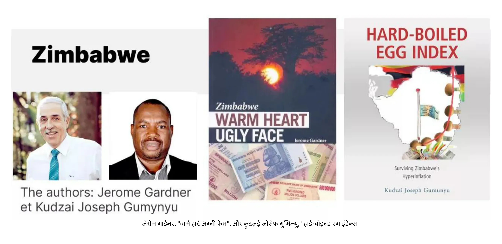

अपने नोट्स को समेकित करते समय, मैंने ज़िम्बाब्वे और वीमर गणराज्य में अतिमुद्रास्फीति के अनुभवों के बीच, 90 वर्षों के अंतराल के बावजूद, अनेक समानताएँ देखीं। मैंने लगभग 17 समानताएँ पहचानीं, जिनमें से 13 इन साक्ष्यों में दर्शाए गए आर्थिक संकट की ओर एक प्रकार की प्रगति को दर्शाती हैं। ये आकर्षक समानताएँ समय और सीमाओं के पार अतिमुद्रास्फीति की दोहरावदार और विनाशकारी प्रकृति को प्रदर्शित करती हैं। आज, हम इन समानताओं की जाँच करेंगे और देखेंगे कि ये अतिमुद्रास्फीति के दौर में एक चिंताजनक प्रक्षेपवक्र को कैसे दर्शाती हैं।

### तुलनात्मक विश्लेषण: ज़िम्बाब्वे और वीमर गणराज्य

14 अंतरों का खेल!

#### 1. पैसे की कमी

जब मुद्रा का अवमूल्यन तीव्र गति से होता है, तो बाज़ार में नए बैंक नोटों की बाढ़ लाने के सबसे महत्वाकांक्षी प्रयास भी नाकाफी साबित हो सकते हैं। मूर्त मुद्रा की निरंतर माँग केंद्रीय बैंकों की बैंक नोट बनाने की क्षमता से कहीं अधिक हो सकती है, जिससे अभूतपूर्व तरलता संकट पैदा हो सकता है।

> वेइमर: "इस महीने के दौरान, इसे बढ़ाकर लगभग 4 बिलियन पेपर मार्क कर दिया जाएगा, एक ऐसा आंकड़ा जिसके साथ यह आशा की जाती है कि मुद्रा की कमी निश्चित रूप से दूर हो जाएगी।"

> ज़िम्बाब्वे: "2002 से जनवरी 2009 तक, कई बार नकदी की गंभीर कमी रही। आसमान छूती मुद्रास्फीति को थामने के लिए पर्याप्त बैंक नोट न तो छापे गए और न ही प्रचलन में थे।"

#### 2. "और यह खाद है!"

कुछ आर्थिक परिस्थितियों में मुद्रा जिस तेज़ी से अपना मूल्य खो सकती है, वह आश्चर्यजनक है। रिकॉर्ड समय में भारी मात्रा में बैंक नोट जारी किए जा सकते हैं, जिससे कभी बड़ी रकम पल भर में खाद जैसी तुच्छ चीज़ में बदल जाती है।

> वेइमर: "वर्तमान कुल जारी राशि 63,000 बिलियन है। इसलिए, कुछ ही दिनों में हम एक दिन में कुल प्रचलन का दो-तिहाई जारी करने में सक्षम हो जाएंगे।"

> जिम्बाब्वे: "17 सितम्बर 2006 को, आरबीजेड के गवर्नर गिदोन गोनो ने घोषणा की: '10 ट्रिलियन अभी भी वहां मौजूद है, और यह खाद बन गया है।'"

#### 3. बैंक नोटों का मूल्य उस कागज़ से कम होता है जिस पर वे मुद्रित होते हैं

कुछ आर्थिक परिस्थितियों में, किसी बैंक नोट का आंतरिक मूल्य उस कागज़ के मूल्य से भी कम हो सकता है जिस पर वह छपा होता है। यह भारी मूल्यह्रास, बैंक नोटों को, जो आमतौर पर मूल्य और क्रय शक्ति के प्रतीक होते हैं, केवल बेकार कागज़ के टुकड़ों में बदल देता है।

> वेइमर: "मार्क्स बैंकनोटों के सम्पूर्ण मूल्यवर्ग मुद्रण मशीन से निकलते ही लगभग बेकार हो जाते थे।"

> ज़िम्बाब्वे: "केंद्रीय बैंक ने एक ऐसा बैंक नोट छापकर पैसा बर्बाद किया जो उस कागज़ के लायक भी नहीं था जिस पर वह छपा था। दूसरे शब्दों में, इसका मूल्य टॉयलेट पेपर से भी कम था। यह सुनने में भले ही बेतुका लगे, लेकिन वास्तविक टॉयलेट पेपर खरीदने की तुलना में ZWD 100 ट्रिलियन बैंक नोट को टॉयलेट पेपर के रूप में इस्तेमाल करना सस्ता था।"

#### 4. पैसे गिनना

जब मुद्रा का मूल्य तेज़ी से गिरता है, तो सबसे आसान लेन-देन भी श्रमसाध्य कार्य बन सकते हैं। किसी वस्तु की कीमत गिनने या भुगतान के लिए ज़रूरी बिलों की गिनती करने में कई मिनट लग सकते हैं, जिससे दैनिक लेन-देन में काफ़ी जटिलता आ जाती है।

> वेइमर: "किसी दुकान में सबसे सामान्य खरीदारी के लिए भी गणना में तीन या चार मिनट लगते थे, और एक बार कीमत निर्धारित हो जाने के बाद, बैंक नोटों की गिनती करने में आमतौर पर कई और मिनट लग जाते थे।"

> ज़िम्बाब्वे: "स्टोर प्रबंधकों को पूरे दिन पैसे गिनने वाले कर्मचारी की जगह एक अस्थायी कर्मचारी रखने की भी अनुमति थी। बेशक, प्रशासन और बैंक जमा के लिए स्टोर में पैसे गिनना एक बात थी, लेकिन जमा के दौरान बैंक में पूरी प्रक्रिया दोहरानी पड़ती थी।"

:::video id=910231d7-af90-4ab8-b74c-bfb81caebfb2:::

पैसे गिनने की उज़्बेक तकनीक

#### 5. चेक द्वारा भुगतान

अस्त-व्यस्त अर्थव्यवस्थाओं में, चेक जैसी पारंपरिक भुगतान विधियाँ जल्दी ही अपनी प्रभावशीलता खो सकती हैं। अत्यधिक मुद्रास्फीति के कारण मुद्रा की बढ़ती माँग से अभिभूत बैंक, चेकों को भुनाने में देरी कर सकते हैं या उन्हें सीमित कर सकते हैं, जिससे उनका वास्तविक मूल्य कम हो जाता है। इस अस्थिरता के कारण अक्सर भुगतान विधियों को प्राथमिकता दी जाती है, जहाँ चुनी गई भुगतान विधि के आधार पर कीमतें अलग-अलग हो सकती हैं।

> वेइमर: "कीमतों में वृद्धि ने राज्य और अन्य नियोक्ताओं, दोनों की ओर से मुद्रा की मांग को बढ़ा दिया। निजी बैंक मांग को पूरा नहीं कर सके और उन्हें चेक भुनाने पर नियंत्रण करना पड़ा, इसलिए बिना भुनाए गए चेक जमा ही रहे और उनकी क्रय शक्ति घटती गई।"
> ज़िम्बाब्वे: "धन के समय मूल्य ने वस्तुओं और सेवाओं के लिए तीन मूल्य निर्धारित किए; नकद मूल्य, वास्तविक समय सकल निपटान मूल्य, और चेक मूल्य। अंततः, किसी ने भी चेक स्वीकार नहीं किए, जिन्हें साफ़ होने में पाँच दिन लग गए।"

#### 6. "बर्नर-प्रेन्योर्स"

जैसे-जैसे मुद्रा का मूल्य घटता है, बाज़ार की विकृतियों का फ़ायदा उठाते हुए नए आर्थिक अवसर सामने आते हैं। ये उद्यमी, जिन्हें अक्सर "बर्नर-प्रेन्योर्स" कहा जाता है, अवमूल्यित मुद्रा उधार लेकर मूर्त संपत्तियों में निवेश करके और फिर उससे भी ज़्यादा अवमूल्यित मुद्रा से अपने कर्ज़ चुकाकर फल-फूल सकते हैं।

वेइमर: "मुद्रास्फीति पर सट्टेबाज़ी में कागज़ के निशान उधार लेना, उन्हें माल और कारखानों में परिवर्तित करना, और फिर मूल्यह्रास वाले कागज़ से उधारदाताओं को चुकाना शामिल था।"

ज़िम्बाब्वे: "बर्नर-प्रेन्योर्स"

#### 7. ईमानदारी और Hard कार्य अपना आकर्षण खो देते हैं

अस्थिर आर्थिक परिस्थितियों में, Hard काम, मितव्ययिता और ईमानदारी जैसे पारंपरिक मूल्य, त्वरित धन प्राप्ति के आकर्षण के आगे फीके पड़ सकते हैं। सट्टा और मुद्रा व्यापार अक्सर नियमित काम की तुलना में कहीं अधिक लाभ प्रदान करते हैं, जिससे सामाजिक प्राथमिकताओं में व्यवधान उत्पन्न होता है।

वेइमर: "जब मितव्ययिता, ईमानदारी और Hard कार्य जैसे पुराने गुणों ने अपना आकर्षण खो दिया, तो हर कोई शीघ्रता से अमीर बनने की कोशिश करने लगा, विशेषकर इसलिए क्योंकि मुद्रा या शेयर सट्टेबाजी से काम की तुलना में कहीं अधिक लाभ प्राप्त हो सकता था।"

ज़िम्बाब्वे: "इन प्रथाओं ने कुछ लोगों को समृद्ध तो किया, लेकिन शहरी मज़दूर वर्ग और ग्रामीण आबादी को दरिद्र बना दिया। शिक्षा का मूल्य कम हो गया, क्योंकि यह व्यापार ऐसे लोगों द्वारा संचालित था जिन्हें इसे उचित ठहराने के लिए शिक्षा या Hard काम की आवश्यकता नहीं थी। उन्हें बस अपने आसान पैसे वाले व्यवसाय को शुरू करने के लिए संपर्कों और शुरुआती पूँजी की ज़रूरत थी।"

#### 8. "दुनिया के बैंक"

अत्यधिक मुद्रास्फीति या मौद्रिक संकट की स्थिति में, विदेशी मुद्राओं के समानांतर और अनियमित बाज़ार अक्सर उभर आते हैं। ये अनौपचारिक "बैंक", जिन्हें अक्सर मज़ाकिया तौर पर "विश्व बैंक" या अन्य स्थानीय नामों से पुकारा जाता है, उन लोगों के लिए एक आश्रय स्थल प्रदान करते हैं जो अपनी संपत्तियों को अवमूल्यन से बचाना चाहते हैं। हालाँकि ये बाज़ार एक आवश्यक आर्थिक जीवनरेखा प्रदान कर सकते हैं, लेकिन ये अक्सर आधिकारिक वित्तीय संस्थानों और सरकारी नीतियों के प्रति व्यापक अविश्वास को उजागर करते हैं।

वेइमर: "उनके लेन-देन मुख्य रूप से तथाकथित विंकेलबैंकियर्स के माध्यम से किए जाते थे, जो सड़क संचालक थे, जो मुद्रास्फीति के साथ उभरे थे और जो एक बीमार अर्थव्यवस्था में फलते-फूलते थे, पूरी तरह से विदेशी मुद्राओं की खरीद और बिक्री कीमतों के बीच के अंतर का फायदा उठाकर जीवन यापन करते थे।"

ज़िम्बाब्वे: "वे मुद्रा परिवर्तक भी थे। वे बुलावायो में दूसरे और छठे एवेन्यू तथा फ़ोर्ट स्ट्रीट के बीच बेख़ौफ़ होकर काम करते थे, जिसका श्रेय उनकी चालाक व्यावसायिक गतिविधियों को जाता है, जिनमें अक्सर भ्रष्टाचार और अन्य अवैध गतिविधियाँ शामिल होती थीं। शहर का यह इलाका 'विश्व बैंक' के नाम से जाना जाता था।"

अर्जेंटीना: "तो मैं वहां गया जहां सभी अर्जेंटीनावासी जाते हैं: क्यूवा, 'गुफाएं', जो ब्यूनस आयर्स के मध्य में फ्लोरिडा पड़ोस में स्थित हैं।" - द बिग व्हेल

#### 9. विदेशी मुद्रा विनिमय अवैध था

सरकारें, अपनी मुद्रा को स्थिर करने और पूँजी के प्रवाह को नियंत्रित करने के प्रयास में, इन विदेशी मुद्रा लेनदेन को अवैध बना सकती हैं। ये दमनकारी उपाय, हालाँकि राष्ट्रीय अर्थव्यवस्था की रक्षा के लिए होते हैं, अक्सर विपरीत प्रभाव डाल सकते हैं, जिससे जनता का अविश्वास बढ़ता है और काला बाज़ारी को बढ़ावा मिलता है।

वाइमर: "लोगों ने वस्तु विनिमय का सहारा लिया और धीरे-धीरे विदेशी मुद्राओं को Exchange के एकमात्र विश्वसनीय साधन के रूप में अपना लिया। विदेशी ड्राफ्ट की खरीद और घरेलू भुगतान के लिए विदेशी मुद्राओं के उपयोग के संबंध में नए आदेश जारी किए गए। कारावास के अलावा, अब अवैध लेनदेन की राशि का दस गुना तक जुर्माना लगाया जा सकता था।"

जिम्बाब्वे: "व्यापारिक प्रतिष्ठानों पर छापे के कारण बुलावायो के कई व्यापारियों को सप्ताहांत के लिए जेल में डाल दिया गया तथा बरामद विदेशी मुद्रा की दोगुनी राशि के बराबर जुर्माना लगाया गया, लेकिन उसके बाद यह साहस कम हो गया।"

#### 10. पूंजी नियंत्रण

जब कोई देश मौद्रिक या आर्थिक संकट का सामना करता है, तो सरकारों की एक आम प्रतिक्रिया पूँजी के प्रवाह और रूपों पर कड़ा नियंत्रण रखना होता है। चाहे अवमूल्यन की गई राष्ट्रीय मुद्राओं को स्वीकार करने के लिए बाध्य करने वाले आदेशों के माध्यम से हो या कुछ भुगतान विधियों को अस्वीकार करने वालों पर कड़े प्रतिबंधों के माध्यम से, इन उपायों का उद्देश्य अक्सर घबराहट को नियंत्रित करना और विश्वास बहाल करना होता है। हालाँकि, इनकी प्रभावशीलता अलग-अलग होती है, और कभी-कभी ये उपाय प्रतिकूल साबित हो सकते हैं या नागरिकों द्वारा अनुभव की जा रही वास्तविकता से अलग हो सकते हैं।

वेइमर: "व्यापारियों को हाल ही में एक नए आदेश के तहत सरकारी बैंक नोट स्वीकार करने के लिए मजबूर किया गया था; लेकिन चूंकि इसमें सभी खरीदों के लिए विदेशी मुद्राओं के उपयोग को जारी रखने की अनुमति दी गई थी, इसलिए व्यापारियों को आम तौर पर लगभग कुछ भी स्वीकार करने का बहाना नहीं मिला।"

ज़िम्बाब्वे: "सरकार ने 12 दिसंबर, 2008 को चेक द्वारा भुगतान के संबंध में SI 175/2008 पेश किया। इसमें कहा गया था, 'चेक/बैंक कार्ड या किसी अन्य बैंक-मध्यस्थ इलेक्ट्रॉनिक भुगतान विधि द्वारा भुगतान से इनकार करने पर लेवल 8 का जुर्माना या छह महीने की जेल या दोनों हो सकते हैं।' ज़ाहिर है, हमने SI को नज़रअंदाज़ कर दिया क्योंकि यह वास्तविकता से पूरी तरह से अलग था।"

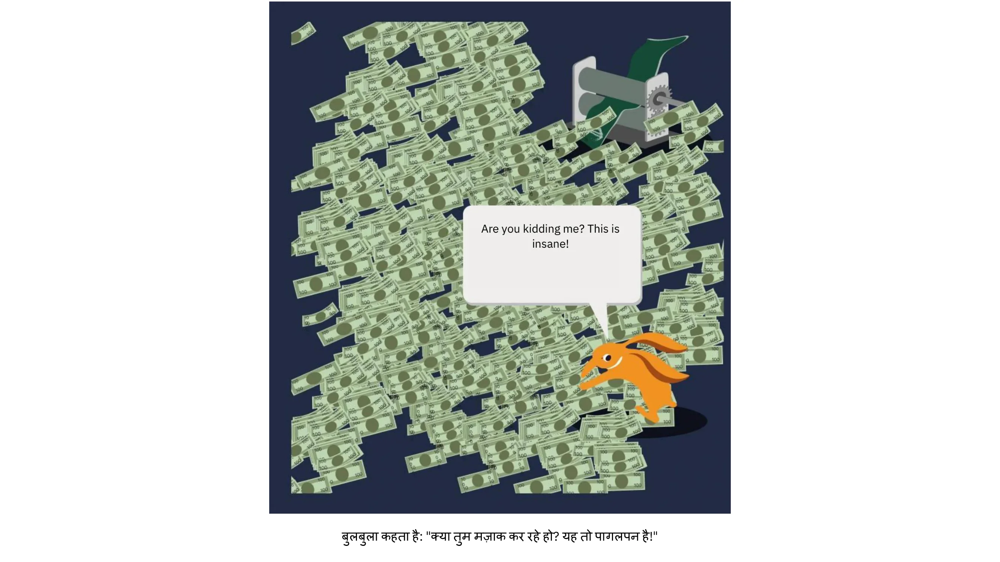

#### 11. अपनी दुकानें खुली रखने के लिए मजबूर

जब अर्थव्यवस्था ध्वस्त हो जाती है और मुद्रा अपना मूल्य खो देती है, तो सरकारें सामान्य स्थिति बनाए रखने के लिए कठोर उपाय अपना सकती हैं।

वेइमर: "जो व्यापारी अपनी गतिविधियां जारी रखते थे, वे 22 अक्टूबर को लागू किए गए एक नए अध्यादेश के अधीन थे, जिसके तहत उन्हें अपनी दुकानें खुली रखनी थीं और कागज के निशान के लिए Exchange में सामान बेचना था।"

ज़िम्बाब्वे: "सिर्फ़ खाली स्टील की अलमारियाँ और रेफ़्रिजरेटर, कूलर और फ़्रीज़र ही बचे थे। त्रासदी यह थी कि दुकान अभी भी खुली थी क्योंकि राजनीतिक तनाव और सरकारी मूल्य नियंत्रण बल द्वारा नेताओं की गिरफ़्तारी के डर से वे दुकान बंद करने की हिम्मत नहीं जुटा पा रहे थे। यहाँ तक कि मज़दूरों को भी नहीं निकाला गया क्योंकि सभी को लगा कि कोई न कोई जल्दी हल निकल आएगा।"

#### 12. हर कोई अपराधी है

ढहती अर्थव्यवस्था और व्यापक नियमों के सामने, अस्तित्व और अपराध के बीच की रेखा धुंधली हो जाती है।

वेइमर: "राज्य के विरुद्ध सभी अपराध, उनमें से प्रत्येक, अलग-अलग स्तर पर, व्यक्तियों के लिए अस्तित्व का प्रश्न बन गया।"

> ज़िम्बाब्वे: "ज़िम्बाब्वे का हर निवासी एक अपराधी था। यह सुनने में भले ही कठोर लगे, लेकिन यह सच था। जीवन के हर पहलू पर लागू होने वाले अनगिनत छोटे-छोटे कानूनों के कारण, यह लाज़िमी था कि हर कोई हर दिन कोई न कोई कानून तोड़ता था। 2004 में प्रकाशित एक एसआई के अनुसार, विदेशी मुद्रा रखना गैरकानूनी था। दैनिक निकासी सीमा को पार करने के लिए कई बैंक खाते रखना गैरकानूनी था। आपकी कार पर उचित नंबर प्लेट, कार रेडियो लाइसेंस या जनरेटर परमिट न होना, ये सभी ऐसे कानून थे जिन्हें कोई न कोई, कहीं न कहीं, तोड़ रहा था।"

#### 13. किसी भी कीमत पर विदेशी मुद्रा खरीदें

विदेशी मुद्राओं की उन्मत्त खरीद ने अक्सर मुद्रा अवमूल्यन में एक महत्वपूर्ण मोड़ को चिह्नित किया है, जिससे आंतरिक मूल्य में गिरावट बढ़ गई है।

> वेइमर: "फ़्रिट्ज़ मैनहाइमर, अपने बॉस के निर्देश पर, अगस्त 1921 में बाहर गए और किसी भी कीमत पर विदेशी मुद्राएं खरीदना शुरू कर दिया - 'क्योंकि जर्मनी के पास कागज़ के अनगिनत मार्क थे, लेकिन कोई विदेशी मुद्रा नहीं थी।' यह मार्क के मूल्य में पूर्ण गिरावट का पहला संकेत था।"

> ज़िम्बाब्वे: यह आरोप लगाया गया है कि उन्हें रोज़ाना लक्ष्य पूरे करने के लिए कहा जाता था, क्योंकि कुछ विदेशी मुद्रा की ज़रूरतें अत्यावश्यक थीं और वे समय सीमा पूरी करने के लिए किसी भी कीमत पर विदेशी मुद्रा जमा करने के लिए खरीदारी करते थे। इस कथित व्यवहार पर अवमूल्यन की आग को भड़काने का आरोप लगाया गया क्योंकि ज़िम्बाब्वे डॉलर के मूल्य में लगातार भारी गिरावट जारी रही।

### प्रक्रिया का सारांश

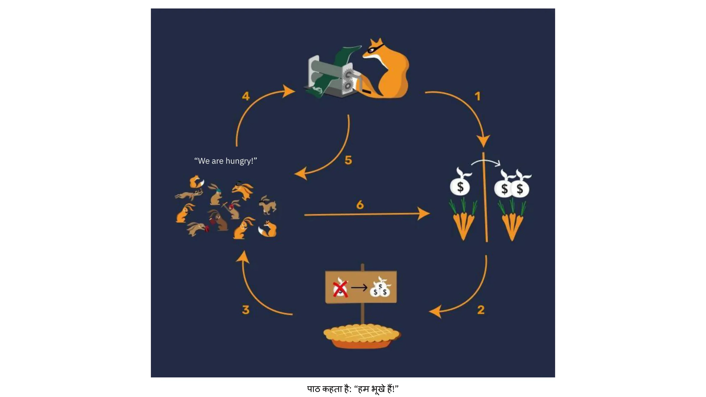

आर्थिक प्रक्षेप पथ का विश्लेषण करने पर, यह स्पष्ट है कि जब मुद्रास्फीति उच्च स्तर पर पहुँच जाती है, तो मुद्रा का मूल्य कम हो जाता है। इस अवमूल्यन से कई जटिलताएँ उत्पन्न होती हैं, जिनमें बैंक नोटों की कमी भी शामिल है। इस संदर्भ में, विशेष रूप से Exchange दरों में उतार-चढ़ाव के कारण, आर्बिट्रेज के अवसर उत्पन्न होते हैं। परिणामस्वरूप, कई व्यक्ति इस आर्बिट्रेज की ओर रुख करते हैं और भविष्य में मुद्रा अवमूल्यन की आशंका में मूर्त संपत्तियों में भारी निवेश करते हैं, जिससे वे कमज़ोर मुद्रा से अपने ऋण चुका सकेंगे। यह आर्थिक वातावरण पारंपरिक नौकरियों के आकर्षण को कमज़ोर करता है और परिणामस्वरूप, सामाजिक समरसता को नष्ट करता है।

इस स्थिति के जवाब में, सरकार पूंजी नियंत्रण सहित कठोर नियम लागू करती है। यह व्यापारियों के लिए राष्ट्रीय मुद्रा और चेक स्वीकार करना भी अनिवार्य करती है। समय के साथ, नए कानून बनाए जाते हैं, जो आपराधिक व्यवहार की परिभाषा का विस्तार करते हैं। अंततः, Exchange दर तेज़ी से बढ़ती है क्योंकि सरकार कम लागत पर मुद्रित अपनी मुद्रा को अधिक मज़बूत विदेशी मुद्राओं के लिए Exchange करने को तैयार हो जाती है।

### 4 अति मुद्रास्फीति के परिणामों में समानताएँ

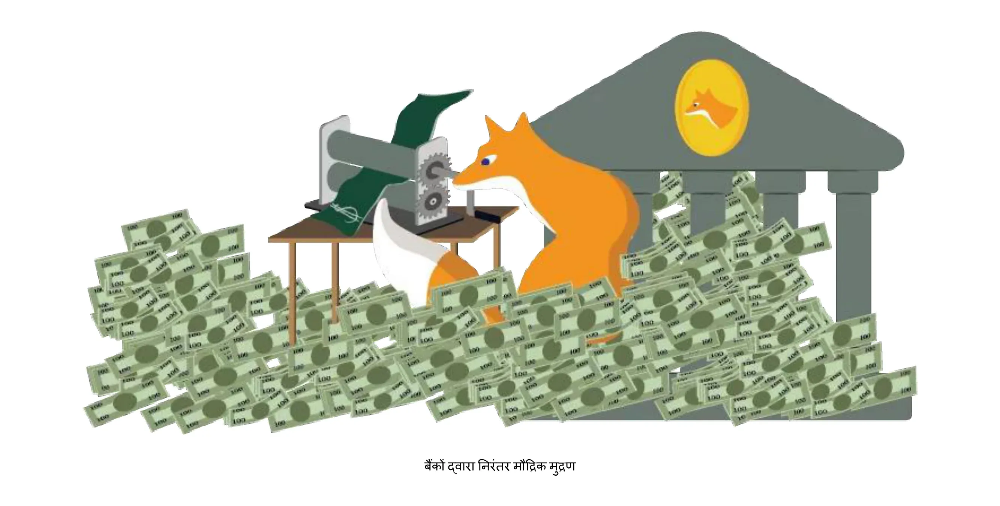

#### 1. तेल और धातु

जर्मनी में वाइमर काल के दौरान, मूल्यवान सामग्रियों की चोरी इतनी व्यापक थी कि छतों से सीसा अक्सर चुरा लिया जाता था। ज़िम्बाब्वे में, हताशा के कारण कुछ लोगों ने ट्रांसफार्मरों से तेल निकालने और उसे अपने वाहनों में इस्तेमाल करने के लिए बिजली ग्रिड को बाधित कर दिया।

वाइमर: "राष्ट्रीय स्मारकों की धातु की पट्टिकाओं को सुरक्षित रखने के लिए हटाना पड़ा। बर्लिन स्थित ब्रिटिश दूतावास के दरवाज़ों से पीतल की घंटी की प्लेटें चुरा ली गईं।"

जिम्बाब्वे: "स्थिति और भी बदतर हो गई, विदेशी मुद्रा की कमी के कारण, कारों के लिए स्नेहन तेल की कमी हो गई, और ट्रांसफार्मर चोरों के लिए आसान लक्ष्य बन गए, जो बिजली कटौती के दौरान शीतलन तेल चुरा लेते थे।"

#### 2. रेलगाड़ियाँ

मुद्रा अवमूल्यन नागरिकों को जीवन-रक्षा के लिए बर्बरता जैसे व्यवहार अपनाने के लिए प्रेरित कर सकता है। ढहती अर्थव्यवस्था का सामना करते हुए, परिवहन प्रणालियों जैसे महंगे सार्वजनिक बुनियादी ढाँचे से समझौता किया जा सकता है, जिसके परिणामस्वरूप विनाशकारी सामाजिक परिणाम हो सकते हैं।

> वेइमर: “बर्लिन में, धन की कमी के कारण ट्राम प्रणाली बंद हो गई।”

> ज़िम्बाब्वे: "सबसे परेशान करने वाली और दुखद घटनाओं में से एक वह थी जब हरारे को दाबुका (280 किलोमीटर से ज़्यादा) से जोड़ने वाली लगभग पूरी इलेक्ट्रिक कॉपर लाइन चोरी हो गई थी। इसके पूरा होने पर, यह ज़िम्बाब्वे का गौरव था, क्योंकि इस मार्ग पर तेज़ गति से चलने वाली इलेक्ट्रिक यात्री और मालगाड़ियाँ चलती थीं।"

#### 3. “मीली मील”

अल्प वेतन और अस्थिर अर्थव्यवस्था के संदर्भ में, व्यवसायों को उत्पादकता और परिचालन दक्षता बनाए रखने के लिए अपने कर्मचारियों को भोजन उपलब्ध कराने के लिए बाध्य होना पड़ा। यह पहल न केवल भोजन की कमी और उच्च खाद्य लागत की भरपाई का एक तरीका थी, बल्कि कठिन आर्थिक परिस्थितियों में कर्मचारियों को बनाए रखने की एक रणनीति भी थी।

> वेइमर: "बर्लिन में, कार्यालय कर्मचारियों, जो राजधानी में एक बहुत ही महत्वपूर्ण वर्ग थे, को 12,000 से 20,000 प्रति माह (प्रति वर्ष 12 से 19 पाउंड के बराबर) के बीच पूरी तरह से अपर्याप्त वेतन मिलता था, जो लगातार कम होता जा रहा था; लेकिन अधिकांश लोग अभी भी अपने कार्यालयों द्वारा प्रदान की जाने वाली एक प्रतीकात्मक राशि के लिए अपना दोपहर का भोजन प्राप्त कर सकते थे, जिससे शरीर और आत्मा को मुश्किल से एक साथ रखा जा सकता था।"

> ज़िम्बाब्वे: "इस समय, हम अपने सभी कर्मचारियों को मुफ़्त दोपहर का भोजन उपलब्ध करा रहे थे। मक्के का आटा हमारी कंपनी के कामकाज को जारी रखने के लिए ज़रूरी था, क्योंकि कई मामलों में यही हमारे कर्मचारियों को रोज़ाना मिलने वाला एकमात्र भोजन था।"

#### 4. गैसोलीन कूपन

लोगों ने लेन-देन के लिए स्थिर विकल्पों की तलाश की। वाइमर में, पीतल और ईंधन जैसे उत्पाद अपने स्थिर आंतरिक मूल्य के कारण Exchange के माध्यम के रूप में काम करते थे। ज़िम्बाब्वे में, ज़िम्बाब्वे डॉलर के तेज़ी से अवमूल्यन के कारण, गैसोलीन कूपन, जो एक आवश्यक उत्पाद की एक निश्चित मात्रा का प्रतिनिधित्व करते थे, एक वास्तविक मुद्रा बन गए। ये परिस्थितियाँ इस बात पर प्रकाश डालती हैं कि कैसे समाज विषम आर्थिक परिस्थितियों के अनुकूल ढलते हैं, और व्यापार और अर्थव्यवस्था को बनाए रखने के लिए नवीन समाधान निकालते हैं।

वेइमर: "वस्तु-विनिमय पहले से ही Exchange का एक प्रचलित रूप था; लेकिन अब, पीतल और ईंधन जैसी वस्तुएं खरीद और भुगतान की सामान्य मुद्रा बन गईं।"

जिम्बाब्वे: "इन वाउचरों का उपयोग हम अब मकान मालिकों को किराया, नगरपालिका कर, टेलीफोन बिल - वास्तव में लगभग हर चीज का भुगतान करने के लिए करते थे - क्योंकि सभी ने जिम्बाब्वे डॉलर और चेक में भुगतान स्वीकार करना बंद कर दिया था।"

#### निष्कर्ष

ज़िम्बाब्वे और वीमर गणराज्य में अति मुद्रास्फीति के दौर के अनुभवों की समानताओं पर यह वीडियो यहीं समाप्त होता है। अगले वीडियो में, हम अंतरों और समकालीन समानताओं पर चर्चा करेंगे। धन्यवाद।

## वाइमर बनाम ज़िम्बाब्वे: मतभेद और समकालीन समानताएँ

<chapterId>643f279c-d89f-5600-a2e2-b1bbbba0ab69</chapterId>

इस अध्याय में, हम अतीत और वर्तमान की अतिमुद्रास्फीति अवधियों के बीच अंतर और समकालीन समानताओं का पता लगाएंगे, साथ ही आज के लिए प्रासंगिक तुलनाओं और उपाख्यानों का भी अध्ययन करेंगे।

### वाइमर गणराज्य और ज़िम्बाब्वे के बीच मतभेद

#### 1. यह डॉलर की गलती है!

जर्मनी में, लोगों के लिए मुद्रास्फीति का कारण अपनी मुद्रा के आंतरिक अवमूल्यन के बजाय डॉलर के मूल्य में वृद्धि को मानना ​​आम बात थी। कई लोगों का मानना ​​था कि यह घटना डॉलर के मूल्य में वृद्धि के कारण हुई थी। इस धारणा ने उनकी आर्थिक कठिनाइयों और अत्यधिक मुद्रा सृजन के कारण होने वाले मौद्रिक अवमूल्यन के बीच किसी भी संबंध को नकार दिया। "व्हेन मनी डाइज़" पुस्तक जर्मन लोगों में इस समझ की कमी को स्पष्ट रूप से दर्शाती है। इसके विपरीत, ज़िम्बाब्वे में, स्थिति अलग थी: नागरिक उस अतिमुद्रास्फीति के मूल कारण से पूरी तरह अवगत थे जिसका वे सामना कर रहे थे।

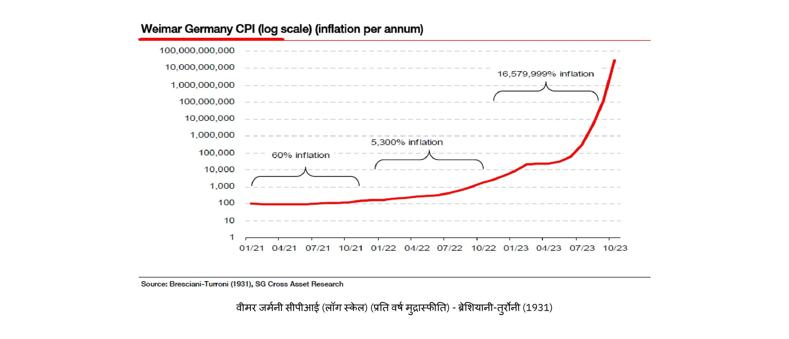

#### 2. आपातकालीन धन (नोटगेल्ड)

मौद्रिक और आर्थिक संकट का सामना करते हुए, जर्मनी ने "नॉटगेल्ड" (आपातकालीन मुद्रा) का सहारा लिया। शहरों या कुछ कंपनियों द्वारा छापे गए ये नोट, आम मुद्रा की कमी को पूरा करने के लिए डिज़ाइन किए गए थे।

दिलचस्प बात यह है कि फ्रांस ने भी, खासकर 1920 के दशक में, नोटगेल्ड का सहारा लिया था। यह पहल न केवल अत्यधिक मुद्रास्फीति का प्रत्यक्ष परिणाम थी, बल्कि प्रथम विश्व युद्ध के कारण हुए व्यवधानों में भी निहित थी। युद्ध ने न केवल अर्थव्यवस्था को अस्थिर किया, बल्कि धातुओं की कीमतों में भी वृद्धि की। परिणामस्वरूप, धातु के सिक्कों का आंतरिक मूल्य अक्सर उनके अंकित मूल्य से अधिक हो जाता था, जिससे लोग उन्हें जमा करने के लिए प्रेरित होते थे। सिक्कों के अभाव में, ल्यों चैंबर ऑफ कॉमर्स जैसी कुछ संस्थाओं ने अपना स्वयं का नोटगेल्ड छापा।

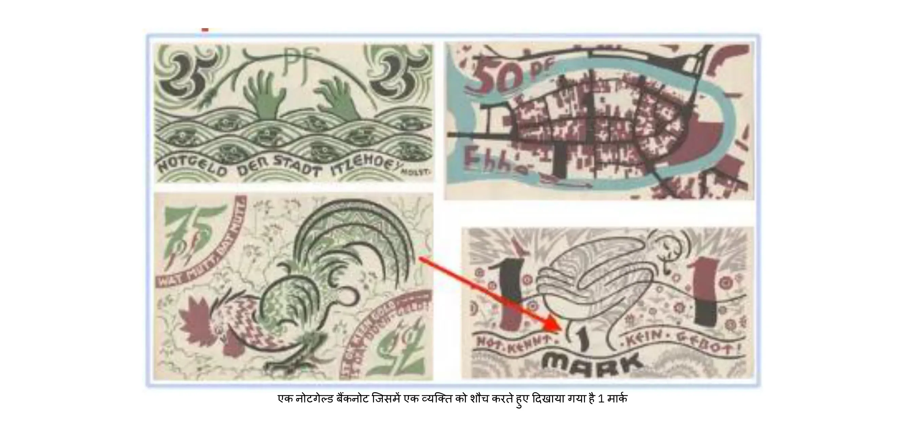

> "जो करना है, वह तो करना ही होगा।" - एक स्थानीय कहावत

नोटगेल्ड में एक खास बैंकनोट खास है। इसमें एक मार्मिक चित्रण है: बीच में एक व्यक्ति को मार्क पर शौच करते हुए दिखाया गया है। पीछे की तरफ 1913 से 1921 तक की मूल्य तालिका है जो इस अवधि के दौरान मुद्रास्फीति में वृद्धि को दर्शाती है।

इस नोटगेल्ड के पीछे का कलाकार अतिमुद्रास्फीति संकट के लिए ज़िम्मेदार अधिकारियों की व्यंग्यात्मक आलोचना करता प्रतीत होता है। बैंकनोट पर लिखा है, "आवश्यकता किसी कानून को नहीं जानती"। नोटगेल्ड के मूल स्थान से संबंधित एक और अभिव्यक्ति है: "जो करना है, करना ही होगा।"

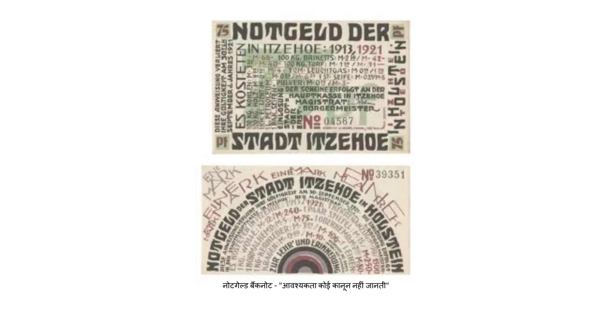

> "आवश्यकता कोई नियम नहीं जानती"

> पहला शिटकॉइन: बैंकनोट के केन्द्रीय चित्रण को देखते हुए, जहां व्यक्ति के कार्य से मुद्रा का वस्तुतः अवमूल्यन होता है, इसे पहला "शिटकॉइन" कहा जा सकता है।

#### 3. डिबेंचर और बंधक

वाइमर में, मुद्रास्फीति के प्रभाव की भरपाई के लिए कुछ ऋणों का पुनर्मूल्यांकन किया गया। ज़िम्बाब्वे में यह उपाय नहीं अपनाया गया।

> वेइमर: "सरकारी स्वामित्व वाले ऋणों का पुनर्मूल्यांकन करने का निर्णय 1925 में कानून बन गया, जिसके परिणामस्वरूप शेयरधारकों को उनके प्रारंभिक निवेश का 2.5 प्रतिशत प्राप्त हुआ, बशर्ते कि सभी क्षतिपूर्ति का भुगतान किया गया हो।"

> ज़िम्बाब्वे: "जुलाई 2007 में (तीन साल बाद), मैं अपनी जेब से एक अवमूल्यित ZDW 500,000 (bt "000") का नोट निकाल सका, जिसकी कीमत अब समानांतर बाज़ार दर पर $1.67 थी, और उससे बंधक ऋण चुका सका, जिसे बीस वर्षों में चुकाना था। इसके अलावा, यह नोट उसी महीने के मेरे मासिक वेतन का केवल 0.49 प्रतिशत ही था।"

जर्मन संकट के प्रबंधन के बारे में अधिक जानने के लिए भी यह पुस्तक आवश्यक है।

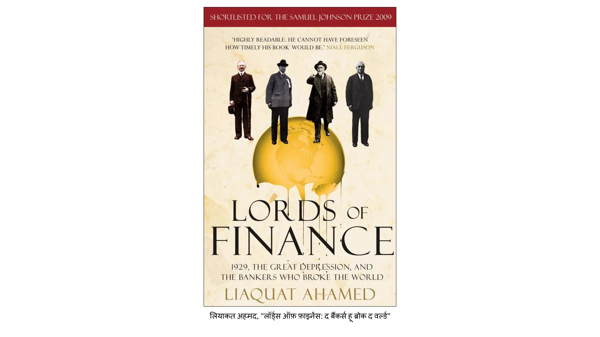

### समकालीन समानताएँ

#### 1. अर्थव्यवस्था को नियंत्रित करने के लिए मौद्रिक नीति में हेरफेर।

वाइमर गणराज्य के इतिहास में, यह स्पष्ट है कि उद्योगपति मार्क के मूल्य में वृद्धि को देखने के लिए अनिच्छुक थे। भारी अवमूल्यन वाली मुद्रा से उधार लेने और अपने ऋण चुकाने की उनकी क्षमता ने उन्हें काफी लाभ पहुँचाया। इस व्यवस्था ने विशाल औद्योगिक परिसरों के निर्माण को लगभग बिना किसी लागत के सुगम बनाया। ये उद्योगपति मार्क के मूल्य में वृद्धि से डरते थे क्योंकि इससे उनकी गतिविधियों में बाधा उत्पन्न होती थी। कुछ ने तो अनियंत्रित मुद्रास्फीति को एक सकारात्मक विकास के रूप में देखा, यह मानते हुए कि इससे लोगों के लिए रोजगार की गारंटी होगी। हालाँकि, उन्हें इस मुद्रास्फीति के बचत और समग्र अर्थव्यवस्था पर पड़ने वाले हानिकारक प्रभाव का एहसास नहीं था। इन आर्थिक कर्ताओं के लिए, मुद्रा मुद्रण एक वरदान था।

> वेइमर: "यही कारण है कि मार्क की कीमत में वृद्धि की बहुत आशंका थी, और जेनोआ के बाद कुछ सप्ताह की 'स्थिरता' के बावजूद व्यापार में ठहराव आ गया।"

> वेइमर: "औद्योगिक क्षेत्र को इस खतरे का सामना करना पड़ा कि नकदी वस्तुओं से अधिक मूल्यवान हो जाएगी, और जब हर कोई अपनी संपत्ति को नकदी में बदलने की कोशिश करेगा तो पतन हो जाएगा।"

इसकी तुलना क्रिस्टीन लेगार्ड के उन बयानों से की जा सकती है, जिनमें उन्होंने सुझाव दिया था कि नागरिकों को अपनी बचत की सुरक्षा की बजाय रोज़गार की संभावना को प्राथमिकता देनी चाहिए। वाइमर के उद्योगपतियों की तरह, वह बचत के मूल्य की कीमत पर रोज़गार बढ़ाने के साधन के रूप में मुद्रा मुद्रण की वकालत करती प्रतीत होती हैं।

> क्रिस्टीन लेगार्ड: "हमें अपनी बचत सुरक्षित देखने की अपेक्षा नौकरी पाकर अधिक खुश होना चाहिए।"

#### 2. संघर्ष के समय निजी संपत्ति

वाइमर गणराज्य का इतिहास बताता है कि इस अवधि के दौरान, विदेशों में रखी गई संपत्ति और पूँजी ज़ब्त कर ली गई थी। यह कदम रूस में हाल की घटनाओं, खासकर संघर्ष की शुरुआत में, की याद दिलाता है। ये परिस्थितियाँ एक चिंताजनक वास्तविकता को उजागर करती हैं: संकट के समय, निजी संपत्ति के सम्मान से समझौता किया जा सकता है। यह एक ऐतिहासिक और समकालीन समानता है जो व्यक्तिगत अधिकारों पर संकट के संभावित प्रभावों को रेखांकित करती है।

> वाइमर: "विदेशों में रखी सारी जर्मन पूंजी जब्त कर ली गई थी।"

> [20minutes.fr](https://www.20minutes.fr/monde/3286947-20220513-guerre-ukraine-geler-avoirs-russes-vol-non-redistribuer-kiev-poserait-lourdes-questions): "रूसी सेंट्रल बैंक के पास मौजूद 640 बिलियन डॉलर के भंडार में से, विदेशों में रखे गए लगभग 300 बिलियन डॉलर के रूसी भंडार को वास्तव में पश्चिमी प्रतिबंधों के हिस्से के रूप में फ्रीज कर दिया गया है।"

#### 3. बाजार मूल्य की धारणा

वाइमर गणराज्य के दौरान, किसानों ने "उमलागे" के प्रति अपना असंतोष व्यक्त किया, जिसके तहत उन्हें हर साल उत्पादित पहले दो मिलियन टन गेहूँ की आपूर्ति करनी पड़ती थी। इस नियम के परिणामस्वरूप कुल Supply ब्रेड का आधा हिस्सा रियायती कीमतों पर बाज़ार में उपलब्ध कराया गया। अगस्त से, इन किसानों को विश्व बाज़ार मूल्य का भुगतान किया जाना था, क्योंकि हालाँकि उन्हें कम कीमतों पर गेहूँ देने के लिए मजबूर किया गया था, फिर भी उन्हें विश्व बाज़ार दरों पर उर्वरक खरीदने पड़े।

यह स्थिति अति मुद्रास्फीति के दौरान बाजार मूल्य की अवधारणा से संबंधित एक प्रमुख मुद्दा उठाती है। उस समय के जर्मन संदर्भ में, किसान अपने गेहूँ को उसके मूल्य से कम कीमत पर बेचने के लिए मजबूर थे, जबकि उन्हें विश्व बाजार मूल्य पर उर्वरक खरीदने पड़ते थे। यह आर्थिक विसंगति आज खाद्य कीमतों से उत्पन्न चुनौतियों को उजागर करती है। मुद्रास्फीति के कारण बढ़ती लागत का सामना कर रहे कृषि उत्पादक, इन लागतों को अंतिम उत्पादों पर डाल देते हैं। इस वृद्धि के लिए उनकी आलोचना करना बाजार मूल्य निर्धारण की गतिशीलता और उनके सामने आने वाले आर्थिक दबावों की अनदेखी करने के समान है। उच्च लागत वहन करते हुए कृत्रिम रूप से कम कीमतों पर बेचना किसी भी व्यवसाय के लिए टिकाऊ नहीं है।

> वेइमर: "कृषि हित 'उमलागे' से असंतुष्ट थे, जिसमें हर साल उत्पादित होने वाले पहले दो मिलियन टन गेहूं की जबरन आपूर्ति की जाती थी, जिससे कुल Supply ब्रेड का आधा हिस्सा कम कीमतों पर बेचा जाता था। अगस्त से, किसानों को विश्व बाजार मूल्य का भुगतान किया जाना था, क्योंकि उन्हें गेहूं कम कीमतों पर बेचने के लिए बाध्य किया जाता था, लेकिन उन्हें उर्वरकों के लिए हमेशा विश्व बाजार मूल्य का भुगतान करना पड़ता था।"

#### 4. धन Supply और मुद्रास्फीति के बीच संबंध से इनकार

> वेइमर: "वह अपने इस विचार पर दृढ़ता से अड़े रहे कि Supply की धनराशि न तो मूल्य स्तरों से संबंधित थी और न ही Exchange दरों से;"

आधुनिक समय में, यह प्रवृत्ति बनी हुई है, जैसा कि पिछले अध्याय में विभिन्न अर्थशास्त्रियों और आर्थिक संस्थानों द्वारा मुद्रास्फीति को उचित ठहराने के लिए प्रस्तुत किए गए स्पष्टीकरणों की सूची के उदाहरण में देखा जा सकता है। ये कारण सांस्कृतिक आयोजनों और टेलर स्विफ्ट, ज़ेल्डा या बेयोंसे जैसी मशहूर हस्तियों से लेकर युद्ध और महामारी जैसे वैश्विक कारकों तक, विविध हैं। ये सभी कारण, यद्यपि अल्पकालिक आर्थिक उतार-चढ़ाव में संभावित रूप से योगदान करते हैं, वास्तविक अंतर्निहित कारण से ध्यान भटकाते हैं: मुद्रा का विस्तार Supply।

#### 5. ज़ोंबी कंपनियाँ

> वाइमर: "स्थिरीकरण ने उस दौर को ख़त्म कर दिया था जब उद्यमी बाकियों की कीमत पर जितना चाहें उतना उधार ले सकते थे। बहुत बड़ी संख्या में कंपनियाँ, जो मौद्रिक प्रचुरता के दौरान बनाई गईं या विस्तारित हुईं, पूँजी की कमी होते ही जल्दी ही अनुत्पादक हो गईं।"

ज़ॉम्बी कंपनी एक ऐसा व्यवसाय है जो सामान्य बाज़ार परिस्थितियों में दिवालिया या दिवालिया होने के कगार पर होता, लेकिन मुख्यतः कम लागत वाले उधार के बल पर चलता रहता है। ये कंपनियाँ अपने कर्ज़ चुकाने लायक ही कमा पाती हैं, लेकिन ज़्यादा विकास नहीं कर पातीं।

ज़ॉम्बी कंपनियों की धारणा नई नहीं है। दरअसल, यह वीमर गणराज्य के दौरान भी मौजूद थी। उस समय, कई कंपनियाँ फल-फूल रही थीं और उन्हें मुफ़्त ऋण मिलने का बड़ा फ़ायदा मिल रहा था। उन्होंने भारी-भरकम रकम इस उम्मीद से उधार ली थी कि बाद में बेतहाशा मुद्रास्फीति के कारण गिरती मुद्रा से चुका दी जाएगी। हालाँकि, जब मुद्रास्फीति थम गई और जर्मन मार्क का मूल्य फिर से बढ़ गया, तो ये कंपनियाँ, जो वास्तव में परिचालन या वित्तीय रूप से व्यवहार्य नहीं थीं, घाटे में चली गईं और उन्हें बंद करना पड़ा।

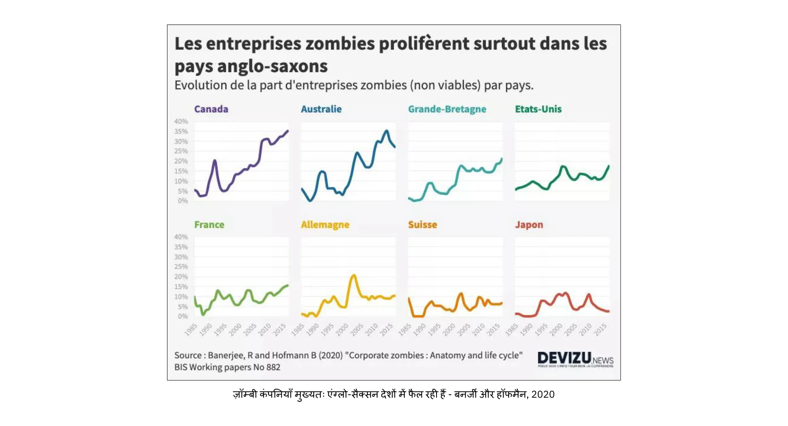

ज़ॉम्बी कंपनियों का चलन सिर्फ़ युद्धोत्तर जर्मनी तक ही सीमित नहीं है। आज भी, कई बड़ी कंपनियाँ बेहद कम ब्याज दरों पर ऋण प्राप्त करने की विशेषाधिकार प्राप्त सुविधा के कारण फल-फूल रही हैं। अगर उन्हें पारंपरिक दरों पर उधार लेना पड़ा, तो उनमें से कई लाभदायक नहीं रहेंगी। यह 2023 में विशेष रूप से प्रासंगिक है, जब ब्याज दरें लगभग शून्य के आसपास लंबे समय तक रहीं, और अब दरें बढ़ने लगी हैं। वित्तीय परिदृश्य में यह हालिया बदलाव निस्संदेह इन कंपनियों के लिए एक निर्णायक परीक्षा होगी, जिन्हें कभी "ज़ॉम्बी" कहा जाता था।

#### 6. शीघ्र अमीर बनें!

इतिहास ऐसे उदाहरणों का प्रमाण है जहाँ लोगों ने तेज़ी से धन संचय करने की कोशिश की, जैसा कि वेइमर और ज़िम्बाब्वे में आर्बिट्रेज के ज़रिए हुआ था। आज, कुछ क्रिप्टोकरेंसी के उदय के साथ भी ऐसा ही चलन देखा जा सकता है। लोग त्वरित लाभ के लालच में अपने निवेश में तेज़ी से वृद्धि की उम्मीद में जोखिम उठाते हैं। यह दृष्टिकोण अति मुद्रास्फीति के दौर की याद दिलाता है, जहाँ आर्बिट्रेज का इस्तेमाल अक्सर दूसरों की कीमत पर, त्वरित लाभ प्राप्त करने के लिए किया जाता था।

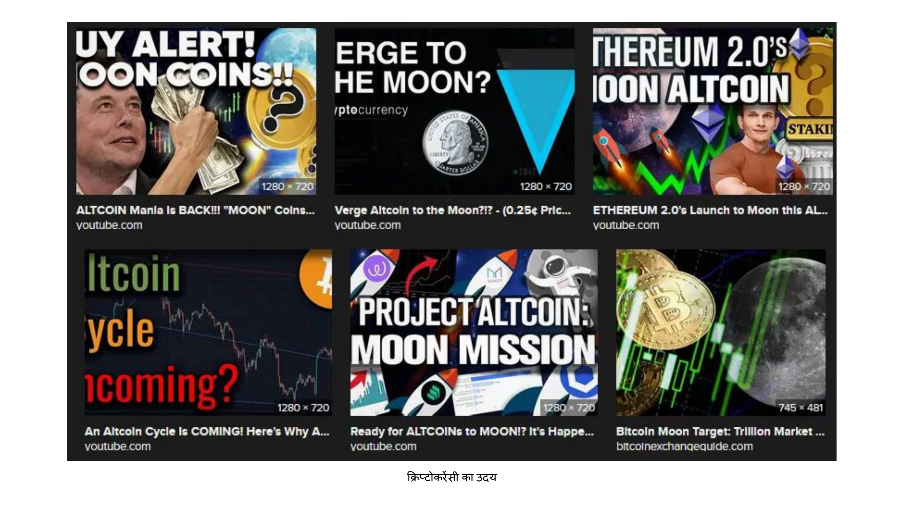

#### 7. बचत, अनिश्चितता के विरुद्ध उपाय

> पूंजी और आय के मूल्य में निरंतर गिरावट के साथ-साथ भविष्य के बारे में अनिश्चितता का व्यापक और विनाशकारी प्रभाव।

एक उद्धरण पर प्रकाश डालना ज़रूरी है जो सामाजिक एकजुटता पर पूँजी मूल्य के क्षरण के विनाशकारी प्रभाव और साथ ही इससे उत्पन्न अनिश्चितता को रेखांकित करता है। इसमें कहा गया है: "पूँजी और आय के मूल्य में निरंतर क्षरण और भविष्य के बारे में अनिश्चितता का व्यापक और विनाशकारी प्रभाव।"

एक ऐसे परिदृश्य की कल्पना कीजिए जहाँ आपका परिवार या प्रियजन हैं जिन्हें आप सुरक्षित रखना चाहते हैं। आप Hard पर काम करते हैं और भविष्य की अनिश्चितताओं का अनुमान लगाने के लिए बचत करते हैं। अगर सब कुछ पूर्वानुमेय होता, तो बचत बेकार होती। हालाँकि, अप्रत्याशित परिस्थितियों, जैसे कि खराब कार, के सामने, बचत जीवन रेखा बन जाती है। यह दुनिया की अनिश्चितता को कम करती है। हालाँकि, अत्यधिक मुद्रास्फीति के दौरान, बचत एक चुनौती बन जाती है। पैसा जल्दी अपना मूल्य खो देता है, जिससे दीर्घकालिक योजनाएँ बनाना मुश्किल हो जाता है। यह वित्तीय अस्थिरता generate तनाव और चिंता का कारण बन सकती है।

आज, बचत क्षमता में गिरावट के साथ, निवेश ने उसकी जगह ले ली है। हालाँकि, इस दृष्टिकोण के अपने जोखिम भी हैं। बचत हमेशा से अनिश्चितता से निपटने का एक उपाय रही है। अप्रत्याशित परिस्थितियों से निपटने के लिए वित्तीय भंडार होने से मानसिक शांति मिलती है और सामाजिक एकता मज़बूत होती है। निष्कर्षतः, सामाजिक और व्यक्तिगत स्थिरता बनाए रखने के लिए अपनी बचत क्षमता को सुरक्षित रखना आवश्यक है।

## लैटिन अमेरिका में पुनर्नामकरण

<chapterId>918eafd7-409d-5205-ad52-a52e63b23a64</chapterId>

अब हम लैटिन अमेरिकी देशों में पुनर्नामकरण की विभिन्न अवधियों पर नजर डालेंगे।

### ग्राफ़ की व्याख्या

बाईं ओर की स्लाइड में, पुनर्मूल्यांकन के वर्ष, नई मुद्रा का नाम और पुरानी मुद्रा के साथ Exchange दर दर्शाई गई है। अर्जेंटीना का उदाहरण लेते हुए, पेसो मोनेडा नैशनल को पिछली मुद्रा, पेसो रियल से 25 से 1 की दर से परिवर्तित किया गया था। इस संदर्भ में, हम समय के साथ अर्जेंटीना की मुद्रा के विकास का अध्ययन करेंगे। इसके अतिरिक्त, हम प्रत्येक अवधि के लिए बैंक नोटों के प्रारंभिक और अंतिम मूल्यवर्ग भी दर्शाएँगे।

स्लाइड के दाईं ओर, मुद्रास्फीति का एक ग्राफ़ प्रदर्शित होता है। लाल तीर, कैगन के मानदंड द्वारा परिभाषित, अतिमुद्रास्फीति के वर्षों को दर्शाते हैं, जो कि प्रति माह 50% की मुद्रास्फीति दर है। यह मानदंड कभी-कभी अस्पष्ट व्याख्याओं को जन्म दे सकता है, क्योंकि उच्च मुद्रास्फीति दर वाले वर्ष अतिमुद्रास्फीति की सख्त परिभाषा को पूरा नहीं कर सकते हैं।

यह ध्यान देने योग्य है कि मुद्रास्फीति के दौर में सरकारों द्वारा अपनाया जाने वाला एक सामान्य उपाय, पुनर्नामांकन, एक उल्लेखनीय घटना है। हालाँकि, इससे मुद्रास्फीति या अतिमुद्रास्फीति की मूल समस्या का समाधान नहीं होता। यह केवल मुद्रा का नाम बदलने और शून्य हटाने का एक तरीका है, अतिमुद्रास्फीति के मूल कारण, Supply मुद्रा के विस्तार, का वास्तविक समाधान किए बिना। अगले वीडियो में, हम Address के वास्तविक समाधानों और अतिमुद्रास्फीति की समस्या के समाधान पर चर्चा करेंगे। इस श्रृंखला में, हम पर्याप्त सुधारों के बिना एक साधारण पुनर्नामांकन के परिणामों पर प्रकाश डालेंगे: मुद्रास्फीति बनी रहती है।

अर्जेंटीना के बाद, हमारा अध्ययन ब्राज़ील, बोलीविया, पेरू, निकारागुआ और वेनेज़ुएला को कवर करेगा। हम इन देशों में हुए पुनर्नामकरणों की जाँच करेंगे।

### अर्जेंटीना

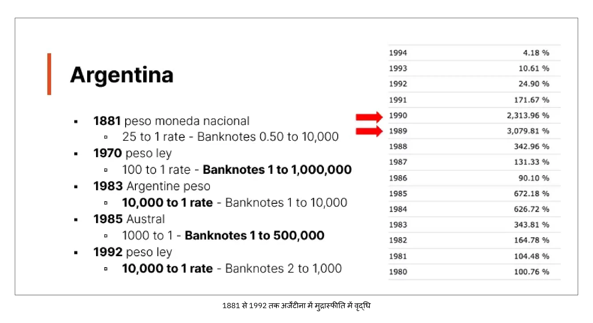

1826 से पहले, अर्जेंटीना स्पेनिश डॉलर का इस्तेमाल करता था। 1816 में अपनी स्वतंत्रता के बाद, उसने स्पेनिश रियल पर आधारित अपनी मुद्रा शुरू की, जिसके परिणामस्वरूप एक समान मुद्रा का निर्माण हुआ। यह तालिका 1881 से शुरू होती है, जो "पेसो मोनेडा नैशनल" की शुरुआत का वर्ष था, जिसमें 10,000 तक के बैंकनोट उपलब्ध थे। इसके बाद "पेसो ले" आया, जिसका विनिमय 100 से 1 की दर से होता था और इसमें दस लाख तक के बैंकनोट शामिल थे। फिर, "अर्जेंटीना पेसो" आया, जिसकी Exchange दर 10,000 से 1 (चार शून्य हटाने के बराबर) थी, और इसमें 10,000 तक के बैंकनोट थे। 1985 में, "ऑस्ट्रेलेस" की शुरुआत हुई और इसका विनिमय 1,000 से 1 की दर से हुआ, जिसमें 500,000 तक के बैंकनोट उपलब्ध थे। 1992 में, वर्तमान "पेसो ले" को 10,000 से 1 की दर पर स्थापित किया गया था, जिसमें एक बार फिर चार शून्य हटा दिए गए थे। केवल 1989 और 1990 के वर्षों में ही अत्यधिक मुद्रास्फीति देखी गई थी।

### ब्राज़िल

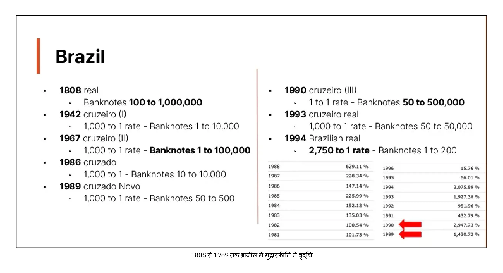

ब्राज़ील मौद्रिक पुनर्नामांकन का एक उल्लेखनीय उदाहरण है, जैसा कि इसके मुद्रा परिवर्तनों के इतिहास से स्पष्ट होता है। अपनी स्वतंत्रता से पहले, ब्राज़ील अपनी मुद्रा के रूप में पुर्तगाली रियाल का उपयोग करता था। हालाँकि, 1822 में अपनी स्वतंत्रता की घोषणा से बहुत पहले, 1747 में ही, देश ने अपनी "ब्राज़ीलियन रियाल" का उपयोग शुरू कर दिया था। यह तालिका 1818 से शुरू होती है, जो ब्राज़ीलियाई बैंकनोटों के जारी होने की शुरुआत का प्रतीक है। इससे पहले, मुद्रा मुख्यतः सिक्कों के रूप में थी। इन बैंकनोटों का मूल्य एक मिलियन रियाल तक पहुँच जाता था।

1942 से ब्राज़ील में पुनर्नामकरण की एक श्रृंखला शुरू हुई। ज़्यादातर मामलों में (1942, 1967, 1986, 1989, 1993), रूपांतरण दर 1:1,000 थी। 1990 में, बिना रूपांतरण के नाम परिवर्तन हुआ। इन मुद्राओं का क्रम इस प्रकार है:

- रीअल्स (पुराना संस्करण) 1942 तक।
- क्रुज़ेइरोस 1942 में।
- 1967 में क्रुज़ेइरोस (नया संस्करण)।
- क्रुज़ादोस ने 1986 में यह पद संभाला था।
- क्रुज़ादोस नोवोस 1989 में।
- 1990 में क्रुज़ेइरोस लौटें।
- क्रुज़ेइरोस रीएस 1993 में।
- अंततः 1994 में ब्राज़ीलियाई रियल.

उच्चतम मूल्यवर्ग का नोट 500,000 तक पहुँच गया, और 1994 में अंतिम पुनर्नामांकन 2,750 से 1 की दर से किया गया। 1989 और 1990 के वर्ष अत्यधिक मुद्रास्फीति से चिह्नित थे, जबकि 1993-1994 में मुद्रास्फीति की उच्च दर देखी गई जो अत्यधिक मुद्रास्फीति (50% प्रति माह) की सीमा तक नहीं पहुँच पाई। इस उथल-पुथल भरे दौर के बाद, ब्राज़ील ने एक बार फिर कई शून्य हटाकर अपनी मुद्रा का पुनर्नामकरण किया।

### बोलीविया

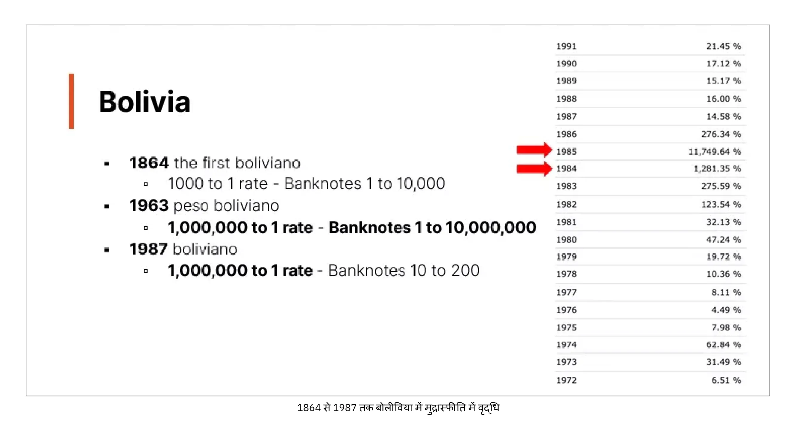

बोलीविया एक और ऐसा देश है जिसने तीव्र मुद्रास्फीति के दौर का अनुभव किया है, जिसके कारण मुद्रा पुनर्मूल्यांकन की आवश्यकता पड़ी। यहाँ इसके मौद्रिक इतिहास का सारांश दिया गया है:

1825 में अपनी स्वतंत्रता से पहले, बोलीविया अपनी मुद्रा के रूप में स्पेनिश डॉलर का उपयोग करता था। स्वतंत्रता के बाद, देश ने 1827 और 1864 के बीच स्पेनिश डॉलर की जगह बोलिवियन सोल मुद्रा शुरू की। हालाँकि, यह ध्यान देने योग्य है कि बोलीविया में पहला बैंकनोट 1864 में ही जारी किया गया था।

1864 में, पहली बार "बोलीवियानो" मुद्रा प्रचलन में आई, जिसकी Exchange दर बोलिवियाई सोल की तुलना में 1,000 से 1 थी। यह मुद्रा तब तक प्रचलन में रही जब तक इसका मूल्य 10,000 बोलिवियानो तक नहीं पहुँच गया।

इसके बाद, बोलीविया ने अपनी मुद्रा "बोलिवियन पेसो" में बदल दी, जिससे गंभीर अतिमुद्रास्फीति का सामना करना पड़ा, और अंततः मुद्रा मूल्य 1 करोड़ तक पहुँच गया। मुद्रास्फीति का यह दौर 1984-1985 के वर्षों में चरम पर था, जब मासिक मुद्रास्फीति दर अक्सर 50% की अतिमुद्रास्फीति सीमा के करीब पहुँच जाती थी। एक परिप्रेक्ष्य प्रदान करने के लिए, पूरे वर्ष में प्रति माह 50% की स्थिर मुद्रास्फीति दर के परिणामस्वरूप वार्षिक मुद्रास्फीति दर लगभग 12,800% होती है। 1985 में, बोलीविया की वार्षिक मुद्रास्फीति दर 11,749% तक पहुँच गई, जो दर्शाता है कि मुद्रास्फीति लगभग हर महीने 50% की सीमा के करीब या उससे अधिक थी।

इस मौद्रिक संकट के जवाब में, 1987 में, बोलीविया ने एक नई मुद्रा शुरू की, जिसे "बोलीवियानो" कहा जाता था, जिसकी Exchange दर 1 बोलिवियानो के लिए 1 मिलियन बोलिवियन पेसो थी। बोलिवियानो का यह संस्करण आज भी प्रचलन में है।

यह बोलीविया के उथल-पुथल भरे मौद्रिक इतिहास का अवलोकन है, जो अति मुद्रास्फीति और पुनर्मूल्यांकन के दौर से चिह्नित है।

### पेरू

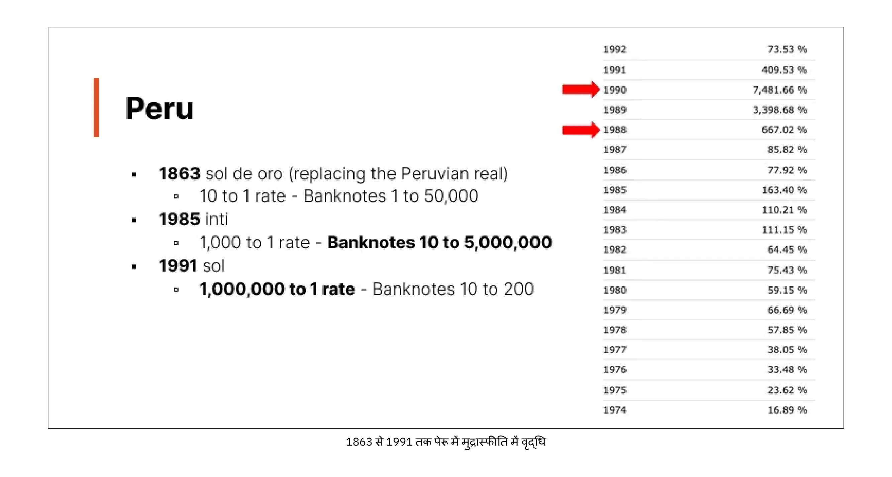

पेरू मनमाने 50% नियम के प्रभावों के संबंध में एक दिलचस्प मामला प्रस्तुत करता है। अपने मौद्रिक इतिहास से शुरुआत करते हुए, पेरू ने 19वीं शताब्दी तक स्पेनिश सोने का उपयोग किया, जब उसने 1821 में अपनी स्वतंत्रता की घोषणा की। पेरू डॉलर 1822 से 1863 तक प्रचलन में रहा। 1863 में, पेरू रियल की जगह सोल्डी ओरो ने ले ली, जिसकी विनिमय दर 10 से 1 थी, और जिसका अधिकतम मूल्य 50,000 तक पहुँच गया। 1985 में, 1000 से 1 की विनिमय दर के साथ "इंटी" मुद्रा शुरू की गई, जो 5 मिलियन तक पहुँच गई। 1991 में, 1 मिलियन से 1 की Exchange दर के साथ "SOL" मुद्रा शुरू की गई, जिसके बैंक नोट 10 से 200 तक के थे।

पुनर्मूल्यांकन अवधियों की जाँच करने पर, 1988 को अति मुद्रास्फीति का वर्ष माना जाता है, विशेष रूप से सितंबर में। जुलाई-अगस्त 1990 में भी अति मुद्रास्फीति का दौर देखा गया। 1988 में, वार्षिक मुद्रास्फीति दर 667% थी, जिसका शिखर सितंबर में 50% था। इसके विपरीत, 1989 में मुद्रास्फीति की दर 3000% थी, और कोई भी महीना 50% से अधिक नहीं था, इसलिए इसे अति मुद्रास्फीति के रूप में वर्गीकृत नहीं किया गया था। 1990 में, मुद्रास्फीति 7481% के शिखर पर थी। यह स्पष्ट है कि 50% का नियम मनमाना हो सकता है, क्योंकि 1989 के विपरीत, 1988 को अति मुद्रास्फीति का वर्ष माना गया था। यदि इस नियम पर पुनर्विचार किया जाए, तो 1989 में पेरू द्वारा अनुभव की गई अवधियों को शामिल करने के लिए सीमा को कम करना बुद्धिमानी हो सकती है।

> क्या हो रहा है यह समझना
>

> मुद्रा पुनर्मूल्यांकन के बारे में समझने वाली मुख्य बात यह है कि जब मुद्रा का मूल्य 5 या 10 मिलियन जैसे खगोलीय आंकड़ों तक पहुँच जाता है, तो उसका पुनर्मूल्यांकन किया जाता है। यह प्रक्रिया कई बार दोहराई जा सकती है, जिसमें मुद्रा परिवर्तन शामिल है। इसका परिणाम यह होता है कि अति मुद्रास्फीति न होने पर भी, व्यक्तियों की बचत बुरी तरह प्रभावित हो सकती है। उदाहरण के लिए, यदि कोई व्यक्ति एक वर्ष में $1,000 बचाता है और अगले वर्ष $100 अलग रख लेता है, तो सबसे कम मूल्य का नोट $1,000 हो सकता है, जिससे पहले से बचाए गए $100 बेकार हो जाएँगे। बचत के इस तरह के क्षरण के लिए स्पष्ट अति मुद्रास्फीति की आवश्यकता नहीं होती है। यदि किसी व्यक्ति ने पिछले दस वर्षों में $10,000 की बचत की है, तब भी वह राशि नगण्य रह सकती है, जिससे वह पानी की एक साधारण बोतल भी नहीं खरीद सकता। यह वास्तविकता कई देशों में स्पष्ट है जहाँ पुनर्मूल्यांकन हुआ है, भले ही केवल कुछ महीनों को ही अति मुद्रास्फीति के रूप में वर्गीकृत किया गया हो। इसके विपरीत, निकारागुआ जैसे कुछ देशों ने लगातार कई वर्षों तक अति मुद्रास्फीति का अनुभव किया है।

### निकारागुआ

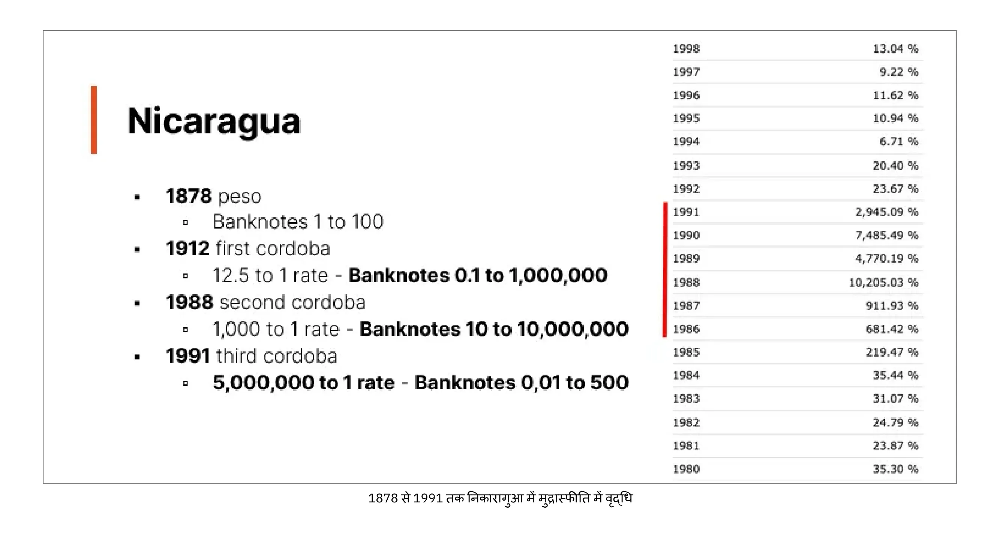

निकारागुआ, जो पहले स्पेन के शासन के अधीन था, ने शुरुआत में स्पेनिश डॉलर का इस्तेमाल किया, जैसे स्पेन द्वारा उपनिवेशित कई अन्य देश। स्पेनिश साम्राज्य, मैक्सिकन साम्राज्य और फिर मध्य अमेरिका के संघीय गणराज्य में एकीकृत होने के बाद, निकारागुआ ने अपनी स्वतंत्रता की घोषणा की। 1878 से, पेसो देश की आधिकारिक मुद्रा बन गई, जिसका मूल्य 1 से 100 के बीच उतार-चढ़ाव करता रहा। 1912 में, देश ने पहला कॉर्डोबा, 1988 में दूसरा और 1991 में तीसरा, जो आज भी प्रचलन में है, जारी किया। पहले कॉर्डोबा का मूल्य 10 लाख और दूसरे का 1 करोड़ तक पहुँच गया। 1991 में पुनर्मूल्यांकन कई वर्षों की अति मुद्रास्फीति के बाद हुआ।

### वेनेज़ुएला

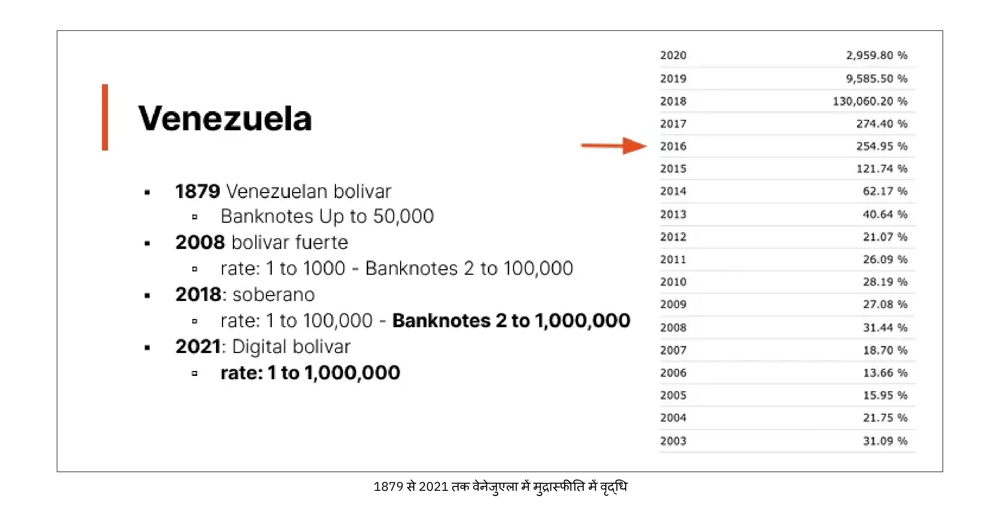

इस वीडियो में उल्लिखित अंतिम देश वेनेज़ुएला है। समय के साथ इस देश की मुद्रा का चार बार पुनर्मूल्यांकन हुआ है। अपने शुरुआती दिनों में, वेनेज़ुएला ने 1811 में स्वतंत्रता की घोषणा करने से पहले स्पेनिश डॉलर का इस्तेमाल किया था। 1879 में, इसने बोलिवर को आधिकारिक मुद्रा के रूप में पेश किया, जो 1983 तक प्रभावी रहा, जब सरकार ने डॉलर का उपयोग करते हुए एक अस्थायी Exchange दर प्रणाली को अपनाया।

वेनेज़ुएला के बारे में एक उल्लेखनीय तथ्य यह है कि यह लैटिन मौद्रिक संघ का सदस्य है। इस संघ में स्पेन के 5 पेसेटा, ग्रीस के 5 द्राख्मा, वेनेज़ुएला के 5 बोलिवर, इटली के 5 लीरा, 5 बेल्जियम फ़्रैंक और 5 फ़्रांसीसी फ़्रैंक जैसे सिक्के शामिल थे।

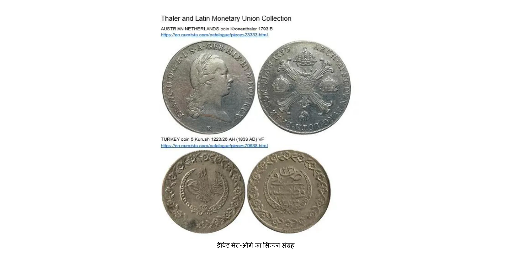

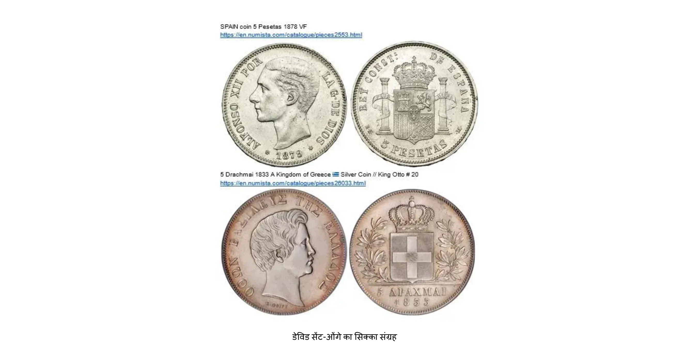

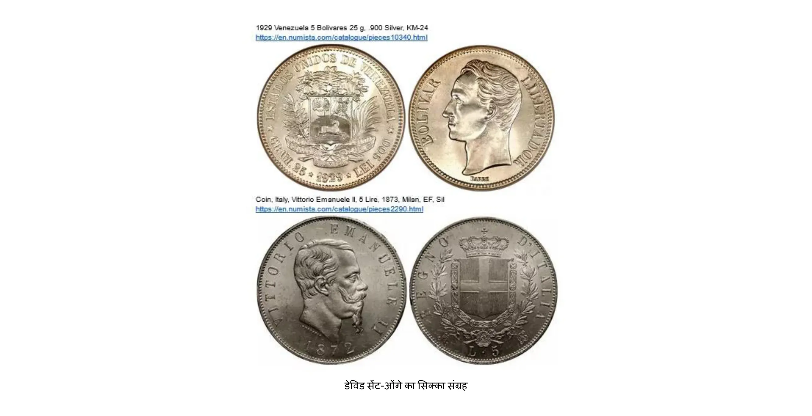

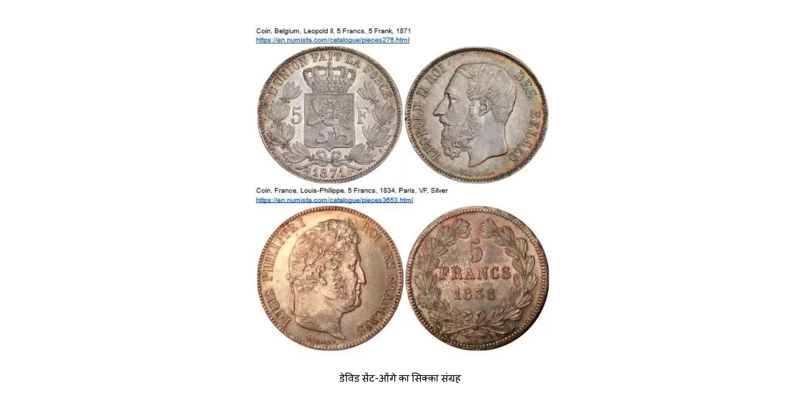

इस दौरान, वेनेज़ुएला से प्राप्त 5 बोलिवर Coin का वज़न इटली, स्पेन, बेल्जियम और फ़्रांस सहित संघ के सदस्य देशों के बोलिवर के बराबर था। ये बोलिवर चाँदी के बने थे, जिनमें से 1929 के एक विशिष्ट Coin का वज़न 25 ग्राम था और इसकी शुद्धता 900 ग्राम थी, यानी 90% शुद्ध चाँदी। चाँदी की वर्तमान कीमत के हिसाब से, इस Coin की कीमत लगभग $17 से $18 (अमेरिकी डॉलर) है।

1983 में अस्थायी Exchange दर को अपनाने के बाद, कई पुनर्नामांकन हुए:

- 2008 में, बोलिवर फुएर्ते या "मजबूत बोलिवर" की शुरुआत की गई, जो एक हजार से एक के पुनर्मूल्यांकन से पहले 100,000 तक पहुंच गया।
- 2018 में, सोबेरानो की शुरुआत हुई, जिसकी कीमत 10 लाख तक पहुँच गई। 2021 में, इसकी जगह डिजिटल बोलिवर ने ले ली, जिसकी कीमत भी 10 लाख तक पहुँच गई, और फिर इसे 10 लाख से 1 का नया नामकरण किया गया। आज, 10 या 20 का नोट सोबेरानो में 1 करोड़ या 2 करोड़ के बराबर है।

इस अवधि के नोट, जो 2018 से शुरू हुए हैं, बियारिट्ज़, टोरंटो और मियामी में आयोजित विभिन्न Bitcoin सम्मेलनों में वितरित किए जाते हैं। ये सोबेरानो नोट अधिकतम 10 लाख मूल्य तक पहुँच गए थे। फिर पुनर्नामांकन हुआ, जिससे 10 लाख का मूल्य लगभग 3 सेंट रह गया। वर्तमान में, 10 लाख के 10 नोट एक 10 के नोट के बराबर होते हैं। 2016 से, वेनेजुएला अत्यधिक मुद्रास्फीति का अनुभव कर रहा है, जो एक विशिष्ट तालिका में 57वीं अवधि का प्रतिनिधित्व करता है।

अगले वीडियो में, वेनेजुएला और अन्य सूचीबद्ध देशों पर केंद्रित अतिमुद्रास्फीति बिलों का एक संग्रह प्रस्तुत किया जाएगा। इस संग्रह में लगभग सभी वेनेजुएला के बिल शामिल हैं। अध्ययन प्रत्येक उल्लिखित देश के विभिन्न पुनर्नामांकनों पर केंद्रित होगा। इसके अतिरिक्त, ज़िम्बाब्वे में पुनर्नामांकनों का अन्वेषण भी किया जाएगा, जो एक अत्यंत रोचक विषय है।

### निष्कर्ष

हमने देखा है कि अति मुद्रास्फीति आर्थिक तबाही का एकमात्र संकेतक नहीं है। कई बार पुनर्नामांकन, शून्यों को हटाना, या मुद्रा का नाम बदलने का सीधा असर आबादी पर पड़ता है, जिसमें सहायता राशि के नुकसान से लेकर खाद्य समस्याओं तक शामिल हैं। हालाँकि अति मुद्रास्फीति चिंताजनक है, लेकिन ब्राज़ील में देखी गई पुनर्नामांकन की संख्या एक अधिक जटिल वास्तविकता को दर्शाती है।

प्रति माह 50% मुद्रास्फीति के मानदंड के आधार पर, कई अवधियों को अति मुद्रास्फीति के रूप में वर्गीकृत किया जा सकता था। यह विशेष रूप से तब सच होता है जब अंतर्राष्ट्रीय लेखा संगठन के मानदंडों की जाँच की जाती है, जो जनसंख्या द्वारा मुद्रा का तेजी से परित्याग, वेतन सूचकांकीकरण, और मुद्रास्फीति की भरपाई के लिए उच्च ब्याज दरों वाले ऋणों जैसी विशेषताओं पर विचार करता है।

निष्कर्षतः, अतिमुद्रास्फीति आर्थिक चुनौतियों का केवल एक पहलू है। उच्च मुद्रास्फीति अकेले भी उतनी ही विनाशकारी हो सकती है। अगले भाग में अतिमुद्रास्फीति पर काबू पाने के संभावित समाधानों पर चर्चा की जाएगी।

## अति मुद्रास्फीति पर कैसे काबू पाएं

<chapterId>e3484a31-a851-5f92-8af5-00eddae67db1</chapterId>

### मध्यम और उच्च मुद्रास्फीति को कैसे समाप्त करें

उल्लिखित निष्कर्ष पीटर बर्नहोल्ज़ की पुस्तक "मौद्रिक व्यवस्था और मुद्रास्फीति" से लिए गए हैं। बर्नहोल्ज़ के अनुसार, मुद्रास्फीति को समाप्त करने का एकमात्र तरीका मौद्रिक सुधार लागू करना और सरकार पर राजकोषीय प्रतिबंध लगाना है। इन प्रतिबंधों में एक संस्था, जैसे कि एक केंद्रीय बैंक, की स्थापना शामिल है, जो सरकार के राजनीतिक निर्णयों से स्वतंत्र रूप से संचालित होती है। उच्च और अति मुद्रास्फीति अक्सर मुद्रा सृजन के माध्यम से बजट घाटे के वित्तपोषण का परिणाम होती है। Address मुद्रास्फीति को कम करने के लिए, Supply मुद्रा की वृद्धि को कम करना आवश्यक है। बर्नहोल्ज़ यह भी सुझाव देते हैं कि यह मौद्रिक वृद्धि पड़ोसी देशों के सापेक्ष होनी चाहिए। एक आश्चर्यजनक बात यह है कि, उच्च या अति मुद्रास्फीति की अवधि के दौरान, Supply मुद्रा का कुल मूल्य वास्तव में घट सकता है। इस स्थिति का एक उल्लेखनीय उदाहरण ज़िम्बाब्वे है।

### प्रति-सहज समाधान

ज़िम्बाब्वे का अध्ययन करते समय, यह देखा गया कि Supply मुद्रा की 10 ट्रिलियन इकाइयों ने अपना सारा मूल्य खो दिया था। वाइमर में, Supply मुद्रा की 65 बिलियन इकाइयों के कुल अंकित मूल्य का दो-तिहाई एक ही दिन में छापना संभव था। इससे पता चलता है कि Supply मुद्रा का अवमूल्यन कैसे किया जा सकता है। इस स्थिति को सुधारने के लिए, Supply मुद्रा को उचित स्तर तक पहुँचाने के लिए उसमें उल्लेखनीय वृद्धि करना आवश्यक है। तब, मौद्रिक सुधार अपरिहार्य है। उच्च मुद्रास्फीति की स्थिति में, यह सुधार अपरिहार्य है, लेकिन यह सुनिश्चित करना होगा कि प्रचलन में पर्याप्त मुद्रा हो। इस कदम के बाद, सरकार पर प्रतिबंध लगाए जा सकते हैं।

बर्नहोल्ज़ के अवलोकन के अनुसार, मुद्रास्फीति की समस्याओं से निपटने के लिए, अंतर्राष्ट्रीय मुद्रा कोष (IMF) और विश्व बैंक जैसी संस्थाएँ हमेशा सबसे प्रभावी रणनीतियाँ नहीं अपनाती हैं। कुछ मामलों में, जब किसी देश को अपनी मुद्रा Supply बढ़ाने की आवश्यकता होती है, तो ये संस्थाएँ उसे कम करने का प्रयास करती हैं। मुख्य बात यह है कि पर्याप्त मौद्रिक स्तर तक पहुँचकर फिर उसकी वृद्धि पर सीमाएँ लगाई जाएँ, जिससे मौद्रिक सृजन के माध्यम से सरकारी खर्चों का वित्तपोषण करने से बचा जा सके।

बर्नहोल्ज़ द्वारा उठाया गया एक दिलचस्प पहलू यह है कि किसी मौद्रिक सुधार की सफलता न केवल उसकी तकनीकी प्रासंगिकता पर निर्भर करती है, बल्कि जनता के उस विश्वास पर भी निर्भर करती है। कुछ सुनियोजित सुधार इसलिए विफल हो सकते हैं क्योंकि जनता उन पर भरोसा नहीं करती, जबकि कुछ, जिन्हें खराब तरीके से डिज़ाइन किया गया है, इसलिए सफल हो सकते हैं क्योंकि जनता उन पर भरोसा करती है। इसलिए, किसी मौद्रिक सुधार की सफलता या विफलता में धारणा और जनता का विश्वास आवश्यक हैं।

- ज़िम्बाब्वे में, मुद्रास्फीति से निपटने के लिए डॉलरीकरण अपनाया गया, यानी उन्होंने अमेरिकी डॉलर या पड़ोसी देशों की अन्य मुद्राओं को अपनाया। यह तरीका सरकार को अपनी मर्ज़ी से मुद्रा छापने से रोकता है।
- जर्मनी में, इसका समाधान एक नई मुद्रा, रेन्टेनमार्क, बनाना था। यह मुद्रा रीच की क्षेत्रीय संपत्तियों द्वारा समर्थित थी, और यह रणनीति कारगर साबित हुई।

### ज़िम्बाब्वे का मामला

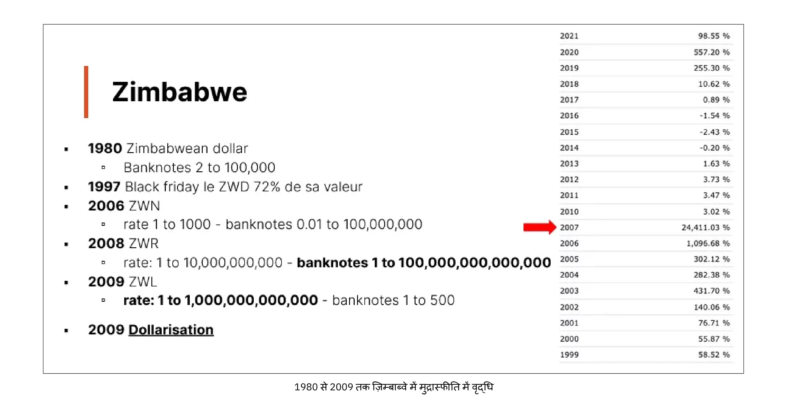

ज़िम्बाब्वे को 1980 में स्वतंत्रता मिली और उसने अपनी मुद्रा, ज़िम्बाब्वे डॉलर, शुरू की। शुरुआत में, दो ज़िम्बाब्वे डॉलर की कीमत लगभग 1.60 अमेरिकी डॉलर थी। हालाँकि, 1997 में, युद्ध के दिग्गजों के पक्ष में सामाजिक उपायों के बाद, ब्लैक फ्राइडे के दौरान एक ही दिन में मुद्रा का 72% अवमूल्यन हो गया। फिर, 2000 के दशक की शुरुआत में, देश ने भूमि पुनर्वितरण कार्यक्रम शुरू किया, जिसमें श्वेत स्वामियों से ज़मीन लेकर स्थानीय आबादी में वितरित करना शामिल था। इस निर्णय से निर्यात को नुकसान हुआ क्योंकि नए मालिकों के पास अक्सर बड़े पैमाने पर खेती के प्रबंधन के लिए आवश्यक विशेषज्ञता का अभाव था। परिणामस्वरूप, जहाँ ज़िम्बाब्वे 1999 में शुद्ध निर्यातक था, वहीं 2003 में शुद्ध आयातक बन गया।

2006 में, देश ने अपनी मुद्रा का एक नया संस्करण, ZWN, 1 से 1,000 तक की Exchange दर के साथ शुरू किया। 2008 में, एक और मूल्यवर्ग, ZWR, 1 से 10 अरब तक की Exchange दर के साथ शुरू किया गया। इसके परिणामस्वरूप प्रतिष्ठित 100 ट्रिलियन बैंकनोटों का निर्माण हुआ।

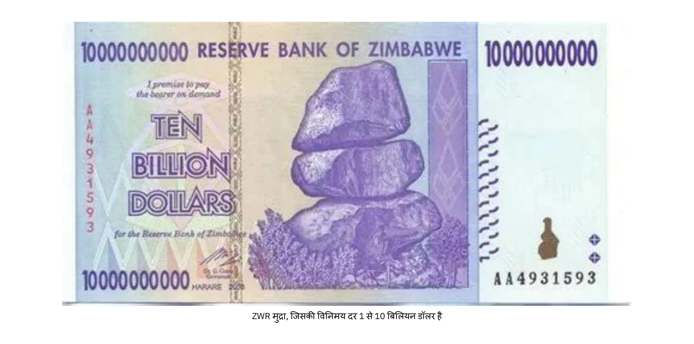

#### डॉलरीकरण और संकट समाधान

इसलिए, 2009 के बाद, लगातार मौद्रिक संकट और अनियंत्रित अतिमुद्रास्फीति का सामना करते हुए, ज़िम्बाब्वे ने अपनी राष्ट्रीय मुद्रा को त्याग दिया और विदेशी मुद्राओं, मुख्यतः अमेरिकी डॉलर, के उपयोग की अनुमति दे दी। इस निर्णय ने, हालाँकि क्रांतिकारी, अतिमुद्रास्फीति को समाप्त कर दिया। सीखने योग्य एक महत्वपूर्ण सबक यह है कि अत्यधिक मुद्रा जारी करने पर रोक लगाने और बजट घाटे के लिए केंद्रीय बैंक द्वारा वित्तपोषण को समाप्त करने से अतिमुद्रास्फीति को रोकने में मदद मिल सकती है।

हालाँकि, डॉलरीकरण कोई चमत्कारी समाधान नहीं है। हालाँकि यह अति मुद्रास्फीति को समाप्त कर सकता है, लेकिन यह अन्य आर्थिक चुनौतियाँ भी प्रस्तुत करता है। इसका एक परिणाम स्वायत्त मौद्रिक नीति का ह्रास है। अपनी मुद्रा के बिना, कोई भी देश आंतरिक आर्थिक झटकों का सामना करने के लिए अपनी मौद्रिक नीति को समायोजित नहीं कर सकता।

2007 में, ज़िम्बाब्वे की मुद्रास्फीति दर 50% प्रति माह की सीमा तक पहुँच गई, जिससे आधिकारिक तौर पर देश अतिमुद्रास्फीति की स्थिति में आ गया। 2009 में डॉलरीकरण के बाद, अतिमुद्रास्फीति थम गई; हालाँकि, देश को अन्य आर्थिक चुनौतियों का सामना करना जारी रहा।

यह चिंताजनक है कि ज़िम्बाब्वे ने अपनी मुद्रा को फिर से लागू करने का प्रयास किया है, और उच्च मुद्रास्फीति के संकेत फिर से दिखाई देने लगे हैं। कुछ अंतरराष्ट्रीय संगठनों के अनुसार, देश पहले से ही अति मुद्रास्फीति के मानदंडों को पूरा कर सकता है, भले ही यह अभी तक 50% मासिक की आधिकारिक सीमा तक नहीं पहुँचा है। यह अत्यधिक मुद्रा जारी करने और केंद्रीय बैंक घाटे के वित्तपोषण के खतरों की याद दिलाता है।

### निष्कर्ष

अपनी पुस्तक "एवरीथिंग अबाउट जीडब्ल्यू-76" में, मैंने ज़िम्बाब्वे में अतिमुद्रास्फीति पर एक पूरा अध्याय समर्पित किया है। मैंने महत्वपूर्ण घटनाओं का विवरण दिया है और विभिन्न उदाहरण प्रस्तुत किए हैं जो दर्शाते हैं कि देश ने अंततः अतिमुद्रास्फीति को कैसे समाप्त किया।

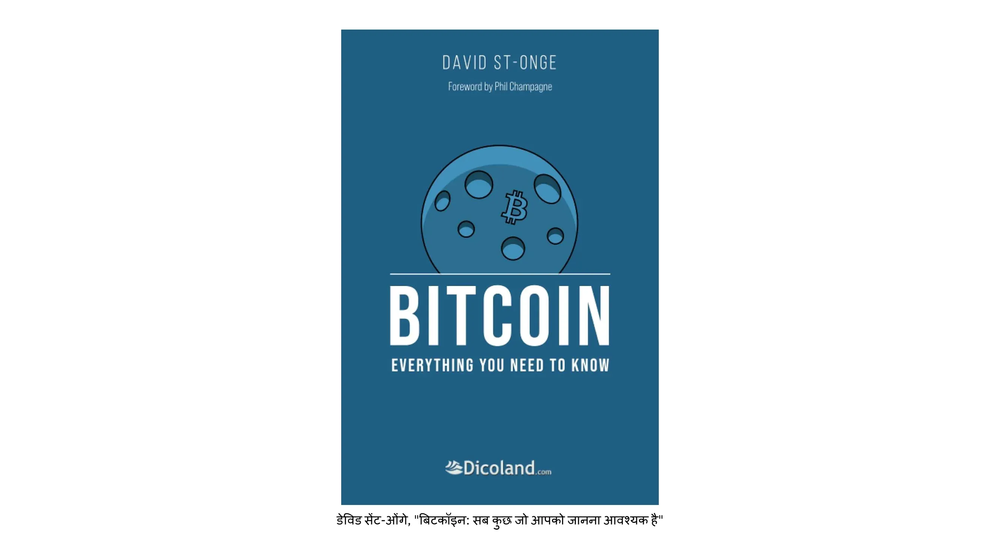

प्रथम विश्व युद्ध के बाद जर्मन अनुभव के बारे में जानने के इच्छुक लोगों के लिए, मैं "द रीच्स बैंकर" नामक कॉमिक बुक पढ़ने की पुरज़ोर सिफ़ारिश करता हूँ। यह बताती है कि कैसे जर्मनी ने अति मुद्रास्फीति पर काबू पाया, ख़ास तौर पर रेन्टेनमार्क के निर्माण के ज़रिए।

मुख्य बात यह है कि अति मुद्रास्फीति पर काबू पाने के लिए कई रणनीतियाँ मौजूद हैं। डॉलरीकरण या नई मुद्रा लागू करने का विकल्प चुना जा सकता है। ये उपाय तभी कारगर होंगे जब जनता का उन पर भरोसा होगा। कड़े प्रतिबंध लगाना बेहद ज़रूरी है। एक सच्चा स्वतंत्र केंद्रीय बैंक ज़रूरी है। उसे सरकारी घाटे को पूरा करने के लिए Supply मुद्रा का विस्तार नहीं करना चाहिए। हल्की मुद्रास्फीति की स्थिति में, Supply मुद्रा की वृद्धि को सीमित करना ही पर्याप्त होना चाहिए। हालाँकि, अति मुद्रास्फीति का सामना करने पर, सबसे पहले अर्थव्यवस्था के आकार के अनुरूप Supply मुद्रा का होना ज़रूरी है। फिर, स्थिति को स्थिर करने के लिए सरकार पर कड़े प्रतिबंध लगाना ज़रूरी है।

## अति मुद्रास्फीति बैंकनोट संग्रह की प्रस्तुति

<chapterId>f3ffbb47-3aeb-54bd-80a9-adccb0f419e2</chapterId>

[*Bitcoin Educational Toolkit* में स्कैन किए गए संग्रह की खोज करें (जो Plan ₿ Academy प्लेटफ़ॉर्म के *संसाधन* अनुभाग से भी सुलभ है।](https://penpot.planb.network/#/view?page-id=c157057b-fd28-8042-8004-4f081b21defc&file-id=c157057b-fd28-8042-8004-4f081b21defb&section=interactions&index=0&share-id=7154756b-3ebd-8040-8004-6475c2af5889&interactions-mode=show-on-click)

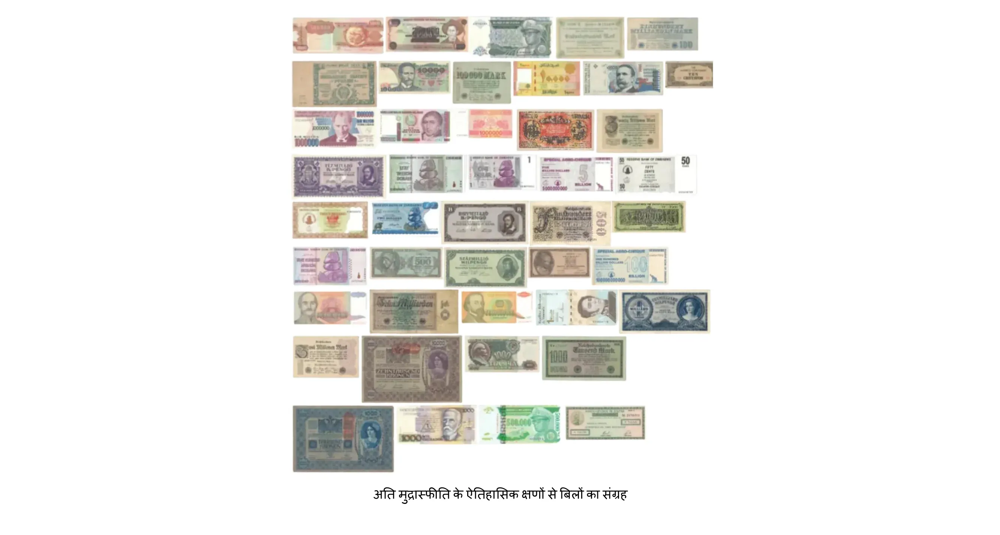

# हम यहाँ कैसे आए?

<partId>f66ca17e-be9e-5d30-a098-f7affd8962a1</partId>

## मुद्रा और केंद्रीय बैंकों के दूसरे Layer का उदय

<chapterId>0455ffe3-9d45-5a67-ac96-3f815dc507a1</chapterId>

प्रतिलिपि:

मुद्रा के दूसरे Layer और पहले केंद्रीय बैंकों का उदय एक दिलचस्प विषय है। निक बट्टिया की पुस्तक "लेयर्ड मनी" में इस विषय पर विस्तार से चर्चा की गई है। मैं इसे उन लोगों के लिए अत्यधिक अनुशंसित करता हूँ जो हमारी मौद्रिक प्रणालियों के विकास और जटिलताओं में रुचि रखते हैं। इस खंड का उद्देश्य मुद्रा निर्माण की उत्पत्ति और यह कैसे अतिमुद्रास्फीति का कारण बन सकता है, यह समझना है।

### पिरामिड मनी और केंद्रीय बैंक

#### फ्लोरिन

इटली में, खासकर फ्लोरेंस शहर में, मुद्रा का इतिहास 13वीं शताब्दी से शुरू होता है। उस समय, फ्लोरिन और Exchange के नोट आम थे। इसका एक उल्लेखनीय उदाहरण सेंट जॉन द बैपटिस्ट की आकृति से सजा फ्लोरिन है।

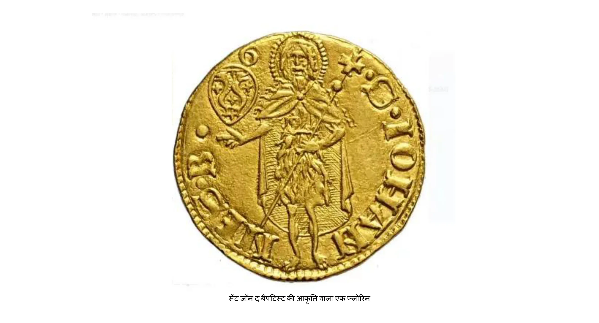

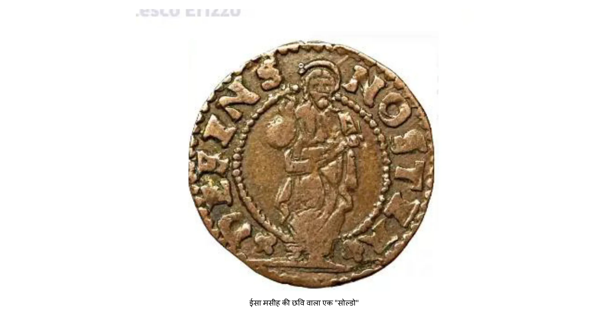

हालाँकि आज असली फ्लोरिन का मालिक होना महँगा है, फिर भी उसकी प्रतिकृतियाँ उपलब्ध हैं। उस समय की अन्य मुद्राएँ भी हैं, जैसे 17वीं शताब्दी के इतालवी राज्यों की सोल्डो, जिस पर ईसा मसीह की छवि अंकित है।

#### Exchange के बिल (13वीं शताब्दी)

उस समय आम प्रथा इस प्रकार थी: सुनार जमा किए गए फ्लोरिन के बदले Exchange में Exchange के नोट जारी करते थे। इन फ्लोरिन को उनकी तिजोरियों में सावधानी से रखा जाता था। इस प्रकार, फ्लोरिन द्वारा दर्शाया गया असली सोना, मुद्रा का पहला Layer बनता था, जबकि Exchange के नोट दूसरा Layer बनाते थे। हालाँकि, इस प्रणाली की तरलता सीमित थी। अगर कोई अपने नोट के बदले Exchange में अपने सोने को Redeem में बदलना चाहता था, तो लेन-देन आसान था। हालाँकि, व्यक्तियों के बीच इन नोटों का आदान-प्रदान आम बात नहीं थी।

#### एंटवर्प स्टॉक Exchange (16वीं शताब्दी)

एंटवर्प स्टॉक Exchange ने कागजी मुद्रा के विकास में एक महत्वपूर्ण मील का पत्थर स्थापित किया। यहीं से वचन पत्रों को भुनाने की प्रथा शुरू हुई। ये नोट मौद्रिक मूल्य का प्रतिनिधित्व करने वाले कागजी दस्तावेज थे, लेकिन उनकी विशिष्टता इस तथ्य में निहित थी कि उन पर नाम और परिपक्वता तिथियाँ अंकित होती थीं। इस कारण उन्हें नियत तिथि से पहले Exchange करना मुश्किल हो जाता था।

एंटवर्प स्टॉक Exchange द्वारा लाई गई क्रांति इन नोटों को उनकी नियत तिथि से पहले भुनाने की संभावना में निहित थी। उदाहरण के लिए, यदि कोई वचन पत्र किसी महीने में देय था, तो नियत तिथि से पहले के समय के हिसाब से उसे रियायती मूल्य पर खरीदना संभव था। इस नवाचार ने न केवल कागजी मुद्रा को अधिक Liquid बनाया, बल्कि मुद्रा के समय मूल्य की अवधारणा को भी प्रस्तुत किया।

यह अवधारणा, हालाँकि निक बेल के ट्विटर छद्म नाम "बीटीसी का समय मूल्य" के ज़रिए जुड़ी हुई है, उनका आविष्कार नहीं है। फिर भी, वे अपने काम में इस पर विस्तार से चर्चा करते हैं। मुख्य विचार यह है कि समय का मूल्य होता है। इसलिए, अगर कोई व्यक्ति एक महीने पहले $100 मूल्य का वचन पत्र चुकाने का फैसला करता है, तो वह इसे, उदाहरण के लिए, $98 में प्राप्त कर सकता है और नियत तारीख पर $100 प्राप्त कर सकता है। इस मौद्रिक नवाचार की शुरुआत एंटवर्प स्टॉक Exchange से हुई थी।

#### वीओसी और एम्स्टर्डम स्टॉक मार्केट (17वीं शताब्दी)

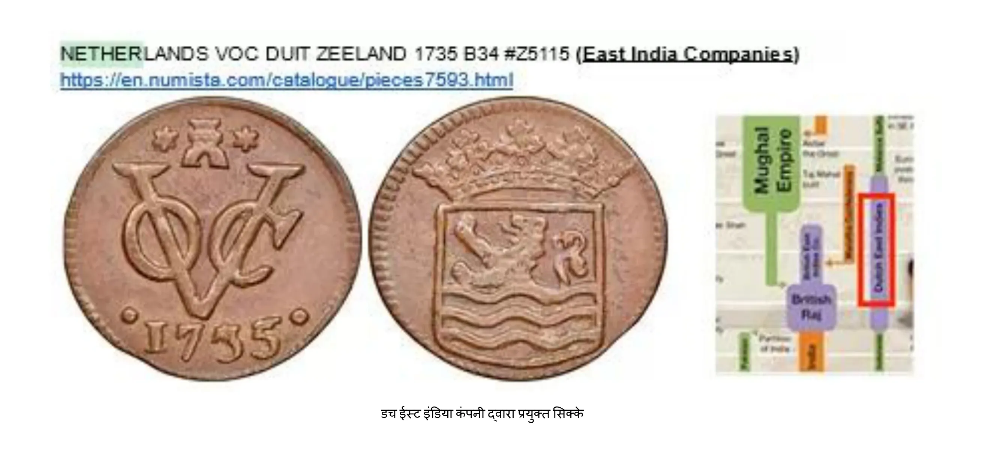

एंटवर्प स्टॉक Exchange की स्थापना के बाद, एक महत्वपूर्ण मील का पत्थर VOC, डच ईस्ट इंडिया कंपनी की स्थापना थी। नीदरलैंड स्थित इस कंपनी ने अपनी मुद्रा भी जारी की। VOC की स्थापना के बाद, एम्स्टर्डम में पहला शेयर बाज़ार स्थापित हुआ, जिसने कंपनी के शेयर बाज़ार संचालन की शुरुआत को चिह्नित किया। दिलचस्प बात यह है कि डचों ने एंटवर्प के एक अंतरराष्ट्रीय आर्थिक केंद्र के रूप में वर्चस्व को कैसे समाप्त किया। उन्होंने बस शेल्ड्ट नदी तक पहुँच को अवरुद्ध कर दिया। यह रणनीति एक बड़े ऐतिहासिक आंदोलन, भिखारियों के विद्रोह, का हिस्सा थी। यूरोपीय इतिहास की एक महत्वपूर्ण घटना।

#### बैंक ऑफ एम्स्टर्डम का हस्तक्षेप

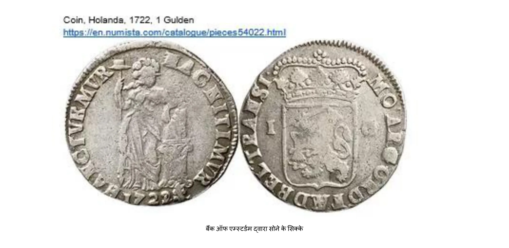

वीओसी की स्थापना के बाद, मौद्रिक इतिहास में एक और महत्वपूर्ण विकास बैंक ऑफ एम्स्टर्डम द्वारा स्वर्ण सिक्कों का प्रचलन था। ये सिक्के, जो 1722 में बने थे, चाँदी के बने थे। हालाँकि, उस समय वित्त में वास्तविक क्रांति Coin से नहीं, बल्कि बैंक ऑफ एम्स्टर्डम में इस मुद्रा से जुड़े खातों से आई। ये खाते अंतर्राष्ट्रीय Exchange के प्राथमिक साधन बन गए। लेन-देन केवल रजिस्टरों या बहीखातों में दर्ज किए जाते थे। इस प्रणाली की बदौलत, एम्स्टर्डम वैश्विक आर्थिक केंद्र बन गया। समय के साथ, बैंक ऑफ एम्स्टर्डम ने इन खातों के उपयोग को लागू करने का निर्णय लिया। स्वतंत्र मुद्रा परिवर्तकों को बैंक में जमा करने के लिए अपने सिक्कों को प्रतिदिन Exchange करना आवश्यक था।

#### युद्ध के वित्तपोषण के लिए बैंक ऑफ इंग्लैंड का निर्माण

बैंक ऑफ़ इंग्लैंड की स्थापना 17वीं शताब्दी के अंत में युद्ध के वित्तपोषण की आवश्यकता से प्रेरित थी। बैंक ऑफ़ एम्स्टर्डम की तरह, इसने भी आदेश द्वारा जमा राशि निर्धारित की। बैंक ऑफ़ इंग्लैंड की विशेषता यह थी कि उसने निजी बैंकों को मौद्रिक प्रणाली में गौण स्थान पर रखा, जिससे एक ऐसी स्थिति का निर्माण हुआ जिसे "तीसरा Layer" मुद्रा कहा जा सकता है।

शुरुआत में, मुद्रा का पहला Layer सोने से बना था। निजी बैंकों में जमा राशियाँ दूसरी Layer मुद्रा बनती थीं। हालाँकि, जब इन जमाओं को सोने में परिवर्तित नहीं किया जा सका, तो मुद्रा का एक तीसरा Layer सामने आया। तब से, निजी बैंकों द्वारा जारी किए गए नोट सोने में नहीं, बल्कि बैंक ऑफ़ इंग्लैंड की कागजी मुद्रा में परिवर्तित किए जा सकते थे, जो स्वयं सोने में परिवर्तनीय थी। इस विकास ने अतिरिक्त परतों के जुड़ने से मौद्रिक प्रणाली को और जटिल बना दिया।

#### 1796 का आतंक

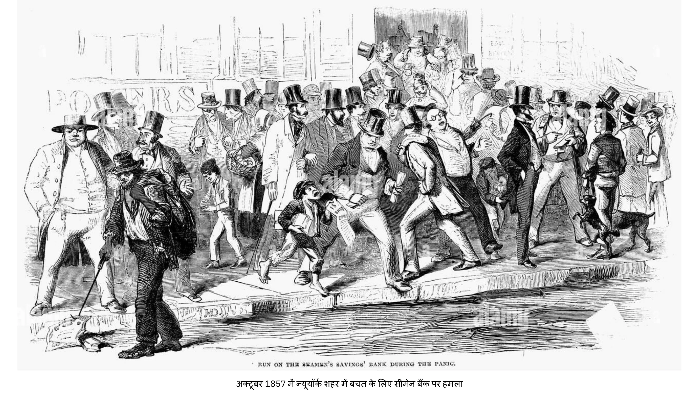

1857 के आतंक के दौरान सीमेन्स सेविंग्स बैंक में बैंक आतंक।

1796 के बैंक पैनिक के बाद, एक ऐसी घटना घटी जिसमें हर कोई "धन पिरामिड" में ऊपर जाने की कोशिश कर रहा था। लोग अपनी तीसरी Layer मुद्रा को दूसरी Layer मुद्रा में, और अंततः पहली Layer मुद्रा, जो सोना थी, में बदलना चाहते थे। इस भारी भीड़ को देखते हुए, बैंक ऑफ इंग्लैंड को स्थिति को स्थिर करने के लिए कदम उठाने पड़े। स्वर्ण भंडार में संभावित अपस्फीति को रोकने के लिए, उसने अपने बैंक नोटों को सोने में बदलने की अनुमति को निलंबित करने का फैसला किया। यह निलंबन, जो शुरू में एक अस्थायी उपाय के रूप में था, लगभग दो दशकों तक चला।

### निष्कर्ष:

केंद्रीय बैंक अपनी मुद्रा को सोने में बदलने की क्षमता को निलंबित करते हुए, अंतिम उपाय के ऋणदाता बन गए हैं। हालाँकि यह कदम शुरू में एक अस्थायी समाधान के रूप में लिया गया था, लेकिन अंततः यह स्थायी हो गया, जिससे अंतिम उपाय के ऋणदाता की अवधारणा का उदय हुआ। इस परिवर्तन ने केंद्रीय बैंकों को आज के रूप में आकार दिया है। हालाँकि, अधिक नाजुक अर्थव्यवस्थाओं में, अपनी इच्छानुसार मुद्रा छापने की यह क्षमता, अगर गैर-ज़िम्मेदाराना तरीके से इस्तेमाल की जाए, तो अत्यधिक मुद्रास्फीति जैसे अवांछनीय परिणामों को जन्म दे सकती है।

## पुस्तकें और संसाधन

<chapterId>c44e4519-0741-527b-b3b0-3f513e87147d</chapterId>

अति मुद्रास्फीति एक दिलचस्प विषय है जिसका अध्ययन विभिन्न ऐतिहासिक घटनाओं के माध्यम से किया गया है। यदि आप इस विषय पर गहराई से विचार करना चाहते हैं, तो पढ़ने और अध्ययन करने के लिए यहां 10 आवश्यक संसाधनों की सूची दी गई है:

- एडम फर्ग्यूसन द्वारा लिखित "व्हेन मनी डाइज़: द नाइटमेयर ऑफ़ डेफिसिट स्पेंडिंग, डिवैल्यूएशन, एंड हाइपरइन्फ्लेशन इन वीमर जर्मनी"। यह पुस्तक प्रथम विश्व युद्ध के बाद जर्मनी में हाइपरइन्फ्लेशन संकट का विवरण देती है।

- "मुद्रास्फीति का अर्थशास्त्र - युद्धोत्तर जर्मनी में मुद्रा अवमूल्यन का एक अध्ययन", कॉस्टैंटिनो ब्रेशियानी-टुरोनी द्वारा। 1920 के दशक में जर्मन अतिमुद्रास्फीति का गहन विश्लेषण।

- "यह समय अलग है: वित्तीय मूर्खता के आठ शतक" लेखक: कारमेन एम. रेनहार्ट और केनेथ एस. रोगॉफ़। हालाँकि यह पुस्तक विभिन्न प्रकार के वित्तीय संकटों को शामिल करती है, लेकिन यह पूरे इतिहास में अतिमुद्रास्फीति पर गहन चर्चा प्रस्तुत करती है।

- स्टीव हैंके द्वारा "ज़िम्बाब्वे की अतिमुद्रास्फीति, विश्लेषण और सीखे गए सबक"। 2000 के दशक के आरंभ में ज़िम्बाब्वे की अतिमुद्रास्फीति पर एक अध्ययन।

- पीटर बर्नहोल्ज़ द्वारा लिखित "मौद्रिक व्यवस्थाएँ और मुद्रास्फीति: इतिहास, आर्थिक और राजनीतिक संबंध"। यह पुस्तक अतिमुद्रास्फीति के ऐतिहासिक मामलों की पड़ताल करती है और इसके अंतर्निहित कारकों को समझने का प्रयास करती है।

- गेराल्ड स्वानसन द्वारा लिखित "द हाइपरइन्फ्लेशन सर्वाइवल गाइड: स्ट्रैटेजीज़ फॉर अमेरिकन बिज़नेसेज़"। यह एक व्यावहारिक मार्गदर्शिका है कि व्यवसाय हाइपरइन्फ्लेशनरी वातावरण में कैसे काम कर सकते हैं।

- "धन की मृत्यु: महान जर्मन और अमेरिकी मुद्रास्फीति के सबक" जेन्स ओ. पार्सन द्वारा। जर्मनी और संयुक्त राज्य अमेरिका में मुद्रास्फीति संकट का तुलनात्मक विश्लेषण।

- फ्रेडरिक टेलर द्वारा "धन का पतन: जर्मनी की अतिमुद्रास्फीति और मध्यम वर्ग का विनाश"। जर्मन समाज पर अतिमुद्रास्फीति के सामाजिक और आर्थिक प्रभाव का एक कथात्मक अन्वेषण।

- स्टीव हैंके और कर्ट शूलर द्वारा लिखित "विकासशील देशों के लिए मुद्रा बोर्ड: एक पुस्तिका"। हालाँकि यह पुस्तक मुद्रा बोर्डों पर केंद्रित है, यह पुस्तक अतिमुद्रास्फीति की स्थितियों से बचने का एक दृष्टिकोण प्रस्तुत करती है।

# अंतिम खंड

<partId>cb1f4a4b-556a-4e47-a5cc-136be35a1f9a</partId>

## समीक्षाएं और रेटिंग

<chapterId>1a37317e-372a-5241-b478-8316d44f9283</chapterId>

<isCourseReview>true</isCourseReview>

## अंतिम परीक्षा

<chapterId>d01831c3-6c4d-59e3-95bc-03e97a05c142</chapterId>

<isCourseExam>true</isCourseExam>

## निष्कर्ष

<chapterId>45d410b0-71ed-4502-8d8d-8b6df761db23</chapterId>

<isCourseConclusion>true</isCourseConclusion>