# Sebuah Perjalanan Melalui Keruntuhan Ekonomi

Seperti apa ketika uang kehilangan maknanya?
Kursus ini memandu Anda melalui dunia hiperinflasi yang menarik namun menyedihkan. Anda akan menemukan episode sejarah dan kasus modern di mana mata uang runtuh dan ekonomi berubah dalam semalam. Anda akan mengungkap pola, penyebab, dan dampak dunia nyata pada orang-orang biasa, memperoleh wawasan tentang salah satu fenomena paling dramatis dalam ekonomi.

Sepanjang perjalanan, Anda juga akan menemukan bagaimana individu dan komunitas telah menavigasi periode-periode bergejolak ini. Pelajari strategi yang telah membantu melindungi kekayaan selama krisis mata uang dan membangun pemahaman yang lebih dalam tentang ketahanan finansial. Jika Anda penasaran tentang kekuatan ekonomi yang membentuk dunia kita, perjalanan ini menawarkan pengetahuan dan perspektif praktis.
+++
# Pendahuluan

<partId>6fe4d15d-f6e6-54be-9e04-0a75ac98df8b</partId>

## Ikhtisar Kursus

<chapterId>9d1aba8d-0485-5020-9863-5de37e6db8e0</chapterId>

Selamat datang di kursus ECO204!

Tujuan dari kursus ini adalah untuk membantu Anda memahami akar penyebab, mekanisme, dan konsekuensi hiperinflasi dalam konteks sistem moneter fiat. Melalui contoh-contoh konkret dan analisis historis, Anda akan belajar mengenali pola berulang yang mendahului periode hiperinflasi dan mengidentifikasi pengungkit tindakan untuk melindungi diri Anda.

**Bagian 2: Apa itu Inflasi?

Sebelum masuk ke inti topik, kita akan membahas kembali hal-hal mendasar: apa itu inflasi? Bagian ini akan menyajikan asal-usul moneter, berbagai jenis inflasi, dan bagaimana mereka masuk ke dalam dinamika ekonomi yang lebih luas. Ini adalah langkah penting untuk memahami bagaimana inflasi biasa dapat berkembang menjadi hiperinflasi.

**Bagian 3: Apa itu Hiperinflasi?

Pada bagian ini, Anda akan mempelajari definisi yang tepat mengenai hiperinflasi dan memeriksa beberapa episode sejarah besar, termasuk yang terjadi di Weimar Jerman dan Zimbabwe. Kita akan menganalisis kesamaan, perbedaan, dan persamaan kontemporernya. Anda juga akan menemukan kasus-kasus yang kurang dikenal, seperti redenominasi berturut-turut di Amerika Latin, serta strategi keluar yang diamati di negara-negara tertentu.

**Bagian 4: Bagaimana Kita Sampai di Sini?

Bagian ini bertujuan untuk memahami mekanisme struktural yang memungkinkan terjadinya hiperinflasi, terutama melalui pengembangan "Layer kedua" moneter dan peran bank sentral. Sumber-sumber tambahan dan saran-saran bacaan akan disediakan untuk eksplorasi lebih lanjut.

Bagaimana jika sejarah moneter terulang kembali di depan mata kita? Anda akan menjadi penentunya dalam bab-bab berikutnya!

# Apa yang dimaksud dengan inflasi?

<partId>2b4f456c-3649-5cf9-b9b0-a5bffe92d962</partId>

## Fenomena moneter

<chapterId>b2cbc915-c4ec-52b5-860c-0958f58c91e4</chapterId>

### Definisi inflasi

Inflasi adalah sebuah konsep yang sering disalahpahami karena memiliki banyak definisi dan interpretasi. Persepsi inflasi berbeda-beda di antara berbagai kelompok, seperti para pengguna bitcoin dan ekonom tradisional. Pertama-tama, mari kita perjelas definisi-definisi tersebut sebelum membahas hiperinflasi:

- Definisi dari kamus Le Robert: Inflasi adalah peningkatan yang berlebihan dalam alat pembayaran (uang kertas, modal), yang menyebabkan kenaikan harga dan depresiasi mata uang.

- Definisi dari ensiklopedia Larousse: Inflasi adalah fenomena yang ditandai dengan kenaikan tingkat harga secara umum dan terus menerus. Di sini, kata "umum" sangat penting.

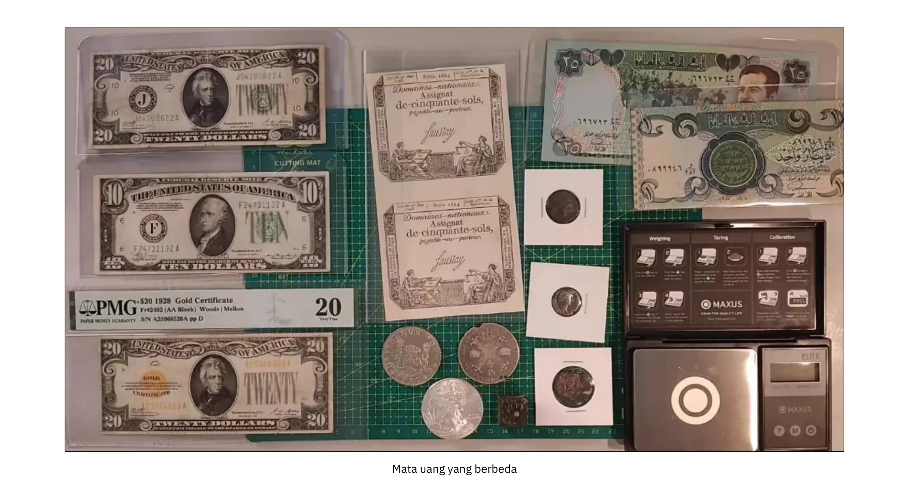

Berdasarkan definisi-definisi ini, penting untuk dipahami bahwa, bagi Robert, inflasi terutama berkaitan dengan kenaikan uang Supply. Di sisi lain, Larousse berfokus pada konsekuensi dari ekspansi ini, yaitu kenaikan harga secara umum.

Dalam studi kami mengenai hiperinflasi, kami akan menggunakan definisi kedua, yaitu kenaikan harga secara umum, karena definisi ini lebih relevan dan lebih jelas untuk topik kami. Namun, sangat penting untuk diingat bahwa kenaikan harga-harga ini pada umumnya adalah hasil dari ekspansi uang Supply.

Ekonom terkenal Milton Friedman dengan terkenal menyatakan:

> "Inflasi selalu dan di mana-mana merupakan fenomena moneter."

Pernyataan ini menyoroti hubungan intrinsik antara ekspansi moneter dan inflasi. Pada bagian berikut ini, kita akan membahas hubungan antara inflasi dan pertumbuhan ekonomi, dengan mengacu pada definisi-definisi fundamental ini.

### Memahami Fenomena Moneter

Ketika mengacu pada fenomena moneter, kita mengacu pada bagaimana uang Supply suatu perekonomian dipengaruhi. Milton Friedman pada dasarnya melihatnya sebagai peningkatan Supply ini. Secara historis, ada dua metode utama untuk meningkatkan Supply uang:

1. Pencetakan Moneter:

Dalam sistem moneter tradisional, peningkatan uang Supply dicapai dengan mencetak uang kertas baru secara fisik. Meskipun saat ini, dengan dominasi mata uang digital, pencetakan ini sebagian besar dilakukan secara elektronik (melalui basis data bank sentral dan lembaga keuangan lainnya), sejarah menunjukkan kepada kita periode di mana pencetakan uang kertas secara harfiah menyebabkan hiperinflasi.

2. Pengurangan Kandungan Logam:

Metode lainnya adalah dengan mengurangi jumlah logam mulia dalam mata uang yang berbasis logam seperti perak atau emas. Contoh yang mencolok dapat ditemukan di Kekaisaran Romawi, di mana dinar, yang awalnya hampir seluruhnya terdiri dari perak, mengalami penurunan kadar perak secara drastis dari waktu ke waktu. Hal ini merupakan suatu bentuk inflasi, tetapi tidak selalu hiperinflasi.

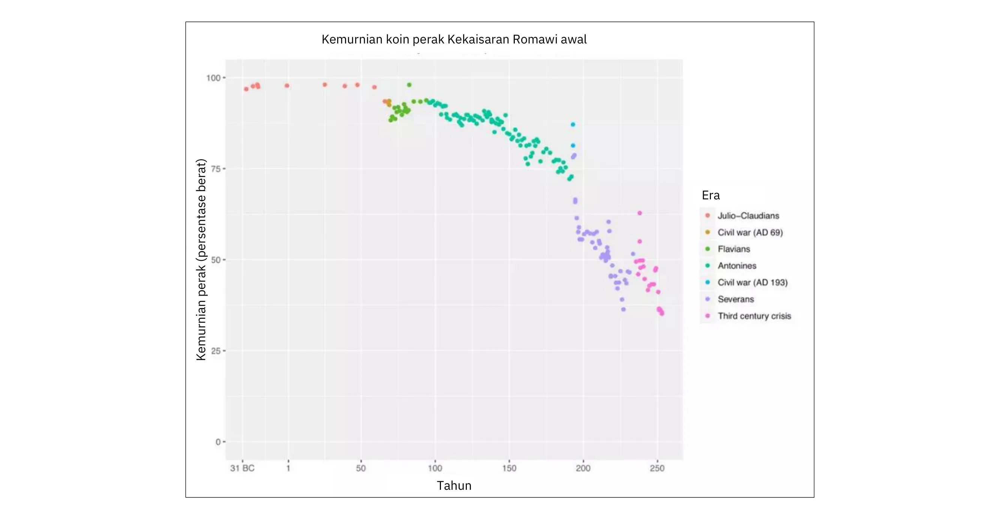

Sangat penting untuk menekankan bahwa hiperinflasi terutama terjadi pada mata uang fiat yang tidak didukung oleh aset yang mendasarinya, seperti logam mulia. Secara historis, ketika sebuah mata uang didasarkan pada aset-aset tersebut, episode inflasi (misalnya, melalui devaluasi kandungan logam) terjadi, tetapi episode ini tidak pernah mencapai tingkat hiperinflasi yang ekstrim. Pada bagian berikut, kita akan mempelajari secara rinci periode devaluasi moneter dan implikasi dari sistem moneter yang berbeda ini terhadap inflasi.

### Studi tentang Periode Devaluasi Moneter

Sepanjang sejarah, berbagai peradaban telah mengalami periode devaluasi moneter. Beberapa periode ini bertepatan dengan peristiwa besar atau perang yang memberikan tekanan pada perekonomian.

#### 1. Perang Peloponnesia dan Perang Punisia Kedua:

Perang Peloponnesia, konflik antara Athena dan Sparta, dan Perang Punisia Kedua, antara Republik Romawi dan Kartago, adalah contoh awal devaluasi mata uang yang ditemukan dalam arsip. Untuk membiayai perang ini, peradaban-peradaban ini mendevaluasi mata uang mereka dengan mengurangi kandungan perak dan memasukkan logam lain, sambil meningkatkan jumlah koin yang diproduksi.

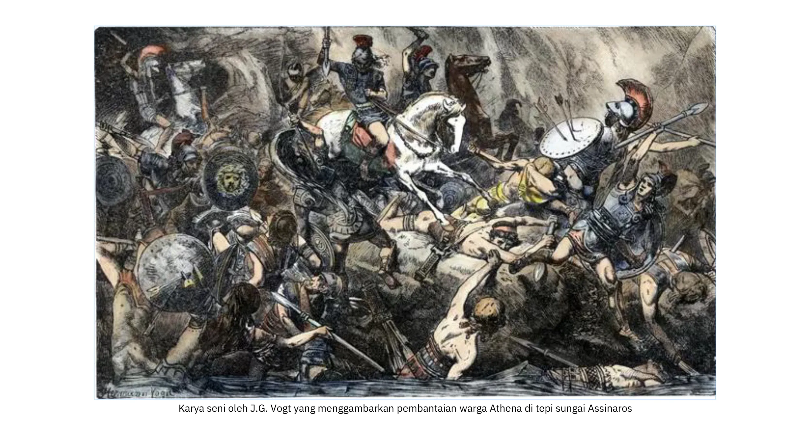

Ukiran yang menggambarkan pembantaian warga Athena di tepi sungai Assinaros.

#### 2. Roma Kuno pada masa Kekaisaran:

Setelah era Republik Romawi, pada masa Kekaisaran, abad ke-3 dan ke-4 mengalami devaluasi mata uang yang signifikan. Hal ini diilustrasikan dengan penurunan kandungan perak pada koin, seperti yang terlihat pada grafik sebelumnya. Sebuah penelitian mengungkapkan bahwa harga gandum di Mesir, yang diukur dalam drachma, meningkat sebesar satu juta selama periode sekitar 400 tahun, dari tahun 40 SM hingga 360 Masehi. Selama periode ini, ini mewakili inflasi tahunan rata-rata sekitar 4,4%. Namun, inflasi ini tidak merata. Inflasi ini benar-benar dimulai sekitar tahun 238 Masehi. Antara tahun 250 dan 293 Masehi, tingkat inflasi sekitar 3,65%, dan meningkat menjadi 22,28% antara tahun 293 dan 301 Masehi.

Meskipun periode ini mengalami inflasi yang signifikan, namun tidak mencapai tingkat hiperinflasi yang diamati pada beberapa situasi modern. Alasannya adalah, meskipun mata uangnya didevaluasi, mata uang tersebut masih didukung oleh logam mulia. Fondasi yang kokoh ini memberikan perlindungan terhadap tingkat inflasi yang ekstrim. Pada bagian berikut, kita akan membahas sifat dan konsekuensi hiperinflasi secara lebih rinci.

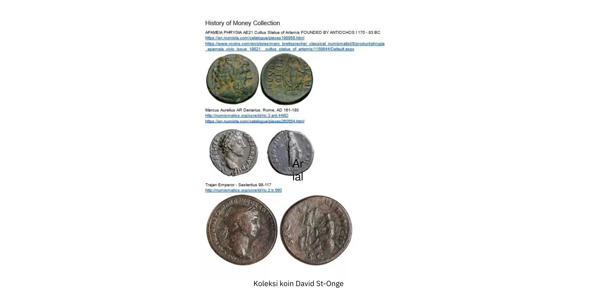

- Denarius dari Marcus Aurelius (160 M):

Salah satu koin paling ikonik dari Romawi kuno adalah dinar, Coin perak. Saya memiliki sebuah Coin khusus dari Marcus Aurelius yang berasal dari tahun 160 Masehi, sebelum devaluasi besar-besaran. Meskipun kamera mungkin kesulitan untuk menangkap detail yang halus, secara kasat mata, terbukti bahwa Coin itu indah dan mencerminkan kandungan perak yang relatif tinggi.

- Antoninianus (akhir abad ke-3 Masehi):

Dengan devaluasi moneter, mata uang baru, Antoninianus, muncul. Mata uang ini seharusnya bernilai dua dinar, tetapi mengandung lebih sedikit perak. Antoninianus Coin saya dengan jelas menunjukkan bahwa kandungan peraknya telah berkurang secara signifikan. Mata uang ini dihiasi dengan mahkota, khas koin Romawi pada periode ini, yang disebut "radiates". Dengan membandingkan warna dan kualitasnya, dapat dilihat bahwa Antoninianus jauh dari Coin perak murni.

Ketika membandingkan kedua koin tersebut secara berdampingan, perbedaannya sangat mencolok. Denarius dari tahun 160 M memiliki tampilan perak yang berbeda, sementara Antoninianus dari akhir abad ke-3 M jauh lebih kusam, yang mengindikasikan adanya penurunan kandungan perak yang signifikan. Perbandingan visual ini memberikan ilustrasi yang jelas tentang devaluasi moneter yang dialami Roma kuno selama beberapa abad.

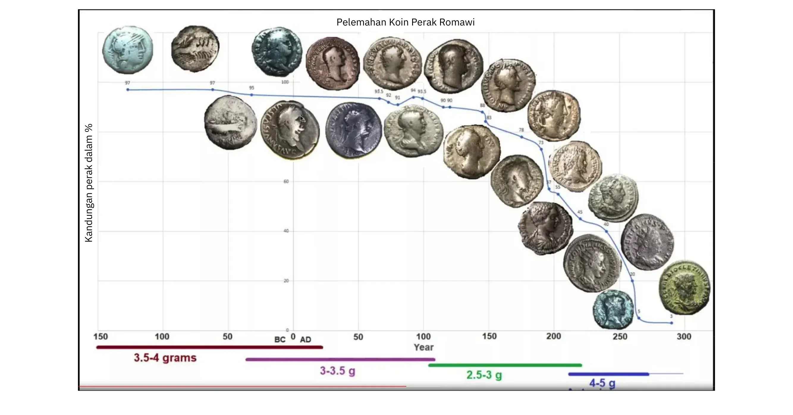

Untuk melengkapi demonstrasi ini, sebuah grafik yang mengilustrasikan devaluasi koin-koin ini dari waktu ke waktu akan sangat ideal. Meskipun sulit untuk divisualisasikan melalui platform ini, bayangkan sebuah grafik yang menunjukkan nilai dinar, diikuti dengan penurunannya menjelang akhir abad ke-2, ketika digantikan oleh koin Antoninianus, yang konon bernilai dua dinar tetapi dengan kandungan perak yang jauh lebih rendah. Artefak-artefak ini merupakan saksi bisu dari fluktuasi ekonomi peradaban masa lalu.

#### 3. Maravedi Spanyol: Saksi Devaluasi yang Ditargetkan

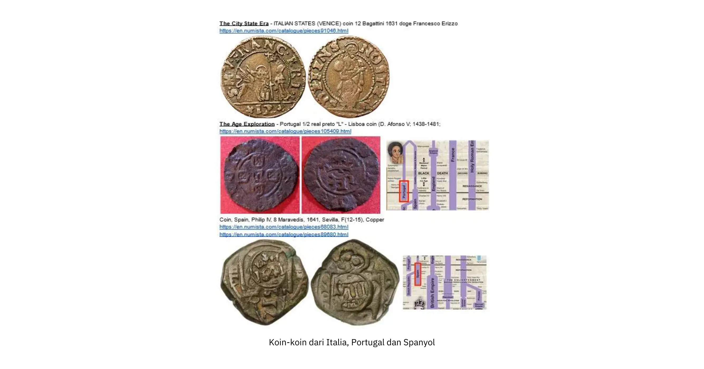

Maravedi, sebagai mata uang tembaga, menempati tempat khusus dalam sejarah mata uang Spanyol. Seperti yang telah disebutkan sebelumnya, dolar Spanyol pada awalnya merupakan standar internasional, mata uang cadangan yang penting bagi Spanyol. Namun, dihadapkan pada tantangan ekonomi tertentu, Spanyol harus menggunakan strategi moneter yang cerdas.

Devaluasi moneter adalah alat yang sering digunakan oleh negara untuk membiayai pengeluaran mereka atau menstimulasi ekonomi. Namun, Spanyol berada dalam situasi yang sulit. Melemahkan nilai mata uang Spanyol akan membahayakan posisinya dalam perdagangan internasional. Untuk mengatasi dilema ini, Spanyol beralih ke Maravedi.

Tidak seperti dolar perak Spanyol yang berharga, Maravedi adalah mata uang tembaga yang terutama digunakan di kalangan penduduk lokal. Mata uang ini menjadi sasaran devaluasi. Ketika sebuah Maravedis Coin pada awalnya bernilai dua maravedi, negara akan mengambilnya, mencap ulang dengan nilai baru, misalnya, "empat", dan hanya mengembalikan satu Coin kepada pemiliknya. Coin yang ditandai dengan cap "delapan" adalah bukti dari proses ini, yang telah mengalami beberapa siklus devaluasi.

Strategi ini memungkinkan negara untuk secara efektif mendevaluasi mata uang, menciptakan inflasi dan secara tidak langsung membiayai negara, sambil menjaga integritas dolar Spanyol di panggung internasional. Namun, devaluasi yang ditargetkan ini memiliki konsekuensi bagi penduduk lokal, yang melihat nilai mata uang mereka terdilusi.

Kasus Maravedis mengilustrasikan bagaimana sebuah negara dapat secara selektif mendevaluasi mata uang lokal untuk memenuhi kebutuhan ekonomi internalnya, sambil mempertahankan nilai mata uang cadangan di panggung global. Ini adalah contoh yang mencolok dari kompleksitas dan kemahiran kebijakan moneter dalam sejarah.

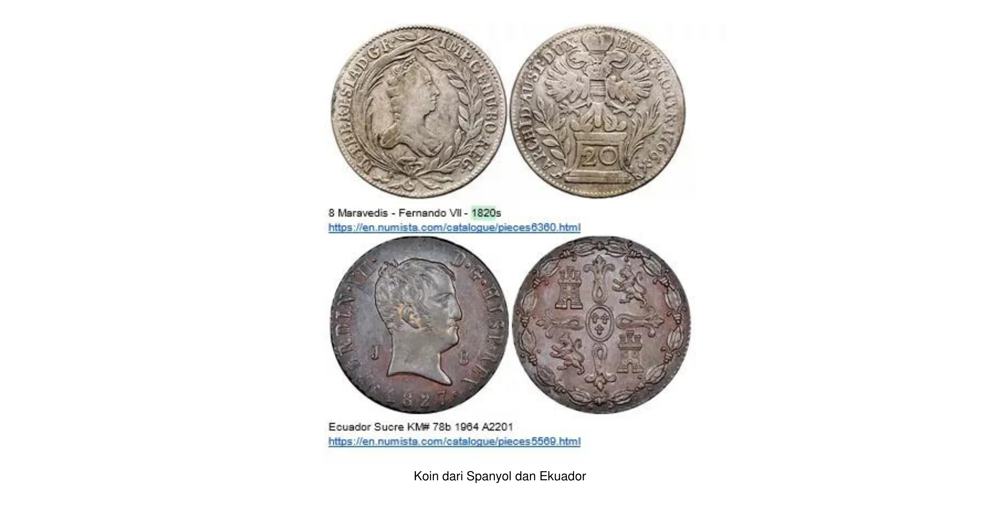

Apakah Anda ingin tahu lebih banyak? -> [Link](https://docs.google.com/document/d/1aZa7gvz1nt8ZHDCoWKQdS9RGGjBHdipH1ApC8dW1xpM/edit?usp=sharing)

#### 4. Revolusi Harga dari Abad ke-15 hingga Abad ke-17

Antara abad ke-15 dan ke-17, Eropa menyaksikan fenomena ekonomi yang luar biasa, yang sering disebut sebagai "revolusi harga" Periode inflasi ini sebagian besar dipicu oleh masuknya logam mulia, terutama emas dan perak, secara besar-besaran dari Amerika. Dengan ekonomi Eropa yang sebagian besar didasarkan pada standar logam pada saat itu, tambahan Supply logam ini meningkatkan Supply uang. Akibatnya, tingkat inflasi sekitar 1 hingga 2% per tahun muncul. Sekilas, inflasi ini mungkin tampak sederhana. Namun, pada saat itu, fluktuasi harga seperti itu cukup tidak biasa untuk dianggap sebagai "revolusi" Hal ini menyoroti bagaimana perubahan dalam cadangan moneter dapat memengaruhi seluruh sistem ekonomi.

#### 5. John Law dan Assignats

Pada abad ke-18, sejarah ekonomi Prancis ditandai oleh dua peristiwa penting terkait mata uang. Pertama, John Law, seorang ekonom dan pemodal Skotlandia, membujuk pemerintah Prancis untuk mengadopsi sistem moneter berdasarkan uang kertas. Meskipun awalnya dianggap sebagai solusi inovatif untuk masalah keuangan negara, inisiatif ini dengan cepat menyebabkan inflasi yang merajalela. Kemudian, tak lama kemudian, selama gejolak Revolusi Prancis, pemerintah memperkenalkan "assignat".

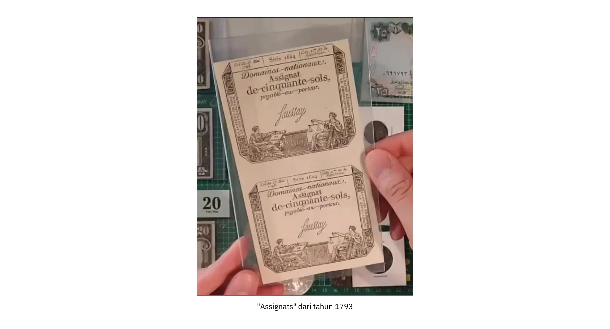

Penetapan dari tahun 1793

Uang kertas ini menjadi bukti nyata dari periode hiperinflasi pertama dalam sejarah. Awalnya dirancang sebagai respons terhadap krisis keuangan yang beruntun, assignat dengan cepat menjadi simbol ketidakstabilan moneter. Pemerintah yang terlalu mengandalkan mata uang kertas ini untuk membiayai pengeluarannya, menyebabkan krisis ekonomi yang belum pernah terjadi sebelumnya dan menyebabkan periode hiperinflasi besar di Prancis setelah revolusi.

#### 6. Perintah Eksekutif 6102 dan Devaluasi Dolar

Perintah Eksekutif 6102 dan Devaluasi Dolar

Di Amerika Serikat, awal tahun 1930-an menjadi saksi pergeseran besar dalam kebijakan moneter. Berikut ini adalah tinjauan terperinci mengenai transformasi ini:

- Uang kertas $20 tahun 1928

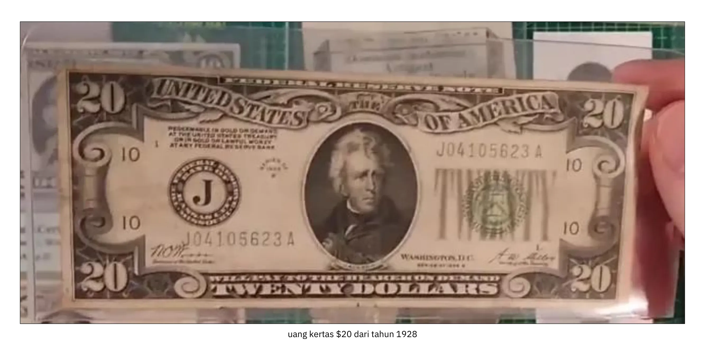

Pada tahun 1928, uang kertas $20 di Amerika Serikat menyatakan: "dapat ditukarkan dengan emas sesuai permintaan." Ini berarti bahwa setiap uang kertas dapat ditukar dengan emas. Secara khusus, uang kertas $20,67 setara dengan satu ons emas.

- Perintah Eksekutif 6102

Pada tahun 1933, pergolakan besar terjadi dengan dikeluarkannya Perintah Eksekutif 6102. Keputusan ini membuat warga negara menjadi ilegal untuk memiliki emas, baik dalam bentuk batangan, koin, maupun sertifikat.

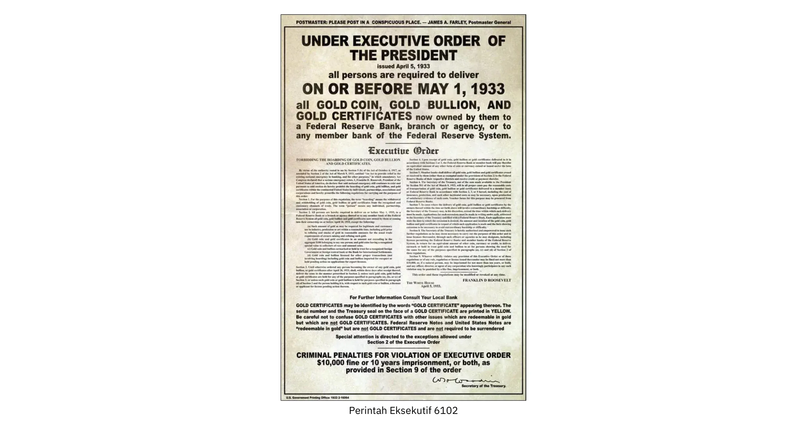

Sertifikat Emas adalah contoh yang baik. Sertifikat ini bertuliskan: "Dalam emas Coin yang dibayarkan kepada pembawa sesuai permintaan." Memiliki sertifikat semacam itu menjadi ilegal dan tetap ilegal hingga tahun 1964.

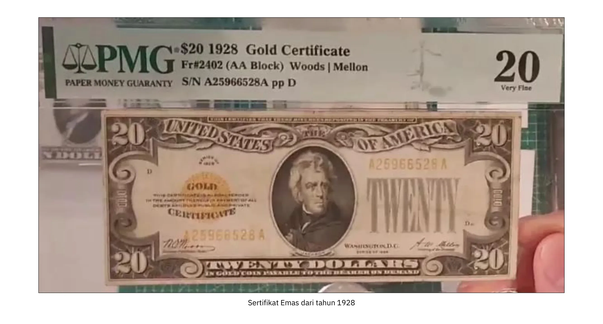

- Pengenalan Uang Kertas Baru

Setelah penyitaan emas pada tahun 1934, sebuah seri uang kertas baru mulai diedarkan.

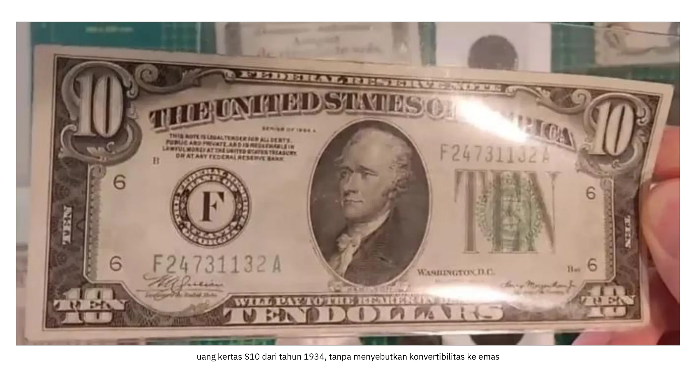

Penyebutan yang menunjukkan konvertibilitasnya menjadi emas telah dihapus dan digantikan dengan "Uang kertas ini adalah alat pembayaran yang sah untuk semua utang" (Ce billet est une monnaie légale pour toutes dettes).

- Revaluasi Emas

Yang menarik dari transisi ini adalah strategi pemerintah. Pada tahun 1934, harga emas direvaluasi menjadi $35 per ons, bukannya $20,67. Pada dasarnya, pemerintah mendevaluasi nilai dolar yang dimiliki masyarakat. Dengan membeli emas dari penduduk dengan harga $20,67 per ons pada tahun 1933 dan kemudian merevaluasi harga emas pada tahun 1934, pemerintah mendapatkan keuntungan yang cukup besar sambil mendevaluasi tabungan warganya.

Singkatnya, dalam waktu satu tahun, pemerintah secara efektif menyita emas warga, kemudian mengubah aturan main dengan menilai kembali nilai emas untuk menguntungkan perbendaharaan dan merugikan mereka yang pada awalnya menukarkan emas mereka dengan uang kertas.

### AS mengubah sejarah.

Amerika Serikat membuat titik balik bersejarah dengan menjadi yang pertama mendevaluasi mata uang cadangan dunia, dolar AS, yang bertentangan dengan praktik-praktik sebelumnya yang diamati di negara-negara perdagangan kecil.

Sebelumnya, selama masa Renaisans, Florin Italia yang dikeluarkan oleh Florence pada abad ke-13 merupakan mata uang cadangan internasional, dan tidak ada devaluasi yang tercatat selama masa penggunaannya, yang mencerminkan pentingnya stabilitas moneter untuk perdagangan internasional.

Dengan semangat yang sama, Spanyol dan Belanda, sebagai pemegang mata uang cadangan dunia karena perdagangan internasional mereka yang berkembang pesat, mempertahankan integritas mata uang mereka untuk menjaga kepercayaan dan status quo dalam pertukaran internasional. Belanda bahkan menjadi saksi berdirinya bank sentral pertama, sebuah tonggak penting dalam evolusi global sistem moneter.

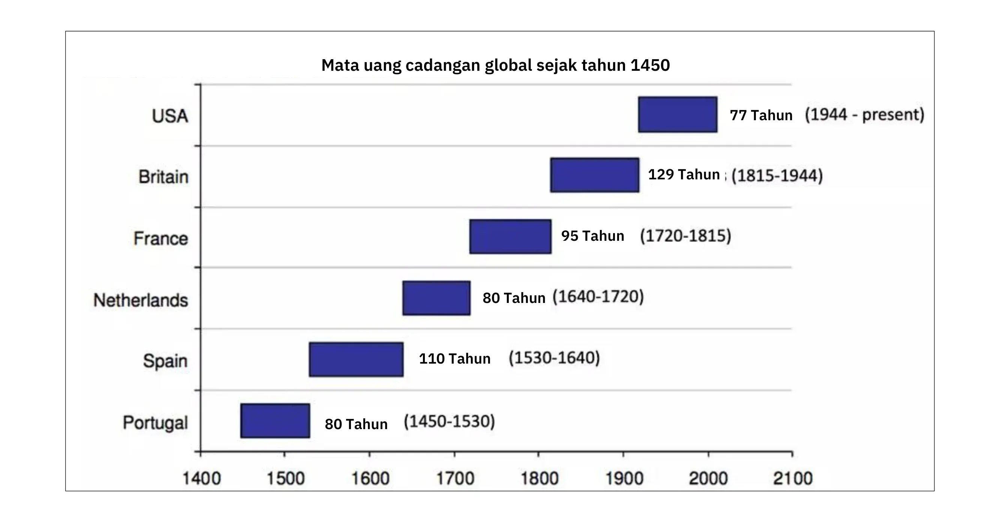

Namun, situasi berubah dengan bangkitnya Amerika Serikat sebagai kekuatan ekonomi yang dominan. Mereka memilih untuk mendevaluasi mata uang cadangan mereka, sehingga mengeksploitasi inflasi untuk keuntungan mereka. Keputusan ini sering dikaitkan dengan dinamika yang berubah, di mana pilihan mata uang cadangan tidak lagi sebebas sebelumnya. Hegemoni Amerika menetapkan dolar sebagai mata uang cadangan dunia, yang memungkinkan untuk memanipulasi nilainya. Pergeseran ini menunjukkan dampak potensial dari kebijakan moneter terhadap perdagangan internasional dalam ekonomi global, menandai transisi yang signifikan dalam pengelolaan mata uang cadangan global.

### Contoh terakhir untuk jalan: Dinar Swiss

Dinar Swiss menggambarkan aspek menarik lainnya dari devaluasi moneter, kali ini berlabuh dalam konteks Irak sebelum Perang Teluk. Dinamakan Dinar Swiss karena kualitas uang kertasnya yang terkenal, mata uang ini diterbitkan oleh Bank Sentral Irak dan memiliki reputasi stabilitas di kawasan Timur Tengah. Kepercayaan ini terutama disebabkan oleh kualitas pencetakan uang kertas, yang dilakukan di Inggris, menyiratkan ketahanan terhadap devaluasi.

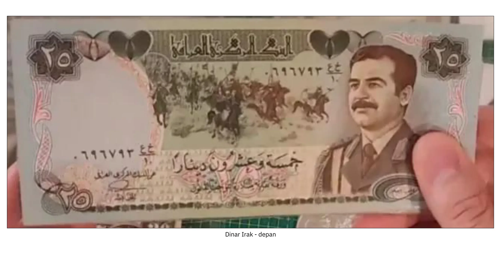

Namun, Perang Teluk menandai titik balik dalam sejarah Dinar Swiss. Irak, yang tidak lagi dapat mengandalkan pemasok Inggris untuk mencetak uang kertas, beralih ke Cina untuk mendapatkan bantuan. Peralihan ini menghasilkan perbedaan yang jelas dalam kualitas uang kertas, dengan versi Cina dianggap lebih rendah. Persepsi ini bukannya tidak berdasar; uang kertas Cina lebih mudah dipalsukan dan rentan terhadap pencetakan berlebihan oleh pemerintah, sehingga mengancam nilainya.

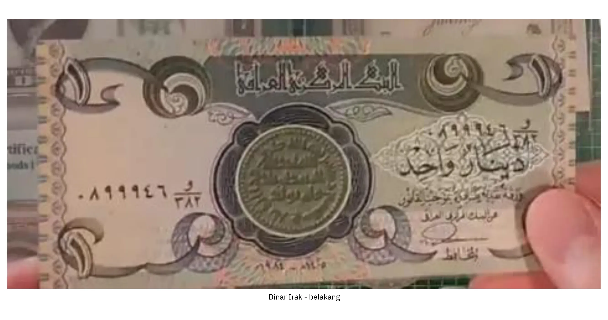

Sebuah fenomena yang khas muncul dalam perekonomian Irak pasca Perang Teluk: sistem harga ganda. Para pedagang menawarkan harga yang berbeda tergantung pada jenis uang kertas yang digunakan untuk pembayaran, dan lebih memilih Dinar Swiss daripada uang kertas Cina. Sistem ini mencerminkan kepercayaan yang dipertahankan pada uang kertas berkualitas lebih tinggi, yang tidak terlalu rentan terhadap devaluasi, bahkan dalam konteks di mana nilai terutama dipaksakan oleh negara. Episode ini menyoroti pentingnya karakteristik intrinsik mata uang dan bagaimana, bahkan dalam rezim mata uang fiat, kualitas mata uang yang dipersepsikan dapat memengaruhi nilai relatifnya dan, lebih jauh lagi, kepercayaan para pelaku ekonomi.

#### Ya, kami benar-benar menimbang koin-koin itu!

Persepsi umum sering mengasosiasikan mata uang dengan ciptaan negara, di mana penerbitan dan nilainya diatur oleh negara. Konsep ini berakar dari peradaban kuno, seperti Roma, di mana koin distandardisasi dan dicap oleh Kekaisaran, sehingga memberikan nilai resmi pada mata uang. Namun, eksplorasi yang lebih dalam mengungkapkan bahwa nilai intrinsik mata uang terutama berasal dari kandungan logam mulianya.

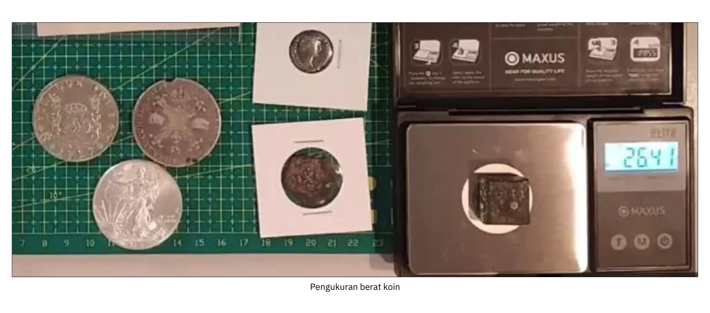

Sebuah contoh diilustrasikan melalui pemeriksaan berat moneter yang setara dengan delapan reais Spanyol, atau satu dolar Spanyol. Berat ini, ditandai dengan angka Romawi yang menunjukkan nilainya, digunakan oleh para penukar mata uang untuk mengevaluasi nilai koin berdasarkan beratnya, dan bukan hanya capnya. Dengan menimbang koin, para penukar dapat menentukan apakah koin-koin tersebut telah diubah atau rusak, yang dapat mengurangi nilainya. Praktik ini menyoroti bahwa, meskipun stempel standar oleh negara memberikan nilai nominal tertentu pada mata uang, nilai sebenarnya ada pada berat logam mulia yang dikandungnya.

Analisis ini menunjukkan bahwa kepercayaan terhadap mata uang, dan dengan demikian juga nilainya, ditopang oleh substansi yang nyata, bukan hanya oleh pernyataan negara. Hal ini menggarisbawahi dualitas antara nilai nominal yang dipaksakan oleh negara dan nilai intrinsik yang ditentukan oleh kandungan logam mulia. Dengan demikian, mata uang lebih dari sekadar instrumen negara, dengan nilai fundamentalnya yang secara intrinsik terkait dengan Elements yang berwujud dan terukur.

#### Kesimpulan

Sebagai kesimpulan, studi mengenai devaluasi moneter ini memberikan pemahaman yang lebih dalam mengenai mekanisme inflasi, yang akan dieksplorasi dalam video berikut. Kita akan membahas berbagai jenis inflasi dan ambang batas di mana mereka bertransisi ke inflasi tinggi atau hiperinflasi. Dasar yang kuat ini akan memungkinkan kita untuk membahas kompleksitas inflasi di sesi mendatang. Terima kasih atas perhatian Anda. Kami berharap dapat melanjutkan eksplorasi dinamika moneter ini di video berikutnya.

## Jenis-jenis Inflasi

<chapterId>b438fe09-375e-5bb2-9196-7dd687b9f98c</chapterId>

### Inflasi bukanlah fenomena multifaktorial

Pada bagian ini, kita akan membahas berbagai aspek inflasi, sebuah fenomena yang sering disalahpahami. Meskipun inflasi sering dianggap sebagai fenomena multifaktorial di media dan diskusi sehari-hari, sangat penting untuk diingat bahwa pada dasarnya inflasi adalah fenomena moneter.

Berikut ini adalah rincian topik ke dalam beberapa poin utama:

- Perbedaan antara Kenaikan Harga dan Inflasi:

Kenaikan harga dapat terjadi pada sektor tertentu dan disebabkan oleh berbagai faktor, seperti penurunan produksi minyak OPEC atau kondisi cuaca yang tidak menguntungkan yang memengaruhi produksi gandum.

Di sisi lain, inflasi didefinisikan sebagai kenaikan harga secara umum di berbagai barang dan jasa, tidak hanya di sektor tertentu.

- Esensi Moneter dari Inflasi:

Dengan uang Supply yang tetap, kenaikan harga di satu sektor akan mengakibatkan penurunan harga di sektor lain, karena jumlah uang yang tersedia untuk dibelanjakan di tempat lain akan berkurang. Inflasi berkaitan erat dengan peningkatan Supply uang, yang memungkinkan kenaikan harga secara simultan di semua sektor.

- Dampak Uang Rupiah Supply terhadap Inflasi dan Deflasi:

Dalam sistem Supply uang tetap, peningkatan produksi secara teoritis akan menyebabkan deflasi, yaitu penurunan harga, karena akan ada lebih banyak barang dan jasa yang tersedia.

Dalam sistem moneter fiat saat ini, peningkatan uang Supply membatalkan potensi deflasi yang disebabkan oleh peningkatan produksi.

- Efek Negatif dari Penyesuaian Supply Uang:

Peningkatan jumlah uang Supply, tanpa peningkatan produksi yang sesuai, menyebabkan inflasi, karena ada lebih banyak uang yang beredar untuk jumlah barang dan jasa yang sama.

Meskipun peningkatan produksi seharusnya menyebabkan deflasi, peningkatan simultan dalam jumlah uang Supply meniadakan efek ini, dan menghasilkan inflasi sebagai gantinya.

- Inflasi, Deflasi, dan Uang Supply - Alat Pembayaran:

Inflasi dan deflasi ibarat kapal penghubung dalam perekonomian. Peningkatan produksi dapat menyebabkan deflasi, tetapi jika jumlah uang Supply ditingkatkan secara bersamaan, efek deflasi akan dibatalkan, dan menghasilkan inflasi.

Diskusi ini menggarisbawahi pentingnya memahami mekanisme yang mendasari inflasi dan deflasi, serta pengaruh besar yang dapat ditimbulkan oleh perubahan uang Supply terhadap perekonomian. Kita mungkin akan meninjau kembali konsep-konsep ini di kemudian hari untuk mendapatkan pemahaman yang lebih dalam tentang keterkaitan dan dampaknya terhadap ekonomi global.

### Mengapa pencetakan uang tidak selalu menyebabkan inflasi?

#### Inflasi ≠ IHK

Inflasi, meskipun sering dikaitkan dengan peningkatan jumlah uang Supply, tidak selalu memiliki korelasi langsung dengan pencetakan uang, seperti yang diilustrasikan oleh periode setelah krisis keuangan 2008. Meskipun ada pencetakan uang yang signifikan untuk menyelamatkan bank, dekade berikutnya tidak mengalami inflasi yang tinggi, rata-rata antara 0 dan 2% per tahun. Situasi ini menimbulkan pertanyaan: Mengapa pencetakan uang besar-besaran tidak menghasilkan inflasi yang proporsional? Jawabannya terletak pada beberapa hal yang berkaitan dengan pengukuran inflasi dan Indeks Harga Konsumen (IHK).

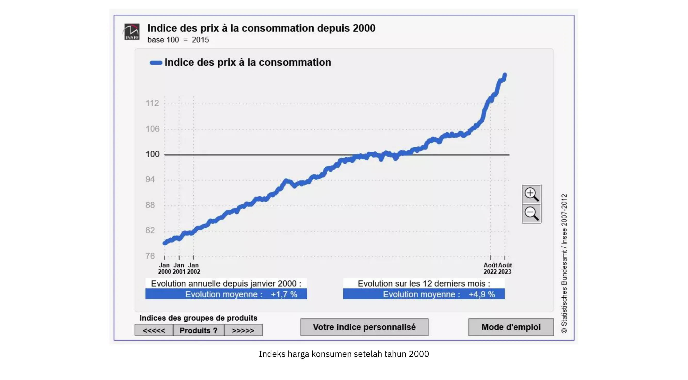

Penjelasan pertama terletak pada cara pengukuran inflasi. Indeks Harga Konsumen (IHK), yang berfungsi sebagai indikator utama inflasi, memiliki beberapa keterbatasan. Misalnya, CPI tidak secara komprehensif memperhitungkan evolusi harga real estat. Meskipun IHK mencakup komponen yang terkait dengan sewa, apresiasi substansial harga rumah tidak sepenuhnya tercermin dalam indeks. Akibatnya, kenaikan biaya perumahan yang signifikan dapat terjadi tanpa sepenuhnya ditangkap oleh CPI, sehingga berpotensi meremehkan inflasi yang sebenarnya.

Selain itu, perhitungan CPI menggunakan metodologi tertentu yang dapat mengimbangi atau menutupi kenaikan harga yang sebenarnya. Sebagai contoh, peningkatan kualitatif dalam produk dapat digunakan untuk menyesuaikan indeks. Jika harga suatu produk meningkat, tetapi kualitas atau fiturnya juga meningkat, CPI mungkin menganggap bahwa nilai riil bagi konsumen tidak berubah, dan oleh karena itu, tidak mencerminkan inflasi. Contoh kasusnya adalah ketika harga daging sapi dan komputer naik karena adanya suntikan dana moneter, namun peningkatan performa komputer digunakan untuk mengimbangi kenaikan tersebut. Jika harga komputer dua kali lipat lebih mahal namun empat kali lebih bertenaga, IHK dapat menginterpretasikan hal ini sebagai penurunan harga, sehingga menutupi kenaikan harga daging sapi.

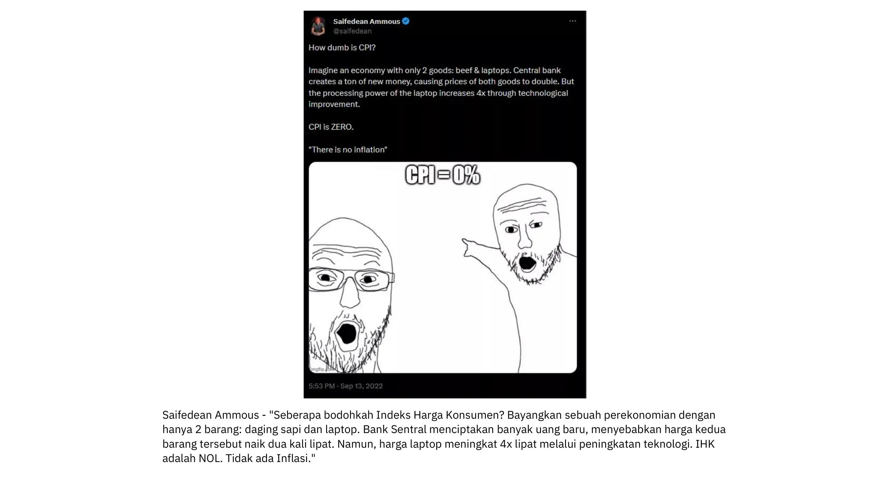

Nuansa-nuansa dalam mengukur inflasi dengan CPI ini menyoroti kompleksitas hubungan antara pencetakan uang dan inflasi. Mereka juga menunjukkan bahwa inflasi yang sebenarnya mungkin lebih tinggi dari yang dilaporkan jika semua kenaikan harga, terutama di sektor-sektor utama seperti real estat, diperhitungkan secara lebih komprehensif. Analisis ini menggarisbawahi pentingnya memahami mekanisme yang mendasari inflasi dan keterbatasan indeks konvensional yang digunakan untuk mengukurnya, sehingga memfasilitasi pemahaman yang lebih mendalam tentang implikasi ekonomi dari kebijakan moneter.

#### Argumen MMT

Teori Moneter Modern (MMT) menawarkan perspektif yang berbeda mengenai penciptaan uang dan inflasi. Menurut MMT, uang terutama berasal dari pemerintah, yang dapat mencetak uang dalam jumlah besar untuk membiayai kebutuhannya tanpa menyebabkan inflasi selama sektor-sektor yang menjadi sasaran dana tersebut belum jenuh. Pendekatan ini berbeda dengan teori moneter tradisional, yang menekankan pentingnya kapasitas penyerapan sektoral dalam dinamika inflasi.

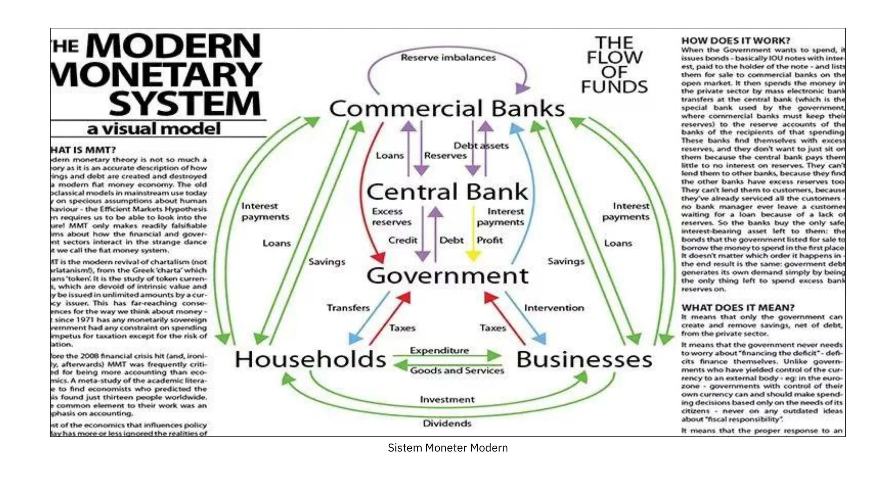

Contoh ilustrasi MMT adalah kompleks industri militer Amerika. Menurut MMT, ratusan miliar dolar dapat dialokasikan ke sektor ini tanpa menyebabkan inflasi, berkat kemampuannya untuk menyerap dana. Sebaliknya, jika dana besar disuntikkan ke dalam pembangunan jalan di Amerika Serikat, di mana jumlah perusahaan dan tenaga kerja terbatas, inflasi dapat terjadi karena kelangkaan sumber daya dan peningkatan biaya yang diminta oleh pemasok.

Jepang sering dikutip oleh para pendukung MMT sebagai contoh lain dari tidak adanya inflasi meskipun ada pencetakan uang yang signifikan. Namun, situasi di Jepang juga menyoroti keterbatasan ukuran inflasi tradisional, seperti Indeks Harga Konsumen (IHK). Di Jepang, sebagian besar uang yang dicetak ditabung atau diinvestasikan di real estate atau pasar saham, daripada dibelanjakan untuk konsumsi saat ini. CPI, dengan tidak sepenuhnya menangkap dinamika ini, dapat meremehkan inflasi yang sebenarnya.

Analisis Jepang (https://ideas.repec.org/p/ces/ceswps/_9821.html) juga menyoroti bahwa perilaku pelaku ekonomi, seperti menabung atau berinvestasi pada aset yang tidak termasuk dalam IHK, dapat menutupi dampak inflasi dari pencetakan uang. Selain itu, kemampuan berbagai sektor untuk menyerap likuiditas yang disuntikkan memainkan peran penting dalam menentukan apakah inflasi terjadi.

#### Neraca Bank dan Bank Sentral

Contoh ketiga mengapa pencetakan uang tidak akan menyebabkan inflasi adalah karena hubungan antara pencetakan uang dan inflasi dimodulasi oleh bagaimana uang yang baru dicetak dimasukkan ke dalam perekonomian. Jika uang ini tetap berada di neraca bank-bank swasta tanpa dipinjamkan kepada pelaku ekonomi, maka uang ini tidak akan secara langsung berdampak pada ekonomi riil dan, oleh karena itu, tidak akan menyebabkan inflasi.

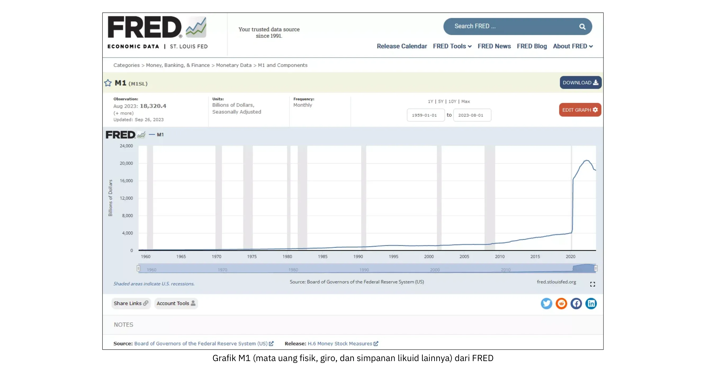

Pencetakan uang dapat dilihat sebagai pedang Damocles yang menggantung di atas perekonomian. Uang yang dicetak dapat tetap laten untuk jangka waktu tertentu, tanpa efek inflasi yang terlihat, selama tidak disuntikkan ke dalam perekonomian melalui pinjaman bank atau mekanisme lainnya. Namun, ketika uang laten ini akhirnya dimasukkan ke dalam sirkulasi, efek inflasi dapat muncul. Inilah yang telah diamati pada tahun 2020-an, di mana uang yang diciptakan sebelumnya telah memasuki perekonomian, yang menyebabkan inflasi.

Skenario ini menyoroti pentingnya mekanisme transmisi moneter dalam mempengaruhi efek inflasi dari pencetakan uang. Penciptaan uang oleh bank sentral hanyalah salah satu bagian dari teka-teki. Perilaku bank-bank swasta, yang memutuskan volume pinjaman yang akan diberikan, dan perilaku peminjam, yang memutuskan bagaimana membelanjakan uang yang dipinjam, juga sangat penting dalam dinamika ini.

#### Inflasi itu bersifat sosial!

Contoh dari Republik Weimar mengilustrasikan aspek penting lain dari hubungan antara pencetakan uang dan inflasi: peran ekspektasi dan perilaku pelaku ekonomi. Ketika Bank Sentral Republik Weimar mulai mencetak uang dalam jumlah besar, ketidakpastian ekonomi menyebabkan individu-individu menimbun uang, yaitu menyimpan uang dan tidak membelanjakannya. Reaksi ini untuk sementara waktu menunda efek inflasi dari pencetakan uang.

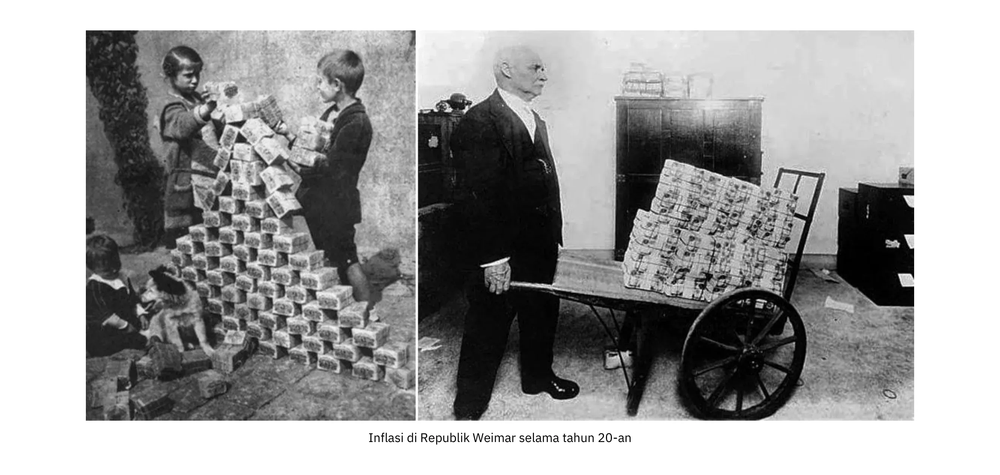

Namun, ketika situasi ekonomi mulai sedikit membaik, kepercayaan diri berangsur-angsur pulih. Individu kemudian menarik tabungan mereka dari tempat persembunyiannya dan mulai membelanjakan uangnya secara besar-besaran dalam perekonomian. Perubahan perilaku yang tiba-tiba ini, dikombinasikan dengan uang Supply yang sudah tinggi, menyebabkan ledakan permintaan. Dengan lebih banyak uang yang beredar dan permintaan yang meningkat, harga-harga mulai naik dengan cepat, yang menyebabkan inflasi yang nyata.

Contoh ini menggarisbawahi pentingnya waktu dan perilaku agen dalam kemunculan inflasi. Inflasi tidak hanya terjadi sebagai respon dari peningkatan jumlah uang Supply, namun juga bergantung pada bagaimana dan kapan uang tersebut dibelanjakan dalam perekonomian. Ketidakpastian ekonomi dan ekspektasi pelaku ekonomi memainkan peran penting dalam dinamika ini dan dapat mempercepat atau memperlambat efek inflasi dari pencetakan uang.

#### Rekap:

- Indeks Harga Konsumen (IHK): IHK disusun sedemikian rupa sehingga meremehkan inflasi, yang dapat memberikan gambaran yang salah tentang realitas inflasi.

- Penyerapan Sektoral: Suntikan moneter ke dalam sektor-sektor yang mampu menyerapnya tidak selalu menyebabkan inflasi. Contoh penting adalah kompleks industri militer AS, yang dapat menyerap uang dalam jumlah besar tanpa memicu inflasi.

- Kasus Jepang: Meskipun ada pencetakan uang yang signifikan, inflasi tetap rendah di Jepang karena dana sering kali disimpan atau diinvestasikan di real estat atau pasar saham. Sektor-sektor ini menyerap uang yang dicetak, dan CPI tidak selalu mencerminkan kenaikan harga di area-area ini.
- Korelasi antara Pencetakan Uang dan Pasar. Telah diamati bahwa kurva pasar real estat dan saham sering kali mengikuti pencetakan uang, yang mengindikasikan ke mana uang yang dicetak diarahkan.
- Cadangan Moneter Bank: Ketika uang yang dicetak tetap berada di neraca bank dan tidak beredar dalam perekonomian, maka tidak menyebabkan inflasi. Hal ini diilustrasikan oleh contoh pada tahun 2008, di mana uang yang dicetak sebagian besar tetap berada di neraca bank, sehingga menunda dampak inflasi.

- Republik Weimar: Periode sejarah ini menunjukkan bagaimana ketidakpastian ekonomi menyebabkan penimbunan uang, sehingga menunda inflasi. Namun, begitu kepercayaan pulih dan uang dibelanjakan, inflasi meledak.

Contoh-contoh ini dapat digunakan dalam diskusi untuk menjelaskan mengapa inflasi tidak selalu merupakan konsekuensi langsung dari pencetakan uang, dan bagaimana konteks ekonomi dan perilaku pelaku ekonomi mempengaruhi inflasi.

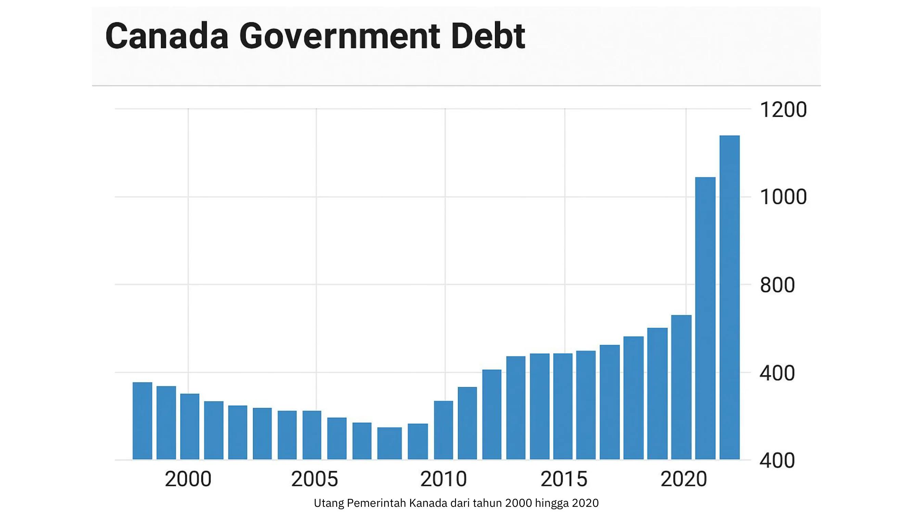

Karena, seperti yang ditunjukkan oleh [thread](https://twitter.com/saifedean/status/1673639779433590786) ini: Inflasi adalah segalanya kecuali kesalahan bank sentral.

- Ekonom menyalahkan inflasi pada perubahan iklim

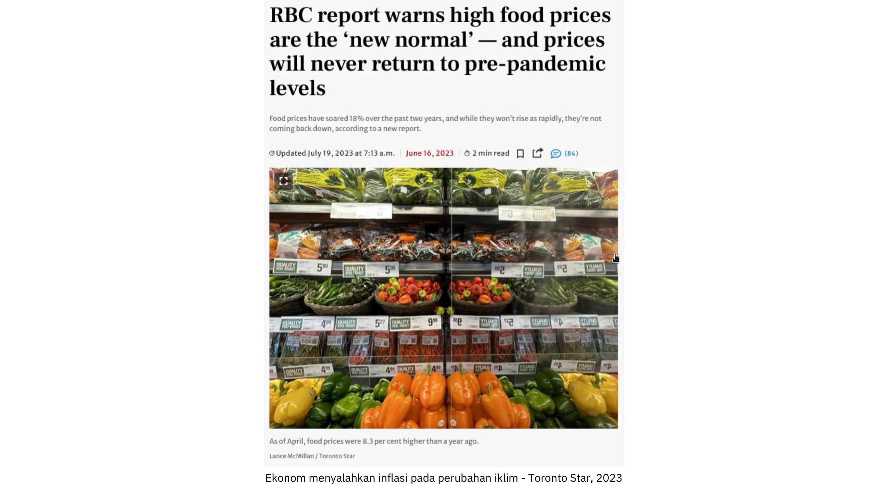

- Contoh Swedia yang menyalahkan Beyonce atas inflasi selama bulan tertentu.

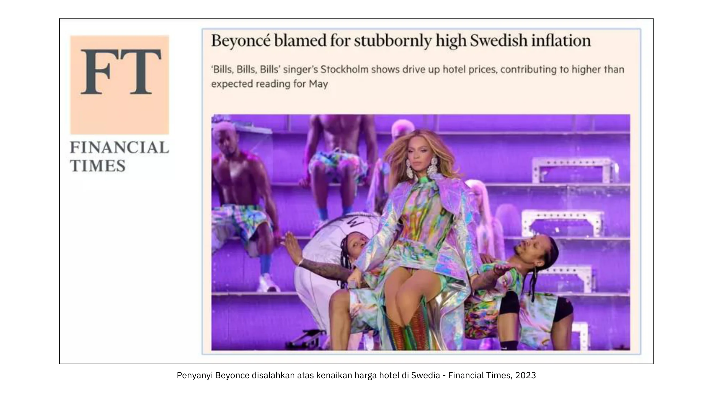

- Bank sentral di Polandia mengaitkan inflasi dengan agresi Rusia di Ukraina dan pandemi

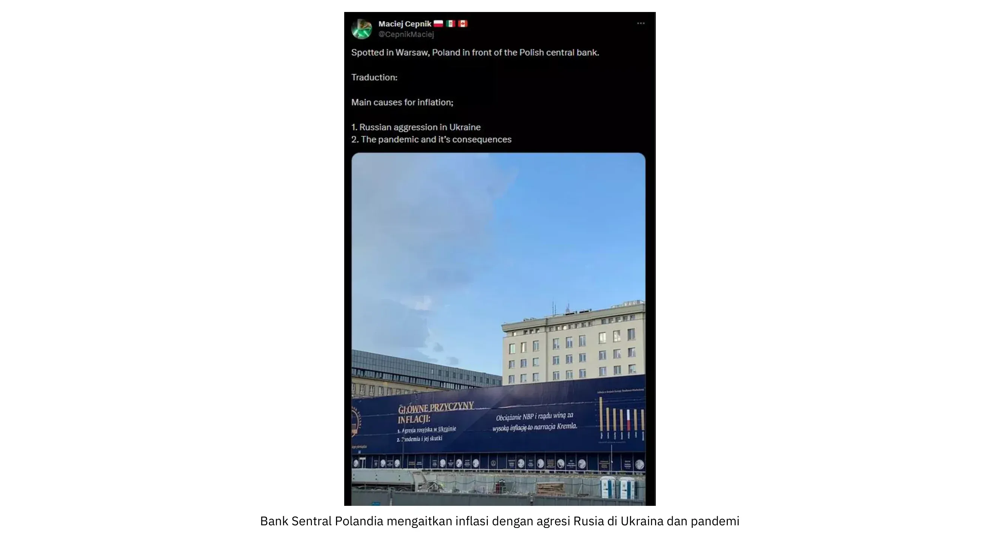

- Brexit disalahkan atas inflasi di Inggris.

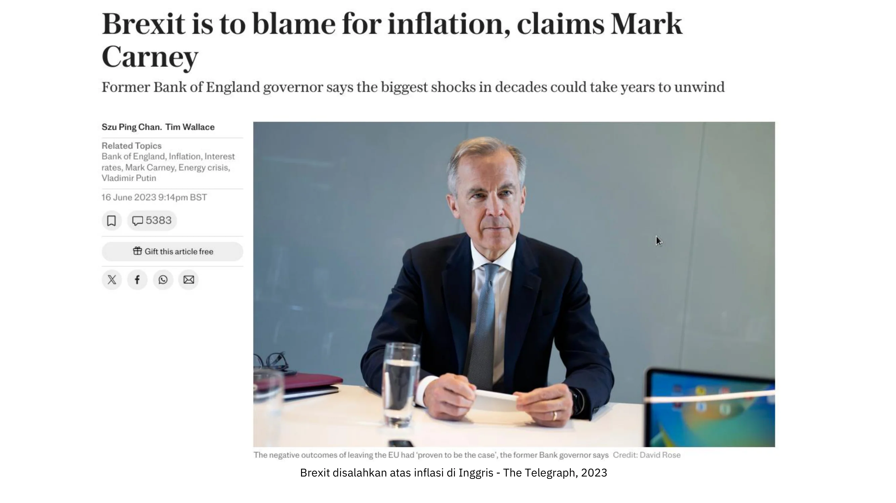

- Peluncuran game Zelda yang terkait dengan guncangan inflasi.

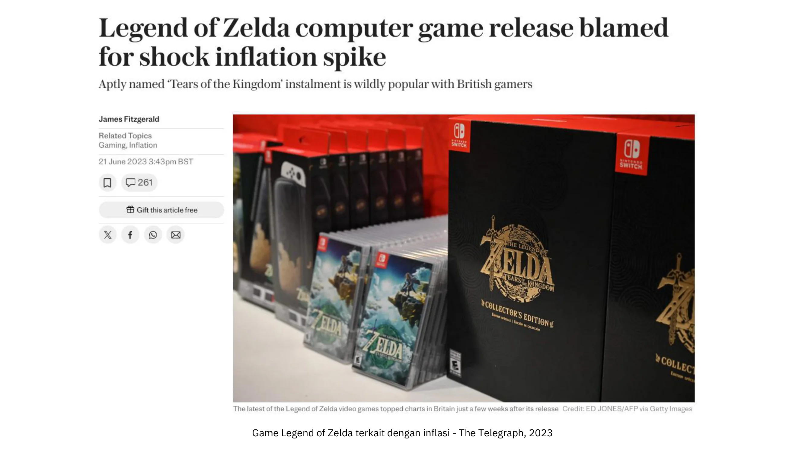

- Taylor Swift diduga menyebabkan inflasi.

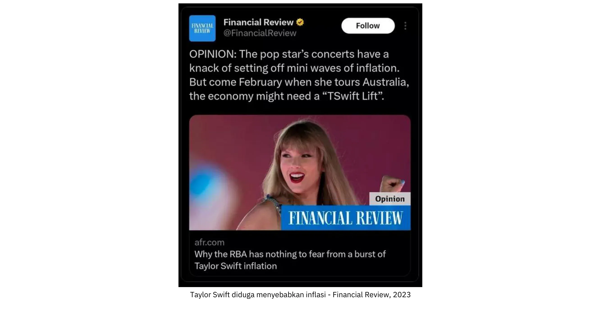

Katakan padaku, bagaimana mungkin Beyonce atau Taylor Swift menyebabkan kenaikan harga yang meluas? Anda tahu, itu tidak masuk akal. Singkatnya:

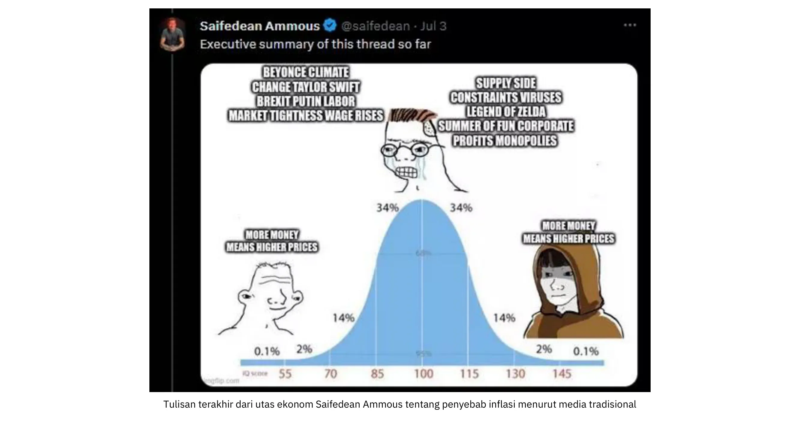

### Eksplorasi Jenis-Jenis Inflasi

Sangat penting untuk memahami perbedaan antara berbagai jenis inflasi, yang memungkinkan kita untuk memahami berbagai manifestasi dari fenomena ekonomi ini. Berikut ini adalah penjelasan mengenai jenis-jenis inflasi tersebut:

- Inflasi Merayap: Ini adalah jenis inflasi yang umumnya ditargetkan oleh bank sentral, yang ditetapkan sekitar 2% per tahun. Target ini telah diadopsi sejak tahun 1990-an dan bertujuan untuk mempertahankan pertumbuhan ekonomi yang stabil tanpa overheating atau deflasi.
- Inflasi Moderat (Moderate Inflation): Bentuk inflasi ini terjadi ketika inflasi melebihi target 2%. Hal ini sering dikaitkan dengan ekonomi yang terlalu panas, suatu kondisi di mana jumlah uang yang berlebihan mendorong kenaikan harga secara umum. Skenario ini memperlihatkan batas-batas kebijakan moneter dan terkadang menunjukkan kontradiksi dalam wacana ekonomi.
- Inflasi yang melesat: Inflasi berderap, sering disebut sebagai inflasi dua digit, terjadi ketika tingkat inflasi tahunan melebihi 10%. Ini menandai lonjakan harga yang signifikan yang dapat membahayakan stabilitas ekonomi.

- Hiperinflasi: Hiperinflasi adalah fenomena ekstrem di mana tingkat inflasi melebihi 50% per bulan, yang, karena sifat eksponensial inflasi, setara dengan tingkat inflasi tahunan lebih dari 13.000%. Tingkat inflasi ini sangat mengganggu kestabilan ekonomi, membuat mata uang hampir tidak berharga dan mengikis kepercayaan pada sistem moneter.

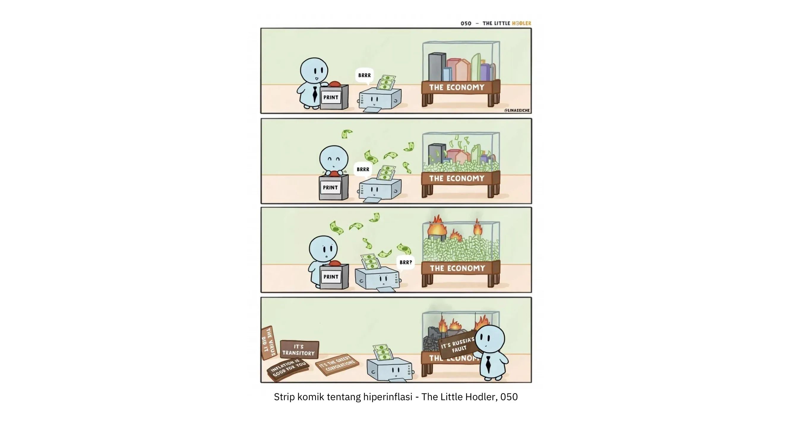

Ketika mengeksplorasi jenis-jenis inflasi, biasanya kita akan menemukan istilah-istilah seperti "tarikan permintaan" dan "dorongan biaya" dalam sumber-sumber edukasi. Konsep-konsep ini, meskipun valid, cenderung menjelaskan kenaikan harga daripada inflasi sebagai fenomena moneter. Berikut ini adalah analisis yang lebih mendalam:

- Demand Pull:

Inflasi tarikan permintaan sering digambarkan sebagai skenario di mana permintaan dalam perekonomian melebihi kapasitas produksi yang tersedia. Namun, tanpa adanya peningkatan jumlah uang beredar, situasi ini hanya akan menyebabkan redistribusi pengeluaran. Konsumen mungkin akan membelanjakan lebih banyak untuk barang-barang kebutuhan pokok dan lebih sedikit untuk barang-barang yang tidak penting, sehingga menetralisir efek inflasi secara keseluruhan.

- Dorongan Biaya:

Di sisi lain, inflasi yang disebabkan oleh dorongan biaya (cost-push inflation) disebabkan oleh kenaikan biaya produksi, seperti biaya sumber daya alam atau tenaga kerja. Sekali lagi, tanpa peningkatan jumlah uang beredar, kenaikan biaya di satu sektor mungkin hanya akan mengurangi pengeluaran di sektor lain, tanpa menyebabkan inflasi yang meluas.

Penjelasan tradisional ini sering kali mengaitkan kenaikan harga dengan inflasi, yang dapat menyebabkan kebingungan dan kesalahpahaman. Pada kenyataannya, agar inflasi yang meluas dapat terjadi, peningkatan jumlah uang beredar diperlukan. Dalam konteks ini, konsep Demand Pull dan Cost Push dapat menjelaskan variasi harga sektoral, namun tidak dapat menjelaskan sifat moneter dari inflasi. Hal ini menyoroti pentingnya membedakan antara kenaikan harga sektoral dan inflasi yang meluas, dan menegaskan kembali perlunya peningkatan Supply uang beredar untuk mencegah inflasi bermanifestasi di seluruh perekonomian. Analisis ini memberikan perspektif yang lebih bernuansa dan tepat mengenai penyebab inflasi yang sebenarnya, menghilangkan interpretasi umum yang dapat mengaburkan dinamika moneter yang mendasarinya.

### Klasifikasi Inflasi menurut Bernholz

Bernholz mengusulkan klasifikasi inflasi yang disederhanakan namun tepat ke dalam tiga kategori, yang memungkinkan pemahaman yang lebih baik tentang fenomena moneter yang kompleks ini:

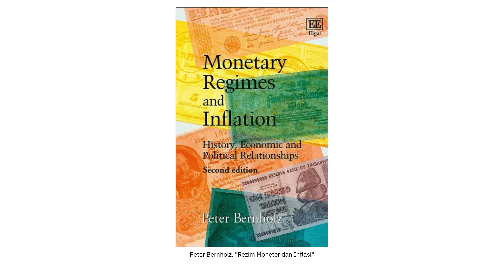

- Inflasi Moderat:

Inflasi moderat terjadi ketika tingkat uang Supply lebih tinggi dari biasanya, tetapi tanpa negara menggunakan defisit besar yang dibiayai oleh penciptaan uang. Meskipun istilah "moderat" mungkin terlihat tidak signifikan, bentuk inflasi ini dapat menyebabkan masalah yang substansial, meskipun tidak diklasifikasikan sebagai inflasi tinggi.

- Inflasi tinggi:

Inflasi tinggi terjadi ketika nilai riil dari uang Supply menurun meskipun terjadi peningkatan dalam hal nominal. Situasi paradoksal ini muncul dari substitusi moneter, di mana individu kehilangan kepercayaan terhadap mata uang nasional dan berusaha menukarkannya dengan barang, jasa, atau mata uang asing. Proses ini semakin mengurangi nilai riil mata uang, sehingga memperburuk inflasi.

- Hiperinflasi:

Hiperinflasi adalah bentuk ekstrem dari inflasi tinggi, ditandai dengan defisit anggaran yang besar yang dibiayai melalui penciptaan uang. Secara historis, tidak ada kasus hiperinflasi yang pernah terjadi tanpa pembiayaan defisit yang besar melalui pencetakan uang. Hiperinflasi menciptakan lingkaran setan: inflasi mengikis nilai mata uang dengan sangat cepat sehingga pendapatan pajak terdepresiasi bahkan sebelum negara dapat mengumpulkannya, sehingga memaksa negara untuk mencetak lebih banyak uang untuk membiayai dirinya sendiri. Siklus yang terus berlanjut ini menyebabkan tingkat inflasi yang sangat tinggi, sering kali melebihi 50% per bulan.

Klasifikasi oleh Bernholz ini menyoroti perkembangan berbahaya dari inflasi moderat ke hiperinflasi, menggarisbawahi pentingnya kontrol moneter dan fiskal dalam mencegah spiral inflasi yang merusak. Hal ini juga menunjukkan bahwa konsekuensi yang merugikan pada pembiayaan negara dapat terjadi jauh sebelum mencapai tahap hiperinflasi, memberikan perspektif yang bernuansa pada implikasi inflasi pada berbagai tingkat.

### Kesimpulan: Rangkuman Jenis-jenis Inflasi

Sebagai kesimpulan, kita telah menjelajahi berbagai jenis inflasi, dimulai dengan istilah-istilah yang sering didengar seperti "inflasi merayap", "inflasi berjalan", dan "inflasi berlari kencang", yang masing-masing menunjukkan tingkat persentase inflasi yang berbeda di dalam suatu perekonomian. Namun, untuk studi mendalam kami mengenai hiperinflasi, kategori inflasi moderat, inflasi tinggi, dan hiperinflasi, seperti yang dijelaskan oleh Bernholz, menjadi tolok ukur yang penting.

- Inflasi Moderat:

Hal ini mengindikasikan tingkat uang Supply di atas normal, meskipun tingkat ini dapat dipertahankan tanpa pembiayaan defisit yang signifikan oleh negara.

- Inflasi tinggi:

Hal ini terjadi ketika nilai riil uang Supply menurun, sering kali karena substitusi moneter, di mana individu berusaha menukar mata uang mereka dengan barang, jasa, atau bentuk mata uang lainnya.

- Hiperinflasi:

Ini merupakan versi ekstrim dari inflasi tinggi, di mana penciptaan uang yang berlebihan untuk membiayai defisit anggaran yang besar menyebabkan erosi yang cepat terhadap nilai riil mata uang.

Apa yang muncul dari eksplorasi kami adalah bahwa hiperinflasi adalah fenomena yang kompleks dan berlawanan dengan intuisi. Meskipun orang mungkin berasumsi bahwa hiperinflasi adalah hasil dari peningkatan besar-besaran dalam jumlah uang Supply, pada kenyataannya, hiperinflasi berasal dari penurunan nilai riil uang Supply tersebut. Nuansa ini sangat penting untuk memahami mengapa beberapa negara kesulitan untuk keluar dari hiperinflasi, bahkan dengan dukungan dari lembaga internasional seperti Bank Dunia atau IMF. Kesalahan dalam mengkarakterisasi jenis inflasi dapat menyebabkan penerapan solusi yang tidak tepat, yang justru memperburuk masalah ekonomi dan bukannya menyelesaikannya.

Dalam diskusi kami selanjutnya, kami akan membahas lebih dalam mengenai hiperinflasi, mengeksplorasi definisi dan manifestasinya dalam berbagai konteks ekonomi. Tujuan kami adalah untuk mengungkap mekanisme yang mendasari hiperinflasi dan mengeksplorasi solusi potensial untuk mengatasi masalah ini. Pemahaman yang mendalam ini akan membantu kita untuk lebih memahami tantangan-tantangan yang terkait dan mengusulkan strategi yang tepat untuk mengelola inflasi.

Terima kasih atas perhatian Anda. Sesi berikutnya akan sepenuhnya didedikasikan untuk mendefinisikan dan mengungkap hiperinflasi, dengan mempertimbangkan berbagai perspektif akademis dan praktis. Kami berharap dapat melanjutkan eksplorasi ini bersama Anda di pertemuan berikutnya.

# Apa yang dimaksud dengan hiperinflasi?

<partId>3f541663-1e2f-5410-8ee0-f61c5d009fa5</partId>

## Definisi hiperinflasi

<chapterId>d2a71a2e-5f36-58d9-993c-d431f4aa07fd</chapterId>

### Definisi hiperinflasi

Pada bagian ini, kita akan membahas berbagai definisi hiperinflasi, sebuah istilah penting dalam studi fenomena moneter ekstrim. Definisi yang paling dikenal berasal dari Philip Cagan, yang dalam karyanya di tahun 1956, "The Monetary Dynamics of Hyperinflation," mengusulkan pemahaman kuantitatif tentang hiperinflasi. Menurut Cagan:

- Awal dan Akhir Hiperinflasi:
  - Hiperinflasi dimulai ketika inflasi bulanan melebihi 50%.
  - Periode ini berakhir ketika tingkat inflasi turun di bawah 50% per bulan selama setidaknya satu tahun.

Sebagai ilustrasi, jika inflasi turun menjadi 40% di bulan Juli dan tidak naik di atas 50% hingga Juli tahun berikutnya, maka periode hiperinflasi dianggap telah berakhir di bulan Juli tahun sebelum tahun pertama kali diamati. Definisi ini memungkinkan karakterisasi yang tepat untuk episode hiperinflasi, sehingga memudahkan analisis terstruktur.

Definisi ini telah diadopsi dalam tabel Hanke-Krus, yang mendokumentasikan 56 episode hiperinflasi. Namun, tabel ini tidak mencakup semua episode, seperti yang terjadi di Venezuela pada tahun 2016, sehingga totalnya menjadi 57.

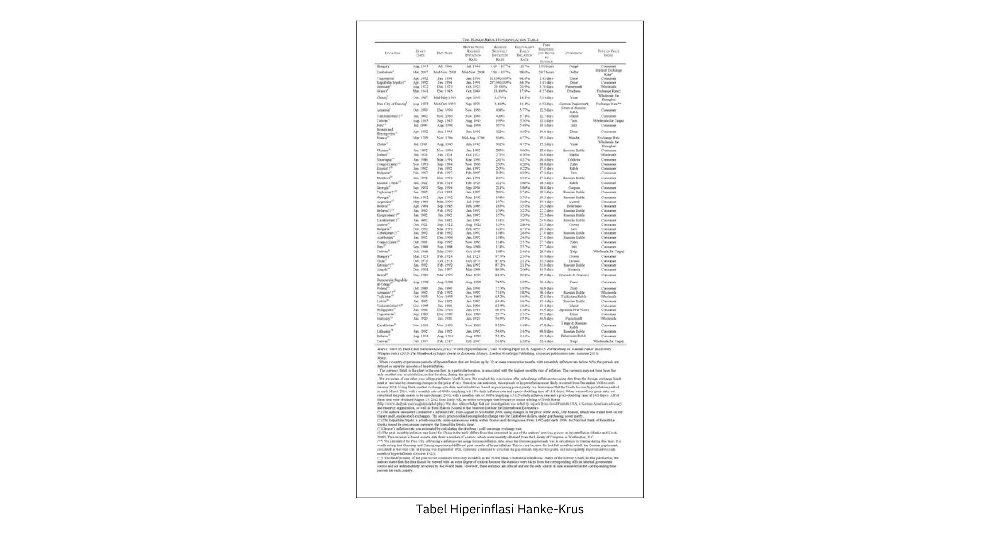

zoom

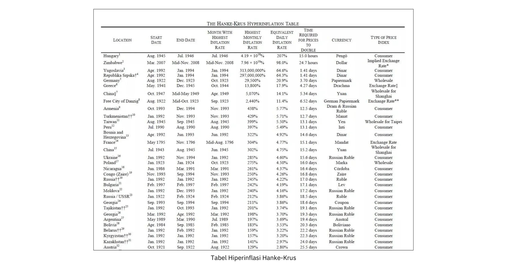

Perlu dicatat bahwa definisi ini, meskipun tepat, mungkin dapat mengecualikan episode hiperinflasi tertentu karena ketatnya ambang batas 50%. Ada kemungkinan untuk memperluas definisi ini untuk memasukkan episode-episode lain yang, meskipun tidak secara ketat memenuhi kriteria Cagan, tetap mewakili periode inflasi yang sangat tinggi. Pengamatan ini membuka pintu untuk eksplorasi yang lebih luas terhadap fenomena hiperinflasi, yang memungkinkan pemahaman yang lebih mendalam mengenai sebab dan akibatnya. Pada diskusi selanjutnya, kita akan mempertimbangkan untuk meninjau kembali definisi ini dan memeriksa episode-episode hiperinflasi yang tidak tercakup dalam kriteria Cagan.

### Definisi Hiperinflasi oleh Cagan

Philip Cagan mungkin telah menetapkan tonggak yang sewenang-wenang dengan ambang batas inflasi bulanan sebesar 50% ketika mendefinisikan hiperinflasi. Dia sendiri mengakui bahwa definisi ini sewenang-wenang dan terutama menyajikan analisisnya berdasarkan tujuh episode hiperinflasi. Pemeriksaan data Cagan menunjukkan bahwa tiga episode hiperinflasi dengan tingkat inflasi bulanan terendah adalah sekitar 47%, 46%, dan 57%. Tampaknya ambang batas 50% dipilih untuk mencakup kasus-kasus ini dalam studinya.

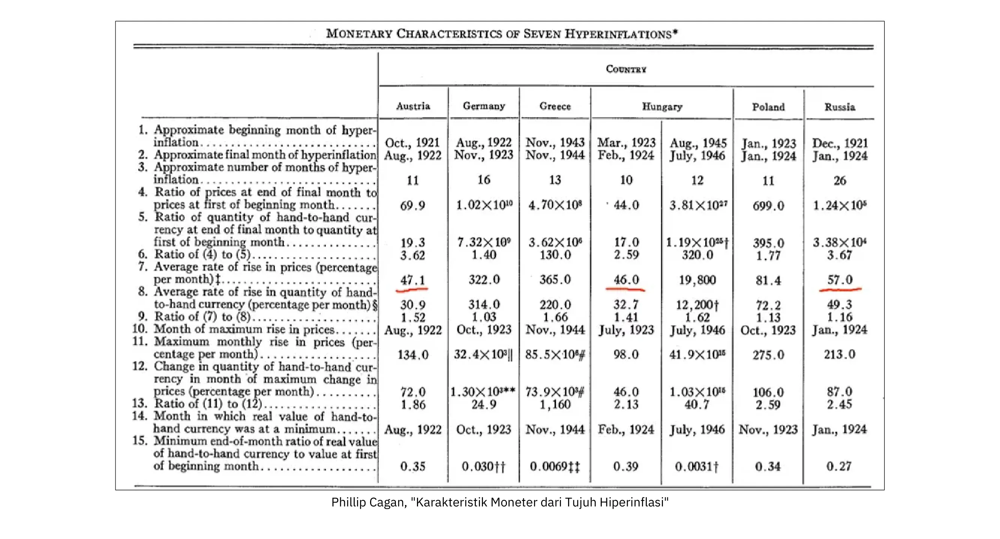

- Konteks Sejarah:

Definisi Cagan berasal dari tahun 1956 dan didasarkan pada sejumlah episode hiperinflasi yang tersedia pada saat itu.

- Pengamatan Cagan:

Menurut Cagan, tidak ada episode yang mencapai ambang batas sekitar 50% tanpa berkembang menjadi hiperinflasi yang lebih parah, yang dapat membenarkan pilihan ambang batas ini.

- Kritik terhadap Definisi Cagan:

Ekonom lain, seperti Bernholz, penulis Monetary Regime and Inflation, juga menggambarkan ambang batas 50% sebagai sesuatu yang sewenang-wenang.

Bernholz mencatat bahwa ada episode inflasi tinggi dengan karakteristik kualitatif yang sama dengan episode hiperinflasi, tanpa mencapai ambang batas 50%.

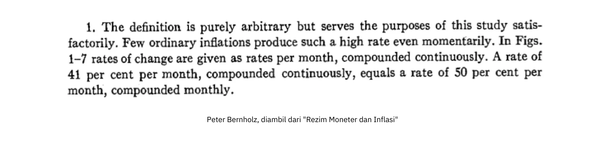

Refleksi ini membuat kita mempertanyakan kekakuan definisi tradisional hiperinflasi dan menyoroti perlunya meninjau kembali ambang batas ini dengan memasukkan lebih banyak episode dan data historis. Definisi hiperinflasi mungkin memerlukan fleksibilitas untuk mencakup berbagai manifestasi inflasi ekstrim dalam konteks ekonomi dan historis yang berbeda.

### Definisi Hiperinflasi Menurut Dewan Standar Akuntansi Internasional (IASB)

IASB menawarkan perspektif unik mengenai hiperinflasi, dengan fokus pada praktik akuntansi selama periode hiperinflasi. Pendekatan ini sangat penting bagi akuntan dan bisnis yang beroperasi di lingkungan hiperinflasi, di mana nilai moneter berfluktuasi dengan cepat. Pedoman IASB mengidentifikasi berbagai indikator hiperinflasi:

- Preferensi untuk Aset Non-Moneter:**

Individu lebih suka menyimpan nilai dalam bentuk barang daripada mata uang karena depresiasi nilai moneter yang cepat.

- Penilaian Barang dan Jasa:**

Penduduk tidak menghitung nilai barang dan jasa dalam mata uang lokal, yang mencerminkan hilangnya kepercayaan terhadap mata uang lokal.

- Kompensasi atas Kerugian Nilai Moneter:**

Harga sudah termasuk kompensasi atas hilangnya nilai moneter selama pembelian kredit, yang menggambarkan dampak inflasi pada transaksi harian.

- Indeksasi Harga, Upah, dan Bunga:**

Harga, upah, dan bunga disesuaikan berdasarkan indeks untuk mengimbangi inflasi.

- Inflasi Kumulatif Selama Tiga Tahun:**

Inflasi kumulatif selama tiga tahun mendekati 100% (sekitar 24% per tahun), berbeda dengan definisi Cagan yang hanya 50% inflasi bulanan.

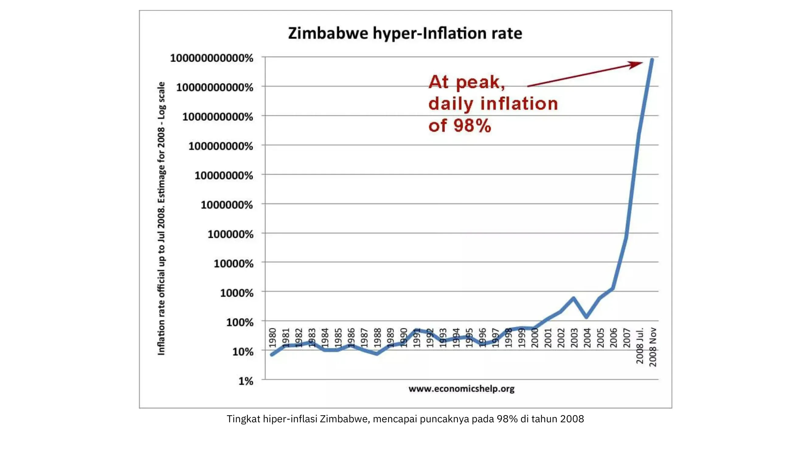

Menurut kriteria IASB, beberapa negara, termasuk Argentina, Ethiopia, Haiti, Iran, Lebanon, Sudan, Sudan Selatan, Suriname, Suriah, Turki, Venezuela, Yaman, dan Zimbabwe, saat ini mengalami hiperinflasi.

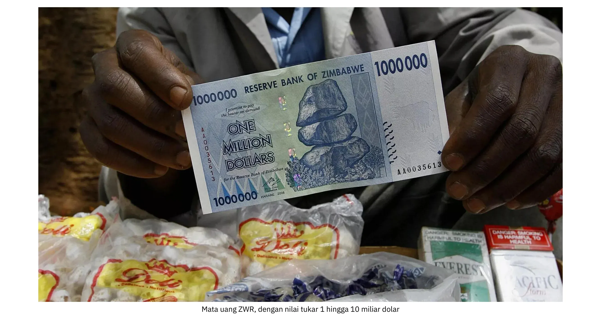

Definisi yang diberikan oleh IASB ini menjauh dari ambang batas kuantitatif yang ketat dari Cagan dengan memasukkan analisis kualitatif perilaku ekonomi dan penyesuaian praktis dalam menghadapi hiperinflasi. Definisi ini menunjukkan bahwa hiperinflasi adalah fenomena kompleks yang membutuhkan pemahaman multidimensi untuk memahami implikasi sebenarnya, terutama di bidang akuntansi, yang sangat penting bagi stabilitas dan transparansi keuangan bisnis dan pasar.

### Jadi, berapa banyak hiperinflasi yang terjadi secara total?

Definisi umum hiperinflasi, seperti yang diusulkan oleh Cagan, yang menetapkan tingkat inflasi bulanan sebesar 50%, terkadang dapat membingungkan atau terlalu sederhana. Sebagai contoh, dua negara yang mengalami tingkat inflasi tahunan masing-masing sebesar 1.000% dan 3.000% dapat dilihat secara berbeda berdasarkan distribusi bulanan inflasi tersebut. Jika tidak ada bulan yang melebihi ambang batas 50%, menurut definisi Cagan, negara-negara tersebut tidak akan diklasifikasikan sebagai negara yang mengalami hiperinflasi. Pendekatan ini dapat menyebabkan anomali dalam mengklasifikasikan hiperinflasi, terutama ketika membandingkan inflasi kumulatif sepanjang tahun.

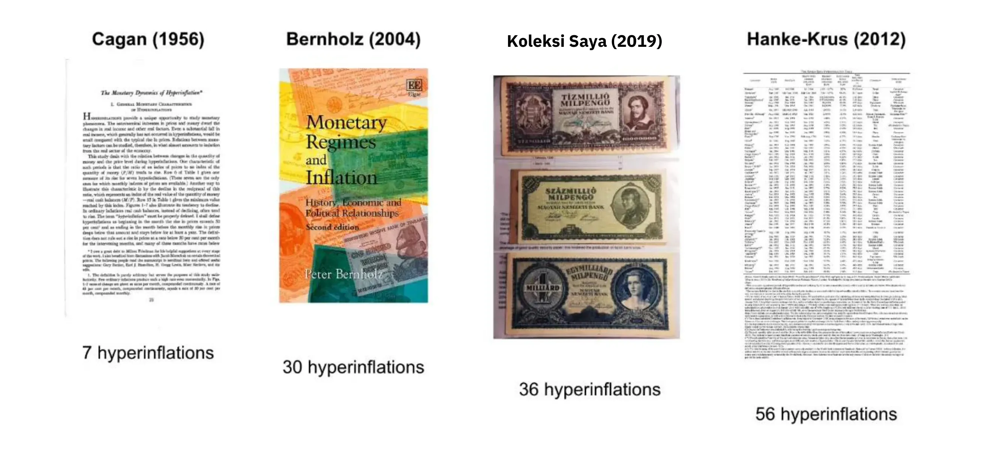

- Karya Cagan, "Dinamika Moneter Hiperinflasi," memberikan analisis fundamental mengenai hiperinflasi.
- Buku Bernholz, yang mempelajari 30 periode hiperinflasi yang berbeda, sehingga memperluas cakupan analisis.
- Koleksi pribadi uang kertas David St-Onge (penulis kursus ini) dari 36 periode hiperinflasi, yang memungkinkan pemahaman yang nyata dan historis.
- Tabel Hanky Cross (versi 2012, diperbarui pada tahun 2016 dengan Venezuela), mencantumkan 57 periode hiperinflasi berdasarkan definisi Cagan.

Perlu dicatat bahwa periode historis tertentu dengan inflasi tinggi tidak termasuk dalam tabel klasik hiperinflasi, sering kali karena kriteria klasifikasi yang ketat. Contohnya, selama Perang Kemerdekaan Amerika pada November 1779, dan selama Perang Saudara Amerika pada Maret 1864, tingkat inflasi bulanan masing-masing adalah 47,4% dan 40%. Angka-angka ini, meskipun tinggi, tidak melebihi ambang batas 50% yang ditetapkan oleh Cagan, sehingga tidak memasukkan periode-periode ini untuk diklasifikasikan sebagai kasus hiperinflasi. Pengecualian ini menyoroti keterbatasan definisi yang kaku dan menggarisbawahi perlunya pemahaman yang lebih bernuansa mengenai hiperinflasi dalam kompleksitasnya yang penuh.

## Kesamaan Weimar vs Zimbabwe

<chapterId>11eef458-aab8-5c63-8523-264d0ba69f5d</chapterId>

### Dua era, dua bencana

Pada bab ini, kita akan membahas dampak hiperinflasi, dengan fokus pada pengalaman Zimbabwe dan Republik Weimar. Sepanjang penelitian saya, saya memprioritaskan eksplorasi kesaksian langsung dari individu-individu yang hidup selama periode hiperinflasi ini, daripada menggunakan pendekatan ekonomi atau statistik murni.

Beberapa buku sangat informatif:

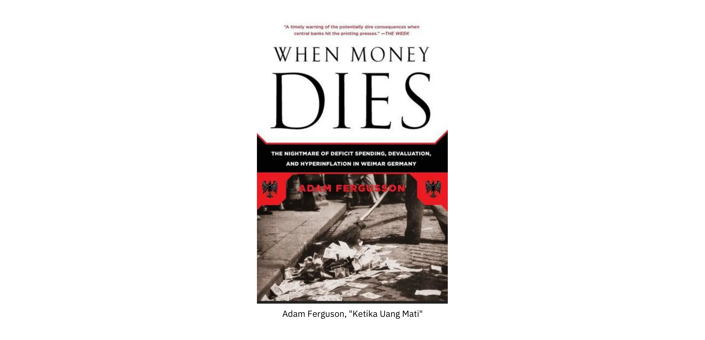

- "When Money Dies" oleh Adam Ferguson menelusuri jejak hiperinflasi pasca-Perang Dunia I di Jerman, serta di Austria dan Hungaria.
- Dua buku tentang hiperinflasi di Zimbabwe, "Zimbabwe Warm Heart Ugly Face" dan "Hard Boiled Egg Index" oleh Jérôme Gardner dan Kudzai Joseph Gou Min-Yu, masing-masing memberikan kesaksian yang mengharukan dari seorang CEO sebuah jaringan toko pakaian dan seorang bankir pertanian tentang pengalaman mereka selama periode yang penuh gejolak ini.

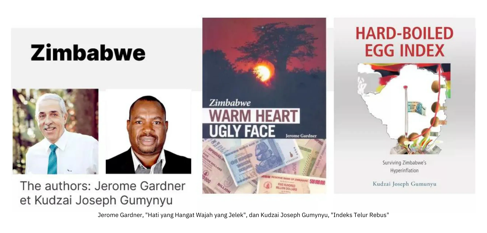

Ketika mengkonsolidasikan catatan saya, saya melihat banyak kesamaan antara pengalaman hiperinflasi di Zimbabwe dan Republik Weimar, meskipun ada jeda waktu 90 tahun di antara keduanya. Saya mengidentifikasi sekitar 17 kesamaan, dengan 13 di antaranya menggambarkan semacam perkembangan menuju bencana ekonomi yang digambarkan dalam kesaksian-kesaksian ini. Kesamaan-kesamaan yang menarik ini menunjukkan sifat hiperinflasi yang berulang dan menghancurkan di seluruh waktu dan perbatasan. Hari ini, kita akan membahas kesamaan-kesamaan ini dan bagaimana kesamaan-kesamaan ini menggambarkan lintasan yang mengkhawatirkan selama periode hiperinflasi.

### Analisis Perbandingan: Zimbabwe dan Republik Weimar

Permainan dengan 14 perbedaan!

#### 1. Kekurangan uang

Ketika mata uang terdepresiasi dengan kecepatan yang memusingkan, bahkan upaya yang paling ambisius untuk membanjiri pasar dengan uang kertas baru pun tidak akan cukup. Permintaan yang tak henti-hentinya akan mata uang berwujud dapat jauh melampaui kapasitas bank sentral untuk memproduksi uang kertas, menciptakan krisis likuiditas yang belum pernah terjadi sebelumnya.

> Weimar: "Selama bulan ini, jumlah uang kertas akan ditingkatkan menjadi hampir 4 miliar, sebuah angka yang diharapkan dapat mengatasi kekurangan mata uang."

> Zimbabwe: "Dari tahun 2002 hingga Januari 2009, terdapat beberapa kekurangan likuiditas yang kritis. Tidak ada cukup uang kertas yang dicetak atau beredar untuk mengimbangi inflasi yang meroket."

#### 2. "Dan itu adalah kotoran!"

Kecepatan mata uang kehilangan nilainya dalam situasi ekonomi tertentu sangatlah mencengangkan. Uang kertas dalam jumlah yang sangat besar dapat diterbitkan dalam waktu singkat, langsung mengubah jumlah yang tadinya sangat besar menjadi sesuatu yang tidak berarti seperti pupuk.

> Weimar: "Jumlah total penerbitan saat ini mencapai 63.000 miliar. Oleh karena itu, dalam beberapa hari lagi, kami akan dapat menerbitkan dua pertiga dari total sirkulasi dalam satu hari."

> Zimbabwe: "Pada tanggal 17 September 2006, Gubernur RBZ, Gideon Gono, menyatakan: '10 triliun masih ada di luar sana, dan telah menjadi pupuk."

#### 3. Uang kertas bernilai lebih rendah dari kertas tempat mereka dicetak

Dalam keadaan ekonomi tertentu, nilai intrinsik uang kertas dapat menjadi lebih rendah daripada nilai kertas yang digunakan untuk mencetaknya. Depresiasi drastis ini mengubah uang kertas, yang biasanya merupakan simbol nilai dan daya beli, menjadi hanya selembar kertas yang tidak berharga.

> Weimar: "Seluruh pecahan uang kertas Mark hampir tidak berharga begitu keluar dari mesin cetak."

> Zimbabwe: "Bank sentral membuang-buang uang dengan mencetak uang kertas yang tidak sebanding dengan kertas yang digunakan untuk mencetaknya. Dengan kata lain, nilainya lebih rendah daripada tisu toilet. Meski terdengar tidak masuk akal, menggunakan uang kertas ZWD 100 triliun sebagai tisu toilet lebih murah daripada membeli tisu toilet yang sebenarnya."

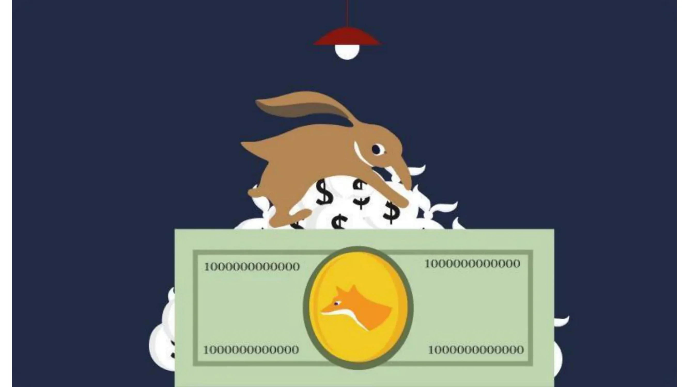

#### 4. Menghitung uang

Ketika mata uang dengan cepat kehilangan nilainya, bahkan transaksi yang paling sederhana pun dapat menjadi tugas yang melelahkan. Menghitung harga barang atau sekadar menghitung uang kertas yang diperlukan untuk pembayaran bisa memakan waktu beberapa menit, menambah kerumitan dalam interaksi sehari-hari.

> Weimar: "Pembelian paling biasa di toko membutuhkan tiga atau empat menit perhitungan, dan setelah harga ditentukan, biasanya diperlukan beberapa menit lagi untuk menghitung uang kertas."

> Zimbabwe: "Manajer toko juga diizinkan untuk mempekerjakan pekerja sementara untuk menggantikan anggota staf yang menghitung uang sepanjang hari. Tentu saja, menghitung uang di toko untuk keperluan administrasi dan penyetoran ke bank adalah satu hal, tetapi seluruh proses harus diulang di bank saat penyetoran."

:::video id=910231d7-af90-4ab8-b74c-bfb81caebfb2:::

Teknik menghitung uang Uzbek

#### 5. Pembayaran dengan cek

Dalam ekonomi yang terganggu, metode pembayaran tradisional seperti cek dapat dengan cepat kehilangan keefektifannya. Bank yang kewalahan dengan meningkatnya permintaan mata uang akibat hiperinflasi, dapat menjatah atau menunda pencairan cek, sehingga mengurangi nilai riilnya. Ketidakstabilan ini sering kali menyebabkan prioritas metode pembayaran, di mana harga dapat bervariasi tergantung pada metode pembayaran yang dipilih.

> Weimar: "Kenaikan harga mengintensifkan permintaan uang, baik oleh negara maupun pengusaha lainnya. Bank-bank swasta tidak dapat memenuhi permintaan sama sekali dan harus menjatah pencairan cek, sehingga cek yang tidak dicairkan tetap dibekukan sementara daya belinya berkurang."
> Zimbabwe: "Nilai waktu dari uang menciptakan tiga harga untuk barang dan jasa, yaitu harga tunai, harga penyelesaian bruto secara real-time, dan harga cek. Akhirnya, tidak ada yang menerima cek, yang membutuhkan waktu lima hari untuk dicairkan."

#### 6. Para "Pengusaha Pembakar"

Ketika nilai mata uang terkikis, peluang ekonomi baru muncul, mengeksploitasi distorsi pasar. Para pengusaha ini, yang sering disebut sebagai "Burner-preneur," dapat berkembang dengan meminjam mata uang yang terdevaluasi untuk berinvestasi dalam aset berwujud dan kemudian membayar utang mereka dengan mata uang yang lebih terdevaluasi.

Weimar: "Spekulasi pada inflasi melibatkan peminjaman nilai kertas, mengubahnya menjadi barang dan pabrik, dan kemudian membayar pemberi pinjaman dengan kertas yang terdepresiasi."

Zimbabwe: Para "Pengusaha Pembakar"

#### 7. Kejujuran dan karya Hard kehilangan daya tariknya

Dalam konteks ekonomi yang tidak stabil, nilai-nilai tradisional Hard seperti kerja keras, penghematan, dan integritas dapat dibayangi oleh daya tarik kekayaan yang cepat. Spekulasi dan perdagangan mata uang sering kali menawarkan imbalan yang jauh lebih tinggi daripada pekerjaan biasa, yang mengarah pada gangguan dalam prioritas masyarakat.

Weimar: "Ketika nilai-nilai lama seperti penghematan, kejujuran, dan kerja keras kehilangan daya tariknya, semua orang berusaha untuk menjadi kaya dengan cepat, terutama karena spekulasi mata uang atau saham tampaknya dapat menghasilkan lebih banyak daripada kerja keras."

Zimbabwe: "Praktik-praktik ini, meskipun memperkaya segelintir orang, memiskinkan kelas pekerja di perkotaan dan penduduk pedesaan. Pendidikan kehilangan nilainya, karena perdagangan ini digerakkan oleh orang-orang yang tidak membutuhkan pendidikan atau pekerjaan Hard untuk membenarkannya. Yang mereka butuhkan hanyalah koneksi dan modal awal untuk memulai bisnis uang mudah mereka."

#### 8. "Bank-bank di dunia"

Dalam situasi hiperinflasi atau krisis moneter, pasar paralel dan tidak teregulasi untuk mata uang asing sering muncul. "Bank-bank" informal ini, yang sering secara lucu disebut sebagai "bank dunia" atau dengan nama-nama lokal lainnya, menyediakan tempat berlindung bagi mereka yang ingin melindungi aset mereka dari devaluasi. Meskipun pasar-pasar ini dapat menyediakan jalur kehidupan ekonomi yang diperlukan, mereka sering kali menyoroti ketidakpercayaan yang meluas terhadap lembaga keuangan resmi dan kebijakan pemerintah.

Weimar: "Transaksi mereka terutama dilakukan melalui apa yang disebut Winkelbankiers, para operator jalanan yang muncul seiring dengan inflasi dan yang, tumbuh subur di tengah perekonomian yang sakit, hidup sepenuhnya dengan mengambil keuntungan dari selisih antara harga beli dan harga jual mata uang asing."

Zimbabwe: "Mereka juga merupakan penukar mata uang. Mereka beroperasi dengan bebas dari hukuman di antara 2nd dan 6th Avenue dan Fort Street di Bulawayo, berkat praktik bisnis mereka yang licik, yang sering melibatkan korupsi dan kegiatan terlarang lainnya. Area kota ini dikenal sebagai 'Bank Dunia'."

Argentina: "Jadi saya pergi ke tempat yang dikunjungi semua orang Argentina: cuevas, 'gua', yang ditemukan di lingkungan Florida di jantung Buenos Aires." - Paus Besar

#### 9. Penukaran mata uang asing adalah ilegal

Pemerintah, dalam upaya untuk menstabilkan mata uang mereka sendiri dan mengendalikan aliran modal, dapat membuat transaksi mata uang asing ini menjadi ilegal. Langkah-langkah represif ini, meskipun dimaksudkan untuk melindungi ekonomi nasional, seringkali dapat memiliki efek sebaliknya, memperburuk ketidakpercayaan publik dan mendorong pasar gelap.

Weimar: "Orang-orang menggunakan barter dan secara bertahap beralih ke mata uang asing sebagai satu-satunya cara yang dapat diandalkan untuk Exchange. Peraturan baru diperkenalkan terkait pembelian wesel asing dan penggunaan mata uang asing untuk pembayaran domestik. Selain hukuman penjara, denda sekarang dapat dikenakan hingga sepuluh kali lipat dari jumlah transaksi ilegal."

Zimbabwe: "Penggerebekan terhadap bisnis menyebabkan beberapa pengusaha dari Bulawayo dipenjara selama akhir pekan dan denda yang setara dengan dua kali lipat jumlah mata uang asing yang ditemukan, keberanian ini kemudian mereda."

#### 10. Kontrol modal

Ketika sebuah negara menghadapi krisis moneter atau ekonomi, salah satu respons umum yang dilakukan oleh pemerintah adalah melakukan kontrol ketat terhadap pergerakan dan bentuk-bentuk modal. Entah melalui perintah yang memaksa penerimaan mata uang nasional yang terdevaluasi atau melalui sanksi berat terhadap mereka yang menolak metode pembayaran tertentu, langkah-langkah ini sering kali bertujuan untuk mengatasi kepanikan dan memulihkan kepercayaan. Namun, efektivitasnya bervariasi, dan terkadang langkah-langkah ini terbukti kontraproduktif atau tidak sesuai dengan kenyataan yang dialami oleh masyarakat.

Weimar: "Para pedagang baru-baru ini dipaksa oleh peraturan baru untuk menerima uang kertas negara; namun karena peraturan ini juga mengizinkan penggunaan mata uang asing untuk semua pembelian, para pedagang pada umumnya menemukan alasan untuk tidak menerima mata uang lain."

Zimbabwe: "Pemerintah memperkenalkan SI 175/2008 pada tanggal 12 Desember 2008, mengenai pembayaran dengan cek. Disebutkan, 'Hukuman untuk menolak pembayaran dengan cek/kartu bank atau metode pembayaran elektronik lainnya yang dimediasi oleh bank adalah denda level 8 atau hukuman penjara enam bulan atau keduanya Jelas, kami mengabaikan SI tersebut karena sama sekali tidak sesuai dengan kenyataan."

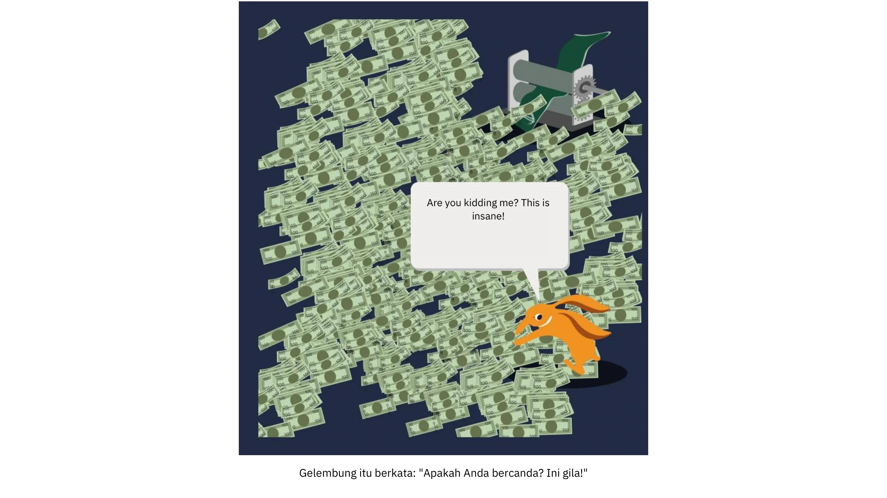

#### 11. Dipaksa untuk tetap membuka toko mereka

Ketika ekonomi runtuh dan mata uang kehilangan nilainya, pemerintah dapat mengambil tindakan drastis untuk mempertahankan penampilan normal.

Weimar: "Para pedagang yang melanjutkan kegiatan mereka tunduk pada peraturan baru, yang diberlakukan pada tanggal 22 Oktober, yang mengharuskan mereka untuk tetap membuka toko mereka dan menawarkan barang dalam Exchange untuk tanda kertas."

Zimbabwe: "Hanya rak-rak baja kosong dan lemari es, pendingin, dan pembeku yang tersisa. Tragisnya, toko tersebut masih buka karena mereka tidak berani menutupnya akibat ketegangan politik dan ketakutan para pemimpinnya akan ditangkap oleh pasukan pengendali harga pemerintah. Bahkan para pekerja tidak di-PHK karena semua orang berpikir akan ada solusi yang cepat."

#### 12. Setiap orang adalah penjahat

Di tengah ekonomi yang runtuh dan peraturan yang semakin ketat, batas antara bertahan hidup dan kriminalitas menjadi kabur.

Weimar: "Semua kejahatan terhadap negara, masing-masing dan setiap kejahatan, dalam berbagai tingkatan, menjadi masalah kelangsungan hidup individu."

> Zimbabwe: "Setiap penduduk di Zimbabwe adalah penjahat. Meski terdengar kasar, hal itu benar adanya. Dengan banyaknya hukum kecil yang mengatur setiap aspek kehidupan, tidak dapat dipungkiri bahwa setiap orang melanggar hukum setiap hari. Memiliki mata uang asing adalah tindakan ilegal, menurut SI yang diterbitkan pada tahun 2004. Memiliki beberapa rekening bank untuk melewati batas penarikan harian adalah ilegal. Tidak memiliki pelat nomor yang tepat pada mobil Anda, atau izin radio mobil, atau izin generator, semuanya merupakan hukum yang dilanggar oleh seseorang, di suatu tempat."

#### 13. Beli mata uang asing dengan biaya berapa pun

Pembelian mata uang asing yang panik sering kali menandai titik balik kritis dalam devaluasi mata uang, sehingga memperparah penurunan nilai intrinsik.

> Weimar: "Fritz Mannheimer, atas instruksi atasannya, keluar pada bulan Agustus 1921 dan mulai membeli mata uang asing dengan harga berapa pun - 'karena Jerman memiliki jumlah uang kertas yang tak terbatas namun tidak memiliki mata uang asing Ini adalah tanda pertama dari keruntuhan absolut dalam nilai mata uang."

> Zimbabwe: Diduga bahwa mereka diberi target harian untuk dipenuhi, karena beberapa persyaratan valas sangat mendesak dan mereka akan membeli dengan harga berapa pun untuk mengakumulasi valas untuk memenuhi tenggat waktu. Praktik yang dituduhkan ini dituduh telah memicu api devaluasi karena nilai dolar Zimbabwe terus mengalami penurunan tajam."

### Ringkasan prosesnya

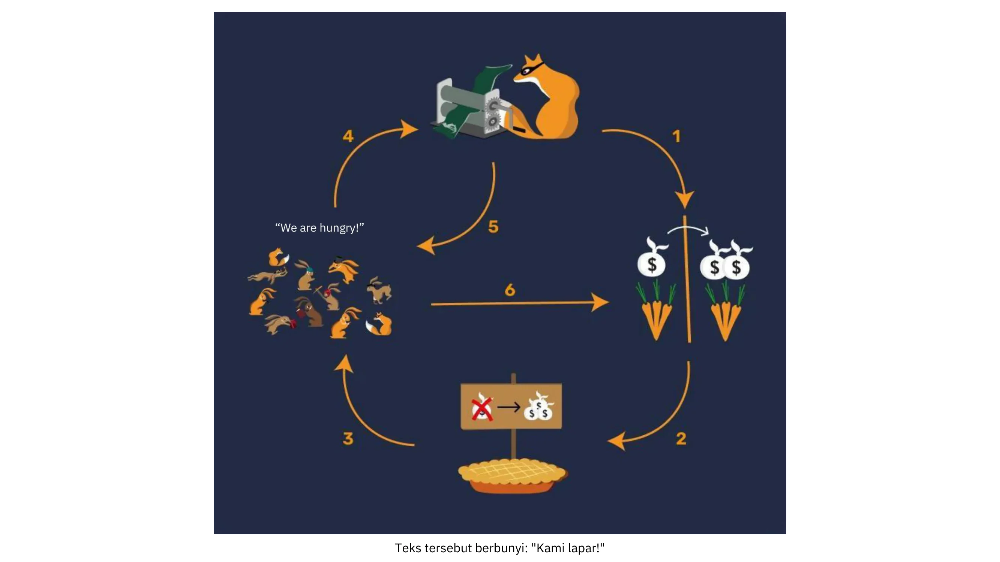

Ketika menganalisis lintasan ekonomi, terlihat jelas bahwa ketika inflasi tinggi tercapai, nilai massa moneter memburuk. Devaluasi ini menyebabkan beberapa komplikasi, termasuk kekurangan uang kertas. Dalam konteks ini, peluang arbitrase muncul, terutama sebagai respons terhadap fluktuasi suku bunga Exchange. Akibatnya, banyak orang beralih ke arbitrase ini, berinvestasi besar-besaran pada aset berwujud untuk mengantisipasi devaluasi mata uang di masa depan yang akan memungkinkan mereka untuk membayar hutang mereka dengan mata uang yang melemah. Lingkungan ekonomi ini melemahkan daya tarik pekerjaan tradisional dan, akibatnya, mengikis kohesi sosial.

Menanggapi situasi ini, pemerintah memberlakukan peraturan yang keras, termasuk kontrol modal. Pemerintah juga mewajibkan para pedagang untuk menerima mata uang dan cek nasional. Seiring waktu, undang-undang baru diberlakukan, memperluas definisi perilaku kriminal. Pada akhirnya, nilai Exchange naik secara eksponensial karena pemerintah bersedia menukarkan mata uangnya, yang dicetak dengan biaya lebih rendah, dengan mata uang asing yang lebih kuat.

### 4 Kesamaan dalam konsekuensi hiperinflasi

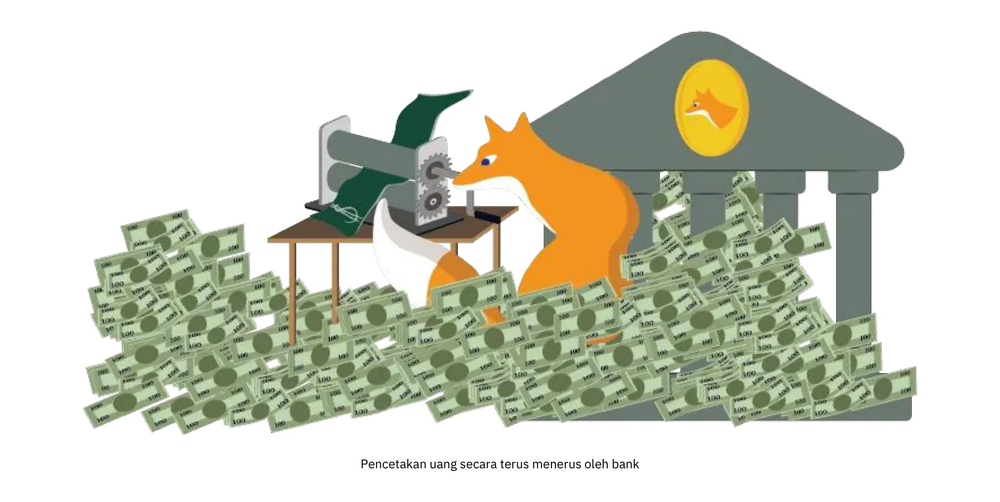

#### 1. Minyak dan logam

Selama periode Weimar di Jerman, pencurian material berharga begitu meluas sehingga timah dari atap sering dicuri. Di Zimbabwe, keputusasaan mendorong beberapa orang untuk mengganggu jaringan listrik untuk mengekstrak minyak dari trafo dan menggunakannya dalam kendaraan mereka.

Weimar: "Plakat logam dari monumen nasional harus dilepas untuk diamankan. Pelat bel pintu dari kuningan dicuri dari pintu Kedutaan Besar Inggris di Berlin."

Zimbabwe: "Lebih buruk lagi, karena kurangnya mata uang asing, terjadi kekurangan minyak pelumas untuk mobil, dan transformator menjadi sasaran empuk bagi pencuri yang menyedot minyak pendingin selama pemadaman listrik."

#### 2. Kereta api

Devaluasi mata uang dapat mendorong masyarakat untuk mengadopsi perilaku bertahan hidup, termasuk vandalisme. Dihadapkan pada ekonomi yang runtuh, infrastruktur publik yang mahal, seperti sistem transportasi, dapat dikompromikan, yang mengarah pada konsekuensi sosial yang menghancurkan.

> Weimar: "Di Berlin, sistem trem berhenti beroperasi karena kekurangan dana."

> Zimbabwe: "Salah satu skenario yang paling mengganggu dan paling menyedihkan adalah ketika hampir seluruh jalur tembaga elektrik yang menghubungkan Harare ke Dabuka (lebih dari 280 kilometer) dicuri. Pada saat selesai dibangun, jalur ini menjadi kebanggaan Zimbabwe, dengan kereta penumpang dan kereta barang listrik yang cepat yang melintasi rute ini."

#### 3. "Mealie Meal"

Dalam konteks upah yang sedikit dan ekonomi yang tidak stabil, perusahaan terpaksa menyediakan makanan bagi karyawan mereka untuk menjaga produktivitas dan efisiensi operasional. Inisiatif ini bukan hanya cara untuk mengimbangi kekurangan dan biaya makanan yang tinggi, tetapi juga merupakan strategi untuk mempertahankan staf dalam lingkungan ekonomi yang sulit.

> Weimar: "Di Berlin, para pegawai kantoran, yang merupakan kelas yang sangat penting di ibu kota, memiliki gaji yang sama sekali tidak memadai, berkisar antara 12.000 hingga 20.000 per bulan (setara dengan 12 hingga 19 poundsterling per tahun), yang terus menyusut; namun sebagian besar masih bisa mendapatkan makan siang dengan harga simbolis, yang disediakan oleh kantor mereka, sehingga jiwa dan raga hampir tidak dapat dipertahankan."

> Zimbabwe: "Pada tahap ini, kami menyediakan makan siang gratis bagi semua staf kami. Makanan jagung sangat penting bagi kelangsungan perusahaan kami, karena dalam banyak kasus, itu adalah satu-satunya makanan yang diterima staf kami setiap hari."

#### 4. Kupon bensin

Penduduk mencari alternatif yang stabil untuk transaksi. Di Weimar, produk seperti kuningan dan bahan bakar berfungsi sebagai media Exchange karena nilai intrinsiknya yang konstan. Di Zimbabwe, dihadapkan pada devaluasi dolar Zimbabwe yang cepat, kupon bensin, yang mewakili jumlah tetap dari produk penting, menjadi mata uang de facto. Situasi ini menyoroti bagaimana masyarakat beradaptasi dengan kondisi ekonomi yang ekstrem, merancang solusi inovatif untuk mempertahankan perdagangan dan ekonomi.

Weimar: "Barter sudah menjadi bentuk kebiasaan di Exchange; tetapi sekarang, barang-barang seperti kuningan dan bahan bakar menjadi mata uang umum untuk pembelian dan pembayaran."

Zimbabwe: "Voucher ini sekarang kami gunakan untuk membayar sewa kepada tuan tanah, pajak kota, tagihan telepon - bahkan hampir semuanya - karena semua orang telah berhenti menerima pembayaran dalam dolar Zimbabwe dan cek."

#### Kesimpulan

Inilah akhir dari video tentang kesamaan pengalaman selama periode hiperinflasi di Zimbabwe dan Republik Weimar. Di video berikutnya, kita akan membahas perbedaan dan persamaan kontemporer. Terima kasih.

## Weimar vs Zimbabwe: Perbedaan dan Persamaan Kontemporer

<chapterId>643f279c-d89f-5600-a2e2-b1bbbba0ab69</chapterId>

Pada bab ini, kita akan mengeksplorasi perbedaan dan kesamaan kontemporer antara periode hiperinflasi di masa lalu dan masa kini, dengan anekdot dan perbandingan yang relevan untuk masa kini.

### Perbedaan antara Republik Weimar dan Zimbabwe

#### 1. Ini adalah kesalahan dolar!

Di Jerman, sudah menjadi hal yang umum bagi penduduk untuk mengaitkan inflasi dengan kenaikan dolar daripada devaluasi intrinsik mata uang mereka sendiri. Banyak yang percaya bahwa fenomena yang diamati adalah karena apresiasi dolar. Persepsi ini menepis segala pengakuan tentang hubungan antara kesulitan ekonomi mereka dan devaluasi moneter, yang terutama disebabkan oleh penciptaan uang yang berlebihan. Buku "When Money Dies" dengan jelas menggambarkan kurangnya pemahaman di antara penduduk Jerman. Sebaliknya, di Zimbabwe, situasinya berbeda: masyarakat sepenuhnya menyadari penyebab hiperinflasi yang mereka alami.

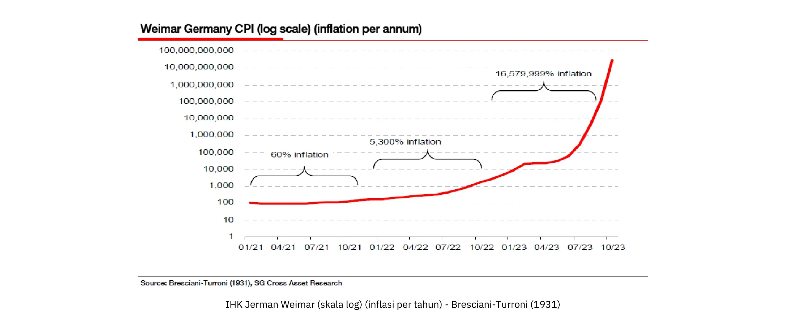

#### 2. Uang darurat (Notgeld)

Menghadapi krisis moneter dan ekonomi, Jerman menggunakan "Notgeld" (uang darurat). Uang kertas ini, yang dicetak oleh kota atau perusahaan tertentu, dirancang untuk menutupi kekurangan mata uang umum.

Menariknya, Prancis juga menggunakan Notgeld, terutama pada tahun 1920-an. Inisiatif ini bukan hanya konsekuensi langsung dari hiperinflasi, tetapi juga berakar pada gangguan yang disebabkan oleh Perang Dunia I. Perang ini tidak hanya mengacaukan ekonomi tetapi juga meningkatkan harga logam. Akibatnya, nilai intrinsik koin logam sering kali melebihi nilai nominalnya, sehingga mendorong orang untuk menimbunnya. Dengan tidak adanya koin, beberapa institusi, seperti Kamar Dagang Lyon, mencetak Notgeld mereka sendiri.

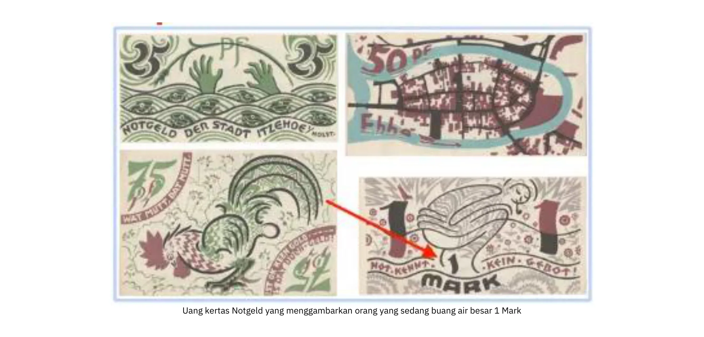

> "Apa yang harus dilakukan, harus dilakukan." - pepatah lokal

Di antara Notgeld, ada satu uang kertas yang menonjol. Uang kertas ini menampilkan ilustrasi yang pedih: di bagian tengahnya, seseorang digambarkan sedang buang air besar dengan Mark. Di sisi sebaliknya, tabel harga dari tahun 1913 hingga 1921 menggambarkan kenaikan inflasi selama periode ini.

Seniman di balik Notgeld ini tampaknya membuat kritik ironis terhadap pihak berwenang yang bertanggung jawab atas krisis hiperinflasi. Uang kertas ini bertuliskan "Kebutuhan tidak mengenal hukum". Ungkapan lain yang spesifik untuk daerah asal Notgeld adalah: "Apa yang harus dilakukan, harus dilakukan."

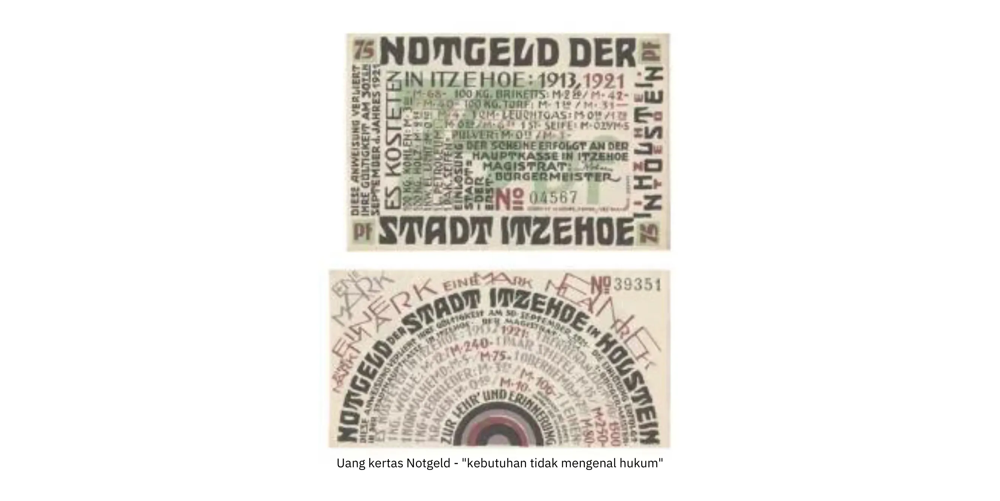

> "kebutuhan tidak mengenal hukum"

> Shitcoin pertama: Secara anekdot, melihat ilustrasi utama uang kertas, di mana mata uang secara harfiah didevaluasi oleh tindakan individu, ini bisa disebut sebagai "shitcoin" pertama

#### 3. Surat utang dan hipotek

Di Weimar, beberapa utang dinilai kembali untuk mengimbangi dampak inflasi. Langkah ini tidak diadopsi di Zimbabwe.

> Weimar: "Keputusan untuk merevaluasi pinjaman milik pemerintah menjadi undang-undang pada tahun 1925, yang mengakibatkan para pemegang saham menerima 2,5 persen dari investasi awal mereka asalkan semua reparasi telah dibayarkan."

> Zimbabwe: "Pada bulan Juli 2007 (tiga tahun kemudian), saya dapat mengambil uang kertas ZDW 500.000 (bt "000") yang telah didevaluasi dari saku saya, yang kini bernilai $1,67 pada nilai tukar pasar paralel, dan melunasi pinjaman KPR, yang seharusnya dilunasi dalam waktu dua puluh tahun. Selain itu, uang kertas ini hanya mewakili 0,49 persen dari gaji bulanan saya pada bulan yang sama."

Untuk mempelajari lebih lanjut tentang mengelola krisis Jerman, buku ini juga penting.

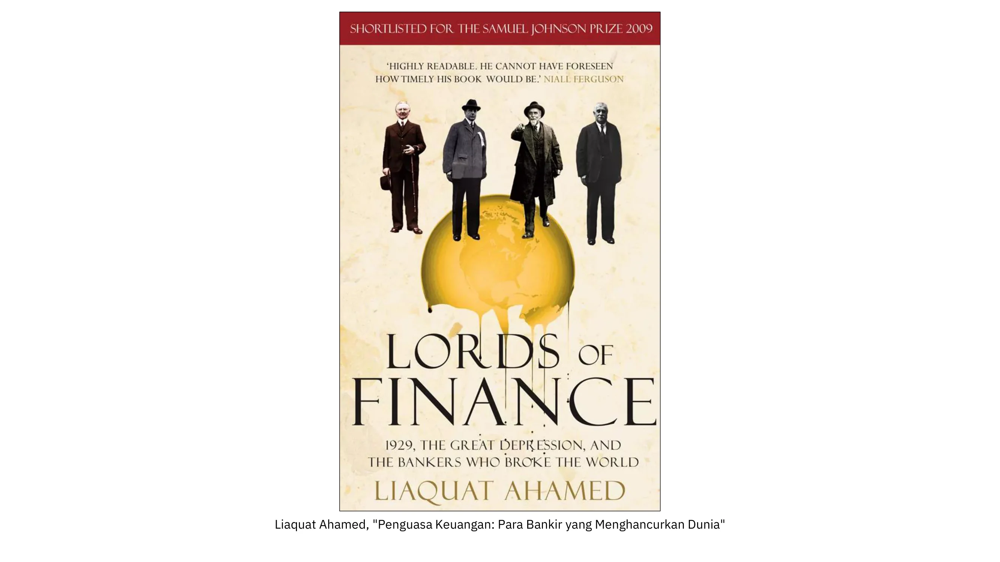

### Paralel Kontemporer

#### 1. Manipulasi kebijakan moneter untuk mengendalikan ekonomi.

Dalam sejarah Republik Weimar, terbukti bahwa para industrialis enggan melihat nilai Mark dihargai. Kemampuan mereka untuk meminjam dan membayar utang dengan mata uang yang terdepresiasi sangat besar memberi mereka keuntungan besar. Mekanisme ini memfasilitasi pembangunan kompleks industri besar dengan biaya yang hampir tanpa biaya. Para industrialis ini takut akan apresiasi Mark karena hal ini menghambat aktivitas mereka. Beberapa bahkan melihat inflasi yang merajalela sebagai perkembangan positif, karena mereka percaya bahwa hal itu akan menjamin lapangan kerja bagi penduduk. Namun, mereka tidak menyadari dampak buruk dari inflasi ini terhadap tabungan dan perekonomian secara keseluruhan. Bagi para pelaku ekonomi ini, pencetakan uang adalah sebuah berkah.

> Weimar: "Inilah sebabnya mengapa apresiasi terhadap merek ini sangat ditakuti, dan bahkan beberapa minggu 'stabilitas' setelah Genoa menyebabkan stagnasi bisnis."

> Weimar: "Kalangan industri menghadapi bahaya bahwa uang tunai akan menjadi lebih berharga daripada barang, dan keruntuhan akan terjadi ketika semua orang mencoba mengubah aset mereka menjadi uang tunai."

Sebuah paralel kontemporer dapat ditarik dengan pernyataan Christine Lagarde, yang menyarankan agar warga negara memprioritaskan prospek lapangan kerja di atas perlindungan tabungan mereka. Sama seperti para industrialis di Weimar, ia tampaknya menganjurkan pencetakan uang sebagai alat untuk merangsang lapangan kerja, dengan mengorbankan nilai tabungan.

> Christine Lagarde: "Kita seharusnya lebih senang memiliki pekerjaan daripada melihat tabungan kita terlindungi."

#### 2. Hak milik pribadi pada saat konflik

Sejarah Republik Weimar mengungkapkan bahwa selama periode ini, aset dan modal yang disimpan di luar negeri disita. Tindakan ini mengingatkan kita pada kejadian-kejadian yang lebih baru di Rusia, terutama pada awal konflik. Situasi ini menyoroti kenyataan yang memprihatinkan: pada saat krisis, penghormatan terhadap properti pribadi dapat dikompromikan. Ini adalah paralel historis dan kontemporer yang menggarisbawahi potensi dampak krisis terhadap hak-hak individu.

> Weimar: "Semua modal Jerman yang disimpan di luar negeri telah disita."

> (20minutes.fr) (https://www.20minutes.fr/monde/3286947-20220513-guerre-ukraine-geler-avoirs-russes-vol-non-redistribuer-kiev-poserait-lourdes-questions): "Sekitar 300 miliar dolar AS cadangan Rusia yang disimpan di luar negeri telah dibekukan sebagai bagian dari sanksi Barat, dari total 640 miliar dolar AS cadangan yang disimpan Bank Sentral Rusia."

#### 3. Pengertian Harga Pasar

Selama masa Republik Weimar, para petani mengungkapkan ketidakpuasan mereka terhadap "Umlage", yang memaksa mereka untuk menyerahkan dua juta ton gandum pertama yang diproduksi setiap tahun. Peraturan ini mengakibatkan setengah dari total roti Supply ditempatkan di pasar dengan harga subsidi. Sejak bulan Agustus dan seterusnya, para petani ini seharusnya dibayar dengan harga pasar dunia, karena meskipun mereka dipaksa untuk menyerahkan gandum mereka dengan harga yang lebih murah, mereka masih harus membeli pupuk dengan harga pasar dunia.

Situasi ini memunculkan isu utama terkait gagasan harga pasar selama hiperinflasi. Dalam konteks Jerman pada saat itu, para petani terpaksa menjual gandum mereka dengan harga di bawah nilainya, sementara mereka harus membeli pupuk dengan harga pasar dunia. Kesenjangan ekonomi seperti itu menyoroti tantangan yang ditimbulkan oleh harga pangan saat ini. Produsen pertanian, yang dihadapkan pada kenaikan biaya input akibat inflasi, membebankan biaya ini pada produk akhir. Mengkritik mereka atas kenaikan ini sama saja dengan mengabaikan dinamika harga pasar dan tekanan ekonomi yang mereka hadapi. Menjual dengan harga yang sangat rendah sementara mengeluarkan biaya yang tinggi tidak berkelanjutan untuk bisnis apa pun.

> Weimar: "Kepentingan pertanian tidak puas dengan 'Umlage', pengiriman paksa dua juta ton gandum pertama yang diproduksi setiap tahun, yang memungkinkan setengah dari total roti Supply dijual dengan harga rendah. Mulai bulan Agustus, para petani akan dibayar dengan harga pasar dunia karena, meskipun mereka diwajibkan untuk menjual gandum dengan harga rendah, mereka selalu harus membayar harga pasar dunia untuk pupuk."

#### 4. Penyangkalan Hubungan Antara Uang Supply dan Inflasi

> Weimar: "Dia tetap berpegang teguh pada pandangannya bahwa uang Supply tidak terkait dengan tingkat harga maupun tingkat Exchange;"

Di zaman modern, tren ini terus berlanjut, seperti yang terlihat pada contoh di bab sebelumnya mengenai daftar penjelasan yang dikemukakan oleh berbagai ekonom dan lembaga ekonomi untuk menjustifikasi inflasi. Alasan-alasan ini beragam, mulai dari peristiwa budaya dan selebriti seperti Taylor Swift, Zelda, atau Beyonce, hingga faktor global seperti perang dan pandemi. Semua alasan ini, meskipun berpotensi berkontribusi pada fluktuasi ekonomi jangka pendek, mengalihkan perhatian dari penyebab utama yang sebenarnya: ekspansi uang Supply.

#### 5. Perusahaan Zombie

> Weimar: "Stabilisasi telah mengakhiri periode ketika para pengusaha dapat meminjam sebanyak yang mereka inginkan dengan mengorbankan orang lain. Sejumlah besar perusahaan, yang didirikan atau diperluas selama masa kelimpahan uang, dengan cepat menjadi tidak produktif ketika modal menjadi langka."

Perusahaan zombie adalah bisnis yang, dalam kondisi pasar normal, akan bangkrut atau hampir bangkrut, tetapi terus beroperasi terutama berkat pinjaman berbiaya rendah. Perusahaan-perusahaan ini hanya menghasilkan cukup untuk menutupi utang-utangnya, namun tidak dapat tumbuh secara signifikan.

Gagasan tentang perusahaan zombie bukanlah hal yang baru. Faktanya, gagasan ini sudah ada sejak zaman Republik Weimar. Pada saat itu, banyak perusahaan yang tampaknya berkembang pesat, sebagian besar diuntungkan oleh akses ke kredit gratis. Mereka meminjam dalam jumlah besar dengan harapan dapat membayarnya kembali dengan mata uang yang terdepresiasi karena inflasi yang merajalela. Namun, ketika inflasi berhenti dan nilai mata uang Jerman kembali menguat, perusahaan-perusahaan ini, yang tidak benar-benar layak secara operasional atau finansial, menjadi tidak menguntungkan dan harus ditutup.

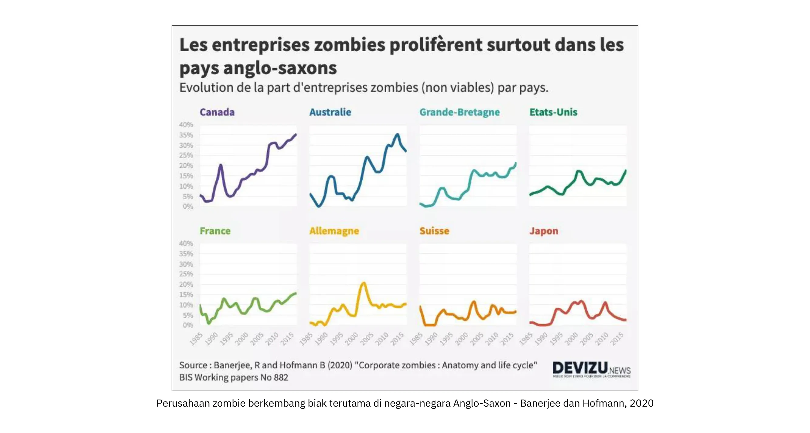

Fenomena perusahaan zombie tidak hanya terjadi di Jerman pascaperang. Bahkan saat ini, banyak perusahaan besar yang terus berkembang karena akses istimewa mereka terhadap kredit dengan suku bunga yang sangat rendah. Jika mereka harus meminjam dengan suku bunga yang lebih konvensional, banyak dari mereka tidak akan lagi menguntungkan. Hal ini sangat relevan pada tahun 2023, setelah periode suku bunga mendekati nol yang berkepanjangan, karena suku bunga saat ini sudah mulai naik. Pergeseran lanskap keuangan baru-baru ini tidak diragukan lagi akan menjadi ujian yang menentukan bagi perusahaan-perusahaan ini, yang pernah dijuluki "zombie"

#### 6. Cepat kaya!

Sejarah mengungkapkan contoh-contoh di mana individu berusaha mengumpulkan kekayaan dengan cepat, seperti yang terjadi di Weimar dan Zimbabwe melalui arbitrase. Saat ini, tren serupa dapat diamati dengan munculnya mata uang kripto tertentu. Orang-orang tergoda oleh keuntungan cepat, mengambil risiko dengan harapan peningkatan eksponensial dalam investasi mereka. Pendekatan ini mengingatkan kita pada apa yang terjadi pada masa hiperinflasi, di mana arbitrase digunakan untuk mendapatkan keuntungan cepat, sering kali dengan mengorbankan orang lain.

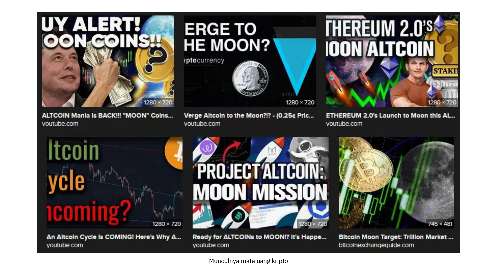

#### 7. Tabungan, Obat untuk Mengatasi Ketidakpastian

> Pengaruh yang meresap dan merusak dari erosi nilai modal dan pendapatan yang terus menerus, serta ketidakpastian tentang masa depan.

Ada baiknya menyoroti sebuah kutipan yang menggarisbawahi efek destruktif dari erosi nilai kapital terhadap kohesi sosial, serta ketidakpastian yang ditimbulkannya. Kutipan tersebut menyatakan: "pengaruh yang meresap dan merusak dari erosi nilai modal dan pendapatan yang terus menerus, serta ketidakpastian tentang masa depan."

Bayangkan sebuah skenario di mana Anda memiliki keluarga atau orang yang Anda cintai yang ingin Anda lindungi. Anda bekerja di Hard dan menabung untuk mengantisipasi ketidakpastian di masa depan. Jika semuanya dapat diprediksi, menabung tidak akan berguna. Namun, dalam menghadapi keadaan yang tidak terduga, seperti mobil mogok, tabungan menjadi penyelamat. Tabungan mengurangi ketidakpastian dunia. Namun, selama hiperinflasi, menabung menjadi sebuah tantangan. Uang dengan cepat kehilangan nilainya, membuat perencanaan jangka panjang menjadi sulit. Ketidakstabilan keuangan ini dapat menimbulkan stres dan kecemasan.

Saat ini, dengan menurunnya daya tabungan, investasi telah menggantikannya. Namun, pendekatan ini memiliki risiko tersendiri. Menabung selalu menjadi obat untuk menghadapi ketidakpastian. Memiliki cadangan keuangan untuk menghadapi situasi yang tidak terduga akan memberikan ketenangan pikiran dan memperkuat kohesi sosial. Kesimpulannya, melindungi kekuatan tabungan kita sangat penting untuk menjaga stabilitas sosial dan individu.

## Redenominasi di Amerika Latin

<chapterId>918eafd7-409d-5205-ad52-a52e63b23a64</chapterId>

Sekarang kita akan melihat periode redenominasi yang berbeda di negara-negara Amerika Latin.

### Penjelasan tentang grafik

Pada slide di sebelah kiri, terdapat tahun redenominasi, nama mata uang baru, dan nilai tukar Exchange dengan mata uang lama. Mengambil contoh Argentina, peso moneda nacional dikonversi dengan rasio 25 banding 1 dari mata uang sebelumnya, peso reàl. Dalam konteks ini, kami akan membahas evolusi mata uang Argentina dari waktu ke waktu. Selain itu, kami akan menunjukkan denominasi awal dan akhir uang kertas untuk setiap periode.

Di sisi kanan slide, grafik inflasi ditampilkan. Panah merah menunjukkan tahun-tahun hiperinflasi, seperti yang didefinisikan oleh kriteria Cagan, yaitu tingkat inflasi 50% per bulan. Kriteria ini terkadang dapat menimbulkan interpretasi yang ambigu, karena tahun-tahun dengan tingkat inflasi yang tinggi mungkin tidak memenuhi definisi hiperinflasi yang ketat.

Perlu dicatat bahwa redenominasi, sebuah langkah umum yang diambil oleh pemerintah selama periode inflasi, adalah kejadian penting. Namun, hal ini tidak menyelesaikan masalah inflasi atau hiperinflasi yang mendasarinya. Redenominasi hanyalah sebuah cara untuk mengganti nama mata uang dan menghilangkan angka nol, tanpa benar-benar mengatasi akar penyebab hiperinflasi: perluasan uang Supply. Dalam video berikutnya, kita akan membahas solusi nyata untuk Address dan menyelesaikan masalah hiperinflasi. Dalam seri ini, kami akan menyoroti konsekuensi dari redenominasi sederhana tanpa reformasi yang memadai: inflasi terus berlanjut.

Setelah Argentina, penelitian kami akan mencakup Brasil, Bolivia, Peru, Nikaragua, dan Venezuela. Kami akan memeriksa redenominasi yang telah terjadi di negara-negara ini.

### Argentina

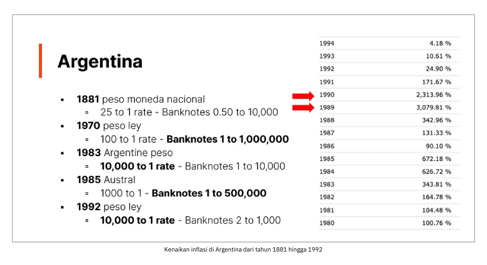

Sebelum tahun 1826, Argentina menggunakan mata uang dolar Spanyol. Setelah merdeka pada tahun 1816, negara ini memperkenalkan mata uangnya sendiri yang didasarkan pada reál Spanyol, yang menghasilkan mata uang serupa. Tabel ini dimulai pada tahun 1881, tahun diperkenalkannya "peso moneda nacional", dengan pecahan uang kertas hingga 10.000. Kemudian diikuti oleh "peso ley", yang ditukarkan dengan rasio 100 banding 1 dan memiliki pecahan uang kertas hingga satu juta. Kemudian, "peso Argentina" hadir dengan nilai tukar Exchange sebesar 10.000 banding 1 (setara dengan menghilangkan empat angka nol), dan uang kertas hingga 10.000. Pada tahun 1985, "australes" diperkenalkan dan ditukarkan dengan nilai 1.000 banding 1, dan uang kertas yang tersedia hingga 500.000. Pada tahun 1992, "peso ley" saat ini ditetapkan dengan nilai 10.000 banding 1, sekali lagi menghilangkan empat angka nol. Hanya tahun 1989 dan 1990 yang mengalami hiperinflasi.

### Brasil

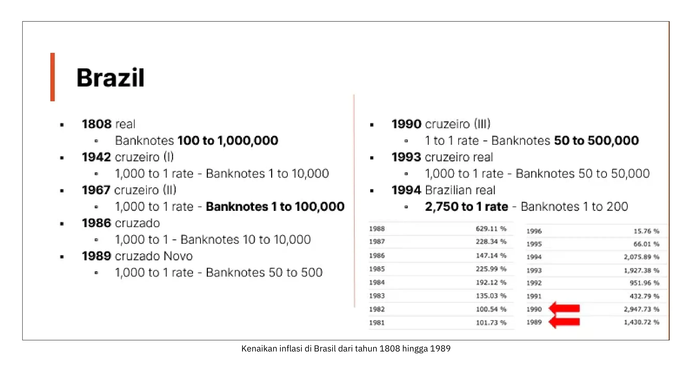

Brasil adalah contoh penting dari redenominasi moneter, seperti yang diilustrasikan oleh sejarah perubahan mata uangnya. Sebelum kemerdekaannya, Brasil menggunakan reel Portugis sebagai mata uangnya. Namun, sejak tahun 1747, negara ini mulai menggunakan "reál Brasil", jauh sebelum deklarasi kemerdekaannya pada tahun 1822. Tabel ini dimulai pada tahun 1818, menandai awal penerbitan uang kertas Brasil. Sebelumnya, mata uangnya hanya berupa koin. Uang kertas ini mencapai nilai hingga satu juta reais.

Mulai tahun 1942, Brasil memulai serangkaian redenominasi. Dalam kebanyakan kasus (1942, 1967, 1986, 1989, 1993), tingkat konversinya adalah 1:1.000. Pada tahun 1990, perubahan nama terjadi tanpa konversi. Urutan mata uang ini adalah sebagai berikut:

- Réals (versi lama) hingga tahun 1942.
- Cruzeiros pada tahun 1942.
- Cruzeiros (versi baru) pada tahun 1967.
- Cruzados pada tahun 1986.
- Cruzados Novos pada tahun 1989.
- Kembali ke Cruzeiros pada tahun 1990.
- Cruzeiros Reais pada tahun 1993.
- Terakhir, reel Brasil pada tahun 1994.

Uang kertas dengan denominasi tertinggi mencapai 500.000, dan redenominasi terakhir pada tahun 1994 dilakukan dengan rasio 2,750 banding 1. Tahun 1989 dan 1990 ditandai dengan hiperinflasi, sementara tahun 1993-1994 mengalami tingkat inflasi yang tinggi namun tidak mencapai ambang batas hiperinflasi (50% per bulan). Setelah periode yang penuh gejolak ini, Brasil sekali lagi melakukan redenominasi mata uangnya dengan menghilangkan beberapa angka nol.

### Bolivia

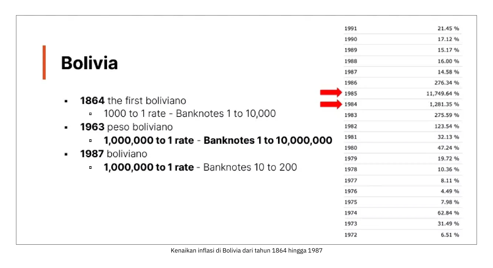

Bolivia adalah contoh lain dari sebuah negara yang telah mengalami periode inflasi akut, yang mengharuskan redenominasi mata uang. Berikut ini adalah ringkasan sejarah moneternya:

Sebelum merdeka pada tahun 1825, Bolivia menggunakan dolar Spanyol sebagai mata uangnya. Setelah merdeka, negara ini memperkenalkan Sol Bolivia antara tahun 1827 dan 1864, menggantikan dolar Spanyol. Namun, perlu dicatat bahwa uang kertas pertama di Bolivia baru diperkenalkan pada tahun 1864.

Pada tahun 1864, "Boliviano" pertama diperkenalkan, dengan nilai Exchange sebesar 1.000 banding 1 dibandingkan dengan Sol Bolivia. Mata uang ini tetap beredar hingga mencapai pecahan 10.000 Boliviano.

Setelah itu, Bolivia mengganti mata uangnya menjadi "Peso Bolivia", yang mengalami hiperinflasi parah, yang akhirnya mencapai denominasi hingga 10 juta. Episode inflasi ini mencapai puncaknya pada tahun 1984-1985, dengan tingkat inflasi bulanan yang sering mendekati ambang batas hiperinflasi sebesar 50%. Sebagai gambaran, tingkat inflasi konstan sebesar 50% per bulan selama satu tahun penuh menghasilkan tingkat inflasi tahunan sekitar 12.800%. Pada tahun 1985, tingkat inflasi tahunan Bolivia mencapai 11.749%, mengindikasikan bahwa inflasi mendekati atau melampaui ambang batas 50% hampir setiap bulan.

Menanggapi krisis moneter ini, pada tahun 1987, Bolivia memperkenalkan mata uang baru, yang disebut "Boliviano", dengan nilai Exchange sebesar 1 juta Peso Bolivia untuk 1 Boliviano. Versi Boliviano ini masih beredar hingga saat ini.

Itulah gambaran umum sejarah moneter Bolivia yang penuh gejolak, yang ditandai dengan periode hiperinflasi dan redenominasi.

### Peru

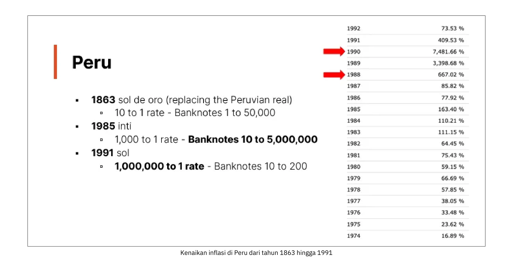

Peru menyajikan kasus yang menarik mengenai efek dari aturan 50% yang sewenang-wenang. Dimulai dengan sejarah moneternya, Peru menggunakan emas Spanyol hingga abad ke-19, ketika negara ini mendeklarasikan kemerdekaannya pada tahun 1821. Dolar Peru digunakan dari tahun 1822 hingga 1863. Pada tahun 1863, reál Peru digantikan oleh soldi oro, dengan rasio 10 banding 1, mencapai nilai maksimum 50.000. Pada tahun 1985, mata uang "Inti" diperkenalkan dengan tingkat konversi 1000 banding 1, mencapai puncaknya pada 5 juta. Pada tahun 1991, "SOL" diluncurkan dengan nilai tukar 1 juta berbanding 1, dengan nilai uang kertas mulai dari 10 hingga 200.

Menelaah periode redenominasi, 1988 dianggap sebagai tahun hiperinflasi, terutama di bulan September. Bulan Juli-Agustus 1990 juga mengalami periode hiperinflasi. Pada tahun 1988, tingkat inflasi tahunan mencapai 667%, dengan puncaknya mencapai 50% pada bulan September. Sebaliknya, tahun 1989 mengalami tingkat inflasi sebesar 3000% tanpa ada bulan yang melebihi 50%, sehingga tidak diklasifikasikan sebagai hiperinflasi. Pada tahun 1990, inflasi mencapai puncaknya pada 7481%. Jelas bahwa aturan 50% bisa berubah-ubah, karena tahun 1988 dianggap sebagai tahun hiperinflasi, tidak seperti tahun 1989. Jika aturan ini dipertimbangkan kembali, mungkin akan lebih baik jika ambang batasnya diturunkan untuk memasukkan periode seperti yang dialami Peru pada tahun 1989.

> Memahami apa yang sedang terjadi
>

> Hal utama yang perlu dipahami tentang redenominasi mata uang adalah ketika nilai mata uang mencapai angka yang sangat besar, misalnya 5 atau 10 juta, mata uang tersebut diredenominasi. Proses ini dapat diulang beberapa kali, yang melibatkan perubahan mata uang. Hasilnya adalah tabungan individu dapat sangat terpengaruh, bahkan tanpa adanya hiperinflasi. Sebagai contoh, jika seseorang menabung $1.000 dalam satu tahun dan berhasil menyisihkan $100, pada tahun berikutnya, uang pecahan terendah bisa menjadi $1.000, membuat uang $100 yang sebelumnya ditabung menjadi tidak berharga. Erosi tabungan seperti itu tidak memerlukan hiperinflasi yang jelas. Bahkan jika seseorang telah menabung $10.000 selama sepuluh tahun terakhir, jumlah tersebut bisa saja menjadi sangat kecil, bahkan tidak dapat membeli sebotol air. Kenyataan ini terlihat jelas di banyak negara yang telah mengalami redenominasi, meskipun hanya beberapa bulan saja yang diklasifikasikan sebagai hiperinflasi. Sebaliknya, beberapa negara, seperti Nikaragua, telah mengalami hiperinflasi selama bertahun-tahun.

### Nikaragua

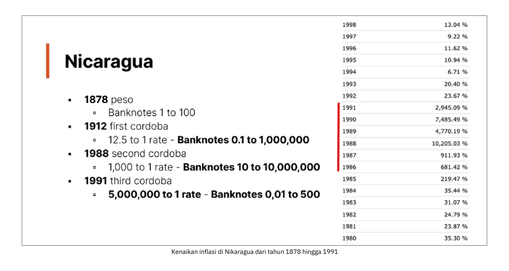

Nikaragua, yang sebelumnya berada di bawah kekuasaan Spanyol, pada awalnya menggunakan mata uang dolar Spanyol, seperti banyak negara lain yang dijajah Spanyol. Setelah diintegrasikan ke dalam Kekaisaran Spanyol, Kekaisaran Meksiko, dan kemudian Republik Federal Amerika Tengah, Nikaragua mendeklarasikan kemerdekaannya. Mulai tahun 1878, peso menjadi mata uang resmi negara ini, dengan nilai yang berfluktuasi antara 1 dan 100. Pada tahun 1912, negara ini memperkenalkan mata uang Cordoba pertama, diikuti oleh mata uang kedua pada tahun 1988 dan mata uang ketiga pada tahun 1991, yang masih digunakan sampai sekarang. Cordoba pertama mencapai nilai 1 juta, dan yang kedua 10 juta. Redenominasi pada tahun 1991 dilakukan setelah beberapa tahun mengalami hiperinflasi.

### Venezuela

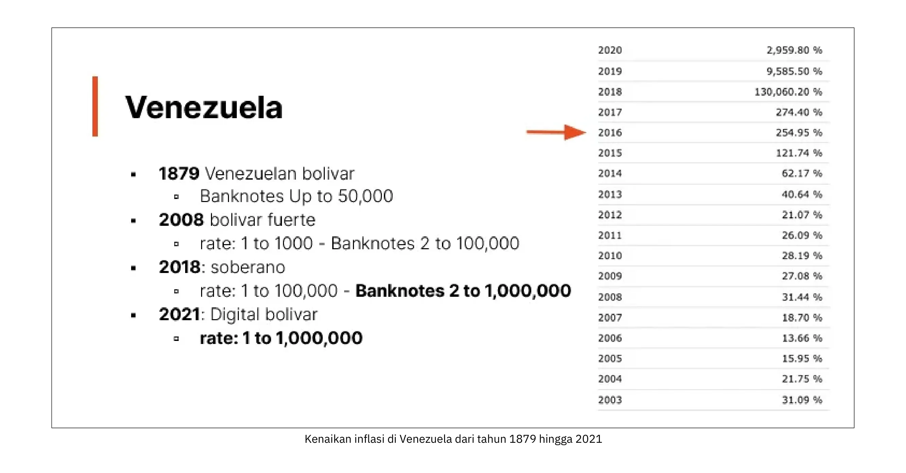

Venezuela adalah negara terakhir yang disebutkan dalam video ini. Negara ini telah mengalami empat kali redenominasi mata uang dari waktu ke waktu. Pada masa-masa awalnya, Venezuela menggunakan dolar Spanyol sebelum mendeklarasikan kemerdekaannya pada tahun 1811. Pada tahun 1879, negara ini memperkenalkan bolivar sebagai mata uang resmi, yang tetap berlaku hingga tahun 1983, ketika pemerintah memilih sistem nilai tukar mengambang Exchange dengan menggunakan dolar.

Fakta penting tentang Venezuela adalah keanggotaannya di Latin Monetary Union. Serikat ini mencakup koin seperti 5 peseta dari Spanyol, 5 drachma dari Yunani, 5 bolivar dari Venezuela, 5 lira dari Italia, 5 franc Belgia, dan 5 franc Prancis.

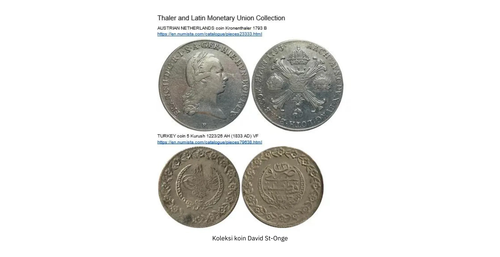

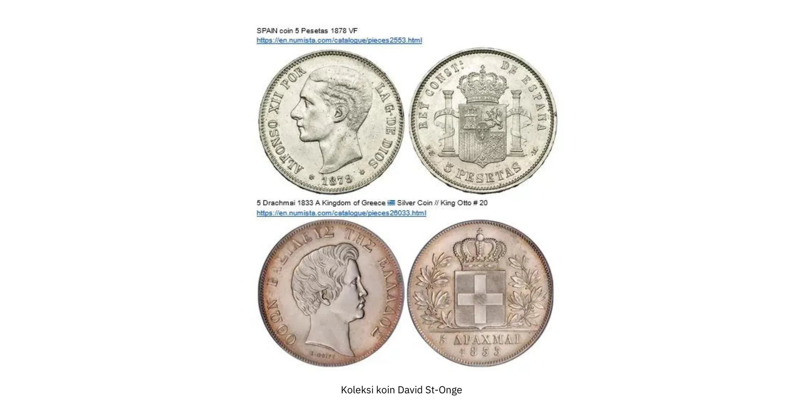

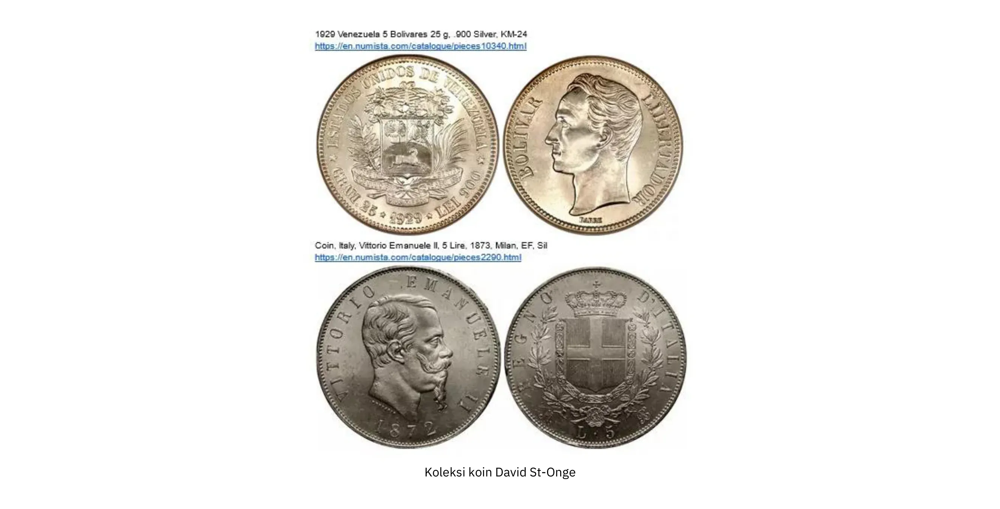

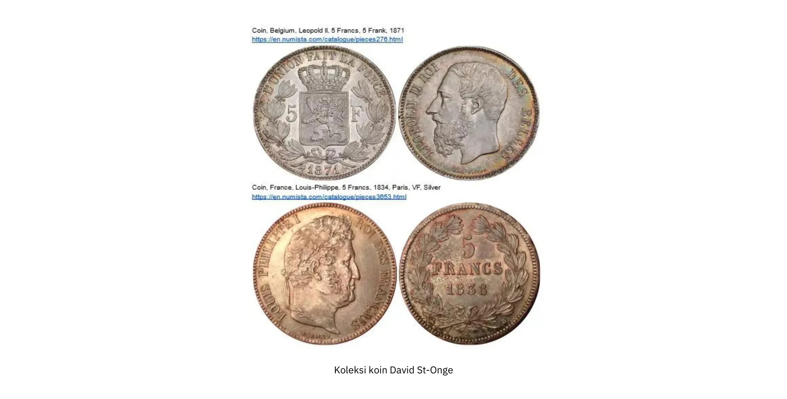

Selama periode ini, 5 bolivar Coin dari Venezuela memiliki berat yang sama dengan negara-negara anggota Uni Eropa, termasuk Italia, Spanyol, Belgia, dan Prancis. Bolivar ini terbuat dari perak, dengan Coin khusus dari tahun 1929 seberat 25 gram dan memiliki kemurnian 900, atau 90% perak murni. Dengan harga perak saat ini, Coin ini bernilai sekitar $17 hingga $18 (Dolar AS).

Setelah penerapan nilai tukar Exchange yang mengambang pada tahun 1983, beberapa redenominasi menyusul:

- Pada tahun 2008, bolivar fuerte, atau "bolivar kuat", diperkenalkan, mencapai 100.000 sebelum redenominasi seribu banding satu.
- Pada tahun 2018, Soberano diperkenalkan, dengan pecahan mencapai 1 juta. Pada tahun 2021, mata uang ini digantikan oleh bolivar digital, yang juga mencapai satu juta, sebelum redenominasi baru menjadi satu juta banding satu. Saat ini, uang pecahan 10 atau 20 setara dengan 10 juta atau 20 juta dalam Soberano.

Uang kertas dari periode ini, yang berasal dari tahun 2018, didistribusikan di berbagai konferensi Bitcoin di Biarritz, Toronto, dan Miami. Uang kertas Soberano ini mencapai nilai maksimum 1 juta. Redenominasi kemudian terjadi, mengurangi nilai satu juta menjadi sekitar 3 sen. Saat ini, 10 lembar uang 1 juta setara dengan 10 lembar uang 10 sen. Sejak tahun 2016, Venezuela telah mengalami hiperinflasi, yang mewakili periode ke-57 dalam tabel tertentu.

Dalam video berikutnya, koleksi uang kertas hiperinflasi akan disajikan, dengan fokus pada Venezuela dan negara-negara lain yang terdaftar. Koleksi ini berisi hampir semua uang kertas Venezuela. Studi ini akan berfokus pada redenominasi yang berbeda untuk masing-masing negara yang disebutkan. Selain itu, akan ada eksplorasi redenominasi di Zimbabwe, sebuah topik yang cukup menarik.

### Kesimpulan

Kita telah melihat bahwa hiperinflasi bukanlah satu-satunya indikator bencana ekonomi. Redenominasi beberapa kali, menghilangkan angka nol, atau mengubah nama mata uang memiliki dampak langsung pada populasi, mulai dari hilangnya bantuan hingga masalah pangan. Meskipun hiperinflasi mengkhawatirkan, jumlah redenominasi, seperti yang diamati di Brasil, menunjukkan kenyataan yang lebih kompleks.

Berdasarkan kriteria inflasi 50% per bulan, beberapa periode dapat diklasifikasikan sebagai hiperinflasi. Hal ini terutama terjadi ketika memeriksa kriteria organisasi akuntansi internasional, yang mempertimbangkan karakteristik seperti pengabaian mata uang yang cepat oleh penduduk, pengindeksan upah, dan pinjaman dengan suku bunga tinggi untuk mengimbangi inflasi.

Kesimpulannya, hiperinflasi hanyalah salah satu aspek dari tantangan ekonomi. Inflasi yang tinggi saja bisa sama merusaknya. Bagian selanjutnya akan membahas solusi-solusi yang mungkin untuk mengatasi hiperinflasi.

## Cara mengatasi hiperinflasi

<chapterId>e3484a31-a851-5f92-8af5-00eddae67db1</chapterId>

### Bagaimana cara mengakhiri inflasi sedang dan tinggi

Kesimpulan-kesimpulan tersebut diambil dari buku "Monetary Regime and Inflation" oleh Peter Bernholz. Menurut Bernholz, satu-satunya cara untuk mengakhiri inflasi adalah dengan menerapkan reformasi moneter dan memberlakukan pembatasan fiskal pada pemerintah. Pembatasan ini melibatkan pembentukan sebuah institusi, seperti bank sentral, yang beroperasi secara independen dari keputusan politik pemerintah. Inflasi tinggi dan hiperinflasi sering kali merupakan hasil dari pembiayaan defisit anggaran melalui penciptaan uang. Untuk Address inflasi moderat, sangat penting untuk mengurangi pertumbuhan uang Supply. Bernholz juga menyarankan bahwa pertumbuhan moneter ini harus relatif terhadap negara-negara tetangga. Hal yang mengejutkan adalah, selama periode inflasi tinggi atau hiperinflasi, nilai total uang Supply sebenarnya dapat menurun. Contoh nyata dari situasi ini adalah Zimbabwe.

### Solusi yang berlawanan dengan intuisi

Ketika mempelajari Zimbabwe, diketahui bahwa 10 triliun unit uang Supply telah kehilangan semua nilainya. Di Weimar, dimungkinkan untuk mencetak dua pertiga dari total nilai nominal 65 miliar unit uang Supply dalam satu hari. Hal ini menunjukkan bagaimana uang Supply dapat didevaluasi. Untuk memperbaiki situasi ini, perlu untuk meningkatkan uang Supply secara signifikan untuk mencapai tingkat yang sesuai. Maka, reformasi moneter sangat diperlukan. Dalam situasi inflasi yang tinggi, reformasi ini tidak dapat dihindari, tetapi harus memastikan bahwa ada cukup uang yang beredar. Setelah langkah ini, pembatasan dapat diberlakukan oleh pemerintah.

Menurut pengamatan Bernholz, ketika menangani masalah inflasi, lembaga-lembaga seperti IMF dan Bank Dunia tidak selalu menggunakan strategi yang paling efektif. Dalam beberapa kasus, ketika sebuah negara perlu meningkatkan jumlah uang beredarnya, lembaga-lembaga ini justru berusaha menguranginya. Kuncinya adalah mencapai tingkat moneter yang memadai dan kemudian memberlakukan batasan pada pertumbuhannya, sehingga menghindari pembiayaan pengeluaran pemerintah melalui penciptaan uang.

Sebuah aspek menarik yang diangkat oleh Bernholz adalah bahwa keberhasilan sebuah reformasi moneter tidak hanya bergantung pada relevansi teknisnya, namun juga pada kepercayaan yang diberikan oleh masyarakat. Beberapa reformasi yang dirancang dengan baik dapat gagal karena masyarakat tidak mempercayainya, sementara yang lain, yang dirancang dengan buruk, dapat berhasil karena masyarakat mempercayainya. Oleh karena itu, persepsi dan kepercayaan publik merupakan hal yang sangat penting dalam keberhasilan atau kegagalan reformasi moneter.

- Di Zimbabwe, solusi yang diadopsi untuk melawan inflasi adalah dollarisasi, yang berarti mereka mengadopsi dolar AS atau mata uang lain dari negara tetangga. Pendekatan ini mencegah pemerintah mencetak uang sesuka hati.
- Di Jerman, solusinya adalah menciptakan mata uang baru, Rentenmark. Mata uang ini didukung oleh aset teritorial Reich, dan strategi ini terbukti efektif.

### Kasus Zimbabwe

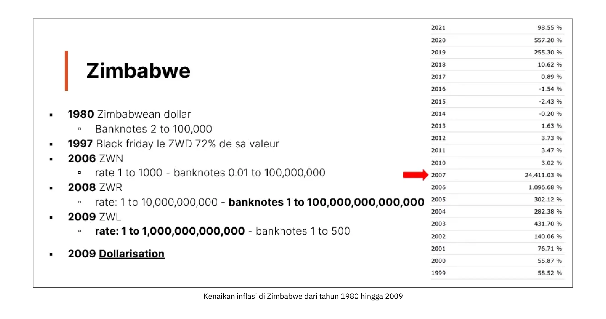

Zimbabwe memperoleh kemerdekaan pada tahun 1980 dan memperkenalkan mata uangnya sendiri, dolar Zimbabwe. Awalnya, dua dolar Zimbabwe bernilai sekitar 1,60 dolar AS. Namun, pada tahun 1997, setelah langkah-langkah sosial yang mendukung para veteran perang, mata uang ini terdevaluasi sebesar 72% dalam satu hari selama Black Friday. Kemudian, pada awal tahun 2000-an, negara ini meluncurkan program redistribusi tanah, yang melibatkan pengambilan tanah dari pemilik kulit putih dan mendistribusikannya kepada penduduk lokal. Keputusan ini merugikan ekspor karena para pemilik baru sering kali tidak memiliki keahlian yang diperlukan untuk mengelola pertanian berskala besar. Akibatnya, meskipun Zimbabwe merupakan eksportir netto pada tahun 1999, negara ini menjadi importir netto pada tahun 2003.

Pada tahun 2006, negara ini memperkenalkan versi baru mata uangnya, ZWN, dengan nilai Exchange 1 banding 1.000. Pada tahun 2008, denominasi lain, ZWR, diperkenalkan dengan nilai Exchange dari 1 hingga 10 miliar. Hal ini menyebabkan terciptanya uang kertas 100 triliun yang ikonik.

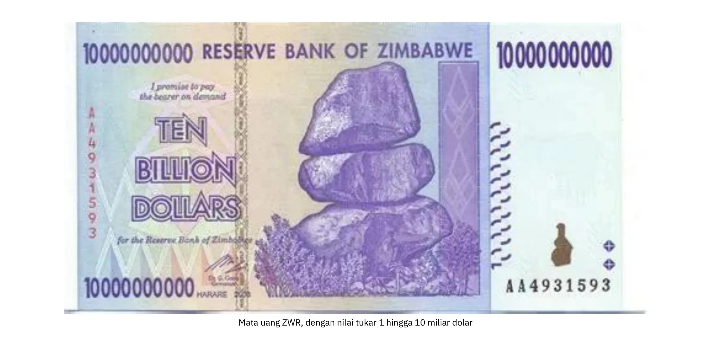

#### Dollarisasi & Resolusi Krisis

Oleh karena itu, setelah tahun 2009, menghadapi krisis moneter yang berkepanjangan dan hiperinflasi yang merajalela, Zimbabwe meninggalkan mata uang nasionalnya dan mengizinkan penggunaan mata uang asing, terutama dolar AS. Keputusan ini, meskipun radikal, mengakhiri hiperinflasi. Pelajaran penting yang dapat diambil adalah bahwa menghentikan penerbitan uang yang berlebihan dan mengakhiri pembiayaan defisit anggaran oleh bank sentral dapat membantu mencegah hiperinflasi.

Namun, dollarisasi bukanlah solusi ajaib. Meskipun dapat mengakhiri hiperinflasi, hal ini menghadirkan tantangan ekonomi lainnya. Salah satu konsekuensinya adalah hilangnya kebijakan moneter yang otonom. Tanpa mata uangnya sendiri, sebuah negara tidak dapat menyesuaikan kebijakan moneternya untuk merespons guncangan ekonomi internal.

Pada tahun 2007, tingkat inflasi Zimbabwe mencapai ambang batas 50% per bulan, yang secara resmi menandai negara ini dalam keadaan hiperinflasi. Setelah dolarisasi pada tahun 2009, hiperinflasi berhenti; namun, negara ini terus menghadapi tantangan ekonomi lainnya.

Sangat memprihatinkan untuk dicatat bahwa Zimbabwe telah mencoba untuk memperkenalkan kembali mata uangnya sendiri, dan tanda-tanda inflasi yang tinggi telah muncul kembali. Menurut beberapa organisasi internasional, negara ini mungkin sudah memenuhi kriteria hiperinflasi lagi, meskipun belum mencapai ambang batas resmi 50% per bulan. Hal ini menjadi pengingat akan bahaya penerbitan uang yang berlebihan dan pembiayaan defisit bank sentral.

### Kesimpulan

Dalam buku saya yang berjudul "Segala Sesuatu Tentang Bitcoin," saya mendedikasikan satu bab penuh untuk hiperinflasi di Zimbabwe. Saya merinci peristiwa-peristiwa penting, memberikan berbagai contoh yang menggambarkan bagaimana negara ini pada akhirnya mengakhiri hiperinflasi.

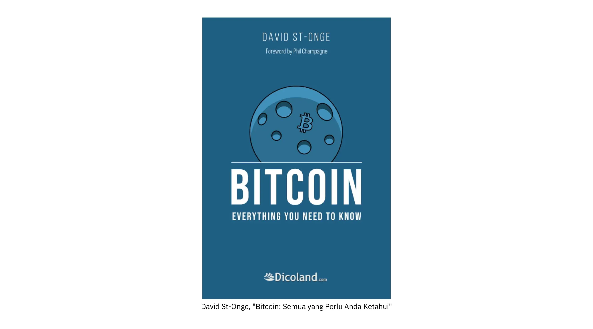

Bagi mereka yang ingin tahu tentang pengalaman Jerman setelah Perang Dunia I, saya sangat merekomendasikan buku komik "The Reich's Banker" Buku ini menceritakan bagaimana Jerman berhasil mengatasi hiperinflasi, terutama melalui penciptaan Rentenmark.

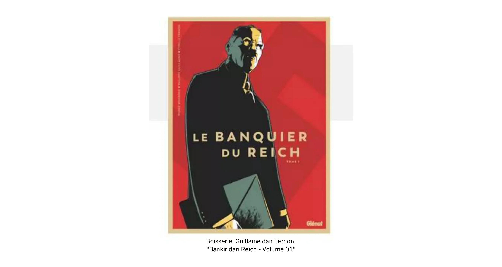

Kesimpulan utamanya adalah ada beberapa strategi untuk mengatasi hiperinflasi. Salah satunya adalah dengan melakukan dollarisasi atau memperkenalkan mata uang baru. Solusi-solusi ini hanya akan berhasil jika masyarakat percaya pada mereka. Sangat penting untuk memberlakukan batasan-batasan yang ketat. Bank sentral yang benar-benar independen sangat penting. Bank sentral tidak boleh menggelembungkan uang Supply untuk menutupi defisit pemerintah. Dalam kasus inflasi ringan, membatasi pertumbuhan uang Supply sudah cukup. Namun, ketika dihadapkan pada hiperinflasi, sangat penting untuk terlebih dahulu memiliki uang Supply yang sesuai dengan ukuran ekonomi. Kemudian, sangat penting untuk memberlakukan batasan yang ketat pada pemerintah untuk menstabilkan situasi.

## Presentasi koleksi uang kertas hiperinflasi

<chapterId>f3ffbb47-3aeb-54bd-80a9-adccb0f419e2</chapterId>

[Temukan koleksi yang dipindai dalam *Bitcoin Educational Toolkit* (juga dapat diakses dari bagian *Sumber Daya* di platform Plan ₿ Academy.](https://penpot.planb.network/#/view?page-id=c157057b-fd28-8042-8004-4f081b21defc&file-id=c157057b-fd28-8042-8004-4f081b21defb&section=interactions&index=0&share-id=7154756b-3ebd-8040-8004-6475c2af5889&interactions-mode=show-on-click)

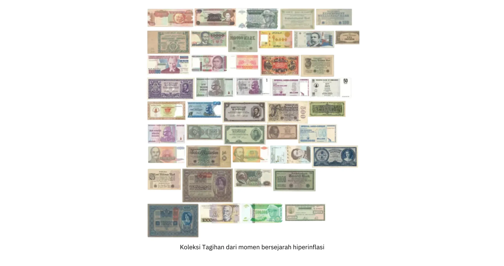

# Bagaimana kita sampai di sini?

<partId>f66ca17e-be9e-5d30-a098-f7affd8962a1</partId>

## Munculnya Layer Kedua dari Uang dan Bank Sentral

<chapterId>0455ffe3-9d45-5a67-ac96-3f815dc507a1</chapterId>

Transkrip:

Kemunculan uang Layer kedua dan bank sentral pertama adalah subjek yang menarik. Tema ini dibahas secara ekstensif dalam buku "Uang Berlapis" oleh Nick Battia. Saya sangat merekomendasikan buku ini bagi mereka yang tertarik dengan evolusi dan seluk-beluk sistem moneter kita. Tujuan dari bagian ini adalah untuk memahami asal mula penciptaan uang dan bagaimana hal itu dapat menyebabkan hiperinflasi.

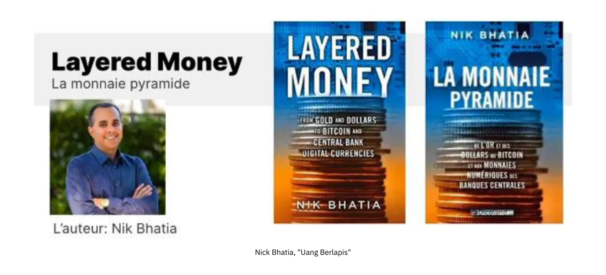

### Uang Piramida dan Bank Sentral

#### Florin

Sejarah uang dimulai pada abad ke-13 di Italia, khususnya di kota Florence. Pada saat itu, florin dan uang kertas Exchange adalah hal yang umum. Contoh yang terkenal adalah florin yang dihiasi dengan sosok Santo Yohanes Pembaptis.

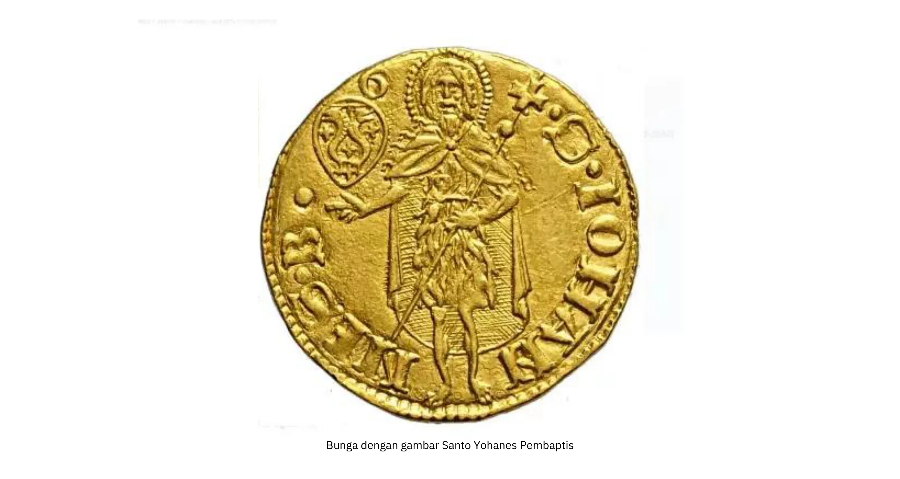

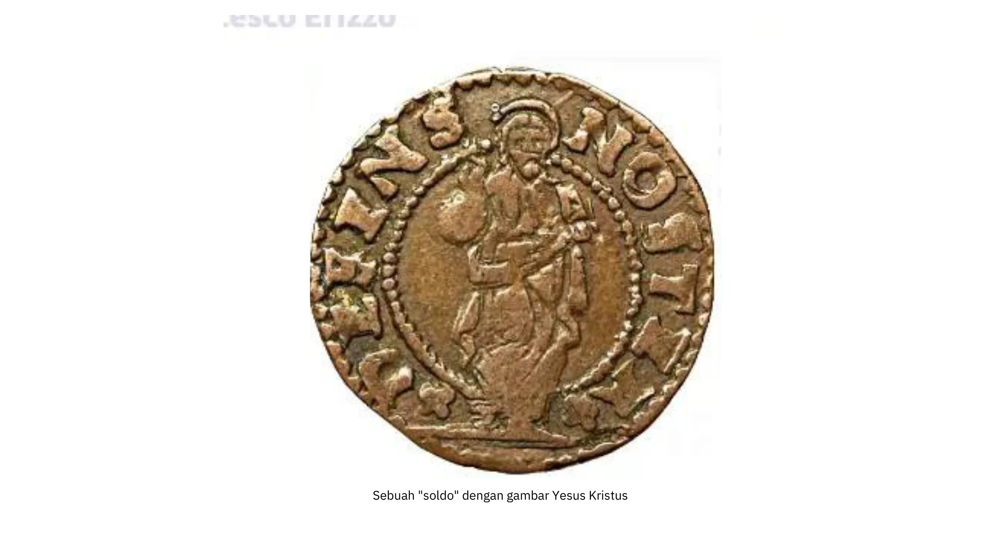

Meskipun memiliki florin asli saat ini mahal, namun reproduksi tersedia. Ada juga mata uang lain dari masa itu, seperti soldo dari negara bagian Italia pada abad ke-17, yang menampilkan gambar Kristus.

#### Tagihan Exchange (abad ke-13)

Praktik yang umum dilakukan pada saat itu adalah sebagai berikut: pandai emas menerbitkan uang kertas Exchange dalam bentuk Exchange untuk florin yang disimpan. Florin ini disimpan dengan hati-hati di lemari besi mereka. Dengan demikian, emas asli, yang diwakili oleh florin, membentuk uang Layer pertama, sementara uang kertas Exchange membentuk Layer kedua. Namun, likuiditas sistem ini terbatas. Jika seseorang ingin menukarkan emasnya dengan uang kertas Exchange, transaksinya sangat mudah. Namun, menukar uang kertas ini antar individu bukanlah praktik yang umum dilakukan.

#### The Antwerp Stock Exchange (abad ke-16)

Antwerp Stock Exchange menandai tonggak penting dalam evolusi uang kertas. Di sanalah praktik pendiskontoan surat promes diperkenalkan. Surat-surat ini adalah instrumen kertas yang mewakili nilai moneter, tetapi keunikannya terletak pada fakta bahwa mereka memiliki nama dan tanggal jatuh tempo. Hal ini membuat mereka sulit untuk dicairkan sebelum tanggal jatuh tempo.

Revolusi yang dibawa oleh Antwerp Stock Exchange terletak pada kemungkinan untuk mendiskon surat-surat berharga ini sebelum tanggal jatuh temponya. Sebagai contoh, jika surat promes jatuh tempo dalam satu bulan, dimungkinkan untuk membelinya dengan harga diskon untuk memperhitungkan waktu sebelum tanggal jatuh tempo. Inovasi ini tidak hanya membuat mata uang kertas menjadi lebih Liquid tetapi juga memperkenalkan konsep nilai waktu dari uang.

Konsep ini, meskipun dikaitkan dengan Nick Bell melalui nama samaran Twitter-nya "nilai waktu BTC", bukanlah penemuannya. Namun demikian, ia membahasnya secara mendetail dalam karyanya. Ide utamanya adalah bahwa waktu memiliki nilai. Jadi, jika seseorang memutuskan untuk membayar surat promes senilai $100 satu bulan sebelumnya, mereka dapat memperolehnya dengan harga, misalnya, $98 dan menerima $100 pada tanggal jatuh tempo. Inovasi moneter ini berasal dari Antwerp Stock Exchange.

#### VOC dan Pasar Saham Amsterdam (abad ke-17)

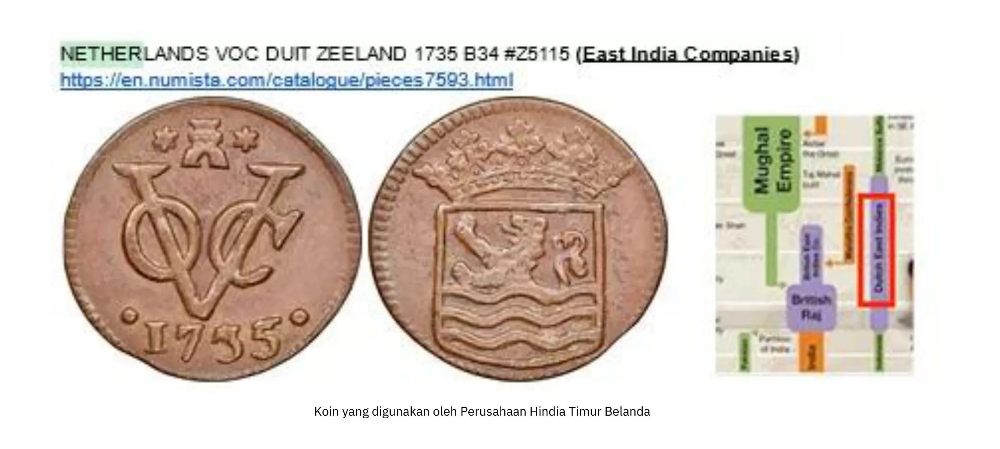

Setelah pendirian Antwerp Stock Exchange, tonggak penting lainnya adalah berdirinya VOC, Perusahaan Hindia Timur Belanda. Perusahaan yang berbasis di Belanda ini bahkan menerbitkan mata uangnya sendiri. Setelah VOC didirikan, pasar saham pertama didirikan di Amsterdam, menandai dimulainya operasi pasar saham perusahaan ini. Yang menarik untuk dicatat adalah bagaimana Belanda berhasil mengakhiri supremasi Antwerpen sebagai pusat ekonomi internasional. Mereka hanya memblokir akses ke Sungai Scheldt. Strategi ini merupakan bagian dari gerakan sejarah yang lebih besar, yaitu pemberontakan para pengemis. Sebuah peristiwa penting dalam sejarah Eropa.

#### Intervensi dari Bank of Amsterdam

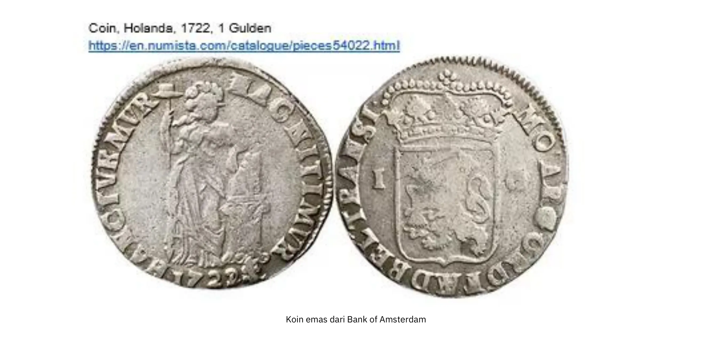

Setelah pendirian VOC, perkembangan penting lainnya dalam sejarah moneter adalah diperkenalkannya koin emas oleh Bank of Amsterdam. Koin-koin ini, yang berasal dari tahun 1722, terbuat dari perak. Namun, yang benar-benar merevolusi keuangan pada saat itu bukanlah Coin itu sendiri, tetapi rekening yang terkait dengan mata uang ini di Bank of Amsterdam. Rekening-rekening ini menjadi sarana utama Exchange internasional. Transaksi hanya dicatat dalam register atau buku besar. Berkat sistem ini, Amsterdam menjadi pusat ekonomi global. Seiring berjalannya waktu, Bank of Amsterdam memutuskan untuk memberlakukan penggunaan akun ini. Penukar uang independen diharuskan untuk menukarkan koin mereka ke Exchange untuk disetorkan ke bank setiap hari.

#### Pembentukan Bank of England untuk membiayai perang

Pendirian Bank of England dimotivasi oleh kebutuhan untuk membiayai perang pada akhir abad ke-17. Seperti Bank of Amsterdam, bank ini memberlakukan deposito berdasarkan keputusan. Keistimewaan Bank of England adalah menurunkan bank swasta ke posisi sekunder dalam sistem moneter, sehingga menciptakan apa yang dapat disebut sebagai "Layer ketiga" mata uang.

Awalnya, mata uang Layer pertama diwakili oleh emas. Deposito yang dibuat dengan bank swasta membentuk Layer kedua. Namun, ketika deposito ini tidak lagi dapat dikonversi menjadi emas, mata uang Layer ketiga muncul. Sejak saat itu, uang kertas yang diterbitkan oleh bank-bank swasta tidak lagi dapat dikonversi menjadi emas, melainkan menjadi mata uang kertas dari Bank of England, yang juga dapat dikonversi menjadi emas. Evolusi ini menyebabkan kompleksitas sistem moneter dengan penambahan lapisan tambahan.

#### Kepanikan tahun 1796

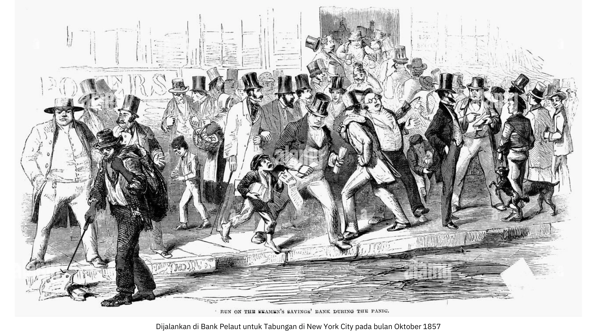

Kepanikan bank di Seamen's Savings Bank selama kepanikan tahun 1857.

Setelah kepanikan bank pada tahun 1796, sebuah fenomena terjadi di mana semua orang mencoba untuk naik ke atas "piramida uang" Orang-orang ingin menukarkan mata uang Exchange ketiga mereka dengan mata uang Layer kedua, dan pada akhirnya, menukarkan mata uang Layer pertama, yaitu emas. Menghadapi serbuan besar-besaran ini, Bank of England terpaksa mengambil tindakan untuk menstabilkan situasi. Untuk mencegah potensi deflasi cadangan emas, Bank of England memutuskan untuk menangguhkan penukaran uang kertasnya menjadi emas. Penangguhan ini, yang awalnya dimaksudkan sebagai tindakan sementara, berlangsung selama kurang lebih dua dekade.

### Kesimpulan:

Bank-bank sentral telah berevolusi menjadi pemberi pinjaman terakhir, menangguhkan konvertibilitas mata uang mereka ke dalam emas. Meskipun tindakan ini awalnya dimaksudkan sebagai solusi sementara, pada akhirnya menjadi permanen, menandai munculnya konsep pemberi pinjaman terakhir. Transformasi ini telah membentuk bank sentral seperti yang dikenal saat ini. Namun, dalam ekonomi yang lebih rapuh, kemampuan untuk mencetak uang sesuka hati dapat menyebabkan konsekuensi yang tidak diinginkan, seperti hiperinflasi, jika digunakan secara tidak bertanggung jawab.

## Buku dan Sumber Daya

<chapterId>c44e4519-0741-527b-b3b0-3f513e87147d</chapterId>

Hiperinflasi adalah subjek menarik yang telah dipelajari melalui berbagai peristiwa sejarah. Jika Anda ingin mempelajari topik ini lebih dalam, berikut ini adalah daftar 10 sumber daya penting untuk dibaca dan dipelajari:

- "Ketika Uang Mati: Mimpi Buruk Pengeluaran Defisit, Devaluasi, dan Hiperinflasi di Jerman Weimar" oleh Adam Fergusson. Buku ini merinci krisis hiperinflasi di Jerman setelah Perang Dunia I.

- "Ekonomi Inflasi - Studi tentang Depresiasi Mata Uang di Jerman Pasca-Perang Dunia II" oleh Costantino Bresciani-Turroni. Analisis mendalam mengenai hiperinflasi Jerman pada tahun 1920-an.

- "Kali Ini Berbeda: Delapan Abad Kebodohan Finansial" oleh Carmen M. Reinhart dan Kenneth S. Rogoff. Meskipun buku ini mencakup berbagai jenis krisis keuangan, buku ini memberikan diskusi mendalam tentang hiperinflasi sepanjang sejarah.

- "Hiperinflasi Zimbabwe, Analisis dan Pelajaran yang Dipetik" oleh Steve Hanke. Sebuah studi tentang hiperinflasi Zimbabwe di awal tahun 2000-an.

- "Rezim Moneter dan Inflasi: Sejarah, Hubungan Ekonomi dan Politik" oleh Peter Bernholz. Buku ini membahas kasus-kasus historis hiperinflasi dan berusaha memahami faktor-faktor yang mendasarinya.

- "Panduan Bertahan dari Hiperinflasi: Strategi untuk Bisnis Amerika" oleh Gerald Swanson. Panduan praktis tentang bagaimana bisnis dapat menavigasi lingkungan hiperinflasi.

- "Sekaratnya Uang: Pelajaran dari Inflasi Besar Jerman dan Amerika" oleh Jens O. Parsson. Analisis komparatif tentang krisis inflasi di Jerman dan Amerika Serikat.

- "Kejatuhan Uang: Hiperinflasi Jerman dan Kehancuran Kelas Menengah" oleh Frederick Taylor. Eksplorasi naratif mengenai dampak sosial dan ekonomi dari hiperinflasi pada masyarakat Jerman.

- "Dewan Mata Uang untuk Negara Berkembang: Sebuah Buku Pegangan" oleh Steve Hanke dan Kurt Schuler. Meskipun fokusnya adalah pada dewan mata uang, buku ini menawarkan perspektif tentang bagaimana menghindari situasi hiperinflasi.

# Bagian Akhir

<partId>cb1f4a4b-556a-4e47-a5cc-136be35a1f9a</partId>

## Ulasan & Peringkat

<chapterId>1a37317e-372a-5241-b478-8316d44f9283</chapterId>

<isCourseReview>true</isCourseReview>

## Ujian akhir

<chapterId>d01831c3-6c4d-59e3-95bc-03e97a05c142</chapterId>

<isCourseExam>true</isCourseExam>

## Kesimpulan

<chapterId>45d410b0-71ed-4502-8d8d-8b6df761db23</chapterId>

<isCourseConclusion>true</isCourseConclusion>