# Un viaggio nell'economia

Questo programma si propone di fornire una comprensione approfondita dell'emergere delle iperinflazioni in un mondo dominato dalla moneta Fiat e di esaminarne le conseguenze significative. I partecipanti approfondiranno i cicli di iperinflazione, esaminandone le cause, le cause scatenanti e fornendo esempi storici e contemporanei. Esamineranno inoltre l'impatto tangibile dell'iperinflazione sull'economia e sulla vita quotidiana, studiando le ripercussioni sul valore della moneta, sul potere d'acquisto e sul risparmio individuale e collettivo.

In questa sede verranno evidenziate le tendenze e gli schemi comuni negli episodi di iperinflazione nel corso della storia, fornendo al contempo strategie efficaci e concrete per proteggersi durante i periodi di iperinflazione. I partecipanti avranno l'opportunità di esplorare varie opzioni di investimento e meccanismi di difesa finanziaria, acquisendo strumenti pratici e conoscenze essenziali per navigare serenamente in un clima economico instabile.

+++

# Introduzione

<partId>6fe4d15d-f6e6-54be-9e04-0a75ac98df8b</partId>

## Panoramica del corso

<chapterId>9d1aba8d-0485-5020-9863-5de37e6db8e0</chapterId>

Benvenuti al corso ECO204!

L'obiettivo di questo corso è di aiutarvi a comprendere le cause, i meccanismi e le conseguenze dell'iperinflazione nel contesto di un sistema monetario fiat. Attraverso esempi concreti e analisi storiche, imparerete a riconoscere gli schemi ricorrenti che precedono i periodi di iperinflazione e a individuare le leve d'azione per proteggervi.

**Sezione 2: Cos'è l'inflazione?

Prima di immergerci nel cuore dell'argomento, rivedremo le basi: cos'è l'inflazione? Questa sezione presenterà le sue origini monetarie, i diversi tipi di inflazione e il loro inserimento in una dinamica economica più ampia. Si tratta di un passo essenziale per comprendere come un'inflazione regolare possa evolvere in iperinflazione.

**Sezione 3: Cos'è l'iperinflazione?

In questa sezione studierete le definizioni precise di iperinflazione ed esaminerete diversi episodi storici importanti, tra cui quelli della Germania di Weimar e dello Zimbabwe. Analizzeremo i loro punti in comune, le differenze e i parallelismi contemporanei. Scoprirete anche casi meno noti, come le successive ridenominazioni in America Latina, e le strategie di uscita osservate in alcuni Paesi.

**Sezione 4: Come siamo arrivati qui?

Questa parte mira a comprendere i meccanismi strutturali che permettono l'iperinflazione, in particolare attraverso lo sviluppo del "secondo Layer" monetario e il ruolo delle banche centrali. Verranno fornite ulteriori risorse e suggerimenti di lettura per ulteriori approfondimenti.

E se la storia monetaria si ripetesse sotto i nostri occhi? Giudicate voi nei capitoli che seguono!

# Che cos'è l'inflazione?

<partId>2b4f456c-3649-5cf9-b9b0-a5bffe92d962</partId>

## Un fenomeno monetario

<chapterId>b2cbc915-c4ec-52b5-860c-0958f58c91e4</chapterId>

### Definizioni di inflazione

L'inflazione è un concetto spesso frainteso a causa delle sue molteplici definizioni e interpretazioni. La percezione dell'inflazione varia tra diversi gruppi, come i bitcoiners e gli economisti tradizionali. Chiariamo innanzitutto le definizioni prima di parlare di iperinflazione:

- Definizione dal dizionario Le Robert: L'inflazione è un aumento eccessivo dei mezzi di pagamento (banconote, capitali) che provoca un aumento dei prezzi e un deprezzamento della moneta.

- Definizione tratta dall'enciclopedia Larousse: L'inflazione è un fenomeno caratterizzato da un aumento generalizzato e continuo del livello dei prezzi. Qui la parola "generalizzato" è fondamentale.

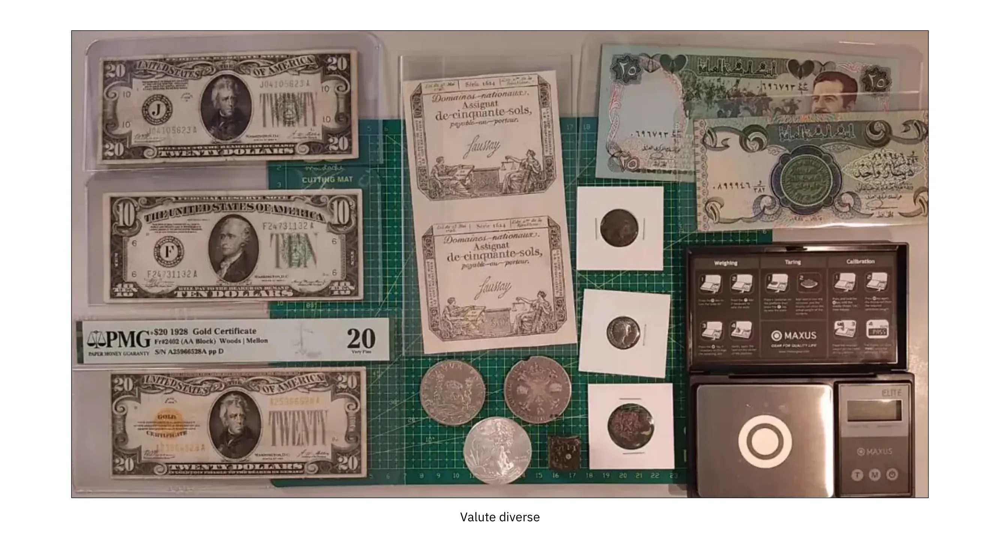

Alla luce di queste definizioni, è essenziale capire che, per Robert, l'inflazione riguarda principalmente l'aumento della moneta Supply . Larousse, invece, si concentra sulle conseguenze di questa espansione, ovvero l'aumento generalizzato dei prezzi.

Nel nostro studio sull'iperinflazione adotteremo la seconda definizione, che è quella di un aumento generalizzato dei prezzi, in quanto più pertinente e chiara per il nostro argomento. Tuttavia, è fondamentale ricordare che questo aumento dei prezzi è generalmente il risultato dell'espansione della moneta Supply .

Il famoso economista Milton Friedman ha affermato notoriamente:

> "L'inflazione è sempre e ovunque un fenomeno monetario"

Questa affermazione evidenzia la relazione intrinseca tra espansione monetaria e inflazione. Nelle sezioni seguenti esamineremo la relazione tra inflazione e crescita economica, basandoci su queste definizioni fondamentali.

### Comprendere il fenomeno monetario

Quando ci si riferisce al fenomeno monetario, ci si riferisce a come viene influenzato il Supply monetario di un'economia. Milton Friedman lo vedeva essenzialmente come un aumento di questo Supply. Storicamente, ci sono stati due metodi principali per aumentare il Supply monetario:

1. Stampa monetaria:

Nei sistemi monetari tradizionali, l'aumento del Supply era ottenuto stampando fisicamente nuove banconote. Anche se oggi, con la predominanza della moneta digitale, questa stampa è principalmente elettronica (attraverso i database delle banche centrali e di altre istituzioni finanziarie), la storia ci mostra periodi in cui la stampa letterale di banconote ha portato all'iperinflazione.

2. Riduzione del contenuto di metallo:

Un altro metodo fu quello di ridurre la quantità di metallo prezioso nelle monete basate su metalli come l'argento o l'oro. Un esempio eclatante si trova nell'Impero Romano, dove il denario, inizialmente composto quasi interamente d'argento, vide il suo contenuto d'argento ridursi drasticamente nel corso del tempo. Si trattava di una forma di inflazione, ma non necessariamente di iperinflazione.

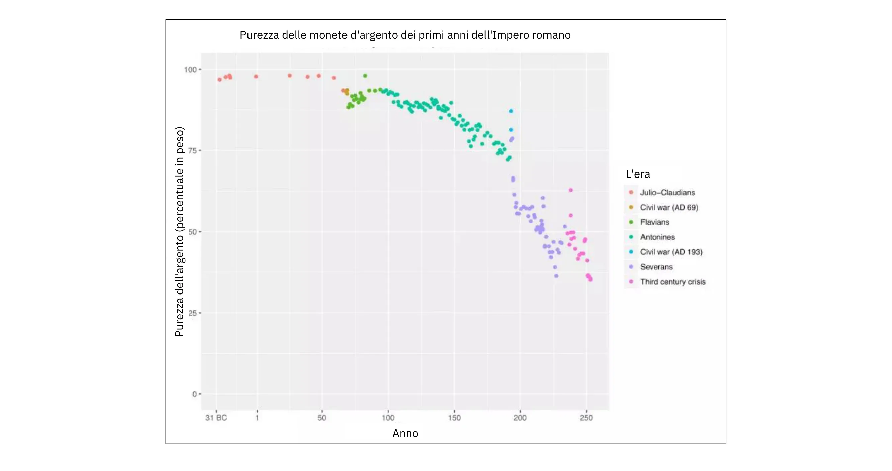

È fondamentale sottolineare che l'iperinflazione si osserva principalmente con le valute fiat che non sono sostenute dai beni sottostanti, come i metalli preziosi. Storicamente, quando una valuta era basata su tali asset, si sono verificati episodi di inflazione (ad esempio, attraverso la svalutazione del metallo contenuto), ma questi episodi non hanno mai raggiunto i livelli estremi dell'iperinflazione. Nelle sezioni seguenti analizzeremo in dettaglio i periodi di svalutazione monetaria e le implicazioni di questi diversi sistemi monetari sull'inflazione.

### Studio dei periodi di svalutazione monetaria

Nel corso della storia, diverse civiltà hanno vissuto periodi di svalutazione monetaria. Alcuni di questi periodi coincidono con eventi importanti o guerre che hanno messo sotto pressione l'economia.

#### 1. Guerra del Peloponneso e Seconda guerra punica:

La Guerra del Peloponneso, un conflitto tra Atene e Sparta, e la Seconda Guerra Punica, tra la Repubblica Romana e Cartagine, sono i primi esempi di svalutazione monetaria presenti negli archivi. Per finanziare queste guerre, queste civiltà svalutarono le loro monete riducendo il contenuto d'argento e incorporando altri metalli, aumentando al contempo il numero di monete prodotte.

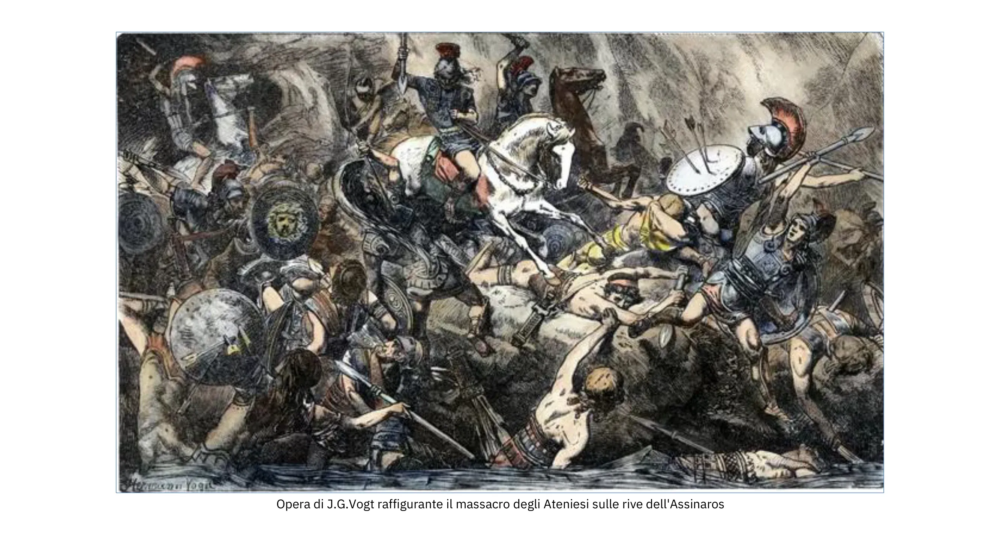

Incisione che raffigura il massacro degli Ateniesi sulle rive dell'Assinaros.

#### 2. Roma antica durante l'Impero:

Dopo l'epoca della Repubblica romana, durante l'Impero, il III e il IV secolo conobbero una significativa svalutazione della moneta. Ciò è dimostrato dalla diminuzione del contenuto d'argento delle monete, come si vede nel grafico precedente. Uno studio rivela che il prezzo del grano in Egitto, misurato in dracme, è aumentato di un milione di volte in un periodo di circa 400 anni, dal 40 a.C. al 360 d.C.. In questo periodo, rappresenta un'inflazione media annua di circa il 4,4%. Tuttavia, questa inflazione non fu distribuita in modo uniforme. Iniziò veramente intorno al 238 d.C. Tra il 250 e il 293 d.C., il tasso di inflazione era di circa il 3,65%, e salì al 22,28% tra il 293 e il 301 d.C..

Sebbene questi periodi abbiano registrato un'inflazione significativa, non hanno raggiunto i livelli di iperinflazione osservati in alcune situazioni moderne. Il motivo è che, sebbene la moneta fosse svalutata, era comunque sostenuta da metalli preziosi. Questa solida base forniva una certa protezione contro livelli di inflazione estremi. Nei prossimi paragrafi esamineremo più in dettaglio la natura e le conseguenze dell'iperinflazione.

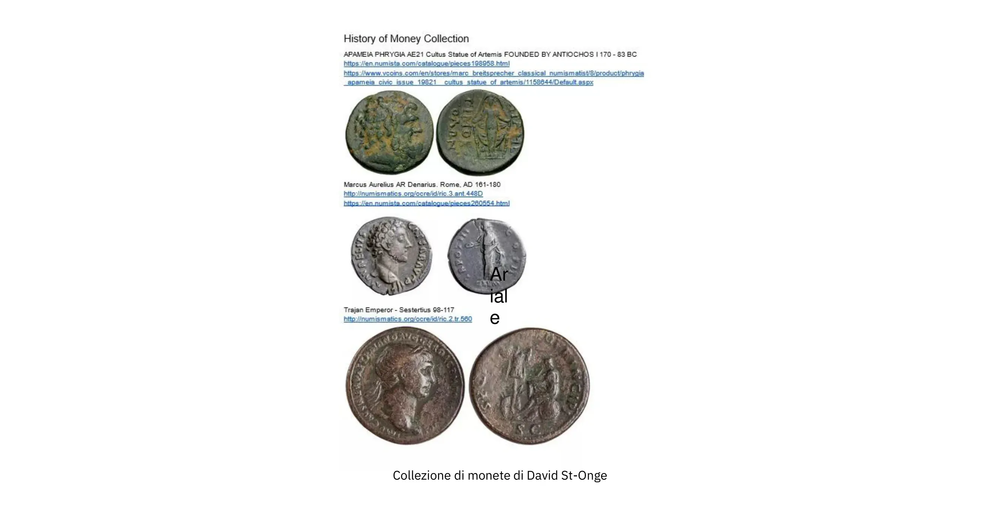

- Il denario di Marco Aurelio (160 d.C.):

Una delle monete più iconiche dell'antica Roma è il denario, un Coin in argento. Possiedo un Coin specifico di Marco Aurelio risalente al 160 d.C., prima della grande svalutazione. Sebbene la macchina fotografica faccia fatica a catturare i dettagli più fini, a occhio nudo è evidente che il Coin è bellissimo e riflette un contenuto d'argento relativamente alto.

- L'Antoniniano (fine del III secolo d.C.):

Con la svalutazione monetaria, apparve una nuova moneta, l'antoniniano. Questa moneta doveva valere due denari, ma conteneva molto meno argento. Il mio Antoniniano Coin mostra chiaramente che il contenuto d'argento è stato notevolmente ridotto. È ornato da una corona, tipica delle monete romane di questo periodo, chiamata "radiates". Confrontando il colore e la qualità, si può notare che l'antoniniano è ben lontano dall'essere un Coin in argento puro.

Confrontando le due monete l'una accanto all'altra, la differenza è notevole. Il denario del 160 d.C. ha un aspetto decisamente argentato, mentre l'antoniniano della fine del III secolo d.C. è molto più opaco, il che indica una significativa diminuzione del contenuto d'argento. Questo confronto visivo fornisce una chiara illustrazione della svalutazione monetaria subita dall'antica Roma nel corso di alcuni secoli.

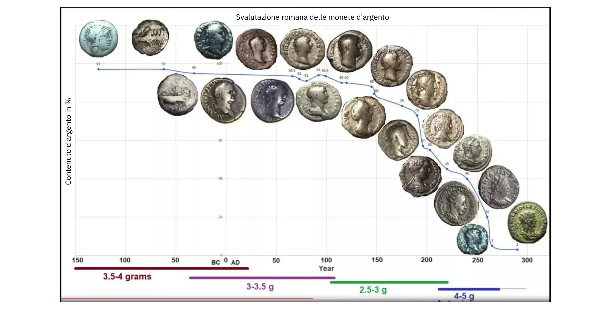

Per completare questa dimostrazione, sarebbe ideale un grafico che illustri la svalutazione di queste monete nel tempo. Anche se è difficile da visualizzare attraverso questa piattaforma, immaginate un grafico che mostri il valore del denario, seguito dal suo declino verso la fine del II secolo, quando fu sostituito dall'antoniniano, che si suppone valesse due denari ma con un contenuto d'argento significativamente inferiore. Questi manufatti sono testimoni silenziosi delle fluttuazioni economiche delle civiltà del passato.

#### 3. La Maravedi spagnola: testimonianza di una svalutazione mirata

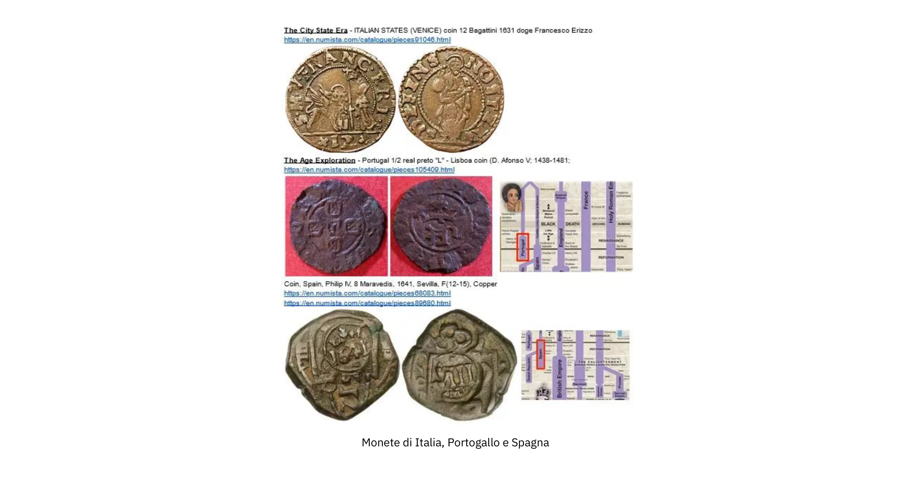

Il Maravedi, in quanto moneta di rame, occupa un posto speciale nella storia della moneta spagnola. Come già detto, il dollaro spagnolo era in origine lo standard internazionale, una valuta di riserva essenziale per la Spagna. Tuttavia, di fronte ad alcune sfide economiche, la Spagna dovette ricorrere a strategie monetarie intelligenti.

La svalutazione monetaria è uno strumento spesso utilizzato dagli Stati per finanziare le proprie spese o stimolare l'economia. Tuttavia, la Spagna si trovava in una situazione delicata. La svalutazione del dollaro spagnolo avrebbe compromesso la sua posizione nel commercio internazionale. Per superare questo dilemma, la Spagna si rivolse al Maravedi.

A differenza del prezioso dollaro d'argento spagnolo, il Maravedi era una moneta di rame utilizzata principalmente dalla popolazione locale. Questa moneta era destinata alla svalutazione. Quando un Maravedis Coin valeva inizialmente due maravedis, lo Stato lo recuperava, lo timbrava nuovamente con un nuovo valore, ad esempio "quattro", e restituiva solo un Coin al proprietario. Il Coin, contrassegnato dal timbro "otto", è la prova di questo processo, essendo stato sottoposto a diversi cicli di svalutazione.

Questa strategia permise allo Stato di svalutare efficacemente una valuta, creando inflazione e finanziando indirettamente lo Stato, preservando al contempo l'integrità del dollaro spagnolo sulla scena internazionale. Tuttavia, questa svalutazione mirata ebbe conseguenze per la popolazione locale, che vide diluire il valore della propria moneta comune.

Il caso dei Maravedis illustra come uno Stato possa svalutare selettivamente una valuta locale per soddisfare le proprie esigenze economiche interne, preservando al contempo il valore di una valuta di riserva sulla scena globale. È un esempio lampante della complessità e della finezza della politica monetaria nella storia.

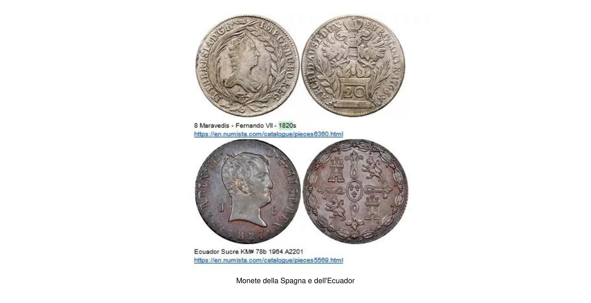

Volete saperne di più? -> [Link](https://docs.google.com/document/d/1aZa7gvz1nt8ZHDCoWKQdS9RGGjBHdipH1ApC8dW1xpM/edit?usp=sharing)

#### 4. La rivoluzione dei prezzi dal XV al XVII secolo

Tra il XV e il XVII secolo, l'Europa fu testimone di un notevole fenomeno economico, spesso definito "rivoluzione dei prezzi" Questo periodo di inflazione fu in gran parte innescato da un massiccio afflusso di metalli preziosi, in particolare oro e argento, provenienti dalle Americhe. Poiché all'epoca l'economia europea si basava in gran parte sullo standard metallico, questo ulteriore Supply di metalli aumentò il Supply monetario. Di conseguenza, si verificò un tasso di inflazione di circa l'1-2% all'anno. A prima vista, questa inflazione può sembrare modesta. Tuttavia, all'epoca, tali fluttuazioni dei prezzi erano abbastanza insolite da essere considerate una "rivoluzione" Ciò evidenzia come le variazioni delle riserve monetarie possano influenzare l'intero sistema economico.

#### 5. John Law e gli Assignats

Nel XVIII secolo, la storia economica francese è stata segnata da due eventi significativi legati alla moneta. In primo luogo, John Law, economista e finanziere scozzese, convinse il governo francese ad adottare un sistema monetario basato sulla cartamoneta. Sebbene inizialmente fosse considerata una soluzione innovativa ai problemi finanziari del Paese, questa iniziativa portò rapidamente a un'inflazione dilagante. Poco dopo, durante i tumulti della Rivoluzione francese, il governo introdusse gli "assignats".

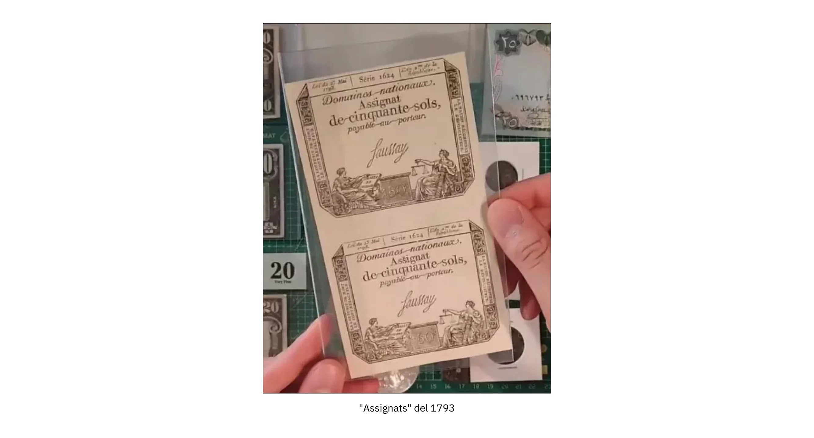

Assignats dal 1793

Queste banconote sono la testimonianza vivente del primo grande periodo di iperinflazione della storia. Inizialmente concepiti come risposta alle successive crisi finanziarie, gli assignat divennero presto un simbolo di instabilità monetaria. Il governo, facendo eccessivo affidamento su questa cartamoneta per finanziare le proprie spese, causò una crisi economica senza precedenti e portò a un grande periodo di iperinflazione in Francia dopo la rivoluzione.

#### 6. L'Ordine Esecutivo 6102 e la svalutazione del dollaro

L'Ordine Esecutivo 6102 e la svalutazione del dollaro

Negli Stati Uniti, all'inizio degli anni Trenta, si assistette a un importante cambiamento nella politica monetaria. Ecco una panoramica dettagliata di questa trasformazione:

- La banconota da 20 dollari del 1928

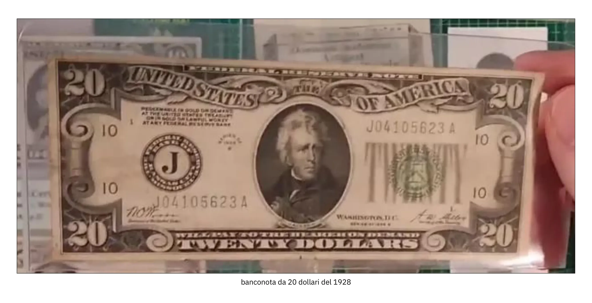

Nel 1928, una banconota da 20 dollari negli Stati Uniti dichiarava: "redimibile in oro su richiesta" Ciò significa che ogni banconota era letteralmente convertibile in oro. In particolare, una banconota da 20,67 dollari equivaleva a un'oncia d'oro.

- Ordine esecutivo 6102

Nel 1933, con l'emanazione dell'Ordine Esecutivo 6102, si verificò un grande sconvolgimento. Questo decreto rese illegale per i cittadini il possesso di oro, sia sotto forma di lingotti, monete o certificati.

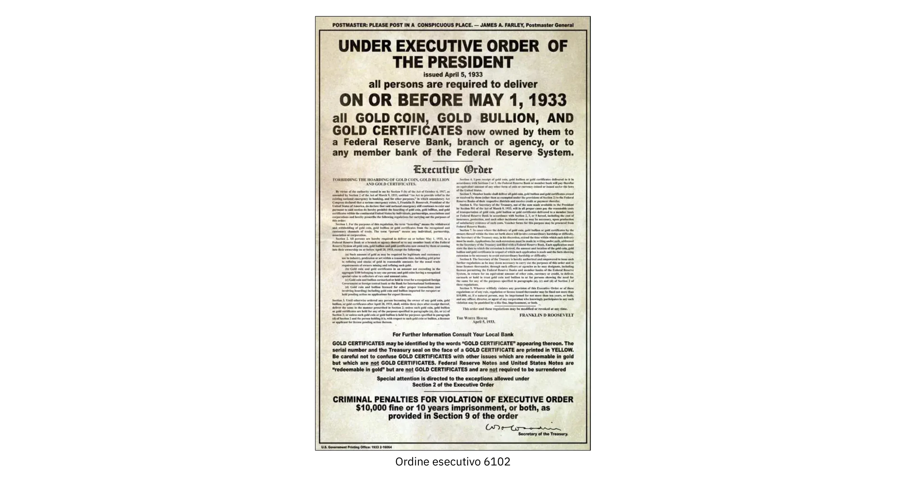

Il Certificato d'oro ne è un buon esempio. Era contrassegnato da: "In oro Coin pagabile al portatore su richiesta" Il possesso di un tale certificato divenne illegale e lo rimase fino al 1964.

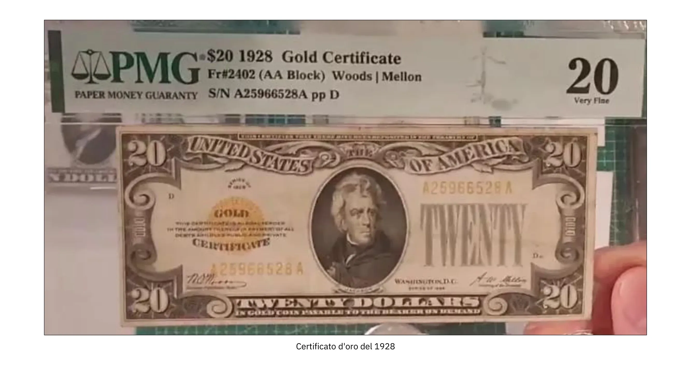

- Introduzione di nuove banconote

Dopo il sequestro dell'oro nel 1934, fu messa in circolazione una nuova serie di banconote.

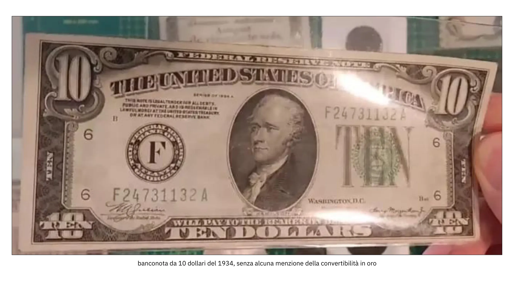

La dicitura che indicava la loro convertibilità in oro è stata eliminata e sostituita da "This note is legal tender for all debts" (Ce billet est une monnaie légale pour toutes dettes).

- Rivalutazione dell'oro

L'aspetto affascinante di questa transizione è la strategia del governo. Nel 1934, il prezzo dell'oro fu rivalutato a 35 dollari l'oncia, invece di 20,67 dollari. In sostanza, il governo svalutò il dollaro che i cittadini possedevano. Acquistando oro dalla popolazione a 20,67 dollari l'oncia nel 1933 e rivalutando poi il prezzo dell'oro nel 1934, il governo generò un profitto sostanziale svalutando i risparmi dei cittadini.

In sintesi, nel giro di un anno il governo sequestrò di fatto l'oro dei cittadini, poi cambiò le regole del gioco rivalutando il valore dell'oro a vantaggio del Tesoro e a svantaggio di coloro che avevano inizialmente scambiato il loro oro con banconote.

### Gli Stati Uniti cambiano la storia.

Gli Stati Uniti hanno compiuto una svolta storica diventando i primi a svalutare la valuta di riserva mondiale, il dollaro USA, contrariamente alle pratiche precedenti osservate nelle piccole nazioni commerciali.

In precedenza, durante il Rinascimento, il fiorino italiano emesso da Firenze nel XIII secolo era la valuta di riserva internazionale e non era stata registrata alcuna svalutazione durante il suo periodo di utilizzo, a testimonianza dell'importanza della stabilità monetaria per il commercio internazionale.

Nello stesso spirito, Spagna e Paesi Bassi, in quanto detentori della valuta di riserva mondiale grazie al loro fiorente commercio internazionale, mantennero l'integrità delle loro monete per preservare la fiducia e lo status quo negli scambi internazionali. I Paesi Bassi hanno persino assistito alla creazione della prima banca centrale, una pietra miliare nell'evoluzione globale dei sistemi monetari.

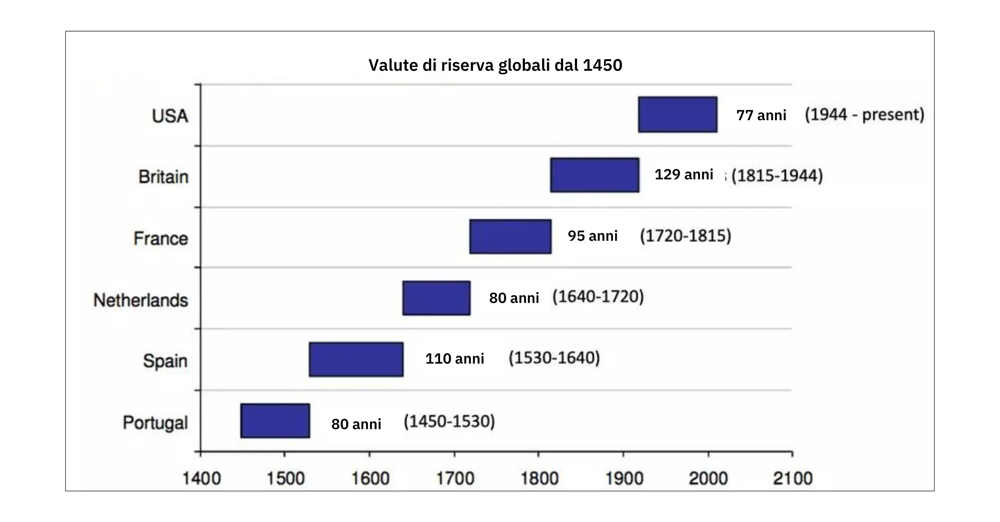

Tuttavia, la situazione cambiò con l'ascesa degli Stati Uniti come potenza economica dominante. Essi scelsero di svalutare la loro valuta di riserva, sfruttando così l'inflazione a proprio vantaggio. Questa decisione è spesso attribuita alle mutate dinamiche, in cui la scelta della valuta di riserva non era più libera come in precedenza. L'egemonia americana ha imposto il dollaro come valuta di riserva mondiale, consentendo la manipolazione del suo valore. Questo cambiamento rivela il potenziale impatto delle politiche monetarie sul commercio internazionale in un'economia globalizzata, segnando una transizione significativa nella gestione delle valute di riserva globali.

### Ultimo esempio per la strada: il dinaro svizzero

Il dinaro svizzero illustra un altro aspetto affascinante della svalutazione monetaria, questa volta ancorata al contesto iracheno precedente alla Guerra del Golfo. Chiamata così per la notevole qualità delle sue banconote, questa valuta era emessa dalla Banca Centrale dell'Iraq e godeva di una reputazione di stabilità nella regione mediorientale. Questa fiducia era dovuta principalmente alla qualità della stampa delle banconote, effettuata in Inghilterra, che implicava una certa solidità contro la svalutazione.

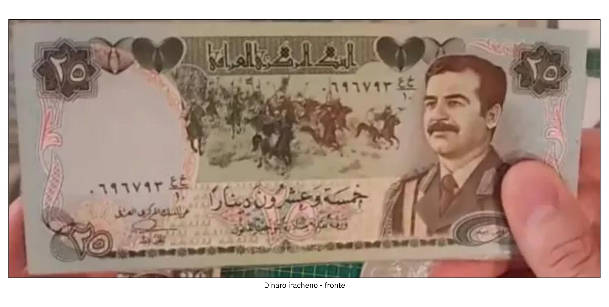

Tuttavia, le guerre del Golfo segnarono una svolta nella storia del dinaro svizzero. L'Iraq, non potendo più contare sul suo fornitore inglese per la stampa delle banconote, si rivolse alla Cina per ottenere assistenza. Questa transizione portò a una netta differenza nella qualità delle banconote, con la versione cinese percepita come inferiore. Questa percezione non era infondata: le banconote cinesi erano più facilmente contraffabili e suscettibili di sovrastampa da parte del governo, minacciando così il loro valore.

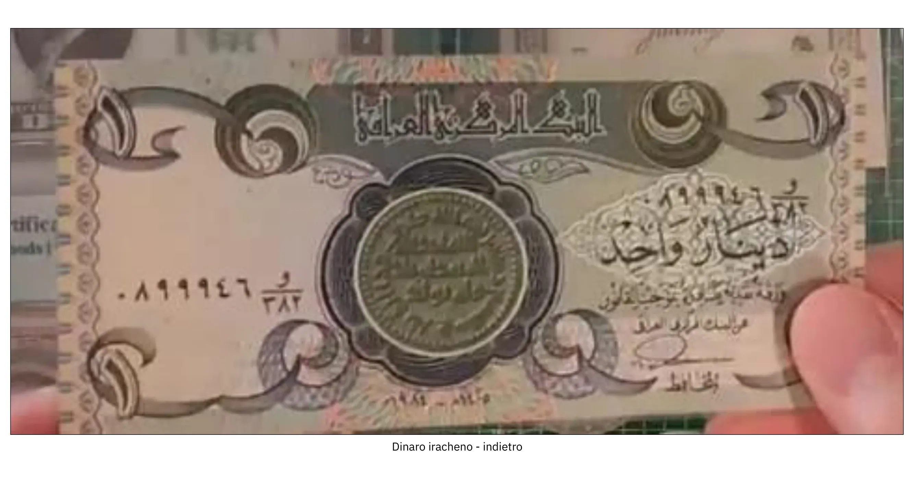

Nell'economia irachena post-Guerra del Golfo è emerso un fenomeno peculiare: il doppio sistema di prezzi. I commercianti offrivano prezzi diversi a seconda del tipo di banconota utilizzata per il pagamento, privilegiando il dinaro svizzero originale rispetto alla banconota cinese. Questo sistema rifletteva la fiducia mantenuta nelle banconote di qualità superiore, meno soggette a svalutazione, anche in un contesto in cui il valore era principalmente imposto dallo Stato. Questo episodio evidenzia l'importanza delle caratteristiche intrinseche della moneta e di come, anche in un regime di moneta fiat, la qualità percepita di una moneta possa influire sul suo valore relativo e, di conseguenza, sulla fiducia degli attori economici.

#### Sì, abbiamo pesato le monete!

La percezione comune spesso associa la moneta alla creazione dello Stato, dove la sua emissione e il suo valore sono regolati dallo Stato. Questo concetto affonda le sue radici nelle civiltà antiche, come Roma, dove le monete erano standardizzate e timbrate dall'Impero, conferendo così un valore ufficiale alla valuta. Tuttavia, un'esplorazione più approfondita rivela che il valore intrinseco della moneta derivava principalmente dal suo contenuto di metalli preziosi.

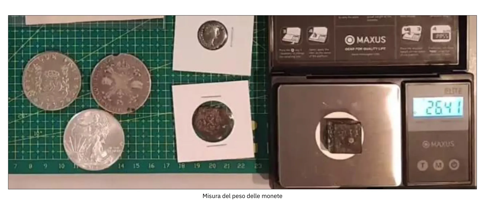

Un esempio è dato dall'esame di un peso monetario equivalente a otto reais spagnoli, o a un dollaro spagnolo. Questo peso, contrassegnato da un numero romano che ne indicava il valore, veniva utilizzato dai cambiavalute per valutare il valore delle monete in base al loro peso, piuttosto che alla loro semplice stampigliatura. Pesando le monete, i cambiavalute potevano determinare se fossero state alterate o danneggiate, il che avrebbe potuto ridurne il valore. Questa pratica evidenzia che, sebbene la punzonatura standardizzata da parte dello Stato conferisse un certo valore nominale alla moneta, il vero valore risiedeva nel peso del metallo prezioso che conteneva.

Questa analisi dimostra che la fiducia nella moneta, e per estensione il suo valore, era ancorata alla sua sostanza tangibile piuttosto che alla mera affermazione dello Stato. Sottolinea la dualità tra il valore nominale imposto dallo Stato e il valore intrinseco dettato dal contenuto del metallo prezioso. In questo modo, la moneta va oltre l'essere un mero strumento statale, con il suo valore fondamentale intrinsecamente legato al Elements tangibile e misurabile.

#### Conclusione

In conclusione, questo studio sulla svalutazione monetaria fornisce una comprensione più approfondita dei meccanismi dell'inflazione, che verranno esplorati nei video successivi. Discuteremo i diversi tipi di inflazione e la soglia di transizione verso l'alta inflazione o l'iperinflazione. Queste solide basi ci permetteranno di affrontare le complessità dell'inflazione nelle prossime sessioni. Grazie per l'attenzione. Ci auguriamo di continuare questa esplorazione delle dinamiche monetarie nel prossimo video.

## Tipi di inflazione

<chapterId>b438fe09-375e-5bb2-9196-7dd687b9f98c</chapterId>

### L'inflazione non è un fenomeno multifattoriale

In questa sezione esamineremo i vari aspetti dell'inflazione, un fenomeno spesso frainteso. Sebbene l'inflazione sia spesso percepita come un fenomeno multifattoriale nei media e nelle discussioni quotidiane, è fondamentale ricordare che si tratta fondamentalmente di un fenomeno monetario.

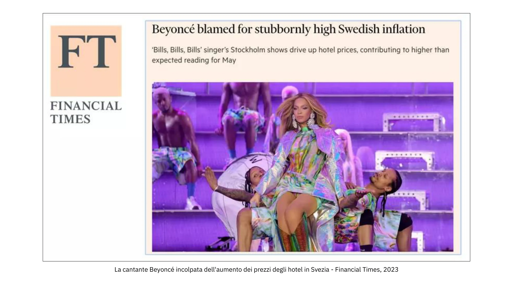

Ecco una suddivisione dell'argomento in diversi punti chiave:

- Distinzione tra aumento dei prezzi e inflazione:

Un aumento dei prezzi può essere specifico del settore e indotto da vari fattori, come una diminuzione della produzione di petrolio dell'OPEC o condizioni climatiche sfavorevoli che influiscono sulla produzione di grano.

L'inflazione, invece, è definita da un aumento generalizzato dei prezzi in una serie di beni e servizi, non solo in un settore specifico.

- L'essenza monetaria dell'inflazione:

Con un Supply fisso, un aumento dei prezzi in un settore si tradurrebbe in una diminuzione dei prezzi in altri settori, poiché la quantità di denaro disponibile da spendere altrove si ridurrebbe. L'inflazione è strettamente correlata a un aumento della moneta Supply, che consente un aumento simultaneo dei prezzi in tutti i settori.

- Impatto del Supply sull'inflazione e sulla deflazione:

In un sistema a moneta fissa Supply, un aumento della produzione dovrebbe teoricamente portare alla deflazione, cioè a una diminuzione dei prezzi, poiché ci sarebbero più beni e servizi disponibili.

Nell'attuale sistema monetario fiat, un aumento del Supply annulla la potenziale deflazione causata da un aumento della produzione.

- Effetti negativi dell'aggiustamento del Supply:

Un aumento del Supply, senza un corrispondente aumento della produzione, porta all'inflazione, poiché c'è più denaro in circolazione per la stessa quantità di beni e servizi.

Mentre l'aumento della produzione avrebbe dovuto portare alla deflazione, il contemporaneo aumento del Supply ha annullato questo effetto, provocando invece l'inflazione.

- Inflazione, deflazione e denaro Supply - Vasi comunicanti:

Inflazione e deflazione sono come vasi comunicanti in un'economia. Un aumento della produzione può portare alla deflazione, ma se contemporaneamente viene aumentato il Supply, l'effetto deflazionistico viene annullato, dando luogo all'inflazione.

Questa discussione sottolinea l'importanza di comprendere i meccanismi sottostanti all'inflazione e alla deflazione, nonché la profonda influenza che la modifica del Supply può avere sull'economia. Probabilmente rivedremo questi concetti in seguito per comprendere più a fondo la loro interconnessione e l'impatto che hanno sull'economia globale.

### Perché la stampa di moneta non sempre causa inflazione?

#### Inflazione ≠ IPC

L'inflazione, sebbene spesso associata a un aumento del Supply, non ha sempre una correlazione diretta con la stampa di moneta, come dimostra il periodo successivo alla crisi finanziaria del 2008. Nonostante la significativa stampa di moneta per salvare le banche, il decennio successivo non ha registrato un'inflazione elevata, con una media tra lo 0 e il 2% all'anno. Questa situazione solleva una domanda: Perché la stampa massiccia di moneta non ha portato a un'inflazione proporzionale? La risposta risiede in diverse sfumature legate alla misurazione dell'inflazione e dell'indice dei prezzi al consumo (IPC).

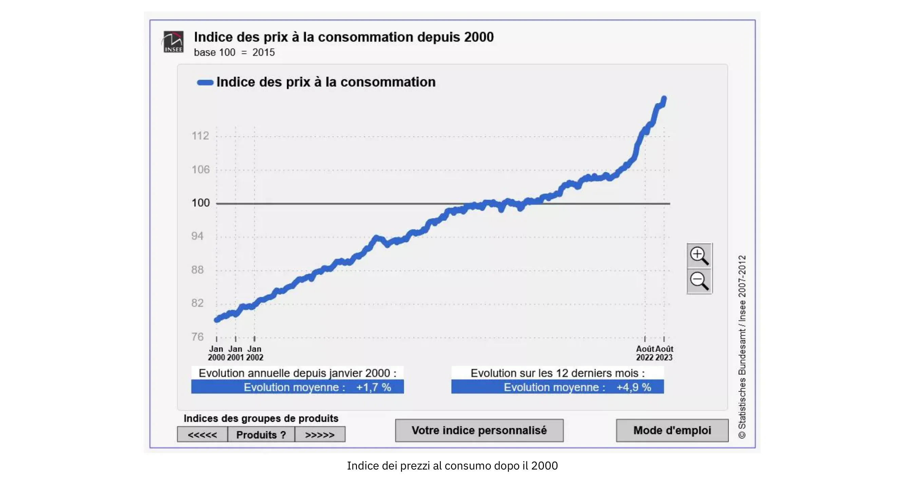

La prima spiegazione risiede nel modo in cui l'inflazione viene misurata. L'indice dei prezzi al consumo (IPC), che funge da indicatore primario dell'inflazione, presenta alcuni limiti. Ad esempio, non tiene conto in modo completo dell'evoluzione dei prezzi degli immobili. Sebbene l'IPC includa una componente relativa agli affitti, il sostanziale apprezzamento dei prezzi delle case non si riflette pienamente nell'indice. Di conseguenza, possono verificarsi aumenti significativi dei costi delle abitazioni senza che il CPI li colga appieno, con una potenziale sottostima dell'inflazione reale.

Inoltre, il calcolo dell'IPC impiega alcune metodologie che possono compensare o mascherare i reali aumenti dei prezzi. Ad esempio, i miglioramenti qualitativi dei prodotti possono essere utilizzati per aggiustare l'indice. Se il prezzo di un prodotto aumenta, ma anche la sua qualità o le sue caratteristiche migliorano, l'IPC può ritenere che il valore reale per il consumatore non sia cambiato e quindi non rifletta l'inflazione. Un caso esemplificativo è quello in cui, nonostante l'aumento dei prezzi delle carni bovine e dei computer dovuto all'iniezione monetaria, il miglioramento delle prestazioni del computer viene utilizzato per compensare tale aumento. Se un computer costa il doppio ma è quattro volte più potente, l'IPC può interpretarlo come una diminuzione dei prezzi, mascherando così l'aumento dei prezzi della carne bovina.

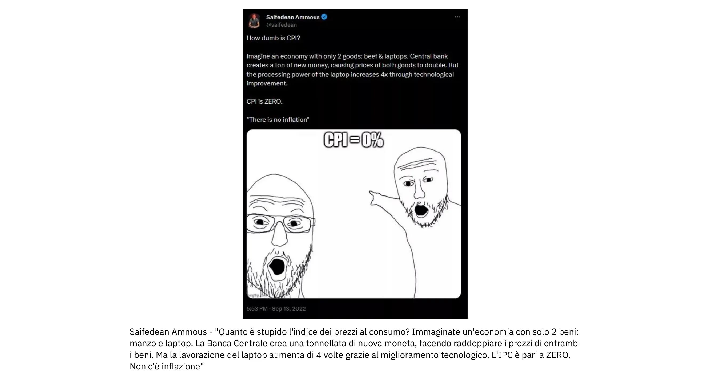

Queste sfumature nella misurazione dell'inflazione attraverso l'IPC evidenziano la complessità della relazione tra stampa monetaria e inflazione. Suggeriscono inoltre che l'inflazione reale potrebbe essere più alta di quella riportata se si tenesse conto in modo più completo di tutti gli aumenti dei prezzi, soprattutto in settori chiave come quello immobiliare. Questa analisi sottolinea l'importanza di comprendere i meccanismi sottostanti all'inflazione e i limiti degli indici convenzionali utilizzati per misurarla, facilitando così una più profonda comprensione delle implicazioni economiche delle politiche monetarie.

#### Argomenti della MMT

La Teoria Monetaria Moderna (MMT) offre una prospettiva distinta sulla creazione di moneta e sull'inflazione. Secondo la MMT, la moneta proviene principalmente dal governo, che può stampare quantità considerevoli per finanziare i propri bisogni senza causare inflazione, a patto che i settori destinatari di questi fondi non siano saturi. Questo approccio si discosta dalle teorie monetarie tradizionali, sottolineando l'importanza delle capacità di assorbimento settoriale nelle dinamiche inflazionistiche.

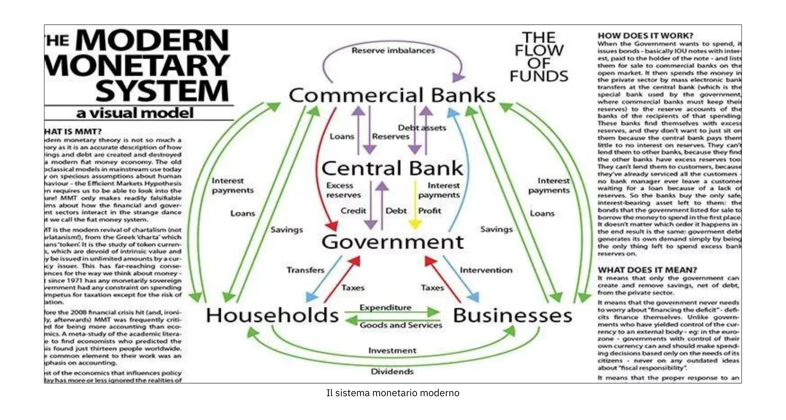

Un esempio illustrativo della MMT è il complesso militare-industriale americano. Secondo la MMT, centinaia di miliardi di dollari possono essere destinati a questo settore senza causare inflazione, grazie alla sua capacità di assorbire i fondi. Al contrario, se si iniettano ingenti fondi nella costruzione di strade negli Stati Uniti, dove c'è un numero limitato di imprese e di manodopera, potrebbe verificarsi un'inflazione dovuta alla scarsità di risorse e all'aumento dei costi richiesti dai fornitori.

Il Giappone è spesso citato dai sostenitori della MMT come un altro esempio di assenza di inflazione nonostante una significativa stampa monetaria. Tuttavia, la situazione giapponese evidenzia anche i limiti delle misure tradizionali dell'inflazione, come l'indice dei prezzi al consumo (CPI). In Giappone, una parte significativa della moneta stampata viene risparmiata o investita in immobili o nel mercato azionario, anziché essere spesa per i consumi correnti. L'IPC, non cogliendo appieno queste dinamiche, potrebbe sottostimare l'inflazione reale.

L'analisi del Giappone (https://ideas.repec.org/p/ces/ceswps/_9821.html) evidenzia anche che il comportamento degli agenti economici, come il risparmio o l'investimento in attività non incluse nell'IPC, può mascherare l'impatto inflazionistico della stampa monetaria. Inoltre, la capacità dei diversi settori di assorbire la liquidità iniettata svolge un ruolo cruciale nel determinare il verificarsi dell'inflazione.

#### Bilanci di banche e banche centrali

Il terzo esempio del perché la stampa monetaria non causerebbe inflazione è che la relazione tra stampa monetaria e inflazione è modulata dal modo in cui il denaro appena creato viene introdotto nell'economia. Se questo denaro rimane nei bilanci delle banche private senza essere prestato agli attori economici, non avrà un impatto diretto sull'economia reale e, quindi, non provocherà inflazione.

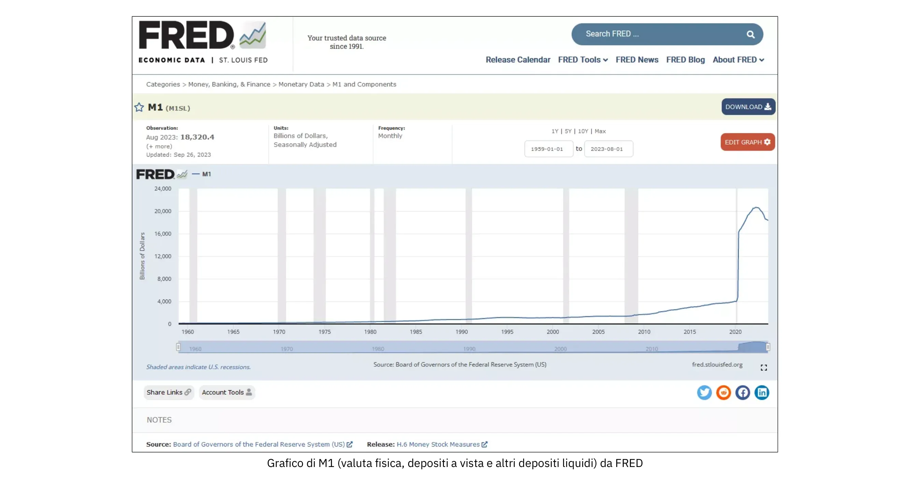

La stampa monetaria può essere vista come una spada di Damocle che pende sull'economia. Il denaro creato può rimanere latente per un certo periodo di tempo, senza alcun effetto inflazionistico visibile, finché non viene immesso nell'economia attraverso prestiti bancari o altri meccanismi. Tuttavia, quando questo denaro latente viene finalmente messo in circolazione, gli effetti inflazionistici possono manifestarsi. È quanto si è osservato negli anni 2020, dove il denaro creato in precedenza è entrato nell'economia, provocando inflazione.

Questo scenario evidenzia l'importanza dei meccanismi di trasmissione monetaria nell'influenzare gli effetti inflazionistici della stampa di moneta. La creazione di moneta da parte della banca centrale è solo un tassello del puzzle. Anche il comportamento delle banche private, che decidono il volume dei prestiti da concedere, e quello dei mutuatari, che decidono come spendere il denaro preso in prestito, sono Elements cruciali in questa dinamica.

#### L'inflazione è sociale!

L'esempio della Repubblica di Weimar illustra un altro aspetto cruciale della relazione tra stampa di moneta e inflazione: il ruolo delle aspettative e del comportamento degli agenti economici. Quando la Banca Centrale della Repubblica di Weimar iniziò a stampare una grande quantità di denaro, l'incertezza economica portò gli individui a tesaurizzare, cioè a conservare il denaro piuttosto che spenderlo. Questa reazione ritardò temporaneamente gli effetti inflazionistici della stampa di moneta.

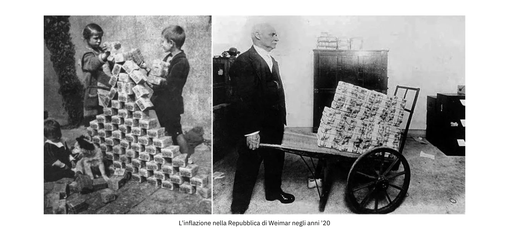

Tuttavia, quando la situazione economica ha iniziato a migliorare leggermente, la fiducia è stata gradualmente ripristinata. Gli individui hanno quindi ritirato i loro risparmi dai loro nascondigli e hanno iniziato a spendere massicciamente nell'economia. Questo improvviso cambiamento di comportamento, combinato con un Supply già elevato, portò a un'esplosione della domanda. Con una maggiore quantità di denaro in circolazione e un aumento della domanda, i prezzi iniziarono a salire rapidamente, portando a una notevole inflazione.

Questo esempio sottolinea l'importanza della tempistica e del comportamento degli agenti nell'emergere dell'inflazione. L'inflazione non si verifica solo in risposta a un aumento della moneta Supply, ma dipende anche da come e quando tale moneta viene spesa nell'economia. Le incertezze economiche e le aspettative degli agenti economici svolgono un ruolo cruciale in questa dinamica e possono accelerare o ritardare gli effetti inflazionistici della stampa di moneta.

#### Riconoscimento:

- Indice dei prezzi al consumo (IPC): L'IPC è strutturato in modo da sottostimare l'inflazione, il che può dare un'immagine distorta della realtà inflazionistica.

- Assorbimento settoriale: L'iniezione di denaro in settori in grado di assorbirlo non sempre porta all'inflazione. Un esempio notevole è il complesso militare-industriale statunitense, che può assorbire grandi somme di denaro senza innescare l'inflazione.

- Il caso del Giappone: Nonostante la notevole stampa di moneta, l'inflazione rimane bassa in Giappone perché i fondi vengono spesso risparmiati o investiti nei mercati immobiliari o azionari. Questi settori assorbono la moneta stampata e l'IPC non riflette necessariamente gli aumenti dei prezzi in queste aree.
- Correlazione tra stampa monetaria e mercati. Si osserva che le curve dei mercati immobiliari e azionari seguono spesso la stampa monetaria, indicando dove è diretto il denaro stampato.
- Riserve monetarie delle banche: Quando la moneta stampata rimane nei bilanci delle banche e non circola nell'economia, non causa inflazione. Lo dimostra l'esempio del 2008, dove la moneta stampata è rimasta in gran parte nei bilanci delle banche, ritardando l'impatto inflazionistico.

- Repubblica di Weimar: Questo periodo storico mostra come l'incertezza economica abbia portato alla tesaurizzazione del denaro, ritardando l'inflazione. Tuttavia, una volta ripristinata la fiducia e speso il denaro, l'inflazione esplose.

Questi esempi possono essere utilizzati nelle discussioni per spiegare perché l'inflazione non è sempre una conseguenza immediata della stampa monetaria e come i contesti economici e i comportamenti degli agenti influenzano l'inflazione.

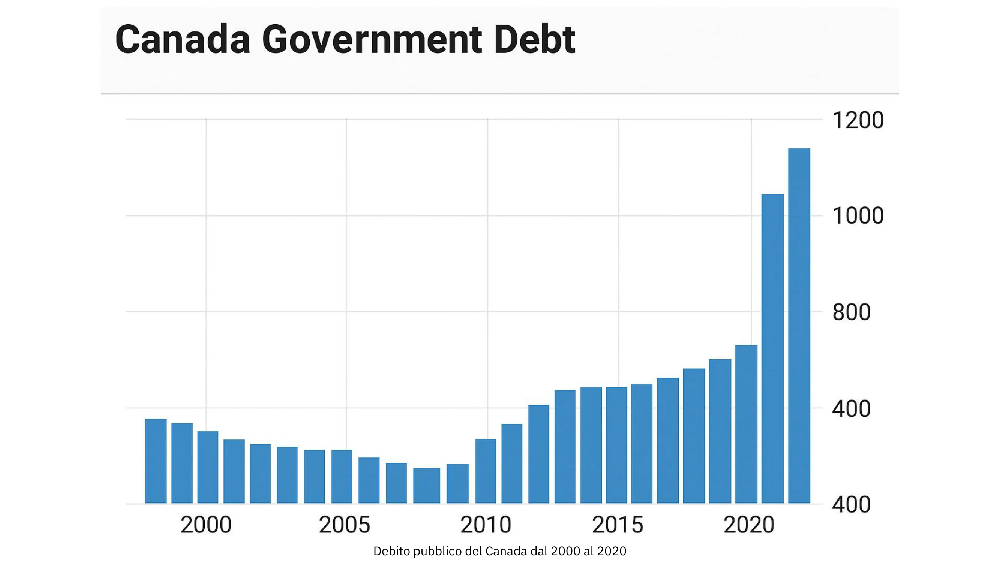

Perché, come dimostra questo [thread](https://twitter.com/saifedean/status/1673639779433590786): L'inflazione è tutto tranne che colpa delle banche centrali.

- Gli economisti danno la colpa dell'inflazione al cambiamento climatico

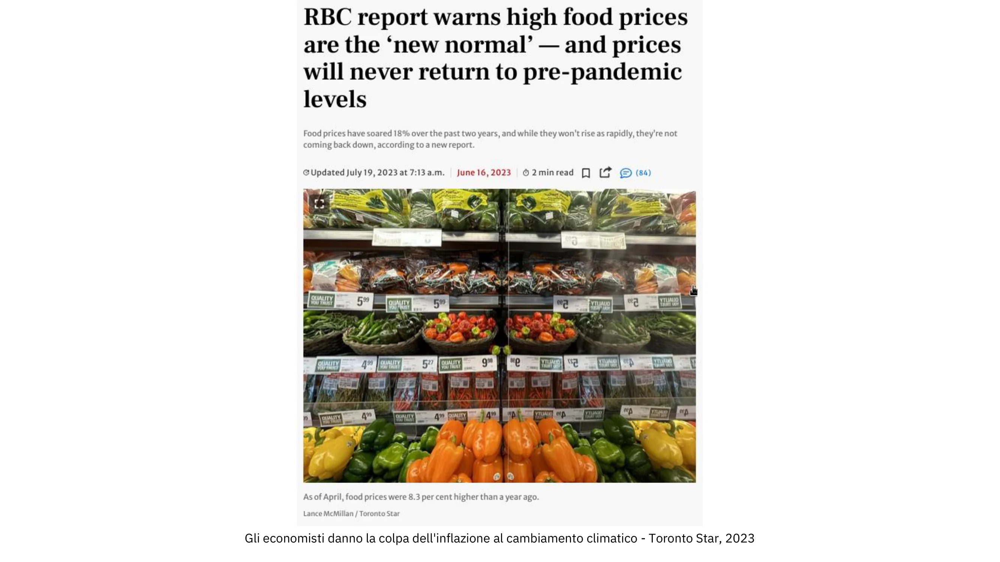

- Esempio di Svezia che incolpa Beyoncé per l'inflazione in un mese specifico.

- La banca centrale polacca attribuisce l'inflazione all'aggressione russa in Ucraina e alla pandemia

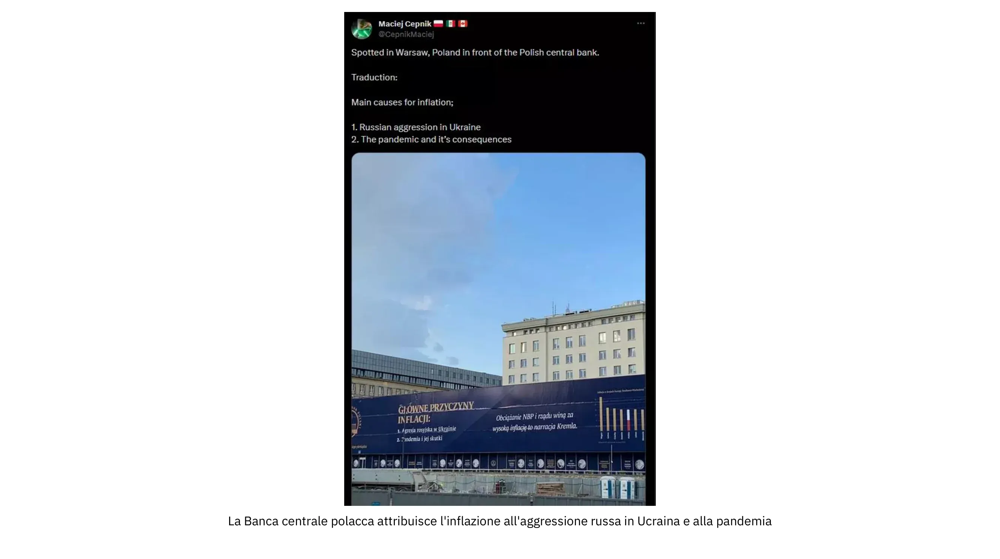

- La Brexit è accusata di essere la causa dell'inflazione nel Regno Unito.

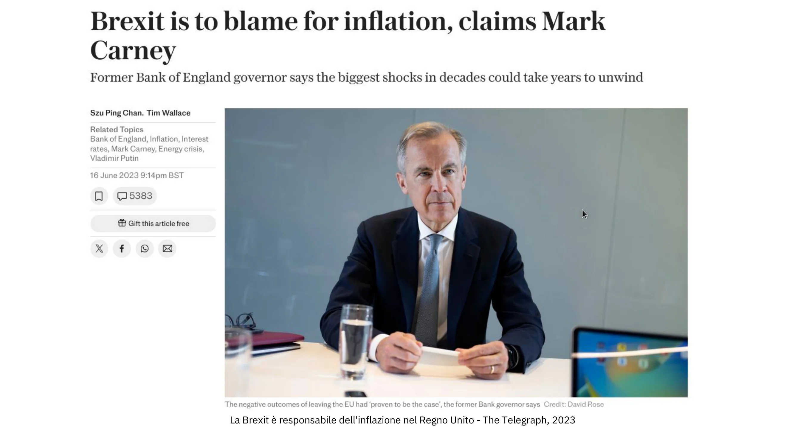

- L'uscita del gioco Zelda associata a uno shock inflazionistico.

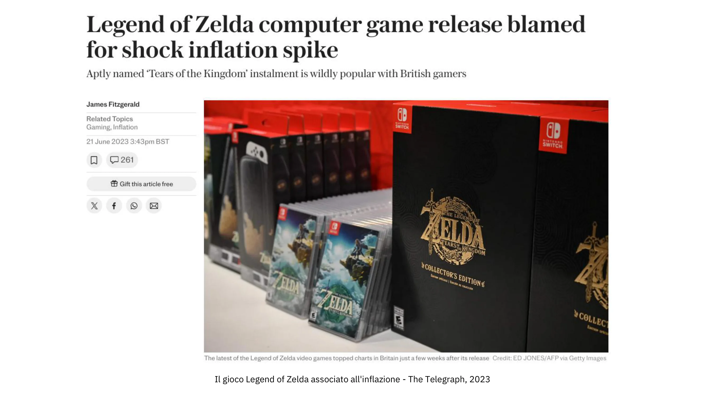

- Taylor Swift starebbe causando l'inflazione.

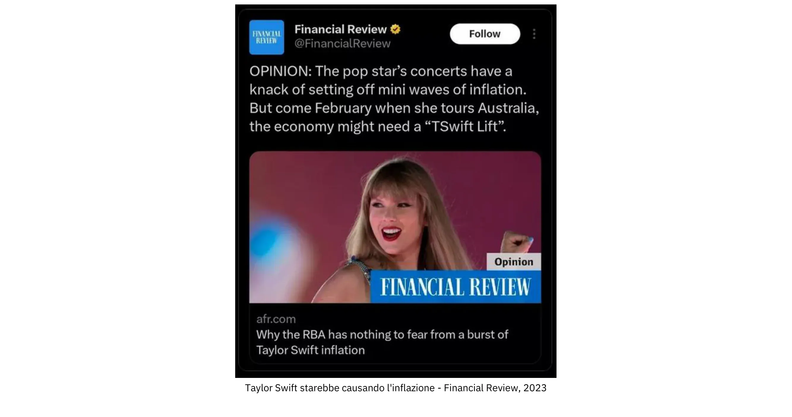

Ditemi, come possono Beyoncé o Taylor Swift causare il diffuso aumento dei prezzi? Vedete, non ha alcun senso. In breve:

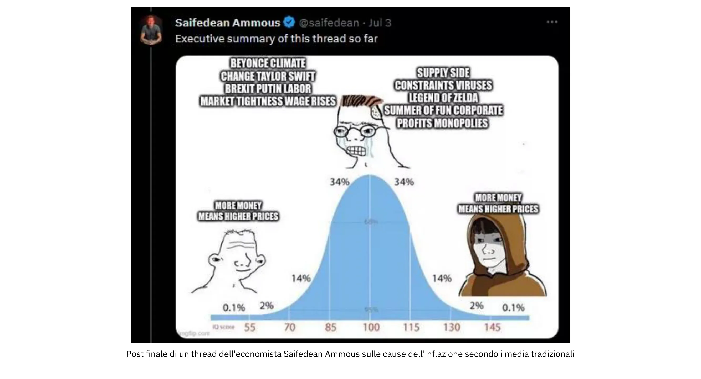

### Esplorazione dei tipi di inflazione

È fondamentale comprendere la distinzione tra i diversi tipi di inflazione, che ci permette di cogliere le varie manifestazioni di questo fenomeno economico. Ecco una spiegazione di questi diversi tipi:

- Inflazione strisciante: È il tipo di inflazione a cui generalmente mirano le banche centrali, fissata a circa il 2% annuo. Questo obiettivo è stato adottato a partire dagli anni '90 e mira a mantenere una crescita economica stabile senza surriscaldamento o deflazione.
- Inflazione moderata: Questa forma di inflazione si verifica quando l'inflazione supera l'obiettivo del 2%. È spesso associata a un surriscaldamento dell'economia, uno stato in cui un'eccessiva massa monetaria stimola un aumento generale dei prezzi. Questo scenario mette in luce i limiti delle politiche monetarie e talvolta rivela le contraddizioni del discorso economico.
- Inflazione galoppante: L'inflazione galoppante, spesso definita inflazione a due cifre, si verifica quando il tasso di inflazione annuale supera il 10%. Si tratta di un'impennata significativa dei prezzi che può compromettere la stabilità economica.

- Iperinflazione: L'iperinflazione è un fenomeno estremo in cui il tasso di inflazione supera il 50% al mese, il che, a causa della natura esponenziale dell'inflazione, equivale a un tasso di inflazione annuale di oltre il 13.000%. Questo livello di inflazione destabilizza gravemente l'economia, rendendo la moneta quasi priva di valore ed erodendo la fiducia nel sistema monetario.

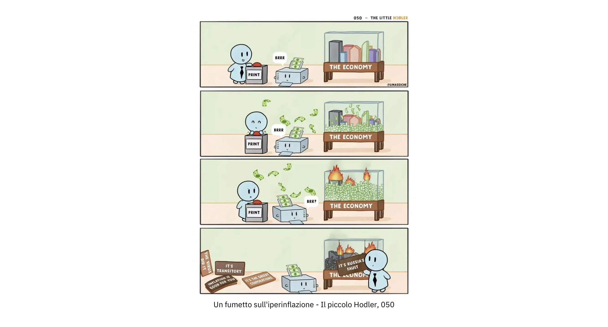

Quando si esplorano i tipi di inflazione, è comune imbattersi in termini come "Demand Pull" e "Cost Push" nelle risorse educative. Questi concetti, sebbene validi, tendono a spiegare l'aumento dei prezzi piuttosto che l'inflazione come fenomeno monetario. Ecco un'analisi più approfondita:

- Richiamo della domanda:

L'inflazione da domanda è spesso descritta come uno scenario in cui la domanda nell'economia supera la capacità produttiva disponibile. Tuttavia, senza un corrispondente aumento della moneta Supply, questa situazione porterà semplicemente a una ridistribuzione della spesa. I consumatori possono spendere di più per i beni essenziali e meno per quelli non essenziali, neutralizzando così l'effetto inflazionistico complessivo.

- Spinta dei costi:

D'altra parte, l'inflazione da spinta dei costi è attribuita all'aumento dei costi di produzione, come quelli delle risorse naturali o del lavoro. Anche in questo caso, senza un aumento della moneta Supply, gli aumenti dei costi in un settore possono semplicemente ridurre la spesa in altri, senza causare un'inflazione diffusa.

Queste spiegazioni tradizionali spesso associano l'aumento dei prezzi all'inflazione, il che può generare confusione e fraintendimenti. In realtà, perché si verifichi un'inflazione diffusa, è necessario un aumento della moneta Supply . In questo contesto, i concetti di Demand Pull e Cost Push possono spiegare le variazioni settoriali dei prezzi, ma non colgono la natura monetaria dell'inflazione. Ciò evidenzia l'importanza di distinguere tra gli aumenti dei prezzi settoriali e l'inflazione generalizzata e ribadisce la necessità di un aumento della moneta Supply per evitare che l'inflazione si manifesti in tutta l'economia. Questa analisi fornisce una prospettiva più sfumata e precisa sulle cause effettive dell'inflazione, demistificando le interpretazioni comuni che possono oscurare le dinamiche monetarie sottostanti.

### Classificazione dell'inflazione secondo Bernholz

Bernholz propone una classificazione semplificata ma precisa dell'inflazione in tre categorie, che consente di comprendere meglio questo complesso fenomeno monetario:

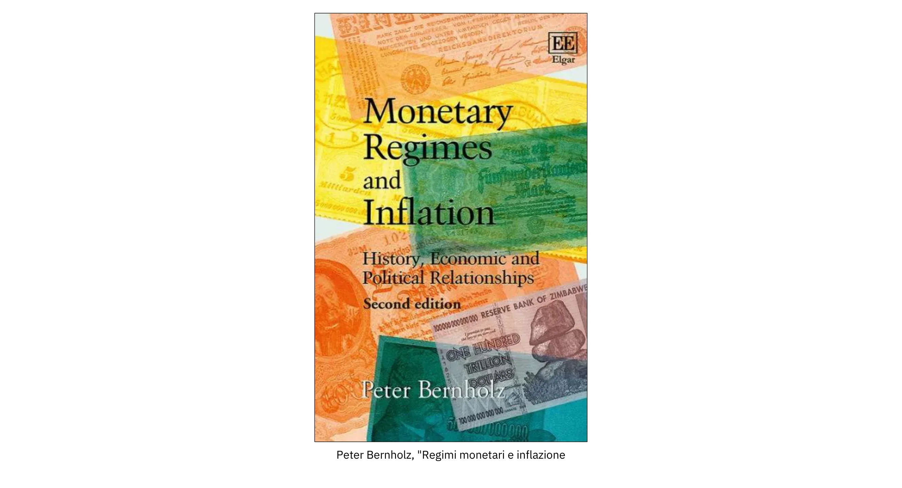

- Inflazione moderata:

L'inflazione moderata si verifica quando il livello di moneta Supply è più alto del normale, ma senza che lo Stato ricorra a grandi deficit finanziati dalla creazione di moneta. Sebbene il termine "moderata" possa sembrare insignificante, questa forma di inflazione può causare problemi sostanziali, pur non essendo classificata come inflazione elevata.

- Inflazione elevata:

Un'inflazione elevata si verifica quando il valore reale della moneta Supply diminuisce nonostante un aumento in termini nominali. Questa situazione paradossale deriva dalla sostituzione monetaria, in cui gli individui perdono fiducia nella moneta nazionale e cercano di Exchange acquistarla per beni, servizi o valute estere. Questo processo riduce ulteriormente il valore reale della moneta, aggravando l'inflazione.

- Iperinflazione:

L'iperinflazione è una forma estrema di alta inflazione, caratterizzata da ampi deficit di bilancio finanziati attraverso la creazione di moneta. Storicamente, non è stato osservato alcun caso di iperinflazione senza un sostanziale finanziamento del deficit attraverso la stampa di moneta. L'iperinflazione crea un circolo vizioso: l'inflazione erode il valore della moneta così rapidamente che le entrate fiscali si deprezzano prima ancora che lo Stato possa riscuoterle, costringendo così lo Stato a stampare ancora più moneta per finanziarsi. Questo ciclo auto-rinforzante porta a tassi di inflazione astronomici, spesso superiori al 50% al mese.

Questa classificazione di Bernholz evidenzia la pericolosa progressione dall'inflazione moderata all'iperinflazione, sottolineando l'importanza vitale del controllo monetario e fiscale nel prevenire le distruttive spirali inflazionistiche. Dimostra inoltre che le conseguenze negative sul finanziamento dello Stato possono verificarsi ben prima di raggiungere lo stadio di iperinflazione, fornendo una prospettiva sfumata sulle implicazioni dell'inflazione a vari livelli.

### Conclusione: Sintesi dei tipi di inflazione

In conclusione, abbiamo esplorato una serie di tipi di inflazione, a partire da termini comunemente sentiti come "inflazione strisciante", "inflazione passeggera" e "inflazione galoppante", ognuno dei quali indica diversi livelli di inflazione percentuale all'interno di un'economia. Tuttavia, per il nostro studio approfondito sull'iperinflazione, le categorie di inflazione moderata, inflazione elevata e iperinflazione, descritte da Bernholz, si rivelano punti di riferimento cruciali.

- Inflazione moderata:

Indica un livello di denaro Supply superiore alla norma, anche se questo livello può essere sostenuto senza un significativo finanziamento in deficit da parte dello Stato.

- Inflazione elevata:

Si verifica quando il valore reale della moneta Supply diminuisce, spesso a causa della sostituzione monetaria, in cui gli individui cercano di Exchange cambiare la loro moneta con beni, servizi o altre forme di moneta.

- Iperinflazione:

Rappresenta una versione estrema dell'alta inflazione, in cui l'eccessiva creazione di moneta per finanziare ampi deficit di bilancio porta a una rapida erosione del valore reale della valuta.

Ciò che emerge dalla nostra esplorazione è che l'iperinflazione è un fenomeno complesso e controintuitivo. Sebbene si possa pensare che l'iperinflazione sia il risultato di un aumento massiccio della moneta Supply, in realtà deriva da una diminuzione del valore reale di tale moneta Supply. Questa sfumatura è cruciale per capire perché alcuni Paesi faticano a uscire dall'iperinflazione, anche con il sostegno di istituzioni internazionali come le istituzioni di sicurezza. Questa sfumatura è fondamentale per capire perché alcuni Paesi faticano a uscire dall'iperinflazione, anche con il sostegno di istituzioni internazionali come la Banca Mondiale o il FMI. Una descrizione errata del tipo di inflazione può portare all'applicazione di rimedi inappropriati, aggravando i problemi economici invece di risolverli.

Nelle prossime discussioni approfondiremo il tema dell'iperinflazione, esplorandone le definizioni e le manifestazioni in vari contesti economici. Il nostro obiettivo è quello di scoprire i meccanismi alla base dell'iperinflazione e di esplorare le potenziali soluzioni per risolvere il problema. Questa comprensione sfumata ci permetterà di comprendere meglio le sfide associate e di proporre strategie informate per la gestione dell'inflazione.

Grazie per l'attenzione. La prossima sessione sarà interamente dedicata alla definizione e alla demistificazione dell'iperinflazione, considerando diverse prospettive accademiche e pratiche. Saremo lieti di continuare questa esplorazione con voi nel nostro prossimo incontro.

# Che cos'è l'iperinflazione?

<partId>3f541663-1e2f-5410-8ee0-f61c5d009fa5</partId>

## Definizioni di iperinflazione

<chapterId>d2a71a2e-5f36-58d9-993c-d431f4aa07fd</chapterId>

### Definizioni di iperinflazione

In questa sezione esploriamo le varie definizioni di iperinflazione, un termine cruciale nello studio dei fenomeni monetari estremi. La definizione più nota è quella di Philip Cagan, che nel suo lavoro del 1956, "The Monetary Dynamics of Hyperinflation", propone una comprensione quantitativa dell'iperinflazione. Secondo Cagan:

- Inizio e fine dell'iperinflazione:
  - L'iperinflazione inizia quando l'inflazione mensile supera il 50%.
  - Termina quando il tasso di inflazione scende al di sotto del 50% al mese per almeno un anno.

Per esempio, se l'inflazione scende al 40% in luglio e non risale al di sopra del 50% fino al luglio dell'anno successivo, il periodo di iperinflazione si considera concluso nel luglio dell'anno precedente a quello in cui è stato osservato per la prima volta. Questa definizione consente una caratterizzazione precisa degli episodi di iperinflazione, facilitando un'analisi strutturata.

Questa definizione è stata adottata nella tabella Hanke-Krus, che documenta 56 episodi di iperinflazione. Tuttavia, la tabella non copre tutti gli episodi, come quello del Venezuela nel 2016, che porta il totale a 57.

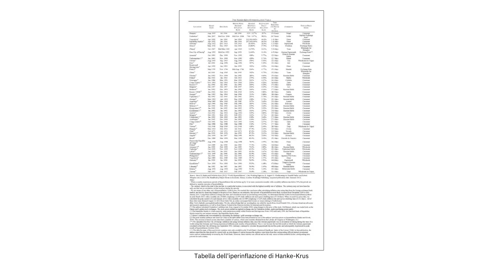

zoom

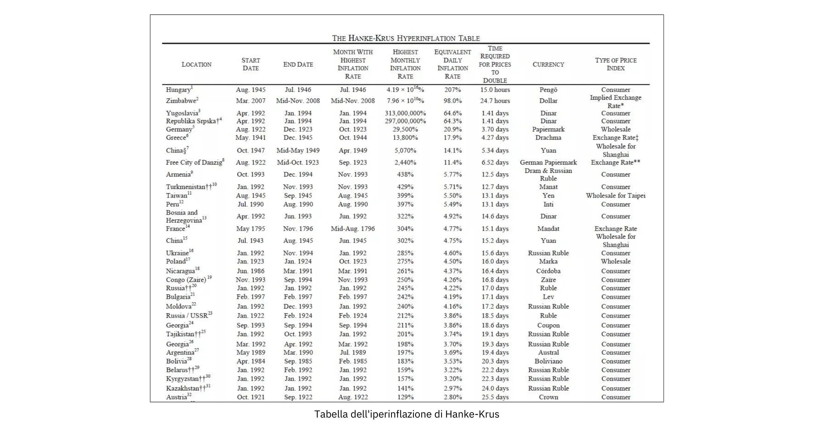

Va notato che questa definizione, sebbene precisa, potrebbe escludere alcuni episodi di iperinflazione a causa della rigidità della soglia del 50%. È possibile ampliare questa definizione per includere altri episodi che, pur non rispondendo strettamente ai criteri di Cagan, rappresentano comunque periodi di inflazione estremamente elevata. Questa osservazione apre la porta a un'esplorazione più ampia dei fenomeni di iperinflazione, consentendo una comprensione più sfumata delle sue cause e dei suoi effetti. Nelle discussioni successive, prenderemo in considerazione la possibilità di rivedere questa definizione e di esaminare gli episodi di iperinflazione che non rientrano nei criteri rigorosi di Cagan.

### La definizione di iperinflazione di Cagan

Philip Cagan potrebbe aver posto una pietra miliare arbitraria con la soglia del 50% di inflazione mensile nel definire l'iperinflazione. Egli stesso ammette che questa definizione è arbitraria e che la sua analisi si basa principalmente su sette episodi di iperinflazione. L'esame dei dati di Cagan rivela che i tre episodi di iperinflazione con i tassi d'inflazione mensili più bassi si aggiravano intorno al 47%, 46% e 57%. Sembra che la soglia del 50% sia stata scelta per includere questi casi nel suo studio.

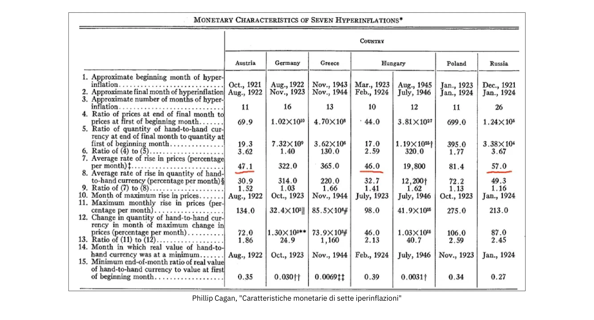

- Contesto storico:

La definizione di Cagan risale al 1956 e si basa su un numero limitato di episodi di iperinflazione disponibili all'epoca.

- Le osservazioni di Cagan:

Secondo Cagan, nessun episodio ha raggiunto questa soglia di circa il 50% senza progredire verso un'iperinflazione più grave, il che potrebbe giustificare la scelta di questa soglia.

- Critica della definizione di Cagan:

Anche altri economisti, come Bernholz, autore di Regime monetario e inflazione, hanno definito arbitraria la soglia del 50%.

Bernholz osserva che esistono episodi di alta inflazione con le stesse caratteristiche qualitative degli episodi di iperinflazione, senza raggiungere la soglia del 50%.

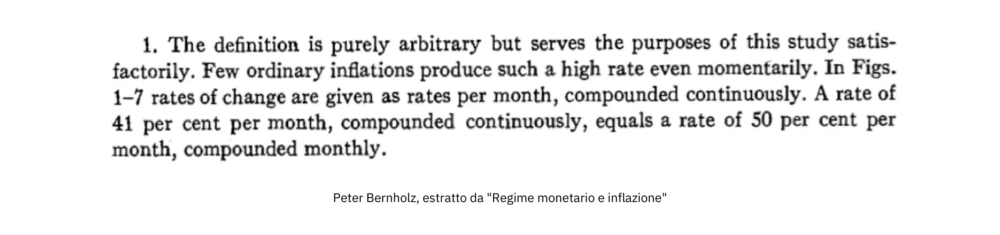

Questa riflessione ci porta a mettere in discussione la rigidità della definizione tradizionale di iperinflazione e sottolinea la necessità di rivedere questa soglia incorporando più episodi e dati storici. La definizione di iperinflazione potrebbe richiedere una certa flessibilità per includere varie manifestazioni di inflazione estrema in diversi contesti economici e storici.

### La definizione di iperinflazione secondo l'International Accounting Standards Board (IASB)

Lo IASB offre una prospettiva unica sull'iperinflazione, concentrandosi sulle pratiche contabili durante i periodi di iperinflazione. Questo approccio è fondamentale per i contabili e le imprese che operano in ambienti iperinflazionati, dove il valore monetario fluttua rapidamente. Le linee guida dello IASB individuano diversi indicatori di iperinflazione:

- Preferenza per le attività non monetarie:**

A causa del rapido deprezzamento del valore monetario, gli individui preferiscono detenere valore in beni piuttosto che in valuta.

- Valutazione di beni e servizi:**

I residenti non calcolano il valore di beni e servizi in valuta locale, il che riflette una perdita di fiducia nella moneta locale.

- Indennità per perdita di valore monetario:**

I prezzi incorporano una compensazione per la perdita di valore monetario durante gli acquisti a credito, illustrando l'impatto dell'inflazione sulle transazioni quotidiane.

- Indicizzazione dei prezzi, dei salari e degli interessi:**

Prezzi, salari e interessi vengono adeguati in base a un indice per compensare l'inflazione.

- Inflazione cumulata su tre anni:**

L'inflazione cumulativa su tre anni si avvicina al 100% (circa il 24% all'anno), in contrasto con la definizione di Cagan di un'inflazione mensile del 50%.

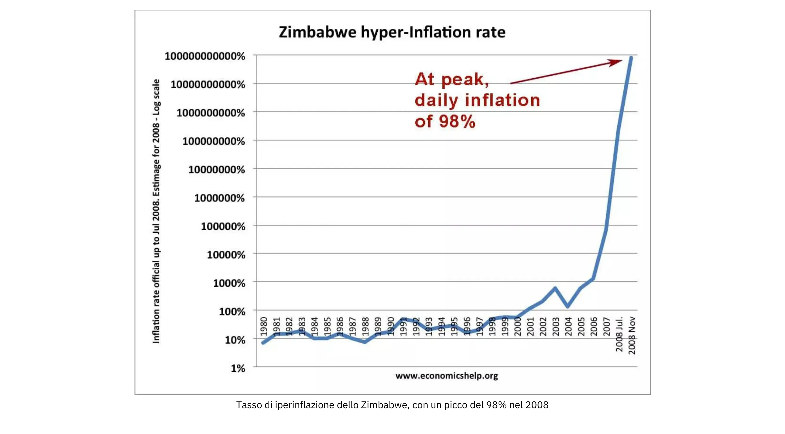

Secondo i criteri dello IASB, diversi Paesi, tra cui Argentina, Etiopia, Haiti, Iran, Libano, Sudan, Sud Sudan, Suriname, Siria, Turchia, Venezuela, Yemen e Zimbabwe, stanno attualmente vivendo un'iperinflazione.

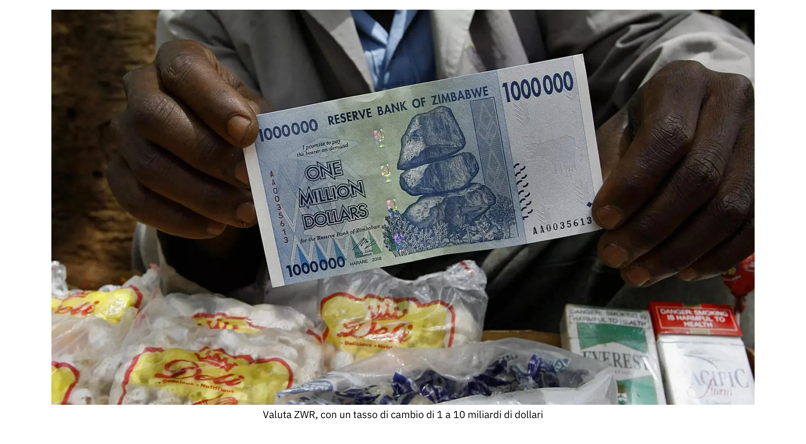

La definizione fornita dallo IASB si allontana dalla rigida soglia quantitativa di Cagan, incorporando un'analisi qualitativa dei comportamenti economici e degli aggiustamenti pratici di fronte all'iperinflazione. Essa dimostra che l'iperinflazione è un fenomeno complesso che richiede una comprensione multidimensionale per coglierne le reali implicazioni, in particolare nel campo della contabilità, cruciale per la stabilità e la trasparenza finanziaria delle imprese e dei mercati.

### Quindi, quante iperinflazioni ci sono in totale?

Le definizioni comuni di iperinflazione, come quella proposta da Cagan, che prevede un tasso di inflazione mensile del 50%, possono talvolta essere confuse o eccessivamente semplicistiche. Ad esempio, due Paesi che registrano tassi di inflazione annuali rispettivamente del 1.000% e del 3.000% possono essere percepiti in modo diverso in base alla distribuzione mensile di tale inflazione. Se nessun mese supera la soglia del 50%, secondo la definizione di Cagan, questi Paesi non sarebbero classificati come in uno stato di iperinflazione. Questo approccio può quindi portare ad anomalie nella classificazione dell'iperinflazione, soprattutto quando si confrontano le inflazioni cumulate nel corso dell'anno.

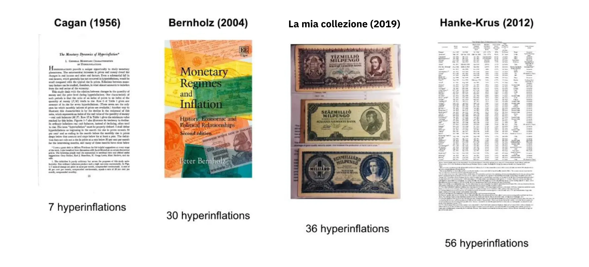

- Il lavoro di Cagan, "Monetary Dynamics of Hyperinflation", fornisce un'analisi fondamentale dell'iperinflazione.
- Il libro di Bernholz, che studia 30 distinti periodi di iperinflazione, amplia così la portata dell'analisi.
- La collezione personale di David St-Onge (autore del corso) di banconote di 36 periodi di iperinflazione, permette una comprensione tangibile e storica.
- La tabella Hanky Cross (versione 2012, aggiornata nel 2016 con il Venezuela), che elenca 57 periodi di iperinflazione in base alla definizione di Cagan.

Vale la pena notare che alcuni periodi storici di alta inflazione non sono inclusi nelle tabelle classiche dell'iperinflazione, spesso a causa di rigidi criteri di classificazione. Ad esempio, durante la guerra d'indipendenza americana nel novembre 1779 e durante la guerra civile americana nel marzo 1864, i tassi d'inflazione mensili erano rispettivamente del 47,4% e del 40%. Questi tassi, sebbene elevati, non superano la soglia del 50% stabilita da Cagan, escludendo quindi questi periodi dalla classificazione come casi di iperinflazione. Questa omissione evidenzia i limiti delle definizioni rigide e sottolinea la necessità di una comprensione più sfumata dell'iperinflazione in tutta la sua complessità.

## Analogie tra Weimar e lo Zimbabwe

<chapterId>11eef458-aab8-5c63-8523-264d0ba69f5d</chapterId>

### Due epoche, due catastrofi

In questo capitolo esamineremo gli effetti dell'iperinflazione, con particolare attenzione alle esperienze dello Zimbabwe e della Repubblica di Weimar. Nel corso della mia ricerca, ho privilegiato l'esplorazione delle testimonianze dirette degli individui che hanno vissuto questi periodi di iperinflazione, piuttosto che adottare un approccio puramente economico o statistico.

Alcuni libri sono stati particolarmente istruttivi:

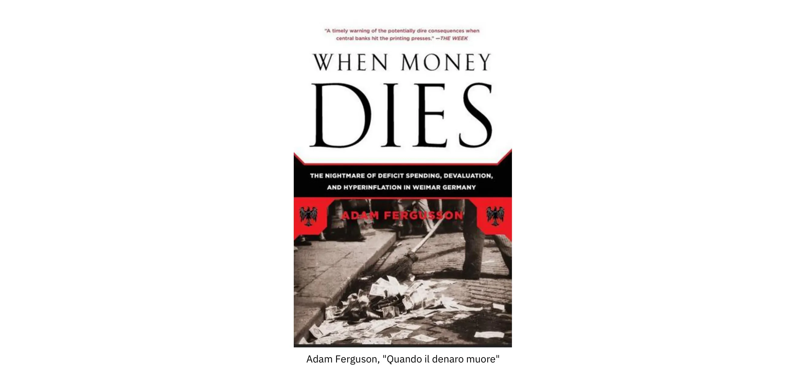

- "Quando il denaro muore" di Adam Ferguson ripercorre l'iperinflazione del primo dopoguerra in Germania, Austria e Ungheria.
- Due libri sull'iperinflazione in Zimbabwe, "Zimbabwe Warm Heart Ugly Face" e "Hard Boiled Egg Index", rispettivamente di Jérôme Gardner e Kudzai Joseph Gou Min-Yu, offrono testimonianze toccanti di un amministratore delegato di una catena di negozi di abbigliamento e di un banchiere agricolo sulle loro esperienze durante questo periodo tumultuoso.

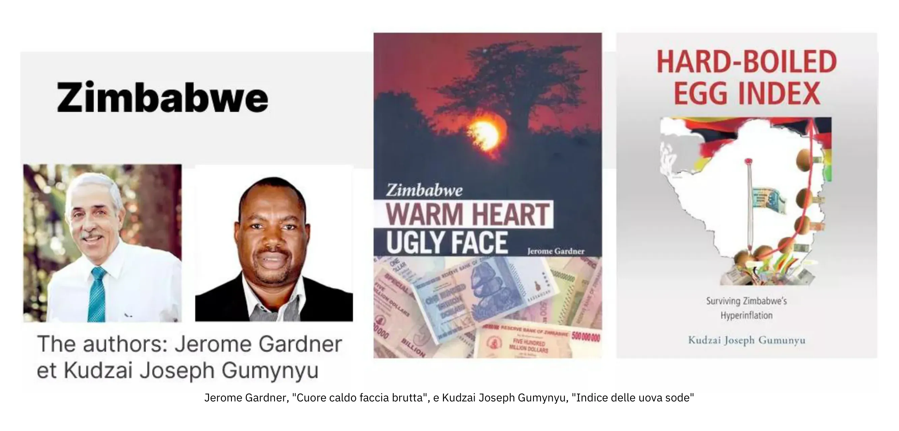

Mentre consolidavo i miei appunti, ho notato numerose somiglianze tra le esperienze di iperinflazione in Zimbabwe e nella Repubblica di Weimar, nonostante i 90 anni di distanza. Ho individuato circa 17 analogie, di cui 13 illustrano una sorta di progressione verso il disastro economico descritto in queste testimonianze. Questi affascinanti parallelismi dimostrano la natura ripetitiva e devastante dell'iperinflazione attraverso il tempo e i confini. Oggi esamineremo queste similitudini e il modo in cui descrivono una traiettoria preoccupante durante i periodi di iperinflazione.

### Analisi comparativa: Zimbabwe e Repubblica di Weimar

Il gioco delle 14 differenze!

#### 1. Carenza di denaro

Quando la moneta si svaluta a una velocità vertiginosa, anche i tentativi più ambiziosi di inondare il mercato di nuove banconote possono rivelarsi insufficienti. L'incessante domanda di valuta tangibile può superare di gran lunga la capacità delle banche centrali di produrre banconote, creando crisi di liquidità senza precedenti.

> Weimar: "Nel corso di questo mese sarà portato a quasi 4 miliardi di marchi cartacei, cifra con la quale si spera di superare definitivamente la carenza di valuta"

> Zimbabwe: "Dal 2002 al gennaio 2009 si sono verificate diverse carenze critiche di liquidità. Semplicemente non c'erano abbastanza banconote stampate o in circolazione per tenere il passo con l'inflazione alle stelle"

#### 2. "E questo è letame!"

La velocità con cui la moneta può perdere valore in certe situazioni economiche è sorprendente. Quantità astronomiche di banconote possono essere emesse in tempi record, trasformando istantaneamente somme un tempo considerevoli in qualcosa di insignificante come il letame.

> Weimar: "L'attuale emissione totale ammonta a 63.000 miliardi. Tra pochi giorni saremo quindi in grado di emettere due terzi della circolazione totale in un solo giorno"

> Zimbabwe: "Il 17 settembre 2006, il governatore della RBZ, Gideon Gono, ha dichiarato: '10.000 miliardi sono ancora là fuori, e sono diventati letame'"

#### 3. Le banconote valgono meno della carta su cui sono stampate

In determinate circostanze economiche, il valore intrinseco di una banconota può diventare inferiore al valore della carta su cui è stampata. Questa drastica svalutazione trasforma le banconote, che normalmente sono simboli di valore e potere d'acquisto, in semplici pezzi di carta senza valore.

> Weimar: "Interi tagli di banconote di marchi erano quasi privi di valore non appena usciti dalla macchina da stampa"

> Zimbabwe: "La banca centrale ha sprecato denaro stampando una banconota che non valeva la carta su cui era stampata. In altre parole, il suo valore era inferiore a quello della carta igienica. Per quanto possa sembrare assurdo, era più conveniente usare la banconota da 100.000 miliardi di ZWD come carta igienica che comprare carta igienica vera e propria"

#### 4. Contare il denaro

Quando la moneta perde rapidamente il suo valore, anche le transazioni più semplici possono diventare un'operazione laboriosa. Calcolare il prezzo di un articolo o semplicemente contare le banconote necessarie per il pagamento può richiedere diversi minuti, aggiungendo un Layer di complessità alle interazioni quotidiane.

> Weimar: "L'acquisto più ordinario in un negozio richiedeva tre o quattro minuti di calcolo, e una volta determinato il prezzo, di solito erano necessari altri minuti per contare le banconote"

> Zimbabwe: "I gestori dei negozi potevano anche assumere un lavoratore temporaneo per sostituire il personale che contava il denaro tutto il giorno. Naturalmente, contare il denaro in negozio per l'amministrazione e il deposito in banca era una cosa, ma l'intero processo doveva essere ripetuto in banca durante il deposito"

:::video id=910231d7-af90-4ab8-b74c-bfb81caebfb2:::

Tecnica uzbeka di conteggio del denaro

#### 5. Pagamenti con assegno

Nelle economie in crisi, i metodi di pagamento tradizionali come gli assegni possono perdere rapidamente la loro efficacia. Le banche, sopraffatte dalla crescente domanda di valuta dovuta all'iperinflazione, possono razionare o ritardare l'incasso degli assegni, riducendone così il valore reale. Questa instabilità spesso porta a dare priorità ai metodi di pagamento, dove i prezzi possono variare a seconda del metodo di pagamento scelto.

> Weimar: "L'aumento dei prezzi intensificò la domanda di denaro, sia da parte dello Stato che di altri datori di lavoro. Le banche private non riuscirono a soddisfare la domanda e dovettero razionare l'incasso degli assegni, così gli assegni non incassati rimasero congelati mentre il loro potere d'acquisto diminuiva"
> Zimbabwe: "Il valore temporale del denaro ha creato tre prezzi per beni e servizi: il prezzo del contante, il prezzo del regolamento lordo in tempo reale e il prezzo degli assegni. Alla fine, nessuno accettava più assegni, che richiedevano cinque giorni per essere saldati"

#### 6. I "bruciatori-imprenditori"

Quando il valore della valuta si erode, emergono nuove opportunità economiche, sfruttando le distorsioni del mercato. Questi imprenditori, spesso definiti "imprenditori bruciatori", possono prosperare prendendo in prestito valuta svalutata per investire in attività tangibili e poi ripagare i loro debiti con valuta ancora più svalutata.

Weimar: "La speculazione sull'inflazione consisteva nel prendere in prestito marchi di carta, convertirli in beni e fabbriche e poi ripagare i prestatori con carta svalutata"

Zimbabwe: i "bruciatori-imprenditori"

#### 7. L'onestà e il lavoro di Hard perdono il loro appeal

In contesti economici instabili, i valori tradizionali del lavoro, della parsimonia e dell'integrità possono essere messi in ombra dal fascino di una ricchezza rapida. La speculazione e il commercio di valuta spesso offrono ricompense molto più alte rispetto al lavoro regolare, portando a uno stravolgimento delle priorità della società.

Weimar: "Mentre le vecchie virtù della parsimonia, dell'onestà e del lavoro Hard perdevano la loro attrattiva, tutti cercavano di arricchirsi rapidamente, soprattutto perché la speculazione monetaria o azionaria poteva apparentemente rendere molto di più del lavoro"

Zimbabwe: "Queste pratiche, pur arricchendo pochi individui, hanno impoverito la classe operaia urbana e la popolazione rurale. L'istruzione ha perso il suo valore, poiché questo commercio era guidato da persone che non avevano bisogno di istruzione o di un lavoro Hard per giustificarlo. Tutto ciò di cui avevano bisogno erano le conoscenze e il capitale iniziale per avviare la loro attività di guadagno facile"

#### 8. Le "banche del mondo"

In situazioni di iperinflazione o di crisi monetaria, spesso emergono mercati paralleli e non regolamentati per le valute estere. Queste "banche" informali, spesso chiamate scherzosamente "banche mondiali" o con altri nomi locali, offrono un rifugio a chi cerca di proteggere i propri beni dalla svalutazione. Sebbene questi mercati possano fornire una necessaria ancora di salvezza economica, spesso evidenziano una diffusa sfiducia nelle istituzioni finanziarie ufficiali e nelle politiche governative.

Weimar: "Le loro transazioni avvenivano principalmente attraverso i cosiddetti Winkelbankiers, gli operatori ambulanti che erano emersi con l'inflazione e che, prosperando in un'economia malata, vivevano interamente sfruttando la differenza tra i prezzi di acquisto e di vendita delle valute estere"

Zimbabwe: "Erano anche cambiavalute. Operavano impunemente tra la 2a e la 6a Avenue e Fort Street a Bulawayo, grazie alle loro astute pratiche commerciali, che spesso comportavano corruzione e altre attività illecite. Quest'area della città era conosciuta come la 'Banca del Mondo'"

Argentina: "Così sono andato dove vanno tutti gli argentini: le cuevas, le 'grotte', che si trovano nel quartiere Florida, nel cuore di Buenos Aires" - LaGrande Balena

#### 9. Gli scambi di valuta estera erano illegali

I governi, nel tentativo di stabilizzare la propria valuta e controllare il flusso di capitali, possono rendere illegali queste transazioni in valuta estera. Queste misure repressive, sebbene volte a proteggere l'economia nazionale, possono spesso avere l'effetto opposto, esacerbando la sfiducia del pubblico e incoraggiando il mercato nero.

Weimar: "La gente ricorse al baratto e gradualmente si rivolse alle valute estere come unico mezzo affidabile per il Exchange . Furono introdotti nuovi decreti riguardanti l'acquisto di cambiali estere e l'uso di valute estere per i pagamenti nazionali. Oltre alla reclusione, potevano essere comminate multe fino a dieci volte l'importo della transazione illegale"

Zimbabwe: "Le incursioni nelle aziende hanno portato all'incarcerazione di diversi uomini d'affari di Bulawayo per il fine settimana e a multe equivalenti al doppio dell'importo della valuta straniera recuperata; questo coraggio si è poi placato"

#### 10. Controlli sui capitali

Quando un Paese si trova ad affrontare una crisi monetaria o economica, una risposta comune dei governi è quella di esercitare un rigido controllo sui movimenti e sulle forme di capitale. Che si tratti di ordini che impongono l'accettazione di valute nazionali svalutate o di sanzioni severe contro chi rifiuta determinati metodi di pagamento, queste misure mirano spesso a contenere il panico e a ripristinare la fiducia. Tuttavia, la loro efficacia varia e talvolta queste misure possono rivelarsi controproducenti o scollegate dalla realtà vissuta dai cittadini.

Weimar: "I commercianti erano stati recentemente obbligati da un nuovo decreto ad accettare le banconote di Stato; ma poiché il decreto consentiva anche di continuare a usare le valute straniere per tutti gli acquisti, i commercianti in genere trovavano scuse per non accettare quasi nient'altro"

Zimbabwe: "Il 12 dicembre 2008 il governo ha introdotto il SI 175/2008, relativo al pagamento con assegni. Il testo recitava: "La sanzione per chi rifiuta il pagamento con assegno/carta bancaria o qualsiasi altro metodo di pagamento elettronico mediato dalla banca è una multa di livello 8 o una pena detentiva di sei mesi o entrambe" Ovviamente, abbiamo ignorato il SI perché era completamente fuori dalla realtà"

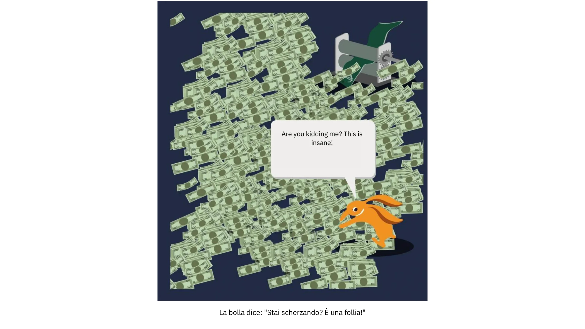

#### 11. Costretti a tenere aperti i loro negozi

Quando l'economia crolla e la moneta perde valore, i governi possono ricorrere a misure drastiche per mantenere un'apparenza di normalità.

Weimar: "I commercianti che continuavano la loro attività erano soggetti a una nuova ordinanza, promulgata il 22 ottobre, che imponeva loro di tenere aperti i negozi e di offrire merci in Exchange in cambio di marchi cartacei"

Zimbabwe: "Sono rimasti solo scaffali d'acciaio vuoti e frigoriferi, refrigeratori e congelatori. La tragedia è che il negozio era ancora aperto perché non si osava chiudere a causa delle tensioni politiche e della paura che i leader venissero arrestati dalla forza di controllo dei prezzi del governo. Anche i lavoratori non sono stati licenziati perché tutti pensavano che ci sarebbe stata una soluzione rapida"

#### 12. Tutti sono criminali

Di fronte a un'economia al collasso e a una regolamentazione pervasiva, il confine tra sopravvivenza e criminalità si fa sempre più labile.

Weimar: "Tutti i crimini contro lo Stato, ognuno di essi, in misura diversa, divennero una questione di sopravvivenza per gli individui"

> Zimbabwe: "Ogni abitante dello Zimbabwe era un criminale". Per quanto possa sembrare duro, era vero. Con la miriade di piccole leggi che regolano ogni aspetto della vita, era inevitabile che tutti infrangessero una legge al giorno. Possedere valuta estera era illegale, secondo un SI pubblicato nel 2004. Avere più conti bancari per aggirare il limite di prelievo giornaliero era illegale. Non avere le targhe adeguate sulla propria auto, o una licenza per l'autoradio, o un permesso per il generatore, erano tutte leggi che qualcuno, da qualche parte, stava infrangendo"

#### 13. Acquistare valuta estera a qualsiasi costo

L'acquisto frenetico di valute estere ha spesso segnato un punto di svolta critico nella svalutazione delle valute, esacerbando la caduta del valore intrinseco.

> Weimar: "Fritz Mannheimer, su istruzioni del suo capo, nell'agosto 1921 uscì e iniziò a comprare valute estere a qualsiasi prezzo - 'perché la Germania aveva una quantità infinita di marchi cartacei ma non di valute estere' Questo fu il primo segno del crollo assoluto del valore del marco"

> Zimbabwe: è stato asserito che gli venivano dati degli obiettivi giornalieri da raggiungere, dato che alcune richieste di forex erano urgenti, e che avrebbero comprato ad ogni costo per accumulare forex e rispettare la scadenza. Questa presunta pratica è stata accusata di aver alimentato il fuoco della svalutazione, dato che il valore del dollaro dello Zimbabwe ha continuato a scendere vertiginosamente"

### Sintesi del processo

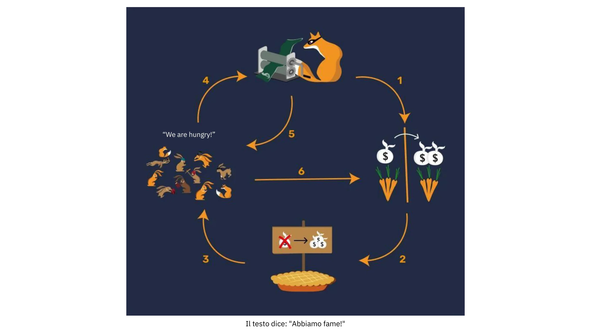

Analizzando la traiettoria economica, è evidente che quando si raggiunge un'inflazione elevata, il valore della massa monetaria si deteriora. Questa svalutazione porta a diverse complicazioni, tra cui una carenza di banconote. In questo contesto, si creano opportunità di arbitraggio, in particolare in risposta alle fluttuazioni dei tassi Exchange . Di conseguenza, molti individui si rivolgono a questo arbitraggio, investendo massicciamente in attività tangibili in previsione di una futura svalutazione monetaria che consentirebbe loro di ripagare i propri debiti con una valuta indebolita. Questo contesto economico mina l'attrattiva dei lavori tradizionali e, di conseguenza, erode la coesione sociale.

In risposta a questa situazione, il governo impone regolamenti draconiani, tra cui il controllo dei capitali. Inoltre, impone ai commercianti di accettare la valuta nazionale e gli assegni. Nel corso del tempo, vengono emanate nuove leggi che ampliano la definizione di comportamento criminale. Alla fine, il tasso di Exchange sale in modo esponenziale, poiché il governo è disposto a Exchange la propria valuta, stampata a un costo inferiore, per valute estere più robuste.

### 4 Analogie nelle conseguenze dell'iperinflazione

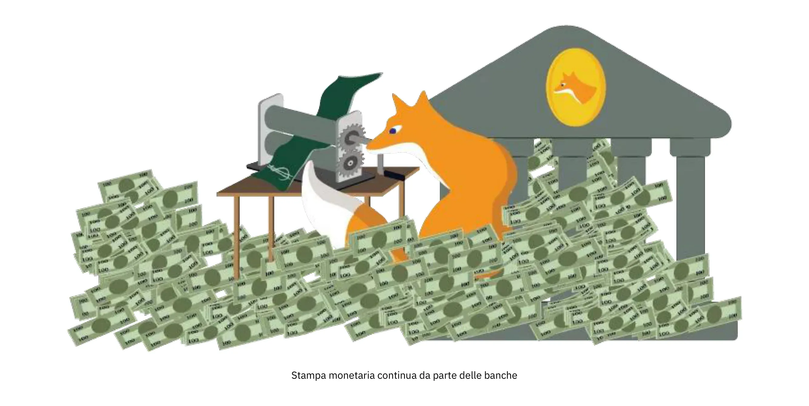

#### 1. Petrolio e metalli

Durante il periodo di Weimar in Germania, il furto di materiali di valore era così diffuso che spesso veniva rubato il piombo dai tetti. In Zimbabwe, la disperazione spingeva alcuni a interrompere la rete elettrica per estrarre l'olio dai trasformatori e usarlo nei loro veicoli.

Weimar: "Le targhe metalliche dei monumenti nazionali dovevano essere rimosse per essere conservate. Dalle porte dell'ambasciata britannica a Berlino sono state rubate placche di ottone per campanelli"

Zimbabwe: "A peggiorare le cose, a causa della mancanza di valuta estera, c'è stata una carenza di olio lubrificante per le auto, e i trasformatori sono diventati un facile bersaglio per i ladri che trafugavano l'olio di raffreddamento durante le interruzioni di corrente"

#### 2. Treni

La svalutazione della moneta può spingere i cittadini ad adottare comportamenti di sopravvivenza, tra cui il vandalismo. Di fronte a un'economia al collasso, le costose infrastrutture pubbliche, come i sistemi di trasporto, possono essere compromesse, con conseguenze disastrose per la società.

> Weimar: "A Berlino, il sistema di tram ha cessato di funzionare per mancanza di fondi"

> Zimbabwe: "Uno degli scenari più preoccupanti e tristi è stato il furto di quasi tutta la linea elettrica in rame che collega Harare a Dabuka (oltre 280 chilometri). Al momento del suo completamento, era stata l'orgoglio dello Zimbabwe, con treni elettrici veloci per passeggeri e merci che percorrevano questa tratta"

#### 3. "Mealie Meal"

In un contesto di salari magri e di economia instabile, le aziende erano costrette a fornire cibo ai propri dipendenti per mantenere la produttività e l'efficienza operativa. Questa iniziativa non era solo un modo per compensare le carenze e gli alti costi alimentari, ma anche una strategia per trattenere il personale in un contesto economico difficile.

> Weimar: "A Berlino, gli impiegati, che costituivano una classe molto importante nella capitale, avevano stipendi del tutto inadeguati che andavano da 12.000 a 20.000 al mese (equivalenti a 12-19 sterline all'anno), in costante diminuzione; ma la maggior parte poteva ancora ottenere il pranzo per una cifra simbolica, fornita dai loro uffici, in modo che il corpo e l'anima potessero appena tenersi insieme"

> Zimbabwe: "In questa fase, fornivamo a tutto il nostro personale un pranzo gratuito. La farina di mais era essenziale per il funzionamento della nostra azienda, poiché in molti casi era l'unico pasto che il personale riceveva ogni giorno"

#### 4. Buoni benzina

Le popolazioni cercavano alternative stabili per le transazioni. A Weimar, prodotti come l'ottone e il carburante servirono come mezzi di Exchange grazie al loro valore intrinseco costante. In Zimbabwe, di fronte alla rapida svalutazione del dollaro, i buoni benzina, che rappresentavano una quantità fissa di un prodotto essenziale, divennero una moneta di fatto. Queste situazioni evidenziano come le società si adattino a condizioni economiche estreme, escogitando soluzioni innovative per mantenere il commercio e l'economia.

Weimar: "Il baratto era già una forma abituale di Exchange; ma ora, beni come l'ottone e il carburante divennero la moneta comune di acquisto e di pagamento"

Zimbabwe: "Questi voucher sono stati utilizzati per pagare l'affitto ai proprietari, le tasse comunali, le bollette del telefono - in realtà quasi tutto - perché tutti hanno smesso di accettare pagamenti in dollari e assegni dello Zimbabwe"

#### Conclusione

Si conclude così questo video sulle analogie tra le esperienze vissute durante i periodi di iperinflazione in Zimbabwe e nella Repubblica di Weimar. Nel prossimo video discuteremo le differenze e i parallelismi contemporanei. Grazie.

## Weimar e Zimbabwe: Differenze e parallelismi contemporanei

<chapterId>643f279c-d89f-5600-a2e2-b1bbbba0ab69</chapterId>

In questo capitolo esploreremo le differenze e i parallelismi contemporanei tra i periodi di iperinflazione del passato e quelli attuali, con aneddoti e paragoni rilevanti per i giorni nostri.

### Differenze tra la Repubblica di Weimar e lo Zimbabwe

#### 1. È colpa del dollaro!

In Germania era comune che la popolazione attribuisse l'inflazione all'aumento del dollaro piuttosto che alla svalutazione intrinseca della propria moneta. Molti ritenevano che il fenomeno osservato fosse dovuto a un apprezzamento del dollaro. Questa percezione escludeva qualsiasi riconoscimento del legame tra le loro difficoltà economiche e la svalutazione monetaria, indotta principalmente da un'eccessiva creazione di moneta. Il libro "Quando il denaro muore" illustra chiaramente questa mancanza di comprensione da parte della popolazione tedesca. In Zimbabwe, invece, la situazione era diversa: i cittadini erano pienamente consapevoli della causa di fondo dell'iperinflazione che stavano vivendo.

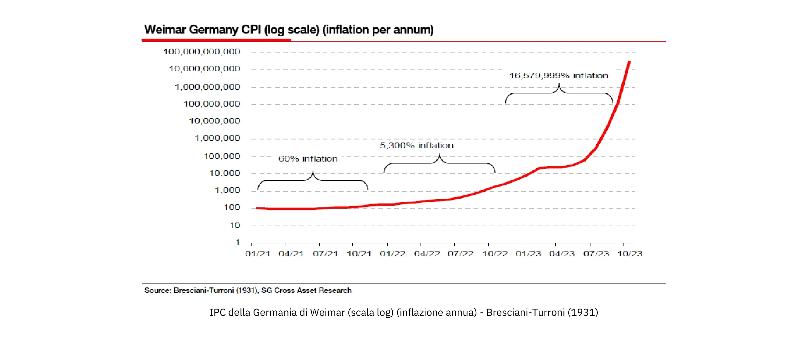

#### 2. Denaro di emergenza (Notgeld)

Di fronte alla crisi monetaria ed economica, la Germania ricorse al "Notgeld" (denaro di emergenza). Queste banconote, stampate dalle città o da alcune aziende, erano state concepite per Address una carenza di valuta comune.

È interessante notare che anche la Francia ricorse al Notgeld, soprattutto negli anni Venti. Questa iniziativa non era solo una conseguenza diretta dell'iperinflazione, ma aveva anche radici nelle perturbazioni causate dalla Prima Guerra Mondiale. La guerra non solo destabilizzò l'economia, ma aumentò anche il costo dei metalli. Di conseguenza, il valore intrinseco delle monete metalliche spesso superava il loro valore nominale, spingendo le persone a farne incetta. In mancanza di monete, alcune istituzioni, come la Camera di Commercio di Lione, stamparono il proprio Notgeld.

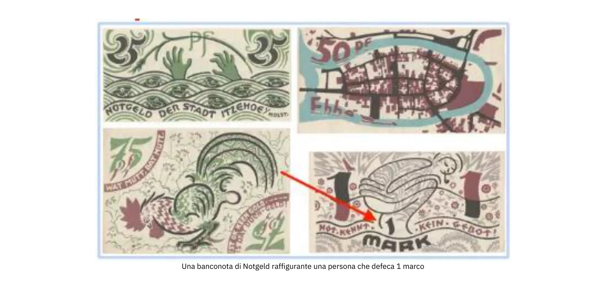

> "Ciò che deve essere fatto, deve essere fatto" - un detto locale

Tra i Notgeld, spicca una banconota particolare. Presenta un'illustrazione toccante: al centro è raffigurato un individuo che defeca un marco. Sul retro, una tabella dei prezzi dal 1913 al 1921 illustra l'aumento dell'inflazione durante questo periodo.

L'artista dietro questo Notgeld sembra fare una critica ironica alle autorità responsabili della crisi dell'iperinflazione. La banconota reca l'iscrizione "La necessità non conosce legge". Un'altra espressione specifica della località di origine del Notgeld è: "Ciò che deve essere fatto, deve essere fatto"

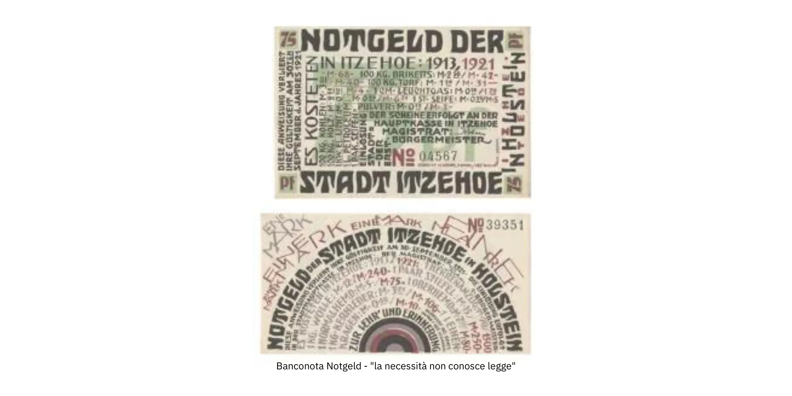

> "La necessità non conosce legge"

> La prima Shitcoin: aneddoticamente, guardando l'illustrazione centrale della banconota, in cui la moneta viene letteralmente svalutata dall'azione dell'individuo, potrebbe essere definita la prima "shitcoin"

#### 3. Obbligazioni e ipoteche

A Weimar, alcuni debiti furono rivalutati per compensare l'impatto dell'inflazione. Questa misura non è stata adottata in Zimbabwe.

> Weimar: "La decisione di rivalutare i prestiti statali divenne legge nel 1925, con il risultato che gli azionisti ricevettero il 2,5% del loro investimento iniziale, a condizione che tutte le riparazioni fossero state pagate"

> Zimbabwe: "Nel luglio 2007 (tre anni dopo), potevo tirare fuori dalla mia tasca una banconota svalutata da 500.000 ZDW (bt "000"), che ora valeva 1,67 dollari al tasso del mercato parallelo, e ripagare il prestito ipotecario, che avrebbe dovuto essere rimborsato in vent'anni. Inoltre, questa banconota rappresentava solo lo 0,49% del mio stipendio mensile per lo stesso mese"

Per saperne di più sulla gestione della crisi tedesca, questo libro è essenziale.

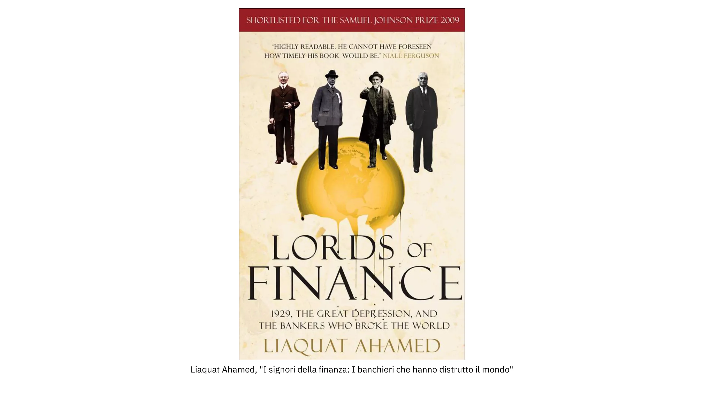

### Paralleli contemporanei

#### 1. Manipolazione della politica monetaria per controllare l'economia.

Nella storia della Repubblica di Weimar, è evidente che gli industriali erano riluttanti a vedere il valore del marco rivalutato. La possibilità di contrarre prestiti e ripagare i debiti con una moneta fortemente svalutata dava loro un notevole vantaggio. Questo meccanismo facilitò la costruzione di enormi complessi industriali a costo quasi zero. Questi industriali temevano una rivalutazione del marco perché ostacolava le loro attività. Alcuni consideravano addirittura l'inflazione dilagante come uno sviluppo positivo, ritenendo che avrebbe garantito l'occupazione alla popolazione. Tuttavia, non si rendevano conto dell'impatto negativo di questa inflazione sui risparmi e sull'economia nel suo complesso. Per questi attori economici, la stampa monetaria fu una benedizione.

> Weimar: "Per questo si temeva molto un apprezzamento del marco, e anche le poche settimane di 'stabilità' dopo Genova causarono una stagnazione degli affari"

> Weimar: "I circoli industriali si trovarono di fronte al pericolo che il contante diventasse più prezioso dei beni e che si verificasse un crollo quando tutti cercarono di convertire i propri beni in contanti"

Un parallelo contemporaneo può essere tracciato con le dichiarazioni di Christine Lagarde, che suggerisce ai cittadini di dare priorità alla prospettiva di un'occupazione rispetto alla protezione dei propri risparmi. Proprio come gli industriali di Weimar, sembra sostenere la stampa monetaria come strumento per stimolare l'occupazione, a scapito del valore dei risparmi.

> Christine Lagarde: "Dovremmo essere più felici di avere un lavoro che di vedere i nostri risparmi protetti"

#### 2. La proprietà privata in tempo di conflitto

La storia della Repubblica di Weimar rivela che durante questo periodo furono confiscati beni e capitali detenuti all'estero. Questa misura ricorda eventi più recenti in Russia, soprattutto all'inizio di un conflitto. Queste situazioni evidenziano una realtà preoccupante: in tempi di crisi, il rispetto della proprietà privata può essere compromesso. Si tratta di un parallelo storico e contemporaneo che sottolinea le potenziali ripercussioni delle crisi sui diritti individuali.

> Weimar: "Tutti i capitali tedeschi detenuti all'estero sono stati confiscati"

> [20minutes.fr](https://www.20minutes.fr/monde/3286947-20220513-guerre-ukraine-geler-avoirs-russes-vol-non-redistribuer-kiev-poserait-lourdes-questions): "Circa 300 miliardi di dollari di riserve russe detenute all'estero sono state effettivamente congelate nell'ambito delle sanzioni occidentali, su 640 miliardi di dollari di riserve detenute dalla Banca Centrale Russa"

#### 3. La nozione di prezzo di mercato

Durante la Repubblica di Weimar, gli agricoltori espressero il loro malcontento per la "Umlage", che li obbligava a consegnare i primi due milioni di tonnellate di grano prodotti ogni anno. Questo regolamento faceva sì che metà del pane totale Supply fosse immesso sul mercato a prezzi sovvenzionati. Da agosto in poi, questi agricoltori avrebbero dovuto essere pagati al prezzo del mercato mondiale, perché sebbene fossero costretti a consegnare il loro grano a prezzi ridotti, dovevano comunque acquistare fertilizzanti ai tassi del mercato mondiale.

Questa situazione solleva una questione centrale legata alla nozione di prezzo di mercato durante l'iperinflazione. Nel contesto tedesco dell'epoca, gli agricoltori erano costretti a vendere il grano a un prezzo inferiore al suo valore, mentre dovevano procurarsi fertilizzanti ai prezzi del mercato mondiale. Questa discrepanza economica evidenzia le sfide poste oggi dai prezzi dei prodotti alimentari. I produttori agricoli, di fronte all'aumento dei costi dei fattori produttivi a causa dell'inflazione, trasferiscono questi costi sui prodotti finali. Criticarli per questo aumento significa ignorare le dinamiche dei prezzi di mercato e le pressioni economiche che devono affrontare. Vendere a prezzi artificialmente bassi e sostenere costi elevati è insostenibile per qualsiasi azienda.

> Weimar: "Gli interessi agricoli erano insoddisfatti dell'"Umlage", la consegna forzata dei primi due milioni di tonnellate di grano prodotti ogni anno, che consentiva di vendere a basso prezzo la metà del totale del pane Supply . A partire dal mese di agosto, gli agricoltori dovevano essere pagati al prezzo del mercato mondiale perché, mentre erano obbligati a vendere il grano a prezzi bassi, dovevano sempre pagare il prezzo del mercato mondiale per i fertilizzanti"

#### 4. Negazione del legame tra moneta Supply e inflazione

> Weimar: "Rimase fermamente attaccato al suo punto di vista secondo cui la moneta Supply non era correlata né ai livelli dei prezzi né ai tassi Exchange"

Nei tempi moderni, questa tendenza persiste, come si è visto nell'esempio del capitolo precedente di un elenco di spiegazioni avanzate da vari economisti e istituti economici per giustificare l'inflazione. Queste ragioni variano da eventi culturali e celebrità come Taylor Swift, Zelda o Beyoncé, a fattori globali come guerre e pandemie. Tutte queste ragioni, pur contribuendo potenzialmente alle fluttuazioni economiche a breve termine, distolgono l'attenzione dalla vera causa di fondo: l'espansione del Supply .

#### 5. Aziende zombie

> Weimar: "La stabilizzazione aveva posto fine al periodo in cui gli imprenditori potevano prendere a prestito quanto volevano a spese di tutti gli altri. Un numero molto elevato di aziende, create o ampliate durante l'abbondanza monetaria, divenne rapidamente improduttivo una volta che il capitale divenne scarso"

Un'azienda zombie è un'impresa che, in condizioni normali di mercato, sarebbe insolvente o prossima al fallimento, ma che continua a operare principalmente grazie a prestiti a basso costo. Queste aziende guadagnano quanto basta per coprire i debiti, ma non sono in grado di crescere in modo significativo.

Il concetto di società zombie non è nuovo. Infatti, esisteva già durante la Repubblica di Weimar. A quel tempo, molte aziende sembravano essere fiorenti, beneficiando in gran parte dell'accesso al credito gratuito. Esse prendevano in prestito somme ingenti con l'aspettativa di ripagarle in seguito con una valuta deprezzata a causa dell'inflazione dilagante. Tuttavia, quando l'inflazione cessò e il marco tedesco riacquistò valore, queste aziende, che non erano veramente redditizie dal punto di vista operativo o finanziario, divennero non redditizie e dovettero chiudere.

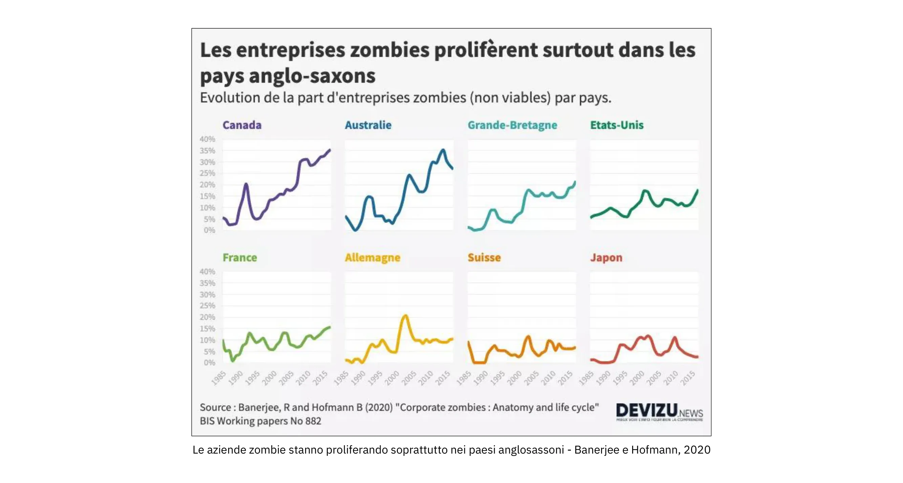

Il fenomeno delle aziende zombie non è limitato alla Germania del dopoguerra. Ancora oggi, molte grandi aziende continuano a prosperare grazie al loro accesso privilegiato al credito a tassi di interesse estremamente bassi. Se dovessero contrarre prestiti a tassi più convenzionali, molte di esse cesserebbero di essere redditizie. Ciò è particolarmente rilevante nel 2023, dopo un prolungato periodo di tassi di interesse prossimi allo zero, in quanto i tassi hanno iniziato a salire. Questo recente cambiamento nel panorama finanziario sarà senza dubbio un test decisivo per queste aziende, un tempo etichettate come "zombie"

#### 6. Diventare ricchi in fretta!

La storia rivela casi in cui gli individui hanno cercato di accumulare rapidamente ricchezza, come nel caso di Weimar e dello Zimbabwe, attraverso l'arbitraggio. Oggi, una tendenza simile si osserva con l'ascesa di alcune criptovalute. Le persone sono tentate da guadagni rapidi, assumendo rischi nella speranza di un aumento esponenziale del loro investimento. Questo approccio ricorda quello visto durante i periodi di iperinflazione, dove l'arbitraggio veniva utilizzato per ottenere rapidi guadagni, spesso a spese di altri.

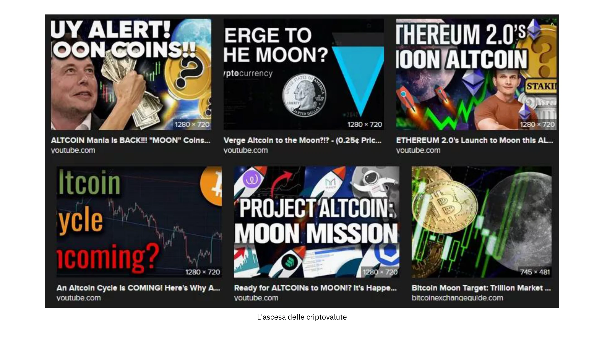

#### 7. Il risparmio, il rimedio contro l'incertezza

> L'influenza pervasiva e distruttiva della costante erosione del valore del capitale e del reddito, nonché dell'incertezza sul futuro.

Vale la pena di evidenziare una citazione che sottolinea l'effetto distruttivo dell'erosione del valore del capitale sulla coesione sociale, nonché l'incertezza che genera. Si legge che: "l'influenza pervasiva e distruttiva della costante erosione del valore del capitale e del reddito, nonché dell'incertezza sul futuro"

Immaginate uno scenario in cui avete una famiglia o dei cari che volete proteggere. Lavorate Hard e risparmiate per anticipare le incertezze future. Se tutto fosse prevedibile, il risparmio sarebbe inutile. Tuttavia, di fronte a circostanze impreviste, come un'auto in panne, i risparmi diventano un'ancora di salvezza. Riducono l'incertezza del mondo. Tuttavia, durante l'iperinflazione, risparmiare diventa una sfida. Il denaro perde rapidamente valore, rendendo difficile la pianificazione a lungo termine. Questa instabilità finanziaria può generare stress e ansia.

Oggi, con il calo del potere di risparmio, gli investimenti hanno preso il loro posto. Tuttavia, questo approccio comporta dei rischi. Il risparmio è sempre stato un rimedio contro l'incertezza. Disporre di riserve finanziarie per affrontare situazioni impreviste contribuisce alla tranquillità e rafforza la coesione sociale. In conclusione, proteggere il nostro potere di risparmio è essenziale per mantenere la stabilità sociale e individuale.

## Ridenominazioni in America Latina

<chapterId>918eafd7-409d-5205-ad52-a52e63b23a64</chapterId>

Analizzeremo ora i diversi periodi di ridenominazione nei Paesi dell'America Latina.

### Spiegazione dei grafici

Nella diapositiva, a sinistra, sono riportati gli anni di ridenominazione, il nome della nuova valuta e il tasso Exchange con la vecchia valuta. Prendendo l'esempio dell'Argentina, il peso moneda nacional è stato convertito a un tasso di 25 a 1 dalla precedente valuta, il peso reàl. In questo contesto, esamineremo l'evoluzione della moneta argentina nel tempo. Inoltre, indicheremo i tagli iniziali e finali delle banconote per ogni periodo.

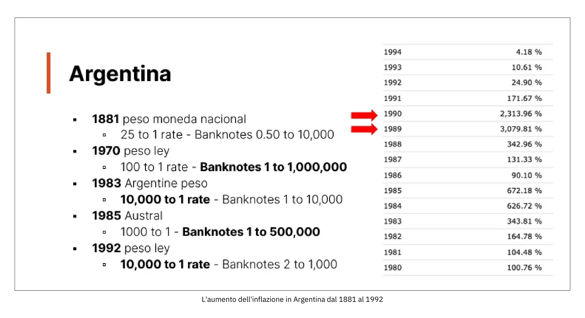

Sul lato destro della diapositiva, viene visualizzato un grafico dell'inflazione. Le frecce rosse rappresentano gli anni di iperinflazione, secondo il criterio di Cagan, che prevede un tasso di inflazione del 50% al mese. Questo criterio può talvolta portare a interpretazioni ambigue, in quanto gli anni con tassi di inflazione elevati possono non soddisfare la definizione rigorosa di iperinflazione.

Vale la pena notare che la ridenominazione, una misura comunemente adottata dai governi durante i periodi di inflazione, è un evento degno di nota. Tuttavia, questa misura non risolve il problema di fondo dell'inflazione o dell'iperinflazione. È solo un modo per rinominare la valuta e rimuovere gli zeri, senza affrontare veramente la causa principale dell'iperinflazione: l'espansione della moneta Supply. In un video successivo, discuteremo le vere soluzioni al Address e risolveremo il problema dell'iperinflazione. In questa serie, evidenzieremo le conseguenze di una semplice ridenominazione senza riforme adeguate: l'inflazione persiste.

Dopo l'Argentina, il nostro studio riguarderà Brasile, Bolivia, Perù, Nicaragua e Venezuela. Esamineremo le ridenominazioni che hanno avuto luogo in questi Paesi.

### Argentina

Prima del 1826, l'Argentina utilizzava il dollaro spagnolo. Dopo l'indipendenza del 1816, l'Argentina introdusse una propria moneta basata sul reàl spagnolo, con la conseguente creazione di una valuta simile. La tabella inizia nel 1881, anno dell'introduzione del "peso moneda nacional", con banconote fino a 10.000. Seguì il "peso ley", che veniva cambiato a un tasso di 100 a 1 e presentava banconote fino a un milione. Poi arrivò il "peso argentino", con un tasso Exchange di 10.000 a 1 (equivalente all'eliminazione di quattro zeri) e banconote fino a 10.000. Nel 1985 fu introdotto l'"australes", che veniva cambiato a un tasso di 1.000 a 1, con banconote disponibili fino a 500.000. Nel 1992 è stato istituito l'attuale "peso ley" con un tasso di 10.000 a 1, eliminando nuovamente i quattro zeri. Solo gli anni 1989 e 1990 sono stati caratterizzati da iperinflazione.

### Brasile

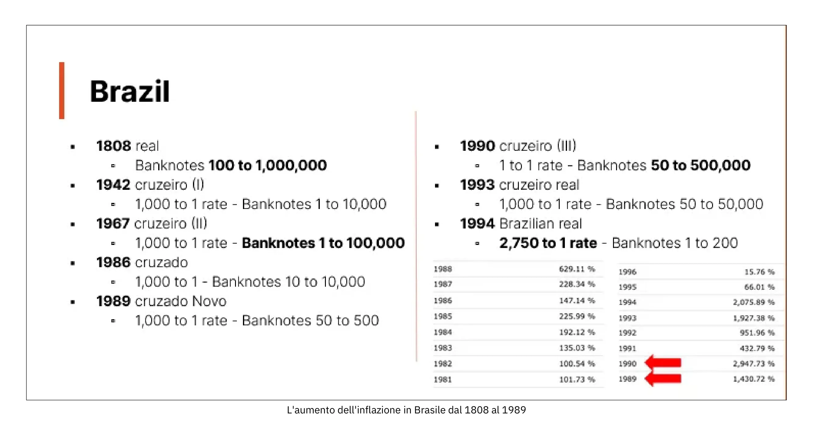

Il Brasile è un esempio notevole di ridenominazione monetaria, come dimostra la sua storia di cambi di valuta. Prima dell'indipendenza, il Brasile utilizzava come moneta il reàl portoghese. Tuttavia, già nel 1747 il Paese iniziò a utilizzare il proprio "reàl brasiliano", molto prima della dichiarazione di indipendenza del 1822. La tabella inizia nel 1818, segnando l'inizio dell'emissione di banconote brasiliane. In precedenza, la moneta era principalmente sotto forma di monete. Queste banconote raggiungevano valori fino a un milione di reais.

A partire dal 1942, il Brasile iniziò una serie di ridenominazioni. Nella maggior parte dei casi (1942, 1967, 1986, 1989, 1993), il tasso di conversione è stato di 1:1.000. Nel 1990 si è verificato un cambio di denominazione senza conversione. La sequenza di queste valute è la seguente:

- Réals (vecchia versione) fino al 1942.
- Cruzeiros nel 1942.
- Cruzeiros (nuova versione) nel 1967.
- Cruzados nel 1986.
- Cruzados Novos nel 1989.
- Ritorno a Cruzeiros nel 1990.
- Cruzeiros Reais nel 1993.
- Infine, il reàl brasiliano nel 1994.

La banconota di taglio più alto raggiunse i 500.000 e l'ultima ridenominazione del 1994 fu effettuata a un tasso di 2.750 a 1. Gli anni 1989 e 1990 furono segnati dall'iperinflazione, mentre il 1993-1994 vide tassi di inflazione elevati che non raggiunsero la soglia dell'iperinflazione (50% al mese). Dopo questo periodo tumultuoso, il Brasile ha nuovamente ridenominato la propria moneta eliminando diversi zeri.

### Bolivia

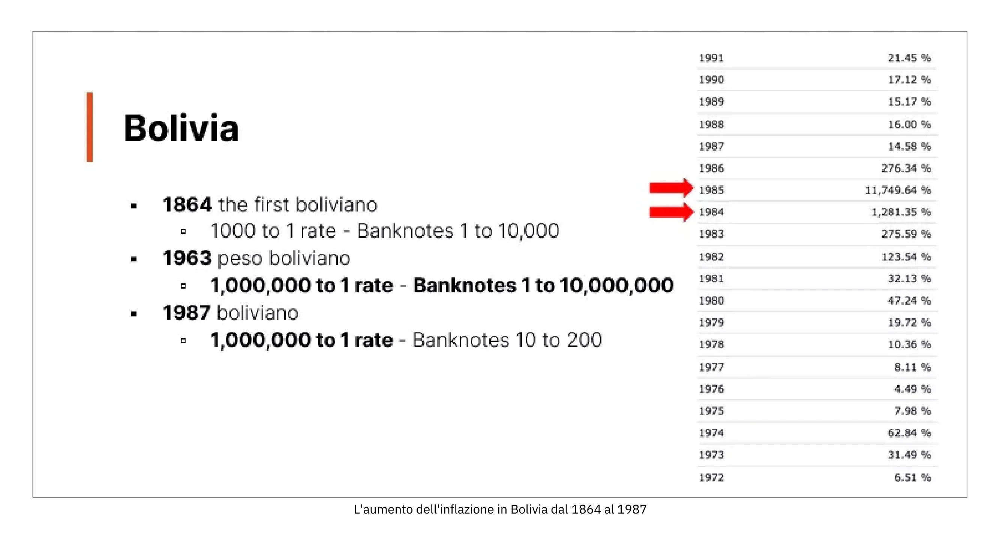

La Bolivia è un altro esempio di Paese che ha vissuto periodi di forte inflazione, rendendo necessarie ridenominazioni monetarie. Ecco una sintesi della sua storia monetaria:

Prima della sua indipendenza, nel 1825, la Bolivia utilizzava il dollaro spagnolo come valuta. Dopo l'indipendenza, il Paese introdusse il Sol boliviano tra il 1827 e il 1864, sostituendo il dollaro spagnolo. Tuttavia, vale la pena notare che le prime banconote in Bolivia furono introdotte solo nel 1864.

Nel 1864 fu introdotto il primo "Boliviano", con un tasso Exchange di 1.000 a 1 rispetto al Sol boliviano. Questa moneta rimase in circolazione fino a raggiungere un taglio di 10.000 Bolivianos.

In seguito, la Bolivia ha cambiato la sua moneta con il "Peso boliviano", che ha subito una grave iperinflazione, arrivando a tagli fino a 10 milioni. Questo episodio di inflazione ha raggiunto l'apice negli anni 1984-1985, con tassi di inflazione mensili che spesso si avvicinavano alla soglia di iperinflazione del 50%. Per fornire una prospettiva, un tasso di inflazione costante del 50% al mese per un anno intero si traduce in un tasso di inflazione annuale di circa il 12.800%. Nel 1985, il tasso di inflazione annuale della Bolivia ha raggiunto l'11.749%, indicando che l'inflazione era vicina o superava la soglia del 50% quasi ogni mese.

In risposta a questa crisi monetaria, nel 1987 la Bolivia introdusse una nuova valuta, chiamata semplicemente "Boliviano", con un tasso Exchange di 1 milione di Pesos boliviani per 1 Boliviano. Questa versione del Boliviano è ancora in circolazione oggi.

Questa è una panoramica della tumultuosa storia monetaria della Bolivia, segnata da periodi di iperinflazione e ridenominazioni.

### Perù

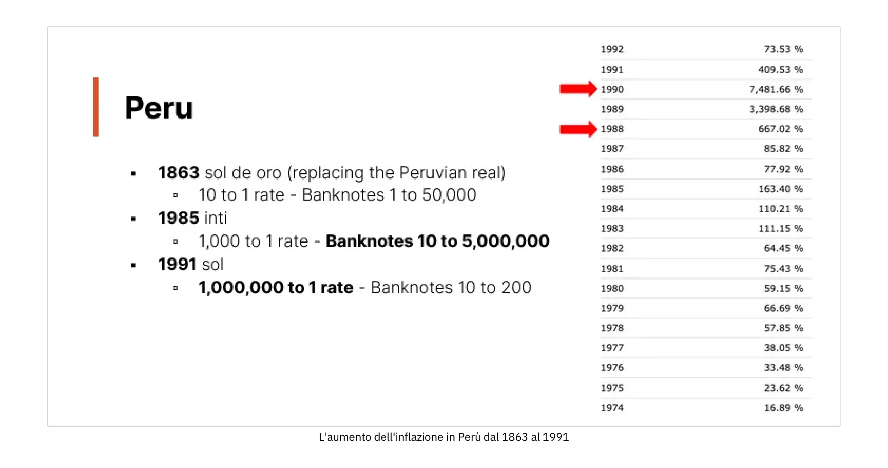

Il Perù presenta un caso interessante per quanto riguarda gli effetti della regola arbitraria del 50%. Partendo dalla sua storia monetaria, il Perù ha utilizzato l'oro spagnolo fino al XIX secolo, quando ha dichiarato la propria indipendenza nel 1821. Il dollaro peruviano fu in uso dal 1822 al 1863. Nel 1863, il reàl peruviano fu sostituito dal soldato oro, con un tasso di 10 a 1, raggiungendo un valore massimo di 50.000. Nel 1985 fu introdotta la moneta "Inti" con un tasso di conversione di 1000 a 1, con un picco di 5 milioni. Nel 1991 è stato lanciato il "SOL" con un tasso di conversione di 1 milione a 1, con banconote che vanno da 10 a 200.

Esaminando i periodi di ridenominazione, il 1988 è considerato un anno di iperinflazione, soprattutto a settembre. Anche il periodo luglio-agosto 1990 è stato caratterizzato da un'iperinflazione. Nel 1988, il tasso di inflazione annuale è stato del 667%, con un picco del 50% a settembre. Il 1989, invece, ha registrato un tasso di inflazione del 3000% senza che nessun mese superasse il 50%, per cui non è stato classificato come iperinflazione. Nel 1990, l'inflazione ha raggiunto un picco del 7481%. È chiaro che la regola del 50% può essere arbitraria, poiché il 1988 è stato considerato un anno di iperinflazione, a differenza del 1989. Se questa regola venisse riconsiderata, sarebbe saggio abbassare la soglia per includere periodi come quello vissuto dal Perù nel 1989.

> Capire cosa sta succedendo
>

> La cosa fondamentale da capire sulle ridenominazioni valutarie è che quando il valore della valuta raggiunge cifre astronomiche, come 5 o 10 milioni, viene ridenominata. Questo processo può essere ripetuto più volte, comportando un cambio di valuta. Il risultato è che i risparmi degli individui possono essere gravemente colpiti, anche in assenza di iperinflazione. Ad esempio, se una persona risparmia 1.000 dollari in un anno e riesce a metterne da parte 100, l'anno successivo la banconota di taglio più basso potrebbe essere di 1.000 dollari, rendendo vani i 100 dollari precedentemente risparmiati. Tale erosione dei risparmi non richiede un'evidente iperinflazione. Anche se una persona ha risparmiato 10.000 dollari negli ultimi dieci anni, quella somma potrebbe finire per avere un valore trascurabile, incapace di comprare una semplice bottiglia d'acqua. Questa realtà è evidente in molti Paesi che hanno sperimentato ridenominazioni, anche se solo per pochi mesi, classificate come iperinflazionistiche. Al contrario, alcuni Paesi, come il Nicaragua, hanno vissuto anni consecutivi di iperinflazione.

### Nicaragua

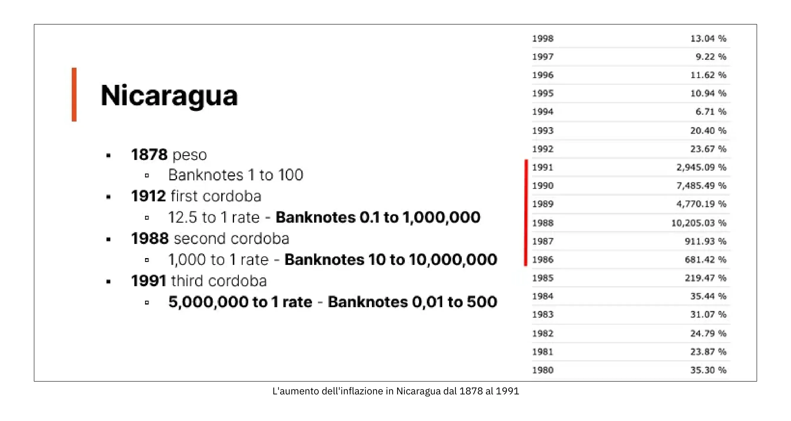

Il Nicaragua, precedentemente sotto il dominio spagnolo, inizialmente utilizzava il dollaro spagnolo, come molti altri Paesi colonizzati dalla Spagna. Dopo essere stato integrato nell'Impero spagnolo, nell'Impero messicano e poi nella Repubblica federale dell'America centrale, il Nicaragua dichiarò la propria indipendenza. A partire dal 1878, il peso divenne la valuta ufficiale del Paese, con un valore che oscillava tra 1 e 100. Nel 1912 il Paese introdusse il primo Cordoba, seguito dal secondo nel 1988 e dal terzo nel 1991, tuttora in uso. Il primo Cordoba raggiunse un valore di 1 milione e il secondo di 10 milioni. La ridenominazione del 1991 ha fatto seguito a diversi anni di iperinflazione.

### Venezuela

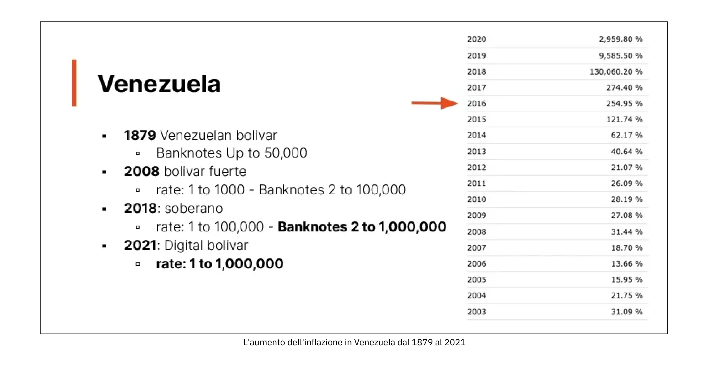

Il Venezuela è l'ultimo Paese menzionato in questo video. Il Paese ha subito quattro ridenominazioni monetarie nel corso del tempo. Agli inizi, il Venezuela utilizzava il dollaro spagnolo prima di dichiarare l'indipendenza nel 1811. Nel 1879 ha introdotto il bolivar come valuta ufficiale, che è rimasto in vigore fino al 1983, quando il governo ha optato per un sistema di tassi fluttuanti Exchange utilizzando il dollaro.

Un fatto degno di nota del Venezuela è la sua appartenenza all'Unione Monetaria Latina. Questa unione comprendeva monete come le 5 pesetas della Spagna, le 5 dracme della Grecia, i 5 bolivar del Venezuela, le 5 lire dell'Italia, i 5 franchi belgi e i 5 franchi francesi.

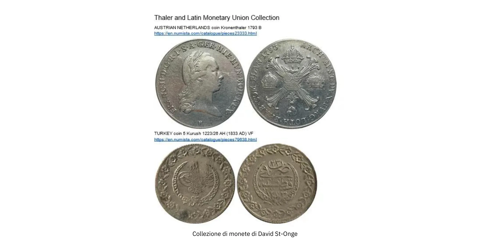

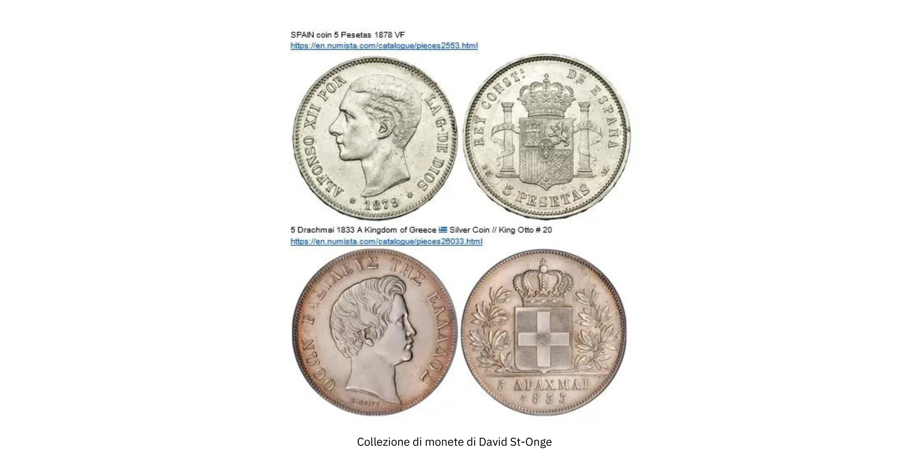

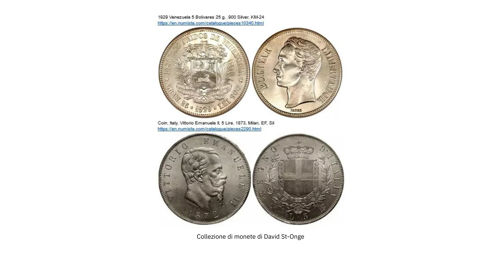

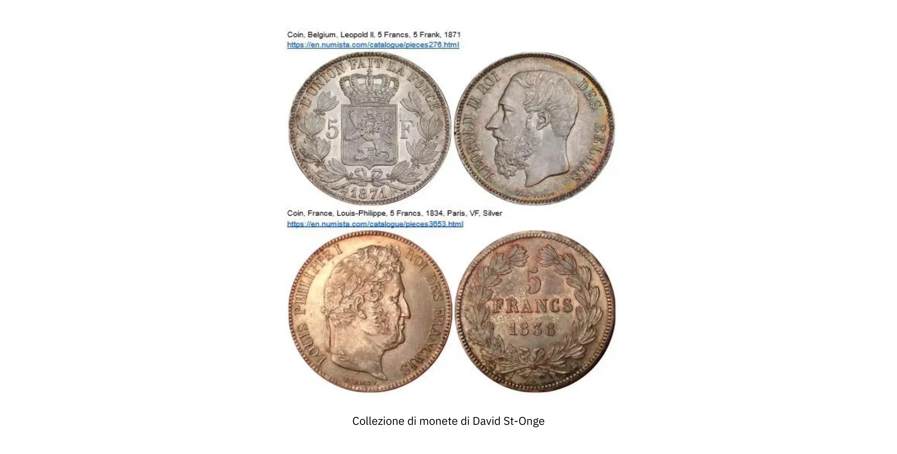

In questo periodo, i 5 bolivar Coin del Venezuela avevano lo stesso peso di quelli dei Paesi membri dell'Unione, tra cui Italia, Spagna, Belgio e Francia. I bolivar erano d'argento e uno specifico Coin del 1929 pesava 25 grammi e aveva una purezza di 900, ovvero il 90% di argento puro. Al prezzo attuale dell'argento, questo Coin ha un valore di circa 17-18 dollari (dollari USA).

Dopo l'adozione di un tasso fluttuante Exchange nel 1983, sono seguite diverse ridenominazioni:

- Nel 2008 è stato introdotto il bolivar fuerte, o "bolivar forte", che ha raggiunto i 100.000 prima di una ridenominazione di mille a uno.
- Nel 2018 è stato introdotto il Soberano, con banconote che hanno raggiunto 1 milione. Nel 2021 è stato sostituito dal bolivar digitale, che ha raggiunto anch'esso il milione, prima di una nuova ridenominazione di un milione a uno. Oggi, la banconota da 10 o 20 equivale a 10 milioni o 20 milioni in Soberano.

Le banconote di questo periodo, risalenti al 2018, sono state distribuite in occasione di varie conferenze Bitcoin a Biarritz, Toronto e Miami. Queste banconote Soberano hanno raggiunto il valore massimo di 1 milione. In seguito è stata effettuata una ridenominazione che ha ridotto il valore di un milione a circa 3 centesimi. Attualmente, 10 banconote da 1 milione corrispondono a una banconota da 10. Dal 2016 il Venezuela sta vivendo un'iperinflazione, che rappresenta il 57° periodo in una tabella specifica.

Nel prossimo video, verrà presentata una collezione di banconote da iperinflazione, incentrata sul Venezuela e su altri Paesi elencati. Questa collezione contiene quasi tutte le banconote venezuelane. Lo studio si concentrerà sulle diverse ridenominazioni per ciascuno dei Paesi citati. Verranno inoltre analizzate le ridenominazioni dello Zimbabwe, un argomento di notevole interesse.

### Conclusione

Abbiamo visto che l'iperinflazione non è l'unico indicatore di una catastrofe economica. Le ridenominazioni multiple, la rimozione degli zeri o il cambio di nome della valuta hanno ripercussioni dirette sulla popolazione, che vanno dalla perdita di aiuti ai problemi alimentari. Sebbene l'iperinflazione sia preoccupante, il numero di ridenominazioni, come quello osservato in Brasile, mostra una realtà più complessa.

In base al criterio del 50% di inflazione al mese, diversi periodi avrebbero potuto essere classificati come iperinflazione. Ciò è particolarmente vero se si esaminano i criteri dell'organizzazione contabile internazionale, che considera caratteristiche come il rapido abbandono della moneta da parte della popolazione, l'indicizzazione dei salari e i prestiti con alti tassi di interesse per compensare l'inflazione.

In conclusione, l'iperinflazione è solo un aspetto delle sfide economiche. L'inflazione elevata da sola può essere altrettanto dannosa. La prossima sezione esplorerà le possibili soluzioni per superare l'iperinflazione.

## Come superare l'iperinflazione

<chapterId>e3484a31-a851-5f92-8af5-00eddae67db1</chapterId>

### Come porre fine all'inflazione moderata e alta

Le conclusioni citate sono tratte dal libro "Regime monetario e inflazione" di Peter Bernholz. Secondo Bernholz, l'unico metodo per porre fine all'inflazione è quello di attuare una riforma monetaria e imporre restrizioni fiscali al governo. Queste restrizioni comportano la creazione di un'istituzione, come una banca centrale, che operi indipendentemente dalle decisioni politiche del governo. L'alta e l'iperinflazione sono spesso il risultato del finanziamento dei deficit di bilancio attraverso la creazione di moneta. Per Address moderare l'inflazione, è essenziale diminuire la crescita della moneta Supply. Bernholz suggerisce anche che questa crescita monetaria dovrebbe essere relativa ai Paesi vicini. Un aspetto sorprendente è che, durante i periodi di alta o iperinflazione, il valore totale della moneta Supply può effettivamente diminuire. Un esempio eclatante di questa situazione è lo Zimbabwe.

### Soluzioni controintuitive

Studiando lo Zimbabwe, si è notato che 10 trilioni di unità della moneta Supply avevano perso tutto il loro valore. A Weimar fu possibile stampare in un solo giorno due terzi del valore nominale totale di 65 miliardi di unità di moneta Supply. Questo dimostra come la moneta Supply possa essere svalutata. Questo dimostra come la moneta Supply possa essere svalutata. Per rimediare a questa situazione, è necessario aumentare significativamente la moneta Supply per raggiungere un livello adeguato. È quindi indispensabile una riforma monetaria. In una situazione di alta inflazione, questa riforma è inevitabile, ma deve garantire che ci sia abbastanza denaro in circolazione. Dopo questa fase, si possono imporre restrizioni al governo.

Secondo le osservazioni di Bernholz, quando si affrontano i problemi di inflazione, istituzioni come il FMI e la Banca Mondiale non sempre adottano le strategie più efficaci. In alcuni casi, quando un Paese ha bisogno di aumentare la propria moneta Supply, queste istituzioni cercano di ridurla. Il segreto è raggiungere un livello monetario adeguato e poi imporre limiti alla sua crescita, evitando così di finanziare le spese governative attraverso la creazione monetaria.

Un aspetto interessante sollevato da Bernholz è che il successo di una riforma monetaria non dipende solo dalla sua rilevanza tecnica, ma anche dalla fiducia che la popolazione ripone in essa. Alcune riforme ben progettate possono fallire perché il pubblico non si fida di esse, mentre altre, mal progettate, possono avere successo perché la popolazione si fida di esse. La percezione e la fiducia del pubblico sono quindi Elements essenziali per il successo o il fallimento di una riforma monetaria.

- In Zimbabwe, la soluzione adottata per contrastare l'inflazione è stata la dollarizzazione, ovvero l'adozione del dollaro statunitense o di altre valute dei Paesi vicini. Questo approccio impedisce al governo di stampare denaro a volontà.
- In Germania, la soluzione fu quella di creare una nuova moneta, il Rentenmark. Questa moneta era sostenuta dai beni territoriali del Reich e questa strategia si rivelò efficace.

### Il caso dello Zimbabwe

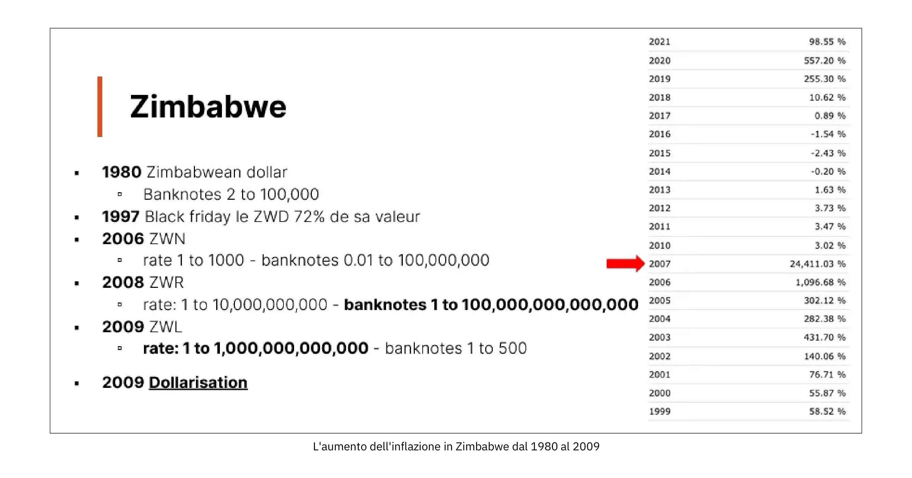

Lo Zimbabwe ha ottenuto l'indipendenza nel 1980 e ha introdotto la propria moneta, il dollaro dello Zimbabwe. Inizialmente, due dollari dello Zimbabwe valevano circa 1,60 dollari USA. Tuttavia, nel 1997, a seguito di misure sociali a favore dei veterani di guerra, la valuta si svalutò del 72% in un solo giorno, durante il venerdì nero. Poi, all'inizio degli anni 2000, il Paese ha lanciato un programma di ridistribuzione delle terre, che prevedeva la sottrazione di terreni ai proprietari bianchi e la loro distribuzione alla popolazione locale. Questa decisione ha danneggiato le esportazioni perché i nuovi proprietari spesso non avevano le competenze necessarie per gestire aziende agricole su larga scala. Di conseguenza, mentre nel 1999 lo Zimbabwe era un esportatore netto, nel 2003 è diventato un importatore netto.

Nel 2006, il Paese ha introdotto una nuova versione della propria valuta, lo ZWN, con un tasso Exchange di 1 a 1.000. Nel 2008 è stato introdotto un altro taglio, lo ZWR, con un tasso Exchange di 1 a 10 miliardi. Questo ha portato alla creazione delle iconiche banconote da 100 trilioni.

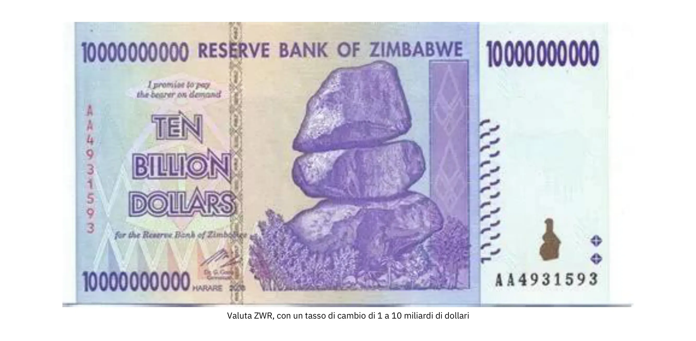

#### Dollarizzazione e risoluzione delle crisi

Pertanto, dopo il 2009, di fronte a una persistente crisi monetaria e a un'iperinflazione dilagante, lo Zimbabwe ha abbandonato la propria moneta nazionale e ha consentito l'uso di valute estere, principalmente il dollaro statunitense. Questa decisione, sebbene radicale, ha posto fine all'iperinflazione. Una lezione fondamentale da imparare è che l'interruzione dell'eccessiva emissione di moneta e la fine del finanziamento del deficit di bilancio da parte della banca centrale possono aiutare a prevenire l'iperinflazione.

Tuttavia, la dollarizzazione non è una soluzione miracolosa. Sebbene possa porre fine all'iperinflazione, presenta altre sfide economiche. Una delle conseguenze è la perdita di una politica monetaria autonoma. Senza la propria valuta, un Paese non può regolare la propria politica monetaria per rispondere agli shock economici interni.

Nel 2007, il tasso di inflazione dello Zimbabwe ha raggiunto la soglia del 50% al mese, segnando ufficialmente lo stato di iperinflazione del Paese. Dopo la dollarizzazione nel 2009, l'iperinflazione è cessata; tuttavia, il Paese ha continuato ad affrontare altre sfide economiche.

È preoccupante notare che da allora lo Zimbabwe ha tentato di reintrodurre la propria moneta e sono ricomparsi i segni di un'alta inflazione. Secondo alcune organizzazioni internazionali, il Paese potrebbe già soddisfare nuovamente i criteri di iperinflazione, anche se non ha ancora raggiunto la soglia ufficiale del 50% al mese. Ciò serve a ricordare i pericoli di un'eccessiva emissione di moneta e del finanziamento del deficit da parte della banca centrale.

### Conclusione

Nel mio libro intitolato "Tutto sul Bitcoin", ho dedicato un intero capitolo all'iperinflazione in Zimbabwe. Ho descritto in dettaglio gli eventi significativi, fornendo vari esempi che illustrano come il Paese abbia infine posto fine all'iperinflazione.

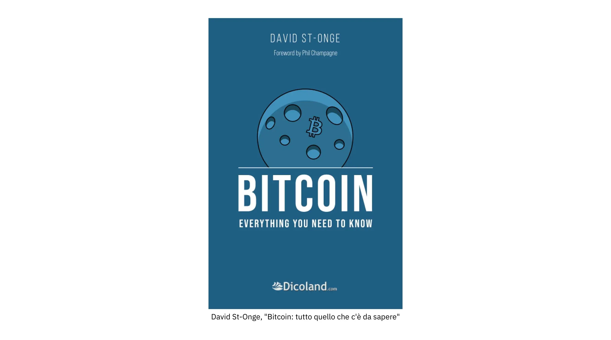

Per chi è curioso di conoscere l'esperienza tedesca dopo la Prima Guerra Mondiale, consiglio vivamente il fumetto "Il banchiere del Reich" Racconta come la Germania sia riuscita a superare l'iperinflazione, in particolare grazie alla creazione del marco tedesco.

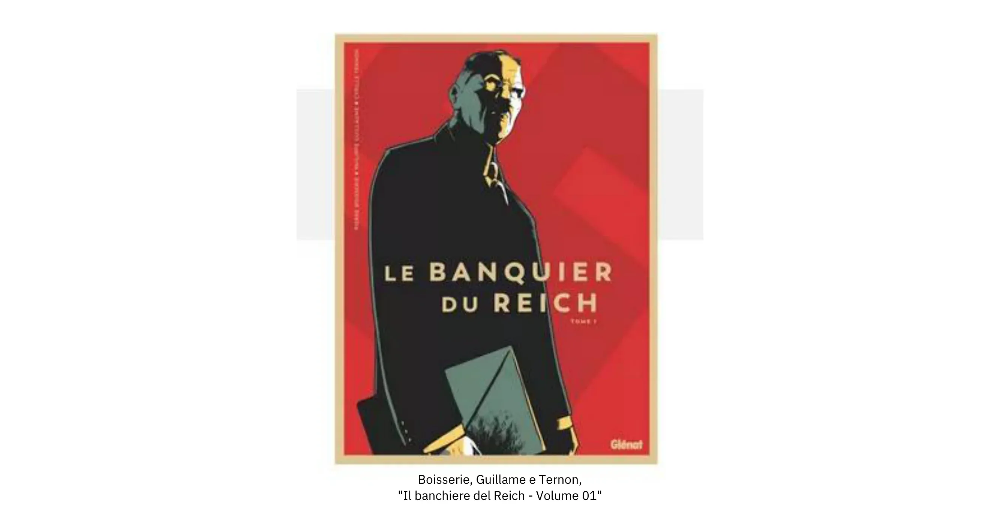

La chiave di lettura è che esistono diverse strategie per superare l'iperinflazione. Si può optare per la dollarizzazione o introdurre una nuova valuta. Queste soluzioni funzioneranno solo se la popolazione avrà fiducia in esse. È fondamentale imporre vincoli rigorosi. Una banca centrale veramente indipendente è essenziale. Non deve inflazionare la moneta Supply per coprire i disavanzi pubblici. In caso di inflazione lieve, limitare la crescita della moneta Supply dovrebbe essere sufficiente. Tuttavia, quando ci si trova di fronte a un'iperinflazione, è fondamentale innanzitutto avere un Supply appropriato in relazione alle dimensioni dell'economia. Poi, è imperativo imporre al governo vincoli rigorosi per stabilizzare la situazione.

## Presentazione della collezione di banconote dell'iperinflazione

<chapterId>f3ffbb47-3aeb-54bd-80a9-adccb0f419e2</chapterId>

[Scopri la collezione digitalizzata nel *Bitcoin Educational Toolkit* (accessibile anche dalla sezione *Risorse* della piattaforma Plan ₿ Academy.](https://penpot.planb.network/#/view?page-id=c157057b-fd28-8042-8004-4f081b21defc&file-id=c157057b-fd28-8042-8004-4f081b21defb&section=interactions&index=0&share-id=7154756b-3ebd-8040-8004-6475c2af5889&interactions-mode=show-on-click)

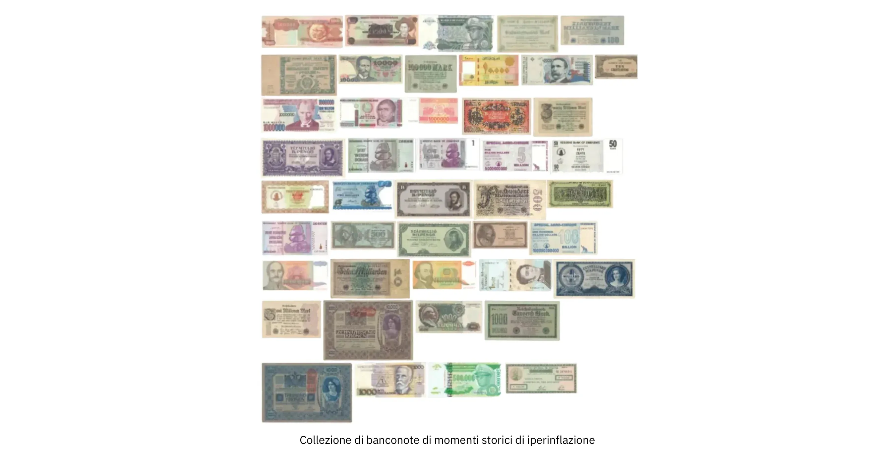

# Come siamo arrivati qui?

<partId>f66ca17e-be9e-5d30-a098-f7affd8962a1</partId>

## L'emergere del secondo Layer della moneta e delle banche centrali

<chapterId>0455ffe3-9d45-5a67-ac96-3f815dc507a1</chapterId>

Trascrizione:

L'emergere del secondo Layer del denaro e delle prime banche centrali è un argomento affascinante. Questo tema è ampiamente trattato nel libro "Layered Money" di Nick Battia. Lo consiglio vivamente a chi è interessato all'evoluzione e alle complessità dei nostri sistemi monetari. L'obiettivo di questa sezione è comprendere l'origine della creazione di moneta e come questa possa portare all'iperinflazione.

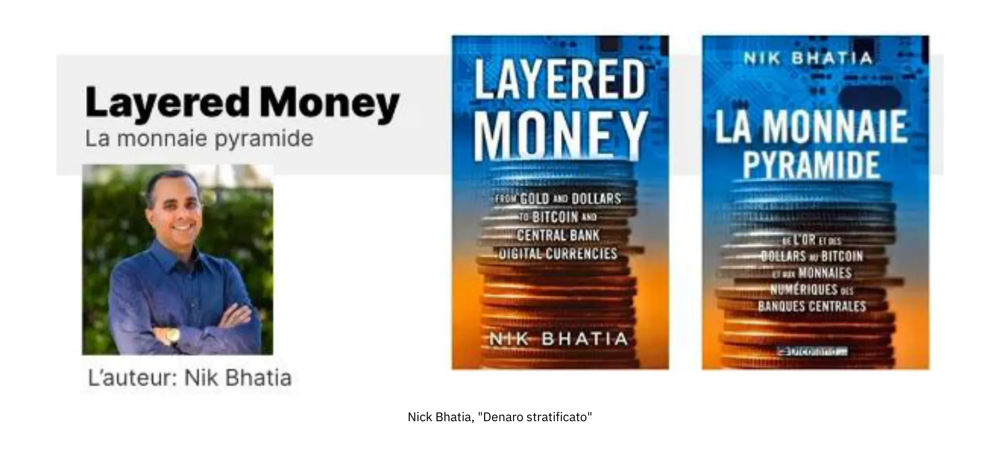

### Il denaro piramidale e le banche centrali

#### Il Fiorino

La storia del denaro risale al XIII secolo in Italia, in particolare nella città di Firenze. A quell'epoca erano comuni il fiorino e le banconote da Exchange. Un esempio notevole è il fiorino, ornato con la figura di San Giovanni Battista. Un esempio notevole è il fiorino, ornato con la figura di San Giovanni Battista.

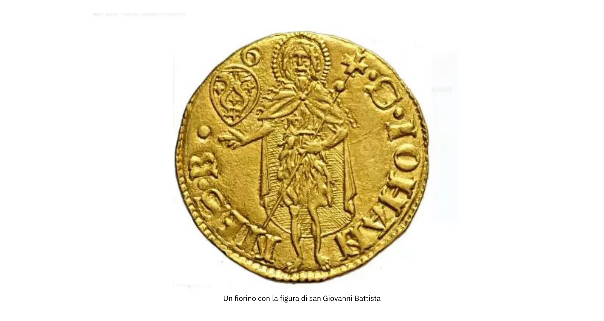

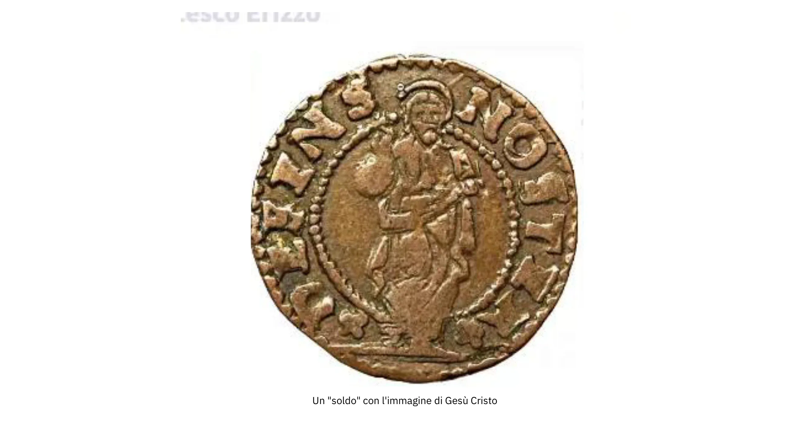

Sebbene oggi possedere un fiorino autentico sia costoso, sono disponibili delle riproduzioni. Esistono anche altre monete dell'epoca, come il soldo degli Stati italiani del XVII secolo, che presenta un'immagine di Cristo.

#### Fatture di Exchange (XIII secolo)

La pratica comune all'epoca era la seguente: gli orafi emettevano banconote di Exchange in Exchange per i fiorini depositati. Questi fiorini venivano conservati con cura nei loro caveau. In questo modo, l'oro reale, rappresentato dal fiorino, costituiva il primo Layer della moneta, mentre le banconote del Exchange costituivano un secondo Layer. Tuttavia, la liquidità di questo sistema era limitata. Se qualcuno voleva cambiare il proprio oro in Exchange con una banconota, la transazione era semplice. Tuttavia, lo scambio di banconote tra individui non era una pratica comune.

#### Il titolo di Anversa Exchange (XVI secolo)

La Borsa di Anversa-88 ha segnato una tappa fondamentale nell'evoluzione della cartamoneta. Fu lì che venne introdotta la pratica di scontare le cambiali. Si trattava di strumenti cartacei che rappresentavano un valore monetario, ma la loro unicità consisteva nel fatto che recavano nomi e date di scadenza. Ciò le rendeva difficili da Exchange prima della scadenza.

La rivoluzione apportata dalla Exchange di Anversa consisteva nella possibilità di scontare queste cambiali prima della loro scadenza. Ad esempio, se una cambiale scadeva tra un mese, era possibile acquistarla a un prezzo scontato per tenere conto del tempo che mancava alla scadenza. Questa innovazione non solo rese la moneta cartacea più Liquid, ma introdusse anche il concetto di valore temporale del denaro.

Questo concetto, sebbene associato a Nick Bell attraverso il suo pseudonimo Twitter "time value of BTC", non è una sua invenzione. Ciononostante, egli lo discute in dettaglio nel suo lavoro. L'idea principale è che il tempo ha un valore. Così, se qualcuno decide di pagare una cambiale del valore di 100 dollari con un mese di anticipo, può ottenerla per, ad esempio, 98 dollari e ricevere i 100 dollari alla data di scadenza. Questa innovazione monetaria ha avuto origine presso la Borsa di Anversa Exchange.

#### La VOC e il mercato azionario di Amsterdam (XVII secolo)

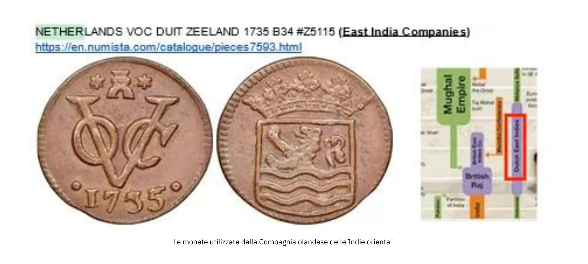

Dopo la creazione della Borsa di Anversa (Exchange), un'importante pietra miliare fu la fondazione della VOC, la Compagnia Olandese delle Indie Orientali. Questa società, con sede nei Paesi Bassi, emise persino una propria moneta. In seguito alla creazione della VOC, fu istituito il primo mercato azionario ad Amsterdam, segnando l'inizio delle operazioni di borsa della società. È interessante notare come gli olandesi riuscirono a porre fine alla supremazia di Anversa come centro economico internazionale. Semplicemente bloccarono l'accesso al fiume Schelda. Questa strategia faceva parte di un movimento storico più ampio, la rivolta dei mendicanti. Un evento cruciale nella storia europea.

#### L'intervento della Banca di Amsterdam

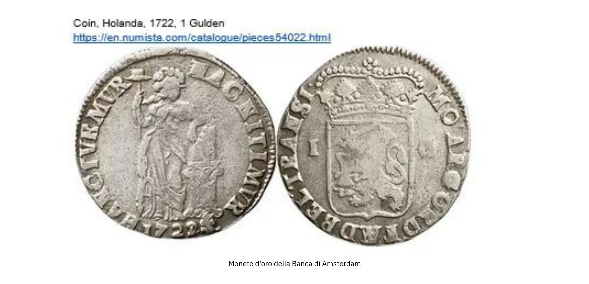

Dopo l'istituzione della VOC, un altro sviluppo significativo nella storia monetaria fu l'introduzione di monete d'oro da parte della Banca di Amsterdam. Queste monete, risalenti al 1722, erano in argento. Tuttavia, ciò che rivoluzionò veramente la finanza dell'epoca non fu tanto il Coin in sé, quanto i conti associati a questa moneta presso la Banca di Amsterdam. Questi conti divennero il mezzo principale per il Exchange internazionale. Le transazioni venivano semplicemente registrate in registri o libri mastri. Grazie a questo sistema, Amsterdam divenne il centro economico mondiale. Col tempo, la Banca di Amsterdam decise di imporre l'uso di questi conti. I cambiavalute indipendenti furono obbligati a Exchange depositare quotidianamente le loro monete presso la banca.

#### Creazione della Banca d'Inghilterra per finanziare la guerra

La creazione della Banca d'Inghilterra fu motivata dalla necessità di finanziare la guerra alla fine del XVII secolo. Come la Banca di Amsterdam, essa impose i depositi per decreto. La particolarità della Banca d'Inghilterra fu quella di relegare le banche private in una posizione secondaria nel sistema monetario, creando così quello che potrebbe essere definito un "terzo Layer" della moneta.

Inizialmente, il primo Layer della moneta era rappresentato dall'oro. I depositi effettuati presso le banche private costituivano il secondo Layer. Tuttavia, quando questi depositi non poterono più essere convertiti in oro, apparve un terzo Layer di moneta. Da quel momento in poi, le banconote emesse dalle banche private non furono più convertibili in oro, ma in cartamoneta della Banca d'Inghilterra, a sua volta convertibile in oro. Questa evoluzione portò a una complessificazione del sistema monetario con l'aggiunta di ulteriori strati.

#### Il panico del 1796

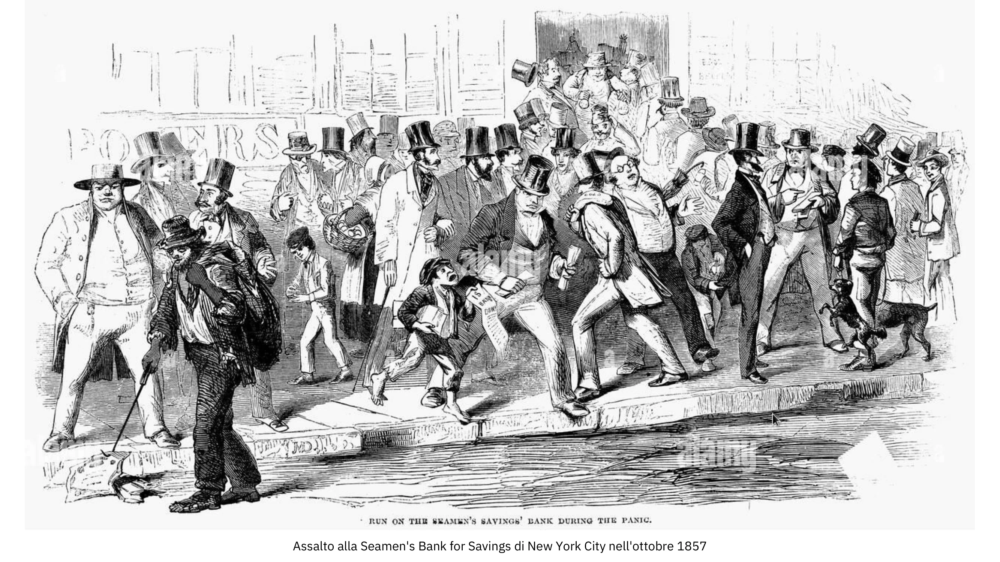

Panico bancario alla Seamen's Savings Bank durante il Panico del 1857.

In seguito al panico bancario del 1796, si verificò un fenomeno in cui tutti cercarono di risalire la "piramide monetaria" Le persone volevano cambiare la loro moneta del terzo Layer con quella del secondo Layer e, infine, con quella del primo Layer, cioè l'oro. Di fronte a questa corsa massiccia, la Banca d'Inghilterra fu costretta a intervenire per stabilizzare la situazione. Per evitare una potenziale deflazione delle riserve auree, decise di sospendere la convertibilità delle banconote in oro. Questa sospensione, inizialmente intesa come misura temporanea, durò per circa due decenni.

### Conclusione:

Le banche centrali si sono trasformate in prestatori di ultima istanza, sospendendo la convertibilità della loro moneta in oro. Sebbene questa azione fosse inizialmente intesa come soluzione temporanea, alla fine divenne permanente, segnando l'avvento del concetto di prestatore di ultima istanza. Questa trasformazione ha dato forma alle banche centrali come sono conosciute oggi. Tuttavia, nelle economie più fragili, questa capacità di stampare moneta a volontà può portare a conseguenze indesiderate, come l'iperinflazione, se usata in modo irresponsabile.

## Libri e risorse

<chapterId>c44e4519-0741-527b-b3b0-3f513e87147d</chapterId>

L'iperinflazione è un argomento affascinante che è stato studiato attraverso vari eventi storici. Se desiderate approfondire questo argomento, ecco un elenco di 10 risorse essenziali da leggere e studiare:

- "Quando il denaro muore: The Nightmare of Deficit Spending, Devaluation, and Hyperinflation in Weimar Germany" di Adam Fergusson. Questo libro descrive nei dettagli la crisi dell'iperinflazione in Germania dopo la Prima Guerra Mondiale.

- "L'economia dell'inflazione - Uno studio sul deprezzamento della moneta nella Germania del dopoguerra" di Costantino Bresciani-Turroni. Un'analisi approfondita dell'iperinflazione tedesca degli anni Venti.

- "Questa volta è diverso: Eight Centuries of Financial Folly" di Carmen M. Reinhart e Kenneth S. Rogoff. Pur trattando vari tipi di crisi finanziarie, il libro offre una discussione approfondita sull'iperinflazione nel corso della storia.

- "L'iperinflazione dello Zimbabwe, analisi e lezioni apprese" di Steve Hanke. Uno studio sull'iperinflazione dello Zimbabwe nei primi anni 2000.

- "Regimi monetari e inflazione: History, Economic and Political Relationships" di Peter Bernholz. Il libro esamina i casi storici di iperinflazione e cerca di capire i fattori sottostanti.

- "Guida di sopravvivenza all'iperinflazione: Strategie per le imprese americane" di Gerald Swanson. Una guida pratica su come le imprese possono navigare in un ambiente iperinflazionato.

- "La morte del denaro: Lessons of the Great German and American Inflations" di Jens O. Parsson. Un'analisi comparata delle crisi inflazionistiche in Germania e negli Stati Uniti.

- "La caduta del denaro: L'iperinflazione in Germania e la distruzione della classe media" di Frederick Taylor. Un'esplorazione narrativa dell'impatto sociale ed economico dell'iperinflazione sulla società tedesca.

- "I currency board per i Paesi in via di sviluppo: A Handbook" di Steve Hanke e Kurt Schuler. Anche se l'attenzione si concentra sui currency board, questo libro offre una prospettiva su come evitare situazioni di iperinflazione.

# Sezione finale

<partId>cb1f4a4b-556a-4e47-a5cc-136be35a1f9a</partId>

## Recensioni e valutazioni

<chapterId>1a37317e-372a-5241-b478-8316d44f9283</chapterId>

<isCourseReview>true</isCourseReview>

## Esame finale

<chapterId>d01831c3-6c4d-59e3-95bc-03e97a05c142</chapterId>

<isCourseExam>true</isCourseExam>

## Conclusione

<chapterId>45d410b0-71ed-4502-8d8d-8b6df761db23</chapterId>

<isCourseConclusion>true</isCourseConclusion>