# 経済崩壊を巡る旅

お金が意味を失うとき、それはどのように見えるのでしょうか？
このコースは、魅力的でありながら厳粛なハイパーインフレーションの世界をご案内します。通貨が崩壊し、経済が一夜にして変貌した歴史的なエピソードや現代の事例を発見します。パターン、原因、そして一般の人々への現実世界での影響を明らかにし、経済学の最も劇的な現象の一つについての洞察を得ることができます。

その過程で、個人やコミュニティがこれらの激動の時期をどのように乗り越えてきたかも発見します。通貨危機の際に富を守るのに役立った戦略を学び、金融レジリエンスについてのより深い理解を築きます。私たちの世界を形作る経済的な力に興味があるなら、この旅は知識と実践的な視点の両方を提供します。
+++
# はじめに

<partId>6fe4d15d-f6e6-54be-9e04-0a75ac98df8b</partId>

## コース概要

<chapterId>9d1aba8d-0485-5020-9863-5de37e6db8e0</chapterId>

ECO204コースへようこそ！

このコースの目的は、不換紙幣システムの文脈の中で、ハイパーインフレの根本的な原因、メカニズム、結果を理解することです。具体的な事例や歴史的な分析を通じて、ハイパーインフレの前に繰り返されるパターンを認識し、身を守るための行動指針を見出すことを学びます。

**第2節：インフレとは何か？

このトピックの核心に入る前に、インフレとは何かという基本を再確認しておこう。このセクションでは、インフレの貨幣的起源、さまざまなインフレの種類、そしてそれらがより広範な経済ダイナミズムの中でどのように位置づけられるかを紹介する。これは、通常のインフレがどのようにハイパーインフレに発展するかを理解する上で不可欠なステップである。

**第3節 ハイパーインフレとは何か？

このセクションでは、ハイパーインフレの正確な定義について学び、ワイマール・ドイツやジンバブエを含むいくつかの主要な歴史的エピソードを検証する。それらの共通点、相違点、現代の類似点を分析する。また、ラテンアメリカで相次いだ再デノミネーションや、特定の国で観察された出口戦略など、あまり知られていない事例も発見するでしょう。

**第4節：我々はいかにしてここまで来たのか？

このパートでは、ハイパーインフレを可能にする構造的メカニズム、特に通貨「第二のLayer」の発展と中央銀行の役割について理解することを目指す。さらなる探求のために、追加的な資料や読み物の提案も行う。

金融の歴史が目の前で繰り返されているとしたら？この後の章で、あなたが判断してほしい！

# インフレとは何か？

<partId>2b4f456c-3649-5cf9-b9b0-a5bffe92d962</partId>

## 貨幣現象

<chapterId>b2cbc915-c4ec-52b5-860c-0958f58c91e4</chapterId>

### インフレの定義

インフレは、その複数の定義や解釈のために誤解されがちな概念である。インフレに対する認識は、ビットコイナーや伝統的な経済学者など、さまざまなグループによって異なる。ハイパーインフレを論じる前に、まず定義を明確にしよう：

- ル・ロベール辞書による定義：インフレとは、支払い手段（銀行券、資本金）が過度に増加し、物価の上昇と通貨安を引き起こすことである。

- ラルース百科事典による定義：インフレとは、物価水準の全般的かつ継続的な上昇を特徴とする現象である。ここでは、「一般化された」という言葉が重要である。

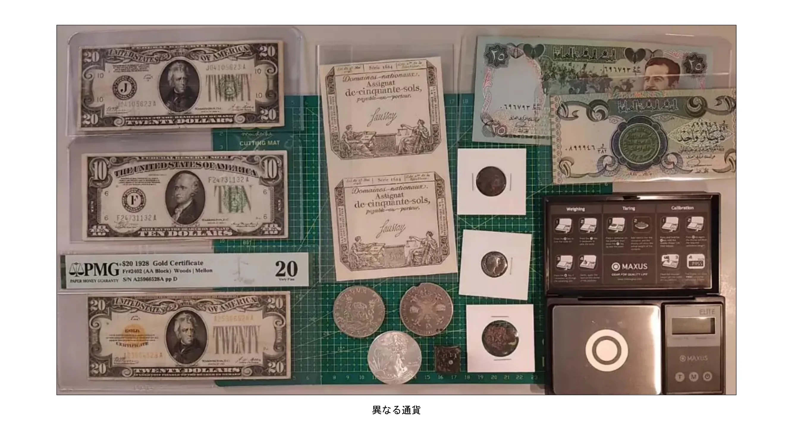

これらの定義に照らし合わせると、ロベールにとってのインフレとは、主にマネーSupplyの増加に関するものであることを理解することが肝要である。一方、Larousseは、この膨張の結果、すなわち物価の一般的な上昇に焦点を当てている。

ハイパーインフレに関する我々の研究では、2番目の定義、すなわち一般化された物価上昇を採用する。しかし、この物価上昇は一般にマネーSupplyの膨張の結果であることを忘れてはならない。

著名な経済学者ミルトン・フリードマンの有名な言葉である：

> 「インフレは常に、どこでも貨幣現象である。

この声明は、金融緩和とインフレの本質的な関係を浮き彫りにしている。以下では、こうした基本的な定義を踏まえながら、インフレと経済成長の関係を検証していく。

### 貨幣現象を理解する

貨幣現象に言及する場合、経済のマネーSupplyがどのように影響されるかを指している。ミルトン・フリードマンは、基本的にこのSupplyの増加と捉えていた。歴史的に、マネーSupplyを増加させる方法は主に2つある：

1.貨幣印刷：

伝統的な通貨制度では、貨幣Supplyの増加は物理的に新しい銀行券を印刷することによって達成された。現在ではデジタル通貨が主流であるため、この印刷は主に電子的（中央銀行やその他の金融機関のデータベースを通じて）であるが、歴史を振り返ると、文字通りの紙幣印刷がハイパーインフレを引き起こした時代もある。

2.金属含有量の削減：

もうひとつの方法は、銀や金などの金属をベースとする通貨の貴金属量を減らすことだった。ローマ帝国では、デナリウスは当初ほとんど銀で構成されていたが、時間の経過とともに銀の含有量が大幅に減少した。これは一種のインフレであったが、必ずしもハイパーインフレではなかった。

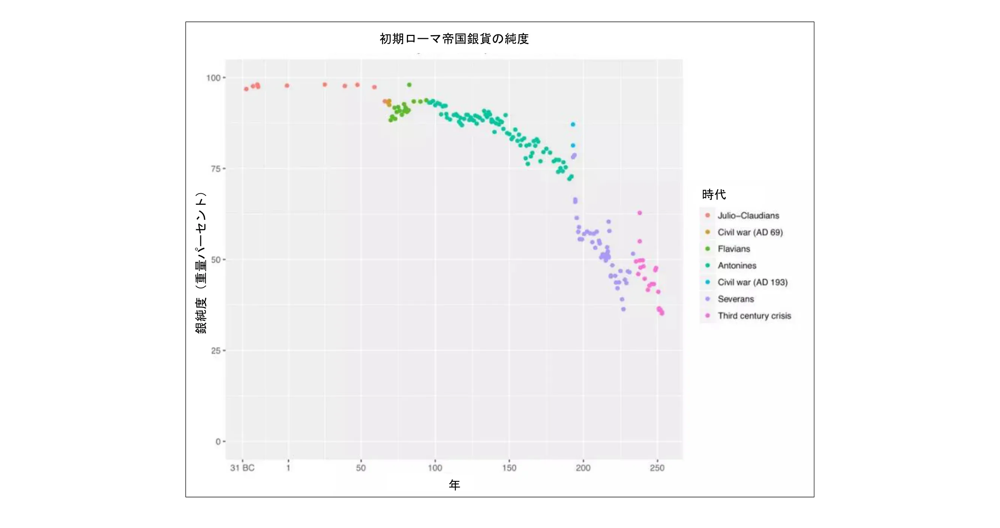

ハイパーインフレは、主に貴金属のような原資産に裏打ちされていない不換紙幣で観察されることを強調することは極めて重要である。歴史的に、通貨がそのような資産に基づいていた場合、（例えば、金属含有量の切り下げを通じて）インフレのエピソードが発生したが、これらのエピソードはハイパーインフレの極端なレベルに達することはなかった。以下では、通貨切り下げの時代と、こうした異なる通貨制度がインフレに与える影響について詳しく検討する。

### 通貨切り下げ期の研究

歴史を通じて、さまざまな文明が通貨切り下げの時期を経験してきた。こうした時期の中には、経済を圧迫するような大きな出来事や戦争と重なるものもある。

#### 1.ペロポネソス戦争と第二次ポエニ戦争：

アテネとスパルタの戦いであるペロポネソス戦争と、ローマ共和国とカルタゴの戦いである第二次ポエニ戦争は、古文書から発見された通貨切り下げの最も古い例である。これらの戦争で資金を調達するため、これらの文明は銀の含有量を減らし、他の金属を取り入れることで通貨を切り下げ、同時にコインの生産数を増やした。

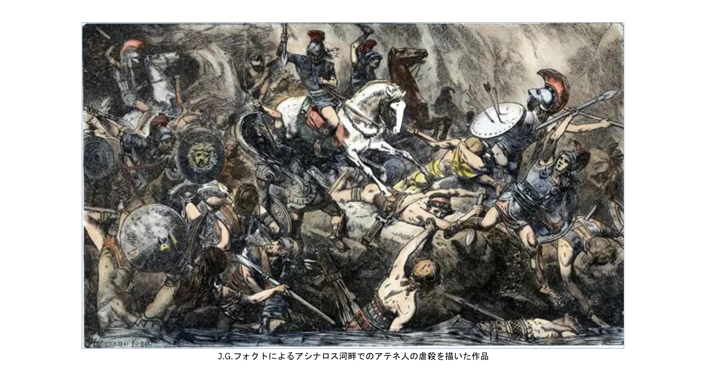

アシナロス河畔でのアテネ人の虐殺を描いたエングレーヴィング。

#### 2.帝国時代の古代ローマ：

ローマ共和国の時代を経て、帝政期の3世紀から4世紀にかけて、通貨は大幅に切り下げられた。このことは、先のグラフに見られるように、硬貨の銀含有量の減少が物語っている。ある調査によると、紀元前40年から紀元後360年までの約400年間で、エジプトにおける小麦の価格はドラクマで測定され、100万倍に上昇した。この期間では、年平均約4.4％のインフレに相当する。しかし、このインフレは均等ではなかった。本当に始まったのは西暦238年頃。西暦250年から293年にかけてのインフレ率は約3.65％で、293年から301年にかけては22.28％まで上昇した。

これらの時代は大きなインフレに見舞われたが、現代のようなハイパーインフレには至らなかった。その理由は、通貨が切り下げられたとはいえ、貴金属に支えられていたからである。この強固な基盤が、極端なインフレ水準からある程度身を守っていたのである。以下では、ハイパーインフレの性質とその結果について詳しく見ていく。

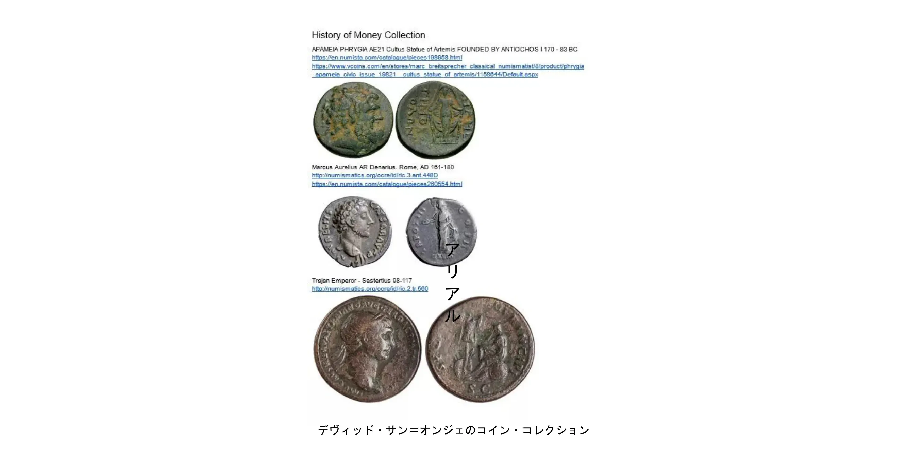

- マルクス・アウレリウス（AD160年）のデナリウス：

古代ローマを象徴するコインのひとつに、デナリウス（銀貨のCoin）がある。私が所有するマルクス・アウレリウス帝のCoinは、大幅な切り下げが行われる前の西暦160年のものである。カメラでは細かいディテールをとらえるのに苦労するかもしれないが、肉眼で見ると、Coinは美しく、比較的高い銀含有率を反映していることがわかる。

- アントニニアヌス（紀元3世紀後半）：

通貨切り下げに伴い、アントニニアヌスという新しい通貨が登場した。この通貨は2デナリの価値があるとされていたが、銀の含有量はかなり少なかった。私のアントニニアヌスCoinは、銀の含有量が大幅に減少したことをはっきりと示している。この時代のローマ硬貨に典型的な「ラディエート」と呼ばれる王冠で飾られている。色と品質を比較すると、このアントニニアヌスは純銀のCoinとはほど遠いことがわかる。

2つのコインを並べて比べると、その違いは際立っている。西暦160年のデナリウスは銀の外観がはっきりしているのに対し、西暦3世紀後半のアントニニアヌスはかなりくすんでおり、銀の含有量が大幅に減少していることがわかる。この視覚的な比較は、古代ローマが数世紀にわたって経験した貨幣の切り下げを明確に示している。

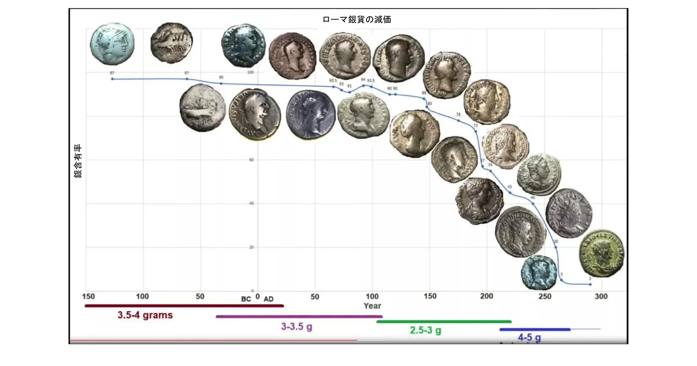

このデモンストレーションを完成させるには、これらのコインの時間経過に伴う切り下げを示すグラフが理想的だろう。このプラットフォームを通して視覚化するのは難しいが、デナリウスの価値を示すグラフを想像してほしい。その後、2世紀末になるとその価値は下がり、2デナリウスに相当すると思われるが、銀の含有量が著しく低いアントニニアヌスに取って代わられた。これらの遺物は、過去の文明の経済的変動を示す静かな証人なのである。

#### 3.スペインのマラベディ：目標切り下げの目撃者

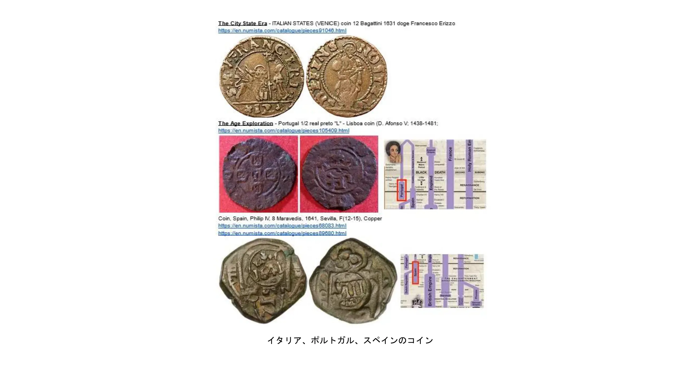

マラベディは銅貨として、スペインの通貨史の中で特別な位置を占めている。前述したように、スペイン・ドルはもともと国際標準であり、スペインにとって不可欠な基軸通貨であった。しかし、ある経済的困難に直面したスペインは、巧妙な通貨戦略に頼らざるを得なかった。

通貨切り下げは、国家が財政支出や経済活性化のためにしばしば用いる手段である。しかし、スペインは微妙な状況に陥っていた。スペイン・ドルを希薄化すれば、国際貿易におけるスペインの立場が危うくなる。このジレンマを克服するため、スペインはマラベディに目をつけた。

貴重なスペインの銀貨とは異なり、マラベディは銅貨であった。この通貨は切り下げの対象となった。マラベディスのCoinが当初2マラベディスの価値であった場合、国家はそれを回収し、新しい価値、例えば「4」と刻印し直し、1Coinだけを所有者に返却した。8」のスタンプが押されたCoinは、このプロセスの証拠であり、何度か切り下げを繰り返している。

この戦略によって、国家は効果的に通貨を切り下げ、インフレを引き起こし、間接的に国家に資金を供給することができた。しかし、この的を絞った通貨切り下げは、共通通貨の価値が希薄化した地元住民に影響を及ぼした。

マラベディスのケースは、国家が自国内の経済ニーズを満たすために自国通貨を選択的に切り下げる一方で、グローバルな舞台では基軸通貨の価値を維持する方法を示している。これは、歴史における金融政策の複雑さと巧妙さを示す顕著な例である。

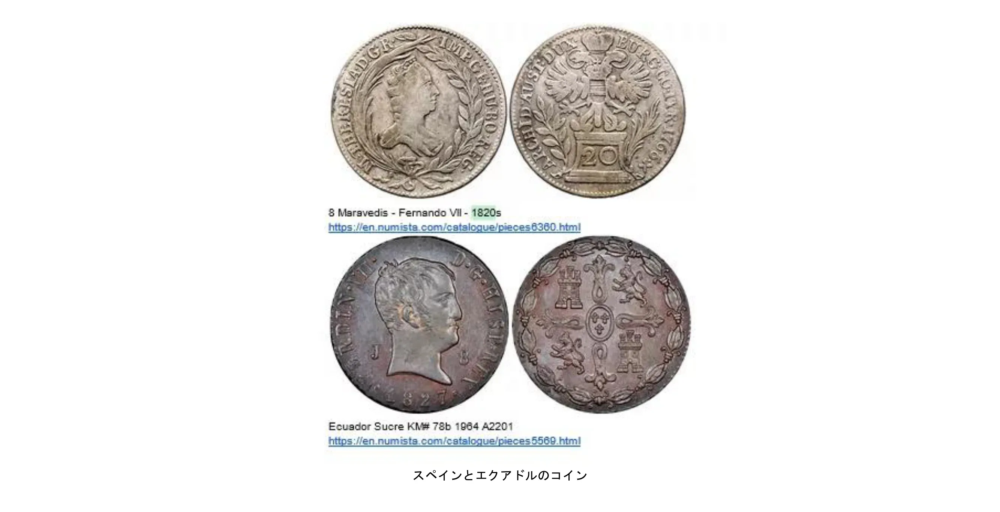

もっと知りたいですか？ -> リンク](https://docs.google.com/document/d/1aZa7gvz1nt8ZHDCoWKQdS9RGGjBHdipH1ApC8dW1xpM/edit?usp=sharing)

#### 4.15世紀から17世紀にかけての価格革命

15世紀から17世紀にかけて、ヨーロッパではしばしば "価格革命 "と呼ばれる驚くべき経済現象が起こった。このインフレの時期は、アメリカ大陸から貴金属、特に金と銀が大量に流入したことが大きな引き金となった。当時のヨーロッパ経済はほぼ金属本位制に基づいていたため、この追加的な金属の流入は貨幣のSupplyを増加させた。その結果、年率1～2％程度のインフレが発生した。一見、このインフレ率は控えめに見えるかもしれない。しかし、当時、このような価格変動は "革命 "といえるほど異常なことだった。これは、通貨準備高の変化が経済システム全体に影響を与えることを浮き彫りにしている。

#### 5.ジョン・ローとアシニャッツ

18世紀のフランス経済史は、通貨にまつわる2つの重要な出来事で彩られた。まず、スコットランドの経済学者であり金融家であったジョン・ローが、フランス政府を説得し、紙幣に基づく通貨制度を採用した。当初は国の財政問題に対する革新的な解決策と考えられていたが、この構想はすぐにインフレの蔓延を招いた。その直後、フランス革命の混乱の中で、政府は「アサニャ」を導入した。

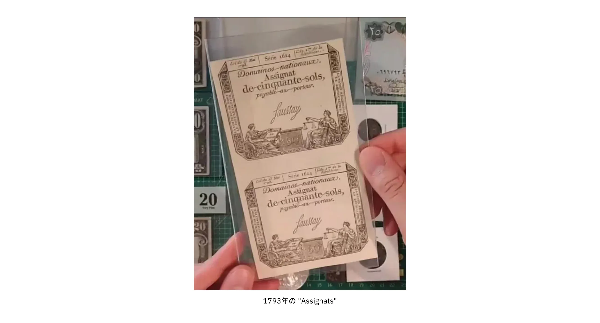

1793年からのAssignats

これらの紙幣は、歴史上初の大規模なハイパーインフレの生きた証となっている。当初、相次ぐ金融危機に対応するために考案されたアサクサツは、瞬く間に通貨不安の象徴となった。政府はこの紙幣に過度に頼って財政を賄ったため、未曾有の経済危機を引き起こし、革命後のフランスでは大規模なハイパーインフレが発生した。

#### 6.大統領令6102号とドルの切り下げ

大統領令6102号とドルの切り下げ

米国では、1930年代初頭に金融政策が大きく転換した。ここでは、この変革の概要を詳しく説明する：

- 1928年の20ドル札

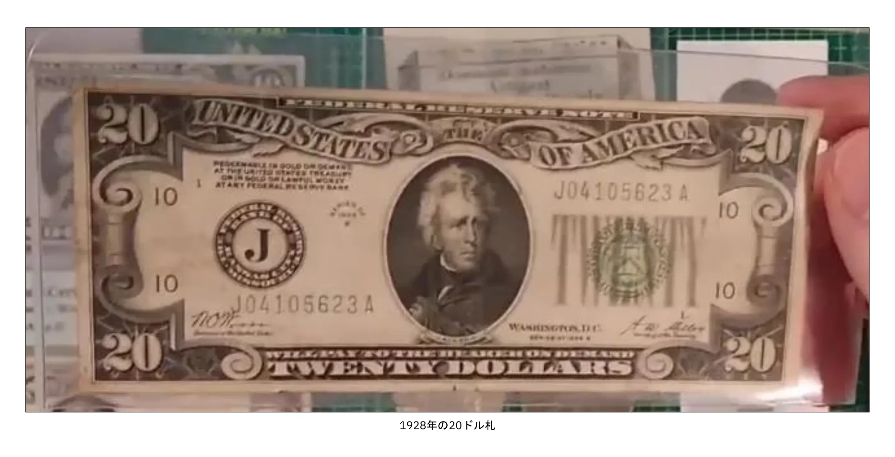

1928年、アメリカの20ドル紙幣にはこう書かれていた："要求に応じて金と交換できる"。これは、各札が文字通り金に換金可能であったことを意味する。具体的には、20.67ドル札は1オンスの金に相当した。

- 大統領令6102

1933年、大統領令6102号が発令され、大きな変革が起こった。この法令により、市民は金地金、硬貨、金券の形態を問わず、金を所有することが違法とされた。

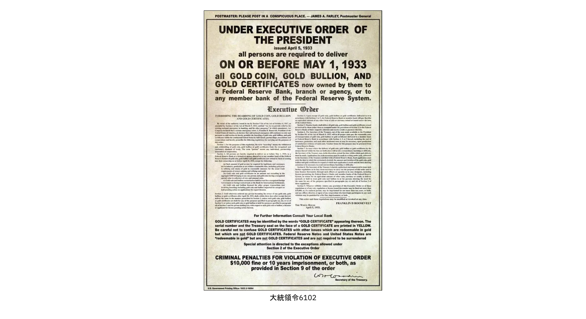

金券はその好例である。それにはこう記されている："金Coin 需要に応じて所持人に支払われる"。このような証明書を所持することは違法となり、1964年までそのままであった。

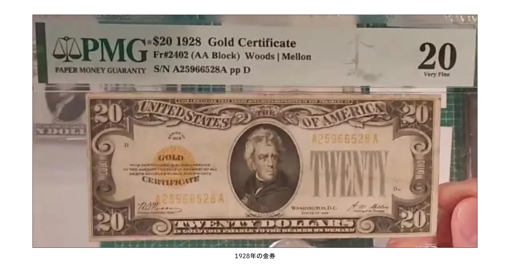

- 新紙幣の導入

1934年に金が押収された後、新シリーズの紙幣が流通するようになった。

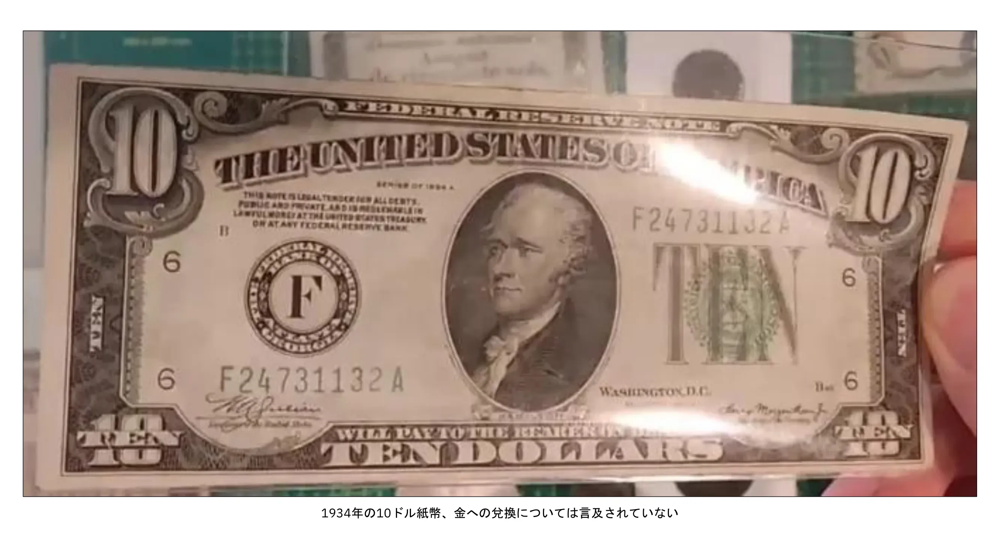

金への兌換性を示す記述は削除され、代わりに「この紙幣はすべての債務に対して法定通貨である」（Ce billet est une monnaie légale pour toutes dettes）と表記されている。

- 金の再評価

この変遷で興味深いのは、政府の戦略である。1934年、金価格は20.67ドルから35ドルに切り上げられた。要するに、政府は国民が所有するドルを切り下げたのである。1933年に国民から1オンスあたり20.67ドルで金を購入し、1934年に金価格を切り上げることで、政府は国民の貯蓄を切り下げる一方で多額の利益を得たのである。

要約すると、政府は1年以内に市民の金を事実上押収し、その後、国庫に有利になるように金の価値を再評価し、金を紙幣に交換した人々に不利になるようにゲームのルールを変更したのである。

### アメリカは歴史を変える。

米国は、世界の基軸通貨である米ドルの切り下げに初めて踏み切ったことで、歴史的な転換点を迎えた。

それ以前のルネサンス期には、13世紀にフィレンツェが発行したイタリア・フロリンが国際基軸通貨であり、使用期間中に切り下げが記録されたことはなく、国際貿易における通貨安定の重要性を反映していた。

同じ精神で、スペインとオランダは、国際貿易が盛んであったため、世界基軸通貨の保有国として、国際取引における信頼と現状を維持するために、自国通貨の完全性を維持した。オランダは、通貨制度の世界的進化における重要なマイルストーンである、最初の中央銀行の設立に立ち会った。

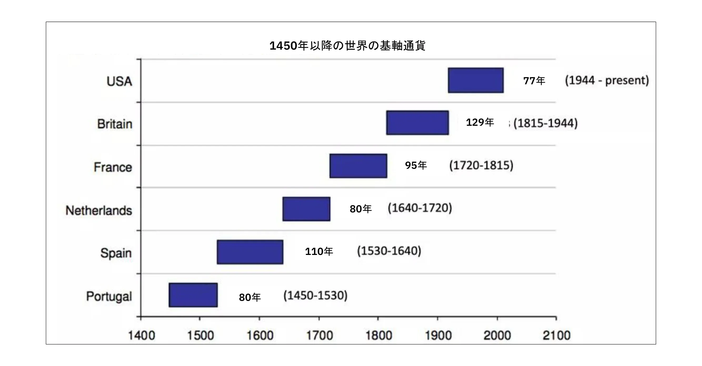

しかし、米国が経済大国として台頭すると、状況は一変した。米国は自国の基軸通貨を切り下げ、インフレを利用することを選択したのである。この決定は、基軸通貨の選択が以前ほど自由ではなくなったという力学の変化に起因することが多い。アメリカの覇権によってドルは世界の基軸通貨となり、その価値を操作できるようになった。この転換は、グローバル化した経済において、金融政策が国際貿易に与える潜在的な影響を明らかにするものであり、世界の基軸通貨管理における重要な転換点となった。

### 最後の例：スイス・ディナール

スイス・ディナールは、湾岸戦争前のイラクを背景とした通貨切り下げのもうひとつの興味深い側面を示している。この通貨はイラク中央銀行によって発行され、その紙幣の質の高さから名付けられた。この信頼は、主に英国で印刷された銀行券の品質によるもので、切り下げに対するある種の強靭さを暗示していた。

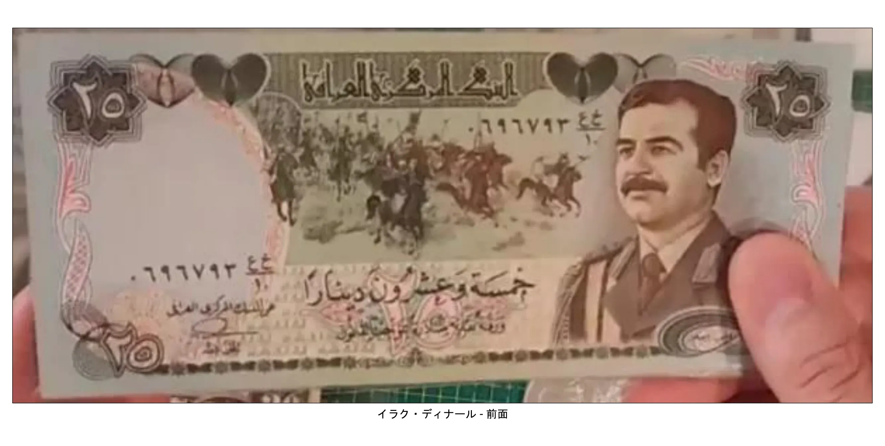

しかし、湾岸戦争はスイス・ディナールの歴史に転機をもたらした。イラクは、紙幣印刷をイギリスの業者に頼ることができなくなり、中国に援助を求めたのだ。この移行により、紙幣の品質には明らかな差が生じ、中国製は劣っていると認識されるようになった。この認識は根拠のないものではなく、中国紙幣は偽造が容易で、政府による過剰印刷の影響を受けやすいため、その価値が脅かされていたのである。

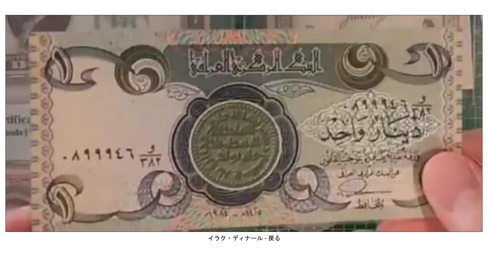

湾岸戦争後のイラク経済では、二重価格制度という特徴的な現象が現れた。商人たちは、支払いに使う紙幣の種類によって異なる価格を提示し、中国紙幣よりもスイス・ディナールの原本を好んだ。この制度は、価値が主に国家によって押し付けられた状況下でも、切り下げられにくい高品質の紙幣への信頼が維持されていたことを反映している。このエピソードは、通貨に内在する特性の重要性を浮き彫りにしている。また、不換紙幣体制であっても、知覚された通貨の品質がその相対的な価値に影響を与え、ひいては経済主体の信頼に影響を与えうることを明らかにしている。

#### そう、実際にコインの重さを量ったんだ！

一般的な認識では、通貨は国家の創造物であり、その発行と価値は国家によって規制されている。この概念はローマなどの古代文明にルーツがあり、そこでは硬貨は帝国によって規格化され、刻印され、それによって通貨に公的価値が付与されていた。しかし、より深く掘り下げると、通貨の本質的な価値は主に貴金属の含有量に由来することが明らかになる。

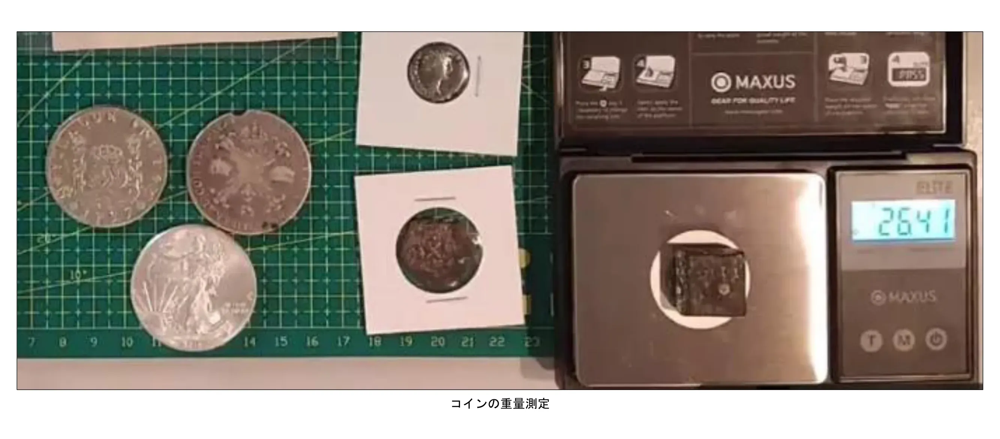

その一例を、スペイン・レアル8枚、またはスペイン・ドル1枚に相当する貨幣の重さを調べてみよう。この分銅には、その価値を示すローマ数字が記されており、両替商が刻印だけでなく、その重さに基づいてコインの価値を評価するために使用した。コインの重さを量ることで、両替商はコインの価値を下げる可能性のある改ざんや破損の有無を判断することができた。この慣習は、国家によって標準化された刻印は通貨に一定の名目的価値を与えるが、真の価値は含まれている貴金属の重量にあることを浮き彫りにしている。

この分析は、通貨への信頼、ひいてはその価値が、国家の単なる主張ではなく、その具体的な実体に支えられていたことを示している。これは、国家が課す名目的な価値と、貴金属の内容によって決まる本質的な価値との間の二重性を強調するものである。このように、通貨は単なる国家の道具という枠を超え、その基本的な価値は有形で測定可能なElementsと本質的に結びついているのである。

#### 結論

結論として、通貨切り下げに関するこの研究は、インフレのメカニズムについてより深い理解を提供する。様々なタイプのインフレと、それがハイインフレやハイパーインフレに移行する閾値について議論する。この強固な基礎があるからこそ、これからのセッションで複雑なインフレをAddressすることができるのです。ご清聴ありがとうございました。次回のビデオでは、このマネタリー・ダイナミクスの探求を続けたいと思います。

## インフレの種類

<chapterId>b438fe09-375e-5bb2-9196-7dd687b9f98c</chapterId>

### インフレは多因子現象ではない

このセクションでは、誤解されがちな現象であるインフレについて、様々な側面から考察する。メディアや日常的な議論では、インフレは多因子からなる現象として認識されることが多いが、基本的には貨幣現象であることを忘れてはならない。

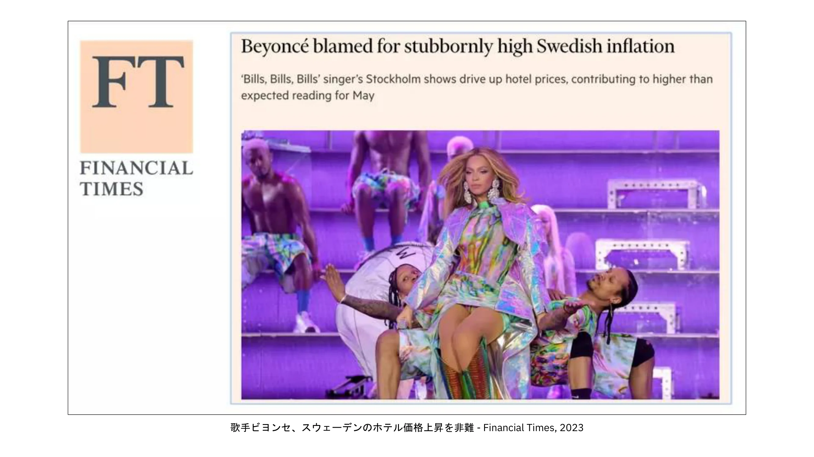

このトピックをいくつかのポイントに分けて紹介しよう：

- 物価上昇とインフレの区別：

価格上昇は、OPECの原油生産量の減少や小麦生産に影響を及ぼす天候不順など、さまざまな要因によって引き起こされるセクター特有のものである。

一方、インフレとは、特定の部門だけでなく、さまざまな財やサービスの価格が全般的に上昇することを指す。

- インフレの貨幣的本質：

マネーSupplyが固定されていれば、あるセクターの物価が上昇すれば、他のセクターの物価は下落することになる。インフレはマネーSupplyの増加と密接な関係があり、これによってすべてのセクターで同時に物価が上昇する。

- マネーSupplyがインフレとデフレに与える影響：

固定貨幣Supply制度では、理論的には、生産が増加すれば、より多くの財やサービスが入手可能になるため、デフレ、すなわち物価の下落につながるはずである。

現在の不換紙幣制度では、マネーSupplyの増加は、生産の増加によって引き起こされる潜在的なデフレを相殺する。

- マネーSupply調整の悪影響：

Supplyの増加は、それに対応する生産の増加なしに、同じ量の財やサービスに対してより多くの貨幣が流通するため、インフレを引き起こす。

生産量の増加はデフレをもたらすはずだったが、マネーSupplyが同時に増加したため、この効果は無効となり、代わりにインフレとなった。

- インフレ、デフレ、そしてマネー Supply - 伝える器：

インフレとデフレは経済における連絡船のようなものである。生産が増えればデフレになるが、同時にマネーSupplyが増えれば、デフレ効果は打ち消され、インフレになる。

この議論は、インフレとデフレの根本的なメカニズムを理解することの重要性と、マネーSupplyの変化が経済に与える影響の大きさを強調している。これらの概念が相互に関連し合い、世界経済に与える影響をより深く理解するために、後ほどこれらの概念を再確認することになるだろう。

### なぜお金を刷ってもインフレにならないのか？

#### インフレ率≠CPI

インフレはしばしばマネーSupplyの増加と関連付けられるが、2008年の金融危機後の期間を見ればわかるように、必ずしもマネーの印刷と直接的な相関関係があるとは限らない。銀行を救うために多額の資金が印刷されたにもかかわらず、その後の10年間は高いインフレには見舞われず、年平均0～2％であった。この状況は疑問を投げかける：なぜ大規模な紙幣増刷がインフレ率に比例しなかったのか？その答えは、インフレ率と消費者物価指数（CPI）の測定に関するいくつかのニュアンスにある。

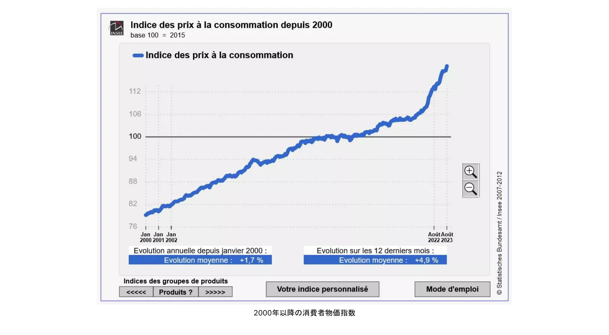

最初の説明は、インフレの測定方法にある。インフレの主要指標である消費者物価指数（CPI）には一定の限界がある。例えば、CPIは不動産価格の変動を包括的に考慮していない。CPIには家賃に関連する構成要素が含まれているが、住宅価格の大幅な上昇は完全には反映されていない。その結果、住宅費の大幅な上昇がCPIに完全に反映されないまま起こる可能性があり、実際のインフレ率を過小評価する可能性がある。

加えて、CPIの計算には、実際の物価上昇を相殺したり覆い隠したりする可能性のある特定の方法が用いられている。例えば、製品の質的向上が指数の調整に使われることがある。製品価格が上昇しても、その品質や機能が向上していれば、CPIは消費者にとっての実質的な価値は変化していないとみなし、インフレを反映しないことがある。例示的なケースは、通貨注入により牛肉やコンピュータの価格が上昇したにもかかわらず、コンピュータの性能向上によりこの上昇分を相殺するような場合である。コンピュータの価格が2倍で、性能が4倍であれば、CPIはこれを物価の低下と解釈し、牛肉価格の上昇を覆い隠してしまうかもしれない。

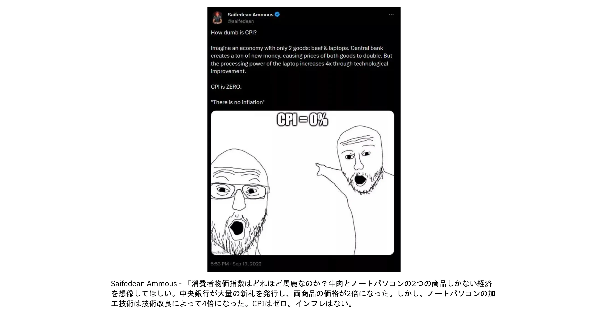

CPIによるインフレ率の測定におけるこうしたニュアンスの違いは、金融増刷とインフレ率の関係の複雑さを浮き彫りにしている。また、もしすべての物価上昇、特に不動産などの主要セクターにおける物価上昇をより包括的に考慮した場合、実際のインフレ率は報告されているよりも高くなる可能性があることも示唆している。この分析は、インフレの根底にあるメカニズムと、それを測定するために使用される従来の指標の限界を理解することの重要性を強調し、それによって金融政策の経済的意味をより深く理解することを促進する。

#### MMTの主張

現代金融理論（MMT）は、マネーの創造とインフレについて明確な視点を提供している。MMTによれば、マネーは主に政府から生み出され、政府が必要な資金を調達するために大量に印刷しても、その資金が対象とするセクターが飽和していない限り、インフレを引き起こすことはない。このアプローチは伝統的な貨幣理論から逸脱しており、インフレのダイナミクスにおけるセクターごとの吸収能力の重要性を強調している。

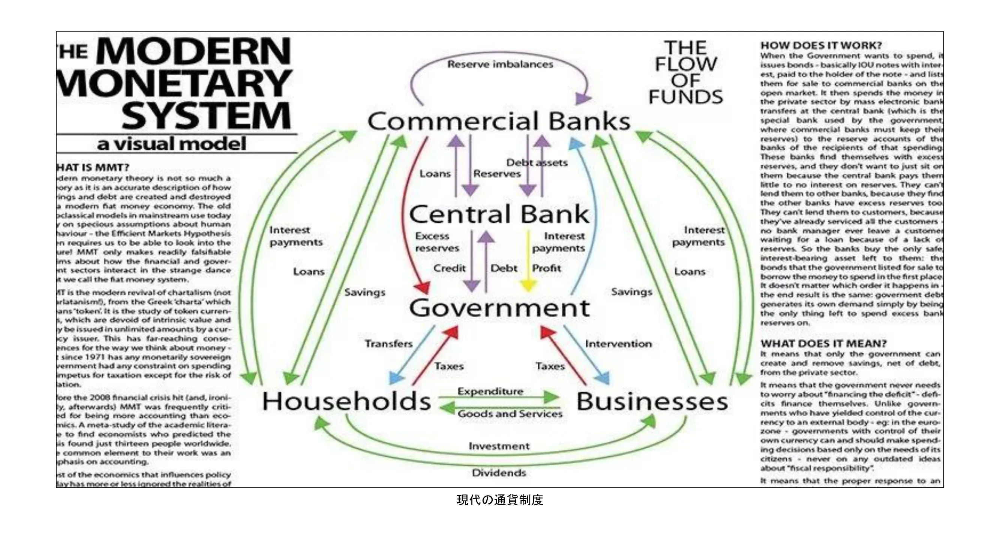

MMTの実例は、アメリカの軍産複合体である。MMTによれば、この部門に何千億ドルもの資金を配分しても、その資金吸収能力のおかげでインフレを引き起こすことはない。対照的に、企業数や労働力に限りがあるアメリカの道路建設に多額の資金を投入すれば、資源不足と供給者の要求するコスト上昇によってインフレが起こる可能性がある。

MMT推進派は、大幅な金融増刷にもかかわらずインフレが起きなかったもう一つの例として、しばしば日本を引き合いに出す。しかし、日本の状況は、消費者物価指数（CPI）のような伝統的なインフレ尺度の限界も浮き彫りにしている。日本では、刷られたお金のかなりの部分が、現在の消費に使われるのではなく、貯蓄されたり、不動産や株式市場に投資されたりしている。消費者物価指数（CPI）は、こうした動きを十分に捉えていないため、実際のインフレ率を過小評価する可能性がある。

日本の分析（https://ideas.repec.org/p/ces/ceswps/_9821.html）はまた、CPIに含まれない資産への貯蓄や投資といった経済主体の行動が、金融増刷によるインフレの影響を覆い隠してしまう可能性があることを強調している。さらに、さまざまなセクターが注入された流動性を吸収する能力は、インフレが起こるかどうかを決定する上で重要な役割を果たす。

#### 銀行および中央銀行のバランスシート

金融増刷がインフレを引き起こさない理由の3つ目の例は、金融増刷とインフレの関係は、新たに創出されたマネーがどのように経済に導入されるかによって調整されるということである。この資金が経済主体に貸し出されることなく、民間銀行のバランスシートにとどまっていれば、実体経済に直接影響を与えることはなく、したがってインフレにはならない。

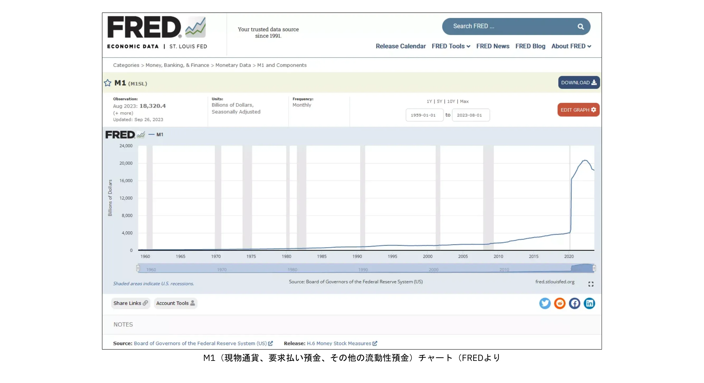

通貨の増刷は、経済に垂れ下がるダモクレスの剣のようなものだ。創り出されたマネーは、銀行融資やその他のメカニズムを通じて経済に注入されない限り、目に見えるインフレ効果をもたらすことなく、一定期間潜伏していることができる。しかし、この潜在マネーが最終的に流通するようになると、インフレ効果が顕在化する。これが2020年代に観察されたことであり、過去に作られたマネーが経済に入り、インフレを引き起こしたのである。

このシナリオは、貨幣増刷によるインフレ効果に影響を与える金融伝達メカニズムの重要性を浮き彫りにしている。中央銀行の資金供給はパズルの1ピースに過ぎない。融資量を決定する民間銀行の行動と、借りたお金をどう使うかを決定する借り手の行動も、このダイナミズムにおける重要なElementsである。

#### インフレは社会的なものだ！

ワイマール共和国の例は、貨幣の印刷とインフレの関係におけるもうひとつの重要な側面、すなわち期待や経済主体の行動の役割を示している。ワイマール共和国の中央銀行が大量の貨幣を印刷し始めたとき、経済の不確実性から、個人は貨幣をため込む、つまり、使うよりも貯め込むようになった。この反応により、貨幣印刷によるインフレ効果が一時的に遅れた。

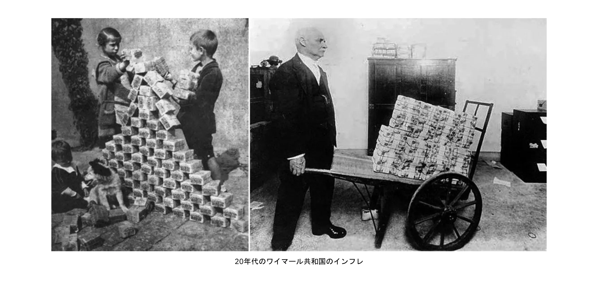

しかし、経済状況がわずかに改善し始めると、信頼は徐々に回復した。そして、個人は隠れていた貯蓄を引き出し、経済で大量に消費し始めた。この突然の行動の変化は、すでに高かったマネーSupplyと相まって、需要の爆発的増加につながった。より多くのマネーが流通し、需要が増加したため、物価は急速に上昇し始め、顕著なインフレにつながった。

この例は、インフレの発生におけるタイミングとエージェントの行動の重要性を強調している。インフレはマネーSupplyの増加に反応して起こるだけでなく、そのマネーが経済でいつ、どのように使われるかにも左右される。経済の不確実性と経済主体の期待は、このダイナミックな動きにおいて重要な役割を果たし、貨幣印刷によるインフレ効果を加速させることも遅らせることもできる。

#### 総括する：

- 消費者物価指数（CPI）：消費者物価指数（CPI）はインフレを過小評価する構造になっているため、インフレの実態が歪んで見えてしまう。

- 部門別吸収：資金を吸収できる部門に資金を投入しても、必ずしもインフレになるとは限らない。顕著な例はアメリカの軍産複合体で、インフレを引き起こすことなく巨額の資金を吸収することができる。

- 日本のケース：大幅な紙幣増刷にもかかわらず、日本のインフレ率は低水準にとどまっている。これらの分野では印刷された資金が吸収されるため、CPIは必ずしもこれらの分野の物価上昇を反映していない。
- 金融印刷と市場の相関関係。不動産市場や株式市場のカーブは、しばしば金融印刷に追随することが観察され、印刷された資金がどこに向けられているかを示している。
- 銀行の通貨準備高：印刷されたマネーが銀行のバランスシートに残り、経済に流通しない場合、インフレは起こらない。このことは、2008年の例で説明できる。印刷されたマネーは、大部分が銀行のバランスシートに残り、インフレの影響を遅らせた。

- ワイマール共和国：この歴史的な時期は、経済の不確実性がいかに貨幣の買いだめを招き、インフレを遅らせたかを示している。しかし、信頼が回復し、資金が使われるようになると、インフレは爆発した。

これらの例は、インフレが必ずしも金融増刷の直接的な結果とは限らない理由や、経済的背景やエージェントの行動がインフレにどのように影響するかを説明するための議論に使うことができる。

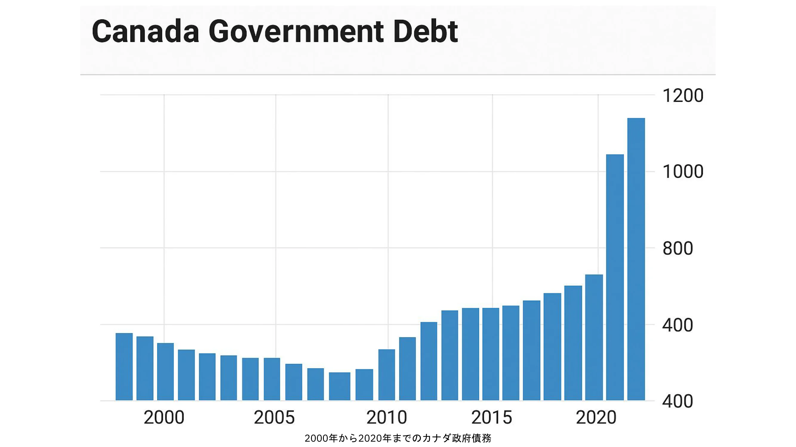

なぜなら、この[スレッド](https://twitter.com/saifedean/status/1673639779433590786)が示す通りだからだ：インフレは中央銀行の責任以外のすべてである。

- エコノミスト、インフレの原因は気候変動

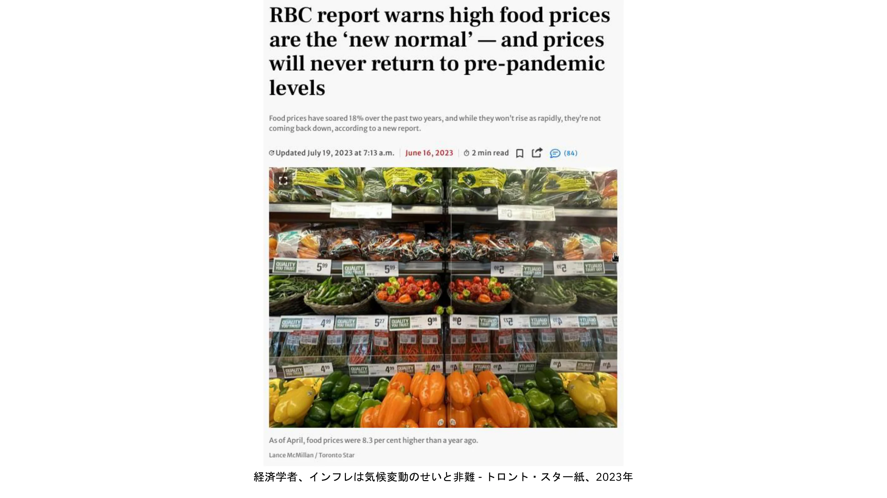

- スウェーデンが特定の月のインフレをビヨンセのせいにした例。

- ポーランドの中央銀行は、ロシアのウクライナ侵略とパンデミックがインフレの原因だとしている。

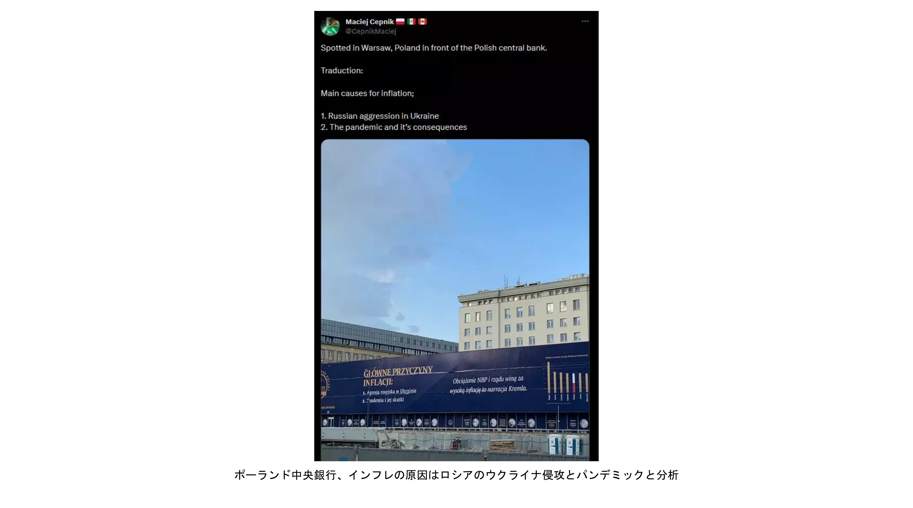

- 英国のインフレはブレグジットのせいだと言われている。

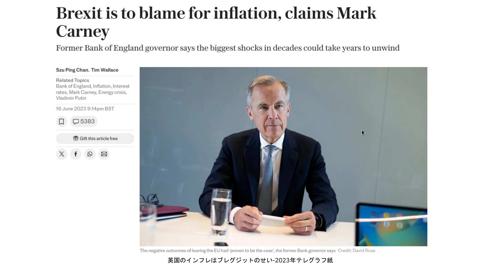

- ゼルダの発売とインフレ・ショック。

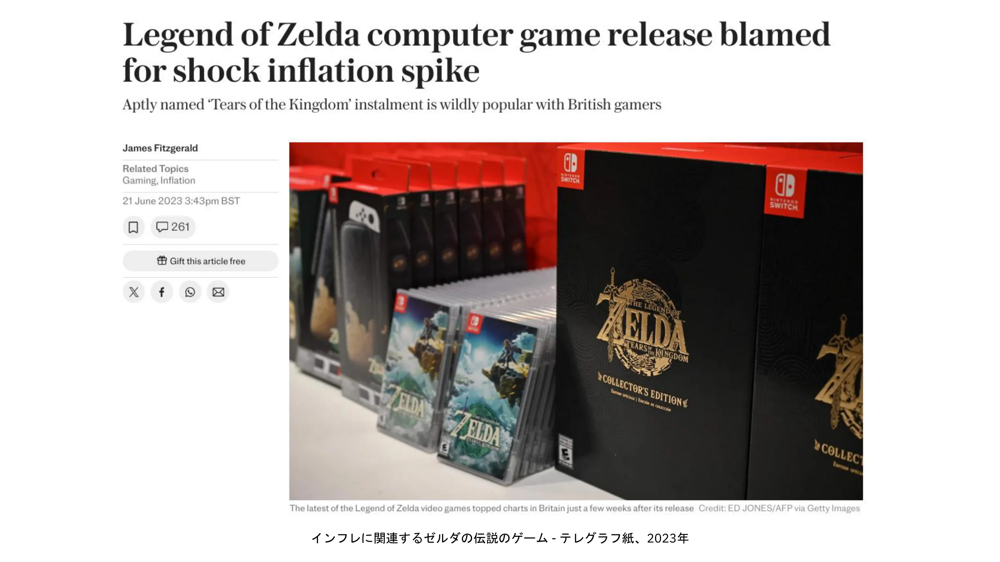

- テイラー・スウィフトがインフレを引き起こしていると言われている。

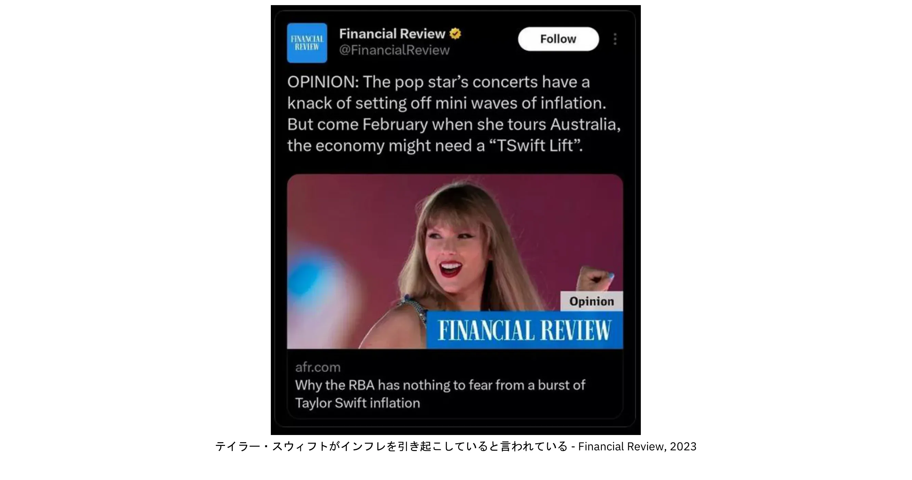

ビヨンセやテイラー・スウィフトが、どうしてこれほど広範囲の価格上昇を引き起こしたのでしょうか？あのね、何の意味もないんだよ。要するに

### インフレの種類を探る

インフレの種類を区別して理解することは極めて重要であり、それによってこの経済現象のさまざまな現れ方を把握することができる。ここでは、その種類について説明する：

- クリーピング・インフレ：中央銀行が一般的に目標とするインフレ率で、年率2％前後とされる。この目標は1990年代から採用されており、過熱やデフレに陥ることなく安定した経済成長を維持することを目的としている。
- 緩やかなインフレ：インフレ率が目標の2％を超えた場合に起こる。過剰なマネーSupplyが物価全般の上昇を刺激する状態である。このシナリオは金融政策の限界を露呈し、時には経済言説の矛盾を明らかにする。
- ギャロッピング・インフレ：ギャロッピング・インフレは、しばしば2桁インフレと呼ばれ、年間インフレ率が10％を超える場合に起こる。これは、経済の安定を損ないかねない大幅な物価高騰を意味する。

- ハイパーインフレ：ハイパーインフレとは、インフレ率が月50％を超える極端な現象で、インフレの指数関数的な性質により、年間インフレ率は13,000％以上に相当する。このレベルのインフレは経済を著しく不安定化させ、通貨はほとんど無価値となり、通貨制度に対する信頼が損なわれる。

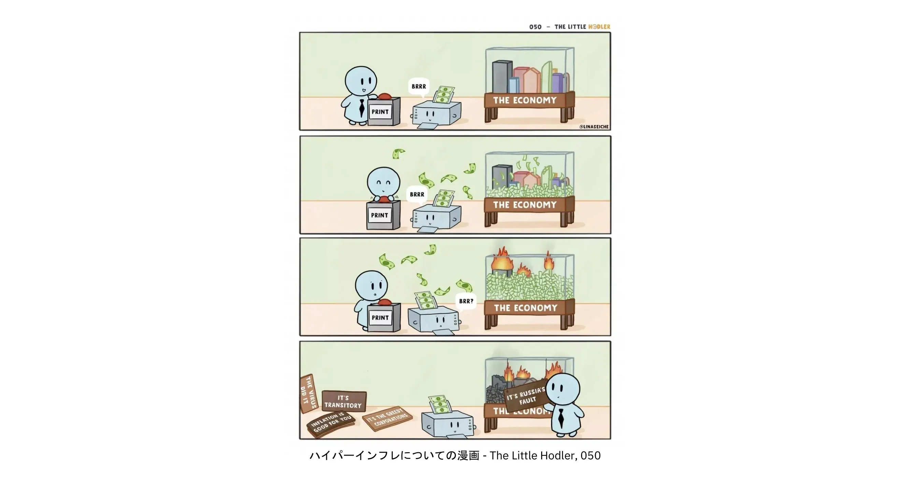

インフレの種類を調べていると、「デマンド・プル」や「コスト・プッシュ」といった用語を教材でよく目にする。これらの概念は有効ではあるが、貨幣的現象としてのインフレではなく、物価上昇を説明する傾向がある。以下は、より詳細な分析である：

- デマンド・プル：

デマンド・プル・インフレは、経済における需要が利用可能な生産能力を上回るシナリオとしてよく説明される。しかし、対応するマネーSupplyの増加がなければ、この状況は単に支出の再分配につながる。消費者は必需品への支出を増やし、非必需品への支出を減らすことで、全体的なインフレ効果を中和することができる。

- コスト・プッシュ：

一方、コストプッシュ型インフレは、天然資源や労働力などの生産コストの上昇に起因する。この場合も、マネーSupplyが増加しなければ、ある部門のコスト上昇は他の部門の支出を減らすだけで、広範なインフレを引き起こすことはない。

このような伝統的な説明は、物価上昇をインフレと結びつけることが多く、混乱と誤解を招きかねない。実際には、広範なインフレが起こるためには、マネーSupplyの増加が必要である。この文脈では、デマンド・プルとコスト・プッシュの概念はセクターごとの価格変動を説明できるが、インフレの貨幣的性質を捉えることはできない。このことは、セクターごとの物価上昇と広範なインフレを区別することの重要性を浮き彫りにし、経済全体にインフレが顕在化するのを防ぐためにマネーSupplyの引き上げが必要であることを再確認している。この分析は、インフレの実際の原因について、より微妙で正確な視点を提供し、根本的な貨幣力学をあいまいにしかねない一般的な解釈を解明するものである。

### ベルンホルツによるインフレの分類

ベルンホルツは、インフレを単純化しつつも正確に3つのカテゴリーに分類し、この複雑な貨幣現象をよりよく理解できるようにすることを提案している：

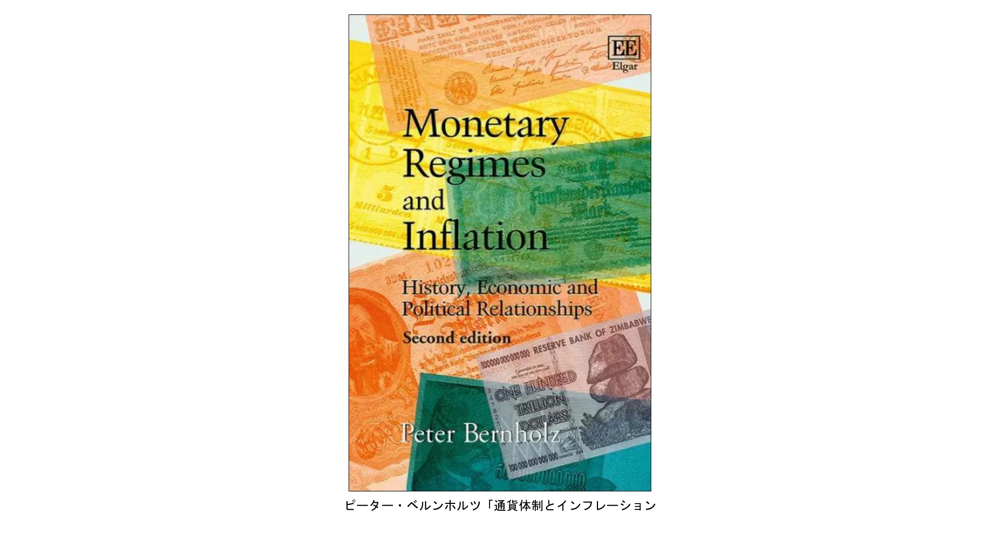

- 緩やかなインフレ：

中程度のインフレは、マネーSupplyの水準が通常よりも高いが、国家がマネーの創出によって賄われる多額の赤字に頼ることなく起こる。中程度」という言葉は軽微に見えるかもしれないが、このようなインフレは、高インフレには分類されないものの、大きな問題を引き起こす可能性がある。

- 高インフレ：

高インフレは、名目ベースでは上昇しているにもかかわらず、実質的な貨幣価値が低下するときに起こる。この逆説的な状況は、個人が自国通貨に対する信用を失い、Exchangeに自国通貨を商品やサービス、あるいは外貨と交換しようとする貨幣代替から生じる。このプロセスは、通貨の実質価値をさらに低下させ、インフレを悪化させる。

- ハイパーインフレ：

ハイパーインフレは高インフレの極端な形態であり、貨幣の増刷によって賄われる多額の財政赤字を特徴とする。歴史的に見て、貨幣の印刷による大幅な財政赤字のファイナンスなしにハイパーインフレが起こった例はない。ハイパーインフレは悪循環を引き起こす。インフレによって通貨価値が急速に下落し、国家が税収を回収する前に税収が目減りするため、国家は財政を賄うためにさらに紙幣を印刷せざるを得なくなる。この自己強化サイクルは天文学的なインフレ率につながり、しばしば月50％を超える。

ベルンホルツによるこの分類は、緩やかなインフレからハイパーインフレへの危険な進行を浮き彫りにし、破壊的なインフレスパイラルを防ぐために金融と財政のコントロールが極めて重要であることを強調している。また、国家財政への悪影響はハイパーインフレに至るかなり前に起こりうることも示しており、さまざまな程度のインフレがもたらす影響についてニュアンスの異なる視点を提供している。

### 結論インフレタイプのまとめ

結論として、「忍び寄るインフレ」、「歩くインフレ」、「疾走するインフレ」といったよく耳にする用語から始まり、それぞれ経済内のインフレ率の異なるレベルを示す、さまざまなインフレのタイプを探ってきた。しかし、ハイパーインフレに関する詳細な研究においては、ベルンホルツの言う「中程度のインフレ」、「高いインフレ」、「ハイパーインフレ」というカテゴリーが重要な指標となる。

- 緩やかなインフレ：

これは、Supplyが平年を上回る水準であることを示しているが、この水準は国家による大幅な赤字国債発行がなければ維持できるものである。

- 高インフレ：

Supplyは、貨幣の実質的価値が低下したときに発生する。多くの場合、貨幣の代替が原因であり、個人がExchangeに通貨を商品、サービス、または他の形態の通貨と交換しようとする。

- ハイパーインフレ：

これは高インフレの極端なバージョンであり、多額の財政赤字を賄うための過剰な通貨創造が、通貨の実質価値を急速に低下させる。

ハイパーインフレは複雑で直感に反する現象である。ハイパーインフレは、貨幣Supplyの大幅な増加の結果であると思われるかもしれないが、実際には、その貨幣Supplyの実質的価値の減少に起因している。このニュアンスは、世界銀行やIMFのような国際機関の支援を受けてもハイパーインフレから脱却できない国がある理由を理解する上で極めて重要である。インフレの種類を見誤ると、不適切な救済策を適用することになり、経済問題を解決する代わりに悪化させることになる。

今後の議論では、ハイパーインフレについてより深く掘り下げ、その定義や様々な経済的文脈における現れ方を探っていく。私たちの目標は、ハイパーインフレの根底にあるメカニズムを明らかにし、この問題をAddressに解決するための潜在的解決策を探ることである。この微妙な理解によって、私たちは関連する課題をよりよく理解し、インフレを管理するための情報に基づいた戦略を提案することができるだろう。

ご清聴ありがとうございました。次回は、ハイパーインフレの定義とその謎解きについて、学問的・実務的な見地から考察する予定です。次回の会合でも、皆様とともにこの探求を続けられることを楽しみにしております。

# ハイパーインフレとは何か？

<partId>3f541663-1e2f-5410-8ee0-f61c5d009fa5</partId>

## ハイパーインフレの定義

<chapterId>d2a71a2e-5f36-58d9-993c-d431f4aa07fd</chapterId>

### ハイパーインフレの定義

本節では、極端な貨幣現象を研究する上で重要な用語であるハイパーインフレの様々な定義を探る。最もよく知られている定義はフィリップ・ケーガンによるもので、彼は1956年の著作『ハイパーインフレの貨幣力学』の中で、ハイパーインフレを定量的に理解することを提案している。ケーガンによれば

- ハイパーインフレの始まりと終わり：
  - ハイパーインフレは、毎月のインフレ率が50％を超えたときに始まる。
  - インフレ率が少なくとも1年間、毎月50％を下回った時点で終了する。

例えるなら、インフレ率が7月に40％まで低下し、翌年の7月まで50％を上回らなかった場合、ハイパーインフレの期間は、最初に観察された年の前年7月に終了したとみなされる。この定義により、ハイパーインフレのエピソードを正確に特徴付けることができ、構造的な分析が容易になる。

この定義はハンケ・クルス表で採用されており、56のハイパーインフレのエピソードが記録されている。しかし、この表は2016年のベネズエラのようなすべてのエピソードを網羅しているわけではない。

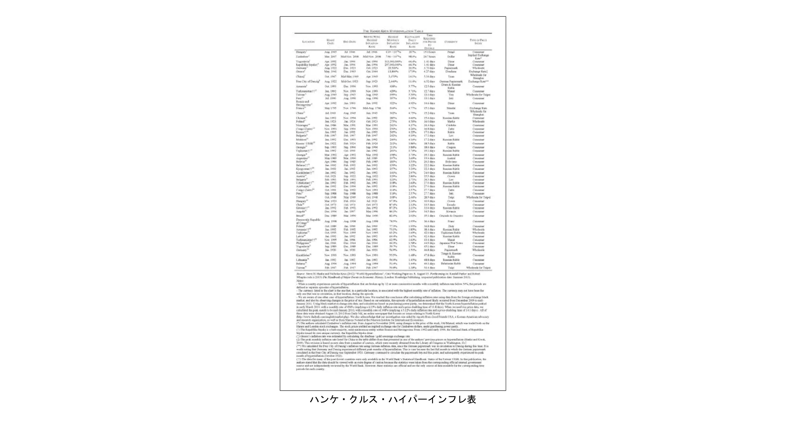

ズーム

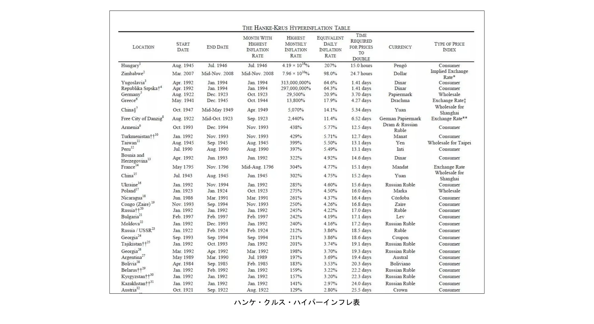

この定義は正確ではあるが、50％という閾値の厳密さゆえに、ある種のハイパーインフレのエピソードを除外する可能性があることに留意すべきである。厳密にはケーガンの基準を満たさないが、それでも極めて高いインフレの期間を示す他のエピソードを含めるために、この定義を拡大する可能性がある。この観察は、ハイパーインフレ現象のより広範な探求への扉を開き、その原因と影響についてのより微妙な理解を可能にする。今後の議論では、この定義を再検討し、ケーガンの厳密な基準には当てはまらないハイパーインフレのエピソードを検証することを検討したい。

### ケーガンによるハイパーインフレの定義

フィリップ・ケーガンはハイパーインフレを定義する際、月次インフレ率50％という恣意的なマイルストーンを設定したかもしれない。彼自身、この定義が恣意的であることを認めており、主にハイパーインフレの7つのエピソードに基づく分析に役立っている。ケーガンのデータを検証すると、月次インフレ率が最も低かったハイパーインフレの3つのエピソードは約47％、46％、57％であった。彼の研究では、これらのケースを包含するために50％という閾値が選ばれたようである。

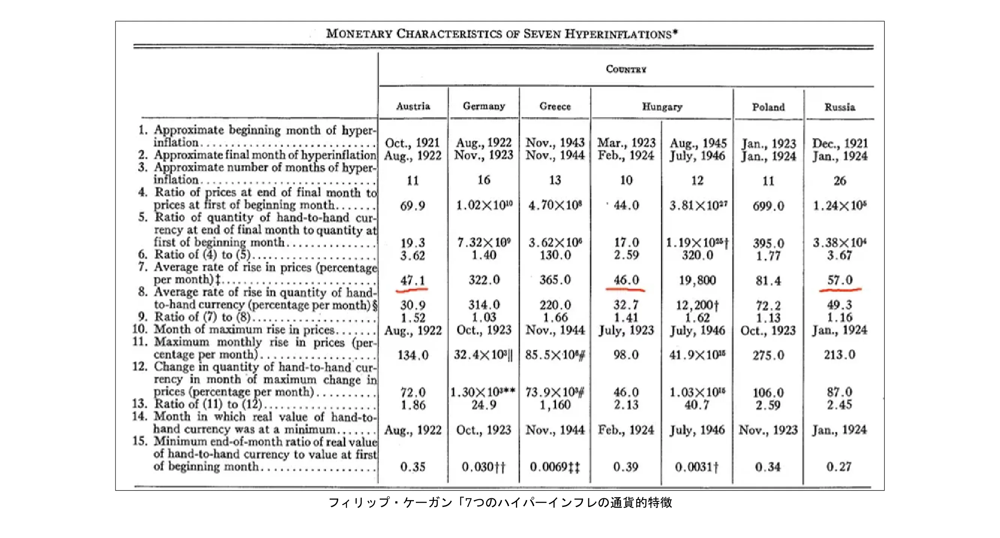

- 歴史的背景

ケーガンの定義は1956年にさかのぼり、当時入手可能だった限られた数のハイパーインフレのエピソードに基づいている。

- ケイガンの観察

ケーガンによれば、より深刻なハイパーインフレに進展することなく、この50％前後の閾値に達したエピソードはなく、この閾値の選択が正当化される可能性があるという。

- ケイガンの定義に対する批判：

通貨体制とインフレ』の著者であるベルンホルツのような他の経済学者も、50％という基準値は恣意的だと述べている。

ベルンホルツは、ハイパーインフレのエピソードと同じ質的特徴を持つ高インフレのエピソードが、50％のしきい値に達することなく存在すると指摘している。

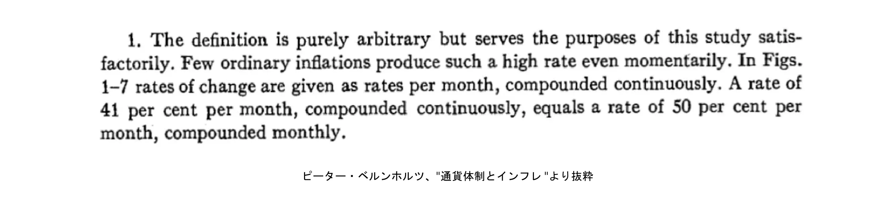

この考察は、従来のハイパーインフレの定義の厳密さに疑問を投げかけ、より多くのエピソードや歴史的データを取り入れることによって、この閾値を見直す必要性を浮き彫りにしている。ハイパーインフレの定義には、さまざまな経済的・歴史的文脈における極端なインフレのさまざまな兆候を包含する柔軟性が必要かもしれない。

### 国際会計基準審議会（IASB）によるハイパーインフレの定義

IASBは、ハイパーインフレ期の会計慣行に焦点を当て、ハイパーインフレについて独自の視点を提供している。このアプローチは、貨幣価値が急激に変動するハイパーインフレ環境下で活動する会計士や企業にとって極めて重要である。IASBのガイドラインは、ハイパーインフレの様々な指標を明らかにしている：

- 非貨幣性資産の優先順位:**.

貨幣価値が急速に下落しているため、個人は通貨よりも商品で価値を保有することを好む。

- 商品とサービスの評価:**.

住民は自国通貨で商品やサービスの価値を計算せず、自国通貨への信頼が失われていることを反映している。

- 金銭的価値の損失に対する補償:**。

価格には、信用購入時の貨幣価値の損失に対する補償が組み込まれており、インフレが日々の取引に与える影響を物語っている。

- 物価・賃金・利子インデックス:**.

物価、賃金、利子は、インフレを補正する指数に基づいて調整される。

- 3年間の累積インフレ率:**.

3年間の累積インフレ率は100％（年率約24％）に近づいており、ケーガンの定義する月次インフレ率50％とは対照的である。

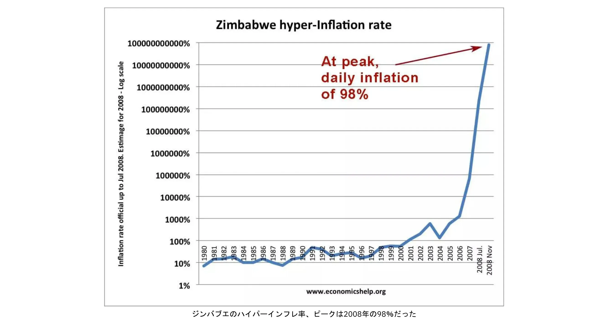

IASBの基準によると、アルゼンチン、エチオピア、ハイチ、イラン、レバノン、スーダン、南スーダン、スリナム、シリア、トルコ、ベネズエラ、イエメン、ジンバブエなど数カ国が現在ハイパーインフレに見舞われている。

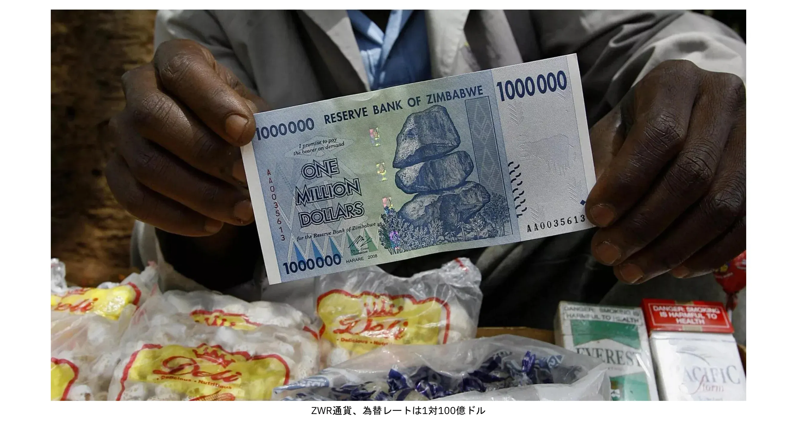

IASBが提示したこの定義は、ケーガンの厳格な定量的閾値から離れ、ハイパーインフレに直面した際の経済行動や実務上の調整に関する定性的分析を取り入れたものである。これは、ハイパーインフレが複雑な現象であり、その真の意味を把握するためには、特に企業や市場の安定性と財務の透明性にとって極めて重要な会計の分野において、多面的な理解が必要であることを示している。

### では、ハイパーインフレは全部でいくつあるのだろうか？

ハイパーインフレの一般的な定義、例えばケーガンが提唱した月次インフレ率50％という定義は、時として混乱を招いたり、過度に単純化されたりすることがある。例えば、年間インフレ率がそれぞれ1,000％と3,000％の2つの国があったとしても、そのインフレ率の月次分布によって受け止め方が異なる可能性がある。ケーガンの定義によれば、50％のしきい値を超える月がなければ、それらの国はハイパーインフレ状態には分類されない。したがって、このアプローチは、特に1年間の累積インフレ率を比較する場合、ハイパーインフレの分類に異常をもたらす可能性がある。

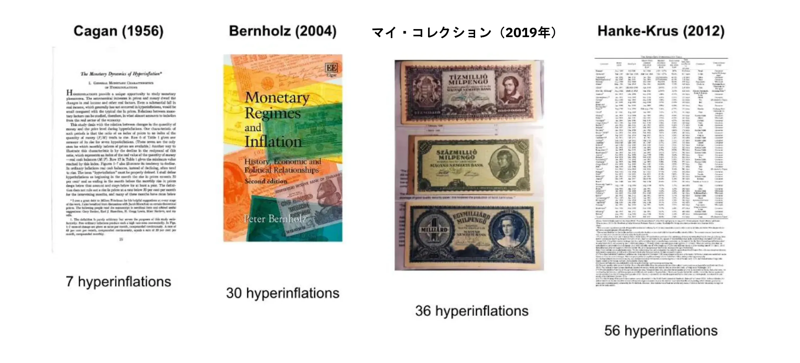

- ケーガンの著作『ハイパーインフレの金融力学』は、ハイパーインフレの根本的な分析を提供している。
- ベルンホルツの著書は、ハイパーインフレの異なる30期間を研究しており、分析の幅を広げている。
- デイヴィッド・サン＝オンジ（このコースの著者）の個人的なコレクションである36のハイパーインフレ期の紙幣は、具体的かつ歴史的な理解を可能にする。
- ハンキー・クロスの表（2012年版、2016年にベネズエラで更新）は、ケーガンの定義に基づく57のハイパーインフレの期間をリストアップしている。

注目すべきは、歴史的に高インフレだった時期が、厳格な分類基準のために、古典的なハイパーインフレの表には含まれていないことが多いことである。例えば、1779年11月のアメリカ独立戦争中と1864年3月のアメリカ南北戦争中の月次インフレ率はそれぞれ47.4％と40％であった。これらのインフレ率は高いとはいえ、ケーガンが規定した50％の閾値を超えないため、これらの時期をハイパーインフレのケースとして分類することはできない。この脱落は、厳密な定義の限界を浮き彫りにし、ハイパーインフレの複雑さをよりニュアンス豊かに理解する必要性を強調している。

## ワイマール対ジンバブエの類似点

<chapterId>11eef458-aab8-5c63-8523-264d0ba69f5d</chapterId>

### 二つの時代、二つの大惨事

本章では、ジンバブエとワイマール共和国の経験を中心に、ハイパーインフレの影響を検証する。私は研究を通じて、純粋な経済学的・統計学的アプローチを採用するよりも、これらのハイパーインフレの時代を生きた個人の直接の証言を探ることを優先してきた。

特に参考になった本が何冊かある：

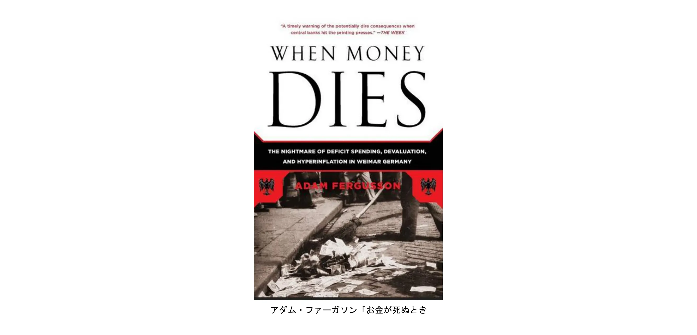

- アダム・ファーガソン著 "When Money Dies "は、第一次世界大戦後のドイツ、オーストリア、ハンガリーにおけるハイパーインフレを追跡している。
- ジンバブエのハイパーインフレに関する2冊の本、ジェローム・ガードナー著『Zimbabwe Warm Heart Ugly Face』とクッザイ・ジョセフ・グー・ミンユー著『Hard Boiled Egg Index』はそれぞれ、衣料品店チェーンのCEOと農業銀行家がこの激動の時期に経験したことを痛切に語っている。

ノートを整理しているうちに、ジンバブエとワイマール共和国のハイパーインフレの経験には、90年の隔たりがあるにもかかわらず、多くの共通点があることに気づいた。私は約17の類似点を特定し、そのうち13は、これらの証言に描かれている経済的災難へのある種の進行を示している。これらの魅力的な類似点は、ハイパーインフレが時代や国境を越えて繰り返し起こり、壊滅的な打撃を与えることを示している。本日は、これらの類似点を検証し、ハイパーインフレ期の憂慮すべき軌跡をどのように描き出しているのかを見ていきたい。

### 比較分析：ジンバブエとワイマール共和国

14差のゲーム！

#### 1.資金不足

目まぐるしいスピードで通貨安が進むと、新紙幣を市場に氾濫させるという最も野心的な試みでさえ、不十分なものになりかねない。有形通貨への絶え間ない需要は、中央銀行の銀行券生産能力をはるかに上回り、前例のない流動性危機を引き起こす可能性がある。

> ワイマール：「今月中に40億マルク近くまで増額され、この数字によって通貨不足が決定的に克服されることが期待される。

> ジンバブエ：「2002年から2009年1月にかけて、何度か危機的な流動性不足がありました。高騰するインフレに追いつくだけの十分な紙幣が印刷されず、流通しなかったのです。"

#### 2."それは肥やしだ！"

ある種の経済状況において、通貨がその価値を失うスピードには驚かされる。天文学的な量の紙幣が記録的な速さで発行され、かつてはかなりの額であったものが、一瞬にして肥やしのような取るに足らないものに変わってしまう。

> ワイマール：「現在の発行総額は63,000億円です。したがって、数日後には、総発行部数の3分の2を1日で発行できるようになるだろう"

> ジンバブエ：「2006年9月17日、RBZのギデオン・ゴノ総裁は、"10兆ドルはまだそこにあり、それは肥やしになった "と宣言した。

#### 3.紙幣は印刷された紙より価値がない

経済状況によっては、銀行券の本来の価値が、印刷された紙の価値を下回ることがある。この急激な減価は、本来価値と購買力の象徴である銀行券を、無価値な紙切れに変えてしまう。

> ワイマール：「マルクの紙幣は、印刷機から出たとたんにほとんど価値がなくなった。

> ジンバブエ：「中央銀行は、印刷された紙の価値もない紙幣を印刷して無駄遣いをした。つまり、その価値はトイレットペーパーよりも低かった。ばかげていると思われるかもしれないが、実際のトイレットペーパーを買うよりも、100兆ZWD紙幣をトイレットペーパーとして使う方が安かったのだ。"

#### 4.お金を数える

通貨が急速に価値を失うと、最も単純な取引でさえ手間のかかる作業になりかねない。商品の価格を計算したり、支払いに必要な紙幣を数えたりするだけでも数分かかり、日々のやりとりにLayerの複雑さが加わる。

> ワイマール：「店でのごく普通の買い物に3、4分の計算が必要で、値段が決まったら、紙幣を数えるのにさらに数分かかるのが普通だった」。

> ジンバブエ：「店長は、一日中お金を数えるスタッフの代わりに臨時の労働者を雇うことも許されていました。もちろん、管理業務や銀行預け入れのために店内でお金を数えるのは一つの仕事でしたが、預け入れの際には銀行ですべてのプロセスを繰り返さなければならなかったのです"

:::video id=910231d7-af90-4ab8-b74c-bfb81caebfb2:::

ウズベキスタンのお金の数え方

#### 5.小切手による支払い

経済が混乱すると、小切手のような伝統的な決済手段はたちまち効力を失う。ハイパーインフレによる通貨需要の増加に圧倒された銀行は、小切手の現金化を制限したり遅らせたりして、実質的な価値を下げる可能性がある。このような不安定さは、しばしば支払方法の優先順位付けにつながり、選択した支払方法によって価格が異なることがある。

> ワイマール：「物価の上昇は、国家と他の雇用者の双方による貨幣需要を高めた。民間銀行はその需要にまったく応えられず、小切手の現金化を制限しなければならなかった。
> ジンバブエ：「貨幣の時間的価値は、商品やサービスに対して3つの価格、すなわち現金価格、リアルタイムの総決済価格、小切手価格を生み出した。小切手は決済に5日かかる。

#### 6."バーナー・プレナー"

通貨の価値が下がるにつれ、市場の歪みを利用した新たな経済機会が生まれる。しばしば「バーナー・プレナー」と呼ばれるこうした起業家は、切り下げられた通貨を借りて有形資産に投資し、さらに切り下げられた通貨で借金を返済することで成功を収めることができる。

ワイマール：「インフレへの投機は、紙幣マルクを借り、それを商品や工場に変え、減価した紙幣で貸し手に返済するというものだった。

ジンバブエ："バーナー・プレナー"

#### 7.誠実さとGW～40日の仕事は魅力を失う

不安定な経済状況では、伝統的な価値観である勤労、倹約、誠実さが、手っ取り早い富の魅力によって覆い隠されてしまうことがある。投機や為替取引は、通常の労働よりもはるかに高い報酬をもたらすことが多く、社会の優先順位の崩壊につながる。

ワイマール：「倹約、正直、Hard労働という古い美徳が魅力を失うと、誰もが手っ取り早く金持ちになろうとした。

ジンバブエ：「こうした慣行は、一部の個人を富ませる一方で、都市の労働者階級や農村の人々を貧困に陥れた。教育が価値を失ったのは、この商売を正当化するために教育やHardの仕事を必要としない人々によって行われたからだ。彼らに必要なのは、コネと、簡単に稼げるビジネスを始めるための初期資本だけだった。"

#### 8.世界の銀行

ハイパーインフレや通貨危機の状況下では、外国通貨の並行市場や規制のない市場がしばしば出現する。こうした非公式な「銀行」は、しばしばユーモラスに「世界銀行」などと呼ばれ、資産の切り下げから資産を守ろうとする人々の避難所となっている。こうした市場は必要な経済的ライフラインを提供することもあるが、公的な金融機関や政府の政策に対する不信感が広がっていることを浮き彫りにすることも多い。

ワイマール：「彼らの取引は主に、いわゆるヴィンケルバンキアを介して行われた。彼らはインフレとともに台頭した露天商で、病んだ経済の中で繁栄し、外貨の売買価格の差を利用して生活していた。

ジンバブエ：「彼らは両替商でもあった。彼らはブラワヨの2番街と6番街、フォート通りの間で、しばしば汚職やその他の不法行為を伴う狡猾な商法のおかげで、堂々と営業していた。この一帯は "世界銀行 "として知られていた」。

アルゼンチン：「だから、アルゼンチン人なら誰でも行く、ブエノスアイレス中心部のフロリダ地区にある "洞窟"、クエバスに行った」。 - TheBigWhale

#### 9.外貨両替は違法だった

政府は自国通貨を安定させ、資本の流れをコントロールするために、こうした外貨取引を違法とすることがある。こうした抑圧的な措置は、国民経済を守るためとはいえ、国民の不信感を悪化させ、闇市場を助長するという逆効果をもたらすことも少なくない。

ワイマール：「人々は物々交換に頼り、次第にExchangeの唯一の確実な手段として外貨に頼るようになった。外国手形の購入や国内での支払いに外貨を使用することに関して、新しい法令が導入された。禁固刑に加え、違法取引額の10倍までの罰金が課されるようになった。"

ジンバブエ："企業への襲撃により、ブラワヨのビジネスマン数名が週末投獄され、回収した外貨の2倍に相当する罰金が課せられたが、この勇敢な行動はその後沈静化した"

#### 10.資本規制

ある国が通貨危機や経済危機に直面したとき、政府による一般的な対応のひとつは、資本の動きや形態を厳しく管理することである。切り下げられた自国通貨の受け入れを強制する命令であれ、特定の支払い方法を拒否する人々に対する厳しい制裁であれ、こうした措置は多くの場合、パニックを抑え、信頼を回復することを目的としている。しかし、その効果はさまざまであり、時にはこうした措置が逆効果になったり、市民が経験する現実とかけ離れたものになったりすることもある。

ワイマール：「商人たちは最近、新しい法令によって国家銀行券を受け入れることを余儀なくされた。

ジンバブエ：「政府は2008年12月12日、小切手による支払いに関するSI 175/2008を導入した。小切手／銀行カード、または銀行が仲介するその他の電子決済方法による支払いを拒否した場合の罰則は、レベル8の罰金または6ヶ月の実刑判決、あるいはその両方とする』と書かれていた。明らかに、そのSIは完全に現実離れしていたので、私たちは無視した。"

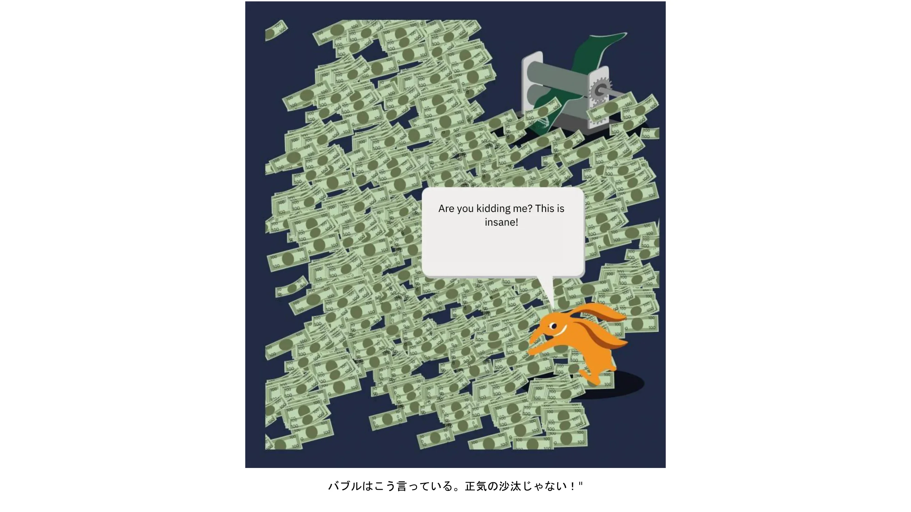

#### 11.営業継続を余儀なくされる

経済が破綻し、通貨の価値が失われたとき、政府は平静を装うために思い切った手段に出ることができる。

ワイマール：「活動を続けていた商人たちは、10月22日に制定された新しい条例の対象となり、店を開け続け、紙マルクと引き換えにExchangeで商品を提供することを義務づけられた」。

ジンバブエ：「空のスチール棚と冷蔵庫、クーラー、冷凍庫だけが残っていた。悲劇だったのは、政治的緊張と政府の価格統制部隊に逮捕される恐れがあったため、あえて店を閉めずに営業していたことだ。労働者さえも解雇されなかったのは、誰もがすぐに解決できると考えていたからだ"

#### 12.誰もが犯罪者

崩壊する経済と蔓延する規制を前に、生き残りと犯罪の境界線は曖昧になる。

ワイマール："国家に対するすべての犯罪は、程度の差こそあれ、そのひとつひとつが個人の生存の問題になった"

> ジンバブエ：「ジンバブエの住人はみな犯罪者だった。辛辣に聞こえるかもしれないが、それは事実だった。生活のあらゆる側面を支配する無数の小さな法律があり、誰もが毎日法律を破ることは避けられなかった。2004年に発行されたSIによれば、外貨の所持は違法だった。1日の引き出し限度額を回避するために複数の銀行口座を持つことは違法だった。車に適切なナンバープレートを付けていないことも、カーラジオの免許を持っていないことも、発電機の許可証を持っていないことも、すべてどこかで誰かが破っている法律だった。"

#### 13.何が何でも外貨を買う

必死の外貨購入は、しばしば通貨切り下げの重要な転換点となり、本質的価値の下落を悪化させてきた。

> ワイマール：「フリッツ・マンハイマーは上司の指示で1921年8月に外出し、『ドイツには紙幣マルクは無限にあるが外貨はない』ので、どんな値段でも外貨を買い始めた。これが、マルクの価値が絶対的に暴落する最初の兆候だった」。

> ジンバブエ：外為取引の中には緊急に必要なものもあり、彼らは期限を守るために外為を蓄えるため、何はともあれ購入するよう、毎日目標を与えられていたとの疑惑がある。この疑惑は、ジンバブエドルの価値が急落し続ける中、切り下げの火種になったと非難されている。"

### プロセスの概要

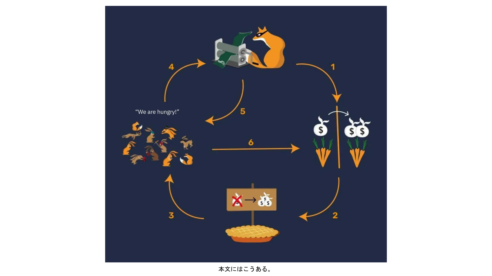

経済の軌跡を分析すると、高インフレになると貨幣価値が悪化することがわかる。この切り下げは、銀行券の不足など、いくつかの複雑な事態を引き起こす。この状況では、特にExchangeレートの変動に対応して裁定取引の機会が生じる。その結果、多くの個人がこの裁定取引に手を染め、将来の通貨切り下げを見込んで有形資産に多額の投資を行い、通貨安で借金を返済できるようになる。このような経済環境は、伝統的な仕事の魅力を損ない、その結果、社会的結束を蝕む。

こうした状況に対応するため、政府は資本規制を含む強硬な規制を課している。また、加盟店には自国通貨と小切手の使用を義務付けている。やがて新たな法律が制定され、犯罪行為の定義が拡大していく。最終的に、政府は低コストで印刷された自国通貨を、より強固な外国通貨と交換するため、Exchangeレートは指数関数的に上昇する。

### 4 ハイパーインフレの結果における類似点

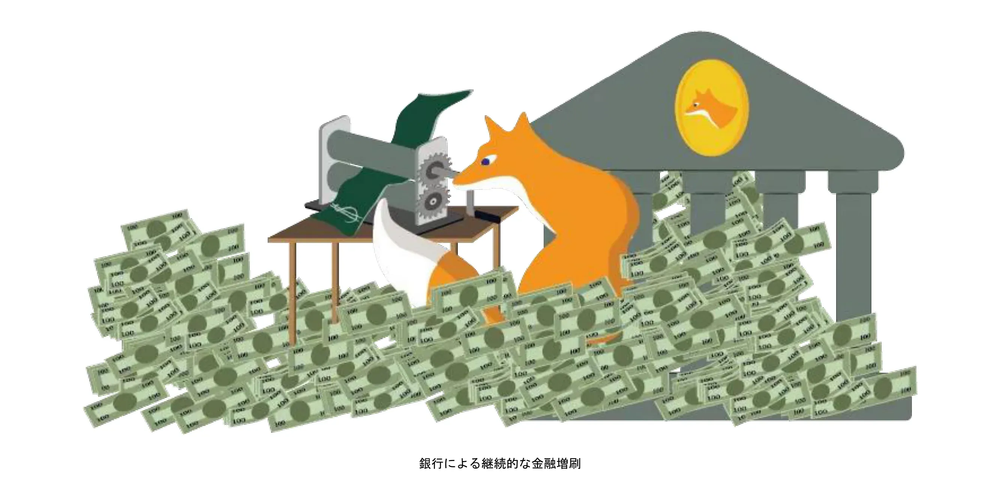

#### 1.石油と金属

ドイツのワイマール時代には、屋根から鉛が頻繁に盗まれるほど、貴重品の盗難が蔓延していた。ジンバブエでは、自暴自棄になった一部の人々が、変圧器から石油を抜き取り、それを自動車に使うために送電網を混乱させた。

ワイマール：「国の記念碑の金属プレートは、保管のために取り外さなければならなかった。ベルリンの英国大使館のドアから真鍮の呼び鈴のプレートが盗まれた。

ジンバブエ：「さらに悪いことに、外貨不足のため、自動車用の潤滑油が不足し、変圧器は停電時に冷却油を吸い上げる泥棒の格好の標的になった。

#### 2.鉄道

通貨切り下げは、市民を破壊行為などの生存行動に駆り立てる。経済の崩壊に直面すると、交通システムなどコストのかかる公共インフラが損なわれ、社会的に悲惨な結果を招く可能性がある。

> ワイマール：「ベルリンでは、資金不足のために路面電車が運行を停止した」。

> ジンバブエ：「最も厄介で悲しいシナリオのひとつは、ハラレとダブカを結ぶ電気銅線（280キロ以上）のほぼ全線が盗まれたことだ。完成当時、この路線はジンバブエの誇りであり、高速の電気旅客列車や貨物列車が走っていた。"

#### 3."ミールミール"

わずかな賃金と不安定な経済状況の中で、企業は生産性と業務効率を維持するため、従業員に食事を提供せざるを得なかった。この取り組みは、食糧不足と高い食費を補うだけでなく、厳しい経済環境下で従業員を維持するための戦略でもあった。

> ワイマール：「ベルリンでは、首都で非常に重要な階級を形成していた会社員の給料は、月給1万2千から2万（年間12ポンドから19ポンドに相当）で、まったく不十分なものだった。

> ジンバブエ：「この段階では、全スタッフに無料の昼食を提供していました。トウモロコシの食事は、私たちの会社が機能し続けるために必要不可欠なものでした。

#### 4.ガソリンクーポン

人々は安定した取引手段を求めた。ワイマールでは、真鍮や燃料のような製品は、一定の本質的価値を持つため、Exchangeの媒体として機能した。ジンバブエでは、ジンバブエ・ドルの急激な切り下げに直面し、必要不可欠な製品の一定量を示すガソリン券が事実上の通貨となった。これらの状況は、社会がいかに極端な経済状況に適応し、貿易と経済を維持するために革新的な解決策を考案しているかを浮き彫りにしている。

ワイマール：「物々交換はすでにExchangeの習慣的な形態だったが、今では真鍮や燃料などの商品が購入と支払いの共通通貨となった。

ジンバブエ：「このバウチャーは、家主への家賃、市税、電話代など、ほとんどすべての支払いに使っています。

#### 結論

ジンバブエとワイマール共和国のハイパーインフレ期の経験の類似性に関するビデオはこれで終わりである。次回のビデオでは、その相違点と現代の類似点についてお話しします。ありがとうございました。

## ワイマール対ジンバブエ：相違点と現代の類似点

<chapterId>643f279c-d89f-5600-a2e2-b1bbbba0ab69</chapterId>

本章では、過去のハイパーインフレと現在のハイパーインフレの違いや現代的な類似点を、逸話や今日的な比較も交えながら探っていく。

### ワイマール共和国とジンバブエの違い

#### 1.ドルのせいだ！

ドイツでは、インフレは自国通貨の本質的な切り下げではなく、ドル高によるものだと考えるのが一般的だった。多くの人々は、この現象はドル高によるものだと考えていた。このような認識は、自国の経済的困難と、主に過剰な通貨創造によって引き起こされた通貨切り下げとの関連性を認識することを拒んだ。マネーが死ぬとき』という本は、ドイツ国民のこのような理解の欠如を明確に示している。これとは対照的に、ジンバブエでは状況が異なっていた。市民は、自分たちが経験しているハイパーインフレの根本的な原因を十分に認識していた。

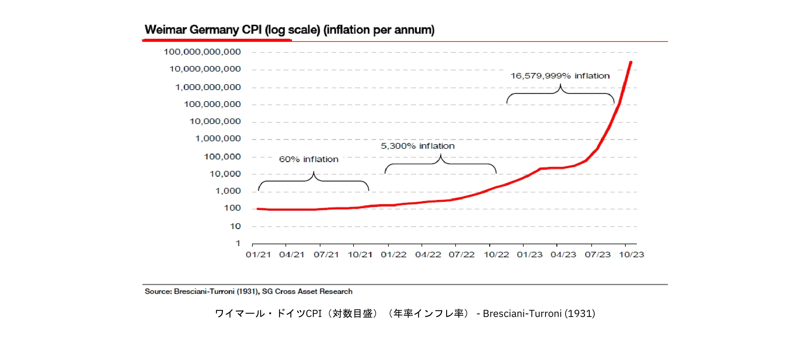

#### 2.非常用資金（Notgeld）

通貨危機と経済危機に直面したドイツは、「ノットゲルト」（非常用紙幣）に頼った。これらの紙幣は、都市や特定の企業によって印刷され、共通通貨の不足をAddressに解消するためのものだった。

興味深いことに、フランスも特に1920年代にノトゲルトに頼った。この取り組みはハイパーインフレの直接的な結果であっただけでなく、第一次世界大戦によって引き起こされた混乱に根ざしたものであった。その結果、金属コインの本来の価値は額面価格を上回ることが多くなり、人々はコインを買いだめするようになった。硬貨がない中、リヨン商工会議所のようないくつかの機関が独自のノトゲルトを印刷した。

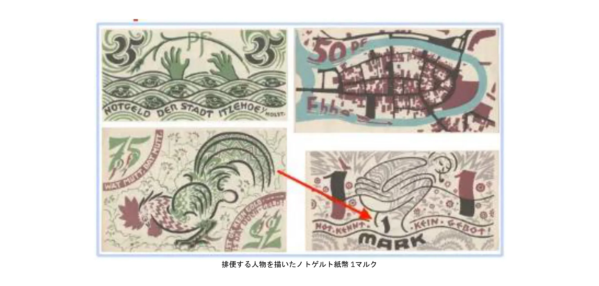

> "しなければならないことは、しなければならない" - 地元のことわざ

ノトゲルトの中で、ひときわ目を引く紙幣がある。中央にはマークが排泄されている痛ましいイラストが描かれている。裏面には、1913年から1921年までの物価表があり、この時期のインフレの高まりを物語っている。

このノットゲルトの作者は、ハイパーインフレ危機を引き起こした当局を皮肉ったようだ。紙幣には「必要性に法はない」と刻まれている。このノットゲルトの発祥の地特有のもう一つの表現は、"為さねばならぬことは、為さねばならぬ "である。

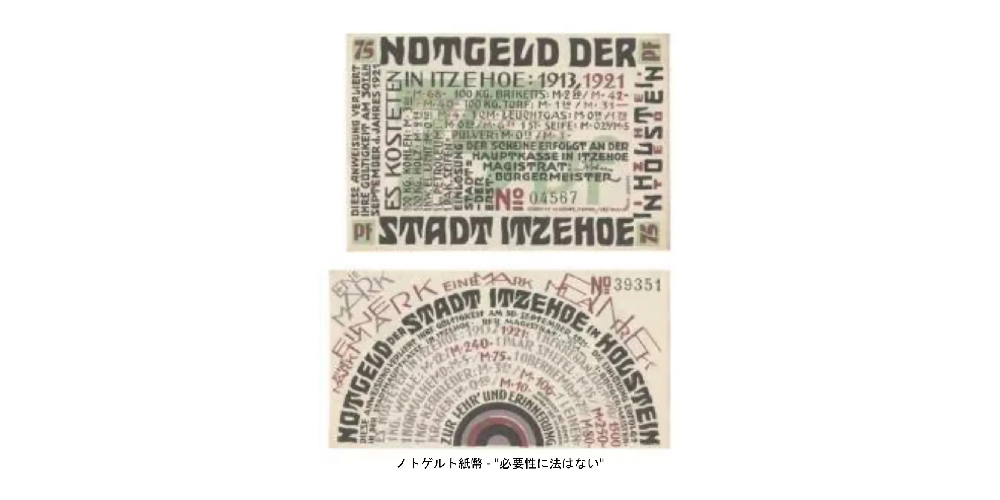

> "必然は法則を知らない"

> 最初のクソコイン：中央の紙幣のイラストを見ると、個人の行動によって通貨が文字通り切り下げられるという逸話があるが、これは最初の "クソコイン "と言えるかもしれない。

#### 3.債券および抵当権

ワイマールでは、インフレの影響を補うために債務の一部が再評価された。この措置はジンバブエでは採用されなかった。

> ワイマール：「1925年に政府所有の貸付金を再評価する決定が法律で定められ、その結果、すべての賠償金が支払われていることを条件に、株主は当初の投資額の2.5％を受け取ることになった」。

> ジンバブエ：「2007年7月（それから3年後）、私は切り下げられた50万ZDW（バーツ "000"）の紙幣をポケットから取り出すことができたが、それは現在、並行市場レートで1.67ドルの価値があり、20年かけて返済することになっていた住宅ローンを返済することができた。しかもこの手形は、同月の月給のわずか0.49パーセントにすぎなかった。"

ドイツの危機管理について知るには、この本も欠かせない。

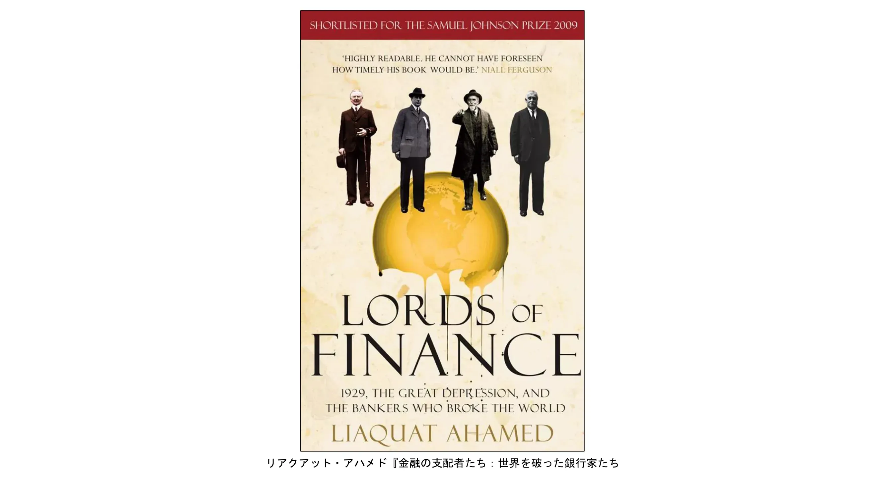

### 現代の類似点

#### 1.経済をコントロールするための金融政策の操作。

ワイマール共和国の歴史を振り返ると、実業家たちはマルクの価値が上がるのを嫌った。大幅に下落した通貨で借金をし、返済することができるため、彼らにかなりのメリットがあった。この仕組みによって、ほとんどコストをかけずに巨大な工業団地を建設することができた。こうした実業家たちは、マルク高が彼らの活動の妨げになることを恐れた。中には、インフレの蔓延が国民の雇用を保証すると考え、インフレを肯定的に捉える者さえいた。しかし、彼らはこのインフレが貯蓄や経済全体に及ぼす悪影響には気づいていなかった。これらの経済主体にとって、通貨増刷は恵みであった。

> ワイマール：「このため、マルクの値上がりが非常に恐れられ、ジェノヴァの後の数週間の "安定 "でさえ、ビジネスの停滞を招いた。

> ワイマール：「産業界は、現金の価値が商品よりも高くなり、誰もが資産を現金に換えようとしたときに崩壊が起こるという危険に直面した。

クリスティン・ラガルドの発言は、市民が貯蓄の保護よりも雇用の見通しを優先すべきことを示唆している。ワイマールの実業家たちと同じように、彼女は貯蓄の価値を犠牲にして、雇用を刺激する手段として通貨増刷を提唱しているようだ。

> クリスティーヌ・ラガルド：「貯蓄が保護されることよりも、仕事があることの方が幸せなはずです」。

#### 2.紛争時の私有財産

ワイマール共和国の歴史を紐解くと、この時期、海外に保有する資産や資本が没収されていたことがわかる。この措置は、ロシアにおける最近の出来事、特に紛争が始まったときの出来事を思い起こさせる。これらの状況は、危機の時代には私有財産の尊重が損なわれかねないという、懸念すべき現実を浮き彫りにしている。これは、危機が個人の権利に及ぼす潜在的な影響を強調する、歴史的かつ現代的な類似点である。

> ワイマール：「外国にあるドイツ資本はすべて没収された。

> [20minutes.fr](https://www.20minutes.fr/monde/3286947-20220513-guerre-ukraine-geler-avoirs-russes-vol-non-redistribuer-kiev-poserait-lourdes-questions)："ロシア中央銀行が保有する約6,400億ドルの外貨準備のうち、約3,000億ドルが欧米の制裁措置の一環として凍結された。"

#### 3.市場価格という概念

ワイマール共和国時代、農民たちは毎年生産される小麦のうち最初の200万トンを納入することを強制する「ウムラージ」に不満を表明した。この規制の結果、パンSupply全体の半分が補助金付き価格で市場に出回ることになった。8月以降、これらの農家には世界市場価格が支払われることになっていた。というのも、彼らは小麦を値下げして引き渡すことを余儀なくされたとはいえ、世界市場価格で肥料を購入しなければならなかったからである。

この状況は、ハイパーインフレ下における市場価格の概念に関する中心的な問題を提起している。当時のドイツの状況下では、農民は小麦をその価値を下回る価格で売ることを余儀なくされ、一方で肥料は世界市場で調達しなければならなかった。このような経済的矛盾は、今日の食料価格がもたらす課題を浮き彫りにしている。農業生産者は、インフレによる投入コストの上昇に直面し、そのコストを最終製品に転嫁している。この上昇を批判することは、市場価格の力学と彼らが直面する経済的圧力を無視することになる。高いコストをかけながら人為的に安い価格で販売することは、どのようなビジネスにとっても持続不可能である。

> ワイマール：「農業関係者は『ウムラージ』（毎年生産される最初の200万トンの小麦の強制引き渡し）に不満を抱いていた。8月からは、農民には世界市場価格が支払われることになった。なぜなら、農民は小麦を低価格で売る義務がある一方で、肥料代は常に世界市場価格を支払わなければならなかったからである"

#### 4.マネーSupplyとインフレの関連性の否定

> ワイマール：「彼は、Supplyは物価水準にもExchangeのレートにも関係しないという見解に固執し続けた。

前章の、インフレを正当化するためにさまざまな経済学者や経済研究機関が提示した説明のリストの例に見られるように、現代においてもこの傾向は続いている。これらの理由はさまざまで、テイラー・スウィフト、ゼルダ、ビヨンセのような文化的な出来事や有名人から、戦争やパンデミックのような世界的な要因まである。これらすべての理由は、短期的な景気変動に寄与する可能性はあるものの、真の根本原因であるマネーSupplyの拡大から注意をそらしている。

#### 5.ゾンビ企業

> ワイマール：「安定化によって、企業家が他のすべての人の犠牲の上に好きなだけ借金をすることができた時代は終わった。金融が潤沢であった時代に設立されたり拡大されたりした非常に多くの企業が、資本が不足するとたちまち非生産的になった。"

ゾンビ企業とは、通常の市場環境であれば債務超過か倒産寸前であるにもかかわらず、主に低コストの借り入れのおかげで経営を続けている企業のことである。このような企業は、負債をカバーするのに十分な収入を得ているが、大きく成長することはできない。

ゾンビ企業という概念は新しいものではない。実際、ワイマール共和国時代にも存在した。当時、多くの企業が自由な信用供与の恩恵を受けて繁栄しているように見えた。当時、多くの企業が隆盛を極めていたように見えたが、それは自由な信用供与の恩恵を受けていたためである。しかし、インフレが止まり、ドイツ・マルクの価値が回復すると、経営的にも財務的にも真に存続可能でなかったこれらの企業は採算がとれなくなり、閉鎖せざるを得なくなった。

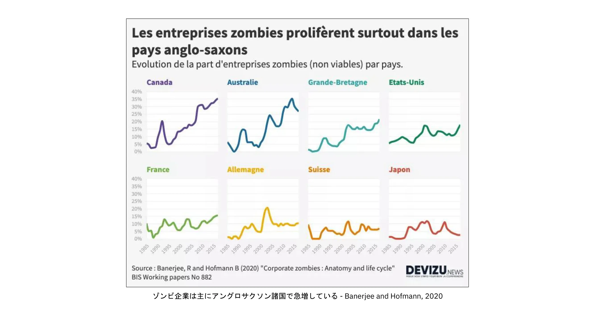

ゾンビ企業の現象は戦後ドイツに限ったことではない。今日でも、多くの大企業が繁栄を続けているのは、極端な低金利で特権的に融資を受けられるからである。もし通常の金利で借り入れをしなければならなくなれば、その多くは利益を上げられなくなるだろう。このことは、ゼロ金利に近い状態が長く続いた後、金利が上昇に転じた2023年においては特に重要である。この金融情勢の変化は、かつて "ゾンビ "のレッテルを貼られたこれらの企業にとって、間違いなく決定的な試練となるだろう。

#### 6.一攫千金！

歴史を紐解くと、ワイマールやジンバブエのように、裁定取引によって個人が富を急速に蓄積しようとした例がある。今日、ある種の暗号通貨の台頭にも同様の傾向が見られる。人々は手っ取り早い利益に誘惑され、投資額の指数関数的な増加を期待してリスクを取る。このようなアプローチは、ハイパーインフレの時代に見られた、裁定取引によってしばしば他人を犠牲にして迅速に利益を得る方法を思い起こさせる。

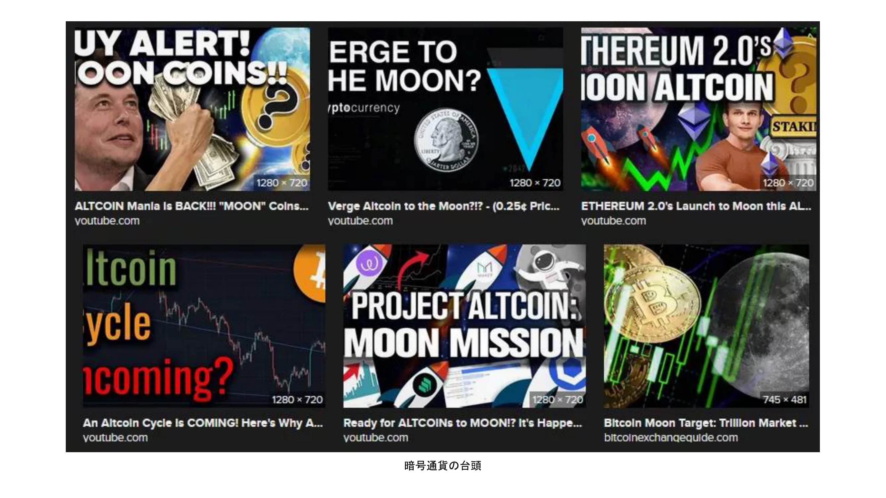

#### 7.貯蓄、不確実性への救済策

> 資本と所得の価値が絶えず低下し、将来に対する不確実性が蔓延し、破壊的な影響を及ぼしている。

資本価値の低下が社会的結束に与える破壊的な影響と、それが生み出す不確実性を強調する引用は注目に値する。それは次のようなものだ：「資本と所得の価値の絶え間ない浸食と、将来に対する不確実性がもたらす、広範かつ破壊的な影響」。

家族や愛する人を守りたいというシナリオを想像してみてほしい。あなたはHardに働き、将来の不確実性を見越して貯蓄をする。すべてが予測可能であったなら、貯蓄は役に立たないだろう。しかし、車の故障など不測の事態に直面したとき、貯蓄は命綱となる。世の中の不確実性を減らしてくれるのだ。しかし、ハイパーインフレ下では貯蓄は困難になる。お金はすぐに価値を失い、長期的な計画を立てることが難しくなる。このような経済的不安定は、generateのストレスと不安につながる。

貯蓄力が低下している今日、投資がその役割を担っている。しかし、この方法にはそれなりのリスクが伴う。貯蓄は常に不安に対する救済策であった。不測の事態に対応できる蓄えがあることは、安心感につながり、社会の結束を強める。結論として、貯蓄力を守ることは、社会と個人の安定を維持するために不可欠である。

## ラテンアメリカの再宣教

<chapterId>918eafd7-409d-5205-ad52-a52e63b23a64</chapterId>

次に、ラテンアメリカ諸国におけるリデノミのさまざまな時期を見てみよう。

### グラフの説明

スライドの左側には、リデノミが行われた年、新通貨の名称、旧通貨とのExchangeレートが示されている。アルゼンチンを例にとると、ペソ・モネダ・ナシオナルは旧通貨であるペソ・レアルから25対1のレートで換算された。そこで、アルゼンチン通貨の経年変化を検証する。さらに、各時代の銀行券の最初と最後のデノミネーションを示す。

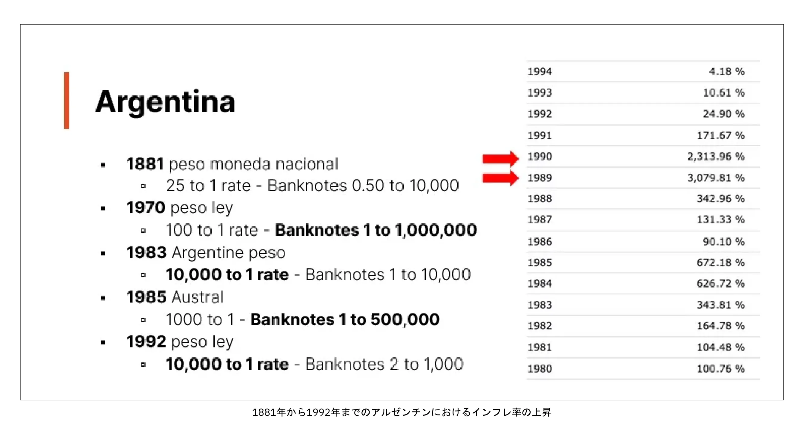

スライドの右側にはインフレ率のグラフが表示されている。赤い矢印はハイパーインフレの年であり、ケーガンの基準ではインフレ率が月50％である。この基準では、インフレ率が高い年はハイパーインフレの厳密な定義に当てはまらないこともあり、解釈が曖昧になることがある。

インフレ時に政府がとる一般的な措置であるリデノミネーションは注目に値する。しかし、これはインフレやハイパーインフレの根本的な問題を解決するものではない。ハイパーインフレの根本原因であるマネーSupplyの膨張に真に対処することなく、通貨の名称を変更し、ゼロを取り除く方法に過ぎないのだ。後のビデオでは、Addressの真の解決策とハイパーインフレの問題を解決する方法について説明する。このシリーズでは、十分な改革を伴わない単純な通貨再交換の結果、インフレが持続することを強調する。

アルゼンチンの後は、ブラジル、ボリビア、ペルー、ニカラグア、ベネズエラを取り上げる。これらの国々で行われた再宣教を検証する。

### アルゼンチン

1826年以前、アルゼンチンはスペイン・ドルを使用していた。1816年の独立後、スペインのレアルに基づく独自の通貨を導入した結果、同様の通貨が誕生した。この表は、10,000までの紙幣が使用可能な「ペソ・モネダ・ナシオナル」が導入された1881年から始まっている。続いて「ペソ・レイ」が導入され、100対1のレートで交換され、100万枚までの紙幣が発行された。その後、「アルゼンチン・ペソ」が登場し、Exchangeのレートは10,000対1（ゼロを4つ取り除いたのと同じ）、紙幣は10,000枚までとなった。1985年には「アウストラレス」が導入され、1,000対1のレートで交換され、紙幣は500,000まで用意された。1992年、現在の「ペソ・レイ」が10,000対1のレートで制定され、再び4つのゼロが取り除かれた。ハイパーインフレに見舞われたのは1989年と1990年のみである。

### ブラジル

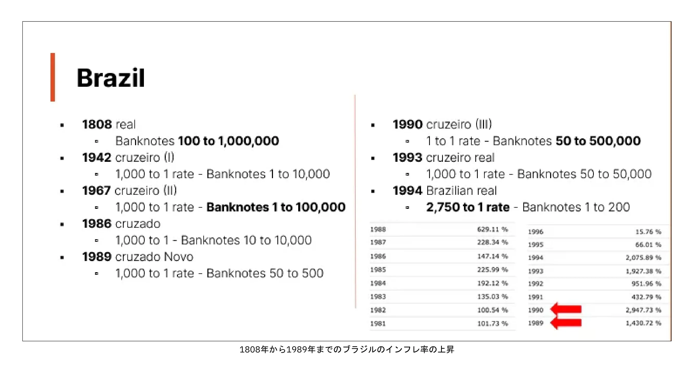

ブラジルは、通貨変更の歴史が物語るように、通貨リデノミネーションの顕著な例である。独立前のブラジルは、ポルトガルのレアルを通貨として使用していた。しかし、1822年に独立を宣言するはるか以前、1747年には独自の「ブラジル・レアル」を使い始めている。この表は、ブラジル紙幣の発行が始まった1818年から始まっている。それまでの通貨は主に硬貨であった。これらの銀行券の価値は最高100万レアルに達した。

1942年以降、ブラジルは一連の通貨交換を開始した。ほとんどの場合（1942年、1967年、1986年、1989年、1993年）、交換レートは1:1,000であった。1990年には、換算なしで名称変更が行われた。これらの通貨の変遷は以下の通りである：

- 1942年まではレアル（旧版）。
- 1942年、クルゼイロス。
- 1967年、クルゼイロス（新バージョン）。
- 1986年のクルサドス。
- 1989年、クルサドス・ノボス。
- 1990年、クルゼイロスに戻る。
- 1993年、クルゼイロス・レアス。
- そして1994年、ついにブラジルが復活した。

1989年と1990年はハイパーインフレに見舞われ、1993年から1994年にかけては、ハイパーインフレの閾値（月50％）には達しないものの、高いインフレ率が見られた。この激動の時期を経て、ブラジルは再びゼロを数個取り除いて通貨を再表記した。

### ボリビア

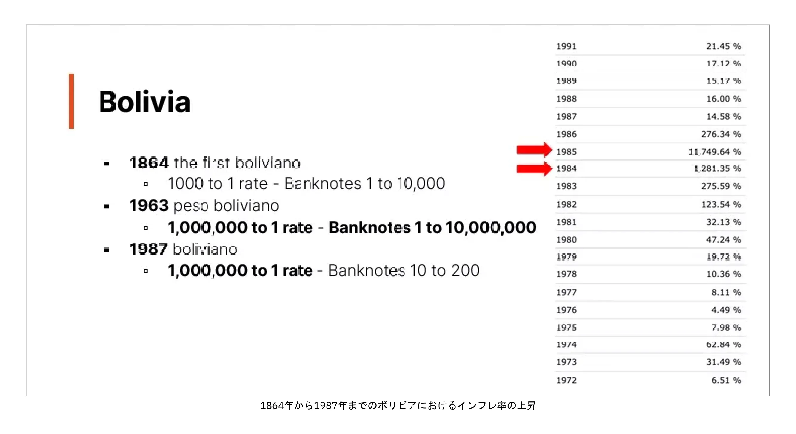

ボリビアもまた、急激なインフレに見舞われ、通貨の再交換を余儀なくされた国の一例である。以下はその通貨史の要約である：

1825年の独立以前、ボリビアはスペイン・ドルを通貨として使用していた。独立後、1827年から1864年にかけて、スペイン・ドルに代わってボリビア・ソルが導入された。ただし、ボリビアで最初の紙幣が発行されたのは1864年である。

1864年、最初の「ボリビアーノ」が導入され、Exchangeのレートはボリビア・ソルに対して1,000対1だった。この通貨は10,000ボリビアーノになるまで流通した。

その後、ボリビアは通貨を「ボリビア・ペソ」に変更し、激しいハイパーインフレに見舞われた。このインフレのピークは1984年から1985年にかけてで、毎月のインフレ率はしばしばハイパーインフレのしきい値である50％に近づいた。月50％のインフレ率を1年間続けると、年間インフレ率は約12,800％になる。1985年のボリビアの年間インフレ率は11,749%に達し、ほぼ毎月インフレ率が50%に近づくか超えていたことがわかる。

この通貨危機を受けて、1987年、ボリビアは単に「ボリビアーノ」と呼ばれる新通貨を導入し、Exchangeレートで1ボリビアーノ＝100万ボリビアーノとした。このボリビアーノは現在も流通している。

これが、ハイパーインフレと通貨再交換に見舞われたボリビアの波乱に満ちた通貨史の概要である。

### ペルー

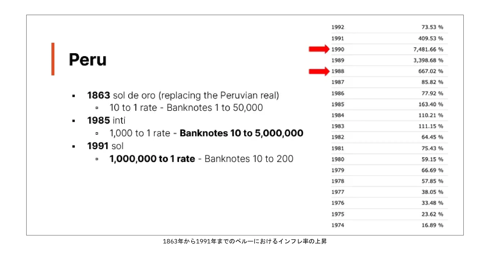

ペルーは、恣意的な50％ルールの影響に関して興味深いケースを提示している。ペルーの通貨史から始めると、ペルーは1821年に独立を宣言する19世紀までスペインの金を使っていた。ペルー・ドルは1822年から1863年まで使用された。1863年、ペルーのレアルはソルディ・オロに代わり、10対1の割合で使用され、最大価値は50,000に達した。1985年、通貨「インティ」が導入され、交換レートは1000対1で、最高値は500万ドルだった。1991年、「SOL」が導入され、Exchangeのレートは100万対1で、紙幣は10～200枚であった。

リデノミの時期を調べると、1988年は特に9月にハイパーインフレに見舞われた年とされている。1990年7月から8月にかけてもハイパーインフレの時期があった。1988年の年間インフレ率は667％で、9月の50％がピークだった。一方、1989年は50％を超える月がなく、インフレ率が3000％に達したため、ハイパーインフレとは分類されなかった。1990年のインフレ率のピークは7481％であった。1988年は1989年とは異なり、ハイパーインフレの年とみなされたのだから、50％ルールが恣意的なものであることは明らかだ。もしこのルールが再考されるなら、1989年にペルーが経験したような時期も含めて、基準値を引き下げるのが賢明かもしれない。

> 何が起きているかを理解する
>

> 通貨のリデノミネーションについて理解しておくべき重要な点は、通貨の価値が500万や1000万といった天文学的な数字に達すると、リデノミネーションが行われるということだ。このプロセスは何度も繰り返され、通貨の変更を伴う。その結果、ハイパーインフレでなくとも、個人の貯蓄に深刻な影響が及ぶ可能性がある。例えば、ある年に1,000ドルを貯蓄し、なんとか100ドルを積み立てたとすると、翌年には最も低い額面の紙幣が1,000ドルになり、それまで貯蓄していた100ドルが無価値になる可能性がある。このような貯蓄の目減りには、明らかなハイパーインフレは必要ない。過去10年間で1万ドルを貯めたとしても、その価値はわずかなものになり、ただの水1本も買えなくなってしまうかもしれない。このような現実は、再通貨を経験した多くの国々で明らかであり、たとえ数ヶ月であってもハイパーインフレに分類された。対照的に、ニカラグアのように何年も連続してハイパーインフレを経験した国もある。

### ニカラグア

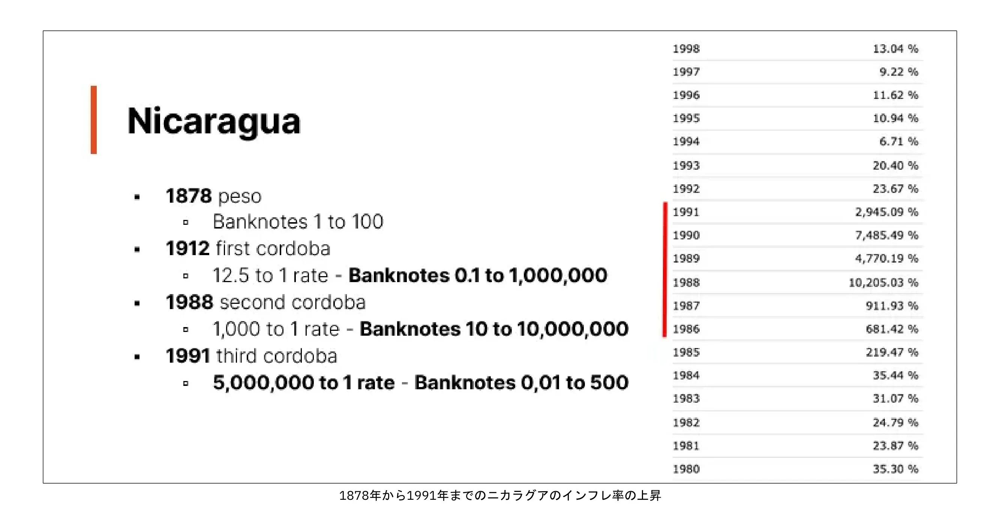

かつてスペインの支配下にあったニカラグアは、スペインによって植民地化された他の多くの国々と同様、当初はスペイン・ドルを使用していた。スペイン帝国、メキシコ帝国、中米連邦共和国に統合された後、ニカラグアは独立を宣言した。1878年からペソがニカラグアの公式通貨となり、1～100の間で変動する。1912年に最初のコルドバが導入され、1988年に2番目のコルドバ、1991年に3番目のコルドバが導入され、現在も使用されている。最初のコルドバは100万ドル、2回目は1,000万ドルだった。1991年の再両替は、数年にわたるハイパーインフレの後に行われた。

### ベネズエラ

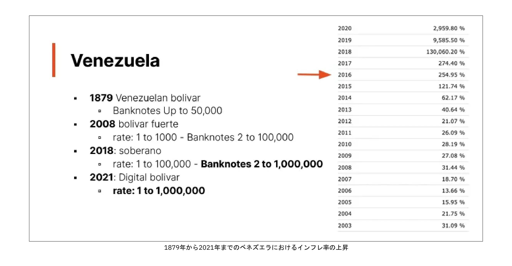

ベネズエラはこのビデオで最後に言及された国である。ベネズエラは、これまで4回の通貨建て替えを経験している。ベネズエラは1811年に独立を宣言するまでは、スペイン・ドルを使用していた。1879年にはボリバルを公式通貨として導入し、1983年に政府がドルを使用する変動相場制（Exchange）を選択するまで有効だった。

ベネズエラの特筆すべき事実は、ラテン通貨同盟に加盟していることである。この連合には、スペインの5ペセタ、ギリシャの5ドラクマ、ベネズエラの5ボリバル、イタリアの5リラ、ベルギーの5フラン、フランスの5フランといった硬貨が含まれていた。

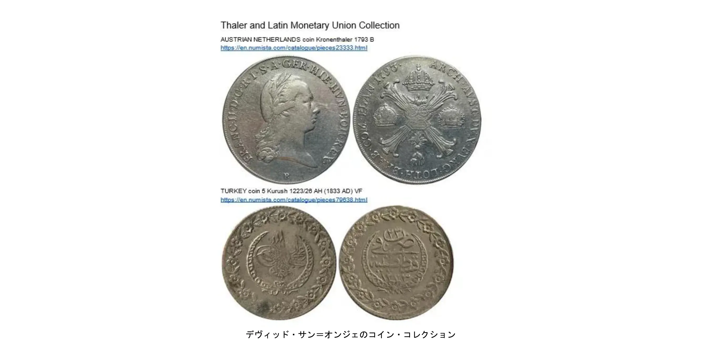

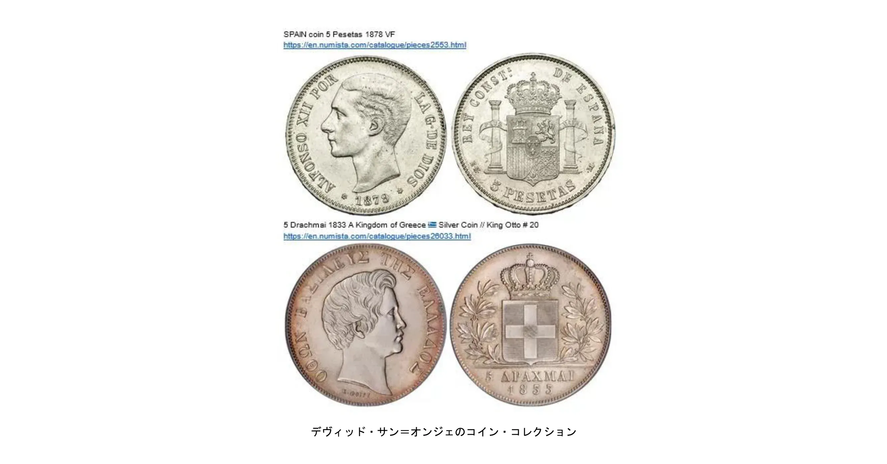

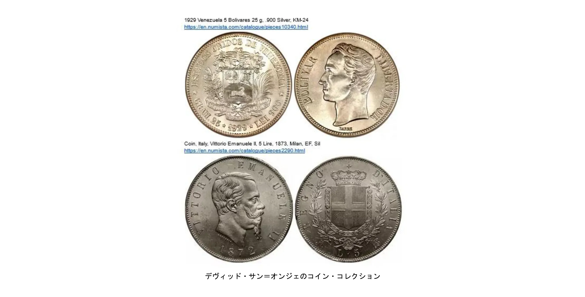

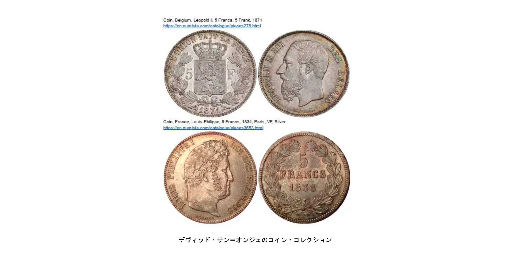

この時期、ベネズエラの5ボリバルCoinは、イタリア、スペイン、ベルギー、フランスなどの連合加盟国のものと同じ重さだった。これらのボリバルは銀製で、1929年のCoinは重さ25グラム、純度900、つまり純銀90%でした。現在の銀価格では、このCoinは約17～18ドル（米ドル）の価値がある。

1983年の変動相場制Exchangeの採用後、数回のリデノミが行われた：

- 2008年には、ボリバル・フエルテ（「強いボリバル」）が導入され、1,000対1の再両替前に最高10万ドルに達した。
- 2018年にはソベラノが導入され、紙幣は100万枚に達した。2021年にはデジタル・ボリバルに取って代わられ、同じく100万に達した後、100万対1の新たな再両替が行われた。現在、10または20紙幣はソベラノで1,000万または2,000万に相当する。

2018年まで遡るこの時期のお札は、ビアリッツ、トロント、マイアミで開催されるさまざまなBitcoin会議で配布される。これらのソベラノ紙幣は最大で100万枚に達した。その後、リデノミネーションが行われ、100万枚の価値は約3セントに減少した。現在、100万ドル札10枚が10セント札1枚に相当する。2016年以降、ベネズエラはハイパーインフレに見舞われており、具体的な表では57期目にあたる。

次のビデオでは、ベネズエラとその他の上場国に焦点を当てたハイパーインフレ紙幣のコレクションを紹介する。このコレクションには、ほぼすべてのベネズエラ紙幣が含まれている。このビデオでは、ベネズエラのお札のほとんどを収録している。さらに、関心の高いジンバブエのリデノミネーションについても調査する。

### 結論

ハイパーインフレだけが経済破局の指標ではないことを見てきた。何度も通貨を切り替えたり、ゼロを取り除いたり、通貨名を変えたりすることは、援助の喪失から食糧問題に至るまで、国民に直接的な影響を及ぼす。ハイパーインフレも気になるが、ブラジルで観察されたようなリデノミの回数は、より複雑な現実を示している。

月50％のインフレという基準に基づけば、いくつかの期間はハイパーインフレに分類される可能性があった。特に国際的な会計機関の基準では、国民による通貨の急速な放棄、賃金の指数化、インフレを補うための高金利での融資といった特徴が考慮される。

結論として、ハイパーインフレは経済的課題の一側面に過ぎない。高インフレだけでも、同じような打撃を受ける可能性がある。次のセクションでは、ハイパーインフレを克服するために可能な解決策を探る。

## ハイパーインフレを克服するには

<chapterId>e3484a31-a851-5f92-8af5-00eddae67db1</chapterId>

### 緩やかで高いインフレを終わらせるには

ここで述べた結論は、ピーター・ベルンホルツの著書『通貨体制とインフレ』から導かれたものである。ベルンホルツによれば、インフレを終わらせる唯一の方法は、金融改革を実施し、政府に財政制限を課すことである。この制限には、政府の政治的決定から独立して運営される中央銀行のような機関の設立が含まれる。高インフレやハイパーインフレは、多くの場合、財政赤字をマネーの創出によって賄った結果である。Addressのインフレを緩やかにするためには、マネーの成長を抑えることが不可欠である。ベルンホルツはまた、このマネーの伸びは近隣諸国との相対的なものであるべきだと提案している。驚くべき点は、高インフレやハイパーインフレの時期には、Supplyの貨幣価値の総額が実際に減少することがあるということである。その顕著な例がジンバブエである。

### 直観に反する解決策

ジンバブエを研究しているとき、10兆単位の貨幣Supplyが価値を失っていることに気づいた。ワイマールでは、650億単位の貨幣Supplyの名目価値の3分の2を1日で印刷することができた。これは、貨幣Supplyがいかに切り下げられるかを示している。この状況を改善するには、貨幣Supplyを大幅に増やし、適切な水準にする必要がある。そのためには金融改革が不可欠である。高インフレの状況では、この改革は避けられないが、十分なマネーの流通を確保しなければならない。このステップの後、政府に制限を課すことができる。

ベルンホルツの観察によれば、インフレ問題に対処する際、IMFや世界銀行のような機関は常に最も効果的な戦略を採用しているわけではない。ある国がマネーSupplyを増やす必要があるとき、これらの機関はそれを減らそうとするケースがある。重要なのは、適切な通貨水準に達した後、その増加に制限をかけることである。

ベルンホルツが提起した興味深い点は、金融改革の成功は、その技術的妥当性だけでなく、国民がその改革に寄せる信頼にも左右されるということである。よく設計された改革でも、国民がそれを信頼しないために失敗するものもあれば、設計が不十分でも、国民がそれを信頼するために成功するものもある。したがって、金融改革の成否には、国民の認識と信頼が不可欠である。

- ジンバブエでは、インフレに対抗するために採用された解決策がドル化であった。この方法によって、政府は自由にお金を印刷することができなくなった。
- ドイツでは、新しい通貨レンテンマルクを作ることで解決した。この通貨は帝国の領土資産に裏打ちされたもので、この戦略は効果的であった。

### ジンバブエのケース

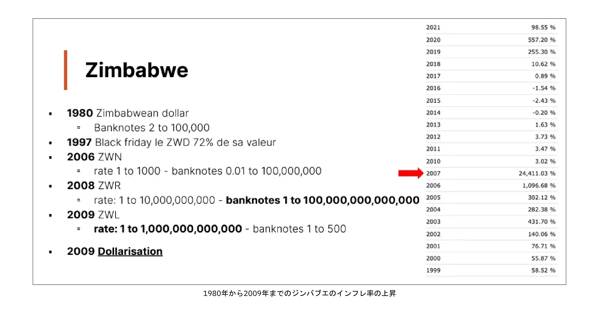

ジンバブエは1980年に独立し、独自の通貨ジンバブエ・ドルを導入した。当初、2ジンバブエ・ドルは約1.60米ドルの価値があった。しかし1997年、退役軍人を優遇する社会的措置に伴い、ブラックフライデーの1日で72％もの通貨切り下げが行われた。その後、2000年代初頭に土地再分配プログラムが開始され、白人所有者から土地を取り上げ、地元住民に分配することになった。この決定は輸出に打撃を与えた。新しい所有者には大規模農場を管理するのに必要な専門知識がないことが多かったからだ。その結果、ジンバブエは1999年には純輸出国であったが、2003年には純輸入国となった。

2006年、同国は1対1,000のExchangeレートで新バージョンの通貨ZWNを導入した。2008年には、Exchangeのレートが1対100億のZWRが導入された。これにより、象徴的な100兆円紙幣が誕生した。

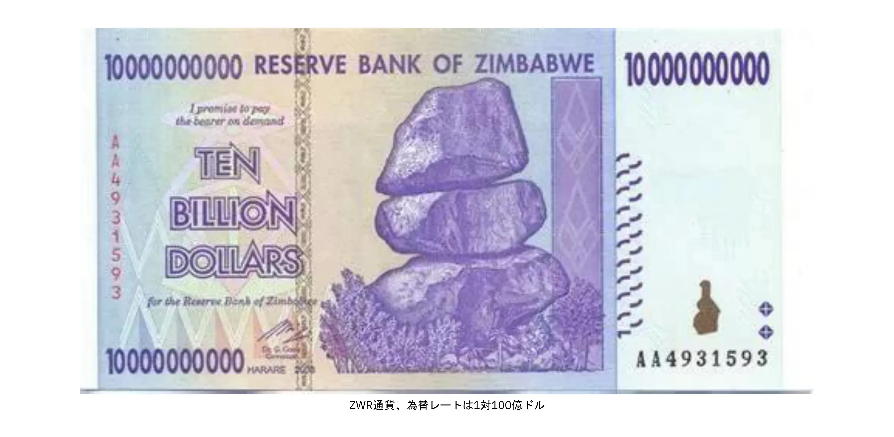

#### ドル化と危機解決

そこで2009年以降、ジンバブエは通貨危機とハイパーインフレの蔓延に直面し、自国通貨を放棄して米ドルを中心とする外貨の使用を認めた。この決定は急進的ではあったが、ハイパーインフレに終止符を打った。学ぶべき重要な教訓は、過剰な通貨発行を止め、中央銀行による財政赤字への融資をやめれば、ハイパーインフレを防ぐことができるということだ。

しかし、ドル化は奇跡的な解決策ではない。ハイパーインフレを終わらせることはできても、経済的には別の課題がある。そのひとつが、自律的な金融政策の喪失である。自国通貨がなければ、国内の経済ショックに対応するために金融政策を調整することはできない。

2007年、ジンバブエのインフレ率は月50％に達し、ハイパーインフレに突入した。2009年のドル化によってハイパーインフレは収まったが、ジンバブエはその後も経済的な課題に直面していた。

ジンバブエはその後、自国通貨の再導入を試みており、高インフレの兆候が再び現れていることが気になる。ある国際機関によれば、まだ月50％という公式の基準値には達していないとしても、すでにハイパーインフレの基準を再び満たしている可能性があるという。これは、過剰な通貨発行と中央銀行の赤字国債発行の危険性を思い起こさせるものである。

### 結論

拙著『Bitcoinのすべて』では、ジンバブエのハイパーインフレについて1章を割いて取り上げた。ジンバブエが最終的にどのようにしてハイパーインフレに終止符を打ったのか、さまざまな事例を挙げながら、重要な出来事を詳しく説明している。

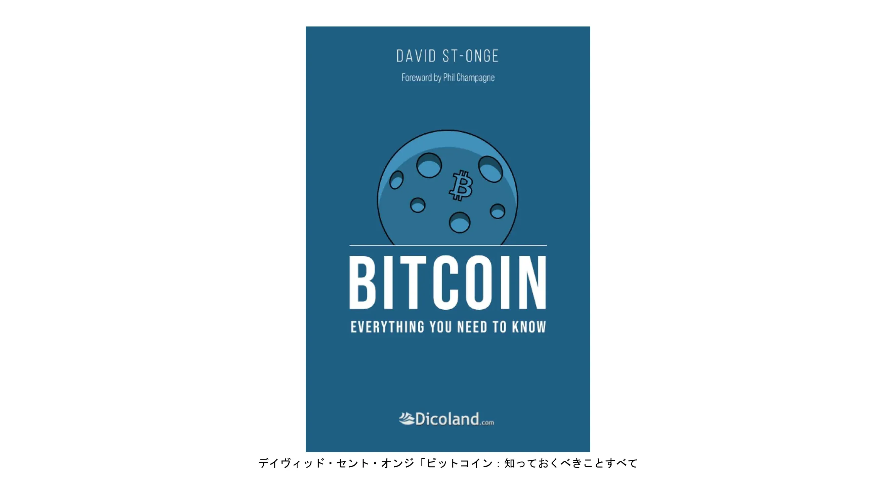

第一次世界大戦後のドイツの経験に興味をお持ちの方には、漫画『帝国の銀行家』をお勧めする。ドイツがいかにしてハイパーインフレを克服したか、特にレンテンマルクの創設を通して語られている。

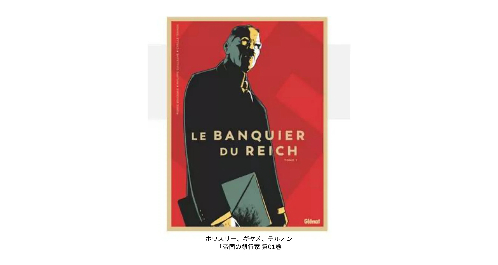

重要なことは、ハイパーインフレを克服するにはいくつかの戦略があるということだ。ドル化を選択することもできるし、新しい通貨を導入することもできる。これらの解決策は、国民が信頼を寄せている場合にのみ有効である。厳しい制約を課すことが重要である。真に独立した中央銀行が不可欠である。政府の赤字を補填するためにSupplyでマネーを膨張させてはならない。軽度のインフレであれば、通貨Supplyの増加を抑えることで十分である。しかし、ハイパーインフレに直面した場合、まず経済規模に見合った適切なマネーSupplyを持つことが重要である。そして、状況を安定させるために、政府に厳しい制約を課すことが不可欠である。

## ハイパーインフレ紙幣コレクションの発表

<chapterId>f3ffbb47-3aeb-54bd-80a9-adccb0f419e2</chapterId>

[スキャンされたコレクションは、*Bitcoin Educational Toolkit*（Plan ₿ Networkプラットフォームの*Resources*セクションからもアクセス可能）(https://penpot.planb.network/#/view?page-id=c157057b-fd28-8042-8004-4f081b21defc&file-id=c157057b-fd28-8042-8004-4f081b21defb&section=interactions&index=0&share-id=7154756b-3ebd-8040-8004-6475c2af5889&interactions-mode=show-on-click)でご覧いただけます。

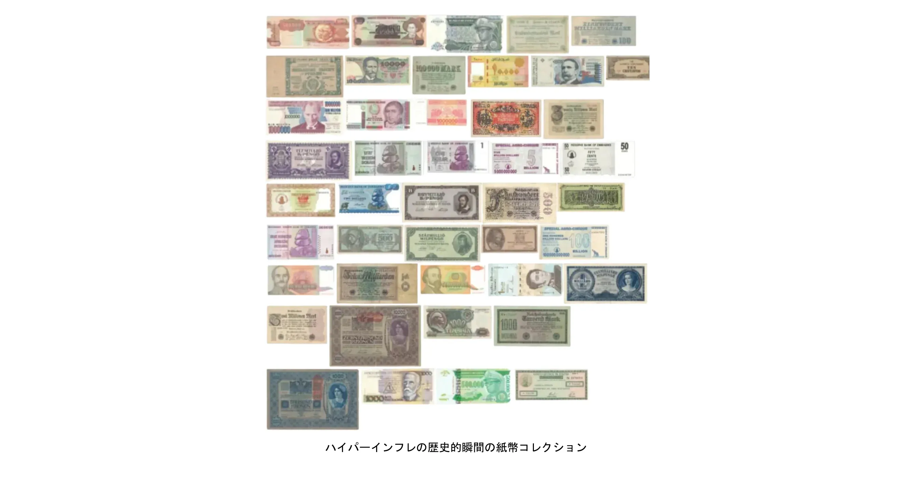

# どうやってここまで来たのか？

<partId>f66ca17e-be9e-5d30-a098-f7affd8962a1</partId>

## マネーと中央銀行の第二次Layerの出現

<chapterId>0455ffe3-9d45-5a67-ac96-3f815dc507a1</chapterId>

トランスクリプト

貨幣の第二のLayerと最初の中央銀行の出現は魅力的なテーマである。このテーマは、ニック・バティア著『レイヤード・マネー』で幅広く論じられている。通貨システムの進化と複雑さに興味のある方には、ぜひお勧めしたい。このセクションの目的は、貨幣創造の起源と、それがハイパーインフレにどのようにつながるかを理解することである。

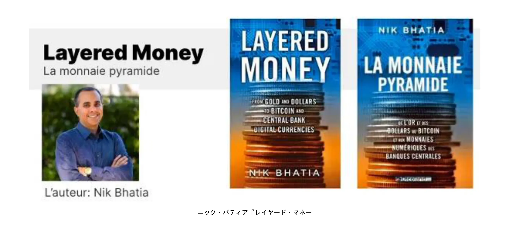

### ピラミッドマネーと中央銀行

#### フローリン

貨幣の歴史は13世紀のイタリア、特にフィレンツェに遡る。当時は、フロリンやExchangeの紙幣が一般的だった。その代表的なものが、洗礼者聖ヨハネの姿をあしらったフロリンである。

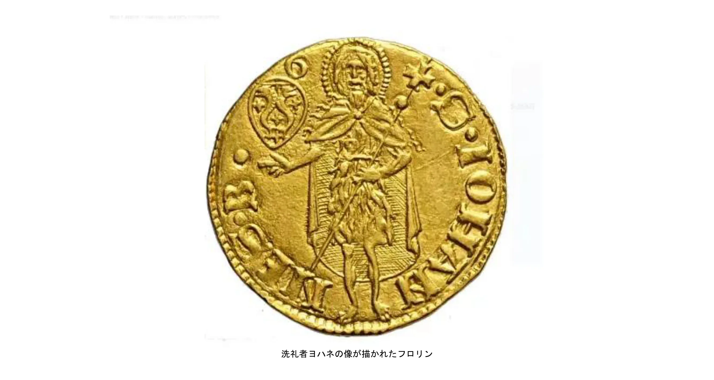

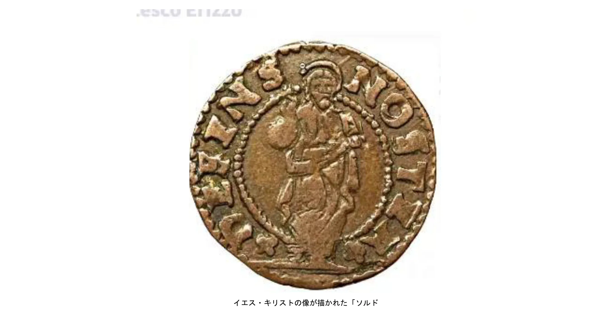

今日、本物のフロリンを所有することは高価であるが、複製品は入手可能である。また、17世紀のイタリア国家のソルドのように、キリスト像が描かれた当時の通貨もある。

#### Exchangeの請求書（13世紀）

当時の一般的な慣習は次のようなものだった。金細工職人は、預けられたフロリンに対してExchangeの手形を発行した。これらのフロリンは金庫に大切に保管された。こうして、フロリンに代表される本物の金が貨幣の第一のLayerを形成し、Exchangeの手形が第二のLayerを形成した。しかし、このシステムの流動性には限界があった。Redeemの金とExchangeのお札を交換したい人がいれば、取引は簡単だった。しかし、このお札を個人間で交換することは一般的ではなかった。

#### アントワープ・ストック Exchange（16世紀）

アントワープ株式Exchangeは、紙幣の進化における重要な節目となった。そこで約束手形の割引が導入されたのである。この約束手形は金銭的価値を表す紙幣であったが、そのユニークさは、名前と満期日が記されている点にあった。そのため、期日前のExchangeは困難だった。

アントワープ株式Exchangeがもたらした革命は、これらの手形を期日前に割引くことが可能になったことにあった。たとえば、約束手形の期限が1ヵ月後だった場合、期限までの期間を考慮して割引価格で購入することが可能になった。この技術革新は、紙幣をよりLiquidに近づけただけでなく、貨幣の時間的価値という概念を導入した。

この概念は、ニック・ベルがツイッターのペンネーム「BTCの時間的価値」を通じて連想させたものではあるが、彼の発明ではない。とはいえ、彼の著作では詳しく論じられている。主な考え方は、時間には価値があるということだ。したがって、誰かが100ドル分の約束手形を1ヶ月前に支払うと決めた場合、例えば98ドルでそれを入手し、支払期日に100ドルを受け取ることができる。この通貨革新はアントワープ株式Exchangeで生まれた。

#### VOCとアムステルダム株式市場（17世紀）

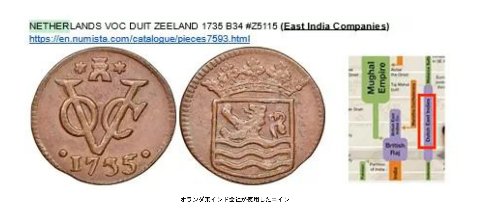

アントワープ株式Exchangeの設立に続く大きな出来事は、VOC（オランダ東インド会社）の設立だった。オランダに本拠を置くこの会社は、独自の通貨まで発行した。VOCの設立後、アムステルダムに最初の株式市場が設立され、同社の株式市場業務が始まった。興味深いのは、オランダが国際経済の中心地としてのアントワープの覇権をいかにして終わらせたかである。彼らは単純にスヘルデ川へのアクセスを遮断したのだ。この戦略は、より大きな歴史的運動である乞食の反乱の一部であった。ヨーロッパ史における重要な出来事である。

#### アムステルダム銀行の介入

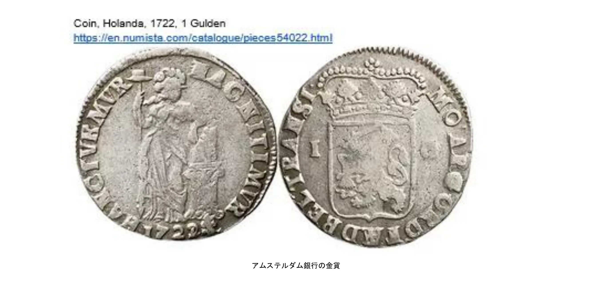

VOCの設立後、貨幣史におけるもうひとつの重要な発展は、アムステルダム銀行による金貨の導入だった。1722年に遡るこのコインは銀製であった。しかし、当時の金融に真に革命をもたらしたのは、Coinそのものよりも、アムステルダム銀行のこの通貨に関連する口座であった。この口座がExchangeの国際的な主要手段となった。取引は単純に台帳に記録された。このシステムのおかげで、アムステルダムは世界経済の中心地となった。やがて、アムステルダム銀行はこれらの口座の使用を強制することを決定した。独立した両替商は、銀行への預け入れのために毎日Exchangeコインを用意することを義務づけられた。

#### 戦費調達のためのイングランド銀行の設立

イングランド銀行の設立の動機は、17世紀末の戦争資金調達の必要性にあった。アムステルダム銀行と同様、法令によって預金を課した。イングランド銀行の特徴は、通貨制度において民間銀行を二次的な地位に追いやり、通貨の「第三のLayer」とでも呼ぶべきものを作り上げたことである。

当初、最初のLayerの通貨は金で表された。民間銀行に預けられた預金は、第二のLayerを形成した。しかし、これらの預金が金に換金できなくなると、第3のLayerが登場した。それ以降、民間銀行が発行する紙幣は金には換えられなくなり、イングランド銀行の紙幣に換えられるようになった。このような進化により、通貨制度は複雑化し、階層が追加された。

#### 1796年のパニック

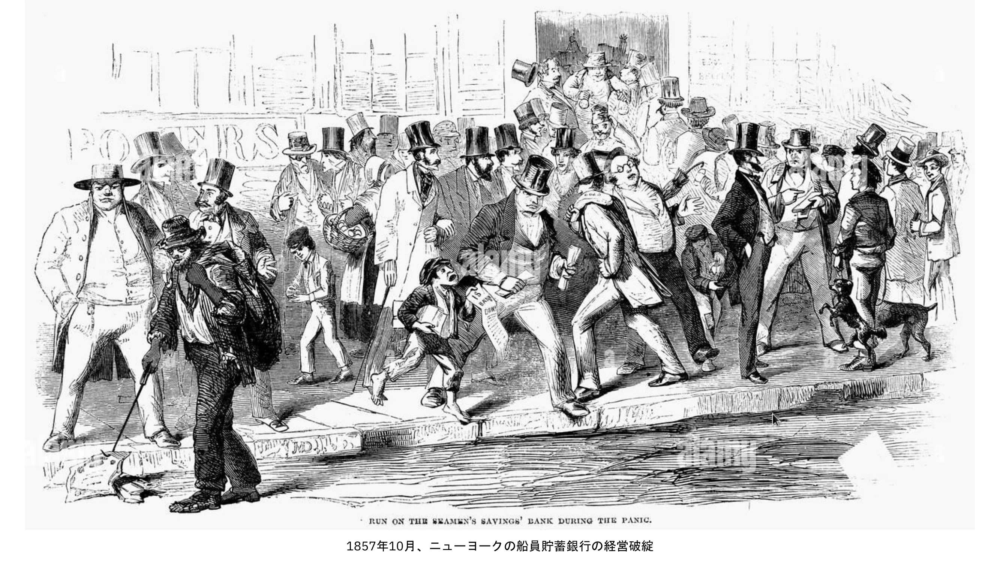

1857年のパニック時、船員貯蓄銀行の銀行パニック。

1796年の銀行パニックの後、誰もが「マネー・ピラミッド」を上昇しようとする現象が起こった。人々は、第三世代通貨（Layer）を第二世代通貨（Layer）に、そして最終的には第一世代通貨（金）に交換しようとした。このような大規模な駆け込み需要に直面したイングランド銀行は、状況を安定させるために行動を起こさざるを得なくなった。金準備のデフレを防ぐため、イングランド銀行は銀行券の金への兌換停止を決定した。この停止措置は、当初は一時的なものであったが、約20年間続いた。

### 結論

中央銀行は、自国通貨の金への兌換を停止し、最後の貸し手となるべく発展してきた。この措置は当初、一時的な解決策として意図されたものだったが、最終的には恒久的なものとなり、最後の貸し手という概念の到来を告げることとなった。この変革が、今日の中央銀行を形作った。しかし、より脆弱な経済においては、無責任に使用された場合、貨幣を自由に印刷するこの能力は、ハイパーインフレのような望ましくない結果につながる可能性がある。

## 書籍とリソース

<chapterId>c44e4519-0741-527b-b3b0-3f513e87147d</chapterId>

ハイパーインフレは、様々な歴史的出来事を通して研究されてきた魅力的なテーマである。このテーマをより深く掘り下げたいのであれば、ここにある10の資料を読んで研究することが不可欠である：

- 「マネーが死ぬとき：ワイマール・ドイツにおける赤字支出、切り下げ、ハイパーインフレの悪夢』（アダム・ファーガソン著）。本書は、第一次世界大戦後のドイツにおけるハイパーインフレの危機について詳述している。

- 「インフレの経済学-戦後ドイツにおける通貨安の研究」コスタンティーノ・ブレッシアーニ＝トゥローニ著。1920年代のドイツのハイパーインフレを詳細に分析。

- 「今回は違う：カーメン・M・ラインハートとケネス・S・ロゴフによる "This Time Is Different: Eight Centuries of Financial Folly "である。本書は様々なタイプの金融危機を扱っているが、歴史を通してハイパーインフレについて深く論じている。

- スティーブ・ハンケ著「ジンバブエのハイパーインフレ、その分析と教訓」。2000年代初頭のジンバブエのハイパーインフレについての研究。

- 「通貨体制とインフレ：ピーター・ベルンホルツ著。本書は、ハイパーインフレの歴史的事例を検証し、その根底にある要因を理解しようとするものである。

- 「ハイパーインフレ・サバイバルガイド：ジェラルド・スワンソン著。企業がハイパーインフレ環境をどのように乗り切るかについての実践的ガイド。

- 「マネーの死：ドイツとアメリカのインフレ危機の比較分析。ドイツとアメリカのインフレ危機の比較分析。

- 「貨幣の没落：ドイツのハイパーインフレと中産階級の破壊」フレデリック・テイラー著。ハイパーインフレがドイツ社会に与えた社会的・経済的影響を叙述的に探る。

- 「発展途上国のための通貨ボード：ハンドブック"（スティーブ・ハンケ、カート・シューラー著）。通貨ボードに焦点を当てているが、本書はハイパーインフレの状況を回避するための視点を提供している。

# 最終節

<partId>cb1f4a4b-556a-4e47-a5cc-136be35a1f9a</partId>

## レビュー＆評価

<chapterId>1a37317e-372a-5241-b478-8316d44f9283</chapterId>

<isCourseReview>true</isCourseReview>

## 最終試験

<chapterId>d01831c3-6c4d-59e3-95bc-03e97a05c142</chapterId>

<isCourseExam>true</isCourseExam>

## 結論

<chapterId>45d410b0-71ed-4502-8d8d-8b6df761db23</chapterId>

<isCourseConclusion>true</isCourseConclusion>