# 경제로의 여정

이 프로그램은 법정화폐가 지배하는 세계에서 하이퍼인플레이션의 출현에 대한 깊은 이해를 제공하고 그 중대한 결과를 검토하는 것을 목표로 합니다. 참가자들은 하이퍼인플레이션의 원인과 유발 요인을 조사하고 과거와 현대의 사례를 제시하면서 하이퍼인플레이션 주기를 자세히 살펴볼 것입니다. 또한 하이퍼인플레이션이 경제와 일상 생활에 미치는 실질적인 영향을 조사하고 통화 가치, 구매력, 개인 및 집단 저축에 미치는 영향을 연구합니다.

역사적으로 초인플레이션이 발생했을 때의 추세와 일반적인 패턴을 살펴보고 초인플레이션 기간 동안 자신을 보호할 수 있는 효과적이고 구체적인 전략을 제시합니다. 참가자들은 다양한 투자 옵션과 금융 방어 메커니즘을 살펴보고 불안정한 경제 환경에서 침착하게 대처할 수 있는 실용적인 도구와 필수 지식을 습득할 수 있는 기회를 갖게 됩니다.

+++

# 소개

<partId>6fe4d15d-f6e6-54be-9e04-0a75ac98df8b</partId>

## 코스 개요

<chapterId>9d1aba8d-0485-5020-9863-5de37e6db8e0</chapterId>

ECO204 과정에 오신 것을 환영합니다!

이 과정의 목표는 법정 화폐 시스템의 맥락에서 하이퍼인플레이션의 근본 원인, 메커니즘, 결과를 이해하는 데 도움을 주는 것입니다. 구체적인 사례와 과거 분석을 통해 하이퍼인플레이션이 발생하기 전에 반복되는 패턴을 인식하고 자신을 보호하기 위한 행동 수단을 파악하는 방법을 배우게 됩니다.

**섹션 2: 인플레이션이란 무엇인가요?

주제의 핵심으로 들어가기 전에 인플레이션이란 무엇인가라는 기본 사항을 다시 한 번 살펴보겠습니다 이 섹션에서는 인플레이션의 화폐적 기원과 다양한 유형의 인플레이션, 그리고 인플레이션이 더 넓은 경제 역학에 어떻게 적용되는지 설명합니다. 이는 일반적인 인플레이션이 어떻게 하이퍼인플레이션으로 발전할 수 있는지 이해하는 데 필수적인 단계입니다.

**섹션 3: 하이퍼인플레이션이란 무엇인가요?

이 섹션에서는 하이퍼인플레이션의 정확한 정의를 알아보고 독일 바이마르와 짐바브웨를 포함한 몇 가지 주요 역사적 에피소드를 살펴봅니다. 두 사건의 공통점과 차이점, 현대적 유사점을 분석할 것입니다. 또한 라틴 아메리카의 연속적인 리디노미네이션과 같은 잘 알려지지 않은 사례와 특정 국가에서 관찰된 출구 전략에 대해서도 알아볼 수 있습니다.

**섹션 4: 어떻게 여기까지 왔습니까?

이 파트에서는 하이퍼인플레이션을 가능하게 하는 구조적 메커니즘, 특히 통화 '제2의 Layer'의 개발과 중앙은행의 역할을 이해하는 것을 목표로 합니다. 더 자세히 알아볼 수 있는 추가 자료와 읽을거리도 제공됩니다.

화폐의 역사가 우리 눈앞에서 반복되고 있다면 어떨까요? 다음 챕터에서 여러분이 직접 판단해 보세요!

# 인플레이션이란 무엇인가요?

<partId>2b4f456c-3649-5cf9-b9b0-a5bffe92d962</partId>

## 화폐 현상

<chapterId>b2cbc915-c4ec-52b5-860c-0958f58c91e4</chapterId>

### 인플레이션의 정의

인플레이션은 다양한 정의와 해석으로 인해 종종 오해를 받는 개념입니다. 인플레이션에 대한 인식은 비트코인 사용자나 전통적인 경제학자 등 다양한 그룹에 따라 다릅니다. 하이퍼인플레이션에 대해 논의하기 전에 먼저 정의를 명확히 해보겠습니다:

- 르 로베르 사전의 정의: 인플레이션은 결제 수단(지폐, 자본)이 과도하게 증가하여 물가가 상승하고 통화가치가 하락하는 현상입니다.

- 라루즈 백과사전의 정의: 인플레이션은 물가 수준의 일반화되고 지속적인 상승을 특징으로 하는 현상입니다. 여기서 "일반화"라는 단어가 중요합니다.

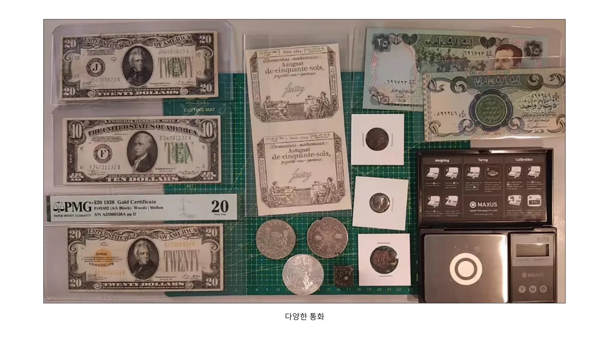

이러한 정의에 비추어 볼 때, 로버트에게 인플레이션은 주로 화폐 Supply의 증가에 관한 것임을 이해하는 것이 중요합니다. 반면에 라루스는 이러한 팽창의 결과, 즉 일반화된 가격 상승에 초점을 맞추고 있습니다.

하이퍼인플레이션에 대한 연구에서는 두 번째 정의, 즉 일반화된 가격 상승이라는 정의를 채택할 것이며, 이는 주제와 더 관련이 있고 명확하기 때문입니다. 그러나 이러한 가격 상승은 일반적으로 통화량 Supply의 확대로 인한 결과라는 점을 기억하는 것이 중요합니다.

저명한 경제학자 밀턴 프리드먼은 다음과 같은 유명한 말을 남겼습니다:

> "인플레이션은 언제 어디서나 일어나는 금전적 현상입니다."

이 정의는 통화 팽창과 인플레이션 사이의 본질적인 관계를 강조합니다. 다음 섹션에서는 이러한 기본 정의를 바탕으로 인플레이션과 경제 성장의 관계를 살펴볼 것입니다.

### 화폐 현상에 대한 이해

통화 현상을 언급할 때는 경제의 통화 Supply가 어떻게 영향을 받는지를 말합니다. 밀턴 프리드먼은 본질적으로 이 Supply의 증가로 보았습니다. 역사적으로 화폐 Supply를 증가시키는 방법에는 크게 두 가지가 있었습니다:

1. 화폐 인쇄:

전통적인 통화 시스템에서는 새 지폐를 물리적으로 인쇄함으로써 화폐 Supply의 증가가 이루어졌습니다. 오늘날 디지털 화폐가 우세한 상황에서 이러한 인쇄는 주로 중앙은행 및 기타 금융 기관의 데이터베이스를 통해 전자적으로 이루어지지만, 역사를 보면 지폐의 문자 그대로 인쇄가 초인플레이션으로 이어졌던 시기도 있었습니다.

2. 금속 함량 감소:

또 다른 방법은 은이나 금과 같은 금속을 기반으로 하는 화폐에서 귀금속의 양을 줄이는 것이었습니다. 눈에 띄는 예는 로마 제국에서 찾을 수 있는데, 처음에는 거의 전부가 은으로 구성된 데나리우스가 시간이 지남에 따라 은 함량이 급격히 감소했습니다. 이는 일종의 인플레이션에 해당하지만 반드시 하이퍼인플레이션은 아니었습니다.

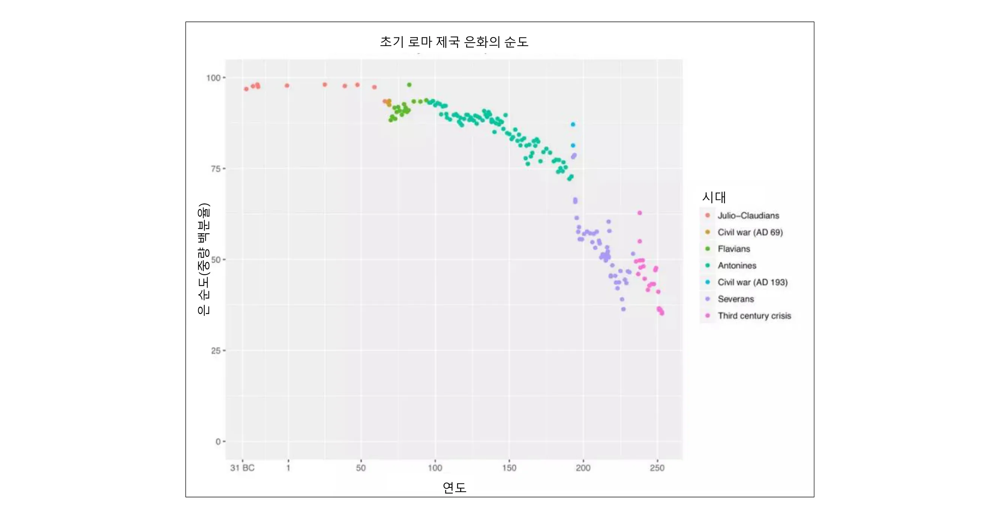

하이퍼인플레이션은 주로 귀금속과 같은 기초 자산이 뒷받침되지 않는 법정화폐에서 관찰된다는 점을 강조하는 것이 중요합니다. 역사적으로 이러한 자산을 기반으로 하는 통화에서 인플레이션(예: 금속 함량의 평가절하)이 발생했지만, 이러한 인플레이션이 하이퍼인플레이션의 극단적인 수준에 도달한 적은 없었습니다. 다음 섹션에서는 화폐 평가절하 기간과 이러한 다양한 화폐 시스템이 인플레이션에 미치는 영향에 대해 자세히 살펴보겠습니다.

### 화폐 평가절하 기간에 대한 연구

역사를 통틀어 다양한 문명에서 화폐 가치가 하락하는 시기를 경험했습니다. 이러한 시기 중 일부는 경제에 압력을 가한 주요 사건이나 전쟁과 일치합니다.

#### 1. 펠로폰네소스 전쟁과 제2차 포에니 전쟁:

아테네와 스파르타 간의 전쟁인 펠로폰네소스 전쟁과 로마 공화국과 카르타고 간의 2차 포에니 전쟁은 기록 보관소에서 발견된 화폐 평가 절하의 가장 초기의 사례입니다. 이 문명들은 전쟁 자금을 조달하기 위해 은 함량을 줄이고 다른 금속을 혼합하는 동시에 주화 생산량을 늘려 화폐 가치를 떨어뜨렸습니다.

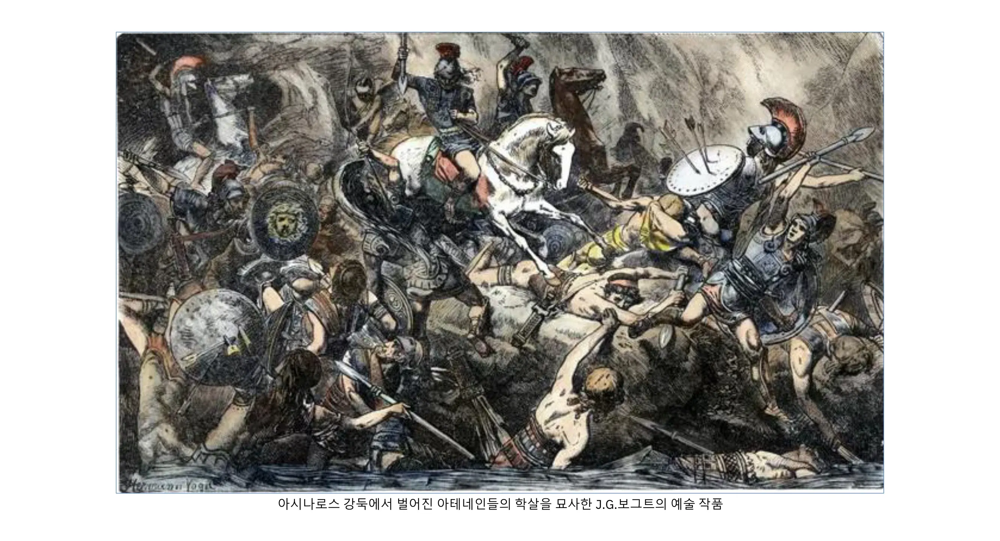

아시나로스 강둑에서 아테네인 학살을 묘사한 판화.

#### 2. 제국 시대의 고대 로마:

로마 공화국 시대 이후 제국 시대인 3세기와 4세기에는 상당한 화폐 가치 하락이 있었습니다. 이는 이전 그래프에서 볼 수 있듯이 동전의 은 함량이 감소한 것으로 설명할 수 있습니다. 한 연구에 따르면 이집트의 밀 가격은 드라크마로 측정했을 때 기원전 40년부터 서기 360년까지 약 400년 동안 100만 배나 상승한 것으로 나타났습니다. 이 기간 동안 연평균 인플레이션은 약 4.4%에 달합니다. 그러나 이러한 인플레이션은 고르게 분포되지 않았습니다. 실제로 인플레이션은 서기 238년경부터 시작되었습니다. 서기 250년에서 293년 사이의 인플레이션율은 약 3.65%였으며, 서기 293년에서 301년 사이에는 22.28%로 증가했습니다.

이 시기에는 상당한 인플레이션이 발생했지만 현대의 일부 상황에서 관찰되는 초인플레이션 수준에는 미치지 못했습니다. 그 이유는 통화가 평가절하되었지만 여전히 귀금속으로 뒷받침되었기 때문입니다. 이러한 견고한 기반 덕분에 극심한 인플레이션에 어느 정도 대비할 수 있었습니다. 다음 섹션에서는 하이퍼인플레이션의 본질과 그 결과에 대해 자세히 살펴보겠습니다.

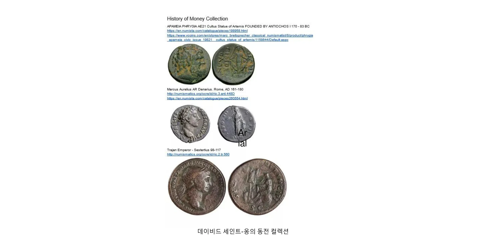

- 마르쿠스 아우렐리우스의 데나리우스(서기 160년):

고대 로마의 가장 상징적인 주화 중 하나는 은화 Coin인 데나리우스입니다. 저는 대대적인 평가절하가 이루어지기 전인 서기 160년경 마르쿠스 아우렐리우스가 만든 특정 Coin를 소장하고 있습니다. 카메라가 미세한 디테일을 포착하는 데 어려움을 겪을 수 있지만 육안으로 볼 때 Coin는 아름답고 은 함량이 상대적으로 높다는 것을 알 수 있습니다.

- 안토니누스 시대(서기 3세기 후반):

화폐 평가 절하와 함께 새로운 화폐인 안토니누스가 등장했습니다. 이 화폐는 2데나리온의 가치가 있어야 했지만 은이 훨씬 적게 함유되어 있었습니다. 제 안토니누스 Coin는 은 함량이 현저히 줄었음을 분명히 보여줍니다. 이 시대 로마 동전의 전형적인 "방사"라고 불리는 왕관으로 장식되어 있습니다. 색상과 품질을 비교하면 안토니누스 Coin가 순은 Coin와는 거리가 멀다는 것을 알 수 있습니다.

두 동전을 나란히 비교해보면 그 차이가 확연히 드러납니다. 서기 160년의 데나리우스는 은빛이 뚜렷한 반면, 서기 3세기 후반의 안토니누스는 훨씬 더 칙칙하여 은 함량이 현저히 감소했음을 나타냅니다. 이 시각적 비교를 통해 고대 로마가 몇 세기에 걸쳐 겪은 화폐의 평가 절하를 명확하게 알 수 있습니다.

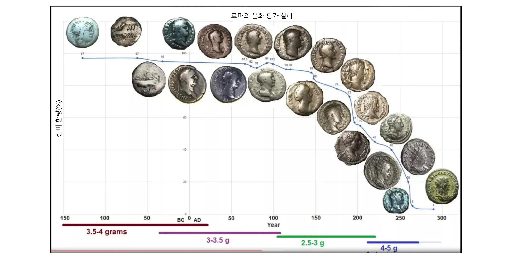

이 데모를 완료하려면 시간에 따른 동전의 평가 절하를 보여주는 그래프가 이상적입니다. 이 플랫폼을 통해 시각화하기는 어렵지만, 데나리우스의 가치가 2세기 말에 2데나리우스의 가치가 있지만 은 함량이 현저히 낮은 안토니누스로 대체된 후 하락하는 그래프를 상상해 보세요. 이 유물들은 과거 문명의 경제적 변동을 보여주는 침묵의 증인입니다.

#### 3. 스페인 마라베디: 표적 평가 절하의 목격자

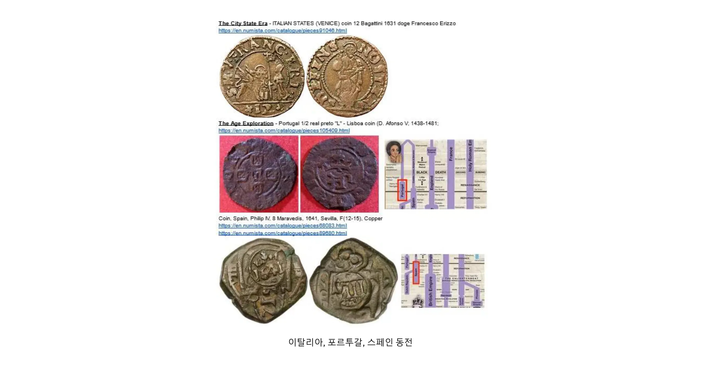

구리 화폐인 마라베디는 스페인 화폐 역사에서 특별한 위치를 차지하고 있습니다. 앞서 언급했듯이 스페인 달러는 원래 국제 표준이자 스페인의 필수 준비 통화였습니다. 그러나 특정 경제적 어려움에 직면한 스페인은 영리한 통화 전략에 의지해야 했습니다.

통화 평가절하는 국가가 지출을 조달하거나 경제를 활성화하기 위해 자주 사용하는 도구입니다. 하지만 스페인은 미묘한 상황에 처해 있었습니다. 스페인 달러를 희석하면 국제 무역에서 스페인의 입지가 약화될 수 있었기 때문입니다. 이러한 딜레마를 극복하기 위해 스페인은 마라베디를 선택했습니다.

귀중한 스페인 은화와 달리 마라베디는 주로 지역 주민들 사이에서 사용되는 구리 화폐였습니다. 이 화폐는 평가 절하의 대상이었습니다. 처음에 2마라베디의 가치가 있던 마라베디스 Coin의 경우, 국가는 이를 회수하여 새로운 가치(예: '4')로 다시 도장을 찍고 소유자에게 한 개의 Coin만 돌려주었습니다. '8'이라는 스탬프가 찍힌 Coin은 이 과정에서 여러 차례 평가절하를 거쳤다는 증거입니다.

이 전략을 통해 스페인 정부는 통화의 가치를 효과적으로 평가절하하여 인플레이션을 유발하고 간접적으로 국가에 자금을 조달하는 동시에 국제 무대에서 스페인 달러의 무결성을 유지할 수 있었습니다. 그러나 이러한 목표에 따른 평가 절하는 현지 주민들에게도 영향을 미쳤는데, 이들은 자국 화폐의 가치가 희석되는 것을 목격했습니다.

마라베디스 사례는 한 국가가 내부 경제 수요를 충족하기 위해 자국 통화의 가치를 선택적으로 평가절하하면서도 글로벌 무대에서는 기축통화의 가치를 보존할 수 있는 방법을 보여줍니다. 이는 역사상 통화 정책의 복잡성과 정교함을 보여주는 놀라운 사례입니다.

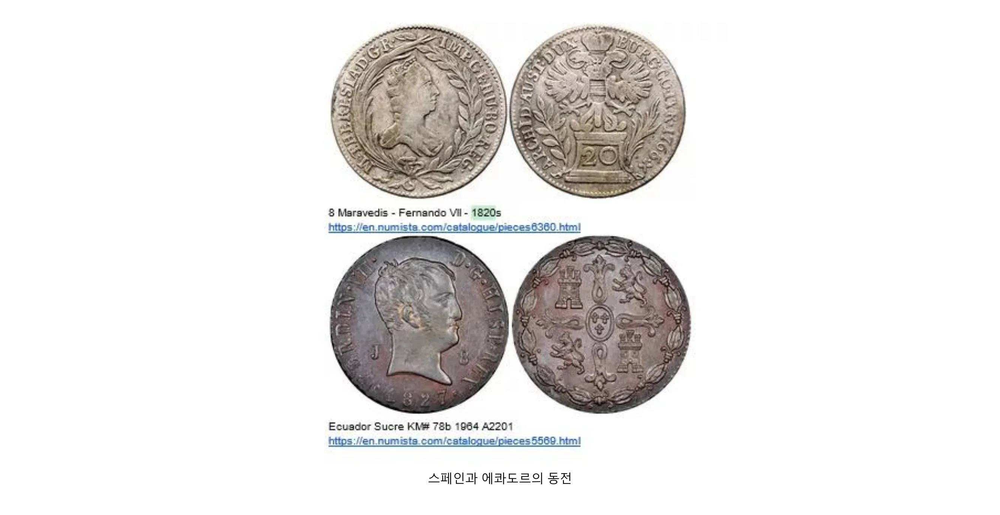

더 자세히 알고 싶으신가요? -> [링크](https://docs.google.com/document/d/1aZa7gvz1nt8ZHDCoWKQdS9RGGjBHdipH1ApC8dW1xpM/edit?usp=sharing)

#### 4. 15세기부터 17세기까지의 가격 혁명

15세기에서 17세기 사이에 유럽은 흔히 "가격 혁명"이라고 불리는 놀라운 경제 현상을 목격했습니다 이 인플레이션 시기는 주로 아메리카 대륙에서 귀금속, 특히 금과 은이 대량으로 유입되면서 촉발되었습니다. 당시 유럽 경제는 대부분 금본위제를 기반으로 하고 있었기 때문에 귀금속의 추가 공급은 통화량을 증가시켰습니다. 그 결과 연간 약 1~2%의 인플레이션이 발생했습니다. 언뜻 보기에는 이 인플레이션이 크지 않은 것처럼 보일 수 있습니다. 그러나 당시에는 이러한 가격 변동이 "혁명"으로 간주될 만큼 이례적이었습니다 이는 통화 보유량의 변화가 전체 경제 시스템에 어떤 영향을 미칠 수 있는지를 잘 보여줍니다.

#### 5. 존 로와 어시그나트

18세기 프랑스 경제사는 화폐와 관련된 두 가지 중요한 사건으로 특징지어집니다. 첫째, 스코틀랜드의 경제학자이자 금융가였던 존 로는 프랑스 정부를 설득하여 지폐를 기반으로 하는 통화 시스템을 도입했습니다. 처음에는 프랑스의 재정 문제에 대한 혁신적인 해결책으로 여겨졌지만, 이 이니셔티브는 곧 인플레이션을 만연하게 만들었습니다. 그 후 얼마 지나지 않아 프랑스 혁명의 혼란 속에서 정부는 '아싸그나트'를 도입했습니다.

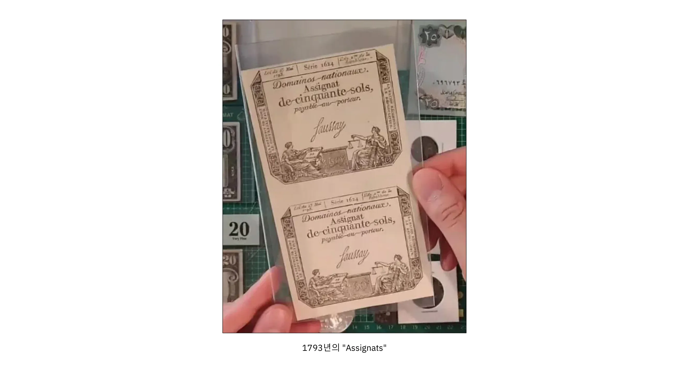

1793년부터 할당

이 지폐는 역사상 최초의 주요 초인플레이션 시기를 보여주는 살아있는 증거입니다. 처음에는 연이은 금융 위기에 대한 대응책으로 고안된 지폐는 금세 통화 불안정의 상징이 되었습니다. 정부는 이 지폐에 과도하게 의존하여 경비를 조달했고, 이는 전례 없는 경제 위기를 초래하여 혁명 이후 프랑스에 대대적인 초인플레이션 시기를 가져왔습니다.

#### 6. 행정명령 6102호와 달러 평가 절하

행정명령 6102호와 달러 평가 절하

미국에서는 1930년대 초에 통화 정책에 큰 변화가 있었습니다. 이 변화에 대한 자세한 개요는 다음과 같습니다:

- 1928년 20달러 지폐

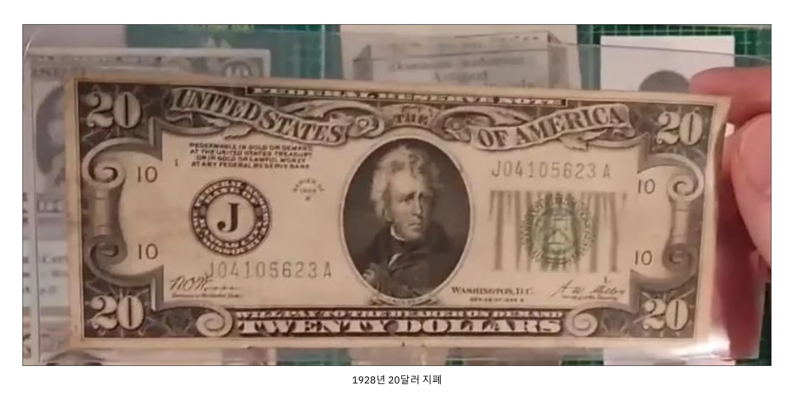

1928년, 미국의 20달러 지폐에는 이렇게 적혀 있었습니다: "필요할 때 금으로 교환 가능." 즉, 각 지폐는 말 그대로 금으로 전환할 수 있었습니다. 구체적으로 20.67달러 지폐는 금 1온스에 해당했습니다.

- 행정 명령 6102

1933년, 행정명령 6102호가 발령되면서 큰 격변이 일어났습니다. 이 법령에 따라 시민들이 금괴, 동전, 증서 등의 형태로 금을 소유하는 것은 불법이 되었습니다.

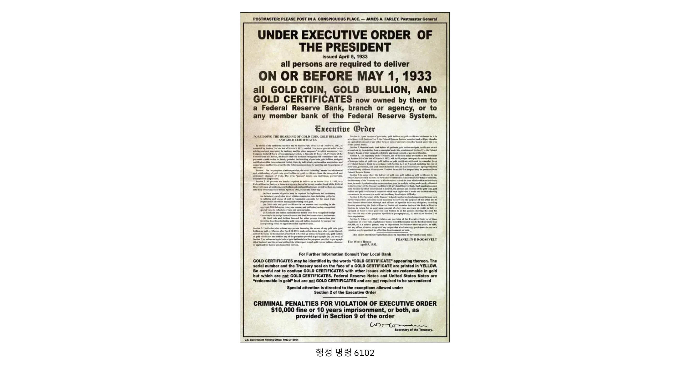

골드 인증서가 좋은 예입니다. 표시가 되어 있습니다: "필요에 따라 소지인에게 지급할 수 있는 금 Coin." 이러한 증서를 소지하는 것은 불법이 되어 1964년까지 유지되었습니다.

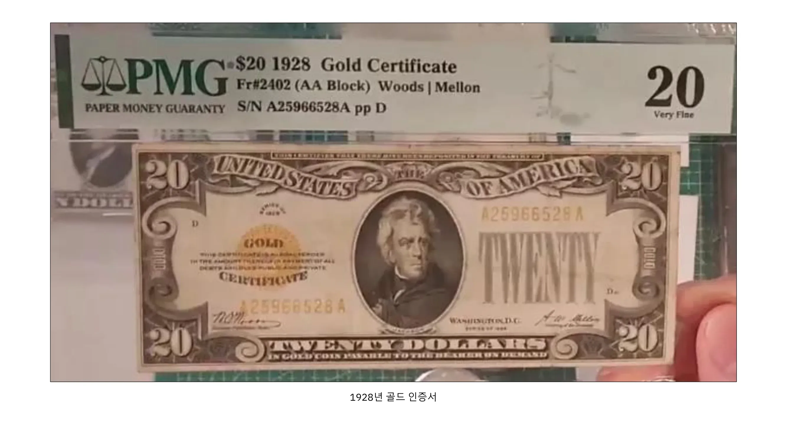

- 새 지폐 소개

1934년 금이 압수된 후 새로운 지폐 시리즈가 유통되기 시작했습니다.

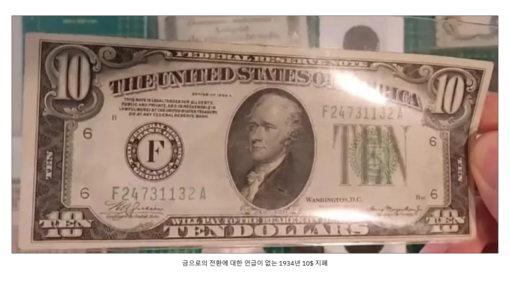

금으로 전환할 수 있다는 언급이 삭제되고 "이 어음은 모든 채무에 대한 법정화폐입니다(이 어음은 모든 채무에 대한 법정화폐입니다)"로 대체되었습니다(이 빌렛은 모든 채무에 대한 법정화폐입니다).

- 골드 재평가

이 전환에서 흥미로운 점은 정부의 전략입니다. 1934년 금 가격은 온스당 20.67달러가 아닌 35달러로 재평가되었습니다. 본질적으로 정부는 사람들이 소유하고 있던 달러의 가치를 떨어뜨렸습니다. 1933년 온스당 20.67달러에 국민으로부터 금을 매입한 후 1934년 금 가격을 재평가함으로써 정부는 상당한 이익을 창출하는 동시에 국민들의 저축 가치를 떨어뜨렸습니다.

요약하자면, 정부는 1년 만에 시민들의 금을 사실상 압수한 다음, 금의 가치를 재평가하여 국고에 이익을 주고 처음에 금을 지폐로 교환한 사람들에게 불이익을 주는 방식으로 게임의 규칙을 바꿨습니다.

### 미국이 역사를 바꿉니다.

미국은 소규모 무역 국가들의 기존 관행과 달리 세계 기축 통화인 미국 달러의 가치를 최초로 평가 절하함으로써 역사적인 전환점을 만들었습니다.

르네상스 시대인 13세기 피렌체에서 발행된 이탈리아 플로린은 국제 준비 통화로, 사용 기간 동안 단 한 번도 평가 절하되지 않았으며 이는 국제 무역에서 통화 안정성의 중요성을 반영한 것입니다.

스페인과 네덜란드는 번영하는 국제 무역으로 인해 세계 준비 통화 보유국으로서 국제 교류의 신뢰와 현상 유지를 위해 자국 통화의 무결성을 유지했습니다. 심지어 네덜란드는 최초의 중앙은행을 설립하여 전 세계 통화 시스템의 진화에 중요한 이정표를 세우기도 했습니다.

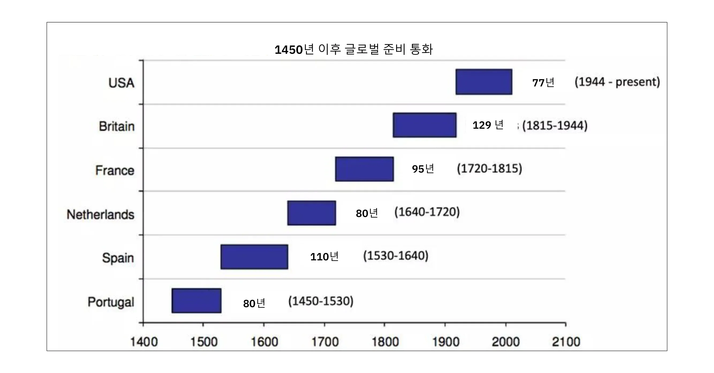

그러나 미국이 지배적인 경제 강국으로 부상하면서 상황은 달라졌습니다. 미국은 기축 통화의 가치를 떨어뜨려 인플레이션을 유리하게 활용하기로 결정했습니다. 이러한 결정은 기축통화의 선택이 이전처럼 자유롭지 않게 된 역학 관계의 변화에서 기인하는 경우가 많습니다. 미국의 패권으로 인해 달러가 세계 기축 통화로 자리 잡으면서 달러의 가치를 조작할 수 있게 되었습니다. 이러한 변화는 세계화된 경제에서 통화 정책이 국제 무역에 미치는 잠재적 영향을 드러내며 글로벌 준비 통화 관리의 중요한 전환점을 마련했습니다.

### 도로의 마지막 예: 스위스 디나르

스위스 디나르는 화폐 평가절하의 또 다른 흥미로운 측면을 보여주는데, 이번에는 걸프전 이전의 이라크 상황을 배경으로 합니다. 지폐의 뛰어난 품질에서 이름을 딴 이 화폐는 이라크 중앙은행에서 발행했으며 중동 지역에서 안정성을 인정받아 명성을 얻었습니다. 이러한 신뢰는 주로 지폐 인쇄의 품질이 영국에서 이루어졌기 때문에 평가 절하에 대한 견고함을 의미했습니다.

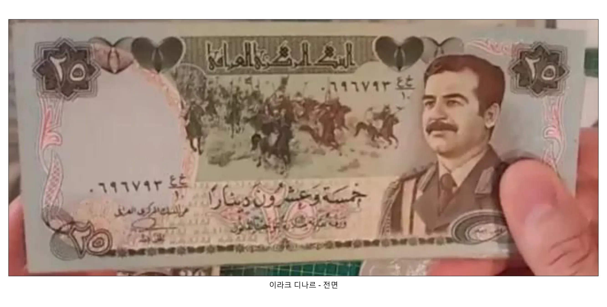

그러나 걸프전은 스위스 디나르의 역사에 전환점이 되었습니다. 더 이상 지폐 인쇄를 영국 공급업체에 의존할 수 없게 된 이라크는 중국에 도움을 요청했습니다. 이러한 전환은 지폐의 품질에 분명한 차이를 가져왔고, 중국 지폐는 열등한 것으로 인식되었습니다. 중국 지폐는 위조가 더 쉽고 정부의 과다 인쇄에 취약하여 지폐의 가치를 위협한다는 인식은 근거 없는 것이 아니었습니다.

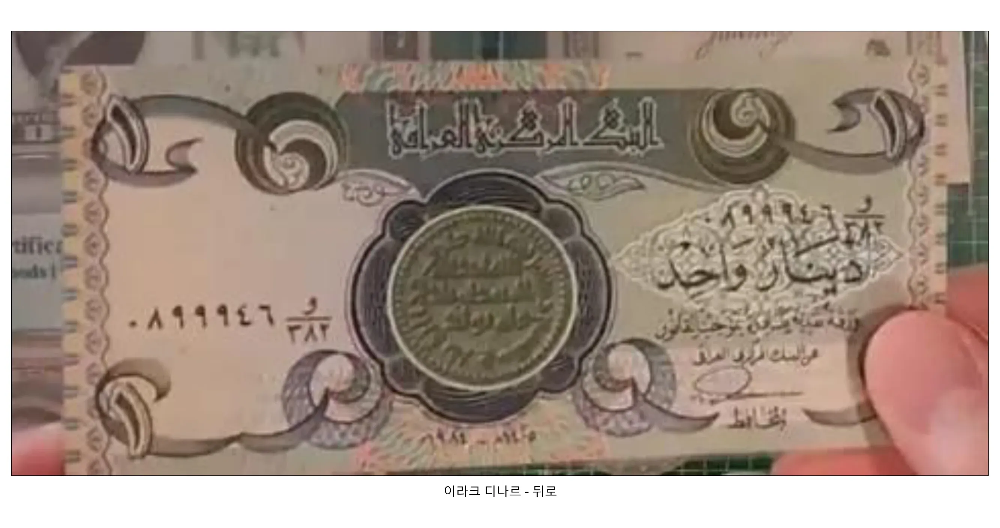

걸프전 이후 이라크 경제에는 이중 가격 체계라는 독특한 현상이 나타났습니다. 상인들은 결제에 사용되는 지폐의 종류에 따라 가격을 다르게 책정하여 중국 지폐보다 스위스 디나르를 선호했습니다. 이 시스템은 주로 국가가 가치를 부여하는 상황에서도 평가 절하가 덜한 고품질 지폐에 대한 신뢰가 유지되는 것을 반영했습니다. 이 에피소드는 화폐의 내재적 특성의 중요성과 법정화폐 체제에서도 통화의 품질이 상대적 가치와 더 나아가 경제 주체들의 신뢰에 어떻게 영향을 미칠 수 있는지를 강조합니다.

#### 네, 실제로 동전의 무게를 측정했습니다!

흔히 화폐는 국가가 발행하고 그 가치를 규제하는 국가가 만든 것으로 인식하는 경우가 많습니다. 이 개념은 로마처럼 제국이 동전을 표준화하고 도장을 찍어 화폐에 공식적인 가치를 부여했던 고대 문명에 그 뿌리를 두고 있습니다. 그러나 좀 더 자세히 살펴보면 화폐의 본질적인 가치는 주로 귀금속 함량에서 비롯된 것으로 밝혀졌습니다.

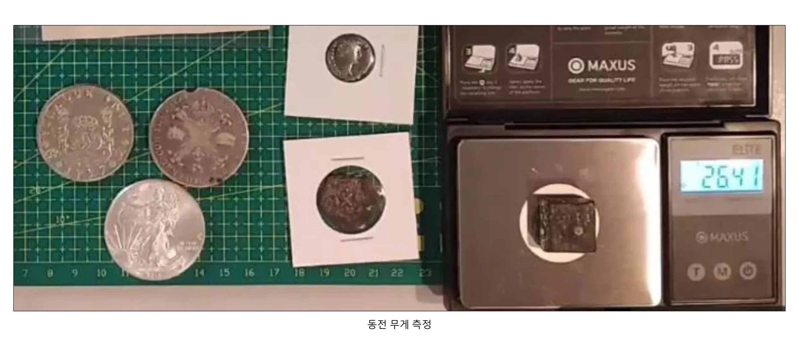

예를 들어 8스페인 레알 또는 1스페인 달러에 해당하는 화폐의 무게를 검사하는 것을 통해 설명합니다. 가치를 나타내는 로마 숫자가 표시된 이 무게는 화폐 교환업자들이 동전의 도장이 아닌 무게를 기준으로 동전의 가치를 평가하는 데 사용되었습니다. 환전상들은 동전의 무게를 측정함으로써 동전의 가치를 떨어뜨릴 수 있는 변조나 손상 여부를 확인할 수 있었습니다. 이 관행은 국가의 표준화된 도장이 화폐에 일정한 명목 가치를 부여했지만 실제 가치는 화폐에 포함된 귀금속의 무게에 있었다는 점을 강조합니다.

이 분석은 화폐에 대한 신뢰, 더 나아가 화폐의 가치가 단순한 국가의 주장이 아니라 그 실체에 기반을 두고 있음을 보여줍니다. 이는 국가가 부과하는 명목 가치와 귀금속의 함량에 따라 결정되는 내재적 가치 사이의 이중성을 강조합니다. 따라서 화폐는 단순한 국가적 수단을 넘어 그 근본적인 가치가 본질적으로 유형적이고 측정 가능한 Elements과 연결되어 있습니다.

#### 결론

결론적으로, 통화 평가절하에 관한 이 연구는 인플레이션 메커니즘에 대한 더 깊은 이해를 제공하며, 다음 동영상에서 살펴볼 것입니다. 다양한 유형의 인플레이션과 고인플레이션 또는 초인플레이션으로 전환되는 임계값에 대해 논의할 것입니다. 이러한 탄탄한 기초를 바탕으로 다음 세션에서는 인플레이션의 복잡성을 Address에 담을 예정입니다. 관심을 가져주셔서 감사합니다. 다음 동영상에서 통화 역학에 대한 탐구를 계속 이어가겠습니다.

## 인플레이션의 유형

<chapterId>b438fe09-375e-5bb2-9196-7dd687b9f98c</chapterId>

### 인플레이션은 여러 요인이 복합적으로 작용하는 현상이 아닙니다

이 섹션에서는 자주 오해되는 현상인 인플레이션의 다양한 측면을 살펴봅니다. 인플레이션은 미디어와 일상적인 논의에서 다각적인 요인으로 인식되는 경우가 많지만, 근본적으로 화폐 현상이라는 점을 기억하는 것이 중요합니다.

다음은 이 주제를 몇 가지 핵심 사항으로 분류한 것입니다:

- 가격 인상과 인플레이션의 차이:

가격 인상은 부문별로 차이가 있을 수 있으며, OPEC의 석유 생산량 감소나 밀 생산에 영향을 미치는 불리한 기상 조건 등 다양한 요인에 의해 유발될 수 있습니다.

반면 인플레이션은 특정 부문뿐만 아니라 다양한 상품과 서비스 전반에 걸친 가격 상승으로 정의됩니다.

- 인플레이션의 화폐적 본질:

고정 화폐 Supply를 사용하면 한 부문에서 가격이 상승하면 다른 부문에서 사용할 수 있는 금액이 줄어들기 때문에 다른 부문의 가격이 하락하게 됩니다. 인플레이션은 모든 부문의 가격이 동시에 상승할 수 있는 화폐 Supply의 증가와 밀접한 관련이 있습니다.

- 화폐 Supply이 인플레이션과 디플레이션에 미치는 영향:

고정 화폐 Supply 시스템에서 생산량이 증가하면 이론적으로 더 많은 상품과 서비스가 공급되므로 디플레이션, 즉 가격 하락으로 이어져야 합니다.

현재의 법정화폐 시스템에서는 화폐 Supply가 증가하면 생산량 증가로 인한 잠재적 디플레이션을 상쇄할 수 있습니다.

- 돈 Supply 조정의 부정적 영향:

생산량이 증가하지 않고 통화량이 증가하면 같은 양의 상품과 서비스에 대해 더 많은 화폐가 유통되기 때문에 인플레이션이 발생합니다.

생산량 증가가 디플레이션으로 이어졌어야 하지만, Supply의 동시 통화량 증가로 인해 이 효과가 무효화되고 대신 인플레이션이 발생했습니다.

- 인플레이션, 디플레이션, 화폐 Supply - 소통하는 그릇:

인플레이션과 디플레이션은 경제에서 소통하는 그릇과 같습니다. 생산량이 증가하면 디플레이션이 발생할 수 있지만, 통화량이 동시에 증가하면 디플레이션 효과가 상쇄되어 인플레이션이 발생하게 됩니다.

이 논의는 인플레이션과 디플레이션의 기본 메커니즘을 이해하는 것의 중요성과 Supply을 변경하는 것이 경제에 미칠 수 있는 심대한 영향을 강조합니다. 나중에 이러한 개념을 다시 살펴봄으로써 상호 연관성과 글로벌 경제에 미치는 영향에 대해 더 깊이 이해할 수 있을 것입니다.

### 화폐 인쇄가 항상 인플레이션을 유발하지 않는 이유는 무엇인가요?

#### 인플레이션 ≠ CPI

인플레이션은 종종 통화량 증가와 관련이 있지만, 2008년 금융 위기 이후의 기간에서 볼 수 있듯이 항상 통화량 인쇄와 직접적인 상관관계가 있는 것은 아닙니다. 은행을 살리기 위해 상당한 양의 화폐를 인쇄했음에도 불구하고 그 후 10년간 연평균 0~2%의 높은 인플레이션을 경험하지 못했습니다. 이러한 상황은 의문을 제기합니다: 왜 대규모 화폐 인쇄가 인플레이션에 비례하지 않았을까요? 그 해답은 인플레이션 및 소비자물가지수(CPI) 측정과 관련된 몇 가지 뉘앙스에 있습니다.

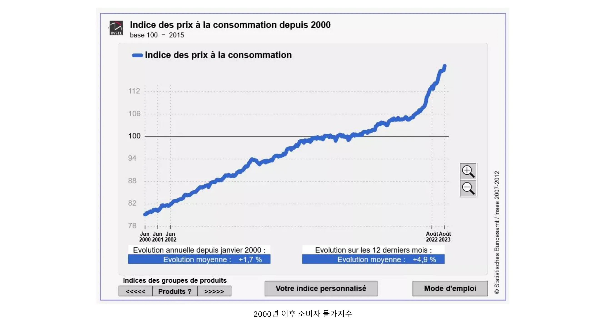

첫 번째 설명은 인플레이션을 측정하는 방식에 있습니다. 인플레이션의 주요 지표로 사용되는 소비자물가지수(CPI)에는 몇 가지 한계가 있습니다. 예를 들어, 부동산 가격의 변화를 포괄적으로 설명하지 못합니다. CPI에는 임대료와 관련된 구성 요소가 포함되어 있지만 주택 가격의 실질적인 상승은 지수에 완전히 반영되지 않습니다. 따라서 주택 비용의 상당한 상승이 CPI에 완전히 반영되지 않고 발생하여 실제 인플레이션을 과소평가할 수 있습니다.

또한 CPI 계산에는 실제 가격 인상을 상쇄하거나 가릴 수 있는 특정 방법론이 사용됩니다. 예를 들어, 제품의 질적 개선이 지수를 조정하는 데 사용될 수 있습니다. 제품의 가격이 인상되었지만 품질이나 기능도 개선된 경우 CPI는 소비자의 실질 가치는 변하지 않은 것으로 간주하여 인플레이션을 반영하지 않을 수 있습니다. 예를 들어, 통화 투입으로 인해 소고기와 컴퓨터 가격이 상승했지만 컴퓨터 성능이 향상되어 이를 상쇄하는 경우를 들 수 있습니다. 컴퓨터 가격이 두 배 비싸지만 성능이 네 배 더 뛰어난 경우 CPI는 이를 물가 하락으로 해석하여 소고기 가격 상승을 가릴 수 있습니다.

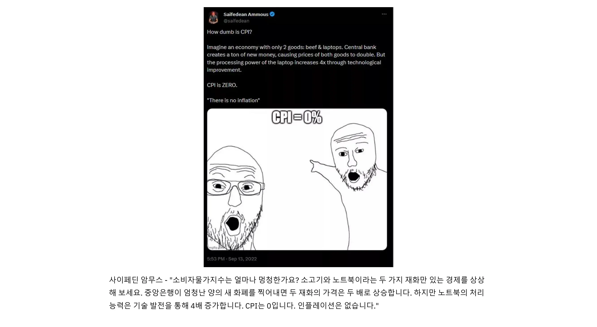

CPI로 인플레이션을 측정할 때 이러한 미묘한 차이는 화폐 인쇄와 인플레이션 사이의 복잡한 관계를 강조합니다. 또한 특히 부동산과 같은 주요 부문의 모든 가격 상승을 보다 포괄적으로 고려할 경우 실제 인플레이션은 보고된 것보다 더 높을 수 있음을 시사합니다. 이 분석은 인플레이션의 기본 메커니즘과 이를 측정하는 데 사용되는 기존 지표의 한계를 이해하는 것의 중요성을 강조함으로써 통화 정책의 경제적 함의를 더 깊이 이해할 수 있도록 돕습니다.

#### MMT의 인수

현대 통화 이론(MMT)은 통화 창출과 인플레이션에 대한 뚜렷한 관점을 제시합니다. MMT에 따르면 화폐는 주로 정부에서 발행되며, 정부가 목표로 하는 부문이 포화 상태가 아닌 한 인플레이션을 일으키지 않고도 필요한 자금을 조달하기 위해 상당한 양의 화폐를 찍어낼 수 있습니다. 이 접근 방식은 인플레이션 역학에서 부문별 흡수 능력의 중요성을 강조하는 전통적인 통화 이론에서 벗어난 것입니다.

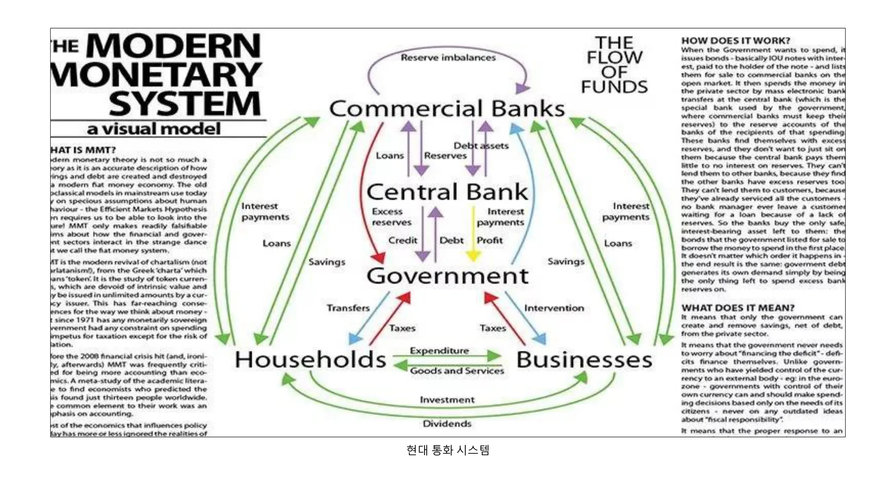

MMT의 대표적인 예로 미국의 군산복합체를 들 수 있습니다. MMT에 따르면 이 부문에 수 천억 달러의 자금을 투입해도 인플레이션을 유발하지 않고 자금을 흡수할 수 있습니다. 반대로 기업과 노동력이 한정된 미국의 도로 건설에 막대한 자금이 투입되면 자원 부족과 공급업체가 요구하는 비용 증가로 인해 인플레이션이 발생할 수 있습니다.

MMT 지지자들은 막대한 통화 발행에도 불구하고 인플레이션이 발생하지 않는 또 다른 사례로 일본을 자주 인용합니다. 그러나 일본의 상황은 소비자물가지수(CPI)와 같은 전통적인 인플레이션 측정의 한계도 잘 보여줍니다. 일본에서는 인쇄된 화폐의 상당 부분이 현재 소비에 사용되지 않고 저축되거나 부동산이나 주식 시장에 투자됩니다. CPI는 이러한 역학을 완전히 포착하지 못하기 때문에 실제 인플레이션을 과소평가할 수 있습니다.

일본의 분석(https://ideas.repec.org/p/ces/ceswps/_9821.html)에서도 CPI에 포함되지 않은 자산에 대한 저축이나 투자 등 경제 주체들의 행동이 통화 인쇄의 인플레이션 영향을 가릴 수 있다는 점을 강조하고 있습니다. 또한, 각 부문의 유동성 투입 흡수 능력은 인플레이션 발생 여부를 결정하는 데 중요한 역할을 합니다.

#### 은행 및 중앙은행 대차 대조표

통화 인쇄가 인플레이션을 유발하지 않는 세 번째 예는 통화 인쇄와 인플레이션의 관계는 새로 생성된 화폐가 경제에 도입되는 방식에 따라 조절된다는 것입니다. 이 돈이 경제 주체에게 대출되지 않고 민간 은행의 대차대조표에 남아 있으면 실물 경제에 직접적인 영향을 미치지 않으므로 인플레이션을 초래하지 않습니다.

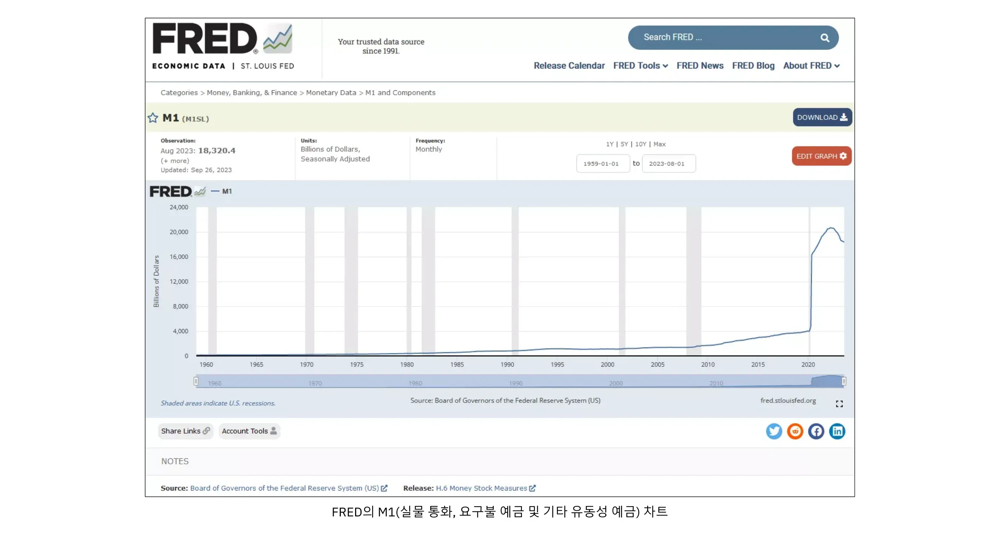

화폐 발행은 경제를 위협하는 다모클레스의 검으로 볼 수 있습니다. 발행된 화폐는 은행 대출이나 기타 메커니즘을 통해 경제에 투입되지 않는 한 눈에 보이는 인플레이션 효과 없이 일정 기간 동안 잠복 상태로 남아있을 수 있습니다. 그러나 이 잠복 화폐가 마침내 유통되면 인플레이션 효과가 나타날 수 있습니다. 2020년대에 들어와서 이전에 만들어졌던 돈이 경제에 유입되면서 인플레이션으로 이어진 것이 바로 이러한 현상입니다.

이 시나리오는 화폐 인쇄의 인플레이션 효과에 영향을 미치는 통화 전달 메커니즘의 중요성을 강조합니다. 중앙은행의 통화 창출은 퍼즐의 한 조각에 불과합니다. 대출 규모를 결정하는 민간 은행의 행동과 대출받은 돈을 어떻게 사용할지 결정하는 차입자의 행동도 이 역학 관계에서 중요한 Elements입니다.

#### 인플레이션은 사회적 문제입니다!

바이마르 공화국의 사례는 화폐 인쇄와 인플레이션의 관계에서 또 다른 중요한 측면, 즉 기대심리와 경제 주체들의 행동의 역할을 설명합니다. 바이마르 공화국 중앙은행이 대량의 화폐를 인쇄하기 시작하자 경제적 불확실성으로 인해 개인들은 돈을 소비하지 않고 저축하는 등 비축을 하게 되었습니다. 이러한 반응은 화폐 인쇄로 인한 인플레이션 효과를 일시적으로 지연시켰습니다.

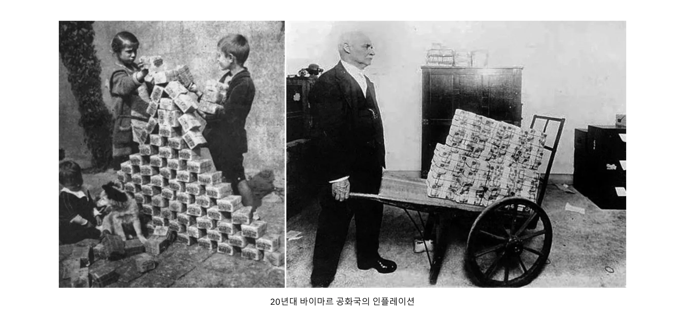

하지만 경제 상황이 조금씩 개선되기 시작하면서 점차 자신감이 회복되기 시작했습니다. 개인들은 숨겨둔 저축을 인출하여 경제 활동에 대규모로 소비하기 시작했습니다. 이러한 갑작스러운 행동 변화는 이미 높은 금리와 결합하여 폭발적인 수요로 이어졌습니다. 더 많은 돈이 유통되고 수요가 증가하면서 가격이 급격히 상승하기 시작했고, 눈에 띄는 인플레이션으로 이어졌습니다.

이 예는 인플레이션 발생에 있어 타이밍과 에이전트 행동의 중요성을 강조합니다. 인플레이션은 통화량 증가에 대한 반응으로만 발생하는 것이 아니라 그 돈이 경제에서 언제, 어떻게 소비되는지에 따라 달라집니다. 경제 불확실성과 경제 주체들의 기대는 이러한 역학 관계에서 중요한 역할을 하며, 화폐 발행의 인플레이션 효과를 가속화하거나 지연시킬 수 있습니다.

#### 요약합니다:

- 소비자물가지수(CPI): CPI는 인플레이션을 과소평가하는 방식으로 구성되어 있어 인플레이션 현실을 왜곡되게 보여줄 수 있습니다.

- 부문별 흡수: 흡수할 수 있는 부문에 화폐를 투입한다고 해서 항상 인플레이션으로 이어지는 것은 아닙니다. 주목할 만한 예로 인플레이션을 유발하지 않으면서 막대한 자금을 흡수할 수 있는 미국 군산복합체를 들 수 있습니다.

- 일본의 사례: 일본에서는 막대한 화폐 발행에도 불구하고 인플레이션이 낮은 수준을 유지하는 이유는 자금이 부동산이나 주식 시장에 저축되거나 투자되는 경우가 많기 때문입니다. 이러한 부문은 인쇄된 화폐를 흡수하며, CPI는 이러한 부문의 물가 상승을 반드시 반영하지는 않습니다.
- 화폐 인쇄와 시장의 상관관계. 부동산과 주식 시장의 곡선은 종종 화폐 인쇄를 따르는 것으로 관찰되며, 이는 인쇄된 화폐가 어디로 향하는지를 나타냅니다.
- 은행의 통화 준비금: 인쇄된 화폐가 은행의 대차대조표에 남아 경제에 유통되지 않으면 인플레이션을 일으키지 않습니다. 이는 인쇄된 화폐가 대부분 은행의 대차대조표에 남아 인플레이션 영향을 지연시켰던 2008년의 예에서 알 수 있습니다.

- 바이마르 공화국: 이 역사적 시기는 경제적 불확실성이 어떻게 돈을 쌓아두고 인플레이션을 지연시켰는지 보여줍니다. 하지만 신뢰가 회복되고 돈이 소비되자 인플레이션은 폭발적으로 증가했습니다.

이러한 예는 인플레이션이 항상 화폐 발행의 즉각적인 결과가 아닌 이유와 경제적 상황과 주체 행동이 인플레이션에 미치는 영향을 설명하는 토론에 사용할 수 있습니다.

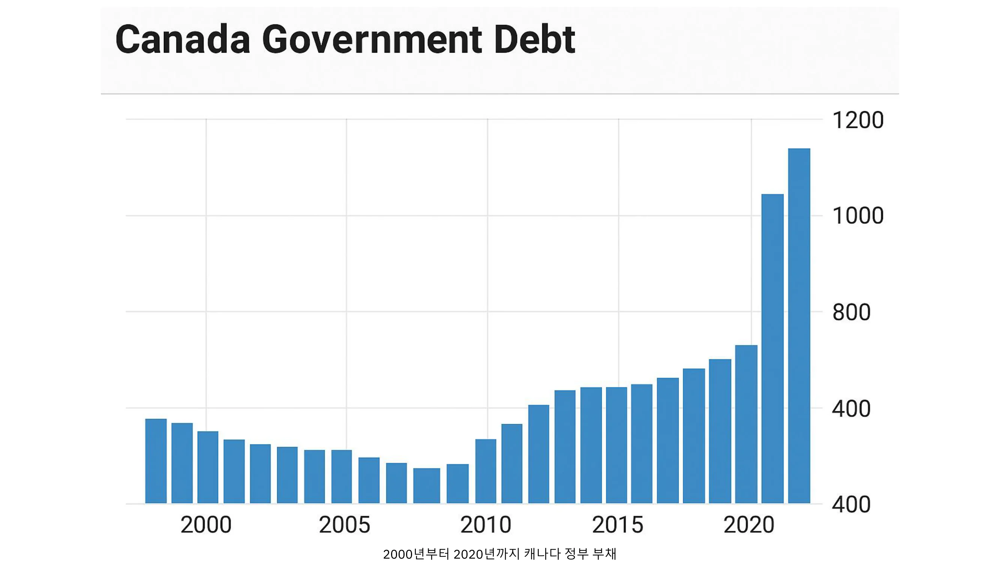

이 [스레드](https://twitter.com/saifedean/status/1673639779433590786)에서도 알 수 있듯이: 인플레이션은 중앙은행의 잘못을 제외한 모든 것입니다.

- 경제학자들은 인플레이션을 기후 변화 탓으로 돌립니다

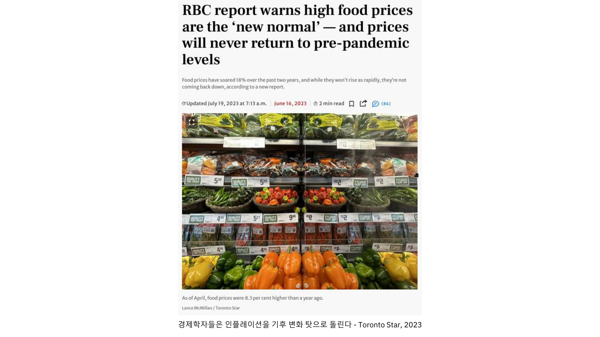

- 특정 달의 인플레이션을 비욘세 탓으로 돌린 스웨덴의 예시입니다.

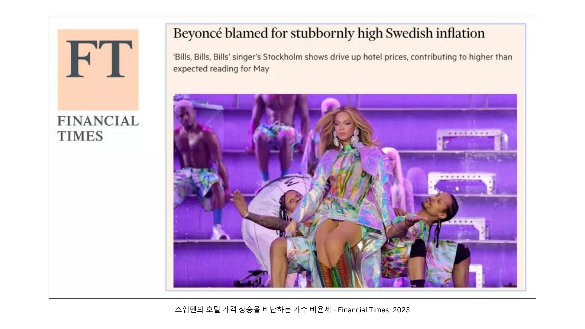

- 폴란드 중앙은행은 우크라이나에 대한 러시아의 침략과 팬데믹이 인플레이션의 원인으로 지목했습니다

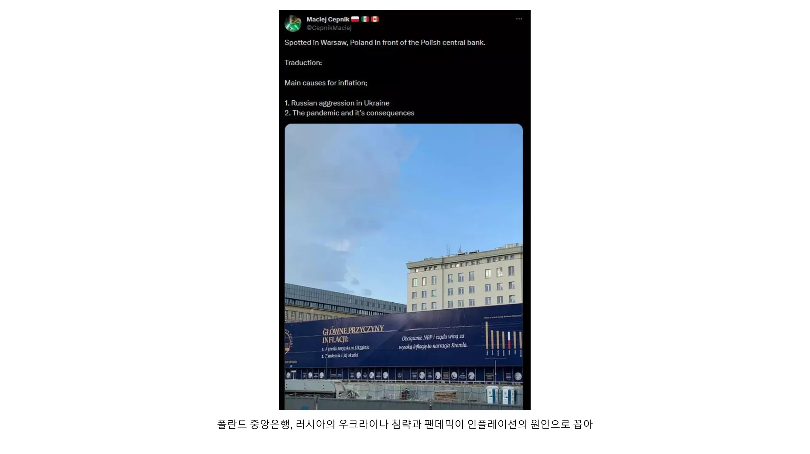

- 브렉시트는 영국 인플레이션의 원인으로 지목되고 있습니다.

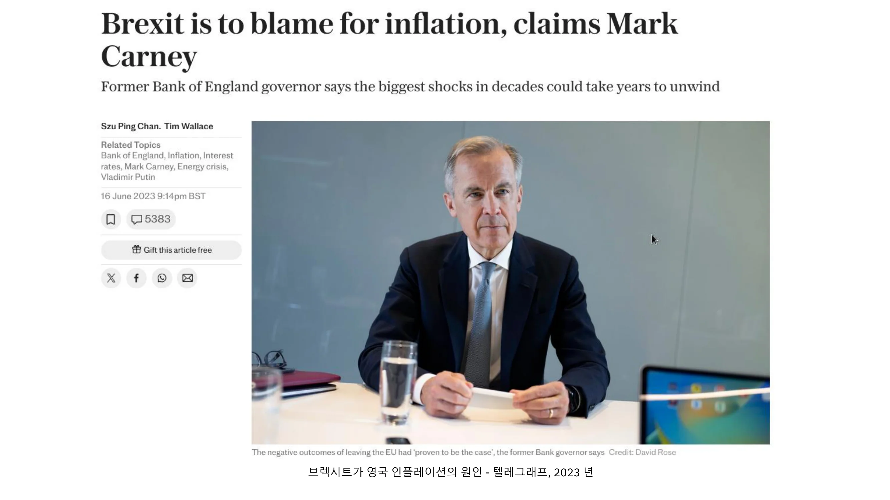

- 인플레이션 쇼크와 관련된 젤다 게임 출시.

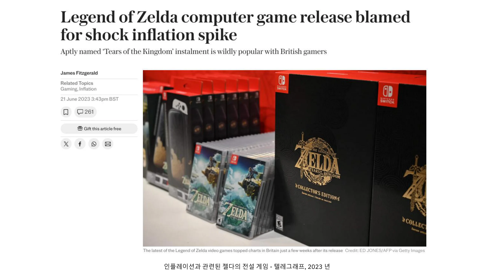

- 테일러 스위프트는 인플레이션을 일으킨다는 의혹을 받고 있습니다.

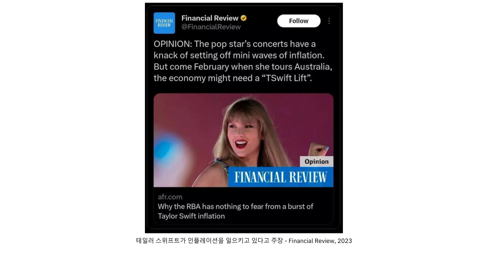

비욘세나 테일러 스위프트가 어떻게 물가 상승의 원인이 될 수 있을까요? 말이 안 되죠. 간단히 말해서

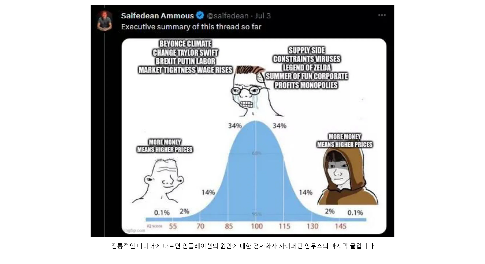

### 인플레이션의 유형 살펴보기

다양한 유형의 인플레이션의 차이를 이해하는 것이 중요하며, 이를 통해 이 경제 현상의 다양한 양상을 파악할 수 있습니다. 다음은 이러한 다양한 유형에 대한 설명입니다:

- 크리핑 인플레이션: 중앙은행이 일반적으로 목표로 하는 인플레이션 유형으로, 연간 2% 내외로 설정됩니다. 이 목표는 1990년대부터 채택되어 왔으며 과열이나 디플레이션 없이 안정적인 경제 성장을 유지하는 것을 목표로 합니다.
- 보통 인플레이션: 이 형태의 인플레이션은 인플레이션이 목표치인 2%를 초과할 때 발생합니다. 이는 종종 과열 경제, 즉 과도한 통화량이 전반적인 물가 상승을 자극하는 상태와 관련이 있습니다. 이 시나리오는 통화 정책의 한계를 드러내고 때로는 경제 담론의 모순을 드러내기도 합니다.
- 급격한 인플레이션: 두 자릿수 인플레이션이라고도 하는 갤럽 인플레이션은 연간 인플레이션율이 10%를 초과할 때 발생합니다. 이는 경제 안정을 해칠 수 있는 심각한 가격 급등을 의미합니다.

- 하이퍼인플레이션: 하이퍼인플레이션은 인플레이션율이 월 50%를 초과하는 극단적인 현상으로, 인플레이션의 기하급수적인 특성으로 인해 연간 인플레이션율이 13,000% 이상에 해당합니다. 이러한 수준의 인플레이션은 경제를 심각하게 불안정하게 만들어 화폐의 가치를 거의 쓸모없게 만들고 통화 시스템에 대한 신뢰를 약화시킵니다.

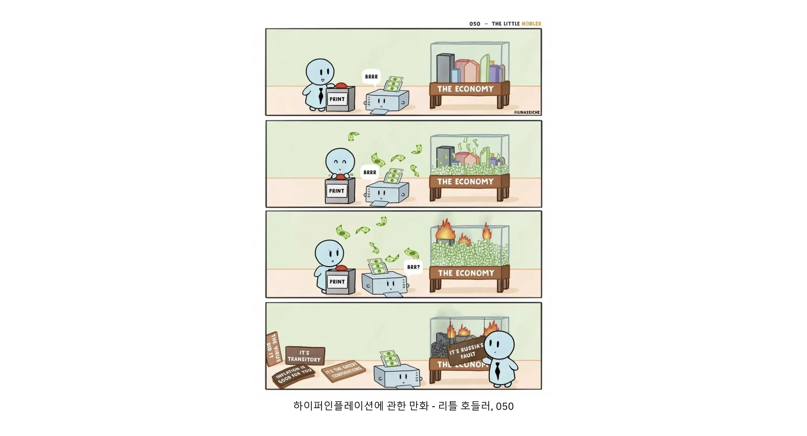

인플레이션의 유형을 살펴볼 때 교육 자료에서 '수요 견인'이나 '비용 압박'과 같은 용어를 흔히 접할 수 있습니다. 이러한 개념은 타당하지만 인플레이션을 통화 현상으로 설명하기보다는 가격 상승을 설명하는 경향이 있습니다. 다음은 보다 심층적인 분석입니다:

- 수요 풀:

수요 견인 인플레이션은 종종 경제의 수요가 가용 생산 능력을 초과하는 시나리오로 설명됩니다. 그러나 통화량이 그에 상응하는 수준으로 증가하지 않으면 이러한 상황은 단순히 지출의 재분배로 이어질 것입니다. 소비자는 필수품에 더 많이 지출하고 비필수품에는 덜 지출하여 전반적인 인플레이션 효과를 무력화할 수 있습니다.

- 비용 푸시:

반면에 비용 압박 인플레이션은 천연자원이나 인건비와 같은 생산 비용의 증가로 인해 발생합니다. 다시 말하지만, 통화량이 증가하지 않는 한 한 부문의 비용 증가는 광범위한 인플레이션을 일으키지 않고 다른 부문의 지출을 단순히 줄일 수 있습니다.

이러한 전통적인 설명은 종종 가격 인상을 인플레이션과 연관시켜 혼란과 오해를 불러일으킬 수 있습니다. 실제로 광범위한 인플레이션이 발생하려면 통화량이 증가해야 합니다. 이러한 맥락에서 수요 당김과 비용 밀어내기 개념은 부문별 가격 변동을 설명할 수는 있지만 인플레이션의 금전적 특성을 포착하지는 못합니다. 이는 부문별 가격 상승과 광범위한 인플레이션을 구분하는 것이 중요하다는 점을 강조하며, 인플레이션이 경제 전반에 걸쳐 나타나는 것을 방지하기 위해 Supply 통화량의 증가가 필요하다는 점을 재확인합니다. 이 분석은 인플레이션의 실제 원인에 대한 보다 미묘하고 정확한 관점을 제공하여 근본적인 통화 역학을 모호하게 할 수 있는 일반적인 해석을 설명합니다.

### 베른홀츠에 따른 인플레이션의 분류

베른홀츠는 이 복잡한 통화 현상을 더 잘 이해할 수 있도록 인플레이션을 세 가지 범주로 단순화하지만 정확하게 분류할 것을 제안합니다:

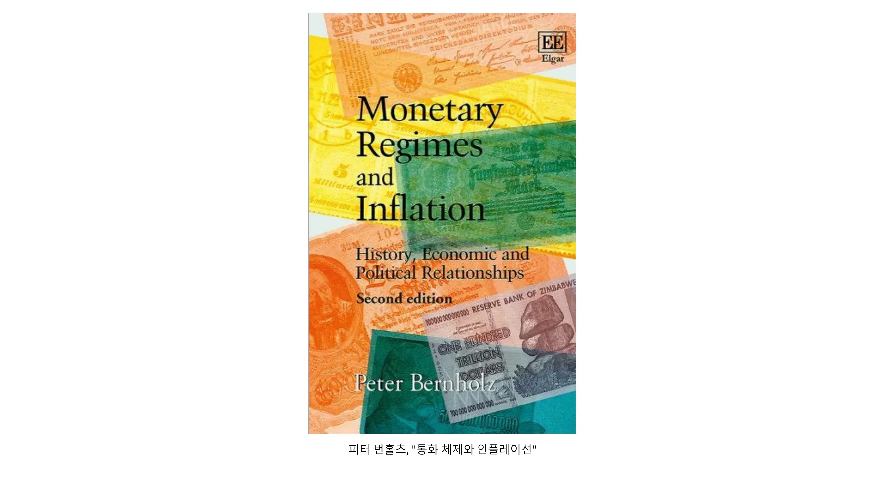

- 적당한 인플레이션:

온건 인플레이션은 통화량이 정상 수준보다 높지만 국가가 화폐 발행을 통해 대규모 적자를 감수하지 않을 때 발생합니다. "보통"이라는 용어가 사소해 보일 수 있지만, 이러한 형태의 인플레이션은 높은 인플레이션으로 분류되지는 않지만 상당한 문제를 일으킬 수 있습니다.

- 높은 인플레이션:

높은 인플레이션은 명목 화폐의 증가에도 불구하고 화폐의 실질 가치 Supply가 감소할 때 발생합니다. 이러한 역설적인 상황은 개인이 자국 통화에 대한 신뢰를 잃고 상품, 서비스 또는 외화로 대체하려는 화폐 대체 현상에서 발생합니다. 이 과정은 통화의 실질 가치를 더욱 감소시켜 인플레이션을 악화시킵니다.

- 하이퍼인플레이션:

하이퍼인플레이션은 화폐 발행을 통해 자금을 조달하는 대규모 예산 적자를 특징으로 하는 극단적인 형태의 고인플레이션입니다. 역사적으로 화폐 발행을 통한 대규모 적자 재정 조달 없이 하이퍼인플레이션이 발생한 사례는 없습니다. 하이퍼인플레이션은 악순환을 일으킵니다. 인플레이션으로 인해 통화 가치가 급격히 하락하여 국가가 세수를 거두기도 전에 세수가 감소하고, 이로 인해 국가는 더 많은 돈을 인쇄하여 재정을 조달해야 하는 상황이 발생합니다. 이러한 자기 강화 사이클은 천문학적 인플레이션율로 이어져 종종 한 달에 50%를 초과하기도 합니다.

베른홀츠의 이 분류는 온건 인플레이션에서 하이퍼인플레이션으로의 위험한 진행을 강조하며, 파괴적인 인플레이션 소용돌이를 방지하는 데 통화 및 재정 통제의 중요성을 강조합니다. 또한 하이퍼인플레이션 단계에 도달하기 훨씬 전에 국가 재정에 대한 해로운 결과가 발생할 수 있음을 보여줌으로써 다양한 수준의 인플레이션이 미치는 영향에 대한 미묘한 관점을 제공합니다.

### 결론 인플레이션 유형 요약

결론적으로, 우리는 '점진적 인플레이션', '걷는 인플레이션', '질주하는 인플레이션' 등 흔히 들어본 용어부터 시작하여 경제 내 인플레이션 비율의 각기 다른 수준을 나타내는 다양한 인플레이션 유형을 살펴봤습니다. 그러나 하이퍼인플레이션에 대한 심도 있는 연구를 위해서는 베른홀츠가 설명한 온건 인플레이션, 고인플레이션, 하이퍼인플레이션의 범주가 중요한 기준이 됩니다.

- 적당한 인플레이션:

이 수준은 국가가 상당한 적자 재정을 투입하지 않고도 유지할 수 있는 수준이지만, 정상보다 높은 Supply을 나타냅니다.

- 높은 인플레이션:

이는 화폐의 실질 가치가 감소할 때 발생하며, 주로 개인이 상품, 서비스 또는 다른 형태의 통화로 화폐를 교환하려는 화폐 대체로 인해 발생합니다.

- 하이퍼인플레이션:

이는 대규모 예산 적자를 충당하기 위해 과도한 화폐를 발행하여 통화의 실질 가치를 급격히 약화시키는 고인플레이션의 극단적인 버전입니다.

조사 결과 하이퍼인플레이션은 복잡하고 직관적이지 않은 현상이라는 사실이 드러났습니다. 하이퍼인플레이션은 통화량이 엄청나게 증가한 결과라고 생각할 수 있지만, 실제로는 통화량의 실질 가치가 감소한 데서 비롯된 것입니다. 이러한 뉘앙스는 일부 국가가 세계은행이나 IMF와 같은 국제기구의 지원에도 불구하고 하이퍼인플레이션에서 벗어나지 못하는 이유를 이해하는 데 매우 중요합니다. 인플레이션의 유형을 잘못 파악하면 부적절한 구제책을 적용하여 경제 문제를 해결하기는커녕 악화시킬 수 있습니다.

앞으로의 논의에서는 하이퍼인플레이션의 정의와 다양한 경제적 맥락에서 나타나는 현상을 살펴보며 하이퍼인플레이션에 대해 더 자세히 알아볼 것입니다. 우리의 목표는 하이퍼인플레이션의 근본적인 메커니즘을 밝히고 이 문제에 대한 잠재적인 해결책을 모색하는 것입니다. 이러한 미묘한 이해를 통해 관련 문제를 더 잘 이해하고 인플레이션 관리를 위한 정보에 입각한 전략을 제안할 수 있을 것입니다.

관심을 가져주셔서 감사합니다. 다음 세션에서는 다양한 학문적, 실무적 관점을 고려하여 하이퍼인플레이션을 정의하고 이해하는 데 전념할 것입니다. 다음 회의에서 여러분과 함께 이 탐구를 계속할 수 있기를 기대합니다.

# 하이퍼인플레이션이란 무엇인가요?

<partId>3f541663-1e2f-5410-8ee0-f61c5d009fa5</partId>

## 하이퍼인플레이션의 정의

<chapterId>d2a71a2e-5f36-58d9-993c-d431f4aa07fd</chapterId>

### 하이퍼인플레이션의 정의

이 섹션에서는 극단적인 통화 현상을 연구하는 데 중요한 용어인 하이퍼인플레이션에 대한 다양한 정의를 살펴봅니다. 가장 잘 알려진 정의는 1956년 저서인 "하이퍼인플레이션의 통화 역학"에서 하이퍼인플레이션에 대한 정량적 이해를 제안한 필립 케이건(Philip Cagan)의 정의입니다. 케이건에 따르면

- 하이퍼인플레이션의 시작과 끝:
  - 하이퍼인플레이션은 월간 인플레이션이 50%를 초과하면 시작됩니다.
  - 물가 상승률이 최소 1년 동안 매월 50% 미만으로 떨어지면 종료됩니다.

예를 들어, 7월에 인플레이션이 40%로 떨어지고 다음 해 7월까지 50% 이상으로 상승하지 않으면 초인플레이션이 처음 관측된 해의 전년도 7월에 초인플레이션 기간이 종료된 것으로 간주합니다. 이 정의를 통해 하이퍼인플레이션의 정확한 특성을 파악할 수 있어 체계적인 분석이 용이해집니다.

이 정의는 56건의 하이퍼인플레이션 사례를 기록한 한케-크러스 표에서 채택되었습니다. 그러나 이 표에는 2016년 베네수엘라에서 발생한 사례와 같은 모든 사례가 포함되어 있지 않아 총 57건이 기록되어 있습니다.

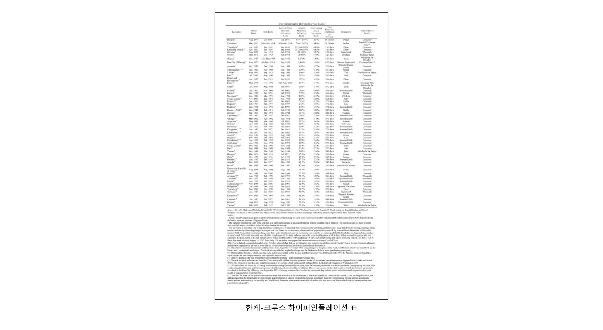

줌

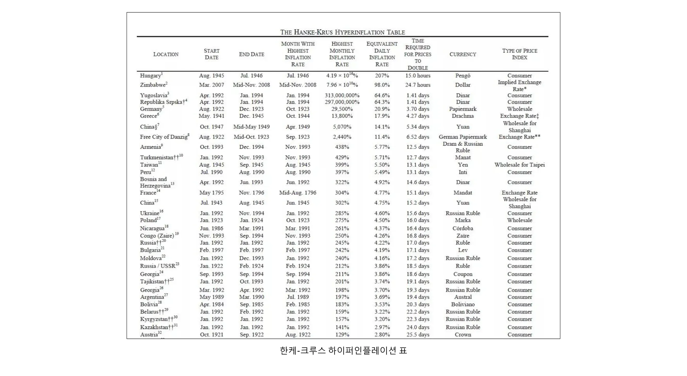

이 정의는 정확하지만 50% 임계값의 엄격함으로 인해 특정 초인플레이션 사례를 제외할 수 있다는 점에 유의해야 합니다. 이 정의를 확장하여 케이건의 기준을 엄격하게 충족하지는 않지만 극도로 높은 인플레이션 기간을 나타내는 다른 에피소드를 포함할 가능성도 있습니다. 이러한 관찰은 하이퍼인플레이션 현상에 대한 보다 폭넓은 탐구의 문을 열어주며, 그 원인과 결과를 보다 미묘하게 이해할 수 있게 해줍니다. 다음 논의에서는 이 정의를 재검토하고 캐건의 엄격한 기준에 포함되지 않는 하이퍼인플레이션의 사례를 살펴볼 것입니다.

### 캐건의 하이퍼인플레이션의 정의

필립 케이건은 하이퍼인플레이션을 정의할 때 월 인플레이션 50%라는 임의의 기준을 설정했을 수 있습니다. 그 자신도 이 정의가 자의적이라는 것을 인정하며, 주로 7번의 하이퍼인플레이션을 기준으로 분석에 활용하고 있습니다. 케이건의 데이터를 살펴보면 월별 인플레이션율이 가장 낮았던 세 번의 하이퍼인플레이션 시기는 약 47%, 46%, 57%였던 것으로 나타났습니다. 그의 연구에서는 이러한 사례를 포괄하기 위해 50%라는 임계값을 선택한 것으로 보입니다.

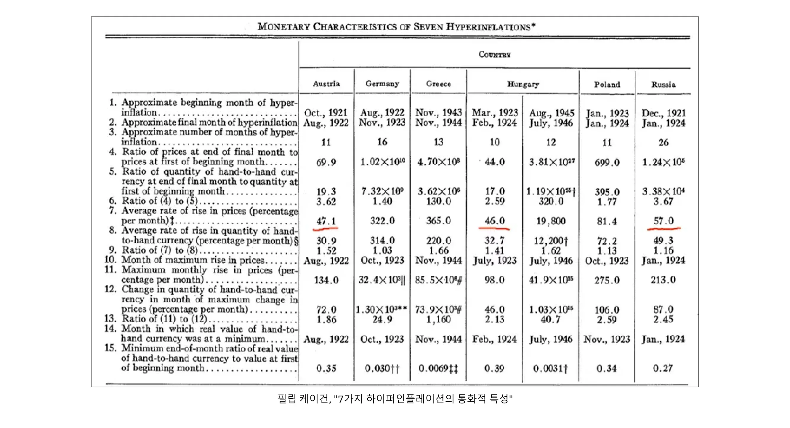

- 역사적 맥락:

케이건의 정의는 1956년으로 거슬러 올라가며 당시의 제한된 수의 초인플레이션 사례를 기반으로 합니다.

- 케이건의 관찰:

케이건에 따르면, 이 임계값인 약 50%에 도달한 사례 중 더 심각한 하이퍼인플레이션으로 진행되지 않고 이 임계값을 선택한 것을 정당화할 수 있는 사례는 없었습니다.

- 케이건의 정의에 대한 비판:

'통화 체제와 인플레이션'의 저자 베른홀츠와 같은 다른 경제학자들도 50% 기준치를 자의적이라고 설명한 바 있습니다.

베른홀츠는 50% 임계값에 도달하지 않으면서도 초인플레이션과 동일한 질적 특성을 지닌 고인플레이션이 발생한다고 지적합니다.

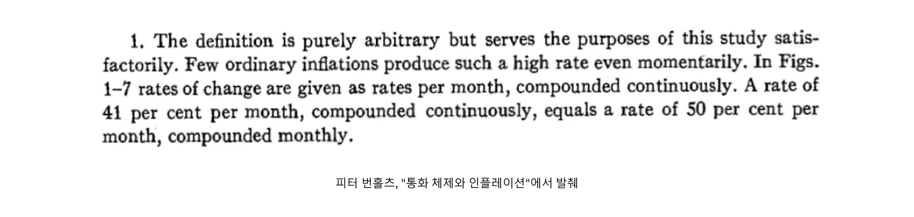

이러한 성찰은 기존의 하이퍼인플레이션 정의의 경직성에 의문을 제기하고 더 많은 사례와 역사적 데이터를 통합하여 이 기준을 재검토해야 할 필요성을 강조합니다. 하이퍼인플레이션의 정의는 다양한 경제 및 역사적 맥락에서 나타나는 극심한 인플레이션의 다양한 양상을 포괄할 수 있는 유연성이 필요할 수 있습니다.

### 국제회계기준위원회(IASB)에 따른 하이퍼인플레이션의 정의

IASB는 초인플레이션에 대한 독특한 관점을 제시하며, 초인플레이션 기간 동안의 회계 관행에 초점을 맞추고 있습니다. 이러한 접근 방식은 화폐 가치가 급변하는 초인플레이션 환경에서 활동하는 회계사 및 기업에게 매우 중요합니다. IASB 가이드라인은 하이퍼인플레이션의 다양한 지표를 식별합니다:

- 비금전적 자산에 대한 선호도:**

개인은 화폐 가치의 급격한 하락으로 인해 통화보다는 상품으로 가치를 보유하는 것을 선호합니다.

- 상품 및 서비스 가치 평가:**

주민들은 상품과 서비스의 가치를 현지 통화로 계산하지 않으며, 이는 현지 통화에 대한 신뢰가 떨어졌음을 반영합니다.

- 금전적 가치 손실에 대한 보상:**

가격에는 크레딧 구매 시 금전적 가치 손실에 대한 보상이 포함되어 있어 인플레이션이 일상 거래에 미치는 영향을 보여줍니다.

- 가격, 임금 및 이자 인덱싱:**

가격, 임금, 이자는 인플레이션을 보정하기 위해 지수에 따라 조정됩니다.

- 3년간 누적 인플레이션:**

3년간의 누적 인플레이션은 100%(연간 약 24%)에 육박하여, 월 50%의 인플레이션이라는 Cagan의 정의와는 대조적입니다.

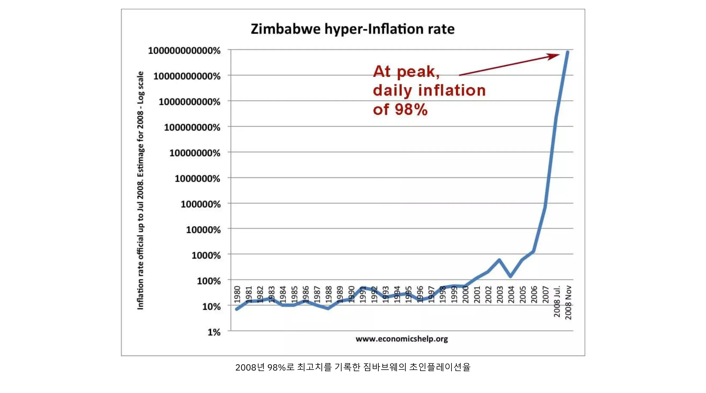

IASB 기준에 따르면 아르헨티나, 에티오피아, 아이티, 이란, 레바논, 수단, 남수단, 수리남, 시리아, 터키, 베네수엘라, 예멘, 짐바브웨 등 여러 국가가 현재 초인플레이션을 겪고 있는 것으로 나타났습니다.

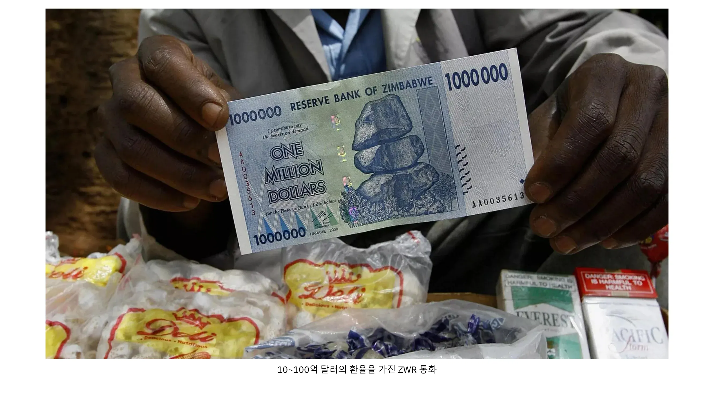

IASB가 제시한 이 정의는 초인플레이션에 직면한 경제 행태와 실질적인 조정에 대한 질적 분석을 통합함으로써 캐건의 엄격한 양적 기준에서 한 걸음 더 나아갔습니다. 이는 하이퍼인플레이션이 기업 및 시장의 안정성과 재무 투명성에 중요한 회계 분야에서 특히 그 실제 의미를 파악하기 위해 다차원적인 이해가 필요한 복잡한 현상임을 보여줍니다.

### 그렇다면 총 몇 개의 하이퍼인플레이션이 있을까요?

월별 인플레이션율을 50%로 규정하는 캐건이 제안한 것과 같이 하이퍼인플레이션에 대한 일반적인 정의는 때때로 혼란스럽거나 지나치게 단순할 수 있습니다. 예를 들어, 연간 인플레이션율이 각각 1,000%와 3,000%인 두 국가는 해당 인플레이션의 월별 분포에 따라 다르게 인식될 수 있습니다. 케이건의 정의에 따르면 50% 임계치를 초과하는 달이 없다면 해당 국가는 초인플레이션 상태로 분류되지 않습니다. 따라서 이러한 접근 방식은 특히 한 해 동안의 누적 인플레이션을 비교할 때 하이퍼인플레이션을 분류하는 데 이상 현상이 발생할 수 있습니다.

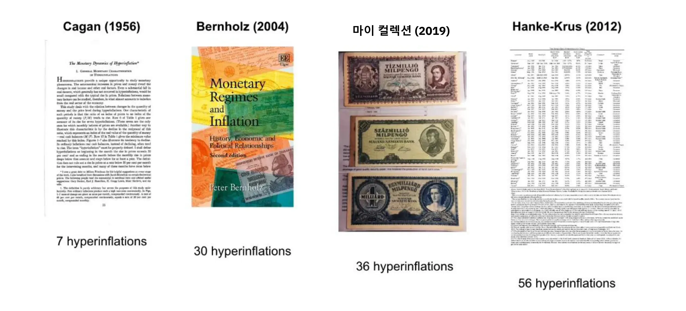

- 케이건의 저서인 '초인플레이션의 통화 역학'은 초인플레이션에 대한 근본적인 분석을 제공합니다.
- 베른홀츠의 저서에서는 30개의 서로 다른 초인플레이션 시기를 연구하여 분석 범위를 넓혔습니다.
- 이 강좌의 저자 데이비드 세인트 온지(David St-Onge)가 개인적으로 수집한 36개 초인플레이션 시기의 지폐를 통해 생생하고 역사적으로 이해할 수 있습니다.
- 행키 크로스 표(2012년 버전, 2016년 베네수엘라로 업데이트됨)는 캐건의 정의에 따라 57개의 하이퍼인플레이션 시기를 나열하고 있습니다.

역사적으로 인플레이션이 높았던 특정 시기는 엄격한 분류 기준으로 인해 고전적인 하이퍼인플레이션 표에 포함되지 않는 경우가 많다는 점에 유의할 필요가 있습니다. 예를 들어, 1779년 11월 미국 독립전쟁과 1864년 3월 미국 남북전쟁 당시의 월간 인플레이션율은 각각 47.4%와 40%였습니다. 이러한 인플레이션율은 높기는 하지만 캐건이 규정한 50% 임계치를 초과하지 않으므로 이 시기는 초인플레이션 사례로 분류되지 않습니다. 이러한 누락은 경직된 정의의 한계를 강조하고 하이퍼인플레이션에 대한 보다 미묘한 이해가 필요하다는 점을 강조합니다.

## 바이마르와 짐바브웨의 유사점

<chapterId>11eef458-aab8-5c63-8523-264d0ba69f5d</chapterId>

### 두 개의 시대, 두 개의 재앙

이 장에서는 짐바브웨와 바이마르 공화국의 경험을 중심으로 하이퍼인플레이션의 영향을 살펴봅니다. 저는 연구를 진행하면서 순전히 경제학적 또는 통계적 접근 방식을 채택하기보다는 이러한 초인플레이션 시기를 살았던 사람들의 직접적인 증언을 탐구하는 데 우선순위를 두었습니다.

특히 유익한 책이 몇 권 있었습니다:

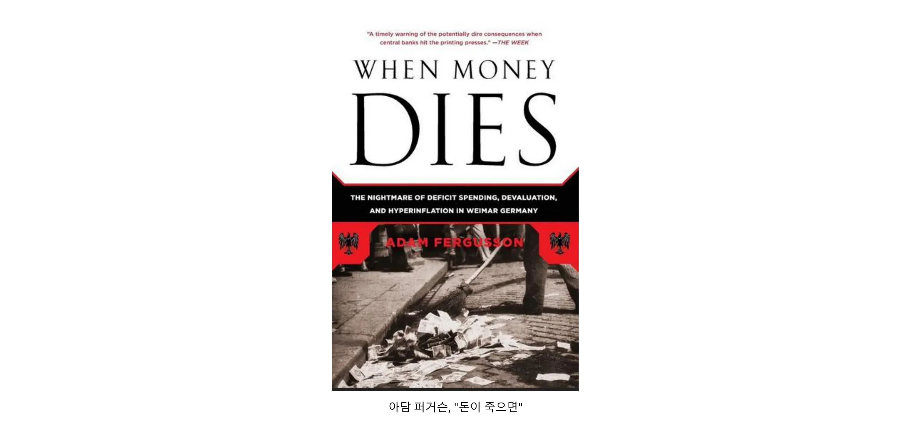

- "아담 퍼거슨의 '돈이 죽으면'은 제1차 세계대전 이후 독일과 오스트리아, 헝가리에서 발생한 초인플레이션을 추적합니다.
- 짐바브웨의 초인플레이션을 다룬 두 권의 책, "짐바브웨 따뜻한 마음 추한 얼굴"과 "Hard 삶은 계란 지수"는 각각 제롬 가드너와 쿠자이 조셉 구민유의 저서로, 의류 매장 체인의 CEO와 농업 은행가가 이 격동의 시기에 겪은 경험에 대한 가슴 아픈 증언을 들려줍니다.

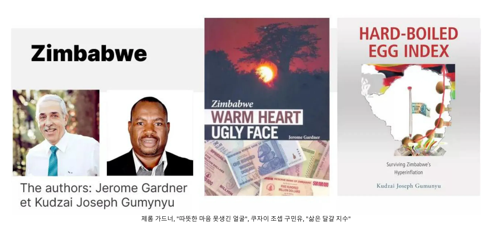

메모를 정리하는 과정에서 저는 짐바브웨와 바이마르 공화국의 초인플레이션 경험 사이에 90년의 격차에도 불구하고 수많은 유사점을 발견했습니다. 저는 약 17개의 유사점을 발견했으며, 그중 13개는 이 증언에 묘사된 경제 재앙으로 나아가는 일종의 진행 과정을 보여줍니다. 이러한 흥미로운 유사점은 하이퍼인플레이션이 시간과 국경을 초월하여 반복적이고 파괴적인 성격을 띠고 있음을 보여줍니다. 오늘은 이러한 유사점과 초인플레이션 기간 동안의 우려스러운 궤적을 어떻게 묘사하는지 살펴보겠습니다.

### 비교 분석: 짐바브웨와 바이마르 공화국

14가지 차이의 게임!

#### 1. 자금 부족

화폐 가치가 어지러울 정도로 빠르게 하락하면 새 지폐를 시장에 쏟아내려는 아무리 야심찬 시도도 역부족일 수 있습니다. 실물 화폐에 대한 끊임없는 수요는 중앙은행의 지폐 생산 능력을 훨씬 뛰어넘어 전례 없는 유동성 위기를 초래할 수 있습니다.

> 바이마르: "이번 달 동안 거의 40억 마르크까지 늘릴 예정이며, 이를 통해 통화 부족을 확실히 극복할 수 있을 것으로 기대합니다."

> 짐바브웨: "2002년부터 2009년 1월까지 몇 차례 심각한 유동성 부족 사태가 있었습니다. 치솟는 인플레이션을 따라잡을 만큼 인쇄되거나 유통되는 지폐가 충분하지 않았기 때문입니다."

#### 2. "그리고 그건 거름입니다!"

특정 경제 상황에서 화폐가 가치를 잃는 속도는 놀랍습니다. 천문학적인 양의 지폐가 순식간에 발행되어 한때 상당한 액수가 거름처럼 하찮은 것으로 변할 수 있습니다.

> 바이마르: "현재 총 발행량은 63,000억 달러에 달합니다. 따라서 며칠 안에 전체 유통량의 3분의 2를 하루 만에 발행할 수 있을 것입니다."

> 짐바브웨: "2006년 9월 17일, 짐바브웨 중앙은행 총재 기드온 고노는 '아직 10조 달러가 남아 있고, 거름이 되었다'고 선언했습니다."

#### 3. 지폐는 인쇄된 종이보다 가치가 낮습니다

특정 경제 상황에서는 지폐의 내재 가치가 지폐가 인쇄된 종이의 가치보다 낮아질 수 있습니다. 이러한 급격한 감가상각은 일반적으로 가치와 구매력의 상징인 지폐를 단순한 쓸모없는 종이 조각으로 만들어 버립니다.

> 바이마르: "모든 마르크 지폐는 인쇄기에서 나오자마자 거의 가치가 없어졌습니다."

> 짐바브웨: "중앙은행은 인쇄된 종이의 가치가 없는 지폐를 인쇄하여 돈을 낭비했습니다. 즉, 지폐의 가치가 화장지보다 낮았습니다. 터무니없게 들릴지 모르지만, 실제 화장지를 사는 것보다 100조 원짜리 지폐를 화장지로 사용하는 것이 더 저렴했습니다."

#### 4. 돈 세기

화폐 가치가 급격히 떨어지면 아무리 간단한 거래도 힘든 작업이 될 수 있습니다. 물품의 가격을 계산하거나 결제에 필요한 지폐를 세는 데 몇 분이 걸릴 수 있으며, 일상적인 상호작용에 39배의 복잡성이 더해집니다.

> 바이마르: "상점에서 가장 일반적인 구매는 3~4분 정도 계산이 필요했고, 가격이 결정되면 지폐를 세는 데 보통 몇 분이 더 필요했습니다."

> 짐바브웨: "매장 관리자는 하루 종일 돈을 세는 직원을 대신할 임시 직원을 고용할 수 있었습니다. 물론 관리와 은행 입금을 위해 매장에서 돈을 세는 것은 별개의 문제였지만, 입금하는 동안 은행에서 이 모든 과정을 반복해야 했죠."

:::video id=910231d7-af90-4ab8-b74c-bfb81caebfb2:::

우즈베키스탄의 돈 세는 기술

#### 5. 수표로 결제

혼란스러운 경제 상황에서는 수표와 같은 전통적인 결제 수단이 빠르게 효력을 잃을 수 있습니다. 초인플레이션으로 인한 통화 수요 증가에 압도된 은행은 수표의 현금화를 배급하거나 지연하여 수표의 실질 가치를 떨어뜨릴 수 있습니다. 이러한 불안정성은 종종 선택한 결제 수단에 따라 가격이 달라질 수 있는 결제 수단의 우선 순위로 이어집니다.

> 바이마르: "물가 상승은 국가와 다른 고용주 모두의 화폐 수요를 증가시켰습니다. 민간 은행은 수요를 전혀 충족할 수 없었고 수표의 현금화를 배급해야 했기 때문에 구매력이 감소하는 동안 현금화되지 않은 수표는 동결된 채로 남아 있었습니다."
> 짐바브웨: "화폐의 시간 가치로 인해 상품과 서비스에 대한 세 가지 가격, 즉 현금 가격, 실시간 총 결제 가격, 수표 가격이 형성되었습니다. 결국 아무도 수표를 받지 않았고, 수표는 청산하는 데 5일이 걸렸습니다."

#### 6. "버너 프레너"

통화 가치가 하락하면 시장 왜곡을 이용해 새로운 경제적 기회가 생겨납니다. 흔히 '버너 기업가'라고 불리는 이러한 기업가들은 평가절하된 통화를 빌려 유형 자산에 투자한 다음 더 평가절하된 통화로 부채를 상환함으로써 성공을 거둘 수 있습니다.

바이마르: "인플레이션에 대한 투기는 지폐를 빌려 상품과 공장으로 전환한 다음 감가상각이 끝난 지폐로 대출자에게 상환하는 방식으로 이루어졌습니다."

짐바브웨: "버너-프러너"

#### 7. 정직과 Hard 작업의 매력 상실

불안정한 경제 상황에서는 Hard의 전통적인 가치인 근면, 절약, 성실성이 빠른 부의 매력에 가려질 수 있습니다. 투기와 외환 거래는 정규직보다 훨씬 높은 보상을 제공하는 경우가 많기 때문에 사회적 우선순위에 혼란을 초래할 수 있습니다.

바이마르: "절약, 정직, 근면이라는 오래된 미덕이 매력을 잃으면서, 특히 통화나 주식 투기가 일보다 훨씬 많은 수익을 가져다줄 수 있기 때문에 모두가 빨리 부자가 되려고 노력했습니다."

짐바브웨: "이러한 관행은 소수의 개인을 부유하게 만들었지만 도시 노동자 계급과 농촌 주민들을 빈곤하게 만들었습니다. 교육이 필요하지 않은 사람들이 이 거래를 주도하면서 교육은 그 가치를 잃었고, 이를 정당화하기 위해 Hard 노동이 필요했습니다. 그들에게 필요한 것은 인맥과 초기 자본만 있으면 쉽게 돈을 벌 수 있는 사업을 시작할 수 있었습니다."

#### 8. "세계의 은행"

초인플레이션이나 통화 위기 상황에서는 종종 규제되지 않는 병행 외화 시장이 등장합니다. 이러한 비공식적인 '은행'은 종종 '세계 은행' 또는 다른 현지 명칭으로 불리며, 자산 평가절하로부터 자산을 보호하려는 사람들에게 피난처를 제공합니다. 이러한 시장은 필요한 경제적 생명줄을 제공할 수 있지만, 공식 금융 기관과 정부 정책에 대한 광범위한 불신을 드러내는 경우가 많습니다.

바이마르: "이들의 거래는 주로 인플레이션과 함께 등장한 이른바 '윙켈방키어'를 통해 이루어졌으며, 이들은 불황 속에서 외화 매매 가격의 차액을 이용해 전적으로 생계를 유지했습니다."

짐바브웨: "그들은 환전상이기도 했습니다. 그들은 불라와요의 2번가와 6번가, 포트 스트리트 사이에서 교묘한 사업 관행 덕분에 면책 특권을 누리며 영업을 했는데, 종종 부패와 기타 불법 활동을 수반했습니다. 이 지역은 '세계 은행'으로 알려져 있었습니다."

아르헨티나: "그래서 모든 아르헨티나 사람들이 가는 곳, 부에노스아이레스 중심부의 플로리다 지역에 있는 '동굴'인 쿠에바스를 찾아갔어요." - TheBigWhale

#### 9. 외화 환전은 불법입니다

각국 정부는 자국 통화를 안정시키고 자본의 흐름을 통제하기 위해 이러한 외화 거래를 불법으로 규정할 수 있습니다. 이러한 억압적인 조치는 국가 경제를 보호하기 위한 것이지만, 종종 대중의 불신을 악화시키고 암시장을 조장하는 반대 효과를 가져올 수 있습니다.

바이마르: "사람들은 물물교환에 의존했고 점차 외화를 유일한 신뢰할 수 있는 Exchange 수단으로 사용하게 되었습니다. 외국 어음 구매와 국내 결제에 외화를 사용하는 것에 관한 새로운 법령이 도입되었습니다. 이제 징역형과 더불어 불법 거래 금액의 최대 10배까지 벌금이 부과될 수 있게 되었습니다."

짐바브웨: "기업들에 대한 급습으로 주말 동안 불라와요의 여러 사업가들이 투옥되고 회수한 외화의 두 배에 해당하는 벌금이 부과되자 이러한 용기는 가라앉았습니다."

#### 10. 자본 관리

국가가 통화 위기나 경제 위기에 직면했을 때 정부가 취하는 일반적인 대응책 중 하나는 자본의 이동과 형태를 엄격하게 통제하는 것입니다. 평가절하된 자국 통화의 수용을 강제하는 명령이나 특정 결제 수단을 거부하는 사람들에 대한 엄격한 제재를 통해 이러한 조치는 공황을 억제하고 신뢰를 회복하는 것을 목표로 하는 경우가 많습니다. 그러나 그 효과는 다양하며 때로는 이러한 조치가 비생산적이거나 시민들이 경험하는 현실과 단절된 것으로 판명될 수 있습니다.

바이마르: "상인들은 최근 새로운 법령에 따라 국가 지폐를 받도록 강요받았지만, 모든 구매에 외화를 계속 사용할 수 있도록 허용했기 때문에 상인들은 일반적으로 다른 화폐를 거의 받지 않을 구실을 찾았습니다."

짐바브웨: "정부는 2008년 12월 12일에 수표 결제에 관한 SI 175/2008을 도입했습니다. 여기에는 '수표/은행 카드 또는 기타 은행 매개 전자 결제 수단에 의한 결제를 거부할 경우 8급 벌금형 또는 6개월의 징역형 또는 둘 다에 처한다'고 명시되어 있습니다 현실과 완전히 동떨어진 규정이었기 때문에 당연히 무시했습니다."

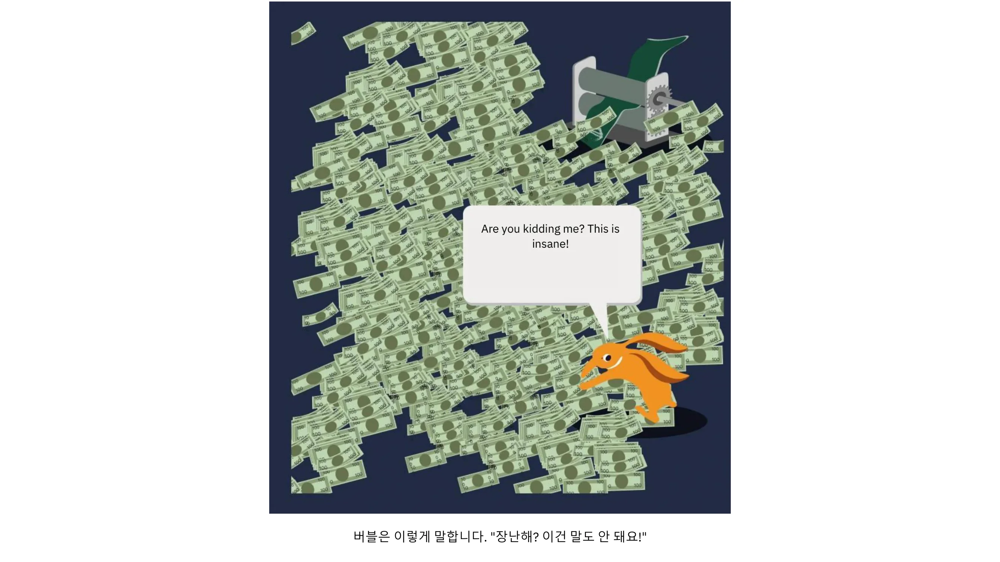

#### 11. 매장을 계속 운영해야 하는 경우

경제가 무너지고 통화가치가 떨어지면 정부는 정상적으로 보이기 위해 과감한 조치를 취할 수 있습니다.

바이마르: "활동을 계속하는 상인들은 10월 22일에 제정된 새로운 조례에 따라 상점을 계속 열어두고 종이 마크가 있는 Exchange로 상품을 제공해야 했습니다."

짐바브웨: "빈 철제 선반과 냉장고, 쿨러, 냉동고만 남아있었습니다. 비극은 정치적 긴장과 정부의 물가 통제에 대한 두려움 때문에 감히 문을 닫을 수 없어 가게가 여전히 열려 있었다는 점입니다. 모두가 빠른 해결책이 있을 것이라고 생각했기 때문에 직원들도 해고되지 않았습니다."

#### 12. 모두가 범죄자입니다

경제가 무너지고 규제가 만연한 상황에서 생존과 범죄의 경계가 모호해집니다.

바이마르: "국가를 상대로 한 모든 범죄는 정도의 차이는 있지만 개인에게 생존의 문제가 되었습니다."

> 짐바브웨: "짐바브웨의 모든 주민은 범죄자였습니다. 가혹하게 들릴지 모르지만 사실이었죠. 삶의 모든 측면을 규율하는 무수히 많은 작은 법률이 존재했기 때문에 모든 사람이 매일 법을 어기는 것은 불가피했습니다. 2004년에 발표된 한 SI에 따르면 외화 소지는 불법이었습니다. 일일 인출 한도를 우회하기 위해 여러 개의 은행 계좌를 보유하는 것도 불법이었습니다. 자동차에 제대로 된 번호판을 달지 않거나 자동차 라디오 면허증, 발전기 허가를 받지 않는 것도 모두 누군가, 어딘가에서 위반하고 있는 법이었습니다."

#### 13. 어떤 비용으로든 외화 구매

광적인 외화 매입은 종종 통화 평가 절하의 중요한 전환점이 되어 내재가치 하락을 악화시켰습니다.

> 바이마르: "프리츠 만하이머는 1921년 8월 상사의 지시에 따라 '독일에는 종이 마르크는 무한대로 많았지만 외화는 없었기 때문에' 외화를 아무 가격에나 사들이기 시작했습니다 이것이 마르크화 가치의 절대적 붕괴를 알리는 첫 신호였습니다."

> 짐바브웨: 일부 외환 요구사항이 긴급했기 때문에 기한을 맞추기 위해 어떤 일이 있어도 외환을 사서 쌓아두라는 일일 목표가 주어졌다는 주장이 제기되었습니다. 이러한 관행은 짐바브웨 달러 가치가 가파른 하락세를 이어가면서 평가절하의 불을 지폈다는 비난을 받았습니다."

### 프로세스 요약

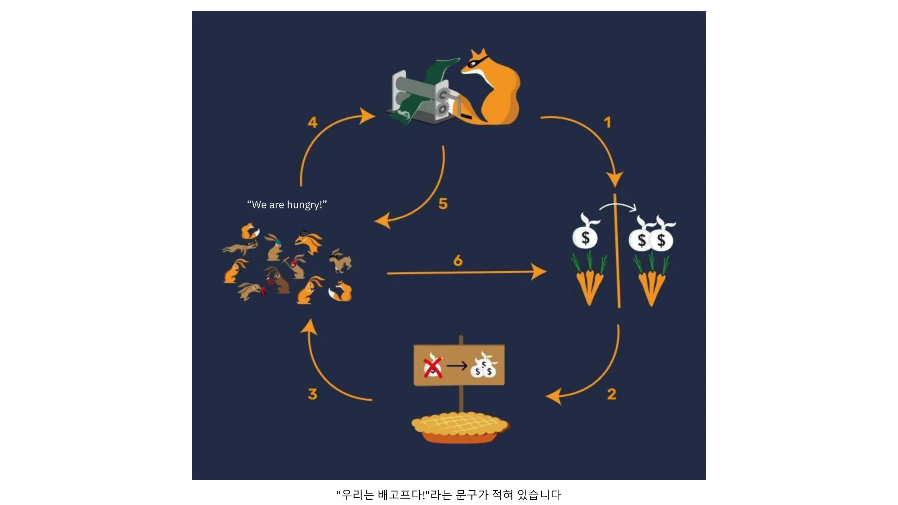

경제 궤적을 분석해 보면 높은 인플레이션에 도달하면 화폐의 가치가 하락한다는 것을 알 수 있습니다. 이러한 평가절하는 지폐 부족을 비롯한 여러 가지 문제를 야기합니다. 이러한 맥락에서 특히 Exchange 환율의 변동에 따라 차익 거래 기회가 발생합니다. 그 결과, 많은 개인이 차익거래를 통해 약화된 통화로 부채를 상환할 수 있는 미래의 통화 평가절하를 예상하여 유형 자산에 막대한 투자를 합니다. 이러한 경제 환경은 전통적인 일자리의 매력을 약화시키고 결과적으로 사회적 결속력을 약화시킵니다.

이러한 상황에 대응하기 위해 정부는 자본 통제를 포함한 엄격한 규제를 시행하고 있습니다. 또한 판매자가 국가 통화와 수표를 받도록 의무화했습니다. 시간이 지남에 따라 새로운 법률이 제정되어 범죄 행위의 정의가 확대됩니다. 궁극적으로 정부가 더 강력한 외화를 위해 더 낮은 비용으로 인쇄된 자국 통화를 기꺼이 Exchange로 평가절하하면서 Exchange 환율은 기하급수적으로 상승합니다.

### 4 하이퍼인플레이션이 초래하는 결과의 유사점

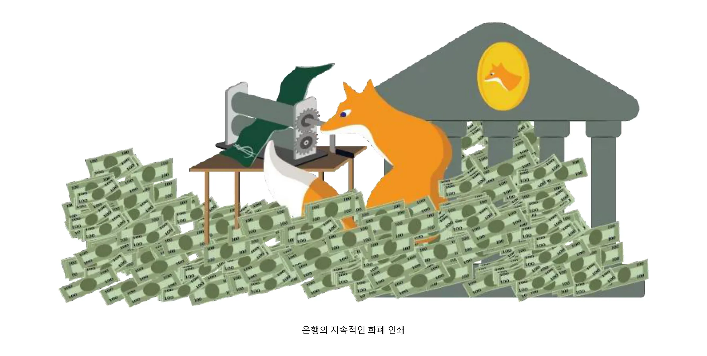

#### 1. 석유 및 금속

독일 바이마르 시대에는 귀중한 자재 절도가 너무 만연해 지붕에서 납을 훔치는 일이 빈번했습니다. 짐바브웨에서는 절망에 빠진 일부 사람들이 변압기에서 석유를 추출하여 차량에 사용하기 위해 전력망을 교란했습니다.

바이마르: "국가 기념물의 금속 명판은 안전한 보관을 위해 제거해야 했습니다. 베를린 주재 영국 대사관 문에서 황동 초인종 명판이 도난당했습니다."

짐바브웨: "설상가상으로 외화 부족으로 자동차 윤활유가 부족해졌고, 변압기는 정전 시 냉각유를 빼돌리는 도둑들의 쉬운 표적이 되었습니다."

#### 2. 기차

통화 평가절하로 인해 시민들은 기물 파손 등 생존을 위한 행동을 취하게 될 수 있습니다. 경제가 붕괴되면 교통 시스템과 같은 값비싼 공공 인프라가 손상되어 사회적으로 재앙적인 결과를 초래할 수 있습니다.

> 바이마르: "베를린에서는 자금 부족으로 트램 시스템이 운영을 중단했습니다."

> 짐바브웨: "가장 힘들고 슬픈 시나리오 중 하나는 하라레와 다부카를 연결하는 280킬로미터가 넘는 전기 구리선이 거의 모두 도난당했을 때였습니다. 완공 당시에는 이 노선을 따라 고속 전기 여객 및 화물 열차가 달리는 짐바브웨의 자랑이었습니다."

#### 3. "식사 식사"

저임금과 불안정한 경제 상황에서 기업들은 생산성과 운영 효율성을 유지하기 위해 직원들에게 음식을 제공해야 했습니다. 이 이니셔티브는 식량 부족과 높은 식품 비용을 상쇄하는 방법일 뿐만 아니라 어려운 경제 환경 속에서 직원을 유지하기 위한 전략이기도 했습니다.

> 바이마르: "수도 베를린에서 매우 중요한 계급을 형성하고 있던 사무직 직원들의 월급은 월 12,000~20,000유로(연간 12~19 파운드에 해당)로 완전히 부적절했고, 그 액수는 계속 줄어들고 있었지만 대부분은 회사에서 제공하는 상징적인 금액으로 점심 식사를 해결할 수 있어 몸과 마음을 겨우 유지할 수 있었다"고 합니다

> 짐바브웨: "이 단계에서는 모든 직원에게 무료 점심을 제공하고 있었습니다. 옥수수 식사는 직원들이 매일 먹는 유일한 식사였던 경우가 많았기 때문에 회사의 지속적인 기능에 필수적이었습니다."

#### 4. 주유 쿠폰

사람들은 안정적인 거래 대안을 찾았습니다. 바이마르에서는 황동과 연료와 같은 제품이 일정한 내재 가치로 인해 Exchange의 매개체 역할을 했습니다. 짐바브웨에서는 짐바브웨 달러의 급격한 평가 절하에 직면하여 필수품의 고정 수량을 나타내는 휘발유 쿠폰이 사실상 화폐가 되었습니다. 이러한 상황은 사회가 극한의 경제 상황에 어떻게 적응하며 무역과 경제를 유지하기 위한 혁신적인 해결책을 고안해내는지를 잘 보여줍니다.

바이마르: "물물교환은 이미 Exchange의 관습적인 형태였지만, 이제 황동과 연료 같은 상품이 일반적인 구매 및 지불 통화가 되었습니다."

짐바브웨: "모든 사람들이 짐바브웨 달러와 수표로 지불하는 것을 중단했기 때문에 이제 이 바우처로 집주인에게 임대료, 지방세, 전화 요금 등 사실상 거의 모든 것을 지불할 수 있게 되었습니다."

#### 결론

이것으로 짐바브웨와 바이마르 공화국의 초인플레이션 기간 동안의 경험의 유사점에 대한 이번 동영상을 마칩니다. 다음 영상에서는 차이점과 현대적 유사점에 대해 논의해 보겠습니다. 감사합니다.

## 바이마르 대 짐바브웨: 차이점과 현대적 유사점

<chapterId>643f279c-d89f-5600-a2e2-b1bbbba0ab69</chapterId>

이 장에서는 과거와 현재의 하이퍼인플레이션 시대의 차이점과 현대의 유사점을 일화와 관련 비교를 통해 살펴봅니다.

### 바이마르 공화국과 짐바브웨의 차이점

#### 1. 달러의 잘못입니다!

독일에서는 인플레이션의 원인을 자국 통화의 본질적인 평가절하보다는 달러의 상승으로 보는 것이 일반적이었습니다. 많은 사람들이 관찰된 현상이 달러화 가치 상승 때문이라고 믿었습니다. 이러한 인식은 주로 과도한 화폐 발행으로 인한 경제적 어려움과 화폐 평가절하 사이의 연관성에 대한 인식을 무시했습니다. "화폐가 죽으면"이라는 책은 독일 국민들의 이러한 이해 부족을 명확하게 보여줍니다. 반면 짐바브웨에서는 상황이 달랐습니다. 시민들은 현재 겪고 있는 초인플레이션의 근본적인 원인을 충분히 인식하고 있었습니다.

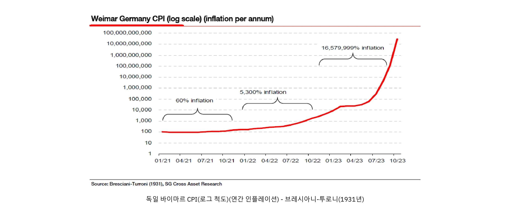

#### 2. 긴급 자금(Notgeld)

통화 및 경제 위기에 직면한 독일은 '노트겔트'(비상 화폐)에 의존했습니다. 도시나 특정 회사에서 인쇄한 이 지폐는 부족한 통용 화폐를 보충하기 위해 고안되었습니다.

흥미롭게도 프랑스도 특히 1920년대에 노트겔드에 의존했습니다. 이 시도는 초인플레이션의 직접적인 결과일 뿐만 아니라 제1차 세계대전으로 인한 혼란에 뿌리를 두고 있습니다. 전쟁은 경제를 불안정하게 만들었을 뿐만 아니라 금속 가격도 상승시켰습니다. 그 결과 금속 동전의 내재 가치가 액면가를 초과하는 경우가 많았고, 사람들은 동전을 사재기하게 되었습니다. 동전이 없는 상황에서 리옹 상공회의소와 같은 일부 기관에서는 자체적으로 노트겔드를 인쇄했습니다.

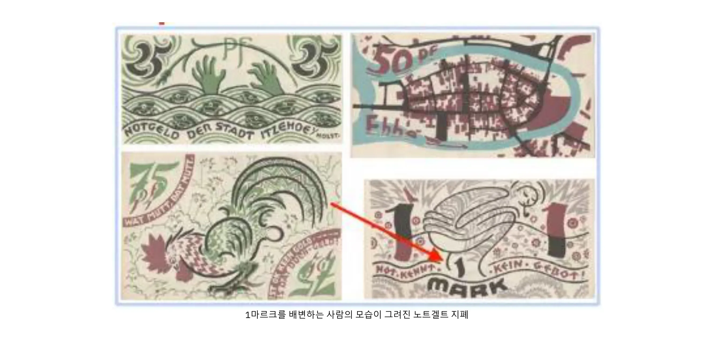

> "해야 할 일은 해야 한다." - 현지 속담

노트겔트 중에서도 특히 눈에 띄는 지폐가 있습니다. 중앙에 한 사람이 마르크화를 배설하는 모습이 그려져 있는 가슴 아픈 그림이 특징입니다. 뒷면에는 1913년부터 1921년까지의 물가표가 이 기간 동안의 인플레이션 상승을 보여줍니다.

이 노겔드 지폐의 작가는 초인플레이션 위기에 책임이 있는 당국을 아이러니하게 비판하고 있는 것으로 보입니다. 지폐에는 "필요는 법을 모른다"라는 문구가 새겨져 있습니다. 노트겔트의 원산지와 관련된 또 다른 표현은 "해야 할 일은 해야만 한다"입니다

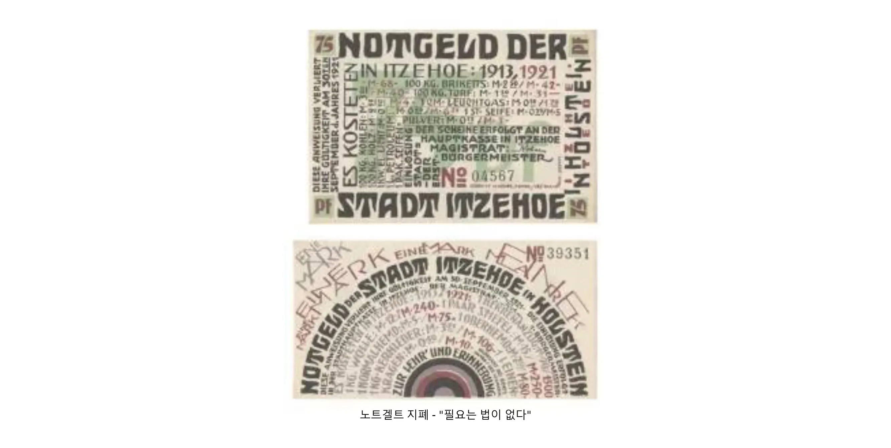

> "필요는 법을 모른다"

> 최초의 똥코인: 일화적으로 지폐의 중앙 그림을 보면 말 그대로 개인의 행동에 의해 화폐가 평가절하되는 이 지폐를 최초의 "똥코인"이라고 부를 수 있습니다

#### 3. 사채 및 모기지

바이마르에서는 인플레이션의 영향을 보상하기 위해 일부 부채를 재평가했습니다. 짐바브웨에서는 이 조치가 채택되지 않았습니다.

> 바이마르: "1925년 정부 소유의 대출금을 재평가하기로 한 결정이 법으로 제정되어 모든 배상금을 지불한 주주들은 초기 투자금의 2.5%를 받게 되었습니다."

> 짐바브웨: "3년 후인 2007년 7월, 저는 현재 시장 환율로 1.67달러에 해당하는 평가 절하된 ZDW 50만(000 바트) 지폐를 주머니에서 꺼내 20년 동안 상환해야 하는 모기지 대출을 상환할 수 있었습니다. 게다가 이 어음은 같은 달 제 월급의 0.49%에 불과했습니다."

독일 위기 관리에 대해 자세히 알아보려면 이 책도 필수입니다.

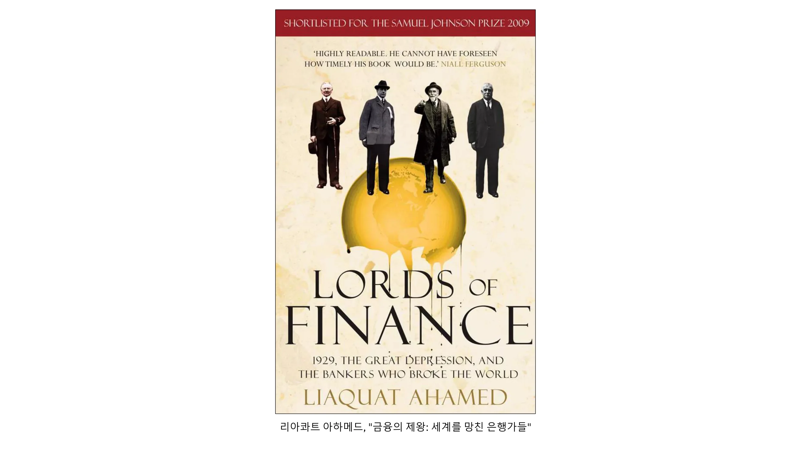

### 현대 패러렐

#### 1. 경제를 통제하기 위한 통화 정책 조작.

바이마르 공화국의 역사를 보면, 기업가들은 마르크화 가치가 상승하는 것을 꺼려했던 것이 분명합니다. 크게 평가 절하된 마르크화로 빚을 빌리고 갚을 수 있었기 때문에 상당한 이점을 누릴 수 있었습니다. 이 메커니즘 덕분에 거의 비용 없이 거대한 산업 단지를 건설할 수 있었습니다. 이러한 산업가들은 마르크화의 평가절하가 자신들의 활동을 방해할까봐 두려워했습니다. 일부는 인플레이션이 국민에게 고용을 보장할 것이라 믿으며 인플레이션을 긍정적인 발전으로 간주하기도 했습니다. 그러나 그들은 인플레이션이 저축과 경제 전체에 미치는 해로운 영향을 깨닫지 못했습니다. 이러한 경제 주체들에게 화폐 발행은 축복이었습니다.

> 바이마르: "이 때문에 마크의 가치 상승이 크게 우려되었고, 제노바 이후 몇 주 동안의 '안정'도 비즈니스의 침체를 초래했습니다."

> 바이마르: "산업계는 현금이 상품보다 더 가치가 높아져 모든 사람이 자산을 현금으로 전환하려 할 때 붕괴가 일어날 위험에 직면했습니다."

시민들이 저축을 보호하는 것보다 고용 가능성을 우선시해야 한다는 크리스틴 라가르드 총재의 발언과 현대적 유사점을 찾을 수 있습니다. 바이마르의 산업가들처럼 그녀는 저축의 가치를 희생하면서까지 고용을 촉진하는 도구로서 화폐 발행을 옹호하는 것처럼 보입니다.

> 크리스틴 라가르드: "우리는 저축을 보호받는 것보다 일자리를 갖는 것이 더 행복해야 합니다."

#### 2. 분쟁 시 사유 재산

바이마르 공화국의 역사를 보면 이 기간 동안 해외에 보유한 자산과 자본이 몰수되었음을 알 수 있습니다. 이 조치는 최근 러시아에서 발생한 사건, 특히 분쟁 초기에 발생한 사건을 떠올리게 합니다. 이러한 상황은 위기 상황에서 사유 재산에 대한 존중이 훼손될 수 있다는 우려스러운 현실을 강조합니다. 이는 위기가 개인의 권리에 미칠 수 있는 잠재적 영향을 강조하는 역사적, 현대적 유사 사례입니다.

> 바이마르: "해외에 있는 모든 독일 자본이 몰수되었습니다."

> [20minutes.fr](https://www.20minutes.fr/monde/3286947-20220513-guerre-ukraine-geler-avoirs-russes-vol-non-redistribuer-kiev-poserait-lourdes-questions): "러시아 중앙은행이 보유한 6400억 달러의 외환보유액 중 해외에 보유한 약 3000억 달러의 러시아 외환보유액이 서방 제재의 일환으로 실제로 동결되었습니다."

#### 3. 시장 가격의 개념

바이마르 공화국 시절, 농부들은 매년 생산되는 밀의 첫 200만 톤을 강제로 납품해야 하는 '움라게' 정책에 불만을 표출했습니다. 이 규정으로 인해 전체 빵 Supply의 절반이 보조금을 받는 가격으로 시장에 출시되었습니다. 8월 이후부터 이 농부들은 세계 시장 가격을 지불해야 했는데, 밀을 할인된 가격에 넘겨야 했지만 여전히 세계 시장 가격으로 비료를 구입해야 했기 때문입니다.

이 상황은 초인플레이션 기간 동안 시장 가격의 개념과 관련된 핵심적인 문제를 제기합니다. 당시 독일의 상황에서 농부들은 밀을 가치보다 낮은 가격에 팔아야 했고, 비료는 세계 시장 가격으로 조달해야 했습니다. 이러한 경제적 불균형은 오늘날 식량 가격의 문제를 잘 보여줍니다. 인플레이션으로 인한 투입 비용 상승에 직면한 농업 생산자들은 이러한 비용을 최종 제품에 전가합니다. 이러한 가격 상승에 대해 비판하는 것은 시장 가격의 역학 관계와 그들이 직면한 경제적 압박을 무시하는 것과 같습니다. 높은 비용을 발생시키면서 인위적으로 낮은 가격으로 판매하는 것은 어떤 비즈니스에서도 지속 가능하지 않습니다.

> 바이마르: "매년 생산되는 밀의 첫 200만 톤을 강제 수매하는 '움라게'로 인해 전체 빵 Supply의 절반이 저가에 판매되는 것에 대해 농업계의 불만이 컸습니다. 8월부터 농민들은 밀을 헐값에 팔아야 하는 반면, 비료는 항상 세계 시장 가격을 지불해야 했기 때문입니다."

#### 4. 화폐 Supply과 인플레이션 사이의 연관성 부인

> 바이마르: "그는 Supply가 물가 수준이나 Exchange 요금과 관련이 없다는 자신의 견해를 굳건히 고수했습니다."

이전 장에서 다양한 경제학자와 경제연구소가 인플레이션을 정당화하기 위해 제시한 설명 목록의 예에서 볼 수 있듯이 현대에도 이러한 추세는 지속되고 있습니다. 이러한 이유는 테일러 스위프트, 젤다, 비욘세 같은 유명인이나 문화 행사부터 전쟁이나 팬데믹 같은 글로벌 요인에 이르기까지 다양합니다. 이러한 모든 이유는 단기적인 경제 변동에 잠재적으로 기여할 수 있지만, 실제 근본적인 원인인 통화량 확대에 대한 관심을 분산시킵니다.

#### 5. 좀비 기업

> 바이마르: "안정화로 인해 기업가들이 다른 사람들을 희생시키면서까지 원하는 만큼 빌릴 수 있던 시기는 끝났습니다. 화폐가 풍요로울 때 설립되거나 확장된 수많은 기업이 자본이 부족해지자 빠르게 비생산적으로 변했습니다."

좀비 기업이란 정상적인 시장 상황이라면 파산 또는 파산 직전이지만 주로 저비용 차입에 의존하여 계속 운영되는 기업을 말합니다. 이러한 기업은 부채를 감당할 수 있을 만큼만 수익을 올리지만 크게 성장하지 못합니다.

좀비 기업이라는 개념은 새로운 것이 아닙니다. 사실 좀비 기업은 바이마르 공화국 시절에도 존재했습니다. 당시 많은 기업들이 무분별한 신용 대출의 혜택을 받으며 번성하는 것처럼 보였습니다. 이들은 만연한 인플레이션으로 인해 가치가 하락한 화폐로 나중에 상환할 것을 기대하며 막대한 금액을 빌렸습니다. 그러나 인플레이션이 멈추고 독일 마르크화의 가치가 회복되자, 운영상 또는 재정적으로 생존이 불가능해진 이 기업들은 수익성이 없어져 문을 닫아야 했습니다.

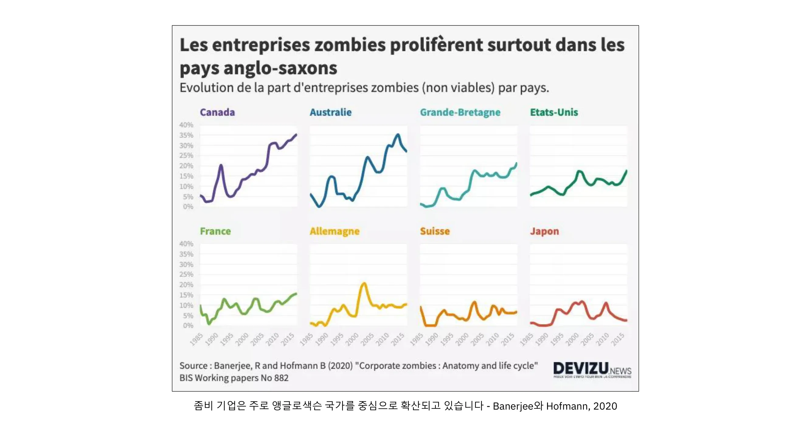

좀비 기업 현상은 전후 독일에만 국한된 것이 아닙니다. 오늘날에도 많은 대기업들이 매우 낮은 이자율로 신용을 이용할 수 있는 특권 덕분에 계속 번창하고 있습니다. 만약 이들이 더 높은 이자율로 대출을 받아야 한다면 많은 기업이 수익성을 잃게 될 것입니다. 이는 특히 제로 금리에 가까운 장기간의 저금리 기조 이후 금리가 상승하기 시작한 2023년과 관련이 있습니다. 이러한 최근의 금융 환경 변화는 한때 "좀비"로 분류되었던 이들 기업에게 결정적인 시험대가 될 것입니다

#### 6. 빠르게 부자가 되세요!

바이마르와 짐바브웨에서 차익거래를 통해 개인이 빠르게 부를 축적하려 했던 사례는 역사에서 찾아볼 수 있습니다. 오늘날에도 특정 암호화폐의 부상과 함께 비슷한 추세가 관찰되고 있습니다. 사람들은 빠른 수익의 유혹에 빠져 기하급수적인 투자 증가를 기대하며 위험을 감수합니다. 이러한 접근 방식은 초인플레이션 시기에 차익거래를 통해 빠른 이익을 얻기 위해 다른 사람들을 희생시키면서까지 차익거래를 사용했던 것을 떠올리게 합니다.

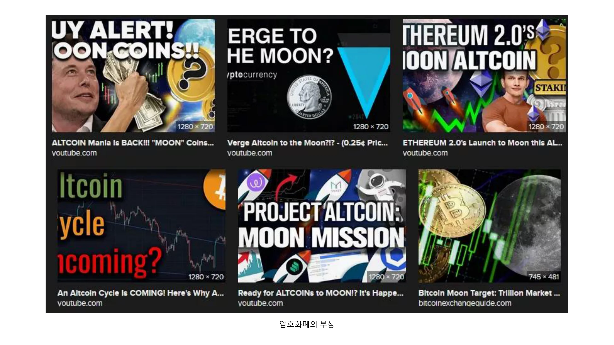

#### 7. 불확실성에 대한 해결책, 저축

> 자본과 소득의 가치가 지속적으로 침식되고 미래에 대한 불확실성이 만연하고 파괴적인 영향을 미치고 있습니다.

자본 가치의 침식이 사회 결속력에 미치는 파괴적인 영향과 그로 인해 발생하는 불확실성을 강조하는 인용문을 강조할 가치가 있습니다. 이 인용문은 다음과 같이 말합니다: "자본과 소득 가치의 지속적인 침식과 미래에 대한 불확실성의 만연하고 파괴적인 영향력"

보호하고 싶은 가족이나 사랑하는 사람이 있는 시나리오를 상상해 보세요. 미래의 불확실성에 대비하기 위해 Hard로 일하고 저축을 합니다. 모든 것이 예측 가능하다면 저축은 쓸모가 없을 것입니다. 하지만 자동차 고장과 같은 예기치 못한 상황에 직면했을 때 저축은 생명줄이 됩니다. 저축은 세상의 불확실성을 줄여줍니다. 하지만 초인플레이션 시기에는 저축이 쉽지 않습니다. 돈의 가치가 빠르게 떨어지기 때문에 장기적인 계획이 어려워집니다. 이러한 재정적 불안정은 스트레스와 불안을 가중시킬 수 있습니다.

오늘날 저축 능력이 감소함에 따라 투자가 그 자리를 대신하고 있습니다. 그러나 이러한 접근 방식에는 나름의 위험이 따릅니다. 저축은 항상 불확실성에 대한 대비책이었습니다. 예기치 못한 상황에 대처할 수 있는 재정적 여유를 확보하는 것은 마음의 평화에 기여하고 사회적 결속력을 강화하는 데 도움이 됩니다. 결론적으로, 저축 능력을 보호하는 것은 사회와 개인의 안정을 유지하는 데 필수적입니다.

## 라틴 아메리카의 리디노미네이션

<chapterId>918eafd7-409d-5205-ad52-a52e63b23a64</chapterId>

이제 라틴 아메리카 국가의 다양한 리디노미네이션 시기를 살펴보겠습니다.

### 그래프에 대한 설명

슬라이드의 왼쪽에는 리디노미네이션 연도, 새 화폐의 이름, 이전 화폐와의 Exchange 환율이 표시됩니다. 아르헨티나의 예를 들어 페소 모네다 나시오날은 이전 통화인 페소 레알에서 25 대 1의 비율로 변환되었습니다. 이러한 맥락에서 아르헨티나 통화의 시간 경과에 따른 변화를 살펴볼 것입니다. 또한 각 기간에 대한 지폐의 초기 및 최종 액면가를 표시합니다.

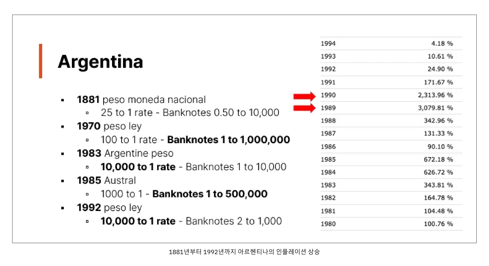

슬라이드의 오른쪽에 인플레이션 그래프가 표시됩니다. 빨간색 화살표는 월 50%의 인플레이션율이라는 Cagan의 기준에 따라 하이퍼인플레이션이 발생한 해를 나타냅니다. 이 기준은 때때로 인플레이션율이 높은 해가 하이퍼인플레이션의 엄격한 정의에 부합하지 않을 수 있으므로 모호한 해석으로 이어질 수 있습니다.

인플레이션 기간 동안 정부가 취하는 일반적인 조치인 리디노미네이션이 주목할 만한 현상이라는 점에 주목할 필요가 있습니다. 그러나 이는 인플레이션이나 하이퍼인플레이션의 근본적인 문제를 해결하지 못합니다. 이는 하이퍼인플레이션의 근본 원인인 화폐의 팽창을 진정으로 해결하지 않고 화폐의 이름을 바꾸고 0을 제거하는 방법일 뿐입니다. 이후 동영상에서는 Address에 대한 진정한 해결책을 논의하고 하이퍼인플레이션 문제를 해결해 보겠습니다. 이 시리즈에서는 적절한 개혁 없이 단순한 리디노미네이션이 가져오는 결과, 즉 인플레이션이 지속된다는 점을 강조할 것입니다.

아르헨티나에 이어 브라질, 볼리비아, 페루, 니카라과, 베네수엘라를 대상으로 연구를 진행할 예정입니다. 이 나라들에서 일어난 리디노미네이션에 대해 살펴볼 것입니다.

### 아르헨티나

1826년 이전 아르헨티나는 스페인 달러를 사용했습니다. 1816년 독립 후 스페인 레알을 기반으로 한 자체 화폐를 도입하면서 비슷한 화폐가 만들어졌습니다. 표는 1881년 '페소 모네다 나시오날'이 도입된 해부터 시작되며, 지폐는 최대 10,000페소까지 사용할 수 있습니다. 그 다음에는 100대 1의 비율로 교환되고 최대 100만 페소까지 지폐를 발행한 '페소 레이'가 등장했습니다. 그 후 '아르헨티나 페소'는 10,000대 1(0을 4개 제거한 것과 동일)의 Exchange 비율과 최대 10,000장의 지폐로 등장했습니다. 1985년에는 '호주화'가 도입되어 1,000대 1의 비율로 교환되었으며 지폐는 최대 500,000까지 사용할 수 있었습니다. 1992년에는 다시 한 번 0이 4개 제거된 10,000대 1의 비율로 현재의 '페소 레이'가 제정되었습니다. 1989년과 1990년에만 초인플레이션이 발생했습니다.

### 브라질

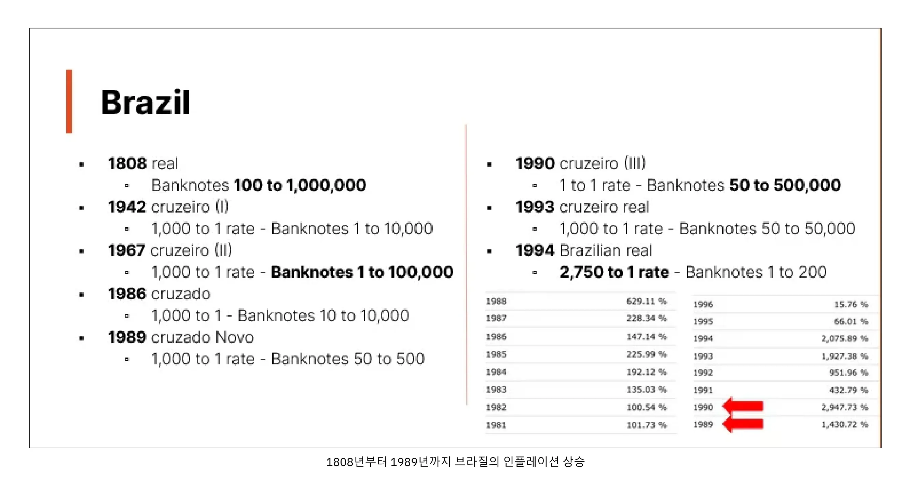

브라질은 화폐 단위 변경의 역사에서 알 수 있듯이 화폐 단위 변경의 대표적인 사례입니다. 독립 전 브라질은 포르투갈 레알을 통화로 사용했습니다. 하지만 1822년 독립을 선언하기 훨씬 전인 1747년부터 브라질은 독자적인 '브라질 레알'을 사용하기 시작했습니다. 표는 브라질 지폐 발행의 시작을 알리는 1818년부터 시작됩니다. 이전에는 화폐가 주로 동전 형태였습니다. 이 지폐의 가치는 최대 100만 레알에 달했습니다.

1942년부터 브라질은 일련의 리디노미네이션을 시작했습니다. 대부분의 경우(1942년, 1967년, 1986년, 1989년, 1993년) 전환율은 1:1,000이었습니다. 1990년에는 전환 없이 이름이 변경되었습니다. 이러한 화폐의 순서는 다음과 같습니다:

- 레알(구 버전)은 1942년까지 사용되었습니다.
- 1942년 크루제이로스.
- 1967년 크루제이로스(새 버전).
- 1986년 크루아도스.
- 1989년 크루아도스 노보스.
- 1990년 크루제이로스로 돌아갑니다.
- 1993년 크루제이로스 레이즈.
- 마지막으로 1994년 브라질 레알이 있습니다.

최고 액면 지폐는 500,000에 달했으며 1994년 마지막 리디노미네이션은 2,750 대 1의 비율로 이루어졌습니다. 1989년과 1990년은 초인플레이션으로 표시되었으며 1993-1994년에는 초인플레이션의 한계점(월 50%)에 도달하지 못하는 높은 인플레이션율을 보였습니다. 이 격동의 시기가 지나고 브라질은 다시 한 번 0을 제거하여 통화의 명칭을 변경했습니다.

### 볼리비아

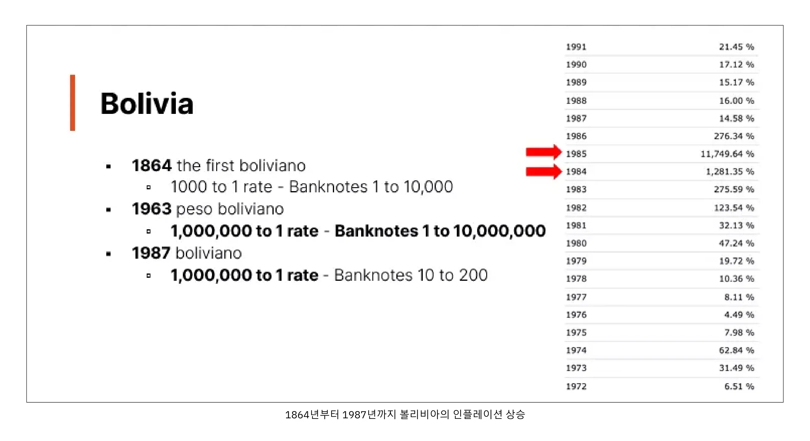

볼리비아는 극심한 인플레이션을 경험하여 화폐를 리디노미네이션해야 했던 또 다른 예입니다. 다음은 볼리비아의 화폐 역사를 요약한 것입니다:

1825년 독립하기 전 볼리비아는 스페인 달러를 통화로 사용했습니다. 독립 후 볼리비아는 1827년부터 1864년 사이에 스페인 달러를 대체하는 볼리비아 솔을 도입했습니다. 하지만 볼리비아 최초의 지폐는 1864년에야 도입되었다는 점에 주목할 필요가 있습니다.

1864년, 볼리비아 솔과 1,000대 1의 비율로 Exchange이 적용된 최초의 '볼리비아노'가 도입되었습니다. 이 화폐는 10,000볼리비아노가 될 때까지 계속 유통되었습니다.

그 후 볼리비아는 화폐를 '볼리비아 페소'로 바꾸었고, 극심한 초인플레이션을 겪으며 결국 화폐 단위가 최대 천만 페소까지 치솟았습니다. 이러한 인플레이션은 1984~1985년에 정점에 달했으며, 월별 인플레이션율은 종종 초인플레이션 기준치인 50%에 근접했습니다. 참고로, 1년 동안 매월 50%의 인플레이션율이 일정하게 유지되면 연간 인플레이션율은 약 12,800%에 달합니다. 1985년 볼리비아의 연간 인플레이션율은 11,749%에 달했는데, 이는 거의 매달 인플레이션이 50% 임계치에 근접하거나 초과했음을 나타냅니다.

이러한 통화 위기에 대응하기 위해 볼리비아는 1987년 '볼리비아노'라는 새로운 화폐를 도입했는데, 1볼리비아노에 100만 볼리비아 페소라는 환율을 적용했습니다. 이 버전의 볼리비아노는 오늘날에도 여전히 유통되고 있습니다.

이는 초인플레이션과 리디노미네이션으로 점철된 볼리비아의 격동적인 화폐 역사를 간략하게 살펴본 것입니다.

### 페루

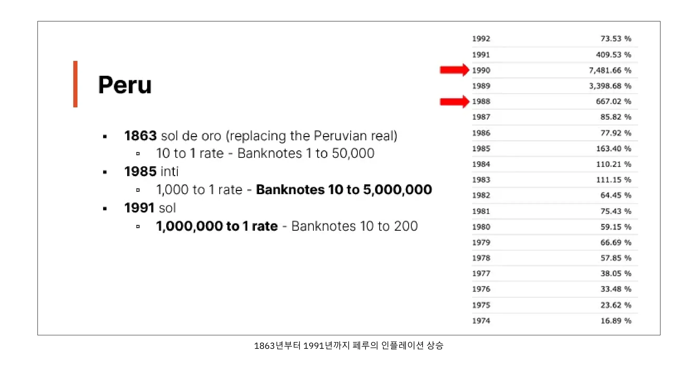

페루는 임의적 50% 규칙의 효과에 관한 흥미로운 사례를 제시합니다. 화폐의 역사부터 살펴보면 페루는 1821년 독립을 선언한 19세기까지 스페인 금을 사용했습니다. 페루 달러는 1822년부터 1863년까지 사용되었습니다. 1863년 페루 레알은 10 대 1의 비율로 최대 50,000에 이르는 솔디 오로로 대체되었습니다. 1985년에는 1000대 1의 환율을 가진 '인티'라는 화폐가 도입되어 500만 개로 최고치를 기록했습니다. 1991년에는 'SOL'이 100만 대 1의 Exchange 비율로 출시되었으며 지폐는 10에서 200까지 다양했습니다.

리디노미네이션 시기를 살펴보면 1988년은 특히 9월에 초인플레이션이 발생한 해로 꼽힙니다. 1990년 7~8월도 하이퍼인플레이션의 시기였습니다. 1988년 연간 인플레이션율은 667%였으며 9월에 50%로 최고치를 기록했습니다. 반면 1989년에는 50%를 초과하는 달 없이 3000%의 인플레이션을 경험했기 때문에 하이퍼인플레이션으로 분류되지 않았습니다. 1990년에는 인플레이션이 7481%로 정점을 찍었습니다. 1988년은 1989년과 달리 초인플레이션의 해로 간주되었기 때문에 50% 규칙이 자의적일 수 있다는 것은 분명합니다. 이 규칙을 재고한다면 1989년 페루가 경험한 것과 같은 기간을 포함하도록 기준을 낮추는 것이 현명할 수 있습니다.

> 현재 상황 이해하기
>

> 통화 리디노미네이션에 대해 이해해야 할 핵심 사항은 통화 가치가 5백만 또는 천만과 같은 천문학적 수치에 도달하면 리디노미네이션이 이루어진다는 것입니다. 이 과정은 통화가 변경되는 것을 포함하여 여러 번 반복될 수 있습니다. 그 결과 초인플레이션이 발생하지 않더라도 개인의 저축은 심각한 영향을 받을 수 있습니다. 예를 들어, 한 해에 1,000달러를 저축하고 100달러를 따로 모아두었다면 다음 해에 가장 낮은 액면가의 지폐가 1,000달러가 되어 이전에 저축한 100달러의 가치가 없어질 수 있습니다. 이러한 저축의 침식은 명백한 하이퍼인플레이션을 필요로 하지 않습니다. 지난 10년 동안 1만 달러를 저축한 사람이라도 결국 그 금액은 생수 한 병도 살 수 없는 미미한 금액이 될 수 있습니다. 이러한 현실은 단 몇 개월만 초인플레이션으로 분류되었더라도 리디노미네이션을 경험한 많은 나라에서 분명하게 드러납니다. 반면에 니카라과와 같은 일부 국가에서는 수년 연속 초인플레이션을 경험하기도 했습니다.

### 니카라과

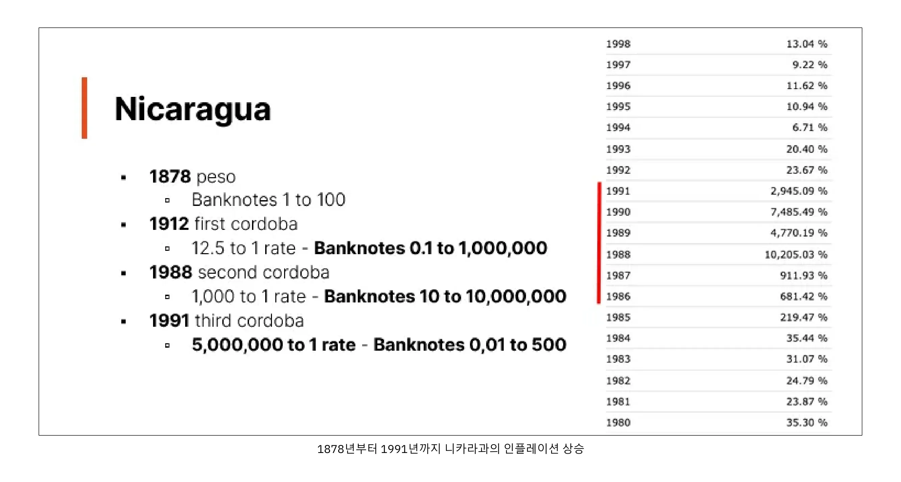

과거 스페인의 통치를 받았던 니카라과는 스페인의 식민지였던 다른 많은 국가와 마찬가지로 처음에는 스페인 달러를 사용했습니다. 스페인 제국, 멕시코 제국, 중앙아메리카 연방 공화국에 통합된 후 니카라과는 독립을 선언했습니다. 1878년부터 페소가 니카라과의 공식 화폐가 되었고, 페소 가치는 1에서 100 사이로 변동했습니다. 1912년 첫 번째 코르도바가 도입되었고, 1988년 두 번째, 1991년 세 번째 코르도바가 도입되어 현재까지 사용되고 있습니다. 첫 번째 코르도바는 100만, 두 번째 코르도바는 1000만 코르도바에 도달했습니다. 1991년 리디노미네이션은 몇 년간의 초인플레이션 이후 이루어졌습니다.

### 베네수엘라

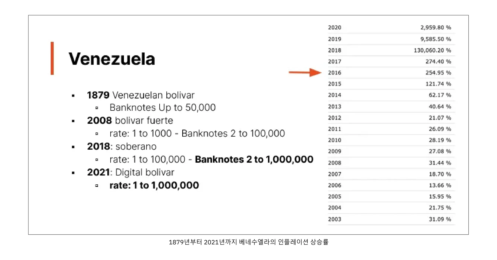

베네수엘라는 이 동영상에서 마지막으로 언급된 국가입니다. 베네수엘라는 그동안 네 번의 화폐 단위 변경을 거쳤습니다. 베네수엘라는 1811년 독립을 선언하기 전까지 초창기에는 스페인 달러를 사용했습니다. 1879년에는 볼리바르를 공식 통화로 도입했으며, 이는 1983년 정부가 달러를 사용하는 변동환율제인 Exchange을 채택할 때까지 유효하게 유지되었습니다.

베네수엘라의 주목할 만한 사실은 베네수엘라가 라틴통화동맹에 가입했다는 점입니다. 이 연합에는 스페인의 5페세타, 그리스의 5드라크마, 베네수엘라의 5볼리바르, 이탈리아의 5리라, 벨기에의 5프랑, 프랑스의 5프랑과 같은 동전이 포함되어 있습니다.

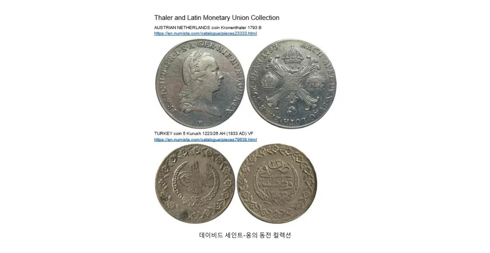

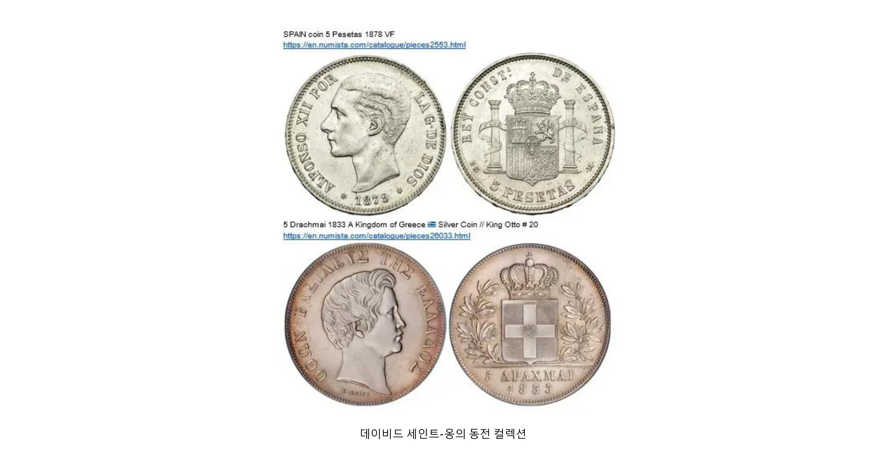

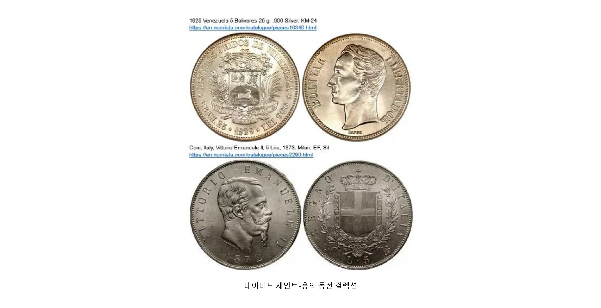

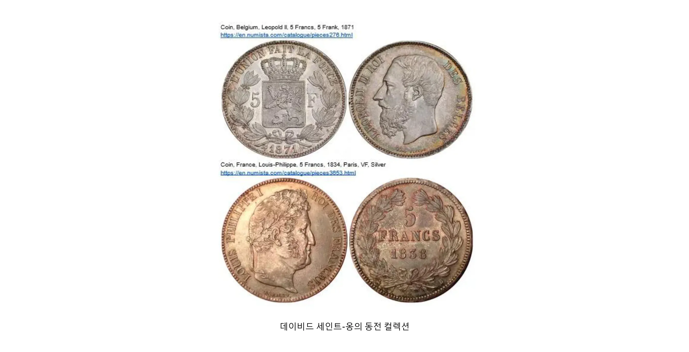

이 기간 동안 베네수엘라의 5볼리바르 Coin은 이탈리아, 스페인, 벨기에, 프랑스를 포함한 유럽연합 회원국들의 화폐와 무게가 같았습니다. 이 볼리바르는 은으로 만들어졌으며, 1929년의 특정 Coin의 무게는 25그램, 순도는 900 또는 순은 90%였습니다. 현재 은 가격으로 이 Coin의 가치는 약 17~18달러(미국 달러)입니다.

1983년 변동형 Exchange 요금이 채택된 후 몇 차례의 리디노미네이션이 이어졌습니다:

- 2008년에는 '강한 볼리바르'로 불리는 볼리바르 푸에르테가 도입되어 최대 100,000까지 올라갔다가 1,000대 1로 리디노미네이션되었습니다.
- 2018년에는 소베라노가 도입되어 지폐가 100만 개에 달했습니다. 2021년에는 디지털 볼리바르 지폐로 대체되었는데, 이 지폐 역시 100만 볼리바르에 도달한 후 100만에서 1로 새로운 리디노미네이션이 이루어졌습니다. 오늘날 10달러 또는 20달러 지폐는 소베라노로 1,000만 또는 2,000만 달러에 해당합니다.

2018년으로 거슬러 올라가는 이 기간의 지폐는 비아리츠, 토론토, 마이애미에서 열린 다양한 Bitcoin 컨퍼런스에서 배포되었습니다. 이 소베라노 지폐는 최대 100만 달러에 달했습니다. 이후 리디노미네이션이 진행되어 100만 달러의 가치가 약 3센트로 감소했습니다. 현재 1백만 지폐 10장은 10달러 지폐 1장에 해당합니다. 베네수엘라는 2016년부터 초인플레이션을 경험하고 있으며, 이는 특정 표에서 57번째 기간에 해당합니다.

다음 동영상에서는 베네수엘라 및 기타 상장 국가를 중심으로 초인플레이션 지폐 모음을 소개합니다. 이 컬렉션에는 거의 모든 베네수엘라 지폐가 포함되어 있습니다. 이 연구는 언급된 각 국가의 다양한 리디노미네이션에 초점을 맞출 것입니다. 또한 상당한 관심의 대상인 짐바브웨의 리디노미네이션에 대해서도 살펴볼 예정입니다.

### 결론

우리는 하이퍼인플레이션만이 경제 재앙의 유일한 지표가 아니라는 것을 보았습니다. 화폐를 여러 번 리디노미네이션하거나 0을 제거하거나 화폐의 이름을 변경하면 원조 손실부터 식량 문제에 이르기까지 국민에게 직접적인 영향을 미칩니다. 초인플레이션도 우려스럽지만, 브라질에서 관찰된 것처럼 리디노미네이션의 횟수는 더 복잡한 현실을 보여줍니다.

월 50% 인플레이션이라는 기준에 따르면 여러 기간이 초인플레이션으로 분류될 수 있습니다. 인구의 급격한 통화 포기, 임금 지수화, 인플레이션 보상을 위한 고금리 대출 등의 특성을 고려하는 국제회계기구의 기준을 검토할 때 특히 그렇습니다.

결론적으로 하이퍼인플레이션은 경제적 어려움의 한 측면일 뿐입니다. 높은 인플레이션은 그 자체로도 큰 피해를 줄 수 있습니다. 다음 섹션에서는 하이퍼인플레이션을 극복하기 위한 가능한 해결책을 살펴보겠습니다.

## 하이퍼인플레이션을 극복하는 방법

<chapterId>e3484a31-a851-5f92-8af5-00eddae67db1</chapterId>

### 중등도 및 고인플레이션을 끝내는 방법

언급된 결론은 피터 번홀츠의 저서 "통화 체제와 인플레이션"에서 도출한 것입니다. 베른홀츠에 따르면 인플레이션을 종식시키는 유일한 방법은 통화 개혁을 시행하고 정부에 재정적 제한을 가하는 것입니다. 이러한 제한에는 정부의 정치적 결정으로부터 독립적으로 운영되는 중앙은행과 같은 기관을 설립하는 것이 포함됩니다. 고인플레이션과 초인플레이션은 종종 화폐 발행을 통해 예산 적자를 충당하기 때문에 발생합니다. 인플레이션을 Address으로 낮추려면 화폐의 증가를 Supply로 줄이는 것이 필수적입니다. 베른홀츠는 또한 이러한 통화 성장은 주변 국가에 비해 상대적이어야 한다고 제안합니다. 놀라운 점은 하이 인플레이션 또는 하이퍼 인플레이션 기간 동안 Supply 화폐의 총 가치가 실제로 감소할 수 있다는 것입니다. 이러한 상황을 보여주는 대표적인 예가 짐바브웨입니다.

### 직관적인 솔루션

짐바브웨를 연구하던 중 10조 단위의 Supply 화폐가 가치를 모두 잃었다는 사실을 발견했습니다. 바이마르에서는 하루에 총 명목 화폐 가치의 3분의 2에 해당하는 650억 단위의 Supply 화폐를 인쇄할 수 있었습니다. 이것은 Supply 화폐가 어떻게 평가절하될 수 있는지 보여줍니다. 이러한 상황을 해결하려면 Supply 화폐를 적절한 수준으로 대폭 늘려야 합니다. 그러기 위해서는 화폐 개혁이 필수적입니다. 높은 인플레이션 상황에서 이러한 개혁은 피할 수 없지만 충분한 화폐가 유통되도록 해야 합니다. 이 단계가 끝나면 정부에 제한을 가할 수 있습니다.

베른홀츠의 관찰에 따르면 인플레이션 문제를 해결할 때 IMF나 세계은행과 같은 기관이 항상 가장 효과적인 전략을 채택하는 것은 아닙니다. 어떤 경우에는 국가가 통화량을 늘려야 할 때 이러한 기관은 통화량을 줄이려고 노력합니다. 핵심은 적절한 통화 수준에 도달한 다음 성장에 제한을 두어 통화 창출을 통한 정부 비용 조달을 피하는 것입니다.

베른홀츠가 제기한 흥미로운 측면은 화폐 개혁의 성공 여부는 기술적 타당성뿐만 아니라 대중의 신뢰에 달려 있다는 것입니다. 잘 설계된 개혁도 대중이 신뢰하지 않아 실패할 수 있고, 잘못 설계된 개혁도 대중이 신뢰하기 때문에 성공할 수 있습니다. 따라서 인식과 대중의 신뢰는 화폐 개혁의 성공과 실패에 있어 필수적인 Elements입니다.

- 짐바브웨에서 인플레이션에 대응하기 위해 채택한 해결책은 달러화, 즉 미국 달러 또는 주변 국가의 다른 통화를 채택하는 것이었습니다. 이 접근 방식은 정부가 마음대로 화폐를 찍어내는 것을 방지합니다.
- 독일에서는 새로운 통화인 마르크화를 만드는 것이 해결책이었습니다. 이 통화는 제국의 영토 자산으로 뒷받침되었고, 이 전략은 효과적인 것으로 입증되었습니다.

### 짐바브웨의 사례

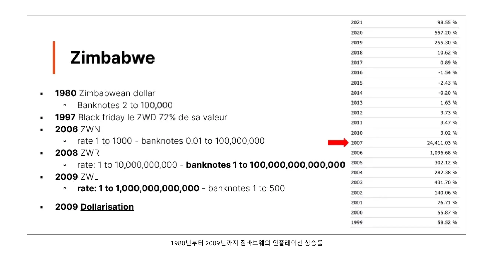

1980년 독립한 짐바브웨는 자국 통화인 짐바브웨 달러를 도입했습니다. 처음에는 짐바브웨 달러 2달러의 가치가 약 1.60달러였습니다. 그러나 1997년 참전 용사들을 위한 사회적 조치로 인해 블랙 프라이데이 기간 동안 하루 만에 72% 평가절하되었습니다. 그 후 2000년대 초에는 백인 소유주로부터 토지를 수용하여 지역 주민에게 분배하는 토지 재분배 프로그램을 시작했습니다. 이 결정은 새로운 소유주들이 대규모 농장을 관리하는 데 필요한 전문 지식이 부족한 경우가 많았기 때문에 수출에 악영향을 미쳤습니다. 그 결과 짐바브웨는 1999년에는 순수출국이었던 반면, 2003년에는 순수입국이 되었습니다.

2006년에 이 나라는 새로운 버전의 화폐인 ZWN을 도입했는데, 이 화폐는 Exchange의 비율로 1~1,000에 해당합니다. 2008년에는 Exchange의 비율로 1~10억의 또 다른 화폐 단위인 ZWR이 도입되었습니다. 이를 통해 상징적인 100조 지폐가 탄생했습니다.

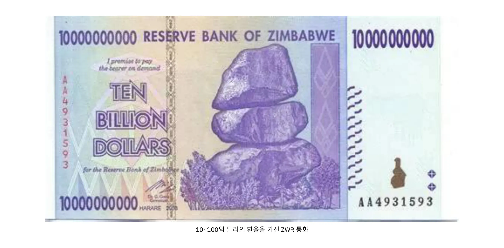

#### 달러화 및 위기 해결

따라서 2009년 이후 지속적인 통화 위기와 만연한 초인플레이션에 직면한 짐바브웨는 자국 화폐를 포기하고 주로 미국 달러를 비롯한 외화 사용을 허용했습니다. 이 결정은 급진적이긴 했지만 하이퍼인플레이션을 종식시켰습니다. 여기서 얻을 수 있는 중요한 교훈은 과도한 화폐 발행을 중단하고 예산 적자에 대한 중앙은행의 자금 조달을 중단하면 하이퍼인플레이션을 예방할 수 있다는 것입니다.

그러나 달러화는 기적의 해결책이 아닙니다. 초인플레이션을 종식시킬 수는 있지만 다른 경제적 문제를 야기할 수 있습니다. 그 결과 중 하나는 자율적인 통화 정책의 상실입니다. 자국 통화가 없는 국가는 내부 경제 충격에 대응하기 위해 통화 정책을 조정할 수 없습니다.

2007년 짐바브웨의 인플레이션율은 월 50%에 달해 공식적으로 초인플레이션 국가로 분류되었습니다. 2009년 달러화 도입 이후 초인플레이션은 멈췄지만 짐바브웨는 다른 경제 문제에 계속 직면했습니다.

짐바브웨가 자국 화폐 재도입을 시도한 이후 높은 인플레이션의 징후가 다시 나타나고 있다는 점은 우려스러운 일입니다. 일부 국제기구에 따르면 짐바브웨는 아직 공식 기준치인 월 50%에 도달하지 않았더라도 이미 하이퍼인플레이션 기준을 다시 충족할 수 있다고 합니다. 이는 과도한 화폐 발행과 중앙은행의 적자 자금 조달의 위험성을 상기시키는 역할을 합니다.

### 결론

"Bitcoin의 모든 것"이라는 제목의 책에서 저는 짐바브웨의 초인플레이션에 대해 전체 장을 할애했습니다. 저는 짐바브웨가 궁극적으로 초인플레이션을 종식시킨 방법을 설명하는 다양한 사례를 제시하면서 중요한 사건들을 자세히 설명했습니다.

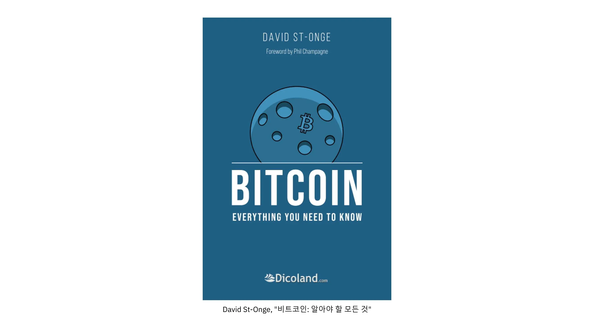

1차 세계대전 이후 독일의 경험이 궁금하다면 만화책 "제국의 은행가"를 적극 추천합니다 이 만화는 독일이 어떻게 초인플레이션을 극복할 수 있었는지, 특히 마르크화 창설을 통해 어떻게 극복했는지를 설명합니다.

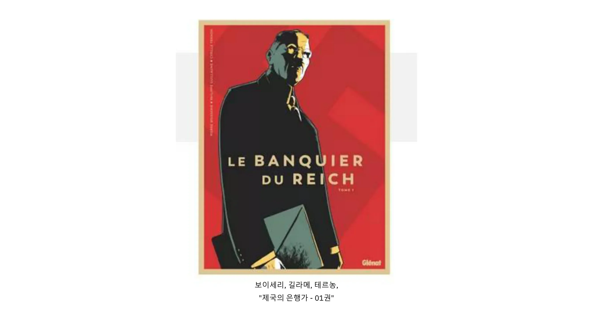

핵심은 초인플레이션을 극복하기 위한 몇 가지 전략이 존재한다는 것입니다. 달러화를 선택하거나 새로운 통화를 도입할 수도 있습니다. 이러한 해결책은 국민들이 신뢰를 가질 때만 효과가 있습니다. 엄격한 제약을 가하는 것이 중요합니다. 진정으로 독립적인 중앙은행이 필수적입니다. 정부 적자를 충당하기 위해 화폐를 부풀려서는 안 됩니다. 온화한 인플레이션의 경우에는 통화량 증가를 제한하는 것으로 충분할 것입니다. 그러나 초인플레이션에 직면했을 때는 먼저 경제 규모에 비해 적절한 통화 Supply을 보유하는 것이 중요합니다. 그런 다음 상황을 안정시키기 위해 정부에 엄격한 제약을 가하는 것이 필수적입니다.

## 초인플레이션 지폐 컬렉션 소개

<chapterId>f3ffbb47-3aeb-54bd-80a9-adccb0f419e2</chapterId>

[*Bitcoin 교육용 툴킷*에서 스캔한 컬렉션을 확인하세요(Plan ₿ Network 플랫폼의 *리소스* 섹션에서도 액세스 가능)](https://penpot.planb.network/#/view?page-id=c157057b-fd28-8042-8004-4f081b21defc&file-id=c157057b-fd28-8042-8004-4f081b21defb&section=interactions&index=0&share-id=7154756b-3ebd-8040-8004-6475c2af5889&interactions-mode=show-on-click)

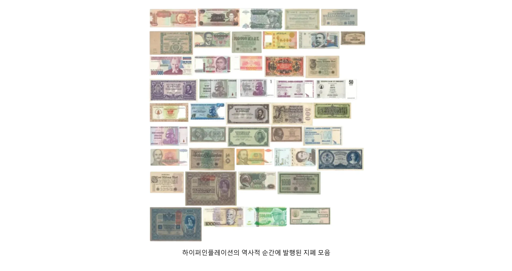

# 어떻게 여기까지 왔나요?

<partId>f66ca17e-be9e-5d30-a098-f7affd8962a1</partId>

## 화폐와 중앙은행의 두 번째 Layer의 등장

<chapterId>0455ffe3-9d45-5a67-ac96-3f815dc507a1</chapterId>

트랜스크립트:

두 번째 Layer 화폐와 최초의 중앙은행의 출현은 흥미로운 주제입니다. 이 주제는 닉 바티아의 저서 "레이어드 머니"에서 광범위하게 다루고 있습니다. 화폐 시스템의 진화와 복잡성에 관심이 있는 분들께 적극 추천합니다. 이 섹션의 목적은 화폐 생성의 기원과 그것이 어떻게 초인플레이션으로 이어질 수 있는지 이해하는 것입니다.

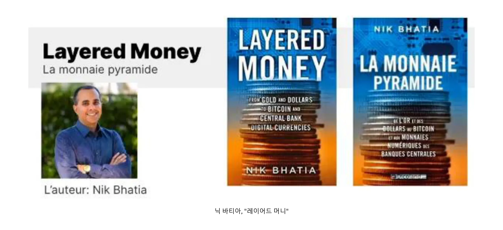

### 피라미드 화폐와 중앙은행

#### 더 플로린

화폐의 역사는 이탈리아, 특히 피렌체에서 13세기로 거슬러 올라갑니다. 당시에는 플로린과 Exchange 지폐가 일반적이었습니다. 세례자 성 요한의 모습이 새겨진 플로린 지폐가 대표적인 예입니다.

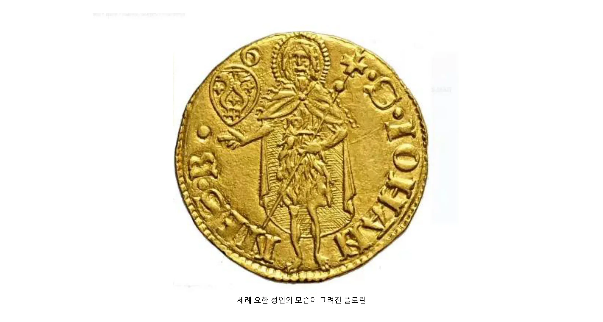

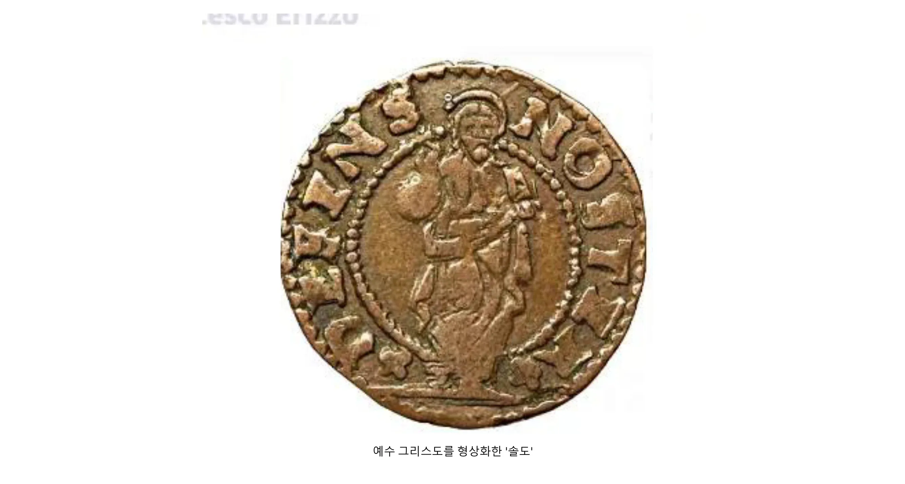

오늘날에는 진품 플로린을 소유하는 것이 비싸지만 복제품을 구할 수 있습니다. 17세기 이탈리아 주에서 발행된 그리스도의 이미지가 그려진 솔도와 같은 당시의 다른 화폐도 있습니다.

#### Exchange 지폐(13세기)

당시의 일반적인 관행은 다음과 같습니다. 금세공인은 예치된 플로린에 대해 Exchange 단위의 지폐를 발행했습니다. 이 플로린은 금고에 조심스럽게 보관되었습니다. 따라서 플로린으로 대표되는 진짜 금은 첫 번째 Layer 화폐를 형성했고, Exchange 지폐는 두 번째 Layer 화폐를 형성했습니다. 그러나 이 시스템의 유동성은 제한적이었습니다. 누군가 Exchange 지폐에 있는 금을 Redeem로 바꾸고 싶다면 거래는 간단했습니다. 그러나 개인 간에 이러한 지폐를 교환하는 것은 일반적인 관행이 아니었습니다.

#### 앤트워프 주식 Exchange(16세기)

앤트워프 지폐 Exchange은 지폐의 진화에 중요한 이정표가 되었습니다. 바로 이 지점에서 약속어음 할인 관행이 도입되었습니다. 이 어음은 금전적 가치를 나타내는 종이 상품이었지만, 이름과 만기일이 적혀 있다는 점에서 독특했습니다. 이 때문에 만기일 전에 Exchange을 발행하기가 어려웠습니다.

앤트워프 주식 Exchange가 가져온 혁명은 만기일 전에 이러한 어음을 할인할 수 있는 가능성에 있었습니다. 예를 들어, 약속 어음이 한 달 후에 만기일인 경우 만기일 전의 시간을 고려하여 할인된 가격으로 구매할 수 있었습니다. 이 혁신은 지폐의 가치를 더 높였을 뿐만 아니라 화폐의 시간 가치 개념을 도입했습니다.

이 개념은 트위터에서 "BTC의 시간 가치"라는 가명으로 닉 벨과 연관되어 있지만, 그의 발명품은 아닙니다. 그럼에도 불구하고 그는 자신의 저서에서 이 개념에 대해 자세히 설명합니다. 주요 아이디어는 시간에는 가치가 있다는 것입니다. 따라서 누군가가 100달러 상당의 약속어음을 한 달 전에 미리 지불하기로 결정하면, 예를 들어 98달러에 어음을 발행하고 만기일에 100달러를 받을 수 있습니다. 이 화폐 혁신은 앤트워프 주식 Exchange에서 시작되었습니다.

#### VOC와 암스테르담 주식 시장(17세기)

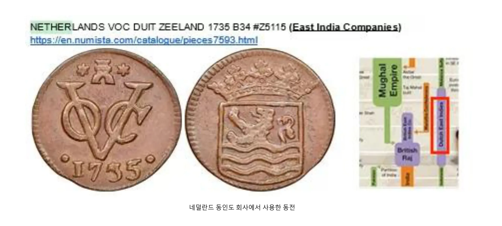

앤트워프 주식 Exchange의 설립 이후 중요한 이정표는 네덜란드 동인도 회사인 VOC의 설립이었습니다. 네덜란드에 본사를 둔 이 회사는 자체 화폐를 발행하기도 했습니다. VOC가 설립된 후 암스테르담에 최초의 주식 시장이 설립되어 주식 시장 운영의 시작을 알렸습니다. 흥미로운 점은 네덜란드가 국제 경제 중심지로서 앤트워프의 패권을 어떻게 끝낼 수 있었는지입니다. 그들은 단순히 셸트 강에 대한 접근을 차단했습니다. 이 전략은 거지들의 반란이라는 더 큰 역사적 운동의 일부였습니다. 유럽 역사에서 중요한 사건입니다.

#### 암스테르담 은행의 개입

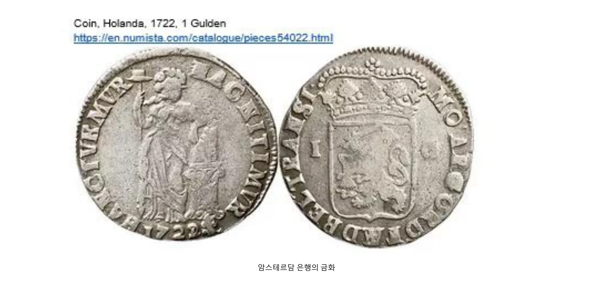

VOC의 설립 이후 화폐 역사에서 또 하나의 중요한 발전은 암스테르담 은행에서 금화를 도입한 것입니다. 1722년으로 거슬러 올라가는 이 동전은 은으로 만들어졌습니다. 그러나 당시 금융에 진정한 혁명을 일으킨 것은 Coin 자체보다는 암스테르담 은행의 이 화폐와 관련된 계좌였습니다. 이 계좌는 국제 Exchange의 주요 수단이 되었습니다. 거래는 단순히 등록부나 원장에 기록되었습니다. 이 시스템 덕분에 암스테르담은 세계 경제의 중심지가 되었습니다. 시간이 지나면서 암스테르담 은행은 이러한 계좌의 사용을 강제하기로 결정했습니다. 독립 환전업자들은 매일 은행에 예치할 코인을 Exchange으로 바꾸어야 했습니다.

#### 전쟁 자금 조달을 위한 영란은행 설립

잉글랜드 은행의 설립은 17세기 말 전쟁 자금 조달의 필요성에서 비롯되었습니다. 암스테르담 은행과 마찬가지로 법령에 따라 예금을 부과했습니다. 잉글랜드 은행의 특징은 민간 은행을 통화 시스템에서 부차적인 위치로 강등시켜 "제3의 Layer"라고 할 수 있는 화폐를 만든 것이었습니다.

처음에 첫 번째 Layer 화폐는 금으로 표시되었습니다. 민간 은행에 예치된 예금이 두 번째 Layer을 형성했습니다. 그러나 이러한 예금을 더 이상 금으로 전환할 수 없게 되자 세 번째 Layer 화폐가 등장했습니다. 이때부터 민간 은행에서 발행한 지폐는 더 이상 금으로 전환되지 않고 영란은행의 지폐로 전환되었으며, 이 지폐 역시 금으로 전환할 수 있었습니다. 이러한 진화로 인해 화폐 시스템은 여러 계층이 추가되어 복잡해졌습니다.

#### 1796년의 패닉

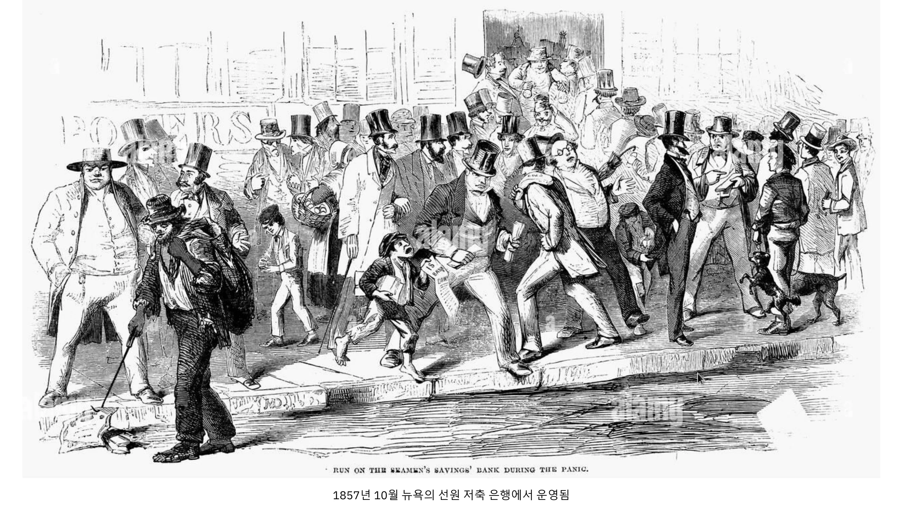

1857년 공황 당시 선원 저축 은행의 은행 패닉.

1796년 은행 공황 이후 모두가 "화폐 피라미드"를 오르려는 현상이 발생했습니다 사람들은 세 번째 통화인 97달러를 두 번째 통화인 98달러로, 그리고 궁극적으로는 첫 번째 통화인 금을 98달러로 바꾸고 싶어 했습니다. 이러한 엄청난 수요에 직면한 영국 은행은 상황을 안정시키기 위한 조치를 취하지 않을 수 없었습니다. 금 보유량의 디플레이션 가능성을 방지하기 위해 지폐의 금화 전환을 중단하기로 결정했습니다. 처음에는 일시적인 조치였던 이 중단 조치는 약 20년 동안 지속되었습니다.

### 결론:

중앙은행은 통화를 금으로 전환하는 것을 중단하는 최후의 수단 대출 기관으로 진화해 왔습니다. 이 조치는 처음에는 일시적인 해결책으로 의도되었지만 궁극적으로 영구적인 것이 되어 최후의 수단 대출기관이라는 개념이 등장하게 되었습니다. 이러한 변화는 오늘날의 중앙은행을 형성했습니다. 그러나 취약한 경제에서는 무책임하게 사용하면 화폐를 마음대로 인쇄할 수 있는 능력이 초인플레이션과 같은 바람직하지 않은 결과를 초래할 수 있습니다.

## 도서 및 리소스

<chapterId>c44e4519-0741-527b-b3b0-3f513e87147d</chapterId>

하이퍼인플레이션은 다양한 역사적 사건을 통해 연구되어 온 흥미로운 주제입니다. 이 주제에 대해 더 자세히 알아보고 싶다면 읽고 공부해야 할 10가지 필수 리소스 목록을 참조하세요:

- "돈이 죽으면: 독일 바이마르의 적자 지출, 평가절하, 하이퍼인플레이션의 악몽"은 아담 퍼거슨이 쓴 책입니다. 이 책은 제1차 세계대전 이후 독일의 초인플레이션 위기를 자세히 설명합니다.

- "인플레이션의 경제학 - 전후 독일의 통화 가치 하락에 관한 연구"는 Costantino Bresciani-Turroni의 글입니다. 1920년대 독일의 하이퍼인플레이션에 대한 심층 분석입니다.

- "이번에는 다르다: 8세기에 걸친 금융의 어리석음"은 카르멘 M. 라인하트와 케네스 S. 로고프의 저서입니다. 이 책은 다양한 유형의 금융 위기를 다루고 있지만, 역사상 초인플레이션에 대한 심도 있는 논의를 제공합니다.

- "짐바브웨의 초인플레이션, 분석 및 교훈", Steve Hanke 작성. 2000년대 초 짐바브웨의 초인플레이션에 대한 연구입니다.

- "통화 체제와 인플레이션: 역사, 경제, 정치적 관계"는 피터 번홀츠의 저서입니다. 이 책은 하이퍼인플레이션의 역사적 사례를 살펴보고 근본적인 요인을 이해하고자 합니다.

- "초인플레이션 생존 가이드: 미국 비즈니스를 위한 전략" 작성자: 제럴드 스완슨. 초인플레이션 환경에서 기업이 어떻게 대처할 수 있는지에 대한 실용적인 가이드입니다.

- "돈의 죽음: 독일과 미국의 위대한 인플레이션의 교훈", Jens O. Parsson 저. 독일과 미국의 인플레이션 위기를 비교 분석한 글입니다.

- "화폐의 몰락: 독일의 초인플레이션과 중산층의 파괴" 프레드릭 테일러의 글입니다. 초인플레이션이 독일 사회에 미친 사회적, 경제적 영향에 대한 내러티브 탐구입니다.

- "개발도상국을 위한 통화위원회: 핸드북"은 Steve Hanke와 Kurt Schuler의 저서입니다. 이 책은 통화 보드에 초점을 맞추고 있지만, 초인플레이션 상황을 피하는 방법에 대한 관점을 제시합니다.

# 최종 섹션

<partId>cb1f4a4b-556a-4e47-a5cc-136be35a1f9a</partId>

## 리뷰 및 평가

<chapterId>1a37317e-372a-5241-b478-8316d44f9283</chapterId>

<isCourseReview>true</isCourseReview>

## 기말 시험

<chapterId>d01831c3-6c4d-59e3-95bc-03e97a05c142</chapterId>

<isCourseExam>true</isCourseExam>

## 결론

<chapterId>45d410b0-71ed-4502-8d8d-8b6df761db23</chapterId>

<isCourseConclusion>true</isCourseConclusion>