# En reise inn i økonomien

Dette programmet har som mål å gi en dypere forståelse av hvordan hyperinflasjoner oppstår i en verden dominert av Fiat-valutaer, og å undersøke de betydelige konsekvensene av dem. Deltakerne vil fordype seg i hyperinflasjonssykluser i detalj, undersøke årsaker og utløsende faktorer, og gi historiske og samtidige eksempler. De vil også se nærmere på hyperinflasjonens konkrete innvirkning på økonomien og dagliglivet, og studere konsekvensene for valutaens verdi, kjøpekraft og individuell og kollektiv sparing.

Her vil vi belyse trender og felles mønstre i episoder med hyperinflasjon opp gjennom historien, samtidig som vi presenterer effektive og konkrete strategier for å beskytte seg selv i perioder med hyperinflasjon. Deltakerne vil få muligheten til å utforske ulike investeringsalternativer og finansielle forsvarsmekanismer, og de vil få praktiske verktøy og viktig kunnskap for å navigere rolig i et ustabilt økonomisk klima.

+++

# Innledning

<partId>6fe4d15d-f6e6-54be-9e04-0a75ac98df8b</partId>

## Kursoversikt

<chapterId>9d1aba8d-0485-5020-9863-5de37e6db8e0</chapterId>

Velkommen til ECO204-kurset!

Målet med dette kurset er å hjelpe deg å forstå de grunnleggende årsakene til, mekanismene bak og konsekvensene av hyperinflasjon innenfor rammen av et fiat-pengesystem. Gjennom konkrete eksempler og historiske analyser lærer du å gjenkjenne mønstre som går igjen i forkant av perioder med hyperinflasjon, og du lærer å identifisere tiltak for å beskytte deg selv.

**Avsnitt 2: Hva er inflasjon?

Før vi dykker ned i kjernen av temaet, skal vi gå tilbake til det grunnleggende: Hva er inflasjon? I denne delen vil vi presentere dens monetære opprinnelse, de ulike typene inflasjon og hvordan de passer inn i en bredere økonomisk dynamikk. Dette er et viktig skritt for å forstå hvordan vanlig inflasjon kan utvikle seg til hyperinflasjon.

**Avsnitt 3: Hva er hyperinflasjon?

I denne delen skal vi se nærmere på definisjoner av hyperinflasjon og undersøke flere store historiske episoder, blant annet i Weimar-Tyskland og Zimbabwe. Vi analyserer fellestrekk, forskjeller og paralleller til samtiden. Du vil også oppdage mindre kjente tilfeller, som for eksempel gjentatte redenominasjoner i Latin-Amerika, samt exit-strategier som er observert i enkelte land.

**Avsnitt 4: Hvordan kom vi hit?

Denne delen tar sikte på å forstå de strukturelle mekanismene som muliggjør hyperinflasjon, særlig gjennom utviklingen av den monetære "andre Layer" og sentralbankenes rolle. Vi vil gi deg ytterligere ressurser og forslag til lesestoff for videre utforskning.

Hva om den monetære historien gjentok seg rett foran øynene våre? Døm selv i kapitlene som følger!

# Hva er inflasjon?

<partId>2b4f456c-3649-5cf9-b9b0-a5bffe92d962</partId>

## Et monetært fenomen

<chapterId>b2cbc915-c4ec-52b5-860c-0958f58c91e4</chapterId>

### Definisjoner av inflasjon

Inflasjon er et begrep som ofte blir misforstått på grunn av sine mange definisjoner og tolkninger. Oppfatningen av inflasjon varierer mellom ulike grupper, for eksempel bitcoinere og tradisjonelle økonomer. La oss først avklare definisjonene før vi diskuterer hyperinflasjon:

- Definisjon fra Le Robert-ordboken: Inflasjon er en overdreven økning i betalingsmidler (sedler, kapital), noe som fører til prisstigning og en svekkelse av valutaen.

- Definisjon fra Larousse encyklopedi: Inflasjon er et fenomen som kjennetegnes av en generell og kontinuerlig økning i prisnivået. Her er ordet "generalisert" avgjørende.

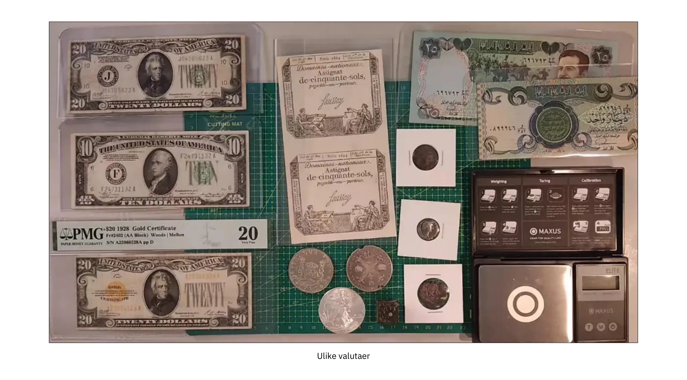

I lys av disse definisjonene er det viktig å forstå at for Robert handler inflasjon først og fremst om økningen i pengemengden Supply. Larousse fokuserer derimot på konsekvensene av denne ekspansjonen, nemlig den generaliserte prisstigningen.

I vår studie av hyperinflasjon vil vi ta utgangspunkt i den andre definisjonen, som er en generalisert prisstigning, ettersom den er mer relevant og tydelig for vårt tema. Det er imidlertid viktig å huske at denne prisstigningen generelt er et resultat av ekspansjonen av pengemengden Supply.

Den anerkjente økonomen Milton Friedman uttalte som kjent

> "Inflasjon er alltid og overalt et monetært fenomen."

Dette utsagnet understreker den iboende sammenhengen mellom monetær ekspansjon og inflasjon. I de følgende avsnittene skal vi se nærmere på forholdet mellom inflasjon og økonomisk vekst med utgangspunkt i disse grunnleggende definisjonene.

### Forstå det monetære fenomenet

Når vi snakker om det monetære fenomenet, snakker vi om hvordan pengemengden Supply i en økonomi påvirkes. Milton Friedman så det i hovedsak som en økning i denne Supply. Historisk sett har det vært to hovedmetoder for å øke pengemengden Supply:

1. Monetær trykking:

I tradisjonelle pengesystemer ble økningen i pengemengden Supply oppnådd ved fysisk trykking av nye sedler. Selv om denne trykkingen i dag, med overvekt av digital valuta, hovedsakelig foregår elektronisk (gjennom databasene til sentralbanker og andre finansinstitusjoner), viser historien oss perioder der den fysiske trykkingen av sedler førte til hyperinflasjon.

2. Reduksjon av metallinnhold:

En annen metode var å redusere mengden edelt metall i valutaer basert på metaller som sølv eller gull. Et slående eksempel finner vi i Romerriket, der denaren, som i utgangspunktet besto nesten utelukkende av sølv, over tid fikk redusert sølvinnholdet drastisk. Dette utgjorde en form for inflasjon, men ikke nødvendigvis hyperinflasjon.

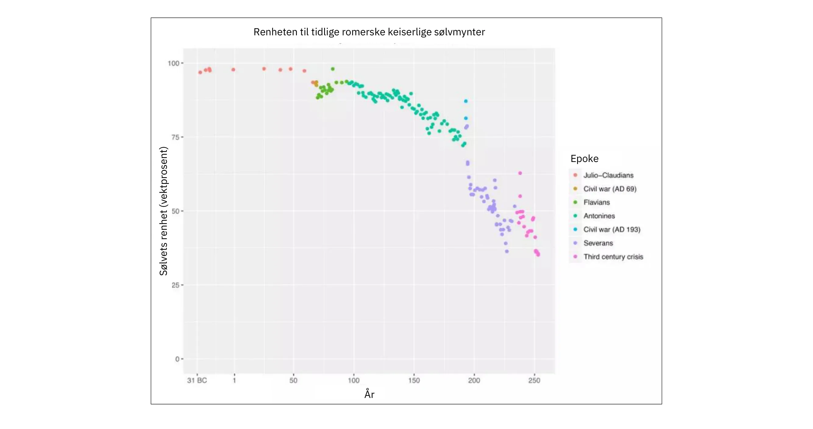

Det er viktig å understreke at hyperinflasjon først og fremst observeres med fiat-valutaer som ikke er støttet av underliggende aktiva, som for eksempel edelmetaller. Historisk sett har det forekommet episoder med inflasjon (f.eks. gjennom devaluering av metallinnholdet) når en valuta har vært basert på slike aktiva, men disse episodene har aldri nådd de ekstreme nivåene av hyperinflasjon. I de følgende avsnittene skal vi se nærmere på periodene med devaluering av valutaen og hvilke konsekvenser disse ulike pengesystemene har hatt for inflasjonen.

### Studie av perioder med monetær devaluering

Opp gjennom historien har ulike sivilisasjoner opplevd perioder med devaluering av valutaen. Noen av disse periodene sammenfaller med store hendelser eller kriger som har lagt press på økonomien.

#### 1. Peloponnesiske krig og andre puniske krig:

Den peloponnesiske krig, en konflikt mellom Athen og Sparta, og den andre puniske krig, mellom den romerske republikken og Kartago, er de tidligste eksemplene på devaluering av valuta som er funnet i arkivene. For å finansiere disse krigene devaluerte disse sivilisasjonene valutaene sine ved å redusere sølvinnholdet og inkorporere andre metaller, samtidig som de økte antallet mynter som ble produsert.

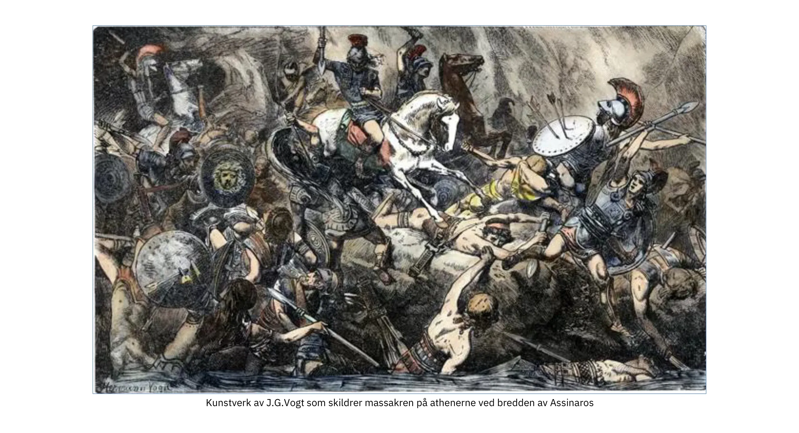

Gravering som viser massakren på athenerne ved bredden av Assinaros.

#### 2. Antikkens Roma under keiserdømmet:

Etter den romerske republikkens epoke, under keiserriket, opplevde man på 300- og 400-tallet en betydelig devaluering av valutaen. Dette illustreres av nedgangen i myntenes sølvinnhold, som vist i forrige graf. En studie viser at prisen på hvete i Egypt, målt i drakmer, økte med en faktor på én million i løpet av en periode på omtrent 400 år, fra 40 f.Kr. til 360 e.Kr. I løpet av denne perioden representerer det en gjennomsnittlig årlig inflasjon på ca. 4,4 %. Denne inflasjonen var imidlertid ikke jevnt fordelt. Den begynte for alvor rundt 238 e.Kr. Mellom 250 og 293 e.Kr. var inflasjonen på ca. 3,65 %, og den økte til 22,28 % mellom 293 og 301 e.Kr.

Selv om disse periodene var preget av betydelig inflasjon, nådde de ikke de nivåene av hyperinflasjon som vi ser i enkelte moderne situasjoner. Årsaken til dette er at selv om valutaen ble devaluert, var den fortsatt støttet av edle metaller. Dette solide fundamentet ga en viss beskyttelse mot ekstreme inflasjonsnivåer. I de neste avsnittene skal vi se nærmere på hyperinflasjonens natur og konsekvenser.

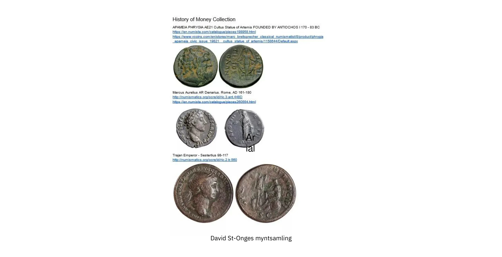

- Denarius av Marcus Aurelius (160 e.Kr.):

En av de mest ikoniske myntene fra antikkens Roma er denarius, en Coin i sølv. Jeg eier en spesifikk Coin fra Marcus Aurelius fra 160 e.Kr., før den store devalueringen. Selv om kameraet kan slite med å fange opp de fine detaljene, er det for det blotte øyet tydelig at Coin er vakker og reflekterer et relativt høyt sølvinnhold.

- Antoninianus (slutten av 300-tallet e.Kr.):

Med devalueringen av pengeverdien dukket det opp en ny valuta, Antoninianus. Denne valutaen skulle være verdt to denarer, men inneholdt mye mindre sølv. Min Antoninianus Coin viser tydelig at sølvinnholdet har blitt betydelig redusert. Den er prydet med en krone, som er typisk for romerske mynter fra denne perioden, kalt "radiates". Ved å sammenligne farge og kvalitet kan man se at Antoninianus langt fra er en Coin i rent sølv.

Når man sammenligner de to myntene side om side, er forskjellen slående. Denaren fra 160 e.Kr. har et tydelig sølvutseende, mens Antoninianus fra slutten av 300-tallet e.Kr. er mye mattere, noe som tyder på en betydelig reduksjon i sølvinnholdet. Denne visuelle sammenligningen gir en klar illustrasjon av den monetære devalueringen som det gamle Roma gjennomgikk i løpet av noen få århundrer.

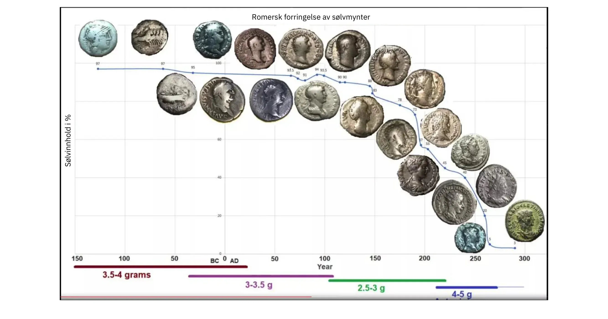

For å fullføre denne demonstrasjonen ville det vært ideelt med en graf som illustrerer devalueringen av disse myntene over tid. Selv om det er vanskelig å visualisere gjennom denne plattformen, kan du forestille deg en graf som viser verdien av denaren, etterfulgt av nedgangen mot slutten av 200-tallet, da den ble erstattet av Antoninianus, som angivelig var verdt to denarer, men med betydelig lavere sølvinnhold. Disse gjenstandene er tause vitner om de økonomiske svingningene i fortidens sivilisasjoner.

#### 3. Den spanske Maravedi: Vitne til målrettet devaluering

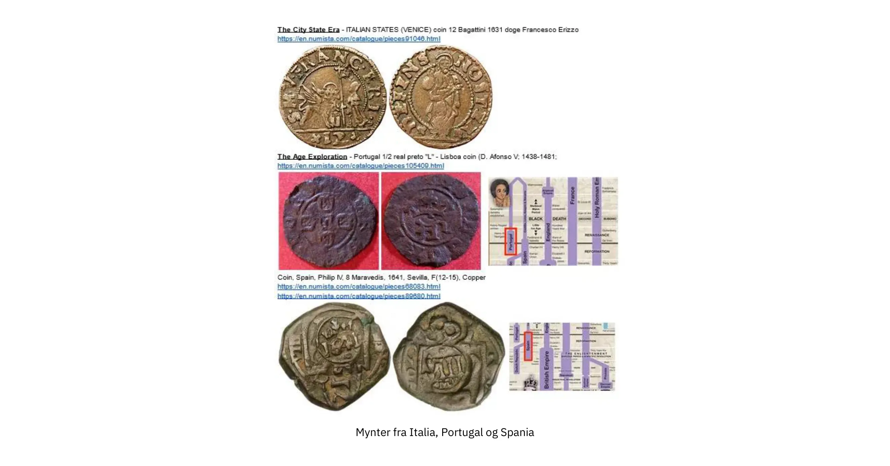

Maravedi, som kobbervaluta, inntar en spesiell plass i den spanske valutahistorien. Som nevnt tidligere var den spanske dollaren opprinnelig den internasjonale standarden og en viktig reservevaluta for Spania. Men i møte med visse økonomiske utfordringer måtte Spania ty til smarte monetære strategier.

Monetær devaluering er et verktøy som ofte brukes av stater for å finansiere utgiftene sine eller stimulere økonomien. Spania befant seg imidlertid i en delikat situasjon. En devaluering av den spanske dollaren ville ha svekket landets posisjon i den internasjonale handelen. For å løse dette dilemmaet vendte Spania seg til Maravedi.

I motsetning til den dyrebare spanske sølvdollaren var Maravedi en kobbervaluta som hovedsakelig ble brukt i lokalbefolkningen. Denne valutaen ble utsatt for devaluering. Når en Coin fra Maravedis opprinnelig var verdt to maravedis, tok staten den tilbake, stemplet den på nytt med en ny verdi, for eksempel "fire", og returnerte bare én Coin til eieren. Coin, merket med stempelet "åtte", er et bevis på denne prosessen, og har gjennomgått flere sykluser med devaluering.

Denne strategien gjorde det mulig for staten å devaluere en valuta på en effektiv måte, noe som skapte inflasjon og indirekte finansierte staten, samtidig som den spanske dollarens integritet ble bevart på den internasjonale scenen. Denne målrettede devalueringen fikk imidlertid konsekvenser for lokalbefolkningen, som opplevde at verdien av deres felles valuta ble utvannet.

Maravedis-saken illustrerer hvordan en stat selektivt kan devaluere en lokal valuta for å dekke sine interne økonomiske behov, samtidig som den opprettholder verdien av en reservevaluta på den globale arenaen. Det er et slående eksempel på pengepolitikkens kompleksitet og finesse gjennom historien.

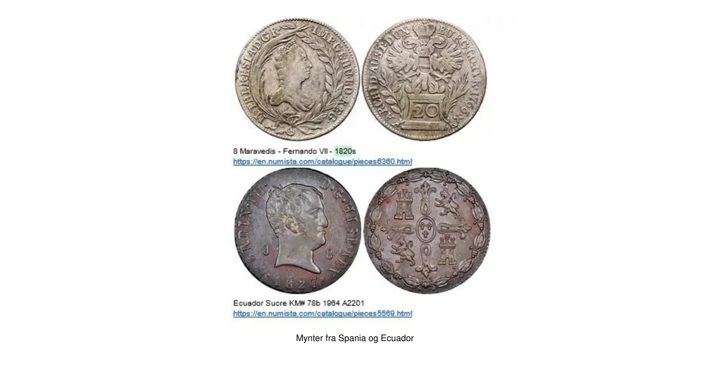

Vil du vite mer? -> [Link](https://docs.google.com/document/d/1aZa7gvz1nt8ZHDCoWKQdS9RGGjBHdipH1ApC8dW1xpM/edit?usp=sharing)

#### 4. Prisrevolusjonen fra det 15. til det 17. århundre

Mellom 1400- og 1600-tallet var Europa vitne til et bemerkelsesverdig økonomisk fenomen, ofte omtalt som "prisrevolusjonen" Denne inflasjonsperioden ble i stor grad utløst av en massiv tilstrømning av edle metaller, særlig gull og sølv, fra Amerika. Ettersom den europeiske økonomien i stor grad var basert på metallstandarden på den tiden, økte denne ekstra Supply av metaller pengemengden Supply. Resultatet var en inflasjon på rundt 1 til 2 % per år. Ved første øyekast kan denne inflasjonen virke beskjeden. Men på den tiden var slike prissvingninger uvanlige nok til å bli betraktet som en "revolusjon" Dette viser hvordan endringer i valutareservene kan påvirke hele det økonomiske systemet.

#### 5. John Law og familien Assignat

På 1700-tallet ble fransk økonomisk historie preget av to viktige hendelser knyttet til valuta. For det første overtalte John Law, en skotsk økonom og finansmann, den franske regjeringen til å innføre et pengesystem basert på papirpenger. Selv om dette initiativet i utgangspunktet ble ansett som en innovativ løsning på landets økonomiske problemer, førte det raskt til en voldsom inflasjon. Kort tid etter, under den franske revolusjonens uroligheter, innførte regjeringen "assignater".

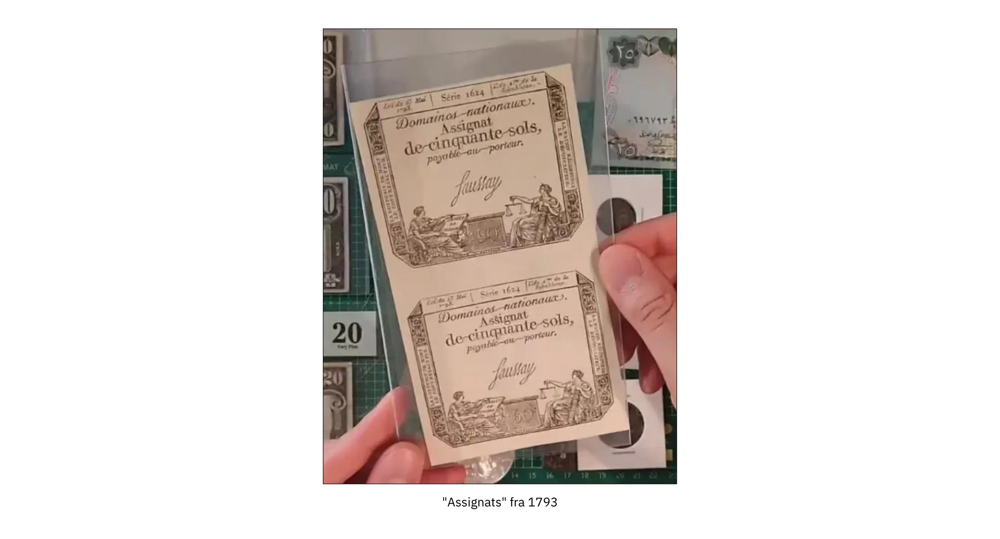

Assignats fra 1793

Disse sedlene er et levende vitnesbyrd om historiens første store periode med hyperinflasjon. Assignats ble opprinnelig utformet som et svar på flere finanskriser, men ble raskt et symbol på monetær ustabilitet. Myndighetene, som i for stor grad brukte denne papirvalutaen til å finansiere sine utgifter, forårsaket en økonomisk krise uten sidestykke og førte til en større periode med hyperinflasjon i Frankrike etter revolusjonen.

#### 6. Executive Order 6102 og devalueringen av dollaren

Executive Order 6102 og devalueringen av dollaren

I USA var begynnelsen av 1930-tallet vitne til et stort skifte i pengepolitikken. Her er en detaljert oversikt over denne transformasjonen:

- 20-dollarseddelen fra 1928

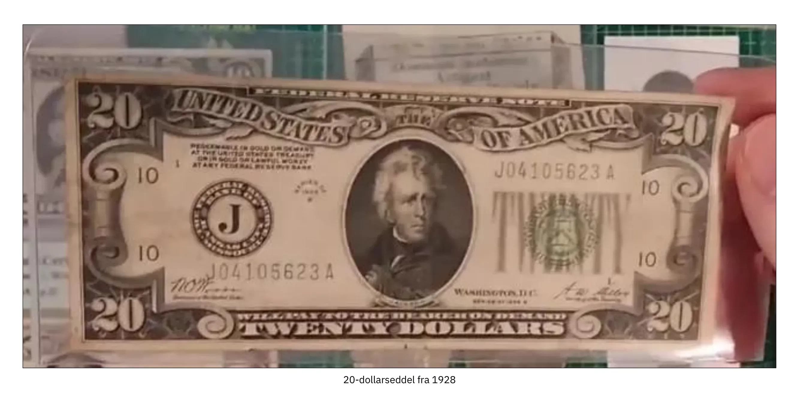

I 1928 sto det på en 20-dollarseddel i USA: "Kan innløses i gull på forespørsel." Det betyr at hver seddel bokstavelig talt kunne konverteres til gull. En 20,67-dollarseddel tilsvarte én unse gull.

- Executive Order 6102

I 1933 skjedde det en stor omveltning med utstedelsen av Executive Order 6102. Dette dekretet gjorde det ulovlig for borgere å eie gull, enten det var i form av barrer, mynter eller sertifikater.

Gullsertifikatet er et godt eksempel. Det var merket: "I gull Coin betalbart til innehaveren på forlangende." Det ble ulovlig å være i besittelse av et slikt sertifikat, og det forble ulovlig frem til 1964.

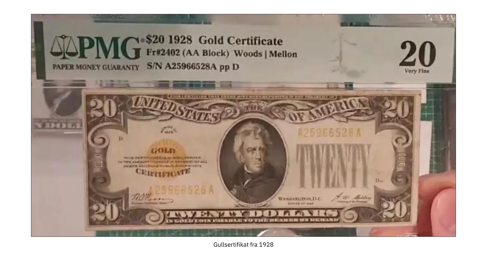

- Innføring av nye sedler

Etter beslagleggelsen av gull i 1934 ble en ny seddelserie satt i omløp.

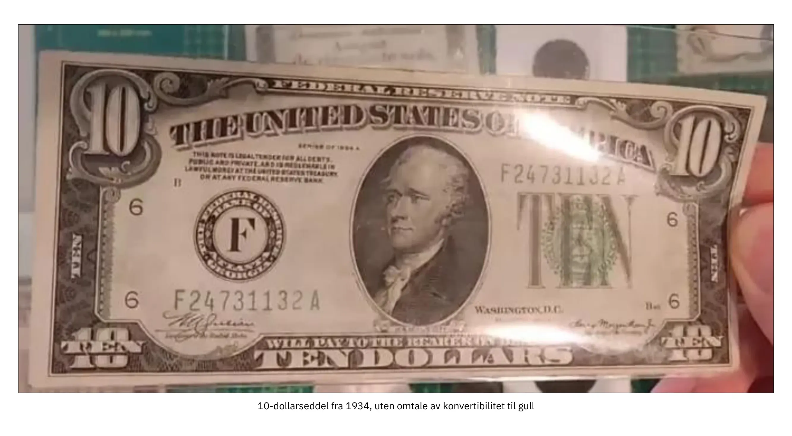

Angivelsen av at de kan konverteres til gull, er fjernet og erstattet med "Denne seddelen er lovlig betalingsmiddel for all gjeld" (Ce billet est une monnaie légale pour toutes dettes).

- Revaluering av gull

Det som er fascinerende med denne overgangen, er regjeringens strategi. I 1934 ble gullprisen revaluert til 35 dollar per unse, i stedet for 20,67 dollar. I bunn og grunn devaluerte myndighetene den dollaren som folk eide. Ved å kjøpe gull fra befolkningen til 20,67 dollar per unse i 1933 og deretter revaluere gullprisen i 1934, skapte myndighetene en betydelig fortjeneste samtidig som de devaluerte innbyggernes sparepenger.

I løpet av ett år beslagla myndighetene i praksis innbyggernes gull, og deretter endret de spillereglene ved å revaluere gullets verdi til fordel for statskassen og til ulempe for dem som i utgangspunktet hadde byttet inn gullet sitt mot sedler.

### USA endrer historien.

USA gjorde et historisk vendepunkt ved å bli den første til å devaluere verdens reservevaluta, den amerikanske dollaren, i strid med tidligere praksis i mindre handelsnasjoner.

Tidligere, under renessansen, var den italienske florinen utstedt av Firenze på 1200-tallet den internasjonale reservevalutaen, og ingen devaluering hadde blitt registrert i løpet av perioden den ble brukt, noe som gjenspeiler betydningen av monetær stabilitet for internasjonal handel.

I samme ånd opprettholdt Spania og Nederland, som innehavere av verdens reservevaluta på grunn av sin blomstrende internasjonale handel, integriteten til sine valutaer for å bevare tilliten og status quo i den internasjonale handelen. Nederland var til og med vitne til opprettelsen av den første sentralbanken, en viktig milepæl i den globale utviklingen av monetære systemer.

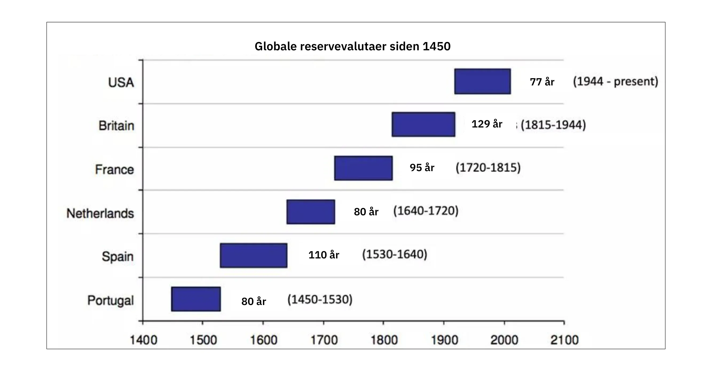

Situasjonen endret seg imidlertid da USA ble den dominerende økonomiske makten. De valgte å devaluere sin reservevaluta og utnyttet dermed inflasjonen til sin fordel. Denne beslutningen tilskrives ofte den endrede dynamikken, der valget av reservevaluta ikke lenger var like fritt som det hadde vært tidligere. Det amerikanske hegemoniet etablerte dollaren som verdens reservevaluta, noe som gjorde det mulig å manipulere dens verdi. Dette skiftet viser pengepolitikkens potensielle innvirkning på internasjonal handel i en globalisert økonomi, og markerer en betydelig overgang i styringen av verdens reservevalutaer.

### Siste eksempel på veien: den sveitsiske dinaren

Den sveitsiske dinaren illustrerer et annet fascinerende aspekt ved monetær devaluering, denne gangen forankret i den irakiske konteksten før Golfkrigen. Denne valutaen, som var oppkalt etter sedlenes bemerkelsesverdige kvalitet, ble utstedt av den irakiske sentralbanken og hadde rykte på seg for å være stabil i Midtøsten-regionen. Denne tilliten skyldtes hovedsakelig kvaliteten på seddeltrykkeriet, som ble utført i England, noe som innebar en viss robusthet mot devaluering.

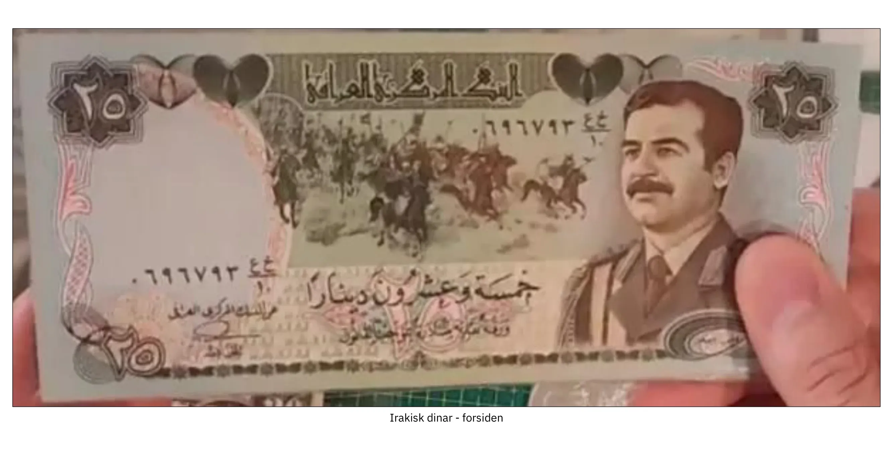

Gulfkrigene markerte imidlertid et vendepunkt i den sveitsiske dinarens historie. Irak kunne ikke lenger stole på sin engelske leverandør for seddeltrykking, og vendte seg til Kina for å få hjelp. Denne overgangen resulterte i en tydelig forskjell i sedlenes kvalitet, og den kinesiske versjonen ble oppfattet som dårligere. Denne oppfatningen var ikke ubegrunnet; de kinesiske sedlene var lettere å forfalske og utsatt for overtrykk fra myndighetenes side, noe som truet sedlenes verdi.

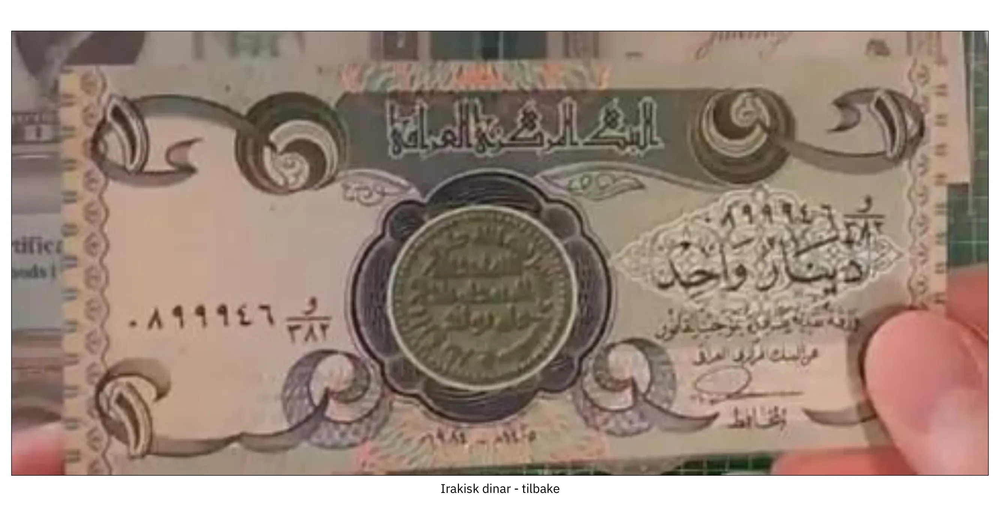

Et særegent fenomen dukket opp i den irakiske økonomien etter Golfkrigen: det doble prissystemet. Kjøpmennene tilbød ulike priser avhengig av hvilken type seddel som ble brukt som betalingsmiddel, og foretrakk den originale sveitsiske dinaren fremfor den kinesiske seddelen. Dette systemet gjenspeilte den vedvarende tilliten til sedler av høyere kvalitet, som var mindre utsatt for devaluering, selv i en kontekst der verdien først og fremst ble pålagt av staten. Denne episoden understreker betydningen av valutaens iboende egenskaper, og hvordan den oppfattede kvaliteten på en valuta kan påvirke dens relative verdi og, i forlengelsen av dette, tilliten til økonomiske aktører, selv i et fiat-valutaregime.

#### Ja, vi veide faktisk myntene!

Den vanlige oppfatningen forbinder ofte valuta med statsdannelse, der utstedelse og verdi er regulert av staten. Dette konseptet har sine røtter i antikkens sivilisasjoner, som for eksempel Roma, der mynter ble standardisert og stemplet av imperiet, noe som ga valutaen en offisiell verdi. En dypere utforskning viser imidlertid at valutaens egenverdi i hovedsak stammer fra dens innhold av edelt metall.

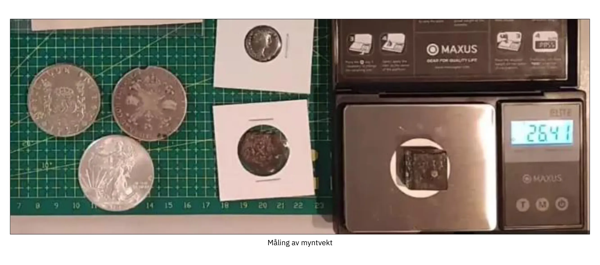

Et eksempel på dette er en myntvekt som tilsvarer åtte spanske reais, eller én spansk dollar. Denne vekten, som var merket med et romertall som indikerte verdien, ble brukt av valutavekslere til å vurdere myntenes verdi basert på vekten, og ikke bare på stempelet. Ved å veie myntene kunne vekslere avgjøre om de hadde blitt endret eller skadet, noe som kunne ha redusert verdien. Denne praksisen understreker at selv om statens standardiserte stempling ga mynten en viss nominell verdi, lå den egentlige verdien i vekten av det edle metallet den inneholdt.

Denne analysen viser at tilliten til valutaen, og dermed dens verdi, var forankret i dens konkrete substans snarere enn i en påstand fra statens side. Det understreker dualiteten mellom den nominelle verdien som staten påla valutaen, og den iboende verdien som dikteres av innholdet i edelt metall. Valutaen er dermed mer enn bare et statlig instrument, og dens grunnleggende verdi er knyttet til håndgripelige og målbare Elements.

#### Konklusjon

Denne studien av monetær devaluering gir en dypere forståelse av inflasjonsmekanismer, noe som vil bli utforsket i de neste videoene. Vi vil diskutere de ulike typene inflasjon og terskelen for når de går over til høy- eller hyperinflasjon. Dette solide grunnlaget vil gjøre det mulig for oss å se nærmere på inflasjonens kompleksitet i de kommende øktene. Takk for oppmerksomheten. Vi ser frem til å fortsette utforskningen av monetær dynamikk i neste video.

## Typer av inflasjon

<chapterId>b438fe09-375e-5bb2-9196-7dd687b9f98c</chapterId>

### Inflasjon er ikke et multifaktorielt fenomen

I denne delen skal vi se nærmere på de ulike aspektene ved inflasjon, et fenomen som ofte blir misforstått. Selv om inflasjon ofte oppfattes som et multifaktorielt fenomen i media og i hverdagsdiskusjoner, er det viktig å huske at det i bunn og grunn er et monetært fenomen.

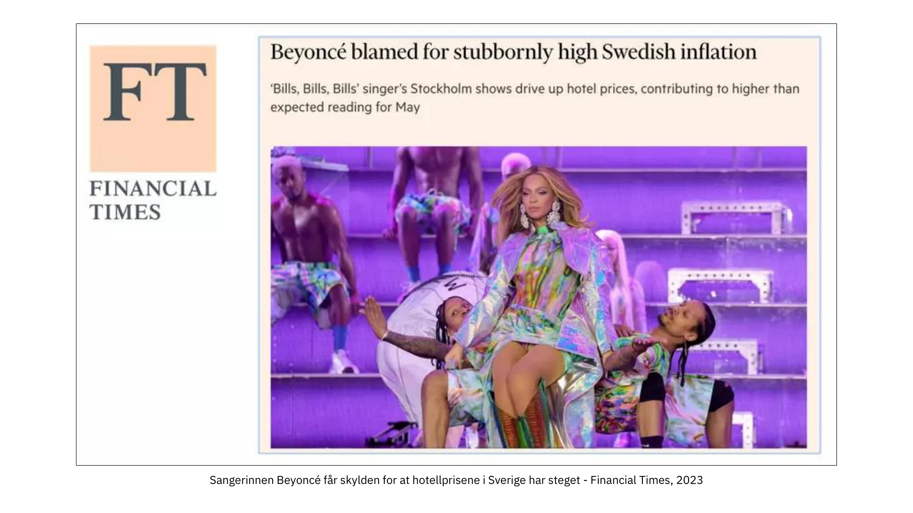

Her følger en oversikt over temaet i flere hovedpunkter:

- Skillet mellom prisstigning og inflasjon:

En prisøkning kan være sektorspesifikk og skyldes ulike faktorer, for eksempel en nedgang i OPECs oljeproduksjon eller ugunstige værforhold som påvirker hveteproduksjonen.

Inflasjon, derimot, er definert som en generell økning i prisene på en rekke varer og tjenester, ikke bare i en bestemt sektor.

- Inflasjonens monetære essens:

Med en fast pengemengde på 12 prosent vil en økning i prisene i én sektor føre til en nedgang i prisene i andre sektorer, ettersom mengden penger som er tilgjengelig til å bruke andre steder, vil bli redusert. Inflasjon er nært knyttet til en økning i pengemengden Supply, som muliggjør en samtidig prisstigning i alle sektorer.

- Virkningen av penger Supply på inflasjon og deflasjon:

I et system med fast pengemengde (Supply) skulle en økning i produksjonen i teorien føre til deflasjon, det vil si en nedgang i prisene, ettersom det ville være flere varer og tjenester tilgjengelig.

I det nåværende fiat-pengesystemet vil en økning i pengemengden Supply oppheve den potensielle deflasjonen som forårsakes av en økning i produksjonen.

- Negative effekter av Supply-justering av penger:

En økning i pengemengden Supply, uten en tilsvarende økning i produksjonen, fører til inflasjon, ettersom det er mer penger i omløp for samme mengde varer og tjenester.

Mens produksjonsøkningen burde ha ført til deflasjon, opphevet den samtidige økningen i pengemengden Supply denne effekten, noe som i stedet førte til inflasjon.

- Inflasjon, deflasjon og penger Supply - Kommunikasjonsfartøyer:

Inflasjon og deflasjon er som kommuniserende kar i en økonomi. En økning i produksjonen kan føre til deflasjon, men hvis pengemengden Supply samtidig økes, oppheves den deflatoriske effekten, og resultatet blir inflasjon.

Denne diskusjonen understreker hvor viktig det er å forstå de underliggende mekanismene bak inflasjon og deflasjon, og hvor stor innflytelse en endring av pengemengden Supply kan ha på økonomien. Vi vil sannsynligvis komme tilbake til disse begrepene senere for å få en dypere forståelse av hvordan de henger sammen og hvilken innvirkning de har på verdensøkonomien.

### Hvorfor fører ikke pengetrykking alltid til inflasjon?

#### Inflasjon ≠ KPI

Selv om inflasjon ofte forbindes med en økning i pengemengden Supply, er det ikke alltid en direkte sammenheng mellom inflasjon og pengetrykking, noe perioden etter finanskrisen i 2008 illustrerer. Til tross for at det ble trykket mye penger for å redde bankene, opplevde vi ikke høy inflasjon i det påfølgende tiåret, med et gjennomsnitt på mellom 0 og 2 % per år. Denne situasjonen reiser spørsmålet: Hvorfor resulterte ikke den massive pengetrykkingen i proporsjonal inflasjon? Svaret ligger i flere nyanser knyttet til måling av inflasjon og konsumprisindeksen (KPI).

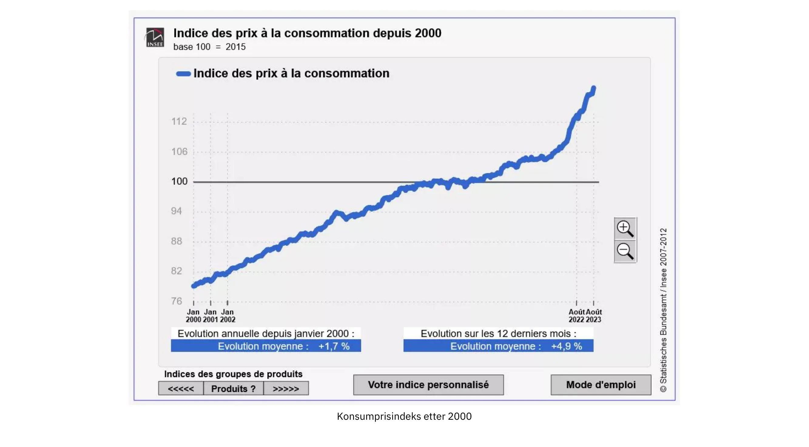

Den første forklaringen ligger i måten inflasjonen måles på. Konsumprisindeksen (KPI), som fungerer som den primære indikatoren for inflasjon, har visse begrensninger. For eksempel tar den ikke fullt ut hensyn til utviklingen i eiendomsprisene. Selv om KPI inkluderer en komponent knyttet til husleie, gjenspeiles ikke den betydelige økningen i boligprisene fullt ut i indeksen. Som følge av dette kan det forekomme betydelige økninger i boligkostnadene uten at de fanges opp fullt ut av KPI, noe som kan undervurdere den faktiske inflasjonen.

I tillegg benytter beregningen av KPI visse metoder som kan utligne eller maskere faktiske prisøkninger. For eksempel kan kvalitative forbedringer i produkter brukes til å justere indeksen. Hvis prisen på et produkt øker, men kvaliteten eller egenskapene også forbedres, kan KPI-en anse at den reelle verdien for forbrukeren ikke har endret seg, og at den derfor ikke gjenspeiler inflasjonen. Et illustrerende eksempel er et tilfelle der en økning i prisene på storfekjøtt og datamaskiner på grunn av pengeinnsprøytningen blir brukt til å kompensere for denne økningen. Hvis en datamaskin koster dobbelt så mye, men er fire ganger kraftigere, kan KPI tolke dette som en prisnedgang, og dermed maskere prisøkningen på storfekjøtt.

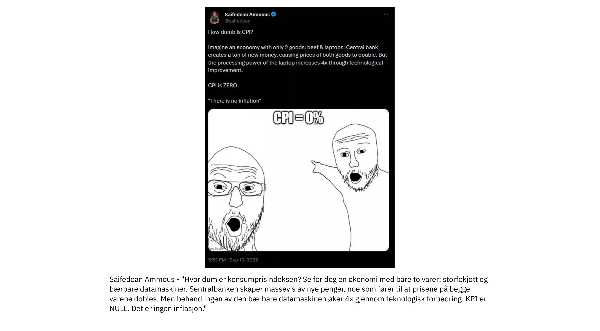

Disse nyansene i målingen av inflasjonen ved hjelp av KPI understreker kompleksiteten i forholdet mellom pengetrykking og inflasjon. De tyder også på at den faktiske inflasjonen kan være høyere enn det som rapporteres, dersom alle prisøkninger, særlig i viktige sektorer som eiendom, ble tatt med i beregningen på en mer omfattende måte. Denne analysen understreker betydningen av å forstå de underliggende mekanismene bak inflasjonen og begrensningene ved de konvensjonelle indeksene som brukes til å måle den, og dermed legge til rette for en dypere forståelse av de økonomiske implikasjonene av pengepolitikken.

#### Argumenter for MMT

Moderne monetær teori (MMT) tilbyr et distinkt perspektiv på pengeskaping og inflasjon. Ifølge MMT kommer pengene først og fremst fra myndighetene, som kan trykke opp store mengder penger for å finansiere sine behov uten å forårsake inflasjon, så lenge sektorene som disse pengene er rettet mot, ikke er mettet. Denne tilnærmingen avviker fra tradisjonelle monetære teorier, og legger vekt på betydningen av sektorenes absorpsjonskapasitet for inflasjonsdynamikken.

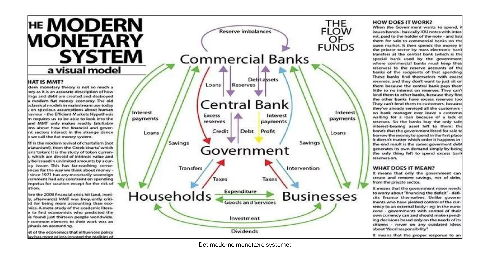

Et illustrerende eksempel på MMT er det amerikanske militærindustrielle komplekset. Ifølge MMT kan hundrevis av milliarder dollar allokeres til denne sektoren uten at det fører til inflasjon, takket være dens evne til å absorbere midlene. Hvis man derimot tilfører betydelige midler til veibygging i USA, der det finnes et begrenset antall bedrifter og arbeidskraft, vil det kunne oppstå inflasjon på grunn av ressursknapphet og økte kostnader som leverandørene krever.

Japan trekkes ofte frem av MMT-tilhengere som et annet eksempel på fravær av inflasjon til tross for betydelig pengetrykking. Situasjonen i Japan viser imidlertid også begrensningene ved tradisjonelle inflasjonsmål, som for eksempel konsumprisindeksen (KPI). I Japan blir en betydelig del av de trykte pengene enten spart eller investert i eiendom eller aksjemarkedet, i stedet for å bli brukt på løpende forbruk. KPI fanger ikke opp denne dynamikken fullt ut, og kan derfor undervurdere den faktiske inflasjonen.

Analysen av Japan (https://ideas.repec.org/p/ces/ceswps/_9821.html) viser også at atferden til økonomiske aktører, som sparing eller investering i aktiva som ikke er inkludert i KPI, kan maskere inflasjonseffekten av pengetrykking. Videre spiller de ulike sektorenes evne til å absorbere tilført likviditet en avgjørende rolle for om det oppstår inflasjon.

#### Bank- og sentralbankbalanser

Det tredje eksemplet på hvorfor pengetrykking ikke vil føre til inflasjon, er at forholdet mellom pengetrykking og inflasjon moduleres av hvordan nyskapte penger introduseres i økonomien. Hvis disse pengene forblir på balansen til private banker uten å bli lånt ut til økonomiske aktører, vil de ikke ha noen direkte innvirkning på realøkonomien og derfor ikke føre til inflasjon.

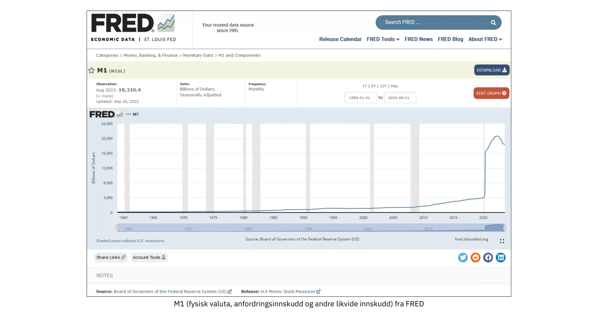

Pengetrykking kan ses på som et damoklessverd som henger over økonomien. De skapte pengene kan ligge latente i en viss periode, uten noen synlig inflasjonseffekt, så lenge de ikke sprøytes inn i økonomien gjennom banklån eller andre mekanismer. Men når disse latente pengene til slutt settes i omløp, kan inflasjonseffektene manifestere seg. Det er dette man har observert på 2020-tallet, der tidligere skapte penger har kommet inn i økonomien og ført til inflasjon.

Dette scenariet understreker hvor viktig de monetære transmisjonsmekanismene er for å påvirke inflasjonseffektene av pengetrykking. Sentralbankens pengeskaping er bare én brikke i puslespillet. Atferden til private banker, som bestemmer hvor mye lån de skal gi, og atferden til låntakerne, som bestemmer hvordan de skal bruke de lånte pengene, er også avgjørende Elements i denne dynamikken.

#### Inflasjon er sosialt!

Eksemplet med Weimarrepublikken illustrerer et annet viktig aspekt ved forholdet mellom pengetrykking og inflasjon: forventningenes rolle og de økonomiske aktørenes atferd. Da sentralbanken i Weimarrepublikken begynte å trykke store mengder penger, førte den økonomiske usikkerheten til at folk hamstret, det vil si lagret penger i stedet for å bruke dem. Denne reaksjonen forsinket midlertidig de inflatoriske effektene av pengetrykkingen.

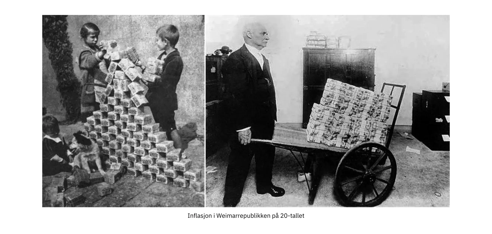

Men da den økonomiske situasjonen begynte å bedre seg noe, ble tilliten gradvis gjenopprettet. Privatpersoner tok ut sparepengene sine fra gjemmestedene sine og begynte å bruke massivt i økonomien. Denne plutselige atferdsendringen, kombinert med en allerede høy pengemengde, førte til en eksplosjon i etterspørselen. Med mer penger i omløp og økt etterspørsel begynte prisene å stige raskt, noe som førte til merkbar inflasjon.

Dette eksemplet understreker betydningen av timing og aktørenes atferd når det gjelder inflasjon. Inflasjon oppstår ikke bare som følge av en økning i pengemengden Supply, men avhenger også av hvordan og når pengene blir brukt i økonomien. Økonomisk usikkerhet og de økonomiske aktørenes forventninger spiller en avgjørende rolle i denne dynamikken, og kan enten fremskynde eller forsinke inflasjonseffektene av pengetrykking.

#### Oppsummering:

- Konsumprisindeksen (KPI): KPI er strukturert på en måte som undervurderer inflasjonen, noe som kan gi et skjevt bilde av inflasjonsvirkeligheten.

- Absorpsjon i sektorene: Pengeinnsprøytning i sektorer som er i stand til å absorbere dem, fører ikke alltid til inflasjon. Et kjent eksempel er det amerikanske militærindustrielle komplekset, som kan absorbere store pengesummer uten å utløse inflasjon.

- Tilfellet Japan: Til tross for betydelig pengetrykking er inflasjonen fortsatt lav i Japan fordi pengene ofte spares eller investeres i eiendom eller aksjemarkedet. Disse sektorene absorberer de trykte pengene, og KPI gjenspeiler ikke nødvendigvis prisstigningen på disse områdene.
- Sammenheng mellom pengetrykking og markeder. Man ser at kurvene for eiendoms- og aksjemarkedene ofte følger pengetrykking, noe som indikerer hvor de trykte pengene er rettet.
- Bankenes monetære reserver: Når trykte penger forblir på bankenes balanser og ikke sirkulerer i økonomien, forårsaker de ikke inflasjon. Dette illustreres av eksemplet fra 2008, der de trykte pengene i stor grad ble værende på bankenes balanser, noe som forsinket inflasjonseffekten.

- Weimarrepublikken: Denne historiske perioden viser hvordan økonomisk usikkerhet førte til hamstring av penger, noe som forsinket inflasjonen. Men så snart tilliten var gjenopprettet og pengene ble brukt, eksploderte inflasjonen.

Disse eksemplene kan brukes i diskusjoner for å forklare hvorfor inflasjon ikke alltid er en umiddelbar konsekvens av pengetrykking, og hvordan økonomiske sammenhenger og aktørenes atferd påvirker inflasjonen.

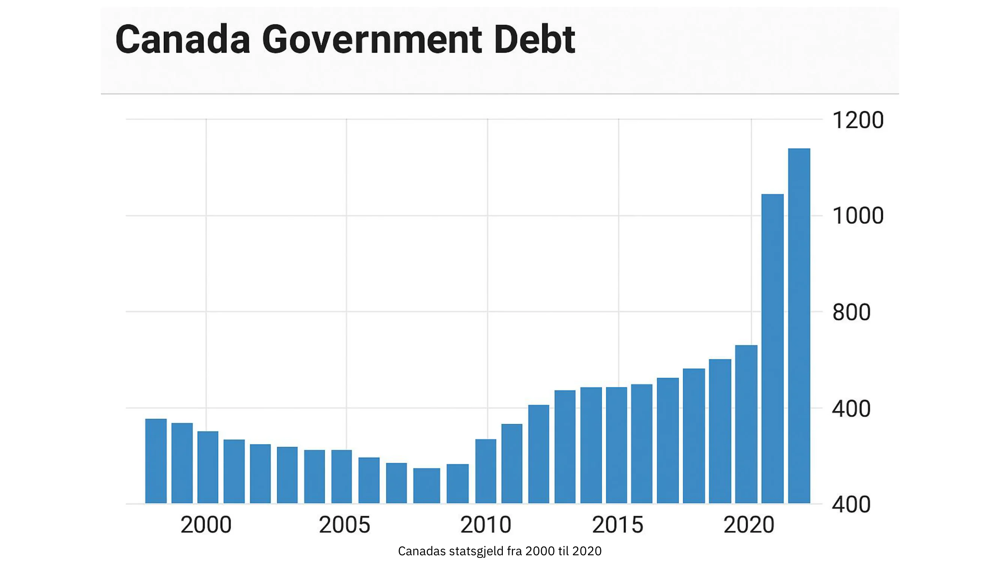

Fordi, som denne [tråden] (https://twitter.com/saifedean/status/1673639779433590786) viser: Inflasjon er alt annet enn sentralbankenes skyld.

- Økonomer legger skylden for inflasjonen på klimaendringene

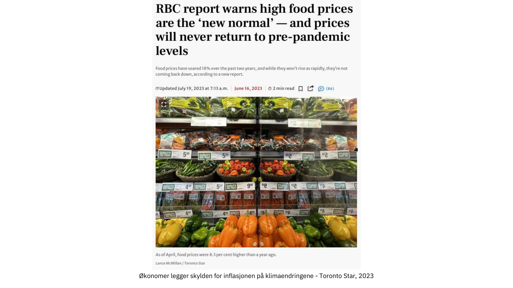

- Eksempel på at Sverige gir Beyoncé skylden for inflasjonen i en bestemt måned.

- Sentralbanken i Polen tilskriver inflasjonen den russiske aggresjonen i Ukraina og pandemien

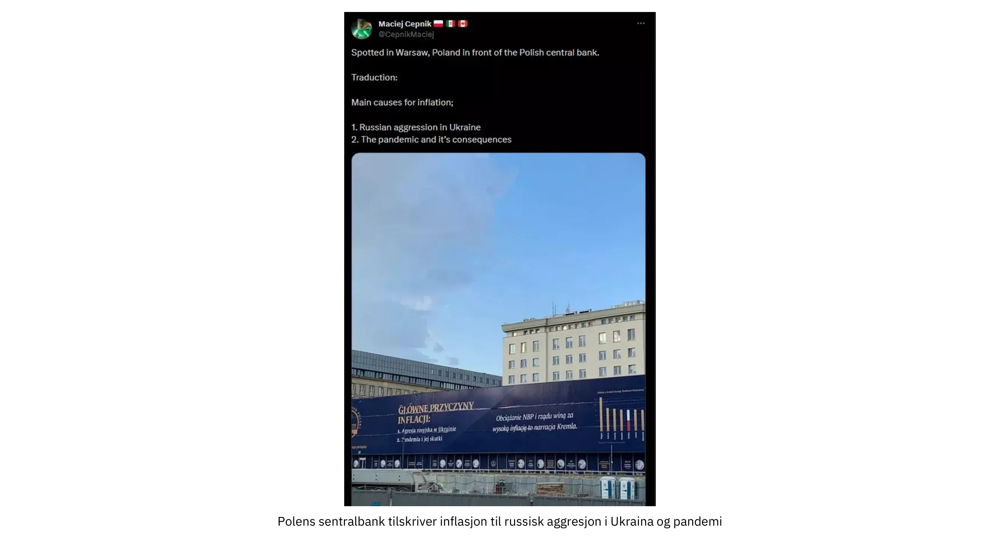

- Brexit får skylden for inflasjonen i Storbritannia.

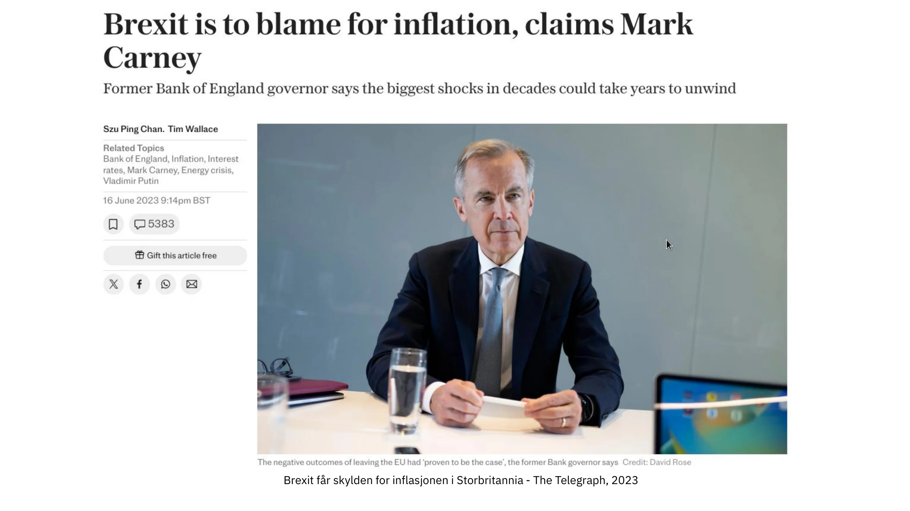

- Utgivelsen av Zelda-spillet er forbundet med et inflasjonssjokk.

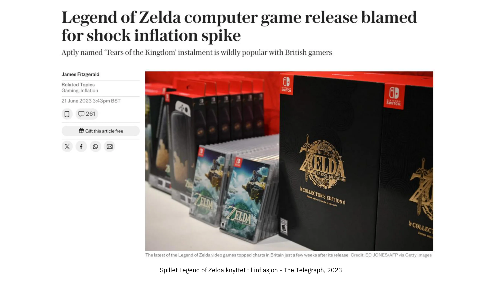

- Taylor Swift forårsaker angivelig inflasjon.

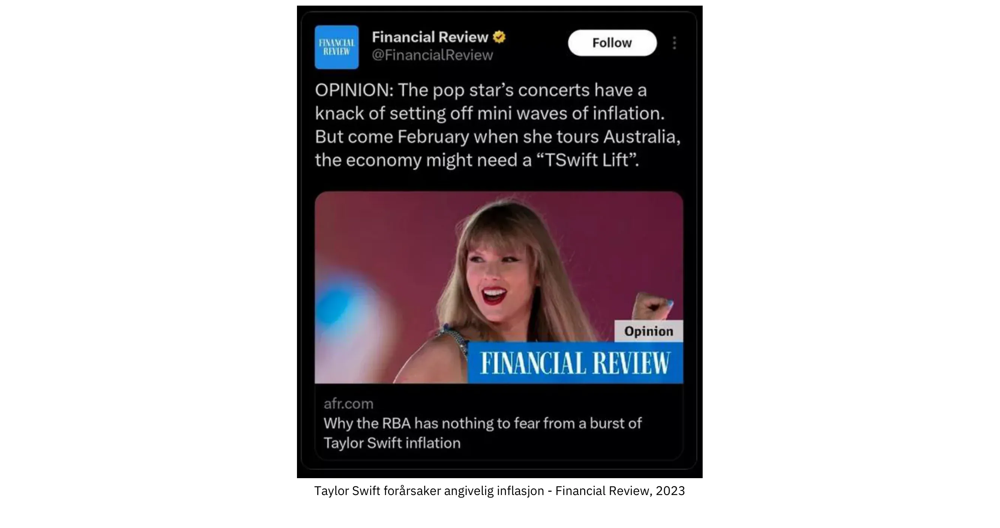

Si meg, hvordan kan Beyoncé eller Taylor Swift forårsake den utbredte prisstigningen? Du skjønner, det gir ingen mening. Kort sagt..:

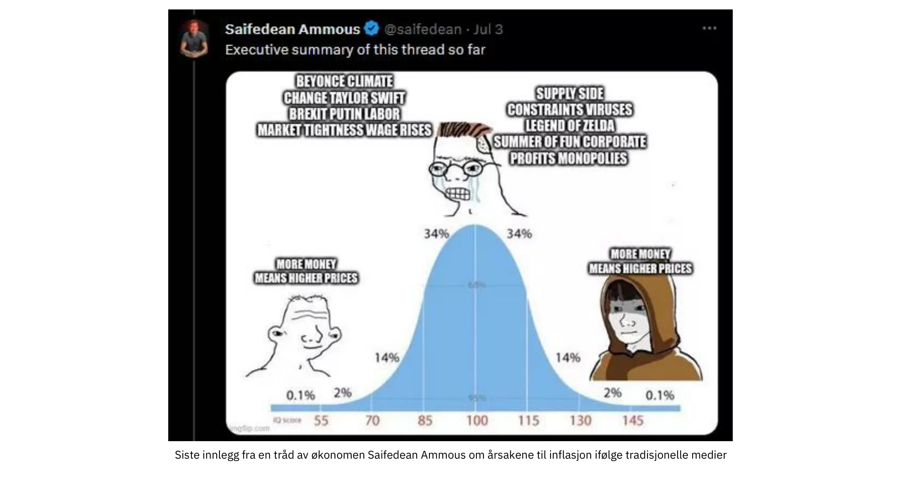

### Utforskning av ulike typer inflasjon

Det er viktig å forstå skillet mellom ulike typer inflasjon, slik at vi kan forstå de ulike utslagene av dette økonomiske fenomenet. Her følger en forklaring på disse ulike typene:

- Snikende inflasjon: Dette er den typen inflasjon som sentralbankene vanligvis sikter mot, og som er satt til rundt 2 % årlig. Dette målet har vært brukt siden 1990-tallet og har som mål å opprettholde en stabil økonomisk vekst uten overoppheting eller deflasjon.
- Moderat inflasjon: Denne formen for inflasjon oppstår når inflasjonen overstiger målet på 2 %. Den forbindes ofte med en overopphetet økonomi, en tilstand der en for stor pengemengde (Supply) stimulerer til en generell prisstigning. Dette scenariet avslører grensene for pengepolitikken og avdekker noen ganger motsetninger i den økonomiske diskursen.
- Galopperende inflasjon: Galopperende inflasjon, ofte omtalt som tosifret inflasjon, oppstår når den årlige inflasjonen overstiger 10 %. Det markerer en betydelig prisstigning som kan svekke den økonomiske stabiliteten.

- Hyperinflasjon: Hyperinflasjon er et ekstremt fenomen der inflasjonsraten overstiger 50 % per måned, noe som, på grunn av inflasjonens eksponentielle natur, tilsvarer en årlig inflasjon på over 13 000 %. Et slikt inflasjonsnivå destabiliserer økonomien i alvorlig grad, gjør valutaen nesten verdiløs og svekker tilliten til pengesystemet.

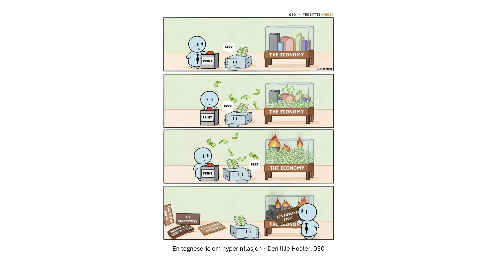

Når man undersøker ulike typer inflasjon, er det vanlig å støte på begreper som "Demand Pull" og "Cost Push" i læremidler. Selv om disse begrepene er gyldige, har de en tendens til å forklare prisøkninger snarere enn inflasjon som et monetært fenomen. Her er en mer dyptgående analyse:

- Demand Pull:

Etterspørselsinflasjon beskrives ofte som et scenario der etterspørselen i økonomien overstiger den tilgjengelige produksjonskapasiteten. Uten en tilsvarende økning i pengemengden Supply vil denne situasjonen imidlertid bare føre til en omfordeling av forbruket. Forbrukerne kan bruke mer på essensielle varer og mindre på ikke-essensielle varer, og dermed nøytralisere den samlede inflasjonseffekten.

- Kostnadspress:

På den annen side skyldes kostnadspressinflasjon økte produksjonskostnader, for eksempel for naturressurser eller arbeidskraft. Igjen, uten en økning i pengemengden Supply kan kostnadsøkninger i én sektor ganske enkelt redusere forbruket i andre sektorer, uten at det fører til utbredt inflasjon.

Disse tradisjonelle forklaringene forbinder ofte prisøkninger med inflasjon, noe som kan føre til forvirring og misforståelser. I virkeligheten er det nødvendig med en økning i pengemengden Supply for at det skal oppstå utbredt inflasjon. I denne sammenhengen kan begrepene Demand Pull og Cost Push forklare sektorvise prisvariasjoner, men de fanger ikke opp inflasjonens monetære natur. Dette understreker viktigheten av å skille mellom sektorvise prisøkninger og generell inflasjon, og bekrefter behovet for en økning i pengemengden Supply for å hindre at inflasjonen manifesterer seg i hele økonomien. Denne analysen gir et mer nyansert og presist perspektiv på de faktiske årsakene til inflasjon, og avmystifiserer vanlige tolkninger som kan tilsløre den underliggende monetære dynamikken.

### Klassifisering av inflasjon ifølge Bernholz

Bernholz foreslår en forenklet, men presis inndeling av inflasjon i tre kategorier, noe som gir en bedre forståelse av dette komplekse monetære fenomenet:

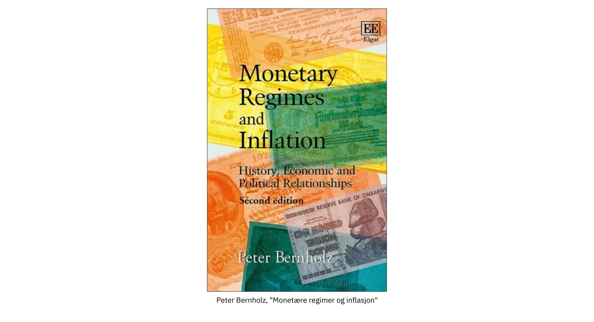

- Moderat inflasjon:

Moderat inflasjon oppstår når nivået på pengemengden Supply er høyere enn normalt, men uten at staten tyr til store underskudd finansiert av pengeskaping. Selv om begrepet "moderat" kan virke ubetydelig, kan denne formen for inflasjon skape betydelige problemer, selv om den ikke klassifiseres som høy inflasjon.

- Høy inflasjon:

Høy inflasjon oppstår når realverdien av pengene Supply synker til tross for en økning i nominelle termer. Denne paradoksale situasjonen oppstår som følge av monetær substitusjon, der folk mister tilliten til den nasjonale valutaen og forsøker å Exchange bytte den mot varer, tjenester eller utenlandsk valuta. Denne prosessen reduserer valutaens realverdi ytterligere, noe som forsterker inflasjonen.

- Hyperinflasjon:

Hyperinflasjon er en ekstrem form for høy inflasjon, kjennetegnet av store budsjettunderskudd som finansieres gjennom pengeskaping. Historisk sett har ingen tilfeller av hyperinflasjon blitt observert uten at underskuddet i betydelig grad har blitt finansiert gjennom pengetrykking. Hyperinflasjon skaper en ond sirkel: Inflasjonen svekker valutaens verdi så raskt at skatteinntektene svekkes før staten i det hele tatt rekker å kreve dem inn, noe som tvinger staten til å trykke enda mer penger for å finansiere seg selv. Denne selvforsterkende syklusen fører til astronomiske inflasjonsrater, ofte på over 50 % per måned.

Bernholz' klassifisering belyser den farlige utviklingen fra moderat inflasjon til hyperinflasjon, og understreker den avgjørende betydningen av penge- og finanspolitisk kontroll for å forhindre destruktive inflasjonsspiraler. Den viser også at de skadelige konsekvensene for statsfinansene kan inntreffe lenge før man når hyperinflasjonsstadiet, noe som gir et nyansert perspektiv på konsekvensene av inflasjon i ulike grader.

### Konklusjon: Oppsummering av inflasjonstyper

Avslutningsvis har vi utforsket en rekke ulike typer inflasjon, med utgangspunkt i vanlige begreper som "snikende inflasjon", "gående inflasjon" og "galopperende inflasjon", som alle betegner ulike nivåer av inflasjonsprosent i en økonomi. For vår dybdestudie av hyperinflasjon viser det seg imidlertid at kategoriene moderat inflasjon, høy inflasjon og hyperinflasjon, som beskrevet av Bernholz, er viktige referansepunkter.

- Moderat inflasjon:

Det indikerer et pengenivå Supply over det normale, selv om dette nivået kan opprettholdes uten betydelig underskuddsfinansiering fra statens side.

- Høy inflasjon:

Det oppstår når den reelle verdien av pengene Supply synker, ofte på grunn av monetær substitusjon, der enkeltpersoner forsøker å Exchange bytte valutaen sin mot varer, tjenester eller andre former for valuta.

- Hyperinflasjon:

Det representerer en ekstrem versjon av høy inflasjon, der overdreven pengeskaping for å finansiere store budsjettunderskudd fører til en rask uthuling av valutaens realverdi.

Det som kommer frem i vår utforskning, er at hyperinflasjon er et komplekst og kontraintuitivt fenomen. Selv om man kanskje skulle tro at hyperinflasjon er et resultat av en massiv økning i pengemengden Supply, skyldes den i virkeligheten en reduksjon i realverdien av denne pengemengden Supply. Denne nyansen er avgjørende for å forstå hvorfor noen land sliter med å komme seg ut av hyperinflasjon, selv med støtte fra internasjonale institusjoner som Verdensbanken eller IMF. En feilaktig karakteristikk av inflasjonstypen kan føre til at man tar i bruk uhensiktsmessige tiltak som forverrer de økonomiske problemene i stedet for å løse dem.

I våre fremtidige diskusjoner vil vi gå dypere inn i hyperinflasjon og utforske dens definisjoner og manifestasjoner i ulike økonomiske sammenhenger. Målet vårt er å avdekke de underliggende mekanismene bak hyperinflasjon og utforske potensielle løsninger for å få bukt med dette problemet. Denne nyanserte forståelsen vil gjøre oss i stand til å forstå de tilhørende utfordringene bedre og foreslå velbegrunnede strategier for å håndtere inflasjonen.

Takk for oppmerksomheten. Neste sesjon vil i sin helhet være viet til å definere og avmystifisere hyperinflasjon, med utgangspunkt i ulike akademiske og praktiske perspektiver. Vi ser frem til å fortsette denne utforskningen sammen med dere på vårt neste møte.

# Hva er hyperinflasjon?

<partId>3f541663-1e2f-5410-8ee0-f61c5d009fa5</partId>

## Definisjoner av hyperinflasjon

<chapterId>d2a71a2e-5f36-58d9-993c-d431f4aa07fd</chapterId>

### Definisjoner av hyperinflasjon

I dette avsnittet skal vi se nærmere på de ulike definisjonene av hyperinflasjon, et sentralt begrep i studiet av ekstreme monetære fenomener. Den mest anerkjente definisjonen kommer fra Philip Cagan, som i sitt verk "The Monetary Dynamics of Hyperinflation" fra 1956 foreslår en kvantitativ forståelse av hyperinflasjon. Ifølge Cagan

- Hyperinflasjonens begynnelse og slutt:
  - Hyperinflasjon begynner når den månedlige inflasjonen overstiger 50 %.
  - Den opphører når inflasjonen faller under 50 % per måned i minst ett år.

Hvis inflasjonen faller til 40 % i juli og ikke stiger til over 50 % før i juli året etter, regnes hyperinflasjonsperioden som avsluttet i juli året før det året da den ble observert første gang. Denne definisjonen gjør det mulig å karakterisere hyperinflasjonsepisoder på en presis måte, noe som gjør det lettere å foreta strukturerte analyser.

Denne definisjonen er lagt til grunn i Hanke-Krus' tabell, som dokumenterer 56 episoder med hyperinflasjon. Tabellen dekker imidlertid ikke alle episodene, som for eksempel den i Venezuela i 2016, noe som bringer det totale antallet opp i 57.

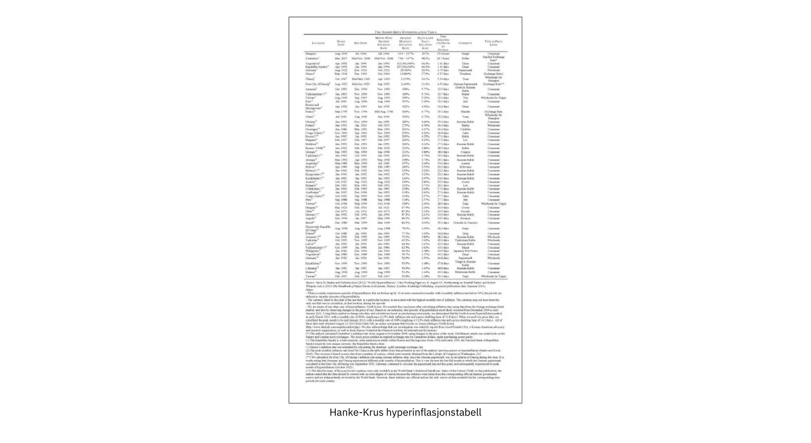

zoom

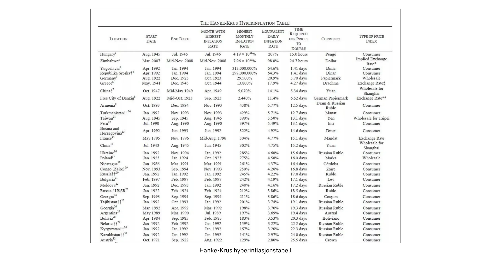

Det bør bemerkes at selv om denne definisjonen er presis, kan den muligens utelukke visse episoder med hyperinflasjon på grunn av den strenge grensen på 50 %. Det er mulig å utvide denne definisjonen til å inkludere andre episoder som, selv om de ikke strengt tatt oppfyller Cagans kriterier, likevel representerer perioder med ekstremt høy inflasjon. Denne observasjonen åpner for en bredere utforskning av hyperinflasjonsfenomenet, noe som åpner for en mer nyansert forståelse av årsakene til og virkningene av hyperinflasjon. I senere diskusjoner vil vi vurdere å revidere denne definisjonen og se nærmere på episoder med hyperinflasjon som ikke omfattes av Cagans strenge kriterier.

### Definisjonen av hyperinflasjon av Cagan

Philip Cagan har muligens satt en vilkårlig milepæl med terskelen på 50 % månedlig inflasjon når han definerer hyperinflasjon. Han innrømmer selv at denne definisjonen er vilkårlig og først og fremst tjener hans analyse basert på syv episoder med hyperinflasjon. En gjennomgang av Cagans data viser at de tre episodene med hyperinflasjon som hadde lavest månedlig inflasjon, var på rundt 47 %, 46 % og 57 %. Det ser ut til at 50 %-grensen ble valgt for å inkludere disse tilfellene i studien hans.

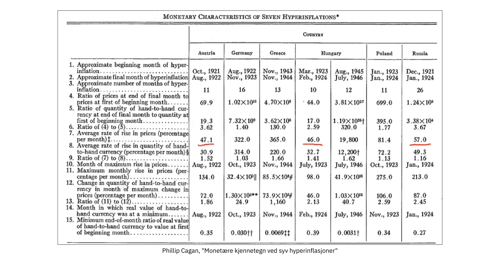

- Historisk kontekst:

Cagans definisjon stammer fra 1956 og er basert på et begrenset antall hyperinflasjonsepisoder som var tilgjengelige på den tiden.

- Cagans observasjoner:

Ifølge Cagan nådde ingen episode denne terskelen på rundt 50 % uten å utvikle seg til en mer alvorlig hyperinflasjon, noe som kan begrunne valget av denne terskelen.

- Kritikk av Cagans definisjon:

Andre økonomer, som Bernholz, forfatteren av Monetary Regime and Inflation, har også beskrevet 50 %-grensen som vilkårlig.

Bernholz påpeker at det finnes episoder med høy inflasjon som har de samme kvalitative kjennetegnene som episoder med hyperinflasjon, uten å nå 50 %-grensen.

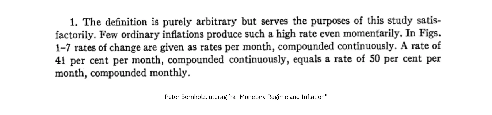

Denne refleksjonen får oss til å sette spørsmålstegn ved hvor rigid den tradisjonelle definisjonen av hyperinflasjon er, og understreker behovet for å revurdere denne terskelen ved å innlemme flere episoder og historiske data. Definisjonen av hyperinflasjon kan kreve fleksibilitet for å kunne omfatte ulike manifestasjoner av ekstrem inflasjon i ulike økonomiske og historiske kontekster.

### Definisjonen av hyperinflasjon ifølge International Accounting Standards Board (IASB)

IASB tilbyr et unikt perspektiv på hyperinflasjon, med fokus på regnskapspraksis i perioder med hyperinflasjon. Denne tilnærmingen er avgjørende for regnskapsførere og virksomheter som opererer i hyperinflasjonsmiljøer, der pengeverdien svinger raskt. IASBs retningslinjer identifiserer ulike indikatorer på hyperinflasjon:

- Preferanse for ikke-monetære eiendeler:**

På grunn av den raske depresieringen av pengeverdien foretrekker folk å holde verdier i varer fremfor i valuta.

- Verdsettelse av varer og tjenester:**

Innbyggerne beregner ikke verdien av varer og tjenester i lokal valuta, noe som gjenspeiler et tap av tillit til den lokale valutaen.

- Erstatning for tap av pengeverdi:**

Prisene inneholder kompensasjon for tap av pengeverdi ved kredittkjøp, noe som illustrerer inflasjonens innvirkning på daglige transaksjoner.

- Pris-, lønns- og renteindeksering:**

Priser, lønninger og renter justeres basert på en indeks for å kompensere for inflasjon.

- Kumulativ inflasjon over tre år:**

Kumulativ inflasjon over tre år nærmer seg 100 % (ca. 24 % per år), noe som står i kontrast til Cagans definisjon av 50 % månedlig inflasjon.

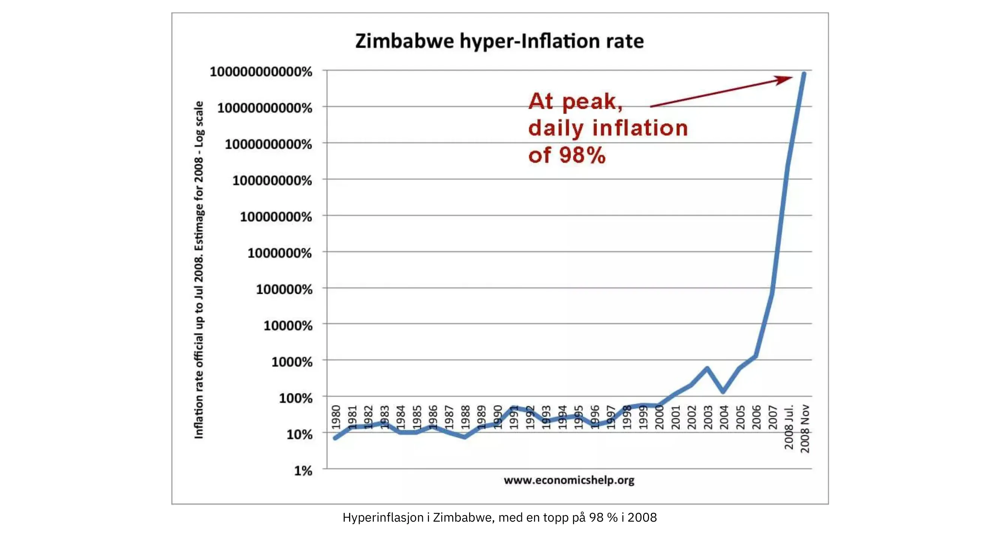

Ifølge IASBs kriterier opplever flere land hyperinflasjon, deriblant Argentina, Etiopia, Haiti, Iran, Libanon, Sudan, Sør-Sudan, Surinam, Syria, Tyrkia, Venezuela, Jemen og Zimbabwe.

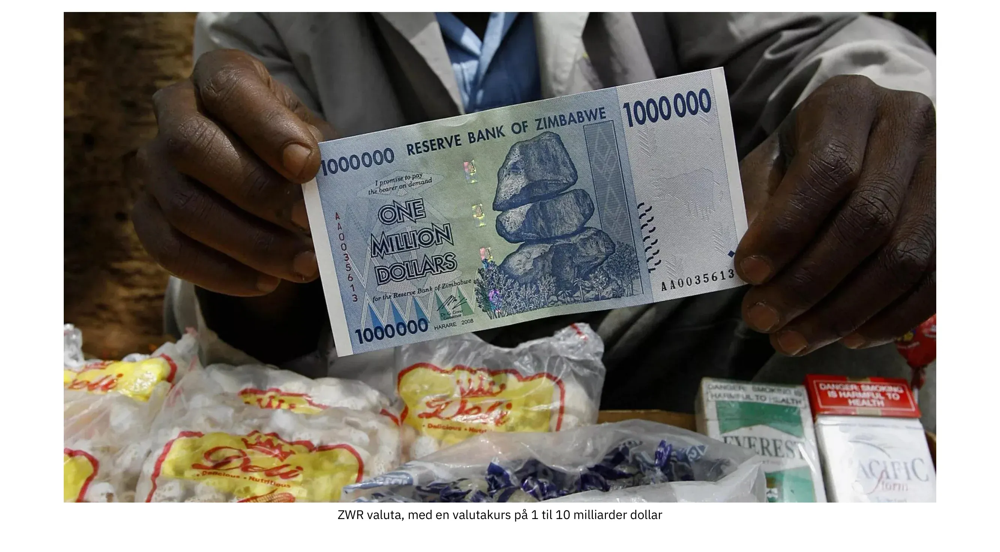

Denne definisjonen fra IASB beveger seg bort fra Cagans strenge kvantitative terskel ved å innlemme en kvalitativ analyse av økonomisk atferd og praktiske justeringer i møte med hyperinflasjon. Den viser at hyperinflasjon er et komplekst fenomen som krever en flerdimensjonal forståelse for å forstå de reelle implikasjonene, særlig på regnskapsområdet, som er avgjørende for stabiliteten og den finansielle gjennomsiktigheten i bedrifter og markeder.

### Så hvor mange hyperinflasjoner har det vært totalt?

Vanlige definisjoner av hyperinflasjon, som Cagans definisjon av en månedlig inflasjon på 50 %, kan noen ganger være forvirrende eller altfor forenklede. For eksempel kan to land som opplever en årlig inflasjon på henholdsvis 1 000 % og 3 000 %, oppfattes ulikt basert på den månedlige fordelingen av inflasjonen. Hvis ingen måned overskrider 50 %-grensen, vil disse landene i henhold til Cagans definisjon ikke klassifiseres som hyperinflasjon. Denne tilnærmingen kan dermed føre til uregelmessigheter i klassifiseringen av hyperinflasjon, spesielt når man sammenligner kumulativ inflasjon over året.

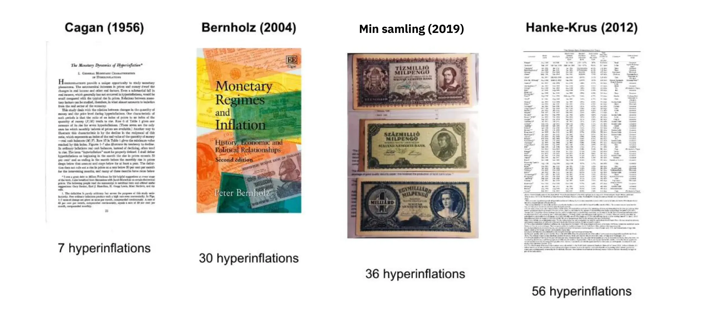

- Cagans verk "Monetary Dynamics of Hyperinflation" gir en grunnleggende analyse av hyperinflasjon.
- Bernholz' bok, som studerer 30 forskjellige perioder med hyperinflasjon, og dermed utvider analysens omfang.
- David St-Onges (forfatteren av dette kurset) personlige samling av pengesedler fra 36 perioder med hyperinflasjon, noe som gir en håndgripelig og historisk forståelse.
- Hanky Cross-tabellen (2012-versjon, oppdatert i 2016 med Venezuela), som viser 57 perioder med hyperinflasjon basert på Cagans definisjon.

Det er verdt å merke seg at enkelte historiske perioder med høy inflasjon ikke er inkludert i de klassiske tabellene over hyperinflasjon, ofte på grunn av strenge klassifiseringskriterier. For eksempel var den månedlige inflasjonen under den amerikanske uavhengighetskrigen i november 1779 og under den amerikanske borgerkrigen i mars 1864 på henholdsvis 47,4 % og 40 %. Selv om disse tallene er høye, overskrider de ikke Cagans grense på 50 %, og disse periodene kan derfor ikke klassifiseres som hyperinflasjonstilfeller. Denne utelatelsen understreker begrensningene ved rigide definisjoner og understreker behovet for en mer nyansert forståelse av hyperinflasjon i sin fulle kompleksitet.

## Likheter mellom Weimar og Zimbabwe

<chapterId>11eef458-aab8-5c63-8523-264d0ba69f5d</chapterId>

### To epoker, to katastrofer

I dette kapittelet skal vi se nærmere på virkningene av hyperinflasjon, med fokus på erfaringene fra Zimbabwe og Weimarrepublikken. I hele min forskning har jeg prioritert å utforske direkte vitnesbyrd fra enkeltpersoner som har opplevd disse periodene med hyperinflasjon, fremfor en rent økonomisk eller statistisk tilnærming.

Flere bøker har vært spesielt informative:

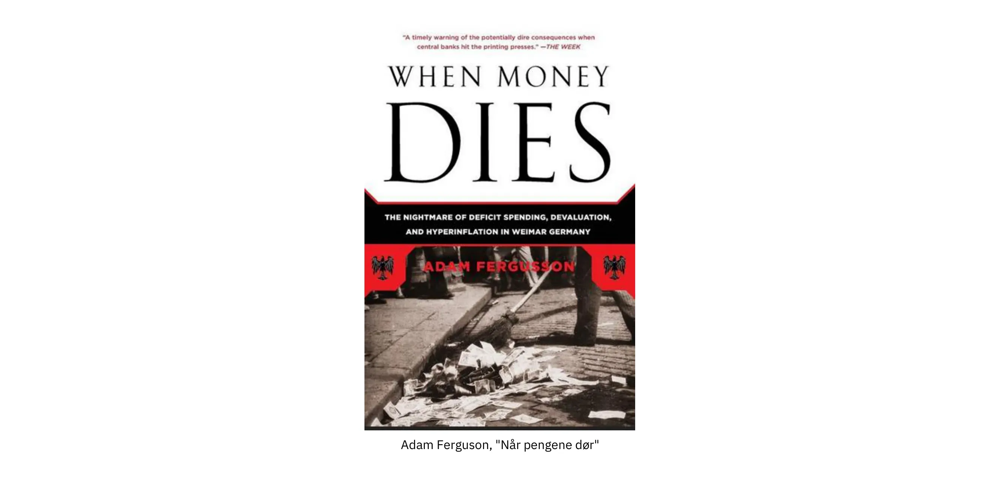

- "When Money Dies" av Adam Ferguson skildrer hyperinflasjonen i Tyskland, Østerrike og Ungarn etter første verdenskrig.
- To bøker om hyperinflasjonen i Zimbabwe, "Zimbabwe Warm Heart Ugly Face" og "Hard Boiled Egg Index" av henholdsvis Jérôme Gardner og Kudzai Joseph Gou Min-Yu, inneholder gripende vitnesbyrd fra henholdsvis en administrerende direktør i en klesbutikkjede og en bankmann i landbruket om deres opplevelser i denne turbulente perioden.

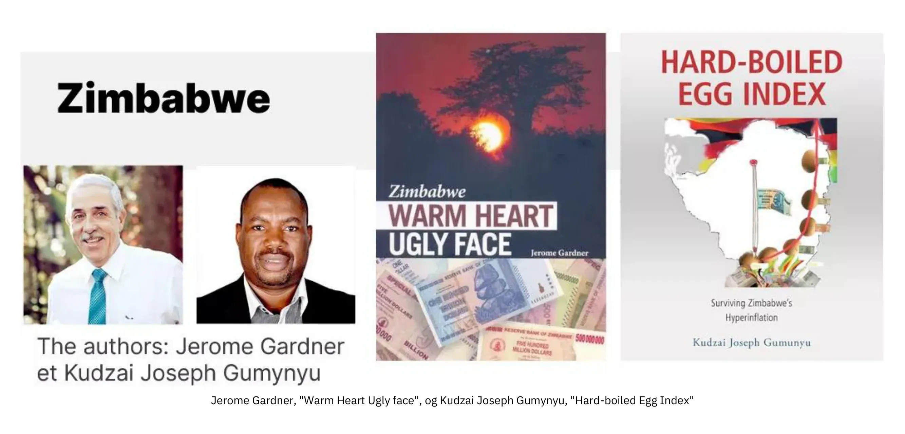

Da jeg samlet notatene mine, la jeg merke til mange likheter mellom opplevelsene av hyperinflasjon i Zimbabwe og Weimarrepublikken, til tross for at det er 90 år mellom dem. Jeg identifiserte rundt 17 likheter, hvorav 13 illustrerer en slags progresjon mot den økonomiske katastrofen som skildres i disse vitnesbyrdene. Disse fascinerende parallellene viser hvor gjentagende og ødeleggende hyperinflasjon kan være på tvers av tid og landegrenser. I dag skal vi se nærmere på disse likhetene og hvordan de viser en bekymringsfull utvikling i perioder med hyperinflasjon.

### Komparativ analyse: Zimbabwe og Weimarrepublikken

Spillet med 14 forskjeller!

#### 1. Mangel på penger

Når valutaen depresierer i et svimlende tempo, kan selv de mest ambisiøse forsøk på å oversvømme markedet med nye sedler vise seg å være utilstrekkelige. Den uopphørlige etterspørselen etter håndfast valuta kan langt overstige sentralbankenes kapasitet til å produsere sedler, noe som kan skape likviditetskriser uten sidestykke.

> Weimar: "I løpet av denne måneden vil den bli økt til nesten 4 milliarder papirmark, et tall som forhåpentligvis vil bidra til at valutamangelen blir definitivt overvunnet."

> Zimbabwe: "Fra 2002 til januar 2009 var det flere kritiske tilfeller av likviditetsmangel. Det var rett og slett ikke nok sedler trykt eller i omløp til å holde tritt med den skyhøye inflasjonen."

#### 2. "Og det er gjødsel!"

Det er forbløffende hvor raskt valuta kan miste sin verdi i visse økonomiske situasjoner. Astronomiske mengder sedler kan utstedes på rekordtid, og på et øyeblikk forvandles en gang betydelige summer til noe så ubetydelig som gjødsel.

> Weimar: "Det totale opplaget er i dag på 63 000 milliarder. Om noen få dager vil vi derfor kunne utstede to tredjedeler av det totale opplaget på én dag."

> Zimbabwe: "Den 17. september 2006 erklærte sjefen for RBZ, Gideon Gono, at "10 billioner er fortsatt der ute, og de er blitt til gjødsel"."

#### 3. Pengesedler er mindre verdt enn papiret de er trykt på

Under visse økonomiske omstendigheter kan en seddels egenverdi bli lavere enn verdien av papiret den er trykt på. Denne drastiske depresieringen gjør at sedler, som normalt er symboler på verdi og kjøpekraft, bare blir verdiløse papirbiter.

> Weimar: "Hele valører av marksedler var nesten verdiløse så snart de kom ut av seddelpressen."

> Zimbabwe: "Sentralbanken sløste bort penger ved å trykke en seddel som ikke var verdt papiret den var trykket på. Med andre ord var verdien lavere enn verdien av toalettpapir. Hvor absurd det enn høres ut, var det billigere å bruke 100 billioner ZWD-seddelen som toalettpapir enn å kjøpe ekte toalettpapir."

#### 4. Teller penger

Når valutaen raskt mister sin verdi, kan selv de enkleste transaksjonene bli arbeidskrevende. Det kan ta flere minutter å beregne prisen på en vare eller bare telle sedlene som trengs for å betale, noe som gjør de daglige transaksjonene ekstra kompliserte.

> Weimar: "Et helt vanlig kjøp i en butikk krevde tre-fire minutter med kalkulasjon, og når prisen var fastsatt, tok det vanligvis flere minutter å telle sedlene."

> Zimbabwe: "Butikksjefene fikk også lov til å ansette en vikar for å erstatte den ansatte som telte penger hele dagen. Å telle penger i butikken for administrasjon og bankinnskudd var én ting, men hele prosessen måtte gjentas i banken når pengene skulle settes inn."

:::video id=910231d7-af90-4ab8-b74c-bfb81caebfb2:::

Usbekisk teknikk for å telle penger

#### 5. Betalinger med sjekk

I kriserammede økonomier kan tradisjonelle betalingsmetoder som sjekker raskt miste sin effektivitet. Banker som overveldes av den økende etterspørselen etter valuta på grunn av hyperinflasjon, kan rasjonere eller utsette innløsningen av sjekker, noe som reduserer den reelle verdien av dem. Denne ustabiliteten fører ofte til en prioritering av betalingsmåter, der prisene kan variere avhengig av hvilken betalingsmåte som velges.

> Weimar: "Prisstigningen økte etterspørselen etter penger, både fra staten og andre arbeidsgivere. De private bankene kunne ikke dekke etterspørselen i det hele tatt og måtte rasjonere innløsningen av sjekker, slik at uinnløste sjekker forble fastfrosset mens kjøpekraften deres sank."
> Zimbabwe: "Tidsverdien av penger skapte tre priser på varer og tjenester, nemlig en kontantpris, en bruttooppgjørspris i sanntid og en sjekkpris. Til slutt var det ingen som godtok sjekker, som det tok fem dager å klarere."

#### 6. "Brenner-gründerne"

Etter hvert som valutaens verdi forvitrer, oppstår det nye økonomiske muligheter som utnytter skjevheter i markedet. Disse entreprenørene, ofte omtalt som "Burner-preneurs", kan blomstre ved å låne devaluert valuta for å investere i materielle eiendeler og deretter tilbakebetale gjelden sin med enda mer devaluert valuta.

Weimar: "Spekulasjonen i inflasjon gikk ut på å låne papirmark, konvertere dem til varer og fabrikker, og deretter betale tilbake långiverne med devaluerte papirer."

Zimbabwe: "Brenner-gründerne"

#### 7. Ærlighet og Hard-arbeid mister sin appell

I ustabile økonomiske kontekster kan tradisjonelle verdier som arbeid, sparsommelighet og integritet bli overskygget av fristelsen til rask rikdom. Spekulasjon og valutahandel gir ofte betydelig høyere belønning enn vanlig arbeid, noe som fører til en forstyrrelse i samfunnets prioriteringer.

Weimar: "Etter hvert som de gamle dydene sparsommelighet, ærlighet og Hard-arbeid mistet sin appell, søkte alle å bli rike raskt, særlig siden valuta- eller aksjespekulasjon tilsynelatende kunne gi mye mer enn arbeid."

Zimbabwe: "Denne praksisen beriket noen få individer, men utarmet arbeiderklassen i byene og befolkningen på landsbygda. Utdanning mistet sin verdi, ettersom denne handelen ble drevet av mennesker som ikke trengte utdanning eller Hard-arbeid for å rettferdiggjøre den. Alt de trengte, var kontakter og startkapital for å starte forretninger med lettjente penger."

#### 8. "Verdens banker"

I situasjoner med hyperinflasjon eller monetær krise oppstår det ofte parallelle og uregulerte markeder for utenlandsk valuta. Disse uformelle "bankene", ofte humoristisk omtalt som "verdensbanker" eller med andre lokale navn, er et tilfluktssted for dem som ønsker å beskytte verdiene sine mot devaluering. Selv om disse markedene kan utgjøre en nødvendig økonomisk livline, understreker de ofte den utbredte mistilliten til offisielle finansinstitusjoner og myndighetenes politikk.

Weimar: "Transaksjonene deres ble hovedsakelig utført gjennom de såkalte Winkelbankiers, gateoperatørene som hadde dukket opp med inflasjonen, og som i en syk økonomi levde utelukkende av å utnytte forskjellen mellom kjøps- og salgsprisene på utenlandsk valuta."

Zimbabwe: "De var også valutavekslere. De opererte ustraffet mellom 2nd og 6th Avenue og Fort Street i Bulawayo, takket være deres utspekulerte forretningsmetoder, som ofte involverte korrupsjon og andre ulovlige aktiviteter. Dette området av byen var kjent som 'Verdensbanken'."

Argentina: "Så jeg gikk dit alle argentinere går: til cuevas, 'hulene', som ligger i Florida-området i hjertet av Buenos Aires." - TheBigWhale

#### 9. Veksling av utenlandsk valuta var ulovlig

I et forsøk på å stabilisere sin egen valuta og kontrollere kapitalflyten kan myndighetene gjøre slike valutatransaksjoner ulovlige. Selv om disse repressive tiltakene har til hensikt å beskytte nasjonaløkonomien, kan de ofte ha motsatt effekt, ved å øke mistilliten i befolkningen og oppmuntre til det svarte markedet.

Weimar: "Folk tyr til byttehandel og vender seg etter hvert til utenlandsk valuta som det eneste pålitelige betalingsmiddelet for Exchange. Det ble innført nye forordninger om kjøp av utenlandske veksler og bruk av utenlandsk valuta til innenlandske betalinger. I tillegg til fengselsstraff kunne det nå ilegges bøter på opptil ti ganger beløpet for en ulovlig transaksjon."

Zimbabwe: "Razziaer mot forretninger førte til at flere forretningsmenn fra Bulawayo ble fengslet over helgen og bøtelagt med bøter tilsvarende det dobbelte av beløpet i inndrevet utenlandsk valuta, men så avtok denne tapperheten."

#### 10. Kapitalkontroll

Når et land står overfor en monetær eller økonomisk krise, er en vanlig reaksjon fra myndighetene å utøve streng kontroll over kapitalbevegelser og -former. Enten det er gjennom pålegg om å akseptere devaluerte nasjonale valutaer eller gjennom strenge sanksjoner mot dem som avviser visse betalingsmetoder, har disse tiltakene ofte som mål å dempe panikken og gjenopprette tilliten. Effektiviteten varierer imidlertid, og noen ganger kan tiltakene vise seg å virke mot sin hensikt eller være frakoblet den virkeligheten innbyggerne opplever.

Weimar: "Kjøpmennene hadde nylig blitt tvunget av et nytt dekret til å akseptere statlige sedler; men siden det også tillot fortsatt bruk av utenlandsk valuta for alle kjøp, fant kjøpmennene generelt unnskyldninger for nesten ikke å akseptere noe annet."

Zimbabwe: "Den 12. desember 2008 innførte myndighetene SI 175/2008 om betaling med sjekk. Der het det: "Straffen for å nekte betaling med sjekk/bankkort eller andre bankformidlede elektroniske betalingsmetoder skal være en bot på nivå 8 eller en fengselsstraff på seks måneder, eller begge deler Vi ignorerte selvsagt SI, fordi den var helt ute av kontakt med virkeligheten."

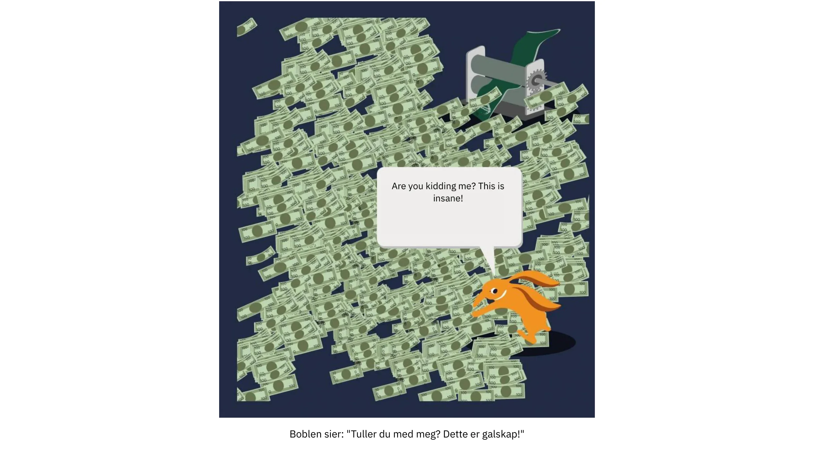

#### 11. Tvunget til å holde butikkene åpne

Når økonomien kollapser og valutaen mister sin verdi, kan myndighetene ty til drastiske tiltak for å opprettholde et skinn av normalitet.

Weimar: "Kjøpmenn som fortsatte sin virksomhet, ble underlagt en ny forordning som ble vedtatt 22. oktober, og som påla dem å holde butikkene åpne og tilby varer i Exchange mot papirmerker."

Zimbabwe: "Bare tomme stålhyller og kjøleskap, kjølere og frysere sto igjen. Det tragiske var at butikken fortsatt var åpen fordi de ikke våget å stenge på grunn av politiske spenninger og frykten for at lederne skulle bli arrestert av myndighetenes priskontrollstyrke. Selv arbeiderne ble ikke oppsagt fordi alle trodde det ville komme en rask løsning."

#### 12. Alle er kriminelle

I en økonomi som kollapser og med gjennomgripende reguleringer, blir grensen mellom overlevelse og kriminalitet utydelig.

Weimar: "Alle forbrytelser mot staten, hver og en av dem, i varierende grad, ble et spørsmål om overlevelse for den enkelte."

> Zimbabwe: "Alle innbyggere i Zimbabwe var kriminelle. Selv om det kan høres hardt ut, var det sant. Med det mylderet av små lover som regulerte alle aspekter av livet, var det uunngåelig at alle brøt en lov hver dag. Det var ulovlig å være i besittelse av utenlandsk valuta, ifølge en SI publisert i 2004. Det var ulovlig å ha flere bankkontoer for å omgå den daglige uttaksgrensen. Å ikke ha de riktige bilskiltene på bilen, eller en bilradiolisens, eller en generatortillatelse, var alle lover som noen, et eller annet sted, brøt."

#### 13. Kjøp utenlandsk valuta for enhver pris

Det hektiske oppkjøpet av utenlandsk valuta har ofte markert et kritisk vendepunkt i devalueringen av valutaen, noe som har forsterket fallet i den reelle verdien.

> Weimar: "Fritz Mannheimer gikk i august 1921 ut på ordre fra sin sjef og begynte å kjøpe utenlandsk valuta for enhver pris - 'fordi Tyskland hadde uendelig mange papirmark, men ingen utenlandsk valuta' Dette var det første tegnet på markens absolutte kollaps."

> Zimbabwe: Det har blitt hevdet at de fikk daglige mål å oppfylle, ettersom noen av valutabehovene var presserende, og at de ville kjøpe for enhver pris for å samle valuta for å overholde fristen. Denne påståtte praksisen ble beskyldt for å ha bidratt til devalueringen, ettersom verdien av den zimbabwiske dollaren fortsatte å synke bratt."

### Sammendrag av prosessen

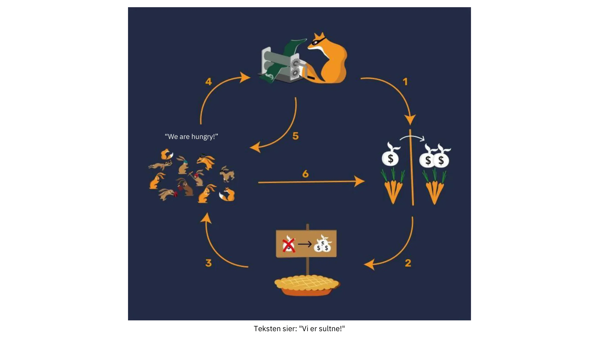

Når man analyserer den økonomiske utviklingen, er det tydelig at verdien av pengemassen forringes når man når høy inflasjon. Denne devalueringen fører til flere komplikasjoner, blant annet mangel på sedler. I denne sammenhengen oppstår det arbitrasjemuligheter, særlig som følge av svingninger i Exchange-renten. Som et resultat av dette er det mange privatpersoner som benytter seg av denne arbitrasjen og investerer tungt i materielle eiendeler i påvente av en fremtidig devaluering av valutaen, slik at de kan betale tilbake gjelden sin med en svekket valuta. Dette økonomiske miljøet undergraver tiltrekningskraften til tradisjonelle jobber og svekker følgelig det sosiale samholdet.

Som svar på denne situasjonen innfører myndighetene drakoniske reguleringer, blant annet kapitalkontroll. De pålegger også kjøpmenn å akseptere den nasjonale valutaen og sjekker. Over tid blir det vedtatt nye lover som utvider definisjonen av kriminell atferd. Til slutt stiger Exchange-kursen eksponentielt ettersom myndighetene er villige til å veksle inn sin egen valuta, som er trykt til en lavere kostnad, mot mer robuste utenlandske valutaer.

### 4 Likheter i konsekvensene av hyperinflasjon

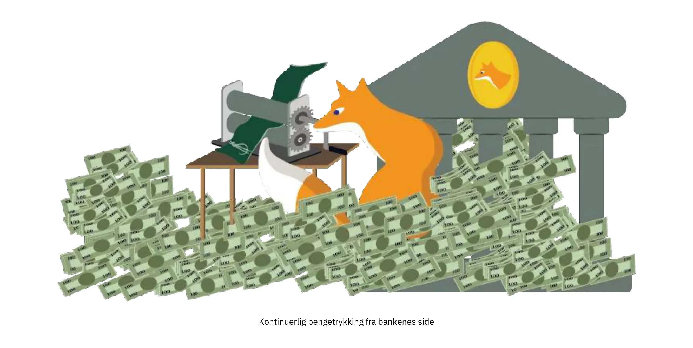

#### 1. Olje og metaller

Under Weimar-tiden i Tyskland var tyveri av verdifulle materialer så utbredt at bly fra tak ofte ble stjålet. I Zimbabwe drev desperasjonen noen til å forstyrre strømnettet for å hente ut olje fra transformatorer og bruke den i bilene sine.

Weimar: "Metallplakettene på nasjonale monumenter måtte fjernes for å bli tatt vare på. Messingklokkeplater ble stjålet fra dørene til den britiske ambassaden i Berlin."

Zimbabwe: "For å gjøre vondt verre var det mangel på smøreolje til bilene på grunn av mangelen på utenlandsk valuta, og transformatorene ble et lett mål for tyver som tappet av kjøleoljen under strømbrudd."

#### 2. Tog

Valutadevaluering kan få innbyggerne til å adoptere overlevelsesatferd, inkludert vandalisme. Når økonomien kollapser, kan kostbar offentlig infrastruktur, som for eksempel transportsystemer, bli ødelagt, noe som kan føre til katastrofale samfunnsmessige konsekvenser.

> Weimar: "I Berlin ble trikkesystemet lagt ned på grunn av pengemangel."

> Zimbabwe: "Et av de mest urovekkende og sørgelige scenariene var da nesten hele den elektriske kobberlinjen mellom Harare og Dabuka (over 280 kilometer) ble stjålet. Da den sto ferdig, hadde den vært Zimbabwes stolthet, med raske elektriske passasjer- og godstog som kjørte langs denne ruten."

#### 3. "Mealie Meal"

I en situasjon med lave lønninger og en ustabil økonomi var bedriftene nødt til å tilby mat til sine ansatte for å opprettholde produktiviteten og effektiviteten i driften. Dette initiativet var ikke bare en måte å kompensere for knapphet og høye matkostnader på, men også en strategi for å holde på de ansatte i en vanskelig økonomisk situasjon.

> Weimar: "I Berlin hadde de kontoransatte, som utgjorde en svært viktig klasse i hovedstaden, helt utilstrekkelige lønninger på mellom 12 000 og 20 000 i måneden (tilsvarende mellom 12 og 19 pund i året), som stadig krympet; men de fleste kunne likevel få lunsjen sin for et symbolsk beløp, levert av kontoret, slik at kropp og sjel så vidt kunne holdes sammen."

> Zimbabwe: "På dette tidspunktet ga vi alle våre ansatte gratis lunsj. Maismelet var avgjørende for at selskapet skulle kunne fortsette å fungere, ettersom det i mange tilfeller var det eneste måltidet de ansatte fikk hver dag."

#### 4. Bensinkuponger

Befolkningen søkte stabile alternativer for transaksjoner. I Weimar fungerte produkter som messing og drivstoff som medium for Exchange på grunn av deres konstante egenverdi. I Zimbabwe ble bensinkuponger, som representerte en fast mengde av et essensielt produkt, en de facto-valuta da den zimbabwiske dollaren raskt ble devaluert. Disse situasjonene viser hvordan samfunn tilpasser seg ekstreme økonomiske forhold og finner innovative løsninger for å opprettholde handel og økonomi.

Weimar: "Byttehandel var allerede en vanlig form for Exchange, men nå ble varer som messing og brensel den vanlige valutaen for kjøp og betaling."

Zimbabwe: "Disse kupongene brukte vi nå til å betale husleie til utleiere, kommunale avgifter, telefonregninger - ja, nesten alt - fordi alle hadde sluttet å ta imot betalinger i zimbabwiske dollar og sjekker."

#### Konklusjon

Dette er avslutningen på denne videoen om likhetene mellom erfaringene fra periodene med hyperinflasjon i Zimbabwe og Weimarrepublikken. I neste video vil vi diskutere forskjellene og parallellene i samtiden. Takk for at dere kom.

## Weimar vs Zimbabwe: Forskjeller og paralleller i samtiden

<chapterId>643f279c-d89f-5600-a2e2-b1bbbba0ab69</chapterId>

I dette kapittelet vil vi utforske forskjellene og parallellene mellom tidligere og nåværende hyperinflasjonsperioder, med anekdoter og relevante sammenligninger for i dag.

### Forskjeller mellom Weimarrepublikken og Zimbabwe

#### 1. Det er dollarens feil!

I Tyskland var det vanlig at befolkningen tilskrev inflasjonen til dollarens oppgang snarere enn til en iboende devaluering av deres egen valuta. Mange trodde at det observerte fenomenet skyldtes en appresiering av dollaren. Denne oppfatningen gjorde at de ikke så sammenhengen mellom deres økonomiske problemer og devalueringen av valutaen, som hovedsakelig skyldtes overdreven pengeskaping. Boken "When Money Dies" illustrerer tydelig denne manglende forståelsen blant den tyske befolkningen. I Zimbabwe var situasjonen derimot en annen: Innbyggerne var fullt klar over den underliggende årsaken til hyperinflasjonen de opplevde.

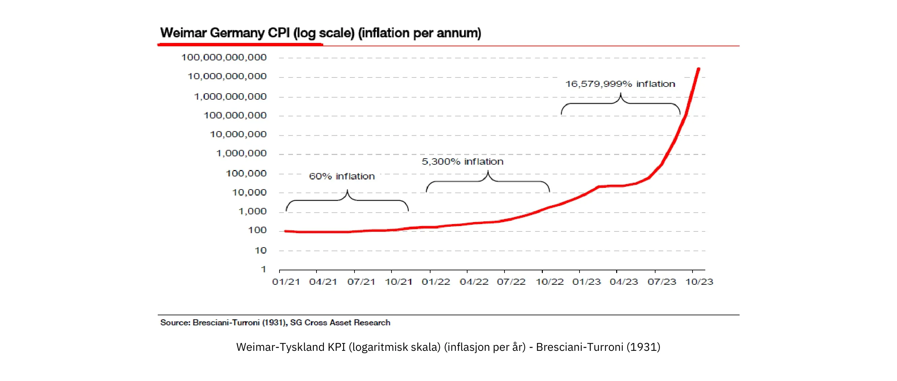

#### 2. Nødpenger (Notgeld)

I møte med den monetære og økonomiske krisen tyr Tyskland til "Notgeld" (nødpenger). Disse sedlene, som ble trykt av byer eller enkelte selskaper, skulle avhjelpe mangelen på felles valuta.

Interessant nok benyttet også Frankrike seg av Notgeld, særlig på 1920-tallet. Dette initiativet var ikke bare en direkte konsekvens av hyperinflasjonen, men hadde også røtter i forstyrrelsene forårsaket av første verdenskrig. Krigen destabiliserte ikke bare økonomien, men økte også kostnadene for metaller. Resultatet var at metallmyntenes egenverdi ofte oversteg pålydende verdi, noe som førte til at folk begynte å hamstre dem. I mangel av mynter trykket enkelte institusjoner, som handelskammeret i Lyon, sin egen Notgeld.

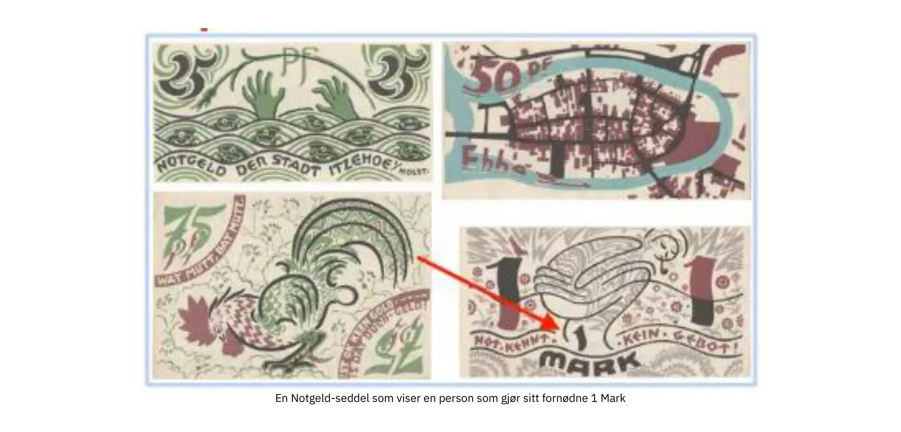

> "Det som må gjøres, må gjøres." - et lokalt ordtak

Blant Notgeld-sedlene er det én som skiller seg ut. Den har en gripende illustrasjon: I midten er det avbildet en person som gjør fra seg en mark. På baksiden illustrerer en pristabell fra 1913 til 1921 den økende inflasjonen i denne perioden.

Kunstneren bak denne Notgeld-seddelen ser ut til å komme med en ironisk kritikk av myndighetene som er ansvarlige for hyperinflasjonskrisen. Seddelen bærer inskripsjonen "Nødvendighet kjenner ingen lov". Et annet uttrykk som er spesifikt for Notgelds opprinnelsessted, er: "Det som må gjøres, må gjøres."

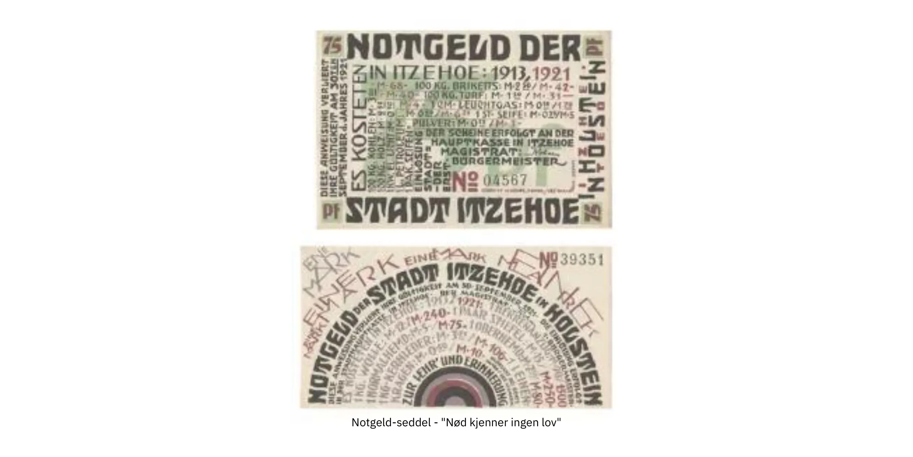

> "Nødvendighet kjenner ingen lov"

> Den første shitmynten: Anekdotisk sett kan man kalle den første "shitmynten" ved å se på den sentrale illustrasjonen av seddelen, der valutaen bokstavelig talt blir devaluert av den enkeltes handling

#### 3. Gjeldsbrev og pantelån

I Weimar ble en del av gjelden oppskrevet for å kompensere for inflasjonen. Dette tiltaket ble ikke innført i Zimbabwe.

> Weimar: "I 1925 ble det vedtatt å oppskrive verdien på statseide lån, noe som resulterte i at aksjonærene fikk 2,5 prosent av den opprinnelige investeringen, forutsatt at alle erstatninger var betalt."

> Zimbabwe: "I juli 2007 (tre år senere) kunne jeg ta opp en devaluert seddel på 500 000 ZDW (bt "000") fra lommen, som nå var verdt 1,67 dollar til parallellmarkedskursen, og betale tilbake boliglånet, som skulle nedbetales over 20 år. I tillegg utgjorde denne seddelen bare 0,49 prosent av månedslønnen min for den samme måneden."

For å lære mer om hvordan man håndterer den tyske krisen, er denne boken også uunnværlig.

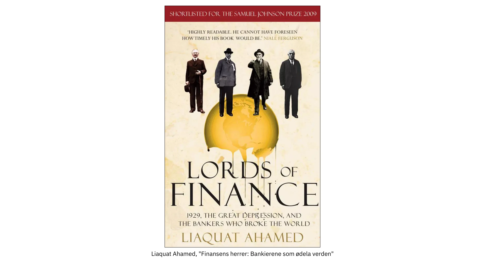

### Paralleller til samtiden

#### 1. Manipulering av pengepolitikken for å kontrollere økonomien.

I Weimarrepublikkens historie er det tydelig at industrialistene var motvillige til å se verdien av D-marken stige. De hadde en betydelig fordel av å kunne låne og betale tilbake gjelden sin med en sterkt svekket valuta. Denne mekanismen gjorde det mulig å bygge enorme industrikomplekser nesten uten kostnader. Industriherrene fryktet en appresiering av marken, fordi det hindret dem i å drive sin virksomhet. Noen så til og med på den voldsomme inflasjonen som en positiv utvikling, i den tro at den ville sikre sysselsetting for befolkningen. De var imidlertid ikke klar over de negative konsekvensene inflasjonen hadde for sparingen og økonomien som helhet. For disse økonomiske aktørene var pengetrykking en velsignelse.

> Weimar: "Derfor fryktet man en oppskrivning av marken, og selv de få ukene med "stabilitet" etter Genova førte til en stagnasjon i virksomheten."

> Weimar: "Industrikretser sto overfor faren for at kontanter ville bli mer verdt enn varer, og at det ville oppstå et sammenbrudd når alle forsøkte å konvertere sine eiendeler til kontanter."

En parallell kan trekkes til Christine Lagardes uttalelser om at innbyggerne bør prioritere utsikter til sysselsetting fremfor beskyttelse av sparepengene sine. Akkurat som industrialistene i Weimar ser det ut til at hun tar til orde for pengetrykking som et verktøy for å stimulere sysselsettingen, på bekostning av verdien av sparepengene.

> Christine Lagarde: "Vi burde være gladere for å ha en jobb enn for å se sparepengene våre beskyttet."

#### 2. Privat eiendom i konfliktsituasjoner

Weimarrepublikkens historie viser at man i denne perioden konfiskerte eiendeler og kapital i utlandet. Dette tiltaket minner om nyere hendelser i Russland, særlig i begynnelsen av en konflikt. Disse situasjonene belyser en bekymringsfull realitet: I krisetider kan respekten for privat eiendom settes på spill. Dette er en historisk og nåtidig parallell som understreker krisers potensielle konsekvenser for individuelle rettigheter.

> Weimar: "All tysk kapital i utlandet var blitt konfiskert."

> [20minutes.fr] (https://www.20minutes.fr/monde/3286947-20220513-guerre-ukraine-geler-avoirs-russes-vol-non-redistribuer-kiev-poserait-lourdes-questions): "Omtrent 300 milliarder dollar av russiske reserver i utlandet har blitt frosset som en del av de vestlige sanksjonene, av de 640 milliarder dollar i reserver som den russiske sentralbanken sitter på."

#### 3. Begrepet markedspris

Under Weimarrepublikken uttrykte bøndene misnøye med "Umlage", som tvang dem til å levere de første to millioner tonnene hvete som ble produsert hvert år. Denne reguleringen førte til at halvparten av den totale brødmengden Supply ble lagt ut på markedet til subsidierte priser. Fra august og utover skulle disse bøndene få betalt verdensmarkedspris, for selv om de ble tvunget til å levere hveten til reduserte priser, måtte de fortsatt kjøpe gjødsel til verdensmarkedspris.

Denne situasjonen reiser et sentralt spørsmål knyttet til begrepet markedspris under hyperinflasjon. I datidens tyske kontekst ble bøndene tvunget til å selge hveten sin til en pris som lå under dens verdi, samtidig som de måtte kjøpe kunstgjødsel til verdensmarkedspriser. Et slikt økonomisk misforhold belyser utfordringene med matvareprisene i dag. Landbruksprodusentene står overfor økende kostnader på grunn av inflasjon, og disse kostnadene veltes over på sluttproduktene. Å kritisere dem for denne økningen er det samme som å ignorere dynamikken i markedsprisene og det økonomiske presset de står overfor. Å selge til kunstig lave priser samtidig som man pådrar seg høye kostnader, er uholdbart for enhver virksomhet.

> Weimar: "Landbruksinteressene var misfornøyde med 'Umlage', den tvungne leveringen av de første to millioner tonnene hvete som ble produsert hvert år, noe som gjorde det mulig å selge halvparten av den totale brødmengden Supply til lave priser. Fra august skulle bøndene få betalt verdensmarkedsprisen, for selv om de var forpliktet til å selge hvete til lave priser, måtte de alltid betale verdensmarkedsprisen for kunstgjødsel."

#### 4. Fornektelse av sammenhengen mellom penger Supply og inflasjon

> Weimar: "Han holdt fast ved sitt syn om at pengemengden Supply verken var relatert til prisnivået eller til Exchange-renten."

I moderne tid fortsetter denne trenden, som vi så i forrige kapitels eksempel på en liste over forklaringer som ulike økonomer og økonomiske institutter har lagt frem for å rettferdiggjøre inflasjon. Årsakene varierer, og spenner fra kulturelle hendelser og kjendiser som Taylor Swift, Zelda eller Beyoncé til globale faktorer som krig og pandemi. Selv om alle disse årsakene potensielt kan bidra til kortsiktige økonomiske svingninger, avleder de oppmerksomheten fra den egentlige underliggende årsaken: utvidelsen av pengemengden Supply.

#### 5. Zombieselskaper

> Weimar: "Stabiliseringen hadde gjort slutt på den perioden da entreprenører kunne låne så mye de ville på bekostning av alle andre. Svært mange bedrifter som ble opprettet eller ekspandert under pengeoverfloden, ble raskt uproduktive da det ble knapphet på kapital."

Et zombieselskap er en bedrift som under normale markedsforhold ville vært insolvent eller nær konkurs, men som fortsetter å operere hovedsakelig takket være billige lån. Disse bedriftene tjener akkurat nok til å dekke gjelden sin, men er ikke i stand til å vokse vesentlig.

Begrepet zombieselskaper er ikke nytt. Faktisk eksisterte det allerede under Weimarrepublikken. På den tiden så mange selskaper ut til å blomstre, i stor grad på grunn av tilgangen til gratis kreditt. De lånte store summer med forventning om å betale tilbake senere med en svekket valuta på grunn av den voldsomme inflasjonen. Men da inflasjonen opphørte og D-marken gjenvant sin verdi, ble disse selskapene, som verken var driftsmessig eller økonomisk levedyktige, ulønnsomme og måtte legge ned.

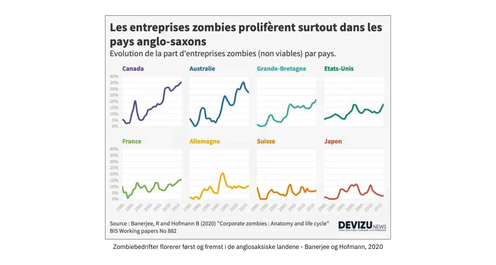

Fenomenet med zombieselskaper er ikke begrenset til etterkrigstidens Tyskland. Selv i dag fortsetter mange store selskaper å blomstre på grunn av deres privilegerte tilgang til kreditt til ekstremt lave renter. Hvis de måtte låne til mer konvensjonelle renter, ville mange av dem ikke lenger være lønnsomme. Dette er spesielt relevant i 2023, etter en lengre periode med nær nullrenter, ettersom rentene nå har begynt å stige. Dette nylige skiftet i det finansielle landskapet vil utvilsomt bli en avgjørende test for disse selskapene, som en gang ble stemplet som "zombier"

#### 6. Bli rik raskt!

Historien viser eksempler på at enkeltpersoner har forsøkt å akkumulere rikdom raskt, slik tilfellet var i Weimar og Zimbabwe gjennom arbitrasje. I dag kan en lignende trend observeres med fremveksten av visse kryptovalutaer. Folk fristes av raske gevinster og tar risiko i håp om en eksponentiell økning i investeringen. Denne tilnærmingen minner om den vi så i perioder med hyperinflasjon, der arbitrasje ble brukt til å oppnå rask fortjeneste, ofte på bekostning av andre.

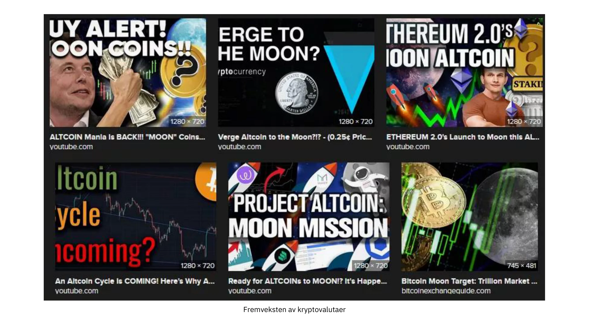

#### 7. Sparing, botemiddelet mot usikkerhet

> Den gjennomgripende og ødeleggende innflytelsen fra den konstante uthulingen av verdien av kapital og inntekt, samt usikkerheten om fremtiden.

Det er verdt å trekke frem et sitat som understreker den destruktive effekten erosjonen av kapitalverdier har på det sosiale samholdet, samt usikkerheten den skaper. Her heter det "den gjennomgripende og ødeleggende innflytelsen fra den konstante uthulingen av kapitalens og inntektens verdi, samt usikkerheten om fremtiden."

Tenk deg et scenario der du har en familie eller kjære du ønsker å beskytte. Du jobber Hard og sparer for å ta høyde for fremtidige usikkerhetsmomenter. Hvis alt var forutsigbart, ville sparing vært nytteløst. Men i møte med uforutsette omstendigheter, som for eksempel en ødelagt bil, blir sparing en livline. De reduserer usikkerheten i verden. Under hyperinflasjon blir sparing imidlertid en utfordring. Pengene mister raskt sin verdi, noe som gjør langsiktig planlegging vanskelig. Denne økonomiske ustabiliteten kan gi generate stress og angst.

I dag, med synkende sparekraft, har investeringer tatt over. Denne tilnærmingen har imidlertid sine egne risikoer. Sparing har alltid vært et middel mot usikkerhet. Å ha økonomiske reserver til å håndtere uforutsette situasjoner bidrar til trygghet og styrker det sosiale samholdet. Konklusjonen er at det å beskytte sparekraften vår er avgjørende for å opprettholde både sosial og individuell stabilitet.

## Redenominasjoner i Latin-Amerika

<chapterId>918eafd7-409d-5205-ad52-a52e63b23a64</chapterId>

Vi skal nå se nærmere på ulike perioder med redenominering i latinamerikanske land.

### Forklaring av grafene

Til venstre på lysbildet ser du årstallene for redenominering, navnet på den nye valutaen og Exchange-kursen i forhold til den gamle valutaen. Hvis vi tar Argentina som eksempel, ble peso moneda nacional konvertert til en kurs på 25 til 1 fra den tidligere valutaen, peso reàl. I denne sammenhengen vil vi undersøke utviklingen av den argentinske valutaen over tid. I tillegg vil vi angi sedlenes opprinnelige og endelige pålydende for hver periode.

På høyre side av lysbildet vises en graf over inflasjonen. De røde pilene representerer år med hyperinflasjon, som definert av Cagans kriterium, som er en inflasjonsrate på 50 % per måned. Dette kriteriet kan noen ganger føre til tvetydige tolkninger, ettersom år med høy inflasjon ikke nødvendigvis oppfyller den strenge definisjonen av hyperinflasjon.

Det er verdt å merke seg at redenominering, som er et vanlig tiltak fra myndighetenes side i perioder med inflasjon, er et bemerkelsesverdig fenomen. Dette løser imidlertid ikke det underliggende problemet med inflasjon eller hyperinflasjon. Det er bare en måte å gi valutaen et nytt navn og fjerne nuller på, uten å ta tak i den egentlige årsaken til hyperinflasjon: utvidelsen av pengemengden Supply. I en senere video vil vi diskutere de virkelige løsningene på Address og løse problemet med hyperinflasjon. I denne serien vil vi belyse konsekvensene av en enkel redenominering uten tilstrekkelige reformer: inflasjonen vedvarer.

Etter Argentina skal vi se nærmere på Brasil, Bolivia, Peru, Nicaragua og Venezuela. Vi skal se nærmere på de redenominasjonene som har funnet sted i disse landene.

### Argentina

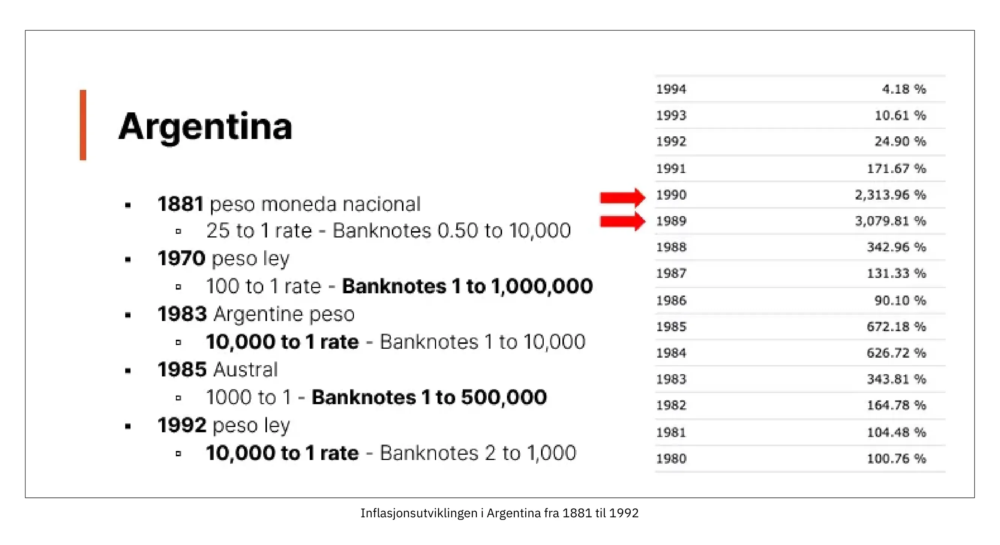

Før 1826 brukte Argentina den spanske dollaren. Etter uavhengigheten i 1816 innførte landet sin egen valuta basert på den spanske reàl, noe som resulterte i en lignende valuta. Tabellen begynner i 1881, året da "peso moneda nacional" ble innført, med sedler opp til 10 000. Deretter fulgte "peso ley", som ble vekslet til kurs 100 til 1 og hadde sedler på opptil én million. Deretter kom "argentinsk peso" med en Exchange-kurs på 10 000 til 1 (tilsvarende fjerning av fire nuller), og sedler opp til 10 000. I 1985 ble "australes" introdusert og vekslet til en kurs på 1 000 til 1, med sedler opp til 500 000. I 1992 ble den nåværende "peso ley" etablert med en kurs på 10 000 til 1, og fire nuller ble igjen fjernet. Bare i 1989 og 1990 var det hyperinflasjon.

### Brasil

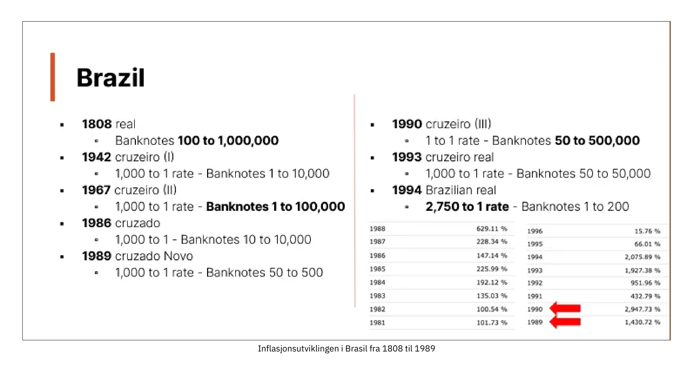

Brasil er et bemerkelsesverdig eksempel på redenominering av valuta, noe som illustreres av landets historie med valutaendringer. Før selvstendigheten brukte Brasil den portugisiske reàl som valuta. Men allerede i 1747 begynte landet å bruke sin egen "brasilianske reàl", lenge før uavhengighetserklæringen i 1822. Tabellen starter i 1818, som markerer begynnelsen på utstedelsen av brasilianske pengesedler. Tidligere var valutaen først og fremst i form av mynter. Disse sedlene kunne ha en verdi på opptil én million reais.

Fra og med 1942 begynte Brasil en rekke redenomineringer. I de fleste tilfellene (1942, 1967, 1986, 1989, 1993) var omregningskursen 1:1000. I 1990 ble det foretatt en navneendring uten omregning. Rekkefølgen av disse valutaene er som følger:

- Réals (gammel versjon) frem til 1942.
- Cruzeiros i 1942.
- Cruzeiros (ny versjon) i 1967.
- Cruzados i 1986.
- Cruzados Novos i 1989.
- Tilbake til Cruzeiros i 1990.
- Cruzeiros Reais i 1993.
- Til slutt kom den brasilianske gjenforeningen i 1994.

Den høyeste seddelvaløren nådde 500 000, og den siste redenomineringen i 1994 ble gjort til en kurs på 2750 til 1. Årene 1989 og 1990 var preget av hyperinflasjon, mens 1993-1994 hadde høye inflasjonsrater som ikke nådde opp til hyperinflasjonsterskelen (50 % per måned). Etter denne turbulente perioden omgjorde Brasil igjen valutaen sin ved å fjerne flere nuller.

### Bolivia

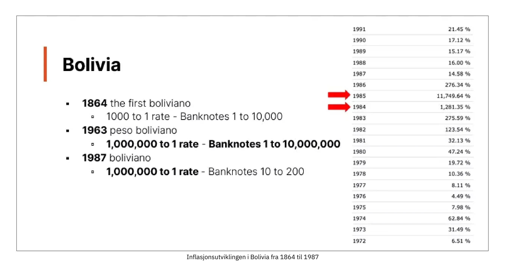

Bolivia er et annet eksempel på et land som har opplevd perioder med akutt inflasjon, noe som har gjort det nødvendig å omdefinere valutaen. Her er et sammendrag av landets monetære historie:

Før uavhengigheten i 1825 brukte Bolivia den spanske dollaren som valuta. Etter uavhengigheten innførte landet den bolivianske sola mellom 1827 og 1864, som erstattet den spanske dollaren. Det er imidlertid verdt å merke seg at de første pengesedlene i Bolivia ble innført først i 1864.

I 1864 ble den første "bolivianoen" introdusert, med en Exchange-kurs på 1 000 til 1 sammenlignet med den bolivianske sola. Denne valutaen forble i omløp til den nådde en pålydende verdi på 10 000 bolivianos.

Deretter endret Bolivia valuta til "boliviansk peso", som opplevde en kraftig hyperinflasjon og til slutt nådde en pålydende verdi på opptil 10 millioner. Inflasjonen nådde sitt høydepunkt i årene 1984-1985, med månedlige inflasjonsrater som ofte nærmet seg hyperinflasjonsterskelen på 50 %. For å sette dette i perspektiv: En konstant inflasjon på 50 % per måned over et helt år gir en årlig inflasjon på ca. 12 800 %. I 1985 nådde Bolivias årlige inflasjon 11 749 %, noe som indikerer at inflasjonen nærmet seg eller oversteg 50 %-grensen nesten hver måned.

Som svar på denne pengekrisen innførte Bolivia i 1987 en ny valuta, bare kalt "boliviano", med en Exchange-kurs på 1 million bolivianske pesos for 1 boliviano. Denne versjonen av bolivianoen er fortsatt i omløp i dag.

Dette er en oversikt over Bolivias turbulente pengehistorie, som har vært preget av perioder med hyperinflasjon og redenomineringer.

### Peru

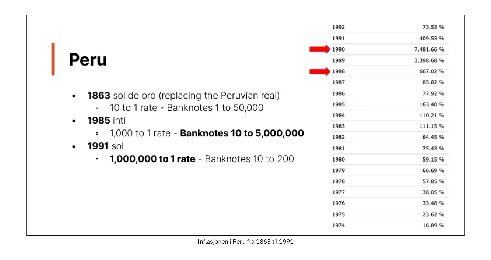

Peru er et interessant eksempel på effekten av den vilkårlige 50 %-regelen. Peru brukte spansk gull frem til 1800-tallet, da landet erklærte sin uavhengighet i 1821. Den peruanske dollaren var i bruk fra 1822 til 1863. I 1863 ble den peruanske reàl erstattet av soldi oro, i forholdet 10 til 1, og nådde en maksimal verdi på 50 000. I 1985 ble valutaen "Inti" introdusert med en omregningskurs på 1000 til 1, med en topp på 5 millioner. I 1991 ble "SOL" lansert med en Exchange-kurs på 1 million til 1, med sedler fra 10 til 200.

Ser vi på redenomineringsperiodene, regnes 1988 som et år med hyperinflasjon, særlig i september. Juli-august 1990 var også en periode med hyperinflasjon. I 1988 var den årlige inflasjonen på 667 %, med en topp på 50 % i september. I 1989 var inflasjonen derimot på 3000 %, uten at noen måned oversteg 50 %, og ble derfor ikke klassifisert som hyperinflasjon. I 1990 nådde inflasjonen en topp på 7481 %. Det er tydelig at 50 %-regelen kan være vilkårlig, ettersom 1988 ble regnet som et år med hyperinflasjon, i motsetning til 1989. Hvis denne regelen skulle vurderes på nytt, kunne det være lurt å senke terskelen for å inkludere perioder som den Peru opplevde i 1989.

> Forstå hva som skjer
>

> Det viktigste å forstå når det gjelder redenominering av valuta, er at når verdien av valutaen når astronomiske tall, for eksempel 5 eller 10 millioner, blir den redenominert. Denne prosessen kan gjentas flere ganger, og innebærer en endring i valutaen. Resultatet er at den enkeltes sparing kan bli hardt rammet, selv om det ikke er hyperinflasjon. Hvis noen for eksempel sparer 1000 dollar ett år og klarer å sette av 100 dollar, kan den laveste seddelvaløren året etter være 1000 dollar, noe som gjør de tidligere sparte 100 dollar verdiløse. En slik uthuling av sparepengene krever ikke åpenbar hyperinflasjon. Selv om en person har spart 10 000 dollar i løpet av de siste ti årene, kan dette beløpet ende opp med å bli ubetydelig og ikke være verdt nok til å kjøpe en flaske vann. Dette er en realitet i mange land som har opplevd redenomineringer, selv om bare noen få måneder ble klassifisert som hyperinflasjonære. I motsetning til dette har noen land, som Nicaragua, opplevd hyperinflasjon i flere år på rad.

### Nicaragua

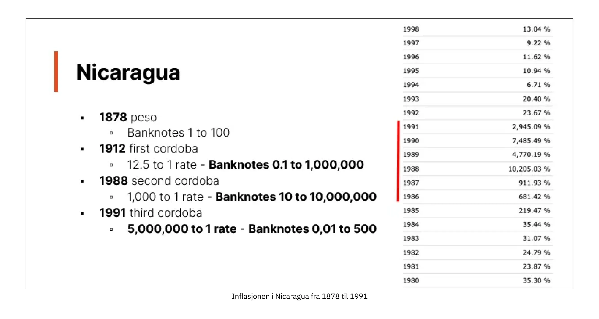

Nicaragua, som tidligere var under spansk herredømme, brukte til å begynne med den spanske dollaren, i likhet med mange andre land som ble kolonisert av Spania. Etter å ha blitt integrert i det spanske imperiet, det meksikanske imperiet og deretter Den føderale republikken Mellom-Amerika, erklærte Nicaragua sin uavhengighet. Fra og med 1878 ble pesoen landets offisielle valuta, med en verdi som svingte mellom 1 og 100. I 1912 innførte landet den første cordobaen, etterfulgt av den andre i 1988 og den tredje i 1991, som fortsatt er i bruk i dag. Den første Cordoba nådde en verdi på 1 million, og den andre 10 millioner. Redenominasjonen i 1991 kom etter flere år med hyperinflasjon.

### Venezuela

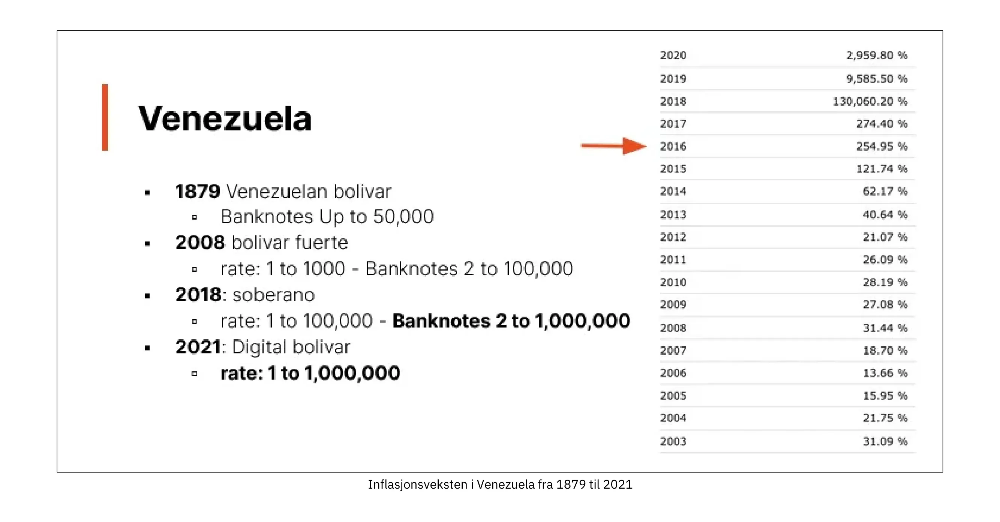

Venezuela er det siste landet som nevnes i denne videoen. Landet har gjennomgått fire valutaendringer gjennom tidene. I begynnelsen brukte Venezuela den spanske dollaren før landet erklærte seg uavhengig i 1811. I 1879 innførte landet bolivar som offisiell valuta, og denne valutaen var i bruk frem til 1983, da regjeringen gikk over til et system med flytende Exchange-kurs og bruk av dollar.

Et bemerkelsesverdig faktum om Venezuela er landets medlemskap i Den latinske monetære union. Denne unionen inkluderte mynter som 5 pesetas fra Spania, 5 drakmer fra Hellas, 5 bolivarer fra Venezuela, 5 lire fra Italia, 5 belgiske franc og 5 franske franc.

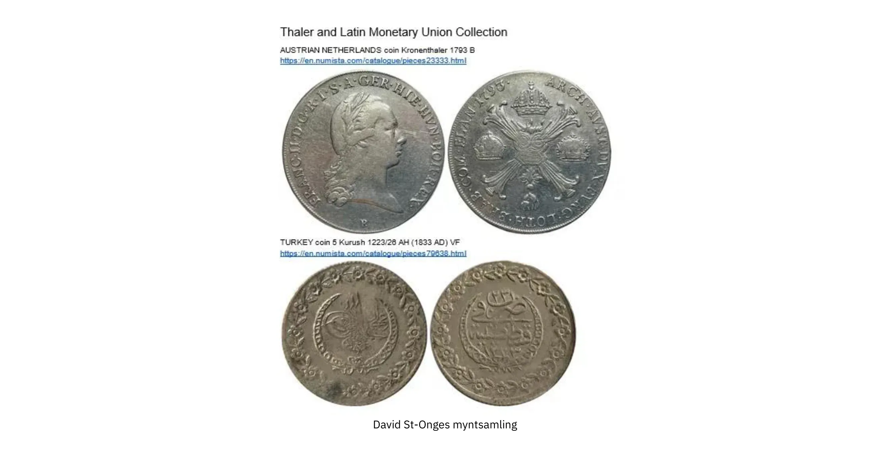

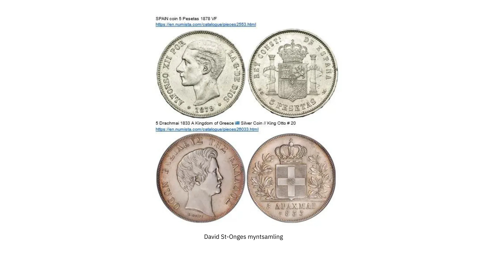

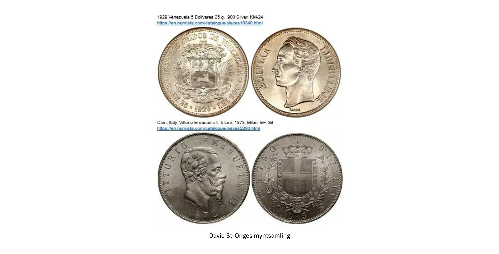

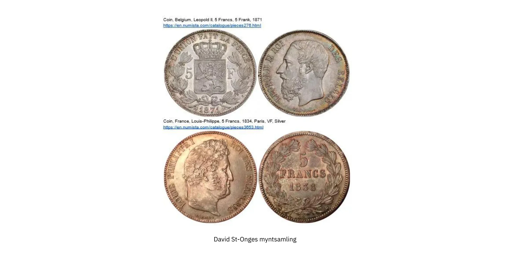

I denne perioden hadde 5 bolivar Coin fra Venezuela samme vekt som myntene fra unionens medlemsland, deriblant Italia, Spania, Belgia og Frankrike. Disse bolivarene var laget av sølv, og en spesifikk Coin fra 1929 veide 25 gram og hadde en renhet på 900, eller 90 % rent sølv. Med dagens sølvpris er denne Coin verdt mellom 17 og 18 dollar (amerikanske dollar).

Etter innføringen av en flytende Exchange-kurs i 1983 fulgte flere redenomineringer:

- I 2008 ble bolivar fuerte, eller "sterk bolivar", introdusert, og den nådde opp til 100 000 før den ble redenominert til tusen til én.
- I 2018 ble Soberano introdusert, med sedler som nådde 1 million. I 2021 ble den erstattet av den digitale bolivaren, som også nådde én million, før en ny redenominering på én million til én. I dag tilsvarer en 10- eller 20-lapp 10 millioner eller 20 millioner i soberano.

Sedler fra denne perioden, som strekker seg tilbake til 2018, ble delt ut på ulike Bitcoin-konferanser i Biarritz, Toronto og Miami. Disse Soberano-sedlene nådde en maksimal verdi på 1 million. Deretter ble det foretatt en redenominering, noe som reduserte verdien på én million til ca. 3 cent. I dag tilsvarer 10 sedler på 1 million én 10-cent-seddel. Siden 2016 har Venezuela opplevd hyperinflasjon, noe som representerer den 57. perioden i en spesifikk tabell.

I neste video presenteres en samling hyperinflasjonssedler med fokus på Venezuela og andre land på listen. Denne samlingen inneholder nesten alle venezuelanske sedler. Studien vil fokusere på de ulike redenominasjonene for hvert av de nevnte landene. I tillegg vil det bli sett nærmere på redenominasjoner i Zimbabwe, et tema som er av stor interesse.

### Konklusjon

Vi har sett at hyperinflasjon ikke er den eneste indikatoren på en økonomisk katastrofe. Å redenominere flere ganger, fjerne nuller eller endre navnet på valutaen har direkte konsekvenser for befolkningen, alt fra tap av bistand til matproblemer. Selv om hyperinflasjon er bekymringsfullt, viser antallet redenomineringer, slik vi har sett i Brasil, en mer kompleks virkelighet.

Basert på kriteriet om 50 % inflasjon per måned kunne flere perioder ha blitt klassifisert som hyperinflasjon. Dette gjelder særlig når man ser på kriteriene til den internasjonale regnskapsorganisasjonen, som tar hensyn til kjennetegn som at befolkningen raskt forlater valutaen, lønnsindeksering og lån med høy rente for å kompensere for inflasjonen.

Hyperinflasjon er bare ett aspekt av de økonomiske utfordringene. Høy inflasjon alene kan være like skadelig. I neste avsnitt skal vi se nærmere på mulige løsninger for å få bukt med hyperinflasjonen.

## Hvordan få bukt med hyperinflasjon

<chapterId>e3484a31-a851-5f92-8af5-00eddae67db1</chapterId>

### Hvordan få slutt på moderat og høy inflasjon

De nevnte konklusjonene er hentet fra boken "Monetary Regime and Inflation" av Peter Bernholz. Ifølge Bernholz er den eneste metoden for å få slutt på inflasjonen å gjennomføre en monetær reform og pålegge myndighetene finanspolitiske restriksjoner. Disse restriksjonene innebærer at det opprettes en institusjon, for eksempel en sentralbank, som opererer uavhengig av regjeringens politiske beslutninger. Høy og hyperinflasjon er ofte et resultat av at budsjettunderskudd finansieres gjennom pengeskaping. For å Address dempe inflasjonen er det viktig å redusere veksten i pengemengden Supply. Bernholz foreslår også at denne pengeveksten bør være relativ i forhold til nabolandene. Et overraskende poeng er at i perioder med høy eller hyperinflasjon kan den totale verdien av pengene Supply faktisk synke. Et slående eksempel på dette er Zimbabwe.

### Kontraintuitive løsninger

Da man studerte Zimbabwe, la man merke til at 10 billioner enheter av pengene Supply hadde mistet all sin verdi. I Weimar var det mulig å trykke to tredjedeler av den totale nominelle verdien på 65 milliarder enheter av pengene Supply på én enkelt dag. Dette viser hvordan pengene Supply kan devalueres. For å bøte på denne situasjonen er det nødvendig å øke pengemengden Supply betydelig for å nå et passende nivå. Da er en pengereform uunnværlig. I en situasjon med høy inflasjon er denne reformen uunngåelig, men den må sikre at det er nok penger i omløp. Etter dette trinnet kan myndighetene pålegges restriksjoner.

Ifølge Bernholz' observasjoner er det ikke alltid at institusjoner som IMF og Verdensbanken benytter seg av de mest effektive strategiene når de skal løse inflasjonsproblemer. I noen tilfeller, når et land trenger å øke pengemengden, forsøker disse institusjonene å redusere den. Nøkkelen er å nå et adekvat pengenivå og deretter sette grenser for veksten, slik at man unngår å finansiere offentlige utgifter gjennom pengeskaping.

Et interessant aspekt som Bernholz tar opp, er at en pengereforms suksess ikke bare avhenger av dens tekniske relevans, men også av befolkningens tillit til den. Noen godt utformede reformer kan mislykkes fordi befolkningen ikke har tillit til dem, mens andre, dårlig utformede reformer kan lykkes fordi befolkningen har tillit til dem. Oppfatning og tillit i befolkningen er derfor avgjørende Elements for om en pengereform blir en suksess eller fiasko.

- I Zimbabwe ble løsningen for å motvirke inflasjonen dollarisering, noe som betyr at de tok i bruk amerikanske dollar eller andre valutaer fra nabolandene. På denne måten hindrer man myndighetene i å trykke penger etter eget forgodtbefinnende.
- I Tyskland ble løsningen å skape en ny valuta, Rentenmark. Denne valutaen ble støttet av rikets territoriale verdier, og denne strategien viste seg å være effektiv.

### Tilfellet Zimbabwe

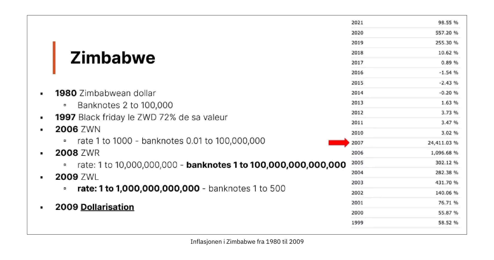

Zimbabwe ble selvstendig i 1980 og innførte sin egen valuta, zimbabwiske dollar. Til å begynne med var to zimbabwiske dollar verdt rundt 1,60 amerikanske dollar. Men i 1997, etter sosiale tiltak til fordel for krigsveteraner, ble valutaen devaluert med 72 % på én dag under Black Friday. På begynnelsen av 2000-tallet lanserte landet et program for omfordeling av landområder, som innebar at land ble tatt fra hvite eiere og delt ut til lokalbefolkningen. Denne beslutningen gikk ut over eksporten fordi de nye eierne ofte manglet den nødvendige ekspertisen til å drive stordrift. Resultatet var at mens Zimbabwe var nettoeksportør i 1999, ble landet nettoimportør i 2003.

I 2006 introduserte landet en ny versjon av valutaen, ZWN, med en Exchange-kurs på 1 til 1 000. I 2008 ble en annen valør, ZWR, introdusert med en Exchange-kurs på 1 til 10 milliarder. Dette førte til opprettelsen av de ikoniske 100 billioner-sedlene.

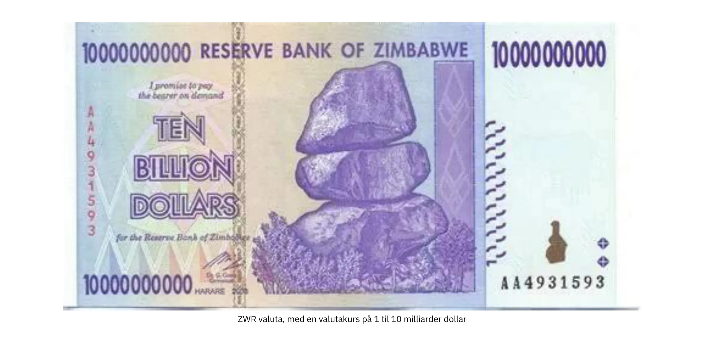

#### Dollarisering og kriseløsning

Etter 2009, da Zimbabwe sto overfor en vedvarende monetær krise og galopperende hyperinflasjon, forlot landet derfor sin nasjonale valuta og tillot bruk av utenlandsk valuta, hovedsakelig amerikanske dollar. Selv om dette var en radikal beslutning, satte den en stopper for hyperinflasjonen. En viktig lærdom er at det å stanse overdreven pengeutstedelse og avslutte sentralbankens finansiering av budsjettunderskuddet kan bidra til å forhindre hyperinflasjon.

Dollarisering er imidlertid ingen mirakelløsning. Selv om det kan gjøre slutt på hyperinflasjonen, byr det på andre økonomiske utfordringer. En av konsekvensene er tapet av en selvstendig pengepolitikk. Uten egen valuta kan et land ikke justere pengepolitikken for å reagere på interne økonomiske sjokk.

I 2007 nådde inflasjonen i Zimbabwe en grense på 50 % per måned, noe som offisielt markerte at landet befant seg i en tilstand av hyperinflasjon. Etter dollariseringen i 2009 opphørte hyperinflasjonen, men landet fortsatte å stå overfor andre økonomiske utfordringer.

Det er bekymringsfullt at Zimbabwe i ettertid har forsøkt å gjeninnføre sin egen valuta, og at tegn på høy inflasjon har dukket opp igjen. Ifølge enkelte internasjonale organisasjoner kan landet allerede oppfylle kriteriene for hyperinflasjon igjen, selv om den offisielle grensen på 50 % per måned ennå ikke er nådd. Dette er en påminnelse om farene ved overdreven pengeutstedelse og sentralbankens finansiering av underskudd.

### Konklusjon

I boken "Alt om Bitcoin" har jeg viet et helt kapittel til hyperinflasjonen i Zimbabwe. Jeg beskriver de viktigste hendelsene i detalj, og gir ulike eksempler som illustrerer hvordan landet til slutt fikk slutt på hyperinflasjonen.

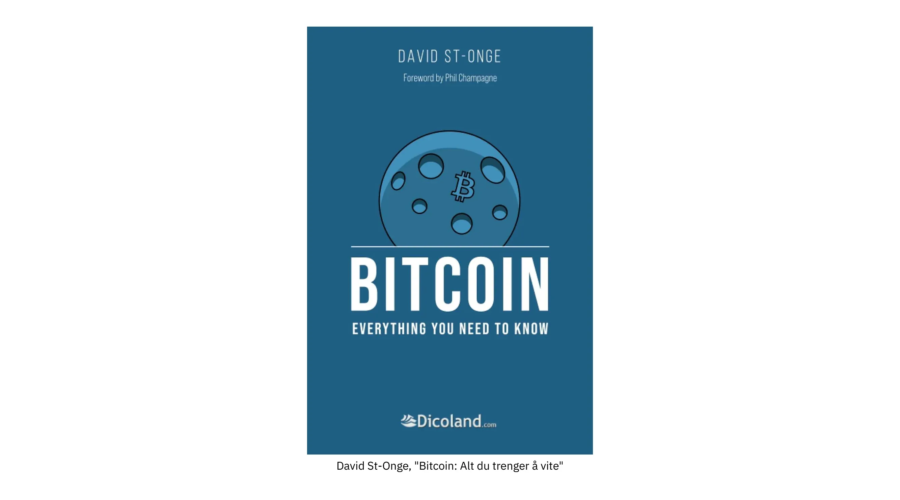

For de som er nysgjerrige på den tyske erfaringen etter første verdenskrig, kan jeg varmt anbefale tegneserien "The Reich's Banker" Den forteller hvordan Tyskland klarte å overvinne hyperinflasjonen, blant annet gjennom opprettelsen av Rentenmark.

Det finnes flere strategier for å få bukt med hyperinflasjon. Man kan velge dollarisering eller innføre en ny valuta. Disse løsningene vil bare fungere hvis befolkningen har tillit til dem. Det er avgjørende å innføre strenge begrensninger. En virkelig uavhengig sentralbank er avgjørende. Den må ikke blåse opp pengemengden Supply for å dekke offentlige underskudd. Ved mild inflasjon bør det være tilstrekkelig å begrense veksten i pengemengden Supply. Men ved hyperinflasjon er det avgjørende at man først har en passende pengemengde i forhold til økonomiens størrelse. Deretter er det viktig å pålegge myndighetene strenge restriksjoner for å stabilisere situasjonen.

## Presentasjon av hyperinflasjonsseddelsamlingen

<chapterId>f3ffbb47-3aeb-54bd-80a9-adccb0f419e2</chapterId>

[Oppdag den skannede samlingen i *Bitcoin Educational Toolkit* (også tilgjengelig fra *Ressurser*-delen på Plan ₿ Academy-plattformen.](https://penpot.planb.network/#/view?page-id=c157057b-fd28-8042-8004-4f081b21defc&file-id=c157057b-fd28-8042-8004-4f081b21defb&section=interactions&index=0&share-id=7154756b-3ebd-8040-8004-6475c2af5889&interactions-mode=show-on-click)

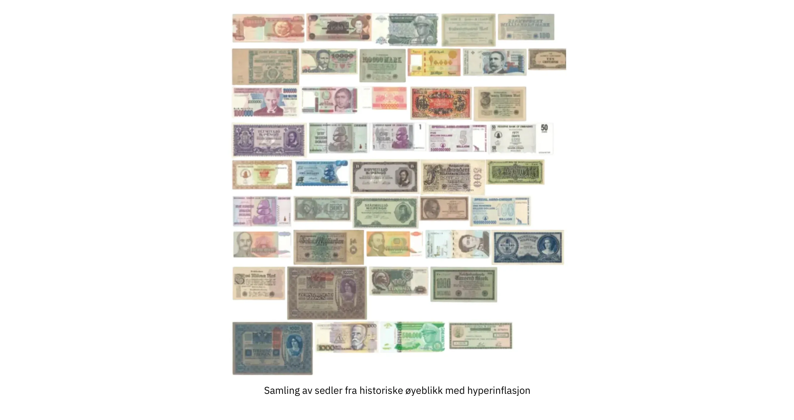

# Hvordan havnet vi her?

<partId>f66ca17e-be9e-5d30-a098-f7affd8962a1</partId>

## Fremveksten av den andre Layer av penger og sentralbanker

<chapterId>0455ffe3-9d45-5a67-ac96-3f815dc507a1</chapterId>

Avskrift:

Fremveksten av pengenes andre Layer og de første sentralbankene er et fascinerende tema. Dette temaet er utførlig omtalt i boken "Layered Money" av Nick Battia. Jeg anbefaler den på det varmeste til alle som er interessert i utviklingen og komplikasjonene i pengesystemene våre. Målet med denne delen er å forstå opprinnelsen til pengeskapingen og hvordan den kan føre til hyperinflasjon.

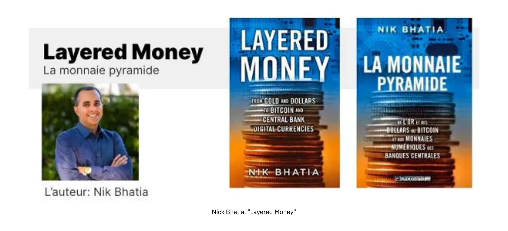

### Pyramidepenger og sentralbanker

#### Florin

Pengenes historie går tilbake til 1200-tallet i Italia, nærmere bestemt i byen Firenze. På den tiden var floriner og sedler på Exchange vanlige. Et bemerkelsesverdig eksempel er florinen, prydet med figuren av Johannes døperen.

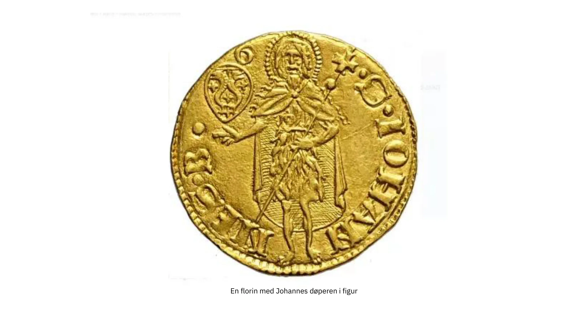

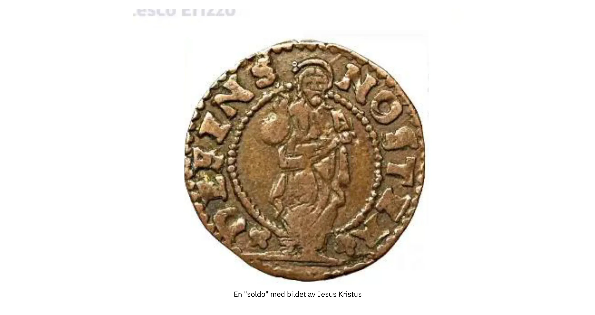

I dag er det dyrt å eie en ekte florin, men det finnes reproduksjoner. Det finnes også andre valutaer fra denne tiden, for eksempel soldoen fra de italienske statene på 1600-tallet, som har et bilde av Kristus.

#### Lovforslag om Exchange (1200-tallet)

Vanlig praksis på den tiden var som følger: Gullsmedene utstedte veksler på Exchange i Exchange for deponerte floriner. Disse florinene ble nøye oppbevart i hvelvene deres. Ekte gull, representert ved florinen, utgjorde dermed den første Layer av pengene, mens veksler på Exchange utgjorde den andre Layer. Likviditeten i dette systemet var imidlertid begrenset. Hvis noen ønsket å veksle inn gullet sitt i Redeem i Exchange mot sedler, var transaksjonen enkel. Det var imidlertid ikke vanlig å veksle disse sedlene mellom enkeltpersoner.

#### Antwerpen-aksjen Exchange (1500-tallet)

Antwerpen Stock Exchange markerte en viktig milepæl i utviklingen av papirpenger. Det var der praksisen med å diskontere gjeldsbrev ble introdusert. Disse sedlene var papirinstrumenter som representerte en pengeverdi, men det unike med dem var at de var påført navn og forfallsdato. Dette gjorde dem vanskelige å Exchange før forfallsdatoen.

Revolusjonen som Antwerpen-aksjen Exchange førte med seg, lå i muligheten til å diskontere disse gjeldsbrevene før forfallsdato. Hvis et gjeldsbrev for eksempel forfalt om en måned, var det mulig å kjøpe det til en rabattert pris for å ta høyde for tiden før forfallsdatoen. Denne nyvinningen gjorde ikke bare papirvalutaen mer Liquid, men introduserte også begrepet pengenes tidsverdi.

Selv om dette konseptet forbindes med Nick Bell gjennom Twitter-pseudonymet "time value of BTC", er det ikke hans oppfinnelse. Likevel diskuterer han det i detalj i sitt arbeid. Hovedideen er at tid har verdi. Hvis noen bestemmer seg for å betale et gjeldsbrev verdt 100 dollar en måned i forveien, kan de kjøpe det for for eksempel 98 dollar og motta de 100 dollarene på forfallsdatoen. Denne monetære innovasjonen har sin opprinnelse i Antwerpen-børsen Exchange.

#### VOC og aksjemarkedet i Amsterdam (1600-tallet)

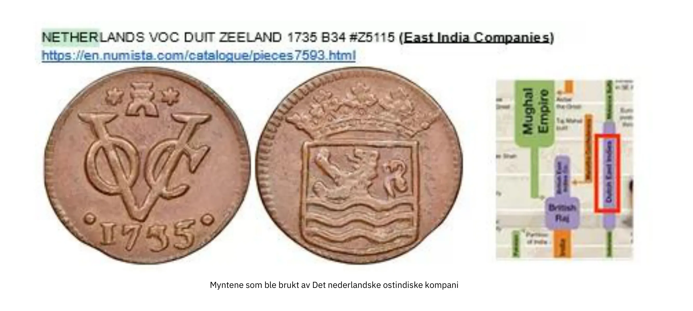

Etter etableringen av Antwerpen-børsen Exchange var en viktig milepæl grunnleggelsen av VOC, Det nederlandske ostindiske kompani. Dette selskapet, som hadde base i Nederland, utstedte til og med sin egen valuta. Etter opprettelsen av VOC ble det første aksjemarkedet etablert i Amsterdam, noe som markerte begynnelsen på selskapets børsvirksomhet. Det som er interessant å merke seg, er hvordan nederlenderne klarte å gjøre slutt på Antwerpens overherredømme som internasjonalt økonomisk sentrum. De blokkerte ganske enkelt tilgangen til elven Schelde. Denne strategien var en del av en større historisk bevegelse, tiggernes opprør. En avgjørende hendelse i europeisk historie.

#### Intervensjonen fra Bank of Amsterdam

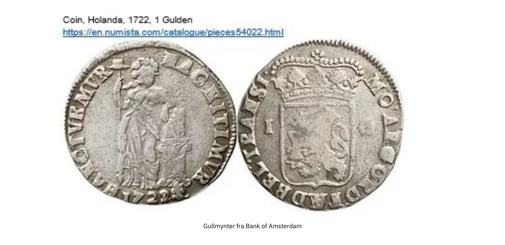

En annen viktig utvikling i pengehistorien etter opprettelsen av VOC var innføringen av gullmynter i Amsterdams bank. Disse myntene, som dateres tilbake til 1722, var laget av sølv. Det som virkelig revolusjonerte finansverdenen på den tiden, var imidlertid ikke så mye Coin i seg selv, men kontoene som var knyttet til denne valutaen i Bank of Amsterdam. Disse kontoene ble det viktigste middelet for internasjonal Exchange. Transaksjonene ble ganske enkelt registrert i registre eller hovedbøker. Takket være dette systemet ble Amsterdam det globale økonomiske senteret. Over tid bestemte Bank of Amsterdam seg for å pålegge bruken av disse kontoene. Uavhengige pengevekslere ble pålagt å Exchange sine mynter for innskudd i banken på daglig basis.

#### Opprettelsen av Bank of England for å finansiere krigen

Opprettelsen av Bank of England var motivert av behovet for å finansiere krigen på slutten av 1600-tallet. I likhet med Bank of Amsterdam innførte den innskudd ved dekret. Bank of Englands særegenhet var at den henviste private banker til en sekundær posisjon i pengesystemet, og dermed skapte det som kan kalles en "tredje Layer" av valuta.

Opprinnelig var den første Layer av valutaen representert av gull. Innskudd i private banker utgjorde den andre Layer. Men da disse innskuddene ikke lenger kunne konverteres til gull, oppsto det en tredje Layer av valuta. Fra da av var sedler utstedt av private banker ikke lenger konvertible til gull, men til papirvaluta fra Bank of England, som selv var konvertibel til gull. Denne utviklingen førte til at pengesystemet ble mer komplekst, og flere lag ble lagt til.

#### Panikken i 1796

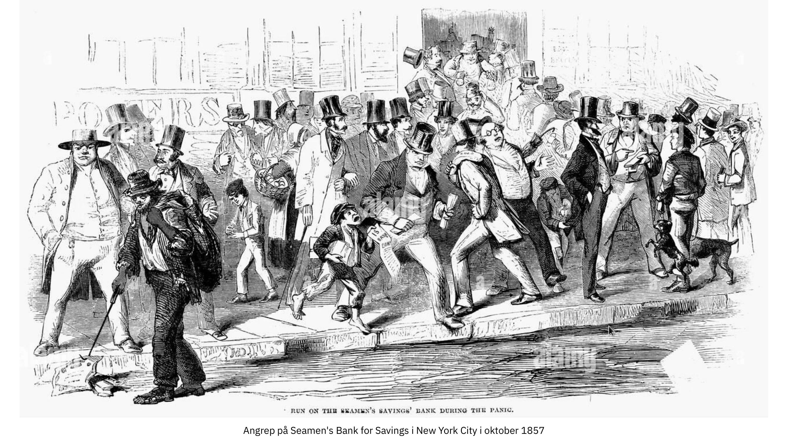

Bankpanikk i Seamen's Savings Bank under panikken i 1857.

Etter bankpanikken i 1796 oppsto det et fenomen der alle forsøkte å komme seg oppover i "pengepyramiden" Folk ønsket å bytte ut sin tredje Layer-valuta med andre Layer-valuta, og til slutt med første Layer-valuta, som var gull. I møte med dette massive rushet ble Bank of England tvunget til å iverksette tiltak for å stabilisere situasjonen. For å forhindre en potensiell deflasjon av gullreservene bestemte den seg for å suspendere konvertibiliteten av sedler til gull. Denne suspensjonen, som i utgangspunktet var ment som et midlertidig tiltak, varte i omtrent to tiår.

### Konklusjon

Sentralbanker har utviklet seg til å bli långivere i siste instans ved å suspendere valutaens konvertibilitet til gull. Selv om denne handlingen i utgangspunktet var ment som en midlertidig løsning, ble den til slutt permanent, noe som markerte innføringen av begrepet "lender of last resort". Denne transformasjonen har formet sentralbankene slik vi kjenner dem i dag. I mer sårbare økonomier kan imidlertid denne muligheten til å trykke penger etter eget forgodtbefinnende føre til uønskede konsekvenser, som hyperinflasjon, hvis den brukes på en uansvarlig måte.

## Bøker og ressurser

<chapterId>c44e4519-0741-527b-b3b0-3f513e87147d</chapterId>

Hyperinflasjon er et fascinerende tema som har blitt studert gjennom en rekke historiske hendelser. Hvis du ønsker å fordype deg i dette emnet, får du her en liste over 10 viktige ressurser du bør lese og studere:

- "Når pengene dør: The Nightmare of Deficit Spending, Devaluation, and Hyperinflation in Weimar Germany" av Adam Fergusson. Denne boken beskriver hyperinflasjonskrisen i Tyskland etter første verdenskrig.

- "Inflasjonens økonomi - En studie av valutadepresiering i Tyskland etter krigen" av Costantino Bresciani-Turroni. En grundig analyse av den tyske hyperinflasjonen på 1920-tallet.

- "Denne gangen er det annerledes: Eight Centuries of Financial Folly" av Carmen M. Reinhart og Kenneth S. Rogoff. Selv om boken tar for seg ulike typer finanskriser, gir den en grundig diskusjon av hyperinflasjon opp gjennom historien.

- "Zimbabwes hyperinflasjon, analyse og lærdom" av Steve Hanke. En studie av hyperinflasjonen i Zimbabwe på begynnelsen av 2000-tallet.

- "Monetære regimer og inflasjon: History, Economic and Political Relationships" av Peter Bernholz. Boken tar for seg historiske tilfeller av hyperinflasjon og forsøker å forstå de underliggende faktorene.

- "Overlevelsesguide for hyperinflasjon: Strategies for American Businesses" av Gerald Swanson. En praktisk guide til hvordan bedrifter kan navigere i et hyperinflasjonært miljø.

- "Å dø av penger: Lessons of the Great German and American Inflations" av Jens O. Parsson. En komparativ analyse av inflasjonskriser i Tyskland og USA.

- "Pengenes undergang: Tysklands hyperinflasjon og middelklassens ødeleggelse" av Frederick Taylor. En narrativ utforskning av hyperinflasjonens sosiale og økonomiske konsekvenser for det tyske samfunnet.

- "Currency Boards for Developing Countries: A Handbook" av Steve Hanke og Kurt Schuler. Selv om fokuset er på currency boards, gir denne boken et perspektiv på hvordan man kan unngå hyperinflasjonssituasjoner.

# Siste del

<partId>cb1f4a4b-556a-4e47-a5cc-136be35a1f9a</partId>

## Anmeldelser og rangeringer

<chapterId>1a37317e-372a-5241-b478-8316d44f9283</chapterId>

<isCourseReview>true</isCourseReview>

## Avsluttende eksamen

<chapterId>d01831c3-6c4d-59e3-95bc-03e97a05c142</chapterId>

<isCourseExam>true</isCourseExam>

## Konklusjon

<chapterId>45d410b0-71ed-4502-8d8d-8b6df761db23</chapterId>

<isCourseConclusion>true</isCourseConclusion>