# Een reis door economische ineenstorting

Hoe ziet het eruit wanneer geld zijn betekenis verliest?
Deze cursus leidt je door de fascinerende maar sobere wereld van hyperinflatie. Je ontdekt historische episodes en moderne gevallen waarin valuta's instortten en economieën van de ene op de andere dag transformeerden. Je ontdekt de patronen, oorzaken en de impact op het dagelijks leven van gewone mensen, en krijgt inzicht in een van de meest dramatische fenomenen uit de economie.

Onderweg ontdek je ook hoe individuen en gemeenschappen door deze turbulente periodes zijn genavigeerd. Leer de strategieën die hebben geholpen om vermogen te beschermen tijdens valutacrises en bouw een dieper begrip op van financiële veerkracht. Als je nieuwsgierig bent naar de economische krachten die onze wereld vormgeven, biedt deze reis zowel kennis als praktisch perspectief.
+++
# Inleiding

<partId>6fe4d15d-f6e6-54be-9e04-0a75ac98df8b</partId>

## Cursus Overzicht

<chapterId>9d1aba8d-0485-5020-9863-5de37e6db8e0</chapterId>

Welkom bij de cursus ECO204!

Het doel van deze cursus is om je te helpen de onderliggende oorzaken, mechanismen en gevolgen van hyperinflatie binnen de context van een fiat monetair systeem te begrijpen. Aan de hand van concrete voorbeelden en historische analyse leer je terugkerende patronen herkennen die voorafgaan aan perioden van hyperinflatie en kun je actiemiddelen identificeren om jezelf te beschermen.

**Deel 2: Wat is inflatie?

Voordat we in de kern van het onderwerp duiken, gaan we eerst terug naar de basis: wat is inflatie? In dit hoofdstuk bespreken we de monetaire oorsprong, de verschillende soorten inflatie en hoe ze passen in een bredere economische dynamiek. Dit is een essentiële stap om te begrijpen hoe gewone inflatie kan uitgroeien tot hyperinflatie.

**Deel 3: Wat is hyperinflatie?

In dit hoofdstuk bestudeer je precieze definities van hyperinflatie en bestudeer je verschillende grote historische episodes, waaronder die van Weimar Duitsland en Zimbabwe. We analyseren hun overeenkomsten, verschillen en hedendaagse parallellen. Je zult ook minder bekende gevallen ontdekken, zoals opeenvolgende redenominaties in Latijns-Amerika, evenals exit-strategieën die in bepaalde landen zijn waargenomen.

**Deel 4: Hoe zijn we hier gekomen?

Dit deel is gericht op het begrijpen van de structurele mechanismen die hyperinflatie mogelijk maken, in het bijzonder door de ontwikkeling van de monetaire "tweede Layer" en de rol van centrale banken. Er worden aanvullende bronnen en leessuggesties gegeven voor verder onderzoek.

Wat als de monetaire geschiedenis zich voor onze ogen zou herhalen? Oordeel zelf in de volgende hoofdstukken!

# Wat is inflatie?

<partId>2b4f456c-3649-5cf9-b9b0-a5bffe92d962</partId>

## Een monetair fenomeen

<chapterId>b2cbc915-c4ec-52b5-860c-0958f58c91e4</chapterId>

### Definities van inflatie

Inflatie is een concept dat vaak verkeerd wordt begrepen vanwege de vele definities en interpretaties. De perceptie van inflatie varieert tussen verschillende groepen, zoals bitcoiners en traditionele economen. Laten we eerst de definities verduidelijken voordat we hyperinflatie bespreken:

- Definitie uit het woordenboek van Le Robert: Inflatie is een buitensporige toename van betaalmiddelen (bankbiljetten, kapitaal), waardoor de prijzen stijgen en de munt in waarde daalt.

- Definitie uit de Larousse encyclopedie: Inflatie is een fenomeen dat gekenmerkt wordt door een algemene en voortdurende stijging van het prijsniveau. Hier is het woord "veralgemeend" cruciaal.

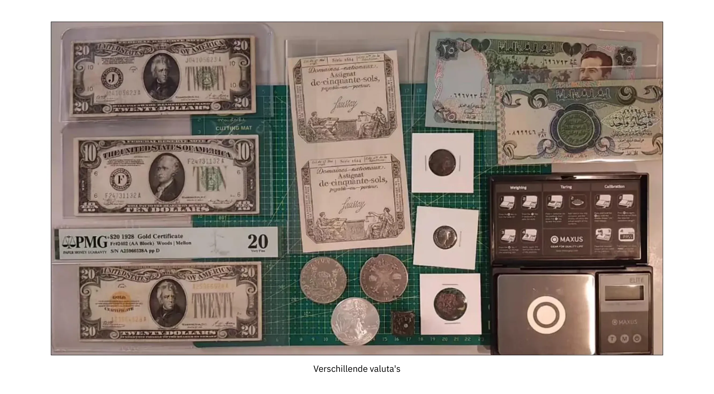

In het licht van deze definities is het essentieel om te begrijpen dat inflatie voor Robert vooral betrekking heeft op de toename van het geld Supply. Larousse richt zich daarentegen op de gevolgen van deze toename, namelijk de algemene stijging van de prijzen. Larousse richt zich daarentegen op de gevolgen van deze expansie, namelijk de algemene prijsstijging.

In onze studie over hyperinflatie zullen we de tweede definitie hanteren, die van een algemene prijsstijging, omdat die relevanter en duidelijker is voor ons onderwerp. Het is echter cruciaal om te onthouden dat deze prijsstijging over het algemeen het resultaat is van de expansie van het geld Supply.

De beroemde econoom Milton Friedman verklaarde:

> "Inflatie is altijd en overal een monetair fenomeen

Deze verklaring benadrukt de intrinsieke relatie tussen monetaire expansie en inflatie. In de volgende paragrafen zullen we de relatie tussen inflatie en economische groei onderzoeken op basis van deze fundamentele definities.

### Het monetaire fenomeen begrijpen

Als we het hebben over het monetaire fenomeen, bedoelen we hoe het geld Supply van een economie wordt beïnvloed. Milton Friedman zag het in wezen als een toename van deze Supply. Historisch gezien zijn er twee belangrijke methoden geweest om de geld Supply te verhogen:

1. Gelddruk:

In traditionele monetaire systemen werd de toename van het geld Supply bereikt door het fysiek drukken van nieuwe bankbiljetten. Hoewel tegenwoordig, met de overheersing van digitale valuta, dit drukken voornamelijk elektronisch gebeurt (via de databases van centrale banken en andere financiële instellingen), toont de geschiedenis ons perioden waarin het letterlijk drukken van bankbiljetten leidde tot hyperinflatie.

2. Vermindering van metaalgehalte:

Een andere methode was het verminderen van de hoeveelheid edelmetaal in munteenheden die gebaseerd waren op metalen zoals zilver of goud. Een treffend voorbeeld is te vinden in het Romeinse Rijk, waar de denarius, die aanvankelijk bijna volledig uit zilver bestond, zijn zilvergehalte na verloop van tijd drastisch zag verminderen. Dit kwam neer op een vorm van inflatie, maar niet noodzakelijkerwijs hyperinflatie.

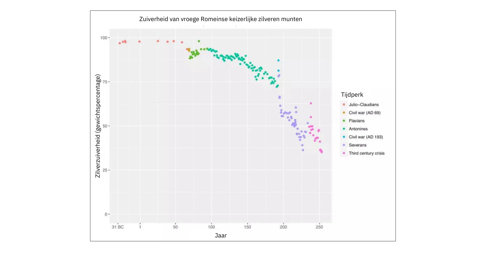

Het is cruciaal om te benadrukken dat hyperinflatie voornamelijk wordt waargenomen bij fiatvaluta's die niet worden gedekt door hun onderliggende activa, zoals edelmetalen. In het verleden, toen een valuta gebaseerd was op dergelijke activa, deden zich periodes van inflatie voor (bijvoorbeeld door de devaluatie van de metaalinhoud), maar deze periodes bereikten nooit de extreme niveaus van hyperinflatie. In de volgende paragrafen zullen we de perioden van monetaire devaluatie en de implicaties van deze verschillende monetaire systemen op de inflatie in detail bestuderen.

### Studie van perioden van monetaire devaluatie

Door de geschiedenis heen hebben verschillende beschavingen perioden van geldontwaarding gekend. Sommige van deze periodes vielen samen met belangrijke gebeurtenissen of oorlogen die de economie onder druk zetten.

#### 1. Peloponnesische Oorlog en Tweede Punische Oorlog:

De Peloponnesische Oorlog, een conflict tussen Athene en Sparta, en de Tweede Punische Oorlog, tussen de Romeinse Republiek en Carthago, zijn de vroegste voorbeelden van muntdevaluatie die in de archieven zijn gevonden. Om deze oorlogen te financieren devalueerden deze beschavingen hun munten door het zilvergehalte te verlagen en andere metalen toe te voegen, terwijl het aantal geproduceerde munten toenam.

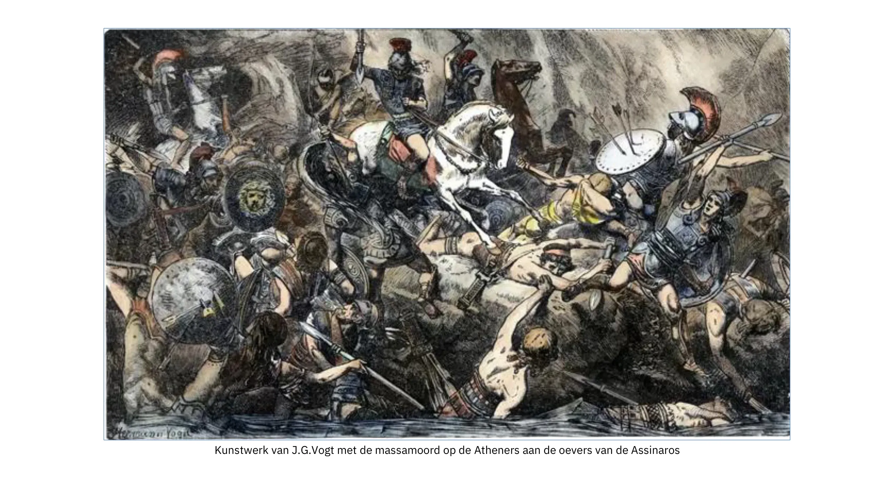

Gravure met de massamoord op de Atheners aan de oevers van de Assinaros.

#### 2. Het oude Rome tijdens het keizerrijk:

Na het tijdperk van de Romeinse Republiek, tijdens het Keizerrijk, was er in de 3e en 4e eeuw sprake van een aanzienlijke devaluatie van de munten. Dit wordt geïllustreerd door de daling van het zilvergehalte van munten, zoals te zien is in de vorige grafiek. Uit een studie blijkt dat de prijs van tarwe in Egypte, gemeten in drachmen, met een factor een miljoen is gestegen over een periode van ongeveer 400 jaar, van 40 voor Christus tot 360 na Christus. Over deze periode komt dit neer op een gemiddelde jaarlijkse inflatie van ongeveer 4,4%. Deze inflatie was echter niet gelijkmatig verdeeld. Het begon echt rond 238 na Christus. Tussen 250 en 293 na Christus bedroeg de inflatie ongeveer 3,65% en tussen 293 en 301 na Christus steeg deze tot 22,28%.

Hoewel deze periodes een aanzienlijke inflatie kenden, bereikten ze niet het niveau van hyperinflatie dat in sommige moderne situaties wordt waargenomen. De reden hiervoor is dat, hoewel de munteenheid werd gedevalueerd, deze nog steeds werd ondersteund door edele metalen. Deze solide basis bood enige bescherming tegen extreme inflatieniveaus. In de volgende paragrafen gaan we dieper in op de aard en gevolgen van hyperinflatie.

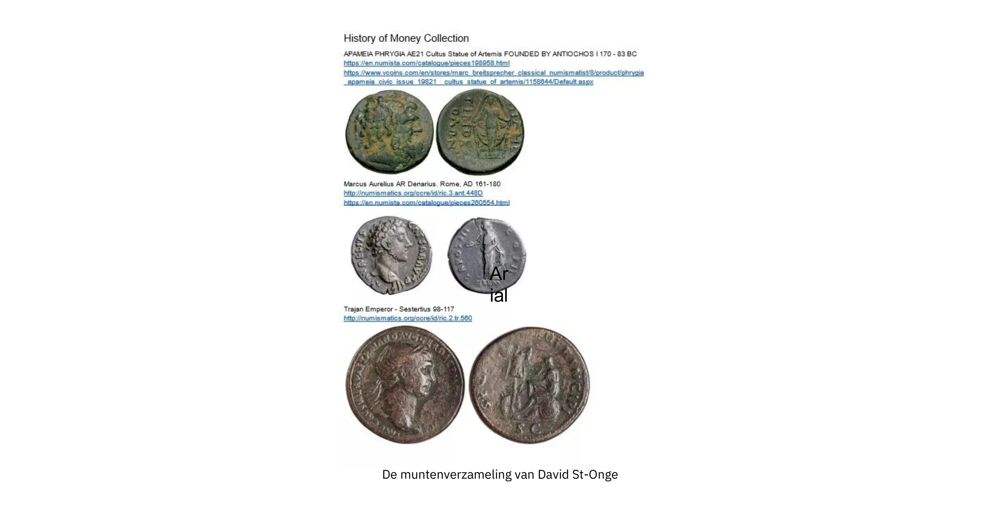

- De Denarius van Marcus Aurelius (160 AD):

Een van de meest iconische munten van het oude Rome is de denarius, een zilveren Coin. Ik bezit een specifieke Coin van Marcus Aurelius uit 160 na Christus, vóór de grote devaluatie. Hoewel de camera moeite heeft om de fijne details vast te leggen, is het met het blote oog duidelijk dat de Coin mooi is en een relatief hoog zilvergehalte heeft.

- De Antoninianus (laat 3e eeuw n.Chr.):

Met de geldontwaarding verscheen er een nieuwe munt, de Antoninianus. Deze munt moest twee denarii waard zijn, maar bevatte veel minder zilver. Mijn Antoninianus Coin laat duidelijk zien dat het zilvergehalte aanzienlijk is verlaagd. Hij is versierd met een kroon, die typisch is voor Romeinse munten uit deze periode, de zogenaamde "stralen". Door de kleur en kwaliteit te vergelijken, is te zien dat de Antoninianus verre van een puur zilveren Coin is.

Als je de twee munten naast elkaar vergelijkt, valt het verschil op. De denarius uit 160 na Christus heeft een duidelijk zilveren uiterlijk, terwijl de Antoninianus uit de late 3e eeuw na Christus veel doffer is, wat duidt op een aanzienlijke daling van het zilvergehalte. Deze visuele vergelijking geeft een duidelijke illustratie van de geldontwaarding die het oude Rome in een paar eeuwen onderging.

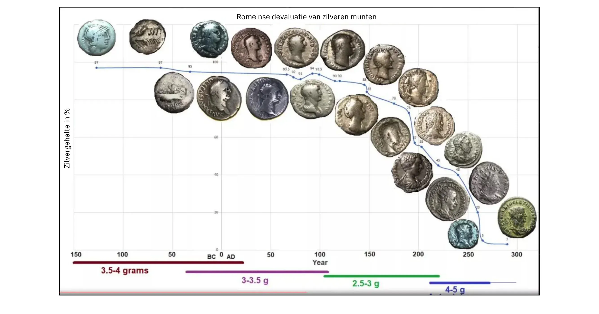

Om deze demonstratie compleet te maken zou een grafiek die de devaluatie van deze munten in de loop der tijd laat zien ideaal zijn. Hoewel het moeilijk is om dit via dit platform te visualiseren, kun je je een grafiek voorstellen die de waarde van de denarius laat zien, gevolgd door de daling tegen het einde van de 2e eeuw, toen deze werd vervangen door de Antoninianus, die vermoedelijk twee denarii waard was, maar met een aanzienlijk lager zilvergehalte. Deze artefacten zijn stille getuigen van de economische schommelingen van vroegere beschavingen.

#### 3. De Spaanse Maravedi: Getuige van gerichte devaluatie

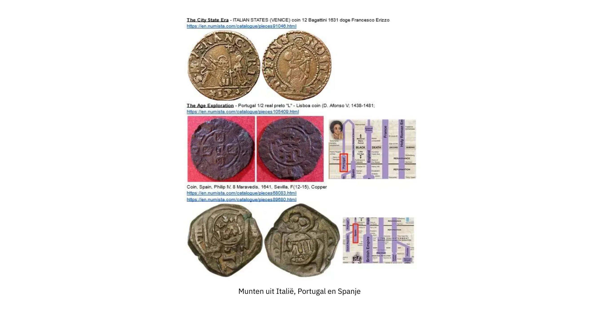

De Maravedi neemt als koperen munt een speciale plaats in in de geschiedenis van de Spaanse valuta. Zoals eerder vermeld was de Spaanse dollar oorspronkelijk de internationale standaard, een essentiële reservevaluta voor Spanje. Geconfronteerd met bepaalde economische uitdagingen moest Spanje echter zijn toevlucht nemen tot slimme monetaire strategieën.

Monetaire devaluatie is een middel dat vaak door staten wordt gebruikt om hun uitgaven te financieren of de economie te stimuleren. Spanje bevond zich echter in een netelige situatie. Het devalueren van de Spaanse dollar zou zijn positie in de internationale handel in gevaar brengen. Om dit dilemma te overwinnen, wendde Spanje zich tot de Maravedi.

In tegenstelling tot de kostbare Spaanse zilveren dollar was de Maravedi een koperen munteenheid die voornamelijk door de lokale bevolking werd gebruikt. Deze munteenheid was gericht op devaluatie. Wanneer een Coin van Maravedis aanvankelijk twee maravedises waard was, haalde de staat hem terug, stempelde hem opnieuw met een nieuwe waarde, bijvoorbeeld "vier", en gaf slechts één Coin terug aan de eigenaar. De Coin, voorzien van het stempel "acht", is het bewijs van dit proces, omdat het verschillende keren is gedevalueerd.

Deze strategie stelde de staat in staat om een munteenheid effectief te devalueren, waardoor inflatie ontstond en de staat indirect gefinancierd werd, terwijl de integriteit van de Spaanse dollar op het internationale toneel behouden bleef. Deze gerichte devaluatie had echter gevolgen voor de lokale bevolking, die de waarde van hun gemeenschappelijke munt zag verwateren.

Het geval van de Maravedis illustreert hoe een staat selectief een lokale valuta kan devalueren om aan zijn interne economische behoeften te voldoen, terwijl de waarde van een reservemunt op het wereldtoneel behouden blijft. Het is een treffend voorbeeld van de complexiteit en finesse van monetair beleid in de geschiedenis.

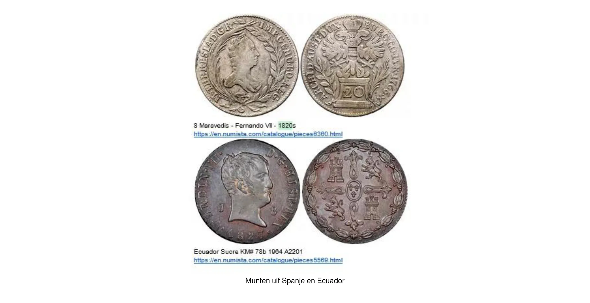

Wil je meer weten? -> [Link](https://docs.google.com/document/d/1aZa7gvz1nt8ZHDCoWKQdS9RGGjBHdipH1ApC8dW1xpM/edit?usp=sharing)

#### 4. Prijsrevolutie van de 15e tot de 17e eeuw

Tussen de 15e en 17e eeuw was Europa getuige van een opmerkelijk economisch fenomeen, dat vaak de "prijsrevolutie" wordt genoemd Deze periode van inflatie werd grotendeels veroorzaakt door een massale instroom van edele metalen, vooral goud en zilver, uit Amerika. Omdat de Europese economie in die tijd grotendeels gebaseerd was op de metaalstandaard, verhoogde deze extra Supply van metalen de Supply van het geld. Hierdoor ontstond een inflatie van ongeveer 1 tot 2% per jaar. Op het eerste gezicht lijkt deze inflatie bescheiden. In die tijd waren dergelijke prijsschommelingen echter ongewoon genoeg om als een "revolutie" te worden beschouwd Dit laat zien hoe veranderingen in monetaire reserves het hele economische systeem kunnen beïnvloeden.

#### 5. John Law en de Assignats

In de 18e eeuw werd de Franse economische geschiedenis gekenmerkt door twee belangrijke gebeurtenissen op het gebied van valuta. Ten eerste overtuigde John Law, een Schotse econoom en financier, de Franse regering ervan om een monetair systeem op basis van papiergeld in te voeren. Hoewel dit initiatief aanvankelijk werd gezien als een innovatieve oplossing voor de financiële problemen van het land, leidde het al snel tot een ongebreidelde inflatie. Kort daarna, tijdens de onrust van de Franse Revolutie, introduceerde de regering "assignats".

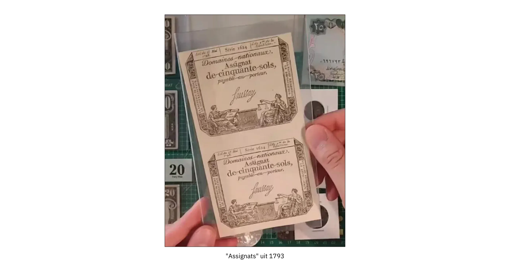

Assignats van 1793

Deze bankbiljetten zijn een levend bewijs van de eerste grote periode van hyperinflatie in de geschiedenis. In eerste instantie ontworpen als antwoord op opeenvolgende financiële crises, werden assignats al snel een symbool van monetaire instabiliteit. De regering vertrouwde te veel op deze papieren valuta om haar uitgaven te financieren, wat een ongekende economische crisis veroorzaakte en leidde tot een grote periode van hyperinflatie in Frankrijk na de revolutie.

#### 6. Executive Order 6102 en de devaluatie van de dollar

Executive Order 6102 en de devaluatie van de dollar

In de Verenigde Staten vond aan het begin van de jaren dertig een grote verschuiving plaats in het monetaire beleid. Hier volgt een gedetailleerd overzicht van deze transformatie:

- Het 20 dollarbiljet van 1928

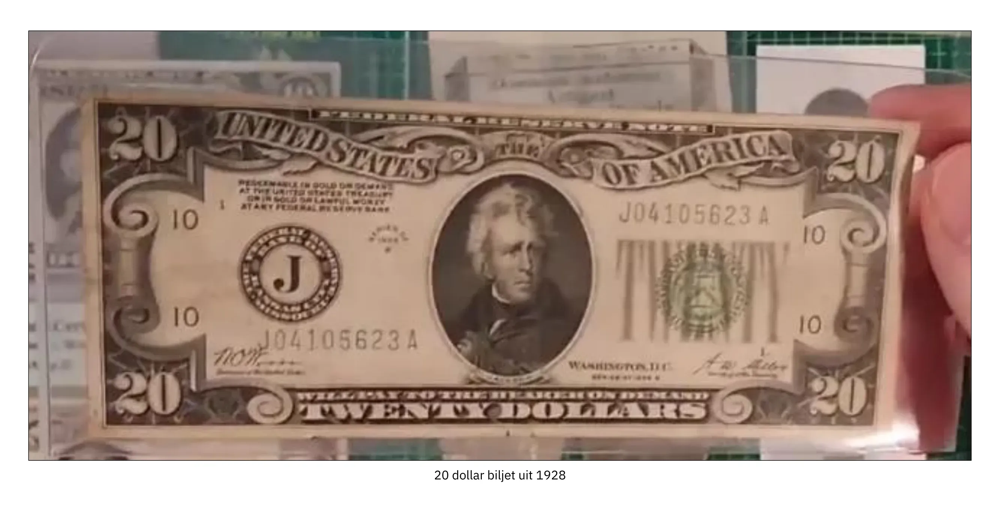

In 1928 stond er op een biljet van $20 in de Verenigde Staten: "Inwisselbaar in goud op verzoek" Dit betekent dat elk biljet letterlijk in goud kon worden omgezet. Concreet kwam een biljet van $20,67 overeen met één ounce goud.

- Uitvoeringsbesluit 6102

In 1933 vond er een grote omwenteling plaats met de uitvaardiging van Executive Order 6102. Dit decreet maakte het illegaal voor burgers om goud te bezitten, in de vorm van baren, munten of certificaten.

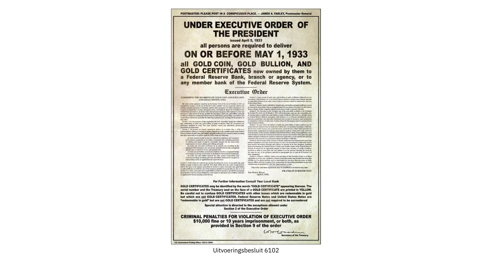

Het gouden certificaat is een goed voorbeeld. Er stond op: "In goud Coin betaalbaar aan de toonder op verzoek" Het bezit van zo'n certificaat werd illegaal en bleef dat tot 1964.

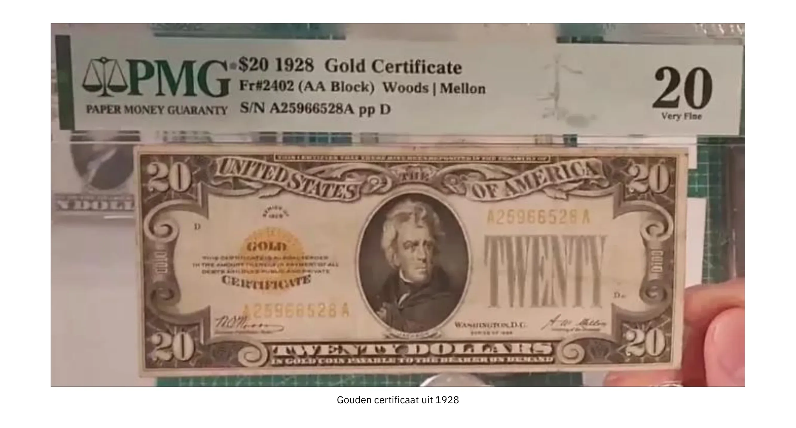

- Introductie van nieuwe bankbiljetten

Na de inbeslagname van het goud in 1934 werd een nieuwe serie bankbiljetten in omloop gebracht.

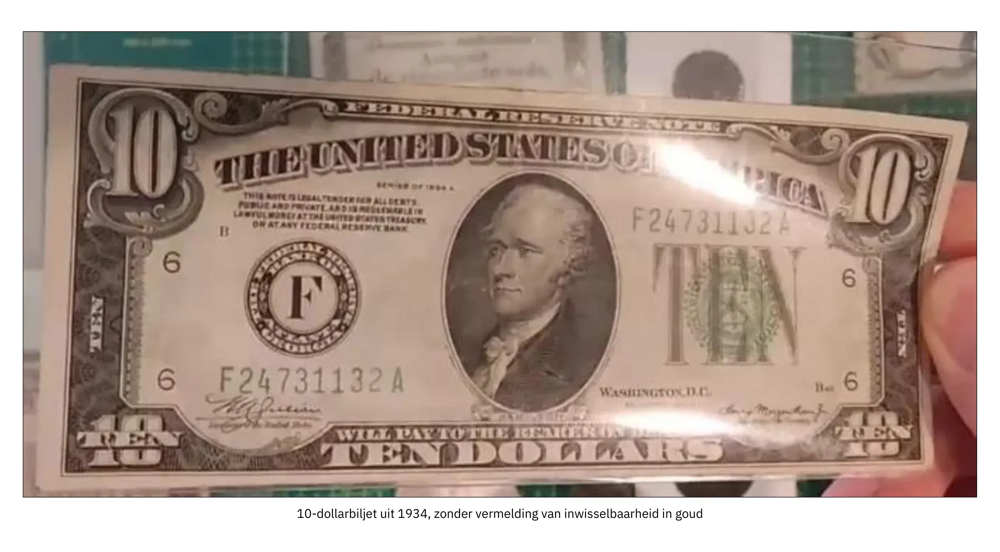

De vermelding dat ze in goud konden worden omgezet is verwijderd en vervangen door "Dit biljet is een wettig betaalmiddel voor alle schulden" (Ce billet est une monnaie légale pour toutes dettes).

- Herwaardering goud

Het fascinerende aan deze overgang is de strategie van de regering. In 1934 werd de goudprijs geherwaardeerd naar $35 per ounce, in plaats van $20,67. In wezen devalueerde de overheid de dollar die mensen bezaten. In wezen devalueerde de overheid de dollar die mensen bezaten. Door in 1933 goud van de bevolking te kopen voor $20,67 per ounce en vervolgens de goudprijs in 1934 te revalueren, genereerde de overheid een aanzienlijke winst terwijl ze het spaargeld van haar burgers devalueerde.

Kortom, binnen een jaar nam de overheid het goud van de burgers in beslag en veranderde vervolgens de spelregels door de waarde van het goud te herwaarderen ten gunste van de schatkist en ten nadele van degenen die hun goud in eerste instantie hadden ingeruild voor bankbiljetten.

### De VS veranderen de geschiedenis.

De Verenigde Staten maakten een historische ommekeer door als eerste de wereldreservemunt, de Amerikaanse dollar, te devalueren, in tegenstelling tot eerdere praktijken in kleine handelsnaties.

Vroeger, tijdens de Renaissance, was de Italiaanse florijn, uitgegeven door Florence in de 13e eeuw, de internationale reservemunt en was er geen devaluatie geregistreerd tijdens de gebruiksperiode, wat het belang van monetaire stabiliteit voor de internationale handel weerspiegelde.

In dezelfde geest handhaafden Spanje en Nederland, als houders van de wereldreservemunt vanwege hun bloeiende internationale handel, de integriteit van hun valuta om het vertrouwen en de status quo in internationale uitwisselingen te behouden. Nederland was zelfs getuige van de oprichting van de eerste centrale bank, een belangrijke mijlpaal in de wereldwijde evolutie van monetaire systemen.

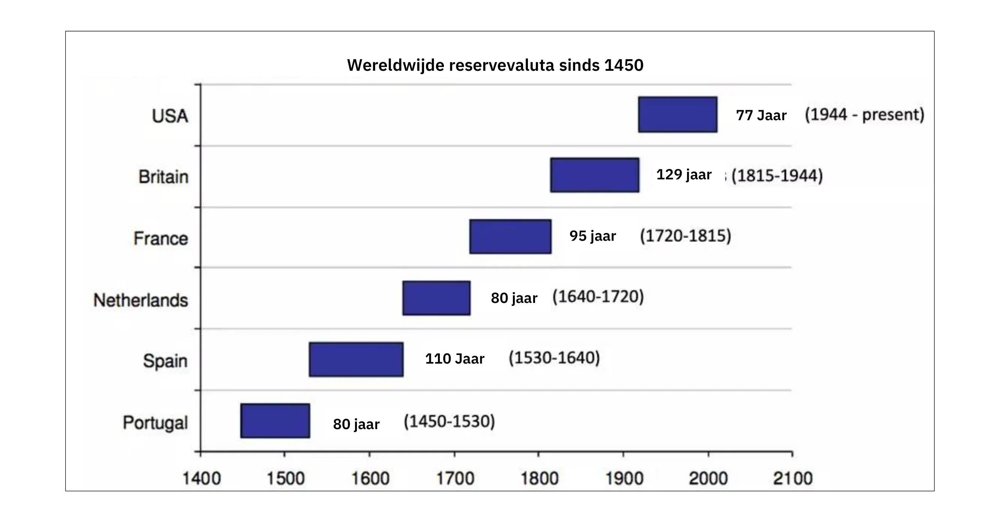

De situatie veranderde echter met de opkomst van de Verenigde Staten als dominante economische macht. Zij kozen ervoor om hun reservemunt te devalueren en zo de inflatie in hun voordeel uit te buiten. Deze beslissing wordt vaak toegeschreven aan de veranderde dynamiek, waarbij de keuze van de reservemunt niet meer zo vrij was als voorheen. Door de Amerikaanse hegemonie werd de dollar de wereldreservemunt, waardoor manipulatie van de waarde mogelijk werd. Deze verschuiving onthult de potentiële invloed van monetair beleid op de internationale handel in een geglobaliseerde economie en markeert een belangrijke overgang in het beheer van wereldwijde reservemunten.

### Laatste voorbeeld voor onderweg: de Zwitserse dinar

De Zwitserse dinar illustreert een ander fascinerend aspect van monetaire devaluatie, dit keer verankerd in de Iraakse context van voor de Golfoorlog. Deze munt, genoemd naar de opmerkelijke kwaliteit van de bankbiljetten, werd uitgegeven door de Centrale Bank van Irak en genoot een reputatie van stabiliteit in de regio van het Midden-Oosten. Dit vertrouwen was vooral te danken aan de kwaliteit van het drukken van de bankbiljetten in Engeland, wat een zekere robuustheid tegen devaluatie impliceerde.

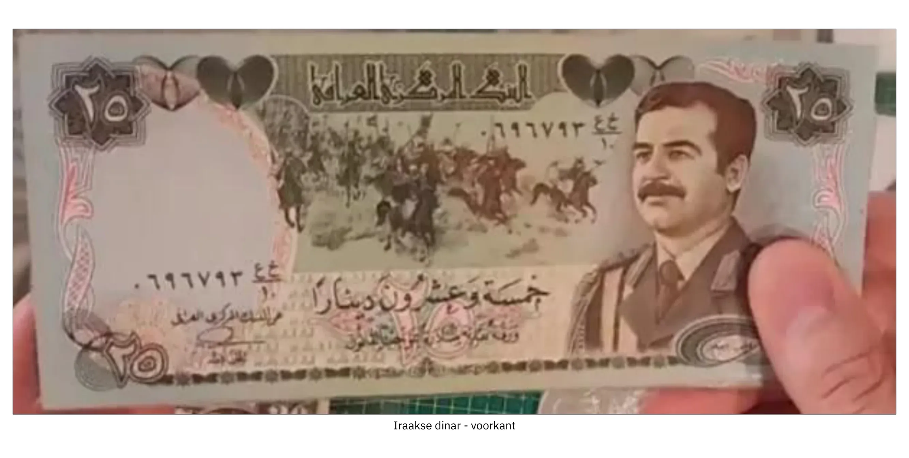

De Golfoorlogen markeerden echter een keerpunt in de geschiedenis van de Zwitserse dinar. Irak, dat niet langer kon vertrouwen op zijn Engelse leverancier voor het drukken van bankbiljetten, wendde zich tot China voor hulp. Deze overgang resulteerde in een duidelijk verschil in kwaliteit van de bankbiljetten, waarbij de Chinese versie als inferieur werd gezien. Deze perceptie was niet ongegrond; de Chinese bankbiljetten waren gemakkelijker te vervalsen en vatbaar voor overdrukken door de overheid, waardoor hun waarde in gevaar kwam.

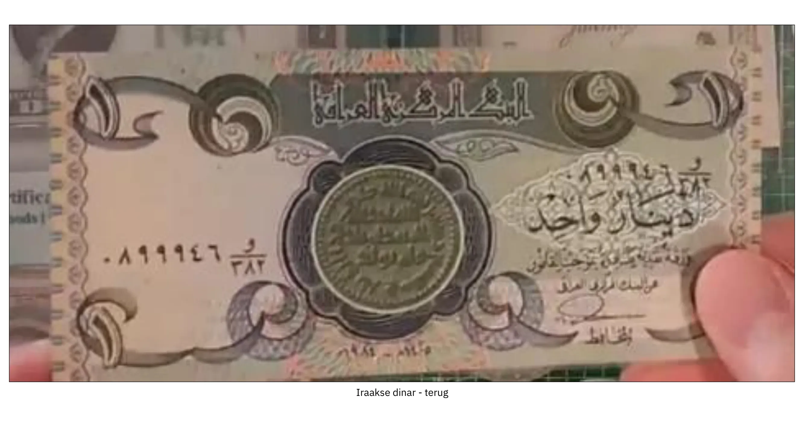

In de Iraakse economie na de Golfoorlog deed zich een opvallend fenomeen voor: het dubbele prijssysteem. Kooplieden hanteerden verschillende prijzen afhankelijk van het type bankbiljet dat werd gebruikt om te betalen, waarbij de voorkeur werd gegeven aan de originele Zwitserse dinar boven het Chinese bankbiljet. Dit systeem weerspiegelde het blijvende vertrouwen in bankbiljetten van hogere kwaliteit, die minder gevoelig waren voor devaluatie, zelfs in een context waarin de waarde voornamelijk werd opgelegd door de staat. Deze episode benadrukt het belang van intrinsieke kenmerken van valuta en hoe, zelfs in een fiatvalutaregime, de waargenomen kwaliteit van een valuta van invloed kan zijn op de relatieve waarde ervan en, in het verlengde daarvan, op het vertrouwen van economische actoren.

#### Ja, we hebben de munten gewogen!

In de gangbare perceptie wordt geld vaak geassocieerd met de creatie van een staat, waarbij de uitgifte en de waarde ervan door de staat worden gereguleerd. Dit concept heeft zijn wortels in oude beschavingen, zoals Rome, waar munten werden gestandaardiseerd en gestempeld door het Rijk, waardoor het geld een officiële waarde kreeg. Bij nader onderzoek blijkt echter dat de intrinsieke waarde van geld voornamelijk werd afgeleid van het edelmetaal dat het bevatte.

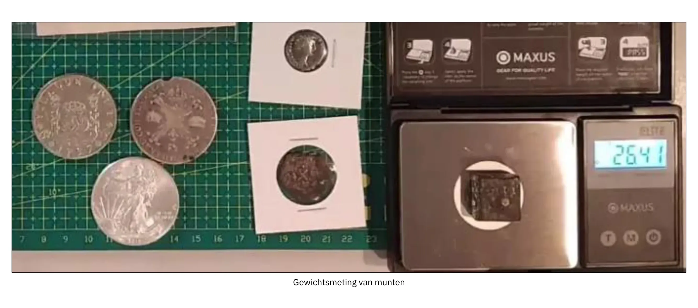

Een voorbeeld hiervan wordt geïllustreerd aan de hand van een muntgewicht dat overeenkomt met acht Spaanse reais, of één Spaanse dollar. Dit gewicht, gemarkeerd met een Romeins cijfer dat de waarde aangaf, werd door geldwisselaars gebruikt om de waarde van munten te bepalen op basis van hun gewicht in plaats van alleen hun stempel. Door de munten te wegen, konden de wisselaars bepalen of ze waren veranderd of beschadigd, wat hun waarde had kunnen verminderen. Deze praktijk laat zien dat, hoewel het gestandaardiseerde stempel van de staat een bepaalde nominale waarde aan het geld gaf, de echte waarde in het gewicht van het edelmetaal zat.

Deze analyse toont aan dat het vertrouwen in geld, en bij uitbreiding de waarde ervan, eerder verankerd was in de tastbare substantie dan in de loutere bewering van de staat. Het onderstreept de dualiteit tussen de nominale waarde die wordt opgelegd door de staat en de intrinsieke waarde die wordt bepaald door de inhoud van het edelmetaal. Valuta is dus meer dan alleen een instrument van de staat: de fundamentele waarde ervan is intrinsiek verbonden met het tastbare en meetbare Elements.

#### Conclusie

Concluderend kan gesteld worden dat deze studie over monetaire devaluatie een dieper inzicht geeft in de inflatiemechanismen, die in de volgende video's onderzocht zullen worden. We zullen de verschillende soorten inflatie bespreken en de drempel waarop ze overgaan in hoge of hyperinflatie. Deze solide basis zal ons in staat stellen om Address de complexiteit van inflatie in de komende sessies te laten zien. Dank u voor uw aandacht. We kijken ernaar uit om deze verkenning van monetaire dynamiek voort te zetten in de volgende video.

## Soorten inflatie

<chapterId>b438fe09-375e-5bb2-9196-7dd687b9f98c</chapterId>

### Inflatie is geen multifactorieel verschijnsel

In dit hoofdstuk zullen we de verschillende aspecten van inflatie onderzoeken, een fenomeen dat vaak verkeerd begrepen wordt. Hoewel inflatie in de media en in alledaagse discussies vaak wordt gezien als een multifactorieel fenomeen, is het cruciaal om te onthouden dat het in wezen een monetair fenomeen is.

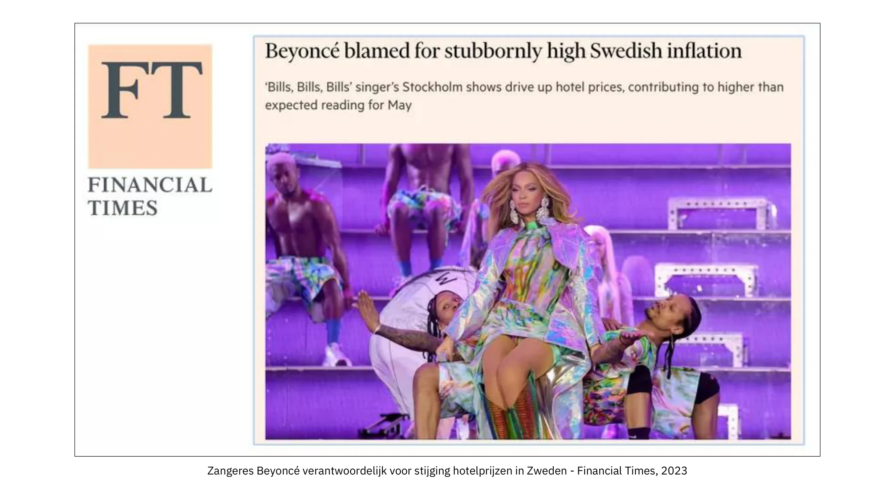

Hier volgt een opsplitsing van het onderwerp in een aantal belangrijke punten:

- Onderscheid tussen prijsstijging en inflatie:

Een prijsstijging kan sectorspecifiek zijn en veroorzaakt worden door verschillende factoren, zoals een daling van de OPEC-olieproductie of ongunstige weersomstandigheden die de tarweproductie beïnvloeden.

Inflatie wordt daarentegen gedefinieerd als een algemene prijsstijging van een reeks goederen en diensten, niet alleen in een specifieke sector.

- De monetaire essentie van inflatie:

Met een vaste geldhoeveelheid Supply zou een prijsstijging in de ene sector resulteren in een prijsdaling in andere sectoren, omdat de hoeveelheid geld die beschikbaar is om elders uit te geven zou afnemen. Inflatie is nauw verbonden met een stijging van de geldhoeveelheid Supply, die een gelijktijdige prijsstijging in alle sectoren mogelijk maakt.

- Invloed van Supply op inflatie en deflatie:

In een systeem met vast geld Supply zou een toename van de productie theoretisch moeten leiden tot deflatie, d.w.z. een daling van de prijzen, omdat er meer goederen en diensten beschikbaar zouden zijn.

In het huidige fiat monetaire systeem doet een toename van het geld Supply de potentiële deflatie teniet die veroorzaakt wordt door een toename in productie.

- Negatieve effecten van aanpassing van de geldhoeveelheid Supply:

Een toename van het geld Supply, zonder een overeenkomstige toename van de productie, leidt tot inflatie, omdat er meer geld in omloop is voor dezelfde hoeveelheid goederen en diensten.

Terwijl de productiestijging tot deflatie had moeten leiden, deed de gelijktijdige toename van het geld Supply dit effect teniet, waardoor in plaats daarvan inflatie ontstond.

- Inflatie, deflatie en geld Supply - Communicerende vaten:

Inflatie en deflatie zijn als communicerende vaten in een economie. Een productiestijging kan leiden tot deflatie, maar als het geld Supply tegelijkertijd wordt verhoogd, wordt het deflatoire effect tenietgedaan, wat resulteert in inflatie.

Deze discussie onderstreept het belang van het begrijpen van de onderliggende mechanismen van inflatie en deflatie, evenals de diepgaande invloed die het veranderen van de geldhoeveelheid Supply kan hebben op de economie. We zullen waarschijnlijk later op deze concepten terugkomen om een dieper inzicht te krijgen in hun onderlinge verbondenheid en de invloed die ze hebben op de wereldeconomie.

### Waarom veroorzaakt het drukken van geld niet altijd inflatie?

#### Inflatie ≠ CPI

Inflatie, hoewel vaak geassocieerd met een toename van het geld Supply, heeft niet altijd een directe correlatie met het drukken van geld, zoals wordt geïllustreerd door de periode na de financiële crisis van 2008. Ondanks het aanzienlijk bijdrukken van geld om de banken te redden, was er in het daaropvolgende decennium geen sprake van hoge inflatie, gemiddeld tussen 0 en 2% per jaar. Deze situatie roept de vraag op: Waarom resulteerde het massaal bijdrukken van geld niet in evenredige inflatie? Het antwoord ligt in verschillende nuances met betrekking tot het meten van inflatie en de consumentenprijsindex (CPI).

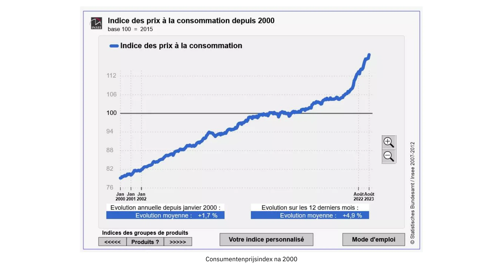

De eerste verklaring ligt in de manier waarop inflatie wordt gemeten. De consumentenprijsindex (CPI), die dient als de primaire inflatie-indicator, heeft bepaalde beperkingen. Er wordt bijvoorbeeld geen rekening gehouden met de ontwikkeling van vastgoedprijzen. Hoewel de CPI een component met betrekking tot huurprijzen bevat, komt de aanzienlijke stijging van de huizenprijzen niet volledig tot uiting in de index. Als gevolg hiervan kunnen aanzienlijke stijgingen van de huisvestingskosten plaatsvinden zonder dat deze volledig worden meegenomen in de CPI, waardoor de werkelijke inflatie mogelijk wordt onderschat.

Bovendien worden bij de berekening van de CPI bepaalde methodes gebruikt die werkelijke prijsstijgingen kunnen compenseren of maskeren. Zo kunnen bijvoorbeeld kwalitatieve verbeteringen van producten worden gebruikt om de index aan te passen. Als de prijs van een product stijgt, maar de kwaliteit of eigenschappen ervan ook verbeteren, kan de CPI ervan uitgaan dat de werkelijke waarde voor de consument niet is veranderd en dus geen inflatie weerspiegelt. Een illustratief voorbeeld is een geval waarin, ondanks een stijging van de prijzen van rundvlees en computers als gevolg van een monetaire injectie, de verbetering van de computerprestaties wordt gebruikt om deze stijging te compenseren. Als een computer twee keer zo veel kost, maar vier keer zo krachtig is, kan de ICP dit interpreteren als een prijsdaling en zo de stijging van de rundvleesprijs maskeren.

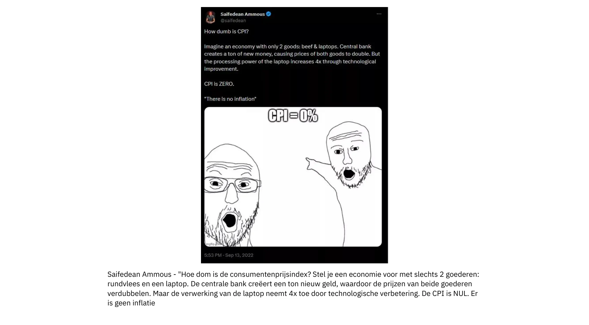

Deze nuances in het meten van de inflatie aan de hand van de CPI benadrukken de complexiteit van de relatie tussen monetaire druk en inflatie. Ze suggereren ook dat de werkelijke inflatie hoger kan zijn dan gerapporteerd als alle prijsstijgingen, vooral in belangrijke sectoren zoals onroerend goed, uitgebreider in rekening zouden worden gebracht. Deze analyse onderstreept het belang van inzicht in de onderliggende mechanismen van inflatie en de beperkingen van conventionele indices die worden gebruikt om de inflatie te meten, waardoor een beter begrip van de economische implicaties van monetair beleid mogelijk wordt.

#### Argumenten van MMT

De Moderne Monetaire Theorie (MMT) biedt een ander perspectief op geldschepping en inflatie. Volgens MMT is geld in de eerste plaats afkomstig van de overheid, die aanzienlijke bedragen kan drukken om haar behoeften te financieren zonder inflatie te veroorzaken, zolang de sectoren waarop deze middelen zijn gericht niet verzadigd zijn. Deze benadering wijkt af van de traditionele monetaire theorieën en benadrukt het belang van sectorale absorptiecapaciteiten in de inflatiedynamiek.

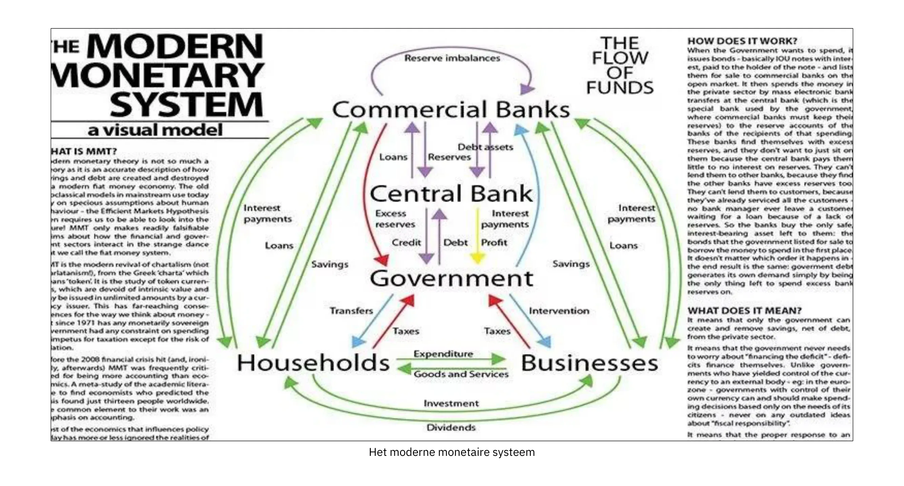

Een illustratief voorbeeld van MMT is het Amerikaanse militair-industriële complex. Volgens MMT kunnen honderden miljarden dollars aan deze sector worden toegewezen zonder inflatie te veroorzaken, dankzij het vermogen van de sector om de fondsen te absorberen. Als er daarentegen veel geld wordt geïnjecteerd in de aanleg van wegen in de Verenigde Staten, waar een beperkt aantal bedrijven en arbeidskrachten is, kan er inflatie ontstaan door de schaarste van grondstoffen en de hogere kosten die leveranciers vragen.

Japan wordt door MMT-voorstanders vaak aangehaald als een ander voorbeeld van de afwezigheid van inflatie ondanks aanzienlijke monetaire druk. De situatie in Japan benadrukt echter ook de beperkingen van traditionele inflatiemetingen, zoals de consumentenprijsindex (CPI). In Japan wordt een aanzienlijk deel van het gedrukte geld gespaard of geïnvesteerd in onroerend goed of de aandelenmarkt, in plaats van uitgegeven aan lopende consumptie. Doordat de CPI deze dynamiek niet volledig weergeeft, kan de werkelijke inflatie worden onderschat.

[De analyse van Japan](https://ideas.repec.org/p/ces/ceswps/_9821.html) benadrukt eveneens dat het gedrag van economische actoren, zoals sparen of investeren in activa die niet in de CPI zijn opgenomen, de inflatoire impact van geldcreatie kan verhullen. Bovendien speelt het vermogen van de verschillende sectoren om de geïnjecteerde liquiditeit te absorberen een cruciale rol bij het al dan niet optreden van inflatie.

#### Balansen van banken en centrale banken

Het derde voorbeeld van waarom monetair printen geen inflatie zou veroorzaken, is dat de relatie tussen monetair printen en inflatie wordt gemoduleerd door de manier waarop nieuw gecreëerd geld in de economie wordt geïntroduceerd. Als dit geld op de balansen van particuliere banken blijft staan zonder uitgeleend te worden aan economische actoren, zal het geen directe invloed hebben op de reële economie en daarom niet leiden tot inflatie.

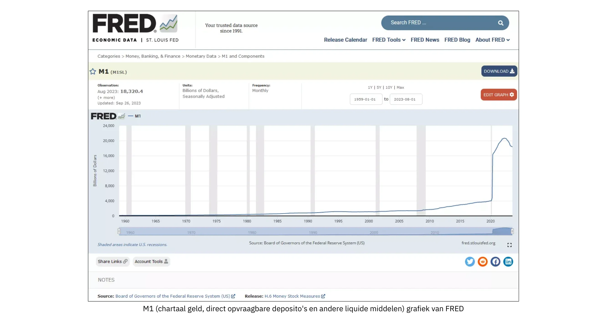

Het drukken van geld kan worden gezien als een zwaard van Damocles dat boven de economie hangt. Het gecreëerde geld kan gedurende een bepaalde tijd latent blijven zonder enig zichtbaar inflatoir effect, zolang het niet in de economie wordt geïnjecteerd via bankleningen of andere mechanismen. Wanneer dit latente geld echter uiteindelijk in omloop wordt gebracht, kunnen er inflatoire effecten optreden. Dit is wat is waargenomen in de jaren 2020, waar eerder gecreëerd geld in de economie is gekomen, wat tot inflatie heeft geleid.

Dit scenario benadrukt het belang van monetaire transmissiemechanismen bij het beïnvloeden van de inflatoire effecten van het drukken van geld. Geldschepping door centrale banken is slechts één stukje van de puzzel. Het gedrag van privébanken, die beslissen hoeveel leningen ze verstrekken, en het gedrag van leners, die beslissen hoe ze het geleende geld uitgeven, zijn ook cruciale Elements in deze dynamiek.

#### Inflatie is sociaal!

Het voorbeeld van de Weimarrepubliek illustreert een ander cruciaal aspect van de relatie tussen het drukken van geld en inflatie: de rol van verwachtingen en het gedrag van economische agenten. Toen de Centrale Bank van de Weimarrepubliek begon met het drukken van een grote hoeveelheid geld, leidde economische onzekerheid ertoe dat mensen geld gingen oppotten, d.w.z. opslaan in plaats van uitgeven. Deze reactie vertraagde tijdelijk de inflatoire effecten van het drukken van geld.

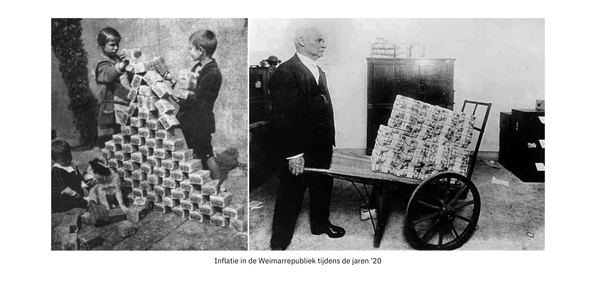

Toen de economische situatie echter licht begon te verbeteren, werd het vertrouwen geleidelijk hersteld. Individuen haalden toen hun spaargeld uit hun schuilplaatsen en begonnen massaal geld uit te geven in de economie. Deze plotselinge gedragsverandering, gecombineerd met een toch al hoge Supply, leidde tot een explosie van de vraag. Met meer geld in omloop en een grotere vraag begonnen de prijzen snel te stijgen, wat leidde tot een merkbare inflatie.

Dit voorbeeld onderstreept het belang van timing en agentgedrag bij het ontstaan van inflatie. Inflatie treedt niet alleen op als reactie op een toename van de geldhoeveelheid Supply, maar hangt ook af van hoe en wanneer dat geld in de economie wordt uitgegeven. Economische onzekerheden en de verwachtingen van economische agenten spelen een cruciale rol in deze dynamiek en kunnen de inflatoire effecten van het drukken van geld versnellen of vertragen.

#### Recapitulatie:

- Consumentenprijsindex (CPI): De CPI is zo opgebouwd dat hij de inflatie onderschat, wat een vertekend beeld kan geven van de inflatoire realiteit.

- Sectorale absorptie: Geld injecteren in sectoren die in staat zijn om het te absorberen leidt niet altijd tot inflatie. Een opmerkelijk voorbeeld is het militair-industriële complex van de VS, dat grote sommen geld kan absorberen zonder inflatie te veroorzaken.

- Het geval Japan: Ondanks het aanzienlijk bijdrukken van geld blijft de inflatie in Japan laag omdat het geld vaak wordt gespaard of geïnvesteerd in onroerend goed of aandelenmarkten. Deze sectoren absorberen het gedrukte geld en de CPI weerspiegelt niet noodzakelijk prijsstijgingen in deze gebieden.
- Correlatie tussen geld drukken en markten. We zien dat de curven van de vastgoed- en aandelenmarkten vaak de monetaire druk volgen, wat aangeeft waar het gedrukte geld naartoe gaat.
- Monetaire reserves van banken: Wanneer gedrukt geld op de balansen van banken blijft staan en niet circuleert in de economie, veroorzaakt het geen inflatie. Dit wordt geïllustreerd door het voorbeeld van 2008, toen gedrukt geld grotendeels op de balansen van banken bleef staan, waardoor het inflatoire effect werd uitgesteld.

- Weimarrepubliek: Deze historische periode laat zien hoe economische onzekerheid leidde tot het oppotten van geld, waardoor de inflatie werd uitgesteld. Maar zodra het vertrouwen was hersteld en het geld werd uitgegeven, explodeerde de inflatie.

Deze voorbeelden kunnen gebruikt worden in discussies om uit te leggen waarom inflatie niet altijd een onmiddellijk gevolg is van het drukken van geld, en hoe economische contexten en het gedrag van agenten inflatie beïnvloeden.

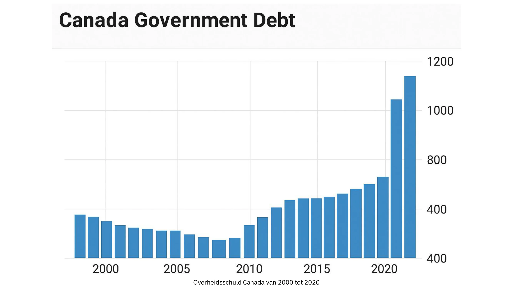

Omdat, zoals deze [thread](https://twitter.com/saifedean/status/1673639779433590786) laat zien: Inflatie is alles behalve de schuld van centrale banken.

- Economen wijten inflatie aan klimaatverandering

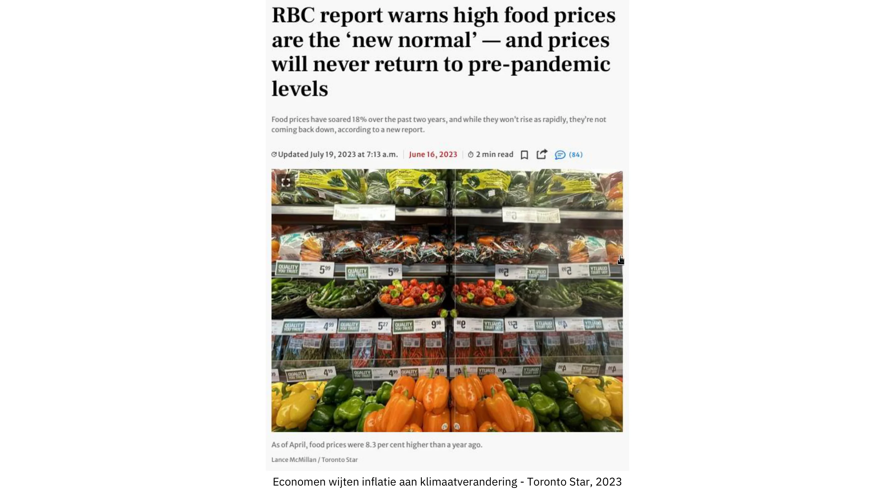

- Voorbeeld van Zweden die Beyoncé de schuld geeft van de inflatie in een bepaalde maand.

- De centrale bank in Polen schrijft de inflatie toe aan de Russische agressie in Oekraïne en de pandemie

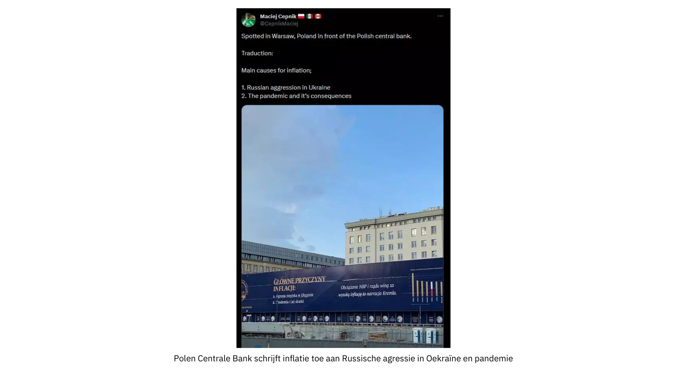

- Brexit krijgt de schuld van de inflatie in het Verenigd Koninkrijk.

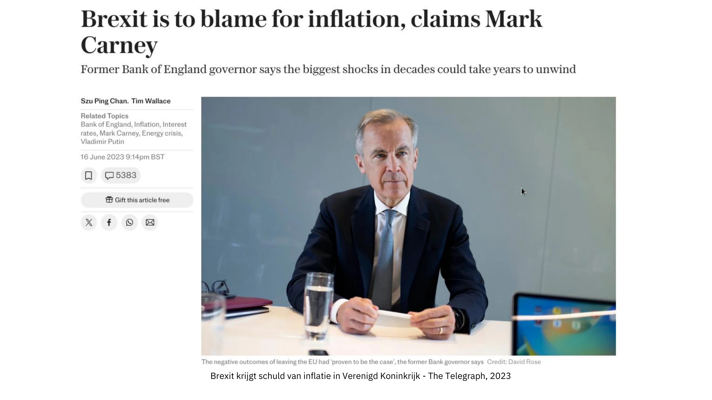

- De release van het Zelda-spel gaat gepaard met een inflatieschok.

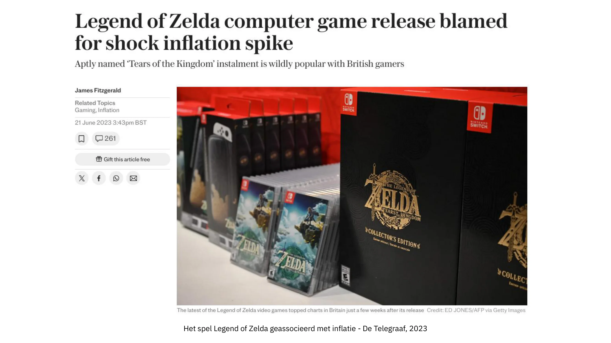

- Taylor Swift zou inflatie veroorzaken.

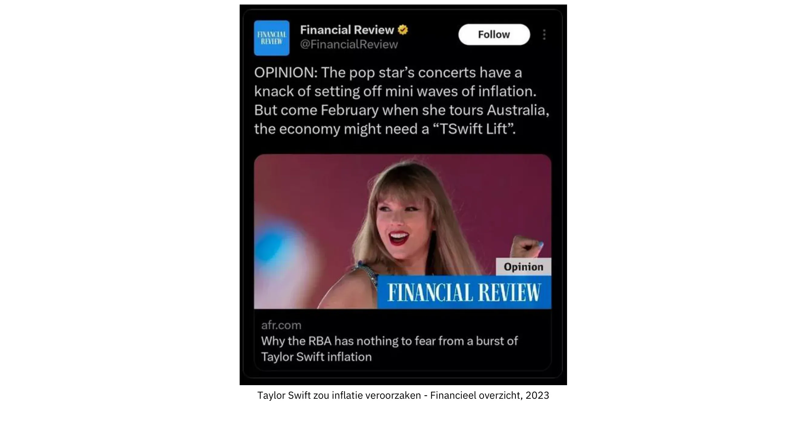

Vertel me eens, hoe kunnen Beyoncé of Taylor Swift de wijdverspreide prijsstijging veroorzaken? Zie je, het slaat nergens op. In het kort:

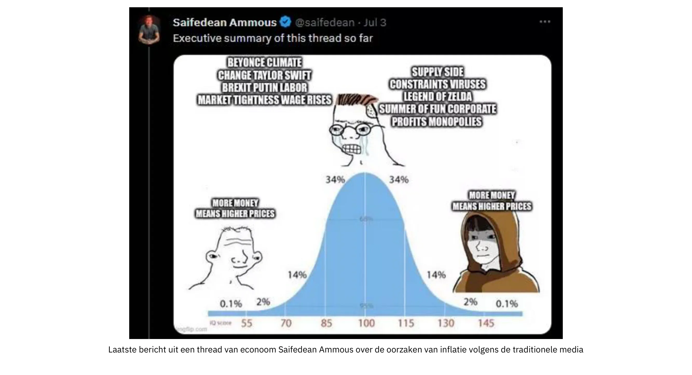

### Verkenning van soorten inflatie

Het is cruciaal om het onderscheid tussen verschillende soorten inflatie te begrijpen, zodat we de verschillende verschijningsvormen van dit economische fenomeen kunnen begrijpen. Hier volgt een uitleg van deze verschillende soorten:

- Sluipende inflatie: Dit is het type inflatie waar centrale banken over het algemeen naar streven, vastgesteld op ongeveer 2% per jaar. Deze doelstelling wordt al sinds de jaren 1990 gehanteerd en is gericht op het handhaven van een stabiele economische groei zonder oververhitting of deflatie.
- Gematigde inflatie: Deze vorm van inflatie treedt op wanneer de inflatie de doelstelling van 2% overschrijdt. Het wordt vaak geassocieerd met een oververhitte economie, een toestand waarin een buitensporige geldhoeveelheid Supply een algemene stijging van de prijzen stimuleert. Dit scenario legt de grenzen van het monetaire beleid bloot en onthult soms tegenstrijdigheden in het economische discours.
- Galopperende inflatie: Galopperende inflatie, vaak dubbelcijferige inflatie genoemd, treedt op wanneer de jaarlijkse inflatie meer dan 10% bedraagt. Het markeert een aanzienlijke prijsstijging die de economische stabiliteit in gevaar kan brengen.

- Hyperinflatie: Hyperinflatie is een extreem verschijnsel waarbij de inflatie meer dan 50% per maand bedraagt, wat door de exponentiële aard van inflatie gelijk staat aan een jaarlijkse inflatie van meer dan 13.000%. Dit inflatieniveau destabiliseert de economie ernstig, waardoor de munt bijna waardeloos wordt en het vertrouwen in het monetaire systeem afbrokkelt.

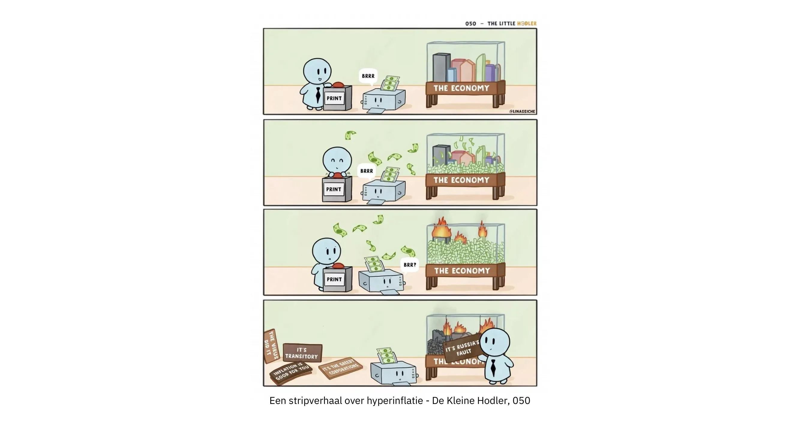

Bij het onderzoeken van soorten inflatie kom je in onderwijsmateriaal vaak termen tegen als "Demand Pull" en "Cost Push". Hoewel deze concepten geldig zijn, verklaren ze eerder prijsstijgingen dan inflatie als een monetair fenomeen. Hier volgt een meer diepgaande analyse:

- Vraag trekken:

Vraag-inflatie wordt vaak beschreven als een scenario waarin de vraag in de economie groter is dan de beschikbare productiecapaciteit. Zonder een overeenkomstige toename van het geld Supply zal deze situatie echter gewoon leiden tot een herverdeling van de bestedingen. Consumenten kunnen meer uitgeven aan essentiële goederen en minder aan niet-essentiële artikelen, waardoor het algehele inflatoire effect geneutraliseerd wordt.

- Kosten drukken:

Aan de andere kant wordt kosteninflatie toegeschreven aan de stijging van productiekosten, zoals die van natuurlijke hulpbronnen of arbeid. Nogmaals, zonder een toename van het geld Supply kunnen kostenstijgingen in de ene sector simpelweg de uitgaven in andere sectoren verlagen, zonder wijdverspreide inflatie te veroorzaken.

Deze traditionele verklaringen associëren prijsstijgingen vaak met inflatie, wat tot verwarring en misverstanden kan leiden. In werkelijkheid is voor een wijdverspreide inflatie een toename van de geldhoeveelheid Supply nodig. In deze context kunnen de concepten van Demand Pull en Cost Push sectorale prijsschommelingen verklaren, maar ze geven niet de monetaire aard van inflatie weer. Dit benadrukt hoe belangrijk het is om onderscheid te maken tussen sectorale prijsstijgingen en wijdverspreide inflatie, en bevestigt opnieuw de noodzaak van een verhoging van de Supply om te voorkomen dat inflatie zich in de hele economie manifesteert. Deze analyse biedt een genuanceerder en nauwkeuriger perspectief op de werkelijke oorzaken van inflatie, en demystificeert gangbare interpretaties die de onderliggende monetaire dynamiek kunnen verdoezelen.

### Classificatie van inflatie volgens Bernholz

Bernholz stelt een vereenvoudigde maar nauwkeurige classificatie van inflatie in drie categorieën voor, die een beter begrip van dit complexe monetaire fenomeen mogelijk maakt:

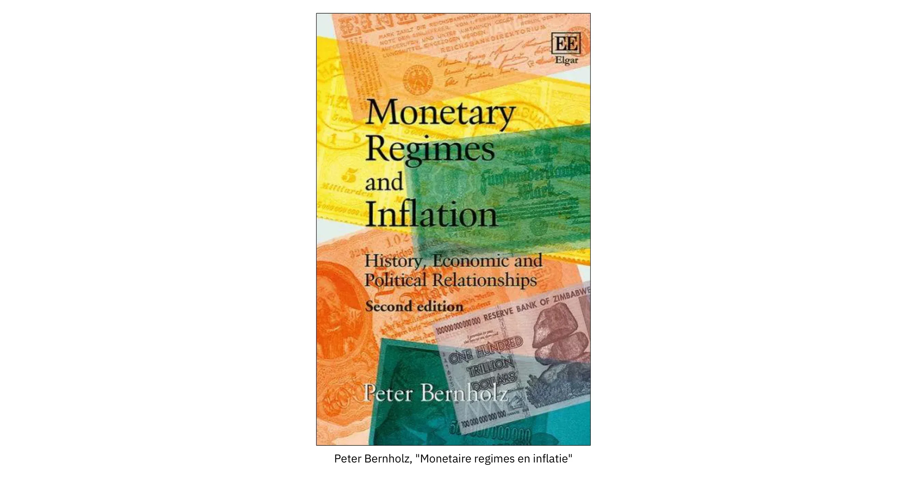

- Gematigde inflatie:

Gematigde inflatie treedt op wanneer het niveau van het geld Supply hoger is dan normaal, maar zonder dat de staat zijn toevlucht neemt tot grote tekorten gefinancierd door geldschepping. Hoewel de term "gematigd" onbeduidend lijkt, kan deze vorm van inflatie aanzienlijke problemen veroorzaken, hoewel het niet wordt geclassificeerd als hoge inflatie.

- Hoge inflatie:

Hoge inflatie treedt op wanneer de reële waarde van het geld Supply daalt ondanks een nominale stijging. Deze paradoxale situatie ontstaat door monetaire substitutie, waarbij mensen het vertrouwen in de nationale munteenheid verliezen en Exchange deze inruilen voor goederen, diensten of vreemde valuta. Dit proces doet de reële waarde van de munt verder dalen, wat de inflatie verergert.

- Hyperinflatie:

Hyperinflatie is een extreme vorm van hoge inflatie die gekenmerkt wordt door grote begrotingstekorten die gefinancierd worden door geldschepping. Historisch gezien is geen enkel geval van hyperinflatie waargenomen zonder substantiële financiering van tekorten door het drukken van geld. Hyperinflatie creëert een vicieuze cirkel: de inflatie holt de waarde van de munt zo snel uit dat de belastinginkomsten devalueren nog voor de staat ze kan innen, waardoor de staat nog meer geld moet drukken om zichzelf te financieren. Deze zichzelf versterkende cyclus leidt tot astronomische inflatiecijfers, vaak meer dan 50% per maand.

Deze classificatie van Bernholz belicht de gevaarlijke progressie van gematigde inflatie naar hyperinflatie en onderstreept het vitale belang van monetaire en fiscale controle bij het voorkomen van destructieve inflatiespiralen. Het laat ook zien dat de nadelige gevolgen voor de staatsfinanciën al lang voor het bereiken van het stadium van hyperinflatie kunnen optreden, waardoor een genuanceerd perspectief wordt geboden op de implicaties van inflatie in verschillende gradaties.

### Conclusie: Samenvatting van inflatietypen

Concluderend hebben we een reeks verschillende soorten inflatie onderzocht, te beginnen met veelgehoorde termen als "sluipende inflatie", "lopende inflatie" en "galopperende inflatie", die elk verschillende niveaus van inflatiepercentages binnen een economie aanduiden. Voor onze diepgaande studie naar hyperinflatie blijken de categorieën gematigde inflatie, hoge inflatie en hyperinflatie, zoals beschreven door Bernholz, echter cruciale maatstaven te zijn.

- Gematigde inflatie:

Het duidt op een geldhoeveelheid Supply die hoger is dan normaal, hoewel dit niveau kan worden gehandhaafd zonder aanzienlijke tekortfinanciering door de staat.

- Hoge inflatie:

Het doet zich voor wanneer de reële waarde van het geld Supply daalt, vaak door monetaire substitutie, waarbij individuen Exchange hun geld proberen te ruilen voor goederen, diensten of andere vormen van geld.

- Hyperinflatie:

Het is een extreme versie van hoge inflatie, waarbij buitensporige geldschepping om grote begrotingstekorten te financieren leidt tot een snelle erosie van de reële waarde van de munt.

Wat uit ons onderzoek naar voren komt, is dat hyperinflatie een complex en contra-intuïtief fenomeen is. Hoewel je zou kunnen veronderstellen dat hyperinflatie het resultaat is van een enorme toename van het geld Supply, komt het in werkelijkheid voort uit een afname van de reële waarde van dat geld Supply. Deze nuance is cruciaal om te begrijpen waarom sommige landen worstelen om uit de hyperinflatie te komen, zelfs met de steun van internationale instellingen zoals de Wereldbank of het IMF. Het verkeerd karakteriseren van het type inflatie kan leiden tot het toepassen van verkeerde remedies, waardoor economische problemen verergeren in plaats van ze op te lossen.

In onze toekomstige discussies zullen we dieper ingaan op hyperinflatie en de definities en verschijningsvormen ervan in verschillende economische contexten onderzoeken. Ons doel is om de onderliggende mechanismen van hyperinflatie bloot te leggen en mogelijke oplossingen voor Address te verkennen. Dit genuanceerde begrip zal ons in staat stellen de bijbehorende uitdagingen beter te begrijpen en weloverwogen strategieën voor te stellen om de inflatie te beheersen.

Bedankt voor uw aandacht. De volgende sessie zal volledig gewijd zijn aan het definiëren en demystificeren van hyperinflatie, waarbij verschillende academische en praktische perspectieven worden bekeken. We kijken ernaar uit om deze verkenning samen met u voort te zetten tijdens onze volgende bijeenkomst.

# Wat is hyperinflatie?

<partId>3f541663-1e2f-5410-8ee0-f61c5d009fa5</partId>

## Definities van hyperinflatie

<chapterId>d2a71a2e-5f36-58d9-993c-d431f4aa07fd</chapterId>

### Definities van hyperinflatie

In dit hoofdstuk verkennen we de verschillende definities van hyperinflatie, een cruciale term in de studie van extreme monetaire verschijnselen. De meest erkende definitie komt van Philip Cagan, die in zijn werk "The Monetary Dynamics of Hyperinflation" uit 1956 een kwantitatief begrip van hyperinflatie voorstelt. Volgens Cagan:

- Begin en einde van hyperinflatie:
  - Hyperinflatie begint wanneer de maandelijkse inflatie meer dan 50% bedraagt.
  - Het eindigt wanneer de inflatie daalt tot onder 50% per maand gedurende ten minste één jaar.

Ter illustratie: als de inflatie in juli daalt tot 40% en pas in juli van het volgende jaar weer stijgt tot boven de 50%, dan wordt de periode van hyperinflatie geacht te zijn geëindigd in juli van het jaar voorafgaand aan het jaar waarin de inflatie voor het eerst werd waargenomen. Deze definitie maakt een nauwkeurige karakterisering van hyperinflatie-episodes mogelijk, wat een gestructureerde analyse vergemakkelijkt.

Deze definitie is overgenomen in de Hanke-Krus tabel, die 56 perioden van hyperinflatie documenteert. De tabel omvat echter niet alle perioden, zoals die in Venezuela in 2016, waardoor het totaal op 57 komt.

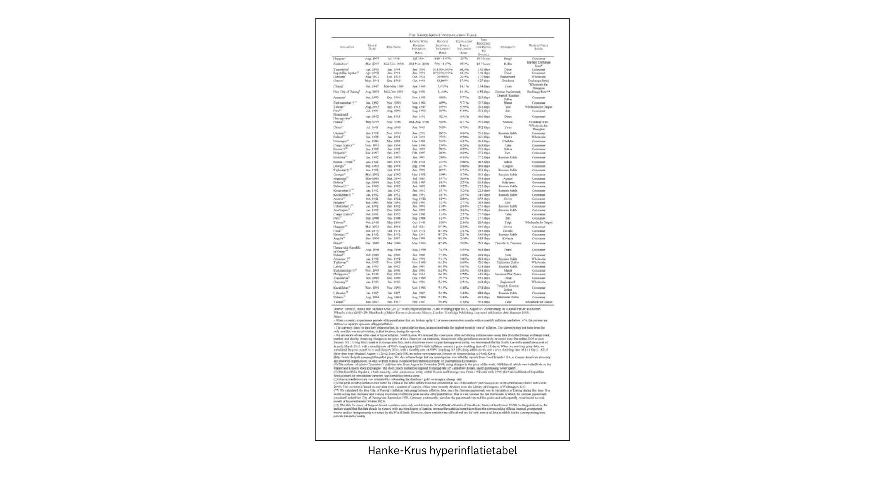

zoom

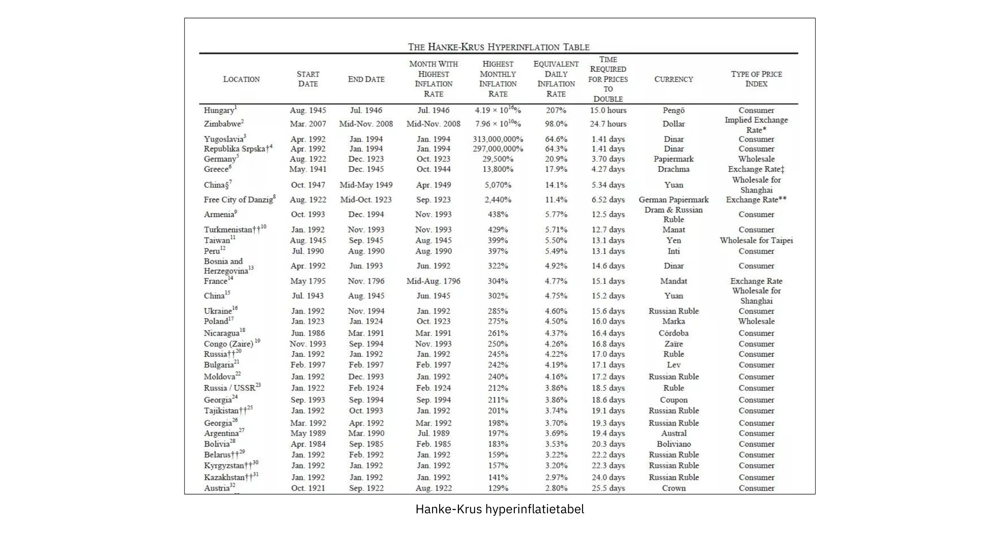

Opgemerkt moet worden dat deze definitie, hoewel nauwkeurig, mogelijk bepaalde perioden van hyperinflatie uitsluit vanwege de strikte drempel van 50%. Het is mogelijk om deze definitie uit te breiden met andere perioden die, hoewel ze niet strikt voldoen aan de criteria van Cagan, toch perioden van extreem hoge inflatie vertegenwoordigen. Deze observatie opent de deur naar een breder onderzoek naar hyperinflatieverschijnselen, waardoor een genuanceerder begrip van de oorzaken en gevolgen mogelijk wordt. In volgende discussies zullen we overwegen om deze definitie te herzien en perioden van hyperinflatie te onderzoeken die niet onder de strikte criteria van Cagan vallen.

### De definitie van hyperinflatie door Cagan

Philip Cagan heeft misschien een arbitraire mijlpaal gezet met de drempel van 50% maandelijkse inflatie bij het definiëren van hyperinflatie. Hij geeft zelf toe dat deze definitie arbitrair is en voornamelijk dient om zijn analyse te baseren op zeven periodes van hyperinflatie. Onderzoek van Cagans gegevens laat zien dat de drie periodes van hyperinflatie met de laagste maandelijkse inflatie rond de 47%, 46% en 57% lagen. Het lijkt erop dat de drempel van 50% werd gekozen om deze gevallen in zijn studie op te nemen.

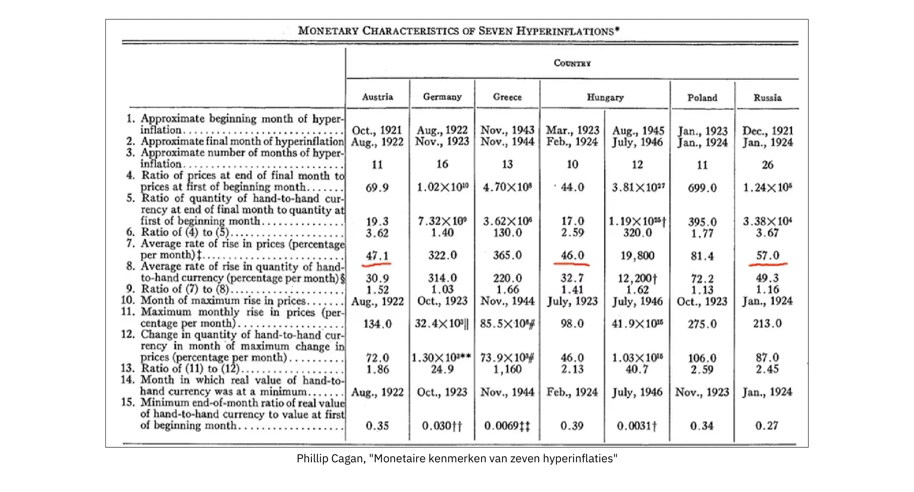

- Historische context:

Cagans definitie dateert uit 1956 en is gebaseerd op een beperkt aantal hyperinflatie-episodes die toen beschikbaar waren.

- Cagans observaties:

Volgens Cagan bereikte geen enkele episode deze drempel van ongeveer 50% zonder over te gaan in een ernstiger hyperinflatie, wat de keuze voor deze drempel zou kunnen rechtvaardigen.

- Kritiek op de definitie van Cagan:

Andere economen, zoals Bernholz, de auteur van Monetary Regime and Inflation, hebben de drempel van 50% ook als arbitrair omschreven.

Bernholz merkt op dat er episodes van hoge inflatie zijn met dezelfde kwalitatieve kenmerken als episodes van hyperinflatie, zonder dat de drempel van 50% wordt bereikt.

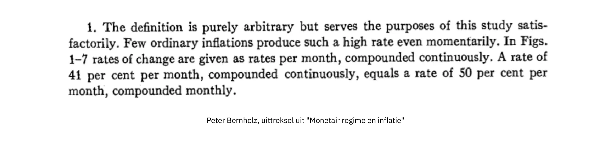

Deze reflectie leidt ertoe dat we vraagtekens zetten bij de starheid van de traditionele definitie van hyperinflatie en benadrukt de noodzaak om deze drempel wellicht te herzien door meer episodes en historische gegevens op te nemen. De definitie van hyperinflatie moet wellicht flexibel zijn om verschillende verschijningsvormen van extreme inflatie in verschillende economische en historische contexten te kunnen omvatten.

### De definitie van hyperinflatie volgens de International Accounting Standards Board (IASB)

De IASB biedt een uniek perspectief op hyperinflatie door zich te richten op boekhoudpraktijken tijdens perioden van hyperinflatie. Deze benadering is cruciaal voor accountants en bedrijven die actief zijn in hyperinflatoire omgevingen, waar de geldwaarde snel fluctueert. De richtlijnen van de IASB identificeren verschillende indicatoren van hyperinflatie:

- Voorkeur voor niet-monetaire activa:**

Mensen houden hun waarde liever vast in goederen dan in valuta vanwege de snelle waardevermindering van geld.

- Waardering van goederen en diensten:**

Inwoners berekenen de waarde van goederen en diensten niet in de lokale valuta, wat wijst op een verlies aan vertrouwen in de lokale valuta.

- Compensatie voor geldelijk waardeverlies:**

Prijzen bevatten compensatie voor het verlies van monetaire waarde tijdens kredietaankopen, wat de impact van inflatie op dagelijkse transacties illustreert.

- Prijs-, loon- en rente-indexering:**

Prijzen, lonen en rente worden aangepast op basis van een index om inflatie te compenseren.

- Cumulatieve inflatie over drie jaar:**

Cumulatieve inflatie over drie jaar die de 100% nadert (ruwweg 24% per jaar), in tegenstelling tot Cagans definitie van 50% maandelijkse inflatie.

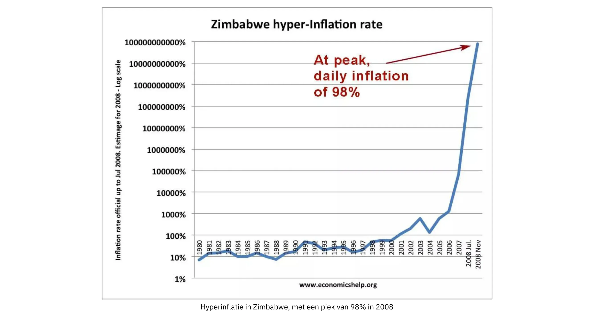

Volgens de criteria van de IASB hebben verschillende landen, waaronder Argentinië, Ethiopië, Haïti, Iran, Libanon, Soedan, Zuid-Soedan, Suriname, Syrië, Turkije, Venezuela, Jemen en Zimbabwe, momenteel te maken met hyperinflatie.

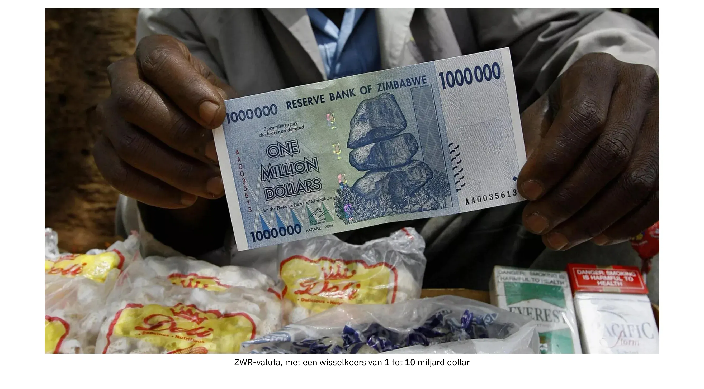

Deze definitie van de IASB wijkt af van de strikte kwantitatieve drempel van Cagan door een kwalitatieve analyse op te nemen van economisch gedrag en praktische aanpassingen in het geval van hyperinflatie. Het toont aan dat hyperinflatie een complex fenomeen is dat een multidimensionaal begrip vereist om de werkelijke implicaties ervan te begrijpen, met name op het gebied van boekhouding, dat cruciaal is voor de stabiliteit en financiële transparantie van bedrijven en markten.

### Dus, hoeveel hyperinflaties zijn er in totaal?

Gangbare definities van hyperinflatie, zoals die van Cagan, die een maandelijkse inflatie van 50% voorschrijft, kunnen soms verwarrend of te simplistisch zijn. Bijvoorbeeld, twee landen met een jaarlijkse inflatie van respectievelijk 1000% en 3000% kunnen verschillend worden gezien op basis van de maandelijkse verdeling van die inflatie. Als geen enkele maand de drempel van 50% overschrijdt, zouden deze landen volgens de definitie van Cagan niet geclassificeerd worden als landen met hyperinflatie. Deze aanpak kan dus leiden tot afwijkingen in de classificatie van hyperinflatie, vooral wanneer cumulatieve inflaties over het jaar worden vergeleken.

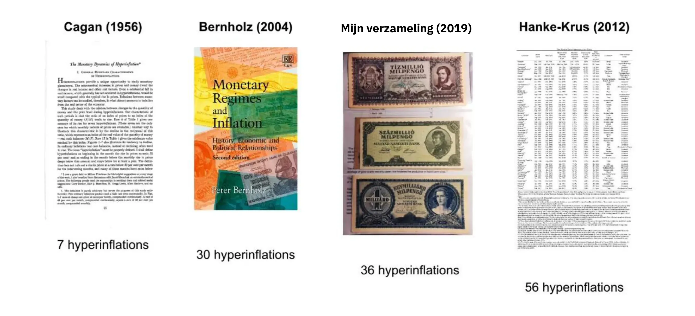

- Het werk van Cagan, "Monetary Dynamics of Hyperinflation", biedt een fundamentele analyse van hyperinflatie.
- Het boek van Bernholz bestudeert 30 verschillende periodes van hyperinflatie en breidt zo de reikwijdte van de analyse uit.
- De persoonlijke verzameling bankbiljetten van David St-Onge (de auteur van deze cursus) uit 36 periodes van hyperinflatie, waardoor een tastbaar en historisch begrip ontstaat.
- De Hanky Cross tabel (versie 2012, bijgewerkt in 2016 met Venezuela), met 57 periodes van hyperinflatie gebaseerd op de definitie van Cagan.

Het is vermeldenswaard dat bepaalde historische perioden van hoge inflatie niet zijn opgenomen in de klassieke tabellen van hyperinflatie, vaak vanwege strenge indelingscriteria. Bijvoorbeeld, tijdens de Amerikaanse Onafhankelijkheidsoorlog in november 1779 en tijdens de Amerikaanse Burgeroorlog in maart 1864 was de maandelijkse inflatie respectievelijk 47,4% en 40%. Hoewel deze percentages hoog zijn, overschrijden ze de door Cagan gestelde drempel van 50% niet, waardoor deze perioden niet worden geclassificeerd als hyperinflatie. Deze omissie benadrukt de beperkingen van rigide definities en onderstreept de behoefte aan een genuanceerder begrip van hyperinflatie in zijn volledige complexiteit.

## Weimar vs. Zimbabwe overeenkomsten

<chapterId>11eef458-aab8-5c63-8523-264d0ba69f5d</chapterId>

### Twee tijdperken, twee catastrofes

In dit hoofdstuk onderzoeken we de gevolgen van hyperinflatie, met de nadruk op de ervaringen in Zimbabwe en de Weimarrepubliek. In mijn onderzoek heb ik prioriteit gegeven aan het onderzoeken van directe getuigenissen van personen die deze periodes van hyperinflatie hebben meegemaakt, in plaats van een puur economische of statistische benadering te kiezen.

Verschillende boeken zijn bijzonder informatief geweest:

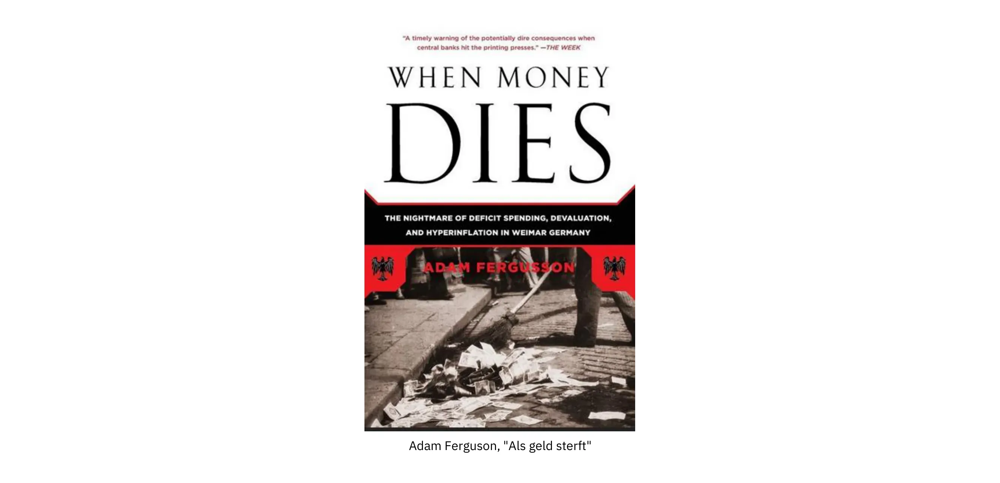

- "When Money Dies" van Adam Ferguson beschrijft de hyperinflatie na de Eerste Wereldoorlog in Duitsland, Oostenrijk en Hongarije.
- Twee boeken over hyperinflatie in Zimbabwe, "Zimbabwe Warm Heart Ugly Face" en "Hard Boiled Egg Index" van respectievelijk Jérôme Gardner en Kudzai Joseph Gou Min-Yu, bieden aangrijpende getuigenissen van een CEO van een kledingwinkelketen en een landbouwbankier over hun ervaringen tijdens deze tumultueuze periode.

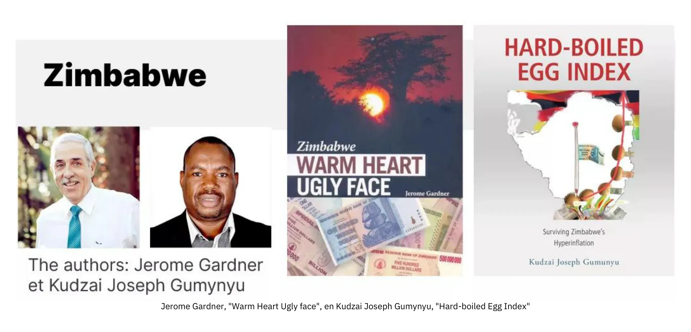

Bij het consolideren van mijn aantekeningen zag ik talrijke overeenkomsten tussen de ervaringen van hyperinflatie in Zimbabwe en de Weimarrepubliek, ondanks het verschil van 90 jaar tussen beide. Ik identificeerde ongeveer 17 overeenkomsten, waarvan 13 een soort progressie naar de economische ramp illustreren die in deze getuigenissen wordt beschreven. Deze fascinerende parallellen tonen de repetitieve en verwoestende aard van hyperinflatie over tijd en grenzen heen. Vandaag onderzoeken we deze overeenkomsten en hoe ze een zorgwekkend traject beschrijven tijdens perioden van hyperinflatie.

### Vergelijkende analyse: Zimbabwe en de Weimarrepubliek

Het spel van 14 verschillen!

#### 1. Geldgebrek

Wanneer valuta met een duizelingwekkende snelheid in waarde daalt, kunnen zelfs de meest ambitieuze pogingen om de markt te overspoelen met nieuwe bankbiljetten onvoldoende blijken. De onophoudelijke vraag naar tastbaar geld kan de capaciteit van de centrale banken om bankbiljetten te produceren ver overstijgen, waardoor ongekende liquiditeitscrises ontstaan.

> Weimar: "In de loop van deze maand zal het worden verhoogd tot bijna 4 miljard papieren marken, een cijfer waarmee het valutatekort hopelijk definitief zal worden opgelost."

> Zimbabwe: "Van 2002 tot januari 2009 waren er verschillende kritieke liquiditeitstekorten. Er waren gewoon niet genoeg bankbiljetten gedrukt of in omloop om de torenhoge inflatie bij te houden."

#### 2. "En dat is mest!"

De snelheid waarmee geld zijn waarde kan verliezen in bepaalde economische situaties is verbazingwekkend. Astronomische hoeveelheden bankbiljetten kunnen in recordtijd worden uitgegeven, waardoor ooit aanzienlijke bedragen in iets onbeduidends als mest veranderen.

> Weimar: "De huidige totale uitgifte bedraagt 63.000 miljard. Over een paar dagen kunnen we dus tweederde van de totale oplage op één dag uitgeven."

> Zimbabwe: "Op 17 september 2006 verklaarde de gouverneur van de RBZ, Gideon Gono: '10 biljoen is er nog steeds, en het is mest geworden

#### 3. Bankbiljetten zijn minder waard dan het papier waarop ze gedrukt zijn

In bepaalde economische omstandigheden kan de intrinsieke waarde van een bankbiljet lager worden dan de waarde van het papier waarop het gedrukt is. Door deze drastische waardevermindering worden bankbiljetten, die normaal gesproken symbolen van waarde en koopkracht zijn, slechts stukken waardeloos papier.

> Weimar: "Hele coupures van marken waren bijna waardeloos zodra ze uit de drukpers kwamen."

> Zimbabwe: "De centrale bank verspilde geld door een bankbiljet te drukken dat het papier waarop het gedrukt werd niet waard was. Met andere woorden, het was minder waard dan toiletpapier. Hoe absurd het ook klinkt, het was goedkoper om het bankbiljet van 100 biljoen ZWD als toiletpapier te gebruiken dan om echt toiletpapier te kopen."

#### 4. Geld tellen

Wanneer geld snel zijn waarde verliest, kunnen zelfs de eenvoudigste transacties omslachtige taken worden. Het berekenen van de prijs van een artikel of het tellen van de biljetten die nodig zijn voor de betaling kan enkele minuten duren, wat de dagelijkse interacties complexer maakt.

> Weimar: "De meest gewone aankoop in een winkel kostte drie of vier minuten rekenwerk en als de prijs eenmaal was vastgesteld, waren er meestal nog een paar minuten nodig om de bankbiljetten te tellen."

> Zimbabwe: "Winkelmanagers mochten ook een uitzendkracht inhuren om de medewerker te vervangen die de hele dag geld telde. Natuurlijk was het tellen van geld in de winkel voor de administratie en de storting op de bank één ding, maar het hele proces moest bij de bank herhaald worden tijdens de storting."

:::video id=910231d7-af90-4ab8-b74c-bfb81caebfb2:::

Oezbeekse techniek om geld te tellen

#### 5. Betalingen per cheque

In verstoorde economieën kunnen traditionele betaalmethoden zoals cheques snel hun effectiviteit verliezen. Banken, overweldigd door de stijgende vraag naar valuta als gevolg van hyperinflatie, kunnen het innen van cheques rantsoeneren of uitstellen, waardoor hun reële waarde daalt. Deze instabiliteit leidt vaak tot een prioritering van betaalmethoden, waarbij de prijzen kunnen variëren afhankelijk van de gekozen betaalmethode.

> Weimar: "Prijsstijgingen verhoogden de vraag naar geld, zowel door de staat als door andere werkgevers. Particuliere banken konden helemaal niet aan de vraag voldoen en moesten het verzilveren van cheques rantsoeneren, zodat ongedekte cheques bevroren bleven terwijl hun koopkracht afnam."
> Zimbabwe: "De tijdwaarde van geld creëerde drie prijzen voor goederen en diensten, namelijk een contante prijs, een real-time brutovereffeningsprijs en een chequeprijs. Uiteindelijk accepteerde niemand nog cheques, die er vijf dagen over deden om te innen."

#### 6. De "Brander-preneurs"

Naarmate de waarde van de valuta erodeert, ontstaan er nieuwe economische mogelijkheden die gebruik maken van marktverstoringen. Deze ondernemers, vaak "Burner-preneurs" genoemd, kunnen gedijen door gedevalueerde valuta te lenen om te investeren in tastbare activa en vervolgens hun schulden terug te betalen met nog meer gedevalueerde valuta.

Weimar: "Speculatie op inflatie bestond uit het lenen van papieren marken, deze omzetten in goederen en fabrieken en vervolgens de geldschieters terugbetalen met gedeprecieerd papier."

Zimbabwe: de "brander-preneurs

#### 7. Eerlijkheid en Hard werk verliezen hun aantrekkingskracht

In onstabiele economische contexten kunnen traditionele waarden als Hard werk, spaarzaamheid en integriteit overschaduwd worden door de allure van snelle rijkdom. Speculatie en valutahandel bieden vaak aanzienlijk hogere beloningen dan regulier werk, wat leidt tot een verstoring van maatschappelijke prioriteiten.

Weimar: "Toen de oude deugden van spaarzaamheid, eerlijkheid en Hard werk hun aantrekkingskracht verloren, probeerde iedereen snel rijk te worden, vooral omdat speculatie met valuta of aandelen blijkbaar veel meer kon opleveren dan werken."

Zimbabwe: "Deze praktijken verrijkten een paar individuen, maar verarmden de stedelijke arbeidersklasse en de plattelandsbevolking. Onderwijs verloor zijn waarde, want deze handel werd gedreven door mensen die geen opleiding of Hard werk nodig hadden om het te rechtvaardigen. Het enige wat ze nodig hadden waren connecties en startkapitaal om hun easy money business te beginnen."

#### 8. De "banken van de wereld

In situaties van hyperinflatie of monetaire crisis ontstaan vaak parallelle en ongereguleerde markten voor vreemde valuta. Deze informele "banken", die vaak met humor "wereldbanken" of andere lokale namen worden genoemd, bieden een toevluchtsoord voor mensen die hun bezittingen willen beschermen tegen devaluatie. Hoewel deze markten een noodzakelijke economische reddingslijn kunnen vormen, benadrukken ze vaak het wijdverspreide wantrouwen tegenover officiële financiële instellingen en overheidsbeleid.

Weimar: "Hun transacties werden voornamelijk uitgevoerd via de zogenaamde Winkelbankiers, de straatoperators die waren opgekomen met de inflatie en die, florerend in een zieke economie, volledig leefden door te profiteren van het verschil tussen de koop- en verkoopprijzen van vreemde valuta."

Zimbabwe: "Het waren ook geldwisselaars. Ze opereerden ongestraft tussen 2nd en 6th Avenue en Fort Street in Bulawayo, dankzij hun sluwe handelspraktijken waarbij vaak sprake was van corruptie en andere illegale activiteiten. Dit deel van de stad stond bekend als de 'Wereldbank'."

Argentinië: "Dus ging ik waar alle Argentijnen gaan: de cuevas, de 'grotten', die te vinden zijn in de wijk Florida in het hart van Buenos Aires." - TheBigWhale

#### 9. Het wisselen van vreemde valuta was illegaal

In een poging om hun eigen valuta te stabiliseren en de kapitaalstroom te beheersen, kunnen regeringen deze transacties in vreemde valuta illegaal maken. Hoewel deze repressieve maatregelen bedoeld zijn om de nationale economie te beschermen, kunnen ze vaak het tegenovergestelde effect hebben: het wantrouwen van het publiek wordt versterkt en de zwarte markt wordt aangemoedigd.

Weimar: "Mensen namen hun toevlucht tot ruilhandel en wendden zich geleidelijk aan tot vreemde valuta als het enige betrouwbare Exchange middel. Er werden nieuwe verordeningen ingevoerd met betrekking tot de aankoop van buitenlandse wissels en het gebruik van vreemde valuta voor binnenlandse betalingen. Naast gevangenisstraf konden nu boetes worden opgelegd tot tien keer het bedrag van een illegale transactie."

Zimbabwe: "Overvallen op bedrijven leidden tot de opsluiting van verschillende zakenlieden uit Bulawayo voor het weekend en boetes ter waarde van twee keer het bedrag aan teruggevorderde buitenlandse valuta, daarna nam deze dapperheid af."

#### 10. Kapitaalcontroles

Wanneer een land geconfronteerd wordt met een monetaire of economische crisis, is een veel voorkomende reactie van regeringen om strenge controle uit te oefenen op het verkeer en de vormen van kapitaal. Deze maatregelen zijn vaak bedoeld om paniek te voorkomen en het vertrouwen te herstellen, of het nu gaat om orders die de acceptatie van gedevalueerde nationale valuta's afdwingen of om strenge sancties tegen mensen die bepaalde betaalmethoden afwijzen. Hun doeltreffendheid varieert echter en soms blijken deze maatregelen contraproductief te zijn of los te staan van de realiteit die burgers ervaren.

Weimar: "Kooplieden waren onlangs door een nieuw decreet gedwongen om staatsbankbiljetten te accepteren; maar omdat het decreet ook toestond om buitenlandse valuta te blijven gebruiken voor alle aankopen, vonden kooplieden over het algemeen excuses om bijna niets anders te accepteren."

Zimbabwe: "De regering voerde op 12 december 2008 SI 175/2008 in met betrekking tot betalingen per cheque. Daarin stond: 'De straf voor het weigeren van betaling per cheque/bankkaart of een andere door de bank bemiddelde elektronische betaalmethode is een boete van niveau 8 of een gevangenisstraf van zes maanden of beide Het is duidelijk dat we de SI hebben genegeerd, omdat deze totaal niet strookte met de werkelijkheid."

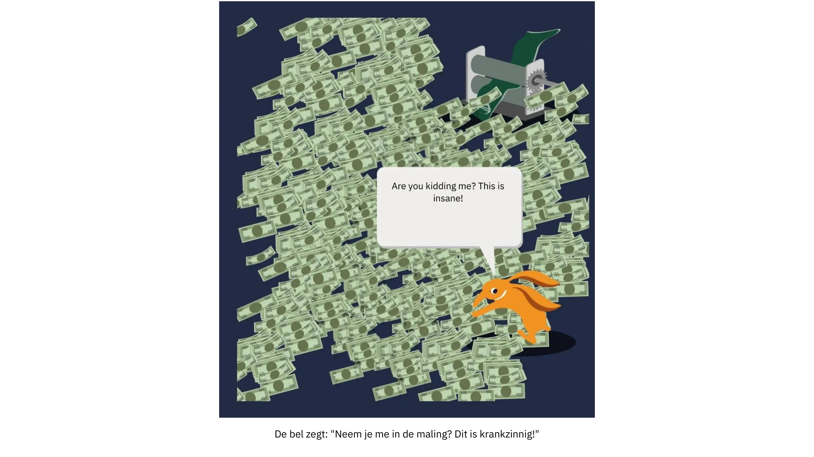

#### 11. Gedwongen om hun winkels open te houden

Wanneer de economie instort en de munt zijn waarde verliest, kunnen regeringen hun toevlucht nemen tot drastische maatregelen om de schijn van normale gang van zaken op te houden.

Weimar: "Kooplieden die hun activiteiten voortzetten, werden onderworpen aan een nieuwe verordening die op 22 oktober werd uitgevaardigd en die hen verplichtte hun winkels open te houden en goederen in Exchange aan te bieden voor papieren marken."

Zimbabwe: "Alleen lege stalen schappen en koelkasten, koelers en vriezers bleven over. De tragedie was dat de winkel nog open was omdat ze niet durfden te sluiten vanwege de politieke spanningen en de angst dat de leiders zouden worden gearresteerd door de prijscontrolemacht van de regering. Zelfs de arbeiders werden niet ontslagen omdat iedereen dacht dat er een snelle oplossing zou zijn."

#### 12. Iedereen is een crimineel

In het licht van een instortende economie en alomtegenwoordige regelgeving vervaagt de grens tussen overleven en criminaliteit.

Weimar: "Alle misdaden tegen de staat, stuk voor stuk, in verschillende mate, werden een kwestie van overleven voor individuen."

> Zimbabwe: "Elke inwoner van Zimbabwe was een crimineel. Hoe hard het ook mag klinken, het was waar. Met de talloze kleine wetten die elk aspect van het leven regelden, was het onvermijdelijk dat iedereen elke dag wel een wet overtrad. Vreemde valuta bezitten was illegaal, volgens een SI gepubliceerd in 2004. Het hebben van meerdere bankrekeningen om de dagelijkse opnamelimiet te omzeilen was illegaal. Het niet hebben van de juiste nummerplaten op je auto, of een autoradiolicentie, of een generatorvergunning, waren allemaal wetten die iemand, ergens, overtrad."

#### 13. Koop vreemde valuta tegen elke prijs

De verwoede aankoop van vreemde valuta's is vaak een kritiek keerpunt geweest in de devaluatie van valuta's, waardoor de daling van de intrinsieke waarde verergerd is.

> Weimar: "Fritz Mannheimer ging in opdracht van zijn baas in augustus 1921 op pad en begon tegen elke prijs buitenlandse valuta te kopen - 'omdat Duitsland een oneindige hoeveelheid papieren marken had maar geen buitenlandse valuta' Dit was het eerste teken van de absolute ineenstorting van de waarde van de mark."

> Zimbabwe: Er werd beweerd dat ze dagelijkse doelen kregen om te halen, omdat sommige forexbehoeften dringend waren en ze tegen elke prijs forex zouden kopen om de deadline te halen. Deze vermeende praktijk zou het vuur van de devaluatie hebben aangewakkerd, omdat de waarde van de Zimbabwaanse dollar steeds verder daalde

### Samenvatting van het proces

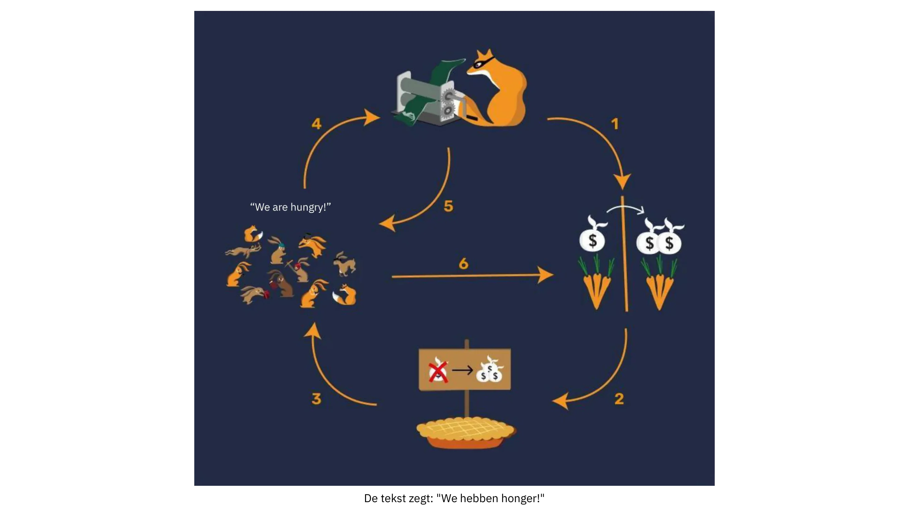

Bij het analyseren van het economische traject blijkt dat wanneer een hoge inflatie wordt bereikt, de waarde van de monetaire massa verslechtert. Deze devaluatie leidt tot verschillende complicaties, waaronder een tekort aan bankbiljetten. In deze context ontstaan arbitragemogelijkheden, vooral in reactie op schommelingen in de Exchange koersen. Als gevolg hiervan wenden veel individuen zich tot deze arbitrage en investeren ze zwaar in materiële activa in afwachting van een toekomstige devaluatie van de munt, waardoor ze hun schulden kunnen terugbetalen met een verzwakte munt. Dit economische klimaat ondermijnt de aantrekkingskracht van traditionele banen en tast bijgevolg de sociale cohesie aan.

Als reactie op deze situatie legt de regering draconische regels op, waaronder kapitaalcontroles. Ze verplicht handelaren ook om de nationale munteenheid en cheques te accepteren. Na verloop van tijd worden nieuwe wetten uitgevaardigd, die de definitie van crimineel gedrag uitbreiden. Uiteindelijk stijgt de Exchange koers exponentieel, omdat de overheid bereid is om haar valuta, die tegen lagere kosten gedrukt is, in te ruilen voor robuustere buitenlandse valuta.

### 4 Overeenkomsten in de gevolgen van hyperinflatie

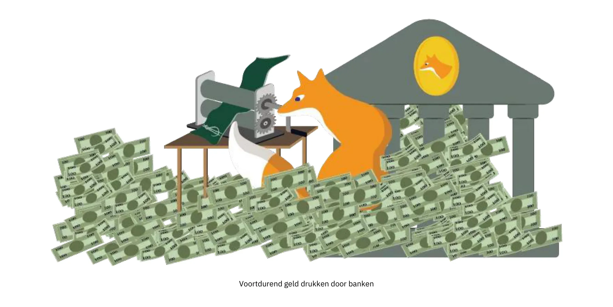

#### 1. Olie en metalen

Tijdens de Weimar-periode in Duitsland was diefstal van waardevolle materialen zo wijdverspreid dat lood van daken vaak werd gestolen. In Zimbabwe dreef wanhoop sommigen ertoe om het elektriciteitsnet te verstoren om olie uit transformatoren te halen en die in hun voertuigen te gebruiken.

Weimar: "De metalen platen van nationale monumenten moesten voor de veiligheid worden verwijderd. Messing deurbelplaten werden gestolen van de deuren van de Britse ambassade in Berlijn."

Zimbabwe: "Tot overmaat van ramp was er door het gebrek aan buitenlandse valuta een tekort aan smeerolie voor auto's en werden transformatoren een makkelijk doelwit voor dieven die de koelolie wegsluisden tijdens stroomonderbrekingen."

#### 2. Treinen

Muntdevaluatie kan burgers aanzetten tot overlevingsgedrag, waaronder vandalisme. Geconfronteerd met een instortende economie kan dure openbare infrastructuur, zoals transportsystemen, in gevaar komen, wat desastreuze maatschappelijke gevolgen kan hebben.

> Weimar: "In Berlijn werd het tramsysteem opgeheven wegens geldgebrek."

> Zimbabwe: "Een van de meest verontrustende en trieste scenario's was toen bijna de hele elektrische koperen lijn tussen Harare en Dabuka (meer dan 280 kilometer) werd gestolen. Toen de lijn klaar was, was het de trots van Zimbabwe, met snelle elektrische passagiers- en goederentreinen die over deze route reden."

#### 3. "Mealie Maaltijd"

In de context van magere lonen en een onstabiele economie zagen bedrijven zich genoodzaakt om hun werknemers van voedsel te voorzien om de productiviteit en operationele efficiëntie op peil te houden. Dit initiatief was niet alleen een manier om tekorten en hoge voedselkosten te compenseren, maar ook een strategie om personeel te behouden in een moeilijke economische omgeving.

> Weimar: "In Berlijn hadden kantoormedewerkers, die een zeer belangrijke klasse in de hoofdstad vormden, totaal ontoereikende salarissen variërend van 12.000 tot 20.000 per maand (wat overeenkomt met tussen de 12 en 19 pond per jaar), die voortdurend daalden; maar de meesten konden nog steeds hun lunch krijgen voor een symbolisch bedrag, verstrekt door hun kantoren, zodat lichaam en geest nog net bij elkaar konden worden gehouden."

> Zimbabwe: "In dit stadium gaven we al onze medewerkers een gratis lunch. Maïsmeel was essentieel voor het functioneren van ons bedrijf, omdat het in veel gevallen de enige maaltijd was die ons personeel elke dag kreeg."

#### 4. Benzine coupons

Bevolkingen zochten naar stabiele alternatieven voor transacties. In Weimar dienden producten zoals messing en brandstof als Exchange-middelen vanwege hun constante intrinsieke waarde. In Zimbabwe, waar de Zimbabwaanse dollar snel devalueerde, werden benzinebonnen, die een vaste hoeveelheid van een essentieel product vertegenwoordigden, de facto een betaalmiddel. Deze situaties laten zien hoe samenlevingen zich aanpassen aan extreme economische omstandigheden en innovatieve oplossingen bedenken om de handel en de economie in stand te houden.

Weimar: "Ruilhandel was al een gebruikelijke vorm van Exchange; maar nu werden goederen zoals koper en brandstof de gemeenschappelijke valuta voor aankoop en betaling."

Zimbabwe: "Deze vouchers gebruikten we nu om huur te betalen aan huisbazen, gemeentebelastingen, telefoonrekeningen - eigenlijk bijna alles - omdat iedereen geen betalingen in Zimbabwaanse dollars en cheques meer accepteerde."

#### Conclusie

Dit is het einde van deze video over de overeenkomsten tussen de ervaringen tijdens de periodes van hyperinflatie in Zimbabwe en de Weimar Republiek. In de volgende video bespreken we de verschillen en hedendaagse parallellen. Dank je wel.

## Weimar vs Zimbabwe: Verschillen en hedendaagse parallellen

<chapterId>643f279c-d89f-5600-a2e2-b1bbbba0ab69</chapterId>

In dit hoofdstuk verkennen we de verschillen en hedendaagse parallellen tussen vroegere en huidige hyperinflatieperiodes, met anekdotes en relevante vergelijkingen voor vandaag.

### Verschillen tussen de Weimarrepubliek en Zimbabwe

#### 1. Het is de schuld van de dollar!

In Duitsland was het gebruikelijk dat de bevolking de inflatie toeschreef aan de stijging van de dollar in plaats van aan de intrinsieke devaluatie van hun eigen munt. Velen geloofden dat het waargenomen fenomeen te wijten was aan een waardestijging van de dollar. Deze perceptie verwierp elke erkenning van het verband tussen hun economische problemen en monetaire devaluatie, voornamelijk veroorzaakt door buitensporige geldcreatie. Het boek "When Money Dies" illustreert duidelijk dit onbegrip bij de Duitse bevolking. In Zimbabwe daarentegen was de situatie anders: de burgers waren zich volledig bewust van de onderliggende oorzaak van de hyperinflatie die ze meemaakten.

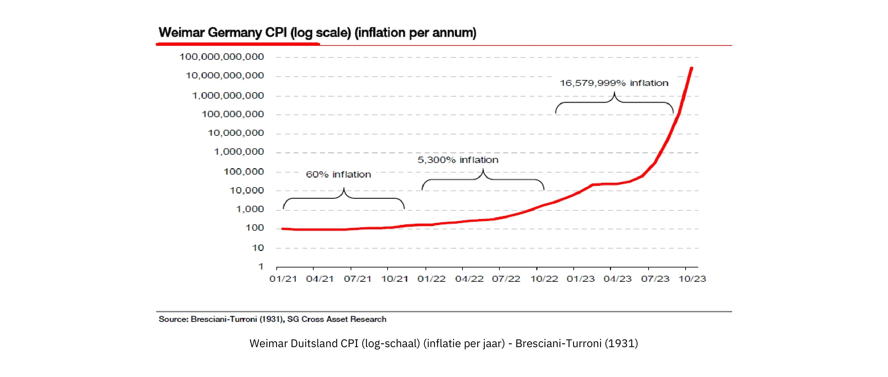

#### 2. Noodgeld

Geconfronteerd met de monetaire en economische crisis nam Duitsland zijn toevlucht tot "Notgeld" (noodgeld). Deze biljetten, gedrukt door steden of bepaalde bedrijven, waren bedoeld om een tekort aan gemeenschappelijke valuta op te vangen.

Interessant is dat Frankrijk ook zijn toevlucht nam tot Notgeld, vooral in de jaren 1920. Dit initiatief was niet alleen een direct gevolg van de hyperinflatie, maar had ook zijn wortels in de verstoringen die werden veroorzaakt door de Eerste Wereldoorlog. Hierdoor was de intrinsieke waarde van metalen munten vaak hoger dan de nominale waarde, waardoor mensen ze gingen hamsteren. Bij gebrek aan munten drukten sommige instellingen, zoals de Kamer van Koophandel in Lyon, hun eigen Notgeld.

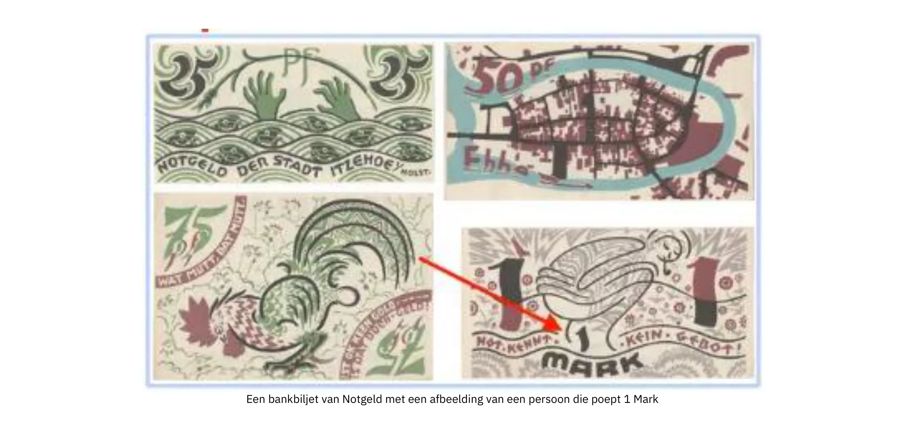

> "Wat gedaan moet worden, moet gedaan worden." - een lokaal gezegde

Onder het Notgeld valt één bepaald bankbiljet op. Het is voorzien van een aangrijpende illustratie: in het midden staat een persoon afgebeeld die een Mark uitpoept. Op de achterkant staat een prijstabel van 1913 tot 1921 die de stijging van de inflatie in deze periode illustreert.

De kunstenaar achter dit notgeld lijkt een ironische kritiek te leveren op de autoriteiten die verantwoordelijk zijn voor de hyperinflatiecrisis. Het bankbiljet draagt de inscriptie "Noodzaak kent geen wet". Een andere uitdrukking die specifiek is voor de plaats van herkomst van het Notgeld is: "Wat gedaan moet worden, moet gedaan worden"

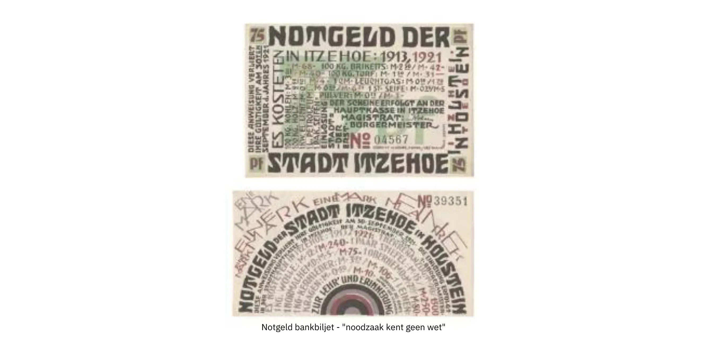

> "noodzaak kent geen wet"

> De eerste shitcoin: Anekdotisch gezien, kijkend naar de centrale illustratie van het bankbiljet, waar de munt letterlijk gedevalueerd wordt door de actie van het individu, zou het de eerste "shitcoin" genoemd kunnen worden

#### 3. Obligaties en hypotheken

In Weimar werden sommige schulden geherwaardeerd om de gevolgen van inflatie te compenseren. Deze maatregel werd niet toegepast in Zimbabwe.

> Weimar: "Een besluit om staatsleningen te herwaarderen werd in 1925 wettelijk vastgelegd, waardoor aandeelhouders 2,5 procent van hun oorspronkelijke investering ontvingen op voorwaarde dat alle herstelbetalingen waren gedaan."

> Zimbabwe: "In juli 2007 (drie jaar later) kon ik een gedevalueerd briefje van 500.000 ZDW (bt "000") uit mijn zak halen, dat nu 1,67 dollar waard was tegen de parallelle marktkoers, en de hypotheeklening afbetalen, die over twintig jaar moest worden terugbetaald. Bovendien vertegenwoordigde dit briefje slechts 0,49 procent van mijn maandsalaris voor dezelfde maand."

Om meer te leren over het beheersen van de Duitse crisis, is dit boek ook essentieel.

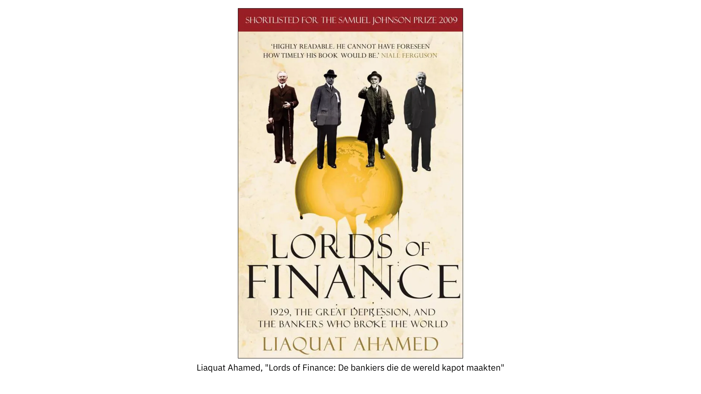

### Hedendaagse parallellen

#### 1. Manipulatie van monetair beleid om de economie te controleren.

Uit de geschiedenis van de Weimarrepubliek blijkt duidelijk dat industriëlen niet graag zagen dat de Mark in waarde steeg. Hun mogelijkheid om te lenen en hun schulden terug te betalen met een sterk gedeprecieerde munt gaf hen een aanzienlijk voordeel. Dit mechanisme maakte de bouw van enorme industriële complexen tegen bijna geen kosten mogelijk. Deze industriëlen vreesden een waardestijging van de Mark omdat dit hun activiteiten belemmerde. Sommigen zagen de ongebreidelde inflatie zelfs als een positieve ontwikkeling, omdat ze dachten dat dit de werkgelegenheid voor de bevolking zou garanderen. Ze realiseerden zich echter niet de nadelige gevolgen van deze inflatie voor het spaargeld en de economie als geheel. Voor deze economische actoren was het drukken van geld een zegen.

> Weimar: "Daarom was men erg bang voor een waardestijging van de mark en zelfs de paar weken van 'stabiliteit' na Genua veroorzaakten een stagnatie van de handel."

> Weimar: "Industriële kringen werden geconfronteerd met het gevaar dat contant geld meer waard zou worden dan goederen, en dat er een ineenstorting zou plaatsvinden wanneer iedereen zou proberen zijn bezittingen om te zetten in contant geld."

Er is een hedendaagse parallel te trekken met de uitspraken van Christine Lagarde, die suggereert dat burgers het vooruitzicht op werkgelegenheid boven de bescherming van hun spaargeld moeten stellen. Net als de industriëlen van Weimar lijkt ze te pleiten voor het drukken van geld als middel om de werkgelegenheid te stimuleren, ten koste van de waarde van spaargeld.

> Christine Lagarde: "We zouden blijer moeten zijn dat we een baan hebben dan dat ons spaargeld beschermd is."

#### 2. Privébezit in tijden van conflict

De geschiedenis van de Weimarrepubliek onthult dat in deze periode bezittingen en kapitaal in het buitenland in beslag werden genomen. Deze maatregel doet denken aan meer recente gebeurtenissen in Rusland, vooral aan het begin van een conflict. Deze situaties benadrukken een verontrustende realiteit: in tijden van crisis kan het respect voor privébezit in het gedrang komen. Dit is een historische en hedendaagse parallel die de mogelijke repercussies van crises op individuele rechten onderstreept.

> Weimar: "Al het Duitse kapitaal in het buitenland was in beslag genomen."

> [20minutes.fr](https://www.20minutes.fr/monde/3286947-20220513-guerre-ukraine-geler-avoirs-russes-vol-non-redistribuer-kiev-poserait-lourdes-questions): "Ongeveer 300 miljard dollar aan Russische reserves in het buitenland zijn inderdaad bevroren als onderdeel van de westerse sancties, van de 640 miljard dollar aan reserves die de Russische Centrale Bank aanhoudt."

#### 3. Het begrip marktprijs

Tijdens de Weimar Republiek uitten boeren hun ontevredenheid over de "Umlage", die hen dwong om de eerste twee miljoen ton tarwe die ze elk jaar produceerden te leveren. Deze regeling zorgde ervoor dat de helft van het totale brood Supply tegen gesubsidieerde prijzen op de markt werd gebracht. Vanaf augustus werden deze boeren verondersteld de wereldmarktprijs te betalen, want hoewel ze gedwongen werden hun tarwe in te leveren tegen gereduceerde prijzen, moesten ze nog steeds meststoffen kopen tegen wereldmarktprijzen.

Deze situatie werpt een centrale vraag op met betrekking tot het begrip marktprijs tijdens hyperinflatie. In de Duitse context van die tijd werden boeren gedwongen om hun tarwe te verkopen tegen een prijs die onder de waarde lag, terwijl ze meststoffen moesten kopen tegen wereldmarktprijzen. Een dergelijke economische discrepantie benadrukt de uitdagingen die de voedselprijzen vandaag stellen. Landbouwproducenten, die geconfronteerd worden met stijgende inputkosten als gevolg van inflatie, berekenen deze kosten door in de eindproducten. Hen bekritiseren voor deze stijging komt neer op het negeren van de dynamiek van marktprijzen en de economische druk waarmee ze te maken hebben. Verkopen tegen kunstmatig lage prijzen en tegelijkertijd hoge kosten maken is voor elk bedrijf onhoudbaar.

> Weimar: "Landbouwbelangen waren ontevreden over de 'Umlage', de gedwongen levering van de eerste twee miljoen ton tarwe die elk jaar werd geproduceerd, waardoor de helft van het totale brood Supply tegen lage prijzen kon worden verkocht. Vanaf augustus moesten de boeren de wereldmarktprijs betaald krijgen, want terwijl ze verplicht waren om tarwe tegen lage prijzen te verkopen, moesten ze altijd de wereldmarktprijs voor meststoffen betalen."

#### 4. Ontkenning van het verband tussen geld Supply en inflatie

> Weimar: "Hij bleef vasthouden aan zijn opvatting dat het geld Supply niet gerelateerd was aan prijsniveaus noch aan Exchange tarieven;"

In de moderne tijd houdt deze trend aan, zoals blijkt uit het voorbeeld in het vorige hoofdstuk van een lijst met verklaringen die door verschillende economen en economische instituten naar voren worden gebracht om inflatie te rechtvaardigen. Deze redenen variëren van culturele gebeurtenissen en beroemdheden zoals Taylor Swift, Zelda of Beyoncé, tot wereldwijde factoren zoals oorlog en de pandemie. Hoewel al deze redenen kunnen bijdragen aan economische schommelingen op korte termijn, leiden ze de aandacht af van de echte onderliggende oorzaak: de uitbreiding van het geld Supply.

#### 5. Zombie Bedrijven

> Weimar: "De stabilisatie had een einde gemaakt aan de periode waarin ondernemers zoveel konden lenen als ze wilden ten koste van alle anderen. Een zeer groot aantal bedrijven, opgericht of uitgebreid tijdens monetaire overvloed, werd snel onproductief zodra kapitaal schaars werd."

Een zombiebedrijf is een bedrijf dat onder normale marktomstandigheden insolvent zou zijn of bijna failliet zou gaan, maar voornamelijk blijft bestaan dankzij goedkope leningen. Deze bedrijven verdienen net genoeg om hun schulden te dekken, maar zijn niet in staat om significant te groeien.

Het begrip zombiebedrijven is niet nieuw. Het bestond al tijdens de Weimarrepubliek. In die tijd leken veel bedrijven te floreren, grotendeels profiterend van de toegang tot gratis krediet. Ze leenden aanzienlijke bedragen in de verwachting dat ze die later zouden terugbetalen met een gedeprecieerde munt als gevolg van de ongebreidelde inflatie. Toen de inflatie echter ophield en de Duitse mark weer aan waarde won, werden deze bedrijven, die operationeel en financieel niet echt levensvatbaar waren, onrendabel en moesten ze hun deuren sluiten.

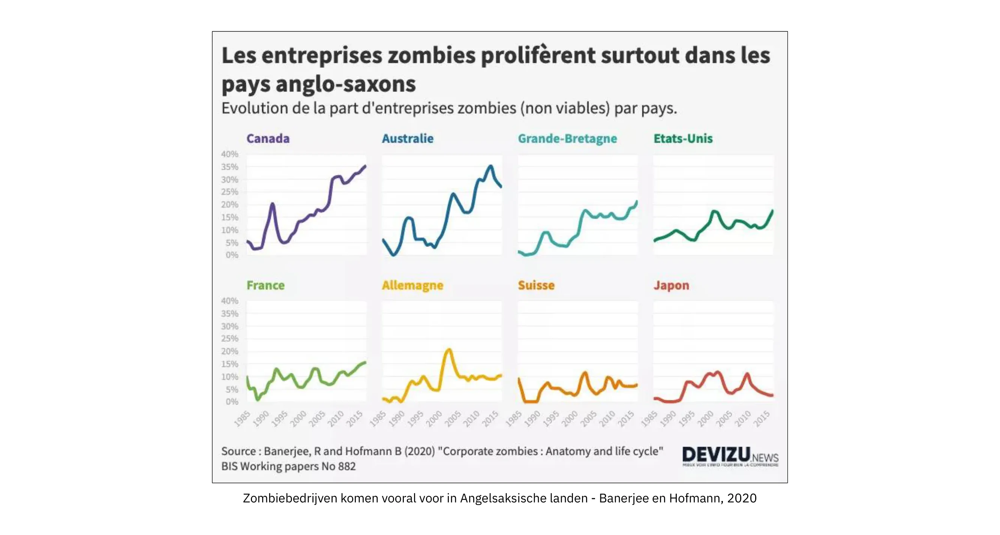

Het fenomeen van zombiebedrijven is niet beperkt tot het naoorlogse Duitsland. Zelfs vandaag de dag blijven veel grote bedrijven floreren dankzij hun bevoorrechte toegang tot krediet tegen extreem lage rentetarieven. Als ze tegen conventionelere tarieven zouden moeten lenen, zouden veel van hen niet langer winstgevend zijn. Dit is vooral relevant in 2023, na een lange periode van bijna-nul rentes, omdat de rentes nu beginnen te stijgen. Deze recente verschuiving in het financiële landschap zal ongetwijfeld een beslissende test zijn voor deze bedrijven, die ooit als "zombies" werden bestempeld

#### 6. Snel rijk worden!

De geschiedenis onthult gevallen waarin individuen snel rijkdom probeerden te vergaren, zoals het geval was in Weimar en Zimbabwe door middel van arbitrage. Vandaag de dag kan een soortgelijke trend worden waargenomen met de opkomst van bepaalde cryptocurrencies. Mensen worden verleid door snelle winsten en nemen risico's in de hoop op een exponentiële toename van hun investering. Deze aanpak herinnert aan die tijdens perioden van hyperinflatie, waar arbitrage werd gebruikt om snelle winsten te behalen, vaak ten koste van anderen.

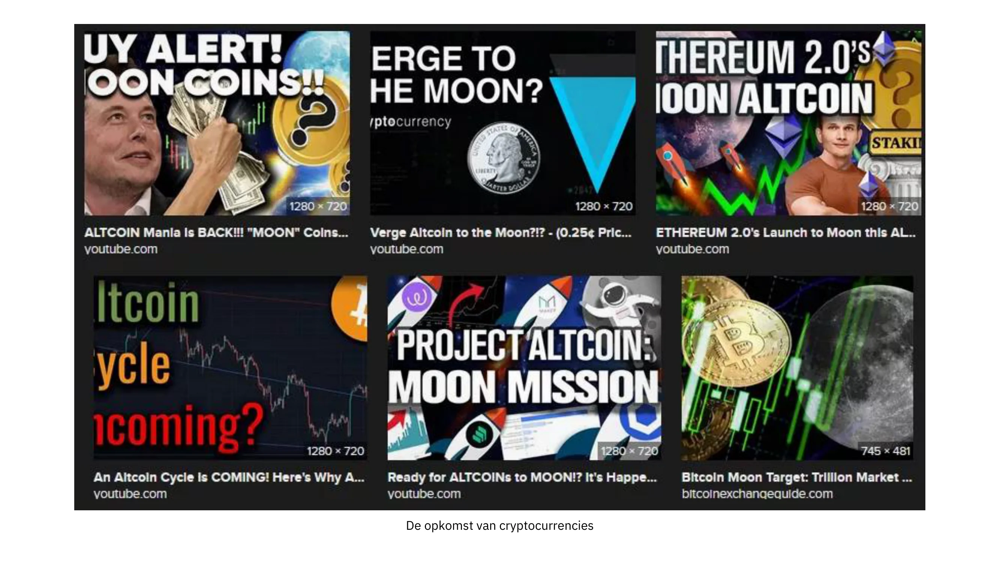

#### 7. Besparingen, de remedie tegen onzekerheid

> De alomtegenwoordige en destructieve invloed van de constante erosie van de waarde van kapitaal en inkomen, evenals de onzekerheid over de toekomst.

Het is de moeite waard om een citaat te benadrukken dat het destructieve effect van de erosie van de kapitaalwaarde op de sociale cohesie onderstreept, evenals de onzekerheid die dit met zich meebrengt. Er staat "de doordringende en destructieve invloed van de constante erosie van de waarde van kapitaal en inkomen, evenals de onzekerheid over de toekomst."

Stel je een scenario voor waarbij je een gezin of dierbaren hebt die je wilt beschermen. Je werkt Hard en spaart om te anticiperen op toekomstige onzekerheden. Als alles voorspelbaar zou zijn, zou sparen zinloos zijn. Maar in het geval van onvoorziene omstandigheden, zoals een kapotte auto, wordt sparen een reddingslijn. Het vermindert de onzekerheid van de wereld. Tijdens hyperinflatie wordt sparen echter een uitdaging. Geld verliest snel zijn waarde, waardoor langetermijnplanning moeilijk wordt. Deze financiële instabiliteit kan generate stress en angst veroorzaken.

Vandaag de dag, met een dalende spaarquote, zijn investeringen daarvoor in de plaats gekomen. Deze aanpak brengt echter zijn eigen risico's met zich mee. Sparen is altijd een middel geweest tegen onzekerheid. Het hebben van financiële reserves om onvoorziene situaties het hoofd te kunnen bieden, draagt bij aan gemoedsrust en versterkt de sociale cohesie. Kortom, het beschermen van onze spaarcapaciteit is essentieel voor het behoud van zowel sociale als individuele stabiliteit.

## Redenominaties in Latijns-Amerika

<chapterId>918eafd7-409d-5205-ad52-a52e63b23a64</chapterId>

We zullen nu kijken naar verschillende perioden van redenominatie in Latijns-Amerikaanse landen.

### Uitleg van de grafieken

Op de dia staan links de jaren van redenominatie, de naam van de nieuwe munteenheid en de Exchange koers ten opzichte van de oude munteenheid. Als we het voorbeeld van Argentinië nemen, werd de peso moneda nacional omgerekend tegen een koers van 25 tegen 1 ten opzichte van de vorige munteenheid, de peso reàl. In deze context zullen we de evolutie van de Argentijnse munt door de tijd heen onderzoeken. Daarnaast zullen we voor elke periode de begin- en eindwaarden van de bankbiljetten aangeven.

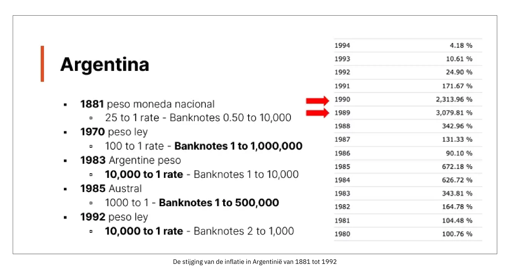

Aan de rechterkant van de dia staat een grafiek van de inflatie. De rode pijlen staan voor jaren van hyperinflatie, zoals gedefinieerd door het criterium van Cagan, namelijk een inflatie van 50% per maand. Dit criterium kan soms leiden tot dubbelzinnige interpretaties, omdat jaren met een hoge inflatie misschien niet voldoen aan de strikte definitie van hyperinflatie.

Het is vermeldenswaard dat redenominatie, een gebruikelijke maatregel van regeringen in tijden van inflatie, een opmerkelijke gebeurtenis is. Dit lost het onderliggende probleem van inflatie of hyperinflatie echter niet op. Het is slechts een manier om de munteenheid een andere naam te geven en nullen te verwijderen, zonder echt de hoofdoorzaak van hyperinflatie aan te pakken: de uitbreiding van het geld Supply. In een latere video bespreken we de echte oplossingen voor Address en lossen we het probleem van hyperinflatie op. In deze serie belichten we de gevolgen van een eenvoudige redenominatie zonder adequate hervormingen: de inflatie houdt aan.

Na Argentinië zullen we Brazilië, Bolivia, Peru, Nicaragua en Venezuela bestuderen. We zullen de redenominaties onderzoeken die in deze landen hebben plaatsgevonden.

### Argentinië

Vóór 1826 gebruikte Argentinië de Spaanse dollar. Na zijn onafhankelijkheid in 1816 introduceerde het zijn eigen munteenheid, gebaseerd op de Spaanse reàl. De tabel begint in 1881, het jaar van de introductie van de "peso moneda nacional," met bankbiljetten tot 10.000. Deze werd gevolgd door de "peso ley". Dit werd gevolgd door de "peso ley", die werd ingewisseld tegen een koers van 100 tegen 1 en bankbiljetten tot een miljoen bevatte. Daarna kwam de "Argentijnse peso" met een Exchange koers van 10.000 tegen 1 (gelijk aan het verwijderen van vier nullen) en bankbiljetten tot 10.000. In 1985 werd de "australes" geïntroduceerd en ingewisseld tegen een koers van 1.000 tegen 1, met bankbiljetten tot 500.000. In 1992 werd de huidige "peso ley" ingevoerd tegen een koers van 10.000 tegen 1, waarbij opnieuw vier nullen werden verwijderd. Alleen in 1989 en 1990 was er sprake van hyperinflatie.

### Brazilië

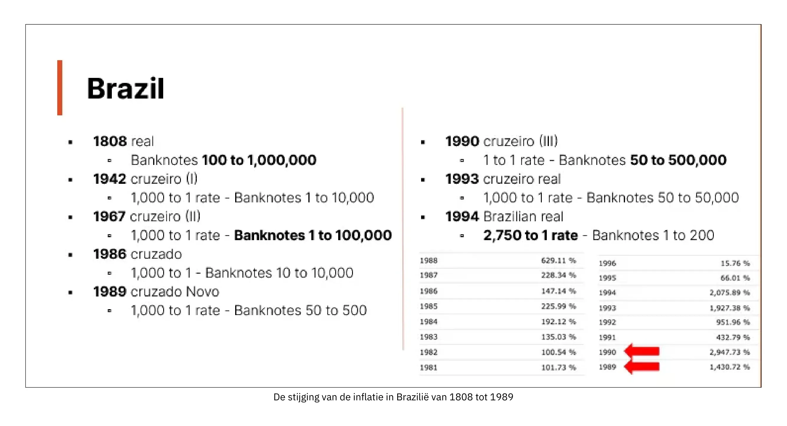

Brazilië is een opmerkelijk voorbeeld van monetaire redenominatie, zoals blijkt uit de geschiedenis van wisselkoersveranderingen. Voor zijn onafhankelijkheid gebruikte Brazilië de Portugese reàl als munteenheid. Al in 1747 begon het land echter zijn eigen "Braziliaanse reàl" te gebruiken, lang voor de onafhankelijkheidsverklaring in 1822. De tabel begint in 1818 en markeert het begin van de uitgifte van Braziliaanse bankbiljetten. Daarvoor bestond de munteenheid voornamelijk uit munten. Deze bankbiljetten bereikten waarden tot een miljoen reais.

Vanaf 1942 begon Brazilië met een reeks redenominaties. In de meeste gevallen (1942, 1967, 1986, 1989, 1993) was de omrekeningskoers 1:1.000. In 1990 vond een naamsverandering plaats zonder conversie. De volgorde van deze munteenheden is als volgt:

- Réals (oude versie) tot 1942.
- Cruzeiros in 1942.
- Cruzeiros (nieuwe versie) in 1967.
- Cruzados in 1986.
- Cruzados Novos in 1989.
- Terugkeer naar Cruzeiros in 1990.
- Cruzeiros Reais in 1993.
- Uiteindelijk kwam de Braziliaanse reàl in 1994.

Het biljet met de hoogste denominatie bereikte 500.000 en de laatste redenominatie in 1994 werd gedaan tegen een koers van 2750 tegen 1. De jaren 1989 en 1990 werden gekenmerkt door hyperinflatie, terwijl 1993-1994 hoge inflatiecijfers kende die de drempel van hyperinflatie niet bereikten (50% per maand). Na deze tumultueuze periode hernoemde Brazilië zijn munteenheid door verschillende nullen te verwijderen.

### Bolivia

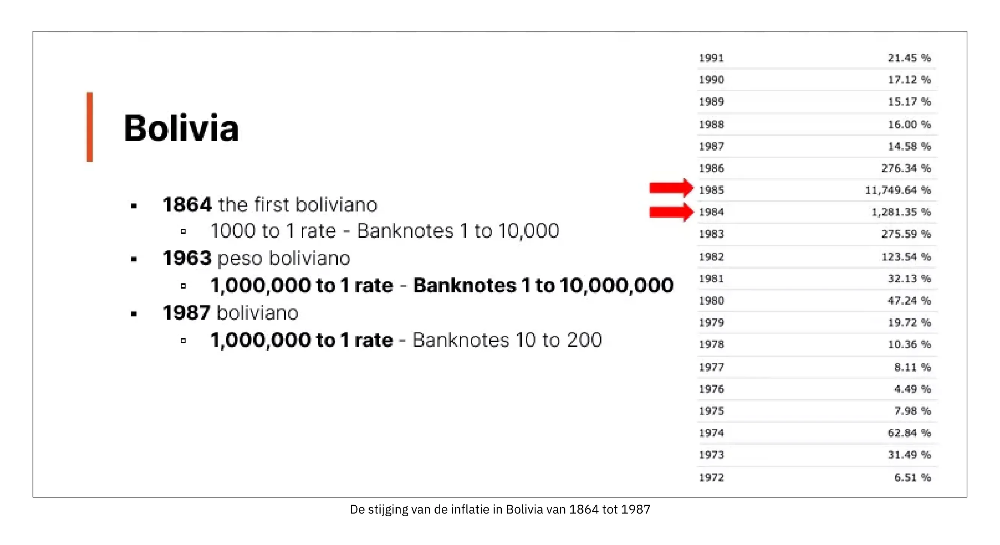

Bolivia is een ander voorbeeld van een land dat perioden van acute inflatie heeft doorgemaakt, waardoor valuta moesten worden omgewisseld. Hier volgt een samenvatting van de monetaire geschiedenis:

Voor de onafhankelijkheid in 1825 gebruikte Bolivia de Spaanse dollar als munteenheid. Na de onafhankelijkheid introduceerde het land tussen 1827 en 1864 de Boliviaanse Sol, ter vervanging van de Spaanse dollar. Het is echter vermeldenswaard dat de eerste bankbiljetten in Bolivia pas in 1864 werden ingevoerd.

In 1864 werd de eerste "Boliviano" geïntroduceerd, met een Exchange koers van 1.000 tegen 1 ten opzichte van de Boliviaanse Sol. Deze munteenheid bleef in omloop totdat het een denominatie van 10.000 Bolivianos bereikte.

Vervolgens veranderde Bolivia zijn munteenheid in de "Boliviaanse Peso", die een ernstige hyperinflatie doormaakte, waarbij uiteindelijk coupures tot 10 miljoen werden bereikt. Deze periode van inflatie bereikte een hoogtepunt in de jaren 1984-1985, met maandelijkse inflatiecijfers die vaak in de buurt kwamen van de hyperinflatiegrens van 50%. Om een idee te geven: een constante inflatie van 50% per maand over een heel jaar resulteert in een jaarlijkse inflatie van ongeveer 12.800%. In 1985 bereikte de jaarlijkse inflatie in Bolivia 11.749%, wat aangeeft dat de inflatie bijna elke maand de drempel van 50% benaderde of overschreed.

Als antwoord op deze monetaire crisis introduceerde Bolivia in 1987 een nieuwe munteenheid, simpelweg de "Boliviano" genoemd, met een Exchange koers van 1 miljoen Boliviaanse Pesos voor 1 Boliviano. Deze versie van de Boliviano is vandaag de dag nog steeds in omloop.

Dat is een overzicht van de tumultueuze monetaire geschiedenis van Bolivia, gekenmerkt door perioden van hyperinflatie en redenominaties.

### Peru

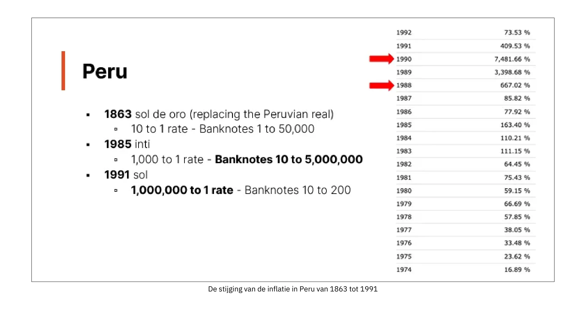

Peru is een interessant geval wat betreft de effecten van de willekeurige 50%-regel. Beginnend met de monetaire geschiedenis, gebruikte Peru Spaans goud tot de 19e eeuw, toen het zijn onafhankelijkheid uitriep in 1821. De Peruaanse dollar was in gebruik van 1822 tot 1863. In 1863 werd de Peruaanse reàl vervangen door de soldi oro, tegen een koers van 10 op 1, met een maximale waarde van 50.000. In 1985 werd de munteenheid "Inti" geïntroduceerd met een wisselkoers van 1000 tegen 1, met een maximumwaarde van 5 miljoen. In 1991 werd de "SOL" geïntroduceerd met een Exchange koers van 1 miljoen tegen 1, met bankbiljetten van 10 tot 200.

Als we kijken naar de redenominatieperioden, wordt 1988 beschouwd als een jaar van hyperinflatie, vooral in september. Juli-augustus 1990 kende ook een periode van hyperinflatie. In 1988 was de jaarlijkse inflatie 667%, met een piek van 50% in september. Daarentegen was er in 1989 een inflatie van 3000% zonder dat er ook maar één maand boven de 50% uitkwam, dus werd het niet geclassificeerd als hyperinflatie. In 1990 piekte de inflatie met 7481%. Het is duidelijk dat de 50% regel arbitrair kan zijn, aangezien 1988 werd beschouwd als een jaar van hyperinflatie, in tegenstelling tot 1989. Als deze regel heroverwogen zou worden, zou het verstandig kunnen zijn om de drempel te verlagen om periodes zoals die van 1989 in Peru op te nemen.

> Begrijpen wat er gebeurt
>

> Het belangrijkste om te begrijpen over redenominaties van valuta is dat wanneer de waarde van de valuta astronomische bedragen bereikt, zoals 5 of 10 miljoen, de valuta wordt geredenomineerd. Dit proces kan meerdere keren worden herhaald, waarbij de valuta wordt veranderd. Het resultaat is dat het spaargeld van individuen ernstig kan worden aangetast, zelfs als er geen sprake is van hyperinflatie. Als iemand bijvoorbeeld het ene jaar $1.000 spaart en erin slaagt om $100 opzij te zetten, kan het volgende jaar het biljet met de laagste waarde $1.000 zijn, waardoor de eerder gespaarde $100 waardeloos wordt. Voor een dergelijke uitholling van het spaargeld is geen duidelijke hyperinflatie nodig. Zelfs als iemand de afgelopen tien jaar $10.000 heeft gespaard, kan dat bedrag uiteindelijk een verwaarloosbaar bedrag waard worden, waarmee je niet eens een flesje water kunt kopen. Deze realiteit is duidelijk in veel landen die redenominaties hebben meegemaakt, zelfs als ze maar een paar maanden geclassificeerd werden als hyperinflatoir. Daarentegen hebben sommige landen, zoals Nicaragua, opeenvolgende jaren van hyperinflatie gekend.

### Nicaragua

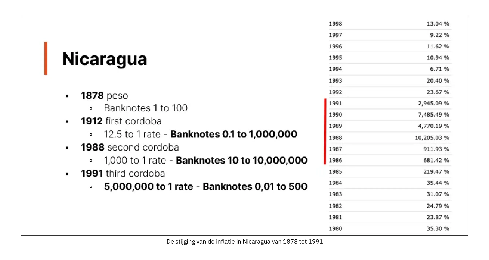

Nicaragua, dat vroeger onder Spaanse heerschappij stond, gebruikte aanvankelijk de Spaanse dollar, net als veel andere landen die door Spanje gekoloniseerd waren. Na te zijn opgenomen in het Spaanse Rijk, het Mexicaanse Rijk en vervolgens de Federale Republiek Midden-Amerika, verklaarde Nicaragua zich onafhankelijk. Vanaf 1878 werd de peso de officiële munteenheid van het land, met waarden die schommelden tussen 1 en 100. In 1912 introduceerde het land de eerste Cordoba, gevolgd door de tweede in 1988 en de derde in 1991, die vandaag de dag nog steeds in gebruik is. De eerste Cordoba bereikte een waarde van 1 miljoen en de tweede 10 miljoen. De redenominatie in 1991 volgde op enkele jaren van hyperinflatie.

### Venezuela

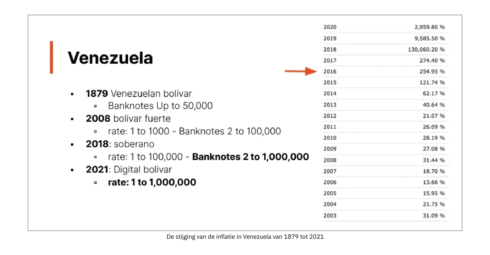

Venezuela is het laatste land dat in deze video wordt genoemd. Het land heeft in de loop der tijd vier valuta redenominaties ondergaan. In het begin gebruikte Venezuela de Spaanse dollar voordat het in 1811 de onafhankelijkheid uitriep. In 1879 introduceerde het de bolivar als officiële munteenheid, die van kracht bleef tot 1983, toen de regering koos voor een zwevende Exchange koerssysteem met de dollar.

Een opmerkelijk feit over Venezuela is het lidmaatschap van de Latijnse Monetaire Unie. Deze unie omvatte munten zoals de 5 peseta's uit Spanje, de 5 drachmen uit Griekenland, de 5 bolivars uit Venezuela, de 5 lire uit Italië, de 5 Belgische franken en de 5 Franse franken.

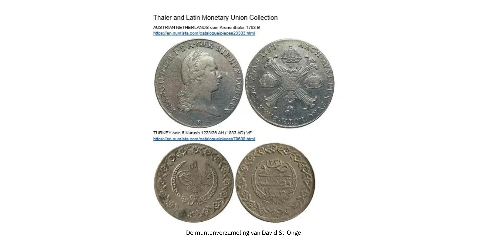

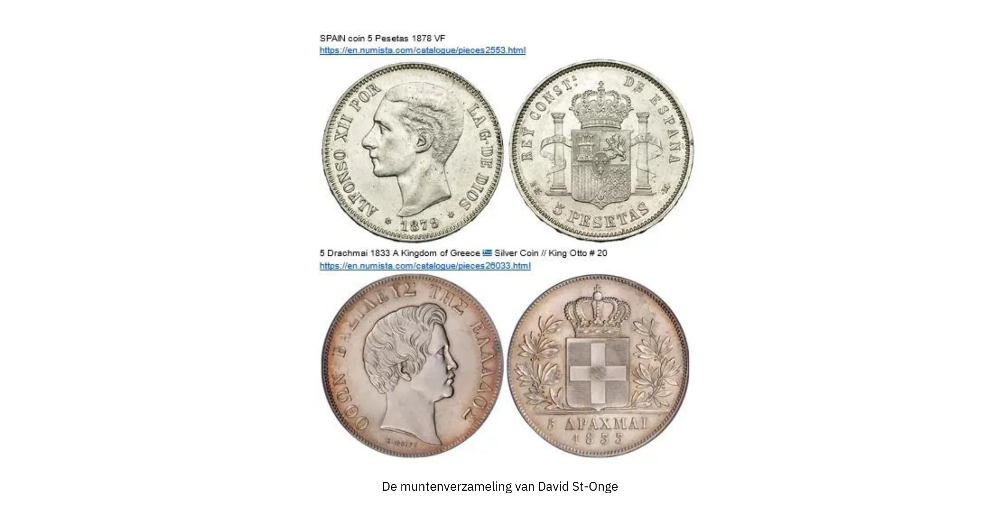

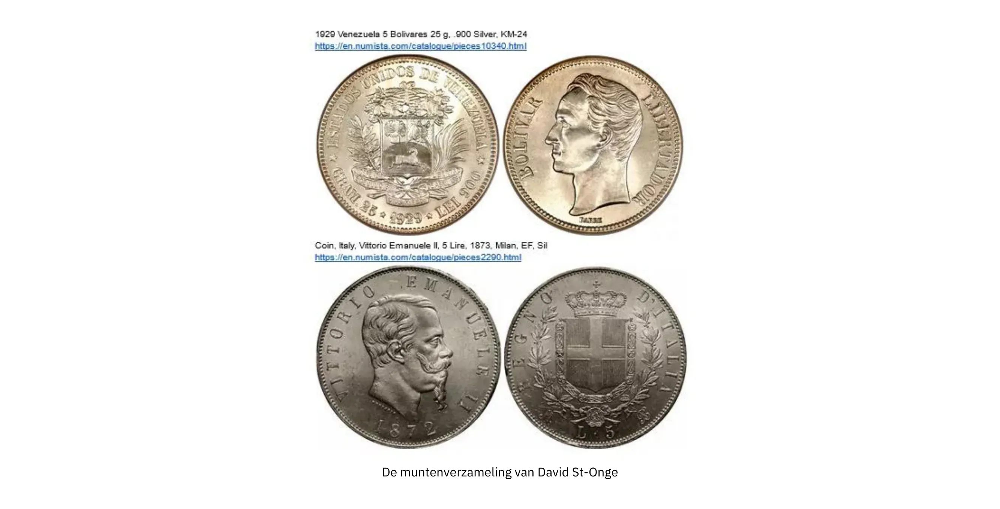

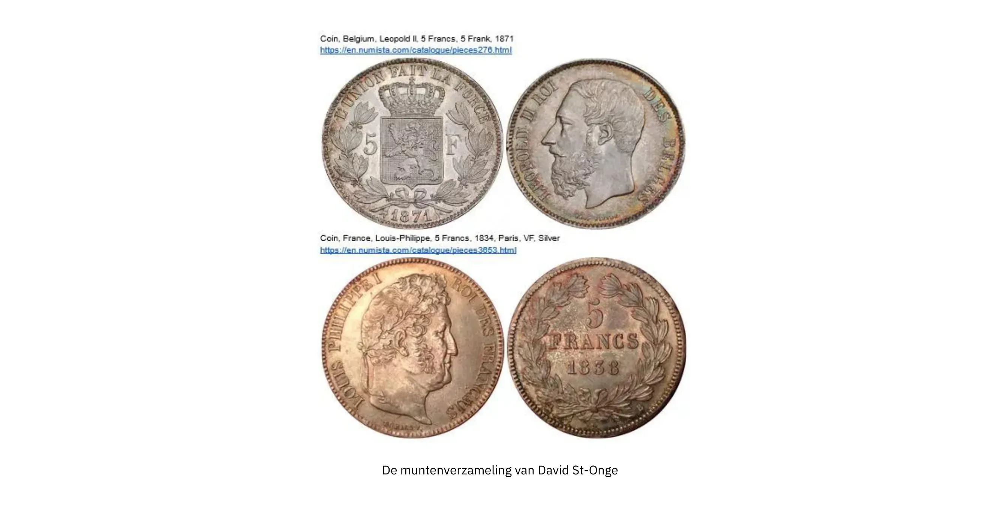

Gedurende deze periode had de 5 bolivar Coin uit Venezuela hetzelfde gewicht als die van de lidstaten van de Unie, waaronder Italië, Spanje, België en Frankrijk. Deze bolivars waren gemaakt van zilver, waarbij een specifieke Coin uit 1929 25 gram woog en een zuiverheid had van 900, oftewel 90% puur zilver. Met de huidige prijs van zilver is deze Coin ongeveer $17 tot $18 waard (US Dollars).

Na de invoering van een zwevende Exchange koers in 1983 volgden verschillende redenominaties:

- In 2008 werd de bolivar fuerte, of "sterke bolivar" geïntroduceerd, die tot 100.000 kon oplopen voor een redenominatie van duizend tegen één.
- In 2018 werd de Soberano geïntroduceerd, met biljetten die 1 miljoen bereikten. In 2021 werd deze vervangen door de digitale bolivar, die ook 1 miljoen bereikte, voor een nieuwe redenominatie van 1 op 1 miljoen. Vandaag de dag is het 10- of 20-biljet gelijk aan 10 miljoen of 20 miljoen in Soberano.

Biljetten uit deze periode, die teruggaan tot 2018, zijn uitgedeeld op verschillende Bitcoin conferenties in Biarritz, Toronto en Miami. Deze Soberano-biljetten bereikten een maximale waarde van 1 miljoen. Daarna vond er een redenominatie plaats, waardoor de waarde van 1 miljoen werd teruggebracht tot ongeveer 3 cent. Op dit moment komen 10 biljetten van 1 miljoen overeen met één biljet van 10. Sinds 2016 heeft Venezuela te maken met hyperinflatie, wat overeenkomt met de 57e periode in een specifieke tabel.

In de volgende video wordt een verzameling hyperinflatiebiljetten gepresenteerd, met de nadruk op Venezuela en andere genoemde landen. Deze verzameling bevat bijna alle Venezolaanse biljetten. De studie zal zich richten op de verschillende redenominaties voor elk van de genoemde landen. Daarnaast zal er ook gekeken worden naar de redenominaties in Zimbabwe, een onderwerp dat erg interessant is.

### Conclusie

We hebben gezien dat hyperinflatie niet de enige indicator is van een economische ramp. Meerdere malen redenomineren, nullen verwijderen of de naam van de munteenheid veranderen heeft directe gevolgen voor de bevolking, variërend van het verlies van hulp tot voedselproblemen. Hoewel hyperinflatie zorgwekkend is, laat het aantal redenominaties, zoals waargenomen in Brazilië, een complexere realiteit zien.

Op basis van het criterium van 50% inflatie per maand hadden verschillende periodes geclassificeerd kunnen worden als hyperinflatie. Dit is vooral waar als we kijken naar de criteria van de internationale boekhoudkundige organisatie, die rekening houdt met kenmerken zoals het snel opgeven van de munt door de bevolking, loonindexering en leningen met hoge rente om de inflatie te compenseren.

Tot slot is hyperinflatie slechts één aspect van economische uitdagingen. Hoge inflatie alleen kan net zo schadelijk zijn. In het volgende hoofdstuk worden mogelijke oplossingen om hyperinflatie te overwinnen onderzocht.

## Hoe hyperinflatie overwinnen

<chapterId>e3484a31-a851-5f92-8af5-00eddae67db1</chapterId>

### Hoe een einde maken aan gematigde en hoge inflatie

De genoemde conclusies komen uit het boek "Monetary Regime and Inflation" van Peter Bernholz. Volgens Bernholz is de enige methode om een einde te maken aan de inflatie het doorvoeren van een monetaire hervorming en het opleggen van fiscale beperkingen aan de overheid. Deze beperkingen omvatten de oprichting van een instelling, zoals een centrale bank, die onafhankelijk van de politieke beslissingen van de regering opereert. Hoge en hyperinflatie zijn vaak het gevolg van het financieren van begrotingstekorten door het creëren van geld. Om de Address inflatie te matigen, is het essentieel om de groei van het geld Supply te verminderen. Bernholz suggereert ook dat deze geldgroei relatief moet zijn ten opzichte van de buurlanden. Een verrassend punt is dat, in perioden van hoge of hyperinflatie, de totale waarde van het geld Supply juist kan afnemen. Een treffend voorbeeld van deze situatie is Zimbabwe.

### Contra-intuïtieve oplossingen

Bij het bestuderen van Zimbabwe viel het op dat 10 biljoen eenheden van het geld Supply al hun waarde hadden verloren. In Weimar was het mogelijk om twee derde van de totale nominale waarde van 65 miljard eenheden van het geld Supply in één dag te drukken. Dit laat zien hoe het geld Supply gedevalueerd kan worden. Om deze situatie te verhelpen, is het noodzakelijk om het geld Supply aanzienlijk te verhogen om een passend niveau te bereiken. Dan is een monetaire hervorming onontbeerlijk. In een situatie van hoge inflatie is deze hervorming onvermijdelijk, maar ze moet ervoor zorgen dat er genoeg geld in omloop is. Na deze stap kunnen beperkingen worden opgelegd aan de overheid.

Volgens Bernholz hanteren instellingen als het IMF en de Wereldbank bij het aanpakken van inflatieproblemen niet altijd de meest effectieve strategieën. In sommige gevallen, wanneer een land zijn geld Supply moet verhogen, proberen deze instellingen het te verlagen. De sleutel is om een adequaat monetair niveau te bereiken en vervolgens grenzen te stellen aan de groei ervan, om zo te voorkomen dat overheidsuitgaven worden gefinancierd door monetaire creatie.

Een interessant aspect dat Bernholz naar voren brengt is dat het succes van een monetaire hervorming niet alleen afhangt van de technische relevantie, maar ook van het vertrouwen dat de bevolking erin heeft. Sommige goed ontworpen hervormingen kunnen mislukken omdat de bevolking er geen vertrouwen in heeft, terwijl andere, slecht ontworpen hervormingen kunnen slagen omdat de bevolking er vertrouwen in heeft. Perceptie en vertrouwen van het publiek zijn daarom essentiële Elements voor het slagen of mislukken van een monetaire hervorming.

- In Zimbabwe was de gekozen oplossing om de inflatie tegen te gaan dollarisering, wat betekent dat ze de Amerikaanse dollar of andere valuta van buurlanden overnamen. Deze aanpak voorkomt dat de overheid naar believen geld kan drukken.
- In Duitsland was de oplossing om een nieuwe munteenheid te creëren, de Rentenmark. Deze munt werd ondersteund door de territoriale bezittingen van het Reich en deze strategie bleek effectief.

### Het geval Zimbabwe

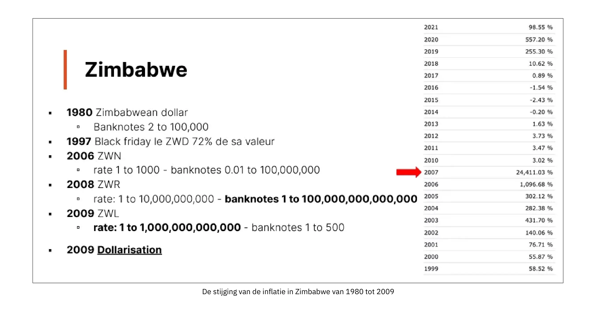

Zimbabwe werd onafhankelijk in 1980 en introduceerde zijn eigen munteenheid, de Zimbabwaanse dollar. Aanvankelijk waren twee Zimbabwaanse dollars ongeveer 1,60 Amerikaanse dollar waard. Maar in 1997, na sociale maatregelen ten gunste van oorlogsveteranen, devalueerde de munt met 72% op één dag tijdens Black Friday. In het begin van de jaren 2000 lanceerde het land een landherverdelingsprogramma, waarbij land van blanke eigenaars werd afgepakt en verdeeld onder de lokale bevolking. Deze beslissing schaadde de export omdat de nieuwe eigenaars vaak niet over de nodige expertise beschikten om grootschalige boerderijen te beheren. Het gevolg was dat Zimbabwe in 1999 nog een netto-exporteur was, maar in 2003 een netto-importeur werd.

In 2006 introduceerde het land een nieuwe versie van zijn munteenheid, de ZWN, met een Exchange-koers van 1 op 1.000. In 2008 werd een andere denominatie, de ZWR, geïntroduceerd met een Exchange-koers van 1 op 10 miljard. In 2008 werd een andere denominatie, de ZWR, geïntroduceerd met een Exchange koers van 1 op 10 miljard. Dit leidde tot de creatie van de iconische 100 biljoen bankbiljetten.

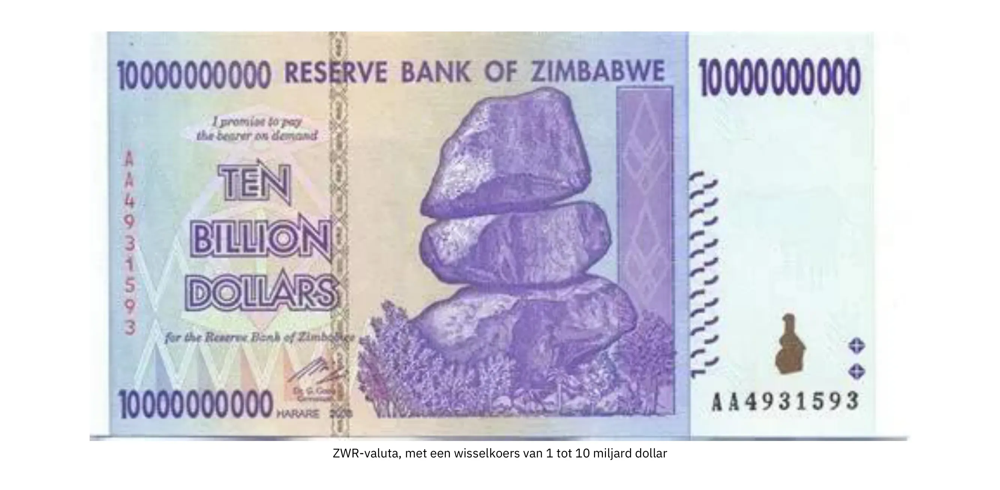

#### Dollarisering en crisisoplossing

Daarom liet Zimbabwe na 2009, geconfronteerd met een aanhoudende monetaire crisis en een welig tierende hyperinflatie, zijn nationale munteenheid los en stond het het gebruik van vreemde valuta toe, voornamelijk de Amerikaanse dollar. Deze beslissing was weliswaar radicaal, maar maakte een einde aan de hyperinflatie. Een belangrijke les die we kunnen leren is dat het stoppen van de buitensporige uitgifte van geld en het beëindigen van de financiering van het begrotingstekort door de centrale bank hyperinflatie kan helpen voorkomen.

Dollarisering is echter geen wondermiddel. Hoewel het een einde kan maken aan hyperinflatie, brengt het andere economische uitdagingen met zich mee. Een van de gevolgen is het verlies van autonoom monetair beleid. Zonder eigen munt kan een land zijn monetaire beleid niet aanpassen om te reageren op interne economische schokken.

In 2007 bereikte de inflatie in Zimbabwe de drempel van 50% per maand, waardoor het land zich officieel in een staat van hyperinflatie bevond. Na de dollarisering in 2009 kwam er een einde aan de hyperinflatie, maar het land bleef kampen met andere economische problemen.

Het is verontrustend dat Zimbabwe sindsdien heeft geprobeerd om zijn eigen munteenheid opnieuw in te voeren en dat er opnieuw tekenen van hoge inflatie zijn. Volgens bepaalde internationale organisaties voldoet het land mogelijk weer aan de criteria voor hyperinflatie, ook al heeft het de officiële drempel van 50% per maand nog niet bereikt. Dit herinnert ons aan de gevaren van buitensporige uitgifte van geld en financiering van tekorten door de centrale bank.

### Conclusie

In mijn boek "Alles over Bitcoin" heb ik een heel hoofdstuk gewijd aan de hyperinflatie in Zimbabwe. Ik ga gedetailleerd in op de belangrijke gebeurtenissen en geef verschillende voorbeelden die illustreren hoe het land uiteindelijk een einde maakte aan de hyperinflatie.

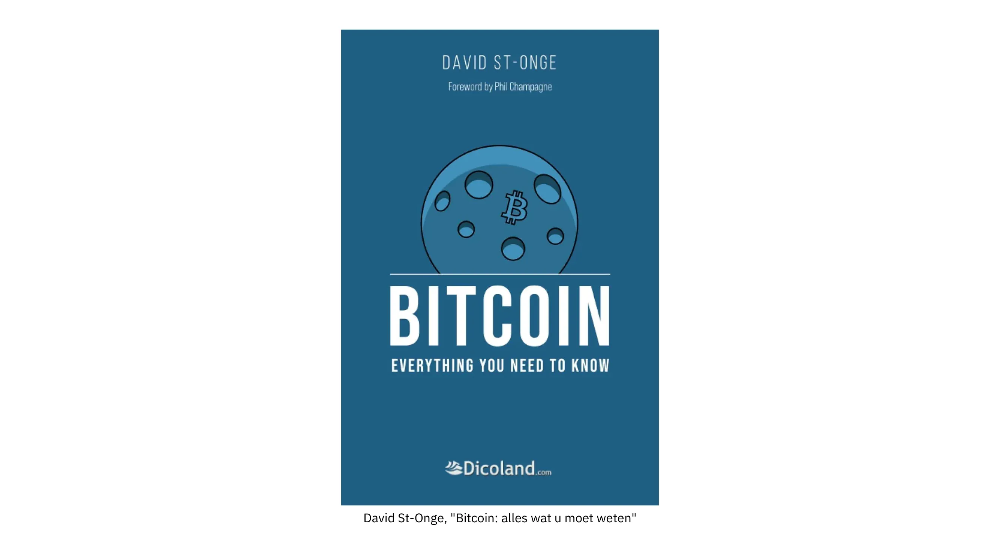

Wie nieuwsgierig is naar de Duitse ervaringen na de Eerste Wereldoorlog kan ik het stripboek "The Reich's Banker" van harte aanbevelen Het vertelt hoe Duitsland erin slaagde hyperinflatie te overwinnen, met name door de creatie van de Rentenmark.

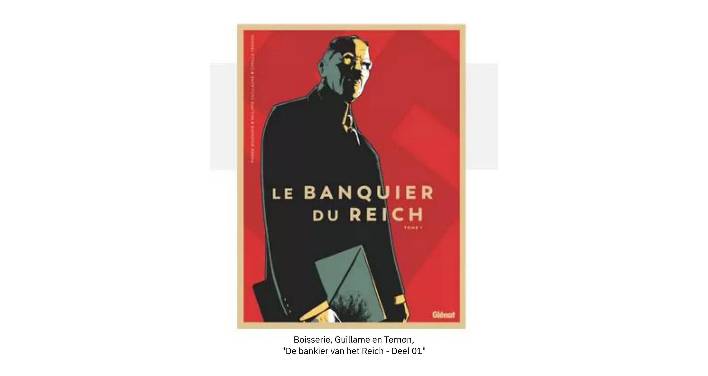

De belangrijkste conclusie is dat er verschillende strategieën bestaan om hyperinflatie te overwinnen. Je kunt kiezen voor dollarisering of een nieuwe munteenheid introduceren. Deze oplossingen werken alleen als de bevolking er vertrouwen in heeft. Het is cruciaal om strenge beperkingen op te leggen. Een echt onafhankelijke centrale bank is essentieel. Ze mag het geld Supply niet opblazen om overheidstekorten te dekken. In het geval van milde inflatie zou het beperken van de groei van het geld Supply voldoende moeten zijn. Wanneer we echter geconfronteerd worden met hyperinflatie, is het cruciaal om eerst een geschikte geldhoeveelheid Supply te hebben in verhouding tot de omvang van de economie. Daarna is het noodzakelijk om de overheid strenge beperkingen op te leggen om de situatie te stabiliseren.

## Presentatie van de hyperinflatie bankbiljettenverzameling

<chapterId>f3ffbb47-3aeb-54bd-80a9-adccb0f419e2</chapterId>

[Ontdek de gescande collectie in de *Bitcoin Educational Toolkit* (ook toegankelijk via de sectie *Bronnen* van het Plan ₿ Academy-platform.](https://penpot.planb.network/#/view?page-id=c157057b-fd28-8042-8004-4f081b21defc&file-id=c157057b-fd28-8042-8004-4f081b21defb&section=interactions&index=0&share-id=7154756b-3ebd-8040-8004-6475c2af5889&interactions-mode=show-on-click)

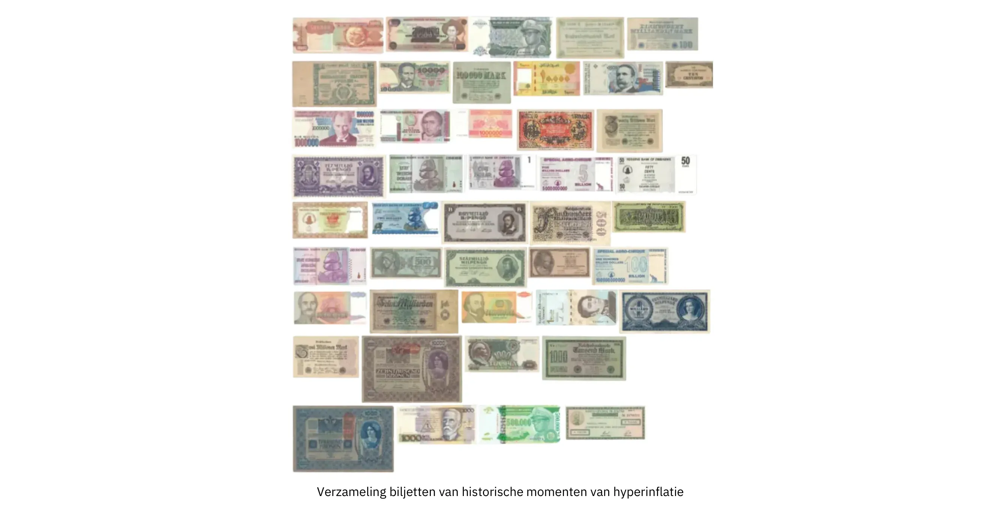

# Hoe zijn we hier gekomen?

<partId>f66ca17e-be9e-5d30-a098-f7affd8962a1</partId>

## De opkomst van de tweede Layer van geld en centrale banken

<chapterId>0455ffe3-9d45-5a67-ac96-3f815dc507a1</chapterId>

Transcript:

Het ontstaan van het tweede Layer van geld en de eerste centrale banken is een fascinerend onderwerp. Dit thema wordt uitgebreid besproken in het boek "Layered Money" van Nick Battia. Ik kan het van harte aanbevelen aan diegenen die geïnteresseerd zijn in de evolutie en de fijne kneepjes van onze monetaire systemen. Het doel van dit hoofdstuk is om de oorsprong van geldschepping te begrijpen en hoe dit zou kunnen leiden tot hyperinflatie.

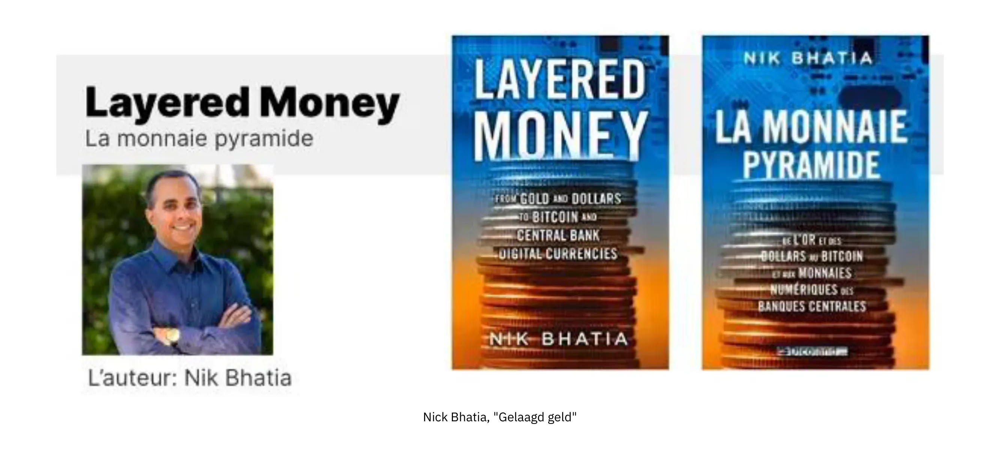

### Piramide geld en centrale banken

#### De Florijn

De geschiedenis van het geld gaat terug tot de 13e eeuw in Italië, specifiek in de stad Florence. In die tijd waren de florijn en de biljetten van Exchange heel gewoon. Een opmerkelijk voorbeeld is de florijn, versierd met de figuur van Sint Jan de Doper.

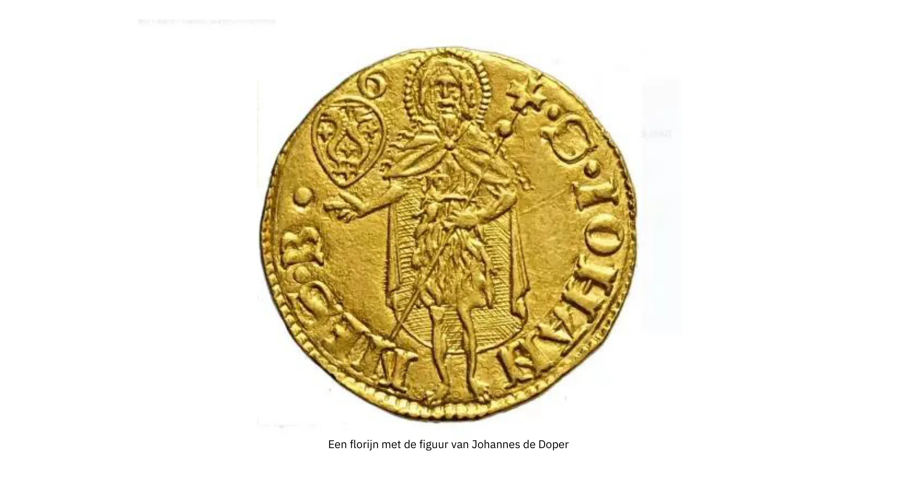

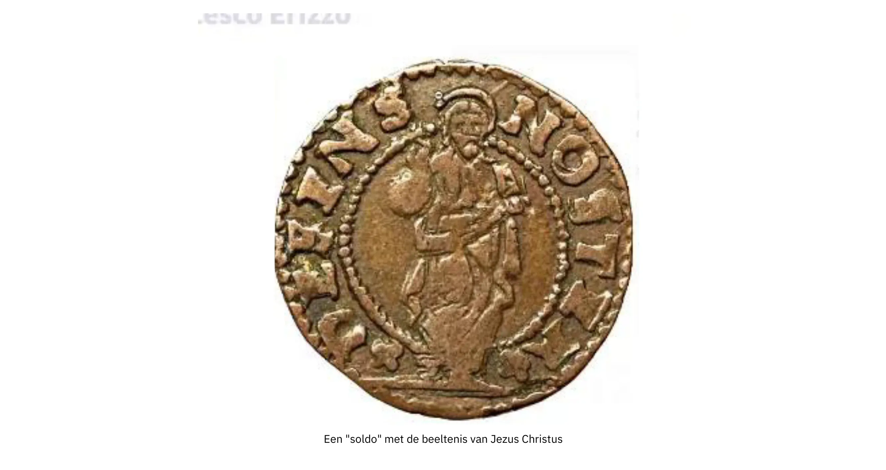

Hoewel het bezit van een echte florijn tegenwoordig duur is, zijn er reproducties verkrijgbaar. Er zijn ook andere munten uit die tijd, zoals de soldo uit de Italiaanse staten van de 17e eeuw, met een afbeelding van Christus.

#### Rekeningen van Exchange (13e eeuw)

De gangbare praktijk in die tijd was als volgt: goudsmeden gaven biljetten uit van Exchange in Exchange voor ingelegde florijnen. Deze florijnen werden zorgvuldig bewaard in hun kluizen. Zo vormde echt goud, vertegenwoordigd door de florijn, het eerste Layer geld, terwijl de biljetten van Exchange een tweede Layer vormden. De liquiditeit van dit systeem was echter beperkt. Als iemand zijn goud in Exchange wilde ruilen voor zijn briefje, was de transactie eenvoudig. Het uitwisselen van deze biljetten tussen individuen was echter niet gebruikelijk.

#### De Antwerpse voorraad Exchange (16e eeuw)

De Antwerpse Stock Exchange was een belangrijke mijlpaal in de evolutie van papiergeld. Daar werd de praktijk van het verdisconteren van promessen geïntroduceerd. Deze biljetten waren papieren instrumenten die een monetaire waarde vertegenwoordigden, maar hun uniekheid lag in het feit dat ze namen en vervaldata droegen. Dit maakte het moeilijk om ze voor de vervaldatum te Exchange-en.

De revolutie die de Antwerpse Stock Exchange teweegbracht, lag in de mogelijkheid om deze biljetten te disconteren vóór hun vervaldatum. Als een schuldbekentenis bijvoorbeeld binnen een maand vervallen was, was het mogelijk om het met korting te kopen om rekening te houden met de tijd voor de vervaldatum. Deze innovatie maakte papiergeld niet alleen Liquid meer waard, maar introduceerde ook het concept van de tijdswaarde van geld.

Dit concept, hoewel het geassocieerd wordt met Nick Bell via zijn Twitter pseudoniem "time value of BTC," is niet zijn uitvinding. Toch bespreekt hij het in detail in zijn werk. Het belangrijkste idee is dat tijd waarde heeft. Als iemand dus besluit om een schuldbekentenis ter waarde van $100 een maand vooruit te betalen, kan hij deze voor bijvoorbeeld $98 verkrijgen en de $100 op de vervaldag ontvangen. Deze monetaire innovatie is ontstaan op de Antwerpse beurs Exchange.

#### De VOC en de Amsterdamse Beurs (17e eeuw)

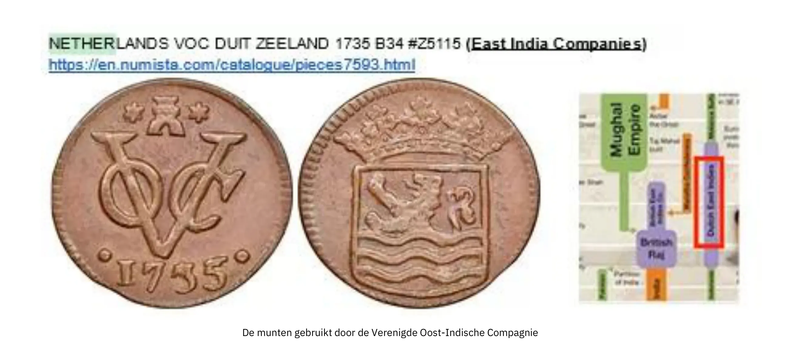

Na de oprichting van de Antwerpse Stock Exchange was een belangrijke mijlpaal de oprichting van de VOC, de Verenigde Oost-Indische Compagnie. Deze maatschappij, gevestigd in Nederland, gaf zelfs haar eigen munteenheid uit. Na de oprichting van de VOC werd in Amsterdam de eerste effectenbeurs opgericht. Wat interessant is om te weten, is hoe de Nederlanders erin slaagden om een einde te maken aan de suprematie van Antwerpen als internationaal economisch centrum. Ze blokkeerden eenvoudigweg de toegang tot de Schelde. Deze strategie maakte deel uit van een grotere historische beweging, de opstand van de bedelaars. Een cruciale gebeurtenis in de Europese geschiedenis.

#### De tussenkomst van de Bank van Amsterdam

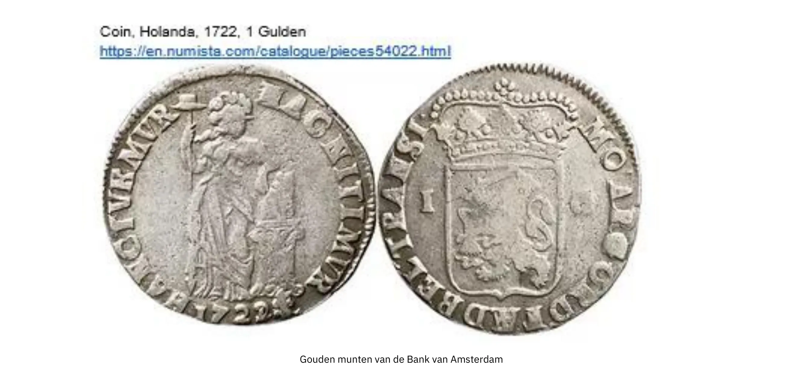

Na de oprichting van de VOC was een andere belangrijke ontwikkeling in de monetaire geschiedenis de introductie van gouden munten door de Bank van Amsterdam. Deze munten, die dateren uit 1722, waren gemaakt van zilver. Wat in die tijd echter een revolutie in de financiële wereld teweegbracht, was niet zozeer het Coin zelf, maar de rekeningen die bij de Bank van Amsterdam bij deze munteenheid hoorden. Deze rekeningen werden het primaire middel voor internationale Exchange. Transacties werden simpelweg vastgelegd in registers of grootboeken. Dankzij dit systeem werd Amsterdam het wereldwijde economische centrum. Na verloop van tijd besloot de Bank van Amsterdam het gebruik van deze rekeningen verplicht te stellen. Onafhankelijke geldwisselaars moesten hun munten dagelijks Exchange inleveren bij de bank.

#### Oprichting van de Bank of England om de oorlog te financieren

De oprichting van de Bank of England werd ingegeven door de noodzaak om de oorlog aan het einde van de 17e eeuw te financieren. Net als de Bank van Amsterdam legde zij deposito's per decreet op. De bijzonderheid van de Bank of England was dat ze particuliere banken naar een secundaire positie in het monetaire systeem verwees en zo een "derde Layer" van valuta creëerde.

Aanvankelijk werd de eerste Layer van de valuta vertegenwoordigd door goud. Deposito's bij privébanken vormden de tweede Layer. Toen deze deposito's echter niet meer in goud konden worden omgezet, verscheen er een derde Layer aan valuta. Vanaf dat moment waren de bankbiljetten uitgegeven door privébanken niet langer converteerbaar in goud, maar in papiergeld van de Bank of England, dat zelf converteerbaar was in goud. Deze evolutie leidde tot een complexificatie van het monetaire systeem door de toevoeging van extra lagen.

#### De paniek van 1796

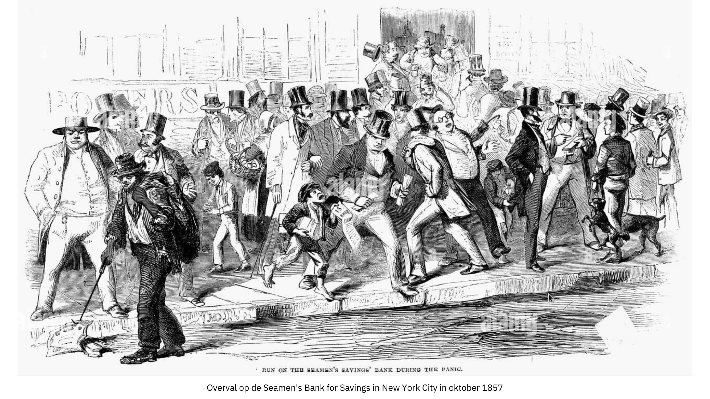

Paniek bij de Seamen's Savings Bank tijdens de paniek van 1857.

Na de bankpaniek van 1796 deed zich een fenomeen voor waarbij iedereen probeerde hogerop te komen in de "geldpiramide" Mensen wilden hun derde-Layer valuta inruilen voor tweede-Layer valuta, en uiteindelijk voor eerste-Layer valuta, wat goud was. Geconfronteerd met deze massale stormloop werd de Bank of England gedwongen actie te ondernemen om de situatie te stabiliseren. Om een potentiële deflatie van de goudreserves te voorkomen, besloot ze de inwisselbaarheid van haar bankbiljetten in goud op te schorten. Deze opschorting, aanvankelijk bedoeld als een tijdelijke maatregel, duurde ongeveer twee decennia.

### Conclusie:

Centrale banken hebben zich ontwikkeld tot kredietverstrekkers in laatste instantie, door de converteerbaarheid van hun valuta in goud op te schorten. Hoewel deze actie aanvankelijk bedoeld was als een tijdelijke oplossing, werd ze uiteindelijk permanent en markeerde ze de komst van het concept van de geldschieter in laatste instantie. Deze transformatie heeft centrale banken gevormd zoals ze vandaag de dag bekend zijn. In meer kwetsbare economieën kan deze mogelijkheid om naar believen geld bij te drukken echter leiden tot ongewenste gevolgen, zoals hyperinflatie, als het onverantwoord wordt gebruikt.

## Boeken en bronnen

<chapterId>c44e4519-0741-527b-b3b0-3f513e87147d</chapterId>

Hyperinflatie is een fascinerend onderwerp dat door verschillende historische gebeurtenissen is bestudeerd. Als je dieper op dit onderwerp wilt ingaan, is hier een lijst met 10 essentiële bronnen om te lezen en te bestuderen:

- "Als geld sterft: The Nightmare of Deficit Spending, Devaluation, and Hyperinflation in Weimar Germany" door Adam Fergusson. Dit boek beschrijft de hyperinflatiecrisis in Duitsland na de Eerste Wereldoorlog.

- "The Economics of Inflation - A Study of Currency Depreciation in Post-War Germany" door Costantino Bresciani-Turroni. Een diepgaande analyse van de Duitse hyperinflatie in de jaren 1920.

- "Deze keer is het anders: Eight Centuries of Financial Folly" van Carmen M. Reinhart en Kenneth S. Rogoff. Hoewel het boek verschillende soorten financiële crises behandelt, geeft het een diepgaande bespreking van hyperinflatie door de geschiedenis heen.

- "Hyperinflatie in Zimbabwe, analyse en geleerde lessen" door Steve Hanke. Een onderzoek naar de Zimbabwaanse hyperinflatie aan het begin van de jaren 2000.

- "Monetaire regimes en inflatie: History, Economic and Political Relationships" door Peter Bernholz. Het boek onderzoekt historische gevallen van hyperinflatie en probeert de onderliggende factoren te begrijpen.

- "De hyperinflatie-overlevingsgids: Strategieën voor Amerikaanse bedrijven" door Gerald Swanson. Een praktische gids over hoe bedrijven kunnen navigeren in een hyperinflatoire omgeving.

- "Sterven aan geld: Lessons of the Great German and American Inflations" door Jens O. Parsson. Een vergelijkende analyse van inflatiecrises in Duitsland en de Verenigde Staten.

- "De ondergang van geld: Hyperinflatie in Duitsland en de vernietiging van de middenklasse" door Frederick Taylor. Een verhalende verkenning van de sociale en economische impact van hyperinflatie op de Duitse samenleving.

- "Currency Boards voor ontwikkelingslanden: A Handbook" van Steve Hanke en Kurt Schuler. Hoewel de nadruk ligt op currency boards, biedt dit boek een perspectief op het vermijden van hyperinflatiesituaties.

# Laatste Sectie

<partId>cb1f4a4b-556a-4e47-a5cc-136be35a1f9a</partId>

## Beoordelingen

<chapterId>1a37317e-372a-5241-b478-8316d44f9283</chapterId>

<isCourseReview>true</isCourseReview>

## Eindexamen

<chapterId>d01831c3-6c4d-59e3-95bc-03e97a05c142</chapterId>

<isCourseExam>true</isCourseExam>

## Conclusie

<chapterId>45d410b0-71ed-4502-8d8d-8b6df761db23</chapterId>

<isCourseConclusion>true</isCourseConclusion>