# Podróż przez upadek gospodarczy

Jak to wygląda, gdy pieniądz traci swoje znaczenie?
Ten kurs poprowadzi Cię przez fascynujący, choć trzeźwy świat hiperinflacji. Odkryjesz historyczne epizody i współczesne przypadki, w których waluty upadły, a gospodarki przekształciły się z dnia na dzień. Poznasz wzorce, przyczyny i rzeczywisty wpływ na zwykłych ludzi, zdobywając wgląd w jedno z najbardziej dramatycznych zjawisk ekonomicznych.

Po drodze odkryjesz również, jak jednostki i społeczności radziły sobie w tych burzliwych okresach. Poznaj strategie, które pomogły chronić majątek podczas kryzysów walutowych i zbuduj głębsze zrozumienie odporności finansowej. Jeśli jesteś ciekawy sił ekonomicznych, które kształtują nasz świat, ta podróż oferuje zarówno wiedzę, jak i praktyczną perspektywę.
+++
# Wprowadzenie

<partId>6fe4d15d-f6e6-54be-9e04-0a75ac98df8b</partId>

## Przegląd kursu

<chapterId>9d1aba8d-0485-5020-9863-5de37e6db8e0</chapterId>

Witamy w kursie ECO204!

Celem tego kursu jest pomoc w zrozumieniu podstawowych przyczyn, mechanizmów i konsekwencji hiperinflacji w kontekście fiducjarnego systemu monetarnego. Dzięki konkretnym przykładom i analizie historycznej nauczysz się rozpoznawać powtarzające się wzorce, które poprzedzają okresy hiperinflacji i zidentyfikujesz dźwignie działania, aby się chronić.

**Sekcja 2: Czym jest inflacja?

Zanim zagłębimy się w sedno tematu, powrócimy do podstaw: czym jest inflacja? W tej sekcji przedstawimy jej monetarne pochodzenie, różne rodzaje inflacji i to, jak wpisują się one w szerszą dynamikę gospodarczą. Jest to niezbędny krok do zrozumienia, w jaki sposób zwykła inflacja może przekształcić się w hiperinflację.

**Sekcja 3: Czym jest hiperinflacja?

W tej sekcji zapoznasz się z dokładnymi definicjami hiperinflacji i przeanalizujesz kilka głównych epizodów historycznych, w tym te z Niemiec Weimarskich i Zimbabwe. Przeanalizujemy ich podobieństwa, różnice i współczesne podobieństwa. Poznasz również mniej znane przypadki, takie jak kolejne redenominacje w Ameryce Łacińskiej, a także strategie wyjścia obserwowane w niektórych krajach.

**Sekcja 4: Jak się tu znaleźliśmy?

Ta część ma na celu zrozumienie mechanizmów strukturalnych, które umożliwiają hiperinflację, w szczególności poprzez rozwój monetarnego "drugiego Layer" i rolę banków centralnych. Dodatkowe zasoby i sugestie dotyczące lektury zostaną przedstawione w celu dalszej eksploracji.

Co by było, gdyby historia monetarna powtarzała się na naszych oczach? Ty będziesz sędzią w kolejnych rozdziałach!

# Czym jest inflacja?

<partId>2b4f456c-3649-5cf9-b9b0-a5bffe92d962</partId>

## Zjawisko monetarne

<chapterId>b2cbc915-c4ec-52b5-860c-0958f58c91e4</chapterId>

### Definicje inflacji

Inflacja to pojęcie, które jest często źle rozumiane ze względu na jego liczne definicje i interpretacje. Postrzeganie inflacji różni się w różnych grupach, takich jak bitcoinery i tradycyjni ekonomiści. Najpierw wyjaśnijmy definicje, zanim omówimy hiperinflację:

- Definicja ze słownika Le Robert: Inflacja to nadmierny wzrost wartości instrumentów płatniczych (banknotów, kapitału), powodujący wzrost cen i deprecjację waluty.

- Definicja z encyklopedii Larousse: Inflacja to zjawisko charakteryzujące się uogólnionym i ciągłym wzrostem poziomu cen. Słowo "uogólniony" jest tutaj kluczowe.

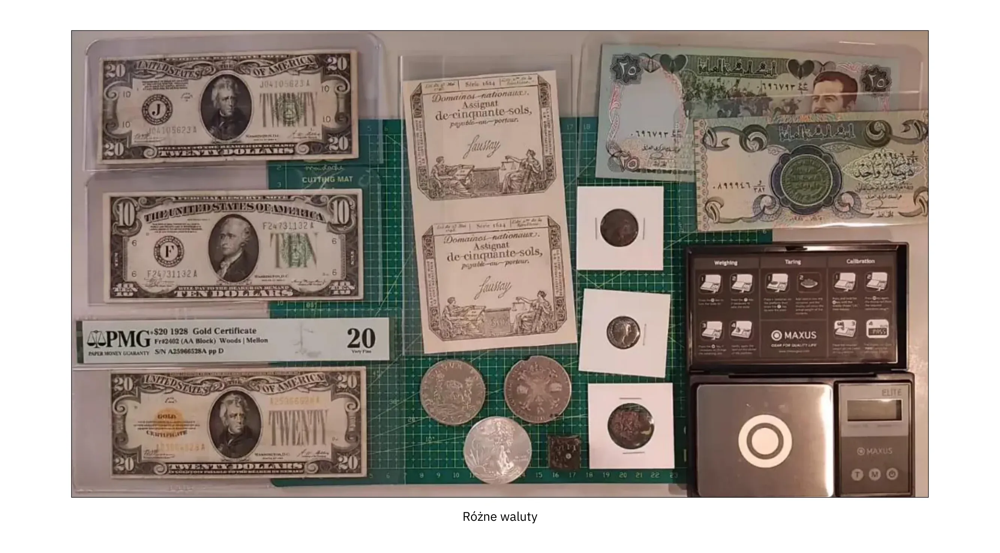

W świetle tych definicji ważne jest, aby zrozumieć, że dla Roberta inflacja dotyczy głównie wzrostu Supply pieniądza. Z drugiej strony Larousse koncentruje się na konsekwencjach tej ekspansji, a mianowicie na uogólnionym wzroście cen.

W naszym badaniu hiperinflacji przyjmiemy drugą definicję, czyli uogólniony wzrost cen, ponieważ jest ona bardziej odpowiednia i jasna dla naszego tematu. Należy jednak pamiętać, że wzrost cen jest generalnie wynikiem ekspansji pieniądza Supply.

Znany ekonomista Milton Friedman stwierdził:

> "Inflacja jest zawsze i wszędzie zjawiskiem pieniężnym"

Stwierdzenie to podkreśla nieodłączny związek między ekspansją monetarną a inflacją. W kolejnych sekcjach zbadamy związek między inflacją a wzrostem gospodarczym, opierając się na tych podstawowych definicjach.

### Zrozumienie fenomenu monetarnego

Odnosząc się do zjawiska monetarnego, mamy na myśli sposób, w jaki wpływa ono na Supply pieniądza w gospodarce. Milton Friedman zasadniczo postrzegał to jako wzrost Supply. W przeszłości istniały dwie główne metody zwiększania Supply pieniądza:

1. Druk monetarny:

W tradycyjnych systemach monetarnych wzrost Supply pieniądza był osiągany poprzez fizyczne drukowanie nowych banknotów. Chociaż obecnie, przy dominacji waluty cyfrowej, drukowanie to odbywa się głównie elektronicznie (za pośrednictwem baz danych banków centralnych i innych instytucji finansowych), historia pokazuje nam okresy, w których dosłowne drukowanie banknotów doprowadziło do hiperinflacji.

2. Redukcja zawartości metalu:

Inną metodą było zmniejszenie ilości metali szlachetnych w walutach opartych na metalach takich jak srebro czy złoto. Uderzający przykład można znaleźć w Imperium Rzymskim, gdzie denar, początkowo składający się prawie wyłącznie ze srebra, z czasem drastycznie zmniejszył swoją zawartość srebra. Stanowiło to formę inflacji, ale niekoniecznie hiperinflacji.

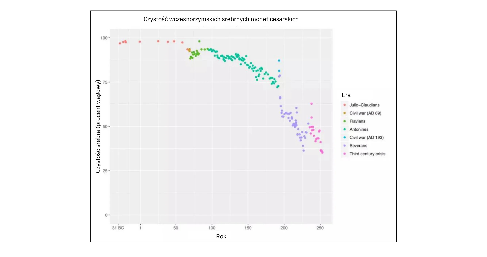

Należy podkreślić, że hiperinflację obserwuje się głównie w przypadku walut fiducjarnych, które nie są zabezpieczone aktywami bazowymi, takimi jak metale szlachetne. W przeszłości, gdy waluta była oparta na takich aktywach, zdarzały się epizody inflacji (np. poprzez dewaluację zawartości metalu), ale epizody te nigdy nie osiągnęły ekstremalnych poziomów hiperinflacji. W kolejnych sekcjach szczegółowo przeanalizujemy okresy dewaluacji pieniądza i wpływ tych różnych systemów monetarnych na inflację.

### Badanie okresów dewaluacji monetarnej

Na przestrzeni dziejów różne cywilizacje doświadczały okresów dewaluacji pieniądza. Niektóre z tych okresów zbiegają się z ważnymi wydarzeniami lub wojnami, które wywierają presję na gospodarkę.

#### 1. Wojna peloponeska i druga wojna punicka:

Wojna peloponeska, konflikt między Atenami a Spartą, oraz druga wojna punicka, między Republiką Rzymską a Kartaginą, to najwcześniejsze przykłady dewaluacji waluty znalezione w archiwach. Aby sfinansować te wojny, cywilizacje te zdewaluowały swoje waluty, zmniejszając zawartość srebra i włączając inne metale, jednocześnie zwiększając liczbę produkowanych monet.

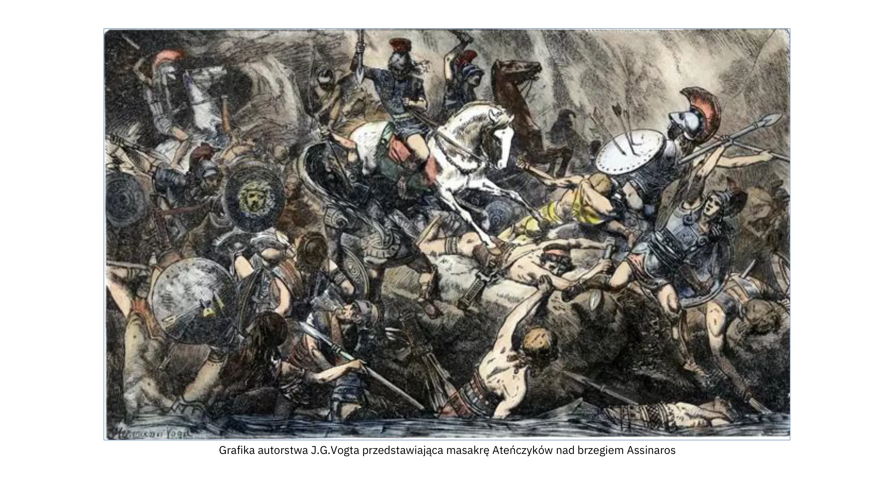

Rycina przedstawiająca masakrę Ateńczyków nad brzegiem Assinaros.

#### 2. Starożytny Rzym w czasach Imperium:

Po erze Republiki Rzymskiej, w okresie Cesarstwa, w III i IV wieku nastąpiła znaczna dewaluacja waluty. Ilustruje to spadek zawartości srebra w monetach, jak widać na poprzednim wykresie. Badanie wykazało, że cena pszenicy w Egipcie, mierzona w drachmach, wzrosła milion razy w okresie około 400 lat, od 40 r. p.n.e. do 360 r. n.e.. W tym okresie oznacza to średnią roczną inflację wynoszącą około 4,4%. Inflacja ta nie była jednak równomiernie rozłożona. Rozpoczęła się ona tak naprawdę około 238 r. n.e. W latach 250-293 stopa inflacji wynosiła około 3,65% i wzrosła do 22,28% w latach 293-301.

Chociaż okresy te doświadczyły znacznej inflacji, nie osiągnęły one poziomów hiperinflacji obserwowanych w niektórych współczesnych sytuacjach. Powodem tego jest to, że chociaż waluta została zdewaluowana, nadal była wspierana przez metale szlachetne. Ta solidna podstawa zapewniała pewną ochronę przed ekstremalnymi poziomami inflacji. W kolejnych sekcjach przyjrzymy się bardziej szczegółowo naturze i konsekwencjom hiperinflacji.

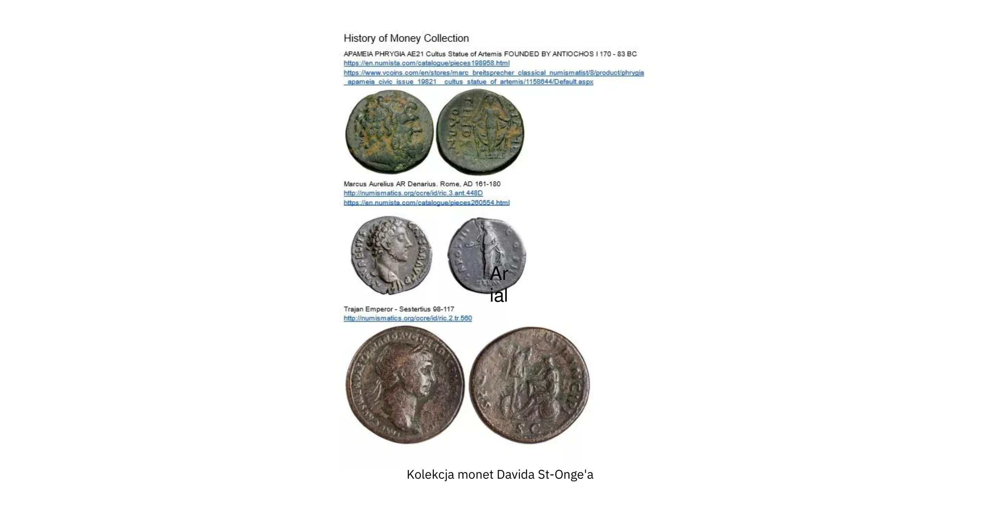

- Denar Marka Aureliusza (160 r. n.e.):

Jedną z najbardziej kultowych monet starożytnego Rzymu jest denar, srebrny Coin. Posiadam konkretny Coin od Marka Aureliusza z 160 r. n.e., przed poważną dewaluacją. Chociaż aparat może mieć trudności z uchwyceniem drobnych szczegółów, gołym okiem widać, że Coin jest piękny i odzwierciedla stosunkowo wysoką zawartość srebra.

- Antoninianus (koniec III wieku n.e.):

Wraz z dewaluacją pieniądza pojawiła się nowa waluta, Antoninianus. Waluta ta miała być warta dwa denary, ale zawierała znacznie mniej srebra. Mój Antoninianus Coin wyraźnie pokazuje, że zawartość srebra została znacznie zmniejszona. Jest on ozdobiony typową dla rzymskich monet tego okresu koroną, zwaną "promienistą". Porównując kolor i jakość, można zauważyć, że Antoninianus jest daleki od czystego srebra Coin.

Porównując obie monety obok siebie, różnica jest uderzająca. Denar z 160 r. n.e. ma wyraźny srebrny wygląd, podczas gdy Antoninianus z końca III wieku n.e. jest znacznie bardziej matowy, co wskazuje na znaczny spadek zawartości srebra. To wizualne porównanie stanowi wyraźną ilustrację dewaluacji monetarnej, którą starożytny Rzym przeszedł na przestrzeni kilku stuleci.

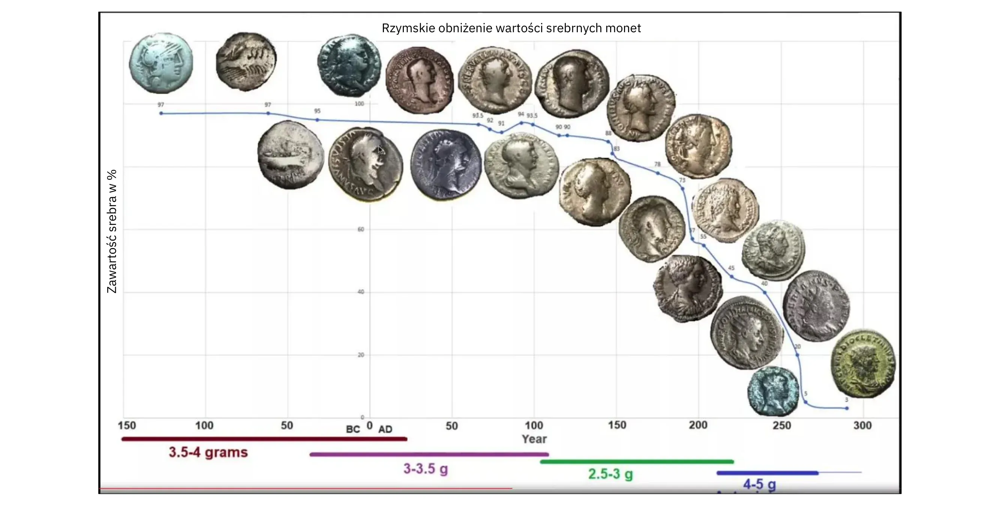

Aby uzupełnić tę demonstrację, idealny byłby wykres ilustrujący dewaluację tych monet w czasie. Chociaż trudno jest to zwizualizować za pomocą tej platformy, wyobraźmy sobie wykres pokazujący wartość denara, a następnie jego spadek pod koniec II wieku, kiedy to został zastąpiony przez Antoninianusa, rzekomo wartego dwa denary, ale o znacznie niższej zawartości srebra. Te artefakty są niemymi świadkami wahań gospodarczych minionych cywilizacji.

#### 3. Hiszpańskie Maravedi: Świadek celowej dewaluacji

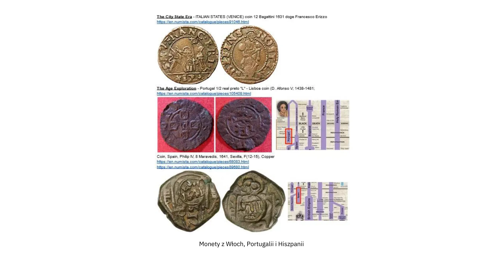

Maravedi, jako waluta miedziana, zajmuje szczególne miejsce w historii hiszpańskiej waluty. Jak wspomniano wcześniej, dolar hiszpański był pierwotnie międzynarodowym standardem, niezbędną walutą rezerwową dla Hiszpanii. Jednak w obliczu pewnych wyzwań gospodarczych Hiszpania musiała uciec się do sprytnych strategii monetarnych.

Dewaluacja monetarna jest narzędziem często wykorzystywanym przez państwa do finansowania swoich wydatków lub stymulowania gospodarki. Hiszpania znalazła się jednak w delikatnej sytuacji. Dewaluacja dolara hiszpańskiego zagroziłaby jej pozycji w handlu międzynarodowym. Aby przezwyciężyć ten dylemat, Hiszpania zwróciła się do Maravedi.

W przeciwieństwie do cennego hiszpańskiego srebrnego dolara, Maravedi była miedzianą walutą używaną głównie przez lokalną ludność. Waluta ta została poddana dewaluacji. Gdy Coin Maravedis był początkowo wart dwa maravedisy, państwo odzyskiwało go, ponownie stemplowało nową wartością, na przykład "cztery", i zwracało właścicielowi tylko jeden Coin. Coin, oznaczony znaczkiem "osiem", jest dowodem tego procesu, ponieważ przeszedł kilka cykli dewaluacji.

Strategia ta pozwoliła państwu na skuteczną dewaluację waluty, tworząc inflację i pośrednio finansując państwo, jednocześnie zachowując integralność hiszpańskiego dolara na arenie międzynarodowej. Jednak ta ukierunkowana dewaluacja miała konsekwencje dla miejscowej ludności, która widziała, że wartość ich wspólnej waluty jest osłabiona.

Przypadek Maravedis ilustruje, w jaki sposób państwo może selektywnie dewaluować lokalną walutę, aby zaspokoić swoje wewnętrzne potrzeby gospodarcze, jednocześnie zachowując wartość waluty rezerwowej na arenie międzynarodowej. Jest to uderzający przykład złożoności i finezji polityki pieniężnej w historii.

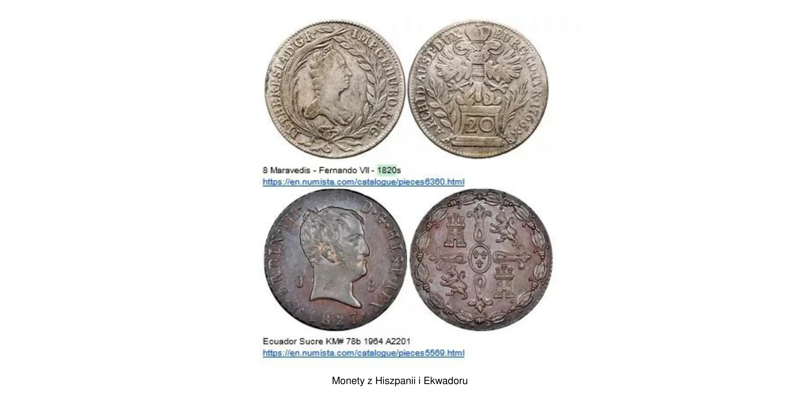

Chcesz wiedzieć więcej? -> [Link](https://docs.google.com/document/d/1aZa7gvz1nt8ZHDCoWKQdS9RGGjBHdipH1ApC8dW1xpM/edit?usp=sharing)

#### 4. Rewolucja cenowa od XV do XVII wieku

Między XV a XVII wiekiem Europa była świadkiem niezwykłego zjawiska gospodarczego, często określanego mianem "rewolucji cenowej" Ten okres inflacji został w dużej mierze wywołany przez masowy napływ metali szlachetnych, w szczególności złota i srebra, z obu Ameryk. Ponieważ europejska gospodarka w dużej mierze opierała się wówczas na standardzie metalicznym, ten dodatkowy Supply metali zwiększył Supply pieniądza. W rezultacie pojawiła się stopa inflacji wynosząca około 1 do 2% rocznie. Na pierwszy rzut oka inflacja ta może wydawać się skromna. Jednak w tamtym czasie takie wahania cen były na tyle niezwykłe, że uznano je za "rewolucję" Podkreśla to, jak zmiany w rezerwach pieniężnych mogą wpływać na cały system gospodarczy.

#### 5. John Law i Assignats

W XVIII wieku francuska historia gospodarcza została naznaczona dwoma znaczącymi wydarzeniami związanymi z walutą. Po pierwsze, John Law, szkocki ekonomista i finansista, przekonał francuski rząd do przyjęcia systemu monetarnego opartego na pieniądzu papierowym. Choć początkowo uznano to za innowacyjne rozwiązanie problemów finansowych kraju, inicjatywa ta szybko doprowadziła do gwałtownej inflacji. Wkrótce potem, podczas zamieszania związanego z Rewolucją Francuską, rząd wprowadził "assignaty".

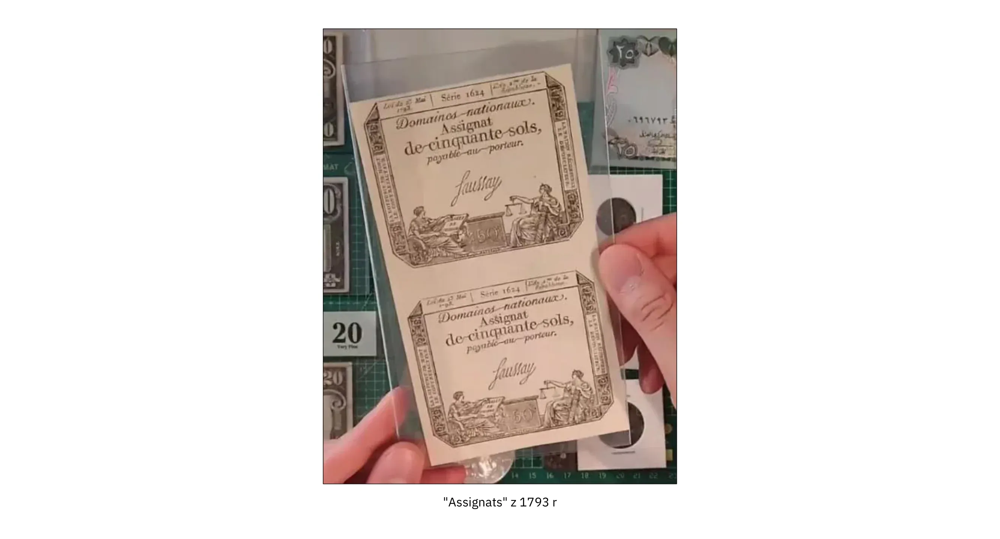

Przydziały z 1793 r

Banknoty te stanowią żywe świadectwo pierwszego poważnego okresu hiperinflacji w historii. Początkowo zaprojektowane jako odpowiedź na kolejne kryzysy finansowe, assignaty szybko stały się symbolem niestabilności monetarnej. Rząd, nadmiernie polegając na tej papierowej walucie w celu sfinansowania swoich wydatków, spowodował bezprecedensowy kryzys gospodarczy i doprowadził do poważnego okresu hiperinflacji we Francji po rewolucji.

#### 6. Rozporządzenie wykonawcze 6102 i dewaluacja dolara

Rozporządzenie wykonawcze 6102 i dewaluacja dolara

Na początku lat 30. w Stanach Zjednoczonych nastąpiła poważna zmiana w polityce pieniężnej. Oto szczegółowy przegląd tej transformacji:

- Banknot 20 USD z 1928 r

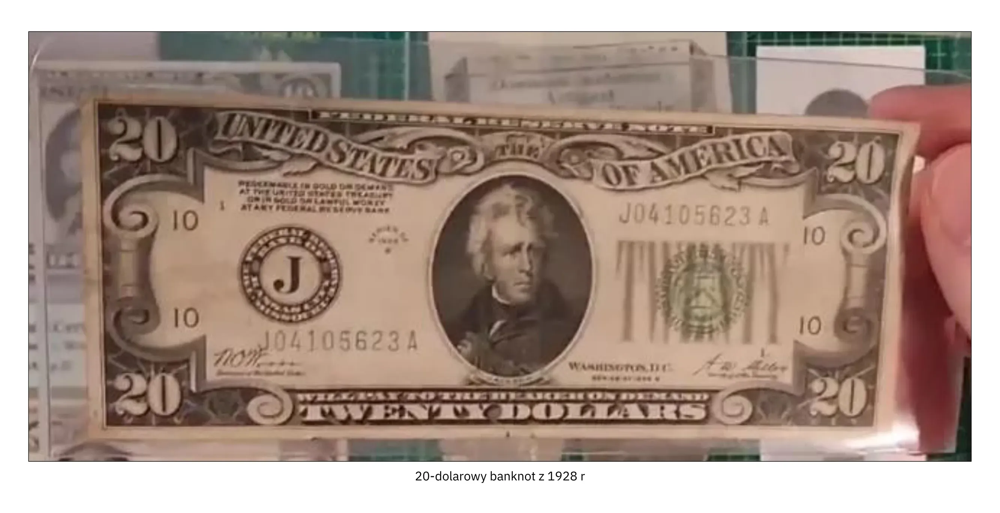

W 1928 r. banknot o nominale 20 USD w Stanach Zjednoczonych stwierdzał: "wymienialny na złoto na żądanie" Oznacza to, że każdy banknot był dosłownie wymienialny na złoto. Konkretnie, banknot o nominale 20,67 USD stanowił równowartość jednej uncji złota.

- Rozporządzenie wykonawcze 6102

W 1933 r. nastąpił poważny wstrząs wraz z wydaniem rozporządzenia wykonawczego 6102. Dekret ten zakazał obywatelom posiadania złota, czy to w formie sztabek, monet czy certyfikatów.

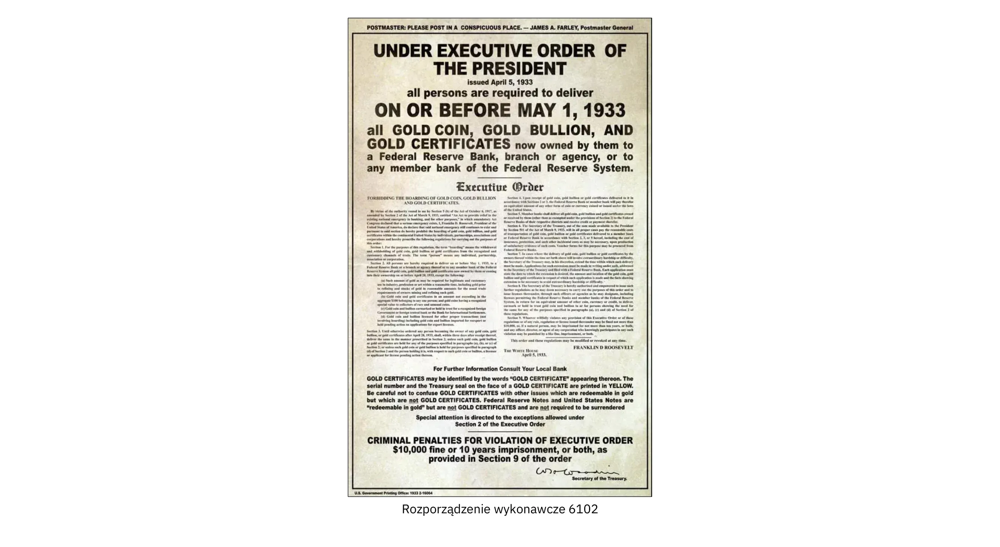

Złoty certyfikat jest tego dobrym przykładem. Był on oznaczony: "W złocie Coin płatne okazicielowi na żądanie" Posiadanie takiego certyfikatu stało się nielegalne i pozostało takie do 1964 roku.

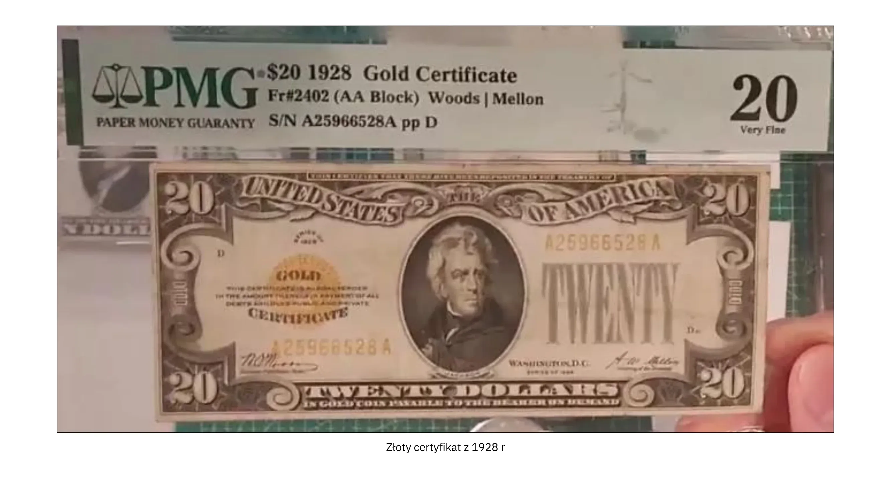

- Wprowadzenie nowych banknotów

Po konfiskacie złota w 1934 r. do obiegu wprowadzono nową serię banknotów.

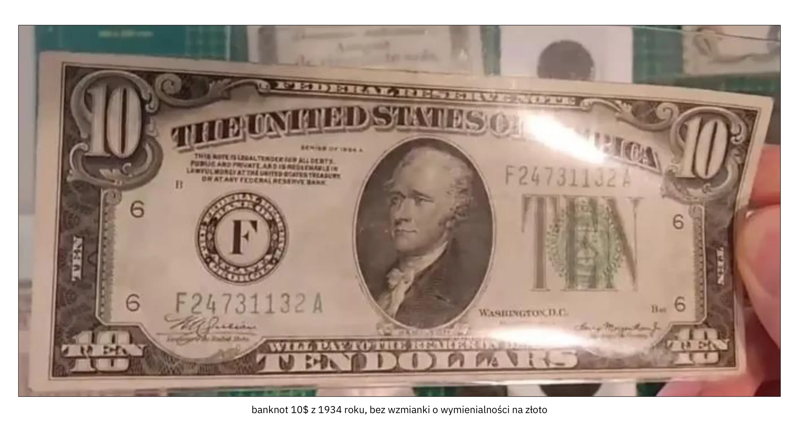

Wzmianka wskazująca na ich wymienialność na złoto została usunięta i zastąpiona słowami "Ten banknot jest prawnym środkiem płatniczym dla wszystkich długów" (Ce billet est une monnaie légale pour toutes dettes).

- Przeszacowanie wartości złota

Fascynująca w tej transformacji jest strategia rządu. W 1934 r. cena złota została zrewaluowana do 35 USD za uncję, zamiast 20,67 USD. Zasadniczo rząd zdewaluował dolara posiadanego przez ludzi. Kupując złoto od ludności po cenie 20,67 USD za uncję w 1933 r., a następnie rewaluując cenę złota w 1934 r., rząd wygenerował znaczny zysk, jednocześnie dewaluując oszczędności swoich obywateli.

Podsumowując, w ciągu roku rząd skutecznie przejął złoto obywateli, a następnie zmienił zasady gry, przeszacowując wartość złota na korzyść skarbu państwa i na niekorzyść tych, którzy początkowo wymienili swoje złoto na banknoty.

### Stany Zjednoczone zmieniają historię.

Stany Zjednoczone dokonały historycznego przełomu, stając się pierwszymi, które zdewaluowały światową walutę rezerwową, dolara amerykańskiego, wbrew wcześniejszym praktykom obserwowanym w małych krajach handlowych.

Wcześniej, w okresie renesansu, włoski floren wyemitowany przez Florencję w XIII wieku był międzynarodową walutą rezerwową i nie odnotowano żadnej dewaluacji w okresie jego używania, co odzwierciedla znaczenie stabilności monetarnej dla handlu międzynarodowego.

W tym samym duchu Hiszpania i Holandia, jako posiadacze światowej waluty rezerwowej ze względu na kwitnący handel międzynarodowy, utrzymywały integralność swoich walut, aby zachować zaufanie i status quo w wymianie międzynarodowej. Holandia była nawet świadkiem utworzenia pierwszego banku centralnego, co stanowiło kamień milowy w globalnej ewolucji systemów monetarnych.

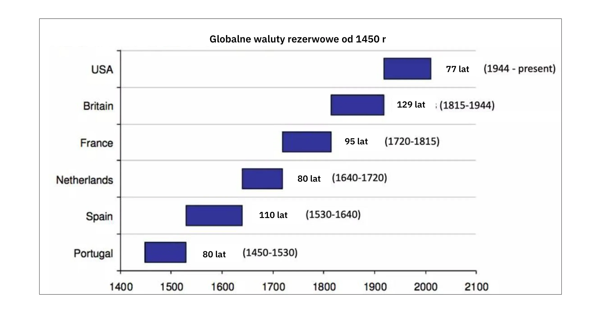

Sytuacja zmieniła się jednak wraz ze wzrostem znaczenia Stanów Zjednoczonych jako dominującej potęgi gospodarczej. Zdecydowały się one zdewaluować swoją walutę rezerwową, wykorzystując w ten sposób inflację na swoją korzyść. Decyzja ta jest często przypisywana zmienionej dynamice, w której wybór waluty rezerwowej nie był już tak swobodny jak wcześniej. Amerykańska hegemonia ustanowiła dolara jako światową walutę rezerwową, umożliwiając manipulowanie jego wartością. Zmiana ta ujawnia potencjalny wpływ polityki pieniężnej na handel międzynarodowy w zglobalizowanej gospodarce, oznaczając znaczącą zmianę w zarządzaniu globalnymi walutami rezerwowymi.

### Ostatni przykład na drogę: szwajcarski dinar

Dinar szwajcarski ilustruje kolejny fascynujący aspekt dewaluacji pieniądza, tym razem osadzony w irackim kontekście sprzed wojny w Zatoce Perskiej. Waluta ta, nazwana na cześć wysokiej jakości banknotów, została wyemitowana przez Bank Centralny Iraku i cieszyła się reputacją stabilnej w regionie Bliskiego Wschodu. Zaufanie to wynikało głównie z jakości druku banknotów, który został wykonany w Anglii, co oznaczało pewną odporność na dewaluację.

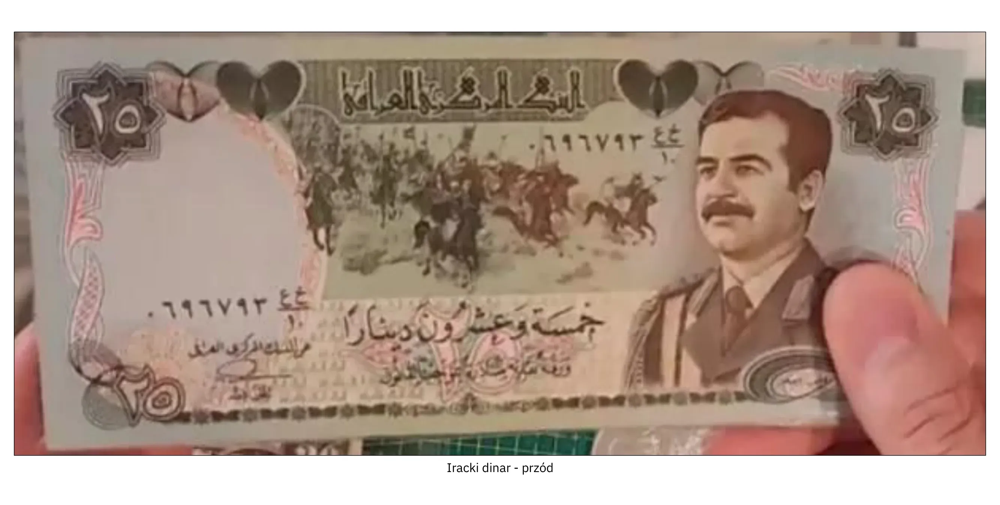

Wojny w Zatoce Perskiej stanowiły jednak punkt zwrotny w historii dinara szwajcarskiego. Irak, nie będąc już w stanie polegać na swoim angielskim dostawcy w zakresie druku banknotów, zwrócił się o pomoc do Chin. To przejście spowodowało wyraźną różnicę w jakości banknotów, przy czym chińska wersja była postrzegana jako gorsza. Opinia ta nie była bezpodstawna; chińskie banknoty były łatwiejsze do podrobienia i podatne na nadruki ze strony rządu, co zagrażało ich wartości.

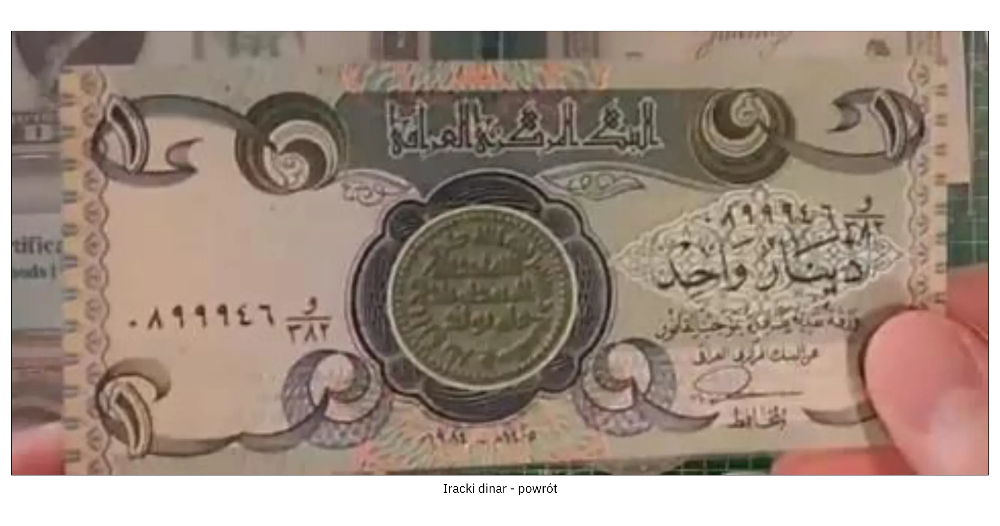

W irackiej gospodarce po wojnie w Zatoce Perskiej pojawiło się charakterystyczne zjawisko: podwójny system cenowy. Kupcy oferowali różne ceny w zależności od rodzaju banknotu używanego do płatności, faworyzując oryginalnego dinara szwajcarskiego zamiast banknotu chińskiego. System ten odzwierciedlał utrzymujące się zaufanie do banknotów wyższej jakości, które były mniej podatne na dewaluację, nawet w kontekście, w którym wartość była przede wszystkim narzucana przez państwo. Ten epizod podkreśla znaczenie wewnętrznych cech waluty i tego, jak nawet w systemie waluty fiducjarnej postrzegana jakość waluty może wpływać na jej względną wartość, a tym samym na zaufanie podmiotów gospodarczych.

#### Tak, faktycznie zważyliśmy monety!

W powszechnym odbiorze waluta często kojarzy się z tworem państwowym, w którym jej emisja i wartość są regulowane przez państwo. Koncepcja ta ma swoje korzenie w starożytnych cywilizacjach, takich jak Rzym, gdzie monety były standaryzowane i stemplowane przez Imperium, nadając tym samym oficjalną wartość walucie. Jednak głębsza analiza ujawnia, że wewnętrzna wartość waluty wynikała głównie z zawartości metali szlachetnych.

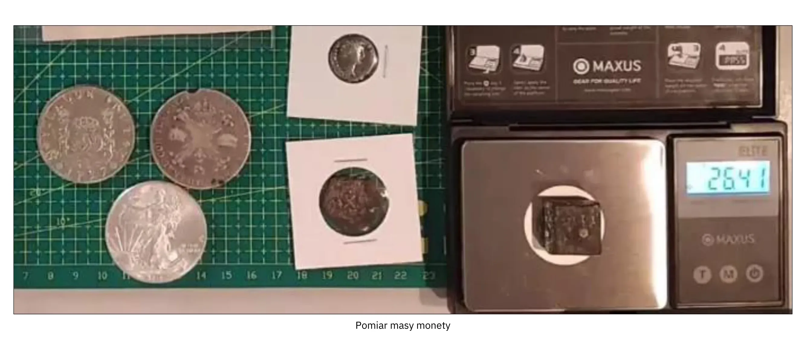

Przykładem może być waga monetarna odpowiadająca ośmiu hiszpańskim reais lub jednemu hiszpańskiemu dolarowi. Odważnik ten, oznaczony rzymską cyfrą wskazującą jego wartość, był używany przez kantory do oceny wartości monet na podstawie ich wagi, a nie tylko stempla. Ważąc monety, wymiennicy mogli określić, czy zostały one zmienione lub uszkodzone, co mogło obniżyć ich wartość. Praktyka ta podkreśla, że chociaż standardowe stemplowanie przez państwo nadawało walucie pewną wartość nominalną, prawdziwa wartość tkwiła w wadze zawartego w niej metalu szlachetnego.

Analiza ta pokazuje, że zaufanie do waluty, a co za tym idzie jej wartość, było zakotwiczone w jej namacalnej substancji, a nie w zwykłym zapewnieniu państwa. Podkreśla to dwoistość między wartością nominalną narzuconą przez państwo a wartością wewnętrzną podyktowaną zawartością metalu szlachetnego. W ten sposób waluta wykracza poza bycie zwykłym instrumentem państwowym, a jej podstawowa wartość jest nierozerwalnie związana z namacalnym i mierzalnym Elements.

#### Wnioski

Podsumowując, niniejsze badanie dotyczące dewaluacji monetarnej zapewnia głębsze zrozumienie mechanizmów inflacji, które zostaną zbadane w kolejnych filmach. Omówimy różne rodzaje inflacji i próg, przy którym przechodzą one w wysoką lub hiperinflację. Te solidne podstawy pozwolą nam na Address złożoności inflacji w nadchodzących sesjach. Dziękujemy za uwagę. Z niecierpliwością czekamy na kontynuację eksploracji dynamiki monetarnej w następnym filmie.

## Rodzaje inflacji

<chapterId>b438fe09-375e-5bb2-9196-7dd687b9f98c</chapterId>

### Inflacja nie jest zjawiskiem wieloczynnikowym

W tej sekcji przeanalizujemy różne aspekty inflacji, zjawiska, które jest często źle rozumiane. Chociaż inflacja jest często postrzegana jako zjawisko wieloczynnikowe w mediach i codziennych dyskusjach, ważne jest, aby pamiętać, że jest to zasadniczo zjawisko monetarne.

Poniżej znajduje się podział tematu na kilka kluczowych punktów:

- Rozróżnienie między wzrostem cen a inflacją:

Wzrost cen może być specyficzny dla danego sektora i wywołany różnymi czynnikami, takimi jak spadek produkcji ropy naftowej OPEC lub niekorzystne warunki pogodowe wpływające na produkcję pszenicy.

Inflacja, z drugiej strony, jest definiowana przez uogólniony wzrost cen w szerokim zakresie towarów i usług, a nie tylko w określonym sektorze.

- Monetarna istota inflacji:

Przy stałym Supply pieniądza wzrost cen w jednym sektorze spowodowałby spadek cen w innych sektorach, ponieważ zmniejszyłaby się ilość pieniędzy dostępnych do wydania gdzie indziej. Inflacja jest ściśle związana ze wzrostem Supply pieniądza, co umożliwia jednoczesny wzrost cen we wszystkich sektorach.

- Wpływ Supply na inflację i deflację:

W systemie stałego pieniądza Supply wzrost produkcji powinien teoretycznie prowadzić do deflacji, tj. spadku cen, ponieważ dostępnych byłoby więcej towarów i usług.

W obecnym systemie pieniądza fiducjarnego wzrost Supply niweluje potencjalną deflację spowodowaną wzrostem produkcji.

- Negatywne skutki dostosowania Supply:

Wzrost Supply pieniądza, bez odpowiadającego mu wzrostu produkcji, prowadzi do inflacji, ponieważ w obiegu jest więcej pieniędzy za tę samą ilość towarów i usług.

Podczas gdy wzrost produkcji powinien doprowadzić do deflacji, jednoczesny wzrost Supply zniwelował ten efekt, powodując zamiast tego inflację.

- Inflacja, deflacja i pieniądz Supply - Statki komunikacyjne:

Inflacja i deflacja są jak naczynia połączone w gospodarce. Wzrost produkcji może prowadzić do deflacji, ale jeśli jednocześnie zwiększy się ilość pieniądza Supply, efekt deflacyjny zostanie zniwelowany, powodując inflację.

Dyskusja ta podkreśla znaczenie zrozumienia podstawowych mechanizmów inflacji i deflacji, a także głębokiego wpływu, jaki zmiana Supply może mieć na gospodarkę. Prawdopodobnie powrócimy do tych koncepcji później, aby uzyskać głębsze zrozumienie ich wzajemnych powiązań i wpływu, jaki mają na globalną gospodarkę.

### Dlaczego drukowanie pieniędzy nie zawsze powoduje inflację?

#### Inflacja ≠ CPI

Inflacja, choć często kojarzona ze wzrostem Supply, nie zawsze ma bezpośredni związek z dodrukiem pieniądza, co ilustruje okres po kryzysie finansowym z 2008 roku. Pomimo znacznego dodruku pieniądza w celu ratowania banków, w następnej dekadzie nie odnotowano wysokiej inflacji, wynoszącej średnio od 0 do 2% rocznie. Sytuacja ta rodzi pytanie: Dlaczego masowy dodruk pieniądza nie spowodował proporcjonalnej inflacji? Odpowiedź leży w kilku niuansach związanych z mierzeniem inflacji i wskaźnika cen konsumpcyjnych (CPI).

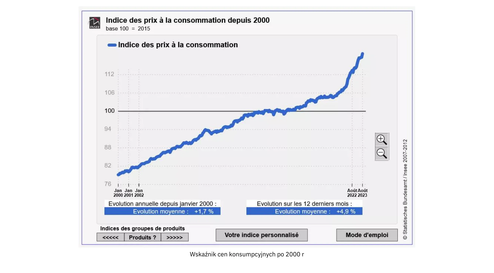

Pierwsze wyjaśnienie leży w sposobie pomiaru inflacji. Indeks cen konsumpcyjnych (CPI), który służy jako główny wskaźnik inflacji, ma pewne ograniczenia. Przykładowo, nie uwzględnia on w sposób kompleksowy zmian cen nieruchomości. Chociaż CPI zawiera składnik związany z czynszami, znaczna aprecjacja cen domów nie jest w pełni odzwierciedlona w indeksie. W rezultacie może dojść do znacznego wzrostu kosztów mieszkaniowych, który nie jest w pełni uwzględniony we wskaźniku CPI, co może powodować niedoszacowanie rzeczywistej inflacji.

Ponadto przy obliczaniu wskaźnika CPI stosuje się pewne metodologie, które mogą kompensować lub maskować rzeczywisty wzrost cen. Na przykład, jakościowe ulepszenia produktów mogą być wykorzystane do dostosowania wskaźnika. Jeśli cena produktu wzrośnie, ale jego jakość lub cechy również ulegną poprawie, CPI może uznać, że rzeczywista wartość dla konsumenta nie uległa zmianie, a zatem nie odzwierciedla inflacji. Przykładem może być sytuacja, w której pomimo wzrostu cen wołowiny i komputerów spowodowanego zastrzykiem pieniężnym, poprawa wydajności komputera jest wykorzystywana do zrównoważenia tego wzrostu. Jeśli komputer kosztuje dwa razy więcej, ale jest cztery razy bardziej wydajny, CPI może zinterpretować to jako spadek cen, maskując w ten sposób wzrost cen wołowiny.

Te niuanse w pomiarze inflacji za pomocą wskaźnika CPI podkreślają złożoność związku między drukowaniem monetarnym a inflacją. Sugerują również, że rzeczywista inflacja może być wyższa niż podawana, gdyby bardziej kompleksowo uwzględniono wszystkie wzrosty cen, zwłaszcza w kluczowych sektorach, takich jak nieruchomości. Analiza ta podkreśla znaczenie zrozumienia mechanizmów leżących u podstaw inflacji i ograniczeń konwencjonalnych wskaźników stosowanych do jej pomiaru, ułatwiając tym samym głębsze zrozumienie ekonomicznych implikacji polityki pieniężnej.

#### Argumenty MMT

Nowoczesna Teoria Monetarna (MMT) oferuje odrębne spojrzenie na kreację pieniądza i inflację. Zgodnie z MMT, pieniądz pochodzi głównie od rządu, który może drukować znaczne kwoty w celu sfinansowania swoich potrzeb bez powodowania inflacji, o ile sektory, do których skierowane są te fundusze, nie są nasycone. Podejście to odbiega od tradycyjnych teorii monetarnych, podkreślając znaczenie sektorowych zdolności absorpcyjnych w dynamice inflacji.

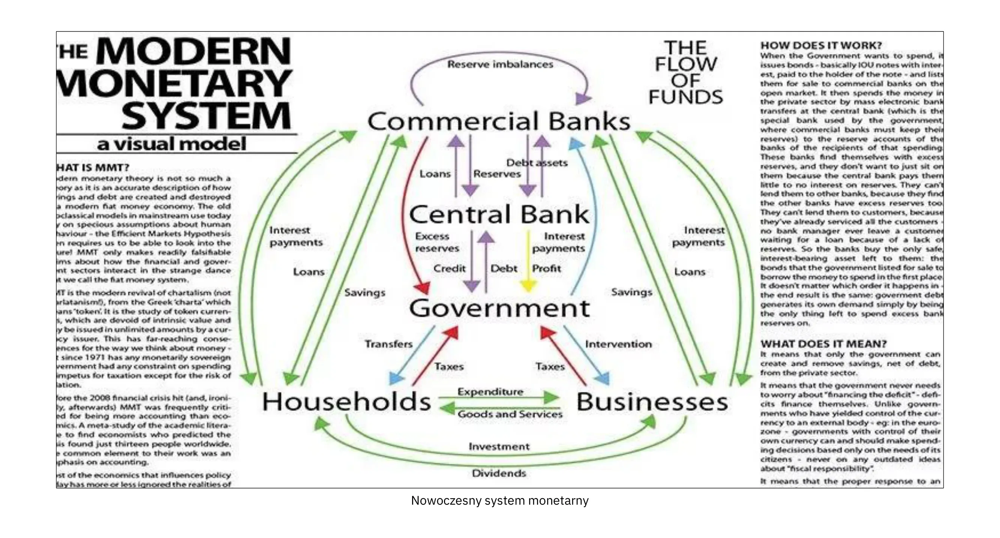

Ilustrującym przykładem MMT jest amerykański kompleks wojskowo-przemysłowy. Według MMT, setki miliardów dolarów mogą zostać przeznaczone na ten sektor bez powodowania inflacji, dzięki jego zdolności do absorpcji funduszy. W przeciwieństwie do tego, jeśli znaczne fundusze zostaną przeznaczone na budowę dróg w Stanach Zjednoczonych, gdzie istnieje ograniczona liczba firm i siły roboczej, może wystąpić inflacja z powodu niedoboru zasobów i zwiększonych kosztów wymaganych przez dostawców.

Japonia jest często przywoływana przez zwolenników MMT jako kolejny przykład braku inflacji pomimo znacznego dodruku pieniądza. Jednak sytuacja w Japonii podkreśla również ograniczenia tradycyjnych miar inflacji, takich jak wskaźnik cen konsumpcyjnych (CPI). W Japonii znaczna część wydrukowanych pieniędzy jest oszczędzana lub inwestowana w nieruchomości lub giełdę, a nie wydawana na bieżącą konsumpcję. Wskaźnik CPI, nie uwzględniając w pełni tej dynamiki, może zaniżać rzeczywistą inflację.

Analiza Japonii (https://ideas.repec.org/p/ces/ceswps/_9821.html) podkreśla również, że zachowanie podmiotów gospodarczych, takie jak oszczędzanie lub inwestowanie w aktywa nieuwzględnione w CPI, może maskować inflacyjny wpływ dodruku pieniądza. Co więcej, zdolność różnych sektorów do absorpcji wstrzykniętej płynności odgrywa kluczową rolę w określeniu, czy inflacja wystąpi.

#### Bilanse banków i banków centralnych

Trzecim przykładem tego, dlaczego dodruk pieniądza nie spowoduje inflacji, jest fakt, że związek między dodrukiem pieniądza a inflacją jest modulowany przez sposób, w jaki nowo wykreowane pieniądze są wprowadzane do gospodarki. Jeśli pieniądze te pozostaną w bilansach prywatnych banków bez pożyczania ich podmiotom gospodarczym, nie będą one miały bezpośredniego wpływu na realną gospodarkę, a zatem nie spowodują inflacji.

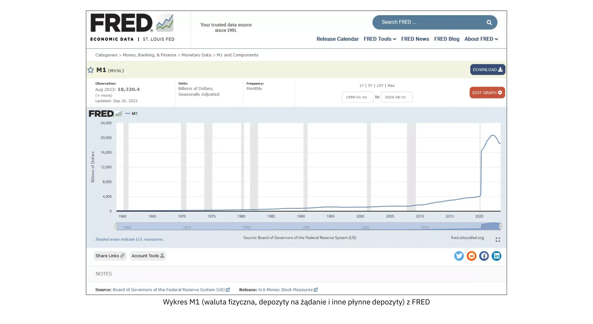

Drukowanie pieniądza może być postrzegane jako miecz Damoklesa wiszący nad gospodarką. Wykreowane pieniądze mogą pozostać ukryte przez pewien czas, bez widocznego efektu inflacyjnego, o ile nie zostaną wstrzyknięte do gospodarki za pośrednictwem pożyczek bankowych lub innych mechanizmów. Jednakże, gdy te ukryte pieniądze zostaną w końcu wprowadzone do obiegu, mogą pojawić się efekty inflacyjne. To właśnie zaobserwowano w latach 2020-tych, gdzie wcześniej wykreowane pieniądze weszły do gospodarki, prowadząc do inflacji.

Scenariusz ten podkreśla znaczenie mechanizmów transmisji monetarnej w oddziaływaniu na inflacyjne skutki dodruku pieniądza. Kreacja pieniądza przez bank centralny to tylko jeden z elementów układanki. Zachowanie prywatnych banków, które decydują o wielkości udzielanych kredytów, oraz zachowanie kredytobiorców, którzy decydują o tym, jak wydać pożyczone pieniądze, są również kluczowymi czynnikami Elements w tej dynamice.

#### Inflacja jest społeczna!

Przykład Republiki Weimarskiej ilustruje kolejny kluczowy aspekt związku między dodrukiem pieniądza a inflacją: rolę oczekiwań i zachowania podmiotów gospodarczych. Kiedy Bank Centralny Republiki Weimarskiej zaczął drukować duże ilości pieniędzy, niepewność gospodarcza skłoniła ludzi do gromadzenia, tj. przechowywania pieniędzy zamiast ich wydawania. Reakcja ta tymczasowo opóźniła inflacyjne skutki dodruku pieniądza.

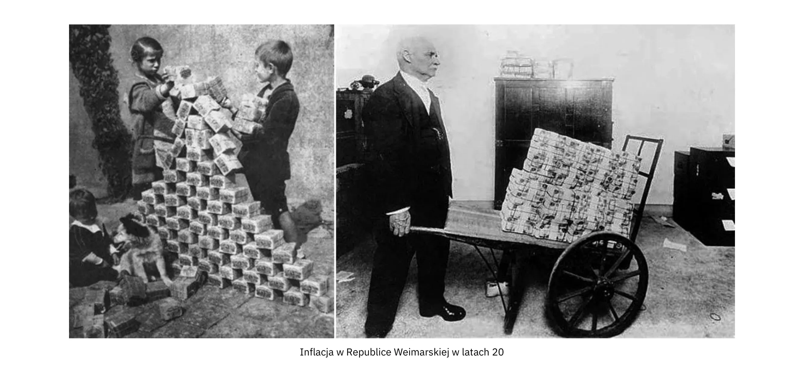

Kiedy jednak sytuacja gospodarcza zaczęła się nieznacznie poprawiać, zaufanie zostało stopniowo przywrócone. Osoby fizyczne wycofały wówczas swoje oszczędności z kryjówek i zaczęły masowo wydawać w gospodarce. Ta nagła zmiana w zachowaniu, w połączeniu z już wysokim Supply, doprowadziła do eksplozji popytu. Przy większej ilości pieniędzy w obiegu i zwiększonym popycie, ceny zaczęły gwałtownie rosnąć, prowadząc do zauważalnej inflacji.

Przykład ten podkreśla znaczenie czasu i zachowania agenta w powstawaniu inflacji. Inflacja pojawia się nie tylko w odpowiedzi na wzrost Supply, ale także zależy od tego, jak i kiedy te pieniądze są wydawane w gospodarce. Niepewność gospodarcza i oczekiwania podmiotów gospodarczych odgrywają kluczową rolę w tej dynamice i mogą przyspieszyć lub opóźnić inflacyjne skutki dodruku pieniądza.

#### Podsumowanie:

- Wskaźnik cen towarów i usług konsumpcyjnych (CPI): Wskaźnik CPI jest skonstruowany w sposób, który zaniża inflację, co może dawać zniekształcony obraz rzeczywistości inflacyjnej.

- Absorpcja sektorowa: Wstrzykiwanie pieniędzy do sektorów, które są w stanie je wchłonąć, nie zawsze prowadzi do inflacji. Godnym uwagi przykładem jest amerykański kompleks wojskowo-przemysłowy, który może wchłonąć duże sumy pieniędzy bez wywoływania inflacji.

- Przypadek Japonii: Pomimo znacznego dodruku pieniądza, inflacja w Japonii pozostaje niska, ponieważ fundusze są często oszczędzane lub inwestowane w nieruchomości lub rynki akcji. Sektory te pochłaniają wydrukowane pieniądze, a wskaźnik CPI niekoniecznie odzwierciedla wzrost cen w tych obszarach.
- Korelacja między dodrukiem pieniądza a rynkami. Zaobserwowano, że krzywe rynków nieruchomości i akcji często podążają za drukiem monetarnym, wskazując, gdzie kierowane są drukowane pieniądze.
- Rezerwy pieniężne banków: Kiedy wydrukowane pieniądze pozostają w bilansach banków i nie krążą w gospodarce, nie powodują inflacji. Ilustruje to przykład z 2008 r., w którym wydrukowane pieniądze w dużej mierze pozostały w bilansach banków, opóźniając wpływ inflacji.

- Republika Weimarska: Ten okres historyczny pokazuje, jak niepewność gospodarcza doprowadziła do gromadzenia pieniędzy, opóźniając inflację. Jednak po przywróceniu zaufania i wydaniu pieniędzy inflacja eksplodowała.

Przykłady te można wykorzystać w dyskusjach, aby wyjaśnić, dlaczego inflacja nie zawsze jest bezpośrednią konsekwencją dodruku pieniądza oraz w jaki sposób konteksty gospodarcze i zachowania agentów wpływają na inflację.

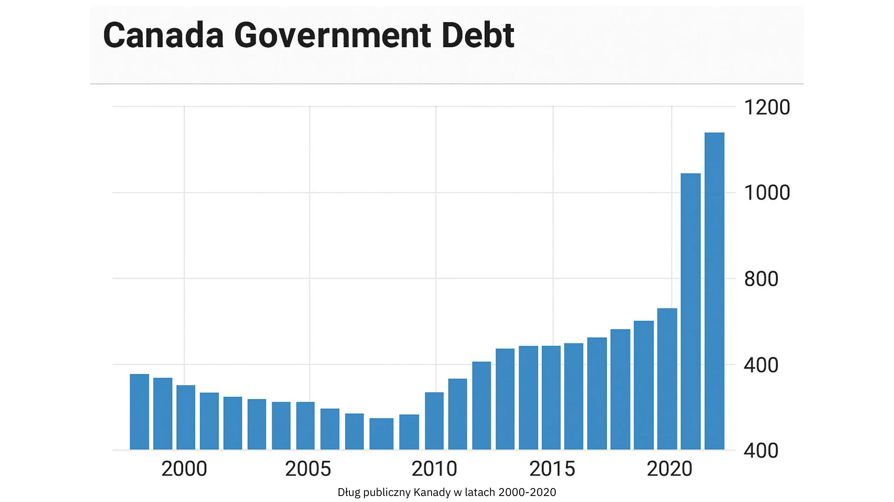

Ponieważ, jak pokazuje ten [wątek](https://twitter.com/saifedean/status/1673639779433590786): Inflacja to wszystko poza winą banków centralnych.

- Ekonomiści obwiniają inflację za zmiany klimatu

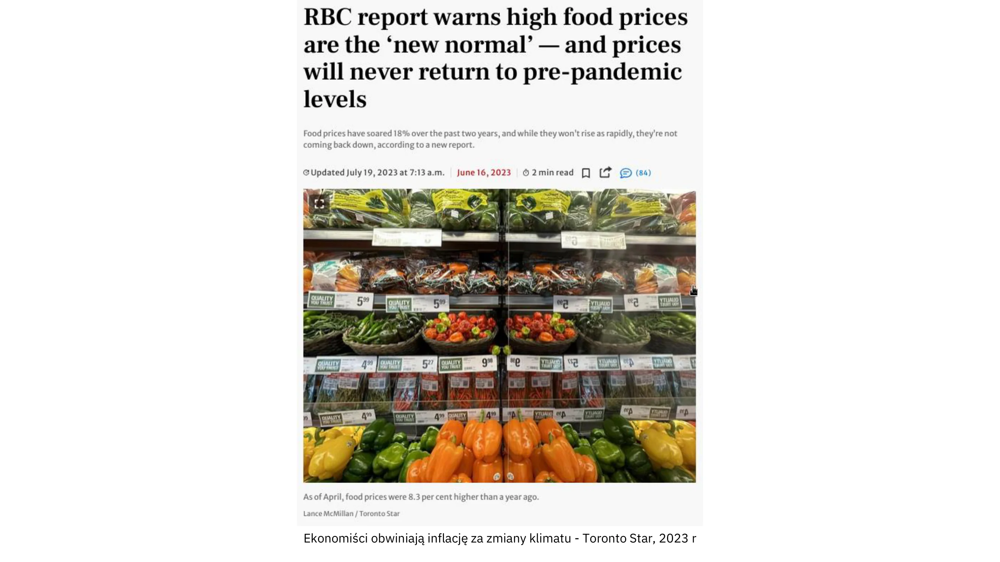

- Przykład Szwecji obwiniającej Beyoncé za inflację w danym miesiącu.

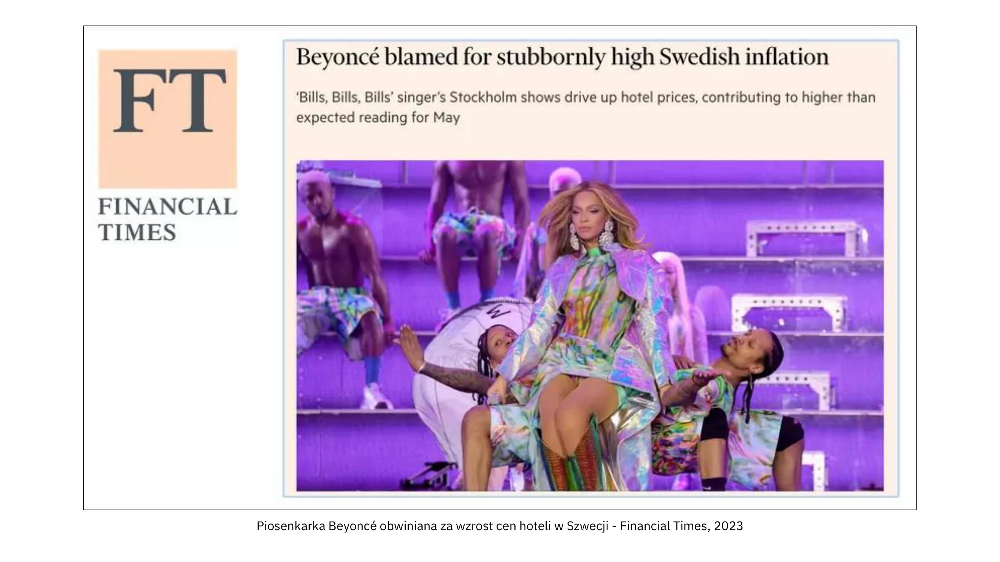

- Bank centralny w Polsce przypisuje inflację rosyjskiej agresji w Ukrainie i pandemii

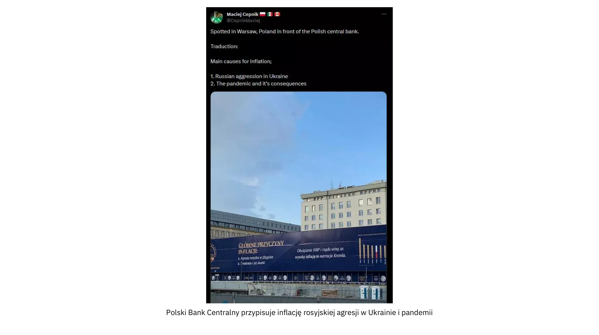

- Brexit jest obwiniany za inflację w Wielkiej Brytanii.

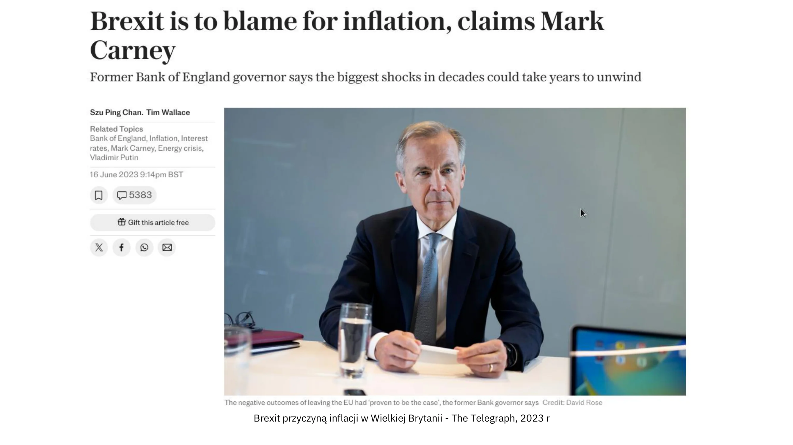

- Premiera gry Zelda związana z szokiem inflacyjnym.

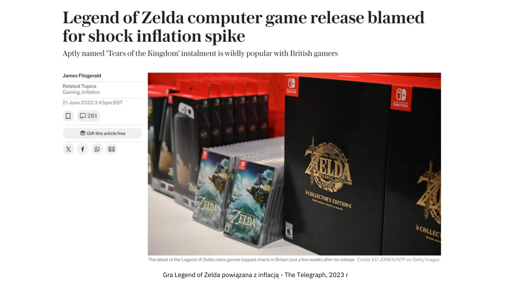

- Taylor Swift rzekomo powoduje inflację.

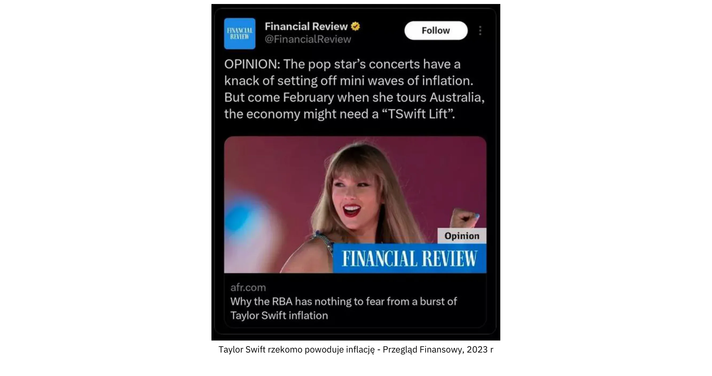

Powiedz mi, w jaki sposób Beyoncé lub Taylor Swift mogłyby spowodować powszechny wzrost cen? Widzisz, to nie ma żadnego sensu. W skrócie:

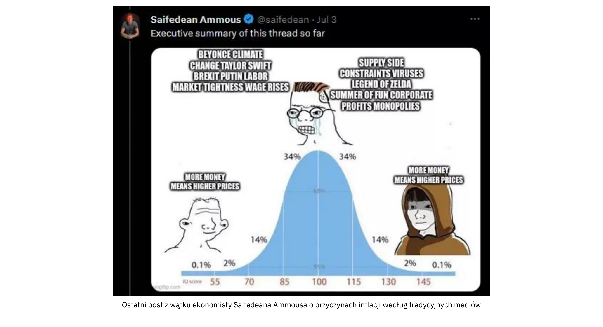

### Badanie rodzajów inflacji

Kluczowe znaczenie ma zrozumienie rozróżnienia między różnymi rodzajami inflacji, co pozwala nam uchwycić różne przejawy tego zjawiska gospodarczego. Oto wyjaśnienie tych różnych typów:

- Pełzająca inflacja: Jest to typ inflacji, do którego zazwyczaj dążą banki centralne, ustalony na poziomie około 2% rocznie. Cel ten został przyjęty od lat 90. i ma na celu utrzymanie stabilnego wzrostu gospodarczego bez przegrzania lub deflacji.
- Umiarkowana inflacja: Ta forma inflacji występuje, gdy inflacja przekracza docelowy poziom 2%. Jest ona często kojarzona z przegrzaniem gospodarki, stanem, w którym nadmierna ilość pieniądza Supply stymuluje ogólny wzrost cen. Scenariusz ten obnaża ograniczenia polityki pieniężnej i czasami ujawnia sprzeczności w dyskursie ekonomicznym.
- Galopująca inflacja: Inflacja galopująca, często nazywana dwucyfrową, występuje, gdy roczna stopa inflacji przekracza 10%. Oznacza to znaczny wzrost cen, który może zagrozić stabilności gospodarczej.

- Hiperinflacja: Hiperinflacja to ekstremalne zjawisko, w którym stopa inflacji przekracza 50% miesięcznie, co ze względu na wykładniczy charakter inflacji odpowiada rocznej stopie inflacji wynoszącej ponad 13 000%. Taki poziom inflacji poważnie destabilizuje gospodarkę, czyniąc walutę niemal bezwartościową i podważając zaufanie do systemu monetarnego.

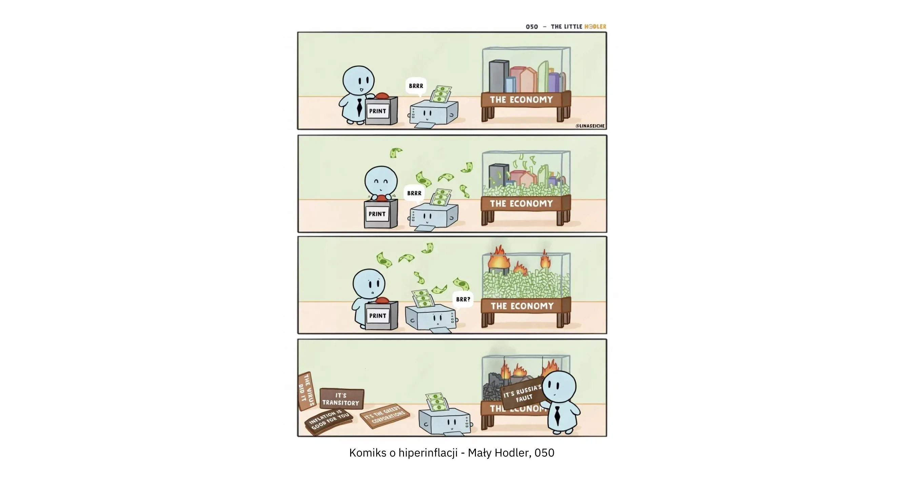

Badając rodzaje inflacji, w materiałach edukacyjnych często można natknąć się na terminy takie jak "popyt" i "koszt". Koncepcje te, choć ważne, mają tendencję do wyjaśniania wzrostu cen, a nie inflacji jako zjawiska pieniężnego. Oto bardziej dogłębna analiza:

- Ciągnięcie popytu:

Inflacja popytowa jest często opisywana jako scenariusz, w którym popyt w gospodarce przekracza dostępne moce produkcyjne. Jednak bez odpowiedniego wzrostu Supply, sytuacja ta doprowadzi po prostu do redystrybucji wydatków. Konsumenci mogą wydawać więcej na dobra pierwszej potrzeby, a mniej na dobra drugorzędne, neutralizując w ten sposób ogólny efekt inflacyjny.

- Nacisk na koszty:

Z drugiej strony, inflacja kosztowa przypisywana jest wzrostowi kosztów produkcji, takich jak koszty zasobów naturalnych lub pracy. Ponownie, bez wzrostu Supply, wzrost kosztów w jednym sektorze może po prostu zmniejszyć wydatki w innych, nie powodując powszechnej inflacji.

Te tradycyjne wyjaśnienia często wiążą wzrost cen z inflacją, co może prowadzić do nieporozumień i nieporozumień. W rzeczywistości, aby wystąpiła powszechna inflacja, konieczny jest wzrost Supply pieniądza. W tym kontekście koncepcje popytu i kosztów mogą wyjaśniać sektorowe wahania cen, ale nie oddają pieniężnego charakteru inflacji. Podkreśla to znaczenie rozróżnienia między sektorowym wzrostem cen a powszechną inflacją i potwierdza potrzebę zwiększenia pieniężnego Supply, aby zapobiec przejawom inflacji w całej gospodarce. Analiza ta zapewnia bardziej zniuansowane i precyzyjne spojrzenie na rzeczywiste przyczyny inflacji, demistyfikując powszechne interpretacje, które mogą zaciemniać podstawową dynamikę monetarną.

### Klasyfikacja inflacji według Bernholza

Bernholz proponuje uproszczoną, ale precyzyjną klasyfikację inflacji na trzy kategorie, co pozwala na lepsze zrozumienie tego złożonego zjawiska monetarnego:

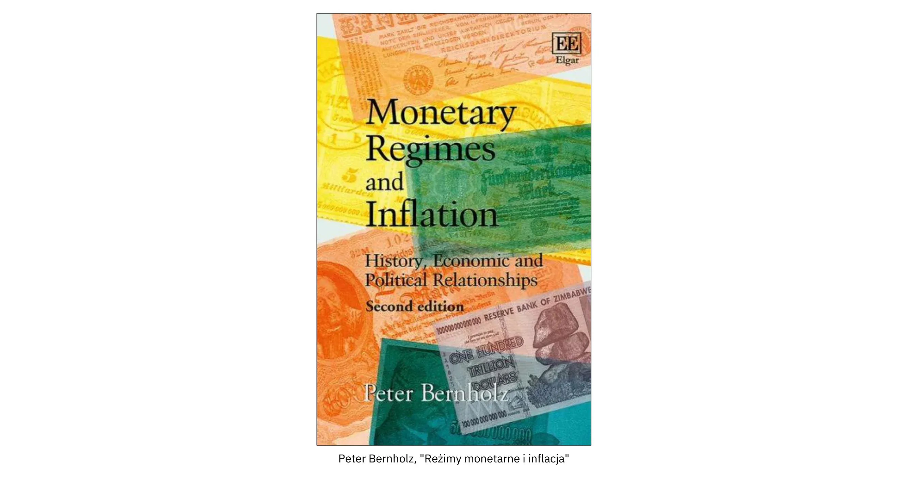

- Umiarkowana inflacja:

Umiarkowana inflacja występuje, gdy poziom Supply jest wyższy niż normalnie, ale państwo nie ucieka się do dużych deficytów finansowanych przez kreację pieniądza. Chociaż termin "umiarkowana" może wydawać się nieistotny, ta forma inflacji może powodować poważne problemy, choć nie jest klasyfikowana jako wysoka inflacja.

- Wysoka inflacja:

Wysoka inflacja występuje, gdy realna wartość pieniądza Supply spada pomimo wzrostu wartości nominalnej. Ta paradoksalna sytuacja wynika z substytucji monetarnej, w której jednostki tracą zaufanie do waluty krajowej i starają się ją Exchange wymienić na towary, usługi lub waluty obce. Proces ten dodatkowo obniża realną wartość waluty, pogłębiając inflację.

- Hiperinflacja:

Hiperinflacja to ekstremalna forma wysokiej inflacji, charakteryzująca się dużymi deficytami budżetowymi, które są finansowane poprzez kreację pieniądza. Historycznie rzecz biorąc, nie zaobserwowano żadnego przypadku hiperinflacji bez znacznego finansowania deficytu poprzez dodruk pieniądza. Hiperinflacja tworzy błędne koło: inflacja obniża wartość waluty tak szybko, że wpływy z podatków ulegają deprecjacji, zanim jeszcze państwo może je zebrać, zmuszając tym samym państwo do drukowania jeszcze większej ilości pieniędzy, aby się sfinansować. Ten samonapędzający się cykl prowadzi do astronomicznych stóp inflacji, często przekraczających 50% miesięcznie.

Ta klasyfikacja Bernholza podkreśla niebezpieczny postęp od umiarkowanej inflacji do hiperinflacji, podkreślając kluczowe znaczenie kontroli monetarnej i fiskalnej w zapobieganiu destrukcyjnym spiralom inflacyjnym. Pokazuje również, że szkodliwe konsekwencje dla finansowania państwa mogą wystąpić na długo przed osiągnięciem etapu hiperinflacji, zapewniając zniuansowaną perspektywę konsekwencji inflacji na różnych poziomach.

### Wnioski: Podsumowanie typów inflacji

Podsumowując, zbadaliśmy szereg typów inflacji, zaczynając od powszechnie słyszanych terminów, takich jak "pełzająca inflacja", "chodząca inflacja" i "galopująca inflacja", z których każdy oznacza różne poziomy procentowe inflacji w gospodarce. Jednak dla naszego dogłębnego badania hiperinflacji, kategorie umiarkowanej inflacji, wysokiej inflacji i hiperinflacji, opisane przez Bernholza, okazują się kluczowymi punktami odniesienia.

- Umiarkowana inflacja:

Wskazuje to na poziom Supply powyżej normy, choć poziom ten można utrzymać bez znacznego finansowania deficytu przez państwo.

- Wysoka inflacja:

Występuje, gdy realna wartość pieniądza Supply spada, często z powodu substytucji monetarnej, w której osoby fizyczne starają się Exchange swoją walutę za towary, usługi lub inne formy waluty.

- Hiperinflacja:

Reprezentuje ekstremalną wersję wysokiej inflacji, w której nadmierna kreacja pieniądza w celu sfinansowania dużych deficytów budżetowych prowadzi do szybkiej erozji realnej wartości waluty.

Z naszych badań wynika, że hiperinflacja jest zjawiskiem złożonym i sprzecznym z intuicją. Chociaż można by założyć, że hiperinflacja jest wynikiem ogromnego wzrostu Supply pieniądza, w rzeczywistości wynika ona ze spadku realnej wartości Supply pieniądza. Ten niuans ma kluczowe znaczenie dla zrozumienia, dlaczego niektóre kraje mają trudności z wyjściem z hiperinflacji, nawet przy wsparciu międzynarodowych instytucji, takich jak Bank Światowy czy MFW. Błędne scharakteryzowanie rodzaju inflacji może prowadzić do zastosowania niewłaściwych środków zaradczych, zaostrzających problemy gospodarcze zamiast je rozwiązywać.

W naszych przyszłych dyskusjach będziemy zagłębiać się w hiperinflację, badając jej definicje i przejawy w różnych kontekstach gospodarczych. Naszym celem jest odkrycie mechanizmów leżących u podstaw hiperinflacji i zbadanie potencjalnych rozwiązań dla Address. To zniuansowane zrozumienie pozwoli nam lepiej zrozumieć związane z nią wyzwania i zaproponować świadome strategie zarządzania inflacją.

Dziękuję za uwagę. Następna sesja będzie w całości poświęcona definiowaniu i demistyfikacji hiperinflacji, z uwzględnieniem różnych perspektyw akademickich i praktycznych. Z niecierpliwością czekamy na kontynuację tych badań podczas naszego następnego spotkania.

# Czym jest hiperinflacja?

<partId>3f541663-1e2f-5410-8ee0-f61c5d009fa5</partId>

## Definicje hiperinflacji

<chapterId>d2a71a2e-5f36-58d9-993c-d431f4aa07fd</chapterId>

### Definicje hiperinflacji

W tej sekcji zbadamy różne definicje hiperinflacji, kluczowego terminu w badaniu ekstremalnych zjawisk pieniężnych. Najbardziej znana definicja pochodzi od Philipa Cagana, który w swojej pracy "The Monetary Dynamics of Hyperinflation" z 1956 r. zaproponował ilościowe rozumienie hiperinflacji. Według Cagana:

- Początek i koniec hiperinflacji:
  - Hiperinflacja zaczyna się, gdy miesięczna inflacja przekracza 50%.
  - Kończy się, gdy stopa inflacji spadnie poniżej 50% miesięcznie przez co najmniej rok.

Dla przykładu, jeśli inflacja spadnie do 40% w lipcu i nie wzrośnie powyżej 50% aż do lipca następnego roku, wówczas uznaje się, że okres hiperinflacji zakończył się w lipcu roku poprzedzającego rok, w którym zaobserwowano ją po raz pierwszy. Taka definicja pozwala na precyzyjne scharakteryzowanie epizodów hiperinflacji, ułatwiając tym samym analizę strukturalną.

Definicja ta została przyjęta w tabeli Hanke-Krusa, która dokumentuje 56 epizodów hiperinflacji. Tabela nie obejmuje jednak wszystkich epizodów, takich jak ten w Wenezueli w 2016 r., co zwiększa ich łączną liczbę do 57.

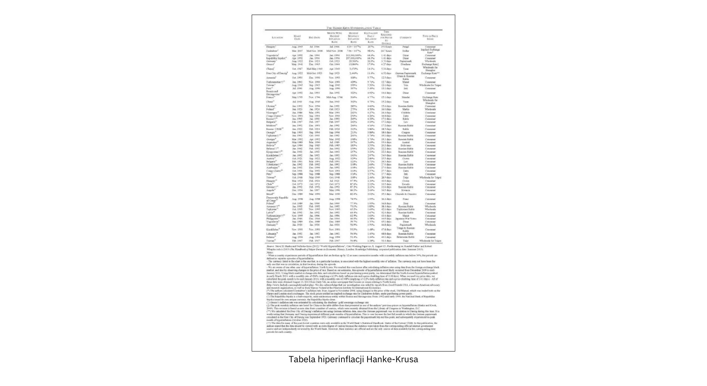

zoom

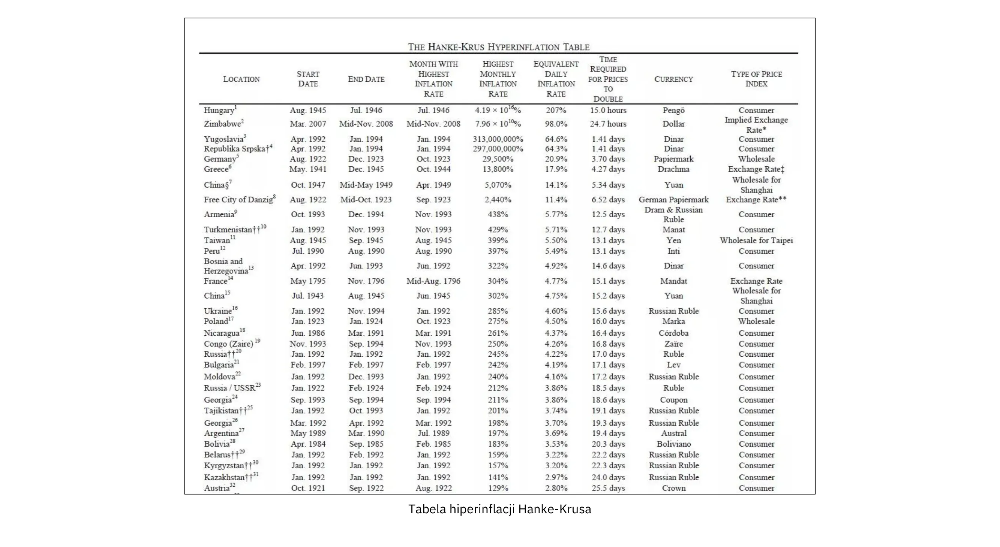

Należy zauważyć, że definicja ta, choć precyzyjna, może wykluczać pewne epizody hiperinflacji ze względu na rygorystyczność progu 50%. Istnieje możliwość rozszerzenia tej definicji o inne epizody, które choć nie spełniają ściśle kryteriów Cagana, to jednak reprezentują okresy niezwykle wysokiej inflacji. Ta obserwacja otwiera drzwi do szerszej eksploracji zjawiska hiperinflacji, pozwalając na bardziej zniuansowane zrozumienie jego przyczyn i skutków. W kolejnych dyskusjach rozważymy rewizję tej definicji i zbadanie epizodów hiperinflacji nieobjętych ścisłymi kryteriami Cagana.

### Definicja hiperinflacji według Cagana

Philip Cagan mógł ustanowić arbitralny kamień milowy z 50% miesięcznym progiem inflacji przy definiowaniu hiperinflacji. Sam przyznaje, że definicja ta jest arbitralna i służy przede wszystkim jego analizie opartej na siedmiu epizodach hiperinflacji. Badanie danych Cagana ujawnia, że trzy epizody hiperinflacji z najniższymi miesięcznymi stopami inflacji wynosiły około 47%, 46% i 57%. Wydaje się, że próg 50% został wybrany w celu uwzględnienia tych przypadków w jego badaniu.

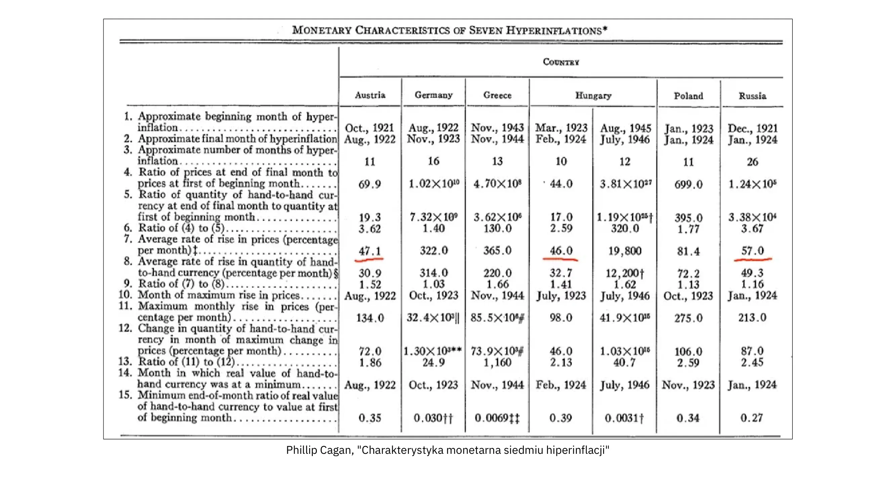

- Kontekst historyczny:

Definicja Cagana pochodzi z 1956 roku i opiera się na ograniczonej liczbie epizodów hiperinflacji dostępnych w tamtym czasie.

- Obserwacje Cagana:

Według Cagana, żaden epizod nie osiągnął progu około 50% bez przejścia do poważniejszej hiperinflacji, co może uzasadniać wybór tego progu.

- Krytyka definicji Cagana:

Inni ekonomiści, tacy jak Bernholz, autor książki Monetary Regime and Inflation, również określili próg 50% jako arbitralny.

Bernholz zauważa, że istnieją epizody wysokiej inflacji o takich samych cechach jakościowych jak epizody hiperinflacji, bez osiągnięcia progu 50%.

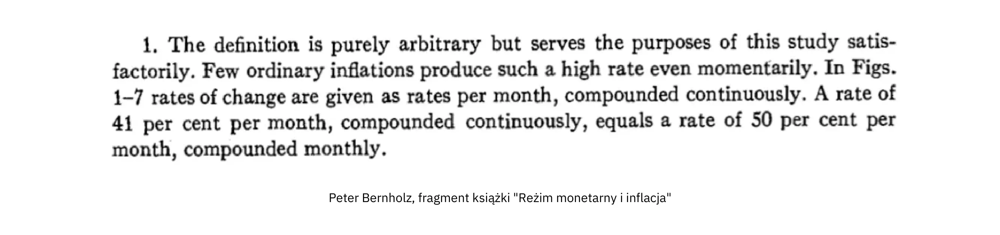

Refleksja ta skłania nas do zakwestionowania sztywności tradycyjnej definicji hiperinflacji i podkreśla potrzebę zrewidowania tego progu poprzez uwzględnienie większej liczby epizodów i danych historycznych. Definicja hiperinflacji może wymagać elastyczności, aby objąć różne przejawy skrajnej inflacji w różnych kontekstach gospodarczych i historycznych.

### Definicja hiperinflacji według Rady Międzynarodowych Standardów Rachunkowości (IASB)

IASB oferuje unikalną perspektywę hiperinflacji, koncentrując się na praktykach księgowych w okresach hiperinflacji. Podejście to ma kluczowe znaczenie dla księgowych i przedsiębiorstw działających w środowiskach hiperinflacyjnych, w których wartość pieniężna podlega gwałtownym wahaniom. Wytyczne IASB identyfikują różne wskaźniki hiperinflacji:

- Preferencje dla aktywów niepieniężnych:**

Osoby fizyczne wolą przechowywać wartość w towarach niż w walucie ze względu na szybką deprecjację wartości pieniężnej.

- Wycena towarów i usług:**

Mieszkańcy nie obliczają wartości towarów i usług w lokalnej walucie, co odzwierciedla utratę zaufania do lokalnej waluty.

- Odszkodowanie za utratę wartości pieniężnej:**

Ceny uwzględniają rekompensatę za utratę wartości pieniężnej podczas zakupów kredytowych, ilustrując wpływ inflacji na codzienne transakcje.

- Indeksacja cen, płac i odsetek:**

Ceny, płace i odsetki są dostosowywane w oparciu o indeks, aby zrekompensować inflację.

- Skumulowana inflacja w ciągu trzech lat:**

Skumulowana inflacja w ciągu trzech lat zbliża się do 100% (około 24% rocznie), co kontrastuje z definicją Cagana 50% miesięcznej inflacji.

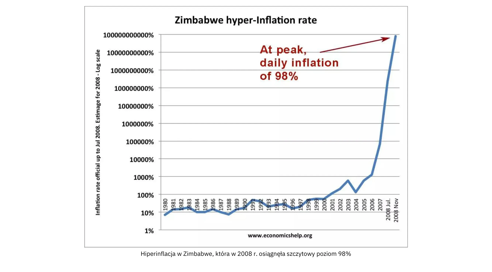

Zgodnie z kryteriami IASB, kilka krajów, w tym Argentyna, Etiopia, Haiti, Iran, Liban, Sudan, Sudan Południowy, Surinam, Syria, Turcja, Wenezuela, Jemen i Zimbabwe, doświadcza obecnie hiperinflacji.

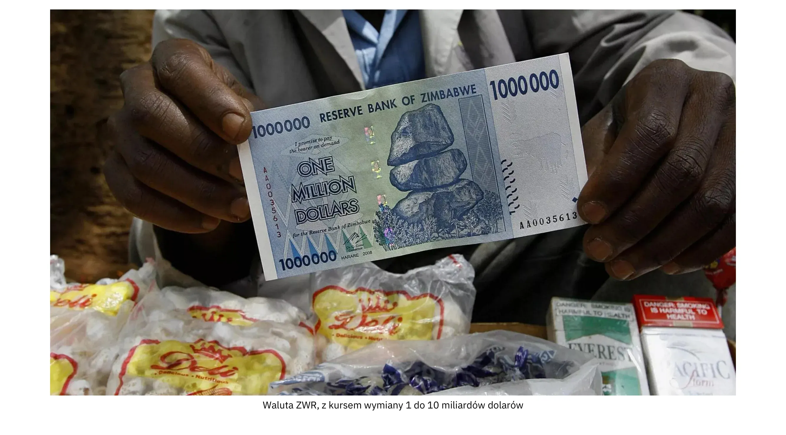

Definicja przedstawiona przez IASB odchodzi od rygorystycznego progu ilościowego Cagana poprzez włączenie jakościowej analizy zachowań gospodarczych i praktycznych dostosowań w obliczu hiperinflacji. Pokazuje to, że hiperinflacja jest złożonym zjawiskiem, które wymaga wielowymiarowego zrozumienia, aby zrozumieć jej rzeczywiste implikacje, szczególnie w dziedzinie rachunkowości, która ma kluczowe znaczenie dla stabilności i przejrzystości finansowej przedsiębiorstw i rynków.

### Ile w sumie było hiperinflacji?

Powszechne definicje hiperinflacji, takie jak ta zaproponowana przez Cagana, określająca miesięczną stopę inflacji na poziomie 50%, mogą być czasami mylące lub zbyt uproszczone. Przykładowo, dwa kraje doświadczające rocznych stóp inflacji na poziomie odpowiednio 1000% i 3000% mogą być postrzegane inaczej w oparciu o miesięczny rozkład tej inflacji. Jeśli żaden miesiąc nie przekroczy progu 50%, zgodnie z definicją Cagana, kraje te nie zostaną sklasyfikowane jako znajdujące się w stanie hiperinflacji. Takie podejście może zatem prowadzić do anomalii w klasyfikacji hiperinflacji, zwłaszcza przy porównywaniu skumulowanych inflacji w ciągu roku.

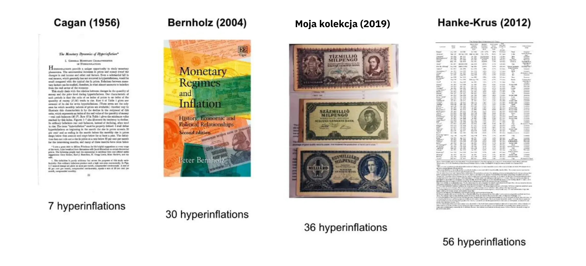

- Praca Cagana "Monetary Dynamics of Hyperinflation" zawiera fundamentalną analizę hiperinflacji.
- Książka Bernholza bada 30 różnych okresów hiperinflacji, rozszerzając tym samym zakres analizy.
- David St-Onge (autor tego kursu) posiada osobistą kolekcję banknotów z 36 okresów hiperinflacji, co pozwala na namacalne i historyczne zrozumienie.
- Tabela Hanky'ego Crossa (wersja z 2012 r., zaktualizowana w 2016 r. o Wenezuelę), zawierająca 57 okresów hiperinflacji w oparciu o definicję Cagana.

Warto zauważyć, że niektóre historyczne okresy wysokiej inflacji nie są uwzględniane w klasycznych tabelach hiperinflacji, często ze względu na surowe kryteria klasyfikacji. Na przykład podczas amerykańskiej wojny o niepodległość w listopadzie 1779 r. i podczas amerykańskiej wojny secesyjnej w marcu 1864 r. miesięczne stopy inflacji wyniosły odpowiednio 47,4% i 40%. Wskaźniki te, choć wysokie, nie przekraczają progu 50% określonego przez Cagana, wykluczając tym samym te okresy z klasyfikacji jako przypadki hiperinflacji. To pominięcie uwypukla ograniczenia sztywnych definicji i podkreśla potrzebę bardziej zniuansowanego zrozumienia hiperinflacji w jej pełnej złożoności.

## Podobieństwa między Weimarem a Zimbabwe

<chapterId>11eef458-aab8-5c63-8523-264d0ba69f5d</chapterId>

### Dwie epoki, dwie katastrofy

W tym rozdziale przyjrzymy się skutkom hiperinflacji, koncentrując się na doświadczeniach Zimbabwe i Republiki Weimarskiej. W trakcie moich badań priorytetowo traktowałem bezpośrednie świadectwa osób, które przeżyły te okresy hiperinflacji, zamiast przyjmować podejście czysto ekonomiczne lub statystyczne.

Kilka książek było szczególnie pouczających:

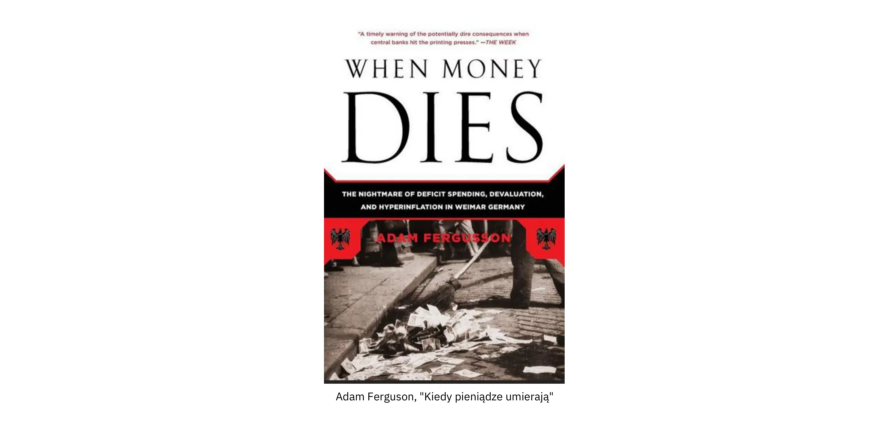

- "When Money Dies" Adama Fergusona śledzi hiperinflację po I wojnie światowej w Niemczech, a także w Austrii i na Węgrzech.
- Dwie książki na temat hiperinflacji w Zimbabwe, "Zimbabwe Warm Heart Ugly Face" i "Hard Boiled Egg Index" autorstwa odpowiednio Jérôme'a Gardnera i Kudzai Josepha Gou Min-Yu, zawierają przejmujące świadectwa dyrektora generalnego sieci sklepów odzieżowych i bankiera rolnego na temat ich doświadczeń w tym burzliwym okresie.

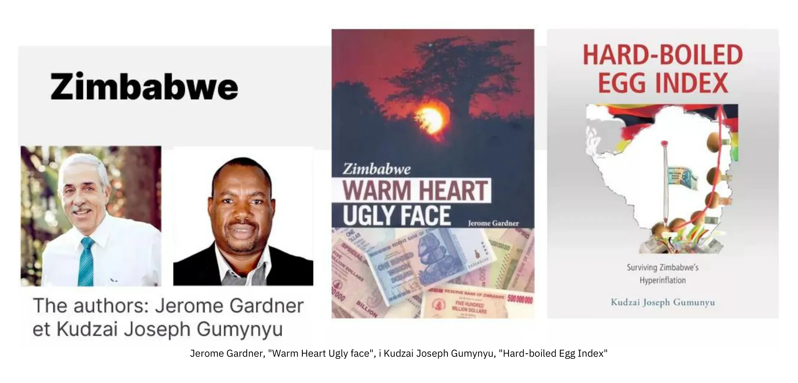

Podczas konsolidacji moich notatek zauważyłem liczne podobieństwa między doświadczeniami hiperinflacji w Zimbabwe i Republice Weimarskiej, pomimo 90-letniej różnicy między nimi. Zidentyfikowałem około 17 podobieństw, z czego 13 ilustruje swego rodzaju progresję w kierunku katastrofy gospodarczej przedstawionej w tych świadectwach. Te fascynujące podobieństwa pokazują powtarzalną i niszczycielską naturę hiperinflacji w czasie i poza granicami. Dzisiaj przeanalizujemy te podobieństwa i sposób, w jaki przedstawiają one niepokojącą trajektorię w okresach hiperinflacji.

### Analiza porównawcza: Zimbabwe i Republika Weimarska

Gra 14 różnic!

#### 1. Niedobór pieniędzy

Gdy waluta traci na wartości w zawrotnym tempie, nawet najbardziej ambitne próby zalania rynku nowymi banknotami mogą okazać się niewystarczające. Nieustanny popyt na namacalną walutę może znacznie przewyższyć zdolność banków centralnych do produkcji banknotów, powodując bezprecedensowe kryzysy płynności.

> Weimar: "W ciągu tego miesiąca zostanie on zwiększony do prawie 4 miliardów marek papierowych, dzięki czemu mamy nadzieję, że niedobór waluty zostanie ostatecznie przezwyciężony"

> Zimbabwe: "Od 2002 r. do stycznia 2009 r. wystąpiło kilka krytycznych niedoborów płynności. Po prostu nie było wystarczającej liczby banknotów wydrukowanych lub znajdujących się w obiegu, aby nadążyć za gwałtownie rosnącą inflacją"

#### 2. "I to jest nawóz!"

Szybkość, z jaką waluta może stracić na wartości w pewnych sytuacjach gospodarczych, jest zdumiewająca. Astronomiczne ilości banknotów mogą zostać wyemitowane w rekordowym czasie, natychmiast przekształcając niegdyś znaczne sumy w coś tak nieznaczącego jak obornik.

> Weimar: "Obecna łączna emisja wynosi 63 000 miliardów. W ciągu kilku dni będziemy zatem w stanie wyemitować dwie trzecie całkowitego nakładu w ciągu jednego dnia"

> Zimbabwe: "17 września 2006 r. gubernator RBZ, Gideon Gono, oświadczył: '10 bilionów wciąż tam jest i stało się gnojem'"

#### 3. Banknoty są warte mniej niż papier, na którym zostały wydrukowane

W pewnych okolicznościach gospodarczych wartość wewnętrzna banknotu może stać się niższa niż wartość papieru, na którym został wydrukowany. Ta drastyczna deprecjacja sprawia, że banknoty, które normalnie są symbolem wartości i siły nabywczej, stają się zwykłymi kawałkami bezwartościowego papieru.

> Weimar: "Całe nominały banknotów były prawie bezwartościowe, gdy tylko wyszły spod prasy drukarskiej"

> Zimbabwe: "Bank centralny zmarnował pieniądze, drukując banknot, który nie był wart papieru, na którym został wydrukowany. Innymi słowy, jego wartość była niższa niż papieru toaletowego. Choć może to zabrzmieć absurdalnie, taniej było użyć banknotu o wartości 100 bilionów ZWD jako papieru toaletowego niż kupić prawdziwy papier toaletowy"

#### 4. Liczenie pieniędzy

Gdy waluta gwałtownie traci na wartości, nawet najprostsze transakcje mogą stać się pracochłonnymi zadaniami. Obliczenie ceny przedmiotu lub po prostu policzenie banknotów potrzebnych do zapłaty może zająć kilka minut, dodając Layer złożoności do codziennych interakcji.

> Weimar: "Najzwyklejszy zakup w sklepie wymagał trzech lub czterech minut obliczeń, a po ustaleniu ceny zwykle potrzeba było jeszcze kilku minut na policzenie banknotów"

> Zimbabwe: "Kierownicy sklepów mogli również zatrudnić pracownika tymczasowego, który zastępował pracownika liczącego pieniądze przez cały dzień. Oczywiście liczenie pieniędzy w sklepie na potrzeby administracji i wpłaty bankowej to jedno, ale cały proces trzeba było powtórzyć w banku podczas wpłaty"

:::video id=910231d7-af90-4ab8-b74c-bfb81caebfb2:::

Uzbecka technika liczenia pieniędzy

#### 5. Płatności czekiem

W zakłóconych gospodarkach tradycyjne metody płatności, takie jak czeki, mogą szybko stracić swoją skuteczność. Banki, przytłoczone rosnącym popytem na walutę z powodu hiperinflacji, mogą racjonować lub opóźniać realizację czeków, zmniejszając w ten sposób ich rzeczywistą wartość. Ta niestabilność często prowadzi do priorytetyzacji metod płatności, gdzie ceny mogą się różnić w zależności od wybranej metody płatności.

> Weimar: "Wzrost cen zwiększył popyt na pieniądz, zarówno ze strony państwa, jak i innych pracodawców. Prywatne banki nie mogły w ogóle zaspokoić popytu i musiały racjonować realizację czeków, więc niezrealizowane czeki pozostawały zamrożone, a ich siła nabywcza malała"
> Zimbabwe: "Wartość pieniądza w czasie stworzyła trzy ceny towarów i usług: cenę gotówki, cenę rozliczenia brutto w czasie rzeczywistym i cenę czeku. Ostatecznie nikt nie akceptował czeków, których realizacja trwała pięć dni"

#### 6. "Burner-preneurs"

Wraz z erozją wartości waluty pojawiają się nowe możliwości gospodarcze, wykorzystujące zakłócenia na rynku. Przedsiębiorcy ci, często określani jako "Burner-preneurs", mogą prosperować, pożyczając zdewaluowaną walutę, aby inwestować w aktywa materialne, a następnie spłacać swoje długi jeszcze bardziej zdewaluowaną walutą.

Weimar: "Spekulacje na temat inflacji polegały na pożyczaniu papierowych marek, przekształcaniu ich w towary i fabryki, a następnie spłacaniu pożyczkodawców zdeprecjonowanym papierem"

Zimbabwe: "Spalacze-preneurs"

#### 7. Uczciwość i praca Hard tracą na atrakcyjności

W niestabilnym kontekście ekonomicznym tradycyjne wartości pracy, gospodarności i uczciwości mogą zostać przyćmione przez pokusę szybkiego wzbogacenia się. Spekulacje i handel walutami często oferują znacznie wyższe nagrody niż regularna praca, co prowadzi do zakłócenia priorytetów społecznych.

Weimar: "Gdy stare cnoty oszczędności, uczciwości i pracy Hard straciły na atrakcyjności, wszyscy starali się szybko wzbogacić, zwłaszcza że spekulacje walutowe lub giełdowe mogły przynieść znacznie więcej niż praca"

Zimbabwe: "Praktyki te, choć wzbogaciły kilka osób, zubożyły miejską klasę robotniczą i ludność wiejską. Edukacja straciła na wartości, ponieważ handel ten był napędzany przez ludzi, którzy nie potrzebowali wykształcenia ani pracy Hard, aby to uzasadnić. Wszystko, czego potrzebowali, to koneksje i kapitał początkowy, aby rozpocząć swój łatwy biznes"

#### 8. "Banki świata"

W sytuacjach hiperinflacji lub kryzysu monetarnego często pojawiają się równoległe i nieuregulowane rynki walut obcych. Te nieformalne "banki", często humorystycznie nazywane "bankami światowymi" lub innymi lokalnymi nazwami, stanowią schronienie dla tych, którzy chcą chronić swoje aktywa przed dewaluacją. Chociaż rynki te mogą zapewnić niezbędną ekonomiczną linię życia, często podkreślają one powszechną nieufność wobec oficjalnych instytucji finansowych i polityki rządu.

Weimar: "Ich transakcje były przeprowadzane głównie za pośrednictwem tak zwanych Winkelbankierów, operatorów ulicznych, którzy pojawili się wraz z inflacją i którzy, prosperując w chorej gospodarce, żyli całkowicie wykorzystując różnicę między cenami kupna i sprzedaży walut obcych"

Zimbabwe: "Zajmowali się również wymianą walut. Działali bezkarnie między 2. i 6. aleją a Fort Street w Bulawayo, dzięki swoim sprytnym praktykom biznesowym, które często wiązały się z korupcją i innymi nielegalnymi działaniami. Ten obszar miasta był znany jako "Bank Światowy""

Argentyna: "Poszedłem więc tam, gdzie chodzą wszyscy Argentyńczycy: do jaskiń, które znajdują się w dzielnicy Florida w samym sercu Buenos Aires" - TheBigWhale

#### 9. Wymiana walut obcych była nielegalna

Rządy, starając się ustabilizować własną walutę i kontrolować przepływ kapitału, mogą uczynić te transakcje walutowe nielegalnymi. Te represyjne środki, choć mają na celu ochronę krajowej gospodarki, często mogą mieć odwrotny skutek, pogłębiając nieufność społeczną i zachęcając do czarnego rynku.

Weimar: "Ludzie uciekali się do handlu wymiennego i stopniowo zwracali się ku obcym walutom jako jedynym niezawodnym środkom Exchange. Wprowadzono nowe dekrety dotyczące zakupu zagranicznych weksli i używania obcych walut do płatności krajowych. Oprócz kary pozbawienia wolności można było teraz nakładać grzywny w wysokości do dziesięciokrotności kwoty nielegalnej transakcji"

Zimbabwe: "Naloty na firmy doprowadziły do uwięzienia kilku biznesmenów z Bulawayo na weekend i nałożenia grzywien w wysokości dwukrotności odzyskanej waluty obcej, po czym ta odwaga ustąpiła"

#### 10. Kontrola kapitału

Kiedy kraj staje w obliczu kryzysu walutowego lub gospodarczego, jedną z powszechnych reakcji rządów jest ścisła kontrola nad przepływem i formami kapitału. Czy to poprzez nakazy wymuszające akceptację zdewaluowanych walut krajowych, czy też poprzez surowe sankcje wobec tych, którzy odrzucają określone metody płatności, środki te często mają na celu powstrzymanie paniki i przywrócenie zaufania. Jednak ich skuteczność jest różna, a czasami środki te mogą okazać się przeciwskuteczne lub oderwane od rzeczywistości doświadczanej przez obywateli.

Weimar: "Kupcy zostali niedawno zmuszeni nowym dekretem do przyjmowania banknotów państwowych; ale ponieważ zezwalał on również na dalsze używanie obcych walut do wszystkich zakupów, kupcy generalnie znajdowali wymówki, by przyjmować prawie nic innego"

Zimbabwe: "W dniu 12 grudnia 2008 r. rząd wprowadził SI 175/2008 dotyczący płatności czekami. Stwierdzał on, że "karą za odmowę płatności czekiem/kartą bankową lub jakąkolwiek inną metodą płatności elektronicznej za pośrednictwem banku będzie grzywna 8 stopnia lub kara pozbawienia wolności na okres sześciu miesięcy lub obie te kary" Oczywiście zignorowaliśmy SI, ponieważ była ona całkowicie oderwana od rzeczywistości"

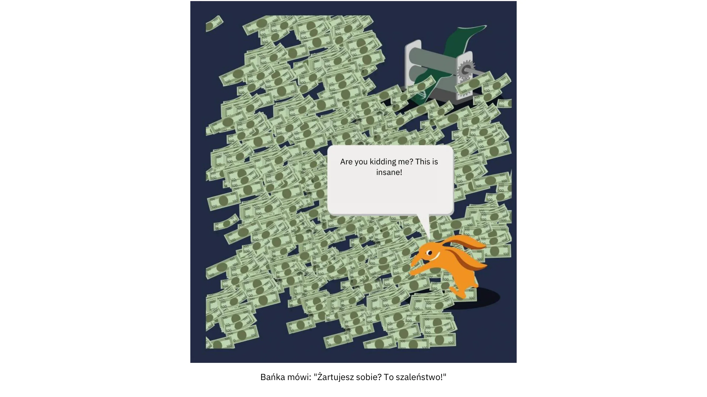

#### 11. Zmuszeni do utrzymywania otwartych sklepów

Kiedy gospodarka się załamuje, a waluta traci na wartości, rządy mogą uciekać się do drastycznych środków, aby zachować pozory normalności.

Weimar: "Kupcy, którzy kontynuowali swoją działalność, podlegali nowemu rozporządzeniu, uchwalonemu 22 października, nakazującemu im pozostawienie otwartych sklepów i oferowanie towarów w Exchange za papierowe marki"

Zimbabwe: "Pozostały tylko puste stalowe półki oraz lodówki, chłodziarki i zamrażarki. Tragedia polegała na tym, że sklep był nadal otwarty, ponieważ nie odważono się go zamknąć z powodu napięć politycznych i strachu przed aresztowaniem przywódców przez rządowe siły kontroli cen. Nawet pracownicy nie zostali zwolnieni, ponieważ wszyscy myśleli, że znajdzie się szybkie rozwiązanie"

#### 12. Każdy jest przestępcą

W obliczu upadającej gospodarki i wszechobecnych regulacji granica między przetrwaniem a przestępczością zaciera się.

Weimar: "Wszystkie przestępstwa przeciwko państwu, każde z nich, w różnym stopniu, stały się kwestią przetrwania dla jednostek"

> Zimbabwe: "Każdy mieszkaniec Zimbabwe był przestępcą. Jakkolwiek szorstko by to nie brzmiało, była to prawda. Z niezliczoną ilością drobnych przepisów regulujących każdy aspekt życia, nieuniknione było, że każdy łamał prawo każdego dnia. Posiadanie obcej waluty było nielegalne, zgodnie z SI opublikowanym w 2004 roku. Posiadanie wielu kont bankowych w celu ominięcia dziennego limitu wypłat było nielegalne. Brak odpowiednich tablic rejestracyjnych na samochodzie, licencji na radio samochodowe lub pozwolenia na generator to prawa, które ktoś, gdzieś, łamał"

#### 13. Kup walutę obcą za wszelką cenę

Szaleńczy zakup walut obcych często stanowił krytyczny punkt zwrotny w dewaluacji waluty, pogłębiając spadek wartości wewnętrznej.

> Weimar: "Fritz Mannheimer, na polecenie swojego szefa, wyszedł w sierpniu 1921 r. i zaczął kupować obce waluty za wszelką cenę - "ponieważ Niemcy miały nieskończoną ilość papierowych marek, ale nie miały obcych walut" Była to pierwsza oznaka absolutnego załamania wartości marki"

> Zimbabwe: Zarzucano im, że otrzymywali dzienne cele do spełnienia, ponieważ niektóre z wymagań dotyczących rynku Forex były pilne i kupowali za wszelką cenę, aby zgromadzić forex, aby dotrzymać terminu. Ta rzekoma praktyka została oskarżona o podsycanie ognia dewaluacji, ponieważ wartość dolara zimbabweńskiego nadal gwałtownie spadała"

### Podsumowanie procesu

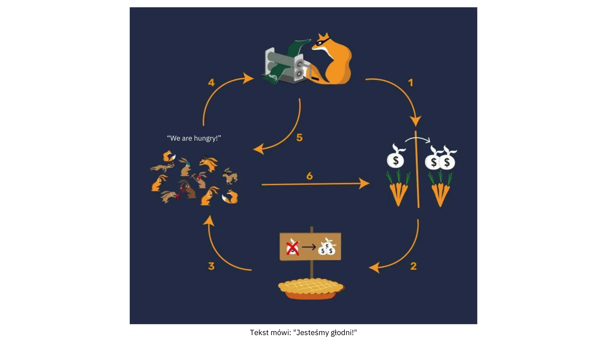

Analizując trajektorię gospodarczą, widać, że po osiągnięciu wysokiej inflacji wartość masy monetarnej pogarsza się. Ta dewaluacja prowadzi do kilku komplikacji, w tym niedoboru banknotów. W tym kontekście pojawiają się możliwości arbitrażu, szczególnie w odpowiedzi na wahania kursów Exchange. W rezultacie wiele osób korzysta z tego arbitrażu, inwestując znaczne kwoty w aktywa materialne w oczekiwaniu na przyszłą dewaluację waluty, która pozwoliłaby im spłacić swoje długi osłabioną walutą. Takie otoczenie gospodarcze podważa atrakcyjność tradycyjnych miejsc pracy, a w konsekwencji prowadzi do erozji spójności społecznej.

W odpowiedzi na tę sytuację rząd nakłada drakońskie regulacje, w tym kontrolę kapitału. Nakazuje również sprzedawcom akceptowanie waluty krajowej i czeków. Z czasem wprowadzane są nowe przepisy, rozszerzające definicję zachowań przestępczych. Ostatecznie kurs Exchange rośnie wykładniczo, ponieważ rząd jest skłonny do Exchange swojej waluty, drukowanej po niższych kosztach, w zamian za bardziej solidne waluty obce.

### 4 Podobieństwa w konsekwencjach hiperinflacji

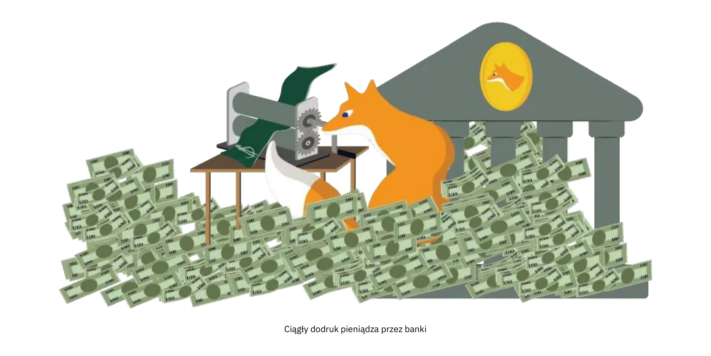

#### 1. Ropa naftowa i metale

W okresie weimarskim w Niemczech kradzież cennych materiałów była tak powszechna, że ołów z dachów był często kradziony. W Zimbabwe desperacja doprowadziła niektórych do przerwania sieci energetycznej w celu wydobycia oleju z transformatorów i wykorzystania go w swoich pojazdach.

Weimar: "Metalowe tablice pomników narodowych musiały zostać usunięte w celu przechowania. Mosiężne tabliczki z dzwonkami zostały skradzione z drzwi Ambasady Brytyjskiej w Berlinie"

Zimbabwe: "Co gorsza, z powodu braku obcej waluty zabrakło oleju smarowego do samochodów, a transformatory stały się łatwym celem dla złodziei, którzy spuszczali olej chłodzący podczas przerw w dostawie prądu"

#### 2. Pociągi

Dewaluacja waluty może skłaniać obywateli do zachowań sprzyjających przetrwaniu, w tym wandalizmu. W obliczu załamującej się gospodarki, kosztowna infrastruktura publiczna, taka jak systemy transportowe, może być zagrożona, co prowadzi do katastrofalnych konsekwencji społecznych.

> Weimar: "W Berlinie system tramwajowy przestał działać z powodu braku funduszy"

> Zimbabwe: "Jednym z najbardziej niepokojących i smutnych scenariuszy była kradzież prawie całej miedzianej linii elektrycznej łączącej Harare z Dabuką (ponad 280 kilometrów). Po jej ukończeniu była to duma Zimbabwe, a wzdłuż tej trasy kursowały szybkie elektryczne pociągi pasażerskie i towarowe"

#### 3. "Mealie Meal"

W kontekście skromnych wynagrodzeń i niestabilnej gospodarki, firmy były zmuszone zapewnić swoim pracownikom żywność, aby utrzymać produktywność i wydajność operacyjną. Inicjatywa ta była nie tylko sposobem na zrekompensowanie niedoborów i wysokich kosztów żywności, ale także strategią mającą na celu zatrzymanie pracowników w trudnym otoczeniu gospodarczym.

> Weimar: "W Berlinie pracownicy biurowi, którzy stanowili bardzo ważną klasę w stolicy, mieli całkowicie nieadekwatne pensje w wysokości od 12 000 do 20 000 miesięcznie (równowartość od 12 do 19 funtów rocznie), które stale się kurczyły; ale większość z nich mogła nadal otrzymywać obiady za symboliczną kwotę, zapewnianą przez ich biura, dzięki czemu ciało i dusza mogły ledwo trzymać się razem"

> Zimbabwe: "Na tym etapie zapewnialiśmy wszystkim naszym pracownikom darmowy lunch. Mączka kukurydziana była niezbędna do dalszego funkcjonowania naszej firmy, ponieważ w wielu przypadkach był to jedyny posiłek, jaki nasi pracownicy otrzymywali każdego dnia"

#### 4. Kupony na benzynę

Ludność poszukiwała stabilnych alternatyw dla transakcji. W Weimarze produkty takie jak mosiądz i paliwo służyły jako nośniki Exchange ze względu na ich stałą wartość wewnętrzną. W Zimbabwe, w obliczu gwałtownej dewaluacji dolara zimbabweńskiego, kupony na benzynę, które reprezentowały stałą ilość niezbędnego produktu, stały się de facto walutą. Sytuacje te pokazują, jak społeczeństwa dostosowują się do ekstremalnych warunków ekonomicznych, opracowując innowacyjne rozwiązania w celu utrzymania handlu i gospodarki.

Weimar: "Barter był już zwyczajową formą Exchange; ale teraz towary takie jak mosiądz i paliwo stały się powszechną walutą zakupów i płatności"

Zimbabwe: "Te bony wykorzystujemy teraz do płacenia czynszu wynajmującym, podatków miejskich, rachunków telefonicznych - w rzeczywistości prawie wszystkiego - ponieważ wszyscy przestali akceptować płatności w dolarach zimbabweńskich i czekach"

#### Wnioski

Na tym kończymy ten materiał wideo poświęcony podobieństwom doświadczeń w okresach hiperinflacji w Zimbabwe i Republice Weimarskiej. W następnym filmie omówimy różnice i współczesne podobieństwa. Dziękujemy.

## Weimar kontra Zimbabwe: Różnice i współczesne podobieństwa

<chapterId>643f279c-d89f-5600-a2e2-b1bbbba0ab69</chapterId>

W tym rozdziale zbadamy różnice i współczesne podobieństwa między przeszłymi i obecnymi okresami hiperinflacji, wraz z anegdotami i odpowiednimi porównaniami dla dnia dzisiejszego.

### Różnice między Republiką Weimarską a Zimbabwe

#### 1. To wina dolara!

W Niemczech powszechne było przypisywanie inflacji wzrostowi wartości dolara, a nie wewnętrznej dewaluacji własnej waluty. Wielu uważało, że obserwowane zjawisko było spowodowane aprecjacją dolara. Takie postrzeganie odrzucało jakiekolwiek uznanie związku między ich trudnościami gospodarczymi a dewaluacją pieniądza, głównie wywołaną nadmierną kreacją pieniądza. Książka "When Money Dies" wyraźnie ilustruje ten brak zrozumienia wśród niemieckiej ludności. Z kolei w Zimbabwe sytuacja wyglądała inaczej: obywatele byli w pełni świadomi przyczyn hiperinflacji, której doświadczali.

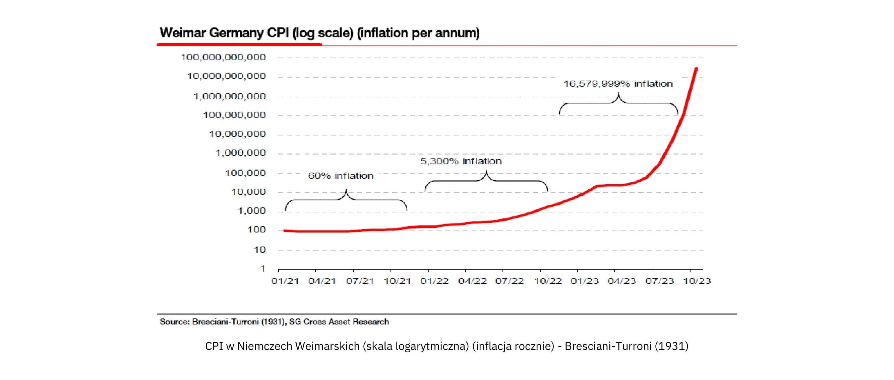

#### 2. Pieniądze awaryjne (Notgeld)

W obliczu kryzysu monetarnego i gospodarczego Niemcy uciekły się do "Notgeld" (pieniądza awaryjnego). Banknoty te, drukowane przez miasta lub określone firmy, miały na celu Address niedobór wspólnej waluty.

Co ciekawe, Francja również uciekła się do notgeldu, szczególnie w latach 20. ubiegłego wieku. Inicjatywa ta była nie tylko bezpośrednią konsekwencją hiperinflacji, ale także miała swoje korzenie w zakłóceniach spowodowanych I wojną światową. Wojna nie tylko zdestabilizowała gospodarkę, ale także zwiększyła koszt metali. W rezultacie wartość wewnętrzna metalowych monet często przekraczała ich wartość nominalną, co skłaniało ludzi do ich gromadzenia. Wobec braku monet, niektóre instytucje, takie jak Lyońska Izba Handlowa, drukowały własny Notgeld.

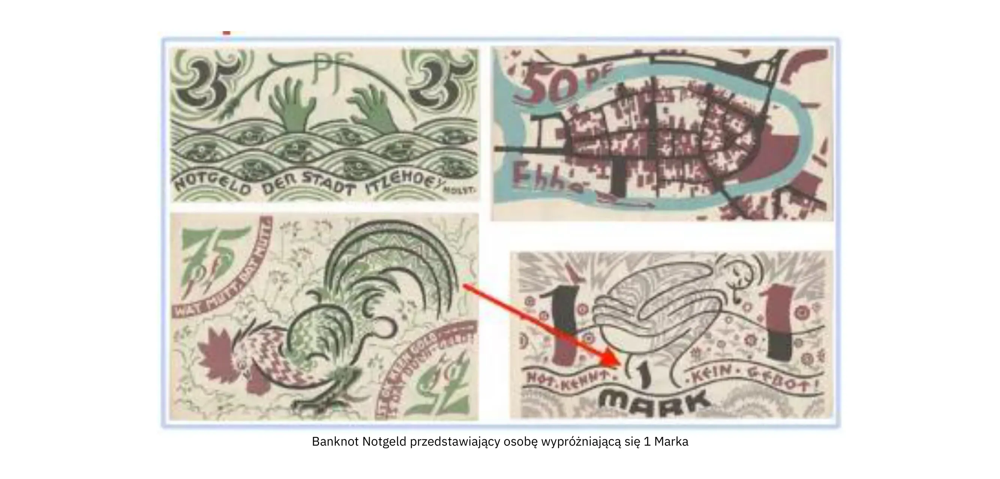

> "Co ma być zrobione, musi być zrobione" - lokalne powiedzenie

Wśród Notgeld wyróżnia się jeden szczególny banknot. Znajduje się na nim przejmująca ilustracja: w centrum przedstawiono osobę wypróżniającą się na Marka. Na odwrocie znajduje się tabela cen z lat 1913-1921 ilustrująca wzrost inflacji w tym okresie.

Artysta stojący za tym Notgeld wydaje się w ironiczny sposób krytykować władze odpowiedzialne za kryzys hiperinflacyjny. Na banknocie widnieje napis "Konieczność nie zna prawa". Inne wyrażenie charakterystyczne dla miejsca pochodzenia Notgeldu brzmi: "To, co musi zostać zrobione, musi zostać zrobione"

> "konieczność nie zna prawa"

> Pierwszy Shitcoin: Anegdotycznie, patrząc na centralną ilustrację banknotu, gdzie waluta jest dosłownie dewaluowana przez działania jednostki, można by ją nazwać pierwszym "shitcoinem"

#### 3. Skrypty dłużne i hipoteki

W Weimarze niektóre długi zostały przeszacowane, aby zrekompensować wpływ inflacji. Środek ten nie został przyjęty w Zimbabwe.

> Weimar: "Decyzja o rewaluacji pożyczek rządowych stała się prawem w 1925 roku, w wyniku czego akcjonariusze otrzymali 2,5% początkowej inwestycji, pod warunkiem, że wszystkie reparacje zostały spłacone"

> Zimbabwe: "W lipcu 2007 r. (trzy lata później) mogłem wyjąć z kieszeni zdewaluowany banknot ZDW o wartości 500 000 (bt "000"), wart obecnie 1,67 USD według kursu rynku równoległego, i spłacić kredyt hipoteczny, który miał być spłacany przez dwadzieścia lat. Co więcej, banknot ten stanowił zaledwie 0,49 procent mojego miesięcznego wynagrodzenia za ten sam miesiąc"

Aby dowiedzieć się więcej o zarządzaniu niemieckim kryzysem, ta książka jest również niezbędna.

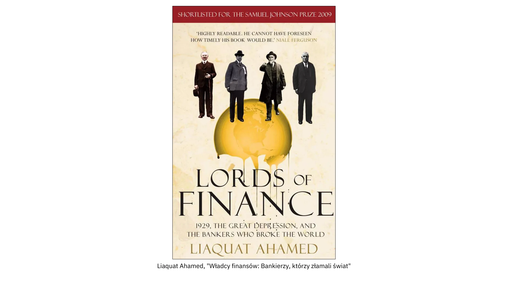

### Współczesne podobieństwa

#### 1. Manipulowanie polityką pieniężną w celu kontrolowania gospodarki.

W historii Republiki Weimarskiej wyraźnie widać, że przemysłowcy niechętnie patrzyli na wzrost wartości marki. Ich zdolność do zaciągania pożyczek i spłacania długów za pomocą mocno zdeprecjonowanej waluty dawała im znaczną przewagę. Mechanizm ten ułatwiał budowę ogromnych kompleksów przemysłowych przy niemal zerowych kosztach. Przemysłowcy obawiali się aprecjacji marki, ponieważ utrudniała ona ich działalność. Niektórzy nawet postrzegali szalejącą inflację jako pozytywne zjawisko, wierząc, że zagwarantuje ona zatrudnienie ludności. Nie zdawali sobie jednak sprawy ze szkodliwego wpływu tej inflacji na oszczędności i całą gospodarkę. Dla tych podmiotów gospodarczych druk monetarny był błogosławieństwem.

> Weimar: "Dlatego też bardzo obawiano się aprecjacji marki, a nawet kilka tygodni "stabilności" po Genui spowodowało stagnację biznesu"

> Weimar: "Kręgi przemysłowe stanęły w obliczu niebezpieczeństwa, że gotówka stanie się cenniejsza niż towary i nastąpi załamanie, gdy wszyscy będą próbowali zamienić swoje aktywa na gotówkę"

Współczesną paralelę można nakreślić z wypowiedziami Christine Lagarde, sugerującymi, że obywatele powinni przedkładać perspektywę zatrudnienia nad ochronę swoich oszczędności. Podobnie jak przemysłowcy z Weimaru, wydaje się ona opowiadać za dodrukiem pieniądza jako narzędziem stymulującym zatrudnienie, kosztem wartości oszczędności.

> Christine Lagarde: "Powinniśmy być szczęśliwsi, mając pracę, niż widząc, że nasze oszczędności są chronione"

#### 2. Własność prywatna w czasach konfliktu

Historia Republiki Weimarskiej pokazuje, że w tym okresie aktywa i kapitał przechowywane za granicą zostały skonfiskowane. Środek ten przypomina niedawne wydarzenia w Rosji, zwłaszcza na początku konfliktu. Sytuacje te podkreślają niepokojącą rzeczywistość: w czasach kryzysu poszanowanie własności prywatnej może być zagrożone. Jest to historyczna i współczesna analogia, która podkreśla potencjalne reperkusje kryzysów dla praw jednostki.

> Weimar: "Cały niemiecki kapitał trzymany za granicą został skonfiskowany"

> [20minutes.fr](https://www.20minutes.fr/monde/3286947-20220513-guerre-ukraine-geler-avoirs-russes-vol-non-redistribuer-kiev-poserait-lourdes-questions): "Około 300 miliardów dolarów rosyjskich rezerw przechowywanych za granicą rzeczywiście zostało zamrożonych w ramach zachodnich sankcji, z 640 miliardów dolarów rezerw przechowywanych przez rosyjski bank centralny"

#### 3. Pojęcie ceny rynkowej

W czasach Republiki Weimarskiej rolnicy wyrażali swoje niezadowolenie z "Umlage", które zmuszało ich do dostarczania pierwszych dwóch milionów ton pszenicy produkowanej każdego roku. Regulacja ta powodowała, że połowa całego chleba Supply była wprowadzana na rynek po subsydiowanych cenach. Począwszy od sierpnia, rolnicy ci mieli otrzymywać zapłatę w wysokości ceny na rynku światowym, ponieważ mimo że byli zmuszeni do oddawania pszenicy po obniżonych cenach, nadal musieli kupować nawozy po cenach obowiązujących na rynku światowym.

Sytuacja ta rodzi zasadniczą kwestię związaną z pojęciem ceny rynkowej podczas hiperinflacji. W ówczesnym niemieckim kontekście rolnicy byli zmuszeni sprzedawać swoją pszenicę po cenie niższej od jej wartości, a jednocześnie musieli kupować nawozy po cenach światowych. Taka rozbieżność ekonomiczna uwypukla wyzwania, przed jakimi stoją dziś ceny żywności. Producenci rolni, w obliczu rosnących kosztów nakładów spowodowanych inflacją, przenoszą te koszty na produkty końcowe. Krytykowanie ich za ten wzrost oznacza ignorowanie dynamiki cen rynkowych i presji ekonomicznej, z jaką muszą się zmierzyć. Sprzedaż po sztucznie zaniżonych cenach przy jednoczesnym ponoszeniu wysokich kosztów jest nie do utrzymania dla każdej firmy.

> Weimar: "Interesy rolnicze były niezadowolone z 'Umlage', przymusowej dostawy pierwszych dwóch milionów ton pszenicy produkowanej każdego roku, co pozwalało na sprzedaż połowy całkowitego chleba Supply po niskich cenach. Od sierpnia rolnicy mieli otrzymywać zapłatę w wysokości ceny na rynku światowym, ponieważ chociaż byli zobowiązani do sprzedaży pszenicy po niskich cenach, zawsze musieli płacić za nawozy w wysokości ceny na rynku światowym"

#### 4. Zaprzeczanie związkowi między Supply a inflacją

> Weimar: "Pozostał mocno przywiązany do swojego poglądu, że pieniądz Supply nie był powiązany ani z poziomem cen, ani ze stopami Exchange;"

W dzisiejszych czasach trend ten utrzymuje się, co widać na przykładzie listy wyjaśnień przedstawionych w poprzednim rozdziale przez różnych ekonomistów i instytuty ekonomiczne w celu uzasadnienia inflacji. Powody te są różne, od wydarzeń kulturalnych i celebrytów, takich jak Taylor Swift, Zelda czy Beyoncé, po czynniki globalne, takie jak wojna i pandemia. Wszystkie te powody, choć potencjalnie przyczyniają się do krótkoterminowych wahań gospodarczych, odwracają uwagę od prawdziwej przyczyny: ekspansji pieniądza Supply.

#### 5. Firmy zombie

> Weimar: "Stabilizacja zakończyła okres, w którym przedsiębiorcy mogli pożyczać tyle, ile chcieli, kosztem wszystkich innych. Bardzo duża liczba firm, utworzonych lub rozwiniętych w okresie obfitości pieniądza, szybko stała się nieproduktywna, gdy zabrakło kapitału"

Spółka zombie to firma, która w normalnych warunkach rynkowych byłaby niewypłacalna lub bliska bankructwa, ale nadal działa głównie dzięki tanim pożyczkom. Firmy te zarabiają wystarczająco dużo, aby pokryć swoje długi, ale nie są w stanie znacząco się rozwijać.

Pojęcie spółek zombie nie jest nowe. W rzeczywistości istniało ono w czasach Republiki Weimarskiej. W tym czasie wiele firm zdawało się prosperować, w dużej mierze korzystając z dostępu do darmowych kredytów. Pożyczały one znaczne sumy z nadzieją na późniejszą spłatę w zdeprecjonowanej walucie z powodu szalejącej inflacji. Jednak gdy inflacja ustała, a marka niemiecka odzyskała wartość, firmy te, które nie były naprawdę rentowne operacyjnie lub finansowo, stały się nierentowne i musiały zostać zamknięte.

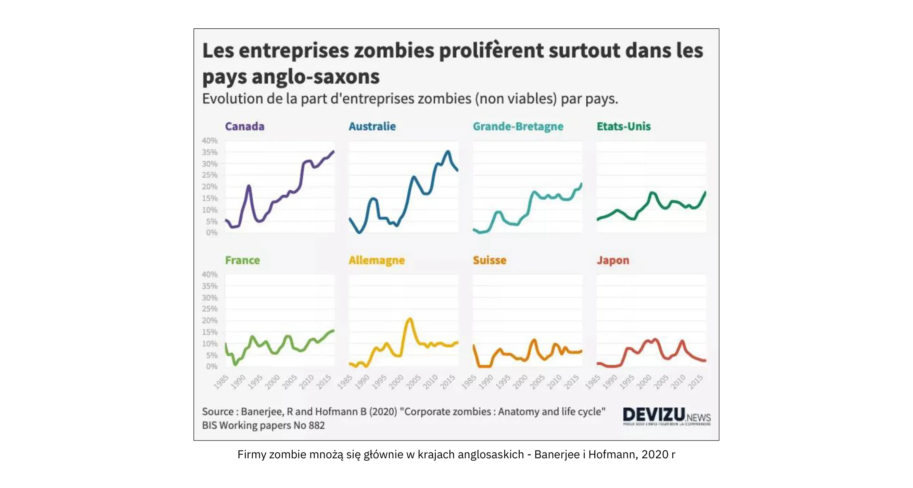

Zjawisko firm-zombie nie ogranicza się do powojennych Niemiec. Nawet dziś wiele dużych korporacji nadal prosperuje dzięki uprzywilejowanemu dostępowi do kredytów o wyjątkowo niskich stopach procentowych. Gdyby musiały pożyczać na bardziej konwencjonalnych warunkach, wiele z nich przestałoby przynosić zyski. Jest to szczególnie istotne w 2023 r., po długim okresie niemal zerowych stóp procentowych, ponieważ stopy zaczęły rosnąć. Ta niedawna zmiana w krajobrazie finansowym będzie niewątpliwie decydującym testem dla tych firm, niegdyś nazywanych "zombie"

#### 6. Bogać się szybko!

Historia ujawnia przypadki, w których jednostki starały się szybko gromadzić bogactwo, jak miało to miejsce w Weimarze i Zimbabwe poprzez arbitraż. Dziś podobny trend można zaobserwować wraz ze wzrostem popularności niektórych kryptowalut. Ludzie są kuszeni szybkimi zyskami, podejmując ryzyko w nadziei na wykładniczy wzrost inwestycji. Podejście to przypomina to obserwowane w okresach hiperinflacji, gdzie arbitraż był wykorzystywany do uzyskiwania szybkich zysków, często kosztem innych.

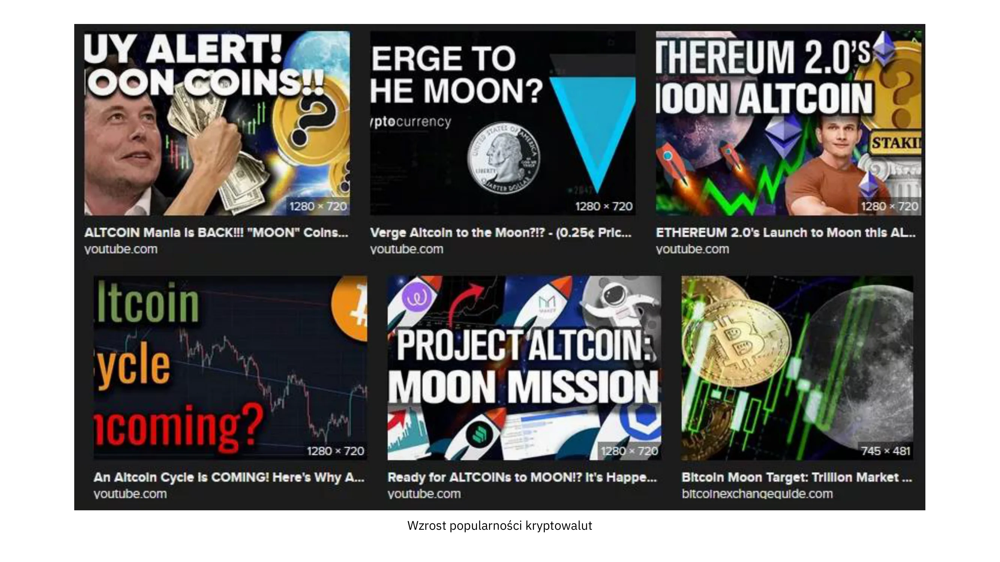

#### 7. Oszczędności - lekarstwo na niepewność

> Wszechobecny i destrukcyjny wpływ ciągłej erozji wartości kapitału i dochodów, a także niepewność co do przyszłości.

Warto zwrócić uwagę na cytat, który podkreśla destrukcyjny wpływ erozji wartości kapitału na spójność społeczną, a także niepewność, jaką ona generuje. Stwierdza on: "wszechobecny i destrukcyjny wpływ ciągłej erozji wartości kapitału i dochodu, a także niepewność co do przyszłości"

Wyobraź sobie scenariusz, w którym masz rodzinę lub bliskich, których chcesz chronić. Pracujesz w Hard i oszczędzasz, aby przewidzieć przyszłą niepewność. Gdyby wszystko było przewidywalne, oszczędzanie byłoby bezużyteczne. Jednak w obliczu nieprzewidzianych okoliczności, takich jak zepsuty samochód, oszczędności stają się kołem ratunkowym. Zmniejszają niepewność świata. Jednak podczas hiperinflacji oszczędzanie staje się wyzwaniem. Pieniądze szybko tracą na wartości, co utrudnia długoterminowe planowanie. Ta niestabilność finansowa może powodować stres i niepokój generate.

Obecnie, przy malejącej sile oszczędności, ich miejsce zajęły inwestycje. Takie podejście wiąże się jednak z pewnym ryzykiem. Oszczędzanie zawsze było lekarstwem na niepewność. Posiadanie rezerw finansowych na wypadek nieprzewidzianych sytuacji przyczynia się do spokoju ducha i wzmacnia spójność społeczną. Podsumowując, ochrona naszych oszczędności jest niezbędna do utrzymania stabilności zarówno społecznej, jak i indywidualnej.

## Redenominacje w Ameryce Łacińskiej

<chapterId>918eafd7-409d-5205-ad52-a52e63b23a64</chapterId>

Przyjrzymy się teraz różnym okresom redenominacji w krajach Ameryki Łacińskiej.

### Objaśnienie wykresów

Na slajdzie po lewej stronie znajdują się lata redenominacji, nazwa nowej waluty oraz kurs Exchange w stosunku do starej waluty. Biorąc za przykład Argentynę, peso moneda nacional zostało przeliczone po kursie 25 do 1 w stosunku do poprzedniej waluty, peso reàl. W tym kontekście zbadamy ewolucję argentyńskiej waluty w czasie. Dodatkowo wskażemy początkowe i końcowe nominały banknotów dla każdego okresu.

Po prawej stronie slajdu wyświetlany jest wykres inflacji. Czerwone strzałki reprezentują lata hiperinflacji, zgodnie z kryterium Cagana, czyli stopą inflacji wynoszącą 50% miesięcznie. Kryterium to może czasami prowadzić do niejednoznacznych interpretacji, ponieważ lata z wysokimi stopami inflacji mogą nie spełniać ścisłej definicji hiperinflacji.

Warto zauważyć, że redenominacja, powszechny środek podejmowany przez rządy w okresach inflacji, jest godnym uwagi zjawiskiem. Nie rozwiązuje to jednak podstawowego problemu inflacji lub hiperinflacji. Jest to jedynie sposób na zmianę nazwy waluty i usunięcie zer, bez prawdziwego zajęcia się podstawową przyczyną hiperinflacji: ekspansją pieniądza Supply. W późniejszym wideo omówimy prawdziwe rozwiązania Address i rozwiążemy problem hiperinflacji. W tej serii podkreślimy konsekwencje prostej redenominacji bez odpowiednich reform: inflacja utrzymuje się.

Po Argentynie nasze badanie obejmie Brazylię, Boliwię, Peru, Nikaraguę i Wenezuelę. Przeanalizujemy redenominacje, które miały miejsce w tych krajach.

### Argentyna

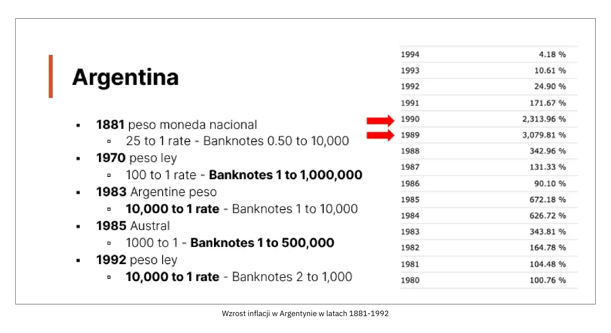

Przed 1826 r. Argentyna używała dolara hiszpańskiego. Po uzyskaniu niepodległości w 1816 r. Argentyna wprowadziła własną walutę opartą na hiszpańskim reàl, co doprowadziło do powstania podobnej waluty. Tabela rozpoczyna się w 1881 r., w którym wprowadzono "peso moneda nacional", z banknotami dostępnymi do 10 000. Następnie pojawiło się "peso ley", które było wymieniane po kursie 100 do 1 i zawierało banknoty do miliona. Następnie pojawiło się "peso argentyńskie" z kursem Exchange wynoszącym 10 000 do 1 (co odpowiada usunięciu czterech zer) i banknotami do 10 000. W 1985 r. wprowadzono "australes", które wymieniano po kursie 1 000 do 1, z banknotami dostępnymi do 500 000. W 1992 r. ustanowiono obecną walutę "peso ley" po kursie 10 000 do 1, po raz kolejny usuwając cztery zera. Jedynie w latach 1989 i 1990 miała miejsce hiperinflacja.

### Brazylia

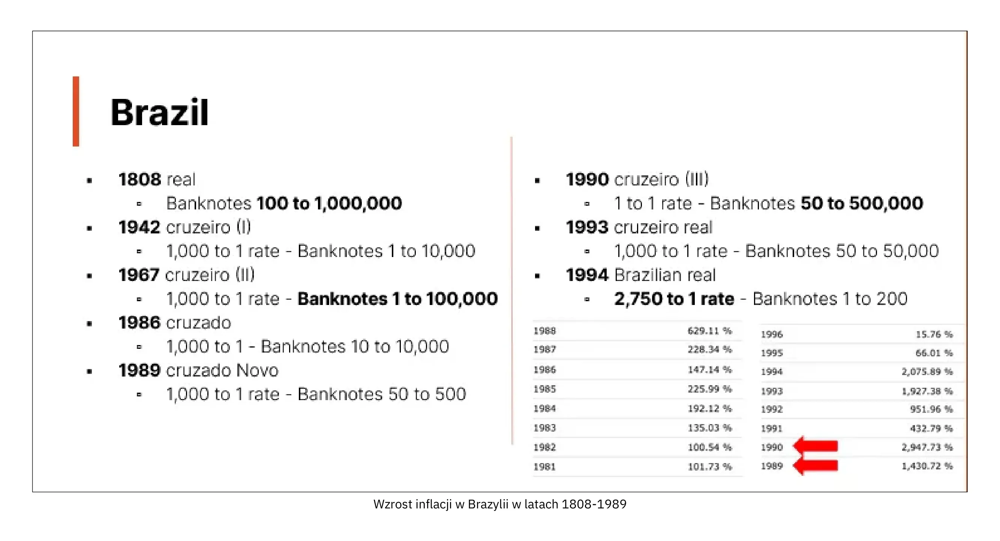

Brazylia jest godnym uwagi przykładem redenominacji monetarnej, co ilustruje jej historia zmian walutowych. Przed uzyskaniem niepodległości Brazylia używała portugalskiego reàla jako swojej waluty. Jednak już w 1747 r. kraj zaczął używać własnego "brazylijskiego reàla", na długo przed ogłoszeniem niepodległości w 1822 roku. Tabela rozpoczyna się w 1818 r., oznaczając początek emisji brazylijskich banknotów. Wcześniej waluta miała głównie formę monet. Banknoty te osiągały wartość do miliona reali.

Począwszy od 1942 r. Brazylia rozpoczęła serię redenominacji. W większości przypadków (1942, 1967, 1986, 1989, 1993) przelicznik wynosił 1:1,000. W 1990 r. nastąpiła zmiana nazwy bez konwersji. Kolejność tych walut jest następująca:

- Réals (stara wersja) do 1942 roku.
- Cruzeiros w 1942 roku.
- Cruzeiros (nowa wersja) w 1967 roku.
- Cruzados w 1986 roku.
- Cruzados Novos w 1989 roku.
- Powrót do Cruzeiros w 1990 roku.
- Cruzeiros Reais w 1993 roku.
- Wreszcie, brazylijski reàl w 1994 roku.

Najwyższy nominał banknotu osiągnął 500 000, a ostatnia redenominacja w 1994 r. została przeprowadzona po kursie 2750 do 1. Lata 1989 i 1990 były naznaczone hiperinflacją, podczas gdy w latach 1993-1994 odnotowano wysokie stopy inflacji, które nie osiągnęły progu hiperinflacji (50% miesięcznie). Po tym burzliwym okresie Brazylia ponownie denominowała swoją walutę, usuwając kilka zer.

### Boliwia

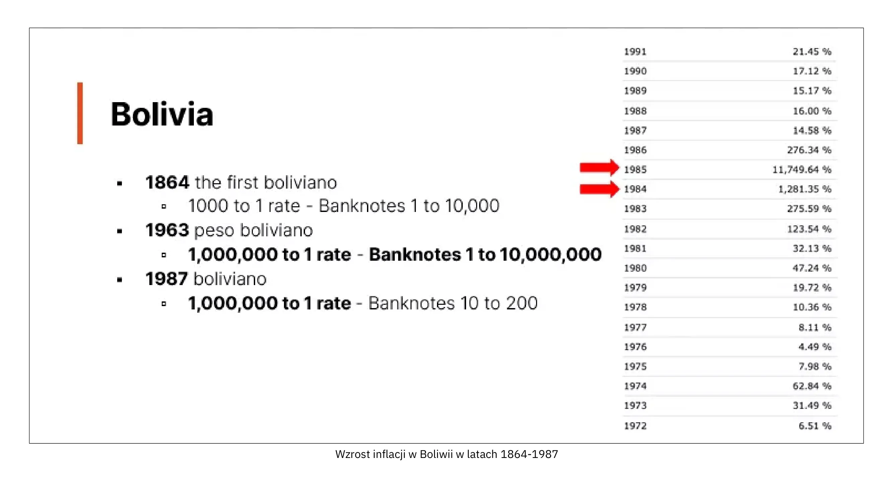

Boliwia jest kolejnym przykładem kraju, który doświadczył okresów ostrej inflacji, wymagającej redenominacji waluty. Oto podsumowanie historii walutowej tego kraju:

Przed uzyskaniem niepodległości w 1825 r. Boliwia używała dolara hiszpańskiego jako swojej waluty. Po uzyskaniu niepodległości, w latach 1827-1864 kraj wprowadził boliwijskiego sola, zastępując nim hiszpańskiego dolara. Warto jednak zauważyć, że pierwsze banknoty w Boliwii zostały wprowadzone dopiero w 1864 roku.

W 1864 r. wprowadzono pierwsze "Boliviano", z kursem Exchange wynoszącym 1,000 do 1 w stosunku do boliwijskiego Sol. Waluta ta pozostawała w obiegu aż do osiągnięcia nominału 10 000 boliviano.

Następnie Boliwia zmieniła swoją walutę na "peso boliwijskie", które doświadczyło poważnej hiperinflacji, ostatecznie osiągając nominały do 10 milionów. Ten epizod inflacji osiągnął szczyt w latach 1984-1985, a miesięczne stopy inflacji często zbliżały się do progu hiperinflacji wynoszącego 50%. Aby zapewnić pewną perspektywę, stała stopa inflacji wynosząca 50% miesięcznie przez cały rok daje roczną stopę inflacji wynoszącą około 12 800%. W 1985 r. roczna stopa inflacji w Boliwii osiągnęła 11 749%, co wskazuje, że inflacja była bliska lub przekraczała próg 50% niemal każdego miesiąca.

W odpowiedzi na ten kryzys monetarny, w 1987 r. Boliwia wprowadziła nową walutę, zwaną po prostu "Boliviano", z kursem Exchange wynoszącym 1 milion peso boliwijskich za 1 Boliviano. Ta wersja Boliviano jest nadal w obiegu.

Oto przegląd burzliwej historii monetarnej Boliwii, naznaczonej okresami hiperinflacji i redenominacji.

### Peru

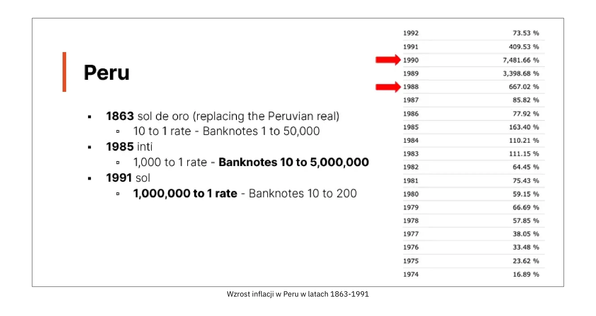

Peru przedstawia interesujący przypadek dotyczący skutków arbitralnej zasady 50%. Zaczynając od historii monetarnej, Peru używało hiszpańskiego złota aż do XIX wieku, kiedy to ogłosiło niepodległość w 1821 roku. Dolar peruwiański był w użyciu od 1822 do 1863 roku. W 1863 roku peruwiański reàl został zastąpiony przez soldi oro, w stosunku 10 do 1, osiągając maksymalną wartość 50 000. W 1985 r. wprowadzono walutę "Inti" z kursem wymiany 1000 do 1, osiągając maksymalną wartość 5 milionów. W 1991 r. wprowadzono "SOL" z kursem Exchange wynoszącym 1 milion do 1, z banknotami o nominałach od 10 do 200.

Analizując okresy redenominacji, rok 1988 jest uważany za rok hiperinflacji, szczególnie we wrześniu. Lipiec-sierpień 1990 r. również był okresem hiperinflacji. W 1988 r. roczna stopa inflacji wyniosła 667%, ze szczytem 50% we wrześniu. W przeciwieństwie do tego, w 1989 r. stopa inflacji wyniosła 3000% bez żadnego miesiąca przekraczającego 50%, więc nie została sklasyfikowana jako hiperinflacja. W 1990 r. inflacja osiągnęła szczyt na poziomie 7481%. Oczywiste jest, że zasada 50% może być arbitralna, ponieważ rok 1988 został uznany za rok hiperinflacji, w przeciwieństwie do roku 1989. Gdyby ponownie rozważyć tę zasadę, rozsądne byłoby obniżenie progu, aby uwzględnić okresy takie jak ten, którego doświadczyło Peru w 1989 roku.

> Zrozumienie tego, co się dzieje
>

> Kluczową rzeczą, którą należy zrozumieć na temat redenominacji walut, jest to, że gdy wartość waluty osiągnie astronomiczne liczby, takie jak 5 lub 10 milionów, jest ona redenominowana. Proces ten może być powtarzany wielokrotnie, co wiąże się ze zmianą waluty. W rezultacie oszczędności osób fizycznych mogą zostać poważnie naruszone, nawet przy braku hiperinflacji. Na przykład, jeśli ktoś zaoszczędzi 1000 USD w ciągu jednego roku i zdoła odłożyć 100 USD, w następnym roku najniższy nominał banknotu może wynosić 1000 USD, co sprawi, że wcześniej zaoszczędzone 100 USD będzie bezwartościowe. Taka erozja oszczędności nie wymaga oczywistej hiperinflacji. Nawet jeśli dana osoba zaoszczędziła 10 000 USD w ciągu ostatnich dziesięciu lat, kwota ta może okazać się nieznaczna, niezdolna do zakupu zwykłej butelki wody. Rzeczywistość ta jest widoczna w wielu krajach, które doświadczyły redenominacji, nawet jeśli tylko przez kilka miesięcy były klasyfikowane jako hiperinflacyjne. Z kolei niektóre kraje, takie jak Nikaragua, doświadczyły kolejnych lat hiperinflacji.

### Nikaragua

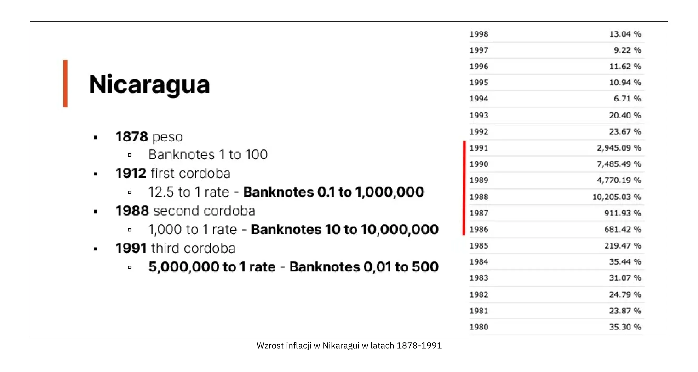

Nikaragua, będąca wcześniej pod panowaniem Hiszpanii, początkowo używała dolara hiszpańskiego, podobnie jak wiele innych krajów skolonizowanych przez Hiszpanię. Po włączeniu do Imperium Hiszpańskiego, Imperium Meksykańskiego, a następnie Federalnej Republiki Ameryki Środkowej, Nikaragua ogłosiła niepodległość. Począwszy od 1878 r. peso stało się oficjalną walutą kraju, a jego wartość wahała się od 1 do 100. W 1912 r. kraj wprowadził pierwszą Cordobę, a następnie drugą w 1988 r. i trzecią w 1991 r., która jest nadal w użyciu. Pierwsza Cordoba osiągnęła wartość 1 miliona, a druga 10 milionów. Renominacja w 1991 r. nastąpiła po kilku latach hiperinflacji.

### Wenezuela

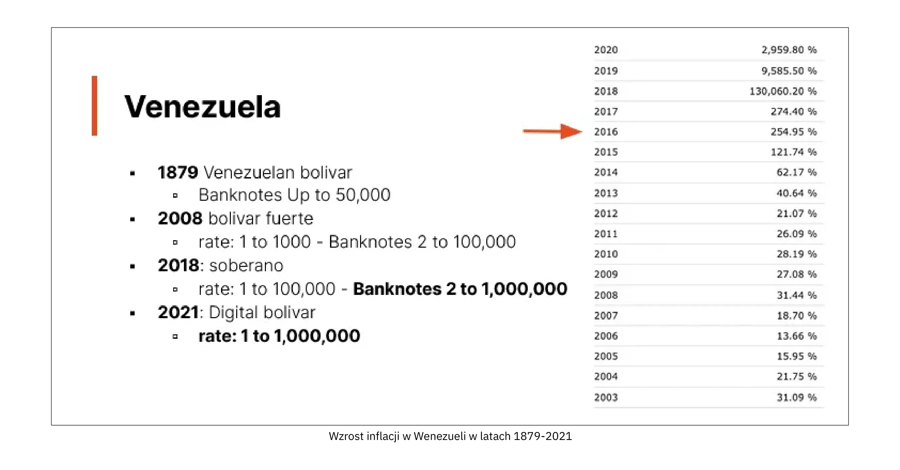

Wenezuela jest ostatnim krajem wymienionym w tym filmie. Kraj ten przeszedł cztery redenominacje waluty na przestrzeni czasu. Na początku swojego istnienia Wenezuela używała dolara hiszpańskiego, zanim ogłosiła niepodległość w 1811 roku. W 1879 r. wprowadzono boliwara jako oficjalną walutę, która obowiązywała do 1983 r., kiedy to rząd zdecydował się na system płynnego kursu Exchange z wykorzystaniem dolara.

Godnym uwagi faktem dotyczącym Wenezueli jest jej członkostwo w Łacińskiej Unii Monetarnej. Unia ta obejmowała monety takie jak 5 peset z Hiszpanii, 5 drachm z Grecji, 5 boliwarów z Wenezueli, 5 lirów z Włoch, 5 franków belgijskich i 5 franków francuskich.

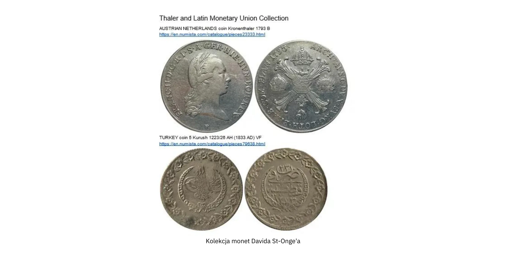

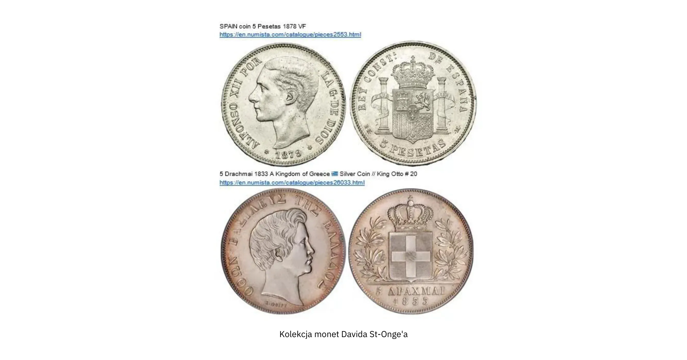

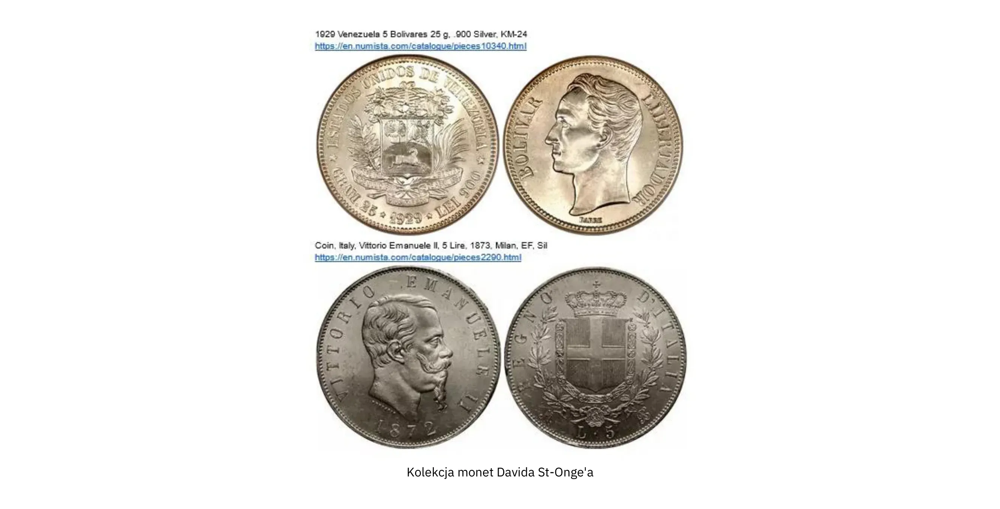

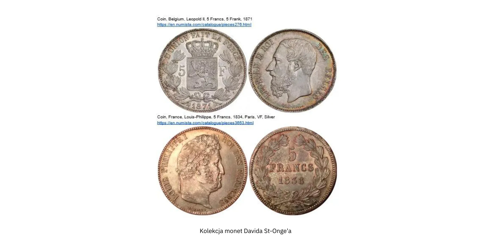

W tym okresie 5 boliwarów Coin z Wenezueli miało taką samą wagę jak te z krajów członkowskich Unii, w tym Włoch, Hiszpanii, Belgii i Francji. Bolivary te były wykonane ze srebra, a konkretny Coin z 1929 roku ważył 25 gramów i miał czystość 900, czyli 90% czystego srebra. Przy obecnej cenie srebra Coin jest wart około 17-18 USD (w dolarach amerykańskich).

Po przyjęciu zmiennego kursu Exchange w 1983 r. nastąpiło kilka redenominacji:

- W 2008 r. wprowadzono boliwara fuerte, czyli "mocnego boliwara", który osiągnął poziom 100 000 przed redenominacją do tysiąca do jednego.
- W 2018 r. wprowadzono Soberano, z banknotami sięgającymi 1 miliona. W 2021 r. został zastąpiony przez cyfrowego bolivara, który również osiągnął milion, przed nową redenominacją miliona do jednego. Obecnie banknot 10 lub 20 jest równoważny 10 milionom lub 20 milionom w Soberano.

Rachunki z tego okresu, pochodzące z 2018 r., są dystrybuowane na różnych konferencjach Bitcoin w Biarritz, Toronto i Miami. Te banknoty Soberano osiągnęły maksymalną wartość 1 miliona. Następnie przeprowadzono redenominację, zmniejszając wartość jednego miliona do około 3 centów. Obecnie 10 banknotów o nominale 1 miliona odpowiada jednemu banknotowi o nominale 10 centów. Od 2016 r. Wenezuela doświadcza hiperinflacji, co stanowi 57. okres w określonej tabeli.

W następnym filmie zaprezentowana zostanie kolekcja banknotów hiperinflacyjnych, skupiająca się na Wenezueli i innych wymienionych krajach. Kolekcja ta zawiera prawie wszystkie wenezuelskie banknoty. Badanie skupi się na różnych redenominacjach dla każdego z wymienionych krajów. Dodatkowo, zostanie przeprowadzona eksploracja redenominacji w Zimbabwe, tematu cieszącego się dużym zainteresowaniem.

### Wnioski

Widzieliśmy, że hiperinflacja nie jest jedynym wskaźnikiem katastrofy gospodarczej. Wielokrotna redenominacja, usuwanie zer lub zmiana nazwy waluty ma bezpośredni wpływ na ludność, począwszy od utraty pomocy, a skończywszy na problemach z żywnością. Chociaż hiperinflacja jest niepokojąca, liczba redenominacji, jaką zaobserwowano w Brazylii, pokazuje bardziej złożoną rzeczywistość.

W oparciu o kryterium 50% inflacji miesięcznie, kilka okresów mogło zostać sklasyfikowanych jako hiperinflacja. Jest to szczególnie prawdziwe, gdy analizuje się kryteria międzynarodowej organizacji księgowej, która bierze pod uwagę takie cechy, jak szybkie porzucenie waluty przez ludność, indeksacja płac i pożyczki o wysokim oprocentowaniu w celu zrekompensowania inflacji.

Podsumowując, hiperinflacja to tylko jeden z aspektów wyzwań gospodarczych. Sama wysoka inflacja może być równie szkodliwa. W następnej sekcji przeanalizujemy możliwe rozwiązania mające na celu przezwyciężenie hiperinflacji.

## Jak pokonać hiperinflację

<chapterId>e3484a31-a851-5f92-8af5-00eddae67db1</chapterId>

### Jak zakończyć umiarkowaną i wysoką inflację

Wspomniane wnioski pochodzą z książki "Monetary Regime and Inflation" autorstwa Petera Bernholza. Według Bernholza jedyną metodą na zakończenie inflacji jest wdrożenie reformy monetarnej i nałożenie ograniczeń fiskalnych na rząd. Ograniczenia te obejmują ustanowienie instytucji, takiej jak bank centralny, która działa niezależnie od decyzji politycznych rządu. Wysoka i hiperinflacja są często wynikiem finansowania deficytów budżetowych poprzez kreację pieniądza. Aby Address złagodzić inflację, konieczne jest zmniejszenie przyrostu pieniądza Supply. Bernholz sugeruje również, że ten wzrost monetarny powinien być względny w stosunku do krajów sąsiednich. Zaskakujące jest to, że w okresach wysokiej lub hiperinflacji całkowita wartość pieniądza Supply może w rzeczywistości spadać. Uderzającym przykładem takiej sytuacji jest Zimbabwe.

### Kontrintuicyjne rozwiązania

Podczas badania Zimbabwe zauważono, że 10 bilionów jednostek pieniądza Supply straciło całą swoją wartość. W Weimarze możliwe było wydrukowanie dwóch trzecich całkowitej wartości nominalnej 65 miliardów jednostek pieniądza Supply w ciągu jednego dnia. To pokazuje, w jaki sposób pieniądze Supply mogą zostać zdewaluowane. Aby zaradzić tej sytuacji, konieczne jest znaczne zwiększenie Supply, aby osiągnąć odpowiedni poziom. Wówczas niezbędna jest reforma monetarna. W sytuacji wysokiej inflacji reforma ta jest nieunikniona, ale musi zapewnić wystarczającą ilość pieniędzy w obiegu. Po tym kroku można nałożyć ograniczenia na rząd.

Zgodnie z obserwacjami Bernholza, podczas rozwiązywania problemów inflacyjnych, instytucje takie jak MFW i Bank Światowy nie zawsze przyjmują najskuteczniejsze strategie. W niektórych przypadkach, gdy kraj musi zwiększyć swój Supply pieniądza, instytucje te starają się go zmniejszyć. Kluczem jest osiągnięcie odpowiedniego poziomu pieniądza, a następnie nałożenie ograniczeń na jego wzrost, unikając w ten sposób finansowania wydatków rządowych poprzez kreację pieniądza.

Interesującym aspektem poruszonym przez Bernholza jest to, że sukces reformy monetarnej zależy nie tylko od jej technicznego znaczenia, ale także od zaufania, jakim darzy ją społeczeństwo. Niektóre dobrze zaprojektowane reformy mogą zakończyć się niepowodzeniem, ponieważ społeczeństwo im nie ufa, podczas gdy inne, źle zaprojektowane, mogą odnieść sukces, ponieważ społeczeństwo im ufa. Percepcja i zaufanie społeczne są zatem kluczowymi czynnikami Elements decydującymi o sukcesie lub porażce reformy monetarnej.

- W Zimbabwe rozwiązaniem przyjętym w celu przeciwdziałania inflacji była dolaryzacja, co oznacza przyjęcie dolara amerykańskiego lub innych walut z krajów sąsiednich. Takie podejście uniemożliwia rządowi dowolne drukowanie pieniędzy.
- W Niemczech rozwiązaniem było stworzenie nowej waluty, Rentenmark. Waluta ta była wspierana przez aktywa terytorialne Rzeszy, a strategia ta okazała się skuteczna.

### Przypadek Zimbabwe

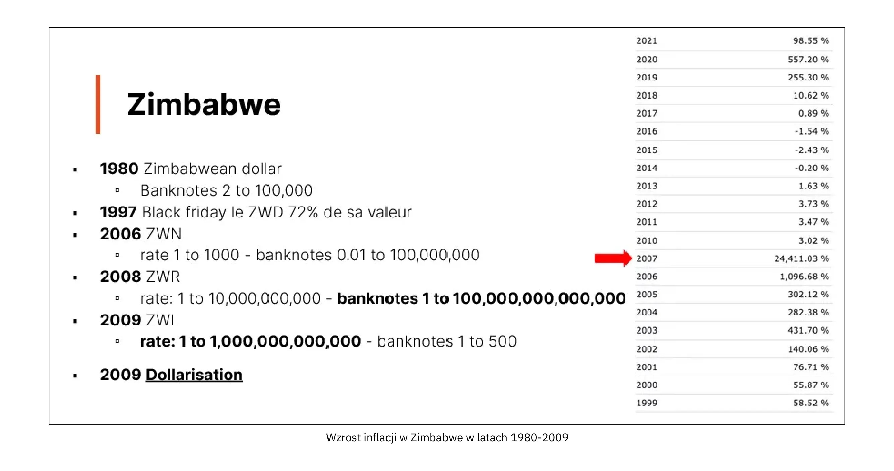

Zimbabwe uzyskało niepodległość w 1980 roku i wprowadziło własną walutę, dolara zimbabweńskiego. Początkowo dwa dolary zimbabweńskie były warte około 1,60 dolara amerykańskiego. Jednak w 1997 r., w następstwie działań społecznych na rzecz weteranów wojennych, waluta zdewaluowała się o 72% w ciągu jednego dnia podczas Czarnego Piątku. Następnie, na początku XXI wieku, kraj uruchomił program redystrybucji gruntów, który obejmował odbieranie ziemi białym właścicielom i rozdawanie jej miejscowej ludności. Decyzja ta zaszkodziła eksportowi, ponieważ nowym właścicielom często brakowało wiedzy niezbędnej do zarządzania gospodarstwami na dużą skalę. W rezultacie, podczas gdy w 1999 r. Zimbabwe było eksporterem netto, w 2003 r. stało się importerem netto.

W 2006 r. kraj wprowadził nową wersję swojej waluty, ZWN, z kursem Exchange wynoszącym 1 do 1000. W 2008 r. wprowadzono kolejny nominał, ZWR, z kursem Exchange od 1 do 10 miliardów. Doprowadziło to do powstania kultowych banknotów o nominale 100 bilionów.

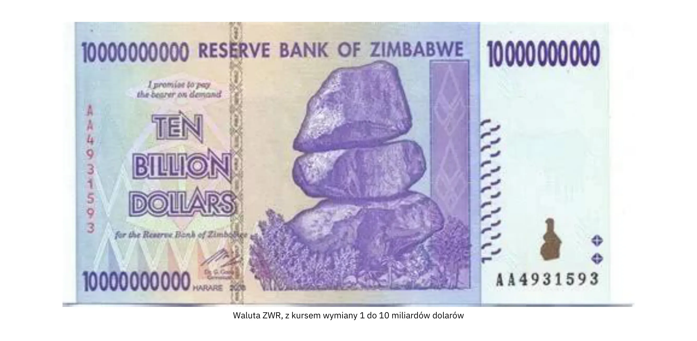

#### Dolaryzacja i rozwiązywanie kryzysów

Dlatego po 2009 r., w obliczu utrzymującego się kryzysu walutowego i szalejącej hiperinflacji, Zimbabwe porzuciło swoją walutę krajową i zezwoliło na korzystanie z walut obcych, głównie dolara amerykańskiego. Decyzja ta, choć radykalna, położyła kres hiperinflacji. Kluczową lekcją jest to, że powstrzymanie nadmiernej emisji pieniądza i zakończenie finansowania deficytu budżetowego przez bank centralny może pomóc w zapobieganiu hiperinflacji.

Dolaryzacja nie jest jednak cudownym rozwiązaniem. Choć może ona położyć kres hiperinflacji, wiąże się z innymi wyzwaniami gospodarczymi. Jedną z konsekwencji jest utrata autonomicznej polityki pieniężnej. Bez własnej waluty kraj nie może dostosować swojej polityki pieniężnej, aby reagować na wewnętrzne wstrząsy gospodarcze.

W 2007 r. stopa inflacji w Zimbabwe osiągnęła próg 50% miesięcznie, oficjalnie oznaczając kraj jako znajdujący się w stanie hiperinflacji. Po dolaryzacji w 2009 r. hiperinflacja ustała, jednak kraj nadal borykał się z innymi wyzwaniami gospodarczymi.

Niepokojące jest to, że od tego czasu Zimbabwe próbowało ponownie wprowadzić własną walutę i ponownie pojawiły się oznaki wysokiej inflacji. Według niektórych organizacji międzynarodowych, kraj ten może już ponownie spełniać kryteria hiperinflacji, nawet jeśli nie osiągnął jeszcze oficjalnego progu 50% miesięcznie. Służy to jako przypomnienie o niebezpieczeństwach związanych z nadmierną emisją pieniądza i finansowaniem deficytu przez bank centralny.

### Wnioski

W mojej książce zatytułowanej "Wszystko o Bitcoin" poświęciłem cały rozdział hiperinflacji w Zimbabwe. Szczegółowo opisuję istotne wydarzenia, podając różne przykłady ilustrujące, w jaki sposób kraj ten ostatecznie położył kres hiperinflacji.

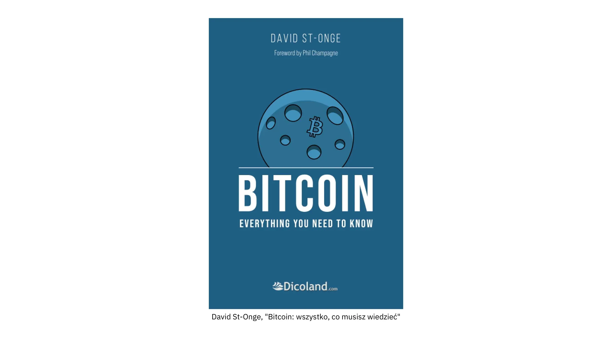

Dla tych, którzy są ciekawi niemieckich doświadczeń po I wojnie światowej, gorąco polecam komiks "Bankier Rzeszy" Opowiada on o tym, jak Niemcom udało się przezwyciężyć hiperinflację, zwłaszcza dzięki stworzeniu marki Rentenmark.

Kluczowym wnioskiem jest to, że istnieje kilka strategii przezwyciężenia hiperinflacji. Można zdecydować się na dolaryzację lub wprowadzenie nowej waluty. Rozwiązania te zadziałają tylko wtedy, gdy ludność będzie miała do nich zaufanie. Kluczowe jest nałożenie ścisłych ograniczeń. Niezbędny jest prawdziwie niezależny bank centralny. Nie może on inflować pieniądza Supply w celu pokrycia deficytów rządowych. W przypadku łagodnej inflacji ograniczenie wzrostu pieniądza Supply powinno wystarczyć. Jednak w obliczu hiperinflacji kluczowe jest, aby najpierw mieć odpowiedni Supply pieniądza w stosunku do wielkości gospodarki. Następnie konieczne jest nałożenie ścisłych ograniczeń na rząd w celu ustabilizowania sytuacji.

## Prezentacja kolekcji banknotów hiperinflacyjnych

<chapterId>f3ffbb47-3aeb-54bd-80a9-adccb0f419e2</chapterId>

[Odkryj zeskanowaną kolekcję w *Bitcoin Educational Toolkit* (również dostępne w sekcji *Zasoby* na platformie Plan ₿ Academy.](https://penpot.planb.network/#/view?page-id=c157057b-fd28-8042-8004-4f081b21defc&file-id=c157057b-fd28-8042-8004-4f081b21defb&section=interactions&index=0&share-id=7154756b-3ebd-8040-8004-6475c2af5889&interactions-mode=show-on-click)

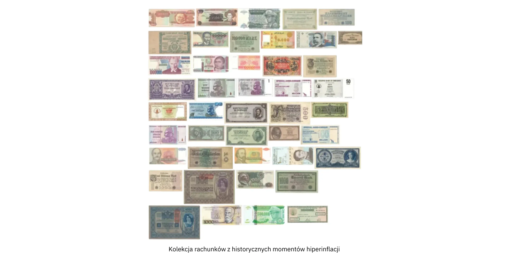

# Jak się tu znaleźliśmy?

<partId>f66ca17e-be9e-5d30-a098-f7affd8962a1</partId>

## Pojawienie się drugiego Layer pieniądza i banków centralnych

<chapterId>0455ffe3-9d45-5a67-ac96-3f815dc507a1</chapterId>

Transkrypcja:

Pojawienie się drugiego Layer pieniądza i pierwszych banków centralnych to fascynujący temat. Temat ten jest szeroko omawiany w książce "Layered Money" autorstwa Nicka Battii. Gorąco polecam ją osobom zainteresowanym ewolucją i zawiłościami naszych systemów monetarnych. Celem tej sekcji jest zrozumienie pochodzenia kreacji pieniądza i tego, w jaki sposób może ona prowadzić do hiperinflacji.

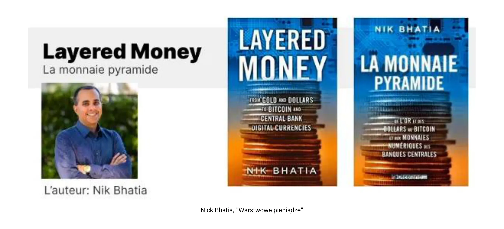

### Piramida finansowa i banki centralne

#### Florin

Historia pieniądza sięga XIII wieku we Włoszech, a konkretnie w mieście Florencja. W tym czasie floren i banknoty Exchange były powszechne. Godnym uwagi przykładem jest floren ozdobiony postacią świętego Jana Chrzciciela.

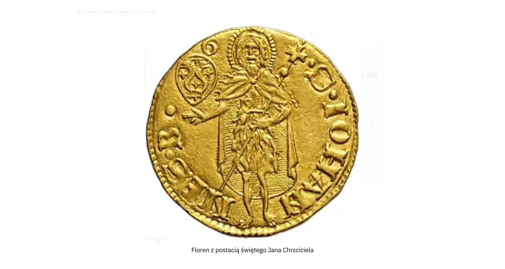

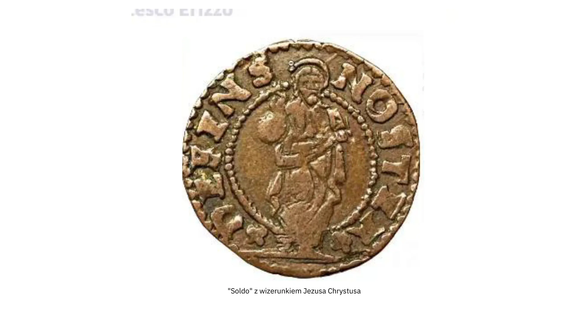

Chociaż posiadanie prawdziwego florena jest dziś drogie, dostępne są jego reprodukcje. Istnieją również inne waluty z tamtych czasów, takie jak soldo z państw włoskich z XVII wieku, na którym widnieje wizerunek Chrystusa.

#### Weksle Exchange (XIII wiek)

Powszechna praktyka w tym czasie była następująca: złotnicy wystawiali weksle Exchange w Exchange za zdeponowane floreny. Floreny te były starannie przechowywane w ich skarbcach. W ten sposób prawdziwe złoto, reprezentowane przez floreny, tworzyło pierwszy Layer pieniądza, podczas gdy weksle Exchange tworzyły drugi Layer. Płynność tego systemu była jednak ograniczona. Jeśli ktoś chciał wymienić swoje złoto Redeem w Exchange na banknot, transakcja była prosta. Jednak wymiana tych banknotów między osobami fizycznymi nie była powszechną praktyką.

#### Antwerp Stock Exchange (XVI wiek)

Giełda Papierów Wartościowych w Antwerpii (Exchange) stanowiła kamień milowy w ewolucji pieniądza papierowego. To właśnie tam wprowadzono praktykę dyskontowania weksli. Weksle te były instrumentami papierowymi reprezentującymi wartość pieniężną, ale ich wyjątkowość polegała na tym, że nosiły nazwy i daty zapadalności. Utrudniało to ich Exchange przed terminem płatności.

Rewolucja wywołana przez Antwerp Stock Exchange polegała na możliwości dyskontowania tych weksli przed terminem ich płatności. Na przykład, jeśli weksel był wymagalny za miesiąc, można było go kupić po obniżonej cenie, aby uwzględnić czas przed terminem płatności. Ta innowacja nie tylko sprawiła, że papierowa waluta stała się bardziej Liquid, ale także wprowadziła koncepcję wartości pieniądza w czasie.

Koncepcja ta, choć kojarzona z Nickiem Bellem poprzez jego pseudonim na Twitterze "time value of BTC", nie jest jego wynalazkiem. Niemniej jednak omawia ją szczegółowo w swojej pracy. Główną ideą jest to, że czas ma wartość. Tak więc, jeśli ktoś zdecyduje się zapłacić weksel o wartości 100 USD z miesięcznym wyprzedzeniem, może uzyskać go na przykład za 98 USD i otrzymać 100 USD w terminie płatności. Ta innowacja monetarna powstała na giełdzie Exchange w Antwerpii.

#### VOC i amsterdamska giełda papierów wartościowych (XVII wiek)

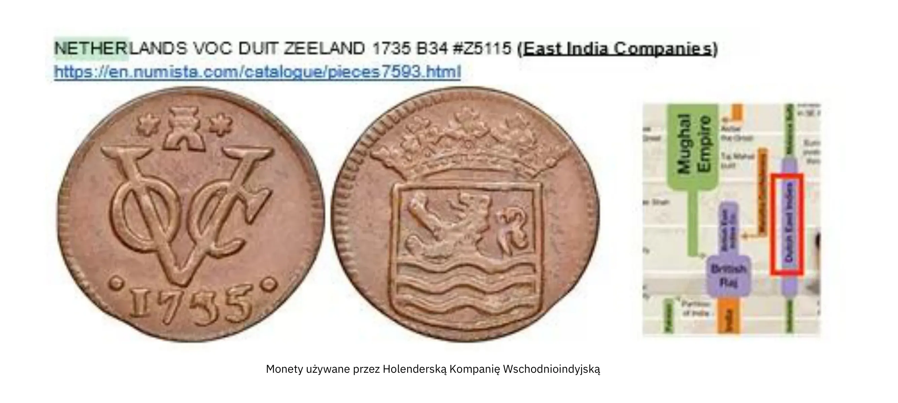

Po założeniu Antwerp Stock Exchange, kamieniem milowym było założenie VOC, Holenderskiej Kompanii Wschodnioindyjskiej. Spółka ta, z siedzibą w Holandii, wyemitowała nawet własną walutę. Po utworzeniu VOC, pierwsza giełda została założona w Amsterdamie, wyznaczając początek działalności giełdowej spółki. Interesujące jest to, w jaki sposób Holendrom udało się zakończyć dominację Antwerpii jako międzynarodowego centrum gospodarczego. Po prostu zablokowali dostęp do rzeki Skaldy. Strategia ta była częścią większego ruchu historycznego, rewolty żebraków. Kluczowe wydarzenie w historii Europy.

#### Interwencja Banku Amsterdamskiego

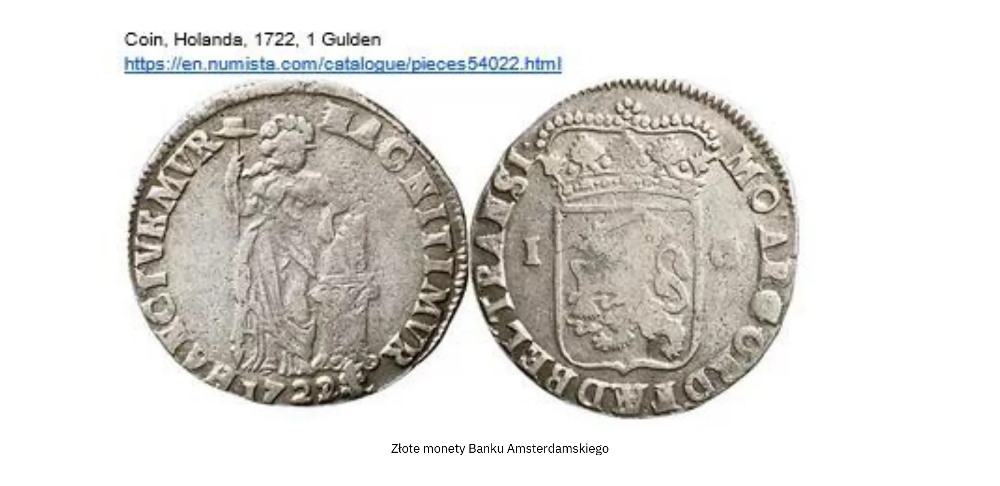

Po ustanowieniu VOC, kolejnym znaczącym wydarzeniem w historii monetarnej było wprowadzenie złotych monet przez Bank Amsterdamu. Monety te, pochodzące z 1722 r., były wykonane ze srebra. Jednak tym, co naprawdę zrewolucjonizowało finanse w tamtym czasie, był nie tyle sam Coin, co konta powiązane z tą walutą w Banku Amsterdamskim. Rachunki te stały się głównym środkiem międzynarodowego obrotu Exchange. Transakcje były po prostu rejestrowane w rejestrach lub księgach. Dzięki temu systemowi Amsterdam stał się globalnym centrum gospodarczym. Z czasem Bank Amsterdamu postanowił narzucić korzystanie z tych kont. Niezależni kantorzy musieli codziennie przekazywać Exchange swoje monety do depozytu w banku.

#### Utworzenie Banku Anglii w celu sfinansowania wojny

Utworzenie Banku Anglii było motywowane potrzebą sfinansowania wojny pod koniec XVII wieku. Podobnie jak Bank Amsterdamski, narzucił on depozyty dekretem. Szczególną cechą Banku Anglii było zdegradowanie prywatnych banków do drugorzędnej pozycji w systemie monetarnym, tworząc w ten sposób coś, co można nazwać "trzecim Layer" waluty.

Początkowo pierwszy Layer waluty był reprezentowany przez złoto. Depozyty złożone w prywatnych bankach tworzyły drugi Layer. Kiedy jednak depozyty te nie mogły być już wymieniane na złoto, pojawił się trzeci Layer waluty. Od tego momentu banknoty emitowane przez prywatne banki nie były już wymienialne na złoto, ale na papierową walutę Banku Anglii, która sama była wymienialna na złoto. Ewolucja ta doprowadziła do skomplikowania systemu monetarnego poprzez dodanie kolejnych warstw.

#### Panika roku 1796

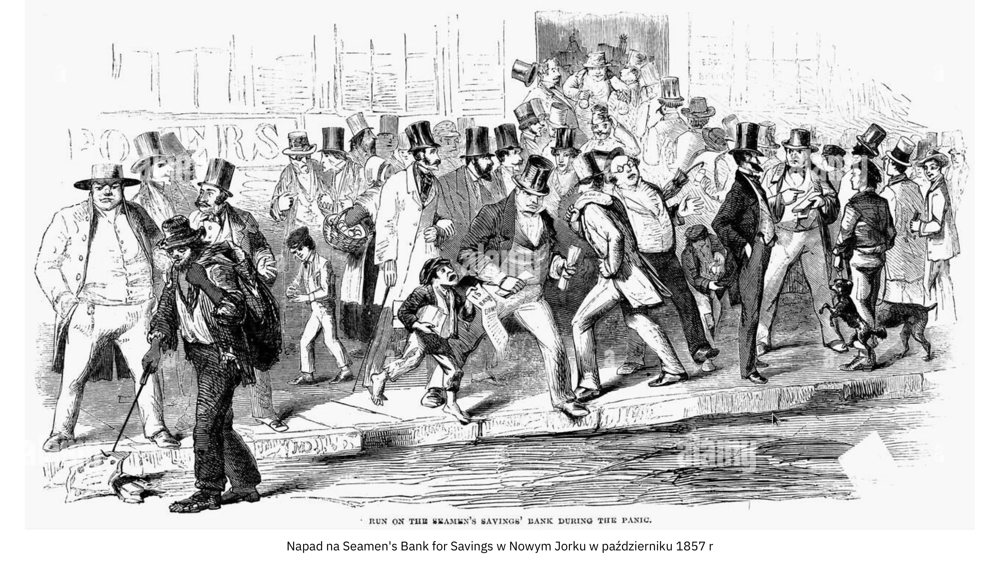

Panika bankowa w Seamen's Savings Bank podczas paniki w 1857 r.

Po panice bankowej w 1796 r. wystąpiło zjawisko, w którym każdy próbował przesunąć się w górę "piramidy pieniądza" Ludzie chcieli wymienić Exchange z waluty trzeciej Layer na walutę drugiej Layer, a ostatecznie na walutę pierwszej Layer, którą było złoto. W obliczu tego ogromnego pośpiechu Bank Anglii został zmuszony do podjęcia działań w celu ustabilizowania sytuacji. Aby zapobiec potencjalnej deflacji rezerw złota, zdecydował się zawiesić wymienialność swoich banknotów na złoto. Zawieszenie to, początkowo pomyślane jako środek tymczasowy, trwało przez około dwie dekady.

### Wnioski:

Banki centralne stały się pożyczkodawcami ostatniej instancji, zawieszając wymienialność swojej waluty na złoto. Chociaż działanie to początkowo miało być rozwiązaniem tymczasowym, ostatecznie stało się trwałe, oznaczając pojawienie się koncepcji pożyczkodawcy ostatniej instancji. Transformacja ta ukształtowała banki centralne w ich dzisiejszym kształcie. Jednak w bardziej wrażliwych gospodarkach zdolność do drukowania pieniędzy do woli może prowadzić do niepożądanych konsekwencji, takich jak hiperinflacja, jeśli jest wykorzystywana nieodpowiedzialnie.

## Książki i zasoby

<chapterId>c44e4519-0741-527b-b3b0-3f513e87147d</chapterId>

Hiperinflacja to fascynujący temat, który był badany przez różne wydarzenia historyczne. Jeśli chcesz zagłębić się w ten temat, oto lista 10 najważniejszych źródeł do przeczytania i przestudiowania:

- "When Money Dies: The Nightmare of Deficit Spending, Devaluation, and Hyperinflation in Weimar Germany" autorstwa Adama Fergussona. Książka ta szczegółowo opisuje kryzys hiperinflacji w Niemczech po I wojnie światowej.

- "The Economics of Inflation - A Study of Currency Depreciation in Post-War Germany" autorstwa Costantino Bresciani-Turroni. Dogłębna analiza niemieckiej hiperinflacji w latach dwudziestych XX wieku.

- "Tym razem jest inaczej: Eight Centuries of Financial Folly" autorstwa Carmen M. Reinhart i Kennetha S. Rogoffa. Chociaż książka obejmuje różne rodzaje kryzysów finansowych, zawiera ona dogłębną dyskusję na temat hiperinflacji na przestrzeni dziejów.

- "Zimbabwe's Hyperinflation, Analysis and Lessons Learned" autorstwa Steve'a Hanke. Studium hiperinflacji w Zimbabwe na początku XXI wieku.

- "Reżimy monetarne i inflacja: History, Economic and Political Relationships" autorstwa Petera Bernholza. Książka analizuje historyczne przypadki hiperinflacji i stara się zrozumieć czynniki leżące u ich podstaw.

- "Przewodnik przetrwania hiperinflacji: Strategie dla amerykańskich firm" autorstwa Geralda Swansona. Praktyczny przewodnik po tym, jak firmy mogą poruszać się w środowisku hiperinflacyjnym.

- "Umieranie pieniądza: Lessons of the Great German and American Inflations" autorstwa Jensa O. Parssona. Analiza porównawcza kryzysów inflacyjnych w Niemczech i Stanach Zjednoczonych.

- "Upadek pieniądza: Niemiecka hiperinflacja i zniszczenie klasy średniej" autorstwa Fredericka Taylora. Narracyjna eksploracja społecznego i gospodarczego wpływu hiperinflacji na niemieckie społeczeństwo.

- "Rady walutowe dla krajów rozwijających się: A Handbook" autorstwa Steve'a Hanke i Kurta Schulera. Chociaż książka ta koncentruje się na radach walutowych, oferuje ona perspektywę unikania sytuacji hiperinflacji.

# Sekcja końcowa

<partId>cb1f4a4b-556a-4e47-a5cc-136be35a1f9a</partId>

## Recenzje i oceny

<chapterId>1a37317e-372a-5241-b478-8316d44f9283</chapterId>

<isCourseReview>true</isCourseReview>

## Egzamin końcowy

<chapterId>d01831c3-6c4d-59e3-95bc-03e97a05c142</chapterId>

<isCourseExam>true</isCourseExam>

## Wnioski

<chapterId>45d410b0-71ed-4502-8d8d-8b6df761db23</chapterId>

<isCourseConclusion>true</isCourseConclusion>