# Uma jornada através do colapso económico

Como é quando o dinheiro perde o seu significado?
Este curso guia-o através do fascinante, mas sóbrio mundo da hiperinflação. Irá descobrir episódios históricos e casos modernos onde as moedas colapsaram e as economias se transformaram da noite para o dia. Irá desvendar os padrões, as causas e o impacto real nas pessoas comuns, obtendo uma visão sobre um dos fenómenos mais dramáticos da economia.

Ao longo do caminho, também irá descobrir como indivíduos e comunidades navegaram por estes períodos turbulentos. Aprenda as estratégias que ajudaram a proteger a riqueza durante crises monetárias e construa uma compreensão mais profunda da resiliência financeira. Se tem curiosidade sobre as forças económicas que moldam o nosso mundo, esta jornada oferece tanto conhecimento como perspetiva prática.
+++
# Introdução

<partId>6fe4d15d-f6e6-54be-9e04-0a75ac98df8b</partId>

## Visão geral do curso

<chapterId>9d1aba8d-0485-5020-9863-5de37e6db8e0</chapterId>

Bem-vindo ao curso ECO204!

O objetivo deste curso é ajudá-lo a compreender as causas, os mecanismos e as consequências da hiperinflação no contexto de um sistema monetário fiduciário. Através de exemplos concretos e análise histórica, aprenderá a reconhecer padrões recorrentes que precedem períodos de hiperinflação e a identificar alavancas de ação para se proteger.

**Secção 2: O que é a inflação?

Antes de mergulharmos no cerne do tema, vamos revisitar os princípios básicos: o que é a inflação? Esta secção apresentará as suas origens monetárias, os diferentes tipos de inflação e a forma como se enquadram numa dinâmica económica mais ampla. Este é um passo essencial para compreender como uma inflação regular pode evoluir para uma hiperinflação.

**Secção 3: O que é a hiperinflação?

Nesta secção, serão estudadas definições precisas de hiperinflação e examinados vários episódios históricos importantes, incluindo os da Alemanha de Weimar e do Zimbabué. Analisaremos os seus pontos comuns, as suas diferenças e os seus paralelismos contemporâneos. Descobrirá também casos menos conhecidos, como as sucessivas redenominações na América Latina, bem como as estratégias de saída observadas em certos países.

**Secção 4: Como chegámos até aqui?

Esta parte tem como objetivo compreender os mecanismos estruturais que permitem a hiperinflação, nomeadamente através do desenvolvimento do "segundo Layer" monetário e do papel dos bancos centrais. Serão fornecidos recursos adicionais e sugestões de leitura para aprofundamento do tema.

E se a história monetária se estivesse a repetir diante dos nossos olhos? Julgue você mesmo nos capítulos que se seguem!

# O que é a inflação?

<partId>2b4f456c-3649-5cf9-b9b0-a5bffe92d962</partId>

## Um fenómeno monetário

<chapterId>b2cbc915-c4ec-52b5-860c-0958f58c91e4</chapterId>

### Definições de inflação

A inflação é um conceito frequentemente mal compreendido devido às suas múltiplas definições e interpretações. A perceção da inflação varia entre diferentes grupos, como os bitcoiners e os economistas tradicionais. Vamos primeiro esclarecer as definições antes de discutir a hiperinflação:

- Definição do dicionário Le Robert: A inflação é um aumento excessivo dos instrumentos de pagamento (notas, capital), provocando um aumento dos preços e uma desvalorização da moeda.

- Definição da enciclopédia Larousse: A inflação é um fenómeno caracterizado por um aumento generalizado e contínuo do nível dos preços. Aqui, a palavra "generalizado" é crucial.

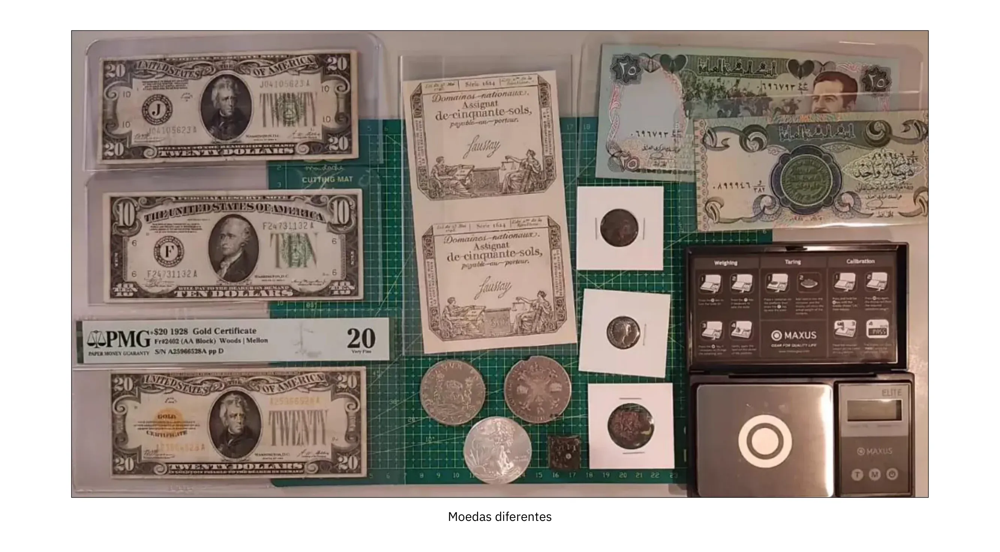

Tendo em conta estas definições, é essencial compreender que, para Robert, a inflação diz respeito principalmente ao aumento da massa monetária Supply. Por outro lado, Larousse centra-se nas consequências desta expansão, nomeadamente o aumento generalizado dos preços.

No nosso estudo sobre hiperinflação, adoptaremos a segunda definição, que é a de uma subida generalizada dos preços, por ser mais relevante e clara para o nosso tema. No entanto, é fundamental recordar que esta subida de preços resulta geralmente da expansão da moeda Supply.

O famoso economista Milton Friedman afirmou-o de forma célebre:

> "A inflação é sempre e em todo o lado um fenómeno monetário."

Esta afirmação sublinha a relação intrínseca entre expansão monetária e inflação. Nas secções seguintes, analisaremos a relação entre inflação e crescimento económico, com base nestas definições fundamentais.

### Compreender o fenómeno monetário

Quando nos referimos ao fenómeno monetário, estamos a referir-nos à forma como o Supply monetário de uma economia é influenciado. Milton Friedman via-o essencialmente como um aumento deste Supply. Historicamente, houve dois métodos principais para aumentar o Supply monetário:

1. Impressão monetária:

Nos sistemas monetários tradicionais, o aumento da moeda Supply era conseguido através da impressão física de novas notas. Embora hoje em dia, com a predominância da moeda digital, esta impressão seja sobretudo eletrónica (através das bases de dados dos bancos centrais e de outras instituições financeiras), a história mostra-nos períodos em que a impressão literal de notas levou à hiperinflação.

2. Redução do teor de metais:

Outro método consistia em reduzir a quantidade de metal precioso nas moedas baseadas em metais como a prata ou o ouro. Um exemplo notável pode ser encontrado no Império Romano, onde o denário, inicialmente composto quase inteiramente de prata, viu o seu teor de prata ser drasticamente reduzido ao longo do tempo. Este facto constituiu uma forma de inflação, mas não necessariamente uma hiperinflação.

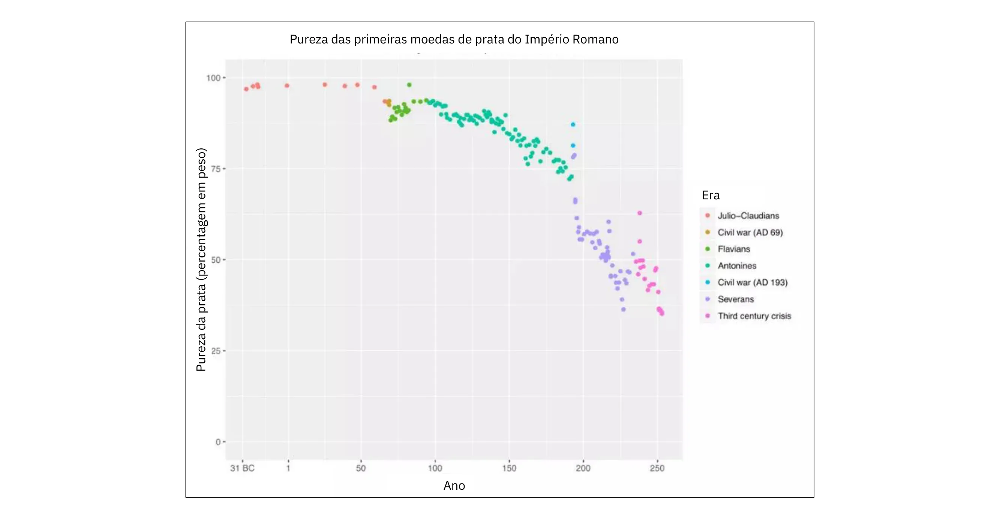

É fundamental sublinhar que a hiperinflação é observada principalmente com moedas fiduciárias que não são apoiadas pelos seus activos subjacentes, como os metais preciosos. Historicamente, quando uma moeda era baseada em tais activos, ocorreram episódios de inflação (por exemplo, através da desvalorização do conteúdo metálico), mas esses episódios nunca atingiram os níveis extremos da hiperinflação. Nas secções seguintes, estudaremos em pormenor os períodos de desvalorização monetária e as implicações destes diferentes sistemas monetários na inflação.

### Estudo dos períodos de desvalorização monetária

Ao longo da história, várias civilizações passaram por períodos de desvalorização monetária. Alguns destes períodos coincidem com grandes acontecimentos ou guerras que exerceram pressão sobre a economia.

#### 1. Guerra do Peloponeso e Segunda Guerra Púnica:

A Guerra do Peloponeso, um conflito entre Atenas e Esparta, e a Segunda Guerra Púnica, entre a República Romana e Cartago, são os exemplos mais antigos de desvalorização da moeda encontrados nos arquivos. Para financiar estas guerras, estas civilizações desvalorizaram as suas moedas, reduzindo o teor de prata e incorporando outros metais, ao mesmo tempo que aumentavam o número de moedas produzidas.

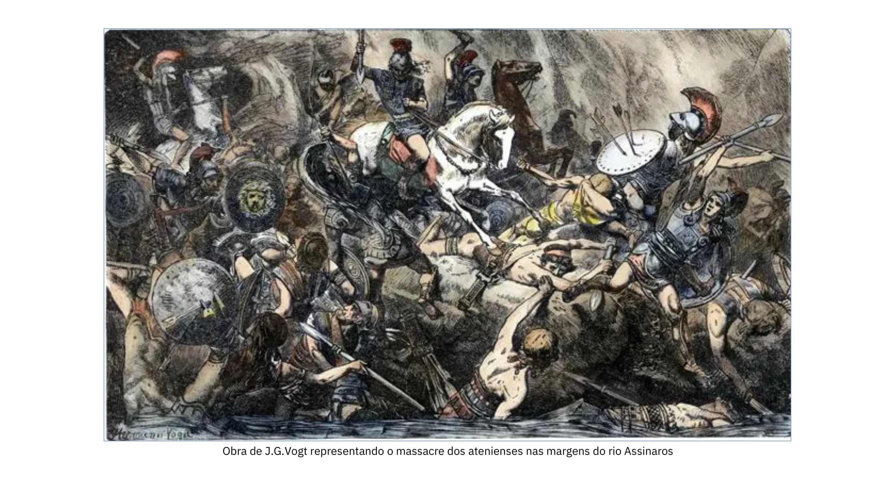

Gravura representando o massacre dos atenienses nas margens do rio Assinaros.

#### 2. Roma Antiga durante o Império:

Após a era da República Romana, durante o Império, os séculos III e IV registaram uma desvalorização significativa da moeda. Este facto é ilustrado pela diminuição do teor de prata das moedas, como se pode ver no gráfico anterior. Um estudo revela que o preço do trigo no Egito, medido em dracmas, aumentou um fator de um milhão durante um período de aproximadamente 400 anos, de 40 a.C. a 360 d.C.. Durante este período, representa uma inflação média anual de cerca de 4,4%. No entanto, esta inflação não foi distribuída de forma homogénea. Começou efetivamente por volta de 238 d.C.. Entre 250 e 293 d.C., a taxa de inflação foi de cerca de 3,65%, tendo aumentado para 22,28% entre 293 e 301 d.C.

Embora estes períodos tenham registado uma inflação significativa, não atingiram os níveis de hiperinflação observados em algumas situações modernas. A razão para isso é que, embora a moeda tenha sido desvalorizada, ela ainda era apoiada por metais preciosos. Esta base sólida proporcionava alguma proteção contra níveis de inflação extremos. Nas secções seguintes, analisaremos mais pormenorizadamente a natureza e as consequências da hiperinflação.

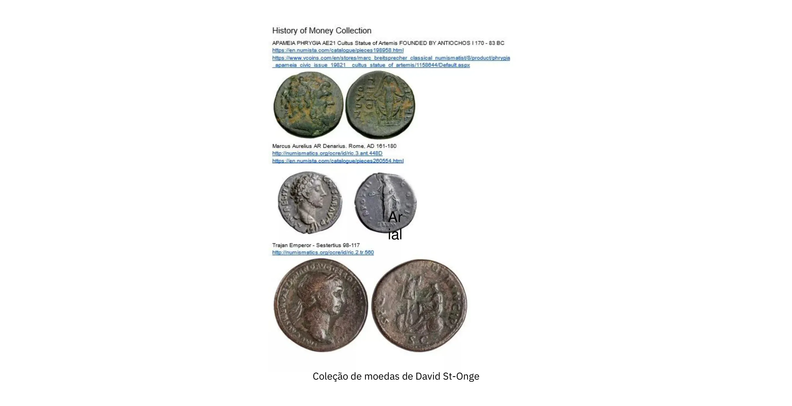

- Denário de Marco Aurélio (160 d.C.):

Uma das moedas mais emblemáticas da Roma antiga é o denário, uma Coin de prata. Possuo um Coin específico de Marco Aurélio, datado de 160 d.C., antes da grande desvalorização. Embora a câmara possa ter dificuldade em captar os pormenores, a olho nu é evidente que o Coin é bonito e reflecte um teor de prata relativamente elevado.

- O Antoniniano (finais do século III d.C.):

Com a desvalorização monetária, surgiu uma nova moeda, o Antoniniano. Esta moeda era suposto valer dois denários, mas continha muito menos prata. O meu Antoninianus Coin mostra claramente que o teor de prata foi significativamente reduzido. Está adornado com uma coroa, típica das moedas romanas deste período, designada por "radiates". Comparando a cor e a qualidade, verifica-se que o Antoniniano está longe de ser uma Coin de prata pura.

Quando se comparam as duas moedas lado a lado, a diferença é notória. O denário de 160 d.C. tem um aspeto prateado distinto, enquanto o Antoniniano do final do século III d.C. é muito mais baço, indicando uma diminuição significativa do teor de prata. Esta comparação visual ilustra claramente a desvalorização monetária a que a Roma antiga foi sujeita ao longo de alguns séculos.

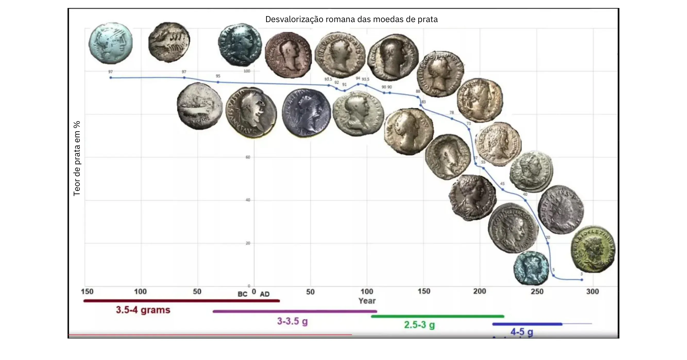

Para completar esta demonstração, seria ideal um gráfico que ilustrasse a desvalorização destas moedas ao longo do tempo. Embora seja difícil de visualizar através desta plataforma, imagine-se um gráfico que mostre o valor do denário, seguido do seu declínio no final do século II, altura em que foi substituído pelo Antoniniano, supostamente com o valor de dois denários, mas com um teor de prata significativamente inferior. Estes artefactos são testemunhas silenciosas das flutuações económicas das civilizações passadas.

#### 3. O Maravedi espanhol: testemunho de uma desvalorização selectiva

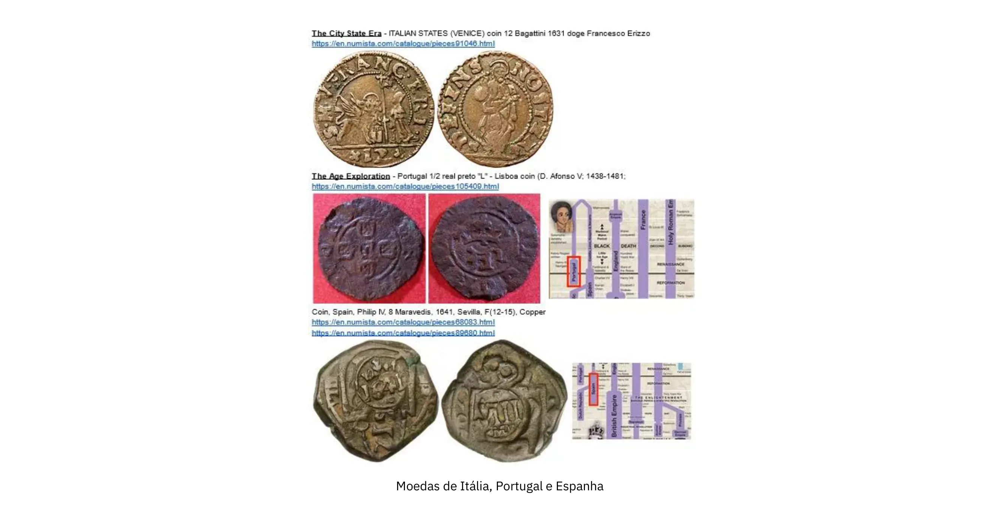

O Maravedi, enquanto moeda de cobre, ocupa um lugar especial na história da moeda espanhola. Como já foi referido, o dólar espanhol era inicialmente o padrão internacional, uma moeda de reserva essencial para Espanha. No entanto, confrontada com certos desafios económicos, a Espanha teve de recorrer a estratégias monetárias inteligentes.

A desvalorização monetária é um instrumento frequentemente utilizado pelos Estados para financiar as suas despesas ou estimular a economia. No entanto, a Espanha encontrava-se numa situação delicada. A diluição do dólar espanhol teria comprometido a sua posição no comércio internacional. Para ultrapassar este dilema, a Espanha recorreu ao Maravedi.

Ao contrário do precioso dólar de prata espanhol, o Maravedi era uma moeda de cobre utilizada principalmente pela população local. Esta moeda era objeto de desvalorização. Quando um Maravedis Coin valia inicialmente dois maravedises, o Estado recuperava-o, voltava a carimbá-lo com um novo valor, por exemplo, "quatro", e devolvia apenas um Coin ao proprietário. O Coin, marcado com o carimbo "oito", é prova deste processo, tendo sofrido vários ciclos de desvalorização.

Esta estratégia permitia ao Estado desvalorizar efetivamente uma moeda, criando inflação e financiando indiretamente o Estado, ao mesmo tempo que preservava a integridade do dólar espanhol na cena internacional. No entanto, esta desvalorização direcionada teve consequências para a população local, que viu o valor da sua moeda comum diluir-se.

O caso dos Maravedis ilustra como um Estado pode desvalorizar seletivamente uma moeda local para satisfazer as suas necessidades económicas internas, preservando simultaneamente o valor de uma moeda de reserva na cena mundial. É um exemplo notável da complexidade e da subtileza da política monetária na história.

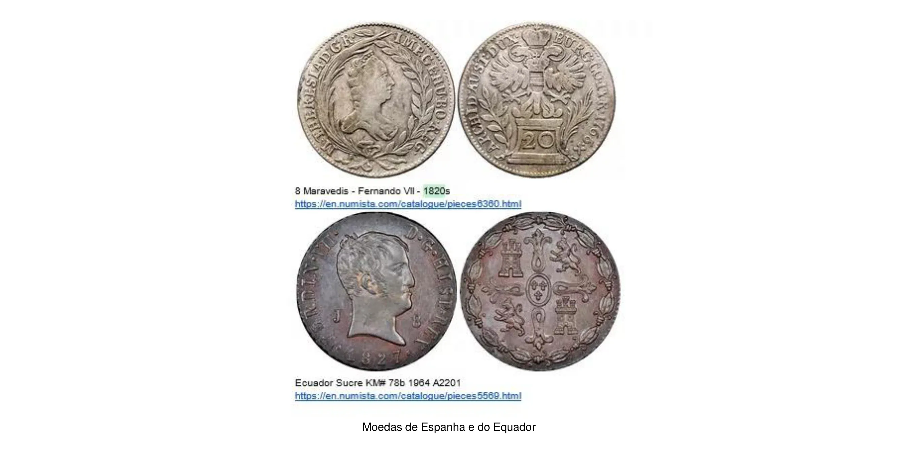

Queres saber mais? -> [Link](https://docs.google.com/document/d/1aZa7gvz1nt8ZHDCoWKQdS9RGGjBHdipH1ApC8dW1xpM/edit?usp=sharing)

#### 4. Revolução dos preços do século XV ao XVII

Entre os séculos XV e XVII, a Europa assistiu a um fenómeno económico notável, frequentemente designado por "revolução dos preços" Este período de inflação foi largamente despoletado por um afluxo maciço de metais preciosos, particularmente ouro e prata, provenientes das Américas. Com a economia europeia largamente baseada no padrão metálico na altura, este Supply adicional de metais aumentou o Supply monetário. Como resultado, surgiu uma taxa de inflação de cerca de 1 a 2% por ano. À primeira vista, esta inflação pode parecer modesta. No entanto, nessa altura, tais flutuações de preços eram suficientemente invulgares para serem consideradas uma "revolução" Isto mostra como as alterações nas reservas monetárias podem influenciar todo o sistema económico.

#### 5. John Law e os Assignats

No século XVIII, a história económica francesa foi marcada por dois acontecimentos significativos relacionados com a moeda. Primeiro, John Law, um economista e financeiro escocês, persuadiu o governo francês a adotar um sistema monetário baseado em papel-moeda. Embora inicialmente considerada uma solução inovadora para os problemas financeiros do país, esta iniciativa conduziu rapidamente a uma inflação galopante. Pouco tempo depois, durante os tumultos da Revolução Francesa, o governo introduziu os "assignats".

Assignats de 1793

Estas notas são um testemunho vivo do primeiro grande período de hiperinflação da história. Inicialmente concebidas como uma resposta a sucessivas crises financeiras, as assignats rapidamente se tornaram um símbolo de instabilidade monetária. O governo, que dependia excessivamente deste papel-moeda para financiar as suas despesas, provocou uma crise económica sem precedentes e conduziu a um grande período de hiperinflação em França, após a revolução.

#### 6. Ordem Executiva 6102 e a desvalorização do dólar

Ordem Executiva 6102 e a desvalorização do dólar

Nos Estados Unidos, no início da década de 1930, assistiu-se a uma grande mudança na política monetária. Eis um resumo pormenorizado desta transformação:

- A nota de 20 dólares de 1928

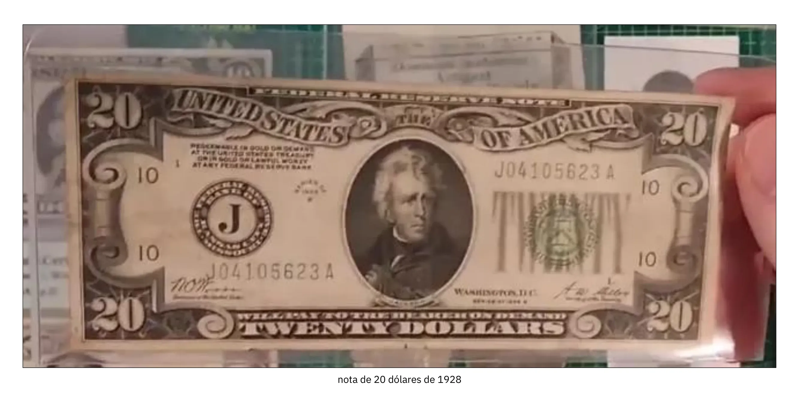

Em 1928, uma nota de 20 dólares nos Estados Unidos dizia: "resgatável em ouro a pedido" Isto significa que cada nota era literalmente convertível em ouro. Especificamente, uma nota de 20,67 dólares era equivalente a uma onça de ouro.

- Ordem Executiva 6102

Em 1933, ocorreu uma grande reviravolta com a emissão da Ordem Executiva 6102. Este decreto tornou ilegal a posse de ouro pelos cidadãos, quer sob a forma de barras, moedas ou certificados.

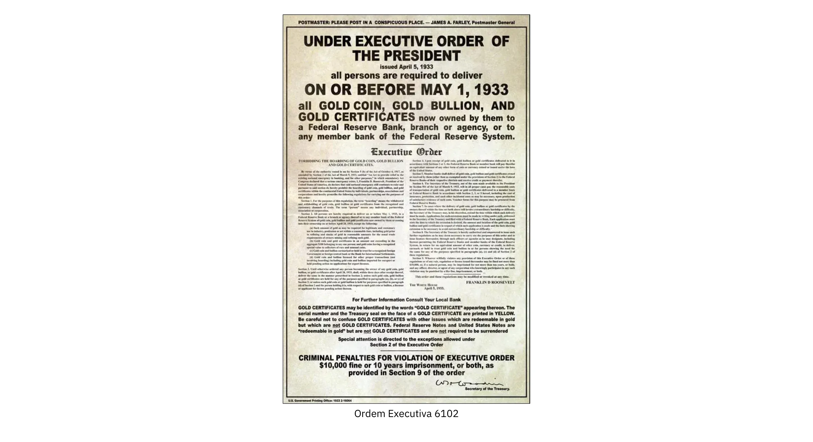

O certificado de ouro é um bom exemplo. Estava marcado: "Em ouro Coin pagável ao portador a pedido." A posse de tal certificado tornou-se ilegal e assim permaneceu até 1964.

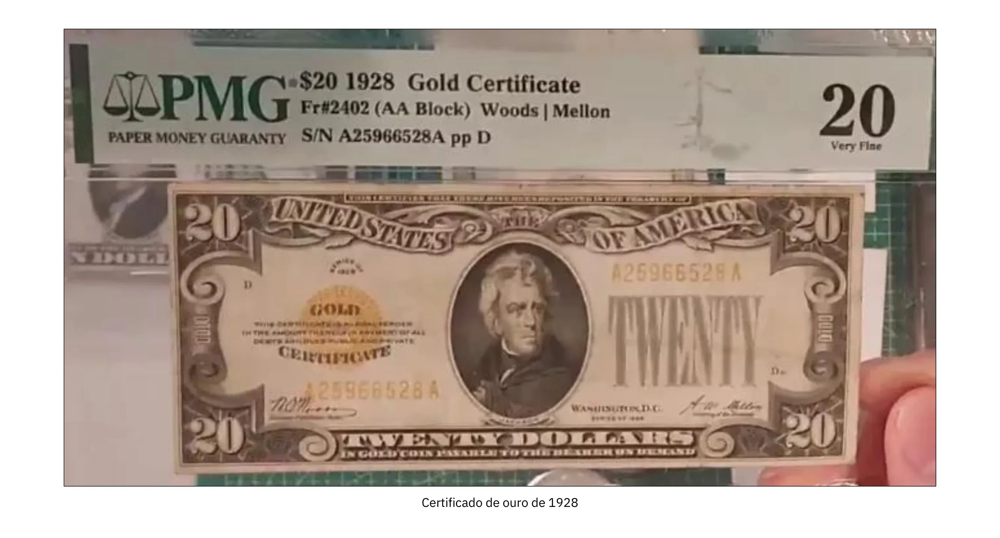

- Introdução de novas notas

Na sequência do confisco do ouro em 1934, foi posta em circulação uma nova série de notas.

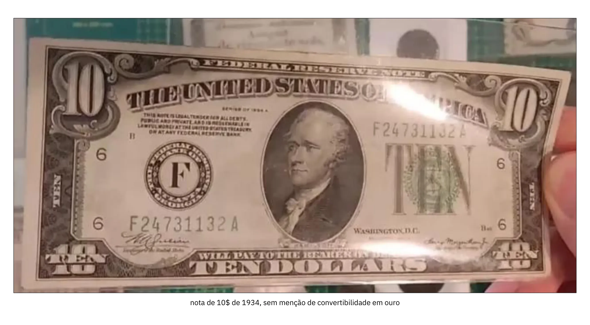

A menção que indicava a sua convertibilidade em ouro foi suprimida e substituída por "Esta nota tem curso legal para todas as dívidas" (Ce billet est une monnaie légale pour toutes dettes).

- Reavaliação do ouro

O que é fascinante nesta transição é a estratégia do governo. Em 1934, o preço do ouro foi reavaliado para $35 por onça, em vez de $20,67. Essencialmente, o governo desvalorizou o dólar que as pessoas possuíam. Ao comprar ouro à população a $20,67 por onça em 1933 e depois revalorizar o preço do ouro em 1934, o governo gerou um lucro substancial ao desvalorizar as poupanças dos seus cidadãos.

Em suma, no espaço de um ano, o governo confiscou efetivamente o ouro dos cidadãos e, em seguida, alterou as regras do jogo, reavaliando o valor do ouro em benefício do tesouro e em detrimento daqueles que tinham inicialmente trocado o seu ouro por notas.

### Os EUA mudam a história.

Os Estados Unidos fizeram uma viragem histórica ao tornarem-se os primeiros a desvalorizar a moeda de reserva mundial, o dólar americano, contrariamente às práticas anteriores observadas nas pequenas nações comerciais.

Anteriormente, durante o Renascimento, o florim italiano emitido por Florença no século XIII era a moeda de reserva internacional, não se tendo registado qualquer desvalorização durante o seu período de utilização, o que reflecte a importância da estabilidade monetária para o comércio internacional.

No mesmo espírito, a Espanha e os Países Baixos, detentores da moeda de reserva mundial devido ao seu florescente comércio internacional, mantiveram a integridade das suas moedas para preservar a confiança e o status quo nas trocas internacionais. Os Países Baixos testemunharam mesmo a criação do primeiro banco central, um marco significativo na evolução global dos sistemas monetários.

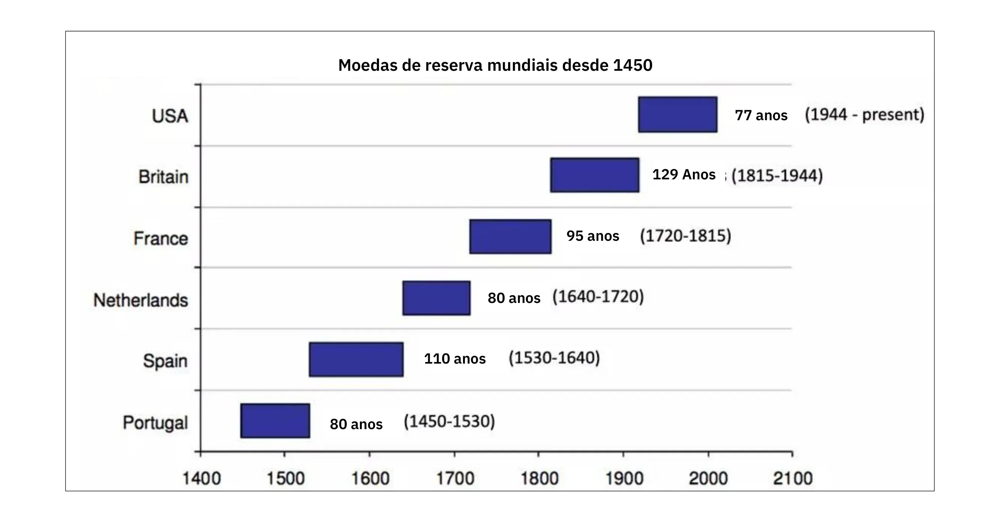

No entanto, a situação mudou com a ascensão dos Estados Unidos como potência económica dominante. Optaram por desvalorizar a sua moeda de reserva, explorando assim a inflação em seu benefício. Esta decisão é frequentemente atribuída à alteração da dinâmica, em que a escolha da moeda de reserva já não era tão livre como antes. A hegemonia americana estabeleceu o dólar como moeda de reserva mundial, permitindo a manipulação do seu valor. Esta mudança revela o potencial impacto das políticas monetárias no comércio internacional numa economia globalizada, marcando uma transição significativa na gestão das moedas de reserva mundiais.

### Último exemplo para a estrada: o dinar suíço

O dinar suíço ilustra outro aspeto fascinante da desvalorização monetária, desta vez ancorado no contexto iraquiano anterior à Guerra do Golfo. Batizada com o nome da notável qualidade das suas notas, esta moeda era emitida pelo Banco Central do Iraque e gozava de uma reputação de estabilidade na região do Médio Oriente. Esta confiança devia-se sobretudo à qualidade da impressão das notas, que era feita em Inglaterra, o que implicava uma certa robustez face à desvalorização.

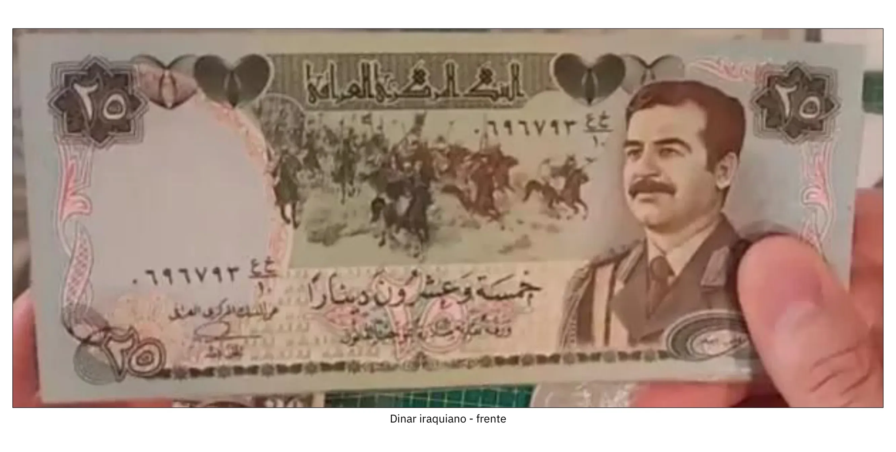

No entanto, as Guerras do Golfo marcaram um ponto de viragem na história do dinar suíço. O Iraque, que já não podia contar com o seu fornecedor inglês para a impressão de notas, recorreu à China para obter assistência. Esta transição resultou numa clara diferença na qualidade das notas, sendo a versão chinesa considerada inferior. Esta perceção não era infundada; as notas chinesas eram mais facilmente falsificáveis e susceptíveis de serem sobreimpressas pelo governo, o que ameaçava o seu valor.

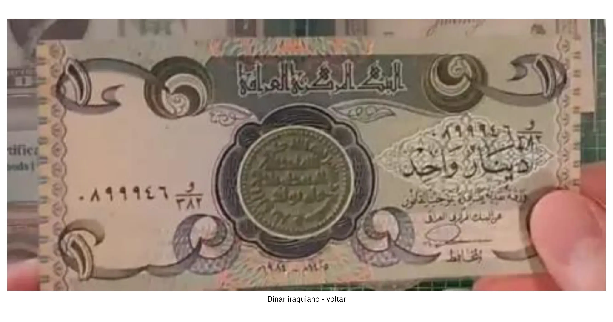

Na economia iraquiana pós-Guerra do Golfo, surgiu um fenómeno caraterístico: o sistema de preços duplos. Os comerciantes ofereciam preços diferentes consoante o tipo de nota utilizada para pagamento, privilegiando o dinar suíço original em detrimento da nota chinesa. Este sistema reflectia a confiança mantida nas notas de maior qualidade, que eram menos propensas à desvalorização, mesmo num contexto em que o valor era essencialmente imposto pelo Estado. Este episódio realça a importância das caraterísticas intrínsecas da moeda e a forma como, mesmo num regime de moeda fiduciária, a perceção da qualidade de uma moeda pode ter impacto no seu valor relativo e, por extensão, na confiança dos agentes económicos.

#### Sim, pesámos mesmo as moedas!

A perceção comum associa frequentemente a moeda à criação do Estado, em que a sua emissão e valor são regulados pelo Estado. Este conceito tem as suas raízes em civilizações antigas, como Roma, onde as moedas eram padronizadas e carimbadas pelo Império, conferindo assim valor oficial à moeda. No entanto, uma análise mais aprofundada revela que o valor intrínseco da moeda derivava principalmente do seu conteúdo em metais preciosos.

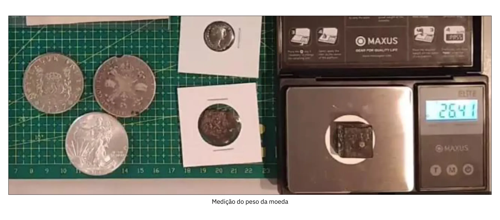

Um exemplo é ilustrado pela análise de um peso monetário equivalente a oito reais espanhóis, ou um dólar espanhol. Este peso, marcado com um algarismo romano que indicava o seu valor, era utilizado pelos cambistas para avaliar o valor das moedas com base no seu peso e não apenas no seu cunho. Ao pesar as moedas, os cambistas podiam determinar se estas tinham sido alteradas ou danificadas, o que poderia ter reduzido o seu valor. Esta prática evidencia que, embora a estampagem normalizada pelo Estado conferisse um certo valor nominal à moeda, o verdadeiro valor residia no peso do metal precioso que continha.

Esta análise demonstra que a confiança na moeda e, por extensão, no seu valor, estava ancorada na sua substância tangível e não na mera afirmação do Estado. Sublinha a dualidade entre o valor nominal imposto pelo Estado e o valor intrínseco ditado pelo conteúdo do metal precioso. Assim, a moeda vai para além de um mero instrumento do Estado, estando o seu valor fundamental intrinsecamente ligado a Elements tangíveis e mensuráveis.

#### Conclusão

Em conclusão, este estudo sobre a desvalorização monetária permite uma compreensão mais profunda dos mecanismos de inflação, que serão explorados nos vídeos seguintes. Discutiremos os diferentes tipos de inflação e o limiar a partir do qual passam para uma inflação elevada ou hiperinflação. Esta base sólida permitir-nos-á abordar as complexidades da inflação nas próximas sessões. Obrigado pela vossa atenção. Aguardamos com expetativa a continuação desta exploração da dinâmica monetária no próximo vídeo.

## Tipos de inflação

<chapterId>b438fe09-375e-5bb2-9196-7dd687b9f98c</chapterId>

### A inflação não é um fenómeno multifatorial

Nesta secção, examinaremos os vários aspectos da inflação, um fenómeno que é frequentemente mal compreendido. Embora a inflação seja frequentemente vista como um fenómeno multifatorial nos meios de comunicação social e nas discussões quotidianas, é crucial recordar que se trata fundamentalmente de um fenómeno monetário.

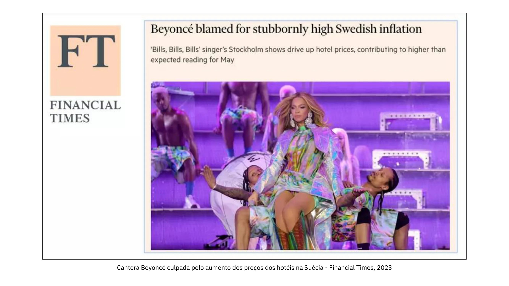

Eis uma análise do tema em vários pontos-chave:

- Distinção entre aumento de preços e inflação:

Um aumento de preços pode ser específico de um sector e induzido por vários factores, como uma diminuição da produção de petróleo da OPEP ou condições meteorológicas desfavoráveis que afectem a produção de trigo.

A inflação, por outro lado, é definida por um aumento generalizado dos preços numa série de bens e serviços e não apenas num sector específico.

- A essência monetária da inflação:

Com um Supply monetário fixo, um aumento dos preços num sector resultaria numa diminuição dos preços noutros sectores, uma vez que a quantidade de dinheiro disponível para gastar noutros sectores seria reduzida. A inflação está estreitamente relacionada com um aumento do Supply monetário, que permite um aumento simultâneo dos preços em todos os sectores.

- Impacto da moeda Supply na inflação e na deflação:

Num sistema de moeda fixa Supply, um aumento da produção deveria, teoricamente, conduzir à deflação, ou seja, a uma diminuição dos preços, uma vez que haveria mais bens e serviços disponíveis.

No atual sistema monetário fiduciário, um aumento da moeda Supply anula a deflação potencial causada por um aumento da produção.

- Efeitos negativos do ajustamento da moeda Supply:

Um aumento da moeda Supply, sem um aumento correspondente da produção, conduz à inflação, uma vez que há mais dinheiro em circulação para a mesma quantidade de bens e serviços.

Embora o aumento da produção devesse ter conduzido à deflação, o aumento simultâneo da moeda Supply anulou este efeito, resultando em inflação.

- Inflação, deflação e dinheiro Supply - Vasos comunicantes

A inflação e a deflação são como vasos comunicantes numa economia. Um aumento da produção pode levar à deflação, mas se a moeda Supply for aumentada em simultâneo, o efeito deflacionista é anulado, resultando em inflação.

Esta discussão sublinha a importância de compreender os mecanismos subjacentes à inflação e à deflação, bem como a profunda influência que a alteração da moeda Supply pode ter na economia. É provável que voltemos a abordar estes conceitos mais tarde para compreender melhor a sua interligação e o impacto que têm na economia global.

### Porque é que a impressão de dinheiro nem sempre provoca inflação?

#### Inflação ≠ IPC

A inflação, embora frequentemente associada a um aumento da moeda Supply, nem sempre tem uma correlação direta com a impressão de moeda, como ilustrado pelo período que se seguiu à crise financeira de 2008. Apesar da impressão significativa de dinheiro para salvar os bancos, a década seguinte não registou uma inflação elevada, com uma média de 0 a 2% por ano. Esta situação levanta a questão: Porque é que a impressão maciça de dinheiro não resultou numa inflação proporcional? A resposta reside em várias nuances relacionadas com a medição da inflação e o Índice de Preços no Consumidor (IPC).

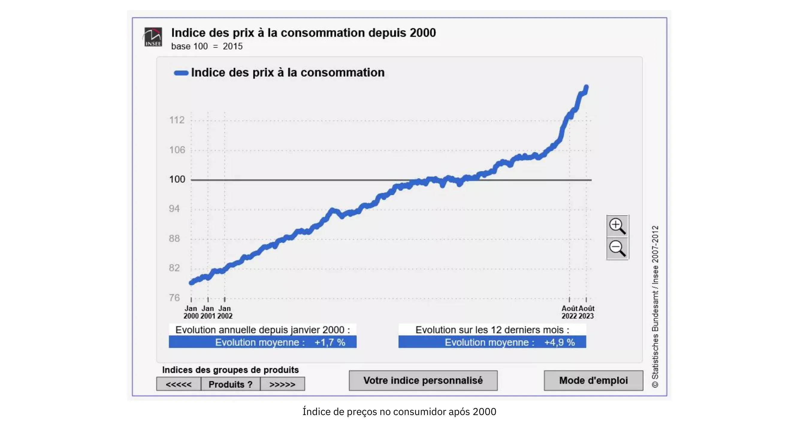

A primeira explicação reside na forma como a inflação é medida. O Índice de Preços no Consumidor (IPC), que constitui o principal indicador da inflação, tem algumas limitações. Por exemplo, não tem em conta, de forma abrangente, a evolução dos preços do sector imobiliário. Embora o IPC inclua uma componente relacionada com as rendas, a valorização substancial dos preços da habitação não está totalmente reflectida no índice. Consequentemente, podem ocorrer aumentos significativos dos custos da habitação sem que o IPC os capte totalmente, subestimando potencialmente a inflação efectiva.

Além disso, o cálculo do IPC emprega certas metodologias que podem compensar ou mascarar os aumentos reais de preços. Por exemplo, as melhorias qualitativas dos produtos podem ser utilizadas para ajustar o índice. Se o preço de um produto aumenta, mas a sua qualidade ou caraterísticas também melhoram, o IPC pode considerar que o valor real para o consumidor não se alterou e, por conseguinte, não reflecte a inflação. Um caso ilustrativo é aquele em que, apesar de um aumento dos preços da carne de bovino e dos computadores devido à injeção monetária, a melhoria do desempenho dos computadores é utilizada para compensar esse aumento. Se um computador custar o dobro mas for quatro vezes mais potente, o IPC pode interpretar este facto como uma diminuição dos preços, mascarando assim o aumento dos preços da carne de bovino.

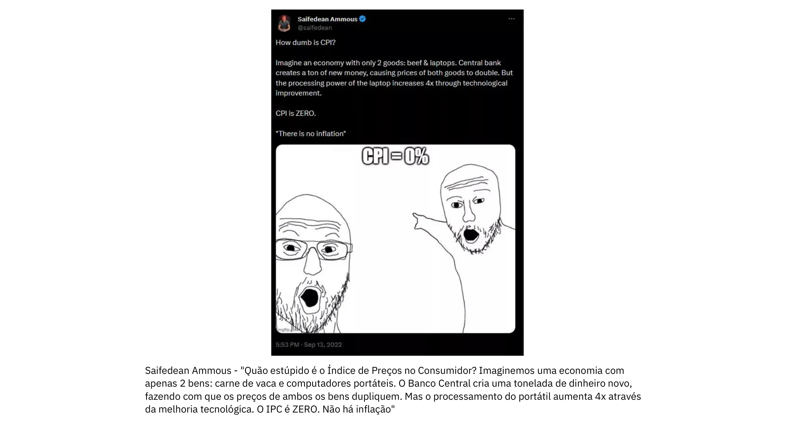

Estas nuances na medição da inflação pelo IPC realçam a complexidade da relação entre a impressão monetária e a inflação. Sugerem também que a inflação real pode ser mais elevada do que a comunicada se todos os aumentos de preços, especialmente em sectores-chave como o imobiliário, fossem tidos em conta de forma mais abrangente. Esta análise sublinha a importância de compreender os mecanismos subjacentes à inflação e as limitações dos índices convencionais utilizados para a medir, facilitando assim uma compreensão mais profunda das implicações económicas das políticas monetárias.

#### Argumentos da MMT

A Teoria Monetária Moderna (MMT) oferece uma perspetiva distinta sobre a criação de moeda e a inflação. De acordo com a MMT, a moeda tem origem principalmente no governo, que pode imprimir quantidades substanciais para financiar as suas necessidades sem causar inflação, desde que os sectores visados por esses fundos não estejam saturados. Esta abordagem afasta-se das teorias monetárias tradicionais, sublinhando a importância das capacidades de absorção sectoriais na dinâmica inflacionista.

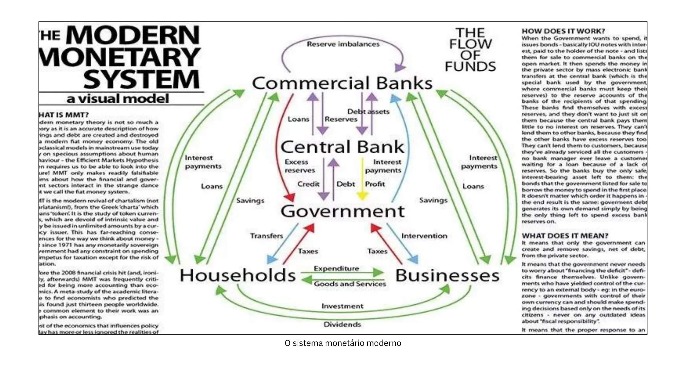

Um exemplo ilustrativo da MMT é o complexo militar-industrial americano. Segundo a MMT, é possível afetar centenas de milhares de milhões de dólares a este sector sem provocar inflação, graças à sua capacidade de absorver os fundos. Em contrapartida, se forem injectados fundos substanciais na construção de estradas nos Estados Unidos, onde existe um número limitado de empresas e de mão de obra, poderá ocorrer inflação devido à escassez de recursos e ao aumento dos custos exigidos pelos fornecedores.

O Japão é frequentemente citado pelos proponentes da MMT como outro exemplo da ausência de inflação apesar de uma significativa impressão monetária. No entanto, a situação no Japão também realça as limitações das medidas tradicionais de inflação, como o Índice de Preços no Consumidor (IPC). No Japão, uma parte significativa do dinheiro impresso é poupada ou investida em bens imobiliários ou no mercado de acções, em vez de ser gasta no consumo corrente. O IPC, ao não captar totalmente esta dinâmica, pode subestimar a inflação efectiva.

A análise do Japão (https://ideas.repec.org/p/ces/ceswps/_9821.html) também salienta que o comportamento dos agentes económicos, como a poupança ou o investimento em activos não incluídos no IPC, pode mascarar o impacto inflacionista da impressão monetária. Além disso, a capacidade dos diferentes sectores para absorverem a liquidez injectada desempenha um papel crucial na determinação da ocorrência de inflação.

#### Balanços de bancos e bancos centrais

O terceiro exemplo da razão pela qual a impressão monetária não causaria inflação é o facto de a relação entre a impressão monetária e a inflação ser modulada pela forma como a moeda recém-criada é introduzida na economia. Se este dinheiro permanecer nos balanços dos bancos privados sem ser emprestado aos agentes económicos, não terá impacto direto na economia real e, por conseguinte, não resultará em inflação.

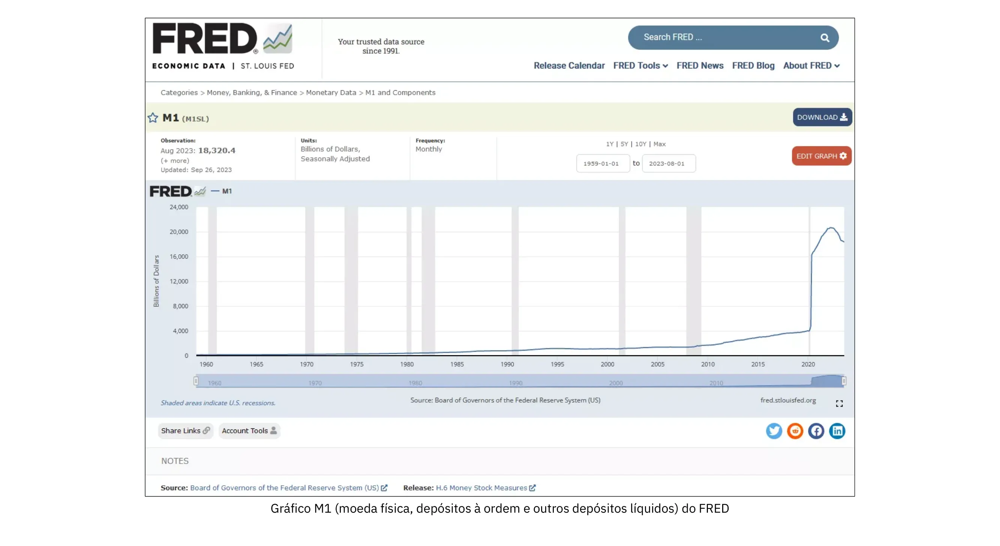

A impressão monetária pode ser vista como uma espada de Dâmocles que paira sobre a economia. A moeda criada pode permanecer latente durante um certo período de tempo, sem qualquer efeito inflacionista visível, desde que não seja injectada na economia através de empréstimos bancários ou outros mecanismos. No entanto, quando esta moeda latente é finalmente posta em circulação, podem manifestar-se efeitos inflacionistas. Foi o que se observou na década de 2020, em que dinheiro criado anteriormente entrou na economia, provocando inflação.

Este cenário realça a importância dos mecanismos de transmissão monetária para influenciar os efeitos inflacionistas da impressão de moeda. A criação de moeda pelo banco central é apenas uma peça do puzzle. O comportamento dos bancos privados, que decidem sobre o volume de empréstimos a conceder, e o comportamento dos mutuários, que decidem como gastar o dinheiro emprestado, são também Elements cruciais nesta dinâmica.

#### A inflação é social!

O exemplo da República de Weimar ilustra outro aspeto crucial da relação entre a impressão de moeda e a inflação: o papel das expectativas e o comportamento dos agentes económicos. Quando o Banco Central da República de Weimar começou a imprimir uma grande quantidade de dinheiro, a incerteza económica levou as pessoas a entesourar, ou seja, a guardar dinheiro em vez de o gastar. Esta reação atrasou temporariamente os efeitos inflacionistas da impressão de moeda.

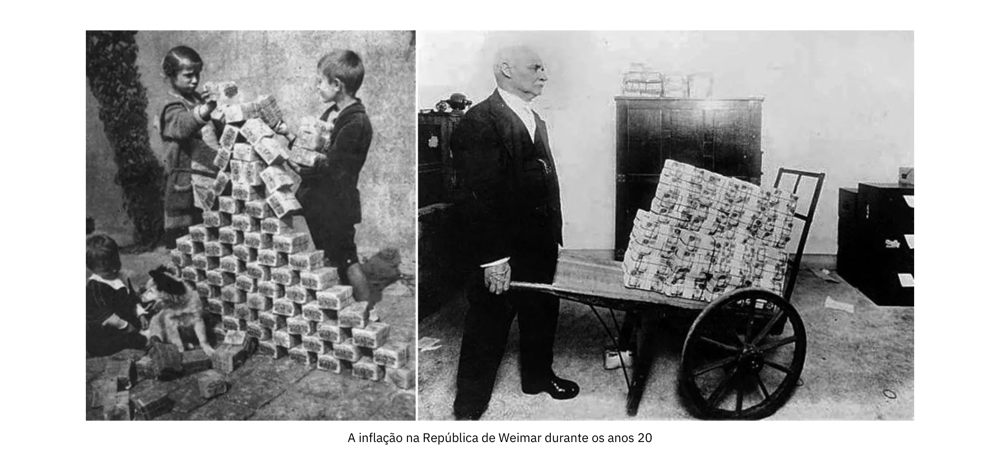

No entanto, quando a situação económica começou a melhorar ligeiramente, a confiança foi gradualmente restaurada. Os indivíduos retiraram então as suas poupanças dos seus esconderijos e começaram a gastar maciçamente na economia. Esta mudança súbita de comportamento, combinada com uma moeda já elevada, o Supply, levou a uma explosão da procura. Com mais dinheiro em circulação e maior procura, os preços começaram a subir rapidamente, levando a uma inflação notória.

Este exemplo sublinha a importância da calendarização e do comportamento dos agentes no surgimento da inflação. A inflação não ocorre apenas em resposta a um aumento da moeda Supply, mas depende também de como e quando essa moeda é gasta na economia. As incertezas económicas e as expectativas dos agentes económicos desempenham um papel crucial nesta dinâmica e podem acelerar ou atrasar os efeitos inflacionistas da impressão de moeda.

#### Recapitulação:

- Índice de Preços no Consumidor (IPC): O IPC está estruturado de forma a subestimar a inflação, o que pode dar uma imagem distorcida da realidade inflacionista.

- Absorção setorial: A injeção de dinheiro em sectores capazes de o absorver nem sempre conduz à inflação. Um exemplo notável é o complexo militar-industrial dos EUA, que pode absorver grandes somas de dinheiro sem provocar inflação.

- O caso do Japão: Apesar da significativa impressão de dinheiro, a inflação permanece baixa no Japão porque os fundos são frequentemente poupados ou investidos no sector imobiliário ou nos mercados de acções. Estes sectores absorvem o dinheiro impresso e o IPC não reflecte necessariamente os aumentos de preços nestas áreas.
- Correlação entre a impressão monetária e os mercados. Observa-se que as curvas dos mercados imobiliário e bolsista acompanham frequentemente a impressão monetária, indicando para onde se dirige o dinheiro impresso.
- Reservas monetárias dos bancos: Quando o dinheiro impresso permanece nos balanços dos bancos e não circula na economia, não causa inflação. Este facto é ilustrado pelo exemplo de 2008, em que o dinheiro impresso permaneceu em grande parte nos balanços dos bancos, atrasando o impacto inflacionista.

- República de Weimar: Este período histórico mostra como a incerteza económica levou à acumulação de dinheiro, atrasando a inflação. No entanto, quando a confiança foi restaurada e o dinheiro foi gasto, a inflação explodiu.

Estes exemplos podem ser utilizados em debates para explicar por que razão a inflação nem sempre é uma consequência imediata da impressão monetária e como os contextos económicos e os comportamentos dos agentes influenciam a inflação.

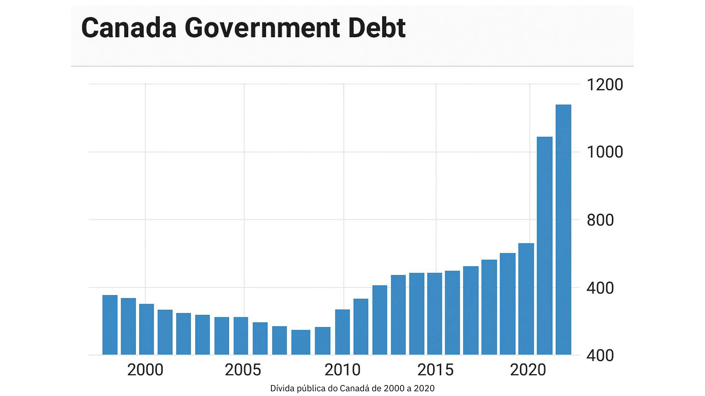

Porque, como mostra esta [thread](https://twitter.com/saifedean/status/1673639779433590786): A inflação é tudo exceto culpa dos bancos centrais.

- Economistas culpam as alterações climáticas pela inflação

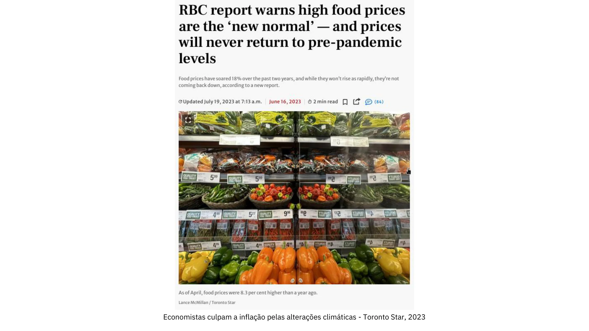

- Exemplo da Suécia que culpa a Beyoncé pela inflação durante um mês específico.

- O banco central da Polónia atribui a inflação à agressão russa na Ucrânia e à pandemia

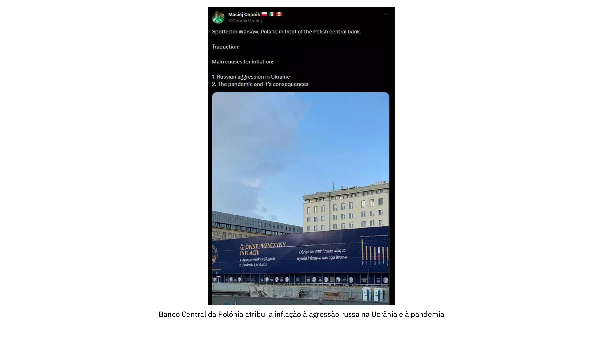

- O Brexit é responsabilizado pela inflação no Reino Unido.

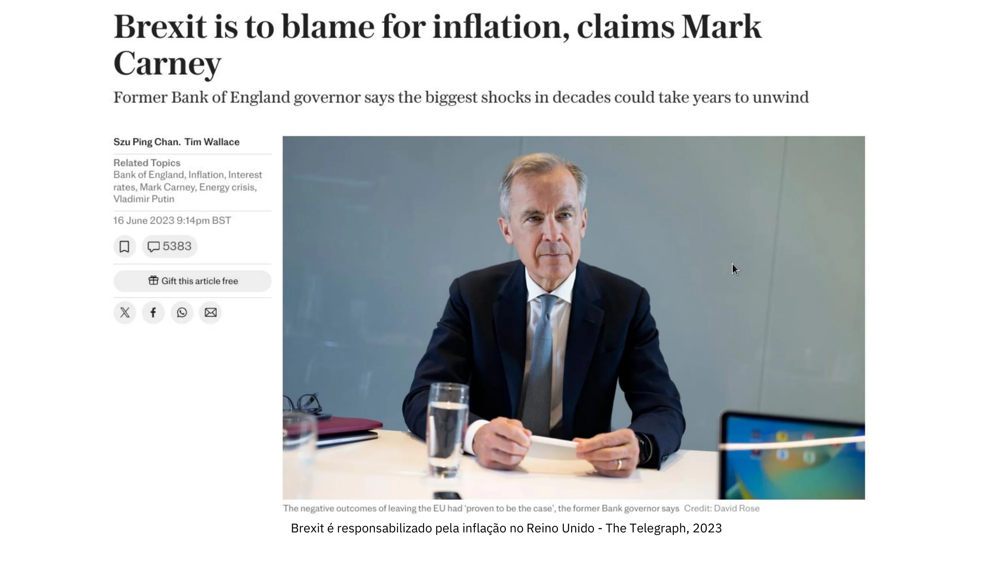

- Lançamento do jogo Zelda associado a um choque inflacionista.

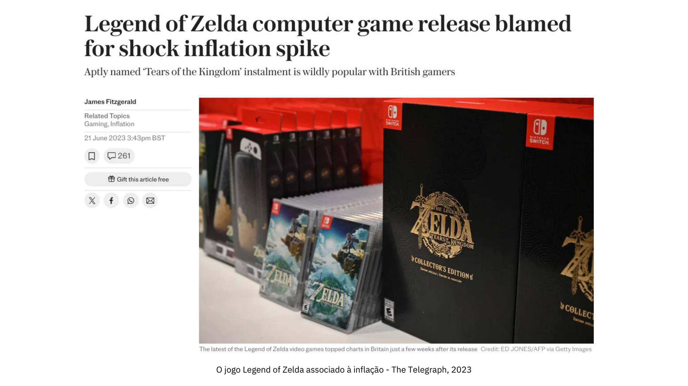

- Taylor Swift está alegadamente a causar inflação.

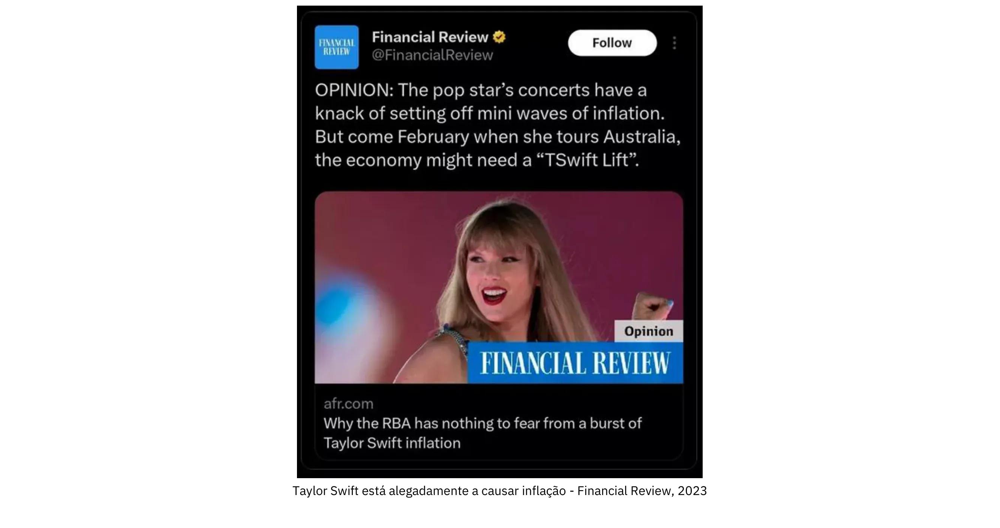

Diz-me, como é que a Beyoncé ou a Taylor Swift podem causar a subida generalizada dos preços? É que não faz qualquer sentido. Em suma:

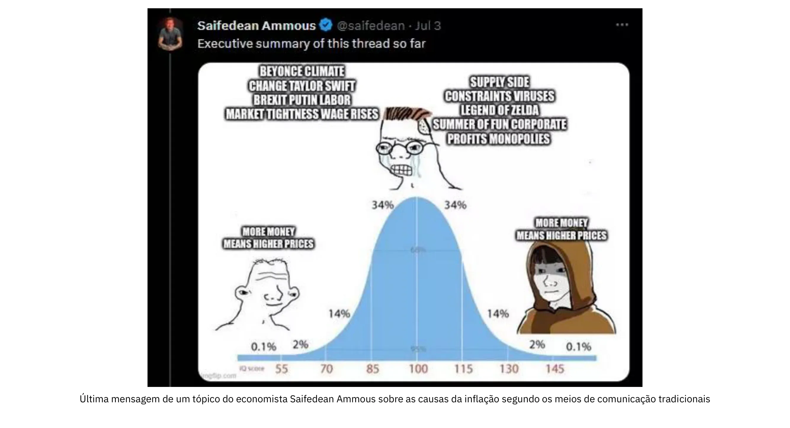

### Exploração dos tipos de inflação

É fundamental compreender a distinção entre os diferentes tipos de inflação, o que nos permite compreender as diferentes manifestações deste fenómeno económico. Eis uma explicação dos diferentes tipos de inflação:

- Inflação progressiva: Este é o tipo de inflação que os bancos centrais geralmente têm como objetivo, fixado em cerca de 2% ao ano. Este objetivo tem sido adotado desde os anos 90 e visa manter um crescimento económico estável sem sobreaquecimento ou deflação.
- Inflação moderada: Esta forma de inflação ocorre quando a inflação excede o objetivo de 2%. Está frequentemente associada a uma economia em sobreaquecimento, um estado em que um excesso de dinheiro Supply estimula um aumento geral dos preços. Este cenário expõe os limites das políticas monetárias e revela, por vezes, contradições no discurso económico.
- Inflação galopante: A inflação galopante, muitas vezes referida como inflação de dois dígitos, ocorre quando a taxa de inflação anual excede os 10%. Assinala um aumento significativo dos preços que pode comprometer a estabilidade económica.

- Hiperinflação: A hiperinflação é um fenómeno extremo em que a taxa de inflação excede 50% por mês, o que, devido à natureza exponencial da inflação, equivale a uma taxa de inflação anual superior a 13.000%. Este nível de inflação desestabiliza gravemente a economia, tornando a moeda quase sem valor e corroendo a confiança no sistema monetário.

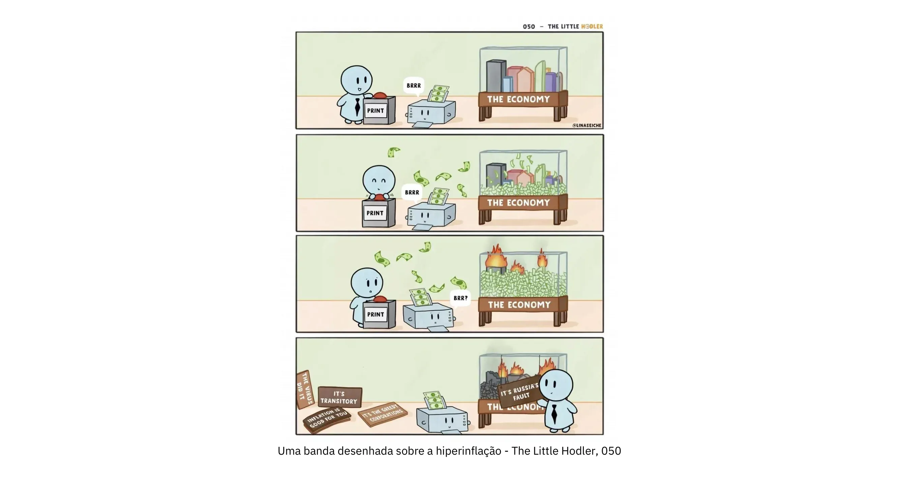

Ao explorar os tipos de inflação, é comum encontrar termos como "Demand Pull" e "Cost Push" em recursos educativos. Estes conceitos, embora válidos, tendem a explicar os aumentos de preços e não a inflação como um fenómeno monetário. Aqui está uma análise mais aprofundada:

- Puxar pela procura:

A inflação induzida pela procura é frequentemente descrita como um cenário em que a procura na economia excede a capacidade de produção disponível. Contudo, sem um aumento correspondente da moeda Supply, esta situação conduzirá simplesmente a uma redistribuição da despesa. Os consumidores podem gastar mais em bens essenciais e menos em artigos não essenciais, neutralizando assim o efeito inflacionista global.

- Impulso de custos:

Por outro lado, a inflação impulsionada pelos custos é atribuída ao aumento dos custos de produção, como os dos recursos naturais ou do trabalho. Mais uma vez, sem um aumento da moeda Supply, o aumento dos custos num sector pode simplesmente reduzir a despesa noutros sectores, sem causar uma inflação generalizada.

Estas explicações tradicionais associam frequentemente os aumentos de preços à inflação, o que pode gerar confusão e mal-entendidos. Na realidade, para que ocorra uma inflação generalizada, é necessário um aumento da massa monetária Supply. Neste contexto, os conceitos de Demand Pull e Cost Push podem explicar as variações de preços sectoriais, mas não captam a natureza monetária da inflação. Este facto realça a importância de distinguir entre aumentos de preços sectoriais e inflação generalizada, e reafirma a necessidade de um aumento da massa monetária Supply para evitar que a inflação se manifeste em toda a economia. Esta análise fornece uma perspetiva mais matizada e precisa sobre as causas reais da inflação, desmistificando interpretações comuns que podem obscurecer a dinâmica monetária subjacente.

### Classificação da inflação de acordo com Bernholz

Bernholz propõe uma classificação simplificada mas precisa da inflação em três categorias, permitindo uma melhor compreensão deste fenómeno monetário complexo:

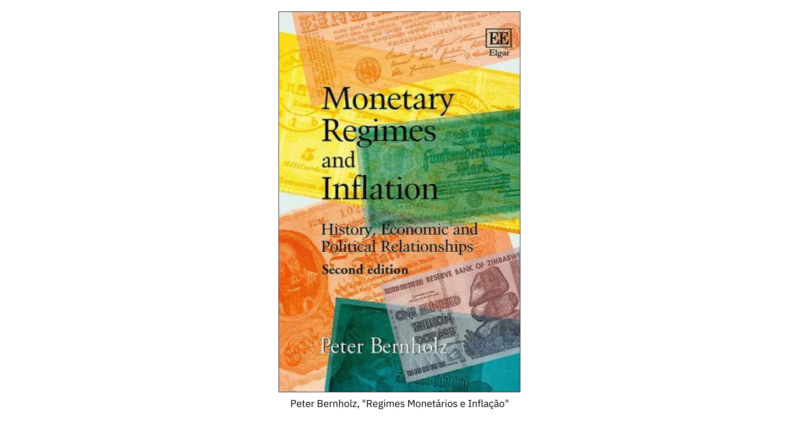

- Inflação moderada:

A inflação moderada ocorre quando o nível de moeda Supply é mais elevado do que o normal, mas sem que o Estado recorra a grandes défices financiados pela criação de moeda. Embora o termo "moderada" possa parecer insignificante, esta forma de inflação pode causar problemas substanciais, embora não seja classificada como inflação elevada.

- Inflação elevada:

A inflação elevada ocorre quando o valor real da moeda diminui, apesar de um aumento em termos nominais. Esta situação paradoxal resulta da substituição monetária, em que os indivíduos perdem a confiança na moeda nacional e procuram Exchange trocá-la por bens, serviços ou moedas estrangeiras. Este processo reduz ainda mais o valor real da moeda, exacerbando a inflação.

- Hiperinflação:

A hiperinflação é uma forma extrema de inflação elevada, caracterizada por grandes défices orçamentais que são financiados através da criação de moeda. Historicamente, nenhum caso de hiperinflação foi observado sem um financiamento substancial do défice através da impressão de dinheiro. A hiperinflação cria um ciclo vicioso: a inflação corrói o valor da moeda tão rapidamente que as receitas fiscais se desvalorizam antes mesmo de o Estado as poder cobrar, obrigando assim o Estado a imprimir ainda mais dinheiro para se financiar. Este ciclo de auto-reforço conduz a taxas de inflação astronómicas, frequentemente superiores a 50% por mês.

Esta classificação de Bernholz destaca a perigosa progressão da inflação moderada para a hiperinflação, sublinhando a importância vital do controlo monetário e fiscal na prevenção de espirais inflacionistas destrutivas. Demonstra também que as consequências prejudiciais para o financiamento do Estado podem ocorrer muito antes de se atingir a fase de hiperinflação, proporcionando uma perspetiva diferenciada das implicações da inflação a vários níveis.

### Conclusão: Resumo dos tipos de inflação

Em conclusão, explorámos uma série de tipos de inflação, começando com termos comummente ouvidos, como "inflação rasteira", "inflação em movimento" e "inflação galopante", cada um deles denotando diferentes níveis de percentagens de inflação numa economia. No entanto, para o nosso estudo aprofundado sobre a hiperinflação, as categorias de inflação moderada, inflação elevada e hiperinflação, tal como descritas por Bernholz, revelam-se referências cruciais.

- Inflação moderada:

Indica um nível de dinheiro Supply acima do normal, embora este nível possa ser sustentado sem um défice de financiamento significativo por parte do Estado.

- Inflação elevada:

Ocorre quando o valor real da moeda Supply diminui, muitas vezes devido à substituição monetária, em que os indivíduos procuram trocar a sua moeda por bens, serviços ou outras formas de moeda.

- Hiperinflação:

Representa uma versão extrema da inflação elevada, em que a criação excessiva de moeda para financiar grandes défices orçamentais conduz a uma rápida erosão do valor real da moeda.

O que resulta da nossa exploração é que a hiperinflação é um fenómeno complexo e contra-intuitivo. Embora se possa pensar que a hiperinflação é o resultado de um aumento maciço do dinheiro Supply, na realidade, ela resulta de uma diminuição do valor real desse dinheiro Supply. Esta nuance é crucial para compreender por que razão alguns países lutam para sair da hiperinflação, mesmo com o apoio de instituições internacionais como o Banco Mundial ou o FMI. Caracterizar mal o tipo de inflação pode levar à aplicação de remédios inadequados, exacerbando os problemas económicos em vez de os resolver.

Nos nossos futuros debates, aprofundaremos a hiperinflação, explorando as suas definições e manifestações em vários contextos económicos. O nosso objetivo é desvendar os mecanismos subjacentes à hiperinflação e explorar potenciais soluções para resolver este problema. Este conhecimento diferenciado permitir-nos-á compreender melhor os desafios associados e propor estratégias informadas para gerir a inflação.

Obrigado pela vossa atenção. A próxima sessão será inteiramente dedicada à definição e desmistificação da hiperinflação, considerando várias perspectivas académicas e práticas. Esperamos poder continuar a explorar este tema convosco no nosso próximo encontro.

# O que é a hiperinflação?

<partId>3f541663-1e2f-5410-8ee0-f61c5d009fa5</partId>

## Definições de hiperinflação

<chapterId>d2a71a2e-5f36-58d9-993c-d431f4aa07fd</chapterId>

### Definições de hiperinflação

Nesta secção, exploramos as várias definições de hiperinflação, um termo crucial no estudo de fenómenos monetários extremos. A definição mais conhecida é a de Philip Cagan, que, na sua obra de 1956, "The Monetary Dynamics of Hyperinflation", propõe uma compreensão quantitativa da hiperinflação. De acordo com Cagan:

- Início e fim da hiperinflação:
  - A hiperinflação começa quando a inflação mensal ultrapassa os 50%.
  - Termina quando a taxa de inflação desce abaixo dos 50% por mês durante, pelo menos, um ano.

A título de exemplo, se a inflação cair para 40% em julho e não subir acima dos 50% até julho do ano seguinte, considera-se que o período de hiperinflação terminou em julho do ano anterior àquele em que foi observado pela primeira vez. Esta definição permite uma caraterização precisa dos episódios de hiperinflação, facilitando uma análise estruturada.

Esta definição foi adoptada na tabela Hanke-Krus, que documenta 56 episódios de hiperinflação. No entanto, a tabela não cobre todos os episódios, como o da Venezuela em 2016, elevando o total para 57.

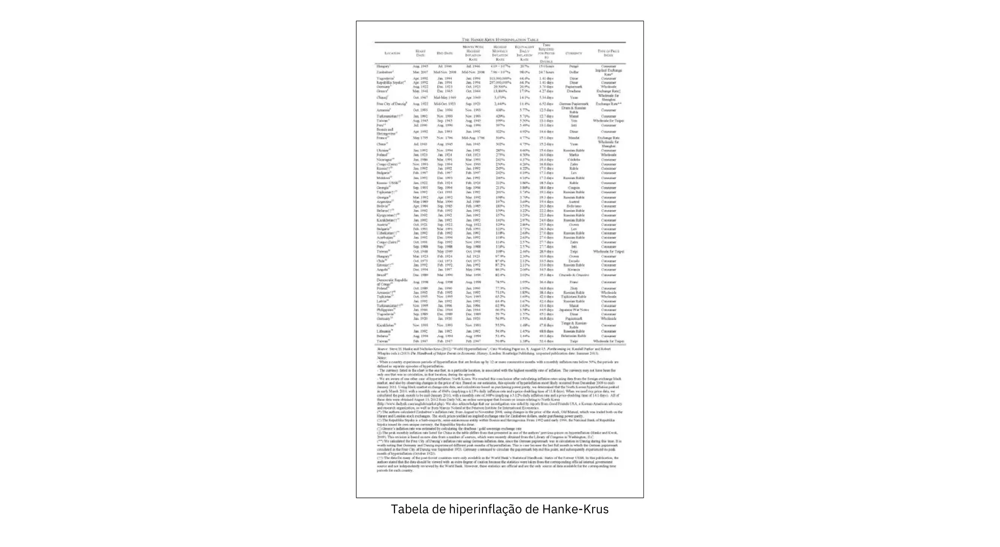

zoom

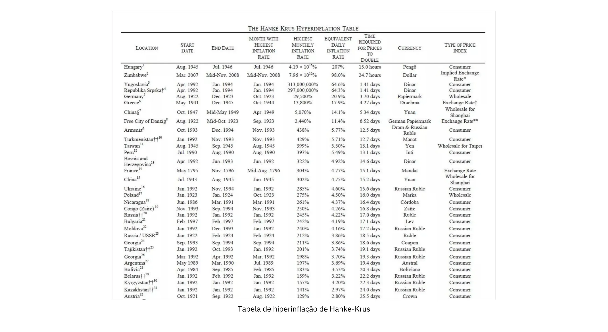

Note-se que esta definição, embora precisa, poderia eventualmente excluir certos episódios de hiperinflação devido ao rigor do limiar de 50%. Existe a possibilidade de alargar esta definição a outros episódios que, embora não satisfaçam rigorosamente os critérios de Cagan, representam, no entanto, períodos de inflação extremamente elevada. Esta observação abre a porta a uma exploração mais ampla dos fenómenos de hiperinflação, permitindo uma compreensão mais matizada das suas causas e efeitos. Em discussões posteriores, consideraremos a possibilidade de rever esta definição e examinar episódios de hiperinflação não abrangidos pelos critérios rigorosos de Cagan.

### A definição de hiperinflação por Cagan

Philip Cagan pode ter estabelecido um marco arbitrário com o limiar de 50% de inflação mensal ao definir hiperinflação. Ele próprio admite que esta definição é arbitrária e que a sua análise se baseia principalmente em sete episódios de hiperinflação. A análise dos dados de Cagan revela que os três episódios de hiperinflação com as taxas de inflação mensal mais baixas rondaram os 47%, 46% e 57%. Parece que o limiar de 50% foi escolhido para englobar estes casos no seu estudo.

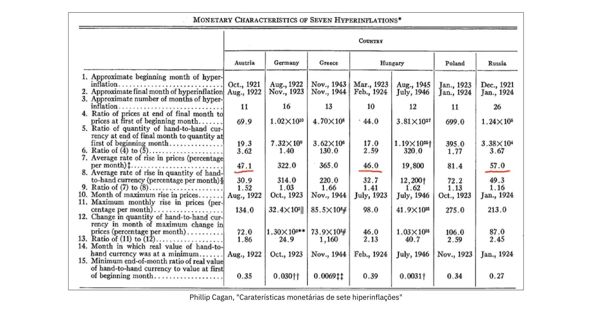

- Contexto histórico:

A definição de Cagan data de 1956 e baseia-se num número limitado de episódios de hiperinflação disponíveis na altura.

- Observações de Cagan:

Segundo Cagan, nenhum episódio atingiu este limiar de cerca de 50% sem evoluir para uma hiperinflação mais grave, o que poderia justificar a escolha deste limiar.

- Crítica da definição de Cagan:

Outros economistas, como Bernholz, autor de Monetary Regime and Inflation, também descreveram o limiar de 50% como arbitrário.

Bernholz observa que há episódios de inflação elevada com as mesmas caraterísticas qualitativas que os episódios de hiperinflação, sem atingir o limiar de 50%.

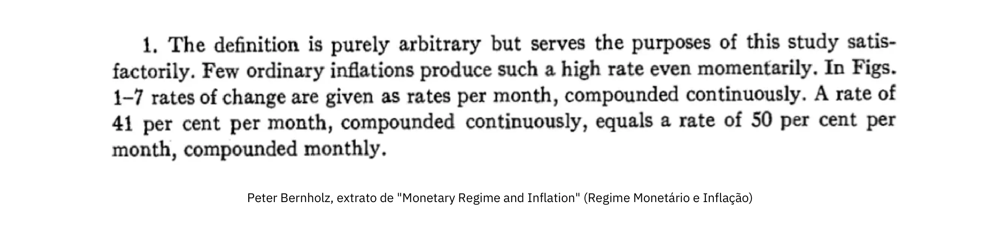

Esta reflexão leva-nos a questionar a rigidez da definição tradicional de hiperinflação e sublinha a necessidade de talvez rever este limiar, incorporando mais episódios e dados históricos. A definição de hiperinflação pode exigir flexibilidade para englobar várias manifestações de inflação extrema em diferentes contextos económicos e históricos.

### A definição de hiperinflação segundo o International Accounting Standards Board (IASB)

O IASB oferece uma perspetiva única sobre a hiperinflação, centrando-se nas práticas contabilísticas durante períodos de hiperinflação. Esta abordagem é crucial para contabilistas e empresas que operam em ambientes hiperinflacionários, onde o valor monetário flutua rapidamente. As diretrizes do IASB identificam vários indicadores de hiperinflação:

- Preferência por activos não monetários:**

Devido à rápida desvalorização do valor monetário, as pessoas preferem manter o valor em bens do que em moeda.

- Avaliação de bens e serviços:**

Os residentes não calculam o valor dos bens e serviços em moeda local, o que reflecte uma perda de confiança na moeda local.

- Indemnização por perda de valor monetário:**

Os preços incorporam a compensação pela perda de valor monetário durante as compras a crédito, ilustrando o impacto da inflação nas transacções diárias.

- Indexação de preços, salários e juros:**

Os preços, salários e juros são ajustados com base num índice para compensar a inflação.

- Inflação acumulada em três anos:**

A inflação acumulada em três anos aproxima-se dos 100% (cerca de 24% por ano), o que contrasta com a definição de Cagan de 50% de inflação mensal.

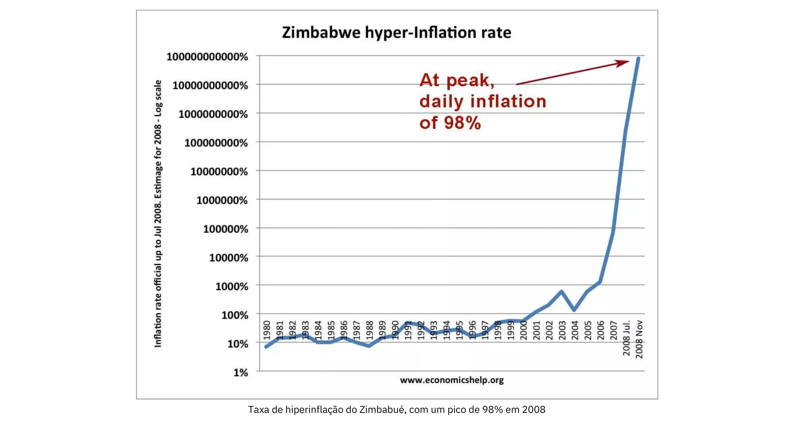

De acordo com os critérios do IASB, vários países, incluindo a Argentina, a Etiópia, o Haiti, o Irão, o Líbano, o Sudão, o Sudão do Sul, o Suriname, a Síria, a Turquia, a Venezuela, o Iémen e o Zimbabué, registam atualmente uma hiperinflação.

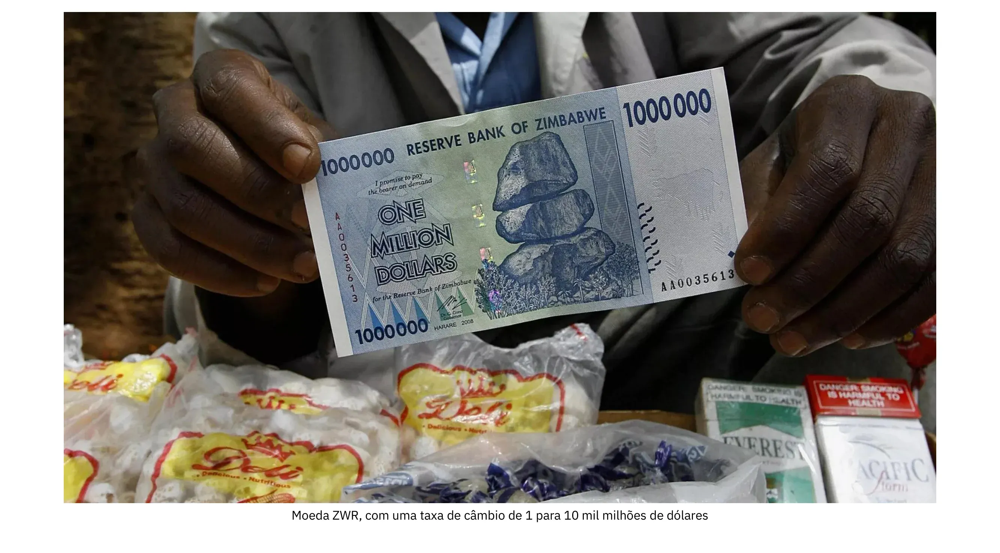

Esta definição dada pelo IASB afasta-se do limiar quantitativo estrito de Cagan, incorporando uma análise qualitativa dos comportamentos económicos e dos ajustamentos práticos face à hiperinflação. Demonstra que a hiperinflação é um fenómeno complexo que exige uma compreensão multidimensional para apreender as suas reais implicações, nomeadamente no domínio da contabilidade, crucial para a estabilidade e transparência financeira das empresas e dos mercados.

### Então, quantas hiperinflações existem no total?

As definições comuns de hiperinflação, como a proposta por Cagan, que estipula uma taxa de inflação mensal de 50%, podem por vezes ser confusas ou demasiado simplistas. Por exemplo, dois países com taxas de inflação anual de 1.000% e 3.000%, respetivamente, podem ser vistos de forma diferente com base na distribuição mensal dessa inflação. Se nenhum mês exceder o limiar de 50%, de acordo com a definição de Cagan, esses países não seriam classificados como estando num estado de hiperinflação. Esta abordagem pode, portanto, conduzir a anomalias na classificação da hiperinflação, especialmente quando se comparam as inflações acumuladas ao longo do ano.

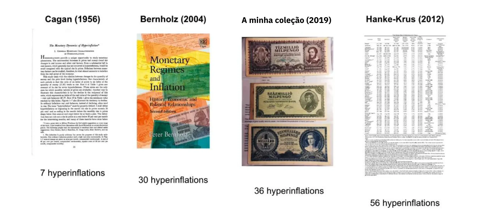

- O trabalho de Cagan, "Monetary Dynamics of Hyperinflation", fornece uma análise fundamental da hiperinflação.
- O livro de Bernholz, que estuda 30 períodos distintos de hiperinflação, alarga assim o âmbito da análise.
- A coleção pessoal de David St-Onge (o autor deste curso) de notas de 36 períodos de hiperinflação, permitindo uma compreensão tangível e histórica.
- A tabela Hanky Cross (versão de 2012, actualizada em 2016 com a Venezuela), que enumera 57 períodos de hiperinflação com base na definição de Cagan.

É de notar que certos períodos históricos de inflação elevada não estão incluídos nas tabelas clássicas de hiperinflação, muitas vezes devido a critérios de classificação rigorosos. Por exemplo, durante a Guerra da Independência Americana, em novembro de 1779, e durante a Guerra Civil Americana, em março de 1864, as taxas de inflação mensal foram de 47,4% e 40%, respetivamente. Estas taxas, embora elevadas, não ultrapassam o limiar de 50% estipulado por Cagan, pelo que estes períodos não podem ser classificados como casos de hiperinflação. Esta omissão põe em evidência as limitações das definições rígidas e sublinha a necessidade de uma compreensão mais matizada da hiperinflação em toda a sua complexidade.

## Semelhanças entre Weimar e o Zimbabué

<chapterId>11eef458-aab8-5c63-8523-264d0ba69f5d</chapterId>

### Duas épocas, duas catástrofes

Neste capítulo, examinaremos os efeitos da hiperinflação, com destaque para as experiências do Zimbabué e da República de Weimar. Ao longo da minha investigação, dei prioridade à exploração de testemunhos diretos de indivíduos que viveram estes períodos de hiperinflação, em vez de adotar uma abordagem puramente económica ou estatística.

Alguns livros foram particularmente informativos:

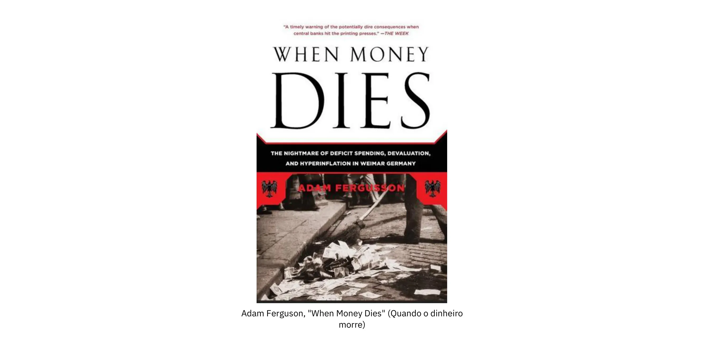

- o livro "When Money Dies", de Adam Ferguson, descreve a hiperinflação na Alemanha, na Áustria e na Hungria após a Primeira Guerra Mundial.
- Dois livros sobre a hiperinflação no Zimbabué, "Zimbabwe Warm Heart Ugly Face" e "Hard Boiled Egg Index", de Jérôme Gardner e Kudzai Joseph Gou Min-Yu, respetivamente, oferecem testemunhos pungentes de um diretor executivo de uma cadeia de lojas de roupa e de um banqueiro agrícola sobre as suas experiências durante este período tumultuoso.

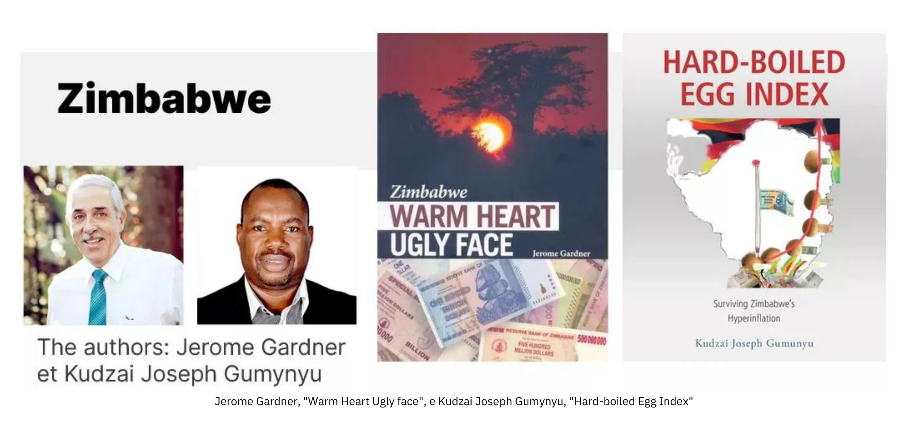

Ao consolidar as minhas notas, reparei em numerosas semelhanças entre as experiências de hiperinflação no Zimbabué e na República de Weimar, apesar do intervalo de 90 anos entre elas. Identifiquei cerca de 17 semelhanças, 13 das quais ilustram uma espécie de progressão para o desastre económico descrito nestes testemunhos. Estes paralelismos fascinantes demonstram o carácter repetitivo e devastador da hiperinflação através do tempo e das fronteiras. Hoje, vamos examinar estas semelhanças e a forma como descrevem uma trajetória preocupante durante os períodos de hiperinflação.

### Análise comparativa: O Zimbabué e a República de Weimar

O jogo das 14 diferenças!

#### 1. Escassez de dinheiro

Quando a moeda se desvaloriza a uma velocidade vertiginosa, mesmo as tentativas mais ambiciosas de inundar o mercado com novas notas podem revelar-se insuficientes. A procura incessante de moeda tangível pode ultrapassar largamente a capacidade de produção de notas dos bancos centrais, criando crises de liquidez sem precedentes.

> Weimar: "Durante este mês, será aumentado para quase 4 mil milhões de marcos de papel, um número com o qual se espera que a escassez de moeda seja definitivamente ultrapassada."

> Zimbabué: "De 2002 a janeiro de 2009, houve várias faltas de liquidez críticas. Simplesmente não havia notas suficientes impressas ou em circulação para acompanhar a inflação galopante"

#### 2. "E isso é estrume!"

A rapidez com que a moeda pode perder o seu valor em determinadas situações económicas é espantosa. Quantidades astronómicas de notas podem ser emitidas em tempo recorde, transformando instantaneamente somas outrora consideráveis em algo tão insignificante como estrume.

> Weimar: "A emissão total atual ascende a 63.000 mil milhões. Dentro de alguns dias, poderemos, portanto, emitir dois terços da circulação total num só dia."

> Zimbabué: "Em 17 de setembro de 2006, o governador do RBZ, Gideon Gono, declarou: '10 biliões ainda andam por aí e transformaram-se em estrume'"

#### 3. As notas de banco valem menos do que o papel em que são impressas

Em determinadas circunstâncias económicas, o valor intrínseco de uma nota pode tornar-se inferior ao valor do papel em que é impressa. Esta desvalorização drástica transforma as notas, que normalmente são símbolos de valor e poder de compra, em meros pedaços de papel sem valor.

> Weimar: "Notas de marcos inteiras quase não tinham valor assim que saíam da prensa"

> Zimbabué: "O banco central desperdiçou dinheiro ao imprimir uma nota que não valia o papel em que foi impressa. Por outras palavras, o seu valor era inferior ao do papel higiénico. Por mais absurdo que possa parecer, era mais barato usar a nota de 100 biliões de ZWD como papel higiénico do que comprar papel higiénico verdadeiro"

#### 4. Contar dinheiro

Quando a moeda perde rapidamente o seu valor, mesmo as transacções mais simples podem tornar-se tarefas laboriosas. Calcular o preço de um artigo ou simplesmente contar as notas necessárias para o pagamento pode demorar vários minutos, acrescentando um Layer de complexidade às interações diárias.

> Weimar: "A compra mais vulgar numa loja exigia três ou quatro minutos de cálculo e, uma vez determinado o preço, eram normalmente necessários mais alguns minutos para contar as notas"

> Zimbabué: "Os gerentes das lojas também foram autorizados a contratar um trabalhador temporário para substituir o funcionário que contava dinheiro todo o dia. Claro que contar dinheiro na loja para a administração e para o depósito bancário era uma coisa, mas todo o processo tinha de ser repetido no banco durante o depósito"

:::video id=910231d7-af90-4ab8-b74c-bfb81caebfb2:::

Técnica uzbeque de contagem de dinheiro

#### 5. Pagamentos por cheque

Em economias em rutura, os métodos de pagamento tradicionais, como os cheques, podem perder rapidamente a sua eficácia. Os bancos, sobrecarregados pela crescente procura de moeda devido à hiperinflação, podem racionar ou atrasar o levantamento de cheques, reduzindo assim o seu valor real. Esta instabilidade conduz frequentemente a uma hierarquização dos métodos de pagamento, em que os preços podem variar consoante o método de pagamento escolhido.

> Weimar: "O aumento dos preços intensificou a procura de dinheiro, tanto por parte do Estado como de outros empregadores. Os bancos privados não conseguiam satisfazer a procura e tiveram de racionar o levantamento de cheques, pelo que os cheques não levantados ficaram congelados enquanto o seu poder de compra diminuía."
> Zimbabué: "O valor temporal do dinheiro criou três preços para bens e serviços: um preço em dinheiro, um preço de liquidação por bruto em tempo real e um preço de cheque. Por fim, ninguém aceitava cheques, que demoravam cinco dias a ser compensados."

#### 6. Os "Empresários da Queima"

À medida que o valor da moeda se desvaloriza, surgem novas oportunidades económicas, explorando as distorções do mercado. Estes empresários, muitas vezes designados por "Burner-preneurs", podem prosperar contraindo empréstimos em moeda desvalorizada para investir em activos tangíveis e depois pagar as suas dívidas com moeda ainda mais desvalorizada.

Weimar: "A especulação sobre a inflação consistia em pedir emprestado marcos de papel, convertê-los em bens e fábricas e depois reembolsar os credores com papel desvalorizado."

Zimbabué: Os "empresários-queimadores"

#### 7. A honestidade e o trabalho Hard perdem o seu atrativo

Em contextos económicos instáveis, os valores tradicionais de trabalho, parcimónia e integridade podem ser ofuscados pelo fascínio da riqueza rápida. A especulação e o comércio de divisas oferecem muitas vezes recompensas significativamente mais elevadas do que o trabalho normal, levando a uma perturbação das prioridades sociais.

Weimar: "À medida que as velhas virtudes da parcimónia, da honestidade e do trabalho Hard perdiam o seu interesse, todos procuravam enriquecer rapidamente, tanto mais que a especulação monetária ou bolsista podia aparentemente render muito mais do que o trabalho."

Zimbabué: "Estas práticas, ao mesmo tempo que enriqueciam alguns indivíduos, empobreciam a classe trabalhadora urbana e a população rural. A educação perdeu o seu valor, uma vez que este comércio era conduzido por pessoas que não necessitavam de educação ou de trabalho Hard para o justificar. Tudo o que precisavam era de contactos e de capital inicial para começar o seu negócio de dinheiro fácil"

#### 8. Os "bancos do mundo"

Em situações de hiperinflação ou de crise monetária, surgem frequentemente mercados paralelos e não regulamentados de divisas estrangeiras. Estes "bancos" informais, muitas vezes humoristicamente designados por "bancos mundiais" ou por outros nomes locais, constituem um refúgio para aqueles que procuram proteger os seus activos da desvalorização. Embora estes mercados possam constituir uma linha de vida económica necessária, evidenciam frequentemente uma desconfiança generalizada em relação às instituições financeiras oficiais e às políticas governamentais.

Weimar: "As suas transacções eram feitas principalmente através dos chamados Winkelbankiers, os operadores de rua que tinham surgido com a inflação e que, prosperando numa economia doente, viviam inteiramente da diferença entre os preços de compra e venda das moedas estrangeiras."

Zimbabué: "Eram também cambistas. Operavam impunemente entre a 2ª e a 6ª Avenida e a Fort Street em Bulawayo, graças às suas práticas comerciais astutas, que envolviam frequentemente corrupção e outras actividades ilícitas. Esta zona da cidade era conhecida como o 'Banco Mundial'"

Argentina: "Então fui onde todos os argentinos vão: as cuevas, as 'cavernas', que se encontram no bairro Florida, no coração de Buenos Aires." - TheBigWhale

#### 9. As trocas de moeda estrangeira eram ilegais

Os governos, num esforço para estabilizar a sua própria moeda e controlar o fluxo de capitais, podem tornar estas transacções em moeda estrangeira ilegais. Estas medidas repressivas, embora destinadas a proteger a economia nacional, podem muitas vezes ter o efeito oposto, exacerbando a desconfiança do público e incentivando o mercado negro.

Weimar: "As pessoas recorreram à troca e, gradualmente, voltaram-se para as moedas estrangeiras como o único meio fiável de Exchange. Foram introduzidos novos decretos relativos à compra de cheques estrangeiros e à utilização de moedas estrangeiras para pagamentos internos. Para além da pena de prisão, as multas podiam ser aplicadas até dez vezes o montante da transação ilegal."

Zimbabué: "As rusgas às empresas levaram à detenção de vários empresários de Bulawayo durante o fim de semana e à aplicação de multas equivalentes ao dobro do montante das divisas recuperadas

#### 10. Controlos de capitais

Quando um país enfrenta uma crise monetária ou económica, uma resposta comum dos governos é exercer um controlo rigoroso sobre a circulação e as formas de capital. Quer através de ordens que obrigam à aceitação de moedas nacionais desvalorizadas, quer através de sanções severas contra aqueles que rejeitam determinados métodos de pagamento, estas medidas têm frequentemente como objetivo conter o pânico e restaurar a confiança. No entanto, a sua eficácia é variável e, por vezes, estas medidas podem revelar-se contraproducentes ou desligadas da realidade vivida pelos cidadãos.

Weimar: "Os comerciantes tinham sido recentemente obrigados, por um novo decreto, a aceitar notas de banco do Estado; mas como este também permitia a continuação da utilização de moedas estrangeiras para todas as compras, os comerciantes encontravam geralmente desculpas para não aceitarem quase mais nada."

Zimbabué: "O governo introduziu o SI 175/2008 em 12 de dezembro de 2008, relativo ao pagamento por cheques. Nele se dizia: "A sanção por recusa de pagamento por cheque/cartão bancário ou qualquer outro método de pagamento eletrónico mediado pelo banco será uma multa de nível 8 ou uma pena de prisão de seis meses ou ambas Obviamente, ignorámos a SI porque estava completamente desfasada da realidade."

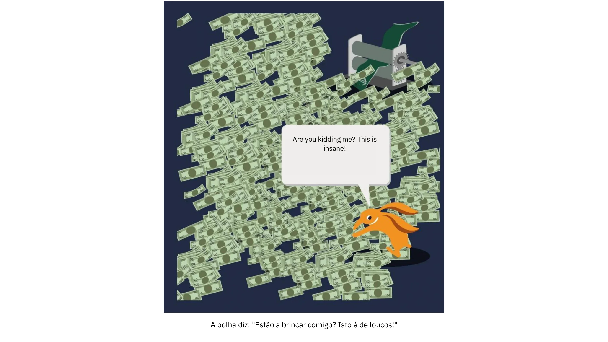

#### 11. Obrigados a manter as suas lojas abertas

Quando a economia entra em colapso e a moeda perde o seu valor, os governos podem recorrer a medidas drásticas para manter uma aparência de normalidade.

Weimar: "Os comerciantes que mantiveram a sua atividade foram sujeitos a uma nova lei, promulgada a 22 de outubro, que os obrigava a manter as suas lojas abertas e a oferecer produtos em Exchange em troca de marcas de papel."

Zimbabué: "Só restavam prateleiras de aço vazias e frigoríficos, arcas frigoríficas e congeladores. A tragédia é que a loja continuava aberta porque não se atreviam a fechar devido às tensões políticas e ao receio de os dirigentes serem detidos pela força de controlo de preços do governo. Nem os trabalhadores foram despedidos porque toda a gente pensou que haveria uma solução rápida"

#### 12. Toda a gente é criminosa

Face a uma economia em colapso e a uma regulamentação omnipresente, a linha entre sobrevivência e criminalidade torna-se ténue.

Weimar: "Todos os crimes contra o Estado, todos e cada um deles, em diferentes graus, tornaram-se uma questão de sobrevivência para os indivíduos"

> Zimbabué: "Todos os residentes no Zimbabué eram criminosos. Por muito duro que possa parecer, era verdade. Com a miríade de pequenas leis que regem todos os aspectos da vida, era inevitável que todos infringissem uma lei todos os dias. Possuir moeda estrangeira era ilegal, de acordo com um SI publicado em 2004. Ter várias contas bancárias para contornar o limite diário de levantamentos era ilegal. Não ter as matrículas adequadas no carro, ou uma licença de rádio automóvel, ou uma licença de gerador, eram todas leis que alguém, algures, estava a infringir."

#### 13. Comprar moeda estrangeira a qualquer preço

A compra frenética de divisas estrangeiras marcou frequentemente um ponto de viragem crítico na desvalorização da moeda, exacerbando a queda do valor intrínseco.

> Weimar: "Fritz Mannheimer, sob as instruções do seu chefe, saiu em agosto de 1921 e começou a comprar moedas estrangeiras a qualquer preço - 'porque a Alemanha tinha uma quantidade infinita de marcos de papel, mas não tinha moedas estrangeiras' Este foi o primeiro sinal do colapso absoluto do valor do marco."

> Zimbabué: Foi alegado que lhes eram atribuídos objectivos diários a cumprir, uma vez que algumas das necessidades de divisas eram urgentes e que compravam a qualquer preço para acumular divisas e cumprir o prazo. Esta alegada prática foi acusada de alimentar o fogo da desvalorização, uma vez que o valor do dólar zimbabueano continuou a descer abruptamente."

### Resumo do processo

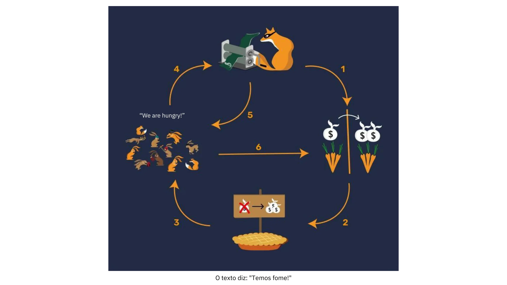

Ao analisar a trajetória económica, verifica-se que, quando se atinge uma inflação elevada, o valor da massa monetária se deteriora. Esta desvalorização leva a várias complicações, incluindo a escassez de notas. Neste contexto, surgem oportunidades de arbitragem, nomeadamente em resposta às flutuações das taxas Exchange. Consequentemente, muitos indivíduos recorrem a esta arbitragem, investindo fortemente em activos tangíveis na expetativa de uma futura desvalorização da moeda que lhes permita pagar as suas dívidas com uma moeda enfraquecida. Esta conjuntura económica enfraquece a atração pelos empregos tradicionais e, consequentemente, corrói a coesão social.

Em resposta a esta situação, o governo impõe regulamentações draconianas, incluindo controlos de capitais. Obriga também os comerciantes a aceitarem a moeda nacional e cheques. Com o tempo, novas leis são promulgadas, alargando a definição de comportamento criminoso. Por fim, a taxa Exchange sobe exponencialmente, uma vez que o governo está disposto a trocar a sua moeda, impressa a um custo mais baixo, por moedas estrangeiras mais robustas.

### 4 Semelhanças nas consequências da hiperinflação

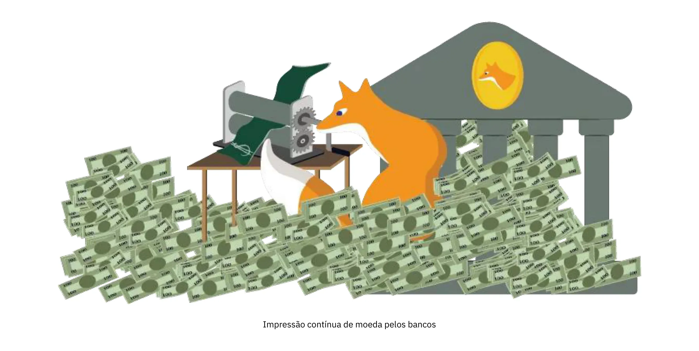

#### 1. Petróleo e metais

Durante o período de Weimar, na Alemanha, o roubo de materiais valiosos era tão generalizado que o chumbo dos telhados era frequentemente roubado. No Zimbabué, o desespero levou alguns a perturbar a rede eléctrica para extrair óleo dos transformadores e utilizá-lo nos seus veículos.

Weimar: "As placas de metal dos monumentos nacionais tiveram de ser retiradas para serem guardadas. As placas de latão das campainhas foram roubadas das portas da Embaixada Britânica em Berlim"

Zimbabué: "Para piorar a situação, devido à falta de divisas, houve escassez de óleo lubrificante para os carros e os transformadores tornaram-se um alvo fácil para os ladrões que roubavam o óleo de refrigeração durante os cortes de energia."

#### 2. Comboios

A desvalorização da moeda pode levar os cidadãos a adotar comportamentos de sobrevivência, incluindo o vandalismo. Perante uma economia em colapso, as dispendiosas infra-estruturas públicas, como os sistemas de transportes, podem ficar comprometidas, com consequências desastrosas para a sociedade.

> Weimar: "Em Berlim, o sistema de eléctricos deixou de funcionar por falta de fundos"

> Zimbabué: "Um dos cenários mais preocupantes e tristes foi o roubo de quase toda a linha eléctrica de cobre que ligava Harare a Dabuka (mais de 280 quilómetros). Quando foi concluída, tinha sido o orgulho do Zimbabué, com comboios eléctricos rápidos de passageiros e de mercadorias a percorrerem esta rota"

#### 3. "Refeição Mealie"

Num contexto de salários escassos e de uma economia instável, as empresas viram-se obrigadas a fornecer alimentos aos seus empregados, a fim de manter a produtividade e a eficiência operacional. Esta iniciativa não era apenas uma forma de compensar a escassez e os elevados custos alimentares, mas também uma estratégia para reter o pessoal num ambiente económico difícil.

> Weimar: "Em Berlim, os empregados de escritório, que constituíam uma classe muito importante na capital, tinham salários totalmente insuficientes, entre 12.000 e 20.000 por mês (o equivalente a entre 12 e 19 libras por ano), que diminuíam constantemente; mas a maioria ainda podia almoçar por uma quantia simbólica, fornecida pelos escritórios, de modo que o corpo e a alma mal conseguiam manter-se juntos."

> Zimbabué: "Nesta fase, fornecíamos a todo o nosso pessoal um almoço gratuito. A farinha de milho era essencial para o funcionamento contínuo da nossa empresa, uma vez que, em muitos casos, era a única refeição que o nosso pessoal recebia por dia."

#### 4. Cupões de gasolina

As populações procuraram alternativas estáveis para as transacções. Em Weimar, produtos como o latão e o combustível serviram de meio de troca para o Exchange devido ao seu valor intrínseco constante. No Zimbabué, perante a rápida desvalorização do dólar zimbabueano, os cupões de gasolina, que representavam uma quantidade fixa de um produto essencial, tornaram-se uma moeda de facto. Estas situações mostram como as sociedades se adaptam a condições económicas extremas, concebendo soluções inovadoras para manter o comércio e a economia.

Weimar: "A troca direta já era uma forma habitual de Exchange; mas agora, bens como o latão e o combustível tornaram-se a moeda comum de compra e pagamento."

Zimbabué: "Estes vales são agora utilizados para pagar rendas aos senhorios, impostos municipais, contas de telefone - na verdade, quase tudo - porque toda a gente deixou de aceitar pagamentos em dólares e cheques zimbabueanos."

#### Conclusão

Concluímos assim este vídeo sobre as semelhanças entre as experiências vividas durante os períodos de hiperinflação no Zimbabué e na República de Weimar. No próximo vídeo, discutiremos as diferenças e os paralelos contemporâneos. Obrigado.

## Weimar vs Zimbabué: Diferenças e paralelismos contemporâneos

<chapterId>643f279c-d89f-5600-a2e2-b1bbbba0ab69</chapterId>

Neste capítulo, exploraremos as diferenças e os paralelos contemporâneos entre os períodos de hiperinflação do passado e do presente, com anedotas e comparações relevantes para a atualidade.

### Diferenças entre a República de Weimar e o Zimbabué

#### 1. A culpa é do dólar!

Na Alemanha, era comum a população atribuir a inflação à subida do dólar e não à desvalorização intrínseca da sua própria moeda. Muitos acreditavam que o fenómeno observado se devia a uma valorização do dólar. Esta perceção afastava qualquer reconhecimento da relação entre as suas dificuldades económicas e a desvalorização monetária, induzida sobretudo pela criação excessiva de moeda. O livro "When Money Dies" ilustra bem esta falta de compreensão da população alemã. Em contrapartida, no Zimbabué, a situação era diferente: os cidadãos estavam plenamente conscientes da causa subjacente à hiperinflação que estavam a viver.

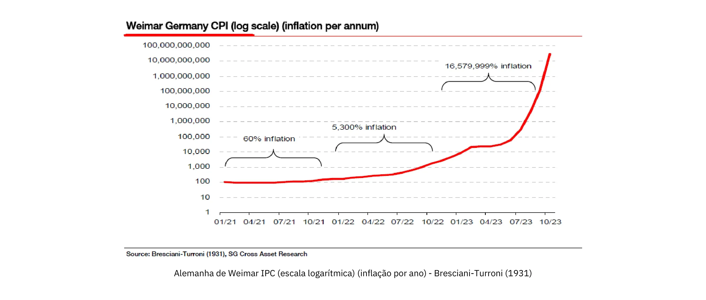

#### 2. Dinheiro de emergência (Notgeld)

Perante a crise monetária e económica, a Alemanha recorreu ao "Notgeld" (dinheiro de emergência). Estas notas, impressas pelas cidades ou por certas empresas, destinavam-se a suprir a falta de moeda comum.

É interessante notar que a França também recorreu ao Notgeld, sobretudo na década de 1920. Esta iniciativa não foi apenas uma consequência direta da hiperinflação, mas teve também origem nas perturbações causadas pela Primeira Guerra Mundial. Em consequência, o valor intrínseco das moedas metálicas excedia frequentemente o seu valor facial, o que levava as pessoas a acumulá-las. Na ausência de moedas, algumas instituições, como a Câmara de Comércio de Lyon, imprimiam o seu próprio Notgeld.

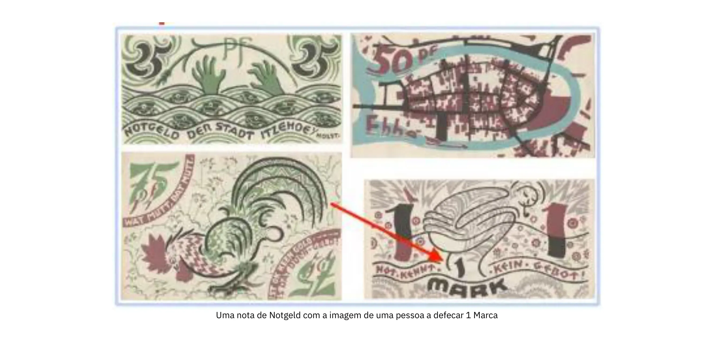

> "O que tem de ser feito, tem de ser feito." - um ditado local

Entre as Notgeld, destaca-se uma nota em particular. Apresenta uma ilustração pungente: no centro, um indivíduo é representado a defecar um marco. No verso, uma tabela de preços de 1913 a 1921 ilustra o aumento da inflação durante este período.

O artista por detrás desta Notgeld parece estar a fazer uma crítica irónica às autoridades responsáveis pela crise da hiperinflação. A nota ostenta a inscrição "A necessidade não conhece lei". Outra expressão específica da localidade de origem do Notgeld é: "O que tem de ser feito, tem de ser feito"

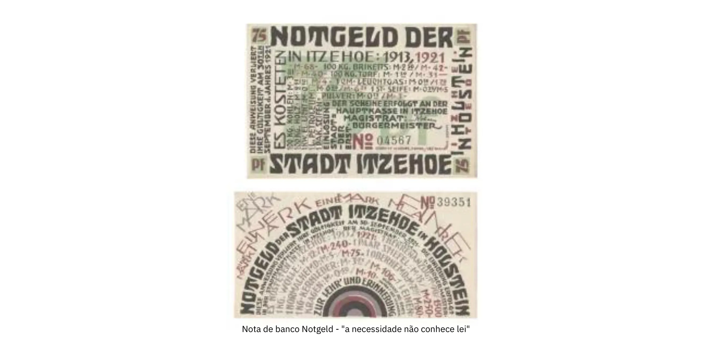

> "A necessidade não conhece lei"

> A primeira "Shitcoin": De forma anedótica, olhando para a ilustração central da nota, em que a moeda é literalmente desvalorizada pela ação do indivíduo, poderia ser chamada a primeira "shitcoin"

#### 3. Obrigações e hipotecas

Em Weimar, algumas dívidas foram reavaliadas para compensar o impacto da inflação. Esta medida não foi adoptada no Zimbabué.

> Weimar: "A decisão de reavaliar os empréstimos do Estado tornou-se lei em 1925, o que fez com que os acionistas recebessem 2,5 por cento do seu investimento inicial, desde que todas as reparações tivessem sido pagas."

> Zimbabué: "Em julho de 2007 (três anos depois), podia tirar do meu bolso uma nota desvalorizada de 500.000 ZDW (bt "000"), que agora valia 1,67 dólares à taxa do mercado paralelo, e pagar o empréstimo hipotecário, que devia ser reembolsado em vinte anos. Além disso, esta nota representava apenas 0,49% do meu salário mensal do mesmo mês."

Para saber mais sobre a gestão da crise alemã, este livro é igualmente essencial.

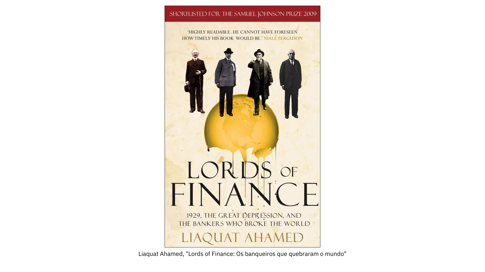

### Paralelos contemporâneos

#### 1. Manipulação da política monetária para controlar a economia.

Na história da República de Weimar, é evidente que os industriais estavam relutantes em ver o valor do marco apreciado. O facto de poderem contrair empréstimos e pagar as suas dívidas com uma moeda fortemente desvalorizada dava-lhes uma vantagem considerável. Este mecanismo facilitava a construção de enormes complexos industriais a custo quase nulo. Estes industriais temiam uma valorização do marco, uma vez que esta dificultava as suas actividades. Alguns chegaram mesmo a encarar a inflação galopante como uma evolução positiva, acreditando que garantiria emprego para a população. No entanto, não se aperceberam do impacto negativo dessa inflação na poupança e na economia em geral. Para estes agentes económicos, a impressão monetária foi uma bênção.

> Weimar: "É por isso que uma valorização do marco era muito temida, e mesmo as poucas semanas de 'estabilidade' após Génova provocaram uma estagnação dos negócios"

> Weimar: "Os círculos industriais enfrentavam o perigo de o dinheiro se tornar mais valioso do que os bens e de ocorrer um colapso quando todos tentassem converter os seus activos em dinheiro."

Um paralelo contemporâneo pode ser traçado com as declarações de Christine Lagarde, que sugere que os cidadãos devem dar prioridade à perspetiva de emprego sobre a proteção das suas poupanças. Tal como os industriais de Weimar, ela parece defender a impressão monetária como um instrumento de estímulo ao emprego, em detrimento do valor das poupanças.

> Christine Lagarde: "Deveríamos estar mais felizes por ter um emprego do que por ver as nossas poupanças protegidas"

#### 2. A propriedade privada em tempo de conflito

A história da República de Weimar revela que, durante esse período, os bens e capitais detidos no estrangeiro foram confiscados. Esta medida faz lembrar acontecimentos mais recentes na Rússia, nomeadamente no início de um conflito. Estas situações põem em evidência uma realidade preocupante: em tempos de crise, o respeito pela propriedade privada pode ser posto em causa. Trata-se de um paralelo histórico e contemporâneo que sublinha as repercussões potenciais das crises nos direitos individuais.

> Weimar: "Todos os capitais alemães detidos no estrangeiro foram confiscados"

> [20minutes.fr](https://www.20minutes.fr/monde/3286947-20220513-guerre-ukraine-geler-avoirs-russes-vol-non-redistribuer-kiev-poserait-lourdes-questions): "Cerca de 300 mil milhões de dólares de reservas russas no estrangeiro foram efetivamente congelados no âmbito das sanções ocidentais, dos 640 mil milhões de dólares de reservas detidas pelo Banco Central russo"

#### 3. A noção de preço de mercado

Durante a República de Weimar, os agricultores manifestaram o seu descontentamento com a "Umlage", que os obrigava a entregar os primeiros dois milhões de toneladas de trigo produzidos em cada ano. Este regulamento levou a que metade do pão Supply total fosse colocado no mercado a preços subsidiados. A partir de agosto, estes agricultores deveriam receber o preço do mercado mundial, porque, embora fossem obrigados a entregar o seu trigo a preços reduzidos, continuavam a ter de comprar fertilizantes a preços do mercado mundial.

Esta situação levanta uma questão central relacionada com a noção de preço de mercado durante a hiperinflação. No contexto alemão da época, os agricultores eram obrigados a vender o seu trigo a um preço inferior ao seu valor, ao mesmo tempo que tinham de adquirir fertilizantes a preços do mercado mundial. Esta discrepância económica põe em evidência os desafios colocados pelos preços dos alimentos hoje em dia. Os produtores agrícolas, confrontados com o aumento dos custos dos factores de produção devido à inflação, transferem esses custos para os produtos finais. Criticá-los por este aumento equivale a ignorar a dinâmica dos preços de mercado e as pressões económicas que enfrentam. Vender a preços artificialmente baixos e incorrer em custos elevados é insustentável para qualquer empresa.

> Weimar: "Os interesses agrícolas estavam insatisfeitos com a 'Umlage', a entrega forçada dos primeiros dois milhões de toneladas de trigo produzidos em cada ano, que permitia que metade do total do pão Supply fosse vendido a preços baixos. A partir de agosto, os agricultores deviam receber o preço do mercado mundial, porque, embora fossem obrigados a vender o trigo a preços baixos, tinham sempre de pagar o preço do mercado mundial pelos fertilizantes."

#### 4. Negação da relação entre a moeda Supply e a inflação

> Weimar: "Ele manteve-se firmemente ligado à sua opinião de que a moeda Supply não estava relacionada nem com os níveis de preços nem com as taxas Exchange;"

Nos tempos modernos, esta tendência persiste, como se pode ver no exemplo do capítulo anterior de uma lista de explicações apresentadas por vários economistas e institutos económicos para justificar a inflação. Estas razões são variadas e vão desde acontecimentos culturais e celebridades como Taylor Swift, Zelda ou Beyoncé, até factores globais como a guerra e a pandemia. Todas estas razões, embora contribuam potencialmente para as flutuações económicas a curto prazo, desviam a atenção da verdadeira causa subjacente: a expansão da moeda Supply.

#### 5. Empresas Zombie

> Weimar: "A estabilização pôs fim ao período em que os empresários podiam contrair os empréstimos que quisessem à custa de todos os outros. Um grande número de empresas, criadas ou alargadas durante a abundância monetária, tornaram-se rapidamente improdutivas quando o capital escasseou."

Uma empresa "zombie" é uma empresa que, em condições normais de mercado, estaria insolvente ou perto da falência, mas que continua a funcionar principalmente graças a empréstimos de baixo custo. Estas empresas ganham apenas o suficiente para cobrir as suas dívidas, mas são incapazes de crescer significativamente.

A noção de empresas "zombie" não é nova. De facto, existia durante a República de Weimar. Nessa altura, muitas empresas pareciam estar a florescer, beneficiando em grande medida do acesso ao crédito gratuito. Pediam emprestados montantes substanciais na expetativa de os reembolsar mais tarde com uma moeda desvalorizada devido à inflação galopante. No entanto, quando a inflação cessou e o marco alemão recuperou o seu valor, estas empresas, que não eram verdadeiramente viáveis do ponto de vista operacional ou financeiro, tornaram-se não rentáveis e tiveram de encerrar as suas actividades.

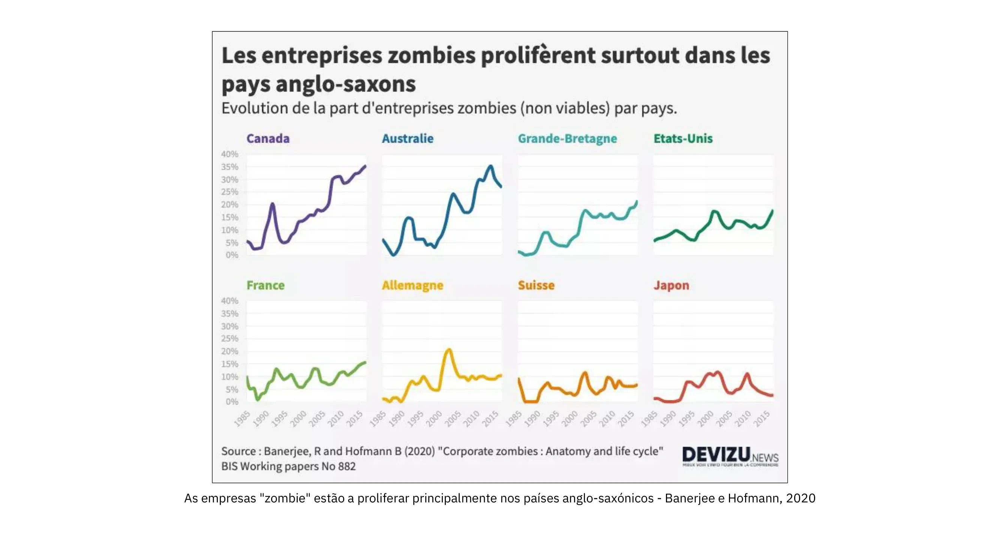

O fenómeno das empresas "zombie" não se limita à Alemanha do pós-guerra. Ainda hoje, muitas grandes empresas continuam a prosperar devido ao seu acesso privilegiado ao crédito a taxas de juro extremamente baixas. Se tivessem de contrair empréstimos a taxas mais convencionais, muitas delas deixariam de ser rentáveis. Este facto é particularmente relevante em 2023, após um período prolongado de taxas de juro próximas de zero, uma vez que as taxas começaram agora a subir. Esta recente mudança no panorama financeiro será, sem dúvida, um teste decisivo para estas empresas, outrora rotuladas de "zombies"

#### 6. Fique rico rapidamente!

A história revela casos em que os indivíduos procuraram acumular riqueza rapidamente, como foi o caso em Weimar e no Zimbabué, através da arbitragem. Atualmente, observa-se uma tendência semelhante com a ascensão de certas criptomoedas. As pessoas são tentadas por ganhos rápidos, assumindo riscos na esperança de um aumento exponencial do seu investimento. Esta abordagem faz lembrar a dos períodos de hiperinflação, em que a arbitragem era utilizada para obter lucros rápidos, muitas vezes à custa de terceiros.

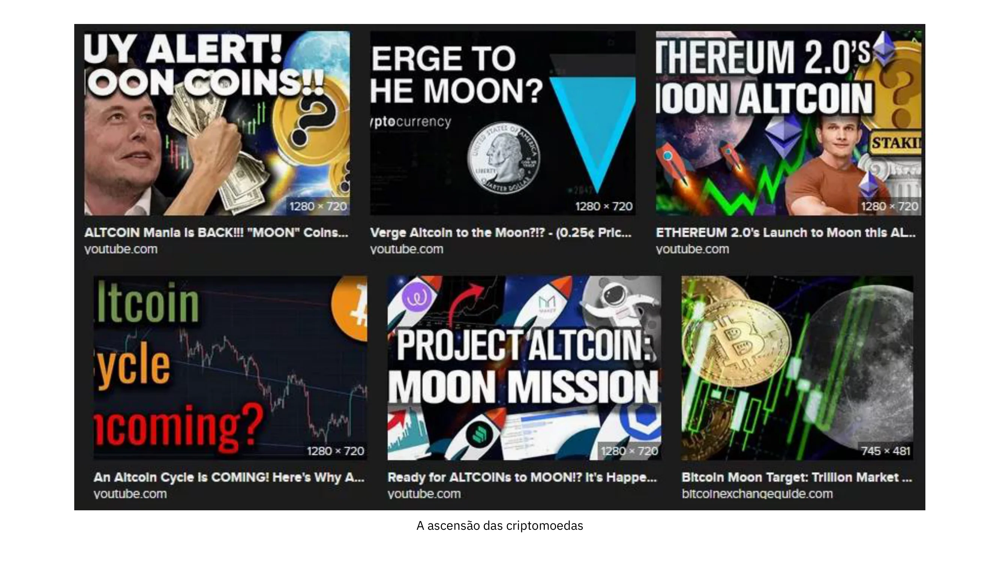

#### 7. A poupança, o remédio contra a incerteza

> A influência generalizada e destrutiva da constante erosão do valor do capital e do rendimento, bem como a incerteza quanto ao futuro.

Vale a pena destacar uma citação que sublinha o efeito destrutivo da erosão do valor do capital sobre a coesão social, bem como a incerteza que gera. Diz o texto: "a influência penetrante e destrutiva da constante erosão do valor do capital e do rendimento, bem como a incerteza quanto ao futuro"

Imagine um cenário em que tem uma família ou entes queridos que deseja proteger. Trabalha Hard e poupa para antecipar as incertezas do futuro. Se tudo fosse previsível, a poupança seria inútil. No entanto, face a circunstâncias imprevistas, como um carro avariado, a poupança torna-se uma tábua de salvação. Reduzem a incerteza do mundo. No entanto, durante uma hiperinflação, a poupança torna-se um desafio. O dinheiro perde rapidamente o seu valor, o que dificulta o planeamento a longo prazo. Esta instabilidade financeira pode provocar stress e ansiedade.

Atualmente, com a diminuição do poder de poupança, o investimento tomou o seu lugar. No entanto, esta abordagem comporta os seus próprios riscos. A poupança sempre foi um remédio contra a incerteza. Dispor de reservas financeiras para fazer face a situações imprevistas contribui para a paz de espírito e reforça a coesão social. Em conclusão, a proteção do nosso poder de poupança é essencial para manter a estabilidade social e individual.

## Redenominações na América Latina

<chapterId>918eafd7-409d-5205-ad52-a52e63b23a64</chapterId>

Passamos agora a analisar os diferentes períodos de redenominação nos países da América Latina.

### Explicação dos gráficos

No diapositivo, à esquerda, encontram-se os anos de redenominação, o nome da nova moeda e a taxa Exchange em relação à moeda antiga. Tomando o exemplo da Argentina, o peso moneda nacional foi convertido a uma taxa de 25 para 1 em relação à moeda anterior, o peso reàl. Neste contexto, examinaremos a evolução da moeda argentina ao longo do tempo. Além disso, indicaremos as denominações iniciais e finais das notas para cada período.

No lado direito do diapositivo, é apresentado um gráfico da inflação. As setas vermelhas representam anos de hiperinflação, tal como definido pelo critério de Cagan, que é uma taxa de inflação de 50% por mês. Este critério pode, por vezes, levar a interpretações ambíguas, uma vez que os anos com taxas de inflação elevadas podem não corresponder à definição estrita de hiperinflação.

É de notar que a redenominação, uma medida comum adoptada pelos governos durante os períodos de inflação, é uma ocorrência notável. No entanto, esta medida não resolve o problema subjacente da inflação ou hiperinflação. É apenas uma forma de mudar o nome da moeda e remover os zeros, sem abordar verdadeiramente a causa principal da hiperinflação: a expansão do dinheiro Supply. Num vídeo posterior, discutiremos as verdadeiras soluções para o Address e resolveremos o problema da hiperinflação. Nesta série, destacaremos as consequências de uma simples redenominação sem reformas adequadas: a inflação persiste.

Depois da Argentina, o nosso estudo abrangerá o Brasil, a Bolívia, o Peru, a Nicarágua e a Venezuela. Examinaremos as redenominações que tiveram lugar nestes países.

### Argentina

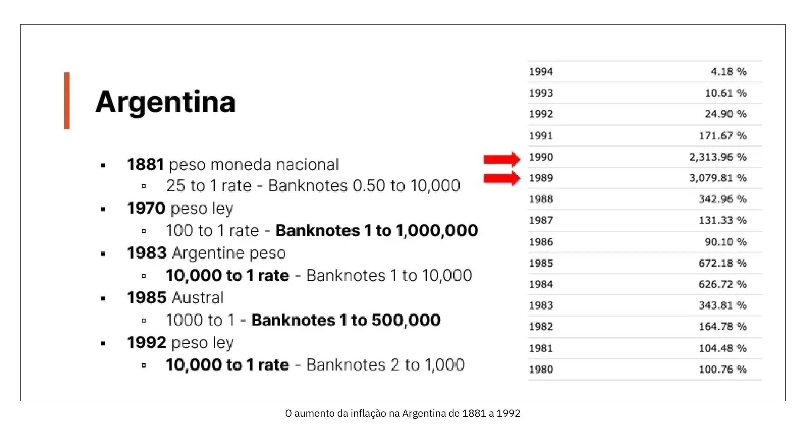

Antes de 1826, a Argentina utilizava o dólar espanhol. Após a sua independência em 1816, introduziu a sua própria moeda com base no reàl espanhol, o que resultou na criação de uma moeda semelhante. A tabela começa em 1881, ano da introdução do "peso moneda nacional", com notas disponíveis até 10.000. Seguiu-se o "peso ley", que era trocado a uma taxa de 100 para 1 e tinha notas até um milhão. Depois, surgiu o "peso argentino", com uma taxa Exchange de 10.000 para 1 (equivalente à remoção de quatro zeros) e notas até 10.000. Em 1985, foi introduzido o "australes", trocado a uma taxa de 1.000 para 1, com notas disponíveis até 500.000. Em 1992, o atual "peso ley" foi estabelecido a uma taxa de 10.000 para 1, eliminando mais uma vez quatro zeros. Apenas os anos de 1989 e 1990 registaram hiperinflação.

### Brasil

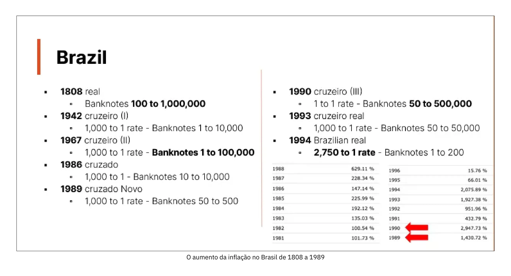

O Brasil é um exemplo notável de redenominação monetária, tal como ilustrado pelo seu historial de mudanças de moeda. Antes da sua independência, o Brasil utilizava o reàl português como moeda. No entanto, já em 1747, o país começou a utilizar o seu próprio "real brasileiro", muito antes da sua declaração de independência em 1822. A tabela começa em 1818, marcando o início da emissão de notas brasileiras. Anteriormente, a moeda era principalmente em forma de moedas. Essas notas atingiam valores de até um milhão de reais.

A partir de 1942, o Brasil iniciou uma série de redenominações. Na maioria dos casos (1942, 1967, 1986, 1989, 1993), a taxa de conversão foi de 1:1.000. Em 1990, houve uma mudança de nome sem conversão. A sequência dessas moedas é a seguinte:

- Réals (versão antiga) até 1942.
- Cruzeiros em 1942.
- Cruzeiros (nova versão) em 1967.
- Cruzados em 1986.
- Cruzados Novos em 1989.
- Regresso a Cruzeiros em 1990.
- Cruzeiros Reais em 1993.
- Finalmente, o Brasil reapareceu em 1994.

A nota de maior valor facial atingiu 500.000 e a última redenominação em 1994 foi efectuada a uma taxa de 2.750 para 1. Os anos de 1989 e 1990 foram marcados pela hiperinflação, enquanto 1993-1994 registaram taxas de inflação elevadas que não atingiram o limiar da hiperinflação (50% por mês). Após este período tumultuoso, o Brasil voltou a redenominar a sua moeda, suprimindo vários zeros.

### Bolívia

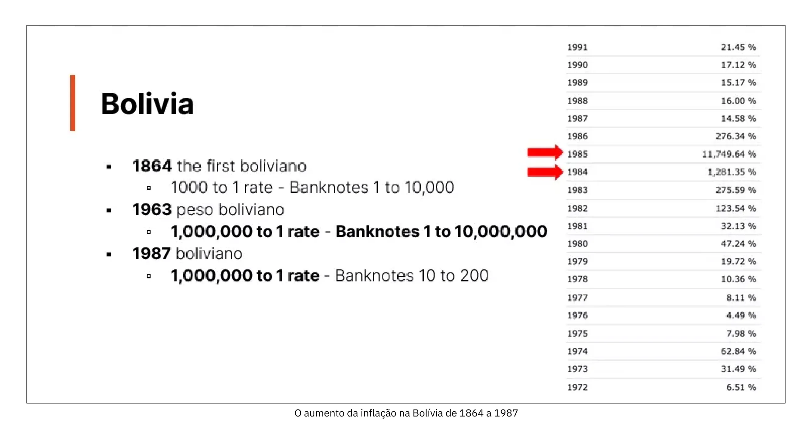

A Bolívia é outro exemplo de um país que registou períodos de inflação aguda, que obrigaram a redenominações da moeda. Eis um resumo da sua história monetária:

Antes da sua independência em 1825, a Bolívia utilizava o dólar espanhol como moeda. Após a independência, o país introduziu o sol boliviano entre 1827 e 1864, substituindo o dólar espanhol. No entanto, é de salientar que as primeiras notas de banco na Bolívia só foram introduzidas em 1864.

Em 1864, foi introduzido o primeiro "Boliviano", com uma taxa Exchange de 1.000 para 1 em relação ao Sol boliviano. Esta moeda permaneceu em circulação até atingir a denominação de 10.000 bolivianos.

Posteriormente, a Bolívia mudou a sua moeda para o "Peso Boliviano", que registou uma grave hiperinflação, chegando a atingir denominações de até 10 milhões. Este episódio de inflação atingiu o seu pico em 1984-1985, com taxas de inflação mensais que se aproximavam frequentemente do limiar de hiperinflação de 50%. Para se ter uma ideia, uma taxa de inflação constante de 50% por mês durante um ano inteiro resulta numa taxa de inflação anual de aproximadamente 12.800%. Em 1985, a taxa de inflação anual da Bolívia atingiu 11.749%, o que indica que a inflação se aproximou ou excedeu o limiar de 50% quase todos os meses.

Em resposta a esta crise monetária, em 1987, a Bolívia introduziu uma nova moeda, simplesmente chamada de "Boliviano", com uma taxa Exchange de 1 milhão de Pesos Bolivianos para 1 Boliviano. Esta versão do Boliviano ainda está em circulação atualmente.

Esta é uma visão geral da tumultuosa história monetária da Bolívia, marcada por períodos de hiperinflação e redenominações.

### Peru

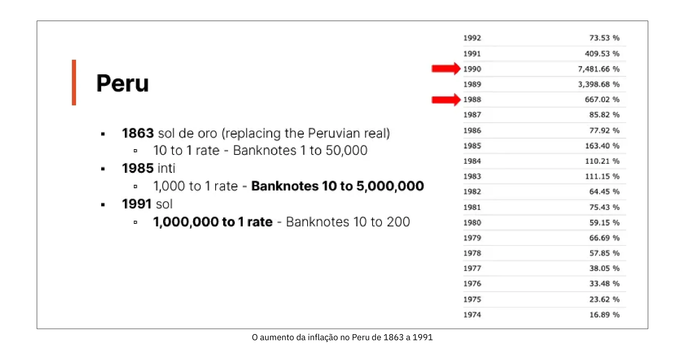

O Peru apresenta um caso interessante no que respeita aos efeitos da regra arbitrária dos 50%. Começando pela sua história monetária, o Peru utilizou ouro espanhol até ao século XIX, altura em que declarou a sua independência em 1821. O dólar peruano foi utilizado de 1822 a 1863. Em 1863, o reàl peruano foi substituído pelo soldi oro, a uma taxa de 10 para 1, atingindo um valor máximo de 50.000. Em 1985, foi introduzida a moeda "Inti", com uma taxa de conversão de 1000 para 1, atingindo o valor máximo de 5 milhões. Em 1991, foi lançado o "SOL", com uma taxa de conversão de 1 milhão para 1, com notas de 10 a 200.

Se analisarmos os períodos de redenominação, 1988 é considerado um ano de hiperinflação, especialmente em setembro. Julho-agosto de 1990 foi também um período de hiperinflação. Em 1988, a taxa de inflação anual foi de 667%, com um pico de 50% em setembro. Em contrapartida, 1989 registou uma taxa de inflação de 3000% sem que nenhum mês ultrapassasse os 50%, pelo que não foi classificado como hiperinflação. Em 1990, a inflação atingiu um pico de 7481%. É evidente que a regra dos 50% pode ser arbitrária, uma vez que 1988 foi considerado um ano de hiperinflação, ao contrário de 1989. Se esta regra fosse reconsiderada, talvez fosse sensato baixar o limiar para incluir períodos como o vivido pelo Peru em 1989.

> Compreender o que está a acontecer
>

> O principal aspeto a compreender sobre as redenominações de moeda é que, quando o valor da moeda atinge números astronómicos, como 5 ou 10 milhões, é redenominado. Este processo pode repetir-se várias vezes, envolvendo uma mudança de moeda. O resultado é que as poupanças dos indivíduos podem ser gravemente afectadas, mesmo na ausência de hiperinflação. Por exemplo, se alguém poupar $1.000 num ano e conseguir pôr de lado $100, no ano seguinte, a nota de menor valor facial pode ser $1.000, tornando inúteis os $100 anteriormente poupados. Essa erosão da poupança não requer uma hiperinflação óbvia. Mesmo que uma pessoa tenha poupado 10 000 dólares nos últimos dez anos, esse montante pode acabar por ter um valor insignificante, incapaz de comprar uma simples garrafa de água. Esta realidade é evidente em muitos países que passaram por redenominações, mesmo que apenas durante alguns meses, e que foram classificados como hiperinflacionários. Em contrapartida, alguns países, como a Nicarágua, registaram anos consecutivos de hiperinflação.

### Nicarágua

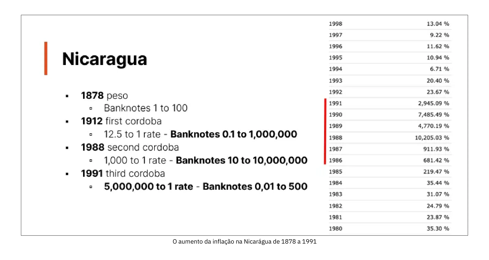

A Nicarágua, anteriormente sob o domínio espanhol, utilizou inicialmente o dólar espanhol, tal como muitos outros países colonizados por Espanha. Depois de ter sido integrada no Império Espanhol, no Império Mexicano e depois na República Federal da América Central, a Nicarágua declarou a sua independência. A partir de 1878, o peso passou a ser a moeda oficial do país, com valores que oscilavam entre 1 e 100. Em 1912, o país introduziu o primeiro Córdoba, seguido do segundo em 1988 e do terceiro em 1991, que ainda é utilizado atualmente. A primeira Córdoba atingiu o valor de 1 milhão e a segunda 10 milhões. A redenominação em 1991 seguiu-se a vários anos de hiperinflação.

### Venezuela

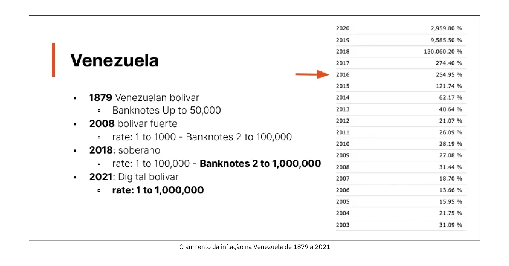

A Venezuela é o último país mencionado neste vídeo. O país passou por quatro redenominações de moeda ao longo do tempo. Nos seus primórdios, a Venezuela utilizou o dólar espanhol antes de declarar a sua independência em 1811. Em 1879, introduziu o bolívar como moeda oficial, que permaneceu em vigor até 1983, altura em que o governo optou por um sistema de taxa flutuante Exchange utilizando o dólar.

Um facto notável sobre a Venezuela é a sua pertença à União Monetária Latina. Esta união incluía moedas como as 5 pesetas de Espanha, as 5 dracmas da Grécia, os 5 bolívares da Venezuela, as 5 liras de Itália, os 5 francos belgas e os 5 francos franceses.

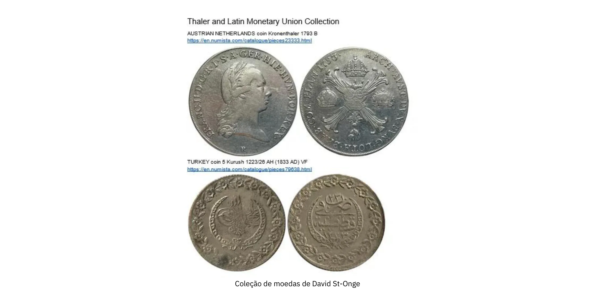

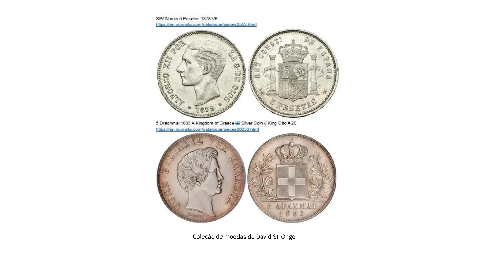

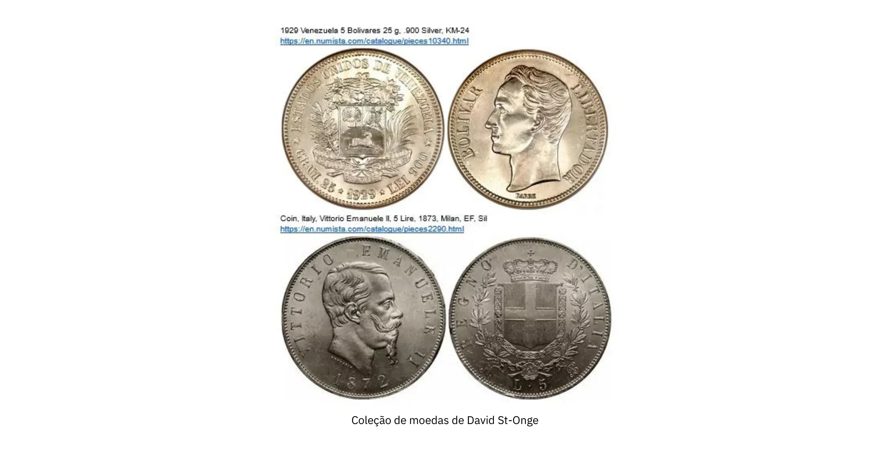

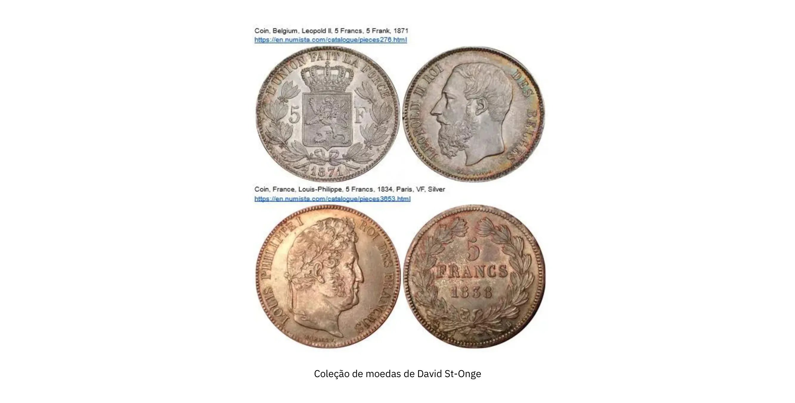

Durante este período, os 5 bolívares Coin da Venezuela tinham o mesmo peso que os dos países membros da União, incluindo Itália, Espanha, Bélgica e França. Estes bolívares eram feitos de prata, com um Coin específico de 1929 a pesar 25 gramas e a ter uma pureza de 900, ou seja, 90% de prata pura. Com o preço atual da prata, este Coin vale aproximadamente 17 a 18 dólares americanos.

Após a adoção de uma taxa flutuante Exchange em 1983, seguiram-se várias redenominações:

- Em 2008, foi introduzido o bolivar fuerte, ou "bolivar forte", que chegou a atingir 100.000 antes de uma redenominação de mil para um.
- Em 2018, foi introduzido o Soberano, com notas que atingiram 1 milhão. Em 2021, foi substituído pelo bolívar digital, que também atingiu um milhão, antes de uma nova redenominação de um milhão para um. Atualmente, a nota de 10 ou 20 é equivalente a 10 milhões ou 20 milhões em Soberano.

As notas deste período, que remonta a 2018, são distribuídas em várias conferências Bitcoin em Biarritz, Toronto e Miami. Estas notas de Soberano atingiram um valor máximo de 1 milhão. Foi então efectuada uma redenominação que reduziu o valor de um milhão para cerca de 3 cêntimos. Atualmente, 10 notas de 1 milhão correspondem a uma nota de 10. Desde 2016, a Venezuela vive uma hiperinflação, representando o 57º período numa tabela específica.

No próximo vídeo, será apresentada uma coleção de notas de hiperinflação, centrada na Venezuela e noutros países da lista. Esta coleção contém quase todas as notas venezuelanas. O estudo centrar-se-á nas diferentes redenominações de cada um dos países mencionados. Além disso, será explorada a redenominação no Zimbabué, um tema de grande interesse.

### Conclusão

Vimos que a hiperinflação não é o único indicador de uma catástrofe económica. Redenominar várias vezes, retirar zeros ou mudar o nome da moeda tem repercussões diretas na população, que vão desde a perda de ajudas a problemas alimentares. Embora a hiperinflação seja preocupante, o número de redenominações, como observado no Brasil, mostra uma realidade mais complexa.

Com base no critério de 50% de inflação ao mês, vários períodos poderiam ter sido classificados como hiperinflação. Isso é particularmente verdadeiro quando se analisam os critérios da organização internacional de contabilidade, que considera caraterísticas como o rápido abandono da moeda pela população, indexação de salários e empréstimos com altas taxas de juros para compensar a inflação.

Em conclusão, a hiperinflação é apenas um aspeto dos desafios económicos. A inflação elevada, por si só, pode ser igualmente prejudicial. A próxima secção explorará possíveis soluções para ultrapassar a hiperinflação.

## Como superar a hiperinflação

<chapterId>e3484a31-a851-5f92-8af5-00eddae67db1</chapterId>

### Como acabar com a inflação moderada e elevada

As conclusões mencionadas são retiradas do livro "Regime Monetário e Inflação" de Peter Bernholz. De acordo com Bernholz, o único método para acabar com a inflação é implementar uma reforma monetária e impor restrições fiscais ao governo. Essas restrições envolvem a criação de uma instituição, como um banco central, que opere independentemente das decisões políticas do governo. A inflação elevada e a hiperinflação são frequentemente o resultado do financiamento de défices orçamentais através da criação de moeda. Para moderar a inflação, é essencial diminuir o crescimento da moeda. Bernholz sugere ainda que este crescimento monetário deve ser relativo aos países vizinhos. Um aspeto surpreendente é que, durante períodos de inflação elevada ou hiperinflação, o valor total da moeda pode efetivamente diminuir. Um exemplo notável desta situação é o Zimbabué.

### Soluções contra-intuitivas

Ao estudar o Zimbabué, verificou-se que 10 biliões de unidades da moeda Supply tinham perdido todo o seu valor. Em Weimar, foi possível imprimir dois terços do valor nominal total de 65 mil milhões de unidades da moeda Supply num único dia. Isto mostra como a moeda Supply pode ser desvalorizada. Para remediar esta situação, é necessário aumentar significativamente a moeda Supply para atingir um nível adequado. Nesse caso, é indispensável uma reforma monetária. Numa situação de inflação elevada, esta reforma é inevitável, mas deve garantir a existência de dinheiro suficiente em circulação. Após esta etapa, podem ser impostas restrições ao governo.

De acordo com as observações de Bernholz, quando abordam os problemas da inflação, instituições como o FMI e o Banco Mundial nem sempre adoptam as estratégias mais eficazes. Nalguns casos, quando um país precisa de aumentar o seu Supply monetário, estas instituições procuram reduzi-lo. O segredo é chegar a um nível monetário adequado e depois impor limites ao seu crescimento, evitando assim financiar as despesas do Estado através da criação de moeda.

Um aspeto interessante levantado por Bernholz é o facto de o êxito de uma reforma monetária depender não só da sua relevância técnica, mas também da confiança que a população deposita nela. Algumas reformas bem concebidas podem falhar porque o público não confia nelas, enquanto outras, mal concebidas, podem ser bem sucedidas porque a população confia nelas. A perceção e a confiança do público são, por conseguinte, factores Elements essenciais para o êxito ou o fracasso de uma reforma monetária.

- No Zimbabué, a solução adoptada para combater a inflação foi a dolarização, o que significa que adoptaram o dólar americano ou outras moedas de países vizinhos. Esta abordagem impede o governo de imprimir dinheiro à vontade.
- Na Alemanha, a solução foi criar uma nova moeda, o rentenmark. Esta moeda era garantida pelos activos territoriais do Reich, e esta estratégia revelou-se eficaz.

### O caso do Zimbabué

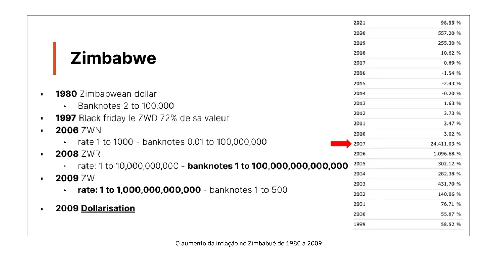

O Zimbabué tornou-se independente em 1980 e introduziu a sua própria moeda, o dólar zimbabueano. Inicialmente, dois dólares zimbabueanos valiam cerca de 1,60 dólares americanos. No entanto, em 1997, na sequência de medidas sociais a favor dos veteranos de guerra, a moeda desvalorizou 72% num só dia, durante a Black Friday. Depois, no início da década de 2000, o país lançou um programa de redistribuição de terras, que consistia em retirar terras aos proprietários brancos e distribuí-las pela população local. Esta decisão prejudicou as exportações, porque os novos proprietários careciam frequentemente dos conhecimentos necessários para gerir explorações agrícolas de grande dimensão. Consequentemente, enquanto o Zimbabué era um exportador líquido em 1999, tornou-se um importador líquido em 2003.

Em 2006, o país introduziu uma nova versão da sua moeda, a ZWN, com uma taxa Exchange de 1 para 1.000. Em 2008, foi introduzida outra denominação, a ZWR, com uma taxa Exchange de 1 para 10 mil milhões. Isto levou à criação das icónicas notas de 100 biliões.

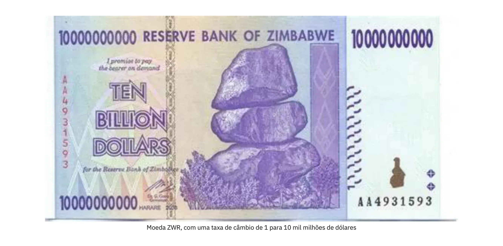

#### Dolarização e resolução de crises

Por conseguinte, após 2009, perante uma crise monetária persistente e uma hiperinflação galopante, o Zimbabué abandonou a sua moeda nacional e permitiu a utilização de moedas estrangeiras, principalmente o dólar americano. Esta decisão, embora radical, pôs fim à hiperinflação. Uma das principais lições a retirar é que a suspensão da emissão excessiva de moeda e o fim do financiamento do défice orçamental pelo banco central podem ajudar a evitar a hiperinflação.

No entanto, a dolarização não é uma solução milagrosa. Embora possa acabar com a hiperinflação, apresenta outros desafios económicos. Uma das consequências é a perda de autonomia da política monetária. Sem a sua própria moeda, um país não pode ajustar a sua política monetária para responder a choques económicos internos.

Em 2007, a taxa de inflação do Zimbabué atingiu o limiar de 50% por mês, marcando oficialmente o país como estando em estado de hiperinflação. Após a dolarização em 2009, a hiperinflação cessou; no entanto, o país continuou a enfrentar outros desafios económicos.

É preocupante constatar que, desde então, o Zimbabué tentou reintroduzir a sua própria moeda e que voltaram a surgir sinais de inflação elevada. De acordo com algumas organizações internacionais, o país pode já estar a cumprir os critérios de hiperinflação, mesmo que ainda não tenha atingido o limiar oficial de 50% ao mês. Isto serve para recordar os perigos da emissão excessiva de moeda e do financiamento do défice pelo banco central.

### Conclusão

No meu livro intitulado "Everything About Bitcoin", dediquei um capítulo inteiro à hiperinflação no Zimbabué. Detalho os acontecimentos significativos, fornecendo vários exemplos que ilustram a forma como o país acabou por pôr fim à hiperinflação.

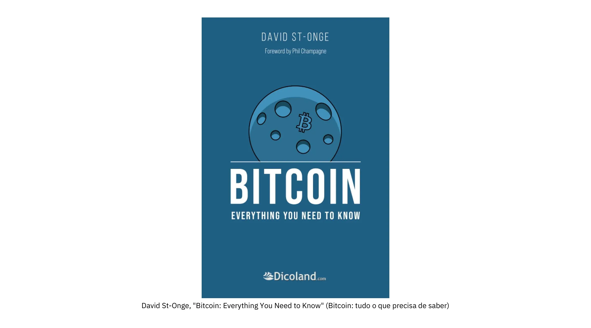

Para os curiosos sobre a experiência alemã após a Primeira Guerra Mundial, recomendo vivamente a banda desenhada "The Reich's Banker" Narra como a Alemanha conseguiu ultrapassar a hiperinflação, nomeadamente através da criação do Rentenmark.

A principal conclusão a retirar é que existem várias estratégias para ultrapassar a hiperinflação. Pode optar-se pela dolarização ou pela introdução de uma nova moeda. Estas soluções só funcionarão se a população tiver confiança nelas. É fundamental impor restrições rigorosas. É indispensável um banco central verdadeiramente independente. Não deve inflacionar a moeda Supply para cobrir os défices públicos. No caso de uma inflação moderada, é suficiente limitar o crescimento da moeda. No entanto, quando se está perante uma hiperinflação, é crucial, em primeiro lugar, ter uma massa monetária adequada em relação à dimensão da economia. Em seguida, é imperativo impor restrições rigorosas ao governo para estabilizar a situação.

## Apresentação da coleção de notas da hiperinflação

<chapterId>f3ffbb47-3aeb-54bd-80a9-adccb0f419e2</chapterId>

[Descubra a coleção digitalizada no *Bitcoin Educational Toolkit* (também acessível a partir da seção *Recursos* da plataforma Plan ₿ Academy.](https://penpot.planb.network/#/view?page-id=c157057b-fd28-8042-8004-4f081b21defc&file-id=c157057b-fd28-8042-8004-4f081b21defb&section=interactions&index=0&share-id=7154756b-3ebd-8040-8004-6475c2af5889&interactions-mode=show-on-click)

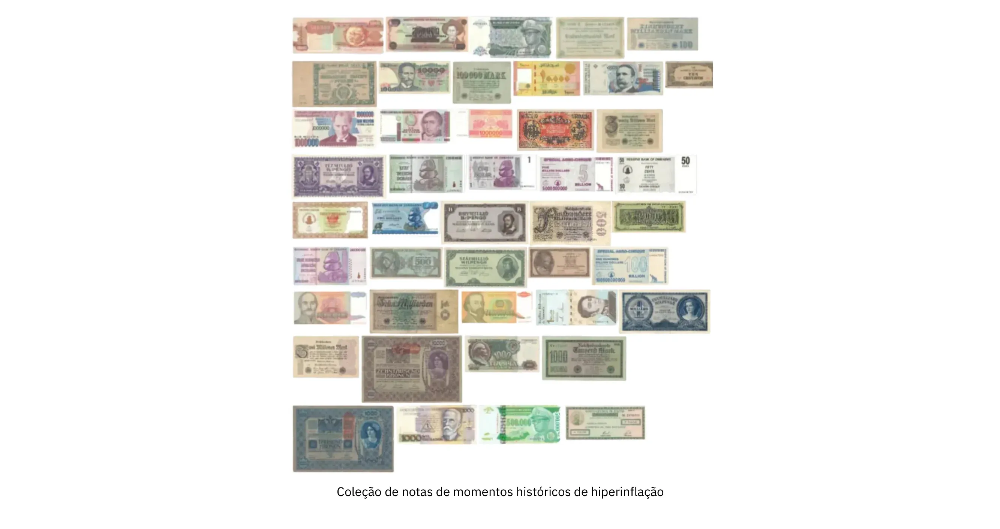

# Como é que chegámos aqui?

<partId>f66ca17e-be9e-5d30-a098-f7affd8962a1</partId>

## O surgimento da segunda Layer da moeda e dos bancos centrais

<chapterId>0455ffe3-9d45-5a67-ac96-3f815dc507a1</chapterId>

Transcrição:

O aparecimento do segundo Layer da moeda e dos primeiros bancos centrais é um tema fascinante. Este tema é amplamente discutido no livro "Layered Money" de Nick Battia. Recomendo-o vivamente aos interessados na evolução e nos meandros dos nossos sistemas monetários. O objetivo desta secção é compreender a origem da criação de moeda e a forma como esta pode conduzir à hiperinflação.

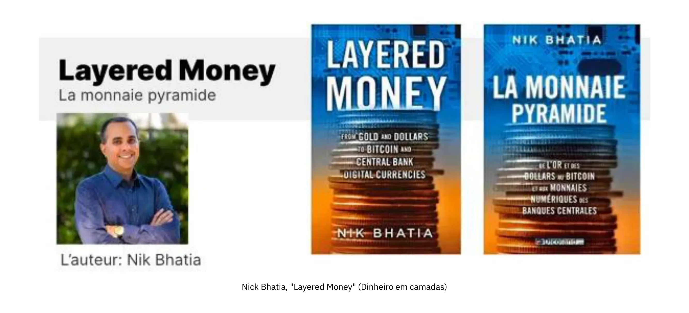

### Dinheiro de pirâmide e bancos centrais

#### O Florim

A história do dinheiro remonta ao século XIII, em Itália, mais concretamente na cidade de Florença. Nessa altura, eram comuns o florim e as notas de Exchange. Um exemplo notável é o florim, adornado com a figura de São João Batista.

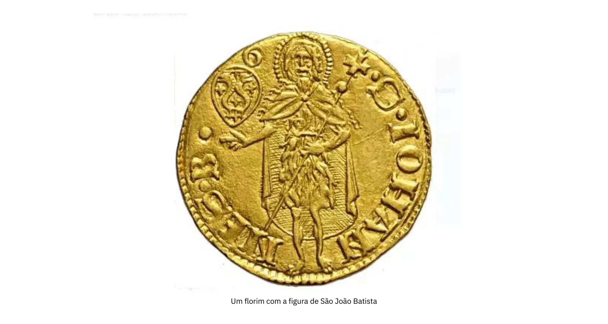

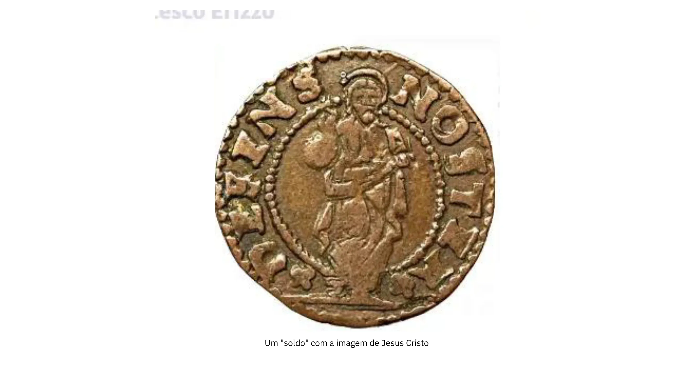

Embora possuir um florim genuíno seja atualmente caro, existem reproduções disponíveis. Existem também outras moedas da época, como o soldo dos Estados italianos do século XVII, que apresenta uma imagem de Cristo.

#### Facturas de Exchange (século XIII)

A prática corrente na época era a seguinte: os ourives emitiam facturas de Exchange em Exchange para florins depositados. Estes florins eram cuidadosamente guardados nos seus cofres. Assim, o ouro real, representado pelo florim, formava a primeira Layer do dinheiro, enquanto as letras de Exchange formavam uma segunda Layer. No entanto, a liquidez deste sistema era limitada. Se alguém quisesse trocar o seu ouro em Redeem por uma nota de Exchange, a transação era simples. No entanto, a troca destas notas entre indivíduos não era uma prática comum.

#### A Bolsa de Antuérpia Exchange (século XVI)

A Bolsa de Valores de Antuérpia-88 constituiu um marco importante na evolução do papel-moeda. Foi aí que se introduziu a prática do desconto de notas promissórias. Estas notas eram instrumentos de papel que representavam um valor monetário, mas a sua singularidade residia no facto de terem nomes e datas de vencimento. Este facto dificultava a sua emissão antes da data de vencimento.

A revolução provocada pela Bolsa de Antuérpia Exchange consistiu na possibilidade de descontar estas notas antes da sua data de vencimento. Por exemplo, se uma nota promissória tivesse de ser paga num mês, era possível comprá-la a um preço com desconto para ter em conta o tempo que faltava até à data de vencimento. Esta inovação não só tornou o papel-moeda mais Liquid, como também introduziu o conceito de valor temporal do dinheiro.

Este conceito, embora associado a Nick Bell através do seu pseudónimo no Twitter "time value of BTC", não é uma invenção sua. No entanto, ele discute-o em pormenor na sua obra. A ideia principal é que o tempo tem valor. Assim, se alguém decidir pagar uma nota promissória no valor de 100 dólares com um mês de antecedência, pode obtê-la por, por exemplo, 98 dólares e receber os 100 dólares na data de vencimento. Esta inovação monetária teve origem na Bolsa de Valores de Antuérpia Exchange.

#### O VOC e a Bolsa de Amesterdão (século XVII)

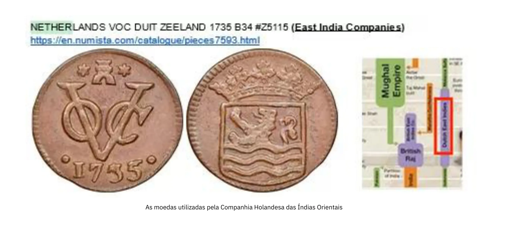

Após a criação da Bolsa de Valores de Antuérpia (Exchange), um marco importante foi a fundação da VOC, a Companhia Holandesa das Índias Orientais. Esta empresa, sediada nos Países Baixos, chegou mesmo a emitir a sua própria moeda. Após a criação da VOC, foi criada a primeira bolsa de valores em Amesterdão, marcando o início das operações bolsistas da companhia. O que é interessante notar é como os holandeses conseguiram acabar com a supremacia de Antuérpia como centro económico internacional. Limitaram-se a bloquear o acesso ao rio Escalda. Esta estratégia insere-se num movimento histórico mais vasto, a revolta dos mendigos. Um acontecimento crucial na história europeia.

#### A intervenção do Banco de Amesterdão

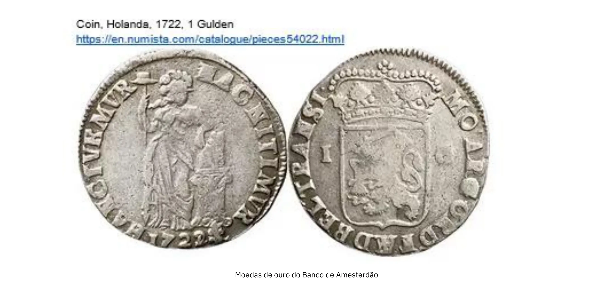

Após a criação do VOC, outro desenvolvimento significativo na história monetária foi a introdução de moedas de ouro pelo Banco de Amesterdão. Estas moedas, que datam de 1722, eram feitas de prata. No entanto, o que verdadeiramente revolucionou as finanças nessa altura não foi tanto o Coin em si, mas as contas associadas a esta moeda no Banco de Amesterdão. Estas contas tornaram-se o principal meio de transação internacional do Exchange. As transacções eram simplesmente registadas em livros de registo ou de contabilidade. Graças a este sistema, Amesterdão tornou-se o centro económico mundial. Com o tempo, o Banco de Amesterdão decidiu impor a utilização destas contas. Os cambistas independentes eram obrigados a Exchange depositar diariamente as suas moedas no banco.

#### Criação do Banco de Inglaterra para financiar a guerra

A criação do Banco de Inglaterra foi motivada pela necessidade de financiar a guerra no final do século XVII. Tal como o Banco de Amesterdão, impôs depósitos por decreto. A particularidade do Banco de Inglaterra foi a de relegar os bancos privados para uma posição secundária no sistema monetário, criando assim o que se poderia chamar um "terceiro Layer" da moeda.

Inicialmente, a primeira Layer da moeda era representada pelo ouro. Os depósitos efectuados em bancos privados constituíam a segunda Layer. No entanto, quando estes depósitos deixaram de poder ser convertidos em ouro, surgiu uma terceira Layer da moeda. A partir dessa altura, as notas emitidas pelos bancos privados deixaram de ser convertíveis em ouro e passaram a ser convertidas em papel-moeda do Banco de Inglaterra, que, por sua vez, era convertível em ouro. Esta evolução levou a uma complexificação do sistema monetário com a adição de camadas adicionais.

#### O Pânico de 1796

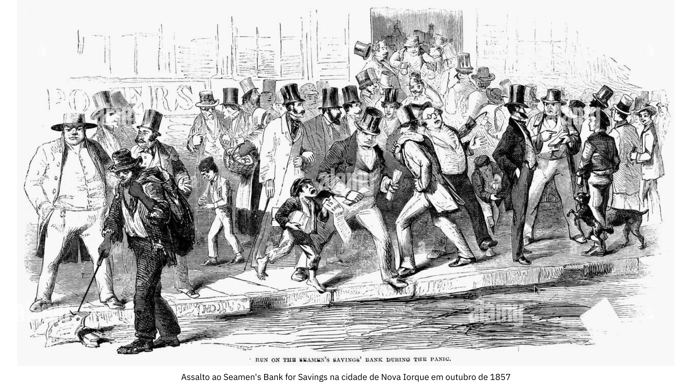

Pânico bancário no Seamen's Savings Bank durante o Pânico de 1857.

Após o pânico bancário de 1796, ocorreu um fenómeno em que todos tentaram subir na "pirâmide monetária" As pessoas queriam trocar a sua moeda de terceiro Layer pela moeda de segundo Layer e, finalmente, pela moeda de primeiro Layer, que era o ouro. Confrontado com esta corrida maciça, o Banco de Inglaterra foi forçado a tomar medidas para estabilizar a situação. Para evitar uma potencial deflação das reservas de ouro, decidiu suspender a convertibilidade das suas notas em ouro. Esta suspensão, inicialmente planeada como uma medida temporária, durou cerca de duas décadas.

### Conclusão:

Os bancos centrais evoluíram para se tornarem prestamistas de última instância, suspendendo a convertibilidade da sua moeda em ouro. Embora esta ação se destinasse inicialmente a ser uma solução temporária, acabou por se tornar permanente, marcando o advento do conceito de prestamista de última instância. Esta transformação moldou os bancos centrais tal como são conhecidos atualmente. No entanto, em economias mais frágeis, esta capacidade de imprimir dinheiro à vontade pode ter consequências indesejáveis, como a hiperinflação, se utilizada de forma irresponsável.

## Livros e recursos

<chapterId>c44e4519-0741-527b-b3b0-3f513e87147d</chapterId>

A hiperinflação é um tema fascinante que tem sido estudado através de vários acontecimentos históricos. Se quiser aprofundar este tema, aqui está uma lista de 10 recursos essenciais para ler e estudar:

- "When Money Dies: The Nightmare of Deficit Spending, Devaluation, and Hyperinflation in Weimar Germany", de Adam Fergusson. Este livro descreve em pormenor a crise da hiperinflação na Alemanha após a Primeira Guerra Mundial.

- "The Economics of Inflation - A Study of Currency Depreciation in Post-War Germany", de Costantino Bresciani-Turroni. Uma análise aprofundada da hiperinflação alemã na década de 1920.

- "Desta vez é diferente: Eight Centuries of Financial Folly", de Carmen M. Reinhart e Kenneth S. Rogoff. Embora o livro abranja vários tipos de crises financeiras, apresenta uma discussão aprofundada sobre a hiperinflação ao longo da história.

- "Zimbabwe's Hyperinflation, Analysis and Lessons Learned" de Steve Hanke. Um estudo sobre a hiperinflação do Zimbabué no início da década de 2000.

- "Regimes Monetários e Inflação: History, Economic and Political Relationships", de Peter Bernholz. O livro analisa casos históricos de hiperinflação e procura compreender os factores subjacentes.

- "The Hyperinflation Survival Guide: Strategies for American Businesses" de Gerald Swanson. Um guia prático sobre como as empresas podem navegar num ambiente hiperinflacionário.

- "A morte do dinheiro: Lessons of the Great German and American Inflations", de Jens O. Parsson. Uma análise comparativa das crises de inflação na Alemanha e nos Estados Unidos.

- "The Downfall of Money: Germany's Hyperinflation and the Destruction of the Middle Class", de Frederick Taylor. Uma exploração narrativa do impacto social e económico da hiperinflação na sociedade alemã.

- "Currency Boards for Developing Countries: A Handbook", de Steve Hanke e Kurt Schuler. Embora o foco seja nos currency boards, este livro oferece uma perspetiva sobre como evitar situações de hiperinflação.

# Secção final

<partId>cb1f4a4b-556a-4e47-a5cc-136be35a1f9a</partId>

## Comentários e classificações

<chapterId>1a37317e-372a-5241-b478-8316d44f9283</chapterId>

<isCourseReview>true</isCourseReview>

## Exame final

<chapterId>d01831c3-6c4d-59e3-95bc-03e97a05c142</chapterId>

<isCourseExam>true</isCourseExam>

## Conclusão

<chapterId>45d410b0-71ed-4502-8d8d-8b6df761db23</chapterId>

<isCourseConclusion>true</isCourseConclusion>