# Urugendo mu gusambuka kw'ubukungu

Ni gute iyo amafaranga atakaza ibisobanuro vyayo?
Iyi nshingano ikuyobora mu isi ishimishije ariko ikomeye y'ifaranga ryinshi cane. Uzovumbura ibyabaye mu mateka n'imihango igezweho aho amafaranga yasambukiye kandi ubukungu bwahindutse mu ijoro. Uzovumbura imiterere, impamvu, n'ingaruka nyazo ku bantu ba hose, ubone ubumenyi ku kimwe mu bintu bikomeye cane mu bukungu.

Mu nzira, uzovumbura kandi uko abantu n'imitwaro byanyuze muri ibyo bihe bigoye. Wige ingamba zafashije kurinda ubutunzi mu gihe c'ibibazo vy'amafaranga kandi wubake ubumenyi bwimbitse bwo guhangana n'ibibazo vy'amafaranga. Niba ushaka kumenya imbaraga z'ubukungu zigira uruhare mu isi yacu, uru rugendo rutanga ubumenyi n'imyumvire ifatika.
+++
# Imenyekanisha

<partId>6fe4d15d-f6e6-54be-9e04-0a75ac98df8b</partId>

## Incamake y'amashure

<chapterId>9d1aba8d-0485-5020-9863-5de37e6db8e0</chapterId>

Murakaze mu mahugurwa ya ECO204!

Intumbero y’iri shure ni ukugufasha gutahura imizi, uburyo n’ingaruka z’ugutera imbere kw’ibiciro mu gihe c’ubuhinga bw’amahera y’ubuhinga. Biciye ku ngero zitomoye no ku gusuzuma amateka, uzokwiga kumenya ibintu bisubira inyuma bibanza ibihe vy’ugutera imbere cane kw’ibiciro no kumenya ibikorwa vyo kwikingira.

**Igice ca 2: Inflation ni iki?**

Imbere yo kwisuka mu mutima w’ico ciyumviro, tuzosubira ku bintu vy’ishimikiro: inflation ni iki? Iki gice kizokwerekana inkomoko yayo y’amahera, ubwoko butandukanye bw’ugutera imbere kw’ibiciro, n’ingene bihuye n’inguvu z’ubutunzi zagutse. Iyi ni intambwe ihambaye mu gutahura ingene ugutera imbere kw’ibiciro gusanzwe gushobora guhinduka ugutera imbere kw’ibiciro gukomeye cane.

**Igice ca 3: Inflation nyinshi ni iki?**

Muri iki gice, uzokwiga insobanuro nyazo z’ugutera imbere cane kw’ibiciro kandi usuzume ibihe bihambaye vyinshi vyabaye mu mateka, harimwo n’ivyo mu Budagi bwa Weimar no muri Zimbabwe. Tuzosuzuma ivyo bahuriyeko, ivyo batandukanye n’ivyo bahuriyeko muri iki gihe. Uzosanga kandi ibintu bitazwi cane, nk’uguhindura amadini gukurikirana muri Amerika Latini, hamwe n’ingene umuntu yosohoka mu bihugu bimwebimwe.

**Igice ca 4: Twashitse gute ngaha?**

Iki gice kigamije gutahura uburyo bw’imiterere bushobora gutuma haba ugutera imbere kw’ibiciro, cane cane biciye mu gutegura "Layer ya kabiri" y’amahera n’uruhara rw’amabanki nkuru. Ibindi bikoresho vyo gukoresha be n’ivyifuzo vyo gusoma bizotangwa kugira ngo umuntu ashobore gutohoza.

Bimeze gute iyo amateka y’amahera asubiramwo imbere y’amaso yacu? Ube umucamanza mu bice bikurikira!

# Inyungu y’ibiciro ni iki?

<partId>2b4f456c-3649-5cf9-b9b0-a5bffe92d962</partId>

## Ikintu c'amahera

<chapterId>b2cbc915-c4ec-52b5-860c-0958f58c91e4</chapterId>

### Insobanuro z'ugutera imbere kw'ibiciro

[Inflation](https://planb.academy/resources/glossary/inflation) ni iciyumviro gikunda gutahurwa nabi kubera insobanuro n’insobanuro nyinshi gifise. Uko abantu babona ivy’ugutera imbere kw’ibiciro biratandukanye n’imigwi itandukanye, nk’abakoresha ama bitcoin n’abahinga mu vy’ubutunzi ba kera. Reka tubanze dusobanure insobanuro imbere yo kuganira ku bijanye n’ugutera imbere kw’ibiciro:

- Insobanuro ivuye mu nkoranyabumenyi ya Le Robert: Inflation ni ukwiyongera cane kw’ibikoresho vyo kwishura (amafaranga y’amabanki, umutungo), bikaba bituma ibiciro vyiyongera kandi amafaranga agabanuka.

- Insobanuro ivuye mu nsiguro ya Larousse: Inflation ni ikintu kirangwa n’ugutera imbere muri rusangi kandi gukomeza kw’urugero rw’ibiciro. Aha, ijambo "generalized" ni ryo rihambaye cane.

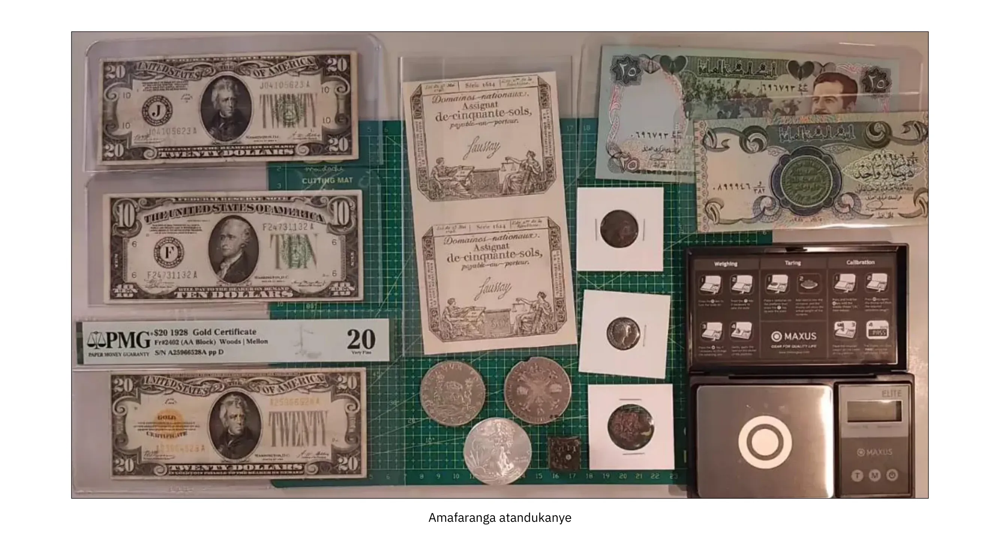

Hakurikijwe izo nsobanuro, birahambaye gutahura ko, kuri Robert, ugutera imbere kw’ibiciro ahanini kujanye n’ukwiyongera kw’amahera Supply. Ku rundi ruhande, Larousse yibanda ku ngaruka z’ukwo kwaguka, ni ukuvuga ukuduga kw’ibiciro muri rusangi.

Mu nyigisho yacu ku bijanye n’ugutera imbere kw’ibiciro, tuzokwemera insobanuro ya kabiri, ari yo y’ugutera imbere kw’ibiciro muri rusangi, kuko ari yo ibereye kandi igaragara cane ku ciyumviro cacu. Ariko rero, birahambaye cane kwibuka ko iyo ntumbero y’ibiciro muri rusangi ari ingaruka y’ukwaguka kw’amahera Supply.

Umuhinga mu vy’ubutunzi azwi cane yitwa Milton Friedman yavuze mu buryo buzwi cane ati:

> "Iterambere ry'ibiciro ryama kandi hose ari ikintu c'amahera."

Iryo jambo rirerekana isano ry’imbere hagati y’ukwaguka kw’amahera n’ugutera imbere kw’ibiciro. Mu bice bikurikira, tuzosuzuma isano riri hagati y’ugutera imbere kw’ibiciro n’iterambere ry’ubutunzi, dufatiye kuri izo nsobanuro z’ishimikiro.

### Gutahura ikintu c'amahera

Iyo tuvuze ku kintu c’amahera, tuba turiko turavuga ingene amahera Supply y’ubutunzi agira ico akoze. Milton Friedman mu vy’ukuri yabonye ko ari ukwongerekana kw’iyi Supply. Mu mateka, hari uburyo bubiri nyamukuru bwo kwongerera amahera Supply:

1. Gucapura amahera:

Mu mice y’amahera ya kera, ukwongerekana kw’amahera Supply kwashitsweko mu gucapura ku mubiri amafaranga mashasha. Naho muri iki gihe, aho amafaranga y’ubuhinga bwa none ari yo agwiriye, ukwo gucapura ahanini gukoreshwa mu buryo bw’ubuhinga bwa none (biciye mu makuru y’amabanki nkuru n’ibindi bigo vy’ivy’imari), amateka atwereka ibihe aho gucapura amafaranga y’amafaranga vy’ubuhinga bwa none vyatumye habaho ugutera imbere kw’ibiciro.

2. Kugabanya Ivyuma Birimwo:

Ubundi buryo bwari ubwo kugabanya igitigiri c’ivyuma vy’agaciro mu mafaranga ashingiye ku vyuma nk’ifeza canke inzahabu. Akarorero gatangaje karashobora kuboneka mu Bwami bw’Uburoma, aho idenariyo, mu ntango ryari rigizwe n’ifeza hafi yose, ryagabanutse cane uko igihe cagenda kirarenga. Ivyo vyari bimeze nk’ubwoko bw’ugutera imbere kw’ibiciro, ariko si ngombwa ngo bibe ugutera imbere kw’ibiciro birenze urugero.

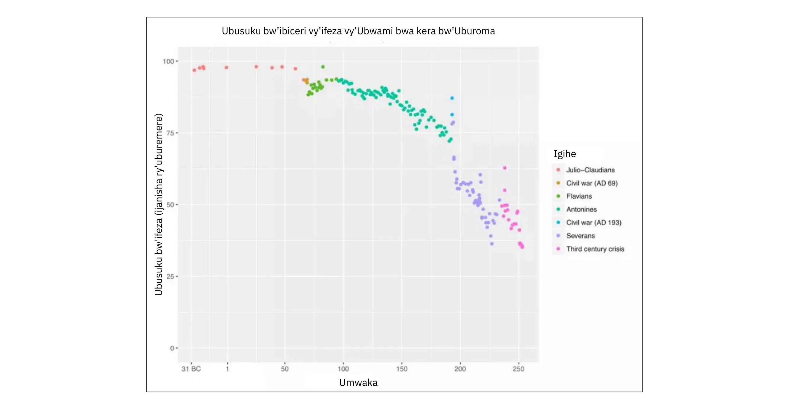

Ni ngombwa cane gushimika ku vy’uko ugutera imbere cane kw’ibiciro kugaragara canecane ku mafaranga y’amahera adashigikiwe n’itunga ryayo ry’ishimikiro, nk’ivyuma vy’agaciro. Mu mateka, iyo ifaranga ryari rishingiye kuri ivyo bintu, ibihe vy’ugutera imbere kw’ibiciro (nk’akarorero, biciye mu gusenyuka kw’agaciro k’ivyuma birimwo) vyarashika, ariko ivyo bihe ntivyigeze bishika ku rugero rwo hejuru rw’ugutera imbere kw’ibiciro cane. Mu bice bikurikira, tuzokwiga mu buryo burambuye ibihe vy’ugucika kw’agaciro k’amahera n’ingaruka izo nzira zitandukanye z’amahera zigira ku gutera imbere kw’ibiciro.

### Ivyigwa ku bihe vy'ugutakaza agaciro k'amahera

Mu mateka yose, amahanga atandukanye yarashikiwe n’ibihe vy’ugucika intege kw’agaciro k’amahera. Bimwe muri ivyo bihe bihuye n’ibintu bikomeye vyabaye canke intambara zateye umukazo ubutunzi.

#### 1. Intambara ya Peloponeziya n’intambara ya kabiri ya Punike:

Intambara ya Peloponnese, intambara yari hagati ya Atene na Siparita, be n’intambara ya kabiri ya Punike, hagati ya Repubulika y’Uburoma na Carthage, ni ingero za mbere z’ugucika kw’agaciro k’amahera zabonetse mu bubiko bw’ibitabu. Kugira ngo ivyo bihugu bishobore gufasha izo ntambara, vyaragabanyije agaciro k’amahera yavyo mu kugabanya ifeza zarimwo no gushiramwo ibindi vyuma, mu gihe vyongera igitigiri c’ibiceri vyakorwa.

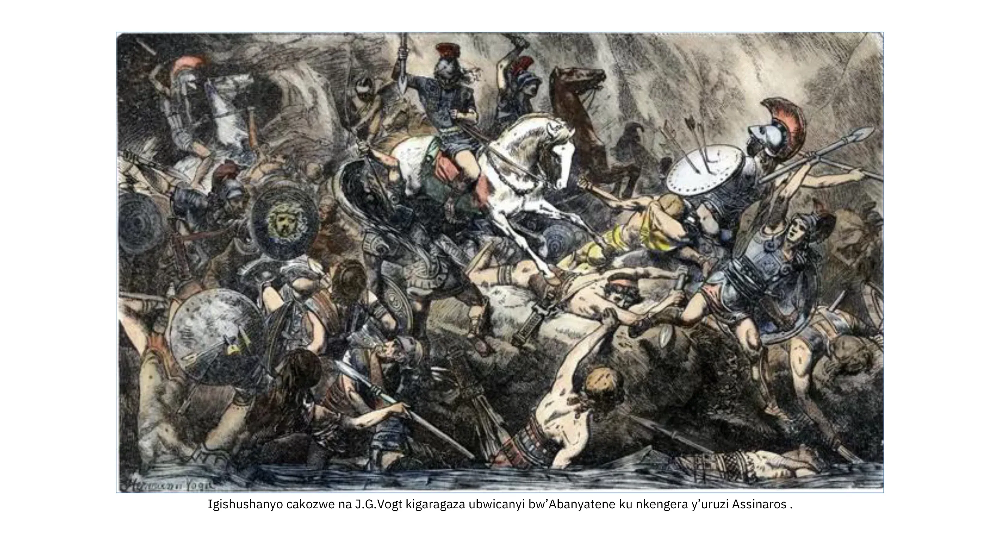

Igishushanyo kigaragaza ubwicanyi bw’Abanyatene ku nkengera y’uruzi Assinaros.

#### 2. Uburoma bwa kera mu gihe c’Ubwami:

Inyuma y’igihe ca Repubulika y’Uburoma, mu gihe c’Ubwami, mu kinjana ca 3 n’ica 4, amafaranga yaragabanutse cane. Ivyo bigaragazwa n’ukuntu ifeza iri mu biceri zigabanuka, nk’uko bigaragara ku gicapo c’imbere. Icigwa kimwe kigaragaza ko igiciro c’ingano muri Egiputa, gipimwa mu madirakima, caduze n’incuro miliyoni imwe mu kiringo c’imyaka nka 400, kuva mu mwaka wa 40 imbere ya Kristu gushika mu mwaka wa 360 inyuma ya Kristu. Muri ico kiringo, rigereranya ugutera imbere kw’ibiciro ku mwaka ku rugero rwa 4,4%. Ariko rero, iyo nzira y’ugutera imbere ntiyagabanijwe mu buryo buringaniye. Vy’ukuri vyatanguye nko mu mwaka w’238 inyuma ya Kristu. Hagati y’umwaka wa 250 n’uwa 293 inyuma ya Kristu, igipimo c’ugutera imbere kw’ibiciro cari hafi 3,65%, kigaca kiduga kigera kuri 22,28% hagati ya 293 na 301 inyuma ya Kristu.

Naho ivyo bihe vyarimwo ugutera imbere kw’ibiciro gukomeye, ntivyashitse ku rugero rw’ugutera imbere kw’ibiciro cane nk’uko bigaragara mu bihe bimwebimwe vyo muri iki gihe. Impamvu y’ivyo ni uko naho ayo mafaranga yacitse agaciro, yari agishigikiwe n’ivyuma vy’agaciro. Uwo mushinge ukomeye waratanga uburinzi bumwebumwe ku rugero rw’ugutera imbere kw’ibiciro birenze urugero. Mu bice bikurikira, tuzosuzuma mu buryo burambuye kamere n’ingaruka z’ugutera imbere cane kw’ibiciro.

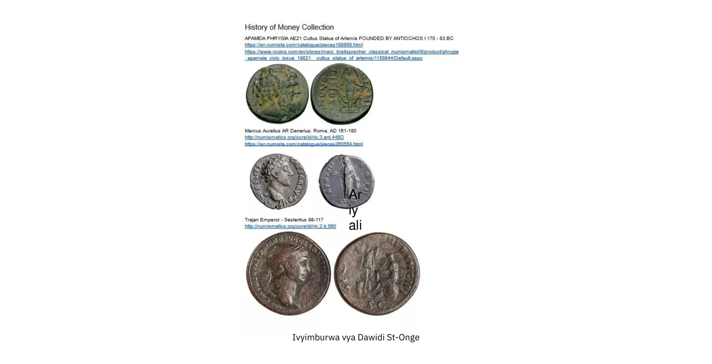

- Idenari ya Mariko Aureliyo (160 inyuma ya Kristu):

Kimwe mu biceri vy’agaciro kuruta ibindi vyose vyo mu Buroma bwa kera ni idenariyo, ni ukuvuga ifeza Coin. Nfise Coin yihariye ya Marcus Aurelius yo mu mwaka w’160 inyuma ya Kristu, imbere y’uko agaciro kayo gacika intege cane. Naho kamera yoshobora kugorwa no gufata ibintu vyiza cane, iyo umuntu ayibonye n’ijisho ryiwe, biragaragara ko Coin ari nziza kandi ko yerekana ifeza nyinshi cane.

- Antonini (mu mpera z’ikinjana ca 3 inyuma ya Kristu):

Igihe amahera yariko aragabanuka, harabonetse amahera mashasha yitwa Antoninianus. Iryo feza ryari rikwiye kuba rifise agaciro k’amadenari abiri, mugabo harimwo ifeza nke cane. Antoninianus Coin yanje yerekana neza ko ifeza irimwo yagabanutse cane. Isharije igitsibo, kigaragara mu biceri vy'Abaroma vyo muri ico gihe, vyitwa "radiates". Ugereranije ibara n’uburyo, birashoboka kubona ko Antoninianus ari kure y’ukuba Coin y’ifeza itagira agasembwa.

Iyo ugereranije ivyo biceri bibiri iruhande n’iyindi, itandukaniro ririho riratangaje cane. Idenari yo mu 160 inyuma ya Kristu ifise ishusho y’ifeza idasanzwe, mu gihe Antoninianus yo mu mpera z’ikinjana ca 3 inyuma ya Kristu igaragara cane, ivyo bikaba vyerekana ko ifeza yagabanutse cane. Ukwo kugereranya kw’amashusho kuratanga akarorero gatomoye k’ukuntu amahera yagabanutse mu binjana bikeyi vyabaye mu Buroma bwa kera.

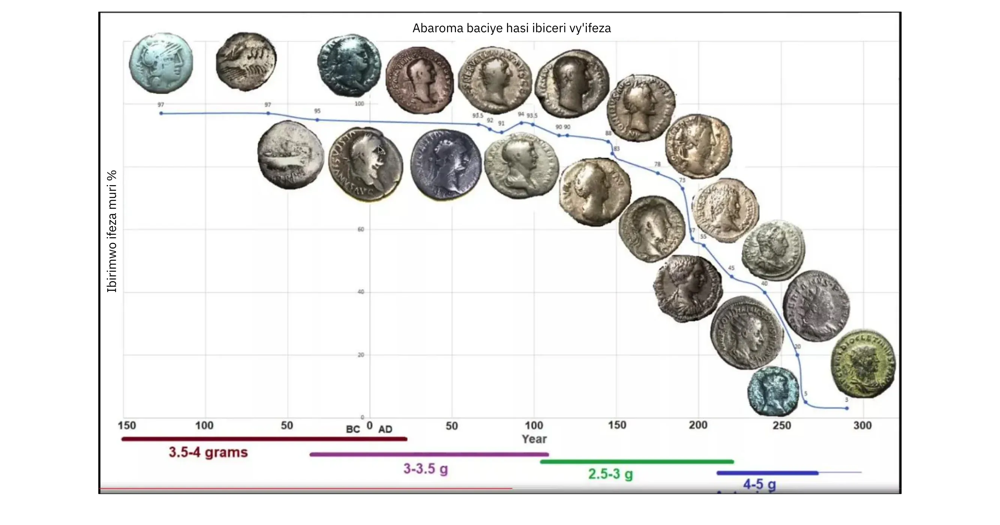

Kugira ngo iyo yerekanwa irangire, igicapo kigaragaza ukuntu ivyo biceri bigenda biragabanuka uko igihe kigenda kirarenga, vyoba vyiza cane. Naho bigoye kuvyiyumvira biciye kuri iyo nzira, niwiyumvire igicapo kigaragaza agaciro k’idenari, hanyuma kigaca kigabanuka mu mpera z’ikinjana ca 2, igihe casubirizwa n’i Antoninianus, kikaba kivugwa ko cari gifise agaciro k’idenari abiri mugabo kikaba cari gifise ifeza nke cane. Ivyo bintu vy’agaciro ni ivyabona bicereje vy’uguhinduka kw’ubutunzi kw’imico kama ya kera.

#### 3. Maravedi w’Umunyasipaniye: Icabona c’Ugutakaza Igiciro c’Igihugu

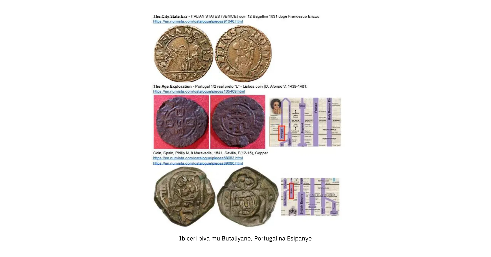

Maravedi, nk’ifaranga ry’umuringa, rifise ikibanza kidasanzwe muri kahise k’ifaranga ry’Ubusupanye. Nk’uko twabibonye, ​​idolari ry’Igisupanyoli ryari ryo mu ntango ry’agaciro mpuzamakungu, rikaba ryari amahera y’agaciro yo gucungera Esipanye. Ariko rero, kubera ko Esipanye yari ihanganye n’ingorane zimwezimwe zo mu vy’ubutunzi, yabwirijwe gukoresha ubuhinga bw’ubwenge bwo gukoresha amahera.

Gugabanya agaciro k’amahera ni igikoresho gikoreshwa kenshi n’ibihugu kugira ngo bihe amahera y’amahera bikoresha canke ngo bivyure ubutunzi. Ariko rero, Esipanye yari mu bihe bigoye cane. Gutuma idolari ry’Esupanye rigira agaciro gatoyi vyari gutuma rigira ikibanza mu bucuruzi mpuzamakungu. Kugira ngo Esipanye ishobore gutsinda iyo ngorane, yarahindukiriye aba Maravedi.

Maravedi yari itandukanye n’idolari ry’agaciro ry’ifeza ryo muri Esupanye, kuko yari ifaranga ry’umuringa ryakoreshwa canecane mu bantu bo ng’aho. Iryo shirahamwe ryari rigenewe gukurwako agaciro. Iyo Maravedis Coin mu ntango yari ifise agaciro k'amamaravedi abiri, Leta yarayigarura, igasubira kuyitera ikidodo c'agaciro gashasha, nk'akarorero, "ine", igasubiza nyen'iyo modoka Coin imwe gusa. Coin, ifise ikidodo "umunani", ni ikimenyamenya c'ivyo, kuko yaciye mu nzira nyinshi z'ugucika kw'agaciro.

Iryo tegeko ryatuma Leta ishobora gukuraho agaciro k’ifaranga, bigatuma habaho ugutera imbere kw’ibiciro, bigatuma Leta igira amahera ataziguye, mu gihe Leta ishobora kubungabunga ubutungane bw’idolari ry’Esipanye ku rugero mpuzamakungu. Ariko rero, iyo nzira yo gukuraho agaciro k’amahera yari igamije, yaragize ingaruka ku baturage bo muri ako karere, kuko babonye ko agaciro k’amahera yabo rusangi kagabanuka.

Ivyabaye ku ba Maravedi vyerekana ingene Leta ishobora guhitamwo guca agaciro k’ifaranga ry’igihugu kugira ngo ishobore guhabwa ivyo ikeneye mu vy’ubutunzi bwo mu mutima, mu gihe iguma izigama agaciro k’ifaranga ry’ububiko ku rugero rw’isi yose. Ni akarorero gakomeye k’ukuntu politike y’amahera igoye kandi ikaba ari nziza cane muri kahise.

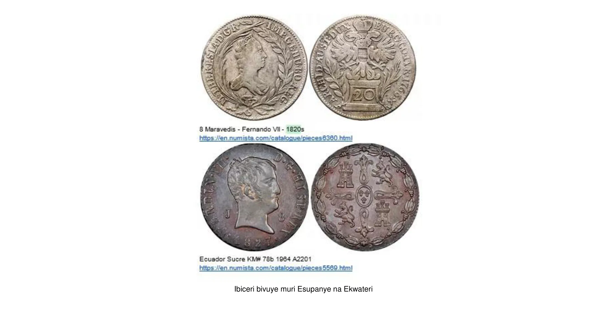

Woba ushaka kumenya vyinshi? -> [Ihuza](inyandiko.

#### 4. Impinduka y’ibiciro kuva mu kinjana ca 15 gushika mu ca 17

Hagati y'ikinjana ca 15 n'ica 17, Uburayi bwabonye ikintu gitangaje mu vy'ubutunzi, akenshi citwa "ihinduka ry'ibiciro." Ico gihe c’ugutera imbere kw’ibiciro ahanini catumwe n’ukwinjira kw’ivyuma vyinshi vy’agaciro, canecane inzahabu n’ifeza, biva muri Amerika. Kubera ko ubutunzi bw’Uburayi bwari bushingiye ahanini ku rugero rw’ivyuma ico gihe, iyo Supply y’ivyuma yongeweko yaratumye amahera Supply yongera. Ivyo vyatumye habaho ugutera imbere kw’ibiciro kw’ibice nka 1 gushika ku bice 2 kw’ijana ku mwaka. Umuntu aravye neza, iyo ntumbero yoshobora gusa n’iyidakomeye. Ariko rero, ico gihe, mwene ukwo guhinduka kw'ibiciro kwari kudasanzwe ku buryo kwafatwa nk'"ihinduka." Ivyo birerekana ingene amahinduka mu vy’ububiko bw’amahera ashobora kugira ico akoze ku rutonde rw’ubutunzi rwose.

#### 5. Yohani Itegeko n’Abashinzwe

Mu kinjana ca 18, amateka y'ubutunzi bw'Ubufaransa yararanzwe n'ibintu bibiri bihambaye bijanye n'amafaranga. Ubwa mbere, John Law, umuhinga mu vy’ubutunzi n’ivy’amahera wo muri Écosse, yararemesheje Leta y’Ubufaransa kwemera uburyo bwo gukoresha amahera bushingiye ku mahera y’impapuro. Naho mu ntango vyabonwa ko ari umuti w’ubuhinga bushasha bwo gutorera umuti ingorane z’ivy’ubutunzi mu gihugu, iyo ngingo yaciye yihuta gutuma haba ugutera imbere kw’ibiciro. Haciye igihe gito, mu gihe c'imivurungano y'Impinduka y'Abafaransa, Leta yarashizeho "abashinzwe".

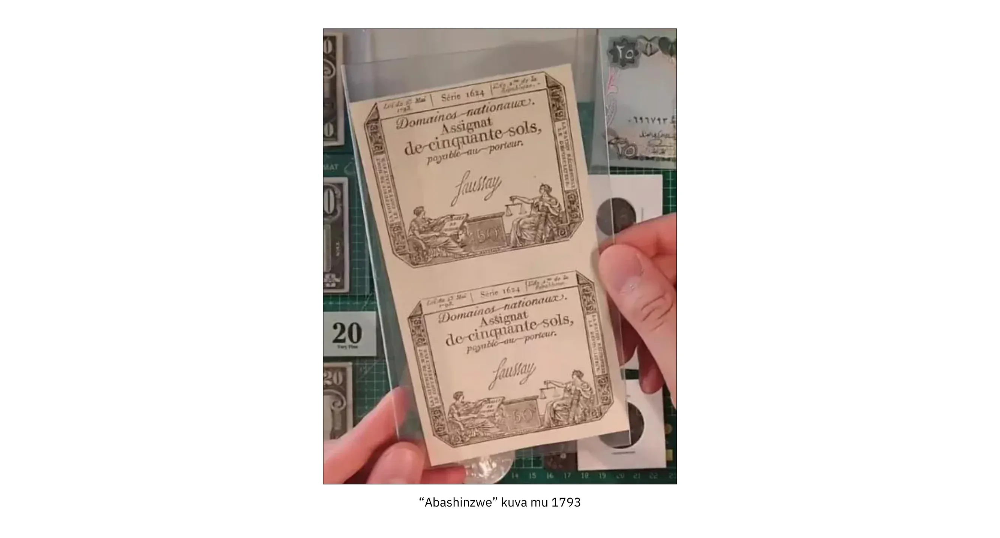

Ivyashinzwe kuva mu 1793

Izo noti zikora nk’ikimenyamenya kizima c’igihe ca mbere gikomeye c’ugutera imbere cane kw’ibiciro mu mateka. Mu ntango, ama assignats yari yagenewe gusubiza ingorane z’ivy’ubutunzi zakurikirana, aca aba ikimenyetso c’ukudashikama kw’amahera. Leta, yizigiye cane ayo mafaranga y’impapuro kugira ngo ishobore gutanga amahera yo gukoresha, yatumye haba ingorane z’ubutunzi zitari bwigere zibaho, bituma haba igihe kinini c’ugutera imbere kw’ubutunzi mu Bufaransa inyuma y’ihinduka.

#### 6. Itegeko ry’ubutegetsi 6102 n’ugugabanya agaciro k’idolari

Iteka ry'ubutegetsi 6102 n'ugugabanya agaciro k'idolari

Muri Leta Zunze Ubumwe za Amerika, mu ntango z’imyaka ya 1930, harabaye ihinduka rikomeye mu bijanye n’amahera. Aha niho hari insiguro y'ido n'ido y'iryo hinduka:

- Ikete ry'amadolari 20 ryo mu 1928

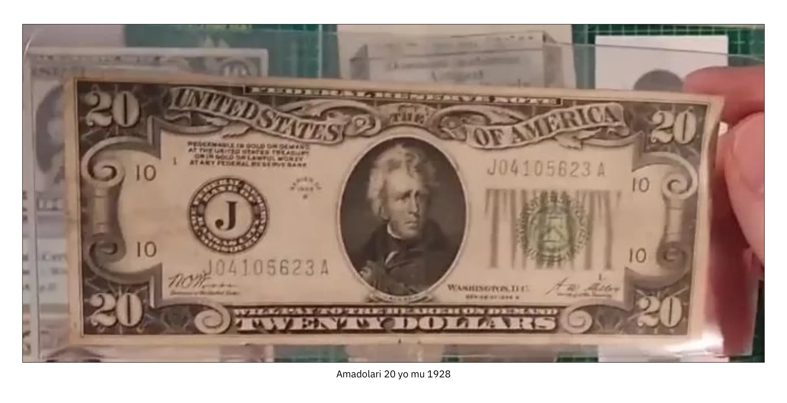

Mu 1928, amadolari 20 yo muri Leta Zunze Ubumwe za Amerika yavuga ngo: “ashobora gucungurwa mu nzahabu iyo asavye.” Ivyo bisigura ko urupapuro rwose rwari rushobora guhindurwa inzahabu. Mu buryo bwihariye, amadolari 20,67 yari angana n’ibara rimwe ry’inzahabu.

- Iteka ry'ubutegetsi 6102

Mu 1933, harabaye umuvurungano ukomeye igihe hasohoka itegeko ry’ubutegetsi 6102. Iryo tegeko ryatumye abanyagihugu badashobora kugira inzahabu, yaba mu buryo bw’ibipande, ibiceri canke ivyemezo.

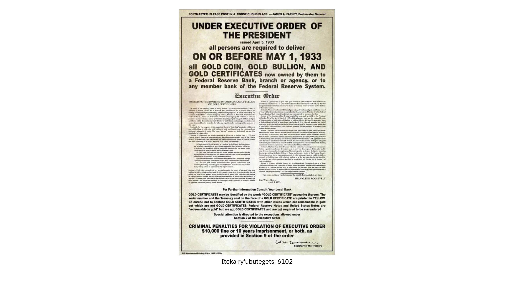

Icemezo c’Inzahabu ni akarorero keza. Yari yanditsweko ngo: "Mu nzahabu Coin yishurwa uwuyitwara iyo asavye." Kugira ico cete vyaciye bitemewe n’amategeko kandi vyagumye ari ukwo gushika mu 1964.

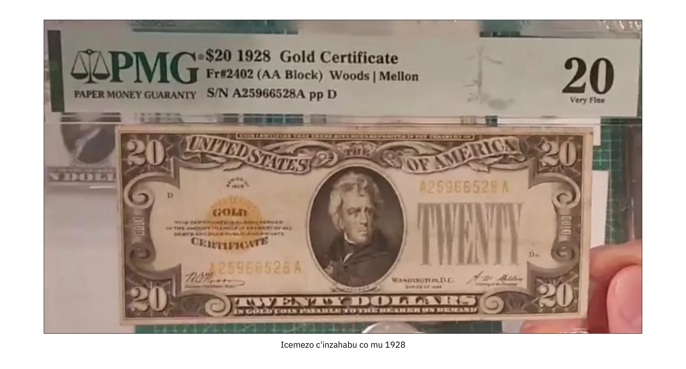

- Intango y'amafaranga mashasha

Inyuma y’aho inzahabu ifatiwe mu 1934, haciye hakoreshwa urutonde rushasha rw’amafaranga y’amahera.

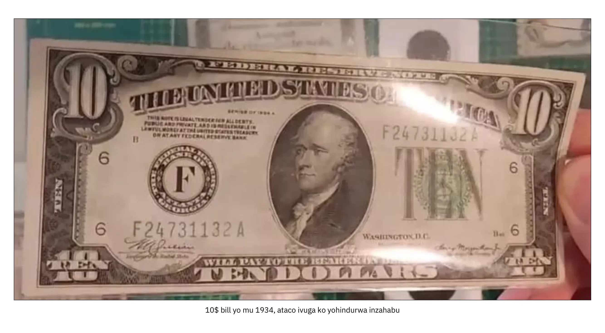

Ivyo bivugwa vyerekana ko bishobora guhindurwa inzahabu vyakuweho, bisubirizwa n’ijambo ngo «Iri kete ni amahera yemewe n’amategeko y’imyenda yose » (Ce billet est une monnaie légale pour toutes dettes).

- Gusubiramwo agaciro k'inzahabu

Igiteye umunezero muri iyo mpinduka ni ingamba za Leta. Mu 1934, igiciro c’inzahabu carahinduwe kija ku madolari 35 ku nkoko, aho kuba amadolari 20,67. Mu vy’ukuri, leta yaragabanyije agaciro k’idolari abantu bari bafise. Mu kugura inzahabu mu bantu ku madolari 20,67 ku nkoko mu 1933, hanyuma mu 1934 isubiramwo igiciro c’inzahabu, yararonse inyungu nyinshi mu gihe yariko iragabanya agaciro k’amahera abanyagihugu bayo bari bazigamye.

Mu ncamake, mu mwaka umwe, Leta yarafashe neza inzahabu y’abanyagihugu, hanyuma ihindura amategeko y’urukino mu gusubira guha agaciro agaciro k’inzahabu kugira ngo ivyungukireko ububiko bw’itunga, bigirire nabi abari barahinduye inzahabu yabo mu ntango ngo babe amafaranga y’amafaranga.

### USA irahindura amateka.

Leta Zunze Ubumwe za Amerika zagize ihinduka rikomeye cane mu kuba ari zo za mbere zigabanya agaciro k’amahera y’isi yose, ari yo dolari y’Amerika, bitandukanye n’imigenzo ya kera yabonetse mu bihugu bitobito vy’ubudandaji.

Mbere, mu gihe c’Ivugurura, florin y’Italiyano yasohowe na Firenze mu kinjana ca 13 ni yo yari ifaranga ry’ububiko mpuzamakungu, kandi nta n’imwe yari yaragabanutse agaciro mu kiringo c’ikoreshwa ryayo, ivyo bikaba vyerekana akamaro ko amahera aguma ahagaze ku bucuruzi mpuzamakungu.

Muri iyo mpwemu nyene, Esipanye n’Ubuholandi, nk’ibihugu bifise amafaranga y’ububiko kw’isi kubera ubudandaji bwavyo mpuzamakungu butera imbere, vyagumye bifise ubutungane bw’amafaranga yavyo kugira ngo bizigame icizigiro n’ivy’ububiko mu bucuruzi mpuzamakungu. Ubuholandi mbere bwarabonye aho hashingwa banki nkuru ya mbere, ivyo bikaba vyari ikintu gihambaye cane mu bijanye n’ugutera imbere kw’isi yose kw’imirongo y’amahera.

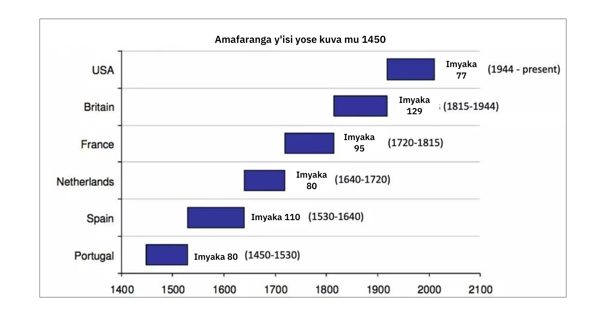

Ariko rero, ibintu vyarahindutse igihe Leta Zunze Ubumwe za Amerika zatera imbere nk’igihugu gikomeye mu vy’ubutunzi. Bahisemwo guca agaciro k’amahera yabo y’ububiko, gutyo bakoresha nabi ukuduga kw’ibiciro ku nyungu zabo. Iryo cemezo akenshi riterwa n’ihinduka ry’ibintu, aho uguhitamwo amafaranga y’ububiko kwari kutagira umwidegemvyo nk’uko vyari mbere. Ubutegetsi bwa Amerika bwashizeho idolari nk’ifaranga ry’isi yose, bituma umuntu ashobora gukoresha nabi agaciro kayo. Iryo hinduka ryerekana ingaruka zishobora guterwa n’ingingo ngenderwako z’amahera ku bucuruzi mpuzamakungu mu bukungu bw’isi yose, bikaba ari ihinduka rikomeye mu gucunga amafaranga y’ububiko bw’isi yose.

### Akarorero ka nyuma k'inzira: Idinari y'Ubusuwisi

Idinari y’Ubusuwisi yerekana ikindi kintu gishimishije co gusenyuka kw’agaciro k’amahera, ico gihe kikaba gishingiye ku vyo Iraki yariko irakora imbere y’intambara y’ikiyaga. Iryo shirahamwe ryiswe kubera uburyo buhambaye bw’amafaranga yaryo, ryasohowe na Banki Nkuru ya Iraki kandi ryari rizwi cane ko ryari rimeze neza mu karere k’Uburasirazuba bwo Hagati. Ukwo kwizigira kwari guterwa ahanini n’uko amafaranga y’amabanki yacapwa neza, ivyo bikaba vyakorerwa mu Bwongereza, ivyo bikaba vyasobanura ko hariho ubukomezi bumwe bumwe bwo kurwanya ugusenyuka kw’agaciro.

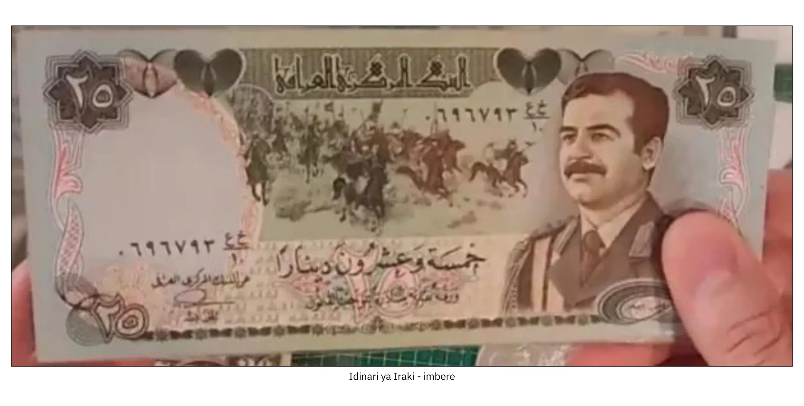

Ariko rero, Intambara zo mu Kiyaga ca Golfe zarahinduye cane amateka y’Idinari y’Ubusuwisi. Iraki, kubera ko itagishobora kwizigira umwongereza yayo yo gucapura amafaranga, yaciye ihindukirira Ubushinwa kugira ngo bufashe. Iryo hinduka ryatumye habaho itandukaniro rigaragara mu bijanye n’uburyo amafaranga y’amahera akoreshwa, aho amafaranga y’igishinwa abonwa ko ari ay’agaciro gatoyi. Ivyo vyiyumviro ntivyari bitagira ishingiro; amafaranga y’amahera y’Abashinwa yari yoroshe guhindurwa kandi yarashobora gucapwa birenze urugero na leta, gutyo bikaba vyatuma agaciro kayo gahungabana.

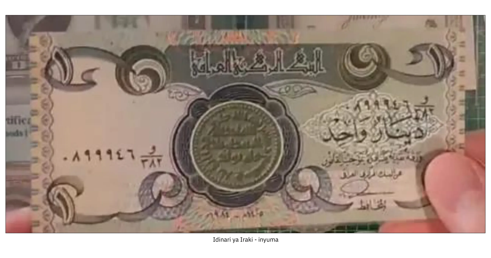

Ikintu kidasanzwe carabonetse mu bukungu bwa Iraki bwakurikiye intambara y’ikiyaga: uburyo bwo gushinga ibiciro bibiri. Abacuruzi baratanga ibiciro bitandukanye bivanye n’ubwoko bw’inoti bakoresha mu kwishura, bagakunda cane Dinari y’intango y’Ubusuwisi kuruta inoti y’Ubushinwa. Uwo murongo waragaragaje ko abantu bagumye bizigira amafaranga y’agaciro kanini, atari menshi cane yo gutakaza agaciro, mbere no mu gihe agaciro kari gashirwaho canecane na Leta. Iki gice kirerekana akamaro k’ibiranga amafaranga n’ingene, mbere no mu butegetsi bw’amafaranga y’amahera, uburyo umuntu abona ko ari amafaranga bushobora kugira ico bukoze ku gaciro kayo, kandi, mu kwagura, ku cizigiro c’abakozi bo mu vy’ubutunzi.

#### Egome, mu vy’ukuri twarapima ivyo biceri!

Iciyumviro gisanzwe gifatanya amafaranga n’irema rya Leta, aho ugusohoka kwayo n’agaciro kayo bigenwa na Leta. Ico ciyumviro gikomoka mu mico kama ya kera, nk’i Roma, aho ibiceri vyashirwa ku rugero rumwe kandi bikashirwako ikidodo n’Ubwami, gutyo bigatuma ayo mafaranga agira agaciro ku butegetsi. Ariko rero, iyo umuntu asuzumye bimwe bikomeye, abona ko agaciro k’imbere mu mafaranga kava ahanini ku vyuma vy’agaciro vyari muri yo.

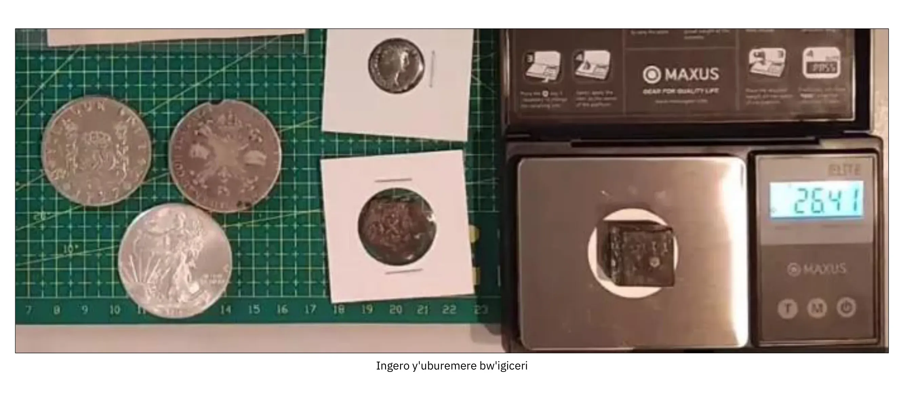

Akarorero karerekanwa biciye ku gusuzuma uburemere bw’amahera bungana n’amarea umunani y’Igisupanyoli, canke idolari rimwe ry’Igisupanyoli. Ubwo buremere, bwari bufise ikimenyetso c’umubare w’Abaroma werekana agaciro kabwo, bwakoreshwa n’abahindura amahera kugira ngo basuzume agaciro k’ibiceri bishingiye ku buremere bwavyo, aho kubishirako ikidodo gusa. Mu gupima ivyo biceri, ababihindura barashobora kumenya nimba vyahinduwe canke vyononekaye, ivyo bikaba vyari gushobora kugabanya agaciro kavyo. Ico gikorwa kirerekana yuko naho nyene ugushira ikidodo ku rugero rwa Leta kwaha agaciro kanaka kw’izina ku mafaranga, agaciro nyakuri kari mu buremere bw’icuma c’agaciro carimwo.

Iryo sesangura ryerekana ko ukwizigira amafaranga, n’agaciro kayo, kwari gushingiye ku bintu bifatika aho gushingira ku kwemeza gusa kwa Leta. Rishimika ku bubiri buri hagati y’agaciro k’izina kashirwaho na Leta n’agaciro k’imbere kategekwa n’ibirimwo ivyuma vy’agaciro. Gutyo, amafaranga ararenga kuba igikoresho ca Leta gusa, agaciro kayo k’ishimikiro gakaba gafitaniye isano n’amahera afatika kandi ashobora gupimwa mu gihugu ca Elements.

#### Iciyumviro

Mu gusozera, iki cigwa ku bijanye n’ugucika intege kw’agaciro k’amahera kiratanga ugutahura kwimbitse ku buryo inflation igenda, ivyo bikaba bizosuzumwa mu mavidewo akurikira. Tuzovuga ku bwoko butandukanye bw’ugutera imbere kw’ibiciro n’aho bihindukira bikaja ku gutera imbere kw’ibiciro vyinshi canke vy’ugutera imbere kw’ibiciro vyinshi. Uwo mushinge ukomeye uzotuma dushobora Address ibigoranye vy’ugutera imbere kw’ibiciro mu biganiro biriko biraza. Murakoze cane ku kwitwararika. Turategereje gukomeza iyo nzira y’ugutohoza ivy’ingene amahera agenda muri videwo ikurikira.

## Ubwoko bw'uguduga kw'ibiciro

<chapterId>b438fe09-375e-5bb2-9196-7dd687b9f98c</chapterId>

### Inflation si ikintu giterwa n'ibintu vyinshi

Muri iki gice, turaza gusuzuma imice itandukanye y’ugutera imbere kw’ibiciro, ikintu gikunda gutahurwa nabi. Naho ugutera imbere kw’ibiciro gufatwa kenshi nk’ikintu giterwa n’ibintu vyinshi mu binyamakuru no mu biganiro vya misi yose, birahambaye cane kwibuka ko mu vy’ukuri ari ikintu giterwa n’amahera.

Aha niho hari ingingo zitari nke z’ingenzi:

- Itandukaniro hagati y’ukwiyongera kw’ibiciro n’ugutera imbere kw’ibiciro:

Ukwiyongera kw’igiciro gushobora kuba ku rwego rumwe rumwe kandi guterwa n’ibintu bitandukanye, nk’ukugabanya umusaruro wa peteroli w’ishirahamwe OPEP canke ibihe bibi bitera ingorane umusaruro w’ingano.

Ku rundi ruhande, ugutera imbere kw’ibiciro gusobanurwa n’ukwiyongera kw’ibiciro muri rusangi mu bicuruzwa n’ibikorwa bitandukanye, atari mu rwego runaka gusa.

- Ishingiro ry’amahera ry’ugutera imbere kw’ibiciro:

Hamwe amahera adahinduka Supply, iyo ibiciro vyiyongereye mu rwego rumwe vyotuma ibiciro mu yindi mice bigabanuka, kuko amahera yo gukoresha ahandi yogabanywa. Inflation irafitaniye isano cane n’ukwiyongera kw’amahera Supply, ivyo bikaba bituma ibiciro vyiyongera icarimwe mu nzego zose.

- Ingaruka z’amahera Supply ku gutera imbere n’ugutakaza agaciro:

Mu nzira y’amahera adahinduka Supply, ukwiyongera kw’ibikorwa vyotuma mu vyiyumviro habaho ugutakaza agaciro, ni ukuvuga ukugabanuka kw’ibiciro, kuko hoba hariho ibintu vyinshi n’ibikorwa vyinshi.

Mu nzira y’amahera y’ubu, iyo amahera Supply yongerekanye, birakuraho ugutakaza agaciro gushobora guterwa n’ukwiyongera kw’ibikorwa.

- Ingaruka mbi z’uguhindura amahera Supply:

Ukwongerekana kw’amahera Supply, ata kwiyongera kw’umwimbu guhuye, bituma haba ugutera imbere kw’ibiciro, kuko hari amahera menshi agendagenda ku bicuruzwa n’ibikorwa bingana.

Naho ukwiyongera kw’ibikorwa kwari gukwiye gutuma haba ugutakaza agaciro, ukwiyongera kw’amahera Supply kwari guhinduka icarimwe kwatumye iyo ngaruka ibura, bituma haba ugutakaza agaciro mu kibanza cavyo.

- Inyungu, Inyungu, n’Amahera Supply - Ubwato Buvugana:

Inflation na deflation ni nk’ibikoresho bimenyesha amakuru mu bukungu. Ukwongerekana kw’ibikorwa birashobora gutuma haba ugutakaza agaciro, ariko iyo amahera Supply yongerewe icarimwe, ingaruka z’ugutakaza agaciro zirakurwaho, bikavamwo ugutakaza agaciro.

Iki kiganiro kirashimika ku kamaro ko gutahura uburyo bushingiye ku gutera imbere kw’ibiciro n’ugutakaza agaciro, hamwe n’ingaruka zikomeye guhindura amahera Supply bishobora kugira ku bukungu. Birashoboka ko tuzosubira gusuzuma ivyo vyiyumviro mu nyuma kugira ngo dutahure neza ukuntu bifitaniye isano n’ingaruka bifise ku bukungu bw’isi yose.

### Ni kuki gucapura amahera bitama bitera inflation?

#### Ukwiyongera kw'ibiciro ≠ CPI

Inflation, naho kenshi ijana n’ukwiyongera kw’amahera Supply, ntiyama ifise isano ry’ukuri n’ugucapura amahera, nk’uko vyerekanwa n’igihe cakurikiye ingorane z’ivy’ubutunzi zo mu 2008. Naho hari amahera menshi acapwa kugira ngo amabanki akizwe, imyaka cumi yakurikiye ntiyagira inflation nyinshi, ikaba yari hagati ya 0 na 2% ku mwaka. Ivyo biratuma umuntu yibaza ati: Ni kubera iki gucapura amahera menshi cane bitatumye habaho ugutera imbere kw’ibiciro bihuye n’ivyo? Inyishu iri mu bintu bitari bike bijanye no gupima ugutera imbere kw’ibiciro be n’Ikigereranyo c’Ibiciro vy’Abaguzi (CPI).

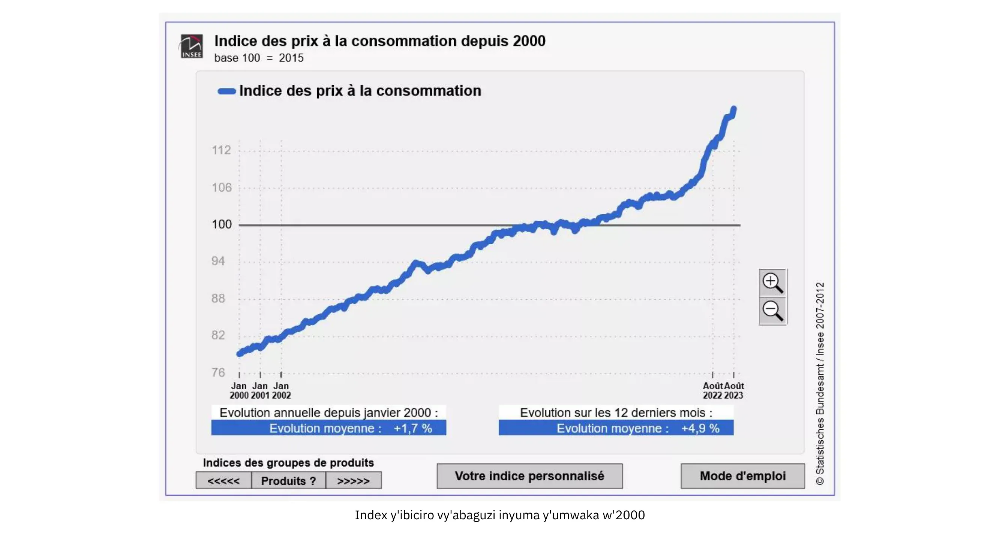

Insobanuro ya mbere iri mu buryo ugutera imbere kw’ibiciro gupimwa. Igiharuro c’ibiciro vy’ibintu (CPI), kikaba ari co kimenyetso nyamukuru c’ugutera imbere kw’ibiciro, kirafise aho kigarukira. Nk’akarorero, ntirivuga neza ukuntu ibiciro vy’amazu n’ibindi bibanza vyagenda birahinduka. Naho muri CPI harimwo igice kijanye n’ubukode, ugushimira cane kw’ibiciro vy’amazu ntikugaragara neza muri iyo nsiguro. Ivyo bituma habaho ukwiyongera gukomeye kw’ibiciro vy’amazu ataco gufatwa bimwe bishitse na CPI, bishobora gutuma habaho ugutera imbere kw’ibiciro nyakuri.

Ikindi, mu kubara CPI hakoreshwa uburyo bumwe bumwe bushobora gusubiza inyuma canke gupfuka ivyiyongereza vy’ibiciro vy’ukuri. Nk’akarorero, ugutera imbere mu buryo bw’ibintu birashobora gukoreshwa mu guhindura urutonde. Iyo igiciro c’ikintu kiduze, ariko uburyo bwaco canke ibiranga na vyo nyene bikagenda biratera imbere, CPI ishobora kubona ko agaciro nyakuri ku baguzi katahindutse, kandi rero, ntigaragaze ugutera imbere kw’ibiciro. Iciyumviro c’akarorero ni aho, naho ibiciro vy’inka n’ivy’amaordinateri vyiyongereye kubera inshinge y’amahera, ugutera imbere kw’imikorere ya mudasobwa ni kwo gukoreshwa mu gukuraho iyo ntumbero. Iyo orodinateri igura incuro zibiri ariko ikaba ifise ububasha incuro zine, CPI yoshobora gusobanura ivyo nk’ugugabanya ibiciro, gutyo igapfuka iyongerekana ry’ibiciro vy’inyama z’inka.

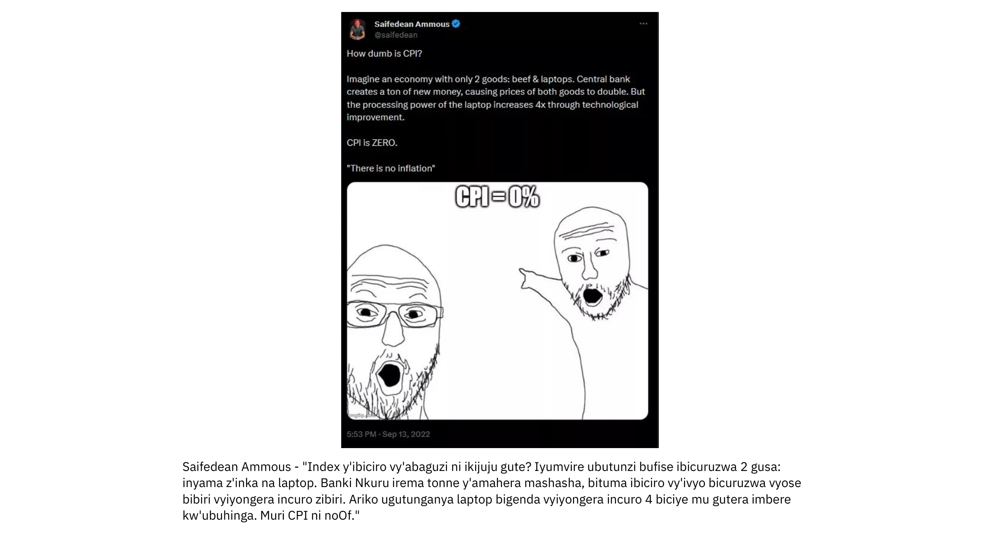

Ivyo bihimba bitari vyo mu gupima ugutera imbere kw’ibiciro bikoresheje CPI birerekana ukuntu isano hagati y’icapa ry’amahera n’ugutera imbere kw’ibiciro rigoye. Bavuga kandi ko ugutera imbere kw’ibiciro nyakuri kwoshobora kuba kwinshi kuruta uko vyavuzwe iyo ugutera imbere kwose kw’ibiciro, cane cane mu nzego z’ingenzi nk’ivy’amazu, gufatwa mu mutwe mu buryo burambuye. Iryo sesangura rishimika ku kamaro ko gutahura uburyo bushingiye ku gutera imbere kw’ibiciro n’imipaka y’ibiharuro bisanzwe bikoreshwa mu kubipima, gutyo bigatuma umuntu ashobora gutahura neza ingaruka z’ubutunzi ziterwa n’ingingo ngenderwako z’amahera.

#### Ivyiyumviro vya MMT

Ivyiyumviro vy’amahera vy’ubu (MMT) bitanga uburyo butandukanye bwo kubona amahera n’ugutera imbere kw’ibiciro. Nk’uko MMT ibivuga, amahera ahanini akomoka kuri Leta, ikaba ishobora gucapura amahera menshi kugira ngo ishobore gutanga amahera y’ivyo ikeneye ataco itera inflation igihe cose imice iyo mahera yibandako itazoba yuzuye. Ubwo buryo burakevya ku vyiyumviro vya kera vyerekeye amafaranga, bugashimika ku kamaro k’ubushobozi bwo gufata ibintu mu mice mu bijanye n’ugutera imbere kw’ibiciro.

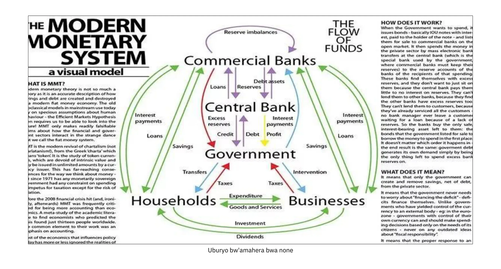

Akarorero k’akarorero ka MMT ni ikibanza c’igisirikare n’inganda c’Abanyamerika. Nk’uko MMT ibivuga, amamiliyaridi amajana y’amadolari arashobora guhabwa uru rwego ataco rutera, bivuye ku bushobozi rufise bwo gufata ayo mahera. Mu buryo butandukanye n’ubwo, iyo amahera menshi ashizwe mu kwubaka amabarabara muri Leta Zunze Ubumwe za Amerika, aho hari amashirahamwe n’abakozi bake, inflation yoshobora kubaho kubera ubukene bw’ibikoresho be n’ukwiyongera kw’ibiciro bisabwa n’abaguzi.

Ubuyapani bwakunda kuvugwa n’abashigikiye MMT nk’akandi karorero k’ukutagira ugutera imbere kw’ibiciro naho nyene hariho icapa ry’amahera ryinshi. Ariko rero, ivyabaye mu Buyapani biragaragaza kandi aho ingero za kera zo gupima ugutera imbere kw’ibiciro zifise aho zigarukira, nk’Ikigereranyo c’Ibiciro vy’Abaguzi (CPI). Mu Buyapani, igice kinini c’amahera acapwe arazigama canke agashirwa mu bikorwa vy’ubudandaji canke mu masoko y’ivy’ubutunzi, aho kuyakoresha mu vyo umuntu akoresha muri iki gihe. CPI, mu kutafata neza ivyo bihinduka, ishobora gufata minenerwe ugutera imbere kw’ibiciro nyakuri.

[Isesengura ry’Ubuyapani](https://ideas.repec.org/p/ces/ceswps/_9821.html) rirasobanura kandi ko inyifato y’abakora mu vy’ubutunzi, nk’ukwizigamira canke gushora imari mu butunzi butari mu rutonde rwa IPC, ishobora guhisha ingaruka z’ugutera amafaranga mu gutuma habaho ihindagurika ry’ibiciro. Vyongeye, ubushobozi bw’imirima itandukanye bwo kwakira amahera yinjijwe bugira uruhara rukomeye mu kwibonekeza canke kutibonekeza kw’ihindagurika ry’ibiciro.

#### Igitabo c'imibare ya banki na banki nkuru

Akarorero ka gatatu k’igituma icapa ry’amahera ritazotuma haba ugutera imbere kw’ibiciro ni uko isano hagati y’icapa ry’amahera n’ugutera imbere kw’ibiciro rihindurwa n’ingene amahera mashasha aremwe yinjira mu bukungu. Iyo ayo mahera aguma ku rutonde rw’amabanki yigenga atagurishijwe abakora mu vy’ubutunzi, ntaco azogira ku bukungu nyakuri, rero ntazotuma habaho ugutera imbere kw’ibiciro.

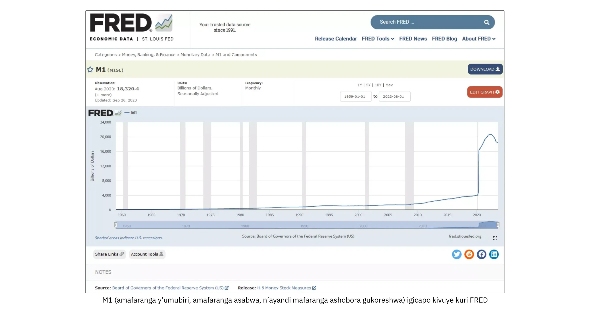

Icapa ry’amahera rishobora kubonwa nk’inkota ya Damocles imanitse hejuru y’ubutunzi. Amahera yaremwe arashobora kuguma yihishije igihe kinaka, ata ngaruka ziboneka z’ugutera imbere kw’ibiciro, igihe cose atazokwinjizwa mu bukungu biciye mu ngurane za banki canke ubundi buryo. Ariko rero, iyo ayo mahera yihishije amaherezo ashizwe mu bikorwa, ingaruka z’ugutera imbere kw’ibiciro zirashobora rero kugaragara. Ivyo nivyo vyabonetse mu myaka ya 2020, aho amahera yari yararemwe mbere yinjiye mu bukungu, bituma habaho ugutera imbere kw’ibiciro.

Ico kigereranyo kirerekana akamaro k’uburyo bwo gutanga amahera mu kugira ico bukoze ku ngaruka z’ugutera imbere kw’ibiciro z’icapa ry’amahera. Guhingura amahera muri banki nkuru ni igice kimwe gusa c’uruzitiro. Inyifato y’amabanki yigenga, afata ingingo ku rugero rw’inguzanyo zo gutanga, n’inyifato y’abaguzi, bafata ingingo y’ingene bazokoresha amahera bagurijwe, na vyo nyene ni ngirakamaro cane Elements muri iyo nzira.

#### Inflation ni imibano!

Akarorero ka Repubulika ya Weimar karerekana ikindi kintu gihambaye cane kiri hagati y’ugucapura amahera n’ugutera imbere kw’ibiciro: uruhara rw’ivyo umuntu yitega be n’inyifato y’abakozi b’ubutunzi. Igihe Banki Nkuru ya Repubulika ya Weimar yatangura gucapura amahera menshi cane, ukudakeka mu vy’ubutunzi kwatumye abantu birundanya, ni ukuvuga kubika amahera aho kuyakoresha. Ivyo vyatumye ingaruka z’ugutera imbere kw’ibiciro z’icapa ry’amahera zicerezwa mu gihe gito.

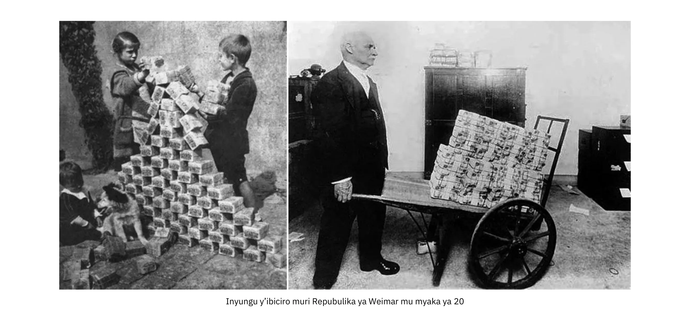

Ariko rero, igihe ubutunzi bwatangura gutera imbere gatoyi, buhorobuhoro abantu barasubira kwizigira. Abantu ku giti cabo baraheza bakura amahera bari bazigamye aho bari bihishe, batangura gukoresha amahera menshi mu vy’ubutunzi. Iryo hinduka ry’inyifato ry’igihe gito, hamwe n’amahera yari asanzwe ari menshi Supply, vyatumye abantu bashaka cane. Kubera ko amahera menshi yariko aragendagenda kandi abantu benshi bariko barayisaba, ibiciro vyaratanguye kuduga cane, bituma habaho ugutera imbere kw’ibiciro.

Aka karorero karashimika ku kamaro k’igihe n’inyifato y’abakozi mu guseruka kw’ugutera imbere kw’ibiciro. Inflation ntibaho gusa mu kwishura ku kwiyongera kw’amahera Supply, ariko kandi ivana n’ingene ayo mahera akoreshwa mu bukungu n’igihe akoreshwa. Ugukekeranya mu vy’ubutunzi n’ivyo abakozi b’ubutunzi biteze birafise uruhara runini muri iyo nzira kandi birashobora kwihutisha canke gutevya ingaruka z’ugutera imbere kw’ibiciro z’icapa ry’amahera.

#### Gusubiramwo:

- Index y’ibiciro vy’abaguzi (CPI): CPI itunganijwe mu buryo bufata minenerwe ugutera imbere kw’ibiciro, ivyo bikaba bishobora gutanga ishusho igoramye y’ukuri kw’ugutera imbere kw’ibiciro.

- Ugufata amafaranga mu mice: Gutera amafaranga mu mice ishobora kuyafata ntivyama bituma habaho ugutera imbere kw’ibiciro. Akarorero gakomeye ni ikigo c’ingabo n’inganda co muri Leta Zunze Ubumwe za Amerika, gishobora gufata amahera menshi ataco gitera.

- Ivyabaye mu Buyapani: Naho amahera acapwa cane, mu Buyapani amahera aguma ari make kubera ko amahera akenshi azigama canke ashirwa mu masoko y’amazu canke y’ivy’ubutunzi. Ivyo bice ni vyo bifata amahera acapwe, kandi CPI ntiyerekana vy’ukuri ko ibiciro vyiyongera muri ivyo bice.
- Isano hagati y’Icapa ry’Amahera n’Amasoko. Biraboneka ko amasoko y’amazu n’ay’ivy’ubutunzi akenshi akurikira icapa ry’amahera, ivyo bikaba vyerekana aho amahera acapwe aja.
- Amahera y’amabanki: Iyo amahera acapwe aguma ku rutonde rw’amahera y’amabanki kandi ntagendagenda mu bukungu, ntibituma haba ugutera imbere kw’ibiciro. Ivyo birerekanwa n’akarorero ko mu 2008, aho amahera acapwe ahanini yagumye ku rutonde rw’amahera y’amabanki, ivyo bikaba vyatumye ingaruka z’ugutera imbere kw’ibiciro zicerezwa.

- Repubulika ya Weimar: Ico kiringo c’akahise kirerekana ingene ukudakeka mu vy’ubutunzi kwatumye habaho ukwirundanira amahera, bigatuma ugutera imbere kw’ibiciro guteba. Ariko rero, igihe icizigiro cari kigarutse kandi amahera akakoreshwa, ugutera imbere kw’ibiciro kwaradutse cane.

Izo ngero zirashobora gukoreshwa mu biganiro kugira ngo umuntu asigure igituma ugutera imbere kw’ibiciro kudahora ari ingaruka zicapura amahera, n’ingene ubutunzi n’inyifato z’abakozi bigira ico bikoze ku gutera imbere kw’ibiciro.

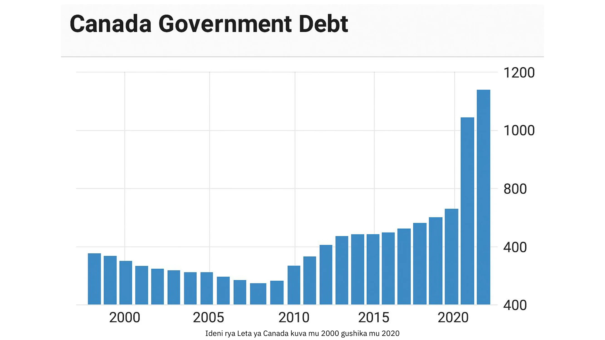

Kuko, nk’uko uru [rudodo](https/safedean/status) rwerekana: Inflation ni vyose kiretse ikosa ry’amabanki akomeye.

- Abahinga mu vy'ubutunzi bavuga ko ugutera imbere kw'ibiciro ari uguhinduka kw'ikirere

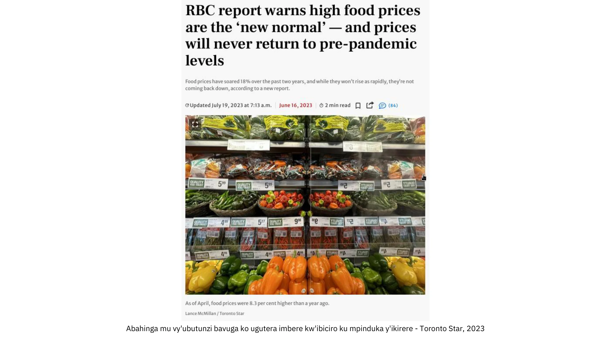

- Akarorero ka Suède ishingira intahe Beyoncé ko ari we yatumye habaho ugutera imbere kw’ibiciro mu kwezi kanaka.

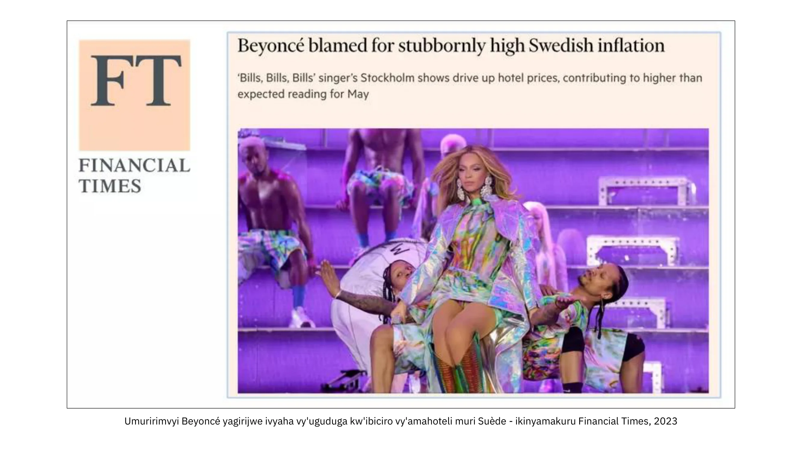

- Banki nkuru yo muri Polonye ivuga ko ugutera imbere kw'ibiciro kwatewe n'ubukazi bw'Uburusiya muri Ukraine n'ikiza c'indwara ya Coronavirus .

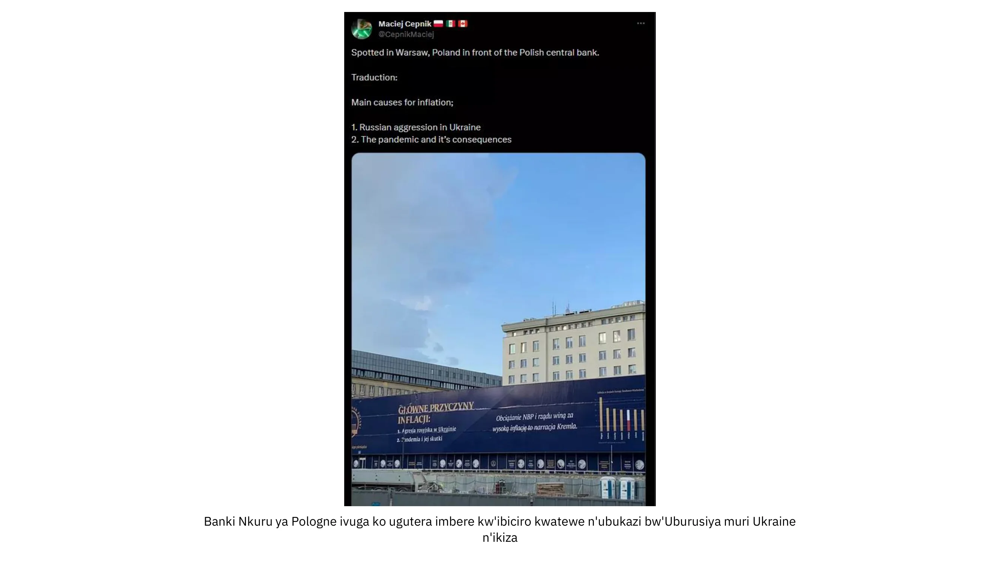

- Brexit ni yo itera inflation mu Bwongereza.

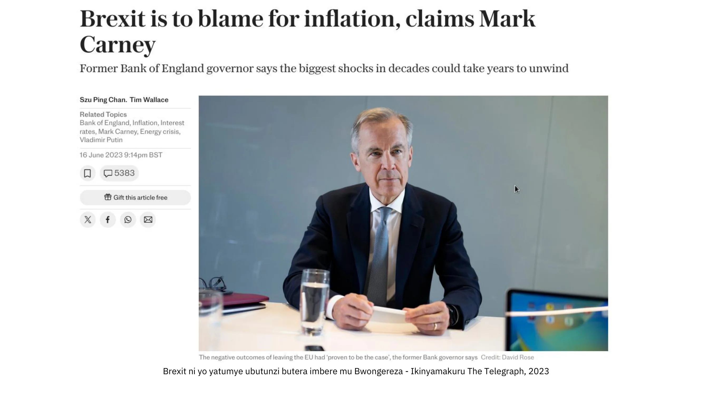

- Gusohora urukino rwa Zelda rufitaniye isano n’uguhungabana kw’ibiciro.

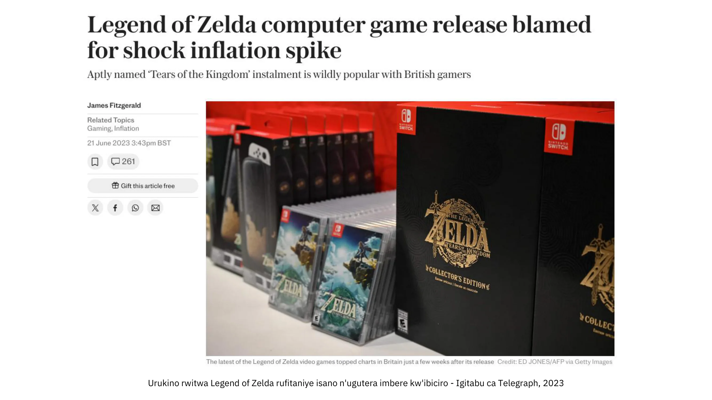

- Taylor Swift ngo niwe atuma ubutunzi butera imbere.

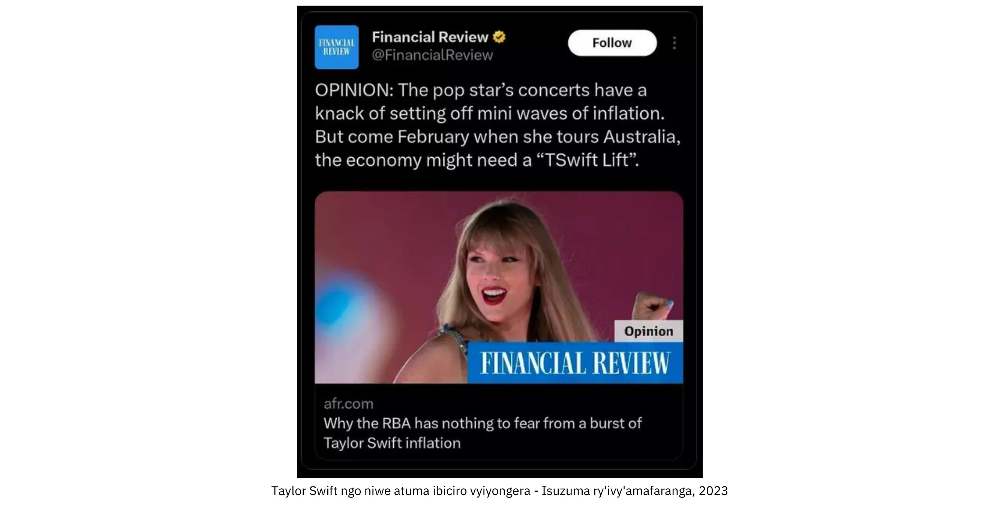

Mbwira, Beyoncé canke Taylor Swift boshobora gute gutuma ibiciro vy’ibintu vyiyongera cane? Urabona, nta co bimaze. Muri make:

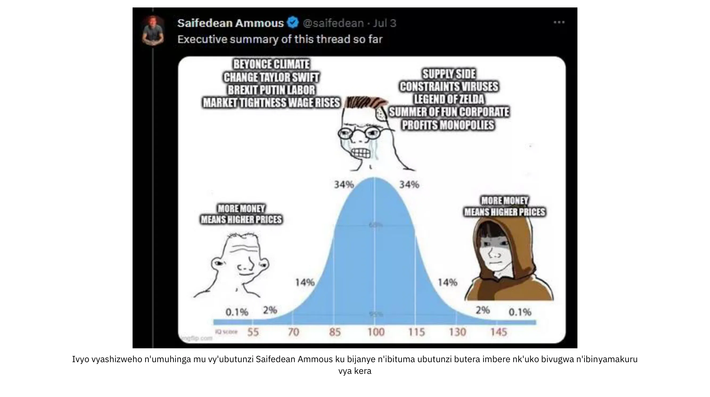

### Ugutohoza ubwoko bw'ugutera imbere kw'ibiciro

Ni ngombwa cane gutahura itandukaniro riri hagati y’ubwoko butandukanye bw’ugutera imbere kw’ibiciro, ivyo bikaba bituma dutahura ibimenyetso bitandukanye vy’ico kintu c’ubutunzi. Aha niho hari insobanuro y’ubwo bwoko butandukanye:

- Creeping Inflation: Ubwo ni bwo bwoko bw’inflation amabanki nkuru muri rusangi yipfuza, bushirwa hafi y’ibice 2% ku mwaka. Iyo ntumbero yashizweho kuva mu myaka ya 1990, kandi ikaba igamije kuguma itera imbere mu vy’ubutunzi ata gushuha cane canke gusenyuka kw’ubutunzi.
- Inflation iringaniye: Ubwo buryo bw’inflation bushika iyo inflation irenze 2% vy’intumbero. Akenshi bifatanywa n’ubutunzi bushushe cane, igihugu aho amahera menshi cane Supply atuma ibiciro vyiyongera muri rusangi. Ivyo bigaragaza imipaka y’ingingo mfatirwako z’amahera kandi rimwe na rimwe bigaragaza ukuvuguruzanya mu mvugo z’ubutunzi.
- Inyungu y’ibiciro: Inyungu y’ibiciro, akenshi yitwa inflation y’imirongo ibiri, ibaho iyo igitigiri c’ibiciro c’umwaka kirenze 10%. Birerekana ko ibiciro vyiyongera cane bishobora gutuma ubutunzi buhungabana.

- Inflation nyinshi: Inflation nyinshi cane ni ikintu gikomeye cane aho igipimo c’inflation kirenga 50% ku kwezi, ivyo bikaba, kubera uburyo inflation igenda iratera imbere, bingana n’igipimo c’inflation kirenze 13.000% ku mwaka. Uwo murongo w’ugutera imbere kw’ibiciro uratuma ubutunzi buhungabana cane, bigatuma amafaranga hafi ata co amaze, bigatuma abantu badacika intege ku bijanye n’ubuhinga bw’amahera.

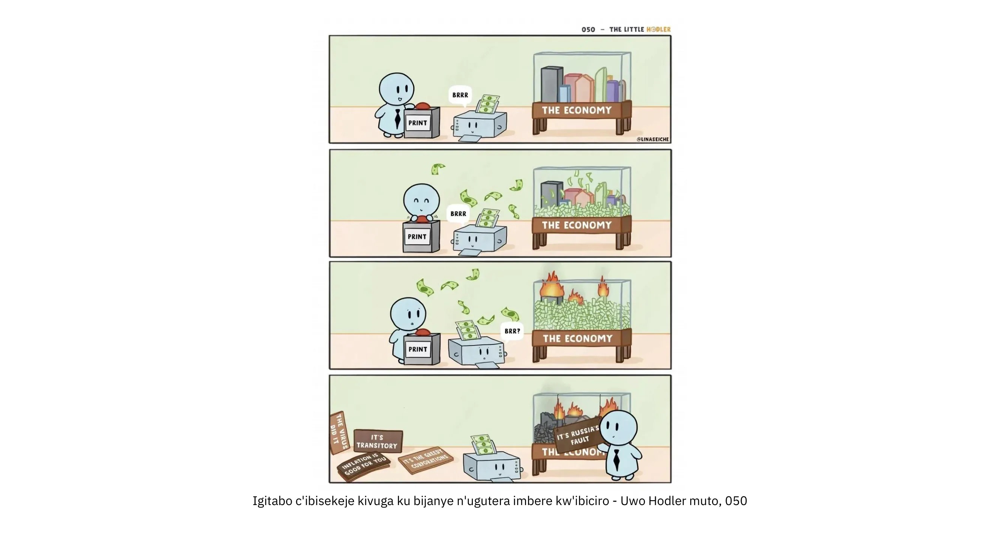

Igihe umuntu ariko aratohoza ubwoko bw'ugutera imbere kw'ibiciro, birasanzwe ko umuntu abona amajambo nka "Demand Pull" na "Cost Push" mu bikoresho vy'inyigisho. Ivyo vyiyumviro naho bifise akamaro, bikunda gusigura ko ibiciro vyiyongera aho gusigura ko ugutera imbere kw’ibiciro ari ikintu c’amahera. Aha niho hari isesengura ryinshi cane:

- Gusaba Gukwega:

Inflation de demande-pull akenshi idondorwa nk’aho ivyipfuzo mu bukungu birenze ubushobozi bwo gukora buriho. Ariko rero, ata kwiyongera guhuye kw’amahera Supply, ivyo bizotuma gusa amahera akoreshwa asubira gusangira. Abaguzi bashobora gukoresha amahera menshi ku bicuruzwa vy’ingenzi, bagakoresha make ku bintu bitari ivy’ingenzi, gutyo bagakuraho ingaruka z’ugutera imbere kw’ibiciro muri rusangi.

- Igiciro Gusunika:

Ku rundi ruhande, ugutera imbere kw’ibiciro biterwa n’ukwiyongera kw’ibiciro vy’ibikorwa, nk’ivy’ubutunzi canke vy’abakozi. Na none, ata kwiyongera kw’amahera Supply, iyongerekana ry’ibiciro mu rwego rumwe rishobora gusa kugabanya amahera akoreshwa mu yindi, ataco rituma habaho ugutera imbere kw’ibiciro.

Izo nsobanuro za kera akenshi zifatanya ukwiyongera kw’ibiciro n’ugutera imbere kw’ibiciro, ivyo bikaba bishobora gutuma haba urujijo n’ukutumvikana. Mu vy’ukuri, kugira ngo inflation ikwiragire, birakenewe ko amahera Supply yongerekana. Muri ivyo, ivyiyumviro vya Demand Pull na Cost Push birashobora gusigura uguhinduka kw’ibiciro mu mice, ariko ntibifata kamere y’amahera y’ugutera imbere kw’ibiciro. Ivyo birerekana akamaro ko gutandukanya hagati y’ukwiyongera kw’ibiciro mu mice n’ugutera imbere kw’ibiciro gukwiragiye, kandi bisubira kwemeza ko bikenewe ko amafaranga Supply yongerekana kugira ngo ugutera imbere kw’ibiciro ntikugaragare mu bukungu bwose. Iryo sesangura ritanga uburyo bwo kubona ibintu mu buryo butomoye kandi butomoye ku mpamvu nyazo z’ugutera imbere kw’ibiciro, rigakuraho insobanuro rusangi zishobora gupfukiranya ingene amafaranga agenda.

### Ugushira mu migwi ugutera imbere kw'ibiciro hakurikijwe Bernholz

Bernholz asaba ko inflation yoshirwa mu mice itatu mu buryo bworoshe ariko bubereye, ivyo bikaba bituma umuntu ashobora gutahura neza ico kintu gikomeye c’amahera:

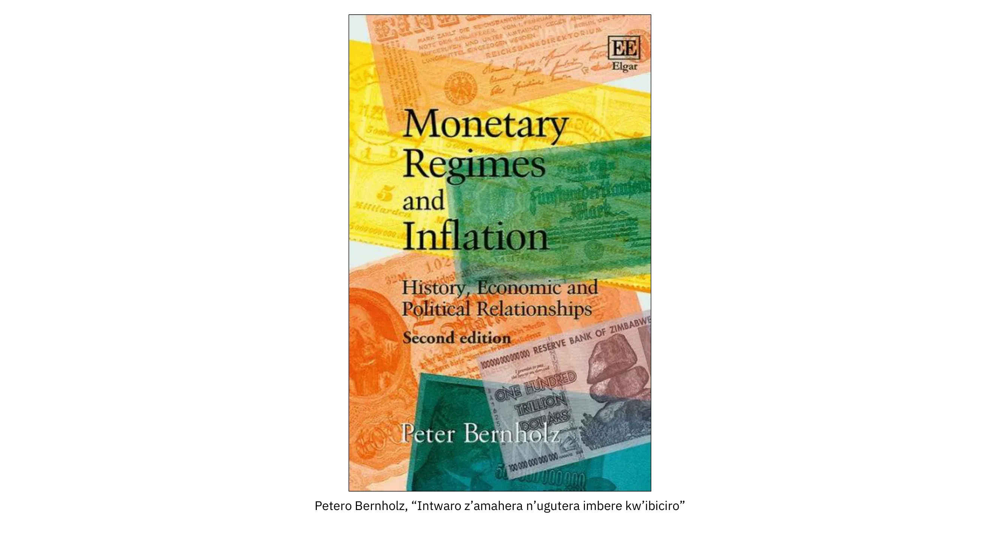

- Ukwiyongera kw'ibiciro:

Inflation iringaniye ibaho iyo urugero rw’amahera Supply ruri hejuru y’ivyo bisanzwe, ariko ata Leta ikoresha amadeni menshi aterwa inkunga n’uguhingura amahera. Naho ijambo "moderate" ryoshobora gusa n'iritagira akamaro, ubwo buryo bw'ugutera imbere burashobora gutera ingorane zikomeye, naho nyene butashirwa mu rutonde rw'ugutera imbere kw'ibiciro vyinshi.

- Ukwiyongera kw'ibiciro:

Inflation nini ibaho iyo agaciro nyakuri k’amahera Supply kagabanutse naho nyene yoba yiyongera mu buryo bw’izina. Ivyo bintu biteye ubwoba biva ku gusubirira amahera, aho abantu batakaza icizigiro mu mafaranga y’igihugu bagashaka kuyagura Exchange ku bicuruzwa, ibikorwa canke amahera y’amahanga. Ivyo bica birushiriza kugabanya agaciro nyakuri k’amahera, bigatuma ugutera imbere kw’ibiciro kurushirizaho.

- Ukwiyongera kw'ibiciro:

Hyperinflation ni uburyo burengeje urugero bw’ugutera imbere cane, burangwa n’amadeni menshi y’ingengo y’imari aterwa inkunga biciye mu kurema amahera. Mu mateka, nta n’ikibazo c’ugutera imbere kw’ibiciro vy’amahera cabonetse ata n’amahera menshi y’ikinyuranyo biciye mu gucapura amahera. Inflation nyinshi cane zituma haba uruzitiro rw’ububisha: inflation irasenyura agaciro k’amahera vyihuta cane ku buryo amafaranga yinjira mu misoro agabanuka mbere y’uko Leta mbere ishobora kuyatora, gutyo Leta igacapura mbere n’amahera menshi kugira ngo yitunganirize. Uwo murongo wo kwikomeza utuma habaho ugutera imbere kw’ibiciro kw’inyenyeri, akenshi kukarenga 50% ku kwezi.

Ukwo gushikiriza kwa Bernholz kugaragaza ugutera imbere guteye akaga kuva ku gutera imbere kw’ibiciro kuringaniye gushika ku gutera imbere kw’ibiciro gukomeye cane, bikaba bigaragaza akamaro kanini ko kugenzura amafaranga n’ivy’ubutunzi mu gukingira ugutera imbere kw’ibiciro bishobora gusenyura. Birerekana kandi ko ingaruka mbi ku mahera ya Leta zishobora kubaho imbere y’uko umuntu ashika ku rugero rw’ugutera imbere cane, bikaba bitanga iciyumviro gitomoye ku ngaruka z’ugutera imbere kw’ibiciro ku rwego rutandukanye.

### Insozero: Incamake y'ubwoko bw'ugutera imbere kw'ibiciro

Mu gusozera, twasuzumye ubwoko butandukanye bw’ugutera imbere kw’ibiciro, dutangura n’amajambo asanzwe yumvikana nk’aya ngo “ugutera imbere kw’ibiciro gugendagenda,” “ugutera imbere kw’ibiciro kugendagenda,” n’“ugutera imbere kw’ibiciro gugendagenda,” rimwe ryose ryerekana ingero zitandukanye z’ijana kw’ijana ry’ugutera imbere kw’ibiciro mu bukungu. Ariko rero, ku nyigisho yacu yimbitse ku bijanye n’ugutera imbere kw’ibiciro, ivyiciro vy’ugutera imbere kw’ibiciro biringaniye, ugutera imbere kw’ibiciro vyinshi, n’ugutera imbere kw’ibiciro birenze urugero, nk’uko vyadondowe na Bernholz, vyerekana ko ari ibipimo bihambaye cane.

- Ukwiyongera kw'ibiciro:

Birerekana urugero rw’amahera Supply ruri hejuru y’ivyo bisanzwe, naho urwo rugero rushobora kugumaho ata n’amahera menshi akenewe na Leta.

- Ukwiyongera kw'ibiciro:

Bishika iyo agaciro nyakuri k’amahera Supply kagabanuka, kenshi bivuye ku gusubirira amahera, aho abantu barondera Exchange amahera yabo ku bicuruzwa, ibikorwa, canke ubundi bwoko bw’amahera.

- Ukwiyongera kw'ibiciro:

Igereranya uburyo burengeje urugero bw’ugutera imbere kw’ibiciro, aho kurema amahera menshi cane kugira ngo umuntu ashobore gufasha mu gufasha amadeni menshi y’ingengo y’imari bituma agaciro nyakuri k’amahera gahungabana ningoga.

Ico kiva mu gutohoza kwacu ni uko hyperinflation ari ikintu gikomeye kandi gihushanye n’ivyo umuntu abona. Naho umuntu yokwiyumvira ko ugutera imbere kw’ibiciro ari ingaruka y’ukwiyongera kwinshi kw’amahera Supply, mu vy’ukuri, biva ku kugabanya agaciro nyakuri k’ayo mahera Supply. Iryo banga ni ngirakamaro cane kugira ngo umuntu atahure igituma ibihugu bimwebimwe bigorwa no kuva mu bibazo vy’ugutera imbere kw’ibiciro, mbere n’aho vyoba bishigikiwe n’inzego mpuzamakungu nka Banki y’Isi canke FMI. Gusobanura nabi ubwoko bw’ugutera imbere kw’ibiciro birashobora gutuma hakoreshwa uburyo butabereye, bikaba bituma ingorane z’ubutunzi zirushiriza gukomera aho kuzitorera umuti.

Mu biganiro vyacu vyo muri kazoza, tuzokwihweza cane ivyerekeye ugutera imbere kw’ibiciro vyinshi, dusuzume insobanuro zavyo n’ukuntu bigaragara mu bice bitandukanye vy’ubutunzi. Intumbero yacu ni uguhishura uburyo bushingiye ku gutera imbere kw’ibiciro no kurondera inyishu zishobora gutorwa kuri Address iki kibazo. Ukwo gutahura gutomoye kuzodufasha gutahura neza ingorane zijanye n’ivyo no gutanga ingamba zishingiye ku makuru zo gucungera ugutera imbere kw’ibiciro.

Murakoze cane ku kwitwararika. Ikiganiro gikurikira kizoba kijanye n’ugusobanura no gukuraho amabanga y’ugutera imbere kw’ibiciro, hakurikijwe uburyo butandukanye bwo kwigisha no gukora. Turategereje gukomeza iyo nkuru y’ugutohoza namwe mw’ikoraniro ryacu rizokurikira.

# Inyungu nyinshi cane ni iki?

<partId>3f541663-1e2f-5410-8ee0-f61c5d009fa5</partId>

## Insobanuro z'ugutera imbere kw'ibiciro

<chapterId>d2a71a2e-5f36-58d9-993c-d431f4aa07fd</chapterId>

### Insobanuro z'ugutera imbere kw'ibiciro

Muri iki gice, turatohoza insobanuro zitandukanye z’ijambo hyperinflation, ijambo rihambaye cane mu kwiga ibintu vy’amahera birenze urugero. Insobanuro yemewe cane iva kuri Philip Cagan, mu gitabu ciwe co mu 1956, "Imigenderanire y'amahera y'ugutera imbere cane", atanga ugutahura kw'ingero kw'ugutera imbere kw'ubutunzi. Nk’uko Cagan abivuga:

- Intango n’Iherezo ry’Iterambere ry’Ibiciro:
  - Inflation nyinshi cane itangura iyo inflation y’ukwezi irenze 50%.
  - Bihera iyo igipimo c’ugutera imbere kw’ibiciro kigabanutse munsi ya 50% ku kwezi nibura umwaka umwe.

Nk’akarorero, iyo inflation igabanutse ikagera kuri 40% muri Nyakanga, ntiyigere irenga 50% gushika muri Nyakanga umwaka ukurikira, rero igihe c’ugutera imbere cane gifatwa ko carangiye muri Nyakanga w’umwaka ubanziriza umwaka yabonetsemwo ubwa mbere. Iyi nsobanuro irashoboza gusobanura neza ibihe vy’ugutera imbere kw’ibiciro, bigatuma habaho isesengura ry’imiterere.

Iyo nsobanuro yaremejwe mu meza ya Hanke-Krus, ivuga ibihe 56 vy’ugutera imbere cane kw’ibiciro. Ariko rero, iyo meza ntivuga ibice vyose, nk’ico cabereye muri Venezuela mu 2016, ivyo bikaba bituma umubare wose ugera kuri 57.

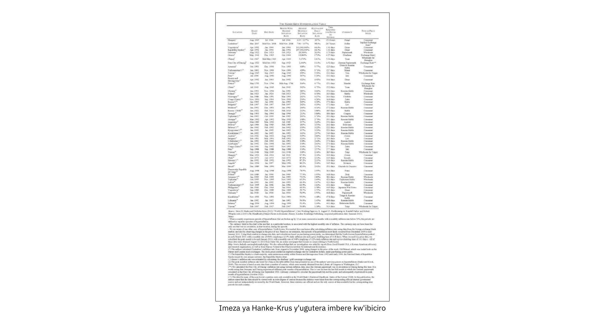

kwagura

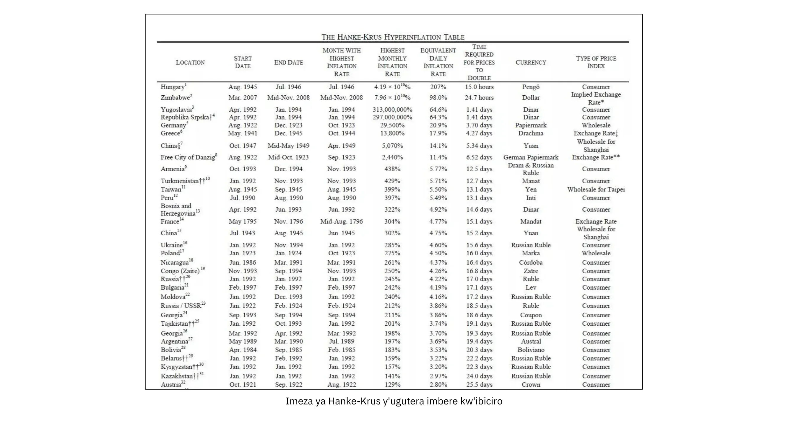

Birakenewe kumenya ko iyo nsobanuro, naho ari iyo gutomoye, yoshobora gukuraho ibihe bimwebimwe vy’ugutera imbere cane kw’ibiciro kubera uburemere bw’urugero rwa 50%. Hariho ubushobozi bwo kwagura iyo nsobanuro kugira ngo hagiremwo n’ibindi bice, naho bidahuye n’ingingo za Cagan, naho biri ukwo, bigereranya ibihe vy’ugutera imbere cane kw’ibiciro. Ivyo vyiyumviro bica bituma umuntu ashobora gutohoza cane ibijanye n’ugutera imbere kw’ibiciro, bikaba bituma umuntu ashobora gutahura neza ibituma bitera n’ingaruka zavyo. Mu biganiro bizokurikira, tuzokwihweza gusubira gusuzuma iyo nsobanuro no gusuzuma ibice vy’ugutera imbere kw’ibiciro bitari mu ngingo ngenderwako zikomeye za Cagan.

### Insobanuro y'ugutera imbere cane kwa Cagan

Philip Cagan ashobora kuba yarashizeho intambwe y’ubujuju n’urugero rw’ugutera imbere kw’ibiciro ku kwezi kwa 50% igihe yasobanura ugutera imbere kw’ibiciro gukomeye cane. Na we ubwiwe aremera ko iyo nsobanuro ari ubujuju kandi ko ahanini ikoresha isesengura ryiwe rishingiye ku bice indwi vy’ugutera imbere kw’ibiciro. Gusuzuma amakuru ya Cagan vyerekana ko ibihe bitatu vy’ugutera imbere cane kw’ibiciro bifise ibiharuro vy’ugutera imbere kw’ibiciro bike cane ku kwezi vyari hafi 47%, 46%, na 57%. Bisa n’uko 50% vyatowe kugira ngo bishiremwo ivyo bibazo mu nyigisho yiwe.

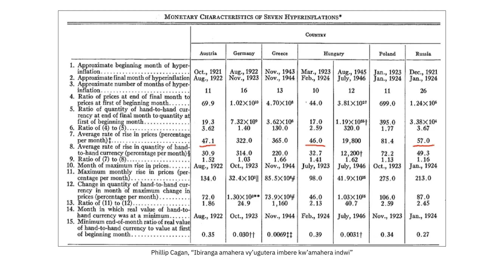

- Ivyabaye mu mateka:

Insobanuro ya Cagan yatanguye mu mwaka w’1956 kandi ishingiye ku mubare mutoyi w’ibice vy’ugutera imbere cane kw’ibiciro vyariho ico gihe.

- Ivyo Cagan yihweje:

Nk’uko Cagan abivuga, nta gice na kimwe cashitse kuri iyo ntambwe y’ibice nka 50% kitateye imbere gushika ku ntumbero y’ugutera imbere cane, ivyo bikaba vyoshobora gutuma umuntu ahitamwo iyo ntambwe.

- Gunegura insobanuro ya Cagan:

Abandi bahinga mu vy’ubutunzi nka Bernholz, umwanditsi w’igitabu citwa Monetary Regime and Inflation, na bo nyene baravuze ko iyo nzira y’ibice 50 kw’ijana ari ubujuju.

Bernholz avuga ko hariho ibihe vy’ugutera imbere cane bifise ibiranga uburyo nk’ibihe vy’ugutera imbere cane, bitashitse ku rugero rwa 50%.

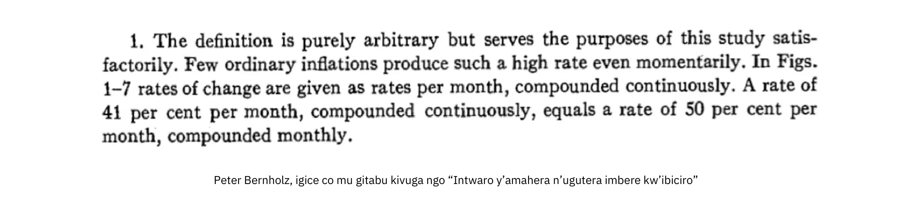

Ivyo vyiyumviro bituma twibaza ukuntu insobanuro ya kera y’ugutera imbere kw’ibiciro ikomeye kandi bikagaragaza ko kumbure bikenewe gusubira gusuzuma iyo nzira mu gushiramwo ibice vyinshi n’amakuru y’akahise. Insobanuro y’ugutera imbere cane kw’ibiciro ishobora gusaba uguhinduranya kugira ngo haboneke ibimenyetso bitandukanye vy’ugutera imbere kw’ibiciro birenze urugero mu bihe bitandukanye vy’ubutunzi no mu mateka.

### Insobanuro y'Iterambere ry'Igihugu ry'Igihugu ry'Igihugu (IASB)

IASB itanga iciyumviro kidasanzwe ku bijanye n’ugutera imbere kw’ibiciro, yibanda ku migenzo y’ubuhinga bwo kubara mu bihe vy’ugutera imbere kw’ibiciro. Ubwo buryo burahambaye cane ku bacunga amafaranga n’ubudandaji bukorera mu bibanza vy’ugutera imbere cane, aho agaciro k’amahera gahinduka cane. Amabwirizwa ya IASB yerekana ibimenyetso bitandukanye vy’ugutera imbere kw’ibiciro:

- Ivyo ukunda ku bintu bitari ivy'amahera:**

Abantu ku giti cabo bakunda kugumya agaciro mu bicuruzwa aho kugumya mu mafaranga kubera ugusenyuka kw’agaciro k’amahera ningoga.

- Gupima agaciro k'ibintu n'ibikorwa:**

Abanyagihugu ntibaharura agaciro k’ibintu n’ibikorwa mu mafaranga y’igihugu, ivyo bikaba vyerekana ko batakaje icizigiro mu mafaranga y’igihugu.

- Indishi y'Agaciro k'Amahera:**

Ibiciro bishiramwo indishi y’ugutakaza agaciro k’amahera mu gihe c’ugugura inguzanyo, ivyo bikaba vyerekana ingaruka z’ugutera imbere kw’ibiciro ku bikorwa vya misi yose.

- Igiciro, Umushahara, n'Indexation y'Inyungu:**

Ibiciro, umushahara n’inyungu birahindurwa bishingiye ku rutonde kugira ngo bishobore gusubiza inyuma ugutera imbere kw’ibiciro.

- Inyungu y'ibiciro mu myaka itatu:**

Inyungu y’ibiciro mu myaka itatu yegera 100% (nk’ibice 24% ku mwaka), bitandukanye n’insobanuro ya Cagan y’ibiciro vy’ibiciro vy’ibice 50% ku kwezi.

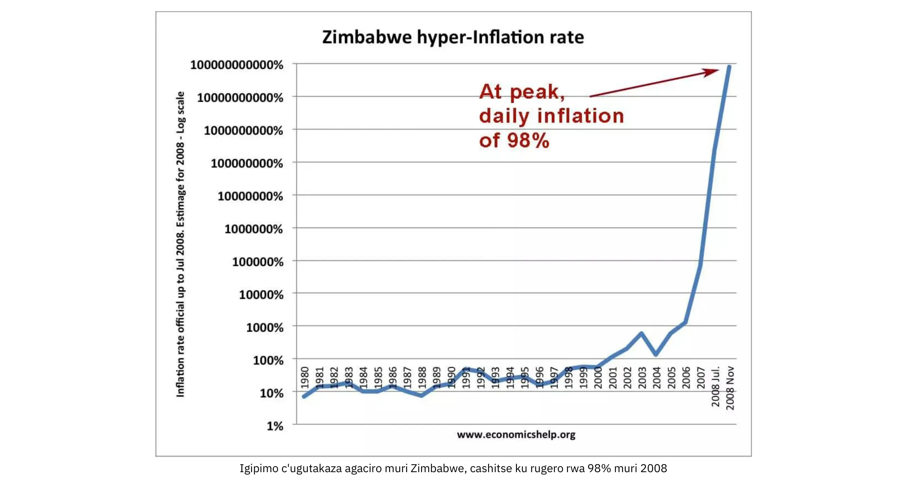

Dushingiye ku ngingo za IASB, ibihugu vyinshi, harimwo Argentine, Etiyopiya, Hayiti, Irani, Libani, Sudani, Sudani y’Epfo, Surinamu, Siriya, Turukiya, Venezuela, Yemeni na Zimbabwe, ubu biriko birashikirwa n’ugutera imbere cane kw’ibiciro.

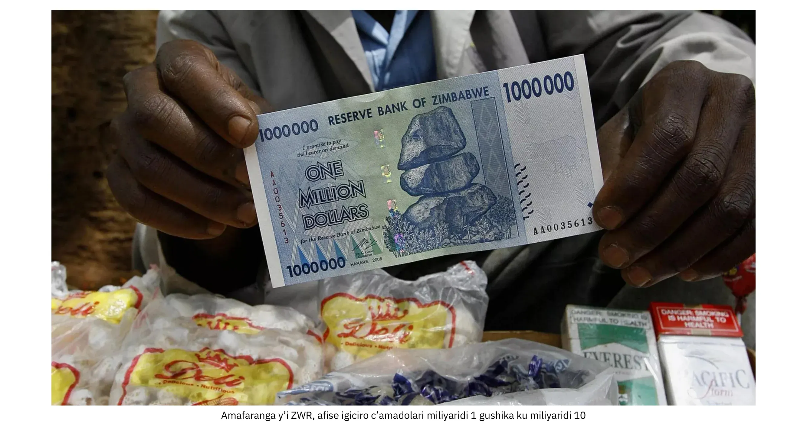

Iyi nsobanuro yatanzwe na IASB irava ku rugero rw’ingero rukomeye rwa Cagan mu gushiramwo isesengura ry’uburyo bw’inyifato z’ubutunzi n’ihinduka ry’ibikorwa mu gihe c’ugutera imbere kw’ibiciro. Birerekana ko ugutera imbere kw’ibiciro ari ikintu gikomeye gisaba ugutahura mu buryo bwinshi kugira ngo umuntu atahure ingaruka nyazo zaco, cane cane mu bijanye n’ivy’ubuhinga bw’ivy’ubuhinga bw’ivy’ubuhinga bw’ivy’ubuhinga bw’ivy’ubuhinga bw’ivy’ubuhinga, ivyo bikaba ari ngirakamaro kugira ngo ubucuruzi n’amasoko bibe bimeze neza kandi bibe mu mucyo mu vy’ubutunzi.

### None, ni bangahe batera imbere cane muri rusangi?

Insobanuro rusangi z’ugutera imbere cane kw’ibiciro, nk’iyo Cagan yashizeho, ivuga ko ugutera imbere kw’ibiciro ku kwezi kugera kuri 50%, rimwe na rimwe zirashobora gutera urujijo canke zikaba zoroshe cane. Nk’akarorero, ibihugu bibiri bifise igipimo c’ugutera imbere kw’ibiciro ku mwaka c’ibice 1.000% n’ibice 3.000%, bishobora gufatwa mu buryo butandukanye bishingiye ku kuntu iyo nkuru y’ibiciro igabanywa ku kwezi. Iyo ata kwezi kurenga 50%, nk’uko Cagan abisobanura, ivyo bihugu ntivyoshirwa mu rwego rw’ugutera imbere cane kw’ibiciro. Ubwo buryo rero burashobora gutuma habaho ukutumvikana mu gushikiriza mu migwi inflation nyinshi cane, cane cane iyo ugereranya inflation zirundanijwe mu mwaka.

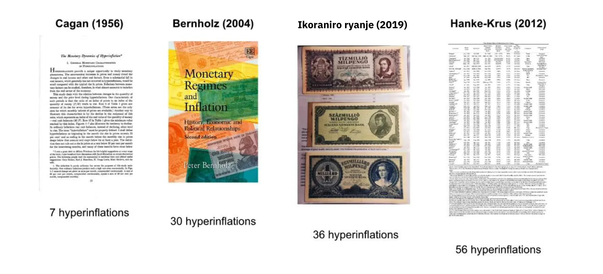

- Igitabo ca Cagan, "Impinduka z'amahera y'ugutera imbere kw'ibiciro", kiratanga icegeranyo c'ishimikiro c'ugutera imbere kw'ibiciro.
- Igitabo ca Bernholz, kivuga ibihe 30 bitandukanye vy’ugutera imbere cane kw’ibiciro, gutyo kigatuma habaho ugusesangura gukomeye.
- Igitabu ca David St-Onge (umwanditsi w’iki cigwa) c’umuntu ku giti ciwe c’amafaranga y’amabanki yo mu bihe 36 vy’ugutera imbere cane kw’ibiciro, bikaba vyerekana ko umuntu ashobora gutahura ibintu bigaragara kandi vy’akahise.
- Imbonerahamwe ya Hanky ​​Cross (iyi 2012, yahinduwe mu 2016 na Venezuela), ivuga ibihe 57 vy’ugutera imbere cane kw’ibiciro bishingiye ku nsobanuro ya Cagan.

Birabereye kumenya ko ibihe bimwebimwe vy’amateka vy’ugutera imbere kw’ibiciro bitari mu mbonerahamwe za kera z’ugutera imbere kw’ibiciro cane, kenshi bivuye ku ngingo zikomeye zo gushikiriza ibiciro. Nk’akarorero, mu gihe c’intambara y’ukwikukira kwa Amerika mu kwezi kwa 11 1779, no mu gihe c’intambara y’abanyagihugu muri Amerika muri Ntwarante 1864, ibiharuro vy’ugutera imbere kw’ibiciro ku kwezi vyari 47,4% na 40%. Ivyo bipimo naho ari vyinshi, ntibirenga 50% vyashizweho na Cagan, gutyo bikaba bikuraho ivyo bihe kugira ngo ntibishirwe mu rutonde rw’ibihe vy’ugutera imbere cane. Ivyo bigaragaza aho insobanuro zikomeye zigarukira kandi bishimika ku nkenerwa yo gutahura neza cane ivy’ugutera imbere kw’ibiciro mu buryo bushitse.

## Weimar na Zimbabwe bisa

<chapterId>11eef458-aab8-5c63-8523-264d0ba69f5d</chapterId>

### Ibihe bibiri, ivyago bibiri

Muri iki gice, turaza gusuzuma ingaruka z’ugutera imbere cane kw’ibiciro, twibanda ku vyashikiye Zimbabwe na Repubulika ya Weimar. Mu bushakashatsi bwanje bwose, nashize imbere ugutohoza intahe zitaziguye z’abantu babaye muri ivyo bihe vy’ugutera imbere kw’ibiciro, aho gukoresha uburyo bw’ubutunzi canke bw’imibare gusa.

Ibitabu bitari bike vyaradufashije canecane:

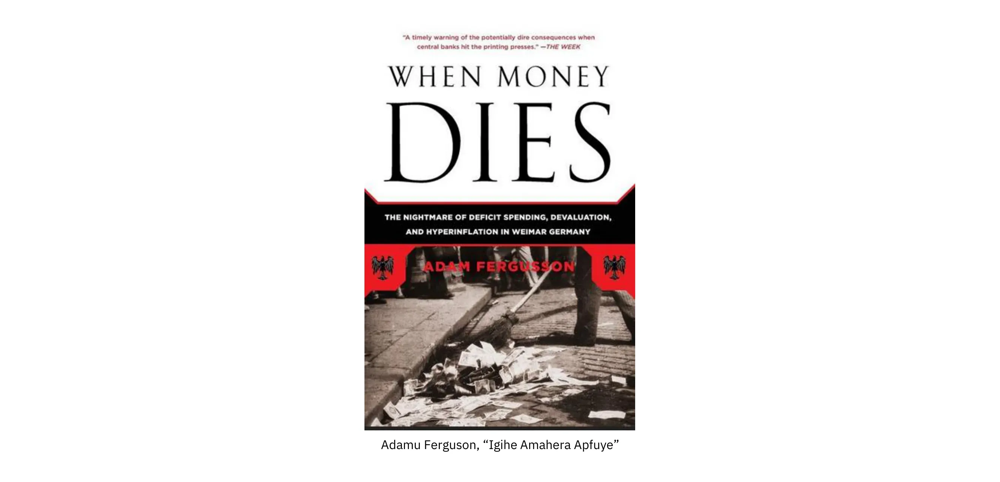

- "Igihe amahera apfuye" canditswe na Adam Ferguson kivuga ivy'ugutera imbere kw'ibiciro inyuma y'intambara ya mbere y'isi yose mu Budagi, no muri Otirishiya na Hongiriya.
- Ibitabo bibiri vyerekeye ugutera imbere kw’ibiciro muri Zimbabwe, “Umutima ushyushye wa Zimbabwe mu maso habi” na “Index y’amagi atetswe Hard” vyanditswe na Jérôme Gardner na Kudzai Joseph Gou Min-Yu, bitanga ubuhamya bukomeye buvuye ku muyobozi mukuru w’iduka ry’impuzu n’umukozi wa banki y’uburimyi.

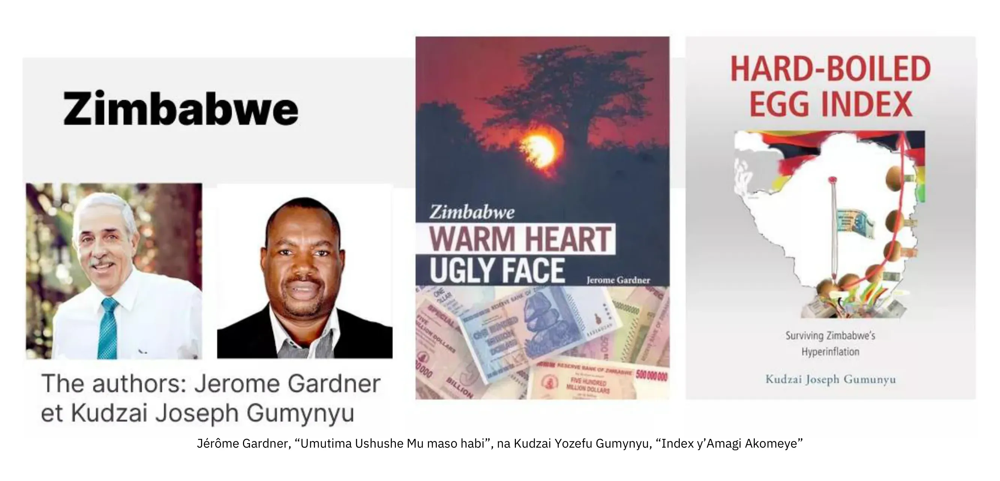

Igihe nariko ndakomeza ivyo nanditse, narabonye ko hariho ibintu vyinshi bisa n’ivyo vyabaye mu gihe c’ugutera imbere cane kw’ibiciro muri Zimbabwe no muri Repubulika ya Weimar, naho nyene hariho itandukaniro ry’imyaka 90 hagati yavyo. Nabonye ibintu nka 17 bisa, 13 bikaba vyerekana ubwoko bw’iterambere ry’ivyago vy’ubutunzi vyerekanywe muri ivyo bimenyetso. Ivyo bisa n’ivyo biteye umunezero vyerekana ukuntu ugutera imbere kw’ibiciro gusubiramwo kandi gusenyura abantu mu bihe vyose no mu mipaka. Uyu musi, turaza gusuzuma ivyo bintu bisa n’ingene vyerekana inzira iteye amaganya mu bihe vy’ugutera imbere cane kw’ibiciro.

### Isesengura ry’ukugereranya: Zimbabwe na Repubulika ya Weimar

Urukino rw’ubudasa 14!

#### 1. Ubukene bw’amahera

Iyo amafaranga agabanutse ku rugero ruteye ubwoba, mbere n’ukugerageza cane gusesagura isoko n’amafaranga mashasha birashobora kwerekana ko bidahagije. Ugusaba amafaranga abonetse ubudasiba birashobora kurenga kure ubushobozi amabanki akomeye afise bwo gukora amafaranga y’amafaranga, bikaba bituma haba ingorane z’amahera zitagira uko zingana.

> Weimar: "Muri uku kwezi, izokwongerwa gushika hafi kuri miliyari 4 z'amafaranga y'impapuro, igiharuro cizigiwe ko ubukene bw'amahera buzokurwaho ata kabuza."

> Zimbabwe: "Kuva mu mwaka w'2002 gushika muri Mukakaro 2009, hariho ubukene bw'amahera. Nta noti zihagije zacapwe canke zikoreshwa kugira ngo umuntu ashobore gukurikirana n'ugutera imbere kw'ibiciro."

#### 2. "Kandi ivyo ni ifumbire!"

Uko amafaranga ashobora gutakaza agaciro mu bihe bimwebimwe vy’ubutunzi biratangaje. Amafaranga y’amahera menshi cane arashobora gusohoka mu mwanya mutoyi cane, agaca ahindura ubwo nyene amahera yahora ari menshi cane akagira ikintu kitagira akamaro nk’ifumbire.

> Weimar: "Igitigiri cose c'ibitabu ubu kingana na miliyaridi 63.000. Mu misi mikeyi, tuzoshobora rero gusohora ibice bibiri vya gatatu vy'igitabu cose gisohotse mu musi umwe."

> Zimbabwe: "Ku wa 17 Nzero 2006, umukuru w'intara ya RBZ, Gideon Gono, yatangaje ati: 'Ama trillion 10 aracari hanze, kandi yacitse ifumbire.'"

#### 3. Amafaranga y’amabanki afise agaciro gatoyi kuruta urupapuro acapweko .

Mu bihe bimwebimwe vy’ubutunzi, agaciro k’agaciro k’inoti gashobora kuba gatoyi kuruta agaciro k’urupapuro rwacapweko. Ukwo gusenyuka kw’agaciro gukomeye gutuma amafaranga y’amabanki, ayo mu bisanzwe ari ibimenyetso vy’agaciro n’ubushobozi bwo kugura, ahinduka ibipande gusa vy’impapuro zitagira akamaro.

> Weimar: “Amafaranga yose y’amafaranga y’amafaranga yari hafi ata co amaze igihe yasohoka mu mashini y’icapa.”

> Zimbabwe: "Banki nkuru yatakaje amahera mu gucapura inoti y'amahera idakwiriye urupapuro rwacapuweko. Mu yandi majambo, agaciro kayo kari hasi y'impapuro zo mu bwiherero. Naho vyoba bimeze nk'ibiteye isoni, vyari bihendutse gukoresha inoti y'amahera y'amafaranga 100 y'ama ZWD nk'impapuro zo mu bwiherero kuruta kugura urupapuro rwo mu bwiherero nyarwo."

#### 4. Guharura amahera

Iyo amafaranga atakaje agaciro ningoga, mbere n’ibikorwa vyoroshe cane birashobora kuba ibikorwa bitoroshe. Guharura igiciro c’ikintu canke guharura gusa amafaranga akenewe kugira ngo umuntu yishure birashobora gutwara iminota myinshi, ivyo bikaba bikongera Layer y’ugusobanuka ku migenderanire ya misi yose.

> Weimar: “Ivyo umuntu agura mu iduka vyasaba iminota itatu canke ine yo kubara, kandi iyo igiciro kimaze kumenyekana, akenshi vyasaba iminota myinshi kugira ngo umuntu aharure amafaranga.”

> Zimbabwe: "Abarongozi b'amaduka na bo nyene bari bemerewe gukoresha umukozi w'igihe gito kugira ngo asubirire uwo mukozi yaharura amahera umusi wose. Birumvikana ko guharura amahera mu maduka yo gukoresha mu burongozi no mu gushiramwo amahera muri banki cari ikintu kimwe, ariko ivyo vyose vyategerezwa gusubirwamwo muri banki mu gihe co gushiramwo amahera."

:::video id=910231d7-af90-4ab8-b74c-bfb81caebfb2:::

Ubuhinga bw'ikiuzbeki bwo kubara amafranga

#### 5. Ukwishura hakoreshejwe sheki

Mu bihugu bihungabana, uburyo bwa kera bwo kwishura nk’amasheki burashobora gutakaza ubushobozi bwabwo ningoga. Amabanki, arengewe n’ukwiyongera kw’abasaba amahera kubera ugutera imbere kw’ibiciro, arashobora gutanga canke gutevya gutanga amahera y’amasheki, gutyo akagabanya agaciro nyakuri kayo. Ukwo kudashikama kenshi gutuma uburyo bwo kwishura bushirwa imbere, aho ibiciro bishobora guhinduka bivanye n’uburyo bwo kwishura bwatowe.

> Weimar: "Ukwiyongera kw'ibiciro kwatumye abantu barushiriza gusaba amahera, haba kuri Leta n'abandi bakoresha. Amabanki yigenga ntiyashobora gushitsa ivyo basaba na gato kandi yategerezwa gutanga amahera y'amasheki, rero amasheki atagira amahera yaguma ahagaze mu gihe ubushobozi bwayo bwo kugura bwagabanutse."
> Zimbabwe: “Igiciro c’amahera c’igihe catumye habaho ibiciro bitatu vy’ibintu n’ibikorwa; ni ukuvuga igiciro c’amahera, igiciro c’amahera yose y’igihe nyaco, n’igiciro c’amahera. Amaherezo nta n’umwe yemera amasheki, ivyo bikaba vyatwara imisi itanu kugira ngo bihebwe.”

#### 6. Aba "Burner-preneurs".

Uko agaciro k’amahera kagenda karagabanuka, ni ko n’uturyo tushasha tw’ubutunzi tuza, tugakoresha ukuntu isoko rigoramye. Abo ba rwiyemezamirimo, akenshi bitwa "Burner-preneurs", barashobora gutera imbere mu kugurana amafaranga yacitse agaciro kugira ngo bashore mu bintu bifatika, hanyuma bakishure imyenda yabo mbere n'amahera yacitse agaciro kuruta.

Weimar: "Ivyiyumviro ku bijanye n'ugutera imbere kw'ibiciro vyari birimwo kugurana ibimenyetso vy'impapuro, bakabihindura ibicuruzwa n'amahinguriro, hanyuma bagasubiza abaguzi n'impapuro zagabanutse."

Zimbabwe: "Abacuruzi b'ibitoro"

#### 7. Ubunyangamugayo n’igikorwa ca Hard biratakaza akamaro

Mu bihe vy’ubutunzi bidashikamye, ingingo ngenderwako za kera z’igikorwa ca Hard, ukwizigama, n’ubunyankamugayo birashobora gupfukiranwa n’ugukwegwakwegwa n’ubutunzi bwihuta. Gutekereza ku bintu no kugurisha amahera akenshi biratanga impembo nyinshi cane kuruta igikorwa gisanzwe, ivyo bikaba bituma habaho uguhungabana kw’ibintu umuntu ashira imbere mu kibano.

Weimar: "Uko ingeso nziza za kera zo kwizigama, ubugororotsi, n'igikorwa ca Hard vyatakaza ubushobozi bwavyo, umuntu wese yararondeye gutunga ningoga, cane cane kubera ko amafaranga canke amafaranga y'ubutunzi vyari gushobora gutanga vyinshi kuruta igikorwa."

Zimbabwe: "Ivyo bikorwa, naho vyatunga abantu bakeyi, vyatumye abakozi bo mu bisagara n'abanyagihugu bakenye. Uburezi bwatakaje agaciro kabwo, kuko ubu bucuruzi bwari burongowe n'abantu batakeneye uburezi canke akazi ka Hard kugira ngo babushinge intahe. Ivyo bari bakeneye vyose ni amasano n'amahera yo gutangura ubucuruzi bwabo bworoshe."

#### 8. "Amabanki y'isi".

Mu bihe vy’ugutera imbere cane canke kw’ingorane z’amahera, amasoko y’amahera y’amahanga asa n’ayandi kandi adatunganijwe akenshi araseruka. Izo "banki" zidasanzwe, akenshi zivugwa mu buryo buteye umunezero ngo ni "amabanki y'isi yose" canke mu yandi mazina yo mu karere, zitanga ubuhungiro ku barondera gukingira itunga ryabo kugira ngo ntirigabanuke agaciro. Naho ayo masoko ashobora gutanga ubuzima bukenewe mu vy’ubutunzi, akenshi aragaragaza ko abantu benshi batizigira ibigo vy’ivy’ubutunzi vyemewe be n’ingingo za Leta.

Weimar: "Ibikorwa vyabo vyakorwa cane cane biciye ku bita Winkelbankiers, abacuruzi bo mu mabarabara bari bavuye mu gutera imbere kw'ibiciro kandi, bariko baratera imbere mu bukungu burwaye, babaho bose bakoresheje itandukaniro riri hagati y'ibiciro vyo kugura no kugurisha amafaranga y'amahanga."

Zimbabwe: "Bari kandi abahindura amafaranga. Bakora ataco bahanwa hagati y'ibarabara rya 2 n'ibarabara rya Fort Street i Bulawayo, kubera ubucuruzi bwabo bw'ubuhendanyi, akenshi bwarimwo ibiturire n'ibindi bikorwa bitemewe n'amategeko. Aka karere k'igisagara kazwi nka 'Banki y'Isi'."

Argentine: "Nuko rero nagiye aho Abanyarwanda bose baja: ama cuevas, 'amasenga', ari mu karere ka Florida mu mutima wa Buenos Aires." - Ikiyaga kinini

#### 9. Guhindura amafaranga y’amahanga vyari bitemewe n’amategeko .

Intwaro, mu kugerageza guhagarika amafaranga yabo no kugenzura uruja n’uruza rw’amahera, zirashobora gutuma ivyo bikorwa vy’amafaranga y’amahanga bitemewe n’amategeko. Izo ngingo z’agahahazo, naho zigamije gukingira ubutunzi bw’igihugu, akenshi zirashobora kugira ingaruka zihushanye n’izo, zigatuma abantu barushiriza kwizigirana, zigatuma isoko ry’ibara ry’agahama rirushirizaho.

Weimar: "Abantu baciye bafata ingingo yo guhindura amafaranga maze buhoro buhoro bahindukira bakoresha amafaranga y'amahanga nk'uburyo bwonyene bwo kwizigirwa bwo gutanga Exchange. Haciye hashirwaho amategeko mashasha yerekeye ugugura amafaranga y'amahanga no gukoresha amafaranga y'amahanga mu kwishura mu gihugu. gucuruza."

Zimbabwe: "Ibitero vyakozwe ku bucuruzi vyatumye abacuruzi benshi bo muri Bulawayo bafungwa mu mpera z'umusi, bagahabwa amande angana n'incuro zibiri amafaranga y'amahanga yasubijwe, ubwo butwari burahera."

#### 10. Ubugenzuzi bw'umutungo kamere

Iyo igihugu gishikiwe n’ingorane z’amahera canke z’ubutunzi, inyishu imwe intwaro zisanzwe zitanga ni ugucungera cane ingene umutungo ugenda n’ingene ukoreshwa. Yaba biciye ku mategeko ahatira abantu kwemera amafaranga y’igihugu yacitse agaciro canke biciye ku bihano bikomeye bihabwa abanka uburyo bumwebumwe bwo kwishura, izo ngingo akenshi zigamije guhagarika ubwoba no kugarukana icizigiro. Ariko rero, ubushobozi bwazo buratandukanye, kandi rimwe na rimwe izo ngingo zirashobora kwerekana ko zitagira ico zikoze canke zitagira aho zihuriye n’ukuri abanyagihugu bashikirwa.

Weimar: "Abacuruzi bari baherutse guhatirwa n'itegeko rishasha kwemera amafaranga y'igihugu; ariko kubera ko ryemerera kandi gukomeza gukoresha amafaranga y'amahanga mu kugura kwose, abacuruzi muri rusangi ntibaronka ivyiyumviro vyo kwemera hafi ikindi kintu na kimwe."

Zimbabwe: "Leta yashizeho SI 175/2008 kw'igenekerezo rya 12 Kigarama 2008, ku bijanye no kwishura hakoreshejwe amasheki. Yavuze ngo, 'Igihano co kwanka kwishura hakoreshejwe amasheki/ikarita ya banki canke ubundi buryo bwo kwishura bukoresheje ubuhinga bwa none bufashwa na banki kizoba ari ihazabu y'urugero rwa 8 canke igihano c'igifungo c'amezi atandatu'. Biragaragara ko twirengagije SI kuko yari itandukanye n'ukuri."

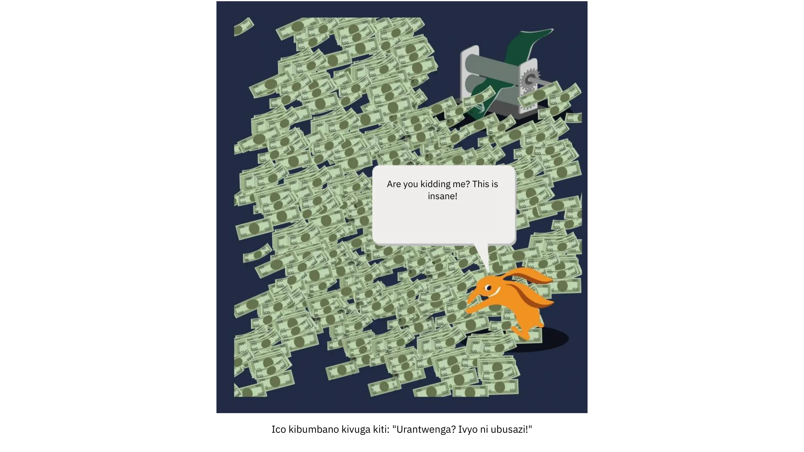

#### 11. Bahatiwe kuguma bafunguye amaduka yabo

Iyo ubutunzi busenyutse kandi amafaranga agatakaza agaciro, intwaro zirashobora gufata ingingo zikomeye kugira ngo zigume zisa n’izisanzwe.

Weimar: "Abacuruzi babandanije ibikorwa vyabo bari bafise itegeko rishasha, ryashizweho ku wa 22 Gitugutu, risaba ko amaduka yabo aguma yuguruye kandi bagatanga ibicuruzwa mu rurimi rwa Exchange kugira ngo bashireko ibimenyetso vy'impapuro."

Zimbabwe: "Hasigaye gusa amashelufu y'ivyuma n'amafirigo, amakonjesha, n'amakonjesha. Ikibabaje ni uko iduka ryari rikiri ryuguruye kubera ko batashobora gufunga kubera amakimbirane ya politike n'ubwoba bw'uko abarongozi bofatwa n'igisirikare ca leta kijejwe kugenzura ibiciro. Mbere n'abakozi ntibacitse intege kuko bose bari gushobora gutorera umuti."

#### 12. Umuntu wese ni umugizi wa nabi .

Mu gihe ubutunzi buriko burasenyuka be n’amategeko ariko arakwiragira hose, umurongo uri hagati y’ukurokoka n’ubugizi bwa nabi uracika uwudatomoye.

Weimar: "Ivyaha vyose vyagirizwa Leta, kimwe cose muri vyo, ku rugero rutandukanye, vyacitse ikibazo c'ubuzima bw'abantu ku giti cabo."

> Zimbabwe: "Umuntu wese yaba muri Zimbabwe yari umugizi wa nabi. Naho vyosa n'ibikomeye, vyari ukuri. Kubera amategeko matomato menshi cane agenga imice yose y'ubuzima, vyari bikenewe ko umuntu wese arenga itegeko buri musi. Kugira amafaranga y'amahanga vyari bitemewe n'amategeko, nk'uko bivugwa na konti ya SI yasohowe na banki ya Hap40 mu 2012. igipimo co gukuraho amahera cari kitemewe n’amategeko kutagira amabara akwiye ku modoka yawe, canke uruhusha rwo gukoresha iradiyo y’imodoka, canke uruhusha rwo gukoresha umuyagankuba, vyose vyari amategeko umuntu, ahantu kanaka, yariko ararenga.”

#### 13. Gugura amafaranga y’amahanga uko vyogenda kwose

Ugugura amafaranga y’amahanga mu buryo bw’agahomerabunwa kenshi kwabaye ihinduka rikomeye mu bijanye n’ugucika kw’agaciro k’amafaranga, bikaba vyatumye agaciro k’amafaranga karushiriza kugwa.

> Weimar: "Fritz Mannheimer, ku mabwirizwa y'umukuru wiwe, yarasohotse muri Myandagaro 1921, atangura kugura amafaranga y'amahanga ku giciro ico ari co cose - 'kubera ko Ubudage bwari bufise ibimenyetso vy'impapuro bitagira uko bingana ariko nta mafaranga y'amahanga.' Ico cari ikimenyetso ca mbere c'ugusenyuka kw'agaciro k'ico kimenyetso."

> Zimbabwe: Bivugwa ko bahabwa intego z’umusi ku musi zo gushikako, kuko bimwe mu bisabwa mu bijanye n’amahera y’amahanga vyari vyihutirwa kandi bogura uko vyogenda kwose kugira ngo birundanire amahera y’amahanga kugira ngo bashike ku gihe categekanijwe. Ivyo bivugwa ko ari vyo vyatumye agaciro k'idolari rya Zimbabwe gakomeza kugabanuka cane."

### Incamake y'ingene bigenda

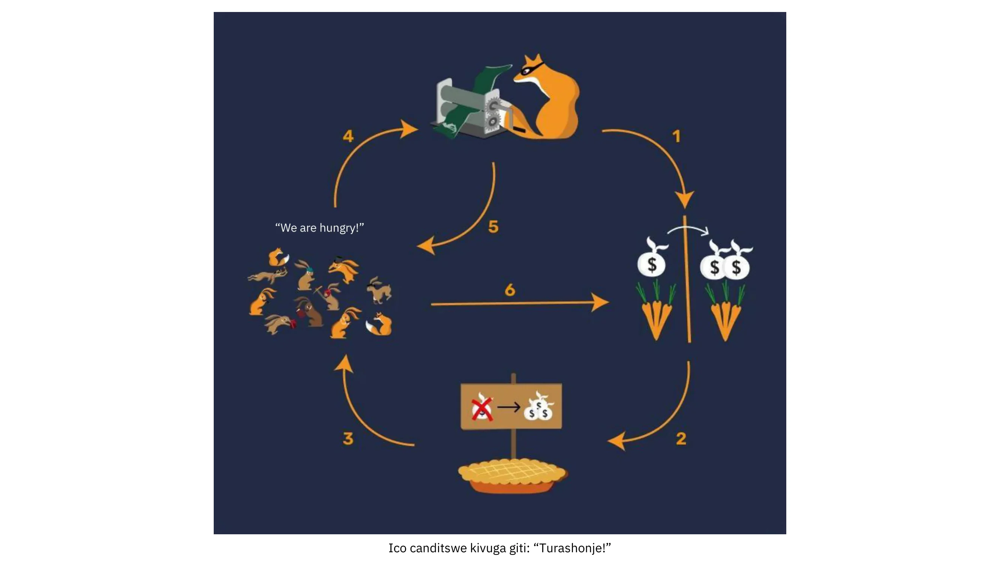

Iyo dusuzumye inzira y’ubutunzi, biraboneka ko iyo umuntu ashitse ku ntumbero nini, agaciro k’amahera menshi kagabanuka. Ukwo gutakaza agaciro k’amahera bituma haba ingorane nyinshi, harimwo n’ukubura amafaranga y’amafaranga. Muri ivyo, amahirwe yo gukemura ibibazo aravyuka, cane cane mu kwishura ku guhinduka kw’ibiciro vya Exchange. Ivyo bituma abantu benshi bahindukira kuri iyo nzira y’ubukemurampaka, bagashiramwo amahera menshi mu bintu bifatika biteze ko amafaranga azogabanuka muri kazoza, ivyo bikaba vyotuma bashobora kwishura imyenda yabo bakoresheje amafaranga agoyagoya. Ivyo bidukikije vy’ubutunzi biratuma akazi ka kera katagira akamaro, ivyo bikaba bituma ubumwe bw’abantu buhungabana.

Mu kwishura ivyo bintu, Leta ishiraho amategeko akomeye cane, harimwo n’ugucungera umutungo. Itegeka kandi ko abacuruzi bemera amafaranga y’igihugu n’amasheki. Uko igihe kigenda kirarenga, amategeko mashasha arashirwaho, akagira insobanuro y’inyifato y’ubugizi bwa nabi. Mu mpera, igipimo ca Exchange kiraduga cane uko Leta yiteguriye Exchange amafaranga yayo, acapwe ku giciro gitoyi, kugira ngo amafaranga y’amahanga akomeye cane.

### 4 Ivyo bisa mu ngaruka z’ugutera imbere cane kw’ibiciro .

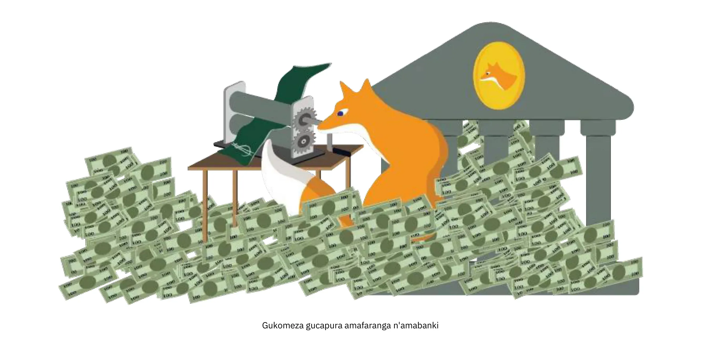

#### 1. Amavuta n’ivyuma

Mu kiringo ca Weimar mu Budagi, ubusuma bw’ibikoresho vy’agaciro bwari bwarakwiragiye cane ku buryo amabuye y’agaciro yo mu bisenge vy’amazu yahora yibwa kenshi. Muri Zimbabwe, ukwihebura kwatumye bamwebamwe bahungabanya uruja n’uruza rw’amashanyarazi kugira ngo bakure amavuta mu ma transformateur maze bayakoreshe mu modoka zabo.

Weimar: “Ibipande vy’ivyuma vy’ibimenyetso vy’igihugu vyategerezwa gukurwaho kugira ngo bibe vyiza.Ibipande vy’inkengeri vy’imiryango vy’umuringa vyari vyibwe ku miryango ya Ambasade y’Ubwongereza i Berlin.”

Zimbabwe: “Ikintu catumye ibintu bikomera kuruta, kubera ko ata mafaranga y’amahanga atariho, amavuta yo gutera amavuta y’imiduga yarabuze, kandi ama transformateur yaracitse ikintu coroshe abasuma banywa amavuta yo gukonjesha mu gihe umuyagankuba wacitse.”

#### 2. Igariyamoshi

Gutakaza agaciro k’amahera birashobora gutuma abanyagihugu bafata inyifato zo kurokoka, harimwo n’ugusambura ibintu. Kubera ko ubutunzi buriko burasenyuka, ibikorwa remezo vya Leta bizimvye, nk’uburyo bwo gutwara abantu n’ibintu, birashobora guhungabana, bigatuma habaho ingaruka mbi ku kibano.

> Weimar: “I Berlin, ubuhinga bwo gutwara abantu n’ibintu bwarahagaritse gukora kubera ko ata mahera yari afise.”

> Zimbabwe: “Kimwe mu bintu vyababaje kandi bibabaje cane ni igihe hafi umurongo wose w’umuringa w’amashanyarazi uhuza Harare na Dabuka (ibilometero birenga 280) wibwa.

#### 3. “Ifunguro ry’Inyama”

Mu gihe umushahara wari mutoyi kandi ubutunzi butari buhagaze neza, ubudandaji bwari bugoberewe guha abakozi babo ivyo barya kugira ngo bagumane umusaruro n’ubushobozi bwo gukora neza. Iryo shirahamwe ntiryari uburyo bwo gukuraho ubukene n’ibiciro vyinshi vy’ibifungurwa gusa, ariko kandi ryari uburyo bwo kugumiza abakozi mu bihe vy’ubutunzi bigoye.

> Weimar: “I Berlin, abakozi bo mu biro, bari mu mugwi uhambaye cane mu murwa mukuru, bari bafise umushahara udakwiriye rwose, kuva ku 12.000 gushika ku 20.000 ku kwezi (ungana n’amapawundi ari hagati ya 12 na 19 ku mwaka), ivyo bikaba vyaguma bigabanuka; ubugingo bwari gushobora gusa kuguma hamwe ata co buvuze.”

> Zimbabwe: "Muri iki gihe, twariko turaha abakozi bacu bose ivyokurya vya sasita ku buntu.Ifu y'ibigori yari ngirakamaro kugira ngo ishirahamwe ryacu rikomeze gukora, kuko kenshi na kenshi ari yo yonyene abakozi bacu baronka buri musi."

#### 4. Amakupo ya peteroli

Abanyagihugu barondera ubundi buryo buhamye bwo gucuruza. I Weimar, ibintu nk’umuringa n’amavuta y’ibinyabiziga vyakoreshwa nk’ibikoresho vya Exchange kubera agaciro kavyo k’imbere kahoraho. Muri Zimbabwe, kubera ko idolari rya Zimbabwe ryariko rigabanuka cane, amakupo y’amavuta ya peteroli, yagereranya umubare udahinduka w’ikintu gihambaye, yaracitse amahera y’ukuri. Ivyo bintu birerekana ingene imibano imenya ivy’ubutunzi bikomeye cane, igategura inyishu nshasha zo kubungabunga ubudandaji n’ubutunzi.

Weimar: “Uguhindura amahera vyari vyarasanzwe ari uburyo busanzwe bwo gukoresha Exchange; mugabo ubu, ibintu nk’umuringa be n’amavuta y’ibinyabiziga ni vyo vyacitse amahera rusangi yo kugura no kwishura.”

Zimbabwe: “Izo mpapuro z’ubukode ubu twazikoresha mu kwishura ba nyen’amazu, imisoro ya komine, amafaranga y’amatelefone – mu vy’ukuri hafi vyose – kuko bose bari barahagaritse kwemera kwishurwa mu madolari ya Zimbabwe no mu masheki.”

#### Iciyumviro

Ivyo ni vyo bisozera iyi videwo ku bijanye n’ivyo vyabaye bisa mu bihe vy’ugutera imbere cane muri Zimbabwe no muri Repubulika ya Weimar. Mu videwo ikurikira, tuzoca irya n’ino ivyo bitandukanye be n’ivyo bihuye n’ivyo muri iki gihe. Murakoze.

## Weimar na Zimbabwe: Ubutandukane n'ivyo muri iki gihe

<chapterId>643f279c-d89f-5600-a2e2-b1bbbba0ab69</chapterId>

Muri iki gice, tuzokwihweza itandukaniro n’ibihuye n’ivyo muri iki gihe hagati y’ibihe vya kera n’ivyo ubu vy’ugutera imbere kw’ibiciro, dukoresheje inkuru z’ivya kera n’ibigereranyo bibereye vy’uyu musi.

### Ubutandukane hagati ya Repubulika ya Weimar na Zimbabwe

#### 1. Ni ikosa ry’idolari!

Mu Budagi, vyari bisanzwe ko abantu bavuga ko ugutera imbere kw’ibiciro ari ukuza kw’idolari aho kuvuga ko amahera yabo bwite yagabanutse. Benshi bemera ko ico kintu cabonetse cavuye ku gushimira kw’idolari. Ivyo vyiyumviro vyaciye bikuraho kwemera ko hariho isano hagati y’ingorane zabo z’ubutunzi n’ugucika kw’agaciro k’amahera, ahanini biterwa n’uguhingura amahera birenze urugero. Igitabo "When Money Dies" kirerekana neza ukwo kutagira ugutahura mu banyagihugu bo mu Budagi. Mu buryo butandukanye n’ubwo, muri Zimbabwe, ibintu vyari bitandukanye: abanyagihugu bari bazi neza imvo nyamukuru y’ugutera imbere kw’ibiciro bariko barashikirwa.

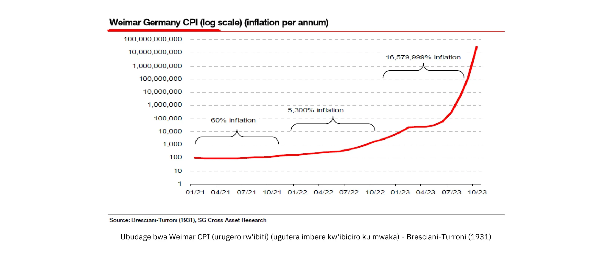

#### 2. Amahera y’ivyihutirwa (Notgeld)

Kubera ko Ubudage bwari buhanganye n'ingorane z'amahera n'ubutunzi, bwaciye bufata "Notgeld" (amahera y'ivyihutirwa). Izo noti zacapwa n’ibisagara canke amashirahamwe amwamwe, zari zigenewe Address ubukene bw’amahera rusangi.

Ikintu gitangaje ni uko Ubufaransa na bwo bwakoresheje Notgeld cane cane mu myaka ya 1920. Ico gikorwa nticari ingaruka zitaziguye z’ugutera imbere kw’ibiciro gusa, ariko kandi cari gishingiye ku bibazo vyatewe n’Intambara ya mbere y’isi yose. Ivyo vyatuma agaciro k’ibiceri vy’ivyuma kenshi karenga agaciro kavyo, ivyo bikaba vyatuma abantu babirundanya. Kubera ko ata biceri vyariho, ibigo bimwebimwe, nk’Ishirahamwe ry’Ubudandaji ry’i Lyon, vyacapura igitabu cavyo citwa Notgeld.

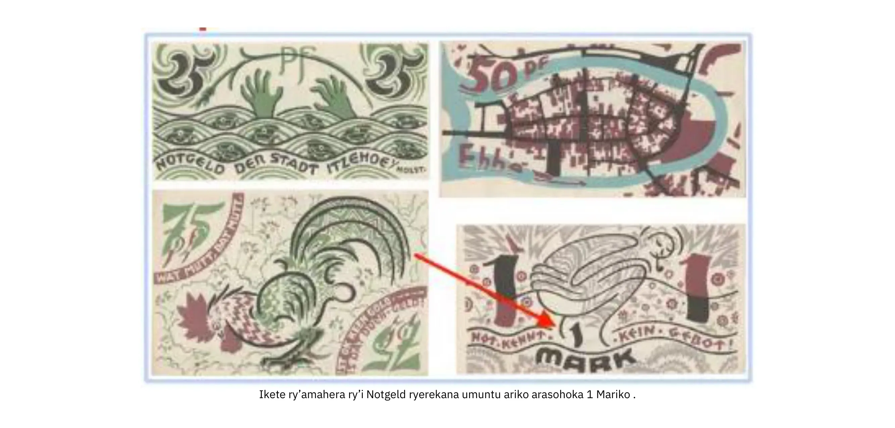

> "Ico gikwiye gukorwa, gitegerezwa gukorwa." - imvugo yo mu karere

Mu Notgeld, hari inoti imwe yihariye igaragara cane. Irimwo ikigereranyo gikomeye: hagati, umuntu yerekanwa ariko arasohora Mariko. Ku ruhande rw’inyuma, urutonde rw’ibiciro kuva mu 1913 gushika mu 1921 rwerekana ukuntu ugutera imbere kw’ibiciro muri ico kiringo.

Umuhinga mu vy’ubuhinga bw’amasanamu ari inyuma y’iyi Notgeld asa n’uwuriko aranegura mu buryo buteye isoni abategetsi bajejwe ingorane y’ugutera imbere kw’ibiciro. Iryo noti ryanditsweko ngo "Ivya ngombwa ntibizi itegeko". Iyindi mvugo yihariye yerekeye aho Notgeld yakomotse ni: "Ico gikwiye gukorwa, gitegerezwa gukorwa."

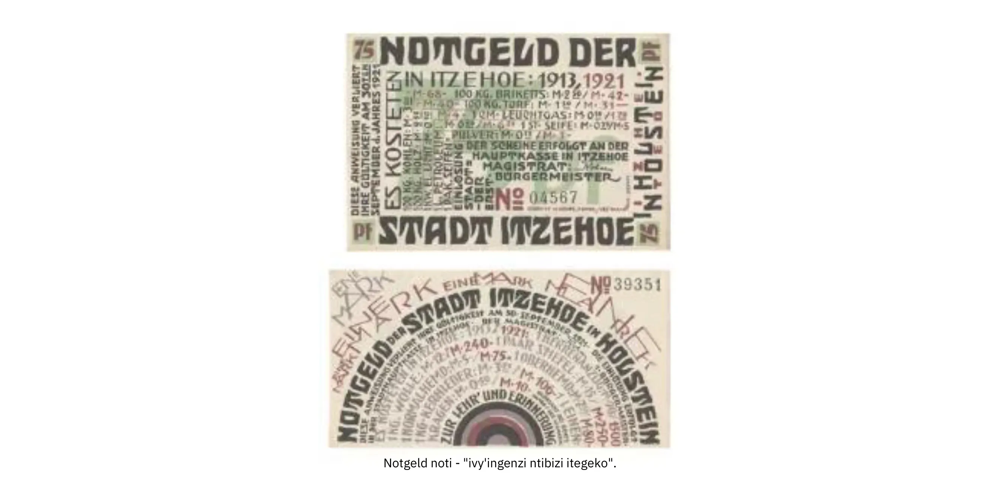

> "ivy'ingenzi ntibizi itegeko"

> Shitcoin ya mbere: Mu nkuru, turavye ikigereranyo nyamukuru c'inoti, aho amafaranga agabanywa n'igikorwa c'umuntu, yoshobora kwitwa "shitcoin" ya mbere.

#### 3. Imyenda n’ingwati

I Weimar, imyenda imwimwe yarasubiwemwo agaciro kugira ngo bashobore kwishura ingaruka z’ugutera imbere kw’ibiciro. Iryo tegeko ntiryemejwe muri Zimbabwe.

> Weimar: "Ingingo yo gusubiramwo agaciro k'inguzanyo za Leta yacitse itegeko mu 1925, bituma abafise imigabane baronka 2,5 kw'ijana vy'amahera bashoye mu ntango igihe gusa indishi zose zari zarishe."

> Zimbabwe: "Muri Nyakanga 2007 (haciye imyaka itatu), nari gushobora gukura mu mufuko wanje agapapuro k'amadolari 500.000 (bt "000") kavuye mu gaciro, ubu gakaba gafise agaciro k'amadolari 1,67 ku rugero rw'isoko ry'isoko, maze nkishura inguzanyo y'inzu, yari ikwiye kwishurwa mu myaka mirongo ibiri gusa. ijana kw'ijana ry'umushahara wanje w'ukwezi kw'ukwezi kumwe."

Kugira ngo umenye vyinshi ku bijanye no gucungera ingorane z’Ubudage, iki gitabu na co nyene ni ngirakamaro.

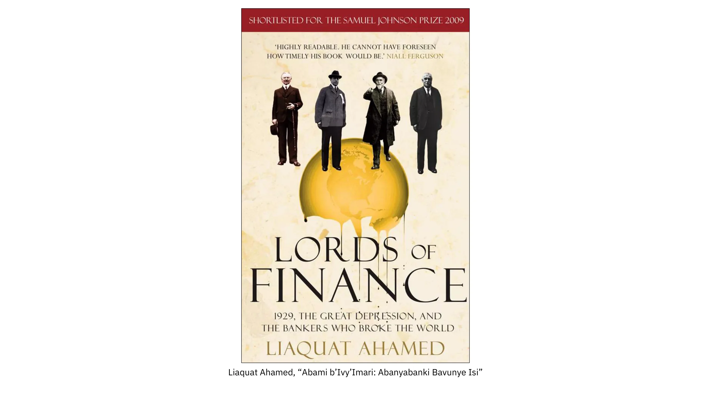

### Ibisa n'ivyo muri iki gihe

#### 1. Gukoresha nabi politike y’amahera kugira ngo ubutunzi bugenzurwe.

Mu mateka ya Repubulika ya Weimar, biragaragara ko abahinga mu vy’inganda batinya kubona agaciro k’Ikimenyetso gashimwa. Ubushobozi bari bafise bwo kugurana no kwishura imyenda yabo bakoresheje amahera yari yacitse intege cane, bwatumye bagira akamaro kanini. Ubwo buryo bwatumye vyoroha kwubaka amazu maninimanini y’inganda ata co bimaze hafi. Abo bahinga batinya ko Mariko yoshimwa kuko yariko irabuza ibikorwa vyabo. Bamwebamwe mbere babona ko ugutera imbere kw’ibiciro ari ikintu ciza, bizera ko vyotuma abanyagihugu baronka akazi. Ariko ntibamenye ingaruka mbi iyo nzira y’ugutera imbere kw’ibiciro izogira ku mahera azigamiwe no ku bukungu muri rusangi. Kuri abo bakozi b’ubutunzi, gucapura amahera vyari umuhezagiro.

> Weimar: "Ni co gituma ugushimira ikimenyetso vyari biteye ubwoba cane, mbere n'indwi nkeyi z'ugushikama inyuma ya Genoa zatumye ubucuruzi buhagaze."

> Weimar: "Imigwi y'inganda yari ihanganye n'akaga k'uko amahera yoba afise agaciro kuruta ibicuruzwa, kandi ugusenyuka kwobaye iyo umuntu wese agerageza guhindura itunga ryiwe mu mafaranga."

Ivyo Christine Lagarde yavuze muri iki gihe birashobora guhuzwa n’ivyo, akavuga ko abanyagihugu bakwiye gushira imbere icizigiro co kuronka akazi kuruta gukingira amahera bazigamye. Nka kurya kw’abahinga bo mu nganda bo muri Weimar, asa n’uwushigikira ko icapa ry’amahera ryoba igikoresho co gutuma abantu baronka akazi, ivyo bikaba bishobora gutuma amahera azigamiwe agira agaciro.

> Christine Lagarde: "Twabwirizwa guhimbarwa no kuronka akazi kuruta kubona amahera twazigamye arindwa."

#### 2. Ivy’umuntu ku giti ciwe mu bihe vy’amatati .

Amateka ya Repubulika ya Weimar yerekana ko muri ico kiringo, ivy’ubutunzi n’ivy’ubutunzi vyari mu mahanga vyafatwa. Ico gipimo cibutsa ibintu vyabaye vuba cane mu Burusiya, canecane mu ntango y’intambara. Ivyo bintu birerekana ukuri guteye amaganya: mu bihe vy’amagorwa, ukwubaha umutungo w’abantu ku giti cabo birashobora guhungabana. Ivyo ni ibihuye n’ivyo mu mateka no mu bihe vya none bishimika ku ngaruka zishobora guterwa n’ingorane ku burenganzira bw’umuntu ku giti ciwe.

> Weimar: "Igisagara cose c'Ubudage cari mu mahanga cari carafashwe."

> [Iminota 20.fr](https://www.20minutes.fr/monde/3286947-20220513-intambara-ya-Ukraine-yashaka-Uburusiya-kudasubira gutanga-ikiev-yashizeho ibibazo vyinshi vy'amadolari 300.000.000. vy'ukuri vyahagaritswe nk'igice c'ibihano vy'ibihugu vy'Uburengero, mu madolari 640 miliyaridi yari yabitswe na Banki Nkuru y'Uburusiya."

#### 3. Iciyumviro c'Igiciro c'Isoko

Mu gihe ca Repubulika ya Weimar, abarimyi baraseruye ukuntu batanezerewe n'ivyo "Umlage" vyatuma bashikana amatoni miliyoni zibiri za mbere z'ingano zari zivuye buri mwaka. Iryo tegeko ryatumye igice c’umukate wose Supply ushirwa ku isoko ku bici- ro vy’infashanyo. Kuva mu kwezi kwa munani, abo barimyi bari bakwiye guhembwa igiciro c’isoko ry’isi yose, kuko naho bagoberewe gutanga ingano zabo ku bici- ro bigabanutse, bari bakiri ngombwa ko bagura ifumbire ku giciro c’isoko ry’isi yose.

Ivyo bivyura ikibazo nyamukuru gifitaniye isano n’iciyumviro c’igiciro c’isoko mu gihe c’ugutera imbere cane kw’ibiciro. Mu gihe c’Ubudage, abarimyi baragoberwa no kugurisha ingano zabo ku giciro kiri munsi y’agaciro kazo, mu gihe bategerezwa kuronka ifumbire ku bici- ro vy’isoko ry’isi yose. Mwene ukwo gutandukana mu vy’ubutunzi kurashira ahabona ingorane ziterwa n’ibiciro vy’ibifungurwa muri iki gihe. Abarimyi, bahanganye n’ugutera imbere kw’ibiciro vy’ibikoresho bikoreshwa kubera ugutera imbere kw’ibiciro, ivyo biciro barabirungika ku bicuruzwa vya nyuma. Kubanegura kubera iyo ntumbero y’ukwiyongera ni nk’ukwirengagiza ingene ibiciro vy’isoko bigenda be n’ingorane z’ubutunzi bahura na zo. Gucuruza ku bici- ro bitobito vy’ubuhinga mu gihe utanga amahera menshi ntibishobora kuramba ku bucuruzi ubwo ari bwo bwose.

> Weimar: "Inyungu z'uburimyi ntizari zishimishijwe n''Umlage,' ugushikana ku nguvu amatoni imiliyoni zibiri za mbere z'ingano zikorwa buri mwaka, ivyo bikaba vyatuma igice c'umukate wose Supply ugurishwa ku bici- ro bito. Kuva muri Myandagaro, abarimyi bari bategerezwa guhembwa ku giciro gitoyi c'isoko ry'isi kubera ko, mu gihe bari bafise kwishura igiciro c'isoko ry'isi ry'ifumbire."

#### 4. Guhakana isano hagati y’amahera Supply n’ugutera imbere kw’ibiciro

> Weimar: "Yagumye ashikamye ku ciyumviro ciwe c'uko amahera Supply ataco afitaniye n'ingero z'ibiciro canke n'ibiciro vya Exchange;"

Mu bihe vya none, iyo ngendo iracariho, nk’uko bigaragara mu karorero k’ikigabane c’imbere k’urutonde rw’insobanuro zashikirijwe n’abahinga mu vy’ubutunzi n’ibigo bitandukanye vy’ubutunzi kugira ngo bishingire intahe ko ugutera imbere kw’ibiciro. Izo mpamvu ziratandukanye, kuva ku bikorwa vy’imico kama n’abantu bazwi cane nka Taylor Swift, Zelda canke Beyoncé, gushika ku bintu vyo kw’isi yose nk’intambara n’ikiza. Izo mpamvu zose, naho zishobora gutuma ubutunzi buhinduka mu kiringo gito, zituma abantu bava ku mvo nyayo: ukwaguka kw’amahera Supply.

#### 5. Amashirahamwe y'abapfuye

> Weimar: "Uguhagarara kwari kwarangije igihe abacuruzi bashobora kugurana ivyo bashaka vyose kubera abandi bose. Amashirahamwe menshi cane, yashinzwe canke yagutse mu gihe c'ubutunzi bwinshi, yaciye agira ico akora igihe umutungo wari uke."

Ishirahamwe ry’abazombi ni ubucuruzi, mu bihe bisanzwe vy’isoko, ryoba rishobora guhomba canke ryari hafi gusenyuka, ariko rikabandanya gukora ahanini bivuye ku ngurane zidahenda. Izo sosiyete zironka amahera ahagije gusa yo kwishura imyenda yazo ariko ntizishobora gukura cane.

Iciyumviro c’amashirahamwe y’abazombi si ikintu gishasha. Nkako, ryariho mu gihe ca Repubulika ya Weimar. Iciyo gihe, amashirahamwe menshi yasa n’ayariko aratera imbere, ahanini akavyungukirako mu kuronka inguzanyo ku buntu. Bagurije amahera menshi cane bizigiye ko bazoyasubiza mu nyuma n’amahera yagabanutse kubera ugutera imbere kw’ibiciro. Ariko rero, igihe ugutera imbere kw’ibiciro kwahagarara, ikimenyetso c’Ubudage kigasubira kuronka agaciro, ayo mashirahamwe, ayo mashirahamwe atari ashoboye vy’ukuri gukora canke mu vy’amahera, yaracitse uwutagira inyungu, aca ategerezwa guhagarara.

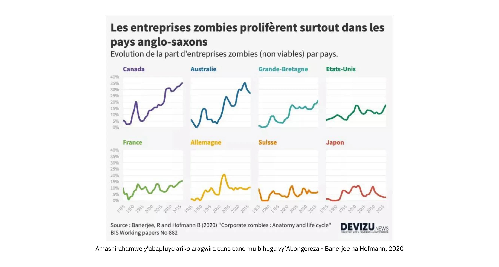

Ico kintu c’amashirahamwe y’abapfuye ntikigarukira mu Budagi bwakurikiye intambara gusa. No muri iki gihe, amashirahamwe manini manini menshi arabandanya gutera imbere kubera ko afise agateka ko kuronka inguzanyo ku nyungu nto cane. Iyo babwirizwa kugurana ku giciro gisanzwe kuruta, benshi muri bo bohagarika kuronka inyungu. Ivyo birahambaye cane cane mu mwaka w’2023, inyuma y’igihe kirekire c’inyungu hafi y’ubusa, kuko ubu inyungu zatanguye kuduga. Iryo hinduka ry'ivy'ubutunzi rizoba ata gukeka ikigeragezo gikomeye kuri ayo mashirahamwe, yahora yitwa "zombies."

#### 6. Gutunga vuba!

Amateka yerekana ingero aho abantu barondera kwirundanira ubutunzi vyihuse, nk’uko vyagenze i Weimar na Zimbabwe biciye ku guca imanza. Muri iki gihe, ikintu nk’ico nyene kirashobora kubonwa n’ugutera imbere kw’amahera amwamwe y’ivy’ubuhinga bwa none. Abantu barageragezwa n’inyungu zihuta, bagafata ivyago bizigiye ko bazokwongerekana cane mu vyo bashora. Ubwo buryo bwibutsa ivyo vyabonetse mu bihe vy’ugutera imbere kw’ibiciro, aho hakoreshwa ubuhinga bwo gukemura ibibazo kugira ngo umuntu aronke inyungu yihuta, akenshi akabigirako abandi.

#### 7. Kuzigama, ni umuti wo kurwanya ukudakeka

> Inkurikizi zikwiragiye kandi zisenya z’ugusenyuka kwama kw’agaciro k’umutungo kamere n’inyungu, hamwe n’ukudakeka ku bijanye n’ivyo muri kazoza.

Birabereye gushimika ku majambo asubiwemwo ashimika ku ngaruka mbi z’ugusenyuka kw’agaciro k’umutungo kamere ku bumwe bw’abantu, hamwe n’ukudakeka bitera. Ivuga iti: "inkurikizi zikwiragiye kandi zisenya z'ugusenyuka kw'agaciro k'umutungo kamere n'inyungu, hamwe n'ukudakeka ku bijanye n'akazoza."

Ibaze nk’aho woba ufise umuryango canke abakunzi wipfuza gukingira. Ukora Hard kandi ukazigama kugira ngo witege imbere y’igihe ibintu bizoshika muri kazoza. Iyo vyose bimenyekana, kuzigama ntivyoba ari ubusa. Ariko rero, iyo habaye ibintu bitari bitezwe, nk’imodoka yasambutse, amahera umuntu azigama araba umugozi wo kumukiza. Bigabanya ukudakeka kw’isi. Ariko rero, mu gihe c’ugutera imbere cane, kuzigama biraba urugamba. Amahera aratakaza agaciro ningoga, ivyo bikaba bituma gutegura ivy’igihe kirekire bigorana. Ukwo kudatekana kw’amahera kurashobora generate gutera umubabaro n’amaganya.

Ubu, kubera ububasha bwo kuzigama buriko buragabanuka, ishoramari ryarafashe ikibanza caryo. Ariko rero, iyo nzira irafise ingorane zayo. Kuzigama vyamye ari umuti wo kurwanya ukudakeka. Kugira amahera yo gutorera umuti ibintu bitari bitezwe biratuma umuntu agira amahoro yo mu mutima kandi bigakomeza ubumwe bw’abantu. Mu gusozera, kurinda ububasha bwacu bwo kuzigama ni ngombwa kugira ngo tuzigame ugutekana kw’imibano n’ukw’umuntu ku giti ciwe.

## Ishengero rishasha muri Amerika Latini

<chapterId>918eafd7-409d-5205-ad52-a52e63b23a64</chapterId>

Ubu rero turaza kuraba ibihe bitandukanye vy’uguhindura idini mu bihugu vya Amerika Latini.

### Insiguro y'ibishushanyo

Ku rupapuro, ibubamfu, hari imyaka y’uguhindura amafaranga, izina ry’amafaranga mashasha, n’igipimo ca Exchange n’amafaranga ya kera. Dufashe akarorero ka Argentine, peso moneda nacional yahinduwe ku rugero rwa 25 kuri 1 ugereranije n’amahera ya kera, ari yo peso reàl. Muri ivyo, tuzosuzuma ingene amafaranga y’igihugu ca Argentine yagenda aratera imbere uko igihe kigenda kirarenga. Ikindi, tuzokwerekana amafaranga y’intango n’ay’iherezo y’amafaranga y’amabanki y’igihe cose.

Ku ruhande rw’iburyo rw’ico gicapo, hariho igicapo c’ugutera imbere kw’ibiciro. Imyambi itukura igereranya imyaka y’ugutera imbere kw’ibiciro, nk’uko bisobanurwa n’ingingo ya Cagan, ni ukuvuga igipimo c’ugutera imbere kw’ibiciro c’ibice 50% ku kwezi. Ico kigereranyo gishobora rimwe na rimwe gutuma habaho insobanuro zitari zo, kuko imyaka ifise ibiharuro vyinshi vy’ugutera imbere kw’ibiciro ishobora kutahura n’insobanuro ikomeye y’ugutera imbere kw’ibiciro cane.

Birabereye kumenya ko uguhindura idini, ari co gikorwa gisanzwe gifatwa n’intwaro mu bihe vy’ugutera imbere kw’ibiciro, ari ikintu kigaragara cane. Ariko rero, ivyo ntibitorera umuti ingorane nyamukuru y’ugutera imbere kw’ibiciro canke ugutera imbere cane kw’ibiciro. Ni uburyo gusa bwo guhindura izina ry’amahera no gukuraho zero, ata gutorera umuti vy’ukuri umuzi w’ugutera imbere kw’ibiciro: ukwaguka kw’amahera Supply. Mu videwo izoza, tuzovuga ku mirongo nyayo y’imiti y’ikibazo ca Address no gutorera umuti ingorane y’ugutera imbere kw’ibiciro. Muri uru rukurikirane, tuzoshira ahabona ingaruka z’uguhindura idini mu buryo bworoshe ata mpinduka zihagije: ugutera imbere kw’ibiciro kurabandanya.

Inyuma ya Argentine, inyigisho yacu izoja kuri Brezile, Boliviya, Peru, Nikaragwa na Venezuela. Tuzosuzuma amadini yahinduwe yabaye muri ivyo bihugu.

### Argentine

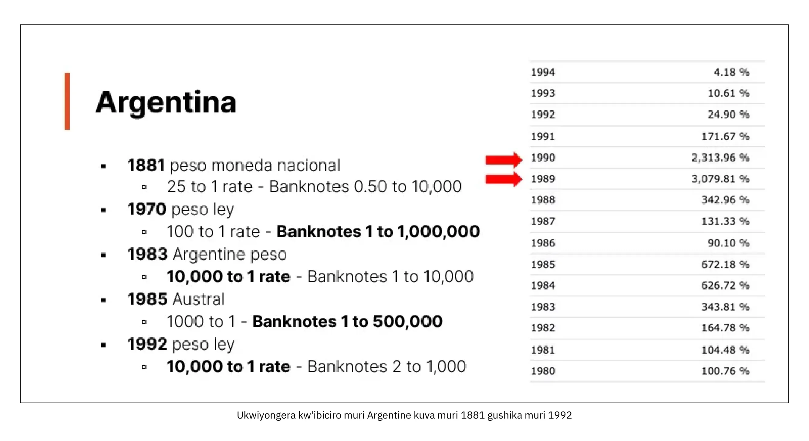

Imbere y’umwaka wa 1826, Argentine yakoresha idolari ry’Igisupanyoli. Inyuma y’ukwikukira kwaryo mu 1816, ryarashizeho amafaranga yaryo bwite ashingiye ku mafaranga y’Abanyasipaniye yitwa reàl, ivyo bikaba vyatumye habaho amafaranga asa n’ayo. Iryo meza ritangura mu mwaka w'1881, umwaka washizweho "peso moneda nacional," amafaranga y'amahera ashika ku bihumbi 10. Ivyo vyakurikiwe n'i "peso ley", iyo na yo ikaba yahindurwa ku giciro c'ijana kuri 1, ikaba yari ifise amafaranga ashika ku miliyoni imwe. Hanyuma, "peso ya Argentine" yashitse n'igiciro ca Exchange c'ibihumbi 10 kuri 1 (bingana no gukuraho zero zine), n'amafaranga y'amahera ashika ku bihumbi 10. Mu mwaka w'1985, "australes" yarashizweho kandi irahindurwa kugiciro c'ibihumbi 1 ku kimwe, amafaranga y'amabanki akaboneka ashika ku bihumbi 500.000. Mu mwaka w'1992, "peso ley" iriho ubu yashinzwe ku rugero rw'ibihumbi 10 kuri 1, yongera gukuraho zero zine. Imyaka ya 1989 n’iya 1990 ni yo yonyene yaje gutera imbere cane.

### Brezil

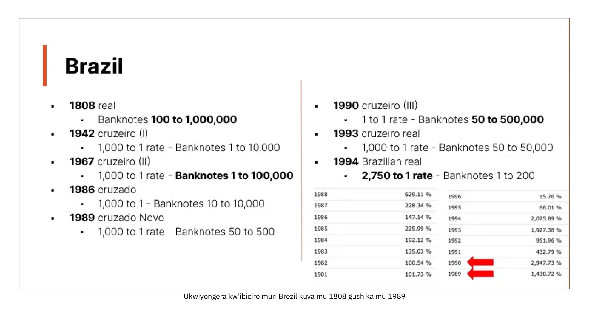

Brezil ni akarorero keza k'uguhindura amafaranga, nk'uko vyerekanywe n'amateka yayo y'uguhindura amafaranga. Imbere y’uko Brezil yikukira, yakoresha amafaranga y’igiportigale yitwa reàl nk’ifaranga ryayo. Ariko rero, kuva mu 1747, ico gihugu caratanguye gukoresha "reàl ya Brezile" yaco bwite, kera cane imbere y'uko gitangaza ukwikukira kwaco mu 1822. Iryo meza ritangura mu 1818, rikaba ari ryo ry'intango y'ugusohora amafaranga y'amahera ya Brezile. Mbere, ayo mafaranga yari ahanini mu buryo bw’ibiceri. Izo noti zari zifise agaciro kagera kuri miliyoni imwe y’amarea.

Kuva mu 1942, muri Brezile haratanguye urutonde rw’uguhindura amadini. Akenshi (1942, 1967, 1986, 1989, 1993), igitigiri c’abahindutse cari 1:1.000. Mu 1990, harabaye uguhindura izina ata n’umwe ahinduye. Urutonde rw’ayo mafaranga ni uru:

- Réals (ivya kera) gushika mu 1942.
- Mu 1942.
- Cruzeiros (uburyo bushasha) mu 1967.
- Mu 1986.
- Imisi mishasha mu 1989.
- Gusubira i Cruzeiros mu 1990.
- Igihugu c'Uburundi mu 1993.
- Ubwa nyuma, Reàl ya Brezile mu 1994.

Igitigiri c’amafaranga y’agaciro kanini cane cashitse ku 500.000, kandi ugusubira guhindura amafaranga kwa nyuma mu 1994 kwakozwe ku rugero rwa 2.750 kuri 1. Imyaka ya 1989 na 1990 yararanzwe n’ugutera imbere kw’ibiciro vyinshi, mu gihe 1993-1994 ntiyabonye ibiciro vy’ugutera imbere kw’ibiciro vyinshi ku % thf ukwezi). Inyuma y’ico kiringo c’akaduruvayo, Brezile yongeye guhindura amahera yayo mu gukuraho ama zero menshi.

### Boliviya

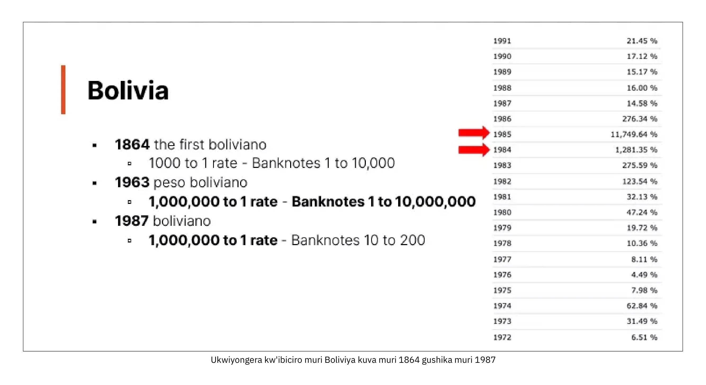

Boliviya ni akandi karorero k’igihugu cashikiwe n’ibihe vy’ugutera imbere kw’ibiciro, bikaba vyasaba ko amafaranga asubirwamwo. Aha niho hari incamake y’amateka yayo y’amahera:

Imbere y'ukwikukira kwayo mu 1825, Boliviya yakoresha idolari rya Espagne nk'amafaranga yayo. Inyuma y'ukwikukira, ico gihugu carashizeho Sol ya Boliviya hagati ya 1827 na 1864, gisubirira idolari ry'Esipanye. Ariko rero, birabereye kumenya ko amafaranga y'amabanki yambere muri Boliviya yashizweho muri 1864 gusa.

Mu mwaka w'1864, "Boliviano" ya mbere yarashizweho, ifise igipimo ca Exchange c'1.000 kuri 1 ugereranyije n'i Boliviya Sol. Aya mafaranga yagumye akoreshwa gushika ashitse ku giciro c’ama Boliviya 10.000.

Hanyuma, Boliviya yarahinduye amafaranga yayo ayigira "Peso ya Boliviya", iyo mafaranga yarashikiwe n'ugutera imbere cane kw'ibiciro, amaherezo ashika ku mafaranga ashika ku miriyoni 10. Ico gice c’ugutera imbere kw’ibiciro cashitse ku rwego rwo hejuru mu myaka ya 1984-1985, aho ibiciro vy’ugutera imbere kw’ibiciro ku kwezi kenshi vyegereza urugero rw’ugutera imbere kw’ibiciro rwo hejuru rw’ibice 50%. Kugira ngo tubone ivyiyumviro bimwebimwe, igipimo c’ugutera imbere kw’ibiciro kiguma kigera kuri 50% ku kwezi mu mwaka wose, bituma igipimo c’ugutera imbere kw’ibiciro ku mwaka kigera hafi 12.800%. Mu mwaka w’1985, igipimo c’ugutera imbere kw’ibiciro ku mwaka muri Boliviya carashitse ku bice 11.749%, ivyo bikaba vyerekana ko ugutera imbere kw’ibiciro kwari hafi canke kurenga 50% hafi buri kwezi.

Mu kwishura iyo ngorane y'amahera, mu mwaka w'1987, Boliviya yarashizeho amahera mashasha, yitwa gusa "Boliviano", afise igiciro ca Exchange c'amapeso y'i Boliviya miliyoni 1 ku Boliviya 1. Iyi verisiyo y’ikiboliviya iracariko irakoreshwa n’ubu.

Ivyo ni incamake y’amateka y’amahera y’igihugu ca Boliviya yuzuye umuvurungano, yaranzwe n’ibihe vy’ugutera imbere cane kw’amahera be n’uguhindura amashengero.

### Peru

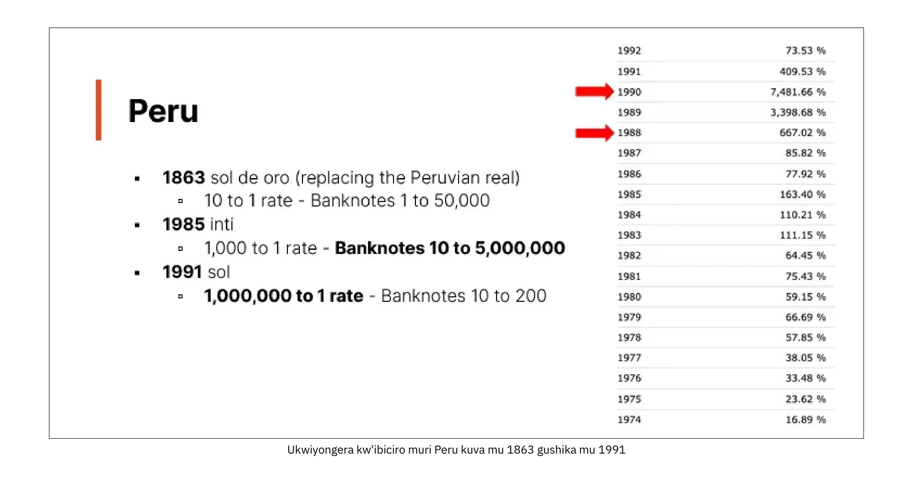

Peru iratanga ikibazo gishimishije ku bijanye n’ingaruka z’itegeko ry’ububisha ry’ibice 50 kw’ijana. Guhera mu mateka y’amahera, Peru yarakoresheje inzahabu y’i Esupanye gushika mu kinjana ca 19, igihe yatangaza ubwigenge bwayo mu 1821. Idolari rya Peru ryari rikoreshwa kuva mu 1822 gushika mu 1863. Mu 1863, reàl ya Peru yasubiriwe n’idolari rya soldi oro, ku rugero rwa maximu1. 50.000. Mu mwaka w'1985, amafaranga "Inti" yarashizweho n'igipimo co guhindura 1000 ku 1, ashika ku miriyoni 5. Mu mwaka w'1991, "SOL" yatangujwe n'igiciro ca Exchange c'imiliyoni 1 kuri 1, n'amafaranga y'amahera kuva kuri 10 gushika kuri 200.

Dusuzumye ibihe vy’uguhindura idini, umwaka w’1988 ubonwa ko ari umwaka w’ugutera imbere cane cane muri Nzero. Muri Nyakanga-Myandagaro 1990 na ho nyene harabaye igihe c’ugutera imbere cane kw’ibiciro. Mu mwaka w’1988, igipimo c’ugutera imbere kw’ibiciro ku mwaka cari 667%, mu kwezi kwa Nzero kikaba cari ku rugero rwo hejuru rwa 50%. Mu buryo butandukanye n’ubwo, umwaka w’1989 warabonye igipimo c’ugutera imbere kw’ibiciro ku rugero rwa 3000% ata kwezi na kumwe kurenga 50%, rero ntivyashizwe mu rutonde rw’ugutera imbere kw’ibiciro kw’ibice 3000%. Mu mwaka w’1990, ugutera imbere kw’ibiciro kwari ku rugero rwo hejuru ku rugero rwa 7481%. Biragaragara ko itegeko rya 50% rishobora kuba ry’ubujuju, kuko 1988 wabonwa nk’umwaka w’ugutera imbere kw’ibiciro, bitandukanye n’umwaka wa 1989. Iyo iryo tegeko risubirwamwo, vyoba vyiza hagabanutse urugero kugira ngo hagiremwo ibihe nk’ivyo vyashikiye Peru mu 1989.

> Gutahura ibiriko biraba .
>

> Ikintu nyamukuru co gutahura ku bijanye n’uguhindura amafaranga ni uko iyo agaciro k’ayo mafaranga gashitse ku mibare y’inyenyeri, nk’imiliyoni 5 canke 10, aca asubirwamwo. Ivyo bishobora gusubirwamwo incuro nyinshi, bikaba birimwo no guhindura amahera. Ico bivamwo ni uko amahera umuntu azigama ashobora guhungabana cane, mbere n’aho ata n’imwe ishobora gutera imbere cane. Nk’akarorero, iyo umuntu azigamye amadolari 1.000 mu mwaka umwe, agashobora gushiramwo amadolari 100, mu mwaka ukurikira, amahera makeyi cane yoshobora kuba amadolari 1.000, ivyo bikaba bituma ayo madolari 100 yari yarazigamye mbere ata co amaze. Mwene ukwo gusenyuka kw’amahera yazigamye ntigusaba ko haba ugutera imbere cane kw’ibiciro. Naho umuntu yoba yarazigamye amadolari 10.000 mu myaka cumi iheze, ayo mahera yoshobora guhera aho agira agaciro gatoyi cane, ntashobora kugura icupa ry’amazi ryoroshe. Ivyo biraboneka mu bihugu vyinshi vyashikiwe n’uguhindura amadini, naho amezi makeyi gusa yoba yashizwe mu rwego rw’ugutera imbere kw’ibiciro. Mu buryo butandukanye n’ubwo, ibihugu bimwebimwe, nka Nikaragwa, vyarashikiwe n’ugutera imbere kw’ibiciro mu myaka ikurikiranye.

### Nikaragwa

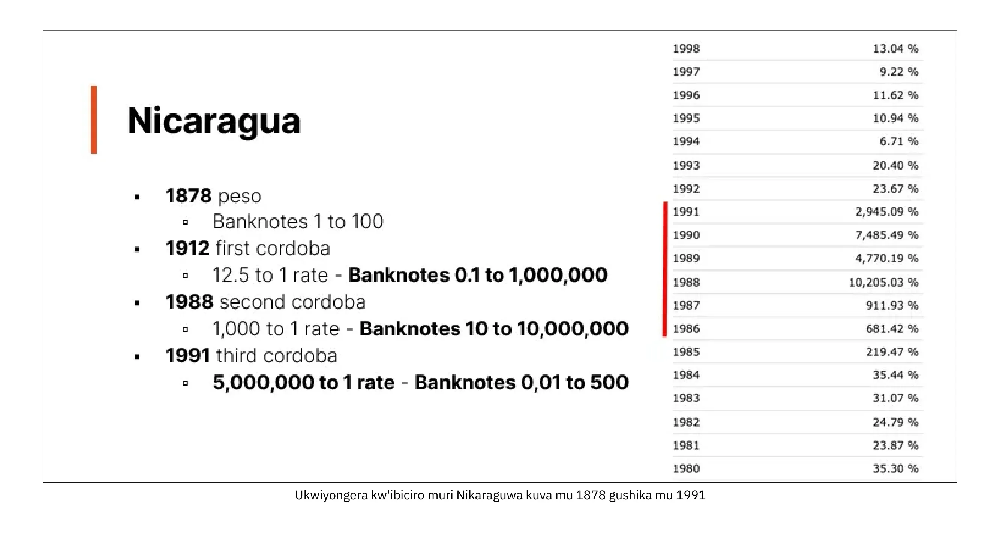

Nikaraguwa, yahora itwarwa n’Esipanye, mu ntango yakoresha idolari ry’Esipanye, cokimwe n’ibindi bihugu vyinshi vyari vyakolonijwe na Esipanye. Nikaraguwa imaze kwinjira mu Bwami bwa Esupanye, mu Bwami bwa Megizike, hanyuma mu Bwami bwa Repubulika ya Amerika yo Hagati, yaratangaje ko yigenga. Guhera muri 1878, peso yabaye ifaranga ry'igihugu, agaciro kayo kahinduka hagati ya 1 na 100. Muri 1912, igihugu carashizeho Cordoba yambere, ikurikirwa n'iya kabiri mu 1988 n'iya gatatu mu 1991, n'ubu iracariko irakoreshwa n'ubu. Cordoba ya mbere yashitse ku gaciro k’imiliyoni 1, iya kabiri na yo ishika ku miriyoni 10. Ivyo guhindura idini mu 1991 vyakurikiye imyaka myinshi y’ugutera imbere cane kw’ibiciro.

### Venezuwela

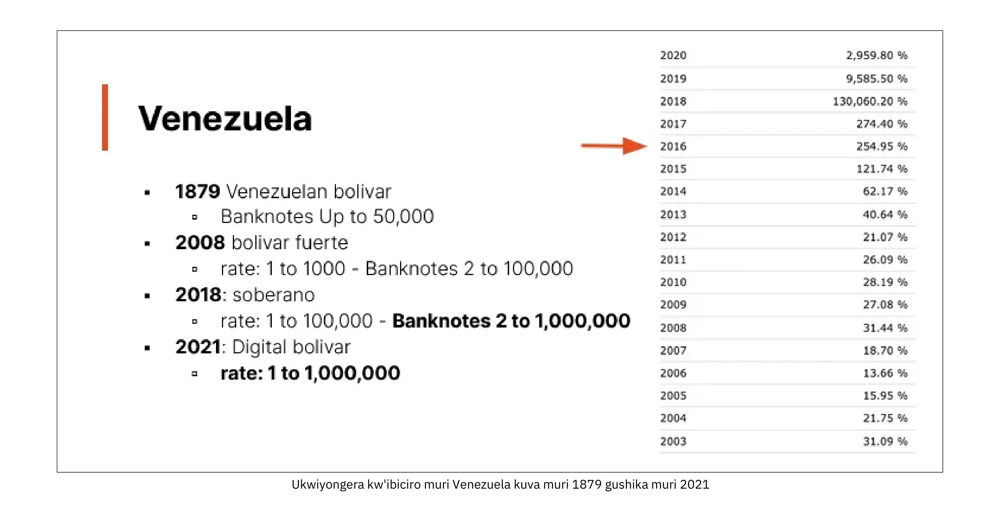

Venezuela ni co gihugu ca nyuma kivugwa muri iyi videwo. Igihugu carahinduwe amafaranga ane mu gihe c’igihe. Mu misi yayo ya mbere, Venezuela yakoresha idolari ry'Esipanye imbere y'uko itangaza ukwikukira mu 1811. Mu 1879, yashizeho bolivar nk'ifaranga ry'ubutegetsi, ryagumyeho gushika mu 1983, igihe leta yahitamwo uburyo bwo gukoresha idolari ry'igihugu ryitwa Exchange.

Ikintu gihambaye ku bijanye na Venezuela ni uko ari umunyamuryango w’ishirahamwe ry’amahera ry’i Latini. Iryo shirahamwe ryari rigizwe n’ibiceri nk’amapeseta 5 yo muri Esipanye, amadrakima 5 yo mu Bugiriki, amabolivar 5 yo muri Venezuela, amalire 5 yo mu Butaliyano, amafaranga 5 y’Ububirigi n’amafaranga 5 y’Ubufaransa.

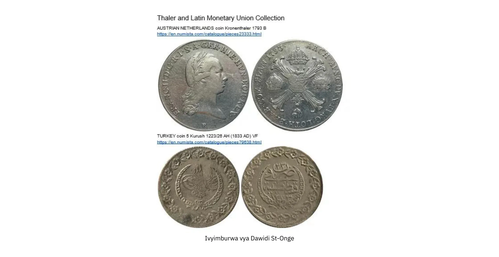

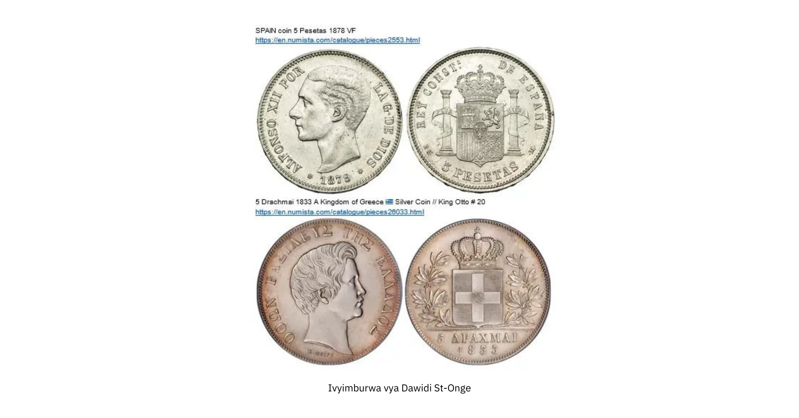

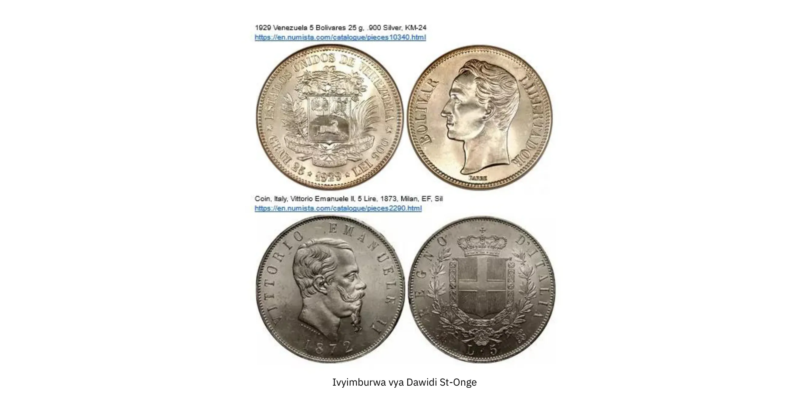

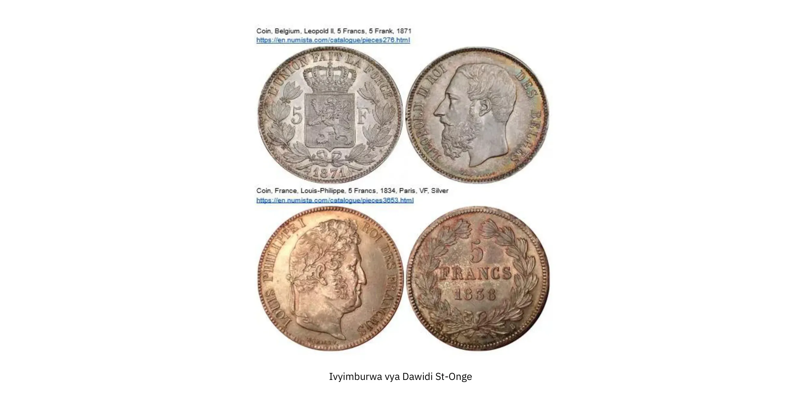

Muri ico kiringo, iyo ndege y’ama bolivar 5 Coin yava muri Venezuela yari ifise uburemere bungana n’ubw’ibihugu biri muri iyo nama, harimwo Ubutaliyano, Esipanye, Ububirigi n’Ubufaransa. Izo bolivars zari zikozwe mw’ifeza, zifise Coin yihariye yo mu 1929 ipima amagarama 25 kandi ifise ubusuku bwa 900, canke 90% vy’ifeza itagira agasembwa. Kubera igiciro c’ifeza kiriho ubu, iyo Coin ifise agaciro k’amadolari nka 17 gushika ku madolari 18 (Amadolari y’Amerika).

Inyuma y’aho mu 1983 kwemejwe igipimo c’amahera Exchange gihinduka, harakurikiye amadini menshi:

- Mu mwaka w’2008, harashizweho bolivar fuerte canke “bolivar ikomeye”, ishika ku bihumbi 100 imbere y’uko ihindurwa igihumbi ku kimwe.
- Mu mwaka w’2018, Soberano yarashizweho, amafaranga ashika ku miliyoni 1. Mu mwaka w’2021, ryasubiriwe n’igiciro ca bolivar ca digitale, na co nyene cashitse ku miliyoni imwe, imbere y’uko habaho ugusubira guhindura igiciro gishasha c’imiliyoni imwe ku imwe. Ubu, iyo fagitire y’amafaranga 10 canke 20 ingana n’amamiliyoni 10 canke 20 i Soberano.

Amategeko y’ico kiringo, yo mu 2018, aratangazwa mu nama zitandukanye za Bitcoin zibera i Biarritz, i Toronto n’i Miami. Izo mpapuro za Soberano zashitse ku gaciro karengeye miliyoni 1. Haciye haba uguhindura idini, agaciro k’imiliyoni imwe kagabanywa gushika nk’amasenti 3. Ubu, amafaranga 10 y’imiliyoni 1 ahura n’amafaranga imwe y’amafaranga 10. Kuva mu mwaka w’2016, Venezuela yarashikiwe n’ugutera imbere cane kw’ibiciro, ivyo bikaba bigereranya ikiringo ca 57 mu meza yihariye.

Mu videwo ikurikira, hazoshikirizwa urutonde rw’amafaranga y’ugutera imbere kw’ibiciro, yibanda kuri Venezuela n’ibindi bihugu biri ku rutonde. Iryo koraniro ririmwo hafi amafaranga yose yo muri Venezuela. Ico cigwa kizoba kijanye n’amadini atandukanye y’ibihugu vyose vyavuzwe. Ikindi, hazoba ugutohoza amashengero yo guhindura amadini muri Zimbabwe, ikiganiro gishimishije cane.

### Iciyumviro

Twarabonye ko ugutera imbere cane kw’ibiciro atari co kimenyetso conyene c’ivyago vy’ubutunzi. Gusubira guhindura amafaranga incuro nyinshi, gukuraho zero canke guhindura izina ry’amafaranga biragira ingaruka zitaziguye ku bantu, kuva ku gutakaza imfashanyo gushika ku ngorane z’ibifungurwa. Naho ugutera imbere kw’ibiciro biteye ubwoba, igitigiri c’amashengero ahindurwa, nk’uko vyabonetse muri Brezile, cerekana ukuri gukomeye kuruta.

Hashingiwe ku ngingo y’ugutera imbere kw’ibiciro 50% ku kwezi, ibihe vyinshi vyari gushobora gushirwa mu rwego rw’ugutera imbere kw’ibiciro cane. Ivyo ni ko biri canecane igihe umuntu asuzuma ingingo mfatirwako z’ishirahamwe mpuzamakungu ry’ivy’ubuhinga bw’ivy’ubuhinga bw’ivy’ubuhinga bw’ivy’ubuhinga bw’ivy’ubuhinga bw’ivy’ubuhinga bw’ivy’ubuhinga bw’ivy’ubuhinga bw’ivy’ubuhinga bw’ivy’ubuhinga bw’ivy’ubuhinga.

Mu gusozera, ugutera imbere kw’ibiciro ni umuce umwe gusa w’ingorane z’ubutunzi. Inflation nyinshi yonyene irashobora kwonona nk’uko nyene. Igice gikurikira kizoca irya n’ino inyishu zishoboka zo gutsinda ugutera imbere kw’ibiciro.

## Uko wotsinda ugutakaza agaciro kw'ibiciro

<chapterId>e3484a31-a851-5f92-8af5-00eddae67db1</chapterId>

### Uko twohagarika inflation iringaniye n'iyirengeye

Ivyo bimenyetso vyavuzwe biva mu gitabu "Ubutegetsi bw'amahera n'ugutera imbere kw'ibiciro" canditswe na Peter Bernholz. Nk’uko Bernholz abivuga, uburyo bwonyene bwo gukuraho ugutera imbere kw’ibiciro ni ugushira mu ngiro ivugurura ry’amahera no gushinga Leta amategeko agenga ivy’amahera. Ivyo bibujijwe birimwo ugushinga ikigo, nk’ibanki nkuru, gikora kidashingiye ku ngingo za politike za Leta. Inflation nini n’iyirengeje urugero akenshi biva ku gufasha mu gutanga amafaranga y’ingengo y’imari biciye mu kurema amafaranga. Kugira ngo Address igabanye inflation, ni ngombwa ko igabanya iterambere ry'amahera Supply. Bernholz kandi avuga ko iyo nkunga y’amahera ikwiye kuba igereranijwe n’ibihugu bihegereye. Ikintu gitangaje ni uko, mu bihe vy’ugutera imbere cane canke kw’ugutera imbere cane, agaciro kose k’amahera Supply gashobora kugabanuka mu vy’ukuri. Akarorero gakomeye k’ivyo bintu ni Zimbabwe.

### Inyishu zitandukanye

Igihe bariko bariga igihugu ca Zimbabwe, barabonye ko amahera Supply agera ku bihumbi amajana 10 yari yatakaje agaciro kayo kose. I Weimar, vyarashobotse gucapura ibice bibiri vya gatatu vy’agaciro k’amahera yose hamwe k’amamiliyaridi 65 y’amahera Supply mu musi umwe. Ivyo vyerekana ingene amahera Supply ashobora gukurwako agaciro. Kugira ngo ivyo bishobore gutorwa umuti, birakenewe ko amahera Supply yongerwa cane kugira ngo ashike ku rugero rukwiye. Maze, ivugurura ry’amahera ni ngombwa cane. Mu gihe c’ugutera imbere kw’ibiciro, iyo mpinduka ntishobora kwirindwa, ariko itegerezwa gutuma haba amahera ahagije ariko aragendagenda. Inyuma y’iyo ntambwe, Leta irashobora gushirwako amategeko.

Dukurikije ivyo Bernholz yabonye, ​​igihe inzego nka FMI na Banki y’Isi yose ziriko ziratorera umuti ingorane z’ugutera imbere kw’ibiciro, ntizama zifata ingamba zikora neza kuruta izindi. Hari igihe iyo igihugu gikeneye kwongera amahera Supply, izo nzego zirondera kuyagabanya. Urufunguruzo ni ugushika ku rugero rw’amahera rukwiye hanyuma ugashiraho imipaka ku gukura kwayo, gutyo ugashobora kwirinda gutanga amahera y’amahera Leta ikoresha biciye mu kurema amahera.

Ikintu gishimishije Bernholz yashize ahabona ni uko ukuroranirwa kw’ivugurura ry’amahera kutavana gusa n’uko rifise akamaro mu vy’ubuhinga, ariko kandi bivana n’ukwizigira abanyagihugu barishiramwo. Impinduka zimwe zimwe ziteguwe neza zirashobora kunanirwa kubera ko abantu bose batazizigira, mu gihe izindi, ziteguwe nabi, zishobora kuroranirwa kubera ko abanyagihugu bazizigira. Ugutahura n’ukwizigira kwa bose rero ni ngirakamaro Elements mu kuroranirwa canke kunanirwa kw’ivugurura ry’amahera.

- Muri Zimbabwe, umuti bafashe kugira ngo barwanye ugutera imbere kw’ibiciro ni uguhindura amadolari, bisobanura ko bafashe idolari ry’Amerika canke ayandi mafaranga ava mu bihugu bihegereye. Ubwo buryo burabuza leta gucapura amahera uko ishaka.
- Mu Budagi, umuti wari uwo gushinga amahera mashasha, ari yo Rentenmark. Iryo shirahamwe ryari rishigikiwe n’itunga ry’intara ry’Ubwami, kandi iyo nzira yaragaragaye ko ari ngirakamaro.

### Urubanza rwa Zimbabwe

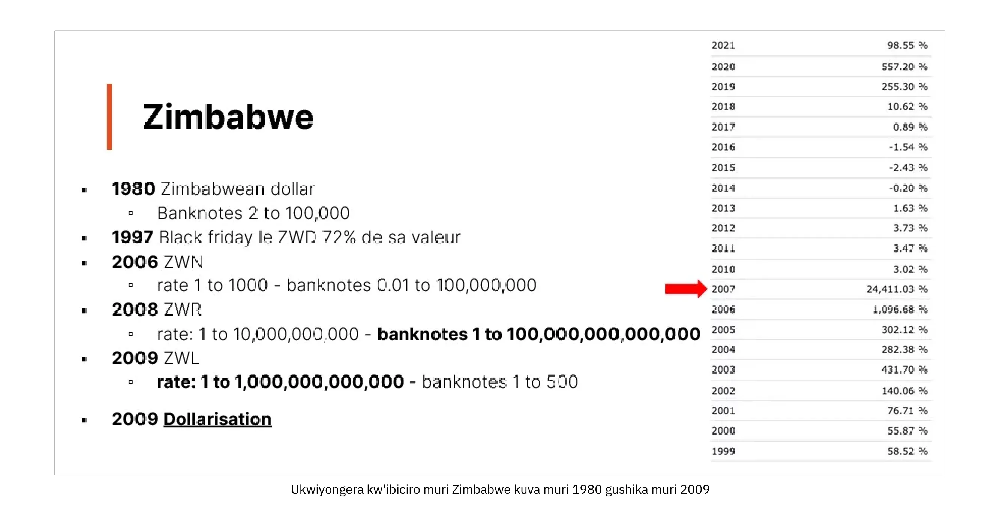

Zimbabwe yaronse ukwikukira muri 1980 maze ishiraho ifaranga ryayo bwite, idolari rya Zimbabwe. Mu ntango, amadolari abiri ya Zimbabwe yari afise agaciro k’amadolari y’Amerika nka 1,60. Ariko mu mwaka w’1997, hakurikijwe ingingo z’imibano zafashije abasirikare ba kera, iyo mafaranga yaragabanutse agaciro n’ibice 72 kw’ijana mu musi umwe mu gihe c’umunsi wa gatanu w’umukara. Hanyuma mu ntango z’imyaka ya 2000, igihugu caratanguye porogarama yo gusubira gusangira ubutaka, iyo porogarama ikaba yari iyo gufata ubutaka bw’abazungu bakabugabira abanyabubasha bo ng’aho. Iryo cemezo ryarababaje ivyoherezwa hanze kubera ko kenshi ba nyen’amatongo bashasha batagira ubuhinga bukwiye bwo gucunga amatongo maninimanini. Ivyo vyatumye, mu gihe Zimbabwe yari igihugu coherezwa hanze mu 1999, mu 2003 iba igihugu coherezwa hanze.

Mu mwaka w’2006, ico gihugu carashizeho amafaranga mashasha, ari yo ZWN, afise igiciro ca Exchange kuva kuri 1 gushika ku 1.000. Mu mwaka w’2008, harashizweho irindi dini ryitwa ZWR, rifise igipimo ca Exchange c’amamiliyaridi 1 gushika ku miliyaridi 10. Ivyo vyatumye habaho amafaranga y’amafaranga y’amamiliyaridi 100.

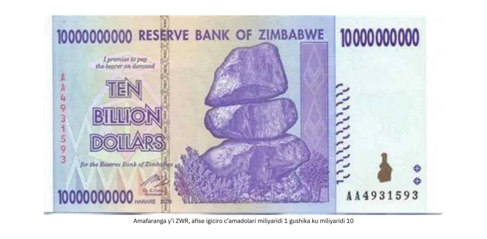

#### Guhindura amadolari n'ugutorera umuti ingorane

Ni co gituma, inyuma y’umwaka w’2009, kubera ingorane z’amahera zidahera be n’ugutera imbere kw’ibiciro, Zimbabwe yarahevye amafaranga y’igihugu cayo, yemera gukoresha amafaranga y’amahanga, ahanini idolari ry’Amerika. Iyo ngingo, naho yari ikomeye cane, yaratumye habaho ugutera imbere cane kw’ibiciro. Icigwa nyamukuru co kwigirako ni uko guhagarika ugutanga amahera birenze urugero no guhagarika amahera banki nkuru itanga ku bijanye n’ikinyuranyo c’ingengo y’imari bishobora gufasha mu gukingira ugutera imbere kw’ibiciro.

Ariko rero, guhindura amadolari si umuti w’igitangaza. Naho bishobora gukuraho ugutera imbere kw’ibiciro, birazana izindi ngorane z’ubutunzi. Kimwe mu ngaruka ni ugutakaza politike y’amahera yigenga. Igihugu kitagira amafaranga yaco bwite, ntigishobora guhindura politike yaco y’amahera kugira ngo gishobore kwishura ku bibazo vy’ubutunzi bwo mu mutima.

Mu mwaka w’2007, igipimo c’ugutera imbere kw’ibiciro muri Zimbabwe carashitse ku rugero rwa 50% ku kwezi, ivyo bikaba vyerekana ko igihugu kiri mu gihe c’ugutera imbere kw’ibiciro cane. Inyuma y’aho amadolari ahindukiye mu 2009, ugutera imbere cane kw’ibiciro kwarahagaze; ariko rero, igihugu carabandanije guhura n’izindi ngorane z’ubutunzi.

Birababaje kubona ko kuva ico gihe Zimbabwe yagerageje gusubira gukoresha amafaranga yiwe bwite, kandi ibimenyetso vy’ugutera imbere kw’ibiciro vyasubiye kugaragara. Nk’uko amashirahamwe amwe amwe mpuzamakungu abivuga, igihugu gishobora kuba carashitse ku rugero rwo gusubira gutera imbere cane, naho coba kitarashika ku rugero rwemewe rw’ibice 50% ku kwezi. Ivyo bica bitwibutsa akaga ko gutanga amahera menshi cane no gutanga amahera y’amadeni ya banki nkuru.

### Iciyumviro

Mu gitabu canje citwa "Ibintu vyose ku bijanye na Bitcoin", narashizeho igice cose ku bijanye n'ugutera imbere cane kw'ibiciro muri Zimbabwe. Ndadondora ido n’ido ibintu bihambaye vyabaye, ntanga ingero zitandukanye zigaragaza ingene igihugu cahejeje gukuraho ugutera imbere kw’ibiciro.

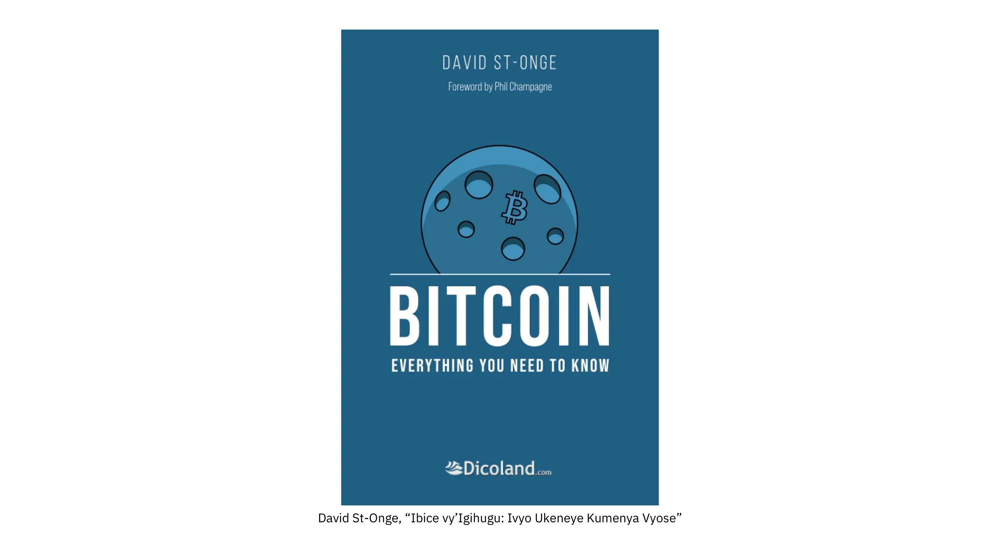

Ku bashaka kumenya ivyabaye mu Budagi inyuma y'Intambara ya mbere y'isi yose, ndabahimiriza cane igitabu c'ibisekeje "The Reich's Banker." Ivuga ingene Ubudage bwashoboye gutsinda ugutera imbere kw’ibiciro, cane cane biciye mu kurema ikimenyetso ca Rentenmark.

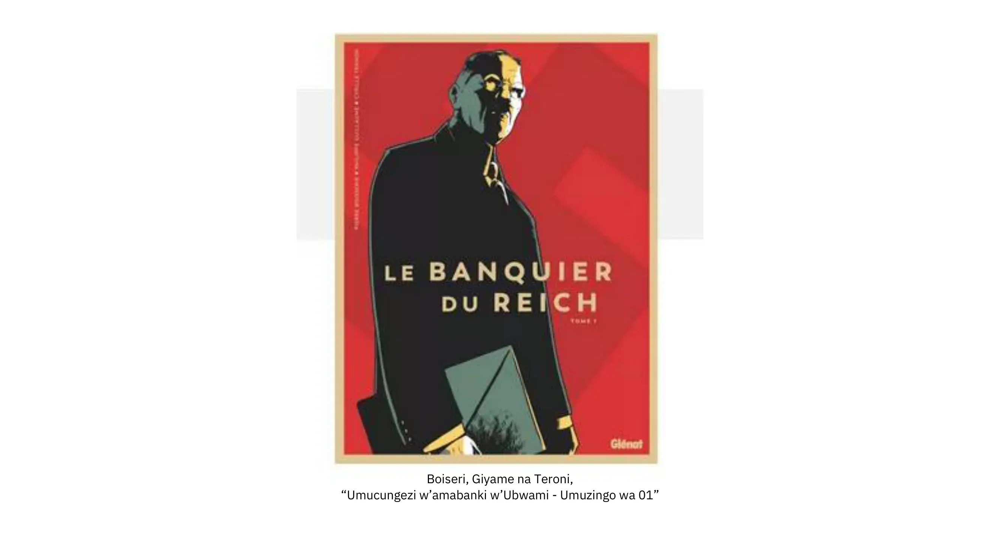

Iciyumviro nyamukuru ni uko hariho ingamba nyinshi zo gutsinda ugutera imbere kw’ibiciro. Umuntu arashobora guhitamwo guhindura amadolari canke akazana amafaranga mashasha. Ivyo bisubizo bizokora gusa iyo abanyagihugu babizigiye. Ni ngombwa cane gushinga amategeko akomeye. Banki nkuru yigenga vy’ukuri ni nkenerwa. Ntibitegerezwa gutera imbere amahera Supply kugira ngo yishure amadeni ya Leta. Ku bijanye n’ugutera imbere kw’ibiciro bitari vyinshi, guhagarika iterambere ry’amahera Supply vyoba bihagije. Ariko iyo umuntu ahanganye n’ugutera imbere kw’ubutunzi, birahambaye cane ko abanza kugira amahera akwiye Supply ajanye n’ubunini bw’ubutunzi. Hanyuma, ni ngombwa cane gushinga amategeko akomeye kuri Leta kugira ngo ibintu bibe bimeze neza.

## Gushikiriza amafaranga y'amahera y'inflation

<chapterId>f3ffbb47-3aeb-54bd-80a9-adccb0f419e2</chapterId>

[Tora ivyo bitabo vyakozwe mu gitabu ca *Bitcoin Educational Toolkit* (navyo ushobora kubironka mu gice ca *Ibikoresho* co muri Plan ₿ Academy urubuga.](urubuga rwa penpot.umugambi 4-4f081b21defb&igice=imigenderanire&urutonde=0&sangira-id=7154756b-3ebd-8040-8004-6475c2af5889&imigenderanire-uburyo=kwerekana-ku-gukanda)

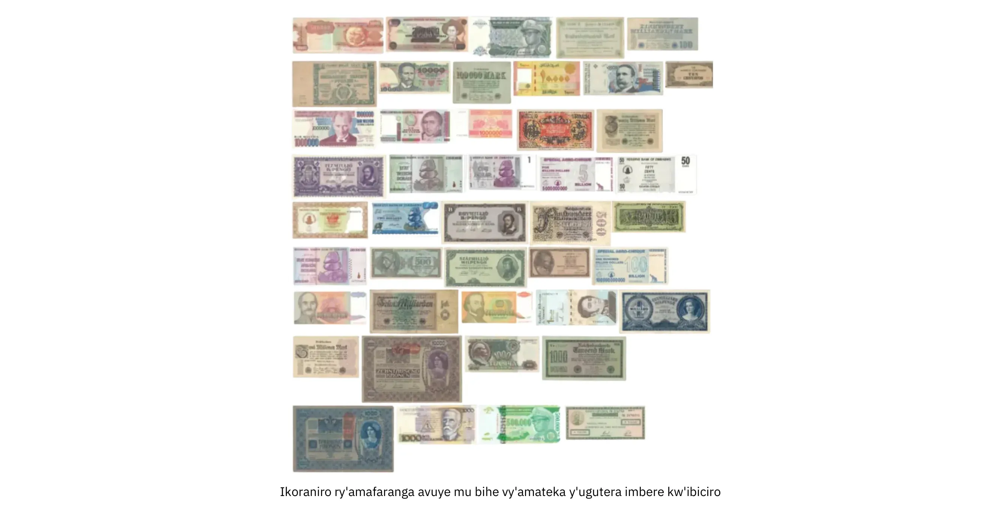

# None twashitse gute ngaha?

<partId>f66ca17e-be9e-5d30-a098-f7affd8962a1</partId>

## Guseruka kwa Layer ya kabiri y'amahera n'amabanki nkuru

<chapterId>0455ffe3-9d45-5a67-ac96-3f815dc507a1</chapterId>

Ivyanditswe:

Kuza kwa Layer ya kabiri y’amahera n’amabanki nkuru ya mbere ni ikintu giteye umunezero cane. Iyi nsiguro iravugwa cane mu gitabu "Amahera ashizwe mu mirongo" ca Nick Battia. Ndayishimira cane abakunda ukuntu ubuhinga bwacu bwo gukoresha amahera bwateye imbere be n’ingene buteye akaga. Intumbero y’iki gice ni ugutahura inkomoko y’uguhingura amahera n’ingene yoshobora gutuma habaho ugutera imbere kw’ibiciro.

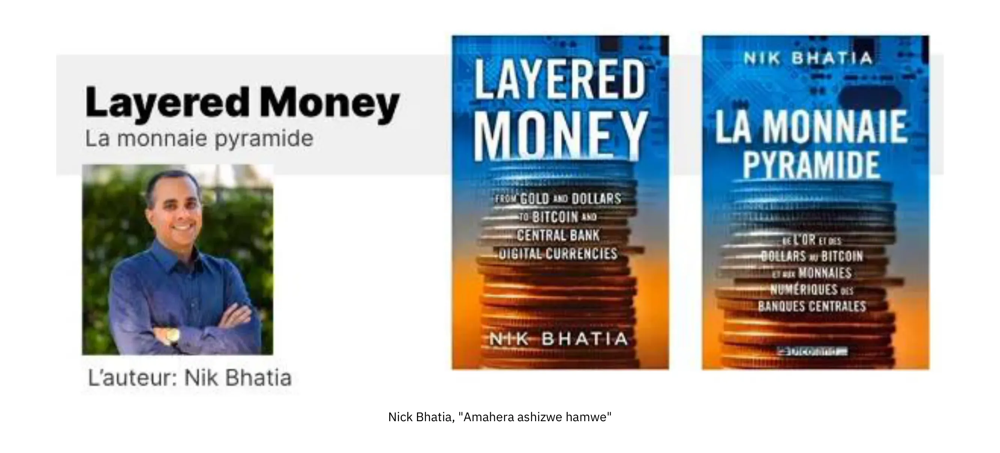

### Amahera ya Piramide n'amabanki nkuru

#### Ivyo bita Florin

Amateka y’amahera yatanguye mu kinjana ca 13 mu Butaliyano, cane cane mu gisagara ca Firenze. Iciyo gihe, amaflorin n’amafaranga y’amafaranga y’i Exchange vyari bimenyerewe. Akarorero gahambaye ni aka florin, gasharije igishushanyo ca Yohani Batista mweranda.

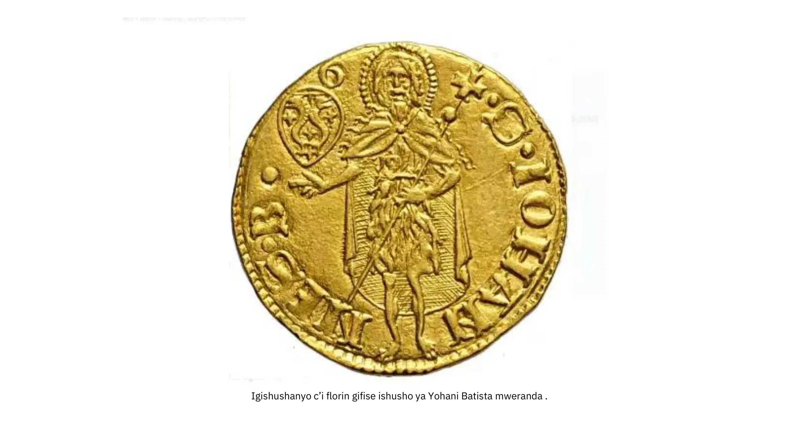

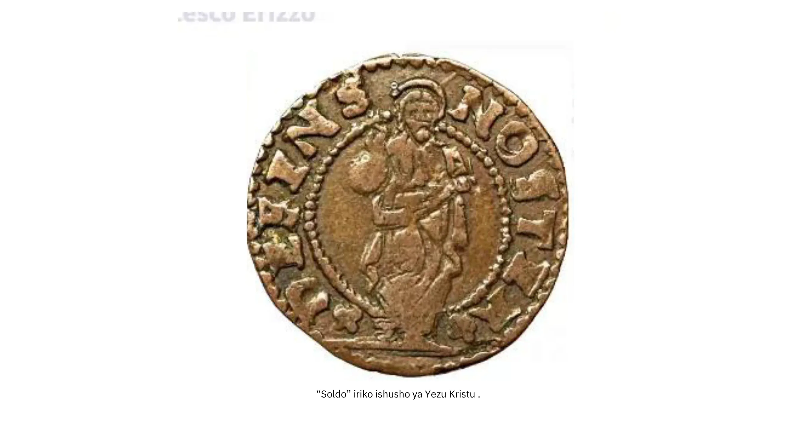

Naho muri iki gihe kugira florin y’ukuri bizimvye, hariho ivy’ugusubiramwo. Hariho kandi n’ayandi mafaranga yo muri ico gihe, nk’iyitwa soldo yo mu bihugu vy’Ubutaliyano vyo mu kinjana ca 17, ikaba ifise ishusho ya Kristu.

#### Amakete y’ivya Exchange (mu kinjana ca 13)

Ivyo vyari bimenyerewe ico gihe: abacuzi b’inzahabu barasohora amafaranga y’amafaranga y’amaflorine yashizwemwo Exchange mu Exchange. Izo florins zari zibitswe neza mu bibanza vyazo vy’ububiko. Gutyo, inzahabu nyayo, igereranywa n’iflorine, ni yo yagize Layer ya mbere y’amahera, mu gihe amafaranga y’amafaranga Exchange yagize Layer ya kabiri. Ariko rero, amahera yari muri iyo nzira yari make. Iyo umuntu ashaka Redeem inzahabu yiwe muri Exchange ku facture yiwe, iyo transaction yari yoroshe. Ariko rero, guhana ayo mahera hagati y’abantu ku giti cabo ntivyari bimenyerewe.

#### Igitabo c’i Anvers Exchange (mu kinjana ca 16)

Igitabu ca Anvers Stock Exchange carabaye ikintu gihambaye mu bijanye n’ugutera imbere kw’amahera y’impapuro. Aho ni ho hatanguye umugenzo wo gugabanya amafaranga y’amasezerano. Izo mpapuro zari ibikoresho vy’impapuro zigereranya agaciro k’amahera, mugabo ikintu kidasanzwe zari zifise ni uko zari zifise amazina n’amatariki zo guherako. Ivyo vyatumye bagorwa no Exchange imbere y’itariki y’uguhera.

Impinduka zazanywe n’ikigo ca Anvers Stock Exchange cari mu bijanye n’uko izo noti zashobora gugabanywa imbere y’itariki zazo ziherako. Nk’akarorero, iyo igitabu c’isezerano cari gikwiye guhembwa mu kwezi kumwe, vyari bishoboka ko kigurishwa ku giciro gigabanutse kugira ngo umuntu amenye igihe cari imbere y’itariki y’uguhembwa. Ivyo bishasha ntivyatumye gusa amafaranga y’impapuro arushiriza kuba Liquid ariko kandi vyatumye habaho iciyumviro c’agaciro k’igihe k’amahera.

Ico ciyumviro, naho gifitaniye isano na Nick Bell biciye ku izina ryiwe ry’uruyeri ryo kuri Twitter “agaciro k’igihe ka BTC”, si co yahinguye. Naho ari ukwo, arabivuga mu buryo burambuye mu gitabu ciwe. Iciyumviro nyamukuru ni uko umwanya ufise agaciro. Rero, iyo umuntu afashe ingingo yo kwishura ikete ry’isezerano ry’amadolari 100 ukwezi kumwe imbere y’aho, arashobora kurironka nk’akarorero amadolari 98 maze akaronka ayo madolari 100 ku musi yari akwiye kuriha. Ivyo bishasha vy’amahera vyavuye mu kibanza c’ubutunzi c’i Anvers Exchange.

#### VOC n’isoko ry’ivy’ubutunzi ry’i Amsterdam (ikinjana ca 17)

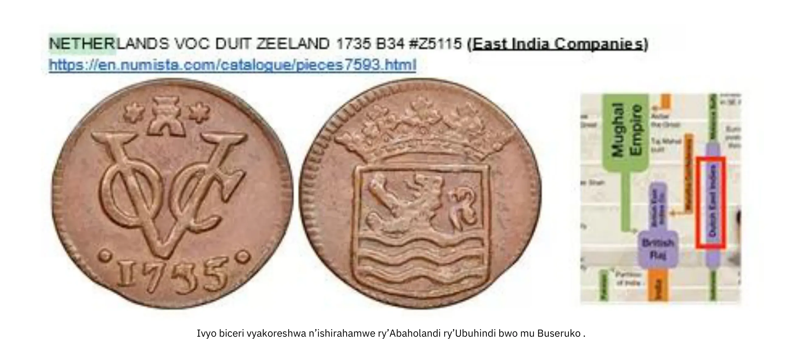

Inyuma y’aho hashinzwe ishirahamwe ry’ubudandaji ryitwa Anvers Stock Exchange, ikintu gihambaye cabaye ni ugushinga ishirahamwe ryitwa VOC, ari ryo shirahamwe ry’Abaholandi ry’Ubuhindi bwo mu Buseruko. Iyo sosiyete yari mu Buholandi, mbere yarasohoye amahera yayo bwite. Inyuma y’aho VOC iremewe, isoko rya mbere ry’ivy’ubutunzi ryashinzwe i Amsterdam, ivyo bikaba ari vyo vyatumye iyo sosiyete itangurira ibikorwa vy’isoko ry’ivy’ubutunzi. Ikintu gishimishije ni ingene Abaholandi bashoboye gukuraho ubukuru bwa Anvers nk’ikibanza c’ubutunzi mpuzamakungu. Baciye gusa bazibira abantu gushika ku ruzi Scheldt. Iryo tegeko ryari mu muhari munini kuruta wo mu mateka, ni ukuvuga ubugarariji bw’abasabirizi. Ikintu gihambaye cane cabaye muri kahise k’Uburaya.

#### Ingingo ya Banki ya Amsterdam

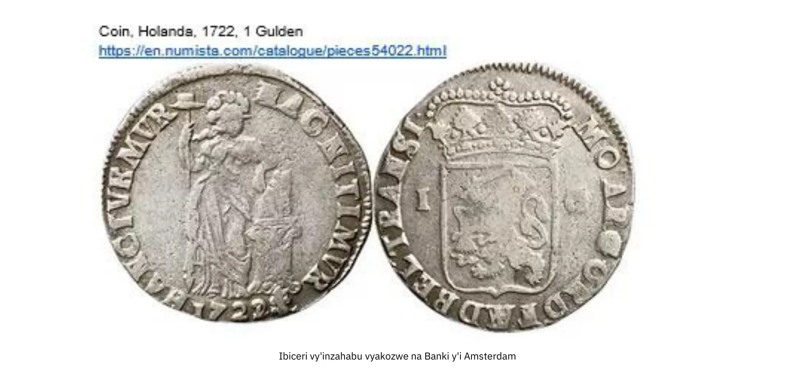

Inyuma y’aho VOC ishinzwe, ikindi kintu gihambaye cabaye mu mateka y’amahera ni ugushiraho ibiceri vy’inzahabu na Banki ya Amsterdam. Ivyo biceri, vyariho mu 1722, vyari bikozwe mw’ifeza. Ariko rero, icahinduye vy’ukuri ivy’ubutunzi ico gihe si Coin ubwayo, ahubwo ni amakonte ajanye n’ayo mafaranga yo muri Banki ya Amsterdam. Izo nkuru ni zo zacitse uburyo nyamukuru bwo gukoresha Exchange mpuzamakungu. Ivyo bacuruza vyandikwa gusa mu bitabo canke mu bitabu vy’amahera. Ivyo vyatumye Amsterdam iba ikibanza nyamukuru c’ubutunzi kw’isi yose. Haciye igihe, Banki y’i Amsterdam yaciye ifata ingingo yo gutegeka abantu gukoresha izo konti. Abahinduzi b’amahera bigenga basabwa gutanga Exchange ku biceri vyabo kugira ngo babike muri banki ku musi ku musi.

#### Gushinga Banki y'Ubwongereza kugira ngo ifashe mu ntambara .

Ishingwa rya Banki y’Ubwongereza ryatumwe n’uko vyari bikenewe ko haba amahera yo gufasha intambara mu mpera z’ikinjana ca 17. Cokimwe na Banki y’i Amsterdam, yarategetse ko umuntu abika amahera biciye ku itegeko. Ico Banki y'Ubwongereza yari ihambaye cane ni ugushira amabanki yigenga mu kibanza ca kabiri mu bijanye n'amahera, gutyo hakabaho ico twokwita "Layer ya gatatu" y'amahera.

Mu ntango, Layer ya mbere y’amahera yari igereranywa n’inzahabu. Amafaranga yashizwe mu mabanki yigenga ni yo yagize Layer ya kabiri. Ariko rero, igihe ivyo bihembo vyari bitagishobora guhindurwa inzahabu, haciye haboneka amahera ya gatatu Layer. Kuva ico gihe, amafaranga y’amahera yasohorwa n’amabanki yigenga ntiyari agishobora guhindurwa inzahabu ahubwo yahindurwa amafaranga y’impapuro ava muri Banki y’Ubwongereza, iyo na yo ubwayo ikaba yari ishobora guhindurwa inzahabu. Ukwo gutera imbere kwatumye uburyo bw’amahera bugorana cane, hakaba hariho n’ibindi bice vy’inyongera.

#### Ubwoba bwo mu 1796

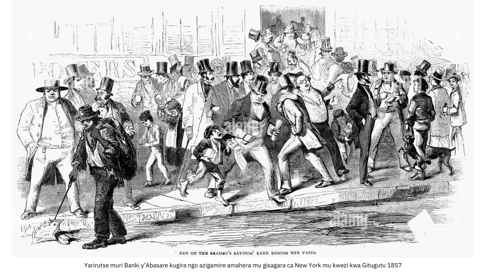

Ubwoba bwa banki muri banki y'abasirikare bo mu mazi mu gihe c'ubwoba bwo mu 1857.

Inyuma y'ubwoba bwa banki mu 1796, hari ikintu cabaye aho umuntu wese agerageza kuduga "piramide y'amahera." Abantu bashaka Exchange ifaranga ryabo rya gatatu-Layer ku mafaranga ya kabiri-Layer, n’iherezo, ku mafaranga ya mbere-Layer, yari inzahabu. Kubera iyo nzira y’ukwihuta cane, Banki y’Ubwongereza yaragoberewe kugira ico ikoze kugira ngo ibintu bibe vyiza. Kugira ngo ntihagire ukuntu inzahabu zari zibitswe zishobora gusenyuka, ryafashe ingingo yo guhagarika uguhindura amafaranga y’inzahabu ngo abe inzahabu. Ukwo guhagarika, mu ntango kwari gutegekanijwe nk’ingero y’igihe gito, kwamaze nk’imyaka mirongo ibiri.

### Iciyumviro:

Amabanki akomeye yarateye imbere gushika aho aba abaguzi ba nyuma, bahagarika uguhindura amahera yabo ngo abe inzahabu. Naho ico gikorwa mu ntango cari gifise intumbero yo gutorera umuti ingorane z’igihe gito, amaherezo caracitse igikorwa c’ibihe bidahera, kikaba ari co kigaragaza ukuza kw’iciyumviro c’uko uwugurisha ari we azoba uwuherutse gutorera umuti. Iryo hinduka ryatumye amabanki akomeye aba nk’uko azwi uno musi. Ariko rero, mu bihugu bifise ubutunzi bugoyagoya cane, ubwo bushobozi bwo gucapura amahera uko umuntu ashaka burashobora gutuma haba ingaruka mbi, nk’ugutera imbere cane kw’ibiciro, iyo bukoreshejwe ata co buvuze.

## Ibitabo n'ibikoresho

<chapterId>c44e4519-0741-527b-b3b0-3f513e87147d</chapterId>

Hyperinflation ni ikintu giteye umunezero cane cigishijwe biciye ku bintu bitandukanye vyabaye mu mateka. Niba wipfuza kwihweza cane iyo nkuru, ng’uru urutonde rw’ibintu 10 vy’ingenzi wosoma no kwiga:

- "Igihe amahera azopfa: Inzozi mbi z'ugukoresha amahera ataco amaze, ugutakaza agaciro, n'ugutera imbere cane mu Budagi bwa Weimar" na Adam Fergusson. Iki gitabu kiradondora neza ingorane y’ugutera imbere kw’ibiciro mu Budagi inyuma y’Intambara ya mbere y’isi yose.

- "Ubutunzi bw'ugutera imbere kw'ibiciro - Icigwa ku bijanye n'ugutakaza agaciro k'amahera mu Budagi bwakurikiye intambara" na Costantino Bresciani-Turroni. Isesengura ryimbitse ry’iterambere ry’ubutunzi ry’Ubudage mu myaka ya 1920.

- "Iki gihe kiratandukanye: Ibinjana umunani vy'ubupfu bw'amahera" vyanditswe na Carmen M. Reinhart na Kenneth S. Rogoff. Naho ico gitabu kivuga ku bwoko butandukanye bw’ingorane z’ivy’ubutunzi, kiratanga ikiganiro cimbitse ku bijanye n’ugutera imbere cane kw’ibiciro mu mateka yose.

- "Iterambere ry'ubutunzi ry'i Zimbabwe, isesengura n'ivyigwa" vyanditswe na Steve Hanke. Icigwa ku bijanye n’ugutera imbere kw’ibiciro muri Zimbabwe mu ntango z’imyaka ya 2000.

- "Intwaro z'amahera n'ugutera imbere kw'ibiciro: Amateka, imigenderanire y'ubutunzi n'ivya politike" na Peter Bernholz. Ico gitabu kirasuzuma ibintu vyabaye mu mateka vyerekeye ugutera imbere kw’ibiciro birenze urugero, kandi kikarondera gutahura ibintu bituma ivyo bishika.

- "Igitabo co kurokoka mu gihe c'ugutera imbere kw'ibiciro: Ingamba z'ubudandaji bwa Amerika" canditswe na Gerald Swanson. Inyigisho ngirakamaro yerekana ingene ubudandaji bushobora kugenda mu bidukikije vy’ugutera imbere kw’ibiciro.

- "Ugupfa kw'amahera: Ivyigwa vy'Iterambere Rikomeye ry'Ubudage n'Abanyamerika" rya Jens O. Parsson. Isesengura ry’ukugereranya ingorane z’ugutera imbere kw’ibiciro mu Budagi no muri Amerika.

- "Igugwa kw'amahera: Ugutera imbere kw'ubutunzi mu Budagi n'ugusambura kw'abanyagihugu bo hagati" na Frederick Taylor. Inkuru y’ugutohoza ingaruka z’ugutera imbere kw’ibiciro ku mibano n’ubutunzi ku kibano c’Ubudage.

- "Ibigo vy'amafaranga vy'ibihugu biri mu nzira y'amajambere: Igitabo" canditswe na Steve Hanke na Kurt Schuler. Naho ikintu nyamukuru kiri ku bipande vy’amahera, iki gitabu kiratanga iciyumviro c’ingene umuntu yokwirinda ibihe vy’ugutera imbere cane kw’ibiciro.

# Igice ca nyuma

<partId>cb1f4a4b-556a-4e47-a5cc-136be35a1f9a</partId>

## Amasuzuma n'Ibipimo

<chapterId>1a37317e-372a-5241-b478-8316d44f9283</chapterId>

<isCourseReview>true</isCourseReview>

## Ikibazo canyuma

<chapterId>d01831c3-6c4d-59e3-95bc-03e97a05c142</chapterId>

<isCourseExam>true</isCourseExam>

## Iciyumviro

<chapterId>45d410b0-71ed-4502-8d8d-8b6df761db23</chapterId>

<isCourseConclusion>true</isCourseConclusion>