# Ekonomiye doğru bir yolculuk

Bu program, itibari para biriminin hakim olduğu bir dünyada hiperenflasyonların ortaya çıkışının derinlemesine anlaşılmasını sağlamayı ve önemli sonuçlarını incelemeyi amaçlamaktadır. Katılımcılar hiperenflasyon döngülerini detaylı bir şekilde inceleyecek, nedenlerini, tetikleyicilerini, tarihsel ve güncel örneklerini analiz edeceklerdir. Ayrıca, hiperenflasyonların ekonomi ve günlük yaşam üzerindeki somut etkilerini inceleyerek, para birimi değeri, satın alma gücü ve bireysel ve kolektif tasarruflar üzerindeki yansımalarını inceleyeceklerdir.

Burada, tarih boyunca hiperenflasyon dönemlerindeki eğilimleri ve ortak kalıpları vurgularken, hiperenflasyon dönemlerinde kendini korumak için etkili ve somut stratejiler sunacağız. Katılımcılar, çeşitli yatırım seçeneklerini ve finansal savunma mekanizmalarını keşfetme fırsatı bulacak, istikrarsız bir ekonomik ortamda sakin bir şekilde yol almak için pratik araçlar ve temel bilgiler edineceklerdir.

+++

# Giriş

<partId>6fe4d15d-f6e6-54be-9e04-0a75ac98df8b</partId>

## Kursa Genel Bakış

<chapterId>9d1aba8d-0485-5020-9863-5de37e6db8e0</chapterId>

ECO204 kursuna hoş geldiniz!

Bu eğitimin amacı, itibari para sistemi bağlamında hiperenflasyonun temel nedenlerini, mekanizmalarını ve sonuçlarını anlamanıza yardımcı olmaktır. Somut örnekler ve tarihsel analizler aracılığıyla, hiperenflasyon dönemlerinden önce tekrar eden kalıpları tanımayı ve kendinizi korumak için eylem kaldıraçlarını belirlemeyi öğreneceksiniz.

**Bölüm 2: Enflasyon Nedir?

Konunun özüne inmeden önce, temel konulara tekrar döneceğiz: enflasyon nedir? Bu bölümde enflasyonun parasal kökenleri, farklı enflasyon türleri ve bunların daha geniş bir ekonomik dinamiğe nasıl uyum sağladığı ele alınacaktır. Bu, normal enflasyonun nasıl hiperenflasyona dönüşebileceğini anlamak için önemli bir adımdır.

**Bölüm 3: Hiperenflasyon Nedir?

Bu bölümde, hiperenflasyonun kesin tanımlarını ve Weimar Almanya'sı ve Zimbabwe de dahil olmak üzere birkaç önemli tarihsel olayı inceleyeceksiniz. Bunların ortak yönlerini, farklılıklarını ve çağdaş paralelliklerini analiz edeceğiz. Ayrıca Latin Amerika'da birbirini izleyen yeniden değerlemeler ve bazı ülkelerde gözlemlenen çıkış stratejileri gibi daha az bilinen vakaları da keşfedeceksiniz.

**Bölüm 4: Buraya Nasıl Geldik?

Bu bölüm, özellikle parasal "ikinci Layer "ın gelişimi ve merkez bankalarının rolü yoluyla hiperenflasyonu mümkün kılan yapısal mekanizmaları anlamayı amaçlamaktadır. Daha fazla araştırma için ek kaynaklar ve okuma önerileri sunulacaktır.

Ya parasal tarih gözlerimizin önünde tekerrür ediyor olsaydı? İlerleyen bölümlerde kararı siz verin!

# Enflasyon nedir?

<partId>2b4f456c-3649-5cf9-b9b0-a5bffe92d962</partId>

## Parasal bir olgu

<chapterId>b2cbc915-c4ec-52b5-860c-0958f58c91e4</chapterId>

### Enflasyon tanımları

Enflasyon, kendisiyle ilişkilendirilen çoklu tanımlar nedeniyle genellikle yanlış anlaşılan bir kavramdır. Enflasyon algısı, bitcoin kullanıcıları ve geleneksel ekonomistler gibi farklı gruplar arasında değişiklik göstermektedir. Hiperenflasyonu tartışmadan önce ilk olarak tanımları netleştirelim:

- Robert'ın tanımı: Enflasyon, ödeme araçlarındaki (banknotlar, sermaye) aşırı artışın fiyatların yükselmesine ve para biriminin değer kaybetmesine neden olmasıdır.

- Larousse'dan tanım: Enflasyon, fiyatlar düzeyinde genel ve sürekli bir artışla karakterize edilen bir olgudur. Burada "genelleştirilmiş" kelimesi çok önemlidir.

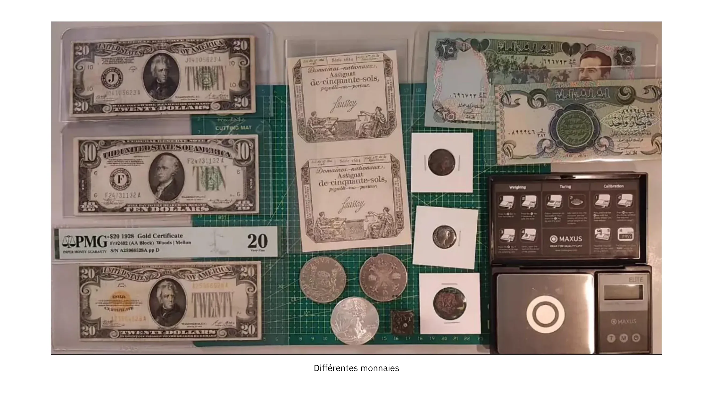

Bu tanımlar ışığında, Robert'e göre enflasyonun esas olarak para miktarındaki artışla ilgili olduğunu anlamak önemlidir-1. Öte yandan Larousse, bu genişlemenin sonuçlarına, yani fiyatlardaki genel artışa odaklanmaktadır.

Hiperenflasyonla ilgili çalışmamızda, konumuzla daha ilgili ve açık olduğu için ikinci tanımı, yani genelleştirilmiş fiyat artışını benimseyeceğiz. Ancak, fiyatlardaki bu artışın genel olarak Supply parasının genişlemesinin bir sonucu olduğunu unutmamak çok önemlidir.

Ünlü ekonomist Milton Friedman'ın ünlü bir sözü vardır:

> "Enflasyon her zaman ve her yerde parasal bir olgudur."

Bu ifade, parasal genişleme ile enflasyon arasındaki içsel ilişkiyi vurgulamaktadır. İlerleyen bölümlerde, bu temel tanımlara dayanarak enflasyon ve ekonomik büyüme arasındaki etkileşimleri inceleyeceğiz.

### Parasal Fenomeni Anlamak

Parasal olgudan bahsederken, bir ekonominin para Supply'ünün nasıl etkilendiğine atıfta bulunuyoruz. Milton Friedman bunu esasen bu KBG-3'teki bir artış olarak görmüştür. Tarihsel olarak, paranın KBG-3'ünü arttırmanın iki ana yöntemi olmuştur:

1. Parasal Baskı:

Geleneksel para sistemlerinde, para Supply'teki artış fiziksel olarak yeni banknotlar basılarak sağlanırdı. Her ne kadar günümüzde dijital para biriminin baskın olmasıyla birlikte bu baskı esas olarak elektronik ortamda (merkez bankaları ve diğer finans kurumlarının veri tabanları aracılığıyla) yapılsa da, tarih bize banknotların gerçek anlamda basılmasının hiperenflasyona yol açtığı dönemleri göstermektedir.

2. Metal İçeriğinin Azaltılması:

Bir başka yöntem de gümüş ya da altın gibi metallere dayalı para birimlerindeki değerli metal miktarını azaltmaktı. Bunun çarpıcı bir örneği, başlangıçta neredeyse tamamen gümüşten oluşan denarius'un zaman içinde gümüş içeriğinin büyük ölçüde azaldığı Roma İmparatorluğu'nda görülebilir. Bu bir tür enflasyon anlamına geliyordu, ancak hiperenflasyon olması gerekmiyordu.

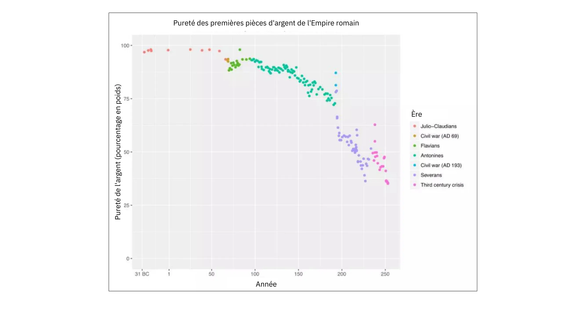

Hiperenflasyonun esas olarak değerli metaller gibi temel varlıklarından kopuk itibari para birimlerinde gözlemlendiğini vurgulamak çok önemlidir. Tarihsel olarak, bir para birimi bu tür varlıklara dayandığında, enflasyon dönemleri olmuştur (örneğin, metal içeriğinin devalüasyonu yoluyla), ancak bu dönemler hiçbir zaman hiperenflasyonun aşırı seviyelerine ulaşmamıştır. İlerleyen bölümlerde, parasal devalüasyon dönemlerini ve bu farklı para sistemlerinin enflasyon üzerindeki etkilerini ayrıntılı olarak inceleyeceğiz.

### Parasal Devalüasyon Dönemlerinin İncelenmesi

Tarih boyunca çeşitli medeniyetler parasal devalüasyon dönemleri yaşamıştır. Bu dönemlerden bazıları ekonomi üzerinde baskı yaratan büyük olaylar veya savaşlarla aynı zamana denk gelmiştir.

#### 1. Peloponez Savaşı ve İkinci Pön Savaşı:

Atina ve Sparta arasındaki bir çatışma olan Peloponez Savaşı ve Roma Cumhuriyeti ile Kartaca arasındaki İkinci Pön Savaşı, arşivlerde bulunan en eski para devalüasyonu örnekleridir. Bu savaşları finanse etmek için, bu uygarlıklar gümüş içeriğini azaltarak ve diğer metalleri dahil ederek para birimlerini devalüe etmiş ve üretilen sikke sayısını arttırmışlardır.

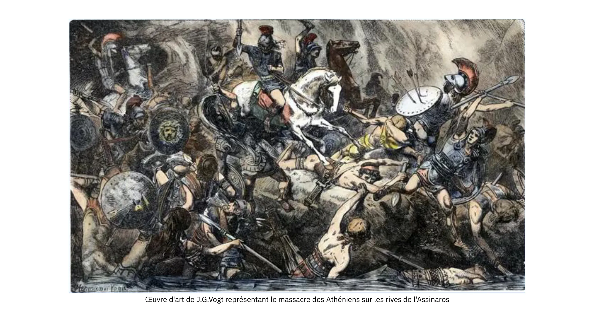

Atinalıların Assinaros kıyılarında katledilmesini tasvir eden gravür.

#### 2. İmparatorluk Döneminde Antik Roma:

Roma Cumhuriyeti döneminden sonra, İmparatorluk döneminde, 3. ve 4. yüzyıllarda önemli bir para devalüasyonu yaşanmıştır. Bu durum, bir önceki grafikte görüldüğü gibi, sikkelerin gümüş içeriğindeki azalma ile gösterilmektedir. Yapılan bir araştırma, Mısır'da drahmi cinsinden ölçülen buğday fiyatının MÖ 40'tan MS 360'a kadar yaklaşık 400 yıllık bir süre içinde bir milyon kat arttığını göstermektedir. Bu süre zarfında, yıllık ortalama %4,4'lük bir enflasyona tekabül etmektedir. Ancak bu enflasyon eşit bir şekilde dağılmamıştır. Gerçek anlamda MS 238 civarında başlamıştır. MS 250'den 293'e kadar enflasyon oranı yaklaşık %3.65 iken, MS 293 ile 301 yılları arasında %22.28'e yükselmiştir.

Bu dönemlerde önemli ölçüde enflasyon yaşanmış olsa da, bazı modern durumlarda gözlemleyebileceğimiz hiperenflasyon seviyelerine ulaşmamışlardır. Bunun nedeni, para birimi devalüe edilmiş olsa da, hala değerli metallere dayanıyor olmasıdır. Bu sağlam temel, aşırı enflasyon seviyelerine karşı bir miktar koruma sağlamıştır. İlerleyen bölümlerde hiperenflasyonun doğasını ve sonuçlarını daha ayrıntılı olarak inceleyeceğiz.

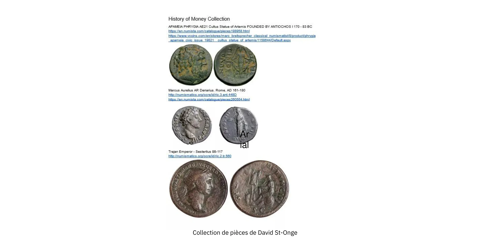

- Marcus Aurelius'un Denarius'u (MS 160):

Antik Roma'nın en ikonik sikkelerinden biri gümüş bir para birimi olan denarius'tur. Marcus Aurelius'a ait, büyük devalüasyondan önce, MS 160 yılına tarihlenen özel bir Coin'e sahibim. Fotoğraf makinesi ince ayrıntıları yakalamakta zorlansa da, çıplak gözle bakıldığında, nispeten yüksek gümüş içeriğini yansıtan güzel bir gümüş Coin olduğu görülebilir.

- Antoninianus (MS 3. yüzyıl sonu):

Parasal devalüasyonla birlikte yeni bir para birimi olan Antoninianus ortaya çıktı. Bu para biriminin iki denarii değerinde olması gerekiyordu, ancak çok daha az gümüş içeriyordu. Benim Antoninianus Coin'm gümüş içeriğinin önemli ölçüde azaltıldığını açıkça göstermektedir. Bu dönemin Roma sikkelerine özgü "radiates" adı verilen bir taç ile süslenmiştir. Renk ve kalite karşılaştırıldığında, Antoninianus'un saf gümüş bir Coin olmaktan çok uzak olduğu görülebilir.

İki sikke yan yana karşılaştırıldığında aradaki fark çarpıcıdır. MS 160 yılına ait denarius belirgin bir gümüş görünümüne sahipken, MS 3. yüzyılın sonlarına ait Antoninianus çok daha mattır ve gümüş içeriğinde önemli bir düşüş olduğunu gösterir. Bu görsel karşılaştırma, antik Roma'nın birkaç yüzyıl boyunca geçirdiği parasal devalüasyonun açık bir örneğini sunmaktadır.

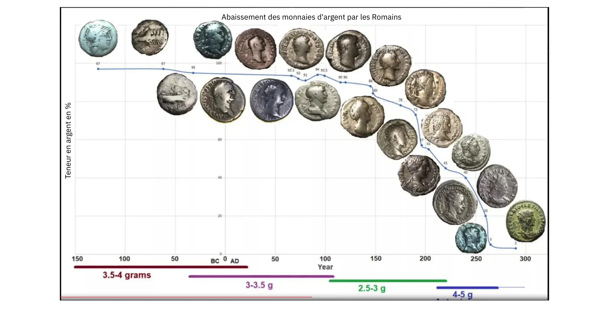

Bu gösterimi tamamlamak için, bu sikkelerin zaman içindeki değer kaybını gösteren bir grafik ideal olacaktır. Bu platformda görselleştirmek zor olsa da, denarius'un değerini, ardından 2. yüzyılın sonlarına doğru düşüşünü ve yerini iki denarii değerinde olduğu varsayılan ancak çok daha düşük gümüş içeriğine sahip Antoninianus'a bıraktığını gösteren bir grafik hayal edin. Bu eserler, geçmiş uygarlıkların ekonomik dalgalanmalarının sessiz tanıklarıdır.

#### 3. İspanyol Maravedi: Hedeflenen Devalüasyonun Tanığı

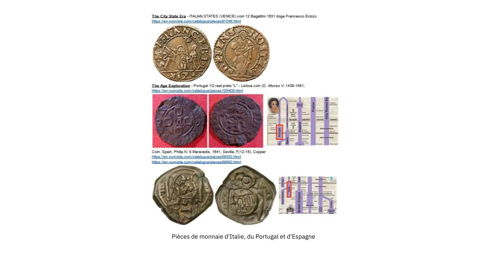

Bakır para birimi olarak Maravedi, İspanyol para birimi tarihinde özel bir yere sahiptir. Daha önce de belirtildiği gibi, İspanyol doları başlangıçta uluslararası standarttı ve İspanya için önemli bir rezerv para birimiydi. Ancak bazı ekonomik zorluklarla karşılaşan İspanya, akıllıca parasal stratejilere başvurmak zorunda kaldı.

Parasal devalüasyon, devletlerin harcamalarını finanse etmek veya ekonomiyi canlandırmak için sıklıkla kullandıkları bir araçtır. Ancak İspanya kendisini hassas bir durumda buldu. İspanyol dolarını seyreltmek uluslararası ticaretteki konumunu tehlikeye atabilirdi. Bu ikilemin üstesinden gelmek için İspanya Maravedi'ye başvurdu.

Değerli İspanyol gümüş dolarının aksine, Maravedis esas olarak yerel halk arasında kullanılan bakır bir para birimiydi. Bu para birimi devalüasyon için hedeflenmişti. Bir Maravedis Coin başlangıçta iki maravedis değerindeyse, devlet onu geri alır, yeni bir değerle, örneğin "dört" ile yeniden damgalar ve sahibine yalnızca bir Coin iade ederdi. Bahsi geçen "sekiz" damgalı Coin bu sürecin bir kanıtıdır ve birkaç devalüasyon döngüsünden geçmiştir.

Bu strateji devletin bir para birimini etkin bir şekilde devalüe etmesine, enflasyon yaratmasına ve dolaylı olarak kendini finanse etmesine olanak tanırken, İspanyol dolarının uluslararası sahnede bütünlüğünü korumasını sağladı. Ancak bu hedefli devalüasyonun, ortak para birimlerinin değerinin düştüğünü gören yerel halk için sonuçları oldu.

Maravedis vakası, bir devletin kendi iç ekonomik ihtiyaçlarını karşılamak için yerel bir para birimini seçici bir şekilde devalüe ederken, küresel sahnede bir rezerv para biriminin değerini nasıl koruyabileceğini göstermektedir. Bu, tarihteki para politikasının karmaşıklığı ve inceliğine dair çarpıcı bir örnektir.

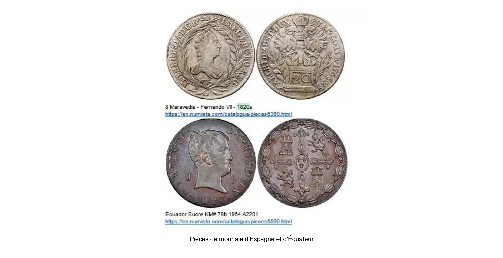

Ne hakkında daha fazla bilgi? -> [Link](https://docs.google.com/document/d/1aZa7gvz1nt8ZHDCoWKQdS9RGGjBHdipH1ApC8dW1xpM/edit?usp=sharing)

#### 4. 15'inci Yüzyıldan 17'nci Yüzyıla Fiyat Devrimi

15. ve 17. yüzyıllar arasında Avrupa, genellikle "fiyat devrimi" olarak adlandırılan dikkate değer bir ekonomik olguya tanık oldu Bu enflasyon dönemi büyük ölçüde Amerika kıtasından gelen başta altın ve gümüş olmak üzere değerli metallerin büyük akını ile tetiklenmiştir. O dönemde Avrupa ekonomisi büyük ölçüde metal standardına dayandığından, bu ilave metal Supply, para Supply'i arttırdı. Sonuç olarak, yılda yaklaşık %1 ila 2 arasında bir enflasyon oranı ortaya çıktı. İlk bakışta bu enflasyon mütevazı görünebilir. Ancak o dönemde bu tür fiyat dalgalanmaları bir "devrim" olarak değerlendirilecek kadar olağandışıydı Bu durum, parasal rezervlerdeki değişikliklerin tüm ekonomik sistemi nasıl etkileyebileceğini vurgulamaktadır.

#### 5. John Law ve Assignats

18. yüzyılda Fransız ekonomi tarihine para birimiyle ilgili iki önemli olay damgasını vurmuştur. İlk olarak, İskoç bir ekonomist ve finansçı olan John Law, Fransız hükümetini kağıt paraya dayalı bir para sistemini benimsemeye ikna etti. Başlangıçta ülkenin mali sorunlarına yenilikçi bir çözüm olarak görülse de, bu girişim hızla yaygın bir enflasyona yol açtı. Kısa bir süre sonra, Fransız Devrimi'nin kargaşası sırasında hükümet "assignat "ları tanıttı.

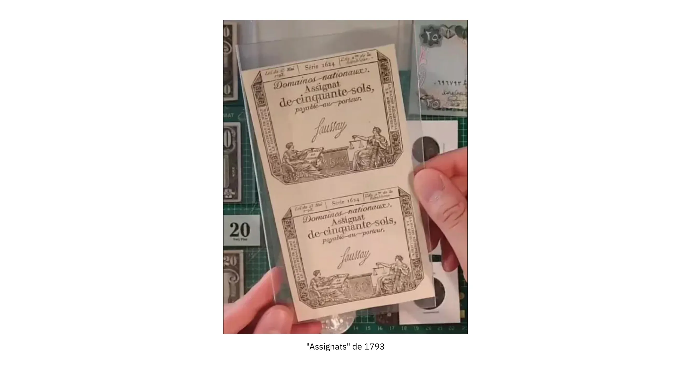

1793'ten Assignats

Bu banknotlar tarihteki ilk büyük hiperenflasyon döneminin canlı tanıklarıdır. Başlangıçta birbirini izleyen mali krizlere bir yanıt olarak tasarlanan assignatlar kısa sürede parasal istikrarsızlığın sembolü haline geldi. Harcamalarını finanse etmek için bu kağıt paraya aşırı derecede güvenen hükümet, eşi benzeri görülmemiş bir ekonomik krize neden oldu ve devrimden sonra Fransa'da büyük bir hiperenflasyon dönemi yarattı.

#### 6. 6102 Sayılı İcra Emri ve Doların Devalüasyonu

6102 Sayılı İcra Emri ve Doların Devalüasyonu

Amerika Birleşik Devletleri'nde 1930'ların başı para politikasında büyük bir değişime tanıklık etti. İşte bu dönüşümün ayrıntılı bir özeti:

- 1928 20 Dolarlık Banknot

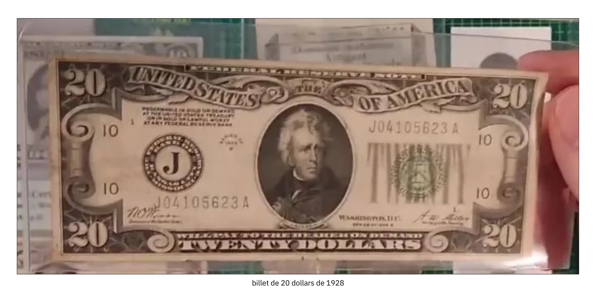

1928 yılında Amerika Birleşik Devletleri'nde 20 dolarlık bir banknotta şöyle yazıyordu: "Talep edildiğinde altın olarak itfa edilebilir." Bu, her bir banknotun tam anlamıyla altına dönüştürülebilir olduğu anlamına geliyordu. Özellikle, 20.67 dolarlık bir banknot bir ons altına eşdeğerdi.

- Yürütme Emri 6102

1933 yılında, 6102 sayılı İcra Emri'nin çıkarılmasıyla büyük bir karışıklık meydana geldi. Bu kararname, vatandaşların külçe, sikke veya sertifika şeklinde altın bulundurmasını yasadışı hale getirdi.

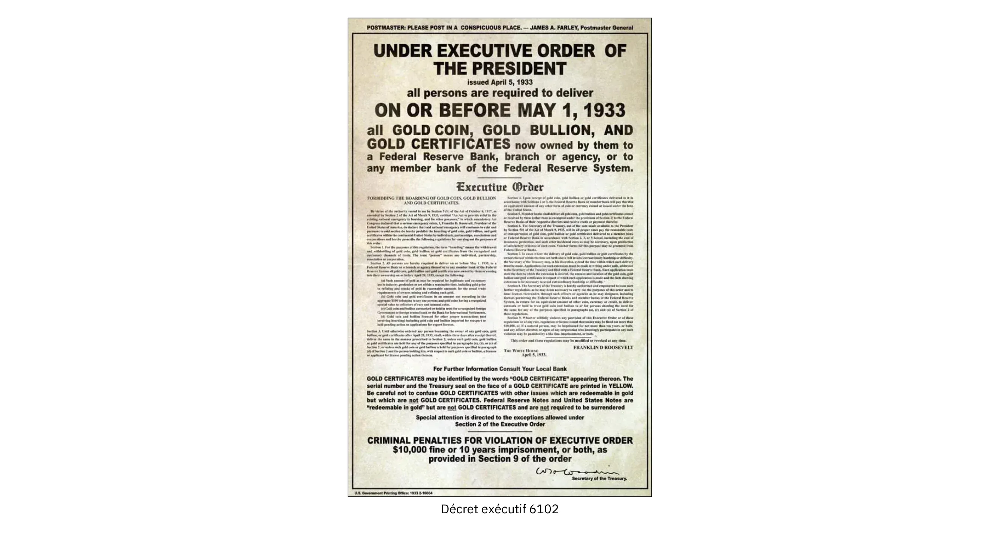

Altın Sertifika buna iyi bir örnektir. Üzerinde şöyle yazıyordu: "Coin altın olarak, talep üzerine hamiline ödenebilir." Böyle bir sertifikaya sahip olmak yasadışı hale geldi ve 1964 yılına kadar da öyle kaldı.

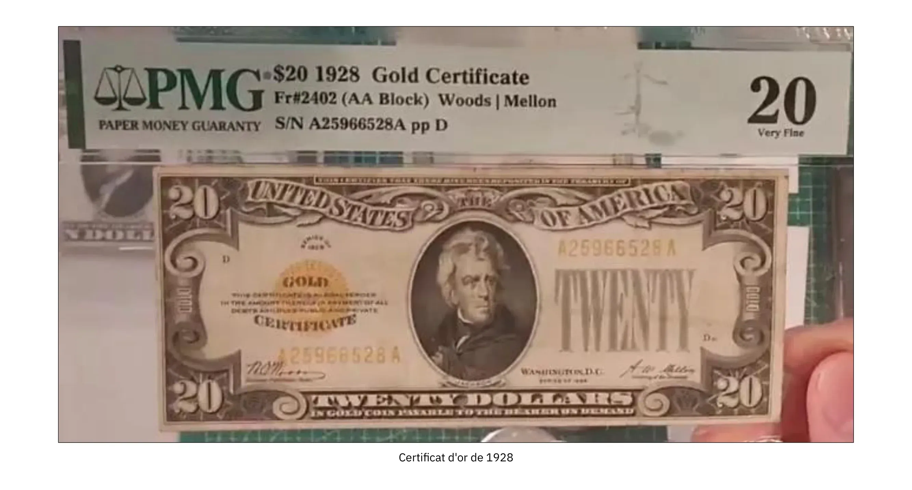

- Yeni Banknotların Tanıtımı

1934'te altına el konulmasının ardından yeni bir banknot serisi tedavüle çıkarıldı.

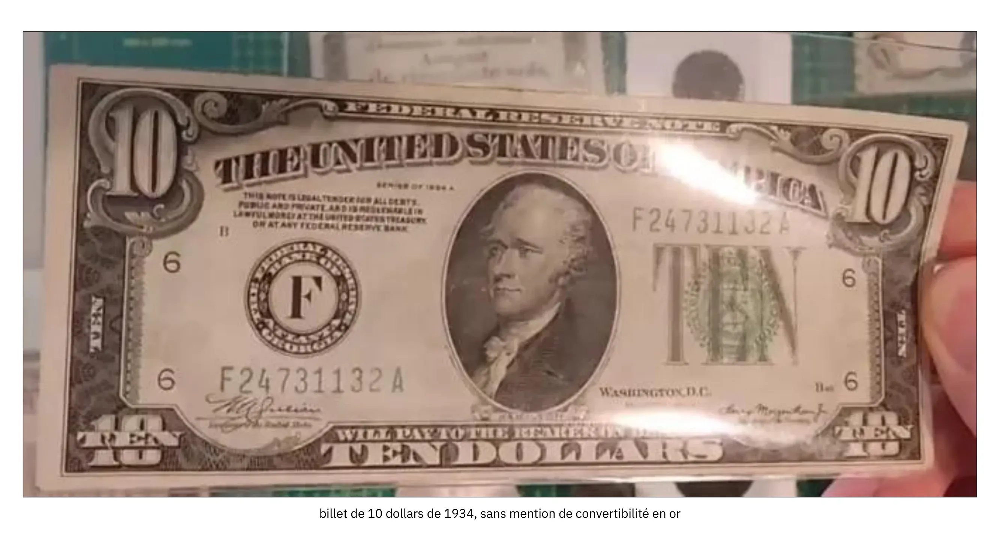

Altına çevrilebilirliklerini belirten ifade kaldırılmış ve yerine "Bu senet tüm borçlar için yasal ödeme aracıdır" (Ce billet est une monnaie légale pour toutes dettes) ifadesi eklenmiştir.

- Altının Yeniden Değerlenmesi

Bu geçişle ilgili büyüleyici olan şey hükümetin stratejisidir. 1934 yılında altının ons fiyatı 20.67 dolar yerine 35 dolara yükseltildi. Esasen hükümet, insanların sahip olduğu doların değerini düşürdü. Hükümet, 1933 yılında halktan ons başına 20.67 dolardan altın satın alarak ve ardından 1934 yılında altın fiyatını yeniden değerleyerek, vatandaşlarının tasarruflarını değersizleştirirken önemli bir kar elde etti.

Özetle, hükümet bir yıl içinde vatandaşların altınlarına fiilen el koymuş, ardından da altının değerini hazinenin lehine ve başlangıçta altınlarını banknotlarla değiştirenlerin aleyhine olacak şekilde yeniden değerlendirerek oyunun kurallarını değiştirmiştir.

### ABD tarihi değiştiriyor.

Amerika Birleşik Devletleri, küçük ticaret ülkelerinde gözlemlenen önceki uygulamaların aksine, dünya rezerv para birimi olan ABD dolarının değerini düşüren ilk ülke olarak tarihi bir dönüm noktasına imza atmıştır.

Daha önce, Rönesans döneminde, 13. yüzyılda Floransa tarafından çıkarılan İtalyan florini uluslararası rezerv para birimiydi ve kullanıldığı süre boyunca hiçbir devalüasyon kaydedilmemişti, bu da parasal istikrarın uluslararası ticaret için önemini yansıtıyordu.

Aynı ruhla, gelişen uluslararası ticaretleri nedeniyle dünya rezerv para biriminin sahipleri olan İspanya ve Hollanda, uluslararası mübadelelerde güveni ve statükoyu korumak için para birimlerinin bütünlüğünü korudular. Hatta Hollanda, küresel parasal evrimde önemli bir kilometre taşı olan ilk merkez bankasının kuruluşuna tanıklık etmiştir.

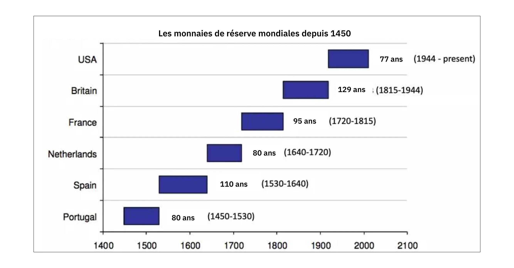

Ancak, Amerika Birleşik Devletleri'nin baskın ekonomik güç olarak yükselmesiyle durum değişti. Rezerv para birimlerinin değerini düşürmeyi seçtiler ve böylece enflasyonu kendi avantajlarına kullandılar. Bu karar genellikle rezerv para seçiminin artık eskisi kadar serbest olmadığı değişen dinamiklere bağlanır. Amerikan hegemonyası doları dünya rezerv para birimi olarak belirlemiş ve değerinin manipüle edilmesine izin vermiştir. Bu değişim, küreselleşmiş bir ekonomide para politikalarının uluslararası ticaret üzerindeki potansiyel etkisini ortaya koymakta ve küresel rezerv para birimlerinin yönetiminde önemli bir geçişe işaret etmektedir.

### Yol için son örnek: İsviçre Akşam Yemeği

İsviçre Dinarı, parasal devalüasyonun bir başka büyüleyici yönünü, bu kez Körfez Savaşı öncesi Irak bağlamında göstermektedir. Adını banknotlarının dikkat çekici kalitesinden alan bu para birimi Irak Merkez Bankası tarafından çıkarılmış ve Orta Doğu bölgesinde istikrar konusunda bir üne sahip olmuştur. Bu güven esas olarak İngiltere'de yapılan ve devalüasyona karşı belirli bir sağlamlık ima eden banknot baskısının kalitesinden kaynaklanıyordu.

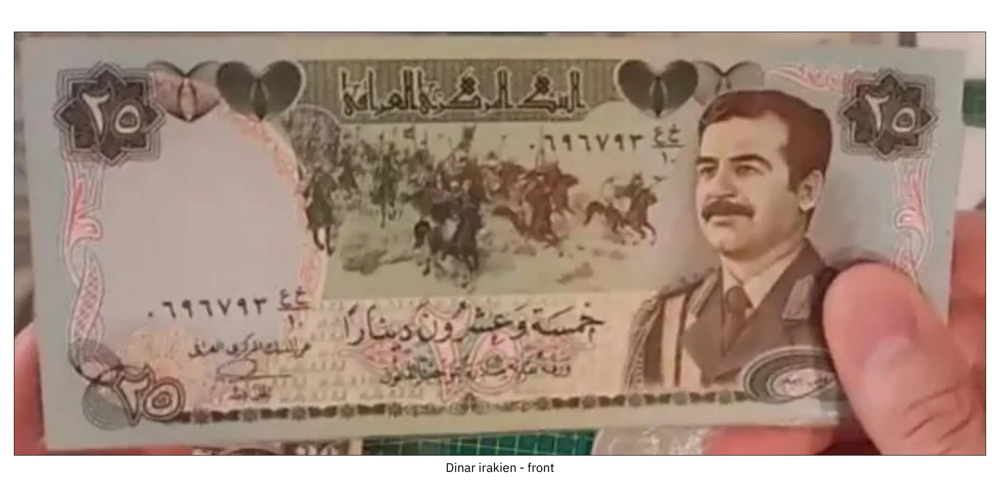

Ancak Körfez Savaşları İsviçre Dinarı'nın tarihinde bir dönüm noktası oldu. Banknot basımı için artık İngiliz tedarikçisine güvenemeyen Irak, Çin'e yöneldi. Bu geçiş banknotların kalitesinde belirgin bir farka yol açtı ve Çin versiyonu daha düşük olarak algılandı. Bu algı temelsiz değildi; Çin banknotları daha kolay taklit edilebiliyordu ve hükümet tarafından aşırı baskıya açıktı, dolayısıyla değerlerini tehdit ediyordu.

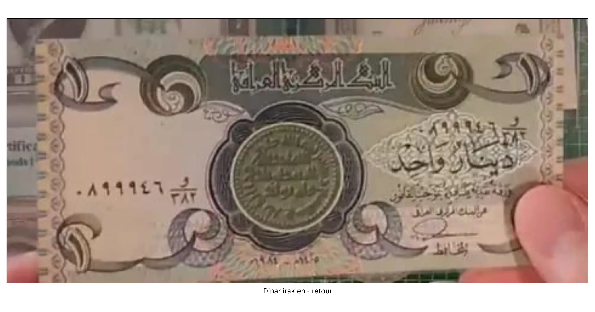

Körfez Savaşı sonrası Irak ekonomisinde kendine özgü bir olgu ortaya çıktı: ikili fiyatlandırma sistemi. Tüccarlar ödeme için kullanılan banknotun türüne göre farklı fiyatlar sunuyor, orijinal İsviçre Dinarı'nı Çin banknotuna tercih ediyorlardı. Bu sistem, değerin esas olarak devlet tarafından empoze edildiği bir bağlamda bile, devalüasyona daha az eğilimli olan daha yüksek kaliteli banknotlara duyulan güveni yansıtıyordu. Bu olay, para biriminin içsel özelliklerinin önemini ve itibari para rejiminde bile bir para biriminin algılanan kalitesinin göreceli değerini ve dolayısıyla ekonomik aktörlerin güvenini nasıl etkileyebileceğini göstermektedir.

#### Evet, paraları gerçekten tarttık!

Yaygın algı genellikle para birimini, basımının ve değerinin devlet tarafından düzenlendiği devlet yaratımı ile ilişkilendirir. Bu kavramın kökleri, madeni paraların İmparatorluk tarafından standartlaştırıldığı ve damgalandığı, böylece para birimlerine resmi değer kazandırıldığı Roma gibi eski uygarlıklara dayanmaktadır. Ancak daha derin bir araştırma, para biriminin içsel değerinin esas olarak değerli metal içeriğinden kaynaklandığını ortaya koymaktadır.

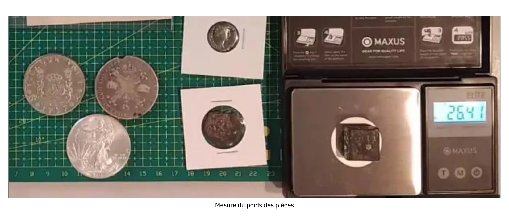

Bir örnek, sekiz İspanyol realine veya bir İspanyol dolarına eşdeğer bir parasal ağırlığın incelenmesiyle gösterilmiştir. Değerini belirten bir Roma rakamıyla işaretlenmiş olan bu ağırlık, para bozduranlar tarafından sikkelerin değerini sadece damgalarına göre değil ağırlıklarına göre değerlendirmek için kullanılıyordu. Kambiyo memurları sikkeleri tartarak, değerlerini düşürebilecek şekilde değiştirilip değiştirilmediklerini veya hasar görüp görmediklerini belirleyebiliyorlardı. Bu uygulama, devlet tarafından standartlaştırılmış damganın paraya belirli bir nominal değer kazandırmasına rağmen, gerçek değerin içerdiği değerli metalin ağırlığında yattığını vurgulamaktadır.

Bu analiz, paraya ve dolayısıyla paranın değerine duyulan güvenin, devletin iddiasından ziyade paranın somut özüne bağlı olduğunu göstermektedir. Devlet tarafından dayatılan nominal değer ile değerli metalin içeriğinin belirlediği içsel değer arasındaki ikiliğin altını çizmektedir. Böylece, para birimi sadece bir devlet aracı olmanın ötesine geçmekte, temel değeri özünde somut ve ölçülebilir Elements ile bağlantılı olmaktadır.

#### Sonuç

Sonuç olarak, parasal devalüasyon üzerine yapılan bu çalışma, ilerleyen videolarda incelenecek olan enflasyon mekanizmalarının derinlemesine anlaşılmasına kapı açmaktadır. Farklı enflasyon türlerini ve bunların yüksek veya hiperenflasyona geçiş eşiğini tartışacağız. Bu sağlam temel, önümüzdeki oturumlarda enflasyonun karmaşıklıklarını Address'e taşımamızı sağlayacaktır. İlginiz için teşekkür eder, parasal dinamikleri keşfetmeye devam etmek için bir sonraki videoda görüşmek üzere.

## Enflasyon Türleri

<chapterId>b438fe09-375e-5bb2-9196-7dd687b9f98c</chapterId>

### Enflasyon çok faktörlü bir olgu değildir

Bu bölümde, sıklıkla yanlış anlaşılan bir olgu olan enflasyonun farklı boyutlarını inceleyeceğiz. Enflasyon medyada ve günlük tartışmalarda sıklıkla çok faktörlü bir olgu olarak algılansa da, temelde parasal bir olgu olduğunu unutmamak çok önemlidir.

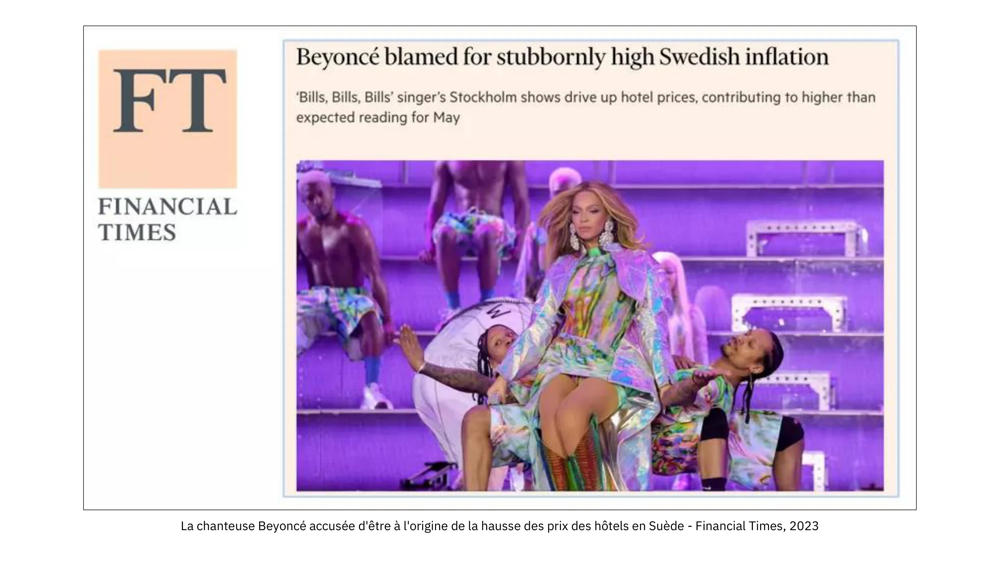

İşte konunun birkaç kilit noktaya ayrılmış bir dökümü:

- Fiyat Artışı ve Enflasyon Arasındaki Fark:

Fiyat artışı sektöre özgü olabilir ve petrol için OPEC üretimindeki düşüş veya buğday için elverişsiz hava koşulları gibi çeşitli faktörlerden kaynaklanabilir.

Enflasyon ise sadece belirli bir sektörde değil, bir dizi mal ve hizmette fiyatların genel olarak artması olarak tanımlanır.

- Enflasyonun Parasal Özü:

Sabit bir parasal KBG-12 ile, bir sektördeki fiyat artışı diğer sektörlerdeki fiyatların düşmesine neden olacaktır, çünkü başka yerlerde harcanabilecek para miktarı azalacaktır. Enflasyon, tüm sektörlerde fiyatların eşzamanlı olarak artmasına olanak tanıyan para Supply'deki bir artışla yakından ilişkilidir.

- Para Supply'ün Enflasyon ve Deflasyon Üzerindeki Etkisi:

Sabit paralı bir Supply sisteminde, üretimdeki bir artış teorik olarak deflasyona, yani fiyatlarda düşüşe yol açmalıdır, çünkü daha fazla mal ve hizmet mevcut olacaktır.

Mevcut itibari para sisteminde, Supply parasındaki bir artış, üretimdeki bir artışın neden olduğu potansiyel deflasyonu ortadan kaldırmaktadır.

- Para Supply Ayarlamasının Olumsuz Etkileri:

Üretimde buna tekabül eden bir artış olmaksızın Supply parasındaki bir artış, aynı miktarda mal ve hizmet için dolaşımda daha fazla para olduğundan enflasyona yol açar.

Üretimdeki artışın deflasyona yol açması gerekirken, eş zamanlı olarak Supply parasındaki artış bu etkiyi geçersiz kıldı ve bunun yerine enflasyona neden oldu.

- Enflasyon, Deflasyon ve Para Supply: İletişim Gemileri:

Enflasyon ve deflasyon bir ekonomide birbiriyle haberleşen damarlar gibidir. Üretimdeki bir artış deflasyona yol açabilir, ancak eş zamanlı olarak Supply parası artırılırsa, deflasyonist etki iptal edilir ve enflasyonla sonuçlanır.

Bu tartışma, enflasyon ve deflasyonun altında yatan mekanizmaları ve para Supply'in manipüle edilmesinin ekonomi üzerinde nasıl derin etkiler yaratabileceğini anlamanın önemini vurgulamaktadır. Bu kavramları, birbirleriyle olan bağlantılarını ve küresel ekonomi üzerindeki etkilerini daha derinlemesine anlamak için muhtemelen daha sonra tekrar ele alacağız.

### Para basmak neden her zaman enflasyona neden olmaz?

#### Enflasyon ≠ TÜFE

Enflasyon, genellikle para arzındaki artışla ilişkilendirilse de, 2008 finansal krizini takip eden dönemde görüldüğü gibi, her zaman para basımı ile doğrudan bir korelasyona sahip değildir. Bankaları kurtarmak için önemli miktarda para basılmasına rağmen, takip eden on yılda yüksek enflasyon yaşanmamış, yıllık ortalama %0 ila %2 arasında seyretmiştir. Bu durum şu soruyu akla getirmektedir: büyük miktarda para basımı neden orantılı bir enflasyona yol açmamıştır? Bu sorunun cevabı enflasyonun ve Tüketici Fiyat Endeksinin (TÜFE) ölçülmesine ilişkin bazı nüanslarda yatmaktadır.

İlk açıklama enflasyonun ölçülme biçiminde yatmaktadır. Enflasyonun ana göstergesi olarak kullanılan Tüketici Fiyat Endeksi (TÜFE) bazı kısıtlamalara sahiptir. Örneğin, gayrimenkul fiyatlarının gelişimini kapsamlı bir şekilde dikkate almamaktadır. TÜFE kiralarla ilgili bir bileşen içermesine rağmen, konut fiyatlarındaki önemli değerlenme tam olarak yansıtılmamaktadır. Sonuç olarak, konut maliyetlerindeki önemli artışlar TÜFE tarafından tam olarak yakalanmadan gerçekleşebilir ve bu da gerçek enflasyonu potansiyel olarak olduğundan düşük gösterebilir.

Buna ek olarak, TÜFE'nin hesaplanması gerçek fiyat artışlarını dengeleyebilecek veya maskeleyebilecek bazı metodolojiler içermektedir. Örneğin, ürünlerdeki niteliksel iyileştirmeler endeksi ayarlamak için kullanılabilir. Bir ürünün fiyatı artar ancak kalitesi veya özellikleri de iyileşirse, TÜFE tüketici için gerçek değerin değişmediğini ve dolayısıyla enflasyonu yansıtmadığını düşünebilir. Parasal enjeksiyon nedeniyle sığır eti ve bilgisayar fiyatlarındaki artışa rağmen bilgisayar performansındaki iyileşmenin bu artışı dengelemek için kullanıldığı bir durum örnek olarak verilebilir. Eğer bir bilgisayar iki kat daha pahalı ama dört kat daha güçlü ise, TÜFE bunu fiyatlarda bir düşüş olarak yorumlayabilir ve böylece sığır eti fiyatlarındaki artışı maskeleyebilir.

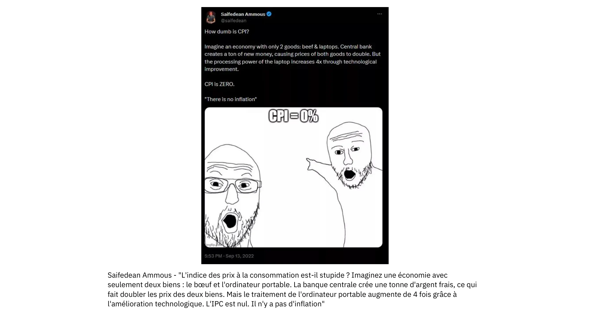

Enflasyonun TÜFE ile ölçülmesindeki bu nüanslar, parasal baskı ile enflasyon arasındaki ilişkinin karmaşıklığını vurgulamaktadır. Ayrıca, özellikle gayrimenkul gibi kilit sektörlerdeki tüm fiyat artışlarının daha kapsamlı bir şekilde dikkate alınması halinde gerçek enflasyonun rapor edilenden daha yüksek olabileceğine işaret etmektedir. Bu analiz, para politikalarının ekonomik etkilerini daha iyi anlayabilmek için enflasyonun altında yatan mekanizmaları ve enflasyonu ölçmek için kullanılan geleneksel endekslerin kısıtlarını anlamanın önemini vurgulamaktadır.

#### MMT'nin Argümanları

Modern Para Teorisi (MMT) para yaratma ve enflasyon konusunda farklı bir bakış açısı sunmaktadır. MMT'ye göre para öncelikle hükümetten kaynaklanır ve hükümet, bu fonların hedeflediği sektörler doygunluğa ulaşmadığı sürece enflasyona yol açmadan ihtiyaçlarını finanse etmek için önemli miktarlarda para basabilir. Bu, geleneksel para teorilerinden ayrılan ve sektörel hazmetme kapasitelerinin enflasyonist dinamiklerdeki önemini vurgulayan bir yaklaşımdır.

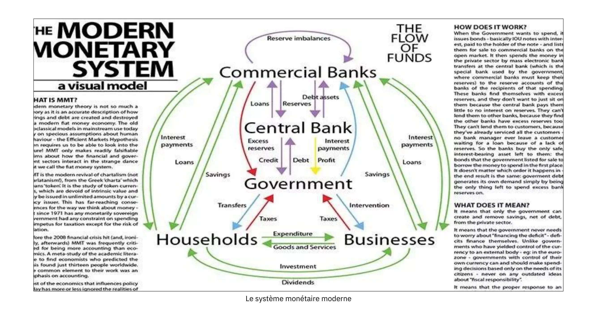

MMT'nin açıklayıcı bir örneği Amerikan askeri-endüstriyel kompleksidir. MMT'ye göre, emme kapasitesi sayesinde bu sektöre enflasyona neden olmadan yüz milyarlarca dolar tahsis edilebilir. Buna karşılık, sınırlı sayıda şirket ve işgücünün bulunduğu ABD'de yol yapımına büyük miktarda fon aktarılması halinde, kaynak kıtlığı ve tedarikçilerin talep ettiği artan maliyetler nedeniyle enflasyon ortaya çıkabilir.

Japonya, MMT savunucuları tarafından sık sık önemli miktarda parasal baskıya rağmen enflasyonun olmadığına dair bir başka örnek olarak gösterilmektedir. Ancak Japonya'daki durum, Tüketici Fiyat Endeksi (TÜFE) gibi geleneksel enflasyon ölçütlerinin sınırlılıklarını da vurgulamaktadır. Japonya'da basılan paranın büyük bir kısmı mevcut tüketim ekonomisinde harcanmak yerine ya tasarruf ediliyor ya da emlak veya borsaya yatırılıyor. TÜFE, bu dinamikleri tam olarak yakalayamadığı için gerçek enflasyonu olduğundan düşük gösterebilir.

Japonya'ya ilişkin analiz (https://ideas.repec.org/p/ces/ceswps/_9821.html), TÜFE'ye dahil edilmeyen varlıklarda tasarruf veya yatırım gibi ekonomik birimlerin davranışlarının parasal baskının enflasyonist etkisini maskeleyebileceğini de vurgulamaktadır. Ayrıca, farklı sektörlerin enjekte edilen likiditeyi emme kabiliyeti enflasyonun ortaya çıkıp çıkmamasında önemli bir rol oynamaktadır.

#### Banka ve Merkez Bankası Bilançoları

Para basmanın neden enflasyona yol açmayacağına dair üçüncü bir örnek de para basma ile enflasyon arasındaki ilişkinin yeni yaratılan paranın ekonomiye nasıl girdiğine bağlı olmasıdır. Eğer bu para ekonomik aktörlere borç verilmeden özel bankaların bilançolarında kalırsa, reel ekonomiyi doğrudan etkilemeyecek ve dolayısıyla enflasyona yol açmayacaktır.

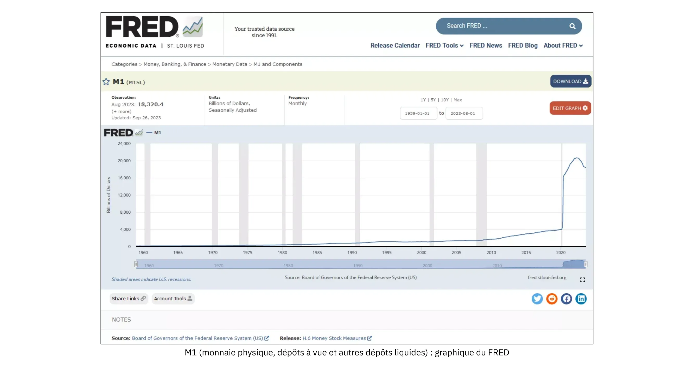

Parasal baskı, ekonominin üzerinde sallanan Demokles'in kılıcı olarak görülebilir. Yaratılan para, banka kredileri veya diğer mekanizmalar yoluyla ekonomiye enjekte edilmediği sürece, görünür bir enflasyonist etki olmaksızın belirli bir süre boyunca gizli kalabilir. Ancak, bu gizli para nihayet dolaşıma sokulduğunda, enflasyonist etkiler ortaya çıkabilir. Daha önce yaratılmış olan paranın ekonomiye girerek enflasyona yol açtığı 2020'lerde gözlemlenen budur.

Bu senaryo, para basmanın enflasyonist etkisini belirlemede parasal aktarım mekanizmalarının önemini vurgulamaktadır. Merkez bankasının para yaratması bulmacanın sadece bir parçasıdır. Verecekleri kredi miktarına karar veren özel bankaların davranışları ve ödünç aldıkları parayı nasıl harcayacaklarına karar veren borçluların davranışları da bu dinamikte çok önemli Elements'tür.

#### Enflasyon sosyaldir!

Weimar Cumhuriyeti örneği, para basımı ve enflasyon arasındaki ilişkinin bir başka önemli yönünü göstermektedir: beklentilerin ve ekonomik aktörlerin davranışlarının rolü. Weimar Cumhuriyeti Merkez Bankası büyük miktarda para basmaya başladığında, ekonomik belirsizlik bireylerin parayı harcamak yerine istiflemelerine, yani depolamalarına yol açmıştır. Bu tepki para basımının enflasyonist etkilerini geçici olarak geciktirmiştir.

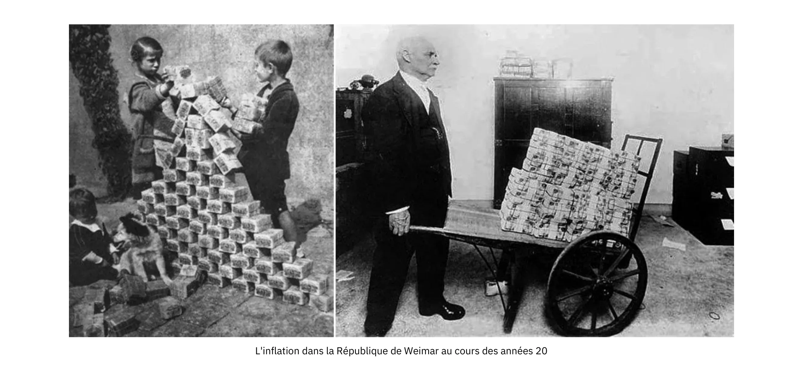

Ancak, ekonomik durum biraz iyileşmeye başladığında, güven yavaş yavaş yeniden tesis edildi. Bunun üzerine bireyler tasarruflarını sakladıkları yerlerden çekerek ekonomide kitlesel harcamalar yapmaya başladılar. Davranışlardaki bu ani değişim, zaten yüksek olan para miktarı ile birleşince talepte bir patlamaya yol açtı. Dolaşımdaki daha fazla para ve artan taleple birlikte fiyatlar hızla yükselmeye başladı ve gözle görülür bir enflasyona yol açtı.

Bu örnek, enflasyonun ortaya çıkmasında zamanlamanın ve aracı davranışının önemini vurgulamaktadır. Enflasyon sadece para miktarındaki artışa tepki olarak değil, aynı zamanda bu paranın ekonomide nasıl ve ne zaman harcandığına bağlı olarak da ortaya çıkar. Ekonomik belirsizlikler ve ekonomik aktörlerin beklentileri bu dinamikte önemli bir rol oynar ve para basımının enflasyonist etkilerini hızlandırabilir ya da geciktirebilir.

#### Özet:

- Tüketici Fiyat Endeksi (TÜFE): TÜFE, enflasyonu olduğundan düşük gösterecek şekilde yapılandırılmıştır ve bu da enflasyonist gerçekliğin çarpıtılmış bir resmini verebilir.

- Sektörel Emilim: Paranın, onu emebilecek sektörlere enjekte edilmesi her zaman enflasyona yol açmaz. Bunun başlıca örneği, enflasyona yol açmadan büyük miktarlarda parayı emebilen ABD askeri-endüstriyel kompleksidir.

- Japonya örneği: Önemli miktarda para basılmasına rağmen Japonya'da enflasyon düşük kalmaktadır çünkü fonlar genellikle tasarruf edilmekte ya da emlak veya borsaya yatırılmaktadır. Bu sektörler basılan parayı emmekte ve TÜFE bu alanlardaki fiyat artışlarını yansıtmamaktadır.
- Para Basımı ve Piyasalar Arasındaki Korelasyon: Emlak ve hisse senedi piyasalarının eğrilerinin genellikle para basımını takip ettiği ve basılan paranın nereye yönlendirildiğini gösterdiği gözlemlenmektedir.
- Bankaların Parasal Rezervleri: Basılan para bankaların bilançolarında kaldığında ve ekonomide dolaşıma girmediğinde enflasyona neden olmaz. Bu durum, basılan paranın büyük ölçüde banka bilançolarında kalarak enflasyonist etkiyi geciktirdiği 2008 örneğinde görülmektedir.

- Weimar Cumhuriyeti: Bu tarihsel dönem, ekonomik belirsizliğin nasıl para biriktirmeye yol açarak enflasyonu geciktirdiğini göstermektedir. Ancak, güven yeniden tesis edildiğinde ve para harcandığında enflasyon patlamıştır.

Bu örnekler, enflasyonun neden her zaman para basmanın doğrudan bir sonucu olmadığını ve ekonomik bağlamların ve ajan davranışlarının enflasyonu nasıl etkilediğini açıklamak için tartışmalarda kullanılabilir.

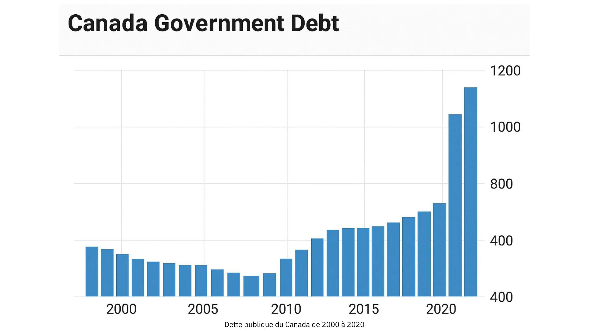

Çünkü bu [thread](https://twitter.com/saifedean/status/1673639779433590786)'in gösterdiği gibi: Enflasyon, merkez bankalarının suçu dışında her şeydir.

- Ekonomistler enflasyonu iklim değişikliğine bağlıyor

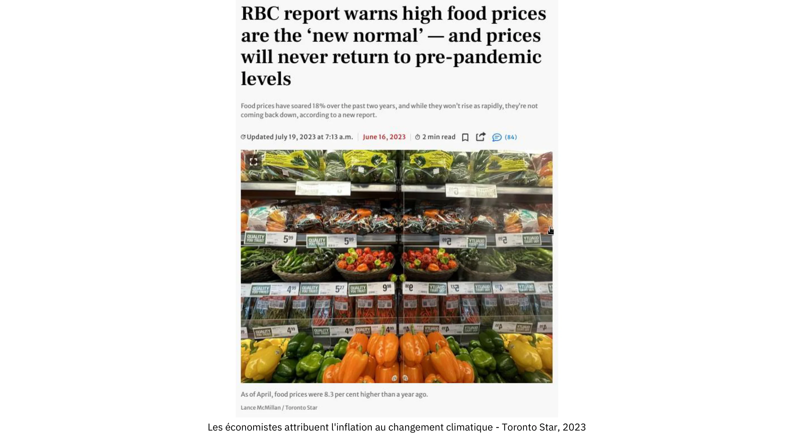

- İsveç'in belirli bir aydaki enflasyon için Beyoncé'yi suçlaması örneği.

- Polonya Merkez Bankası enflasyonu Rusya'nın Ukrayna'daki saldırganlığına ve pandemiye bağlıyor

- Birleşik Krallık'ta enflasyondan Brexit sorumlu tutuluyor.

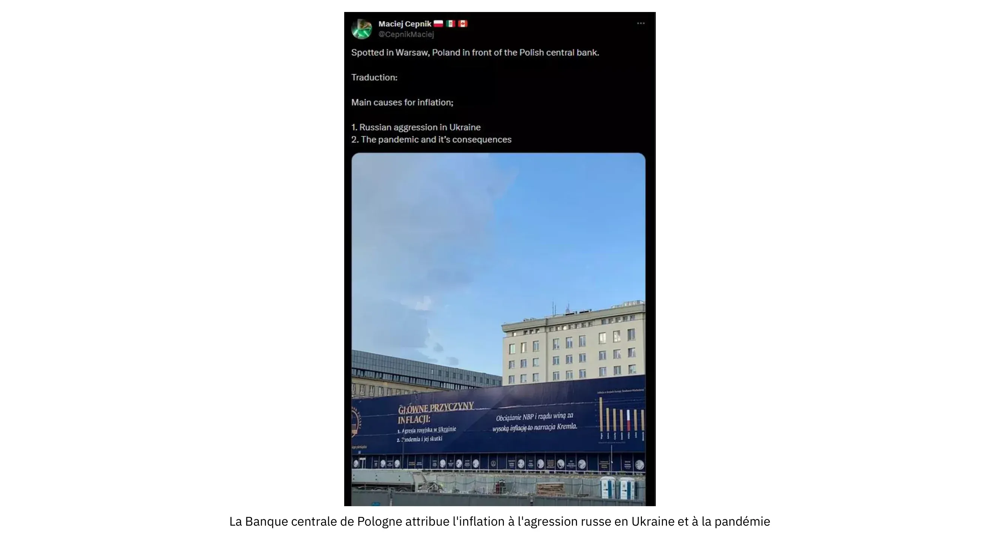

- Zelda oyununun piyasaya sürülmesi enflasyonist bir şokla ilişkilendirilmiştir.

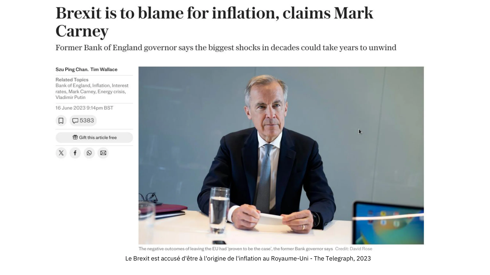

- Taylor Swift'in enflasyona neden olduğu iddia ediliyor.

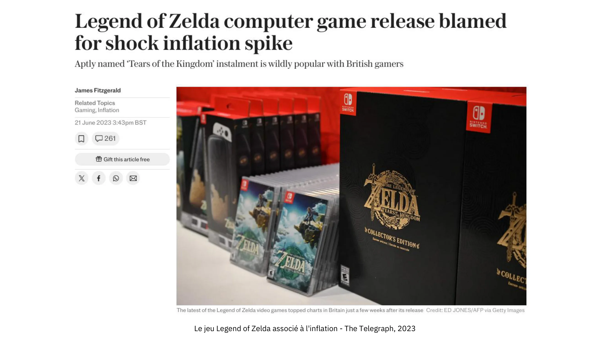

Beyoncé ya da Taylor Swift, söyleyin bana, fiyatlardaki yaygın artışı nasıl açıklayabilir? Gördüğünüz gibi, hiç mantıklı değil. Kısacası:

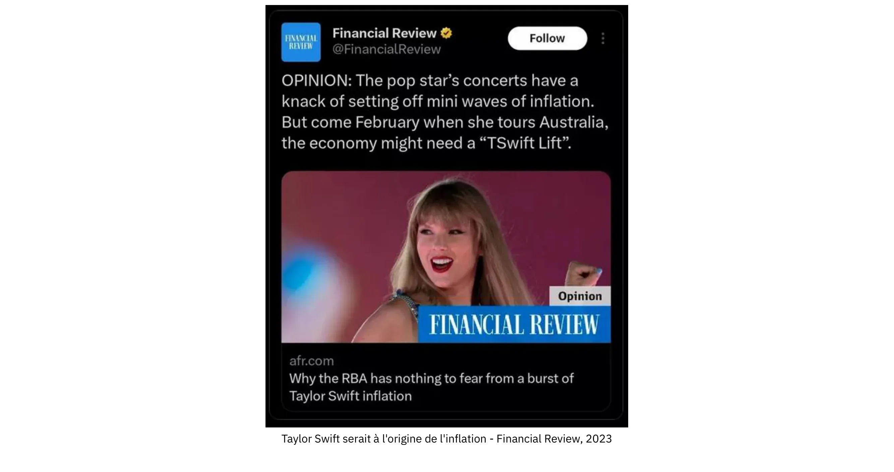

### Enflasyon Türlerinin Keşfi

Farklı enflasyon türleri arasındaki ayrımı anlamak çok önemlidir; bu anlayış, bu ekonomik olgunun çeşitli tezahürlerini kavramamızı sağlar. İşte bu farklı türlerin bir açıklaması:

- Sürünen Enflasyon: Bu, merkez bankalarının genellikle hedeflediği enflasyon türüdür ve yıllık yaklaşık %2 olarak belirlenmiştir. Bu hedef 1990'lardan beri benimsenmiştir ve aşırı ısınma veya deflasyon olmaksızın istikrarlı ekonomik büyümeyi sürdürmeyi amaçlamaktadır.
- Ilımlı Enflasyon: Bu enflasyon şekli, enflasyon %2'lik hedefi aştığında ortaya çıkar. Genellikle aşırı ısınan bir ekonomi ile ilişkilendirilir; aşırı paranın fiyatlarda genel bir artışı teşvik ettiği bir durumdur. Bu senaryo para politikalarının sınırlarını ortaya koyar ve bazen ekonomik söylemdeki çelişkileri açığa çıkarır.
- Dörtnala Enflasyon: Genellikle çift haneli enflasyon olarak adlandırılan dörtnala enflasyon, yıllık enflasyon oranı %10'u aştığında ortaya çıkar. Bu, ekonomik istikrarı tehlikeye atabilecek önemli bir fiyat artışına işaret eder.

- Hiperenflasyon: Hiperenflasyon, enflasyon oranının aylık %50'yi aştığı aşırı bir olgudur; bu da enflasyonun üstel doğası nedeniyle yıllık %13.000'in üzerinde bir enflasyon oranına eşdeğerdir. Bu düzeydeki bir enflasyon ekonomiyi ciddi şekilde istikrarsızlaştırır, para birimini neredeyse değersiz hale getirir ve parasal sisteme olan güvenin kaybolmasına neden olur.

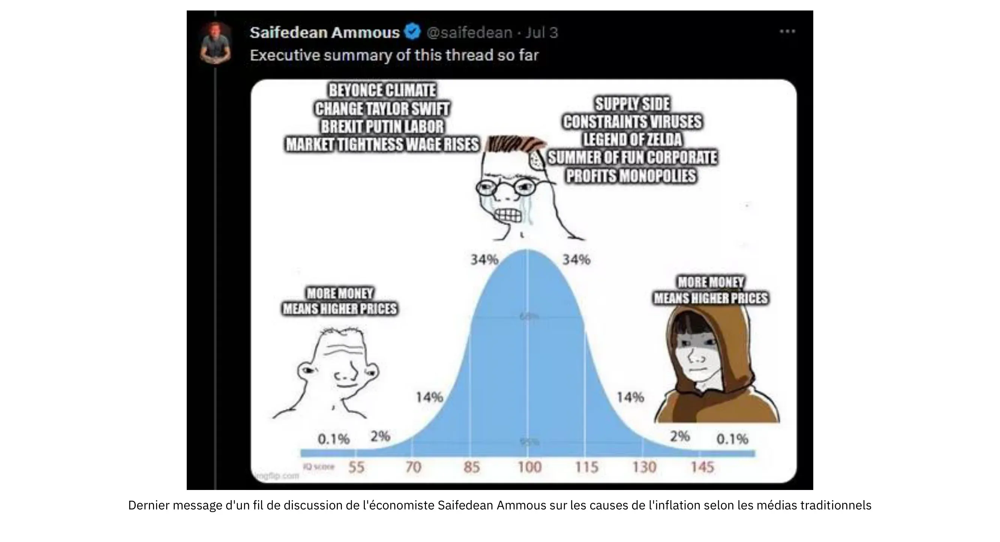

Enflasyon türlerini araştırırken, eğitim kaynaklarında "Talep Çekişi" ve "Maliyet İtişi" gibi terimlerle karşılaşmak yaygındır. Bu kavramlar geçerli olmakla birlikte, parasal bir olgu olarak enflasyondan ziyade fiyat artışlarını açıklama eğilimindedir. İşte daha derinlemesine bir analiz:

- Talep Çekme:

Talep çekişli enflasyon genellikle ekonomideki talebin mevcut üretimi aştığı bir durum olarak açıklanır. Ancak, para arzında buna karşılık gelen bir artış olmadan, bu durum basitçe harcamaların yeniden dağılımına yol açacaktır. Tüketiciler temel mallara daha fazla, diğerlerine ise daha az harcama yaparak genel enflasyonist etkiyi nötralize edebilirler.

- Cost Push:

Diğer yandan, Maliyet İtici enflasyon, doğal kaynaklar veya işgücü gibi üretim maliyetlerindeki artışa bağlanmaktadır. Yine Supply'de bir artış olmaksızın, bir sektördeki maliyet artışları yaygın bir enflasyona neden olmaksızın diğer sektörlerdeki harcamaları azaltabilir.

Bu geleneksel açıklamalar genellikle fiyat artışlarını enflasyonla ilişkilendirir ve bu da kafa karıştırıcı olabilir. Gerçekte, yaygın bir enflasyonun ortaya çıkması için para arzında bir artış olması gerekir. Bu bağlamda, Talep Çekişi ve Maliyet İtişi kavramları sektörel fiyat değişimlerini açıklayabilir, ancak enflasyonun parasal doğasını yakalayamazlar. Bu durum, sektörel fiyat artışları ile yaygın enflasyon arasında ayrım yapmanın önemini vurgulamakta ve enflasyonun ekonomi genelinde ortaya çıkması için parasal KBG-29'da bir artış olması gerektiğini yeniden teyit etmektedir. Bu analiz, enflasyonun gerçek nedenlerine ilişkin daha incelikli ve kesin bir bakış açısı sunmakta ve altta yatan parasal dinamikleri maskeleyebilecek yaygın yorumların gizemini ortadan kaldırmaktadır.

### Bernholz'a Göre Enflasyon Sınıflandırması

Bernholz, bu karmaşık parasal olgunun daha iyi anlaşılmasına olanak tanıyan basitleştirilmiş ancak kesin bir enflasyon sınıflandırmasını üç kategoride önermektedir:

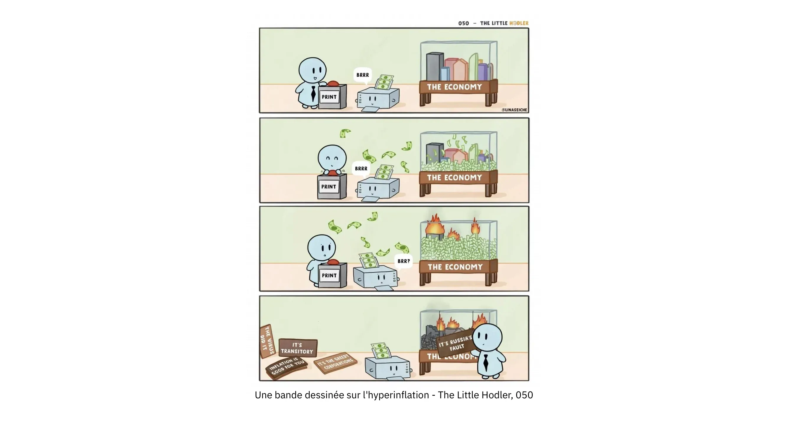

- Ilımlı Enflasyon:

Ilımlı enflasyon, Supply para seviyesinin normalden yüksek olduğu, ancak devletin para yaratarak finanse ettiği büyük açıklara başvurmadığı durumlarda ortaya çıkar. "Ilımlı" terimi önemsiz gibi görünse de, yüksek enflasyon olarak sınıflandırılmamasına rağmen bu enflasyon türü önemli sorunlara neden olabilir.

- Yüksek Enflasyon:

Yüksek enflasyon, nominal olarak artmasına rağmen paranın gerçek değeri Supply düştüğünde ortaya çıkar. Bu paradoksal durum, bireylerin ulusal paraya olan güvenlerini kaybettikleri ve mallar, hizmetler ya da yabancı para birimleri karşılığında Exchange paraya başvurdukları parasal ikameden kaynaklanır. Bu süreç paranın reel değerini daha da düşürerek enflasyonu şiddetlendirir.

- Hiperenflasyon:

Hiperenflasyon, para yaratma yoluyla finanse edilen büyük bütçe açıkları ile karakterize edilen yüksek enflasyonun bir uzantısıdır. Tarihsel olarak, para basma yoluyla önemli miktarda bütçe açığı finansmanı olmadan hiperenflasyon vakası görülmemiştir. Hiperenflasyon bir kısır döngü yaratır: enflasyon para biriminin değerini o kadar hızlı aşındırır ki vergi gelirleri devlet daha tahsil edemeden değer kaybeder ve böylece devleti kendini finanse etmek için daha fazla para basmaya zorlar. Kendi kendini güçlendiren bu döngü, genellikle aylık %50'yi aşan astronomik enflasyon oranlarına yol açar.

Bernholz tarafından yapılan bu sınıflandırma, ılımlı enflasyondan hiperenflasyona doğru tehlikeli ilerleyişi vurgulayarak, yıkıcı enflasyonist sarmalların önlenmesinde parasal ve bütçesel kontrolün hayati önemini vurgulamaktadır. Ayrıca, devlet finansmanı üzerindeki zararlı sonuçların hiperenflasyon aşamasına ulaşmadan çok önce ortaya çıkabileceğini göstererek, çeşitli derecelerdeki enflasyonun etkileri hakkında incelikli bir bakış açısı sunmaktadır.

### Sonuç: Enflasyon Türlerinin Özeti

Sonuç olarak, her biri bir ekonomideki farklı enflasyon yüzdelerini ifade eden "sürünen enflasyon", "yürüyen enflasyon" ve "dörtnala giden enflasyon" gibi yaygın olarak duyulan terimlerden başlayarak bir dizi enflasyon türünü inceledik. Ancak, hiperenflasyon üzerine yaptığımız derinlemesine çalışmada, Bernholz tarafından tanımlanan ılımlı enflasyon, yüksek enflasyon ve hiperenflasyon kategorileri önemli ölçütler olarak karşımıza çıkmaktadır.

- Ilımlı Enflasyon:

Bu, normalin üzerinde bir para Supply seviyesine işaret etmektedir, ancak bu seviye devlet tarafından önemli bir açık finansmanı olmadan sürdürülebilir.

- Yüksek Enflasyon:

Paranın gerçek değeri Supply düştüğünde, genellikle bireylerin mal, hizmet veya diğer para birimleri karşılığında paralarını Exchange almak istedikleri parasal ikame nedeniyle ortaya çıkar.

- Hiperenflasyon:

Bu durum, büyük bütçe açıklarını finanse etmek için aşırı para yaratılmasının para biriminin gerçek değerinde hızlı bir erozyona yol açtığı yüksek enflasyonun aşırı bir versiyonunu temsil etmektedir.

Araştırmamızdan çıkan sonuç, hiperenflasyonun karmaşık ve sezgisel olmayan bir olgu olduğudur. Hiperenflasyonun Supply parasındaki büyük bir artışın sonucu olduğu varsayılsa da, gerçekte bu Supply parasının gerçek değerindeki bir düşüşten kaynaklanmaktadır. Bu nüans, bazı ülkelerin Dünya Bankası veya IMF gibi uluslararası kuruluşların desteğine rağmen neden hiperenflasyondan çıkmakta zorlandığını anlamak açısından çok önemlidir. Enflasyonun türünü yanlış tanımlamak, uygun olmayan çözümlerin uygulanmasına yol açarak ekonomik sorunları çözmek yerine daha da kötüleştirebilir.

Gelecekteki tartışmalarımızda, hiperenflasyonun tanımlarını ve çeşitli ekonomik bağlamlardaki tezahürlerini araştırarak daha derinlere ineceğiz. Amacımız hiperenflasyonun altında yatan mekanizmaları ortaya çıkarmak ve Address'ye yönelik potansiyel çözümleri araştırmak olacaktır. Bu incelikli anlayış, ilgili zorlukları daha iyi kavramamızı ve enflasyon yönetimi için bilinçli stratejiler önermemizi sağlayacaktır.

İlginiz için teşekkür ederiz. Bir sonraki oturum tamamen farklı akademik ve pratik bakış açılarını dikkate alarak hiperenflasyonun tanımlanması ve gizeminin çözülmesine ayrılacaktır. Bir sonraki toplantımızda sizlerle birlikte bu araştırmaya devam etmeyi dört gözle bekliyoruz.

# Hiperenflasyon nedir?

<partId>3f541663-1e2f-5410-8ee0-f61c5d009fa5</partId>

## Hiperenflasyon tanımları

<chapterId>d2a71a2e-5f36-58d9-993c-d431f4aa07fd</chapterId>

### Hiperenflasyon tanımları

Bu bölümde, aşırı parasal olguların incelenmesinde önemli bir terim olan hiperenflasyonun çeşitli tanımlarını inceleyeceğiz. En bilinen tanım, 1956 tarihli "The Monetary Dynamics of Hyperinflation" adlı çalışmasında hiperenflasyonun niceliksel olarak anlaşılmasını öneren Philip Cagan'dan gelmektedir. Cagan'a göre:

- Hiper Enflasyonun Başlangıcı ve Sonu:
  - Aylık enflasyon %50'yi aştığında hiperenflasyon başlar.
  - Enflasyon oranı en az bir yıl boyunca aylık %50'nin altına düştüğünde sona erer.

Örneğin, enflasyon Temmuz ayında %40'a düşer ve bir sonraki yılın Temmuz ayına kadar %50'nin üzerine çıkmazsa, hiperenflasyon döneminin bir önceki yılın Temmuz ayında sona erdiği kabul edilir. Bu tanım, hiperenflasyon dönemlerinin kesin bir şekilde tanımlanmasına ve yapılandırılmış bir analize olanak sağlamaktadır.

Bu tanım, 56 hiperenflasyon dönemini belgeleyen Hanke-Krus tablosunda benimsenmiştir. Ancak tablo 2016'da Venezuela'da yaşanan ve toplamda 57'ye ulaşan olay gibi tüm olayları kapsamamaktadır.

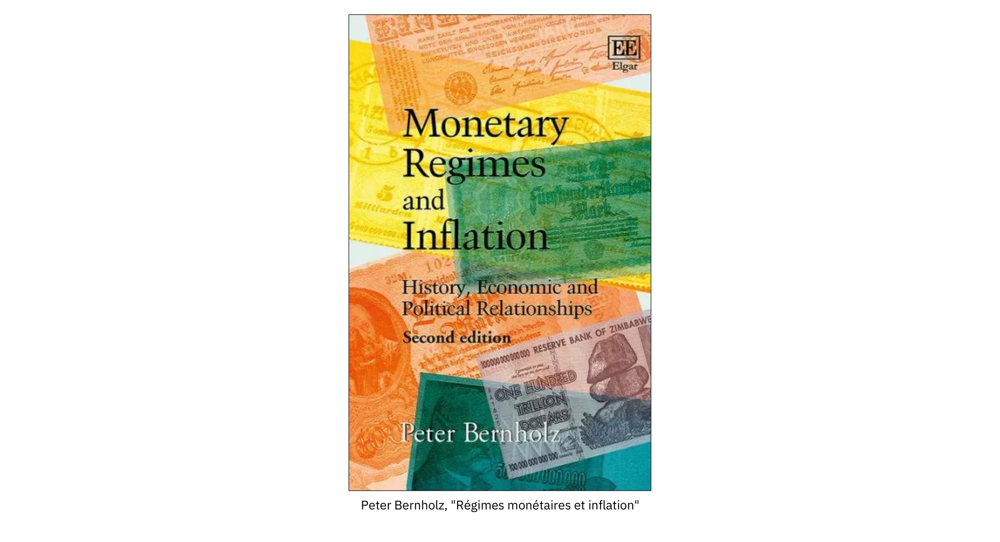

yakınlaştırma

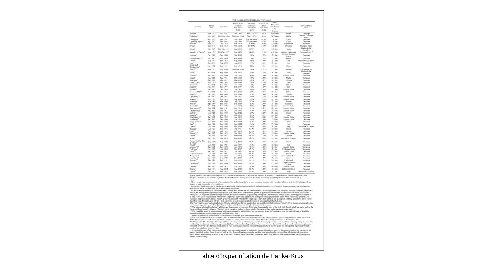

Bu tanımın, kesin olmasına rağmen, %50 eşiğinin katılığı nedeniyle bazı hiperenflasyon dönemlerini dışarıda bırakabileceği unutulmamalıdır. Bu tanımı, Cagan'ın kriterlerini tam olarak karşılamasa da yine de aşırı yüksek enflasyon dönemlerini temsil eden diğer dönemleri de içerecek şekilde genişletme olasılığı vardır. Bu gözlem, hiperenflasyon olgusunun daha geniş bir şekilde incelenmesine kapı açmakta ve nedenleri ile etkilerinin daha incelikli bir şekilde anlaşılmasına olanak sağlamaktadır. Sonraki tartışmalarda, bu tanımı yeniden gözden geçirmeyi ve Cagan'ın katı kriterleri kapsamına girmeyen hiperenflasyon dönemlerini incelemeyi düşüneceğiz.

### Cagan tarafından Hiperenflasyonun Tanımı

Philip Cagan hiperenflasyonu tanımlarken aylık %50 enflasyon eşiği ile keyfi bir dönüm noktası belirlemiş olabilir. Kendisi de bu tanımın keyfi olduğunu kabul etmekte ve analizini öncelikle yedi hiperenflasyon dönemine dayandırmaktadır. Cagan'ın verileri incelendiğinde, en düşük aylık enflasyon oranlarına sahip üç hiperenflasyon döneminin %47, %46 ve %57 civarında olduğu görülmektedir. Cagan'ın çalışmasında %50 eşiğinin bu vakaları kapsayacak şekilde seçildiği anlaşılmaktadır.

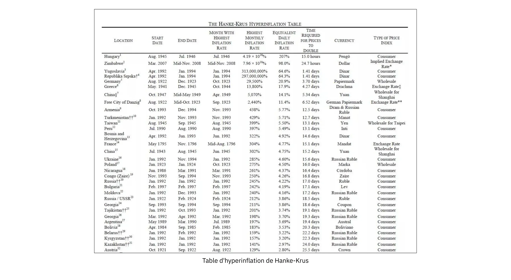

- Tarihsel Bağlam:

Cagan'ın tanımı 1956 yılına kadar uzanmaktadır ve o dönemde mevcut olan sınırlı sayıdaki hiperenflasyon dönemine dayanmaktadır.

- Cagan'ın Gözlemleri:

Cagan'a göre, hiçbir dönem daha şiddetli bir hiperenflasyona ilerlemeden %50 civarındaki bu eşiğe ulaşmamıştır, bu da bu eşiğin seçilmesini haklı çıkarabilir.

- Cagan'ın Tanımının Eleştirisi:

Monetary Regime and Inflation kitabının yazarı Bernholz gibi diğer ekonomistler de %50 eşiğini keyfi olarak nitelendirmiştir.

Bernholz, %50 eşiğine ulaşmadan hiperenflasyon dönemleriyle aynı niteliksel özelliklere sahip yüksek enflasyon dönemleri olduğunu belirtmektedir.

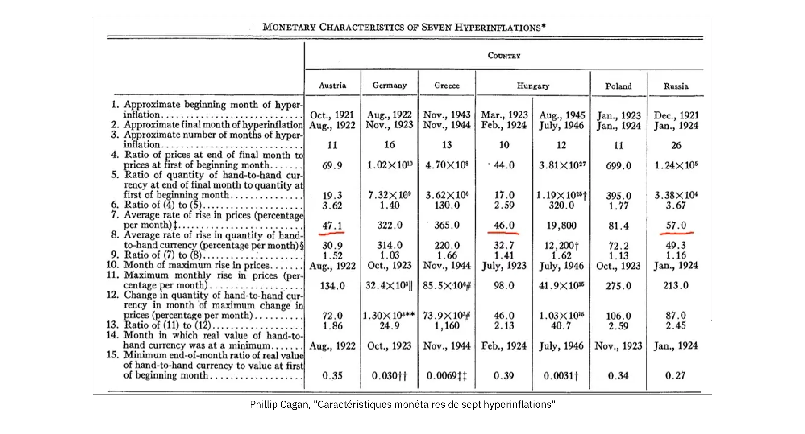

Bu düşünce bizi geleneksel hiperenflasyon tanımının katılığını sorgulamaya itmekte ve belki de daha fazla dönem ve tarihsel veriyi dahil ederek bu eşiği yeniden gözden geçirme ihtiyacını vurgulamaktadır. Hiperenflasyon tanımı, farklı ekonomik ve tarihsel bağlamlarda aşırı enflasyonun çeşitli tezahürlerini kapsayacak şekilde esneklik gerektirebilir.

### Uluslararası Muhasebe Standartları Kurulu'na (IASB) Göre Hiper Enflasyonun Tanımı

Peki, toplamda kaç tane hiperenflasyon vakası var?

Kagan tarafından öne sürülen ve aylık enflasyon oranını %50 olarak ifade eden tanım gibi yaygın hiperenflasyon tanımları bazen kafa karıştırıcı veya aşırı basitleştirilmiş olabilir. Örneğin, yıllık enflasyon oranları %1,000 ve %3,000 olan iki ülke, bu enflasyonun aylık dağılımına bağlı olarak farklı algılanabilir. Kagan'ın tanımına göre hiçbir ay %50 eşiğini aşmıyorsa, bu ülkeler hiperenflasyon durumunda olmayacaktır. Dolayısıyla bu yaklaşım, özellikle yıl içindeki kümülatif enflasyonları karşılaştırırken hiperenflasyon sınıflandırmasında anormalliklere yol açabilir.

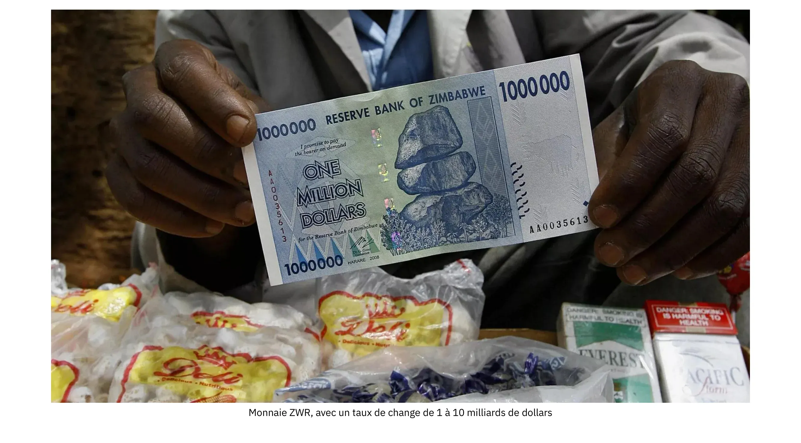

- Kagan'ın "Monetary Dynamics of Hyperinflation" adlı çalışması hiperenflasyonun temel bir analizini sunmaktadır.
- Bernold'un 30 farklı hiperenflasyon dönemini inceleyen kitabı, böylece analizin kapsamını genişletiyor.
- David'in 36 hiperenflasyon dönemine ait banknotlardan oluşan kişisel koleksiyonu, somut ve tarihsel bir anlayışa olanak sağlıyor.
- Hanky Cross tablosu (2012 versiyonu, 2016'da Venezuela ile güncellenmiştir), Kagan'ın tanımına göre 57 hiperenflasyon dönemini listelemektedir.

Bazı tarihi yüksek enflasyon dönemlerinin, genellikle katı sınıflandırma kriterleri nedeniyle klasik hiperenflasyon tablolarına dahil edilmediği unutulmamalıdır. Örneğin, Kasım 1779'daki Amerikan Bağımsızlık Savaşı ve Mart 1864'teki Amerikan İç Savaşı sırasında aylık enflasyon oranları sırasıyla %47,4 ve %40 olmuştur. Bu oranlar yüksek olmakla birlikte, Kagan tarafından öngörülen %50 eşiğini aşmamakta, dolayısıyla bu dönemler hiperenflasyon vakası olarak sınıflandırılmamaktadır. Bu ihmal, katı tanımların sınırlarını göstermekte ve hiperenflasyonu tüm karmaşıklığıyla anlamak için daha incelikli bir yaklaşıma duyulan ihtiyacı vurgulamaktadır.

## Weimar ile Zimbabve arasındaki benzerlikler

<chapterId>11eef458-aab8-5c63-8523-264d0ba69f5d</chapterId>

### İki dönem, iki felaket

Bu bölümde, Zimbabwe ve Weimar Cumhuriyeti örneklerine odaklanarak hiperenflasyonun etkilerini inceleyeceğiz. Araştırmam boyunca, salt ekonomik ya da istatistiksel bir yaklaşım yerine, bu hiperenflasyon dönemlerini yaşamış bireylerin doğrudan tanıklıklarını incelemeye öncelik verdim.

Birkaç kitap özellikle bilgilendirici olmuştur:

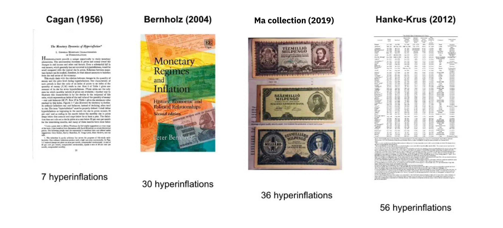

- adam Ferguson'un "Para Öldüğünde" adlı kitabı, Birinci Dünya Savaşı sonrasında Almanya'nın yanı sıra Avusturya ve Macaristan'da yaşanan hiperenflasyonun izini sürüyor.
- Zimbabve'deki hiperenflasyon üzerine Jérôme Gardner ve Kudzai Joseph Gou Min-Yu tarafından yazılan "Zimbabve Sıcak Kalp Çirkin Yüz" ve "Hard Haşlanmış Yumurta Endeksi" adlı iki kitap, bir giyim mağazası zincirinin CEO'su ve bir ziraat bankacısının bu çalkantılı dönemde yaşadıklarına dair dokunaklı tanıklıklar sunuyor.

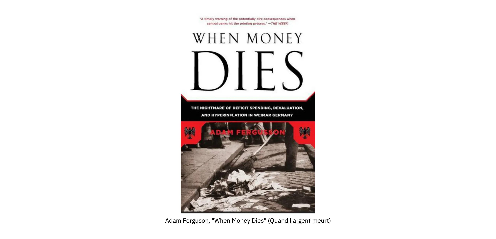

Notlarımı birleştirirken, aralarındaki 90 yıllık farka rağmen Zimbabwe ve Weimar Cumhuriyeti'ndeki hiperenflasyon deneyimleri arasında çok sayıda benzerlik olduğunu fark ettim. Yaklaşık 17 benzerlik tespit ettim ve bunlardan 13'ü bu tanıklıklarda tasvir edilen ekonomik felakete doğru bir tür ilerlemeyi gösteriyor. Bu büyüleyici paralellikler, hiperenflasyonun zaman ve sınırlar ötesinde tekrarlayan ve yıkıcı doğasını göstermektedir. Bugün bu benzerlikleri ve hiperenflasyon dönemlerinde nasıl endişe verici bir yörünge çizdiklerini inceleyeceğiz.

### Karşılaştırmalı Analiz: Zimbabve ve Weimar Cumhuriyeti

14 fark oyunu!

#### 1. Para kıtlığı

Para baş döndürücü bir hızla değer kaybettiğinde, piyasayı yeni banknotlarla doldurmaya yönelik en iddialı girişimler bile yetersiz kalabilir. Somut para birimine yönelik bitmek bilmeyen talep, merkez bankalarının banknot üretme kapasitesini çok aşarak benzeri görülmemiş likidite krizleri yaratabilir.

> Weimar: "Bu ay içinde, para sıkıntısının kesin olarak aşılacağı umulan bir rakam olan yaklaşık 4 milyar kağıt markına yükseltilecek."

> Zimbabve: "2002'den Ocak 2009'a kadar çok sayıda kritik likidite sıkıntısı yaşandı. Hızla artan enflasyonu karşılamaya yetecek kadar banknot basılmadı ya da dolaşımda değildi."

#### 2. "Ve bu gübre!"

Belirli ekonomik durumlarda paranın değerini kaybetme hızı hayret vericidir. Rekor sürede astronomik miktarlarda banknot basılabilir ve bir zamanlar hatırı sayılır meblağlar anında gübre kadar önemsiz bir şeye dönüşebilir.

> Weimar: "Şu anki toplam emisyon 63,000 milyar. Dolayısıyla birkaç gün içinde toplam tirajın üçte ikisini bir günde ihraç edebileceğiz."

> Zimbabve: "17 Eylül 2006'da RBZ Başkanı Gideon Gono, '10 trilyon hala dışarıda ve gübre haline geldi' dedi."

#### 3. Banknotlar, basıldıkları kağıttan daha az değerlidir

Belirli ekonomik koşullarda, bir banknotun gerçek değeri, üzerine basıldığı kağıdın değerinden daha düşük hale gelebilir. Bu ciddi değer kaybı, normalde değer ve satın alma gücü sembolü olan banknotları sadece değersiz kağıt parçalarına dönüştürür.

> Weimar: "Mark banknotlarının tamamı matbaadan çıkar çıkmaz neredeyse değersiz hale geldi."

> Zimbabve: "Merkez bankası, üzerine basıldığı kâğıda değmeyen bir banknot basarak parayı boşa harcadı. Başka bir deyişle, değeri tuvalet kağıdından daha düşüktü. Kulağa ne kadar saçma gelse de, 100 trilyon ZWD'lik banknotu tuvalet kağıdı olarak kullanmak, gerçek tuvalet kağıdı almaktan daha ucuzdu."

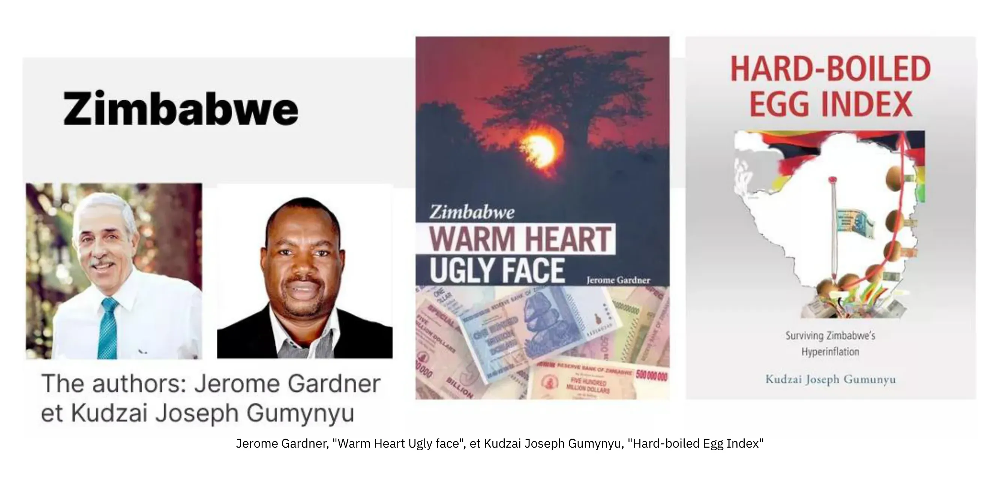

#### 4. Para sayma

Para birimi hızla değer kaybettiğinde, en basit işlemler bile zahmetli görevler haline gelebilir. Bir ürünün fiyatını hesaplamak veya sadece ödeme için gereken banknotları saymak birkaç dakika sürebilir ve günlük etkileşimlere bir Layer karmaşıklığı ekleyebilir.

> Weimar: "Bir mağazadaki en sıradan alışveriş üç ya da dört dakikalık bir hesaplama gerektiriyordu ve fiyat belirlendikten sonra banknotları saymak için genellikle birkaç dakika daha gerekiyordu."

> Zimbabwe: "Mağaza yöneticilerinin, tüm gün para sayan personelin yerine geçici bir işçi tutmalarına da izin verildi. Elbette, yönetim ve bankaya para yatırma işlemleri için mağazada para saymak bir şeydi, ancak para yatırma işlemi sırasında tüm sürecin bankada tekrarlanması gerekiyordu."

:::video id=910231d7-af90-4ab8-b74c-bfb81caebfb2:::

Özbek para sayma tekniği

#### 5. Çek ile ödemeler

Bozulan ekonomilerde çek gibi geleneksel ödeme yöntemleri etkinliğini hızla yitirebilir. Hiperenflasyon nedeniyle artan para talebinden bunalan bankalar, çeklerin bozdurulmasını kısıtlayabilir veya geciktirebilir, böylece gerçek değerlerini düşürebilirler. Bu istikrarsızlık genellikle ödeme yöntemlerinin öncelik sırasına göre belirlenmesine yol açar ve fiyatlar ödeme şekline göre değişebilir.

> Weimar: "Fiyat artışları hem devlet hem de diğer işverenler tarafından paraya olan talebi yoğunlaştırdı. Özel bankalar bu talebi karşılayamadı ve çeklerin bozdurulmasını karneye bağlamak zorunda kaldı, bu nedenle bozdurulmamış çekler donmuş halde kaldı ve satın alma güçleri azaldı."
> Zimbabve: “Paranın zaman değeri, mal ve hizmetler için üç fiyat yarattı; yani, nakit fiyat, anlık brüt mutabakat fiyatı ve çek fiyatı. Sonunda, tahsil edilmesi beş gün süren çekleri kimse kabul etmedi.”

#### 6. "Burner-preneurs"

Para biriminin değeri düştükçe, piyasa çarpıklıklarından faydalanan yeni ekonomik fırsatlar ortaya çıkar. Genellikle "Burner-preneurs" gibi yaratıcı isimlerle anılan bu girişimciler, maddi varlıklara yatırım yapmak için değeri düşmüş para birimini borç alarak ve ardından borçlarını daha da değeri düşmüş para birimiyle geri ödeyerek başarılı olabilirler.

Weimar: "Enflasyon spekülasyonu, kağıt markların ödünç alınmasını, bunların mallara ve fabrikalara dönüştürülmesini ve daha sonra borç verenlere değer kaybetmiş kağıtlarla geri ödenmesini içeriyordu."

Zimbabve: "Burner-preneurs"

#### 7. Dürüstlük ve sıkı çalışma cazibesini kaybediyor

İstikrarsız ekonomik bağlamlarda, Hard çalışma, tasarruf ve dürüstlük gibi geleneksel değerler, hızlı zenginliğin cazibesi tarafından gölgede bırakılabilir. Spekülasyon ve döviz ticareti genellikle düzenli çalışmadan çok daha yüksek ödüller sunarak toplumsal önceliklerde bir bozulmaya neden olur.

Weimar: "Tutumluluk, dürüstlük ve Hard çalışması gibi eski erdemler cazibesini yitirirken, özellikle para veya hisse senedi spekülasyonu çalışmaktan çok daha fazla getiri sağlayabildiğinden, herkes hızla zengin olmaya çalıştı."

Zimbabve: "Bu uygulamalar birkaç kişiyi zenginleştirirken, kentli işçi sınıfını ve kırsal nüfusu yoksullaştırdı. Eğitim değerini yitirdi, çünkü bu ticaret, bunu haklı çıkarmak için eğitime ya da Hard çalışmasına ihtiyaç duymayan insanlar tarafından yürütülüyordu. İhtiyaç duydukları tek şey kolay para işlerine başlamak için bağlantılar ve başlangıç sermayesiydi."

#### 8. "Dünyanın bankaları"

Hiperenflasyon veya parasal kriz durumlarında, yabancı para birimleri için paralel ve düzenlenmemiş piyasalar çoğalma eğilimindedir. Genellikle esprili bir şekilde "dünya bankaları" ya da başka yerel isimlerle anılan bu gayrı resmi "bankalar", varlıklarını devalüasyondan korumak isteyenler için bir sığınak sağlar. Bu piyasalar gerekli bir ekonomik can simidi sağlayabilseler de, genellikle resmi finans kurumlarına ve hükümet politikalarına karşı yaygın güvensizliği vurgularlar.

Weimar: "İşlemleri esas olarak Winkelbankiers denilen, enflasyonla birlikte ortaya çıkan ve hasta bir ekonomide gelişen, tamamen yabancı para birimlerinin alış ve satış fiyatları arasındaki farktan yararlanarak yaşayan sokak operatörleri aracılığıyla gerçekleştiriliyordu."

Zimbabve: "Aynı zamanda döviz bozdurucularıydılar. Yolsuzluk ve diğer uygulamaları içeren kurnaz iş becerileri sayesinde Bulawayo'daki 2. ve 6. Cadde ile Fort Caddesi arasında cezasız bir şekilde faaliyet gösteriyorlardı. Şehrin bu bölgesi 'Dünya Bankası' olarak biliniyordu."

Arjantin: "Ben de tüm Arjantinlilerin gittiği yere gittim: Buenos Aires'in kalbindeki Florida mahallesinde bulunan cuevalara, yani 'mağaralara'." - TheBigWhale

#### 9. Yabancı para takasları yasadışıydı

Hükümetler, kendi para birimlerini istikrara kavuşturmak ve sermaye akışını kontrol etmek amacıyla bu döviz işlemlerini yasadışı hale getirebilirler. Bu baskıcı önlemler, ulusal ekonomiyi korumayı amaçlasa da, genellikle ters etki yaratarak halkın güvensizliğini artırabilir ve karaborsayı teşvik edebilir.

Weimar: "İnsanlar takasa başvurdu ve giderek tek güvenilir Exchange aracı olarak yabancı para birimlerine yöneldi. Yabancı çeklerin satın alınması ve iç ödemelerde yabancı para birimlerinin kullanılmasına ilişkin yeni kararnameler çıkarıldı. Hapis cezasına ek olarak, artık yasadışı bir işlemin tutarının on katına kadar para cezası verilebilecekti."

Zimbabve: "İşyerlerine yapılan baskınlar, Bulawayo'dan birkaç işadamının hafta sonu için hapsedilmesine ve ele geçirilen döviz miktarının iki katına eşdeğer para cezalarına yol açtı, bu cesaret daha sonra azaldı."

#### 10. Sermaye kontrolleri

Bir ülke parasal veya ekonomik bir krizle karşı karşıya kaldığında, hükümetlerin verdiği yaygın tepkilerden biri sermayenin hareketleri ve biçimleri üzerinde sıkı bir kontrol uygulamaktır. İster devalüe edilmiş ulusal para birimlerinin kabulünü zorlayan emirler yoluyla olsun, ister belirli ödeme yöntemlerini reddedenlere karşı ağır yaptırımlar yoluyla olsun, bu önlemler genellikle paniği kontrol altına almayı ve güveni yeniden tesis etmeyi amaçlar. Ancak bunların etkinliği değişkenlik gösterir ve bazen bu önlemler ters etki yaratabilir ya da vatandaşların deneyimlediği gerçeklikten kopuk olabilir.

Weimar: "Tüccarlar kısa süre önce yeni bir kararnameyle devlet banknotlarını kabul etmeye zorlanmıştı; ancak bu kararname aynı zamanda tüm alışverişlerde yabancı para birimlerinin kullanılmaya devam edilmesine izin verdiği için, tüccarlar genellikle neredeyse başka hiçbir şey kabul etmemek için bahaneler buldular."

Zimbabve: "Hükümet 12 Aralık 2008 tarihinde çekle ödemeye ilişkin SI 175/2008 sayılı yasayı yürürlüğe koymuştur. Buna göre, 'Çek/banka kartı veya banka aracılı diğer elektronik ödeme yöntemleriyle ödeme yapmayı reddetmenin cezası 8. seviye para cezası veya altı ay hapis cezası ya da her ikisidir' Açıkçası, SI'yı görmezden geldik çünkü gerçeklikle tamamen bağlantısızdı."

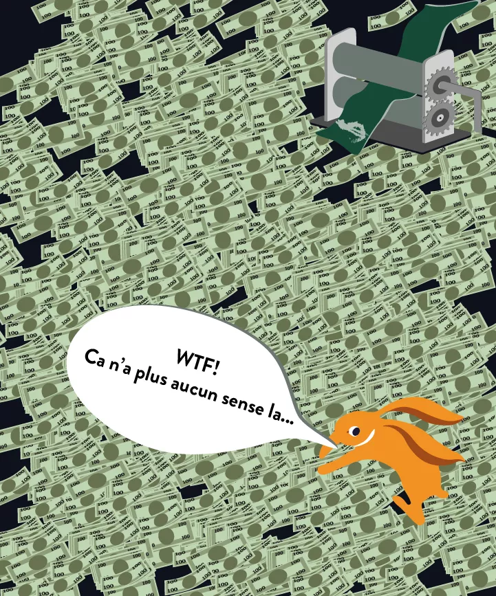

#### 11. Dükkânlarını açık tutmaya zorlandılar

Ekonomi çöktüğünde ve para birimi değer kaybettiğinde, hükümetler normallik görüntüsünü korumak için sert önlemlere başvurabilir.

Weimar: "Faaliyetlerine devam eden tüccarlar, 22 Ekim'de yürürlüğe giren ve dükkanlarını açık tutmalarını ve kağıt mark karşılığında Exchange'da mal sunmalarını gerektiren yeni bir yönetmeliğe tabi oldular."

Zimbabve: "Geriye sadece boş çelik raflar ve buzdolapları, soğutucular ve dondurucular kaldı. Asıl trajedi, siyasi gerilimler ve liderlerin hükümetin fiyat kontrol gücü tarafından tutuklanma korkusu nedeniyle kapatmaya cesaret edemedikleri için mağazanın hala açık olmasıydı. İşçiler bile işten çıkarılmadı çünkü herkes hızlı bir çözüm bulunacağını düşünüyordu."

#### 12. Herkes bir suçludur

Çöken bir ekonomi ve yaygın düzenlemeler karşısında, hayatta kalma ve suç işleme arasındaki çizgi bulanıklaşıyor.

Weimar: "Devlete karşı işlenen tüm suçlar, her biri farklı derecelerde olmak üzere, bireyler için bir hayatta kalma meselesi haline geldi."

> Zimbabve: “Zimbabve’deki her sakin bir suçluydu. Ne kadar sert gelse de, bu doğruydu. Hayatın her yönünü düzenleyen sayısız küçük yasa ile, herkesin her gün bir yasayı ihlal etmesi kaçınılmazdı. Yabancı para bulundurmak, 2004’te yayımlanan bir SI’ye göre yasadışıydı. Günlük para çekme limitini aşmak için birden fazla banka hesabına sahip olmak yasadışıydı. Arabada doğru plakaların olmaması, araba radyosu lisansı ya da jeneratör ruhsatı olmaması—bunların hepsi birilerinin bir yerlerde ihlal ettiği yasalardı.”

#### 13. Yabancı para birimini ne pahasına olursa olsun satın alın

Yabancı para birimlerinin çılgınca satın alınması, genellikle para biriminin devalüasyonunda kritik bir dönüm noktası olmuş ve içsel değerdeki düşüşü şiddetlendirmiştir.

> Weimar: "Mannheimer, patronunun talimatıyla Ağustos 1921'de dışarı çıktı ve ne pahasına olursa olsun yabancı para satın almaya başladı - 'çünkü Almanya'nın sonsuz miktarda kağıt markı vardı ama yabancı parası yoktu' Bu, markın değerindeki mutlak çöküşün ilk işaretiydi."

> Zimbabve: Bazı forex ihtiyaçları acil olduğu için kendilerine günlük hedefler verildiği ve son teslim tarihine kadar forex biriktirmek için ne pahasına olursa olsun alım yaptıkları iddia edildi. İddia edilen bu uygulama, Zimbabve dolarının değeri hızla düşmeye devam ederken devalüasyon ateşini körüklemekle suçlandı."

### Sürecin özeti

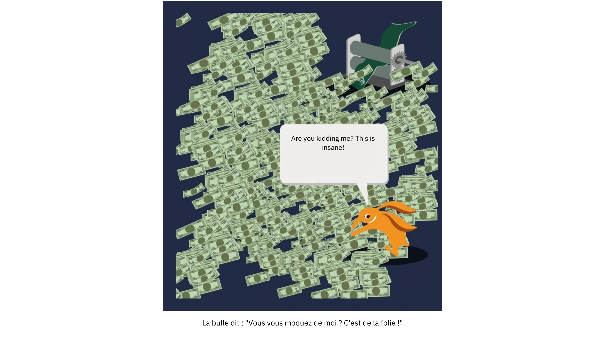

Ekonomik gidişat analiz edildiğinde, yüksek enflasyona ulaşıldığında parasal kütlenin değerinin düştüğü görülmektedir. Bu devalüasyon, banknot sıkıntısı da dahil olmak üzere çeşitli komplikasyonlara yol açmaktadır. Bu bağlamda, özellikle Exchange kur dalgalanmalarıyla birlikte arbitraj fırsatları ortaya çıkmaktadır. Sonuç olarak, birçok kişi bu arbitraja yönelir ve gelecekteki devalüasyon beklentisiyle maddi varlıklara büyük yatırımlar yaparak borçlarını zayıflamış bir para birimiyle geri ödeyebilir. Bu ekonomik ortam geleneksel işlerin cazibesini zayıflatmakta ve sonuç olarak sosyal uyumu aşındırmaktadır.

Bu duruma karşılık olarak hükümet, sermaye kontrolleri de dahil olmak üzere acımasız düzenlemeler uygular. Ayrıca tüccarların ulusal para birimini ve çekleri kabul etmesini zorunlu kılar. Zaman içinde, suç teşkil eden davranışların tanımını genişleten yeni yasalar çıkarılır. Sonuçta, hükümet daha düşük maliyetle basılan para birimini daha sağlam yabancı para birimleri karşılığında Exchange'e çevirmeye istekli olduğundan Exchange oranı katlanarak yükselir.

### 4 Hiperenflasyonun sonuçlarındaki benzerlikler

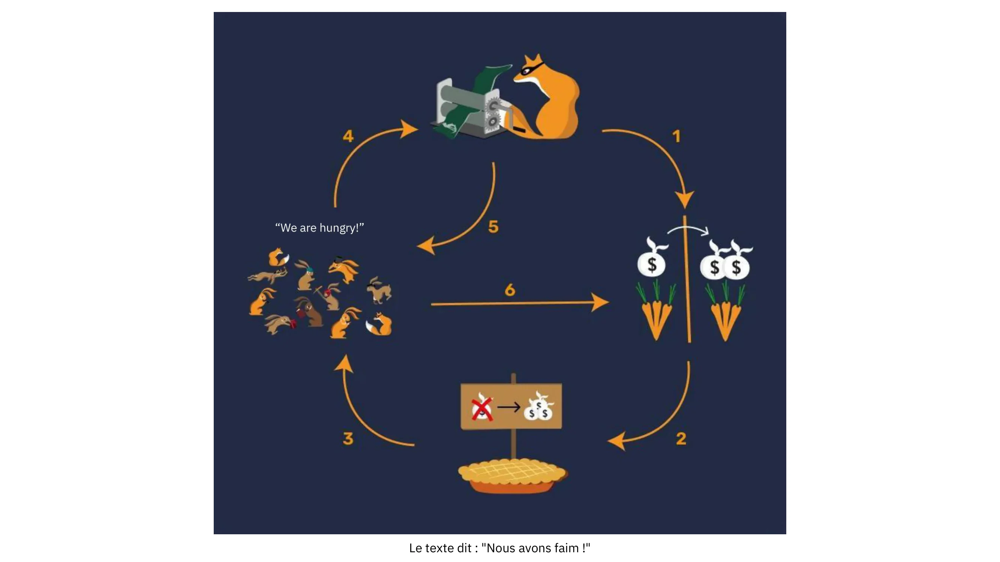

#### 1. Petrol ve metaller

Almanya’da Weimar dönemi sırasında, değerli malzemelerin hırsızlığı o kadar yaygındı ki çatılardan kurşun sık sık çalınıyordu. Zimbabve’de ise umutsuzluk, bazılarını elektrik şebekesini kesmeye ve transformatörlerden yağ çıkararak araçlarında kullanmaya itti.

Weimar: «Ulusal anıtlardaki metal levhalar güvenlik için kaldırılmak zorundaydı. Berlin’deki İngiliz Büyükelçiliği’nin kapılarından pirinç zil levhaları çalındı.»

Zimbabve: «Durumu daha da kötüleştirmek için, döviz eksikliği nedeniyle arabalar için yağlayıcı yağ kıtlığı vardı ve elektrik kesintileri sırasında soğutma yağını sifonlayan hırsızlar için transformatörler kolay bir hedef haline geldi.»

#### 2. Trenler

Paranın değer kaybı, vatandaşları vandalizme dayalı bir hayatta kalma davranışına itebilir. Çökmekte olan bir ekonomi karşısında, ulaşım sistemleri gibi pahalı kamu altyapıları tehlikeye girebilir ve bu da yıkıcı toplumsal sonuçlara yol açabilir.

> Weimar: «Berlin’de, tramvay sistemi kaynak yetersizliğinden çalışmayı durdurdu.»

> Zimbabve: «En rahatsız edici ve üzücü senaryolardan biri, Harare’yi Dabuka’ya bağlayan (280 kilometreden fazla) neredeyse tüm elektrikli bakır hattının çalınmasıydı. Tamamlandığında, bu hat Zimbabve’nin gururuydu; bu güzergâhta hızlı elektrikli yolcu ve yük trenleri işliyordu.»

#### 3. “Mealie Meal” (mısır unu)

Çok düşük maaşlar ve istikrarsız bir ekonomi bağlamında, şirketler çalışanlarını üretken ve işlevsel tutmak için onlara yiyecek sağlamak zorunda kaldılar. Bu girişim sadece kıtlık ve yüksek gıda maliyetlerini telafi etmenin bir yolu değil, aynı zamanda zor ekonomik koşullarda personeli elde tutma stratejisiydi.

> Weimar: «Berlin’de başkentte çok önemli bir sınıf oluşturan büro çalışanları, ayda 12.000 ila 20.000 arasında (yılda 12 ila 19 sterlin) tamamen yetersiz maaşlar alıyorlardı ve bu maaşlar sürekli azalmakta idi; ancak çoğu hâlâ ofisleri tarafından sağlanan sembolik bir miktar karşılığında öğle yemeği alabiliyordu, böylece beden ve ruh zar zor ayakta tutulabiliyordu.»

> Zimbabve: «Bu aşamada, tüm personelimize ücretsiz öğle yemeği sağlıyorduk. Mısır unu şirketimizin sürekli işleyişi için hayati önem taşıyordu çünkü birçok durumda bu, personelimizin her gün aldığı tek öğündü.»

#### 4. Benzin kuponları

Halk, işlemler için istikrarlı alternatifler arıyordu. Weimar’da pirinç ve yakıt gibi ürünler, sabit içsel değerleri nedeniyle değişim aracı olarak hizmet etti. Zimbabve’de ise Zimbabve dolarının hızlı değer kaybıyla karşı karşıya kalındığında, sabit bir miktar temel ürünü temsil eden benzin kuponları fiili bir para birimi haline geldi. Bu durumlar, toplumların aşırı ekonomik koşullara nasıl uyum sağladığını ve ticareti ve ekonomiyi sürdürmek için yenilikçi çözümler bulduğunu gösteriyor.

Weimar: «Takas zaten yaygın bir değişim biçimiydi; ancak şimdi pirinç ve yakıt gibi mallar alış ve ödeme için yaygın para birimi haline gelmişti.»

Zimbabve: «Bu kuponları artık ev sahiplerine kira, belediye vergileri, telefon faturaları — aslında neredeyse her şey — için kullanıyorduk; çünkü herkes Zimbabve dolarları ve çeklerle yapılan ödemeleri kabul etmeyi bırakmıştı.»

#### Sonuç

Bu video, Zimbabve ve Weimar Cumhuriyeti’nde hiperenflasyon dönemlerinde yaşanan deneyimlerin benzerlikleri hakkında burada sona eriyor. Bir sonraki videoda farklılıklar ve çağdaş paralellikler hakkında konuşacağız. Teşekkürler.

## Weimar ve Zimbabwe: Farklılıklar ve Çağdaş Paralellikler

<chapterId>643f279c-d89f-5600-a2e2-b1bbbba0ab69</chapterId>

Bu bölümde, geçmişteki ve günümüzdeki hiperenflasyon dönemleri arasındaki farklılıkları ve güncel paralellikleri, anekdotlar ve bugün için ilgili karşılaştırmalarla inceleyeceğiz.

### Weimar Cumhuriyeti ve Zimbabve arasındaki farklar

#### 1. Suç doların!

Almanya'da halkın enflasyonu, kendi para birimlerinin içsel değer kaybından ziyade doların yükselişine bağlaması yaygındı. Pek çok kişi gözlemlenen olgunun doların değer kazanmasından kaynaklandığına inanıyordu. Bu algı, yaşadıkları ekonomik zorluklar ile esasen aşırı para yaratımının neden olduğu parasal devalüasyon arasındaki bağlantının fark edilmesini engelledi. "Para Öldüğünde" adlı kitap, Alman halkı arasındaki bu anlayış eksikliğini açıkça göstermektedir. Buna karşılık Zimbabve'de durum farklıydı: vatandaşlar yaşadıkları hiperenflasyonun altında yatan nedenin tamamen farkındaydı.

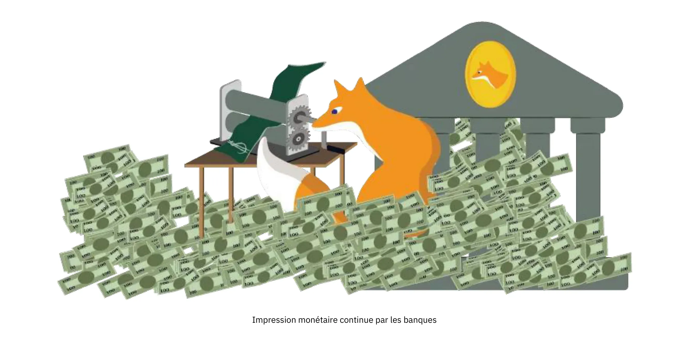

#### 2. Zorunlu para (Notgeld)

Parasal ve ekonomik krizle karşı karşıya kalan Almanya "Notgeld "e (acil durum parası) başvurdu. Şehirler ya da belirli şirketler tarafından basılan bu banknotlar, Address ortak para birimi sıkıntısı için tasarlanmıştı.

İlginçtir ki Fransa da özellikle 1920'lerde Notgeld'e başvurmuştur. Bu girişim sadece hiperenflasyonun doğrudan bir sonucu değildi, aynı zamanda kökleri I. Dünya Savaşı'nın neden olduğu aksaklıklara dayanıyordu. Savaş sadece ekonomiyi istikrarsızlaştırmakla kalmadı, aynı zamanda metallerin maliyetini de arttırdı. Sonuç olarak, metal sikkelerin gerçek değeri çoğu zaman nominal değerlerini aştı ve insanları bunları istiflemeye teşvik etti. Madeni para yokluğunda, Lyon Ticaret Odası gibi bazı kurumlar kendi Notgeld'lerini bastı.

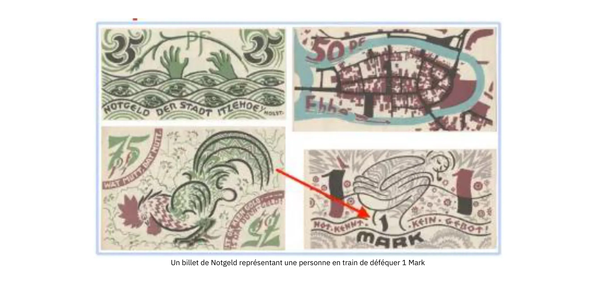

> "Yapılması gereken, yapılmalıdır." - yerel bir deyiş

Notgeldler arasında belirli bir banknot öne çıkmaktadır. Dokunaklı bir illüstrasyona sahiptir: ortada, bir Mark'ı dışkılayan bir kişi tasvir edilmiştir. Arka yüzünde ise 1913'ten 1921'e kadar uzanan bir fiyat tablosu, bu dönemde enflasyonun yükselişini göstermektedir.

Bu Notgeld'in arkasındaki sanatçı, hiperenflasyon krizinden sorumlu yetkililere ironik bir eleştiri getiriyor gibi görünüyor. Banknotun üzerinde "Zorunluluk kanun tanımaz" yazıyor. Notgeld'in menşei olan bölgeye özgü bir başka ifade de şu şekildedir: "Yapılması gereken, yapılmalıdır".

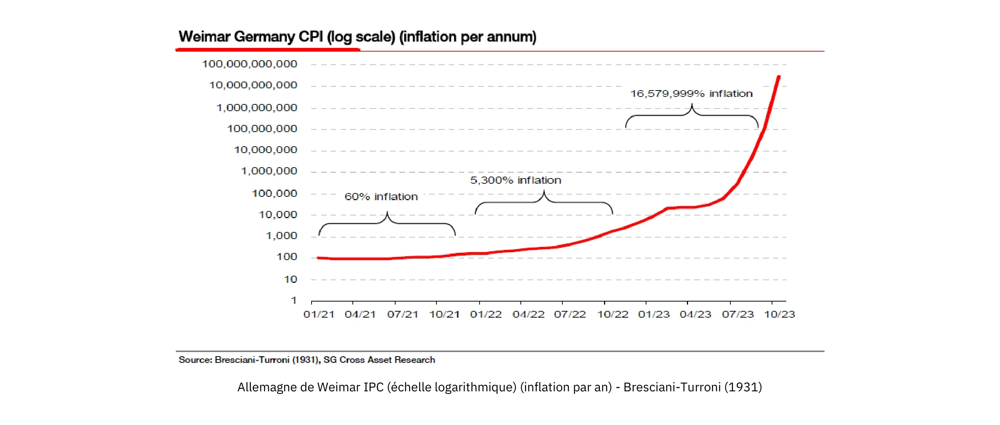

> "zorunluluk kanun tanimaz"

> İlk Shitcoin: Anekdot olarak, para biriminin bireyin eylemiyle tam anlamıyla değersizleştirildiği banknotun merkezi resmine bakıldığında, buna ilk "shitcoin" denebilir.

#### 3. Tahviller ve ipotekler

Weimar'da, enflasyonun etkisini telafi etmek için bazı borçlar yeniden değerlendi. Bu önlem Zimbabve'de benimsenmemiştir.

> Weimar: "Devlete ait kredilerin yeniden değerlenmesine ilişkin bir karar 1925 yılında yasalaştı ve bunun sonucunda hissedarlar, tüm tazminatların ödenmiş olması koşuluyla ilk yatırımlarının yüzde 2,5'ini aldılar."

> Zimbabve: "Temmuz 2007'de (üç yıl sonra), cebimden şimdi paralel piyasa kuruyla 1.67 dolar değerinde olan devalüe edilmiş 500.000 ZDW (bt "000") banknot çıkarabilir ve yirmi yılda geri ödenmesi gereken ipotek kredisini geri ödeyebilirdim. Üstelik bu senet aynı ay için aylık maaşımın sadece yüzde 0,49'unu temsil ediyordu."

Almanya krizinin yönetimi hakkında daha fazla bilgi edinmek için bu kitap da çok önemli.

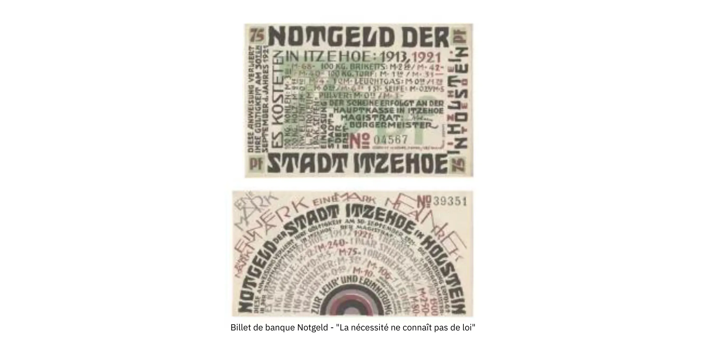

### Çağdaş Paralellikler

#### 1. Ekonomiyi kontrol etmek için para politikasının manipülasyonu.

Weimar Cumhuriyeti'nin tarihine bakıldığında, sanayicilerin Mark'ın değer kazanması konusunda isteksiz oldukları görülmektedir. Aşırı değer kaybetmiş bir para birimiyle borçlanabilme ve borçlarını geri ödeyebilme kabiliyetleri onlara önemli bir avantaj sağladı. Bu mekanizma, devasa sanayi komplekslerinin neredeyse hiç maliyet olmadan inşa edilmesini kolaylaştırdı. Bu sanayiciler, faaliyetlerini engellediği için Mark'ın değer kazanmasından korkuyorlardı. Hatta bazıları yaygın enflasyonu iyi bir şey olarak görüyor, bunun nüfus için istihdamı garanti ettiğine inanıyordu. Ancak bu enflasyonun tasarruflar ve genel olarak ekonomi üzerindeki zararlı etkisinin farkında değillerdi. Bu ekonomik aktörler için parasal baskı bir lütuftu.

> Weimar: "Bu nedenle markın değer kazanmasından çok korkuldu ve Cenova'dan sonraki birkaç haftalık 'istikrar' bile işlerin durgunlaşmasına neden oldu."

> Weimar: "Sanayi çevreleri, nakit paranın mallardan daha değerli hale gelmesi ve herkesin varlıklarını nakde çevirmeye çalışmasıyla bir çöküş yaşanması tehlikesiyle karşı karşıya kaldı."

Christine Lagarde'ın vatandaşların tasarruflarını korumak yerine istihdam beklentisine öncelik vermeleri gerektiğini öne süren açıklamalarıyla çağdaş bir paralellik kurulabilir. Tıpkı Weimar'ın sanayicileri gibi, Lagarde da tasarrufların değeri pahasına, istihdamı teşvik etmek için bir araç olarak para basmayı savunuyor gibi görünüyor.

> Christine Lagarde: "Tasarruflarımızın korunduğunu görmektense bir iş sahibi olmaktan daha mutlu olmalıyız."

#### 2. Çatışma zamanlarında özel mülkiyet

Weimar Cumhuriyeti'nin tarihi, bu dönemde yurtdışında tutulan varlıklara ve sermayeye el konulduğunu ortaya koymaktadır. Bu önlem, Rusya'da daha yakın zamanda, özellikle de bir çatışmanın başlangıcında yaşanan olayları hatırlatmaktadır. Bu durumlar endişe verici bir gerçeğin altını çizmektedir: kriz zamanlarında özel mülkiyete saygı tehlikeye girebilir. Bu, krizlerin bireysel haklar üzerindeki potansiyel yansımalarının altını çizen tarihsel ve güncel bir paralelliktir.

> Weimar: "Yurtdışında tutulan tüm Alman sermayesine el konuldu."

> [20minutes.fr](https://www.20minutes.fr/monde/3286947-20220513-guerre-ukraine-geler-avoirs-russes-vol-non-redistribuer-kiev-poserait-lourdes-questions): "Rusya Merkez Bankası'nın elinde bulunan 640 milyar dolarlık rezervin yaklaşık 300 milyar dolarlık kısmı Batı'nın yaptırımları kapsamında dondurulmuştur."

#### 3. Piyasa fiyatı kavramı

Weimar Cumhuriyeti döneminde çiftçiler, her yıl üretilen ilk iki milyon ton buğdayı teslim etmeye zorlayan “Umlage” uygulamasına karşı memnuniyetsizliklerini dile getirdiler. Bu düzenleme, toplam ekmek arzının yarısının sübvanse edilmiş fiyatlarla piyasaya sürülmesine yol açıyordu. Ağustos ayından itibaren bu çiftçilerin dünya fiyatı üzerinden ödeme almaları gerekiyordu; zira buğdaylarını düşük fiyatlarla vermeye zorlanmalarına rağmen, gübrelerini dünya fiyatlarından satın almak zorundaydılar.

Bu durum, hiperenflasyon sırasında piyasa fiyatı kavramıyla ilgili temel bir sorunu gündeme getirir. O dönemin Alman bağlamında, çiftçiler buğdaylarını değerinin altında satmaya zorlanırken, gübrelerini küresel maliyetlerle tedarik etmek durumundaydılar. Böylesine bir ekonomik uyumsuzluk, günümüzde gıda fiyatlarının yarattığı zorlukları gözler önüne seriyor. Tarımsal üreticiler, enflasyon nedeniyle artan girdi maliyetleriyle karşı karşıya kaldıklarında bu maliyetleri nihai ürünlere yansıtırlar. Bu artış nedeniyle onları eleştirmek, piyasa fiyatının dinamiklerini ve karşılaştıkları ekonomik baskıları görmezden gelmek anlamına gelir. Yüksek maliyetler altında yapay olarak düşük fiyatlarla satış yapmak, herhangi bir işletme için sürdürülemezdir.

> Weimar: “Tarımsal çıkarlar, her yıl üretilen ilk iki milyon ton buğdayın zorunlu teslimi olan ‘Umlage’ uygulamasından memnun değildi; bu uygulama, toplam ekmek arzının yarısının düşük fiyatlarla satılmasına imkân tanıyordu. Ağustos ayından itibaren çiftçilere dünya fiyatı üzerinden ödeme yapılması gerekiyordu; çünkü buğdaylarını düşük fiyatlarla satmaya zorlandıklarında dahi gübrelerini dünya fiyatı üzerinden almak zorundaydılar.”

#### 4. Para arzı ile enflasyon arasındaki bağlantının inkârı

> Weimar: “Para arzının ne fiyat seviyeleriyle ne de döviz kurlarıyla bağlantılı olmadığını savunmaya sıkı sıkıya bağlıydı.”

Günümüzde de bu eğilim devam etmektedir. Bir önceki bölümde verilen örnekte olduğu gibi, enflasyonu haklı çıkarmak için çeşitli ekonomistler ve ekonomik kurumlar tarafından öne sürülen açıklamaların listesi buna kanıt teşkil etmektedir.  
Bu gerekçeler, Taylor Swift, Zelda veya Beyoncé gibi kültürel olaylar ve ünlülerden, savaş ve pandemi gibi küresel faktörlere kadar çeşitlilik gösterir. Bu nedenlerin tümü, kısa vadeli ekonomik dalgalanmalara katkıda bulunabilse de, asıl temel sebep olan para arzının genişlemesinden dikkati uzaklaştırmaktadır.

#### 5. Zombi şirketler

> Weimar: “İstikrar, girişimcilerin diğer herkesin pahasına istedikleri kadar borç alabildikleri dönemi sona erdirdi. Parasal bolluk sırasında kurulan veya genişletilen çok sayıda şirket, sermaye kıt hale geldiğinde hızla verimsiz hale geldi.”

Bir zombi şirket, normal piyasa koşullarında iflas etmiş veya iflasın eşiğinde olması gereken, ancak çoğunlukla düşük maliyetli borçlar sayesinde faaliyet göstermeye devam eden bir işletmedir. Bu şirketler, borçlarını karşılamaya yetecek kadar gelir elde ederler, ancak anlamlı bir büyüme kaydedemezler.

Zombi şirket kavramı yeni değildir. Gerçekten de, Weimar Cumhuriyeti döneminde zaten vardı. O dönemde, birçok şirket görünüşte başarılıydı ve ücretsiz krediye erişimden büyük ölçüde yararlanıyordu. Hızla değer kaybeden para nedeniyle gelecekte daha kolay geri ödeme beklentisiyle büyük meblağlar borç alıyorlardı. Ancak enflasyon sona erip Alman markı değer kazandığında, operasyonel ve finansal açıdan gerçekten sürdürülebilir olmayan bu şirketler kârsız hale geldi ve kapılarını kapatmak zorunda kaldılar.

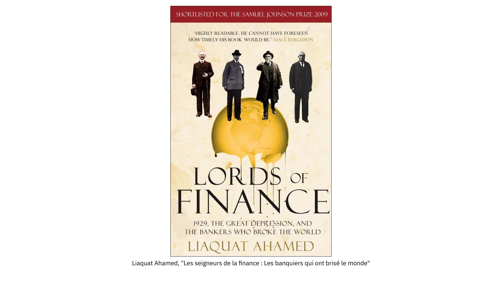

Zombi şirket olgusu, savaş sonrası Almanya tarihiyle sınırlı değildir. Günümüzde de birçok büyük şirket, çok düşük faizli kredilere ayrıcalıklı erişim sayesinde varlığını sürdürmektedir. Daha geleneksel oranlardan borçlanmak zorunda kalsalar, çoğu kârlılığını yitirecektir. Bu, özellikle 2023 yılında önemlidir; uzun bir süre neredeyse sıfır olan faiz oranları yükselmeye başlamıştır. Bu finansal ortamın son değişimi, bir zamanlar “zombi” olarak adlandırılan bu şirketler için kuşkusuz belirleyici bir test olacaktır.

#### 6. Hızlı zengin ol!

Tarih boyunca, bireylerin hızlıca zenginleşmeye çalıştıkları anlara tanık olunmuştur; tıpkı Weimar ve Zimbabve’de arbitraj yoluyla olduğu gibi. Bugün de bazı kripto paraların ortaya çıkışıyla benzer bir eğilim gözlemlenmektedir. İnsanlar hızlı kazançlar cazibesine kapılmakta, yatırımlarının katlanarak artacağını umarak risk almaktadırlar. Bu yaklaşım, hiperenflasyon dönemlerinde görülen ve sıklıkla başkalarının zararına kullanılan arbitraj uygulamasını hatırlatmaktadır.

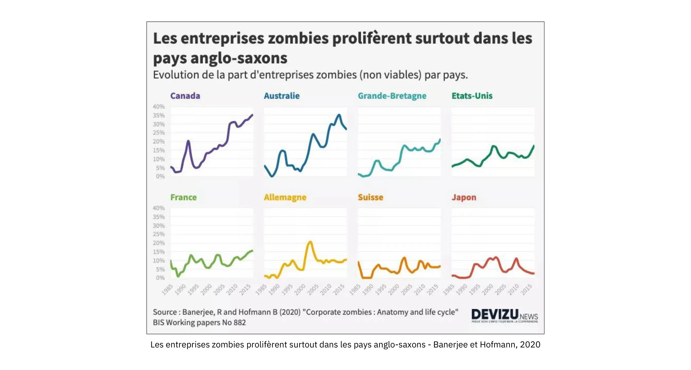

#### 7. Belirsizliğe karşı çare olarak tasarruf

> Sermaye ve gelirlerin değerindeki sürekli erozyonun ve geleceğe dair belirsizliğin yaygın ve yıkıcı etkisi.

Sosyal uyumu zayıflatan sermaye değerindeki erozyonun yıkıcı etkisini ve bunun yarattığı belirsizliği vurgulayan bir alıntıyı belirtmek önemlidir. Şöyle denmektedir: “sermaye ve gelirlerin değerindeki sürekli erozyonun, geleceğe dair belirsizliğin yaygın ve yıkıcı etkisi.”

Bir aileniz veya korumak istediğiniz yakınlarınız olduğunu hayal edin. Çok çalışıyor, tasarruf ediyor ve gelecekteki belirsizliklere hazırlık yapıyorsunuz. Eğer her şey öngörülebilir olsaydı, tasarrufun hiçbir anlamı olmazdı. Ancak beklenmedik durumlarda — örneğin bozulmuş bir araba gibi — tasarruf bir can simidi haline gelir. Dünyadaki belirsizliği azaltır. Ancak hiperenflasyon dönemlerinde tasarruf etmek büyük bir zorluk haline gelir. Para hızla değer kaybeder, bu da uzun vadeli planlamayı zorlaştırır. Bu mali istikrarsızlık stres ve kaygı yaratabilir.

Bugün, tasarruf gücünün azalmasıyla birlikte yatırım ön plana çıkmaktadır. Ancak bu yaklaşım kendi risklerini barındırır. Tasarruf, her zaman belirsizliğe karşı bir çare olmuştur. Öngörülemeyen durumlarla başa çıkmak için mali rezervlere sahip olmak, huzur ve sosyal uyumu güçlendirir. Sonuç olarak, tasarruf gücümüzün korunması, toplumsal ve bireysel istikrarı sürdürmek için hayati önem taşır.

## Latin Amerika'da Yeniden Nominasyonlar

<chapterId>918eafd7-409d-5205-ad52-a52e63b23a64</chapterId>

Şimdi Latin Amerika ülkelerindeki farklı redenominasyon dönemlerine bakacağız.

### Grafiklerin açıklaması

Slaytta, solda, yeniden değerlemenin yapıldığı yıllar, yeni para biriminin adı ve eski para birimiyle Exchange oranı yer almaktadır. Arjantin örneğini ele alırsak, peso moneda nacional bir önceki para birimi olan peso real'den 25'e 1 oranında dönüştürülmüştür. Bu bağlamda, Arjantin para biriminin zaman içindeki gelişimini inceleyeceğiz. Ayrıca, her dönem için banknotların ilk ve son değerlerini belirteceğiz.

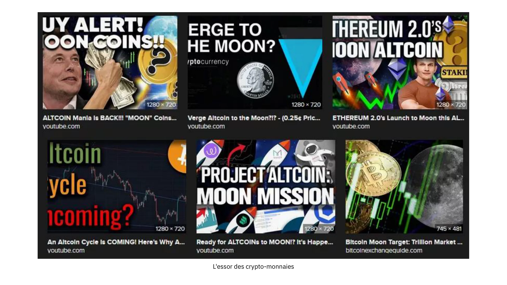

Slaydın sağ tarafında bir enflasyon grafiği yer almaktadır. Kırmızı oklar, Kagan'ın kriterine göre aylık %50 enflasyon oranı olarak tanımlanan hiperenflasyon yıllarını temsil etmektedir. Bu kriter bazen yüksek enflasyon oranlarına sahip olan ancak hiperenflasyonun kesin tanımını karşılamayan yıllarla birlikte belirsiz yorumlara yol açabilir.

Enflasyon dönemlerinde yeniden değerlenmenin hükümetler tarafından alınan yaygın bir önlem olduğu unutulmamalıdır. Ancak bu, enflasyon veya hiperenflasyonun altında yatan sorunu çözmez. Bu sadece para birimini yeniden adlandırmanın ve sıfırları kaldırmanın bir yoludur, hiperenflasyonun temel nedenini gerçekten ele almadan: para Supply'in genişlemesi. Daha sonraki bir videoda, Address'e yönelik gerçek çözümleri tartışacağız ve hiperenflasyon sorununu çözeceğiz. Bu seride, yeterli reformlar yapılmadan basit bir yeniden değerlemenin sonuçlarını vurgulayacağız: enflasyon devam ediyor.

Arjantin'den sonra çalışmamız Brezilya, Bolivya, Peru, Nikaragua ve Venezuela'yı kapsayacak. Bu ülkelerde gerçekleşen yeniden adlandırmaları inceleyeceğiz.

### Arjantin

Arjantin 1826'dan önce İspanyol dolarını kullanıyordu. 1816'da bağımsızlığını kazandıktan sonra, İspanyol realine dayalı kendi para birimini uygulamaya koymuş ve benzer bir para biriminin yaratılmasına neden olmuştur. Tablo, 10.000'e kadar olan banknotlarla "peso moneda nacional "in piyasaya sürüldüğü yıl olan 1881'de başlıyor. Bunu, 100'e 1 oranında ve bir milyona kadar banknotlarla değiştirilen "peso ley" takip etti. Ardından, 10,000'e 1 Exchange oranıyla (dört sıfırın atılmasına eşdeğer) ve 10,000'e kadar banknotlarla "Arjantin pesosu" geldi. 1985 yılında "australes" piyasaya sürüldü ve 1,000'e 1 oranıyla 500,000'e kadar banknotlarla değiştirildi. 1992 yılında, mevcut "peso ley" 10.000'e 1 oranında oluşturuldu ve bir kez daha dört sıfır kaldırıldı. Sadece 1989 ve 1990 yıllarında hiperenflasyon yaşanmıştır.

### Brezilya

Brezilya, para birimi değişiklikleri tarihinin de gösterdiği gibi, parasal yeniden değerlemenin sembolik bir örneğidir. Bağımsızlığından önce Brezilya Portekiz realini kullanıyordu. Ancak ülke, 1822'deki bağımsızlık ilanından çok önce, 1747 gibi erken bir tarihte kendi "Brezilya realini" kullanmaya başlamıştır. Tablo, Brezilya banknotlarının ihracının başlangıcını işaret eden 1818'de başlıyor. Bundan önce para birimi çoğunlukla madeni para şeklindeydi. Bu banknotlar bir milyon reale kadar ulaşan değerlere sahipti.

Brezilya 1942'den başlayarak bir dizi yeni para birimine geçmiştir. Çoğu durumda (1942, 1967, 1986, 1989, 1993), dönüşüm oranı 1,000'e 1 idi. 1990'da, dönüşüm olmadan bir isim değişikliği gerçekleşti. Bu para birimlerinin sıralaması aşağıdaki gibidir:

- Réals (eski versiyon) 1942'ye kadar.
- Cruzeiros 1942'de.
- Cruzeiros (yeni versiyon) 1967'de.
- 1986'da Cruzados.
- Cruzados Novo 1989'da.
- 1990'da Cruzeiros'a dönüş.
- Cruzeiros Reais 1993'te.
- Son olarak, 1994 yılında Brezilya Reali.

En yüksek kupürlü banknot 500.000'e ulaştı ve 1994'teki son yeniden değerleme 2.750'ye 1 oranında yapıldı. 1989 ve 1990 yıllarına hiperenflasyon damgasını vururken, 1993-1994 yılları hiperenflasyon eşiğine ulaşmadan (ayda %50) yüksek enflasyon oranlarına sahne oldu. Bu çalkantılı dönemin ardından Brezilya, birkaç sıfır atarak para birimini bir kez daha yeniden nomine etmiştir.

### Bolivya

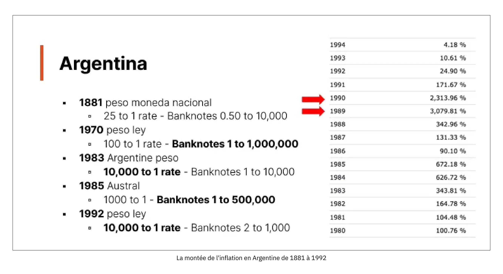

Bolivya, para biriminin yeniden değerlenmesini gerektiren akut enflasyon dönemlerinden geçen bir başka ülke örneğidir. İşte parasal geçmişinin bir özeti:

1825'teki bağımsızlığından önce Bolivya para birimi olarak İspanyol dolarını kullanıyordu. Bağımsızlıktan sonra ülke 1827 ve 1864 yılları arasında İspanyol dolarının yerine Bolivya Sol'unu kullanmaya başlamıştır. Ancak, Bolivya'da ilk banknotların ancak 1864 yılında ortaya çıktığı unutulmamalıdır.

1864 yılında, Bolivya Sol'una kıyasla 1,000'e 1 Exchange oranıyla ilk "Boliviano" tanıtıldı. Bu para birimi 10.000 Bolivianos değerine ulaşana kadar tedavülde kaldı.

Daha sonra Bolivya para birimini "Bolivya Pesosu" olarak değiştirdi ve bu para birimi o kadar şiddetli bir hiperenflasyon yaşadı ki sonunda 10 milyona varan değerlere ulaştı. Bu enflasyon dönemi 1984-1985 yıllarında zirve yaptı ve aylık enflasyon oranları sıklıkla hiperenflasyon eşiği olan %50'ye yaklaştı. Bir perspektif sunmak gerekirse, bir yıl boyunca aylık %50'lik sabit bir enflasyon oranı, yıllık yaklaşık %12,800'lük bir enflasyon oranıyla sonuçlanır. 1985 yılında Bolivya'nın yıllık enflasyon oranı %11,749'a ulaşmıştır ki bu da enflasyonun neredeyse her ay %50 eşiğine yaklaştığını ya da bu eşiği aştığını göstermektedir.

Bu parasal krize yanıt olarak 1987 yılında Bolivya, 1 Boliviano için 1 milyon Bolivya Pesosu olan Exchange oranıyla, kısaca "Boliviano" olarak adlandırılan yeni bir para birimini tanıttı. Boliviano'nun bu versiyonu bugün hala tedavüldedir.

Bu, Bolivya'nın hiperenflasyon ve yeniden değerlenme dönemlerinin damgasını vurduğu çalkantılı para tarihine genel bir bakıştır.

### Peru

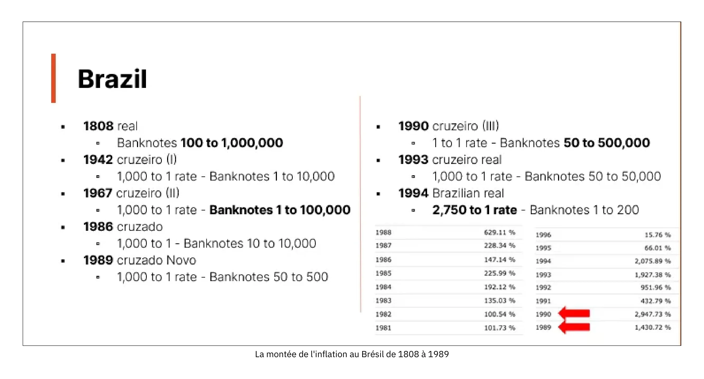

Peru, keyfi %50 kuralının etkileri açısından ilginç bir örnek teşkil etmektedir. Parasal tarihiyle başlayan Peru, 19. yüzyıla kadar İspanyol altını kullanmış ve 1821 yılında bağımsızlığını ilan etmiştir. Peru doları 1822'den 1863'e kadar kullanıldı. 1863 yılında Peru reali, 10'a 1 oranında soldi oro ile değiştirildi ve maksimum 50.000 değerine ulaştı. 1985 yılında, "Inti" para birimi 1000'e 1 dönüşüm oranıyla tanıtıldı ve 5 milyona ulaştı. 1991 yılında "SOL", 10 ila 200 arasında değişen banknotlarla 1 milyona 1 Exchange oranıyla piyasaya sürüldü.

Yeniden değerleme dönemleri incelendiğinde, 1988 yılı özellikle Eylül ayında hiperenflasyonun yaşandığı bir yıl olarak kabul edilir. Temmuz-Ağustos 1990 döneminde de hiperenflasyon yaşanmıştır. 1988 yılında yıllık enflasyon oranı %667 olarak gerçekleşmiş ve Eylül ayında %50 ile zirve yapmıştır. Buna karşılık 1989'da hiçbir ay %50'yi aşmadan %3000'lik bir enflasyon oranı yaşandı, bu nedenle hiperenflasyon olarak sınıflandırılmadı. 1990 yılında enflasyon %7481 ile zirve yapmıştır. 1989'un aksine 1988 hiperenflasyon yılı olarak kabul edildiğinden %50 kuralının keyfi olabileceği açıktır. Bu kural yeniden gözden geçirilirse, Peru'nun 1989'da yaşadığı gibi dönemleri de kapsayacak şekilde eşiği düşürmek akıllıca olabilir.

> Neler olduğunu anlamak
>

> Para biriminin yeniden değerlenmesi hakkında anlaşılması gereken en önemli şey, para biriminin değeri 5 veya 10 milyon gibi astronomik rakamlara ulaştığında yeniden değerlenmesidir. Bu süreç, para birimindeki bir değişikliği de içerecek şekilde birçok kez tekrarlanabilir. Sonuç olarak, hiperenflasyon olmasa bile bireylerin tasarrufları ciddi şekilde etkilenebilir. Örneğin, bir kişi bir yıl içinde 1.000 $ biriktirir ve 100 $'ı bir kenara ayırmayı başarırsa, ertesi yıl en düşük kupürlü banknot 1.000 $ olabilir ve daha önce biriktirilen 100 $ değersiz hale gelebilir. Tasarrufların bu şekilde erozyona uğraması bariz bir hiperenflasyon gerektirmez. Bir kişi son on yılda 10.000 dolar biriktirmiş olsa bile, bu miktar basit bir şişe su alamayacak kadar değersiz hale gelebilir. Bu gerçek, sadece birkaç ay hiperenflasyonist olarak sınıflandırılsa bile, yeniden yapılanma yaşayan birçok ülkede açıkça görülmektedir. Buna karşın, Nikaragua gibi bazı ülkeler art arda hiperenflasyon yılları yaşamıştır.

### Nikaragua

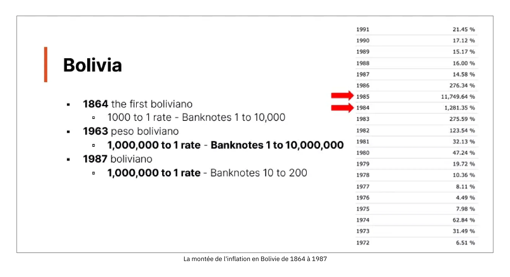

Eskiden İspanyol egemenliği altında olan Nikaragua, İspanya tarafından sömürgeleştirilen diğer birçok ülke gibi başlangıçta İspanyol dolarını kullanmıştır. İspanyol İmparatorluğu, Meksika İmparatorluğu ve ardından Orta Amerika Federal Cumhuriyeti ile bütünleştikten sonra Nikaragua bağımsızlığını ilan etti. 1878'den itibaren peso ülkenin resmi para birimi haline geldi ve değerleri 1 ile 100 arasında dalgalandı. Ülke 1912'de ilk Cordoba'yı, 1988'de ikincisini ve 1991'de üçüncüsünü piyasaya sürdü ve bugün hala kullanılıyor. İlk Cordoba 1 milyon, ikincisi ise 10 milyon değerine ulaşmıştır. 1991'deki yeniden değerleme birkaç yıl süren hiperenflasyonu takip etmiştir.

### Venezuela

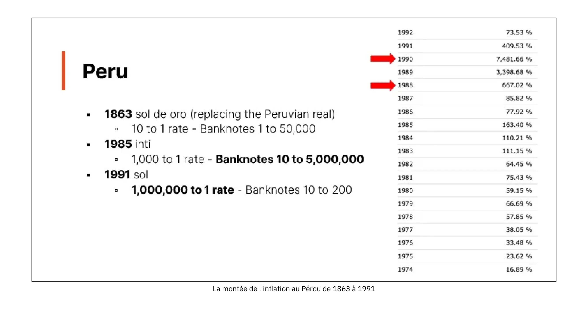

Venezuela bu videoda bahsedilen son ülkedir. Ülke zaman içinde dört kez para birimini değiştirmiştir. Venezuela, 1811 yılında bağımsızlığını ilan etmeden önce ilk günlerinde İspanyol dolarını kullanmıştır. 1879 yılında resmi para birimi olarak bolivar kullanılmaya başlandı ve bu para birimi, hükümetin dalgalı Exchange kurlu doları tercih ettiği 1983 yılına kadar yürürlükte kaldı.

Venezüella ile ilgili kayda değer bir gerçek de Latin Para Birliği'ne üye olmasıdır. Bu birliğe İspanya'dan 5 peseta, Yunanistan'dan 5 drahmi, Venezuela'dan 5 bolivar, İtalya'dan 5 liret, 5 Belçika frangı ve 5 Fransız frangı gibi madeni paralar dahildir.

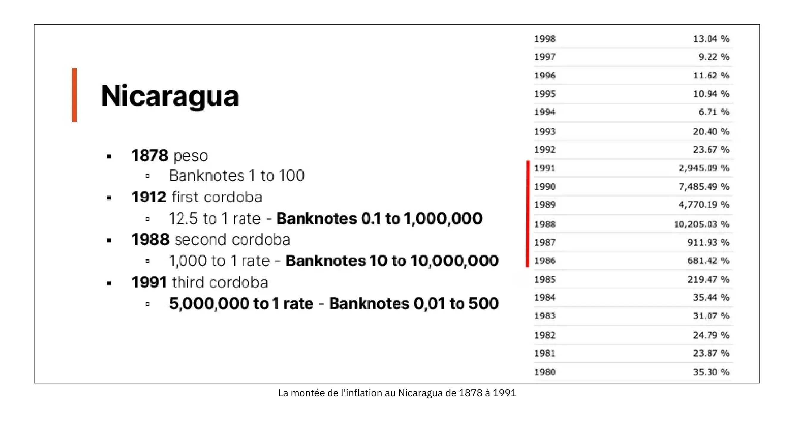

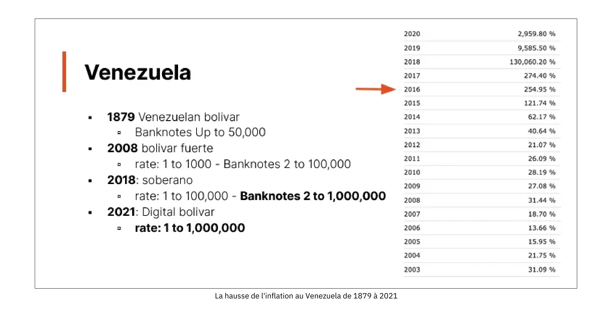

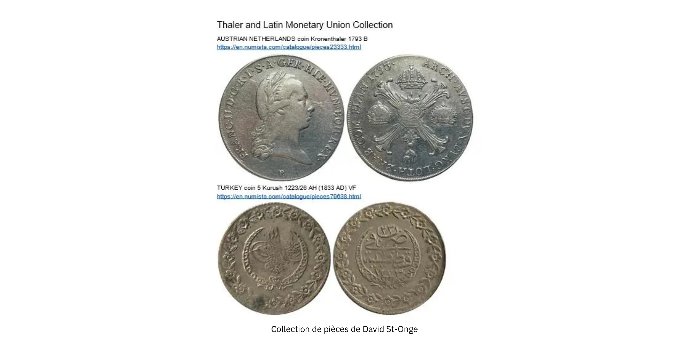

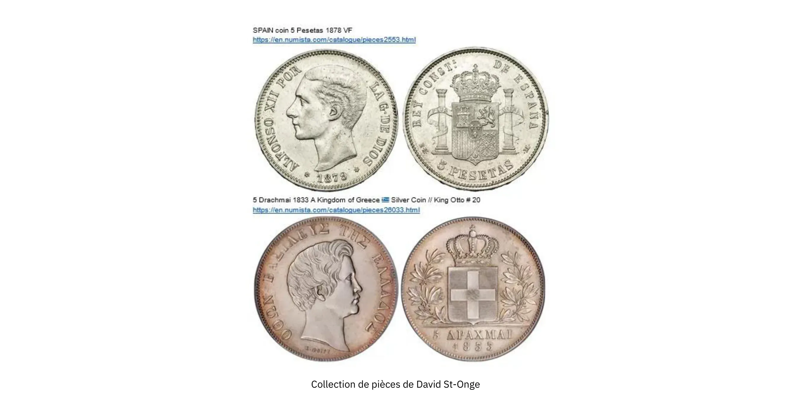

Bu dönemde Venezüella'nın 5 bolivarlık Coin'i İtalya, İspanya, Belçika ve Fransa'nın da aralarında bulunduğu Birlik üyesi ülkelerin bolivarlarıyla aynı ağırlığa sahipti. Bu bolivarlar gümüşten yapılmıştır. 1929 yılına ait belirli bir Coin 25 gram ağırlığında ve 900 saflık derecesine, yani %90 saf gümüşe sahiptir. Mevcut gümüş fiyatıyla bu Coin yaklaşık 17 ila 18 ABD doları değerindedir.

1983'te dalgalı Exchange kurunun kabul edilmesini takiben birkaç yeniden nominasyon yapılmıştır:

- 2008 yılında: bolivar fuerte ya da "güçlü bolivar" piyasaya sürüldü ve binde bir oranında yeniden değerlenmeden önce 100.000'e kadar ulaştı.
- 2018'de: 1 milyona ulaşan banknotlarla Soberano tanıtıldı. 2021'de, bir milyona bir yeni bir yeniden değerlemeden önce, yine bir milyona ulaşan dijital bolivar ile değiştirildi. Bugün, 10 veya 20'lik banknot Soberano'da 10 milyon veya 20 milyona eşdeğerdir.

2018'e kadar uzanan bu döneme ait faturalar Biarritz, Toronto ve Miami'deki çeşitli Bitcoin konferanslarında dağıtıldı. Bu Soberano banknotları maksimum 1 milyon değerine ulaşmıştır. Daha sonra bir milyonun değerini yaklaşık 3 sente düşüren bir yeniden değerleme gerçekleşti. Şu anda 10 adet 1 milyonluk banknot bir adet 10'luk banknota karşılık gelmektedir. Venezüella 2016 yılından bu yana, belirli bir tabloda 57. dönemi temsil eden hiperenflasyon yaşamaktadır.

Bir sonraki videoda, Venezuela ve listelenen diğer ülkelere odaklanan bir hiperenflasyon banknotları koleksiyonu sunulacak. Bu koleksiyon neredeyse tüm Venezuela banknotlarını içermektedir. Çalışma, bahsi geçen her ülke için farklı redenominasyonlara odaklanacaktır. Buna ek olarak, Zimbabve'deki redenominasyonlar da incelenecektir.

### Sonuç

Hiperenflasyonun ekonomik felaketin tek göstergesi olmadığını gördük. Birden fazla kez yeniden para basmanın, sıfırları atmanın ya da para biriminin adını değiştirmenin halk üzerinde yardımların kesilmesinden gıda sorunlarına kadar uzanan doğrudan etkileri vardır. Her ne kadar hiperenflasyon endişe verici olsa da, Brezilya'da gözlemlendiği gibi yeniden değerleme sayısı daha karmaşık bir gerçekliği göstermektedir.

Aylık %50 enflasyon kriterine göre birçok dönem hiperenflasyon olarak sınıflandırılabilirdi. Bu durum, özellikle para biriminin halk tarafından hızla terk edilmesi, ücret endekslemesi ve enflasyonu telafi etmek için yüksek faizli krediler gibi özellikleri dikkate alan uluslararası muhasebe örgütünün kriterleri incelendiğinde geçerlidir.

Sonuç olarak, hiperenflasyon ekonomik zorlukların sadece bir yönüdür. Yüksek enflasyon tek başına da aynı derecede zarar verici olabilir. Bir sonraki bölümde hiperenflasyonun üstesinden gelmek için olası çözümler incelenecektir.

## Hiperenflasyonun üstesinden nasıl gelinir?

<chapterId>e3484a31-a851-5f92-8af5-00eddae67db1</chapterId>

### Ilımlı ve yüksek enflasyon nasıl sona erdirilir

Bahsedilen sonuçlar Bernold'un "Parasal Rejim ve Enflasyon" adlı kitabından alınmıştır. Bernold'a göre enflasyonu sona erdirmenin tek yolu parasal bir reform gerçekleştirmek ve hükümete kısıtlamalar getirmektir. Bu kısıtlamalar, merkez bankası gibi hükümetin siyasi kararlarından bağımsız çalışan bir kurumun kurulmasını içerir. Yüksek ve hiperenflasyon genellikle bütçe açıklarının parasal yaratım yoluyla finanse edilmesinin sonucudur. Enflasyonu Address ılımlı hale getirmek için paranın Supply büyümesini azaltmak esastır. Bernold ayrıca bu parasal büyümenin komşu ülkelere göre olması gerektiğini öne sürmektedir. Şaşırtıcı bir nokta, yüksek ya da hiperenflasyon dönemlerinde paranın toplam değerinin Supply aslında düşebilmesidir. Bu duruma çarpıcı bir örnek Zimbabwe'dir.

### Sezgisel Çözümler

Zimbabwe incelenirken, Supply parasının 10 trilyon biriminin tüm değerini kaybettiği fark edildi. Weimar'da, 65 milyar birim Supply parasının toplam nominal değerinin üçte ikisini tek bir günde basmak mümkündü. Bu, Supply parasının değerinin nasıl düşürülebileceğini göstermektedir. Bu durumu düzeltmek için, Supply parasının uygun bir seviyeye ulaşması için önemli ölçüde arttırılması gerekmektedir. O halde parasal bir reform kaçınılmazdır. Yüksek enflasyon durumunda bu reform kaçınılmazdır, ancak dolaşımda yeterli para olmasını sağlamalıdır. Bu adımdan sonra hükümete kısıtlamalar getirilebilir.

Bernold'un gözlemlerine göre, enflasyon sorunlarının çözümü söz konusu olduğunda, IMF ve Dünya Bankası gibi kurumlar her zaman doğru stratejiyi benimsemiyor. Bazı durumlarda, bir ülkenin para Supply'sini arttırması gerekirken, bu kurumlar bunu azaltmaya çalışmaktadır. Önemli olan, yeterli bir parasal seviyeye ulaşmak ve ardından büyümesine sınırlar getirmek, böylece hükümet harcamalarını para yaratarak finanse etmekten kaçınmaktır.

Bernold tarafından dile getirilen ilginç bir husus, bir para reformunun başarısının sadece teknik açıdan uygunluğuna değil, aynı zamanda halkın buna duyduğu güvene de bağlı olduğudur. İyi tasarlanmış bazı reformlar halk onlara güvenmediği için başarısız olabilirken, kötü tasarlanmış diğerleri halk onlara güvendiği için başarılı olabilir. Bu nedenle algı ve kamu güveni, bir para reformunun başarısı ya da başarısızlığında temel Elements unsurlarıdır.

- Zimbabve'de enflasyonla mücadele etmek için benimsenen çözüm dolarizasyondu, yani ABD dolarını ya da komşu ülkelerin diğer para birimlerini kabul ettiler. Bu yaklaşım hükümetin istediği zaman para basmasını engellemektedir.
- Almanya'da çözüm, yeni bir para birimi olan Rentenmark'ı yaratmaktı. Bu para birimi Reich'ın toprak varlıkları ile desteklendi ve bu stratejinin etkili olduğu kanıtlandı.

### Zimbabve örneği

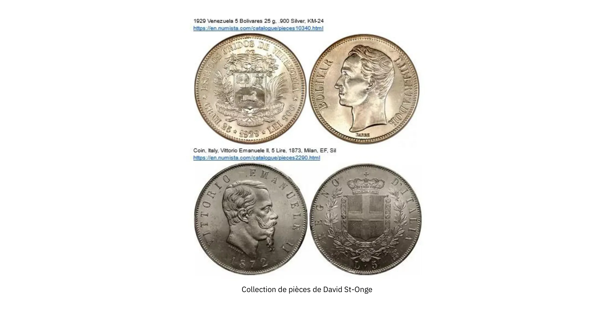

Zimbabve 1980 yılında bağımsızlığını kazanmış ve Zimbabve dolarını kullanmaya başlamıştır. Başlangıçta iki Zimbabve doları yaklaşık 1.60 ABD doları değerindeydi. Ancak 1997'de savaş gazileri lehine alınan sosyal önlemlerin ardından para birimi Kara Cuma sırasında bir günde %72 oranında değer kaybetti. Ardından 2000'li yılların başında ülke bir toprak yeniden dağıtım programı başlatarak arazileri beyaz sahiplerinden aldı ve yerel halka verdi. Bu karar ihracata zarar verdi çünkü yeni sahipler genellikle büyük ölçekli çiftlikleri yönetmek için gerekli uzmanlıktan yoksundu. Sonuç olarak Zimbabve 1999 yılında net ihracatçı iken 2003 yılında net ithalatçı konumuna geldi.

2006 yılında ülke, 1'e 1.000 Exchange oranıyla para birimi ZWN'nin yeni bir versiyonunu tanıtmıştır. 2008 yılında, 1'e 10 milyar Exchange oranıyla başka bir para birimi olan ZWR tanıtıldı. Bu, ikonik 100 trilyonluk banknotların yaratılmasına yol açtı.

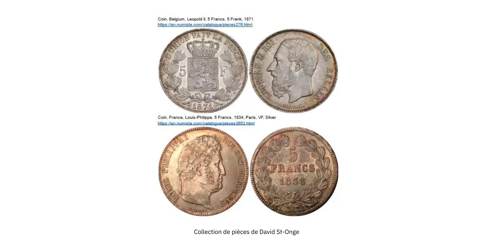

#### Dolarizasyon ve Kriz Çözümü

Bu nedenle, 2009'dan sonra, sürekli parasal kriz ve yaygın hiperenflasyonla karşı karşıya kalan Zimbabve, ulusal para birimini terk etti ve başta ABD doları olmak üzere yabancı para birimlerinin kullanımına izin verdi. Bu karar radikal olmasına rağmen hiperenflasyona son vermiştir. Çıkarılacak en önemli ders, aşırı para basımının durdurulması ve bütçe açığının merkez bankası tarafından finanse edilmesine son verilmesinin hiperenflasyona son verebileceğidir.

Ancak dolarizasyon mucizevi bir çözüm değildir. Hiperenflasyonu sona erdirebilse de, başka ekonomik zorlukları da beraberinde getirmektedir. Sonuçlardan biri özerk para politikasının kaybedilmesidir. Kendi para birimi olmayan bir ülke, iç ekonomik şoklara yanıt vermek için para politikasını ayarlayamaz.

2007 yılında Zimbabve'nin enflasyon oranı aylık %50 eşiğine ulaşmış ve ülke resmi olarak hiperenflasyona girmiştir. 2009'da dolarizasyonun ardından hiperenflasyon sona erdi, ancak ülke başka ekonomik zorluklarla karşı karşıya kaldı.

Zimbabve'nin o zamandan beri kendi para birimini yeniden yürürlüğe koymaya çalıştığını ve yüksek enflasyon belirtilerinin yeniden ortaya çıktığını not etmek endişe vericidir. Bazı uluslararası kuruluşlara göre, henüz aylık %50'lik resmi eşiğe ulaşmamış olsa bile, ülke hiperenflasyon kriterlerini yeniden karşılayabilir. Bu durum, aşırı para ihracı ve merkez bankası açık finansmanının tehlikelerini hatırlatmaktadır.

### Sonuç

"Bitcoin Hakkında Her Şey" başlıklı kitabımda Zimbabwe'deki hiperenflasyona tam bir bölüm ayırdım. Ülkenin hiperenflasyona nasıl son verdiğini gösteren çeşitli örnekler sunarak önemli olayları detaylandırdım.

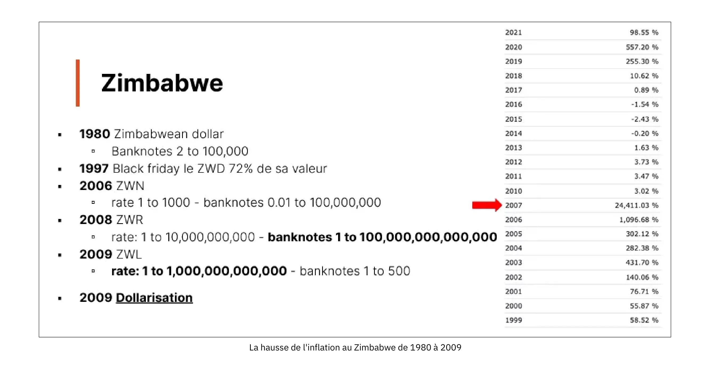

Birinci Dünya Savaşı sonrası Alman deneyimini merak edenler için "Reich'ın Bankeri" adlı çizgi romanı şiddetle tavsiye ederim Almanya'nın özellikle Rentenmark'ı yaratarak hiperenflasyonun üstesinden nasıl geldiğini anlatıyor.

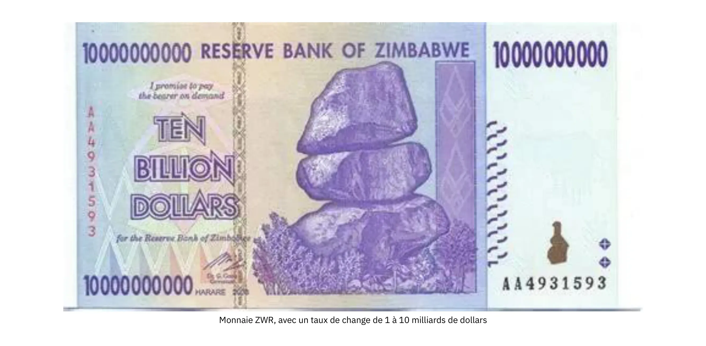

Buradan çıkarılacak en önemli sonuç, hiperenflasyonun üstesinden gelmek için çeşitli stratejiler olduğudur. Dolarizasyon tercih edilebilir ya da yeni bir para birimi getirilebilir. Bu çözümler ancak halkın bunlara güven duyması halinde işe yarayacaktır. Sıkı kısıtlamalar getirmek çok önemlidir. Gerçekten bağımsız bir merkez bankası şarttır. Hükümet açıklarını kapatmak için Supply parasını şişirmemelidir. Hafif enflasyon durumunda, paranın büyümesini sınırlamak yeterli olacaktır. Ancak hiperenflasyonla karşı karşıya kalındığında, öncelikle söz konusu ekonominin büyüklüğüne uygun bir parasal büyüklüğe sahip olmak çok önemlidir. Ardından, durumu istikrara kavuşturmak için hükümete katı kısıtlamalar getirilmesi zorunludur.

## Hiperenflasyon banknot koleksiyonunun sunumu

<chapterId>f3ffbb47-3aeb-54bd-80a9-adccb0f419e2</chapterId>

[*Bitcoin Educational Toolkit* içindeki taranmış koleksiyonu keşfedin (Plan ₿ Network platformunun *Kaynaklar* bölümünden de erişilebilir.](https://penpot.planb.network/#/view?page-id=c157057b-fd28-8042-8004-4f081b21defc&file-id=c157057b-fd28-8042-8004-4f081b21defb&section=interactions&index=0&share-id=7154756b-3ebd-8040-8004-6475c2af5889&interactions-mode=show-on-click)

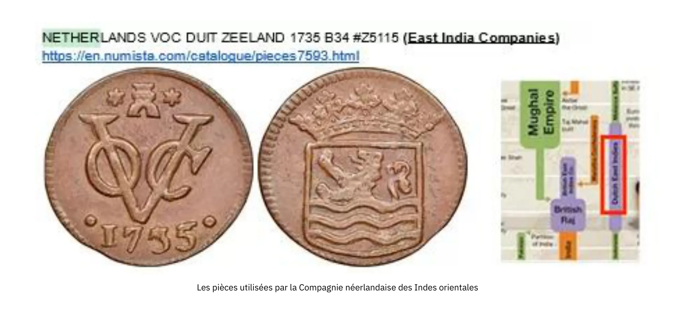
# Buraya nasıl geldik?

<partId>f66ca17e-be9e-5d30-a098-f7affd8962a1</partId>

## Para ve Merkez Bankalarının İkinci Layer'ünün Ortaya Çıkışı

<chapterId>0455ffe3-9d45-5a67-ac96-3f815dc507a1</chapterId>

Transkript:

Paranın ikinci Layer'ünün ve ilk merkez bankalarının ortaya çıkışı büyüleyici bir konudur. Bu konu Nick Battia'nın "Katmanlı Para" adlı kitabında kapsamlı bir şekilde ele alınmıştır. Parasal sistemlerimizin evrimi ve incelikleriyle ilgilenenlere bu kitabı şiddetle tavsiye ederim. Bu bölümün amacı para yaratmanın kökenini ve bunun nasıl hiperenflasyona yol açabileceğini anlamaktır.

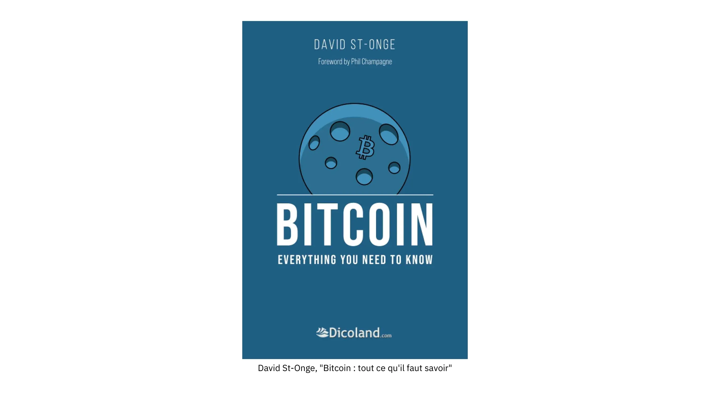

### Piramit Para ve Merkez Bankaları

#### Florin

Paranın tarihi 13. yüzyıl İtalya'sına, özellikle de Floransa'ya kadar uzanmaktadır. O dönemde florin ve Exchange banknotları yaygındı. Dikkate değer bir örnek, Vaftizci Aziz John figürüyle süslenmiş florindir.

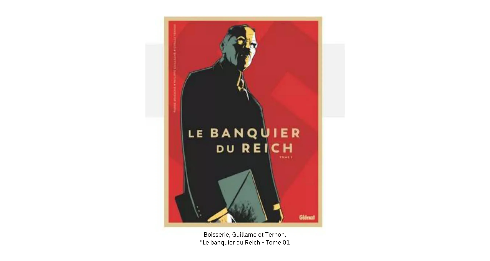

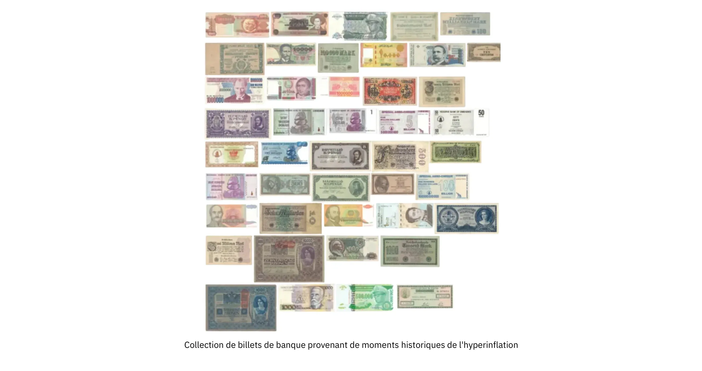

Günümüzde gerçek bir florine sahip olmak pahalı olsa da, reprodüksiyonları mevcuttur. O döneme ait, üzerinde İsa'nın resmi bulunan 17. yüzyıl İtalyan devletlerine ait soldo gibi başka para birimleri de vardır.

#### Exchange Faturaları (13. yüzyıl)

O dönemdeki yaygın uygulama şöyleydi: kuyumcular yatırılan florinler karşılığında Exchange cinsinden Exchange bonoları çıkarıyorlardı. Bu florinler kasalarında özenle saklanıyordu. Böylece, florin tarafından temsil edilen gerçek altın, paranın ilk Layer'unu oluştururken, Exchange'lik banknotlar ikinci bir Layer oluşturuyordu. Ancak bu sistemin likiditesi sınırlıydı. Eğer birisi altınını Redeem olarak Exchange banknotuyla değiştirmek isterse, işlem basitti. Ancak bu banknotların bireyler arasında değiştirilmesi yaygın değildi.

#### Antwerp Stock Exchange (16. yüzyıl)

Antwerp Stock Exchange kağıt paranın evriminde önemli bir dönüm noktası oldu. Senetlerin iskonto edilmesi uygulaması burada başlatıldı. Bu senetler parasal değeri temsil eden kağıt araçlardı, ancak benzersizlikleri isim ve vade tarihi taşımalarıydı. Bu da vade tarihinden önce Exchange'e dönüştürülmelerini zorlaştırıyordu.

Antwerp Stock Exchange'nin getirdiği devrim, bu senetlerin vadelerinden önce iskonto edilebilmesinde yatıyordu. Örneğin, bir senedin vadesi bir ay içinde doluyorsa, vade tarihinden önceki zamanı hesaba katmak için senedi indirimli fiyattan satın almak mümkündü. Bu yenilik sadece kağıt parayı daha Liquid yapmakla kalmadı, aynı zamanda paranın zaman değeri kavramını da ortaya çıkardı.

Bu kavram, Twitter'daki takma adı "BTC'nin zaman değeri" aracılığıyla Nick Bell ile ilişkilendirilse de, onun icadı değildir. Bununla birlikte, çalışmasında ayrıntılı olarak tartışmaktadır. Ana fikir, zamanın bir değeri olduğudur. Dolayısıyla, eğer birisi 100 $ değerindeki bir senedi bir ay önceden ödemeye karar verirse, örneğin 98 $ karşılığında senedi alabilir ve 100 $'ı vade tarihinde alabilir. Bu parasal yenilik Antwerp Stock Exchange'te ortaya çıkmıştır.

#### VOC ve Amsterdam Borsası (17. yüzyıl)

Antwerp Stock Exchange'ten sonra, önemli bir dönüm noktası VOC'nin, Hollanda Doğu Hindistan Şirketi'nin kurulmasıydı. Merkezi Hollanda'da bulunan bu şirket kendi para birimini bile çıkarmıştır. VOC'nin kurulmasının ardından ilk borsa Amsterdam'da kuruldu ve bu şirket için ilk borsa oldu. İlginç olan, Hollandalıların Antwerp'in uluslararası bir ekonomik merkez olarak üstünlüğüne nasıl son vermeyi başardıklarıdır. Basitçe Scheldt Nehri'ne erişimi engellediler. Bu strateji daha büyük bir tarihsel hareketin, dilencilerin isyanının bir parçasıydı. Avrupa tarihinde çok önemli bir olay.

#### Amsterdam Merkez Bankası'nın müdahalesi

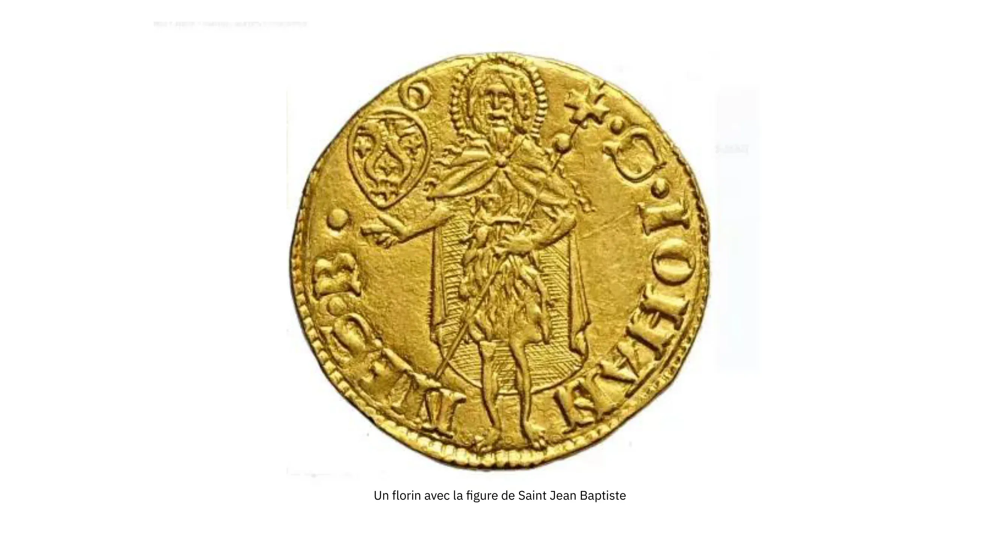

VOC'nin kurulmasından sonra, para tarihindeki bir diğer önemli unsur da Amsterdam Bankası tarafından altın sikkelerin piyasaya sürülmesiydi. Geçmişi 1722 yılına kadar uzanan bu sikkeler gümüşten yapılmıştı. Ancak o dönemde finansta gerçek anlamda devrim yaratan şey Coin'nin kendisi değil, Amsterdam Bankası'nda bu para birimiyle ilişkili hesaplardı. Bu hesaplar uluslararası Exchange'nın birincil aracı haline geldi. İşlemler basitçe kayıtlara ya da defterlere kaydediliyordu. Bu sistem sayesinde Amsterdam küresel ekonomi merkezi haline geldi. Zamanla, Amsterdam Bankası bu hesapların kullanımını dayatmaya karar verdi. Bağımsız para değiştiricilerin her gün bankaya para yatırmak için madeni paralarını Exchange yapmaları gerekiyordu.

#### Savaşı finanse etmek için İngiltere Merkez Bankası'nın kurulması

İngiltere Bankası'nın kuruluşu, 17. yüzyılın sonunda savaşı finanse etme ihtiyacından kaynaklanmıştır. Amsterdam Bankası gibi o da kararnameyle mevduat kabul etti. İngiltere Merkez Bankası'nın özelliği, özel bankaları parasal sistemde ikincil bir konuma düşürmesi ve böylece "üçüncü Layer" olarak adlandırılabilecek bir para birimi yaratmasıydı.

Başlangıçta, para biriminin ilk Layer'u altın ile temsil ediliyordu. Özel bankalara yatırılan mevduatlar ikinci Layer'u oluşturuyordu. Ancak, bu mevduatlar artık altına dönüştürülemediğinde, üçüncü bir Layer para birimi ortaya çıktı. O andan itibaren, özel bankalar tarafından çıkarılan banknotlar artık altına değil, İngiltere Merkez Bankası tarafından çıkarılan ve kendisi de altına çevrilebilen kağıt paraya çevrilebiliyordu. Bu evrim, ek katmanların eklenmesiyle parasal sistemin karmaşıklaşmasına yol açtı.

#### 1796 Paniği

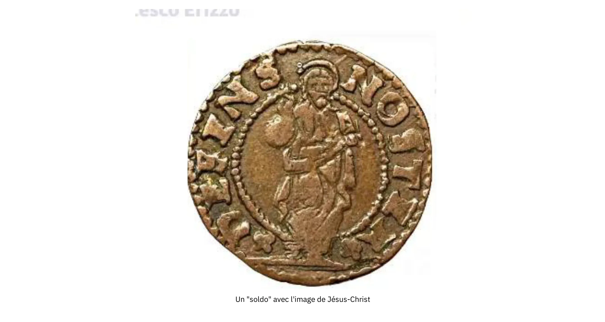

1857'deki Panik sırasında Seamen's Savings Bank'ta yaşanan banka paniği.

1796'daki banka paniğinin ardından, herkesin "para piramidinde" yukarı çıkmaya çalıştığı bir fenomen meydana geldi. İnsanlar üçüncü Layer para birimlerini ikinci Layer para birimine ve nihayetinde birinci Layer para birimi olan altına çevirmek istediler. Bu büyük hücum karşısında İngiltere Merkez Bankası durumu istikrara kavuşturmak için harekete geçmek zorunda kaldı. Altın rezervlerinin olası bir deflasyonunu önlemek için banknotlarının altına dönüştürülebilirliğini askıya almaya karar verdi. Başlangıçta geçici bir önlem olarak düşünülen bu askıya alma, yirmi yıllık bir süre boyunca devam etti.

### Sonuç:

Merkez bankaları, paralarının altına dönüştürülebilirliğini askıya alarak son çare kreditörleri haline geldiler. Bu eylem başlangıçta geçici bir çözüm olarak tasarlanmış olsa da, nihayetinde kalıcı hale geldi ve son çare borç veren kavramının ortaya çıkışını işaret etti. Bu dönüşüm bugün bildiğimiz merkez bankalarını şekillendirmiştir. Bununla birlikte, daha kırılgan ekonomilerde, bu istediği zaman para basma yeteneği, sorumsuzca kullanıldığında hiperenflasyon gibi istenmeyen sonuçlara yol açabilir.

## Kitaplar ve Kaynaklar

<chapterId>c44e4519-0741-527b-b3b0-3f513e87147d</chapterId>

Hiperenflasyon, çeşitli tarihsel olaylar üzerinden incelenen büyüleyici bir konudur. Bu konuyu daha derinlemesine incelemek isterseniz, işte okuyup çalışabileceğiniz 10 temel kaynağın bir listesi:

- "Para Öldüğünde: Weimar Almanya'sında Açık Harcama, Devalüasyon ve Hiperenflasyon Kabusu" Adam Fergusson tarafından kaleme alınmıştır. Bu kitap, Birinci Dünya Savaşı sonrasında Almanya'da yaşanan hiperenflasyon krizini ayrıntılarıyla anlatıyor.

- costantino Bresciani-Turroni'den "Enflasyon Ekonomisi - Savaş Sonrası Almanya'da Para Biriminin Değer Kaybı Üzerine Bir Çalışma". 1920'lerdeki Alman hiperenflasyonunun derinlemesine bir analizi.

- "Bu Sefer Farklı: Carmen M. Reinhart ve Kenneth S. Rogoff tarafından yazılan "Eight Centuries of Financial Folly". Kitap birçok finansal kriz türünü kapsamakla birlikte, tarih boyunca yaşanan hiperenflasyonları kapsamlı bir şekilde ele almaktadır.

- steve Hanke tarafından yazılan "Zimbabve'nin Hiperenflasyonu, Analiz ve Çıkarılan Dersler". 2000'li yılların başında Zimbabve'de yaşanan hiperenflasyon üzerine bir çalışma.

- "Parasal Rejimler ve Enflasyon: Tarihsel, Ekonomik ve Siyasi İlişkiler" Peter Bernholz tarafından kaleme alınmıştır. Kitap, tarih boyunca yaşanan hiperenflasyon vakalarını inceliyor ve altında yatan faktörleri anlamaya çalışıyor.

- "Hiperenflasyonda Hayatta Kalma Rehberi: Amerikan İşletmeleri için Stratejiler" Gerald Swanson tarafından yazılmıştır. İşletmelerin hiperenflasyon ortamında nasıl hareket edebileceklerine dair pratik bir rehber.

- "Paranın Ölümü: Büyük Alman ve Amerikan Enflasyonlarından Dersler" Jens O. Parsson. Almanya ve Amerika Birleşik Devletleri'ndeki enflasyon krizlerinin karşılaştırmalı bir analizi.

- "Paranın Çöküşü: Almanya'nın Hiperenflasyonu ve Orta Sınıfın Yıkımı", Frederick Taylor. Hiperenflasyonun Alman toplumu üzerindeki sosyal ve ekonomik etkisinin öyküsel bir incelemesi.

- "Gelişmekte Olan Ülkeler için Döviz Kurulları: Bir El Kitabı" Steve Hanke ve Kurt Schuler tarafından yazılmıştır. Odak noktası para kurulu olsa da, bu kitap hiperenflasyon durumlarından nasıl kaçınılacağına dair bir bakış açısı sunuyor.

# Son Bölüm

<partId>cb1f4a4b-556a-4e47-a5cc-136be35a1f9a</partId>

## Yorumlar & Derecelendirmeler

<chapterId>1a37317e-372a-5241-b478-8316d44f9283</chapterId>

<isCourseReview>true</isCourseReview>

## Final Sınavı

<chapterId>d01831c3-6c4d-59e3-95bc-03e97a05c142</chapterId>

<isCourseExam>true</isCourseExam>

## Sonuç

<chapterId>45d410b0-71ed-4502-8d8d-8b6df761db23</chapterId>

<isCourseConclusion>true</isCourseConclusion>