# 经济崩溃之旅

当货币失去其意义时会是什么样子？
本课程将引导您进入迷人而又发人深省的恶性通货膨胀世界。您将发现历史事件和现代案例，其中货币崩溃，经济在一夜之间发生转变。您将揭示模式、原因以及对普通人的真实影响，深入了解经济学中最戏剧性的现象之一。

在此过程中，您还将发现个人和社区如何度过这些动荡时期。学习在货币危机期间帮助保护财富的策略，并建立对金融韧性的更深理解。如果您对塑造我们世界的经济力量感到好奇，这段旅程将提供知识和实践视角。
+++
# 导言

<partId>6fe4d15d-f6e6-54be-9e04-0a75ac98df8b</partId>

## 课程概览

<chapterId>9d1aba8d-0485-5020-9863-5de37e6db8e0</chapterId>

欢迎学习 ECO204 课程！

本课程的目标是帮助您了解法定货币体系下恶性通货膨胀的根源、机制和后果。通过具体实例和历史分析，您将学会识别恶性通货膨胀时期之前反复出现的模式，并确定保护自己的行动杠杆。

**第2部分：什么是通货膨胀？

在深入探讨这一话题的核心之前，我们先重温一下基本知识：什么是通货膨胀？本节将介绍其货币起源、不同类型的通货膨胀，以及它们如何融入更广泛的经济动态。这是了解普通通货膨胀如何演变为恶性通货膨胀的重要一步。

**第3部分：什么是恶性通货膨胀？

在本节中，您将学习恶性通货膨胀的准确定义，并考察几个重大历史事件，包括魏玛德国和津巴布韦的恶性通货膨胀。我们将分析它们的共同点、不同点和当代相似之处。您还将发现一些鲜为人知的案例，如拉丁美洲的连续重币化，以及在某些国家观察到的退出策略。

**第 4 部分：我们是如何到达这里的？

这一部分旨在了解导致恶性通货膨胀的结构性机制，特别是通过货币 "第二轮 Layer "的发展和中央银行的作用。本部分还将提供其他资源和阅读建议，以供进一步探讨。

如果货币历史在我们眼前重演会怎样？在接下来的章节中，您将对此做出判断！

# 什么是通货膨胀？

<partId>2b4f456c-3649-5cf9-b9b0-a5bffe92d962</partId>

## 货币现象

<chapterId>b2cbc915-c4ec-52b5-860c-0958f58c91e4</chapterId>

### 通货膨胀的定义

通货膨胀是一个经常被误解的概念，因为它有多种定义和解释。比特币爱好者和传统经济学家等不同群体对通货膨胀的认识也不尽相同。在讨论恶性通货膨胀之前，让我们先澄清一下定义：

- 勒罗伯特词典中的定义：通货膨胀是指支付工具（纸币、资本）过度增加，导致物价上涨和货币贬值。

- 拉鲁斯百科全书中的定义：通货膨胀是一种以物价水平普遍持续上涨为特征的现象。这里，"普遍 "一词至关重要。

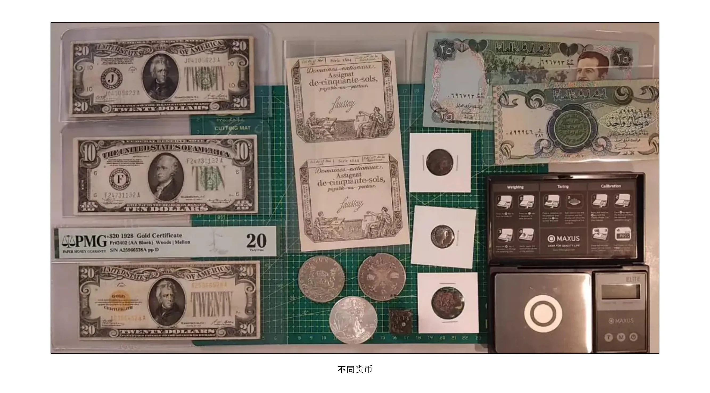

根据这些定义，我们必须明白，在罗伯特看来，通货膨胀主要涉及货币 Supply 的增加。另一方面，拉鲁斯关注的是货币扩张的后果，即物价的普遍上涨。

在我们关于恶性通货膨胀的研究中，我们将采用第二个定义，即物价普遍上涨，因为它与我们的主题更相关、更明确。不过，必须记住，物价上涨一般是货币 Supply 膨胀的结果。

知名经济学家米尔顿-弗里德曼（Milton Friedman）有一句名言：

> "通货膨胀在任何时候、任何地方都是一种货币现象"。

这一说法强调了货币扩张与通货膨胀之间的内在关系。在接下来的章节中，我们将以这些基本定义为基础，探讨通货膨胀与经济增长之间的关系。

### 了解货币现象

在提到货币现象时，我们指的是一个经济体的货币 Supply 如何受到影响。米尔顿-弗里德曼（Milton Friedman）基本上将其视为这一Supply的增加。从历史上看，增加货币 Supply 的方法主要有两种：

1.货币印刷：

在传统货币体系中，货币 Supply 的增加是通过印刷新钞来实现的。尽管在数字货币占主导地位的今天，这种印刷主要是通过电子方式（通过中央银行和其他金融机构的数据库）进行的，但历史表明，在某些时期，纸币的印刷导致了恶性通货膨胀。

2.减少金属含量：

另一种方法是减少以银或金等金属为基础的货币中的贵金属含量。罗马帝国就是一个鲜明的例子，最初几乎完全由白银构成的第纳尔，随着时间的推移，其白银含量急剧下降。这相当于一种形式的通货膨胀，但不一定是恶性通货膨胀。

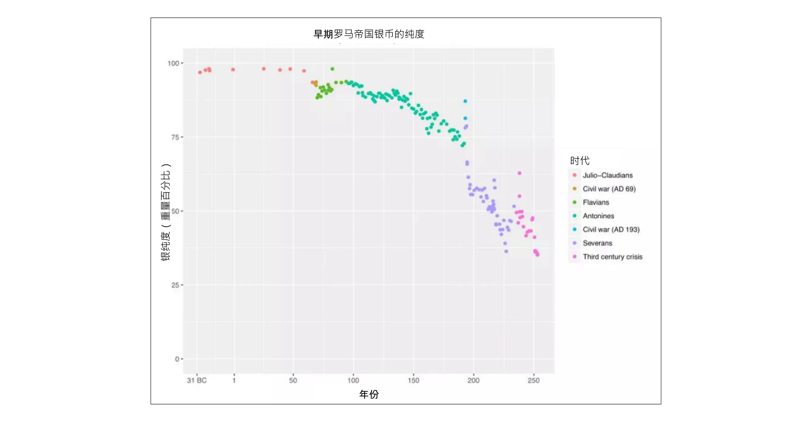

必须强调的是，恶性通货膨胀主要出现在没有贵金属等基础资产支持的法定货币上。从历史上看，当货币以此类资产为基础时，也会出现通货膨胀（如通过金属含量贬值），但这些情况从未达到恶性通货膨胀的极端水平。在以下章节中，我们将详细研究货币贬值时期以及这些不同货币体系对通货膨胀的影响。

### 货币贬值时期研究

纵观历史，各种文明都经历过货币贬值时期。其中一些时期与对经济造成压力的重大事件或战争同时发生。

#### 1.伯罗奔尼撒战争和第二次布匿战争：

雅典和斯巴达之间的伯罗奔尼撒战争以及罗马共和国和迦太基之间的第二次布匿战争是档案中发现的最早的货币贬值实例。为了给这些战争提供资金，这些文明通过减少银的含量和加入其他金属来使其货币贬值，同时增加硬币的生产数量。

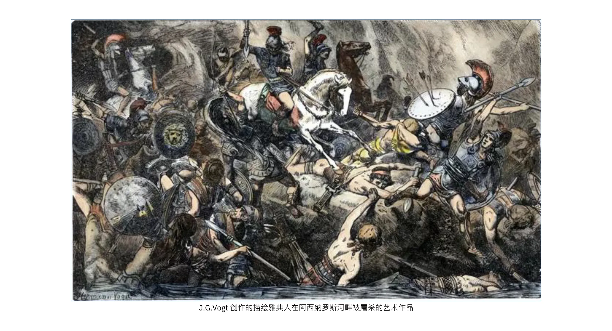

描绘雅典人在阿西纳罗斯河畔惨遭屠杀的雕刻。

#### 2.帝国时期的古罗马

罗马共和国时代之后，在帝国时期，3 世纪和 4 世纪经历了货币大幅贬值。如上图所示，钱币含银量的减少说明了这一点。一项研究显示，从公元前 40 年到公元 360 年的约 400 年间，埃及以德拉克马为单位的小麦价格上涨了 100 万倍。在此期间，年平均通货膨胀率约为 4.4%。然而，这种通货膨胀的分布并不均匀。它真正开始于公元 238 年左右。在公元 250 年至 293 年期间，通货膨胀率约为 3.65%，在公元 293 年至 301 年期间，通货膨胀率增至 22.28%。

虽然这些时期经历了严重的通货膨胀，但并没有达到现代某些情况下的恶性通货膨胀水平。原因在于，虽然货币贬值，但仍有贵金属作为支撑。这一坚实的基础为抵御极端通货膨胀水平提供了一定的保护。在下面的章节中，我们将更详细地探讨恶性通货膨胀的性质和后果。

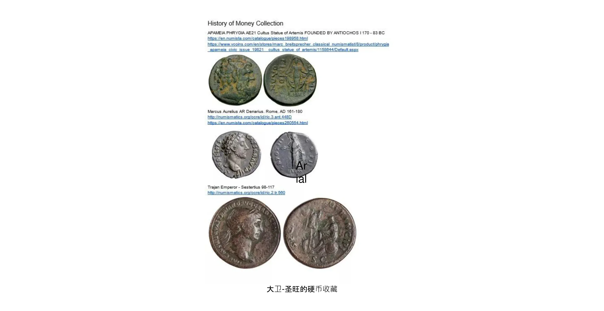

- 马库斯-奥勒留（Marcus Aurelius）的第纳利乌斯（公元 160 年）：

古罗马最具标志性的钱币之一是银币 Coin。我拥有一枚马库斯-奥勒留（Marcus Aurelius）的特定 Coin 硬币，可追溯到公元 160 年，当时硬币尚未大幅贬值。虽然相机可能难以捕捉到精美的细节，但肉眼可见，Coin 非常漂亮，而且含银量较高。

- 安东尼纳斯（公元 3 世纪晚期）：

随着货币贬值，出现了一种新货币--安东尼银币。这种货币应该价值两个第纳尔，但含银量要少得多。我的安东尼纳斯金币 Coin 清楚地显示出含银量已大幅减少。这枚安东尼纳斯 Coin 上饰有一个王冠，是这一时期罗马钱币的典型特征，被称为 "放射状"。通过比较颜色和质量，我们可以看出这枚安东尼尼亚斯 Coin 远非纯银。

将这两枚硬币并排比较，差异非常明显。公元 160 年的硬银币具有明显的银色外观，而公元 3 世纪晚期的安东尼尼安硬币则暗淡无光，表明银含量大幅减少。这种直观的对比清楚地说明了古罗马在几个世纪中经历的货币贬值。

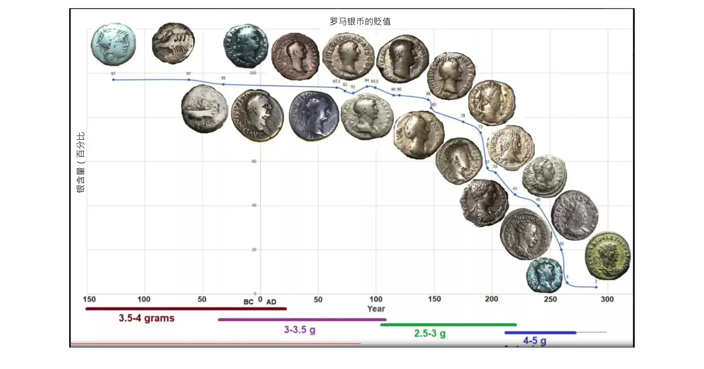

为了完成演示，最好能提供一张图表，说明这些钱币随着时间的推移而贬值的情况。虽然很难通过这个平台进行直观展示，但可以想象一张图表，显示第纳里乌斯的价值，以及它在 2 世纪末的衰落，当时它被安东尼乌斯所取代，据说价值两个第纳里，但含银量要低得多。这些文物是过去文明经济波动的无声见证。

#### 3.西班牙的马拉维迪：定向贬值的见证

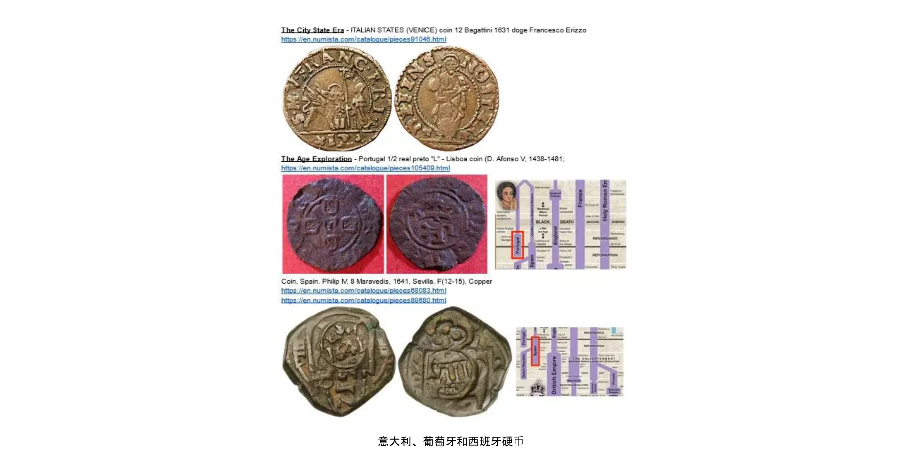

马拉维迪作为一种铜币，在西班牙货币史上占有特殊的地位。如前所述，西班牙元原本是国际标准货币，是西班牙必不可少的储备货币。然而，面对某些经济挑战，西班牙不得不采取巧妙的货币策略。

货币贬值是国家经常使用的一种工具，用以支付开支或刺激经济。然而，西班牙发现自己处于一个微妙的境地。稀释西班牙元会损害其在国际贸易中的地位。为了解决这一难题，西班牙求助于马拉维迪。

与珍贵的西班牙银元不同，马拉维迪是一种铜币，主要用于当地居民。这种货币是贬值对象。当一个马拉维第 Coin 最初价值两个马拉维第时，国家会收回它，重新盖上一个新的价值，例如 "4"，然后只将一个 Coin 归还给所有者。这枚标有 "8 "的 Coin 就是这一过程的证明，它经历了数次贬值。

这一战略使国家能够有效地使货币贬值，造成通货膨胀，间接地为国家提供资金，同时在国际舞台上保持西班牙美元的完整性。然而，这种有针对性的贬值给当地居民带来了后果，他们看到自己共同货币的价值被稀释了。

马拉维迪斯的案例说明了一个国家如何有选择性地使本币贬值，以满足其国内经济需要，同时在全球舞台上保持储备货币的价值。这是历史上货币政策复杂性和精细性的一个突出例子。

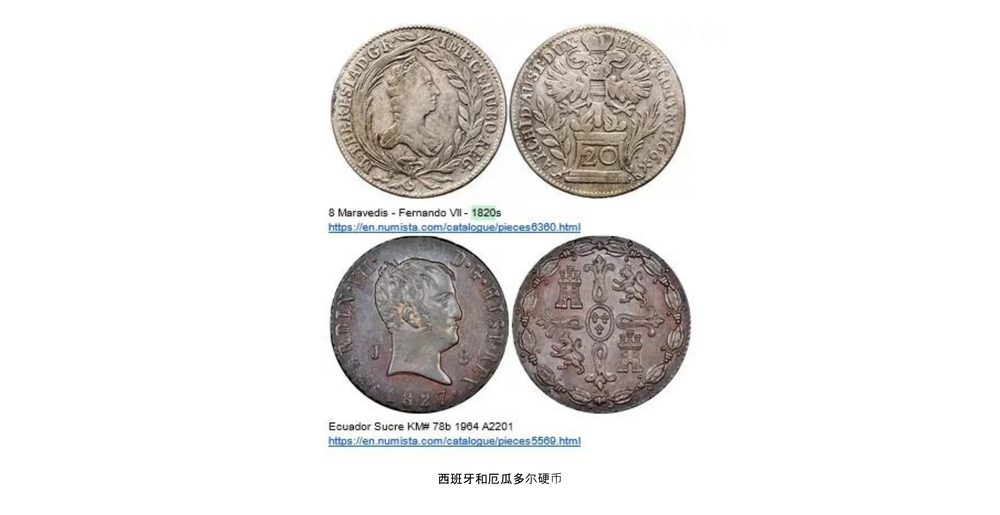

您想了解更多吗？ -> [链接](https://docs.google.com/document/d/1aZa7gvz1nt8ZHDCoWKQdS9RGGjBHdipH1ApC8dW1xpM/edit?usp=sharing)

#### 4.15 至 17 世纪的价格革命

15 至 17 世纪期间，欧洲出现了一种引人注目的经济现象，通常被称为 "价格革命"。这一时期的通货膨胀主要是由美洲贵金属，尤其是黄金和白银的大量流入引发的。由于当时欧洲经济主要以金属本位制为基础，这些额外的金属Supply增加了货币Supply。因此，出现了每年约 1% 到 2% 的通货膨胀率。乍一看，这种通货膨胀似乎并不严重。然而，在当时，这种价格波动是不寻常的，足以被视为一场 "革命"。这凸显了货币储备的变化如何影响整个经济体系。

#### 5.约翰-劳和阿西纳特家族

18 世纪，法国经济史上发生了两件与货币有关的大事。首先，苏格兰经济学家和金融家约翰-劳说服法国政府采用以纸币为基础的货币体系。尽管这一举措最初被认为是解决国家金融问题的创新方案，但很快就导致了严重的通货膨胀。此后不久，在法国大革命的动荡时期，政府又引入了 "阿让塔特"。

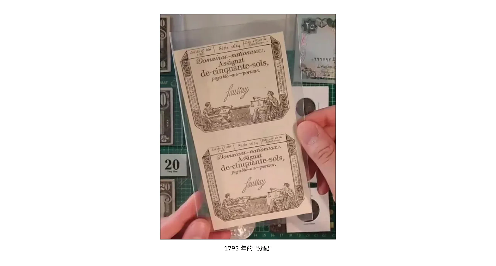

1793 年以来的分配

这些钞票是历史上第一次大规模恶性通货膨胀时期的活见证。钞票最初是为了应对接连不断的金融危机而设计的，但很快就成为了货币不稳定的象征。政府过度依赖这种纸币来支付开支，造成了前所未有的经济危机，并导致法国在大革命后进入了一个严重的恶性通货膨胀时期。

#### 6.第 6102 号行政命令和美元贬值

第 6102 号行政命令和美元贬值

20 世纪 30 年代初，美国的货币政策发生了重大转变。以下是对这一转变的详细概述：

- 1928 年 20 美元纸币

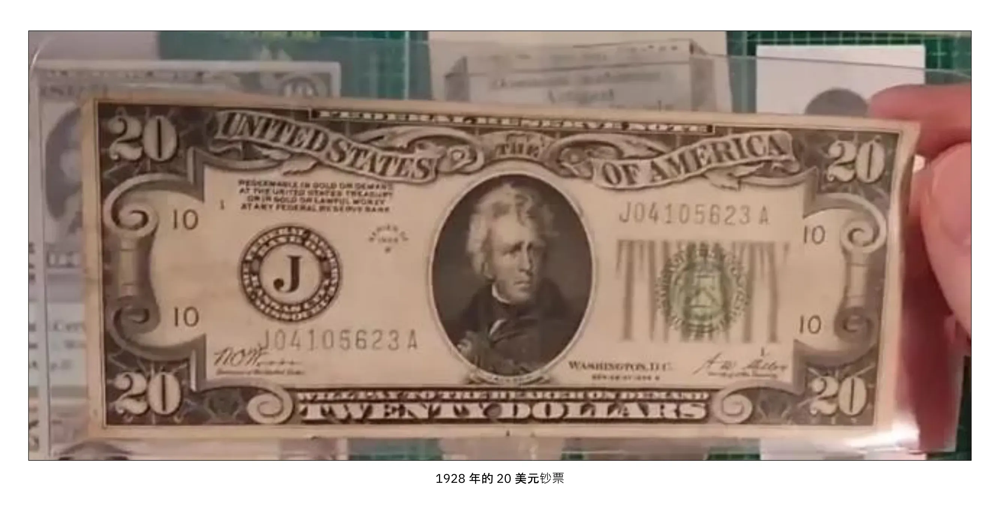

1928年，美国的20美元钞票上写着："可按要求兑换成黄金"这意味着每张钞票都可以兑换成黄金。具体来说，一张 20.67 美元的钞票相当于一盎司黄金。

- 第 6102 号行政命令

1933 年，随着第 6102 号行政令的颁布，发生了一场重大的动荡。该法令规定，公民拥有黄金（无论是金条、金币还是证书）均属非法。

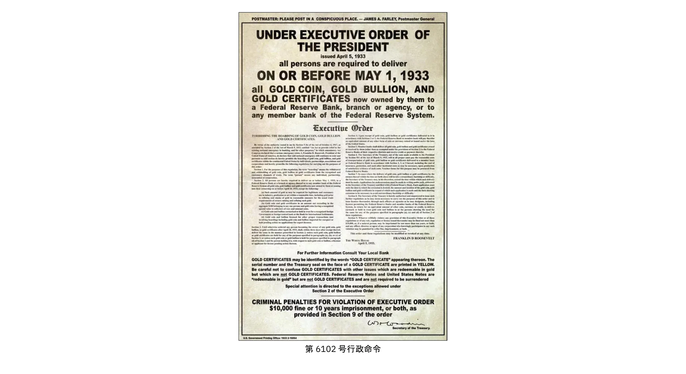

黄金证书就是一个很好的例子。上面标有："Coin黄金，持票人见票即付"持有这样的证书是非法的，一直到 1964 年都是如此。

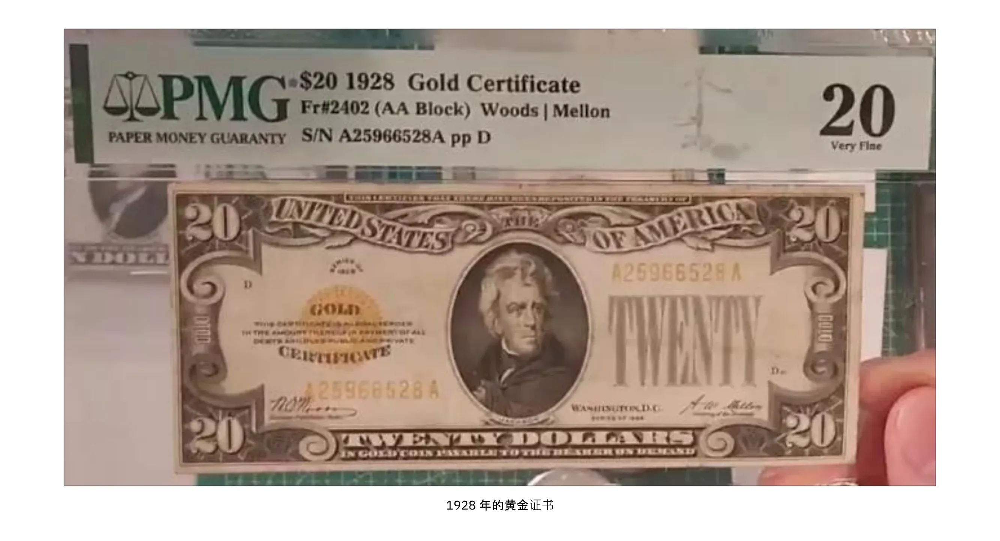

- 推出新钞

1934 年黄金被没收后，新的纸币系列开始流通。

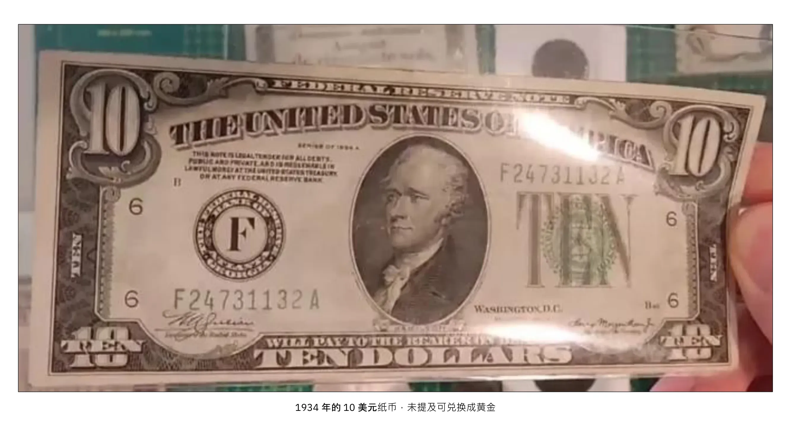

表示可兑换成黄金的提法已被删除，取而代之的是 "本钞票是所有债务的法定货币"（Ce billet est une monnaie légale pour toutes dettes）。

- 黄金重估

这一转变的迷人之处在于政府的策略。1934 年，黄金价格被重新估价为每盎司 35 美元，而不是 20.67 美元。从根本上说，政府让人们拥有的美元贬值了。通过在 1933 年以每盎司 20.67 美元的价格从民众手中购买黄金，然后在 1934 年重估黄金价格，政府在贬值其公民储蓄的同时也创造了可观的利润。

总之，在一年之内，政府实际上没收了公民的黄金，然后改变了游戏规则，重估了黄金的价值，使国库受益，而最初用黄金兑换纸币的人则处于不利地位。

### 美国改变了历史。

美国成为第一个使世界储备货币--美元贬值的国家，这是一个历史性的转折点，与以往小贸易国的做法截然不同。

此前，在文艺复兴时期，佛罗伦萨于 13 世纪发行的意大利弗罗林是国际储备货币，在其使用期间没有贬值记录，这反映了货币稳定对国际贸易的重要性。

本着同样的精神，西班牙和荷兰因其蓬勃发展的国际贸易而成为世界储备货币的持有者，它们维护本国货币的完整性，以保持国际交流中的信心和现状。荷兰甚至见证了第一家中央银行的创建，这是全球货币体系演变过程中的一个重要里程碑。

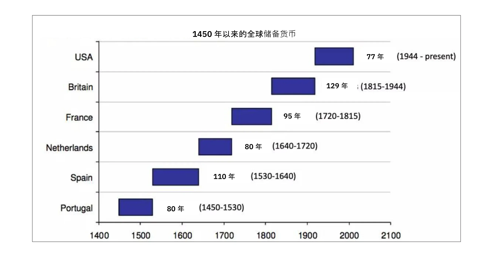

然而，随着美国作为经济霸主的崛起，情况发生了变化。他们选择让储备货币贬值，从而利用通货膨胀为自己谋利。这一决定通常归因于动态的变化，即储备货币的选择不再像以前那样自由。美国霸权确立了美元作为世界储备货币的地位，允许对其价值进行操纵。这一转变揭示了全球化经济中货币政策对国际贸易的潜在影响，标志着全球储备货币管理的重大转变。

### 最后一个例子：瑞士第纳尔

瑞士第纳尔说明了货币贬值的另一个迷人方面，这一次是在海湾战争前的伊拉克背景下。这种货币因其钞票的显著质量而得名，由伊拉克中央银行发行，在中东地区享有稳定的声誉。这种信心主要归功于钞票的印刷质量，因为钞票是在英国印刷的，这意味着钞票具有一定的抗贬值能力。

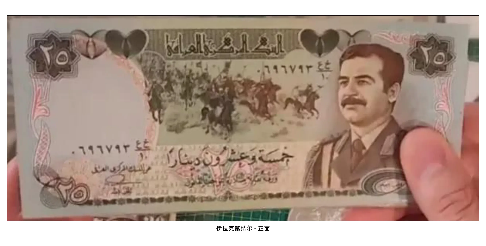

然而，海湾战争标志着瑞士第纳尔历史上的一个转折点。伊拉克无法再依靠其英国供应商印制钞票，转而向中国寻求帮助。这一转变导致了钞票质量的明显差异，中国版本的钞票被认为质量较差。这种看法并非毫无根据；中国钞票更容易伪造，也更容易被政府套印，从而威胁到其价值。

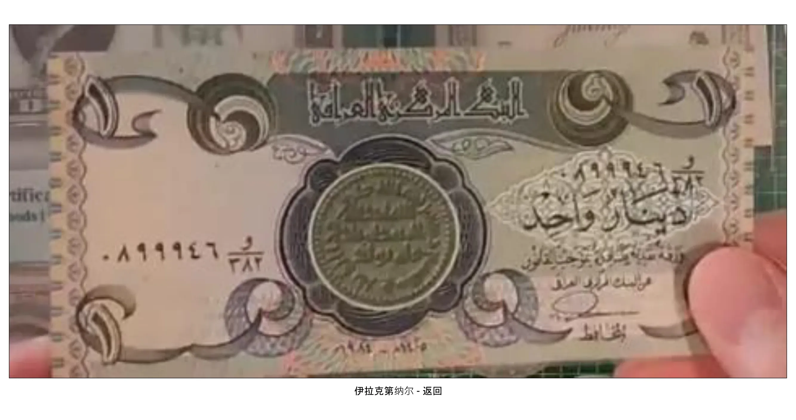

海湾战争后的伊拉克经济出现了一个独特的现象：双重定价制度。商人们根据付款所用纸币的种类提供不同的价格，他们偏爱瑞士第纳尔原版纸币而非中国纸币。这种制度反映了人们对较高质量纸币的信任，即使在价值主要由国家强加的情况下，这种纸币也不易贬值。这一事件凸显了货币内在特征的重要性，以及即使在法定货币制度下，货币的感知质量如何影响其相对价值，进而影响经济参与者的信心。

#### 是的，我们真的称了硬币的重量！

人们通常将货币与国家创造联系在一起，即货币的发行和价值由国家监管。这一概念源于罗马等古代文明，在罗马，钱币由帝国统一标准并加盖印章，从而赋予货币官方价值。然而，深入探究会发现，货币的内在价值主要来自其贵金属含量。

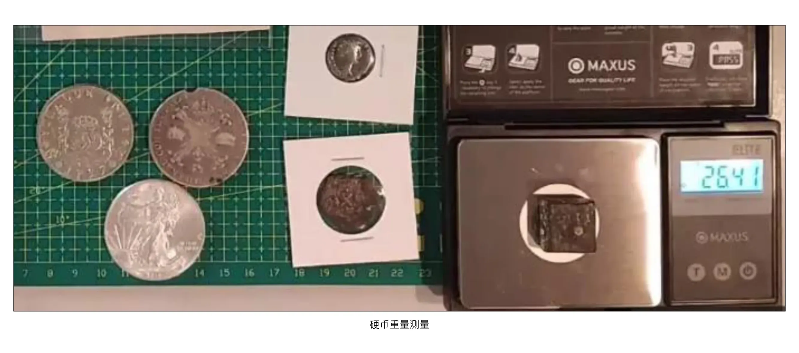

通过对相当于 8 个西班牙雷亚尔或 1 个西班牙美元的货币砝码的研究，可以说明一个例子。这种砝码上标有罗马数字，表示其价值，货币兑换商用它来根据硬币的重量而不仅仅是印记来评估硬币的价值。通过称量钱币的重量，兑换商可以确定钱币是否被篡改或损坏，从而降低其价值。这种做法突出表明，虽然国家的标准化印记赋予了货币一定的名义价值，但真正的价值在于其所含贵金属的重量。

这一分析表明，人们对货币的信任，进而对货币价值的信任，是建立在货币的有形物质之上，而不仅仅是国家的主张。它强调了国家强加的名义价值与贵金属含量决定的内在价值之间的双重性。因此，货币不仅仅是一种国家工具，其基本价值与有形和可衡量的 Elements 具有内在联系。

#### 结论

总之，这项关于货币贬值的研究让我们对通货膨胀机制有了更深入的了解，我们将在接下来的视频中对此进行探讨。我们将讨论不同类型的通货膨胀，以及它们过渡到高通胀或恶性通胀的临界点。有了这个坚实的基础，我们就能在接下来的课程中以 Address 的方式探讨通货膨胀的复杂性。感谢您的关注。我们期待在下一个视频中继续探讨货币动态。

## 通货膨胀的类型

<chapterId>b438fe09-375e-5bb2-9196-7dd687b9f98c</chapterId>

### 通货膨胀不是一种多因素现象

在本节中，我们将探讨通货膨胀这一经常被误解的现象的各个方面。尽管在媒体和日常讨论中，通货膨胀经常被视为一种多因素现象，但我们必须牢记，通货膨胀从根本上说是一种货币现象。

以下是该主题的几个要点：

- 价格上涨与通货膨胀的区别：

价格上涨可能针对具体行业，由各种因素引起，如欧佩克石油产量下降或不利的天气条件影响小麦生产。

另一方面，通货膨胀的定义是一系列商品和服务价格的普遍上涨，而不仅仅是某一特定领域的价格上涨。

- 通货膨胀的货币本质

在货币 Supply 固定的情况下，一个部门的价格上涨会导致其他部门的价格下降，因为可用于其他部门的货币量会减少。通货膨胀与货币 Supply 的增加密切相关，货币 Supply 的增加使所有部门的价格同时上涨。

- 货币 Supply 对通货膨胀和通货紧缩的影响：

在固定货币 Supply 体系中，理论上生产的增加应导致通货紧缩，即价格下降，因为有更多的商品和服务可供使用。

在当前的法定货币体系中，货币 Supply 的增加抵消了生产增加可能导致的通货紧缩。

- 货币 Supply 调整的负面影响：

如果货币 Supply 增加，而生产却没有相应增加，就会导致通货膨胀，因为同样数量的商品和服务会有更多的货币流通。

虽然生产的增长本应导致通货紧缩，但货币 Supply 的同步增长却抵消了这一效应，反而导致了通货膨胀。

- 通货膨胀、通货紧缩和货币 Supply - 沟通的载体：

通货膨胀和通货紧缩就像经济中的沟通管道。生产增加会导致通货紧缩，但如果同时增加货币 Supply，通货紧缩效应就会被抵消，从而导致通货膨胀。

这一讨论强调了理解通货膨胀和通货紧缩内在机制的重要性，以及改变货币 Supply 可能对经济产生的深远影响。我们以后可能会再次讨论这些概念，以便更深入地了解它们之间的相互联系以及它们对全球经济的影响。

### 为什么印钞不一定导致通货膨胀？

#### 通货膨胀≠消费物价指数

通货膨胀虽然常常与货币Supply的增加有关，但并不总是与印钞直接相关，2008年金融危机之后的时期就是一个例子。尽管为了拯救银行而大量印钞，但随后的十年并没有出现高通胀，平均每年的通胀率在 0% 到 2% 之间。这种情况提出了一个问题：为什么大量印钞没有导致成比例的通货膨胀？答案在于衡量通货膨胀和消费者价格指数（CPI）的几个细微差别。

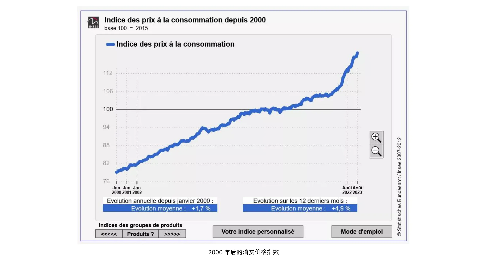

第一个原因在于衡量通货膨胀的方式。消费者价格指数（CPI）是衡量通货膨胀的主要指标，但有一定的局限性。例如，它没有全面考虑房地产价格的变化。尽管消费物价指数包括与租金相关的部分，但房价的大幅上涨并未在指数中得到充分反映。因此，住房成本的大幅上涨可能不会被消费物价指数完全反映，从而有可能低估实际通货膨胀。

此外，消费物价指数的计算采用的某些方法可能会抵消或掩盖实际的价格增长。例如，产品的质量改进可以用来调整指数。如果产品价格上涨，但其质量或功能也有所改善，消费物价指数可能会认为消费者的实际价值没有改变，因此不能反映通货膨胀。一个很好的例子是，尽管牛肉和电脑价格因货币投放而上涨，但电脑性能的提高被用来抵消这一涨幅。如果一台电脑的价格是原来的两倍，但性能却提高了四倍，消费物价指数可能会将此解释为价格下降，从而掩盖牛肉价格的上涨。

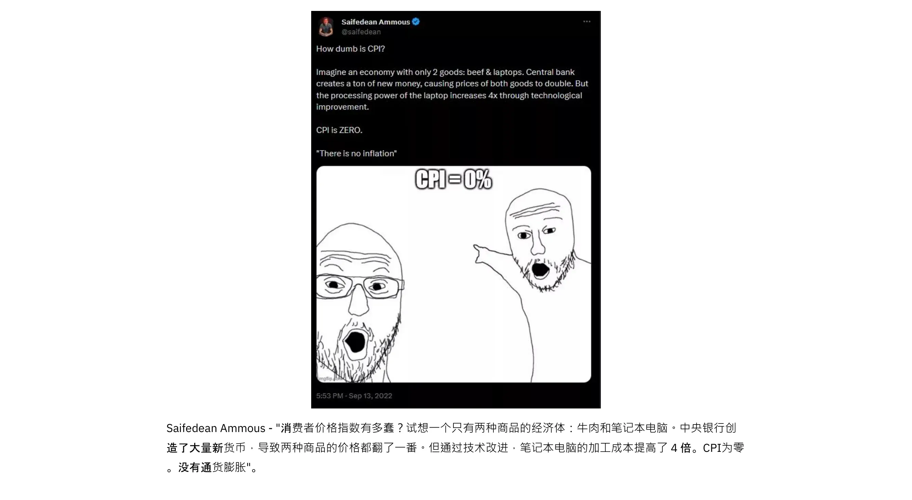

用消费物价指数衡量通货膨胀的这些细微差别凸显了货币印刷与通货膨胀之间关系的复杂性。它们还表明，如果更全面地考虑所有价格上涨因素，特别是房地产等关键行业的价格上涨因素，实际通胀率可能会高于报告的通胀率。这一分析强调了了解通货膨胀的基本机制和用于衡量通货膨胀的传统指数的局限性的重要性，从而有助于更深入地了解货币政策的经济影响。

#### MMT 的论点

现代货币理论（MMT）为货币创造和通货膨胀提供了一个独特的视角。根据 MMT，货币主要来源于政府，只要这些资金所针对的部门不饱和，政府就可以大量印制货币来满足其需求，而不会引起通货膨胀。这种方法偏离了传统的货币理论，强调了部门吸收能力在通货膨胀动态中的重要性。

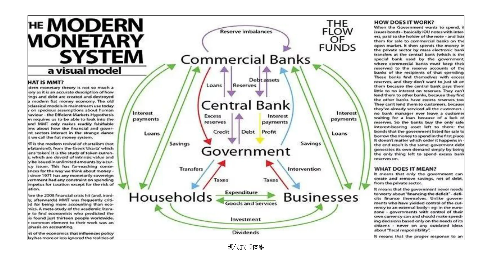

美国军工综合体就是 MMT 的一个典型例子。根据 MMT 的观点，由于军工企业有能力吸收资金，数千亿美元的资金可以分配给军工企业而不会引起通货膨胀。相反，如果将大量资金投入美国的道路建设，由于公司和劳动力数量有限，可能会因资源稀缺和供应商要求的成本增加而导致通货膨胀。

MMT 的支持者经常把日本作为另一个例子，说明尽管大量印制货币，日本却没有出现通货膨胀。然而，日本的情况也凸显了传统通货膨胀衡量标准（如消费者价格指数）的局限性。在日本，印制的货币有很大一部分被储蓄起来或投资于房地产或股票市场，而不是用于当前的消费。消费物价指数无法完全反映这些动态，因此可能会低估实际通货膨胀。

[对日本的分析](https://ideas.repec.org/p/ces/ceswps/_9821.html) 还表明，经济主体的行为，例如储蓄或投资于未纳入消费者价格指数的资产，可能会掩盖货币投放所带来的通胀影响。此外，不同部门吸收注入流动性的能力在通胀是否显现方面起着关键作用。

#### 银行和中央银行资产负债表

货币印刷不会导致通货膨胀的第三个例子是，货币印刷与通货膨胀之间的关系取决于新创造的货币如何进入经济。如果这些货币停留在私人银行的资产负债表上，而没有借给经济行为者，就不会直接影响实体经济，因此也不会导致通货膨胀。

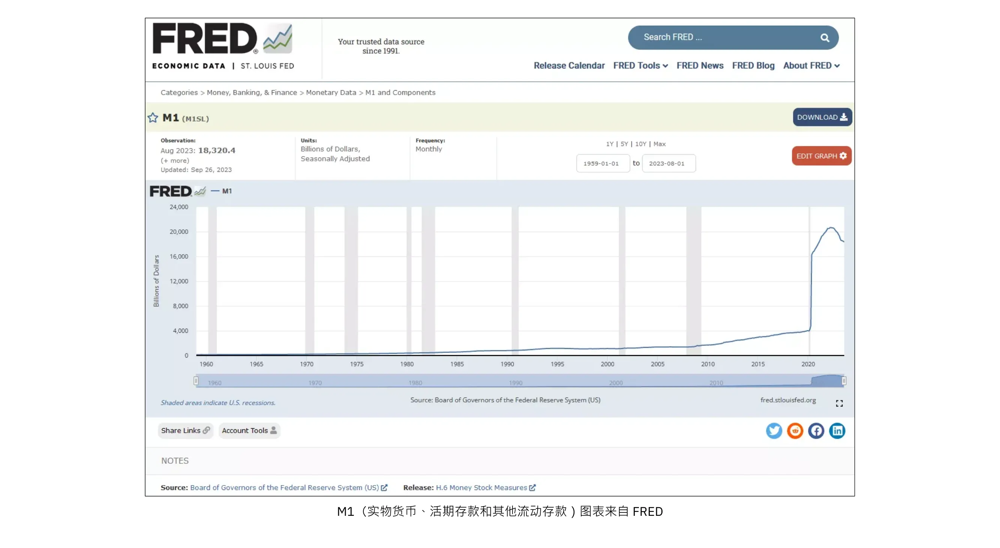

货币印刷可以被视为悬在经济头上的达摩克利斯之剑。只要不通过银行贷款或其他机制将其注入经济，创造出来的货币可以在一定时期内保持潜伏状态，而不会产生任何明显的通货膨胀效应。然而，当这些潜伏的货币最终进入流通领域时，通胀效应就会显现出来。这就是 2020 年代观察到的情况，以前创造的货币进入经济，导致通货膨胀。

这种情况凸显了货币传导机制在影响印钞的通胀效应方面的重要性。中央银行创造货币只是拼图的一部分。决定贷款发放量的私人银行的行为，以及决定如何使用借来的钱的借款人的行为，也是这一动态中的关键因素。

#### 通货膨胀是社会性的！

魏玛共和国的例子说明了印钞与通货膨胀之间关系的另一个重要方面：预期和经济主体行为的作用。当魏玛共和国中央银行开始大量印钞时，经济的不确定性导致个人囤积货币，即储存货币而不是花钱。这种反应暂时延缓了印钞的通货膨胀效应。

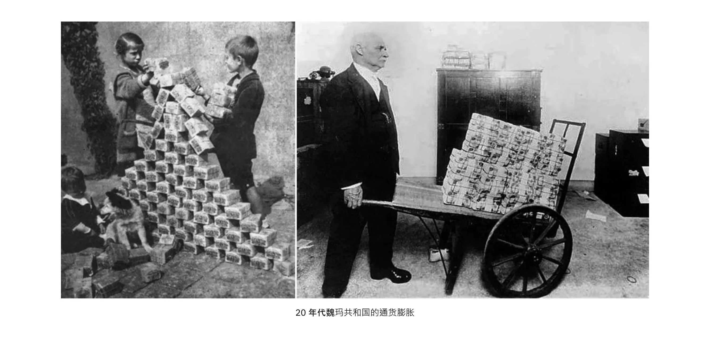

然而，当经济形势开始略有好转时，人们又逐渐恢复了信心。于是，个人从藏身之处取出储蓄，开始在经济领域大肆消费。这种突然的行为变化，再加上已经很高的货币 Supply，导致了需求的爆炸性增长。随着流通中的货币增多和需求增加，物价开始迅速上涨，导致了明显的通货膨胀。

这个例子强调了通货膨胀出现的时机和代理人行为的重要性。通货膨胀的出现不仅是对货币 Supply 增加的反应，而且还取决于这些货币在经济中的使用方式和时间。经济的不确定性和经济行为主体的预期在这一动态过程中起着至关重要的作用，可以加速或延缓印钞的通胀效应。

#### 回顾一下

- 消费价格指数（CPI）：消费物价指数的结构会低估通货膨胀，从而歪曲通货膨胀的实际情况。

- 部门吸收：向有能力吸收货币的部门注入货币并不总是导致通货膨胀。一个明显的例子是美国的军工综合体，它可以吸收大量资金而不会引发通货膨胀。

- 日本的情况：尽管大量印钞，日本的通货膨胀率仍然很低，因为资金通常被储蓄或投资于房地产或股票市场。这些行业吸收了印制的钞票，因此 CPI 不一定反映这些领域的价格上涨。
- 印钞与市场的相关性。据观察，房地产市场和股票市场的曲线往往跟随货币印刷，这表明了印刷货币的方向。
- 银行的货币储备：当印制的货币留在银行的资产负债表上而不在经济中流通时，就不会引起通货膨胀。2008 年的例子就说明了这一点，印制的货币大部分留在银行的资产负债表上，推迟了通货膨胀的影响。

- 魏玛共和国：这一历史时期显示了经济的不确定性如何导致囤积货币，推迟通货膨胀。然而，一旦信心恢复，钱被花光，通货膨胀就会爆发。

在讨论中可以利用这些例子来解释为什么通货膨胀并不总是货币印刷的直接后果，以及经济环境和代理人行为如何影响通货膨胀。

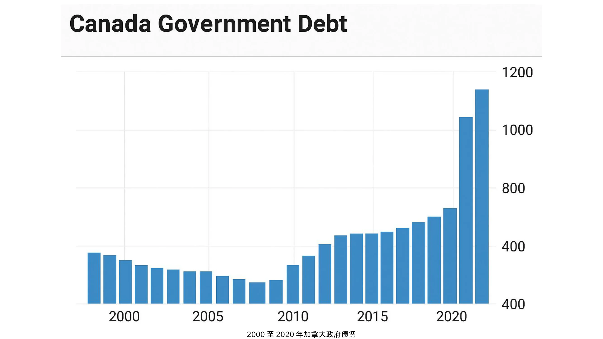

因为，正如本[主题](https://twitter.com/saifedean/status/1673639779433590786)所示：除了中央银行的过错，通货膨胀就是一切。

- 经济学家将通货膨胀归咎于气候变化

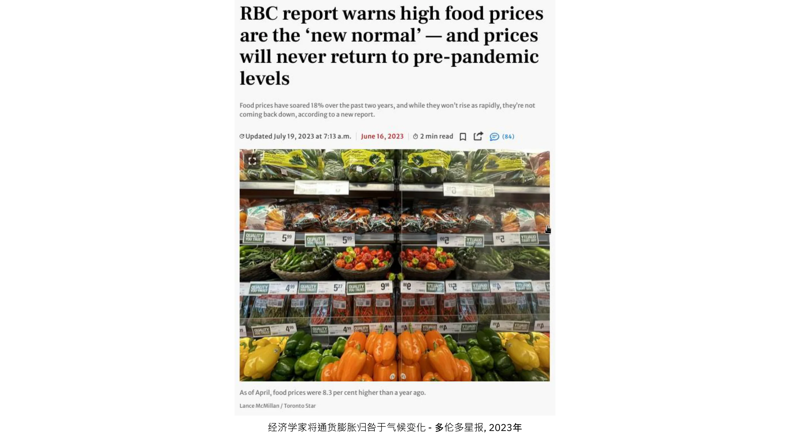

- 例如，瑞典将某月的通货膨胀归咎于碧昂斯。

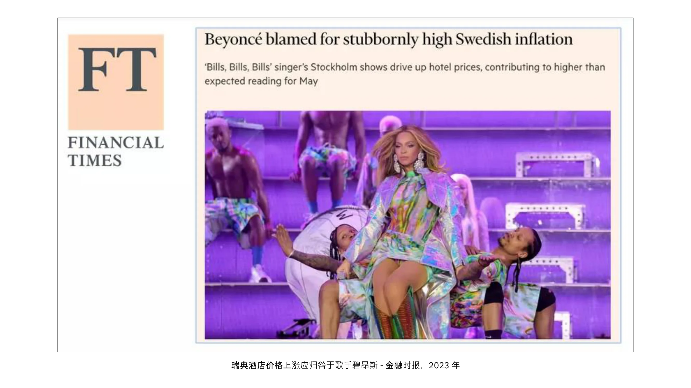

- 波兰中央银行将通货膨胀归因于俄罗斯对乌克兰的侵略和大流行病

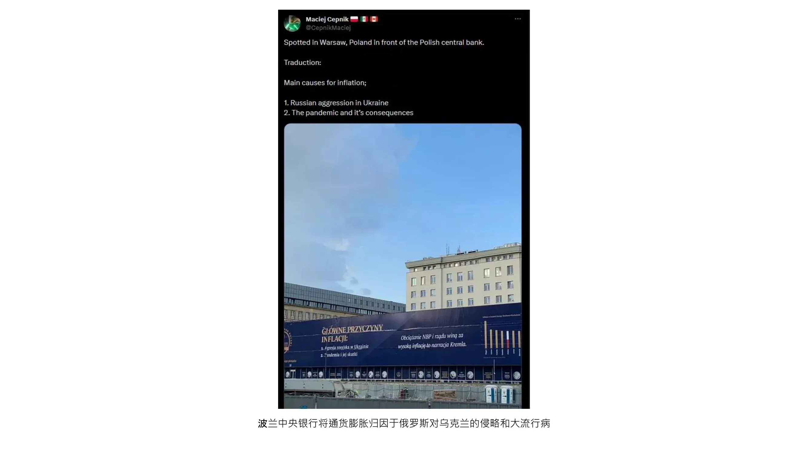

- 英国的通货膨胀归咎于英国脱欧。

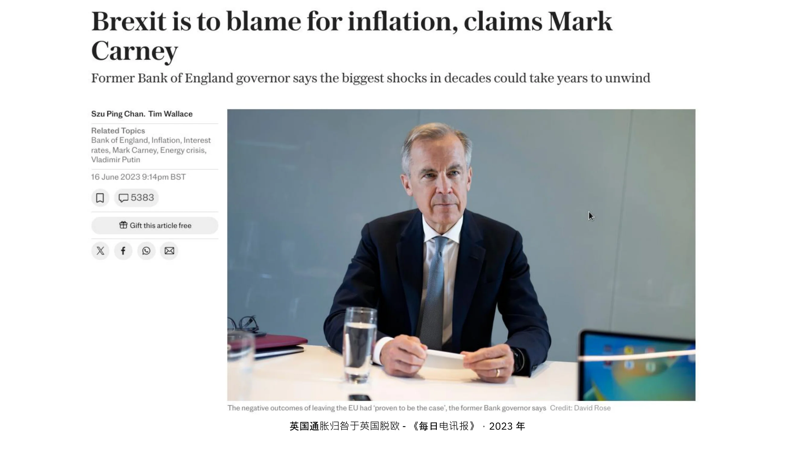

- 塞尔达游戏的发布与通胀冲击有关。

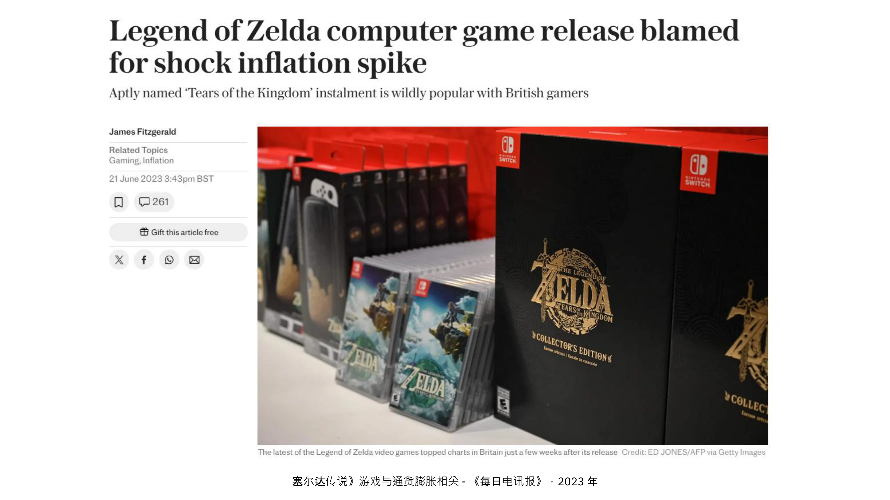

- 泰勒-斯威夫特（Taylor Swift）被指造成通货膨胀。

告诉我，碧昂斯或泰勒-斯威夫特怎么会导致物价普遍上涨？你看，这根本说不通。简而言之

### 探讨通货膨胀的类型

了解不同类型通货膨胀之间的区别至关重要，这可以让我们掌握这一经济现象的各种表现形式。以下是对这些不同类型的解释：

- 渐进式通胀：这是中央银行通常设定的通胀类型，年通胀率约为 2%。这一目标自 20 世纪 90 年代开始采用，目的是在不出现经济过热或通货紧缩的情况下保持稳定的经济增长。
- 温和通胀：当通货膨胀率超过 2% 的目标时，就会出现这种形式的通货膨胀。它通常与经济过热有关，在这种情况下，过多的货币 Supply 会刺激价格的普遍上涨。这种情况暴露了货币政策的局限性，有时也揭示了经济话语中的矛盾。
- 漫漫通胀：当年通胀率超过 10%时，就会出现漫漫通胀，通常被称为两位数通胀。它标志着价格的大幅飙升，可能危及经济稳定。

- 恶性通货膨胀恶性通货膨胀是一种极端现象，通货膨胀率每月超过 50%，由于通货膨胀的指数性质，相当于年通货膨胀率超过 13,000%。这种程度的通货膨胀严重破坏了经济的稳定，使货币几乎一文不值，削弱了人们对货币体系的信心。

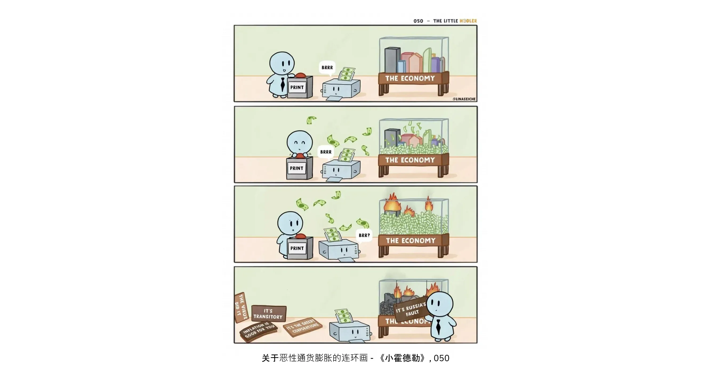

在探讨通货膨胀的类型时，经常会在教育资源中看到 "需求拉动 "和 "成本推动 "等术语。这些概念虽然有一定道理，但倾向于解释价格上涨，而不是作为货币现象的通货膨胀。以下是更深入的分析：

- 需求拉动：

需求拉动型通胀通常被描述为经济需求超过现有生产能力的情况。然而，如果货币 Supply 没有相应增加，这种情况只会导致支出的重新分配。消费者可能会在必需品上花费更多，而在非必需品上花费较少，从而抵消了整体通胀效应。

- 成本推动：

另一方面，成本推动型通货膨胀是由于生产成本的增加，如自然资源或劳动力成本的增加。同样，在货币 Supply 没有增加的情况下，一个部门的成本增加可能只是减少了其他部门的支出，而不会引起大范围的通货膨胀。

这些传统的解释往往将价格上涨与通货膨胀联系在一起，从而导致混淆和误解。实际上，要实现普遍的通货膨胀，货币 Supply 的增长是必要的。在这种情况下，"需求拉动 "和 "成本推动 "的概念可以解释部门价格的变化，但它们并不能反映通货膨胀的货币性质。这凸显了区分部门价格上涨和普遍通货膨胀的重要性，并重申了提高货币 Supply 以防止通货膨胀在整个经济中显现的必要性。这一分析为通货膨胀的实际原因提供了一个更加细致和精确的视角，揭开了可能会掩盖潜在货币动态的常见解释的神秘面纱。

### 伯恩霍尔茨对通货膨胀的分类

伯恩霍尔茨建议将通货膨胀简化但精确地分为三类，以便更好地理解这一复杂的货币现象：

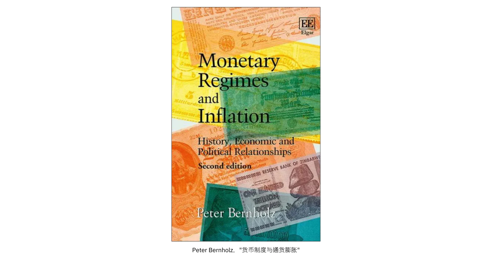

- 适度通胀：

当货币 Supply 水平高于正常水平，但国家并没有通过创造货币来填补巨额赤字时，就会出现适度通货膨胀。虽然 "适度 "一词看似无关紧要，但这种形式的通胀虽然不属于高通胀，却会造成严重问题。

- 高通胀：

当货币 Supply 的实际价值下降，而名义价值上升时，就会出现高通胀。这种自相矛盾的情况源于货币替代，即个人对本国货币失去信心，并寻求用本国货币换取商品、服务或外币。这一过程进一步降低了货币的实际价值，加剧了通货膨胀。

- 恶性通货膨胀：

恶性通货膨胀是一种极端形式的高通货膨胀，其特点是通过创造货币来弥补巨额预算赤字。从历史上看，没有哪次恶性通货膨胀不是通过印刷钞票来弥补巨额赤字的。恶性通货膨胀会造成恶性循环：通货膨胀会迅速侵蚀货币价值，以至于国家甚至还来不及征税，税收就已经贬值，从而迫使国家印制更多的钞票来为自己融资。这种自我强化的循环导致了天文数字般的通货膨胀率，每月往往超过 50%。

伯恩霍尔茨的这一分类突出了从温和通胀到恶性通胀的危险发展过程，强调了货币和财政控制在防止破坏性通胀螺旋上升方面的极端重要性。它还表明，对国家财政造成的有害后果可能在达到恶性通货膨胀阶段之前就已经出现，从而为不同程度的通货膨胀所造成的影响提供了一个细致入微的视角。

### 总结：通货膨胀类型总结

总之，我们探讨了一系列通货膨胀类型，从 "爬行式通胀"、"行走式通胀 "和 "飞奔式通胀 "等常听到的术语开始，每个术语都表示一个经济体中不同程度的通货膨胀率。然而，对于我们对恶性通货膨胀的深入研究而言，伯恩霍尔茨所描述的中度通货膨胀、高度通货膨胀和恶性通货膨胀类别被证明是至关重要的基准。

- 适度通胀：

这表明 Supply 的货币水平高于正常水平，但如果国家不提供大量赤字资金，这一水平是可以维持的。

- 高通胀：

当货币 Supply 的实际价值下降时，货币替代就会发生，这通常是由于货币替代，即个人试图用货币 Exchange 换取商品、服务或其他形式的货币。

- 恶性通货膨胀：

它代表了一种极端的高通胀，即为巨额预算赤字提供资金而过度创造货币，导致货币的实际价值迅速贬值。

从我们的探索中可以看出，恶性通货膨胀是一种复杂和反直觉的现象。人们可能会认为恶性通货膨胀是货币 Supply 大幅增加的结果，但实际上，恶性通货膨胀源于货币 Supply 实际价值的下降。这一细微差别对于理解为什么一些国家即使在世界银行或国际货币基金组织等国际机构的支持下也难以摆脱恶性通货膨胀至关重要。对通货膨胀类型的错误定性会导致采取不恰当的补救措施，加剧而非解决经济问题。

在今后的讨论中，我们将深入研究恶性通货膨胀，探讨其定义和在各种经济背景下的表现形式。我们的目标是揭示恶性通货膨胀的内在机制，探讨解决这一问题的潜在办法。这种细致入微的理解将使我们能够更好地理解相关挑战，并提出管理通货膨胀的明智战略。

感谢您的关注。下一次会议将专门讨论恶性通货膨胀的定义和解密，并考虑各种学术和实践观点。我们期待在下一次会议上与大家继续探讨。

# 什么是恶性通货膨胀？

<partId>3f541663-1e2f-5410-8ee0-f61c5d009fa5</partId>

## 恶性通货膨胀的定义

<chapterId>d2a71a2e-5f36-58d9-993c-d431f4aa07fd</chapterId>

### 恶性通货膨胀的定义

在本节中，我们将探讨恶性通货膨胀的各种定义，这是研究极端货币现象的一个重要术语。最著名的定义来自菲利普-卡根，他在 1956 年的著作《恶性通货膨胀的货币动力学》中提出了对恶性通货膨胀的定量理解。卡根认为

- 恶性通货膨胀的开始与结束：
  - 当月通货膨胀率超过 50%时，恶性通货膨胀就开始了。
  - 当通货膨胀率在至少一年内每月低于 50%时，该计划终止。

举例来说，如果通货膨胀率在 7 月份下降到 40%，直到第二年 7 月份才上升到 50%以上，那么恶性通货膨胀时期就被视为在首次观察到恶性通货膨胀的前一年的 7 月份结束。这一定义使我们能够准确地描述恶性通货膨胀的特点，便于进行有条理的分析。

汉克-克鲁斯（Hanke-Krus）表采用了这一定义，该表记录了 56 次恶性通货膨胀。不过，该表并未涵盖所有事件，如 2016 年委内瑞拉发生的恶性通货膨胀，从而使总数达到 57 次。

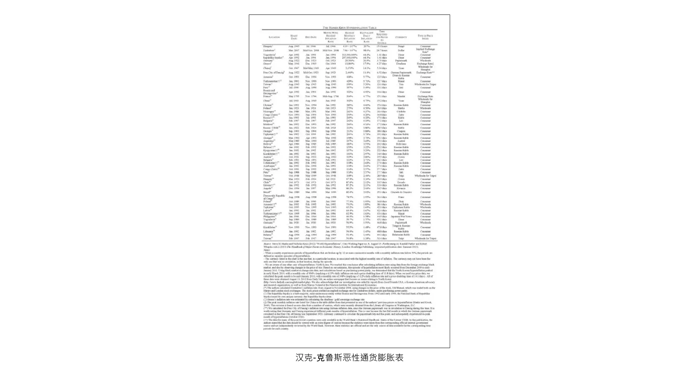

放大

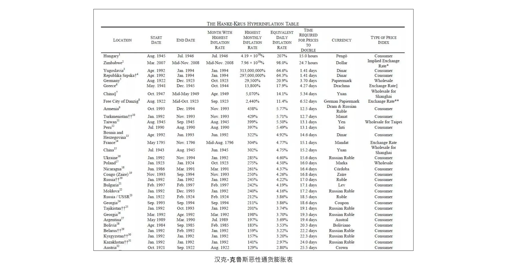

应该指出的是，这一定义虽然精确，但由于 50%的门槛过于严格，可能会将某些恶性通胀排除在外。有可能扩大这一定义的范围，将其他虽然不严格符合卡根标准，但代表极度高通胀时期的事件也包括在内。这一观点为更广泛地探讨恶性通货膨胀现象打开了大门，使我们能够更细致地了解其原因和影响。在随后的讨论中，我们将考虑重新审视这一定义，并研究卡根严格标准未涵盖的恶性通货膨胀事件。

### 卡根对恶性通货膨胀的定义

菲利普-卡根在给恶性通货膨胀下定义时，可能武断地设定了每月通胀 50%的里程碑。他自己也承认，这个定义是武断的，主要是为他基于七次恶性通货膨胀的分析服务的。对 Cagan 数据的研究表明，月通胀率最低的三次恶性通货膨胀分别为 47%、46% 和 57%。在他的研究中，选择 50%的临界值似乎是为了涵盖这些情况。

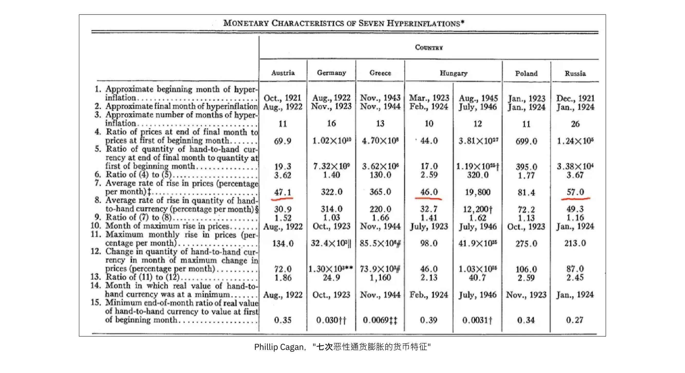

- 历史背景

卡根的定义可追溯到 1956 年，是基于当时有限的恶性通货膨胀事件。

- 卡根的观察

根据 Cagan 的说法，没有任何一次达到 50%左右的临界值而没有发展到更严重的恶性通货膨胀，这可以证明选择这一临界值是合理的。

- 对卡根定义的批判：

其他经济学家，如《货币制度与通货膨胀》一书的作者伯恩霍尔茨，也认为 50%的门槛是武断的。

伯恩霍尔茨指出，有些高通胀事件与恶性通胀事件具有相同的质量特征，但没有达到 50%的临界值。

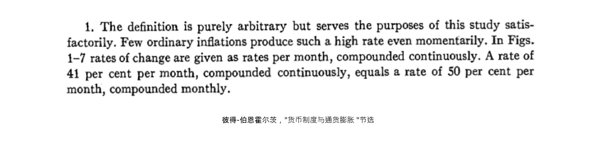

这一反思使我们对恶性通货膨胀传统定义的僵化性提出质疑，并强调或许有必要通过纳入更多的事件和历史数据来重新审视这一门槛。恶性通货膨胀的定义可能需要灵活性，以涵盖不同经济和历史背景下极端通货膨胀的各种表现形式。

### 国际会计准则理事会（IASB）对恶性通货膨胀的定义

国际会计准则理事会对恶性通货膨胀提出了一个独特的视角，重点关注恶性通货膨胀时期的会计实务。这种方法对于在货币价值快速波动的恶性通货膨胀环境中运营的会计师和企业至关重要。国际会计准则理事会准则确定了恶性通货膨胀的各种指标：

- 优先考虑非货币资产：**

由于货币价值迅速贬值，个人更倾向于持有商品价值而非货币价值。

- 货物和服务估价：**

居民不以当地货币计算商品和服务的价值，这反映出他们对当地货币失去了信心。

- 货币价值损失赔偿：**

价格包含了赊购过程中货币价值损失的补偿，说明了通货膨胀对日常交易的影响。

- 价格、工资和利息指数化：**

价格、工资和利息根据通货膨胀补偿指数进行调整。

- 三年累计通胀率：**

三年的累计通货膨胀率接近 100%（大约每年 24%），与卡根定义的每月 50%的通货膨胀率形成鲜明对比。

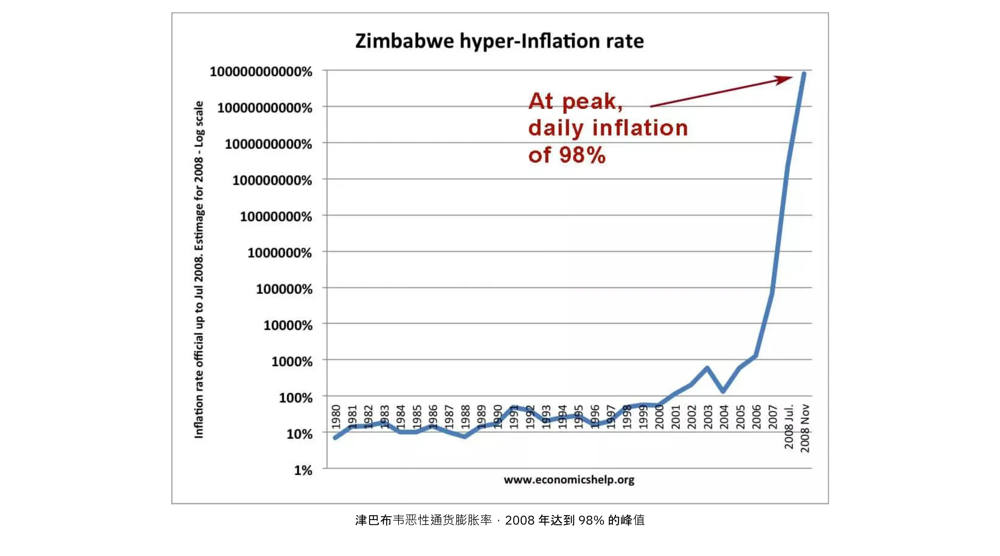

根据国际会计准则理事会的标准，包括阿根廷、埃塞俄比亚、海地、伊朗、黎巴嫩、苏丹、南苏丹、苏里南、叙利亚、土耳其、委内瑞拉、也门和津巴布韦在内的一些国家目前正在经历恶性通货膨胀。

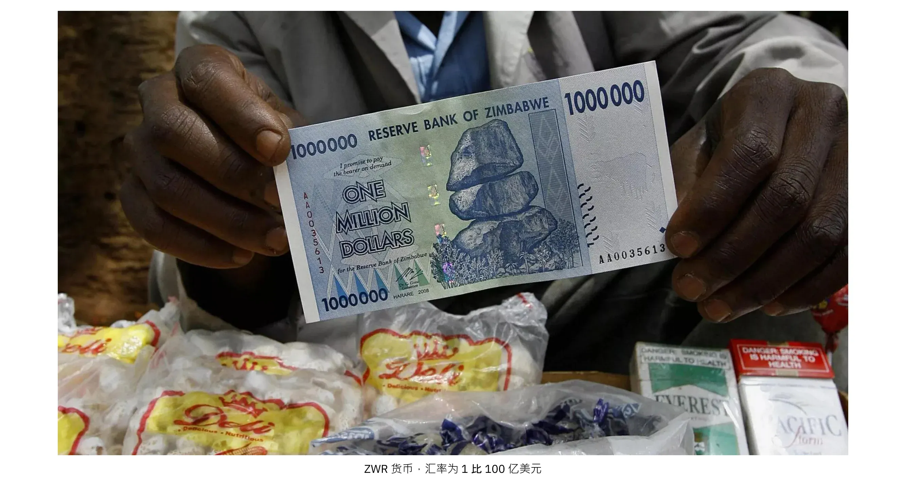

国际会计准则理事会提供的这一定义摆脱了卡根严格的量化门槛，纳入了对经济行为的定性分析和面对恶性通货膨胀时的实际调整。它表明恶性通货膨胀是一个复杂的现象，需要从多维度来理解才能把握其真正的影响，特别是在会计领域，因为会计对企业和市场的稳定性和财务透明度至关重要。

### 那么，总共有多少次恶性通货膨胀呢？

恶性通货膨胀的常见定义，如卡根提出的规定月通货膨胀率为 50%的定义，有时会引起混淆或过于简单化。例如，两个国家的年通货膨胀率分别为 1,000% 和 3,000%，根据通货膨胀的月度分布，人们对这两个国家的看法可能不同。根据卡根的定义，如果没有一个月超过 50%的阈值，这些国家就不会被归类为处于恶性通货膨胀状态。因此，这种方法可能会导致恶性通货膨胀的分类出现异常，特别是在比较全年累计通货膨胀率时。

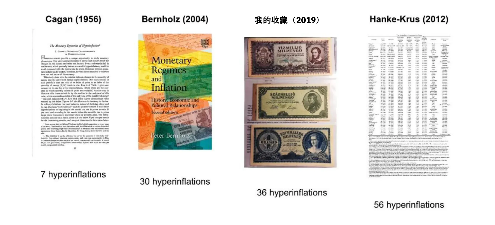

- 卡根的著作《恶性通货膨胀的货币动力学》对恶性通货膨胀进行了基本分析。
- Bernholz 的著作研究了 30 个不同时期的恶性通货膨胀，从而扩大了分析范围。
- David St-Onge（本课程的作者）个人收藏了 36 个恶性通货膨胀时期的纸币，让我们能够切实地了解历史。
- 根据卡根的定义，Hanky Cross 表格（2012 年版，2016 年更新为委内瑞拉版）列出了 57 个恶性通货膨胀时期。

值得注意的是，某些历史上的高通胀时期往往由于严格的分类标准而未被列入恶性通胀的经典表格中。例如，在 1779 年 11 月美国独立战争期间和 1864 年 3 月美国内战期间，月通货膨胀率分别为 47.4% 和 40%。这些通货膨胀率虽然很高，但并没有超过卡根规定的 50%的临界值，因此这些时期被排除在恶性通货膨胀案例之外。这一遗漏凸显了僵化定义的局限性，并强调我们需要对恶性通货膨胀的全部复杂性有更细致入微的了解。

## 魏玛与津巴布韦的相似之处

<chapterId>11eef458-aab8-5c63-8523-264d0ba69f5d</chapterId>

### 两个时代，两场灾难

在本章中，我们将研究恶性通货膨胀的影响，重点是津巴布韦和魏玛共和国的经历。在整个研究过程中，我优先探讨经历过这些恶性通货膨胀时期的个人的直接证词，而不是采用纯粹的经济或统计方法。

有几本书的信息量特别大：

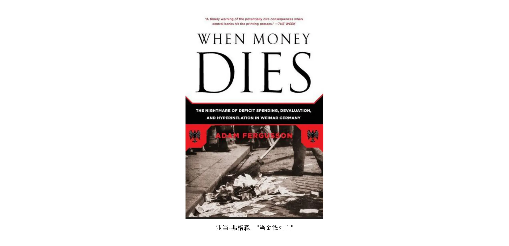

- "亚当-弗格森（Adam Ferguson）所著的《当货币死亡》追溯了第一次世界大战后德国以及奥地利和匈牙利的恶性通货膨胀。
- 杰罗姆-加德纳（Jérôme Gardner）和库扎伊-约瑟夫-顾敏宇（Kudzai Joseph Gou Min-Yu）分别撰写了两本关于津巴布韦恶性通货膨胀的书《津巴布韦温暖的心丑陋的脸》和《Hard煮鸡蛋指数》，书中一位服装连锁店的首席执行官和一位农业银行家以凄惨的证词讲述了他们在这一动荡时期的经历。

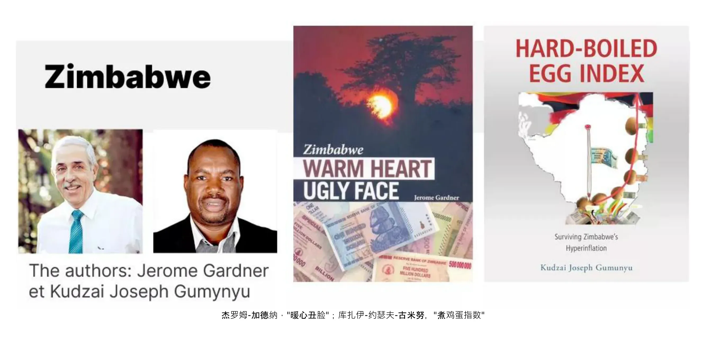

在整理笔记时，我注意到津巴布韦和魏玛共和国的恶性通货膨胀经历有许多相似之处，尽管两者之间相差 90 年。我发现了大约 17 处相似之处，其中 13 处说明了这些证词中所描述的经济灾难的发展过程。这些引人入胜的相似之处表明，恶性通货膨胀具有跨越时间和国界的重复性和破坏性。今天，我们将研究这些相似之处，以及它们如何描绘出恶性通货膨胀时期令人担忧的发展轨迹。

### 比较分析：津巴布韦和魏玛共和国

14 种不同的游戏

#### 1.资金短缺

当货币以令人眼花缭乱的速度贬值时，即使是最雄心勃勃地试图用新钞充斥市场也会被证明是不够的。对有形货币的持续需求可能会远远超过中央银行生产纸币的能力，从而造成前所未有的流动性危机。

> 魏玛："本月内将增加到近 40 亿马克，希望通过这一数字彻底解决货币短缺问题"。

> 津巴布韦："从 2002 年到 2009 年 1 月，出现了几次严重的流动性短缺。印制或流通的钞票根本不足以应对飞涨的通货膨胀"。

#### 2."那是粪便！"

在某些经济形势下，货币贬值的速度令人震惊。天文数字的纸币可以在创纪录的时间内发行，瞬间将曾经可观的金额变成像粪便一样微不足道的东西。

> 魏玛："目前的发行总量为 630 万亿。因此，再过几天，我们就能在一天内发行总发行量的三分之二"。

> 津巴布韦："2006 年 9 月 17 日，津巴布韦央行行长吉迪恩-戈诺（Gideon Gono）宣称：'10 万亿美元还在外面，已经变成了粪肥'"。

#### 3.纸币的价值低于纸张的价值

在某些经济情况下，纸币的内在价值可能会低于其所印纸张的价值。这种急剧贬值会使通常作为价值和购买力象征的纸币变成一文不值的废纸。

> 魏玛："整个面值的马克钞票一出印刷机就几乎一文不值"。

> 津巴布韦："中央银行印制的纸币一文不值，造成了浪费。换句话说，它的价值比卫生纸还低。虽然听起来很荒谬，但用 100 万亿津巴布韦第纳尔的纸币当厕纸比购买真正的厕纸还要便宜。

#### 4.数钱

当货币迅速贬值时，即使是最简单的交易也会变得费力。计算一件商品的价格或简单地清点付款所需的钞票都可能需要几分钟的时间，这给日常交往增加了复杂性。

> 魏玛："在商店里购买最普通的东西也需要计算三四分钟，一旦确定了价格，通常还需要几分钟来清点钞票"。

> 津巴布韦："商店经理还可以雇用一名临时工，代替整天数钱的工作人员。当然，在店内数钞票用于行政管理和银行存款是一回事，但在银行存款时，整个过程必须重复进行。

:::video id=910231d7-af90-4ab8-b74c-bfb81caebfb2:::

乌兹别克点钞技术

#### 5.支票付款

在混乱的经济环境中，支票等传统支付方式很快就会失去效用。由于恶性通货膨胀导致货币需求不断增加，银行不堪重负，可能会限制或推迟兑现支票，从而降低支票的实际价值。这种不稳定性往往会导致支付方式的优先级，价格会因选择的支付方式而不同。

> 魏玛："物价上涨加剧了国家和其他雇主对货币的需求。私人银行根本无法满足需求，不得不定量兑现支票，因此未兑现的支票被冻结，而其购买力却在下降"。
> 津巴布韦："货币的时间价值为商品和服务创造了三种价格，即现金价格、实时结算总额价格和支票价格。最终，没有人接受支票，因为支票需要五天才能结算"。

#### 6.燃烧器创业者

随着货币贬值，新的经济机会就会利用市场扭曲而出现。这些企业家通常被称为 "烧钱企业家"，他们可以通过借入贬值货币投资有形资产，然后用更加贬值的货币偿还债务，从而实现茁壮成长。

魏玛："通货膨胀投机涉及借入纸币马克，将其转化为商品和工厂，然后用贬值的纸币偿还贷款人"。

津巴布韦："燃烧器企业家"

#### 7.诚实和 Hard 工作失去吸引力

在经济不稳定的情况下，Hard 工作、节俭和正直的传统价值观可能会被快速致富的诱惑所掩盖。投机和货币交易的回报往往远远高于正常工作，从而导致社会优先事项的混乱。

魏玛："随着节俭、诚实和 Hard 工作等古老美德失去吸引力，每个人都想快速致富，尤其是货币或股票投机的收益显然比工作要高得多"。

津巴布韦："这些做法在使少数人致富的同时，也使城市工人阶级和农村人口陷入贫困。教育失去了它的价值，因为这一行业是由不需要教育或 Hard 工作来证明其合理性的人推动的。他们所需要的只是关系和启动资金，以开始他们轻松赚钱的生意"。

#### 8.世界银行

在恶性通货膨胀或货币危机的情况下，往往会出现平行的、不受监管的外币市场。这些非正式的 "银行 "常常被幽默地称为 "世界银行 "或其他地方名称，为那些寻求保护自己的资产不贬值的人提供了一个避难所。尽管这些市场可以提供必要的经济生命线，但它们往往凸显了对官方金融机构和政府政策的普遍不信任。

魏玛："他们的交易主要是通过所谓的 Winkelbankiers 进行的，他们是伴随着通货膨胀而兴起的街头经营者，在病态的经济环境中，他们完全靠利用外汇买卖价格之间的差价来维持生计"。

津巴布韦："他们也是货币兑换商。他们在布拉瓦约第 2 和第 6 大道以及 Fort 街之间肆无忌惮地经营，这得益于他们狡猾的经营方式，其中往往涉及腐败和其他非法活动。该市的这一地区被称为'世界银行'"。

阿根廷："于是我去了所有阿根廷人都会去的地方：布宜诺斯艾利斯市中心佛罗里达街区的'洞穴'（cuevas）"。 - 大鲸鱼

#### 9.外币兑换是非法的

各国政府为了稳定本国货币和控制资本流动，可能会将这些外汇交易定为非法。这些镇压措施虽然旨在保护国民经济，但往往会产生相反的效果，加剧公众的不信任，助长黑市的发展。

魏玛："人们以物易物，逐渐将外币作为唯一可靠的 Exchange 手段。关于购买外国汇票和使用外币进行国内支付的新法令出台了。除监禁外，现在还可处以高达非法交易额十倍的罚款"。

津巴布韦："对企业的突袭导致几名来自布拉瓦约的商人在周末被监禁，并被处以相当于追回外汇两倍的罚款，这种勇敢的行为随后消退了"。

#### 10.资本管制

当一个国家面临货币或经济危机时，政府的一个常见对策是对资本的流动和形式进行严格控制。无论是通过命令强迫接受贬值的本国货币，还是通过严厉制裁拒绝接受某些支付方式的人，这些措施的目的往往是遏制恐慌和恢复信心。然而，这些措施的效果各不相同，有时会适得其反，或与公民所经历的现实脱节。

魏玛："最近的一项新法令迫使商人们接受国家纸币；但由于该法令还允许继续使用外国货币进行所有采购，商人们一般都找借口几乎不接受任何其他货币"。

津巴布韦："政府于 2008 年 12 月 12 日推出了有关支票支付的 SI 175/2008。其中规定，'拒绝支票/银行卡或任何其他银行中介电子支付方式付款的，将处以 8 级罚款或 6 个月监禁，或两者并罚'。'显然，我们忽略了这项 SI，因为它完全脱离了现实"。

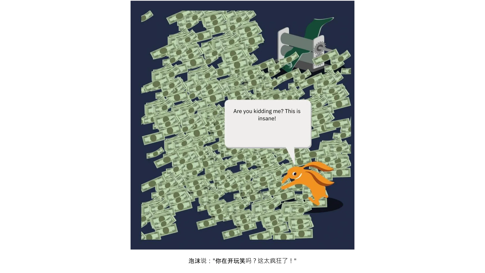

#### 11.被迫继续营业

当经济崩溃、货币贬值时，政府可以采取严厉措施来维持表面的正常状态。

魏玛："10 月 22 日颁布了一项新法令，要求继续经营的商人继续营业，并以 Exchange 纸币换取商品"。

津巴布韦："只剩下空荡荡的铁架子和冰箱、冷藏箱和冰柜。悲剧的是，由于政治局势紧张和担心领导人被政府的价格控制部队逮捕，他们不敢关门，因此商店还在营业。就连工人也没有被解雇，因为大家都认为会有一个快速的解决方案"。

#### 12.人人都是罪犯

面对崩溃的经济和无处不在的法规，生存与犯罪之间的界限变得模糊不清。

魏玛："所有危害国家的罪行，每一项都在不同程度上成为个人的生存问题"。

> 津巴布韦："津巴布韦的每个居民都是罪犯。这听起来很残酷，但却是事实。由于生活的方方面面都受到无数小法律的约束，每个人每天都难免触犯法律。根据 2004 年发布的一项 SI，持有外币是非法的。拥有多个银行账户以绕过每日取款限额是违法的。没有适当的汽车牌照、汽车无线电许可证或发电机许可证，这些都是在某个地方有人触犯的法律"。

#### 13.不惜代价购买外汇

疯狂购买外币往往标志着货币贬值的关键转折点，加剧了内在价值的下跌。

> 魏玛："弗里茨-曼海姆奉上司之命，于 1921 年 8 月开始不惜代价购买外币--'因为德国有无穷无尽的纸马克，却没有外币'。这是马克币值绝对崩溃的第一个迹象。

> 津巴布韦：据称，他们每天都要完成目标，因为有些外汇需求很紧急，他们会不惜一切代价购买，以积累外汇来满足最后期限的要求。随着津巴布韦元币值的持续急剧下降，这种所谓的做法被指控为货币贬值火上浇油"。

### 过程概述

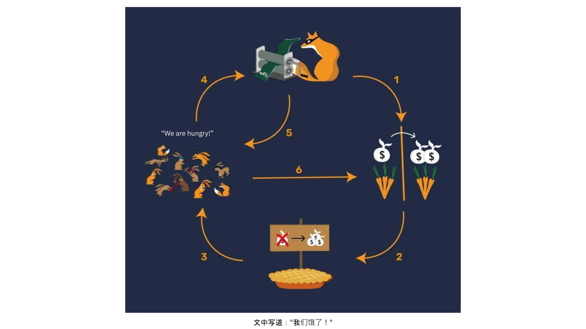

在分析经济发展轨迹时，我们可以发现，当达到高通胀率时，货币的价值就会下降。这种贬值会导致若干复杂问题，包括纸币短缺。在这种情况下，就会出现套利机会，尤其是在 Exchange 汇率波动时。因此，许多人转向这种套利，大量投资于有形资产，以期待未来的货币贬值，从而能够用疲软的货币偿还债务。这种经济环境削弱了传统工作的吸引力，从而削弱了社会凝聚力。

针对这种情况，政府实施了严厉的监管措施，包括资本管制。政府还规定商家必须接受本国货币和支票。随着时间的推移，新的法律相继颁布，扩大了犯罪行为的定义。最终，Exchange 汇率成倍攀升，因为政府愿意用成本更低的本国货币换取更坚挺的外国货币。

### 4 恶性通货膨胀后果的相似之处

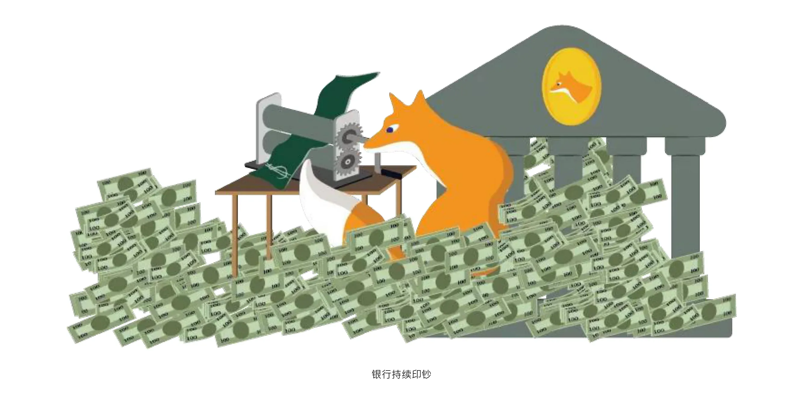

#### 1.石油和金属

在德国魏玛时期，贵重物品被盗现象非常普遍，屋顶上的铅经常被盗。在津巴布韦，绝望驱使一些人破坏电网，以便从变压器中提取石油并用于汽车。

魏玛："国家纪念碑的金属牌匾不得不被移走保管。英国驻柏林大使馆门上的黄铜门铃牌被盗"。

津巴布韦："更糟糕的是，由于缺乏外汇，汽车润滑油短缺，变压器很容易成为小偷的目标，他们在停电时抽走冷却油"。

#### 2.火车

货币贬值会促使公民采取生存行为，包括破坏行为。面对崩溃的经济，昂贵的公共基础设施（如交通系统）可能会受到损害，从而导致灾难性的社会后果。

> 魏玛："在柏林，有轨电车系统因缺乏资金而停止运营"。

> 津巴布韦："最令人不安和悲伤的情况之一是，连接哈拉雷和达布卡（280 多公里）的几乎整条电力铜线被盗。这条线路建成后曾是津巴布韦的骄傲，快速的电动客运和货运列车在这条线路上行驶。

#### 3."Mealie餐"

在工资微薄、经济不稳定的情况下，企业不得不为员工提供食物，以维持生产率和运营效率。这一举措不仅是弥补食品短缺和高昂食品成本的一种方式，也是在困难的经济环境中留住员工的一种策略。

> 魏玛："在柏林，办公室雇员是首都一个非常重要的阶层，他们的工资完全不够用，每月从 1.2 万到 2 万（相当于每年 12 到 19 英镑）不等，而且还在不断缩水；但大多数人仍然可以获得由办公室提供的象征性金额的午餐，这样身体和灵魂就可以勉强维持在一起"。

> 津巴布韦："在这一阶段，我们为所有员工提供免费午餐。玉米餐对我们公司的持续运作至关重要，因为在许多情况下，这是我们员工每天唯一的一顿饭。

#### 4.汽油券

人们寻求稳定的交易替代品。在魏玛，黄铜和燃料等产品因其恒定的内在价值而成为 Exchange 的媒介。在津巴布韦，面对津巴布韦元的迅速贬值，代表固定数量必需品的汽油券成为了事实上的货币。这些情况凸显了社会如何适应极端的经济条件，设计出创新的解决方案来维持贸易和经济。

魏玛："以物易物已经是 Exchange 的一种习惯形式；但现在，黄铜和燃料等物品成了购买和支付的通用货币"。

津巴布韦："我们现在用这些代金券向房东支付房租、市政税、电话费--事实上几乎所有的费用--因为每个人都不再接受津巴布韦元和支票付款"。

#### 结论

关于津巴布韦和魏玛共和国恶性通货膨胀时期相似经历的视频到此结束。在下一个视频中，我们将讨论两者的不同之处和当代相似之处。谢谢。

## 魏玛与津巴布韦：差异与当代相似之处

<chapterId>643f279c-d89f-5600-a2e2-b1bbbba0ab69</chapterId>

在本章中，我们将探讨过去和现在恶性通货膨胀时期的不同之处和当代相似之处，并通过轶事和相关比较来说明今天的情况。

### 魏玛共和国与津巴布韦的区别

#### 1.这都是美元的错！

在德国，人们普遍将通货膨胀归因于美元升值，而不是本国货币的内在贬值。许多人认为，观察到的现象是由于美元升值。这种看法使人们无法认识到他们的经济困难与货币贬值之间的联系，而货币贬值主要是由过度创造货币引起的。当货币死亡时》一书清楚地说明了德国人缺乏这种认识。相比之下，津巴布韦的情况则有所不同：民众完全了解他们正在经历的恶性通货膨胀的根本原因。

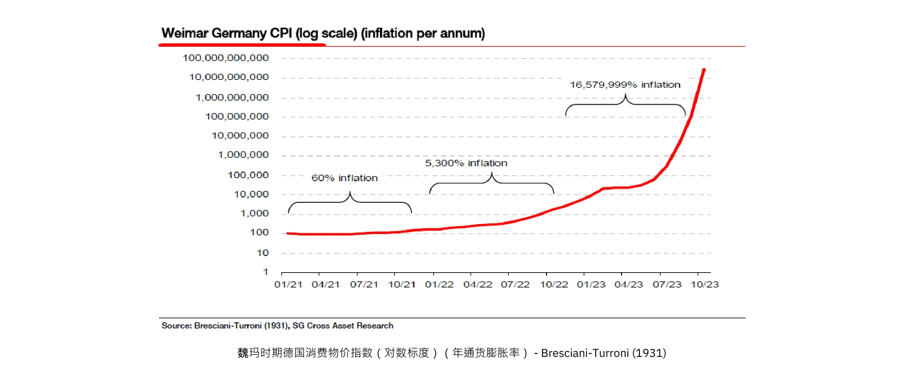

#### 2.应急资金（Notgeld）

面对货币和经济危机，德国采用了 "应急货币"（Notgeld）。这些由城市或某些公司印制的纸币是为了弥补通用货币的不足。

有趣的是，法国也曾采用过 Notgeld，尤其是在 20 世纪 20 年代。这一举措不仅是恶性通货膨胀的直接后果，其根源还在于第一次世界大战造成的混乱。因此，金属硬币的内在价值往往超过其面值，促使人们囤积硬币。在没有硬币的情况下，一些机构（如里昂商会）印制了自己的 Notgeld。

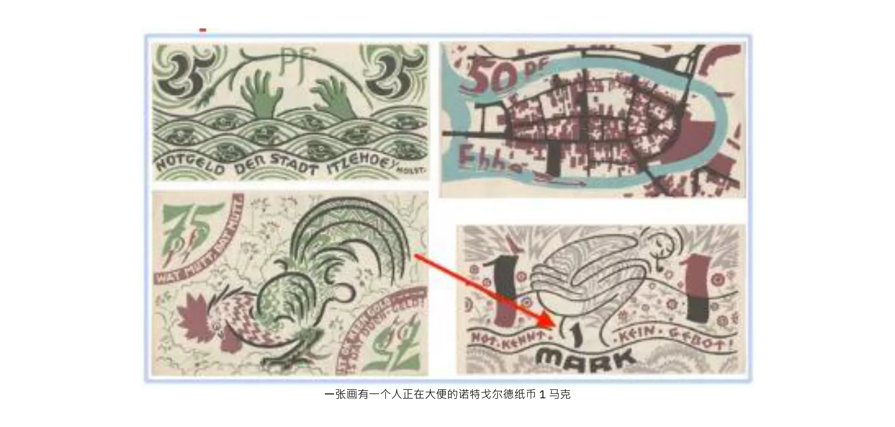

> "该做的事，一定要做"。 - 当地谚语

在这些纸币中，有一张特别引人注目。这张纸币上有一幅凄美的插图：中间画着一个人正在排泄马克。背面是一张 1913 年至 1921 年的价格表，说明了这一时期通货膨胀的加剧。

这张 Notgeld 背后的艺术家似乎在对造成恶性通货膨胀危机的当局进行讽刺性批判。钞票上的题词是 "必要性不分法律"。另一个与 Notgeld 的原产地有关的表达方式是："该做的事，一定要做"。

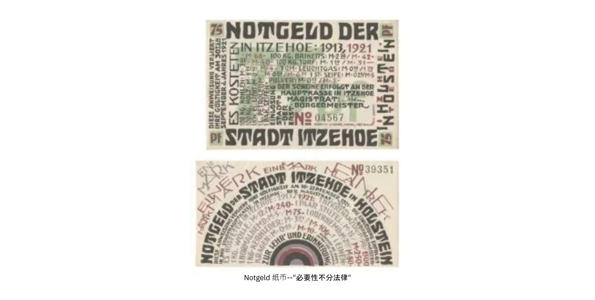

> "必然性是无规律可循的"

> 第一个屎币：从钞票的中心插图来看，个人行为导致货币贬值，这可以被称为第一个 "屎币"。

#### 3.债券和抵押

在魏玛，一些债务被重新估值，以补偿通货膨胀的影响。津巴布韦没有采取这一措施。

> 魏玛："1925 年，一项对政府拥有的贷款进行重新估值的决定成为法律，结果股东们在支付了所有赔款的前提下，获得了其初始投资的 2.5%"。

> 津巴布韦："2007 年 7 月（三年后），我可以从口袋里掏出一张贬值的 500 000 津巴布韦第纳尔（"000 "比索）纸币，按平行市场汇率计算，现在价值 1.67 美元，用于偿还本应分二十年偿还的抵押贷款。此外，这张纸币只占我当月月薪的 0.49%"。

要了解更多有关管理德国危机的信息，这本书也是必不可少的。

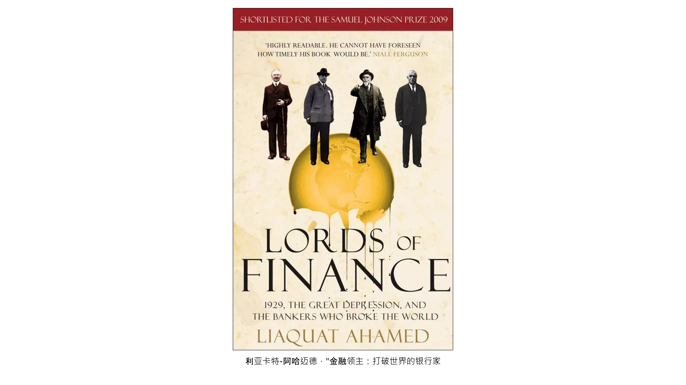

### 当代相似之处

#### 1.操纵货币政策来控制经济。

在魏玛共和国的历史上，工业家们显然不愿看到马克升值。他们能够用严重贬值的货币借贷和偿还债务，这给他们带来了相当大的优势。这种机制有利于他们几乎不花一分钱就能建造庞大的工业综合体。这些工业家害怕马克升值，因为这会阻碍他们的活动。有些人甚至认为通货膨胀猖獗是一种积极的发展，认为这将保证人口就业。然而，他们并没有意识到通货膨胀对储蓄和整个经济的不利影响。对这些经济行为者来说，印钞是一件好事。

> 魏玛："正因为如此，人们非常担心马克升值，甚至热那亚之后几周的'稳定'也造成了业务停滞"。

> 魏玛："工业界面临的危险是，现金将变得比商品更有价值，当每个人都试图将资产转化为现金时，就会发生崩溃"。

克里斯蒂娜-拉加德的言论可以与之相提并论，她建议公民应优先考虑就业前景，而不是保护自己的储蓄。就像魏玛时期的实业家一样，她似乎主张以印钞机作为刺激就业的工具，而牺牲储蓄的价值。

> 克里斯蒂娜-拉加德："我们应该更高兴能有一份工作，而不是看到我们的储蓄受到保护"。

#### 2.冲突时期的私有财产

魏玛共和国的历史表明，在此期间，海外资产和资本被没收。这一措施令人想起俄罗斯最近发生的事件，特别是在冲突开始时。这些情况凸显了一个令人担忧的现实：在危机时期，对私有财产的尊重可能会受到损害。这是一个历史与当代并存的现象，凸显了危机对个人权利的潜在影响。

> 魏玛："德国在海外的所有资本都被没收"。

> [20minutes.fr](https://www.20minutes.fr/monde/3286947-20220513-guerre-ukraine-geler-avoirs-russes-vol-non-redistribuer-kiev-poserait-lourdes-questions)："作为西方制裁的一部分，在俄罗斯中央银行持有的 6400 亿美元储备中，约有 3000 亿美元的俄罗斯海外储备被冻结"。

#### 3.市场价格的概念

魏玛共和国时期，农民们对 "Umlage "表示不满，因为该规定迫使他们交付每年生产的前 200 万吨小麦。这一规定导致 Supply 面包总量的一半以补贴价格投放市场。从 8 月起，这些农民本应按世界市场价格获得报酬，因为尽管他们被迫以较低的价格交出小麦，但仍需按世界市场价格购买化肥。

这种情况提出了一个与恶性通货膨胀期间市场价格概念有关的核心问题。在当时的德国背景下，农民不得不以低于其价值的价格出售小麦，同时又不得不以世界市场价格购买化肥。这种经济差异凸显了当今粮食价格所带来的挑战。农业生产者面临着通货膨胀导致的投入成本上升，他们将这些成本转嫁到最终产品上。如果批评他们的成本增加，就等于忽视了市场定价的动态和他们所面临的经济压力。以人为的低价销售，同时又承担高昂的成本，这对任何企业来说都是不可持续的。

> 魏玛："农业利益集团对'Umlage'不满，即强制交付每年生产的头 200 万吨小麦，这使得面包 Supply 总产量的一半可以低价出售。从 8 月起，农民要按世界市场价格支付报酬，因为他们在不得不低价出售小麦的同时，始终要按世界市场价格支付化肥费用"。

#### 4.否认货币 Supply 与通货膨胀之间的联系

> 魏玛："他仍然坚持自己的观点，即货币 Supply 既与价格水平无关，也与 Exchange 率无关；"

在现代，这种趋势依然存在，正如上一章的例子所示，不同的经济学家和经济机构为证明通货膨胀的合理性而提出了一系列解释。这些理由各不相同，从泰勒-斯威夫特（Taylor Swift）、塞尔达（Zelda）或碧昂斯（Beyoncé）等文化事件和名人，到战争和大流行病等全球因素，不一而足。所有这些原因虽然有可能造成短期经济波动，但却转移了人们对真正根本原因的关注：货币 Supply 的扩张。

#### 5.僵尸公司

> 魏玛："稳定结束了企业家们可以以牺牲其他人的利益为代价尽情借贷的时期。在货币充裕时期创建或扩张的大量公司，一旦资本变得稀缺，很快就会失去生产能力"。

僵尸企业是指在正常市场条件下，已经资不抵债或濒临破产，但主要依靠低成本借贷继续经营的企业。这些公司的收入仅够偿还债务，但无法大幅增长。

僵尸企业的概念并不新鲜。事实上，它在魏玛共和国时期就已存在。当时，许多公司似乎蒸蒸日上，主要得益于可以获得免费信贷。它们借了一大笔钱，期望日后能用因通货膨胀猖獗而贬值的货币偿还。然而，当通货膨胀停止，德国马克重新升值时，这些在经营和财务上都无法真正生存的公司变得无利可图，不得不关闭。

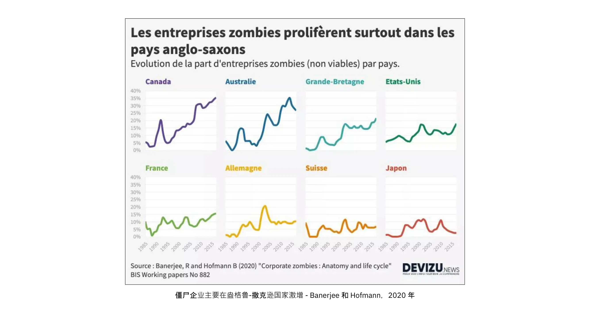

僵尸企业的现象并不局限于战后的德国。即使在今天，许多大公司仍能继续蓬勃发展，这是因为它们拥有以极低利率获得信贷的特权。如果它们必须以更常规的利率借贷，其中许多公司将不再盈利。这一点在 2023 年尤为重要，因为在长期接近零利率之后，现在利率已经开始上升。近期金融形势的变化无疑将对这些曾被贴上 "僵尸 "标签的公司构成决定性的考验。

#### 6.快速致富！

历史上曾有个人试图通过套利迅速积累财富的例子，魏玛和津巴布韦就是如此。如今，随着某些加密货币的兴起，也可以看到类似的趋势。人们受到快速收益的诱惑，铤而走险，希望投资呈指数增长。这种做法让人想起恶性通货膨胀时期，人们利用套利来快速获利，而这往往是以牺牲他人利益为代价的。

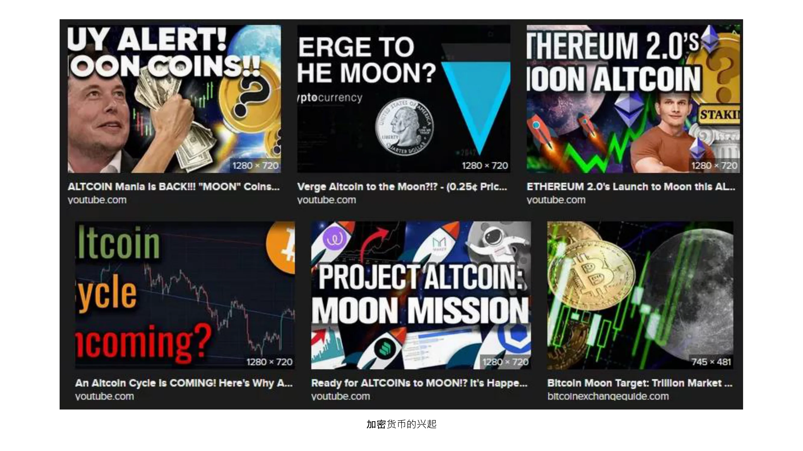

#### 7.储蓄，应对不确定性的良方

> 资本和收入的价值不断缩水，以及对未来的不确定性造成了无处不在的破坏性影响。

值得强调的是一段引文，它强调了资本价值的侵蚀对社会凝聚力的破坏性影响以及由此产生的不确定性。这段话指出"资本价值和收入的不断侵蚀以及未来的不确定性所产生的普遍破坏性影响"。

想象一下您希望保护的家庭或亲人的情景。您工作 Hard 并储蓄，以预测未来的不确定性。如果一切都是可以预测的，那么储蓄就毫无用处。然而，面对不可预见的情况，比如汽车抛锚，储蓄就成了生命线。它们减少了世界的不确定性。然而，在恶性通货膨胀期间，储蓄就成了一项挑战。货币迅速贬值，使长期规划变得困难。这种财务上的不稳定性会给人们带来 generate 压力和焦虑。

如今，随着储蓄能力的下降，投资取而代之。然而，这种做法也有风险。储蓄一直是应对不确定性的一剂良药。有了应对意外情况的资金储备，就能让人心安理得，增强社会凝聚力。总之，保护我们的储蓄能力对于维护社会和个人的稳定至关重要。

## 拉丁美洲的重新命名

<chapterId>918eafd7-409d-5205-ad52-a52e63b23a64</chapterId>

我们现在来看看拉丁美洲国家不同时期的重新定值情况。

### 图表说明

幻灯片左侧是重新定值的年份、新货币的名称以及与旧货币的 Exchange 比率。以阿根廷为例，国家比索是以 25 比 1 的汇率从以前的货币比索 reàl 换算而来的。在这种情况下，我们将研究阿根廷货币随时间的演变。此外，我们还将指出每个时期纸币的初始面值和最终面值。

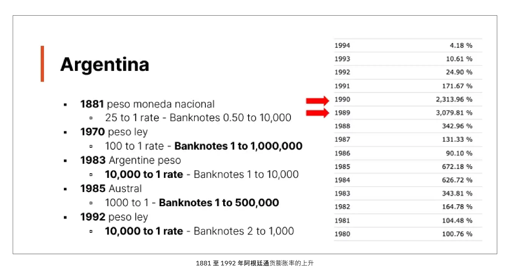

幻灯片右侧显示的是通货膨胀图。红色箭头代表恶性通货膨胀的年份，按照卡根的标准，即每月通货膨胀率达到 50%。这一标准有时会导致模棱两可的解释，因为通货膨胀率高的年份可能并不符合恶性通货膨胀的严格定义。

值得注意的是，在通货膨胀时期，政府采取的一种常见措施--重定货币币值，是一个值得注意的现象。然而，这并不能解决通货膨胀或恶性通货膨胀的根本问题。这只是重新命名货币和去除零的一种方法，并没有真正解决恶性通货膨胀的根本原因：货币Supply的扩张。在稍后的视频中，我们将讨论 Address 的真正解决方案，并解决恶性通货膨胀问题。在本系列视频中，我们将重点介绍在没有进行充分改革的情况下简单地重新发行货币的后果：通货膨胀持续存在。

在阿根廷之后，我们的研究将涉及巴西、玻利维亚、秘鲁、尼加拉瓜和委内瑞拉。我们将研究这些国家发生的重新定教派的情况。

### 阿根廷

1826 年之前，阿根廷使用西班牙元。1816 年独立后，阿根廷在西班牙雷亚尔（reàl）的基础上推出了自己的货币，从而形成了类似的货币。本表从 1881 年开始，这一年阿根廷推出了 "国家比索"（peso moneda nacional），最高面值为 10,000 美元。随后是 "比索莱伊"，兑换率为 100 比 1，纸币最高可达 100 万。随后，"阿根廷比索 "面世，Exchange 汇率为 10,000 比 1（相当于去掉四个零），钞票最大面额为 10,000 比 1。1985 年，"阿根廷比索 "面世，兑换率为 1,000：1，纸币最大面额为 500,000。1992 年，现行的 "比索莱伊 "被确定为 10,000 比 1，并再次取消了四个零。只有 1989 年和 1990 年经历了恶性通货膨胀。

### 巴西

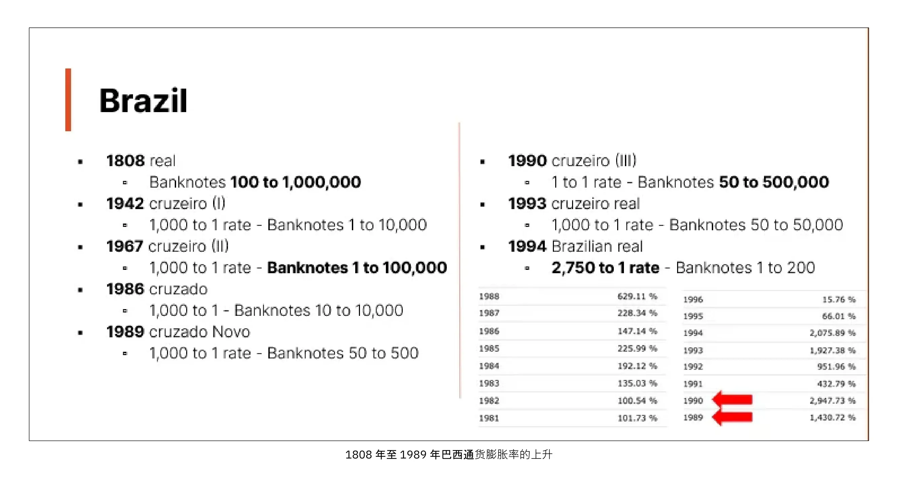

巴西是货币重新定值的一个显著例子，其货币变化的历史就说明了这一点。独立前，巴西使用葡萄牙里亚尔作为货币。然而，早在 1747 年，巴西就开始使用自己的 "巴西雷亚尔"，这比 1822 年宣布独立要早得多。本表从 1818 年开始，标志着巴西开始发行纸币。在此之前，货币主要是硬币。这些纸币的价值高达一百万雷亚尔。

从 1942 年起，巴西开始了一系列币值调整。在大多数情况下（1942 年、1967 年、1986 年、1989 年和 1993 年），兑换率为 1:1,000。1990 年，在没有兑换的情况下进行了币名更改。这些货币的顺序如下：

- Réals（旧版本），直到 1942 年。
- 1942 年，克鲁塞罗斯
- 1967 年，Cruzeiros（新版）。
- 1986 年，克鲁扎多斯
- Cruzados Novos，1989 年。
- 1990 年返回克鲁塞罗。
- Cruzeiros Reais，1993 年。
- 最后，巴西于 1994 年重新加入。

1989 年和 1990 年出现了恶性通货膨胀，而 1993-1994 年通货膨胀率较高，但没有达到恶性通货膨胀的临界点（每月 50%）。在这一动荡时期之后，巴西再次对其货币进行了重新计价，去掉了几个零。

### 玻利维亚

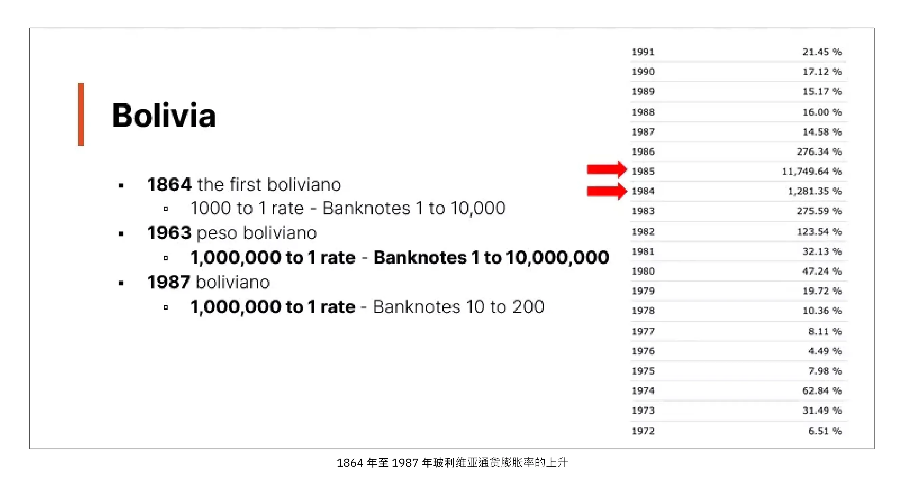

玻利维亚是另一个经历过严重通货膨胀时期的国家，它的货币必须重新计价。以下是玻利维亚货币历史的摘要：

1825 年独立前，玻利维亚使用西班牙元作为货币。独立后，玻利维亚在 1827 年至 1864 年间推出了玻利维亚索尔，取代了西班牙元。但值得注意的是，玻利维亚的第一批纸币是在 1864 年才开始发行的。

1864 年，第一枚 "玻利维亚诺 "面世，与玻利维亚索尔相比，其 Exchange 汇率为 1,000 比 1。这种货币一直流通到 10 000 玻利维亚诺。

随后，玻利维亚将其货币改为 "玻利维亚比索"，该货币经历了严重的恶性通货膨胀，最终面值高达 1 000 万。这次通货膨胀在 1984-1985 年间达到顶峰，月通货膨胀率经常接近 50%的恶性通货膨胀临界值。从某种角度来看，全年每月 50%的固定通胀率导致的年通胀率约为 12800%。1985 年，玻利维亚的年通货膨胀率达到 11749%，这表明几乎每个月的通货膨胀率都接近或超过 50%的临界值。

为了应对这场货币危机，玻利维亚于 1987 年推出了一种新货币，简称 "玻利瓦尔"，其 Exchange 汇率为 1 玻利维亚比索兑换 100 万玻利维亚比索。这一版本的玻利瓦尔至今仍在流通。

这就是玻利维亚动荡不安的货币历史的概况，其特点是恶性通货膨胀和重新计价。

### 秘鲁

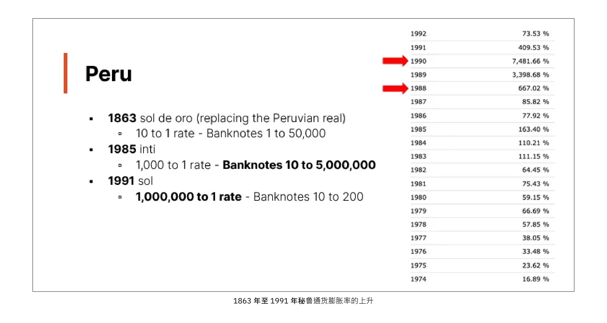

关于任意 50%规则的影响，秘鲁提供了一个有趣的案例。从其货币历史说起，秘鲁在 19 世纪 1821 年宣布独立之前一直使用西班牙黄金。秘鲁元从 1822 年使用到 1863 年。1863 年，秘鲁雷亚尔（reàl）被奥罗索（soldi oro）取代，比价为 10:1，最高价值达到 50,000。1985 年，推出了货币 "Inti"，兑换率为 1000 比 1，最高值为 500 万。1991 年，推出了 "SOL"，Exchange 汇率为 100 万比 1，纸币从 10 到 200 不等。

从重新定值的时间段来看，1988 年被认为是恶性通货膨胀的一年，尤其是在 9 月份。1990 年 7 月至 8 月也是恶性通货膨胀时期。1988 年，年通货膨胀率为 667%，9 月份达到 50%的峰值。相比之下，1989 年的通货膨胀率为 3000%，没有一个月超过 50%，因此没有被归类为恶性通货膨胀。1990 年，通货膨胀率达到 7481%的峰值。很明显，50% 的规则可能是武断的，因为 1988 年被认为是恶性通货膨胀的一年，而 1989 年则不同。如果对这一规则进行重新审议，明智的做法可能是降低门槛，将 1989 年秘鲁所经历的时期包括在内。

> 了解正在发生的事情
>

> 了解货币重新计价的关键在于，当货币价值达到天文数字，如 500 万或 1 000 万时，就会重新计价。这个过程可以重复多次，涉及货币的变化。其结果是，即使没有恶性通货膨胀，个人储蓄也会受到严重影响。例如，如果某人在某一年储蓄了 1000 美元，并设法留出了 100 美元，那么第二年，最低面值的纸币可能是 1000 美元，从而使之前储蓄的 100 美元变得一文不值。这种对储蓄的侵蚀并不需要明显的恶性通货膨胀。即使一个人在过去十年中积攒了 1 万美元，这笔钱最终可能只值微不足道的一点钱，连一瓶简单的水都买不起。这一现实在许多经历过重新计价的国家都很明显，即使只有几个月的时间也被归类为恶性通货膨胀。相比之下，有些国家，如尼加拉瓜，则经历了连续多年的恶性通货膨胀。

### 尼加拉瓜

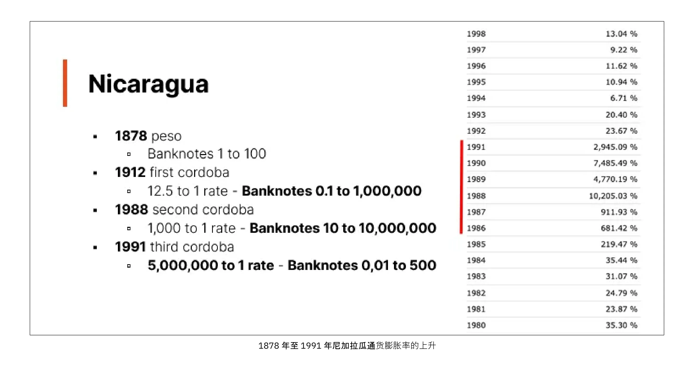

尼加拉瓜曾受西班牙统治，与西班牙殖民的许多其他国家一样，最初使用西班牙元。在先后并入西班牙帝国、墨西哥帝国和中美洲联邦共和国之后，尼加拉瓜宣布独立。从 1878 年开始，比索成为该国的官方货币，币值在 1 和 100 之间浮动。1912 年，该国推出了第一种科尔多瓦货币，1988 年推出了第二种，1991 年推出了第三种，这种货币一直沿用至今。第一枚科尔多瓦币的币值为 100 万，第二枚为 1000 万。1991 年的重新定值是在几年的恶性通货膨胀之后进行的。

### 委内瑞拉

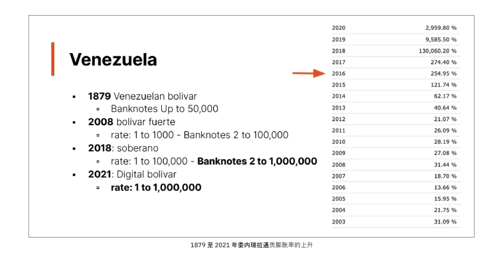

委内瑞拉是本视频提到的最后一个国家。随着时间的推移，该国经历了四次货币重新计价。在 1811 年宣布独立之前，委内瑞拉早期使用的是西班牙元。1879 年，委内瑞拉开始使用玻利瓦尔作为官方货币，这种货币一直沿用到 1983 年，当时政府选择了使用美元的 Exchange 浮动汇率制。

委内瑞拉的一个显著特点是它是拉丁货币联盟的成员。该联盟包括西班牙的 5 比塞塔、希腊的 5 德拉克马、委内瑞拉的 5 玻利瓦尔、意大利的 5 里拉、比利时的 5 法郎和法国的 5 法郎等硬币。

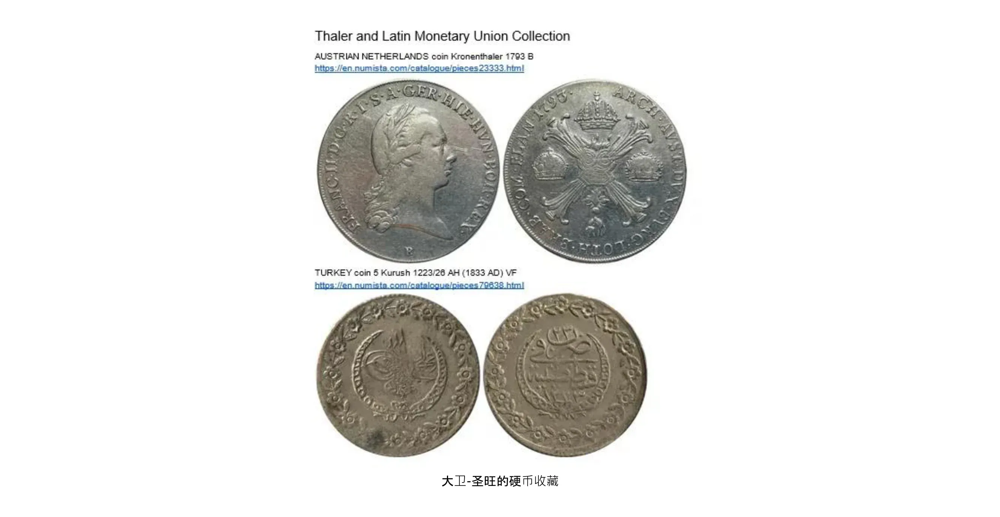

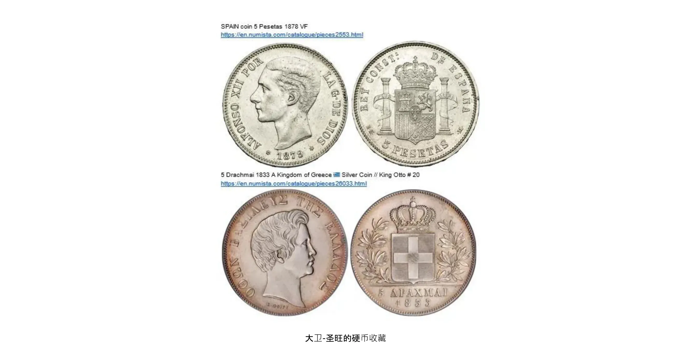

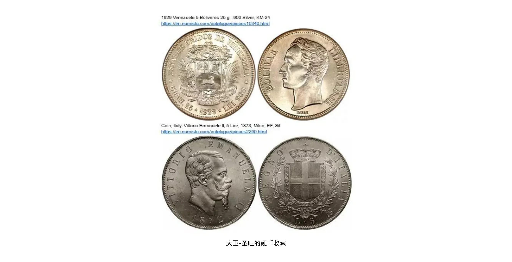

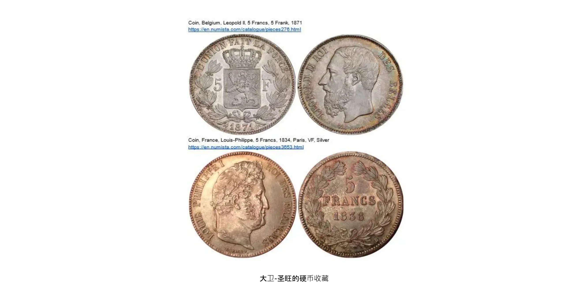

在此期间，委内瑞拉的 5 玻利瓦尔 Coin 与联盟成员国（包括意大利、西班牙、比利时和法国）的货币重量相同。这些玻利瓦尔由白银制成，1929 年的一枚特定 Coin 重 25 克，纯度为 900，即 90% 的纯银。按照目前的银价，这枚 Coin 大约价值 17 到 18 美元。

1983 年采用 Exchange 浮动汇率后，又进行了几次重新计价：

- 2008 年，推出了 "强势玻利瓦尔"（bolivar fuerte），最高达到 100 000，然后以 1 000 比 1 的比价重新定值。
- 2018 年，推出 Soberano，钞票达到 100 万。2021 年，它被数字玻利瓦尔取代，数字玻利瓦尔也达到了 100 万，之后新的重新定值为 100 万兑 1。如今，10或20钞票相当于1000万或2000万索贝拉诺。

在比亚里茨、多伦多和迈阿密举行的各种 Bitcoin 会议上分发了这一时期的钞票，最早可追溯到 2018 年。这些索伯拉诺钞票的最高价值达到 100 万。随后进行了重新定值，将 100 万的价值降至约 3 美分。目前，10 张 100 万的钞票对应 1 张 10 美分的钞票。自 2016 年以来，委内瑞拉一直在经历恶性通货膨胀，这是特定表格中的第 57 个时期。

在下一段视频中，我们将介绍一系列恶性通货膨胀钞票，重点是委内瑞拉和其他列名国家。该系列包含几乎所有委内瑞拉纸币。研究将重点关注上述每个国家的不同重新计价方式。此外，还将探讨津巴布韦的重新计价问题，这是一个颇受关注的话题。

### 结论

我们看到，恶性通货膨胀并不是经济灾难的唯一指标。多次重新计价、去掉零或更改货币名称都会对民众产生直接影响，从失去援助到粮食问题不等。尽管恶性通货膨胀令人担忧，但在巴西观察到的货币重计次数却显示了更为复杂的现实。

根据每月通货膨胀 50%的标准，有几个时期可以被归类为恶性通货膨胀。在研究国际会计组织的标准时尤其如此，该标准考虑的特征包括：民众迅速抛弃货币、工资指数化、以高利率贷款补偿通货膨胀。

总之，恶性通货膨胀只是经济挑战的一个方面。高通胀本身也同样具有破坏性。下一节将探讨克服恶性通货膨胀的可能解决方案。

## 如何克服恶性通货膨胀

<chapterId>e3484a31-a851-5f92-8af5-00eddae67db1</chapterId>

### 如何结束温和与高通胀

上述结论来自 Peter Bernholz 所著的《货币制度与通货膨胀》一书。伯恩霍尔茨认为，结束通货膨胀的唯一方法是实施货币改革，并对政府施加财政限制。这些限制包括建立一个独立于政府政治决策的机构，如中央银行。高通胀和恶性通胀往往是通过创造货币为预算赤字融资的结果。要Address缓和通货膨胀，就必须减少货币Supply的增长。伯恩霍尔茨还建议，这种货币增长应相对于邻国而言。令人惊讶的一点是，在高通胀或恶性通胀时期，货币 Supply 的总价值实际上会下降。津巴布韦就是一个鲜明的例子。

### 反直觉的解决方案

在研究津巴布韦时，人们发现 10 万亿单位的 Supply 货币已经失去了所有价值。在魏玛，可以在一天之内印出总面值为 650 亿单位的 Supply 货币的三分之二。这说明了 Supply 货币是如何贬值的。为了纠正这种情况，有必要大幅增加货币 Supply 以达到适当的水平。那么，货币改革是必不可少的。在高通胀的情况下，这种改革是不可避免的，但必须确保有足够的货币流通。在这一步之后，可以对政府施加限制。

根据伯恩霍尔茨的观察，在解决通货膨胀问题时，国际货币基金组织和世界银行等机构并不总是采取最有效的策略。在某些情况下，当一个国家需要增加货币Supply时，这些机构却寻求减少货币Supply。关键是要达到一个适当的货币水平，然后对其增长加以限制，从而避免通过创造货币来为政府开支提供资金。

伯恩霍尔茨提出的一个有趣的问题是，货币改革的成功不仅取决于其技术相关性，还取决于民众对改革的信任。一些精心设计的改革可能会因为公众不信任而失败，而另一些设计拙劣的改革则可能因为公众信任而成功。因此，观念和公众信任是货币改革成败的关键Elements。

- 在津巴布韦，应对通货膨胀的办法是美元化，即采用美元或邻国的其他货币。这种方法可以防止政府随意印钞。
- 德国的解决办法是创造一种新货币--伦登马克。这种货币以帝国的领土资产为后盾，这一策略被证明是有效的。

### 津巴布韦的案例

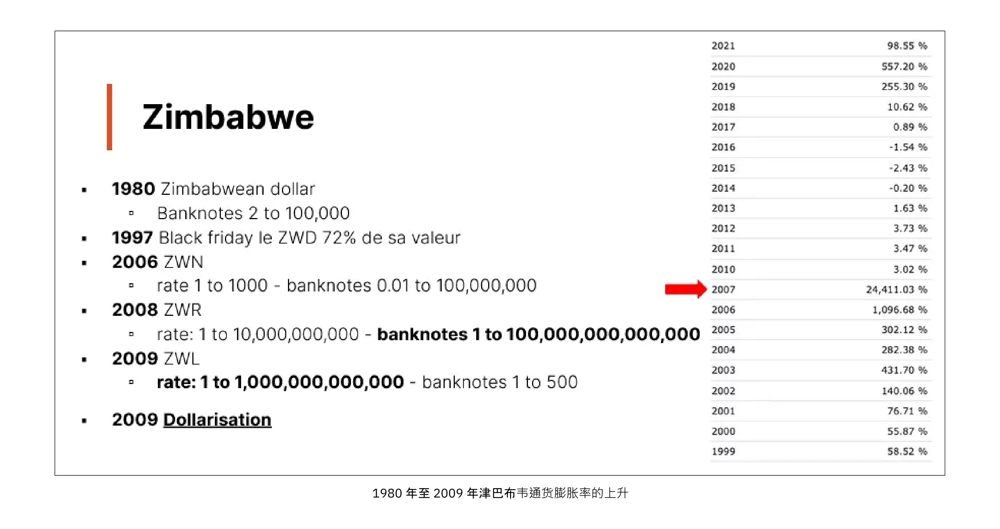

津巴布韦于 1980 年获得独立，并推出了自己的货币--津巴布韦元。最初，2 津巴布韦元约值 1.60 美元。然而，1997 年，由于采取了有利于退伍军人的社会措施，在 "黑色星期五 "期间，津巴布韦货币在一天之内贬值了 72%。随后，在 2000 年代初，该国启动了土地重新分配计划，从白人所有者手中夺走土地，并将其分配给当地居民。这一决定损害了出口，因为新业主往往缺乏管理大规模农场所需的专业知识。因此，虽然津巴布韦在 1999 年是净出口国，但在 2003 年却变成了净进口国。

2006 年，该国推出了新版货币 ZWN，其 Exchange 汇率为 1 比 1 000。2008 年，又推出了另一种面额的 ZWR，其 Exchange 比率为 1 比 100 亿。这导致了标志性的 100 万亿钞票的诞生。

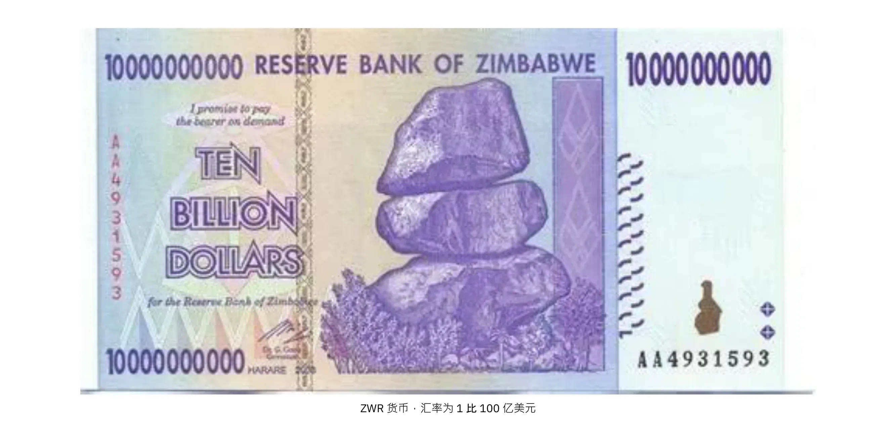

#### 美元化与危机解决

因此，2009 年后，面对持续的货币危机和猖獗的恶性通货膨胀，津巴布韦放弃了本国货币，允许使用外币，主要是美元。这一决定虽然激进，却结束了恶性通货膨胀。一个重要的经验教训是，停止过度发行货币和中央银行停止为预算赤字融资有助于防止恶性通货膨胀。

然而，美元化并不是一个奇迹般的解决方案。虽然它可以结束恶性通货膨胀，但也带来了其他经济挑战。后果之一是丧失自主货币政策。没有自己的货币，一个国家就无法调整货币政策来应对国内经济冲击。

2007 年，津巴布韦的通货膨胀率达到了每月 50%的临界点，正式标志着该国处于恶性通货膨胀状态。2009 年美元化之后，恶性通货膨胀停止了；但是，该国仍然面临着其他经济挑战。

令人担忧的是，津巴布韦此后试图重新采用自己的货币，高通货膨胀的迹象再次出现。根据某些国际组织的说法，该国可能已经再次达到恶性通货膨胀的标准，即使尚未达到每月 50%的官方门槛。这提醒我们过度发行货币和中央银行赤字融资的危险。

### 结论

在我的著作《关于 Bitcoin 的一切》中，我用了整整一章来介绍津巴布韦的恶性通货膨胀。我详细介绍了重大事件，并提供了各种实例，说明该国最终是如何结束恶性通货膨胀的。

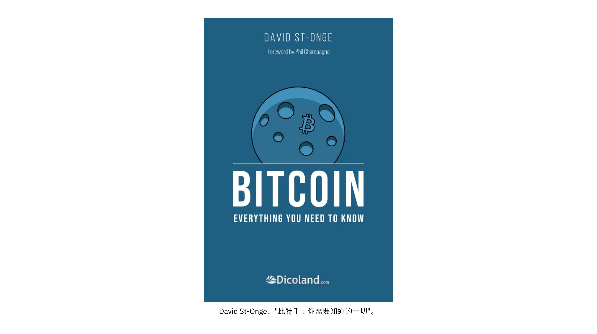

对于那些对第一次世界大战后德国经历感到好奇的人，我强烈推荐漫画书《帝国的银行家》。这本书讲述了德国如何克服恶性通货膨胀，特别是通过创造伦滕马克。

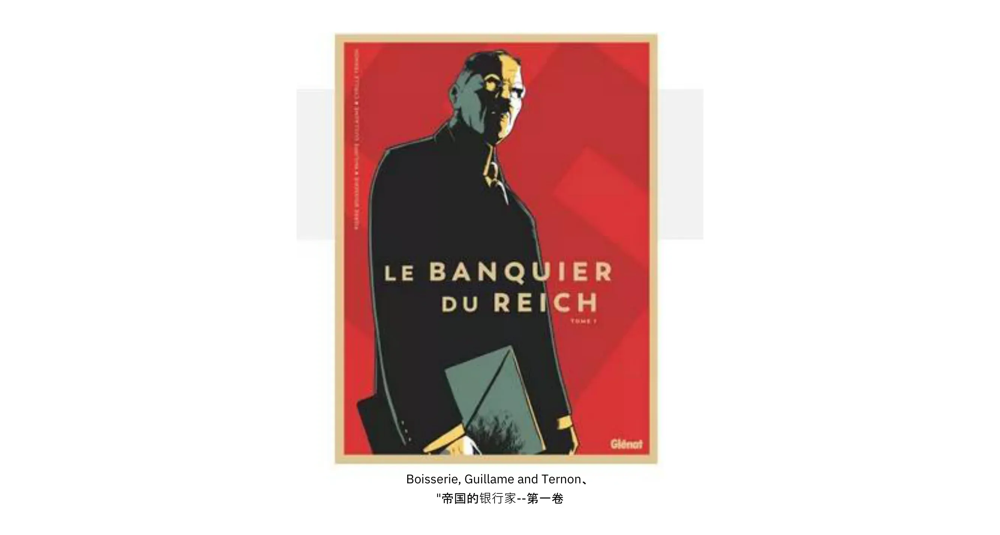

主要启示是，有几种策略可以克服恶性通货膨胀。人们可以选择美元化或引入一种新货币。这些解决方案只有在民众对其有信心的情况下才能奏效。关键是要施加严格的限制。一个真正独立的中央银行至关重要。中央银行绝不能为了弥补政府赤字而膨胀钱柜777老虎机真钱。在轻度通胀的情况下，限制钱柜777娱乐手机官网增长就足够了。然而，当面临恶性通胀时，首先必须根据经济规模制定适当的货币龙8国际pt娱乐官网。然后，必须对政府施加严格的限制，以稳定局势。

## 恶性通货膨胀纸币收藏介绍

<chapterId>f3ffbb47-3aeb-54bd-80a9-adccb0f419e2</chapterId>

[在 *Bitcoin Educational Toolkit* 中发现扫描的收藏（也可从 Plan ₿ Academy 平台的 *资源* 部分访问。](https://penpot.planb.network/#/view?page-id=c157057b-fd28-8042-8004-4f081b21defc&file-id=c157057b-fd28-8042-8004-4f081b21defb&section=interactions&index=0&share-id=7154756b-3ebd-8040-8004-6475c2af5889&interactions-mode=show-on-click)

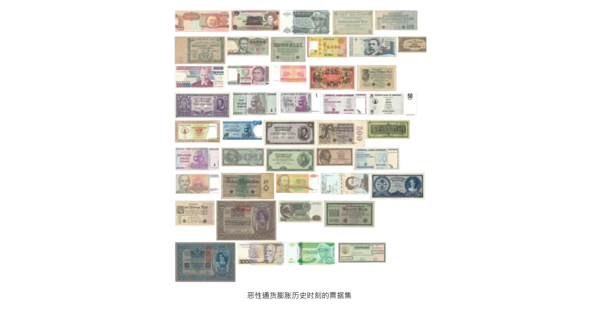

# 我们是怎么来到这里的？

<partId>f66ca17e-be9e-5d30-a098-f7affd8962a1</partId>

## 货币与中央银行的第二个 Layer 的出现

<chapterId>0455ffe3-9d45-5a67-ac96-3f815dc507a1</chapterId>

文字记录

第二代 Layer 货币和第一代中央银行的出现是一个引人入胜的话题。尼克-巴蒂亚（Nick Battia）在《分层货币》（Layered Money）一书中对这一主题进行了广泛讨论。我向那些对我们货币体系的演变和复杂性感兴趣的人强烈推荐这本书。本节的目的是了解货币创造的起源及其如何导致恶性通货膨胀。

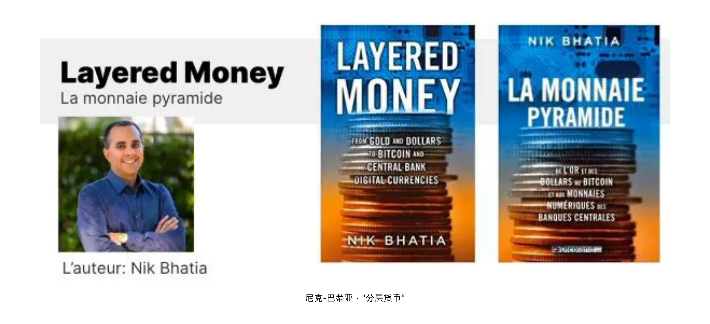

### 金字塔货币与中央银行

#### 弗罗林

货币的历史可以追溯到 13 世纪的意大利，特别是佛罗伦萨。当时，弗罗林和 Exchange 钞票很常见。其中一个著名的例子就是饰有施洗者圣约翰像的弗罗林。

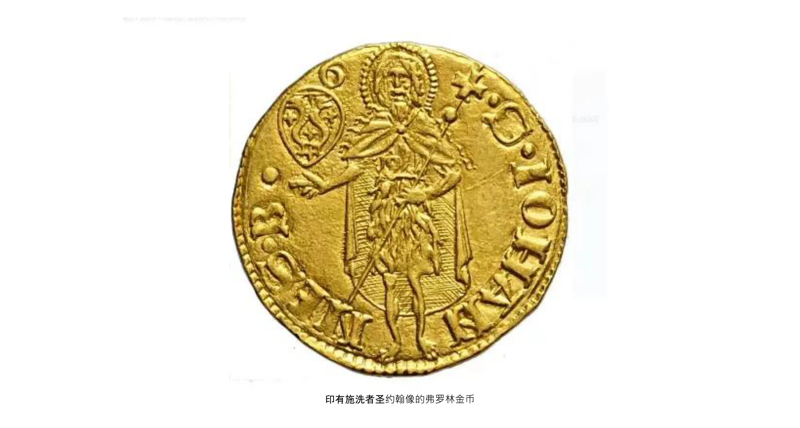

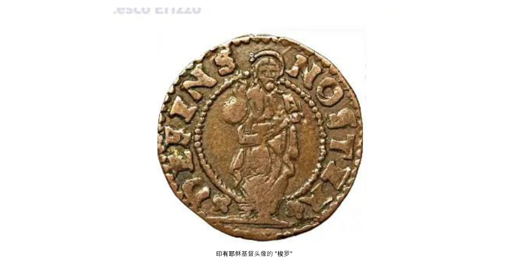

虽然现在拥有一枚真正的弗罗林币价格昂贵，但也有复制品。当时还有其他货币，如 17 世纪意大利各邦发行的以基督形象为特征的 "sello"。

#### Exchange 法案（13 世纪）

当时的普遍做法是：金匠为存入的弗罗林签发以 Exchange 为单位的 Exchange 钞票。这些弗罗林被小心翼翼地保存在金库中。因此，以弗罗林为代表的真金构成了货币的第一个Layer，而Exchange纸币则构成了第二个Layer。然而，这种体系的流动性是有限的。如果有人想用 Redeem 的黄金换取 Exchange 的纸币，交易非常简单。然而，个人之间交换这些钞票并不常见。

#### 安特卫普股票 Exchange（16 世纪）

安特卫普证券Exchange是纸币发展史上的一个重要里程碑。在安特卫普，期票贴现的做法被引入。这些期票是代表货币价值的纸质票据，但其独特之处在于它们带有名称和到期日。这使得它们很难在到期日之前Exchange。

安特卫普证券 Exchange 带来的革命在于，这些票据可以在到期日之前贴现。例如，如果一张期票在一个月后到期，那么就可以以折扣价购买，以补偿到期日之前的时间。这一创新不仅使纸币更加通用，还引入了货币时间价值的概念。

虽然尼克-贝尔（Nick Bell）通过其 Twitter 笔名 "BTC 的时间价值 "与这一概念联系在一起，但这并不是他的发明。不过，他在自己的作品中详细论述了这一概念。其主要思想是时间具有价值。因此，如果有人决定提前一个月支付一张价值 100 美元的期票，他们可以以 98 美元的价格获得这张期票，并在到期日收到 100 美元。这一货币创新起源于安特卫普证券 Exchange。

#### 荷兰王国政府与阿姆斯特丹股票市场（17 世纪）

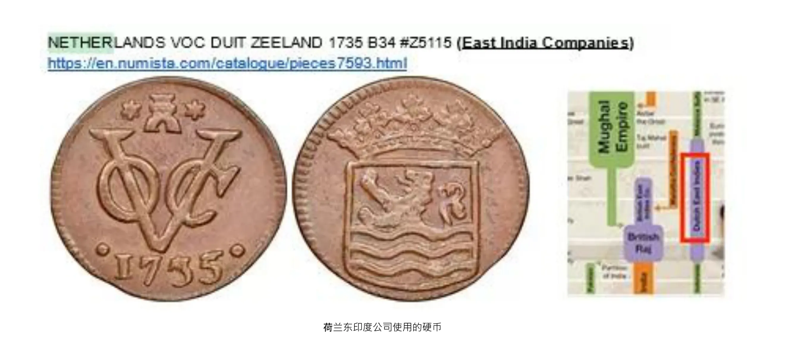

继安特卫普证券交易所（Antwerp Stock Exchange）成立之后，一个重要的里程碑是荷兰东印度公司（VOC）的成立。这家总部设在荷兰的公司甚至发行了自己的货币。继 VOC 成立之后，第一个股票市场在阿姆斯特丹建立，标志着公司股票市场业务的开始。值得注意的是，荷兰人是如何结束安特卫普作为国际经济中心的霸主地位的。他们只是封锁了通往斯海尔德河的通道。这一战略是更大的历史运动--乞丐起义--的一部分。这是欧洲历史上的一个重要事件。

#### 阿姆斯特丹银行的干预

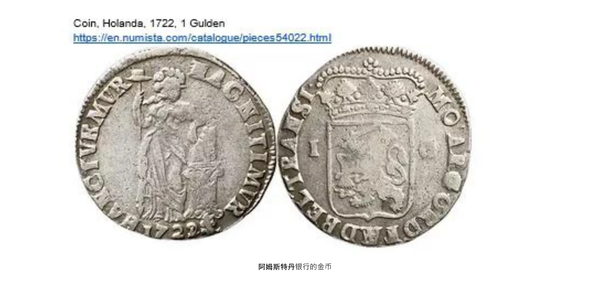

继王国政府成立之后，货币史上的另一个重大发展是阿姆斯特丹银行推出了金币。这些金币可以追溯到 1722 年，当时是由银制成的。然而，当时真正使金融发生革命性变化的并不是 Coin 本身，而是阿姆斯特丹银行与这种货币相关的账户。这些账户成为国际 Exchange 的主要手段。交易被简单地记录在登记簿或分类账中。得益于这一系统，阿姆斯特丹成为了全球经济中心。随着时间的推移，阿姆斯特丹银行决定强制使用这些账户。独立的货币兑换商被要求每天将硬币 Exchange 存入银行。

#### 创建英格兰银行为战争提供资金

英格兰银行的创立是出于 17 世纪末战争融资的需要。与阿姆斯特丹银行一样，英格兰银行也是通过法令强行征收存款。英格兰银行的特点是将私人银行置于货币体系中的次要地位，从而创造了所谓的 "第三Layer "货币。

最初，第一个 Layer 货币以黄金为代表。在私人银行的存款构成了第二个 Layer 货币。然而，当这些存款不能再兑换成黄金时，就出现了第三个 Layer 货币。从那时起，私人银行发行的纸币不再可以兑换成黄金，而是兑换成英格兰银行的纸币，而英格兰银行的纸币本身也可以兑换成黄金。这一演变导致货币体系复杂化，增加了新的层次。

#### 1796 年的大恐慌

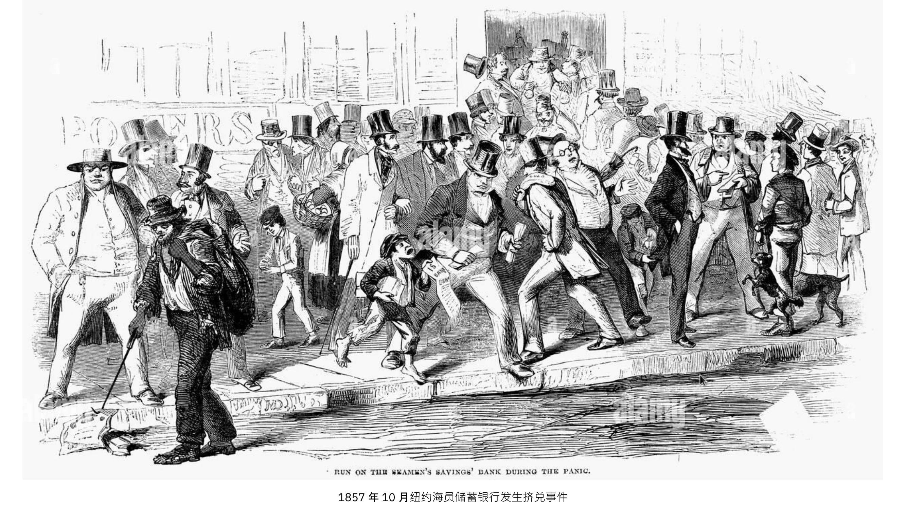

1857 年大恐慌期间海员储蓄银行的银行恐慌。

1796 年的银行恐慌之后，出现了一种现象，每个人都试图向 "货币金字塔 "的顶端移动。人们想用第三纪元的货币换取第二纪元的货币，最终换取第一纪元的货币，也就是黄金。面对这种大规模的抢购，英格兰银行被迫采取行动来稳定局势。为了防止黄金储备可能出现的通货紧缩，英格兰银行决定暂停将纸币兑换成黄金。这一暂停最初只是一项临时措施，但却持续了大约二十年。

### 结论

中央银行已发展成为最后贷款人，暂停将其货币兑换成黄金。虽然这一行动最初是作为一种临时解决方案，但最终成为了永久性的，标志着最后贷款人概念的出现。这一转变塑造了今天的中央银行。然而，在较为脆弱的经济体中，如果不负责任地使用这种随意印钞的能力，可能会导致恶性通货膨胀等不良后果。

## 书籍和资源

<chapterId>c44e4519-0741-527b-b3b0-3f513e87147d</chapterId>

恶性通货膨胀是一个引人入胜的话题，人们通过各种历史事件对其进行了研究。如果您想更深入地了解这一主题，这里列出了可供阅读和研究的 10 项基本资源：

- "当货币死亡时：亚当-弗格森（Adam Fergusson）所著的《魏玛德国赤字开支、贬值和恶性通货膨胀的噩梦》。本书详细描述了第一次世界大战后德国的恶性通货膨胀危机。

- "通货膨胀经济学--战后德国货币贬值研究》，作者：Costantino Bresciani-Turroni。对 20 世纪 20 年代德国恶性通货膨胀的深入分析。

- "这次不同：卡门-莱因哈特（Carmen M. Reinhart）和肯尼斯-罗格夫（Kenneth S. Rogoff）所著的《八百年的金融愚蠢》。尽管该书涵盖了各种类型的金融危机，但它深入探讨了历史上的恶性通货膨胀。

- 史蒂夫-汉克（Steve Hanke）撰写的 "津巴布韦的恶性通货膨胀、分析与教训"。对 2000 年代初津巴布韦恶性通货膨胀的研究。

- "货币制度与通货膨胀：历史、经济和政治关系"，作者 Peter Bernholz。该书研究了恶性通货膨胀的历史案例，并试图了解其背后的因素。

- "恶性通货膨胀生存指南：美国企业战略》，作者杰拉尔德-斯旺森。这是一本关于企业如何在恶性通胀环境中生存的实用指南。

- "货币之死：德国和美国大通胀的教训德国和美国大通胀的教训》，作者 Jens O. Parsson。对德国和美国通货膨胀危机的比较分析。

- "货币的堕落：德国的恶性通货膨胀与中产阶级的毁灭》，弗雷德里克-泰勒著。以叙述的方式探讨了恶性通货膨胀对德国社会和经济的影响。

- "发展中国家的货币发行局：史蒂夫-汉克和库尔特-舒勒合著的《发展中国家的货币发行局：手册》。虽然这本书的重点是货币发行局，但它提供了如何避免恶性通货膨胀情况的视角。

# 最后部分

<partId>cb1f4a4b-556a-4e47-a5cc-136be35a1f9a</partId>

## 评论与评级

<chapterId>1a37317e-372a-5241-b478-8316d44f9283</chapterId>

<isCourseReview>true</isCourseReview>

## 期末考试

<chapterId>d01831c3-6c4d-59e3-95bc-03e97a05c142</chapterId>

<isCourseExam>true</isCourseExam>

## 结论

<chapterId>45d410b0-71ed-4502-8d8d-8b6df761db23</chapterId>

<isCourseConclusion>true</isCourseConclusion>