# Plongée dans l'école autrichienne

Pourquoi l'école autrichienne d'économie connaît-elle un regain d'intérêt spectaculaire avec l'émergence de Bitcoin ? Cette tradition intellectuelle, née à Vienne en 1871, propose une vision radicalement différente de l'économie : elle part de l'individu, de ses choix et de ses évaluations subjectives pour comprendre les phénomènes économiques. Là où l'économie dominante s'appuie sur des modèles mathématiques et des agrégats statistiques, les autrichiens privilégient la logique déductive et l'étude de l'action humaine.

De Carl Menger à Ludwig von Mises, en passant par Friedrich Hayek, les penseurs autrichiens ont bâti un édifice théorique cohérent reposant sur quatre piliers fondamentaux : le subjectivisme, l'individualisme méthodologique, la praxéologie et le dualisme méthodologique. Leur théorie des cycles économiques explique comment la manipulation monétaire engendre inévitablement des crises, tandis que leur démonstration de l'impossibilité du calcul économique socialiste reste l'une des contributions intellectuelles majeures du XXe siècle. 

Ce cours vous invite à explorer ces fondements théoriques qui résonnent aujourd'hui avec les principes mêmes de Bitcoin.
+++
# Introduction
<partId>ad70c6ed-6bdc-496f-8b4e-f4d7b151e175</partId>

## Introduction l'école autrichienne d'économie
<chapterId>db7ba653-1ace-494c-b57b-5410a334a8d5</chapterId>

### Introduction à l'école autrichienne d'économie

L'école autrichienne d'économie constitue l'un des courants de pensée les plus influents et les plus rigoureux de la science économique moderne. Née à Vienne en 1871 avec la publication des Principes d'économie politique de Carl Menger, cette tradition intellectuelle offre une vision unique et cohérente du processus économique.

Depuis plus d'un siècle et demi, les économistes autrichiens ont affiné leur méthodologie et leurs concepts pour donner naissance à un corpus théorique remarquablement structuré. Aujourd'hui, cette école connaît un véritable regain d'intérêt grâce à Bitcoin, dont les principes fondamentaux résonnent profondément avec la défense autrichienne d'un étalon monétaire dur, la théorie de l'émergence spontanée de la monnaie et la critique de l'intervention gouvernementale.

### Les quatre piliers méthodologiques

La méthodologie distinctive de l'école autrichienne constitue le socle sur lequel repose l'ensemble de son édifice théorique. Le premier pilier, le subjectivisme méthodologique, rompt radicalement avec les théories objectives de la valeur qui dominaient l'économie classique. Les autrichiens affirment que la valeur émerge des évaluations subjectives des individus : un bien ne possède pas de valeur intrinsèque, mais sa valeur dépend de l'appréciation que chaque individu en fait selon son contexte précis. Cette perspective transforme fondamentalement notre compréhension des phénomènes économiques.

Le deuxième pilier, l'individualisme méthodologique, établit que les phénomènes économiques ne peuvent être compris qu'en les ramenant aux actions et aux intentions des individus qui composent la société. Il n'existe pas de forces collectives abstraites agissant de manière autonome, seulement des individus qui agissent selon leurs propres motivations et connaissances. Le troisième pilier, la praxéologie, constitue l'étude systématique de l'action humaine. Les autrichiens partent d'un axiome irréfutable selon lequel l'homme agit, et de cet axiome simple, ils déduisent logiquement l'ensemble de leur théorie économique. Enfin, le dualisme méthodologique affirme qu'on ne peut pas étudier l'homme avec les mêmes méthodes que les sciences naturelles, car l'action humaine, intentionnelle et créatrice, nécessite une approche méthodologique spécifique.

### Les concepts fondamentaux de la théorie autrichienne

De cette méthodologie rigoureuse découlent plusieurs concepts fondamentaux qui structurent l'analyse économique autrichienne. La préférence temporelle explique pourquoi les individus valorisent davantage les biens présents que les biens futurs, un concept essentiel pour comprendre l'intérêt, l'épargne et l'investissement. La théorie autrichienne du capital révèle quant à elle la complexité et l'hétérogénéité de la structure productive : le capital n'est pas une masse homogène mais un ensemble complexe de biens de production spécifiques, organisés dans le temps selon une structure élaborée.

Le coût d'opportunité représente un autre concept central, montrant que le coût réel d'un choix correspond à la valeur de la meilleure alternative sacrifiée. Cette notion subjective structure toutes les décisions économiques des agents. Par ailleurs, les autrichiens conçoivent le marché non pas comme un état d'équilibre statique, mais comme un processus dynamique de découverte et de coordination permanente. Dans cette perspective, l'entrepreneur occupe une place centrale comme découvreur d'opportunités et coordinateur d'informations dispersées dans l'ensemble de l'économie.

### La théorie des cycles et l'impossibilité du calcul socialiste

L'école autrichienne est particulièrement reconnue pour deux contributions majeures à la pensée économique contemporaine. La théorie autrichienne des cycles économiques explique comment la manipulation des taux d'intérêt par les banques centrales crée des cycles artificiels d'expansion et de récession. Cette théorie démontre que les crises économiques ne sont pas des défaillances du marché libre, mais les conséquences inévitables de l'intervention monétaire. Les taux d'intérêt coordonnent naturellement les préférences temporelles des individus, et leur manipulation fausse ce signal prix essentiel au calcul économique, provoquant des malinvestissements systématiques qui aboutissent inévitablement à une correction douloureuse.

La démonstration de Ludwig von Mises sur l'impossibilité du calcul économique en régime socialiste constitue l'autre contribution majeure de cette école. Sans propriété privée, sans échange volontaire et sans prix librement formés, le calcul économique rationnel devient impossible. Cette école ne naît d'ailleurs pas ex nihilo en 1871 : ses racines intellectuelles remontent jusqu'à l'école de Salamanque au XVIe siècle, où les scolastiques espagnols anticipaient déjà des concepts autrichiens fondamentaux comme la valeur subjective et les prix déterminés par l'offre et la demande. L'héritage du libéralisme classique français, notamment de Cantillon, ainsi que l'influence de la philosophie kantienne sur la conception de la connaissance a priori, ont également contribué à façonner cette tradition intellectuelle dont la résonance contemporaine avec Bitcoin et les enjeux monétaires actuels témoigne de sa pertinence durable.

# Les fondements méthodologiques
<partId>08187c20-ed0a-40a8-a6c3-ab1b784a44fd</partId>

## Le subjectivisme methodologique
<chapterId>41b92e2a-806b-4a69-b87b-a5ddbad5715b</chapterId>

### Les origines du débat sur la valeur économique

La question de l'origine de la valeur des biens constitue l'un des problèmes fondamentaux de la science économique. Pendant longtemps, la conception dominante considérait la valeur comme une donnée objective et mesurable. Les physiocrates français du XVIIIe siècle estimaient que la valeur émanait de la terre. Cette vision fut ensuite développée par les économistes classiques qui élaborèrent la théorie de la valeur travail, selon laquelle la valeur d'échange d'un bien est proportionnelle au travail incorporé dans sa production.

Adam Smith, David Ricardo et Karl Marx défendirent cette approche. David Ricardo illustrait cette théorie par un exemple célèbre : si chasser un castor nécessite deux heures de travail et capturer une dinde une seule heure, alors le castor vaut le double de la dinde. Cependant, cette théorie se heurtait au paradoxe du diamant et de l'eau formulé par Adam Smith. Comment expliquer que l'eau, essentielle à la vie, possède généralement une valeur faible, tandis que le diamant commande un prix élevé ? Et pourquoi dans le désert l'eau devient-elle plus précieuse que le diamant ? Ce paradoxe révélait une faille fondamentale dans la théorie de la valeur travail.

### La révolution marginaliste des années 1870

Dans les années 1870, trois économistes européens, travaillant indépendamment, développèrent simultanément une nouvelle théorie fondée sur le concept d'utilité marginale. William Stanley Jevons en Angleterre, Léon Walras en Suisse et Karl Menger en Autriche proposèrent une explication radicalement différente de la formation de la valeur. L'utilité marginale se définit comme la satisfaction qu'un individu obtient de la consommation d'une unité supplémentaire d'un bien.

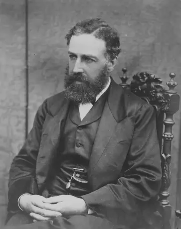

Le propos fondamental est simple : une fois un besoin satisfait, une unité supplémentaire du même bien ne représente plus la même valeur pour le consommateur. Proposons un ordinateur à deux personnes différentes : même face aux mêmes besoins apparents, elles ne feront pas le même choix, car le travail nécessaire à fabriquer l'ordinateur importe peu pour le consommateur. Seule compte la capacité du bien à combler son besoin propre. De plus, celui qui possède déjà un ordinateur n'accordera pas la même valeur à un second appareil. À chaque consommation supplémentaire, l'utilité marginale décroît progressivement.

### Valeur cardinale contre valeur ordinale

Malgré leur accord sur le concept d'utilité marginale, Walras, Jevons et Menger diffèrent profondément dans leur approche de la mesure. La conception cardinale, défendue par Walras et Jevons, suppose que l'utilité peut être mesurée en unités quantifiables : une première unité d'ordinateur représenterait dix points d'utilité, une deuxième cinq points. L'utilité serait ainsi mesurable et additionnable.

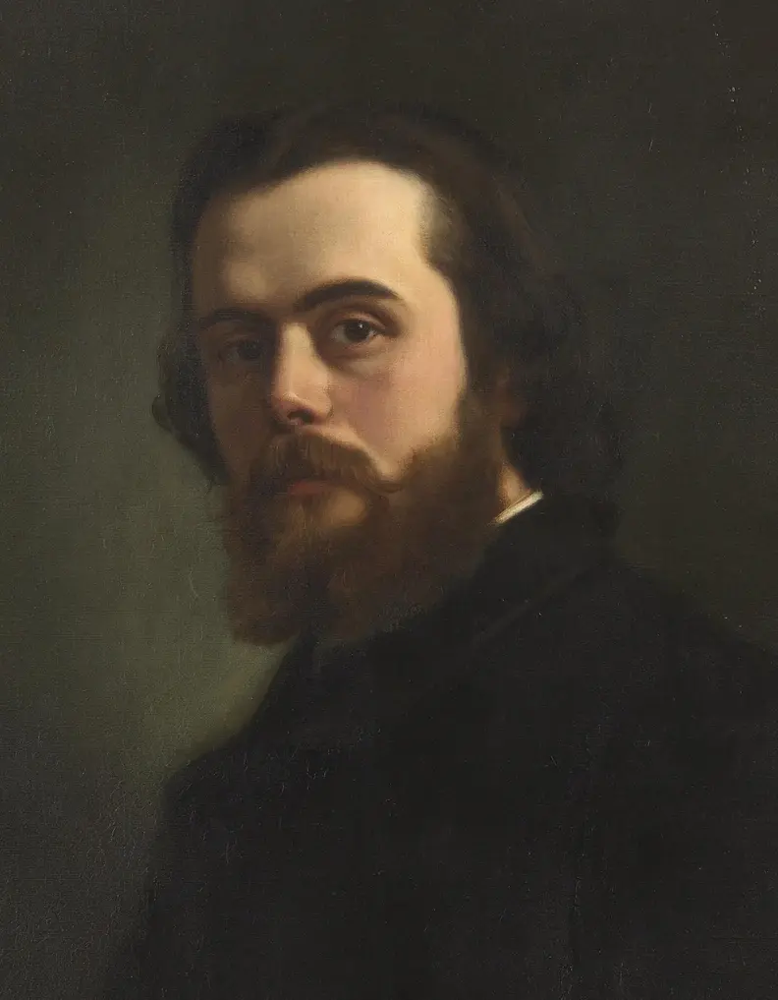

Karl Menger rejette cette tentative de mathématiser les préférences humaines. Il comprend que la complexité des comportements humains rend impossible toute analyse formalisée. Menger préfère la conception ordinale, basée sur les préférences subjectives. Selon lui, il est impossible de mesurer l'écart quantitatif entre les intensités de besoin. Nous pouvons ordonner nos préférences en affirmant que nous préférons A à B et B à C, mais nous ne pouvons pas mesurer de combien nous préférons A à B. Cette différence d'intensité reste une réalité psychologique interne, inaccessible à toute mesure objective.

### Le subjectivisme méthodologique de Karl Menger

De cette distinction naît le subjectivisme méthodologique qui caractérisera l'école autrichienne d'économie. Pour Menger, la valeur n'existe pas de manière intrinsèque dans les biens. Elle émane entièrement du jugement que l'individu porte sur le bien comme moyen de satisfaire un besoin personnel. Comme il l'écrit dans ses Principes d'économie politique, les choses deviennent des biens économiques seulement lorsqu'elles sont reconnues comme capables de satisfaire un besoin humain. La rareté joue un rôle dans la détermination de la valeur, mais elle n'a d'importance que par rapport au besoin subjectif de l'individu.

Cette révolution théorique résout le paradoxe du diamant et de l'eau. Une personne mourant de soif dans le désert accordera davantage d'importance à l'eau qu'au diamant, car l'urgence et la rareté relative de l'eau dans ce contexte déterminent la valeur. Peu importe que le diamant soit objectivement plus rare ou que son extraction nécessite plus de travail : ce qui prime, c'est le besoin subjectif et la relation unique de l'individu avec son environnement immédiat. Le subjectivisme méthodologique de Menger constitue ainsi le premier pilier fondamental de l'école autrichienne : la réalité économique ne peut être comprise qu'en partant des évaluations subjectives des individus.

## L'individualisme méthodologique
<chapterId>86749a0d-8492-4c6d-819c-063e3612675f</chapterId>

### L'individualisme méthodologique : fondement de l'analyse économique autrichienne

La question de savoir comment aborder l'économie constitue un enjeu méthodologique fondamental qui a profondément divisé les économistes. Faut-il comprendre les mécanismes économiques de manière collective et globale, à travers une allocation mathématique et statistique des ressources, ou convient-il plutôt de partir de la plus petite unité sociale existante, à savoir l'individu ? Cette interrogation se trouve au cœur de la querelle entre les économistes mainstream et les économistes autrichiens. Il ne s'agit pas simplement d'une divergence sur les conclusions, mais d'une opposition sur la manière même de construire l'analyse économique. L'individualisme méthodologique représente ainsi le deuxième pilier fondamental de l'école autrichienne, après le subjectivisme de la valeur.

### L'approche agrégée des courants économiques traditionnels

Les courants économiques classiques et néoclassiques ont historiquement privilégié une approche par les agrégats pour comprendre les phénomènes économiques. Les économistes classiques comme Smith, Ricardo et Marx divisaient la société en grands ensembles cohérents et rigides : producteurs, travailleurs, capitalistes et propriétaires fonciers. Cette classification permettait certes une analyse structurelle de l'économie, mais elle négligeait la diversité des comportements individuels au sein de chaque catégorie. Les néoclassiques, à l'instar de Walras, ont poursuivi dans cette voie en supposant des comportements homogènes et prévisibles des agents économiques, réduisant ainsi la complexité humaine à des modèles mathématiques standardisés.

Pour Carl Menger, fondateur de l'école autrichienne, cette approche agrégée passe à côté de l'essentiel. Les choix individuels ne reposent pas sur des données objectives calculables et formalisables, mais sur des considérations dynamiques et profondément subjectives. Sa conception du marginalisme dépasse le simple subjectivisme des autres économistes marginalistes en intégrant des facteurs déterminants comme le temps et la notion naissante de coûts d'opportunité. Friedrich von Wieser développera plus tard ce concept de manière explicite, démontrant que la valeur d'un bien est étroitement liée à l'utilité de l'alternative sacrifiée lors d'un choix économique.

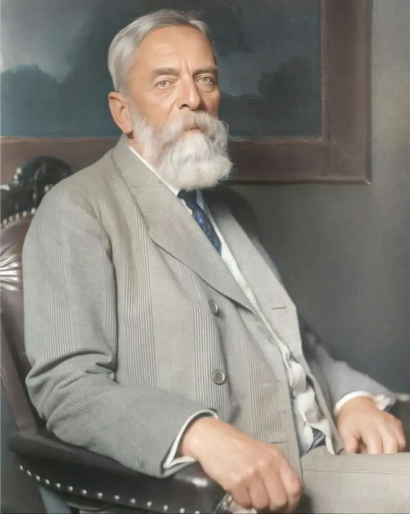

### Le subjectivisme dynamique de Menger

Le subjectivisme dynamique de Menger remet en question une idée dominante dans la pensée économique de son époque, selon laquelle les choix de l'individu seraient statiques et déterminés par l'histoire, les institutions ou son groupe social. Menger affirme au contraire que les choix sont changeants et dynamiques, évoluant constamment sous l'effet de causes internes ou externes. Le passage d'un état de besoin à un état de satisfaction nécessite des forces en action, soit dans l'organisme lui-même, soit dans son environnement. L'individu n'est donc pas une donnée statistique passive, mais un agent actif qui évolue constamment dans sa relation avec le monde.

La perception de la vie économique proposée par Menger repose sur une double relation de l'individu : le rapport à soi-même et le rapport à son environnement. Cette double dimension est cruciale pour comprendre son marginalisme. Prenons l'exemple de la préférence temporelle, c'est-à-dire la valorisation des biens présents par rapport aux biens futurs. Cette préférence ne peut être déterminée objectivement par un observateur externe, car elle varie d'un individu à l'autre et d'un moment à l'autre. La situation du moment, la singularité géographique, l'état psychologique, les besoins pressants ou différés constituent autant de paramètres qui ne peuvent être appréciés et conçus que par l'individu concerné. La valeur intrinsèque d'un bien n'existe donc pas : elle découle inévitablement du rapport subjectif de l'individu avec ce bien, dans un contexte spécifique à un moment donné.

### Les implications épistémologiques de l'individualisme méthodologique

L'individualisme méthodologique constitue bien plus qu'une simple préférence philosophique pour l'individu contre le collectif. Il s'agit d'une position épistémologique fondamentale sur la manière dont la connaissance économique doit être construite. Ce principe affirme que les phénomènes sociaux et économiques ne peuvent être véritablement compris qu'en les ramenant aux actions et aux intentions des individus qui composent la société. Toute tentative d'expliquer l'économie par des forces collectives abstraites, des lois historiques déterministes ou des agrégats statistiques passe à côté de la réalité concrète de l'action humaine. Les phénomènes macroéconomiques ne sont que les conséquences agrégées de millions de décisions individuelles.

Cette approche s'oppose radicalement à l'holisme prôné par l'école historique allemande, opposition qui donnera naissance à la célèbre Methodenstreit, la bataille des méthodes. Combiné au subjectivisme méthodologique, l'individualisme méthodologique forme le socle épistémologique de l'école autrichienne. Ces deux principes s'articulent parfaitement : la valeur est subjective, et cette subjectivité ne peut être appréhendée qu'au niveau individuel. Là où la théorie néoclassique standard rencontre un obstacle insurmontable en cherchant à fixer mathématiquement des préférences changeantes, la théorie de Menger trouve son assise, car le changement n'est pas un obstacle à surmonter mais la réalité même de la condition humaine.

## La Praxeologie
<chapterId>3ba1eb26-209c-44f4-9393-6705fdbd9235</chapterId>

### L'axiome de l'action humaine comme fondement de la praxéologie

L'axiome de l'action humaine constitue le cœur même de la méthodologie de l'école autrichienne d'économie. Cet axiome affirme une vérité fondamentale : l'individu agit. Cette action humaine est délibérée et orientée vers un but précis, celui d'atteindre des fins subjectives par des méthodes soigneusement sélectionnées. Cette présomption forme le fondement de la praxéologie, l'étude formelle de l'action humaine, sur laquelle repose toute l'analyse économique autrichienne.

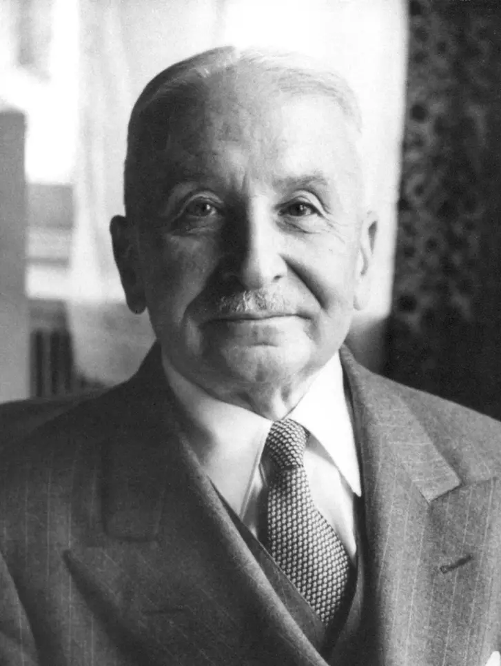

Avant que Ludwig von Mises n'élabore formellement cet axiome, Carl Menger avait posé les bases de cette approche dans ses Principes d'économie politique. Menger définissait la science économique comme la théorie de la capacité de l'être humain à faire face à ses besoins. Au cœur de la révolution marginaliste des années 1870, il développa une approche qu'il qualifiait d'organique et d'atomistique, insistant sur l'individu comme unité fondamentale de l'analyse économique. Contrairement à l'école historique allemande, Menger ancrait son raisonnement dans les choix des individus concrets. Les prix, les échanges et les marchés émergent spontanément de ces interactions sans nécessiter l'intervention d'un pouvoir centralisateur.

### L'approche axiomatique et déductive en économie

Pour comprendre la praxéologie, il faut saisir ce qu'est une approche axiomatique. En science, cette approche consiste à construire une théorie à partir d'axiomes, des propositions vraies en tout temps et en tout lieu, qui n'ont pas besoin d'être démontrées empiriquement. Ces axiomes constituent la base d'un raisonnement logique et déductif, formant une connaissance a prioriste. Cette méthode est courante en mathématiques, où les axiomes d'Euclide permettent de fonder la géométrie euclidienne en énonçant des vérités évidentes.

Cette approche axiomatique s'oppose à l'approche empirique et inductive. Là où l'approche déductive part du général pour expliquer le particulier, l'approche inductive se base sur l'observation de cas particuliers pour en dériver des théories générales. La mécanique newtonienne illustre cette approche inductive en émettant des théories générales à partir de l'observation. Cependant, cette méthode conserve une part d'incertitude. Les lois de Newton ont d'ailleurs été partiellement invalidées par la théorie de la relativité d'Einstein, démontrant les limites de l'approche purement inductive.

### L'irréfutabilité de l'axiome et ses implications

Sous l'impulsion de Ludwig von Mises, l'école autrichienne développe une méthode axiomatico-déductive qui la distingue radicalement de ses rivales. Les économistes autrichiens partent d'un axiome simple et irréfutable : l'homme agit et son action est orientée vers une fin. Cet axiome possède une caractéristique unique. Le contredire ne fait que le valider, créant une contradiction performative. Si vous tentez de réfuter l'axiome de l'action, vous devez agir pour le faire, démontrant ainsi par votre propre action que l'axiome est vrai.

La puissance de cet axiome réside dans le fait qu'il permet d'ancrer l'approche autrichienne dans une théorie économique logique, universelle et intemporelle. Il devient possible de déduire des lois économiques sans recourir à l'expérimentation ou à l'accumulation de données quantitatives. Cette approche permet de saisir les dynamiques complexes des marchés sans réduire l'humain à de simples équations. La praxéologie repose sur une conception de l'action humaine comme intentionnelle et rationnelle, où chaque action permet à l'individu de passer d'un état moins satisfaisant à un état qu'il perçoit comme meilleur.

### Une approche amorale de l'analyse économique

L'axiome de l'action humaine et la praxéologie constituent une approche dénuée de tout jugement moral sur l'action des individus. La praxéologie n'est pas une théologie qui prescrit quelles fins doivent être poursuivies. Elle affirme simplement que l'action est orientée vers une fin, et que cette action ainsi que la fin recherchée sont forcément individuelles et subjectives. L'axiome explique pourquoi l'homme agit, sans déterminer si son action est bonne ou mauvaise.

Ludwig von Mises formule clairement cette position en affirmant que l'économie ne concerne pas les choses et les objets matériels tangibles, mais les hommes, leurs significations et leurs actions. Les biens et la richesse ne sont pas des éléments de la nature, mais des éléments du sens et de la conduite de l'homme. En basant leur théorie sur l'action humaine, les économistes autrichiens bâtissent une déduction logique pour expliquer les grands principes économiques. Cette approche permet également de comprendre leur opposition aux études économétriques et statistiques, prônant plutôt le dualisme méthodologique. Les trois piliers méthodologiques de l'école autrichienne — subjectivisme méthodologique, individualisme méthodologique et praxéologie — forment ainsi un tout cohérent dont découlent logiquement tous les concepts économiques de cette tradition.

## Le dualisme méthodologique
<chapterId>b86df4a7-16d9-4d3f-938b-7e41cfabaf6e</chapterId>

### Le dualisme méthodologique : une position distinctive de l'école autrichienne

Le dualisme méthodologique représente l'une des positions les plus distinctives de l'école autrichienne d'économie. Cette approche soulève une question fondamentale : peut-on étudier l'homme et la société avec les mêmes méthodes que les sciences naturelles ? Deux visions s'opposent radicalement. D'un côté, l'approche positiviste affirme qu'une seule méthode scientifique, fondée sur l'observation et l'expérimentation, s'applique universellement. De l'autre, l'école autrichienne défend le dualisme méthodologique, selon lequel deux objets d'études fondamentalement différents nécessitent deux méthodologies distinctes.

Cette controverse touche à la nature même de l'être humain : l'homme est-il un atome interchangeable dont les actions peuvent être reproduites en laboratoire, ou est-il impossible à étudier objectivement du fait de l'imprévisibilité fondamentale de son action ? Les économistes autrichiens rejettent fermement l'application de l'approche positiviste à l'étude du processus économique. Le positivisme postule qu'il est possible de déduire par l'observation et la réplication expérimentale des lois valables en tout temps et en tout lieu. Or, l'individu est par nature imprévisible et libre, ce qui rend cette approche inapplicable aux sciences humaines.

### La critique du scientisme et de l'approche positiviste

Selon la praxéologie, il est impossible de trouver des règles constantes avec des sujets inconstants et variables. Toute tentative en ce sens s'apparente, pour reprendre les mots de Friedrich Hayek, à du scientisme, c'est-à-dire une pseudo-science qui imite les apparences de la rigueur scientifique sans en posséder la substance.

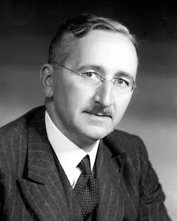

Le scientisme consiste à appliquer mécaniquement les méthodes des sciences naturelles aux sciences humaines, sans tenir compte de la différence fondamentale entre les objets étudiés.

Les économistes autrichiens sont particulièrement critiques envers cette approche. Selon eux, ce scientisme ouvre la voie à une déshumanisation progressive de l'homme. La grandeur humaine, la créativité et l'ingéniosité sont nécessairement niées pour satisfaire aux lois constantes des modèles économiques prétendument objectifs. Les observations empiriques, les modèles mathématiques et les agrégats statistiques ne sont au mieux qu'un complément informatif. Ils ne permettront jamais d'expliquer l'économie dans son ensemble car ils passent à côté de l'essentiel : l'action humaine intentionnelle et créatrice.

### La distinction fondamentale entre individus et atomes

Murray Rothbard résume cette distinction essentielle : les humains agissent avec intention et but, contrairement aux pierres, atomes et planètes qui n'ont ni préférence ni volonté. Cette différence change tout. Chaque jour, les gens apprennent, adoptent de nouvelles valeurs et changent d'avis. Leur comportement ne peut être prédit comme celui d'objets inertes incapables d'apprendre ou de choisir.

En science naturelle, un atome réagira toujours de la même manière aux mêmes conditions. Un individu, lui, peut réagir différemment aujourd'hui qu'hier face à la même situation, précisément parce qu'il a appris ou modifié ses objectifs. Ludwig von Mises distinguait rigoureusement les sciences humaines fondées sur l'action volontaire des sciences naturelles qui reposent sur l'empirisme. Il est impossible de vérifier expérimentalement pourquoi une personne préfère un café préparé à la main plutôt qu'un café instantané. Cette préférence relève du jugement subjectif, inaccessible à l'observation externe.

### Les implications pour la science économique

Cette position méthodologique a des implications profondes pour la science économique. Elle explique pourquoi les économistes autrichiens rejettent l'économétrie comme outil principal d'analyse. Non pas que les données soient inutiles, mais elles ne peuvent jamais révéler les lois économiques fondamentales. Les corrélations statistiques observées dans le passé ne garantissent aucune régularité future, car les individus apprennent et modifient leurs stratégies.

Cette critique explique également le rejet autrichien des modèles d'équilibre général mathématique. Ces modèles présupposent une constance des préférences et des comportements qui n'existe pas dans la réalité. Ils créent une illusion de scientificité en sacrifiant la compréhension véritable de l'action humaine. Comme le souligne Mises, il faut deux approches distinctes pour étudier deux réalités différentes : une approche empirique inductive pour les sciences naturelles, et une approche praxéologique axiomatico-déductive pour les sciences humaines. Le dualisme méthodologique offre ainsi une troisième voie entre le scientisme qui réduit l'homme à un objet mécanique et l'irrationalisme qui nie toute possibilité de connaissance rigoureuse des phénomènes humains.

# Les concepts économiques fondamentaux
<partId>9010680b-c147-4110-a7cd-e539132e0635</partId>

## La préférence temporelle
<chapterId>4f625cbf-b443-4e3b-a20e-b74b02f99fa5</chapterId>

### La préférence temporelle comme fondement de l'action humaine

Le temps constitue une dimension souvent négligée par la macroéconomie contemporaine, alors qu'il joue un rôle central dans les choix individuels ainsi que dans la structure et le processus de production. Les modèles néoclassiques traitent généralement le temps comme un phénomène continu, homogène et mesurable, réduisant cette notion à une simple variable objective au service de la modélisation mathématique. L'approche autrichienne propose une conception radicalement différente, où le temps découle directement de l'axiome de l'action humaine et constitue une réalité purement individuelle et subjective.

Pour les économistes autrichiens, les individus possèdent une préférence naturelle pour le présent. Ludwig von Mises a développé ce point crucial en démontrant que les individus ont des préférences temporelles positives. Concrètement, entre la jouissance présente ou future d'un même bien de valeur identique selon le point de vue subjectif de l'individu, les individus préféreront toujours la jouissance présente. Cette préférence universelle s'explique par l'incertitude fondamentale de l'avenir. Nous ignorons si nous serons encore en vie dans cinq ans, quelles circonstances se présenteront, quels besoins émergeront et quelles opportunités surgiront. Cette incertitude irréductible explique pourquoi un bien présent possède toujours, toutes choses égales par ailleurs, plus de valeur qu'un bien futur identique. C'est le phénomène de l'actualisation, où un euro aujourd'hui vaut plus qu'un euro demain.

### L'irréversibilité du temps et ses implications économiques

À l'incertitude du temps s'ajoute son caractère irréversible. Chaque action réalisée par l'individu est unique et appartient désormais au passé, sans possibilité de retour en arrière ni de reproduction identique. L'imprévisibilité humaine empêche toute reproduction exacte d'une action passée et donc toute prédiction future certaine basée uniquement sur des exemples historiques. Le contexte change constamment, les individus apprennent et les connaissances évoluent de manière continue.

Hans-Hermann Hoppe précise que, contraint à la préférence temporelle, l'homme n'échangera un bien actuel contre un bien futur que s'il espère ainsi augmenter sa quantité de biens futurs. Le niveau de préférence temporelle détermine simultanément le montant de la prime que les biens actuels exercent sur les biens futurs, ainsi que le niveau d'épargne et d'investissement. Cette irréversibilité implique que les agents économiques ne peuvent vérifier qu'a posteriori si une autre action aurait produit un meilleur résultat. Les actions passées servent à guider l'action présente car elles constituent une base d'expérimentation qui renseigne nos prises de décision, mais jamais de manière complète. L'apprentissage économique représente ainsi un processus permanent d'ajustement à des circonstances changeantes.

### Séquentialité et causalité dans l'action économique

La notion du temps en économie implique deux concepts complémentaires essentiels. La causalité désigne la capacité d'un individu à identifier des biens comme des moyens pour atteindre ses objectifs. Elle implique que l'individu sache interagir avec son milieu, adapter son action aux contraintes réelles de son environnement ou transformer des biens en moyens pour atteindre ses fins. Cette causalité implique nécessairement une suite séquentielle d'actions qui se déroulent obligatoirement dans le temps, dans une durée. Les fins ne sont jamais atteintes instantanément mais à travers des processus temporels.

Ludwig von Mises exprime cette idée avec clarté en affirmant que l'action est toujours dirigée vers le futur, essentiellement et nécessairement projetée pour un avenir meilleur. Son but est toujours de rendre les circonstances futures plus satisfaisantes qu'elles ne seraient sans l'intervention de l'action. Mises s'est d'ailleurs inspiré du philosophe français Henri Bergson, qui distinguait le temps objectif et spatial, quantifiable et mesurable, du temps tel que vécu par la conscience humaine, subjectivement et individuellement. Nous faisons cette expérience quotidiennement, car une heure peut sembler interminable chez le dentiste tandis qu'elle file à toute vitesse dans une conversation passionnante, alors que la mesure objective demeure identique.

### Application pratique et diversité des préférences temporelles

Prenons l'exemple concret de l'achat d'un ordinateur pour illustrer ces concepts. L'ordinateur représente le besoin, son acquisition constitue la fin, et l'étape intermédiaire réside dans la capacité de l'individu à épargner, l'argent étant le bien transformé en moyen. La valeur que l'individu accorde à son besoin et à son temps influence directement son action, le poussant à économiser plus ou moins, à travailler plus ou moins, dans le but d'accroître ses moyens pour atteindre sa fin le plus rapidement possible.

Les préférences temporelles étant individuelles et subjectives, deux individus n'aborderont pas de la même manière le même bien. L'un peut épargner patiemment pour acquérir l'ordinateur dans le futur, symbolisant une faible préférence temporelle. L'autre peut décider d'emprunter pour l'obtenir immédiatement, démontrant une préférence temporelle élevée et acceptant de payer le prix du temps sous forme de taux d'intérêt. Cette prime payée en plus de la somme principale du bien révèle comment la préférence temporelle structure toute l'analyse autrichienne, expliquant l'existence même de l'intérêt, la formation du capital et les cycles économiques.

## La théorie autrichienne du capital
<chapterId>c103f2e4-bec9-4e84-8af2-d785eb1dd590</chapterId>

### La nature hétérogène du capital selon l'école autrichienne

La théorie du capital constitue l'un des piliers fondamentaux de l'école autrichienne d'économie. Contrairement aux économistes mainstream qui considèrent le capital comme une masse relativement homogène de biens de production, les économistes autrichiens ont développé une conception bien plus riche et nuancée. Cette approche intègre le rôle central du temps dans l'amélioration continue de la structure productive. Le capital, dans cette perspective, représente l'ensemble de la structure productive, depuis les facteurs originels de production comme la terre jusqu'à la confection finale des biens de consommation. Les étapes intermédiaires sont prises en charge par les entrepreneurs et capitalistes qui investissent dans des biens de production pour améliorer cette structure.

Les économistes néoclassiques, notamment dans le modèle de Solow-Swan, utilisent la notion de stock de capital sans s'attarder sur sa composition interne. Cette vision restrictive permet certes de mesurer facilement le capital dans leurs modèles macroéconomiques, mais elle néglige des aspects essentiels. Les notions liées à la structure du capital, c'est-à-dire à la complexité de l'agencement des étapes intermédiaires et au temps nécessaire à leur déploiement, sont sous-estimées voire totalement absentes. Le capital y devient une notion équilibrante, statique et homogène.

### Les détours de production et le rôle du temps

Avec Eugen von Böhm-Bawerk, les économistes autrichiens ont développé une théorie robuste du capital centrée sur le concept de détours de production. Selon cette approche, la société opère sur une structure globale du capital dont la taille et la complexité sont déterminées par les préférences temporelles des individus. L'investissement dans les étapes les plus éloignées de la consommation forme ce que Böhm-Bawerk appelait les détours de production : produire d'abord des biens d'équipement qui sont ensuite utilisés pour produire des biens de consommation.

Un exemple simple illustre ce concept. Vous pouvez pêcher à mains nues dans une rivière, ce qui constitue la production directe. Alternativement, vous pouvez d'abord fabriquer un filet de pêche, ce qui représente un détour de production. Ce détour nécessite du temps et de l'effort sans consommation immédiate, mais une fois le filet terminé, votre productivité sera considérablement accrue. Comme l'a écrit Böhm-Bawerk, l'homme choisit des méthodes de production détournées qui nécessitent plus de temps mais compensent ce retard en générant des produits plus nombreux et de meilleure qualité.

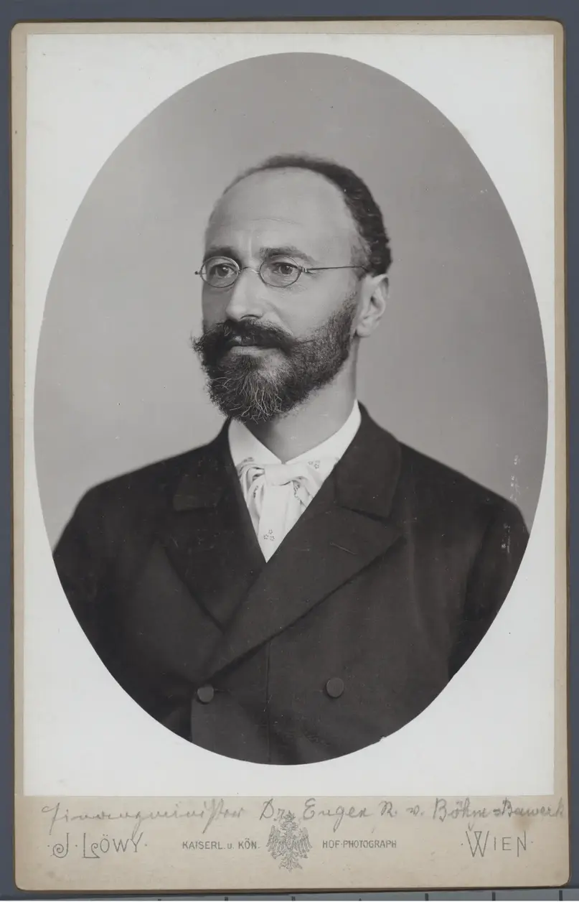

### L'épargne comme moteur de la structure du capital

L'épargne joue un rôle crucial car elle constitue le signal que la consommation actuelle est satisfaite. Elle indique aux entrepreneurs qu'ils peuvent investir dans d'autres étapes de production sans impacter négativement la consommation présente. L'épargne et son prix, le taux d'intérêt, sont donc essentiels pour orienter la production vers la bonne temporalité.

L'économiste Mark Skousen estime que plus de soixante pour cent des ressources productives disponibles en dehors du secteur public sont consacrées à la production de biens de production. Ce chiffre remarquable signifie que deux tiers des facteurs rares de production ne sont pas consacrés directement à la consommation mais au perfectionnement de la structure du capital. Cette structure servira les intérêts des consommateurs en permettant la production de biens de meilleure qualité, en plus grande quantité et au meilleur prix.

### Les implications de l'hétérogénéité du capital

Le capital est un ensemble complexe et diversifié de biens de production, chacun ayant des caractéristiques uniques et des utilisations spécifiques. Une machine d'extraction de minerais n'est pas équivalente à une moissonneuse-batteuse, et un porte-conteneurs maritime n'est pas un tracteur. Pourtant tous ces biens participent à la maximisation de la production finale. Ces biens capitaux ne sont cependant pas interchangeables : vous ne pouvez pas reconvertir instantanément une machine d'extraction en moissonneuse-batteuse.

Cette hétérogénéité a des conséquences profondes pour la compréhension des cycles économiques. Les mauvais investissements, ce que les autrichiens appellent le malinvestissement, ne peuvent être facilement corrigés. Une structure de capital mal orientée ne peut être instantanément réallouée vers d'autres usages plus productifs. L'entrepreneur joue ici un rôle central comme acteur capable de spéculer sur la meilleure manière de servir le consommateur et d'organiser en conséquence la structure du capital. Cette théorie sera cruciale pour comprendre la théorie autrichienne des cycles économiques, car les crises économiques selon les autrichiens sont précisément des crises de la structure du capital déformée par des interventions monétaires inappropriées.

## Le coût d'opportunité
<chapterId>834df97d-6c39-450a-91a4-385ee5ad06eb</chapterId>

### Le coût d'opportunité : un concept fondamental en économie

Le coût d'opportunité constitue l'un des concepts les plus essentiels pour comprendre le fonctionnement de l'économie. Il correspond à la valeur du meilleur choix alternatif auquel on renonce lorsqu'on effectue un choix particulier. Cette notion révèle une différence fondamentale entre l'approche économique mainstream et l'approche autrichienne. Pour les économistes mainstream, le coût d'opportunité se définit de manière formelle et mathématique. En économie autrichienne, ce concept demeure fondamentalement subjectif, toujours envisagé à travers le prisme de l'individu et de ses préférences personnelles.

Friedrich von Wieser a joué un rôle déterminant dans la compréhension de ce concept en le formulant dans son ouvrage Théorie de l'économie sociale publié en 1914, bien que Frédéric Bastiat l'ait déjà pressenti auparavant. Wieser distingue clairement le coût d'opportunité du coût historique : le coût d'une ressource n'est pas lié à son coût réel issu des résultats passés, mais à la valeur des usages alternatifs auxquels on renonce. La valeur d'un bien est déterminée par le bien le plus précieux que l'on aurait pu produire à la place, ce qui nous ramène aux axiomes fondamentaux de la subjectivité de la valeur.

### Le rôle du coût d'opportunité dans la structure de production

Pour Ludwig von Mises, la notion de coût d'opportunité est liée à des expériences de pensée que font quotidiennement les individus confrontés à des choix. Ce concept joue un rôle essentiel non seulement dans les arbitrages individuels, mais également dans l'appareil productif global. Chaque fois qu'un entrepreneur alloue des ressources à la production, il renonce nécessairement à d'autres usages possibles. Ces arbitrages incessants font que dans un système d'économie libre, les ressources sont naturellement allouées là où le coût d'opportunité est le plus faible par rapport à la valeur anticipée.

Les facteurs de production sont ainsi utilisés là où ils génèrent la plus grande valeur ajoutée. La concurrence libre devient essentielle pour garantir cette allocation optimale, car elle permet de découvrir continuellement quelles sont les utilisations les plus valorisées des ressources limitées. Ce processus de découverte permanent constitue le mécanisme par lequel une économie de marché coordonne efficacement les décisions de millions d'acteurs économiques.

### L'exemple des perroquets de Böhm-Bawerk

Eugen von Böhm-Bawerk utilise une image célèbre pour expliquer l'utilité marginale et le coût d'opportunité. Un agriculteur possédait cinq sacs de blé sans aucun moyen de les vendre ni d'en acheter davantage. Il avait cinq utilisations possibles : comme aliments de base, pour développer sa force, comme nourriture pour ses poulets, comme ingrédients pour faire du whisky, et enfin comme aliments pour ses perroquets. Lorsque le paysan a perdu un sac de blé, il a simplement cessé de nourrir les perroquets car ils étaient moins utiles que les quatre autres utilisations.

Cet exemple illustre parfaitement l'utilité marginale : une première unité de blé sera fortement valorisée car elle répond à un besoin vital. Une unité supplémentaire n'aura pas la même importance puisque le besoin primaire est déjà comblé. Chaque unité supplémentaire d'un même bien possède ainsi une valeur décroissante aux yeux de l'individu. Böhm-Bawerk nous montre que l'individu priorise l'utilisation de son blé en fonction des besoins qu'il juge subjectivement prioritaires.

### Implications pratiques et limites du coût d'opportunité

Lorsque le paysan perd un de ses sacs de blé, il doit choisir à quelle utilisation renoncer. En choisissant de laisser mourir les perroquets pour continuer à produire du whisky, il calcule quelle perte serait la plus dommageable pour lui. Ce calcul l'oriente vers une allocation efficace de ses ressources limitées en prenant en compte tous les coûts associés, explicites et implicites. À mesure que les biens du paysan augmentent, ses conditions de vie s'améliorent, car l'abondance permet l'émergence de nouvelles alternatives.

Le coût d'opportunité est souvent plus facile à calculer a posteriori qu'à prédire au moment où l'on agit, ce qui explique pourquoi toute action économique n'est que spéculation basée sur des informations imparfaites et constamment changeantes. Agir et exercer sa liberté individuelle suppose aussi de se tromper, mais prendre en compte le coût d'opportunité permet de prendre des décisions plus éclairées. La perte d'un sac de blé nous enseigne finalement que le renoncement est une donnée subjective propre à chacun, et que la valeur d'un bien est profondément déterminée par son utilité marginale selon les circonstances spécifiques de l'individu.

## Le processus de marché
<chapterId>23b74f45-1595-46cf-96b5-4c2ebe0ec4b6</chapterId>

### Le marché comme processus évolutif

L'économie mainstream postule que les acteurs économiques effectuent des arbitrages rationnels et sont bien informés pour atteindre leurs objectifs. Dans cette perspective néoclassique, le marché tend vers un point d'équilibre où les ressources sont efficacement allouées, un état modélisé de manière statique.

Ludwig von Mises et Friedrich Hayek proposent une vision radicalement différente. Pour eux, le marché n'est pas un état d'équilibre à atteindre, mais un processus dynamique en constante évolution. L'individu se trouve au centre de ce processus et arbitre de manière subjective en fonction de sa connaissance, toujours imparfaite et incomplète. Le rôle du marché consiste à coordonner les actions interindividuelles en facilitant les échanges libres. Cette coordination forme ce que Hayek appelle un ordre spontané, dont la tendance est de tendre vers l'équilibre sans jamais l'atteindre véritablement.

Cette différence implique que le marché est fondamentalement dynamique, incertain, subjectif et décentralisé. Aucune autorité centrale ne peut parfaitement diriger ce processus, car la connaissance nécessaire est dispersée entre tous les acteurs.

### L'ordre spontané et la dispersion de la connaissance

Hayek a développé le concept d'ordre spontané pour décrire le fonctionnement du marché. L'ordre étendu est un ordre social spontané mis en place naturellement par les hommes pour se coordonner et coopérer efficacement. Dans "The Use of Knowledge in Society", Hayek explique que la connaissance nécessaire n'existe jamais sous une forme concentrée, mais uniquement sous forme d'éléments dispersés que tous les individus possèdent en partie.

Cette dispersion explique pourquoi les autrichiens considèrent le marché comme un ordre spontané impossible à diriger consciemment. En suivant l'individualisme méthodologique et la subjectivité de la valeur, il devient impossible pour un organisme planificateur de centraliser les préférences individuelles. Cette impossibilité s'accentue avec la préférence temporelle : les préférences d'un individu peuvent différer dans le temps et suivant son environnement.

Le processus de marché coordonne les actions malgré cette dispersion. Chaque acteur n'a besoin que d'une fraction de l'information totale, et le système de prix joue un rôle central. Comme le résume Peter Boettke, la division du travail implique la division des connaissances, et c'est par le processus de marché que ces connaissances sont découvertes, utilisées et communiquées.

### La connaissance tacite et les signaux de prix

Hayek a mis en avant un concept crucial : la connaissance tacite ou implicite. Cette notion désigne les connaissances non formalisées que les acteurs économiques utilisent quotidiennement, sans nécessairement les articuler. Ainsi, les acteurs adoptent naturellement une approche sensée de la monnaie et du crédit, sans formation théorique préalable.

La concurrence au sein d'institutions bien structurées permet ce processus de communication. Les prix générés par la concurrence servent d'indicateurs socialement accessibles pour ces connaissances tacites. La formation des prix devient un moyen de coordination indispensable, permettant d'orienter l'allocation des ressources malgré la complexité inhérente au système économique.

### L'autorégulation du processus de marché

Si le marché est un processus naturel et spontané, il s'autorégule grâce à deux mécanismes fondamentaux. Premièrement, le calcul économique basé sur les échanges volontaires et les prix libres permet l'allocation des facteurs rares de production. Deuxièmement, la loi des profits et des pertes récompense ou sanctionne l'action entrepreneuriale, permettant que les capitaux soient alloués à ceux qui en feront la meilleure utilisation.

Comme l'écrit Mises, avec chaque centime dépensé, le consommateur détermine l'orientation des processus de production. Cette autorégulation fait du marché libre une forme de démocratie économique.

Pour démontrer l'impossibilité d'un équilibre parfait, Mises a développé le concept d'économie en rotation uniforme : un état hypothétique où toutes les variables demeurent constantes. Mais une telle situation est absurde, car elle signifierait que le futur est certain, contredisant le principe même de l'action humaine. Dans la réalité, les individus ajustent constamment leurs décisions en fonction de l'incertitude, et le marché comme processus dynamique permet cette adaptation continue sans qu'aucune autorité unique n'ait à diriger l'ensemble.

## Le rôle central de l'entrepreneur
<chapterId>e4d57119-a41b-42d7-b319-ea4cf46ab15d</chapterId>

### La conception autrichienne de l'entrepreneur

La figure de l'entrepreneur occupe une place centrale dans la théorie économique, mais sa définition varie selon les écoles de pensée. Pour les néoclassiques, l'entrepreneur se réduit à un simple allocateur rationnel de ressources. Joseph Schumpeter le présente comme un innovateur exogène qui bouleverse l'équilibre du marché : le nouveau ne sort pas de l'ancien mais apparaît à côté de lui, lui fait concurrence jusqu'à le ruiner. L'école autrichienne développe cependant une conception radicalement différente.

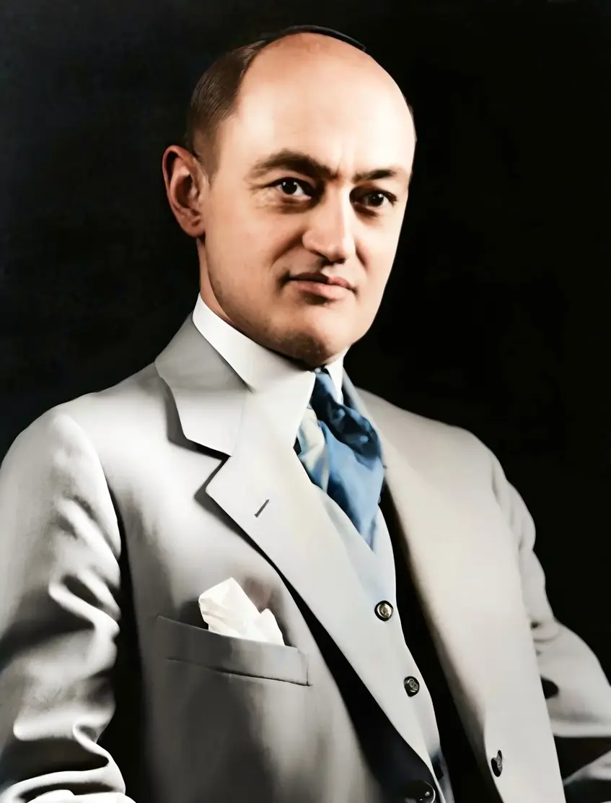

Pour les économistes autrichiens, la fonction entrepreneuriale coïncide avec l'action humaine elle-même. Jésus Huerta de Soto affirme que toute personne agissant en vue de modifier le présent et d'atteindre ses objectifs dans le futur exerce la fonction d'entrepreneur. L'entrepreneur autrichien est un agent économique endogène au marché, qui vient servir les autres agents mieux que ses prédécesseurs. Il dispose d'une meilleure connaissance de l'information, ce qui lui permet de saisir des opportunités et de répondre à des besoins par l'innovation. Loin de perturber un équilibre supposé qui n'existe pas, l'entrepreneur offre aux individus de nouvelles connaissances qui les aident à orienter leurs choix via le système des prix.

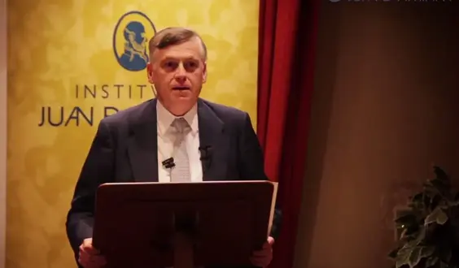

### L'entrepreneur comme force équilibrante selon Israel Kirzner

Israel Kirzner, économiste de tradition misésienne, a conceptualisé l'entrepreneur comme celui qui contribue à réduire l'ignorance des autres acteurs économiques quant aux possibilités offertes par le marché. Dans *Concurrence et esprit d'entreprise* (1973), Kirzner établit une distinction fondamentale avec la vision schumpeterienne. Alors que l'entrepreneur schumpeterien perturbe une situation d'équilibre existante, l'approche kirznerienne insiste sur la contribution de l'entrepreneur à l'équilibre. Les changements qu'il provoque tendent vers l'équilibre plutôt que s'en éloignant.

L'entrepreneur kirznerien constitue une force motrice équilibrante. Il est celui qui prévoit, agit et anticipe les changements grâce à une meilleure connaissance du marché. Cette vision explique la dynamique du processus concurrentiel comme un mécanisme de découverte permanente et de correction des erreurs d'allocation. Huerta de Soto illustre ce rôle crucial de la connaissance : si les réserves pétrolières semblent limitées, la découverte d'un carburateur doublant l'efficacité des moteurs aurait le même effet économique que la duplication du total des réserves physiques.

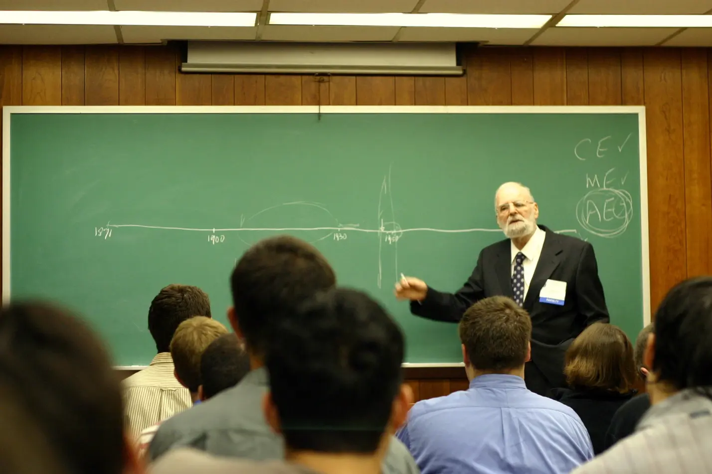

### L'exemple de Robinson Crusoé et le processus entrepreneurial

L'exemple de Robinson Crusoé permet d'intégrer plusieurs notions clés du processus entrepreneurial. Seul sur son île, Robinson doit survivre. Son attention se porte sur son besoin le plus élémentaire, se nourrir, et plusieurs options s'offrent à lui : chasse, cueillette ou pêche. Il retient l'option qui lui semble la plus judicieuse, par exemple récolter des noix de coco, et renonce simultanément aux autres possibilités, illustrant ainsi le coût d'opportunité.

Avec le temps, Robinson juge sa méthode peu efficace et envisage de confectionner une perche pour améliorer sa productivité. Cet effort empiète sur le temps qu'il consacrerait à se nourrir. Il doit donc épargner des noix afin de libérer le temps nécessaire, consentant un sacrifice présent dans l'optique d'une situation future meilleure. Une fois terminée, la perche constitue un bien de production qui servira à accroître sa récolte sans être lui-même consommé. Le temps dégagé pourra être consacré à la confection de nouveaux outils qui viendront enrichir sa structure capitaliste.

### La concurrence comme processus de découverte

La concurrence joue un rôle fondamental dans la vision autrichienne en tant que mécanisme épistémique par lequel les acteurs économiques découvrent le meilleur coût d'opportunité de chaque ressource. Ce processus permet à la société de maximiser l'utilisation des facteurs rares de production et de limiter le gaspillage. Le rôle de l'entrepreneur consiste à compléter l'information dispersée, résultant en une meilleure coordination du marché.

L'entrepreneur autrichien n'est ni un simple allocateur de ressources ni un destructeur d'équilibre. Il est un découvreur d'opportunités, un coordinateur d'information dispersée et une force équilibrante dans un processus de marché dynamique. Cette vision s'avère essentielle pour comprendre les développements théoriques concernant les prix, le capital et les cycles économiques. Elle met en lumière l'incertitude inhérente au futur, la préférence temporelle, la nécessité d'une épargne préalable à tout investissement, ainsi que la distinction fondamentale entre biens capitaux et biens de consommation.

# La théorie monétaire
<partId>c0d9f15c-7c6f-4868-a613-ce1c7d1b03ea</partId>

## La théorie monétaire autrichienne
<chapterId>8c8703fe-15ba-46aa-92b4-7d74fcd3b066</chapterId>

### L'échangeabilité comme fondement de la monnaie

Pour les économistes de l'école autrichienne, la monnaie se distingue fondamentalement de la conception mainstream qui la présente comme une création institutionnelle émise par les banques centrales et les États. Dans la perspective autrichienne, la monnaie est un bien rare qui émerge spontanément du marché, librement sélectionné par les acteurs économiques pour sa capacité à faciliter les échanges.

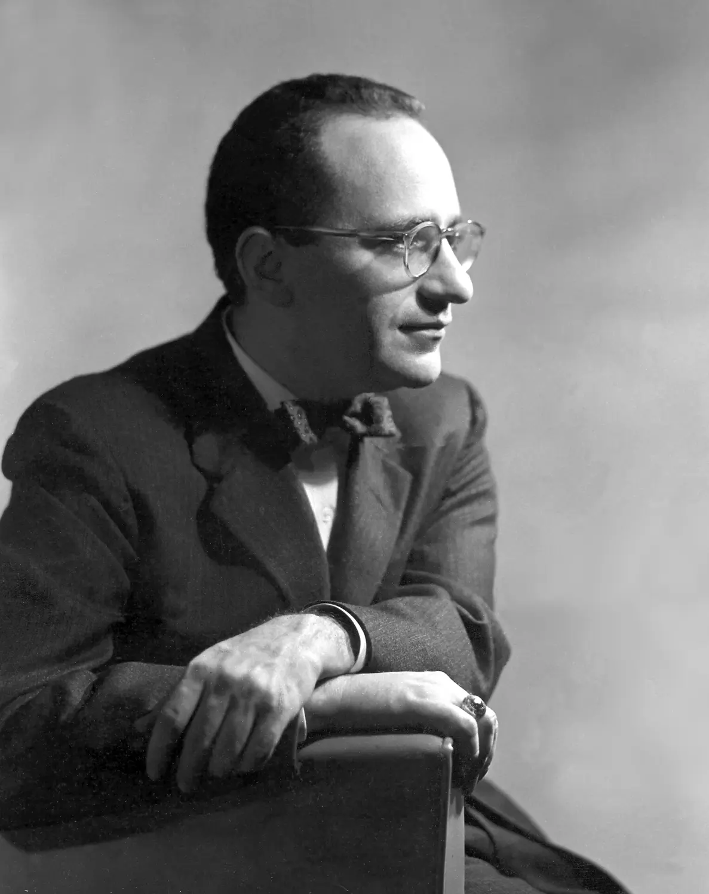

La caractéristique première de la monnaie réside dans son échangeabilité. Murray Rothbard souligne dans "État, qu'as-tu fait de notre monnaie ?" que les fonctions traditionnellement attribuées à la monnaie (moyen d'échange, unité de compte, réserve de valeur) ne sont que des conséquences de sa fonction principale d'intermédiaire dans les échanges. Un bien devient monnaie parce qu'il est perçu comme le plus liquide par les participants au marché. Cette liquidité permet de surmonter les limites du troc en éliminant la nécessité de la double coïncidence des besoins.

### La monnaie comme bien unique et transmetteur de valeurs

La monnaie occupe une place singulière parmi les biens économiques. Contrairement aux biens de consommation ou d'équipement, la monnaie n'est pas consommée dans son usage. Rothbard précise que sa fonction consiste à agir comme intermédiaire d'échange, permettant aux biens et services de circuler rapidement entre les individus.

Dans la pensée autrichienne, la monnaie joue également un rôle crucial de diffusion de l'information économique sous forme de prix. Le prix constitue l'expression comptable de la valorisation subjective d'un bien et, à l'échelle de la société, ce que Ludwig von Mises appelait une "étoile directrice" informant l'ensemble des participants sur l'état du marché. La monnaie sert ainsi de dénominateur commun permettant de traduire les valeurs subjectives en termes comparables.

Mises définit la monnaie comme un "transmetteur de valeurs dans l'espace et dans le temps". Elle permet de diffuser le pouvoir d'achat dans l'espace pour échanger avec un maximum de personnes, et de différer ce pouvoir d'achat dans le temps. Les individus y stockent le fruit de leur travail, composé des deux ressources les plus rares : l'énergie et le temps humain.

### La rareté monétaire comme principe fondamental

La compréhension de la monnaie comme instrument de certitude conduit naturellement à la question de sa rareté. Carl Menger explique dans ses "Principes d'économie politique" que la propriété et l'économie humaine constituent la seule solution pratique au problème posé par la disparité entre les besoins humains et la quantité disponible de biens. Mises développe cette idée en affirmant que sans rareté, l'homme ne connaîtrait pas le besoin et ne chercherait jamais à agir.

Cette notion s'avère essentielle pour comprendre la monnaie. Si celle-ci diffère des autres biens de marché, elle doit néanmoins refléter la réalité de ce qu'elle représente : la rareté. Rothbard défendait une quantité fixe de monnaie, arguant que n'importe quelle quantité convient puisque le marché s'ajuste en modifiant le pouvoir d'achat de l'unité monétaire. Une augmentation de l'offre ne fait que diluer l'efficacité de chaque unité. Cette vision, partagée par les économistes classiques comme David Hume et Adam Smith, tranche avec l'approche mainstream.

### Le théorème de régression de Mises

En 1912, Ludwig von Mises a présenté le théorème de régression dans sa "Théorie de la monnaie et du crédit" pour résoudre un paradoxe logique fondamental. Pour qu'une monnaie ait de la valeur, il faut qu'elle soit demandée, mais pour qu'elle soit demandée, il faut qu'elle ait déjà de la valeur. Mises résout cette circularité en expliquant que la monnaie marchandise possède toujours une valeur d'utilité prémonétaire dans une économie de troc qui précède son usage monétaire.

Ce théorème explique bien l'origine du prix des monnaies marchandises traditionnelles comme l'or ou l'argent. Cependant, son application aux monnaies numériques reste débattue parmi les économistes autrichiens contemporains. Deux camps se distinguent : ceux qui demeurent attachés à la nature tangible de la monnaie marchandise, et ceux qui observent avec curiosité ce que le processus de marché produit avec des innovations comme le bitcoin.

## L'émergence de la monnaie dans le marché
<chapterId>524c8565-896e-4ed7-b212-55327448dcf8</chapterId>

### L'émergence spontanée de la monnaie selon l'école autrichienne

La question de l'origine de la monnaie divise profondément les économistes. Pour les économistes mainstream et les partisans de la théorie monétaire moderne, la monnaie représente essentiellement une création institutionnelle, contrôlée et émise par les autorités centrales. Les économistes autrichiens proposent une perspective radicalement différente, considérant que la monnaie émerge d'un processus naturel et spontané du marché.

Karl Menger a formulé cette théorie révolutionnaire dans son article "On the Origins of Money" publié en 1892, s'opposant au courant historique allemand de Gustav von Schmoller, pour qui la monnaie était un pur produit institutionnel. Pour démontrer l'émergence naturelle d'un intermédiaire d'échange unique, Menger explique que dans une économie de troc, les échanges demeurent très limités. Les agents économiques doivent trouver des partenaires ayant exactement les biens dont ils ont besoin : la double coïncidence des besoins. Cette condition devient impossible à satisfaire dans une économie qui dépasse le simple cercle d'échange restreint. Certains biens se sont donc progressivement imposés comme des intermédiaires privilégiés, devenant des monnaies marchandises.

### Le rôle déterminant de l'imitation dans le processus d'adoption

Menger s'appuie sur deux idées fortes : l'imitation et l'intérêt personnel. S'inspirant de la tradition aristotélicienne, il avance que la communauté imite toujours les comportements des individus les plus perspicaces. Seuls les comportements qui fonctionnent sont imités. Menger écrit qu'il n'est pas de meilleure manière pour qui que ce soit de s'éclairer sur ses propres intérêts économiques que de s'apercevoir du succès économique de ceux qui utilisent les moyens adéquats.

Dans un premier temps, seul un nombre limité d'agents économiques reconnaissent l'avantage d'une telle procédure. L'imitation spontanée permet ainsi de sélectionner rapidement la marchandise ayant le plus grand potentiel d'échange. Cette notion d'entrepreneur, ces individus perspicaces que Menger a identifiés, constitue un concept fondamental de la théorie autrichienne.

### L'effet d'externalité de réseau et le cercle vertueux de l'adoption

Menger observe qu'une fois que les marchandises les plus aptes à être écoulées sont devenues de la monnaie, cet événement accroît de manière substantielle leur propre aptitude originelle à être écoulées. L'adoption de la marchandise la plus échangeable présente un caractère auto-renforçant : plus elle est accumulée, plus elle devient échangeable. C'est l'effet d'externalité de réseau, où l'avantage qu'un individu retire de l'utilisation d'un bien est accentué par le nombre d'individus qui l'utilisent également. L'accumulation entraîne l'échangeabilité, qui accroît la demande, créant un cercle vertueux.

En suivant cette logique, Menger sous-entend que la connaissance et la diffusion de l'information ne sont pas uniformes dans la population. Cette disparité explique pourquoi l'imitation agit comme un raccourci pour les individus qui n'ont ni le temps ni les connaissances nécessaires pour atteindre le même niveau de compréhension que les agents économiques les plus capables.

### L'intérêt personnel comme moteur de l'adoption monétaire

Pour Menger, l'intérêt personnel joue un rôle tout aussi important. Chaque agent économique qui porte au marché des articles dotés d'une aptitude moindre à être échangés a un intérêt d'autant plus grand à convertir ce qu'il possède en articles devenus monnaie. Les individus qui n'utilisent pas la nouvelle monnaie émergente s'excluent progressivement du marché. Le processus d'adoption se déroule de manière graduelle, à mesure que les individus comprennent l'intérêt d'adopter la même monnaie que les agents économiques les plus performants.

Les premiers agents à adopter la nouvelle monnaie sont avantagés, créant une véritable course contre la montre. La pénalité encourue par tout agent qui n'adopte pas rapidement comprend la perte de temps à essayer d'écouler sa marchandise moins échangeable et la perte progressive de sa capacité à participer aux échanges. Comme l'explique Ludwig Lachmann, les projets qui réussissent se cristallisent progressivement en institutions, et l'imitation de ceux qui réussissent constitue la forme la plus importante par laquelle les voies de l'élite deviennent la propriété des masses. Les récentes découvertes archéologiques, notamment les travaux de Lorenz Rahmstorf sur l'utilisation de l'argent brut en Mésopotamie avant l'intervention des temples sumériens, tendent à confirmer cette théorie de l'émergence spontanée de la monnaie.

## La formation des prix
<chapterId>6904a7bd-0b8c-4d28-a23b-bf1b0fcfa66a</chapterId>

### L'émergence des prix par l'échange volontaire

La formation des prix constitue l'une des questions les plus fondamentales de la science économique. Pour les économistes mainstream, les prix sont déterminés par les coûts marginaux et l'utilité marginale, une approche objective et modélisable. Les économistes autrichiens proposent cependant une conception radicalement différente : le prix émerge d'échanges volontaires entre individus aux valorisations subjectives différentes, ce qui le rend ni objectif, ni prévisible, ni modélisable.

Le prix se fixe toujours entre le maximum qu'un consommateur est prêt à payer et le minimum qu'un vendeur accepte. Prenons l'exemple de la boulangère qui préfère l'argent à sa baguette et de l'acheteur qui préfère la baguette à son argent. Lorsque la transaction aboutit, les deux individus en tirent mutuellement profit. Comme l'écrit Henry Hazlitt, le fait le plus important d'un marché libre est qu'aucun échange n'a lieu sans que les deux parties n'en profitent. L'échange n'est possible que parce que les individus valorisent les biens différemment, et le marché libre fonctionne précisément grâce à cette diversité des préférences individuelles.

### La distinction fondamentale entre prix et valeur

Il est essentiel de comprendre que le prix et la valeur sont deux concepts radicalement différents. Le prix n'est pas un indicateur de la valeur d'un bien, il s'agit simplement d'une donnée comptable, un ratio d'échange exprimé en monnaie. La valeur, quant à elle, émane de l'individu et de la relation qu'il entretient avec le bien. Elle est unique, subjective et individuelle, dépendant de la relation de l'individu à son environnement et à sa préférence temporelle.

Comme l'explique Eamon Butler, ce que les prix résument, c'est la quantité d'une chose qu'un acteur est prêt à sacrifier pour une autre. Un bien peut avoir un prix élevé sans avoir une grande valeur pour un individu particulier, et inversement. C'est précisément la subjectivité de la valeur combinée à la multiplicité des valorisations individuelles qui permet l'émergence des prix à travers l'échange.

### Les coûts suivent les prix

Une idée fondamentale de l'école autrichienne, déjà présente chez les scolastiques espagnols comme Luis Saravia de la Calle, affirme que les coûts tendent à suivre les prix et non l'inverse. Ce n'est pas parce qu'un bien coûte cher à produire qu'il vaudra cher sur le marché. Au contraire, c'est le prix final que le consommateur est prêt à payer qui influence l'organisation de la structure productive. Si les consommateurs sont prêts à payer un prix élevé, les entrepreneurs peuvent engager des coûts de production élevés, mais si les consommateurs ne valorisent pas suffisamment un bien, peu importe les ressources investies, son prix restera bas.

Cette vision s'oppose radicalement à la théorie de la valeur travail défendue par les économistes classiques et Karl Marx. Pour les économistes autrichiens, la valeur ne découle pas du travail incorporé mais uniquement de l'utilité subjective pour le consommateur final. Pour illustrer ce principe, si vous voulez construire un SUV entrée de gamme familial, vous n'utiliserez pas les mêmes ressources que pour une Ferrari.

### Le processus de découverte des prix et ses conditions nécessaires

Les prix se forment à travers un processus continu d'échange volontaire où chaque transaction contribue à la découverte du prix de marché sans qu'aucun planificateur central ne le détermine. Le taux de l'échange n'est pas le produit d'une égalité de valeur, mais d'une discordance entre deux jugements de valeur. C'est précisément cette différence de valorisation qui rend l'échange possible et mutuellement bénéfique. Si les deux parties valorisaient les biens de manière identique, aucun échange n'aurait lieu.

Il ne peut y avoir de découverte des prix sans propriété privée et sans échange volontaire. Ces trois éléments forment un système indissociable qui permet la coordination économique dans une société complexe. Sans propriété privée, personne ne peut véritablement échanger. Sans échange volontaire, les prix ne reflètent pas les valorisations réelles. Sans prix libre, la coordination économique devient impossible. Comme le résume Ludwig von Mises, chaque individu, lorsqu'il achète ou s'abstient d'acheter, apporte sa contribution à la formation des prix de marché.

## Le signal prix de Friedrich Hayek
<chapterId>9e509461-0dcf-4349-a1cd-0c9cf65184d1</chapterId>

### Le prix comme vecteur d'information selon Friedrich Hayek

Friedrich Hayek a développé une conception révolutionnaire du prix qui dépasse largement la vision traditionnelle de l'économie mainstream. Alors que l'approche conventionnelle considère le prix comme un simple résultat mathématique de l'équilibre entre l'offre et la demande dans un cadre où l'information serait uniformément distribuée, Hayek propose une perspective radicalement différente. Pour lui, le prix constitue avant tout un signal qui véhicule des informations essentielles et coordonne les actions individuelles sans nécessiter d'intervention centrale. Cette théorie, exposée dans son article fondamental "The Use of Knowledge in Society" publié en 1945, représente l'une des contributions majeures de l'école autrichienne d'économie.

Le système des prix participe au maintien de ce que Hayek appelait l'ordre étendu, cet ordre social spontané que les êtres humains ont naturellement mis en place pour se coordonner et coopérer efficacement dans un marché libre. Hayek considère ce système comme un réseau de communication complexe et crucial qui condense les informations sur les envies et les besoins de millions d'individus. Cette vision transforme notre compréhension de l'économie en la présentant comme une économie de connaissances avant tout.

### La dispersion de l'information et le rôle coordinateur du prix

Selon Hayek, l'information n'est jamais disponible pour l'ensemble des individus. Elle demeure toujours dispersée, incomplète, imparfaite et en constante évolution. Par conséquent, toutes les décisions économiques des individus ne sont en fin de compte que des spéculations basées sur une information limitée. Le système des prix permet de coordonner ces actions malgré cette dispersion de la connaissance en transmettant une information comprise de tous sur la rareté relative des biens.

L'aspect le plus significatif du système des prix réside dans l'économie de connaissances qu'il permet. Les participants au marché n'ont besoin que d'un minimum d'informations pour prendre les bonnes décisions. L'information la plus essentielle est transmise uniquement aux agents concernés, et le prix seul suffit à diriger les forces du marché dans la bonne direction. Un acteur économique n'a pas besoin de savoir pourquoi le prix d'un bien augmente. Il lui suffit d'observer cette augmentation pour ajuster son comportement, que ce soit en économisant ce bien, en cherchant des substituts ou en en produisant davantage.

### L'exemple de la mine d'étain et la propagation de l'information

Hayek illustre ce mécanisme avec son célèbre exemple de la mine d'étain. Supposons qu'une nouvelle utilisation de l'étain apparaisse sur le marché ou qu'une source de production disparaisse. L'étain devient alors plus demandé car son offre se raréfie. Les utilisateurs d'étain n'ont pas besoin de connaître la cause de cette rareté. Ils observent simplement que le prix augmente, et ce signal suffit à les informer qu'ils doivent économiser l'étain, chercher des substituts ou innover pour en utiliser moins.

Si seulement une partie des acteurs connaît directement la nouvelle demande et y affecte des ressources, le processus s'étendra rapidement à l'ensemble du système économique. Il influencera non seulement tous les usages de l'étain mais aussi ceux de ses substituts, des substituts de ses substituts, et ainsi de suite. La grande majorité de ceux qui ajusteront leur comportement ne sauront rien de la cause première de ces changements. À travers de nombreux intermédiaires, l'information est communiquée à tous sans qu'aucune autorité centrale n'ait à coordonner ces millions d'ajustements. Le système des prix accomplit spontanément ce qu'aucun planificateur ne saurait réaliser.

### Les implications pour la politique économique

Friedrich Hayek formule une idée frappante concernant l'efficacité du système des prix. Le simple fait qu'il y ait un prix pour chaque bien détermine une solution qui, d'un pur point de vue intellectuel, aurait été celle à laquelle un agent unique serait arrivé en possédant toute l'information dispersée entre tous les agents. Cette observation capture l'essence du signal prix et révèle l'impossibilité de la planification centrale, car aucun planificateur, aussi compétent soit-il, ne peut accéder à l'information dispersée que le système de prix agrège de manière spontanée.

Lorsque l'État intervient et manipule les prix, il perturbe ce réseau de communication et envoie de faux signaux au marché, entraînant une mauvaise allocation du capital. Les acteurs économiques guidés par ces prix manipulés prennent des décisions basées sur des informations faussées. Ils investissent dans des secteurs qui ne correspondent pas aux préférences réelles des consommateurs, négligent des opportunités profitables et gaspillent des ressources rares. Plus les prix sont décidés librement, plus l'utilisation du capital est efficace. Selon Hayek, les institutions telles que la propriété privée et le signal prix guident l'ensemble du marché et ne doivent donc pas être manipulées mais préservées autant que possible.

# Les cycles économiques et l'intervention étatique
<partId>a70d1681-a70c-4339-aab3-2eeabd84e6a2</partId>

## Le calcul des taux d'intérêt
<chapterId>5665b896-1517-4f30-b4a5-f4e26103e961</chapterId>

### Le taux d'intérêt comme prix du temps

Le taux d'intérêt occupe une place centrale dans la théorie économique, mais sa compréhension varie selon les écoles de pensée. Pour les néoclassiques, il représente le coût qui concilie l'épargne et l'investissement sur le marché des capitaux. Les keynésiens y voient le coût d'opportunité de détenir de la monnaie plutôt que des actifs financiers. L'école autrichienne propose une vision radicalement différente en considérant le taux d'intérêt comme le prix du temps lui-même, reflétant les préférences temporelles des individus dans leur rapport fondamental entre présent et futur.

### L'intérêt originel et la préférence temporelle

La coordination des préférences temporelles à l'échelle d'économies complexes s'effectue par l'intermédiaire du taux d'intérêt. Ce mécanisme constitue le seul moyen de coordonner efficacement les trois grands flux qui déterminent le prix du capital : l'épargne, l'investissement et la consommation. Ces flux fluctuent organiquement entre les personnes ayant une haute préférence temporelle, qui valorisent davantage la consommation présente, et celles ayant une faible préférence temporelle, plus disposées à épargner et investir.

Le concept d'intérêt originel, développé par Ludwig von Mises, se définit comme le rapport entre la valeur attribuée à la satisfaction des besoins immédiats et celle attribuée aux périodes futures plus lointaines. Cette différence de valorisation temporelle se manifeste sous la forme du taux d'intérêt, c'est-à-dire le prix supplémentaire qu'on accepte de payer pour jouir d'un bien maintenant plutôt que demain. L'intérêt originel demeure une relation au temps propre à chacun, subjective et sans cesse changeante.

### Le taux d'intérêt de marché et la coordination économique

Hans-Hermann Hoppe explique que le taux d'intérêt du marché représente la somme agrégée de tous les niveaux de préférence temporelle individuelle, équilibrant l'épargne sociale avec l'investissement social. À l'échelle de la société, l'ensemble des préférences temporelles se reflète dans le taux d'intérêt naturel du marché, qui change continuellement en fonction des valorisations subjectives des acteurs économiques.

Le taux d'intérêt établit également le lien naturel entre débiteur et créancier. Le débiteur privilégie la consommation présente et accepte d'en payer le prix sous forme d'intérêts, car consommer maintenant implique de s'affranchir de l'étape d'accumulation de capital préalable. Le créancier est récompensé pour le report de l'utilisation de son capital au profit d'une amélioration future de sa condition de vie.

Jésus Huerta de Soto souligne que le taux d'intérêt joue un rôle décisif pour coordonner le comportement des consommateurs, des épargnants et des producteurs. Une épargne importante signifie des taux d'intérêt bas et signale aux entrepreneurs de concentrer leurs efforts dans les étapes de production les plus éloignées de la consommation. À l'inverse, une épargne peu abondante fait monter les taux d'intérêt, indiquant que les profits sont à réaliser dans les étapes les plus proches de la consommation finale. L'épargne doit toujours être comprise comme une promesse de consommation future à laquelle les entrepreneurs tentent de répondre.

### L'importance du signal prix et les risques de manipulation

Le taux d'intérêt permet d'allouer les ressources non seulement dans l'espace, comme le font les prix ordinaires, mais également dans le temps, ce qui en fait un véritable taux de coordination intertemporelle. Dans une économie dotée d'une monnaie saine, toute manipulation du prix du capital serait impossible, car dès que le taux d'intérêt est fixé artificiellement bas, la pénurie d'épargne se reflète dans la réduction du capital disponible, entraînant naturellement une hausse des taux qui rétablit l'équilibre.

Le développement économique ne dépend pas principalement de la connaissance technique, mais aussi de l'épargne préalable. Le taux d'intérêt constitue le mécanisme qui permet de coordonner cette épargne avec les besoins d'investissement. Lorsque ce signal est respecté, l'économie peut se développer harmonieusement et la structure du capital s'adapte aux préférences temporelles réelles des individus. Cependant, lorsque ce signal est faussé par la manipulation des taux d'intérêt par les banques centrales, des distorsions majeures apparaissent dans la structure productive, ouvrant la voie aux cycles économiques que la théorie autrichienne s'attache à expliquer.

## Le rôle des banques centrales
<chapterId>2296a986-807a-4b08-bd3c-edcb83ef1d9a</chapterId>

### Le rôle des banques centrales dans la manipulation monétaire

Le taux d'intérêt joue un rôle fondamental dans la coordination des préférences temporelles des individus et dans l'orientation de la structure du capital. Cependant, notre système économique actuel repose essentiellement sur la manipulation du prix de la monnaie et du capital. Cette manipulation prend diverses formes : augmentation arbitraire de la masse monétaire, manipulation des taux directeurs et assouplissement quantitatif. Selon l'économie autrichienne, ces interventions désordonnent l'équilibre entre l'épargne et la consommation, désajustent la structure du capital et créent une incoordination intertemporelle sur l'ensemble du marché.

L'essence du rôle d'une banque centrale réside dans la régulation de l'émission monétaire via les taux directeurs. Ces taux influencent directement les taux d'intérêt appliqués aux emprunts par les banques commerciales. Dans un système à réserve fractionnaire, les banques créent de la monnaie chaque fois qu'elles prêtent. Comme l'explique Saifedean Ammous, les banques permettent à leurs clients de disposer de leur argent à tout moment, alors qu'un pourcentage important a été émis sous forme de prêt. Ce système permet une multiplication de la masse monétaire dépassant largement l'épargne réelle disponible.

### La distorsion des signaux économiques par les taux directeurs

Lorsque les taux directeurs sont fixés artificiellement bas, comme en Europe pendant les années 2010, les banques commerciales accordent des prêts à des taux extrêmement bas. Les entrepreneurs reçoivent ainsi le signal d'une importante disponibilité de capitaux, qui indiquerait normalement une épargne destinée à se transformer en consommation future. Cependant, cette interprétation s'avère trompeuse : la consommation reste élevée et l'épargne réelle n'existe pas.

Les entrepreneurs s'engagent donc dans des détours de production ne correspondant pas aux préférences temporelles réelles des consommateurs. S'ensuit ce que les économistes autrichiens appellent un faux boom économique : des projets non viables sont financés, des investissements massifs sont réalisés dans des secteurs ne correspondant pas à la demande réelle. Ce phénomène se trouve au cœur de la théorie autrichienne des cycles économiques développée par Ludwig von Mises et Friedrich Hayek.

### L'assouplissement quantitatif et ses effets en cascade

L'assouplissement quantitatif, ou quantitative easing, représente une technique moins contraignante que la manipulation des taux directeurs. La banque centrale achète massivement des actifs financiers, essentiellement des obligations d'État, avec de l'argent créé pour l'occasion. Cet argent termine dans les poches des vendeurs d'obligations : banques commerciales et fonds d'investissement sur le marché secondaire, ou États sur le marché primaire.

En Europe, ces injections de liquidités permettent aux vendeurs d'obligations d'accroître leur trésorerie, de se désendetter ou d'acheter des titres financiers. Ces achats supplémentaires augmentent une nouvelle fois la masse monétaire, créant une expansion en cascade difficile à contrôler. Aux États-Unis, la Réserve fédérale peut acheter directement des titres de dette publique sur le marché primaire, finançant ainsi le déficit public avec de la monnaie nouvellement créée. L'objectif affiché est de stimuler l'économie, mais cette stimulation artificielle crée les conditions d'une crise future en déconnectant les signaux de prix de la réalité économique.

### Le prêt direct comme outil de dernier recours

Le prêt direct constitue une autre forme de manipulation monétaire. La banque centrale octroie des prêts directement aux institutions et banques, sans recourir à une banque commerciale. Cette solution de dernier recours permet aux acteurs confrontés à un déficit de liquidité d'accéder directement à des billets fraîchement imprimés qui leur seraient refusés normalement.

La Réserve fédérale américaine procède notamment à une baisse stratégique de ses taux d'emprunt lors de courtes périodes appelées discount window. Cette approche fut adoptée en 2020-2021, avec une réduction des taux de 2% à 0,25%.

Du point de vue autrichien, ces trois mécanismes produisent le même effet : créer de la monnaie ex nihilo et fausser les signaux de prix essentiels au marché. Les entrepreneurs reçoivent de faux signaux sur l'épargne disponible, s'engagent dans des projets non viables, et la structure du capital se désaligne des préférences réelles des consommateurs. Cette distorsion systémique crée les conditions d'une crise économique inévitable.

## La théorie autrichienne des cycles économiques
<chapterId>307833fc-1718-41db-b869-30207df07d67</chapterId>

### Les fondements de la théorie autrichienne des cycles économiques

La théorie autrichienne des cycles économiques constitue l'une des contributions majeures de l'école autrichienne à la pensée économique. Élaborée principalement par Ludwig von Mises dans "Théorie de la monnaie et du crédit" (1912), puis développée par Friedrich Hayek dans "Business Cycles" (1931), cette théorie offre une explication complète des mécanismes conduisant aux crises et récessions. Contrairement aux autres écoles qui pointent des déséquilibres offre-demande, une chute de la demande agrégée ou des erreurs de politique monétaire pendant la crise, les économistes autrichiens désignent spécifiquement les banques centrales comme responsables de ces cycles.

Cette théorie repose sur une distinction fondamentale concernant la temporalité des crises. Pour les économistes autrichiens, la crise commence bien avant la récession, parfois des mois ou des années auparavant. La récession représente la fin du cycle, non son début. Ce que les autres courants appellent la crise n'est que la correction douloureuse mais nécessaire d'erreurs accumulées pendant l'expansion.

### La phase de boom et la manipulation des taux d'intérêt

Le cycle commence par une baisse artificielle des taux d'intérêt initiée par la banque centrale. Dans un système monétaire sain, une baisse des taux indiquerait une abondance d'épargne, signalant aux entrepreneurs de réorienter les investissements vers les étapes les plus éloignées de la production. Cependant, lorsque cette baisse est artificielle, le signal intertemporel est totalement faussé par l'expansion arbitraire de la monnaie en circulation.

Ces liquidités facilement accessibles incitent à l'emprunt, investi dans de nombreux projets, que les individus souhaitent réellement consommer ou non. Comme l'écrit Mises dans "Omnipotent Government", les gouvernements peuvent réduire les taux à court terme et encourager l'expansion du crédit, créant une croissance artificielle. Mais un tel boom est voué à s'effondrer, entraînant une dépression. Le boom envoie de faux signaux : la confiance augmente, l'incertitude décroît, incitant à la hausse de l'investissement et de la consommation ainsi qu'à la baisse de l'épargne.

### Le malinvestissement et le gaspillage systémique des ressources

Le malinvestissement désigne l'ensemble des décisions d'investissement prises sur la base de signaux faussés par les politiques monétaires centrales. Ces erreurs conduisent à une concentration des investissements vers des projets peu viables ou prématurés par rapport à la demande réelle. Ces malinvestissements gaspillent les ressources en immobilisant les facteurs de production rares dans des activités peu productives.

Un corollaire contemporain est la prolifération des entreprises zombies : des sociétés survivant grâce aux crédits à faible taux, alors que leur modèle économique ne serait pas rentable dans des conditions normales. Comme le souligne Mises dans "L'Action humaine", les mouvements ondulatoires affectant le système économique sont le résultat inévitable des tentatives répétées d'abaisser le taux d'intérêt par l'expansion du crédit. Si la création monétaire peut donner l'illusion d'une abondance de capital, les ressources matérielles, humaines et techniques demeurent limitées. Imprimer de l'argent n'imprime pas des biens rares.

### La phase de bust et l'exemple de la Grande Dépression

La phase de bust constitue l'effondrement économique inévitable suivant un boom provoqué par manipulation monétaire. Prenons l'exemple du marché immobilier : trompés par des taux artificiellement bas, de nombreux entrepreneurs investissent massivement dans la construction. Ce boom semble prospère à court terme, mais cette croissance est insoutenable car il y a plus de projets que de ressources réelles. Lorsque la banque centrale remonte les taux pour faire face à l'inflation, les entreprises dépendant des taux bas rencontrent des difficultés, entraînant faillites et contraction brutale du marché.

La Grande Dépression illustre parfaitement cette théorie. Comme le détaille Murray Rothbard dans "America's Great Depression", entre 1921 et 1929, la Réserve fédérale a mené une politique d'expansion monétaire agressive, augmentant la masse monétaire de 61%. Cette nouvelle monnaie a inondé le marché des actions, contribuant à une survalorisation insoutenable. Les taux maintenus artificiellement bas ont envoyé un signal trompeur aux entrepreneurs. Lorsque la Réserve fédérale a ralenti l'expansion en 1929, la structure de production artificielle s'est effondrée. Le krach d'octobre 1929 n'était pas la cause de la crise, mais le symptôme de la fin du boom artificiel. Pour les économistes autrichiens, cette phase est nécessaire pour liquider les malinvestissements et permettre à l'économie de retrouver un équilibre fondé sur des préférences temporelles véritables.

## L'impossible calcul économique en régime socialiste
<chapterId>ecc50bdb-974e-47b4-8e1b-0f9056ed13f4</chapterId>

### Le problème informationnel et l'impossibilité de la planification centralisée

L'école autrichienne d'économie s'est distinguée par sa critique fondamentale du socialisme et du communisme. Ludwig von Mises, dès 1920 dans son article "Le calcul économique en régime socialiste", a formulé un argument décisif : sans propriété privée des moyens de production et sans marché libre, il devient impossible d'obtenir des prix véritablement formés par l'offre et la demande. Or ces prix constituent la base indispensable de tout calcul économique rationnel.

La première difficulté majeure identifiée par Mises, puis développée par Hayek, concerne la nature même de l'information économique. La quantité d'informations contenues dans le marché — la somme des choix individuels de millions d'acteurs — est trop importante, trop changeante et impossible à connaître par un comité planificateur. La seule possibilité théorique d'effectuer un calcul centralisé supposerait d'atteindre un équilibre statique où rien ne change, mais cette possibilité demeure purement conceptuelle car l'information économique change constamment.

### Le rôle central des prix et de l'entrepreneur

Une seconde idée essentielle remet en cause l'organisation centralisée de l'économie. Le but du processus de production est de fabriquer des biens pour satisfaire les consommateurs finaux. Pour l'entrepreneur, c'est le prix final qui détermine les coûts et non l'inverse, contrairement à ce que pensaient les socialistes. Le prix payé par le consommateur influence l'organisation de la structure productive dans son ensemble, depuis l'extraction des matières premières jusqu'aux dernières étapes de la production.

L'échange volontaire entre acteurs économiques constitue le mécanisme permettant de fixer le vrai prix des biens intermédiaires. Dans une économie socialiste, l'absence de propriété privée des biens de production rend impossible leur valorisation. Les prix des biens, du travail et des ressources deviennent impossibles à déterminer car aucun entrepreneur ne peut transcrire sous forme de prix sa valorisation subjective. Ces données étant inconnues, l'organisation du système productif se fait à l'aveugle, et les surplus, gaspillages et pénuries abondent inévitablement.

### Les effets incitatifs et le problème de l'allocation des ressources

Le rôle des prix dans une économie de marché est de transmettre des informations sur la rareté relative des biens, les préférences des individus et les coûts d'opportunité. Sans prix libres, les résultats passés sont impossibles à analyser et la production future devient impossible à prévoir. La chaîne logique est claire : sans propriété privée, pas d'échange libre ; sans échange libre, pas de prix ; sans prix, pas de calcul monétaire possible ; sans calcul monétaire, pas d'analyse des résultats passés ni de prédiction future.

Un autre problème majeur concerne les effets incitatifs en l'absence de propriété privée et de liberté d'entreprendre. Si chacun reçoit en fonction de ses besoins et non de son mérite, comment déterminer qui occupera les métiers pénibles ? L'intérêt personnel à améliorer sa situation demeure le moteur principal de l'action humaine. Supposer qu'un régime pourrait créer un nouvel homme entièrement dévoué au bien commun reviendrait à remettre en cause la nature même de l'action humaine. Les salaires constituent également un signal sur les compétences des individus, et l'égalité des salaires empêche la société de découvrir la productivité marginale de chacun.

### L'exemple de l'Union soviétique et la confirmation empirique

L'exemple de l'URSS est particulièrement instructif. Privée de la propriété privée des moyens de production, l'URSS recourait aux prix indicatifs pour ses ressources, souvent directement copiés sur les prix pratiqués sur les marchés capitalistes américains et européens. Sans propriété privée et échange libre, les soviétiques ne disposaient pas des mécanismes nécessaires pour le calcul économique. Lorsqu'elle commerçait avec d'autres nations, l'URSS devait s'aligner sur les prix internationaux, révélant la faible qualité des biens soviétiques et l'abondance de ressources naturelles qu'ils bradaient contre des biens d'équipement manquants.

Comme le souligne l'économiste Guido Hülsmann, avec l'effondrement de l'empire soviétique, l'affirmation de Mises selon laquelle le socialisme comme système économique est impossible a trouvé une confirmation empirique. Une économie planifiée ne peut subsister que grâce au monde capitaliste qui l'entoure et lui permet de donner des prix indicatifs. Un monde véritablement communiste sans aucun prix de marché est impossible, et la démonstration de Mises reste l'une des contributions les plus importantes de l'école autrichienne.

# Histoire de l'école autrichienne
<partId>3c17b32c-8be8-4df0-aa3e-7fe5ba49d2d7</partId>

## Histoire et origines de l'école autrichienne
<chapterId>7a9a4fdd-76c1-4509-8788-54f28fc29d43</chapterId>

### Les racines intellectuelles de l'école autrichienne dans la scolastique espagnole

L'école autrichienne d'économie, bien qu'officiellement née dans la Vienne des années 1870 sous l'impulsion de Carl Menger, puise ses racines dans une tradition intellectuelle bien plus ancienne. Contrairement à une idée répandue, les principes théoriques de l'économie de marché résultent de l'effort doctrinal des dominicains et des jésuites de l'école de Salamanque au XVIe siècle. Cette redécouverte historique, rendue possible notamment grâce aux travaux du professeur Bruno Leoni dans les années 1950, révèle que les concepts autrichiens fondamentaux étaient déjà discutés par les scolastiques espagnols, ancrés dans la tradition thomiste.

Ces théologiens et juristes développaient leur théorie économique dans le contexte de l'empire espagnol à son apogée. Ils cherchaient à concilier la théologie catholique avec les réalités du commerce international croissant et de l'afflux d'or des Amériques. Leur approche se distinguait fondamentalement du mercantilisme dominant. Là où les mercantilistes voyaient l'enrichissement d'une nation comme un jeu à somme nulle nécessitant l'intervention étatique, les scolastiques espagnols développaient déjà une vision libérale de l'échange mutuellement bénéfique.

### La découverte de la subjectivité de la valeur

Diego de Covarrubias fut l'un des premiers penseurs à mettre en lumière la subjectivité de la valeur. En 1555, il écrivait que la valeur d'une chose ne dépend pas de sa nature objective, mais de l'appréciation subjective des hommes, même si cette appréciation est insensée. Il prenait l'exemple du blé qui a plus de valeur aux Indes qu'en Espagne, parce que les hommes l'y apprécient davantage, bien que sa nature objective soit identique.

Plus de trois siècles avant Carl Menger, Covarrubias comprenait que la valeur n'est pas une propriété intrinsèque des objets, mais émerge de l'évaluation subjective des individus. Cette conception s'oppose radicalement à la théorie de la valeur travail qui culminera avec Karl Marx. Luis Saravia de la Calle approfondit cette analyse en démontrant que les coûts tendent à suivre les prix et non l'inverse. Il affirmait que ceux qui mesurent le juste prix d'après le travail se trompent, car le juste prix naît de l'abondance ou du manque de marchandises. Cette idée préfigure exactement ce que l'école autrichienne formalisera concernant la formation des prix.

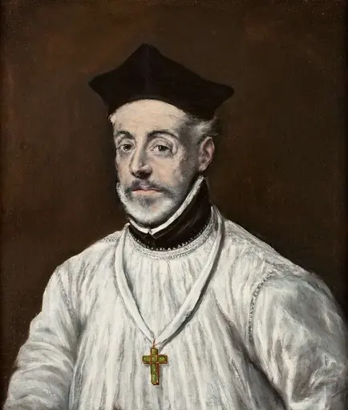

### La conception dynamique du marché et de la concurrence

Le jésuite Louis de Molina anticipa une autre grande notion autrichienne en développant le concept dynamique de la concurrence comme processus de rivalité entre acheteurs et vendeurs. Dans son traité de 1592, il créa une rupture avec les visions statiques de la valeur et s'opposa à la vision mercantiliste dominante. Molina préfigurait l'analyse des marchés comme des processus vivants, constitués par la somme des intérêts personnels et des actions individuelles.

Cette conception dynamique anticipe directement celle que Ludwig von Mises et Friedrich Hayek développeront trois siècles plus tard. Le marché n'est pas un état d'équilibre statique, mais un processus constant d'ajustement et de coordination. Molina comprenait que la concurrence n'est pas une structure parfaite définie mathématiquement, mais un processus entrepreneurial par lequel les acteurs rivalisent pour servir les consommateurs.

### La connaissance dispersée et l'impossibilité de la planification centrale

Juan de Lugo et Juan de Salas peuvent être considérés comme des précurseurs de la théorie de la connaissance dispersée. En 1647, Lugo concluait que le prix d'équilibre dépend de circonstances spécifiques que Dieu seul peut connaître. Cette affirmation souligne l'impossibilité pour un être humain de saisir la multitude de circonstances qui déterminent les prix. Salas affirmait de même en 1617 que comprendre précisément l'information créée dans le processus de marché relève de Dieu et non des hommes.

Le père Juan de Mariana approfondit cette analyse en démontrant l'impossibilité pour un gouvernement d'organiser la société civile au moyen d'ordres coercitifs, par manque d'information. Il critiquait fortement l'action gouvernementale en affirmant que c'est une grande bêtise que l'aveugle veuille guider celui qui voit. Cette critique anticipée de la planification centrale résonne directement avec l'argument de Ludwig von Mises sur l'impossibilité du calcul économique en régime socialiste. L'école autrichienne n'a donc pas inventé ces idées ex nihilo, mais s'inscrit dans une longue tradition intellectuelle traversant les siècles.

## L'économie classique le libéralisme français et la philosophie kantienne
<chapterId>2d3c97bd-9864-45cd-b4ef-13c85d013105</chapterId>

### Les fondements du libéralisme français et l'héritage de Richard Cantillon

L'école autrichienne d'économie puise ses racines dans plusieurs traditions intellectuelles européennes. Parmi ces influences majeures, la tradition du libéralisme classique français occupe une place prépondérante, des physiocrates jusqu'à Frédéric Bastiat au XIXe siècle. Cette tradition a transmis aux penseurs autrichiens l'importance de l'action individuelle, de la propriété privée, de l'entrepreneuriat et une critique rigoureuse de l'interventionnisme étatique.

Richard Cantillon, considéré par Schumpeter, Hayek et Rothbard comme le père de l'économie moderne, constitue une figure fondatrice de cet héritage. Son Essai sur la nature du commerce en général (1755) place l'entrepreneur au centre de l'analyse économique, insistant sur l'incertitude inhérente au marché. Cette vision préfigure directement les travaux de Ludwig von Mises et d'Israel Kirzner sur la fonction entrepreneuriale. Sa compréhension du système des prix, alliant rareté des biens et préférences subjectives, fait de lui un précurseur de la révolution marginaliste.

Témoin de la catastrophe du système de papier-monnaie de John Law, Cantillon développa une théorie monétaire novatrice. Il défendait les monnaies saines comme l'or et l'argent, ayant compris que l'augmentation arbitraire de la masse monétaire provoque des bulles inflationnistes. Il fut également l'un des premiers à théoriser que le taux d'intérêt dépend de l'offre et de la demande de monnaie, préfigurant la théorie autrichienne du capital.

### Jean-Baptiste Say et Frédéric Bastiat, piliers du libéralisme économique

Jean-Baptiste Say a introduit des notions essentielles qui influenceront profondément la pensée autrichienne. Sa célèbre loi des débouchés affirme que toute offre crée sa propre demande. Pour Say, la monnaie n'est qu'un instrument de circulation, non une source de richesse. Cette conception résonne avec la vision autrichienne de la monnaie comme intermédiaire dans les échanges. Say mettait également en avant l'entrepreneur comme principal agent de la production et de l'innovation, abordant la notion d'incertitude et la capacité unique de l'entrepreneur à anticiper la demande future.

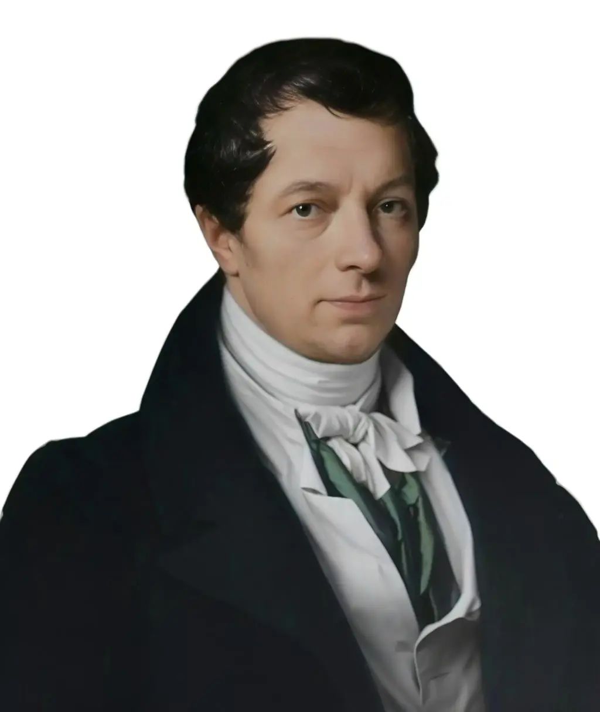

Frédéric Bastiat représente le plus célèbre des économistes libéraux français du XIXe siècle. Il a critiqué les conséquences imprévues des interventions étatiques, une critique qui résonne avec les travaux de Mises et Hayek sur les échecs de la planification centralisée. Bastiat comprenait l'impossibilité pour l'État de collecter l'information dispersée dans la société. Il croyait que l'harmonie sociale émerge naturellement d'une loi naturelle comprenant le droit à l'existence, l'échange volontaire et la propriété privée. Cette vision influencera profondément Murray Rothbard. Bastiat fut également l'un des premiers à formuler une critique économique de l'interventionnisme et du socialisme, préfigurant les arguments sur l'impossibilité du calcul économique en régime socialiste.

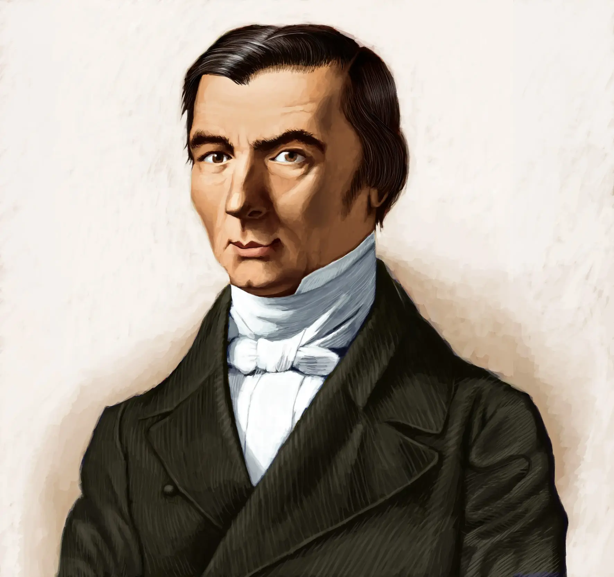

### L'apport des classiques écossais et la philosophie kantienne

L'école autrichienne doit également beaucoup aux penseurs écossais comme David Hume et Adam Smith pour leur contribution aux libertés politiques et à la protection des droits naturels. Ces penseurs partageaient la conviction que les individus peuvent, grâce à des institutions appropriées, poursuivre leurs intérêts personnels de manière bénéfique pour tous. La célèbre métaphore de la main invisible exprime ce principe d'émergence spontanée d'un ordre social. Comme l'explique Stephen Horwitz, Menger et les économistes autrichiens ont fourni une explication plus solide aux intuitions de Smith en combinant l'ordre spontané avec le marginalisme et le subjectivisme.

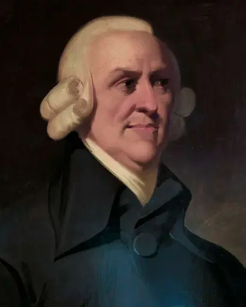

La philosophie d'Emmanuel Kant a fourni un cadre conceptuel essentiel, notamment concernant la connaissance a priori qui sous-tend la praxéologie. Kant distingue la connaissance a priori, indépendante de l'expérience, de la connaissance a posteriori, tirée des observations empiriques. Il différencie également le phénomène, ce que l'individu perçoit, du noumène, la chose en elle-même inaccessible. Hans-Hermann Hoppe a souligné l'importance de cette philosophie : Kant a développé l'idée que nos propositions peuvent être classées selon deux critères (analytiques ou synthétiques, a priori ou a posteriori). La marque caractéristique de la philosophie kantienne est l'affirmation que des propositions synthétiques a priori vraies existent, et c'est précisément parce que Mises souscrit à cette thèse qu'on peut le qualifier de kantien. L'axiome de l'action humaine appartient à cette catégorie de propositions dont la valeur de vérité peut être établie sans recours à l'observation empirique.

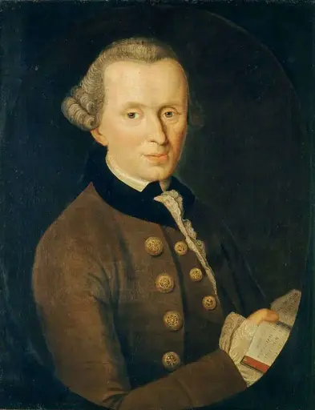

## Aux origines de la révolution marginaliste
<chapterId>6a586bf5-7184-4903-9328-f0d64e337a1b</chapterId>

### Le contexte intellectuel de la révolution marginaliste

À la fin du XIXe siècle, la pensée économique germanophone était dominée par deux courants partageant une caractéristique fondamentale : le rejet de toute possibilité de lois économiques universelles. Le matérialisme marxiste et l'historicisme allemand constituaient les deux piliers intellectuels contre lesquels Karl Menger allait développer sa révolution marginaliste en 1871, donnant naissance à l'école autrichienne d'économie.

Le matérialisme marxiste postule que les conditions matérielles déterminent les superstructures sociales et politiques d'une société. Sur le plan économique, le marxisme adopte la théorie de la valeur travail, héritée d'Adam Smith et David Ricardo. Selon cette conception, le travail constitue l'origine de la totalité de la valeur d'un bien, indépendamment de l'offre et de la demande. Le salaire ne représenterait que la part nécessaire à la survie du travailleur, tandis que le reste, la plus-value, serait de la valeur travail volée au profit du capital.

### Les limites fondamentales du marxisme économique

Cette approche présente plusieurs failles théoriques majeures. Premièrement, l'affirmation selon laquelle seule la plus-value générée sur le travail forme la base des profits conduit à un paradoxe : cette logique voudrait que les petites entreprises fortement travaillistes soient plus efficaces que les grands groupes fortement capitalisés, ce qui ne correspond jamais à la réalité observable. Deuxièmement, si la valeur d'un bien est directement liée au travail nécessaire à sa fabrication, comment expliquer que des biens ayant demandé une quantité de travail équivalente puissent présenter des prix radicalement différents ?

Le déterminisme historique constitue une autre faiblesse majeure. Cette vision téléologique postule une progression linéaire de l'histoire aboutissant inévitablement au communisme. En se concentrant sur la finalité supposée plutôt que sur la compréhension des phénomènes économiques réels, le marxisme s'éloigne de toute analyse scientifique rigoureuse.

### L'historicisme allemand et son instrumentalisation politique

Le second courant dominant était l'école historique allemande, menée par Gustav von Schmoller. Cette école défendait la vision selon laquelle l'économie ne pouvait être comprise qu'à travers une analyse historique et une contextualisation des phénomènes propres à chaque société. Basée sur une méthode empirique où l'accumulation de données joue un rôle prépondérant, cette approche nie l'existence de toute théorie économique universelle.

Cette querelle méthodologique s'inscrit dans un contexte politique particulier. L'empire allemand, né de la guerre franco-prussienne de 1870, se caractérise par son nationalisme et son étatisme. Le collectif prime sur l'individu et le corps administratif constitue la principale force organisatrice de la société germanique. L'approche historiciste vise ainsi à légitimer la supériorité organisationnelle de l'empire allemand face au supposé désordre du libéralisme britannique.

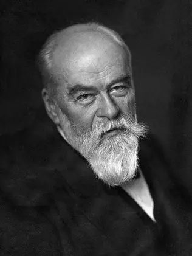

### La querelle des méthodes et la naissance de l'école autrichienne

C'est dans ce contexte qu'éclate la Methodenstreit, la querelle des méthodes opposant Karl Menger à Gustav von Schmoller. Dans ses Principes d'économie politique (1871), puis dans ses Recherches sur la méthode (1883), Menger s'oppose fermement à l'historicisme. Pour lui, l'économie ne doit pas se limiter à la chronique des faits mais chercher à dégager les principes généraux qui guident l'action humaine. La tâche de la science économique consiste à rechercher les lois selon lesquelles les phénomènes se produisent et à découvrir le lien causal entre eux.

Menger critique également l'approche statistique de l'école historique, considérant que ces bilans ne représentent que des instantanés d'un passé révolu, incapables de révéler les principes intemporels qui guident l'économie. De plus, en adoptant une approche contextualiste, les historicistes s'enferment dans une lecture influencée par leur propre époque, créant une circularité de pensée insurmontable.

La révolution marginaliste de 1871 voit également émerger William Stanley Jevons en Angleterre et Léon Walras en Suisse. Cependant, là où ces derniers développeront des approches mathématiques, Menger prendra un chemin différent. Son marginalisme est résolument subjectiviste et verbal plutôt que mathématique. Pour lui, la valeur n'est pas une propriété objective des biens qui pourrait être mesurée, mais émerge des évaluations subjectives des individus. Ces évaluations sont ordinales et non cardinales : on peut préférer un bien à un autre sans pouvoir mesurer l'écart de cette préférence. Cette approche résout enfin le paradoxe du diamant et de l'eau, en montrant que la valeur dépend de l'utilité de la dernière unité disponible et non de l'utilité totale ou du travail incorporé.

# L'école autrichienne et Bitcoin
<partId>4b0903e4-1d95-4301-b082-f6578b5795e1</partId>

## L'école autrichienne et Bitcoin
<chapterId>e53dbfc6-5b01-473d-82c7-3544420b0a5b</chapterId>

### Une convergence remarquable entre théorie et innovation

Nous sommes arrivés au terme de ce cours sur l'école autrichienne d'économie. Tout au long de ce parcours, nous avons exploré une école de pensée cohérente qui offre une vision unique du processus économique. Des fondements méthodologiques aux concepts fondamentaux, de la théorie monétaire aux cycles économiques, des origines intellectuelles à la révolution marginaliste, nous avons parcouru un corpus théorique remarquablement dense et rigoureux. Beaucoup de ces enseignements trouvent aujourd'hui une résonance particulière avec Bitcoin. Ce n'est pas un hasard si cette école de pensée a connu un regain d'intérêt considérable ces dernières années.

Rappelons-nous l'article fondamental de Carl Menger de 1892 sur l'origine de la monnaie. Menger expliquait comment la monnaie émerge spontanément du marché par un processus d'imitation et d'intérêt personnel. Les agents économiques les plus perspicaces identifient le bien le plus échangeable, puis les autres imitent ce choix, créant un effet d'externalité de réseau. Plus un bien est adopté comme monnaie, plus il devient échangeable, renforçant ainsi son adoption dans un cercle vertueux. Bitcoin illustre parfaitement ce processus décrit par Menger. Aucune autorité centrale n'a décidé de sa valeur monétaire. Ce sont les individus eux-mêmes qui, reconnaissant ses propriétés uniques, l'ont progressivement adopté comme réserve de valeur et moyen d'échange. L'offre fixe de 21 millions d'unités, la divisibilité, la portabilité, la vérifiabilité et la durabilité constituent autant de caractéristiques qui ont été découvertes et valorisées spontanément par le marché. Bitcoin émerge exactement comme Carl Menger décrivait l'émergence de la monnaie, il y a maintenant plus d'un siècle.

### Bitcoin comme rempart contre la manipulation monétaire

L'école autrichienne a démontré les dangers de la manipulation monétaire. Nous avons vu comment les banques centrales, en manipulant les taux d'intérêt et en augmentant de manière arbitraire la masse monétaire, créent des cycles artificiels de boom et de bust. Ces manipulations faussent le signal prix essentiel à la coordination économique, provoquent des malinvestissements systémiques, empêchent le calcul économique rationnel et déforment la structure du capital. Bitcoin, avec son offre strictement limitée et son protocole immuable, incarne l'idéal autrichien de monnaie saine. Aucune banque centrale ne peut décider d'en créer davantage, aucun gouvernement ne peut en manipuler l'offre pour financer ses déficits. Cette rareté garantie permet aux prix exprimés en bitcoin de refléter véritablement les préférences temporelles des individus. Le taux d'intérêt redeviendrait ainsi un signal authentique coordonnant l'épargne et l'investissement, plutôt qu'un outil de manipulation politique.

Friedrich Hayek a démontré que le système des prix constitue un réseau de communication complexe qui condense les informations dispersées dans l'ensemble de l'économie. Les prix permettent à des millions d'acteurs économiques de coordonner leurs actions sans planification centrale. Bitcoin pourrait considérablement renforcer ce mécanisme de coordination. En tant que monnaie neutre et non manipulable, il permet l'émergence de prix qui reflètent véritablement l'offre et la demande, les préférences temporelles réelles et les coûts d'opportunité authentiques des acteurs économiques. Ludwig von Mises a montré que sans prix libres, le calcul économique devient impossible. Bitcoin, en échappant aux contrôles étatiques, permet précisément ce calcul économique que les monnaies fiduciaires corrompues par l'inflation rendent de plus en plus difficile. Les entrepreneurs peuvent ainsi mieux anticiper les besoins réels des consommateurs, l'épargne retrouve sa fonction naturelle de report de consommation plutôt que d'être pénalisée continuellement par l'inflation monétaire, et la structure du capital peut s'aligner sur les préférences temporelles véritables des individus.

### Perspectives pour l'avenir de la coordination économique

Si la promesse que renferme Bitcoin est encore difficile à apprécier dans sa globalité, l'histoire de la pensée économique autrichienne nous donne des pistes précieuses pour envisager son potentiel. L'école autrichienne nous enseigne que les institutions les plus robustes émergent spontanément du marché, que la monnaie saine est essentielle à la prospérité, que la manipulation monétaire conduit inévitablement aux crises et que le calcul économique nécessite des prix libres. Bitcoin ne résout pas tous les problèmes, mais il offre une alternative concrète au système monétaire manipulé qui génère les cycles économiques dévastateurs que les autrichiens ont si bien analysés.

Aujourd'hui, les bitcoiners trouvent dans l'école autrichienne des fondements théoriques solides, tandis que les économistes autrichiens trouvent dans Bitcoin une validation pratique de leurs théories. Cette convergence remarquable entre théorie économique rigoureuse et innovation technologique ouvre des perspectives fascinantes pour l'avenir de la coordination économique.

# Section finale

<partId>c1a34b73-d2fa-4902-818a-6f67c682adf3</partId>

## Critiques et évaluations

<chapterId>554d188b-beb4-4d01-95e0-80f9a5defbc5</chapterId>

<isCourseReview>true</isCourseReview>

## Examen final

<chapterId>77fdfc17-fa9c-4811-9118-534d09355597</chapterId>

<isCourseExam>true</isCourseExam>

## Conclusion

<chapterId>7c98293b-edfb-4f27-a97d-8fb53a3fbd28</chapterId>

<isCourseConclusion>true</isCourseConclusion>

